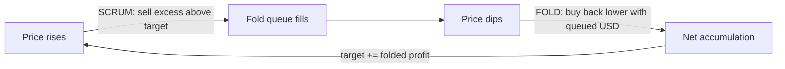

# ⬡ Acervator

**Accumulation trading platform** — an algorithmic trading system that harvests
market volatility instead of predicting price direction. Every completed cycle
ends holding more of the asset than it started with.

> ⚠️ Acervator can trade real money on real exchanges. Read the
> [disclaimer](DISCLAIMER.md) before running it against a funded account.

---

## What it does

Acervator treats every price oscillation as fuel rather than a signal to predict.
When holdings rise above a dollar target it sells the excess; when price dips
below the sell reference it buys back more than it sold. The structural guarantee
— every completed cycle ends with more asset than it began with — holds
regardless of market direction.

This is the **Scrum/Fold cycle**:



Fold only executes when price is below the sell reference, which is what
guarantees more asset is bought back than was sold.

---

## Core mechanisms

- **Scrum/Fold cycle** — harvest excess above the target, buy it back cheaper.
- **Profit folding** — each fold raises the target, compounding accumulation.
- **7-indicator TA consensus** — Bollinger Bands, Vortex, MACD, Stochastic RSI,
  Ichimoku, volume, and slingshot signals vote on confidence.
- **Multi-timeframe bias** — a higher-timeframe read informs execution on the
  lower timeframe.
- **Risk and reconciliation** — position sizing, buy-safety gates, and continuous
  reconciliation against the exchange's own view of balances and orders.
- **Nuclear Mode** — a self-exercising stress demo that assigns each bot a random
  asset and historical period and runs live Scrum/Fold ticks under sustained
  load, to confirm the engine holds up without operator intervention.

---

## Proof of Accumulation

A competition layer lets bots compete without revealing their strategy. Each bot
has an Ed25519 identity; every trade is signed and appended to a Merkle tree, and
only the Merkle root is submitted for adjudication. The full lifecycle —
register, trade, submit, adjudicate, award — runs in-process against a local
testnet, with Solidity contracts under [`contracts/`](contracts/) for on-chain
deployment.

---

## Tech stack

- **Python 3.13** (single supported interpreter, pinned in `.python-version`).
- **PySide6 (Qt)** desktop GUI — entry point `main.py`.
- **ccxt** for crypto exchange connectivity; broker connectors for equities.
- **pandas / numpy / ta** for market data and technical analysis.
- **cryptography / keyring** for credential storage.

Runtime state and credentials live outside the repo in `~/.acervator/`, and all
logs in `~/.acervator_logs/` — never inside the working tree.

---

## Installation

Requires Python 3.13.

```bash
git clone https://github.com/Acervator-LLC/ACERVATOR.git
cd ACERVATOR

# Runtime dependencies
pip install -e .

# Add the dev/CI toolchain (tests, linters, analyzers)
pip install -e ".[dev]"

python main.py
```

Dependencies are declared in `pyproject.toml` — the runtime set under
`[project.dependencies]`, and the `test` / `dev` extras under
`[project.optional-dependencies]`.

---

## Documentation

Human-written design docs, ADRs, and audits live under [`docs/`](docs/index.md).

## Contributing

See [`CONTRIBUTING.md`](CONTRIBUTING.md).

## Disclaimer

For educational and research use. Simulation results do not guarantee live
trading performance, and you are solely responsible for any trading decisions
made with this software. See [`DISCLAIMER.md`](DISCLAIMER.md).
