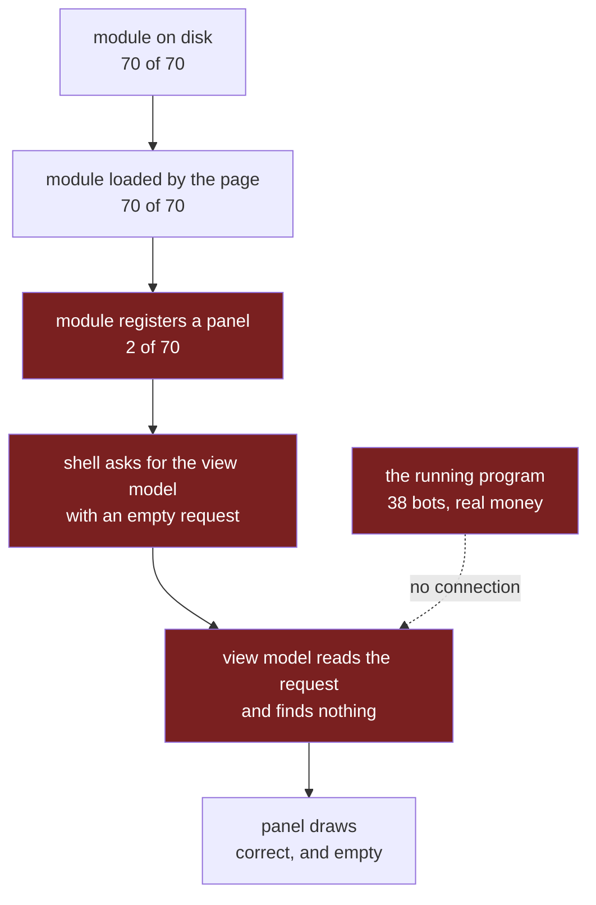

# What blocks the Qt to React conversion, and what the rest costs

Reference. Companion to
[the per-file verdict](2026-09-05_128_file_verification.md), which checked 71
files against one sentence in the conversion item: *"Every screen in the app is
drawn by Qt widgets. This item replaces them with React."*

That page answered how many screens are converted. This page answers two other
questions. What stands in the way of that sentence being true, and what the
work has cost so far on a measure that can be read again.

Audit date: 5 September 2026. Read-only. This page changes no product code.

## The answer

Ten things stand between the tree today and that sentence. They are listed in
no order. The order of the work is a decision, not a measurement.

| # | what it is | what it blocks |
|---|---|---|
| A | 68 of the 70 React modules register no panel | the shell has nothing to ask them for |
| B | the shell has no tab bar and no navigation | a panel cannot own a screen |
| C | every view model reads the request, and the shell sends an empty one | a drawn panel shows an empty state |
| D | the backend the shell starts is not the program that trades | live values cannot reach the shell at all |
| E | nothing outside the tests calls a view model | the Python half has no consumer in the running program |
| F | the build variant reaches one call | nothing decides that a Qt widget should not be built |
| G | the packaged application ships no shell | a React variant cannot be the product |
| H | the bridge answers requests and cannot push | a screen cannot follow a running system |
| I | 13 of the 71 files belong to screens the program never builds | no conversion can show on them |
| J | the progress tool counts wiring and reports one file left | the item reads as nearly finished |

## Where each one sits

The path from a screen to a drawn React panel has six steps. Four of them are
broken.



---

## The blockers, one by one

### A. Sixty-eight modules register no panel

A module draws in the shell only after it hands the panel host three
functions. Two modules do that.

**What proves it.** All 70 files under `src/gui/web/` were searched for the
panel host under every spelling: the plain name, bracket access, and a name
built from parts. Two files match, and they are the two the running shell drew.

```
src/gui/web/console_tab.js     registers
src/gui/web/header_strip.js    registers
the other 68                   no match, under any spelling
```

The scan finds two, so it can report. Four other files carry the word
“register” for unrelated reasons: a stored field name, a label, and a state
name. None of them is a panel registration.

**What the two do differently.** Nine lines at the end of the file. A guard, and
a call handing over a draw function, a load function and a fault reader.

```javascript
  if (global.acervatorPanelHost) {
    global.acervatorPanelHost.register({
      render: renderTab,
      load: loadConsole,
      loadError: loadError
    });
  }
```

**What it blocks.** The panel host reads the page list, keeps only the names a
module registered, and draws those. A module that never registers is loaded,
defines its code, and is never asked for anything.

### B. The shell has no tab bar

**What proves it.** The body of `desktop/renderer/index.html` holds three
elements: an error box, the History root, and one container for every other
panel. It holds no menu, no tab strip and no link.

The panel host draws each registered panel into its own host element inside
that one container, one after another. Whatever draws, stacks down one page.

**What it blocks.** A screen is a thing the operator opens. Until the shell can
open one panel and hide the rest, a converted panel is a strip on a list.

### C. The view models read the request

**What proves it.** Every one of the 74 view models takes a request and reads
its values out of it. The History view model takes its trades from the request:

```python
def view_model(params: dict) -> dict:
    trades = params.get("trades") or []
```

The shell sends nothing. The panel host asks each panel's loader with an empty
request, and `desktop/renderer/boot.js` asks for the History model with a page
number and no trades.

**What it blocks.** A panel that does draw is a correct drawing of nothing. The
window the audit captured read `0 of 0 trades shown`, and that was the right
answer to the question the shell asked.

### D. The backend the shell starts is not the program that trades

This is why C is not a small change.

**What proves it.** `desktop/main.js` starts a second Python program as a child
process and talks to it over that child's own pipe. No file in the product
imports `src/core/desktop_bridge.py`; the only importer anywhere in the tree is
a test. The trading program never starts a bridge.

```
desktop/main.js          starts the bridge as a child process
main.py                  builds the Qt window, and no bridge
product importers of the bridge module   0
test importers                           1
```

**What it blocks.** The child process holds no bots, no exchange session and no
state. A view model rewritten to read the running system would read an empty
one. Filling the shell's panels is not a change to 74 files; it is a decision
about which process owns the running system.

### E. Nothing outside the tests calls a view model

**What proves it.** The tree holds 378 calls to a view model. Every one is
under `tests/`. Imports under another name were resolved and none exists. The
one other path is the bridge's own dispatch, which looks the handler up by
method name and calls it.

The Qt side does not use them. `src/gui/history_tab.py` reaches past the
handler and calls the plain builder inside `src/gui/react_history_panel.py`
with the operator's real trades.

**What it blocks.** The 74 view models, 74,207 lines, have one consumer, and it
is the child process nothing in the product starts.

### F. The build variant reaches one call

**What proves it.** `src/_variant.py` answers which build is running. It has
exactly one call site in the product: `src/gui/history_table_variant.py`, which
`src/gui/history_tab.py` reaches when it builds its table.

Even there, Qt does not stand down. The same method builds the summary label,
the filter row, the refresh button and the two page buttons in Qt, and puts the
React table in the middle of them.

**What it blocks.** Nothing in the tree decides that a Qt widget should not be
built. The React build and the Qt build differ by one class, in one table, on
one screen.

### G. The packaged application ships no shell

**What proves it.** Both build descriptions take their shipped folders from one
list in `tools/spec_common.py`. The list holds three entries:

```
src
resources
data/historical
```

`desktop/` is not among them. No Electron program is packaged. The Electron
package folder is ignored by git, so a fresh clone has the shell's source and
no program to run it with.

**What it blocks.** A React variant cannot be the product while the product
does not contain it.

### H. The bridge answers requests and cannot push

**What proves it.** The bridge reads one request line and writes one response.
No other write exists, so the backend cannot send anything the frontend did not
ask for. The page reaches the backend through one function in
`desktop/preload.js`, and that function is a request. The shell holds no
listener.

The same scan finds the request channel in two places, so it is able to report
a channel when one exists.

**What it blocks.** A live screen. Every value the operator watches change
would have to be asked for again on a timer.

### I. Thirteen files belong to screens that are never built

**What proves it.** The per-file verdict counts 13 of the 71 as screens the
program constructs nowhere. The operator's live tab bar holds seven screens:

```
Trading   Market Inspector   Bot Swarm   Asset Charts   History   Simulator   Console
```

**What it blocks.** Nothing the operator can see. A React module for a screen
he cannot open changes no pixel, whatever it does.

### J. The progress tool counts wiring

**What proves it.** `tools/conversion_state.py` reports the state of the
conversion. Run today it prints:

```
paired, a React module serves it : 63
not a screen, Qt plumbing        : 5
UNPAIRED, the work that is left  : 1
```

Its own definition of paired is a link between three files. It is true, and it
is not the item. The item asks about a screen, and one screen of 71 is
converted.

**What it blocks.** The number a reader trusts. `src/gui/history_qt_table.py`
is the one file the tool calls unfinished, and converting it would leave every
blocker above untouched.

---

## What the conversion has cost

## The counts, checked

The per-file verdict reported five figures. Four reproduce exactly. One does
not, and the reason is in the method rather than in the tree.

| what | the verdict reported | measured today | reading |
|---|---:|---:|---|
| commits naming the item | 319 | 323 | four landed after the verdict |
| the same, outside a merge | 78 | 80 | same cause |
| React modules | 70 files, 80,292 lines | 70 files, 80,292 lines | exact |
| view models | 74 files, 74,207 lines | 74 files, 74,207 lines | exact |
| the shell | 8 files, 791 lines | 10 files, 978 lines | the package lockfile pair landed today |
| product total | 152 files, 155,290 lines | 154 files, 155,477 lines | the same two files |
| test files | 180 files, 287,342 lines | see below | not reproducible from the wording |

The commit figure counts any commit whose message carries the number. Counting
only the commits that name the item directly gives 96, of which 44 sit outside
a merge.

**The test figure depends on how a test is judged to belong to the conversion,
and the verdict's page does not say.** Two readings, both stated with their
method:

| method | files | lines | test lines per product line |
|---|---:|---:|---:|
| the file names a module with its extension, or a view model with its suffix | 160 | 278,004 | 1.79 |
| the file names any module or view model by its bare stem | 307 | 344,801 | 2.22 |
| the verdict's own figure | 180 | 287,342 | 1.85 |

The second reading is too wide: a bare stem such as a table cell name or a
status log name appears in tests that have nothing to do with the conversion.
The first is the honest floor. The verdict's figure sits between them.

Either way the shape holds: the repository has 545 test files, and between 160
and 307 of them exist for this conversion.

## The per-unit ratios

The conversion landed as 133 merged branches. 44 of them introduced a React
module and can be measured against the Qt file that module was paired to, which
is what the size ratio needs.

The Qt file's line count at the moment the module landed is the source in. The
test lines are what that branch carried.

| units | source in | product produced | test produced | test per source | product per source |
|---|---:|---:|---:|---:|---:|
| 1 to 8 | 2,522 | 7,957 | 16,703 | 6.62 | 3.16 |
| 9 to 16 | 7,972 | 15,642 | 21,568 | 2.71 | 1.96 |
| 17 to 24 | 5,554 | 11,937 | 12,758 | 2.30 | 2.15 |
| 25 to 32 | 7,754 | 14,517 | 17,647 | 2.28 | 1.87 |
| 33 to 40 | 4,261 | 11,889 | 15,152 | 3.56 | 2.79 |
| 41 to 44 | 1,821 | 4,927 | 4,877 | 2.68 | 2.71 |

**The ratio did not climb.** It started at 6.6 test lines per source line,
fell to about 2.3 by the middle of the run, and settled between 2.3 and 3.6.
Product lines per source line stayed near two throughout.

The widest and the narrowest units, by the same measure:

| unit | source in | test produced | test per source |
|---|---:|---:|---:|
| the market inspector strip | 53 | 1,600 | 30.19 |
| the pulse driver | 51 | 1,467 | 28.76 |
| the visualizer canvas | 1,986 | 1,803 | 0.91 |
| the native chart | 1,805 | 1,660 | 0.92 |

A small Qt file cost the same test volume as a large one. That is the real
shape in this table: test volume tracks the unit, not the file.

## Where this measure cannot reach

**Minutes spent are not in the record.** Git holds when a commit was written
and when a branch was merged, and nothing about the hours between. One branch
here shows 93 hours from its first commit to its merge, and it holds three
commits. That number measures how long the branch waited, not how long the work
took.

**Tool rounds are not in the record at all.** Nothing in git counts the commands
a unit ran.

**A unit's own report and the merge disagree.** Two of the three units whose
self-reported figures were kept can be checked here. Their source-in figures
match exactly, 233 and 276. Their test volume does not: the reports say about
1,700 test lines each, and the merges carried 841 and 1,016. The git record is
the half that can be read again.

**And the measure does not ask whether the work was the right work.** Size
against time is a cost. It never says the cost bought anything. For this
conversion the answer to the other question, asked over 71 files, is that one
screen changed on the operator's display, and it is the same screen the item
already named when it opened.

---

## The size of what is left

Size, not a schedule, and not an order.

| blocker | shape | size |
|---|---|---:|
| A | one repeated change, 9 lines a file | 68 files, about 610 lines |
| B | one change, in the renderer | 1 file |
| C, D, E | one decision, then many changes | 74 view models, and the process question |
| F | one change a screen | 50 files, 32,917 lines |
| G | one change to the shipped list, plus packaging | 1 file, plus an Electron program |
| H | one change to the bridge and the preload, then every panel | 2 files, then 70 |
| I | no code | 0 |
| J | one change to the progress tool | 1 file |

**A is the smallest by a wide margin, and the modules are nearly ready for it.**
Of the 70 modules, 65 already build a React root and 67 already carry a fault
reader. 66 already ask the bridge for their own view model. The missing part is
the nine-line block quoted above.

**C, D and E are one problem wearing three faces, and it is not a line count.**
The 78,131 lines already written in the 68 unreachable modules are not the
obstacle. The obstacle is that the program holding the operator's 38 bots and
the program answering the shell are two different processes, and nothing joins
them.

**F is the largest by lines.** 50 Qt files, 32,917 lines, still draw the screens
the operator opens. A variant that switched a screen would have to reach each
one, the way it reaches the History table today.
