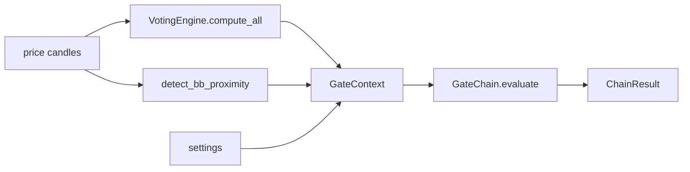

# Gate transposition for ATA-SMP

**Mode: Explanation.** This page answers one question. Which parts of the live
trading gate chain can ATA-SMP run over the price data it scans, and what does
moving them cost?

It measures the code. It builds nothing and it changes no product file.

The platform ran while this page took its measurements. Nobody started a second
instance and nobody attached to the running one.

The module files on disk carry the spelling `ata_spm.py` today. This page cites
those filenames as they stand, so every citation resolves. The feature is
ATA-SMP.

## The test this page applies

An earlier page, [2026-09-07_ata_detection_path.md](2026-09-07_ata_detection_path.md),
reported that 37 of the 51 context fields need a bot holding the scanned
market. That answer named where the code reads a value from. It did not name
what the value is.

The operator set the correct test on 7 September 2026:

> "Really TA is just about taking pricing data and piping it through formulae.
> One formula for each of the 12 indicators, 1 formula for Landing Strip, 1
> formula for Opposing Trade Distance, and another formula for any of the other
> fields used by a live bot to fire a trade."

Every field gets one question. Does a formula over pricing data produce this
value? When the answer is yes the value is MARKET, and ATA-SMP computes it from
its own price data. A field is POSITION only when no formula can produce it,
because the value records something held.

```
MARKET     a formula over price produces it
POSITION   a record of what is held or what was traded
CONFIG     a setting the operator sets
DERIVED    computed from those, and named by what it needs
```

## The 51 fields, by nature

`GateContext` in `src/trading/gate_chain.py` declares 51 fields. The count comes
from the live dataclass, read at runtime, not from the file text.

```python
dataclasses.fields(GateContext)   # 51
```

The table names each field, the formula or the record behind it, and its
nature. The bracket after DERIVED names what that field needs.

| # | field | formula, or the record it holds | nature |
|---|---|---|---|
| 1 | symbol | the market the scan names | MARKET |
| 2 | ticker_last | the venue's last trade price | MARKET |
| 3 | bb_pos | `(price - lower) / (upper - lower)` in `src/trading/indicators/bb_proximity.py` | MARKET |
| 4 | bb_upper_dt | `0.5 + scrum_detect_pct / 200` in `src/trading/scrumming/circuit_breakers.py` | CONFIG |
| 5 | bb_lower_dt | `0.5 - scrum_detect_pct / 200` in the same module | CONFIG |
| 6 | delta | holdings value minus the bot's target balance | POSITION |
| 7 | delta_pct | the same pair, as a percent | POSITION |
| 8 | below_interval | delta against the interval dollars | DERIVED [POSITION, CONFIG] |
| 9 | is_bullish | consensus direction against the skewed confidence floor | DERIVED [MARKET, CONFIG] |
| 10 | is_bearish | the same pair, on the bear side | DERIVED [MARKET, CONFIG] |
| 11 | trend_hold | bull-candle share above the strong-trend share | DERIVED [MARKET] |
| 12 | trend_strength | `count(close > open) / 20` over the last 20 candles | MARKET |
| 13 | eff_direction_name | net score against a deadband of 0.1, in `src/trading/indicators/types.py` | MARKET |
| 14 | eff_is_bullish | is_bullish under `flag_require_ta_bullish` | DERIVED [MARKET, CONFIG] |
| 15 | eff_is_bearish | is_bearish under `flag_fold_require_ta_bearish` | DERIVED [MARKET, CONFIG] |
| 16 | eff_trend_hold | trend_hold under `flag_hold_in_uptrend` | DERIVED [MARKET, CONFIG] |
| 17 | eff_htf_blocks_scrum | the higher-timeframe bias under its flag | DERIVED [MARKET, CONFIG] |
| 18 | eff_htf_blocks_fold | the higher-timeframe bias under its flag | DERIVED [MARKET, CONFIG] |
| 19 | flag_require_ta_bullish | `TradingParamsPage.get_config` in `src/gui/bot_wizard.py` | CONFIG |
| 20 | flag_hold_in_uptrend | the same page | CONFIG |
| 21 | flag_defer_to_htf | the same page | CONFIG |
| 22 | flag_fold_require_ta_bearish | the same page | CONFIG |
| 23 | flag_fold_defer_to_htf | the same page | CONFIG |
| 24 | bb_above_upper_dt | bb_pos at or above the upper detect threshold | DERIVED [MARKET, CONFIG] |
| 25 | bb_below_lower_dt | bb_pos at or below the lower detect threshold | DERIVED [MARKET, CONFIG] |
| 26 | scrum_ok | bb_pos above 0.50, and the phantom lock | DERIVED [MARKET, CONFIG] |
| 27 | fold_ok_midline | bb_pos below 0.50 | DERIVED [MARKET, CONFIG] |
| 28 | target_fires | the band-distance ramp in `src/trading/scrumming/tick_phases.py` | DERIVED [MARKET] |
| 29 | cb_blocks_scrum | `(high - low) / open * 100` against the soft percent | DERIVED [MARKET, CONFIG] |
| 30 | cb_blocks_fold | the same formula, on a down candle | DERIVED [MARKET, CONFIG] |
| 31 | hyst_ok_scrum_side | price against the pivot of the bot's last trade | DERIVED [POSITION, MARKET, CONFIG] |
| 32 | hyst_ok_fold_side | price against the pivot of the bot's last trade | DERIVED [POSITION, MARKET, CONFIG] |
| 33 | hyst_armed_scrum_side | armed at the bot's last trade | POSITION |
| 34 | hyst_armed_fold_side | armed at the bot's last trade | POSITION |
| 35 | hyst_ref_scrum_side | the price captured at arming | POSITION |
| 36 | hyst_ref_fold_side | the price captured at arming | POSITION |
| 37 | mem253_at_ceiling | the held position against its ceiling | DERIVED [POSITION, CONFIG] |
| 38 | mem253_smart_ceiling_usd | the bot's anchor target times the ceiling factor | POSITION |
| 39 | mem253_current_pos | holdings times price | POSITION |
| 40 | has_fold_tranches | the bot's fold queue | POSITION |
| 41 | n_fold_tranches | the bot's fold queue | POSITION |
| 42 | htf_bias_name | higher-timeframe consensus weighted by `rank * confidence` | MARKET |
| 43 | htf_blocks_scrum | that bias reading bullish | DERIVED [MARKET] |
| 44 | htf_blocks_fold | that bias reading bearish | DERIVED [MARKET] |
| 45 | scrumming_interval_pct | the bot configuration | CONFIG |
| 46 | trading_fee_pct | the bot configuration | CONFIG |
| 47 | ripe_scrum | positive delta, cleared interval, price at the upper detect | DERIVED [POSITION, MARKET, CONFIG] |
| 48 | deep_fold | negative delta, cleared interval, price at the lower detect | DERIVED [POSITION, MARKET, CONFIG] |
| 49 | adx | Average Directional Index, `src/trading/indicators/adx.py` | MARKET |
| 50 | efficiency_ratio | Kaufman Efficiency Ratio, `src/trading/indicators/kaufman_er.py` | MARKET |
| 51 | z_score | standard score of price against its mean, `src/trading/indicators/zscore.py` | MARKET |

### The counts

```
MARKET     9
POSITION  10
CONFIG     9
DERIVED   23     14 need MARKET and CONFIG only
                  3 need MARKET, with a POSITION term that only relaxes
                  6 need POSITION
```

ATA-SMP computes 35 of the 51 fields from price and settings alone. It cannot
compute 16. The earlier page reported 37 unavailable. The true figure is 16.

### The formulae behind the four groups that moved

Four groups moved from unavailable to available. Each moved because a formula
over pricing data produces the value. The bot object only holds the result.

**The circuit breaker.** The method `_check_circuit_breakers` in
`src/trading/scrumming/circuit_breakers.py` reads the newest candle's open, high
and low. It trips when the single-candle range reaches the configured percent of
the open. No holding takes part.

```python
move_pct = (h - l) / o * 100.0
```

**The higher-timeframe bias.** The method `get_higher_tf_bias` in
`src/trading/phantom_balance.py` weighs the consensus of higher-timeframe voting
summaries by rank times confidence. Those summaries run the same twelve formulae
on higher-timeframe candles of the same market. ATA-SMP already scans four
timeframes per asset.

```python
CRYPTO_TIMEFRAMES = ("5m", "1h", "1d", "1w")
SLOWER_TIMEFRAMES = ("1h", "1d", "1w", "1M")
```

**The midline.** The field `scrum_ok` combines the midline test with the phantom
lock. Measured across `src/`, the method `create_lock` in
`src/trading/phantom_balance.py` has no caller. Its own definition and one
docstring mention are the only two occurrences. Nothing appends a lock, so the
lock test always answers False and the midline test is the whole of the field.

**The target ramp.** The method `_tick_target_ramp` in
`src/trading/scrumming/tick_phases.py` advances a search, track and fire state
machine from the price distance to the Bollinger bands. Two of its transitions
also test the delta. The band arithmetic is the formula, and the delta test is a
size check placed on top of it.

### One term ATA-SMP loses, and it makes the reading stricter

The tick in `ScrummingBot` lowers the TA confidence floor by three favours summed
into one skew. Two are market readings. The third is a fixed band-priority term
that arms only when the delta is available and signed. A scan has no delta, so
that term never arms and the floor stays higher.

```python
_ta_conf_skew = position_boost + bb_confidence_boost
```

A scan judges direction at a stricter floor than a bot holding a position on the
same market at the same moment. The reading is not invented, and not looser.

## The 22 gates, by what they need

Two chains hold 22 gates and 2 overrides. The names come from `gate_names` on
the built chains, read at runtime.

```
scrum   13 gates + 1 override
fold     9 gates + 1 override
```

A gate is POSITION-BOUND only when the gate cannot decide without a held
position. Reading a value off the bot is not a reason.

| gate | side | fields it reads | verdict |
|---|---|---|---|
| delta_positive | scrum | delta | POSITION-BOUND |
| interval | scrum | below_interval, scrumming_interval_pct | POSITION-BOUND |
| ta_bullish | scrum | eff_is_bullish, eff_direction_name | TRANSPOSABLE |
| trend_hold | scrum | eff_trend_hold, trend_strength | TRANSPOSABLE |
| midline_scrum | scrum | scrum_ok, bb_pos | TRANSPOSABLE |
| target_fires | scrum | target_fires | TRANSPOSABLE |
| bb_proximity_scrum | scrum | bb_above_upper_dt, bb_pos, bb_upper_dt | TRANSPOSABLE |
| circuit_breaker_scrum | scrum | cb_blocks_scrum | TRANSPOSABLE |
| htf_defer_scrum | scrum | eff_htf_blocks_scrum | TRANSPOSABLE |
| hysteresis_scrum | scrum | hyst_ok_scrum_side, hyst_ref_scrum_side | POSITION-BOUND |
| adx_trend_suppression | scrum | adx | TRANSPOSABLE |
| efficiency_ratio_regime | scrum | efficiency_ratio | TRANSPOSABLE |
| zscore_extremity | scrum | z_score | TRANSPOSABLE |
| tranches_queued | fold | has_fold_tranches | POSITION-BOUND |
| ta_bearish | fold | eff_is_bearish, eff_direction_name | TRANSPOSABLE |
| midline_fold | fold | fold_ok_midline, bb_pos | TRANSPOSABLE |
| smart_ceiling | fold | mem253_at_ceiling | POSITION-BOUND |
| bb_proximity_fold | fold | bb_below_lower_dt, bb_pos, bb_lower_dt | TRANSPOSABLE |
| circuit_breaker_fold | fold | cb_blocks_fold | TRANSPOSABLE |
| htf_defer_fold | fold | eff_htf_blocks_fold | TRANSPOSABLE |
| hysteresis_fold | fold | hyst_ok_fold_side, hyst_ref_fold_side | POSITION-BOUND |
| zscore_extremity | fold | z_score | TRANSPOSABLE |

```
16 transposable
 6 position-bound
```

The two overrides sit outside that count, and both are position-bound. The class
`RipeHarvestScrumOverride` arms on a positive delta, and `DeepFoldOverride` arms
on a negative one. Neither arms on a market nobody holds.

### The two verdicts a reader could argue

**target_fires is transposable.** The ramp asks whether price walked from the
midline out to a band and stayed there. That is a market question with a market
answer. Its delta test gates two transitions out of the search state, and
ATA-SMP drops that test. The post's evidence names the dropped test.

**trend_hold is transposable.** The measurement is the bull-candle share of the
last 20 candles. The tick in `ScrummingBot` then clears the hold when the delta
reaches twice the interval, or when band travel fires. That clearing relaxes the
hold, so a scan reads the stricter form.

## What transposition costs

### The seam already exists

`GateContext` is a plain dataclass. It holds no reference to a bot, an exchange
or an event bus. Every gate reads only the context handed in, and `GateChain`
stores nothing between calls.

```python
def evaluate(self, ctx: GateContext) -> ChainResult:
```

The seam is the context itself. A second caller builds one and hands it to the
same chain.



### Whether the live path changes

**Nothing on the live path changes.** The tick in `ScrummingBot` builds the only
two contexts under `src/`. A third construction in a new caller adds no line to
that tick, to `src/trading/gate_chain.py`, or to anything under
`src/trading/scrumming/`. The 38 live bots run the same bytes they run today.

### The thread

Every coroutine advances on the window-drawing thread. A timer in `main.py`
calls the pump function in `src/core/tick_driver.py` every 50 milliseconds, and
the whole asyncio loop advances there. Work that does not yield holds that
thread, and while it holds no bot ticks and no window draws.

```python
def pump_once(loop: asyncio.AbstractEventLoop) -> None:
    loop.call_soon(loop.stop)
    loop.run_forever()
```

Gate evaluation is arithmetic on a dataclass and costs little. The vote that
fills the context costs more. The scan today runs straight through from a
clicked slot in `src/gui/market_inspector.py`, on that thread. **The drawing
thread takes no analytical work.** The whole ATA-SMP round runs on its own
thread, including the gate pass.

### The four helpers bound to a bot object

The gate classes need no bot. Four of the values feeding them come from methods
that do.

| helper | module | what binds it |
|---|---|---|
| `_bb_detect_thresholds` | `src/trading/scrumming/circuit_breakers.py` | reads the config only |
| `_check_circuit_breakers` | `src/trading/scrumming/circuit_breakers.py` | writes trip state, emits on the bus, sets the bot state |
| `_tick_target_ramp` | `src/trading/scrumming/tick_phases.py` | writes ramp state, emits on the bus |
| `get_higher_tf_bias` | `src/trading/phantom_balance.py` | looks up phantoms by parent bot id |

**That is the one cost.** Three of the four mix a price formula with a write to
bot state or a message on the event bus. To run them over scanned price data the
formula has to be reachable without those writes. The fourth reads the config
and needs nothing.

Two helpers are already plain functions in `src/trading/scrumming_bot.py` and
need no work. Both `_skewed_confidence_floor` and `_extract_signal_detail` take
values and return values.

## The position-bound gates, and what ATA-SMP does instead

A post must never imply a gate latched when no gate ran. Each row states what
ATA-SMP publishes for that gate, and why.

| gate | what ATA-SMP does | why |
|---|---|---|
| delta_positive | report as not applicable | a scan holds nothing, so no surplus exists to test; a hypothetical entry gives a delta of exactly zero, which refuses every time and carries no reading |
| interval | report as not applicable | the same quantity as above; the hypothetical refuses every time |
| tranches_queued | report as not applicable | a scan has no fold queue; a hypothetical queue invents a holding |
| smart_ceiling | report as not applicable | a scan holds nothing, so a hypothetical passes every time; a gate that always passes reads as a latch and tells the reader nothing |
| hysteresis_scrum | run it against a hypothetical entry at the scanned price, stated as hypothetical | the distance is a published formula and the post carries the number, not a verdict |
| hysteresis_fold | run it against a hypothetical entry at the scanned price, stated as hypothetical | the same formula on the other side |

The four not-applicable rows appear in the post by name, marked not applicable.
A reader sees that the gate exists, that it did not run, and why.

### What the two hysteresis rows publish

The function `minimum_opposing_trade_distance_pct` in `src/trading/otd_math.py`
is a formula over settings. It adds the scrumming interval to the trading fee and
clamps the sum.

```python
total = float(interval_pct) + float(fee_pct)
return max(OTD_MIN_PCT, min(OTD_MAX_PCT, total))
```

With the pivot set to the scanned price, that percentage gives the price a
reversal must reach before the engine would act. The post publishes that price
and labels it hypothetical. It publishes no verdict, because at the instant of
the scan the pivot equals the price and the gate refuses on both sides. The
number is the reading; the verdict is not.

## The ATA-SMP Indicator Voting Panel

The operator's decision, 7 September 2026: ATA-SMP carries its own Indicator
Voting Panel, a clone of the live one, visible only when the operator expands
the module. It receives only the markets ATA-SMP reads. No live bot's market
reaches it.

The clone runs the same twelve formulae over ATA-SMP's own price data. What the
panel draws is a plain dictionary keyed by timeframe.

```python
def update_data(self, multi_tf_summary: dict, symbol: str = "") -> None:
```

`IndicatorVotingPanel.update_data` in `src/gui/indicator_panel.py` reads no bot,
no exchange and no container. The twelve indicator columns each read one signal
entry. Net reads the net score, Conf reads the confidence, and Comp reads the
composite net and prints a dash when that key is absent.

The composite Net column needs the same higher-timeframe weighting the live feed
computes, which is the formula in row 42 of the field table. ATA-SMP scans four
timeframes per asset, so its own scan already holds the rows that formula reads.

## What this page could not measure

Nobody timed one compute call on this machine. The platform was running with two
resident processes, and the brief forbids a second instance and forbids
attaching to the running one.

That number sizes a scan round. It changes no verdict here, because the placement
of a synchronous call decides it and not the duration.
