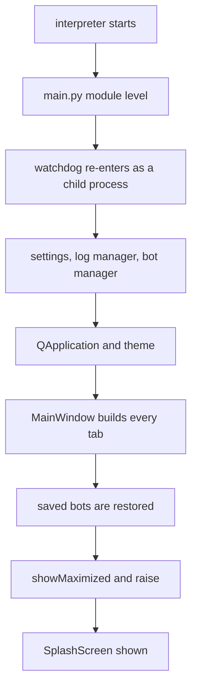

# Splash delay measurement

Build 2234 was reported as slow to show its splash. On the record it is the
slowest launch measured: 10.345 seconds from process start to the last step
that runs before the splash. The four earlier launches on record took 5.242,
4.523, 8.160 and 9.573 seconds.

The step from build 2180 to build 2234 is 0.772 seconds. The only run-to-run
spread the record offers is 0.719 seconds, so that step is not a measured
difference. The large rise happened between build 2058 and build 2141, five
days before the build he reported.

Nothing under `dist/` was launched for this measurement. Every figure comes
from the bundles on disk, from source worktrees, and from the launch records
the running program already wrote.

## What runs before the splash

The main window is created first. Its tabs are built, the saved bots are
restored, the window is shown and raised, and only then is the splash created.
So the restore is the last logged step before the first pixel.

`SplashScreen` is constructed in `main.py` after the restore, which is why the
restore line is the landmark used below.

## His own launches

Five launches survive in the rotated logs. The process start comes from the
launch banner, and the end comes from the line the restore writes when every
saved bot is loaded.

| build | launched | bots | start to restore done |
|-------|----------|------|-----------------------|
| 1987 | 2026-10-01 07:33 | 38 | 5.242 s |
| 2058 | 2026-10-01 16:51 | 38 | 4.523 s |
| 2141 | 2026-10-02 16:33 | 38 | 8.160 s |
| 2180 | 2026-10-03 21:58 | 39 | 9.573 s |
| 2234 | 2026-10-07 18:38 | 39 | 10.345 s |

Each row is one launch, so no row carries a spread of its own. Builds 1987 and
2058 ran on the same day with the same bot count, and they differ by 0.719
seconds. That is the only estimate of run-to-run spread available.

Against it, the step from build 2058 to build 2141 is 3.637 seconds, five times
the spread. The step from build 2180 to build 2234 is 0.772 seconds, about one
times the spread. The first is a reading and the second is not.

Build 2194 is the build he returned to. No surviving log holds its landmarks,
so the one comparison he actually made cannot be measured.

## Which segment moved

Splitting each launch at the line the Console tab writes isolates where build
2234 differs. Four launches spend under 0.4 seconds between that line and the
restore. Build 2234 spends 1.837 seconds.

| build | start to Console tab | Console tab to restore done |
|-------|---------------------|-----------------------------|
| 1987 | 4.936 s | 0.306 s |
| 2058 | 4.244 s | 0.279 s |
| 2141 | 7.802 s | 0.358 s |
| 2180 | 9.184 s | 0.389 s |
| 2234 | 8.508 s | 1.837 s |

Build 2234 reaches the Console tab faster than build 2180 and then loses 1.448
seconds in the segment that follows. It is the only launch of the five whose
news fetches fall inside that segment: ten failed outbound requests between
18:38:49.733 and 18:38:51.023, spanning 1.290 seconds. The failures are
certificate verification errors and rate-limit refusals.

Those fetches run on their own thread, so this is a coincidence of timing and
not a proven cause. It is recorded because it is the only thing that differs in
the only segment that moved.

## The first segment is the bulk, and it logs nothing

The stretch from the paper indicator panel line to the Console tab line holds
most of every launch and writes no log line. It falls inside the tab
construction that `MainWindow` performs.

| build | silent stretch |
|-------|---------------|
| 2180 | 7.304 s |
| 2234 | 6.207 s |

It cannot be attributed to a named tab without constructing the window.

## The interpreter and the imports

Each commit was checked out in its own worktree. The module set the entry point
loads before the splash was imported directly; the entry point was never run
and nothing was constructed. Seven runs per commit, interleaved, after a
discarded warm-up round.

| commit | build | median | min | max | spread | modules |
|--------|-------|--------|-----|-----|--------|---------|
| e3dcc15f | 2194 | 0.646 s | 0.618 | 0.690 | 0.072 s | 663 |
| a0e92a33 | 2232 | 0.642 s | 0.621 | 0.653 | 0.032 s | 663 |
| 53713cf6 | 2233 | 0.650 s | 0.619 | 0.725 | 0.106 s | 663 |
| ca61770a | 2234 | 0.667 s | 0.589 | 0.728 | 0.139 s | 663 |

The step from build 2233 to build 2234 measures 0.017 seconds against a
same-commit spread reaching 0.139 seconds. Nothing is measured there.

The loaded module set is identical across all four commits: 236 modules under
`src`, 663 in total. No import was added. The symbols today's merges introduced
all sit in modules the entry point already loaded.

| symbol | file | new module |
|--------|------|-----------|
| `markets_of_class` | src/gui/main_tabs/asset_class_surface.py | no |
| `EQUITY_VENUES` | src/gui/main_tabs/asset_class_surface.py | no |
| `grained_units` | src/trading/scrumming/sizing.py | no |
| `_asset_class` | src/trading/bot_container.py | no |

## The bundles

Each build directory was walked read-only. The loop timed here is the one the
entry point runs at module level, which removes every compiled bytecode folder
under the bundle root. Five walks per bundle.

| bundle | dirs | files | size | walk median |
|--------|------|-------|------|-------------|
| 2194 qt | 373 | 5030 | 779.94 MiB | 0.0227 s |
| 2232 qt | 373 | 5030 | 780.15 MiB | 0.0256 s |
| 2233 qt | 373 | 5030 | 780.15 MiB | 0.0270 s |
| 2234 qt | 373 | 5030 | 780.17 MiB | 0.0269 s |
| 2194 react | 378 | 5106 | 1147.50 MiB | 0.0229 s |
| 2232 react | 378 | 5106 | 1147.72 MiB | 0.0270 s |
| 2233 react | 378 | 5106 | 1147.72 MiB | 0.0292 s |
| 2234 react | 397 | 5237 | 1150.43 MiB | 0.0288 s |

He launches the Qt variant. Its file count does not move at all across forty
commits, and its size grows by 240,777 bytes. From build 2233 to build 2234 it
grows by 14,453 bytes. The bundle cannot account for a delay a person notices.

Every file in every bundle is fully resident on disk. None carries the offline
or reparse attribute, so no read waits on a cloud fetch. The whole directory
holds 8.03 GB across 40,677 files.

## The monitor dependency reaches the build host, not the bundle

`CONSUMER_EXTRAS` in `tools/deps.py` names the monitor group for the build
consumer, and `pyproject.toml` declares that group. The packages it installs
are absent from every bundle on disk.

| package | bundles carrying it |
|---------|--------------------|
| httpx | 0 of 8 |
| httpcore | 0 of 8 |
| h11 | 0 of 8 |
| anyio | 0 of 8 |
| sniffio | 0 of 8 |

The search that reports those zeros finds a package known to be present and
reports nothing for an invented name, so it can report. The dependency cost the
download nothing, and it cost the splash nothing.

## The react bundle ships compiled bytecode folders

Build 2234's react bundle holds 19 compiled bytecode folders under its own
source tree. No other bundle holds any. They account for the 131 extra files
and most of the 2.71 MiB that bundle gained.

| bundle | bytecode folders |
|--------|-----------------|
| 2234 react | 19 |
| 2234 qt | 0 |
| 2233 react | 0 |
| 2233 qt | 0 |

The entry point removes every such folder it finds under the bundle root at
module level, and `project_root` in `src/_version.py` confirms that root is the
directory the bundle unpacks into. Launching that bundle therefore deletes 19
folders from inside itself before the splash. He runs the Qt variant, so this
did not cause what he saw.

## Ruled out by measurement

A version change writes one setting and logs one line. `VersionSweep` in
`src/core/version_sweep.py` is a standalone tool; nothing on the launch path
imports it, so no sweep runs when the stored build number changes.

## The control

The same timing method, three arms, seven runs each.

| arm | expected | observed |
|-----|----------|----------|
| one commit measured as two arms | no difference | 0.630 s against 0.629 s, a gap of 0.001 s |
| two commits one merge apart | the real difference | 0.650 s against 0.667 s, a gap of 0.017 s |
| a planted 300 ms delay | detected | 0.630 s against 0.923 s, a gap of 0.293 s |

Meaningful here means larger than 0.139 seconds, the widest spread any single
arm produced. The planted delay clears that by a factor of two, so the method
is not blind. The gap between the two commits does not clear it, so the second
row reports nothing.

## What is not measured

The silent stretch inside tab construction cannot be split further without
building the main window, and the window takes a bot manager this measurement
may not construct.

Build 2194's landmarks are in no surviving log, so the pair he compared is not
measurable from the records.

Each build has one launch on record, so no build carries a spread of its own.

Disk contention from the three bundles written in the hour before the launch is
not measurable from anything on disk.
