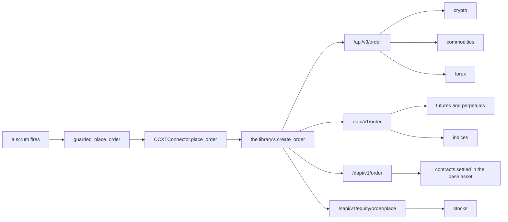

# Binance Sector Order Formats

**Mode: Reference, with four product files changed.**

This page covers issue #1192. It establishes how Binance requires an order to be
formatted in each of the six sectors it serves, names the bot variant each format
demands, and records what changed so the program sends each format.

**FALSIFICATION.** This page is wrong if a field named here is absent from
Binance's own published specification, if a sector's order body accepts a field
this page calls refused, if the platform's order call passes a field this page
says it omits, or if a Binance order the program now refuses turns out to be one
the venue would have accepted.

Binance is a library venue. The order path already reaches it, so no connector
was written. What differs per sector is the format, and that is what the sections
below answer.

```
'binance' in ccxt.exchanges          True, on ccxt 4.5.85
'binance' in SUPPORTED_EXCHANGES     True
```

Both were read in one process with the home directory redirected to a scratch
directory before any module under `src` was imported.

---

## What was read

Binance publishes its trading interface as a set of reference pages, one host per
product family. Every field named below comes off one of these pages.

```
https://developers.binance.com/docs/binance-spot-api-docs/rest-api/trading-endpoints
https://developers.binance.com/docs/binance-spot-api-docs/filters
https://developers.binance.com/docs/derivatives/usds-margined-futures/trade/rest-api/New-Order
https://developers.binance.com/docs/derivatives/usds-margined-futures/market-data/rest-api/Exchange-Information
https://developers.binance.com/docs/derivatives/coin-margined-futures/trade/rest-api/New-Order
https://developers.binance.com/docs/derivatives/coin-margined-futures/market-data/rest-api/Exchange-Information
https://developers.binance.com/en/docs/catalog/advanced-trading-stocks-trading/api/rest-api/trade
https://developers.binance.com/en/docs/catalog/advanced-trading-stocks-trading/api/rest-api/market-data
https://developers.binance.com/en/docs/catalog/advanced-trading-stocks-trading
https://www.binance.com/en/support/faq/d33f37e2c7fe4da3b35ffc904e8fbab5
https://www.binance.com/en/support/faq/about-defi-composite-index-53a02affc6dd481aa1c53c9eae480e94
https://www.binance.com/en/support/announcement/binance-futures-launches-defi-composite-index-perpetual-contract-with-up-to-50x-leverage-ebee6da5df3946519fdb9ab27706d1a4
https://www.binance.com/en/support/announcement/binance-adds-btc-eur-eth-eur-bnb-eur-xrp-eur-eur-busd-and-eur-usdt-trading-pairs-360038072992
    all read 2026-10-08
```

No credential was sent. No account was created. No endpoint of the venue was
called and no order of any kind was placed or tested. Every reading is of a public
page, and every behaviour reading is of the connector library's own code in this
machine's own site packages.

The venue's public endpoints refuse a United States address. The tree records
that in `src/exchange/ccxt_connector.py, in US_IP_BLOCKED_EXCHANGES`, measured at
`VENUE_MEASUREMENT_DATE`, which reads 2026-08-28. That refusal is an account and
address matter. It changes nothing about the format, and it is why no reading here
came from the venue's own hosts.

---

## How the platform names an order today

One function reaches a venue. `src/trading/bot_container.py, in
BotContainer.guarded_place_order` is the gate every live order passes, and
`src/exchange/ccxt_connector.py, in CCXTConnector.place_order` is the only site
that calls out. The call carries six values and nothing else.

```
symbol           the market
side             OrderSide.BUY or OrderSide.SELL
order_type       OrderType.MARKET, LIMIT or IOC_LIMIT
amount           a count of base units, floored onto the recorded step
price            a quote price, or None
client_order_id  a string
```

Two of those six decide the format on this venue. Every market order the platform
composes arrives with no price, read at all ten calling sites, and `place_order`
then fetches a ticker for a market buy alone. So a market buy reaches the library
priced and a market sell reaches it unpriced, and that one asymmetry decides which
size field Binance receives.

### What the trading library sends

The platform hands its six values to the library and the library builds Binance's
own order body. The library's code path decides which body, so it is read out of
the library's own module rather than described. The installed version is
ccxt 4.5.85 and the file read is its Binance module.

```
a spot market, MARKET, with a price
    request["quoteOrderQty"] = amount x price

a spot market, MARKET, with no price
    request["quantity"] = amount

a contract market, MARKET
    request["quantity"] = amount

a tokenised equity, MARKET, side BUY
    request["notional"] = amount x price

a tokenised equity, MARKET, side SELL
    request["quantity"] = amount

a tokenised equity, LIMIT
    request["tradingSession"] = "24H"
    request["quantity"] = amount
    request["price"] = price
```

This is the first thing to record and it is the same correction the Coinbase page
carries. On a spot market buy the library does not send the unit count the platform
sized. It multiplies that count by the fetched price and sends the product as a
quote-currency amount, which is a cash amount. On every spot sell, and on every
contract order, a base count is sent.

The library also publishes a market type the platform never asks for. Its own
option list for Binance holds three types and names the fourth in a comment it
leaves disabled.

```
options["fetchMarkets"]["types"]      ["spot", "linear", "inverse"]
the disabled fourth entry             "stock", with the comment
                                      "tokenized stocks share the spot symbol
                                       namespace, enable explicitly"
```

A library behaviour is not a venue rule, and the two readings are kept apart
throughout. Where a statement comes from the library it says so.

---

## The venue publishes four order endpoints, not one

This is the structural difference from the baseline. Coinbase submits all six
sectors through one endpoint and separates them by a product type inside the body.
Binance submits through a different host and a different path per product family,
and the body differs per path.

```
POST /api/v3/order                  spot and margin
POST /fapi/v1/order                 USDS-margined futures and perpetuals
POST /dapi/v1/order                 COIN-margined futures and perpetuals
POST /sapi/v1/equity/order/place    tokenised equities
```

The library selects the path off the parsed market record, in its own
`create_order`, and the platform names no path. The equity catalogue page states
the fourth family's prefix:

> REST APIs for Binance Stocks Trading. All endpoints under `/sapi/v1/equity/*`.

The six sectors the platform draws map onto those four shapes. Three sectors have
no path of their own at all.



### The spot body

The spot page states the required set per order type, and that set is the whole
format for three of the six sectors.

```
POST /api/v3/order                   summary: New order (TRADE)

LIMIT      timeInForce, quantity, price
MARKET     quantity or quoteOrderQty
```

Its own description of the second size field names the side it is for:

> `quoteOrderQty`: Quote asset amount the user wants to spend (when buying) or
> receive.

The granularity is published per symbol, in the filter list the exchange-info
endpoint carries, and the filters page states each rule.

```
LOT_SIZE          minQty, maxQty, stepSize; quantity % stepSize == 0
MARKET_LOT_SIZE   the same three, for MARKET orders on a symbol
NOTIONAL          minNotional, maxNotional, applyMinToMarket, applyMaxToMarket
PRICE_FILTER      minPrice, maxPrice, tickSize
```

The order types the page enumerates are seven, and the library's own capability
map declares two of them.

```
the venue's page                 MARKET, LIMIT, STOP_LOSS, STOP_LOSS_LIMIT,
                                 TAKE_PROFIT, TAKE_PROFIT_LIMIT, LIMIT_MAKER
declared_order_types(binance)    "market and limit"
```

---

## Crypto

Crypto is the sector the original call was written for and it fits. The product is
a spot pair, the size is a base count on a sell and either a base count or a quote
amount on a buy, and the granularity is the symbol's own lot-size step. The close
is the same shape as the open.

```
the endpoint      POST /api/v3/order
the fields        symbol, side, type, timestamp, and the size the type requires
the size field    quantity on a sell; quoteOrderQty on a market buy, because the
                  library multiplies the count by the fetched price
the granularity   LOT_SIZE stepSize per symbol, with MARKET_LOT_SIZE narrowing a
                  market order and NOTIONAL setting the smallest cash value
the order types   seven on the page; the library declares market and limit
time in force     GTC, IOC or FOK, required on a LIMIT and absent on a MARKET
the close         the same shape, quantity
anything extra    none required
```

**Verdict: the original call fits, and the market-buy correction stands beside
it.** Driven through the real order path with the transport replaced by a function
that raises, a buy of four thousandths of a unit at sixty thousand dollars reached
the library, and the library built a quote amount of 240. The same order on the
sell side built a base count of 0.004. That is the Coinbase asymmetry on a second
venue, so `src/trading/scrumming/sizing.py, in CITED_CASH_MARKET_BUY` now holds
both venue ids. A whole-stepping spot market now rides a limit order on a buy, so
the whole count the size rule floored is the count the venue credits.

---

## Stocks

Stocks do not fit the original call, and the shape of the difference is the one the
permitted-shape variant was built for. Binance takes a different size field on
each side of a market order, refuses the other field outright, and publishes a
per-symbol permission set deciding which sides and which shapes are legal.

The equity order page states the rule field by field. Each sentence is the page's
own.

> `quantity`: Required for `LIMIT` (both sides) and `SELL MARKET`; forbidden for
> `BUY MARKET`.

> `notional`: Required for `BUY MARKET`; forbidden for `LIMIT` and
> `SELL MARKET`.

> `tradingSession`: `RTH` / `EXTENDED` / `24H`. Required for `LIMIT`; forbidden
> for `MARKET`.

> `timeInForce`: `DAY` (default) / `GTC`. `GTC` is only supported for `LIMIT`
> orders; a fractional-share `GTC` order must be paired with
> `tradingSession = EXTENDED` or `24H`.

> When `quantity` has a decimal component, or an order is placed by `notional`,
> it is treated as a fractional-share order.

The permission set is published per symbol by the equity market-data endpoint, and
these field descriptions are the page's own.

```
GET /sapi/v1/equity/market/exchangeInfo

tradability          "Trading direction allowed - one of BUY_SELL / BUY / SELL
                      / NONE."
fractionable         "Whether fractional shares are supported during the
                      regular session."
fractionableEh       "Whether fractional shares are supported during extended
                      hours."
extendedSession      "Whether extended-session trading is enabled."
overnightSupported   "Whether the symbol supports overnight trading."
stepSize             "Lot size - minimum increment for quantity."
minQty               "Minimum allowed quantity."
minNotional          "Minimum order notional (USD)."
```

Those flags are a size-shape permission set per side, which is what
`src/trading/scrumming/sizing.py, in permitted_order_shape` already reads. The
sector needs no new variant. `src/exchange/ccxt_connector.py, in
stock_size_shapes` now reads the three flags into the two shape sets
`MarketRules` already carries, `size_shapes_published` chooses the reader, and
the permitted-shape chain then governs the order.

```
tradability BUY_SELL, fractionable true
    buy    fractional units, whole units, cash amount
    sell   fractional units, whole units

tradability BUY_SELL, fractionable false
    buy    whole units, cash amount
    sell   whole units

tradability SELL
    buy    nothing
    sell   fractional units, whole units
```

The session is the second published fact the sector turns on, and it is not the
session the baseline venue publishes. Coinbase takes a whole share alone outside
normal hours. Binance takes a fraction outside normal hours on a symbol whose
extended or overnight flag reads true, and refuses the hour entirely on one whose
flags read false. `src/exchange/ccxt_connector.py, in market_session` now reads
the two flags, through `equity_trades_outside_regular`: a symbol trading beyond the
regular session answers the continuous session, and one trading inside it alone
answers the United States equity session, which is the session that holds an
order.

```
the endpoint      POST /sapi/v1/equity/order/place
the fields        symbol, side, orderType, timestamp, and the size the side and
                  the type require; the page also publishes quoteAsset, price,
                  timeInForce, tradingSession, walletType, clientOrderId,
                  tokenize and recvWindow
the size field    notional on a market buy, quantity on a market sell, quantity
                  on a limit of either side
the granularity   stepSize and minQty per symbol, with minNotional setting the
                  smallest cash value, and the two fractional flags deciding
                  whether a decimal count is legal in that hour
the order types   two, MARKET and LIMIT
time in force     DAY by default and GTC on a limit; a fractional GTC order
                  needs the extended or the twenty-four-hour session
the close         not the same shape as the open. A market buy names a cash
                  amount and a market sell names a count, so the two halves of
                  one cycle are sized in different units
anything extra    the ticker alone as the symbol, never a pair; a clientOrderId
                  of thirty-two to thirty-six characters
```

**Verdict: no new variant. The sector demands the permitted-shape variant, which
is built, plus two published fields the call has no value for.** Driven through
the real order path, a fractionable symbol trades on both sides, a symbol whose
permission set names selling alone refuses a buy before any venue contact, a
symbol stepping in whole shares has its market buy replaced by a limit carrying
the whole count, and a symbol trading inside the regular session alone is held
outside it. The two unset fields are `tradingSession`, where the library sends
twenty-four hours for every symbol including one that supports only the regular
session, and `quoteAsset`, which the platform never names.

### Reachability of this sector today

The format is established and the product list is not reachable without a
credential. The library's own market-type list leaves the tokenised-equity type
disabled, and its own fetch appends the equity exchange-info call only where an
API key is set. The library's signing function then requires a credential for
every path on that host but one.

```
the library's own test     api == "sapi" and path != "system/status"
                           -> check_required_credentials()
```

So enumerating Binance's tokenised equities needs a signed call to
`/sapi/v1/equity/market/exchangeInfo`. This unit held no credential and sent no
request, so the type stays disabled. Enabling it would put a signed call in the
path of every Binance market load, and a key without that permission would fail
the load for every sector at once. The format above is read off the venue's own
pages and driven against product rows in the venue's own field names.

---

## Futures and Perpetuals

The sector splits in two on this venue, and the two halves take different bodies
on different hosts. The half margined in the quote currency fits. The half
margined in the base asset does not, and the reason is a denomination.

### The half margined in the quote currency

The page states one required set for a market order and it is a count.

```
POST /fapi/v1/order

LIMIT      timeInForce, quantity, price
MARKET     quantity
```

No quote-amount field is published, so the market-buy conversion the spot path
performs does not apply here. The library's own contract branch sets a count for
every market order, which is what the page requires. The order types are seven and
the time-in-force set is six.

```
the page's order types     LIMIT, MARKET, STOP, STOP_MARKET, TAKE_PROFIT,
                           TAKE_PROFIT_MARKET, TRAILING_STOP_MARKET
the page's timeInForce     GTC, IOC, FOK, GTX, GTD, RPI
```

The exchange-info endpoint publishes the contract shape per symbol, and several of
its fields have no counterpart the platform reads.

```
contractType        PERPETUAL, CURRENT_QUARTER, NEXT_QUARTER, TRADIFI_PERPETUAL
deliveryDate        the settlement timestamp
underlyingType      "COIN" is the only value the page enumerates
underlyingSubType   an array; the page's example carries one entry
positionSide        BOTH, LONG or SHORT
reduceOnly          a flag the page publishes and the platform never sets
```

Driven over a perpetual row in those field names, the platform read the sector,
the step and the minimum, and the library built a count.

```
the endpoint      POST /fapi/v1/order
the fields        symbol, side, type, timestamp, quantity, and price on a limit
the size field    quantity, a contract count by the symbol's own step
the granularity   LOT_SIZE stepSize per symbol; the page says not to read
                  quantityPrecision as a step
the order types   seven on the page; the library declares market and limit
time in force     six on the page; the library sends GTC on a limit
the close         the same shape, quantity
anything extra    positionSide, reduceOnly, priceMatch, goodTillDate and
                  selfTradePreventionMode; the call sets none of them
```

### The half margined in the base asset

The order page states the size field in one phrase of its own:

> quantity measured by contract number

A contract is not a count of the base asset. Binance's own quarterly-contract page
states what one contract is and how a count becomes a base amount.

> Each Quarterly contract represents 100 USD.

> for Altcoin contracts, the multiplier is 10 USD

> (Contract Size x Contract Multiplier) / Mark Price = (10 Contracts x 100 USD)
> / 10,104 USD = 0.09897 BTC

So the size field counts fixed amounts of the quote currency, and the base amount
one contract stands for moves with the mark price. The platform's own field holds
the other denomination. `src/exchange/base.py, in MarketRules` declares
`contract_size` as the base units one contract stands for, and
`src/trading/scrumming/sizing.py, in contracts_for_units` divides a base count by
it.

Driven before this unit, a five-hundred-unit order on a dated contract whose
published size is one hundred reached the library as a count of five, and the
Console told the operator that one contract stands for one hundred units. Both
numbers were wrong and the sentence was false.

`src/exchange/ccxt_connector.py, in contract_units` now answers nothing for such a
record, so no quote-currency figure is written into a base-unit field, and
`quote_contract_size_shapes` names the cash-amount shape on both sides instead.
The permitted-shape chain then refuses the order and names why.

> PRE-FLIGHT REJECTED: BUY BTC/USD:BTC-250328 500.0000000000: the venue permits a
> cash amount alone on a buy of this product, and cash-amount order is not built:
> a market sized by a cash amount in the quote currency. The market is still read
> and still charted. API not called.

```
the endpoint      POST /dapi/v1/order
the fields        symbol, side, type, timestamp, quantity, and price on a limit
the size field    quantity, measured by contract number, where one contract is a
                  fixed quote-currency amount
the granularity   LOT_SIZE stepSize per symbol, in contracts; contractSize per
                  symbol, in the quote currency
the order types   LIMIT, MARKET, STOP and STOP_MARKET on the row read
time in force     GTC, IOC, FOK and GTX
the close         the same shape, a contract count
anything extra    the contract multiplier, and the mark price the conversion
                  needs
```

**Verdict: the quote-margined half takes the dated-contract and whole-unit rules
already built. The base-margined half selects the cash-amount variant, which is
named and not built, so the program refuses it.** That closes a row the issue
carries as no venue needing it. A venue the platform already connects sizes an
order by a quote-currency notional, and it needs no broker session to do so.

---

## Commodities

Commodities has no path of its own and no product type of its own. Binance reaches
the sector with a tokenised metal on the spot host, and the platform's own
classifier reads it there. `src/exchange/ccxt_connector.py, in market_asset_class`
answers commodities when the base asset resolves to a precious-metal code, and the
gold token on this venue does.

Binance's own listing material states what the token is.

> Each PAXG token is backed by one fine troy ounce (t oz) of a 400 oz London Good
> Delivery gold bar, stored in Brink's vaults.

So a commodities order on this venue is a spot order. Driven over a gold-token row
in the venue's own field names, the platform read the sector, the step and the
minimum notional, and the library built the spot body: a cash amount on the market
buy and a base count on the market sell.

```
the endpoint      POST /api/v3/order. No path and no product type names this
                  sector; its market is an ordinary spot pair
the fields        the spot fields
the size field    quantity on a sell; quoteOrderQty on a market buy
the granularity   LOT_SIZE stepSize per symbol, a fraction on the gold token
the order types   seven on the page; the library declares market and limit
time in force     GTC, IOC or FOK on a limit
the close         the same shape as the open
anything extra    none beyond the spot fields
```

**Verdict: no variant of its own. It takes the crypto spot format, because its
market is a spot market.** The readiness matrix records a four-decimal step for
the gold token on this venue, which is a fraction, so the whole-unit rule never
selects and the scrum's excess survives the size rule. No page read publishes a
commodity label this unit could classify a contract by, and `contractType` carries
a value naming a non-crypto underlying without saying which sector it belongs to.

---

## Forex

Binance lists a currency market and publishes no forex path. Its own announcement
names the market.

> BTC/EUR, ETH/EUR, BNB/EUR, XRP/EUR, EUR/BUSD and EUR/USDT trading pairs

That announcement is dated 2020-01-03. The last pair names a national currency
against a dollar stablecoin, which is the same shape the baseline venue lists and
is what `src/exchange/ccxt_connector.py, in market_asset_class` reads as forex: the
classifier answers forex where `underlying_code` resolves for the base asset and
for the quote asset both.

Driven over such a row in the venue's own field names, the platform read the sector
as forex and the library built the spot body on both sides. No separate forex path,
product type or field exists on any page read.

```
the endpoint      POST /api/v3/order. No path and no product type names this
                  sector; its market is an ordinary spot pair
the fields        the spot fields
the size field    quantity on a sell; quoteOrderQty on a market buy
the granularity   LOT_SIZE stepSize per symbol
the order types   seven on the page; the library declares market and limit
time in force     GTC, IOC or FOK on a limit
the close         the same shape as the open
anything extra    no published answer. No page read publishes a currency-lot
                  size, a settlement date or a rollover for these markets
```

**Verdict: no variant. The sector's markets take the crypto spot format, because
they are crypto spot markets.** This is the second venue to confirm from its own
pages what the issue's currency-lot row concluded from a step distribution: no
venue the platform connects sizes a currency lot. The sector was missing from the
surface's venue list for this venue and now appears, because the readiness matrix
records the venue as serving it and the classifier reads such a market as forex.

---

## Indices

Binance lists an index product and publishes no index label a reader can quote. Its
own announcement names the product and says what the underlying is.

> Binance Futures will launch a DEFI/USDT composite index perpetual contract

> The underlying asset of the DEFI Composite Index perpetual contract consists of
> a basket of decentralized finance (DeFi) protocol tokens listed on Binance.

The product is margined in the quote currency, so its order body is the one that
half of the futures sector carries: the futures path, a count, and no quote-amount
field. Driven over an index-perpetual row in the venue's own field names, the
platform read the step and the minimum, and the library built a count on both sides
of both order types.

What is not published is the sector label per market. The exchange-info page
publishes `underlyingType` and `underlyingSubType`, enumerates one value for the
first and gives one array example for the second, and neither names an index.
Reading the value an index perpetual actually carries needs a call to the venue,
which this unit did not make.

```
underlyingType       the page enumerates "COIN" and no other value
underlyingSubType    an array; the page's example carries one entry
```

So the platform's own classifier reads this product as a contract market and
answers the futures sector for it, which is the sector the venue's own host puts it
on. No label was wired on a value that could not be quoted.

```
the endpoint      POST /fapi/v1/order. No path and no product type names this
                  sector; its market is a perpetual margined in the quote
                  currency
the fields        the futures fields
the size field    quantity, a contract count by the symbol's own step
the granularity   no published answer. The announcement and the index page both
                  carry the index composition and neither carries a step
the order types   seven on the futures page
time in force     six on the futures page
the close         the same shape, quantity
anything extra    leverage up to fifty times on the announcement, which the
                  call never names
```

**Verdict: no variant. The submission is the futures submission and the original
call fits it.** The sector was missing from the surface's venue list for this venue
and now appears. The per-market label is the one thing no page answers, and what
Binance would have to publish is the value set of `underlyingType`.

---

## The recording beside the pages

The recording was read with the home directory redirected to a scratch directory
before any module under `src` was imported, and the redirect was printed to prove
it took. The real file was copied to the scratch directory and every reading was
taken from the copy.

```
Path.home() after redirect     the scratch directory
Path.home() after src import   the scratch directory
recorded venues                coinbase
rows                           1146
rows for binance               0
real file modification time    unchanged, before and after every run
real file size                 unchanged, before and after every run
```

**Nothing in the operator's own file moved today.** It holds one venue, it holds no
Binance row, and this unit opened it only to copy it and to read its modification
time. Every Binance product row driven here was built in the venue's own published
field names, in the shape the recording carries, and parsed by the library's own
market parser inside the process.

That absence is itself a reading. The classifier and the size rules reach a venue
through the library's market list on first connect, and that connect has never
happened for this venue.

---

## Controls on the method

Five controls were run and all five are reported.

**The existing venues did not move.** Every answer the order path gives for every
recorded market was read out of the default branch and out of this branch, in two
separate processes against two separate worktrees, and compared field by field.

```
recorded markets swept              1146
answers read, each tree             167316
answers that moved                  0
markets with a mover                0
```

**The same reading reports a movement when a field changes.** One recorded row's
published step was changed to one whole unit and the identical sweep was run again
against this branch.

```
answers read                        167316
answers that moved                  40
markets with a mover                1
the first mover                     amount_increment, 0.01 to 1.0
the movers it caused                the unit rule on both sides at three
                                    moments, the opening-position refusal, and
                                    the sized amount
```

So the zero above is a reading and not a blind instrument.

**The surface moved by exactly two cells.** Every venue-and-sector cell the surface
answers was read out of both trees.

```
venue ids                           24
sectors                              6
cells compared                     144
cells that moved                     2
                                    binance and forex, False to True
                                    binance and indices, False to True
cells answering yes                 85 before, 87 after
```

**The transport was replaced and proved to raise.** Before any order was driven,
the library's own fetch, request and low-level call were replaced by a function
that raises, and both a direct call and a market load were run to confirm it.

```
fetch2          RuntimeError: the transport is replaced; nothing reaches Binance
load_markets    RuntimeError: the transport is replaced; nothing reaches Binance
```

Every driven order then stopped at the value the connector would have been handed,
and the body each one would carry was built by the library's own request builder,
which sends nothing.

**The refusals were driven.** A market the venue does not list and a size below the
published minimum were both driven, and neither reached the transport.

```
a market the venue does not list
    the market list is asked, the symbol is absent, the guard warns that no
    minimum is known, and the library refuses the symbol outright

a size below the published minimum, three sectors
    crypto spot, a millionth of a unit against a minimum of ten millionths
    a dated contract, four tenths against a minimum of one
    a tokenised equity, four ten-thousandths against a minimum of a thousandth
    all three answered PRE-FLIGHT REJECTED and named the minimum and the step
```

---

## The variant each sector demands

| Sector | The venue's endpoint | The size field | The variant the format demands | New? |
| --- | --- | --- | --- | --- |
| crypto | POST /api/v3/order | quantity on a sell, quoteOrderQty on a market buy | the original call, with the whole-unit rule selecting per market | no |
| stocks | POST /sapi/v1/equity/order/place | notional on a market buy, quantity on a market sell and on either limit | the permitted-shape variant, which is built | no |
| futures and perpetuals, quote-margined | POST /fapi/v1/order | quantity, a contract count | the dated-contract and whole-unit rules, both built | no |
| futures and perpetuals, base-margined | POST /dapi/v1/order | quantity, measured by contract number, each contract a fixed quote amount | the cash-amount variant, named and not built, so the order refuses | no |
| commodities | POST /api/v3/order | quantity on a sell, quoteOrderQty on a market buy | the original call | no |
| forex | POST /api/v3/order | quantity on a sell, quoteOrderQty on a market buy | the original call | no |
| indices | POST /fapi/v1/order | quantity, a contract count | the original call | no |

No sector demands a sixth variant. Five of the seven rows take variants already
built, one takes the permitted-shape variant the baseline venue's equity format
motivated, and one refuses on a variant the issue already names.

### The published fields the platform's call has no value for

Every one of these is published on a Binance order body or symbol record, and no
value for it exists anywhere in the call chain from `guarded_place_order` to
`place_order`.

```
on the spot body
  icebergQty    selfTradePreventionMode    the response type the library sets

on the futures body
  positionSide    reduceOnly    priceMatch    goodTillDate    closePosition
  selfTradePreventionMode

on the equity body
  the trading session the library sets to twenty-four hours    quoteAsset
  walletType    tokenize    the time in force beyond the library's own

on the symbol record
  MARKET_LOT_SIZE    maxNotional    multiplierUp    multiplierDown
  maxNumOrders    delistingTime    underlyingType    underlyingSubType
  contractType    the contract multiplier of a base-margined contract
```

### The field the platform passes that a sector's endpoint refuses

One, and it belongs to the stocks sector. The third member of the platform's
order-type set becomes a limit order carrying an immediate-or-cancel time in force,
and the equity page publishes only a day order and a good-till-cancelled order. The
library narrows the equity order types to two of its own accord, so the refusal
would come from the venue rather than from the library.

A second case is narrower than a refusal and is recorded for accuracy. A market buy
into a tokenised equity names a cash amount and a market sell names a count, so the
two halves of one accumulation cycle are sized in different units on the same
market. The whole-unit path already replaces a market buy with a limit order where
the size rule reads whole units, which is what keeps the count the rule floored.

---

## What changed

Four files.

```
src/exchange/ccxt_connector.py
    contract_units answers nothing for a contract settled in its own base
    asset, whose published size is a quote-currency amount
    equity_trades_outside_regular reads the two extended-session flags
    market_session reads them for a tokenised equity record
    stock_size_shapes reads tradability and the two fractional flags into the
    two shape sets
    quote_contract_size_shapes names the cash-amount shape on both sides of a
    contract settled in its own base asset
    size_shapes_published chooses the reader
    market_asset_class answers the stocks sector for a tokenised equity record

src/trading/scrumming/sizing.py
    CITED_CASH_MARKET_BUY holds the second venue whose spot market buy names a
    cash amount

src/gui/main_tabs/asset_class_surface.py
    EXTRA_VENUE_CLASSES lists forex and indices for the venue

docs/manual/15-venue-compatibility.md
    the sector row for the venue reads six sectors
```

---

## Related pages

- [`docs/manual/15-venue-compatibility.md`](../../manual/15-venue-compatibility.md)
  — the venue table and the variant definitions this page reads against
- [`docs/manual/16-sector-exchange-product-tree.md`](../../manual/16-sector-exchange-product-tree.md)
  — the sector, venue and product levels
- [`docs/audits/2026-10-08_coinbase_sector_order_formats/REPORT.md`](../2026-10-08_coinbase_sector_order_formats/REPORT.md)
  — the baseline this page translates
- [`docs/audits/2026-10-07_venue_sector_readiness_matrix/REPORT.md`](../2026-10-07_venue_sector_readiness_matrix/REPORT.md)
  — which venue reaches which sector
- [`docs/audits/2026-10-08_exchange_buildout_order/REPORT.md`](../2026-10-08_exchange_buildout_order/REPORT.md)
  — why this venue is first after the two fixed ones
