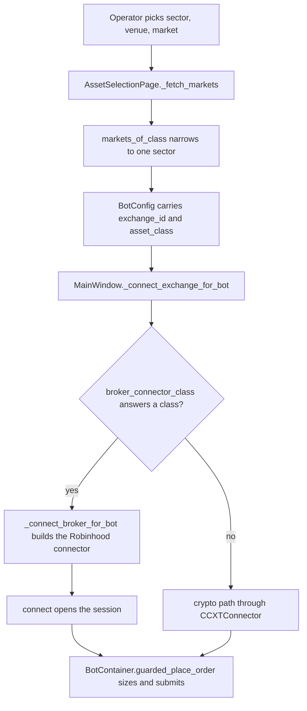

# Robinhood's published order interface

Robinhood publishes two programmatic trading interfaces, and neither is the one
row 23 of issue #1192 points at. One is a signed REST API that places crypto
orders. The other is a Model Context Protocol server that places equity, option
and crypto orders. Both are reachable only by a Robinhood customer holding an
account of a named type, and both are documented on Robinhood's own pages. Every
answer below carries the sentence the page states it with. Where Robinhood
publishes nothing on a point, the answer is no published answer, and the searches
that found nothing are named with it.

Read on 2026-10-08.

## Table of contents

- [Row 23's premise](#row-23s-premise)
- [The two interfaces](#the-two-interfaces)
- [Access](#access)
- [Sectors, asked twice](#sectors-asked-twice)
- [Order shape](#order-shape)
- [Sizing](#sizing)
- [Authentication](#authentication)
- [Limits](#limits)
- [What it costs](#what-it-costs)
- [Where it lands in this tree](#where-it-lands-in-this-tree)
- [The control on this reading](#the-control-on-this-reading)
- [What has no published answer](#what-has-no-published-answer)
- [A manual sentence corrected](#a-manual-sentence-corrected)

## Row 23's premise

Row 23 reads *"Robinhood has a venue id — `src/exchange/ccxt_connector.py`"*. The
tree refuses that placement. The name appears once in the whole repository, in an
audit document, and the connector library the crypto path depends on carries no
Robinhood entry. A venue id in the crypto connector would reach nothing, because
that connector reaches a venue only through the library.

```
$ git grep -lic robinhood
docs/audits/2026-10-07_venue_sector_readiness_matrix/REPORT.md

$ python -c "import ccxt; print('robinhood' in ccxt.exchanges)"
False

$ python -c "import ccxt; print(ccxt.__version__, len(ccxt.exchanges))"
4.5.85 104
```

## The two interfaces

The first interface is the Robinhood Crypto Trading API. Robinhood's own site
footer carries a navigation link labelled API, and that link points at this one
page, so this is the interface Robinhood's own navigation names.

```
page    https://docs.robinhood.com/crypto/trading/
title   Robinhood Crypto Trading API
host    https://trading.robinhood.com/
footer  <a href="https://docs.robinhood.com/crypto/trading"
            data-testid="navigation-link-API">
```

> Welcome to Robinhood Crypto Trading API documentation for traders and
> developers! The API lets you view crypto market data, access your account
> information, and place crypto orders programmatically.

It carries two versions. The page states the difference as a fee question, not a
capability one, and states that every read action exists on both.

> There are two versions of the Crypto Trading API, giving you the option to
> place crypto orders with fee tiers (v2) or without fee tiers (v1). All
> read-only API actions are available on both versions.

The second interface is the Robinhood Trading MCP. It is a Model Context Protocol
server at one published URL, and Robinhood's page names the client platforms it
has tested against it.

```
page      https://robinhood.com/us/en/support/articles/onboarding-an-external-agent/
endpoint  https://agent.robinhood.com/mcp/trading
transport http, "Streamable HTTP"
clients   Claude Code, Claude Desktop, ChatGPT, Codex, Codex CLI, Cursor, Grok
```

> Connect to the Robinhood trading MCP so that you can use your external agent to
> trade on Robinhood.

The same page states that the server is not restricted to the named clients, and
names a local program as a supported caller.

> In addition to the platforms above, Robinhood also supports connecting from
> Perplexity, OpenClaw, Replit, AWS Quick, Poke, and any localhost platform.

A third Robinhood interface exists and does not place orders. Robinhood Chain
publishes Stock Token endpoints, and the page states their shape in its first
sentence. Three endpoints are documented, all of them reads, and the page carries
no other verb.

```
page      https://docs.robinhood.com/chain/stock-token-apis/
host      https://api.robinhood.com/rhj/
endpoints GET /assets, GET /prices/{symbol}, GET /corporate-actions
verbs     3 GET, 0 POST, 0 PUT, 0 PATCH, 0 DELETE
```

> Robinhood provides a set of read-only REST endpoints under
> https://api.robinhood.com/rhj/ for offchain access to Stock Token data — live
> prices, corporate actions, and asset metadata (including the corporate-action
> multiplier).

## Access

Neither interface is open to any account holder. Each gates on an account of a
named type, and Robinhood states a general refusal of third-party trading
interfaces around both of them.

The general refusal is on the third-party connections page, in a section headed
APIs.

> We don't allow trading APIs to be linked to your Robinhood account without
> written authorization from Robinhood. We also don't allow third-party
> applications to control or take action on your Robinhood app.

That same section names its own exception in the next sentence, which is how the
two statements fit together. The crypto API is the authorized route for crypto.

> For details about APIs related to crypto, review Robinhood Crypto Trading API.

The crypto API gates on a Robinhood Crypto account, in the United States, and the
customer creates the credential themselves. No application review and no approval
queue is published.

```
page  https://robinhood.com/us/en/support/articles/crypto-api/
```

> It's available to Robinhood Crypto customers in the United States.

> To access the Robinhood Crypto Trading API, you'll first create API
> credentials, which generate an API key and define the actions it can perform.

The documentation page states the same restriction and names the agreement that
governs use.

> The Robinhood Crypto Trading API is available to customers in the United States
> only. Use of the Robinhood Crypto Trading API is subject to the Robinhood Crypto
> Customer Agreement as well as all other terms and disclosures made available on
> Robinhood Crypto's about page.

The MCP gates on a second account, opened for the agent, and on a primary account
in good standing. Robinhood caps the number of such accounts.

> To trade with an external agent, you must open a Robinhood MCP account
> specifically for your external agent.

> An MCP account is a type of self-directed, individual investing account. For
> investing purposes, you can have up to 10 self-directed individual investing
> accounts, including your MCP account.

The MCP account is also the only account an external agent may trade in, which
bounds what a connector could reach.

> Your agent can only place trades in your Robinhood Agentic account.

Two further access facts bear on a bot. The MCP defaults to placing orders
without a per-order human confirmation for an external agent, and Robinhood says
so plainly on two pages.

> Trade approvals are turned on by default for Robinhood Agents (built-in
> agents), and are turned off by default for MCP accounts (external agents).

> Be aware that if you've asked your agent to take action without asking your
> approval, it can place trades without your confirmation.

Robinhood qualifies that default, and does not publish which trades the
qualification covers.

> Certain trades may still require your approval even when trade approvals are
> turned off.

Crypto through the MCP carries a state restriction the crypto API page does not
carry.

> Crypto trading through your agent isn't available in some states, including New
> York.

Neither interface was reached behind a sign-in. Every page quoted here answered
200 to an unauthenticated read. No account was opened, no credential was created,
no terms were accepted and no request was sent to any Robinhood trading host.

## Sectors, asked twice

Whether Robinhood sells a product and whether Robinhood lets a program place an
order for it are separate questions, and they separate differently per sector.
The table asks both. Sector names are this platform's own, as `LAYERED_CLASSES`
in `src/gui/main_tabs/asset_class_surface.py` declares them.

| Sector | Robinhood sells it | A program may order it | Interface |
|---|---|---|---|
| crypto | yes | yes | Crypto Trading API, and `place_crypto_order` on the MCP |
| stocks | yes | yes | `place_equity_order` on the MCP only |
| commodities | yes, as futures and as fund shares | fund shares only, as an equity | `place_equity_order` on the MCP |
| forex | yes, as currency futures | no published answer | none |
| indices | yes, as index futures and index options | index options only | `place_option_order` on the MCP |
| futures_perps | yes | no published answer | none |

The sells column rests on Robinhood's own futures page, which names its five
contract categories as tab labels and names three of the underlyings in its own
heading sentence.

```
page       https://robinhood.com/us/en/about/futures/
categories Stock Index, Energy, Currency, Metals, Crypto
```

> Trade the S&P 500, oil, Bitcoin, and more. No greeks. No time decay.

The orders column rests on the MCP tool tables, which Robinhood publishes with a
per-tool column for an external agent. Every tool below is marked available to an
external agent.

```
page   https://robinhood.com/us/en/support/articles/trading-with-your-agent/

equities   place_equity_order, cancel_equity_order, review_equity_order,
           get_equity_tradability, get_equity_quotes, get_equity_positions,
           get_equity_orders, get_equity_tax_lots
options    place_option_order, cancel_option_order, review_option_order,
           exercise_option, cancel_option_exercise, get_option_chains,
           get_option_instruments, get_option_quotes, get_option_positions,
           get_option_orders, get_option_historicals
crypto     place_crypto_order, cancel_crypto_order, preview_crypto_order,
           get_currency_pairs, get_crypto_quotes, get_crypto_positions,
           get_crypto_orders, get_crypto_tax_lots
advanced   place_advanced_order, cancel_advanced_order, review_advanced_order
```

The page states the sector list in one sentence, and the list is three sectors
long.

> You can currently use a built-in or external agent to place long equities,
> options, and crypto orders.

The word long in that sentence is a published limit: no short side is offered to
an agent. No futures tool and no forex tool appears in any of the ten tables, and
Robinhood's own announcement puts both in the future tense.

```
page https://robinhood.com/us/en/newsroom/robinhood-is-now-open-to-agents/
```

> Agentic Trading is launching in beta with support for equities only out of the
> gate.

> Support for options, crypto, event contracts, futures, and more are coming
> soon.

Commodities and indices reach an order only as something else. A gold fund share
is an equity to the equity tool, and an index option is an option to the option
tool. Neither sector has a tool of its own. That is the same reading row 22 of the
issue already records for the eight brokers it names, where fund shares reach both
sectors as ordinary tickers.

Forex and futures have no published answer on the order question. The searches
that produced that answer are in
[What has no published answer](#what-has-no-published-answer).

## Order shape

The crypto API publishes its order body in full. Four order types exist, each
with its own configuration object, and the page states that the configuration is
required by the type.

```
POST /api/v1/crypto/trading/orders/
POST /api/v2/crypto/trading/orders/?account_number=<n>

symbol             currency pair, uppercase, example BTC-USD
client_order_id    user input order id for idempotency validation, a valid UUID
side               buy or sell
type               market, limit, stop_loss, stop_limit
market_order_config      asset_quantity | quote_amount
limit_order_config       asset_quantity | quote_amount, limit_price, time_in_force
stop_loss_order_config   asset_quantity | quote_amount, stop_price, time_in_force
stop_limit_order_config  asset_quantity | quote_amount, limit_price, stop_price,
                         time_in_force
time_in_force      gtc, gfd, gfw, gfm
account_number     required on v2, as a query parameter
```

> Places a new crypto trading order with an order type. Note: Depending on the
> type used in the request body, you must include the respective order
> configuration in the request body.

The v2 endpoint narrows which markets it accepts, and names the field that
decides it.

> This endpoint only supports placing orders on USD symbols that have
> `is_api_tradable=true` as defined in our Get Crypto Trading Pairs endpoint.

The MCP publishes its order shape only as far as the tool name and a one-line
description. Robinhood publishes the five order types an agent may place, but no
parameter list for any tool.

```
page  https://robinhood.com/us/en/support/articles/trading-with-your-agent/
tool  place_equity_order — "Place an equity order"
types Market (share-based), Market (dollar-based), Limit, Stop limit, Stop market
```

The parameter names and types of every MCP tool have no published answer. The
onboarding page names six tool categories and does not list a single field, and
the trading page lists the tool names and their one-line descriptions and no
fields. A caller learns the schema from the server at connect time, not from a
page.

## Sizing

Crypto sizes two ways, and Robinhood states that only one of them may appear in
a request.

> For order configurations that support both `asset_quantity` or `quote_amount`,
> only one can be present in the request body.

The first is a quantity of the asset, and the second is an amount of the quote
currency, which is a cash-amount order.

```
asset_quantity   The quantity of base currency bought or sold
quote_amount     The amount of quote currency bought or sold
```

The step a crypto market takes is published as a schema field rather than a
value, so the shape is known and the per-market numbers are not. A trading pair
on the second version carries four of them.

```
asset_increment    The minimum quantity increment for placing orders in the asset
                   currency. Up to 18 decimal places.
quote_increment    The minimum price increment for placing orders in the quote
                   currency. Up to 18 decimal places.
max_order_size     The maximum order size allowed for this trading pair in asset
                   currency. Up to 16 decimal places.
min_order_amount   The minimum order amount in quote currency (e.g., USD)
                   required for fee tier orders.
```

Equities size two ways as well, as a share count or as a dollar amount, and the
fraction has a published floor of one dollar.

```
page   https://robinhood.com/us/en/support/articles/fractional-shares/
types  Market (share-based), Market (dollar-based)
```

> You can trade in real-time with fractional shares that are valued at $1 or more
> with Robinhood.

> You can place fractional share orders in dollar amounts or share amounts. All
> purchases will be rounded to the nearest penny.

> Keep in mind, if you're buying or selling fractional shares, you must enter an
> amount of at least $1.

The fraction is not offered on every ticker, and Robinhood names the exclusion.

> Robinhood only supports trading of fractional shares for National Market System
> (NMS) securities listed on national issues exchanges like the Nasdaq and NYSE,
> and not for stocks traded over the counter (OTC).

Whether a given ticker takes a fraction is answerable per symbol through a
published MCP tool, so a connector would not have to guess it.

```
get_equity_tradability — "Check if a symbol can be traded and find out if it can
                         be traded fractionally"
```

Both of Robinhood's order-reachable sectors therefore publish a cash-amount
order. That is the market form `VARIANT_CASH_AMOUNT` in
`src/trading/scrumming/sizing.py` names, and row 6 of the issue records that it
has no caller because no connected venue sizes by notional. Robinhood would be
the first that does, on crypto through the quote amount and on equities through a
dollar-based market order.

Option sizing and futures sizing have no published answer on any page read here.

## Authentication

The crypto API signs each request with an Ed25519 key pair the customer
generates, and sends three headers. The public half is registered with Robinhood
and the private half never leaves the caller.

```
x-api-key    the API key, shaped rh-api-[uuid]
x-signature  base64 Ed25519 signature over api_key + timestamp + path + method + body
x-timestamp  the current Unix timestamp in seconds
library      PyNaCl, pip install pynacl
```

> Authenticated requests must include all three `x-api-key`, `x-signature`, and
> `x-timestamp` HTTP headers.

> Authenticated requests should be signed with the x-signature header, using a
> signature generated with the following: private key, API key, timestamp, path,
> method, and body.

The page states that a body-less request signs a shorter message, which a
connector has to implement exactly.

> Note that for requests without a body, the body can be omitted from the message
> signature.

The page publishes a worked example with fixed values, so an implementation can
be checked against a known signature without sending anything.

```
Method     POST
Path       /api/v1/crypto/trading/orders/
Timestamp  1698708981
Signature  q/nEtxp/P2Or3hph3KejBqnw5o9qeuQ+hYRnB56FaHbjDsNUY9KhB1asMxohDnzdVFSD7StaTqjSd9U9HvaRAw==
```

The MCP authenticates inside the client, through a step Robinhood describes but
does not name a protocol for. The onboarding page gives the step and no scheme,
no scope list and no token lifetime.

> Select robinhood-trading and authenticate

The MCP's authentication scheme has no published answer. What the page does
publish is the read scope it grants, and the scope is the whole account set
rather than the agent's own account.

> All your Robinhood accounts, including your Robinhood account numbers

> All details about your positions and balances

> All details about your transactions, including your order history

## Limits

The crypto API publishes a rate limit as two numbers and names the algorithm
behind them.

```
page  https://docs.robinhood.com/crypto/trading/
```

> Requests per minute per user account: 100

> Requests per minute per user account in bursts: 300

> Rate limiting is applied using a token bucket implementation.

The page then withdraws the numbers as a guarantee, which matters to any
connector that paces itself off them.

> The actual values of the configuration will fluctuate depending on the
> availability of our service and our current expected volume at the time of
> service. Rate limits are applied per endpoint and may differ among each
> endpoint depending on their expected use case.

The Stock Token endpoints publish a different limit, on a per-second basis, and a
cache window.

> All endpoints are rate-limited to 60 requests/second and cached; respect the
> per-endpoint cache window to avoid stale reads.

The MCP publishes no rate limit. No page read here names a request ceiling, an
order ceiling or a frequency cap for an external agent.

Three published statements refuse or constrain a bot, and they are the ones to
read before building anything. The first is the general refusal on the
third-party connections page, quoted in [Access](#access). The second is the
order-approval qualification, which means a connector cannot assume its order was
accepted even with approvals off. The third is the account restriction: an
external agent trades in the MCP account alone, so a Robinhood position reached
this way does not sit in the operator's primary account.

Robinhood also states, in its own disclosures, what the product is for, and it
describes an agent placing orders without per-trade input as the intended mode.

> Robinhood Agentic Trading is a new type of brokerage product that allows you to
> connect a third-party AI agent to a dedicated Robinhood account to automate
> investment decisions and order placement. This product operates differently
> from traditional investing and trades may be executed by an AI agent without
> your direct input on each transaction.

## What it costs

Robinhood publishes a cost on three of the four axes a connector would pay.

The crypto first version charges through a spread rather than a fee, and the page
says so.

> The bid and ask prices include a spread. The buy spread is the percent
> difference between the ask and the mid price. The sell spread is the percent
> difference between the bid and the mid price.

The crypto second version charges a stated ratio, tiered on thirty-day volume,
and publishes the arithmetic.

```
fee_ratio      The fee ratio applied to the value executed for each order. For
               example, 0.0085 corresponds to a 0.85% trading fee.
est_fee        The estimated transaction fee in quote currency (e.g., USD).
               Calculated as fee_ratio * (price * quantity).
est_total_cost quantity * ask + est_fee
```

Only the second version's volume counts toward the tier, which decides which
endpoint a connector should call.

> Only crypto orders placed through the v2 endpoint, Place crypto orders with fee
> tiers, count toward your eligible 30-day trading volume. Orders placed through
> the v1 endpoint, Place crypto orders without fee tiers, do not.

The MCP charges nothing to an external agent. Robinhood bills token usage for its
own hosted agent and excludes the external case in one sentence.

> This information applies only to agents hosted on Robinhood, not external
> agents.

The build cost in this tree is the fourth axis, and it is the precedent's size.
`AlpacaConnector` in `src/stocks/alpaca_connector.py` implements fifteen methods
against the broker base, and the venue id it introduced is named at nine sites in
six files under the source tree. A Robinhood connector is that work plus an
Ed25519 signer, and twice over if both sectors are wanted, because the two
sectors use two different interfaces with two different authentication schemes.

## Where it lands in this tree

Not in the crypto connector. The library carries no Robinhood, so nothing in that
path can reach it. It lands on the broker path, behind `BrokerBase` in
`src/stocks/broker_base.py`, as a sibling of the connector already there.

The precedent is sharper than row 23 suggests, and it is worth stating exactly,
because it is the same situation. The library does carry an Alpaca entry. What it
carries is Alpaca's crypto markets only, pinned in the library's own market
fetch, so Alpaca's equities were out of reach and a connector was hand-written
for them.

```
$ python -c "import ccxt; print('alpaca' in ccxt.exchanges)"
True

ccxt.alpaca.fetch_markets
    request = {
        'asset_class': 'crypto',
        'status': 'active',
    }
```

Robinhood is the wider case of the same thing: the library carries neither of its
sectors, so both need the hand-written shape. The construction site already
exists and already reads a registry, so a new venue joins by registration rather
than by a new branch.

```
src/stocks/alpaca_connector.py
    BROKER_CONNECTORS maps a venue id onto a BrokerBase subclass
    broker_connector_class answers the class, or None

src/gui/main_window.py
    MainWindow._connect_exchange_for_bot reads broker_connector_class first, so a
    venue answering None keeps the crypto path
    MainWindow._held_broker reuses one connector per venue
```

The flow a Robinhood connector would join, from the operator's press to the
venue.



Nine sites in six files name the precedent venue id under the source tree, and a
Robinhood id would need the same set. A venue serving more than one sector needs
one row more.

```
src/gui/main_tabs/asset_class_surface.py   EQUITY_VENUES, EXTRA_VENUE_CLASSES
src/stocks/alpaca_connector.py             SUPPORTED_BROKERS, BROKER_CONNECTORS,
                                           and the BrokerBase constructor argument
src/trading/scrumming/sizing.py            CITED_UNIT_RULES, CITED_VENUE_SESSIONS
src/stocks/stock_bot.py                    broker_id
src/stocks/stock_accumulation_bot.py       broker_id
src/simulator/portfolios.py                STOCKS_VENUE
```

The equity venue set is itself read in eight files, which is what decides how far
a new member reaches.

```
$ git grep -ln EQUITY_VENUES -- src/ | wc -l
8
```

One thing a Robinhood connector cannot inherit from the precedent. The MCP is a
Model Context Protocol server, not a REST host, so the equity order tool is a
tool call over a protocol this tree holds no client for, while the crypto API is
ordinary signed REST that the existing shape covers. The two sectors are two
builds, and only one of them is the precedent's build.

## The control on this reading

Both sides of the method were exercised, on each host the report quotes. The
negative side asked for pages that do not exist, including paths invented for the
purpose. The positive side asked for pages already established in this report.

```
404  https://docs.robinhood.com/acervator/no-such-page-exists-12345/
404  https://robinhood.com/us/en/support/articles/acervator-no-such-article-12345/
404  https://docs.robinhood.com/acervator-invented-control-path/
404  https://robinhood.com/us/en/support/articles/acervator-invented-agent-article/
404  https://robinhood.com/us/en/acervator-invented-product/

200  https://docs.robinhood.com/crypto/trading/
200  https://robinhood.com/us/en/support/articles/crypto-api/
200  https://robinhood.com/us/en/support/articles/onboarding-an-external-agent/
200  https://docs.robinhood.com/chain/stock-token-apis/
200  https://robinhood.com/us/en/about/futures/
```

Both hosts discriminate: an invented path answers 404 and a real one answers 200,
so a status code from either host carries information. Every verdict in this
report nonetheless rests on a quoted sentence rather than on a code, because a
200 proves a page exists and not what it says.

One reading needed its own correction. The documentation page is rendered by the
browser and its served markup carries nine characters of text, so the first read
of it returned nothing and would have supported a false absence. The page's own
published script holds the documentation, and that is what every crypto quotation
above was read from.

```
served markup for the documentation page    23,623 bytes
text extracted from that markup             9 characters, "Robinhood"
the page's own published script             84,272 bytes
string literals of 12 characters or more    448
```

## What has no published answer

Each row names what was searched. A 404 on these hosts is informative, as the
control above shows.

| Point | Searched | Result |
|---|---|---|
| a forex order interface | the documentation host's forex paths, and the support articles for forex trading and currency trading | 404 on all four; no forex tool in any of the ten MCP tool tables |
| a futures order interface | the documentation host's futures paths, and five support-article spellings for futures | 404 on all seven; no futures tool in any table; the newsroom puts futures in the future tense |
| a stocks REST API | the documentation host's stocks and equities paths, and the support articles for a stocks API and API trading | 404 on all six; the MCP is the only published equity route |
| an options REST API | the documentation host's options paths, and the support article for an options API | 404 on all three |
| the MCP tool parameters | both agent pages, in full | tool names and one-line descriptions published, no field list for any tool |
| the MCP authentication scheme | the onboarding page, in full | the step is published, the scheme, scopes and token lifetime are not |
| an MCP rate limit | both agent pages, in full | no request, order or frequency ceiling published |
| per-market crypto steps | the documentation page, in full | the schema fields are published; the values come from the endpoint, which was not called |
| option and futures sizing | every page read here | no published answer |
| the non-index futures contract list | the futures product page | the five category labels are served; only the stock index table is in the served markup, the other four render in the browser |

Robinhood's documentation is not gated. Every page above answered an
unauthenticated read, and the one page that first read as empty was a rendering
problem on this side, not a sign-in on theirs.

## A manual sentence corrected

The manual states what a venue list is for, in `docs/manual/06-trading-tab.md`,
under the heading "One venue list, read from one place". That passage carried a
count the tree contradicts. It read six files; eight name the symbol. The
sentence is corrected in place, not appended to.

```
before  Nine equity venue ids are declared once and six files read them.
after   Nine equity venue ids are declared once and eight files name them.

$ git grep -ln EQUITY_VENUES -- src/
src/gui/main_tabs/asset_class_surface.py
src/gui/main_tabs/settings_dialog_surface.py
src/gui/main_tabs/trading_tab.py
src/gui/main_tabs/trading_tab_surface.py
src/gui/main_window.py
src/gui/paper/paper_trading_tab.py
src/gui/settings_dialog.py
src/gui/simulator/sim_trading_tab.py
```

The rest of the passage holds. Nine ids are declared, in one frozen set, and
membership alone decides the layer a venue is drawn on.

## Pages read

```
https://docs.robinhood.com/crypto/trading/
https://docs.robinhood.com/chain/
https://docs.robinhood.com/chain/stock-token-apis/
https://robinhood.com/us/en/support/articles/crypto-api/
https://robinhood.com/us/en/support/articles/third-party-connections/
https://robinhood.com/us/en/support/articles/onboarding-an-external-agent/
https://robinhood.com/us/en/support/articles/setting-up-an-agent/
https://robinhood.com/us/en/support/articles/trading-with-your-agent/
https://robinhood.com/us/en/support/articles/token-usage-billing/
https://robinhood.com/us/en/support/articles/fractional-shares/
https://robinhood.com/us/en/about/futures/
https://robinhood.com/us/en/newsroom/robinhood-crypto-trading-api/
https://robinhood.com/us/en/newsroom/robinhood-is-now-open-to-agents/
```

The crypto API announcement carries the date row 23 cites.

```
page  https://robinhood.com/us/en/newsroom/robinhood-crypto-trading-api/
date  May 30, 2024
```

## Related

- [15-venue-compatibility.md](../../manual/15-venue-compatibility.md) — the
  venue-and-class table
- [16-sector-exchange-product-tree.md](../../manual/16-sector-exchange-product-tree.md)
  — what each sector's venue list holds
- [06-trading-tab.md](../../manual/06-trading-tab.md) — "One venue list, read from
  one place"
- [2026-10-07_venue_sector_readiness_matrix/REPORT.md](../2026-10-07_venue_sector_readiness_matrix/REPORT.md)
  — the one file that already named Robinhood
