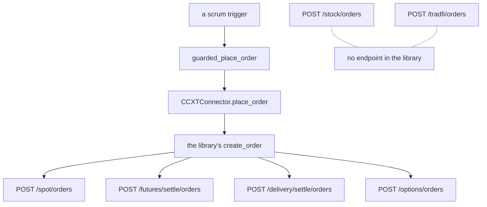

# Gate.io Sector Order Formats

**Mode: Reference, with three product files changed.**

This page covers issue #1192. It establishes how Gate.io requires an order to be
formatted in each of the six sectors it serves, names the bot variant each format
demands, and records what changed so the program sends each format.

**FALSIFICATION.** This page is wrong if a field named here is absent from
Gate.io's own published specification, if a sector's order body accepts a field
this page calls refused, if the platform's order call passes a field this page
says it omits, if a Gate.io order the program now refuses turns out to be one the
venue would have accepted, or if a product line this page calls unreachable turns
out to have an endpoint in the installed library.

---

## The venue is reached, but not by the test the issue names

Gate.io is a library venue and no connector was written. The membership test the
issue states does not hold, and the venue is reached anyway.

```
'gateio' in ccxt.exchanges           False, on ccxt 4.5.85
'gate'   in ccxt.exchanges           True
'gateio' in SUPPORTED_EXCHANGES      True
resolve_ccxt_class(ccxt, 'gateio')   <class 'ccxt.gate.gate'>
```

The library renamed the class. `src/exchange/ccxt_connector.py, in
CCXT_CLASS_ALIASES` maps the historical id onto the current one, and
`resolve_ccxt_class` reads that map when the direct attribute is absent. Every
reading above was taken in one process with the home directory redirected to a
scratch directory before any module under `src` was imported.

---

## What was read

Gate.io publishes its trading interface as one API reference with a section per
product line. The new reference is a single page application that truncates, and
each section also serves a page of its own. Those per-section pages are what the
field names below come from.

```
https://www.gate.com/docs/developers/apiv4/en/
https://www.gate.com/docs/developers/apiv4/en/spot/
https://www.gate.com/docs/developers/apiv4/en/futures/
https://www.gate.com/docs/developers/apiv4/en/delivery/
https://www.gate.com/docs/developers/apiv4/en/options/
https://www.gate.com/docs/developers/apiv4/en/stock/
https://www.gate.com/docs/developers/apiv4/en/cfd/
https://www.gate.com/docs/futures/api/index.html
https://www.gate.com/help/futures/perpetual/22144/classification-of-contract-types
https://www.gate.com/help/tradfi/stock-spot/50968
https://www.gate.com/announcements/article/34870
https://www.gate.com/announcements/article/45926
https://www.gate.com/announcements/article/49240
https://www.gate.com/announcements/article/49704
https://www.gate.com/announcements/article/51452
https://www.gate.com/price/tether-gold-xaut
https://www.gate.com/legal/user-agreement
https://www.gate.com/help/guide/faq/40959/restricted-locations
    all read 2026-10-09
```

No credential was sent. No account was created. No endpoint of the venue was
called and no order of any kind was placed or tested. Every venue reading is of a
public page. Every behaviour reading is of the connector library's own code in
this machine's own site packages, and the two are reported separately throughout.

The venue's terms refuse a United States person. Its user agreement states it does
not intend to provide services to "U.S. persons" or "U.S. customers," and
"expressly prohibit the same from using any of our Services". Its restricted
locations page lists "the United States" first among "restricted regions". That is
an account and address matter. It changes nothing about the format.

---

## The venue publishes nine product lines and the library carries four

The API reference names its own sections. Read in one process, the installed
library's capability map carries only some of them.

```
the venue's own section list     Spot & Margin, Perpetual Futures,
                                 Delivery Futures, CFD, Stock, Options,
                                 Unified, Alpha, CrossEx

in the library's api map         spot, futures, delivery, options, unified
absent from the library          stock, tradfi
```

The second of those two absent names is the path stem of every CFD endpoint. So
two of the venue's product lines, its TradFi Stock line and its CFD line, have no
endpoint in the installed library, and no order can be built for either one
through the order path. That reading decides three of the six sector rows below,
and it is a reading of the library, not of the venue.



---

## The one field that differs from the baseline

The baseline venue and the second venue both send a cash amount on a spot market
buy. Gate.io is a third, and its own page says so in one sentence.

> Trade amount. When `type` is `limit`, this is the base currency to trade (the
> currency being bought or sold), e.g. `BTC` in `BTC_USDT`. When `type` is
> `market`, the meaning depends on the side: - `side`: `buy` refers to the quote
> currency, e.g. `USDT` in `BTC_USDT` - `side`: `sell` refers to the base
> currency, e.g. `BTC` in `BTC_USDT`

The library's own code path agrees, and it is a separate reading. In
`ccxt/gate.py, in create_order_request`, the spot branch sets the
requires-a-price option to True, multiplies the size by the price, and assigns
that product to the size field rather than the size itself. Its own refusal text
names the quantity it expects.

```
createOrder() requires the price argument for market buy orders to calculate
the total cost to spend (amount * price), alternatively set the
createMarketBuyOrderRequiresPrice option or param to False and pass the cost to
spend (quote quantity) in the amount argument
```

Driven with the transport replaced, one spot market order on each side, asking
five units at a price of one hundred:

```
side sell    amount "5"      the unit count
side buy     amount "500"    five units at one hundred, the cash cost
```

So `src/trading/scrumming/sizing.py, in CITED_CASH_MARKET_BUY` gains a third
venue, and `whole_unit_buy_needs_limit` now answers True for a whole-unit market
on this venue. A whole-unit buy here takes the same limit-order treatment the
baseline venue's work introduced, so the unit count the size rule floored is the
count the venue credits.

---

## A contract here is a fraction of a unit on one half and a cash amount on the other

The venue publishes both shapes, split by which asset backs the contract. Its own
help page states each one in a single sentence.

> Each contract is 0.0001 BTC (e.g., BTC_USDT)

> Each contract is 1 USD (e.g., BTC_USD)

The first is the quote-margined half, where one contract is a fixed fraction of
the base asset. The second is the half margined in the base asset, where one
contract is a fixed cash amount. The same page sets the collateral, the quote
currency and the settlement currency per half.

```
quote-margined     collateral USDT    quote USDT    settled in USDT
base-margined      collateral BTC     quote USD     settled in BTC
```

The API reference names the field that carries the first figure, and its wording
has drifted between doc versions. Both are recorded because the older one is
still served.

```
current   The contract multiplier indicates how many units of the underlying
          asset the face value of one contract represents.
older     Multiplier used in converting from invoicing to settlement currency
          in quanto futures
```

The library's own code is a separate reading and it agrees with the venue on the
second half. In `ccxt/gate.py, in parse_contract_market`, the linear test is a
comparison of the quote against the settle currency, so a contract settled in its
own base asset is marked inverse; and where the published multiplier is zero the
library substitutes one, with its own comment naming the denomination as a dollar.

This is the hazard the baseline work caught, and the guard already holds. Driven
on a base-margined record, `src/exchange/ccxt_connector.py, in contract_units`
answers nothing rather than a figure, so no dollar amount is written into a
unit-count field. `quote_contract_size_shapes` names the cash-amount shape on
both sides of the same record, `size_shape_refusal` names the variant as not
built, and the order refuses before any value reaches the connector.

```
SELL   the venue permits a cash amount alone on a sell of this product, and
       cash-amount order is not built
BUY    the venue permits a cash amount alone on a buy of this product, and
       cash-amount order is not built
handed to place_order    nothing, on either side
```

**So the cash-amount variant gains a second venue behind it.** The issue's row 6
records the base-margined contract of one venue as the one product selecting it.
A second venue's base-margined perpetual selects it on the same ground, through
code already written, with no change needed to reach the refusal.

---

## Crypto

The sector the venue is listed under today, and the one the order path has always
reached. The product is a spot pair and the endpoint is the spot one.

```
endpoint        POST /spot/orders
size field      amount
order types     limit, market
time in force   gtc, ioc, poc, fok
```

The venue's own page constrains two of those for a market order. Only the
immediate-or-cancel and fill-or-kill values are accepted when the type is market,
and the price field is required only for a limit order.

> Price cannot be empty when `type`= `limit`

The per-pair figures come off the venue's own currency-pairs record, whose field
descriptions are published.

```
min_base_amount    Minimum amount of base currency to trade, null means no limit
min_quote_amount   Minimum amount of quote currency to trade, null means no limit
amount_precision   Quantity precision
precision          Price precision
trade_status       untradable, buyable, sellable, tradable
fee                Trading fee rate(deprecated)
```

Two ceilings sit beside the floors and the platform reads neither. Both are
published on the same record, one capping a market order's size and one capping
its cash value.

One published constraint applies to the order path and not to the venue's own
screens. An announcement raised the floor for orders arriving through the API
alone.

> 1 USDT to 10 USDT for spot pairs as well as the corresponding leveraged trading
> markets

> This adjustment only applies to orders placed through spot API endpoints, Orders
> placed on Web or App will remain unaffected.

**Variant: the bot as written, with the cash market buy selecting the limit-order
treatment where the size rule reads whole units.** No new variant.

---

## Stocks

The venue serves this sector twice, through two different product lines, and only
one of them is reachable.

The reachable one is a tokenised equity quoted against a dollar stablecoin on the
spot market. Its announcement names the products and the settlement.

> 24/7 trading, fractional shares, and on-chain transfers

> settled in USDT

Because it is a spot pair, the format is the spot format above, unchanged: the
same endpoint, the same size field, and the same cash rule on a market buy. The
platform sizes it today and the drive confirms it.

The unreachable one is the venue's TradFi Stock line, which trades real shares
and has its own endpoint and its own field names.

```
endpoint        POST /stock/orders
size field      volume            Order quantity
side            1=sell, 2=buy     a numeric enum, not a string
price_type      market, limit
time_in_force   day               the only value published
trading_session Limit orders support only all, while market orders support only
                regular.
```

Three things about that body differ from every other order the platform sends.
The size field is named differently, the side is a number rather than a word, and
the time in force carries one value. **There is no cash field anywhere in the
body**, so a market buy on this line is sized in shares and not in cash, the
opposite of the same venue's spot rule. A single order builder cannot serve both.

**This corrects a figure in the readiness matrix.** That page records the smallest
sellable piece for this venue's equities as a ten-thousandth of a share. The
venue's own published example for this line reads otherwise.

```
the matrix records        0.0001 share
the venue's own example   min_order_volume "1", step_order_volume "1"
the only 4 on the page    volume_precision 4, a precision ceiling
```

A precision ceiling is not a step and not a minimum. The ten-thousandth figure is
not supported by the venue's published example, and the published example is
whole shares. The matrix figure is correct for the tokenised equity on the spot
market and wrong for the TradFi Stock line; the two were read as one product.

**Variant: the bot as written for the tokenised spot pair. The whole-unit variant
would hold the TradFi Stock line, and that line has no endpoint in the library,
so nothing selects it.** No new variant.

---

## Commodities

The venue serves this sector twice as well, and again one route is reachable.

The reachable route is tokenised gold on the spot market. The venue's own page for
the asset states what one token stands for.

> A complete XAUT token represents one troy ounce of gold on a London qualified
> delivery gold bar.

That single sentence is what the sector label turns on, and the platform now
reads it. `src/exchange/ccxt_connector.py, in TOKEN_UNDERLYING_CODES` maps a
tokenised asset onto the code it redeems for, and `market_asset_class` answers
commodities when the base asset resolves to a precious-metal code. The venue's
gold token was absent from that map, so its gold market read as crypto. With the
entry present it reads commodities, which is the reading the sector needs.

```
before   market_asset_class on the venue's gold spot pair    crypto
after    market_asset_class on the venue's gold spot pair    commodities
```

The order format is the spot format, unchanged.

**No published answer for the per-pair step.** The venue publishes no static
specification page for any spot pair; the step, the minimum and the precision
exist only in the live currency-pairs record, which was not called. Searched: the
asset's own price page, its spot trade page, its futures page, the API reference's
spot section, and two site-restricted searches. The nearest published constraint
is the ten-dollar API floor quoted under Crypto above, which binds this market
too.

The unreachable route is a gold contract for difference on the TradFi line, whose
contract size the venue does publish. Four leverage tiers are listed and all four
carry a contract size of one hundred under the Metals category.

**Variant: the bot as written for the tokenised spot pair.** No new variant.

---

## Forex

The venue serves this sector through its CFD line alone. Its announcement names
the asset families the line covers.

> broadening access to contracts for difference (CFD) covering traditional
> financial assets, including gold, foreign exchange, stock indices, commodities
> and popular equities

The API reference names the line as "comprehensive CFD API endpoints for MT5-based
forex and CFD trading", and it does publish an order body with field names. This
corrects an expectation carried into this unit, which was that no CFD order format
is published.

```
endpoint      POST /tradfi/orders
size field    volume      Order quantity, required
side          1=sell, 2=buy, required
price_type    trigger, market, required
price         Order price, required
leverage      must be one of the leverage multipliers allowed for the symbol
price_tp      Take profit price (optional)
price_sl      Stop loss price (optional)
```

The published symbol-detail record carries a floor and a ceiling for the size, and
the venue's own example is a currency pair.

```
min_order_volume   Minimum Order Volume    the example reads 10
max_order_volume   Maximum Order Volume    the example reads 100
contract_volume    the example reads 100000
price_precision    the example reads 4
```

**No published answer for the volume step.** The CFD symbol-detail record carries
no step field and no quantity precision field, unlike the spot and TradFi Stock
records which carry both. Searched: the API reference's CFD section twice, the
venue's CFD landing page, and the three announcements named above. The venue
publishes a minimum and a maximum and never a step.

Two shapes in that body have no counterpart in anything the platform sends. There
is no time-in-force field at all, and the price-type enum offers a trigger and a
market order where every other line offers a limit and a market order.

**Variant: none is selectable, because the line has no endpoint in the library.**
The sector is listed and charted and no order can be built for it. No new variant.

---

## Indices

The same CFD line serves this sector, under the same announcement sentence, which
names "stock indices" among the families. The endpoint, the size field, the side
enum and the absent step are the CFD rows above, unchanged.

The readiness matrix also records an index fund token in this venue's spot pair
list, marked as not confirmed alone. That reading is unchanged by this page. If
such a token is a spot pair then its format is the spot format; its sector label
is a separate question, answered next.

**No published answer for the sector label of a tokenised index or a tokenised
equity on this venue's spot market.** The venue's spot record publishes the pair
id, its two legs, the two minimums, the two precisions, a trade status, two rate
fields and the two market-order ceilings. **None of those is an asset type.** The
platform's classifier reads an asset-type label first and a redemption code
second, and a spot record on this venue carries neither for an equity or an index
token. Driven on such a record, the classifier answers crypto.

```
a tokenised equity spot record on this venue    market_asset_class crypto
a tokenised index spot record on this venue     market_asset_class crypto
a tokenised gold spot record on this venue      market_asset_class commodities
```

The gold row resolves because gold has a redemption code and a published sentence
naming it. An equity token and an index token have neither, and no field on the
venue's record carries the sector. Closing that would need a list of tokenised
equity tickers maintained inside the program, which is a shape nothing in the
issue names and which no venue field feeds, so it is not built here.

**Variant: none is selectable for the CFD route.** No new variant.

---

## Futures and Perpetuals

Three products, three endpoints, and the only sector where the format genuinely
differs from the spot baseline.

### The half margined in the quote currency

```
endpoint      POST /futures/{settle}/orders
size field    size      Order size. Specify positive number to make a bid, and
                        negative number to ask
contract      the contract id
price         a price of zero with an immediate-or-cancel tif is the market order
tif           gtc, ioc, poc, fok
settle        btc, usdt, usd1
```

The size field counts contracts and never units, and the published floor is a
contract count.

```
order_size_min       Minimum order quantity         the example reads 1
order_size_max       Maximum order quantity         the example reads 1000000
order_price_round    Minimum order price increment  the example reads 0.1
quanto_multiplier    the example reads 0.0001
```

The platform divides before the step rather than after it. Driven on such a
record, asking five units where one contract stands for a ten-thousandth:

> SIZED IN CONTRACTS: names 50000.0000000000 contracts on a size step of 1.0. One
> contract stands for 0.0001 units, so 5.0000000000 units name 50000.0000000000
> contracts.

The settle list is a third reading that corrects an expectation carried into this
unit. Three values are accepted here and not two.

**Variant: the whole-unit position, which is built.** A contract count steps in
whole contracts, and the size rule reads the published step of one. No new
variant.

### The half margined in the base asset

One contract is a fixed cash amount, as the help page sentence above states. This
is the row that selects the unbuilt variant, and it is covered in full under the
contract section above. The order refuses on both sides and nothing reaches the
connector.

**Variant: the cash-amount order, which is named and not built.** No new variant,
and a second venue now stands behind the one variant with no venue behind it.

### The dated contract

```
endpoint      POST /delivery/{settle}/orders
size field    size      Required. Trading quantity. Positive for buy, negative
                        for sell. Set to 0 for close position orders.
expire_time   Contract expiry timestamp
cycle         Cycle type, e.g. WEEKLY, QUARTERLY
settle_price  Settle price
tif           gtc, ioc, poc, fok
settle        usdt
```

The expiry field is published, which is what the platform's expiry close reads.
Driven on such a record seventy-six days out, the sale is submitted and the notice
names the horizon; a buy still passes until the lead time is reached.

The settle list here is one value and not three, which differs from the perpetual
line above. That difference is published, and the platform reads the settle
currency off the market record rather than from a list, so nothing in the program
depends on it.

**Variant: the rolling position, which is built.** No new variant.

### Options

The venue publishes an options line and the library carries its endpoint, so it is
recorded here for completeness. The program draws no options sector.

```
endpoint      POST /options/orders
size field    size      Trading quantity. Positive for buy, negative for sell.
multiplier    The option contract multiplier indicates how many units of the
              underlying asset the face value of one contract represents.
tif           gtc, ioc, poc        Market orders currently only support IOC mode
```

The multiplier field is named differently from the perpetual line's, and the
time-in-force list is one value shorter.

---

## The recording beside the pages

The operator's own recording holds one venue and nothing for this one. It was read
read-only and its modification time was read before and after every drive.

```
top-level venue keys                     1
market rows under that key               1146
rows carrying a sector                   1146
rows carrying this venue                 0
modification time, before and after      unchanged on every run
```

The sector counts the recording now carries are worth stating, because the issue
records them as zero. That count is stale; the recording was rewritten by a later
build and every row now carries a sector.

| Sector | rows |
| --- | --- |
| crypto | 894 |
| futures_perps | 168 |
| stocks | 33 |
| commodities | 25 |
| forex | 20 |
| indices | 6 |

Every Gate.io sample driven for this page was built from that shape, field for
field, under a redirected home. **Nothing in the operator's file moves today.**

---

## Controls on the method

**The existing venues did not move.** Every answer the order path gives for every
recorded market was read out of the unchanged tree and out of this branch, in two
separate processes against two separate worktrees, and compared field by field.

```
recorded markets swept              1146
answers read, each tree             101994
answers that moved                  0
markets with a mover                0
```

**The same reading reports a movement when a field changes.** One recorded row's
published step was changed to one whole unit and the identical sweep was run
again.

```
answers read                        101994
answers that moved                  15
markets with a mover                1
the first mover                     the recorded unit rule, fractional to whole
the movers it caused                the unit rule on both sides at three
                                    moments, the sized amount, the sub-minimum
                                    refusal, the smallest order cost, the
                                    tradeable answer, and the variant
```

So the zero above is a reading and not a blind instrument.

**The surface moved by exactly three cells.** Every venue-and-sector cell the
surface answers was read out of both trees.

```
venue ids                           25
sectors                              6
cells compared                     150
cells that moved                     3
                                    this venue and forex, False to True
                                    this venue and indices, False to True
                                    this venue and futures_perps, False to True
cells answering yes                 88 before, 91 after
```

The cell count is 150 and not 144 because the surface answers for a hand-written
venue id beside the twenty-four the two module constants name. Control: an
invented venue id answers no sector, before and after.

**The transport was replaced and proved to raise.** Before any order was driven,
the library's own fetch, its low-level call and its market load were replaced by a
function that raises, and all three were called to confirm it.

```
fetch2          the transport is replaced; nothing reaches Gate.io
fetch           the transport is replaced; nothing reaches Gate.io
load_markets    the transport is replaced; nothing reaches Gate.io
```

Every driven order then stopped at the value the connector would have been handed,
and each body was built by the library's own request builder, which sends nothing.

**The refusals were driven.** A market the venue does not list and a size below
the published minimum were both driven on every sector, and no order reached the
transport.

```
a market the venue does not list
    the market list is asked, the symbol is absent, the guard warns that no
    minimum is known, and the library refuses the symbol outright with
    BadSymbol: gate does not have market symbol

a size below the published minimum, seven products
    every one answered PRE-FLIGHT REJECTED and named the minimum and the step,
    and the base-margined contract refused earlier still, on the variant
    handed to place_order    nothing, on all seven
```

A contract market's published floor counts contracts, so the unit count driven
under it is the floor multiplied by the contract size. Reading the floor as a unit
count instead passes a size that is a thousand contracts and refuses nothing,
which is a property of the reading and not of the code.

---

## The variant each sector demands

| Sector | The venue's endpoint | The size field | The variant the format demands | New? |
| --- | --- | --- | --- | --- |
| crypto | POST /spot/orders | amount, a unit count on a sell and a cash amount on a market buy | the original call, with the whole-unit rule selecting per market | no |
| stocks, tokenised on spot | POST /spot/orders | amount, the same two shapes | the original call | no |
| stocks, the TradFi line | POST /stock/orders | volume, a share count on both sides | the whole-unit position, and no endpoint in the library selects it | no |
| commodities, tokenised on spot | POST /spot/orders | amount, the same two shapes | the original call | no |
| commodities, the CFD line | POST /tradfi/orders | volume | none selectable, no endpoint in the library | no |
| forex | POST /tradfi/orders | volume | none selectable, no endpoint in the library | no |
| indices | POST /tradfi/orders | volume | none selectable, no endpoint in the library | no |
| futures and perpetuals, quote-margined | POST /futures/{settle}/orders | size, a contract count of a fixed fraction of the base asset | the whole-unit position, which is built | no |
| futures and perpetuals, base-margined | POST /futures/{settle}/orders | size, a contract count of a fixed cash amount | the cash-amount order, named and not built, so the order refuses | no |
| futures and perpetuals, dated | POST /delivery/{settle}/orders | size, a contract count | the rolling position, which is built | no |

**No sector demands a seventh variant.** Five rows take variants already built,
one refuses on the variant the issue already names, and four reach no order
because the product line they live on has no endpoint in the installed library.

### Which of this venue's sectors the program reaches

```
reaches an order today      crypto, stocks, commodities
                            futures and perpetuals, quote-margined half
refuses on a named variant  futures and perpetuals, base-margined half
listed and charted only     forex, indices
```

Three of the six reach an order through a spot pair. The fourth reaches it through
a contract. Forex and indices are listed under this venue because the venue lists
a product in each, and neither product line has an endpoint in the library.

### The published fields the platform's call has no value for

Every one of these is published on a Gate.io order body or symbol record, and no
value for it exists anywhere in the call chain from `guarded_place_order` to
`place_order`.

```
on the spot body
  iceberg    auto_borrow    auto_repay    stop_loss    take_profit
  trade_quote    the account type beyond the library's own

on the spot symbol record
  max_base_amount    max_quote_amount    market_order_max_stock
  market_order_max_money    up_rate    down_rate    slippage
  sell_start    buy_start

on the futures and delivery body
  close    reduce_only    auto_size    iceberg    the tif beyond the library's own

on the futures and delivery contract record
  order_size_max    leverage_min    leverage_max    maintenance_rate
  cycle    settle_price    settle_price_interval    settle_fee_rate

on the TradFi Stock body
  trading_session    the client order id beyond the library's own

on the CFD body
  leverage    price_tp    price_sl
```

### The field the platform passes that a sector's endpoint does not accept

Two, and each belongs to a line with no endpoint in the library, so neither can be
sent today. They are recorded because they decide the format if either line is
ever reached.

The TradFi Stock line publishes one time-in-force value, a day order. The
platform's third order type becomes a limit order carrying an immediate-or-cancel
time in force, which that line does not publish. The CFD line publishes no
time-in-force field at all, and its price-type enum names a trigger where the
platform names a limit.

A third case is narrower than a refusal and is recorded for accuracy. A market buy
into a spot pair on this venue names a cash amount and a market sell names a
count, so the two halves of one accumulation cycle are sized in different units on
the same market. The whole-unit path replaces a market buy with a limit order
where the size rule reads whole units, which is what keeps the count the rule
floored.

---

## What changed

Three product files.

```
src/trading/scrumming/sizing.py
    CITED_CASH_MARKET_BUY holds the third venue whose spot market buy names a
    cash amount

src/exchange/ccxt_connector.py
    TOKEN_UNDERLYING_CODES holds the redemption code of the tokenised gold
    asset this venue lists, so market_asset_class answers the commodities
    sector for that market

src/gui/main_tabs/asset_class_surface.py
    EXTRA_VENUE_CLASSES lists forex, indices and futures_perps for this venue
```

---

## What this page could not establish

```
the per-pair step of the tokenised gold spot market
    no published answer; the venue serves no static spot specification page and
    the figure exists only in the live currency-pairs record

the volume step of the CFD line
    no published answer; the symbol-detail record carries a minimum and a
    maximum and no step and no quantity precision

the sector label of a tokenised equity or index on this venue's spot market
    no published answer; no field on the venue's spot record carries an asset
    type
```

---

## Related pages

- [`docs/manual/15-venue-compatibility.md`](../../manual/15-venue-compatibility.md)
  — the venue table and the variant definitions this page reads against
- [`docs/manual/16-sector-exchange-product-tree.md`](../../manual/16-sector-exchange-product-tree.md)
  — the sector, venue and product levels
- [`docs/audits/2026-10-08_coinbase_sector_order_formats/REPORT.md`](../2026-10-08_coinbase_sector_order_formats/REPORT.md)
  — the baseline this page translates
- [`docs/audits/2026-10-08_binance_sector_order_formats/REPORT.md`](../2026-10-08_binance_sector_order_formats/REPORT.md)
  — the second venue, and the base-margined contract this page's row matches
- [`docs/audits/2026-10-07_venue_sector_readiness_matrix/REPORT.md`](../2026-10-07_venue_sector_readiness_matrix/REPORT.md)
  — which venue reaches which sector, and the equity figure this page corrects
- [`docs/audits/2026-10-08_exchange_buildout_order/REPORT.md`](../2026-10-08_exchange_buildout_order/REPORT.md)
  — why this venue is first among the reachable ones
