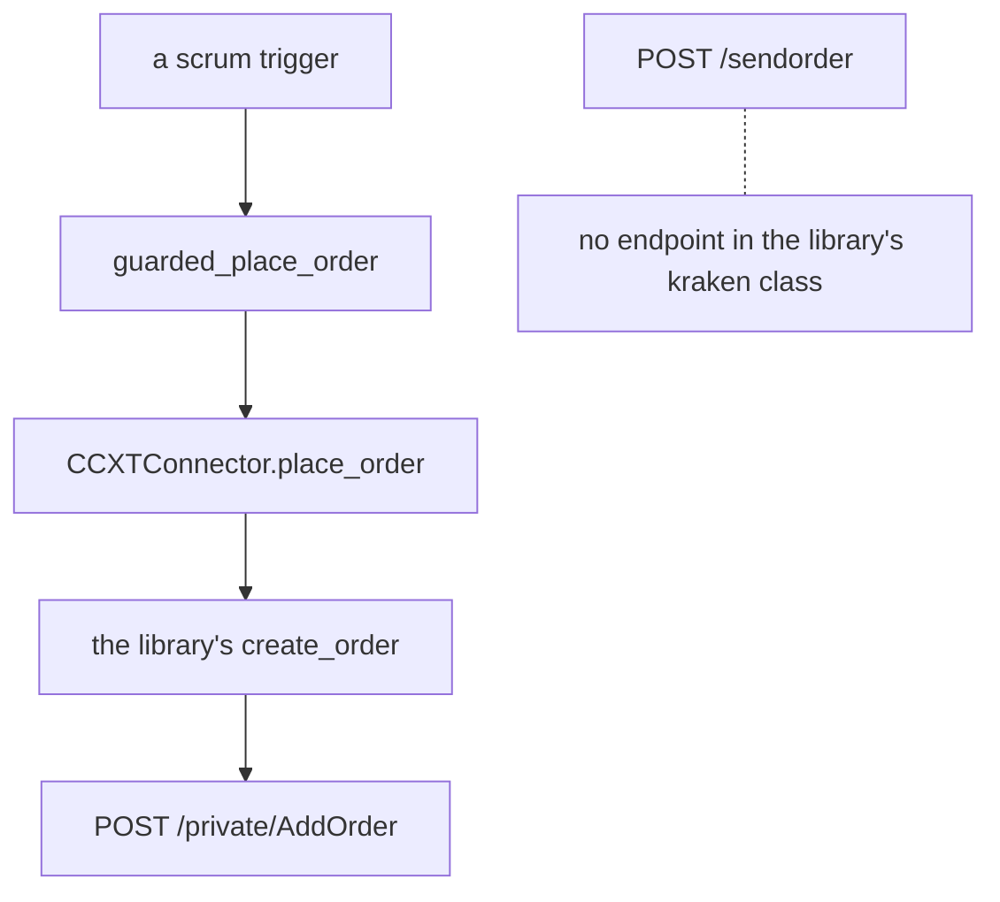

# Kraken Sector Order Formats

**Mode: Reference, with one product file changed and one order field corrected.**

This page covers issue #1192. It answers the eight connections of that issue's
wired-venue section for Kraken, establishes how Kraken requires an order to be
formatted in each of the six sectors it serves, names the bot variant each format
demands, and records what changed so the program sends each format.

**FALSIFICATION.** This page is wrong if a field named here is absent from
Kraken's own published specification, if a sector's order body accepts a field
this page calls refused, if the program's order call passes a field this page
says it omits, if a Kraken order the program now refuses turns out to be one the
venue would have accepted, or if a product line this page calls unreachable turns
out to have an endpoint in the installed library.

---

## The eight connections

Every reading was taken in a process whose home directory was redirected to a
scratch tree before any module under the source tree was imported, with the
redirected home printed and its contents listed afterwards.

| # | The connection | Kraken | The symbol that answers it |
|---|---|---|---|
| 1 | a connector exists and is registered | answered for the spot line, absent for the futures line | `src/exchange/ccxt_connector.py, in SUPPORTED_EXCHANGES` |
| 2 | offered under every sector it serves | **was missing one sector, now answered** | `src/gui/main_tabs/asset_class_surface.py, in EXTRA_VENUE_CLASSES` |
| 3 | the operator can enter its credentials | answered, on the Exchanges tab and in the first-run wizard | `src/gui/main_tabs/settings_dialog_surface.py, in exchange_status_rows` |
| 4 | a Start press builds its connector | answered | `src/gui/main_window.py, in _connect_exchange_for_bot` |
| 5 | its market rules record on connect | answered | `src/exchange/market_rules_store.py, in record_venue` |
| 6 | its orders carry the shape the venue publishes | **one field was wrong, now corrected** | `src/exchange/ccxt_connector.py, in place_order` |
| 7 | a built variant selects for it | answered | `src/trading/scrumming/sizing.py, in VARIANTS_BUILT` |
| 8 | its gate decisions log under it | answered | `src/core/log_paths.py, in gate_log_path` |

---

## Row one, the connector

The venue id resolves and the membership test the issue names holds. The library
carries a second class for the same firm, and the program registers neither it
nor a second venue id.

```
ccxt version                            4.5.85
'kraken' in ccxt.exchanges              True
'kraken' in SUPPORTED_EXCHANGES         True, of 15 ids
resolve_ccxt_class(ccxt, 'kraken')      <class 'ccxt.kraken.kraken'>
'kraken' in CRYPTO_CONNECTORS           False, so no connector was written
'kraken' in US_RESTRICTED_EXCHANGES     False
'krakenfutures' in ccxt.exchanges       True
'krakenfutures' in SUPPORTED_EXCHANGES  False
```

The spot class reaches spot alone, read off its own capability map and its own
endpoint map in one process with every socket refused.

```
ccxt.kraken        has.spot True   has.future False  has.swap False
                   api sections    private, public, zendesk
                   endpoint paths naming a future, a perpetual, a derivative
                   or an instrument    none

ccxt.krakenfutures has.spot False  has.future True   has.swap True
                   api sections    charts, history, private, public
```

**A second venue id is not the answer, and the issue says why.** Row 16 of that
issue reads "No firm occupies two rows" and names the two Interactive Brokers
ids as the defect it closes. Registering the futures class would create exactly
that shape for Kraken, so this page records the futures line as unreachable
rather than adding an id.

---

## Row two, the sector the venue was not offered under

Kraken quotes twelve spot pairs whose two legs are both a national currency it
lists, and the program's own classifier already answers the forex sector for
them. The sector did not offer the venue, so the operator could not reach any of
them.

```
before   sectors offering kraken   5    crypto, stocks, commodities,
                                        indices, futures_perps
after    sectors offering kraken   6    forex added
```

The venue's own asset-pairs record names both legs of each pair. Read from the
public endpoint, with the pair ids as the venue publishes them.

| Pair id | Base | Quote | Smallest order size | Smallest order cost |
| --- | --- | --- | --- | --- |
| ZEURZUSD | ZEUR | ZUSD | 4 | 0.5 |
| ZGBPZUSD | ZGBP | ZUSD | 4 | 0.5 |
| AUDUSD | ZAUD | ZUSD | 7 | 0.5 |
| EURAUD | ZEUR | ZAUD | 4 | 1 |
| EURCAD | ZEUR | ZCAD | 4 | 1 |
| EURCHF | ZEUR | CHF | 4 | 0.5 |
| EURGBP | ZEUR | ZGBP | 4 | 0.43 |
| USDCHF | ZUSD | CHF | 5 | 0.5 |
| ZUSDZCAD | ZUSD | ZCAD | 5 | 1 |
| AUDJPY | ZAUD | ZJPY | 7 | 50 |
| EURJPY | ZEUR | ZJPY | 4 | 50 |
| ZUSDZJPY | ZUSD | ZJPY | 5 | 50 |

The venue also lists the sector on its futures line, which the program does not
reach. Its own announcement names the products and its own instruments endpoint
carries three of them today.

> Our first five perps — EUR/USD, GBP/USD, AUD/USD, JPY/USD and CHF/USD — are
> launching

> These contracts trade without expiry, enabling traders to stay engaged in the
> forex market

```
instruments carrying tradfi true    3 of 226
their symbols                       PF_EURUSD, PF_GBPUSD, PF_CHFUSD
their published category            Forex
their published contract size       1
```

**This answers decision two of the issue for this venue.** That decision asks
whether a euro token against a dollar stablecoin counts as a forex market,
"since no venue the platform connects lists a pair with two national-currency
legs". Kraken lists twelve, so the sector is served here without the stablecoin
reading.

---

## Row three, the credential form

One source answers the whole arithmetic. The Exchanges tab reads the sector's own
venue list and the Add form reads that same list, so the set the screen offers
and the set it can act on cannot differ.

```python
# src/gui/main_tabs/settings_dialog_surface.py, in exchange_status_rows
    for venue in sorted(acs.venues_for_class(wing)):
```

Measured over every sector, with the crypto wing and the stock wing taken
together as the form's own set, and a connector counted from the two registries
plus the broker list.

| Sector | Offered | Neither wing accepts | No connector | No gate home |
| --- | --- | --- | --- | --- |
| crypto | 21 | none | none | none |
| stocks | 19 | none | none | none |
| commodities | 16 | none | none | none |
| forex | 7 | none | none | none |
| indices | 13 | none | none | none |
| futures_perps | 16 | none | none | none |

The first-run wizard keeps its own list and offers this venue too. The six ids
that list omits are the brokers and the one written crypto connector, which
another unit holds.

```
wizard venue count                  15
'kraken' offered by the wizard      True
offered under crypto, absent from the wizard
    alpaca, ibkr, robinhood, schwab, tastytrade, webull
```

---

## Row four, the Start press

The venue takes the library path, because neither the broker registry nor the
written-crypto registry names it. Nothing venue-specific stands between the press
and the connector.

```python
# src/gui/main_window.py, in _connect_exchange_for_bot
            if broker_connector_class(eid) is not None:
                return self._connect_broker_for_bot(bot)

            if crypto_connector_class(eid) is not None:
                return self._connect_written_crypto_for_bot(bot)
```

```
broker_connector_class('kraken')    None
crypto_connector_class('kraken')    None
the path taken                      CCXTConnector('kraken')
'kraken' in PASSPHRASE_EXCHANGES    False, so the form asks for a key and a
                                    secret and no passphrase
```

---

## Row five, the recording

The recording writes one sector per symbol, and the field sits inside each
symbol's own row rather than beside the venue. The operator's own file was read
read-only and its modification time was read before and after every drive.

```
path                                market_rules.json under the runtime tree
top-level venue keys                1
market rows under that key          2148
rows carrying a sector              2148
rows carrying this venue            0
modification time, before == after  True on every run
```

| Sector | Rows the recording carries |
| --- | --- |
| stocks | 1033 |
| crypto | 896 |
| futures_perps | 168 |
| commodities | 25 |
| forex | 20 |
| indices | 6 |

**This corrects two earlier figures.** The issue records 1142 rows with zero
carrying a sector, and the previous venue's page records 1146 rows with 894 under
crypto and 33 under stocks. Both are stale: a later build fetched the equity
products, so the total is 2148 and the stocks count is 1033.

---

## Row six, the order shape

Kraken serves two order interfaces. The program reaches one of them.



### The spot body, which every reachable sector takes

The venue publishes one order endpoint for every product on its spot line, and
one size field. Its own page names the field in a single sentence.

> volume — Order quantity in terms of the base asset

```
endpoint        POST /private/AddOrder
size field      volume, a base-asset count on both sides
order types     market, limit, iceberg, stop-loss, take-profit,
                stop-loss-limit, take-profit-limit, trailing-stop,
                trailing-stop-limit, settle-position
time in force   GTC, IOC, GTD, FOK
price           "Limit price for limit and iceberg orders"
client order id cl_ord_id, "alphanumeric client order identifier which
                uniquely identifies an open order"
userref         "optional non-unique, numeric identifier which can
                associated with a number of orders"
```

Driven through the library's own request builder with the transport replaced and
nothing sent, the body carries the unit count on both sides and the price on the
limit order alone.

```
BTC/USD  buy   market  {"ordertype": "market", "pair": "XXBTZUSD", "type": "buy", "volume": "0.001"}
BTC/USD  buy   limit   {"ordertype": "limit", "pair": "XXBTZUSD", "price": "50000", "type": "buy", "volume": "0.001"}
BTC/USD  sell  market  {"ordertype": "market", "pair": "XXBTZUSD", "type": "sell", "volume": "0.001"}
BTC/USD  sell  limit   {"ordertype": "limit", "pair": "XXBTZUSD", "price": "50000", "type": "sell", "volume": "0.001"}
```

### The cash amount is opt-in here, so this venue is not a fourth

The three venues audited before this one turn a spot market buy into a cash
amount with no asking. Kraken does not. The cash amount is one value of an order
flag, and its own page names the one side it is permitted on.

> viqc — order volume expressed in quote currency. This option is supported only
> for buy market orders. Also not available on margin orders.

The library's own code agrees and is a separate reading. Its spot branch converts
the size to a cash amount only when a cost is passed or when that flag is already
present, and the program passes neither.

```
without the flag   buy market   volume 0.001   the unit count
with the flag      buy market   volume 0.001   the cash cost, and oflags viqc
the program's own call           passes no cost and no oflags
```

**So the cash-market-buy table gains no fourth venue.** The whole-unit
limit-order treatment that table selects is not needed here, because the count
the size rule floored is the count this venue credits on a plain market order.

### The one field that was wrong, and the venue's own page that settles it

The program sent its client order id in the venue's numeric field. The id it
generates is not numeric.

```
the program's own client order id   acrv- followed by a hexadecimal digest
all digits                          False
the field it was sent in            userref, published as numeric
the field the venue publishes for an alphanumeric id   cl_ord_id
```

The library already maps its own canonical name onto the venue's alphanumeric
field, so the correction is to stop overriding it.

```python
# ccxt/kraken.py, in order_request
        clientOrderId = self.safe_string(params, 'clientOrderId')
        if clientOrderId is not None:
            request['cl_ord_id'] = clientOrderId
```

Driven on a real connector for every registered venue, with each library's
transport replaced and nothing sent, read at the body that would have been
posted.

```
before   kraken   {"ordertype": "limit", "pair": "BTCUSD", "price": "50000",
                   "type": "buy", "userref": "acrv-7f3a9c2e41b05d68",
                   "volume": "0.001"}
after    kraken   {"cl_ord_id": "acrv-7f3a9c2e41b05d68", "ordertype": "limit",
                   "pair": "BTCUSD", "price": "50000", "type": "buy",
                   "volume": "0.001"}

venues driven                    15
venues whose posted body moved    1
venues identical                 14
```

### The futures body, which no reachable path builds

The futures line publishes its own endpoint and its own field names, and three of
them have no counterpart in anything the program sends.

```
endpoint        POST /sendorder
size field      size, "The size associated with the order. Note that different
                Futures have different contract sizes."
orderType       lmt, post, mkt, stp, take_profit, ioc, trailing_stop, fok
side            "The direction of the order"
limitPrice      "The limit price associated with the order."
cliOrdId        "The order identity that is specified from the user. It must be
                globally unique."
triggerSignal   mark, index, last
reduceOnly      "Set as true if you wish the order to only reduce an existing
                position."
```

The size field counts contracts and never units, the order-type names are
abbreviations rather than the words every other venue publishes, and there is no
time-in-force field because two of the type values carry it. Read from the public
instruments endpoint, every contract on the line is one unit of its own size.

```
instruments published        226
contract size, all 226       1
type flexible_futures        214
type futures_inverse         12
instruments with an expiry   18
instruments carrying an ISIN 221
```

---

## Row seven, the variant

Every market the venue publishes steps in fractions, so no Kraken market selects
the whole-unit rule off its own step.

```
recorded_unit_rule over 1814 published records   fractional, 1814 of 1814
smallest size step published                     1e-08 on 901 records
                                                 1e-05 on 913 records
size multiplier, all 1460 currency pairs         1
```

Four of the venue's own forex rows still select the whole-unit variant, because
the yen-quoted minimum order cost is fifty yen and the smallest order that buys
is worth more than a reference scrum excess. Those four are named and the variant
holding them is built.

| Pair | Last price | Smallest order, dollars | The variant it selects |
| --- | --- | --- | --- |
| AUD/JPY | 110.57 | 773.99 | whole-unit position |
| EUR/JPY | 178.079 | 712.32 | whole-unit position |
| USD/JPY | 157.195 | 785.97 | whole-unit position |
| USDT/JPY | 158.151 | 790.76 | whole-unit position |

The remaining thirty-four rows the classifier answers forex for all size a scrum
at the venue's own last price, the cheapest at three dollars and thirty-eight
cents and the dearest at seven dollars and seventeen cents. The commodities rows
size a scrum too.

```
forex rows the classifier answers        38
rows that can size a scrum               34
rows that cannot                          4, every one quoted in yen
commodities rows                          6, PAXG and XAUT against five quotes
commodities rows that can size a scrum    6
```

**No sector demands a seventh variant.** Three reach an order on a built variant,
one reaches it on a built variant with four rows taking the whole-unit one, and
two reach no order at all.

---

## Row eight, the gate log

One path per sector, each naming the venue and the sector, and every one under
the redirected home during the drive.

```
trade/gate/kraken/crypto/gate.log
trade/gate/kraken/stocks/gate.log
trade/gate/kraken/commodities/gate.log
trade/gate/kraken/forex/gate.log
trade/gate/kraken/indices/gate.log
trade/gate/kraken/futures_perps/gate.log

distinct paths   6 of 6 sectors
```

---

## Crypto

The sector the venue has always been listed under, and the one the order path has
always reached. The product is a spot pair and the body is the spot body above.

```
published currency pairs                       1460
of those, the classifier answers crypto for    1416
active, under the library's own status reading  1365 of 1460
published status values  online 1365, cancel_only 78, post_only 17
```

Two published floors reach the order and the program reads both.

```
ordermin   "Minimum order size (in terms of base currency)"
costmin    "Minimum order cost (in terms of quote currency)"

both present on all 1460 published pairs
```

**Variant: the bot as written.** No new variant.

---

## Forex

The sector this page adds. The product is a spot pair with two national-currency
legs, the body is the spot body, and the order path reaches it today with no
change beyond the offer.

```
pairs with two national-currency legs   12
rows the classifier answers forex for   38, the twelve plus token-redemption legs
rows that can size a scrum              34
```

The thirty-eight is wider than the twelve because the classifier resolves a
token onto the code its issuer redeems it for, so a euro token against a dollar
and a dollar token against a franc both read forex. Both readings are true of
different questions and both are stated.

**Four of the thirty-eight are a crypto token whose ticker collides with a
currency code.** The rows are named under what this page could not establish.

**Variant: the bot as written, with the whole-unit position holding the four
yen-quoted rows.** No new variant.

---

## Commodities

The sector reaches an order through two tokenised metals on the spot market, and
the classifier already answers it because both tokens carry a published
redemption code.

```
PAXG/USD   PAXG/EUR   PAXG/BTC   PAXG/ETH   XAUT/USD   XAUT/USDT
```

| Pair | Smallest order size | Last price | Smallest order, dollars |
| --- | --- | --- | --- |
| PAXG/USD | 0.001 | 4180.22 | 4.18 |
| XAUT/USD | 0.0012 | 4178.30 | 5.01 |

The venue also lists six commodity contracts on its futures line, which no
endpoint in the library's spot class reaches.

**Variant: the bot as written.** No new variant.

---

## Stocks

The venue publishes a tokenised-equity line on the same spot endpoint, under its
own published asset class, and the program's market load never asks for it.

```
the default market call            1460 pairs, every one aclass_base currency
the call naming the asset class     354 pairs, every one aclass_base
                                    tokenized_asset
symbols shared between the two        0
```

The venue's own page names the asset class the order body must carry for such a
pair, and it names it as required.

> This parameter is required on requests for non-crypto pairs, i.e. use
> `tokenized_asset` for xStocks.

The library's order builder names no such field. Driven on one of the 354 records
with the transport replaced, the body posted carries the pair and the size and
nothing naming the class.

```
body built for a tokenised pair
    {"ordertype": "limit", "pair": "AAOIxUSD", "price": "10", "type": "buy"}
body names asset_class    False
```

The venue's own support page states what one token is and who may hold it.

> Each xStock is backed 1:1 by the underlying equity, held in regulated custody,
> and issued as an onchain token.

> xStocks are available to eligible non-U.S. clients in 110+ countries. They are
> not accessible in the US (or to US persons), Canada, UK, or Australia.

**The sector is offered, the market load does not ask for its products, the order
body omits a field the venue calls required, and the venue refuses the product to
a United States person.** Three things would have to land together for an order
to reach this line, and the fourth cannot be changed by code.

```
src/exchange/ccxt_connector.py, in _sector_products
    a second market call carrying the venue's own asset-class parameter, so the
    354 records are recorded

src/exchange/ccxt_connector.py, in place_order
    the venue's own asset-class value on an order into such a market

src/exchange/ccxt_connector.py, in market_asset_class
    the published asset class read off the record, so the row records under
    stocks rather than crypto
```

**This unit builds none of the three, and the ground is the venue's own
sentence.** A sector the venue refuses to the operator is not a sector he can
reach, so wiring its order shape would ship a path no trade ever takes. The three
symbols above are what a later decision would change, and the decision is whether
a product the venue will not sell him is worth the build.

The session is a second absence. The venue publishes two trading windows for this
line and the program holds a rule for neither of the two together.

> The following 10 xStocks trade 24/7 on Kraken Pro: $TSLAx, $QQQx, $SPYx,
> $NVDAx, $CRCLx, $AAPLx, $HOODx, $MSTRx, $GLDx, $GOOGLx. All other xStocks trade
> 24/5 and not available on weekends.

**Variant: the bot as written would hold these, because the step is fractional on
all 354.** No new variant.

```
lot_decimals on all 354 tokenised pairs   8, a step of 1e-08
costmin on all 354                        0.5
published status                          post_only 330, online 24
```

---

## Indices

The venue serves this sector through the tokenised line and through one futures
instrument, and neither reaches an order.

```
tokenised fund tickers among the 354
    SPYx   QQQx   VOOx   VTIx   VTx   IWMx   and their second family
futures instruments carrying the Indices category   1 of 226
```

**No published answer separates a tokenised index fund from a tokenised single
share.** The venue's asset-pairs record publishes the pair id, both legs, both
asset classes, two minimums, three precisions, a size multiplier, a tick size, a
status and an execution venue. The asset class reads `tokenized_asset` for a
share and for a fund alike, and its own asset record adds an alternate name, a
decimal count, a status and a token multiplier, none of which names a fund.

**Variant: none is selectable.** No new variant.

---

## Futures and Perpetuals

Every product in this sector sits on the futures line, which has no endpoint in
the library's spot class. The sector is listed and charted and no order can be
built for it.

The venue publishes three product shapes on that line, read from its own
instruments endpoint and its own field descriptions.

| Shape | Instruments | What one contract is | The variant it would need |
| --- | --- | --- | --- |
| flexible_futures | 214 | one unit of its own published size | the whole-unit position, which is built |
| futures_inverse | 12 | settled in its own base asset | the cash-amount order, which is not built |
| with an expiry | 18 | the above, carrying a last trading time | the rolling position, which is built |

The inverse half is the shape the issue's unbuilt variant absorbs, and this venue
would be a third behind it. The dated half publishes the field the expiry close
reads.

```
lastTradingTime   the expiry timestamp, on 18 of 226
type              flexible_futures, futures_inverse, futures_vanilla, options
tradfi            "True if this is a non-crypto market."
isin              "International Securities Identification Number (ISIN)."
```

**The venue publishes a sector field on this line and the program reads none of
it.** The instruments endpoint carries a category per contract, and the categories
name four of the six sectors directly.

```
Forex        3     Commodities  6     Indices  1     Equities  8
xStocks      14    Pre-IPO      4     Real-world assets  1
```

**Variant: none is selectable, because the line has no endpoint in the library.**
No new variant.

---

## The variant each sector demands

| Sector | The venue's endpoint | The size field | The variant the format demands | New? |
| --- | --- | --- | --- | --- |
| crypto | POST /private/AddOrder | volume, a base-asset count on both sides | the original call | no |
| forex | POST /private/AddOrder | volume, the same shape | the original call, with the whole-unit position holding four yen-quoted rows | no |
| commodities | POST /private/AddOrder | volume, the same shape | the original call | no |
| stocks | POST /private/AddOrder | volume, plus a required asset-class field nothing sends | the original call, and no market is recorded to select it | no |
| indices, tokenised | POST /private/AddOrder | volume, with no published separator from a share | none selectable | no |
| indices, the futures line | POST /sendorder | size | none selectable, no endpoint in the library | no |
| futures and perpetuals, flexible | POST /sendorder | size, a contract count | the whole-unit position, and no endpoint selects it | no |
| futures and perpetuals, inverse | POST /sendorder | size, settled in the base asset | the cash-amount order, named and not built | no |
| futures and perpetuals, dated | POST /sendorder | size, carrying a last trading time | the rolling position, and no endpoint selects it | no |

### Which of this venue's sectors the program reaches

```
reaches an order today       crypto, forex, commodities
offered, no market recorded  stocks
listed and charted only      indices, futures and perpetuals
```

### The published fields the program's call has no value for

Every one of these is published on a Kraken order body or symbol record, and no
value for it exists anywhere in the call chain from the guarded order site to the
connector.

```
on the spot order body
  displayvol   asset_class   price2   trigger   leverage   reduce_only
  stptype      oflags        starttm  expiretm  deadline   validate
  broker       close[ordertype]   close[price]   close[price2]

on the spot asset-pairs record
  lot_multiplier   tick_size   cost_decimals   leverage_buy   leverage_sell
  margin_call      margin_stop  long_position_limit   short_position_limit
  fee_volume_currency   status   execution_venue

on the futures order body
  triggerSignal   reduceOnly   stopPrice   cliOrdId beyond the library's own

on the futures instruments record
  contractSize   contractValueTradePrecision   tickSize   underlying
  marginLevels   retailMarginLevels   maxPositionSize   maxOpenInterestUsd
  fundingRateCoefficient   maxRelativeFundingRate   category   tradfi
  isin   countriesBanned   platformsPermitted
```

### The field the program passes that a sector's endpoint does not accept

One, and it is the field this unit corrected. The numeric identifier took an
alphanumeric value on every Kraken order carrying a client order id, and the
venue publishes a separate field for exactly that value.

A second case is narrower than a refusal and is recorded for accuracy. A market
buy with no price makes the program fetch a ticker first, because one venue needs
a price to compute a cash cost. Kraken needs no price on a market order and the
library drops the one it is handed, so the fetch is a call this venue does not
require.

---

## Controls on the method

**The transport was replaced and proved to raise.** Before any order was driven,
the library's own fetch, its low-level call and its market load were replaced by a
function that raises, and each was called to confirm it. A request path with no
saved payload raised rather than reaching the venue.

```
fetch2          the transport is replaced; nothing reaches Kraken
fetch           the transport is replaced; nothing reaches Kraken
load_markets    the transport is replaced; nothing reaches Kraken
AddOrder        the transport is replaced; nothing reaches Kraken
```

**The surface moved by exactly one cell.** Every venue-and-sector cell the
surface answers was read out of the unchanged tree and out of this branch, in two
separate processes against two separate worktrees, and compared cell by cell.

```
cells compared                     182
cells that moved                     1
                                     this venue and forex, False to True
cells answering yes                112 before, 113 after
```

Control: an invented venue id answers no sector, before and after. An invented
sector name answers this venue's first declared sector in both trees, which is
what the normalising reader's own contract states, so that cell is not a control.

**The other fourteen venues' order bodies did not move.** A real connector was
built for every registered venue with its library's transport replaced, one limit
order carrying a client order id was driven through the real order call, and the
body that would have been posted was read on both trees.

```
venues driven                    15
venues whose posted body moved    1
venues identical                 14
```

**The same reading reports a movement when the field changes.** The moved venue's
body carried the numeric field before and the alphanumeric one after, so the zero
above is a reading and not a blind instrument.

**The archetypes were calibrated before any verdict was quoted.**

```
coding_archetype  known_good exit 0   known_bad exit 1
ta_archetype      known_good exit 0   known_bad exit 1
gui_archetype     known_good exit 0   known_bad exit 1
docs_archetype    known_good exit 0   known_bad exit 1
```

**Nothing in the operator's runtime tree moved.** Every drive ran with the home
directory redirected to a scratch tree, the redirected home was printed inside
each run, and the recording's modification time was read before and after every
one.

```
Path.home() inside each run                  a scratch directory
the recording's modification time            unchanged on every run
entries written under the redirected home    the log tree alone
```

---

## What changed

One product file and one order field.

```
src/gui/main_tabs/asset_class_surface.py
    EXTRA_VENUE_CLASSES lists forex for this venue, so the sector offers it and
    the 34 scrummable currency rows become reachable

src/exchange/ccxt_connector.py
    place_order no longer overrides the library's own client-order-id mapping for
    this venue, so the id reaches the venue's own alphanumeric cl_ord_id field
    instead of its numeric userref field
```

---

## What this page could not establish

```
the sector of four currency-coded crypto tokens
    BOBEUR, BOBUSD, MNTEUR and MNTUSD read as forex because each base ticker is
    also a national-currency code. No published field separates them: the asset
    class reads currency for a token and for a national currency alike, the
    collateral value is published for both and absent from the Japanese yen, the
    decimal counts overlap, and the asset-id prefix is inverted between the Swiss
    franc and a franc stablecoin

the separator between a tokenised fund and a tokenised share
    no published answer; the asset class reads tokenized_asset for both, and no
    other field on the asset-pairs record or the asset record names a fund

the 24/5 session of the tokenised line
    the venue publishes it and the program holds a continuous session and a
    United States equity session and no five-day one

the volume step of the futures line
    no published answer on the instruments record, which carries a contract size,
    a trade precision and a tick size and no size step
```

---

## Related pages

- [`docs/manual/15-venue-compatibility.md`](../../manual/15-venue-compatibility.md)
  — the venue table, the client-order-id block and the variant definitions this
  page reads against
- [`docs/manual/16-sector-exchange-product-tree.md`](../../manual/16-sector-exchange-product-tree.md)
  — the sector, venue and product levels
- [`docs/audits/2026-10-08_coinbase_sector_order_formats/REPORT.md`](../2026-10-08_coinbase_sector_order_formats/REPORT.md)
  — the baseline this page translates
- [`docs/audits/2026-10-08_binance_sector_order_formats/REPORT.md`](../2026-10-08_binance_sector_order_formats/REPORT.md)
  — the second venue, and the inverse contract this page's row matches
- [`docs/audits/2026-10-09_gateio_sector_order_formats/REPORT.md`](../2026-10-09_gateio_sector_order_formats/REPORT.md)
  — the third venue, whose recording figures this page corrects
- [`docs/audits/2026-10-07_venue_sector_readiness_matrix/REPORT.md`](../2026-10-07_venue_sector_readiness_matrix/REPORT.md)
  — which venue reaches which sector
- [`docs/audits/2026-10-08_exchange_buildout_order/REPORT.md`](../2026-10-08_exchange_buildout_order/REPORT.md)
  — why this venue follows the three before it

---

## What was read

Kraken publishes its two interfaces as two API references and its product facts
on its own support and announcement pages. Every page below was read on
2026-10-09.

```
https://docs.kraken.com/api/docs/rest-api/add-order
https://docs.kraken.com/api/docs/rest-api/get-tradable-asset-pairs
https://docs.kraken.com/api/docs/futures-api/trading/send-order
https://docs.kraken.com/api/docs/futures-api/trading/get-instruments
https://support.kraken.com/articles/xstocks-faq
https://blog.kraken.com/product/fx-perps/kraken-pro
```

Six public read-only endpoints were called, each one unauthenticated, and their
responses are what every per-pair figure on this page comes from.

```
https://api.kraken.com/0/public/AssetPairs
https://api.kraken.com/0/public/AssetPairs?aclass=tokenized_asset
https://api.kraken.com/0/public/Assets
https://api.kraken.com/0/public/Assets?aclass=tokenized_asset
https://api.kraken.com/0/public/Ticker
https://futures.kraken.com/derivatives/api/v3/instruments
```

No credential was sent. No account was created. No private endpoint was called
and no order of any kind was placed, priced, amended, cancelled or tested. Every
behaviour reading is of the connector library's own code in this machine's own
site packages, and the venue readings and the library readings are reported
separately throughout.
