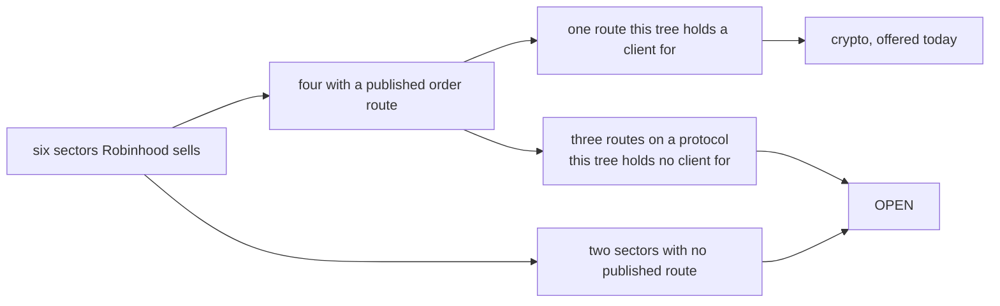

# Robinhood's reachable sectors

**Mode: Reference. No product file changed. One manual count corrected.**

This page covers issue #1192, section "What a wired venue requires", row 2 for
Robinhood: offered under every sector it serves. It establishes which sectors
Robinhood sells, which of those it publishes an order route for, and which the
installed connector can reach with an order it could place today. The answer is
one sector, crypto, which the venue is already offered under, so no sector is
added and no sector is removed.

It also records a defect found while measuring reachability: the connector
declares Robinhood's market-list path unpublished, and Robinhood publishes it.

**FALSIFICATION.** This page is wrong if a sentence quoted here is absent from
the page its URL names, if a sector recorded OPEN turns out to have a published
order route the connector can call, if the crypto order endpoint accepts a
symbol that is not a USD-quoted crypto pair, if `venue_classes('robinhood')`
answers anything other than the crypto sector on an unchanged tree, or if the
market-list path this page calls published is absent from the documentation
page's own source.

---

## The answer, first

| Sector | Robinhood sells it | Publishes an order route | The connector reaches it | Verdict |
| --- | --- | --- | --- | --- |
| crypto | yes | yes, signed REST | yes | **offered, and already offered** |
| stocks | yes | yes, one MCP tool | no client for the protocol | OPEN |
| commodities | yes, as futures and as fund shares | a fund share, through the equity MCP tool | no client for the protocol | OPEN |
| indices | yes, as index futures and index options | an index option, through the option MCP tool | no client for the protocol | OPEN |
| forex | yes, as currency futures only | none published | no route to call | OPEN |
| futures and perpetuals | futures yes, perpetuals absent | none published | no route to call | OPEN |

`EXTRA_VENUE_CLASSES` holds no entry for this venue before this page and holds
none after it. The venue reaches the crypto sector through `CRYPTO_CONNECTORS`,
which `src/gui/main_tabs/asset_class_surface.py, in written_crypto_venues`
reads.

---

## Row 2's distinction, which decides every line above

A sector the firm sells is not a sector the program can trade. Robinhood sells a
product in all six sectors this platform declares. It publishes an order route
for four of them. The installed connector can call the route for one.



Offering a venue under a sector its connector cannot reach is worse than leaving
it out: the operator picks the sector, builds a bot, and nothing trades. That is
why three sectors with a real published route are still recorded OPEN.

---

## Sector one, crypto. Offered, and the route is the one the connector speaks.

Robinhood publishes a signed REST interface whose every write action is a crypto
order, and states its own audience.

> The Robinhood Crypto Trading API lets you view crypto market data, access your
> account information, and place crypto orders programmatically. It's available
> to Robinhood Crypto customers in the United States.

The page lists its actions, and the two that place anything both name crypto.

```
Read crypto accounts        Place crypto orders without fee tiers   v1
Read crypto holdings        Place crypto orders with fee tiers      v2
Read crypto orders
Read crypto products
Read crypto quotes
```

The order endpoint restricts the symbols it accepts, in its own words, and the
restriction is the reason no other sector can arrive through this interface.

> This endpoint only supports placing orders on USD symbols that have
> `is_api_tradable=true`.

> Ensure that the symbol is provided in all uppercase.

The connector's constants match that host and that path namespace.

```
src/exchange/robinhood_connector.py, in TRADING_HOST
    the venue's published trading host
src/exchange/robinhood_connector.py, in ORDERS_PATH
    the v1 order path, under the venue's own crypto namespace
src/exchange/robinhood_connector.py, in ORDERS_PATH_FEE_TIERS
    the v2 order path, under the same namespace
```

**The documentation page does not render, and that is a method finding.** The
page served at the crypto trading URL is a client-rendered shell of 23,678
bytes whose only prose is its own title. Every crypto quotation above was read
from the page's own published script, which carries the documentation strings.
A reader stopping at the served markup would record a false absence.

```
served markup               23,678 bytes, prose "Robinhood"
the page's own script       84,271 bytes, carries every endpoint and field
```

Searched for a non-crypto asset across that script: no string names a stock, an
equity, an option, a future, a forex pair, a commodity or a tokenised asset.

---

## Sector two, stocks. A real route, on a protocol the tree has no client for.

Robinhood publishes an equity order tool on its Model Context Protocol server,
and marks it available to an external agent. It names the asset classes an agent
may order, and the list is three long.

> You can currently use a built-in or external agent to place long equities,
> options, and crypto orders.

It refuses a REST equivalent, in its own section headed APIs.

> We don't allow trading APIs to be linked to your Robinhood account without
> written authorization from Robinhood.

**The tree holds no client for that protocol, measured.** One mention of the
protocol exists under the source tree and it is the docstring recording the
absence.

```
src/ mentions of the protocol's name           1
    src/exchange/robinhood_connector.py, in pair_asset_class, its docstring
dependency declarations naming a protocol client   0
    control: the same read finds the exchange library twice, so the zero is a
    reading
```

What a later unit would change, if the decision is to build it.

```
src/exchange/robinhood_connector.py, in pair_asset_class
    the sector read off a record, rather than the one constant it answers now

src/gui/main_tabs/asset_class_surface.py, in EXTRA_VENUE_CLASSES
    the sector, once an order on it can be placed

a protocol client, which no module in the tree provides
```

### Tokenised equities are not a second way in

Robinhood issues a tokenised stock product, and it is read-only and refused to
a United States person. Both facts are the venue's own.

> Robinhood provides a set of read-only REST endpoints under
> `https://api.robinhood.com/rhj/` for offchain access to Stock Token data

> Stock Tokens are tokenised debt securities issued by Robinhood Assets
> (Jersey) Limited ("RHJ").

> Stock Tokens are not registered under U.S. securities laws and may not be
> offered, sold, or delivered, directly or indirectly, in the United States or
> to, or for the account or benefit of, U.S. persons.

```
endpoints published    three, every one a read
write verbs published  0
```

**This is the same shape the Kraken line carries and it is sharper here.** That
venue lists 354 tokenised equity pairs on the spot endpoint its connector
already calls, and refuses them to a United States person. Robinhood keeps its
tokenised line off the trading interface altogether: the order endpoint takes
USD crypto symbols only, and the token route has no write verb. Two independent
barriers, so no sector arrives this way.

---

## Sector three, commodities. A fund share, through the equity tool.

Robinhood sells the underlying as futures, under its own category headings,
which the product page serves as Energy and Metals.

No commodity order tool and no futures order tool is published. The sector
reaches an order only as something else: a commodity fund share is an equity to
the equity tool, which is the reading row 22 of the issue already records for
the eight brokers it names. That route is the MCP one, so this sector carries
the same blocker as stocks.

**Variant: none is required.** A fund share is an ordinary ticker.

---

## Sector four, indices. An index option, through the option tool.

Robinhood sells index futures, under its own Stock Index category heading.

The three index tools the MCP publishes are all reads, so no index order tool
exists.

> `| get_indexes | Look up market indexes by symbol |`

> `| get_index_quotes | Get real-time index values |`

> `| get_index_historicals | Get historical index data |`

An index option is an option to the option tool, which is published and is
marked available to an external agent. So the sector reaches an order, on the
MCP, and carries the same blocker as stocks.

---

## Sector five, forex. Sold as a futures contract, with no order route at all.

Robinhood sells currency exposure, and only as a futures contract, under its own
Currency category heading.

No spot forex product is published and no forex order route of any kind is
published. **This is recorded as an absence with what was searched.** Both hosts
discriminate, so a 404 on them carries information.

```
the documentation host's forex trading path            404
the support host's forex API article                   404
occurrences of the word forex on the agent tool page     0
forex tools among the published MCP tools                0
```

**One trap, and it would have produced the wrong answer.** An MCP tool is named
`get_currency_pairs`. It is not a forex tool. It sits under the page's own
Crypto heading and its published description names crypto.

> `| get_currency_pairs | List Robinhood-supported crypto assets | X | X |`

The REST documentation uses the same wording for the same thing, so the phrase
"currency pair" means a crypto pair throughout this venue's pages. A reading
keyed to the tool's name rather than its description would have offered this
venue under forex, where it can place nothing.

---

## Sector six, futures and perpetuals. Futures sold, perpetuals absent, no route.

Robinhood sells futures through a registered entity, and says so.

> Futures and cleared swaps trading is offered by Robinhood Derivatives, LLC,
> ("RHD") a registered futures commission merchant with the Commodity Futures
> Trading Commission (CFTC)

No futures order route is published, and the venue's own announcement dates the
absence by putting futures in the future tense.

> Support for options, crypto, event contracts, futures, and more are coming
> soon as we move out of beta.

```
the documentation host's futures trading path            404
the support host's futures API article                   404
occurrences of a futures order tool name on the tool page  0
occurrences of the word perpetual on the tool page         0
futures tools among the published MCP tools                0
```

No perpetual product is published anywhere that was read, so half of this
sector's name has no product behind it at this venue.

---

## The three readings, before and after, per sector

Every reading was taken in a process whose home directory was redirected to a
scratch tree before any module under the source tree was imported, with the
redirected home printed inside each run and the run refusing to continue if it
did not match.

No sector was added, so before and after are the same tree. The control that
makes these readings mean anything is below them.

| Sector | `venues_for_class` | Exchanges tab offers | `gate_log_path` answers |
| --- | --- | --- | --- |
| crypto | True, before and after | True, before and after | yes |
| stocks | False, before and after | False, before and after | yes |
| commodities | False, before and after | False, before and after | yes |
| forex | False, before and after | False, before and after | yes |
| indices | False, before and after | False, before and after | yes |
| futures_perps | False, before and after | False, before and after | yes |

```
src/gui/main_tabs/asset_class_surface.py, in venue_classes
    this venue      the crypto sector alone
    coinbase        all six declared sectors

src/gui/main_tabs/settings_dialog_surface.py, in exchange_status_rows
    the sector's rows name this venue under crypto alone

src/core/log_paths.py, in gate_log_path
    a path under the redirected home for all six, and see the control
```

### The reading that would read the same whether this works or not

**`gate_log_path` carries no information about whether a venue is offered under
a sector, and the brief's own reading set named it.** It composes two sanitised
strings under the gate root and creates the directory. It was asked for an
invented venue and an invented sector and answered a path for both.

```
src/core/log_paths.py, in gate_log_dir
    the gate root, then the folded exchange name, then the folded sector name

venue                      sector                     served   answers a path
robinhood                  crypto                     True     yes
robinhood                  forex                      False    yes
acervator_no_such_venue    crypto                     False    yes
acervator_no_such_venue    acervator_no_such_sector   False    yes
```

Eleven directories were created by those six calls. A sector's gate log having a
home is therefore not evidence that the sector is reachable, and this page does
not treat it as evidence. The manual records a gate path for this venue's stocks
sector as an example of the path shape, in
`docs/manual/10-live-trade-history.md`, under "One gate log per exchange and per
sector"; that example is correct about the shape and says nothing about
reachability.

### The two readings that do carry information, calibrated

`EXTRA_VENUE_CLASSES` was given five extra sectors for this venue **in memory
only**, in one process, the same three readings were taken again, and the entry
was deleted. The product tree was not edited.

```
reading                 sectors moved on injection   verdict
venues_for_class                 5                   discriminates
exchanges_tab_offers             5                   discriminates
gate_log_path_answers            0                   READS THE SAME EITHER WAY

before == after : True
EXTRA_VENUE_CLASSES entry after : none
venue_classes after : the crypto sector alone
```

So the five False readings above are reported by an instrument that was observed
answering True for those same five sectors seconds earlier, and crypto's True
and the other five Falses are read in one run by one reader. A sector not added
still answers False, which is the control the row asks for.

An invented venue id answers no sector. An invented **sector** name is not a
control on `venues_for_class`: `src/gui/main_tabs/asset_class_surface.py, in
normalise` answers the first declared class for a name no class holds, which is
its own stated contract, so that cell answers this venue's crypto.

### The third input to the sector answer is closed by construction

`venue_classes` unions the registry class, the `EXTRA_VENUE_CLASSES` entry and
the recording's rows. The recording cannot introduce a sector for this venue:
`src/exchange/robinhood_connector.py, in record_pairs` takes each symbol's class
from `pair_asset_class`, and that function discards its argument and answers one
constant. So the registry reading above is the complete picture, and no
recording on any tree can widen it.

---

## The defect this measurement found

**The connector declares Robinhood's market-list path unpublished. Robinhood
publishes it.** So the one sector this venue is offered under cannot list a
market, and the operator can pick it, build a bot, and read no market.

The code's claim:

```
src/exchange/robinhood_connector.py, in TRADING_PAIRS_PATH
    None, with the recorded reason that Robinhood names a Get Crypto Trading
    Pairs endpoint and publishes no path for it
```

The venue publishes that path on two API versions, read from the documentation
page's own script twice and independently, and describes what it answers.

> Fetch a paginated list of available trading pairs for crypto trading. Returns
> trading pair details including price increments, order size limits, and
> tradability status.

The consequence, driven on a real connector with its transport replaced by a
function that raises, and with no credential stored:

```
TRADING_PAIRS_PATH declared    None
pair records held              0
get_markets()                  raises its unpublished-path refusal
place_order(...)               refuses on the absent credential
venue requests attempted       0

positive control, one pair record injected by hand
pair records held              1
get_markets()                  answers one full market, rules read True
```

**The connector is sound; it is never given a pair list.** No module in the
product calls `record_pairs`: the only references under the source tree are its
own definition and two docstrings. The same read finds eight real call sites for
`get_markets`, so that zero is a reading.

```
src/trading/bot_container.py            awaits the connector's market list
src/exchange/robinhood_connector.py, in record_pairs
    called by no product module
```

**This page does not repair it, and the reason is a rule rather than a
preference.** The repair is a signed read of a paginated endpoint whose response
shape, field names and cursor cannot be verified without authenticating to
Robinhood, which this work is forbidden to do. Writing an unexercised fetch into
the path that feeds order sizing, against a fixture built from documentation
prose, is the stand-in-shaped-like-the-assertion failure: it would go green and
prove nothing.

What a repair would change, with the verification it owes:

```
src/exchange/robinhood_connector.py, in TRADING_PAIRS_PATH
    the published v1 path, and the v2 path beside the fee-tier order path

src/exchange/robinhood_connector.py, in get_markets
    a signed read of that path, paginated, feeding record_pairs

the verification owed
    one live authenticated read of the endpoint, which fixes the response shape
```

Until then the crypto sector is offered and its market list is empty, and this
page records that rather than smoothing it.

---

## What changed

No product file. One manual count.

```
docs/manual/15-venue-compatibility.md
    the sector counts in "Which of Robinhood's sectors the program reaches"
    now match the table printed directly beneath them
```

`src/gui/main_tabs/asset_class_surface.py` is unchanged. `EXTRA_VENUE_CLASSES`
holds no entry for this venue, which is the correct state: the crypto sector
arrives through `CRYPTO_CONNECTORS`, and no second sector can be reached today.

---

## Controls on the method

**Both documentation hosts discriminate, so a 404 on them carries
information.** Invented paths were requested on each host beside paths
confirmed real.

```
the documentation host    3 real paths 200    3 invented paths 404
the support host          3 real paths 200    3 invented paths 404
```

Every invented path on the documentation host returned a byte-identical 93,092
byte shell, distinguishable from any 200. Every verdict on this page
nonetheless rests on a quoted sentence rather than on a status code.

**One class of 404 is explicitly not treated as evidence.** Requests for a
machine-readable specification at conventional paths all answered 404, and so
did invented paths of the same shape, so those 404s are indistinguishable from
an invented path and are recorded as "not published at a conventional path"
only. That is why the page's own script was read.

**A non-exhaustive sitemap was not used as evidence of absence.** The
documentation host's sitemap lists five URLs and omits a page that answers 200,
so absence from it proves nothing.

**The archetypes were calibrated before any verdict was quoted**, each on its
own fixture pair, with the exit code captured into a variable before any command
substitution could reset it.

```
coding_archetype   known_good 0 / known_bad 1, for Python and for JavaScript
ta_archetype       known_good 0 / known_bad 1, on two fixture pairs
gui_archetype      known_good 0 / known_bad 1, on three fixture pairs
docs_archetype     known_good 0 / known_bad 1
```

**One earlier calibration of this pair was wrong, and the error is recorded
because it nearly became a finding.** A first run read the exit code after a
command substitution had already reset it, and reported the TA and GUI
known-bad fixtures exiting 0, which is the signature of a blind instrument. The
fixtures were never blind; the probe was. `npm install --no-audit --no-fund` ran
in this worktree first, which is why the two JavaScript pairs separate at all.

**Every file this unit read or touched carries a green verdict with every tool
available.**

```
file                                            archetype          passed  tools
src/gui/main_tabs/asset_class_surface.py        coding             True    11 ok
src/gui/main_tabs/asset_class_surface.py        gui                True     5 ok
src/gui/main_tabs/asset_class_surface.py        ta                 True     3 ok
src/exchange/robinhood_connector.py             coding             True    11 ok
src/exchange/robinhood_connector.py             ta                 True     3 ok
src/core/log_paths.py                           coding             True    11 ok
docs/manual/15-venue-compatibility.md           docs               True     8 ok
```

Every one reported `errors` empty and `why_not_green` empty. No tool read
`missing`.

**Nothing in the operator's runtime tree moved.** Every run redirected the home
directory to a scratch tree before importing any module under the source tree,
printed the redirected home, and refused to continue if it did not match.

```
the home each run reported                   a scratch directory
entries written under the redirected home    the gate log tree alone
venue requests attempted                     0
```

**No order was placed, priced, amended, cancelled or previewed.** No credential
was sent, no account was opened, no private endpoint was called, and no request
reached any Robinhood host. The one order call driven refused on a missing
credential before building a body.

---

## What this page could not establish

```
the crypto trading-pair list's contents
    the endpoint needs a credential, so the orderable set is recorded from the
    documentation's own restriction to USD crypto symbols and not from a read

the per-market size rules of any Robinhood market
    published as schema fields; the values come from the endpoint, uncalled

the MCP tool parameters, its authentication scheme and its rate limit
    the tool names and one-line descriptions are published; no field list, no
    scheme, no scopes, no token lifetime and no ceiling is published

whether Robinhood's own host accepts the connector's signed message
    unproved, and it needs a credential

the non-index futures contract lists
    the five category labels and three categories' contracts are served; the
    remaining tables render in the browser
```

---

## Related pages

- [`docs/manual/15-venue-compatibility.md`](../../manual/15-venue-compatibility.md)
  — the venue table and the sector rows this page reads against, and the counts
  it corrects
- [`docs/manual/16-sector-exchange-product-tree.md`](../../manual/16-sector-exchange-product-tree.md)
  — the sector, venue and product levels
- [`docs/manual/10-live-trade-history.md`](../../manual/10-live-trade-history.md)
  — the gate log path shape this page's control reads
- [`docs/audits/2026-10-08_robinhood_order_interface/REPORT.md`](../2026-10-08_robinhood_order_interface/REPORT.md)
  — this venue's two interfaces, access and order shape, whose row 2 this page
  re-measures
- [`docs/audits/2026-10-09_kraken_sector_order_formats/REPORT.md`](../2026-10-09_kraken_sector_order_formats/REPORT.md)
  — the venue whose tokenised-equity line this page's stocks row compares with
- [`docs/audits/2026-10-07_venue_sector_readiness_matrix/REPORT.md`](../2026-10-07_venue_sector_readiness_matrix/REPORT.md)
  — which venue reaches which sector

---

## What was read

Every page below was read on 2026-10-09, unauthenticated.

```
https://docs.robinhood.com/crypto/trading/
https://docs.robinhood.com/_next/static/chunks/pages/crypto/trading-b3a861110e68c0f85423.js
https://docs.robinhood.com/chain/stock-tokens/
https://docs.robinhood.com/chain/stock-token-apis/
https://docs.robinhood.com/sitemap.xml
https://robinhood.com/us/en/support/articles/crypto-api/
https://robinhood.com/us/en/support/articles/trading-with-your-agent/
https://robinhood.com/us/en/support/articles/onboarding-an-external-agent/
https://robinhood.com/us/en/support/articles/third-party-connections/
https://robinhood.com/us/en/about/futures/
https://robinhood.com/newsroom/robinhood-is-now-open-to-agents/
```

Paths requested and answered 404, which the control above licenses as evidence
of absence:

```
https://docs.robinhood.com/forex/trading/
https://docs.robinhood.com/futures/trading/
https://docs.robinhood.com/equities/trading/
https://docs.robinhood.com/options/trading/
https://robinhood.com/us/en/support/articles/forex-api/
https://robinhood.com/us/en/support/articles/futures-api/
https://robinhood.com/us/en/support/articles/equities-api/
```

No credential was sent. No account was created. No private endpoint was called.
No order of any kind was placed, priced, amended, cancelled or previewed.
