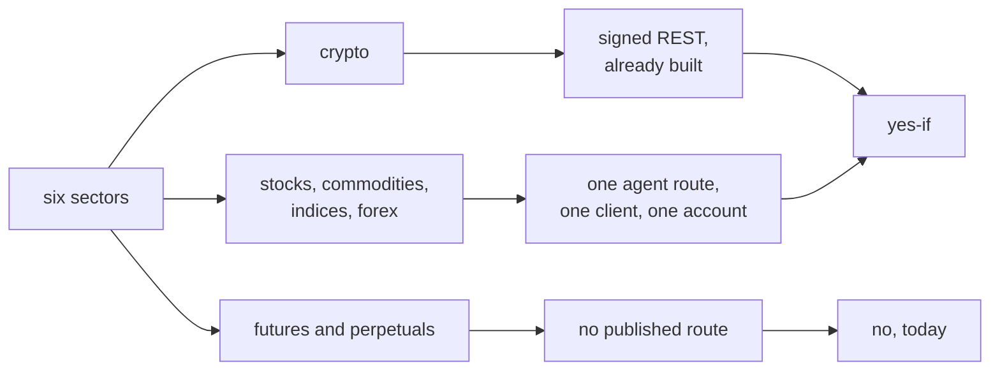

# Robinhood's six sectors, translated point by point from Coinbase

**Mode: Reference. No product file changed. Owed repairs are named with their
symbols.**

This page covers issue #1192. It takes the path Coinbase's working connector
uses, walks the same six points on Robinhood for each of the six sectors, and
answers each sector yes, no, or yes-if with the cost of the yes-if.

The six points are the ones the running program needs before a bot can trade a
market. Each is a method on the contract every connector implements, in
`src/exchange/base.py`, in `ExchangeInterface`.

```
the market list            get_markets, answering AssetInfo and MarketRules
the order route            place_order
the order shape            the fields, the size units, the order types
the position and fill read get_balances, get_order, get_open_orders
the candles                get_ohlcv
the bot variant            venue_variant in src/trading/scrumming/sizing.py
```

**FALSIFICATION.** This page is wrong if a sentence quoted here is absent from
the page its URL names, if a path this page calls published is absent from the
specification Robinhood's own documentation page carries, if a sector recorded
yes-if turns out to have no route, if a sector recorded no turns out to have a
published order route this page did not search, or if the readings taken from
the running code move on an unchanged tree.

---

## The answer, first

| Sector | Market list | Order route | Order shape | Position and fill | Candles | Variant | Verdict |
| --- | --- | --- | --- | --- | --- | --- | --- |
| crypto | published, program blind | published, built | published, built | published, program refuses | **none published** | built | **yes-if** - wire five published reads and point the candle source at the reader already in this tree. No operator action. |
| stocks | per symbol and by search, not one list | published on the agent route | published as five order types | published | **published** | built | **yes-if** - one protocol client and one sign-in. The operator opens a Robinhood MCP account. |
| commodities | as above, as a fund share | as above | as above | as above | **published** | built | **yes-if** - the same client and account as stocks. The sector arrives as a fund share. |
| indices | as above, as a fund share | as above | as above | as above | **published** | built | **yes-if** - the same client and account. The index option route places an order and cannot accumulate; the fund share can. |
| forex | as above, as a currency fund share | as above | as above | as above | **published** | built | **yes-if** - the same client and account. Spot forex has no product and no route; the fund share is the door. |
| futures and perpetuals | none | **none** | none | none | none | not reached | **no, today** - Robinhood names futures among what is coming soon. No perpetual product exists at all. |

One venue, two routes. The crypto sector has its own signed interface. The next
four reach an order through one shared route, so they cost one client and one
account between them, not four. The last has no route at all.



---

## The mirror, re-measured, and one reading of it was wrong

The brief gave six figures for Coinbase and one verdict about its variants. The
figures re-measure exactly. The verdict about the variants does not.

```
coinbase recorded rows   2,148, every one under a declared sector
  crypto         896      stocks        1,033
  futures_perps  168      commodities      25
  forex           20      indices           6
offered in all six sectors   yes
```

**The variant reading in the brief is wrong, and the correction matters.** The
brief said every sector answers the variant `none`, and that this name is
outside the set the program has built. Three sectors answer a built variant on
most of their rows.

```
src/trading/scrumming/sizing.py, in venue_variant, over every recorded row

crypto         none 896
stocks         permitted-shape order 1000   none 25   rolling position 8
futures_perps  none 94                      rolling position 74
commodities    none 7                       rolling position 18
forex          none 20
indices        none 6
```

`VARIANT_NONE`, `VARIANT_PERMITTED_SHAPE` and `VARIANT_ROLLING_POSITION` are
all inside `VARIANTS_BUILT`. So the mirror does not show a venue the program
sizes with nothing built. It shows a venue where 1,100 of 2,148 rows select a
variant written for them, and the rest take the plain path.

This matters to every row below. A sector's variant is read off one market's own
recorded rules, never off the sector, so no sector below needs a new variant
until a market is recorded whose rules no built variant covers.

---

## Robinhood publishes a specification, and it carries fourteen paths

Coinbase's working path was read against a machine-readable specification. So is
this one. Robinhood serves its crypto documentation page as a 23,678 byte shell
whose only prose is its own title, and hands the real document to `JSON.parse`
inside an 84,271 byte script.

```
served markup                23,678 bytes, prose "Robinhood"
the page's own script        84,271 bytes
the document inside it       OpenAPI 3.0.1, "Robinhood Crypto Trading API"
                             14 paths, 16 operations, 25 schemas
server                       https://trading.robinhood.com/
```

A reader stopping at the served markup records a false absence. That is how the
claim this page corrects below was made in the first place.

The fourteen paths, every one read from that document.

```
GET   /api/v1/crypto/trading/accounts/        Get Crypto Trading Account Details
GET   /api/v1/crypto/trading/trading_pairs/   Get Crypto Trading Pairs
GET   /api/v1/crypto/trading/holdings/        Get Crypto Holdings
GET   /api/v1/crypto/trading/orders/          Get Crypto Orders
POST  /api/v1/crypto/trading/orders/          Place New Crypto Order
POST  /api/v1/crypto/trading/orders/{id}/cancel/   Cancel Open Crypto Order
GET   /api/v1/crypto/marketdata/best_bid_ask/      Get Best Price
GET   /api/v1/crypto/marketdata/estimated_price/   Get Estimated Price
GET   /api/v2/crypto/trading/accounts/        Get Accounts
GET   /api/v2/crypto/trading/trading_pairs/   Get Trading Pairs
GET   /api/v2/crypto/trading/holdings/        Get Holdings
GET   /api/v2/crypto/trading/orders/          Get Orders
POST  /api/v2/crypto/trading/orders/          Place New Crypto Order
POST  /api/v2/crypto/trading/orders/{id}/cancel/   Cancel Open Crypto Order
GET   /api/v2/crypto/marketdata/best_bid_ask/      Get Best Price
GET   /api/v2/crypto/trading/estimated_price/      Get Estimated Price
```

Robinhood's own help page lists the same reads as permissions an API key can
carry, which is a second independent statement of the same fact.

> This includes: Read crypto accounts Read crypto holdings Read crypto orders
> Read crypto products Read crypto quotes

---

## Sector one, crypto. Five published reads the program declares unpublished.

### The market list

Robinhood publishes it, on both versions, and describes what it answers.

> Fetch a paginated list of available trading pairs for crypto trading. Returns
> trading pair details including price increments, order size limits, and
> tradability status. Trading pairs can be filtered by symbol.

The fields map onto the program's own rules record with nothing missing.

```
the venue's V2TradingPair          MarketRules, in src/exchange/base.py
asset_increment                 -> amount_increment
quote_increment                 -> quote_increment
min_order_amount                -> min_cost, a quote-currency minimum
max_order_size                     no field; the program records no ceiling
is_api_tradable                 -> read, False making the row unreadable
```

The program cannot fetch it. `src/exchange/robinhood_connector.py, in
TRADING_PAIRS_PATH` is empty, and `record_pairs` is called by no product module.
That is the one defect this page was told not to repair, and another unit owns
it.

### The order route and the order shape

Both are published and both are built. The body the program builds carries the
same field set as the example body in Robinhood's own signature section, field
for field.

```
the program's market body, built without sending
  {"symbol":"BTC-USD","client_order_id":"<uuid>","side":"buy",
   "type":"market","market_order_config":{"asset_quantity":"0.5"}}

the venue's own example body, from its API Signature section
  {"client_order_id":"...","side":"buy","type":"market","symbol":"BTC-USD",
   "market_order_config":{"asset_quantity":"0.1"}}
```

Four fields are required, and one configuration object is required by the type.

```
required   symbol, client_order_id, side, type
types      market, limit, stop_loss, stop_limit
size       asset_quantity, a count of the base currency
```

### The position and fill read

**This is the finding of the crypto row.** Robinhood publishes every read the
engine needs except one, and the connector declares all of them unpublished.
Each refusal names an endpoint that exists.

| the program's method | what it raises | the venue's published path |
| --- | --- | --- |
| `get_ticker` | the unpublished-path refusal | the best-price path, both versions |
| `get_orderbook` | the same refusal | the best-price path, both versions |
| `get_balances` | the same refusal | the holdings path, both versions |
| `get_balance` | the same refusal | the holdings path, both versions |
| `get_open_orders` | the same refusal | the orders read, both versions |
| `get_order` | the same refusal | the orders read, filtered by id |
| `cancel_order` | the same refusal | the cancel path, both versions |
| `get_ohlcv` | the same refusal | **none, and this one is correct** |

The holdings read answers what the engine calls a position.

> Retrieve a paginated list of crypto holdings for a specific account. Returns
> the total quantity and available quantity for each asset held in the account.

The orders read answers what the engine calls a fill. Its record carries the
state, the average price, the filled quantity, and one row per execution.

```
OrderResponse    state: open, canceled, partially_filled, filled, failed
                 average_price, filled_asset_quantity, executions
OrderExecution   effective_price, quantity, timestamp, all three required
```

So the program's own refusal text is wrong about the venue on seven methods of
eight. The owed repair is named at the end of this page.

### The candles

**Robinhood publishes no crypto candle endpoint, on either of its two routes.**
This is the only point in the crypto row where the venue, not the program, is
the limit.

```
searched                                              occurrences
the specification, 14 paths                           0 candle paths
candle, historical, ohlc, bar, granularity, span      0 each
open_price, high_price, low_price, close_price        0 each
the agent route's crypto tools                        9, none a candle tool

control, same searches, same run
the agent route's history tools                       3 found
  get_equity_historicals, get_option_historicals, get_index_historicals
```

The control is what makes the zero a reading. The same extraction that found no
crypto history tool found three history tools for other sectors, so the search
could have succeeded.

**The detour is already in this tree and it is open.** A candle source separate
from the order venue is not a new idea here. The Simulator and Market Inspector
both use one.

```
src/trading/stone_tablets/ra_fetcher.py, in CoinbasePublicCandles
    an unauthenticated candle reader, GRANULARITY_S holding 1d, 1h and 5m

src/simulator/read_only_connector.py, in ReadOnlyConnector.get_ohlcv
    answers candles over that reader and nothing else

src/trading/bot_container.py, at the ta_timeframe read
    the default timeframe is 1h, which the reader's table holds
```

The difference this carries, named rather than smoothed: the price history would
come from one venue and the fill from another. The engine's sizing price still
comes from Robinhood, through the published best-price read, so the authority
over money stays with the venue that executes. Only the indicator history is
borrowed, and the Simulator already runs that way.

A second detour was searched and is **not established**. The agent route
publishes four charting tools under its own heading, marked available to an
external agent, with no parameters and no asset class for any of them.

> `| get_legend_charts | Get Legend charting data |  | X |`

Nothing on the page says whether those serve crypto. That is recorded as not
established, not as a route and not as an absence.

### The variant this market selects

Built, and measured rather than argued. One pair record shaped from the venue's
own published field names was handed to the real connector.

```
rules read=True  min_cost=1.0  amount_increment=1e-06  quote_increment=0.01
order_types='market and limit'
venue_variant -> 'permitted-shape order'
variant_built -> True
```

### What the crypto row costs

```
wire five published reads     the best price, the holdings, the orders read and
                              the cancel, each replacing one refusal
point the candle source       at CoinbasePublicCandles, already in this tree
the operator does             nothing; his API key already carries these reads
a new protocol                none
the owed verification         one authenticated read, which fixes every
                              response shape
```

---

## The route the next four sectors share

One endpoint, read from Robinhood's own machine-readable metadata without a
credential. **No client was registered and no token was requested.**

```
the endpoint          https://agent.robinhood.com/mcp/trading
GET on it             405, "method not allowed", so it exists and takes POST
```

The two metadata documents an agent client reads both answer, and they name the
whole sign-in shape.

```
.well-known/oauth-protected-resource/mcp/trading
    bearer_methods_supported   header
    scopes_supported           internal

.well-known/oauth-authorization-server
    authorization_endpoint             https://robinhood.com/oauth
    token_endpoint                     https://api.robinhood.com/oauth2/token/
    registration_endpoint              https://agent.robinhood.com/oauth/trading/register
    grant_types_supported              authorization_code, refresh_token
    code_challenge_methods_supported   S256
    token_endpoint_auth_methods_supported   none
```

The route publishes 71 tool-shaped names, grouped by the page's own headings.
The counts decide four of the six rows below, so they are given whole.

```
equity    14    every one marked available to an external agent
option    12
crypto     9
index       3    get_indexes, get_index_quotes, get_index_historicals
charting    4    available to an external agent and to no built-in agent
futures     0
perpetual   0
```

**The sign-in this needs is already built and already approved.** The challenge
method the venue requires is the one this tree produces.

```
src/trading/ata_spm_signin.py, in code_challenge
    the S256 challenge, a base64url SHA-256 digest of the verifier

src/trading/ata_spm_signin.py, in LoopbackReceiver
    binds 127.0.0.1 only, serving the one loopback redirect RFC 8252 allows

src/gui/sign_in_view.py, in sign_in_session
    the surface Market Inspector already reaches it through
```

Two facts follow from that metadata and neither is an inference. The client
authentication method is empty, so the program is a public client and holds no
secret. The registration endpoint is published, so a client registers itself and
no list of approved applications gates it.

**What the operator must do, once, and nothing in software replaces it.**

> To trade with an external agent, you must open a Robinhood MCP account
> specifically for your external agent.

> An MCP account is a type of self-directed, individual investing account.

Two costs that are often assumed and are not real here. Robinhood's token
charges do not apply to this route, in its own words.

> Note This information applies only to agents hosted on Robinhood, not
> external agents.

Its application subscriptions do not either.

> Note Agent apps are only available in the Robinhood mobile app and only
> accessible by agents hosted by Robinhood.

One venue default must be read back before an order is sized, because it is off
when the program would least expect it.

> Trade approvals are turned on by default for Robinhood Agents (built-in
> agents), and are turned off by default for MCP accounts (external agents).

**What this tree does not hold.** The program speaks no JSON remote-procedure
call over HTTP, which is the framing this route takes. One mention of the
protocol's name exists under the source tree and it is a docstring recording the
absence, in `src/exchange/robinhood_connector.py, in pair_asset_class`. The
transport underneath it does exist, in the same module's `_send`.

---

## Sector two, stocks. Every point answered, one of them differently.

### The market list is the one point that differs from Coinbase

Coinbase answers the whole tradable set from one products endpoint. Robinhood's
agent route publishes no single list tool. It publishes four ways to reach the
set instead, and tradability per symbol.

```
search                      "Find a company name or partial name to a ticker"
get_scanner_filter_specs    every available scanner filter and how to use it
preview_scan                scan results, before saving
get_watchlists              the operator's own lists
get_popular_watchlists      Robinhood's own lists
get_equity_tradability      "Check if a symbol can be traded and find out if it
                             can be traded fractionally"
```

So enumeration is reachable, and it is a screener rather than a catalogue. The
difference to record is that the program would hold a scan result, not a
complete venue product list, and would confirm each symbol's tradability one at
a time.

### The order route, and the order shape

The route is published and marked available to an external agent.

> `| place_equity_order | Place an equity order | X | X |`

The order types are published as a list of five.

> Your agent can place trades for you across these order types: Market
> (share-based) Market (dollar-based) Limit Stop limit Stop market

Those five cover the program's own three. A share-based market order is the
order the engine builds today. The size rules are published on the venue's own
fractional shares page.

> Since Robinhood Financial offers fractional shares, you can trade stocks and
> ETFs in pieces of shares, in addition to trading in whole share increments.

> You can place fractional share orders in dollar amounts or share amounts.

> You can trade in real-time with fractional shares that are valued at $1 or
> more with Robinhood.

> Note Robinhood only supports trading of fractional shares for National Market
> System (NMS) securities listed on national issues exchanges like the Nasdaq
> and NYSE, and not for stocks traded over the counter (OTC).

Those four sentences answer the size rule for the whole sector.

```
a listed security      fractional units, or a cash amount, minimum $1
an over-the-counter    whole shares only
the program's shapes   SHAPE_FRACTIONAL_UNITS, SHAPE_WHOLE_UNITS and
                       SHAPE_CASH_AMOUNT, all three declared in sizing.py
```

**No field list is published for any tool on this route.** The tool name and its
one-line description are published; the parameter names are not. A unit building
this reads them from the route itself, which needs the token.

### The position and fill read, and the candles

Both published, and the candle tool is the one Coinbase's own path needs a
separate endpoint for.

```
get_equity_positions   "View open equity positions with quantity and cost basis"
get_equity_orders      "Get equity order status history"
get_equity_tax_lots    each lot with quantity, cost basis and acquisition date
get_equity_quotes      real-time quotes and prior close, up to 20 symbols
get_equity_historicals "Get OHLCV price bars across a time range"
```

The tax-lot read deserves one line of its own. The program keeps lots with their
own entry prices, and this route answers them from the venue, which is the
reconciliation source the platform's own rule asks for.

### The variant this sector selects

No new variant. A fractional market selects the permitted-shape variant, which
1,000 of Coinbase's own stock rows already select. A whole-share market selects
the whole-unit variant. Both are inside `VARIANTS_BUILT`.

### What the stocks row costs

```
a JSON remote-procedure-call client over HTTP   no module in this tree has one
a self-registration call to the published endpoint
the sign-in                        already built, S256 and loopback
a BrokerBase subclass and a registry row        neither exists for this venue
the operator does                  opens one MCP account, grants the token
                                   once in a browser
read back before sizing            the trade approval setting
the owed verification              one authenticated tool listing, which fixes
                                   every field name
```

---

## Sector three, commodities. The same route, as a fund share.

Robinhood sells the underlying as futures, under its own Energy and Metals
category headings, and publishes no futures order route and no commodity order
tool.

The sector reaches an order as something else. A commodity fund share is an
equity to the equity tool, and the venue's own fractional page names funds
beside stocks in one sentence, quoted above. So all six points are the stocks
row's points, with one difference: the instrument is a fund share, and the
underlying contract is out of reach.

```
market list      the stocks row's four ways, filtered to fund shares
order route      place_equity_order
order shape      the five published order types, the same size rules
position, fill   get_equity_positions, get_equity_orders, get_equity_tax_lots
candles          get_equity_historicals
variant          none needed; a fund share is an ordinary ticker
```

**Detours searched and closed.** No commodity product type and no futures order
tool is published on either route. The underlying is reachable only as a
contract, and no contract route exists at this venue.

---

## Sector four, indices. The fund share accumulates; the option cannot.

**This row corrects the earlier pass, and the correction is about this platform
rather than about Robinhood.** The option route is real. It is not a route this
platform can accumulate on.

The earlier reading recorded the index option tool as the sector's route,
because it places an order. Robinhood's own index options page says what that
order holds.

> Unlike stock or ETF options, index options don't have underlying shares.

> Index options are also settled in cash, meaning your account will be debited
> or credited the corresponding settlement amount.

> Index options cannot be exercised or assigned early.

Every completed Scrum and Fold cycle ends holding more of the asset. A
cash-settled contract holds no units of anything, and at expiry it becomes cash
and the position is gone. So the index option route reaches an order and reaches
no accumulation.

The accumulating route for this sector is the one the commodities row uses. An
index fund share holds units, and the venue's own sentence naming funds beside
stocks puts it on the equity route.

```
order route       place_equity_order, on an index fund share
candles           get_equity_historicals for the fund share
                  get_index_historicals for the index itself
the option route  place_option_order, published, reaches an order, holds no
                  units, so no cycle accumulates on it
```

The three index tools the route publishes are all reads, so no index order tool
exists in any case.

```
get_indexes             Look up market indexes by symbol
get_index_quotes        Get real-time index values
get_index_historicals   Get historical index data
```

---

## Sector five, forex. No spot product. A currency fund share is the door.

Robinhood sells currency exposure only as a futures contract, under its own
Currency category heading, and publishes no forex order route of any kind.

**The absence, with what was searched and the control that licenses it.**

```
the documentation host's forex path                      404
the documentation host's sitemap                         5 URLs, all crypto
the support host, 7 forex and futures slugs              404 each
occurrences of the word forex on the agent tool page       0
occurrences of forex in the crypto specification           0
forex tools among the published agent tools                0

control, same hosts, same run
the documentation host     3 real paths 200, 3 invented paths 404
the support host           real articles 200, invented articles 404, and
                           index-options, a real article, answered 200
the agent host             3 metadata documents 200, 7 invented paths 404
```

**The detour is open, and the earlier pass did not search it.** A currency fund
share is a fund share, and the venue's own fractional page names funds beside
stocks on the equity route. So this sector reaches an order on the same route as
commodities, with the same six points.

The honest limit on that: Robinhood publishes no list of its funds by category,
so the symbol set for this sector is answered one symbol at a time by the
tradability tool, not enumerated. A unit building it would carry its own list of
candidate symbols and confirm each.

**One trap, recorded because it would have produced the wrong answer.** A tool
is named `get_currency_pairs`. It is not a forex tool. It sits under the page's
own Crypto heading and its published description names crypto.

> `| get_currency_pairs | List Robinhood-supported crypto assets | X | X |`

A reading keyed to the tool's name rather than its description would have
offered this venue under forex, where it can place nothing.

---

## Sector six, futures and perpetuals. No, today, in the venue's own words.

This is the one row where no point has an answer, and the venue says so itself.

**The published refusal.** The agent route names the asset classes an agent may
order, and the list is three long.

> You can currently use a built-in or external agent to place long equities,
> options, and crypto orders.

Robinhood's own launch announcement names futures among what is missing, and
dates it by putting it in the future tense.

> Agentic Trading is launching in beta with support for equities only out of the
> gate.

> Support for options, crypto, event contracts, futures, and more are coming
> soon as we move out of beta.

Two of those have since arrived: the tool table publishes option and crypto
order tools today. Futures has not. That is the venue telling this page both
that the route is absent and that it intends to open it.

A REST route is closed by a separate published sentence.

> We don't allow trading APIs to be linked to your Robinhood account without
> written authorization from Robinhood.

**Every detour searched, and what closed each one.**

| detour | what closed it |
| --- | --- |
| a futures order tool on the agent route | 0 of the 71 tool-shaped names on the page name futures or a perpetual. Control: the same extraction found 14 equity tools, 12 option tools and 9 crypto tools |
| `place_advanced_order`, which names no asset class | the page's own order-type list has five entries, all order types and no asset class, and the three classes it names exclude futures. Recorded as not a futures route on any published reading |
| a futures path on the documentation host | 404, with a control answering 200 on three real paths. The sitemap lists crypto only |
| a futures article on the support host | 7 slugs, 404 each, with a control answering 200 on five real articles |
| a separate futures API | the written-authorization sentence above closes it |
| a futures-tracking fund share | reaches the underlying, and it is the commodities or indices row. A fund share is not a contract with an expiry, which is what this sector names |
| a perpetual product of any kind | no occurrence of the word across the crypto specification, the agent tool page and the venue's own futures product page. There is no product to reach |

The futures business exists and is named, which is why this is a route absence
and not a product absence.

> Futures and cleared swaps trading is offered by Robinhood Derivatives, LLC,
> ("RHD") a registered futures commission merchant with the Commodity Futures
> Trading Commission (CFTC)

**So: no for a futures contract today, and no for a perpetual with no
qualification.** The program already holds the variant an expiring market needs,
in `VARIANT_ROLLING_POSITION`, and 74 of Coinbase's own futures rows select it.
Nothing is missing here except the venue's route.

---

## Where Robinhood differs from Coinbase, point by point

| point | Coinbase | Robinhood |
| --- | --- | --- |
| how many order routes | one endpoint for all six sectors | two routes, and one sector has none |
| the market list | one products endpoint answers the whole set | crypto has a paginated list; the other sectors are screened and confirmed per symbol |
| the size field on a buy | a cash amount or a unit count | a unit count on a market order; a cash amount on the other three types |
| the size field on a sell | a unit count | a unit count |
| the order types | twelve configurations, time in force inside the key | four types on crypto, five on the agent route |
| the candles | published per product, six granularities | none for crypto; published for every other sector that has a route |
| the sector label | read off a product type and a futures asset type | crypto is one constant; the rest would be read off the agent route |
| what the program holds | a trading library speaking the venue | a hand-written connector for crypto, and nothing for the agent route |

---

## Three findings in the program, each with its symbol

Each was found by reading the venue's specification against the running code.
None is repaired on this page, and the reason is given per finding.

### The refusal text is wrong about the venue on seven methods

`src/exchange/robinhood_connector.py, in PATH_UNPUBLISHED_FORMAT` says Robinhood
publishes no path for the endpoint named. Seven of the eight methods that raise
it name an endpoint Robinhood does publish a path for, measured from the venue's
own specification above. The operator reading that line is told the venue has no
such route, and it does.

**Not repaired here because it is one claim, not seven.** The same sentence is
the recorded reason on `TRADING_PAIRS_PATH`, which this unit was told another
unit owns. Splitting one false claim across two units would land half a repair.
The owed change is the refusal text, the seven docstrings, and the five reads
the connector should make instead.

### A limit order sends a field the version-one path does not publish

`src/exchange/robinhood_connector.py, in orders_path` answers the version-one
path when no account number is held. `order_body` puts a time-in-force value
inside the limit configuration for every limit order.

```
the venue's v1 limit_order_config   quote_amount, asset_quantity, limit_price
the venue's v2 limit_order_config   the same three, and time_in_force
the program's limit body            always carries time_in_force
```

So a limit order placed with no account number stored carries a field the path's
own schema does not list. The stop configurations publish that field on both
versions, so the mismatch is the limit type alone. Whether the host rejects an
unlisted field cannot be established without sending a request, which this work
is forbidden to do. The repair is to take the version-two path whenever the body
carries that field.

### Two declarations over-state the venue, and one under-states it

`pair_size_shapes` declares that both size shapes apply on either side. The
venue's market configuration publishes one size field only.

```
market_order_config, both versions   asset_quantity
the other three configurations       asset_quantity or quote_amount
```

No wrong order results today, because the preference order picks the unit count
and the cash-amount variant has no caller. It would matter the moment that
variant is built: a market order sized as cash would name a field the venue does
not publish for that type.

The under-statement is the opposite shape. The version-one pair record publishes
`min_order_size`, a minimum in base units, and `pair_rules` reads only the
version-two quote-currency minimum. So the program's own minimum amount stays
empty while the venue publishes one.

---

## The six questions

```
who    the operator, who opens one Robinhood MCP account and grants one token.
       src/gui/sign_in_view.py, in sign_in_session is the surface he does it on
what   five sectors reachable, one not. Four of the five share one route
where  src/exchange/robinhood_connector.py for crypto, and a new BrokerBase
       subclass with a registry row under src/stocks/ for the other four
when   the crypto reads need no new permission and no new account. The agent
       route needs the account before any field name can be read
why    src/trading/scrumming/sizing.py, in venue_variant already answers a
       built variant for every market shape these sectors carry, so no new
       sizing is owed
how    the crypto reads replace eight refusals in the connector. The agent
       route needs one remote-procedure-call client over HTTP, a
       self-registration call, and the S256 sign-in
       src/trading/ata_spm_signin.py already builds
```

---

## Which readings would read the same either way

Three, and each is named so no verdict on this page rests on it.

**A 404 on an invented path.** Every host here answers 404 for an invented path
and 404 for a real path that does not exist, so a 404 alone separates nothing. It
is used on this page only beside a control answering 200 on a real path in the
same run, and no verdict rests on a status code alone. Every one rests on a
quoted sentence.

**The documentation host's sitemap.** It lists five URLs and omits a page that
answers 200, so absence from it proves nothing and it is not used as evidence.

**The sector offer readings on an unchanged tree.** `venue_classes` answers the
crypto sector alone for this venue before and after this page, and
`EXTRA_VENUE_CLASSES` holds no row for it. No sector is added here, so those
readings are identical before and after and carry no information about this
page's own verdicts. They are reported because the table they feed is the one
the operator reads.

```
src/gui/main_tabs/asset_class_surface.py, in venue_classes
    robinhood   the crypto sector alone, before and after
    coinbase    all six declared sectors, before and after

control, same run
    an invented venue id   no sector at all
```

---

## Controls on the method

**Every host discriminates, measured in the same run as every reading.**

```
docs.robinhood.com    the crypto page 200, its script 200, the sitemap 200
                      5 invented paths 404
robinhood.com         5 real support articles 200, the agentic hub 200, the
                      futures product page 200, the launch post 200
                      10 invented slugs 404
agent.robinhood.com   3 metadata documents 200 with JSON bodies
                      the trading endpoint 405 on GET
                      7 invented paths 404 with empty bodies
```

**The specification was parsed, not pattern-matched.** The document was decoded
out of the page's own script and parsed as JSON, so every field name, required
flag and enumerated value quoted above comes from a parsed object rather than a
regular expression over markup. The parse answered 14 paths, 16 operations and
25 schemas.

**The connector readings were driven, and the positive control is in the same
run.** Before any pair record was held, eight methods raised and the order call
refused on the absent credential. One pair record shaped from the venue's own
published field names was then handed to the real connector, and the market list
answered a full market with its rules read and a built variant. The seven other
refusals were unchanged by that record, which is what makes each of them a
property of the method rather than of the empty state.

```
before a pair record    get_markets raised, 8 reads raised, place_order refused
after one pair record   get_markets answered 1 market, rules read True,
                        variant 'permitted-shape order', variant_built True
                        the other 7 reads raised unchanged
```

**The variant instrument discriminates.** It answered three different variants
across the mirror's own recorded rows in one pass, so a variant reading from it
is a reading and not a constant.

**Nothing in the operator's runtime tree moved.** Every run redirected the home
directory to a scratch tree before importing any module under the source tree,
printed the redirected home, and raised rather than continue if it did not
match. The recorded market rules were read from a copy taken into that scratch
tree, and the original's size and modification time were unchanged.

```
the home each run reported      a scratch directory, printed in the run
the recorded store              read from a copy under the redirected home
venue requests that carried a credential                  0
orders placed, priced, amended, cancelled or previewed    0
clients registered at any venue endpoint                  0
accounts opened                                           0
```

**Every archetype was calibrated on its own fixture pair before any verdict was
quoted**, with the exit code captured into a variable before any command
substitution could reset it.

---

## What this page could not establish

```
the agent route's field names, its rate limit and its token lifetime
    the tool names and one-line descriptions are published. No parameter list,
    no ceiling and no lifetime is published. The route itself answers them and
    that needs the operator's token

whether the charting tools serve crypto candles
    four are published and marked available to an external agent, with no
    parameters and no asset class. Recorded as not established

whether Robinhood's host accepts the program's signed crypto message
    unproved. It needs a request, a key and an account, and none exists

the contents of the crypto trading-pair list
    the endpoint needs a credential. The orderable set is recorded from the
    venue's own restriction to USD symbols marked tradable for the API

whether the version-one path rejects the unlisted time-in-force field
    it needs a request, which this work is forbidden to make
```

---

## Related pages

- [`docs/manual/15-venue-compatibility.md`](../../manual/15-venue-compatibility.md)
  - the venue table and the sector rows this page extends
- [`docs/manual/16-sector-exchange-product-tree.md`](../../manual/16-sector-exchange-product-tree.md)
  - the sector, venue and product levels
- [`docs/audits/2026-10-08_coinbase_sector_order_formats/REPORT.md`](../2026-10-08_coinbase_sector_order_formats/REPORT.md)
  - the mirror this page translates from
- [`docs/audits/2026-10-09_robinhood_reachable_sectors/REPORT.md`](../2026-10-09_robinhood_reachable_sectors/REPORT.md)
  - the sector pass this page re-measures, and whose indices row it corrects
- [`docs/audits/2026-10-08_robinhood_order_interface/REPORT.md`](../2026-10-08_robinhood_order_interface/REPORT.md)
  - this venue's two interfaces, access and order shape
- [`docs/audits/2026-10-09_kraken_sector_order_formats/REPORT.md`](../2026-10-09_kraken_sector_order_formats/REPORT.md)
  - the same six points on another venue

---

## What was read

Every page below was read on 2026-10-10, unauthenticated, with no credential
sent and no client registered.

```
https://docs.robinhood.com/crypto/trading/
https://docs.robinhood.com/_next/static/chunks/pages/crypto/trading-b3a861110e68c0f85423.js
https://docs.robinhood.com/sitemap.xml
https://agent.robinhood.com/.well-known/oauth-protected-resource/mcp/trading
https://agent.robinhood.com/.well-known/oauth-protected-resource
https://agent.robinhood.com/.well-known/oauth-authorization-server
https://robinhood.com/us/en/support/agentic-trading/
https://robinhood.com/us/en/support/articles/trading-with-your-agent/
https://robinhood.com/us/en/support/articles/onboarding-an-external-agent/
https://robinhood.com/us/en/support/articles/robinhood-agents-overview/
https://robinhood.com/us/en/support/articles/setting-up-an-agent/
https://robinhood.com/us/en/support/articles/agent-apps/
https://robinhood.com/us/en/support/articles/token-usage-billing/
https://robinhood.com/us/en/support/articles/crypto-api/
https://robinhood.com/us/en/support/articles/third-party-connections/
https://robinhood.com/us/en/support/articles/fractional-shares/
https://robinhood.com/us/en/support/articles/index-options/
https://robinhood.com/us/en/about/futures/
https://robinhood.com/newsroom/robinhood-is-now-open-to-agents/
```

Paths requested that answered 404, each beside a real path on the same host in
the same run.

```
https://docs.robinhood.com/mcp/trading/
https://docs.robinhood.com/mcp/
https://docs.robinhood.com/agent/trading/
https://agent.robinhood.com/mcp/research
https://agent.robinhood.com/mcp/market
https://agent.robinhood.com/mcp/futures
https://agent.robinhood.com/mcp/forex
https://agent.robinhood.com/mcp/equities
https://agent.robinhood.com/mcp/options
https://agent.robinhood.com/mcp/crypto
https://agent.robinhood.com/.well-known/openid-configuration
https://robinhood.com/us/en/support/articles/futures/
https://robinhood.com/us/en/support/articles/futures-trading/
https://robinhood.com/us/en/support/articles/trading-futures/
https://robinhood.com/us/en/support/articles/robinhood-derivatives/
https://robinhood.com/us/en/support/articles/forex/
https://robinhood.com/us/en/support/articles/currency-trading/
https://robinhood.com/us/en/support/articles/perpetual-futures/
https://robinhood.com/us/en/support/articles/options-trading/
https://robinhood.com/us/en/support/articles/etfs/
https://robinhood.com/us/en/support/articles/exchange-traded-funds/
```

Invented paths requested as controls, every one 404.

```
https://docs.robinhood.com/acervator-no-such-page/
https://agent.robinhood.com/.well-known/acervator-no-such-metadata
https://agent.robinhood.com/mcp/acervator-no-such-surface
https://agent.robinhood.com/acervator-no-such-path
https://robinhood.com/us/en/support/articles/acervator-no-such-article/
https://robinhood.com/us/en/support/acervator-no-such-hub/
https://robinhood.com/us/en/about/acervator-no-such-product/
https://robinhood.com/newsroom/acervator-no-such-post/
```

No credential was sent. No account was created. No client was registered. No
private endpoint was called. No order of any kind was placed, priced, amended,
cancelled or previewed.
