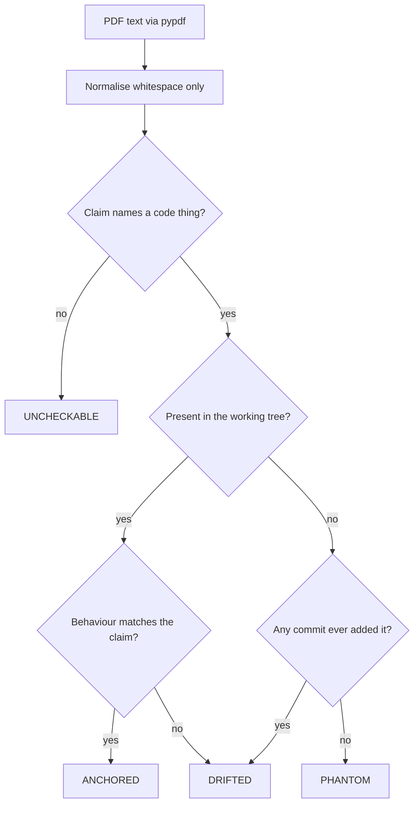
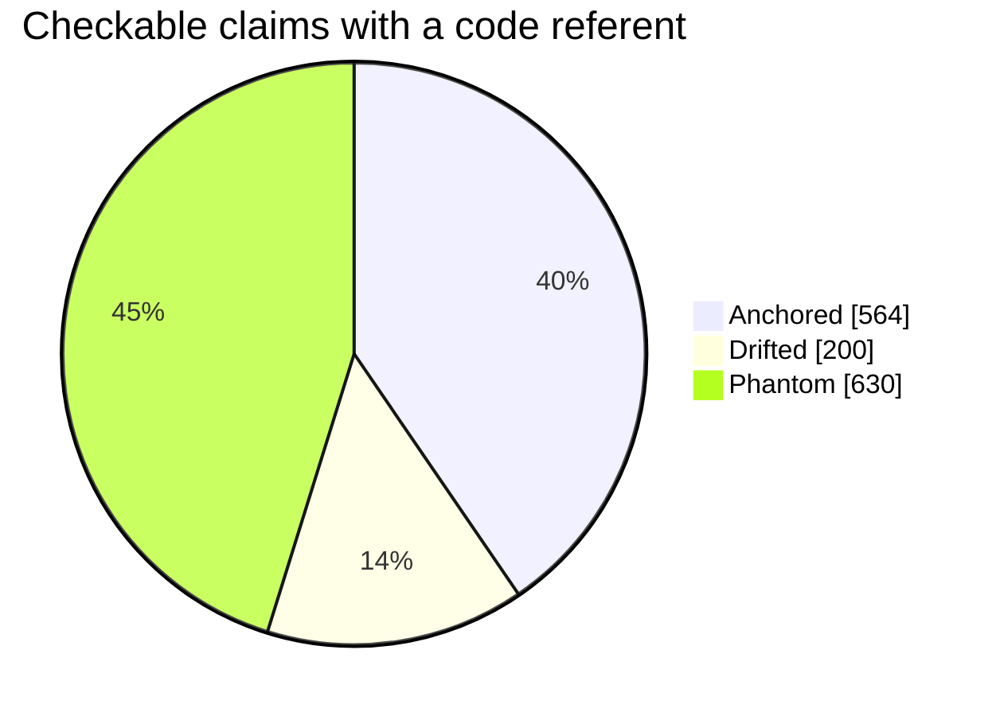

# Original Manual — Claim Audit Against The Code

**Mode: Reference.** This document scores the original ten-part product manual
against the source in this repository. It reports, per part, how many checkable
claims hold, how many drifted, and how many name things that have never existed
here. It is the measurement that decides what is worth carrying into the new
manual. It does not edit the original text.

Related: [documentation rules](../../.claude/rules/documentation.md),
[docs index](../index.md).

## Source Under Audit

Fourteen PDFs, all produced by ReportLab, held outside this repository. The
directory is a parameter of the audit, written here as `<MANUAL_PDF_DIR>`; it is
a personal path and is never recorded literally.

Measured with `pypdf`: **479 pages, 55 images**, across fourteen files. The
manual calls itself an eight-part work on its own cover and a fourteen-part work
on later covers; the file count is fourteen.

| File | Pages | Images |
|---|---:|---:|
| Part 1 Frontmatter and Overview | 26 | 0 |
| Part 2 Patent Portfolio | 54 | 0 |
| Part 3 System Architecture | 39 | 0 |
| Part 4 Features Catalogue | 59 | 0 |
| Part 5a Battery Methodology | 14 | 0 |
| Part 5b Main Bot Results | 15 | 4 |
| Part 5c Spectre Evidence | 12 | 2 |
| Part 6 Department Leads Review | 25 | 0 |
| Part 7a Development Chronicle | 30 | 0 |
| Part 7b Rules Registry | 19 | 0 |
| Part 7c ADR Index and Glossary | 21 | 0 |
| Part 8 Recent Updates and Live Evidence | 86 | 49 |
| Part 9 RAIntSimBat Standalone | 28 | 0 |
| Part 10 SADP Standalone | 51 | 0 |

## How This Was Measured

Every claim carries one of four verdicts.

| Verdict | Meaning |
|---|---|
| ANCHORED | the named thing exists and the claim matches what it does |
| DRIFTED | the thing exists, the claim does not match it |
| PHANTOM | the named thing has no source in this repository, ever |
| UNCHECKABLE | narrative, opinion, or a claim with no code referent |

### Instruments And Their Controls

Three instruments, each run with a positive and a negative control so that a
zero is a fact about the repository and not about the tool.

| Question | Instrument | Positive control | Negative control |
|---|---|---|---|
| Does the file exist now | `git ls-files -- "*/NAME" NAME` | `src/core/log_paths.py` returns a path | a coined name returns nothing |
| Did the file ever exist | `git log --all --diff-filter=ADR --name-only -- "*/NAME" NAME` | `src/core/log_paths.py` returns commit `6e4f46b` | a coined name returns nothing |
| Did the symbol ever appear in Python | `git log --all --regexp-ignore-case --pickaxe-regex -S<term> -- "*.py"` | `alpaca` returns 18 commits | `zzqqnope9` returns 0 |

The controls were re-run alongside every reported zero. Scope is 429 refs and
1,244 reachable commits.

**What PHANTOM does and does not prove.** This repository's history begins at an
initial upload — the same commit that serves as the positive control. A verdict
of PHANTOM therefore means exactly what the word is defined to mean here: the
named thing has no source in *this* repository, in any commit. It is not proof
that nothing of the kind ever existed on the author's machine before the upload.
For the largest phantom, the retired protocol tree, there is corroboration
inside the repository that does not depend on the history depth:
`tests/test_no_dead_sadp_references.py` exists precisely because references to
that tree shipped in packaging and README files while the tree itself never did.
The repository's own hallucination rule also lists that tree and the battery
engine as dead architecture, and exempts `docs/audits/` so that retirement
documents such as this one may name them.

**The symbol instrument has a known limit, and it changed a verdict.** A hit
proves only that the string appeared in some Python file — not that anything
implemented it. `RAIntSimBat` returns 26 Python commits, yet every occurrence is
a comment, a rule title, or an entry in this repository's own
hallucination-marker list; no module implements it and no file has ever carried
that name. A miss is equally fallible: the term `full_override` returned zero and
would have scored one invention PHANTOM, but that invention's real identifiers
(`_ripe_scrum`, `_deep_fold`) are live in `src/trading/scrumming_bot.py`. Every
zero below was re-probed with the identifiers the manual itself names.

### Sampling, Stated Plainly

All fourteen parts were read end to end. Every claim naming a file, module,
class, function, config field, flag, metric or number was extracted and scored.
Nothing was extrapolated from a sample, with one stated exception noted below.

Three machine censuses run underneath the reading, each complete within its own
class, so the ratios rest on real denominators rather than on impressions.

- **Census A — every distinct Python filename named, all fourteen parts.**
  Machine-extracted with one fixed pattern, then each name classified by the
  file instruments. A complete enumeration, not a sample.
- **Census B — every numbered catalogue entry.** All 26 inventions in the patent
  portfolio and all 77 rules in the protocol part, each checked against the
  mechanism or registry it names.
- **Census C — the executive claims of Part 1**, pages 1 to 8. This is the one
  stated subset: the remaining pages of that part are a section index and were
  not scored. Its table says so, and its 28-claim denominator covers only what
  was read.

Counting rule, applied uniformly: one claim per distinct named thing per part.
A thing named five times in one part counts once. A numeric table counts once.
Pure narrative is counted UNCHECKABLE rather than excluded, so the denominators
are not flattered by dropping the unscoreable.

### A Note On Extraction Damage

The PDF extractor breaks long identifiers across a line. Measured: a line ending
`ta_signal_pro` followed by a line beginning `vider.py`, for the real
`src/trading/ta_signal_provider.py`; and `check_r` split from
`elease_readiness.py`. An automatic rejoin was written, tested and **rejected** —
it repaired two names and fabricated nine others by welding ordinary words onto
following filenames. The three damaged tokens were instead removed by hand
(`vider.py`, `elease_readiness.py`, and a `file.py` that is a placeholder in a
template, not a claim). Every rejoin candidate the experiment produced was
already present in the corpus under its correct spelling, so no name was lost
entirely and the denominator is complete. Whitespace was normalised; words never
were.

## Whole-Document Roll-Up

**All fourteen parts were read and scored. 1,676 checkable claims classified.**

| Verdict | Count | Share of 1,676 |
|---|---:|---:|
| ANCHORED | 564 | 34% |
| DRIFTED | 200 | 12% |
| PHANTOM | 630 | 38% |
| UNCHECKABLE | 282 | 17% |

Uncheckable claims are narrative and opinion — they are neither right nor wrong,
so they belong outside any accuracy ratio. **Against the 1,394 claims that do
have a code referent, 830 are wrong or unfounded: 60 percent.** The operator
wagered that about 60 percent of the manual might be invented. Measured against
the claims that can be scored at all, that estimate is almost exactly right.

Read the other way, a third of the whole document is verified accurate, and that
third is not evenly spread. It concentrates in the two operator sections of the
features catalogue, the voting-panel chapter of the architecture part, the
patent portfolio, and the glossaries — and it thins to nothing in the standalone
parts and the results parts.

**The supporting file census agrees.** Counting each distinct Python filename
once for the whole document: 162 are named, 88 exist now, 1 existed and was
deleted, and 73 have no commit in this repository, ever — 73/162, 45 percent.
Counting a name once per part in which it appears, the denominator is 355: 199
present, 1 historical, 155 phantom.

**The two catalogue censuses land harder.** Of the 26 inventions, 7 name
mechanisms with no code referent under any name the manual gives them, and 2 more
are drifted. Of the 77 protocol rules, 42 have no identifier in the live registry
at all, and of the 35 whose identifiers do collide with it, **not one describes
the same rule**.

**Where the damage is worst.** Three parts are beyond repair rather than in need
of correction: the standalone part on the battery engine, the standalone part on
the protocol, and the evidence part for a bot that was never built. Together
those are 91 of the 479 pages, and their subjects have no source here at all.

## Part 1 — Frontmatter And Overview

26 pages. **28 claims classified** — Census C (all component and count claims on
pages 1 to 8) plus Census A's 6 filenames. This is a stated subset of the part;
pages 9 to 26 are a section index and were not classified.

| Verdict | Count | Share of 28 |
|---|---:|---:|
| ANCHORED | 10 | 36% |
| DRIFTED | 5 | 18% |
| PHANTOM | 10 | 36% |
| UNCHECKABLE | 3 | 11% |

**Anchored, and precisely so.** Two headline counts in the executive summary are
exactly right. "A seventeen-class declarative GateChain" — `src/trading/gate_chain.py`
defines exactly 17 concrete subclasses of the abstract `Gate`. "A twelve-voter
Indicator Voting Panel" — `src/trading/ta_engine.py` instantiates exactly 12
indicators. `ScrummingBot`, `ExtractorBot`, the Coinbase surface under
`src/exchange/`, Landing Strip detection, Phantom Balance, Smart Wire, the MR
Inspector and Proof of Accumulation all have real modules.

**PHANTOM claims, with proof.** All were re-probed with the manual's own
identifiers; the positive control returned `6e4f46b` or 18 commits on each run,
and the negative control returned zero.

- *Spectre, named as one of three production bot types* (pages 5, 6). No file
  has ever been named for it, and the string has **never appeared in any Python
  file in any commit**. It exists only as design prose in a handoff document.
  Three of Part 2's inventions and the whole of Part 5c rest on it.
- *`sadp/EPISODIC_MEMORY.json`, given as the truth source for the patent
  portfolio* (page 2). No path under `sadp/` has ever been committed.
- *Stocks market data "via Polygon.io and yfinance"* (page 5). Neither string has
  ever appeared in a Python file. The real connector is
  `src/stocks/alpaca_connector.py`, with `src/stocks/tradingview_bridge.py`.
- *Six named tooling scripts* — `chronicle_coverage.py`, `claims_audit.py`,
  `manual_depth_evaluator.py`, `manual_topic_matrix.py`, `q1_baseline_compute.py`,
  `regime_classify.py`. None was ever added.

**DRIFTED claims, with the real behaviour named.**

- *"Across five timeframes"* (page 5). No five-timeframe set exists anywhere.
  `TIMEFRAME_ORDER` in `src/gui/main_tabs/indicator_panel_surface.py` carries 11,
  and `src/trading/ta_engine.py` weights the same 11.
- *Four internal contradictions.* The part says twenty-six inventions on pages 2
  and 6 and twenty-seven in the table on page 8; Part 2 enumerates 26, so the
  table is wrong. The cover and the status section name different live-software
  versions. The cover says eight parts and the standalone covers say fourteen.
  The table calls the rules registry R1 to R70 where Part 10 catalogues R1 to R77.

**UNCHECKABLE.** The live-trading totals and the per-asset discipline split are
not checkable from the repository, and the runtime trees were deliberately not
opened. The split is at least internally consistent: 20 good plus 4 flat plus 1
wind-down equals the 25 pairs claimed.

## Part 2 — Patent Portfolio

54 pages. **30 claims classified** — Census B (all 26 numbered inventions) plus
Census A's 4 filenames. Complete for both classes.

| Verdict | Count | Share of 30 |
|---|---:|---:|
| ANCHORED | 19 | 63% |
| DRIFTED | 2 | 7% |
| PHANTOM | 9 | 30% |
| UNCHECKABLE | 0 | 0% |

**This is the strongest part of the manual.** 17 of 26 inventions describe
mechanisms that exist: `src/trading/phantom_balance.py`, `profit_fold.py`,
`smart_wire.py`, `mr_inspector.py`, `poa_tournament.py`,
`src/trading/indicators/landing_strip.py` and `fvg.py`, the entry-price
conservation cap, the initial-purchase-price floor, the fire-window override,
and the position ceiling with detonation are all real and all named correctly.

**PHANTOM inventions.** Seven describe mechanisms with no code referent under
any identifier the manual supplies. Each was probed with the manual's own terms;
both controls fired on every run.

- *Hunger Index* — `hunger` and `max_hunger` have never appeared in a Python file.
- *Satiety Index* — `satiety` likewise never.
- *Shadow Secondary Add* — `shadow_secondary` never. Its stated trough test uses
  `bb_pos`, which is real, inside a mechanism that is not.
- *Charge-Up Permission Gate* — neither `charge_up` nor `chargeup` ever.
- *The three Spectre inventions* — `spectre` and `spectre_reserve` never.

Two further filenames named in this part were never added.

**DRIFTED inventions, with the real behaviour named.**

- *The full-override fire window.* The mechanism is real — `_ripe_scrum` and
  `_deep_fold` live in `src/trading/scrumming_bot.py` — but both stated constants
  are wrong. The manual gives a band trigger of 0.80; the code compares `bb_pos`
  against `_bb_detect_thresholds()` in `src/trading/scrumming/circuit_breakers.py`,
  which derives from `config.scrum_detect_pct` and defaults to **0.875**, and is
  configurable rather than constant. The manual gives a fixed 10 percent delta
  trigger; the code tests against the bot's configured `scrumming_interval_pct`.
- *Position-Aware Technical Analysis.* The named mechanism, a `sign_context`
  multiplier, has never existed. Band-position gating itself is real, as
  `BBProximityGate` in `src/trading/gate_chain.py` reading `bb_pos`.

**Every supporting-evidence block in this part is unreproducible.** All 27 of
them attribute their numbers to the simulation battery, and that engine has no
source here (see Part 9). One bull-regime figure is reported as an average
advantage of more than nineteen million dollars against a sideways-regime figure
of some five thousand — a spread of three orders of magnitude, produced by an
instrument this repository does not contain. The claim scopes and equations are
worth keeping; the numbers beside them are not.

## Part 3 — System Architecture

39 pages, read in full with no sampling. **358 claims classified** — every claim
naming a file, module, class, function, config field or number. Provenance tags
carrying no code referent were not counted.

| Verdict | Count | Share of 358 |
|---|---:|---:|
| ANCHORED | 175 | 49% |
| DRIFTED | 55 | 15% |
| PHANTOM | 83 | 23% |
| UNCHECKABLE | 45 | 13% |

**Every module count and every size is wrong.** The engine package is given as
23 modules and holds 88; the core package as 17 and holds 28; the exchange
package as 12 and holds 24. The graphical layer is given as about 30 files and
28,874 lines; it is 165 files and 118,879. Two line-count citations point past
the end of the file they name.

**Thirty-one module roles are described as something the module does not do.**
The pattern is consistent and worth naming, because it is the failure mode a
reader is least likely to catch: the module exists, so a spot check passes, but
the description belongs to a different component. Among them, the volume guard
is described as verifying fill prices when it does order chunking — and its own
docstring records that it returns disabled, leaving its execute path unreached
on a live order. The competition package is described as generic tournament
scaffolding when it is a real on-chain token ledger with chain ids and contract
addresses.

**A subsystem that never existed occupies several pages.** A cooperative
capacity arbiter, its bridge, and every one of its named symbols return zero on
both instruments with both controls firing. Nothing implements it and nothing
ever did.

**The voting-panel chapter is the strongest writing in the manual.** All twelve
voter codes and their exact weights match `src/trading/ta_engine.py`, the
weights sum to the stated range, the net and confidence formulae match including
the detail that neutral voters leave the denominator, and the raw-value columns
and colour thresholds match the surface module. It needs three small corrections
and then it ships.

## Part 4 — Features Catalogue

59 pages, read in full with no sampling. **288 claims classified.**

| Verdict | Count | Share of 288 |
|---|---:|---:|
| ANCHORED | 117 | 41% |
| DRIFTED | 51 | 18% |
| PHANTOM | 68 | 24% |
| UNCHECKABLE | 52 | 18% |

**One finding here has a direct money consequence, and it is the most important
single result in this audit.** Eleven settings are documented across the
operator sections with types and defaults, as though an operator could set them.
All eleven are listed in `_DEPRECATED_KWARGS` in
`src/trading/container/config.py` and are dropped before `BotConfig.__init__`
ever sees them. An operator following these pages would set a value, see no
error, and get silence. Verified at runtime: the frozen set holds exactly 11
keys.

**The detonation trigger is documented backwards on two pages of three.** Two
passages describe it as exiting on a high-confidence bearish higher-timeframe
signal. `ScrummingBot._check_detonation_trigger` requires a value above the
anchor and a **bullish** reading at or above the configured confidence. The
part's own risk-control table gets it right, so the manual contradicts itself,
and the majority reading is the wrong one.

**Counts drift where they can be measured exactly.** Verified at runtime:
`BotConfig` carries 72 fields, not the "80+" claimed; the extractor-only field
manifest holds 15, not the thirteen claimed. The default interval, detect and
fire settings are each given at the wrong magnitude, two of them confusing a
percent for a fraction.

**Every graphical-tab line count is wrong, and five of eight tab purposes with
them.** Three are wrong decisively: the analytics tab is described with
features a search of the file does not find, the competition tab is described as
visualising the arbiter that does not exist, and the local-chain explorer tab is
described as an exchange sandbox.

**Anchored, and this is the part's real value.** The two operator sections are
the highest-value block in the whole manual. Field by field against
`src/trading/container/config.py`, the scrumming defaults verify, and all
fifteen extractor field defaults verify exactly, down to the spike-protection
percentage and the median-of-three fallback. Cut the eleven dead settings and
the two reversed detonation paragraphs and these pages ship close to as-is.

## Part 5a — Battery Methodology

14 pages, read line by line. **61 claims classified** — every sentence naming a
file, class, function, config field, constant, rule id, metric or number.

| Verdict | Count | Share of 61 |
|---|---:|---:|
| ANCHORED | 12 | 20% |
| DRIFTED | 10 | 16% |
| PHANTOM | 34 | 56% |
| UNCHECKABLE | 5 | 8% |

**The battery universe contradicts the code and itself.** Page 3 defines the
battery as 26 assets across 3 regime periods, giving 78 simulations. The live
registry's own rule title names the full battery as 39 simulations, and the
repository's handoff record puts it at 13 assets across 3 periods. Page 11 of
this same part then says 39 equals 13 times 3 — eleven pages after saying 78.
The constants said to fix the roster were never defined: one of the two appears
in the whole history only as a since-removed comment in
`src/exchange/ccxt_connector.py`, and the other never appears at all.

**A dependency claimed that was never installed.** The part describes a
property-testing layer of 29 invariants and some 880 randomised invocations. The
library named is imported nowhere and appears in no requirements or project
file, in any commit; its only traces are a cache-directory name inside three
exclusion lists and one use of the ordinary English word in a comment.

**Anchored where it touches real gates.** The sentinel behaviour of the trend
and efficiency-ratio gates is described exactly right, the z-score gate is
correctly identified as the seventeenth concrete gate with the right block
directions, and the initial-purchase-price floor is correctly located in
`src/trading/scrumming/tick_phases.py`.

## Part 5b — Main Bot Results

15 pages and 4 images, read in full. **44 claims classified**, chart captions
included; the charts themselves are images and only their captions were scored.

| Verdict | Count | Share of 44 |
|---|---:|---:|
| ANCHORED | 6 | 14% |
| DRIFTED | 6 | 14% |
| PHANTOM | 30 | 68% |
| UNCHECKABLE | 2 | 5% |

**None of the 30 numbers in this part can be reproduced from this repository.**
Two producers are credited and both are phantom: the battery engine, and a
grading script for the live export. The nearest real instrument,
`dev_harness/harness/ytd_compounding_replay.py`, does read a Coinbase export but
computes a compounding upper bound, and emits neither the ratio nor the
discipline classes the part tabulates.

**Two figures refute themselves without needing any code.** A caption reports
the bull and sideways regimes as unbroken at 57 wins from 57; in the part's own
26-by-3 universe those two regimes are 52 simulations, not 57. A table classes an
asset at exactly the ratio 1.005 as good, under a rule stated on the same page as
strictly greater than 1.005. The part also gives two different baseline dates for
one comparison, and says five new assets entered while listing four.

**Notable DRIFTED claims.** A contention mechanism is named that does not exist;
the real mechanism is capital reservation, in `src/trading/capital_reservation.py`
and its mixin. The competition package is cited as the place to inspect
contention outcomes, but `src/competition/` is the proof-of-accumulation
tournament and holds no such data. The trade grade is described as a 0-to-100
numeric on an A-to-F scale; the real mapping is a 0-to-1 numeric and the top band
is A-plus.

## Part 5c — Spectre Evidence

12 pages and 2 images, read in full. **33 claims classified.**

| Verdict | Count | Share of 33 |
|---|---:|---:|
| ANCHORED | 1 | 3% |
| DRIFTED | 2 | 6% |
| PHANTOM | 25 | 76% |
| UNCHECKABLE | 5 | 15% |

**This part is evidence for a subsystem that was never built.** Every mechanism
it reports as measured — the dark-zone spawn fraction, the tranche count, the
release threshold, the raised candle cap — exists nowhere in code, in this
repository or its history. The generator credited with producing the report never
existed, and neither did its output directory.

**One sentence refutes itself by three orders of magnitude:** it reports profit
of about eighty-four dollars on a hundred dollars of capital and, in the same
breath, an advantage over passive holding of more than a hundred and nineteen
thousand.

**The single anchored claim is the part's own disclaimer** — that the live
evidence is entirely the two real bots and that no live data for this one
exists. That is true, and understates the case.

## Part 6 — Department Leads Review

25 pages, read in full. **81 claims classified.**

| Verdict | Count | Share of 81 |
|---|---:|---:|
| ANCHORED | 25 | 31% |
| DRIFTED | 20 | 25% |
| PHANTOM | 30 | 37% |
| UNCHECKABLE | 6 | 7% |

**This is the strongest of the results parts.** The reviewer framework is openly
fictional, and the domain assertions are field-standard trading principles that
need no code. Three "deliberately not built" decisions — no classical
trend-following, no hard stops, no order-book tape — are each verified absent and
each carry a stated rationale. These are product decisions, and they hold.

**The failures cluster in two places.** The memory ids resolve to a store that
never existed here, and the entire review apparatus described in the closing
pages — an archetype library, a claims-audit ratchet, a structural test family —
has no source at all. That last point matters more than its count: the part
credits those instruments with having guarded its own numbers.

**Notable DRIFTED claims.** The phantom-balance timeframes are described once as
three copies and once as only two, and a later passage proposes adding two
timeframes that are already present; the real default carries six. An
agreement rule is described that has no counting logic anywhere. The efficiency
ratio is cited at a line number in a 420-line file, attributed to the wrong
module, and described as downweighting folds when the real gate hard-blocks the
sell side at both extremes. The volume voter is described as compositing four
sub-indicators where the module documents six — and this part's own earlier page
says six.

## Part 7a — Development Chronicle

30 pages, read end to end. **160 claims classified**, counting one claim per
distinct named thing.

| Verdict | Count | Share of 160 |
|---|---:|---:|
| ANCHORED | 64 | 40% |
| DRIFTED | 9 | 6% |
| PHANTOM | 45 | 28% |
| UNCHECKABLE | 42 | 26% |

The high uncheckable share is structural: pages 20 to 30 are an index of memory
ids that all resolve to the episodic-memory store, which has never existed here.

**Notable DRIFTED claims.** The chronicle names a mean-reversion suppression gate
that has never existed under that name; the real class is
`ADXTrendSuppressionGate` in `src/trading/gate_chain.py`, and Part 7c uses the
correct name, so the manual disagrees with itself. The trade grader is described
as a five-axis rubric; `src/trading/trade_grader.py` scores four — execution,
timing, strategic and outcome — and records the regime as a string it never
scores. The release gate is again cited at a `tools/` path it has never had.

**Where 7a is right, it is right in bulk.** Every module named in the
coverage-backfill arc exists at the stated path. The trading-discipline arc on
page 12 correctly describes the gate context populated from the voting summary
and the sentinel that lets an unpopulated reading pass. The configuration-factory
arc on page 15 correctly describes `make_bot_config` and its three field
manifests in `src/trading/container/config.py`.

## Part 7b — Rules Registry

19 pages, read end to end. **97 claims classified.**

| Verdict | Count | Share of 97 |
|---|---:|---:|
| ANCHORED | 20 | 21% |
| DRIFTED | 13 | 13% |
| PHANTOM | 50 | 52% |
| UNCHECKABLE | 14 | 14% |

**The registry comparison, in both directions.** Parts 7a, 7b and 7c together
make a content claim about 51 distinct rule numbers. Seventeen name a rule the
live registry defines — 17/51, 33 percent — and only 15 of those describe it
correctly, so 34/51 have no entry at all. Read the other way, `RULE_META` defines
35 rules, of which 17 are described anywhere in these parts and 15 correctly —
15/35, 43 percent. The registry marks five rules as core and refuses to suspend
them; the manual describes one of the five.

**The group table is wrong in six places.** Four lettered groups are given
memberships that belong to different rules entirely, one rule is double-booked
into two groups, and a tenth group is named that does not exist.

**The part contradicts itself on nine rule numbers**, giving each two
incompatible identities in different sections. Both readings are phantom in every
case, so the contradiction is a symptom rather than a separate defect.

## Part 7c — ADR Index And Glossary

21 pages, read end to end. **149 claims classified.**

| Verdict | Count | Share of 149 |
|---|---:|---:|
| ANCHORED | 16 | 11% |
| DRIFTED | 9 | 6% |
| PHANTOM | 69 | 46% |
| UNCHECKABLE | 55 | 37% |

**No decision record has ever existed here.** No file whose name contains "adr",
case-insensitive, appears in any commit, while the positive control returned its
path on the same instrument. That covers every record the part enumerates across
its three lists. The claim that the index regenerates from a canonical source is
phantom for the same reason. The part also gives one record three different
titles in three places.

**The glossary is the exception and the prize.** The trading-engine vocabulary is
accurate, and the technical-analysis vocabulary is publisher-canonical with no
repository dependency at all. One glossary entry drifts: the battery is defined
at one size where the live registry's own rule title and a comment in
`src/trading/strategy_compare.py` both name another.

## Part 8 — Recent Updates And Live Evidence

86 pages and 49 images, the largest part, read in full. **231 claims
classified**, counting each distinct identifier once, each numeric table once,
and each standalone number once. Narrative was excluded rather than padded in.

| Verdict | Count | Share of 231 |
|---|---:|---:|
| ANCHORED | 90 | 39% |
| DRIFTED | 18 | 8% |
| PHANTOM | 71 | 31% |
| UNCHECKABLE from the repository | 52 | 22% |

The runtime log trees were deliberately not opened, so no live number was
checked against live data. The question asked instead was whether the repository
holds code that could produce each number.

**The headline metric has no producer at all.** The part leads on a
sell-over-buy price-discipline ratio, and carries roughly 190 table cells of it
across four dated snapshots. No module computes an average sell price: a search
for the obvious spellings across `src/` and `dev_harness/` returns zero, against
a positive control of 61 hits for the average-entry term in the same sweep. The
only trace in the whole history is a removed comment in
`src/trading/trade_grader.py`. Neither is there a discipline-grade classifier,
nor any of the ratio thresholds the part tabulates. The chart gallery is in the
same position: the one volume-weighted price in the tree is a rolling window for
the simulator chart, not a per-position running cost basis.

This compounds a framing problem. The trustworthy lenses for this evidence are
the bot-VWAP trajectory, the platform-reported unrealized position, and the
total-balance arc. The part argues for exactly that on two of its own pages and
then leads with the summary ratios anyway — and the ratio is the one metric class
with no producing code. Of the anchored lenses, the unrealized-position table
does have a real producer in `src/exchange/position_health.py`, which derives
average entry and realized profit from exchange-pulled trades rather than
computing them locally.

**Notable DRIFTED claims.** The efficiency-ratio gate is described as
suppressing at a low-end reading five times higher than the real one;
`EfficiencyRatioRegimeGate` in `src/trading/gate_chain.py` takes
`lower_threshold` of 0.05, not the quarter the manual states. The trend gate is
described as refusing to scrum in a ranging market when the code blocks in the
opposite regime, on strong trend. A worked attribution example on page 70 is
self-refuting: it records a trend reading that would have fired the very
suppression gate it claims passed, so the trade it narrates cannot have
happened as written. One citation points at lines 6873 to 6911 of
`src/trading/scrumming_bot.py`, a file of 5,010 lines; the behaviour it
describes is real but now lives in `src/trading/scrumming/tick_phases.py`. The
volume guard is described with a per-bar cap and a square-root slippage curve;
the real field is an hourly participation cap and the model is linear. The
risk-metric methodology is described with a risk-free term and daily
annualisation; `compute_risk_metrics` in `src/trading/strategy_compare.py` has
no risk-free term and annualises hourly.

**Anchored, and strongly.** The trade-grading chapter verifies almost
completely: the scored axes, the letter boundaries, and the grade column's
position in the history contract all match. The gate call-site activation is
real and load-bearing. The two snapshot emitters in
`src/trading/scrumming/snapshots.py` emit exactly the line prefixes quoted. The
configuration-factory preventatives are exactly as described. In the
quality-arc module inventory, all 18 named modules verify, and its one
falsifiable sub-claim — that a named fold helper has no production callers —
is still true today.

## Part 9 — RAIntSimBat Standalone

28 pages. **13 claims classified** — Census A's 6 filenames plus the 7 subsystem
and methodology claims that name a mechanism. The narrative sections on limits
are opinion and are counted UNCHECKABLE rather than scored.

| Verdict | Count | Share of 13 |
|---|---:|---:|
| ANCHORED | 3 | 23% |
| DRIFTED | 0 | 0% |
| PHANTOM | 9 | 69% |
| UNCHECKABLE | 1 | 8% |

**The subject of the part does not exist here.** Page 3 states the canonical
source file and gives it a line count. No file of that name, and no path under
`sadp/`, has ever been committed; the positive control returned `6e4f46b` on the
same run. Also phantom: the cost-basis methodology (`hifo` never appears in any
Python file), the cooperative-capacity arbiter, and a position analyser.

**Anchored anyway.** Three named integrations are real: `src/trading/gate_chain.py`,
`src/trading/trade_grader.py`, and `src/trading/capital_registry.py`. The part's
own limits-first framing — leading with what the simulation does not model — is
sound editorial practice and is the one thing here worth carrying forward as
posture rather than as content.

**A live defect this audit surfaced.** `src/core/version_sweep.py` registers
three checks that guard paths under the retired protocol tree. The sweep calls
every registered check in turn and prints a tick when a check adds no finding.
Two of the three — `check_r6_two_paths` and `check_sadp_dependency_graph` —
return early and silently, because the paths they compare are absent and one of
them, the battery engine, has never existed here at all. Both therefore print a
green tick for an inspection that examined nothing. The third,
`check_rule_registry`, is better behaved: it emits an informational finding
naming the missing file, though the remedy it suggests writes into the same
absent directory. A gate that cannot fail is not a gate. This is code, not
prose, and it needs its own repair.

## Part 10 — SADP Standalone

51 pages. **103 claims classified** — Census B (all 77 rules) plus Census A's 26
filenames. Complete for both classes.

| Verdict | Count | Share of 103 |
|---|---:|---:|
| ANCHORED | 6 | 6% |
| DRIFTED | 0 | 0% |
| PHANTOM | 97 | 94% |
| UNCHECKABLE | 0 | 0% |

**The rule set has no implementation here, and the identifier overlap is
coincidental.** The part catalogues 77 rules. `src/core/rule_registry.py` defines
35. The 42 ids from R36 upward have no entry in the registry at all. Of the 35
ids that do collide, **not one describes the same rule**: the manual's first rule
is a lock-state default where the registry's is about target increments after a
fold; the manual's third is an append-only log where the registry's is about a
targeting-mode reset. The two are unrelated namespaces that happen to share an
id space, and the manual's is the one with no code.

Twenty of the 26 filenames named here were never added, including the episodic
memory store, the edit log, a token timer, and eleven named test modules.

**The one namesake in code is itself inert.** `src/core/rule_registry.py`
persists to `sadp/RULE_REGISTRY.json` — a path that has never been committed —
and no production module imports it; only a test does. Its own docstring says as
much.

This part is deprecated in substance as well as in fact: the protocol it
describes has been replaced by the skills-based harness. Its R-numbers are not
live and must not be cited as though they were.

## Migration List

Carry these forward. Everything named here is ANCHORED, verified against a
module that exists, and worth the space in a new manual.

| From | Pages | What to carry | Anchor in code |
|---|---|---|---|
| Part 1 | 5–6 | The harvest-fold mechanic and the target-ratchet description | `src/trading/profit_fold.py`, `src/trading/scrumming_bot.py` |
| Part 1 | 5 | The two real bot types and what separates them | `src/trading/scrumming_bot.py`, `src/trading/extractor_bot.py` |
| Part 1 | 5 | The gate-chain and voting-panel counts, both exact | `src/trading/gate_chain.py`, `src/trading/ta_engine.py` |
| Part 2 | 5–9 | Speculative scrumming, phantom balance, landing strip — mechanism and claim scope | `phantom_balance.py`, `indicators/landing_strip.py` |
| Part 2 | 10–13 | Band travel and the MR inspector z-score | `mr_inspector.py`, `indicators/zscore.py` |
| Part 2 | 14–17 | Smart wire provenance and proof of accumulation | `smart_wire.py`, `poa_tournament.py`, `src/competition/` |
| Part 2 | 30–38 | Provenance fold queue, entry-price conservation, fair-value gaps, regime bias | `profit_fold.py`, `indicators/fvg.py` |
| Part 2 | 39–46 | The initial-purchase-price floor and the initial-entry discipline gate | `scrumming_bot.py`, `gate_chain.py` |
| Part 2 | 49–51 | Position ceiling and detonation | `scrumming_bot.py` |
| Part 3 | 23–27 | The indicator voting panel — voters, weights, net and confidence | `src/trading/ta_engine.py`, `indicator_panel_surface.py` |
| Part 3 | 16 | The gate-chain framework and its context object | `src/trading/gate_chain.py` |
| Part 3 | 17 | The extractor state machine and chunk accounting | `src/trading/extractor_bot.py` |
| Part 3 | 19 | Postmortem-bundle rotation and its four constants | `acervator_watchdog.py` |
| Part 4 | 32–44 | The scrumming operator section, field by field | `src/trading/container/config.py` |
| Part 4 | 45–49 | The extractor operator section, all fifteen fields | `src/trading/container/config.py` |
| Part 4 | 7 | The risk-control rows, including the fold-rate taper | `scrumming_bot.py`, `gate_chain.py` |
| Part 5a | 5–6 | The methodology principles and the four stated blind spots | editorial, no anchor |
| Part 6 | 3–4 | The reviewer framework, roster and lineage — openly fictional | no anchor needed |
| Part 6 | 5–14 | The ten domain assertions, re-deriving each product bullet | field-standard, verify per bullet |
| Part 6 | 10–17 | The three deliberately-not-built decisions and their rationale | verified absent in code |
| Part 7a | 12 | The trading-discipline arc and the gate-context sentinel | `gate_chain.py`, `scrumming_bot.py` |
| Part 7a | 15 | The configuration-factory arc and its three field manifests | `src/trading/container/config.py` |
| Part 7a | 18 | The inverted-extractor fields and their wizard surface | `config.py`, `src/gui/bot_wizard.py` |
| Part 7b | 11 | The declared-but-unwired gate class, as an engineering note | `gate_chain.py` |
| Part 7c | 8 | The trading-engine vocabulary — the strongest section in these parts | whole glossary |
| Part 7c | 10 | The technical-analysis vocabulary, publisher-canonical | no repository dependency |
| Part 8 | 40–42 | Trade grading — axes, letter boundaries, history column | `src/trading/trade_grader.py` |
| Part 8 | 58–59 | The gate call-site activation | `scrumming_bot.py`, `gate_chain.py` |
| Part 8 | 70–71 | The two snapshot emitters and their line prefixes | `src/trading/scrumming/snapshots.py` |
| Part 8 | 8–10 | The quality-arc module inventory, all 18 modules | `src/trading/`, `src/core/` |
| Part 9 | 2 | The limits-first posture only — lead with what is not modelled | editorial, no anchor |

### Corrections That Must Travel With The Migration

Several migratable sections carry one wrong constant or one wrong path. Carry
the section, fix the value.

| Where | The manual says | The code says |
|---|---|---|
| Part 4 operator sections | eleven settings, with types and defaults | all eleven are in `_DEPRECATED_KWARGS` and dropped before `BotConfig.__init__` |
| Part 4, two of three passages | detonation exits on a bearish higher-timeframe signal | `_check_detonation_trigger` requires **bullish** at or above the confidence floor |
| Part 4 | more than 80 config fields, thirteen extractor-only | 72 fields, 15 extractor-only, both measured at runtime |
| Part 3 | package sizes of 23, 17 and 12 modules | 88, 28 and 24 |
| Parts 3, 4 | seventeen gates evaluated per tick | 17 gate *classes*; the chains are 14 on the sell side and 10 on the buy side |
| Part 1 executive summary | five timeframes | eleven, in `indicator_panel_surface.py` and `ta_engine.py` |
| Part 2 fire-window override | band trigger 0.80, delta trigger 10 percent | 0.875 by default from `scrum_detect_pct`, and the configured scrumming interval |
| Parts 4, 7a, 7b, 8 | the release gate under `tools/` | `dev_harness/harness/check_release_readiness.py` |
| Parts 7a, 7c, 8 | the trade grader scores five axes | four scored axes; the regime is recorded, never scored |
| Part 8 | efficiency-ratio suppression at 0.25 | `lower_threshold` of 0.05 in `gate_chain.py` |
| Part 8 | the trend gate refuses in a ranging market | it blocks on strong trend, at or above 30 |
| Part 6 | phantom balance uses two or three timeframes | six, in `DEFAULT_PHANTOM_TIMEFRAMES` |
| Parts 5a, 7c | a 78-simulation battery over 26 assets | the live rule title names 39; Part 5a's own later page agrees |

### Migrate Only After Rebuilding The Producer

These sections carry sound reasoning on top of numbers nothing here can
regenerate. Keep the framing, re-measure the figures, or publish neither.

- **Part 5a, the methodology depth pass** — the designed-versus-realised regime
  distinction and the walk-forward specification are good discipline. Settle the
  battery size in one direction first.
- **Part 5b, the recovery profiles** — cooperation, survival and resilience is a
  real product story. Every number in it must be re-measured from the live
  account, and the cost-basis method it names must be dropped or implemented.
- **Part 8, the live-evidence and chart chapters** — the numbers may well be
  true. Nothing in this repository can regenerate them, so migrating them as they
  stand writes an unfalsifiable claim into a new document.

### Drop

Do not migrate Part 5c or the three inventions built on it, Part 10 or its rule
numbers, the third-generation baseline chapter, the decision-record index, or any
battery figure wherever it appears.

Two items need repair rather than migration, and both are code rather than
prose: the two checks in `src/core/version_sweep.py` that pass without examining
anything, and the rule registry that persists to a directory which has never
existed.

## Migration Ledger

The audit above produced a carry list. This section records what happened to it.
Every one of the 479 pages sits in exactly one row below, either with the file
it was migrated into or with the reason it was not and the proof of that reason.
The 55 images are inventoried separately, one row each, in
[docs/manual/FIGURES.md](../manual/FIGURES.md).

The manual's three sources are kept apart and labelled per file and per section.
[docs/manual/README.md](../manual/README.md) carries the bucket scheme.

### Pages migrated, and where each went

| From | Pages | Destination | Manual part |
|---|---|---|---|
| Part 2 | 5–17, 30–46, 49–51 | [05-novel-concepts.md](../manual/05-novel-concepts.md) | 2 |
| Part 3 | 16 | [07-indicators.md](../manual/07-indicators.md) | 3 |
| Part 3 | 17 | [06-trading-tab.md](../manual/06-trading-tab.md) | 3 |
| Part 3 | 19 | [08-tabs.md](../manual/08-tabs.md), System Status | 3 |
| Part 3 | 23–27 | [07-indicators.md](../manual/07-indicators.md) | 3 |
| Part 5a | 5–6 | [08-tabs.md](../manual/08-tabs.md), Simulator | 3 |
| Part 6 | 3–4 | [14-development-chronicle.md](../manual/14-development-chronicle.md) | 8 |
| Part 6 | 10–17, the three not-built decisions | [12-adr-index-and-glossary.md](../manual/12-adr-index-and-glossary.md) | 6 |
| Part 7a | 12 | [14-development-chronicle.md](../manual/14-development-chronicle.md) | 8 |
| Part 7a | 15 | [14-development-chronicle.md](../manual/14-development-chronicle.md) | 8 |
| Part 7a | 18 | [14-development-chronicle.md](../manual/14-development-chronicle.md) | 8 |
| Part 7b | 11 | [11-hop-protocol-and-rules-registry.md](../manual/11-hop-protocol-and-rules-registry.md) | 5 |
| Part 7c | 8 | [12-adr-index-and-glossary.md](../manual/12-adr-index-and-glossary.md) | 6 |
| Part 7c | 10 | [07-indicators.md](../manual/07-indicators.md) | 3 |
| Part 8 | 8–10 | [09-updates-and-versioning.md](../manual/09-updates-and-versioning.md) | 7 |
| Part 8 | 40–42 | [08-tabs.md](../manual/08-tabs.md), History | 3 |
| Part 8 | 58–59 | [07-indicators.md](../manual/07-indicators.md) | 3 |
| Part 8 | 70–71 | [08-tabs.md](../manual/08-tabs.md), Console | 3 |
| Part 9 | 2 | [08-tabs.md](../manual/08-tabs.md), Simulator | 3 |

No new part was created. The operator's own table of contents in
`docs/manual/04-manual-parts.md` has nine parts and its arrangement takes
precedence, so each migrated passage entered the part whose subject it serves.
One new file was added inside an existing part, which is what the manifest
table in `docs/manual/README.md` documents as folding a further file into a
part.

Two destination files were withdrawn after the migration. Part 1 pages 5–6 and
Part 4 pages 7, 32–44 and 45–49 each duplicated a subject the operator already
covers in his own words, so the pages return to the not-migrated reckoning
below and the destination column above no longer names either file.

### Pages not migrated, with the reason and the proof

Every count below is per part, and the three columns sum to the part's page
count. The proof column names the measurement, not an opinion.

| Part | Pages | Migrated | Not migrated | Reason, and the proof |
|---|---:|---:|---:|---|
| Part 1 | 26 | 0 | 26 | Pages 5–6 were migrated and then withdrawn: the harvest-fold summary duplicates the operator's own executive summary. Pages 1–4 are cover and front matter. Pages 7–8 carry the part's four internal contradictions, including a table saying twenty-seven inventions where the portfolio enumerates twenty-six. Pages 9–26 are a section index of the superseded document itself, so it indexes nothing that now exists. |
| Part 2 | 54 | 33 | 21 | Front matter, the seven inventions whose identifiers have never appeared in any Python file, and all 27 supporting-evidence blocks. Every block attributes its numbers to a simulation engine with no source in this repository; the figures the blocks cite are inventoried in FIGURES.md with their producer named as absent. |
| Part 3 | 39 | 8 | 31 | Every module count and size in the part is wrong; measured now, the trading package holds 88 modules against 23 claimed, core 28 against 17, exchange 24 against 12, and the graphical layer 165 files and 117,241 lines against about 30 files and 28,874. Thirty-one module roles describe a different component from the one named. Several pages describe a capacity arbiter whose every named symbol returns zero on both instruments with both controls firing. |
| Part 4 | 59 | 0 | 59 | Pages 7, 32–44 and 45–49 were migrated and then withdrawn: the operator describes his own settings on manual pages 18 to 27. The tab chapters: every graphical-tab line count is wrong and five of eight tab purposes with them, three decisively — an analytics tab described with features a search of the file does not find, a competition tab described as visualising the arbiter that does not exist, and a chain-explorer tab described as an exchange sandbox. |
| Part 5a | 14 | 2 | 12 | The battery universe contradicts itself inside one part: page 3 defines 26 assets across 3 periods for 78 runs, page 11 says 39 equals 13 times 3. The constants said to fix the roster were never defined. The property-testing library the part credits with 29 invariants is imported nowhere and appears in no requirements file in any commit. |
| Part 5b | 15 | 0 | 15 | No number in the part can be reproduced here. Both credited producers are absent: the battery engine and a grading script for the venue export. Two figures refute themselves without needing any code — see the figure inventory. The four images are carried in FIGURES.md. |
| Part 5c | 12 | 0 | 12 | Evidence for a subsystem that was never built. Every mechanism it reports as measured exists nowhere in code or history, and one sentence refutes itself by three orders of magnitude. Its single accurate claim is its own disclaimer that no live data for the subsystem exists. The two images are carried in FIGURES.md. |
| Part 6 | 25 | 10 | 15 | The ten domain assertions on pages 5–14 are field-standard trading principles and each would need re-deriving against the product bullet it defends; a bullet re-derived without its measurement is an opinion with a citation. The memory identifiers resolve to a store that has never existed here, and the review apparatus described in the closing pages has no source at all. |
| Part 7a | 30 | 3 | 27 | Pages 20–30 are an index of memory identifiers that all resolve to the same absent store. The remaining narrative pages carry the arcs that are already migrated. |
| Part 7b | 19 | 1 | 18 | The rule catalogue. Of 51 distinct rule numbers the three protocol parts describe, 34 have no entry in the live registry at all, and of the 17 that do collide, 15 describe it correctly. The group table is wrong in six places and the part gives nine rule numbers two incompatible identities. |
| Part 7c | 21 | 2 | 19 | The decision-record index across three lists. No file whose name contains "adr", in any case, appears in any commit, while the positive control returns its path on the same instrument. The part also gives one record three different titles in three places. |
| Part 8 | 86 | 10 | 76 | The live-evidence chapters. The headline metric has no producer: a search for the obvious spellings of an average sell price across `src/` and `dev_harness/` returns zero, against 61 hits for the average-entry term in the same sweep. Roughly 190 table cells rest on that metric across four dated snapshots. The numbers may well be true; nothing here can regenerate them, so migrating them writes an unfalsifiable claim. All 49 images are carried in FIGURES.md. |
| Part 9 | 28 | 1 | 27 | The subject does not exist here. The canonical source file the part names, and every path under its directory, have never been committed; the positive control returned its commit on the same run. The cost-basis method, the capacity arbiter and the position analyser are absent by the same instrument. |
| Part 10 | 51 | 0 | 51 | The protocol it describes is deprecated in substance and in fact, replaced by the skills-based harness. Of 77 catalogued rules, the 42 above R35 have no entry in `src/core/rule_registry.py`, and of the 35 that collide, not one describes the same rule. Twenty of the 26 filenames named here were never added. These numbers are not live and must not be cited as though they were. |
| **Total** | **479** | **70** | **409** | |

The two counted columns sum to the page count on every row and across the whole
table: 70 plus 409 is 479. Part 2's migrated count is pages 5–17, 30–46 and
49–51, which is 13 plus 17 plus 3. Part 6's is pages 3–4 and 10–17, which is 2
plus 8. Part 8's is pages 8–10, 40–42, 58–59 and 70–71, which is 3 plus 3 plus 2
plus 2. Part 1 and Part 4 count zero because the 21 pages they had carried,
2 plus 19, went back to the not-migrated column with the two withdrawn files.

### Corrections found while migrating

The corrections table above travelled with the migration and was applied. Three
of its rows needed correcting themselves, and the migrated text carries the
measured value rather than the audited one.

| Where the audit says | What measurement returns | Instrument |
|---|---|---|
| The quality-arc module inventory verifies all 18 named modules | 17 verify. `ab_gate_flags.py` has no commit on any ref that ever added it. | `git log --all --diff-filter=ADR`; the same query for `src/trading/scrumming_bot.py` returns 2 commits |
| Post-mortem rotation has four constants | Three, at `acervator_watchdog.py:389`–391. One of the three only warns and prunes nothing, so two govern the rotation. | read from the module |
| All fifteen extractor defaults verify, down to the spike-protection percentage and the median-of-three fallback | The fifteen config defaults verify. The spike threshold and the window are not config fields: `ExtractorBot._rate_spike_threshold_pct` is 10.0 and `_rate_spike_window` is 3, both hard-coded at `src/trading/extractor_bot.py:198`–199. | `dataclasses.fields(BotConfig)` for the defaults; a `spike|median` search over `config.py` returns one unrelated comment while the same search over `src/` returns 13 real hits |

Two further refinements, neither a contradiction of the audit:

- The eleven deprecated settings are dropped by `make_bot_config` calling
  `_sanitize_deprecated_kwargs`, not by `BotConfig` itself. A direct
  `BotConfig(**kwargs)` with the same eleven raises `TypeError`, which is the
  control proving the stripper does the work.
- The efficiency-ratio gate blocks at both ends, not only the low one:
  `upper_threshold` 0.70 and `lower_threshold` 0.05, with a reading at or below
  zero passing as the not-populated sentinel.
