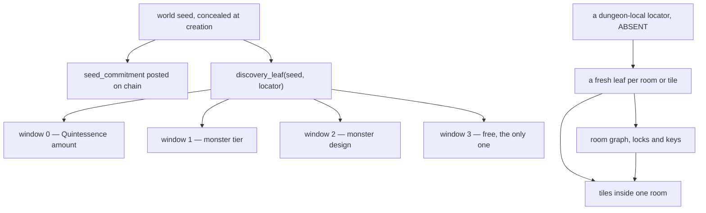

# PoA generative grid dungeons — research and recommendation

**Mode: Reference.** This page researches how shipped games and published papers
generate grid dungeons. It then asks, of every piece a grid dungeon contains,
what needs it and what must exist for it to work. It writes no
code and edits no other page.

The operator set the question and the method for answering it. His words stand
first, verbatim.

```
"PoA - Dungeons - Will need to do research on generative grid-based dungeons.
 W5H is intended to help you catch missing connections between pieces. Who needs
 a signal or object or item? What is it used for? Why? Where? How? Etc..."
```

His second sentence is the method. The survey of algorithms exists to find what
connects to what, so nothing gets built that reads something nothing writes.

Every claim below carries one of three marks: a numbered source in the Sources
list, a note that it comes off the merged tree, or the word absent. Where a
figure does not exist, this page says so and says what would set it.

---

## What the tree fixes

Five figures come off merged modules. This page carries them as given.

```
src/competition/world_grid.py
  WORLD_RECORD_BYTES          1473        one discovery record, named fields
  TURN_BYTE_CAPACITY          1_048_576   one layer, one world turn
  RECORDS_PER_LAYER_TURN      711         the capacity over the record size
  PARTICIPANTS_PER_LAYER      79          records a layer over records a participant
  SEPHIROT_LAYERS             20          the ten spheres and their inversions
  DEFAULT_GRID_WIDTH          9           81 squares a layer, 79 of them seated
  SQUARE_STEPS                100         a position is whole percent of a square
  seats in one world          1,580       79 across 20 layers
```

Two functions carry the whole determinism rule, and every later section reads
them.

```
src/competition/world_grid.py
  discovery_leaf(seed, locator)   sha256 of "seed|locator", 64 hex digits
  seed_commitment(seed)           sha256 of the seed, posted at world creation
  GridPosition.locator(layer)     "layer:square:stepX:stepY", four fields
```

---

## Part one — the five families, and which are renamings

### Space partition, then rooms and corridors

Binary space partition splits a rectangle in two, again and again, until each
leaf is about room size, then puts one room in each leaf. The published method
connects each leaf to its sister and repeats at each higher level of the tree
until every part joins. Source 1 states the two properties that matter: two rooms
cannot overlap, and connectivity comes from walking the tree.

```
produces   axis-aligned rooms, no overlaps, corridors that form a tree
bad at     organic shape, and loops — a tree gives one route between two rooms
state      the partition tree and each node's rectangle
```

Brogue accretes rooms instead of subdividing. It attaches one room at a time to
what already exists, which also yields a tree, and it then adds a doorway between
two far-apart rooms to make loops (source 7).

```
Brogue's door test, source 7
  the site is stone
  the cells either side are floor
  the two floor areas are more than 20 spaces apart by A*
```

### Cellular automata caves

Fill the grid at random, then apply a neighbourhood rule again and again. Source
2 gives the rule and the fill.

```
initial fill    45% wall
the rule        a tile is a wall if the 3x3 region centred on it held 5 walls
iterations      the caves change little after about four
```

The same source names the method's defect and three remedies for it. Isolated
cave sections are normal output, not an edge case.

```
remedy 1   change the cutoff so large open spaces fill
remedy 2   flood fill one open point, turn everything unreached back to wall,
           and restart if the open area falls below a threshold share
remedy 3   blank a 3 to 4 tall horizontal strip before the first iteration
```

```
produces   organic caverns
bad at     connectivity, and it has no rooms and no doors to hang a key on
state      two whole grids an iteration, plus a flood fill over the whole map
```

### Random walk, the drunkard's walk

One walker starts on a cell, turns it to floor, then steps in a random direction
and repeats until enough cells are floor. Source 3 states the guarantee and the
weakness in the same page.

```
the guarantee   "Generating a level with a single drunkard's walk is guaranteed
                to produce a fully connected level"
bad at          "a highly variable mix of narrow paths and open spaces", and it
                runs into the map edges without dynamic resizing
state           the grid, the walker's cell, and the floor count
```

### Tile and constraint based generation

Model synthesis learns which tiles may sit beside which from an example, then
solves the grid against those rules. Wave Function Collapse generalises it to
overlapping patterns of tiles rather than single tiles, which its own author
states plainly (source 4).

```
source 4, the loop
  observe     find the wave element with minimal nonzero entropy and collapse it
  propagate   push what that observation ruled out to its neighbours
  contradiction   every coefficient for a cell reaches zero and it cannot continue
```

Source 5 treats the same algorithm as constraint solving and places it beside
Merrell's work. Source 6 is the one that matters for cost: Merrell breaks a large
output into overlapping blocks, so a contradiction restarts one block instead of
the whole solution.

```
produces   local patterns that match an example
bad at     global structure, and any guarantee — perfect solving is NP-hard
state      every cell's whole possibility set at once, plus a propagation queue
```

### Graph first, then layout

Dormans separates the mission from the space: a graph of tasks first, then a
space built to carry it. Unexplored, his own game, composes cycles rather than
branches, which lets the generator reason about a loop as one unit and makes a
lock and key pattern easy to place (source 8).

```
source 8, Unexplored's stages
  a 5x5 grid of graph nodes, one large loop split into two arcs
  one of 24 major cycle types decides how the arcs are used
  the 5x5 doubles to 10x10 to make room for corridor tiles
  that grid expands by five to the final tilemap
```

```
produces   a room graph carrying locks, keys and a route, then tiles under it
bad at     the layout step — it needs one of the families above to fill a room
state      the graph, then a coarse grid, then a fine grid, in that order
```

### Which are genuinely distinct

Five names, three mechanisms. Source 4 settles one of the pairs itself: Wave
Function Collapse is Merrell's method over patterns rather than tiles, so tile
and constraint generation is one family and not two.

```
place rooms, then join them     BSP and Brogue's room addition. BSP subdivides
                                and Brogue accretes; both end with a tree of
                                rooms and both need a second pass for loops
grow floor by a local rule      cellular automata and the drunkard's walk. A rule
                                over the whole grid, or one agent walking it
solve a grid against rules      model synthesis and Wave Function Collapse
```

Graph first is not a fourth mechanism but a stage above any of the three, and it
always needs one of them underneath to turn a room into tiles.

---

## Part two — the constraints that rule most of it out

### Determinism from a committed seed

Monster generation already landed and sets the pattern. A place's Quintessence
and its creature are separate draws read out of separate windows of one hash, so
neither moves the other.

```
src/competition/monster_spawn.py
  DRAW_DIGITS      16      hex digits one draw reads
  LEAF_DIGITS      64      hex digits discovery_leaf returns
  windows a leaf holds     4, measured by driving leaf_window
  AMOUNT_WINDOW    0       committed_quintessence reads this one
  TIER_WINDOW      1       the monster tier draw
  DESIGN_WINDOW    2       the monster design draw
  window 3                 free, and it is the only one left
```

Squirrel Eiserloh's noise-based random numbers name the property a dungeon needs,
and name it as a property of hashing a position rather than of any dungeon
algorithm (source 9).

```
source 9, verbatim
  "These functions are deterministic and random-access / order-independent
   (i.e. state-free)"
  "that mountain village is the same whether you generated it first or last,
   ahead of time or just now"
```

That is the test to apply to each family. Can a reader answer one tile on its
own, from the seed and that tile's own address, holding nothing?

```
BSP                 YES, at bounded cost. Descend only the branch holding the
                    tile. A corridor tile also needs the sister subtree's rooms,
                    which is still bounded by the tree depth
cellular automata   YES for the rule itself. A cell after k iterations reads a
                    (2k+1) square window of the initial fill, so four iterations
                    read 81 hashed cells. NO once remedy 2 is added: a flood fill
                    is whole-map and cannot be answered per tile
drunkard's walk     NO. The walker's cell at step n depends on every earlier
                    step, so the only way to read one tile is to replay the walk
constraint solving  NO. Source 4's contradiction is a property of the whole wave.
                    Merrell's blocks in source 6 bound it to one block, which is
                    a per-block answer and not a per-tile one
graph first         YES for the graph, which is tens of nodes. The tiles under it
                    fall back to whichever family fills a room
```

Two cost classes follow, and the line between them is sharp.

```
per-tile derivable   BSP, cellular automata without the flood fill, and the
                     graph stage. Nothing is stored and nothing is held
whole-state          the drunkard's walk, any constraint solver, and any
                     connectivity repair that reads the finished map
```

**The free window is not enough room.** A dungeon needs many draws and a leaf
holds one spare window. The draws have to come from fresh leaves keyed on a
deeper address, which changes the locator and not the windows.

```
src/competition/monster_spawn.py, driven
  require_locator("3:49:1:2")    accepted, layer 3 at square 49
  require_locator("3:49:1:2:0")  refused — "a locator carries 4 colon-separated
                                 fields; '3:49:1:2:0' carries 5"
```

### The byte budget

A per-tile derivable dungeon stores one record: the fact that the dungeon is
there. A stored map writes one record per unit it persists. The figures below are
estimates from that shape, at 1,473 bytes a discovery record, against the
1,048,576 byte ceiling one layer holds in one world turn.

```
one fact, a derived dungeon          1 unit         1,473 bytes    0.00 layer-turns
a room graph, 20 rooms 25 edges     45 units       66,285 bytes    0.06 layer-turns
one floor the size of a world grid  81 units      119,313 bytes    0.11 layer-turns
ten floors at that size            810 units    1,193,130 bytes    1.14 layer-turns
ten floors of 20 by 20           4,000 units    5,892,000 bytes    5.62 layer-turns
ten floors of 64 by 64          40,960 units   60,334,080 bytes   57.54 layer-turns
```

**A dungeon's tile dimensions are absent.** No module names a floor's width.
Whatever decides how large a floor grows sets that figure, and until then the
rows above give a range rather than a cost.

The contrast survives the missing figure, because the gap spans a factor of a
thousand. A graph is tens of records. A tile map is thousands, and ten floors at
any interesting size exceeds a whole layer's turn on its own.

### The interior question, which is his ruling

Two readings exist and they differ enormously. Unit 76 already recorded both in
the module that admits a party.

```
src/competition/dungeon_entry.py
INTERIOR_ABSENT = (
    "a dungeon's inside is unbuilt and the operator's ruling is owed. Two "
    "readings exist: a dungeon is a place ON the grid, so a participant keeps "
    "its square and its step and nothing new is needed; or a dungeon is a "
    "separate space with its own coordinates, a second grid with its own "
    "viewrange and positions. An entry here names a grid locator and no inside, "
    "so either reading can follow it"
)
```

Under the first reading, a dungeon is one fact at one locator and has no interior
tiles. Every family in part one has nowhere to put its output, so the research
above buys nothing and a dungeon is a square that holds a monster and a reward.

```
reading one, a place ON the grid
  coordinates    none added
  storage        1 record, the fact itself
  generation     no tile algorithm applies
  what it gives  nothing new to build
  what it costs  a dungeon and a square are the same thing, so descent, floors
                 and a locked region have nowhere to exist
```

Under the second reading, a dungeon has its own coordinates, its own viewrange
and its own positions. That is the roughly doubled world-state surface, and the
research above all applies.

```
reading two, a separate space
  coordinates    a dungeon-local address, which needs a fifth locator field
  storage        zero extra IF the interior is per-tile derivable
                 thousands of records if it is persisted
  generation     every family applies
  what it gives  floors, descent, locks, a route, and the whole of part three
  what it costs  a second coordinate system in every reader, and the refusal in
                 require_locator has to widen to admit it
```

**The cost of the second reading is code, not bytes, and only if the generator is
per-tile derivable.** That is the one sentence this page exists to put in front of
him. A derived interior doubles the readers that must handle a second coordinate.
It adds one record to the chain.



---

## Part three — the connection audit

His four questions, run over every piece a grid dungeon contains. Each row names
what needs the piece and what must exist for it to work.

### A tile

A floor and a wall are the smallest thing a grid dungeon has, and nothing in the
tree declares either. The glyph registry says so in its own words.

```
src/competition/map_glyphs.py
  ABSENT_FAMILIES["Zone terrain"]
    "world_grid.ZoneRegion carries a boundary and a discoverer and no terrain
     kind, so no terrain has a mark"
  marks()   16 marks across 3 families: Vessel, Loot tier, Event mode
```

```
who needs it   a renderer, to draw; movement, to refuse a wall
what for       the dungeon's shape
what must exist  a declared tile kind set, and a mark a kind in the registry,
                 which refuses a repeated glyph through require_distinct_marks
answered by    NOTHING
```

### Doors

A door needs two rooms and a state. The package has no door and no room.

```
src/competition/ — measured with git grep -o -i
  door 0    room 0    corridor 0    tile 0    stair 0    lever 0
  trap 0    treasure 0    chest 0    maze 0    puzzle 0
```

```
who needs it   the route between two rooms, and every lock
what for       a passage that can be shut
what must exist  a room, a tile kind that is a door, and an open or shut state
                 someone writes and someone reads
answered by    NOTHING
```

### Keys

A key needs a holder. The item table names four types and no key, and the same
module records that no holder exists.

```
src/competition/items.py
  ITEM_TYPES names    armour, weapons, accessories, consumables
  ABSENT note         "inventory": "nothing holds the items one Vessel carries"

src/competition/army_command.py
  Party carries       mode, leader, members
                      no inventory and no per-member position
```

```
who needs it   a locked region, and the party member who picks it up
what for       opening exactly one lock
what must exist  an item type for a key, a holder that travels with a party, and
                 a rule saying whether the party or one member holds it
answered by    NOTHING, and it waits on the inventory gap first
```

### Stairs, and the floor below

A way down needs a floor below. The monster table names ten dungeon floors and
nothing holds a floor index.

```
src/competition/monster_table.py
WORLD_LAYER_TIE_ABSENT = (
    "no statement ties a monster tier to a world_grid layer. The dungeon's ten "
    "floors take the ten sphere names; the twelve tiers take none of them"
)
```

```
who needs it   descent, which is the operator's difficulty axis
what for       moving from one floor to the next
what must exist  a floor index on the entry record, and a rule for what the last
                 floor's stairs do
answered by    PARTLY — ten floors and their names are decided, and no field
               holds which floor a party stands on
```

### Levers and switches

A switch changes the world and has to tell whoever is standing in it. Source 10
models exactly this: a room carries a precondition naming the keys and the switch
states needed to reach it.

```
source 10, metazelda
  each room holds a "precondition" — the keys and switch states required
  each room holds an "intensity" from 0.0 to 1.0
```

```
who needs it   a shortcut, a drained lake, a raised bridge
what for       changing a route after the layout exists
what must exist  a switch state in the dungeon's own state, and a reader that
                 recomputes the route when it flips
answered by    NOTHING
```

### Traps

A trap needs a trigger, an effect, and somebody told. Two of the three are
missing at the root: nothing resolves a fight, and no stat reads as noticing
anything.

```
src/competition/dungeon_entry.py
COMBAT_ABSENT = (
    "nothing resolves a fight. monster_table declares tiers and entity_stats "
    "declares blocks, and no module turns two of them into a result"
)

src/competition/entity_stats.py
  STAT_NAMES   strength, dexterity, constitution, intelligence, wisdom
  dexterity's declared effect   NO_EFFECT_NAMED
```

```
who needs it   the risk side of a dungeon, which is the half that is unbuilt
what for       making a wrong step cost something
what must exist  a trigger on a tile, an effect that reaches a Vessel, and a
                 stat that decides whether it is noticed
answered by    NOTHING, and dexterity is the stat that would carry it
```

### Treasure

Loot answers the tier and not the place. The drop path refuses anything that is
not a market in the open rotation, so there is no dungeon-sourced drop.

```
src/competition/loot_drop.py
  LOOT_TIERS weights   Calx 60, Pavonis 25, Flores 11, Elixir 3.5, Magisterium 0.5
  WEIGHT_TOTAL_PCT     100, and tier_bounds refuses a set that misses it
  drop_for_market      refuses unless reward_reason answers IN_ROTATION
  LOOT_DROP_SEED       1155, a fixed constant
```

Driven here: three fresh generators from the default seed each roll 370 and each
draw Calx. A caller that passes no generator of its own gets the same tier every
time, so a chest cannot reuse this path unchanged.

```
who needs it   the reward at the end of a route
what for       the thing the risk is taken for
what must exist  a drop path whose source is a dungeon rather than a market, and
                 a seed argument so two chests differ
answered by    PARTLY — five tiers, their weights and their bonuses are decided.
               The source and the seed are not
```

### A boss room

The monster table answers what a boss is. It does not answer how strong or how
often, and it says so itself.

```
src/competition/monster_table.py
  RANKS_PER_SIDE   6, so twelve tiers across the plane
  depth with the name "floor bosses"   one tier, behaviour "attacks the order of
                                       the floor itself, not only the party"
  every tier's level                   FIGURE_ABSENT
  LEVEL_OWED_NOTE                      what names it, and what it then buys

src/competition/monster_spawn.py
  TIER_WEIGHTING_OWED   the caller supplies how often a tier is encountered,
                        because four readings of the published span order the
                        twelve tiers four different ways
```

```
who needs it   the end of a floor
what for       a reason the floor was walked
what must exist  a mark saying this room is the boss room, a tier level, and a
                 weighting the caller holds
answered by    PARTLY — the tier exists and its two figures are absent
```

### A locked region, and the guarantee that bites

A generated dungeon that puts a key inside the region the key unlocks is
unplayable. Every generator read here solves it the same way, and the way is
construction order rather than a check afterwards.

```
source 10, metazelda, verbatim
  "This algorithm generates lock-and-key puzzles that are guaranteed to be
   solvable by construction"
  "the key for each key-level n > 0 is placed in the highest-intensity room in
   key-level n-1"

source 11, verbatim
  "we just have to make sure we place a key somewhere in the dungeon before its
   matching lock"
  a key goes "in a random node that comes before it"
```

The families that carry no keys still need connectivity, and they prove it with a
flood fill or with the order of construction.

```
cellular automata   source 2, remedy 2 — flood fill one point, wall off the rest,
                    restart below a threshold share of open area
Brogue              source 7 — pour paint into one floor cell; if any floor tile
                    stays dry the lake is rejected
BSP                 source 1 — the tree walk joins every leaf to its sister, so
                    overlap is impossible and connection is structural
drunkard's walk     source 3 — one walk is guaranteed fully connected
Spelunky            source 12 — the solution path is built first, the walk turns
                    a room to type 2 to force a bottom exit, and the hazards go
                    in afterwards
```

**The sources disagree about Spelunky and about Unexplored, and the disagreement
is worth reporting rather than resolving.** Source 12 is the primary interactive
lesson and it describes the mechanism without stating a completability guarantee.
Secondary writeups assert the guarantee. Source 8 describes Unexplored's cycle
composition and states no solvability guarantee at all; the game ships a runtime
repair called Pray For Help that finds what is blocking progress and fixes it.

```
who needs it   descent, pacing, and any reward worth reaching
what for       making a route a sequence rather than a scatter
what must exist  a graph stage that orders keys before locks, or a check that
                 rejects a layout and regenerates
answered by    NOTHING
```

**And one consequence nobody has named.** A world commits a place's Quintessence
at its locator, and one caller extracts it once. An unreachable locked region then
holds Quintessence nobody can ever take, and nothing reports it.

```
src/competition/world_grid.py
  discover   writes the fact on first discovery and returns it with a reference after
  extract    takes the amount once, and extracted_by names who took it
```

---

## Part four — what this design already decided

### The two clocks

A dungeon runs on the event turn. The mode's Elite flag sets which candle, and
the nesting refuses a candle that leaves part of an hour.

```
src/competition/poa_modes.py
  STANDARD_TIMEFRAME  "5m"
  ELITE_TIMEFRAME     "1m"

src/competition/dungeon_entry.py
  WORLD_CLOCK   the name consecration already declares
  EVENT_CLOCK   "event turn"
  event_turns_per_world_turn   refuses a world turn the candle leaves a remainder of
```

**A constant names the seconds in a world turn.** The operator's one turn an hour
sits beside the two event timeframes, and both candles divide it whole.

```
src/competition/poa_modes.py
WORLD_TURN_TIMEFRAME = "1h"
WORLD_TURN_SECONDS = TF_SECONDS[WORLD_TURN_TIMEFRAME]

event_turns_per_world_turn   12 at the 5m candle, 60 at the 1m candle
```

### The two dungeon modes

Two of the four event modes hold a map, and the mode table is what says which.
Forming fixes a party's bounds, and they hold for the party's whole life.

```
src/competition/poa_modes.py, MODES
  monster_smash         1 to 1     no map
  team_monster_smash    2 to 120   no map
  dungeon_crawl         1 to 6     map
  raid                  2 to 60    map
```

One generator serves two party sizes ten times apart. Six participants and sixty
want different floor areas, and no figure sets either.

### Lazy discovery

Nothing exists until somebody finds it, and one participant's discovery is not
another's. A finder reaches a dungeon only through a reference they hold.

```
src/competition/world_grid.py
  discover    writes the fact once; every later caller learns a reference
  knows       the references one address holds in one world
  arena       square 40 of a grid 9 across, reachable with no discovery
```

The arena is the one place a participant reaches with no discovery, and every
other dungeon type waits out in the world. That is what lets a brand-new
participant start at all.

### The twelve monster tiers

Six below the participant's plane and six above. Twelve does not divide into
twenty layers or ten floors, and the table records that rather than aligning
them.

```
src/competition/monster_table.py
  world layers      20   ten spheres and their inversions
  dungeon floors    10   each takes its sphere's attested name
  monster tiers     12   tied to neither
  every tier level  FIGURE_ABSENT, twelve owed
```

### The five loot tiers

Five tiers whose weights total 100, refused at import if they ever do not. Each
carries two bonuses that reach one action's Impetus cost and its effect.

```
src/competition/loot_drop.py
  Calx         60      impetus_relief 0   effect_bonus_pct 2
  Pavonis      25      impetus_relief 0   effect_bonus_pct 5
  Flores       11      impetus_relief 1   effect_bonus_pct 10
  Elixir        3.5    impetus_relief 1   effect_bonus_pct 20
  Magisterium   0.5    impetus_relief 2   effect_bonus_pct 50
```

---

## Two places the record disagrees with itself

This page settles neither. Both change what a generator must produce.

**How many levels a dungeon has.** The manual and the monster table both say ten,
named for the ten spheres. His own sentence says seven.

```
docs/manual/08-tabs/proof-of-accumulation.md
  "a dungeon has ten floors taking the ten sphere names"

his words, captured on issue #147
  "a 7-level dungeon on one level of the tree will be very different from
   another at or predominantly in another level of the sephirot"
```

**Which seed a dungeon draws from.** Issue #147 decides one generator with a seed
per event. The world grid derives everything from one concealed seed per world,
committed at creation.

```
issue #147, section 40
  "dungeons        a seed per event"

src/competition/world_grid.py
  create_world     draws WORLD_SEED_BYTES and posts seed_commitment
  verify_discovery recomputes the leaf, the amount and the commitment together
```

The difference is verifiability. A seed committed at world creation lets any
holder recompute a dungeon years later and prove nobody chose it. A seed per
event has nothing posted ahead of it, so nothing can check it.

---

## Recommended technique

**My recommendation: a graph first, then a per-tile derived fill.** Draw a room
graph from a leaf keyed on the dungeon's own locator, order locks and keys on
that graph in key-level order, and fill each room's tiles from a second leaf
keyed on the room. The chain holds nothing beyond the fact that the dungeon
exists.

```
PROPOSED
  leaf_dungeon  = discovery_leaf(seed, "<layer>:<square>:<stepX>:<stepY>")
  leaf_room     = discovery_leaf(seed, "<dungeon locator>:<floor>:<room>")
  leaf_tile     = discovery_leaf(seed, "<dungeon locator>:<floor>:<room>:<x>:<y>")

  the graph     derived from leaf_dungeon, tens of nodes
  the keys      placed in key-level order, source 10's rule
  the tiles     derived from leaf_tile, nothing held, nothing written
```

Three reasons, each one sourced or measured above. Only this family carries a lock
and key order, which is the only construction that guarantees a solvable layout.
Its stored size runs to tens of records against thousands for a tile map. And
issue #147 already proposes a linear room graph as the dungeon's shape.

```
what it costs
  a locator with more fields than require_locator admits today
  a graph embedding step that can fail to fit the grid, needing a retry rule
  rectangular rooms and rectangular corridors

what it gives up
  the organic caves cellular automata produces
  the example-driven look a constraint solver produces
  any room whose shape depends on its neighbours
```

---

## The docket — pieces nothing in the tree answers

Each row is a piece with no answer anywhere in the merged tree. None is a defect
in existing code. Each is work that does not exist yet.

```
a tile kind set        floor, wall, door, stair, and a mark a kind in the glyph
                       registry, which refuses a repeat
a room                 the thing a graph node becomes. Zero occurrences in the
                       package
a door and its state   two rooms, and an open or shut value somebody writes
an inventory           nothing holds the items one Vessel carries, so a key has
                       no holder. items.py records this already
a key item type        ITEM_TYPES names four and none of them is a key
a floor index          ten floors are decided and no field holds which one a
                       party stands on
a switch state         and a reader that recomputes a route when it flips
a trap                 a trigger on a tile, an effect reaching a Vessel, and the
                       dexterity effect that is NO_EFFECT_NAMED today
a dungeon-sourced drop drop_for_market refuses anything outside the rotation, and
                       its default generator repeats its first roll
a boss room mark       the tier exists; nothing says which room is its room
a reachability rule    the key-before-lock order, or a reject-and-regenerate check
a floor's dimensions   the figure every byte estimate in this page waits on
a dungeon kind         world_grid.band_for refuses an unregistered kind and
                       nothing in src calls set_band, so no kind exists to
                       discover a dungeon as
a fifth locator field  require_locator refuses one today, driven above
```

---

## The ruling he owes

**Is a dungeon a place on the world grid, or a separate space with its own
coordinates?** Everything above turns on it, and this page does not choose.

```
a place ON the grid
  costs     floors, descent, a route and a locked region have nowhere to exist.
            Every algorithm in part one is unused
  gives     nothing new to build, and one record a dungeon
  and then  a dungeon and a square are the same thing, and the twelve monster
            tiers and five loot tiers are the whole of its content

a SEPARATE space
  costs     a second coordinate system every reader has to understand, and a
            widened locator. Roughly doubles the world-state surface
  gives     floors, descent, locks, keys, a route, and every docket row above
  and then  storage stays at one record a dungeon IF the interior is per-tile
            derivable, and reaches thousands of records if it is persisted
```

The figure that would make the second reading expensive is a floor's dimensions,
and that figure is absent. The second reading costs code and not bytes until
somebody sets it.

---

## Sources

1. [Basic BSP Dungeon generation — RogueBasin](https://chizaruu.github.io/roguebasin/basic_bsp_dungeon_generation)
2. [Cellular Automata Method for Generating Random Cave-Like Levels — RogueBasin, original C by Jim Babcock](https://chizaruu.github.io/roguebasin/cellular_automata_method_for_generating_random_cave-like_levels)
3. [Random Walk Cave Generation — RogueBasin](https://chizaruu.github.io/roguebasin/random_walk_cave_generation)
4. [WaveFunctionCollapse — Maxim Gumin, project README](https://github.com/mxgmn/WaveFunctionCollapse)
5. [WaveFunctionCollapse is Constraint Solving in the Wild — Isaac Karth and Adam M. Smith, FDG 2017](https://adamsmith.as/papers/wfc_is_constraint_solving_in_the_wild.pdf)
6. [Model Synthesis and Modifying in Blocks — BorisTheBrave](https://www.boristhebrave.com/2021/10/26/model-synthesis-and-modifying-in-blocks/)
7. [Broguelike Dungeon Creation, Part 2 — anderoonies](http://anderoonies.github.io/2020/04/07/brogue-generation-2.html)
8. [Dungeon Generation in Unexplored — BorisTheBrave](https://www.boristhebrave.com/2021/04/10/dungeon-generation-in-unexplored/)
9. [SquirrelNoise, carrying Squirrel Eiserloh's own comment block — go-squirrelnoise README](https://github.com/EDKarlsson/go-squirrelnoise/blob/main/README.md)
10. [metazelda — Tom Coxon, project README](https://github.com/tcoxon/metazelda)
11. [An introduction to procedural lock and key dungeon generation — The Shaggy Dev](https://shaggydev.com/2021/12/17/lock-key-dungeon-generation/)
12. [Spelunky Generator Lessons — Darius Kazemi](https://tinysubversions.com/spelunkyGen/)
13. [Procedural Dungeon Generation: A Survey — Breno M. F. Viana and Selan R. dos Santos, Journal on Interactive Systems, 2021](https://journals-sol.sbc.org.br/index.php/jis/article/view/999)

## Cited as absent

The record names three works this page did not read. They sit here so nobody
treats a citation above as covering them.

```
Dormans, "Adventures in level design: generating missions and spaces for action
  adventure games", PCG Workshop 2010. The PDF at pcgworkshop.com carries no
  extractable text. The mission-and-space separation above is taken from source
  8, which describes his own generator

van der Linden, Lopes and Bidarra, "Procedural Generation of Dungeons", IEEE
  Transactions on Computational Intelligence and AI in Games 6(1):78-89, 2014.
  The citation resolves and the text was not reached

Source 13's full text. Only its abstract page was read. Its finding that few
  works support levels with blocking mechanics bears directly on the key and
  lock rows above and is quoted from that abstract
```
