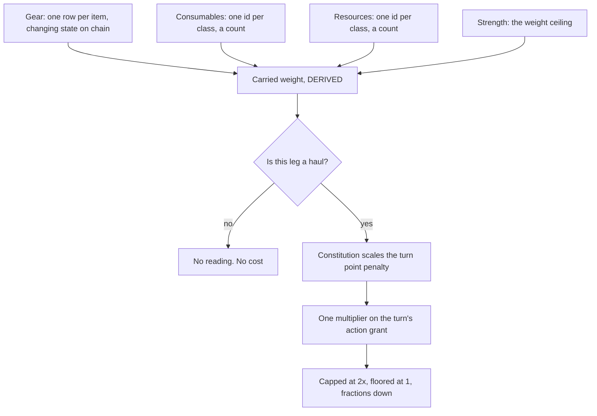

# PoA — gear, consumables, resources and encumbrance

Reference. This page reports how shipped games hold gear apart from consumables
and resources, and how they charge a player for carried load. Nothing on this
page exists in the tree. Every claim names a source this unit read. The page
marks a claim with no source as unsourced, and writes a question with no sourced
answer as unanswered rather than filling it in.

Ground: the Proof of Accumulation concept document, issue 147, and the skills
this unit loaded by name.

```
the split he set   gear occupies fixed storage space, counted
                   consumables stack to large amounts, no fixed space
                   resources stack to large amounts, no fixed space
                   the three must not conflict with each other
the read point     encumbrance reads ONLY while a Vessel hauls items itself,
                   such as after a foraging run
the mechanism      Strength sets maximum weight
                   Constitution sets the turn point penalty while carrying
```

Encumbrance is two rules, not one. A ceiling that Strength sets, and a cost that
starts above zero carried weight and scales by Constitution.

---

## 1. His split already has a home in this design

Two decisions already posted in the concept document carry his split down into
storage. The design mints gear as a unique identifier with a supply of one and
holds its changing properties on the chain under that identifier. Materials and
consumables stay fungible identifiers with no per-item state, which means a count
and nothing more.

```
gear          one identifier per item, changing state on the chain
consumables   one identifier per class, one count per holder
resources     one identifier per class, one count per holder
```

A counted thing needs a row each. A stacked thing needs one row and a number.
That is the same division he states in different words, and it explains why his
split costs less to store rather than more.

One earlier reading in the concept document disagrees with his new mechanism.
That reading made encumbrance a multiplier on a movement rate inside a journey
leg. His later words put the cost in turn points instead of in rate. The later
words win, and the concept document already lists encumbrance among the things
the design owes, so this change disturbs nothing built.

```
superseded   encumbrance as a multiplier on a movement rate
current      Strength as a weight ceiling, Constitution as a turn point penalty
```

---

## 2. Which shipped games separate slotted gear from an unslotted stacking store

Eight do, and they name the two halves differently. The right-hand column gives
each game's own name for the unslotted store.

```
game                     slotted half              unslotted stacking half
Final Fantasy XIV        Armoury Chest, 35 per     Currencies window
                         gear type
Elder Scrolls Online     Inventory, 60 to 215      Craft Bag
                         slots, one item per slot
Guild Wars 2             Inventory bags, 20 slots  Wallet, and Material Storage
World of Warcraft        Bag slots, plus a         Currency tab
                         reagent bag slot
Old School RuneScape     Inventory, 28 slots       stackables, 1 slot, 0 kg
EVE Online               fitting slots: high,      Cargo hold, measured in
                         mid, low, rig             cubic metres
Knave and Mausritter     item slots by body        none. Everything takes a slot
                         location
Torchbearer              worn and pack slots by    none. Everything takes a slot
                         body location
```

Final Fantasy XIV and Old School RuneScape match his wording most closely, and
they reach it by different routes.

Final Fantasy XIV gives gear a store of its own. The Armoury Chest forms a
separately accessed part of the inventory holding up to 35 items of each of four
gear types — weapons, armour, accessories and soul crystals — and all gear the
player acquires goes there without asking, which leaves the ordinary inventory
free for potions, crafting materials and food ([FFXIV
wiki](https://ffxiv.consolegameswiki.com/wiki/Armory_Chest), [Square Enix UI
guide](https://na.finalfantasyxiv.com/uiguide/equipment/equipment-chest/equipment_where_is.html)).

```
gear          Armoury Chest, 35 per type, four types
everything    Inventory
else          shards and crystals stack to 9,999
currencies    a Currencies window, scrips under its Other tab
```

Old School RuneScape reaches the same split through weight rather than through a
separate container, and its rule states his design more sharply than any other
source this unit read. Stackable items such as runes and coins do not contribute
to weight, and the wiki records that the game's code overrides their assigned
weights to zero ([OSRS wiki](https://oldschool.runescape.wiki/w/Weight)). A
stackable item takes one inventory slot at any quantity ([OSRS
wiki](https://oldschool.runescape.wiki/w/Stackable_items)).

```
gear and tools   weigh something, one slot each, 28 slots in all
stackables       weigh 0 kg by code override, 1 slot at any quantity
weight's effect  run energy only. It never refuses a pickup
```

Elder Scrolls Online sells the unslotted store as a paid feature, which shows
what the studio thought the feature was worth. The Craft Bag takes up no space,
holds an unlimited amount of crafting and style materials, covers the whole
account, and belongs to the subscription tier ([Bethesda
support](https://help.bethesda.net/app/answers/detail/a_id/34329/~/what-is-a-craft-bag-in-the-elder-scrolls-online),
[ESO wiki](https://elderscrolls.fandom.com/wiki/Craft_Bag)).

```
bag           60 slots base, to 200 by upgrades and riding skill, 215 with pets
Craft Bag     uses no space, materials stack to 1,000, ceiling 4.3 billion
              per item type
quest items   use no inventory space, held under a Quest Items tab
```

Guild Wars 2 and World of Warcraft both moved resources out of the bag after
launch, which makes them the two best records of a studio fixing this problem
rather than designing around it. The Guild Wars 2 Wallet tracks currency for the
whole account and deposits and withdraws on its own, and Material Storage holds
250 of each crafting material outside the bags ([GW2
wiki](https://wiki.guildwars2.com/wiki/Inventory), [GW2
wiki](https://wiki.guildwars2.com/wiki/Currency)). World of Warcraft did the same
in a patch: from patch 3.0.2 the Currency tab tracks many currencies and those
currencies have no inventory item, and the patch converted the old inventory
items and removed them ([Warcraft
wiki](https://warcraft.wiki.gg/wiki/Currency_tab)).

```
before   a currency was an item and ate a bag slot
after    a currency is a number on a tab and eats nothing
```

EVE Online answers the same question with volume instead of slots. A hull carries
a fixed count of fitting slots — high, mid, low and rig — and freighters carry no
high, mid or rig slots and three low slots, while a cargo hold holds a volume in
cubic metres, a Bestower taking about 39,000 and an Orca 60,000 in its industrial
hold ([EVE University](https://wiki.eveuniversity.org/Industrials), [EVE
University](https://wiki.eveuniversity.org/Rigs)).

```
gear         fitting slots, a fixed count per hull
everything   a cargo hold in cubic metres. No slot count, no stack cap
else
```

The tabletop slot systems give the purest form of his gear rule, and one of them
assigns the statistic differently from the way he does. Knave gives a character
item slots that depend on Constitution defence, and heavy or bulky items take
more than one slot ([The Man With A
Hammer](https://themanwithahammer.blogspot.com/2020/09/osr-knave-inventories.html)).
Mausritter draws the same idea as a grid of squares holding physical cards, where
light armour fills an off-paw slot and a body slot horizontally and heavy armour
fills two body slots vertically ([Deathtrap
Games](https://deathtrap-games.blogspot.com/2021/01/game-review-mausritter-2e.html)).
Torchbearer slots by body location, so a backpack worn on the chest blocks plate
mail ([Torchbearer
wiki](https://sites.google.com/site/torchbearertheland/home/inventory-and-gear)).

```
Knave         slots = Constitution defence. Constitution sets the CEILING
his design    Strength sets the ceiling, Constitution sets the PENALTY
```

That is a genuine disagreement with his assignment, not a confirmation of it.
Knave spends Constitution on capacity. He spends Strength on capacity and
Constitution on the cost of using it. No system this unit read splits the two
statistics the way he does.

---

## 3. How a game picks the stack ceiling

Games use four methods, and each one produces a different kind of pressure.

```
per-slot cap        a number chosen for the slot, repeated per slot
per-item-class cap  a different ceiling per class of item
an integer ceiling  the largest number the field can hold
no count cap        a volume or mass budget instead of a count
```

The per-slot cap is the commonest, and the number answers to arithmetic rather
than to fiction. Most Minecraft items stack to 64, a few stack to 16 — snowballs,
eggs and ender pearls — and anything with durability does not stack at all, which
gives one item per slot ([Omni
Calculator](https://www.omnicalculator.com/other/minecraft-stack)). Sixty-four
divides cleanly by every power of two below it, which is what makes it
convenient.

```
Minecraft         64 most, 16 some, 1 for anything with durability
Guild Wars 2      250 per material in Material Storage
Elder Scrolls     200 per crafting material in the bag, 1,000 in the Craft Bag
Final Fantasy XIV 9,999 per shard or crystal
Path of Exile     20 chaos orbs per stash slot
```

A per-item-class cap is the same mechanism with the number varied, and Minecraft
shows it best. Its durability rule is the part that matters here. An item
holding its own changing state cannot stack, because a stack carries one number
and cannot carry two different wear values. The concept document already reached
that same constraint for gear.

An integer ceiling is what happens when nobody picks a number. Old School
RuneScape caps a stack at 2,147,483,647 because a signed 32-bit integer holds the
value, and that ceiling became a named object in the game's culture as the coin
limit ([Theoatrix](https://www.theoatrix.net/post/why-2147m-is-the-max-stack-in-runescape),
[RuneScape wiki](https://runescape.wiki/w/User:Pharos_5/Maximum_Gold_Limit)). The
Elder Scrolls Online Craft Bag ceiling of 4.3 billion per item type is the
unsigned form of the same field ([ESO
wiki](https://elderscrolls.fandom.com/wiki/Craft_Bag)).

```
signed 32-bit     2,147,483,647
unsigned 32-bit   4,294,967,295, which the wiki reports as "4.3 billion"
```

No count cap at all is the fourth answer, and EVE Online ships it. A cargo hold
has a volume, an item has a volume, and the count follows from the division.
Nothing in the fitting or cargo rules names a stack size ([EVE
University](https://wiki.eveuniversity.org/Hauling)).

---

## 4. Where a game reads weight, when it reads weight at all

Games use five read points. The right-hand column gives what the reading costs
the player.

```
read point                      example               the cost the player pays
every move, continuously        Old School RuneScape  run energy drain rate
every turn, continuously        NetHack               a fraction of normal speed
continuously, over a threshold  Albion Online         movement speed above 100%
                                Escape from Tarkov    stamina, noise, speed
only on a trip                  RimWorld, Bannerlord  caravan or party speed
only while holding the object   Deep Rock Galactic    weapons disabled
never, at any point             Elder Scrolls Online  nothing. Slots only
```

Old School RuneScape reads weight on every step and spends it on one thing. The
run energy drain rate scales linearly from 0 kg to 64 kg, where 64 kg drains at
exactly twice the normal rate, and weight outside that band has no further effect
([OSRS wiki](https://oldschool.runescape.wiki/w/Weight)).

```
0 kg    normal drain
64 kg   twice normal drain
above   no additional effect
```

NetHack reads weight every turn and spends it on speed, which in a turn-based
game comes to the same thing as spending it on actions. Carrying capacity equals
25 times the sum of Strength and Constitution, plus 50, capped at 1,000, and six
bands run from Unencumbered to Overloaded ([NetHack
wiki](https://nethackwiki.com/wiki/Encumbrance)).

```
capacity      (25 x (Str + Con)) + 50, capped at 1000
Burdened      three quarters of normal speed, -1 to hit
Stressed      one half
Strained      one quarter
Overtaxed     one eighth
Overloaded    cannot move, -9 to hit
```

NetHack sits closest to his mechanism of any published system this unit read, and
it differs in one respect worth naming. NetHack reads both Strength and
Constitution into the ceiling. He reads Strength into the ceiling and
Constitution into the penalty.

Albion Online and Escape from Tarkov both read weight continuously and apply
nothing until a threshold. Albion moves a player at 5.5 metres a second while
weight stays under 100 per cent of max load, and penalises speed by the amount
over ([Albion wiki](https://wiki.albiononline.com/wiki/Weight_and_Burden),
[Albion wiki](https://wiki.albiononline.com/wiki/Max_Load)). Tarkov starts its
debuff at 40 kg, 30 kg when the patch first shipped, and a player above 70 kg can
barely walk
([GINX](https://www.ginx.tv/en/video-games/escape-from-tarkov-v0.12.4-patch%20notes-overweight%20system)).

One major system reads weight nowhere. In Elder Scrolls Online encumbrance is not
a factor, each item takes one space, and a player cannot become overencumbered —
the player simply cannot pick up more
([UESP](https://en.uesp.net/wiki/Online:Inventory)).

---

## 5. His case — games that read weight only on a hauling trip

Four shipped games do exactly this, and they recognise a hauling trip in three
different ways.

```
how the game recognises the trip   example
the activity IS a trip             RimWorld caravans, Bannerlord party travel
the item class forces a trip       Valheim ore and metal
the object sits in your hands      Deep Rock Galactic heavy objects
```

RimWorld recognises it by the activity. A caravan's carrying capacity equals each
member's body size times 35, a caravan at full weight moves at half the speed of
an unladen one, and a caravan over capacity cannot move until its mass drops
([RimWorld wiki](https://rimworld.fandom.com/wiki/Caravans)). Hauling inside the
colony is a different job and no mass ceiling applies to a stockpile.

```
inside the base   haul freely. No mass ceiling on a stockpile
on a caravan      capacity = body size x 35, summed over members and animals
at capacity       half speed
over capacity     cannot move
```

Mount and Blade II recognises it the same way, and adds the one counter-measure
this unit found anywhere against raising capacity at no cost. A hero's base carry
capacity is 60 and each troop adds 1; at full capacity party speed drops to 0.5
and at 30 per cent over the limit it drops to zero. Pack camels, mules and
sumpter horses raise capacity — and horses themselves also slow the party, so
filling the inventory with horses produces a negative effect ([Mount and Blade
wiki](https://mountandblade.fandom.com/wiki/Bannerlord_Online/Weight_Mechanics),
[Mount and Blade wiki](https://mountandblade.fandom.com/wiki/Party_speed)).

```
capacity        60 for the hero, +1 per troop, more from pack animals
at capacity     0.5 speed
30% over        0.0 speed
the counter     a pack animal carries its own speed cost
```

Valheim recognises it by the item class and never reads the load at all. Ore and
metal cannot pass through a portal, so hauling metal becomes a journey by cart or
boat. The studio's stated reason is to make players travel, use the ocean and
build outposts, and the chief executive has said the decision has changed many
times during development and does not stand in stone
([PCGamesN](https://www.pcgamesn.com/valheim/ore-portal)).

Deep Rock Galactic recognises it by whether the object sits in your hands, and it
is the only game this unit found that charges the player's action economy rather
than their speed. Carrying an Aquarq applies a 25 per cent movement penalty,
disables sprinting, and leaves the dwarf able to do nothing but throw flares and
throwables or ride a zipline. Dropping it takes no time at all
([DRG wiki](https://deeprockgalactic.wiki.gg/wiki/Aquarq)).

```
while carrying   -25% movement, no sprint, no weapons
the haul ends    at the deposit point, the M.U.L.E.
to cancel        drop it. The state ends at once
```

---

## 6. Games that spend a turn's action economy on carrying

Three do, and each one names the economy differently.

```
game                   the economy's name   how carrying charges it
Jagged Alliance 2      Action Points        over 100% of a Strength-derived
                                            capacity lowers AP in combat
Battle Brothers        Fatigue              armour and weapon fatigue
                                            penalties cut the fatigue ceiling,
                                            and every action spends fatigue
XCOM 2                 Action Points        putting a carried unit down costs
                                            one action point. Pickup costs none
NetHack                the turn itself      speed falls to a fraction, so
                                            monsters act more often per turn
```

Jagged Alliance 2 sits nearest to the words he used. Carrying more than 100 per
cent of a Strength-dependent weight capacity drops the stamina bar faster and
lowers action points in combat ([Jagged Alliance
wiki](https://jaggedalliance.fandom.com/wiki/Skills_(stats)), [Bear's Pit
forum](http://thepit.ja-galaxy-forum.com/index.php?t=msg&th=19632&start=0)). It
differs from his design in one way. The action-point penalty starts at a
threshold, and his starts above zero carried weight.

Battle Brothers supplies the graduated half that Jagged Alliance 2 lacks. Every
armour piece carries a fatigue penalty that cuts the fatigue ceiling, and since
every action spends fatigue, heavier gear leaves fewer actions. Equipment weight
changes movement cost not at all — only terrain and injuries do that ([Battle
Brothers wiki](https://battlebrothers.fandom.com/wiki/Attributes), [My Gaming
Tutorials](https://mygamingtutorials.com/2025/05/19/battle-brothers-guide-understanding-armor-and-fatigue-management/)).

```
the pool           fatigue, roughly 100 for an average brother
the charge         every armour and weapon piece cuts the ceiling
the consequence    fewer actions per turn, and no movement penalty at all
```

Those two together answer the question. Jagged Alliance 2 proves a weight ceiling
can charge action points. Battle Brothers proves the charge can scale from the
first unit of load. **No game this unit read does both, and none applies either
one only on a hauling trip.** His combination does not appear in the shipped set,
which is a gap in the research and not a defect in his design.

---

## 7. The turn's action economy in this design already has a name

The brief states that a turn point is a new term and that nothing in the tree has
one. The first half is correct. The second needs one correction, and the
correction decides where his penalty lands.

The concept document already names a per-turn action pool and already settled its
shape. His own directive set it: a per-round resource pool like XCOM's, not
stacking, the same amount each turn based on character level or other speed
affecting metrics, use or lose them. The design calls the pool Impetus.

```
the grant       4 at level 1, +1 every 20 levels, to 9 at level 100
stacking        none. An unspent pool does not carry forward
expiry          it ends with the turn that granted it
partial action  refused. An action runs only at its full cost
cost per action 1, 1, 2, 3 or 4 across five bands
```

One decision in that set gives his penalty the hook it needs. Every haste, slow,
initiative and gear effect multiplies the grant as a single multiplier, capped at
twice the level's value and floored at one, with fractions rounding down. A
Constitution-scaled encumbrance penalty is a speed effect, so it enters through
that one multiplier rather than as a new subtraction.

```
level 40 grant   6
a 1.5x haste     9
the cap          12, and no combination beats it
a 0.5x slow      3
the floor        1, so no participant ever loses a whole turn
```

**The clock is the problem, and the largest gap this research found.**
Impetus bounds an event turn — one minute in an Elite event, five minutes
otherwise. The concept document states plainly that nothing bounds actions in a
one-hour world turn. A foraging run runs on world time. A turn point penalty
applied during a haul has no pool to subtract from.

```
the event turn   1m Elite, 5m otherwise   Impetus bounds it
the world turn   1 hour                   NOTHING bounds it
the foraging run world time, multi-turn   the penalty has no target
```

Which shape fits a one-hour turn where a participant places actions that resolve
at the close? The researched set gives three candidates and they do not weigh
equally.

```
an action-point pool   Impetus's own shape. It fits, because placement and
                       resolution already stand apart
a time budget          3,600 seconds of world time per turn, each action
                       consuming its own duration
a movement allowance   the journey-leg model already carries rate and distance
```

The second is the only one of the three that the concept document's own
sequencing rule already implies. A participant places actions during the hour and
they execute in sequence by timestamp at the close, so a turn already has a
duration to spend against. A time budget also lets an encumbrance penalty read as
a slower action rather than as a cancelled one, which a fixed-cost pool cannot
express without refusing the action outright.

This page records the three candidates and decides none. Naming the world turn's
budget is the concept document's own open item.

---

## 8. What breaks in each

The failure modes are the valuable half, and each one below names something
written down rather than remembered.

```
failure                        where a source measured or stated it
weight that only ever annoys   Dungeon Crawl Stone Soup deleted it
the bank becomes the real      Old School RuneScape, 28 carried against
inventory                       about 1,200 banked
busywork at the deposit point  Guild Wars 2 and World of Warcraft both
                                moved resources out of the bag
a stack cap becomes a          Path of Exile currency items
soft currency
weight punishes the loadout    Escape from Tarkov weight system
it meant to price
the fix sits behind a          Elder Scrolls Online Craft Bag
subscription
```

Dungeon Crawl Stone Soup deleted its weight system outright. Version 0.15, dated
28 August 2014, removed inventory item weight, player burden states and inventory
weight limits. The wiki files the change under anti-frustration features and
records that the old system read character strength, so wizard-type characters
could struggle to carry the potions and scrolls they wanted while melee
characters rarely noticed it ([CrawlWiki](http://crawl.chaosforge.org/0.15)). That
framing belongs to the wiki, not to a developer statement.

```
the defect   the cost fell hardest on characters least able to pay it
the outcome  the studio cut the whole system rather than rebalancing it
```

Old School RuneScape shows the second failure as a ratio. A player carries 28
items and cannot raise that figure, while a bank runs to roughly 1,200 slots after
counting members' slots, the PIN, the authenticator and purchased slots ([OSRS
wiki](https://oldschool.runescape.wiki/w/Bank), [OSRS money making
guide](https://osrsmoneymaking.guide/news/how-many-inventory-slots-in-old-school-runescape/)).
A store forty times the size of the carried inventory holds the player's real
property, and the carried inventory becomes a loading dock.

Guild Wars 2 and World of Warcraft both record the third failure by having fixed
it. A currency that is an item eats a slot, so a player spends play time moving
numbers between containers. Both studios turned currencies into counts on a tab,
and World of Warcraft destroyed the inventory items in the process at patch 3.0.2
([Warcraft wiki](https://warcraft.wiki.gg/wiki/Currency_tab), [GW2
wiki](https://wiki.guildwars2.com/wiki/Currency)).

Path of Exile shows the fourth, and shows it as a deliberate choice that worked.
The studio removed gold because any game where monsters drop loot or gold carries
an inherent inflation mechanism, and required every currency unit to have a use
beyond trade. The community then adopted chaos orbs as the medium of exchange
with no designer naming one ([Game
Developer](https://www.gamedeveloper.com/design/path-of-exile-economy-currency-trading)).

```
the design    a consumable with a use, stacking, interchangeable
the outcome   the consumable became the money, and stack size became the
              transaction cost
```

Escape from Tarkov shows the fifth, and it speaks most directly to his case. A
standard combat loadout already weighs about 35 kg against a debuff threshold of
40 kg, so a player cannot loot an enemy's equipment and still fight. The published
criticism puts it as not getting rewarded for putting on heavy equipment, and
records the behaviour that followed: players camped near extraction points so
that they never crossed the map encumbered, and waited for other players to
deliver items to them ([Inven
Global](https://www.invenglobal.com/articles/10657/something-has-to-be-done-about-the-new-weight-system-in-escape-from-tarkov)).

Elder Scrolls Online shows the sixth. Its unslotted store is the best answer in
the researched set and the studio sells it as a subscription benefit, so the
player who does not pay keeps the slot problem and the player who pays does not
([Bethesda
support](https://help.bethesda.net/app/answers/detail/a_id/34329/~/what-is-a-craft-bag-in-the-elder-scrolls-online)).

---

## 9. Which of those failures would reach a PoA player

A PoA turn is one hour of world time and a foraging run spans many turns, so
the pacing changes which failures matter. Two get worse, three get better, and
one changes shape.

```
failure                          does it reach a PoA player?
weight that only ever annoys     WORSE. A penalty paid over several one-hour
                                 turns lasts hours, not seconds
the Tarkov camping outcome       WORSE. The shorter the haul, the cheaper the
                                 rule, and a one-hour turn rewards a short haul
                                 enormously
the bank as real inventory       BETTER, by his own split. A resource that is a
                                 count has no deposit to make
deposit-point busywork           BETTER. This design has no bag to sort
a stack cap as soft currency     CHANGED. Quintessence is already the currency
                                 and already caps at 33,000,000
the fix behind a subscription    DOES NOT APPLY. Nothing here goes on sale
```

Take the first one seriously. Where a turn is a minute, a movement penalty costs
seconds and a player shrugs. Where a turn is an hour, the same penalty costs an
evening. That is the Dungeon Crawl failure arriving through the clock rather than
through the statistic, and the clock makes it sharper here than in Crawl.

The second one is worse here than in Tarkov, for a reason a figure can show. A
player crosses Tarkov's map in minutes. A PoA square is an hour's walk under the
concept document's own scale reading, so a participant foraging one square from a
deposit point pays one turn of penalty and one foraging six squares out pays six.
The incentive to never travel grows by an order of magnitude.

```
Tarkov    a short haul saves minutes
PoA       a short haul saves hours of world time
```

---

## 10. Defeating an encumbrance rule that reads only on a haul

Three defeats exist and all three come cheap. This is the abuse half, and the
part of his directive the research answers least comfortably.

```
the defeat                       what it costs the player
deposit and return empty         one trip. The rule reads zero on the way back
split the haul across Vessels    nothing. His design already grants several
                                 Vessels with assignments
make the trip not a haul         nothing, if a threshold defines the haul and a
                                 player can stay under it
```

This research found only three counters in shipped games, and no game it read
uses more than one of them.

```
counter                          game              what it does
make the loaded state dangerous  Albion Online     an overweight gatherer is a
                                                   slow target in full-loot
                                                   territory
make the capacity-raiser carry   Mount and Blade   a pack animal slows the party
its own cost                     II                itself
define the trip by item class,   Valheim           ore cannot take a portal, so
not by load                                        hauling metal is always a trip
```

Albion's counter is the strongest and it does not come free. A gatherer using a
mount can far exceed normal capacity, so the weight rule turns into a mount rule.
What stops that being a pure win is that the overweight state makes the gatherer
a slow and easy target for attackers
([WhatIfGaming](https://whatifgaming.com/albion-online-best-mounts-gathering/),
[Albion wiki](https://wiki.albiononline.com/wiki/Mounts)). The counter is
player-against-player risk, which is a different feature and not an inventory
rule.

Valheim's counter costs least to build and restricts most. It removes the
player's choice entirely: a class of item simply cannot take the fast route. It
uses no threshold arithmetic, so nothing invites tuning.

**The split-across-Vessels defeat has no precedent in the researched set.** No
game this unit read gives one player more than one body that can each carry a
legal load at the same time. A mount is the nearest analogue and a mount does not
act on its own. This is new ground and his design's own addition, so the answer
needs designing rather than copying.

---

## 11. What each shape would cost to store

Every figure below is an order-of-magnitude estimate read off the shape of the
data, for one participant. **None is a measurement of this tree.** This page
carries the three measured anchors as given and does not re-derive them.

```
a world-state record       1,305 bytes
a compact form of one        478 bytes
progress writing alone     81.5% of one layer's per-turn budget
```

The estimates assume a participant holding about twenty pieces of gear and about
forty distinct stacking classes, which is the shape a crafting game produces.

```
shape                                   bytes for one participant   order
every item its own record               20 + 40 rows at 478         10^4
gear per item, stackables as counts     20 rows at 478, plus        10^4 in all,
(his split, and the design's own)       40 lines at about 12         10^2 for the
                                                                     stacking half
slot count only, no weight at all       as above, minus any         10^4
(Elder Scrolls Online's shape)          weight field
an unslotted material store             one count per class,        10^2
(Craft Bag, Material Storage)           4 bytes per count
a currency wallet                       one count per currency      10^1
(Guild Wars 2, World of Warcraft)
a cargo volume budget                   one volume per class as     10^2
(EVE Online)                            world state, counts per
                                        participant
a Bulk integer                          one integer, or zero when   10^0
(Pathfinder 2e)                         derived from held items
a continuous weight, written each turn  one record per participant  10^3 PER TURN
(Tarkov and Albion shapes)              per turn
a weight read on a haul only            one field added to a        10^1 per haul
(his rule)                              journey leg record
an Impetus multiplier derived at        nothing stored               10^0
read time
```

Two lines in that table decide the design, and they sit three orders of magnitude
apart.

A continuous weight that something writes is the expensive one, and the measured
anchor says why. Journey progress written as a record each turn already consumes
81.5 per cent of one layer's per-turn budget. A second per-turn record per
participant does not fit beside it.

His rule avoids that entirely, and it avoids it for a reason already in the
design rather than by luck. The journey-leg model writes one record per
constant-rate stretch, and a load picked up already starts a new leg. A haul is
a record that already exists, and encumbrance costs one extra field on it.

```
the leg record exists already
a load pickup already starts a new leg
encumbrance adds a field, not a record
```

The cheapest shape of all stores nothing. The chain already holds Strength,
Constitution and the held counts, so a carried weight and its penalty both derive
at read time. A replay computes the same value, which is the property the
recorded world already rests on.



---

## 12. W5H over the resource subsystem

Six questions and the seventh, a line each. The ones with no answer are this
section's output, and the page writes them as absent rather than filling them.

```
WHO acts       a Vessel hauls. WHOSE Strength and Constitution the rule reads —
               the Vessel's or the Reincarnate's — NOBODY HAS STATED
WHAT changes   a gear row, or a count. NO weight field exists anywhere in the
               design, for any item, so nothing can sum yet
WHERE seen     the wallet panel over the party window shows Quintessence, NFTs,
               loot and Vessels. NO zone names an inventory readout and NONE
               names an encumbrance readout
WHEN read      on a haul, in world time. The world turn has NO action budget to
               penalise, which is the blocking gap
WHY do it      a foraging run yields materials, and a crafting recipe consumes
               materials and elapsed time. That loop is settled
WHY abuse it   a short haul comes cheap, several Vessels each carry a legal
               load, and a deposit ends the reading. All three stay open
HOW MUCH       NO figure exists for Strength to weight, and NONE for
               Constitution to penalty. The existing cap of twice the grant and
               floor of one already bounds the result, so the penalty has a
               ceiling before it has a rate
```

Five of those seven have no answer. Each one is a docket entry rather than an
invention, and the one that blocks the others is WHEN.

```
blocking        the world turn's action budget. Nothing to penalise until it
                exists
next after it   whose statistics the rule reads, Vessel or Reincarnate
then            the Strength-to-weight rate and the Constitution-to-penalty rate
then            where a participant sees their load
```

---

## 13. Questions with no sourced answer

Stated plainly, because an invented answer would read worse than an absent one.

```
question                                  status
does any game apply a graduated           NO. This unit found none. Jagged
action-point penalty ONLY on a            Alliance 2 charges action points above
hauling trip                              a threshold continuously; Deep Rock
                                          Galactic charges the action economy
                                          only while hauling, and charges it as
                                          a binary
does any game handle one player           NO PRECEDENT FOUND. A mount is the
splitting a haul across several           nearest analogue and it does not act
bodies that act on their own              on its own
does cargo volume add to ship mass in     SOURCES DISAGREE OR STAY SILENT. One
EVE Online, and so to align time          EVE University page says align time
                                          follows mass; no source this unit read
                                          gives a full-against-empty comparison
what era-consistent travel rate           UNSOURCED. The concept document
supports a 5 km or 15 km square           already records this as unsourced and
                                          it stays so
did a developer say the Dungeon Crawl     NOT FOUND. The anti-frustration
weight removal was about frustration      framing belongs to the wiki
```

---

## 14. Recommendation

**Mine, not his, and set apart from everything above.**

Take Old School RuneScape's rule for the split and Battle Brothers' rule for the
cost, and read both only on a haul, as he has already said.

```
gear         carries weight and fills a counted slot
consumables  weigh zero by rule, one line and a count
resources    weigh zero by rule, one line and a count
the ceiling  Strength, refusing the pickup rather than penalising it
the cost     Constitution scales ONE multiplier on the turn's action grant,
             graduated from the first unit of load, entering through the
             multiplier the design already defines
the reading  taken when a journey leg is a haul, derived, never written
```

What it costs. Nobody can build it until the one-hour world turn has an action
budget, because the penalty has nothing to multiply. It also needs a weight
figure per gear item, which is new state on every gear identifier, and it needs
one rate for Strength and one rate for Constitution.

What it gives up. Three things, on purpose. It stops weighing consumables and
resources at all, so a participant can carry unlimited materials and gear becomes
the only brake on a foraging run. It drops the hard refusal at the ceiling in
favour of a graduated cost, so no moment arrives where the game tells a player
no — which removes the Tarkov failure and gives up a real tension along with it.
And it offers no defence against the split across many Vessels, which no game in
the researched set supplies and which needs a decision of its own.

---

## Sources

```
Final Fantasy XIV   ffxiv.consolegameswiki.com/wiki/Armory_Chest
                    na.finalfantasyxiv.com/uiguide/equipment/
Elder Scrolls       en.uesp.net/wiki/Online:Inventory
Online              help.bethesda.net answer 34329
                    elderscrolls.fandom.com/wiki/Craft_Bag
Guild Wars 2        wiki.guildwars2.com/wiki/Inventory
                    wiki.guildwars2.com/wiki/Currency
World of Warcraft   warcraft.wiki.gg/wiki/Currency_tab
                    warcraft.wiki.gg/wiki/Reagent_bag
Old School          oldschool.runescape.wiki/w/Weight
RuneScape           oldschool.runescape.wiki/w/Stackable_items
                    oldschool.runescape.wiki/w/Bank
                    runescape.wiki/w/User:Pharos_5/Maximum_Gold_Limit
                    theoatrix.net/post/why-2147m-is-the-max-stack-in-runescape
EVE Online          wiki.eveuniversity.org/Industrials
                    wiki.eveuniversity.org/Rigs
                    wiki.eveuniversity.org/Hauling
NetHack             nethackwiki.com/wiki/Encumbrance
Dungeon Crawl       crawl.chaosforge.org/0.15
Stone Soup
Albion Online       wiki.albiononline.com/wiki/Weight_and_Burden
                    wiki.albiononline.com/wiki/Max_Load
                    wiki.albiononline.com/wiki/Mounts
                    whatifgaming.com/albion-online-best-mounts-gathering/
Escape from         ginx.tv escape-from-tarkov-v0.12.4-patch-notes
Tarkov              invenglobal.com/articles/10657
RimWorld            rimworld.fandom.com/wiki/Caravans
Mount and Blade II  mountandblade.fandom.com/wiki/Party_speed
                    mountandblade.fandom.com/wiki/Bannerlord_Online/Weight_Mechanics
Valheim             pcgamesn.com/valheim/ore-portal
Deep Rock Galactic  deeprockgalactic.wiki.gg/wiki/Aquarq
Jagged Alliance 2   jaggedalliance.fandom.com/wiki/Skills_(stats)
                    thepit.ja-galaxy-forum.com thread 19632
Battle Brothers     battlebrothers.fandom.com/wiki/Attributes
                    mygamingtutorials.com 2025/05/19
XCOM 2              xcom.fandom.com/wiki/Unconscious
Minecraft           omnicalculator.com/other/minecraft-stack
Path of Exile       gamedeveloper.com/design/path-of-exile-economy-currency-trading
                    pathofexile.fandom.com/wiki/Trading
Pathfinder 2e       2e.aonprd.com Rules ID 2153, Bulk
D&D 5e              arcaneeye.com/mechanic-overview/carrying-capacity-5e/
Knave               themanwithahammer.blogspot.com 2020/09 OSR Knave Inventories
Mausritter          deathtrap-games.blogspot.com 2021/01 Mausritter 2e
Torchbearer         sites.google.com/site/torchbearertheland inventory-and-gear
```

Two published tabletop systems anchor the Strength half of his mechanism, and
both spend the cost on movement rather than on actions. Dungeons and Dragons
fifth edition sets carrying capacity at Strength score times 15, with a variant
rule that makes a character encumbered above five times Strength for a 10-foot
speed drop and heavily encumbered above ten times Strength for a 20-foot drop and
disadvantage ([Arcane
Eye](https://arcaneeye.com/mechanic-overview/carrying-capacity-5e/)). Pathfinder
second edition lets a character carry Bulk equal to 5 plus the Strength modifier
without penalty, never more than 10 plus that modifier, and makes an encumbered
character clumsy 1 with a 10-foot speed penalty; ten light items count as one
Bulk and fractions round down ([Archives of
Nethys](https://2e.aonprd.com/Rules.aspx?ID=2153)).

```
D&D 5e             capacity = Strength x 15. Cost: speed
Pathfinder 2e      capacity = Strength modifier + 10. Cost: speed and clumsy 1
his design         capacity = Strength. Cost: turn points, by Constitution
```

Neither one spends a turn's actions. That is his addition, and the reason
sections 6 and 7 had to look elsewhere for it.
