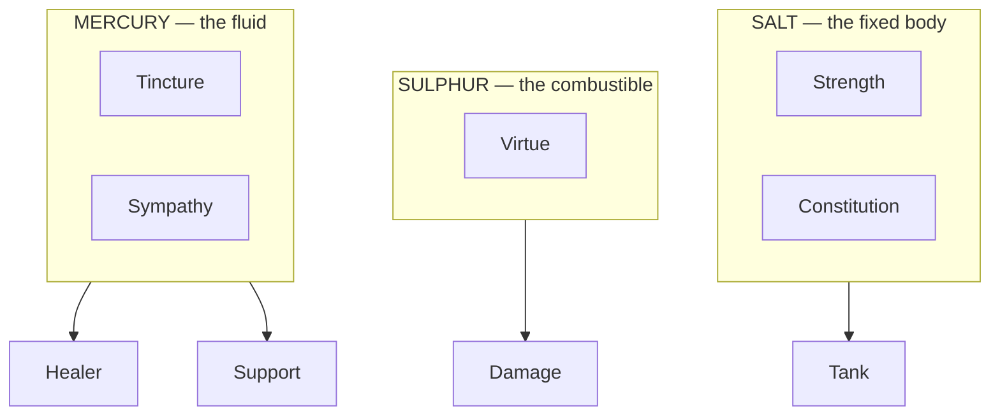

# PoA stat system — research and recommendation

**Mode: Reference.** This page researches how shipped games choose a stat set,
then recommends one set for Proof of Accumulation. It writes no code and edits
no other page.

The design asks for an original stat system rather than the classic six, and
allows new names that fit the hermetic themes. Five things in the tree already
hold, and this page builds on them rather than around them.

```
src/competition/rpg_classes.py          seven classes, each with a planet, a metal,
                                        a Paracelsian principle and a role
                                        ARC_LEVELS = 100, FIRST_LEVEL = 1
src/competition/world_grid.py           TREE_SPHERES = 10, ten levels a sphere
                                        SEPHIROT_LAYERS = TREE_SPHERES * 2
src/competition/quintessence_ledger.py  four buckets and a capped supply
src/competition/poa_modes.py            the Impetus pool a turn grants
src/competition/entity_stats.py         five stats in one declared table, each
                                        measured in Quintessence
```

Each claim below carries one of three marks: a link in the Sources list, a note
that it comes out of the tree, or the word unsourced.

---

## How many stats shipped systems use, and what drove the count

Shipped counts run from three to nine. The low end is recent and deliberate. The
high end is older and has held for decades, so the market enforces no small
count.

```
3    Numenera              Might, Speed, Intellect
3    Blades in the Dark    Insight, Prowess, Resolve
4    GURPS                 Strength, Dexterity, Intelligence, Health
5    Apocalypse World      Cool, Hard, Hot, Sharp, Weird
5    Ironsworn             Edge, Heart, Iron, Shadow, Wits
6    Dungeons & Dragons    the classic six, published 1974
6    Fate Accelerated      six Approaches, not six attributes
7    Fallout               the SPECIAL seven
8    Oblivion              eight attributes, dropped in the next game
9    World of Darkness     nine, in three groups of three
```

Three cases record what drove the count. Fallout records it most plainly. One
designer brought the set over from a game he wrote at school, then wrote the
whole system in days after the licence for another system fell through. The count
settled when a producer asked for more to spend points on, and one more stat went
in.

```
Fallout, as its designers tell it
  the set came from a prior homebrew game, not from first principles
  Luck went in after the fact
  the system came AFTER the content, by asking what queries the
  content needed
```

Two counts came down rather than up. One designer cut twelve stats to four and
reports that the smaller set balanced character creation without further work.
The Elder Scrolls series dropped eight attributes and put three derived pools in
their place.

```
Living Myth      12 -> 4      Might, Agility, Savvy, Grit
Elder Scrolls    8  -> 3      Health, Magicka, Stamina
```

One published heuristic sets the range at three to six. Below three leaves
nothing to build, and above six a player loses track of what each stat does.
**Two shipped systems contradict that heuristic.** Fallout ships seven and World
of Darkness ships nine, both for decades. The heuristic guides; it does not
decide, and this page rests its recommendation elsewhere.

---

## What a stat has to do to earn its place

Two designers state a test, and the two tests agree. A stat earns its place when
a one-point change in it shows, and when play calls on it often across more than
one kind of scene.

```
the criticality test
  "I wanted every attribute to be critical. Any dropping or raising of even
   one point in an attribute would significantly be felt by the player."
  — Living Myth Design
```

The same designer names the failure that test catches. Play rarely calls on an
orphan stat, and the cure merges it into a neighbour rather than keeping it for
completeness.

The second test is structural. Each stat needs one obvious primary effect a
player can state without a reference, and at least one secondary effect that
makes a build choice interesting.

```
the two-effect test
  primary    Strength raises melee damage
  secondary  Strength also raises carry weight
```

Two shipped systems go further and give every stat a job on both sides of the
table. An Ars Magica Art score both casts the magic of its type and resists
incoming magic of that type. In fourth-edition Dungeons & Dragons all six stats
feed three defences, each defence taking the higher of two stats, so dumping a
stat opens a defence.

```
Ars Magica      one Art score      casting and resistance
D&D 4th         Strength or Constitution    -> Fortitude
                Dexterity or Intelligence   -> Reflex
                Wisdom or Charisma          -> Will
```

**The working test for this design: a stat governs at least one thing a
participant does and one thing done to them.** That reading spans both tests
above, and the recommendation below applies it to every row.

---

## Systems that renamed or restructured the classic set

Four renames are worth reading, and all four shipped.

Fate Accelerated put six Approaches where the attributes were. The stats no
longer say what a character is; they say how the character acts, and a player may
attempt the same action through any of them.

```
Careful   Clever   Flashy   Forceful   Quick   Sneaky
```

Apocalypse World wrote five one-word stats of its own. Each covers a field the
classic six split across more than one name, and none of the five translates a
classic stat.

```
Cool    calm under pressure
Hard    violence and intimidation
Hot     attraction and presence
Sharp   perception and wit
Weird   the psychic maelstrom
```

Blades in the Dark restructured rather than renamed. Three attributes sit over
twelve action ratings, four actions under each attribute, and a player never buys
an attribute at all. **The attribute counts the actions beneath it.**

```
Insight   Hunt, Study, Survey, Tinker
Prowess   Finesse, Prowl, Skirmish, Wreck
Resolve   Attune, Command, Consort, Sway

the attribute rating = how many of its four actions carry a rating
```

World of Darkness kept nine stats and changed how a reader takes them. Three
groups of three sort the nine by subject, and the newer edition adds a second
sort across the same nine by use.

```
by subject   Physical    Social      Mental
by use       Power       Finesse     Resistance
```

All four outcomes match: the system shipped and the rename held. No source
reports a rename that failed for being a rename. The failures in the next
section break structure, not vocabulary.

---

## What goes wrong with too many stats, and with too few

Four failure modes have a record, and three of them break on one extra stat
rather than on a large set.

**A stat that duplicates another does not survive.** Comeliness arrived as a
seventh ability score in 1985. It measured appearance, which the existing
Charisma score already touched, and the next edition dropped it four years later.

```
Comeliness   arrived 1985, absent by 1989
             its one mechanic resembled an existing spell effect
             it modified, and took a modifier from, Charisma
```

**A stat nobody raises is a dump stat, and gear requirements make them.** In
Diablo II most builds spend the least they can on two stats to meet equipment
gates, put the rest into survivability, and spend nothing on the fourth. Players
have skipped the mana stat for around twenty years, because gear, a hired unit
and potions all supply mana more cheaply than the stat does.

```
Diablo II, as played
  Strength, Dexterity   raised only to the number gear demands
  Vitality              everything left over
  Energy                nothing, in most builds
```

**A stat that beats another outright collapses the choice.** In fifth-edition
Dungeons & Dragons, Dexterity supplies attack, damage, armour class, initiative,
the commonest save and three skills. Strength supplies melee damage and one
skill. The two never read as alternatives, and the commentary on this runs long.

**A stat that rises from an action the player controls gets farmed.** Oblivion
raised attributes from the skills beneath them, so the best play managed which
skills rose and when. The community records the result as efficient levelling,
and it asks a player to plan every level ahead to avoid a weaker character.

```
the Oblivion shape
  attribute gain  follows use of the skills under it
  consequence     the player farms the governing skills
  outcome         a player who does not plan gets a worse character
```

**This design sits closest to that last failure.** Stats here come from real
trading figures, so participants will do more of whatever the derivation reads.

Too few stats carries one recorded cost, and that cost is mild. The heuristic says below
three leaves nothing to build. Numenera ships three and separates characters
through training and inabilities rather than through more stats, which its
designer frames as the point rather than a compromise.

---

## A themed stat set, and where the theme gave way

Ars Magica sits closest to this design: a game whose stat set **is** its hermetic
cosmology. A magus holds fifteen Arts, five verbs and ten nouns, and every spell
names one of each.

```
five Techniques   Creo, Intellego, Muto, Perdo, Rego
ten Forms         Animal, Aquam, Auram, Corpus, Herbam,
                  Ignem, Imaginem, Mentem, Terram, Vim
```

The theme held for the verbs. **It broke for the nouns.** Four of the ten Forms
are the four classical elements, and those four reach only non-living things. Six
more Forms exist because the mechanics needed bodies, minds, beasts, plants,
images and magic itself, and four elements could not supply them.

```
from the theme   Aquam, Auram, Ignem, Terram        the four elements
added for reach  Animal, Corpus, Herbam, Mentem     living things and minds
added for reach  Imaginem                           images and the senses
added for reach  Vim                                magic itself
```

**Vim shows the break most sharply.** Vim is the Art of magical power as such,
which no classical element names, and without it a magus could not act on magic
at all.

The lesson carries over. A themed list shorter than the mechanical surface forces
either a catch-all entry or an expansion, and Ars Magica took both. A stat set
drawn from the seven planets meets the same pressure: if seven names do not cover
every job, one of them becomes the catch-all and stops meaning its planet.

The second point that carries over: an Art score does two jobs, casting and
resisting, out of one number. That is the two-sided test above, shipped in a
hermetic frame, and that property is the one worth copying.

---

## The count and structure that fit this design

A five-stat table landed in the tree while this research ran, and that table is
base reality now. Two of its five name what they set and three name nothing.

```
read from STATS in entity_stats.py
  strength       Salt      "max weight"
  dexterity      Sulphur   no effect named
  constitution   Salt      "turn point penalty while carrying"
  intelligence   Mercury   no effect named
  wisdom         Mercury   no effect named
```

**This page reached the same count and the same split independently, before
reading that table.** Five stats, grouped two under Salt, one under Sulphur and
two under Mercury. The agreement is worth stating because the two routes differ:
the table declares the split, and the reasoning below derives it from the role
list. The page adds one thing: the three effects nobody has named yet.

The design already fixes four numbers, and three of the four point one way.

```
seven classes       one a classical planet, read from rpg_classes.py
four roles          Tank, Damage, Healer, Support, in ROLES
three principles    Salt, Sulphur, Mercury, in PRINCIPLES
one hundred levels  ARC_LEVELS, and TREE_SPHERES of ten levels each
```

**This page tested seven stats, one a planet, and does not recommend it.** Three
findings stand against it.

First, the class table already explains why seven classes cover four roles, and
the reason is not a seventh job. One class carries two roles and the rest carry
one.

```
read from ASSIGNMENT_ROLES in rpg_classes.py
  Tank            one role
  Damage          one role
  pure healer     one role
  support healer  TWO roles
  pure support    one role
```

Seven classes cover four roles because the middle Mercury class doubles. A stat
for each class would leave three stats with no job of their own, and the
criticality test calls those three labels.

Second, no published game maps character stats to the seven classical planets,
as far as this search reached. That is an absence of evidence rather than evidence
against, and this page marks it unsourced: the search returned astrological
reference material and general stat guides, and no system.

Third, seven sits above the one heuristic this page found, and both shipped
systems that exceed six group their stats rather than listing them flat. World of
Darkness groups nine into three. Blades groups twelve into three.

**The research supports a grouped set, and the design already chose the group.**
Salt, Sulphur and Mercury number three, they sit in the code, and the classes
already use them as an axis. Blades and World of Darkness both show a three-way
grouping holding up at scale, and Blades shows the stronger form: the group total
comes from its members rather than from a separate buy.



**Five stats: two under Salt, one under Sulphur, two under Mercury.** The count
follows the four roles, and the Tank role splits into the two functions the
design already names apart. The split across the principles runs uneven at two,
one and two, and so does the class table at two, two and three, so an uneven stat
split matches the tree rather than fighting it.

Every stat reads in a conserved currency, which settles the last structural
question, and the landed table already picked the safe form. A rule that a
participant must **hold** a balance moves nothing between the four buckets, so a
holding-denominated stat leaves the conservation law alone. A stat that **spends**
would not.

```
read from entity_stats.py
  quintessence_requirement   adds every amount of every block
  potential_at               reads what fraction of that a balance covers
                             — a holding gate, not a spend
```

Numenera ships the spending form, where a stat is a pool a player spends to push
a roll and refills by resting. That works there because each pool belongs to one
character and no cap spans the population. Here the whole population shares one
cap, so the spending form would let one participant's stats permanently reduce
what every other participant can reach. The holding form avoids that.

---

## What each stat must govern in this design

Eight jobs exist. Five stats cover them because two stats carry two jobs each,
which is the GURPS shape, where one stat supplies damage, carrying capacity and
hit points.

```
the jobs, read from the tree and the concept document
  1  maximum carried weight
  2  the penalty to a rate while carrying
  3  movement in steps across a square
  4  the Impetus a turn grants
  5  a Vessel's occupancy rule
  6  an item's cohesion cost
  7  the four combat roles
  8  sight and discovery
```

**Job three needs no stat.** The world design already holds the rate in the
journey record and treats load as a multiplier on it, and terrain supplies the
rest. The step unit is a hundred steps a square, so a position sits on a whole
percent of a square.

```
read from world_grid.py
  SQUARE_STEPS = 100               steps across one square
  BASE_VIEWRANGE_SQUARES = 1       the squares base sight covers
```

Jobs five and six no longer need a stat of their own, because the landed table
answers both by addition. A Vessel needs the sum of its own block, and an item's
cohesion cost is the sum of one block for each of its components.

```
read from quintessence_requirement in entity_stats.py
  one block a Vessel or a monster
  one block a component
  the requirement is every amount of every block, added exactly
```

Cohesion still sits under Salt in the alchemical frame, so Strength remains the
stat that says how much cohesion one Vessel can hold.

The combat roles already have measured sources, which the concept document names
as the conversion from a trading profile.

```
damage    ytd_scrummed_usd
healing   ytd_folded_usd
support   standing_surplus_usd
accuracy  execution_score
critical  consensus_confidence
```

**One source is missing and this page does not invent it.** No field in the
measured trading profile answers as a carrying limit, so job one has a stat and
no reading. A declared row in the stat table would set it, naming the dollar field
the limit reads. Until that row exists, the weight limit has a name and no number.

### The turn economy the carrying penalty speaks to

Job four already exists in code and needs no new currency. A turn grants Impetus
from the participant's level, a speed figure multiplies that grant once, and the
product stops at twice the level's own figure and never falls below one. The
manual page for this tab already holds that grant table and those two bounds, so
this page does not repeat them.

**The carrying penalty enters there, as a speed figure below one.** That route
already exists, so nothing has to invent a second subtraction anywhere.

Two consequences follow and both reach the recommendation. A fully loaded
participant keeps one action a turn, so load alone can never freeze anybody, and
the weight limit stays the only hard stop. And a Constitution benefit tops out at
twice the level's own grant, so the curve a later unit writes has a ceiling the
code already sets.

**A stat must touch the grant, never the cost.** Loot already takes Impetus off
one action's cost through a relief field on every tier, so a stat that also cut an
action's cost would duplicate a built mechanism, which is the Comeliness failure
in this tree. Stats scale what a turn grants; loot discounts what an action
charges. The two stay apart.

**The Impetus pool bounds the event turn and nothing bounds the world turn.**
The pool binds to one candle, and unspent Impetus expires with it. A haul across
the world grid runs in world time, so a carrying penalty during a haul has no
pool to reduce. That gap belongs to the design rather than to this page, and the
design owes it.

---

## The storage cost of each candidate count

The world state holds every stat per entity, and every participant, monster and
item component pays that cost permanently. Two figures already measured in this
project carry over here as given.

```
a world-state record        1,305 bytes
a compact form of one       478 bytes
a layer's per-turn budget   progress writing alone takes 81.5% of it
PARTICIPANTS_PER_LAYER      655
```

**The figures below estimate from the shape of a record. They measure nothing in
this tree.** They assume each stat writes as a named pair in the record, at about
twenty bytes a stat, over about twenty bytes of wrapper.

```
count   bytes an entity   order of magnitude
  3           80              10^1
  4          100              10^2
  5          120              10^2
  6          140              10^2
  7          160              10^2
  9          200              10^2
 15          320              10^2
```

The count only decides anything when a whole layer rewrites in one turn. Progress
writing leaves about eighteen and a half percent of a layer's turn budget, and a
stat rewrite would have to fit inside the part still free.

```
a whole-layer stat rewrite, 655 entities, share of what is left
  3 stats     about a quarter
  5 stats     about two fifths
  7 stats     about a half
  9 stats     about two thirds
 15 stats     more than all of it — it does not fit
```

**The real conclusion is about when stats write, not about how many exist.** A
stat block that writes every turn costs too much at any interesting count. A
block that writes only on a change costs one record a change, and at five stats
it adds about a fifth to the compact record and under a tenth to the full one.
The world design already reached the same answer for movement, where progress
derives rather than writing each turn.

A packed encoding moves the figures tenfold, because a level from one to a
hundred fits in one byte. Five stats packed run about five bytes an
entity. **The encoding decides the cost far more than the count does**, which is
a reason not to pick the count on storage grounds.

### The supply cap decides the count, and bytes do not

A second cost runs alongside the bytes and binds far harder. Every stat measures
in Quintessence, the supply carries a fixed ceiling, and that ceiling caps how
many fully levelled entities can ever exist at once. Driving the real functions
gives one stat at the top level, and the cap divides by it.

```
measured by running entity_stats.py
  one stat at level 100                   550 Quintessence
  the rate a level costs                  the band's own number, 1 through 10
  participant seats across all layers     13,100
```

```
count   a maxed block   maxed entities the cap holds
  3          1,650               20,000
  4          2,200               15,000
  5          2,750               12,000
  6          3,300               10,000
  7          3,850                8,571
  9          4,950                6,666
 15          8,250                4,000
```

**At five stats the cap holds 12,000 maxed blocks against 13,100 participant
seats, so not every seat can max one even now.** At seven it holds 8,571, and at
fifteen it holds 4,000. A second Vessel and every item component draw on the same
wallet, so each figure above is a ceiling rather than a plan.

**This constraint decides the count, and it agrees with five.** The byte figures
separate the candidates by a few percent. The cap separates them by thousands of
participants.

---

## W5H over the stat system

Six questions and the seventh, a line each. Two carry an unset figure, and this
page leaves both open rather than filling them.

```
WHO        the Reincarnate holds the stat block; the Vessel it occupies
           is one of the seven classes and sets the role the stats feed
WHAT       five whole numbers a band, plus the role each one feeds;
           the block carries no dollar figure of its own
WHERE      the Character Stats subtab, inside the single PoA tab;
           nothing adds a new surface
WHEN       on a change, never once a world turn; the budget figures
           above decide it
WHY        a participant raises a stat to hold a stronger Vessel and to
           carry more; the abuse case gets its own section below
HOW        the declared table holds the five, and a block holds one amount
           a stat; no screen reads that block yet
HOW MUCH   the curve is set at the band's own number a level, so one stat
           costs 550 Quintessence at the top level. OPEN: nobody has set
           the weight unit, and nobody has named the dollar figure a
           carrying limit reads. Both belong to the operator.
```

One further gap stays open, and filling it to look finished would invent an
answer.

```
OPEN   three of the five stats name no effect. This page proposes damage,
       restoration and support for them, and the operator rules on all three
```

---

## The cheapest stat to raise

A stat derived from trading carries a price, and the price is whatever moving the
derived field costs. **Dollar fields limit themselves and count fields do not.**
A dollar of volume pays a real fee. A count rises on a trade of any size,
including the smallest the venue allows.

```
expensive to raise   a stat reading a dollar total or a certified fee
cheap to raise       a stat reading a count, a ratio, or a grade in
                     the range nought to one
```

The cheapest stat to raise in any candidate set is the one with no dollar field
behind it. **In the five-stat set that is the support stat.** Its only named
source is a surplus balance rather than a flow, and a participant can hold a
balance without trading at all.

**The seven-planet set carries the worst exposure.** Seven stats against a
conversion that names five dollar-or-grade sources pushes at least two stats onto
counts, ratios, or nothing, and those readings farm easily. The five-stat set
puts four of its five on a dollar flow and leaves one open, which is a smaller
exposure and a visible one.

The design survives everyone raising the cheap stat only while the cheap stat
governs something that does not win a fight. Support potency is the right place
for it, because a support reading everybody maximises raises the floor of help
rather than the ceiling of damage. **That is a judgement, not a derivation**, and
this choice is the one on this page most worth arguing with.

---

## The two functions that do not move

The carried-weight limit and the carrying penalty keep their functions exactly. Neither
function moves to another stat. Both keep their plain names, and the design's own
naming standard gives the reason.

```
the naming standard, as set
  take the real term    where the tradition named the thing, use its name
  invent nothing        pseudo-Latin built to sound old reads as costume
  plain word wins       where an exact English word exists, use it
```

Strength and Constitution are exact English words for what they do, and no
hermetic term names a carrying limit or a load penalty better. A rename would
spend the reader's patience on nothing, which the third rule names as the
failure. **Neither gets renamed, and nothing drops out, because both the
function and the name stay as set.**

```
Strength       maximum carried weight       name unchanged
Constitution   the penalty while carrying   name unchanged
```

Three of the five do take themed names, because in each case the tradition names
something plain English does not name compactly. Each carries its classic name in
the table below, and each short form fits inside the twelve characters the design
already allows for a name on a row.

```
Virtue      the inherent potency of a substance in alchemical usage,
            which "power" does not carry
Tincture    the agent that gives its own quality to a base body,
            which "healing" does not carry
Sympathy    the real term for action between like things at a distance,
            which "support" does not carry
```

This page rejected one name for a collision inside the platform. Volatility is
the correct alchemical opposite of fixity, and this whole application already uses
that word for price movement. A stat of that name would mean two things on one
screen.

---

## What this page does not answer

Three things stay open, and a confident answer to any of them would be an
invention.

```
the weight unit   what one unit of carried weight is, and which dollar
                  figure sets the limit
three effects     dexterity, intelligence and wisdom name no effect in the
                  declared table; this page proposes one for each, and the
                  operator rules on all three
the world turn    the one-hour turn carries no action budget, so a carrying
                  penalty during a world-time haul reduces nothing yet
```

Two questions this page opened have since closed, both in code rather than here.
The code sets the level curve, at the band's own number a level and 550
Quintessence for one stat at the top. A Vessel needs the sum of its own block, so
nobody has to decide a separate threshold.

One disagreement between sources reaches the reader rather than a verdict. The
one published heuristic this page found caps a stat set at six, and two shipped
systems exceed it and have done so for decades. The recommendation does not rest
on that heuristic. It rests on the role table in the code, which gives four roles
and one doubled class.

**The research does support an original structure.** It does not support novelty
for its own sake. Three of the five stats keep a plain classic name, because the
design's own naming rule says a plain word wins, and only the three that name
something plain English cannot name compactly take a themed name.

---

## Sources

This page read every link below.

- [Blades in the Dark — Actions and Attributes](https://bladesinthedark.com/actions-attributes)
- [Monte Cook Games — Stats and Training in Numenera](https://www.montecookgames.com/stats-and-training-in-numenera/)
- [Game Developer — How Fallout's Developers Created the S.P.E.C.I.A.L. Character System](https://www.gamedeveloper.com/design/how-fallout-s-developers-created-the-game-s-s-p-e-c-i-a-l-character-system)
- [Living Myth Design — Design Decisions: Attributes](https://livingmythrpg.wordpress.com/2019/04/20/design-decisions-attributes/)
- [StraySpark — RPG Stat Systems Explained](https://www.strayspark.studio/blog/rpg-stat-systems-character-progression-design)
- [Project Redcap — Ars Magica 5th Edition, Chapter Seven: Hermetic Magic](https://www.redcap.org/page/Ars_Magica_5E_Standard_Edition,_Chapter_Seven:_Hermetic_Magic)
- [Ars Magica Wiki — Hermetic Arts](https://arsmagica.fandom.com/wiki/Hermetic_Arts)
- [Fate SRD — Fate Accelerated, Who Do You Want To Be?](https://fate-srd.com/fate-accelerated/who-do-you-want-be)
- [Wikipedia — Apocalypse World](https://en.wikipedia.org/wiki/Apocalypse_World)
- [Wikipedia — Ironsworn](https://en.wikipedia.org/wiki/Ironsworn)
- [White Wolf Wiki — Storyteller System](https://whitewolf.fandom.com/wiki/Storyteller_System)
- [GURPS Wiki — Attributes](https://gurps.fandom.com/wiki/Attributes)
- [D&D Lore Wiki — Comeliness](https://dungeonsdragons.fandom.com/wiki/Comeliness)
- [Screen Rant — the Comeliness stat, and why D&D dropped it](https://screenrant.com/dungeons-dragons-comeliness-stat-dropped-why-explained/)
- [PureDiablo — Diablo II Attributes](https://www.purediablo.com/diablo-2/diablo-2-attributes)
- [Gamer Guides — Diablo II Resurrected Stat Points](https://www.gamerguides.com/diablo-ii-resurrected/guide/characters/builds/stat-points)
- [Hipsters and Dragons — Strength versus Dexterity in 5e](https://www.hipstersanddragons.com/strength-vs-dexterity-5e/)
- [UESP — Oblivion: Efficient Leveling](https://en.uesp.net/wiki/Oblivion:Efficient_Leveling)
- [Game Rant — Oblivion features Skyrim cut](https://gamerant.com/elder-scrolls-6-skyrim-cut-oblivion-features-spellcrafting-attributes-classes/)
- [Arcane Eye — Carrying capacity in 5e](https://arcaneeye.com/mechanic-overview/carrying-capacity-5e/)
- [D&D4 Wiki — Defense](https://dnd4.fandom.com/wiki/Defense)

One claim on this page carries no source. **No published game maps character
stats to the seven classical planets, as far as this search reached.** The search
returned astrological reference material and general stat guides, and no system.

---

## The recommended set

This is the page's one recommendation. **Five stats**, grouped under the three
principles already in the code. The count and the split match the table already
in the tree, so the recommendation is one rename of the three stats that name no
effect, plus the effect each one should take.

Every row carries one mark: **tree**, meaning it follows from the code or from
something the design already set, or **judgement**, meaning this page chose it and
the operator may refuse it.

| Themed name | Classic name | Principle | What it governs | Mark |
|---|---|---|---|---|
| Strength | strength | Salt | The carried-weight limit. Also the cohesion cost a Vessel can hold | **tree** — the table already names this effect; cohesion sits under Salt in the alchemical frame |
| Constitution | constitution | Salt | The penalty while carrying, entering as the speed figure on the Impetus grant. Also the ten-round window before permadeath | **tree** — the table already names this effect, and the grant route exists in code |
| Virtue | dexterity | Sulphur | Damage on the sell side, and the threat a tank holds | **judgement** — the Damage role and its source field come from the tree; the table names no effect here |
| Tincture | intelligence | Mercury | Restoration on the buy side | **judgement** — the Healer role and its source field come from the tree; the table names no effect here |
| Sympathy | wisdom | Mercury | Support potency, sight range, and discovery reach | **judgement** — the Support role comes from the tree; this page groups the reach jobs with it |

Three properties of the set deserve a plain statement, because each applies a
test from the research above.

```
every stat holds a job no other stat holds    the criticality test
every stat acts and gets acted on             Ars Magica and D&D 4th
the group total reads from its members        the Blades structure
```

That last line recommends a shape rather than a count. A principle total counted
from the stats beneath it cannot drift from them, and that is the property worth
copying from Blades. **Whether to build it that way is an implementation choice
and this page does not decide it.**

Two rows above carry a second job and one carries nothing past its first. That
asymmetry follows the role table: one Damage role exists and two Salt jobs exist,
so Sulphur holds one stat and Salt holds two.
