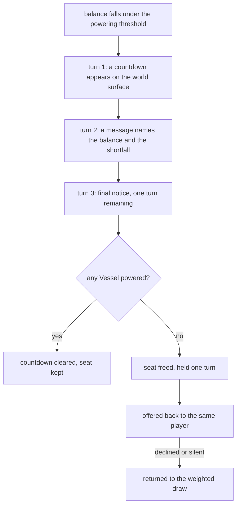

# PoA world scarcity and forced exit — research and recommendation

**Mode: Reference.** This page researches two things in shipped games: what they
do when a world has no room left, and what they do when a world pushes a player
out. It then recommends one handling. It writes no code and edits no other page.

The operator set the question and the standard for answering it. His words stand
first, verbatim.

```
"PoA - World and Block Size Limits - If, at the end of our research and design
 it is determined that, even with modern blockchain technology, we can only have
 one or a few worlds in existence at a time then we will also have to have
 lotteries for world entry. If players lose all Vessels and their Quint balance
 is zero or too low to power a new Vessel then they are forced out of the World
 which opens a slot for a new player. This sort of mechanic may lead to nerd
 rage so what to be absolutely sure about limits and the way we handle them."
```

Every claim below carries one of three marks: a numbered source in the Sources
list, a note that it comes out of the merged tree, or the word absent. Where a
figure does not exist, this page says so and says what would set it.

---

## What the tree fixes

Five figures come off merged modules, and this page carries them as given. A world
holds 1,580 seats because one layer carries 79 participants and the Tree has 20
layers.

```
src/competition/world_grid.py
  WORLD_RECORD_BYTES          1473        one discovery record, named fields
  TURN_BYTE_CAPACITY          1_048_576   one layer, one world turn
  RECORDS_PER_LAYER_TURN      711         the capacity over the record size
  PARTICIPANTS_PER_LAYER      79          records a layer over records a participant
  SEPHIROT_LAYERS             20          the ten spheres and their inversions
  seats in one world          1,580       79 across 20 layers

src/competition/quintessence_ledger.py
  QUINTESSENCE_SUPPLY_CAP     33,000,000  indestructible, four buckets

write rate                    20 MB a world turn, 480 MB a day, 171 GB a year
```

Storage is not a near-term wall. One ordinary disk holds more than one world for
years at that rate, so disk does not decide the world count.

---

## A withdrawn premise, recorded here so nobody finds it again

An earlier reading divided the supply cap by a maxed entity's 2,750 Quintessence
and reported a ceiling of one to seven concurrent worlds. **That reading is
withdrawn and was never a measurement.** Powering a Vessel sets a holding
threshold rather than a spend, so the cap does not divide into world slots.

```
src/competition/entity_stats.py
  potential_at(balance, blocks)   returns requirement, balance, fraction,
                                  shortfall and is_full
                                  IT DEDUCTS NOTHING
```

The same Quintessence sits in the wallet while the Vessel runs on it. Nothing
leaves circulation, so no world consumes supply by existing. The cap limits the
total power held at one time across every world together, which means a world of
beginners costs the economy almost nothing.

The world count returns to storage and throughput, and to how many people hold
any Quintessence at all. **This page treats the world count as open.**

---

## Question 1 — what shipped on-chain worlds actually carry

**No shipped fully on-chain game runs more than one persistent world at a time.**
Each one found runs a single shared world and bounds entry at the door rather
than by adding worlds. Dark Forest is the clearest case, and an allowlist gates
each of its official rounds.

```
Dark Forest   [1]
  chain            Gnosis Chain, after earlier rounds on Ethereum Ropsten
  access           "a limited number of whitelisted slots, a start date,
                    and an end date"
  scale            Ropsten: "crashing the entire Ropsten network"
  measured size    a 14-day round had "fewer total active players than
                   Axie Infinity had every second"
  per-round player count     absent from the sources read

Influence   [2]
  launched         27 June 2024, on Starknet
  world            one shared world, the Adalian asteroid belt
  scale claim      players "start working alongside thousands of others"
  player, transaction and capacity figures   absent
```

Two things follow. A few hundred players in one world have already taken a chain
down, which makes the entry cap real rather than theoretical. And nobody has
published a concurrent-player figure for a persistent on-chain world, so no
precedent exists to copy.

**The comparison that matters is the opposite case.** EVE Online runs one
unsharded world with no entry lottery, and handles overload by slowing the world
down instead of turning players away.

```
EVE Online   [3]
  one server cluster, Tranquility, no shards
  Time Dilation slows a loaded system to a floor of 10% real time
  reported node loads of more than 1,300 and 1,350 pilots in one system
  the stated purpose: avoid "server queues that would disconnect players"
```

---

## Question 2 — what games do when demand exceeds capacity

Six mechanisms ship today. They are not alternatives to each other: most games
run two or three together.

```
a queue          New World, 2021. A 2,000-player world cap, queues to 25,000,
                 and players errored out past that ceiling   [4]
more worlds      New World again. Amazon more than doubled its world count and
                 raised the per-world cap                    [4]
a transfer       New World gave free character transfers to emptier worlds  [4]
steering         Final Fantasy XIV marks a full world Congested and closes it
                 to new characters, and pays a bonus to start on a Preferred
                 world instead, with a 90-day transfer lock  [5]
degradation      EVE Online slows the clock rather than refusing entry  [3]
an allowlist     Dark Forest admits a fixed number of whitelisted slots a round [1]
a lottery        Final Fantasy XIV allocates scarce house plots by draw  [6]
```

**Nothing found here allocates entry to a live world by lottery.** The only
documented lottery for a scarce seat runs inside a world, for housing, and its
shape is worth copying in detail.

```
FFXIV housing lottery   [6]
  entry period     5 days, Earth time
  the deposit      the full plot price, paid to enter
  withdrawal       "Once submitted, a lottery entry may not be withdrawn"
  the draw         one winner, selected at random
  the losers       refunded 100%, within 90 days
```

---

## Question 3 — which mechanisms favour the newcomer, and which the incumbent

This is the asymmetry the operator asked to measure, and one game changed its rule
over it. Final Fantasy XIV sold house plots first-come-first-served until 2022,
and software won every plot.

The recorded reason for the change is that no human could compete with a program
watching a placard all day, and that resellers then held the plots.

```
recorded, the old rule   [7]
  "not everyone has the time to spend hours waiting at a placard"
  "botters" monopolised resale, called "terribly unfair"
```

The lottery corrected that and produced a new complaint. One player published
their own odds from a populated world, and the numbers explain the reaction.

```
recorded, the new rule   [8]
  "less than a 2% chance to purchase a small personal house" every 10 days
  "less than a 0.5% chance" for a medium, on the same cycle
  over 50 entrants for a personal plot, about 200 for a medium
  "Loss after loss, how is this a fun in-game experience? It is not."
  "Now there is a weekly ritual of entering, waiting, losing, and guess
   what, it hurts!"
```

Ranked by who they reward, the mechanisms fall into three groups. A queue and a
first-come rule reward whoever can be present, which in practice means a program.
A draw removes that advantage and replaces it with repeated loss. Steering and
more worlds reward nobody, because they change the supply rather than ration it.

```
rewards the incumbent      first-come-first-served, a camped placard, a queue
rewards nobody, by design  a lottery draw, an allowlist
removes the scarcity       another world, a transfer, a raised cap, steering
```

**A memoryless lottery is fair at each draw and unfair over a player's lifetime.**
That is the defect in the one precedent, and the recommendation below fixes it.

---

## Question 4 — which games permanently remove a player, and how they say so

Five shipped cases, and **not one of them destroys the player.** Every one moves
the character to a lower-stakes continuation and keeps what it held.

```
WoW Classic Hardcore   [9]
  on death      a ghost state that can talk and hand over guild leadership,
                but "cannot complete quests"
  the exit      a Free Character Move to a non-Hardcore realm, where
                "the hero may resurrect as normal"
  one-way       "the way back to a Hardcore realm will be closed to them
                permanently"
  warning       none before death

Path of Exile Hardcore   [10]
  on death      the character and its items move to the Standard league
  one-way       no route back
  notice        none; the transfer happens without a prompt

Path of Exile, league end   [10]
  every league ends on a schedule and resets the economy
  characters transfer to Standard and lose nothing
  joining the new league is optional

Old School RuneScape Hardcore Ironman   [11]
  on an unsafe death   "your Hardcore status has been revoked"
  the account          kept, converted to a standard Ironman, items intact
  the record           the HiScores entry is locked, "with their name
                       slashed across"
  exception            safe deaths in minigames do not revoke the status

FFXIV estate demolition   [6]
  30 days idle   a timer appears in the interface
  35 days idle   an email to the registered address
  42 days idle   a second email, three days' notice
  45 days idle   the estate is demolished
  cancelling     entering the estate at any point cancels it
  afterwards     80% of the plot price and the furnishings, from an NPC
```

The FFXIV ladder is the only one of the five that warns before the loss, and the
only one where idleness rather than a mistake causes the loss. That matters here,
because a Quintessence floor sits closer to idleness than to a mistake.

---

## Question 5 — what players actually do when a world pushes them out

The operator asked whether nerd rage is borne out. **The record bears it out, and
it splits cleanly in two.** Players do not rage at permadeath. They rage when the
loss came from something outside their control, and when the rule changed after
they had already acted.

The sharpest case is Diablo IV hardcore deaths caused by disconnects. A player's
own words on the official forum are a withdrawal from the mode, not a complaint
about its difficulty.

```
recorded, Diablo IV   [12]
  "who can recommit to playing hardcore if your servers get us killed so
   often like this"
  "who can put the time back in knowing this is more likely to happen again
   than not?"
  another player: "I just lost a 42 logging out... the character was simply
   wiped from my acct"
```

The developer called it a defect rather than a rule, and built a fix. That is the
strongest available evidence of where the line sits.

```
the developer response   [13]
  a disconnect forces a Scroll of Escape, rescuing the character
  later made automatic on a disconnect inside a dungeon
```

The second case is a rule that changed under players who had already decided. EVE
Online guaranteed that items in a destroyed structure went to asset safety, and
the Forsaken Fortress update of 26 May 2020 removed that guarantee for structures
left unfuelled for seven days.

```
recorded, EVE Online   [14]
  about 20,000 of the game's 40,000 citadels could enter the abandoned state
  an abandoned structure's contents: a 50/50 chance of destruction or loot
  CCP measured the warning working: "almost a third of those low-power
  structures have been fuelled"
```

Set against those, a scheduled and universal loss draws no rage at all. Path of
Exile resets its economy every few months and players choose the reset, and the
three permadeath systems above carry large standing communities.

**The evidence does not support the fear as stated.** Players accept a forced exit
when they caused it, when they could see it coming, and when they keep what they
earned. They refuse it when it arrives from a disconnect, from another player, or
from a rule written after the fact.

---

## Question 6 — which softenings the record shows working

Six ship today, and five of them already fit the decided design.

```
a warning ladder          FFXIV, four notices over 15 days, two by email   [6]
cancel by acting          FFXIV, entering the estate stops the clock       [6]
carry it out with you     Path of Exile and RuneScape keep every item      [10][11]
a continuation, not an    WoW, PoE and RuneScape all relegate rather than
  end                     delete                                          [9][10][11]
a spectator state         WoW's ghost can talk and pass on guild office    [9]
a rescue on a fault       Diablo IV's forced escape on a disconnect        [13]
```

One more ships, and models an evicted holding most closely. It keeps a player's
property for them, at a stated cost, for a stated time.

```
EVE Online asset safety   [15]
  after 5 days    delivered in the same system, for 0.5% of value
  after 20 days   delivered to the nearest station, for 15% of value
  abandoned       7 days unfuelled, and no asset safety applies
```

---

## Question 7 — which softenings make it worse

Three show up in the record. Each one softened the wrong thing.

The first is a lottery with no memory. It reads fair at every draw and produces
the recorded loss-after-loss complaint over a season, because a losing player
carries nothing into the next draw.

The second is a rule that changes after players have committed. Players read
EVE's abandoned state as a promise withdrawn rather than as a new hazard, and the
coverage frames it that way.

The third is the one to refuse outright. The evidence runs indirect and
consistent: none of the five eviction systems charges a player to undo an
eviction. FFXIV refunds a losing deposit in full, and EVE charges its
asset-safety fee on recovery rather than on re-entry.

```
refuse
  a paid route back into a world
  a paid place in the entry draw
  a fee that rises with how badly a player lost
```

---

## Question 8 — can a rival use eviction as a weapon

**Yes, the moment anything lets one participant destroy another's Vessels**, and
this is the most dangerous question on the list. The mechanism as described turns
a loss of Vessels into removal from the world, so whoever can cause that loss can
remove a person.

Today it cannot happen, because the harming half is unbuilt.

```
issue #586, stated there
  permadeath   "UNBUILT, which means entering a dungeon currently costs
                nothing"
nothing in src/competition/ destroys a Vessel
```

The measured cost of getting this wrong is the largest single datapoint on this
page. Ultima Online let strong players kill and loot weak ones.

```
recorded, Ultima Online   [16]
  the designer tightened the rules over two years, and "the cost was the
  loss of many hundreds of thousands of players"
  the 2000 fix split the world, Trammel with no player attacks
  "the userbase doubled once this went in"
  the designer's retrospective: players told him he "had been drastically
  and painfully wrong"
```

**The careful ruling is not the eviction rule. The ruling that matters is whether
one participant may reduce another's holdings.** Answer that yes, and the eviction rule hands that
participant a removal tool, with Ultima Online as the measured consequence.

---

## Question 9 — can someone hold a seat while contributing nothing

**Yes, and a balance threshold cannot close it.** A player who stays one unit
above the floor never trips it, and a threshold cannot tell a careful player from
an absent one.

Both precedents hit this. Final Fantasy XIV demolishes an estate for idleness
precisely because buying a plot once would otherwise hold it permanently, and its
cancel condition is so light that one visit resets the clock. Decentraland has no
such rule, and the measured result is a world of held, empty land.

```
Decentraland   [17]
  only 15 to 20% of the world developed
  about 2,400 unique wallets deployed or updated a scene in one quarter
  land held by "investors who never intended to contribute"
```

The FFXIV answer is that a threshold alone does not do the job. The rule there
reads **activity**, not balance, and a balance rule has to sit beside it.

---

## Question 10 — what happens to what the evicted player owned

Four of the five systems answer this, and they answer it the same way. The player
keeps the property and loses the standing.

```
Path of Exile        every item moves with the character to Standard   [10]
RuneScape            the whole account and its items are kept; the
                     HiScores line is locked and marked                [11]
WoW Hardcore         the character moves to another realm and can be
                     resurrected there                                [9]
FFXIV demolition     furnishings returned, plus 80% of the plot price,
                     claimable from an NPC                             [6]
EVE Online           contents held in asset safety for a fee, unless
                     the structure was abandoned                      [15]
```

None of them answers the social membership. No source read here states what
happens to a guild seat, a shared holding, or a joint assignment when a world
removes one member. **That is absent, and a docket entry rather than a finding.**

---

## W5H over the eviction mechanic

Six questions and the seventh, one line each, against the merged tree.

```
WHO acts          nothing. No module holds a seat register and no call frees a
                  seat. PoaWorld in world_grid.py reports participants_per_layer
                  in its snapshot and keeps no per-seat list
WHO is told       absent, and this question decides the product. An eviction a
                  player watched approach for three turns is a different game
                  from one that simply happens
WHAT changes      a seat moves from held to free, and that seat record does
                  not exist
WHERE is it seen  absent. No surface shows a seat count, a threshold or a
                  countdown, and no control triggers or cancels one
WHEN              the world turn of 3,600 seconds is the only sane boundary.
                  The decided design has two clocks, and this one is the world
                  clock rather than the event clock
WHY abuse it      to remove a rival. See question 8. The rule stays safe only
                  while nothing lets a participant reduce another's holdings
HOW does it fail  at the boundary: a player exactly on the threshold, a player
                  who acts during the grace window, and a player whose Vessels
                  someone else took
HOW MUCH          absent. No threshold figure exists. What would set it is the
                  cost of powering one first-level Vessel, which
                  quintessence_requirement computes from the STATS table
```

Two honest caveats, carried rather than resolved. The five-stat set in
`entity_stats.py` is a recommendation and not yet a ruling, and three of its five
stats still carry no named effect, so a threshold derived from it would move if
the set changes. And the share of total supply held in wallets, rather than
embedded in items, monsters and the pleroma, is unknown — so the number of people
who could ever hold a seat is unknown with it.

---

## What a leaving player does to the world's own Quintessence

A decided rule makes this unavoidable: a world's Quintessence equals the total of
its participating players, so the world's size mirrors their holdings rather than
drawing on a central pool. A seat changing hands changes the world's own budget.

```
a rich player leaves, a poor one enters   the world's Quintessence falls
a poor player leaves, a rich one enters   the world's Quintessence rises
```

Two decided rules keep that from being a defect. A world's distributed
Quintessence stays hypothetical until a player meets an actual monster, so the
change lands on future encounters rather than rewriting what already exists. And
worlds are explicitly not meant to be permanent, so a world that drifts in size
behaves as designed rather than breaking.

**Admission is a monetary act and not only a fairness act.** A draw that always
admitted the largest balance available would inflate every world it touched; a
draw that ignores balance lets a world shrink toward its floor. The
recommendation keeps the draw blind to balance and accepts the drift, because the
alternative sells seats.

---

## Recommended handling

**This section is mine. Everything above carries a source; this is a judgement
built on it.** Five parts, and each one names what it costs.

### Entry is a weighted draw, and only losing earns weight

Take the Final Fantasy XIV lottery shape and fix its one measured defect. A player
joins a waiting list, a draw runs at a world-turn boundary, and every loss adds
one weight that carries into the next draw. A player who keeps losing rises until
the draw admits them.

```
PROPOSED
  entry_weight starts at 1 and rises by 1 a lost draw
  a draw picks one waiting participant, weighted
  winning resets the weight to 1
  nothing else moves the weight: not balance, not payment, not tenure
```

It costs one integer a waiting participant, and it gives up the plain
memorylessness that makes a lottery easy to explain. It buys out the only
recorded failure of the only precedent.

### Exit warns four times on the world clock, and any action cancels it

Copy the FFXIV ladder, translated from days to world turns, and keep its light
cancel condition. The player sees the approach, and powering any Vessel stops it.



It costs a three-turn delay on every freed seat, so the waiting list moves three
hours slower in the worst case. It gives up nothing in the stakes, because the
seat still frees.

### An evicted player keeps everything except the seat

Five shipped games agree on this, and none of them destroys the player. The
decided design already sits on that side, because nothing destroys a Reincarnate.
Make the rest explicit.

```
PROPOSED
  the Quintessence balance stays in the wallet, untouched
  the Reincarnate keeps its level, its sphere and its skills
  the player joins the waiting list at once, carrying the weight from the
  draw rule above
```

It costs the eviction its force: this is relegation rather than punishment. The
recorded evidence says the force was never the part players objected to.

### The directive names two states, and only one of them is soft

The operator's own sentence names a balance of zero, and a balance too low to
power a new Vessel. A decided rule already treats the first one differently,
because a Reincarnate merges with the pleroma at a zero balance.

```
balance zero       the Reincarnate merges with the pleroma. The seat frees and
                   nothing remains to carry out
balance too low    the player still holds something. The warning ladder, the
                   carry-out and the automatic waiting place belong here
```

It costs a second code path. It gives up one-rule simplicity, and it stops the
softening from contradicting a decided rule.

### The freed seat waits one turn, and nothing sells it

A seat that frees and fills in the same instant makes a bad turn unrecoverable,
which is the exact shape of the Diablo IV anger. One turn of grace removes that
whole class. And nothing buys a seat, a place in the draw, or a way back in.

```
PROPOSED
  a freed seat is held one world turn
  it is offered to the evicted player first
  then it enters the weighted draw
  no payment touches any of those three steps
```

It costs the waiting list one hour a seat. It gives up a revenue surface the
evidence does not support.

---

## What this page does not settle

```
the threshold figure          absent. Set by the cost of powering one
                              first-level Vessel, from quintessence_requirement
how many worlds can run       open. Storage allows more than one; no on-chain
                              precedent runs more than one
whether a participant may     unruled, and question 8 says this ruling matters
reduce another's holdings      more than the eviction rule itself
what a removed member leaves   absent from every source read: the guild seat,
behind                         the shared holding, the joint assignment
```

---

## Sources

1. [Dark Forest: A Beacon of Light for Blockchain Games — Naavik](https://naavik.co/deep-dives/dark-forest-beacon-of-light/)
2. [Influence: Live on Mainnet — Starknet](https://www.starknet.io/blog/influence-live-on-mainnet/)
3. [Time dilation — EVE University Wiki](https://wiki.eveuniversity.org/Time_dilation)
4. [New World, Day 2: queues, concurrency, servers and transfers — Massively Overpowered](https://massivelyop.com/2021/09/29/new-world-day-2-where-amazons-new-mmo-stands-on-queues-concurrency-servers-and-transfers/)
5. [Home World Transfer Service, population balancing — The Lodestone](https://na.finalfantasyxiv.com/lodestone/playguide/option_service/world_transfer_service/population_balancing/)
6. [Player Housing — Final Fantasy XIV Wiki](https://ffxiv.consolegameswiki.com/wiki/Player_Housing)
7. [Pro-bot systems — Final Fantasy XIV discussion](https://steamcommunity.com/app/39210/discussions/0/2956041222224684103/)
8. [Lottery System, Real Estate, Odds - Failure — Square Enix forum](https://forum.square-enix.com/ffxiv/threads/466272)
9. [Facing Mortality: What Lies Beyond Death in Classic Hardcore — Blizzard](https://worldofwarcraft.blizzard.com/en-us/news/23988664)
10. [League — Path of Exile Wiki](https://pathofexile.fandom.com/wiki/League)
11. [Ironman Mode — Old School RuneScape Wiki](https://oldschool.runescape.wiki/w/Ironman_Mode)
12. [Hardcore death by server lag — Diablo IV forum thread](https://us.forums.blizzard.com/en/d4/t/hardcore-death-by-server-lag-makes-replayability-completely-zero-for-me/51383)
13. [Blizzard reveals how it plans to prevent death by disconnect in Diablo 4 Hardcore mode — PC Gamer](https://www.pcgamer.com/blizzard-reveals-how-it-plans-to-prevent-death-by-disconnect-in-diablo-4-hardcore-mode/)
14. [New EVE Online Update Puts Items At Risk If Player Citadels Fall Into Disrepair — Kotaku](https://kotaku.com/new-eve-online-update-puts-items-at-risk-if-player-cita-1843761193)
15. [Asset safety — EVE University Wiki](https://wiki.eveuniversity.org/Asset_safety)
16. [A brief history of murder in Ultima Online — Game Developer](https://www.gamedeveloper.com/design/a-brief-history-of-murder-in-ultima-online)
17. [The Metaverse Autopsy: What Really Happened to Decentraland](https://cryptonews.net/news/metaverse/30613850/)
