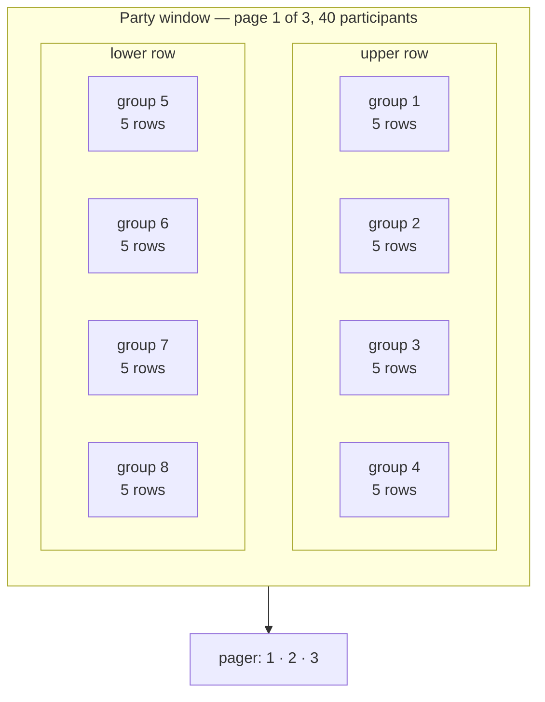
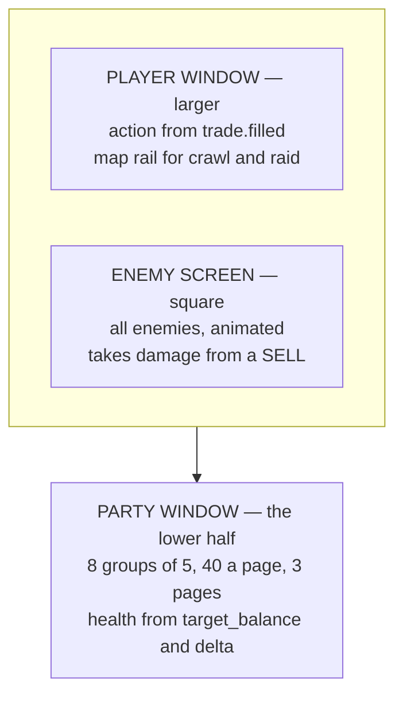
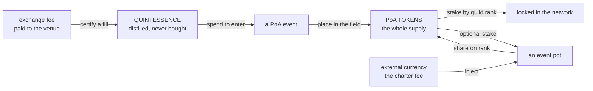
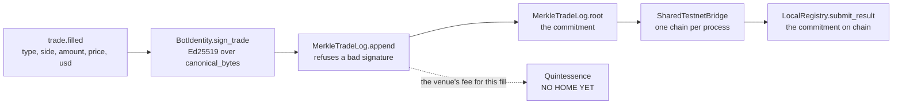
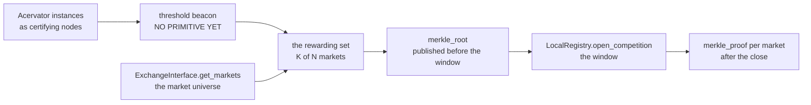

# The Proof of Accumulation tab — the design filled out

Reference. This document answers the six questions issue #147 leaves open. It
proposes no code and changes no file. The operator rules on it.

## How to read the marks

Every block carries one of three marks. Nothing in this document mixes them.

```
HIS        his own words, from the issue
MEASURED   read out of the code, with the file named
MINE       my proposal, for him to accept or refuse
```

A **MINE** block is a proposal and nothing more. Where a question is his, it
appears in [The six choices](#the-six-choices) at the end, with one
recommendation each.

---

## 1. The class array

### The hermetic vocabulary the platform already carries

**MEASURED.** Two hermetic axes already have owners, and neither is free for a
class name.

The five trophy tiers hold the four-colour alchemical path. Each drawing letters
its own stage across the face, and the epigraph runs around the ring.

`src/competition/trophy_generator.py` — `generate_trophy`'s stage map

```python
    stages = {
        "Harvest": "NIGREDO",
        "Gold Fold": "ALBEDO",
        "Bear Slayer": "CITRINITAS",
        "Grand Accumulator": "RUBEDO",
        "Ekthelius": "UNIO MYSTICA",
```

The price record holds the tablet. The historical price store is the Stone
Tablets, and a second tablet tree holds the Portfolio Battery's history.

`src/trading/stone_tablets/ra_paths.py` — the two roots

```python
_RA_ROOT: Path = Path.home() / ".acervator_ra_tablets"

RA_STONE_TABLETS_DIR: Path = _RA_ROOT
```

### The axis this array uses

**MEASURED.** Nothing in the tree uses the seven classical planets or their
metals. A search of every Python file under `src/` for the seven planet names
returns five hits, and not one of them is Acervator vocabulary: three name the
JUP token, two name Cardano's consensus in an asset description.

```
$ grep -rniE "\b(mercury|saturn|jupiter|venus|mars|azoth|ouroboros|trismegistus)\b" src/ --include=*.py
src/exchange/chart_data.py:67:    "JUP": "jupiter-exchange-solana",
src/exchange/crypto_assets.py:162: ... "using the Ouroboros Proof of Stake "
src/exchange/crypto_assets.py:168: consensus="Ouroboros Proof of Stake",
src/exchange/crypto_assets.py:457:        "Jupiter",
src/exchange/crypto_assets.py:458:        "jupiter-exchange-solana",
```

### The three roles, from the three principles

**MINE**, on a published source. Paracelsus set three principles, and his own
words give them bodies. The material reading of each one admits no argument, so
each maps onto exactly one role.

```
PROPOSED — the role names

Salt      "Salt is the body"      the solid, permanent element  ->  Tank
Sulphur   "Sulphur is the soul"   the combustible element       ->  Damage
Mercury   "Mercury is the spirit" the fluid and changeable one  ->  Healer
```

Paracelsus carried the same three into medicine. Disease is an imbalance among
the three, and healing restores their harmony. The tradition therefore states the
healer's job itself, which is why Mercury takes that role rather than a looser
fit.

### The array

**MINE.** Seven classes, one per classical planet. Two things decide the role:
the planet's quality as Ptolemy states it, and what the metal does in the hand.

```
PROPOSED — the seven classes

role            class                  planet / metal
------------    -------------------    --------------------
Salt   (Tank)   Lead Ward              Saturn  / lead
Salt   (Tank)   Tin Bulwark            Jupiter / tin
Sulphur (Dmg)   Iron Edge              Mars    / iron
Sulphur (Dmg)   Solar Lance            Sol     / gold
Mercury (Heal)  Copper Conduit         Venus   / copper
Mercury (Heal)  Silver Mirror          Luna    / silver
Mercury (Heal)  Quicksilver Draught    Mercury / quicksilver
```

One line for each name.

| Class | Why that name |
| ----- | ------------- |
| Lead Ward | Saturn's quality is “chiefly to cool”; lead is the heaviest of the seven and the metal people hide behind |
| Tin Bulwark | Jupiter is a “temperate active force”; tin is the coat that keeps iron from rusting, so it guards another metal |
| Iron Edge | Mars is “chiefly to dry and to burn”; iron is the weapon metal |
| Solar Lance | The Sun is “heating and … drying”; gold cannot corrode, so the strike never blunts |
| Copper Conduit | Venus “chiefly humidifies” and counts as a beneficent planet; copper conducts, so one heal passes along a chain |
| Silver Mirror | The Moon's “power consists of humidifying”, and it shines by reflection; silver reflects |
| Quicksilver Draught | Mercury is “of common influence, productive either of good or evil” and “absorptive of moisture”; quicksilver is the only liquid metal |

Two Tanks, two Damage and three Healers.

### Why these names sit beside the existing ones

**MINE.** Three reasons these names fit the tree's own vocabulary.

The shape matches. Stone Tablets pairs a concrete noun with a plain noun. Every
class name here does the same, and so do the five tier names — Harvest, Gold
Fold, Bear Slayer, Grand Accumulator, Ekthelius.

The register matches. No Latin reaches the screen. The Latin stays where it
already sits, on the trophy faces.

No class shares a stem with a tier. Gold Fold is a tier name, so the Sun's class
takes the planet's adjective instead of its metal. That is the only place a metal
steps aside, and collision is the reason, not taste.

### How the array serves independent levelling

**HIS.** From the 2026-09-07 brainstorm:

> each class levels independently … XP gained per action during a PoA event,
> with bonuses for efficacy and accuracy … no limit on how many classes a
> participant uses, but focus yields more power

**MINE.** Three properties of this array serve that, and none of them needs a
tuning number.

Seven closes the set. The classical planets have numbered seven since antiquity,
so the tradition fixes the breadth ceiling. The array never needs extending, and
nobody has to invent an arbitrary eighth name.

Covering all three roles costs at least three classes, because the roles split
two, two and three. Spreading therefore costs something before any curve touches
it.

Efficacy and accuracy are separate numbers the platform already computes, and
they come from separate fields. Section 2 names them. Repeating one kind of
action cannot farm a bonus drawn from two independent readings.

---

## 2. The trading profile as RPG metrics

**HIS.** From the 2026-09-09 tab layout:

> Players can be attacked. They do not lose money. Everything from the trading
> profile is converted or abstracted into RPG metrics. Players hold health pools
> based on character class, gear and level, following classic RPG structures.

### What the platform measures today

**MEASURED.** Five files hold every number this conversion needs.

`src/trading/container/config.py` — `BotStats`, the per-bot runtime figures

```python
    realised_pnl: float = 0.0
    unrealised_pnl: float = 0.0
    total_scrummed_usd: float = 0.0
    total_folded_usd: float = 0.0
    ytd_scrummed_usd: float = 0.0
    ytd_folded_usd: float = 0.0
    verify_clean: int = 0
    verify_adjusted: int = 0
    verify_canceled: int = 0
    verify_samples: int = 0
    consecutive_errors: int = 0
    total_errors: int = 0
    realized_pnl_exchange: float = 0.0  # FIFO-matched realized P/L
    avg_entry_exchange: float = 0.0  # weighted-avg cost basis
    cost_basis_total_exchange: float = 0.0  # qty x avg_entry
    cash_balance_usd: float = 0.0
    standing_surplus_usd: float = 0.0
```

`src/trading/gate_chain.py` — `GateContext`, the distance from the dollar line

```python
    delta: float  # current_value - target_balance
    delta_pct: float  # |delta| / target_balance × 100
```

`src/trading/scrumming/snapshots.py` — `_compounding_snapshot`, the target and
how far it has grown

```python
            snap["target_balance"] = round(target, 6)
            snap["anchor_target_balance"] = round(anchor, 6)
            # Positive => target has grown above anchor via compounding.
            snap["accrued_growth_usd"] = round(target - anchor, 6)
            snap["max_target_growth_pct"] = growth_pct
            snap["cycle_growth_budget_usd"] = round(anchor * growth_pct / 100.0, 6)
```

`src/trading/trade_grader.py` — `TradeGrade`, four sub-scores per trade, each in
the range nought to one

```python
    execution_score: Optional[float]
    timing_score: Optional[float]
    strategic_score: Optional[float]
    outcome_score: Optional[float]
    overall: str
    overall_numeric: float
    execution_bps: Optional[float] = None
    mfe_pct: Optional[float] = None
    mae_pct: Optional[float] = None
    sb_improvement: Optional[float] = None
```

`src/trading/indicators/types.py` — `VotingSummary`, the consensus of twelve
voters

```python
    bullish_count: int = 0
    bearish_count: int = 0
    neutral_count: int = 0
    net_score: float = 0.0  # Positive = bullish consensus
    consensus_confidence: float = 0.0  # 0.0 - 1.0
```

That twelve comes from a measurement, not from recall. Running the real module
reports it.

```
$ python -c "from src.trading.ta_engine import DEFAULT_WEIGHTS; print(len(DEFAULT_WEIGHTS))"
12
```

### The conversion

**MINE**, from the fields above. The health pool comes from the dollar target the
whole engine defends, not from profit and loss. That satisfies his rule directly:
a player below the line carries a wound, and a player loses no money by sitting
below it.

```
PROPOSED — health, from the target and the distance from it

maximum health          target_balance
base health             anchor_target_balance
health from levelling   accrued_growth_usd      (target minus anchor)
gain cap per level      cycle_growth_budget_usd, max_target_growth_pct
current health          target_balance + delta
wound depth, percent    delta_pct
```

The target grows as folds land, capped per cycle. The pool therefore already
rises through play and already has a ceiling on how fast. That is a levelling
curve the engine computes today.

```
PROPOSED — the rest of the conversion

damage dealt          ytd_scrummed_usd, and the fill's usd on a SELL
healing done          ytd_folded_usd, and the fill's usd on a BUY
heal pending          fold_count, fold_total_usd
accuracy              execution_score, with execution_bps as the reading
efficacy              timing_score, outcome_score, strategic_score
overall grade         overall_numeric, and overall as the letter
critical hit          consensus_confidence at or above a threshold
fumble                verify_adjusted, verify_canceled, consecutive_errors
resource pool         standing_surplus_usd, cash_balance_usd
what stopped a hit    ChainResult.blocked, the nineteen gate labels
```

Scrum is damage and fold is healing. That is not a convenience. His award rule is
most damage done or most healed, and the two halves of the cycle are the two
award axes, so the game's scoreboard and the platform's scoreboard carry one
number each.

### What the design wants and the code does not carry

**MEASURED.** Seven things the design needs have no field anywhere in `src/`.
Saying so is the honest answer. Assuming a field is not.

```
absent — no field under src/ holds any of these

experience points      a level        a character class
gear, or any item      an enemy       a threat or aggro value
a guild
```

The search can report. The same case-insensitive pattern that returns nothing for
experience points and gear returns nine hits for the word inventory and two for
NFT, so the pattern is not blind.

```
$ grep -rniE "\b(xp|experience|char_level|player_level|gear|loot|inventory)\b" src/ --include=*.py
  9 matches, every one the word "inventory" in another meaning
$ grep -rniE "\bnft\b|\bloot\b" src/ --include=*.py
  2 matches, neither a loot field
```

Trophies are the one exception, and they are awards rather than gear. Five
drawings exist, one per tier, picked by name.

`src/competition/season_schedule.py` — the tier key the drawings use

```python
TIER_BY_NAME = {t.name: t for t in RARITY_TIERS}
```

Class, level and gear are therefore new state. The design should not pretend
otherwise. They belong in one new record per participant, and nothing in the
trading profile should stand in for them.

---

## 3. Trade action to RPG action

### The three events that fire after every fill

**MEASURED.** Three bus topics fire together on every filled scrum and every
filled fold. Between them they carry the damage, the accuracy, the critical
reading and the gate verdict, so one subscriber can drive the whole screen.

`src/trading/scrumming/execution.py` — the fold path, the three calls in order

```python
            self._bus.emit(
                "trade.filled",
                bot_id=self.bot_id,
                data={
                    "type": _fold_label,
                    "side": "BUY",
                    "amount": fill_amount,
                    "price": fill_price,
                    "usd": fill_amount * fill_price,
                    "profit": _growth_applied,
                    "operator_initiated": _operator_initiated,
                },
            )
            self._emit_voting_panel_snapshot_at_fire(
                side="BUY", trade_action=str(_fold_label or "MANUAL_FOLD")
            )
            self._emit_gate_decision_at_fire(
                side="BUY", trade_action=str(_fold_label or "MANUAL_FOLD")
            )
```

The gate emitter carries the health numbers as well as the blockers. Its payload
includes both snapshots.

`src/trading/scrumming/snapshots.py` — `_emit_gate_decision_at_fire`

```python
                scrum_blockers=list(self._last_gate_state.get("scrum_blockers") or []),
                fold_blockers=list(self._last_gate_state.get("fold_blockers") or []),
                tranche_snapshot=self._tranche_snapshot(),
                compounding_snapshot=self._compounding_snapshot(),
```

### The action table

**MEASURED.** The trade vocabulary is a declared tuple of ten, read off the emit
sites.

`src/core/emit_contracts.py` — `TRADE_TYPES`

```python
TRADE_TYPES: tuple[str, ...] = (
    "SCRUM",
    "FOLD",
    "CARTRIDGE_SCRUM",
    "CARTRIDGE_FOLD",
    "ENTRY",
    "HEDGE",
    "DIST",
    "AUTO_DETONATION",
    "SELF_DESTRUCT",
    "MANUAL_TRANCHE_FOLD",
)
```

**MINE.** One on-screen action for each, triggered by the type field of a
`trade.filled` event.

| Trade type | Side | What the Player window would show |
| ---------- | ---- | --------------------------------- |
| SCRUM | SELL | A strike on the enemy, sized by the fill's dollars |
| FOLD | BUY | A heal on the player, sized by the fill's dollars |
| CARTRIDGE_SCRUM | SELL | A strike from a loaded magazine, one of a queued set |
| CARTRIDGE_FOLD | BUY | A heal from a loaded magazine |
| ENTRY | BUY | The player steps onto the field |
| HEDGE | either | A ward goes up; no damage and no heal |
| DIST | SELL | A strike that takes no loot; the surplus leaves the field |
| AUTO_DETONATION | SELL | A finishing blow; the excess rides in the profit field |
| SELF_DESTRUCT | SELL | The player leaves the field |
| MANUAL_TRANCHE_FOLD | BUY | A heal the operator casts by hand; the operator-initiated flag is true |

Three further on-screen events come from the other two topics.

```
PROPOSED — actions that are not a fill

a critical hit       consensus_confidence, off bot.voting_panel_snapshot
a blocked swing      a gate name in scrum_blockers or fold_blockers
a healed wound       delta rising toward nought across two gate events
```

### Three gaps in this seam

**MEASURED.** The live trading path does not reach the competition engine today,
and a builder needs to know exactly where it stops.

Nothing outside the package calls the engine's recording method. Two callers
exist, both inside one demo run.

```
$ grep -rn "record_trade" src/ tests/ main.py --include=*.py
src/competition/competition_engine.py:161:    def record_trade(
src/competition/local_testnet.py:735:                    engine.record_trade(
src/competition/local_testnet.py:743:                    engine.record_trade(
src/trading/analytics_engine.py:90:    def record_trade(self, trade: TradeRecord)
src/core/version_sweep.py:1433: a regex naming the method, not a call
```

The same search over a name in wide use returns fourteen references, so it
reports when there is something to report.

```
$ grep -rn "TokenLedger" src/ tests/ --include=*.py | wc -l
14
```

The two vocabularies differ in size. The competition record takes four role
values; the bus carries ten trade types. An adapter has to map ten onto four, or
the four have to widen.

`src/competition/bot_identity.py` — `TradeRecord`'s role field

```python
    role: str  # "SCRUM" | "FOLD" | "HEDGE" | "INIT"
```

Four different classes answer to the name `TradeRecord`. Whichever file the
adapter lands in, it must say which one it means.

```
$ grep -rn "^class TradeRecord" src/ --include=*.py
src/competition/bot_identity.py:43
src/trading/analytics_engine.py:20
src/trading/live_monitor.py:20
src/trading/trade_grader.py:19
```

The platform emits one of the three fill-time topics without declaring it. Six
topics carry a contract; the voting snapshot is not among them, so nothing pins
its payload shape.

```
$ python -c "from src.core.emit_contracts import CONTRACTS; print([c.topic for c in CONTRACTS])"
['trade.filled', 'bot.gate_decision', 'pnl.event', 'ta.voting',
 'market_inspector.scan_started', 'market_inspector.scan_finished']
```

---

## 4. One hundred and twenty participants, legible

**HIS.** From the 2026-09-09 tab layout:

> It must sharply display up to 120 participants for the largest events, through
> a multi-page structure of 40 per page.

### What large rosters already do

Forty is not an arbitrary page size. Forty is the standard raid roster, and the
standard arrangement inside it is eight groups of five. Guides written for players
state the structure plainly: design the interface around forty frames in eight
groups.

Two rules come out of the same guides. Colour by role or class, because colour
carries awareness across a large field at a glance. And scale the tile down as
the count climbs, so every tile stays on screen rather than crowding the action.

### The arrangement

**MINE.** The page size is his. The arrangement inside it follows the standard,
because the standard already suits exactly this count.



Three pages of forty cover his one hundred and twenty. Each page is one raid's
worth, so a page boundary falls where a real group boundary already falls.

One advantage is worth spending deliberately. His Party window is the lower half
of the tab, not a corner of an action view. Each tile therefore gets far more room
than a game's raid frame gets. That room goes into the health bar, not into extra
fields.

### What a row shows, and what drops

**MINE.** Four things survive at every density, ranked. The list is short on
purpose.

```
PROPOSED — what a participant row always carries

1  health bar       the one element that never shrinks
2  role colour      Salt, Sulphur or Mercury, as the fill colour
3  name             truncated, never wrapped
4  one mark slot    the single most urgent state, and nothing else
```

As the count climbs from six to forty, four things drop, in this order.

```
PROPOSED — the drop order

dropped first   the resource bar
then            the numeric health beside the bar
then            the class sigil, leaving only the role colour
last            the second mark slot
```

The health bar is never one of them. A roster that cannot report health has
stopped being a roster.

---

## 5. The Player window's two jobs

**HIS.** From the 2026-09-09 tab layout:

> Players appear taking actions as individuals or groups. This area also
> displays the dungeon maps for the crawl and raid event types. Pixel art, and
> larger than the enemy screen, because it has to show trading action translated
> to RPG action.

### What the two jobs need

**MINE.** The answer turns on the dungeon's shape, not on the layout. Two
precedents show why.

A linear dungeon needs only a small map. Darkest Dungeon keeps its map in one
corner of the action view, and it can, because every corridor joins exactly two
rooms, has no corners, and every room matches every other in size. A map of that
shape stays readable at a small size.

A free-form dungeon needs a large map. Etrian Odyssey gave the map its own screen
so the player could map and act at once. Single-screen games of that kind make
the player toggle instead, and the commentary on those games agrees: raising the
map, reading it and lowering it is the worse experience.

Two of his four modes need no map at all. Monster Smash, individual and team, is
an arena. Only the Dungeon Crawl and the Raid carry a map.

### The answer

**MINE.** One zone can do both jobs, on one condition.

```
PROPOSED — the Player window, two modes in one zone

Monster Smash, 1a and 1b     all action, no map rail
Dungeon Crawl and Raid       action at full size, map as an inset rail
the condition                the generative dungeon is a linear room graph
```

The map rail sits along one edge and shows the room chain, the party's position
and which rooms the party has cleared. It never needs to be large, for the same
reason Darkest Dungeon's does not.

**If he wants a free-form dungeon instead, one zone cannot do both**, and saying
otherwise would be wrong. The alternative is a map mode that takes the whole
Player window, with the action reduced to a single banner line while the map is
up. That mode is the worse of the two, because the player loses the action view at
the exact moment of a move. That is the trade, stated plainly, and the dungeon's
shape is the decision that settles it.

### The three zones as one picture

**HIS** for the arrangement, **MINE** for the labels on the data.



---

## 6. Fees, and the value they hold

**HIS.** The 2026-09-09 economics directive, in his words:

> PoA - Guilds, Groups, and Events should have affordable but participant fee
> structures. No gate should be locked behind a pay wall. The intent for these is
> to inject and lock value within the PoA network. All funds are held, staked, or
> traded via Acervator, LLC to further fund development.

Two of his earlier rules bind this one. Tokens only ever yield from these
tournaments and from other player-based PoA actions, and that is the whole
supply. Guild formation requires holding tokens, and membership locks and stakes
them by guild rank.

### Custody

**HIS.** All funds are held, staked or traded via Acervator, LLC, to further fund
development. This design names no custody mechanism of its own and proposes none.

### The four fees

**MINE**, inside his rules. Every fee here buys a larger pot. No fee buys a door.

| Fee | When | Inject or lock |
| --- | ---- | -------------- |
| Guild charter | once, at guild formation | **inject** |
| Guild rank stake — **HIS**, already specified | stays with the rank for as long as the member holds it | **lock** |
| Group stake | from each member of a group of six or fewer, into that group's pot | **lock** |
| Event pot contribution | from any entrant who chooses to, into the event's pot | **inject** or **lock**, by currency |

Each one in a line. A charter fee brings new value in from outside, so it
injects. A rank stake keeps tokens still for as long as the member keeps the
rank, so it locks. A group stake keeps tokens still for the length of one
dungeon, so it locks. An event contribution does whichever its currency does.

**This design refuses one thing outright.** No season pass, no paid class, no
paid loot tier, no paid event and no paid mode. Each of those is a door, and his
directive forbids a door.

### What a participant who pays nothing reaches

**MINE.** This is the test the directive sets, and the answer has to be thick
rather than thin. It is.

```
PROPOSED — the free path, in full

every class            all seven, with no charge of any kind
every XP rate          the same per-action rate and the same bonuses
Monster Smash 1a       the individual arena, entirely
Dungeon Crawl 2a       the individual crawl, every floor and every boss
every loot roll        the same dice, the same rarity scale
all five token tiers   Harvest to Ekthelius, on rank in the field
a share of every pot   including the part other entrants paid in
```

Rank within the field decides the tier, and nothing else does. The code says so.

`src/competition/season_schedule.py` — `classify_tier`, the whole decision

```python
    if perfect and rank_pct <= 0.001:
        return TIER_BY_NAME["Ekthelius"]
    if rank_pct <= 0.01 and consecutive_top1 >= 3:
        return TIER_BY_NAME["Grand Accumulator"]
    if market_regime == "BEAR" and rank_pct <= 0.25:
        return TIER_BY_NAME["Bear Slayer"]
    if rank_pct <= 0.10:
        return TIER_BY_NAME["Gold Fold"]
    if rank_pct <= 0.50:
        return TIER_BY_NAME["Harvest"]
```

### Play earns the team modes

**MINE**, derived from his two rules read together. Team-based Monster Smash and
the Raid both require a guild, and a guild requires holding tokens. That looks
like a gate, and it is a gate — an earned one, never a paid one.

```
the path to a raid, with no money spent at any step

play 1a or 2a free  ->  place in the field  ->  take a token award
                    ->  hold tokens         ->  form or join a guild
                    ->  raid
```

Nobody can buy a token. Tokens only ever yield from tournaments and player PoA
actions, so nothing on that path is purchasable, and the directive holds.

**One constraint follows, and it carries weight.** No fee may take a currency the
network itself will trade for PoA tokens. The moment it can, the earned gate above
turns into a paid one, and the directive breaks without a single rule being
rewritten.

### The ledger cannot take a fee today

**MEASURED.** A fee needs a debit, and there is no debit. The token ledger has one
write path and it only mints.

```
$ grep -rniE "\bdef (transfer|burn|debit|spend|stake|escrow|fee|charge|deduct)" src/competition/*.py
  no matches
```

The stake field exists and nothing settles it. The challenge record declares
tokens at risk from each bot, and the rating registry that closes a challenge
moves no tokens at all — it updates ratings and appends a history row.

`src/competition/challenge_protocol.py` — the declared stake

```python
    stake_acrv: int  # ACRV tokens at risk from each bot
```

On the chain side the cap never moves, and nothing destroys a token. A fee can
therefore only sit at an address. It can never burn.

`contracts/ACRV.sol` — the cap and the mint guard

```solidity
//   • Tokens can never be burned — supply monotonically increases
    uint256 public constant MAX_SUPPLY = 10_000_000 * 10**18;  // 10M ACRV
    modifier onlyRegistry() {
```

Whoever builds the fee structure builds the debit path with it. Locking means
keeping tokens at an address they cannot leave for a term, because burning is not
available and never will be.

---

## 7. The Certified Transaction Socket

**HIS.** The 2026-09-09 directive, in his words:

> PoA - Acervator Bot Certified Transaction Socket - Bots in Acervator will have
> to certify their transactions against the PoA blockchain in order to
> participate in PoA events. Certifying trades in this manner will earn
> participants Influence proportionate to exchange fees and Influence is
> subsequently spent to enter PoA events. We do not want to allow non-Acervator
> whales to infiltrate our events and tournaments without using the platform so
> that their participation benefits many and not just themselves.

Platform use therefore earns entry. A whale who does not trade on Acervator
cannot enter, because nothing else distils the quantity entry costs.

### Quintessence, the settled name

**HIS.** He asked for a name more consistent with the hermetic vocabulary than
Influence, which he called an old name for the same idea. The name is
**Quintessence**, shortened to **Quint** where a row has no space for the full
word. A bot **distils** Quintessence from a certified fill, and a participant
**spends** it to enter an event.

The quintessence is the fifth essence, drawn out of base matter by repeated
labour. Nobody can counterfeit it; it can only be distilled. That is what this
quantity measures — the refined residue of real trading, which a participant
either did or did not do.

**MEASURED.** Three other hermetic names were unavailable. This tree already uses
each one.

```
unavailable, and why

Azoth          historically another name for mercury, and Mercury is already
               the Healer role while Quicksilver Draught is already a class
colour stages  NIGREDO, ALBEDO, CITRINITAS, RUBEDO and UNIO MYSTICA letter the
               five trophy tiers in src/competition/trophy_generator.py
tria prima     Salt, Sulphur and Mercury are the three role names in section 1
```

Quintessence stands apart from the four elements, the three principles and the
seven metals, which is exactly why the name is free.

### The three value types, and how they meet

**HIS** for all three rules. Read together they fix three separate quantities,
and a design that merges any two of them loses a property he asked for.

```
PoA tokens     yield only from tournaments and other player-based PoA actions;
               that is the whole supply
fees           affordable, never a gate, and each one injects or locks value
Quintessence   distilled by certifying trades, spent to enter events
```



Quintessence is the only one of the three that enters through work rather than
through money. That single property carries the whole anti-whale intent.

### What changes in the four fees

**MINE.** Entry now costs Quintessence, and a fee therefore cannot also be the
price of entry. Two things I wrote above change, and one line joins the refusal
list. Nothing else in section 6 moves.

```
CHANGED — the Group stake becomes optional

was    "from each member of a group of six or fewer, into that group's pot",
       which reads as compulsory
now    any member may stake into the group's pot; none of them has to
ground his own directive — a fee is not a condition of entry, and entry
       already costs Quintessence, so a compulsory stake would be a second
       condition on the same door
```

```
CHANGED — how to read the free-path block above

was    "What a participant who pays nothing reaches", and
       "every class — all seven, with no charge of any kind"
now    money still buys nothing on that list, and every row of it stands.
       Entry is no longer costless, though: it costs Quintessence, and a
       participant distils that by trading on the platform
```

```
ADDED — one more refusal

no Quintessence for sale, in any currency, to anybody
```

The four fees keep their inject-or-lock marks. None of them buys a door. The raid
path in section 6 stays earned, and Quintessence makes it more so: a participant
now has to trade before entering anything at all.

### Which existing symbol carries which part of certification

**MEASURED.** Most of certification already exists. The table names the symbol
for each part, read out of the four modules his directive names.

| Part of certification | Symbol | File |
| --------------------- | ------ | ---- |
| Who signs | `BotIdentity`, and `bot_id` as the hex public key | `src/competition/bot_identity.py` |
| Signing one trade | `BotIdentity.sign_trade` | `src/competition/bot_identity.py` |
| Verifying one trade with no private key | `BotIdentity.verify_trade`, a static method | `src/competition/bot_identity.py` |
| The exact bytes signed | `TradeRecord.canonical_bytes` | `src/competition/bot_identity.py` |
| The leaf hash | `TradeRecord.record_hash` | `src/competition/bot_identity.py` |
| The append-only certified log | `MerkleTradeLog.append` | `src/competition/merkle_log.py` |
| The commitment | `MerkleTradeLog.root` | `src/competition/merkle_log.py` |
| Proof of one trade without the log | `MerkleTradeLog.proof_for` and `verify_proof` | `src/competition/merkle_log.py` |
| A public summary revealing no trade | `MerkleTradeLog.submission_summary` | `src/competition/merkle_log.py` |
| Posting the commitment to the chain | `LocalRegistry.submit_result` | `src/competition/local_testnet.py` |
| The chain, its blocks and its events | `LocalChain.send_tx`, `LocalChain.emit`, `LocalChain.mine` | `src/competition/local_testnet.py` |
| One shared chain for the process | `SharedTestnetBridge.install_on` | `src/gui/shared_testnet.py` |
| The only write path into that chain | `SharedTestnetBridge.request_competition` | `src/gui/shared_testnet.py` |
| Standing between two participants | `RatingRegistry.record_result` and `elo_update` | `src/competition/challenge_protocol.py` |
| A signed request carrying a stake | `ChallengeMessage` and `create_challenge` | `src/competition/challenge_protocol.py` |

`MerkleTradeLog.append` is already the refusal certification needs. It rejects a
record from another competition, a record from another bot, and a bad signature.

`src/competition/merkle_log.py` — the three refusals

```python
        if record.competition != self.competition_id:
            raise ValueError(
        if record.bot_pubkey != self.bot_id:
            raise ValueError(
        if not skip_sig_verify and not BotIdentity.verify_trade(record):
            raise ValueError(f"Invalid signature on trade seq={record.trade_seq}")
```

The bridge runs on every launch. `MainWindow._setup_ui` calls it with no condition
around it, before any tab gets built.

`src/gui/main_window.py` — the install call, at line 275

```python
                SharedTestnetBridge.install_on(self)
```

### What certification has no home for

**MEASURED.** Seven parts have no symbol. Each one needs writing, and the
document names them rather than implying the package covers them.

```
no home yet

a per-fill certify call   CompetitionEngine.record_trade needs an ACTIVE
                         competition; certification has to run on every trade,
                         inside an event and outside one
a Quintessence balance   no field and no ledger anywhere
a spend path             entry costs Quintessence and nothing debits anything;
                         TokenLedger mints and has no debit method at all
a monotonic fee total    measured below; no existing field holds one
a buy-side venue fee     _record_venue_fee clears on a buy, so a fold records
                         no venue fee
a bus subscriber         CompetitionEngine.record_trade has two callers and both
                         sit inside local_testnet.run_demo_competition
a one-trade request       CompetitionRequest carries a symbol, a season, a bot
                         count and a round id, and nothing for a single fill
```

### The rate, from fees paid to Quintessence distilled

**MEASURED.** Three fee figures exist and they are three different things. Only
one of them suits a quantity a participant earns.

```
the three figures

BotConfig.trading_fee_pct      a RATE. Default 0.6, its comment naming the
                               Coinbase max tier. Read by
                               minimum_opposing_trade_distance_pct in
                               src/trading/otd_math.py

BotStats.fees_paid_exchange    an AMOUNT, re-derived on every health refresh
                               from get_my_trades(symbol, limit=500), so it
                               FALLS as older fills leave that window.
                               Written in src/trading/scrumming/reconciliation.py

SettledSellFee.fee_amount      the venue's OWN fee for one settled sell, built
                               by _record_venue_fee from order.fee, and its
                               docstring says the value is never derived from
                               the configured rate
```

The contrast with the YTD figures is the point. Those ratchet on purpose, and the
fee figure does not.

`src/trading/scrumming/reconciliation.py` — the deliberate ratchet

```python
        self.stats.ytd_scrummed_usd = max(_prev_scrum, _ytd_scrum_usd)
        self.stats.ytd_folded_usd = max(_prev_fold, _ytd_fold_usd)
```

**Nothing in the running platform holds a monotonic lifetime fee total**, and
`trade.filled` carries no fee field at all — its payload is the type, the side,
the amount, the price, the dollars, the profit and the operator flag. A
Quintessence total read from the windowed field would fall when old fills aged
out, which no earned quantity may do.

```
PROPOSED — the conversion

distil per fill, at certification, never from a stored total
on a SELL   SettledSellFee.fee_amount, the number the venue itself reported
on a BUY    nothing is recorded today; either extend _record_venue_fee to
            buys, or a fold distils nothing and the rate favours the scrum
the total   the socket keeps its own monotonic figure, because no field in
            the platform is monotonic
the scale   one rate constant, his to set, because the number decides what an
            event costs in hours of trading
```

The venue's own number is the honest source. A rate built on the configured
percentage would measure what the bot assumed rather than what the participant
paid, and the fee dataclass says so in its own docstring.

### What stops a wash trade

**MEASURED.** Nothing detects one. A case-insensitive search of every Python file
under `src/` for wash trading, self-dealing, manipulation, spoofing and layering
returns a single hit, and that hit describes how a sound gets built.

```
$ grep -rniE "\bwash[ _]?trad|self[ _]?trad|manipulat|spoof|layering" src/ --include=*.py
src/core/sound_engine.py:146: ... layering a noise tink, a detuned ring ...

control, same grep shape:
$ grep -rniE "\bhysteresis\b" src/ --include=*.py | wc -l
34
```

One mechanism raises the cost without being written for this. The opposing-trade
distance requires real price movement between a trade and its reverse, and the
required distance already includes the fee.

`src/trading/gate_chain.py` — `HysteresisGate`, the required distance

```python
        eff_pct = ctx.scrumming_interval_pct + ctx.trading_fee_pct
```

A same-price instant reverse therefore cannot fire on the autonomous path. Two
things limit that protection, and both are measured.

The manual path evaluates no chain. `_execute_manual_rebalance` moves holdings
back to the target with one market order, and its own docstring says the labels
and the operator flag come from a map of caller intents.

Four of the labels it emits are absent from the declared vocabulary.

```
$ python -c "from src.core.emit_contracts import TRADE_TYPES; ..."
emitted but NOT declared: ['MANUAL_FOLD', 'MANUAL_SCRUM', 'WIRE_STACK_FOLD', 'WIRE_STACK_SCRUM']
```

**The structural finding, and this is the part that matters.** Quintessence in
proportion to fees paid means that trading purely to distil costs exactly the fee
it distils from. That fee goes to the venue, never to the network. A participant
can therefore turn money into Quintessence at the venue's fee rate, with no market
in Quintessence anywhere.

That weakens the anti-whale property rather than breaking it. The whale has to run
an Acervator bot, trade real volume, pay real fees, and carry real market exposure
across the opposing-trade distance on the autonomous path. The cost is not small
and the path exists. Capping the rate, or capping Quintessence per period, would
close it — and a cap changes what an event costs, which makes it his number and
not mine.

### The two residuals a new surface makes live

**MEASURED.** Issue #147 already records two pieces of code that are harmless only
while nothing constructs them. A certification socket constructs both.

The mint path reads and writes a balance with no lock, and the module imports no
threading at all. A certification worker on its own thread would share that
dictionary with the Qt main thread.

`src/competition/local_testnet.py` — the unlocked read-modify-write, at line 224

```python
        self._balances[recipient] = self._balances.get(recipient, 0) + amount_wei
```

The shelved tab builds a private chain when no bridge reaches it. A socket that
reuses that constructor would certify into a chain nothing else can read.

`src/gui/testnet_tab.py` — the fallback, at line 142

```python
            self._testnet = shared_testnet or LocalTestnet()
```

Both belong to whoever builds the socket. The first needs a lock, or the mutation
needs to stay on one thread. The second needs the bridge to be required rather
than optional.

### The socket in one picture

**MINE** for the arrangement, **MEASURED** for every symbol in it.



---

## 8. The Exchange Participation Layer, and the rotating reward set

**HIS.** The 2026-09-09 directive, in his words:

> Exchange Participation Layer - Random rotates markets that can reward Quint
> without notifying anyone other than the PoA blockchain where said information
> is encrypted and can only be unlocked / read with the owning exchange's private
> key. In absence of EPL, same mechanism will be handled internally and in a
> decentralized manner using Acervator instances as certifying nodes.

His 2026-09-07 brainstorm already names the fallback's shape: a world defined by
Acervator instances acting as PoA Nodes. The decentralized path reuses that idea
rather than adding a second one.

### What the rotation answers, and what it leaves open

**MINE.** The rotation defeats **targeted** farming. A participant cannot pick one
market and grind it, because the rewarding set is concealed and it moves.

The rotation does not defeat **blanket** farming, where a participant trades every
market to cover whichever ones reward. Writing that the mechanism closes the hole
would be false. The defence against blanket farming is a ratio, and the next
section states it.

### The blanket-farming ratio

**MEASURED.** The platform can enumerate its market universe, so the ratio's
denominator is a real figure rather than an estimate.

`src/exchange/base.py` — the contract every connector implements

```python
    @abstractmethod
    async def get_markets(self) -> list[AssetInfo]:
        """Return one ``AssetInfo`` per tradeable market."""
```

`CcxtConnector.get_markets` builds that list from the venue's own market map,
drops anything the venue marks inactive, and caches the result. The count reaches
the log on every launch.

`src/exchange/ccxt_connector.py` — the count at connect

```python
            market_count = len(sync_exchange.markets) if sync_exchange.markets else 0
            logger.info("Connected to %s (%d markets)", self.display_name, market_count)
```

`AssetInfo` also carries the two numbers that price a covering pass, per market.

`src/exchange/base.py` — the fields that set the floor cost

```python
    min_cost: float  # Minimum order cost (in quote)
    maker_fee: float
    taker_fee: float
```

```
PROPOSED — the ratio, from those fields

N  live markets on the venue         len(sync_exchange.markets), logged at connect
K  markets rewarding in one window   HIS number, and he has not set it

cost multiplier to cover = N / K
floor cost of one pass   = sum of min_cost across the N markets, each leg
                           charged that market's taker_fee
```

A participant who knew the set would pay for K markets. A participant who does not
know it pays for N. Covering therefore costs N divided by K times as much per unit
distilled, and that multiplier is the whole defence.

The shape of the defence follows directly. At K of one and N in the hundreds,
covering costs hundreds of times more than targeting, and the defence is strong.
At K equal to half of N, covering costs twice as much, and the defence is thin.
**K is the only free variable, which makes it the number that decides whether this
mechanism works.**

Two cautions on the figures. N is a fact about one venue on one day, not a fact
about this repository, so the document gives the formula and its source rather
than a fixed count. And the repository's own curated catalogue is a different,
much smaller set — `crypto_assets.ASSETS` holds forty entries, measured by
importing it — which must not be read as the market universe.

### Eligibility: two conditions, and both are required

**HIS.** The 2026-09-09 directive, in his words:

> Quint allotment will not occur outside of the top 20 assets by volume on a given
> exhange or those that have been not been listed for less than six months. We do
> not want obscure pumps awarding Quint. Rotations happen based on time
> (expiration) and Total Trade Volume While Active or all Quint is awarded
> (proportionate to market volume at time of activation).

A market can reward Quintessence only while both hold.

```
volume   inside the top 20 by volume on that exchange
age      listed for at least six months
```

### The reading that awaits his confirmation

**MINE, and it is not buried.** His sentence carries a double negative — "those
that have been not been listed for less than six months" — and the two readings
differ in effect.

```
both required        a new listing inside the top 20 is REFUSED
either sufficient    a new listing inside the top 20 is ALLOWED
```

His stated purpose decides it. An obscure pump can climb a top-20 table on the
strength of the pump itself, so only the first reading refuses one. **This document
is written throughout on both-required, and one word from him confirms or
overturns that.** Every rule below rests on it.

### How an activation ends

**HIS.** A market's activation ends on whichever of three arrives first.

```
expiry      the window's time runs out
volume      total trade volume while active reaches its threshold
exhausted   every unit of that market's allotment has been awarded
```

The thresholds themselves are his to set. Nothing in the design changes if he
moves them.

### The allotment is a snapshot

**HIS** for the rule, **MINE** for naming the property. The allotment is sized in
proportion to that market's volume at the moment of activation.

Volume is therefore read once. Pumping a market's volume during the window does not
enlarge its pool. **That is an anti-manipulation property and it belongs on the
list of them**, beside the concealment of the rotating set: the first stops a
participant choosing which market pays, and this one stops a participant enlarging
what it pays.

### The ratio restated, with the cap in place

**MINE.** The eligibility rules change the ratio stated above, and they change it
in two opposite directions. An honest answer carries both.

**The haystack shrinks.** The ratio above takes the live market count as its
denominator, which runs to hundreds on a large venue. Eligibility caps the drawable
set at twenty per exchange, narrowed further by the six-month rule. Covering twenty
markets is affordable. **Concealment is therefore the weaker half of the defence
now, not the stronger half.**

**The prize becomes finite.** Each activation carries its own allotment and ends
when that allotment is spent, so trading on past the pool's end distils nothing.
Blanket coverage buys a share of a bounded pool rather than an open tap.

```
PROPOSED — the defence, as the rules now shape it

before       cover N markets to find K, and the yield was open
now          cover at most 20 per exchange to find K, and the yield stops
             at the allotment
the defence  the cap, and no longer the concealment
```

Four bounds now apply, where before there was one.

```
what bounds the yield

eligibility  at most twenty markets per exchange can pay at all
expiry       the window closes on time whatever anyone trades
volume       the window also closes when trade volume while active reaches
             its threshold
allotment    the pool is finite and fixed at activation, so it cannot grow
```

The volume end condition earns its own line. A participant trading hard in an
active market brings that market's own closure nearer, which makes heavy farming
self-limiting rather than merely expensive.

### Can the platform rank a top 20 by volume

**MEASURED. Yes, and the function already takes the count as a parameter.**

`src/exchange/market_inspector_fetcher.py` — `_pick_universe`, the ranking

```python
        scored.sort(key=lambda t: -t[0])
        top = [sym for _v, _b, sym in scored[:top_n]]
```

Three properties of it matter to an eligibility test, and each one is a
qualification rather than a blocker.

```
MEASURED — what _pick_universe ranks, and what it leaves out

the filter     only quotes in DEFAULT_QUOTES count, which is USD, USDC and
               USDT, and a base in STABLECOIN_DENYLIST is dropped; so its
               top twenty is a top twenty of a filtered set
the overflow   a base in active_symbols is appended even when it falls
               outside top_n, so the returned list can exceed twenty; an
               eligibility test must take the first twenty, not the whole list
the units      volume falls back from quoteVolume to baseVolume when the
               venue gives no quote volume, and those are different units,
               so a market ranked on base volume is not comparable with one
               ranked on quote volume
```

The third is the one to repair before this becomes an eligibility authority. A
ranking that mixes two units does not order its own members.

### Can the platform answer listing age

**MEASURED. No, not the venue fact — and a field named for it holds something
else.**

Nothing in the tree records when a venue listed a market. `AssetInfo` carries no
date, and the connector reads only the active flag, the limits, the precision and
the two fees out of the venue's market entry, so a venue-supplied creation date
would be dropped even where one arrives.

```
$ grep -rniE "listed_at|listing_date|first_listed|launch_date|inception_date" src/ --include=*.py
  no field; every hit for the word "listed" is unrelated prose

control, same grep shape over a name that is present:
$ grep -rniE "\bquoteVolume\b" src/exchange/ccxt_connector.py src/exchange/data_pool.py \
      src/exchange/chart_data.py src/exchange/market_data.py | wc -l
3
```

One field is named for listing and measures a data boundary. Its own docstring says
so, which is the honest half.

`src/trading/stone_tablets/storage.py` — `StoneTablet.listed_at_ms`

```python
    @property
    def listed_at_ms(self) -> int:
        """Timestamp of the earliest row in ``candles``, equal to
        ``first_ts_ms``.

        Zero when ``candles`` is empty.
        """
        return self.first_ts_ms
```

`src/trading/stone_tablets/registry.py` — the same value on `AvailabilityInfo`

```python
    listed_at_ms: int  # first candle in tablet (0 if none)
```

Three members read that one value. `AvailabilityInfo.is_listed_before` compares it
against a timestamp, `listing_notice` turns it into a line of text, and
`WindowStatus.LATE_LISTING` names the case where a tablet begins after the window
asked for.

**Using it for the six-month test is an inference, and this is what the inference
gets wrong.** The value is when Acervator first held price data for that market,
not when the venue listed it. A market the platform only began recording last
month reads as one month old however long the venue has carried it.

```
PROPOSED — the error has one direction, and that direction is safe

a tablet cannot start before the market existed, so listed_at_ms is always
at or after the true listing date

therefore   the test can REFUSE an old market whose tablet is young
and never   ADMIT a market younger than six months
```

For a rule whose purpose is excluding new listings, a test that only ever errs
toward refusal is usable. The six-month test can run on this field today, provided
the design says out loud that it is reading a data boundary and not a venue fact.
The true fact needs the connector to keep a creation date the venue supplies, and
that has no home.

### Correction: project age replaces per-exchange listing age

**HIS.** His correction, in his words:

> Can research with CoinGecko. Project age for all blockchains is known. This is
> an inherent characteristic.

**MINE.** The section above measures per-exchange listing age and reports that the
platform cannot answer it. **That measurement stands and stays true. The
requirement changed, so the gap no longer matters.** The sections that follow
replace it rather than repeat it.

Project age and per-exchange listing age are two different facts, and his purpose
picks the first.

```
project age            how long the chain or the token has existed anywhere
per-exchange listing   how long one venue has carried one market
```

A token three years old and newly listed on one venue is not an obscure pump. A
token three weeks old is an obscure pump on every venue at once. His stated
purpose — no obscure pumps awarding Quintessence — reads on project age, not on
venue tenure.

**Therefore the six-month test runs against project age.** Per-exchange listing age
stays unavailable in the tree, and the rule no longer asks for it.

### The endpoint and the field that carry project age

**MEASURED** against CoinGecko's own reference. The coin detail endpoint is
`/coins/{id}`, and the field it answers with is nullable.

CoinGecko's documented field, its shape, and its example value

```
genesis_date   an ISO 8601 date string, nullable
               "2009-01-03" for Bitcoin
```

The documented example for Bitcoin is 2009-01-03.

The platform already resolves the identifier that lookup needs.

```
measured in the tree

src/exchange/crypto_assets.py   a coingecko_id per asset, 40 of 40 populated
src/exchange/market_data.py     calls /coins/markets, batching 50 ids per call
src/exchange/chart_data.py      calls /coins/{cg_id}/ohlc
```

**The coin detail endpoint is called nowhere in `src/`.** Seven modules name
CoinGecko, and the two endpoints in use are the markets list and the OHLC series.
A project-age lookup is therefore a new call against a live integration, not a new
integration.

### Whether a per-asset age lookup is affordable

**MEASURED.** CoinGecko's own error-and-rate-limit reference states 100 calls a
minute on the Demo plan. The platform paces itself well under that.

`src/exchange/market_data.py` — the platform's own pacing, and its own comment

```python
            time.sleep(2.5)  # Rate limit: ~30 calls/min
```

The two endpoints do not cost the same. The markets endpoint takes fifty ids in one
call; the detail endpoint takes one id per call.

```
the scale the rule asks for

20 markets x 15 supported exchanges   up to 300 eligible markets
unique projects behind them           fewer, because venues overlap
at the platform's own 30 a minute     about ten minutes for 300
at the documented 100 a minute        about three minutes for 300
```

**One property turns that cost from a bill into a one-off. A genesis date never
changes.** A project's genesis is fixed on the day its chain starts, so the value
needs fetching once per project and never again. The figures above describe a
backfill, not a recurring load.

```
PROPOSED — where the value is cached

the place   a JSON file beside the Stone Tablets manifest, which is already
            where the platform keeps venue-derived data on disk, home-relative
            and outside the repository
the reason  the five-minute in-memory cache in market_data.py suits a price
            that moves; a genesis date does not move, so it belongs on disk
            with no expiry at all
the refill  only when an asset carries no entry, and never on a timer
```

`src/trading/stone_tablets/storage.py` — the existing on-disk home

```python
MANIFEST_PATH: Path = STONE_TABLETS_DIR / "MANIFEST.json"
```

### The identifier map is the real limit, not the rate limit

**MEASURED, and this matters more than the rate limit.** Three CoinGecko
identifier maps exist, and each one carries forty entries.

```
$ python -c "from src.exchange.chart_data import COINGECKO_IDS; ..."
chart_data.COINGECKO_IDS          40
market_data._COINGECKO_IDS        40
crypto_assets coingecko_id        40 of 40 assets
```

`_load_coingecko_ids` reads the asset catalogue, so the canonical source is
`crypto_assets.ASSETS`, and the map in `chart_data.py` is a second hand-kept
literal of the same size.

**Forty resolvable projects against up to three hundred eligible markets.** A
project-age lookup can answer for forty bases today. Every eligible market outside
that forty carries no identifier, therefore no genesis date, and lands in the
unknown-age case below. **The constraint on this rule is the identifier map, not
the rate limit.**

Two ways widen it, and both are implementation rather than product.

```
PROPOSED — widening the map

the list endpoint   /coins/list returns every coin CoinGecko carries, each
                    entry giving id, symbol and name, in one unpaginated
                    response, which removes the hand-maintenance
the catalogue       crypto_assets.ASSETS grows, which keeps one source of
                    truth and keeps the hand-maintenance
```

A symbol is not unique across projects, so a map built from the list endpoint needs
a tie-break where two projects share a ticker. That is the one part of this which
is not free.

### When project age is unknown

**MEASURED.** The genesis field is nullable, so CoinGecko does not populate it for
every asset it lists. Where the field is empty the six-month test has no input.

Two answers, and both err in the same direction.

```
refuse      an asset with no known age does not reward Quintessence
fall back   StoneTablet.listed_at_ms stands in, refusing an old market but
            never admitting a young one
```

**Recommended: refuse.** Three reasons, and the third is the decisive one.

Refusal cannot be gamed. A project that withholds its data gains nothing by it,
where a fallback rewards the withholding with a second route to eligibility.

Refusal matches what the rule is for. The rule exists to exclude, and an asset
nobody can date is the asset the rule is most suspicious of.

The fallback measures the wrong fact. `StoneTablet.listed_at_ms` returns the
earliest row in a tablet, so it answers how long Acervator has watched a market,
never how old the project is. Using it here would put the rule back onto the very
fact his correction moved it off.

The cost is real and small. A legitimate old project with no genesis date stays
ineligible until its identifier resolves or the catalogue carries it. With the
eligible set capped at twenty per exchange, losing one candidate costs little, and
the candidate returns as soon as the data does.

### Whether a project-age call touches the failing 1h path

**MEASURED. No. The two calls share the host name and nothing else.**

`src/exchange/chart_data.py` — `ChartDataFetcher._fetch_coingecko`, the failing
request

```python
        days = COINGECKO_DAYS.get(timeframe, 2)
        url = f"https://api.coingecko.com/api/v3/coins/{cg_id}/ohlc?vs_currency=usd&days={days}"
```

`COINGECKO_DAYS["1h"]` is 2, and that request answers HTTP 400, so the Charts tab's
default timeframe has no public data source. **That is recorded elsewhere, it is his
to change, and this document changes nothing about it.**

A detail call reads no days parameter, so `COINGECKO_DAYS` cannot reach it. The two
existing paths share no function either: `_fetch_batch` and
`ChartDataFetcher._fetch_coingecko` each build their own URL and open their own
request. A third call would be a third builder against one host, which is worth
saying out loud, because three independent builders are how a rate limit gets
passed with nobody counting.

### Sources for the project-age research

| Source | What it settled |
| ------ | --------------- |
| [CoinGecko, coin data by id](https://docs.coingecko.com/reference/coins-id) | The endpoint is `/coins/{id}`, the genesis field it answers with is an ISO 8601 date string, and the field is nullable |
| [CoinGecko, rate limits and common errors](https://docs.coingecko.com/docs/common-errors-rate-limit) | One hundred calls a minute on the Demo plan |
| [CoinGecko, coins list](https://docs.coingecko.com/reference/coins-list) | Every coin it carries, each entry giving id, symbol and name, in one unpaginated response |

### The capture bounds, and how they retire the pool-split question

**HIS.** His answer to the pool-capture finding, in his words:

> Cannot receive more than one allotment or total x% of Quint pool for a given
> period of activation on a given market. Receiving Quint for one trade activates a
> soft or hard ineligibility gate proportionate in number of number candles to the
> Quint received and this cannot be less than 3 candles. Quint awarded is always
> controlled or curved based on the Trade Grading system so we can start to tie
> everything together into one cohesive vision.

Three bounds, and they stack on the four already recorded above.

```
one allotment   at most one per participant, per activation period, per market
a share ceiling at most x% of that market's pool; x is his number
a cooldown      candles proportionate to the award, never fewer than three
the curve       every award curved by the Trade Grading system
```

The cooldown throttles itself. The larger the award, the longer the silence that
follows it.

### Choice 9 is retired, and this is what replaced it

**HIS decision, recorded.** The ninth choice above asks how a market's allotment
divides among its certifiers, and recommends an equal share above a minimum
qualifying volume. **He has answered it, and his answer supersedes that
recommendation.** The split is not an equal share; it is one allotment per
participant, bounded by a percentage ceiling, followed by a cooldown, with the
amount curved by trade grade.

His answer is stronger than the recommendation it replaces. An equal share bounds
what one participant takes from one pool. His bounds also stop the same participant
returning to that pool, and they make a low-quality trade pay less whoever submits
it. **Choice 9 is closed. Nothing about the pool split remains open.**

### What the grading system measures, read from the file

**MEASURED.** Four sub-scores, each in the range nought to one or absent, and one
mean over the ones present.

`src/trading/trade_grader.py` — `grade_trade`, the mean and its fallback

```python
    sub_scores = [
        s
        for s in (exec_score, timing_score, strategic_score, outcome_score)
        if s is not None
    ]
    if sub_scores:
        overall_num = sum(sub_scores) / len(sub_scores)
    else:
        overall_num = 0.5
    letter = _letter_from_numeric(overall_num)
```

`TradeGrade.overall_numeric` is that mean, rounded, and it is already a number in
the range a curve takes as input. Naming it as the curve's input needs no new field.

```
MEASURED — what each axis needs before it can score

execution   ref_price_at_decision, scored in basis points against the fill
timing      future_prices, which are prices AFTER the trade
strategic   rolling_sb_before and rolling_sb_after, both set
outcome     realized_pnl_per_unit, and a positive price
```

### What the curve does with an unscored axis, and why it matters

**MEASURED, and this is a hazard rather than a reassurance.** An absent sub-score is
skipped, not counted as zero. **When no axis can be scored at all,
`overall_numeric` is 0.5**, and the bands put that value one step below the middle.

`src/trading/trade_grader.py` — the bands, and where 0.5 falls among them

```python
    if num >= 0.93:
        return "A+"
    elif num >= 0.85:
        return "A"
    elif num >= 0.70:
        return "B"
    elif num >= 0.55:
        return "C"
    elif num >= 0.40:
        return "D"
```

0.5 sits below the 0.55 boundary and at or above 0.40, so the letter is a D. Running
the real function on the boundaries confirms it.

```
$ python -c "from src.trading.trade_grader import _letter_from_numeric as L; ..."
0.39 -> F    0.40 -> D    0.50 -> D    0.54 -> D    0.55 -> C
```

```
the consequence for a naive curve

a trade with no context       scores 0.5
a linear curve on that value  pays HALF rate for a trade nothing could score
```

The argument below rests on the number and not on the letter. A curve reads
`overall_numeric`, so the award a no-context trade collects is half rate whatever
band the value prints in.

A wash trade is the most likely trade to score on no axis at all. It carries no
meaningful reference price, no realised profit per unit and no rolling shift, and
its timing axis needs later trades that a farmer can simply not make.

**The strongest property in this scheme is therefore real, and it is not
automatic.**

The property: a badly-graded trade earns almost no Quintessence, which makes
farming unprofitable per trade rather than merely capped in volume. That is worth
stating as a designed consequence and not as luck.

The condition: it holds only when the curve treats an unscored trade as bad, and
the grader's own fallback treats it as average. **The rule therefore belongs in the
curve, not in the grader.**

```
PROPOSED — the rule that makes the property hold

a minimum scored-axis count   an award requires at least two axes actually
                              scored, and pays nothing below that
why not change the grader     0.5 is the right neutral answer for a History
                              letter, which is what the grader serves today;
                              changing it would change a letter the operator
                              already reads
```

**What would break if the grader returned None instead.** `overall_numeric` is
typed as a plain number and `_letter_from_numeric` compares it with `>=`, so a None
would raise at that comparison rather than degrade quietly. Its one caller reads
`.overall` straight into a History cell, so every trade the grader cannot score
would carry an error in place of a letter — and those are the early rows of each
page, where no reference price exists yet. The grader is left alone because it is
load-bearing for a screen, not because it is untouchable.

### Whether a grade exists when an award is made

**MEASURED. No, and the reason is structural rather than a missing call.**

`grade_trade` has exactly one caller in the tree.

```
$ grep -rn "grade_trade\|grade_trades\|TradeGrade\b" src/ main.py --include=*.py
src/exchange/history_read_contract.py:442:            grade_trade,
src/exchange/history_read_contract.py:483:    return grade_trade(record, context).overall

control, same search over a name in wide use:
$ grep -rn "ScrummingBot" src/ --include=*.py | wc -l
122
```

`grade_row` runs when a History page builds, and it draws its inputs from the other
rows on that page.

`src/exchange/history_read_contract.py` — where the reference comes from

```python
    reference = None
    if len(prior_prices) >= 3:
        import statistics

        reference = statistics.median(prior_prices[:5])
```

Two properties follow, and both bind the award design.

**A full grade cannot exist at fill time.** The timing axis reads prices after the
trade, so a trade's grade is not final until later trades exist. No amount of
calling the grader earlier fixes that.

**The grade a History page shows is page-relative.** `grade_row` takes
`page_rows`, so the same trade on a different page can take a different reference
and a different letter. A Quintessence award must not read that value, because it
is a display figure rather than a settled one.

```
PROPOSED — how an award reads a grade

at fill time   score only the axes the fill itself supplies, which is
               execution against the bot's own decision price
at settlement  re-grade once the activation window closes, when later trades
               exist, and settle the award then
never          read the letter a History page computed
```

That sequencing also fits his end conditions. An activation already ends on expiry,
on volume, or on exhaustion, so a settlement point already exists to hang the
re-grade on.

### Soft against hard, and which applies when

**MINE.** He names both gates and does not define them. The definitions below, and
the rule choosing between them, fall out of his own bounds.

```
PROPOSED — the two gates

hard   pays nothing from that market until the gate clears
soft   pays a reduced amount while the gate runs down
```

**Recommended: the cause picks the gate.** A participant who has hit a bound has
taken their whole entitlement, and a participant who has merely just been paid has
not.

```
PROPOSED — the mapping

one allotment taken       HARD, until that activation ends
the x% ceiling reached    HARD, until that activation ends
an award just received    SOFT, reducing while the candle count runs down
```

Each row names a bound he already set, so the rule adds no new product decision. A
hard gate expresses an entitlement that is spent; a soft gate expresses a pace.

### Whose candles the cooldown counts

**MINE.** Three candles on a one-minute chart is three minutes. On a daily chart it
is three days. The count is meaningless until the timeframe is named.

**Recommended: the timeframe of the bot that made the trade, read from its own
configuration, and never chosen per trade.**

`src/trading/container/config.py` — the field, and it is a required one

```python
    ta_timeframe: str = "1h"  # Timeframe for TA indicator calculations
```

The conversion a candle count needs also exists.

`src/trading/ata_asset_maps.py` — days per bar

```python
TIMEFRAME_BAR_DAYS: dict[str, float] = {
    "1h": 1.0 / 24.0,
    RA_TIMEFRAME: 1.0,
    "1w": 7.0,
    "1M": 30.0,
}
```

**What a free choice would cost, and it is the whole bound.** If the participant
picks the timeframe, every participant picks the fastest one, three candles becomes
three minutes, and the cooldown stops bounding anything. Reading it off the bot's
own configuration ties the cooldown to how the bot actually trades, and a
participant who wants a short cooldown has to run a fast bot and accept every other
consequence of that.

One floor is worth pairing with it: a minimum cooldown in wall-clock time as well as
in candles, so a one-minute bot cannot clear its gate before the market has moved at
all. That threshold is his number, like the others.

### The curve's shape

**MINE.** He fixed the curve's input and not its function. Two shapes, and they pay
different people.

| Shape | What it gives | What it costs |
| ----- | ------------- | ------------- |
| Linear in the graded mean | Simple, and every grade earns in proportion | A trade nothing could score sits at 0.5 and collects half rate, which is exactly the farmer's trade |
| **Convex, weighting the top of the band** | The bottom of the band collapses toward nothing, which is where wash trades and no-context trades sit | A mid-grade trade earns noticeably less than its letter suggests, so the curve has to be visible to the participant |

**Recommended: convex, paired with the minimum scored-axis count above.** Two
reasons.

The neutral value is the farmer's value. An unscoreable trade grades 0.5, so any
curve that pays half at 0.5 is paying the farmer half. A convex curve pays that
point a small fraction instead.

It matches what he already asked for. His brainstorm gives experience bonuses for
efficacy and accuracy, which are the same two ideas as the outcome and execution
axes. A curve that rewards the top of the band rewards the same behaviour twice,
consistently, rather than once in experience and flatly in Quintessence.

The exponent is his number. The shape is the recommendation; how steep it runs
decides what an event costs in hours of good trading, which puts it with the other
thresholds on his list.

### What is still unbounded

**MINE.** Two things the eligibility rules and the end conditions do not bound. The
first is the more serious.

**How one market's pool divides among the participants who certified in it.** The
rules fix the pool's size and say nothing about its split. If a pool divides by
each participant's share of the fees or the volume in that market, then the
participant with the most volume takes the largest share of every pool. That is the
outcome the whole directive exists to prevent, and it returns through the split
rather than through the size. **A rule naming the split is the missing piece, and
it is his.**

**How many exchanges one participant draws from.** The top-twenty rule is stated
per exchange, and the platform supports fifteen.

```
$ python -c "from src.exchange.ccxt_connector import SUPPORTED_EXCHANGES; print(len(SUPPORTED_EXCHANGES))"
15
```

Fifteen venues at twenty eligible markets each is up to three hundred eligible
markets, and a participant connected to all fifteen draws from fifteen separate
sets of pools per rotation. Nothing in these rules caps that.

### Which existing symbol carries which part of the rotation

**MEASURED.** Four parts of the rotation already have a symbol. Two do not.

| Part of the rotation | Symbol | File |
| -------------------- | ------ | ---- |
| The market universe to draw from | `ExchangeInterface.get_markets`, returning `AssetInfo` | `src/exchange/base.py` |
| The commitment to a concealed set | `merkle_root`, a standalone function over any list of leaf hashes | `src/competition/merkle_log.py` |
| Proof that one market was in the set, without revealing the set | `merkle_proof` and `verify_proof` | `src/competition/merkle_log.py` |
| Announcing the window on chain | `LocalChain.emit` and `LocalChain.send_tx` | `src/competition/local_testnet.py` |
| The window boundary | `LocalRegistry.open_competition` and `close_for_submission` | `src/competition/local_testnet.py` |
| A node's signing key | `BotIdentity.sign_trade` and `verify_trade`, Ed25519 | `src/competition/bot_identity.py` |

**The commitment primitive already exists, and this is the useful finding.**
`merkle_root` takes a plain list of leaf hashes, not a trade log, so it commits to
any set at all. A rotation set hashes into leaves, its root publishes before the
window, and after the close one inclusion proof shows a single market's membership
while the rest of the set stays unread.

`src/competition/merkle_log.py` — the three standalone primitives

```python
def merkle_root(leaves: List[str]) -> str:
    """Compute Merkle root from a list of leaf hashes."""

def merkle_proof(leaves: List[str], leaf_index: int) -> List[dict]:

def verify_proof(leaf_hash: str, proof: List[dict], root: str) -> bool:
```

### What the rotation has no home for

**MEASURED.** The block hash cannot serve as a shared random value, and the reason
is not the one a reader would guess. It is not predictable; it is unverifiable.

`src/competition/local_testnet.py` — how a block hash is built

```python
def _fake_hash(seed: str = "") -> str:
    raw = f"{seed}{time.time_ns()}{uuid.uuid4()}"
    return "0x" + hashlib.sha256(raw.encode()).hexdigest()
```

Wall-clock nanoseconds and a fresh identifier go into every hash, so no second
node can reproduce it and no two nodes would agree on it. A beacon needs a value
every node can check, which this is not.

```
no home yet

a rotation record        no field, no table, no chain event for a chosen set
a reward-eligibility test nothing asks whether a market rewards
a shared random value    the block hash is local and unverifiable, above
a threshold signature    BotIdentity is Ed25519, which does not split into
                         key shares; a threshold scheme needs a new primitive
a node registry          no list of certifying instances exists
an exchange key          no field holds an exchange public key
```

### Can the season schedule carry the rotation

**MEASURED. It cannot, and the reason is structural.** `season_schedule.py` holds
no clock, no window and no stored state. Its two functions take an integer and
return an integer, and its tier table is frozen.

`src/competition/season_schedule.py` — the whole of its state-free arithmetic

```python
def season_reward(season: int) -> int:
    raw = INITIAL_REWARD * (DECAY_FACTOR ** (season - 1))
    return max(MIN_SEASON_REWARD, int(raw))


def cumulative_supply(through_season: int) -> int:
    total = sum(season_reward(s) for s in range(1, through_season + 1))
    return min(total, TOTAL_SUPPLY_CAP)
```

A rotation needs a window with a start, an end, and a record of what was chosen
for it. None of those three has anywhere to live in that file.

```
PROPOSED — what the schedule can contribute, and what it cannot

can     the season number as the rotation's outer period, and
        season_reward as the per-season budget the rotation draws against
cannot  the window, its boundaries, or the chosen set
the home LocalRegistry already opens and closes a window, and already stores
        per-competition state, so the rotation record belongs beside it
```

### Proposed: a commitment that opens after the window

**MINE.** Encryption to the exchange and a commitment are two different
properties, and his directive supplies only the first.

```
PROPOSED — the two properties, kept apart

concealment from participants   encryption to the owning exchange's key
                                gives this, and his directive says so
non-repudiation of the choice   a published root before the window gives
                                this; encryption alone does not
```

**Encryption to the exchange conceals the rotation from participants and not from
the exchange.** The exchange holds the key by construction, so it can read its own
rotation whenever it likes, including before the window opens. A commitment does
not repair that, because the exchange holds the plaintext either way.

The shape that does repair it takes the choice away from the exchange. If a beacon
selects the markets, nobody knows the set before the round resolves — not the
exchange, not a node, not a participant. Encryption then becomes a courtesy rather
than the security property.

```
PROPOSED — the sequence

before the window   publish merkle_root of the chosen set on chain
during the window   the set stays unread; only the root is public
after the close     publish the set, and serve merkle_proof per market so one
                    membership check never reveals the rest
```

What it costs. Two extra chain writes per window, the root and the opening. The
window cannot settle until the opening lands, so a node that drops out delays
payment. The plaintext has to be retained between the two writes, which creates a
place where the secret can leak. And a participant learns nothing during the
window, which is the point, so nobody can see their standing until it closes.

### Proposed: randomness no single node chooses

**MINE**, on published sources. In the fallback every Acervator instance certifies.
A selection one instance computes is a selection that instance can bend toward its
own markets. The requirement is exact: **verifiable by every node, attributable to
none.**

Three published approaches, and only one meets both halves.

| Approach | Verifiable by all | Attributable to none |
| -------- | ----------------- | -------------------- |
| Commit-reveal, as RANDAO does it | yes | **no** — the last participant to reveal sees every other reveal and can withhold to bias the outcome, the documented last-revealer attack |
| A single-key verifiable random function, as Algorand and Ouroboros use | yes, and the output cannot be biased | **no** — one key holder computes it, which is the node this design must not trust |
| A threshold signature beacon, as drand and the League of Entropy run | yes, against one group public key | **yes** — the key is split into shares, any t of N produce the value and fewer cannot |

**Recommended: the threshold beacon.** Each node signs the round number with its
key share, any t shares combine into one value under the group public key, and
every node checks that value without knowing which nodes signed. The rotation is
then the set selected by hashing that value against the market list.

One property makes it better than a commit-reveal here. The value for a round
cannot exist until t nodes have signed, so no party — including the exchange —
knows the set in advance. That closes the early-knowledge hole named above, and a
commit-reveal does not.

What it costs. A threshold scheme needs a key primitive the tree does not have:
`BotIdentity` is Ed25519 and a single key, and splitting into shares needs a
pairing-friendly curve. It needs a node registry, a distributed key setup, and a
chosen t. Below t signers the beacon stalls and no rotation opens, so liveness
becomes a real operational concern rather than a theoretical one.

### Sources for the randomness research

| Source | What it settled |
| ------ | --------------- |
| [Public randomness and randomness beacons](https://a16zcrypto.com/posts/article/public-randomness-and-randomness-beacons/) | What a beacon has to provide, and how threshold schemes differ from commit-reveal |
| [Commit-Reveal² — securing randomness beacons](https://arxiv.org/pdf/2504.03936) | The last-revealer attack on a commit-reveal beacon, and its liveness weakness |
| [A distributed verifiable random function on threshold signatures](https://eprint.iacr.org/2026/969.pdf) | Threshold signing as the standard for distributed beacons, and drand and the League of Entropy as the running examples |

### Three facts the rotation cannot repair

**MEASURED.** Section 7 records three things about the fee path. A rotation changes
none of them, and a design that names the rotation as the answer to farming would
be leaning on a number that falls.

```
carried forward, still true

no monotonic fee total   nothing in the platform holds a lifetime figure; the
                         stored one is re-derived from a bounded trade window
                         and falls as older fills leave it
buys record no fee       _record_venue_fee clears on a buy, so a fold distils
                         nothing from a venue-reported number
the manual path          _execute_manual_rebalance evaluates no gate chain, and
                         emits four labels TRADE_TYPES does not declare
```

A rotation decides **which** markets reward. It cannot decide **how much**, because
the amount reads a figure that moves in the wrong direction.

### A comment that claims more than its value delivers

**MEASURED**, and recorded rather than repaired. This unit writes no product code,
and changing what this figure means would change a number the status screen already
shows.

`src/exchange/position_health.py` — the field and its comment

```python
    fees_paid_total: float  # cumulative fees in quote currency
```

The value is a running sum over whatever trade list the caller passes in.

`src/exchange/position_health.py` — how the sum is built

```python
        fees += float(t.fee or 0)
```

The only caller in the trading path passes a bounded list.

`src/trading/scrumming/reconciliation.py` — the bounded call

```python
            _trades = await self.exchange.get_my_trades(self.config.symbol, limit=500)
```

The word cumulative reads as a lifetime total. The value is a sum over one
five-hundred-fill window of one symbol, recomputed on each refresh. Whoever
repairs it has to decide what the figure means to every consumer of it, which
makes the decision his and not this document's.

### The rotation in one picture

**MINE** for the arrangement, **MEASURED** for every symbol in it.



---

## The six choices

Six questions are his. Each carries one recommendation and the cost of the
alternative.

### Choice 1 — how many classes

| Option | What it gives | What it costs |
| ------ | ------------- | ------------- |
| **Seven**, the planetary set | A closed array that never needs an eighth name; roles split two, two and three | Uneven roles, with one more Healer than Tank or Damage |
| Nine, three per role | Symmetry, and a third option inside every role | Two names from outside the planetary set, so the array is no longer closed |

**Recommended: seven.** The tradition closed the set at seven. Nine opens a set,
and then someone has to defend it against a tenth.

### Choice 2 — who is a participant

| Option | What it gives | What it costs |
| ------ | ------------- | ------------- |
| **One bot, one participant** | Matches the code: one key per identity, one registration per bot, capital committed per bot | An operator with many bots fields many participants at once |
| One instance, one participant | One person, one character, which reads more naturally | Something has to sum the engine's per-bot registrations, and the health field has no single source |

**Recommended: one bot, one participant.** The engine already does this.

`src/competition/competition_engine.py` — `BotRegistration`

```python
    bot_id: str
    config_hash: str  # SHA-256 of strategy config — proves consistency
    capital_usd: float
```

### Choice 3 — where health comes from

| Option | What it gives | What it costs |
| ------ | ------------- | ------------- |
| **The dollar target** | Health rises through play and has a per-cycle cap already; below the line is a wound, never a loss | Two players on different targets have different pools |
| Cost basis at the venue | One exchange-truth number per player | It moves with every fill, so the pool would never hold still |

**Recommended: the dollar target.** It satisfies his never-lose-money rule with
no further work.

### Choice 4 — the dungeon's shape

| Option | What it gives | What it costs |
| ------ | ------------- | ------------- |
| **A linear room graph** | One zone carries the action at full size and the map as a small rail | Dungeons are chains of rooms, not mazes |
| A free-form grid | Richer exploration and real navigation | The map needs the whole Player window, and the action shrinks to a banner while the map is up |

**Recommended: the linear room graph.** Only this shape lets the Player window do
both jobs at once.

### Choice 5 — the currency of each fee

| Option | What it gives | What it costs |
| ------ | ------------- | ------------- |
| **External for the charter, tokens for every stake** | The charter injects new value; the stakes lock existing value, which is what staking means | Two currencies in one fee table |
| Tokens for all four | Every fee locks, and the supply tightens fastest | A new guild pays tokens twice, because forming one already requires holding them |
| External for all four | Every fee injects, and no token leaves circulation | Nothing locks, and locking is half of what he asked the fees to do |

**Recommended: external for the charter, tokens for every stake.** This split is
the only one that does both jobs he named, and it does not charge a new guild
twice for one act.

### Choice 6 — what a fee may never take

| Option | What it gives | What it costs |
| ------ | ------------- | ------------- |
| **No in-network exchange into tokens** | The earned path to a raid stays earned | No token market inside the platform |
| An in-network token market | Liquidity, and a price | Tokens turn purchasable, so every earned gate turns into a paid one |

**Recommended: no in-network exchange into tokens.** This constraint alone keeps
his no-pay-wall rule true.

---

## The seventh choice, and it decides the mechanism

One question carries the whole Certified Transaction Socket. His loot is
explicitly tradable and his PoA tokens are explicitly stakeable. He has said
neither about Quintessence.

### Choice 7 — can Quintessence move between participants

| Option | What it gives | What it costs |
| ------ | ------------- | ------------- |
| **Bound to the participant who distilled it** | The anti-whale rule holds. A whale who will not trade on Acervator cannot enter at any price | No gifting, no guild treasury of Quintessence, and a dormant participant's balance helps nobody |
| Transferable between participants | A guild can carry a new member, and a quiet season still fills an event | A whale buys entry from anyone willing to sell, and the directive fails on the day the first trade clears |
| Transferable only inside one guild | A guild can carry its own members | A whale forms a guild, buys its members' balances, and the leak reopens one step further out |

**Recommended: bound to the participant who distilled it, and not transferable at
all.** His own sentence sets the bar — participation must benefit many and not
just themselves — and a quantity that can change hands is a quantity a whale can
buy. The third option only moves the leak; it does not close it.

This is the highest-value open question in the PoA economics, because every other
part of the socket works the same way whichever answer he gives, and this answer
alone decides whether the mechanism does its job.

---

## The eighth choice, and it sets the strength of the rotation

The rotation's defence against blanket farming is the ratio of live markets to
rewarding markets. Everything else in section 8 holds whichever number he picks.
That one number decides how strong the defence gets.

### Choice 8 — how many markets reward in one window

| Option | What it gives | What it costs |
| ------ | ------------- | ------------- |
| **A small fixed count, one to three** | Covering costs a multiple in the hundreds, so blanket farming stops being worth doing | A participant trading a handful of markets may distil nothing for several windows, which reads as bad luck rather than as design |
| A fraction of the universe, say one market in ten | Steadier distilling, and a participant rarely goes a window empty | Covering costs only ten times as much, so a funded participant can absorb it |
| Half the universe | Almost nobody goes empty | Covering costs twice as much, and the defence is gone |

**Recommended: a small fixed count, with the window short enough that an empty
window costs little.** A short window turns the small count from a drought into a
shuffle, and the two settings work together: the count sets the defence, and the
window length sets how much an unlucky draw hurts.

Both numbers are his, because they decide what an event costs in hours of trading.
Nothing in the design changes if he moves them.

**Read that table against the eligible set, not the whole venue.** His eligibility
rules cap the drawable set at twenty markets per exchange, so a fraction of the
universe means a fraction of twenty, and the multiples in the table shrink with it.
A small fixed count is still the strong setting; the weak settings are weaker than
that table suggests.

---

## The ninth choice, and it is now the largest hole

The eligibility rules and the end conditions bound a market's pool. Nothing bounds
how that pool divides among the participants who certified in it, and the division
is where a whale can return.

### Choice 9 — how a market's allotment divides among its certifiers

| Option | What it gives | What it costs |
| ------ | ------------- | ------------- |
| **An equal share per certifying participant** | Volume buys no advantage at all, which is the directive's own purpose stated as arithmetic | A participant who traded one fill takes the same share as one who traded all day, so the pool attracts minimum-effort entries |
| Proportionate to each participant's fees in that market | Effort is rewarded in the way the socket already measures it | The participant with the most volume takes the largest share of every pool, which rebuilds the whale advantage inside the split |
| An equal share, capped by a minimum qualifying volume | Volume buys no advantage above the floor, and a token fill does not qualify | One more threshold for him to set, and a participant just under the floor gets nothing |

**Recommended: an equal share above a minimum qualifying volume.** His sentence
sets the bar — participation must benefit many and not just themselves — and an
equal share is the only split that delivers it. The floor removes the
minimum-effort entry that a flat equal share invites, and it is one number rather
than a formula.

Two smaller items ride with this one, and both are one word or one number from him:

```
the reading        both conditions required, or either sufficient — section 8
                   is written on both-required and needs his confirmation
the volume floor   the minimum qualifying volume above, if he takes the
                   recommendation
```

---

## What this document does not answer

Three things sit outside this research. This section names each one rather than
guessing it.

The loot itself. His brainstorm says loot drops from authenticated exchange
markets and carries functions, bonuses and rarity scales. The rarity scale he
already has is the five award tiers; a loot rarity scale is a separate thing, and
this document does not design it.

The manipulation protection on the Exchange Participation Layer. He names it and
does not describe it, and nothing in the package implements it.

The art. Pixel art at forty tiles a page, animated enemies and a map rail make an
art brief, not a design one.

---

## Sources

The hermetic research rests on four published sources. Each citation sits beside
the claim it carries.

| Source | What it settled |
| ------ | --------------- |
| [Ptolemy, *Tetrabiblos*, Book I ch. 4 and 5](https://astrolibrary.org/library/tetrabiblos/tetrabiblos-6/) | The quality of each of the seven planets, and which ones count as beneficent |
| [Paracelsus, the *tria prima*](https://en.wikiquote.org/wiki/Tria_prima) | Salt as body, sulphur as soul, mercury as spirit, and their material properties |
| [The seven metals and their planets](https://www.astroak.com/en/blog/the-seven-metals-alchemy-and-the-planets) | Which metal belongs to which planet |
| [The Emerald Tablet](https://www.britannica.com/topic/Emerald-Tablet) | Solve et coagula, already lettered on the trophies |

The roster and map research rests on two.

| Source | What it settled |
| ------ | --------------- |
| [Advanced raid interface guide](https://www.icy-veins.com/wow/advanced-raid-ui-setup-guide) | Forty frames in eight groups of five; colour for awareness; scale down as the count climbs |
| [Mapping in dungeon crawlers](https://www.neogaf.com/threads/mapping-in-dungeon-crawlers.1097187/) | A map on its own screen beats a map the player raises and lowers |

Issue #147 carries the build-out.

---

## Action Budget Curves

This directive arrived after the sections above.

**HIS.** In his words:

> Type of Action Budget Curves will control this. Movement or fetching items
> from a bag or switching weapons should be lost cost while casting a multi-turn
> spell will cost significantly more and this is where the socioeconomics become
> fun at the Guild level where higher ranking members must navigate politics and
> relationship to convince fellow members to use expensive skills at key
> points...

Cost follows the type of action. One flat per-action charge does not apply.

```
HIS — the two ends of the curve

low cost    movement, fetching an item from a bag, switching weapons
high cost   a multi-turn spell, and the powerful tactics beside it
```

The cheap actions are the ones a participant takes constantly. The expensive
ones decide a fight.

**HIS.** The spread between the two ends is the mechanism rather than a side
effect. A decisive skill costs enough that casting one becomes a group decision.
A high-ranking guild member who wants that cast at a key moment must persuade the
member who pays for it. Flattening the curve removes the politics.

### Three things this leaves open

**HIS to answer.** Each one changes what a builder writes.

```
the curve      the bands between his two ends, and the ratio from the cheapest
               action to the dearest

who pays       a cast persuaded by one member and paid by another needs the
               payer named — the actor, the requester, or a guild treasury

guild funds    whether a guild can hold Quintessence at all; guild rank already
               locks and stakes tokens by his earlier rule, and no guild wallet
               appears anywhere in this design
```
