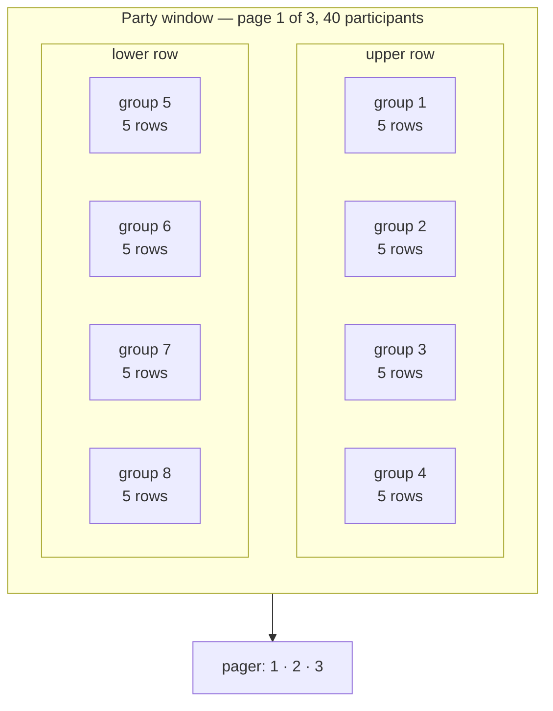
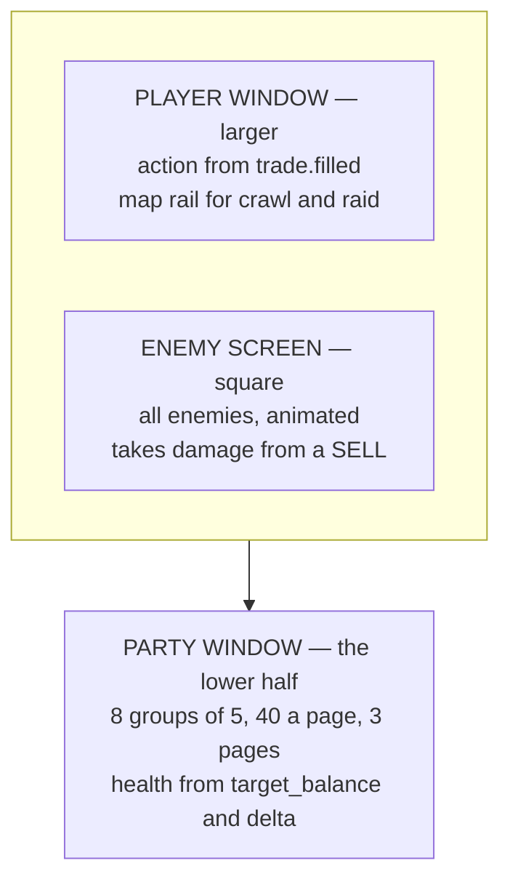

# The Proof of Accumulation tab — the design filled out

Reference. This document answers the six questions issue #147 leaves open. It
proposes no code and changes no file. The operator rules on it.

## How to read the marks

Every block carries one of three marks. Nothing in this document mixes them.

```
HIS        his own words, from the issue
MEASURED   read out of the code, with the file named
MINE       my proposal, for him to accept or refuse
```

A **MINE** block is a proposal and nothing more. Where a question is his, it
appears in [The six choices](#the-six-choices) at the end, with one
recommendation each.

---

## 1. The class array

### The hermetic vocabulary the platform already carries

**MEASURED.** Two hermetic axes already have owners, and neither is free for a
class name.

The five trophy tiers hold the four-colour alchemical path. Each drawing letters
its own stage across the face, and the epigraph runs around the ring.

`src/competition/trophy_generator.py` — `generate_trophy`'s stage map

```python
    stages = {
        "Harvest": "NIGREDO",
        "Gold Fold": "ALBEDO",
        "Bear Slayer": "CITRINITAS",
        "Grand Accumulator": "RUBEDO",
        "Ekthelius": "UNIO MYSTICA",
```

The price record holds the tablet. The historical price store is the Stone
Tablets, and a second tablet tree holds the Portfolio Battery's history.

`src/trading/stone_tablets/ra_paths.py` — the two roots

```python
_RA_ROOT: Path = Path.home() / ".acervator_ra_tablets"

RA_STONE_TABLETS_DIR: Path = _RA_ROOT
```

### The axis this array uses

**MEASURED.** Nothing in the tree uses the seven classical planets or their
metals. A search of every Python file under `src/` for the seven planet names
returns five hits, and not one of them is Acervator vocabulary: three name the
JUP token, two name Cardano's consensus in an asset description.

```
$ grep -rniE "\b(mercury|saturn|jupiter|venus|mars|azoth|ouroboros|trismegistus)\b" src/ --include=*.py
src/exchange/chart_data.py:67:    "JUP": "jupiter-exchange-solana",
src/exchange/crypto_assets.py:162: ... "using the Ouroboros Proof of Stake "
src/exchange/crypto_assets.py:168: consensus="Ouroboros Proof of Stake",
src/exchange/crypto_assets.py:457:        "Jupiter",
src/exchange/crypto_assets.py:458:        "jupiter-exchange-solana",
```

### The three roles, from the three principles

**MINE**, on a published source. Paracelsus set three principles, and his own
words give them bodies. The material reading of each one admits no argument, so
each maps onto exactly one role.

```
PROPOSED — the role names

Salt      "Salt is the body"      the solid, permanent element  ->  Tank
Sulphur   "Sulphur is the soul"   the combustible element       ->  Damage
Mercury   "Mercury is the spirit" the fluid and changeable one  ->  Healer
```

Paracelsus carried the same three into medicine. Disease is an imbalance among
the three, and healing restores their harmony. The tradition therefore states the
healer's job itself, which is why Mercury takes that role rather than a looser
fit.

### The array

**MINE.** Seven classes, one per classical planet. Two things decide the role:
the planet's quality as Ptolemy states it, and what the metal does in the hand.

```
PROPOSED — the seven classes

role            class                  planet / metal
------------    -------------------    --------------------
Salt   (Tank)   Lead Ward              Saturn  / lead
Salt   (Tank)   Tin Bulwark            Jupiter / tin
Sulphur (Dmg)   Iron Edge              Mars    / iron
Sulphur (Dmg)   Solar Lance            Sol     / gold
Mercury (Heal)  Copper Conduit         Venus   / copper
Mercury (Heal)  Silver Mirror          Luna    / silver
Mercury (Heal)  Quicksilver Draught    Mercury / quicksilver
```

One line for each name.

| Class | Why that name |
| ----- | ------------- |
| Lead Ward | Saturn's quality is “chiefly to cool”; lead is the heaviest of the seven and the metal people hide behind |
| Tin Bulwark | Jupiter is a “temperate active force”; tin is the coat that keeps iron from rusting, so it guards another metal |
| Iron Edge | Mars is “chiefly to dry and to burn”; iron is the weapon metal |
| Solar Lance | The Sun is “heating and … drying”; gold cannot corrode, so the strike never blunts |
| Copper Conduit | Venus “chiefly humidifies” and counts as a beneficent planet; copper conducts, so one heal passes along a chain |
| Silver Mirror | The Moon's “power consists of humidifying”, and it shines by reflection; silver reflects |
| Quicksilver Draught | Mercury is “of common influence, productive either of good or evil” and “absorptive of moisture”; quicksilver is the only liquid metal |

Two Tanks, two Damage and three Healers.

### Why these names sit beside the existing ones

**MINE.** Three reasons these names fit the tree's own vocabulary.

The shape matches. Stone Tablets pairs a concrete noun with a plain noun. Every
class name here does the same, and so do the five tier names — Harvest, Gold
Fold, Bear Slayer, Grand Accumulator, Ekthelius.

The register matches. No Latin reaches the screen. The Latin stays where it
already sits, on the trophy faces.

No class shares a stem with a tier. Gold Fold is a tier name, so the Sun's class
takes the planet's adjective instead of its metal. That is the only place a metal
steps aside, and collision is the reason, not taste.

### How the array serves independent levelling

**HIS.** From the 2026-09-07 brainstorm:

> each class levels independently … XP gained per action during a PoA event,
> with bonuses for efficacy and accuracy … no limit on how many classes a
> participant uses, but focus yields more power

**MINE.** Three properties of this array serve that, and none of them needs a
tuning number.

Seven closes the set. The classical planets have numbered seven since antiquity,
so the tradition fixes the breadth ceiling. The array never needs extending, and
nobody has to invent an arbitrary eighth name.

Covering all three roles costs at least three classes, because the roles split
two, two and three. Spreading therefore costs something before any curve touches
it.

Efficacy and accuracy are separate numbers the platform already computes, and
they come from separate fields. Section 2 names them. Repeating one kind of
action cannot farm a bonus drawn from two independent readings.

---

## 2. The trading profile as RPG metrics

**HIS.** From the 2026-09-09 tab layout:

> Players can be attacked. They do not lose money. Everything from the trading
> profile is converted or abstracted into RPG metrics. Players hold health pools
> based on character class, gear and level, following classic RPG structures.

### What the platform measures today

**MEASURED.** Five files hold every number this conversion needs.

`src/trading/container/config.py` — `BotStats`, the per-bot runtime figures

```python
    realised_pnl: float = 0.0
    unrealised_pnl: float = 0.0
    total_scrummed_usd: float = 0.0
    total_folded_usd: float = 0.0
    ytd_scrummed_usd: float = 0.0
    ytd_folded_usd: float = 0.0
    verify_clean: int = 0
    verify_adjusted: int = 0
    verify_canceled: int = 0
    verify_samples: int = 0
    consecutive_errors: int = 0
    total_errors: int = 0
    realized_pnl_exchange: float = 0.0  # FIFO-matched realized P/L
    avg_entry_exchange: float = 0.0  # weighted-avg cost basis
    cost_basis_total_exchange: float = 0.0  # qty x avg_entry
    cash_balance_usd: float = 0.0
    standing_surplus_usd: float = 0.0
```

`src/trading/gate_chain.py` — `GateContext`, the distance from the dollar line

```python
    delta: float  # current_value - target_balance
    delta_pct: float  # |delta| / target_balance × 100
```

`src/trading/scrumming/snapshots.py` — `_compounding_snapshot`, the target and
how far it has grown

```python
            snap["target_balance"] = round(target, 6)
            snap["anchor_target_balance"] = round(anchor, 6)
            # Positive => target has grown above anchor via compounding.
            snap["accrued_growth_usd"] = round(target - anchor, 6)
            snap["max_target_growth_pct"] = growth_pct
            snap["cycle_growth_budget_usd"] = round(anchor * growth_pct / 100.0, 6)
```

`src/trading/trade_grader.py` — `TradeGrade`, four sub-scores per trade, each in
the range nought to one

```python
    execution_score: Optional[float]
    timing_score: Optional[float]
    strategic_score: Optional[float]
    outcome_score: Optional[float]
    overall: str
    overall_numeric: float
    execution_bps: Optional[float] = None
    mfe_pct: Optional[float] = None
    mae_pct: Optional[float] = None
    sb_improvement: Optional[float] = None
```

`src/trading/indicators/types.py` — `VotingSummary`, the consensus of twelve
voters

```python
    bullish_count: int = 0
    bearish_count: int = 0
    neutral_count: int = 0
    net_score: float = 0.0  # Positive = bullish consensus
    consensus_confidence: float = 0.0  # 0.0 - 1.0
```

That twelve comes from a measurement, not from recall. Running the real module
reports it.

```
$ python -c "from src.trading.ta_engine import DEFAULT_WEIGHTS; print(len(DEFAULT_WEIGHTS))"
12
```

### The conversion

**MINE**, from the fields above. The health pool comes from the dollar target the
whole engine defends, not from profit and loss. That satisfies his rule directly:
a player below the line carries a wound, and a player loses no money by sitting
below it.

```
PROPOSED — health, from the target and the distance from it

maximum health          target_balance
base health             anchor_target_balance
health from levelling   accrued_growth_usd      (target minus anchor)
gain cap per level      cycle_growth_budget_usd, max_target_growth_pct
current health          target_balance + delta
wound depth, percent    delta_pct
```

The target grows as folds land, capped per cycle. The pool therefore already
rises through play and already has a ceiling on how fast. That is a levelling
curve the engine computes today.

```
PROPOSED — the rest of the conversion

damage dealt          ytd_scrummed_usd, and the fill's usd on a SELL
healing done          ytd_folded_usd, and the fill's usd on a BUY
heal pending          fold_count, fold_total_usd
accuracy              execution_score, with execution_bps as the reading
efficacy              timing_score, outcome_score, strategic_score
overall grade         overall_numeric, and overall as the letter
critical hit          consensus_confidence at or above a threshold
fumble                verify_adjusted, verify_canceled, consecutive_errors
resource pool         standing_surplus_usd, cash_balance_usd
what stopped a hit    ChainResult.blocked, the nineteen gate labels
```

Scrum is damage and fold is healing. That is not a convenience. His award rule is
most damage done or most healed, and the two halves of the cycle are the two
award axes, so the game's scoreboard and the platform's scoreboard carry one
number each.

### What the design wants and the code does not carry

**MEASURED.** Seven things the design needs have no field anywhere in `src/`.
Saying so is the honest answer. Assuming a field is not.

```
absent — no field under src/ holds any of these

experience points      a level        a character class
gear, or any item      an enemy       a threat or aggro value
a guild
```

The search can report. The same case-insensitive pattern that returns nothing for
experience points and gear returns nine hits for the word inventory and two for
NFT, so the pattern is not blind.

```
$ grep -rniE "\b(xp|experience|char_level|player_level|gear|loot|inventory)\b" src/ --include=*.py
  9 matches, every one the word "inventory" in another meaning
$ grep -rniE "\bnft\b|\bloot\b" src/ --include=*.py
  2 matches, neither a loot field
```

Trophies are the one exception, and they are awards rather than gear. Five
drawings exist, one per tier, picked by name.

`src/competition/season_schedule.py` — the tier key the drawings use

```python
TIER_BY_NAME = {t.name: t for t in RARITY_TIERS}
```

Class, level and gear are therefore new state. The design should not pretend
otherwise. They belong in one new record per participant, and nothing in the
trading profile should stand in for them.

---

## 3. Trade action to RPG action

### The three events that fire after every fill

**MEASURED.** Three bus topics fire together on every filled scrum and every
filled fold. Between them they carry the damage, the accuracy, the critical
reading and the gate verdict, so one subscriber can drive the whole screen.

`src/trading/scrumming/execution.py` — the fold path, the three calls in order

```python
            self._bus.emit(
                "trade.filled",
                bot_id=self.bot_id,
                data={
                    "type": _fold_label,
                    "side": "BUY",
                    "amount": fill_amount,
                    "price": fill_price,
                    "usd": fill_amount * fill_price,
                    "profit": _growth_applied,
                    "operator_initiated": _operator_initiated,
                },
            )
            self._emit_voting_panel_snapshot_at_fire(
                side="BUY", trade_action=str(_fold_label or "MANUAL_FOLD")
            )
            self._emit_gate_decision_at_fire(
                side="BUY", trade_action=str(_fold_label or "MANUAL_FOLD")
            )
```

The gate emitter carries the health numbers as well as the blockers. Its payload
includes both snapshots.

`src/trading/scrumming/snapshots.py` — `_emit_gate_decision_at_fire`

```python
                scrum_blockers=list(self._last_gate_state.get("scrum_blockers") or []),
                fold_blockers=list(self._last_gate_state.get("fold_blockers") or []),
                tranche_snapshot=self._tranche_snapshot(),
                compounding_snapshot=self._compounding_snapshot(),
```

### The action table

**MEASURED.** The trade vocabulary is a declared tuple of ten, read off the emit
sites.

`src/core/emit_contracts.py` — `TRADE_TYPES`

```python
TRADE_TYPES: tuple[str, ...] = (
    "SCRUM",
    "FOLD",
    "CARTRIDGE_SCRUM",
    "CARTRIDGE_FOLD",
    "ENTRY",
    "HEDGE",
    "DIST",
    "AUTO_DETONATION",
    "SELF_DESTRUCT",
    "MANUAL_TRANCHE_FOLD",
)
```

**MINE.** One on-screen action for each, triggered by the type field of a
`trade.filled` event.

| Trade type | Side | What the Player window would show |
| ---------- | ---- | --------------------------------- |
| SCRUM | SELL | A strike on the enemy, sized by the fill's dollars |
| FOLD | BUY | A heal on the player, sized by the fill's dollars |
| CARTRIDGE_SCRUM | SELL | A strike from a loaded magazine, one of a queued set |
| CARTRIDGE_FOLD | BUY | A heal from a loaded magazine |
| ENTRY | BUY | The player steps onto the field |
| HEDGE | either | A ward goes up; no damage and no heal |
| DIST | SELL | A strike that takes no loot; the surplus leaves the field |
| AUTO_DETONATION | SELL | A finishing blow; the excess rides in the profit field |
| SELF_DESTRUCT | SELL | The player leaves the field |
| MANUAL_TRANCHE_FOLD | BUY | A heal the operator casts by hand; the operator-initiated flag is true |

Three further on-screen events come from the other two topics.

```
PROPOSED — actions that are not a fill

a critical hit       consensus_confidence, off bot.voting_panel_snapshot
a blocked swing      a gate name in scrum_blockers or fold_blockers
a healed wound       delta rising toward nought across two gate events
```

### Three gaps in this seam

**MEASURED.** The live trading path does not reach the competition engine today,
and a builder needs to know exactly where it stops.

Nothing outside the package calls the engine's recording method. Two callers
exist, both inside one demo run.

```
$ grep -rn "record_trade" src/ tests/ main.py --include=*.py
src/competition/competition_engine.py:161:    def record_trade(
src/competition/local_testnet.py:735:                    engine.record_trade(
src/competition/local_testnet.py:743:                    engine.record_trade(
src/trading/analytics_engine.py:90:    def record_trade(self, trade: TradeRecord)
src/core/version_sweep.py:1433: a regex naming the method, not a call
```

The same search over a name in wide use returns fourteen references, so it
reports when there is something to report.

```
$ grep -rn "TokenLedger" src/ tests/ --include=*.py | wc -l
14
```

The two vocabularies differ in size. The competition record takes four role
values; the bus carries ten trade types. An adapter has to map ten onto four, or
the four have to widen.

`src/competition/bot_identity.py` — `TradeRecord`'s role field

```python
    role: str  # "SCRUM" | "FOLD" | "HEDGE" | "INIT"
```

Four different classes answer to the name `TradeRecord`. Whichever file the
adapter lands in, it must say which one it means.

```
$ grep -rn "^class TradeRecord" src/ --include=*.py
src/competition/bot_identity.py:43
src/trading/analytics_engine.py:20
src/trading/live_monitor.py:20
src/trading/trade_grader.py:19
```

The platform emits one of the three fill-time topics without declaring it. Six
topics carry a contract; the voting snapshot is not among them, so nothing pins
its payload shape.

```
$ python -c "from src.core.emit_contracts import CONTRACTS; print([c.topic for c in CONTRACTS])"
['trade.filled', 'bot.gate_decision', 'pnl.event', 'ta.voting',
 'market_inspector.scan_started', 'market_inspector.scan_finished']
```

---

## 4. One hundred and twenty participants, legible

**HIS.** From the 2026-09-09 tab layout:

> It must sharply display up to 120 participants for the largest events, through
> a multi-page structure of 40 per page.

### What large rosters already do

Forty is not an arbitrary page size. Forty is the standard raid roster, and the
standard arrangement inside it is eight groups of five. Guides written for players
state the structure plainly: design the interface around forty frames in eight
groups.

Two rules come out of the same guides. Colour by role or class, because colour
carries awareness across a large field at a glance. And scale the tile down as
the count climbs, so every tile stays on screen rather than crowding the action.

### The arrangement

**MINE.** The page size is his. The arrangement inside it follows the standard,
because the standard already suits exactly this count.



Three pages of forty cover his one hundred and twenty. Each page is one raid's
worth, so a page boundary falls where a real group boundary already falls.

One advantage is worth spending deliberately. His Party window is the lower half
of the tab, not a corner of an action view. Each tile therefore gets far more room
than a game's raid frame gets. That room goes into the health bar, not into extra
fields.

### What a row shows, and what drops

**MINE.** Four things survive at every density, ranked. The list is short on
purpose.

```
PROPOSED — what a participant row always carries

1  health bar       the one element that never shrinks
2  role colour      Salt, Sulphur or Mercury, as the fill colour
3  name             truncated, never wrapped
4  one mark slot    the single most urgent state, and nothing else
```

As the count climbs from six to forty, four things drop, in this order.

```
PROPOSED — the drop order

dropped first   the resource bar
then            the numeric health beside the bar
then            the class sigil, leaving only the role colour
last            the second mark slot
```

The health bar is never one of them. A roster that cannot report health has
stopped being a roster.

---

## 5. The Player window's two jobs

**HIS.** From the 2026-09-09 tab layout:

> Players appear taking actions as individuals or groups. This area also
> displays the dungeon maps for the crawl and raid event types. Pixel art, and
> larger than the enemy screen, because it has to show trading action translated
> to RPG action.

### What the two jobs need

**MINE.** The answer turns on the dungeon's shape, not on the layout. Two
precedents show why.

A linear dungeon needs only a small map. Darkest Dungeon keeps its map in one
corner of the action view, and it can, because every corridor joins exactly two
rooms, has no corners, and every room matches every other in size. A map of that
shape stays readable at a small size.

A free-form dungeon needs a large map. Etrian Odyssey gave the map its own screen
so the player could map and act at once. Single-screen games of that kind make
the player toggle instead, and the commentary on those games agrees: raising the
map, reading it and lowering it is the worse experience.

Two of his four modes need no map at all. Monster Smash, individual and team, is
an arena. Only the Dungeon Crawl and the Raid carry a map.

### The answer

**MINE.** One zone can do both jobs, on one condition.

```
PROPOSED — the Player window, two modes in one zone

Monster Smash, 1a and 1b     all action, no map rail
Dungeon Crawl and Raid       action at full size, map as an inset rail
the condition                the generative dungeon is a linear room graph
```

The map rail sits along one edge and shows the room chain, the party's position
and which rooms the party has cleared. It never needs to be large, for the same
reason Darkest Dungeon's does not.

**If he wants a free-form dungeon instead, one zone cannot do both**, and saying
otherwise would be wrong. The alternative is a map mode that takes the whole
Player window, with the action reduced to a single banner line while the map is
up. That mode is the worse of the two, because the player loses the action view at
the exact moment of a move. That is the trade, stated plainly, and the dungeon's
shape is the decision that settles it.

### The three zones as one picture

**HIS** for the arrangement, **MINE** for the labels on the data.



---

## 6. Fees, and the value they hold

**HIS.** The 2026-09-09 economics directive, in his words:

> PoA - Guilds, Groups, and Events should have affordable but participant fee
> structures. No gate should be locked behind a pay wall. The intent for these is
> to inject and lock value within the PoA network. All funds are held, staked, or
> traded via Acervator, LLC to further fund development.

Two of his earlier rules bind this one. Tokens only ever yield from these
tournaments and from other player-based PoA actions, and that is the whole
supply. Guild formation requires holding tokens, and membership locks and stakes
them by guild rank.

### Custody

**HIS.** All funds are held, staked or traded via Acervator, LLC, to further fund
development. This design names no custody mechanism of its own and proposes none.

### The four fees

**MINE**, inside his rules. Every fee here buys a larger pot. No fee buys a door.

| Fee | When | Inject or lock |
| --- | ---- | -------------- |
| Guild charter | once, at guild formation | **inject** |
| Guild rank stake — **HIS**, already specified | stays with the rank for as long as the member holds it | **lock** |
| Group stake | from each member of a group of six or fewer, into that group's pot | **lock** |
| Event pot contribution | from any entrant who chooses to, into the event's pot | **inject** or **lock**, by currency |

Each one in a line. A charter fee brings new value in from outside, so it
injects. A rank stake keeps tokens still for as long as the member keeps the
rank, so it locks. A group stake keeps tokens still for the length of one
dungeon, so it locks. An event contribution does whichever its currency does.

**This design refuses one thing outright.** No season pass, no paid class, no
paid loot tier, no paid event and no paid mode. Each of those is a door, and his
directive forbids a door.

### What a participant who pays nothing reaches

**MINE.** This is the test the directive sets, and the answer has to be thick
rather than thin. It is.

```
PROPOSED — the free path, in full

every class            all seven, with no charge of any kind
every XP rate          the same per-action rate and the same bonuses
Monster Smash 1a       the individual arena, entirely
Dungeon Crawl 2a       the individual crawl, every floor and every boss
every loot roll        the same dice, the same rarity scale
all five token tiers   Harvest to Ekthelius, on rank in the field
a share of every pot   including the part other entrants paid in
```

Rank within the field decides the tier, and nothing else does. The code says so.

`src/competition/season_schedule.py` — `classify_tier`, the whole decision

```python
    if perfect and rank_pct <= 0.001:
        return TIER_BY_NAME["Ekthelius"]
    if rank_pct <= 0.01 and consecutive_top1 >= 3:
        return TIER_BY_NAME["Grand Accumulator"]
    if market_regime == "BEAR" and rank_pct <= 0.25:
        return TIER_BY_NAME["Bear Slayer"]
    if rank_pct <= 0.10:
        return TIER_BY_NAME["Gold Fold"]
    if rank_pct <= 0.50:
        return TIER_BY_NAME["Harvest"]
```

### Play earns the team modes

**MINE**, derived from his two rules read together. Team-based Monster Smash and
the Raid both require a guild, and a guild requires holding tokens. That looks
like a gate, and it is a gate — an earned one, never a paid one.

```
the path to a raid, with no money spent at any step

play 1a or 2a free  ->  place in the field  ->  take a token award
                    ->  hold tokens         ->  form or join a guild
                    ->  raid
```

Nobody can buy a token. Tokens only ever yield from tournaments and player PoA
actions, so nothing on that path is purchasable, and the directive holds.

**One constraint follows, and it carries weight.** No fee may take a currency the
network itself will trade for PoA tokens. The moment it can, the earned gate above
turns into a paid one, and the directive breaks without a single rule being
rewritten.

### The ledger cannot take a fee today

**MEASURED.** A fee needs a debit, and there is no debit. The token ledger has one
write path and it only mints.

```
$ grep -rniE "\bdef (transfer|burn|debit|spend|stake|escrow|fee|charge|deduct)" src/competition/*.py
  no matches
```

The stake field exists and nothing settles it. The challenge record declares
tokens at risk from each bot, and the rating registry that closes a challenge
moves no tokens at all — it updates ratings and appends a history row.

`src/competition/challenge_protocol.py` — the declared stake

```python
    stake_acrv: int  # ACRV tokens at risk from each bot
```

On the chain side the cap never moves, and nothing destroys a token. A fee can
therefore only sit at an address. It can never burn.

`contracts/ACRV.sol` — the cap and the mint guard

```solidity
//   • Tokens can never be burned — supply monotonically increases
    uint256 public constant MAX_SUPPLY = 10_000_000 * 10**18;  // 10M ACRV
    modifier onlyRegistry() {
```

Whoever builds the fee structure builds the debit path with it. Locking means
keeping tokens at an address they cannot leave for a term, because burning is not
available and never will be.

---

## The six choices

Six questions are his. Each carries one recommendation and the cost of the
alternative.

### Choice 1 — how many classes

| Option | What it gives | What it costs |
| ------ | ------------- | ------------- |
| **Seven**, the planetary set | A closed array that never needs an eighth name; roles split two, two and three | Uneven roles, with one more Healer than Tank or Damage |
| Nine, three per role | Symmetry, and a third option inside every role | Two names from outside the planetary set, so the array is no longer closed |

**Recommended: seven.** The tradition closed the set at seven. Nine opens a set,
and then someone has to defend it against a tenth.

### Choice 2 — who is a participant

| Option | What it gives | What it costs |
| ------ | ------------- | ------------- |
| **One bot, one participant** | Matches the code: one key per identity, one registration per bot, capital committed per bot | An operator with many bots fields many participants at once |
| One instance, one participant | One person, one character, which reads more naturally | Something has to sum the engine's per-bot registrations, and the health field has no single source |

**Recommended: one bot, one participant.** The engine already does this.

`src/competition/competition_engine.py` — `BotRegistration`

```python
    bot_id: str
    config_hash: str  # SHA-256 of strategy config — proves consistency
    capital_usd: float
```

### Choice 3 — where health comes from

| Option | What it gives | What it costs |
| ------ | ------------- | ------------- |
| **The dollar target** | Health rises through play and has a per-cycle cap already; below the line is a wound, never a loss | Two players on different targets have different pools |
| Cost basis at the venue | One exchange-truth number per player | It moves with every fill, so the pool would never hold still |

**Recommended: the dollar target.** It satisfies his never-lose-money rule with
no further work.

### Choice 4 — the dungeon's shape

| Option | What it gives | What it costs |
| ------ | ------------- | ------------- |
| **A linear room graph** | One zone carries the action at full size and the map as a small rail | Dungeons are chains of rooms, not mazes |
| A free-form grid | Richer exploration and real navigation | The map needs the whole Player window, and the action shrinks to a banner while the map is up |

**Recommended: the linear room graph.** Only this shape lets the Player window do
both jobs at once.

### Choice 5 — the currency of each fee

| Option | What it gives | What it costs |
| ------ | ------------- | ------------- |
| **External for the charter, tokens for every stake** | The charter injects new value; the stakes lock existing value, which is what staking means | Two currencies in one fee table |
| Tokens for all four | Every fee locks, and the supply tightens fastest | A new guild pays tokens twice, because forming one already requires holding them |
| External for all four | Every fee injects, and no token leaves circulation | Nothing locks, and locking is half of what he asked the fees to do |

**Recommended: external for the charter, tokens for every stake.** This split is
the only one that does both jobs he named, and it does not charge a new guild
twice for one act.

### Choice 6 — what a fee may never take

| Option | What it gives | What it costs |
| ------ | ------------- | ------------- |
| **No in-network exchange into tokens** | The earned path to a raid stays earned | No token market inside the platform |
| An in-network token market | Liquidity, and a price | Tokens turn purchasable, so every earned gate turns into a paid one |

**Recommended: no in-network exchange into tokens.** This constraint alone keeps
his no-pay-wall rule true.

---

## What this document does not answer

Three things sit outside this research. This section names each one rather than
guessing it.

The loot itself. His brainstorm says loot drops from authenticated exchange
markets and carries functions, bonuses and rarity scales. The rarity scale he
already has is the five award tiers; a loot rarity scale is a separate thing, and
this document does not design it.

The manipulation protection on the Exchange Participation Layer. He names it and
does not describe it, and nothing in the package implements it.

The art. Pixel art at forty tiles a page, animated enemies and a map rail make an
art brief, not a design one.

---

## Sources

The hermetic research rests on four published sources. Each citation sits beside
the claim it carries.

| Source | What it settled |
| ------ | --------------- |
| [Ptolemy, *Tetrabiblos*, Book I ch. 4 and 5](https://astrolibrary.org/library/tetrabiblos/tetrabiblos-6/) | The quality of each of the seven planets, and which ones count as beneficent |
| [Paracelsus, the *tria prima*](https://en.wikiquote.org/wiki/Tria_prima) | Salt as body, sulphur as soul, mercury as spirit, and their material properties |
| [The seven metals and their planets](https://www.astroak.com/en/blog/the-seven-metals-alchemy-and-the-planets) | Which metal belongs to which planet |
| [The Emerald Tablet](https://www.britannica.com/topic/Emerald-Tablet) | Solve et coagula, already lettered on the trophies |

The roster and map research rests on two.

| Source | What it settled |
| ------ | --------------- |
| [Advanced raid interface guide](https://www.icy-veins.com/wow/advanced-raid-ui-setup-guide) | Forty frames in eight groups of five; colour for awareness; scale down as the count climbs |
| [Mapping in dungeon crawlers](https://www.neogaf.com/threads/mapping-in-dungeon-crawlers.1097187/) | A map on its own screen beats a map the player raises and lowers |

Issue #147 carries the build-out.
