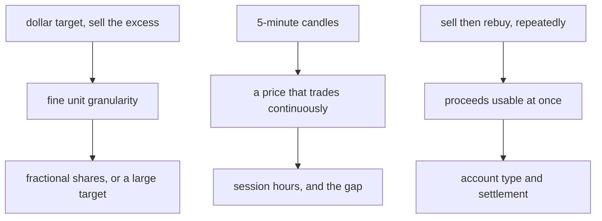

# Does the accumulation cycle work on equities

Reference, for issue #571, Stocks Mode. Nothing here changes behaviour. No
product file, test or contract moved.

Raw captured sources, carrying every URL and every source date, sit in
`artifacts/571-equity-research/`. The repository ignores that directory, because
captured output may not sit in `docs/`.

## The verdict

**The cycle works on equities, and only above three gates.** An account type, a
funding floor per bot, and a broker that fills fractional orders at the time of
the order. Clear the three and the cycle runs legally and mechanically. Miss one
and it cannot complete a round trip.

```
ACCOUNT   margin-enabled, unleveraged, never short, at least $2,000
FUNDING   per-bot target at least $100 with fractional units at a 1 % interval,
          or at least 50x the share price without them
BROKER    fractional or dollar-denominated orders through the API, filled at
          order time rather than batched at the end of the day
```

The broker already in this tree clears the third gate. Alpaca documents
fractional and notional orders through the API, extended-hours eligibility, a
corporate-actions feed, and five-minute bars by name. Of eleven brokers
surveyed, only Alpaca documents every piece.

Two assumptions this research started from turned out wrong. The day-trading
limit that looked likely to kill the layer no longer exists. Settlement does kill
it, but only in a cash account, and a margin account steps past it.

**The harvest rate will sit below the crypto layer's.** Equity oscillation
measures three to nearly four times smaller than bitcoin's, and the market shuts
for part of the week. Lower fees recover part of that gap, not all. The
opportunity section gives both numbers.

## What the cycle needs from a market

The engine sells the excess above a dollar target when price rises, and buys more
units when price falls. One scrum fires when the move clears the interval, and
the move must also pay the venue fee.

```
src/trading/container/config.py:66    target_balance           $200.00
src/trading/container/config.py:69    scrumming_interval_pct      1.0 %
src/trading/container/config.py:163   trading_fee_pct             0.6 %
src/trading/container/config.py:161   effective deviation = interval + fee
```

Three demands follow, and each one meets a different equity rule.



## The five candidate blockers

### Day-trading limits — REFUTED, FINRA retired the rule

The pattern day trader rule no longer exists. FINRA replaced the day-trade count
and the twenty-five thousand dollar floor with an intraday margin standard.

```
FINRA Regulatory Notice 26-10          April 20, 2026
  "FINRA has adopted new intraday margin standards to replace in their entirety
   the outdated day trading margin requirements"
  replaced: "the day trade count requirements for designating a customer as a
   'pattern day trader' and the $25,000 pattern day trader minimum equity
   requirement"
  effective June 4, 2026.  Firms may phase in until October 20, 2027.

FINRA Rule 4210, rulebook text read 2026-09-10
  the strings "pattern day trader" and "$25,000" do not appear.

Interpretations of Rule 4210, valid from June 4, 2026
  "Minimum Equity - Pattern Day Trader" [4210(b)(4)/025] marked rescinded.

FINRA Regulatory Notice 26-11          May 19, 2026
  "FINRA is deleting all interpretations relating to the former day trading
   margin requirements, which the new intraday margin standards have replaced in
   their entirety."
  18 interpretations deleted, 20 new ones published.
```

What replaces it binds a narrower set of accounts. A deficit arises from a
transaction that reduces what the customer could withdraw while still meeting
maintenance margin. An unmet deficit for five business days freezes the account
for ninety calendar days.

```
FINRA Regulatory Notice 26-10, the 90-day consequence
  "prevent the customer from creating or increasing a short position or debit
   balance (other than by closing a short position) for 90 calendar days"
  de minimis: "the lesser of 5 percent of the equity in the margin account or
   $1,000"

FINRA Rule 4210(b)(4)  "equity of at least $2,000"
```

A long-only account that buys with its own cash creates no debit balance and
holds no short position. The freeze then has nothing to restrict. That reading
comes from the rule text above, and no source states it as a sentence.

The broker in this repository has already made the change and removed the fields.

```
Alpaca, "The Intraday Margin Rule"                     July 7, 2026
  "brokers are no longer required to track 'round-trip' counts or restrict
   accounts that execute more than three day trades in a five-day period"
  "margin-enabled accounts typically require a minimum of $2,000 in equity to
   maintain intraday debits or short positions"

Alpaca changelog, PDT fields removed                   2026-07-06
  Trading API: daytrade_count, daytrading_buying_power, dtbp_check
  Broker API: pattern_day_trader, pdt_check, bod_dtbp, and nine more
  ten endpoints deprecated
```

**One caveat, and a real one.** FINRA lets a firm phase in until October 20,
2027. A broker that has not migrated may still enforce the old count. The named
broker here has migrated. Any other broker needs its own check.

### Settlement — CONFIRMED for a cash account, avoided by a margin account

Settlement runs one business day after the trade. A cash account that sells,
rebuys, and sells again inside that day commits a good-faith violation on every
pass.

```
SEC Rule 15c6-1(a), as amended                         effective May 28, 2024
  standard settlement shortened from T+2 to T+1

Fidelity, "Avoiding Cash Account Trading Violations"   March 24, 2026
  "A good faith violation occurs when you buy a security and sell it before
   paying for the initial purchase in full with settled funds."
  "If you incur three good faith violations in a 12-month period in a cash
   account, your brokerage firm will restrict your account."
  "This restriction will be effective for 90 calendar days."

12 CFR 220.8(c), Regulation T
  "the privilege of delaying payment beyond the trade date shall be withdrawn
   for 90 calendar days following the date of sale of the security"
```

Three violations cost ninety days. The cycle would reach three inside its first
trading session. A margin account removes the constraint, and the broker says so
in its own words.

```
Alpaca, intraday margin rule for non-leverage accounts  2026-04-27
  "Even without using leverage, accounts enabled for margin trading are often
   utilized to avoid the delays associated with T+1 settlement."
```

**This gate decides the layer.** A cash account makes the cycle unworkable. A
margin account, unleveraged, long only, holding two thousand dollars, clears
both settlement and the former day-trade rule.

### Fractional units — CONFIRMED as a precondition, with two escapes

One scrum at the declared defaults moves two to four dollars. One whole share of
a typical listed stock costs more than that, so a whole-share layer cannot sell
its excess at all.

```
one scrum, crypto defaults    200.00 x 1.0 %  = $2.00
one scrum, stocks config      200.00 x 2.0 %  = $4.00
  src/stocks/stock_accumulation_bot.py:55  target_balance  200.0
  src/stocks/stock_accumulation_bot.py:59  interval_pct      2.0

what $4.00 buys
   $10 share   0.400 shares
   $50 share   0.080 shares
  $200 share   0.020 shares
  $500 share   0.008 shares
```

The first escape is a larger target. One scrum equals one whole share once the
target reaches fifty times the share price at a two percent interval, or one
hundred times at one percent.

```
at 2.0 % interval      at 1.0 % interval
   $10 share    $500      $10 share    $1,000
   $50 share  $2,500      $50 share    $5,000
  $200 share $10,000     $200 share   $20,000
  $500 share $25,000     $500 share   $50,000
```

At the two hundred dollar target the live layer uses, only a stock under four
dollars would work on whole shares.

The second escape is fractional units, and it costs far less funding. Alpaca
enforces a one dollar floor on a buy, so the target needs one hundred dollars at
a one percent interval. The live two hundred dollar target already clears it.

```
Alpaca, fractional trading
  "Alpaca enforces a minimum 1 USD notional amount for Buy entry orders"
  "Alpaca currently supports fractional trading for market, limit, stop & stop
   limit orders with a time in force=Day"

target x interval >= $1.00
  at 1.0 %   target >= $100
  at 2.0 %   target >=  $50
```

Fractional units carry restrictions that bear directly on the cycle.

```
FINRA, "Investing in Fractional Shares"                June 26, 2025
  "Some brokerage firms execute fractional share orders in real-time. Others
   aggregate orders" throughout the day, then execute them as whole-share orders
  "You often can't trade fractional shares outside of regular market hours,
   which are from 9:30 a.m. to 4 p.m. ET."
  "At the moment, you can't transfer fractional shares to another brokerage
   firm."
```

An aggregated fill lands at a price the engine never chose. The whole cycle rests
on selling the excess at a known price, so a batched fractional order breaks the
arithmetic rather than slowing it. **A broker that batches fractional orders
cannot host this cycle.** Real-time fractional execution belongs in the gate
list, not in a wish list.

The reporting plumbing does not carry fractions yet, which affects a regulator's
record rather than the fill.

```
FINRA examination report, fractional shares            2023
  "the FINRA Facilities do not currently support the entry of fractional share
   quantities, and trades with a fractional share component must be reported as
   a whole number quantity."
  a trade of 100.5 shares reports as 100; a trade of 0.5 shares reports as 1
```

### Market hours and the gap — CONFIRMED today, shrinking in December

The regular session runs six and a half hours. Extended sessions add twelve
more, at a fraction of the liquidity.

```
sessions, weekdays, Eastern Time
  pre-market    4:00 AM to  9:30 AM
  regular       9:30 AM to  4:00 PM
  post-market   4:00 PM to  8:00 PM

NYSE Data Insights, "The early bird gets the worm"     February 10, 2025
  "As of January 2025, extended hours trading accounted for over 11% of all US
   equity trading"

NYSE Data Insights, "Night Moves", data for 2025
  "Overnight trading remains a very small share of the overall market, not quite
   reaching 0.11% of total volume and 0.15% of notional thus far in 2025."
  "volume-weighted spreads are 28 basis points versus 20 during core hours"
  spreads widen to 89 basis points once thinly-traded names are included
```

A forty-basis-point spread penalty against a one percent interval consumes forty
percent of one scrum. Overnight trading costs more than it harvests.

The regulator names six hazards a firm must disclose for these sessions, and the
first and the last both hit the cycle.

```
FINRA Rule 2265, effective March 27, 2009
  "Risk of Lower Liquidity"     "your order may only be partially executed, or
                                 not at all"
  "Risk of Higher Volatility"
  "Risk of Changing Prices"
  "Risk of Unlinked Markets"
  "Risk of News Announcements"
  "Risk of Wider Spreads"
```

**The closed market stands as the engine's largest gap against crypto, and it
narrows in December.** Four venues hold approval for a near-continuous week and
share one target date.

```
24X National Exchange     4am to 8pm today; full overnight target  Dec 6, 2026
Nasdaq Night Session      8pm to 4am, SEC order April 10, 2026;    Dec 6, 2026
NYSE Arca 22-hour         approved February 2025;                  Dec 6, 2026
Cboe EDGX near-24x5       filed March 31, 2026, approved;          Dec 6, 2026
Blue Ocean ATS            8pm to 4am since 2021, a dark ATS, live now
```

On the date of this note, no lit US exchange runs a full overnight session. From
December the week loses the overnight hole and keeps the weekend one.

### Corporate actions — CONFIRMED as a hazard, with ten days of warning

The engine tracks units held. A split changes that number with no trade, so an
engine blind to the action holds a wrong count and prices its target against it.

```
FINRA Rule 6490, with Regulatory Notice 10-38
  issuers give notice of a dividend, a distribution, a stock split, a reverse
  split, or a rights offering
  notice due "no later than 10 calendar days prior to the record date of the
  corporate action"
  FINRA publishes the Daily List, sets the ex-date, and adjusts the trading
  price where applicable
```

Ten days of advance warning exists, and this platform reads none of it. The
broker does publish the record, and it adjusts the position.

```
Alpaca corporate actions API
  /v1/corporate_actions/announcements family; splits carry old_rate and new_rate
  history back to April 2020
  ingested "typically before market open on the trading day following the
   declaration date"
  "the quantity that a user owns in a stock will be affected and updated
   according to the SPLIT ratio"
  UNSOURCED: the timing of that position adjustment against the ex-date.
```

A split reaching the engine as a silent quantity change would look like a
reconciliation break against the broker. The platform's own rule makes the venue
the authority, so the repair reads the broker's corporate-action record and
accepts its adjusted quantity.

## What a gap does to the cycle

A gap means price opens past a level with no chance to trade at it. The engine
places its scrum at a level. When the open sits above that level, the scrum fills
at the open, and the excess sold exceeds what the engine computed.

Gap folklore does not survive a measurement. The one peer-reviewed study in this
set refutes the idea that gaps reliably close.

```
"Price Gaps and Volatility: Do Weekend Gaps Tend to Close?"
International Journal of Financial Studies, 2025, 18(3):132
sample: 205 weekend gaps in the DJIA, 270 in NASDAQ, 406 in the DAX, 2013-2023
  "no strong, universal bias towards closing gaps at shorter distances"
  "larger gap sizes correlate with elevated volatility"
FACT. Sample and method stated. Full text returned 403; read from the abstract.
```

Fill probability does fall as the gap grows, across independent measured sources.

```
FACT   small gaps fill 33.7 %; gaps of 2 % or more fill 14.6 %
       n = 15,023 instances, 49 large-cap Japanese stocks, two-year sample
       self-published, not peer-reviewed, sample and method stated
CLAIM  "80% of upward gaps of less than 2% fill within the day", 12.1 % at 2 %
       or more, 30 DJIA stocks, method not disclosed
CLAIM  the four-type gap taxonomy with 90 / 35 / 45 / 75 per cent fill rates
CLAIM  gap and go. No measured win rate appears in any source reached.
CLAIM  the opening range, and Crabel's 68 % figure. Primary source unreachable.
```

Overnight and intraday returns also behave as separate regimes that can cancel.

```
Lou, Polk and Skouras, "A Tug of War: Overnight Versus Intraday Expected
Returns", Journal of Financial Economics, 2019, 134(1):192-213
  intraday winner-minus-loser decile: three-factor intraday alpha 2.41 % a
  month (t = 7.70), three-factor overnight alpha -1.77 % a month (t = -7.89)
FACT.
```

**For this cycle a gap acts as a fill hazard, not an opportunity.** The direction
a gap later takes carries no measured reliability. The harm has a real bound: the
engine sells or buys more than it intended, at a price it did not choose. The operator named gap trades as a distinct equity opportunity, and the
structural half of that is correct. No source reached here establishes the
tradeable half.

## The opportunity side

### What a cycle could exploit

**Lower fees, and this one is large.** The declared crypto fee runs six tenths of
one percent. The regulatory cost of an equity sale runs two thousandths of one
percent, and commission at a retail broker runs zero.

```
SEC Section 31 fee rate advisory, fiscal year 2026     February 27, 2026
  "$20.60 per million dollars", "starting on April 4, 2026", on "covered sales"

FINRA By-Laws Schedule A Section 1                     effective Jan 1, 2024
  "$0.000166 per share for each sale of a covered equity security, with a
   maximum charge of $8.30 per trade"

one $4.00 sale
  Section 31   4.00 x 20.60 / 1,000,000      = $0.0000824
  FINRA TAF    0.020 shares x 0.000166       = $0.0000033
  total                                      = 0.00214 % of the sale

effective move a cycle must clear, from config.py:161
  crypto   1.0 % + 0.600 %   = 1.600 %
  equity   1.0 % + 0.002 %   = 1.002 %
```

The equity layer needs a move roughly one and a half times smaller to pay for
itself. That stands as the strongest single argument for the layer.

**Dividends, as a return needing no trade.** A holder collects them whether the
cycle fires or not.

```
S&P 500 dividend yield   1.054 %   August 2026
  gurufocus.com, corroborated at 1.06 % by multpl.com
  CAVEAT: both are aggregators. A primary index-provider page stayed unreachable.
```

One percent a year of free return, against six tenths of a percent of fee on
every crypto trade, counts as a genuine structural advantage. The yield supplies
no harvest and does not scale with volatility, and it accrues.

### What merely exists

Each item below is real and sourced, and none of it feeds a single-asset
oscillation engine.

```
closing auction      one daily batch price, NYSE Rule 7.35B. $55.5bn a day and
                     9.44 % of total notional, NYSE, Q2 2024. A discrete
                     once-a-day match, not oscillation to harvest.

index rebalancing    S&P 500 quarterly, third Friday of March, June, September
                     and December, per the provider's July 2026 methodology.
                     Russell 2000 saw 120x volume on rebalance day. A one-off
                     repricing of a named stock, not a repeating wiggle.

earnings dates       scheduled, and measurable. 4,200 events, 2021-2025, mean
                     post-print implied-volatility drop 38.2 %. The move lands
                     in a session gap, so the engine gets no intermediate fill.
                     A date to sit out, not a source of harvest.

limit up limit down  a pause on an extreme move. Removes tradeable time.

circuit breakers     NYSE Rule 7.12. S&P 500 falls of 7 %, 13 % and 20 %. A
                     downside freeze.

Reg SHO Rule 201     a short-sale price test after a 10 % intraday fall. The
                     cycle never shorts, so this does not bind at all.

tick size            one cent by default, half a cent for tight-spread names
                     since the September 2024 amendment. A price-granularity
                     floor on where a scrum level can sit.

round lots           price-tiered: 100 shares at or below $250, 40 shares to
                     $1,000, 10 shares to $10,000. A display mechanic.
```

**Volatility is the one that cuts against the layer, and it decides the harvest
rate.**

```
Fidelity Digital Assets, "A Closer Look at Bitcoin's Volatility"  May 1, 2024
period: February 2020 to early 2024
  "bitcoin has been three to nearly four times as volatile as various equity
   indices"
  Sharpe ratio 0.96 bitcoin, 0.65 S&P 500
FACT.

Cboe VIX spot   17.72 at 4:18 PM, September 10, 2026
  forward-looking implied volatility on S&P 500 options. A different
  measurement basis from the bitcoin figure above.
```

The engine's revenue tracks realised oscillation directly. Three to four times
less oscillation, against a break-even move one and a half times lower, leaves
the equity layer firing perhaps two to two and a half times less per unit of
time. Fewer trading hours widen that gap until December.

## The same cycle already exists on equities, under an older name

The constant-dollar plan dates to the nineteen-forties. It holds a fixed dollar
amount in a risky sleeve, sells when the value rises above it, and buys when the
value falls below.

```
thismatter.com, "Formula Investment Plans"
  "if the speculative portion falls outside of the range, the portfolio is
   rebalanced to bring the speculative portion back to its original amount"
DIFFERENCE: the classic plan rebalances a risky sleeve against a cash or bond
sleeve, on a periodic cadence, for a buy-and-hold investor. This engine runs one
asset against cash, on five-minute candles, without stopping.
```

The academic account of where that return comes from is the rebalancing premium.

```
Booth and Fama, "Diversification Returns and Asset Contributions",
  Financial Analysts Journal, 1992
Willenbrock, "Diversification Return, Portfolio Rebalancing, and the Commodity
  Return Puzzle", Financial Analysts Journal 67(4), 2011, pp. 42-49
Bouchey, Nemtchinov, Paulsen and Stein, "Volatility Harvesting: Why Does
  Diversifying and Rebalancing Create Portfolio Growth?",
  Journal of Wealth Management 15(2), 2012, pp. 26-35
Pal and Wong, "Volatility Harvesting: Extracting Return from Randomness",
  arXiv 1508.05241, 2015
```

**The dissent matters more than the support, and it names this layer's two risks
exactly.**

```
Chambers, 2014
  the diversification return is "often incorrectly ascribed to a reduction in
  variance", is a mean-reversion effect rather than a free lunch, and does not
  guarantee outperformance in a trending or costly-to-trade market
```

Published evidence supports the mechanism and conditions it on volatility,
imperfect correlation and low cost. Those are the three quantities this note
measures for equities: volatility down by three to four times, cost down by a
factor near three hundred. The literature does not settle the net effect, and
neither does this note.

Three other named strategies overlap and differ.

```
grid trading      fixed range, fixed total position, the same capital cycling
                  between rungs. One paper's own framing: "under simple
                  assumptions, its expected return is essentially zero". Every
                  rigorous backtest reached ran on crypto or foreign exchange.
                  No equity study located.

scaling out       terminal and one-directional. A position winds down toward
                  zero as price rises, with no buy leg. Education material
                  only, and no measured result.

covered calls     the CBOE BXM index sells a succession of one-month at-the-
                  money calls on an S&P 500 position. Callan measured 18 years
                  to August 2006: 11.77 % compound annual against 11.67 % for
                  the index, standard deviation 9.29 % against 13.89 %.
                  Assignment REMOVES shares, which inverts this engine's rule
                  that a completed cycle ends holding more.
```

No documented equity strategy reproduces the single-asset, ever-accumulating,
dollar-target cycle. The constant-dollar plan is the closest name, and the
rebalancing-premium literature is the closest evidence.

## The brokers with an API

Eleven brokers went into the survey. Costs and limits below come from each
broker's own developer documentation where that page answered; a comparison-site
source carries a note in the raw capture. This note recommends no broker.

```
FRACTIONAL ORDERS THROUGH THE API — the gate that eliminates most of them

Alpaca      YES   qty or notional. $1 buy floor. Market, limit, stop and stop
                  limit, time in force day only.
Public.com  YES   quantity or amount, mutually exclusive. No documented floor.
Tastytrade  YES   a Notional Market order type.
Webull      YES   market orders only, quantity above 0 and at or below 1,
                  order value at least $5.
Moomoo      YES at the retail layer: 0.0001 share floor, $5 notional floor,
                  market only. UNSOURCED whether the API call itself accepts it.
E*TRADE     BUY ONLY. "buy or buy to cover" to three decimals, $5 floor,
                  regular hours only. A sell leg does not exist, so the cycle
                  cannot run there.
Interactive NO    "Fractional trading is supported via FIX/CTCI but not via API
  Brokers         at this time".
Tradier     NO    "whole numbers for equities".
Schwab      NO    the limitation carried over from the TD Ameritrade API.
Robinhood   NO conventional equities API. An agent-protocol beta, equities only.
Lime        UNSOURCED.
```

No broker's documentation states whether it batches a fractional fill or fills it
at once, and the cycle depends on that property. FINRA says firms differ. That
question goes to the chosen broker directly.

```
EXTENDED HOURS THROUGH THE API

Alpaca      extended_hours flag. Limit orders only, day or gtc. Pre-market
            4:00-9:30, post 16:00-20:00, overnight 20:00-04:00 ET.
Public.com  equityMarketSession = CORE / EXTENDED / TWENTY_FOUR_HOURS.
            Day orders only, 04:00 to 20:00 ET.
E*TRADE     MarketSession = REGULAR / EXTENDED / EXTO. Limit only, no
            all-or-none, no odd lots.
Webull      support_trading_session = ALL. Limit orders only.
Tradier     duration = pre or post. UNSOURCED whether limit-only.
Schwab      three named sessions, pre-market from 08:00 ET.
Interactive outsideRTH flag; an overnight session 20:00 to 03:50 ET.
Tastytrade  limit only in extended hours, per the help centre rather than the
            API reference.
Moomoo      a session parameter; limit only in the 24-hour session.
```

```
COST

Alpaca      $0 commission. $0 account floor. Market data: Basic free, giving
            real-time IEX and 15-minute delayed consolidated data. Full
            consolidated real-time data $99 a month.
Tradier     $0 per equity order. No account floor. $50 a year inactivity fee
            below $2,000 and fewer than two trades. Real-time data free to
            account holders. API access free.
Public.com  $0 commission, $0 floor. API free today, and the terms reserve a
            future charge.
Tastytrade  $0 commission and $0 floor on equities. API included.
Webull      $0 commission, $0 floor.
Moomoo      $0 commission, $0 floor. No extra API fee.
Schwab      $0 commission, $0 floor.
E*TRADE     $0 commission, $0 floor. Real-time data needs a signed market-data
            agreement.
Interactive $0 on the Lite tier. Pro tier $0.005 a share fixed, or tiered from
  Brokers   $0.0035 with a $0.35 order floor. $0 cash account, $2,000 margin.
            $500 funding needed before a market-data subscription.
Lime        $0 on US-listed stocks. $1,000 cash account, $2,000 margin.
Robinhood   UNSOURCED for the agent-protocol beta.
```

```
RATE LIMITS — the platform has already met a venue ceiling at 34 refusals in 40
calls two seconds apart

Alpaca      200 requests a minute per account. HTTP 429 over it.
            10,000 a minute for market data on the paid plan.
Tradier     120 a minute production for market data, 60 a minute for order
            placement. The breach status code is UNSOURCED.
Webull      300 requests per 60 seconds on the HTTP data API.
Moomoo      15 orders per 30 seconds. 60 market snapshots per 30 seconds.
Public.com  10 a second per account, raised from 5 on 2026-02-02.
Schwab      orders configurable from 0 to 120 a minute per account, reads
            unthrottled. HTTP 429 with a 60-second backoff. Comparison-site
            sourced, because the developer site refused every fetch.
Interactive CONFLICTING. Two pages on the broker's own domain state 50 a second
  Brokers   and 10 a second. The conflict stayed unresolved. HTTP 429, and a
            ten-minute block for a repeat offender.
Tastytrade  no published number, by design. HTTP 429, and about an eight-hour
            address block after repeated failed logins.
E*TRADE     per-module per-second limits exist. The numbers are UNSOURCED
            beyond a two-a-second example.
Lime        UNSOURCED.
```

A 200-a-minute ceiling against thirty-eight bots on five-minute candles leaves
room. Thirty-eight price reads plus order traffic every five minutes sits far
under 1,000 calls in that window.

```
FIVE-MINUTE BARS

Alpaca      documented by name: "[1-59]Min or [1-59]T, e.g. 5Min or 5T creates
            5-minute aggregations". Included in the free Basic plan for IEX
            data, and in the $99 plan for consolidated data.
every other UNSOURCED. Each documents historical bars generically without
  broker    confirming five-minute granularity or its price.
```

```
CORPORATE ACTIONS THROUGH THE API

Alpaca      a dedicated announcements API, splits carrying old_rate and
            new_rate, history to April 2020.
Webull      a dividend calendar and split data under fundamentals. The endpoint
            path is UNSOURCED.
Interactive no single REST endpoint found. A Flex Query report section, and
  Brokers   calendar calls in the desktop API.
Tastytrade  dividends through a metrics module. A splits endpoint is UNSOURCED.
Schwab      price history adjusts for splits and not dividends. No separate
            endpoint confirmed.
E*TRADE     an adjustment flag on options data. Equities are UNSOURCED.
Tradier, Public.com, Moomoo, Lime, Robinhood   UNSOURCED.
```

### The connector in this tree still fits the API

Every assumption the existing connector makes holds today. Both base URLs, both
header names, the four trading endpoints, the data host, both data paths, the
asset field and all six order fields appear in the live documentation, read on
2026-09-10.

```
src/stocks/alpaca_connector.py:29-31   PAPER_BASE, LIVE_BASE, DATA_BASE
src/stocks/alpaca_connector.py:295-296 APCA-API-KEY-ID, APCA-API-SECRET-KEY
  /v2/account  /v2/positions  /v2/orders  /v2/assets  /v2/clock
  /v2/stocks/{symbol}/bars   /v2/stocks/{symbol}/quotes/latest
  fractionable, symbol, qty, notional, side, type, time_in_force, extended_hours
```

Two notes on that reading. The bars and quotes paths now have multi-symbol
variants alongside the single-symbol form the connector uses, and the
single-symbol form still resolves. The documentation has also split into a
regional tree and a legacy tree, and both resolve today.

**The connector uses less of that surface than the brief assumed, and one part of
the gap helps.** It sends no notional field, no extended-hours flag, and it reads
no corporate action. It also has no retry and no backoff for a 429.

```
grep -c "notional|fractionable|429|retry|sleep|corporate|split|dividend"
  src/stocks/alpaca_connector.py   0
  src/stocks/broker_base.py        0
```

The helpful part: the connector defaults to a market order with a day time in
force, and it sends the quantity as a string. Those are exactly the conditions
Alpaca states for a fractional quantity, so the connector can already place the
fractional market day order the cycle needs. Dollar-denominated orders, extended
hours, corporate actions and rate-limit backoff are the four things missing.

## What the existing code says, and two things it does not

The equity code in this tree totals 4,361 lines and nothing reaches it. No test
file cites the package either.

```
grep -rln "src.stocks|stock_accumulation_bot|alpaca_connector|market_hours"
  tests/  src/  main.py
  -> src/gui/stock_main_window.py
     src/stocks/alpaca_connector.py
     src/stocks/market_hours.py
     src/stocks/stock_accumulation_bot.py
  zero test files, zero constructors outside the package
```

**The independence between the two layers is not yet structural.** The issue
records a search for the absolute import form returning nothing. The package
imports by the relative form instead, and three live trading modules come in.

```
src/stocks/stock_accumulation_bot.py:28   from ..trading.ta_engine import ...
src/stocks/stock_accumulation_bot.py:29   from ..trading.mr_inspector import ...
src/stocks/stock_accumulation_bot.py:30   from ..trading.smart_wire import ...

the absolute form, which the issue searched   0 matches
the relative form                             3 matches
```

A guard around those imports sets a flag when they fail, so the coupling stays
soft. It remains coupling, and the absolute-form search could not see it.

**The live engine models no closed market.** A search of the engine and its
config for a closed state, a halt, an open flag, or a session returns nothing.

```
grep -c "market_closed|MARKET_CLOSED|HALTED|is_open|session"
  src/trading/scrumming_bot.py         0
  src/trading/container/config.py      0
```

Two defects sit in the module written for market hours. This note repairs
neither, because nothing executes the file.

```
src/stocks/market_hours.py:216   et_offset = -5
  Eastern Daylight Time is UTC-4. The code computes the offset once at
  construction and never refreshes it, so every session boundary reads one hour
  late from the second Sunday in March to the first Sunday in November.

src/stocks/market_hours.py:28    US_MARKET_HOLIDAYS_2025_2026
  the table ends at 2026-12-25. Every 2027 holiday reads as a trading day.
```

## What to call the layer

The operator has ruled that the second layer does not carry the name “stocks” in
the code, because a third layer would then mean a rewrite. His own word for the
thing is a **trading layer**.

Two words the code already owns cannot carry it.

```
grep -c "LAYER 1|LAYER 2|LAYER 3"  src/trading/scrumming/execution.py    2
  LAYER 1 and LAYER 2 already name the buy-budget guards in the execution path.

grep -c "venue"                    src/trading/scrumming/execution.py   66
  venue already means the exchange.

grep -rln "asset_class" src/
  the Market Inspector already owns it.

grep -rc "market_class|MarketClass" src/
  no matches. The name is free.
```

**Call it a market class.** The concept stays the operator's trading layer. The
code names the one property that differs, which is whether the market ever
closes.

```
market class      continuous      the crypto layer. No session, no gap.
                  session         the equity layer. Sessions, a weekend gap,
                                  whole-unit venues, a settlement cycle.
```

A third layer declares a third value. Nothing gets renamed, and the split falls
on the difference that drives every blocker above.

## What stayed unsourced

Each item below carries no number in this note, because this research found no
source for it.

```
a current like-for-like annualised realised volatility figure for the S&P 500,
  beside a bitcoin figure from the same method and window
K33 Research's own report, and whether its 2.24 % figure is daily or annual.
  The figure appears nowhere in this note.
the share of daily equity volume in the first thirty minutes
Crabel's original 1990 opening-range research and its 68 % figure
a measured win rate for the gap-and-go strategy
a primary index-provider page carrying the live S&P 500 dividend yield
any peer-reviewed grid-trading study on equities
a dated figure for trading halts per day across NYSE and Nasdaq
whether any broker fills fractional orders immediately or batches them. No
  broker documentation answers it, and the cycle depends on the answer.
whether a broker rounds a Section 31 or Trading Activity Fee pass-through up to
  a whole cent. At one cent a $4.00 sale would carry 0.25 %, which would change
  the fee conclusion above.
the timing of a broker's position adjustment against a split's ex-date
the 24X launch date. Two named sources give September 29 and October 15, 2025.
  Both agree on the 4am to 8pm hours.
fractional support, extended hours, corporate actions, rate limits and data
  cost at Lime, and everything about the Robinhood agent-protocol beta
five-minute bar availability and price at every broker except Alpaca
```
