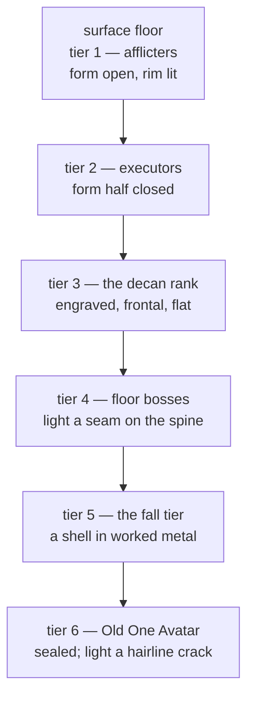
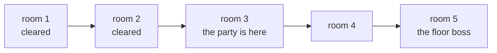

# PoA art brief — animated enemies, party sprites and the dungeon rail

Reference. This is the commissioning document for the Proof of Accumulation tab's
pixel art. An outside artist should be able to work from this page alone.

This page writes no code and draws nothing. It names the subject, the size, the
register and the source. Every layout number here comes off the built page rather
than off a design proposal, and every named entity carries the text that attests
it.

## How to read this page

Every statement carries one of five marks.

```
HIS        the operator's own words or his direct ruling
MEASURED   read out of the tree, with the file and the symbol named
SOURCED    a pre-modern text states it; the text is named
DERIVED    arithmetic on a declared value, with the working shown
INVENTED   modern invention, stated as such and never as an attestation
```

A **DERIVED** number reproduces from the files cited beside it. An **INVENTED** line
marks a modern invention, which is a label rather than a defect.

---

## 1. The register

**HIS.** The blend and the summit.

```
blend      hermetic, Dark Souls, Lovecraftian, and compatible mythological
           creatures and art styles
the summit Old One Avatars, or the direct servants of Old Ones, as the most
           powerful beings in 120-participant events
```

**HIS.** Descent is difficulty. As the content gets harder the dungeon goes down,
and the bottom is nightmare.

```
difficulty rises   the dungeon descends
descent            toward nightmare and the husks
mapping            character levels against the Sephirot and the Tree of Death
register           dark fantasy, ancient demons
```

**HIS.** Alignment has two sides, and it keeps a score rather than a label. A skill
holds a proportion of each side, because making one thing often destroys another.

```
the two sides    Creation and Destruction
character        follows how a participant earns and spends Quintessence
guild            follows its members
world            follows the guilds
a heavy skew     cataclysms and spontaneous world raids
```

### The sourcing standard binds every entity on this page

**HIS.** His words, and they are the hardest constraint in this brief.

> "Let's avoid the OTO bastardization of the Kabbalah and egyptology. Looking only
> for the ancient, more pure connections and entities...no modern new age remixing
> if avoidable."

> "Not interested in anything Crowley or beyond the old, verified texts."

What that means for an artist:

```
take       primary and pre-modern sources, attested in their own texts
refuse     nineteenth and twentieth century occult revival, its correspondence
           tables, and its reconstructed Egypt
```

**No correspondence-table iconography.** No tarot-to-sphere chart, no planetary
seal sets, no Golden Dawn godforms, no Enochian alphabet plates. Those belong to the
excluded layer, and they are also the most familiar visual shorthand for this
subject. That is why this page writes the refusal down.

**No reconstructed Egypt.** Egyptian entities appear on this page, and their look
comes from attested funerary and temple imagery only.

### What is modern invention, stated plainly

Three things on this page are modern. This page calls none of them ancient.

```
INVENTED   the Old One Avatars and their direct servants
           Built on Lovecraft, which is modern fiction. Not a remixed
           tradition, and not antique.

ADOPTED    the Tree, and the ten-sphere structure
           Kabbalistic, not hermetic in origin. It reaches hermeticism by
           Renaissance adoption, a later door than the alchemical vocabulary.

BORROWED   the husk descent
           A structure taken because the shape is useful. It says nothing
           about what anyone believes or practises.
```

Kabbalah is a living religious tradition, and Egyptian, Mesopotamian and Persian
material belongs to real historical religions. The design borrows a shape. That is
the whole claim.

### The husk is a concept, not a roster, and that is the design's spine

**SOURCED.** The husks are the shells produced when the vessels broke at creation.
Sparks of light fell with the shards, and the husks hold them.

```
Lurianic Kabbalah, recorded by Hayyim Vital, Sefer Etz Hayyim

  tzimtzum           the contraction
  shevirat ha-kelim  the breaking of the vessels
  the kelipot        husks or shells from the shards, holding trapped sparks
  tiqqun             the restoration
```

**This gives the artist one visual rule that carries the whole descent.** A
descended form is the same silhouette as its surface form, with its light shut
inside a shell. Going down does not add spikes and horns. It closes the form over
the light until only seams of it escape.

```
surface form    light on the outside, form open, rim lit
one floor down  the form begins to close; light escapes at the joints
deep floors     the form is a sealed shell; light is a hairline crack
the bottom      the shell is the whole creature and the light is a memory
```

---

## 2. The ground the art sits on

**MEASURED.** The palette is not the artist's to choose. Every colour comes from
the token table in `src/gui/main_tabs/design_system_surface.py`, and the tab's
stylesheet holds no value of its own.

```
the ground behind the tab      SURFACE_0          #0a0a0f
a zone's own background        SURFACE_1          #141420
a party row's background       SURFACE_INPUT      #0e0e1a
every dashed zone border       OUTLINE            #7a7a9c
the wallet's stronger border   OUTLINE_STRONG     #a0a0c0
the brightest text             TEXT_MAX           #ffffff
the dimmest text               TEXT_PLACEHOLDER   #555555
harm, loss, a failed state     DANGER             #ff5577
heal, gain, a good state       SUCCESS            #00ff88
a warning state                WARNING            #ffaa00
the summit accent              SECONDARY          #ff00aa
```

**DERIVED, and the single most important instruction on this page.** Every
zone background sits between `#0a0a0f` and `#141420`. A dark silhouette on that
ground is invisible.

```
RULE   every sprite is lit from its own rim, never by a dark outline
       the darkest pixel in a sprite is lighter than #141420
       an outline, where one is used, is LIGHTER than the fill, not darker
```

**MEASURED.** The summit trophy already uses the platform's secondary accent. In
`src/competition/trophy_generator.py` the highest stage draws in `#FF00AA`, and
that is the same colour the token table calls the secondary accent. The Old One
Avatar tier inherits it.

### The five colour stages already exist, and the art must not re-name them

**MEASURED.** Five trophy drawings exist today, each lettering its own stage across
its face. The mapping is in `src/competition/trophy_generator.py`.

```
Harvest             NIGREDO         Prima Materia - The Darkening   #886600
Gold Fold           ALBEDO          Purificatio - The Whitening     #C0D8F0
Bear Slayer         CITRINITAS      Sol Devoratur - The Solar Dawn  #FFCC44
Grand Accumulator   RUBEDO          Opus Magnum - The Great Work    #CC4466
Ekthelius           UNIO MYSTICA    Hen To Pan - Return to the All  #FF00AA
```

These five are the phase colours for the whole tab. A floor, a loot item and an
enemy tier all take their accent from the phase they sit in.

---

## 3. The layout, confirmed against the built page

Every number below comes off the built page. Where the design prose and the built
page disagree, the built page is the fact and this page records the disagreement.

### The three zones

**MEASURED.** The tab is a four-row grid in
`src/gui/web/proof_of_accumulation_tab.css`, and the last two rows are equal.

```
grid-template-rows: auto auto 1fr 1fr

row 1  the heading                    auto
row 2  the state sentence             auto
row 3  the upper band                 1fr     player window + enemy screen
row 4  the party window               1fr     the lower half
```

**DERIVED.** The upper band and the party window are both one fraction, so they are
the same height. The upper band is two columns, and the enemy screen is the second.

```
grid-template-columns: 1fr auto        the player window takes what is left
enemy screen                           aspect-ratio: 1 / 1

so:  the enemy screen is a square whose side equals the party window's height
```

That is the one relation in the whole layout that fixes a size without a font
metric in it. Build the art on it.

### What the party window actually carries

**MEASURED.** The numbers in `src/gui/main_tabs/proof_of_accumulation_tab_surface.py`.

| the design says | the built page | verdict |
| --------------- | -------------- | ------- |
| 120 participants | `PARTY_CAPACITY = 120` | confirmed |
| 40 to a page | `PARTY_PER_PAGE = 40` | confirmed |
| eight groups of five | `PARTY_GROUP_SIZE = 5`, so `party_groups()` is 8 | confirmed |
| three pages | `party_pages()` is 3 | confirmed |
| a truncated name | `PARTICIPANT_NAME_CHARS = 8` | **disagrees: eight, not twelve** |
| a twelve-character short form | `BotIdentity.short_id` and `TrophyData.short_comp` | **a different field** |
| one mark slot | no mark slot exists | **not built** |
| a health bar | `slot-health` is a text span | **not built** |
| a role colour | no Salt, Sulphur or Mercury token exists | **not built** |

**Four disagreements, and each changes what the artist draws.**

**The name truncates at eight characters, not twelve.** The surface cuts the name to
eight, and the stylesheet then adds an ellipsis at the column's own width, so two
separate steps shorten one name. A twelve-character short form does exist, in two
places, and neither one is the party row.

```
src/competition/bot_identity.py      short_id, the participant identity
src/competition/trophy_generator.py  short_comp, the competition identifier
```

An artist who sizes art around a twelve-glyph name sizes around the wrong field.

**The built row carries five text spans and no art at all.** The component in
`src/gui/web/proof_of_accumulation_tab.js` draws the participant, the class name,
the level, the Impetus and the health, each as text.

```
the built party row, five columns

grid-template-columns: 1fr auto auto auto auto

1fr    slot-name       the participant, ellipsised
auto   slot-class      the class name
auto   slot-level      the level
auto   slot-impetus    the Impetus this turn
auto   slot-health     the health figure
```

**DERIVED, and it bounds everything the party art can be.** Only the first column
can yield. The other four size to their own text, the slot hides its overflow, and
the longest class name is nineteen characters. No sixth column fits. A sprite
takes one of the five, or it sits inside the first column's leading edge.

### Every pixel dimension, and its working

**MEASURED.** The spacing and type values the stylesheet multiplies, from
`src/gui/main_tabs/design_system_surface.py`.

```
SPACE_XXS   2        RADIUS_XS            4
SPACE_XS    4        TYPE_SMALL          11
SPACE_S     8        TARGET_COMFORTABLE  32
SPACE_M    16        SPACE_XXL           48
```

**MEASURED.** The declared window is 1400 by 900, in `desktop/main.js`. The panel
area is that window's page minus the chrome strip and the tab strip, and
`desktop/renderer/index.html` sizes both of those from their content.

**The one figure no declaration supplies, and this brief stops on it.** No file
declares the height of the chrome strip, the tab strip, the heading line or the
state line. All four size to their content, so no declaration yields the panel
area's absolute height. Reading it needs the program running, and this unit authors
nothing that observes.

**Every dimension below carries two forms:** a formula that holds at any window
size, and a worked figure at one reference. The reference takes the declared width
of 1400 and a shared row height of 360. The row height is an assumption, and this
page names it as one.

```
DERIVED — the formulae

let  W = the panel's width
let  R = the shared row height, the upper band and the party window alike

upper band width        = W - 32                     two SPACE_M paddings
enemy screen box        = R x R                      aspect-ratio 1 / 1
player window width     = W - 32 - R - 8             one SPACE_S gap
every zone's inner box  = its box - 18 each way      1px border + SPACE_S padding

party window box        = (W - 32) x R
party content width     = W - 50
group column width      = (W - 50 - 56) / 8          seven SPACE_S gaps
party slot height       = (pages height - 8) / 5     four SPACE_XXS gaps
party slot floor height = 16                         min-height is SPACE_M
party slot content      = the slot, less its 1px border each way
```

```
DERIVED — worked at W = 1400 and R = 360

upper band                1368 wide
enemy screen box           360 x 360
enemy screen inner         342 x 342
player window box         1000 x 360
player window inner        982 x 342
party window box          1368 x 360
party window inner        1350 x 342
group column width      161.75, so 161 whole pixels
party slot floor            16 high
party slot inner floor      14 high
```

**The party row's guaranteed cell is fourteen pixels square.** That is the floor
height of sixteen from the spacing token, less one pixel of dashed border on each
side. No other party-row dimension holds still when the window moves, so the party
art survives at fourteen pixels or it survives nowhere.

**The enemy screen is the tallest square on the tab.** At the reference it gives a
342 pixel drawing box. Pixel art takes a nominal cell and draws at whole multiples:

```
DERIVED — nominal cells that fit the enemy screen at 342 inner pixels

 32 nominal  x8  = 256        a small enemy, eight of them on screen
 48 nominal  x4  = 192        a standard enemy, four to six on screen
 64 nominal  x4  = 256        an elite, two or three on screen
 96 nominal  x3  = 288        a floor boss, alone
160 nominal  x2  = 320        an Old One Avatar, alone, filling the square
```

Each of those scales by a whole number, and each fits inside 342 with margin.
**Author at the nominal size. Never author at the drawn size.** A whole-number
scale is what keeps a pixel square when the window moves.

```
DERIVED — the player window and the rail at 982 x 342 inner pixels

map rail width       40      TARGET_COMFORTABLE 32 plus two SPACE_XS
action area width   934      982 less the rail and one SPACE_S gap
rail room node       32 x 32 TARGET_COMFORTABLE, so a pointer can hit it
acting sprite        48 nominal, drawn x4 at 192
party class sigil    16 nominal, drawn x1 — the fourteen-pixel floor
mark slot glyph      16 nominal, drawn x1 — the fourteen-pixel floor
```

---

## 4. Animated enemies

### The state set, and why these frame counts

**MEASURED.** The platform declares five motion durations, and the tab's own
stylesheet multiplies them for everything that moves.

```
MOTION_INSTANT     0 ms
MOTION_SHORT     100 ms
MOTION_MEDIUM    250 ms
MOTION_LONG      500 ms
MOTION_EXTRA   1,000 ms
```

**DERIVED.** Frame counts come out of those durations rather than out of taste. An
action steps at the short duration and an idle steps at the medium one.

| state | frames | step | loop length | loops |
| ----- | ------ | ---- | ----------- | ----- |
| idle | 4 | MOTION_MEDIUM | MOTION_EXTRA | yes |
| attack | 5 | MOTION_SHORT | MOTION_LONG | no |
| hit | 2 | MOTION_SHORT | 200 ms | no |
| death | 10 | MOTION_SHORT | MOTION_EXTRA | no, holds last frame |
| cast | 5 | MOTION_SHORT | MOTION_LONG | yes |

**Twenty-six frames is one complete enemy.** Four idle, five attack, two hit, ten
death, five cast. No enemy at any tier needs more than those five states.

**A caster needs the cast state and a brute does not.** An enemy with no ability
ships twenty-one frames. The tier table below says which.

### The tiers, from the surface floor to an Old One Avatar

**SOURCED** for every entity below except the summit, which carries the invented
mark. The entities split four ways by how they behave, and that split gives the
enemy classes rather than a flat power ladder.

**Tier 1 — the surface floor. Afflicters with an appetite and no mandate.**

```
Lamashtu   attacks mothers and infants     Mesopotamian incantations
Lilith     from the lilitu onward          Mesopotamian, then Jewish material
Empousa    Greek                           Greek popular material
```

```
nominal 32     frames 21, no cast     four to eight on screen
behaviour      single target, closes, bites, dies quickly
silhouette     open form, light on the outside, rim lit
```

**Tier 2 — executors of a mandate or of fate. Cold, not wicked.**

```
the gallû     Ereshkigal's enforcers; they take Dumuzi to satisfy the rule
              that nobody leaves the underworld unmarked
              Descent of Inanna to the Underworld
Ammit         devours the heart that fails the weighing against Ma'at
              Book of the Dead, spell 125
the Keres     daughters of Nyx, agents of the Moirai; they seize the dying
              Hesiod, Theogony
the Sebitti   created by Anu; they follow Erra into battle as his weapons
              Erra and Ishum
Humbaba       set as guardian of the Cedar Forest by Enlil, as a terror
              Epic of Gilgamesh
Mot           death itself
              the Ugaritic Baal cycle
```

```
nominal 48     frames 26     four to six on screen
behaviour      acts on a condition, never on a grudge; no taunt, no gloat
silhouette     form half closed; the light is behind a grille
the register   the attack animation has no wind-up flourish. It executes.
```

**This tier sets the register for the whole roster.** A hermetic antagonist
administers fate, and an indifferent executor and an indifferent cosmos run at the
same temperature. That is what lets the Lovecraftian blend sit beside genuinely
antique material.

**Tier 3 — the decan rank. Thirty-six named powers, each owning a body part.**

**SOURCED.** A Roman-period Greek hermetic text gives all thirty-six decans a
secret name, an image to engrave, a stone, a plant, a food to avoid and the part of
the body each one governs.

```
The Sacred Book of Hermes to Asclepius

  date       Roman-period Greek, in later manuscripts
  edition    C.-E. Ruelle, Revue de philologie 32 (1908)
             Catalogus Codicum Astrologorum Graecorum
  each entry a name, an image, a stone, a plant, a food prohibition,
             and the body part the decan rules
```

**SOURCED.** A second hermetic text sets the decans above the planets and gives
them servants, and its subject is the general disaster rather than the private
illness.

```
Stobaean Hermetica 6, Hermes to Tat, On the Decans

  position   a circle beyond the zodiac, above the seven planetary spheres
  office     guardians and overseers of the universe; they move the planets
  below them daimones as their offspring, and leitourgoi as their assistants
  effect     overthrows of kings, uprisings, famines, plagues, earthquakes
```

```
nominal 64     frames 26     two or three on screen
behaviour      applies the affliction of the body part it owns, and can lift it
silhouette     an engraved figure, flat and frontal, like a cut gem
the register   a decan is NOT a demon. The text invokes it to heal.
               Draw authority, not malice.
```

**Tier 4 — floor bosses. Adversaries of cosmic order.**

```
Apophis      attacks the solar barque nightly      Egyptian religion
Anzû         steals the Tablet of Destinies        Mesopotamian
Asag         disease demon, slain by Ninurta       Lugal-e
Typhon       Greek theomachy                       Hesiod, Theogony
Echidna      Greek theomachy                       Hesiod, Theogony
the Gigantes Greek theomachy                       Greek material
Aži Dahāka   Persian                               Zoroastrian material
```

```
nominal 96     frames 26     one on screen, alone
behaviour      attacks the order of the floor itself, not only the party
silhouette     form mostly closed; light escapes as a seam along the spine
```

**Tier 5 — the fall tier. Morally dualist, with a rebellion behind it.**

```
the Watchers and the Nephilim   two hundred descend, take wives, teach
                                forbidden knowledge, are bound in the abyss
                                1 Enoch 6-16
Asmodeus                        kills bridegrooms; driven off by Raphael
                                Tobit
Angra Mainyu and the daevas     two principles in opposition
                                Zoroastrian material
```

**SOURCED, and it gives this tier its own look.** The Watchers taught the crafts.
One of them taught metalworking and the colouring tinctures by name.

```
1 Enoch 8:1, R. H. Charles translation

  "And Azazel taught men to make swords, and knives, and shields, and
   breastplates, and made known to them the metals <of the earth> and the art
   of working them, and bracelets, and ornaments, and the use of antimony, and
   the beautifying of the eyelids, and all kinds of costly stones, and all
   colouring tinctures."
```

**SOURCED.** One ancient author ties this directly to the platform's own craft
vocabulary, and he makes the Watchers the CORRUPT lineage rather than the rightful
one.

```
Zosimos of Panopolis, quoted in George Syncellus, Ecloga Chronographica, c. 810

  "It is stated in the holy scriptures or books, dear lady, that there exists a
   race of daimons who have commerce with women. Hermes made mention of them in
   his Physika..."

  Kyle Fraser, Aries 4.2 (2004); Christian H. Bull, Gnosis 3.1 (2018)
  the Watchers   wicked angels who PERVERTED the art
  the authentic  revealed to Hermes by Chemeu, identified with Agathodaimon
```

```
nominal 96     frames 26     one or two on screen
behaviour      uses the party's own craft vocabulary against it
silhouette     a closed shell wearing worked metal it made itself
the register   this is the ONLY tier that is morally wicked. It fell.
               Everything above it is indifferent. Draw the difference.
```

**Tier 6 — the summit. Old One Avatars and their direct servants.**

```
INVENTED   the operator's own, built on Lovecraft, which is modern fiction
HIS        the most powerful beings faced in 120-participant events
```

**SOURCED** only for the two-rank SHAPE, which the hermetica already carry: an
overseer above, a servant daimon below, the servants being the overseer's own
offspring. That is the decan-and-daimon relation from Stobaean Hermetica 6, reused.

```
the Avatar        nominal 160    frames 26    alone, fills the square
a direct servant  nominal  96    frames 26    two or three beside it
```

```
silhouette     a sealed shell. The light inside is a hairline crack and
               nothing more. The form does not read as an animal or a person.
accent         SECONDARY #ff00aa, the colour the summit trophy already uses
the register   it does not notice the party. Its attack animation has no
               target-acquire frame, because it never acquired one.
```

### How depth reads, in one picture



### What an animation costs to produce

The operator pays for this, so the brief gives a count.

**One design is one drawing job, and a design can carry two names.** The Watchers and
the Nephilim share one design, and so do Angra Mainyu and the daevas.

```
the roster, counted two ways

21 designs    the drawing jobs, across five tiers
23 names      21 of them attested in a text, 2 of them the summit's invention
 3 ranks      the decans, their daimones, their leitourgoi — tier 3, unspecified
```

```
one enemy, full         26 frames   idle 4, attack 5, hit 2, death 10, cast 5
one enemy, no ability   21 frames   the cast state dropped

tier 1, three designs, 32 nominal, no cast        63 frames
tier 2, six designs, 48 nominal                  156 frames
tier 4, seven designs, 96 nominal                182 frames
tier 5, three designs, 96 nominal                 78 frames
tier 6, one Avatar at 160 plus one servant at 96  52 frames
                                                 ---
the roster above, tiers 1, 2, 4, 5 and 6         531 frames
```

**The decan rank is thirty-six entities and is the largest single cost in the
roster.** Twenty-six frames each gives 936 frames, more than every other tier put
together. That same tier is the one this page cannot yet specify — see section 8.

**The cheapest order to commission in.** Tier 2 first: six entities, one hundred
and fifty-six frames, and the tier that sets the register for the rest. Tier 6
second, because one Avatar is the point of a 120-participant event. The decan rank
last, as the largest and the least specified.

---

## 5. Player and party sprites at forty to a page

### Seven classes, four roles

**MEASURED.** The seven classes in `src/competition/rpg_classes.py`, each holding a
classical planet, its metal, its Paracelsian principle and its role assignment.

| class | planet | metal | principle | assignment | role |
| ----- | ------ | ----- | --------- | ---------- | ---- |
| Lead Ward | Saturn | lead | Salt | Tank | Tank |
| Tin Bulwark | Jupiter | tin | Salt | Tank | Tank |
| Iron Edge | Mars | iron | Sulphur | Damage | Damage |
| Solar Lance | Sol | gold | Sulphur | Damage | Damage |
| Quicksilver Draught | Mercury | quicksilver | Mercury | pure healer | Healer |
| Copper Conduit | Venus | copper | Mercury | support healer | Healer, Support |
| Silver Mirror | Luna | silver | Mercury | pure support | Support |

**MEASURED.** The class array declares four roles and five assignments, and one
class carries two roles.

```
ROLES        Tank, Damage, Healer, Support
ASSIGNMENTS  Tank, Damage, pure healer, support healer, pure support

Copper Conduit is the only class holding two roles at once.
```

**The metal is the artist's strongest hook, and the code already decides it.** Seven
metals, seven surface treatments, and no invention required: lead is dull and
heavy, tin is pale and soft, iron is dark and scarred, gold is warm and bright,
quicksilver is liquid and mirror-like, copper is ruddy and oxidising, silver is
cold and reflective. A player should be able to name the class from the metal
alone at sixteen pixels.

### Three sizes for every class, and they are different drawings

```
the acting sprite   48 nominal, drawn x4 at 192   the player window, animated
the class sigil     16 nominal, drawn x1          the party row, static
the mark glyph      16 nominal, drawn x1          the party row, static
```

**The acting sprite animates, and it takes an enemy's state set** less the death
state, because a participant takes damage and never loses money.

```
a player's acting sprite   21 frames
                           idle 4, attack 5, hit 2, cast 5, and five more for
                           the class's own signature action
seven classes              147 frames
```

**The class sigil is one static drawing at sixteen pixels, and forty of them share
one page.** Fourteen guaranteed pixels make it a shape, never a picture. A reader
names it by outline, at a glance, across a field of forty.

### The row that survives truncation

**MEASURED.** The drop order the design sets, and the built row underneath it.

```
what the design says a row always carries, ranked

1  health bar       never shrinks
2  role colour      Salt, Sulphur or Mercury, as the fill
3  name             truncated, never wrapped
4  one mark slot    the single most urgent state, and nothing else

what drops as the count climbs to forty, in order

first   the resource bar
then    the numeric health beside the bar
then    the class sigil, leaving only the role colour
last    the second mark slot
```

**The class sigil is the third thing to drop.** At forty to a page the row may
carry no art at all, and the role colour then carries the whole identity. That
makes the role colour load-bearing, and no token holds one yet — see section 8.

**DERIVED.** What the artist must hold to, at the party row's guaranteed size.

```
the cell              14 x 14 pixels
readable at           1x, with no scaling and no smoothing
the silhouette        must differ from the other six at 14 pixels
no letters            a glyph, never a character
no colour alone       two classes may share a principle colour, and three do
the ground behind it  SURFACE_INPUT #0e0e1a, so the sigil is rim lit
```

### The mark slot is one slot, and this is what may occupy it

**One slot means exactly one glyph at a time.** Never two, never a stack, never a
badge on a badge. When two states are true the higher one wins and the lower is not
shown.

**MEASURED** for every state below: each one is a condition the built code can
already reach.

| rank | the mark | when it shows | where the state comes from |
| ---- | -------- | ------------- | -------------------------- |
| 1 | dead | the participant has no health | `health_text` returns its no-value text |
| 2 | missed the window | the candle closed on an offered action | `MissedWindowError` |
| 3 | out of Impetus | the pool cannot pay the whole cost | `PartialActionError` |
| 4 | afflicted | a decan's affliction is on a body part | tier 3, section 4 |
| 5 | no class picked | the participant has not chosen | `NO_CLASS_TEXT` |
| 6 | alignment skew | the participant leans Creation or Destruction | the alignment score |

```
six glyphs, 16 nominal, static, one per state
each must read at 14 pixels against SURFACE_INPUT #0e0e1a
the top three take DANGER #ff5577
afflicted takes WARNING #ffaa00
no class picked takes TEXT_PLACEHOLDER #555555
alignment skew takes SUCCESS #00ff88 for Creation and DANGER for Destruction
```

**Rank 6 names no fault**, and a participant wants to see that one. It sits last
because a fault always outranks a character trait.

---

## 6. The dungeon map rail

### The dungeon is a linear room graph, and that is why the rail is small

**This page read the dungeon's shape off the design before describing the rail.** A
linear dungeon needs only a small map, because every corridor joins exactly two
rooms and every room matches every other in size. A free-form dungeon needs a large
map and cannot share a zone with the action. The design recommends the linear room
graph for exactly that reason: the player window does two jobs, and only a linear
graph lets one zone carry both.



### Which modes show a rail, and which never do

**MEASURED.** The mode table in `src/competition/poa_modes.py` declares a map flag
and a party ceiling per mode.

| mode | party | map |
| ---- | ----- | --- |
| Monster Smash | 1 | no |
| Team Based Monster Smash | up to 120 | no |
| Dungeon Crawl | 1 to 6 | yes |
| Raid | 2 to 60 | yes |

**Two findings fall straight out of that table, and both change the art order.**

**The 120-participant event has no dungeon rail.** Team Monster Smash is the only
mode reaching 120, and its map flag is false. The Old One Avatar the operator places
in 120-participant events meets the party in an arena, not at the bottom of a
dungeon. Commission the Avatar art against an arena background first.

**The rail modes cap at sixty and at six.** A Raid reaches sixty and a Crawl
reaches six, so the party window's three pages of forty only ever fill for the mode
with no rail. A rail sits beside a roster of at most sixty, which is two pages.

### What the rail shows at each depth

```
DERIVED — the rail, 40 pixels wide, along one edge of the player window

always       the room chain as a column of nodes, each 32 pixels square
always       the party's position, as the one lit node
always       which rooms are cleared, as a filled node
at depth     the floor's phase accent, as the rail's own spine colour
at depth     the node shape closes, matching the husk rule
```

**Depth reads as descent three ways at once**, and all three are cheap.

```
1  the rail runs DOWN, and the party's node moves down it
2  the spine colour walks the five phase colours as the floor number rises
   NIGREDO #886600, ALBEDO #C0D8F0, CITRINITAS #FFCC44,
   RUBEDO #CC4466, UNIO MYSTICA #FF00AA
3  the node OUTLINE closes as depth grows — an open ring on floor one,
   a sealed disc at the bottom — which is the husk rule applied to furniture
```

**The third one is the important one.** It ties the rail to the enemy silhouette
rule, so the furniture and the creatures tell the same story about depth without
anyone having to read a number.

```
the rail's node states, 32 nominal, static

unvisited   outline only, OUTLINE #7a7a9c
cleared     filled, TEXT_PLACEHOLDER #555555
here        filled, the floor's phase accent, one frame of idle pulse
the boss    a larger node, 32 square, the phase accent at full strength

five node states, 32 nominal, one animated    = 4 static + 4 frames
```

### Ten floors, named without reaching for the excluded layer

**The floor structure is the Tree and the numbers already agree.**

```
10 spheres  x  10 levels each   =  100, one arc
10 husks                         =  their inversions, the descent
 5 phases   x  100               =  500, the full progression
```

**A floor takes its sphere's name, and its inhabitant takes the husk of that
sphere.** The Sefer Yetzirah attests the sphere names and the Zohar develops them.
The husk reads descriptively, as the husk of that sphere, because only the excluded
layer supplies a per-husk demon name. This page names that gap rather than filling
it — see section 8.

---

## 7. Name collisions found

**A collision goes in a report, and never into a rename.** Three turned up, and
each one reaches the art directly.

**One. The word tier means two different things, and both have five members.**

```
src/competition/season_schedule.py   RARITY_TIERS, five trophy rarity tiers
                                     Harvest, Gold Fold, Bear Slayer,
                                     Grand Accumulator, Ekthelius

the issue                            five loot tiers
                                     Calx, Cauda Pavonis, Flores, Elixir,
                                     Magisterium

src/competition/poa_modes.py         loot_rarity_rank and loot_drop_rank,
                                     which run 1 to RANK_CEILING, and
                                     RANK_CEILING is 5
```

Three fives, on the same alchemical path. An artist asked for tier 5 cannot tell
whether that names the Ekthelius trophy, a Magisterium loot item, or a rank a mode
answers. Every instruction on this page names the thing and never the number.

**Two. Mercury is a planet, a principle and a metal, inside one file.**

```
src/competition/rpg_classes.py

  MERCURY = "Mercury"            a Paracelsian principle, held by three classes
  CharacterClass("Quicksilver Draught", "Mercury", "quicksilver", MERCURY, ...)
                                 the same string is this class's planet
  the metal is "quicksilver"     a third meaning of the same substance
```

This bites the art because the role colour keys on the principle. A Mercury role
colour and a Mercury planet sit on different axes, and three classes share the
principle while one owns the planet.

**Three. Silver and white are a class identity and a trophy stage.**

```
Silver Mirror   metal silver, planet Luna
ALBEDO          the whitening, #C0D8F0, the second trophy stage
```

A silver-white sigil on a silver-white phase accent loses the class. Where the
Silver Mirror appears on an ALBEDO floor, the sigil takes its rim light from the
metal and the floor keeps the phase accent, so the two never carry the same value.

---

## 8. What this brief could not supply

**Five gaps. This page reached each one, and refused the excluded source at each
one.**

**One. A name for each of the ten husks.** The qliphoth as a named demon roster,
with ten tunnels and their attributes, is the modern remix, and the operator's
standard puts it out of reach. The older material gives a concept rather than a
bestiary: husks that trap sparks, the inverse of an emanation. **This page names the
gap and leaves it open.** Floors take their sphere's attested name and the husk
reads descriptively. No per-husk demon name, no tunnel, no attribute table.

**Two. An attested look for each husk.** No pre-modern source supplies husk
iconography. The shell silhouette in section 1 is **INVENTED**, built out of the
sourced concept of a shell holding trapped light. That makes it a design rule and
not an attestation, and this page says so rather than implying a source.

**Three. The thirty-six decan images, verbatim.** The text HAS an image for every
decan, and two texts confirm the structure, but the roster itself sits behind
editions not in hand.

```
what would close it
  Classical Philology 117 (2022)
  Catalogus Codicum Astrologorum Graecorum
  C.-E. Ruelle, Revue de philologie 32 (1908)
```

Until one of those reaches the desk, nobody can specify the thirty-six, and section
4 leaves tier 3 at its behaviour and its register alone. **The largest tier and the
least specified goes last in the commission.**

**Four. A hex value for Salt, Sulphur and Mercury.** The design makes the role
colour the one element that never drops from a party row, and no token carries one.

```
MEASURED   src/gui/main_tabs/design_system_surface.py declares 146 colours
           and none of them is named for a principle
           src/gui/web/proof_of_accumulation_tab.css holds no value of its own
```

The three principle colours belong to the design system, and it must add them.
Until they exist the artist works in the tokens of section 2. Specifying a role
colour here would mean inventing a token, which is not this unit's to do.

**Five. The panel area's absolute height.** Four heights on the path from the
window to a party row are content-sized and declared nowhere: the chrome strip, the
tab strip, the heading line and the state line. Every dimension in section 3 carries
a formula plus a worked figure at a named assumption. **Reading the real figure
needs the program running, and this unit authors nothing that observes.**

---

## What a design must not claim

Each line below would make the art wrong, and each is easy for a reader to catch.

```
do not claim

  that hermeticism is a combat system
      the remedy in every philosophical treatise is knowledge, not a weapon

  that the decans are demons
      they are star powers, and the text invokes them to heal

  that daimones are devils
      no fall, no rebellion, no sin; they are ministers and executors

  that the qliphothic descent describes anyone's practice
      it is a structure borrowed from a living tradition

  that the Old One Avatars are ancient
      Lovecraft is modern fiction, and this brief says so plainly

  that a reconstruction is an attestation
      the decan names and images are in the text; a Victorian Egypt is not
```

---

## Delivery

```
format        PNG, one sheet per entity, transparent background
sheet layout  one row per state, frames left to right in play order
                row 1 idle, row 2 attack, row 3 hit, row 4 death, row 5 cast
authoring     at the nominal cell only, never at a drawn size
scaling       whole multiples, nearest neighbour, no smoothing
palette       the tokens in section 2, and nothing outside them
naming        <tier>_<entity>_<state>.png, lower case, underscores
```

```
the whole commission, counted

enemies, tiers 1, 2, 4, 5 and 6            531 frames
player acting sprites, seven classes       147 frames
party class sigils, seven classes            7 static
mark slot glyphs, six states                 6 static
rail node states                             4 static + 4 frames
                                           -----
                                           682 frames and 17 static drawings

the decan rank, tier 3, once specified     936 frames
```

## Related

```
docs/engineering-notes/2026-09-10_poa_hermetic_entities.md   the sourcing
docs/manual/08-tabs/proof-of-accumulation.md                 the tab's manual page
```
