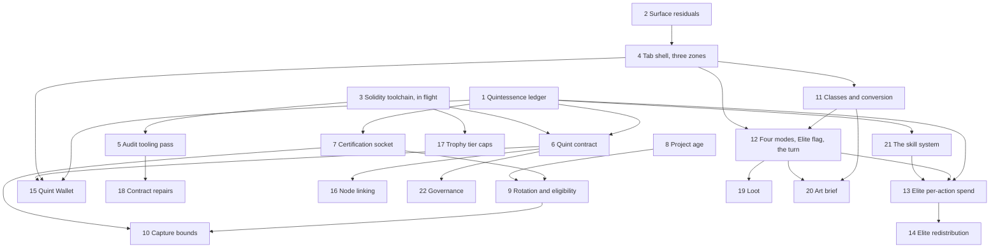

# Proof of Accumulation — the tab, the economy, and the build order

Reference. **This page is the concept document.** It carries the design, the
reasoning behind it, the measured state of the code, the units and the list of
what the operator owes. Nothing sits in a separate file.

**This issue is the single home for all TestNet, PoA and in-app blockchain
work.** Anything found in that subsystem folds in here as a comment — no
separate issues, no separate queue items.

**One PoA Tab, and only one.** The local chain, tokens, merkle log, trophies and
seasons are parts of PoA, not a second surface.

The design is the operator's, delivered between 2026-09-07 and 2026-09-10. The comments
below are the provenance and stay exactly as written. This page is the specification.

## The concept document is in seven parts

A GitHub issue body holds 65,536 characters. The concept document is larger, so it runs on
this page in **seven parts**: this body, then six comments below it.
**Scroll the page. Nothing is in another file.**

| Part | Sections it carries |
| ---- | ------------------- |
| **This body** | 1 What PoA is · 2 The tab · 3 The classes · 6 The modes, the Elite variant and the turn · 13 The economy · 14 Governance · 15 The Exchange Participation Layer · 16 The persistent world · 17 The naming standard · the superseded readings · the units · the choices · what he owes |
| **part 2 of 7** | 7 The Certified Transaction Socket · 8 The economy, in full |
| **part 3 of 7** | 9 The rotating reward set, and the eligibility research |
| **part 4 of 7** | 10 Node linking · 11 The contracts and the audit · 12 Measured state of the code |
| **part 5 of 7** | 4 The trading profile as RPG metrics · 5 Trade action to RPG action · 2 and 3, the research behind the layout and the names |
| **part 6 of 7** | 13 to 16 in full · the choices, with every option and its cost |
| **part 7 of 7** | every superseded reading in full · 17 The naming standard, in full |

The units and what he owes sit in this body: those are the parts that get dispatched and the
parts he answers. Sections 1 to 3, 6 and 13 to 17 sit here too, because they carry the rules
he set.

Section 9 in part 3 is the rotation mechanism. Section 15 here is his exclusion rule
over it, set after that research landed.

## How to read this page

Every statement carries one of four marks.

```
HIS        his own words or his direct ruling
MEASURED   read out of the tree, with the file and the symbol named
DECIDED    a proposal taken and closed, with the ground that closed it
PROPOSED   a design decision offered, still open for him to refuse
```

A **DECIDED** line is a proposal that no longer blocks a unit, and its ground is named in
the same passage. He may still overrule any of them.

A **PROPOSED** line is never a directive. Where a question is his and is not yet
answered, it appears in [What he owes](#what-he-owes) at the end.

Where two of his statements touch one subject, the later one wins. The places
that happened are marked [Superseded readings](#superseded-readings).

---

## 1. What PoA is

**HIS.** A deep, perpetual, blockchain-based game and world, defined by
Acervator instances acting as PoA Nodes. A participant's real trading becomes
play, and play yields tokens and loot.

### The two layers

**HIS.**

**Contestant Layer.** Tournament competitors authenticate their participation.
Their trade actions are translated into tournament actions.

**Exchange Participation Layer, with manipulation protection.** Exchanges
authenticate their markets. Those markets generatively drop RPG-style NFT loot.
Loot augments the translated trade actions.

### What is awarded

**HIS.**

```
PoA tokens   most damage done, or most healed
loot         dice rolls
```

All loot is NFT-based. It carries deep RPG-like functions and bonuses with
rarity scales, and it is tradable.

**PoA tokens only ever yield from these tournaments and from other player-based
PoA actions.** That is the whole supply.

---

## 2. The tab

**HIS.** He states plainly that the arrangement is incomplete: *"I currently do
not have a complete vision in my head on how to arrange the PoA Tab"*, and
*"May need to research this and extend upon my current concept pieces to fill it
out before attempting to build."*

### The three zones

**HIS.**

```
+---------------------------------+------------------+
|  PLAYER WINDOW                  |  ENEMY SCREEN    |
|  larger pixel-art zone          |  square          |
|  players acting, alone or in    |  pixel graphics  |
|  groups; dungeon maps for the   |  all enemies,    |
|  crawl and raid event types     |  animated        |
+---------------------------------+------------------+
|  PARTY WINDOW  —  the lower half                   |
|  players and groups, up to 120 participants        |
+----------------------------------------------------+
```

**Enemy screen.** Upper right, and square. A pixel graphics zone where all
enemies are displayed and animated, taking damage or attacking players.

**Player window.** To the left of the enemy screen and above the party window.
Players appear taking actions as individuals or groups. This area also displays
the dungeon maps for the crawl and raid event types. Pixel art, and larger than
the enemy screen, because it has to show trading action translated to RPG
action.

**Party window.** The lower half. Players and groups. It must sharply display up
to 120 participants for the largest events, through a multi-page structure of 40
per page.

### Players take damage, and never lose money

**HIS.** Players can be attacked. They do not lose money. Everything from the
trading profile is converted or abstracted into RPG metrics. Players hold health
pools based on character class, gear and level, following classic RPG
structures.

### The Quint Wallet sits over the party window

**DECIDED**, two parts. A Quintessence balance readout lives in the party window's
header and stays visible at all times. The full wallet opens as a panel over the
party window, and over nothing else.

Not a fourth zone: his layout fixes a ratio, and a fourth zone takes space from one of the
three he named. Not a tab mode: Elite Events spend per action, so replacing the tab hides
the fight when the balance matters most.

The party window is the right host for three reasons from his own spec. It already
paginates at forty a page, so it owns a header and a panel is one more page class.
Its content is a list, and so is a wallet. And it is the only zone with no live
animation to occlude.

### Actions play back theatrically as blocks fill

**HIS.** *"Blockchain syncs actions in theatric playback blocks within the PoA tab
as blocks are filled."*

A chain cannot render a live animation, and sixty players acting inside one minute cannot
be drawn as it happens. Committing actions and playing back a filled block separates the
pace of the chain from the pace of the spectacle, and a participant then acts on the
previous block's outcome, which is the position a trader is in.

**PROPOSED.** The design owes one answer here: what the player window shows while a block
fills. Where the persistent world is seen inside the one tab is a second open question,
and both sit in [What he owes](#what-he-owes).

---

## 3. The classes

**HIS.** A participant chooses a character class for each event they play.

```
the three roles   Tank, Healer, Damage
research needed   an array of hermetic-themed variants of the three roles
levelling         each class levels independently
XP                gained per action during a PoA event, with bonuses for
                  efficacy and accuracy
breadth           no limit on how many classes a participant uses, but focus
                  yields more power
```

### The three roles, from the three principles

**PROPOSED**, on a published source. Paracelsus set three principles, and his
own words give them bodies. The material reading of each one admits no argument,
so each maps onto exactly one role.

```
PROPOSED — the role names

Salt      "Salt is the body"      the solid, permanent element  ->  Tank
Sulphur   "Sulphur is the soul"   the combustible element       ->  Damage
Mercury   "Mercury is the spirit" the fluid and changeable one  ->  Healer
```

Paracelsus carried the same three into medicine. Disease is an imbalance among
the three, and healing restores their harmony. The tradition therefore states
the healer's job itself, which is why Mercury takes that role rather than a
looser fit.

### The array

**PROPOSED.** Seven classes, one per classical planet. Two things decide the role:
the planet's quality as Ptolemy states it, and what the metal does in the hand.

```
PROPOSED — the seven classes

role                     class                  planet / metal
--------------------     -------------------    --------------------
Salt    (Tank)           Lead Ward              Saturn  / lead
Salt    (Tank)           Tin Bulwark            Jupiter / tin
Sulphur (Damage)         Iron Edge              Mars    / iron
Sulphur (Damage)         Solar Lance            Sol     / gold
Mercury (pure healer)    Quicksilver Draught    Mercury / quicksilver
Mercury (support healer) Copper Conduit         Venus   / copper
Mercury (pure support)   Silver Mirror          Luna    / silver
```

### Mercury carries four roles, not three healers

**HIS, and it corrects this page.**

> "Also need pure healer, support healer, and pure support classes. Not three
> exclusive healer types."

**The three principles still hold, and the correction lives inside Mercury.** Salt is
the solid that endures, so Tank. Sulphur is the combustible, so Damage. Mercury is the
fluid and changeable principle, which covers sustaining *and* altering rather than
healing alone. Splitting Mercury's three classes across heal and support keeps the
tria prima intact instead of needing a fourth principle.

**PROPOSED.** The imagery already carried the distinction; only the labels said otherwise.

### Every skill levels through use

**HIS.**

> "All skills have levels that grow through use. Skills should be intelligently
> capped but be extremely difficult to top out while also growing slowly. I am
> thinking about growth curves similar to Eve Online."

A skill is a system, not a property of a class. The transfer skill in section 13 is
its first member.

**DECIDED.** Ten levels a skill. Level one costs one unit of progress, and each level
costs 2.5 times the one below. A use contributes its own quality, in the range nought
to one, rather than a flat one. Effect rises 0.1 a level, so a maxed skill is twice an
untrained one.

```
level   cost of that level   cumulative
 1             1.0                1.0
 5            39.1               64.2
10         3,814.7            6,356.7
```

Level ten alone is 60% of the lifetime cost, and topping out takes about 6,357
quality-weighted uses. A constant multiplier with a heavy tail is what Eve Online,
RuneScape and EverQuest publish.

**Eve trains on elapsed time and he has said through use**, so the shape transfers and the
mechanism does not: the unit of progress is a counted use, never a duration.

### Class abilities run a hundred levels a phase

**HIS.**

> "Class Abilities - Will need to fully flesh these out across an initial 100 level
> arc. There will be another 100 levels per alchemical phase of the Quint blockchain
> as it ages. Each 100 level arc will also, naturally, slowly increase the 'world
> level'."

```
initial arc   100 levels of class abilities
each phase    another 100 levels, one arc per alchemical phase of the chain
world level   rises slowly with each arc
```

The progression is tied to the chain's own maturity rather than to a calendar, so no
participant can outrun the world: the ceiling moves with the chain everyone shares.

**MEASURED.** The phases already have names in the tree. `generate_trophy` in
`src/competition/trophy_generator.py` letters five stages on the five tiers — NIGREDO,
ALBEDO, CITRINITAS, RUBEDO and UNIO MYSTICA — so five phases at a hundred levels is a
500-level arc in vocabulary written before the directive existed. Whether the chain's
phases are those five is his to confirm.

**Two progressions now exist and the design must not merge them.** Class levels run a
hundred a phase, per class, each levelling independently. Skill levels run ten, growing
through use. A class ability at level 87 and a transfer skill at level 4 are different
scales measuring different things.

**PROPOSED.** Fleshing out abilities across a hundred levels for seven classes is its
own arc, not the tab's initial implementation. The unit list stays scoped to the tab
and the economy, and a unit whose choice would foreclose a 500-level progression says
so in one line.

---

## 6. The modes, and the Elite variant

### The four modes

**HIS.**

**1a — Monster Smash.** Individuals compete to slay low to midlevel creatures,
for loot and for PoA tokens.

**1b — Team Based Monster Smash.** Requires PoA-certified Trading Guilds.

```
formation    only those holding PoA tokens can form a guild
staking      guild membership locks and stakes PoA tokens, by guild rank
size         a guild may hold any number of members
the mode     supports up to 120 against 1
scaling      difficulty and loot scale with the number of members
```

**2a — Dungeon Crawl.** Individuals, or guilds in groups of six or fewer, crawl
a generative dungeon holding multiple creatures, mini bosses and main bosses.
For a group, the highest ranking guild member navigates.

**2b — Raid.** The large Dungeon Crawl, for groups of sixty. The most
challenging events, and the most rewarding.

### Elite is a modifier, not a fifth mode

**HIS.** *"Every event type will have an Elite variant."*

An Elite Event is for holders of significant amounts of Quintessence, measured
relatively. It differs in four ways:

```
the spend  per action — every move, spell, attack and tactic costs a little
the return 75% of total spent Quintessence goes back to participants at the end
harder     higher base difficulty
cheaper    lower entry fees
richer     loot rarity and drop rate both rise
```

**PROPOSED.** Eight event types carried as four modes with a flag, rather than
eight mode definitions. Difficulty, entry fee, loot rates and the per-action
spend become properties of the variant, set once.

**HIS.** Entry fees are lower and the spending happens while playing. His own
rule that no gate sits behind a pay wall therefore stays intact. Quintessence
sustains action inside an Elite Event rather than buying admission to it.

### A turn is a candle

**HIS.**

> "PoA - Game turns are aligned to 1m candles for Elite Events and 5m candles for
> non-Elite Events and players must act within these windows or lose their actions for a
> given turn. New players can enter midturn but do not get a fresh turn timer because the
> market moves nonstop in real time. Candles are windows of opportunity. Take it lose it.
> Helps anchor PoA in the trading world as well."

```
Elite events      one turn per 1m candle
non-Elite events  one turn per 5m candle
missed window     the actions for that turn are lost
joining midturn   no fresh timer; the entrant takes what is left of the candle
```

The clock is the market's, not the game's, so turns are globally synchronised and a turn
cannot be paused, extended or negotiated.

**This settles two numbers elsewhere.** The cooldown after a Quintessence award is
measured in candles and never fewer than three, so it is three minutes in an Elite event
and fifteen otherwise; nobody should later convert it into seconds. And an expensive
multi-turn cast now occupies more than one candle.

### A per-turn pool, and it is not Quintessence

**HIS.**

> "Players will need a per-round resource pool similar to XCOM. These do not stack. Same
> amount per turned based on character level or other speed effecting metrics. Use or
> lose them."

```
granted     once per turn, the same amount each turn
sized by    character level, and other metrics affecting speed
stacking    none; an unspent pool does not carry into the next turn
expiry      use it or lose it, with the candle that grants it
```

Two per-turn costs now exist and they do different work. The pool is tempo and limits **how
much** a participant does. Quintessence is economy and limits **what** they will spend on.
An action costs both.

**PROPOSED.** The pool needs a name that is not "action budget", because the Quintessence
mechanism already owns that phrase. **Impetus** is proposed: it names an impressed force
that fades rather than accumulating, and it collides with nothing already taken. The pool
is also the home for every haste, slow and initiative effect.

### The clock stays fixed, and that is the point

**HIS.**

> "Yes, this is somewhat necessary to create the 'power fantasy'..."

The pool grows with level. The candle does not. A high-level participant acts more inside
the same window, and that is the intended experience rather than a side effect to tune
away. The same answer covers a guild negotiating an expensive cast inside one candle.

**Record it:** widening the Elite window for high-level participants would remove the
fantasy while appearing to improve the experience.

**PROPOSED.** If power is agency per unit of real time, the interface delivers the fantasy
rather than the numbers, so issuing speed and a legible remaining pool become requirements
on the player window.

### A stronger ability costs more, or takes longer

**HIS.**

> "Just remember that high level abilities also take more points to execute or more than
> one turn for powerful spells or other charge up type tactics that hit harder in exchange
> for time."

```
cost      a high-level ability spends more of the per-turn pool
duration  or it occupies more than one turn, charging
trade     a charge-up hits harder in exchange for the time it takes
```

This is what keeps the fixed clock playable. A participant spending eight pool points on
one ability makes **one** decision, not eight, so the count of decisions per candle stays
humane while the magnitude of each rises.

The three costs move together: more pool for a stronger ability, a dearer Quintessence
band for a multi-turn spell, and more than one candle of real market time.

**A charge is the first thing that crosses a turn boundary**, so its rules are owed:
whether it pays its pool at the start or per turn, what an interruption does, whether a
missed mid-charge window cancels it, what an unfinished charge does at event close, and
whether the Quintessence commits at the start or at the cast. The last one reaches unit
1's spend path.

### Who may enter an Elite Event

**DECIDED.** Entry opens to a participant in the top 20% by lifetime Quintessence
distilled, measured against every participant who certified at least one graded trade in
the preceding 90 days.

Lifetime distilled rather than the current balance, because a balance test would bar the
participant who plays Elite Events. Active in 90 days rather than all holders, because
dormant accounts never grow their figure and would drag the threshold down every year.
Twenty per cent rather than one, because Elite Events exist to be played.

**MEASURED.** The percentile band comes from the tree's own rank ladder.

`src/competition/season_schedule.py` — `RarityTier.rank_pct_max`

```python
    Harvest 0.50   Bear Slayer 0.25   Gold Fold 0.10
    Grand Accumulator 0.01   Ekthelius 0.001
```

### The Action Budget Curve — five bands, a hundred to one

**DECIDED.** Five bands, priced from 0.001 to 0.100 Quintessence.

```
band   cost     what sits in it
x1     0.001    move, switch weapon, take an item from a bag
x3     0.003    a basic attack, a basic heal
x10    0.010    a class ability on a cooldown
x30    0.030    a group-wide ability, a threat move across the field
x100   0.100    a multi-turn spell, and the decisive tactics beside it
```

Five bands, because published tabletop action economies settle at three to five classes of
action. Each band is roughly three times the one below, the same geometric spacing the
trophy caps and the skill curve use.

The ratio is a hundred to one and no larger, because the answer must sometimes be yes. A
participant who moves two hundred times spends 0.2 Quintessence and one decisive cast
costs 0.1. At a thousand to one the answer is always no.

```
200 x1 + 60 x3 + 20 x10 + 5 x30 + 2 x100
  = 0.200 + 0.180 + 0.200 + 0.150 + 0.200
  = 0.93 Quintessence for one full Elite Event
```

Against the flat distil rate, a participant paying 30 to 60 USD of exchange fees in a week
funds thirty to sixty Elite Events, and 75% of the spend returns by performance. That is
affordable, which is his rule.

### Who pays a persuaded cast, and how the pot divides

**DECIDED.** The participant whose character performs the action pays for it. A guild
officer may commit treasury funds to cover it, and the actor must accept that commitment
before the action runs. The requester never pays.

His own sentence decides the default: higher-ranking members must navigate politics to
convince fellow members **to use** the expensive skill. A cast the user does not pay for
needs no convincing. The underwrite takes two acts by two people, so the conversation
still happens.

**HIS.** Seventy-five per cent of total spent Quintessence returns to participants at the
end of an Elite Event.

**DECIDED.** The pot divides on a normalised performance score, never on Quintessence
spent, and the remainder rests on-chain as the reserve. Dividing by spend would pay the
largest holder the largest return; dividing by performance makes a large spender fund the
better players.

---

## 13. The Quintessence economy

Every number here was open this morning, and all of them are now set. **Part 6 carries
each one in full** — the published source, the arithmetic, the measured code and the
anti-whale test.

### The distil rate — one Quintessence for one dollar of exchange fee

**DECIDED.** A certified trade distils 1 Quintessence for each 1 USD of exchange fee it
pays. No second constant scales it, because five bounds already stand between a fill and
an award.

```
the market allotment   sized to that market's volume at activation
one allotment          one per participant per activation period
the share ceiling      at most 5% of that market's pool
the candle cooldown    never fewer than three candles
the grade curve        the award is multiplied by the trade grade, 0.0 to 1.0
```

The effective rate is far below one to one, because a wash trade grades near the bottom. At
a grade-neutral mean near 0.5 the 33,000,000 cap mints out against roughly 66,000,000 USD of
certified fees.

**MEASURED.** The platform cannot answer how much fee a bot has ever paid: the only total
is re-derived from a 500-trade window, and `_record_venue_fee` in
`src/trading/scrumming/execution.py` discards every buy. Unit 7 builds the lifetime total,
following the monotonic shape `sync_ytd_trade_count` already uses.

### Eligibility — all three conditions are required

**DECIDED.** A market rewards Quintessence only while all three hold.

```
top 20 by volume on that exchange        AND
project age at least six months          AND
the market is inside the live rotation
```

His sentence reads in strict grammar as either-sufficient, which admits a market three
weeks old that climbed the table on its own pump, and a four-year market with no depth.
Both-required is also the safe direction: it can refuse a market that should have paid,
and never pay one that should have been refused.

### Five markets a window, and a 5% share ceiling

**DECIDED.** A rotation activates five markets per exchange per window, one participant
may earn from every activated market they trade, and one participant takes at most 5% of
a market's pool in one activation period.

Five of twenty sets the blanket-farming cost at four to one: a participant who cannot see
the rotation must trade all twenty eligible markets to cover the five that pay. Three of
twenty would leave only sixty participant-slots a window; five gives one hundred.

Five per cent means at least twenty distinct participants must earn from a market before
its allotment can be exhausted, which keeps his third end condition reachable. At 25%
four participants empty a market; at 50%, two. The ceiling composes, because a
participant drawing from five markets takes at most 5% of each pool, which is 5% of
their sum.

Multi-market drawing is allowed because refusing it would punish the platform's own
shape. A fleet loads from one state and runs many markets at once, which is capital at
risk and work done.

### Quintessence is transferable, under four terms

**HIS, and it closes the highest-value open question in this design.**

> "Quint is transferable between players via a specific skill isolated to common Guild
> members, takes significant time to complete based on amount and skill level, and has a
> negative effect of 'bleeding' quint back into the 'platonic' where it can be respawned
> and redistributed to other PoA participants."

```
gated by a skill    one specific skill, never a wallet function
guild members only  common members of the same guild
slow                duration scales with the amount and the skill level
lossy               part bleeds into the pleroma
```

Each term closes a route a whale would use: the skill gate, the relationship rather than a
market, the duration that stops anyone arming just before an event, and the bleed that
leaks value back to everyone else.

### The bleed, the duration, and the respawn

**DECIDED**, three parts.

```
bleed      8% of the amount at skill level 1, falling linearly to 4% at level 10
duration   hours = amount / (10 x skill level), minimum one hour, and one
           transfer in flight per participant
respawn    bled units join the next activation's market allotments and are
           awarded by the same certified-trade mechanism, curved by grade
```

Eight falling to four sits inside the band published transaction sinks use at both ends,
and it never reaches zero. The bleed is self-taxing: the only way to reduce it is to
raise the transfer skill, and every use of that skill is a transfer that bleeds. The
single-slot rule closes the split attack, because the slot serialises parallel transfers.

### The conservation law has three buckets

**DECIDED.** The pleroma is a third place Quintessence can be, so the invariant a contract
audit holds gains a term. A verifier that omits it reports a shortfall that is not a defect.

```
wallets + held addresses + the pleroma == total ever distilled <= 33,000,000
```

### The trophy tier caps, and where they must live

**DECIDED.** Gold Fold 100,000 ever. Bear Slayer 10,000 ever. Both enforced in the
contract that mints the trophy.

**MEASURED, and this corrects the premise the owed list carried.** Bear Slayer is not a
missing number. Every tier declares `max_ever`, and three carry a value.

`src/competition/season_schedule.py` — `RARITY_TIERS`

```python
    Harvest            max_ever=None     base_value=    10
    Gold Fold          max_ever=None     base_value=    50
    Bear Slayer        max_ever=10_000   base_value=   100
    Grand Accumulator  max_ever=1_000    base_value=   500
    Ekthelius          max_ever=21       base_value=10_000
```

`TokenLedger.award` in `src/competition/token_ledger.py` refuses a mint past any declared
cap, counted from an in-process list. Python therefore caps three tiers, not two. The
two-tier reading is true of the Solidity, where `CompetitionRegistry.sol` declares
`MAX_EKTHELIUS` at 21 and `MAX_GRAND_ACCUMULATOR` at 1,000 and nothing else.

Gold Fold is the one genuinely missing number, and the tree's own ladder sets it: the
declared caps step by a factor near ten, so the next step is 100,000 and Harvest stays the
only uncapped tier.

**MEASURED.** The two existing caps also sit in the wrong contract. `AcervatorTrophy.sol`
accepts the owner where `ACRV.sol` accepts only the registry, so the owner can mint any
tier directly. A cap enforced in a different contract from the one that mints is not a cap.
Both new caps go into the trophy contract beside a per-tier counter, and the bypass comes
out.

### A guild holds a spending treasury

**DECIDED.** A guild holds a Quintessence treasury, filled two ways and spent one way.

```
filled by   the transfer skill, from a member, paying the bleed
filled by   the guild's own event awards
spent on    action costs for guild members, inside an event
never       paid out to a member's personal wallet
```

A guild already locks and stakes PoA tokens by rank, so it is already an account-holding
entity. The treasury exists because his action-budget ruling needs a third party: with no
treasury the negotiation he described is bilateral. Every unit entering it pays the bleed
and no path runs back to a personal wallet, so a treasury is a held address.

### Loot — five rarity tiers, and its own contract

**DECIDED.** Five tiers, with these weights. The Elite column multiplies the two rarest
weights by three and renormalises the rest, which is his rule: rarity and drop rate both
rise. Both columns total 100.0%.

```
tier           short form   base weight   Elite weight
Calx           Calx             60.0%         55.0%
Cauda Pavonis  Pavonis          25.0%         22.9%
Flores         Flores           11.0%         10.1%
Elixir         Elixir            3.5%         10.5%
Magisterium    Magisterium       0.5%          1.5%
```

**HIS, and it replaced the names this page carried.**

> "Loot Tier - Alchemical Operation Naming Conflict - Will need to rename the Tiers to mean
> 'the result of...'."

> "Could use something alchemical meaning coalesced or focused power..."

The tiers were named for alchemical operations — Calcination, Putrefaction, Sublimation,
Fermentation and Exaltation. An operation is a process and an item is a product, so the old
names described the wrong thing. The operations become the crafting verbs, and each tier now
names what its operation leaves behind.

**PROPOSED**, with a source per term in the rename comment below, and each short form inside
the twelve-character limit. Exaltation could not take its natural product because the
quintessence is the currency, so the rarest tier takes his second direction instead.

**DECIDED.** Loot gets its own ERC-1155 contract, and the metadata helpers come out of
the trophy contract into a library both use. Three measured reasons, in full in part 6:
the trophy mint signature is competition-shaped and a deployed struct cannot gain a
field, one image per tier is structural, and the owner bypass above would extend to loot.

### Gear, consumables and a crafting system

**HIS.**

> "Loot - Will need similar armor, weapon, accesories, consumable, and craftable
> development. We will also need to a rich crafting system that again produces classical
> RPG gear but through a hermetic and alchemical lense. Highest level items should be
> tied to hermetic figures and ideals."

```
categories   armour, weapons, accessories, consumables, craftables
crafting     a rich system producing classical RPG gear
the lens     hermetic and alchemical throughout
the summit   the highest items tied to hermetic figures and ideals
```

Alchemy is already a crafting system, which is why this fits: the tradition supplies
transformations through stages, with apparatus, reagents and failure states. The lens is the
system rather than decoration applied afterwards.

**HIS ruling settles the one collision.** Crafting takes the operations as its verbs,
because the tiers now name results instead. Naming the stations from the apparatus — the
athanor, the alembic, the crucible, the retort — is no longer needed to resolve a conflict,
and may still be taken on its own merit.

The summit figures are attested rather than invented, and **two are already spoken for**:
Paracelsus names the roles and Ripley names the loot tiers. The Emerald Tablet also sits
beside this platform's own Stone Tablets price record.

**PROPOSED.** Gear, consumables and crafting is its own arc, not the tab's initial
implementation. The choice most likely to foreclose it is the loot contract, because
craftables and gear with mutable state will test a single ERC-1155.

---

## 14. Governance

**HIS, two rulings that set the whole shape.**

> "No, vote efficacy is not weighted by Quint amount held."

> "PoA should be a self-certifying, socio-economic organic system that lives after my
> hands after the first nodes connect on a live net."

A holding decides which issue levels a holder may vote on. It never decides how much a
vote weighs. **Part 6 carries this section in full** — the measured admin surface, the
published standards, the arithmetic and the failure analysis.

### The four levels

**DECIDED.** A holding buys access to a level, never weight inside it. BIP-2 is the
published precedent: it raises the acceptance bar with the reach of the change rather than
the weight of a voter.

```
level             what sits at it                        holding  quorum  approval  delay
L1 INFORMATIONAL  a manual page, a figure that binds         1 Q     10%   simple    none
                  nothing
L2 PATCH          a backward-compatible fix that           25 Q     20%   simple    2 days
                  changes no rule a holder relies on
L3 INTERFACE      a backward-compatible addition: a        75 Q     30%   60%       7 days
                  new event type, a new loot tier, a
                  market on the eligible list
L4 CORE           any change to a rule a holder relies    150 Q     40%   67%      30 days
                  on: the cap, the distil rate, the
                  bleed, the share ceiling, the
                  redistribution basis, the contracts
```

Quorum counts eligible voters at that level, never supply. Security is a severity rather
than a level: a Low or Medium finding repairs at L2, a High or Critical one at L4. A modest
participant distils about 190 Quintessence in six months, so L4 at 150 meets his test.

**Two defaults can deadlock the system with no path out**: the L4 threshold of 150 and the
L4 quorum of 40%. Both belong at the low end of any range he is comfortable with.

### Two gates, and dormancy moves only the franchise

**HIS.** Holdings decide which levels a holder may vote on. Event participation decides
whether the vote is live at all.

> "Only PoA event anchored transactions prevent dormancy. They must live and be active in
> the PoA world."

> "The decay is only relative to the gap that exists between the actual Quint balance of
> a given address and the level required to participate in a given vote. It is a decay
> from a previous point down to whatever the current balance is but no Quint moves as a
> result of this mechanism. It is simply a slow resychronization between realities in
> order to preserve authority for the most active participants."

Trading does not preserve a vote. Spending costs no franchise; dormancy does.

```
balance          real Quintessence, moved by distilling, spending, transfer,
                 the pleroma bleed and respawn
franchise level  the remembered maximum, converging toward balance on
                 dormancy, moving nothing
```

**No Quintessence moves during a resynchronization, and that is his rule.** A slash, a
burn or a transfer would break the three-bucket law and contradict indestructibility in
one stroke. **The decay floor is the address's actual balance, and he confirmed it.**

**DECIDED.** Acting inside an event refreshes the clock; entry alone does not, and
completion is not required. The hold period and the inactivity window are 90 days each, and
the franchise converges over a further 90, so losing a level takes as long as earning it.

### The admin surface, the halt council, and migration

**MEASURED.** Fourteen privileged functions stand across the three contracts, and
`adjudicate` alone lets the owner decide every award. The trophy contract's registry gate
also accepts the owner, so the owner can mint any tier directly. None of those powers
serves a mechanism in his design, so unit 18 removes them or moves them behind a vote.

**DECIDED.** An elected halt council of three of five may halt one mechanism, for seven
days, with no power to change a rule, move Quintessence, mint or alter art; renewal needs
an L2 vote. A halt reverses nothing — the property he objected to losing — and a live
exploit stops on day one rather than day thirty.

**DECIDED.** Every deployed contract stays immutable, and a change no parameter can make
is made by migrating holders to a new contract on an L4 vote. A proxy is refused because a
passed L4 vote could replace every rule including the cap. The new contract mints only
against units locked in the old contract's migration address, one for one, and its cap is
the old total ever distilled at the migration block. Findings classify against the EEA
EthTrust Security Levels.

```
wallets + held addresses + the pleroma == total ever distilled <= 33,000,000
franchise level >= current balance, for every address, always
```

### Sybil resistance, because equal votes makes it the attack

One vote each makes many identities the cheapest attack, and the certification socket is the
defence: a holding comes only from certified trades, so a second identity at L4 costs
another six months of real fees.

**MEASURED**, today, on `origin/current`. `src/competition/bot_identity.py` holds 252
lines and carries `sign_trade` and `verify_trade`; `merkle_log.py` holds 251 and refuses a
wrong competition, a wrong bot and a bad signature; `challenge_protocol.py` holds 229.

**A correction to a figure this page and several comments carried.** The identity module
holds 252 lines, not 285. The other two counts stand.

---

## 15. The Exchange Participation Layer — exclusion only

**HIS RULE.**

> "The layer does not allow for direct rotation control. It only allows market exclusion
> from the volume-based rotation list."

An exchange may remove its own markets from the volume-based rotation list. It cannot add
a market, cannot choose which market rotates, and cannot time a rotation. **Part 6 carries
this section in full.**

### Subtraction becomes selection, and the size of it is arithmetic

**PROPOSED**, from his own numbers. The rotation draws a fixed five from the top twenty
eligible, so removing markets raises the odds on every market left. An exchange wanting
rewards on one book removes the others.

```
excluded   pool   drawn   chance per surviving market
   0        20      5                25.0%
   8        12      5                41.7%
  10        10      5                50.0%
  15         5      5               100.0%
  19         1      1               100.0%
```

His rotation conceals which markets pay, and concealment defeats targeted farming, so
exclusion destroys both at once.

### Three closures, and all three are needed

**DECIDED.**

```
scale the draw     one quarter of the eligible pool, rounded up, never fewer
                   than one — holds the four-to-one ratio at every pool size
a floor of twelve  below twelve eligible markets the exchange draws nothing
                   that window; the worst chance any market can then reach is
                   30.8%, at a pool of thirteen
a season boundary  an exclusion takes effect at a season boundary only, so it
                   cannot be filed against a live window
```

Each is needed. Scaling alone leaves a pool of one certain, the floor alone leaves 41.7%
per market at a pool of exactly twelve, and delay alone closes nothing. A floor of twelve
lets an exchange exclude at most eight of its twenty — room to remove a market it has a
real reason to remove, and not enough to choose the winner.

**MEASURED.** The season boundary exists, and it is an event rather than a date. A season
is an integer counter advanced by a call, and no date, duration, start, end or calendar
field exists anywhere in the schedule module.

`contracts/CompetitionRegistry.sol` — the counter and the call that advances it

```solidity
    uint256 public currentSeason = 1;
    function advanceSeason() external onlyOwner { currentSeason++; }
```

Under section 14 that privilege becomes a vote, so an exchange cannot predict when its own
exclusion takes effect. The natural brake does not suffice: the venue keeps its fee income
either way, and concentrating the rotation on one book funnels every PoA trader into it.

---

## 16. The persistent world

**HIS.**

> "There will be persistent events or game-world based activities such as building Guild
> towns and cities or other such life-skilling that fleshes out MMORPGs and pushing PoA
> towards hosting an entire generative blockchain based world."

```
persistent activity   building, and other life-skilling, that continues
                      between events
guild holdings        towns and cities, built and held by a guild
the direction         PoA hosts a generative blockchain world, not only a
                      tournament surface
```

His 2026-09-07 brainstorm set the destination — a deep, perpetual, blockchain-based game
and world. This names what fills it.

**PROPOSED.** A turn is one candle and a missed window is a lost turn, so persistent
activity cannot run on that clock: a town is built over days, and a participant offline
for a week has not forfeited a building.

```
event time    candle-locked, synchronous, take it or lose it
world time    continuous, asynchronous, survives absence
```

Both are real and neither replaces the other. A design that folds building into the turn
structure loses the persistence; one that folds turns into world time loses the market
anchor that turns exist to provide.

Three rules of his cover the rest: skills grow through use, a town is a larger guild holding
under the treasury's rules, and generation is one subsystem serving dungeons, loot and the
world.

**PROPOSED.** This issue is the PoA tab's initial implementation, and a persistent
generative world is not one. **The unit list stays scoped to the tab and the economy**, and
where a unit's choice would make a persistent world harder later, that is worth a line in
the unit. Where the world is seen inside the one tab is his call, and it sits in
[What he owes](#what-he-owes).

---

## 17. The naming standard

**HIS.**

> "Loot - Can use latin and exotic names of moderate complexity as needed for thematic
> accuracy. We are dealing with some ancient ideas that do not have a modern term."

```
allowed     Latin and exotic names, of moderate complexity
for         thematic accuracy, where an ancient idea has no modern term
the bound   a historical term earns its place by naming something no plain
            word names; an athanor is not a furnace
two forms   every named thing carries a full name and a short form, because a
            party-window row truncates at forty to a page
```

**PROPOSED.** Take the real term where the tradition named the thing, invent no
pseudo-Latin, and use the plain English word wherever an exact one exists. The standard
governs the world's nouns, not the prose, which stays Simple Technical English. **Part 7
carries this section in full**, with the glossary and the single vocabulary authority the
design owes.

---

## Superseded readings

Eight earlier readings are withdrawn, each superseded by a later statement of his, and two
measurements this page carried are corrected. **The later statement wins every time.**
**Part 7 carries every withdrawal in full**, so no builder picks an old reading up from a
comment.

| What was withdrawn | What replaced it |
| ------------------ | ---------------- |
| Quintessence can be burned, and the supply is deflationary | **HIS:** *"used the wrong word here. It is stored on the blockchain for future use."* The cap is a ceiling on total ever minted, and the unredistributed share is a reserve |
| Per-exchange listing age answers the six-month rule, and cannot be measured, so the rule is blocked | **HIS:** *"Project age for all blockchains is known. This is an inherent characteristic."* Section 13 carries the test |
| A market's pool divides by an equal share above a minimum qualifying volume | **HIS** capture-bounds directive: one allotment per participant per activation, a 5% ceiling, a candle cooldown and a graded curve |
| Quintessence is bound to the participant who distilled it and never transferable | **HIS:** transferable by a skill, guild members only, slow and lossy. Section 13 carries the four terms |
| The manipulation protection on the Exchange Participation Layer cannot be answered from any source | **HIS:** *"It only allows market exclusion from the volume-based rotation list."* Section 15 carries the rule and its three closures |
| Mercury's three classes are three healers | **HIS:** *"Also need pure healer, support healer, and pure support classes."* Section 3 carries the mapping |
| The loot tiers are named for five alchemical operations | **HIS:** *"rename the Tiers to mean 'the result of...'."* The operations become the crafting verbs and the weights stand |
| Crafting must take apparatus names so the tiers keep the operations | **HIS** third way: the tiers move instead, and apparatus names stay optional |

### Two measurements this page carried wrongly

Neither is his correction. Both are read out of the tree today, on `origin/current`.

```
the identity module      252 lines, not the 285 this page and several comments
                         carried — section 14
lifetime trophy caps     the Python declares a cap on three tiers, including
                         Bear Slayer at 10,000; only the Solidity declares two
                         — section 13
```

The second changes what unit 17 builds. Bear Slayer was never a missing number.

---

## The units

Twenty-two units. Each is dispatchable on its own. The order respects every
dependency: no unit depends on one later in the list.

**Two units are blocked, and both wait on him.** Eleven were blocked this morning, and the
decisions of 2026-09-09 and 2026-09-10 closed nine of those blocks. Unit 18 waits on whether
an outside firm reviews the contracts before mainnet; unit 20 waits on his art direction.

Units 21 and 22 are new. His rulings on skills and on governance created build work that
no existing unit carries, and a rule with no unit never gets built.

Every unit updates the Product Manual page for this tab in the same unit it lands, and
every unit runs the archetype that owns the files it touches.

### Unit 1 is first, and this is why

**The Quintessence ledger** is the only unit both unblocked and upstream of ten others.
Measured: the package declares no debit, spend, deduct, withdraw or transfer method
anywhere, and every spending mechanism here needs one. Units 2 and 3 are also unblocked,
so they can run beside it.



### 1 — The Quintessence ledger

```
depends on    none          blocked by   nothing
deliverable   Quintessence mints on certification, falls when spent, and rests
              at a held address or in the pleroma; the 33,000,000 cap is
              enforced in the write path; a check holds the three-bucket
              conservation law
```

### 2 — The residuals a new surface makes live

```
depends on    none          blocked by   nothing
deliverable   the balance update is locked, the private-chain fallback is
              removed, the data directory derives from the home path, and the
              state serializer reads a snapshot taken under the lock
```

### 3 — The Solidity toolchain (IN FLIGHT)

```
depends on    none          blocked by   nothing
deliverable   all three contracts build at a fixed compiler version, with
              OpenZeppelin resolved
```

Another unit is installing this now. Depend on it; do not duplicate it.

### 4 — The PoA tab shell and the three zones

```
depends on    2             blocked by   nothing — the arrangement is his
deliverable   one PoA tab is reachable and draws three zones carrying live
              chain state through the existing bridge, with a Quintessence
              balance readout in the party window's header
```

### 5 — The contract audit, tooling pass

```
depends on    3             blocked by   nothing
deliverable   findings from forge, slither, mythril, solhint and semgrep, each
              tool proved two-sided, each finding classified against the EEA
              EthTrust Security Levels with SWC identifiers as a cross-reference
```

No repairs in this unit.

### 6 — The Quintessence contract

```
depends on    1, 3          blocked by   nothing — transferability is decided
deliverable   a contract that compiles, caps total ever distilled at
              33,000,000, never burns, holds no pre-owned balance at genesis,
              carries a skill-gated guild-only transfer that bleeds to the
              pleroma, and passes the three-bucket invariant under forge
```

### 7 — The Certified Transaction Socket

```
depends on    1             blocked by   nothing — the rate is 1 per dollar
deliverable   every fill reaches the chain through the socket, a lifetime
              certified-fee total accumulates monotonically for both sides of
              the cycle, and a bot that does not certify is refused entry
```

### 8 — Project age, from CoinGecko

```
depends on    none          blocked by   nothing
deliverable   project age resolves through the existing identifier map, an
              asset with no known age is refused, and the endpoint's rate limit
              is confirmed before the design depends on it
```

### 9 — The rotating reward set, and eligibility

```
depends on    7, 8          blocked by   nothing — all three blocks closed
deliverable   a market rewards only while it is top 20 by volume AND at least
              six months old AND inside the live rotation; the draw is one
              quarter of the eligible pool, rounded up; an exchange with fewer
              than twelve eligible markets draws nothing; an exclusion takes
              effect at a season boundary only; the rotation is encrypted
              on-chain; the mixed volume units in the ranking are repaired first
```

### 10 — The capture bounds and the grade curve

```
depends on    7, 9          blocked by   nothing — the ceiling is 5%
deliverable   a second allotment in one activation is refused, an award above
              5% of a market's pool is refused, a cooldown of at least three
              candles follows every award — three minutes in an Elite event and
              fifteen otherwise — and the award scales with the trade grade
```

### 11 — The class array and the RPG conversion

```
depends on    4             blocked by   nothing
deliverable   a participant picks a class per event from the seven, across four
              roles — Tank, Damage, pure healer, support healer and pure support;
              each class levels on its own; health, damage, healing, accuracy and
              efficacy each derive from a named trading field
```

### 12 — The four modes, the Elite flag, and the turn

```
depends on    4, 11         blocked by   nothing — Elite entry is the top 20%
deliverable   four mode definitions carrying one Elite flag, with difficulty,
              entry fee and loot rates as properties of the variant; one turn
              per 1m candle in an Elite event and per 5m candle otherwise; a
              missed window loses that turn's actions; a midturn entrant gets
              no fresh timer; a per-turn pool granted by level, expiring unspent
```

This unit reads the unreachable tournament module first and either builds on it or retires
it.

### 13 — Elite per-action spend, on the Action Budget Curve

```
depends on    1, 12, 21     blocked by   nothing — bands, payer, treasury set
deliverable   five bands from 0.001 to 0.100 Quintessence, a hundred to one
              from cheapest to dearest; the actor pays; a guild officer may
              underwrite from the treasury and the actor must accept; the spend
              debits a real balance and writes one action record per
              participant per event; a charge may span more than one turn
```

The action record is also what the dormancy clock reads, so it is written once and read
twice. The charge's commit point is owed: it reaches unit 1's spend path.

### 14 — Elite redistribution by performance

```
depends on    13            blocked by   nothing
deliverable   the pot divides on a normalised performance score, never on
              Quintessence spent; the remainder rests on-chain as the reserve
```

### 15 — The Quint Wallet

```
depends on    1, 4, 6       blocked by   nothing — a panel over the party window
deliverable   a balance that can rise and fall, the trophies held, the loot
              held, a spend path into an event, and a transfer path gated by
              the transfer skill
```

### 16 — Node linking between instances

```
depends on    6             blocked by   nothing
deliverable   two Acervator instances on one network agree on one chain, with
              peer discovery, a transport, and an agreement rule
```

### 17 — The trophy tier caps

```
depends on    3             blocked by   nothing — 100,000 and 10,000
deliverable   the trophy contract enforces a lifetime ceiling for every tier
              above the lowest, beside a per-tier counter, and the owner mint
              bypass is removed
```

Bear Slayer at 10,000 already exists in the Python and is enforced off-chain. This
unit moves the enforcement to the contract that mints and adds the one missing
number.

### 18 — The contract repairs

```
depends on    5             blocked by   whether an outside firm reviews the
                                         contracts before mainnet, and when
deliverable   every finding from unit 5 is closed or recorded with the reason
              it stands, and every privileged function named in section 14 is
              removed or moved behind a vote
```

### 19 — The loot system

```
depends on    12            blocked by   nothing — the renamed tiers are proposed
deliverable   a loot drop from a qualifying market, held in the wallet, with
              functions and bonuses that augment a translated trade action; the
              five tiers as Calx, Cauda Pavonis, Flores, Elixir and Magisterium;
              an ERC-1155 contract of its own; the metadata helpers factored out
              of the trophy contract into a shared library
```

### 20 — The art brief

```
depends on    4, 11, 12     blocked by   his art direction
deliverable   animated enemies, player and party sprites at forty to a page,
              and a dungeon map rail
```

### 21 — The skill system

```
depends on    1             blocked by   nothing
deliverable   ten levels a skill, each costing 2.5 times the one below, about
              6,357 quality-weighted uses to top out; a use contributes its own
              quality in the range nought to one; effect rises 0.1 a level; the
              transfer skill is the first member and sets the bleed from 8% to 4%
```

### 22 — Governance

```
depends on    6             blocked by   nothing
deliverable   four issue levels gated by holding and never weighted by it; a
              franchise level that holds at its maximum and resynchronizes
              toward the balance on dormancy, moving no Quintessence; an
              elected halt council of three of five that can only halt, for
              seven days; migration by vote instead of a proxy
```

The franchise invariant rides with this unit: the franchise level is never below
the current balance, for every address, always.

---

## The choices

Nine questions were his. **Four are closed and five carry a recommendation he can
still refuse.** No unit waits on any of them. **Part 6 carries every option and
what it costs**, which is the part worth reading before overruling one.

| Choice | State | The answer in one line |
| ------ | ----- | ---------------------- |
| 1 — how many classes | PROPOSED | Seven, the planetary set |
| 2 — who is a participant | PROPOSED | One bot, one participant; the engine already registers per bot |
| 3 — where health comes from | PROPOSED | The dollar target, already capped per cycle |
| 4 — the dungeon's shape | PROPOSED | A linear room graph, the only shape that lets the Player window do both jobs |
| 5 — the currency of each fee | PROPOSED | External for the charter, tokens for every stake |
| 6 — what a fee may never take | PROPOSED | No in-network exchange into tokens |
| 7 — can Quintessence move | **CLOSED by him** | Yes, by a skill, guild-only, slow and lossy — section 13 |
| 8 — markets per window | **CLOSED, decided** | Five of the twenty eligible, and a participant may draw from several |
| 9 — how an allotment divides | **CLOSED by him** | One allotment, a 5% ceiling, a candle cooldown, a graded curve |
| the manipulation protection | **CLOSED by him** | Exclusion only, with three closures — section 15 |

Choices 1 to 6 are recommendations, not blockers, and each is cheap to change while its
unit is in flight.

---

## What he owes

**Two things, not fifteen.** Fifteen items sat here this morning, and fourteen are decided
with the evidence in part 6. The fifteenth held two questions: governance answers the pause
key by removing the key, and the outside review stays his. His art direction joins the list
because unit 20 has always waited on it. Every item his later directives raised is decided
in the record below headed "what he owes, closed".

| What he owes | Blocks unit |
| ------------ | ----------- |
| Whether an outside firm reviews the contracts before mainnet, and when | 18 |
| His art direction | 20 |

The review is the one genuine spend decision, and the recommendation is stronger than
it was this morning, for his own reason. He wrote that PoA has to live past his hands
once the first nodes connect. Under the decisions above a deployed contract is
immutable, a correction needs a vote that takes thirty days, and no owner can step
in. **The genesis contracts exist before anyone can vote at all**, so a review before
deployment is the only chance to find a flaw while fixing one is still cheap. After
deployment the cheapest repair is a migration that strands every holder who does not
act. For every later change he can delegate a review into the proposal process
itself; the first deployment he cannot.

### Everything else his directives raised is decided

**The comment headed "what he owes, closed" decides thirty-three further items**, numbered
17 to 49, and nothing in it waits on him. The values a builder needs most:

```
the grade curve      linear in the grade, no exponent
the cooldown         a hard gate in the bot's own candles, floor fifteen minutes
the window           twenty-four hours, aligned to UTC midnight
the pool              Impetus; four at level one, one more every twenty levels,
                      costed in the same five bands, no partial actions
the event's candles  the clock is shared, the anchor market supplies price
the chain's phases   the five colour stages already in the tree, advancing on a
                     fifth of the cap minted
the fourth role      the proposed mapping stands
a consumed item      destroyed; craft inputs never include Quintessence
the short form       twelve characters
```

The negotiation-inside-one-candle question is closed too: the clock stays fixed, and the
fixed clock is the power fantasy.

### Two things this page still does not design

This list replaces the one that stood here this morning. The loot rarity scale, the tier
names, the loot contract and what a town is on-chain all moved off it into decisions.

**The later arcs.** Class abilities across a hundred levels a phase, gear and consumables,
a crafting system, and a persistent world are four arcs of their own. This page names them
so no unit forecloses them, and designs none of them.

**The manipulation protection inside a venue.** His exclusion rule and the three closures
cover what an exchange can do to the rotation. What an exchange would run inside its own
books is not answerable from any published source. A live participant count per market is
the other unmeasurable: the 5% ceiling and the five-market window are sized against it, so
both should be re-derived from the first live season.
