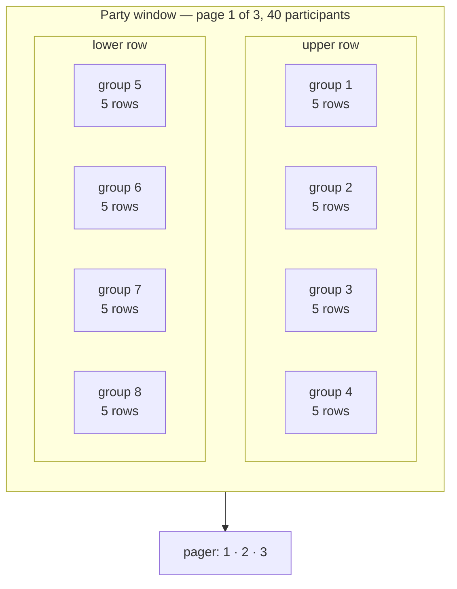
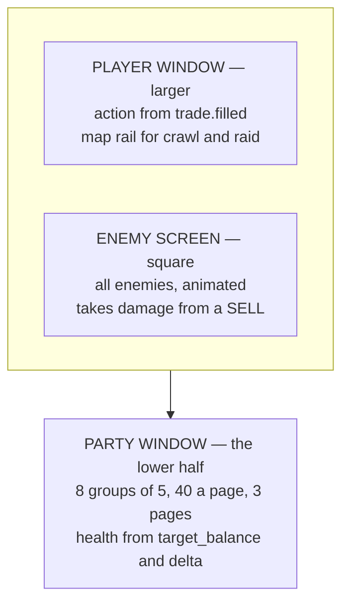
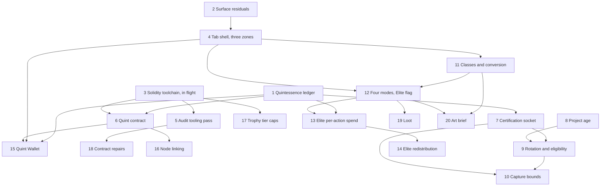

# Proof of Accumulation — the tab, the economy, and the build order

Reference. **This page is the concept document.** It carries the design, the
reasoning behind it, the measured state of the code, the units and the list of
what the operator owes. Nothing sits in a separate file.

**This issue is the single home for all TestNet, PoA and in-app blockchain
work.** Anything found in that subsystem folds in here as a comment — no
separate issues, no separate queue items.

**One PoA Tab, and only one.** The local chain, tokens, merkle log, trophies and
seasons are parts of PoA, not a second surface.

The design is the operator's, delivered across 2026-09-07 and 2026-09-09 in
twenty-one comments. The comments stay as the provenance. This page is the
specification.

## The concept document is in four parts

A GitHub issue body holds 65,536 characters. The concept document is larger, so
it runs on this page in four parts: this body, then three comments below it.
**Scroll the page. Nothing is in another file.**

| Part | Sections it carries |
| ---- | ------------------- |
| **This body** | 1 What PoA is · 2 The tab · 3 The classes · 4 The trading profile as RPG metrics · 5 Trade action to RPG action · 6 The modes and the Elite variant · the superseded readings · the twenty units · the nine choices · what he owes |
| **Concept document — part 2 of 4** | 7 The Certified Transaction Socket · 8 The economy |
| **Concept document — part 3 of 4** | 9 The Exchange Participation Layer, and the rotating reward set |
| **Concept document — part 4 of 4** | 10 Node linking and the Quint Wallet · 11 The contracts and the security audit · 12 Measured state of the code · Sources |

The units and the list of what he owes sit in this body, ahead of sections 7 to
12, because those are the parts that get dispatched and the parts he answers.

## How to read this page

Every statement carries one of three marks.

```
HIS        his own words or his direct ruling
MEASURED   read out of the tree, with the file and the symbol named
PROPOSED   a design decision taken here, for him to accept or refuse
```

A **PROPOSED** line is never a directive. Where a question is his and is not yet
answered, it appears in [the nine choices](#the-nine-choices) and in
[What he owes](#what-he-owes) at the end.

Where two of his statements touch one subject, the later one wins. The two
places that happened are marked [Superseded readings](#superseded-readings).

---

## 1. What PoA is

**HIS.** A deep, perpetual, blockchain-based game and world, defined by
Acervator instances acting as PoA Nodes. A participant's real trading becomes
play, and play yields tokens and loot.

### The two layers

**HIS.**

**Contestant Layer.** Tournament competitors authenticate their participation.
Their trade actions are translated into tournament actions.

**Exchange Participation Layer, with manipulation protection.** Exchanges
authenticate their markets. Those markets generatively drop RPG-style NFT loot.
Loot augments the translated trade actions.

### What is awarded

**HIS.**

```
PoA tokens   most damage done, or most healed
loot         dice rolls
```

All loot is NFT-based. It carries deep RPG-like functions and bonuses with
rarity scales, and it is tradable.

**PoA tokens only ever yield from these tournaments and from other player-based
PoA actions.** That is the whole supply.

---

## 2. The tab

**HIS.** He states plainly that the arrangement is incomplete: *"I currently do
not have a complete vision in my head on how to arrange the PoA Tab"*, and
*"May need to research this and extend upon my current concept pieces to fill it
out before attempting to build."*

### The three zones

**HIS.**

```
+---------------------------------+------------------+
|  PLAYER WINDOW                  |  ENEMY SCREEN    |
|  larger pixel-art zone          |  square          |
|  players acting, alone or in    |  pixel graphics  |
|  groups; dungeon maps for the   |  all enemies,    |
|  crawl and raid event types     |  animated        |
+---------------------------------+------------------+
|  PARTY WINDOW  —  the lower half                   |
|  players and groups, up to 120 participants        |
+----------------------------------------------------+
```

**Enemy screen.** Upper right, and square. A pixel graphics zone where all
enemies are displayed and animated, taking damage or attacking players.

**Player window.** To the left of the enemy screen and above the party window.
Players appear taking actions as individuals or groups. This area also displays
the dungeon maps for the crawl and raid event types. Pixel art, and larger than
the enemy screen, because it has to show trading action translated to RPG
action.

**Party window.** The lower half. Players and groups. It must sharply display up
to 120 participants for the largest events, through a multi-page structure of 40
per page.

### Players take damage, and never lose money

**HIS.** Players can be attacked. They do not lose money. Everything from the
trading profile is converted or abstracted into RPG metrics. Players hold health
pools based on character class, gear and level, following classic RPG
structures.

### The Player window carries two jobs

**HIS.** *"Players appear taking actions as individuals or groups. This area
also displays the dungeon maps for the crawl and raid event types."*

**PROPOSED.** The answer turns on the dungeon's shape, not on the layout. Two
precedents show why.

A linear dungeon needs only a small map. Darkest Dungeon keeps its map in one
corner of the action view, and it can, because every corridor joins exactly two
rooms, has no corners, and every room matches every other in size. A map of that
shape stays readable at a small size.

A free-form dungeon needs a large map. Etrian Odyssey gave the map its own
screen so the player could map and act at once. Single-screen games of that kind
make the player toggle instead, and the commentary on those games agrees:
raising the map, reading it and lowering it is the worse experience.

Two of his four modes need no map at all. Monster Smash, individual and team, is
an arena. Only the Dungeon Crawl and the Raid carry a map.

**PROPOSED.** One zone can do both jobs, on one condition.

```
PROPOSED — the Player window, two modes in one zone

Monster Smash, 1a and 1b     all action, no map rail
Dungeon Crawl and Raid       action at full size, map as an inset rail
the condition                the generative dungeon is a linear room graph
```

The map rail sits along one edge and shows the room chain, the party's position
and which rooms the party has cleared. It never needs to be large, for the same
reason Darkest Dungeon's does not.

**If he wants a free-form dungeon instead, one zone cannot do both**, and saying
otherwise would be wrong. The alternative is a map mode that takes the whole
Player window, with the action reduced to a single banner line while the map is
up. That mode is the worse of the two, because the player loses the action view
at the exact moment of a move. That is the trade, stated plainly, and the
dungeon's shape is the decision that settles it. It is
[Choice 4](#the-nine-choices).

### One hundred and twenty participants, legible

**HIS.** *"It must sharply display up to 120 participants for the largest
events, through a multi-page structure of 40 per page."*

Forty is not an arbitrary page size. Forty is the standard raid roster, and the
standard arrangement inside it is eight groups of five. Guides written for
players state the structure plainly: design the interface around forty frames in
eight groups.

Two rules come out of the same guides. Colour by role or class, because colour
carries awareness across a large field at a glance. And scale the tile down as
the count climbs, so every tile stays on screen rather than crowding the action.

**PROPOSED.** The page size is his. The arrangement inside it follows the
standard, because the standard already suits exactly this count.



Three pages of forty cover his one hundred and twenty. Each page is one raid's
worth, so a page boundary falls where a real group boundary already falls.

One advantage is worth spending deliberately. His Party window is the lower half
of the tab, not a corner of an action view. Each tile therefore gets far more
room than a game's raid frame gets. That room goes into the health bar, not into
extra fields.

### What a participant row shows, and what drops

**PROPOSED.** Four things survive at every density, ranked. The list is short on
purpose.

```
PROPOSED — what a participant row always carries

1  health bar       the one element that never shrinks
2  role colour      Salt, Sulphur or Mercury, as the fill colour
3  name             truncated, never wrapped
4  one mark slot    the single most urgent state, and nothing else
```

As the count climbs from six to forty, four things drop, in this order.

```
PROPOSED — the drop order

dropped first   the resource bar
then            the numeric health beside the bar
then            the class sigil, leaving only the role colour
last            the second mark slot
```

The health bar is never one of them. A roster that cannot report health has
stopped being a roster.

### The three zones as one picture

**HIS** for the arrangement, **PROPOSED** for the labels on the data.



---

## 3. The classes

**HIS.** A participant chooses a character class for each event they play.

```
the three roles   Tank, Healer, Damage
research needed   an array of hermetic-themed variants of the three roles
levelling         each class levels independently
XP                gained per action during a PoA event, with bonuses for
                  efficacy and accuracy
breadth           no limit on how many classes a participant uses, but focus
                  yields more power
```

### The hermetic vocabulary the platform already carries

**MEASURED.** Two hermetic axes already have owners, and neither is free for a
class name.

The five trophy tiers hold the four-colour alchemical path. Each drawing letters
its own stage across the face, and the epigraph runs around the ring.

`src/competition/trophy_generator.py` — `generate_trophy`'s stage map

```python
    stages = {
        "Harvest": "NIGREDO",
        "Gold Fold": "ALBEDO",
        "Bear Slayer": "CITRINITAS",
        "Grand Accumulator": "RUBEDO",
        "Ekthelius": "UNIO MYSTICA",
```

The price record holds the tablet. The historical price store is the Stone
Tablets, and a second tablet tree holds the Portfolio Battery's history.

`src/trading/stone_tablets/ra_paths.py` — the two roots

```python
_RA_ROOT: Path = Path.home() / ".acervator_ra_tablets"

RA_STONE_TABLETS_DIR: Path = _RA_ROOT
```

### The axis this array uses

**MEASURED.** Nothing in the tree uses the seven classical planets or their
metals. A search of every Python file under `src/` for the seven planet names
returns five hits, and not one of them is Acervator vocabulary: three name the
JUP token, two name Cardano's consensus in an asset description.

```
$ grep -rniE "\b(mercury|saturn|jupiter|venus|mars|azoth|ouroboros|trismegistus)\b" src/ --include=*.py
src/exchange/chart_data.py:67:    "JUP": "jupiter-exchange-solana",
src/exchange/crypto_assets.py:162: ... "using the Ouroboros Proof of Stake "
src/exchange/crypto_assets.py:168: consensus="Ouroboros Proof of Stake",
src/exchange/crypto_assets.py:457:        "Jupiter",
src/exchange/crypto_assets.py:458:        "jupiter-exchange-solana",
```

### The three roles, from the three principles

**PROPOSED**, on a published source. Paracelsus set three principles, and his
own words give them bodies. The material reading of each one admits no argument,
so each maps onto exactly one role.

```
PROPOSED — the role names

Salt      "Salt is the body"      the solid, permanent element  ->  Tank
Sulphur   "Sulphur is the soul"   the combustible element       ->  Damage
Mercury   "Mercury is the spirit" the fluid and changeable one  ->  Healer
```

Paracelsus carried the same three into medicine. Disease is an imbalance among
the three, and healing restores their harmony. The tradition therefore states
the healer's job itself, which is why Mercury takes that role rather than a
looser fit.

### The array

**PROPOSED.** Seven classes, one per classical planet. Two things decide the
role: the planet's quality as Ptolemy states it, and what the metal does in the
hand.

```
PROPOSED — the seven classes

role            class                  planet / metal
------------    -------------------    --------------------
Salt   (Tank)   Lead Ward              Saturn  / lead
Salt   (Tank)   Tin Bulwark            Jupiter / tin
Sulphur (Dmg)   Iron Edge              Mars    / iron
Sulphur (Dmg)   Solar Lance            Sol     / gold
Mercury (Heal)  Copper Conduit         Venus   / copper
Mercury (Heal)  Silver Mirror          Luna    / silver
Mercury (Heal)  Quicksilver Draught    Mercury / quicksilver
```

One line for each name.

| Class | Why that name |
| ----- | ------------- |
| Lead Ward | Saturn's quality is “chiefly to cool”; lead is the heaviest of the seven and the metal people hide behind |
| Tin Bulwark | Jupiter is a “temperate active force”; tin is the coat that keeps iron from rusting, so it guards another metal |
| Iron Edge | Mars is “chiefly to dry and to burn”; iron is the weapon metal |
| Solar Lance | The Sun is “heating and … drying”; gold cannot corrode, so the strike never blunts |
| Copper Conduit | Venus “chiefly humidifies” and counts as a beneficent planet; copper conducts, so one heal passes along a chain |
| Silver Mirror | The Moon's “power consists of humidifying”, and it shines by reflection; silver reflects |
| Quicksilver Draught | Mercury is “of common influence, productive either of good or evil” and “absorptive of moisture”; quicksilver is the only liquid metal |

Two Tanks, two Damage and three Healers.

### Why these names sit beside the existing ones

**PROPOSED.** Three reasons these names fit the tree's own vocabulary.

The shape matches. Stone Tablets pairs a concrete noun with a plain noun. Every
class name here does the same, and so do the five tier names — Harvest, Gold
Fold, Bear Slayer, Grand Accumulator, Ekthelius.

The register matches. No Latin reaches the screen. The Latin stays where it
already sits, on the trophy faces.

No class shares a stem with a tier. Gold Fold is a tier name, so the Sun's class
takes the planet's adjective instead of its metal. That is the only place a
metal steps aside, and collision is the reason, not taste.

### How the array serves independent levelling

**HIS.** From the 2026-09-07 brainstorm:

> each class levels independently … XP gained per action during a PoA event,
> with bonuses for efficacy and accuracy … no limit on how many classes a
> participant uses, but focus yields more power

**PROPOSED.** Three properties of this array serve that, and none of them needs
a tuning number.

Seven closes the set. The classical planets have numbered seven since antiquity,
so the tradition fixes the breadth ceiling. The array never needs extending, and
nobody has to invent an arbitrary eighth name.

Covering all three roles costs at least three classes, because the roles split
two, two and three. Spreading therefore costs something before any curve touches
it.

Efficacy and accuracy are separate numbers the platform already computes, and
they come from separate fields. Section 4 names them. Repeating one kind of
action cannot farm a bonus drawn from two independent readings.

### The alchemical colour stages are already spoken for

**MEASURED.** The trophy generator letters the five award tiers with the
four-colour path, so no class name may take one.

```
src/competition/trophy_generator.py:243-247
    "Harvest": "NIGREDO"
    "Gold Fold": "ALBEDO"
    "Bear Slayer": "CITRINITAS"
    "Grand Accumulator": "RUBEDO"
    "Ekthelius": "UNIO MYSTICA"
```

---

## 4. The trading profile as RPG metrics

**HIS.** From the 2026-09-09 tab layout:

> Players can be attacked. They do not lose money. Everything from the trading
> profile is converted or abstracted into RPG metrics. Players hold health pools
> based on character class, gear and level, following classic RPG structures.

### What the platform measures today

**MEASURED.** Five files hold every number this conversion needs.

`src/trading/container/config.py` — `BotStats`, the per-bot runtime figures

```python
    realised_pnl: float = 0.0
    unrealised_pnl: float = 0.0
    total_scrummed_usd: float = 0.0
    total_folded_usd: float = 0.0
    ytd_scrummed_usd: float = 0.0
    ytd_folded_usd: float = 0.0
    verify_clean: int = 0
    verify_adjusted: int = 0
    verify_canceled: int = 0
    verify_samples: int = 0
    consecutive_errors: int = 0
    total_errors: int = 0
    realized_pnl_exchange: float = 0.0  # FIFO-matched realized P/L
    avg_entry_exchange: float = 0.0  # weighted-avg cost basis
    cost_basis_total_exchange: float = 0.0  # qty x avg_entry
    cash_balance_usd: float = 0.0
    standing_surplus_usd: float = 0.0
```

`src/trading/gate_chain.py` — `GateContext`, the distance from the dollar line

```python
    delta: float  # current_value - target_balance
    delta_pct: float  # |delta| / target_balance × 100
```

`src/trading/scrumming/snapshots.py` — `_compounding_snapshot`, the target and
how far it has grown

```python
            snap["target_balance"] = round(target, 6)
            snap["anchor_target_balance"] = round(anchor, 6)
            # Positive => target has grown above anchor via compounding.
            snap["accrued_growth_usd"] = round(target - anchor, 6)
            snap["max_target_growth_pct"] = growth_pct
            snap["cycle_growth_budget_usd"] = round(anchor * growth_pct / 100.0, 6)
```

`src/trading/trade_grader.py` — `TradeGrade`, four sub-scores per trade, each in
the range nought to one

```python
    execution_score: Optional[float]
    timing_score: Optional[float]
    strategic_score: Optional[float]
    outcome_score: Optional[float]
    overall: str
    overall_numeric: float
    execution_bps: Optional[float] = None
    mfe_pct: Optional[float] = None
    mae_pct: Optional[float] = None
    sb_improvement: Optional[float] = None
```

`src/trading/indicators/types.py` — `VotingSummary`, the consensus of twelve
voters

```python
    bullish_count: int = 0
    bearish_count: int = 0
    neutral_count: int = 0
    net_score: float = 0.0  # Positive = bullish consensus
    consensus_confidence: float = 0.0  # 0.0 - 1.0
```

That twelve comes from a measurement, not from recall. Running the real module
reports it.

```
$ python -c "from src.trading.ta_engine import DEFAULT_WEIGHTS; print(len(DEFAULT_WEIGHTS))"
12
```

### The conversion

**PROPOSED**, from the fields above. The health pool comes from the dollar
target the whole engine defends, not from profit and loss. That satisfies his
rule directly: a player below the line carries a wound, and a player loses no
money by sitting below it.

```
PROPOSED — health, from the target and the distance from it

maximum health          target_balance
base health             anchor_target_balance
health from levelling   accrued_growth_usd      (target minus anchor)
gain cap per level      cycle_growth_budget_usd, max_target_growth_pct
current health          target_balance + delta
wound depth, percent    delta_pct
```

The target grows as folds land, capped per cycle. The pool therefore already
rises through play and already has a ceiling on how fast. That is a levelling
curve the engine computes today.

```
PROPOSED — the rest of the conversion

damage dealt          ytd_scrummed_usd, and the fill's usd on a SELL
healing done          ytd_folded_usd, and the fill's usd on a BUY
heal pending          fold_count, fold_total_usd
accuracy              execution_score, with execution_bps as the reading
efficacy              timing_score, outcome_score, strategic_score
overall grade         overall_numeric, and overall as the letter
critical hit          consensus_confidence at or above a threshold
fumble                verify_adjusted, verify_canceled, consecutive_errors
resource pool         standing_surplus_usd, cash_balance_usd
what stopped a hit    ChainResult.blocked, the nineteen gate labels
```

Scrum is damage and fold is healing. That is not a convenience. His award rule
is most damage done or most healed, and the two halves of the cycle are the two
award axes, so the game's scoreboard and the platform's scoreboard carry one
number each.

### What the design wants and the code does not carry

**MEASURED.** Seven things the design needs have no field anywhere in `src/`.
Saying so is the honest answer. Assuming a field is not.

```
absent — no field under src/ holds any of these

experience points      a level        a character class
gear, or any item      an enemy       a threat or aggro value
a guild
```

The search can report. The same case-insensitive pattern that returns nothing
for experience points and gear returns nine hits for the word inventory and two
for NFT, so the pattern is not blind.

```
$ grep -rniE "\b(xp|experience|char_level|player_level|gear|loot|inventory)\b" src/ --include=*.py
  9 matches, every one the word "inventory" in another meaning
$ grep -rniE "\bnft\b|\bloot\b" src/ --include=*.py
  2 matches, neither a loot field
```

Trophies are the one exception, and they are awards rather than gear. Five
drawings exist, one per tier, picked by name.

`src/competition/season_schedule.py` — the tier key the drawings use

```python
TIER_BY_NAME = {t.name: t for t in RARITY_TIERS}
```

Class, level and gear are therefore new state. The design should not pretend
otherwise. They belong in one new record per participant, and nothing in the
trading profile should stand in for them.

---

## 5. Trade action to RPG action

### The three events that fire after every fill

**MEASURED.** Three bus topics fire together on every filled scrum and every
filled fold. Between them they carry the damage, the accuracy, the critical
reading and the gate verdict, so one subscriber can drive the whole screen.

`src/trading/scrumming/execution.py` — the fold path, the three calls in order

```python
            self._bus.emit(
                "trade.filled",
                bot_id=self.bot_id,
                data={
                    "type": _fold_label,
                    "side": "BUY",
                    "amount": fill_amount,
                    "price": fill_price,
                    "usd": fill_amount * fill_price,
                    "profit": _growth_applied,
                    "operator_initiated": _operator_initiated,
                },
            )
            self._emit_voting_panel_snapshot_at_fire(
                side="BUY", trade_action=str(_fold_label or "MANUAL_FOLD")
            )
            self._emit_gate_decision_at_fire(
                side="BUY", trade_action=str(_fold_label or "MANUAL_FOLD")
            )
```

The gate emitter carries the health numbers as well as the blockers. Its payload
includes both snapshots.

`src/trading/scrumming/snapshots.py` — `_emit_gate_decision_at_fire`

```python
                scrum_blockers=list(self._last_gate_state.get("scrum_blockers") or []),
                fold_blockers=list(self._last_gate_state.get("fold_blockers") or []),
                tranche_snapshot=self._tranche_snapshot(),
                compounding_snapshot=self._compounding_snapshot(),
```

### The action table

**MEASURED.** The trade vocabulary is a declared tuple of ten, read off the emit
sites.

`src/core/emit_contracts.py` — `TRADE_TYPES`

```python
TRADE_TYPES: tuple[str, ...] = (
    "SCRUM",
    "FOLD",
    "CARTRIDGE_SCRUM",
    "CARTRIDGE_FOLD",
    "ENTRY",
    "HEDGE",
    "DIST",
    "AUTO_DETONATION",
    "SELF_DESTRUCT",
    "MANUAL_TRANCHE_FOLD",
)
```

**PROPOSED.** One on-screen action for each, triggered by the type field of a
`trade.filled` event.

| Trade type | Side | What the Player window would show |
| ---------- | ---- | --------------------------------- |
| SCRUM | SELL | A strike on the enemy, sized by the fill's dollars |
| FOLD | BUY | A heal on the player, sized by the fill's dollars |
| CARTRIDGE_SCRUM | SELL | A strike from a loaded magazine, one of a queued set |
| CARTRIDGE_FOLD | BUY | A heal from a loaded magazine |
| ENTRY | BUY | The player steps onto the field |
| HEDGE | either | A ward goes up; no damage and no heal |
| DIST | SELL | A strike that takes no loot; the surplus leaves the field |
| AUTO_DETONATION | SELL | A finishing blow; the excess rides in the profit field |
| SELF_DESTRUCT | SELL | The player leaves the field |
| MANUAL_TRANCHE_FOLD | BUY | A heal the operator casts by hand; the operator-initiated flag is true |

Three further on-screen events come from the other two topics.

```
PROPOSED — actions that are not a fill

a critical hit       consensus_confidence, off bot.voting_panel_snapshot
a blocked swing      a gate name in scrum_blockers or fold_blockers
a healed wound       delta rising toward nought across two gate events
```

### Three gaps in this seam

**MEASURED.** The live trading path does not reach the competition engine today,
and a builder needs to know exactly where it stops.

Nothing outside the package calls the engine's recording method. Two callers
exist, both inside one demo run.

```
$ grep -rn "record_trade" src/ tests/ main.py --include=*.py
src/competition/competition_engine.py:161:    def record_trade(
src/competition/local_testnet.py:735:                    engine.record_trade(
src/competition/local_testnet.py:743:                    engine.record_trade(
src/trading/analytics_engine.py:90:    def record_trade(self, trade: TradeRecord)
src/core/version_sweep.py:1433: a regex naming the method, not a call
```

The same search over a name in wide use returns fourteen references, so it
reports when there is something to report.

```
$ grep -rn "TokenLedger" src/ tests/ --include=*.py | wc -l
14
```

The two vocabularies differ in size. The competition record takes four role
values; the bus carries ten trade types. An adapter has to map ten onto four, or
the four have to widen.

`src/competition/bot_identity.py` — `TradeRecord`'s role field

```python
    role: str  # "SCRUM" | "FOLD" | "HEDGE" | "INIT"
```

Four different classes answer to the name `TradeRecord`. Whichever file the
adapter lands in, it must say which one it means.

```
$ grep -rn "^class TradeRecord" src/ --include=*.py
src/competition/bot_identity.py:43
src/trading/analytics_engine.py:20
src/trading/live_monitor.py:20
src/trading/trade_grader.py:19
```

The platform emits one of the three fill-time topics without declaring it. Six
topics carry a contract; the voting snapshot is not among them, so nothing pins
its payload shape.

```
$ python -c "from src.core.emit_contracts import CONTRACTS; print([c.topic for c in CONTRACTS])"
['trade.filled', 'bot.gate_decision', 'pnl.event', 'ta.voting',
 'market_inspector.scan_started', 'market_inspector.scan_finished']
```

---

## 6. The modes, and the Elite variant

### The four modes

**HIS.**

**1a — Monster Smash.** Individuals compete to slay low to midlevel creatures,
for loot and for PoA tokens.

**1b — Team Based Monster Smash.** Requires PoA-certified Trading Guilds.

```
formation    only those holding PoA tokens can form a guild
staking      guild membership locks and stakes PoA tokens, by guild rank
size         a guild may hold any number of members
the mode     supports up to 120 against 1
scaling      difficulty and loot scale with the number of members
```

**2a — Dungeon Crawl.** Individuals, or guilds in groups of six or fewer, crawl
a generative dungeon holding multiple creatures, mini bosses and main bosses.
For a group, the highest ranking guild member navigates.

**2b — Raid.** The large Dungeon Crawl, for groups of sixty. The most
challenging events, and the most rewarding.

### Elite is a modifier, not a fifth mode

**HIS.** *"Every event type will have an Elite variant."*

An Elite Event is for holders of significant amounts of Quintessence, measured
relatively. It differs in four ways:

```
the spend  per action — every move, spell, attack and tactic costs a little
the return 75% of total spent Quintessence goes back to participants at the end
harder     higher base difficulty
cheaper    lower entry fees
richer     loot rarity and drop rate both rise
```

**PROPOSED.** Eight event types carried as four modes with a flag, rather than
eight mode definitions. Difficulty, entry fee, loot rates and the per-action
spend become properties of the variant, set once.

**HIS.** Entry fees are lower and the spending happens while playing. His own
rule that no gate sits behind a pay wall therefore stays intact. Quintessence
sustains action inside an Elite Event rather than buying admission to it.

---

## Superseded readings

He corrected himself twice on 2026-09-09. **The later statement wins in both
cases.** Both earlier readings are recorded here as withdrawn so no builder
picks one up from a comment.

### Quintessence is never burned

**HIS, later and binding.**

> "Well, do not mean for Quint to be 'burned'...used the wrong word here. It is
> stored on the blockchain for future use."

> "Quint is the essence...should not be able to be destroyed from a
> philosophical standpoint..."

```
spend   a participant's Quintessence leaves their wallet
store   it rests on-chain
reuse   it funds later awards and later event pools
```

**Withdrawn.** The earlier reading of his Elite Events note took "the Quint burn
/ spend mechanic" literally and concluded that a Quintessence contract must be
able to burn, and that the supply becomes deflationary. Both are wrong and both
are withdrawn. The no-burn property of the existing token contract suits
Quintessence after all, the cap is a ceiling on total ever minted, and the share
not redistributed is a reserve that keeps events fundable once the cap is
reached.

### Project age replaces per-exchange listing age

**HIS, later and binding.**

> "Can research with CoinGecko. Project age for all blockchains is known. This
> is an inherent characteristic."

```
project age   when the chain or token came into existence
listing age   when one exchange began carrying that market
```

**Withdrawn.** An earlier note recorded that listing age cannot be answered and
treated that as a blocker on his six-month rule. Project age is the better test
for what he asked for: a token three years old, newly listed on one venue, is
not an obscure pump, while a token three weeks old is one on every venue at
once. Per-exchange listing age stays unavailable and is no longer needed.

Section 9, in part 3 below, carries the whole project-age mechanism: the
endpoint, the field, the identifier map that limits it, the cost of a backfill,
and what happens when an age is unknown. The per-exchange measurement that the
correction retired is kept there too, marked retired, because it is the evidence
that the platform cannot answer the older question.

### One further withdrawal, inside the capture bounds

**Withdrawn.** An earlier reading recorded the split of a market's pool among
its certifiers as the largest unbounded hole in the rotation, and recommended an
equal share above a minimum qualifying volume. **His capture-bounds directive of
2026-09-09 answers it and supersedes that recommendation.** One allotment per
participant per activation per market, a share ceiling, a cooldown in candles
and a graded curve bound the split directly. The earlier recommendation is
withdrawn and [Choice 9](#the-nine-choices) is closed. The one item that stays
unbounded is how many exchanges a single participant may draw from, and section 9
records it.

---

## The units

Twenty units. Each is dispatchable on its own. The order respects every
dependency: no unit depends on one later in the list.

Every unit updates the Product Manual page for this tab in the same unit it
lands, and every unit runs the archetype that owns the files it touches.

### Unit 1 is first, and this is why

**The Quintessence ledger.** It is the only unit that is both unblocked and
upstream of nine others. Measured: the package declares no debit, spend, deduct,
withdraw or transfer method anywhere, and every spending mechanism in this
design — event entry, the per-action Elite spend, the wallet, redistribution —
needs one. It waits on no decision of his. Nothing he has yet to answer changes
what it builds.

Unit 2 and Unit 3 are also unblocked and depend on nothing, so they can run
beside it.



### 1 — The Quintessence ledger

```
name          a Quintessence ledger with a debit path
depends on    none
blocked by    nothing
deliverable   Quintessence mints on certification, falls when spent, rests at a
              held address, and the 33,000,000 cap is enforced in the write
              path; a check holds the conservation law — every balance plus
              every held address equals total ever minted
```

The existing token ledger stays award-only by design: its own header states
there is no edit-balance operation. This unit does not change it.

### 2 — The residuals a new surface makes live

```
name          close the four residuals before a surface reuses the code
depends on    none
blocked by    nothing
deliverable   the balance update is locked, the private-chain fallback is
              removed, the data directory derives from the home path, and the
              state serializer reads a snapshot taken under the lock
```

### 3 — The Solidity toolchain (IN FLIGHT)

```
name          pinned compiler, OpenZeppelin resolved, contracts compile
depends on    none
blocked by    nothing
deliverable   all three contracts build at a fixed compiler version
```

Another unit is installing this now. Depend on it; do not duplicate it.

### 4 — The PoA tab shell and the three zones

```
name          the tab, with the enemy screen, player window and party window
depends on    2
blocked by    nothing — the arrangement is his and it is given
deliverable   one PoA tab is reachable and draws three zones carrying live
              chain state through the existing bridge
```

### 5 — The contract audit, tooling pass

```
name          run the named analyzers and report findings
depends on    3
blocked by    nothing
deliverable   findings from forge, slither, mythril, solhint and semgrep,
              each tool proved two-sided, each finding classified against the
              SWC Registry and the OWASP Smart Contract Top 10
```

No repairs in this unit.

### 6 — The Quintessence contract

```
name          an on-chain Quintessence token
depends on    1, 3
blocked by    whether Quintessence can move between participants
deliverable   a contract that compiles, caps total ever minted at 33,000,000,
              never burns, holds no pre-owned balance at genesis, and passes
              the conservation invariant under forge invariant testing
```

### 7 — The Certified Transaction Socket

```
name          certify every fill, and distil Quintessence from the fee paid
depends on    1
blocked by    the Quintessence rate per dollar of exchange fee
deliverable   every fill reaches the chain through the socket; a bot that does
              not certify is refused entry to a PoA event
```

### 8 — Project age, from CoinGecko

```
name          an asset's project age, available to the eligibility test
depends on    none
blocked by    nothing
deliverable   project age resolves for an asset through the existing identifier
              map, and an asset with no known age is refused
```

### 9 — The rotating reward set, and eligibility

```
name          a concealed rotating subset of qualifying markets
depends on    7, 8
blocked by    the eligibility reading; how many markets reward in one window;
              the manipulation protection on the Exchange Participation Layer
deliverable   only a qualifying market inside the live rotation can distil
              Quintessence; the rotation is encrypted on-chain; the mixed
              volume units in the ranking are repaired first
```

### 10 — The capture bounds and the grade curve

```
name          one allotment, a share ceiling, a candle cooldown, a graded curve
depends on    7, 9
blocked by    the per-market share ceiling, x%
deliverable   a second allotment in one activation is refused, an award above
              the ceiling is refused, a cooldown of at least three candles
              follows every award, and the award scales with the trade grade
```

### 11 — The class array and the RPG conversion

```
name          seven classes, and the trading profile as RPG metrics
depends on    4
blocked by    nothing
deliverable   a participant picks a class per event, each class levels on its
              own, and health, damage, healing, accuracy and efficacy each
              derive from a named trading field
```

### 12 — The four modes, and the Elite flag

```
name          Monster Smash, Team Monster Smash, Dungeon Crawl, Raid, each
              with an Elite variant
depends on    4, 11
blocked by    what makes a Quintessence holding significant, relatively
deliverable   four mode definitions carrying one Elite flag, with difficulty,
              entry fee and loot rates as properties of the variant
```

This unit reads the unreachable tournament module first and either builds on it
or retires it.

### 13 — Elite per-action spend, on action budget curves

```
name          per-action Quintessence cost, by action type
depends on    1, 12
blocked by    the curve bands and the cheapest-to-dearest ratio; who pays for a
              persuaded cast; whether a guild can hold Quintessence
deliverable   movement and bag handling cost nearly nothing, a multi-turn cast
              costs materially more, and the spend debits a real balance
```

### 14 — Elite redistribution by performance

```
name          75% of spent Quintessence back to participants, by performance
depends on    13
blocked by    nothing
deliverable   the pot divides on a normalised performance score, never on
              Quintessence spent; the remainder rests on-chain as the reserve
```

### 15 — The Quint Wallet

```
name          one wallet holding Quintessence, trophies and loot
depends on    1, 4, 6
blocked by    where the wallet sits in the three zones
deliverable   a balance that can rise and fall, the trophies held, the loot
              held, and a spend path into an event
```

### 16 — Node linking between instances

```
name          per-instance chains that link
depends on    6
blocked by    nothing
deliverable   two Acervator instances on one network agree on one chain, with
              peer discovery, a transport, and an agreement rule
```

### 17 — The trophy tier caps

```
name          lifetime caps on the tiers his directive covers
depends on    3
blocked by    the two numbers, or a ruling that a season budget is the cap
deliverable   the registry refuses a mint past a lifetime ceiling for every
              tier above the lowest
```

### 18 — The contract repairs

```
name          repair what the audit found
depends on    5
blocked by    who holds the pause key; whether an external review happens
              before mainnet, and when
deliverable   every finding from unit 5 is closed or recorded with the reason
              it stands
```

### 19 — The loot system

```
name          NFT loot, dropped by dice roll from authenticated markets
depends on    12
blocked by    the loot rarity scale; whether loot shares the trophy contract
deliverable   a loot drop from a qualifying market, held in the wallet, with
              functions and bonuses that augment a translated trade action
```

### 20 — The art brief

```
name          pixel art for three zones
depends on    4, 11, 12
blocked by    his art direction
deliverable   animated enemies, player and party sprites at forty to a page,
              and a dungeon map rail
```

---

## The nine choices

Nine questions are his. Each carries one recommendation and the cost of the
alternative. Choice 9 is closed; his own directive answered it.

### Choice 1 — how many classes

| Option | What it gives | What it costs |
| ------ | ------------- | ------------- |
| **Seven**, the planetary set | A closed array that never needs an eighth name; roles split two, two and three | Uneven roles, with one more Healer than Tank or Damage |
| Nine, three per role | Symmetry, and a third option inside every role | Two names from outside the planetary set, so the array is no longer closed |

**Recommended: seven.** The tradition closed the set at seven. Nine opens a set,
and then someone has to defend it against a tenth.

### Choice 2 — who is a participant

| Option | What it gives | What it costs |
| ------ | ------------- | ------------- |
| **One bot, one participant** | Matches the code: one key per identity, one registration per bot, capital committed per bot | An operator with many bots fields many participants at once |
| One instance, one participant | One person, one character, which reads more naturally | Something has to sum the engine's per-bot registrations, and the health field has no single source |

**Recommended: one bot, one participant.** The engine already does this.

`src/competition/competition_engine.py` — `BotRegistration`

```python
    bot_id: str
    config_hash: str  # SHA-256 of strategy config — proves consistency
    capital_usd: float
```

### Choice 3 — where health comes from

| Option | What it gives | What it costs |
| ------ | ------------- | ------------- |
| **The dollar target** | Health rises through play and has a per-cycle cap already; below the line is a wound, never a loss | Two players on different targets have different pools |
| Cost basis at the venue | One exchange-truth number per player | It moves with every fill, so the pool would never hold still |

**Recommended: the dollar target.** It satisfies his never-lose-money rule with
no further work.

### Choice 4 — the dungeon's shape

| Option | What it gives | What it costs |
| ------ | ------------- | ------------- |
| **A linear room graph** | One zone carries the action at full size and the map as a small rail | Dungeons are chains of rooms, not mazes |
| A free-form grid | Richer exploration and real navigation | The map needs the whole Player window, and the action shrinks to a banner while the map is up |

**Recommended: the linear room graph.** Only this shape lets the Player window
do both jobs at once.

### Choice 5 — the currency of each fee

| Option | What it gives | What it costs |
| ------ | ------------- | ------------- |
| **External for the charter, tokens for every stake** | The charter injects new value; the stakes lock existing value, which is what staking means | Two currencies in one fee table |
| Tokens for all four | Every fee locks, and the supply tightens fastest | A new guild pays tokens twice, because forming one already requires holding them |
| External for all four | Every fee injects, and no token leaves circulation | Nothing locks, and locking is half of what he asked the fees to do |

**Recommended: external for the charter, tokens for every stake.** This split is
the only one that does both jobs he named, and it does not charge a new guild
twice for one act.

### Choice 6 — what a fee may never take

| Option | What it gives | What it costs |
| ------ | ------------- | ------------- |
| **No in-network exchange into tokens** | The earned path to a raid stays earned | No token market inside the platform |
| An in-network token market | Liquidity, and a price | Tokens turn purchasable, so every earned gate turns into a paid one |

**Recommended: no in-network exchange into tokens.** This constraint alone keeps
his no-pay-wall rule true.

### Choice 7 — can Quintessence move between participants

This one carries the whole Certified Transaction Socket. His loot is explicitly
tradable and his PoA tokens are explicitly stakeable. He has said neither about
Quintessence.

| Option | What it gives | What it costs |
| ------ | ------------- | ------------- |
| **Bound to the participant who distilled it** | The anti-whale rule holds. A whale who will not trade on Acervator cannot enter at any price | No gifting, no guild treasury of Quintessence, and a dormant participant's balance helps nobody |
| Transferable between participants | A guild can carry a new member, and a quiet season still fills an event | A whale buys entry from anyone willing to sell, and the directive fails on the day the first trade clears |
| Transferable only inside one guild | A guild can carry its own members | A whale forms a guild, buys its members' balances, and the leak reopens one step further out |

**Recommended: bound to the participant who distilled it, and not transferable
at all.** His own sentence sets the bar — participation must benefit many and
not just themselves — and a quantity that can change hands is a quantity a whale
can buy. The third option only moves the leak; it does not close it.

This is the highest-value open question in the PoA economics, because every
other part of the socket works the same way whichever answer he gives, and this
answer alone decides whether the mechanism does its job.

### Choice 8 — how many markets reward in one window

The rotation's defence against blanket farming is the ratio of live markets to
rewarding markets. Everything else in section 9 holds whichever number he picks.
That one number decides how strong the defence gets.

| Option | What it gives | What it costs |
| ------ | ------------- | ------------- |
| **A small fixed count, one to three** | Covering costs a multiple in the hundreds, so blanket farming stops being worth doing | A participant trading a handful of markets may distil nothing for several windows, which reads as bad luck rather than as design |
| A fraction of the universe, say one market in ten | Steadier distilling, and a participant rarely goes a window empty | Covering costs only ten times as much, so a funded participant can absorb it |
| Half the universe | Almost nobody goes empty | Covering costs twice as much, and the defence is gone |

**Recommended: a small fixed count, with the window short enough that an empty
window costs little.** A short window turns the small count from a drought into
a shuffle, and the two settings work together: the count sets the defence, and
the window length sets how much an unlucky draw hurts.

Both numbers are his, because they decide what an event costs in hours of
trading. Nothing in the design changes if he moves them.

**Read that table against the eligible set, not the whole venue.** His
eligibility rules cap the drawable set at twenty markets per exchange, so a
fraction of the universe means a fraction of twenty, and the multiples in the
table shrink with it. A small fixed count is still the strong setting; the weak
settings are weaker than that table suggests.

### Choice 9 — how a market's allotment divides among its certifiers — CLOSED

**HIS, and it closes this choice.** The question asked how a market's allotment
divides among the participants who certified in it, and the recommendation was
an equal share above a minimum qualifying volume. His capture-bounds directive
answers it and supersedes that recommendation.

| Option | What it gives | What it costs |
| ------ | ------------- | ------------- |
| An equal share per certifying participant | Volume buys no advantage at all | A participant who traded one fill takes the same share as one who traded all day |
| Proportionate to each participant's fees in that market | Effort is rewarded in the way the socket already measures it | The participant with the most volume takes the largest share of every pool, which rebuilds the whale advantage inside the split |
| An equal share, capped by a minimum qualifying volume | Volume buys no advantage above the floor, and a token fill does not qualify | One more threshold for him to set, and a participant just under the floor gets nothing |
| **HIS answer — one allotment per participant, a share ceiling, a cooldown, a graded curve** | Bounds what one participant takes, stops them returning to the same pool, and makes a low-quality trade pay less whoever submits it | Three thresholds instead of one |

His answer is stronger than the recommendation it replaces. An equal share
bounds what one participant takes from one pool. His bounds also stop the same
participant returning to that pool, and they make a low-quality trade pay less
whoever submits it. **Nothing about the pool split remains open.**

---

## What he owes

Fifteen things, each one word or one number. Eleven of the twenty units wait on
one or more of them.

| What he owes | Blocks unit |
| ------------ | ----------- |
| The eligibility reading: both conditions required, or either sufficient | 9 |
| How much Quintessence one dollar of exchange fee distils | 7 |
| The per-market share ceiling, x% of a market's pool | 10 |
| How many markets reward Quintessence in one rotation window | 9 |
| The manipulation protection on the Exchange Participation Layer | 9 |
| Can Quintessence move between participants, be bought, or be traded | 6, 7, 15 |
| Lifetime caps for Gold Fold and Bear Slayer, or a ruling that a season budget is the cap | 17 |
| Where the Quint Wallet sits: a fourth zone, a panel, or a mode | 15 |
| Can a guild hold Quintessence — does a guild wallet exist | 13 |
| Who pays for a persuaded cast: the actor, the requester, or the guild treasury | 13 |
| The Action Budget Curve bands, and the ratio from cheapest to dearest action | 13 |
| What makes a Quintessence holding "significant", relatively speaking | 12 |
| The loot rarity scale | 19 |
| Whether loot shares the trophy contract or needs its own | 19 |
| Who holds the pause key, and whether an external review precedes mainnet | 18 |

**The highest-value one is transferability.** If Quintessence can be bought or
traded, a whale who cannot distil it simply buys it, which is the outcome the
whole certification socket exists to prevent. His loot is explicitly tradable
and his PoA tokens are explicitly stakeable; he has not said Quintessence is
either.

### Three thresholds ride with the rotation

Each is one number, and each sets how strong a bound is rather than whether the
bound exists.

```
the curve exponent     how steep the graded award curve runs — section 9
the cooldown floor     a minimum cooldown in wall-clock time as well as in
                       candles, so a one-minute bot cannot clear its gate
                       before the market has moved
the window length      how long one rotation window stays open, which sets how
                       much an empty draw hurts
```

### Three things the concept document does not answer

Three subjects sit outside the design. Each is named rather than guessed.

**The loot itself.** His brainstorm says loot drops from authenticated exchange
markets and carries functions, bonuses and rarity scales. The rarity scale he
already has is the five award tiers; a loot rarity scale is a separate thing, and
this page does not design it.

**The manipulation protection on the Exchange Participation Layer.** He names it
and does not describe it, and nothing in the package implements it.

**The art.** Pixel art at forty tiles a page, animated enemies and a map rail
make an art brief, not a design one. That is unit 20.

