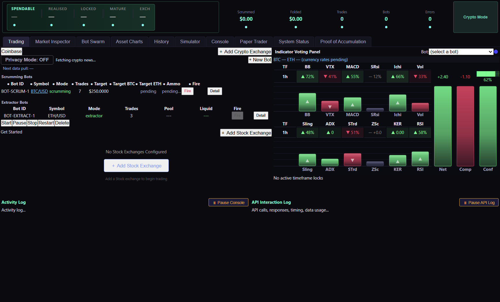

# System Architecture and Features Catalogue

Acervator features a semi-modular / layered design that nests a hyper-vigilant trading engine capable of operating in multiple investment domains simultaneously and all from one terminal. The Main Window contains all of the various subsections found in each subsystem tab. As it stands the existing and planned subsystem tabs are: Simulator, Paper Trading, Trading (Live), Market Inspector, Bot Swarm, Asset Charts, History, Console, Proof of Accumulation (PoA), and System Status. Most of these subsystems interact with each other to some degree with key isolations existing between the three trading tabs and their wiring to Market Inspector, Bot Swarm, and History.

## Trading Tab

Here you see the first subsystem we are going to cover and this will primarily be due to familiarizing the prospective investor or user with the core trading philosophy and strategies that drive Acervator. To begin, the platform runs locally on whichever hardware is selected. A single authorization phase requiring a purchased license key will be the only non-exchange communication the application will ever need. The user’s keys and secrets are stored locally and encrypted after API handshake verification passes which allows the chosen exchange to be initialized. At a later development stage, I have plans for dedicated hardware that uses a hardware key for quick boot into a given user’s account and also allows the platform to run in isolation under Linux.


This is the whole tab in one capture. The title bar and the menu row open it.
The header strip and the tab row run under them. Below those the exchange
sub-tab fills the left with the Scrumming Bots table and the command bar, the
Indicator Voting Panel fills the right, and the Activity Log and the API
Interaction Log close the foot. The status bar carries the API load pill and
the AI state label. The parts below take that screen in that order.

Privacy Mode is on, so every masked field draws four asterisks and the bot
table reads as ten columns of them. The title bar is the one reading no part
below names. It carries the version the tree answered with on the day of the
capture, v0.1.0. Nothing types that string out. Git answers for a source
checkout and the baked file answers for a frozen bundle, so the title cannot
name a release the build is not.

`src/gui/main_window.py` — the window title

```python
self.setWindowTitle("Acervator v" + __version__ + "")
```

Press the mode button once and the title is rewritten to name the wing. The
version leaves the title for the rest of the session, and only a restart brings
it back. Issue #426 carries that handler.

`src/gui/main_window.py` — `_toggle_trading_mode`, the title after a swap

```python
self.setWindowTitle("Acervator — CRYPTO WING")
```

#### The screen itself

**Functional.** One method builds this whole screen. It makes two layers, one
for crypto and one for equities, and stacks them so only one is on show at a
time. The crypto layer opens first. A second method builds the strip along the
top, and that strip stays put on every tab. Privacy Mode is on in the figure,
so each masked field draws four asterisks where its number would be.

`src/gui/main_tabs/trading_tab.py` — `TradingTabMixin._build_trading_tab`

```python
self._trading_stack.addWidget(crypto_page)  # index 0
self._trading_stack.addWidget(stock_page)  # index 1
self._trading_stack.setCurrentIndex(0)  # start in crypto
```

**Design intention.** The two-layer stack is the part of the multi-domain aim
you can use today. Pressing the mode button swaps the whole wing, tables and
Paper Trader together.

`src/gui/main_window.py` — `_toggle_trading_mode`

```python
self._trading_mode = "stock"
self._mode_btn.setText("Stock Mode")
self._mode_btn.setChecked(True)
self._trading_stack.setCurrentIndex(1)
```

The Modulus Bot and the Paper Trading layer this section names have no module
behind them. This manual marks them unbuilt where it reaches them.

#### The header strip

**Functional.** Five columns and five counter cards run along the top. The
columns read SPENDABLE, REALISED, LOCKED, MATURE and EXCH. One call to
`get_aggregate_stats` fills all of them once a tick. Spendable takes the wallet
cash, Locked takes the value tied up in crypto, and Exch counts the open
exchange sub-tabs. Realised and Mature are handed nothing at all, and the
widget draws an em dash for each. Privacy Mode then masks that em dash to
asterisks, which reads on screen as a hidden number rather than a missing one.

The five cards are Scrummed, Folded, Trades, Bots and Errors. Scrummed and
Folded total the fleet's sold and bought dollars, Bots counts the bots that are
running, and Errors totals the lifetime error count. Click Errors and the
rolling error log opens. The small circle under every column and every card is
a privacy dot, and it masks that one field on its own.

`src/gui/main_window.py` — `_refresh_dashboard`

```python
if _wallet_cash > 0 or _crypto_value > 0:
    self._spendable_widget.update_profits(
        {
            "spendable": _wallet_cash,
            "total_realised": None,
            "locked": _crypto_value,
            "mature": None,
            "exchange_count": exchanges,
        }
    )
```

**Design intention.** The strip should answer one question at a glance: what
the fleet holds, what it has earned, and what it has spent. Two of the five
columns do not answer it. Realised profit and matured profit are the numbers
those columns were built for, and nothing computes either one. The aggregate
already carries a realised total, so the first half is a short change at the
one call site.

*Proposed, not present:*

```python
self._spendable_widget.update_profits(
    {
        "spendable": _wallet_cash,
        "total_realised": float(agg.get("total_realised_pnl", 0.0) or 0.0),
        "locked": _crypto_value,
        "mature": None,
        "exchange_count": exchanges,
    }
)
```

`total_realised_pnl` is already read two lines above this call, for the
Scrummed card. Mature has no source yet and stays an em dash. Issue #418
carries this.

[08-tabs/portfolio-panels.md](08-tabs/portfolio-panels.md) covers the strip in
full.

#### The tab row

**Functional.** The row of main tabs takes its order from one list. Each label
in the list is moved to its own index at build time. Any tab the list does not
name keeps the position it was added at.

`src/gui/main_tabs/main_window_surface.py` — the order, declared once

```python
CANONICAL_TAB_ORDER = (
    TRADING_TAB,
    MARKET_INSPECTOR_TAB,
    BOT_SWARM_TAB,
    ASSET_CHARTS_TAB,
    HISTORY_TAB,
    SIMULATOR_TAB,
    CONSOLE_TAB,
)
```

Each of those seven names is a constant holding the label the tab bar shows,
and the main window applies the order once, after the last builder has run.

`src/gui/main_window.py` — where the order is applied

```python
self._reorder_main_tabs(list(CANONICAL_TAB_ORDER))
```

**Design intention.** The order should read as the working order. Trade first,
then the screens that inspect the trade, then the screens that replay it. One
list decides it, so the order cannot drift as tabs are added.

`src/gui/main_window.py` — the move loop

```python
tab_bar = self._main_tabs.tabBar()
for target_idx, name in enumerate(desired):
    for cur_idx in range(self._main_tabs.count()):
        if self._main_tabs.tabText(cur_idx) == name:
            if cur_idx != target_idx:
                tab_bar.moveTab(cur_idx, target_idx)
            break
```

#### One sub-tab per exchange

**Functional.** One sub-tab holds one exchange. Along its header sit Privacy
Mode, a news headline, and the + New Bot button that opens the wizard for this
venue. Privacy Mode toggles all eighteen masks at once. Under the header is a
data pool line: how many slots are held by kind, the age of the freshest and
the oldest, how many have run past their time to live, and the cache hit ratio.
At the right of the sub-tab row sits the button that adds another venue.

`src/gui/widgets/exchange_tab.py` — `ExchangeTab.__init__`

```python
self._privacy_mode_btn = QPushButton("Privacy Mode: OFF")
self._privacy_mode_btn.setToolTip(
    "Toggle ALL 18 privacy masks at once. When ON, every "
```

**Design intention.** One venue, one tab, one swarm. Add a second exchange and
it arrives beside the first with its own bots and its own data pool, and
nothing about the first changes.

`src/gui/main_window.py` — `_sync_exchange_tabs`

```python
def _sync_exchange_tabs(self) -> None:
    """Add a tab for each configured exchange missing one, in its own layer."""
```

#### The news line

**Functional.** The headline between Privacy Mode and + New Bot is one item
from the crypto news ticker. The counter in front of it gives that item's place
in the batch the ticker holds, so a reading of 23 of 42 marks the twenty-third
headline of forty-two. The item itself carries the feed name, a middle dot,
then the story title. A timer steps to the next item and wraps at the end of
the batch.

`src/gui/crypto_news_ticker.py` — the line the strip draws

```python
_prefix = f"[{self._index + 1}/{len(self._headlines)}] "
self._label.setText(_prefix + h.display_text())
```

**Design intention.** The counter tells you the batch is whole. A feed that
came back short shows a smaller second number rather than a strip that looks
the same and carries less. With nothing reachable the strip says so in words
instead of going blank.

`src/gui/crypto_news_ticker.py` — the empty state

```python
self._label.setText("(no crypto news feeds reachable)")
```

**Functional.** In the React build the strip is drawn by
`crypto_news_ticker.js` into the header space the exchange screen keeps between
the Privacy Mode button and + New Bot. The exchange screen names that space
only when the strip is there; where the strip would not build, the header takes
plain space instead and the two buttons keep their positions.

`src/gui/main_tabs/exchange_tab_surface.py` — `react_news_ticker`

```python
def react_news_ticker() -> str:
    """The module that draws the news strip, as ``build_news_ticker`` reads it.

    ``ExchangeTabModel`` calls this as its ``news_ticker_factory``, so
    ``news_ticker`` is set and the header keeps the strip's space.
    """
    return NEWS_TICKER_MODULE
```

**Functional.** Hovering the headline pauses the step timer and moving away
starts it again. Clicking the headline opens that story. Each of the three
sends one request and redraws the strip from the answer, so the strip on screen
matches what the backend holds.

`src/gui/main_tabs/crypto_news_ticker_surface.py` —
`CryptoNewsTickerModel.handle_event`

```python
if event_type == EVENT_ENTER:
    self.paused = True
    self.calls.append([HOVER_PAUSED])
    return False
if event_type == EVENT_LEAVE:
    self.paused = False
    self.calls.append([HOVER_RELEASED])
    return False
```

#### The bot tables

**Functional.** The Scrumming Bots table carries ten columns. Nine are named
and the tenth is blank, because that one holds the Detail button. Mode is the
coloured cell: green while running, amber while paused, grey while idle or
stopped, red on error, orange in cooldown, cyan while starting. The Ammo cell
draws green above the target, red below it, and neutral grey inside the dust
band. Target BTC and Target ETH restate the Target in those two assets, and go
blank when the pair is unlisted or when the target already is that asset. The
Extractor table sits underneath. Both tables start hidden and appear when their
own list gains a row.

`src/gui/widgets/bot_status_table.py` — `BotStatusTable.SCRUMMING_COLUMNS`

```python
SCRUMMING_COLUMNS = ColumnSpec(
    labels=(
        "Bot ID",
        "Symbol",
        "Mode",
        "Trades",
        "Target",
        "Target BTC",
        "Target ETH",
        "Ammo",
        "Fire",
        "",
    ),
```

**Functional.** Column 2 is Current Position Value. It shows what the bot's
holdings are worth at the exchange's own price. It is blank whenever no fresh
exchange price exists, and a blank cell names the missing thing in its tooltip:
no position held, no exchange price for the pair yet, no exchange price this
tick, or a price older than twenty seconds. The cell never falls back to a
last-known figure, to a stand-in, or to a value read out of the bot's own
ledger. The state colour now sits on the Bot ID cell, which is green while
running, amber while paused, grey while idle or stopped, red on error, orange
in cooldown and cyan while starting. That cell's tooltip names the mode and the
state.

`src/gui/main_tabs/table_cells_surface.py` — the one multiplication both priced
cells read, so the Position Value cell and the Ammo cell can never disagree

```python
def priced_position(holdings: float, price: float, quote_rate: float) -> float:
    """The position value at one price: ``holdings`` times ``price`` times
    ``quote_rate``."""
    return holdings * price * quote_rate
```

**Functional.** The price both cells read comes from the shared exchange price
cache, and it carries its own age. An age of None means the cache held nothing
and the bot's own last reading was used instead, which is why the Position
Value cell goes blank on that path.

`src/gui/main_tabs/table_cells_surface.py` — the four blank paths and the one
priced path

```python
POSITION_PATH_PRICED = "priced"
POSITION_PATH_NO_HOLDINGS = "no_holdings"
POSITION_PATH_NO_PRICE = "no_price"
POSITION_PATH_OFF_EXCHANGE = "off_exchange"
POSITION_PATH_AGED = "aged"
```

**Design intention.** The Ammo cell measures against the live target, not the
frozen number typed into the wizard, so the reading follows the grown balance
the engine re-zeroes to.

`src/gui/widgets/bot_status_table.py` — the target the Ammo cell measures
against

```python
target_val = float(
    status.get("live_target_balance", status.get("target_balance", 0.0))
    or status.get("target_balance", 0.0)
    or 0.0
)
```

**Functional.** In the React build the Scrumming Bots table is drawn by
`bot_status_table.js`. The exchange screen keeps a named empty space for it and
fills that space when it draws itself. The rows come from the backend, not from
the exchange screen: the renderer asks the bridge for the table's own state and
names the exchange it wants rows for. Each exchange gets its own table state, so
two exchange screens on one page never share rows or a highlight.

`src/gui/web/exchange_tab.js` — `mountScrumTable`

```javascript
function mountScrumTable(target, model) {
  var loader = global[LOAD_BOT_TABLE];
  var wait =
    typeof loader === "function" ? loader(askFor(model)) : Promise.resolve(null);
  return Promise.resolve(wait).then(function () {
    return renderScrumTable(target, exchangeOf(model)) === null
      ? null
      : BOT_TABLE_MODULE;
  });
}
```

**Functional.** The four things the operator can press on the table each send
one request and redraw from the answer. A column header toggles that column's
privacy mask, a Symbol cell opens the chart address, Fire hands the bot to
Manual Fire, and Detail selects the row and opens the bot. `on_detail` is the
handler behind the Detail button.

`src/gui/main_tabs/bot_status_table_surface.py` — `BotStatusTableModel.on_detail`

```python
def on_detail(self, bot_id: str) -> None:
    """Select the row, then hand the bot to whatever opens the detail."""
    self.select_row_for_bot(bot_id)
    self.detail_clicks.append(bot_id)
    self.calls.append([DETAIL_CLICKED, bot_id])
    if self.on_bot_clicked:
        self.on_bot_clicked(bot_id)
```

**Design intention.** The exchange screen redraws itself once a second to keep
the data-pool line fresh. Each redraw re-fills the table space, so the table is
drawn from the state the renderer holds for that exchange rather than from the
answer captured at first paint. A row the operator selected therefore survives
the next redraw.

`src/gui/web/bot_status_table.js` — `modelFor`

```javascript
function modelFor(exchangeId) {
  return owns(models, String(exchangeId)) ? models[String(exchangeId)] : null;
}
```

**Functional.** The Extractor table underneath is drawn the same way, by
`extractor_bot_table.js` into the second named space the exchange screen keeps.
Its rows come from the same fleet list, kept to the records whose mode is
extractor. The Detail button is the one control the Extractor table offers;
Fire stays disabled on this screen, because Manual Fire is per position and
lives in the Positions Held tab of the bot's own window.

`src/gui/main_tabs/extractor_bot_table_surface.py` — `extractor_statuses`

```python
def extractor_statuses(statuses: Any) -> list:
    """The records of ``statuses`` whose mode is ``MODE_TEXT``.

    ``update_bots`` builds a row for every record it is handed, so only the
    Extractor bots reach the Extractor table.
    """
    return [
        found
        for found in statuses or []
        if isinstance(found, dict) and found.get("mode") == MODE_TEXT
    ]
```

**Functional.** The exchange screen mounts its three children in one step, each
into its own space and each asked for its own view model.

`src/gui/web/exchange_tab.js` — `mountChildren`

```javascript
function mountChildren(target, model) {
  return Promise.all([
    mountScrumTable(target, model),
    mountExtractorTable(target, model),
    mountNewsTicker(target, model)
  ]).then(function (drawn) {
    return drawn.filter(function (name) {
      return name !== null;
    });
  });
}
```

#### The command bar

**Functional.** Start, Pause, Stop, Restart and Delete all act on one bot. Two
tables share the bar, so the bar takes its bot from whichever table you clicked
last. If that table holds no selection it tries the other one. If neither holds
a selection it says "Select a bot first." and does nothing.

`src/gui/widgets/exchange_tab.py` — `ExchangeTab._cmd`

```python
def _cmd(self, command: str) -> None:
    if self._last_clicked_table == "extractor":
        bot_id = self._extractor_table.get_selected_bot_id()
        if not bot_id:
            bot_id = self._bot_table.get_selected_bot_id()
    else:
        bot_id = self._bot_table.get_selected_bot_id()
        if not bot_id:
            bot_id = self._extractor_table.get_selected_bot_id()
```

**Design intention.** One command bar for two tables means the bar has to guess
which bot you meant. The last table you clicked is the tie-breaker, and the
fallback keeps a stray click from swallowing the command. With nothing selected
anywhere it refuses out loud rather than acting on a guess.

`src/gui/widgets/exchange_tab.py` — the refusal

```python
if not bot_id:
    if self._status_log:
        self._status_log.log("Select a bot first.", "warning")
    return
```

#### The rest of the screen

The right half is the Indicator Voting Panel, described at the end of this
section. The two panes at the foot are the Activity Log and the API Interaction
Log. The status bar carries the API load pill written by
`_refresh_api_load_pill` and the `AI:` state label.

The pill names the venue, the calls that venue took in the last minute, the
ceiling for it and the two as a percentage. It reads the worst-loaded connected
venue, so one busy exchange cannot hide behind a quiet one.

`src/gui/main_window.py` — the pill text

```python
text = (
    f"API {worst.exchange}: "
    f"{worst.calls_per_minute:.0f}/"
    f"{worst.ceiling_cpm:.0f} CPM ({pct} %)"
)
```

Its colour is the warning. Green under half load, amber above that, red past
the venue's safety percentage. With no venue connected the pill draws an em
dash and no number.

`src/gui/main_window.py` — the three colours

```python
if worst.load_score > mon.safety_pct:
    colour = ds.ERROR
elif worst.load_score > 0.5:
    colour = ds.FOLD_RATIO_AMBER
else:
    colour = ds.SUCCESS
```

1 - Add Exchange - User provides valid API key and secret for target exchange - Platforms validates with an API handshake - Exchange Initializes

After an exchange is connected to the platform, bots can be added to target entire or portions of existing positions as well as using standing liquidity to enter positions for the first time. The two primary bots used by Acervator are known as Scrumming and Extractor with the conceptual Modulus Bot to be added later. The first two are the active traders that continuously interact with the market whereas the Modulus Bot will be a macro-strategic interface designed to trigger portfolio-scale shifts in response to custom market signals and it can best be visualized as a modular synthesizer with investment and market-specific functions.

### Scrumming Bot

If Acervator has a crown jewel, this is it. The scrumming bot is what houses and executes the harvest-fold method and the harvest-fold method is what leads to the creation of the platform itself. All else stems from this origin point and the simple revelation that allowed the method to be discovered (or probably rediscovered) by nonmathematical eyes. Instead of paying attention to what my entire portfolio was doing, I opted to start focusing on a single position until I had found a strategy that was more reliable than Grid Bots or standard speculation. I was convinced such a method existed and thought it absurd that price charts could not be played better when there was obviously so much room for improvement. You do not have to predict the market. You flow and mold your portfolio to it as time goes. Scrumming allows profits to be shaved off, held and re-investment in a cyclical, reliable manner that sizes its trades in direct proportion to actual market movement as it relates to position value drift. Trading in this manner allows a fixed balance for a position to be maintained and asserts the truth that “Position X is Y value. Any deviation from Y is a Target Delta and is subject to a Scrum (Sell) or Fold (Buy).” The primary weaknesses to this strategy are not have an equal amount of liquidity to the position value (a $500 Scrumming Bot should be supported by $500 of liquidity when initialized) and severe market downturns will little or no short term upside which can lock most liquidity for the position into the Target Asset. Scrumming is a survival strategy and is directionally agnostic but also depends on the market to cycle. I also refer to this simply as Accumulation Trading.

### Scrumming Bot Terms

Target Balance - The initial value of the position to be taken or controlled by the Scrumming Bot. The bot will monitor the market for bullish or bearish conditions, check for Target Balance deviations (Target Delta), and re-zero back to the set point. It will repeat this until stopped by the user or some other market condition.

The figure is one field on the bot's own configuration. It is carried in from
the wizard and held for the life of the bot, and every other term on this page
is measured against it.

`src/trading/container/config.py` — `BotConfig.target_balance`

```python
target_balance: float = 200.0  # Balance the bot trades relative to
```

Target Delta - The amount by which a position value has drifted from the Target Balance. The Target Delta is denoted by the Ammo column under the Scrumming Bot list of the Trading Tab. This is the amount of value that will be fired during the appropriate market conditions.

One subtraction, and the platform does it in two places with opposite signs.
The Ammo cell takes the position value less the target, so a surplus reads
positive. The fold path takes the target less the position, so a deficit reads
positive. Both measure the same drift.

`src/gui/table_cells.py` — `ammo_cell`, the figure the Ammo column shows

```python
delta = position_val - target_val
territory = target_territory(position_val, target_val)
```

Scrum - To sell an amount from an investment position that allows it to return to its initial price level. This never closes the position. This is the first half of the infinitely divisible circle that can persist for such positions in a healthy market.

One shared helper decides which half of the cycle a position sits in. It
answers scrum above the target and fold below it, and it answers at target
inside a dust band, so a position that has barely moved is left alone.

`src/trading/target_bands.py` — `target_territory`

```python
delta = float(position_value) - float(target_balance)
band = at_target_dust_band(target_balance)
if delta > band:
    return "scrum"
if delta < -band:
    return "fold"
return "at_target"
```

Fold - To buy an amount for an investment position that allows it to return to its initial price level. This also drives Compounding Growth based on Local Volatility and is restricted by the Maximum Growth Per Cycle setting which has been set to a conservative 1% globally for Acervator’s live test and development run.


When the +New Bot button is pressed, the above window appears. Currently there are two “trading mode”

options (this will be change to Strategies). We are only interested in the Scrumming Bot at this point.

**Functional.** This is the wizard's first page, and the wizard opens on it.
Two radio buttons, one description under each. Accumulation Trading is already
selected when the page opens, and its description promises 12-indicator voting,
which is what the engine builds. Choosing Base Currency Extractor sends you to
the Extractor Pool page instead of the asset page. One question decides that
branch, and the rest of the wizard asks the same question whenever it needs to
know which kind of bot it is building.

A third mode, Grid, is retired. Its test returns False without looking at a
widget, and the branch that reads it is marked unreachable in the source.

`src/gui/bot_wizard.py` — `BotCreationWizard.nextId`

```python
def nextId(self):
    current = self.currentId()
    if current == PAGE_MODE:
        if self._mode_page.is_extractor():
            return PAGE_EXTRACTOR_POOL
        return PAGE_ASSET
```

**Functional.** In the React build the wizard is drawn by `bot_wizard.js` into
a space the exchange screen keeps for it. The screen keeps that space only
after + New Bot is pressed. The press asks the surface, and the surface answers
with the name of the module that draws the wizard.

`src/gui/main_tabs/exchange_tab_surface.py` — `react_bot_wizard`

```python
def react_bot_wizard(exchange_id: str) -> str:
    """The module that draws the Create Auto Trader wizard for ``exchange_id``.

    ``ExchangeTabModel`` calls this as its ``on_new_bot``, so
    ``on_new_bot_clicked`` puts the module name in ``bot_wizard``.
    """
    return BOT_WIZARD_MODULE
```

**Functional.** Cancel closes the wizard. Finish closes it from the last page
and refuses from any other. Either close drops the module the screen holds, so
the space goes with the wizard and the exchange screen underneath it is whole
again.

`src/gui/main_tabs/exchange_tab_surface.py` — `ExchangeTabModel.close_bot_wizard`

```python
def close_bot_wizard(self) -> None:
    """Drop the wizard, so the screen keeps no space for it."""
    if self.bot_wizard is None:
        return
    self.bot_wizard = None
    self.calls.append([BOT_WIZARD_CLOSED, self.exchange_id])
```

**Functional.** Every control on the page sends the steps taken so far, not the
one just pressed. The surface lays out fresh pages on each call and keeps
nothing between them, so the page holds the walk and sends the whole of it. The
answer replaces the payload the page holds and the wizard draws again.

`src/gui/web/bot_wizard.js` — `press`

```javascript
function press(name, step) {
  lastPress = { name: name, step: step };
  dispatched.push(lastPress);
  remember(step);
  lastAnswer = hasBridge()
    ? global.acervator.call(METHOD, copyOf(heldSteps)).then(take)
    : Promise.resolve(null);
  return lastPress;
}
```


After Scrumming / Accumulation is selected, next we are presented with Exchange, Base Currency, and Target Asset options.

Exchange - A privately and federally licensed financial platform that allows API interfacing for remote or automated trade execution.

The row lists the venues already connected. Picking one re-scans that venue and
keeps only the spot markets the venue itself marks active.

`src/gui/bot_wizard.py` — the market filter inside `_fetch_markets`

```python
for sym, info in exch.markets.items():
    if (
        not info.get("active", True)
        or info.get("type", "spot") != "spot"
    ):
        continue
```

Base Currency - This will be a National Currency, Stable Coin, or High Volume Crypto (BTC, ETH, BNB) for which multiple trading pairs are available on the selected exchange.

The page offers a fixed list of seven, and it holds exactly the national
currencies, stable coins and high-volume crypto named above.

`src/gui/bot_wizard.py` — `AssetSelectionPage`, the base list

```python
self._base.addItems(["USDT", "USDC", "BTC", "ETH", "BNB", "EUR", "USD"])
```

Target Asset - This is the asset in which the scrumming bot bases its position. If $50 and ZEC are selected, it will strive to maintain and compound against a balance of $50 in ZEC until it is shut down or some other adverse market condition occurs.

The list holds every asset trading against the base you chose, each with a
cached coin icon and, where the venue reported one, a 24-hour volume figure.
The round information button opens a written description of the selected asset,
and the line under the rows counts the pairs found. Sorting by volume puts the
tradeable pairs at the top of a list that runs to several hundred entries on a
large venue, and the sort reads a cached figure rather than fetching one.

`src/gui/bot_wizard.py` — the volume sort

```python
# Cached volume only, since a network fetch here blocks the GUI thread.
filtered.sort(
    key=lambda m: _market_number(m.get("volume")) or 0.0, reverse=True
)
```

### Trading Parameters

Next we come to the combined Scrumming Bot configuration page which has several sections for fine tuning how the specific instance behaves. Given that Acervator, at the time of this writing, is still in active development the description for each setting should be seen as a design intention should any issues be encountered.


Order Visibility - Trades are listed on the order books or tracked internally to the platform.

Two entries, Order Book (Visible) and Internal (Invisible). `ScrummingBot`
reads the choice once at construction and holds it as its invisible flag. The
label a reader sees and the value the bot stores are two different strings on
the same row.

`src/gui/bot_wizard.py` — the Order Visibility row

```python
self._visibility = QComboBox()
self._visibility.addItem("Order Book (Visible)", "orderbook")
self._visibility.addItem("Internal (Invisible)", "internal")
self._visibility.setToolTip("How orders appear on the exchange.")
self._visibility.currentIndexChanged.connect(self._on_visibility_changed)
mf.addRow("Order Visibility:", self._visibility)
```

Aggressive Trading - Trades are priced so that they fill immediately. Trading like this is a bit like guerilla warfare. In and out before anyone notices.

A checkbox, off at the start. Every engine-initiated order then leaves as an
immediate-or-cancel limit priced through the spread, so it pays the taker fee
for an immediate fill. Manual Fire is unaffected.

`src/gui/bot_wizard.py` — the Aggressive Trading row

```python
self._aggressive = QCheckBox("Aggressive Trading (force IOC-limit takers)")
```

Stack Mode - Stack Mode enables Stack Tranches which operate on the Sell or Scrum side. This forms the “upside” of the organic ladder structure whereas Fold Tranches form its “downside”.

The box takes its start state from the engine rather than from a second literal
typed onto the page.

`src/gui/bot_wizard.py` — `TradingParamsPage`, the Stack Mode default

```python
from ..trading.bot_container import STACK_MODE_DEFAULT

self._stack_mode = QCheckBox(
    "Stack Mode (split SCRUM across upward tranches)"
)
# One declaration, so the box and the config cannot disagree.
self._stack_mode.setChecked(STACK_MODE_DEFAULT)
```

Split Distance - This setting determines the spacing between tranches if Tranche Spread (not available yet) is being used.

A percentage from 0.10 to 20.00, at 1.00 % to start. The bot hands it to the
stack maths as the gap between one tranche and the next, and the Spacing row
below decides how that gap grows across the ladder.

`src/gui/bot_wizard.py` — the Split Distance row

```python
self._split_distance = QDoubleSpinBox()
self._split_distance.setRange(0.1, 20.0)
self._split_distance.setDecimals(2)
self._split_distance.setSuffix(" %")
self._split_distance.setValue(1.0)
```

Tranche Spread - This allows a given Scrum or Fold to divide its result X# of times across multiple incremented (as dictated by Split Distance) positions.

The page carries no control of that name, and no setting named
`tranche_spread` reaches the engine.

The same sweep run for `split_distance` returns a declaration, a restore entry
and a reader, so the sweep itself finds a setting when one is there.

In development.

Tranche Count - This can also be referred to as Spread Count. It determines how pieces a given Scrum or Fold is split into and distributed across incremented tranches as opposed to just one.

A whole number from 2 to 20, at 3 to start, written out as
`stack_tranche_count_target`. It is a target rather than a promise: the runtime
count drops when a tranche would fall under the venue minimum, or when two
computed prices land within a tenth of a percent of each other and merge.

`src/gui/bot_wizard.py` — the Tranche Count row

```python
self._stack_count = QSpinBox()
self._stack_count.setRange(2, 20)
self._stack_count.setValue(3)
```

Spacing - This adds a scaling factor Split Distance and works in conjunction with Tranche Spread and Tranche Count to induce curves and more aggressive growth within the ladder structure.

Three entries: Linear, Quadratic and Exponential. The sequence beside each name
is the cumulative distance from the anchor in units of Split Distance.

`src/gui/bot_wizard.py` — the Spacing row

```python
self._stack_spacing = QComboBox()
self._stack_spacing.addItem("Linear (1, 2, 3, 4…)", "linear")
self._stack_spacing.addItem("Quadratic (1, 2, 4, 7…)", "quadratic")
self._stack_spacing.addItem("Exponential (1, 2, 4, 8…)", "exponential")
```

Personal Hold - Setting to be removed.

The control is still on the page. `TradingParamsPage.get_config` still emits
`personal_hold_qty`, and the capital reservation mixin still reads it, adding
it to the units the bot claims against its siblings. A removal has that reader
to retire with it.

`src/trading/scrumming/capital_reservation_mixin.py` —
`_compute_reservation_qty`

```python
_hold = float(getattr(self.config, "personal_hold_qty", 0.0) or 0.0)
```

`src/gui/bot_wizard.py` — `TradingParamsPage.get_config`, the settings this
group emits, in the order of the rows above

```python
"stack_mode": self._stack_mode.isChecked(),
"split_distance": self._split_distance.value(),
"stack_tranche_count_target": int(self._stack_count.value()),
"stack_spacing_mode": self._stack_spacing.currentData(),
"personal_hold_qty": float(self._personal_hold_qty.value()),
```

The same method writes `visibility` and `aggressive_trading` before it branches
on the kind of bot, so an Extractor carries those two as well.


Scrolling down we next find the first block of Scrumming Settings. These are the core or basic metrics for a Scrumming Bot.

Opposing Trade Interval - Establishes the minimum travel distance required by price action from the point a given trade in order the next trade of the opposite type to occur.

A percentage from 0.10 to 20.00, at 1.00 % to start. The Trading Fee below is
added to it, so the real distance a reversal must travel is the two together.

`src/gui/bot_wizard.py` — the Opposing Trade Interval row

```python
self._scrumming_interval = QDoubleSpinBox()
self._scrumming_interval.setRange(0.1, 20.0)
self._scrumming_interval.setDecimals(2)
self._scrumming_interval.setSuffix(" %")
self._scrumming_interval.setValue(1.0)
```

BB Tolerance - Determines the minimum distance of the Bollinger Band extent price action must be in order for a trade action to occur.

A percentage from 0.25 to 5.00, at 1.00 % to start. The band-proximity detector
takes it as its tolerance. This is the narrowest range on the page, and it
cannot be set to zero.

`src/gui/bot_wizard.py` — the BB Tolerance row

```python
self._bb_tolerance = QDoubleSpinBox()
self._bb_tolerance.setRange(0.25, 5.0)
self._bb_tolerance.setDecimals(2)
self._bb_tolerance.setSuffix(" %")
self._bb_tolerance.setValue(1.0)
```

Landing Strip Candles - Determines the strictness of Landing Strip detection. Minimum is three candles. Longer Landing Strips are historically more likely to indicate an impending market reversal than shorter ones assuming the taper remains intact or grows tighter.

A whole number of candles from 2 to 10, at 3 to start. The widget accepts 2,
one below the minimum of three the description names, and the number reaches
only one of the two landing-strip detectors. Issue #432 carries this.

`src/gui/bot_wizard.py` — the Landing Strip Candles row

```python
self._ls_candles = QSpinBox()
self._ls_candles.setRange(2, 10)
self._ls_candles.setValue(3)
self._ls_candles.setSuffix(" candles")
```

TA Timeframe - This is the timeframe at which the bot operates and denotes the price chart it will monitor for trade decisions.

Seven entries to start, with 1h chosen. Pick an exchange and the list is
rebuilt from the timeframes that venue carries, so a venue without 4h does not
offer it. The starting choice is an index into the list rather than a named
timeframe.

`src/gui/bot_wizard.py` — the TA Timeframe row

```python
self._ta_timeframe = QComboBox()
```

```python
self._ta_timeframe.setCurrentIndex(4)  # Default 1h
```

Target Balance - This is the intended starting and locked value for the investment position that the Scrumming Bot is controlling.

From $1.00 to $1,000,000.00. Its start value is whatever default the wizard was
handed, which is the figure the Settings Trading page stores.

`src/gui/bot_wizard.py` — the Target Balance row

```python
self._target_balance = QDoubleSpinBox()
self._target_balance.setRange(1.0, 1000000.0)
self._target_balance.setDecimals(2)
self._target_balance.setPrefix("$ ")
self._target_balance.setValue(defaults.get("default_target_balance", 200.0))
```

Max Entry Price - If the new bot does not detect the requisite amount (as dictated by Target Balance) of the Target Asset, this price threshold sets a limit at which it will attempt to perform the initiating Fold.

Eight decimal places, at $0.00000000, where zero means no ceiling. The buy path
is the only reader, and it refuses a buy above the ceiling. Manual Fire goes
around it.

`src/gui/bot_wizard.py` — the Max Entry Price row

```python
self._max_entry_px = QDoubleSpinBox()
self._max_entry_px.setRange(0.0, 10_000_000.0)
self._max_entry_px.setDecimals(8)
self._max_entry_px.setPrefix("$ ")
self._max_entry_px.setValue(0.0)
```

Min Entry (Should Be Exit) Price - If the new bot detects a requisite amount (as dictated by the Target Balance) of the Target Asset, this price threshold sets a limit at which it will attempt to perform the initiating Scrum.

The same shape, where zero means no floor. The buy path is the only reader here
too, so the number refuses a buy below the floor and never reaches a sell. The
row is labelled Min Entry Price on the page, without the parenthesis his line
carries.

`src/gui/bot_wizard.py` — the Min Entry Price row

```python
self._min_entry_px = QDoubleSpinBox()
self._min_entry_px.setRange(0.0, 10_000_000.0)
self._min_entry_px.setDecimals(8)
self._min_entry_px.setPrefix("$ ")
self._min_entry_px.setValue(0.0)
```

Trading Fee % - This allows the trading fee for the target exchange to be set. This is added to Minimum Opposing Trade Distance to further ensure buys / sells are properly distant and that a given bot is not losing an excessive amount to fee chop in volatile but overly tight market regimes.

A percentage from 0.00 to 5.00, at 0.60 % to start, which is the Coinbase
Advanced Trade maximum tier. It steps in twentieths of a percent, and it is a
per-side figure.

`src/gui/bot_wizard.py` — the Trading Fee row

```python
self._trading_fee = QDoubleSpinBox()
self._trading_fee.setRange(0.0, 5.0)
self._trading_fee.setSuffix(" %")
self._trading_fee.setDecimals(2)
self._trading_fee.setSingleStep(0.05)
self._trading_fee.setValue(0.6)
```

Max Target Growth % - This determines the maximum amount of growth the Target Balance can increase in a given Market Cycle with a cycle being a Fold / Scrum / Fold sequence. Essentially any Fold preceded by a Scrum will be allowed to Fold an amount of profit back in and, if Surplus remains after the Target Delta is re-zero’d, it can be used to increase Target Balance up to this hard limit for that cycle. This is the organic compounding mechanic.

A percentage from 0.00 to 100.00, at 1.00 % to start. Setting it to zero
freezes Target Balance. It steps a quarter of a percent at a time, and it is
the only mechanism allowed to raise the figure.

`src/gui/bot_wizard.py` — the Max Target Growth row

```python
self._max_target_growth_pct = QDoubleSpinBox()
self._max_target_growth_pct.setRange(0.0, 100.0)
self._max_target_growth_pct.setSuffix(" %")
self._max_target_growth_pct.setDecimals(2)
self._max_target_growth_pct.setSingleStep(0.25)
self._max_target_growth_pct.setValue(1.0)
```

Scrum Fold Ratio - This precedes Surplus calculation as described under Max Target Growth %. It determines how much of a given trade’s profits will be redistributed to directly contribute to its own organic compounding. Note that this does not interfere with normal Target Delta re-zeroing and is intended to only serve as a “cushion” to slow runaway compounding when Wire Credits are being received from multiple sources.

A whole percentage from 1 to 100, at 100 % to start.

`src/gui/bot_wizard.py` — `TradingParamsPage.get_config`, the settings this
group emits, in the order of the rows above

```python
"scrumming_interval_pct": self._scrumming_interval.value(),
"bb_tolerance_pct": self._bb_tolerance.value(),
"bb_landing_strip_candles": self._ls_candles.value(),
"ta_timeframe": self._ta_timeframe.currentData(),
"target_balance": self._target_balance.value(),
"max_entry_price": (float(_max_ep) if _max_ep > 0 else None),
"min_entry_price": (float(_min_ep) if _min_ep > 0 else None),
"trading_fee_pct": self._trading_fee.value(),
"max_target_growth_pct": self._max_target_growth_pct.value(),
"scrum_fold_pct": self._scrum_fold_pct.value(),
```

**Where the code departs.** Two of these rows read differently in the engine
than the entries above say.

Min Entry Price is the first. The entry above writes the correction into its
own heading, and the code follows the label on screen rather than that
correction. The buy
path is the only place either entry-price field is read; it refuses a buy above
the ceiling and refuses a buy below the floor. Neither number reaches the sell
path, so a bot that holds the asset and reaches that price sells nothing.
Manual Fire runs its own rebalance and reads neither.

`src/trading/scrumming/execution.py` — `_execute_buy`

```python
_max_ep = getattr(self.config, "max_entry_price", None)
_min_ep = getattr(self.config, "min_entry_price", None)
try:
    _px = float(price) if price is not None else 0.0
except (TypeError, ValueError):
    _px = 0.0
if _max_ep is not None and _px > 0 and _px > float(_max_ep):
```

The sell path already takes the price, so the floor check has somewhere to
attach.

*Proposed, not present, in `_execute_sell`:*

```python
_min_ep = getattr(self.config, "min_entry_price", None)
if _min_ep is not None and price > 0 and price < float(_min_ep):
    self._bus.emit(
        "bot.log",
        bot_id=self.bot_id,
        message=(
            f"SELL REFUSED (min_entry_price floor): current price "
            f"${price:.8f} < ${float(_min_ep):.8f}."
        ),
    )
    return None
```

`min_entry_price` is declared in `src/trading/container/config.py` and reaches
the bot through the wizard block above, so the proposal adds no new setting.

Max Target Growth % is the second. The engine holds two answers for a bot whose
stored config lacks the key. Ten read sites take it with a fallback: seven fall
back to 1.0 and three fall back to 0.0. A bot compounds or freezes depending on
which site read it first. The declared default is 1.0, and the three outliers
should say the same.

*Proposed, not present, at each of the three sites:*

```python
_growth = float(getattr(self.config, "max_target_growth_pct", 1.0) or 0.0)
```

The three outliers are the manual rebalance, the compounding snapshot and the
SWOS inputs. Issue #409 carries this.

```
src/trading/scrumming/execution.py   _execute_manual_rebalance
src/trading/scrumming/snapshots.py   _compounding_snapshot
src/trading/scrumming_bot.py         get_swos_inputs
```


Next are the “advanced” Scrumming settings which primarily affect when the bot is allowed to fire a trade. These can be thought of as “calibrating the scope”.

Detect Threshold - Intended as the point at which the bot “takes the safety off” and starts looking for a shot. To be re-evaluated.

A whole percentage from 10 to 90, at 75 % to start. The engine reads 75 as a
lower mark of 0.125 and an upper mark of 0.875, measured across the band rather
than in dollars.

`src/trading/scrumming/circuit_breakers.py` — `_bb_detect_thresholds`

```python
detect_frac = max(0.0, min(1.0, detect_pct / 100.0))
half = detect_frac * 0.5
return (0.5 - half, 0.5 + half)
```

Fire Threshold - The final Bollinger Band approach metric. Once satisfied, the bot can fire a trade.

A percentage from 0.10 to 10.00, at 0.50 % to start. It measures distance from
the band, where the Detect Threshold above it measures distance from the
midline.

`src/gui/bot_wizard.py` — the Fire Threshold row

```python
self._scrum_fire_pct = QDoubleSpinBox()
self._scrum_fire_pct.setRange(0.1, 10.0)
self._scrum_fire_pct.setDecimals(2)
self._scrum_fire_pct.setSuffix(" %")
self._scrum_fire_pct.setValue(0.5)
```

BB Midline Gate - This is another, perhaps redundant layer, of Bollinger Band travel protection. It is different in that it is concerned with distance from the midline instead of the entire local width.

A checkbox, on at the start. While it is on, a scrum fires only above the
midline and a fold only below it.

`src/gui/bot_wizard.py` — the BB Midline Gate row

```python
self._bb_midline_gate = QCheckBox("BB Midline Gate")
self._bb_midline_gate.setChecked(True)
```

Read Rate - To be re-evaluated.

From 1 to 60 minutes, at 5 minutes to start. It sets the search-mode read rate;
track mode reads ten times faster. Fire mode reads at that same faster rate.

The wizard writes it as `scrum_read_rate_min`, bot creation passes it through,
and the bot reads it at the top of every tick. The range starts at 1, so this
control cannot switch the throttle off.

`src/trading/scrumming_bot.py` — `ScrummingBot.tick`, the throttle

```python
if self.config.scrum_read_rate_min > 0 and not self._manual_fire_pending:
    _tick_sec = max(self.tick_interval, 0.1)
    _base_skip = max(1, int((self.config.scrum_read_rate_min * 60) / _tick_sec))
    self._tick_skip_search = _base_skip
    if self._scrum_target_mode in ("track", "fire"):
        self._tick_skip = max(1, _base_skip // 10)
    else:
        self._tick_skip = _base_skip
```

Band Travel - Previously described. To be re-evaluated.

A whole percentage from 0 to 100, at 70 % to start. Zero switches it off. The
wizard writes it as `band_travel_pct` and bot creation passes it through.

The engine reads it once per evaluation. It measures how far price has moved
since the last trade, as a share of the current band width, and raises a second
trigger once price covers that share. The same trigger overrides a trend hold,
so Band Travel can release a trade the trend gates were holding.

`src/trading/scrumming_bot.py` — the band-travel trigger

```python
_bb_width = max(bb_result.upper - bb_result.lower, 1e-12)
band_travel_frac = abs(ticker.last - self._last_trade_price) / _bb_width
if (
    abs(ticker.last - self._last_trade_price)
    >= self.config.band_travel_pct / 100.0 * _bb_width
    and delta > 0
):
    band_travel_triggered = True
```

BB Bullseye Check - If current price and Bollinger Band thresholds are equal, the user can opt to perform a double-sized trade.

A checkbox, on at the start.

`src/gui/bot_wizard.py` — the BB Bullseye row

```python
self._bb_bullseye = QCheckBox("BB Bullseye Check")
self._bb_bullseye.setChecked(True)
```

Wire Inflow Stack - To be re-evaluated.

A percentage from 0.00 to 100.00, at 1.00 % to start. The wizard writes it as
`wire_inflow_stack_pct`, and one method in the engine reads it. Above zero, wire
income arriving while the position sits within that band of its target and
within that band of its entry price goes onto the target and queues an
aggressive buy, rather than spreading over the fold queue.

Bot creation does not pass this setting, so a new bot takes the declared default
of 1.00 whatever you type here. The declared default and the wizard's start
value are the same number, so the loss shows only once you change it. Bot
Settings can set it on a bot that is already running. Issue #336 carries this.

`src/trading/scrumming/wire_routing.py` — `WireRoutingMixin.apply_wire_income`

```python
try:
    stack_pct = float(getattr(self.config, "wire_inflow_stack_pct", 1.0) or 0)
except (TypeError, ValueError):
    stack_pct = 0.0
_stack_eligible = False
_stack_reason = ""
_target = 0.0
_entry_px = 0.0
if stack_pct > 0:
```

Hedge Rebalance Active - Determines if Current Price drifting below Initial Entry Price will have a limited amount of funds that can be used to keep re-zeroing the Target Delta at key bearish thresholds or areas of possible reversal.

A checkbox, on at the start. It opens the one group on the page that holds a
reserve outside Target Balance.

`src/gui/bot_wizard.py` — the Hedge Rebalance row

```python
self._hedge_rebalance = QCheckBox("Hedge Rebalance Active")
self._hedge_rebalance.setChecked(True)
```

Hedge Balance - Sets a limit on the amount of additional liquidity a given bot is allowed to absorb when Current Price drifts below Initial Entry Price.

At $200.00 to start, a reserve the bot holds apart from Target Balance.

`src/gui/bot_wizard.py` — `TradingParamsPage.get_config`, the settings these
two groups emit, in the order of the rows above

```python
"scrum_detect_pct": self._scrum_detect_pct.value(),
"scrum_fire_pct": self._scrum_fire_pct.value(),
"bb_midline_gate": self._bb_midline_gate.isChecked(),
"scrum_read_rate_min": self._scrum_read_rate.value(),
"band_travel_pct": self._band_travel_pct.value(),
"bb_bullseye_check": self._bb_bullseye.isChecked(),
"wire_inflow_stack_pct": self._wire_inflow_stack_pct.value(),
"hedge_rebalance_active": self._hedge_rebalance.isChecked(),
"hedge_balance": self._hedge_amount.value(),
```

The group title on screen carries an internal release identifier after the
words Advanced Scrumming. Issue #420 carries that, and four more group titles
with it.


Now we arrive at some safety controls. Circuit Breakers are designed to fully inhibit trade actions for a given period should an extreme volatility (pump and dump) event occur. Soft Circuit Breakers have a candle-count based timer whereas Hard Circuit Breakers require the user to clear the bot to continue trading.

Soft CB Threshold - The amount of instantaneous, single-candle price action required for the bot to pause trading for a number of candles denoted by Soft CB Cooldown.

A percentage from 0.0 to 100.0, at 25.0 % to start. Zero switches it off. It
interrupts only the side of the market that moved, so an upward candle stops
scrums and a downward one stops folds.

`src/gui/bot_wizard.py` — the Soft CB Threshold row

```python
self._cb_soft_pct.setSuffix(" %")
self._cb_soft_pct.setValue(25.0)
```

Hard CB Threshold - The amount of instantaneous, single-candle price action required for the bot to be hard stopped at which point the user must re-authorize trading.

The same range, at 35.0 % to start. Zero switches it off. Where the soft
breaker interrupts one side, this one pauses the bot outright and the pause
survives a restart.

`src/gui/bot_wizard.py` — the Hard CB Threshold row

```python
self._cb_hard_pct = QDoubleSpinBox()
self._cb_hard_pct.setRange(0.0, 100.0)
self._cb_hard_pct.setDecimals(1)
self._cb_hard_pct.setSuffix(" %")
self._cb_hard_pct.setValue(35.0)
```

Soft CB Cooldown - This is the number of candles that must close before the Soft Circuit Breaker opens again.

From 1 to 100 candles, at 3 to start. It is counted in closed candles, so its
real length follows the bot's own timeframe.

`src/gui/bot_wizard.py` — the Soft CB Cooldown row

```python
self._cb_cooldown = QSpinBox()
self._cb_cooldown.setRange(1, 100)
self._cb_cooldown.setValue(3)
```

Max Cartridge Size - This is the maximum amount of deviation allowed for the Target Delta. At this threshold the bot is actively and aggressively looking for a trade opportunity.

A percentage from 0.0 to 200.0, at 10.0 % to start. Crossing it fires an
aggressive rebalance that bypasses the detection, hysteresis and soft-breaker
checks. It is the one figure on the page whose range runs past 100.

`src/gui/bot_wizard.py` — the Max Cartridge Size row

```python
self._max_cartridge_pct = QDoubleSpinBox()
self._max_cartridge_pct.setRange(0.0, 200.0)
self._max_cartridge_pct.setDecimals(1)
self._max_cartridge_pct.setSuffix(" %")
self._max_cartridge_pct.setValue(10.0)
```

Smart Cartridge - This allows the Max Cartridge Size to organically resize in response to current price range as defined by the current-candle Bollinger Band reading.

One checkbox labelled Calibrate to BB range, off at the start. While it is on,
the cartridge size comes from the current band range instead of the fixed
percentage above it.

`src/gui/bot_wizard.py` — the Smart Cartridge row

```python
self._cartridge_smart_chk = QCheckBox("Calibrate to BB range")
self._cartridge_smart_chk.setChecked(False)
```

Smart Ceiling - To be re-evaluated.

A percentage from 1.0 to 100.0, at 30.0 % to start. It caps the cartridge
threshold while Smart Cartridge is on.

`src/gui/bot_wizard.py` — `TradingParamsPage.get_config`, the settings this
group emits, in the order of the rows above

```python
"circuit_breaker_soft_pct": self._cb_soft_pct.value(),
"circuit_breaker_hard_pct": self._cb_hard_pct.value(),
"circuit_breaker_cooldown_candles": self._cb_cooldown.value(),
"max_cartridge_size_pct": self._max_cartridge_pct.value(),
"max_cartridge_smart": self._cartridge_smart_chk.isChecked(),
"max_cartridge_smart_ceiling_pct": self._cartridge_smart_ceiling.value(),
```

A trip stops a trade at one gate on each side of the chain, and
[07-indicators.md](07-indicators.md) lists both chains in full.

`src/trading/gate_chain.py` — the two breaker gates in the built chains

```python
CircuitBreakerGate(side="scrum"),
```

`src/trading/gate_chain.py` — and the fold chain

```python
CircuitBreakerGate(side="fold"),
```


After Circuit Breakers, which help defend against extreme volatility, we come to Risk Controls. These are designed to cap the amount of profit or growth a given bot can earn before performing a full position exit.

Enable Position Ceiling - Enables a growth cap for a given position.

A checkbox, off at the start. Nothing in the Risk Controls group acts until it
is on.

`src/gui/bot_wizard.py` — the Position Ceiling row

```python
self._position_ceiling_enabled = QCheckBox("Enable Position Ceiling")
self._position_ceiling_enabled.setChecked(False)
```

Ceiling Multiple - This setting caps the maximum amount of growth a position at a multiple of the Target Balance (anchor) and, once reached (and under higher timeframe bullish conditions with Detonation enabled) will allow the entire position to be sold and the corresponding bot will pause all further operations. Without Detonation enabled, this becomes a user notification.

From 1.0 to 10.0, at 5.0x anchor to start. The anchor is the target balance the
bot was created with, not the balance it has grown to. It steps half a multiple
at a time and carries its unit in the box.

`src/gui/bot_wizard.py` — the Ceiling Multiple row

```python
self._position_ceiling_multiple = QDoubleSpinBox()
self._position_ceiling_multiple.setRange(1.0, 10.0)
self._position_ceiling_multiple.setDecimals(1)
self._position_ceiling_multiple.setSingleStep(0.5)
self._position_ceiling_multiple.setSuffix("x anchor")
self._position_ceiling_multiple.setValue(5.0)
```

Enable Detonation - Enables an entire remaining position to be sold after the Ceiling Multiple growth threshold is crossed.

A checkbox, off at the start. Detonation needs the box ticked, a position worth
more than its anchor, and a bullish reading at or above the confidence you set.
It also needs the reading to have just turned bullish, so a tape that was
already bullish last time fires nothing.

`src/trading/scrumming_bot.py` — `ScrummingBot._check_detonation_trigger`

```python
conf_min = float(getattr(self.config, "detonation_confidence_min", 0.75))
is_bullish = (
    summary.consensus_direction == SignalDirection.BULLISH
    and summary.consensus_confidence >= conf_min
)

fired = is_bullish and not self._detonation_last_signal_bullish
```

Detonation TF - Selects the timeframe for the chart that is being evaluated for bullish conditions that will allow the detonation to occur.

Two entries, 1d and 1w. The label and the stored value are the same string on
both rows, which is not true of every picker in the wizard.

`src/gui/bot_wizard.py` — the Detonation TF row

```python
self._detonation_timeframe = QComboBox()
self._detonation_timeframe.addItem("1d", "1d")
self._detonation_timeframe.addItem("1w", "1w")
```

Min Confidence - This is the minimum technical analysis confidence index (via the Indicator Voting Panel) that will allow the detonation to occur.

From 0.50 to 1.00, at 0.75 to start.

`src/gui/bot_wizard.py` — `TradingParamsPage.get_config`, the settings this
group emits, in the order of the rows above

```python
"position_ceiling_enabled": self._position_ceiling_enabled.isChecked(),
"position_ceiling_multiple": self._position_ceiling_multiple.value(),
"detonation_enabled": self._detonation_enabled.isChecked(),
"detonation_timeframe": self._detonation_timeframe.currentData(),
"detonation_confidence_min": self._detonation_confidence_min.value(),
```

Next we use the Strategy Gate Flags which allows top-level trade restrictions to be enabled or disabled thus relaxing or restricting the conditions under which a trade action can occur. The settings, in this case, are self-descriptive.

**Functional.** The box draws five checkboxes, all ticked at the start: SCRUM
requires bullish TA, SCRUM holds in sustained uptrend, SCRUM defers to
higher-TF bullish, FOLD requires bearish TA, and FOLD defers to higher-TF
bearish.

`src/gui/bot_wizard.py` — `TradingParamsPage.get_config`, the six flags this
group emits

```python
"scrum_require_ta_bullish": self._gate_scrum_ta_chk.isChecked(),
"scrum_hold_in_uptrend": self._gate_scrum_uptrend_chk.isChecked(),
"scrum_defer_to_htf": self._gate_scrum_htf_chk.isChecked(),
"fold_require_ta_bearish": self._gate_fold_ta_chk.isChecked(),
"fold_hold_in_downtrend": True,  # reserved, no gate
"fold_defer_to_htf": self._gate_fold_htf_chk.isChecked(),
```

**Design intention.** Six flags are declared, the box shows five, and the
missing one is the fold-side twin of a scrum gate that works. It goes out as a
hard True, and nothing in the engine reads it. Its scrum mirror holds a sell
during a sustained uptrend, and the fold twin would hold a buy during a
sustained downtrend.

*Proposed, not present, in `src/trading/gate_chain.py`:*

```python
class FoldTrendHoldGate(Gate):
    """FOLD-only: hold the buy while a sustained downtrend runs."""

    name = "trend_hold_fold"
    side = "fold"

    def evaluate(self, ctx: GateContext) -> GateResult:
        if not ctx.eff_trend_hold:
            return GateResult(passed=True)
        return GateResult(
            passed=False,
            blocker_message=f"trend_hold_fold({ctx.trend_strength:.0%})",
        )
```

The gate would join the fold chain beside its scrum twin, and
`fold_hold_in_downtrend` in `src/trading/container/config.py` would arm it. A
checkbox has to arrive with it, or the flag stays a hard True. Issue #419
carries this.


Moving onto the final section, we have Profit Routing which was intended to allow profits to be routed differently during initial set-up. This will be re-evaluated and potentially removed.

The group writes two settings and stores them with the bot. No module under
`src/trading/` reads either one. The wizard records the route, Bot Settings can
change it, and a restart restores it. None of that reaches a trade:
`_route_scrum_proceeds_via_wires` moves the scrum proceeds, and it never asks
what the route says.

The bot config declares both fields with a default, so the destination a bot
holds is always the first entry in the list. Issue #336 carries this, with the
rest of the settings the wizard writes and bot creation drops.

`src/trading/container/restore.py` — the round-trip that puts both fields back
on a restarted bot

```python
"profit_route": cfg.get("profit_route", "fold_to_target"),
"profit_route_bot_id": cfg.get("profit_route_bot_id", ""),
```

Route - Destination for profits.

Four destinations: fold back to target balance, send to spendable, split fold
and spendable by percentage, and route to another bot. Only the last of the
four makes the Target bot ID field below it mean anything.

`src/gui/bot_wizard.py` — the Route row

```python
self._profit_route = QComboBox()
self._profit_route.addItem("Fold back to target balance", "fold_to_target")
self._profit_route.addItem("Send to spendable", "spendable")
self._profit_route.addItem("Split fold/spendable per %", "split")
self._profit_route.addItem("Route to another bot (cross-bot)", "cross_bot")
```

Target bot ID - Field for manually a bot ID which was intended to create a Smart Wire under the Bot Swarm tab.

A free-text field. Its placeholder tells you to leave it blank unless you chose
the cross-bot route.

`src/gui/bot_wizard.py` — `TradingParamsPage.get_config`, the settings this
group emits, in the order of the rows above

```python
"profit_route": self._profit_route.currentData(),
"profit_route_bot_id": self._profit_route_bot_id.text().strip(),
```


Lastly we have the selection for the Phantom (Balance) Bots. These are intended to provide trade action overrides from higher timeframe charts and indicator sets which, in turn, may result in an improved trade or prevent a premature one.

**Functional.** This is the last page on the scrumming path:

- Enable Phantom Balance Bots, a checkbox, off at the start.
- Active Timeframes, eleven checkboxes: 1m, 5m, 15m, 30m, 1h, 2h, 4h, 6h, 12h,
  1d and 1w. All start clear. A timeframe the chosen venue does not carry is
  greyed out and cleared, with the reason written into its tooltip.
- Candles to lock, 1 to 10, at 2, inside the Higher-TF Lock Duration group.

The page hands on only the boxes that are both ticked and available. Before it
lets you leave, it asks the API load monitor whether that many phantoms would
breach the safety threshold for the venue, and offers you Back to adjust or
Continue anyway.

`src/gui/bot_wizard.py` — `PhantomConfigPage.get_config`

```python
def get_config(self):
    checked = [
        tf
        for tf, cb in self._tf_checks.items()
        if cb.isChecked() and cb.isEnabled()
    ]
    return {
        "enable_phantoms": self._enable.isChecked(),
        "phantom_timeframes": checked,
        "lock_candle_count": self._lock_candles.value(),
    }
```

**Design intention.** The engine behind this page is unfinished. The Indicator
Voting Panel section of this manual records that phantom bots are still in
active development and that related features do not yet work, so nothing is
proposed for the page.

In development.

### Extractor Bot (Partially Built; Untested)

The second type of bot offered within Acervator is the Extractor. These operate quite differently from Scrumming Bots and actually operate as Siblings of them. In fact, an Extractor Bot cannot even be called unless a corresponding Base Currency Scrumming Bot (i.e. BTC:USD or ETH:USD) is already active. This is due to the core operating principle of the Extractor bot to acquire more of these base currencies by performing trades against available alternate currency pairings. It does this by using and blocking off a portion of the Parent’s position within an Extractor Tranche that represents an active position taken against one of the available alternate pairs. The Extractor Tranche remains open until its opposing accumulating (or Short Position if preferred by the user) or profit taking trade is filled. Extractor Tranches can be of any size but should generally be a relatively small fraction of the Parent’s total position which will allow the Extractor to take multiple positions if available and allowed by the specific user.


**Functional.** The same first page as before, with the other radio chosen.
From here the wizard goes to the Extractor Pool page instead of the asset page.
Phantom bots and profit folding are both switched off for this bot as it is
built, and an Extractor never sees the Phantom page at all.

`src/gui/bot_wizard.py` — `BotCreationWizard.get_bot_config`

```python
config.update(self._params_page.get_config())
if config["mode"] == "extractor":
    config["enable_phantoms"] = False
    config["profit_folding_active"] = False
else:
    config.update(self._phantom_page.get_config())
```

**Design intention.** Phantom overrides and profit folding belong to the
parent, and the two hard False values above are that decision written down. The
mode is stamped onto the config at the very top of the same method, so nothing
downstream has to guess which kind of bot it received.

`src/gui/bot_wizard.py` — the mode stamp

```python
if self._mode_page.is_extractor():
    config["mode"] = "extractor"
    config.update(self._extractor_pool_page.get_config())
else:
    config["mode"] = "scrumming"
    config.update(self._asset_page.get_config())
```


**Functional.** This page draws:

- Exchange, the connected venues. Changing it re-scans that venue.
- Pool Base Currency, a fixed list of five. It names the asset the pool
  accumulates.
- A line counting the pairs available against that base.
- Target alt pairs, a check list of every alt that trades against the base.
  Leave every box clear and the bot picks its own pairs by volume at run time.
- Select all and Clear act on the whole list.

The page hands on a single asterisk where a Scrumming Bot would hand on one
target asset. Its own docstring calls that the pool sigil. An Extractor holds a
pool of alts rather than one target, and the sigil keeps the field's shape for
the code downstream that builds a trading symbol.

`src/gui/bot_wizard.py` — `ExtractorPoolPage._POOL_BASES`

```python
_POOL_BASES = ["BTC", "ETH", "USDT", "USDC", "BNB"]
```

`src/gui/bot_wizard.py` — `ExtractorPoolPage.get_config`

```python
return {
    "exchange_id": self._exchange.currentData(),
    "base_currency": base,
    "target_asset": "*",  # pool sigil — multi-pair indicator
    "extractor_alt_targets": checked,
}
```

**Design intention.** The five pool bases are exactly the assets named as base
currencies above. Leaving the list empty hands the choice back to the bot, and
only a box that is both ticked and available reaches the config.

`src/gui/bot_wizard.py` — how a ticked alt is collected

```python
for i in range(self._alt_list.count()):
    item = self._alt_list.item(i)
    if item.checkState() == Qt.Checked:
        sym = item.data(Qt.UserRole)
        if sym:
            checked.append(sym)
```


**Functional.** Choosing the Extractor hides the eight scrumming groups and
shows this one. The two sides never appear together.

`src/gui/bot_wizard.py` — `TradingParamsPage.set_mode`, the group swap

```python
scrum_visible = not is_grid and not is_extractor
for g in (
    self._mode_group,
    self._scrum_group,
    self._adv_group,
    self._hedge_group,
    self._cb_group,
    self._risk_group,
    self._gates_group,
    self._routing_group,
):
    g.setVisible(scrum_visible)
self._extractor_group.setVisible(is_extractor)
```

The group title in the source reads Extractor, an em dash, Pool, an ampersand,
then Artillery. Qt reads that ampersand as a keyboard-mnemonic marker, so the
rendered title drops it and underlines the A of Artillery. The figure shows the
gap the dropped character leaves. Issue #421 carries this.

Chunk size (USD) - This determines the maximum amount of the parent’s pool that the Extractor can use.

From $10.00 to $10,000,000.00, at $100.00 to start. It is the pool every
artillery round below is drawn from.

`src/gui/bot_wizard.py` — the Chunk size row

```python
self._ext_chunk_size_usd = QDoubleSpinBox()
self._ext_chunk_size_usd.setRange(10.0, 10_000_000.0)
self._ext_chunk_size_usd.setPrefix("$")
self._ext_chunk_size_usd.setDecimals(2)
self._ext_chunk_size_usd.setValue(100.0)
```

Artillery size (USD) - This determines the individual size of Extractor Tranches.

From $0.50 to $100,000.00, at $5.00 to start. The default is set small enough
to fire often and still clear a venue's minimum order cost.

`src/gui/bot_wizard.py` — the Artillery size row

```python
self._ext_artillery_size_usd = QDoubleSpinBox()
self._ext_artillery_size_usd.setRange(0.5, 100_000.0)
self._ext_artillery_size_usd.setPrefix("$")
self._ext_artillery_size_usd.setDecimals(2)
self._ext_artillery_size_usd.setValue(5.0)
```

Watch list top-N - The determines the number of Alternate Currency pairs the bot will scan for potential extraction.

From 5 to 10, at 8 to start. The pairs are ranked by twenty-four hour volume,
so the list holds the most liquid alternates against the chosen base.

`src/gui/bot_wizard.py` — the watch list size row

```python
self._ext_scan_top_n = QSpinBox()
self._ext_scan_top_n.setRange(5, 10)
self._ext_scan_top_n.setValue(8)
```

Watch list refresh - This determines the rate at which the Extractor will scan its watched markets. This is the equivalent of a Timeframe for the Extractor but covers multiple pairs.

From 10 to 240 candles, at 60 to start, which is once an hour at a one-minute
cadence. It re-ranks the list rather than re-reading one pair.

`src/gui/bot_wizard.py` — the watch list refresh row

```python
self._ext_scan_refresh = QSpinBox()
self._ext_scan_refresh.setRange(10, 240)
self._ext_scan_refresh.setValue(60)
self._ext_scan_refresh.setSuffix(" candles")
```

Pool Reserve - To be re-evaluated.

A percentage from 0.0 to 90.0, at 50.0 % to start. Bot creation passes it
through as `extractor_pool_reserve_pct`, and one method reads it: the capacity
check the artillery path runs before it fires a round. The reserve is that share
of the pool, and the check refuses any round that would take the free pool below
it.

The share counts against the pool the operator allocated, not against what is
left of it. Corrections that have already drained the pool therefore cannot hide
inside the reserve arithmetic.

`src/trading/extractor_bot.py` — `ExtractorBot._has_chunk_capacity`

```python
reserve = self._chunk_size_base * (
    self.config.extractor_pool_reserve_pct / 100.0
)
return (self._chunk_free_base - artillery_base) >= reserve
```

Exit % - To be re-evaluated.

A percentage from 10.0 to 100.0, at 100.0 % to start. Bot creation passes it
through as `extractor_exit_pct`. It sets the share of a position's alt units an
exit sells, and the Extractor reads it nine times across three methods: the
profitability test, the bullish exit, and the per-position Manual Fire.

The profitability test is the one that can refuse. It prices the proportional
sell in base units, takes the trading fee off, and compares the result against
the same share of the cost basis. An exit that would gain dollars but lose base
units does not happen.

`src/trading/extractor_bot.py` — `ExtractorBot._exit_is_profitable_in_base`

```python
units_to_sell = pos.alt_units * (self.config.extractor_exit_pct / 100.0)
base_back = units_to_sell * alt_price_in_base
fee_pct = float(getattr(self.config, "trading_fee_pct", 0.6))
base_back_after_fee = base_back * (1.0 - fee_pct / 100.0)
base_in_proportional = pos.cost_basis_base * (
    self.config.extractor_exit_pct / 100.0
)
return base_back_after_fee > base_in_proportional
```

Max compounding tier - Allows the Extractor to attempt a number of compounding Swing Trades with a given Extractor Tranche with subsequent re-entries based upon the Parent Scrumming Bot’s Minimum Opposing Trade Distance + Trade Fee + Bollinger Band extension settings.

From 1 to 10, at 3 to start. The first tier always locks its gain back to the
pool, and the counter is held by the position rather than by the bot, so it
ends when the position does.

`src/gui/bot_wizard.py` — the compounding tier row

```python
self._ext_max_tier = QSpinBox()
self._ext_max_tier.setRange(1, 10)
self._ext_max_tier.setValue(3)
```

Max cost-basis multiple - To be re-evaluated.

From 1.0x to 10.0x, at 2.0x to start. Setting it to 1.0 stops averaging down.
Bot creation passes it through as `extractor_max_cost_basis_multiple`, and the
correction path reads it twice. The first read is the ceiling: the bot may
average a position down until its cost basis reaches this multiple of its
opening round, then it holds and waits for the exit.

The second read writes a log line, and it prints this multiple where a
correction count belongs. The line reads corrections=1/2x cap, and nothing
anywhere compares the correction counter against a cap. Issue #438 carries this.

`src/trading/extractor_bot.py` — `ExtractorBot._maybe_fire_correction`, the
ceiling

```python
max_basis = pos.artillery_size_base * float(
    self.config.extractor_max_cost_basis_multiple
)
headroom = max_basis - pos.cost_basis_base
if headroom <= 0:
    return  # hard floor reached; wait for bullish exit
```

Direction - To be re-evaluated.

Two entries: Normal, which runs base to alt and buys first, and Inverted, which
runs standing alt to base and sells first.

`src/gui/bot_wizard.py` — `TradingParamsPage.get_config`, the settings this
group emits, in the order of the rows above

```python
"extractor_chunk_size_usd": self._ext_chunk_size_usd.value(),
"extractor_artillery_size_usd": self._ext_artillery_size_usd.value(),
"extractor_scan_top_n": int(self._ext_scan_top_n.value()),
"extractor_scan_refresh_candles": int(
    self._ext_scan_refresh.value()
),
"extractor_pool_reserve_pct": self._ext_pool_reserve.value(),
"extractor_exit_pct": self._ext_exit_pct.value(),
"extractor_max_compounding_tier": int(
    self._ext_max_tier.value()
),
"extractor_max_cost_basis_multiple": self._ext_max_cost_basis.value(),
"extractor_direction": self._ext_direction.currentData(),
```


Standing alt units (inverted) - To be re-evaluated.

Eight decimal places, at 0 to start. The Inverted direction reads it; the
Normal direction ignores it. The field takes up to a billion units. The wizard
writes it as `inverted_extractor_standing_alt_units`.

Bot creation passes neither this number nor the Direction beside it, so a new
Extractor runs Normal with a standing position of zero whatever you enter.
The one method that reads the number, `set_initial_chunk_rate`, has no caller in
the product source either. Only tests call it. Issue #437 carries the method,
and issue #336 the settings creation drops.

`src/trading/extractor_bot.py` — `ExtractorBot.set_initial_chunk_rate`, the
inverted branch

```python
_standing = float(
    getattr(self.config, "inverted_extractor_standing_alt_units", 0) or 0
)
if self._is_inverted and _standing > 0:
    self._chunk_size_base = _standing
    self._chunk_size_usd = _standing * usd_per_base
```

Correction skip candles - To be re-evaluated.

From 0 to 100 candles, at 4 to start. It throttles averaging down: the Extractor
will not correct the same position again until this many have passed. One method
reads it, the correction path, and it counts ticks rather than candles. The
Extractor ticks every five seconds, so 4 is twenty seconds on any timeframe.

Bot creation does not pass it, so a new bot takes the declared default of 4.
Issue #438 carries the counting, and issue #336 the drop.

`src/trading/extractor_bot.py` — `ExtractorBot._maybe_fire_correction`, the
throttle

```python
last_tick = self._last_correction_tick.get(pos.pair, -(10**9))
if self._tick_counter - last_tick < int(
    self.config.extractor_correction_skip_candles
):
    return  # skip-candles throttle
```

Drawdown threshold - To be re-evaluated.

A percentage from 0.00 to 50.00, at 3.00 % to start. One method reads it, and
that method decides when a position counts as down: the current dollar value
against the dollar value snapshotted at firing, which never changes afterwards.
Crossing the threshold puts a position in front of the correction path.

The wizard writes it as `extractor_drawdown_threshold_pct`, and bot creation
does not pass it, so a new bot takes the declared default of 3.00. Issue #336
carries this.

`src/trading/extractor_bot.py` — `ExtractorBot._is_in_drawdown`

```python
current_usd = self._position_value_usd(pos, alt_price_in_base)
threshold = pos.artillery_size_usd_at_entry * (
    1.0 - self.config.extractor_drawdown_threshold_pct / 100.0
)
return current_usd < threshold
```

Trend Strength Threshold - To be re-evaluated.

From 0.000 to 1.000, at 0.650 to start.

A sixth control sits in this part of the group and no entry above names it.
Hedge budget (USD) starts at $0.00, which switches it off. Above zero, the bot
converts it into a base-currency reserve held out of artillery rotation. This
manual states that the control exists and claims nothing about what it is for.

`src/gui/bot_wizard.py` — `TradingParamsPage.get_config`, the remaining
Extractor settings

```python
"inverted_extractor_standing_alt_units": self._ext_standing_alt_units.value(),
"extractor_correction_skip_candles": int(
    self._ext_correction_skip.value()
),
"extractor_drawdown_threshold_pct": self._ext_drawdown_threshold.value(),
"extractor_hedge_budget_usd": self._ext_hedge_budget.value(),
"extractor_trend_strength_threshold": self._ext_trend_strength.value(),
```

### Additional Main Window > Trading Tab Features

#### Trade Logic and Gate Activity

This spool displays the trading logic and gate activity.


**Functional.** The pane is read-only. Every line opens with a timestamp in a
muted colour, and the message takes its colour from its level: one colour for
info, one for success, one for warning, one for error. Three kinds of message
get a shape of their own. A trade notification draws larger and bold and takes
its colour from the stage of the trade. A wire flow or wire income line draws
in magenta behind a bolt character. A wire stack line draws in the pending
colour behind the same character. The pane holds 5,000 lines and drops the
oldest past that.

Pause Console is a toggle. While it is down, each new line goes into a buffer
of 2,000 instead of the screen, and a full buffer drops the newest rather than
the oldest. Resume replays the buffer with the original timestamps and adds a
line counting what it replayed. One writer goes through the pause regardless,
for a message you must not miss. A timer checks the pane's health every sixty
seconds and writes a warning into the pane itself when the render-error count
rises, or when nothing has rendered for ten minutes while bots are running.

`src/gui/widgets/status_log.py` — `StatusLog.log`, the pause branch

```python
if len(self._pause_buffer) < self._pause_buffer_cap:
    self._pause_buffer.append((ts, message, level))
return
```

**Design intention.** Two decisions follow from the pane's job. The buffer
drops the newest line rather than the oldest, so the lines around the moment
you hit pause are the ones that survive. And a pane that has gone quiet says so
in the pane, because silence otherwise reads as calm.

`src/gui/main_tabs/trading_tab.py` — the silence check

```python
bots_active = self._bot_manager and any(
    b.state.value == "running"
    for b in getattr(self._bot_manager, "_bots", {}).values()
)
if bots_active and age > 600:
```

#### API Interaction Log

This spool displays API handshake information and data transfer speeds for these messages.


**Functional.** The pane is read-only, holds 2,000 lines, and never wraps. One
entry is written per API call. A call that arrives on any thread but the GUI
thread is refused outright and written to a thread-violation file under the
runtime log directory instead, because touching a widget from a background
thread ends the process. An entry carries a timestamp, the exchange name, the
action and a Reason line, then Endpoint, Result, Response time and Data usage
wherever the record holds them. Pause API Log buffers up to 2,000 lines and
flushes them on resume with a count.

`src/gui/main_window.py` — `_on_api_event`, the thread check

```python
current = _threading.current_thread().name
origin = entry.get("_thread_name", "unknown")
if current != "MainThread":
```

**Design intention.** The pane should tell you what the platform did with the
bytes it just paid for. One line does the opposite. The candle fetch writes a
Data usage note naming a seven-indicator engine and lists seven names. The
engine builds twelve and the Voting Panel shows all twelve, so the log tells
you something the screen next to it contradicts.

`src/exchange/ccxt_connector.py` — `get_ohlcv`, what it writes today

```python
data_usage="Fed into 7-indicator TA engine (BB, Vortex, MACD, StochRSI, Ichimoku, Volume, Slingshot) for voting",
```

*Proposed, not present:*

```python
data_usage=(
    "Fed into the "
    f"{len(DEFAULT_WEIGHTS)}-indicator TA engine for voting"
),
```

`DEFAULT_WEIGHTS` in `src/trading/ta_engine.py` is the one declaration of the
voter set, so a count taken from it cannot drift again. Issue #417 carries
this.

#### Two mechanisms with no control on this tab

Two more mechanisms sit inside the engine and the wizard offers no switch for
either. Neither appears anywhere else in this manual, and their state differs:
one runs, one is declared and dormant.

**Fair Value Gap.** Three candles that leave a gap between the first and the
third mark a price band the market tends to come back to. The indicator scans
the last 24 candles for those bands, reports whether price sits inside one or
is approaching one, counts how many are open, and gives the bounds of the
nearest. It is not one of the twelve voters. It adjusts the confidence of a
side that already has a case: a fold gains ten points near a bullish band, a
scrum gains eight inside a bearish one.

`src/trading/indicators/fvg.py` — the four constants that set its reach

```python
FVG_LOOKBACK = 24  # candles to scan for 3-candle gap patterns

FVG_PROXIMITY_PCT = 0.005  # "approaching from above": within 0.5% of FVG top

FVG_BULL_BOOST = 0.10  # fold confidence boost when in/near bullish FVG

FVG_BEAR_BOOST = 0.08  # scrum confidence boost when inside bearish FVG
```

The engine imports the indicator and its four constants together, so the
adjustment travels with the reading rather than being applied somewhere else.

`src/trading/ta_engine.py` — what it takes from that module

```python
from .indicators.fvg import (
    FVG_BEAR_BOOST,
    FVG_BULL_BOOST,
    FVG_LOOKBACK,
    FVG_PROXIMITY_PCT,
    FVGIndicator,
)
```

**Boost Fold.** The intent is a pair: sell a slice of holdings when the mean
reversion reading goes extreme, then buy that slice back when price returns to
its moving average, and let the difference raise the target. The Market
Inspector states the pair at the head of its own module.

`src/trading/mr_inspector.py` — the pair, in the module's own words

```
# │ When all 3 gates pass → Boost Sell (sell 2.5% of holdings) │
# │ When price returns to SMA → Boost Fold (buy back cheaper)  │
# │ Profit from boost fold increments target (compound growth)  │
```

Where it runs is the stock accumulation bot, which carries the queued amount,
the reference price, the moving average and the two counters, and works all of
them. The crypto Scrumming Bot declares the same four fields, sets them to zero
and never reads them again: across the whole trading package the only lines
naming them are those four assignments. A crypto bot therefore takes no boost
fold, whatever the Market Inspector reads.

`src/trading/scrumming_bot.py` — the four fields, written once and never read

```python
        self._boost_fold_q: float = 0.0
        self._boost_fold_ref: float = 0.0
        self._boost_fold_sma: float = 0.0

        self._boost_folds: int = 0
```

*Proposed, not present, in `src/trading/scrumming_bot.py`:* the crypto side
needs the read half of the pair, taking the queued amount back at the moving
average the way the stock bot does, guarded so a bot with an empty queue takes
no action.

```python
if self._boost_fold_q > 0 and self._boost_fold_sma > 0:
    if price <= self._boost_fold_sma and price < self._boost_fold_ref:
        buy_usd = self._boost_fold_q
        self._boost_folds += 1
        self._boost_fold_q = 0
```

### Add Crypto Exchange Button (to be changed - Add Exchange)

While the initial set up of Acervator requires at least one valid exchange API, additional exchanges can be added and have their own bot swarms. The current upper operational limit of Acervator is unknown. Multi-exchange testing has yet to be attempted as of 8/25/26 with API compatibility work pending. This button also currently opens the Settings Panel but on the incorrect ‘User’ Tab when it should be ‘Exchanges’.


**Functional.** The button sits at the right of the exchange sub-tab row, as
the corner widget of that row. Each layer builds its own and labels it for that
layer: Add Crypto Exchange on the crypto page, Add Stock Exchange on the stock
page. Both run the same handler as the button on the empty card a layer shows
while it holds no exchange at all.

`src/gui/main_tabs/trading_tab.py` — `_make_layer`

```python
tab_w = QTabWidget()
add_btn = QPushButton(f"＋ Add {label_text} Exchange")
add_btn.setMinimumWidth(140)
add_btn.setToolTip(f"Add a {label_text} exchange connection")
add_btn.clicked.connect(self._add_exchange)
tab_w.setCornerWidget(add_btn)
```

**Design intention.** The handler already knows which wing you are in and
passes that to the dialog, so it has somewhere to say which tab to open.

`src/gui/main_window.py` — `_add_exchange` today

```python
dlg = SettingsDialog(self._settings, self._status_log, self, wing=_wing)
dlg.exec()
```

*Proposed, not present:*

```python
dlg = SettingsDialog(self._settings, self._status_log, self, wing=_wing)
dlg.show_exchanges_tab()
dlg.exec()
```

The dialog in `src/gui/settings_dialog.py` has no such method yet. The proposal
adds one rather than changing the call shape, so the wing argument already
passed here keeps working exactly as it does.

**The exchange row in the Electron shell.** The shell draws one tab button per
configured exchange, and the screen under the button is drawn by
`exchange_tab.js`. A layer shows its empty card only while it holds no
exchange, which is what the Qt tab row does once it drops the Get Started tab.

`src/gui/main_tabs/trading_tab_surface.py` — `layer_exchanges`

```python
for entry in entries or []:
    holder = entry if isinstance(entry, dict) else {}
    exchange_id = str(holder.get("exchange_id") or "")
    if not exchange_id:
        continue
    layer = "stock" if is_equity_exchange(exchange_id) else "crypto"
    split[layer][exchange_id] = exchange_display_name(holder)
```

**One caption for one exchange.** The caption on a tab comes from a single
helper, so the start-up path and the settings path cannot label the same
exchange two different ways. An exchange saved with no name is captioned from
its own id, and an entry with no id gets no tab at all.

`src/gui/main_tabs/trading_tab_surface.py` — `exchange_display_name`

```python
def exchange_display_name(entry: Any) -> str:
    holder = entry if isinstance(entry, dict) else {}
    exchange_id = str(holder.get("exchange_id") or "")
    named = str(holder.get("display_name") or "")
    return named or exchange_id.capitalize()
```

### Indicator Voting Panel


**Functional.** The panel fills the right half of the Trading tab.

- The Bot selector at the top names the bot whose votes the panel draws. The
  list refills every tick. The badge beside it counts the bullish, bearish and
  neutral voters.
- TF Lock chooses a timeframe below which an opposing trade is refused. The
  list opens on "None (no lock)".
- The rate line under it shows the BTC and ETH prices with their satoshi and
  gwei equivalents, and the venue name at the end.
- Two tables of six voters each. A green up triangle is a bullish vote, a red
  down triangle a bearish one, an em dash a neutral one. ADX, ZSc and KER print
  a raw value; the other nine print a percentage.
- Each voter belongs to one of three groups, trend, momentum or structure, and
  the group decides its header colour.
- Net, Comp and Conf close the first table. Conf draws as a small filled bar
  with its percentage beside it.
- A bar chart under each table draws that table's six confidences at the width
  of the column above.
- The line at the foot names any timeframe lock that is active.

`src/gui/indicator_panel.py` — `IndicatorVotingPanel.INDICATOR_COLS`

```python
INDICATOR_COLS = [
    ("bollinger_bands", "BB", "S"),
    ("vortex", "VTX", "T"),
    ("macd", "MACD", "M"),
    ("stochastic_rsi", "SRsi", "M"),
    ("ichimoku", "Ichi", "T"),
    ("volume", "Vol", "S"),
    ("slingshot", "Sling", "S"),
    ("adx", "ADX", "T"),
    ("supertrend", "STrd", "T"),
    ("zscore", "ZSc", "M"),
    ("kaufman_er", "KER", "M"),
    ("rsi", "RSI", "M"),
]
```

**Design intention.** One place that shows what every voter thinks and how far
they agree. The names, the split into two rows and the three colour groups all
come out of the one list above, so the panel cannot fall out of step with
itself as voters are added or reordered.

`src/gui/indicator_panel.py` — the two rows, both cut from that list

```python
_ROW_A_INDICATOR_COLS = INDICATOR_COLS[:6]  # BB VTX MACD SRsi Ichi Vol
_ROW_B_INDICATOR_COLS = INDICATOR_COLS[6:]  # Sling ADX STrd ZSc KER RSI
```

The operator's own reading of each column follows in the next section.

**Where the maths lives.** [07-indicators.md](07-indicators.md) is the single
home for all twelve. Each voter is described once there and once only: the
operator's own line, then what the cell prints and what makes the vote bullish,
bearish or neutral, then the published formula with the code that computes it.
Nine voters print a direction arrow and a confidence percentage. Three print a
raw value instead, and those three are ADX, Z-Score and Kaufman ER.

| Voter | Its formula and its vote |
| ----- | ------------------------ |
| BB | [Bollinger Bands](07-indicators.md#bollinger-bands) |
| VTX | [Vortex Indicator](07-indicators.md#vortex-indicator) |
| MACD | [MACD](07-indicators.md#macd) |
| SRsi | [Stochastic RSI](07-indicators.md#stochastic-rsi) |
| Ichi | [Ichimoku Cloud](07-indicators.md#ichimoku-cloud) |
| Vol | [Volume](07-indicators.md#volume) |
| Sling | [Slingshot](07-indicators.md#slingshot) |
| ADX | [ADX and DMI](07-indicators.md#adx-and-dmi) — raw value |
| STrd | [Supertrend](07-indicators.md#supertrend) |
| ZSc | [Z-Score](07-indicators.md#z-score) — raw value |
| KER | [Kaufman Efficiency Ratio](07-indicators.md#kaufman-efficiency-ratio) — raw value |
| RSI | [RSI](07-indicators.md#rsi) |

One decision picks the text a cell carries. Three voters are named in it and
every other voter falls through to the percentage.

`src/gui/indicator_panel.py` — `_populate_indicator_cell`

```python
if ind_key == "adx":
    adx_v = details.get("adx", 0)
    if details.get("ranging"):
        cell_text = f"Rng {adx_v:.0f}"
    else:
        cell_text = f"{sym} {adx_v:.0f}"
elif ind_key == "zscore":
    cell_text = f"{sym} {details.get('z', 0):+.1f}"
elif ind_key == "kaufman_er":
    cell_text = f"{sym} {details.get('er', 0):.2f}"
else:
    cell_text = f"{sym} {confidence:.0%}"
```

The same file carries the gate logic chain that turns those twelve votes into a
trade decision.

### The Indicator Voting Panel, restyled

The panel beside the exchange stack carries seven columns on each row, aligned
under each other: TF and six indicators above, TF and six more below. The three
collated columns — Net, Comp and Conf — close the first row and stand as one
pillar each behind both rows.

`src/gui/indicator_panel.py` — the two rows share one grid

```python
col_names = ["TF"] + [short for _, short, _ in indicator_subset]
col_names += [""] * (_PANEL_COLUMN_COUNT - len(col_names))
```

The TF Lock row is gone, and so are the pair symbol and the vote tally that
stood in the upper right. The bot selector and its privacy dot moved there.
[07-indicators.md](07-indicators.md) carries the panel's own entry.


