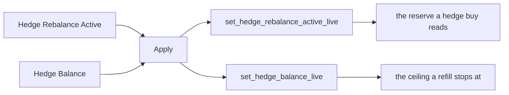

# System Architecture and Features Catalogue

Acervator features a semi-modular / layered design that nests a hyper-vigilant trading engine capable of operating in multiple investment domains simultaneously and all from one terminal. The Main Window contains all of the various subsections found in each subsystem tab. As it stands the existing and planned subsystem tabs are: Simulator, Paper Trading, Trading (Live), Market Inspector, Bot Swarm, Asset Charts, History, Console, Proof of Accumulation (PoA), and System Status. Most of these subsystems interact with each other to some degree with key isolations existing between the three trading tabs and their wiring to Market Inspector, Bot Swarm, and History.

## Trading Tab

Here you see the first subsystem we are going to cover and this will primarily be due to familiarizing the prospective investor or user with the core trading philosophy and strategies that drive Acervator. To begin, the platform runs locally on whichever hardware is selected. A single authorization phase requiring a purchased license key will be the only non-exchange communication the application will ever need. The user’s keys and secrets are stored locally and encrypted after API handshake verification passes which allows the chosen exchange to be initialized. At a later development stage, I have plans for dedicated hardware that uses a hardware key for quick boot into a given user’s account and also allows the platform to run in isolation under Linux.


This is the whole tab in one capture. The title bar and the menu row open it.
The header strip and the tab row run under them. Below those the exchange
sub-tab fills the left with the Scrumming Bots table and the command bar, the
Indicator Voting Panel fills the right, and the Activity Log and the API
Interaction Log close the foot. The status bar carries the API load pill and
the AI state label. The parts below take that screen in that order.

Privacy Mode is on, so every masked field draws four asterisks and the bot
table reads as ten columns of them. The title bar is the one reading no part
below names. It carries the version the tree answered with on the day of the
capture, v0.1.0. Nothing types that string out. Git answers for a source
checkout and the baked file answers for a frozen bundle, so the title cannot
name a release the build is not.

`src/gui/main_window.py` — the window title

```python
self.setWindowTitle("Acervator v" + __version__ + "")
```

Press the mode button once and the title is rewritten to name the wing. The
version leaves the title for the rest of the session, and only a restart brings
it back. Issue #426 carries that handler.

`src/gui/main_window.py` — `_toggle_trading_mode`, the title after a swap

```python
self.setWindowTitle("Acervator — CRYPTO WING")
```

#### The screen itself

**Functional.** One method builds this whole screen. It makes two layers, one
for crypto and one for equities, and stacks them so only one is on show at a
time. The crypto layer opens first. A second method builds the strip along the
top, and that strip stays put on every tab. Privacy Mode is on in the figure,
so each masked field draws four asterisks where its number would be.

`src/gui/main_tabs/trading_tab.py` — `TradingTabMixin._build_trading_tab`

```python
self._trading_stack.addWidget(crypto_page)  # index 0
self._trading_stack.addWidget(stock_page)  # index 1
self._trading_stack.setCurrentIndex(0)  # start in crypto
```

**Design intention.** The two-layer stack is the part of the multi-domain aim
you can use today. Pressing the mode button swaps the whole wing, tables and
Paper Trader together.

`src/gui/main_window.py` — `_toggle_trading_mode`

```python
self._trading_mode = "stock"
self._mode_btn.setText("Stock Mode")
self._mode_btn.setChecked(True)
self._trading_stack.setCurrentIndex(1)
```

The Modulus Bot and the Paper Trading layer this section names have no module
behind them. This manual marks them unbuilt where it reaches them.

#### The header strip

**Functional.** Five columns and five counter cards run along the top. The
columns read SPENDABLE, REALISED, LOCKED, MATURE and EXCH. One call to
`get_aggregate_stats` fills all of them once a tick. Spendable takes the wallet
cash, Locked takes the value tied up in crypto, and Exch counts the open
exchange sub-tabs. Realised and Mature are handed nothing at all, and the
widget draws an em dash for each. Privacy Mode then masks that em dash to
asterisks, which reads on screen as a hidden number rather than a missing one.

The five cards are Scrummed, Folded, Trades, Bots and Errors. Scrummed and
Folded total the fleet's sold and bought dollars, Bots counts the bots that are
running, and Errors totals the lifetime error count. Click Errors and the
rolling error log opens. The small circle under every column and every card is
a privacy dot, and it masks that one field on its own.

`src/gui/main_window.py` — `_refresh_dashboard`

```python
if _wallet_cash > 0 or _crypto_value > 0:
    self._spendable_widget.update_profits(
        {
            "spendable": _wallet_cash,
            "total_realised": None,
            "locked": _crypto_value,
            "mature": None,
            "exchange_count": exchanges,
        }
    )
```

**Design intention.** The strip should answer one question at a glance: what
the fleet holds, what it has earned, and what it has spent. Two of the five
columns do not answer it. Realised profit and matured profit are the numbers
those columns were built for, and nothing computes either one. The aggregate
already carries a realised total, so the first half is a short change at the
one call site.

*Proposed, not present:*

```python
self._spendable_widget.update_profits(
    {
        "spendable": _wallet_cash,
        "total_realised": float(agg.get("total_realised_pnl", 0.0) or 0.0),
        "locked": _crypto_value,
        "mature": None,
        "exchange_count": exchanges,
    }
)
```

`total_realised_pnl` is already read two lines above this call, for the
Scrummed card. Mature has no source yet and stays an em dash. Issue #418
carries this.

[08-tabs/portfolio-panels.md](08-tabs/portfolio-panels.md) covers the strip in
full.

**Both columns are now fed, and both are fed from the exchange.** The window no
longer writes the payload itself. It calls the same builder the React strip
calls, so one function decides what the five columns hold and neither host can
drift from the other.

`src/gui/main_window.py` — `_refresh_dashboard`

```python
self._spendable_widget.update_profits(
    header_strip_surface.profits_payload(agg, exchanges)
)
```

Realised profit is the exchange's own figure, matched buy against sell. Mature
profit is the profit on positions that have grown past two hundred per cent over
what they cost. Neither is computed from the platform's internal running totals,
because the venue is the authority on money.

**Overtaken:** "Realised profit is the exchange's own figure, matched buy
against sell."

The venue carries no lifetime realised figure for a spot position. Realised
profit is the platform's own first in, first out match over the venue's own
fills, one figure per bot, added across the fleet. The venue is still the
authority: the fills are the venue's and the cost basis is the venue's.

`src/exchange/position_health.py` — `compute_position_health`

**Overtaken:** "Mature profit is the profit on positions that have grown past
two hundred per cent over what they cost."

Mature profit is the part of a position's value that sits over three times its
cost. A position worth $350 on a $100 cost basis holds $50 of mature profit,
not $250.

`src/trading/smart_wire.py` — `mature_profit_usd`

Realised draws the empty marker when the fill history cannot be walked to its
end, so the column never shows a figure added up from part of a history.
[08-tabs/portfolio-panels.md](08-tabs/portfolio-panels.md) covers both columns
in full.

`src/gui/main_tabs/header_strip_surface.py` — `profits_payload`

```python
"total_realised": exchange_amount(data, "total_realized_exchange"),
"mature": exchange_amount(data, "total_mature_exchange"),
```

Where the exchange has answered for no bot, both columns stay empty and say so.
The aggregate counts the bots the venue has answered for, and at zero the two
columns are handed nothing rather than a computed zero, so an empty column is
never a figure the platform made up.

The venue's portfolio breakdown answers a cost basis, an average entry price
and an unrealised profit per open position, and each bot reads those three from
it. The breakdown carries no lifetime realised figure for a spot position, so
Realised is the platform's first-in, first-out match over the complete fill
history of each bot's symbol, checked against the venue's cost basis on every
refresh, and the fleet figure is the sum of one figure per bot.

`src/exchange/base.py` — `SpotPosition`

```python
asset: str
cost_basis_usd: float
avg_entry_price: float
unrealized_pnl_usd: float
```

`src/gui/main_tabs/header_strip_surface.py` — `exchange_amount`

```python
answered = int(data.get(EXCHANGE_FRESHNESS_KEY, 0) or 0)
if answered <= 0:
    return None
```

An empty column stays empty under Privacy Mode. The mask replaces a number with
four asterisks and leaves the empty marker alone, so the operator can always
tell a hidden figure from a missing one.

`src/core/privacy_mask_registry.py` — `mask_or`

```python
text = str(value)
if field_id not in ALL_FIELD_IDS or text == ABSENT_TEXT:
    return text
```

#### The tab row

**Functional.** The row of main tabs takes its order from one list. Each label
in the list is moved to its own index at build time. Any tab the list does not
name keeps the position it was added at.

`src/gui/main_tabs/main_window_surface.py` — the order, declared once

```python
CANONICAL_TAB_ORDER = (
    SIM_TAB,
    PAPER_TAB,
    LIVE_TAB,
    CHARTS_TAB,
    INSPECTOR_TAB,
    SWARM_TAB,
    ACCUMULATION_TAB,
    HISTORY_TAB,
    STATUS_TAB,
    CONSOLE_TAB,
)
```

Each of those ten names is a constant holding the label the tab bar shows,
and the main window applies the order once, after the last builder has run.

`src/gui/main_window.py` — where the order is applied

```python
self._reorder_main_tabs(list(CANONICAL_TAB_ORDER))
```

**Design intention.** The order should read as the promotion order. Practise
first, then paper, then real money, then the screens that inspect the trade. One
list decides it, so the order cannot drift as tabs are added.

`src/gui/main_window.py` — the move loop

```python
tab_bar = self._main_tabs.tabBar()
for target_idx, name in enumerate(desired):
    for cur_idx in range(self._main_tabs.count()):
        if self._main_tabs.tabText(cur_idx) == name:
            if cur_idx != target_idx:
                tab_bar.moveTab(cur_idx, target_idx)
            break
```

#### One sub-tab per exchange

**Functional.** One sub-tab holds one exchange. Along its header sit Privacy
Mode, a news headline, and the + New Bot button that opens the wizard for this
venue. Privacy Mode toggles all eighteen masks at once. Under the header is a
data pool line: how many slots are held by kind, the age of the freshest and
the oldest, how many have run past their time to live, and the cache hit ratio.
At the right of the sub-tab row sits the button that adds another venue.

`src/gui/widgets/exchange_tab.py` — `ExchangeTab.__init__`

```python
self._privacy_mode_btn = QPushButton("Privacy Mode: OFF")
self._privacy_mode_btn.setToolTip(
    "Toggle ALL 18 privacy masks at once. When ON, every "
```

**Design intention.** One venue, one tab, one swarm. Add a second exchange and
it arrives beside the first with its own bots and its own data pool, and
nothing about the first changes.

`src/gui/main_window.py` — `_sync_exchange_tabs`

```python
def _sync_exchange_tabs(self) -> None:
    """Add a tab for each configured exchange missing one, in its own layer."""
```

#### The news line

**Functional.** The headline between Privacy Mode and + New Bot is one item
from the crypto news ticker. The counter in front of it gives that item's place
in the batch the ticker holds, so a reading of 23 of 42 marks the twenty-third
headline of forty-two. The item itself carries the feed name, a middle dot,
then the story title. A timer steps to the next item and wraps at the end of
the batch.

`src/gui/crypto_news_ticker.py` — the line the strip draws

```python
_prefix = f"[{self._index + 1}/{len(self._headlines)}] "
self._label.setText(_prefix + h.display_text())
```

**Design intention.** The counter tells you the batch is whole. A feed that
came back short shows a smaller second number rather than a strip that looks
the same and carries less. With nothing reachable the strip says so in words
instead of going blank.

`src/gui/crypto_news_ticker.py` — the empty state

```python
self._label.setText("(no crypto news feeds reachable)")
```

**Functional.** In the React build the strip is drawn by
`crypto_news_ticker.js` into the header space the exchange screen keeps between
the Privacy Mode button and + New Bot. The exchange screen names that space
only when the strip is there; where the strip would not build, the header takes
plain space instead and the two buttons keep their positions.

`src/gui/main_tabs/exchange_tab_surface.py` — `react_news_ticker`

```python
def react_news_ticker() -> str:
    """The module that draws the news strip, as ``build_news_ticker`` reads it.

    ``ExchangeTabModel`` calls this as its ``news_ticker_factory``, so
    ``news_ticker`` is set and the header keeps the strip's space.
    """
    return NEWS_TICKER_MODULE
```

**Functional.** Hovering the headline pauses the step timer and moving away
starts it again. Clicking the headline opens that story. Each of the three
sends one request and redraws the strip from the answer, so the strip on screen
matches what the backend holds.

`src/gui/main_tabs/crypto_news_ticker_surface.py` —
`CryptoNewsTickerModel.handle_event`

```python
if event_type == EVENT_ENTER:
    self.paused = True
    self.calls.append([HOVER_PAUSED])
    return False
if event_type == EVENT_LEAVE:
    self.paused = False
    self.calls.append([HOVER_RELEASED])
    return False
```

#### The bot tables

**Functional.** The Scrumming Bots table carries ten columns. Nine are named
and the tenth is blank, because that one holds the Detail button. Mode is the
coloured cell: green while running, amber while paused, grey while idle or
stopped, red on error, orange in cooldown, cyan while starting. The Ammo cell
draws green above the target, red below it, and neutral grey inside the dust
band. Target A15 and Target A14 restate the Target in those two assets, and go
blank when the pair is unlisted or when the target already is that asset. The
Extractor table sits underneath. Both tables start hidden and appear when their
own list gains a row.

**Functional.** Every column header wraps its own label inside its own column.
`Current Position Value` reads over two or three lines rather than being cut.
The label draws at `HEADER_LABEL_FONT_PX` and steps down to
`HEADER_LABEL_MIN_FONT_PX` when its longest word does not fit the column at the
first size. Every column's header is the same height, which is the tallest
wrapped label plus one dot row. Nine of the ten columns carry one privacy dot
centred beneath the label, and the tenth, the one holding the Detail button,
leaves that row empty. `ColumnHeaderCell` draws one label over one dot and
`WrappedColumnHeader` sizes and places one cell a column.

`src/gui/main_tabs/bot_status_table_surface.py` — `header_view`

```python
return {
    "text": label,
    "tooltip": header_tooltip(column, field_id, masked),
    "field_id": field_id,
    "masked": bool(masked),
    "dot_text": header_glyph(masked),
    "dot_tooltip": header_dot_tooltip(field_id, masked),
}
```

**Functional.** The dot is the `PrivacyDot` the manual calls the universal
control. A press flips that column's field in the privacy register, repaints
every dot that shares the field, and redraws the rows from the payload the
table already holds. Three of the nine dots share a field with another column:
`Current Position Value` and `Ammo` share `bot_table.ammo`, and `Target`,
`Target A15` and `Target A14` share `bot_table.target`. A press on one of them
masks every column that names the same field.

`src/gui/widgets/bot_status_table.py` — `BotStatusTable.refresh_privacy_dots`

```python
for cell in self._header.cells():
    if cell.dot is not None:
        cell.dot.refresh()
```

**Functional.** A press on a column's label orders the rows by that column.
The first press sorts smallest first, and a second press on the same label
reverses it. Nine of the ten columns sort. The tenth holds one identical Detail
button on every row, so it carries no value to order by, and a press on it
changes nothing. A small arrow in the label's top-right corner names the sorted
column and its direction. The arrow sits outside the header's own layout, so
neither the wrapped label nor the dot beneath it moves when a column sorts.

`src/gui/main_tabs/bot_status_table_surface.py` — `SORT_KIND_BY_COL`

```python
SORT_KIND_BY_COL = {
    BOT_ID_COLUMN: SORT_KIND_TEXT,
    SYMBOL_COLUMN: SORT_KIND_TEXT,
    POSITION_VALUE_COLUMN: SORT_KIND_NUMBER,
    TRADES_COLUMN: SORT_KIND_NUMBER,
    TARGET_COLUMN: SORT_KIND_NUMBER,
    TARGET_BTC_COLUMN: SORT_KIND_NUMBER,
    TARGET_ETH_COLUMN: SORT_KIND_NUMBER,
    AMMO_COLUMN: SORT_KIND_NUMBER,
    FIRE_COLUMN: SORT_KIND_NUMBER,
    DETAIL_COLUMN: SORT_KIND_NONE,
}
```

**Overtaken.** *"A small arrow in the label's top-right corner names the sorted
column and its direction."*

**Functional.** The arrow draws on the privacy dot's own row, at the right edge
of its own column. Its rectangle takes the dot's top and the dot's height, so
the two sit on one line, and its left edge never crosses the dot's right edge.
The box is clamped to the column, so no arrow is drawn outside the column it
belongs to. The arrow is still outside the header's own layout: the wrapped
label and the dot both measured unchanged. Read on the running header with a
fleet of 38 bots at 700, 900 and 1400 pixels wide, on all nine sorting columns,
the arrow's vertical centre equalled the dot's, its left edge sat at or right of
the dot's right edge, and its rectangle sat wholly inside the column's.

`src/gui/widgets/bot_status_table.py` — `ColumnHeaderCell._place_mark`

```python
top, height = self._dot_row()
left = max(self._dot_right(), self.width() - HEADER_SORT_MARK_BOX_PX)
self.mark.setGeometry(left, top, max(0, self.width() - left), height)
```

**Functional.** Bot ID and Symbol sort as words. The other seven sort as
figures, each reading the number its cell was computed from rather than the
text the cell draws, so nine never sorts above ten. Ammo sorts on the distance
from target without its sign, which is the amount that would fire and the
figure the cell prints; the colour still says which side of the target the bot
sits on. Fire sorts by what the engine would do next, armed first and disabled
last. A row whose cell draws nothing sits beneath every row that draws a
figure, whichever way the sort runs, and the bot's own identifier breaks a tie.

`src/gui/main_tabs/bot_status_table_surface.py` — `order_statuses`

```python
drawn.sort(key=lambda row: (row[0], row[1]), reverse=descending)
return [row[2] for row in drawn] + blank
```

**Functional.** The order is recomputed every time the rows are rewritten, not
once at the press. A fleet arriving a second later is ordered again before it
is drawn, so a column whose figures keep moving keeps the order the last press
asked for and the rows travel as the figures change. Read on the running window
with a fleet of 38 bots: lifting one bot's price moved that bot from the first
row to the last, and every remaining pair still ran in order.

`src/gui/widgets/bot_status_table.py` — `BotStatusTable.update_bots`

```python
bot_statuses = order_statuses(
    self._last_statuses,
    self._sort_column,
    self._sort_descending,
    _qt_lookups(),
)
```

**Functional.** A press on a bot's row draws that bot in the Indicator Voting
Panel. A press on the row the panel already draws takes the panel off it
instead, and the panel shows its empty state; a third press brings the bot
back. A press naming another bot never blanks the panel, it moves it. The press
names the bot on the row and never the row's position, so a column can be
sorted first and the panel still draws the bot whose row was pressed.

`src/gui/main_tabs/bot_status_table_surface.py` — `selection_after_press`

```python
pressed = str(pressed_bot_id or "")
if not pressed or pressed == str(shown_bot_id or ""):
    return NO_SELECTION_BOT_ID
return pressed
```

**Functional.** The highlight runs the other way as well. When the panel's own
dropdown or one of its arrows moves the selection, the bot list puts its
highlight on that bot's row. One value stands behind both, the bot the Voting
Panel holds, so the list and the panel cannot name two different bots.

`src/gui/widgets/bot_selection.py` — `BotListPanelLink.panel_selected`

```python
for host in self._hosts() or ():
    mark = getattr(host, "highlight_bot", None)
    if callable(mark):
        mark(wanted)
```

**Functional.** One bad field now stops one row instead of the whole paint.
Each row is written inside its own guard. A row that refuses is logged, emptied
and left empty, and every other bot still draws. A row whose bot is not a
scrumming bot is emptied the same way, so it can no longer keep the previous
bot's figures.

`src/gui/widgets/bot_status_table.py` — `BotStatusTable._clear_row`

```python
for col in range(self.columnCount()):
    self.setItem(row, col, None)
    if self.cellWidget(row, col) is not None:
        self.removeCellWidget(row, col)
```

`src/gui/widgets/bot_status_table.py` — `BotStatusTable.SCRUMMING_COLUMNS`

```python
SCRUMMING_COLUMNS = ColumnSpec(
    labels=(
        "Bot ID",
        "Symbol",
        "Mode",
        "Trades",
        "Target",
        "Target A15",
        "Target A14",
        "Ammo",
        "Fire",
        "",
    ),
```

**Functional.** Column 2 is Current Position Value. It shows what the bot's
holdings are worth at the exchange's own price. It is blank whenever no fresh
exchange price exists, and a blank cell names the missing thing in its tooltip:
no position held, no exchange price for the pair yet, no exchange price this
tick, or a price older than twenty seconds. The cell never falls back to a
last-known figure, to a stand-in, or to a value read out of the bot's own
ledger. The state colour now sits on the Bot ID cell, which is green while
running, amber while paused, grey while idle or stopped, red on error, orange
in cooldown and cyan while starting. That cell's tooltip names the mode and the
state.

`src/gui/main_tabs/table_cells_surface.py` — the one multiplication both priced
cells read, so the Position Value cell and the Ammo cell can never disagree

```python
def priced_position(holdings: float, price: float, quote_rate: float) -> float:
    """The position value at one price: ``holdings`` times ``price`` times
    ``quote_rate``."""
    return holdings * price * quote_rate
```

**Functional.** The price both cells read comes from the shared exchange price
cache, and it carries its own age. An age of None means the cache held nothing
and the bot's own last reading was used instead, which is why the Position
Value cell goes blank on that path.

`src/gui/main_tabs/table_cells_surface.py` — the four blank paths and the one
priced path

```python
POSITION_PATH_PRICED = "priced"
POSITION_PATH_NO_HOLDINGS = "no_holdings"
POSITION_PATH_NO_PRICE = "no_price"
POSITION_PATH_OFF_EXCHANGE = "off_exchange"
POSITION_PATH_AGED = "aged"
```

**Design intention.** The Ammo cell measures against the live target, not the
frozen number typed into the wizard, so the reading follows the grown balance
the engine re-zeroes to.

`src/gui/widgets/bot_status_table.py` — the target the Ammo cell measures
against

```python
target_val = float(
    status.get("live_target_balance", status.get("target_balance", 0.0))
    or status.get("target_balance", 0.0)
    or 0.0
)
```

**Functional.** In the React build the Scrumming Bots table is drawn by
`bot_status_table.js`. The exchange screen keeps a named empty space for it and
fills that space when it draws itself. The rows come from the backend, not from
the exchange screen: the renderer asks the bridge for the table's own state and
names the exchange it wants rows for. Each exchange gets its own table state, so
two exchange screens on one page never share rows or a highlight.

`src/gui/web/exchange_tab.js` — `mountScrumTable`

```javascript
function mountScrumTable(target, model) {
  var loader = global[LOAD_BOT_TABLE];
  var wait =
    typeof loader === "function" ? loader(askFor(model)) : Promise.resolve(null);
  return Promise.resolve(wait).then(function () {
    return renderScrumTable(target, exchangeOf(model)) === null
      ? null
      : BOT_TABLE_MODULE;
  });
}
```

**Overtaken.** *"A column header toggles that column's privacy mask."*

**Functional.** The four things the operator can press on the table each send
one request and redraw from the answer. The dot under a column's label toggles
that column's privacy mask, a Symbol cell opens the chart address, Fire hands
the bot to Manual Fire, and Detail selects the row and opens the bot. A press
on the label itself does nothing. `on_detail` is the handler behind the Detail
button.

`src/gui/main_tabs/bot_status_table_surface.py` — `BotStatusTableModel.on_detail`

```python
def on_detail(self, bot_id: str) -> None:
    """Select the row, then hand the bot to whatever opens the detail."""
    self.select_row_for_bot(bot_id)
    self.detail_clicks.append(bot_id)
    self.calls.append([DETAIL_CLICKED, bot_id])
    if self.on_bot_clicked:
        self.on_bot_clicked(bot_id)
```

**Overtaken.** *"A press on the label itself does nothing."*

**Functional.** A press on the label sorts that column, exactly as the window
does. Five things can now be pressed on the page's table. The press goes back
to Python, because the fleet that answers it lives there, and the venue
republishes the ordered rows. The dot keeps its own press to itself, so masking
a column never reorders the table.

`src/gui/web/bot_status_table.js` — `sendSort`

```javascript
function sendSort(model, column) {
  return dispatch(
    model,
    actionNamed(model, HEADER_SORTED),
    request(model, SORT_COLUMN_PARAM, column)
  );
}
```

**Functional.** One ordering serves both builds. The window and the page both
call the same function on the same fleet, so neither can put the same 38 bots
in an order the other would not. Read on both running builds at 700, 900 and
1400 pixels wide, each of the nine sortable columns ordered its figures the
same way on the first press and reversed them on the second.

`src/gui/main_tabs/bot_status_table_surface.py` — `BotStatusTableModel.on_header_sorted`

```python
if column == self.sort_column:
    self.sort_descending = not self.sort_descending
else:
    self.sort_column = column
    self.sort_descending = False
```

**Functional.** The page places its arrow the same way the window does. The
arrow's box takes the dot row's height, sits against the heading's bottom edge
above the cell's padding, and is held to the column's width. Read on the running
page with a fleet of 38 bots at 700, 900 and 1400 pixels wide, on all nine
sorting columns, the arrow's rectangle matched the dot's top and height, its
left edge sat right of the dot's right edge, and it stayed inside the column.

`src/gui/web/bot_status_table.js` — `SortMark`

```javascript
style.bottom = length(model[HEADER_CELL_PAD_PX]);
style.right = MARK_EDGE;
style.width = length(model[HEADER_SORT_MARK_BOX_PX]);
style.maxWidth = MARK_MAX_WIDTH;
style.height = length(model[HEADER_DOT_ROW_PX]);
```

**Design intention.** The exchange screen redraws itself once a second to keep
the data-pool line fresh. Each redraw re-fills the table space, so the table is
drawn from the state the renderer holds for that exchange rather than from the
answer captured at first paint. A row the operator selected therefore survives
the next redraw.

`src/gui/web/bot_status_table.js` — `modelFor`

```javascript
function modelFor(exchangeId) {
  return owns(models, String(exchangeId)) ? models[String(exchangeId)] : null;
}
```

**Functional.** The Extractor table underneath is drawn the same way, by
`extractor_bot_table.js` into the second named space the exchange screen keeps.
Its rows come from the same fleet list, kept to the records whose mode is
extractor. The Detail button is the one control the Extractor table offers;
Fire stays disabled on this screen, because Manual Fire is per position and
lives in the Positions Held tab of the bot's own window.

`src/gui/main_tabs/extractor_bot_table_surface.py` — `extractor_statuses`

```python
def extractor_statuses(statuses: Any) -> list:
    """The records of ``statuses`` whose mode is ``MODE_TEXT``.

    ``update_bots`` builds a row for every record it is handed, so only the
    Extractor bots reach the Extractor table.
    """
    return [
        found
        for found in statuses or []
        if isinstance(found, dict) and found.get("mode") == MODE_TEXT
    ]
```

**Functional.** The exchange screen mounts its three children in one step, each
into its own space and each asked for its own view model.

`src/gui/web/exchange_tab.js` — `mountChildren`

```javascript
function mountChildren(target, model) {
  return Promise.all([
    mountScrumTable(target, model),
    mountExtractorTable(target, model),
    mountNewsTicker(target, model)
  ]).then(function (drawn) {
    return drawn.filter(function (name) {
      return name !== null;
    });
  });
}
```

#### The command bar

**Functional.** Start, Pause, Stop, Restart and Delete all act on one bot. Two
tables share the bar, so the bar takes its bot from whichever table you clicked
last. If that table holds no selection it tries the other one. If neither holds
a selection it says "Select a bot first." and does nothing.

`src/gui/widgets/exchange_tab.py` — `ExchangeTab._cmd`

```python
def _cmd(self, command: str) -> None:
    if self._last_clicked_table == "extractor":
        bot_id = self._extractor_table.get_selected_bot_id()
        if not bot_id:
            bot_id = self._bot_table.get_selected_bot_id()
    else:
        bot_id = self._bot_table.get_selected_bot_id()
        if not bot_id:
            bot_id = self._extractor_table.get_selected_bot_id()
```

**Design intention.** One command bar for two tables means the bar has to guess
which bot you meant. The last table you clicked is the tie-breaker, and the
fallback keeps a stray click from swallowing the command. With nothing selected
anywhere it refuses out loud rather than acting on a guess.

`src/gui/widgets/exchange_tab.py` — the refusal

```python
if not bot_id:
    if self._status_log:
        self._status_log.log("Select a bot first.", "warning")
    return
```

#### SHIFT turns each command into its all-bots form

> "Bot List Upgrades Pt. 2 (Live and Paper Only) - Holding SHIFT makes Start
> become Start All and launches bot start sequencer used during boot up -
> Holding SHIFT makes Stop, Pause, and Restart all become Stop All, Pause All,
> and Restart All respectively"

**Overtaken.** *"Start, Pause, Stop, Restart and Delete all act on one bot."*

**Functional.** Four of the five act on one bot, or on the whole fleet while you
hold SHIFT. Hold the key and Start, Pause, Stop and Restart read Start All,
Pause All, Stop All and Restart All. Let go and they read their own names again.
Delete has no all-bots form and never changes its name. The key is read at the
moment you press the button, so a key held for one press cannot reach the next
one. An all-bots press needs no bot selected.

`src/gui/main_tabs/exchange_tab_surface.py` — `FLEET_COMMANDS`

```python
FLEET_COMMANDS = {
    "start": ("Start All", "start_all"),
    "pause": ("Pause All", "pause_all"),
    "stop": ("Stop All", "stop_all"),
    "restart": ("Restart All", "restart_all"),
}
```

**Design intention.** Start All runs the same sequence the application runs at
launch. It opens the Start All window, starts one bot at a time, waits for that
bot to read running, and moves on after two seconds or after eight seconds of
waiting. Each bot goes through the same handler a single Start goes through, so
each one connects to its venue before it starts. Restart All runs that sequence
over every bot held, not only the idle ones. Pause All and Stop All need no
venue, so they go straight to the bot manager.

`src/gui/main_window.py` — `MainWindow._global_bot_cmd`

```python
if command == "start_all":
    if not self.run_fleet_sequence("start"):
        self._status_log.log(
            "start_all: no bots eligible (none idle/stopped).", "info"
        )
        return
elif command == "restart_all":
    if not self.run_fleet_sequence("restart"):
        self._status_log.log("restart_all: no bots held.", "info")
        return
elif command == "pause_all":
    self._schedule_async(self._bot_manager.pause_all())
elif command == "stop_all":
    self._schedule_async(self._bot_manager.stop_all())
```

**Functional, on the Paper tab.** The Paper command bar reads the key the same
way, over the paper fleet. A paper bot moves a saved state and connects to
nothing, so the four all-bots verbs run straight down the held list, with no
staggering and no progress window.

`src/paper/paper_bot_manager.py` — `PaperBotManager.start_all`

```python
def start_all(self) -> int:
    """Run ``start`` over every held bot and answer how many landed on
    ``running``. A paper bot moves a saved state and connects to nothing,
    so the fleet needs no staggering."""
    return self._over_fleet(self.start, BotState.RUNNING.value)
```

**Functional, on the Simulator.** The Simulator command bar does not read the
key. He named Live and Paper only, and the Simulator's own venue page and its
own view model are separate files that carry none of this.

#### The rest of the screen

The right half is the Indicator Voting Panel, described at the end of this
section. The two panes at the foot are the Activity Log and the API Interaction
Log. The status bar carries the API load pill written by
`_refresh_api_load_pill` and the `AI:` state label.

The pill names the venue, the calls that venue took in the last minute, the
ceiling for it and the two as a percentage. It reads the worst-loaded connected
venue, so one busy exchange cannot hide behind a quiet one.

`src/gui/main_window.py` — the pill text

```python
text = (
    f"API {worst.exchange}: "
    f"{worst.calls_per_minute:.0f}/"
    f"{worst.ceiling_cpm:.0f} CPM ({pct} %)"
)
```

Its colour is the warning. Green under half load, amber above that, red past
the venue's safety percentage. With no venue connected the pill draws an em
dash and no number.

`src/gui/main_window.py` — the three colours

```python
if worst.load_score > mon.safety_pct:
    colour = ds.ERROR
elif worst.load_score > 0.5:
    colour = ds.FOLD_RATIO_AMBER
else:
    colour = ds.SUCCESS
```

1 - Add Exchange - User provides valid API key and secret for target exchange - Platforms validates with an API handshake - Exchange Initializes

After an exchange is connected to the platform, bots can be added to target entire or portions of existing positions as well as using standing liquidity to enter positions for the first time. The two primary bots used by Acervator are known as Scrumming and Extractor with the conceptual Modulus Bot to be added later. The first two are the active traders that continuously interact with the market whereas the Modulus Bot will be a macro-strategic interface designed to trigger portfolio-scale shifts in response to custom market signals and it can best be visualized as a modular synthesizer with investment and market-specific functions.

### Scrumming Bot

If Acervator has a crown jewel, this is it. The scrumming bot is what houses and executes the harvest-fold method and the harvest-fold method is what leads to the creation of the platform itself. All else stems from this origin point and the simple revelation that allowed the method to be discovered (or probably rediscovered) by nonmathematical eyes. Instead of paying attention to what my entire portfolio was doing, I opted to start focusing on a single position until I had found a strategy that was more reliable than Grid Bots or standard speculation. I was convinced such a method existed and thought it absurd that price charts could not be played better when there was obviously so much room for improvement. You do not have to predict the market. You flow and mold your portfolio to it as time goes. Scrumming allows profits to be shaved off, held and re-investment in a cyclical, reliable manner that sizes its trades in direct proportion to actual market movement as it relates to position value drift. Trading in this manner allows a fixed balance for a position to be maintained and asserts the truth that “Position X is Y value. Any deviation from Y is a Target Delta and is subject to a Scrum (Sell) or Fold (Buy).” The primary weaknesses to this strategy are not have an equal amount of liquidity to the position value (a $500 Scrumming Bot should be supported by $500 of liquidity when initialized) and severe market downturns will little or no short term upside which can lock most liquidity for the position into the Target Asset. Scrumming is a survival strategy and is directionally agnostic but also depends on the market to cycle. I also refer to this simply as Accumulation Trading.

### Scrumming Bot Terms

Target Balance - The initial value of the position to be taken or controlled by the Scrumming Bot. The bot will monitor the market for bullish or bearish conditions, check for Target Balance deviations (Target Delta), and re-zero back to the set point. It will repeat this until stopped by the user or some other market condition.

The figure is one field on the bot's own configuration. It is carried in from
the wizard and held for the life of the bot, and every other term on this page
is measured against it.

`src/trading/container/config.py` — `BotConfig.target_balance`

```python
target_balance: float = 200.0  # Balance the bot trades relative to
```

Target Delta - The amount by which a position value has drifted from the Target Balance. The Target Delta is denoted by the Ammo column under the Scrumming Bot list of the Trading Tab. This is the amount of value that will be fired during the appropriate market conditions.

One subtraction, and the platform does it in two places with opposite signs.
The Ammo cell takes the position value less the target, so a surplus reads
positive. The fold path takes the target less the position, so a deficit reads
positive. Both measure the same drift.

`src/gui/table_cells.py` — `ammo_cell`, the figure the Ammo column shows

```python
delta = position_val - target_val
territory = target_territory(position_val, target_val)
```

Scrum - To sell an amount from an investment position that allows it to return to its initial price level. This never closes the position. This is the first half of the infinitely divisible circle that can persist for such positions in a healthy market.

One shared helper decides which half of the cycle a position sits in. It
answers scrum above the target and fold below it, and it answers at target
inside a dust band, so a position that has barely moved is left alone.

`src/trading/target_bands.py` — `target_territory`

```python
delta = float(position_value) - float(target_balance)
band = at_target_dust_band(target_balance)
if delta > band:
    return "scrum"
if delta < -band:
    return "fold"
return "at_target"
```

Fold - To buy an amount for an investment position that allows it to return to its initial price level. This also drives Compounding Growth based on Local Volatility and is restricted by the Maximum Growth Per Cycle setting which has been set to a conservative 1% globally for Acervator’s live test and development run.


When the +New Bot button is pressed, the above window appears. Currently there are two “trading mode”

options (this will be change to Strategies). We are only interested in the Scrumming Bot at this point.

**Functional.** This is the wizard's first page, and the wizard opens on it.
Two radio buttons, one description under each. Accumulation Trading is already
selected when the page opens, and its description promises 12-indicator voting,
which is what the engine builds. Choosing Base Currency Extractor sends you to
the Extractor Pool page instead of the asset page. One question decides that
branch, and the rest of the wizard asks the same question whenever it needs to
know which kind of bot it is building.

A third mode, Grid, is retired. Its test returns False without looking at a
widget, and the branch that reads it is marked unreachable in the source.

`src/gui/bot_wizard.py` — `BotCreationWizard.nextId`

```python
def nextId(self):
    current = self.currentId()
    if current == PAGE_MODE:
        if self._mode_page.is_extractor():
            return PAGE_EXTRACTOR_POOL
        return PAGE_ASSET
```

**Functional.** In the React build the wizard is drawn by `bot_wizard.js` into
a space the exchange screen keeps for it. The screen keeps that space only
after + New Bot is pressed. The press asks the surface, and the surface answers
with the name of the module that draws the wizard.

`src/gui/main_tabs/exchange_tab_surface.py` — `react_bot_wizard`

```python
def react_bot_wizard(exchange_id: str) -> str:
    """The module that draws the Create Auto Trader wizard for ``exchange_id``.

    ``ExchangeTabModel`` calls this as its ``on_new_bot``, so
    ``on_new_bot_clicked`` puts the module name in ``bot_wizard``.
    """
    return BOT_WIZARD_MODULE
```

**Functional.** Cancel closes the wizard. Finish closes it from the last page
and refuses from any other. Either close drops the module the screen holds, so
the space goes with the wizard and the exchange screen underneath it is whole
again.

`src/gui/main_tabs/exchange_tab_surface.py` — `ExchangeTabModel.close_bot_wizard`

```python
def close_bot_wizard(self) -> None:
    """Drop the wizard, so the screen keeps no space for it."""
    if self.bot_wizard is None:
        return
    self.bot_wizard = None
    self.calls.append([BOT_WIZARD_CLOSED, self.exchange_id])
```

**Functional.** Every control on the page sends the steps taken so far, not the
one just pressed. The surface lays out fresh pages on each call and keeps
nothing between them, so the page holds the walk and sends the whole of it. The
answer replaces the payload the page holds and the wizard draws again.

`src/gui/web/bot_wizard.js` — `press`

```javascript
function press(name, step) {
  lastPress = { name: name, step: step };
  dispatched.push(lastPress);
  remember(step);
  lastAnswer = hasBridge()
    ? global.acervator.call(METHOD, copyOf(heldSteps)).then(take)
    : Promise.resolve(null);
  return lastPress;
}
```


After Scrumming / Accumulation is selected, next we are presented with Exchange, Base Currency, and Target Asset options.

Exchange - A privately and federally licensed financial platform that allows API interfacing for remote or automated trade execution.

The row lists the venues already connected. Picking one re-scans that venue and
keeps only the spot markets the venue itself marks active.

`src/gui/bot_wizard.py` — the market filter inside `_fetch_markets`

```python
for sym, info in exch.markets.items():
    if (
        not info.get("active", True)
        or info.get("type", "spot") != "spot"
    ):
        continue
```

Base Currency - This will be a National Currency, Stable Coin, or High Volume Crypto (A15, A14, BNB) for which multiple trading pairs are available on the selected exchange.

The page offers a fixed list of seven, and it holds exactly the national
currencies, stable coins and high-volume crypto named above.

`src/gui/bot_wizard.py` — `AssetSelectionPage`, the base list

```python
self._base.addItems(["USDT", "USDC", "A15", "A14", "BNB", "EUR", "USD"])
```

Target Asset - This is the asset in which the scrumming bot bases its position. If $50 and A05 are selected, it will strive to maintain and compound against a balance of $50 in A05 until it is shut down or some other adverse market condition occurs.

The list holds every asset trading against the base you chose, each with a
cached coin icon and, where the venue reported one, a 24-hour volume figure.
The round information button opens a written description of the selected asset,
and the line under the rows counts the pairs found. Sorting by volume puts the
tradeable pairs at the top of a list that runs to several hundred entries on a
large venue, and the sort reads a cached figure rather than fetching one.

`src/gui/bot_wizard.py` — the volume sort

```python
# Cached volume only, since a network fetch here blocks the GUI thread.
filtered.sort(
    key=lambda m: _market_number(m.get("volume")) or 0.0, reverse=True
)
```

**The block above is overtaken.** `_market_number` was the wizard's own
reading rule. It read either infinity as a volume and it raised on a saved
number too large to be a float, which lost the whole pair list. The wizard now
reads through the one admission rule the trading package owns, and a refused
volume sorts as `VOLUME_REFUSED_USD` and labels as nothing.

`src/gui/bot_wizard.py` — the volume sort as it stands

```python
filtered.sort(
    key=lambda m: as_finite_float(m.get("volume")) or VOLUME_REFUSED_USD,
    reverse=True,
)
```

### Trading Parameters

Next we come to the combined Scrumming Bot configuration page which has several sections for fine tuning how the specific instance behaves. Given that Acervator, at the time of this writing, is still in active development the description for each setting should be seen as a design intention should any issues be encountered.


Order Visibility - Trades are listed on the order books or tracked internally to the platform.

Two entries, Order Book (Visible) and Internal (Invisible). `ScrummingBot`
reads the choice once at construction and holds it as its invisible flag. The
label a reader sees and the value the bot stores are two different strings on
the same row.

`src/gui/bot_wizard.py` — the Order Visibility row

```python
self._visibility = QComboBox()
self._visibility.addItem("Order Book (Visible)", "orderbook")
self._visibility.addItem("Internal (Invisible)", "internal")
self._visibility.setToolTip("How orders appear on the exchange.")
self._visibility.currentIndexChanged.connect(self._on_visibility_changed)
mf.addRow("Order Visibility:", self._visibility)
```

Driven on a bot rebuilt from a stored record, the two choices take different
branches on the same tick: Internal activated all three stored Stack tranches,
and Order Book activated none of them. The order type an engine trade carries is
chosen off the same flag, on the sell side and the buy side alike.

`src/trading/scrumming/execution.py` — the sell side's order type

```python
if self._invisible:
    ot = OrderType.MARKET
    exec_price = None
else:
    ot = OrderType.LIMIT
    exec_price = vh_fp
```

Aggressive Trading - Trades are priced so that they fill immediately. Trading like this is a bit like guerilla warfare. In and out before anyone notices.

A checkbox, off at the start. Every engine-initiated order then leaves as an
immediate-or-cancel limit priced through the spread, so it pays the taker fee
for an immediate fill. Manual Fire is unaffected.

`src/gui/bot_wizard.py` — the Aggressive Trading row

```python
self._aggressive = QCheckBox("Aggressive Trading (force IOC-limit takers)")
```

The box's value reaches the bot and reaches no order. One place in the trading
package builds an immediate-or-cancel order, inside the method that opens a Stack
from a SCRUM, and that method raises before it gets there. The two places that do
choose an order type read Order Visibility and never this flag.

`src/trading/scrumming_bot.py` — the only reader that would change an order

```python
_aggressive = bool(getattr(self, "_aggressive", False))
_order_type_for_visible = (
    OrderType.IOC_LIMIT if _aggressive else OrderType.LIMIT
)
```

Stack Mode - Stack Mode enables Stack Tranches which operate on the Sell or Scrum side. This forms the “upside” of the organic ladder structure whereas Fold Tranches form its “downside”.

The box takes its start state from the engine rather than from a second literal
typed onto the page.

`src/gui/bot_wizard.py` — `TradingParamsPage`, the Stack Mode default

```python
from ..trading.bot_container import STACK_MODE_DEFAULT

self._stack_mode = QCheckBox(
    "Stack Mode (split SCRUM across upward tranches)"
)
# One declaration, so the box and the config cannot disagree.
self._stack_mode.setChecked(STACK_MODE_DEFAULT)
```

The box's value arrives on the bot and gates four places: the branch that turns a
SCRUM into a Stack, and the three reconciliation stages. Driven, the guard
discriminates — on, all three stored tranches activated; off, none did. No tranche
can be created today, because the one method that appends one raises on an
attribute no object in the tree carries. That raise is the reason the four rows
below report a value that arrives and a behaviour that waits.

`src/trading/scrumming_bot.py` — the refusal, read from a restored bot

```
AttributeError: 'ScrummingBot' object has no attribute 'exchange_interface'
```

Split Distance - This setting determines the spacing between tranches if Tranche Spread (not available yet) is being used.

A percentage from 0.10 to 20.00, at 1.00 % to start. The bot hands it to the
stack maths as the gap between one tranche and the next, and the Spacing row
below decides how that gap grows across the ladder.

`src/gui/bot_wizard.py` — the Split Distance row

```python
self._split_distance = QDoubleSpinBox()
self._split_distance.setRange(0.1, 20.0)
self._split_distance.setDecimals(2)
self._split_distance.setSuffix(" %")
self._split_distance.setValue(1.0)
```

Driven at the maths the bot hands it to, 1.00 % priced three rungs a gap of
0.9901 and 0.9804 per cent apart, and 2.50 % priced the same three 2.439 and 2.381
per cent apart. The figure reaches that maths only through the method named under
Stack Mode above, so the value is correct and the ladder is not yet built.

`src/trading/scrumming_bot.py` — the hand-off

```python
split_dist = float(getattr(self.config, "split_distance", 1.0) or 1.0)
```

Tranche Spread - This allows a given Scrum or Fold to divide its result X# of times across multiple incremented (as dictated by Split Distance) positions.

The page carries no control of that name, and no setting named
`tranche_spread` reaches the engine.

The same sweep run for `split_distance` returns a declaration, a restore entry
and a reader, so the sweep itself finds a setting when one is there.

In development.

The sentence that opens this row is retired. Counted over the whole tracked tree,
the name appears once, and that once is this page describing its own absence.
Spacing is the control that exists and is read, and it names the four models the
engine carries. Tranche Count decides how many pieces a Scrum becomes, and Spacing
decides where each piece sits.

`src/trading/stack_math.py` — the models Spacing chooses from

```python
SPACING_MODES = ("quadratic", "fibonacci", "linear", "exponential")
```

Tranche Count - This can also be referred to as Spread Count. It determines how pieces a given Scrum or Fold is split into and distributed across incremented tranches as opposed to just one.

A whole number from 2 to 20, at 3 to start, written out as
`stack_tranche_count_target`. It is a target rather than a promise: the runtime
count drops when a tranche would fall under the venue minimum, or when two
computed prices land within a tenth of a percent of each other and merge.

`src/gui/bot_wizard.py` — the Tranche Count row

```python
self._stack_count = QSpinBox()
self._stack_count.setRange(2, 20)
self._stack_count.setValue(3)
```

Driven at the same maths, a target of 3 built three rungs and a target of 7 built
seven, each rung's size falling from 0.4 to 0.171429 units out of one 1.2-unit
Scrum. The count reaches that maths through the method named under Stack Mode, so
it too is a correct value waiting on a ladder.

`src/trading/scrumming_bot.py` — the hand-off

```python
n_target = int(getattr(self.config, "stack_tranche_count_target", 3) or 3)
```

Spacing - This adds a scaling factor Split Distance and works in conjunction with Tranche Spread and Tranche Count to induce curves and more aggressive growth within the ladder structure.

Three entries: Linear, Quadratic and Exponential. The sequence beside each name
is the cumulative distance from the anchor in units of Split Distance.

`src/gui/bot_wizard.py` — the Spacing row

```python
self._stack_spacing = QComboBox()
self._stack_spacing.addItem("Linear (1, 2, 3, 4…)", "linear")
self._stack_spacing.addItem("Quadratic (1, 2, 4, 7…)", "quadratic")
self._stack_spacing.addItem("Exponential (1, 2, 4, 8…)", "exponential")
```

The Quadratic entry read 1, 2, 4, 7 and the engine prices that model at n squared,
so the row named a ladder the engine has never built. Both the wizard row and the
live bot window now read 1, 4, 9, 16, which is what the engine publishes. The
engine also carries a fourth model, Fibonacci at 1, 2, 3, 5, that neither control
offers.

`src/trading/stack_math.py` — `level_multipliers`, driven for four levels

```
linear       [1.0, 2.0, 3.0, 4.0]
quadratic    [1.0, 4.0, 9.0, 16.0]
exponential  [1.0, 2.0, 4.0, 8.0]
fibonacci    [1.0, 2.0, 3.0, 5.0]
```

Personal Hold - Setting to be removed.

The control is still on the page. `TradingParamsPage.get_config` still emits
`personal_hold_qty`, and the capital reservation mixin still reads it, adding
it to the units the bot claims against its siblings. A removal has that reader
to retire with it.

`src/trading/scrumming/capital_reservation_mixin.py` —
`_compute_reservation_qty`

```python
_hold = float(getattr(self.config, "personal_hold_qty", 0.0) or 0.0)
```

`src/gui/bot_wizard.py` — `TradingParamsPage.get_config`, the settings this
group emits, in the order of the rows above

```python
"stack_mode": self._stack_mode.isChecked(),
"split_distance": self._split_distance.value(),
"stack_tranche_count_target": int(self._stack_count.value()),
"stack_spacing_mode": self._stack_spacing.currentData(),
"personal_hold_qty": float(self._personal_hold_qty.value()),
```

The same method writes `visibility` and `aggressive_trading` before it branches
on the kind of bot, so an Extractor carries those two as well.

Five sites read the number, not one. Two of them change what the engine decides.
The other three carry the value to those two, or draw the row the operator types
into.

```
src/trading/container/restore.py:254                    stored key into the kwarg
src/trading/scrumming/capital_reservation_mixin.py:67   the size of the claim
src/trading/scrumming/capital_reservation_mixin.py:134  the text of the claim
src/trading/scrumming/reconciliation.py:412             the adoption ceiling
src/gui/live_settings/settings_tab.py:304               seeds the live row
```

Both deciding readers are reached on every run. The claim is sized at the top of
every tick. The adoption ceiling is read once when a bot starts, and again every
reconcile interval after that.

```
src/trading/scrumming_bot.py:2571   the claim, once per tick
src/trading/bot_container.py:891    the ceiling, on bot start
src/trading/scrumming_bot.py:2643   the ceiling, every reconcile interval
```

The adoption ceiling is the reader that bears on a sale. A bot whose venue
balance stands above its own book adopts the difference as a lot, and the hold is
subtracted before that adoption, so the held units never enter the book the sell
pre-check is measured against.

```
src/trading/scrumming/execution.py:1408 — the sell pre-check reads the book
```

Driven on a restored record carrying a five-unit hold, with twenty units in the
book, thirty at the venue and a price of one hundred, against the same code with
all five readers taken out:

```
with the readers    claimable 25.0   adopted 5.0    book 25.0
readers removed     claimable 30.0   adopted 10.0   book 30.0
```

That bot may sell 25 units as the code stands and 30 with the readers gone. The
five it holds back are the hold itself. The claim a bot places against its
siblings moves the same way, 16.0 units down to 11.0, which raises a co-tenant
bot's own permitted sale from 14.0 units to 19.0.

```
src/trading/capital_reservation.py:443 — effective_available, the co-tenant's cap
```

The removal is not taken. Stored state does load without the value — three
records of three restored, 26 of 27 stored fields identical, none different, and
nothing raised — but a bot carrying a hold would be free to sell the units the
hold keeps back. The removal is safe only for a bot whose hold reads zero.


Scrolling down we next find the first block of Scrumming Settings. These are the core or basic metrics for a Scrumming Bot.

Opposing Trade Interval - Establishes the minimum travel distance required by price action from the point a given trade in order the next trade of the opposite type to occur.

A percentage from 0.10 to 20.00, at 1.00 % to start. The Trading Fee below is
added to it, so the real distance a reversal must travel is the two together.

`src/gui/bot_wizard.py` — the Opposing Trade Interval row

```python
self._scrumming_interval = QDoubleSpinBox()
self._scrumming_interval.setRange(0.1, 20.0)
self._scrumming_interval.setDecimals(2)
self._scrumming_interval.setSuffix(" %")
self._scrumming_interval.setValue(1.0)
```

Driven on a bot restored from a stored configuration, the percentage sets two
thresholds. One is the dollar drift the position must show before the tick looks
at anything else. The other is the price a reversal must reach after an opposite
trade, and the Trading Fee is inside both of them.

```
target $200.00
  interval 1.00 %   drift threshold $2.00    the tick reads the gates
  interval 5.00 %   drift threshold $10.00   the tick holds and says so

pivot $100.00000000, one tick later at $101.00000000
  interval 0.10 %   required $100.70000000   cleared, no hysteresis blocker
  interval 1.00 %   required $101.60000000   hysteresis blocker raised
  interval 5.00 %   required $105.60000000   hysteresis blocker raised
```

Asked for a figure under its floor the box answers the floor: asked for 0.00 it
answers 0.10.

BB Tolerance - Determines the minimum distance of the Bollinger Band extent price action must be in order for a trade action to occur.

A percentage from 0.25 to 5.00, at 1.00 % to start. The band-proximity detector
takes it as its tolerance. This is the narrowest range on the page, and it
cannot be set to zero.

`src/gui/bot_wizard.py` — the BB Tolerance row

```python
self._bb_tolerance = QDoubleSpinBox()
self._bb_tolerance.setRange(0.25, 5.0)
self._bb_tolerance.setDecimals(2)
self._bb_tolerance.setSuffix(" %")
self._bb_tolerance.setValue(1.0)
```

Driven on one tape whose last close sat at band position 0.976123, the tolerance
decides whether that close counts as sitting at the upper band, and the landing
strip follows that answer. Asked for 0.00 the box answers 0.25, so it cannot be
set to zero.

```
band position 0.976123, one tape, one tick
  tolerance 0.25 %   near upper False   landing strip False
  tolerance 5.00 %   near upper True    landing strip True, upper side
```

Landing Strip Candles - Determines the strictness of Landing Strip detection. Minimum is three candles. Longer Landing Strips are historically more likely to indicate an impending market reversal than shorter ones assuming the taper remains intact or grows tighter.

A whole number of candles from 2 to 10, at 3 to start. The widget accepts 2,
one below the minimum of three the description names, and the number reaches
only one of the two landing-strip detectors. Issue #432 carries this.

`src/gui/bot_wizard.py` — the Landing Strip Candles row

```python
self._ls_candles = QSpinBox()
self._ls_candles.setRange(2, 10)
self._ls_candles.setValue(3)
self._ls_candles.setSuffix(" candles")
```

Both halves of the correction above were re-measured, and both hold. The box does
accept 2: its declared floor is 2, asked for 0 or 1 it answers 2, and 2 is the
one figure under three it keeps. The number does reach one detector of the two
the tick runs over the same candles.

```
the tick runs two detectors, and they count different things
  band proximity   its minimum pattern candles = the stored figure
  tightening       its minimum consecutive run = a platform constant of 3

one tape, trailing tight bodies 2
  stored 2    landing strip True     confidence boost 0.1900
  stored 3    landing strip False    confidence boost 0.0000
  stored 2 and stored 12 both logged: TIGHTENING (upper BB): 3 candles
```

Raising the floor to three is not taken, and the reason is a measurement. A box
holding a stored 2 answers 3 the moment its range starts at three, and putting
the range back leaves the 3 behind, so the next Save would write three into a
bot whose record says two.

The tightening detector keeps its own run length, because a run of shrinking
bodies is not a count of tight bodies at a band. The four figures the tick hands
that detector are now the names the gate scan already declared for them, and the
values are unchanged.

```python
tightening = detect_landing_strip_v2(
    candles,
    min_consecutive=TIGHTENING_MIN_CONSECUTIVE,
    shrink_threshold=TIGHTENING_SHRINK_THRESHOLD,
    bb_tolerance_pct=TIGHTENING_TOLERANCE_PCT,
)
```

TA Timeframe - This is the timeframe at which the bot operates and denotes the price chart it will monitor for trade decisions.

Seven entries to start, with 1h chosen. Pick an exchange and the list is
rebuilt from the timeframes that venue carries, so a venue without 4h does not
offer it. The starting choice is an index into the list rather than a named
timeframe.

`src/gui/bot_wizard.py` — the TA Timeframe row

```python
self._ta_timeframe = QComboBox()
```

```python
self._ta_timeframe.setCurrentIndex(4)  # Default 1h
```

Driven on a bot restored from a stored configuration, the name decides which
chart the bot fetches, and every indicator vote is then computed on that chart.

```
one bot, one tick each, two stored names
  1h   chart asked for 1h   consensus BULLISH 0.0219   band position 0.500000
  1d   chart asked for 1d   consensus BEARISH 0.0863   band position 0.976123
```

Target Balance - This is the intended starting and locked value for the investment position that the Scrumming Bot is controlling.

From $1.00 to $1,000,000.00. Its start value is whatever default the wizard was
handed, which is the figure the Settings Trading page stores.

`src/gui/bot_wizard.py` — the Target Balance row

```python
self._target_balance = QDoubleSpinBox()
self._target_balance.setRange(1.0, 1000000.0)
self._target_balance.setDecimals(2)
self._target_balance.setPrefix("$ ")
self._target_balance.setValue(defaults.get("default_target_balance", 200.0))
```

Driven on one position worth $203.00, the figure is the line the excess is
measured from, and the Opposing Trade Interval above is a percentage of it. A
dollar and a half of target turns the same position from one the tick evaluates
into one it holds.

```
one position of $203.00, one tick each
  target $200.00   excess +$3.00   scrum side   interval $2.0000   gates read
  target $201.50   excess +$1.50   scrum side   interval $2.0150   tick holds
```

The start value does come from the figure the wizard is handed: handed 200.00 the
row opens at 200.00, and handed 777.50 it opens at 777.50. Asked for 0.00 the box
answers 1.00.

Max Entry Price - If the new bot does not detect the requisite amount (as dictated by Target Balance) of the Target Asset, this price threshold sets a limit at which it will attempt to perform the initiating Fold.

Eight decimal places, at $0.00000000, where zero means no ceiling. The buy path
is the only reader, and it refuses a buy above the ceiling. Manual Fire goes
around it.

`src/gui/bot_wizard.py` — the Max Entry Price row

```python
self._max_entry_px = QDoubleSpinBox()
self._max_entry_px.setRange(0.0, 10_000_000.0)
self._max_entry_px.setDecimals(8)
self._max_entry_px.setPrefix("$ ")
self._max_entry_px.setValue(0.0)
```

Min Entry (Should Be Exit) Price - If the new bot detects a requisite amount (as dictated by the Target Balance) of the Target Asset, this price threshold sets a limit at which it will attempt to perform the initiating Scrum.

The same shape, where zero means no floor. The buy path is the only reader here
too, so the number refuses a buy below the floor and never reaches a sell. The
row is labelled Min Entry Price on the page, without the parenthesis his line
carries.

`src/gui/bot_wizard.py` — the Min Entry Price row

```python
self._min_entry_px = QDoubleSpinBox()
self._min_entry_px.setRange(0.0, 10_000_000.0)
self._min_entry_px.setDecimals(8)
self._min_entry_px.setPrefix("$ ")
self._min_entry_px.setValue(0.0)
```

Trading Fee % - This allows the trading fee for the target exchange to be set. This is added to Minimum Opposing Trade Distance to further ensure buys / sells are properly distant and that a given bot is not losing an excessive amount to fee chop in volatile but overly tight market regimes.

A percentage from 0.00 to 5.00, at 0.60 % to start, which is the Coinbase
Advanced Trade maximum tier. It steps in twentieths of a percent, and it is a
per-side figure.

`src/gui/bot_wizard.py` — the Trading Fee row

```python
self._trading_fee = QDoubleSpinBox()
self._trading_fee.setRange(0.0, 5.0)
self._trading_fee.setSuffix(" %")
self._trading_fee.setDecimals(2)
self._trading_fee.setSingleStep(0.05)
self._trading_fee.setValue(0.6)
```

Max Target Growth % - This determines the maximum amount of growth the Target Balance can increase in a given Market Cycle with a cycle being a Fold / Scrum / Fold sequence. Essentially any Fold preceded by a Scrum will be allowed to Fold an amount of profit back in and, if Surplus remains after the Target Delta is re-zero’d, it can be used to increase Target Balance up to this hard limit for that cycle. This is the organic compounding mechanic.

A percentage from 0.00 to 100.00, at 1.00 % to start. Setting it to zero
freezes Target Balance. It steps a quarter of a percent at a time, and it is
the only mechanism allowed to raise the figure.

`src/gui/bot_wizard.py` — the Max Target Growth row

```python
self._max_target_growth_pct = QDoubleSpinBox()
self._max_target_growth_pct.setRange(0.0, 100.0)
self._max_target_growth_pct.setSuffix(" %")
self._max_target_growth_pct.setDecimals(2)
self._max_target_growth_pct.setSingleStep(0.25)
self._max_target_growth_pct.setValue(1.0)
```

Scrum Fold Ratio - This precedes Surplus calculation as described under Max Target Growth %. It determines how much of a given trade’s profits will be redistributed to directly contribute to its own organic compounding. Note that this does not interfere with normal Target Delta re-zeroing and is intended to only serve as a “cushion” to slow runaway compounding when Wire Credits are being received from multiple sources.

A whole percentage from 1 to 100, at 100 % to start.

`src/gui/bot_wizard.py` — `TradingParamsPage.get_config`, the settings this
group emits, in the order of the rows above

```python
"scrumming_interval_pct": self._scrumming_interval.value(),
"bb_tolerance_pct": self._bb_tolerance.value(),
"bb_landing_strip_candles": self._ls_candles.value(),
"ta_timeframe": self._ta_timeframe.currentData(),
"target_balance": self._target_balance.value(),
"max_entry_price": (float(_max_ep) if _max_ep > 0 else None),
"min_entry_price": (float(_min_ep) if _min_ep > 0 else None),
"trading_fee_pct": self._trading_fee.value(),
"max_target_growth_pct": self._max_target_growth_pct.value(),
"scrum_fold_pct": self._scrum_fold_pct.value(),
```

**Where the code departs.** Two of these rows read differently in the engine
than the entries above say.

Min Entry Price is the first. The entry above writes the correction into its
own heading, and the code follows the label on screen rather than that
correction. The buy
path is the only place either entry-price field is read; it refuses a buy above
the ceiling and refuses a buy below the floor. Neither number reaches the sell
path, so a bot that holds the asset and reaches that price sells nothing.
Manual Fire runs its own rebalance and reads neither.

`src/trading/scrumming/execution.py` — `_execute_buy`

```python
_max_ep = getattr(self.config, "max_entry_price", None)
_min_ep = getattr(self.config, "min_entry_price", None)
try:
    _px = float(price) if price is not None else 0.0
except (TypeError, ValueError):
    _px = 0.0
if _max_ep is not None and _px > 0 and _px > float(_max_ep):
```

The sell path already takes the price, so the floor check has somewhere to
attach.

*Proposed, not present, in `_execute_sell`:*

```python
_min_ep = getattr(self.config, "min_entry_price", None)
if _min_ep is not None and price > 0 and price < float(_min_ep):
    self._bus.emit(
        "bot.log",
        bot_id=self.bot_id,
        message=(
            f"SELL REFUSED (min_entry_price floor): current price "
            f"${price:.8f} < ${float(_min_ep):.8f}."
        ),
    )
    return None
```

`min_entry_price` is declared in `src/trading/container/config.py` and reaches
the bot through the wizard block above, so the proposal adds no new setting.

Max Target Growth % is the second. The engine holds two answers for a bot whose
stored config lacks the key. Ten read sites take it with a fallback: seven fall
back to 1.0 and three fall back to 0.0. A bot compounds or freezes depending on
which site read it first. The declared default is 1.0, and the three outliers
should say the same.

*Proposed, not present, at each of the three sites:*

```python
_growth = float(getattr(self.config, "max_target_growth_pct", 1.0) or 0.0)
```

The three outliers are the manual rebalance, the compounding snapshot and the
SWOS inputs. Issue #409 carries this.

```
src/trading/scrumming/execution.py   _execute_manual_rebalance
src/trading/scrumming/snapshots.py   _compounding_snapshot
src/trading/scrumming_bot.py         get_swos_inputs
```


Next are the “advanced” Scrumming settings which primarily affect when the bot is allowed to fire a trade. These can be thought of as “calibrating the scope”.

Detect Threshold - Intended as the point at which the bot “takes the safety off” and starts looking for a shot. To be re-evaluated.

A whole percentage from 10 to 90, at 75 % to start. The engine reads 75 as a
lower mark of 0.125 and an upper mark of 0.875, measured across the band rather
than in dollars.

`src/trading/scrumming/circuit_breakers.py` — `_bb_detect_thresholds`

```python
detect_frac = max(0.0, min(1.0, detect_pct / 100.0))
half = detect_frac * 0.5
return (0.5 - half, 0.5 + half)
```

Driven on one 40-candle tape, both marks move with the figure: 10 gave 0.45 and
0.55, 50 gave 0.25 and 0.75, 75 gave 0.125 and 0.875, and 90 gave 0.05 and 0.95.
The tick reads the pair twice, and the upper mark is a hard gate. On a tape at
band position 0.75 the figure at 75 held the scrum and named two blockers, and
the same tape at 40 cleared both and armed it.

`src/trading/scrumming_bot.py` — the two readings in one tick

```python
_bb_lower_dt_pre, _bb_upper_dt_pre = self._bb_detect_thresholds()
```

Fire Threshold - The final Bollinger Band approach metric. Once satisfied, the bot can fire a trade.

A percentage from 0.10 to 10.00, at 0.50 % to start. It measures distance from
the band, where the Detect Threshold above it measures distance from the
midline.

`src/gui/bot_wizard.py` — the Fire Threshold row

```python
self._scrum_fire_pct = QDoubleSpinBox()
self._scrum_fire_pct.setRange(0.1, 10.0)
self._scrum_fire_pct.setDecimals(2)
self._scrum_fire_pct.setSuffix(" %")
self._scrum_fire_pct.setValue(0.5)
```

The ramp's near-band test is the only place this figure lands. Driven on one tape
at band position 0.75, 0.50 % and 2.00 % each left the ramp short of FIRE and the
scrum blocked; 10.00 % took the ramp from SEARCH to FIRE in one tick and removed
that blocker.

`src/trading/scrumming/tick_phases.py` — the near-band test

```python
fire_pct_frac = self.config.scrum_fire_pct / 100.0
_near_band = abs(_price - _bb_upper) <= fire_pct_frac * _bb_upper
```

BB Midline Gate - This is another, perhaps redundant layer, of Bollinger Band travel protection. It is different in that it is concerned with distance from the midline instead of the entire local width.

A checkbox, on at the start. While it is on, a scrum fires only above the
midline and a fold only below it.

`src/gui/bot_wizard.py` — the BB Midline Gate row

```python
self._bb_midline_gate = QCheckBox("BB Midline Gate")
self._bb_midline_gate.setChecked(True)
```

Driven on one tape at band position 0.27 with the position above target: on, the
tick refused the scrum and named the band gate in its blocker list; off, that
blocker was gone. The fold half of the same reading stayed open both ways,
because the price sat below the midline.

`src/trading/scrumming_bot.py` — the midline block

```python
if self.config.bb_midline_gate:
    scrum_ok = (bb_pos > 0.50) and not self._phantom_locked
    fold_ok_midline = bb_pos < 0.50
else:
    scrum_ok = not self._phantom_locked
    fold_ok_midline = True
```

Read Rate - To be re-evaluated.

From 1 to 60 minutes, at 5 minutes to start. It sets the search-mode read rate;
track mode reads ten times faster. Fire mode reads at that same faster rate.

The wizard writes it as `scrum_read_rate_min`, bot creation passes it through,
and the bot reads it at the top of every tick. The range starts at 1, so this
control cannot switch the throttle off.

`src/trading/scrumming_bot.py` — `ScrummingBot.tick`, the throttle

```python
if self.config.scrum_read_rate_min > 0 and not self._manual_fire_pending:
    _tick_sec = max(self.tick_interval, 0.1)
    _base_skip = max(1, int((self.config.scrum_read_rate_min * 60) / _tick_sec))
    self._tick_skip_search = _base_skip
    if self._scrum_target_mode in ("track", "fire"):
        self._tick_skip = max(1, _base_skip // 10)
    else:
        self._tick_skip = _base_skip
```

The tick itself runs every five seconds, so the figure in minutes becomes a count
of skipped ticks. Driven over eighty ticks: 1 minute skipped 12 and worked 6, 5
minutes skipped 60 and worked 1, and 60 minutes skipped 720 and worked none. A
skipped tick fetches no price and runs no gate.

`src/trading/scrumming_bot.py` — the tick period the count divides

```python
@property
def tick_interval(self) -> float:
    return 5.0
```

Band Travel - Previously described. To be re-evaluated.

A whole percentage from 0 to 100, at 70 % to start. Zero switches it off. The
wizard writes it as `band_travel_pct` and bot creation passes it through.

The engine reads it once per evaluation. It measures how far price has moved
since the last trade, as a share of the current band width, and raises a second
trigger once price covers that share. The same trigger overrides a trend hold,
so Band Travel can release a trade the trend gates were holding.

`src/trading/scrumming_bot.py` — the band-travel trigger

```python
_bb_width = max(bb_result.upper - bb_result.lower, 1e-12)
band_travel_frac = abs(ticker.last - self._last_trade_price) / _bb_width
if (
    abs(ticker.last - self._last_trade_price)
    >= self.config.band_travel_pct / 100.0 * _bb_width
    and delta > 0
):
    band_travel_triggered = True
```

Driven on one rising tape where 95 % of the last twenty candles closed up, with
price 37 % of the band width above the last trade: 0 left the trend hold in place
and suppressed the scrum, 30 raised the trigger and the override released it, and
70 left the hold in place again, because 37 is under 70. The figure decides, not
an on and an off.

`src/trading/scrumming_bot.py` — the override the trigger feeds

```python
trend_override = abs(delta) >= _interval_usd * 2.0 or band_travel_triggered
if trend_hold and trend_override:
```

BB Bullseye Check - If current price and Bollinger Band thresholds are equal, the user can opt to perform a double-sized trade.

A checkbox, on at the start.

`src/gui/bot_wizard.py` — the BB Bullseye row

```python
self._bb_bullseye = QCheckBox("BB Bullseye Check")
self._bb_bullseye.setChecked(True)
```

A double size is not in the engine. Nothing sizes a trade off this box. Its one
decision reader counts a band touch within 0.5 %, or a candle wick within 0.2 %,
as band proximity, and proximity with the delta at or over the interval arms the
BB priority skew. Driven on one tape with price at the upper band, on emitted the
skew and took the confidence floor from 0.25 to 0.1923; off emitted nothing and
left the floor where it was.

`src/trading/scrumming_bot.py` — the band touch the box admits

```python
_bb_proximity_upper = (
    (bb_pos >= _bb_upper_dt_pre) or _be_upper or _be_upper_wick
)
```

It does not bypass the Fire Threshold. Driven with price 0.3 % under the upper
band and the Fire Threshold at its lowest 0.10 %, the ramp stayed short of FIRE
with the box on and with it off, and the scrum carried the same blocker both ways.
What changes is the floor the TA confidence must clear.

`src/trading/scrumming_bot.py` — the floor the skew divides

```python
_ta_conf_skew = position_boost + bb_confidence_boost
if _bb_priority_arm:
    _ta_conf_skew += _BB_PRIORITY_SKEW
_eff_conf_floor = _skewed_confidence_floor(_ta_conf_skew)
```

The second reader writes the two BULLSEYE notices onto the Activity Log and
changes no decision.

`src/trading/scrumming/tick_phases.py` — the notice reader

```python
if bullseye_upper or bullseye_upper_wick:
    _ramp = self._scrum_target_mode.upper()
    _fire_gate = "passes" if _ramp == "FIRE" else "holds"
```

Wire Inflow Stack - To be re-evaluated.

A percentage from 0.00 to 100.00, at 1.00 % to start. The wizard writes it as
`wire_inflow_stack_pct`, and one method in the engine reads it. Above zero, wire
income arriving while the position sits within that band of its target and
within that band of its entry price goes onto the target and queues an
aggressive buy, rather than spreading over the fold queue.

Bot creation does not pass this setting, so a new bot takes the declared default
of 1.00 whatever you type here. The declared default and the wizard's start
value are the same number, so the loss shows only once you change it. Bot
Settings can set it on a bot that is already running. Issue #336 carries this.

`src/trading/scrumming/wire_routing.py` — `WireRoutingMixin.apply_wire_income`

```python
try:
    stack_pct = float(getattr(self.config, "wire_inflow_stack_pct", 1.0) or 0)
except (TypeError, ValueError):
    stack_pct = 0.0
_stack_eligible = False
_stack_reason = ""
_target = 0.0
_entry_px = 0.0
if stack_pct > 0:
```

Bot creation passes it now. One declaration serves the wizard path and the restore
path together, so every field the config declares reaches a new bot. Driven
through the creation route the wizard uses, a stored 0.00 arrived on the bot as
0.00 rather than the declared 1.00, which is what the sentence above was written
against.

`src/trading/container/config.py` — the one carried set

```python
carried = {f.name for f in fields(BotConfig)} - foreign - {"mode"}
kwargs = {
    key: value
    for key, value in _sanitize_deprecated_kwargs(collected).items()
    if key in carried
}
```

The caller is live. A fold routes its compounded profit through Smart Wire, which
hands the share to the target bot, and that is where this figure decides. Driven
on one bot sitting at its target and at its entry price, 0.00 parked ten dollars
as pending and left the target at 200.00, while 1.00 stacked it, took the target
to 210.00 and queued ten dollars for the next tick.

`src/trading/scrumming/tick_phases.py` — the live caller

```python
mgr.distribute_fold_profit(
    source_id=self.bot_id,
    profit_usd=float(_growth_applied),
    ref=f"fold-compound@{buy_fill:.8f}",
)
```

Hedge Rebalance Active - Determines if Current Price drifting below Initial Entry Price will have a limited amount of funds that can be used to keep re-zeroing the Target Delta at key bearish thresholds or areas of possible reversal.

A checkbox, on at the start. It opens the one group on the page that holds a
reserve outside Target Balance.

`src/gui/bot_wizard.py` — the Hedge Rebalance row

```python
self._hedge_rebalance = QCheckBox("Hedge Rebalance Active")
self._hedge_rebalance.setChecked(True)
```

Hedge Balance - Sets a limit on the amount of additional liquidity a given bot is allowed to absorb when Current Price drifts below Initial Entry Price.

At $200.00 to start, a reserve the bot holds apart from Target Balance.

`src/gui/bot_wizard.py` — `TradingParamsPage.get_config`, the settings these
two groups emit, in the order of the rows above

```python
"scrum_detect_pct": self._scrum_detect_pct.value(),
"scrum_fire_pct": self._scrum_fire_pct.value(),
"bb_midline_gate": self._bb_midline_gate.isChecked(),
"scrum_read_rate_min": self._scrum_read_rate.value(),
"band_travel_pct": self._band_travel_pct.value(),
"bb_bullseye_check": self._bb_bullseye.isChecked(),
"wire_inflow_stack_pct": self._wire_inflow_stack_pct.value(),
"hedge_rebalance_active": self._hedge_rebalance.isChecked(),
"hedge_balance": self._hedge_amount.value(),
```

The group title on screen carries an internal release identifier after the
words Advanced Scrumming. Issue #420 carries that, and four more group titles
with it.


Now we arrive at some safety controls. Circuit Breakers are designed to fully inhibit trade actions for a given period should an extreme volatility (pump and dump) event occur. Soft Circuit Breakers have a candle-count based timer whereas Hard Circuit Breakers require the user to clear the bot to continue trading.

Soft CB Threshold - The amount of instantaneous, single-candle price action required for the bot to pause trading for a number of candles denoted by Soft CB Cooldown.

A percentage from 0.0 to 100.0, at 25.0 % to start. Zero switches it off. It
interrupts only the side of the market that moved, so an upward candle stops
scrums and a downward one stops folds.

`src/gui/bot_wizard.py` — the Soft CB Threshold row

```python
self._cb_soft_pct.setSuffix(" %")
self._cb_soft_pct.setValue(25.0)
```

The move the figure is compared against is the candle's own span, high minus low
over open, as a percentage. The figure decides: on one candle spanning 24.9 %, a
stored 10.0 % tripped the breaker and a stored 30.0 % did not, and on one
spanning exactly 25.0 % a stored 25.0 % tripped. A stored 0.0 % left a 50 %
candle alone, which is the off position the paragraph above describes.

The side follows the close against the open. A candle closing up shut the SCRUM
side, a candle closing down shut the FOLD side, and a shut side refuses the
trade at `circuit_breaker_scrum` or `circuit_breaker_fold` in the gate chain
while the other side's chain is untouched. The breaker is read once per worked
tick, and only a candle timestamp the bot has not seen can trip it, so one
candle never trips twice.

Hard CB Threshold - The amount of instantaneous, single-candle price action required for the bot to be hard stopped at which point the user must re-authorize trading.

The same range, at 35.0 % to start. Zero switches it off. Where the soft
breaker interrupts one side, this one pauses the bot outright and the pause
survives a restart.

`src/gui/bot_wizard.py` — the Hard CB Threshold row

```python
self._cb_hard_pct = QDoubleSpinBox()
self._cb_hard_pct.setRange(0.0, 100.0)
self._cb_hard_pct.setDecimals(1)
self._cb_hard_pct.setSuffix(" %")
self._cb_hard_pct.setValue(35.0)
```

Driven on the same span reading: at a stored 35.0 % a candle spanning 35.0 %
tripped the hard breaker and paused the bot, one spanning 34.9 % did not, and a
stored 40.0 % left the 35.0 % candle alone. A stored 0.0 % left a 90 % candle
alone. Once tripped it holds every later candle, quiet ones included, and only
the Reset All Breakers button clears it — the reset reports the trip percentage
it cleared and returns the bot from paused to running. The pause is written into
the bot's stored record, so a bot restored from a hard trip comes back paused.

The pause reaches the scrum and the fold gate chain. It does not reach the five
trade paths the tick reads before it: Manual Fire, the Wire Stack fire, Max
Cartridge, Detonation and the initial entry. Measured on a hard-tripped, paused
bot with a position $30.00 past a $20.00 Max Cartridge threshold: the bot still
wrote MAX CARTRIDGE FIRE and still sent the cartridge trade notification, while
the same bot with Max Cartridge at 0.0 % wrote nothing. Nothing is changed here
for that, because raising the hard breaker above the cartridge would stop a
rebalance that fires on live bots today.

Soft CB Cooldown - This is the number of candles that must close before the Soft Circuit Breaker opens again.

From 1 to 100 candles, at 3 to start. It is counted in closed candles, so its
real length follows the bot's own timeframe.

`src/gui/bot_wizard.py` — the Soft CB Cooldown row

```python
self._cb_cooldown = QSpinBox()
self._cb_cooldown.setRange(1, 100)
self._cb_cooldown.setValue(3)
```

The figure is the count of fresh candles the shut side waits out, and it is the
count the code uses: a stored 1 re-opened on the first fresh candle, a stored 3
on the third, and a stored 10 on the tenth. The count only moves on a candle
timestamp the bot has not seen, so a repeated candle left the remaining count
where it was. A record carrying a cooldown of 0 is read as 3, the declared
default. A record carrying a word stops the breaker check for that tick with a
warning, which leaves the soft breaker unable to trip.

While a cooldown holds, the shut side is refused at the breaker gate and the bot
keeps running — the cooldown pauses nothing. It ends on its own when the count
reaches zero, with a SOFT CIRCUIT BREAKER RESET line naming the side that
re-opens, and the Reset All Breakers button ends it early.

Max Cartridge Size - This is the maximum amount of deviation allowed for the Target Delta. At this threshold the bot is actively and aggressively looking for a trade opportunity.

A percentage from 0.0 to 200.0, at 10.0 % to start. Crossing it fires an
aggressive rebalance that bypasses the detection, hysteresis and soft-breaker
checks. It is the one figure on the page whose range runs past 100.

`src/gui/bot_wizard.py` — the Max Cartridge Size row

```python
self._max_cartridge_pct = QDoubleSpinBox()
self._max_cartridge_pct.setRange(0.0, 200.0)
self._max_cartridge_pct.setDecimals(1)
self._max_cartridge_pct.setSuffix(" %")
self._max_cartridge_pct.setValue(10.0)
```

The threshold is Target Balance times the figure over 100, and the fire is on
absolute Target Delta. Driven on a $200.00 target: at 10.0 % the threshold was
$20.00, a position $20.00 past target fired and $19.99 past target did not; at
5.0 % the threshold was $10.00, $11.00 fired and $9.99 did not; at 0.0 % a
position $100.00 past target fired nothing, which is the off position.

A correction to the sentence above it: the hysteresis check is not bypassed. The
tick tests the opposing-trade pivot before the fire and writes MAX CARTRIDGE
BLOCKED instead, naming the price the pivot still needs. What the fire does
bypass is the band detection, the higher-timeframe bias and the soft breaker —
and, because the tick reads this figure before it reads either breaker, the hard
breaker as well.

Smart Cartridge - This allows the Max Cartridge Size to organically resize in response to current price range as defined by the current-candle Bollinger Band reading.

One checkbox labelled Calibrate to BB range, off at the start. While it is on,
the cartridge size comes from the current band range instead of the fixed
percentage above it.

`src/gui/bot_wizard.py` — the Smart Cartridge row

```python
self._cartridge_smart_chk = QCheckBox("Calibrate to BB range")
self._cartridge_smart_chk.setChecked(False)
```

The band range is upper minus lower over the midline, as a percentage, and the
box swaps it in for the fixed figure. It is held between two bounds: never below
the Opposing Trade Interval, never above Smart Ceiling. Driven on a $200.00
target with the fixed figure at 10.0 %: off, the threshold stayed $20.00; on,
with a band spanning 20.0 % of its midline, the threshold became $40.00. On the
same tick the bot read a band spanning 80.0 %, the clamp gave 30.0 % and the
threshold $60.00, and a position $30.00 past target that fired with the box off
fired nothing with it on.

The band the box reads is the one the previous worked tick stored, so the first
worked tick after a start has no band and keeps the fixed figure.

Smart Ceiling - To be re-evaluated.

A percentage from 1.0 to 100.0, at 30.0 % to start. It caps the cartridge
threshold while Smart Cartridge is on.

It is the upper of the two bounds on the band range, and it binds only when the
band is wider than it. Driven on a $200.00 target with Smart Cartridge on: a
band spanning 120.0 % under a 30.0 % ceiling gave 30.0 % and a $60.00 threshold,
the same band under a 15.0 % ceiling gave 15.0 % and $30.00, and a band spanning
29.0 % under the 30.0 % ceiling gave 29.0 % and $58.00 — the ceiling did not
bind. A band spanning 0.5 % gave 1.0 %, the Opposing Trade Interval, because the
lower bound binds there instead.

The control cannot emit a zero. A record hand-edited to carry one is read as
30.0 %, the declared default, not as no ceiling.

`src/gui/bot_wizard.py` — `TradingParamsPage.get_config`, the settings this
group emits, in the order of the rows above

```python
"circuit_breaker_soft_pct": self._cb_soft_pct.value(),
"circuit_breaker_hard_pct": self._cb_hard_pct.value(),
"circuit_breaker_cooldown_candles": self._cb_cooldown.value(),
"max_cartridge_size_pct": self._max_cartridge_pct.value(),
"max_cartridge_smart": self._cartridge_smart_chk.isChecked(),
"max_cartridge_smart_ceiling_pct": self._cartridge_smart_ceiling.value(),
```

A trip stops a trade at one gate on each side of the chain, and
[07-indicators.md](07-indicators.md) lists both chains in full.

`src/trading/gate_chain.py` — the two breaker gates in the built chains

```python
CircuitBreakerGate(side="scrum"),
```

`src/trading/gate_chain.py` — and the fold chain

```python
CircuitBreakerGate(side="fold"),
```


After Circuit Breakers, which help defend against extreme volatility, we come to Risk Controls. These are designed to cap the amount of profit or growth a given bot can earn before performing a full position exit.

Enable Position Ceiling - Enables a growth cap for a given position.

A checkbox, off at the start. Nothing in the Risk Controls group acts until it
is on.

`src/gui/bot_wizard.py` — the Position Ceiling row

```python
self._position_ceiling_enabled = QCheckBox("Enable Position Ceiling")
self._position_ceiling_enabled.setChecked(False)
```

**Functional.** The box gates six places in the engine. Five refuse or shrink a
buy: the ceiling figure itself, the pre-buy check, the buy executor, the first
entry of a brand-new bot, and the fold hold. The sixth runs on restore and pulls
a stored target back down to the ceiling. The box is read at the moment of each
decision and never copied aside, so unticking it releases the brake on the very
next read. Driven on a two hundred dollar anchor at three times: with the box
off, a fold rebuy of fifty dollars onto a seven hundred dollar position passed;
with it on, the same buy was refused; untick, and it passed again.

`src/trading/scrumming_bot.py` — `ScrummingBot.position_ceiling_usd`

```python
if not getattr(self.config, "position_ceiling_enabled", False):
    return None
```

**Where the code departs.** Two of the three Detonation rows below do not wait
for this box. The detonation check reads its own box and the anchor, and a search
of the engine for a detonation site that reads the ceiling box returns nothing.
Driven: with the ceiling box off and Detonation on, the hourly check ran and
asked the venue for candles. The sentence above holds for the ceiling and the
fold taper, and Detonation is the exception.

`src/trading/scrumming_bot.py` — `ScrummingBot._check_detonation_trigger`, its
first two conditions

```python
if not getattr(self.config, "detonation_enabled", False):
    return False
...
if current_value <= self._anchor_target_balance:
    return False
```

Ceiling Multiple - This setting caps the maximum amount of growth a position at a multiple of the Target Balance (anchor) and, once reached (and under higher timeframe bullish conditions with Detonation enabled) will allow the entire position to be sold and the corresponding bot will pause all further operations. Without Detonation enabled, this becomes a user notification.

From 1.0 to 10.0, at 5.0x anchor to start. The anchor is the target balance the
bot was created with, not the balance it has grown to. It steps half a multiple
at a time and carries its unit in the box.

`src/gui/bot_wizard.py` — the Ceiling Multiple row

```python
self._position_ceiling_multiple = QDoubleSpinBox()
self._position_ceiling_multiple.setRange(1.0, 10.0)
self._position_ceiling_multiple.setDecimals(1)
self._position_ceiling_multiple.setSingleStep(0.5)
self._position_ceiling_multiple.setSuffix("x anchor")
self._position_ceiling_multiple.setValue(5.0)
```

**Functional.** The figure becomes a dollar ceiling, the anchor times the
multiple. On a two hundred dollar anchor the four corners of the range read: one
gives two hundred dollars, three gives six hundred, five gives one thousand, ten
gives two thousand. The refusal is strictly above, so a projected position of
exactly six hundred dollars is allowed against a six hundred dollar ceiling and
six hundred dollars and one cent is refused. The same seven hundred and fifty
dollar projection is refused at three and allowed at six, which is the figure
changing the answer.

`src/trading/scrumming_bot.py` — `ScrummingBot._pre_buy_allowed`, layer two

```python
_smart_mult = max(1.0, min(10.0, _smart_mult))
_smart_ceiling_usd = _anchor * _smart_mult
if _projected > _smart_ceiling_usd:
```

The clamp and the multiplication above now sit in one function that the
pre-buy check, the ceiling property and the tick's fold evaluation all call,
so the three ceilings the bot reads are one number.

`src/trading/scrumming/sizing.py` — `position_ceiling`

```python
def position_ceiling(anchor_target_balance: float, multiple: float) -> float:
    mult = max(CEILING_MULTIPLE_MIN, min(CEILING_MULTIPLE_MAX, multiple))
    return anchor_target_balance * mult
```

**Functional.** While the ceiling binds, the bot still sells and stops buying.
The fold side shrinks first and then stops: the fold's dollar size is multiplied
by a taper that is full below half the ceiling, falls in a straight line to a
tenth across the upper half, and reaches zero at the ceiling. Measured against a
six hundred dollar ceiling: two hundred and ninety dollars held full size, five
hundred and ninety dollars cut the fold to thirteen per cent, and six hundred
dollars stopped it. Three things release the brake — price falling back under the
ceiling, a detonation resetting the target to the anchor, and unticking the box.

`src/trading/scrumming/tick_phases.py` — `_tick_execute_fold` spends the taper

```python
_taper = self.fold_rate_taper
...
buy_cost = _fusd * _taper
```

The multiplication is now `fold_spend_usd`, and the taper schedule is
`fold_rate_taper`, both in the shared sizing module; the executor's line reads
`buy_cost = fold_spend_usd(_fusd, _taper)` and the Simulator's fold reads the
same two functions over its own tranches.

`src/trading/scrumming/sizing.py` — the taper schedule

```python
def fold_rate_taper(ratio: float) -> float:
    if ratio >= 1.0:
        return 0.0
    if ratio < TAPER_START_RATIO:
        return 1.0
    return 1.0 - (ratio - TAPER_START_RATIO) / TAPER_START_RATIO * TAPER_DROP
```

**Where the code departs.** The sentence above says the bot pauses all further
operations once the ceiling is reached and the position is sold. The executor
does not pause it. It resets the target balance to the anchor, clears the fold
queue and the tranches, reseeds the lots at the fill price, and logs that the bot
will re-accumulate from scratch on the next dip. A search of the detonation
executor for a pause call returns nothing. The second half of the sentence does
hold: with Detonation off, the ceiling only brakes, and the operator is told
through the Console line and through the Fire button's own tooltip on the Bot
Swarm row.

`src/trading/scrumming/execution.py` — `_execute_detonation`, what it resets

```python
prior_target = self._target_balance
self._target_balance = self._anchor_target_balance
...
self._fold_tranches.clear()
self._fold_queue_usd = 0.0
```

**Functional.** One name serves two unrelated mechanisms, and the engine's own
wording has been corrected in this unit. The percentage box in Circuit Breakers
labelled Smart Ceiling caps the cartridge threshold, and the engine reports it
inside its cartridge line as a percentage. This dollar ceiling is what every
ceiling refusal in the engine names, and those lines now read Position Ceiling
and Ceiling Multiple, which are the labels on this screen. A reader can now tell
the two apart: one is a percentage under a cartridge heading, the other is a
dollar figure under the name of the control that set it.

`src/trading/scrumming/tick_phases.py` — the cartridge line, for contrast

```python
f"SMART CARTRIDGE calibrated to "
f"{_smart_pct:.2f}% "
f"(BB range {_bb_range_pct:.2f}%, "
f"floor={_interval_floor:.2f}%, "
f"ceiling={_smart_ceiling:.2f}%). "
```

Enable Detonation - Enables an entire remaining position to be sold after the Ceiling Multiple growth threshold is crossed.

A checkbox, off at the start. Detonation needs the box ticked, a position worth
more than its anchor, and a bullish reading at or above the confidence you set.
It also needs the reading to have just turned bullish, so a tape that was
already bullish last time fires nothing.

`src/trading/scrumming_bot.py` — `ScrummingBot._check_detonation_trigger`

```python
conf_min = float(getattr(self.config, "detonation_confidence_min", 0.75))
is_bullish = (
    summary.consensus_direction == SignalDirection.BULLISH
    and summary.consensus_confidence >= conf_min
)

fired = is_bullish and not self._detonation_last_signal_bullish
```

**Where the code departs.** The sentence above says the sale happens after the
Ceiling Multiple threshold is crossed. The engine's bar is the anchor, not the
ceiling. Driven on a two hundred dollar anchor: a position worth two hundred
dollars and one thousandth of a cent passed the bar and the hourly check fetched
candles; a position worth exactly two hundred dollars was refused before any
fetch. A bot with Detonation on and the ceiling left off can therefore harvest at
any value above its starting target, well below any multiple.

`src/trading/scrumming_bot.py` — the bar `_check_detonation_trigger` actually uses

```python
current_value = (
    self._current_holdings * price * float(self._quote_to_usd or 1.0)
)
if current_value <= self._anchor_target_balance:
    return False
```

The multiplication is now `priced_usd`, the one position-value function every
site in the bot calls: the tick, the ceiling ratio, the detonation bar above,
the manual rebalance, the reconciler and the Simulator's position.

`src/trading/scrumming_bot.py` — the bar as it reads now

```python
current_value = priced_usd(
    self._current_holdings, price, float(self._quote_to_usd or 1.0)
)
if current_value <= self._anchor_target_balance:
    return False
```

**Functional.** The box is what starts the whole path. Driven with the box off,
the detonation phase returned at once and asked the venue for nothing; with it on,
the check ran and asked for one candle series. Behind the box sits an hourly rate
limit, measured: a gap of three thousand five hundred and ninety-nine seconds
since the last check fetched nothing and a gap of three thousand six hundred
fetched once.

`src/trading/scrumming/tick_phases.py` — `_tick_detonation`

```python
if getattr(self.config, "detonation_enabled", False):
    try:
        fired = await self._check_detonation_trigger(ticker)
```

Detonation TF - Selects the timeframe for the chart that is being evaluated for bullish conditions that will allow the detonation to occur.

Two entries, 1d and 1w. The label and the stored value are the same string on
both rows, which is not true of every picker in the wizard.

`src/gui/bot_wizard.py` — the Detonation TF row

```python
self._detonation_timeframe = QComboBox()
self._detonation_timeframe.addItem("1d", "1d")
self._detonation_timeframe.addItem("1w", "1w")
```

**Functional.** The pick does two jobs. It names the candle series the vote reads,
and it sets how long the one-shot bullish latch survives between checks. One day
keeps the latch eighty-six thousand four hundred seconds and one week keeps it six
hundred and four thousand eight hundred. Driven on one bullish tape with the latch
already set and exactly eighty-six thousand four hundred seconds since the last
check: the daily pick retired the latch and fired, the weekly pick kept the latch
and did not. One second earlier, neither fired. That is the pick changing the
answer on identical candles.

`src/trading/scrumming_bot.py` — the latch life

```python
latch_ttl = max(
    float(TIMEFRAME_SECONDS.get(tf, TIMEFRAME_SECONDS["1d"])),
    _DETONATION_LATCH_MIN_TTL_S,
)
if elapsed >= latch_ttl:
    self._detonation_last_signal_bullish = False
```

Min Confidence - This is the minimum technical analysis confidence index (via the Indicator Voting Panel) that will allow the detonation to occur.

From 0.50 to 1.00, at 0.75 to start.

**Functional.** The reader works, and it is exact. On one tape whose consensus
read zero point two three three four, a bar of zero point two three three three
fired and a bar of zero point two three three five did not, on the same candles
with the same state. The comparison is at or above, so a bar set to the reading
itself fires.

`src/trading/scrumming_bot.py` — the comparison

```python
conf_min = float(getattr(self.config, "detonation_confidence_min", 0.75))
is_bullish = (
    summary.consensus_direction == SignalDirection.BULLISH
    and summary.consensus_confidence >= conf_min
)
```

**Where the code departs.** No figure this box can emit was reached. The box
starts at zero point five, and across one hundred and seventy-one tapes — nine
shapes, three lengths, three noise levels — the highest bullish consensus the
voting panel produced was zero point two five three four. The engine's own floors
on the same quantity sit lower still: a quarter for an ordinary trade, and
nineteen hundredths on the band-priority arm. A bar of zero point five refused
every tape driven, including the strongest. Nothing in this reading is impossible
in principle: with every voter agreed at its own best reading the panel would
reach eighty-four hundredths, and the twelve voters simply cancel each other long
before that. The gap is between the range the box offers and the range the panel
produces.

`src/trading/scrumming_bot.py` — the quantity, and the two floors the rest of the
engine uses against it

```python
_TA_CONFIDENCE_FLOOR = 0.25
_BB_PRIORITY_CONFIDENCE_FLOOR = _TA_CONFIDENCE_FLOOR / (1.0 + _BB_PRIORITY_SKEW)
```

**Design intention.** Two repairs are possible and both change what a live bot
does on its next tick, so neither is shipped here. The box's floor could move down
to meet the panel, or the detonation could compare against the same floor the rest
of the engine uses. Either one arms a control that is quiet today, on bots holding
real money, which is the operator's decision and not a wiring job.

PROPOSED — `src/gui/main_tabs/live_settings_tab_surface.py`, the row's range

```python
"range": (0.10, 1.00),
```

**Functional.** Two things the bar does not reach. It is absent from the record
the Bot Swarm row reads, so that tooltip can report the timeframe a bot is
watching and never the bar it must clear. And the detonation check builds a fresh
voting panel with no weights, so a bot carrying the operator's own indicator
weights is judged for detonation by the default weights instead.

`src/trading/scrumming_bot.py` — the panel the detonation check builds

```python
engine = VotingEngine()
parsed = candles_from_raw(candles)
summary = engine.compute_all(parsed, tf)
```

`src/gui/bot_wizard.py` — `TradingParamsPage.get_config`, the settings this
group emits, in the order of the rows above

```python
"position_ceiling_enabled": self._position_ceiling_enabled.isChecked(),
"position_ceiling_multiple": self._position_ceiling_multiple.value(),
"detonation_enabled": self._detonation_enabled.isChecked(),
"detonation_timeframe": self._detonation_timeframe.currentData(),
"detonation_confidence_min": self._detonation_confidence_min.value(),
```

Next we use the Strategy Gate Flags which allows top-level trade restrictions to be enabled or disabled thus relaxing or restricting the conditions under which a trade action can occur. The settings, in this case, are self-descriptive.

**Functional.** The box draws five checkboxes, all ticked at the start: SCRUM
requires bullish TA, SCRUM holds in sustained uptrend, SCRUM defers to
higher-TF bullish, FOLD requires bearish TA, and FOLD defers to higher-TF
bearish.

`src/gui/bot_wizard.py` — `TradingParamsPage.get_config`, the six flags this
group emits

```python
"scrum_require_ta_bullish": self._gate_scrum_ta_chk.isChecked(),
"scrum_hold_in_uptrend": self._gate_scrum_uptrend_chk.isChecked(),
"scrum_defer_to_htf": self._gate_scrum_htf_chk.isChecked(),
"fold_require_ta_bearish": self._gate_fold_ta_chk.isChecked(),
"fold_hold_in_downtrend": True,  # reserved, no gate
"fold_defer_to_htf": self._gate_fold_htf_chk.isChecked(),
```

**Design intention.** Six flags are declared, the box shows five, and the
missing one is the fold-side twin of a scrum gate that works. It goes out as a
hard True, and nothing in the engine reads it. Its scrum mirror holds a sell
during a sustained uptrend, and the fold twin would hold a buy during a
sustained downtrend.

*Proposed, not present, in `src/trading/gate_chain.py`:*

```python
class FoldTrendHoldGate(Gate):
    """FOLD-only: hold the buy while a sustained downtrend runs."""

    name = "trend_hold_fold"
    side = "fold"

    def evaluate(self, ctx: GateContext) -> GateResult:
        if not ctx.eff_trend_hold:
            return GateResult(passed=True)
        return GateResult(
            passed=False,
            blocker_message=f"trend_hold_fold({ctx.trend_strength:.0%})",
        )
```

The gate would join the fold chain beside its scrum twin, and
`fold_hold_in_downtrend` in `src/trading/container/config.py` would arm it. A
checkbox has to arrive with it, or the flag stays a hard True. Issue #419
carries this.

**Functional.** The sixth flag is gone. It is removed from the bot config, from
the restore round-trip and from both wizard surfaces, so the wizard emits five
gate flags and the box still draws five checkboxes. A bot record written before
the removal still loads. Bot creation keeps only the fields the config declares,
so the old key is dropped on the way in and every other flag arrives unchanged.

Nothing the engine does changes. The field had no reader that moved a decision,
so no running bot fires differently on its next tick. Driven on both sides over
five candle tapes, every gate verdict read the same before the removal and
after it.

Two measured facts bear on the proposal above. The engine holds one trend
figure, a count of the last twenty candles that close above their open, and it
holds no downtrend figure for a gate to read. The proposed gate reads
`ctx.eff_trend_hold`, which is that bullish count after the scrum checkbox has
been applied to it. As written it would hold a buy during an uptrend, and the
scrum checkbox would switch it. A fold hold needs its own measurement and its
own control before it needs a flag.


Moving onto the final section, we have Profit Routing which was intended to allow profits to be routed differently during initial set-up. This will be re-evaluated and potentially removed.

The group writes two settings and stores them with the bot. No module under
`src/trading/` reads either one. The wizard records the route, Bot Settings can
change it, and a restart restores it. None of that reaches a trade:
`_route_scrum_proceeds_via_wires` moves the scrum proceeds, and it never asks
what the route says.

The bot config declares both fields with a default, so the destination a bot
holds is always the first entry in the list. Issue #336 carries this, with the
rest of the settings the wizard writes and bot creation drops.

`src/trading/container/restore.py` — the round-trip that puts both fields back
on a restarted bot

```python
"profit_route": cfg.get("profit_route", "fold_to_target"),
"profit_route_bot_id": cfg.get("profit_route_bot_id", ""),
```

Route - Destination for profits.

Four destinations: fold back to target balance, send to spendable, split fold
and spendable by percentage, and route to another bot. Only the last of the
four makes the Target bot ID field below it mean anything.

`src/gui/bot_wizard.py` — the Route row

```python
self._profit_route = QComboBox()
self._profit_route.addItem("Fold back to target balance", "fold_to_target")
self._profit_route.addItem("Send to spendable", "spendable")
self._profit_route.addItem("Split fold/spendable per %", "split")
self._profit_route.addItem("Route to another bot (cross-bot)", "cross_bot")
```

Target bot ID - Field for manually a bot ID which was intended to create a Smart Wire under the Bot Swarm tab.

A free-text field. Its placeholder tells you to leave it blank unless you chose
the cross-bot route.

`src/gui/bot_wizard.py` — `TradingParamsPage.get_config`, the settings this
group emits, in the order of the rows above

```python
"profit_route": self._profit_route.currentData(),
"profit_route_bot_id": self._profit_route_bot_id.text().strip(),
```

The group and both of its rows are now removed, from the wizard and from Bot
Settings. The operator's ruling on a setting that reaches no trade: "I do not
want dangling settings fixed that do not or have not affected what is now
almost 6000 trades or data points. The trading mechanisms are valid and sound."
Profit reaches accumulation through harvest-fold and the fold tranches, and a
wire drawn on the Bot Swarm tab carries any cross-bot share, so neither row had
a destination left to name.

`src/trading/scrumming/wire_routing.py` — the cross-bot destination the engine
does read, taken from the drawn wires and never from a stored bot id

```python
_wires = _wire_mgr.get_outgoing_wires(self.bot_id)
```

A bot saved before the removal still loads. A restart names each field it
rebuilds one at a time, so a stored route is simply not read, and every other
field arrives at the figure it was saved with.

`src/trading/container/config.py` — the field a bot is sized by, which is what
Target Balance writes

```python
target_balance: float = 200.0  # Balance the bot trades relative to
```

Two further settings are removed alongside them, and neither ever had a row on
any screen. Investment amount was saved and restored and read by nothing.
Spacing style was saved and restored and read by nothing, and the placement the
engine derives from Opposing Trade Distance and the band extension is the
method that replaced it.

`src/trading/container/restore.py` — the scrumming fields a restart rebuilds,
now carrying no line for either name

```python
"increment_style": cfg.get("increment_style", "linear"),
"profit_folding_active": cfg.get("profit_folding_active", True),
"scrumming_interval_pct": cfg.get("scrumming_interval_pct", 1.0),
"scrum_fold_pct": cfg.get("scrum_fold_pct", 100),
```


Lastly we have the selection for the Phantom (Balance) Bots. These are intended to provide trade action overrides from higher timeframe charts and indicator sets which, in turn, may result in an improved trade or prevent a premature one.

**Functional.** This is the last page on the scrumming path:

- Enable Phantom Bots, a checkbox, off at the start.
- Active Timeframes, eleven checkboxes: 1m, 5m, 15m, 30m, 1h, 2h, 4h, 6h, 12h,
  1d and 1w. All start clear. A timeframe the chosen venue does not carry is
  greyed out and cleared, with the reason written into its tooltip.
- Candles to lock, 1 to 10, at 2, inside the Higher-TF Lock Duration group.

The page hands on only the boxes that are both ticked and available. Before it
lets you leave, it asks the API load monitor whether that many phantoms would
breach the safety threshold for the venue, and offers you Back to adjust or
Continue anyway.

`src/gui/bot_wizard.py` — `PhantomConfigPage.get_config`

```python
def get_config(self):
    checked = [
        tf
        for tf, cb in self._tf_checks.items()
        if cb.isChecked() and cb.isEnabled()
    ]
    return {
        "enable_phantoms": self._enable.isChecked(),
        "phantom_timeframes": checked,
        "lock_candle_count": self._lock_candles.value(),
    }
```

**Design intention.** The engine behind this page is unfinished. The Indicator
Voting Panel section of this manual records that phantom bots are still in
active development and that related features do not yet work, so nothing is
proposed for the page.

In development.

**The page keeps one timeframe.** A bot runs one phantom. The page now enforces
that rule. Ticking a box clears every other box. The heading states the rule:
"Active Timeframe — pick one, above this bot's TA Timeframe:".

`src/gui/main_tabs/bot_wizard_surface.py` — `BotWizardModel.set_phantom_timeframe`

```python
for found in PHANTOM_TIMEFRAMES:
    if found != timeframe and self.phantom_checks[found]:
        self.phantom_checks[found] = False
        self.calls.append([CHECK_SET_CHECKED, found, False])
self.phantom_checks[timeframe] = True
```

Driven over the bridge, a request ticking 1d and then 4h on a 1h bot hands back
one name. It handed back two names before.

**The page refuses a timeframe that cannot run.** A phantom must outrank the
bot's own TA Timeframe. A box at or below it stays clear and its tool tip says
why. A box the venue does not serve behaves the same way. The Qt page and the
Electron page share one rule.

| step | module | symbol |
| ---- | ------ | ------ |
| state the rule | `src/gui/main_tabs/bot_wizard_surface.py` | `BotWizardModel.phantom_refusal` |
| apply it on a tick | `src/gui/main_tabs/bot_wizard_surface.py` | `BotWizardModel.set_phantom_timeframe` |
| apply it on the Qt page | `src/gui/bot_wizard.py` | `PhantomConfigPage._on_timeframe_toggled` |
| hand on the choice | `src/gui/bot_wizard.py` | `PhantomConfigPage.get_config` |

Driven over the bridge on a 1h bot, ticking 5m hands back no name and records
the refusal `phantom_not_higher`. It handed back 5m before, with no refusal.

**The eleven names come from one place.** `src/exchange/timeframes.py` declares
`ALL_TIMEFRAMES`. The wizard page reads that tuple. It held its own copy of the
same eleven names before.

### Extractor Bot (Partially Built; Untested)

The second type of bot offered within Acervator is the Extractor. These operate quite differently from Scrumming Bots and actually operate as Siblings of them. In fact, an Extractor Bot cannot even be called unless a corresponding Base Currency Scrumming Bot (i.e. A15:USD or A14:USD) is already active. This is due to the core operating principle of the Extractor bot to acquire more of these base currencies by performing trades against available alternate currency pairings. It does this by using and blocking off a portion of the Parent’s position within an Extractor Tranche that represents an active position taken against one of the available alternate pairs. The Extractor Tranche remains open until its opposing accumulating (or Short Position if preferred by the user) or profit taking trade is filled. Extractor Tranches can be of any size but should generally be a relatively small fraction of the Parent’s total position which will allow the Extractor to take multiple positions if available and allowed by the specific user.


**Functional.** The same first page as before, with the other radio chosen.
From here the wizard goes to the Extractor Pool page instead of the asset page.
Phantom bots and profit folding are both switched off for this bot as it is
built, and an Extractor never sees the Phantom page at all.

`src/gui/bot_wizard.py` — `BotCreationWizard.get_bot_config`

```python
config.update(self._params_page.get_config())
if config["mode"] == "extractor":
    config["enable_phantoms"] = False
    config["profit_folding_active"] = False
else:
    config.update(self._phantom_page.get_config())
```

**Design intention.** Phantom overrides and profit folding belong to the
parent, and the two hard False values above are that decision written down. The
mode is stamped onto the config at the very top of the same method, so nothing
downstream has to guess which kind of bot it received.

`src/gui/bot_wizard.py` — the mode stamp

```python
if self._mode_page.is_extractor():
    config["mode"] = "extractor"
    config.update(self._extractor_pool_page.get_config())
else:
    config["mode"] = "scrumming"
    config.update(self._asset_page.get_config())
```


**Functional.** This page draws:

- Exchange, the connected venues. Changing it re-scans that venue.
- Pool Base Currency, a fixed list of five. It names the asset the pool
  accumulates.
- A line counting the pairs available against that base.
- Target alt pairs, a check list of every alt that trades against the base.
  Leave every box clear and the bot picks its own pairs by volume at run time.
- Select all and Clear act on the whole list.

**Target alt pairs is removed.** The ruling of 13 September 2026 reads *"Not
needed. List of compatible alt pairs is scanned and piped through the Trading
IVP along with the chart being read. Same as Scrumming except multiple markets
are being checked by one bot for entries and exit opportunities."* The tick
boxes, the two buttons and the stored list are gone. The list stays on the page
as a reading of which pairs trade against the pool base, and the bot picks the
top-N of them by volume.

```python
ranked.sort(key=lambda x: x[1], reverse=True)
top_n = int(self.config.extractor_scan_top_n)
top_n = max(5, min(10, top_n))  # clamp to 5-10
new_watch = [sym for sym, _ in ranked[:top_n]]
```

The page hands on a single asterisk where a Scrumming Bot would hand on one
target asset. Its own docstring calls that the pool sigil. An Extractor holds a
pool of alts rather than one target, and the sigil keeps the field's shape for
the code downstream that builds a trading symbol.

`src/gui/bot_wizard.py` — `ExtractorPoolPage._POOL_BASES`

```python
_POOL_BASES = ["A15", "A14", "USDT", "USDC", "BNB"]
```

`src/gui/bot_wizard.py` — `ExtractorPoolPage.get_config`

```python
return {
    "exchange_id": self._exchange.currentData(),
    "base_currency": base,
    "target_asset": "*",  # pool sigil — multi-pair indicator
    "extractor_alt_targets": checked,
}
```

**Design intention.** The five pool bases are exactly the assets named as base
currencies above. Leaving the list empty hands the choice back to the bot, and
only a box that is both ticked and available reaches the config.

`src/gui/bot_wizard.py` — how a ticked alt is collected

```python
for i in range(self._alt_list.count()):
    item = self._alt_list.item(i)
    if item.checkState() == Qt.Checked:
        sym = item.data(Qt.UserRole)
        if sym:
            checked.append(sym)
```


**Functional.** Choosing the Extractor hides the eight scrumming groups and
shows this one. The two sides never appear together.

`src/gui/bot_wizard.py` — `TradingParamsPage.set_mode`, the group swap

```python
scrum_visible = not is_grid and not is_extractor
for g in (
    self._mode_group,
    self._scrum_group,
    self._adv_group,
    self._hedge_group,
    self._cb_group,
    self._risk_group,
    self._gates_group,
    self._routing_group,
):
    g.setVisible(scrum_visible)
self._extractor_group.setVisible(is_extractor)
```

The group title in the source reads Extractor, an em dash, Pool, an ampersand,
then Artillery. Qt reads that ampersand as a keyboard-mnemonic marker, so the
rendered title drops it and underlines the A of Artillery. The figure shows the
gap the dropped character leaves. Issue #421 carries this.

Chunk size (USD) - This determines the maximum amount of the parent’s pool that the Extractor can use.

From $10.00 to $10,000,000.00, at $100.00 to start. It is the pool every
artillery round below is drawn from.

`src/gui/bot_wizard.py` — the Chunk size row

```python
self._ext_chunk_size_usd = QDoubleSpinBox()
self._ext_chunk_size_usd.setRange(10.0, 10_000_000.0)
self._ext_chunk_size_usd.setPrefix("$")
self._ext_chunk_size_usd.setDecimals(2)
self._ext_chunk_size_usd.setValue(100.0)
```

The pool is now turned into base-currency units on the bot's first watch-list
refresh. The Extractor reads its own base currency's dollar price off its
exchange and hands it to the method that rebases the pool, so the pool stops
being counted one dollar to one coin. A dollar-pegged base takes a rate of one
and reads no price at all.

Driven on a $250.00 pool against a base priced at $4,000.00, the bot read a pool
of 0.0625 base units where it used to read 250.

`src/trading/extractor_bot.py` — `ExtractorBot._acquire_usd_per_base_rate`

```python
if base in DOLLAR_PEGGED_CURRENCIES:
    rate = 1.0
else:
    try:
        ticker = await self.exchange.get_ticker(f"{base}/USD")
        rate = float(ticker.last)
```

Artillery size (USD) - This determines the individual size of Extractor Tranches.

From $0.50 to $100,000.00, at $5.00 to start. The default is set small enough
to fire often and still clear a venue's minimum order cost.

`src/gui/bot_wizard.py` — the Artillery size row

```python
self._ext_artillery_size_usd = QDoubleSpinBox()
self._ext_artillery_size_usd.setRange(0.5, 100_000.0)
self._ext_artillery_size_usd.setPrefix("$")
self._ext_artillery_size_usd.setDecimals(2)
self._ext_artillery_size_usd.setValue(5.0)
```

One round converts at that same rate, every time it fires. Driven at $7.50
against a base priced at $4,000.00, a round sized 0.001875 base units where it
used to size 7.5.

`src/trading/extractor_bot.py` — `ExtractorBot._fire_artillery`, the sizing

```python
artillery_usd = float(self.config.extractor_artillery_size_usd)
artillery_base = self._usd_to_base(artillery_usd)
```

Watch list top-N - The determines the number of Alternate Currency pairs the bot will scan for potential extraction.

From 5 to 10, at 8 to start. The pairs are ranked by twenty-four hour volume,
so the list holds the most liquid alternates against the chosen base.

`src/gui/bot_wizard.py` — the watch list size row

```python
self._ext_scan_top_n = QSpinBox()
self._ext_scan_top_n.setRange(5, 10)
self._ext_scan_top_n.setValue(8)
```

Watch list refresh - This determines the rate at which the Extractor will scan its watched markets. This is the equivalent of a Timeframe for the Extractor but covers multiple pairs.

From 10 to 240 candles, at 60 to start, which is once an hour at a one-minute
cadence. It re-ranks the list rather than re-reading one pair.

`src/gui/bot_wizard.py` — the watch list refresh row

```python
self._ext_scan_refresh = QSpinBox()
self._ext_scan_refresh.setRange(10, 240)
self._ext_scan_refresh.setValue(60)
self._ext_scan_refresh.setSuffix(" candles")
```

The count is now candles of the bot's own timeframe. It used to be ticks, and
the loop ticks every five seconds whatever the timeframe says, so 60 came due
after five minutes. Driven on a one-minute bot, 60 now comes due after 3,600
seconds and not after 300.

The running-bot window used to offer 10 to 600 and call them ticks. It offers
the same 10 to 240 candles the wizard does, so both screens and the sentence
above agree.

One method turns the setting into seconds, and both the refresh check and the
base-currency price read ask it, so the two share one cadence and one reading of
the number.

`src/trading/extractor_bot.py` — `ExtractorBot._refresh_interval_seconds`

```python
candles = int(self.config.extractor_scan_refresh_candles)
candle_seconds = TIMEFRAME_SECONDS.get(
    self._timeframe, TIMEFRAME_SECONDS[self.DEFAULT_TIMEFRAME]
)
return float(candles * candle_seconds)
```

Pool Reserve - To be re-evaluated.

A percentage from 0.0 to 90.0, at 50.0 % to start. Bot creation passes it
through as `extractor_pool_reserve_pct`, and one method reads it: the capacity
check the artillery path runs before it fires a round. The reserve is that share
of the pool, and the check refuses any round that would take the free pool below
it.

The share counts against the pool the operator allocated, not against what is
left of it. Corrections that have already drained the pool therefore cannot hide
inside the reserve arithmetic.

`src/trading/extractor_bot.py` — `ExtractorBot._has_chunk_capacity`

```python
reserve = self._chunk_size_base * (
    self.config.extractor_pool_reserve_pct / 100.0
)
return (self._chunk_free_base - artillery_base) >= reserve
```

**Pool Reserve is removed.** The ruling of 13 September 2026 reads *"Not needed.
Conceptually its another name for Chunk Size."* The row is off the creation
wizard and off the running-bot window, and the field is off the engine's
declaration. The capacity check now asks only whether the free pool covers one
round.

```python
def _has_chunk_capacity(self, artillery_base: float) -> bool:
    return self._chunk_free_base >= artillery_base
```

Exit % - To be re-evaluated.

A percentage from 10.0 to 100.0, at 100.0 % to start. Bot creation passes it
through as `extractor_exit_pct`. It sets the share of a position's alt units an
exit sells, and the Extractor reads it nine times across three methods: the
profitability test, the bullish exit, and the per-position Manual Fire.

The profitability test is the one that can refuse. It prices the proportional
sell in base units, takes the trading fee off, and compares the result against
the same share of the cost basis. An exit that would gain dollars but lose base
units does not happen.

`src/trading/extractor_bot.py` — `ExtractorBot._exit_is_profitable_in_base`

```python
units_to_sell = pos.alt_units * (self.config.extractor_exit_pct / 100.0)
base_back = units_to_sell * alt_price_in_base
fee_pct = float(getattr(self.config, "trading_fee_pct", 0.6))
base_back_after_fee = base_back * (1.0 - fee_pct / 100.0)
base_in_proportional = pos.cost_basis_base * (
    self.config.extractor_exit_pct / 100.0
)
return base_back_after_fee > base_in_proportional
```

Max compounding tier - Allows the Extractor to attempt a number of compounding Swing Trades with a given Extractor Tranche with subsequent re-entries based upon the Parent Scrumming Bot’s Minimum Opposing Trade Distance + Trade Fee + Bollinger Band extension settings.

From 1 to 10, at 3 to start. The first tier always locks its gain back to the
pool, and the counter is held by the position rather than by the bot, so it
ends when the position does.

`src/gui/bot_wizard.py` — the compounding tier row

```python
self._ext_max_tier = QSpinBox()
self._ext_max_tier.setRange(1, 10)
self._ext_max_tier.setValue(3)
```

A rolled tranche now prices its re-entry from the parent, which is what the
sentence above asks for. The Extractor records the exit fill that rolled the
tier, finds the parent Scrumming Bot holding the base currency, takes that
parent's Minimum Opposing Trade Distance and Trading Fee as one distance, and
hands that distance to the same placement the engine uses elsewhere, together
with the pair's Bollinger band. A band edge further out than the distance
replaces it, and that is the band extension the sentence names. A correction on
a rolled tranche waits until the price reaches the floor.

Driven on a parent at a 1.50 % interval and a 0.60 % fee, the distance read
2.10 %, and a tranche rolled at a fill of 0.10 read a floor of 0.094 — the
band's lower edge, further out than the 0.0979 the distance alone gives. At a
price of 0.10 the re-entry was refused, and at 0.09 it went through. Tier one
reads no floor, and neither does a bot with no parent.

`src/trading/extractor_bot.py` — `ExtractorBot._reentry_floor_price`

```python
otd_pct = minimum_opposing_trade_distance_pct_from_config(parent.config)
return placement_floor_price(
    -1, float(pos.roll_exit_price_base_per_alt), otd_pct, band
)
```

**Max compounding tier is removed.** The ruling of 13 September 2026 reads
*"Not needed."* The row is off both screens, the tier counter is off the
position record, and the re-entry pricing that read it is gone with it. The two
pricing helpers it borrowed are shared with the Scrumming side and stay where
they are, in `otd_math.py` and `stack_math.py`. A realised gain now always locks
to the pool.

```python
# The gain locks to chunk_free_base; no roll re-enters the pair.
self._chunk_free_base += base_received
log_kind = "LOCK_TO_POOL"
```

Max cost-basis multiple - To be re-evaluated.

From 1.0x to 10.0x, at 2.0x to start. Setting it to 1.0 stops averaging down.
Bot creation passes it through as `extractor_max_cost_basis_multiple`, and the
correction path reads it twice. The first read is the ceiling: the bot may
average a position down until its cost basis reaches this multiple of its
opening round, then it holds and waits for the exit.

The second read writes a log line, and it prints this multiple where a
correction count belongs. The line reads corrections=1/2x cap, and nothing
anywhere compares the correction counter against a cap. Issue #438 carries this.

`src/trading/extractor_bot.py` — `ExtractorBot._maybe_fire_correction`, the
ceiling

```python
max_basis = pos.artillery_size_base * float(
    self.config.extractor_max_cost_basis_multiple
)
headroom = max_basis - pos.cost_basis_base
if headroom <= 0:
    return  # hard floor reached; wait for bullish exit
```

The log line now prints the cap the code actually enforces. It names the
position's cost basis against the base-unit ceiling this multiple sets, and it
prints the correction counter as a plain count with no denominator, because
nothing caps that counter. Driven on a position with nine corrections already
fired and headroom still open, the correction went through — which is what the
old wording denied.

`src/trading/extractor_bot.py` — `ExtractorBot._maybe_fire_correction`, the line

```python
f"cost_basis {pos.cost_basis_base:.8f} of "
f"{max_basis:.8f} base allowed at "
f"{float(self.config.extractor_max_cost_basis_multiple):.2f}x, "
f"corrections={pos.corrections_fired} (no cap)."
```

**Max cost-basis multiple is removed.** The ruling of 13 September 2026 reads
*"Not needed. Trade action is not based on assumed price limits. Its based on
market structure."* It was the ceiling on averaging down, and averaging down
went with it, so the row, the ceiling and the log line that quoted it are all
gone.

In development.

Direction - To be re-evaluated.

Two entries: Normal, which runs base to alt and buys first, and Inverted, which
runs standing alt to base and sells first.

`src/gui/bot_wizard.py` — `TradingParamsPage.get_config`, the settings this
group emits, in the order of the rows above

```python
"extractor_chunk_size_usd": self._ext_chunk_size_usd.value(),
"extractor_artillery_size_usd": self._ext_artillery_size_usd.value(),
"extractor_scan_top_n": int(self._ext_scan_top_n.value()),
"extractor_scan_refresh_candles": int(
    self._ext_scan_refresh.value()
),
"extractor_pool_reserve_pct": self._ext_pool_reserve.value(),
"extractor_exit_pct": self._ext_exit_pct.value(),
"extractor_max_compounding_tier": int(
    self._ext_max_tier.value()
),
"extractor_max_cost_basis_multiple": self._ext_max_cost_basis.value(),
"extractor_direction": self._ext_direction.currentData(),
```


**Direction is removed.** The ruling of 13 September 2026 puts it among the
settings that are *"hallucinated nonsense that does not comply with the spec."*
The Inverted mode went with the row: the pair filter keeps markets quoted in the
base, entry fires on a bearish reading and buys, and the exit sells.

```python
def _entry_order_side(self):
    """OrderSide for artillery entry: BUY."""
    from ..exchange.base import OrderSide

    return OrderSide.BUY
```

Standing alt units (inverted) - To be re-evaluated.

Eight decimal places, at 0 to start. The Inverted direction reads it; the
Normal direction ignores it. The field takes up to a billion units. The wizard
writes it as `inverted_extractor_standing_alt_units`.

Bot creation passes neither this number nor the Direction beside it, so a new
Extractor runs Normal with a standing position of zero whatever you enter.
The one method that reads the number, `set_initial_chunk_rate`, has no caller in
the product source either. Only tests call it. Issue #437 carries the method,
and issue #336 the settings creation drops.

Creation carries both names today. Driven on a wizard dictionary holding all
fifteen Extractor names, the creation path carried fifteen of fifteen, and a
restored bot read Inverted back — taking its entry side as a sell and its exit
as a buy. The reader of the standing number is still uncalled, so the number
itself reaches nothing.

**Three sentences above are overtaken.** None is edited and none is removed. Each
is quoted here with the reading that replaces it.

> The one method that reads the number, `set_initial_chunk_rate`, has no caller in
> the product source either. Only tests call it.

> The reader of the standing number is still uncalled, so the number
> itself reaches nothing.

The reader has a caller. The Extractor's own rate reader calls it once, on the
first tick of a bot with no position open, and the tick awaits that reader on
every due watch-list refresh.

`src/trading/extractor_bot.py` — `ExtractorBot._acquire_usd_per_base_rate`, the
first-rate call

```python
if not self._recent_rates and self._tick_counter <= 1 and not self._positions:
    self.set_initial_chunk_rate(
        rate, total_holdings=await self._read_base_holdings(base)
    )
```

> Creation carries both names today.

Neither name is in the product source. Both were removed with the settings that
carried them. Searched over the git index across every tracked Python file, each
returns no occurrence, against sixteen for a refresh key that is still read.

```
inverted_extractor_standing_alt_units    0 occurrences
extractor_direction                      0 occurrences
extractor_scan_refresh_candles          16 occurrences
```

`src/trading/extractor_bot.py` — `ExtractorBot.set_initial_chunk_rate`, the
inverted branch

```python
_standing = float(
    getattr(self.config, "inverted_extractor_standing_alt_units", 0) or 0
)
if self._is_inverted and _standing > 0:
    self._chunk_size_base = _standing
    self._chunk_size_usd = _standing * usd_per_base
```

**Standing alt units is removed.** The ruling of 13 September 2026 puts it among
the settings that are *"hallucinated nonsense that does not comply with the
spec."* It served the Inverted direction above, which is gone, so the pool now
rebases from the dollar figure on every Extractor.

```python
self._chunk_size_base = self._chunk_size_usd / usd_per_base
self._chunk_free_base = self._chunk_size_base
```

Correction skip candles - To be re-evaluated.

From 0 to 100 candles, at 4 to start. It throttles averaging down: the Extractor
will not correct the same position again until this many have passed. One method
reads it, the correction path, and it counts ticks rather than candles. The
Extractor ticks every five seconds, so 4 is twenty seconds on any timeframe.

Bot creation does not pass it, so a new bot takes the declared default of 4.
Issue #438 carries the counting, and issue #336 the drop.

Creation passes it today. Driven with a typed 9, a restored bot read 9 rather
than the default of 4. What it counts is unchanged: the throttle compares
ticks.

`src/trading/extractor_bot.py` — `ExtractorBot._maybe_fire_correction`, the
throttle

```python
last_tick = self._last_correction_tick.get(pos.pair, -(10**9))
if self._tick_counter - last_tick < int(
    self.config.extractor_correction_skip_candles
):
    return  # skip-candles throttle
```

**Correction skip candles is removed.** The ruling of 13 September 2026 puts it
among the settings that are *"hallucinated nonsense that does not comply with
the spec."* It throttled averaging down, and averaging down went with it, so the
throttle and the method that lengthened it into seconds are both gone. The
watch-list refresh still counts candles through the same helper.

```python
def _refresh_interval_seconds(self) -> float:
    candles = int(self.config.extractor_scan_refresh_candles)
    return float(candles) * self._candle_seconds()
```

Drawdown threshold - To be re-evaluated.

A percentage from 0.00 to 50.00, at 3.00 % to start. One method reads it, and
that method decides when a position counts as down: the current dollar value
against the dollar value snapshotted at firing, which never changes afterwards.
Crossing the threshold puts a position in front of the correction path.

The wizard writes it as `extractor_drawdown_threshold_pct`, and bot creation
does not pass it, so a new bot takes the declared default of 3.00. Issue #336
carries this.

Creation passes it today. Driven with a typed 11.00, a restored bot read 11.00
rather than the default of 3.00.

`src/trading/extractor_bot.py` — `ExtractorBot._is_in_drawdown`

```python
current_usd = self._position_value_usd(pos, alt_price_in_base)
threshold = pos.artillery_size_usd_at_entry * (
    1.0 - self.config.extractor_drawdown_threshold_pct / 100.0
)
return current_usd < threshold
```

**Drawdown threshold is removed.** The ruling of 13 September 2026 puts it among
the settings that are *"hallucinated nonsense that does not comply with the
spec."* The operator no longer sets when a position counts as down; a position
is down while its dollar value sits below the value snapshotted at firing. The
pool light still turns red on that reading.

```python
return (
    self._position_value_usd(pos, alt_price_in_base)
    < pos.artillery_size_usd_at_entry
)
```

Trend Strength Threshold - To be re-evaluated.

From 0.000 to 1.000, at 0.650 to start.

Creation passes it, and it reaches the bot's technical-analysis signal provider
once, at construction. Driven with a typed 0.875, the provider read 0.875. The
provider is built one time per bot, so a later edit to the stored figure does
not reach it.

**Trend Strength Threshold is removed.** The ruling of 13 September 2026 puts it
among the settings that are *"hallucinated nonsense that does not comply with
the spec."* The signal provider carries the same threshold as its own published
default, so the bot is built without the argument and the reading does not move.

```python
self._ta_provider = TASignalProvider(
    exchange,
    timeframe=self._timeframe,
)
```

A sixth control sits in this part of the group and no entry above names it.
Hedge budget (USD) starts at $0.00, which switches it off. Above zero, the bot
converts it into a base-currency reserve held out of artillery rotation. This
manual states that the control exists and claims nothing about what it is for.

The budget is read at construction, and the line that turns it into base-currency
units sits in a method with no caller, so the reserve it names stays at zero.
Driven with $40.00, the restored bot read a hedge budget of 40.00 and a free
hedge reserve of 0.00.

**Hedge budget is removed.** The ruling of 13 September 2026 puts it among the
settings that are *"hallucinated nonsense that does not comply with the spec."*
It funded averaging down, which went with it, so the budget, the reserve it
converted into and both of their saved keys are gone. The capital claim now
reserves the pool alone.

```python
total_reserved_base = self._chunk_size_base
```

`src/gui/bot_wizard.py` — `TradingParamsPage.get_config`, the remaining
Extractor settings

```python
"inverted_extractor_standing_alt_units": self._ext_standing_alt_units.value(),
"extractor_correction_skip_candles": int(
    self._ext_correction_skip.value()
),
"extractor_drawdown_threshold_pct": self._ext_drawdown_threshold.value(),
"extractor_hedge_budget_usd": self._ext_hedge_budget.value(),
"extractor_trend_strength_threshold": self._ext_trend_strength.value(),
```

#### The fifteen Extractor-only settings the engine declares

**Functional.** One declaration names every setting that belongs to an Extractor
and to no Scrumming Bot. A Scrumming config carrying any of the fifteen is
refused when it is built, and so is an Extractor config carrying a Scrumming-only
name. Creation filters the wizard's dictionary against that one declaration, so a
name added to it reaches a new bot without a second list being edited.

`src/trading/container/config.py` — `bot_config_kwargs`, how the fifteen are
carried

```python
carried = {f.name for f in fields(BotConfig)} - foreign - {"mode"}
kwargs = {
    key: value
    for key, value in _sanitize_deprecated_kwargs(collected).items()
    if key in carried
}
```

All fifteen reach a new bot, and all fifteen survive a restore. Driven on a
stored record holding every one of them, creation carried fifteen of fifteen and
a restored bot read every value back unchanged. The same record with all fifteen
dropped still restores the bot, on the declared defaults, and the behaviour moves
with them: the entry side flips, and the watch list switches from the typed pair
list to the ranked top-N.

| setting | engine read | what the read decides |
|---|---|---|
| Chunk size (USD) | `extractor_bot.py:156` | the pool every round draws from |
| Artillery size (USD) | `extractor_bot.py:1265` | the size of one round |
| Watch list top-N | `extractor_bot.py:581` | how many ranked pairs are kept |
| Watch list refresh | `extractor_bot.py:597` | when the list is re-ranked |
| Pool Reserve | `extractor_bot.py:434` | the share a round may not take |
| Exit % | `extractor_bot.py:799` | the share an exit sells |
| Max compounding tier | `extractor_bot.py:1144` | roll to the next tier, or lock to the pool |
| Max cost-basis multiple | `extractor_bot.py:858` | the averaging-down ceiling |
| Correction skip candles | `extractor_bot.py:853` | the averaging-down throttle |
| Drawdown threshold | `extractor_bot.py:786` | when a position counts as down |
| Hedge budget (USD) | `extractor_bot.py:170` | the reserve corrections draw from first |
| Trend Strength Threshold | `extractor_bot.py:193` | the threshold the signal provider is built with |
| Target alt pairs | `extractor_bot.py:478` | the typed pair list against the ranked scan |
| Direction | `extractor_bot.py:620` | whether entry buys or sells |
| Standing alt units (inverted) | `extractor_bot.py:228` | nothing; its method has no caller |

**The last row's reason is overtaken.** The row stays as it is written. Its
verdict of nothing still holds; the reason beside it does not.

> | Standing alt units (inverted) | `extractor_bot.py:228` | nothing; its method has no caller |

The method has a caller. The setting reaches nothing because the name the row
stands for is in no Python file, not because the reader is uncalled.

```
inverted_extractor_standing_alt_units    0 occurrences in tracked Python
set_initial_chunk_rate                   1 call site in tracked Python
```

Three of the fifteen are read once, at construction, and never again: the pool
size, the hedge budget and the trend strength threshold. The other twelve are
read off the config as the bot ticks, so an edit to a running bot reaches them.
The running-bot screen draws eight of the fifteen, so seven can only be set
before the bot exists.

**Three places the path from a control to a trade stops.** The dollar-to-base
rate stays at one, the hedge reserve stays at zero, and the bot writes no capital
claim of its own.

`src/trading/extractor_bot.py` — `ExtractorBot.__init__`, the rate

```python
self._usd_per_base_rate: float = 1.0  # dollars per base unit; set externally
self._chunk_size_base: float = self._chunk_size_usd  # rebased when rate is set
```

All three sit behind one method. `set_initial_chunk_rate` is the only code that
rebases the pool into base-currency units, converts the hedge budget, and claims
the funds with the capital reservation registry, and it has no caller in the
product source. Registration reads a rate of its own and writes a registry claim
from it, but never hands that rate to the bot. Driven with a $250.00 pool, a
$7.50 artillery size and a $40.00 hedge budget, the restored bot read a pool of
250 base units, a round of 7.5 base units, a hedge reserve of zero, and no
reservation token.

All three arrive now. The Extractor reads its own base currency's dollar price
on every watch-list refresh, which is the moment it already goes to the venue.
The first reading rebases the pool, converts the hedge budget and writes the
capital claim; every reading after that goes through the spike-protected update,
so the rate a round is sized at stays current.

Driven again on the same figures against a base priced at $4,000.00, the same
restored bot read a pool of 0.0625 base units, a round of 0.001875, a hedge
reserve of 0.01, and a reservation token. The rebase runs once, on a bot's first
tick with no position open, so it cannot be charged twice and cannot throw away
base units a running pool has already earned.

`src/trading/extractor_bot.py` — `ExtractorBot.tick`, the refresh step

```python
if self._watch_list_due_for_refresh():
    await self._acquire_usd_per_base_rate()
    await self._refresh_watch_list()
```

One case is still open, and no record of it exists. A bot restored from a state
file saved before this change keeps the base-unit figures that file holds,
because a restore carries them and the rebase only runs on a first tick. The
rate itself still becomes real, so every new round is sized correctly; the pool
total is the part that would stay stale.

#### The throttle between two averaging-down rounds

The figure on the screen says candles, and the throttle counts candles now. One
method lengths a candle of the bot's own timeframe, and both candle-counted
settings read it, so the watch-list refresh and this throttle cannot disagree
about what a candle is.

`src/trading/extractor_bot.py` — `ExtractorBot._candle_seconds`

```python
return float(
    TIMEFRAME_SECONDS.get(
        self._timeframe, TIMEFRAME_SECONDS[self.DEFAULT_TIMEFRAME]
    )
)
```

The throttle reads the stamp the position already carries from its last
correction, and from its entry before that, so the first correction after an
entry waits the same span as every correction after it.

`src/trading/extractor_bot.py` — `ExtractorBot._maybe_fire_correction`, the
throttle

```python
skip_seconds = self._correction_skip_seconds()
if skip_seconds > 0 and (time.time() - pos.last_correction_ts) < skip_seconds:
    return  # skip-candles throttle
```

Driven at nine candles on an hourly bot, a correction 32,399 seconds old was
refused and one 32,401 seconds old was admitted, so the boundary sits at nine
candles exactly. The same nine candles read 2,700 seconds on a five-minute bot,
8,100 on a fifteen-minute, 129,600 on a four-hour and 777,600 on a daily. A typed
zero switches the throttle off. A timeframe the engine's table does not carry
falls back to the hourly length.

Two further things follow from reading the stamp. It is saved with the position
and restored with it, so a restart no longer forgets how long a pair has been
waiting. And a record written before that stamp existed restores it as zero, which
reads as long ago and admits a correction at once — the same answer the tick
counter gave for a pair it had never seen.

**This whole throttle is overtaken.** Every sentence above stays as it is
written. The section describes a throttle between two averaging-down rounds, and
averaging down went with the settings the ruling of 13 September 2026 removed.

> The throttle reads the stamp the position already carries from its last
> correction, and from its entry before that, so the first correction after an
> entry waits the same span as every correction after it.

No Python file defines the correction method the citation above names, and no
Python file defines the helper inside it. Searched over the git index across
every tracked Python file:

```
_maybe_fire_correction       0 occurrences
_correction_skip_seconds     0 occurrences
_last_correction_tick        0 occurrences
_candle_seconds              3 occurrences
_refresh_interval_seconds    5 occurrences
```

The last two rows are the control: the same search finds the candle-length helper
and the refresh interval that still read it, so a zero above is a reading of the
tree and not of the search. The watch-list refresh is the one candle count that
survives.

#### What the pool picker does when it is empty, and when it is not

Both settings of the picker run today. Leave every box clear and the bot ranks
every alt that trades against its base by the last day's volume and keeps the
busiest, re-ranking on each refresh. Tick boxes and the bot hunts those pairs and
no others, for as long as they stay listed; a pair the venue has dropped is
removed with a log line that names it.

`src/trading/extractor_bot.py` — `ExtractorBot._refresh_watch_list`, the branch

```python
manual_targets = list(getattr(self.config, "extractor_alt_targets", []) or [])

if manual_targets:
```

Driven on five scannable markets with three pairs ticked, one of the three not
listed, the watch list read the two that were listed. Cleared, the same five
markets ranked to five by volume. A pair holding an open position stays on the
list either way.

#### What the hedge budget does at zero, and above it

At zero the reserve is off and every averaging-down round spends the pool. Above
zero the bot converts the dollars into base units at the price it reads for its
own base currency, holds them apart from the pool, and spends them on corrections
before the pool is touched. The same amount is added to what this bot claims
against the venue, so a sibling bot on the same asset cannot spend it.

`src/trading/extractor_bot.py` — `ExtractorBot.set_initial_chunk_rate`, the
conversion

```python
if self._hedge_budget_usd > 0:
    self._hedge_free_base = self._hedge_budget_usd / usd_per_base
```

Driven with a forty dollar budget against a base priced at sixteen dollars, the
reserve read 2.5 base units, and the claim written against the venue covered the
pool and the reserve together.

**The hedge conversion above is overtaken.** Every sentence stays as it is
written. The entry earlier on this page already records that the hedge budget is
removed, and the two fields the block above cites went with it.

> At zero the reserve is off and every averaging-down round spends the pool.

No Python file defines either field. Searched over the git index across every
tracked Python file, against the pool field that still carries the claim:

```
_hedge_budget_usd     0 occurrences
_hedge_free_base      0 occurrences
_chunk_size_base     22 occurrences
```

The claim the bot writes against the venue now covers the pool alone.

#### The standing alt quantity reaches the pool now

The method that reads it runs. An Extractor reads its base currency's dollar
price on its first refresh and hands that first reading to the rebase, which is
where the standing quantity is read. For an Inverted Extractor holding a standing
position, the quantity becomes the pool and the dollar figure becomes a reading of
it rather than an input.

`src/trading/extractor_bot.py` — `ExtractorBot.set_initial_chunk_rate`, the
inverted branch

```python
if self._is_inverted and _standing > 0:
    self._chunk_size_base = _standing
    self._chunk_size_usd = _standing * usd_per_base
```

Driven on a record holding 31.25 standing units against a base priced at sixteen
dollars, the restored bot read a pool of 31.25 base units and five hundred
dollars, where the same bot before the rate held four hundred of each. The
quantity also sizes the claim the bot writes against the venue.

**The inverted branch above is overtaken.** Every sentence stays as it is
written. Its opening sentence is still true, and the branch it credits is not.

> The method that reads it runs.

That much holds. The rebase runs on the first tick of a bot with no position
open, which is the call this page records two sections above.

> For an Inverted Extractor holding a standing
> position, the quantity becomes the pool and the dollar figure becomes a reading of
> it rather than an input.

No Python file defines the direction field the branch tests, and no Python file
defines the standing-quantity name it reads. Searched over the git index across
every tracked Python file, against the two names the rebase still uses:

```
_is_inverted                             0 occurrences
inverted_extractor_standing_alt_units    0 occurrences
_chunk_size_usd                         76 occurrences
_usd_per_base_rate                      37 occurrences
```

The pool now rebases from the dollar figure on every Extractor, and the dollar
figure is the input rather than a reading.

#### Who may close an Extractor Tranche

The operator's own description of the two sides:

> "...these tranches remain until the acquired Alternate Currency stack is sold
> by either the Extractor Bot (Sibling) or its corresponding Scrumming Bot
> (Parent). All Tranches will persist under a bot's Details > Tranches Tab."

One of the two sides runs. The Extractor closes its own tranche on a bullish
exit, at the share the exit setting names, and that is the Sibling side. The
Parent side names a force-sell by the base-currency Scrumming Bot at a percentage
of growth, and nothing in the engine carries that percentage. It is not a field on
a bot's configuration, it is not one of the fifteen Extractor settings, and every
mention of a force-sell in the source sits inside a label or a tooltip. What the
toggle does is store a word.

`src/trading/extractor_bot.py` — `ExtractorBot.set_tranche_arbiter`, the write

```python
position.arbiter = normalize_arbiter(arbiter)
```

Driven end to end on a restored Extractor under a restored parent: the tranche
row read Sibling, a set read Parent, two presses returned Sibling then Parent, the
parent's own listing reported the same Parent, and an import of the saved record
read Parent back. No order was placed and no balance moved. The toggle's own
tooltip already says the Parent side is not acted on, and it is accurate.

A built Parent side would read a growth percentage the engine does not declare.
The shape it would take, as a proposal rather than a build:

PROPOSED

```python
# PROPOSED. The growth percentage arrives as an argument because no
# field carries one.
def force_sell_extractor_tranche(self, tranche_id: str, growth_pct: float) -> bool:
    row = self._extractor_tranche_row(tranche_id)
    if row["arbiter"] != ARBITER_PARENT:
        return False
    cost = row["cost_basis_base"]
    growth = (row["mark_value_base"] - cost) / cost
    return growth >= growth_pct / 100.0
```

Where that percentage comes from is the operator's decision: it is a control
nobody has named, and the toggle waits on it.

#### What the re-measured settings reach today

| setting | engine read | what the read decides |
|---|---|---|
| Target alt pairs | `extractor_bot.py:493` | the typed pair list, or the ranked scan when it is empty |
| Direction | `extractor_bot.py:730` | whether the entry side buys or sells, and which half of a pair the filter keeps |
| Standing alt units (inverted) | `extractor_bot.py:242` | the pool of an Inverted Extractor, and the size of its claim |
| Correction skip candles | `extractor_bot.py:1030` | the span between two averaging-down rounds, in candles of the bot's timeframe |
| Drawdown threshold | `extractor_bot.py:894` | when a position counts as down |
| Hedge budget (USD) | `extractor_bot.py:260` | the reserve corrections spend before the pool, and part of the claim |
| Trend Strength Threshold | `extractor_bot.py:211` | the threshold the signal provider is built with, once |
| Arbiter, on a tranche | `extractor_bot.py:125` | a word on the tranche; no decision reads it |

Two of the eight can only be set before a bot exists and have no running-bot
control: the trend strength threshold, because its provider is built one time, and
the direction, because no screen offers it afterwards.

### Additional Main Window > Trading Tab Features

#### Trade Logic and Gate Activity

This spool displays the trading logic and gate activity.


**Functional.** The pane is read-only. Every line opens with a timestamp in a
muted colour, and the message takes its colour from its level: one colour for
info, one for success, one for warning, one for error. Three kinds of message
get a shape of their own. A trade notification draws larger and bold and takes
its colour from the stage of the trade. A wire flow or wire income line draws
in magenta behind a bolt character. A wire stack line draws in the pending
colour behind the same character. The pane holds 5,000 lines and drops the
oldest past that.

##### How a line takes its shape

One line is a timestamp, then an optional bolt character, then the message:

```
[hh:mm:ss] <bullet><message>
```

The words the message opens with choose the shape. `TRADE NOTIFICATION:` takes
the trade shape, and the stage word inside it chooses the colour: green for
`FILLED`, amber for `PLACED`, the primary colour for `SENT`, and red for a
message naming no stage, which is what a cancellation gets. `WIRE FLOW` and
`WIRE INCOME` take magenta, `WIRE STACK` the pending colour. Every other
message takes its level colour.

A line a bot wrote opens with that bot's own tag, `[TICKER/last4]`, added so
you can tell which bot spoke. The tag sits before the message and is not part
of it, so the shape is read from the text after the tag. A bot's fill
therefore draws in the trade shape, the same as those words written straight
to the pane, and still names its bot.

##### The parts one line draws

The sentence opening this section is overtaken. Quoted whole:

> One line is a timestamp, then an optional bolt character, then the message:
> `[hh:mm:ss] <bullet><message>`

A line is a timestamp, then the bot's own tag, then the glyph, then the event,
the side, the market and the numbers:

```
[hh:mm:ss] [TICKER/last4] <glyph> <EVENT> [<side>] <market> — <numbers>

[16:46:30] [A15/c7a2] ▼ FILLED [SCRUM] A15-USD — 0.001842 @ $61234.50000000
[16:46:30] [A15/c7a2] ▲ FILLED [FOLD] A15-USD — 0.003000 @ $60100.00000000
[16:46:30] [A15/c7a2] ⚡ WIRE INCOME: +$1.2345 from a1b2c3d4 distributed evenly
[16:46:30] [A15/c7a2] RISK GATE [SCRUM] blocked by hysteresis_scrum. Price $0.00000317
```

Each part, and what already sets it:

| part | what sets it |
|---|---|
| the timestamp | taken when the message arrives, drawn in a muted colour |
| the bot's tag | the window adds it so you can tell which bot spoke |
| the glyph | a scrum sells, so it draws the chart's own sell glyph; a fold buys, so it draws the chart's buy glyph |
| the bolt | a wire line keeps the bolt it always had, now behind the tag rather than in front of it |
| the event | the stage of the trade, in capitals, which is the same word the line's colour comes from |
| the side | the trade's own role, in square brackets, the way a gate line already writes its side |
| the market and the numbers | the pair traded and the writer's own figures, to the places they were always drawn |

##### The field that names a line's shape

The sentence naming what chooses the shape is overtaken. Quoted whole:

> The words the message opens with choose the shape.

The writer names the kind of line it is writing, and the pane draws the shape
that kind carries. A trade writer names a trade, a wire flow or wire income
writer names a wire flow line, a wire stack writer names a wire stack line, and
every other writer names nothing and its line draws in its level colour.

Sixteen writers name a kind today, all of them in the bot brain, and the count
is the whole set: one trade writer and fifteen wire writers.

```python
LINE_KIND_TRADE = "trade"
LINE_KIND_WIRE_FLOW = "wire_flow"
LINE_KIND_WIRE_STACK = "wire_stack"
```

`src/core/event_bus.py` — the three kinds a writer names on its own bot line

The stage word inside a trade message still chooses that line's colour, and the
bot's tag still opens a line a bot wrote. What changed is that a trade line no
longer has to open with the words `TRADE NOTIFICATION:` to draw in the trade
shape. A line that names a trade later in its text draws in the trade shape too,
because the kind decides and the words do not.

```python
def line_style(
    message: str, level: Any = DEFAULT_LOG_LEVEL, kind: Optional[str] = None
) -> dict:
    tag = bot_tag(message)
    shaped = shape_source(message)
    if kind == KIND_TRADE:
        drawn, role = trade_text(shaped)
```

`src/gui/main_tabs/status_log_surface.py` — `line_style`

##### What the pane says about a writer that names no kind

A line whose writer names no kind still draws. It draws at the plain size in its
level colour, exactly as a plain line does, and nothing is lost from the pane.

The pane reports it when that line's own words ask for a shape. The report
carries the words the line opens with, which name the writer, beside the kind the
pane drew. A writer that should name a kind and does not is then visible on the
System Status tab instead of quietly drawing the wrong shape.

```python
_log_emit(
    "trading.12.008.postcondition.line_kind_named_by_writer",
    actual=kind or surface.NO_KIND,
    expected=asked,
    context={
        "writer": surface.writer_mark(message),
        "drawn_kind": style["kind"],
        "font_size_px": style["font_size_px"],
        "bold": style["bold"],
    },
)
```

`src/gui/widgets/status_log.py` — `StatusLog._report_named_kind`

Read on the running program in both builds, with the home on a scratch directory
and every socket but loopback refused, driving invented tickers and figures: ten
lines drove, ten drew the shape their writer named, and the Qt pane and the page
agreed on every size, weight and colour. The one line driven with no kind drew
plain in both builds and produced the one report reading a fault. The Simulator's
own pane drew all ten the same as the Live pane. Before the change, a fill whose
trade words did not open the text drew plain in both builds.

A trade line drops the words `TRADE NOTIFICATION:`. Those nineteen characters
tell the pane which shape to draw and tell you nothing you cannot already see:
a larger, bold, stage-coloured line is a trade.

A role the chart sets no side for draws no glyph, which is what a wire-stack
acquisition and a self-destruct sale get. Nothing is drawn for where a trade
leaves the position, because no trade message carries a holdings figure. That
figure sits on the plain line a fold writes beside its trade line.

One function decides the shape for both builds, so the Qt pane and the React
page cannot drift apart:

```python
def line_style(message: str, level: Any = DEFAULT_LOG_LEVEL) -> dict:
    """The three parts one message draws, and the weights it draws them in.
    ``TRADE_PREFIX`` then the wire prefixes decide before ``level_color`` does."""
    tag = bot_tag(message)
    shaped = message[len(tag) :]
    if shaped.startswith(TRADE_PREFIX):
        drawn, role = trade_text(shaped)
        glyph = ROLE_GLYPHS.get(role, "")
        return style_of(
            KIND_TRADE,
            tag,
            drawn,
            stage_color(shaped),
            font_size_px=TRADE_FONT_SIZE_PX,
            bold=True,
            bullet=GLYPH_FORMAT.format(glyph=glyph) if glyph else "",
        )
```

`src/gui/main_tabs/status_log_surface.py` — `line_style`, `trade_text` and
`ROLE_GLYPHS`

The glyph is read from the declaration the Asset Charts readout already draws
its fills with, so the two screens cannot disagree about which way a trade went:

```python
ROLE_GLYPHS = {
    SIDE_ROLES[SELL_SIDE]: READOUT_SELL_GLYPH,
    SIDE_ROLES[BUY_SIDE]: READOUT_BUY_GLYPH,
}
```

`src/gui/main_tabs/trade_charts_tab_surface.py` — `SIDE_ROLES`

The Simulator and the Paper Trader draw their own Activity Log through the same
function. Each held its own copy of the four shapes, 48 lines apiece, with its
own numbers for the sizes and its own copy of the bolt; both now call the one
composer, so a change to the shape reaches all three panes at once.

`src/gui/simulator/sim_status_log.py` — `SimStatusLog._render_safe`

```python
def _render_safe(self, ts: str, message: str, level: str = "info") -> None:
    self.append(surface.line_html(ts, surface.line_style(message, level)))
    self.verticalScrollBar().setValue(self.verticalScrollBar().maximum())
```

##### What the pane reports about a trade line

The Live pane reports every line it draws whose text names a trade. A trade line
that drew plain then shows on the System Status tab as a fault, instead of
passing unnoticed. The report carries the shape the pane drew and the shape the
text asked for, and it reads the two apart: the drawn shape comes from the text
after the bot's tag, and the asked-for shape from those words being anywhere in
the message at all. A line that names no trade gets no report, so the report
follows fills rather than every line.

`src/gui/widgets/status_log.py` — `StatusLog._report_trade_shape`

```python
if surface.TRADE_PREFIX not in message:
    return
with contextlib.suppress(Exception):
    from src.core.signal_contract import emit as _log_emit

    _log_emit(
        "trading.12.007.postcondition.trade_line_drawn_as_trade",
        actual=style["kind"],
        expected=surface.KIND_TRADE,
        context={
            "tag": style["tag"],
            "font_size_px": style["font_size_px"],
            "bold": style["bold"],
            "color": style["color"],
        },
    )
```

Read on the running program, with the home on a scratch directory and every
socket but loopback refused, driving invented tickers and figures: six lines
naming a trade produced six reports. Five read matched. One read unmatched — a
line whose trade words did not open the text, and which drew plain, which is the
fault this report exists to show. Wire and plain lines drove in the same run and
produced none. Before the change the same run produced no report at all.

Pause Console is a toggle. While it is down, each new line goes into a buffer
of 2,000 instead of the screen, and a full buffer drops the newest rather than
the oldest. Resume replays the buffer with the original timestamps and adds a
line counting what it replayed. One writer goes through the pause regardless,
for a message you must not miss. A timer checks the pane's health every sixty
seconds and writes a warning into the pane itself when the render-error count
rises, or when nothing has rendered for ten minutes while bots are running.

`src/gui/widgets/status_log.py` — `StatusLog.log`, the pause branch

```python
if len(self._pause_buffer) < self._pause_buffer_cap:
    self._pause_buffer.append((ts, message, level))
return
```

**Design intention.** Two decisions follow from the pane's job. The buffer
drops the newest line rather than the oldest, so the lines around the moment
you hit pause are the ones that survive. And a pane that has gone quiet says so
in the pane, because silence otherwise reads as calm.

`src/gui/main_tabs/trading_tab.py` — the silence check

```python
bots_active = self._bot_manager and any(
    b.state.value == "running"
    for b in getattr(self._bot_manager, "_bots", {}).values()
)
if bots_active and age > 600:
```

**What the lines say.** Every tick message follows one shape: the event in
capitals, the side in square brackets where the message has one, then a short
sentence and the numbers behind it. A message names the gate that refused and
the reading that made it refuse. It never names a direction or a strength the
data behind it cannot give.

The gate snapshot is the longest of them. It writes the twelve-voter panel as a
count and three groups, strongest confidence first, with an indicator's own raw
reading in brackets where it publishes one. A neutral vote carries no
confidence, so only its name prints.

```
RISK GATE [SCRUM] blocked by hysteresis_scrum. Price $0.00000317.
Panel 6 bullish, 3 bearish, 3 neutral.
bullish vortex 1.00, kaufman_er 0.70 (er 1.0), macd 0.60, adx 0.36 (adx 25.52),
volume 0.35, supertrend 0.26.
bearish bollinger_bands 0.82, stochastic_rsi 0.50, slingshot 0.35.
neutral ichimoku, rsi, zscore (z 0.143).
```

A hold line names the half of the gate that failed. Two conditions must both
hold before the TA gate lets a scrum through: the direction has to be bullish
or neutral, and the confidence has to clear the floor. The line says which one
refused, so a bullish reading held back by its confidence is never reported as
a wait for a bullish reading.

`src/trading/scrumming_bot.py` — the scrum hold reason

```python
if eff_direction not in (
    SignalDirection.BULLISH,
    SignalDirection.NEUTRAL,
):
    _scrum_why = f"TA={eff_direction.name} is not BULLISH or NEUTRAL"
else:
    _scrum_why = (
        f"TA={eff_direction.name} but confidence "
        f"{eff_confidence:.4f} < {_eff_conf_floor:.4f} floor"
    )
```

**Design intention.** A confidence and the floor it is measured against print
at four decimals wherever a message compares them. At two decimals they
collided, and the pane showed a comparison of a number against itself, which is
not a statement anybody can act on.

Both snapshot lines read one renderer, so the blocked half and the fired half
of a decision cannot drift into two shapes.

`src/trading/scrumming/snapshots.py` — the one panel renderer

```python
def _panel_line(summary: Optional[VotingSummary]) -> str:
    panel = _build_panel_snapshot(summary)
    if not panel:
        return PANEL_ABSENT_TEXT
```

##### One gate indicator line for each position tick

Two sentences earlier on this page are overtaken. Quoted whole:

> One line is a timestamp, then an optional bolt character, then the message:
> `[hh:mm:ss] <bullet><message>`

> `[16:46:30] [A15/c7a2] RISK GATE [SCRUM] blocked by hysteresis_scrum. Price $0.00000317`

A position tick now draws one line, and that line ends in the same gate lights
the History tab's Gates column draws. The line names each bank, the price and
the panel's three counts, and the lights carry the rest. No tick writes a
paragraph of voter readings to the pane any more.

```
[hh:mm:ss] GATES Scrum <state>. Fold <state>. Price $<price>. Panel <counts>. <lights>

[16:46:30] GATES Scrum blocked TGT, BB, OTD. Fold blocked OTD. Price $0.00003210.
           Panel 4 bullish, 5 bearish, 3 neutral. Latched hysteresis_fold.
[16:46:30] GATES Scrum armed. Fold armed. Price $0.00003210.
           Panel 4 bullish, 5 bearish, 3 neutral.
```

Nineteen lights close the line: the ten scrum gates, the scrum bank's marker,
the nine fold gates, then the fold bank's marker. Each light is its label above
its own colour, and the colour says what that gate did on this tick.

| light | what it says |
|---|---|
| green | the gate passed and its bank is armed |
| red | the gate is blocking its bank |
| amber | the gate was read and something else is blocking |
| grey | the gate was not read on this tick |
| cyan | the landing strip is overriding that bank |

A tick draws its line when the lights are not the same as the last line's. A
tick whose gate state has not moved spends no line, which is what stops the
spool. A latched gate is named in words as well, because that block holds until
its own condition clears rather than turning over each tick.

```python
def _emit_gate_light_line(
    self,
    scrum_result,
    fold_result,
    summary,
    ticker_last: float,
) -> None:
```

`src/trading/scrumming/snapshots.py` — the one per-tick writer

The whole voter panel and every blocker phrase still exist. They go to the
Console tab's own log on each line the pane draws, so a reading a tick produced
is never lost, and the History tab keeps the full blocker text in its Gates
column.

##### The timestamp keeps a column of its own

A wrapped message used to continue under the timestamp. The timestamp is now its
own column, and a message that wraps continues where the message starts.

Read on the running program in both builds, with the home on a scratch directory
and every socket but loopback refused, driving an invented ticker and figures:
twelve ticks asked the pane for sixteen lines before the change and three after,
and the characters drawn fell from 5,248 to 396. A tick with two blocked gates
and a tick with none drew different lines. In the Qt pane the wrapped lines
started under the timestamp on all five before the change and on none of seven
after. On the page the message box began at the same place as the timestamp
before the change and to the right of it after. The nineteen lights drew in both
builds, in one order, from one colour table.

#### API Interaction Log

This spool displays API handshake information and data transfer speeds for these messages.


**Functional.** The pane is read-only, holds 2,000 lines, and never wraps. One
entry is written per API call. A call that arrives on any thread but the GUI
thread is refused outright and written to a thread-violation file under the
runtime log directory instead, because touching a widget from a background
thread ends the process. An entry carries a timestamp, the exchange name, the
action and a Reason line, then Endpoint, Result, Response time and Data usage
wherever the record holds them. Pause API Log buffers up to 2,000 lines and
flushes them on resume with a count.

`src/gui/main_window.py` — `_on_api_event`, the thread check

```python
current = _threading.current_thread().name
origin = entry.get("_thread_name", "unknown")
if current != "MainThread":
```

**Design intention.** The pane should tell you what the platform did with the
bytes it just paid for. One line does the opposite. The candle fetch writes a
Data usage note naming a seven-indicator engine and lists seven names. The
engine builds twelve and the Voting Panel shows all twelve, so the log tells
you something the screen next to it contradicts.

`src/exchange/ccxt_connector.py` — `get_ohlcv`, what it writes today

```python
data_usage="Fed into 7-indicator TA engine (BB, Vortex, MACD, StochRSI, Ichimoku, Volume, Slingshot) for voting",
```

*Proposed, not present:*

```python
data_usage=(
    "Fed into the "
    f"{len(DEFAULT_WEIGHTS)}-indicator TA engine for voting"
),
```

`DEFAULT_WEIGHTS` in `src/trading/ta_engine.py` is the one declaration of the
voter set, so a count taken from it cannot drift again. Issue #417 carries
this.

#### Two mechanisms with no control on this tab

Two more mechanisms sit inside the engine and the wizard offers no switch for
either. Neither appears anywhere else in this manual, and their state differs:
one runs, one is declared and dormant.

**Fair Value Gap.** Three candles that leave a gap between the first and the
third mark a price band the market tends to come back to. The indicator scans
the last 24 candles for those bands, reports whether price sits inside one or
is approaching one, counts how many are open, and gives the bounds of the
nearest. It is not one of the twelve voters. It adjusts the confidence of a
side that already has a case: a fold gains ten points near a bullish band, a
scrum gains eight inside a bearish one.

`src/trading/indicators/fvg.py` — the four constants that set its reach

```python
FVG_LOOKBACK = 24  # candles to scan for 3-candle gap patterns

FVG_PROXIMITY_PCT = 0.005  # "approaching from above": within 0.5% of FVG top

FVG_BULL_BOOST = 0.10  # fold confidence boost when in/near bullish FVG

FVG_BEAR_BOOST = 0.08  # scrum confidence boost when inside bearish FVG
```

The engine imports the indicator and its four constants together, so the
adjustment travels with the reading rather than being applied somewhere else.

`src/trading/ta_engine.py` — what it takes from that module

```python
from .indicators.fvg import (
    FVG_BEAR_BOOST,
    FVG_BULL_BOOST,
    FVG_LOOKBACK,
    FVG_PROXIMITY_PCT,
    FVGIndicator,
)
```

**Boost Fold.** The intent is a pair: sell a slice of holdings when the mean
reversion reading goes extreme, then buy that slice back when price returns to
its moving average, and let the difference raise the target. The Market
Inspector states the pair at the head of its own module.

`src/trading/mr_inspector.py` — the pair, in the module's own words

```
# │ When all 3 gates pass → Boost Sell (sell 2.5% of holdings) │
# │ When price returns to SMA → Boost Fold (buy back cheaper)  │
# │ Profit from boost fold increments target (compound growth)  │
```

Where it runs is the stock accumulation bot, which carries the queued amount,
the reference price, the moving average and the two counters, and works all of
them. The crypto Scrumming Bot declares the same four fields, sets them to zero
and never reads them again: across the whole trading package the only lines
naming them are those four assignments. A crypto bot therefore takes no boost
fold, whatever the Market Inspector reads.

`src/trading/scrumming_bot.py` — the four fields, written once and never read

```python
        self._boost_fold_q: float = 0.0
        self._boost_fold_ref: float = 0.0
        self._boost_fold_sma: float = 0.0

        self._boost_folds: int = 0
```

*Proposed, not present, in `src/trading/scrumming_bot.py`:* the crypto side
needs the read half of the pair, taking the queued amount back at the moving
average the way the stock bot does, guarded so a bot with an empty queue takes
no action.

```python
if self._boost_fold_q > 0 and self._boost_fold_sma > 0:
    if price <= self._boost_fold_sma and price < self._boost_fold_ref:
        buy_usd = self._boost_fold_q
        self._boost_folds += 1
        self._boost_fold_q = 0
```

### Add Crypto Exchange Button (to be changed - Add Exchange)

While the initial set up of Acervator requires at least one valid exchange API, additional exchanges can be added and have their own bot swarms. The current upper operational limit of Acervator is unknown. Multi-exchange testing has yet to be attempted as of 8/25/26 with API compatibility work pending. This button also currently opens the Settings Panel but on the incorrect ‘User’ Tab when it should be ‘Exchanges’.


**Functional.** The button sits at the right of the exchange sub-tab row, as
the corner widget of that row. Each layer builds its own and labels it for that
layer: Add Crypto Exchange on the crypto page, Add Stock Exchange on the stock
page. Both run the same handler as the button on the empty card a layer shows
while it holds no exchange at all.

`src/gui/main_tabs/trading_tab.py` — `_make_layer`

```python
tab_w = QTabWidget()
add_btn = QPushButton(f"＋ Add {label_text} Exchange")
add_btn.setMinimumWidth(140)
add_btn.setToolTip(f"Add a {label_text} exchange connection")
add_btn.clicked.connect(self._add_exchange)
tab_w.setCornerWidget(add_btn)
```

**Design intention.** The handler already knows which wing you are in and
passes that to the dialog, so it has somewhere to say which tab to open.

`src/gui/main_window.py` — `_add_exchange` today

```python
dlg = SettingsDialog(self._settings, self._status_log, self, wing=_wing)
dlg.exec()
```

*Proposed, not present:*

```python
dlg = SettingsDialog(self._settings, self._status_log, self, wing=_wing)
dlg.show_exchanges_tab()
dlg.exec()
```

The dialog in `src/gui/settings_dialog.py` has no such method yet. The proposal
adds one rather than changing the call shape, so the wing argument already
passed here keeps working exactly as it does.

**The exchange row in the Electron shell.** The shell draws one tab button per
configured exchange, and the screen under the button is drawn by
`exchange_tab.js`. A layer shows its empty card only while it holds no
exchange, which is what the Qt tab row does once it drops the Get Started tab.

`src/gui/main_tabs/trading_tab_surface.py` — `layer_exchanges`

```python
for entry in entries or []:
    holder = entry if isinstance(entry, dict) else {}
    exchange_id = str(holder.get("exchange_id") or "")
    if not exchange_id:
        continue
    layer = "stock" if is_equity_exchange(exchange_id) else "crypto"
    split[layer][exchange_id] = exchange_display_name(holder)
```

**One caption for one exchange.** The caption on a tab comes from a single
helper, so the start-up path and the settings path cannot label the same
exchange two different ways. An exchange saved with no name is captioned from
its own id, and an entry with no id gets no tab at all.

`src/gui/main_tabs/trading_tab_surface.py` — `exchange_display_name`

```python
def exchange_display_name(entry: Any) -> str:
    holder = entry if isinstance(entry, dict) else {}
    exchange_id = str(holder.get("exchange_id") or "")
    named = str(holder.get("display_name") or "")
    return named or exchange_id.capitalize()
```

### Indicator Voting Panel


**Functional.** The panel fills the right half of the Trading tab.

- The Bot selector at the top names the bot whose votes the panel draws. The
  list refills every tick. The badge beside it counts the bullish, bearish and
  neutral voters.
- TF Lock chooses a timeframe below which an opposing trade is refused. The
  list opens on "None (no lock)".
- The rate line under it shows the A15 and A14 prices with their satoshi and
  gwei equivalents, and the venue name at the end.
- Two tables of six voters each. A green up triangle is a bullish vote, a red
  down triangle a bearish one, an em dash a neutral one. ADX, ZSc and KER print
  a raw value; the other nine print a percentage.
- Each voter belongs to one of three groups, trend, momentum or structure, and
  the group decides its header colour.
- Net, Comp and Conf close the first table. Conf draws as a small filled bar
  with its percentage beside it.
- A bar chart under each table draws that table's six confidences at the width
  of the column above.
- The line at the foot names any timeframe lock that is active.

**Functional.** The dropdown is not the only way to pick the bot. A press on a
row of the Scrumming Bots table draws that bot here, and the dropdown moves to
it. A press on the row of the bot already drawn empties the panel, and the
panel then reads *"no bot is selected — press a bot row, or pick one from the
dropdown above."* Whichever control the operator uses, the bot list's highlight
and this panel name the same bot.

`src/gui/indicator_panel.py` — `IndicatorVotingPanel.select_bot`

```python
wanted = str(bot_id or "")
if not wanted:
    self._selection_cleared = True
    self._bot_selector.setCurrentIndex(-1)
    self._refresh_bot_arrows()
    return self._selected_bot_id
```

`src/gui/indicator_panel.py` — `IndicatorVotingPanel.INDICATOR_COLS`

```python
INDICATOR_COLS = [
    ("bollinger_bands", "BB", "S"),
    ("vortex", "VTX", "T"),
    ("macd", "MACD", "M"),
    ("stochastic_rsi", "SRsi", "M"),
    ("ichimoku", "Ichi", "T"),
    ("volume", "Vol", "S"),
    ("slingshot", "Sling", "S"),
    ("adx", "ADX", "T"),
    ("supertrend", "STrd", "T"),
    ("zscore", "ZSc", "M"),
    ("kaufman_er", "KER", "M"),
    ("rsi", "RSI", "M"),
]
```

**Design intention.** One place that shows what every voter thinks and how far
they agree. The names, the split into two rows and the three colour groups all
come out of the one list above, so the panel cannot fall out of step with
itself as voters are added or reordered.

`src/gui/indicator_panel.py` — the two rows, both cut from that list

```python
_ROW_A_INDICATOR_COLS = INDICATOR_COLS[:6]  # BB VTX MACD SRsi Ichi Vol
_ROW_B_INDICATOR_COLS = INDICATOR_COLS[6:]  # Sling ADX STrd ZSc KER RSI
```

The operator's own reading of each column follows in the next section.

**Where the maths lives.** [07-indicators.md](07-indicators.md) is the single
home for all twelve. Each voter is described once there and once only: the
operator's own line, then what the cell prints and what makes the vote bullish,
bearish or neutral, then the published formula with the code that computes it.
Nine voters print a direction arrow and a confidence percentage. Three print a
raw value instead, and those three are ADX, Z-Score and Kaufman ER.

| Voter | Its formula and its vote |
| ----- | ------------------------ |
| BB | [Bollinger Bands](07-indicators.md#bollinger-bands) |
| VTX | [Vortex Indicator](07-indicators.md#vortex-indicator) |
| MACD | [MACD](07-indicators.md#macd) |
| SRsi | [Stochastic RSI](07-indicators.md#stochastic-rsi) |
| Ichi | [Ichimoku Cloud](07-indicators.md#ichimoku-cloud) |
| Vol | [Volume](07-indicators.md#volume) |
| Sling | [Slingshot](07-indicators.md#slingshot) |
| ADX | [ADX and DMI](07-indicators.md#adx-and-dmi) — raw value |
| STrd | [Supertrend](07-indicators.md#supertrend) |
| ZSc | [Z-Score](07-indicators.md#z-score) — raw value |
| KER | [Kaufman Efficiency Ratio](07-indicators.md#kaufman-efficiency-ratio) — raw value |
| RSI | [RSI](07-indicators.md#rsi) |

One decision picks the text a cell carries. Three voters are named in it and
every other voter falls through to the percentage.

`src/gui/indicator_panel.py` — `_populate_indicator_cell`

```python
if ind_key == "adx":
    adx_v = details.get("adx", 0)
    if details.get("ranging"):
        cell_text = f"Rng {adx_v:.0f}"
    else:
        cell_text = f"{sym} {adx_v:.0f}"
elif ind_key == "zscore":
    cell_text = f"{sym} {details.get('z', 0):+.1f}"
elif ind_key == "kaufman_er":
    cell_text = f"{sym} {details.get('er', 0):.2f}"
else:
    cell_text = f"{sym} {confidence:.0%}"
```

The same file carries the gate logic chain that turns those twelve votes into a
trade decision.

### Net, Comp and Conf

The three columns that close the first table each read one field. Each one
draws a number in its cell and a bar behind both tables, and both the number
and the bar follow that column's own field.

| Column | Its field | What it holds | Its range |
| ------ | --------- | ------------- | --------- |
| Net | `net_score` | the bullish weight of the twelve voters, less their bearish weight | a signed tally, zero when the voters cancel out |
| Comp | `composite_net` | Net joined with the Net of each higher timeframe a phantom bot watches | the same units as Net; a dash when the row carries no composite |
| Conf | `confidence` | how far the voters agree with each other | 0 to 1 |

`src/gui/main_tabs/indicator_panel_surface.py` — one definition, read by the
window and by the page

```python
drawn = [
    (sign_direction(net), net_fraction(net), BAR_COLORS[sign_direction(net)]),
    (sign_direction(comp), net_fraction(comp), BAR_COLORS[sign_direction(comp)]),
    (band, conf, _channels(CONF_BAND_COLORS[band])),
]
```

**Bar height.** Conf's bar is its own percentage. Net's and Comp's bar stands
full at `NET_PILLAR_FULL_SCALE`, which is 3.00 either way; a reading past that
draws a full bar. The twelve voters could together produce a much larger tally
than 3.00, and a bar scaled to that ceiling would never leave the floor.

**Bar colour.** The hue names the kind of reading: green above zero and red
below it for Net and Comp, and for Conf grey under 30 per cent, amber at 30 and
over, green at 60 and over. The brightness names the size of the reading, from
`PILLAR_SHADE_FLOOR` of the hue at zero to the whole hue at full scale. The
cell's text takes the same hue and brightens toward white by `CELL_LIFT_SPAN`
instead of dimming, so a weak reading is never harder to read than a strong
one.

**The descriptions.** Each of the three carries the same text on its column
heading and on its cell, so a hover over either one answers.

> **Net.** Net vote. The bullish weight of the twelve voters above, less their
> bearish weight. Above zero the panel leans up. Below zero it leans down. A
> voter with no opinion adds nothing. The bar below stands full at 3.00 either
> way, and a bigger vote draws a brighter bar.

> **Comp.** Comp is short for composite Net. It is this bot's Net vote, joined
> with the Net vote of each higher timeframe a phantom bot watches. A higher
> timeframe pulls the reading its own way. With no phantom bot running, Comp
> reads the same as Net. A dash means this row carries no composite of its own.

> **Conf.** Conf is short for confidence. It measures how far the voters agree
> with each other, and nothing else. It is the Net vote divided by the weight
> of every voter that cast one. 0% means the voters cancel out or none has an
> opinion. 100% means every voter that cast one agrees. A high reading does not
> say the trade is a good one, only that the panel is of one mind. Grey is
> under 30%, amber is 30% and over, green is 60% and over.

The maths behind Net and Conf lives with the voters, in
[07-indicators.md](07-indicators.md).

### The Indicator Voting Panel, restyled

The panel beside the exchange stack carries seven columns on each row, aligned
under each other: TF and six indicators above, TF and six more below. The three
collated columns — Net, Comp and Conf — close the first row and stand as one
pillar each behind both rows.

`src/gui/indicator_panel.py` — the two rows share one grid

```python
col_names = ["TF"] + [short for _, short, _ in indicator_subset]
col_names += [""] * (_PANEL_COLUMN_COUNT - len(col_names))
```

The TF Lock row is gone, and so are the pair symbol and the vote tally that
stood in the upper right. The bot selector and its privacy dot moved there.
[07-indicators.md](07-indicators.md) carries the panel's own entry.


## 2026-09-11 16:48 - #665 - the wizard's values reach a new bot

Bot creation held two dict literals. Each named the settings it would pass to a
new bot, and the wizard collected more settings than either named. A name absent
from both lists was collected, held in memory and never read, so the bot took the
declared default for that field instead. Twenty-five Scrumming settings and six
Extractor settings went that way.

One function now selects the kwargs, and it reads the declaration rather than a
list of names. `bot_config_kwargs` keeps every key that names a field `BotConfig`
declares, and drops the keys that belong to the other mode — which is the same
rule `make_bot_config` applies when it refuses one. A field added to `BotConfig`
and emitted by the wizard arrives with no second edit.

`src/trading/container/config.py` — `bot_config_kwargs`, the selection

```python
foreign = (
    _BOT_CONFIG_SCRUMMING_ONLY_FIELDS
    if mode == BotMode.EXTRACTOR
    else _BOT_CONFIG_EXTRACTOR_ONLY_FIELDS
)
# make_bot_config sets mode itself and raises on a foreign field.
carried = {f.name for f in fields(BotConfig)} - foreign - {"mode"}
```

### What the entries above now read

Five entries on this page state that bot creation does not pass a setting. Each
sentence described the creation path as it stood, and the creation path has
moved. The corrected reading for each:

| entry | the sentence above | what it now does |
|---|---|---|
| Wire Inflow Stack | "Bot creation does not pass this setting, so a new bot takes the declared default of 1.00 whatever you type here." | Bot creation passes `wire_inflow_stack_pct`. A new bot takes the figure on the row. |
| Profit Routing | "Issue #336 carries this, with the rest of the settings the wizard writes and bot creation drops." | Bot creation passes `profit_route` and `profit_route_bot_id`. No module under `src/trading/` reads either one, so the destination a bot holds still reaches no trade. |
| Standing alt units (inverted) | "Bot creation passes neither this number nor the Direction beside it, so a new Extractor runs Normal with a standing position of zero whatever you enter." | Bot creation passes `inverted_extractor_standing_alt_units` and `extractor_direction`. `set_initial_chunk_rate` still has no caller in the product source. |
| Correction skip candles | "Bot creation does not pass it, so a new bot takes the declared default of 4." | Bot creation passes `extractor_correction_skip_candles`. The reader still counts ticks rather than candles. |
| Drawdown threshold | "bot creation does not pass it, so a new bot takes the declared default of 3.00" | Bot creation passes `extractor_drawdown_threshold_pct`. |

Five entries already read "bot creation passes it through": Read Rate, Band
Travel, Pool Reserve, Exit % and Max cost-basis multiple. Those sentences stand
unchanged.

**Two cells in the table above are overtaken.** Both rows stay as they are
written. The table corrected the entries above it, and two of its own corrections
have since gone stale.

> Bot creation passes `inverted_extractor_standing_alt_units` and `extractor_direction`. `set_initial_chunk_rate` still has no caller in the product source.

Both halves of that cell are false now. The rebase has one call site, and the two
names the cell credits to bot creation are in no Python file.

> Bot creation passes `extractor_correction_skip_candles`. The reader still counts ticks rather than candles.

The name is in no Python file either, and neither is the reader. Searched over
the git index across every tracked Python file:

```
set_initial_chunk_rate                   1 call site
inverted_extractor_standing_alt_units    0 occurrences
extractor_direction                      0 occurrences
extractor_correction_skip_candles        0 occurrences
_maybe_fire_correction                   0 occurrences
extractor_scan_refresh_candles          16 occurrences
```

The last row is the control. The same search finds the refresh key that is still
read, so a zero above is a reading of the tree and not of the search.

### What the run measured

One run drove the real wizard on both modes. It moved every control on every
page the wizard reaches, collected the config, built a real bot through the
creation path, and read each value back off that bot's own config.

```
scrumming   wizard emits 52 keys
            before   26 passed, 24 settings held the default against a typed value
            after    48 passed, 0 held a default against a typed value
extractor   wizard emits 23 keys
            before   20 passed, 6 settings held the default against a typed value
            after    22 passed, 0 of those 6 held a default
```

The Extractor's 22 names hold two the wizard does not emit: Target Balance and
Stack Mode, each supplied at creation as it was before. One Extractor key still
holds a default and it is the Profit Folding flag, which the table below covers.

The same run drove a save and a restore of a bot built from typed values. All 72
fields came back holding what was saved, so a restart puts back what it put back
before.

A wizard left untouched still builds a bot at the declared defaults. Every
Scrumming field matches its declaration. Two Extractor fields do not, and both
are deliberate: the Extractor's parameter page offers no Target Balance row, so
its pool figure stands in; and the page offers no Stack Mode box, so an absent
key reads as off rather than as `STACK_MODE_DEFAULT`.

### Three settings the wizard still collects and a new bot still cannot read

| setting | why |
|---|---|
| Lock duration (candles) | `lock_candle_count` is no field on `BotConfig` and no argument of `ScrummingBot.__init__`. The phantom coordinator holds an attribute of that name, and Bot Settings writes it there on a running bot. |
| Profit Folding, on an Extractor | `BotCreationWizard.get_bot_config` writes `profit_folding_active: False` for an Extractor. The field is Scrumming-only, so `make_bot_config` refuses it on an Extractor config. No control types it. |
| Max adoptable USD | `max_adoptable_usd` is the one `BotConfig` field no page offers and the restore path does not read either. Nothing writes it and nothing types it. |

`enable_phantoms` and `phantom_timeframes` are not on that list. Both already
reach the bot, as arguments to `ScrummingBot.__init__` rather than through the
bot config.

## 2026-09-12 - the second half of the Scrumming Settings group, driven

Six rows of that group were driven on a bot built from a record written for the
run. The home was redirected into a scratch directory before the settings module
was imported, so the settings directory and the log root both bound under it. No
stored file of the running install was opened, no venue was contacted, and the
exchange object handed to the bot defines no order method at all, so the run
could not place an order even where a path reached for one.

```
Max Entry Price        the price an auto-buy is refused above
Min Entry Price        the price an auto-buy is refused below
Trading Fee %          the figure added to the opposing-trade distance
Max Target Growth %    the ceiling one fold cycle may add to Target Balance
Scrum Fold Ratio       the share of a sale's tranches kept for the fold
Profit Folding Active  whether a fold may raise Target Balance at all
```

### What each row did when it was driven

Every reading below is one call into the shipped engine, with the figure on the
row as the only thing changed between the two sides.

```
Max Entry Price    ceiling $90 against a price of $100   buy refused at the gate
                   ceiling $110 against the same price   gate silent
Min Entry Price    floor $110 against a price of $100    buy refused at the gate
                   the same floor, the same price, sell  no refusal of any kind
Trading Fee %      fee 0.60 %, pivot $100, buy at $98.70 refused, needs 1.60 %
                   fee 0.00 %, pivot $100, buy at $98.70 not refused
                   fee 0.60 %, pivot $100, sell at $101.30 refused, needs 1.60 %
                   fee 0.00 %, pivot $100, sell at $101.30 not refused
Max Target Growth  1.00 % on a $200 target   cap $2.00, target became $202.00
                   0.00 % on a $200 target   cap $0.00, target stayed $200.00
                   5.00 % on a $200 target   cap $10.00, target became $210.00
Scrum Fold Ratio   100 % on two $100 tranches  queued $200.00, 2.0000 units
                   40 %  on the same two       queued $80.00, 0.8000 units
                   1 %   on the same two       queued $2.00, 0.0200 units
Profit Folding     on   applied $2.00, target $202.00, preview $2.00
                   off  applied $0.00, target $200.00, preview $0.00
```

The Profit Folding row emits its own line when it is off, and that line is the
one a reader should look for rather than the absence of a growth.

`src/trading/scrumming_bot.py` — the line the off state emits

```python
f"[COMPOUND SKIPPED] ({source}): "
f"profit_folding_active=False — the "
f"compound-growth feature is off for "
f"this bot. No target bump."
```

### A zero in either entry-price box is not the same thing in both

Both entries above say zero means no ceiling and no floor, and both controls
honour that: a box left at zero emits nothing rather than a number, measured on
the wizard the Electron shell draws. The engine's own guard is narrower than the
sentence. It treats only the absent value as off, so a record carrying a literal
zero in the ceiling refuses **every** auto-buy for as long as it stands — driven,
a ceiling of zero against a price of one hundred refused the buy at the gate. The
same zero in the floor is harmless, because no price is below it.

`src/trading/scrumming/execution.py` — the two guards, as they stand

```python
if _max_ep is not None and _px > 0 and _px > float(_max_ep):
if _min_ep is not None and _px > 0 and _px < float(_min_ep):
```

No control can write that zero. The three places that collect the value each
write an absent value in its place, so a record carrying a literal zero came from
an older build or from an edit outside the application.

```
src/gui/bot_wizard.py:1540                    absent unless the box reads above 0
src/gui/live_settings/settings_tab.py:517     absent unless the box reads above 0
src/gui/main_tabs/bot_wizard_surface.py:2267  absent unless the box reads above 0
```

*Proposed, not present, in both guards:*

```python
if _max_ep and float(_max_ep) > 0 and _px > 0 and _px > float(_max_ep):
```

It is proposed rather than taken because a bot standing on such a record is
refusing every buy today, and a build that reads the zero as off would have it
buying on its next tick. That is his decision, not this unit's.

### The floor on the Scrum, measured on both sides

The entry above records that the buy path is the only reader. Driven, that is
exactly what happens, and the reading is worth stating as a pair because the
pair is what proves the instrument was working.

```
floor $110, price $100, buy   BUY REFUSED (min_entry_price gate)
floor $110, price $100, sell  no refusal emitted, the sale went on
```

The count agrees with the drive. `_execute_sell` runs from line 1333 to line
1669 of that module and the floor's name appears **nowhere** in it, against three
appearances inside the buy executor above. The number his own sentence ties to a
Scrum therefore reaches no sell, and a bot sitting at the floor holding the asset
sells as if the figure were not set.

Read against the standing test, the behaviour the code does have is the part no
sentence on this page asks for: nothing here specifies a floor under a buy. The
sell-side proposal already on this page stands, and the removal of the buy-side
floor is the other half of the same decision. Both move money on the next tick of
any bot carrying the figure, so both are reported here and neither is taken.

### A fee of zero is read two ways at once

The entry above says the fee is added to the Minimum Opposing Trade Distance, and
it is. At every figure the box offers except one, every reader agrees. At a stored
zero they split: ten reads inside the trading package treat a zero as six tenths
of a percent, and two inside the same executor honour the zero.

```
stored 0.60 %   distance filter 1.60 %   buy and sell hysteresis 1.60 %
stored 2.50 %   distance filter 3.50 %   buy and sell hysteresis 3.50 %
stored 0.00 %   distance filter 1.60 %   buy and sell hysteresis 1.00 %
```

The box accepts a zero, and so does the wizard the shell draws — typed at zero it
emitted a zero. The two controls then show six tenths when that record is
reopened, because each seeds itself the same way the ten reads do.

`src/trading/otd_math.py` — the read, and its own note on the quirk

```python
return minimum_opposing_trade_distance_pct(
    getattr(config, "scrumming_interval_pct", 0) or 0,
    getattr(config, "trading_fee_pct", 0.6) or 0.6,
)
```

That module's docstring already names the quirk and says it is named there and
not repaired there, so the split is known rather than newly found. Closing it
changes the distance a reversal must travel for any bot whose fee is zero, which
is a live figure on a live tick, so it is reported here and not taken.

### What the Max Target Growth entry above now reads

That entry records ten read sites, seven falling back to one and three to zero,
and a bot that compounds or freezes depending on which read first. The first half
holds and the second does not.

| the entry's reading | what the run measured |
| --- | --- |
| three sites fall back to zero against a declared default of one | Held before this change. The three were the manual rebalance, the compounding snapshot and the Smart Wire inputs, exactly as named |
| a bot compounds or freezes depending on which site read first | Does not hold. No bot can reach the fallback: every construction path builds the config through one factory, and the class declares the field, so the value is never absent |
| ten read sites take it with a fallback | Nine now. One of the ten was an expression whose value was discarded, and it is gone |

The three sites now name the declared default. Driven against a stand-in that
genuinely lacks the field, the two reachable ones moved from zero to one and then
agreed with the cycle cap; every other reading in the run was identical before
and after, which is what makes the change inert on a real bot.

```
before   swos 0.0   snapshot 0.0   cycle cap $2.00
after    swos 1.0   snapshot 1.0   cycle cap $2.00
```

`src/trading/scrumming_bot.py` — the shape all nine now share

```python
_growth = float(getattr(self.config, "max_target_growth_pct", 1.0) or 0.0)
```

### Where the Scrum Fold Ratio is read

The entry above gives the row its range and its start value and says nothing
about where the engine reads it. One method does, once per sale, and it runs on
the slice of tranches that sale appended rather than on the whole queue.

`src/trading/scrumming/fold_tranches.py` — the read and the clamp

```python
_fold_pct = max(0, min(100, int(getattr(self.config, "scrum_fold_pct", 100))))
_new_tranches = self._fold_tranches[_tranche_count_before:]
if _fold_pct < 100 and _new_tranches:
```

At a hundred the branch does not run and the sale's tranches keep every dollar.
Below a hundred each tranche keeps the ratio's share of units and of the sale's
own proceeds, and the remainder is retired as cash with a realised profit line.
Money in a tranche that did not come from this sale is wired-in credit and keeps
its full value.

The clamp's lower bound is zero and both controls start at one. A record carrying
a zero therefore empties the sale's whole fold queue — driven, one hundred
dollars and one unit became zero dollars and zero units, with the cash retired
instead. Raising the clamp to match the controls would change what such a bot
rebuys on its next sale, so it is reported here and not taken.

### The Profit Folding Active row on a running bot

No entry above describes this row, because the group on the creation wizard does
not carry it. The running bot's own Scrumming Settings group does, and so does
the row list the shell draws from.

| | the control |
| --- | --- |
| Where | `src/gui/live_settings/settings_tab.py:575` |
| React row | `src/gui/main_tabs/live_settings_tab_surface.py:769` |
| Kind | checkbox, on at the start |
| What it writes | the bot config key the engine reads four times |

Profit Folding Active - When it is on, a fold's surplus may raise Target Balance
up to the Max Target Growth % cap above. When it is off, the surplus is not
applied, the preview of a prospective fold reads zero, and the bot writes a
skipped line naming the flag. A bot restored from its own record takes its own
flag and reads no application setting.

```
on   surplus $10.00 applied $2.00   target $200.00 became $202.00   preview $2.00
off  surplus $10.00 applied $0.00   target stayed $200.00           preview $0.00
```

The creation wizard holds a checkbox for the same flag on a page no route
reaches, so a new bot opens on the declared default until that page is reachable.

## 2026-09-12 - the Hedge Rebalance group and the despawn timer, driven

Three rows were driven on a bot built from a record written for the run. The home
was redirected into a scratch directory before the settings module was imported,
so the settings directory and the log root both bound under it. No stored file of
the running install was opened, no venue was contacted, and the exchange object
handed to the bot defines no order method at all, so the run could not place an
order even where a path reached for one.

```
Hedge Rebalance Active  whether the bot holds a reserve outside Target Balance
Hedge Balance           the size of that reserve, and the ceiling it refills to
Tranche Despawn Timer   the age at which a tranche record is removed
```

### What the hedge switch decides

The switch reaches four places in the engine and every one of them moves a
decision. Two are the seeds that set the reserve at construction, one is the gate
that arms a hedge buy on a tick, and one is the gate that refills the reserve out
of a completed fold's profit.

`src/trading/scrumming_bot.py` — the two seeds

```python
self._hedge_bal: float = (
    float(config.hedge_balance) if config.hedge_rebalance_active else 0.0
)
self._hedge_balance_initial: float = (
    float(config.hedge_balance) if config.hedge_rebalance_active else 0.0
)
```

Driven both ways at three figures, the seeds read what the two sentences above
this section promise.

```
active=True   balance $200.00   reserve $200.00   cap $200.00
active=True   balance  $50.00   reserve  $50.00   cap  $50.00
active=True   balance   $0.00   reserve   $0.00   cap   $0.00
active=False  balance $200.00   reserve   $0.00   cap   $0.00
active=False  balance  $50.00   reserve   $0.00   cap   $0.00
active=False  balance   $0.00   reserve   $0.00   cap   $0.00
```

The budget layer that refuses an oversized buy reads the same reserve, so the
switch decides the ceiling as well as the gate. With half a unit held at one
hundred dollars, the hedge path's ceiling is the position plus the reserve.

```
active=True   balance $200.00   a $25 buy allowed, a $210 buy refused at $251.00
active=True   balance  $50.00   a $25 buy allowed, a  $75 buy refused at $100.25
active=False  balance $200.00   every buy refused at $50.00, the position alone
```

The control for the figure on the scrum path is the same call with a different
path name. At a reserve of zero it still allows a seventy-five dollar buy, which
is what proves the refusals above came from the hedge reserve and not from the
position.

### The reserve a restart re-seeds and a toggle does not

Turning the switch on while the bot runs arms nothing. The two reserve fields are
read once, at construction, and nothing on the live path writes them again, so a
bot built with the switch off keeps a reserve of zero and a ceiling of zero for
as long as it stands.

```
built with the switch off   reserve $0.00   cap $0.00
config flipped to on        reserve $0.00   cap $0.00
a $25 hedge buy then reads  refused
```

A restart is the one route back, and it is a partial one. The ceiling is rebuilt
from the stored config, because it is not itself persisted, while the drainable
reserve is restored from the saved record.

```
rebuilt with the switch on        reserve $200.00   cap $200.00
then restored from the off record reserve   $0.00   cap $200.00
the fold replenish terms then     open
```

The reserve then refills from compound growth at eight hundredths of each fold's
profit, and only after a restart. Making the toggle re-seed the reserve would
hand a drained bot its full reserve back the moment the operator flicked the box
twice, which is money on a live tick and his decision rather than this unit's.

*Proposed, not present, in the live-settings route:*

```python
RUNTIME_ROUTED = {
    "hedge_rebalance_active": "set_hedge_active_live",
}
```

### What the Hedge Balance figure bounds

The figure is the reserve's starting size and the ceiling a refill stops at. Six
of its ten engine readers decide something: the two seeds, the arm test, the size
of the buy, and the two budget layers that refuse an oversized one.

`src/trading/scrumming_bot.py` — the figure that sizes one hedge buy

```python
_use = min(self._hedge_bal * 0.5, _gap)
```

The running bot's own row is routed through a method rather than written straight
onto the config, and that method refuses a figure it cannot use.

```
set $500.00  applied   cap $500.00  reserve $120.00 unchanged
set   $0.00  applied   cap   $0.00  reserve $120.00 unchanged
set  -$5.00  refused   hedge_balance must be >= 0
set   "abc"  refused   hedge_balance must be numeric
set  $75.00  applied   cap  $75.00  reserve $120.00 unchanged
```

A cap of zero is accepted, and it shuts the refill gate for good while leaving
the old reserve drainable. The bot can still spend what it holds and can never
get any of it back. Raising the cap back above zero re-opens the gate, so the
state is recoverable by the same control that caused it, and the refusal that
would make a zero mean off instead of empty would change what a bot carrying one
does on its next fold. Reported here and not taken.

### The despawn timer has no creation-wizard control

The timer is the one row of these three that a new bot cannot be given. Searching
both wizard builds for the word returns nothing, so a new bot opens at the
declared default of zero, which is off.

```
src/gui/bot_wizard.py                      0 matches
src/gui/main_tabs/bot_wizard_surface.py     0 matches
src/gui/live_settings/settings_tab.py      the one control, 0 to 365 days
src/gui/main_tabs/live_settings_tab_surface.py   the React row for it
```

The label on both screens reads Tranche Despawn Timer. The engine reads the
stored figure exactly once, through one shared helper, and the sweep that uses it
runs once per tick outside every exception handler.

`src/trading/container/config.py` — the one reading

```python
def despawn_threshold_days(config) -> int:
    days = as_finite_float(getattr(config, "tranche_despawn_days", 0))
    if days is None:
        return 0
    return min(DESPAWN_MAX_DAYS, max(0, int(days)))
```

Driven across thirteen stored values, every shape the control cannot type reads
as off rather than as a number.

```
0 -> 0      1 -> 1      7 -> 7      365 -> 365      30.9 -> 30
-5 -> 0     True -> 0   "7" -> 0    None -> 0       nan -> 0    inf -> 0
the field absent altogether -> 0
```

### The five claims the despawn tooltip makes

The tooltip on that control is the only specification the row has, and it makes
five checkable claims. Each one was driven on a bot holding seven fold records
and five stack records.

| The claim | What the run measured |
| --- | --- |
| Despawn is not a trade | Zero calls reached the exchange object across every sweep, at every threshold |
| No order is placed or cancelled | The exchange object defines none of the five order methods, and the sweep calls none of them |
| Holdings and cost basis are untouched | Holdings 0.5 before and after; both cost-basis lots identical, 0.3 at $91.00 and 0.2 at $103.00 |
| A tranche with no timestamp is never despawned | At a one-day threshold the ageless record survived alone, counted as kept |
| A stack tranche holding a resting order is kept until it settles | Pending with an order id was kept at four hundred days; the same record removed once filled, and once cancelled |

The target balance and the anchor are unchanged too, which the line the operator
reads already claims.

```
_current_holdings          0.5   ->  0.5
_target_balance          200.0   ->  200.0
_anchor_target_balance   200.0   ->  200.0
_hedge_bal               200.0   ->  200.0
exchange calls               0   ->  0
```

The threshold is inclusive, as the tooltip says. A record at exactly seven days
goes at a seven-day threshold and a record one second younger stays.

```
exactly 7 days     removed 1, 0 rows left
one second under   removed 0, 1 row left
```

### Three declarations of one despawn predicate agree

The predicate is written three times: once in the sweep that removes, once in the
shared preview the Qt panel reads, and once again inside the React surface. Driven
on one tape of records across thirteen thresholds, all three answer the same
counts on every row.

```
days    sweep   shared preview   React preview
   0     0/0             0/0            0/0
   1     2/2             2/2            2/2
   7     2/2             2/2            2/2
  30     1/2             1/2            1/2
 365     0/0             0/0            0/0
30.9     1/2             1/2            1/2
```

The dollars agree as well, and the queue total recomputes to match what is left
rather than being decremented.

```
 7 days   queue $138.00 -> $68.00   the sweep reports $70.00 removed
30 days   queue $138.00 -> $98.00   the sweep reports $40.00 removed
```

A third copy of a predicate is a drift hazard rather than a present fault, and
collapsing it would reach files other rows own.

### The word a removal now uses

Merge, despawn and clear are the only three things that collapse or remove a
tranche, and despawn removes rather than delists. The sweep's own report and the
line the operator read said delisted in five places, against a preview beside it
that already said removed. The words now agree and the counts did not move.

```
before   TRANCHES DESPAWNED (>= 7d): delisted 2 fold tranche(s) holding $70.0000
after    TRANCHES DESPAWNED (>= 7d): removed 2 fold tranche(s) holding $70.0000
```

The sweep's key set is now a subset of the preview's, so either report can be
read by one consumer. [08-tabs/bot-swarm.md](08-tabs/bot-swarm.md) carries the
block.

```
sweep     ageless_kept  fold_removed  stack_kept_live_order  stack_removed
          threshold_days  usd_removed
preview   the same six, plus fold_open, stack_open and units_removed
```

## 2026-09-12 - two settings the engine read and no screen set

Two values sat on a bot's configuration with no row on any page. Neither was a
preference the operator had ever been asked for, and both are gone. The
behaviour each one bounded stays exactly where it was.

### The adoption cap comes from Target Balance

A bot that has never scrummed adopts the holding already sitting on the venue as
its opening position, and a dollar ceiling bounds what it may take. That ceiling
was read from a stored figure with a fallback to Target Balance. The stored
figure never arrived: the restore path names its values one at a time and that
name was not among them, so a record carrying 750 restored to a configuration
holding zero, and the fallback was the only branch that ever ran.

`src/trading/scrumming/tick_phases.py` - the ceiling, in `_tick_initialise`

```python
_cap_usd = float(self._target_balance or 0.0)
```

Target Balance is the figure the operator types. The creation wizard carries the
row, and so does the live Bot Settings page, so the ceiling is now set from two
screens instead of from nowhere.

```
src/gui/bot_wizard.py:826                 Target Balance, on the wizard
src/gui/live_settings/settings_tab.py:407 Target Balance, on a running bot
```

### The log line that named a field nothing writes

When the ceiling holds a bot back, the Activity Log says so and tells the
operator what to raise. It named an internal field that no page offered, so the
instruction could not be followed. It names the control instead.

```
before   ... units stay unmanaged. Raise max_adoptable_usd to change this.
after    ... units stay unmanaged. Raise this bot's Target Balance to change this.
```

### The reservation has no off switch

A bot claims the funds it is allowed to work with, which is what stops two bots
on one asset from taking each other's money. A stored flag could turn that claim
off, and nothing on any screen set it. The flag is gone and the claim is
unconditional.

`src/trading/scrumming/capital_reservation_mixin.py` - the claim, once per tick

```python
async def _ensure_capital_reservation(self, current_price: float) -> None:
    if current_price is None or current_price <= 0:
        return
```

Driven on two records that differed in that one flag, with the flag present and
then removed. A record carrying the flag off placed no claim. The same record
places one now.

```
flag off, before   reservation token None
flag off, after    reservation token 8c4f5907ff4d4634b8db1ddcd8ab9ba8
flag on,  before   reservation token 4fd7f1ce796540008fb4ebf0c0c6a70a
flag on,  after    reservation token 762010f49abf452f8371841243828f31
```

### Where the claim holds, and where it gives way

The claim holds. Two bots were restored from a record written for this reading,
both on one asset, with thirty units at the venue and a price of one hundred
dollars. The second bot's permitted sale fell to nineteen units, because the
first bot had eleven of the thirty spoken for.

```
bot A target $1,000   claimed 11.0 units
bot B target   $500   claimed  5.5 units
registry total        16.5 units on the asset

A may sell            24.5 units
B may sell            19.0 units, where with no claim standing it is 30.0
```

Driving the real sell on the second bot both ways: a twenty-unit sell was refused
and named the reservation, and an eighteen-unit sell was not refused by it.

```
sell 20.0   "sell refused by capital reservation:
             amount=20.000000 effective=19.000000 asset=A15"
sell 18.0   no reservation refusal
```

One reader of another bot's claim decides a sale. Nothing else in the platform
reads a claim at all.

`src/trading/scrumming/execution.py` — the sell pre-check

```python
_crr_effective = _crr_reg.effective_available(
    asset=self.config.target_asset,
    bot_id=self.bot_id,
    total_holdings=float(self._current_holdings or 0),
)
if amount > _crr_effective + 1e-12:
```

No screen reads a claim. The dollar-denominated registry that sits beside the
asset-unit one is built nowhere in the tree, and the method that would attach it
to the bot manager has no caller, so every bot is admitted with no dollar claim
written for it.

```
effective_available    1 reader that decides a sale
reservations_for        1 reader, a bot's own headroom
snapshot               0 callers
set_capital_registry   0 callers
CapitalRegistry built  0 times
```

#### What the counts above point at is removed

Three of those five rows named code with no caller, and that code is gone.

The dollar registry is gone. `src/trading/capital_registry.py` is removed, with
the Qt table, the view model and the renderer page that drew it.

That path is in neither the git index nor the working tree, so a reader cannot
open it. The commit `d72f69cf` removed it. What holds the reservation behaviour
now is the module named in the next paragraph, and the dated entry on this page
for issue 881 reads the same absence back.

The whole-table read is gone. `CapitalReservationRegistry` in
`src/trading/capital_reservation.py` no longer declares `snapshot`. A bot reads
another bot's claim through `reservations_for`, and a sale is decided by
`effective_available`. Both stay.

The two operator overrides are gone. That registry no longer declares
`force_release` or `force_release_all`. A claim still leaves the table five
ways: its owner calls `release`, a bot drops its own with `release_for`, the
expiry sweep calls `prune_expired`, the fleet sweep calls `sweep_unknown_bots`,
and a silent bot loses its claim on the heartbeat schedule.

| Name | Call sites before | Call sites after | State |
| ---- | ----------------: | ---------------: | ----- |
| `CapitalRegistry` | 0 | 0 | removed |
| `snapshot` on the claim registry | 0 | 0 | removed |
| `force_release` | 0 | 0 | removed |
| `force_release_all` | 0 | 0 | removed |
| `effective_available` | 1 | 1 | kept |
| `reservations_for` | 1 | 1 | kept |

Five places let a bot through with no claim behind it. Each one is a choice to
keep trading rather than to stop, and making any of them stop means refusing a
bot that trades today.

| where | what fails there | what happens |
|---|---|---|
| `src/trading/container/registry.py`, the admission branch | no registry is attached | the bot is admitted, nothing is claimed |
| the same file, the rate branch | no price for the base currency | the bot is admitted, nothing is claimed |
| the same file, the error branch | the consult raises | the bot is admitted, nothing is claimed |
| `src/trading/extractor_bot.py`, the chunk-rate claim | the claim raises | the Extractor runs unclaimed |
| the Scrumming claim in the reservation mixin | the claim raises | the bot ticks on, its token cleared |

Seven further places on the same path behave the same way. The sell pre-check is
the one that bears on money directly, because it is the only reader.

#### The Extractor now reads its holdings before it claims

The fourth row above described a claim placed with no holdings figure behind it.
The Extractor reads the balance first now.

`ExtractorBot._read_base_holdings` in `src/trading/extractor_bot.py` asks the
venue for the free balance of the base currency. It answers a figure, or it
answers nothing when the read fails.

Nothing is not zero, and it is not room to claim. `set_initial_chunk_rate` takes
that answer. It still rebases the chunk. It places no claim, and it writes one
warning that names the bot and the asset.

A figure goes to the registry with the claim, so the registry can compare the
request against what the bot owns. This is the check the Scrumming bot already
passes, and the Extractor now takes the same path.

Driven three ways on a real Extractor, with the venue read stubbed and no
network:

| The balance read | The claim | What the log says |
| ---------------- | --------- | ----------------- |
| the read failed | none placed | the bot and the asset are named |
| 1000 units free, chunk 100 | placed, 100 units | the token and the chunk are named |
| 1 unit free, chunk 100 | refused, none placed | the request and the holdings are named |

The second row is the control. It proves the run would have seen a claim if one
had been placed.

No bot on the saved fleet is an Extractor. All 38 records carry the Scrumming
mode, and all 38 live claims carry the Scrumming kind, so this change moves
nothing that trades today.

### The log lines a missing claim writes

Four places used to pass in silence, or to say so only at debug level. Each now
writes one line naming what was lost, and none of them changes what a bot does.

```
the sell pre-check      warning, naming the sale that is not bounded
the admission branch    warning, naming the allocation not held aside
the Extractor claim     warning, when the base currency is empty
the dollar grant        warning, when the wallet cannot be priced
```

### What a stored record does now

A record written before the removal still loads. Two bots were restored from a
record carrying both retired names, nothing was raised, and every field that
remains came back holding what it held before.

```
declared fields      67 before, 65 after
field readings       134 before, 130 after, 0 values different
the four that moved  the two retired names, on each of the two bots
```

## 2026-09-13 - #665 - the restore path reads the same declaration

A launch used to rebuild every bot from a second list of field names. Creation
had already stopped doing that: one helper reads the declaration and keeps every
key naming a field the config declares. The restore path kept its own list —
fifteen shared names, thirty-four Scrumming names and fifteen Extractor names,
each carrying a default typed beside it. Both paths now call the one helper.

`src/trading/container/restore.py` — the whole selection

```python
_kwargs = bot_config_kwargs(mode, cfg, exchange_id=cfg["exchange_id"])
if "stack_mode" not in cfg:
    _kwargs["stack_mode"] = STACK_MODE_DEFAULT
```

### Every place the field set is declared

The three frozensets partition the dataclass exactly: their union holds 65 names,
no field sits outside them, and no name in them is absent from the dataclass. The
restore file now adds no fourth list.

```
BotConfig, 65 fields                         config.py:49
_BOT_CONFIG_SHARED_FIELDS, 16                config.py:267
_BOT_CONFIG_SCRUMMING_ONLY_FIELDS, 34        config.py:290
_BOT_CONFIG_EXTRACTOR_ONLY_FIELDS, 15        config.py:337
bot_config_kwargs reads all four             config.py:629
```

### A field added to the declaration reaches both paths

One run added a field to the declaration, typed 55.50 into it, and read that
figure back off a bot built each way. The field count moved from 65 to 66, and a
restored bot held the declared default until the restore path read the
declaration.

```
before   creation 55.50      restore 0.00      1 of 2 paths carried it
after    creation 55.50      restore 55.50     2 of 2 paths carried it
```

### What a stored record restores to

A record shaped like the saved fleet file carried a value away from the default in
every field it can hold, for one Scrumming bot and one Extractor. A third record
held a venue and a mode and nothing else. All three restored on both sides of the
change, and every reading matched.

```
record config fields      65 of 65 away from the declared default
readings compared         213
readings different        0
the bare record           60 of 60 fields at the default they declare
```

The comparison can report a difference. One stored figure moved from 3.75 to
9.99, the record restored again through the same path, and the comparison named
that one field.

```
scrum_fire_pct   before 3.75   after 9.99   1 of 213 different
```

### The one value that changes, and the record that carries it

An Extractor whose record holds a pool figure and no Target Balance used to come
back at 200.00. Creation gives that bot its pool figure, and the restore path now
agrees.

```
record      extractor_chunk_size_usd 777.00, no target_balance key
before      restored target_balance 200.00
after       restored target_balance 777.00
creation    777.00, both before and after
```

Two writers reach the saved fleet file, and neither can write a configuration
section short of a field. One writes the whole dataclass through `asdict`, and
the other loads the file, edits a wire route and writes the file back. A record
the program wrote therefore carries Target Balance, so no saved bot reaches the
branch above.

```
src/trading/bot_container.py:591     "config": asdict(self.config)
src/gui/bot_visualizer.py:1474       loads, edits one route, writes back
```

### Two defaults the restore path keeps as its own

Stack Mode has two defaults, and they answer two different questions. Creation
reads the retired Grid checkbox and treats its absence as off. A saved record
never holds that key, so an absent Stack Mode on a restore takes the declared
default instead.

```
creation   bulk_trading absent   stack_mode False
restore    stack_mode absent     stack_mode True, STACK_MODE_DEFAULT
```

A stored null on the standing alt units, or on the pool picker's list, reaches a
number and an empty list rather than a null. Both readings are unchanged by this
entry and both are driven.

```python
if "inverted_extractor_standing_alt_units" in _kwargs:
    # A stored null reaches float() as 0.0.
    _kwargs["inverted_extractor_standing_alt_units"] = float(
        _kwargs["inverted_extractor_standing_alt_units"] or 0.0
    )
```

### One bad stored value used to stop the whole fleet

The build of a bot's configuration now sits inside the handler that was already
written for it. A record holding a boolean where the pool picker's list belongs,
or a word where a quantity belongs, used to raise out of the loop: the bots
already processed stayed, the rest never loaded, and no line named the record at
fault. Each such record is now one skipped bot, named in the restore ledger, and
the fleet around it comes back.

```
three bots, the middle record holding a boolean pool list
before   the restore raised, 1 bot in the fleet, no ledger entry
after    2 of 3 restored, ledger names the middle bot
the same reading for a word where the standing quantity belongs
```

### What the earlier entries on this page now read

Two sentences above describe the restore path as it stood. The corrected reading
for each:

| entry | the sentence above | what it now does |
|---|---|---|
| One declaration, at creation | "One declaration serves the wizard path and the restore path together, so every field the config declares reaches a new bot." | True of both paths now. The restore path reads the same helper, so a field added to the declaration reaches a restored bot with no second edit. |
| Max adoptable USD | "`max_adoptable_usd` is the one `BotConfig` field no page offers and the restore path does not read either." | The field is gone. Row 135 removed it and its reader, and the accumulation ceiling reads Target Balance. No field on the dataclass is unread by the restore path. |

### A stored phantom timeframe, read again

The restore path passes the stored timeframe to the bot, and the bot keeps it
where the venue offers that granularity. A stored 4h on Coinbase reaches an empty
list because the venue has no 4h candle, and the bot writes its own note naming
the entry it dropped.

```
stored '1d'   bot holds ['1d']
stored '6h'   bot holds ['6h']
stored '4h'   bot holds []      available_timeframes('coinbase') has no 4h
absent        bot holds ['5m', '15m', '30m', '1h', '1d']
```

## 2026-09-13 - #665 - the bot's increment style is off the dataclass

The bot field named for the retired mode's increment is gone. Nothing wrote it
and nothing read it, on either build.

```
occurrences in code    2 before, 0 after
writers                0 before, 0 after
readers                0 before, 0 after
```

### The code block above no longer matches the restore path

The block earlier on this page showing the scrumming fields a restart rebuilds
lists a line for the removed name. The restore path stopped naming its fields
one at a time when it moved to the shared declaration, and the dataclass no
longer declares that name, so no such line exists in either place.

```
restore arguments   built from the fields the dataclass declares
retired names       dropped at that filter, never passed on
fields restored     65 before, 64 after, one different and it is the removed one
```

## 2026-09-13 - #665 - the Hedge Rebalance switch arms the reserve on a running bot

Three rows on the running bot's Hedge Rebalance group: the switch, the ceiling
and the reserve. The saved fleet was read first, and read only.

```
38 bots, all running
Hedge Rebalance Active ON      6      OFF      32
Hedge Balance $0.00           36      $200.00   2
stored reserve $0.00          35      $1.40 and $185.19 and $200.00, one each
```

### The switch reaches the reserve

The reserve is the figure a hedge buy is checked against. Ticking Hedge Rebalance
Active now fills it; before this change the tick moved the flag alone and the box
appeared to work.



Driven on a bot built with the box off at a Hedge Balance of $200.00.

```
the flag moved by hand       reserve   $0.00   a $25 hedge buy refused
the box ticked through Apply reserve $200.00   a $25 hedge buy allowed
the box unticked             reserve $200.00 kept, every hedge buy refused
the box ticked a second time reserve $200.00, no second filling
a word instead of a tick     refused, reserve $0.00, the switch unmoved
```

Ticking on raises the reserve to the Hedge Balance figure and never lowers a
larger reserve, so the box cannot destroy a reserve the bot already holds.
Unticking keeps the reserve and freezes it, because the arm test and the refill
test both read the switch first.

### The ceiling is stored once

The ceiling is the Hedge Balance figure on the bot's configuration, and the bot
reads it there rather than keeping a second copy.

`src/trading/scrumming/tick_phases.py` — the one ceiling

```python
@property
def _hedge_balance_initial(self) -> float:
    if not self.config.hedge_rebalance_active:
        return 0.0
    return float(self.config.hedge_balance)
```

The reserve stays on the saved record, because it is a balance and not a setting.
The configuration is the authority for the ceiling, so a restart cannot leave the
two disagreeing. Every stored bot reads the same two figures as before.

```
switch on   Hedge Balance   $0.00   stored reserve   $0.00   ceiling   $0.00   reserve   $0.00
switch off  Hedge Balance   $0.00   stored reserve $200.00   ceiling   $0.00   reserve $200.00
switch on   Hedge Balance $200.00   stored reserve $185.19   ceiling $200.00   reserve $185.19
```

### A Hedge Balance of zero says what it is

Zero is a figure the box accepts, and it is not an off switch. It is an empty
reserve that never refills, and a reserve the bot already holds stays spendable
until it drains. Both tooltips say so, on both builds, and the Activity Log says
so as the figure is typed.

```
HEDGE BALANCE A11 LIVE UPDATE: $200.00 -> $0.00. A $0.00 Hedge Balance is an
empty reserve that never refills, not an off switch. Untick Hedge Rebalance
Active to turn the hedge off. Reserve $200.00 stays spendable until it drains.
```

Making zero mean off was not taken. Four of the thirty-eight running bots carry
the switch on with a Hedge Balance of $0.00, so that meaning would change what
those four do on their next fold.

## 2026-09-13 - which build draws the Live tab

The Live tab now picks its page from the variant seam. `src/gui/variant_surface.py`
registers the screen `TRADING` and holds two loaders for it. `_qt_trading` returns
the Qt page. `_react_trading` returns `TradingTabReact`.

`src/gui/main_tabs/trading_tab.py` builds the Qt page on every start. `draws_react`
then decides which page the tab shows. Under the Qt build the tab shows that page.
Under the React build `_react_trading_page` makes the Qt page a hidden child of the
React page and shows the React page.

The Qt page keeps every widget the main window writes to. `MainWindow` writes to
`_status_log` and `_indicator_panel` under both builds, so neither build may skip
the Qt build step.

`src/gui/react_trading_tab.py` — the page the React build shows

```python
def models(live: Any = None) -> dict:
    tab = (
        trading_tab_surface.bind_live(live)
        if live is not None
        else trading_tab_surface.view_model
    )
    return {
        trading_tab_surface.METHOD: tab({}),
        status_log_surface.METHOD: status_log_surface.view_model({}),
        indicator_panel_surface.METHOD: indicator_panel_surface.view_model({}),
    }
```

`TradingTabReact` reads the same bridge method the Qt tab reads. That method is
`trading.tab`, and `trading_tab_surface.bind_live` serves it from the running
program's own exchange list.

The page carries five scripts and fetches nothing. `panel_host.js` comes first,
then React, then `status_log.js`, `indicator_panel.js` and `trading_tab.js`. Each
module is inlined, so no module can read its own file name off its script tag.
`marker_script` names the module whose script tag comes next, and `namer_script`
hands that name to the panel host.

### The voting panel takes no entry of its own

`trading_tab.js` mounts the voting panel itself. It keeps a slot for the panel and
hands the slot to the panel host. `variant_surface.py` therefore registers no
screen for the voting panel, and none is needed.

The reading below comes from the running page under the React build.

```
registered panels   indicator_panel, status_log, trading_tab
panel faults        none
trading.tab         loaded
```

The same reading with `indicator_panel.js` taken off the page names the panel that
did not draw, which is how the reading above is known to discriminate.

```
registered panels   status_log, trading_tab
panel faults        indicator_panel: the manifest names no indicator_panel.js
```

### What the two builds draw

Both pages were drawn at 1743 by 1088 pixels and compared. 91.67 percent of the
sampled pixels differ. The Qt page paints its ground `#2d2d2d`. The React page
paints its ground `#0a0a0f`.

## 2026-09-13 - what the React Live page draws

`src/gui/web/trading_tab.css` gives the React Live tab its chrome. The page
carried no stylesheet of its own before. It painted flat text on a plain ground.

`react_trading_tab.STYLE_ASSETS` names the file. `panel_html` inlines it into the
page head, so the page still fetches nothing over the network.

The page also carries four style-source modules. `react_trading_tab.roster` puts
them ahead of the three panel modules. They are design_tokens.js, theme_engine.js,
shared_widgets.js and header_strip.js.

`trading_tab.js` parses every Qt style sheet in its payload with `styleOf`. That
function reads header_strip.js. A page that leaves the four modules out gets an
empty object back, and it paints no colour the payload asks for.

The reading below comes from the running page under the React build.

```
registered panels   header_strip, indicator_panel, status_log, trading_tab
panel faults        none
stylesheet rules    23
network requests    0
```

The same reading with the stylesheet emptied counts one stylesheet rule. That is
how the reading above is known to discriminate.

```
registered panels   header_strip, indicator_panel, status_log, trading_tab
panel faults        none
stylesheet rules    1
network requests    0
```

### The page chrome

`trading_tab.css` sets colour, border and type. `trading_tab.js` writes every
layout value on the element's own style attribute from the payload.

One exchange layer shows at a time. A stack page carries a flex display on its own
style attribute, and that outranks the browser rule for a hidden element. The
stylesheet marks a hidden page `display:none`. Before that rule the Crypto layer
and the Stock layer both drew, one above the other, each at half the height.

The empty-state card takes its ground and its edge from the stylesheet. Qt counts
the alpha of both in bytes. `keptSheet` drops a byte alpha from the payload, so
only the card's corner radius survives the trip.

Two buttons add an exchange, and the Qt page draws both. The corner button beside
the tabs is plain chrome. The card button below it carries the layer accent, which
`placeholder_add_style` publishes. The stylesheet paints the corner button only,
so the two read as different controls.

Each log pane is one bordered ground. The pane carries the border. The status log
and the API log carry the read-only ground inside it. The lower half of the page
was blank before those rules.

Each splitter handle carries the border colour, so the pointer can see what it
takes hold of.

### The Indicator Voting Panel

The panel draws one row per timeframe and one column per indicator. Each cell
prints its vote direction as an arrow and its confidence as a percentage. Green is
bullish and red is bearish.

`indicator_panel_surface.indicator_cell_colors` publishes each cell's text colour
and its tint. `indicator_panel.js` writes both on the cell. No rule in the
stylesheet sets a colour on a cell.

The stylesheet gives the head cells a ground of their own. It also clips a cell
that is wider than its column, so a narrow panel shows an ellipsis instead of
running one vote over the column beside it.

Each mini-table holds its header plus two timeframe rows. The confidence bars
below it take the rest of the height. A summary carrying more timeframes is cut at
two rows. `indicator_panel.py` fixes the same height with `setFixedHeight`.

### The coin badge and the header skin

Each Symbol cell carries a coloured disc with the first letter of the name. The
colour is derived from the characters of the name, so one asset always draws the
same disc. `coin_disc_color` answers for the Qt widget and for the renderer
module, and both bot tables read it.

```python
ICON_ASSET_SIZE_PX = ds.COIN_ICON_SIZE_PX   # 18 pixels, one figure, four readers
```

The venue stylesheet paints the column headers in the accent colour, bold, over
a two-pixel accent underline. It paints a rule on each cell edge, and it gives
the Fire and Detail buttons the card ground and a border, so the browser draws
no button face of its own.

```
header text        the accent colour
header underline   2px, the accent colour
cell edges         one rule right and one rule below
Fire and Detail    card ground, outline border, payload text colour
coin badge         18px disc, first letter, maximum-contrast text
```

## 2026-09-13 - #23 - the venue page under the React build

### Which build draws the venue page

The React build draws the venue page inside the Live page. It does not draw it
in a window of its own. `TradingTabReact` loads eleven renderer modules into one
page. The last of them is `exchange_tab.js`, and that module draws the venue.

The Qt build is different. It builds one `ExchangeTab` widget per venue and puts
that widget in a tab strip. That path is unchanged.

`src/gui/react_trading_tab.py` - the modules the React Live page carries

```python
CHILD_MODULES: tuple[str, ...] = (
    "status_log.js",
    "indicator_panel.js",
    "table_cells.js",
    "bot_status_table.js",
    "extractor_bot_table.js",
    "crypto_news_ticker.js",
    "exchange_tab.js",
)
```

### The pane that holds the venue

`trading_tab.js` draws one empty box per layer and marks it
`data-part="exchange-pane"`. `mountExchanges` finds that box and calls
`renderExchangePane`. The venue module then draws the whole venue into it.

The pane takes the height of the tab body. The two bot tables scroll inside it.
The command bar keeps its own height and stays in view. This is what the Qt
build does.

`src/gui/web/trading_tab.css` - the boxes that take the pane's height

```css
[data-part="stack"],
[data-part="page"],
[data-part="tab-widget"],
[data-part="tab-body"],
[data-part="exchange-pane"] {
  min-height: 0;
}
```

### How one fleet load reaches the page

The window builds one `ExchangeTabReact` per venue. It hands every fleet load to
that object. The object rebuilds five payloads and emits `published`.

`TradingTabReact.hold_venue` takes that object and connects the signal. Each
emission rebuilds the venue payload and pushes it into the page. The page then
seats each payload and redraws. One fleet load, one source, one draw.

`src/gui/react_trading_tab.py` - the Live page follows one venue

```python
def hold_venue(self, venue: Any) -> bool:
    """Draw ``venue`` in this tab and follow every payload it publishes."""
    exchange_id = str(getattr(venue, "exchange_id", "") or "")
    published = getattr(venue, "published", None)
    if not exchange_id or published is None:
        return False
    self._venues[exchange_id] = venue
    published.connect(self._venue_published)
    self._venue_published()
    return True
```

A venue module names its exchange in its request. The page answers from the bag
it holds for that exchange. Two venues on two layers therefore read two
different fleets from one page.

### The three collated columns

The Net, Comp and Conf cells hold more characters than the other cells. The Conf
cell holds a ten-block bar and a percentage. The page wraps these three cells
instead of cutting them. The bar takes the first line and the percentage takes
the second. Nothing runs past the right edge of the panel.

The other cells keep the clip rule above. Only the three collated cells wrap.

`src/gui/web/trading_tab.css` - the cells that wrap

```css
[data-part="indicator-body-cell"][data-state="net"],
[data-part="indicator-body-cell"][data-state="comp"],
[data-part="indicator-body-cell"][data-state="conf"] {
  white-space: normal;
  overflow-wrap: anywhere;
  text-overflow: clip;
  line-height: 1.1;
}
```

### The header strip ground

Three pages in the header strip carry no style sheet: the five stat cards, the
spendable strip, and the tab bar. `page_html` writes six chrome colours on the
root element and paints nothing. Each of the three pages now paints its own
ground from those colours.

A stat card paints its face from `--btn-bg`. Every page paints its body from the
theme ground. No page scrolls, so no scroll bar draws.

`src/gui/react_dashboard_stat_card.py` - one card's ground

```python
PAGE_STYLE = (
    "*{margin:0;padding:0;box-sizing:border-box}"
    "html,body{height:100%;overflow:hidden}"
    "body{background:var(--bg);color:var(--text)}"
    f"#{CARD_ROOT_ID}{{height:100%}}"
    '[data-part="card"]{height:100%;background:var(--btn-bg)}'
)
```

## 2026-09-13 - #23 - the voting panel and the two bot tables on the React Live tab

### The window feeds the voting panel

The dashboard tick wrote to the Qt panel only. The React panel was built once
from an empty model and nothing replaced it, so it read the placeholder text for
ever however many bots were running.

`src/gui/main_window.py` — `_publish_votes`

```python
            show = getattr(getattr(self, "_trading_tab", None), "show_votes", None)
            if not callable(show):
                return False
            from .react_trading_tab import votes_payload
```

The tick now calls that method with the fleet, the selected bot and the reading
it has just given the Qt panel. Both panels show one bot and one set of cells.

`src/gui/react_trading_tab.py` — `votes_payload`

```python
    surface.view_model({"action": "set_bots", "bots": list(bots or [])})
    if selected_bot_id:
        surface.view_model({"action": "select_bot", "bot_id": str(selected_bot_id)})
```

`indicator_panel_surface.view_model` is the same handler the Electron renderer
asks, so the window and the shell draw one panel.

**Read off the running page, 38 bots.** The selector held one entry and no cell
carried a value before. It holds thirty-eight entries now.

```
                 before              after
bot selector     1 entry             38 entries
bot shown        (select a bot)      A02/USD [c8e5c5db] (running)
cells with text  0 of 0              17 of 20
confidence bars  0                   12
```

### The bars arrive settled

The bar model starts every bar at zero and steps it toward its target. The Qt
widget runs its own frame timer. The page draws the frame it is handed and runs
no timer, so the window hands it a settled one.

`src/gui/react_trading_tab.py` — `settled_frames`

```python
    return math.ceil(
        math.log(surface.BARS_SETTLE_DELTA) / math.log(1.0 - surface.BARS_LERP_FACTOR)
    )
```

The two published factors answer forty-nine frames. The panel pushes that many
steps before it publishes.

### The log panes give the tables their room

The main splitter gave the two empty log panes the bottom third of the page. It
now gives them under a quarter, and the tables take the rest.

`src/gui/main_tabs/trading_tab_surface.py` — `MAIN_SPLITTER`

```python
MAIN_SPLITTER = {
    "orientation": "vertical",
    "handle_width_px": HANDLE_WIDTH_PX,
    "children_collapsible": False,
    "children": ["top_splitter", "bottom_splitter"],
    "sizes_px": [660, 190],
}
```

The Qt page took the same four sizes from four literals of its own. It reads them
from the surface now, so one declaration sets both builds.

### One stretch per bot table

The Scrumming table holds the whole accumulation fleet and grows into whatever
room is left. The Extractor table keeps the height of its own rows, so its rows
are never cut.

`src/gui/main_tabs/exchange_tab_surface.py` — the two stretches

```python
SCRUM_TABLE_STRETCH = 1
EXTRACTOR_TABLE_STRETCH = 0
```

The React page reads them onto the flex of each table space. The Qt page passes
them to the layout, and the Extractor table answers the header plus every row
when the layout asks how tall it wants to be.

**Read off the running page at 1960 pixels, 38 Scrumming bots and 3 Extractor
bots.** A whole row is one whose top and bottom both sit inside the table's
visible box.

```
                      react before  react after  qt before  qt after
Scrumming whole rows  5             7            2          3
Extractor whole rows  0             3            2          3
Extractor box height  21 px         116 px       62 px      90 px
```

The Scrumming table is a scrolling list of thirty-eight rows, so its bottom edge
still ends inside the next row: one pixel of twenty-nine under React and four of
thirty under Qt. Every other scrolling table in the application ends the same
way.

### The readings can fail

The same readings were taken again with the feed cut and again with the page's
style sheets emptied. Each one reported the loss.

```
feed cut          bot selector 1 entry, bot shown blank, cells 0 of 0, bars 0
sheets emptied    style sheets 0, Scrumming table box 0 px
```

## 2026-09-13 - #23 - every Live tab feed reaches the React page

### Every Activity Log call reaches the page

Six modules write to the Activity Log, and each one calls the Qt pane directly.
The React pane was built once from an empty model, so it held its placeholder
while the fleet traded. The pane now reports every call to one listener.

`src/gui/widgets/status_log.py` — `set_relay`

```python
        def set_relay(self, relay) -> None:
            """Take the callable every ``log``, ``pause``, ``resume`` and
            ``notice`` call is reported to."""
            self._relay = relay
```

`TradingTabMixin._wire_live_feeds` hands that listener to the React tab when the
tab is built. The listener drives `status_log_surface`, which paints the same
line the Qt pane paints, so a pause, a resume and a watchdog line all arrive.

The Qt pane paints through `status_log_surface` as well. It asks `line_style`
for the shape and `line_html` for the line, rather than building either itself,
so the two panes cannot disagree about what a message looks like.

**Read off the running page, 38 bots restored.** The two panes hold the same
seven lines in the same order.

```
                 before   after   qt
activity lines   0        7       7
```

### The API Interaction Log takes the same block

`MainWindow._on_api_event` builds one text block per API call. It handed that
block to the Qt pane only. It now hands the block to the React tab first, so a
paused pane holds it and a running pane paints it.

`src/gui/main_window.py` — `_on_api_event`

```python
            block_text = "\n".join(plain_lines)
            self._push_live_tab({"api_lines": [block_text]})
```

`trading_tab_surface.view_model` keeps the capped block buffer the Qt view keeps,
so both panes drop the same oldest block.

```
                 before   after   qt
api blocks       0        8       8
```

### The data-pool line reads the shared cache

The Qt venue page runs a one-second timer that reads the market cache and writes
the freshness line under the New Bot button. The React venue page ran no such
timer, so its line stayed on its opening text.

`src/gui/react_exchange_tab.py` — `_update_pull_rate_label`

```python
        def _update_pull_rate_label(self) -> None:
            if self._stopped:
                return
            self._screen.update_pull_rate_label()
            self._publish()
```

The publish carries the fresh payload to the venue's own page and to the Live
page beside it.

**Read with 38 bots holding pool slots.** Both builds print one string.

```
before   Next data pull: —
after    Data pool: 76 slots · awaiting first fetch  ·  cache-hit 0%
```

### The panel header carries its state and its rates

The voting panel prints two header lines. One says the reading on screen is the
last one taken and how old it is. The other prints the A15 and A14 spot rates.
Neither reached the React panel, because the payload the window pushed carried
the cells alone.

`src/gui/indicator_panel.py` — `panel_reading`

```python
            if self._showing_stored and self._shown_stored:
                read.update(self._shown_stored)
            if self._rates_seen:
                read["rates"] = self._rate_snapshot
```

`react_trading_tab.votes_payload` turns that reading into the panel payload. The
Qt panel formats the age once and hands the result over, so the two banners
cannot drift apart.

```
before   A15 —   A14 —   (currency rates pending), no state line
after    A15 —   A14 —
after    ⏱ LAST TA READ, NOT CURRENT — taken 22:03:09, 30s ago. bot is idle
```

### The voting panel takes the pane height

The panel's two graphs divide whatever height is left after the two tables. The
host the tab kept for the panel was a plain block, so the panel measured itself
against its own content and each graph fell back to its hundred-pixel floor.

`src/gui/web/trading_tab.js` — the panel host

```javascript
    var panelProps = {
      style: {
        flex: AUTO,
        overflow: AUTO,
        display: FLEX,
        flexDirection: COLUMN,
        minHeight: ZERO
      }
    };
```

Each table also keeps the height Qt fixes it to, which is its header plus two
rows of slack, so a table holding one row is the same height as one holding
three.

**Read off the running page at 1960 pixels.**

```
                   before   after   qt
graph height       100 px   147 px  142 px
table height       52 px    84 px   83 px
```

### Cutting each feed empties what it fed

Each feed was cut in turn and the same readings were taken again. Every reading
reported its own loss and no other.

```
feed cut     reading
activity     activity lines 0, api blocks 8
api          api blocks 0, activity lines 7
panel        bot blank, rates pending, no state line
data pool    Next data pull: —
```

## 2026-09-14 - #23 - the voting panel matches the Qt panel element by element

The Net, Comp and Conf columns drew as two stacked bars with a black band
between them. The band was the second table's header row. The page gave every
header cell a solid ground, so that row painted over the pillar behind it.

`src/gui/web/trading_tab.css` — the header cell lets the pillar through

```css
[data-part="indicator-head-cell"] {
  background: transparent;
  border: none;
}
```

The window draws the same header through `QHeaderView::section`, which is
transparent for the same reason. The pillar now runs from the upper graph to
the lower one without a break.

**Overtaken.** *"The pillar now runs from the upper graph to the lower one
without a break."* A pillar now stands on the floor of that same space at its
own fraction of it, so it reaches the upper graph only at a full reading. The
space it may occupy, and the header it draws through without a band, are
unchanged. See [Net, Comp and Conf](#net-comp-and-conf).

### What the page now reads off the payload

Eleven published values reached nothing. The page took a header ground the
payload never gave it, and it guessed the rest of the list below.

```
value                what it sets on the page now
arrow_min_height_px  the bar height an arrow needs
shine_min_height_px  the bar height a highlight needs
shine_limit_px       the tallest a highlight may grow
glow_inset_px        the halo width beside a bar and beside a pillar
column_min_pad_px    the narrowest pad beside a bar
label_font           the face a bar name and a pillar name take
arrow_font           the face and the size a bar arrow takes
empty_font           the face the empty-graph note takes
label_height_px      the box a bar name centres in
label_offset_px      how far that box sits under the baseline
margin_left_px       where the grid and the baseline start
```

### How an ornament decides now

`ConfidenceBarsWidget.paintEvent` tests the bar it painted, in pixels. The page
measured nothing, so it compared the vote against a share taken at the smallest
graph the panel allows.

A taller graph then dropped arrows the window kept.

`renderPanel` in `src/gui/web/indicator_panel.js` measures the graph after it
draws, draws again at the height it found, and watches for a resize.

```
                        window   page before   page after
bar area height         129 px   126 px        129 px
arrows drawn, 12 bars   8        6             8
```

### Two measurements that still differ

The header strip is 23 pixels tall in the window and 18 on the page. Each engine
sizes that strip from its own font, and no published value names a height, so
a fixed height would write this machine's font metric into the product. Each table
is 83 pixels in the window and 78 on the page for the same reason.

The bot selector shows the whole bot name on the page. The window clips the last
characters of it, because `QComboBox` fixed its width at its first show, before
any bot had arrived.

```
                   window   page
header strip       23 px    18 px
mini-panel table   83 px    78 px
graph pane         159 px   159 px
bar area           129 px   129 px
pillar             374 px   369 px
```

## 2026-09-14 - #23 - the window draws the panel without a band

The window painted a band across the Net, Comp and Conf pillars. The band was
the second table's header row. The theme gives every header section a ground
and an underline, and the mini-panel container gives itself a ground as well.
Both painted over the pillar behind them.

`src/gui/indicator_panel.py` — the container and the table draw no ground

```python
container.setStyleSheet("QWidget { background: transparent; }")
table.setStyleSheet(
    "QTableWidget { background: transparent; border: none; } "
    "QTableView { background: transparent; border: none; } "
    "QHeaderView { background: transparent; border: none; } "
    "QHeaderView::section { background: transparent; border: none; }"
)
```

The three pillars now run from the upper graph to the lower one without a
break. Read off the rendered panel at the centre of the Net pillar, one colour
runs from row 160 to row 599 with no other colour inside it.

**Overtaken.** *"The three pillars now run from the upper graph to the lower
one without a break."* Each pillar now stands at its own fraction of that
space. One colour still runs the whole of a pillar with no other colour inside
it, which is what this passage measured; the run is as tall as the reading.
The `pillar 374 px / 369 px` row above measured a full-height pillar and now
holds for a reading at full scale only. See
[Net, Comp and Conf](#net-comp-and-conf).

### The pillars are named at their tops

Net, Comp and Conf carried a name only at the foot. `column_titles` in
`src/gui/main_tabs/indicator_panel_surface.py` now heads those three columns on
the table that holds the aggregate cells, and pads the other table as before.

```python
def column_titles(subset: list, *, include_aggregates: bool = False) -> list:
    titles = [TF_COLUMN_TITLE] + [short for _, short, _ in subset]
    pad = AGGREGATE_TITLES if include_aggregates else []
    titles = titles + list(pad)
    return titles + [EMPTY_TITLE] * (PANEL_COLUMN_COUNT - len(titles))
```

The window and the page both call that function, so neither can head a column
the other leaves blank. Both now draw 17 column headings where each drew 14.

### The page takes the heading colour the window paints

The theme paints a header section in its own accent colour. The page inherited
the page text colour instead, so the two drew the same headings in different
colours. The page variable `--accent` carries that accent for all five themes.

```css
[data-part="indicator-head-cell"] {
  background: transparent;
  border: none;
  color: var(--accent);
  padding: 8px;
}
```

Read off the two rendered panels, a column heading is rgb(0, 255, 204) on both.

### What the two panels measure

```
                     window     page
column headings      17         17
bars                 12         12
pillars              3          3
heading row height   33 px      34 px
bar area             156 px     159 px
panel ground         10,10,15   10,10,15
graph ground         10,10,18   10,10,18
heading colour       0,255,204  0,255,204
```

### One measurement that still differs

The bot selector is 34 pixels tall in the window. The whole header row is 23
pixels on the page. The panel publishes ten heights and none of them names the
header row, so each engine sizes that control from its own font.

## 2026-09-23 - #154 - the voting panel's header row

The row at the top of the Indicator Voting Panel now holds, from the left: the
panel's title, a blue left arrow, the bot dropdown, a blue right arrow and the
privacy control. The word `Bot:` is gone. A stretch sits on each side of the
four controls, so the dropdown sits between the two arrows and the group sits
in the middle of the space the title leaves.

### The arrows

Each arrow moves the dropdown one place along the list it already holds. The
list does not wrap: a press at the first bot leaves the panel on the first bot,
and a press at the last leaves it on the last. An arrow with nothing left to
step to is greyed.

`src/gui/indicator_panel.py` — `IndicatorVotingPanel._step_bot`

```python
def _step_bot(self, by: int) -> int:
    """Move the dropdown ``by`` places and answer the index it lands on.

    The list does not wrap: a press at either end leaves the
    selection where it is.
    """
```

The two glyphs, their size and their family are the Charts tab's own, imported
rather than copied, so the two control rows cannot drift apart.

`src/gui/main_tabs/indicator_panel_surface.py` — the arrows take the Charts
tab's numbers

```python
from .native_chart_surface import (
    ARROW_GLYPH_FAMILY,
    ARROW_GLYPH_PX,
    CONTROL_HEIGHT_PX,
)
```

Read off both running builds, each arrow is 34 by 26 pixels and draws U+25C0 or
U+25B6 in Segoe UI Symbol at 16 pixels.

### The privacy control

The panel draws the universal control, `PrivacyDot` in
`src/gui/widgets/privacy_dot.py`, in place of the copy it used to carry. The
glyph is a filled circle when the dropdown is readable and an empty circle when
it is masked. The colour is the design system's `PRIMARY_BRIGHT`, and the
control sizes to its own glyph rather than to a fixed square.

`src/gui/design_system.py` — the token the dot paints in

```python
PRIMARY_BRIGHT = "#00ffee"  # Brighter cyan accent: privacy dot, Sim tab
```

Read off the running window, the mark paints `#00ffee` at 17 by 19 pixels. On
the page it paints `rgb(0, 255, 238)` at 16 by 17. The Charts tab's own dot
takes its colour from the same token.

### The page answers a press

The React page used to draw the dropdown and the dot with no handler behind
either, and its bridge served every ask from the payload the page was built
with. An ask that names an action now goes to the window and moves the one Qt
panel the window holds, so the page and the window never show two selections.

`src/gui/main_tabs/trading_tab.py` — `TradingTabMixin._wire_live_feeds` binds it

```python
bind = getattr(getattr(self, "_trading_tab", None), "set_votes_handler", None)
answer = getattr(self, "_answer_votes", None)
if callable(bind) and callable(answer):
    bind(answer)
```

### What the two rows measure

```
                       window        page
row order              title, ◀, dropdown, ▶, dot
row height             30            30
arrow size             34 x 26       34 x 26
arrow glyph family     Segoe UI Symbol 16 px on both
dropdown entries       38            38
privacy mark           17 x 19       16 x 17
privacy colour         #00ffee       rgb(0, 255, 238)
Bot: label             absent        absent
```

Before this entry the same two rows measured a `Bot:` label, no arrow, and a
privacy mark of 12 by 12 painting `#3344ff`, and the page's row measured 23
pixels tall.

### Four sentences this entry overtakes

"The Bot selector at the top names the bot whose votes the panel draws. The
list refills every tick. The badge beside it counts the bullish, bearish and
neutral voters." — the list still refills every tick, and it is still the
control that names the bot. No `Bot:` word stands before it and no badge after
it; an arrow stands on each side and the privacy control follows.

"TF Lock chooses a timeframe below which an opposing trade is refused. The list
opens on 'None (no lock)'." — no such control is on the panel. The line at the
foot that names an active timeframe lock is a readout and stays.

"The bot selector and its privacy dot moved there." — they are still in the
upper part of the row, with an arrow on each side of the dropdown, and the
privacy dot is now the universal control rather than the panel's own copy.

"The bot selector is 34 pixels tall in the window. The whole header row is 23
pixels on the page." — the arrows carry a control height the surface publishes,
so each arrow measures 26 pixels tall in the window and 26 on the page. The row
that holds them measures 30 pixels in the window and 30 on the page. It measured
23 on the page before the arrows joined it.

## 2026-09-23 - #858 - the bot list moves the Indicator Voting Panel

A press on a row of the Scrumming Bots table draws that bot in the Indicator
Voting Panel. Before this entry the two picked their bots apart: the table's
selection reached one handler, which cleared the other table and named no
panel, and the panel read its own dropdown.

### One value behind both

The bot the panel holds is the value. `IndicatorVotingPanel.select_bot` is the
only thing that writes it, and every other control asks that one method.

`src/gui/widgets/bot_selection.py` — `BotListPanelLink`

```python
def row_selected(self, bot_id: Optional[str]) -> str:
    """Draw the pressed bot on the panel and answer the bot it holds."""
    if self._settling:
        return self.bot_id
    self._settling = True
    try:
        return str(self._panel.select_bot(str(bot_id or "")) or "")
    finally:
        self._settling = False
```

The window builds one link and gives the panel's own topic a reader. The topic
was already declared and the emit already ran; nothing listened to it.

`src/gui/main_window.py` — `MainWindow._setup_bot_list_link`

```python
self._bus.subscribe(
    _ivp_surface.BOT_SELECTED_TOPIC, self._bot_list_link.panel_selected
)
```

### What a second press on one row does

The decision is one function, and both build variants call it, so a press
cannot mean two different things on the two screens.

`src/gui/widgets/bot_status_table.py` — `BotStatusTable.mousePressEvent`

```python
shown = self.get_selected_bot_id()
super().mousePressEvent(event)
pressed = self.get_selected_bot_id()
if not selection_after_press(pressed, shown):
    self.clear_bot_selection()
```

`src/gui/main_tabs/bot_status_table_surface.py` — `BotStatusTableModel.on_row_pressed`

```python
wanted = selection_after_press(str(bot_id or ""), self.get_selected_bot_id())
if wanted:
    self.select_row_for_bot(wanted)
else:
    self.clear_selection()
    self.current_row = NO_SELECTION_ROW
```

### How the press leaves the page

The page's row carries a press of its own, alongside the four it already sent.
It goes out on the same console line the privacy toggle and the column sort
use, and the Fire and Detail buttons stop the press reaching the row so they
keep their window behaviour.

`src/gui/web/bot_status_table.js` — `sendRowPress`

```javascript
function sendRowPress(model, botId) {
  return dispatch(
    model,
    actionNamed(model, ROW_PRESSED),
    request(model, SELECT_BOT_PARAM, botId)
  );
}
```

`src/gui/react_trading_tab.py` — the venue answers three presses now

```python
VENUE_PRESSES = (
    (scrum_surface.PRIVACY_TOGGLE_PARAM, "toggle_privacy"),
    (scrum_surface.SORT_COLUMN_PARAM, "sort_by"),
    (scrum_surface.SELECT_BOT_PARAM, "select_bot"),
)
```

### What both builds now read

Read off the running program in both builds at 700, 900 and 1400 pixels, with
a fleet of 38 bots, the home on a scratch directory and every socket but
loopback refused. Every figure below is identical at all three widths and in
both builds.

```
press                          bot list highlight     panel draws
none yet                       the panel's own bot    that bot
a row                          that row's bot         that row's bot
the same row again             no row                 the empty state
that row a third time          that row's bot         that row's bot
the panel's dropdown           that bot's row         that bot
a column sorted, then row 0    row 0's bot            row 0's bot
```

The sorted reading moved the first row from one bot to another before the
press, so the press could not have passed by position.

### The empty state and the bot that is gone

Two empty states, read in both builds. A selection cleared by a second press
reports the cause `no_selection` and reads *"no bot is selected — press a bot
row, or pick one from the dropdown above."* A bot the fleet no longer carries
reports `bot_missing` and reads *"bot … is selected but no longer present in
the fleet."* A bot the dropdown does not carry leaves the panel where it is, so
a stale ask cannot blank it.

### A reading the panel used to keep after it was over

`panel_reading` names the cause of an empty state, and nothing cleared that
cause when votes arrived. A panel drawing twelve voters still reported the
reason it had been blank. It clears when a summary arrives now, and a stored
reading keeps the cause of the missing live read, which is what its banner is
about.

`src/gui/indicator_panel.py` — `IndicatorVotingPanel.update_data`

```python
if multi_tf_summary:
    self._no_data_cause = ""
    self._no_data_message = ""
```

### One sentence this entry overtakes

"The Bot selector at the top names the bot whose votes the panel draws." — the
selector still names it and still refills every tick. It is no longer the only
control that names it: a press on a row of the Scrumming Bots table names it
too, and a second press on that row takes the panel off that bot.

### The asset class group, and the Add Exchange button that follows it

**Functional.** The header strip ends in a segmented group, at the upper right
of the window. It holds one button per asset class, and exactly one is active.
Pressing a button makes that class active, retitles the Add Exchange button and
stores the choice, so the next launch opens on the same class.

The group builds its buttons from the taxonomy at run time, so a class added to
`ASSET_CLASSES` gets a button with no further edit.

`src/gui/main_tabs/header_strip.py` — `_build_class_group`

```python
for name in asset_classes():
    model = class_button(name, self._asset_class)
    button = QPushButton(model["text"])
    button.setCheckable(True)
    button.clicked.connect(partial(self._on_class_clicked, model["class"]))
    self._class_buttons.addButton(button)
```

Read off the running window, the group holds five buttons:

```
Crypto   Stock   Commodities   Derivatives   Forex
```

**One class at a time.** The buttons sit in a `QButtonGroup` set exclusive, so a
second active button is refused before any code of ours runs. The active class
is readable off the window as `_asset_class`.

**The Add Exchange button follows the class.** Its text, its tooltip and whether
it can act all come from the class, and each is read from one place.

`src/gui/main_tabs/asset_class_surface.py` — `add_exchange_label`

```python
state = class_state(name)
if not state["served"]:
    return EMPTY_LABEL.format(name=state["name"])
return f"{ADD_PREFIX} {state['name']} {state['noun']}"
```

Read for each class in turn, on the running window:

| class | the button reads | it can act | venues |
|---|---|---|---|
| Crypto | `＋ Add Crypto Exchange` | yes | 15 |
| Stock | `＋ Add Stock Broker` | yes | 9 |
| Commodities | `Commodities — no venue yet` | no | 0 |
| Derivatives | `＋ Add Derivatives Exchange` | yes | 1 |
| Forex | `Forex — no venue yet` | no | 0 |

**A class with no venue says so.** It does not offer another class's venue list.
The button states the class and refuses the press, and the Trading tab draws a
card naming what is missing.

`src/gui/main_tabs/asset_class_surface.py` — the notes a class draws

```python
NO_VENUE_NOTE = "No configured venue serves {name} yet."
NO_LAYER_NOTE = "{name} has no trading layer yet."
```

Commodities and Forex have no configured venue. Derivatives has one venue and no
trading layer, so it draws the second note.

**The Derivatives row above is overtaken, and so is the sentence naming its one
venue.** Both stay exactly as written. The class they name retired on purpose,
and the row records a taxonomy the program no longer declares.

The row, quoted whole as the page sets it:

```
the row: | Derivatives | `＋ Add Derivatives Exchange` | yes | 1 |
```

> Commodities and Forex have no configured venue. Derivatives has one venue and no trading layer, so it draws the second note.

The true sentence is: the taxonomy declares four classes, and Derivatives is not
one of them. Read at run time, the tuple answers crypto, stocks, commodities and
forex, and the group draws one button for each.

```python
# src/trading/ata_spm.py:55
ASSET_CLASSES = (
    CLASS_CRYPTO,
    CLASS_STOCKS,
    CLASS_COMMODITIES,
    CLASS_FOREX,
)
```

The one venue that row named is Coinbase. Asked which classes it serves, the
surface answers crypto alone, because it answers only classes the live tuple
holds. Coinbase's dated futures and perpetuals are still read, from the same
public product list, and each product now takes the class of its own underlying
instead of a class of its own.

```python
# src/trading/ata_asset_maps.py:1082
def futures_placement(product: dict) -> tuple[str, str, str]:
    """The underlying, the asset class and the sector one futures product takes.
```

A stored selection under the old name still opens on a live class. One map
answers the old name, and for this one it answers crypto.

```python
# src/trading/ata_spm.py:77
RETIRED_CLASSES = {
    "metals": CLASS_COMMODITIES,
    "energy": CLASS_COMMODITIES,
    RETIRED_CLASS_DERIVATIVES: CLASS_CRYPTO,
}
```

The retirement was a decision and not a slip. Derivatives names no sector. A
futures contract is a form a contract takes, and the class belongs to the thing
underneath it, so a future on an index sits with equities and a future on ether
sits with crypto. A market a retail trader cannot reach from
home still charts under its own class, and no bot deploys there.

Read at run time, and searched over the git index across every tracked Python
file:

```
classes the tuple declares                                  4
the tuple holds derivatives                             False
CONTROL the tuple holds crypto                           True
classes the surface says Coinbase serves                    1
buttons the group draws                                     4
RETIRED_CLASS_DERIVATIVES                       4 occurrences
CLASS_COMMODITIES                              29 occurrences
CLASS_FOREX                                     7 occurrences
CONTROL CLASS_ZORBONICS                         0 occurrences
```

The last row is the control. The same search finds three class names that are
still read, so a zero above is a reading of the tree and not of the search.


The class list is read from `ASSET_CLASSES` at run time. Unit S13 of issue 23
replaced Metals and Energy with Commodities while this unit was open, and the
group followed with no edit: it dropped to five buttons and drew the new class.

**A retired class name reaches the class that holds its markets.** `ata_spm`
names the pair, and the group reads that name rather than carrying its own copy,
so a selection stored under the old taxonomy still opens on the right class.

`src/gui/main_tabs/asset_class_surface.py` — `normalise`

```python
asked = LEGACY_CLASS_WORDS.get(asked, asked)
asked = RETIRED_CLASSES.get(asked, asked)
```

Read for each name in turn, on the running window:

| stored name | the class it opens on | the button reads | its accent |
|---|---|---|---|
| `metals` | commodities | Commodities | `#ffaa00` |
| `energy` | commodities | Commodities | `#ffaa00` |
| `stock` | stocks | Stock | `#6699ff` |
| `equities` | stocks | Stock | `#6699ff` |
| a name no class holds | crypto | Crypto | `#00ccaa` |

Each of the five live classes draws its own label and its own accent. None
falls back to the neutral default.

**A venue may serve more than one class.** The active class filters the venue
list; it never owns it. Coinbase serves crypto and derivatives, so it is offered
under both.

`src/gui/main_tabs/asset_class_surface.py` — `venue_classes`

```python
found = set(EXTRA_VENUE_CLASSES.get(asked, ()))
if asked in EQUITY_VENUES:
    found.add("stocks")
elif asked in crypto_venues():
    found.add("crypto")
```

**The choice survives a restart.** `select_asset_class` writes the class into
settings on every press, and `_build_class_group` reads it back at build.

`src/core/settings.py` — the stored field

```python
active_asset_class: str = "crypto"
```

**The group at narrow widths.** The buttons share the group's width and shorten
their own text to the room each has, so no label is cut mid-letter and no
counter is pushed off the strip. The full class name stays in the tooltip.

The table below replaces an earlier one on this page. That one measured the
group on its own. This one measures it in the assembled window, where the KPI
columns and the five counters share the row with it.

> "Measured on the running window, at five widths: | 700 | 255 px | 49 px |
> none in full |"

The group draws 178 px at a 700 px window, not 255, because the KPI columns and
the counters take the room they need first.

#### The header row's width budget

**Every part of the row declares a floor.** A floor is what the part draws at
when the row cannot give it more, and the sum of the floors is the narrowest the
window opens at. Without them a part's minimum is the width of its own text, and
a six-figure amount widens the whole window past the screen.

`src/gui/main_tabs/header_strip_surface.py` — the floors

```python
SPENDABLE_MIN_W = 180
COUNTER_MIN_W = 48
```

The class group's floor is arithmetic over the class count, so a class added to
the taxonomy widens the group and the window with it.

`src/gui/main_tabs/asset_class_surface.py` — `group_min_w`

```python
held = len(asset_classes()) if count is None else int(count)
return held * BUTTON_MIN_W + (held - 1) * GROUP_SPACING_PX
```

Five classes at 34 px with four gaps at 2 px is **178 px**. The whole row is
180 + five counters at 48 + 178 + six gaps at 4 px = **622 px**, and the window
is that plus the central layout's 6 px either side: **634 px**.

**What each part gets, read off the running window.** Both builds, every class
button reachable at every width.

Qt:

| window | pane | KPI strip | Scrummed | Folded | Trades | Bots | Errors | group | each button | reachable |
|---|---|---|---|---|---|---|---|---|---|---|
| 700 | 688 | 246 | 48 | 48 | 48 | 48 | 48 | 178 | 34 | 5 of 5 |
| 900 | 888 | 446 | 48 | 48 | 48 | 48 | 48 | 178 | 34 | 5 of 5 |
| 1400 | 1388 | 709 | 98 | 88 | 78 | 58 | 78 | 255 | 49 | 5 of 5 |
| 1550 | 1538 | 709 | 98 | 88 | 78 | 58 | 78 | 405 | 79 | 5 of 5 |
| 1920 | 1908 | 709 | 98 | 88 | 78 | 58 | 78 | 775 | 153 | 5 of 5 |

React:

| window | pane | KPI strip | Scrummed | Folded | Trades | Bots | Errors | group | each button | reachable |
|---|---|---|---|---|---|---|---|---|---|---|
| 700 | 688 | 246 | 48 | 48 | 48 | 48 | 48 | 178 | 34 | 5 of 5 |
| 900 | 888 | 446 | 48 | 48 | 48 | 48 | 48 | 178 | 34 | 5 of 5 |
| 1400 | 1388 | 686 | 100 | 100 | 100 | 100 | 100 | 178 | 34 | 5 of 5 |
| 1550 | 1538 | 686 | 100 | 100 | 100 | 100 | 100 | 328 | 64 | 5 of 5 |
| 1920 | 1908 | 686 | 100 | 100 | 100 | 100 | 100 | 698 | 138 | 5 of 5 |

**The class group takes what the figures leave.** Every other part of the row
draws at the width its own text asks for, and the group takes the rest down to
its floor. A wide amount therefore shortens a class name and never a figure.

`src/gui/main_tabs/header_strip_surface.py` — the stretch each slot takes

```python
TOP_ROW_STRETCH = [0, 0, 0, 0, 0, 0, 1]
```

**A shortened amount ends in an ellipsis.** Every caption and every amount in
the KPI strip and the counters is an `ElidingLabel`. It keeps the whole text and
draws what the width holds, so `$128,456.78` in a narrow row reads `$128,45…`
and never `$128,45`.

`src/gui/widgets/eliding_label.py` — `sizeHint`

```python
hint = super().sizeHint()
metrics = self.fontMetrics()
pad = hint.width() - metrics.horizontalAdvance(super().text())
return QSize(metrics.horizontalAdvance(self._full) + max(pad, 0), hint.height())
```

The whole text goes to `setAccessibleName`, so a shortened amount still reaches
a screen reader whole.

**Below 634 px the row runs out.** Held to 500 px, in both builds, Derivatives
and Forex fall outside the pane and the row's own hit test stops finding them.
That is what the floor prevents: 634 px is the narrowest the window opens at,
so the operator never reaches 500.

**One venue list, read from one place.** The equity venue ids were written out
three times, and the three copies were held together by a comment. They are now
one name that all three sites import.

`src/gui/main_tabs/asset_class_surface.py` — the one declaration

```python
EQUITY_VENUES = frozenset(
    {
        "alpaca",
        "ibkr",
        "schwab",
        "tdameritrade",
        "webull",
        "tastytrade",
        "fidelity",
        "etrade",
        "interactivebrokers",
    }
)
```

#### Where the equity venue list lives

The page carries the sentence above about that list. It is quoted whole here,
marked overtaken, with the sentence that is true today beneath it.

> "The equity venue ids were written out three times, and the three copies were
> held together by a comment. They are now one name that all three sites
> import."

**Overtaken.** Three copies were collapsed onto the one name in that change, and
three more were still in the tree: the Paper tab, the Live tab's view model and
the Qt Simulator tab. All three now read the one name as well. Six files read it
today and one file declares it.

`src/gui/main_tabs/trading_tab_surface.py` — the order the pages are given

```python
EQUITY_EXCHANGE_IDS = tuple(sorted(EQUITY_VENUES))
```

`src/gui/simulator/sim_trading_tab.py` — the Simulator tab's own read

```python
self._equity_exchange_ids = acs.EQUITY_VENUES
```

**Order matters to the pages and membership matters to the layers.** Three view
models publish the list to a page, so it is sorted where the Live view model
reads it and every launch gives the pages the same nine in the same order.
Nothing else reads the order. Which layer a venue is put on is decided by
membership alone.

| what reads the list | what it decides |
|---|---|
| the Live view model | the layer each venue is published under |
| the Paper and Simulator view models | the same, on their own pages |
| the Qt Live tab | the layer a venue tab is seated on |
| the Qt Simulator tab | the layer a venue page is seated on |
| the Settings dialog | whether a venue's row is an equity row |

**Two of the nine trade nowhere today.** One closed its interface on 10 May 2024
and one publishes none, both recorded on
[15-venue-compatibility.md](15-venue-compatibility.md). Both stay on the list.
This entry records where the list lives, not what is on it.

#### Sentences the asset class group overtakes

The page carries these sentences about the control that came before the group.
Each is quoted as it stands, with the sentence that is true today beneath it.

> "Press the mode button once and the title is rewritten to name the wing."

The group has one button per class, so a press names a class rather than
stepping to the next one. The title is rewritten to name the class:
`Acervator — CRYPTO LAYER`.

> "Pressing the mode button swaps the whole wing, tables and Paper Trader
> together."

A press makes one asset class active. Crypto and Stock each swap to their own
trading layer. A class with no layer draws the card that names what is missing.
Showing only that class's bots, charts and history is unit F2 and is not built.

> "Crypto Mode at the right swaps the window between the two." — `08-tabs.md`

The right of the strip now holds one button per asset class, and a press selects
that class.

> "The mode button on the right ends the row." — `08-tabs/portfolio-panels.md`

The segmented asset class group ends the row.

#### The naming the asset class group uses

The operator's words are "market sector". Under the published standards the top
level is the **asset class**, and a sector is the tier below it. GICS names
sectors inside equities. S&P GSCI names sectors inside commodities. The group
therefore selects an asset class. Sectors stay the tier below, where the ATA-SMP
scanner uses them.

### Every tab but Status and Console follows the active asset class

**Functional.** Pressing a class button in the header strip filters the whole
window. The bar carries nine tabs, and seven of them show only the exchanges,
the bots, the charts and the rows of the class on show. Status and Console are
left alone.

Read off the running window, the bar holds these nine, left to right:

```
Sim   Paper   Live   Charts   Inspector   Swarm   History   Status   Console
```

What the filter means for each:

| tab | what it shows for the active class |
|---|---|
| Sim | the simulated fleet and the venue pages whose venue serves the class |
| Paper | the paper fleet and its venue pages, on the same rule |
| Live | the exchange sub-tabs whose venue serves the class, and inside each the bots trading a market of that class |
| Charts | one chart per bot of the class, so the asset list holds only those |
| Inspector | the ATA-SPM zone's own class follows the group, and the active-symbol list holds only the class's bots |
| Swarm | one node per bot of the class |
| History | one row per fill on a market of the class |
| Status | nothing an asset class owns. It reports emitters and the process, and it never filters |
| Console | nothing an asset class owns. It is a log tail, and it never filters |

`src/gui/main_tabs/class_filter_tab.py` — the one method every press reaches

```python
def select_asset_class(self, name: Any) -> None:
    super().select_asset_class(name)
    self._apply_asset_class()
```

**A bot belongs to the class of the market it trades.** A status carries the
venue it trades on and the market it trades, and those two answer the class.

`src/gui/main_tabs/class_filter_surface.py` — `market_class`

```python
served = venue_classes(venue_id)
if len(served) == 1:
    return next(iter(served))
if DERIVATIVES in served and is_derivative(symbol):
    return DERIVATIVES
```

**One venue, two classes, and the bots split between them.** Coinbase serves
crypto and derivatives, so its sub-tab is offered under both. Its spot pairs
answer crypto and its dated futures answer derivatives.

Read on the running window with two markets added to the fleet, one Alpaca
equity and one Coinbase dated future:

```
alpaca AAPL              -> stocks
coinbase BIT-26DEC25-CDE -> derivatives
crypto 38   stocks 1   commodities 0   derivatives 1   forex 0
```

The 38 Coinbase spot bots stayed under crypto while the one Coinbase future
moved to derivatives, off the same venue.

**A tab with nothing for the class says so.** It draws a heading, the thing it
has none of, and the way back.

`src/gui/main_tabs/class_filter_surface.py` — the sentences

```python
EMPTY_HEADING = "{name} — nothing to show"
EMPTY_NOTE = "No {name} {subject} to show."
EMPTY_HINT = (
    "{name} is the active asset class. Press another class button in the "
    "header strip to see that class."
)
```

Read off the Swarm tab with Forex active:

```
Forex — nothing to show
No Forex bot to show.
Forex is the active asset class. Press another class button in the header
strip to see that class.
```

Both builds draw that note. The Qt build draws it in `EmptyTabQtPanel` and the
React build draws it with `src/gui/web/class_note.js`, from the one model
`note_model` writes, so neither side holds a word of its own.

**The Live tab keeps its own card when no venue serves the class.** With Stock
active and no broker added, the Trading tab draws `No Stock Exchanges
Configured` and its Add button stays on screen. The note replaces the Live tab
only when a venue does serve the class and no bot trades it.

**The whole fleet is 38 crypto bots, so most classes are empty, and that is the
correct reading.** Read on the running window in both builds, at 700, 900 and
1400, with which page each tab draws:

| class | Sim | Paper | Live | Charts | Inspector | Swarm | History |
|---|---|---|---|---|---|---|---|
| Crypto | its own | its own | 38 bots | 45 assets | its own | 76 nodes | its own |
| Stock | note | note | Add card | note | note | note | note |
| Commodities | note | note | Add card | note | note | note | note |
| Derivatives | note | note | note | note | note | note | note |
| Forex | note | note | Add card | note | note | note | note |

Status drew the same 1317 page elements under all five, and Console the same
tail. Neither carries a stack, so neither can be switched.

**A filter hides rows and changes nothing else.** Switching class five times
left the stored fleet byte-identical, hashed before and after. No bot is
stopped, no position is closed and no state is written by a press.

**The class survives a restart.** A fresh window with `forex` stored drew every
one of the seven tabs on its note at first draw, with no button pressed.

#### Sentences the tabs filter overtakes

The page carries this sentence about the work that came before. It is quoted as
it stands, with the sentence that is true today beneath it.

> "Showing only that class's bots, charts and history is unit F2 and is not
> built."

It is built. Seven tabs follow the active class, and Status and Console do not.

### The Add Exchange button reaches the Paper tab

**Functional.** The Paper tab now carries the same Add Exchange button, in the
same two seats, reading the same class. The header strip's group is the window's
and needed no change to reach it.

The Paper Trader page carries the readings, the press and the card rule:
[the Paper Trader](08-tabs/paper-trader.md).

#### One reading the Paper Add Exchange button overtakes

The tabs-filter entry above reads each tab's page per class. Its Paper column is
quoted as it stands, with the reading that is true today beneath it.

> "Stock: Sim note, Paper note, Live Add card, Charts note, Inspector note,
> Swarm note, History note."

Paper draws its own card, not the note, while it holds no venue of the class, so
its Add Exchange button stays on screen and names the class. Read on the running
window at 700, 900 and 1400 with no venue seated:

```
Stock         Paper draws its own card, the button reads Add Stock Broker
Commodities   Paper draws its own card, the button reads Commodities - no venue yet
Forex         Paper draws its own card, the button reads Forex - no venue yet
```

Sim and History are untouched and still draw the note. The class list read four
entries on that run, because Derivatives had by then been retired onto Crypto.

## 2026-09-24 - #571 - the window model draws the asset class group

### The window model publishes one button per class

**Functional.** The window keeps a model of itself, apart from the widgets, and
the bridge answers `main_window.state` from it. That model held a single button
of its own, reading Crypto Mode, while the header strip already drew the
segmented group. It now publishes the same group the strip draws, built from
the same function, so one press names any class and nothing carries two
answers.

`src/gui/main_tabs/main_window_surface.py` — `MainWindowModel.select_asset_class`

```python
key = asset_class_surface.normalise(name)
self.trading_mode = key
self.class_buttons = asset_class_surface.class_buttons(key)
self.trading_stack_index = asset_class_surface.layer_page(key)
self.window_title = asset_class_surface.window_title(key)
```

**Design intention.** The model exists to report a value that moved on one side
and not the other. It could not report this one, because nothing on a screen
drew its button, so the drift sat unseen from the day the group landed. Reading
the class list at call time removes the class the model can refuse: every
declared class answers, and a class added to the taxonomy needs no edit here.

Read on the running program, one press a class, in both builds:

```
Crypto        stack page 0    Acervator - CRYPTO LAYER
Stock         stack page 1    Acervator - STOCK LAYER
Commodities   stack page 2    Commodities - no trading layer
Forex         stack page 2    Forex - no trading layer
```

### The trading stack page comes from one place

**Functional.** Three files used to state which page a class draws: the builder
that adds the pages, the emitter that checks them, and the class selector that
switches them. The taxonomy states it once now. A class with a trading layer
takes its position in the layer list; every class without one draws the single
card that names what is missing.

`src/gui/main_tabs/asset_class_surface.py` — `layer_page`

```python
layered = layered_classes()
key = normalise(name)
return layered.index(key) if key in layered else len(layered)
```

**Design intention.** The stack holds one page a trading layer, and one card
for every class that has none. Commodities and Forex share that card rather
than getting empty layers of their own, because an empty layer would offer a
venue list it cannot serve.

### Blocks the window model overtakes

Three code blocks near the top of this page describe the control that came
before the group. Each is named where it stands, with what is true today
beneath it.

**The title block, under the heading naming the title after a swap.** It writes
the wing title `Acervator — CRYPTO WING`. A press names a class, and the title
is written from the class:

```python
self.setWindowTitle(window_title(key))
```

**The wing block, under the design intention for the two-layer stack.** It sets
a mode word, retitles one button, checks it, and moves the stack to page one.
The window holds no such button. One button per class sits in a group, the
group checks the button the active class names, and the stack page is read off
the taxonomy:

```python
stack.setCurrentIndex(layer_page(key))
```

**The stack block, under the screen itself.** It adds two pages and opens on
page zero. The stack holds a third page, the card every class without a layer
draws, and the opening page is read rather than typed:

```python
self._trading_stack.addWidget(crypto_page)
self._trading_stack.addWidget(stock_page)
self._trading_stack.addWidget(self._make_unlayered_page())
self._trading_stack.setCurrentIndex(acs.layer_page("crypto"))
```

> "It makes two layers, one for crypto and one for equities, and stacks them so
> only one is on show at a time."

Still true, and a third page sits beside the two layers: the card a class with
no trading layer draws.

### What the builder's own check reported

**Functional.** The builder emits one reading when it finishes, counting the
things it got wrong. That count read one on every launch, because the check
named two stack pages while the builder added three. It reads zero now, and the
count it compares against is the taxonomy's.

`src/gui/main_tabs/trading_tab.py` — `TradingTabMixin._build_trading_tab`

```python
self._trading_stack.count() != acs.stack_pages(),
_crypto_page != acs.layer_page("crypto"),
_stock_page != acs.layer_page("stocks"),
```

Read off the running window, before and after:

```
trading.12.001.postcondition.tab_assembled   1 fault  ->  0 faults
```

## 2026-09-25 - #858 - the command bar reaches Python on the React page

The five controls of the bot list were read on the running program in both
builds and set beside one another. Four matched. The command bar did not: on the
Live page no button reached the application at all, so nothing happened when it
was pressed.

### The overtaken sentence

**Overtaken.** *"Four of the five act on one bot, or on the whole fleet while you
hold SHIFT."*

**The true sentence.** Four of the five act on one bot, or on the whole fleet
while you hold SHIFT, in the window build and in the page build. Before this
entry that held in the window build only.

### What the command bar press reached

**Functional.** A press on the Live page goes out to the application only when it
carries one of the fields the page forwards. The command bar's press carried none
of them, so it was answered from the page's own held payload and the application
never saw it. The command field now goes out beside the other three.

`src/gui/react_trading_tab.py` — the page's own bridge

```javascript
if (
  params &&
  (owns(params, TOGGLE) ||
    owns(params, SORT) ||
    owns(params, PICK) ||
    owns(params, COMMAND))
) {
```

**Design intention.** The page answers a read from what it already holds, and
sends a press on to the application, because the register, the fleet, the voting
panel and the bot manager all live there. A command is a press, so it travels.

### The venue a press names

**Functional.** One page can draw more than one venue, so every press carries the
exchange it came from. The bot table names that field one way and the venue page
names it another, and the lookup read only the table's name. A command press
therefore found no venue even once it arrived. The lookup now reads every name a
press can use.

`src/gui/react_trading_tab.py` — `venue_of_press`

```python
def venue_of_press(params: Any) -> str:
    held = params if isinstance(params, dict) else {}
    for name in VENUE_KEYS:
        found = held.get(name)
        if found:
            return str(found)
    return ""
```

### The bot the bar acts on

**Functional.** The bar takes its bot from the table the operator pressed last.
The page keeps two records of the Scrumming table: the one it draws, which a row
press moves, and the one the bar reads. A row press moved only the first, so the
bar found no bot and said "Select a bot first." The bar's own record now takes
the bot the drawn list holds, every time a press arrives.

`src/gui/main_tabs/exchange_tab_surface.py` — `ExchangeTabModel.hold_scrum_bot`

```python
row = (
    table.bot_ids.index(wanted)
    if wanted in table.bot_ids
    else NO_SELECTION_ROW
)
was = table.block_signals(True)
try:
    table.clear_selection()
    table.set_current_cell(row, 0)
    if row != NO_SELECTION_ROW:
        table.select_row(row)
finally:
    table.block_signals(was)
```

**Design intention.** The Paper tab and the Simulator keep the same two records,
so the same call runs on all three. The Detail button already moved both records
this way, and the row press now does what the Detail button did.

### What the two builds read, after

Read on the running program over 38 bots, at 700, 900 and 1400 pixels wide, with
every socket but loopback refused. Identical at all three widths:

```
                  window build          page build
plain press       1 bot, "stop"         1 bot, "stop"
SHIFT press       stop_all, 0 bots      stop_all, 0 bots
SHIFT labels      Start All, Pause All, Stop All, Restart All, Delete
```

Before the change the page build read 0 bots on the plain press and nothing at
all on the SHIFT press.

## 2026-09-25 - #571 - the asset class group becomes one segmented control

### One square, divided into rectangular buttons

**HIS.**

> "This should be one square segmented into rectangular buttons. You stated you
> had inferred the meaning. This is not segmenting. This is copy / paste /
> repurpose. OCIR. Will need to be fixed."

**Functional.** The group is one rectangle divided by three lines. Neighbours
touch, so there is no gap between them. The two end segments round the group's
outer corners and the segments between them round nothing. Every segment but
the last drops the border it shares with its neighbour, so one line separates
two segments rather than two lines meeting.

The active segment still fills with its class accent and keeps its own outline,
which is what marks it at a glance.

`src/gui/main_tabs/asset_class_surface.py` — `segment_box`

```python
said = [f"border: 1px solid {ds.OUTLINE}"]
if asked not in (SEGMENT_LAST, SEGMENT_ONLY):
    said.append("border-right: none")
said.append("border-radius: 0px")
if asked in ends:
    said.append(f"border-top-left-radius: {end}")
    said.append(f"border-bottom-left-radius: {end}")
```

**Design intention.** One function decides where a segment sits, and one style
sheet carries the answer. The page build reads that same sheet, so the two
builds cannot drift apart on the shape. A class added to the taxonomy still
needs no edit: the new button takes its position from its index.

The page build also reads the active fill from that sheet now. It drew every
segment alike before, because the reader took a sheet's plain block and left
the state blocks behind.

`src/gui/web/header_strip.js` — `checkedStyle`

```js
function checkedStyle(sheet) {
  var found = {};
  stateRules(sheet).forEach(function (block) {
    if (carries(block.selector, CHECKED_STATE)) {
      found = styleOf(block.body);
    }
  });
  return found;
}
```

### The sentence the segment positions overtake

The page carries this sentence about how many buttons the group holds. It is
quoted as it stands, with the sentence that is true today beneath it.

> "Read off the running window, the group holds five buttons:"

The taxonomy holds four classes — Crypto, Stock, Commodities, Forex — because
Derivatives retired onto Crypto. Read off the running window in both builds,
the group holds four buttons, and the positions are first, middle, middle, last.

### What the two builds read, after the segmentation

Read off the running program at 700, 900 and 1400 pixels wide, with every
socket but loopback refused. The window build was read from the widget's own
style and geometry. The page build was read inside the desktop shell, from the
drawn element's computed style.

```
reading                                   first    middle    last
the gap to the next segment                 0         0        -
the border on the shared edge            suppressed suppressed -
the outer border present                    yes       yes      yes
top-left / bottom-left radius              round      0        0
top-right / bottom-right radius              0        0      round
the active segment reads as active         yes       yes      yes
```

Both builds read the same six rows at all three widths. The group's outer
bounds form one rectangle: the segment widths sum to the group's own width with
nothing between them, 136 of 136 at 700 and 900, and 464.46 of 464.46 at 1400.

Before the change both builds read a 2 pixel gap, a border on all four sides of
every segment, and a 3 pixel radius on all four corners of every segment. The
page build also drew the active segment with the same background and text
colour as the three inactive ones.

The group's floor fell from 142 to 136 pixels, because four segments that touch
ask for six pixels less than four that do not. The five counters and the
spendable strip beside it fit at every width.

## 2026-09-25 - #858 - the SHIFT labels on the command bar read backwards

> "Live - Bug - Bot List - Start / Stop / Pause (All) toggles 'normally on'
> instead of remaining 'normally off' after releasing the SHIFT key. Can hold
> SHIFT key to toggle back to the normal state but this is incorrect / inverted
> behavior."

### The sentence the labels contradicted

**Overtaken.** *"Let go and they read their own names again."*

**The true sentence.** Let go and they read their own names again, in the window
build and in the page build. Before this entry the window build did the reverse:
it read the all-bots names with no key held, and the buttons' own names while
SHIFT was held down.

### Where the label state came from

**Functional.** The window build asked the application for the state of the SHIFT
key. The application keeps one such value for the whole program, and for the
SHIFT key's own press and release that value is the one thing this code does not
decide. The labels followed it, and they read backwards. The window build now
takes the state off the key event it is already holding: a SHIFT press means the
key is down, a SHIFT release means it is up, and no other reading is possible.
The page build always did this and was never wrong.

### The label rule both window forks share

`src/gui/main_tabs/exchange_tab_surface.py` — `shift_held_after_key`

```python
def shift_held_after_key(
    is_press: bool, key_is_shift: bool, event_has_shift: bool
) -> bool:
    if key_is_shift:
        return is_press
    return event_has_shift
```

**Design intention.** The Live tab and the Paper tab drew the same labels from
the same wrong reading, so both now call one rule and cannot drift apart. The
rule holds whichever way the computer reports the key, which is why the reading
below is identical under both.

### The five label readings, per build

Read on the real command bar and the real page, labels taken off each button and
never off a picture, every socket but loopback refused:

```
                                 window build   page build
at rest, no key held             single-bot     single-bot
SHIFT pressed and held           all-bots       all-bots
SHIFT released                   single-bot     single-bot
window deactivated while held    single-bot     single-bot
SHIFT pressed twice in a row     all-bots       all-bots
```

Before the change the window build read rows two, three and five wrong. The
Paper window build read the same three wrong and now reads all five right.

### The press target after the label repair

**Functional.** The button still acts on what its label says. The press reads
SHIFT from the mouse press, which carries the true state, and that reading was
never wrong.

```
                  window build          page build
plain press       1 bot, 0 fleet        1 bot, 0 fleet
SHIFT press       stop_all, 0 bots      stop_all, 0 bots
```

## 2026-09-25 - #858 - the Indicator Voting Panel says why it is empty

> "Live - Bug - IVP - Some bots IVP panels are not loading when selecting.
> Observed with A19, A24, A11, and A35. Most are working. Cycled to through
> the bot list a few times and some are consistently failing to load and also
> giving the candle cache notice in the console but the panels never populate."

### The two causes an empty panel names

**Functional.** A panel holding no votes prints one sentence saying why. Before
this entry it printed nothing and wrote that sentence to the Console alone, which
made a market that cannot be voted look exactly like a fault.

Two causes reach the panel. Too few candles means the venue returned fewer bars
than the engine needs. Cold start means the bot is running and has computed no
reading since the platform launched.

`src/gui/indicator_panel.py` — the sentence each cause prints

```python
    "cold_start": "cold start — this bot is running and has computed no TA since "
    "the platform launched. Its first read lands on the next TA "
    "evaluation.",
    "too_few_candles": "too few candles — {candles} cached for {symbol} {timeframe}, "
    "and the TA engine needs 30.",
```

### The floor, and a market that sits under it legitimately

**Functional.** The engine needs thirty candles before any indicator votes. A
market with a shorter history is refused a vote, and that refusal is correct
rather than a fault, because an indicator computed on too little history is a
wrong number. The floor was not lowered to make these panels fill.

Measured on the markets named above, at five minutes:

| market | candles the venue returned | the panel reads |
|---|---|---|
| A24 | 6 to 9 | too few candles |
| A38 | 10 to 12 | too few candles |
| A35 | 13 to 16 | too few candles |
| A19 | 11 to 18 | too few candles |
| A11 | 95 to 96 | cold start |
| a market that votes | 100 | twelve voters |

A11 holds three times the floor and reports the other cause, so a full panel is
not the only healthy reading.

### A stored reading draws with its age

**Functional.** When a bot has a reading saved from an earlier evaluation, the
panel draws that reading rather than emptying, with the time it was taken, how
old it is, and the cause sentence after it. This is why some empty panels already
explained themselves and others stayed blank: the ones that spoke had a saved
reading behind them.

`src/gui/indicator_panel.py` — the banner over a stored reading

```python
            self._staleness_label.setText(
                f"⏱ LAST TA READ, NOT CURRENT — taken {when}, "
                f"{age_phrase(age_s)}. {message}"
            )
            self._staleness_label.show()
```

The window build and the page build draw the same sentence in the same place.

## 2026-09-25 - #881 - the dollar registry citation names no file

One sentence on this page cites a module a reader cannot open. It is kept as
written:

> The dollar registry is gone. `src/trading/capital_registry.py` is removed, with
> the Qt table, the view model and the renderer page that drew it.

What the tree holds is this. The path in that sentence is in neither the git index
nor the working tree, and the commit that removed the module is the same commit
that wrote the sentence citing it, on 2026-09-13. Nothing took the removed
module's place. The reservation path sits in a second module that already existed
at that commit, that still carries the registry class, and that six modules read.

```
src/trading/capital_reservation.py:87    CapitalReservationRegistry, 566 lines
src/trading/capital_reservation.py:426   effective_available, the reader a sale uses
```

The six readers are the bot, its reservation mixin, the scrumming package, the
container restore path, the Extractor and the emitter contract. The removed
module declared a different class, over 518 lines, and it was built zero times,
which is why its removal changed no behaviour.

The absence was measured two ways, each with a control beside it. A lookup of the
cited path in the git index exits non-zero, and the same lookup of the reservation
module beside it exits zero. The documentation archetype reports one dead path on
this page, at the line carrying that sentence, and reports none against the
hundreds of other paths the page cites.

## 2026-09-26 - #928 - the candle cache keeps what it has and stops re-asking

> "A19 stuck at 13...A24 stuck at 11...probably others...need to isolate the
> issue."

### A short series is no longer a cache miss

**Functional.** The shared candle cache holds one slot for each exchange, symbol
and timeframe. Before this entry a slot answered a request only while it held as
many bars as the request asked for. A market that cannot supply that many failed
the test on every call, so the venue was called again every time and the panel
still drew nothing.

The slot now records how many bars the venue supplied, whenever that is fewer than
the number asked for. A slot holding all of them answers the request instead of
sending another call.

`src/exchange/data_pool.py` - the one test both call sites now share

```python
    def can_serve(self, limit: int) -> bool:
        """True when this slot is fresh and holds ``limit`` rows, or holds every row
        ``venue_row_cap`` says the venue has."""
        if self.is_stale or not self.candles:
            return False
        if len(self.candles) >= limit:
            return True
        return (
            self.venue_row_cap is not None and len(self.candles) >= self.venue_row_cap
        )
```

Driven on one market at five minutes, the venue answering thirteen bars, the slot
never aged:

| requests made | venue calls before | venue calls after |
|---|---|---|
| 5 | 5 | 1 |
| 60 | 60 | 1 |

### The series grows instead of being replaced

**Functional.** A fetch used to replace the stored bars with whatever came back, so
the count could never rise above one venue answer. A fetch now merges what came
back into the bars already held, keeps one row for each bar time, orders them
oldest first, and keeps the newest rows up to the number the pool asked for.

`src/exchange/data_pool.py` - the merge

```python
def _merge_candle_rows(stored: list, fetched: list) -> Optional[list]:
    """One row per timestamp from ``stored`` then ``fetched``, oldest first, None
    when a row carries no finite ``row[0]``."""
    by_time: dict[float, list] = {}
    for row in list(stored) + list(fetched):
        at = _row_timestamp(row)
        if at is None:
            return None
        by_time[at] = row
    return [by_time[at] for at in sorted(by_time)]
```

Driven with two answers of thirteen and fourteen bars that share eleven, so
twenty-seven rows arrive in all:

| reading | before | after |
|---|---|---|
| bars held after the second answer | 14 | 16 |
| repeated bar times held | 0 | 0 |
| bars in time order | yes | yes |
| the oldest bar of the first answer | dropped | kept |

Two further readings, taken the same way. When the venue answers newest first, the
stored bars were left out of order before this entry and are in order after it.
When the venue repeats a bar time inside one answer, the repeat was stored before
this entry and is dropped after it.

### One venue call for each slot life, not one for each request

**Functional.** A slot lives for the number of seconds its own timeframe names,
which is three hundred at five minutes. A market that stays short is now called
once inside that window rather than once for each request, the same rate every
other market already had. Nothing new sets this rate. It is the slot's own life,
and it was already in the file.

`src/exchange/data_pool.py` - where the rate comes from

```python
    @property
    def ttl_seconds(self) -> float:
        return TF_SECONDS.get(self.timeframe, 3600)

    @property
    def is_stale(self) -> bool:
        return self.age_seconds > self.ttl_seconds
```

A market that genuinely has more bars still gets them. Driven with the venue
answering one hundred bars and the slot aged past its life, the venue is called
again on both sides of this entry, once each.

### The sentence this overtakes

One sentence on this page reads the count as what one venue answer returned. It is
kept as written:

> Too few candles means the venue returned fewer bars than the engine needs.

What the tree holds is this. The count the panel reads is the number of bars the
slot holds, and the slot now keeps bars from earlier answers beside the newest
ones, so that count can rise between answers without any single answer returning
more. The measured table above that sentence records what one answer returned on
those markets, which is what it still says.

A market that stays short now draws its indicators once enough bars have gathered.
At five minutes a slot holding thirteen bars gains one every five minutes, and the
engine's floor of thirty is reached about eighty-five minutes after the bot starts.
Until then the panel prints the same sentence it printed before, and the venue is
called once every five minutes rather than once for every request.

### The floor is written once, and every reader resolves it there

**Functional.** The number of candles the engine needs before it votes was written
in twelve separate places, and three of those were the digits typed inside the
sentence the panel prints. A sentence that states a threshold it does not read can
go stale without anything reporting it, and the three panels held three copies of
it. The figure now has one home, beside the engine that needs it, and every other
place reads it from there.

`src/trading/ta_engine.py` - the one place the floor is written

```python
#: The candles ``VotingEngine.compute_all`` needs before any indicator votes.
MIN_CANDLES_FOR_TA = 30
```

The value did not change. Driven on the three real panels, a market holding
twenty-nine bars still draws the refusal, and a market holding thirty draws the
cold-start sentence instead. The sentence the operator reads is the same sentence,
character for character, as the one this page already quotes.

| reading | before | after |
|---|---|---|
| places holding the figure | 12 | 1 |
| the cause at twenty-nine bars | too few candles | too few candles |
| the cause at thirty bars | cold start | cold start |
| the tightening detector's own window | 25 | 25 |

A block earlier on this page quotes the panel's template with the figure typed into
the prose. It is kept as written, and it is overtaken:

```python
    "too_few_candles": "too few candles — {candles} cached for {symbol} {timeframe}, "
    "and the TA engine needs 30.",
```

What the tree holds is this. The figure arrives as a field, filled from the name the
engine owns, so the prose carries no number and all three panels print the figure
the engine is actually using:

```python
    "too_few_candles": "too few candles — {candles} cached for {symbol} {timeframe}, "
    "and the TA engine needs {floor}.",
```

## 2026-09-26 - #571 - the asset class group becomes one square of two rows

### Two columns by two rows, in one square boundary

**HIS.**

> "Get these mode buttons corrected. I gave you a properly elaborated spec for
> how this segmented of the ONE square was supposed to be done and yet, here I
> am, in the latest build still seeing a STUPID design that the GUI Archetype
> should have flagged as pure grade shit."

And the elaborated spec he gave, on this issue:

> "the large Crypto / Stock Wing button in the upper right of the GUI which will
> now become a segmented group featuring one layer button per available market
> sector"

**Functional.** The group is one square. Four asset classes divide it into four
rectangles, two across and two down, by one vertical line and one horizontal
line. The square is 68 pixels on each side and each segment is 34 by 34.

A segment past the first column drops the border it shares with the segment to
its left. A segment past the first row drops the border it shares with the
segment above. One line therefore draws between two neighbours, never two.

Each of the four segments rounds exactly one corner, and only the corner it
shares with the square. Every corner inside the square is square.

`src/gui/main_tabs/asset_class_surface.py` — `segment_box`

```python
said = [f"border: 1px solid {ds.OUTLINE}"]
if column > 0:
    said.append("border-left: none")
if row > 0:
    said.append("border-top: none")
said.append("border-radius: 0px")
if top and left:
    said.append(f"border-top-left-radius: {corner}")
```

**Design intention.** A model that treats its members as a line cannot produce
a square, so a segment now carries a row and a column instead of a place on a
line. `segment_cell` answers that place and `segment_box` reads it, and both
builds take the same answer.

`src/gui/main_tabs/asset_class_surface.py` — `grid_shape`

```python
columns = math.isqrt(held)
if columns * columns < held:
    columns += 1
rows = held // columns + (1 if held % columns else 0)
```

The side is one declared number, `group_side_px`, so the window build and the
page build cannot draw two different squares. Neither build measures its own
row height.

`src/gui/web/header_strip.js` — the square's own style

```js
var side = length(model[SIDE]);
var groupStyle = {
  display: "grid",
  gridTemplateColumns: tracks(cell(model[GRID_COLUMNS], 1)),
  gridTemplateRows: tracks(cell(model[GRID_ROWS], 1)),
  width: side,
  height: side
};
```

### The sentences the square overtakes

Each is quoted whole, marked overtaken, with the sentence that is true today
beneath it.

**Overtaken.** *"The group is one rectangle divided by three lines."*

The group is one square divided by one vertical line and one horizontal line.

**Overtaken.** *"The two end segments round the group's outer corners and the
segments between them round nothing."*

Each of the four segments rounds one of the square's four outer corners, and
rounds nothing else.

**Overtaken.** *"Every segment but the last drops the border it shares with its
neighbour, so one line separates two segments rather than two lines meeting."*

A segment past the first column drops its shared left border and a segment past
the first row drops its shared top border, so one line separates two
neighbours in both directions.

**Overtaken.** *"Read off the running window in both builds, the group holds
four buttons, and the positions are first, middle, middle, last."*

The group holds four buttons at row 0 column 0, row 0 column 1, row 1 column 0
and row 1 column 1.

**Overtaken.** *"The group's floor fell from 142 to 136 pixels, because four
segments that touch ask for six pixels less than four that do not."*

The square's side is 68 pixels, which is its two columns times the 34 pixel
minimum one segment draws at.

### What a class count other than four divides into

The columns are the integer square root of the count rounded up, and the rows
follow from that, so the grid is the one nearest to square. The last row's
segments share the columns the full rows use, so every row fills the width.

```
count   columns x rows   the last row
1       1 x 1            one segment, rounding all four corners
2       2 x 1            full
3       2 x 2            one segment spanning both columns
4       2 x 2            full
5       3 x 2            two segments spanning 2 and 1 columns
6       3 x 2            full
9       3 x 3            full
12      4 x 3            full
```

Nothing is written as four. The count comes from
`src.trading.ata_spm.ASSET_CLASSES` when the group is built.

### What the two builds read of the square

Read off the running program at 700, 900 and 1400 pixels wide, with the home
directory redirected to a scratch folder. The window build was read from each
widget's own geometry and style sheet. The page build was read inside the
shell's renderer page, from each drawn element's client rectangle and computed
style.

```
reading                                 window build   page build
the group's width and height             68 x 68        68 x 68
the width over the height                  1.0            1.0
the rows and the columns                  2 x 2          2 x 2
each segment's width and height          34 x 34        34 x 34
the gap between two neighbours, across      0              0
the gap between two neighbours, down        0              0
segments rounding more than one corner      0              0
```

Both builds read the same seven rows at all three widths, and the page build
reads them again with its row forced taller, so the side follows the declared
number and not a row's height.

Before the change both builds read one row of four, a group 136 by 58 in the
window build and 389 by 17 in the page build, and two of the four segments
rounding two corners each.

### The rule that refuses a separated group

**HIS.**

> "a STUPID design that the GUI Archetype should have flagged"

The GUI archetype now carries GUI007. It reads every function that names a
segment and writes its own border box, and it refuses three shapes: a group
that suppresses no shared edge, a branch that rounds more than one corner, and
a spacing or gap constant that is not zero.

`dev_harness/harness/gui_archetype.py` — `_scan_segmented_group_skin`

```python
shared = any(f"border-{edge}: none" in joined for edge in _SEGMENT_EDGES)
if not shared:
    findings.append(Finding(..., rule_id="GUI007", ...))
```

Run against the file as it stood before this change, the rule reports two high
findings and the archetype reads `passed=False`. Run against the file as it
stands now, it reports none and reads `passed=True`. Its fixture pair is
`harness_fixtures/gui_archetype/known_good_segmented.py`, which exits zero, and
`harness_fixtures/gui_archetype/known_bad_separated.py`, which exits one.

### Where the spare width in the header row goes now

The square is one fixed side, so it can no longer take the width the figures
leave. The spendable strip takes it instead, which is the first slot of the row,
so the square stays at the row's right end and the money figures elide less.

`src/gui/main_tabs/header_strip_surface.py` — `TOP_ROW_STRETCH`

```python
TOP_ROW_STRETCH = [1, 0, 0, 0, 0, 0, 0]
```

**Overtaken.** *"A zero slot draws at the width its own text asks for; the class
group takes what is left, so a long amount elides a class name and never a
figure."*

A zero slot draws at the width its own text asks for, and the spendable strip
takes what is left.

### The row's spare width is empty space

The page carries two sentences about where that width goes. Both are quoted
whole here, marked overtaken, with the sentence that is true today beneath.

> "The class group takes what the figures leave. Every other part of the row
> draws at the width its own text asks for, and the group takes the rest down
> to its floor. A wide amount therefore shortens a class name and never a
> figure."

> "The square is one fixed side, so it can no longer take the width the figures
> leave. The spendable strip takes it instead, which is the first slot of the
> row, so the square stays at the row's right end and the money figures elide
> less."

**Overtaken.** No slot of the row takes the width the figures leave. Every
share is zero, and the row inserts empty space before the square, which takes
every spare pixel.

`src/gui/main_tabs/header_strip_surface.py` — the shares and the empty space

```python
TOP_ROW_STRETCH = [0, 0, 0, 0, 0, 0, 0]
TOP_ROW_SPACER_BEFORE = "mode_button"
TOP_ROW_SPACER_STRETCH = 1
```

Both builds insert the same space. The Qt row inserts it at the index the
order gives, and the page draws one empty division at the same place.

`src/gui/main_tabs/header_strip.py` — the Qt insertion

```python
top_row.insertStretch(
    surface.TOP_ROW_ORDER.index(surface.TOP_ROW_SPACER_BEFORE),
    surface.TOP_ROW_SPACER_STRETCH,
)
```

**What the operator sees.** Measured on the real widgets, Qt build, with the
square held at the side it had before the square work, so the two rows differ
in nothing but this change. At 1400 px and wider every slot is the width it
was before the square work, and the empty space holds the remainder.

| window | strip | Scrummed | Folded | Trades | Bots | Errors | empty space |
|---|---|---|---|---|---|---|---|
| 1400 | 706 | 155 | 156 | 75 | 55 | 75 | 0 |
| 2560 | 709 | 158 | 158 | 78 | 58 | 78 | 1143 |
| 3840 | 709 | 158 | 158 | 78 | 58 | 78 | 2423 |

Before this change the strip drew 1750 px of a 2560 px window and 3030 px of a
3840 px window, and every counter fell to 48 px.

### Each counter's floor holds its own figure

The page carries a sentence about the counter floor. It is quoted whole here,
marked overtaken, with the sentence that is true today beneath.

> "COUNTER_MIN_W = 48"

**Overtaken.** One flat floor served five counters, and 48 px holds neither a
ten-character amount nor a six-figure count. Each counter now declares the
characters its own figure draws, and its floor is the room those characters
take.

`src/gui/main_tabs/header_strip_surface.py` — the characters and the floor

```python
COUNTER_CHARS = {
    "scrummed": COUNTER_AMOUNT_CHARS,
    "folded": COUNTER_AMOUNT_CHARS,
    "trades": COUNTER_COUNT_CHARS,
    "bots": COUNTER_BOTS_CHARS,
    "errors": COUNTER_COUNT_CHARS,
}
```

The money counters draw `$12,345.67` at their widest, so their floor is
`COUNTER_NATURAL_W`, the room this page already records for a whole money
amount. A trade or error count draws six figures and a bot count three, so each
takes that room scaled by its own characters.

| counter | characters | floor |
|---|---|---|
| Scrummed | 10 | 100 |
| Folded | 10 | 100 |
| Trades | 6 | 66 |
| Bots | 3 | 41 |
| Errors | 6 | 66 |

**The tile holds the figure, and the window's narrowest grows with it.** The
row's floors now sum to 137 px more than before, so the narrowest the window
opens at rises by the same 137 px. Nothing is cut off at any width the window
reaches; the window refuses to open narrower than its floors.

## 2026-09-26 - #928 - the pool reaches back for the bars the engine needs

### A short answer is not a short history

**Functional.** A market that returns eleven bars is not a market that has eleven
bars. The venue answers with the periods that traded inside a window ending now, so
a market that trades rarely returns a handful however long it has been listed.

Read from the console log for one of the named markets at five minutes, over four
days and 5,494 recorded answers:

| day | bars the venue returned |
|---|---|
| 2026-09-23 | 11 to 35 |
| 2026-09-24 | 14 to 39 |
| 2026-09-25 | 11 to 27 |
| 2026-09-26 | 7 to 21 |

The count falls as well as rises, and falls across days. A market limited by its own
record gains bars and never loses them, so this count is the trading inside the
window and not the length of the record. The history is there. The request was never
reaching back for it.

### The request asks for a span of time, not a count of bars

**Functional.** The pool asked for the most recent bars and nothing else, so a
market that fills few of the recent periods was sent the same short answer for ever.
A slot the venue cannot fill now asks for the window immediately before the oldest
bar it holds. Each refresh therefore adds older bars, the merge already in place
folds them in on bar time, and the stored series grows until it holds what the engine
needs.

`src/exchange/data_pool.py` - the window a short slot asks for next

```python
    def next_reach_back_ms(self, requested: int) -> Optional[int]:
        """Epoch milliseconds of the window before the oldest row or last
        ``reach_back_since``, recorded, None at ``MIN_CANDLES_FOR_TA`` rows or past
        ``REACH_BACK_PERIODS``."""
```

### Where the span comes from, and what bounds it

**Functional.** Two figures already in the tree set the span, and no third figure was
chosen. The engine's floor lives beside the engine that needs it, and the length of
one period lives in the pool's own table of timeframes. The pool reaches back thirty
periods for each of the thirty bars the engine needs, which is nine hundred periods,
or seventy-five hours at five minutes.

`src/exchange/data_pool.py` - the bound, built from the floor and the period

```python
REACH_BACK_PERIODS = MIN_CANDLES_FOR_TA * MIN_CANDLES_FOR_TA
```

A market that trades in fewer than one period in thirty cannot reach the floor inside
that span. At that point the pool stops reaching back, keeps the bars it has, and the
panel prints the sentence it printed before.

Driven on a market trading one period in nine, twelve refreshes, the venue answering
only what traded inside each window:

| reading | before | after |
|---|---|---|
| bars the slot holds | 12 | 34 |
| venue calls | 12 | 12 |
| refreshes that asked for an older window | 0 | 2 |
| repeated bar times | 0 | 0 |
| bars in time order | yes | yes |

Driven again on a market trading one period in two hundred, the same twelve
refreshes: five bars held, twelve venue calls, eight refreshes asked for an older
window and the bound then stopped it, no repeated bar time, bars in time order. That
market never reaches the floor, and it stops asking.

### A market that fills the count is untouched

**Functional.** A slot records how many bars the venue supplied only when that is
fewer than the number asked for. A market that fills the count carries no such
record, so no start time is computed for it and none is sent.

Driven on a market where every period trades, twelve refreshes, every reading is the
same on both sides of this entry: one hundred bars held, twelve venue calls, no start
time sent, and the same oldest bar.

### The sentence about waiting is overtaken

**Overtaken.** *"At five minutes a slot holding thirteen bars gains one every five
minutes, and the engine's floor of thirty is reached about eighty-five minutes after
the bot starts."*

A slot short of the floor asks for an older window on each refresh instead of waiting
for new bars, so the floor is reached from the history the venue already holds.

## 2026-09-26 - #936 - the bot list scrolls only by hand

The operator reaches the Scrumming Bots table from the title bar and the menu
row, through the tab row to the Trading tab, then the exchange sub-tab that
fills the left of that tab. The Indicator Voting Panel fills the right.

### The scroll bar stays where he put it

**Functional.** The list no longer moves itself. Qt scrolls an item view to its
current item while auto-scroll is on, and the bot list now turns that off, so
the only thing that moves the scroll bar is the operator.

`src/gui/widgets/bot_status_table.py` — `BotStatusTable.__init__`

```python
self.setAutoScroll(False)
self.verticalScrollBar().valueChanged.connect(
    lambda _value: self.release_selection_off_view()
)
```

### A highlight that leaves the drawn rows is released

**Functional.** One rule decides it, and both builds ask that one function: a
highlighted row the viewport no longer draws loses the highlight. The drop runs
with the table's signals blocked, so nothing downstream hears it.

`src/gui/main_tabs/bot_status_table_surface.py` — `selection_after_view_moved`

```python
if row < 0 or first < 0 or last < first:
    return NO_SELECTION_ROW
if first <= row <= last:
    return row
return NO_SELECTION_ROW
```

The React page reads its own drawn rows off the scroll box it sits in and sends
the first and last of them, and the same function answers there.

`src/gui/web/bot_status_table.js` — `visibleRowBand`

```javascript
if (span.top >= edge.top - 1 && span.bottom <= edge.bottom + 1) {
  if (first < 0) {
    first = at;
  }
  last = at;
}
```

### A column sort counts as leaving the view

**Functional.** A sort reorders every row while the scroll position stays, so the
bot that was highlighted can land far below the rows on screen. That is the
highlight leaving the view and it is released, the same as any other cause.

Read on the running list, a 38-bot fleet, one column pressed twice with the
scroll at the top:

```
                          before this entry    after
scroll position           0 then 27            0 then 0
rows drawn                0 to 11 then 26-37   0 to 11 both times
that bot's row            37                   37
its highlight             held, off screen     released
```

### The Voting Panel keeps its bot

**Functional.** The list's highlight and the panel's bot are now two values. A
release changes the list alone. The panel changes only when a bot is chosen, from
a row or from the panel's own dropdown, and the Live page does not redraw the
panel on a scroll.

`src/gui/react_trading_tab.py` — the venue answers four presses now

```python
VENUE_PRESSES = (
    (scrum_surface.PRIVACY_TOGGLE_PARAM, "toggle_privacy"),
    (scrum_surface.SORT_COLUMN_PARAM, "sort_by"),
    (scrum_surface.SELECT_BOT_PARAM, "select_bot"),
    (scrum_surface.VIEW_BAND_PARAM, "scroll_view"),
)
```

### What both builds read

Read off the running program in both builds at 700, 900 and 1400 pixels, with a
fleet of 38 bots, the home on a scratch directory and every host but loopback
refused. Every figure is the same at all three widths.

```
the window build                       before    after
auto-scroll                            on        off
scroll after an off-screen highlight    27        13, unmoved
that highlight                          held      released
scroll after a hand drag                moves     moves
the panel's bot after a release         held      held
the panel after a row is chosen         follows   follows
the panel after its dropdown is used    follows   follows
```

```
the page build                         reading
rows drawn                             38
rows drawn before a hand drag          0 to 7
rows drawn after it                    28 to 37
the pair the page sent                 28 and 37
the list's highlight after             released
a pair still holding that row          highlight kept
```

Sibling widgets measured the same on both sides at all three widths: the table,
the window, the panel, the header row, all ten column widths and the row
heights.

### The sentence about one value behind both is overtaken

**Overtaken.** *"**Functional.** The highlight runs the other way as well. When
the panel's own dropdown or one of its arrows moves the selection, the bot list
puts its highlight on that bot's row. One value stands behind both, the bot the
Voting Panel holds, so the list and the panel cannot name two different bots."*

The panel's dropdown still puts the highlight on that bot's row, and now only
while that row is drawn. The two can name different bots: the panel holds the
bot it is drawing and the list holds a highlight it can release, which is what
keeps the scroll bar still.

## 2026-09-26 - #937 - the first column draws the target asset's logo

The operator reaches the Scrumming Bots table from the title bar and the menu
row, through the tab row to the Live tab, then the exchange sub-tab that fills
the left of that tab. The first column no longer shows an eight-character bot
id. It shows the target asset the bot accumulates.

### The first column is the asset's own mark

**Functional.** The column is headed Asset. Where a logo file is already kept
for that asset, the cell draws it and holds no text. Where none is kept, the
cell draws the asset's ticker instead, so the row still names what the bot
accumulates. Nothing on this path fetches anything: the cell reads the kept
directory and no further.

`src/gui/main_tabs/bot_status_table_surface.py` — `logo_cell`

```python
if shown != asset or not asset:
    return cell(shown)
address = logo_data_address(path)
if path and address:
    return cell(
        EMPTY_TEXT,
        tooltip=LOGO_TIP_FORMAT.format(asset=asset),
        logo_path=path,
        logo_image=address,
        logo_size=LOGO_SIZE_PX,
    )
return cell(asset, tooltip=NO_LOGO_TIP_FORMAT.format(asset=asset))
```

The asset a crypto bot names is kept under its base, and a currency pair under
the whole pair, so both keys are asked in that order.

`src/gui/main_tabs/bot_status_table_surface.py` — `kept_logo_path`

```python
for asked in (icon_asset_of(symbol), symbol):
    if not asked:
        continue
    found = KEPT_LOGOS.kept_path(asked)
    if found is not None:
        _LOGO_PATHS[symbol] = str(found)
        return str(found)
```

The React page cannot open a file by its path: the page's own rule allows an
image from the page itself or from a data address and nothing else. The same
bytes therefore travel to it as a data address, read once per file.

`src/gui/web/bot_status_table.js` — `AssetLogo`

```javascript
var logoProps = {
  src: text(found[LOGO_IMAGE]),
  alt: label(found[TOOLTIP]),
  draggable: false,
  className: TABLE_CLASS,
  style: style
};
```

Read on the running list, nine bots, one per state, at 700, 900 and 1400 wide:

```
the bot's asset       first column            kept file
A15/USD               the logo, 32 by 32      A15.png
A14/USD               the logo, 32 by 32      A14.png
A23/USD               the logo, 32 by 32      A23.png
AAPL                  the logo, 32 by 32      AAPL.png
GLD                   the logo, 32 by 32      GLD.png
EUR/USD               the logo, 32 by 32      EUR-USD.png
A17/USD              the ticker, A17        none
ZZZQ/USD              the ticker, ZZZQ        none
A22/USD              the ticker, A22        none
```

### The state colour and the mode tooltip sit on the Symbol cell

**Functional.** The colour that says what a bot is doing moved one column right.
The Symbol cell carries it, in the same seven named colours as before, with one
further colour for a state the list does not name. That cell's tooltip names the
mode and the state, and where the pair has a chart the chart's line follows
underneath it. The underline is what marks the cell as the chart's link.

`src/gui/main_tabs/bot_status_table_surface.py` — `BotStatusTableModel._symbol_cell`

```python
found = cell(text, state_color(state), mode_tooltip(mode, state))
```

Read on the running list, nine bots, one per state:

```
state       the Symbol cell's colour
running     #00ff88
idle        #888888
paused      #ffaa00
error       #ff3366
cooldown    #ff6600
stopped     #666666
starting    #00e6ff
not named   #e0e0f0
not set     #e0e0f0
```

### The stand-in disc beside each symbol is gone

**Functional.** The coloured circle carrying the asset's first letter no longer
draws in the Symbol cell. The cell sets no fill and no letter, so the window
paints no badge and the page draws no circle.

`src/gui/main_tabs/bot_status_table_surface.py` — the Symbol cell's own fields

```python
found = cell(text, state_color(state), mode_tooltip(mode, state))
```

### The row height comes from the logo's drawn size

**Functional.** A logo draws at 32 pixels square. A row keeps two pixels above
and two below its content, which is what this widget's style answers for its own
item margin, so a row takes 36 pixels. Before this change a row took 30, which
was the size the style chose for a row of text.

`src/gui/main_tabs/bot_status_table_surface.py` — the two figures and the sum

```python
LOGO_SIZE_PX = 32
ROW_LOGO_MARGIN_PX = 2
ROW_HEIGHT_PX = LOGO_SIZE_PX + 2 * ROW_LOGO_MARGIN_PX
```

Read on the running tab at all three widths, with every other element of the tab
read beside it:

```
reading                         before   after
the row height                      30      36
the icon size the table asks     style      32
all ten column widths            same    same
the header row's height             60      60
the ten privacy dots             same    same
the ten sort marks               same    same
the table's size hint            same    same
the table's minimum size hint    same    same
the scroll bars                  same    same
every other widget in the tab    same    same
```

### The page reads the same row height as the window

**Functional.** The page's own sheet gives every cell three pixels above and
three below its content and a one-pixel rule beneath it, which is more room than
the window's style leaves. A thirty-two pixel mark plus that padding is thirty-
nine pixels, so the logo's own cell drops its vertical padding and the row keeps
the height the payload set. No other cell and no rule in the sheet changes, so
the Extractor table beneath is untouched.

`src/gui/web/bot_status_table.js` — the logo's own cell

```javascript
style.paddingTop = NO_PAD;
style.paddingBottom = NO_PAD;
style.lineHeight = NO_PAD;
```

Read off the drawn page, nine rows, at all three widths:

```
reading                          before   after
every row's drawn height          29-30      36
the logo's drawn box                none   32 by 32
the image behind it                 none   64 by 64
the first column's drawn width      same    same
every other column's drawn width    same    same
the header row's drawn boxes        same    same
the ten privacy dots               same    same
the ten sort marks                 same    same
```

### The first column drawn off the page itself

**Functional.** The same nine bots were driven through the React venue page and
read off its own elements rather than off the payload. The page reported no fault
of its own at any of the three widths.

```
state       first cell, before   Symbol cell, before   Symbol cell, after
running     rgb(0,255,136)       rgb(102,204,255)      rgb(0,255,136)
idle        rgb(136,136,136)     rgb(102,204,255)      rgb(136,136,136)
paused      rgb(255,170,0)       rgb(102,204,255)      rgb(255,170,0)
error       rgb(255,51,102)      rgb(102,204,255)      rgb(255,51,102)
cooldown    rgb(255,102,0)       rgb(102,204,255)      rgb(255,102,0)
stopped     rgb(102,102,102)     rgb(224,224,240)      rgb(102,102,102)
starting    rgb(0,230,255)       rgb(224,224,240)      rgb(0,230,255)
not named   rgb(224,224,240)     rgb(102,204,255)      rgb(224,224,240)
not set     rgb(224,224,240)     rgb(102,204,255)      rgb(224,224,240)
```

The stand-in circle was present in all nine Symbol cells of the page before and
in none of the nine after. Six of the nine first cells hold a drawn image and
three hold their asset's ticker.

### The bot id keeps its places outside the table

**Functional.** The bot id is still the thing a row is identified by. It stays in
the payload, once as the list of every drawn row's bot and once on each row. It
stays in the line the list writes when a row is built. The Detail button still
carries it, and the window that button opens still names its first eight
characters in its own title.

`src/gui/main_tabs/bot_live_settings_surface.py` — the title that names it

```python
WINDOW_TITLE_FORMAT = "Bot Settings — {symbol} [{short_id}]"
```

Read on the running list, one bot, five routes:

```
route                                   read back
the payload's list of bots              bot01ddddeeeeffff
the row's own bot                       bot01ddddeeeeffff
the line written when the row was built bot01ddddeeeeffff
the window's selected bot               bot01ddddeeeeffff
the Detail button, pressed              bot01ddddeeeeffff
```

### The privacy dot over the first column still hides it

**Functional.** The dot beneath the Asset label still masks that column. A masked
first column draws no image and no ticker, only the mask, and revealing it brings
the logo back.

Read on the running list, the dot driven twice:

```
the dot         first column
revealed        the logo, 32 by 32
masked          ****, no image
revealed again  the logo, 32 by 32
```

### The sentence about the state colour on the Bot ID cell is overtaken

**Overtaken.** *"The state colour now sits on the Bot ID cell, which is green
while running, amber while paused, grey while idle or stopped, red on error,
orange in cooldown and cyan while starting. That cell's tooltip names the mode
and the state."*

The state colour now sits on the Symbol cell, in those same colours. That cell's
tooltip names the mode and the state, and the chart's line follows it where the
pair has a chart.

### The sentence about Bot ID sorting as a word is overtaken

**Overtaken.** *"**Functional.** Bot ID and Symbol sort as words."*

The first column is headed Asset and sorts as a word, on the asset's ticker.
Symbol still sorts as a word.

## 2026-09-27 - #937 - the mark a row draws comes from the library on disk

The first column of the Scrumming Bots table draws the target asset's own
official mark. The mark is a file the logo library has already put on disk. The
list never fetches one.

### Where a row's mark comes from

**Functional.** The library sits at `resources/logos`, under the repository, and
is filled ahead of any bot. A crypto asset's mark comes from a coin data source;
every other asset's mark comes from that organisation's own web site, read at
the two places a browser reads one from. The library files each mark under its
asset class and its sector, so one asset has one file wherever it is met.

`src/trading/logo_library.py` — where one asset's file is put

```python
def library_folder(asset_class: Any, sector: Any = "") -> str:
    return kept_folder(f"{asset_class}/{sector}")
```

The list reads that directory at any depth, so a mark filed under a sector
answers the same way a mark filed flat does.

`src/core/asset_logos.py` — the read at any depth

```python
for found in self._cache_dir.rglob(f"{stem}.*"):
    rank = ranks.get(found.name)
    if rank is None or rank >= best_rank or not found.is_file():
        continue
    best, best_rank = found, rank
```

Read with fifteen real marks on disk, nine bots, at 700, 900 and 1400 wide:

```
sector                       marks on disk   an example
crypto                                  10   A15, A14, A21, DOT
stocks                                   4   AAPL, AMZN
commodities                              1   SLV
forex                                    0   none answered an image
```

### A mark keeps its own shape and its own detail

**Functional.** A mark is drawn inside a box of the logo's own size and is never
squeezed to fill it. A mark that is not square keeps its proportions in both
builds. A mark whose file holds several sizes is drawn from the size nearest the
box rather than from the smallest. A mark smaller than the box is drawn at its
own size rather than enlarged.

`src/gui/widgets/bot_status_table.py` — the window hands the file to the icon whole

```python
icon = QIcon(path)
found = icon if icon.availableSizes() else None
```

`src/gui/web/bot_status_table.js` — the page bounds the mark rather than setting it

```javascript
style.maxWidth = size + PX;
style.maxHeight = size + PX;
```

Read on both builds, at all three widths, one row per mark:

```
the asset   the file holds            the window draws   the page draws
A15         50 by 50                  32 by 32           32 by 32
A14         50 by 50                  32 by 32           32 by 32
A21        50 by 50                  32 by 32           32 by 32
AAPL        152 by 152                32 by 32           32 by 32
SLV         16 by 16 and 32 by 32     32 by 32           32 by 32
AMZN        48, 32 and 16 square      32 by 32           32 by 32
DOT         47 by 50                  30 by 32           30.08 by 32
A17        no file                   the ticker         the ticker
ZZZQ        no file                   the ticker         the ticker
```

### A bot whose asset has no mark reads the same as before

**Functional.** The cell draws that asset's ticker, and its tooltip says no mark
is kept for it yet. Nothing about such a row changes: its height, its columns
and every other cell read the same before and after.

### The row height with real marks on the rows

**Functional.** A row is 36 pixels tall, in the window and on the page, with a
mark on it and without one. That is the figure the payload already carried, and
real marks on real rows did not move it.

```
reading                              before   after
the row height, the window               36       36
the row height, the page                 36       36
the icon size the table asks             32       32
all ten column widths, the window      same     same
all ten column widths, the page        same     same
the header row above the list          same     same
the seven slots of the header strip    same     same
```
## 2026-09-26 - #937 - a mark opens the organisation that owns the asset

His words:

> "Logos should also double as hyperlinks to the company or organization beyond
> each asset. Want Acervator to feel like it is connected to all of these corners
> of the investment world simultaneously like a creature with a thousand
> tendrils..."

The first column's mark is a link. Clicking it opens the front door of the
company or organisation that owns the traded asset, in the operator's own
browser. A mark whose asset has no known web address is not a link: it draws
exactly as it drew before, it opens nothing, and its tooltip says so.

### Where a mark's address comes from

**Functional.** Two readers already in the tree answer an address, and the table
asks them in one place. A crypto base answers the site its own record carries. A
listed name answers the domain the asset maps hold for it. The regulator's
company-search page is never answered, because a search result is not an
organisation's own front door.

`src/gui/main_tabs/bot_status_table_surface.py` — `organisation_address`

```python
for asked in (icon_asset_of(symbol), symbol):
    if not asked:
        continue
    site, _ = CRYPTO_RECORDS.organisation_url(asked)
    found = site or organisation_page(asked)
    if found:
        break
address = opening_address(found)
```

Read by driving both readers over every row the asset maps hold and every record
the crypto database holds:

```
class            rows   an organisation address   none
stocks             47                        43      4
currencies         28                        28      0
commodities        14                        10      4
crypto records     48                        10     38
```

The negative control: a planted asset name no map and no record holds answers an
empty address, with the reason "no address is known".

### What the address check refuses

**Functional.** An address is checked before any browser is asked to open it.
Only a secure web address with a host opens. Everything else is refused and
nothing is opened, whatever the data carries.

`src/gui/main_tabs/bot_status_table_surface.py` — `opening_address`

```python
OPENING_SCHEMES: tuple[str, ...] = ("https",)
```

Read by handing each value to the check, one per line, on both clickable
columns:

```
what the data carried                     what happened
http://evil.example/x                     refused
file:///C:/Windows/System32/calc.exe      refused
javascript:alert(document.cookie)         refused
data:text/html;base64,...                 refused
ftp://evil.example/x                      refused
evil.example, a bare host                 refused
https:///etc/passwd, no host              refused
C:\Windows\System32\calc.exe              refused
https://bitcoin.org                       opened
```

Twelve refusing shapes were driven and twelve were refused. Three secure
addresses were driven and three opened, which is the control that the check can
still say yes.

### What a mark with no address draws

**Functional.** The cell draws what it drew before the mark became a link. Its
tooltip carries one extra line naming the absence, so the operator can see which
marks are links and which are not without pressing one.

Read off the running list and off the drawn page, one asset of each kind:

```
asset   the tooltip's second line
A15     Open bitcoin.org in default browser: https://bitcoin.org
PEPE    no web address is known for PEPE, so this mark is not a link
```

Of the target assets the saved fleet holds, 7 carry an organisation address and
31 carry none.

### The window and the page open the same address

**Functional.** The window reads the address off the clicked cell and opens it.
The page sends the row and the column out and Python opens it, so the page never
opens anything itself. Both go through the one check.

Read on the running window and on the drawn page, the same five bots:

```
what was pressed                     the window        the page
a mark whose asset resolves          the same three addresses opened
a mark whose asset resolves nothing  nothing opened    nothing opened
an insecure address in the data      refused           refused
a script address in the data         refused           refused
every mark hovered, none pressed     nothing opened    nothing opened
```

The control on the quiet rows: after each of them, one real press was made and
the same instrument recorded an address, so the quiet was the product and not
the reading.

### The overtaken sentence about what the table can be pressed on

**Overtaken.** *"**Functional.** The four things the operator can press on the
table each send one request and redraw from the answer. The dot under a column's
label toggles that column's privacy mask, a Symbol cell opens the chart address,
Fire hands the bot to Manual Fire, and Detail selects the row and opens the bot.
A press on the label itself does nothing."*

Five things are pressable. The dot under a column's label toggles that column's
privacy mask, a mark in the first column opens its asset's own organisation, a
Symbol cell opens the chart address, Fire hands the bot to Manual Fire, and
Detail selects the row and opens the bot. A press on the label itself still does
nothing.

### The row heights and every column are unchanged

**Functional.** The only thing this work changed in the first column is what a
press on it does. Nothing was resized.

Read at four window widths, on the window and on the page, against the state
before this work and against the state before the logo column landed:

```
width   before the logo column   the current tip   this work
         window    page           window   page     window   page
900          30      29               36     36         36     36
1100         30      30               36     36         36     36
1400         30      30               36     36         36     36
1800         30      30               36     36         36     36
```

Every column width, the header's height and the mark's own size read identical
between the current tip and this work, at all four widths, on both. The reading
reports 0 differences there and 14 between the two earlier states, which is the
row growing from 30 to 36 to fit a mark at its proper size — the change his own
words asked for, and one that landed before this work.

### The removed dollar registry names where to look instead

**Functional.** Two sentences on this page cite a module a reader cannot open.
Both are kept as written, and each now carries the module that holds the
behaviour today. The path was removed in the commit that also wrote the first of
those sentences.

Read with a search of the git index, and with the documentation check:

```
what was counted                                        figure
the removed path, occurrences on this page                   2
the check's findings for that path on this page              2
a path on this page that does exist, occurrences             4
```

The reservation path lives in `src/trading/capital_reservation.py`, which still
carries its registry class and which six modules read. A bot reads another bot's
claim through `reservations_for`, and a sale is decided by `effective_available`.

## 2026-09-28 - #937 - most marks were not links, and the ten records are why

A mark opened only where this repository named a web address by hand, which it
does on ten crypto records. Seven of the saved fleet's target assets are among
those ten, so seven marks opened and thirty-one opened nothing. The address now
comes from the same coin record the mark itself came from.

### The site comes from the coin's own record, not from a hand-written row

**Functional.** The library fill already settles one coin for each ticker and
reads that coin's record to find the mark. The same record names the project's
own front door, and the fill now keeps that beside the mark's address. The bot
list reads the kept site first and the hand-written row second, so the ten that
already worked still work.

`src/exchange/crypto_assets.py` — `AssetManager.organisation_url`

```python
indexed = str(
    (self.coin_index.get(name) or {}).get(COIN_INDEX_SITE_KEY) or ""
).strip()
if indexed:
    return openable_url(indexed, allowed_schemes=COIN_SITE_SCHEMES)
asset = self.get_asset(name)
return openable_url(asset.website if asset else "")
```

Read by handing the reader five index rows, one of each kind:

```
the row the index holds              what the reader answered
a kept site, https                   that site
no kept site, a hand-written row     the hand-written site
a kept site, http                    nothing, the http scheme does not open
a row with no coin settled           nothing
no row at all, a hand-written row    the hand-written site
```

### Which of the three coin addresses carries a site

**Functional.** Three addresses at the coin data source answer this platform.
The list names every coin, the market records name each mark, and only the
third names a site. A site therefore costs one read for each settled coin, and
a site already kept for the same coin is never read twice.

`src/exchange/crypto_assets.py` — the third address

```python
COIN_DETAIL_URL = "https://api.coingecko.com/api/v3/coins/{id}"
```

Read live, one coin, all three addresses:

```
address            what it answered              carries a site
/coins/list        every coin's id               no
/coins/markets     26 fields for each coin       no
/coins/{id}        a links block                 yes
```

### What the saved fleet resolves now

**Functional.** Thirty-six of the thirty-eight target assets the saved fleet
holds answer a web address. The two that do not are named with the reason, and
neither is guessed at.

Read by asking the reader for every target asset the saved fleet holds, before
and after the fill, with a planted ticker no record holds as the control:

```
                                        before   after
target assets in the saved fleet            38      38
answered a web address                       7      36
answered nothing                            31       2
the planted ticker, nothing holds it    nothing  nothing
Bitcoin, which a record does hold        a site   a site
```

The last two rows are the control: a ticker no record holds answers nothing in
both readings, and one that a record holds answers in both, so the rise from
seven to thirty-six is the fill and not the reading.

The two, and why:

```
why an asset answers nothing                                 assets
several coins carry its ticker at comparable market rank          1
the coin record for it names no https web address                 1
```

Three coin records in the saved fleet name an insecure address and no secure
one, so the check refuses all three. Two of the three are among the ten this
repository names by hand and answer that hand-written address instead, which
is why only one of them is counted above.

### A walk over part of the fleet keeps the rest of the index

**Functional.** The walk writes the tickers it asked about and keeps every
other ticker the index already holds, so filling one roster never drops the
rest.

`src/trading/logo_library.py` — the merge before the write

```python
held.update(assets)
```

Read over a walk of 38 tickers against an index of 453:

```
rows in the index before the walk      453
tickers the walk asked about            38
rows in the index after the walk       453
rows kept that the walk never asked     415
```

### The overtaken count of crypto records carrying a site

**Overtaken.** *"Of the target assets the saved fleet holds, 7 carry an
organisation address and 31 carry none."*

Thirty-six carry one and two carry none. The count of hand-written records is
unchanged at ten; what changed is that a record is no longer the only source.

### The first column draws exactly as it drew

**Functional.** Nothing about the column's look changed. The same marks draw at
the same size, every column keeps its width, and the row keeps its height.

Read by drawing the saved fleet at 1920 wide, at two heights, against the state
before this work:

```
                        before   after
row height                  36      36
first column width         222     222
marks drawn                 38      38
the picture's fingerprint  same    same
```

## 2026-09-28 - the asset column sits on one palette ground the archetype checks

**HIS.**

> "Column fields must match logo background color."

> "Some do not have a background color. Be sure to choose one that contrasts and
> makes each one pop. Use a theme-consistent color."

> "Do not want a bunch of random background colors in the Asset Column that smash
> together and cause an eyesore."

The three sentences settle each other. One colour sits behind the whole column.
Every mark on it reads against that one colour. A column carrying its own tint
per row is the thing he refused.

### The rule that refuses a mismatched or a scattered ground

The GUI archetype now carries GUI010. It reads a module's own colour declarations
and refuses three departures.

```
a ground that does not carry what sits on it   the ratio misses the floor
a ground the declared palette does not hold    no token, no published harmony
a set giving one column several grounds        the eyesore, counted
```

`dev_harness/harness/gui_archetype.py` - `_scan_column_ground_colours`

```python
findings = _style_ground_faults(path, tree, known)
findings.extend(_cell_ground_faults(path, tree, known))
findings.extend(_named_ground_faults(path, tree, known))
findings.extend(_ground_set_faults(path, tree, known))
```

Every finding is high. The archetype then reads `passed=False` and the command
exits 1.

### Where the palette and the floors come from

The declared palette is `src/gui/design_system.py`. Its named tokens are the
grounds the rule accepts, with one stated exception: a colour standing at a
published harmony separation from a token on the hue circle, at that token's
lightness and chroma. The published separations are 30, 120, 150 and 180 degrees
- analogous, triadic, split-complementary and complementary. A hue angle means
nothing for a grey, and a near-neutral colour therefore takes no harmony.

The floors are the Web Content Accessibility Guidelines' own figures:

```
ordinary text on the ground       4.5 to 1   Contrast (Minimum), level AA
large-scale text on the ground      3 to 1   the same criterion
large-scale means                 18 point, or 14 point bold
```

The ratio comes from relative luminance, which linearises each channel before
weighting it. A plain average of the raw channels returns a different number.

Two grounds are compared in CIE 1976 L*a*b*, and they count as one ground while
they sit within 2.3 of each other - the just-noticeable difference Mahy, Van
Eycken and Oosterlinck measured.

### What the ground rule leaves alone

A border colour. The guidelines measure a boundary against the adjacent colour,
and one declaration block names the fill on one of its two sides only. A block on
the disabled state, which Contrast (Minimum) exempts as an inactive component. A
colour the module never declares, such as the pixels inside a logo file.

### The fixture pair the ground rule was watched fail against

```
harness_fixtures/gui_archetype/known_good_column_ground.py   exit 0
harness_fixtures/gui_archetype/known_bad_column_ground.py    exit 1
```

The good file names one ground, the value `SURFACE_2` holds, and puts two palette
colours on it at 13.16 and 13.23 to 1. The bad file plants all three departures:
a ground no token holds, a colour on the ground at 2.42 to 1 against a floor of
4.5, and three palette grounds down one column. The archetype reports four high
findings on the bad file and none on the good one.

Read over the shipped screens, the rule reports 16 findings in 15 files under
`src/gui`. One sits in the asset column's own module: the Fire button's engaged
ground carries white text at 3.44 to 1.
