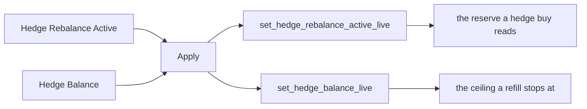

# System Architecture and Features Catalogue

Acervator features a semi-modular / layered design that nests a hyper-vigilant trading engine capable of operating in multiple investment domains simultaneously and all from one terminal. The Main Window contains all of the various subsections found in each subsystem tab. As it stands the existing and planned subsystem tabs are: Simulator, Paper Trading, Trading (Live), Market Inspector, Bot Swarm, Asset Charts, History, Console, Proof of Accumulation (PoA), and System Status. Most of these subsystems interact with each other to some degree with key isolations existing between the three trading tabs and their wiring to Market Inspector, Bot Swarm, and History.

## The mark


The mark is the product's own sigil. It is drawn from triangles, not from a
font, and the splash screen paints it where a single letter used to sit.

### What each element means

| Element | Form | What it stands for |
|---|---|---|
| Compass | The dividers, hinged above centre, their two legs splaying into the frame that carries the rest | Measurement before action |
| Scale | A balance below centre, one beam and two hanging pans | The balance the platform exists to disturb and restore |
| Reptilian eye | An almond eye whose pupil is a vertical slit | Watching the market without predicting it |
| Fiery aura | Thirteen flames wreathing the eye | The volatility the cycle harvests |
| Scythe | A single shaft crossing behind the eye, its blade the feather of Ma'at | The cut that takes the excess above the target |
| Winged caduceus | A staff down the centre, two serpents coiled around it, wings at the top | Exchange, and the two sides of every cycle |

The aura carries thirteen points, and the count is deliberate.

### The maxim on the legs

Each compass leg is engraved with one word, cut dark into the metal and reading
from the hinge downward.

| Leg | Word | Meaning |
|---|---|---|
| Left | SOLVE | dissolve |
| Right | COAGULA | reform |

Together they are the alchemical maxim *solve et coagula*. It is the platform's
own cycle: a position is dissolved when the excess above the target is sold, and
reformed larger when the dip is bought back.

### How it is built

Each element has its own generator in
`src/gui/main_tabs/splash_screen_surface.py`, and each returns triangles rather
than a picture. `compose_still` in `src/gui/main_tabs/splash_screen_painter.py`
runs every generator into its own layer, adds a bloom, a blur, grain, a tone
grade and a vignette, and writes the picture above.

```python
for name, groups in surface.mark_layers(spin, pulse, moment):
    layer = _pillow(bake_groups(groups, side))
```

### The order the layers draw in

`mark_layers` returns one entry per layer, back layer first. The coiled serpents
draw after the aura, so the compass legs do not cover them.

| Order | Layer | Generator |
|---|---|---|
| 1 | Winged caduceus | `caduceus_faces` |
| 2 | Compass | `compass_faces` |
| 3 | Scythe | `scythe_faces` |
| 4 | Scale | `scale_faces` |
| 5 | Fiery aura | `aura_faces` |
| 6 | Coiled serpents | `serpent_faces` |
| 7 | Reptilian eye | `eye_faces` |

`MARK_LAYER_ORDER` in the painter holds the same order for the still frame.

### The letter forms of the maxim

Every capital in the maxim is a chain of straight strokes. No stroke is a curve,
so the words read as archaic capitals cut with a chisel.

```python
if letter == "L":
    return [[[0.13, -0.46], [0.13, 0.42], [0.56, 0.42]]]
```

`letter_strokes` returns the chains and `etched_faces` lays them along a leg.

### How the aura reads as one body

Each flame spreads half of its own share of the turn at its base, so the base of
one flame meets the base of the next. The thirteen flames form one wreath that
turns together, and each flame still tapers to its own point.

```python
AURA_BASE_SPREAD_DEGREES = FULL_TURN_DEGREES / AURA_POINTS / 2.0
```

### What moves at launch

Four things move while the splash is up, and all four run on clocks the splash
already had.

| What moves | How |
|---|---|
| The whole mark | Fades in from 0.2 s, then breathes with the rings |
| The aura | Turns with the rings, fifteen degrees a second |
| The pupil | Narrows and widens on the same breath |
| The scale beam | Swings once, then settles level |

## Trading Tab

Here you see the first subsystem we are going to cover and this will primarily be due to familiarizing the prospective investor or user with the core trading philosophy and strategies that drive Acervator. To begin, the platform runs locally on whichever hardware is selected. A single authorization phase requiring a purchased license key will be the only non-exchange communication the application will ever need. The user’s keys and secrets are stored locally and encrypted after API handshake verification passes which allows the chosen exchange to be initialized. At a later development stage, I have plans for dedicated hardware that uses a hardware key for quick boot into a given user’s account and also allows the platform to run in isolation under Linux.


This is the whole tab in one capture. The title bar and the menu row open it.
The header strip and the tab row run under them. Below those the exchange
sub-tab fills the left with the Scrumming Bots table and the command bar, the
Indicator Voting Panel fills the right, and the Activity Log and the API
Interaction Log close the foot. The status bar carries the API load pill and
the AI state label. The parts below take that screen in that order.

Privacy Mode is on, so every masked field draws four asterisks and the bot
table reads as ten columns of them. The title bar is the one reading no part
below names. It carries the version the tree answered with on the day of the
capture. Nothing types that string out. Git answers for a source
checkout and the baked file answers for a frozen bundle, so the title cannot
name a release the build is not.

`src/gui/main_window.py` — the window title

```python
self.setWindowTitle("Acervator v" + __version__ + "")
```
Press a class segment in the header strip and the title is rewritten to name the
active asset class, as `Acervator — CRYPTO LAYER`. The version leaves the title for
the rest of the session, and only a restart brings it back.

`src/gui/main_tabs/asset_class_surface.py` — the title a class writes

```python
self.setWindowTitle(window_title(key))
```

#### The screen itself

**Functional.** One method builds this whole screen. It makes one page per
trading layer, one card for every asset class that has no layer, and stacks them
so only one is on show at a time. Crypto and Stock each have a layer; Commodities
and Forex share the card. The opening page is read off the taxonomy rather than
typed. A second method builds the strip along the top, and that strip stays put
on every tab. Privacy Mode is on in the figure, so each masked field draws four
asterisks where its number would be.

`src/gui/main_tabs/trading_tab.py` — `TradingTabMixin._build_trading_tab`

```python
self._trading_stack.addWidget(crypto_page)
self._trading_stack.addWidget(stock_page)
self._trading_stack.addWidget(self._make_unlayered_page())
self._trading_stack.setCurrentIndex(acs.layer_page("crypto"))
```

**Design intention.** The stack holds one page per trading layer and one card for
every class without one. A class with no layer shares that card rather than
getting an empty layer, because an empty layer would offer a venue list it cannot
serve. Which page a class draws is stated once, in the taxonomy.

`src/gui/main_tabs/asset_class_surface.py` — `layer_page`

```python
layered = layered_classes()
key = normalise(name)
return layered.index(key) if key in layered else len(layered)
```

The builder counts its own faults when it finishes and reports them on the System
Status tab. That count reads zero, and the number it compares against is the
taxonomy's rather than a typed one.

`src/gui/main_tabs/trading_tab.py` — the three conditions the count reads

```python
self._trading_stack.count() != acs.stack_pages(),
_crypto_page != acs.layer_page("crypto"),
_stock_page != acs.layer_page("stocks"),
```

The Modulus Bot this section names has no module behind it. This manual marks it
unbuilt where it reaches it.

#### The header strip

**Functional.** Seven columns and five counter cards run along the top, and the
asset class square ends the row. The columns read SPENDABLE, REALISED, P/L,
LOCKED, MATURE, EXCH and AMMO. One call to `get_aggregate_stats` fills all of
them once a tick. Spendable takes the wallet cash, Locked takes the value tied up
in crypto, and Exch counts the open exchange sub-tabs.

The five cards are Scrummed, Folded, Trades, Bots and Errors. Scrummed and Folded
total the fleet's sold and bought dollars, Bots counts the bots that are running,
and Errors totals the lifetime error count. Click Errors and the rolling error
log opens. The small circle under every column and every card is a privacy dot,
and it masks that one field on its own.

`src/gui/main_tabs/header_strip_surface.py` — the seven columns, declared once

```python
KPI_COLUMNS = (
    {"key": "spendable", "label": "SPENDABLE", ...},
    {"key": "total_realised", "label": "REALISED", ...},
    {"key": "pnl", "label": "P/L", ...},
    {"key": "locked", "label": "LOCKED", ...},
    {"key": "mature", "label": "MATURE", ...},
    {"key": "exchanges", "label": "EXCH", ...},
    {"key": "total_ammo", "label": AMMO_LABEL, ...},
)
```

**Design intention.** The strip answers one question at a glance: what the fleet
holds, what it has earned, and what it has spent. The window no longer writes the
payload itself. It calls the same builder the React strip calls, so one function
decides what the seven columns hold and neither host can drift from the other.
`_refresh_dashboard` runs the tick that calls it, every two seconds.

`src/gui/main_window.py` — `_write_header_strip`

```python
self._spendable_widget.update_profits(
    header_strip_surface.profits_payload(agg, exchanges)
)
```

**REALISED.** The platform's own first-in, first-out match over the venue's own
fills, one figure per bot, added across the fleet. The venue carries no lifetime
realised figure for a spot position, so the fills are the venue's and the cost
basis is the venue's while the match is the platform's. Realised draws the empty
marker when the fill history cannot be walked to its end, so the column never
shows a figure added up from part of a history.

`src/exchange/position_health.py` — `compute_position_health`

**P/L.** The unrealised profit and loss the exchange answers across every bot's
open position. `src/trading/scrumming/reconciliation.py` writes each bot's
unrealised figure from the venue, and the column adds them.

`src/gui/main_tabs/header_strip_surface.py` — `unrealised_amount`

```python
return exchange_amount(stats, "total_unrealized_exchange")
```

**MATURE.** The part of a position's value that sits over three times its cost. A
position worth $350 on a $100 cost basis holds $50 of mature profit, not $250.

`src/trading/smart_wire.py` — `mature_profit_usd`

**AMMO.** Every bot's Target Delta added together, in whole dollars with a
thousands mark. It draws green while more bots hold more than their target and red
while more hold less, so the colour follows the count of bots and never the size
of the figure. That makes the column the majority of the colours the Ammo cells
already draw bot by bot, so the row and the bot list cannot disagree.

`src/gui/main_tabs/header_strip_surface.py` — `ammo_lean`, the colour's own rule

```python
if scrum > fold:
    return TERRITORY_SCRUM
if fold > scrum:
    return TERRITORY_FOLD
return TERRITORY_AT_TARGET
```

The sum is taken inside the loop that already prices every bot's position, so no
second pass over the fleet is made for it.

`src/trading/container/aggregation.py` — the sum

```python
total_target_delta_usd += target_delta(_bot_pos_val, _target_usd)
```

**Where a column stays empty.** The venue's portfolio breakdown answers a cost
basis, an average entry price and an unrealised profit per open position, and each
bot reads those three from it. Where the exchange has answered for no bot, the
column is handed nothing rather than a computed zero, so an empty column is never
a figure the platform made up.

`src/exchange/base.py` — `SpotPosition`

```python
asset: str
cost_basis_usd: float
avg_entry_price: float
unrealized_pnl_usd: float
```

`src/gui/main_tabs/header_strip_surface.py` — `exchange_amount`

```python
answered = int(data.get(EXCHANGE_FRESHNESS_KEY, 0) or 0)
if answered <= 0:
    return None
```

An empty column stays empty under Privacy Mode. The mask replaces a number with
four asterisks and leaves the empty marker alone, so the operator can always tell
a hidden figure from a missing one.

`src/core/privacy_mask_registry.py` — `mask_or`

```python
text = str(value)
if field_id not in ALL_FIELD_IDS or text == ABSENT_TEXT:
    return text
```

**The row's width budget.** Every part of the row declares a floor, and the sum
of the floors is the narrowest the window opens at. Without them a part's minimum
is the width of its own text, and a six-figure amount widens the whole window past
the screen.

`src/gui/main_tabs/header_strip_surface.py` — the floors and the shares

```python
SPENDABLE_MIN_W = 180
COUNTER_MIN_W = 48
COUNTER_NATURAL_W = 118
TOP_ROW_STRETCH = [3, 1, 1, 1, 1, 1, 0]
```

The money strip's floor is 180 px and a counter card's is 48 px, against the 118 px
that card wants for a whole money amount of `$12,345.67`. The money strip takes three
shares of the spare width and each counter card takes one. The asset class square
takes none, because its side is a declared number.

**The margins the two newest columns are drawn from.** A column leaves 3 px either
side of the rule between it and its neighbour, the rule itself is 12 px, the panel's
own side margin is 6 px, and a counter card's side margin is 4 px.

`src/gui/main_tabs/header_strip_surface.py` — the four figures

```python
SPENDABLE_SIDE_MARGIN_PX = 6
SPENDABLE_COLUMN_GAP_PX = 3
SPENDABLE_RULE_W_PX = 12
CARD_SIDE_MARGIN_PX = 4
```

**A shortened amount ends in an ellipsis.** Every caption and every amount in the
columns and the counters is an `ElidingLabel`. It keeps the whole text and draws
what the width holds, so `$128,456.78` in a narrow row reads `$128,45…` and never
`$128,45`. The whole text goes to `setAccessibleName`, so a shortened amount still
reaches a screen reader whole.

`src/gui/widgets/eliding_label.py` — `sizeHint`

```python
hint = super().sizeHint()
metrics = self.fontMetrics()
pad = hint.width() - metrics.horizontalAdvance(super().text())
return QSize(metrics.horizontalAdvance(self._full) + max(pad, 0), hint.height())
```

At a 900-pixel window the row is wider than the window and the Scrummed and Folded
amounts are cut short, because the cards reach their declared floor. Seven columns
is more width than 900 pixels holds before a single card or the square, so no
margin closes it. Which figure to prefer at that width is not decided.

[08-tabs/portfolio-panels.md](08-tabs/portfolio-panels.md) covers the strip in
full.

#### The tab row

**Functional.** The row of main tabs takes its order from one list. Each label
in the list is moved to its own index at build time. Any tab the list does not
name keeps the position it was added at.

`src/gui/main_tabs/main_window_surface.py` — the order, declared once

```python
CANONICAL_TAB_ORDER = (
    SIM_TAB,
    PAPER_TAB,
    LIVE_TAB,
    CHARTS_TAB,
    INSPECTOR_TAB,
    SWARM_TAB,
    ACCUMULATION_TAB,
    HISTORY_TAB,
    STATUS_TAB,
    CONSOLE_TAB,
)
```

Each of those ten names is a constant holding the label the tab bar shows,
and the main window applies the order once, after the last builder has run.

`src/gui/main_window.py` — where the order is applied

```python
self._reorder_main_tabs(list(CANONICAL_TAB_ORDER))
```

**Design intention.** The order should read as the promotion order. Practise
first, then paper, then real money, then the screens that inspect the trade. One
list decides it, so the order cannot drift as tabs are added.

`src/gui/main_window.py` — the move loop

```python
tab_bar = self._main_tabs.tabBar()
for target_idx, name in enumerate(desired):
    for cur_idx in range(self._main_tabs.count()):
        if self._main_tabs.tabText(cur_idx) == name:
            if cur_idx != target_idx:
                tab_bar.moveTab(cur_idx, target_idx)
            break
```

#### One sub-tab per exchange

**Functional.** One sub-tab holds one exchange. Along its header sit Privacy
Mode, a news headline, and the + New Bot button that opens the wizard for this
venue. Privacy Mode toggles every mask the register holds at once, and the
register holds twenty-one fields; the button's own tooltip still says eighteen.
Under the header is a
data pool line: how many slots are held by kind, the age of the freshest and
the oldest, how many have run past their time to live, and the cache hit ratio.
At the right of the sub-tab row sits the button that adds another venue.

`src/gui/widgets/exchange_tab.py` — `ExchangeTab.__init__`

```python
self._privacy_mode_btn = QPushButton("Privacy Mode: OFF")
self._privacy_mode_btn.setToolTip(
    "Toggle ALL 18 privacy masks at once. When ON, every "
```

**Design intention.** One venue, one tab, one swarm. Add a second exchange and
it arrives beside the first with its own bots and its own data pool, and
nothing about the first changes.

`src/gui/main_window.py` — `_sync_exchange_tabs`

```python
def _sync_exchange_tabs(self) -> None:
    """Add a tab for each configured exchange missing one, in its own layer."""
```

#### The news line

**Functional.** The headline between Privacy Mode and + New Bot is one item
from the crypto news ticker. The counter in front of it gives that item's place
in the batch the ticker holds, so a reading of 23 of 42 marks the twenty-third
headline of forty-two. The item itself carries the feed name, a middle dot,
then the story title. A timer steps to the next item and wraps at the end of
the batch.

`src/gui/crypto_news_ticker.py` — the line the strip draws

```python
_prefix = f"[{self._index + 1}/{len(self._headlines)}] "
self._label.setText(_prefix + h.display_text())
```

**Design intention.** The counter tells you the batch is whole. A feed that
came back short shows a smaller second number rather than a strip that looks
the same and carries less. With nothing reachable the strip says so in words
instead of going blank.

`src/gui/crypto_news_ticker.py` — the empty state

```python
self._label.setText("(no crypto news feeds reachable)")
```

**Functional.** In the React build the strip is drawn by
`crypto_news_ticker.js` into the header space the exchange screen keeps between
the Privacy Mode button and + New Bot. The exchange screen names that space
only when the strip is there; where the strip would not build, the header takes
plain space instead and the two buttons keep their positions.

`src/gui/main_tabs/exchange_tab_surface.py` — `react_news_ticker`

```python
def react_news_ticker() -> str:
    """The module that draws the news strip, as ``build_news_ticker`` reads it.

    ``ExchangeTabModel`` calls this as its ``news_ticker_factory``, so
    ``news_ticker`` is set and the header keeps the strip's space.
    """
    return NEWS_TICKER_MODULE
```

**Functional.** Hovering the headline pauses the step timer and moving away
starts it again. Clicking the headline opens that story. Each of the three
sends one request and redraws the strip from the answer, so the strip on screen
matches what the backend holds.

`src/gui/main_tabs/crypto_news_ticker_surface.py` —
`CryptoNewsTickerModel.handle_event`

```python
if event_type == EVENT_ENTER:
    self.paused = True
    self.calls.append([HOVER_PAUSED])
    return False
if event_type == EVENT_LEAVE:
    self.paused = False
    self.calls.append([HOVER_RELEASED])
    return False
```

#### The bot tables

**Functional.** The Scrumming Bots table carries ten columns. Nine are named and
the tenth is blank, because that one holds the Detail button. The Extractor table
sits underneath. Both tables start hidden and appear when their own list gains a
row.

`src/gui/main_tabs/bot_status_table_surface.py` — the ten labels, declared once and
carried into the widget as `BotStatusTable.SCRUMMING_COLUMNS`

```python
COLUMN_LABELS = (
    "Asset",
    "Symbol",
    "Current Position Value",
    "Trades",
    "Target",
    "Target A15",
    "Target A14",
    "Ammo",
    "Fire",
    "",
)
```

**Asset, the first column.** The column draws the target asset's own official
mark. Where the logo library has already put a file on disk for that asset, the
cell draws it and holds no text. Where none is kept, the cell draws the asset's
ticker instead, so the row still names what the bot accumulates. Nothing on this
path fetches anything: the cell reads the kept directory and no further.

`src/gui/main_tabs/bot_status_table_surface.py` — `logo_cell`

```python
if shown != asset or not asset:
    return cell(shown)
address = logo_data_address(path)
if path and address:
    return cell(
        EMPTY_TEXT,
        tooltip=LOGO_TIP_FORMAT.format(asset=asset),
        logo_path=path,
        logo_image=address,
        logo_size=LOGO_SIZE_PX,
    )
return cell(asset, tooltip=NO_LOGO_TIP_FORMAT.format(asset=asset))
```

The asset a crypto bot names is kept under its base, and a currency pair under
the whole pair, so both keys are asked in that order.

`src/gui/main_tabs/bot_status_table_surface.py` — `kept_logo_path`

```python
for asked in (icon_asset_of(symbol), symbol):
    if not asked:
        continue
    found = KEPT_LOGOS.kept_path(asked)
    if found is not None:
        _LOGO_PATHS[symbol] = str(found)
        return str(found)
```

**Where a mark comes from.** The library sits at `resources/logos`, under the
repository, and is filled ahead of any bot. A crypto asset's mark comes from a
coin data source; every other asset's mark comes from that organisation's own web
site. The library files each mark under its asset class and its sector, so one
asset has one file wherever it is met, and the list reads that directory at any
depth.

`src/trading/logo_library.py` — where one asset's file is put

```python
def library_folder(asset_class: Any, sector: Any = "") -> str:
    return kept_folder(f"{asset_class}/{sector}")
```

`src/core/asset_logos.py` — the read at any depth

```python
for found in self._cache_dir.rglob(f"{stem}.*"):
    rank = ranks.get(found.name)
    if rank is None or rank >= best_rank or not found.is_file():
        continue
    best, best_rank = found, rank
```

**A mark keeps its own shape and its own detail.** A mark is drawn inside a box of
the logo's own size and is never squeezed to fill it. A mark that is not square
keeps its proportions in both builds. A mark whose file holds several sizes is
drawn from the size nearest the box rather than from the smallest. A mark smaller
than the box is drawn at its own size rather than enlarged. The React page cannot
open a file by its path, so the same bytes travel to it as a data address, read
once per file.

`src/gui/widgets/bot_status_table.py` — `_draw_logo` hands the file to the icon whole

```python
icon = QIcon(path)
found = icon if icon.availableSizes() else None
```

`src/gui/web/bot_status_table.js` — the page bounds the mark rather than setting it

```javascript
style.maxWidth = size + PX;
style.maxHeight = size + PX;
```

**HIS.**

> "Live - Asset Column - Logos are not hyperlinked. Should be centered in the
> column. Column fields must match logo background color."

**The mark sits at the centre of its column.** Every cell in the table takes centre
text alignment, and the first column's cell empties its text once it holds a mark.
Text alignment governs text, so a delegate on the first column moves the decoration
instead, and it touches nothing else.

`src/gui/widgets/bot_status_table.py` — `CentredMarkDelegate`

```python
def initStyleOption(self, option, index) -> None:
    super().initStyleOption(option, index)
    option.decorationPosition = QStyleOptionViewItem.Top
```

The page already centred its own mark, with a block image at an automatic side
margin, so one declaration on each side puts the mark in the same place in both
builds.

`src/gui/web/bot_status_table.js` — `AssetLogo`

```javascript
var DOT_MARGIN = "0 auto";
```

**HIS.**

> "Logos should also double as hyperlinks to the company or organization beyond
> each asset. Want Acervator to feel like it is connected to all of these corners
> of the investment world simultaneously like a creature with a thousand
> tendrils..."

**A mark opens the organisation that owns the asset.** Clicking a mark opens the
front door of the company or organisation behind the traded asset, in the
operator's own browser. Two readers already in the tree answer an address and the
table asks them in one place: a crypto base answers the site its own coin record
carries, and a listed name answers the domain the asset maps hold for it. A
regulator's company-search page is never answered, because a search result is not
an organisation's own front door. A mark whose asset has no known address is not a
link: it draws exactly as it drew before, it opens nothing, and its tooltip says
so.

`src/gui/main_tabs/bot_status_table_surface.py` — `organisation_address`

```python
for asked in (icon_asset_of(symbol), symbol):
    if not asked:
        continue
    site, _ = CRYPTO_RECORDS.organisation_url(asked)
    found = site or organisation_page(asked)
    if found:
        break
address = opening_address(found)
```

The site comes from the same coin record the mark came from. The library fill
settles one coin for each ticker and keeps that coin's own front door beside the
mark's address, so the bot list reads the kept site first and a hand-written row
second. Only the coin source's detail address carries a site: the list address
names every coin and the market records name each mark, so a site costs one read
for each settled coin and a site already kept is never read twice.

`src/exchange/crypto_assets.py` — `AssetManager.organisation_url`

```python
indexed = str(
    (self.coin_index.get(name) or {}).get(COIN_INDEX_SITE_KEY) or ""
).strip()
if indexed:
    return openable_url(indexed, allowed_schemes=COIN_SITE_SCHEMES)
asset = self.get_asset(name)
return openable_url(asset.website if asset else "")
```

`src/exchange/crypto_assets.py` — the address that carries a site

```python
COIN_DETAIL_URL = "https://api.coingecko.com/api/v3/coins/{id}"
```

Of the thirty-eight target assets the saved fleet holds, thirty-six answer a web
address. Two do not: one because several coins carry its ticker at comparable
market rank, and one because its coin record names no secure web address. Neither
is guessed at.

A mark's tooltip carries one extra line naming the address or its absence, so the
operator can see which marks are links and which are not without pressing one.

```
a mark whose asset resolves      Open <the site> in default browser: <the address>
a mark whose asset resolves none no web address is known for <ticker>, so this mark
                                 is not a link
```

**What the address check refuses.** An address is checked before any browser is
asked to open it. Only a secure web address with a host opens. An insecure
address, a local file path, a script address, a data address, a file-transfer
address, a bare host and an address with no host are each refused, and nothing is
opened, whatever the data carries. The window reads the address off the clicked
cell and opens it; the page sends the row and the column out and Python opens it,
so the page never opens anything itself. Both go through the one check.

`src/gui/main_tabs/bot_status_table_surface.py` — `opening_address`

```python
OPENING_SCHEMES: tuple[str, ...] = ("https",)
```

**HIS.**

> "Column fields must match logo background color."

> "Some do not have a background color. Be sure to choose one that contrasts and
> makes each one pop. Use a theme-consistent color."

> "Do not want a bunch of random background colors in the Asset Column that smash
> together and cause an eyesore."

The three sentences settle each other. One colour sits behind the whole column.
Every mark on it reads against that one colour. A column carrying its own tint per
row is the thing he refused.

**The column sits on one palette ground.** One colour sits behind the whole
column, and every mark on it reads against that one colour. The column carries no
tint per row. GUI010 in the GUI archetype refuses a ground the declared palette does
not hold, a ground that does not carry what sits on it at the published contrast
floor, and a set of declarations giving one column several grounds. Every finding is
high, so the verdict reads `passed=False` and the command exits 1.

`dev_harness/harness/gui_archetype.py` — `_scan_column_ground_colours`

```python
findings = _style_ground_faults(path, tree, known)
findings.extend(_cell_ground_faults(path, tree, known))
findings.extend(_named_ground_faults(path, tree, known))
findings.extend(_ground_set_faults(path, tree, known))
```

Its fixture pair is `harness_fixtures/gui_archetype/known_good_column_ground.py`,
which names one ground, the value `SURFACE_2` holds, and puts two palette colours on
it; and `harness_fixtures/gui_archetype/known_bad_column_ground.py`, which plants all
three departures and draws four high findings.

`src/gui/design_system.py` — where the palette is declared

The floors are the Web Content Accessibility Guidelines' own figures: 4.5 to 1 for
ordinary text on the ground and 3 to 1 for large-scale text, where large-scale
means 18 point, or 14 point bold. The ratio comes from relative luminance, which
linearises each channel before weighting it, so a plain average of the raw
channels returns a different number. Two grounds count as one ground while they
sit within 2.3 of each other in CIE 1976 L\*a\*b\*, which is the just-noticeable
difference.

The rule leaves three things alone: a border colour, because a boundary is measured
against the adjacent colour and one declaration names the fill on one of its two
sides only; a block on the disabled state, which the contrast criterion exempts as
an inactive component; and a colour the module never declares, such as the pixels
inside a logo file.

**The Fire button's engaged ground carries its own text.** Of the palette's 146
tokens, 77 reach the floor against white. The bright engaged token missed it, so the
button draws on the dimmed one, which is the nearest colour to it that reaches.

```
token                hex       carries #ffffff   floor
STATE_ENGAGED        #2d9d5f   3.4428 to 1       4.5     misses
STATE_ENGAGED_DIM    #2d5f48   7.3891 to 1       4.5     reaches
```

`src/gui/main_tabs/bot_status_table_surface.py` — `FIRE_STYLE_FOLD_SOLID`

```python
FIRE_STYLE_HEAD + f"color: {ds.TEXT_MAX}; font-weight: bold; "
f"background-color: {ds.STATE_ENGAGED_DIM}; "
f"border: 1px solid {ds.STATE_ARMED};"
```

The button keeps its bright border and its glow, which is what parts it from the
button a position ceiling has stopped.

**Symbol, the second column.** The Symbol cell carries the colour that says what a
bot is doing, and its tooltip names the mode and the state. Where the pair has a
chart, the chart's line follows underneath the cell, and the underline is what
marks the cell as the chart's link. The coloured disc carrying the asset's first
letter no longer draws in this cell.

`src/gui/main_tabs/bot_status_table_surface.py` — `BotStatusTableModel._symbol_cell`

```python
found = cell(text, state_color(state), mode_tooltip(mode, state))
```

The eight colours a state draws in:

| state | the Symbol cell's colour |
|---|---|
| running | `#00ff88` |
| idle | `#888888` |
| paused | `#ffaa00` |
| error | `#ff3366` |
| cooldown | `#ff6600` |
| stopped | `#666666` |
| starting | `#00e6ff` |
| a state the list does not name | `#e0e0f0` |

**Current Position Value, the third column.** It shows what the bot's holdings are
worth at the exchange's own price. It is blank whenever no fresh exchange price
exists, and a blank cell names the missing thing in its tooltip: no position held,
no exchange price for the pair yet, no exchange price this tick, or a price older
than twenty seconds. The cell never falls back to a last-known figure, to a
stand-in, or to a value read out of the bot's own ledger.

`src/gui/main_tabs/table_cells_surface.py` — the one multiplication both priced
cells read, so the Position Value cell and the Ammo cell can never disagree

```python
def priced_position(holdings: float, price: float, quote_rate: float) -> float:
    """The position value at one price: ``holdings`` times ``price`` times
    ``quote_rate``."""
    return holdings * price * quote_rate
```

`src/gui/main_tabs/table_cells_surface.py` — the four blank paths and the one
priced path

```python
POSITION_PATH_PRICED = "priced"
POSITION_PATH_NO_HOLDINGS = "no_holdings"
POSITION_PATH_NO_PRICE = "no_price"
POSITION_PATH_OFF_EXCHANGE = "off_exchange"
POSITION_PATH_AGED = "aged"
```

**Ammo.** The cell draws green above the target, red below it, and neutral grey
inside the dust band.

**Design intention.** The Ammo cell measures against the live target, not the
frozen number typed into the wizard, so the reading follows the grown balance the
engine re-zeroes to. The header strip's AMMO total takes the same target from the
same function, so the row and the list cannot disagree.

`src/trading/target_bands.py` — the target every Ammo reading measures against

```python
def ammo_target(live_target_balance: Any, configured_target_balance: Any) -> float:
    live = float(live_target_balance or 0.0)
    if live:
        return live
    return float(configured_target_balance or 0.0)
```

`src/gui/widgets/bot_status_table.py` — the row reads it through `target_value`

```python
target_val = target_value(status)
```

**Target A15 and Target A14.** They restate the Target in those two assets, and go
blank when the pair is unlisted or when the target already is that asset.

**The row's height.** A logo draws at 32 pixels square. A row keeps two pixels
above and two below its content, which is what this widget's style answers for its
own item margin, so a row takes 36 pixels. The page's own sheet leaves more room
than the window's style, so the logo's cell drops its vertical padding and the row
keeps the height the payload set. No other cell and no rule in the sheet changes,
so the Extractor table beneath is untouched.

`src/gui/main_tabs/bot_status_table_surface.py` — the two figures and the sum

```python
LOGO_SIZE_PX = 32
ROW_LOGO_MARGIN_PX = 2
ROW_HEIGHT_PX = LOGO_SIZE_PX + 2 * ROW_LOGO_MARGIN_PX
```

**The bot id.** The bot id is still the thing a row is identified by. It stays in
the payload, once as the list of every drawn row's bot and once on each row. It
stays in the line the list writes when a row is built. The Detail button carries
it, and the window that button opens names its first eight characters in its own
title.

`src/gui/main_tabs/bot_live_settings_surface.py` — the title that names it

```python
WINDOW_TITLE_FORMAT = "Bot Settings — {symbol} [{short_id}]"
```

**Functional.** Every column header wraps its own label inside its own column.
`Current Position Value` reads over two or three lines rather than being cut. The
label draws at `HEADER_LABEL_FONT_PX` and steps down to
`HEADER_LABEL_MIN_FONT_PX` when its longest word does not fit the column at the
first size. Every column's header is the same height, which is the tallest wrapped
label plus one dot row. Nine of the ten columns carry one privacy dot centred
beneath the label, and the tenth, the one holding the Detail button, leaves that
row empty. `ColumnHeaderCell` draws one label over one dot and
`WrappedColumnHeader` sizes and places one cell a column.

`src/gui/main_tabs/bot_status_table_surface.py` — `header_view`

```python
return {
    "text": label,
    "tooltip": header_tooltip(column, field_id, masked),
    "field_id": field_id,
    "masked": bool(masked),
    "dot_text": header_glyph(masked),
    "dot_tooltip": header_dot_tooltip(field_id, masked),
}
```

**Functional.** The dot is the `PrivacyDot` the manual calls the universal
control. A press flips that column's field in the privacy register, repaints every
dot that shares the field, and redraws the rows from the payload the table already
holds. Three of the nine dots share a field with another column:
`Current Position Value` and `Ammo` share `bot_table.ammo`, and `Target`,
`Target A15` and `Target A14` share `bot_table.target`. A press on one of them
masks every column that names the same field. A masked first column draws the mask
alone, with no image and no ticker, and revealing it brings the mark back.

`src/gui/widgets/bot_status_table.py` — `BotStatusTable.refresh_privacy_dots`

```python
for cell in self._header.cells():
    if cell.dot is not None:
        cell.dot.refresh()
```

**Functional.** A press on a column's label orders the rows by that column. The
first press sorts smallest first, and a second press on the same label reverses
it. Nine of the ten columns sort. The tenth holds one identical Detail button on
every row, so it carries no value to order by, and a press on it changes nothing.
One ordering serves both builds: the window and the page both call the same
function on the same fleet, so neither can put the same bots in an order the other
would not. On the page the press goes back to Python, because the fleet that
answers it lives there, and the venue republishes the ordered rows.

`src/gui/main_tabs/bot_status_table_surface.py` — `SORT_KIND_BY_COL`

```python
SORT_KIND_BY_COL = {
    BOT_ID_COLUMN: SORT_KIND_TEXT,
    SYMBOL_COLUMN: SORT_KIND_TEXT,
    POSITION_VALUE_COLUMN: SORT_KIND_NUMBER,
    TRADES_COLUMN: SORT_KIND_NUMBER,
    TARGET_COLUMN: SORT_KIND_NUMBER,
    TARGET_A15_COLUMN: SORT_KIND_NUMBER,
    TARGET_A14_COLUMN: SORT_KIND_NUMBER,
    AMMO_COLUMN: SORT_KIND_NUMBER,
    FIRE_COLUMN: SORT_KIND_NUMBER,
    DETAIL_COLUMN: SORT_KIND_NONE,
}
```

`src/gui/main_tabs/bot_status_table_surface.py` — `BotStatusTableModel.on_header_sorted`

```python
if column == self.sort_column:
    self.sort_descending = not self.sort_descending
else:
    self.sort_column = column
    self.sort_descending = False
```

**Functional.** Asset and Symbol sort as words, Asset on the asset's ticker. The
other seven sort as figures, each reading the number its cell was computed from
rather than the text the cell draws, so nine never sorts above ten. Ammo sorts on
the distance from target without its sign, which is the amount that would fire and
the figure the cell prints; the colour still says which side of the target the bot
sits on. Fire sorts by what the engine would do next, armed first and disabled
last. A row whose cell draws nothing sits beneath every row that draws a figure,
whichever way the sort runs, and the bot's own identifier breaks a tie.

`src/gui/main_tabs/bot_status_table_surface.py` — `order_statuses`

```python
drawn.sort(key=lambda row: (row[0], row[1]), reverse=descending)
return [row[2] for row in drawn] + blank
```

**Functional.** The order is recomputed every time the rows are rewritten, not
once at the press. A fleet arriving a second later is ordered again before it is
drawn, so a column whose figures keep moving keeps the order the last press asked
for and the rows travel as the figures change.

`src/gui/widgets/bot_status_table.py` — `BotStatusTable.update_bots`

```python
bot_statuses = order_statuses(
    self._last_statuses,
    self._sort_column,
    self._sort_descending,
    _qt_lookups(),
)
```

**Functional.** The sort arrow draws on the privacy dot's own row, at the right
edge of its own column. Its rectangle takes the dot's top and the dot's height, so
the two sit on one line, and its left edge never crosses the dot's right edge. The
box is clamped to the column, so no arrow is drawn outside the column it belongs
to. The arrow sits outside the header's own layout, so neither the wrapped label
nor the dot beneath it moves when a column sorts. The page places its arrow the
same way, against the heading's bottom edge above the cell's padding and held to
the column's width.

`src/gui/widgets/bot_status_table.py` — `ColumnHeaderCell._place_mark`

```python
top, height = self._dot_row()
left = max(self._dot_right(), self.width() - HEADER_SORT_MARK_BOX_PX)
self.mark.setGeometry(left, top, max(0, self.width() - left), height)
```

`src/gui/web/bot_status_table.js` — `SortMark`

```javascript
style.bottom = length(model[HEADER_CELL_PAD_PX]);
style.right = MARK_EDGE;
style.width = length(model[HEADER_SORT_MARK_BOX_PX]);
style.maxWidth = MARK_MAX_WIDTH;
style.height = length(model[HEADER_DOT_ROW_PX]);
```

**Functional.** Five things can be pressed on the table, and each sends one
request and redraws from the answer. The dot under a column's label toggles that
column's privacy mask. A mark in the first column opens its asset's own
organisation. A Symbol cell opens the chart address. Fire hands the bot to Manual
Fire. Detail selects the row and opens the bot. A press on a column's label sorts
it. The dot keeps its own press to itself, so masking a column never reorders the
table, and the Fire and Detail buttons stop the press reaching the row so they keep
their window behaviour.

`src/gui/main_tabs/bot_status_table_surface.py` — `BotStatusTableModel.on_detail`

```python
def on_detail(self, bot_id: str) -> None:
    """Select the row, then hand the bot to whatever opens the detail."""
    self.select_row_for_bot(bot_id)
    self.detail_clicks.append(bot_id)
    self.calls.append([DETAIL_CLICKED, bot_id])
    if self.on_bot_clicked:
        self.on_bot_clicked(bot_id)
```

`src/gui/react_trading_tab.py` — the presses the venue answers

```python
VENUE_PRESSES = (
    (scrum_surface.PRIVACY_TOGGLE_PARAM, "toggle_privacy"),
    (scrum_surface.SORT_COLUMN_PARAM, "sort_by"),
    (scrum_surface.SELECT_BOT_PARAM, "select_bot"),
    (scrum_surface.VIEW_BAND_PARAM, "scroll_view"),
)
```

**Functional.** A press on a bot's row draws that bot in the Indicator Voting
Panel. A press on the row the panel already draws takes the panel off it instead,
and the panel shows its empty state; a third press brings the bot back. A press
naming another bot never blanks the panel, it moves it. The press names the bot on
the row and never the row's position, so a column can be sorted first and the panel
still draws the bot whose row was pressed. One function decides it and both builds
call it, so a press cannot mean two different things on the two screens.

`src/gui/main_tabs/bot_status_table_surface.py` — `selection_after_press`

```python
pressed = str(pressed_bot_id or "")
if not pressed or pressed == str(shown_bot_id or ""):
    return NO_SELECTION_BOT_ID
return pressed
```

`BotStatusTable.mousePressEvent` calls it in the window and
`BotStatusTableModel.on_row_pressed` calls it on the page, and the page's row sends
its press out on the same console line the privacy toggle and the column sort use.

`src/gui/web/bot_status_table.js` — `sendRowPress` and `sendSort`

```javascript
function sendRowPress(model, botId) {
  return dispatch(
    model,
    actionNamed(model, ROW_PRESSED),
    request(model, SELECT_BOT_PARAM, botId)
  );
}
```

The window builds one link and gives the panel's own topic a reader, in
`MainWindow._setup_bot_list_link`. The topic was already declared and the emit already
ran; nothing listened to it.

`src/gui/widgets/bot_selection.py` — `BotListPanelLink.row_selected`

```python
def row_selected(self, bot_id: Optional[str]) -> str:
    """Draw the pressed bot on the panel and answer the bot it holds."""
    if self._settling:
        return self.bot_id
    self._settling = True
    try:
        return str(self._panel.select_bot(str(bot_id or "")) or "")
    finally:
        self._settling = False
```

**Functional.** The list scrolls only when the operator scrolls it. The table turns
off the scroll-to-current-item behaviour the toolkit applies by default, so the
only thing that moves the scroll bar is a hand. A highlighted row the viewport no
longer draws loses the highlight, and one rule decides that for both builds. A
column sort reorders every row while the scroll position stays, so the highlighted
bot can land far below the rows on screen; that is the highlight leaving the view
and it is released the same as any other cause. The drop runs with the table's
signals blocked, so nothing downstream hears it.

`src/gui/widgets/bot_status_table.py` — `BotStatusTable.__init__`

```python
self.setAutoScroll(False)
self.verticalScrollBar().valueChanged.connect(
    lambda _value: self.release_selection_off_view()
)
```

`src/gui/main_tabs/bot_status_table_surface.py` — `selection_after_view_moved`

```python
if row < 0 or first < 0 or last < first:
    return NO_SELECTION_ROW
if first <= row <= last:
    return row
return NO_SELECTION_ROW
```

The React page reads its own drawn rows off the scroll box it sits in and sends the
first and last of them, and the same function answers there.

`src/gui/web/bot_status_table.js` — `visibleRowBand`

```javascript
if (span.top >= edge.top - 1 && span.bottom <= edge.bottom + 1) {
  if (first < 0) {
    first = at;
  }
  last = at;
}
```

**Functional.** The list's highlight and the panel's bot are two values. A release
changes the list alone. The panel changes only when a bot is chosen, from a row or
from the panel's own dropdown, and the Live page does not redraw the panel on a
scroll. The panel's dropdown still puts the highlight on that bot's row, and now
only while that row is drawn, so the two can name different bots: the panel holds
the bot it is drawing and the list holds a highlight it can release, which is what
keeps the scroll bar still.

`src/gui/widgets/bot_selection.py` — `BotListPanelLink.panel_selected`

```python
for host in self._hosts() or ():
    mark = getattr(host, "highlight_bot", None)
    if callable(mark):
        mark(wanted)
```

**Functional.** One bad field stops one row instead of the whole paint. Each row is
written inside its own guard. A row that refuses is logged, emptied and left empty,
and every other bot still draws. A row whose bot is not a scrumming bot is emptied
the same way, so it can no longer keep the previous bot's figures.

`src/gui/widgets/bot_status_table.py` — `BotStatusTable._clear_row`

```python
for col in range(self.columnCount()):
    self.setItem(row, col, None)
    if self.cellWidget(row, col) is not None:
        self.removeCellWidget(row, col)
```

**Functional.** In the React build the Scrumming Bots table is drawn by
`bot_status_table.js`. The exchange screen keeps a named empty space for it and
fills that space when it draws itself. The rows come from the backend, not from the
exchange screen: the renderer asks the bridge for the table's own state and names
the exchange it wants rows for. Each exchange gets its own table state, so two
exchange screens on one page never share rows or a highlight.

`src/gui/web/exchange_tab.js` — `mountScrumTable`

```javascript
function mountScrumTable(target, model) {
  var loader = global[LOAD_BOT_TABLE];
  var wait =
    typeof loader === "function" ? loader(askFor(model)) : Promise.resolve(null);
  return Promise.resolve(wait).then(function () {
    return renderScrumTable(target, exchangeOf(model)) === null
      ? null
      : BOT_TABLE_MODULE;
  });
}
```

**Design intention.** The exchange screen redraws itself once a second to keep the
data-pool line fresh. Each redraw re-fills the table space, so the table is drawn
from the state the renderer holds for that exchange rather than from the answer
captured at first paint. A row the operator selected therefore survives the next
redraw.

`src/gui/web/bot_status_table.js` — `modelFor`

```javascript
function modelFor(exchangeId) {
  return owns(models, String(exchangeId)) ? models[String(exchangeId)] : null;
}
```

**Functional.** The Extractor table underneath is drawn the same way, by
`extractor_bot_table.js` into the second named space the exchange screen keeps. Its
rows come from the same fleet list, kept to the records whose mode is extractor.
The Detail button is the one control the Extractor table offers; Fire stays
disabled on this screen, because Manual Fire is per position and lives in the
Positions Held tab of the bot's own window.

`src/gui/main_tabs/extractor_bot_table_surface.py` — `extractor_statuses`

```python
def extractor_statuses(statuses: Any) -> list:
    """The records of ``statuses`` whose mode is ``MODE_TEXT``.

    ``update_bots`` builds a row for every record it is handed, so only the
    Extractor bots reach the Extractor table.
    """
    return [
        found
        for found in statuses or []
        if isinstance(found, dict) and found.get("mode") == MODE_TEXT
    ]
```

**Functional.** The Scrumming table holds the whole accumulation fleet and grows
into whatever room is left. The Extractor table keeps the height of its own rows,
so its rows are never cut. The React page reads the two shares onto the flex of
each table space, and the Qt page passes them to the layout.

`src/gui/main_tabs/exchange_tab_surface.py` — the two stretches

```python
SCRUM_TABLE_STRETCH = 1
EXTRACTOR_TABLE_STRETCH = 0
```

**Functional.** The exchange screen mounts its three children in one step, each
into its own space and each asked for its own view model.

`src/gui/web/exchange_tab.js` — `mountChildren`

```javascript
function mountChildren(target, model) {
  return Promise.all([
    mountScrumTable(target, model),
    mountExtractorTable(target, model),
    mountNewsTicker(target, model)
  ]).then(function (drawn) {
    return drawn.filter(function (name) {
      return name !== null;
    });
  });
}
```

#### The command bar

**Functional.** Start, Pause, Stop, Restart and Delete all act on one bot. Two
tables share the bar, so the bar takes its bot from whichever table you clicked
last. If that table holds no selection it tries the other one. If neither holds
a selection it says "Select a bot first." and does nothing.

`src/gui/widgets/exchange_tab.py` — `ExchangeTab._cmd`

```python
def _cmd(self, command: str) -> None:
    if self._last_clicked_table == "extractor":
        bot_id = self._extractor_table.get_selected_bot_id()
        if not bot_id:
            bot_id = self._bot_table.get_selected_bot_id()
    else:
        bot_id = self._bot_table.get_selected_bot_id()
        if not bot_id:
            bot_id = self._extractor_table.get_selected_bot_id()
```

**Design intention.** One command bar for two tables means the bar has to guess
which bot you meant. The last table you clicked is the tie-breaker, and the
fallback keeps a stray click from swallowing the command. With nothing selected
anywhere it refuses out loud rather than acting on a guess.

`src/gui/widgets/exchange_tab.py` — the refusal

```python
if not bot_id:
    if self._status_log:
        self._status_log.log("Select a bot first.", "warning")
    return
```

#### SHIFT turns each command into its all-bots form

> "Bot List Upgrades Pt. 2 (Live and Paper Only) - Holding SHIFT makes Start
> become Start All and launches bot start sequencer used during boot up -
> Holding SHIFT makes Stop, Pause, and Restart all become Stop All, Pause All,
> and Restart All respectively"
**Functional.** Four of the five act on one bot, or on the whole fleet while you
hold SHIFT, in the window build and in the page build. Hold the key and Start,

**Functional.** Four of the five act on one bot, or on the whole fleet while you
hold SHIFT. Hold the key and Start, Pause, Stop and Restart read Start All,
Pause All, Stop All and Restart All. Let go and they read their own names again.
Delete has no all-bots form and never changes its name. The key is read at the
moment you press the button, so a key held for one press cannot reach the next
one. An all-bots press needs no bot selected.

`src/gui/main_tabs/exchange_tab_surface.py` — `FLEET_COMMANDS`

```python
FLEET_COMMANDS = {
    "start": ("Start All", "start_all"),
    "pause": ("Pause All", "pause_all"),
    "stop": ("Stop All", "stop_all"),
    "restart": ("Restart All", "restart_all"),
}
```

**Design intention.** Start All runs the same sequence the application runs at
launch. It opens the Start All window, starts one bot at a time, waits for that
bot to read running, and moves on after two seconds or after eight seconds of
waiting. Each bot goes through the same handler a single Start goes through, so
each one connects to its venue before it starts. Restart All runs that sequence
over every bot held, not only the idle ones. Pause All and Stop All need no
venue, so they go straight to the bot manager.

`src/gui/main_window.py` — `MainWindow._global_bot_cmd`

```python
if command == "start_all":
    if not self.run_fleet_sequence("start"):
        self._status_log.log(
            "start_all: no bots eligible (none idle/stopped).", "info"
        )
        return
elif command == "restart_all":
    if not self.run_fleet_sequence("restart"):
        self._status_log.log("restart_all: no bots held.", "info")
        return
elif command == "pause_all":
    self._schedule_async(self._bot_manager.pause_all())
elif command == "stop_all":
    self._schedule_async(self._bot_manager.stop_all())
```

**Functional, on the Paper tab.** The Paper command bar reads the key the same
way, over the paper fleet. A paper bot moves a saved state and connects to
nothing, so the four all-bots verbs run straight down the held list, with no
staggering and no progress window.

`src/paper/paper_bot_manager.py` — `PaperBotManager.start_all`

```python
def start_all(self) -> int:
    """Run ``start`` over every held bot and answer how many landed on
    ``running``. A paper bot moves a saved state and connects to nothing,
    so the fleet needs no staggering."""
    return self._over_fleet(self.start, BotState.RUNNING.value)
```

**Functional, on the Simulator.** The Simulator command bar does not read the
key. He named Live and Paper only, and the Simulator's own venue page and its
own view model are separate files that carry none of this.

**HIS.**

> "Live - Bug - Bot List - Start / Stop / Pause (All) toggles 'normally on'
> instead of remaining 'normally off' after releasing the SHIFT key. Can hold
> SHIFT key to toggle back to the normal state but this is incorrect / inverted
> behavior."

The five readings, per build:

```
                                 window build   page build
at rest, no key held             single-bot     single-bot
SHIFT pressed and held           all-bots       all-bots
SHIFT released                   single-bot     single-bot
window deactivated while held    single-bot     single-bot
SHIFT pressed twice in a row     all-bots       all-bots
```

**Where the label state comes from.** Both window forks call one rule, so the Live
tab and the Paper tab cannot draw different labels from the same key. The rule
takes the state off the key event the code is already holding: a SHIFT press means
the key is down, a SHIFT release means it is up, and no other reading is possible.
It holds whichever way the computer reports the key.

`src/gui/main_tabs/exchange_tab_surface.py` — `shift_held_after_key`

```python
def shift_held_after_key(
    is_press: bool, key_is_shift: bool, event_has_shift: bool
) -> bool:
    if key_is_shift:
        return is_press
    return event_has_shift
```

The press target follows the label. The press reads SHIFT from the mouse press,
which carries the true state. A window deactivated while the key is held reads the
buttons' own names, and the key pressed twice in a row reads the all-bots names.

**Functional.** A press on the Live page reaches the application only when it
carries one of the fields the page forwards, and the command field is one of them.
The page answers a read from what it already holds, and sends a press on, because
the register, the fleet, the voting panel and the bot manager all live there.

`src/gui/react_trading_tab.py` — the page's own bridge

```javascript
if (
  params &&
  (owns(params, TOGGLE) ||
    owns(params, SORT) ||
    owns(params, PICK) ||
    owns(params, COMMAND))
) {
```

**The venue a press names.** One page can draw more than one venue, so every press
carries the exchange it came from. The bot table names that field one way and the
venue page names it another, and the lookup reads every name a press can use.

`src/gui/react_trading_tab.py` — `venue_of_press`

```python
def venue_of_press(params: Any) -> str:
    held = params if isinstance(params, dict) else {}
    for name in VENUE_KEYS:
        found = held.get(name)
        if found:
            return str(found)
    return ""
```

**The bot the bar acts on.** The bar takes its bot from the table the operator
pressed last. The page keeps two records of the Scrumming table, the one it draws
and the one the bar reads, and a row press moves both. The Paper tab and the
Simulator keep the same two records, so the same call runs on all three.

`src/gui/main_tabs/exchange_tab_surface.py` — `ExchangeTabModel.hold_scrum_bot`

```python
row = (
    table.bot_ids.index(wanted)
    if wanted in table.bot_ids
    else NO_SELECTION_ROW
)
was = table.block_signals(True)
try:
    table.clear_selection()
    table.set_current_cell(row, 0)
    if row != NO_SELECTION_ROW:
        table.select_row(row)
finally:
    table.block_signals(was)
```

#### The rest of the screen

The right half is the Indicator Voting Panel, described at the end of this
section. The two panes at the foot are the Activity Log and the API Interaction
Log. The status bar carries the API load pill written by
`_refresh_api_load_pill` and the `AI:` state label.

The pill names the venue, the calls that venue took in the last minute, the
ceiling for it and the two as a percentage. It reads the worst-loaded connected
venue, so one busy exchange cannot hide behind a quiet one.

`src/gui/main_window.py` — the pill text

```python
text = (
    f"API {worst.exchange}: "
    f"{worst.calls_per_minute:.0f}/"
    f"{worst.ceiling_cpm:.0f} CPM ({pct} %)"
)
```

Its colour is the warning. Green under half load, amber above that, red past
the venue's safety percentage. With no venue connected the pill draws an em
dash and no number.

`src/gui/main_window.py` — the three colours

```python
if worst.load_score > mon.safety_pct:
    colour = ds.ERROR
elif worst.load_score > 0.5:
    colour = ds.FOLD_RATIO_AMBER
else:
    colour = ds.SUCCESS
```

1 - Add Exchange - User provides valid API key and secret for target exchange - Platforms validates with an API handshake - Exchange Initializes

After an exchange is connected to the platform, bots can be added to target entire or portions of existing positions as well as using standing liquidity to enter positions for the first time. The two primary bots used by Acervator are known as Scrumming and Extractor with the conceptual Modulus Bot to be added later. The first two are the active traders that continuously interact with the market whereas the Modulus Bot will be a macro-strategic interface designed to trigger portfolio-scale shifts in response to custom market signals and it can best be visualized as a modular synthesizer with investment and market-specific functions.

### Scrumming Bot

If Acervator has a crown jewel, this is it. The scrumming bot is what houses and executes the harvest-fold method and the harvest-fold method is what leads to the creation of the platform itself. All else stems from this origin point and the simple revelation that allowed the method to be discovered (or probably rediscovered) by nonmathematical eyes. Instead of paying attention to what my entire portfolio was doing, I opted to start focusing on a single position until I had found a strategy that was more reliable than Grid Bots or standard speculation. I was convinced such a method existed and thought it absurd that price charts could not be played better when there was obviously so much room for improvement. You do not have to predict the market. You flow and mold your portfolio to it as time goes. Scrumming allows profits to be shaved off, held and re-investment in a cyclical, reliable manner that sizes its trades in direct proportion to actual market movement as it relates to position value drift. Trading in this manner allows a fixed balance for a position to be maintained and asserts the truth that “Position X is Y value. Any deviation from Y is a Target Delta and is subject to a Scrum (Sell) or Fold (Buy).” The primary weaknesses to this strategy are not have an equal amount of liquidity to the position value (a $500 Scrumming Bot should be supported by $500 of liquidity when initialized) and severe market downturns will little or no short term upside which can lock most liquidity for the position into the Target Asset. Scrumming is a survival strategy and is directionally agnostic but also depends on the market to cycle. I also refer to this simply as Accumulation Trading.

### Scrumming Bot Terms

Target Balance - The initial value of the position to be taken or controlled by the Scrumming Bot. The bot will monitor the market for bullish or bearish conditions, check for Target Balance deviations (Target Delta), and re-zero back to the set point. It will repeat this until stopped by the user or some other market condition.

The figure is one field on the bot's own configuration. It is carried in from
the wizard and held for the life of the bot, and every other term on this page
is measured against it.

`src/trading/container/config.py` — `BotConfig.target_balance`

```python
target_balance: float = 200.0  # Balance the bot trades relative to
```

Target Delta - The amount by which a position value has drifted from the Target Balance. The Target Delta is denoted by the Ammo column under the Scrumming Bot list of the Trading Tab. This is the amount of value that will be fired during the appropriate market conditions.

One subtraction, and the platform does it in two places with opposite signs.
The Ammo cell takes the position value less the target, so a surplus reads
positive. The fold path takes the target less the position, so a deficit reads
positive. Both measure the same drift.

`src/gui/table_cells.py` — `ammo_cell`, the figure the Ammo column shows

```python
delta = position_val - target_val
territory = target_territory(position_val, target_val)
```

Scrum - To sell an amount from an investment position that allows it to return to its initial price level. This never closes the position. This is the first half of the infinitely divisible circle that can persist for such positions in a healthy market.

One shared helper decides which half of the cycle a position sits in. It
answers scrum above the target and fold below it, and it answers at target
inside a dust band, so a position that has barely moved is left alone.

`src/trading/target_bands.py` — `target_territory`

```python
delta = float(position_value) - float(target_balance)
band = at_target_dust_band(target_balance)
if delta > band:
    return "scrum"
if delta < -band:
    return "fold"
return "at_target"
```

Fold - To buy an amount for an investment position that allows it to return to its initial price level. This also drives Compounding Growth based on Local Volatility and is restricted by the Maximum Growth Per Cycle setting which has been set to a conservative 1% globally for Acervator’s live test and development run.


When the +New Bot button is pressed, the above window appears. Currently there are two “trading mode”

options (this will be change to Strategies). We are only interested in the Scrumming Bot at this point.

**Functional.** This is the wizard's first page, and the wizard opens on it.
Two radio buttons, one description under each. Accumulation Trading is already
selected when the page opens, and its description promises 12-indicator voting,
which is what the engine builds. Choosing Base Currency Extractor sends you to
the Extractor Pool page instead of the asset page. One question decides that
branch, and the rest of the wizard asks the same question whenever it needs to
know which kind of bot it is building.

A third mode, Grid, is retired. Its test returns False without looking at a
widget, and the branch that reads it is marked unreachable in the source.

`src/gui/bot_wizard.py` — `BotCreationWizard.nextId`

```python
def nextId(self):
    current = self.currentId()
    if current == PAGE_MODE:
        if self._mode_page.is_extractor():
            return PAGE_EXTRACTOR_POOL
        return PAGE_ASSET
```

**Functional.** In the React build the wizard is drawn by `bot_wizard.js` into
a space the exchange screen keeps for it. The screen keeps that space only
after + New Bot is pressed. The press asks the surface, and the surface answers
with the name of the module that draws the wizard.

`src/gui/main_tabs/exchange_tab_surface.py` — `react_bot_wizard`

```python
def react_bot_wizard(exchange_id: str) -> str:
    """The module that draws the Create Auto Trader wizard for ``exchange_id``.

    ``ExchangeTabModel`` calls this as its ``on_new_bot``, so
    ``on_new_bot_clicked`` puts the module name in ``bot_wizard``.
    """
    return BOT_WIZARD_MODULE
```

**Functional.** Cancel closes the wizard. Finish closes it from the last page
and refuses from any other. Either close drops the module the screen holds, so
the space goes with the wizard and the exchange screen underneath it is whole
again.

`src/gui/main_tabs/exchange_tab_surface.py` — `ExchangeTabModel.close_bot_wizard`

```python
def close_bot_wizard(self) -> None:
    """Drop the wizard, so the screen keeps no space for it."""
    if self.bot_wizard is None:
        return
    self.bot_wizard = None
    self.calls.append([BOT_WIZARD_CLOSED, self.exchange_id])
```

**Functional.** Every control on the page sends the steps taken so far, not the
one just pressed. The surface lays out fresh pages on each call and keeps
nothing between them, so the page holds the walk and sends the whole of it. The
answer replaces the payload the page holds and the wizard draws again.

`src/gui/web/bot_wizard.js` — `press`

```javascript
function press(name, step) {
  lastPress = { name: name, step: step };
  dispatched.push(lastPress);
  remember(step);
  lastAnswer = hasBridge()
    ? global.acervator.call(METHOD, copyOf(heldSteps)).then(take)
    : Promise.resolve(null);
  return lastPress;
}
```

**What the fleet runs.** The mode is the one setting this page writes, and it decides
which engine class the bot becomes and which pages the wizard shows next. Every live
record carries the Scrumming mode, so Accumulation Trading is both the choice the page
opens on and the only kind of bot the live run has used.

Nothing is lost by taking the opening choice here. The Extractor pages later in this
part describe a bot that has never run, and the Extractor's own description marks it
partially built and untested. A reader following this walkthrough should take the
Scrumming path and read the Extractor sections as a design.

```
mode   the page opens on   Accumulation Trading
       the fleet runs      scrumming on 38 of 38
```


After Scrumming / Accumulation is selected, next we are presented with Exchange, Base Currency, and Target Asset options.

Exchange - A privately and federally licensed financial platform that allows API interfacing for remote or automated trade execution.

The row lists the venues already connected. Picking one re-scans that venue and
keeps only the spot markets the venue itself marks active.

`src/gui/bot_wizard.py` — the market filter inside `_fetch_markets`

```python
for sym, info in exch.markets.items():
    if (
        not info.get("active", True)
        or info.get("type", "spot") != "spot"
    ):
        continue
```

Base Currency - This will be a National Currency, Stable Coin, or High Volume Crypto (A15, A14, BNB) for which multiple trading pairs are available on the selected exchange.

The page offers a fixed list of seven, and it holds exactly the national
currencies, stable coins and high-volume crypto named above.

`src/gui/bot_wizard.py` — `AssetSelectionPage`, the base list

```python
self._base.addItems(["USDT", "USDC", "A15", "A14", "BNB", "EUR", "USD"])
```

Target Asset - This is the asset in which the scrumming bot bases its position. If $50 and A05 are selected, it will strive to maintain and compound against a balance of $50 in A05 until it is shut down or some other adverse market condition occurs.

The list holds every asset trading against the base you chose, each with a
cached coin icon and, where the venue reported one, a 24-hour volume figure.
The round information button opens a written description of the selected asset,
and the line under the rows counts the pairs found. Sorting by volume puts the
tradeable pairs at the top of a list that runs to several hundred entries on a
large venue, and the sort reads a cached figure rather than fetching one.

`src/gui/bot_wizard.py` — the volume sort

`src/gui/bot_wizard.py` — the volume sort

```python
filtered.sort(
    key=lambda m: as_finite_float(m.get("volume")) or VOLUME_REFUSED_USD,
    reverse=True,
)
```

The sort reads through the one admission rule the trading package owns rather than
a reading rule of the wizard's own, and a refused volume sorts as
`VOLUME_REFUSED_USD` and labels as nothing. A saved number too large to be a float
therefore costs that one pair its volume figure instead of losing the whole pair
list.

**What the fleet runs.** The three rows on this page decide more than the pair. The
venue picked here rebuilds the TA Timeframe list two pages on, so a venue that does
not carry a timeframe removes it from the choice, and the Trading Fee row exists
because the venue sets what a round trip costs.

All 38 live bots sit on one venue. Every timeframe this walkthrough names below is
therefore a timeframe that venue serves, and the fee split described further on is
not a difference between venues.

The base currency and the target asset are each bot's own identity and have no fleet
value to quote. What is worth knowing is the shape: one bot holds one target asset
against one base, and the pool sigil an Extractor hands on instead is the only
departure from that rule anywhere in the wizard.

```
exchange         the fleet runs   one venue across 38 of 38
base currency    the fleet runs   per bot
target asset     the fleet runs   one asset per bot
```

### Trading Parameters

Next we come to the combined Scrumming Bot configuration page which has several sections for fine tuning how the specific instance behaves. Given that Acervator, at the time of this writing, is still in active development the description for each setting should be seen as a design intention should any issues be encountered.


Order Visibility - Trades are listed on the order books or tracked internally to the platform.

Two entries, Order Book (Visible) and Internal (Invisible). `ScrummingBot`
reads the choice once at construction and holds it as its invisible flag. The
label a reader sees and the value the bot stores are two different strings on
the same row.

`src/gui/bot_wizard.py` — the Order Visibility row

```python
self._visibility = QComboBox()
self._visibility.addItem("Order Book (Visible)", "orderbook")
self._visibility.addItem("Internal (Invisible)", "internal")
self._visibility.setToolTip("How orders appear on the exchange.")
self._visibility.currentIndexChanged.connect(self._on_visibility_changed)
mf.addRow("Order Visibility:", self._visibility)
```

Driven on a bot rebuilt from a stored record, the two choices take different
branches on the same tick: Internal activated all three stored Stack tranches,
and Order Book activated none of them. The order type an engine trade carries is
chosen off the same flag, on the sell side and the buy side alike.

`src/trading/scrumming/execution.py` — the sell side's order type

```python
if self._invisible:
    ot = OrderType.MARKET
    exec_price = None
else:
    ot = OrderType.LIMIT
    exec_price = vh_fp
```

Aggressive Trading - Trades are priced so that they fill immediately. Trading like this is a bit like guerilla warfare. In and out before anyone notices.

A checkbox, off at the start. Every engine-initiated order then leaves as an
immediate-or-cancel limit priced through the spread, so it pays the taker fee
for an immediate fill. Manual Fire is unaffected.

`src/gui/bot_wizard.py` — the Aggressive Trading row

```python
self._aggressive = QCheckBox("Aggressive Trading (force IOC-limit takers)")
```

The box's value reaches the bot and reaches no order. One place in the trading
package builds an immediate-or-cancel order, inside the method that opens a Stack
from a SCRUM, and that method raises before it gets there. The two places that do
choose an order type read Order Visibility and never this flag.

`src/trading/scrumming_bot.py` — the only reader that would change an order

```python
_aggressive = bool(getattr(self, "_aggressive", False))
_order_type_for_visible = (
    OrderType.IOC_LIMIT if _aggressive else OrderType.LIMIT
)
```

Stack Mode - Stack Mode enables Stack Tranches which operate on the Sell or Scrum side. This forms the “upside” of the organic ladder structure whereas Fold Tranches form its “downside”.

The box takes its start state from the engine rather than from a second literal
typed onto the page.

`src/gui/bot_wizard.py` — `TradingParamsPage`, the Stack Mode default

```python
from ..trading.bot_container import STACK_MODE_DEFAULT

self._stack_mode = QCheckBox(
    "Stack Mode (split SCRUM across upward tranches)"
)
# One declaration, so the box and the config cannot disagree.
self._stack_mode.setChecked(STACK_MODE_DEFAULT)
```

The box's value arrives on the bot and gates four places: the branch that turns a
SCRUM into a Stack, and the three reconciliation stages. Driven, the guard
discriminates — on, all three stored tranches activated; off, none did. No tranche
can be created today, because the one method that appends one raises on an
attribute no object in the tree carries. That raise is the reason the four rows
below report a value that arrives and a behaviour that waits.

`src/trading/scrumming_bot.py` — the refusal, read from a restored bot

```
AttributeError: 'ScrummingBot' object has no attribute 'exchange_interface'
```

**What the fleet runs.** This is the row to read twice. The box opens **ticked**,
because it takes its start state from the engine's own declaration, and all 38 live
bots run Stack Mode **off**. A reader who walks the wizard and leaves this page alone
builds a bot configured differently from every bot on the fleet.

The three rows below it only matter while this box is ticked. Split Distance, Tranche
Count and Spacing shape the ladder a Stack builds, and no live bot has built one, so
the figures those three carry on the fleet are the page's own opening values and not
tuned choices. There is nothing to suggest about them, because nothing has run them.

The refusal above is why. One method appends a Stack tranche and it raises before it
gets there, so a ticked box today changes what the record says and not what the bot
does. That is a different thing from the box being off on purpose, and both are true
of the fleet at once.

Split Distance - This setting determines the spacing between tranches if Tranche Spread (not available yet) is being used.

A percentage from 0.10 to 20.00, at 1.00 % to start. The bot hands it to the
stack maths as the gap between one tranche and the next, and the Spacing row
below decides how that gap grows across the ladder.

`src/gui/bot_wizard.py` — the Split Distance row

```python
self._split_distance = QDoubleSpinBox()
self._split_distance.setRange(0.1, 20.0)
self._split_distance.setDecimals(2)
self._split_distance.setSuffix(" %")
self._split_distance.setValue(1.0)
```

Driven at the maths the bot hands it to, 1.00 % priced three rungs a gap of
0.9901 and 0.9804 per cent apart, and 2.50 % priced the same three 2.439 and 2.381
per cent apart. The figure reaches that maths only through the method named under
Stack Mode above, so the value is correct and the ladder is not yet built.

`src/trading/scrumming_bot.py` — the hand-off

```python
split_dist = float(getattr(self.config, "split_distance", 1.0) or 1.0)
```

Tranche Spread - This allows a given Scrum or Fold to divide its result X# of times across multiple incremented (as dictated by Split Distance) positions.

The page carries no control of that name, and no setting named
`tranche_spread` reaches the engine.

The same sweep run for `split_distance` returns a declaration, a restore entry
and a reader, so the sweep itself finds a setting when one is there.

In development.

The sentence that opens this row is retired. Counted over the whole tracked tree,
the name appears once, and that once is this page describing its own absence.
Spacing is the control that exists and is read, and it names the four models the
engine carries. Tranche Count decides how many pieces a Scrum becomes, and Spacing
decides where each piece sits.

`src/trading/stack_math.py` — the models Spacing chooses from

```python
SPACING_MODES = ("quadratic", "fibonacci", "linear", "exponential")
```

Tranche Count - This can also be referred to as Spread Count. It determines how pieces a given Scrum or Fold is split into and distributed across incremented tranches as opposed to just one.

A whole number from 2 to 20, at 3 to start, written out as
`stack_tranche_count_target`. It is a target rather than a promise: the runtime
count drops when a tranche would fall under the venue minimum, or when two
computed prices land within a tenth of a percent of each other and merge.

`src/gui/bot_wizard.py` — the Tranche Count row

```python
self._stack_count = QSpinBox()
self._stack_count.setRange(2, 20)
self._stack_count.setValue(3)
```

Driven at the same maths, a target of 3 built three rungs and a target of 7 built
seven, each rung's size falling from 0.4 to 0.171429 units out of one 1.2-unit
Scrum. The count reaches that maths through the method named under Stack Mode, so
it too is a correct value waiting on a ladder.

`src/trading/scrumming_bot.py` — the hand-off

```python
n_target = int(getattr(self.config, "stack_tranche_count_target", 3) or 3)
```

Spacing - This adds a scaling factor Split Distance and works in conjunction with Tranche Spread and Tranche Count to induce curves and more aggressive growth within the ladder structure.

Three entries: Linear, Quadratic and Exponential. The sequence beside each name
is the cumulative distance from the anchor in units of Split Distance.

`src/gui/bot_wizard.py` — the Spacing row

```python
self._stack_spacing = QComboBox()
self._stack_spacing.addItem("Linear (1, 2, 3, 4…)", "linear")
self._stack_spacing.addItem("Quadratic (1, 2, 4, 7…)", "quadratic")
self._stack_spacing.addItem("Exponential (1, 2, 4, 8…)", "exponential")
```

The Quadratic entry read 1, 2, 4, 7 and the engine prices that model at n squared,
so the row named a ladder the engine has never built. Both the wizard row and the
live bot window now read 1, 4, 9, 16, which is what the engine publishes. The
engine also carries a fourth model, Fibonacci at 1, 2, 3, 5, that neither control
offers.

`src/trading/stack_math.py` — `level_multipliers`, driven for four levels

```
linear       [1.0, 2.0, 3.0, 4.0]
quadratic    [1.0, 4.0, 9.0, 16.0]
exponential  [1.0, 2.0, 4.0, 8.0]
fibonacci    [1.0, 2.0, 3.0, 5.0]
```

Personal Hold - Setting to be removed.

The control is still on the page. `TradingParamsPage.get_config` still emits
`personal_hold_qty`, and the capital reservation mixin still reads it, adding
it to the units the bot claims against its siblings. A removal has that reader
to retire with it.

`src/trading/scrumming/capital_reservation_mixin.py` —
`_compute_reservation_qty`

```python
_hold = float(getattr(self.config, "personal_hold_qty", 0.0) or 0.0)
```

`src/gui/bot_wizard.py` — `TradingParamsPage.get_config`, the settings this
group emits, in the order of the rows above

```python
"stack_mode": self._stack_mode.isChecked(),
"split_distance": self._split_distance.value(),
"stack_tranche_count_target": int(self._stack_count.value()),
"stack_spacing_mode": self._stack_spacing.currentData(),
"personal_hold_qty": float(self._personal_hold_qty.value()),
```

The same method writes `visibility` and `aggressive_trading` before it branches
on the kind of bot, so an Extractor carries those two as well.

Five sites read the number, not one. Two of them change what the engine decides.
The other three carry the value to those two, or draw the row the operator types
into.

```
src/trading/container/restore.py:254                    stored key into the kwarg
src/trading/scrumming/capital_reservation_mixin.py:67   the size of the claim
src/trading/scrumming/capital_reservation_mixin.py:134  the text of the claim
src/trading/scrumming/reconciliation.py:412             the adoption ceiling
src/gui/live_settings/settings_tab.py:304               seeds the live row
```

Both deciding readers are reached on every run. The claim is sized at the top of
every tick. The adoption ceiling is read once when a bot starts, and again every
reconcile interval after that.

```
src/trading/scrumming_bot.py:2571   the claim, once per tick
src/trading/bot_container.py:891    the ceiling, on bot start
src/trading/scrumming_bot.py:2643   the ceiling, every reconcile interval
```

The adoption ceiling is the reader that bears on a sale. A bot whose venue
balance stands above its own book adopts the difference as a lot, and the hold is
subtracted before that adoption, so the held units never enter the book the sell
pre-check is measured against.

```
src/trading/scrumming/execution.py:1408 — the sell pre-check reads the book
```

Driven on a restored record carrying a five-unit hold, with twenty units in the
book, thirty at the venue and a price of one hundred, against the same code with
all five readers taken out:

```
with the readers    claimable 25.0   adopted 5.0    book 25.0
readers removed     claimable 30.0   adopted 10.0   book 30.0
```

That bot may sell 25 units as the code stands and 30 with the readers gone. The
five it holds back are the hold itself. The claim a bot places against its
siblings moves the same way, 16.0 units down to 11.0, which raises a co-tenant
bot's own permitted sale from 14.0 units to 19.0.

```
src/trading/capital_reservation.py:443 — effective_available, the co-tenant's cap
```

The removal is not taken. Stored state does load without the value — three
records of three restored, 26 of 27 stored fields identical, none different, and
nothing raised — but a bot carrying a hold would be free to sell the units the
hold keeps back. The removal is safe only for a bot whose hold reads zero.

**What the fleet runs.** Personal Hold reads zero on all 38 live bots, so the five
readers listed above subtract nothing from any claim today, and the removal above is
safe for every bot on the fleet.

Order Visibility is the row in this group that changes a live trade. At Order Book
the engine rests limit orders and the trade waits for the market; at Internal it
sends market orders and takes the price on offer. 37 bots run Order Book and one runs
Internal, so a reader following the page is following what nearly the whole fleet
does.

Aggressive Trading is clear on all 38, which matches the box. Leaving it clear costs
nothing today either way: the flag reaches the bot and reaches no order, as the two
paragraphs above measure.

Stack Mode and the three rows under it carry their own note above, because the box
opens the other way from the fleet.

```
setting              the page opens at   the fleet runs
Order Visibility     Order Book          Order Book 37, Internal 1
Aggressive Trading   clear               off on 38
Stack Mode           ticked              off on 38
Split Distance       1.00 %              1.0 on 38
Tranche Count        3                   3 on 38
Spacing              Linear              linear on 38
Personal Hold        0                   0.0 on 38
```


Scrolling down we next find the first block of Scrumming Settings. These are the core or basic metrics for a Scrumming Bot.

Opposing Trade Interval - Establishes the minimum travel distance required by price action from the point a given trade in order the next trade of the opposite type to occur.

A percentage from 0.10 to 20.00, at 1.00 % to start. The Trading Fee below is
added to it, so the real distance a reversal must travel is the two together.

`src/gui/bot_wizard.py` — the Opposing Trade Interval row

```python
self._scrumming_interval = QDoubleSpinBox()
self._scrumming_interval.setRange(0.1, 20.0)
self._scrumming_interval.setDecimals(2)
self._scrumming_interval.setSuffix(" %")
self._scrumming_interval.setValue(1.0)
```

Driven on a bot restored from a stored configuration, the percentage sets two
thresholds. One is the dollar drift the position must show before the tick looks
at anything else. The other is the price a reversal must reach after an opposite
trade, and the Trading Fee is inside both of them.

```
target $200.00
  interval 1.00 %   drift threshold $2.00    the tick reads the gates
  interval 5.00 %   drift threshold $10.00   the tick holds and says so

pivot $100.00000000, one tick later at $101.00000000
  interval 0.10 %   required $100.70000000   cleared, no hysteresis blocker
  interval 1.00 %   required $101.60000000   hysteresis blocker raised
  interval 5.00 %   required $105.60000000   hysteresis blocker raised
```

Asked for a figure under its floor the box answers the floor: asked for 0.00 it
answers 0.10.

**What the fleet runs.** The box opens at 1.00 % and all 38 live bots run 5.00 %.
On a $200 target that is a $10 drift before the tick reads any gate, where the
opening figure would start reading gates at $2. The Trading Fee is added on top, so
the real reversal distance on the fleet is 5 % plus that bot's own fee.

This is the row that decides how often a bot trades at all. A smaller figure makes
the bot act on smaller moves and pay the fee more often; a larger one waits for a
move worth acting on. Five per cent is the figure the live run has used throughout,
and it is also the floor the cartridge threshold is clamped to, so raising it raises
that floor as well.

BB Tolerance - Determines the minimum distance of the Bollinger Band extent price action must be in order for a trade action to occur.

A percentage from 0.25 to 5.00, at 1.00 % to start. The band-proximity detector
takes it as its tolerance. This is the narrowest range on the page, and it
cannot be set to zero.

`src/gui/bot_wizard.py` — the BB Tolerance row

```python
self._bb_tolerance = QDoubleSpinBox()
self._bb_tolerance.setRange(0.25, 5.0)
self._bb_tolerance.setDecimals(2)
self._bb_tolerance.setSuffix(" %")
self._bb_tolerance.setValue(1.0)
```

Driven on one tape whose last close sat at band position 0.976123, the tolerance
decides whether that close counts as sitting at the upper band, and the landing
strip follows that answer. Asked for 0.00 the box answers 0.25, so it cannot be
set to zero.

```
band position 0.976123, one tape, one tick
  tolerance 0.25 %   near upper False   landing strip False
  tolerance 5.00 %   near upper True    landing strip True, upper side
```

Landing Strip Candles - Determines the strictness of Landing Strip detection. Minimum is three candles. Longer Landing Strips are historically more likely to indicate an impending market reversal than shorter ones assuming the taper remains intact or grows tighter.

A whole number of candles from 2 to 10, at 3 to start. The box accepts 2, one
below the minimum of three the description names: its declared floor is 2, asked
for 0 or 1 it answers 2, and 2 is the one figure under three it keeps.

`src/gui/bot_wizard.py` — the Landing Strip Candles row

```python
self._ls_candles = QSpinBox()
self._ls_candles.setRange(2, 10)
self._ls_candles.setValue(3)
self._ls_candles.setSuffix(" candles")
```

The tick runs two detectors over the same candles and this number reaches one of
them. Band proximity takes the stored figure as its minimum pattern length.
Tightening keeps its own minimum consecutive run, a platform constant of three,
because a run of shrinking bodies is not a count of tight bodies at a band. At a
stored 2 a trailing run of two tight bodies reads as a landing strip and lifts the
confidence boost to 0.1900; at a stored 3 the same tape reads no landing strip and
no boost.

```python
tightening = detect_landing_strip_v2(
    candles,
    min_consecutive=TIGHTENING_MIN_CONSECUTIVE,
    shrink_threshold=TIGHTENING_SHRINK_THRESHOLD,
    bb_tolerance_pct=TIGHTENING_TOLERANCE_PCT,
)
```

Raising the box's floor to three is not taken. A box holding a stored 2 answers 3
the moment its range starts at three, and putting the range back leaves the 3
behind, so the next Save would write three into a bot whose record says two.

TA Timeframe - This is the timeframe at which the bot operates and denotes the price chart it will monitor for trade decisions.

Seven entries to start, with 1h chosen. Pick an exchange and the list is
rebuilt from the timeframes that venue carries, so a venue without 4h does not
offer it. The starting choice is an index into the list rather than a named
timeframe.

`src/gui/bot_wizard.py` — the TA Timeframe row

```python
self._ta_timeframe = QComboBox()
```

```python
self._ta_timeframe.setCurrentIndex(4)  # Default 1h
```

Driven on a bot restored from a stored configuration, the name decides which
chart the bot fetches, and every indicator vote is then computed on that chart.

```
one bot, one tick each, two stored names
  1h   chart asked for 1h   consensus BULLISH 0.0219   band position 0.500000
  1d   chart asked for 1d   consensus BEARISH 0.0863   band position 0.976123
```

**What the fleet runs.** The box opens on 1h because its starting choice is index
four of the seven entries. No live bot runs 1h. All 38 run 5m, the second entry, and
they have run it for the whole live test. A reader who walks this page and leaves the
row alone builds a bot on a chart the operator has never traded.

Pick 5m to match the fleet, or pick a slower chart deliberately and know what it
costs. A slower chart smooths every indicator vote, so the bot sees fewer moves and
fires less often; a faster one sees more moves and pays more fees to act on them.
This row and the Read Rate row further on decide that together: the chart sets what
a candle means, and the read rate sets how often the bot looks at it.

The choice also reaches two rows that are counted in candles rather than in minutes.
The Soft CB Cooldown and the Extractor's watch-list refresh both scale with this
pick, so changing the chart changes how long those two last without either figure
moving.

Target Balance - This is the intended starting and locked value for the investment position that the Scrumming Bot is controlling.

From $1.00 to $1,000,000.00. Its start value is whatever default the wizard was
handed, which is the figure the Settings Trading page stores.

`src/gui/bot_wizard.py` — the Target Balance row

```python
self._target_balance = QDoubleSpinBox()
self._target_balance.setRange(1.0, 1000000.0)
self._target_balance.setDecimals(2)
self._target_balance.setPrefix("$ ")
self._target_balance.setValue(defaults.get("default_target_balance", 200.0))
```

Driven on one position worth $203.00, the figure is the line the excess is
measured from, and the Opposing Trade Interval above is a percentage of it. A
dollar and a half of target turns the same position from one the tick evaluates
into one it holds.

```
one position of $203.00, one tick each
  target $200.00   excess +$3.00   scrum side   interval $2.0000   gates read
  target $201.50   excess +$1.50   scrum side   interval $2.0150   tick holds
```

The start value does come from the figure the wizard is handed: handed 200.00 the
row opens at 200.00, and handed 777.50 it opens at 777.50. Asked for 0.00 the box
answers 1.00.

Max Entry Price - If the new bot does not detect the requisite amount (as dictated by Target Balance) of the Target Asset, this price threshold sets a limit at which it will attempt to perform the initiating Fold.

Eight decimal places, at $0.00000000, where zero means no ceiling. The buy path
is the only reader, and it refuses a buy above the ceiling. Manual Fire goes
around it.

`src/gui/bot_wizard.py` — the Max Entry Price row

```python
self._max_entry_px = QDoubleSpinBox()
self._max_entry_px.setRange(0.0, 10_000_000.0)
self._max_entry_px.setDecimals(8)
self._max_entry_px.setPrefix("$ ")
self._max_entry_px.setValue(0.0)
```

Min Entry (Should Be Exit) Price - If the new bot detects a requisite amount (as dictated by the Target Balance) of the Target Asset, this price threshold sets a limit at which it will attempt to perform the initiating Scrum.

The same shape, where zero means no floor. The buy path is the only reader here
too, so the number refuses a buy below the floor and never reaches a sell. The
row is labelled Min Entry Price on the page, without the parenthesis his line
carries.

`src/gui/bot_wizard.py` — the Min Entry Price row

```python
self._min_entry_px = QDoubleSpinBox()
self._min_entry_px.setRange(0.0, 10_000_000.0)
self._min_entry_px.setDecimals(8)
self._min_entry_px.setPrefix("$ ")
self._min_entry_px.setValue(0.0)
```

Trading Fee % - This allows the trading fee for the target exchange to be set. This is added to Minimum Opposing Trade Distance to further ensure buys / sells are properly distant and that a given bot is not losing an excessive amount to fee chop in volatile but overly tight market regimes.

A percentage from 0.00 to 5.00, at 0.60 % to start, which is the Coinbase
Advanced Trade maximum tier. It steps in twentieths of a percent, and it is a
per-side figure.

`src/gui/bot_wizard.py` — the Trading Fee row

```python
self._trading_fee = QDoubleSpinBox()
self._trading_fee.setRange(0.0, 5.0)
self._trading_fee.setSuffix(" %")
self._trading_fee.setDecimals(2)
self._trading_fee.setSingleStep(0.05)
self._trading_fee.setValue(0.6)
```

**What the fleet runs.** The box opens at 0.60 % and the live fleet is split: 24
bots run 1.6 % and 14 run 0.6 %. All 38 sit on one venue, so the split is not a
venue difference, and nothing else in the stored record separates the two groups.

The higher figure is the more conservative one, and that is worth understanding
before changing it. The fee is added to the Opposing Trade Interval, so a reversal
on a 1.6 % bot has to travel further before it may fire. A reader setting this row
is not only recording what the venue charges; they are also setting how far price
must move between a sell and the next buy.

Max Target Growth % - This determines the maximum amount of growth the Target Balance can increase in a given Market Cycle with a cycle being a Fold / Scrum / Fold sequence. Essentially any Fold preceded by a Scrum will be allowed to Fold an amount of profit back in and, if Surplus remains after the Target Delta is re-zero’d, it can be used to increase Target Balance up to this hard limit for that cycle. This is the organic compounding mechanic.

A percentage from 0.00 to 100.00, at 1.00 % to start. Setting it to zero
freezes Target Balance. It steps a quarter of a percent at a time, and it is
the only mechanism allowed to raise the figure.

`src/gui/bot_wizard.py` — the Max Target Growth row

```python
self._max_target_growth_pct = QDoubleSpinBox()
self._max_target_growth_pct.setRange(0.0, 100.0)
self._max_target_growth_pct.setSuffix(" %")
self._max_target_growth_pct.setDecimals(2)
self._max_target_growth_pct.setSingleStep(0.25)
self._max_target_growth_pct.setValue(1.0)
```

Scrum Fold Ratio - This precedes Surplus calculation as described under Max Target Growth %. It determines how much of a given trade’s profits will be redistributed to directly contribute to its own organic compounding. Note that this does not interfere with normal Target Delta re-zeroing and is intended to only serve as a “cushion” to slow runaway compounding when Wire Credits are being received from multiple sources.

A whole percentage from 1 to 100, at 100 % to start.

`src/gui/bot_wizard.py` — `TradingParamsPage.get_config`, the settings this
group emits, in the order of the rows above

```python
"scrumming_interval_pct": self._scrumming_interval.value(),
"bb_tolerance_pct": self._bb_tolerance.value(),
"bb_landing_strip_candles": self._ls_candles.value(),
"ta_timeframe": self._ta_timeframe.currentData(),
"target_balance": self._target_balance.value(),
"max_entry_price": (float(_max_ep) if _max_ep > 0 else None),
"min_entry_price": (float(_min_ep) if _min_ep > 0 else None),
"trading_fee_pct": self._trading_fee.value(),
"max_target_growth_pct": self._max_target_growth_pct.value(),
"scrum_fold_pct": self._scrum_fold_pct.value(),
```

**Where the code departs.** Three of these rows read differently in the engine
than the entries above say.

**Min Entry Price is the first.** The buy path is the only place either
entry-price field is read; it refuses a buy above the ceiling and refuses a buy
below the floor. Neither number reaches the sell path, so a bot that holds the
asset and reaches that price sells nothing. Manual Fire runs its own rebalance and
reads neither.

```
ceiling $90 against a price of $100    buy refused at the gate
ceiling $110 against the same price    gate silent
floor $110 against a price of $100     buy refused at the gate
the same floor, the same price, sell   no refusal of any kind
```

`src/trading/scrumming/execution.py` — `_execute_buy`

```python
_max_ep = getattr(self.config, "max_entry_price", None)
_min_ep = getattr(self.config, "min_entry_price", None)
try:
    _px = float(price) if price is not None else 0.0
except (TypeError, ValueError):
    _px = 0.0
if _max_ep is not None and _px > 0 and _px > float(_max_ep):
```

The sell path already takes the price, so the floor check has somewhere to attach.

*Proposed, not present, in `_execute_sell`:*

```python
_min_ep = getattr(self.config, "min_entry_price", None)
if _min_ep is not None and price > 0 and price < float(_min_ep):
    self._bus.emit(
        "bot.log",
        bot_id=self.bot_id,
        message=(
            f"SELL REFUSED (min_entry_price floor): current price "
            f"${price:.8f} < ${float(_min_ep):.8f}."
        ),
    )
    return None
```

`min_entry_price` is declared in `src/trading/container/config.py` and reaches the
bot through the wizard block above, so the proposal adds no new setting.

**A zero in either entry-price box is not the same thing in both.** Both rows say
zero means no ceiling and no floor, and both controls honour that: a box left at
zero emits an absent value rather than a number. The engine's own guard is
narrower. It treats only the absent value as off, so a record carrying a literal
zero in the ceiling refuses every auto-buy for as long as it stands. The same zero
in the floor is harmless, because no price is below it.

`src/trading/scrumming/execution.py` — the two guards

```python
if _max_ep is not None and _px > 0 and _px > float(_max_ep):
if _min_ep is not None and _px > 0 and _px < float(_min_ep):
```

No control can write that zero. The three places that collect the value each write
an absent value in its place, so a record carrying a literal zero came from an
older build or from an edit outside the application.

```
src/gui/bot_wizard.py                         absent unless the box reads above 0
src/gui/live_settings/settings_tab.py         absent unless the box reads above 0
src/gui/main_tabs/bot_wizard_surface.py       absent unless the box reads above 0
```

*Proposed, not present, in both guards:*

```python
if _max_ep and float(_max_ep) > 0 and _px > 0 and _px > float(_max_ep):
```

It is proposed rather than taken because a bot standing on such a record is
refusing every buy today, and a build that read the zero as off would have it
buying on its next tick.

**Trading Fee is the second.** The fee is added to the Minimum Opposing Trade
Distance, and at every figure the box offers except one every reader agrees. At a
stored zero they split: ten reads inside the trading package treat a zero as six
tenths of a percent, and two inside the same executor honour the zero.

```
stored 0.60 %   distance filter 1.60 %   buy and sell hysteresis 1.60 %
stored 2.50 %   distance filter 3.50 %   buy and sell hysteresis 3.50 %
stored 0.00 %   distance filter 1.60 %   buy and sell hysteresis 1.00 %
```

`src/trading/otd_math.py` — the read, and its own note on the split

```python
return minimum_opposing_trade_distance_pct(
    getattr(config, "scrumming_interval_pct", 0) or 0,
    getattr(config, "trading_fee_pct", 0.6) or 0.6,
)
```

That module's docstring names the split and says it is named there and not
repaired there. Closing it changes the distance a reversal must travel for any bot
whose fee is zero, which is a live figure on a live tick.

**Max Target Growth % is the third, and it is closed.** Nine read sites take the
figure, and every one of them names the declared default of 1.0. No bot can reach
that fallback: every construction path builds the config through one factory and
the class declares the field, so the value is never absent. A tenth site was an
expression whose value was discarded and it is gone.

`src/trading/scrumming_bot.py` — the shape all nine share

```python
_growth = float(getattr(self.config, "max_target_growth_pct", 1.0) or 0.0)
```

Three of the nine used to fall back to zero, which would have made a bot compound
or freeze depending on which site read first. They are the manual rebalance, the
compounding snapshot and the Smart Wire inputs.

```
src/trading/scrumming/execution.py   _execute_manual_rebalance
src/trading/scrumming/snapshots.py   _compounding_snapshot
src/trading/scrumming_bot.py         get_swos_inputs
```

**Where the Scrum Fold Ratio is read.** One method reads it, once per sale, and it
runs on the slice of tranches that sale appended rather than on the whole queue.

`src/trading/scrumming/fold_tranches.py` — the read and the clamp

```python
_fold_pct = max(0, min(100, int(getattr(self.config, "scrum_fold_pct", 100))))
_new_tranches = self._fold_tranches[_tranche_count_before:]
if _fold_pct < 100 and _new_tranches:
```

At a hundred the branch does not run and the sale's tranches keep every dollar.
Below a hundred each tranche keeps the ratio's share of units and of the sale's own
proceeds, and the remainder is retired as cash with a realised profit line. Money
in a tranche that did not come from this sale is wired-in credit and keeps its full
value.

```
100 % on two $100 tranches   queued $200.00, 2.0000 units
 40 % on the same two        queued  $80.00, 0.8000 units
  1 % on the same two        queued   $2.00, 0.0200 units
```

The clamp's lower bound is zero and both controls start at one, so a record
carrying a zero empties the sale's whole fold queue and retires the cash instead.
Raising the clamp to match the controls would change what such a bot rebuys on its
next sale.

**What the fleet runs.** Three of the ten rows in this group are set away from what
the page opens at, and the two most important are the rows a reader is most likely
to leave alone. Those two carry their own notes above. The other eight match the
page, and that match is the suggestion.

Target Balance is the one row with no fleet value to quote. It is set per bot: ten
distinct figures across the 38, chosen against each position rather than against a
rule. Both entry-price rows are unset on all 38, which also settles the literal-zero
case described above. No live record carries the zero that would refuse every
automatic buy, so that hazard is on the page and not on the fleet.

Max Target Growth sits at 1.00 % on every bot, the same figure the operator's own
line earlier in this part names as the conservative global setting for the live run.
Scrum Fold Ratio reads 100 on 30 bots and 50 on eight; at 100 the branch that trims
a sale's tranches never runs at all, so those 30 bots requeue every dollar a sale
produced.

The two tolerance rows match the page and work on the same candles from different
sides. BB Tolerance decides whether a close counts as sitting at a band, and Landing
Strip Candles decides how long a tight run has to be before it counts as a pattern.
Loosening the first finds more band touches; raising the second finds fewer
patterns.

```
setting                   the page opens at     the fleet runs
Opposing Trade Interval    1.00 %               5.0 on 38
BB Tolerance               1.00 %               1.0 on 38
Landing Strip Candles      3 candles            3 on 38
TA Timeframe               1h                   5m on 38
Target Balance             the Settings figure  ten distinct figures across 38
Max Entry Price            $0.00000000          unset on 38
Min Entry Price            $0.00000000          unset on 38
Trading Fee %              0.60 %               1.6 on 24, 0.6 on 14
Max Target Growth %        1.00 %               1.0 on 38
Scrum Fold Ratio           100 %                100 on 30, 50 on 8
```


Next are the “advanced” Scrumming settings which primarily affect when the bot is allowed to fire a trade. These can be thought of as “calibrating the scope”.

Detect Threshold - Intended as the point at which the bot “takes the safety off” and starts looking for a shot. To be re-evaluated.

A whole percentage from 10 to 90, at 75 % to start. The engine reads 75 as a
lower mark of 0.125 and an upper mark of 0.875, measured across the band rather
than in dollars.

`src/trading/scrumming/circuit_breakers.py` — `_bb_detect_thresholds`

```python
detect_frac = max(0.0, min(1.0, detect_pct / 100.0))
half = detect_frac * 0.5
return (0.5 - half, 0.5 + half)
```

Driven on one 40-candle tape, both marks move with the figure: 10 gave 0.45 and
0.55, 50 gave 0.25 and 0.75, 75 gave 0.125 and 0.875, and 90 gave 0.05 and 0.95.
The tick reads the pair twice, and the upper mark is a hard gate. On a tape at
band position 0.75 the figure at 75 held the scrum and named two blockers, and
the same tape at 40 cleared both and armed it.

`src/trading/scrumming_bot.py` — the two readings in one tick

```python
_bb_lower_dt_pre, _bb_upper_dt_pre = self._bb_detect_thresholds()
```

Fire Threshold - The final Bollinger Band approach metric. Once satisfied, the bot can fire a trade.

A percentage from 0.10 to 10.00, at 0.50 % to start. It measures distance from
the band, where the Detect Threshold above it measures distance from the
midline.

`src/gui/bot_wizard.py` — the Fire Threshold row

```python
self._scrum_fire_pct = QDoubleSpinBox()
self._scrum_fire_pct.setRange(0.1, 10.0)
self._scrum_fire_pct.setDecimals(2)
self._scrum_fire_pct.setSuffix(" %")
self._scrum_fire_pct.setValue(0.5)
```

The ramp's near-band test is the only place this figure lands. Driven on one tape
at band position 0.75, 0.50 % and 2.00 % each left the ramp short of FIRE and the
scrum blocked; 10.00 % took the ramp from SEARCH to FIRE in one tick and removed
that blocker.

`src/trading/scrumming/tick_phases.py` — the near-band test

```python
fire_pct_frac = self.config.scrum_fire_pct / 100.0
_near_band = abs(_price - _bb_upper) <= fire_pct_frac * _bb_upper
```

BB Midline Gate - This is another, perhaps redundant layer, of Bollinger Band travel protection. It is different in that it is concerned with distance from the midline instead of the entire local width.

A checkbox, on at the start. While it is on, a scrum fires only above the
midline and a fold only below it.

`src/gui/bot_wizard.py` — the BB Midline Gate row

```python
self._bb_midline_gate = QCheckBox("BB Midline Gate")
self._bb_midline_gate.setChecked(True)
```

Driven on one tape at band position 0.27 with the position above target: on, the
tick refused the scrum and named the band gate in its blocker list; off, that
blocker was gone. The fold half of the same reading stayed open both ways,
because the price sat below the midline.

`src/trading/scrumming_bot.py` — the midline block

```python
if self.config.bb_midline_gate:
    scrum_ok = (bb_pos > 0.50) and not self._phantom_locked
    fold_ok_midline = bb_pos < 0.50
else:
    scrum_ok = not self._phantom_locked
    fold_ok_midline = True
```

Read Rate - To be re-evaluated.

From 1 to 60 minutes, at 5 minutes to start. It sets the search-mode read rate;
track mode reads ten times faster. Fire mode reads at that same faster rate.

The wizard writes it as `scrum_read_rate_min`, bot creation passes it through,
and the bot reads it at the top of every tick. The range starts at 1, so this
control cannot switch the throttle off.

`src/trading/scrumming_bot.py` — `ScrummingBot.tick`, the throttle

```python
if self.config.scrum_read_rate_min > 0 and not self._manual_fire_pending:
    _tick_sec = max(self.tick_interval, 0.1)
    _base_skip = max(1, int((self.config.scrum_read_rate_min * 60) / _tick_sec))
    self._tick_skip_search = _base_skip
    if self._scrum_target_mode in ("track", "fire"):
        self._tick_skip = max(1, _base_skip // 10)
    else:
        self._tick_skip = _base_skip
```

The tick itself runs every five seconds, so the figure in minutes becomes a count
of skipped ticks. Driven over eighty ticks: 1 minute skipped 12 and worked 6, 5
minutes skipped 60 and worked 1, and 60 minutes skipped 720 and worked none. A
skipped tick fetches no price and runs no gate.

`src/trading/scrumming_bot.py` — the tick period the count divides

```python
@property
def tick_interval(self) -> float:
    return 5.0
```

Band Travel - Previously described. To be re-evaluated.

A whole percentage from 0 to 100, at 70 % to start. Zero switches it off. The
wizard writes it as `band_travel_pct` and bot creation passes it through.

The engine reads it once per evaluation. It measures how far price has moved
since the last trade, as a share of the current band width, and raises a second
trigger once price covers that share. The same trigger overrides a trend hold,
so Band Travel can release a trade the trend gates were holding.

`src/trading/scrumming_bot.py` — the band-travel trigger

```python
_bb_width = max(bb_result.upper - bb_result.lower, 1e-12)
band_travel_frac = abs(ticker.last - self._last_trade_price) / _bb_width
if (
    abs(ticker.last - self._last_trade_price)
    >= self.config.band_travel_pct / 100.0 * _bb_width
    and delta > 0
):
    band_travel_triggered = True
```

Driven on one rising tape where 95 % of the last twenty candles closed up, with
price 37 % of the band width above the last trade: 0 left the trend hold in place
and suppressed the scrum, 30 raised the trigger and the override released it, and
70 left the hold in place again, because 37 is under 70. The figure decides, not
an on and an off.

`src/trading/scrumming_bot.py` — the override the trigger feeds

```python
trend_override = abs(delta) >= _interval_usd * 2.0 or band_travel_triggered
if trend_hold and trend_override:
```

BB Bullseye Check - If current price and Bollinger Band thresholds are equal, the user can opt to perform a double-sized trade.

A checkbox, on at the start.

`src/gui/bot_wizard.py` — the BB Bullseye row

```python
self._bb_bullseye = QCheckBox("BB Bullseye Check")
self._bb_bullseye.setChecked(True)
```

A double size is not in the engine. Nothing sizes a trade off this box. Its one
decision reader counts a band touch within 0.5 %, or a candle wick within 0.2 %,
as band proximity, and proximity with the delta at or over the interval arms the
BB priority skew. Driven on one tape with price at the upper band, on emitted the
skew and took the confidence floor from 0.25 to 0.1923; off emitted nothing and
left the floor where it was.

`src/trading/scrumming_bot.py` — the band touch the box admits

```python
_bb_proximity_upper = (
    (bb_pos >= _bb_upper_dt_pre) or _be_upper or _be_upper_wick
)
```

It does not bypass the Fire Threshold. Driven with price 0.3 % under the upper
band and the Fire Threshold at its lowest 0.10 %, the ramp stayed short of FIRE
with the box on and with it off, and the scrum carried the same blocker both ways.
What changes is the floor the TA confidence must clear.

`src/trading/scrumming_bot.py` — the floor the skew divides

```python
_ta_conf_skew = position_boost + bb_confidence_boost
if _bb_priority_arm:
    _ta_conf_skew += _BB_PRIORITY_SKEW
_eff_conf_floor = _skewed_confidence_floor(_ta_conf_skew)
```

The second reader writes the two BULLSEYE notices onto the Activity Log and
changes no decision.

`src/trading/scrumming/tick_phases.py` — the notice reader

```python
if bullseye_upper or bullseye_upper_wick:
    _ramp = self._scrum_target_mode.upper()
    _fire_gate = "passes" if _ramp == "FIRE" else "holds"
```

Wire Inflow Stack - To be re-evaluated.

A percentage from 0.00 to 100.00, at 1.00 % to start. The wizard writes it as
`wire_inflow_stack_pct`, and one method in the engine reads it. Above zero, wire
income arriving while the position sits within that band of its target and
within that band of its entry price goes onto the target and queues an
aggressive buy, rather than spreading over the fold queue.

Bot creation passes it, and so does a restart. One declaration serves both paths,
so every field the config declares reaches a new bot and a restored one. Bot
Settings can set it on a bot that is already running.

`src/trading/scrumming/wire_routing.py` — `WireRoutingMixin.apply_wire_income`

```python
try:
    stack_pct = float(getattr(self.config, "wire_inflow_stack_pct", 1.0) or 0)
except (TypeError, ValueError):
    stack_pct = 0.0
_stack_eligible = False
_stack_reason = ""
_target = 0.0
_entry_px = 0.0
if stack_pct > 0:
```

`src/trading/container/config.py` — the one carried set

```python
carried = {f.name for f in fields(BotConfig)} - foreign - {"mode"}
kwargs = {
    key: value
    for key, value in _sanitize_deprecated_kwargs(collected).items()
    if key in carried
}
```

The caller is live. A fold routes its compounded profit through Smart Wire, which
hands the share to the target bot, and that is where this figure decides. Driven
on one bot sitting at its target and at its entry price, 0.00 parked ten dollars
as pending and left the target at 200.00, while 1.00 stacked it, took the target
to 210.00 and queued ten dollars for the next tick.

`src/trading/scrumming/tick_phases.py` — the live caller

```python
mgr.distribute_fold_profit(
    source_id=self.bot_id,
    profit_usd=float(_growth_applied),
    ref=f"fold-compound@{buy_fill:.8f}",
)
```

Hedge Rebalance Active - Determines if Current Price drifting below Initial Entry Price will have a limited amount of funds that can be used to keep re-zeroing the Target Delta at key bearish thresholds or areas of possible reversal.

A checkbox, on at the start. It opens the one group on the page that holds a
reserve outside Target Balance.

`src/gui/bot_wizard.py` — the Hedge Rebalance row

```python
self._hedge_rebalance = QCheckBox("Hedge Rebalance Active")
self._hedge_rebalance.setChecked(True)
```

Hedge Balance - Sets a limit on the amount of additional liquidity a given bot is allowed to absorb when Current Price drifts below Initial Entry Price.

At $200.00 to start, a reserve the bot holds apart from Target Balance. It is the
figure a hedge buy is checked against and the ceiling a refill stops at, and the
bot reads it off its configuration rather than keeping a second copy, so a restart
cannot leave the two disagreeing. One hedge buy spends half of what the reserve
holds, bounded by the gap to target.

`src/trading/scrumming/tick_phases.py` — the one ceiling

```python
@property
def _hedge_balance_initial(self) -> float:
    if not self.config.hedge_rebalance_active:
        return 0.0
    return float(self.config.hedge_balance)
```

`src/trading/scrumming_bot.py` — the figure that sizes one hedge buy

```python
_use = min(self._hedge_bal * 0.5, _gap)
```

**The switch arms the reserve.** Ticking Hedge Rebalance Active on a running bot
raises the reserve to the Hedge Balance figure, and it never lowers a reserve the
bot already holds, so the box cannot destroy one. Unticking keeps the reserve and
freezes it, because the arm test and the refill test both read the switch first. A
word instead of a tick is refused and the switch does not move.



The reserve itself stays on the saved record, because it is a balance and not a
setting, and it refills from compound growth at eight hundredths of each fold's
profit.

**A Hedge Balance of zero says what it is.** Zero is a figure the box accepts and
it is not an off switch. It is an empty reserve that never refills, and a reserve
the bot already holds stays spendable until it drains. Both tooltips say so, on
both builds, and the Activity Log says so as the figure is typed.

```
HEDGE BALANCE A11 LIVE UPDATE: $200.00 -> $0.00. A $0.00 Hedge Balance is an
empty reserve that never refills, not an off switch. Untick Hedge Rebalance
Active to turn the hedge off. Reserve $200.00 stays spendable until it drains.
```

The running bot's row is routed through a method rather than written straight onto
the config, and that method refuses a figure it cannot use.

```
set $500.00  applied   cap $500.00  reserve unchanged
set   $0.00  applied   cap   $0.00  reserve unchanged
set  -$5.00  refused   hedge_balance must be >= 0
set   "abc"  refused   hedge_balance must be numeric
set  $75.00  applied   cap  $75.00  reserve unchanged
```

A cap of zero shuts the refill gate for good while leaving the old reserve drainable,
and raising the cap above zero re-opens it, so the state is recoverable by the same
control that caused it.

`src/gui/bot_wizard.py` — `TradingParamsPage.get_config`, the settings these
two groups emit, in the order of the rows above

```python
"scrum_detect_pct": self._scrum_detect_pct.value(),
"scrum_fire_pct": self._scrum_fire_pct.value(),
"bb_midline_gate": self._bb_midline_gate.isChecked(),
"scrum_read_rate_min": self._scrum_read_rate.value(),
"band_travel_pct": self._band_travel_pct.value(),
"bb_bullseye_check": self._bb_bullseye.isChecked(),
"wire_inflow_stack_pct": self._wire_inflow_stack_pct.value(),
"hedge_rebalance_active": self._hedge_rebalance.isChecked(),
"hedge_balance": self._hedge_amount.value(),
```

The group title on screen carries an internal release identifier after the
words Advanced Scrumming. Issue #420 carries that, and four more group titles
with it.

**What the fleet runs.** Read Rate is the row that differs most from the page. The
box opens at five minutes, and 30 of the 38 live bots run it at one minute, with
eight at five. At one minute the search throttle skips twelve ticks and works one;
once the bot reaches track or fire it reads ten times faster, which is every tick.
That is the difference between a bot that notices a move inside a five-minute candle
and one that waits out the candle first.

Hedge Rebalance Active opens ticked and is off on 32 of the 38, on for six. With it
off the bot holds no reserve outside Target Balance, so the Hedge Balance row below
has nothing to size and the hedge path never runs. A reader who wants the hedge must
tick the switch and give the reserve a figure; one without the other does nothing.

The rest of the group matches the page, and that uniformity is the suggestion.
Detect Threshold at 75 puts the two marks at 0.125 and 0.875 of the band, Fire
Threshold is the page's own 0.5 % on 37 bots and tighter on one, and Band Travel is
70 on 34 bots and 75 on four. Nothing in the stored record separates the smaller
groups from the larger ones. The whole fleet sits on one venue, and each split is a
per-bot choice rather than a venue or a class difference.

Read the three band rows together, because they gate in sequence. Detect Threshold
decides when the bot starts looking, Fire Threshold decides when it may shoot, and
BB Midline Gate refuses a sell below the midline and a buy above it whatever the
other two say. Band Travel sits outside that chain and can release a trade the trend
gates were holding, so it is the one row that loosens rather than tightens.

```
setting                the page opens at   the fleet runs
Detect Threshold       75 %                75 on 38
Fire Threshold         0.50 %              0.5 on 37, 0.1 on 1
BB Midline Gate        ticked              on on 38
Read Rate              5 min               1 on 30, 5 on 8
Band Travel            70 %                70 on 34, 75 on 4
BB Bullseye Check      ticked              on on 38
Wire Inflow Stack      1.00 %              1.0 on 38
Hedge Rebalance Active ticked              off on 32, on on 6
```


Now we arrive at some safety controls. Circuit Breakers are designed to fully inhibit trade actions for a given period should an extreme volatility (pump and dump) event occur. Soft Circuit Breakers have a candle-count based timer whereas Hard Circuit Breakers require the user to clear the bot to continue trading.

Soft CB Threshold - The amount of instantaneous, single-candle price action required for the bot to pause trading for a number of candles denoted by Soft CB Cooldown.

A percentage from 0.0 to 100.0, at 25.0 % to start. Zero switches it off. It
interrupts only the side of the market that moved, so an upward candle stops
scrums and a downward one stops folds.

`src/gui/bot_wizard.py` — the Soft CB Threshold row

```python
self._cb_soft_pct.setSuffix(" %")
self._cb_soft_pct.setValue(25.0)
```

The move the figure is compared against is the candle's own span, high minus low
over open, as a percentage. The figure decides: on one candle spanning 24.9 %, a
stored 10.0 % tripped the breaker and a stored 30.0 % did not, and on one
spanning exactly 25.0 % a stored 25.0 % tripped. A stored 0.0 % left a 50 %
candle alone, which is the off position the paragraph above describes.

The side follows the close against the open. A candle closing up shut the SCRUM
side, a candle closing down shut the FOLD side, and a shut side refuses the
trade at `circuit_breaker_scrum` or `circuit_breaker_fold` in the gate chain
while the other side's chain is untouched. The breaker is read once per worked
tick, and only a candle timestamp the bot has not seen can trip it, so one
candle never trips twice.

Hard CB Threshold - The amount of instantaneous, single-candle price action required for the bot to be hard stopped at which point the user must re-authorize trading.

The same range, at 35.0 % to start. Zero switches it off. Where the soft
breaker interrupts one side, this one pauses the bot outright and the pause
survives a restart.

`src/gui/bot_wizard.py` — the Hard CB Threshold row

```python
self._cb_hard_pct = QDoubleSpinBox()
self._cb_hard_pct.setRange(0.0, 100.0)
self._cb_hard_pct.setDecimals(1)
self._cb_hard_pct.setSuffix(" %")
self._cb_hard_pct.setValue(35.0)
```

Driven on the same span reading: at a stored 35.0 % a candle spanning 35.0 %
tripped the hard breaker and paused the bot, one spanning 34.9 % did not, and a
stored 40.0 % left the 35.0 % candle alone. A stored 0.0 % left a 90 % candle
alone. Once tripped it holds every later candle, quiet ones included, and only
the Reset All Breakers button clears it — the reset reports the trip percentage
it cleared and returns the bot from paused to running. The pause is written into
the bot's stored record, so a bot restored from a hard trip comes back paused.

The pause reaches the scrum and the fold gate chain. It does not reach the five
trade paths the tick reads before it: Manual Fire, the Wire Stack fire, Max
Cartridge, Detonation and the initial entry. Measured on a hard-tripped, paused
bot with a position $30.00 past a $20.00 Max Cartridge threshold: the bot still
wrote MAX CARTRIDGE FIRE and still sent the cartridge trade notification, while
the same bot with Max Cartridge at 0.0 % wrote nothing. Nothing is changed here
for that, because raising the hard breaker above the cartridge would stop a
rebalance that fires on live bots today.

Soft CB Cooldown - This is the number of candles that must close before the Soft Circuit Breaker opens again.

From 1 to 100 candles, at 3 to start. It is counted in closed candles, so its
real length follows the bot's own timeframe.

`src/gui/bot_wizard.py` — the Soft CB Cooldown row

```python
self._cb_cooldown = QSpinBox()
self._cb_cooldown.setRange(1, 100)
self._cb_cooldown.setValue(3)
```

The figure is the count of fresh candles the shut side waits out, and it is the
count the code uses: a stored 1 re-opened on the first fresh candle, a stored 3
on the third, and a stored 10 on the tenth. The count only moves on a candle
timestamp the bot has not seen, so a repeated candle left the remaining count
where it was. A record carrying a cooldown of 0 is read as 3, the declared
default. A record carrying a word stops the breaker check for that tick with a
warning, which leaves the soft breaker unable to trip.

While a cooldown holds, the shut side is refused at the breaker gate and the bot
keeps running — the cooldown pauses nothing. It ends on its own when the count
reaches zero, with a SOFT CIRCUIT BREAKER RESET line naming the side that
re-opens, and the Reset All Breakers button ends it early.

Max Cartridge Size - This is the maximum amount of deviation allowed for the Target Delta. At this threshold the bot is actively and aggressively looking for a trade opportunity.

A percentage from 0.0 to 200.0, at 10.0 % to start. Crossing it fires an
aggressive rebalance that bypasses the detection, hysteresis and soft-breaker
checks. It is the one figure on the page whose range runs past 100.

`src/gui/bot_wizard.py` — the Max Cartridge Size row

```python
self._max_cartridge_pct = QDoubleSpinBox()
self._max_cartridge_pct.setRange(0.0, 200.0)
self._max_cartridge_pct.setDecimals(1)
self._max_cartridge_pct.setSuffix(" %")
self._max_cartridge_pct.setValue(10.0)
```

The threshold is Target Balance times the figure over 100, and the fire is on
absolute Target Delta. Driven on a $200.00 target: at 10.0 % the threshold was
$20.00, a position $20.00 past target fired and $19.99 past target did not; at
5.0 % the threshold was $10.00, $11.00 fired and $9.99 did not; at 0.0 % a
position $100.00 past target fired nothing, which is the off position.

A correction to the sentence above it: the hysteresis check is not bypassed. The
tick tests the opposing-trade pivot before the fire and writes MAX CARTRIDGE
BLOCKED instead, naming the price the pivot still needs. What the fire does
bypass is the band detection, the higher-timeframe bias and the soft breaker —
and, because the tick reads this figure before it reads either breaker, the hard
breaker as well.

Smart Cartridge - This allows the Max Cartridge Size to organically resize in response to current price range as defined by the current-candle Bollinger Band reading.

One checkbox labelled Calibrate to BB range, off at the start. While it is on,
the cartridge size comes from the current band range instead of the fixed
percentage above it.

`src/gui/bot_wizard.py` — the Smart Cartridge row

```python
self._cartridge_smart_chk = QCheckBox("Calibrate to BB range")
self._cartridge_smart_chk.setChecked(False)
```

The band range is upper minus lower over the midline, as a percentage, and the
box swaps it in for the fixed figure. It is held between two bounds: never below
the Opposing Trade Interval, never above Smart Ceiling. Driven on a $200.00
target with the fixed figure at 10.0 %: off, the threshold stayed $20.00; on,
with a band spanning 20.0 % of its midline, the threshold became $40.00. On the
same tick the bot read a band spanning 80.0 %, the clamp gave 30.0 % and the
threshold $60.00, and a position $30.00 past target that fired with the box off
fired nothing with it on.

The band the box reads is the one the previous worked tick stored, so the first
worked tick after a start has no band and keeps the fixed figure.

Smart Ceiling - To be re-evaluated.

A percentage from 1.0 to 100.0, at 30.0 % to start. It caps the cartridge
threshold while Smart Cartridge is on.

It is the upper of the two bounds on the band range, and it binds only when the
band is wider than it. Driven on a $200.00 target with Smart Cartridge on: a
band spanning 120.0 % under a 30.0 % ceiling gave 30.0 % and a $60.00 threshold,
the same band under a 15.0 % ceiling gave 15.0 % and $30.00, and a band spanning
29.0 % under the 30.0 % ceiling gave 29.0 % and $58.00 — the ceiling did not
bind. A band spanning 0.5 % gave 1.0 %, the Opposing Trade Interval, because the
lower bound binds there instead.

The control cannot emit a zero. A record hand-edited to carry one is read as
30.0 %, the declared default, not as no ceiling.

`src/gui/bot_wizard.py` — `TradingParamsPage.get_config`, the settings this
group emits, in the order of the rows above

```python
"circuit_breaker_soft_pct": self._cb_soft_pct.value(),
"circuit_breaker_hard_pct": self._cb_hard_pct.value(),
"circuit_breaker_cooldown_candles": self._cb_cooldown.value(),
"max_cartridge_size_pct": self._max_cartridge_pct.value(),
"max_cartridge_smart": self._cartridge_smart_chk.isChecked(),
"max_cartridge_smart_ceiling_pct": self._cartridge_smart_ceiling.value(),
```

A trip stops a trade at one gate on each side of the chain, and
[07-indicators.md](07-indicators.md) lists both chains in full.

`src/trading/gate_chain.py` — the two breaker gates in the built chains

```python
CircuitBreakerGate(side="scrum"),
```

`src/trading/gate_chain.py` — and the fold chain

```python
CircuitBreakerGate(side="fold"),
```

**What the fleet runs.** Two rows in this group are set away from what the page
opens at, and together they change what the Max Cartridge row means. Max Cartridge
Size runs at 5.0 % against an opening 10.0 %, and Smart Cartridge is ticked on every
bot although the box opens clear.

With Smart Cartridge on, the threshold comes from the live band range rather than
from the fixed percentage, held between the Opposing Trade Interval below it and
Smart Ceiling above it. On the fleet those two bounds are 5 % and 30 % of target, so
the cartridge fires somewhere in that span and follows the market's own width. The
fixed 5.0 % is then used only on the first worked tick after a start, before the bot
has read a band. A reader who leaves Smart Cartridge clear gets the fixed figure on
every tick instead, which is a fixed dollar trigger in a market whose width moves.

The three breaker rows match the page. Read the cooldown against the bot's own
chart rather than against the clock: the fleet runs five-minute candles, so three
candles is fifteen minutes with one side shut, and the same 3 on an hourly bot would
be three hours.

```
setting              the page opens at   the fleet runs
Soft CB Threshold    25.0 %              25.0 on 38
Hard CB Threshold    35.0 %              35.0 on 38
Soft CB Cooldown     3 candles           3 on 38, fifteen minutes at 5m
Max Cartridge Size   10.0 %              5.0 on 38
Smart Cartridge      clear               ticked on 38
Smart Ceiling        30.0 %              30.0 on 38
```


After Circuit Breakers, which help defend against extreme volatility, we come to Risk Controls. These are designed to cap the amount of profit or growth a given bot can earn before performing a full position exit.

Enable Position Ceiling - Enables a growth cap for a given position.

A checkbox, off at the start. Nothing in the Risk Controls group acts until it
is on.

`src/gui/bot_wizard.py` — the Position Ceiling row

```python
self._position_ceiling_enabled = QCheckBox("Enable Position Ceiling")
self._position_ceiling_enabled.setChecked(False)
```

**Functional.** The box gates six places in the engine. Five refuse or shrink a
buy: the ceiling figure itself, the pre-buy check, the buy executor, the first
entry of a brand-new bot, and the fold hold. The sixth runs on restore and pulls
a stored target back down to the ceiling. The box is read at the moment of each
decision and never copied aside, so unticking it releases the brake on the very
next read. Driven on a two hundred dollar anchor at three times: with the box
off, a fold rebuy of fifty dollars onto a seven hundred dollar position passed;
with it on, the same buy was refused; untick, and it passed again.

`src/trading/scrumming_bot.py` — `ScrummingBot.position_ceiling_usd`

```python
if not getattr(self.config, "position_ceiling_enabled", False):
    return None
```

**Where the code departs.** Two of the three Detonation rows below do not wait
for this box. The detonation check reads its own box and the anchor, and a search
of the engine for a detonation site that reads the ceiling box returns nothing.
Driven: with the ceiling box off and Detonation on, the hourly check ran and
asked the venue for candles. The sentence above holds for the ceiling and the
fold taper, and Detonation is the exception.

`src/trading/scrumming_bot.py` — `ScrummingBot._check_detonation_trigger`, its
first two conditions

```python
if not getattr(self.config, "detonation_enabled", False):
    return False
...
if current_value <= self._anchor_target_balance:
    return False
```

Ceiling Multiple - This setting caps the maximum amount of growth a position at a multiple of the Target Balance (anchor) and, once reached (and under higher timeframe bullish conditions with Detonation enabled) will allow the entire position to be sold and the corresponding bot will pause all further operations. Without Detonation enabled, this becomes a user notification.

From 1.0 to 10.0, at 5.0x anchor to start. The anchor is the target balance the
bot was created with, not the balance it has grown to. It steps half a multiple
at a time and carries its unit in the box.

`src/gui/bot_wizard.py` — the Ceiling Multiple row

```python
self._position_ceiling_multiple = QDoubleSpinBox()
self._position_ceiling_multiple.setRange(1.0, 10.0)
self._position_ceiling_multiple.setDecimals(1)
self._position_ceiling_multiple.setSingleStep(0.5)
self._position_ceiling_multiple.setSuffix("x anchor")
self._position_ceiling_multiple.setValue(5.0)
```

**Functional.** The figure becomes a dollar ceiling, the anchor times the
multiple. On a two hundred dollar anchor the four corners of the range read: one
gives two hundred dollars, three gives six hundred, five gives one thousand, ten
gives two thousand. The refusal is strictly above, so a projected position of
exactly six hundred dollars is allowed against a six hundred dollar ceiling and
six hundred dollars and one cent is refused. The same seven hundred and fifty
dollar projection is refused at three and allowed at six, which is the figure
changing the answer.

`src/trading/scrumming_bot.py` — `ScrummingBot._pre_buy_allowed`, layer two

```python
_smart_mult = max(1.0, min(10.0, _smart_mult))
_smart_ceiling_usd = _anchor * _smart_mult
if _projected > _smart_ceiling_usd:
```

The clamp and the multiplication above now sit in one function that the
pre-buy check, the ceiling property and the tick's fold evaluation all call,
so the three ceilings the bot reads are one number.

`src/trading/scrumming/sizing.py` — `position_ceiling`

```python
def position_ceiling(anchor_target_balance: float, multiple: float) -> float:
    mult = max(CEILING_MULTIPLE_MIN, min(CEILING_MULTIPLE_MAX, multiple))
    return anchor_target_balance * mult
```

**Functional.** While the ceiling binds, the bot still sells and stops buying.
The fold side shrinks first and then stops: the fold's dollar size is multiplied
by a taper that is full below half the ceiling, falls in a straight line to a
tenth across the upper half, and reaches zero at the ceiling. Measured against a
six hundred dollar ceiling: two hundred and ninety dollars held full size, five
hundred and ninety dollars cut the fold to thirteen per cent, and six hundred
dollars stopped it. Three things release the brake — price falling back under the
ceiling, a detonation resetting the target to the anchor, and unticking the box.

`src/trading/scrumming/tick_phases.py` — `_tick_execute_fold` spends the taper

```python
_taper = self.fold_rate_taper
...
buy_cost = _fusd * _taper
```

The multiplication is now `fold_spend_usd`, and the taper schedule is
`fold_rate_taper`, both in the shared sizing module; the executor's line reads
`buy_cost = fold_spend_usd(_fusd, _taper)` and the Simulator's fold reads the
same two functions over its own tranches.

`src/trading/scrumming/sizing.py` — the taper schedule

```python
def fold_rate_taper(ratio: float) -> float:
    if ratio >= 1.0:
        return 0.0
    if ratio < TAPER_START_RATIO:
        return 1.0
    return 1.0 - (ratio - TAPER_START_RATIO) / TAPER_START_RATIO * TAPER_DROP
```

**Where the code departs.** The sentence above says the bot pauses all further
operations once the ceiling is reached and the position is sold. The executor
does not pause it. It resets the target balance to the anchor, clears the fold
queue and the tranches, reseeds the lots at the fill price, and logs that the bot
will re-accumulate from scratch on the next dip. A search of the detonation
executor for a pause call returns nothing. The second half of the sentence does
hold: with Detonation off, the ceiling only brakes, and the operator is told
through the Console line and through the Fire button's own tooltip on the Bot
Swarm row.

`src/trading/scrumming/execution.py` — `_execute_detonation`, what it resets

```python
prior_target = self._target_balance
self._target_balance = self._anchor_target_balance
...
self._fold_tranches.clear()
self._fold_queue_usd = 0.0
```

**Functional.** One name serves two unrelated mechanisms, and the engine's own
wording has been corrected in this unit. The percentage box in Circuit Breakers
labelled Smart Ceiling caps the cartridge threshold, and the engine reports it
inside its cartridge line as a percentage. This dollar ceiling is what every
ceiling refusal in the engine names, and those lines now read Position Ceiling
and Ceiling Multiple, which are the labels on this screen. A reader can now tell
the two apart: one is a percentage under a cartridge heading, the other is a
dollar figure under the name of the control that set it.

`src/trading/scrumming/tick_phases.py` — the cartridge line, for contrast

```python
f"SMART CARTRIDGE calibrated to "
f"{_smart_pct:.2f}% "
f"(BB range {_bb_range_pct:.2f}%, "
f"floor={_interval_floor:.2f}%, "
f"ceiling={_smart_ceiling:.2f}%). "
```

Enable Detonation - Enables an entire remaining position to be sold after the Ceiling Multiple growth threshold is crossed.

A checkbox, off at the start. Detonation needs the box ticked, a position worth
more than its anchor, and a bullish reading at or above the confidence you set.
It also needs the reading to have just turned bullish, so a tape that was
already bullish last time fires nothing.

`src/trading/scrumming_bot.py` — `ScrummingBot._check_detonation_trigger`

```python
conf_min = float(getattr(self.config, "detonation_confidence_min", 0.75))
is_bullish = (
    summary.consensus_direction == SignalDirection.BULLISH
    and summary.consensus_confidence >= conf_min
)

fired = is_bullish and not self._detonation_last_signal_bullish
```

**Where the code departs.** The sentence above says the sale happens after the
Ceiling Multiple threshold is crossed. The engine's bar is the anchor, not the
ceiling. Driven on a two hundred dollar anchor: a position worth two hundred
dollars and one thousandth of a cent passed the bar and the hourly check fetched
candles; a position worth exactly two hundred dollars was refused before any
fetch. A bot with Detonation on and the ceiling left off can therefore harvest at
any value above its starting target, well below any multiple.

`src/trading/scrumming_bot.py` — the bar `_check_detonation_trigger` actually uses

```python
current_value = (
    self._current_holdings * price * float(self._quote_to_usd or 1.0)
)
if current_value <= self._anchor_target_balance:
    return False
```

The multiplication is now `priced_usd`, the one position-value function every
site in the bot calls: the tick, the ceiling ratio, the detonation bar above,
the manual rebalance, the reconciler and the Simulator's position.

`src/trading/scrumming_bot.py` — the bar as it reads now

```python
current_value = priced_usd(
    self._current_holdings, price, float(self._quote_to_usd or 1.0)
)
if current_value <= self._anchor_target_balance:
    return False
```

**Functional.** The box is what starts the whole path. Driven with the box off,
the detonation phase returned at once and asked the venue for nothing; with it on,
the check ran and asked for one candle series. Behind the box sits an hourly rate
limit, measured: a gap of three thousand five hundred and ninety-nine seconds
since the last check fetched nothing and a gap of three thousand six hundred
fetched once.

`src/trading/scrumming/tick_phases.py` — `_tick_detonation`

```python
if getattr(self.config, "detonation_enabled", False):
    try:
        fired = await self._check_detonation_trigger(ticker)
```

Detonation TF - Selects the timeframe for the chart that is being evaluated for bullish conditions that will allow the detonation to occur.

Two entries, 1d and 1w. The label and the stored value are the same string on
both rows, which is not true of every picker in the wizard.

`src/gui/bot_wizard.py` — the Detonation TF row

```python
self._detonation_timeframe = QComboBox()
self._detonation_timeframe.addItem("1d", "1d")
self._detonation_timeframe.addItem("1w", "1w")
```

**Functional.** The pick does two jobs. It names the candle series the vote reads,
and it sets how long the one-shot bullish latch survives between checks. One day
keeps the latch eighty-six thousand four hundred seconds and one week keeps it six
hundred and four thousand eight hundred. Driven on one bullish tape with the latch
already set and exactly eighty-six thousand four hundred seconds since the last
check: the daily pick retired the latch and fired, the weekly pick kept the latch
and did not. One second earlier, neither fired. That is the pick changing the
answer on identical candles.

`src/trading/scrumming_bot.py` — the latch life

```python
latch_ttl = max(
    float(TIMEFRAME_SECONDS.get(tf, TIMEFRAME_SECONDS["1d"])),
    _DETONATION_LATCH_MIN_TTL_S,
)
if elapsed >= latch_ttl:
    self._detonation_last_signal_bullish = False
```

Min Confidence - This is the minimum technical analysis confidence index (via the Indicator Voting Panel) that will allow the detonation to occur.

From 0.50 to 1.00, at 0.75 to start.

**Functional.** The reader works, and it is exact. On one tape whose consensus
read zero point two three three four, a bar of zero point two three three three
fired and a bar of zero point two three three five did not, on the same candles
with the same state. The comparison is at or above, so a bar set to the reading
itself fires.

`src/trading/scrumming_bot.py` — the comparison

```python
conf_min = float(getattr(self.config, "detonation_confidence_min", 0.75))
is_bullish = (
    summary.consensus_direction == SignalDirection.BULLISH
    and summary.consensus_confidence >= conf_min
)
```

**Where the code departs.** No figure this box can emit was reached. The box
starts at zero point five, and across one hundred and seventy-one tapes — nine
shapes, three lengths, three noise levels — the highest bullish consensus the
voting panel produced was zero point two five three four. The engine's own floors
on the same quantity sit lower still: a quarter for an ordinary trade, and
nineteen hundredths on the band-priority arm. A bar of zero point five refused
every tape driven, including the strongest. Nothing in this reading is impossible
in principle: with every voter agreed at its own best reading the panel would
reach eighty-four hundredths, and the twelve voters simply cancel each other long
before that. The gap is between the range the box offers and the range the panel
produces.

`src/trading/scrumming_bot.py` — the quantity, and the two floors the rest of the
engine uses against it

```python
_TA_CONFIDENCE_FLOOR = 0.25
_BB_PRIORITY_CONFIDENCE_FLOOR = _TA_CONFIDENCE_FLOOR / (1.0 + _BB_PRIORITY_SKEW)
```

**Design intention.** Two repairs are possible and both change what a live bot
does on its next tick, so neither is shipped here. The box's floor could move down
to meet the panel, or the detonation could compare against the same floor the rest
of the engine uses. Either one arms a control that is quiet today, on bots holding
real money, which is the operator's decision and not a wiring job.

PROPOSED — `src/gui/main_tabs/live_settings_tab_surface.py`, the row's range

```python
"range": (0.10, 1.00),
```

**Functional.** Two things the bar does not reach. It is absent from the record
the Bot Swarm row reads, so that tooltip can report the timeframe a bot is
watching and never the bar it must clear. And the detonation check builds a fresh
voting panel with no weights, so a bot carrying the operator's own indicator
weights is judged for detonation by the default weights instead.

`src/trading/scrumming_bot.py` — the panel the detonation check builds

```python
engine = VotingEngine()
parsed = candles_from_raw(candles)
summary = engine.compute_all(parsed, tf)
```

`src/gui/bot_wizard.py` — `TradingParamsPage.get_config`, the settings this
group emits, in the order of the rows above

```python
"position_ceiling_enabled": self._position_ceiling_enabled.isChecked(),
"position_ceiling_multiple": self._position_ceiling_multiple.value(),
"detonation_enabled": self._detonation_enabled.isChecked(),
"detonation_timeframe": self._detonation_timeframe.currentData(),
"detonation_confidence_min": self._detonation_confidence_min.value(),
```

Next we use the Strategy Gate Flags which allows top-level trade restrictions to be enabled or disabled thus relaxing or restricting the conditions under which a trade action can occur. The settings, in this case, are self-descriptive.

**Functional.** The box draws five checkboxes, all ticked at the start: SCRUM
requires bullish TA, SCRUM holds in sustained uptrend, SCRUM defers to
higher-TF bullish, FOLD requires bearish TA, and FOLD defers to higher-TF
bearish.

`src/gui/bot_wizard.py` — `TradingParamsPage.get_config`, the five flags this
group emits

```python
"scrum_require_ta_bullish": self._gate_scrum_ta_chk.isChecked(),
"scrum_hold_in_uptrend": self._gate_scrum_uptrend_chk.isChecked(),
"scrum_defer_to_htf": self._gate_scrum_htf_chk.isChecked(),
"fold_require_ta_bearish": self._gate_fold_ta_chk.isChecked(),
"fold_defer_to_htf": self._gate_fold_htf_chk.isChecked(),
```

**Design intention.** Five flags are declared and the box draws five checkboxes.
A sixth, the fold-side twin of the scrum gate that holds a sell during a sustained
uptrend, is gone: it is off the bot config, off the restore round-trip and off both
wizard surfaces. It had no reader that moved a decision, so nothing the engine does
changed with it, and a bot record written before the removal still loads because
creation keeps only the fields the config declares.

A fold-side hold needs a measurement before it needs a flag. The engine holds one
trend figure, a count of the last twenty candles that close above their open, and
it holds no downtrend figure for a gate to read.

*Proposed, not present, in `src/trading/gate_chain.py`:*

```python
class FoldTrendHoldGate(Gate):
    """FOLD-only: hold the buy while a sustained downtrend runs."""

    name = "trend_hold_fold"
    side = "fold"

    def evaluate(self, ctx: GateContext) -> GateResult:
        if not ctx.eff_trend_hold:
            return GateResult(passed=True)
        return GateResult(
            passed=False,
            blocker_message=f"trend_hold_fold({ctx.trend_strength:.0%})",
        )
```

That gate reads the bullish count after the scrum checkbox has been applied to it,
so as written it would hold a buy during an uptrend. A downtrend figure and a
checkbox have to arrive with it.

**What the fleet runs.** Both switches in Risk Controls are off on all 38 live
bots, which is the state the page opens in. With the ceiling off a position grows
without a brake and the fold never tapers. With Detonation off no bot sells a whole
position. The three figures beside those switches therefore sit unread on every
record, at the values the page opens at.

That pairing is the thing to understand before changing either switch. The ceiling
brakes buying and the detonation sells the position, and the detonation does not
wait for the ceiling: its own bar is the anchor, which any grown position is above.
Ticking Detonation alone arms a full exit well below any multiple, so a reader who
wants the ceiling behaviour described above has to tick both.

The five Strategy Gate Flags are the opposite case, and the fleet's uniformity is
the whole suggestion. All five are ticked on all 38, which is the strictest reading
the page offers: a sell needs a bullish vote, holds through a sustained uptrend and
defers to the higher timeframe, and a buy needs a bearish vote and defers as well.
Unticking one lets the bot trade more often on weaker evidence. None has been
relaxed in the live run.

```
setting                     the page opens at   the fleet runs
Enable Position Ceiling     clear               off on 38
Ceiling Multiple            5.0x anchor         5.0 on 38, unread
Enable Detonation           clear               off on 38
Detonation TF               1d                  1d on 38, unread
Min Confidence              0.75                0.75 on 38, unread
SCRUM requires bullish TA   ticked              on on 38
SCRUM holds in uptrend      ticked              on on 38
SCRUM defers to higher-TF   ticked              on on 38
FOLD requires bearish TA    ticked              on on 38
FOLD defers to higher-TF    ticked              on on 38
```


Moving onto the final section, we have Profit Routing which was intended to allow profits to be routed differently during initial set-up. This will be re-evaluated and potentially removed.

The group and both of its rows are removed, from the wizard and from Bot Settings.
`_route_scrum_proceeds_via_wires` moves the scrum proceeds and never asks what a route
says.
The operator's ruling on a setting that reaches no trade: "I do not
want dangling settings fixed that do not or have not affected what is now
almost 6000 trades or data points. The trading mechanisms are valid and sound."
Profit reaches accumulation through harvest-fold and the fold tranches, and a
wire drawn on the Bot Swarm tab carries any cross-bot share, so neither row had
a destination left to name.

Route - Destination for profits.

Target bot ID - Field for manually a bot ID which was intended to create a Smart Wire under the Bot Swarm tab.

`src/trading/scrumming/wire_routing.py` — the cross-bot destination the engine
does read, taken from the drawn wires and never from a stored bot id

```python
_wires = _wire_mgr.get_outgoing_wires(self.bot_id)
```

A bot saved before the removal still loads. The restore path keeps only the keys
that name a field the config declares, so a stored route is dropped at that filter
and every other field arrives at the figure it was saved with.

`src/trading/container/restore.py` — the whole selection

```python
_kwargs = bot_config_kwargs(mode, cfg, exchange_id=cfg["exchange_id"])
if "stack_mode" not in cfg:
    _kwargs["stack_mode"] = STACK_MODE_DEFAULT
```

Two further settings are removed alongside them, and neither ever had a row on
any screen. Investment amount was saved and restored and read by nothing.
Spacing style was saved and restored and read by nothing, and the placement the
engine derives from Opposing Trade Distance and the band extension is the
method that replaced it.

**What the fleet runs.** Neither removed row has a figure to report, because
neither ever reached a saved record. What runs in their place is profit folding,
which is on for all 38 live bots, and the Smart Wires drawn on the Bot Swarm tab,
which carry every share that crosses from one bot to another.

A reader asking where a bot's profit goes should follow two paths and not a route.
Profit from a fold stays with the bot, through the fold tranches and the target
growth the Max Target Growth row caps. Profit that leaves a bot travels along a
wire the operator drew, and the Wire Inflow Stack row decides what the receiving
bot does with it.

```
profit_folding_active   the fleet runs    true on 38 of 38
a stored route          the fleet holds   none; the key is dropped on restore
```


Lastly we have the selection for the Phantom (Balance) Bots. These are intended to provide trade action overrides from higher timeframe charts and indicator sets which, in turn, may result in an improved trade or prevent a premature one.

**Functional.** This is the last page on the scrumming path:

- Enable Phantom Bots, a checkbox, off at the start.
- Active Timeframe, eleven checkboxes: 1m, 5m, 15m, 30m, 1h, 2h, 4h, 6h, 12h,
  1d and 1w. All start clear. The eleven names come from `ALL_TIMEFRAMES` in
  `src/exchange/timeframes.py`, so the page holds no copy of its own.
- Candles to lock, 1 to 10, at 2, inside the Higher-TF Lock Duration group.

**A bot runs one phantom.** Ticking a box clears every other box, and the heading
states the rule: "Active Timeframe — pick one, above this bot's TA Timeframe:".
A request ticking one timeframe and then another hands back one name.

`src/gui/main_tabs/bot_wizard_surface.py` — `BotWizardModel.set_phantom_timeframe`

```python
for found in PHANTOM_TIMEFRAMES:
    if found != timeframe and self.phantom_checks[found]:
        self.phantom_checks[found] = False
        self.calls.append([CHECK_SET_CHECKED, found, False])
self.phantom_checks[timeframe] = True
```

**A timeframe that cannot run is refused.** A phantom must outrank the bot's own
TA Timeframe. A box at or below it stays clear and its tooltip says why, and a box
the venue does not carry behaves the same way. The Qt page and the Electron page
share one rule, so on a one-hour bot a five-minute tick hands back no name and
records the refusal `phantom_not_higher`.

| step | module | symbol |
| ---- | ------ | ------ |
| state the rule | `src/gui/main_tabs/bot_wizard_surface.py` | `BotWizardModel.phantom_refusal` |
| apply it on a tick | `src/gui/main_tabs/bot_wizard_surface.py` | `BotWizardModel.set_phantom_timeframe` |
| apply it on the Qt page | `src/gui/bot_wizard.py` | `PhantomConfigPage._on_timeframe_toggled` |
| hand on the choice | `src/gui/bot_wizard.py` | `PhantomConfigPage.get_config` |

The page hands on only the box that is both ticked and available. Before it lets
you leave, it asks the API load monitor whether that many phantoms would breach
the safety threshold for the venue, and offers you Back to adjust or Continue
anyway.

`src/gui/bot_wizard.py` — `PhantomConfigPage.get_config`

```python
def get_config(self):
    checked = [
        tf
        for tf, cb in self._tf_checks.items()
        if cb.isChecked() and cb.isEnabled()
    ]
    return {
        "enable_phantoms": self._enable.isChecked(),
        "phantom_timeframes": checked,
        "lock_candle_count": self._lock_candles.value(),
    }
```

`enable_phantoms` and `phantom_timeframes` reach the bot as arguments to
`ScrummingBot.__init__` rather than through the bot config. `lock_candle_count` is
no field on `BotConfig` and no argument of that constructor: the phantom
coordinator holds an attribute of that name, and Bot Settings writes it there on a
running bot. A stored timeframe the venue does not serve reaches the bot as an
empty list, and the bot writes its own note naming the entry it dropped.

**Design intention.** The engine behind this page is unfinished. The Indicator
Voting Panel section of this manual records that phantom bots are still in
active development and that related features do not yet work, so nothing is
proposed for the page.

In development.

**What the fleet runs.** Phantom Bots are off on all 38 live bots, which is the
state the page opens in. Every record still carries one stored timeframe, 15m, and
no bot reads it while the box is clear. The lock count reads two candles on all 38,
the figure the page opens at.

The stored 15m shows the page's own rule at work. A phantom must outrank the bot's
own TA Timeframe, and the fleet runs 5m, so 15m is the next step the page allows. A
reader building a bot on a slower chart has to pick a higher step again, and a box
at or below the bot's chart stays clear and says why in its tooltip.

Nothing is suggested about turning this on. The engine behind the page is
unfinished, so the only honest reading of the clear box is that the feature waits
on the build rather than on a setting.

```
setting               the page opens at   the fleet runs
Enable Phantom Bots   clear               off on 38
Active Timeframe      all clear           15m stored on 38, unread
Candles to lock       2                   2 on 38
```

### Extractor Bot (Partially Built; Untested)

The second type of bot offered within Acervator is the Extractor. These operate quite differently from Scrumming Bots and actually operate as Siblings of them. In fact, an Extractor Bot cannot even be called unless a corresponding Base Currency Scrumming Bot (i.e. A15:USD or A14:USD) is already active. This is due to the core operating principle of the Extractor bot to acquire more of these base currencies by performing trades against available alternate currency pairings. It does this by using and blocking off a portion of the Parent’s position within an Extractor Tranche that represents an active position taken against one of the available alternate pairs. The Extractor Tranche remains open until its opposing accumulating (or Short Position if preferred by the user) or profit taking trade is filled. Extractor Tranches can be of any size but should generally be a relatively small fraction of the Parent’s total position which will allow the Extractor to take multiple positions if available and allowed by the specific user.


**Functional.** The same first page as before, with the other radio chosen.
From here the wizard goes to the Extractor Pool page instead of the asset page.
Phantom bots and profit folding are both switched off for this bot as it is
built, and an Extractor never sees the Phantom page at all.

`src/gui/bot_wizard.py` — `BotCreationWizard.get_bot_config`

```python
config.update(self._params_page.get_config())
if config["mode"] == "extractor":
    config["enable_phantoms"] = False
    config["profit_folding_active"] = False
else:
    config.update(self._phantom_page.get_config())
```

**Design intention.** Phantom overrides and profit folding belong to the
parent, and the two hard False values above are that decision written down. The
mode is stamped onto the config at the very top of the same method, so nothing
downstream has to guess which kind of bot it received.

`src/gui/bot_wizard.py` — the mode stamp

```python
if self._mode_page.is_extractor():
    config["mode"] = "extractor"
    config.update(self._extractor_pool_page.get_config())
else:
    config["mode"] = "scrumming"
    config.update(self._asset_page.get_config())
```

**What the fleet runs.** The mode is the one choice on this page that cannot be
changed afterwards. It is stamped onto the configuration, the two kinds of bot are
different engine classes, and nothing downstream re-reads the radio. Every live
record carries the Scrumming mode, so the pages that follow describe a build and
not a running configuration.

The two hard False values above are why an Extractor never shows a Phantom page
and never shows a profit-folding row. On the Scrumming side both of those run the
other way, and that contrast is the quickest way to see what the Extractor gives
up: it takes no higher-timeframe override and it compounds nothing of its own.

```
setting                 on a Scrumming Bot    on an Extractor
mode                    scrumming on 38       no live bot
profit_folding_active   true on 38            forced false
enable_phantoms         off on 38             forced false
```


**Functional.** This page draws:

- Exchange, the connected venues. Changing it re-scans that venue.
- Pool Base Currency, a fixed list of five. It names the asset the pool
  accumulates.
- A line counting the pairs available against that base, as a reading of which
  pairs trade there. Its tick boxes, its Select all and Clear buttons and its
  stored list are gone: the bot ranks those pairs by the last day's volume and
  keeps the busiest, re-ranking on each refresh. His ruling of 13 September 2026
  reads *"Not needed. List of compatible alt pairs is scanned and piped through
  the Trading IVP along with the chart being read. Same as Scrumming except
  multiple markets are being checked by one bot for entries and exit
  opportunities."*

The page hands on a single asterisk where a Scrumming Bot would hand on one
target asset. Its own docstring calls that the pool sigil. An Extractor holds a
pool of alts rather than one target, and the sigil keeps the field's shape for
the code downstream that builds a trading symbol.

`src/gui/bot_wizard.py` — `ExtractorPoolPage._POOL_BASES`

```python
_POOL_BASES = ["A15", "A14", "USDT", "USDC", "BNB"]
```

`src/gui/bot_wizard.py` — `ExtractorPoolPage.get_config`

```python
return {
    "exchange_id": self._exchange.currentData(),
    "base_currency": base,
    "target_asset": "*",  # pool sigil — multi-pair indicator
    "extractor_alt_targets": checked,
}
```

**Design intention.** The five pool bases are exactly the assets named as base
currencies above. Leaving the list empty hands the choice back to the bot, and
only a box that is both ticked and available reaches the config.

`src/gui/bot_wizard.py` — how a ticked alt is collected

```python
for i in range(self._alt_list.count()):
    item = self._alt_list.item(i)
    if item.checkState() == Qt.Checked:
        sym = item.data(Qt.UserRole)
        if sym:
            checked.append(sym)
```


**Functional.** Choosing the Extractor hides the eight scrumming groups and
shows this one. The two sides never appear together.

`src/gui/bot_wizard.py` — `TradingParamsPage.set_mode`, the group swap

```python
scrum_visible = not is_grid and not is_extractor
for g in (
    self._mode_group,
    self._scrum_group,
    self._adv_group,
    self._hedge_group,
    self._cb_group,
    self._risk_group,
    self._gates_group,
    self._routing_group,
):
    g.setVisible(scrum_visible)
self._extractor_group.setVisible(is_extractor)
```

The group heading reads Extractor, an em dash, Pool, an ampersand, then
Artillery. Qt reads a single ampersand in a group heading as the marker that
names a keyboard shortcut, so the source writes two. The pair draws as one
ampersand and sets no shortcut.

Chunk size (USD) - This determines the maximum amount of the parent’s pool that the Extractor can use.

From $10.00 to $10,000,000.00, at $100.00 to start. It is the pool every
artillery round below is drawn from.

`src/gui/bot_wizard.py` — the Chunk size row

```python
self._ext_chunk_size_usd = QDoubleSpinBox()
self._ext_chunk_size_usd.setRange(10.0, 10_000_000.0)
self._ext_chunk_size_usd.setPrefix("$")
self._ext_chunk_size_usd.setDecimals(2)
self._ext_chunk_size_usd.setValue(100.0)
```

The pool is now turned into base-currency units on the bot's first watch-list
refresh. The Extractor reads its own base currency's dollar price off its
exchange and hands it to the method that rebases the pool, so the pool stops
being counted one dollar to one coin. A dollar-pegged base takes a rate of one
and reads no price at all.

Driven on a $250.00 pool against a base priced at $4,000.00, the bot read a pool
of 0.0625 base units where it used to read 250.

`src/trading/extractor_bot.py` — `ExtractorBot._acquire_usd_per_base_rate`

```python
if base in DOLLAR_PEGGED_CURRENCIES:
    rate = 1.0
else:
    try:
        ticker = await self.exchange.get_ticker(f"{base}/USD")
        rate = float(ticker.last)
```

Artillery size (USD) - This determines the individual size of Extractor Tranches.

From $0.50 to $100,000.00, at $5.00 to start. The default is set small enough
to fire often and still clear a venue's minimum order cost.

`src/gui/bot_wizard.py` — the Artillery size row

```python
self._ext_artillery_size_usd = QDoubleSpinBox()
self._ext_artillery_size_usd.setRange(0.5, 100_000.0)
self._ext_artillery_size_usd.setPrefix("$")
self._ext_artillery_size_usd.setDecimals(2)
self._ext_artillery_size_usd.setValue(5.0)
```

One round converts at that same rate, every time it fires. Driven at $7.50
against a base priced at $4,000.00, a round sized 0.001875 base units where it
used to size 7.5.

`src/trading/extractor_bot.py` — `ExtractorBot._fire_artillery`, the sizing

```python
artillery_usd = float(self.config.extractor_artillery_size_usd)
artillery_base = self._usd_to_base(artillery_usd)
```

Watch list top-N - The determines the number of Alternate Currency pairs the bot will scan for potential extraction.

From 5 to 10, at 8 to start. The pairs are ranked by twenty-four hour volume,
so the list holds the most liquid alternates against the chosen base.

`src/gui/bot_wizard.py` — the watch list size row

```python
self._ext_scan_top_n = QSpinBox()
self._ext_scan_top_n.setRange(5, 10)
self._ext_scan_top_n.setValue(8)
```

Watch list refresh - This determines the rate at which the Extractor will scan its watched markets. This is the equivalent of a Timeframe for the Extractor but covers multiple pairs.

From 10 to 240 candles, at 60 to start, which is once an hour at a one-minute
cadence. It re-ranks the list rather than re-reading one pair.

`src/gui/bot_wizard.py` — the watch list refresh row

```python
self._ext_scan_refresh = QSpinBox()
self._ext_scan_refresh.setRange(10, 240)
self._ext_scan_refresh.setValue(60)
self._ext_scan_refresh.setSuffix(" candles")
```

The count is now candles of the bot's own timeframe. It used to be ticks, and
the loop ticks every five seconds whatever the timeframe says, so 60 came due
after five minutes. Driven on a one-minute bot, 60 now comes due after 3,600
seconds and not after 300.

The running-bot window used to offer 10 to 600 and call them ticks. It offers
the same 10 to 240 candles the wizard does, so both screens and the sentence
above agree.

One method turns the setting into seconds, and both the refresh check and the
base-currency price read ask it, so the two share one cadence and one reading of
the number.

`src/trading/extractor_bot.py` — `ExtractorBot._refresh_interval_seconds`

```python
candles = int(self.config.extractor_scan_refresh_candles)
candle_seconds = TIMEFRAME_SECONDS.get(
    self._timeframe, TIMEFRAME_SECONDS[self.DEFAULT_TIMEFRAME]
)
return float(candles * candle_seconds)
```

Pool Reserve - To be re-evaluated.

**Removed.** His ruling of 13 September 2026 reads *"Not needed. Conceptually its
another name for Chunk Size."* The row is off the creation wizard and off the
running-bot window, and the field is off the engine's declaration. The capacity
check asks only whether the free pool covers one round.

```python
def _has_chunk_capacity(self, artillery_base: float) -> bool:
    return self._chunk_free_base >= artillery_base
```

Exit % - To be re-evaluated.

A percentage from 10.0 to 100.0, at 100.0 % to start. Bot creation passes it
through as `extractor_exit_pct`. It sets the share of a position's alt units an
exit sells, and the Extractor reads it nine times across three methods: the
profitability test, the bullish exit, and the per-position Manual Fire.

The profitability test is the one that can refuse. It prices the proportional
sell in base units, takes the trading fee off, and compares the result against
the same share of the cost basis. An exit that would gain dollars but lose base
units does not happen.

`src/trading/extractor_bot.py` — `ExtractorBot._exit_is_profitable_in_base`

```python
units_to_sell = pos.alt_units * (self.config.extractor_exit_pct / 100.0)
base_back = units_to_sell * alt_price_in_base
fee_pct = float(getattr(self.config, "trading_fee_pct", 0.6))
base_back_after_fee = base_back * (1.0 - fee_pct / 100.0)
base_in_proportional = pos.cost_basis_base * (
    self.config.extractor_exit_pct / 100.0
)
return base_back_after_fee > base_in_proportional
```

Max compounding tier - Allows the Extractor to attempt a number of compounding Swing Trades with a given Extractor Tranche with subsequent re-entries based upon the Parent Scrumming Bot’s Minimum Opposing Trade Distance + Trade Fee + Bollinger Band extension settings.

**Removed.** His ruling of 13 September 2026 reads *"Not needed."* The row is off
both screens, the tier counter is off the position record, and the re-entry pricing
that read it is gone with it. The two pricing helpers it borrowed are shared with
the Scrumming side and stay where they are, in `otd_math.py` and `stack_math.py`.
A realised gain always locks to the pool.

```python
# The gain locks to chunk_free_base; no roll re-enters the pair.
self._chunk_free_base += base_received
log_kind = "LOCK_TO_POOL"
```

Max cost-basis multiple - To be re-evaluated.

**Removed.** His ruling of 13 September 2026 reads *"Not needed. Trade action is
not based on assumed price limits. Its based on market structure."* It was the
ceiling on averaging down, and averaging down went with it, so the row, the ceiling
and the log line that quoted it are all gone.

Direction - To be re-evaluated.

**Removed.** His ruling of 13 September 2026 puts it among the settings that are
*"hallucinated nonsense that does not comply with the spec."* The Inverted mode went
with the row: the pair filter keeps markets quoted in the base, and the entry side
is always a buy.

```python
def _entry_order_side(self):
    """OrderSide for artillery entry: BUY."""
    from ..exchange.base import OrderSide

    return OrderSide.BUY
```


Standing alt units (inverted) - To be re-evaluated.

**Removed.** His same ruling covers it. It served the Inverted direction above, so
the pool rebases from the dollar figure on every Extractor.

```python
self._chunk_size_base = self._chunk_size_usd / usd_per_base
self._chunk_free_base = self._chunk_size_base
```

Correction skip candles - To be re-evaluated.

**Removed.** His same ruling covers it. It throttled averaging down, and averaging
down went with it, so the throttle and the method that lengthened it into seconds
are both gone. The watch-list refresh still counts candles through the same helper.

```python
def _refresh_interval_seconds(self) -> float:
    candles = int(self.config.extractor_scan_refresh_candles)
    return float(candles) * self._candle_seconds()
```

Drawdown threshold - To be re-evaluated.

**Removed.** His same ruling covers it. The operator no longer sets when a position
counts as down; a position is down while its dollar value sits below the value
snapshotted at firing. The pool light still turns red on that reading.

```python
return (
    self._position_value_usd(pos, alt_price_in_base)
    < pos.artillery_size_usd_at_entry
)
```

Trend Strength Threshold - To be re-evaluated.

**Removed.** His same ruling covers it. The signal provider carries the same
threshold as its own published default, so the bot is built without the argument
and the reading does not move.

```python
self._ta_provider = TASignalProvider(
    exchange,
    timeframe=self._timeframe,
)
```

Hedge budget (USD) - no entry above names this row.

**Removed.** His same ruling covers it. It funded averaging down, which went with
it, so the budget, the reserve it converted into and both of their saved keys are
gone. The capital claim reserves the pool alone.

```python
total_reserved_base = self._chunk_size_base
```

`src/gui/bot_wizard.py` — `TradingParamsPage.get_config`, the five Extractor
settings the wizard emits

```python
"extractor_chunk_size_usd": self._ext_chunk_size_usd.value(),
"extractor_artillery_size_usd": self._ext_artillery_size_usd.value(),
"extractor_scan_top_n": int(self._ext_scan_top_n.value()),
"extractor_scan_refresh_candles": int(
    self._ext_scan_refresh.value()
),
"extractor_exit_pct": self._ext_exit_pct.value(),
```

The same method writes `visibility` and `aggressive_trading` before it branches on
the kind of bot, so an Extractor carries those two as well.

#### The five Extractor-only settings the engine declares

**Functional.** One declaration names every setting that belongs to an Extractor
and to no Scrumming Bot. A Scrumming config carrying any of the five is refused
when it is built, and so is an Extractor config carrying a Scrumming-only name.
Creation filters the wizard's dictionary against that one declaration, and the
restore path calls the same helper, so a name added to it reaches a new bot and a
restored bot without a second list being edited.

`src/trading/container/config.py` — `bot_config_kwargs`, how the five are carried

```python
carried = {f.name for f in fields(BotConfig)} - foreign - {"mode"}
kwargs = {
    key: value
    for key, value in _sanitize_deprecated_kwargs(collected).items()
    if key in carried
}
```

| setting | what its read decides |
|---|---|
| Chunk size (USD) | the pool every round draws from |
| Artillery size (USD) | the size of one round |
| Watch list top-N | how many ranked pairs are kept |
| Watch list refresh | when the list is re-ranked |
| Exit % | the share an exit sells |

One of the five is read once, at construction, and never again: the pool size. The
other four are read off the config as the bot ticks, so an edit to a running bot
reaches them.

**The dollar-to-base rate.** The Extractor reads its own base currency's dollar
price on every watch-list refresh, which is the moment it already goes to the
venue. The first reading rebases the pool into base-currency units and writes the
capital claim; every reading after that goes through the spike-protected update, so
the rate a round is sized at stays current. A dollar-pegged base takes a rate of one
and reads no price at all.

`src/trading/extractor_bot.py` — `ExtractorBot.tick`, the refresh step

```python
if self._watch_list_due_for_refresh():
    await self._acquire_usd_per_base_rate()
    await self._refresh_watch_list()
```

The rebase runs once, on a bot's first tick with no position open, so it cannot be
charged twice and cannot throw away base units a running pool has already earned.
One case is open: a bot restored from a state file saved before the rebase existed
keeps the base-unit figures that file holds, because a restore carries them. Every
new round is still sized at the real rate; the pool total is the part that stays
stale.

#### What the watch list holds

**Functional.** The bot ranks every alt that trades against its base by the last
day's volume and keeps the busiest, re-ranking on each refresh. The count is the
Watch list top-N figure, clamped to between five and ten. A pair holding an open
position stays on the list, and a pair the venue has dropped is removed with a log
line that names it.

`src/trading/extractor_bot.py` — `ExtractorBot._refresh_watch_list`, the ranking

```python
ranked.sort(key=lambda x: x[1], reverse=True)
top_n = int(self.config.extractor_scan_top_n)
top_n = max(5, min(10, top_n))  # clamp to 5-10
new_watch = [sym for sym, _ in ranked[:top_n]]
```

A refresh is due after the Watch list refresh figure's worth of candles of the
bot's own timeframe, so nine candles is 2,700 seconds on a five-minute bot, 32,400
on an hourly one, 129,600 on a four-hour one and 777,600 on a daily one. A timeframe
the engine's table does not carry falls back to the hourly length.

`src/trading/extractor_bot.py` — `ExtractorBot._candle_seconds`

```python
return float(
    TIMEFRAME_SECONDS.get(
        self._timeframe, TIMEFRAME_SECONDS[self.DEFAULT_TIMEFRAME]
    )
)
```

#### Who may close an Extractor Tranche

The operator's own description of the two sides:

> "...these tranches remain until the acquired Alternate Currency stack is sold
> by either the Extractor Bot (Sibling) or its corresponding Scrumming Bot
> (Parent). All Tranches will persist under a bot's Details > Tranches Tab."

One of the two sides runs. The Extractor closes its own tranche on a bullish exit,
at the share the exit setting names, and that is the Sibling side. The Parent side
names a force-sell by the base-currency Scrumming Bot at a percentage of growth,
and nothing in the engine carries that percentage. It is not a field on a bot's
configuration, it is not one of the five Extractor settings, and every mention of a
force-sell in the source sits inside a label or a tooltip. What the toggle does is
store a word, and its own tooltip says the Parent side is not acted on.

`src/trading/extractor_bot.py` — `ExtractorBot.set_tranche_arbiter`, the write

```python
position.arbiter = normalize_arbiter(arbiter)
```

A built Parent side would read a growth percentage the engine does not declare. The
shape it would take, as a proposal rather than a build:

PROPOSED

```python
# PROPOSED. The growth percentage arrives as an argument because no
# field carries one.
def force_sell_extractor_tranche(self, tranche_id: str, growth_pct: float) -> bool:
    row = self._extractor_tranche_row(tranche_id)
    if row["arbiter"] != ARBITER_PARENT:
        return False
    cost = row["cost_basis_base"]
    growth = (row["mark_value_base"] - cost) / cost
    return growth >= growth_pct / 100.0
```

Where that percentage comes from is the operator's decision: it is a control nobody
has named, and the toggle waits on it.

No bot on the saved fleet is an Extractor. All thirty-eight records carry the
Scrumming mode, and all thirty-eight live claims carry the Scrumming kind.

**What the fleet runs.** All five Extractor settings sit on every saved record,
because one declaration carries every field to every bot. A Scrumming Bot reads
none of them. All 38 records hold exactly the figures this page opens at, and
those are starting values rather than tuned choices, because no Extractor has run.

Read the two size rows as the pair that bounds the whole bot. Chunk size is the
pool. Artillery size is one round drawn from it. The pool divided by the round is
how many positions the bot can hold at once, so a reader who wants more open
positions raises the pool or lowers the round. Both figures are converted into
base-currency units on the first watch-list refresh, so the dollar amount you type
is read once and then held as coin.

Watch list refresh interacts with the bot's own timeframe rather than standing on
its own. The count is candles, so the same 60 is one hour on a one-minute bot and
two and a half days on an hourly one. A reader who wants an hourly re-rank must
set the count against the timeframe the bot is on.

```
setting                the page opens at   the fleet holds       a live bot reads it
Chunk size (USD)       $100.00             the opening figure    no
Artillery size (USD)   $5.00               the opening figure    no
Watch list top-N       8                   8 on 38               no
Watch list refresh     60 candles          60 on 38              no
Exit %                 100.0 %             100.0 on 38           no
```

The eight rows marked Removed above have no figure to report. They are off both
screens and off the engine's declaration, so nothing saves a value for them.

### Additional Main Window > Trading Tab Features

#### Trade Logic and Gate Activity

This spool displays the trading logic and gate activity.


**Functional.** The pane is read-only. Every line opens with a timestamp in a
muted colour, and the message takes its colour from its level: one colour for
info, one for success, one for warning, one for error. Three kinds of message
get a shape of their own. A trade notification draws larger and bold and takes
its colour from the stage of the trade. A wire flow or wire income line draws
in magenta behind a bolt character. A wire stack line draws in the pending
colour behind the same character. The pane holds 5,000 lines and drops the
oldest past that.

##### The parts one line draws

A line is a timestamp, then the bot's own tag, then the glyph, then the event,
the side, the market and the numbers:

```
[hh:mm:ss] [TICKER/last4] <glyph> <EVENT> [<side>] <market> — <numbers>

[16:46:30] [A15/c7a2] ▼ FILLED [SCRUM] A15-USD — 0.001842 @ $61234.50000000
[16:46:30] [A15/c7a2] ▲ FILLED [FOLD] A15-USD — 0.003000 @ $60100.00000000
[16:46:30] [A15/c7a2] ⚡ WIRE INCOME: +$1.2345 from a1b2c3d4 distributed evenly
[16:46:30] [A15/c7a2] RISK GATE [SCRUM] blocked by hysteresis_scrum. Price $0.00000317
```

Each part, and what sets it:

| part | what sets it |
|---|---|
| the timestamp | taken when the message arrives, drawn in a muted colour, in a column of its own so a wrapped message continues where the message starts |
| the bot's tag | the window adds it so you can tell which bot spoke |
| the glyph | a scrum sells, so it draws the chart's own sell glyph; a fold buys, so it draws the chart's buy glyph |
| the bolt | a wire line carries the bolt, behind the tag |
| the event | the stage of the trade, in capitals, which is the same word the line's colour comes from |
| the side | the trade's own role, in square brackets, the way a gate line writes its side |
| the market and the numbers | the pair traded and the writer's own figures, to the places they were always drawn |

A role the chart sets no side for draws no glyph, which is what a wire-stack
acquisition and a self-destruct sale get. Nothing is drawn for where a trade leaves
the position, because no trade message carries a holdings figure. That figure sits
on the plain line a fold writes beside its trade line.

##### The field that names a line's shape

The writer names the kind of line it is writing, and the pane draws the shape that
kind carries. A trade writer names a trade, a wire flow or wire income writer names
a wire flow line, a wire stack writer names a wire stack line, and every other
writer names nothing and its line draws in its level colour, through `level_color`.
The kind decides and the words do not, so a line that names a trade later in its text
still draws in the trade shape. The stage word inside a trade message chooses that
line's colour — green for `FILLED`, amber for `PLACED`, the primary colour for `SENT`,
and red for a message naming no stage, which is what a cancellation gets — and
`trade_text` cuts the drawn text and the role out of it. A `WIRE FLOW` or
`WIRE INCOME` line takes magenta and a `WIRE STACK` line takes the pending colour.
The bot's tag opens a line a bot wrote.

Sixteen writers name a kind, all of them in the bot brain: one trade writer and
fifteen wire writers.

```python
LINE_KIND_TRADE = "trade"
LINE_KIND_WIRE_FLOW = "wire_flow"
LINE_KIND_WIRE_STACK = "wire_stack"
```

`src/core/event_bus.py` — the three kinds a writer names on its own bot line

One function decides the shape for both builds, so the Qt pane and the React page
cannot drift apart. It takes the kind beside the message and the level, and it
takes the gate lights where a line carries them.

```python
def line_style(
    message: str,
    level: Any = DEFAULT_LOG_LEVEL,
    kind: Optional[str] = None,
    lights: Optional[list] = None,
) -> dict:
```

`src/gui/main_tabs/status_log_surface.py` — `line_style`

The glyph is read from the declaration the Asset Charts readout draws its fills
with, so the two screens cannot disagree about which way a trade went:

```python
ROLE_GLYPHS = {
    SIDE_ROLES[SELL_SIDE]: READOUT_SELL_GLYPH,
    SIDE_ROLES[BUY_SIDE]: READOUT_BUY_GLYPH,
}
```

`src/gui/main_tabs/trade_charts_tab_surface.py` — `SIDE_ROLES`

The Simulator and the Paper Trader draw their own Activity Log through the same
function, so a change to the shape reaches all three panes at once.

`src/gui/simulator/sim_status_log.py` — `SimStatusLog._render_safe`

```python
def _render_safe(self, ts: str, message: str, level: str = "info") -> None:
    self.append(surface.line_html(ts, surface.line_style(message, level)))
    self.verticalScrollBar().setValue(self.verticalScrollBar().maximum())
```

##### What the pane reports about a line whose shape is in doubt

A line whose writer names no kind still draws, at the plain size in its level
colour, and nothing is lost from the pane. The pane reports it when that line's own
words ask for a shape, so a writer that should name a kind and does not is visible
on the System Status tab instead of quietly drawing the wrong shape. The report
carries the words the line opens with, which name the writer, beside the kind the
pane drew.

```python
_log_emit(
    "trading.12.008.postcondition.line_kind_named_by_writer",
    actual=kind or surface.NO_KIND,
    expected=asked,
    context={
        "writer": surface.writer_mark(message),
        "drawn_kind": style["kind"],
        "font_size_px": style["font_size_px"],
        "bold": style["bold"],
    },
)
```

`src/gui/widgets/status_log.py` — `StatusLog._report_named_kind`

The Live pane also reports every line it draws whose text names a trade, so a trade
line that drew plain shows as a fault. The report reads the two apart: the drawn
shape comes from the text after the bot's tag, and the asked-for shape from those
words being anywhere in the message at all. A line that names no trade gets no
report, so the report follows fills rather than every line.

`src/gui/widgets/status_log.py` — `StatusLog._report_trade_shape`

```python
if surface.TRADE_PREFIX not in message:
    return
with contextlib.suppress(Exception):
    from src.core.signal_contract import emit as _log_emit

    _log_emit(
        "trading.12.007.postcondition.trade_line_drawn_as_trade",
        actual=style["kind"],
        expected=surface.KIND_TRADE,
        context={
            "tag": style["tag"],
            "font_size_px": style["font_size_px"],
            "bold": style["bold"],
            "color": style["color"],
        },
    )
```

Pause Console is a toggle. While it is down, each new line goes into a buffer of
2,000 instead of the screen, and a full buffer drops the newest rather than the
oldest. Resume replays the buffer with the original timestamps and adds a line
counting what it replayed. One writer goes through the pause regardless, for a
message you must not miss. A timer checks the pane's health every sixty seconds and
writes a warning into the pane itself when the render-error count rises, or when
nothing has rendered for ten minutes while bots are running.

`src/gui/widgets/status_log.py` — `StatusLog.log`, the pause branch

```python
if len(self._pause_buffer) < self._pause_buffer_cap:
    self._pause_buffer.append((ts, message, level))
return
```

**Design intention.** Two decisions follow from the pane's job. The buffer drops
the newest line rather than the oldest, so the lines around the moment you hit
pause are the ones that survive. And a pane that has gone quiet says so in the
pane, because silence otherwise reads as calm.

`src/gui/main_tabs/trading_tab.py` — the silence check

```python
bots_active = self._bot_manager and any(
    b.state.value == "running"
    for b in getattr(self._bot_manager, "_bots", {}).values()
)
if bots_active and age > 600:
```

**What the lines say.** Every tick message follows one shape: the event in
capitals, the side in square brackets where the message has one, then a short
sentence and the numbers behind it. A message names the gate that refused and the
reading that made it refuse. It never names a direction or a strength the data
behind it cannot give.

A hold line names the half of the gate that failed. Two conditions must both hold
before the TA gate lets a scrum through: the direction has to be bullish or
neutral, and the confidence has to clear the floor. The line says which one
refused, so a bullish reading held back by its confidence is never reported as a
wait for a bullish reading.

`src/trading/scrumming_bot.py` — the scrum hold reason

```python
if eff_direction not in (
    SignalDirection.BULLISH,
    SignalDirection.NEUTRAL,
):
    _scrum_why = f"TA={eff_direction.name} is not BULLISH or NEUTRAL"
else:
    _scrum_why = (
        f"TA={eff_direction.name} but confidence "
        f"{eff_confidence:.4f} < {_eff_conf_floor:.4f} floor"
    )
```

**Design intention.** A confidence and the floor it is measured against print at
four decimals wherever a message compares them. At two decimals they collided, and
the pane showed a comparison of a number against itself, which is not a statement
anybody can act on.

##### One gate indicator line for each position tick

A position tick draws one line, and that line ends in the same gate lights the
History tab's Gates column draws. The line names each bank, the price and the
panel's three counts, and the lights carry the rest. No tick writes a paragraph of
voter readings to the pane.

```
[hh:mm:ss] GATES Scrum <state>. Fold <state>. Price $<price>. Panel <counts>. <lights>

[16:46:30] GATES Scrum blocked TGT, BB, OTD. Fold blocked OTD. Price $0.00003210.
           Panel 4 bullish, 5 bearish, 3 neutral. Latched hysteresis_fold.
[16:46:30] GATES Scrum armed. Fold armed. Price $0.00003210.
           Panel 4 bullish, 5 bearish, 3 neutral.
```

Nineteen lights close the line: ten for the scrum bank and nine for the fold bank,
drawn in that order. Each light is its own label above its own colour, and the
colour says what that gate did on this tick. Each light carries the bank it belongs
to as a field rather than as a light of its own, so no marker takes one of the
nineteen places.

`src/trading/gate_vocabulary.py` — the two banks' labels, in draw order

```
scrum   TGT  INT  BB  FIRE  TA  LS  TRND  HTF  CB  OTD
fold    BB   MID  TA  LS  TRNQ  CEIL  HTF  CB  OTD
```

The chains behind those labels hold more gates than the row has lights: fourteen on
the scrum side and ten on the fold side, because one label can stand for more than
one gate and each chain ends in an override gate that runs in its own pass.

| light | what it says |
|---|---|
| green | the gate passed and its bank is armed |
| red | the gate is blocking its bank |
| amber | the gate was read and something else is blocking |
| grey | the gate was not read on this tick |
| cyan | the landing strip is overriding that bank |

A tick draws its line when the lights are not the same as the last line's. A tick
whose gate state has not moved spends no line, which is what stops the spool. A
latched gate is named in words as well, because that block holds until its own
condition clears rather than turning over each tick.

```python
def _emit_gate_light_line(
    self,
    scrum_result,
    fold_result,
    summary,
    ticker_last: float,
) -> None:
```

`src/trading/scrumming/snapshots.py` — the one per-tick writer

The whole voter panel and every blocker phrase still exist. They go to the Console
tab's own log on each line the pane draws, so a reading a tick produced is never
lost, and the History tab keeps the full blocker text in its Gates column. The
panel reads as a count and three groups, strongest confidence first, with an
indicator's own raw reading in brackets where it publishes one; a neutral vote
carries no confidence, so only its name prints.

```
RISK GATE [SCRUM] blocked by hysteresis_scrum. Price $0.00000317.
Panel 6 bullish, 3 bearish, 3 neutral.
bullish vortex 1.00, kaufman_er 0.70 (er 1.0), macd 0.60, adx 0.36 (adx 25.52),
volume 0.35, supertrend 0.26.
bearish bollinger_bands 0.82, stochastic_rsi 0.50, slingshot 0.35.
neutral ichimoku, rsi, zscore (z 0.143).
```

Both snapshot lines read one renderer, so the blocked half and the fired half of a
decision cannot drift into two shapes.

`src/trading/scrumming/snapshots.py` — the one panel renderer

```python
def _panel_line(summary: Optional[VotingSummary]) -> str:
    panel = _build_panel_snapshot(summary)
    if not panel:
        return PANEL_ABSENT_TEXT
```

#### API Interaction Log

This spool displays API handshake information and data transfer speeds for these messages.


**Functional.** The pane is read-only, holds 2,000 lines, and never wraps. One
entry is written per API call. A call that arrives on any thread but the GUI
thread is refused outright and written to a thread-violation file under the
runtime log directory instead, because touching a widget from a background
thread ends the process. An entry carries a timestamp, the exchange name, the
action and a Reason line, then Endpoint, Result, Response time and Data usage
wherever the record holds them. Pause API Log buffers up to 2,000 lines and
flushes them on resume with a count.

`src/gui/main_window.py` — `_on_api_event`, the thread check

```python
current = _threading.current_thread().name
origin = entry.get("_thread_name", "unknown")
if current != "MainThread":
```

**Design intention.** The pane should tell you what the platform did with the
bytes it just paid for. One line does the opposite. The candle fetch writes a
Data usage note naming a seven-indicator engine and lists seven names. The
engine builds twelve and the Voting Panel shows all twelve, so the log tells
you something the screen next to it contradicts.

`src/exchange/ccxt_connector.py` — `get_ohlcv`, what it writes today

```python
data_usage="Fed into 7-indicator TA engine (BB, Vortex, MACD, StochRSI, Ichimoku, Volume, Slingshot) for voting",
```

*Proposed, not present:*

```python
data_usage=(
    "Fed into the "
    f"{len(DEFAULT_WEIGHTS)}-indicator TA engine for voting"
),
```

`DEFAULT_WEIGHTS` in `src/trading/ta_engine.py` is the one declaration of the
voter set, so a count taken from it cannot drift again. Issue #417 carries
this.

#### Two mechanisms with no control on this tab

Two more mechanisms sit inside the engine and the wizard offers no switch for
either. Neither appears anywhere else in this manual, and their state differs:
one runs, one is declared and dormant.

**Fair Value Gap.** Three candles that leave a gap between the first and the
third mark a price band the market tends to come back to. The indicator scans
the last 24 candles for those bands, reports whether price sits inside one or
is approaching one, counts how many are open, and gives the bounds of the
nearest. It is not one of the twelve voters. It adjusts the confidence of a
side that already has a case: a fold gains ten points near a bullish band, a
scrum gains eight inside a bearish one.

`src/trading/indicators/fvg.py` — the four constants that set its reach

```python
FVG_LOOKBACK = 24  # candles to scan for 3-candle gap patterns

FVG_PROXIMITY_PCT = 0.005  # "approaching from above": within 0.5% of FVG top

FVG_BULL_BOOST = 0.10  # fold confidence boost when in/near bullish FVG

FVG_BEAR_BOOST = 0.08  # scrum confidence boost when inside bearish FVG
```

The engine imports the indicator and its four constants together, so the
adjustment travels with the reading rather than being applied somewhere else.

`src/trading/ta_engine.py` — what it takes from that module

```python
from .indicators.fvg import (
    FVG_BEAR_BOOST,
    FVG_BULL_BOOST,
    FVG_LOOKBACK,
    FVG_PROXIMITY_PCT,
    FVGIndicator,
)
```

**Boost Fold.** The intent is a pair: sell a slice of holdings when the mean
reversion reading goes extreme, then buy that slice back when price returns to
its moving average, and let the difference raise the target. The Market
Inspector states the pair at the head of its own module.

`src/trading/mr_inspector.py` — the pair, in the module's own words

```
# │ When all 3 gates pass → Boost Sell (sell 2.5% of holdings) │
# │ When price returns to SMA → Boost Fold (buy back cheaper)  │
# │ Profit from boost fold increments target (compound growth)  │
```

Where it runs is the stock accumulation bot, which carries the queued amount,
the reference price, the moving average and the two counters, and works all of
them. The crypto Scrumming Bot declares the same four fields, sets them to zero
and never reads them again: across the whole trading package the only lines
naming them are those four assignments. A crypto bot therefore takes no boost
fold, whatever the Market Inspector reads.

`src/trading/scrumming_bot.py` — the four fields, written once and never read

```python
        self._boost_fold_q: float = 0.0
        self._boost_fold_ref: float = 0.0
        self._boost_fold_sma: float = 0.0

        self._boost_folds: int = 0
```

*Proposed, not present, in `src/trading/scrumming_bot.py`:* the crypto side
needs the read half of the pair, taking the queued amount back at the moving
average the way the stock bot does, guarded so a bot with an empty queue takes
no action.

```python
if self._boost_fold_q > 0 and self._boost_fold_sma > 0:
    if price <= self._boost_fold_sma and price < self._boost_fold_ref:
        buy_usd = self._boost_fold_q
        self._boost_folds += 1
        self._boost_fold_q = 0
```

### Add Crypto Exchange Button (to be changed - Add Exchange)

While the initial set up of Acervator requires at least one valid exchange API, additional exchanges can be added and have their own bot swarms. The current upper operational limit of Acervator is unknown. Multi-exchange testing has yet to be attempted as of 8/25/26 with API compatibility work pending. This button also currently opens the Settings Panel but on the incorrect ‘User’ Tab when it should be ‘Exchanges’.


**Functional.** The button sits at the right of the exchange sub-tab row, as
the corner widget of that row. Each layer builds its own and labels it for that
layer: Add Crypto Exchange on the crypto page, Add Stock Exchange on the stock
page. Both run the same handler as the button on the empty card a layer shows
while it holds no exchange at all.

`src/gui/main_tabs/trading_tab.py` — `_make_layer`

```python
tab_w = QTabWidget()
add_btn = QPushButton(f"＋ Add {label_text} Exchange")
add_btn.setMinimumWidth(140)
add_btn.setToolTip(f"Add a {label_text} exchange connection")
add_btn.clicked.connect(self._add_exchange)
tab_w.setCornerWidget(add_btn)
```

**Design intention.** The handler already knows which wing you are in and
passes that to the dialog, so it has somewhere to say which tab to open.

`src/gui/main_window.py` — `_add_exchange` today

```python
dlg = SettingsDialog(self._settings, self._status_log, self, wing=_wing)
dlg.exec()
```

*Proposed, not present:*

```python
dlg = SettingsDialog(self._settings, self._status_log, self, wing=_wing)
dlg.show_exchanges_tab()
dlg.exec()
```

The dialog in `src/gui/settings_dialog.py` has no such method yet. The proposal
adds one rather than changing the call shape, so the wing argument already
passed here keeps working exactly as it does.

**The exchange row in the Electron shell.** The shell draws one tab button per
configured exchange, and the screen under the button is drawn by
`exchange_tab.js`. A layer shows its empty card only while it holds no
exchange, which is what the Qt tab row does once it drops the Get Started tab.

`src/gui/main_tabs/trading_tab_surface.py` — `layer_exchanges`

```python
for entry in entries or []:
    holder = entry if isinstance(entry, dict) else {}
    exchange_id = str(holder.get("exchange_id") or "")
    if not exchange_id:
        continue
    layer = "stock" if is_equity_exchange(exchange_id) else "crypto"
    split[layer][exchange_id] = exchange_display_name(holder)
```

**One caption for one exchange.** The caption on a tab comes from a single
helper, so the start-up path and the settings path cannot label the same
exchange two different ways. An exchange saved with no name is captioned from
its own id, and an entry with no id gets no tab at all.

`src/gui/main_tabs/trading_tab_surface.py` — `exchange_display_name`

```python
def exchange_display_name(entry: Any) -> str:
    holder = entry if isinstance(entry, dict) else {}
    exchange_id = str(holder.get("exchange_id") or "")
    named = str(holder.get("display_name") or "")
    return named or exchange_id.capitalize()
```

### Indicator Voting Panel


**Functional.** The panel fills the right half of the Trading tab.

- The row at the top holds, from the left: the panel's title, a blue left arrow,
  the bot dropdown, a blue right arrow and the privacy control. A stretch sits on
  each side of the four controls, so the dropdown sits between the two arrows and
  the group sits in the middle of the space the title leaves. The dropdown names
  the bot whose votes the panel draws, and its list refills every tick.
- The rate line under it shows the A15 and A14 prices with their satoshi and
  gwei equivalents, and the venue name at the end.
- Two tables of six voters each. A green up triangle is a bullish vote, a red
  down triangle a bearish one, an em dash a neutral one. ADX, ZSc and KER print
  a raw value; the other nine print a percentage.
- Each voter belongs to one of three groups, trend, momentum or structure, and
  the group decides its header colour.
- Net, Comp and Conf close the first table. Conf draws as a small filled bar
  with its percentage beside it.
- A bar chart under each table draws that table's six confidences at the width
  of the column above.
- The line at the foot names any timeframe lock that is active. It is a readout;
  no control on the panel sets a lock.

**The arrows.** Each arrow moves the dropdown one place along the list it already
holds. The list does not wrap: a press at the first bot leaves the panel on the
first bot, and a press at the last leaves it on the last. An arrow with nothing
left to step to is greyed. The two glyphs, their size and their family are the
Charts tab's own, imported rather than copied, so the two control rows cannot drift
apart: each arrow is 34 by 26 pixels and draws U+25C0 or U+25B6 in Segoe UI Symbol
at 16 pixels.

`src/gui/indicator_panel.py` — `IndicatorVotingPanel._step_bot`

```python
def _step_bot(self, by: int) -> int:
    """Move the dropdown ``by`` places and answer the index it lands on.

    The list does not wrap: a press at either end leaves the
    selection where it is.
    """
```

`src/gui/main_tabs/indicator_panel_surface.py` — the arrows take the Charts tab's
numbers

```python
from .native_chart_surface import (
    ARROW_GLYPH_FAMILY,
    ARROW_GLYPH_PX,
    CONTROL_HEIGHT_PX,
)
```

**The privacy control.** The panel draws the universal control, `PrivacyDot` in
`src/gui/widgets/privacy_dot.py`. The glyph is a filled circle when the dropdown is
readable and an empty circle when it is masked, and the control sizes to its own
glyph rather than to a fixed square. The Charts tab's own dot takes its colour from
the same token.

`src/gui/design_system.py` — the token the dot paints in

```python
PRIMARY_BRIGHT = "#00ffee"  # Brighter cyan accent: privacy dot, Sim tab
```

**The page answers a press.** An ask that names an action goes to the window and
moves the one Qt panel the window holds, so the page and the window never show two
selections.

`src/gui/main_tabs/trading_tab.py` — `TradingTabMixin._wire_live_feeds` binds it

```python
bind = getattr(getattr(self, "_trading_tab", None), "set_votes_handler", None)
answer = getattr(self, "_answer_votes", None)
if callable(bind) and callable(answer):
    bind(answer)
```

**Functional.** The dropdown is not the only way to pick the bot. A press on a row
of the Scrumming Bots table draws that bot here, and the dropdown moves to it. A
press on the row of the bot already drawn empties the panel. Whichever control the
operator uses, `select_bot` is the one thing that writes the bot the panel holds.

`src/gui/indicator_panel.py` — `IndicatorVotingPanel.select_bot`

```python
wanted = str(bot_id or "")
if not wanted:
    self._selection_cleared = True
    self._bot_selector.setCurrentIndex(-1)
    self._refresh_bot_arrows()
    return self._selected_bot_id
```

**Two empty states, and each names its cause.** A selection cleared by a second
press reports the cause `no_selection` and reads *"no bot is selected — press a bot
row, or pick one from the dropdown above."* A bot the fleet no longer carries
reports `bot_missing` and reads *"bot … is selected but no longer present in the
fleet."* A bot the dropdown does not carry leaves the panel where it is, so a stale
ask cannot blank it. The cause clears when a summary arrives, so a panel drawing
twelve voters never reports the reason it had been blank.

`src/gui/indicator_panel.py` — `IndicatorVotingPanel.update_data`

```python
if multi_tf_summary:
    self._no_data_cause = ""
    self._no_data_message = ""
```

**HIS.**

> "Live - Bug - IVP - Some bots IVP panels are not loading when selecting.
> Observed with A19, A24, A11, and A35. Most are working. Cycled to through
> the bot list a few times and some are consistently failing to load and also
> giving the candle cache notice in the console but the panels never populate."

**Two causes a panel with no votes names.** A panel holding no votes prints one
sentence saying why, on the panel rather than only in the Console. Too few candles
means the slot holds fewer bars than the engine needs. Cold start means the bot is
running and has computed no reading since the platform launched. A market well over
the floor can still read cold start, so a full panel is not the only healthy reading.

| market | candles the slot held | the panel reads |
|---|---|---|
| A24 | 6 to 9 | too few candles |
| A38 | 10 to 12 | too few candles |
| A35 | 13 to 16 | too few candles |
| A19 | 11 to 18 | too few candles |
| A11 | 95 to 96 | cold start |
| a market that votes | 100 | twelve voters |

`src/gui/indicator_panel.py` — the sentence each cause prints

```python
    "cold_start": "cold start — this bot is running and has computed no TA since "
    "the platform launched. Its first read lands on the next TA "
    "evaluation.",
    "too_few_candles": "too few candles — {candles} cached for {symbol} {timeframe}, "
    "and the TA engine needs {floor}.",
```

**The floor is written once.** The engine needs thirty candles before any indicator
votes, and that figure has one home beside the engine that needs it. The three
panels read it from there and print it as a field, so no panel carries the number in
its own prose. A market with a shorter history is refused a vote, and that refusal
is correct rather than a fault, because an indicator computed on too little history
is a wrong number.

`src/trading/ta_engine.py` — the one place the floor is written

```python
#: The candles ``VotingEngine.compute_all`` needs before any indicator votes.
MIN_CANDLES_FOR_TA = 30
```

**A stored reading draws with its age.** When a bot has a reading saved from an
earlier evaluation, the panel draws that reading rather than emptying, with the time
it was taken, how old it is, and the cause sentence after it. The window build and
the page build draw the same sentence in the same place.

`src/gui/indicator_panel.py` — the banner over a stored reading

```python
            self._staleness_label.setText(
                f"⏱ LAST TA READ, NOT CURRENT — taken {when}, "
                f"{age_phrase(age_s)}. {message}"
            )
            self._staleness_label.show()
```

`src/gui/indicator_panel.py` — `IndicatorVotingPanel.INDICATOR_COLS`

```python
INDICATOR_COLS = [
    ("bollinger_bands", "BB", "S"),
    ("vortex", "VTX", "T"),
    ("macd", "MACD", "M"),
    ("stochastic_rsi", "SRsi", "M"),
    ("ichimoku", "Ichi", "T"),
    ("volume", "Vol", "S"),
    ("slingshot", "Sling", "S"),
    ("adx", "ADX", "T"),
    ("supertrend", "STrd", "T"),
    ("zscore", "ZSc", "M"),
    ("kaufman_er", "KER", "M"),
    ("rsi", "RSI", "M"),
]
```

**Design intention.** One place that shows what every voter thinks and how far
they agree. The names, the split into two rows and the three colour groups all
come out of the one list above, so the panel cannot fall out of step with
itself as voters are added or reordered.

`src/gui/indicator_panel.py` — the two rows, both cut from that list

```python
_ROW_A_INDICATOR_COLS = INDICATOR_COLS[:6]  # BB VTX MACD SRsi Ichi Vol
_ROW_B_INDICATOR_COLS = INDICATOR_COLS[6:]  # Sling ADX STrd ZSc KER RSI
```

The operator's own reading of each column follows in the next section.

**Where the maths lives.** [07-indicators.md](07-indicators.md) is the single
home for all twelve. Each voter is described once there and once only: the
operator's own line, then what the cell prints and what makes the vote bullish,
bearish or neutral, then the published formula with the code that computes it.
Nine voters print a direction arrow and a confidence percentage. Three print a
raw value instead, and those three are ADX, Z-Score and Kaufman ER.

| Voter | Its formula and its vote |
| ----- | ------------------------ |
| BB | [Bollinger Bands](07-indicators.md#bollinger-bands) |
| VTX | [Vortex Indicator](07-indicators.md#vortex-indicator) |
| MACD | [MACD](07-indicators.md#macd) |
| SRsi | [Stochastic RSI](07-indicators.md#stochastic-rsi) |
| Ichi | [Ichimoku Cloud](07-indicators.md#ichimoku-cloud) |
| Vol | [Volume](07-indicators.md#volume) |
| Sling | [Slingshot](07-indicators.md#slingshot) |
| ADX | [ADX and DMI](07-indicators.md#adx-and-dmi) — raw value |
| STrd | [Supertrend](07-indicators.md#supertrend) |
| ZSc | [Z-Score](07-indicators.md#z-score) — raw value |
| KER | [Kaufman Efficiency Ratio](07-indicators.md#kaufman-efficiency-ratio) — raw value |
| RSI | [RSI](07-indicators.md#rsi) |

One decision picks the text a cell carries. Three voters are named in it and
every other voter falls through to the percentage.

`src/gui/indicator_panel.py` — `_populate_indicator_cell`

```python
if ind_key == "adx":
    adx_v = details.get("adx", 0)
    if details.get("ranging"):
        cell_text = f"Rng {adx_v:.0f}"
    else:
        cell_text = f"{sym} {adx_v:.0f}"
elif ind_key == "zscore":
    cell_text = f"{sym} {details.get('z', 0):+.1f}"
elif ind_key == "kaufman_er":
    cell_text = f"{sym} {details.get('er', 0):.2f}"
else:
    cell_text = f"{sym} {confidence:.0%}"
```

The same file carries the gate logic chain that turns those twelve votes into a
trade decision.

### Net, Comp and Conf

The three columns that close the first table each read one field. Each one
draws a number in its cell and a bar behind both tables, and both the number
and the bar follow that column's own field.

| Column | Its field | What it holds | Its range |
| ------ | --------- | ------------- | --------- |
| Net | `net_score` | the bullish weight of the twelve voters, less their bearish weight | a signed tally, zero when the voters cancel out |
| Comp | `composite_net` | Net joined with the Net of each higher timeframe a phantom bot watches | the same units as Net; a dash when the row carries no composite |
| Conf | `confidence` | how far the voters agree with each other | 0 to 1 |

`src/gui/main_tabs/indicator_panel_surface.py` — one definition, read by the
window and by the page

```python
drawn = [
    (sign_direction(net), net_fraction(net), BAR_COLORS[sign_direction(net)]),
    (sign_direction(comp), net_fraction(comp), BAR_COLORS[sign_direction(comp)]),
    (band, conf, _channels(CONF_BAND_COLORS[band])),
]
```

**Bar height.** Conf's bar is its own percentage. Net's and Comp's bar stands
full at `NET_PILLAR_FULL_SCALE`, which is 3.00 either way; a reading past that
draws a full bar. The twelve voters could together produce a much larger tally
than 3.00, and a bar scaled to that ceiling would never leave the floor.

**Bar colour.** The hue names the kind of reading: green above zero and red
below it for Net and Comp, and for Conf grey under 30 per cent, amber at 30 and
over, green at 60 and over. The brightness names the size of the reading, from
`PILLAR_SHADE_FLOOR` of the hue at zero to the whole hue at full scale. The
cell's text takes the same hue and brightens toward white by `CELL_LIFT_SPAN`
instead of dimming, so a weak reading is never harder to read than a strong
one.

**The descriptions.** Each of the three carries the same text on its column
heading and on its cell, so a hover over either one answers.

> **Net.** Net vote. The bullish weight of the twelve voters above, less their
> bearish weight. Above zero the panel leans up. Below zero it leans down. A
> voter with no opinion adds nothing. The bar below stands full at 3.00 either
> way, and a bigger vote draws a brighter bar.

> **Comp.** Comp is short for composite Net. It is this bot's Net vote, joined
> with the Net vote of each higher timeframe a phantom bot watches. A higher
> timeframe pulls the reading its own way. With no phantom bot running, Comp
> reads the same as Net. A dash means this row carries no composite of its own.

> **Conf.** Conf is short for confidence. It measures how far the voters agree
> with each other, and nothing else. It is the Net vote divided by the weight
> of every voter that cast one. 0% means the voters cancel out or none has an
> opinion. 100% means every voter that cast one agrees. A high reading does not
> say the trade is a good one, only that the panel is of one mind. Grey is
> under 30%, amber is 30% and over, green is 60% and over.

The maths behind Net and Conf lives with the voters, in
[07-indicators.md](07-indicators.md).

### The Indicator Voting Panel's layout

The panel beside the exchange stack carries seven columns on each row, aligned
under each other: TF and six indicators above, TF and six more below. The three
collated columns — Net, Comp and Conf — close the first row and stand as one
pillar each behind both rows. Both rows share one grid, and both the window and
the page head their columns through one function, so neither can head a column the
other leaves blank. The two rows draw seventeen column headings between them.

`src/gui/main_tabs/indicator_panel_surface.py` — `column_titles`

```python
def column_titles(subset: list, *, include_aggregates: bool = False) -> list:
    titles = [TF_COLUMN_TITLE] + [short for _, short, _ in subset]
    pad = AGGREGATE_TITLES if include_aggregates else []
    titles = titles + list(pad)
    return titles + [EMPTY_TITLE] * (PANEL_COLUMN_COUNT - len(titles))
```

The header row draws no ground of its own, in either build, so each pillar runs
behind it rather than being cut by it. The window's theme normally gives a header
section a ground and an underline, and the panel overrides both.

`src/gui/indicator_panel.py` — the container and the table draw no ground

```python
container.setStyleSheet("QWidget { background: transparent; }")
table.setStyleSheet(
    "QTableWidget { background: transparent; border: none; } "
    "QTableView { background: transparent; border: none; } "
    "QHeaderView { background: transparent; border: none; } "
    "QHeaderView::section { background: transparent; border: none; }"
)
```

A pillar stands on the floor of the space it occupies, at its own fraction of that
space, so it reaches the upper graph only at a full reading. The column heading
takes the theme's accent colour in both builds, and each mini-table holds its header
plus two timeframe rows, with the confidence bars below taking the rest of the
height. A summary carrying more timeframes is cut at two rows.

[07-indicators.md](07-indicators.md) carries the panel's own entry.


### The asset class group

**HIS.**

> "the large Crypto / Stock Wing button in the upper right of the GUI which will
> now become a segmented group featuring one layer button per available market
> sector"

> "This should be one square segmented into rectangular buttons. You stated you
> had inferred the meaning. This is not segmenting. This is copy / paste /
> repurpose. OCIR. Will need to be fixed."

> "Get these mode buttons corrected. I gave you a properly elaborated spec for
> how this segmented of the ONE square was supposed to be done and yet, here I
> am, in the latest build still seeing a STUPID design that the GUI Archetype
> should have flagged as pure grade shit."

**Functional.** The header strip ends in one square at the upper right of the
window. Four asset classes divide it into four rectangles, two across and two
down, by one vertical line and one horizontal line. The square is 68 pixels on each
side and each segment is 34 by 34. Exactly one segment is active, and pressing a
segment makes that class active, retitles the Add Exchange button and stores the
choice, so the next launch opens on the same class.

A segment past the first column drops the border it shares with the segment to its
left, and a segment past the first row drops the border it shares with the segment
above, so one line draws between two neighbours rather than two. Each segment rounds
exactly one corner, and only the corner it shares with the square; every corner
inside the square is square. The active segment fills with its class accent and
keeps its own outline, which is what marks it at a glance.

`src/gui/main_tabs/asset_class_surface.py` — `segment_box`

```python
said = [f"border: 1px solid {ds.OUTLINE}"]
if column > 0:
    said.append("border-left: none")
if row > 0:
    said.append("border-top: none")
said.append("border-radius: 0px")
if top and left:
    said.append(f"border-top-left-radius: {corner}")
```

**Design intention.** A model that treats its members as a line cannot produce a
square, so a segment carries a row and a column rather than a place on a line.
`segment_cell` answers that place and `segment_box` reads it, and both builds take the
same answer. The side is one declared number, `group_side_px`, so neither build
measures its own row height and neither can draw a different square. The segments sit
in a `QButtonGroup` set exclusive, so a second active segment is refused before any
code of ours runs, and `_build_class_group` builds them from the taxonomy and reads
the stored class back.

`src/gui/main_tabs/asset_class_surface.py` — `grid_shape`

```python
columns = math.isqrt(held)
if columns * columns < held:
    columns += 1
rows = held // columns + (1 if held % columns else 0)
```

`src/gui/web/header_strip.js` — the square's own style

```js
var side = length(model[SIDE]);
var groupStyle = {
  display: "grid",
  gridTemplateColumns: tracks(cell(model[GRID_COLUMNS], 1)),
  gridTemplateRows: tracks(cell(model[GRID_ROWS], 1)),
  width: side,
  height: side
};
```

**Nothing is written as four.** The count comes from the taxonomy when the group is
built, so a class added there gets a segment with no further edit. The columns are
the integer square root of the count rounded up, and the rows follow, so the grid is
the one nearest to square. The last row's segments share the columns the full rows
use, so every row fills the width.

```
count   columns x rows   the last row
1       1 x 1            one segment, rounding all four corners
2       2 x 1            full
3       2 x 2            one segment spanning both columns
4       2 x 2            full
5       3 x 2            two segments spanning 2 and 1 columns
6       3 x 2            full
9       3 x 3            full
12      4 x 3            full
```

`src/trading/ata_spm.py` — the taxonomy the group reads

```python
ASSET_CLASSES = (
    CLASS_CRYPTO,
    CLASS_STOCKS,
    CLASS_COMMODITIES,
    CLASS_FOREX,
)
```

**The square takes no spare width.** Its side is a declared number, so no slot of
the header row takes the width the figures leave. Each part draws at the width its
own text asks for, down to its floor, and the row inserts empty space before the
square, which sits at the row's right end.

`src/gui/main_tabs/header_strip.py` — the Qt insertion

```python
top_row.insertStretch(
    surface.TOP_ROW_ORDER.index(surface.TOP_ROW_SPACER_BEFORE),
    surface.TOP_ROW_SPACER_STRETCH,
)
```

**Design intention.** A group that the GUI archetype could not judge is how a
separated design survived two builds, so the archetype now carries a rule for it.
GUI007 reads every function that names a segment and writes its own border box, and
it refuses three shapes: a group that suppresses no shared edge, a branch that
rounds more than one corner, and a spacing or gap constant that is not zero. Its
fixture pair is `harness_fixtures/gui_archetype/known_good_segmented.py`, which
exits zero, and `harness_fixtures/gui_archetype/known_bad_separated.py`, which exits
one.

`dev_harness/harness/gui_archetype.py` — `_scan_segmented_group_skin`

```python
shared = any(f"border-{edge}: none" in joined for edge in _SEGMENT_EDGES)
if not shared:
    findings.append(Finding(..., rule_id="GUI007", ...))
```

**The window keeps a model of the group as well as the widgets.** The bridge answers
`main_window.state` from that model, and the model publishes the same group the strip
draws, built from the same function, so one press names any class and nothing carries
two answers. Reading the class list at call time removes the class the model could
refuse.

`src/gui/main_tabs/main_window_surface.py` — `MainWindowModel.select_asset_class`

```python
key = asset_class_surface.normalise(name)
self.trading_mode = key
self.class_buttons = asset_class_surface.class_buttons(key)
self.trading_stack_index = asset_class_surface.layer_page(key)
self.window_title = asset_class_surface.window_title(key)
```

The title is one format for every class, and the stack page comes from the taxonomy.

`src/gui/main_tabs/asset_class_surface.py` — `window_title`

```python
return f"Acervator — {display_name(name).upper()} LAYER"
```

| class | stack page | window title | what the page draws |
|---|---|---|---|
| Crypto | 0 | `Acervator — CRYPTO LAYER` | the crypto trading layer |
| Stock | 1 | `Acervator — STOCK LAYER` | the equity trading layer |
| Commodities | 2 | `Acervator — COMMODITIES LAYER` | the card, reading `Commodities has no trading layer yet.` |
| Forex | 2 | `Acervator — FOREX LAYER` | the card, reading `Forex has no trading layer yet.` |

A class with no trading layer still takes a layer title, because the title names the
active class and not the page. The sentence about the missing layer is the card's own
note.

**A retired class name reaches the class that holds its markets.** The taxonomy names
the pair, and the group reads that name rather than carrying its own copy, so a
selection stored under an older taxonomy still opens on the right class.

`src/trading/ata_spm.py` — the retired names

```python
RETIRED_CLASSES = {
    "metals": CLASS_COMMODITIES,
    "energy": CLASS_COMMODITIES,
    RETIRED_CLASS_DERIVATIVES: CLASS_CRYPTO,
}
```

`src/gui/main_tabs/asset_class_surface.py` — `normalise`

```python
asked = LEGACY_CLASS_WORDS.get(asked, asked)
asked = RETIRED_CLASSES.get(asked, asked)
```

| stored name | the class it opens on | the button reads | its accent |
|---|---|---|---|
| `metals` | commodities | Commodities | `#ffaa00` |
| `energy` | commodities | Commodities | `#ffaa00` |
| `derivatives` | crypto | Crypto | `#00ccaa` |
| `stock` | stocks | Stock | `#6699ff` |
| `equities` | stocks | Stock | `#6699ff` |
| a name no class holds | crypto | Crypto | `#00ccaa` |

**Design intention.** Derivatives names no sector. A futures contract is a form a
contract takes, and the class belongs to the thing underneath it, so a future on an
index sits with equities and a future on ether sits with crypto. A venue's dated
futures and perpetuals are still read, from the same public product list, and each
product takes the class of its own underlying.

`src/trading/ata_asset_maps.py` — the placement one futures product takes

```python
def futures_placement(product: dict) -> tuple[str, str, str]:
    """The underlying, the asset class and the sector one futures product takes.
```

**The naming.** The operator's words are "market sector". Under the published
standards the top level is the **asset class**, and a sector is the tier below it.
GICS names sectors inside equities. S&P GSCI names sectors inside commodities. The
group therefore selects an asset class. Sectors stay the tier below, where the
ATA-SMP scanner uses them.

**The choice survives a restart.** The class is written into settings on every press
and read back when the group is built.

`src/core/settings.py` — the stored field

```python
active_asset_class: str = "crypto"
```

#### The Add Exchange button follows the class

**Functional.** The button's text, its tooltip and whether it can act all come from
the active class, and each is read from one place. A class with no configured venue
says so and refuses the press; it does not offer another class's venue list.

`src/gui/main_tabs/asset_class_surface.py` — `add_exchange_label`

```python
state = class_state(name)
if not state["served"]:
    return EMPTY_LABEL.format(name=state["name"])
return f"{ADD_PREFIX} {state['name']} {state['noun']}"
```

| class | the button reads | it can act |
|---|---|---|
| Crypto | `＋ Add Crypto Exchange` | yes |
| Stock | `＋ Add Stock Broker` | yes |
| Commodities | `Commodities — no venue yet` | no |
| Forex | `Forex — no venue yet` | no |

`src/gui/main_tabs/asset_class_surface.py` — the notes a class draws

```python
NO_VENUE_NOTE = "No configured venue serves {name} yet."
NO_LAYER_NOTE = "{name} has no trading layer yet."
```

**A venue may serve more than one class.** The active class filters the venue list;
it never owns it.

`src/gui/main_tabs/asset_class_surface.py` — `venue_classes`

```python
found = set(EXTRA_VENUE_CLASSES.get(asked, ()))
if asked in EQUITY_VENUES:
    found.add("stocks")
elif asked in crypto_venues():
    found.add("crypto")
```

**One venue list, read from one place.** Nine equity venue ids are declared once and
six files read them. Order matters to the pages and membership matters to the layers:
three view models publish the list to a page, so it is sorted where the Live view
model reads it and every launch gives the pages the same nine in the same order.
Which layer a venue is put on is decided by membership alone.

`src/gui/main_tabs/asset_class_surface.py` — the one declaration

```python
EQUITY_VENUES = frozenset(
    {
        "alpaca",
        "ibkr",
        "schwab",
        "tdameritrade",
        "webull",
        "tastytrade",
        "fidelity",
        "etrade",
        "interactivebrokers",
    }
)
```

`src/gui/main_tabs/trading_tab_surface.py` — the order the pages are given

```python
EQUITY_EXCHANGE_IDS = tuple(sorted(EQUITY_VENUES))
```

| what reads the list | what it decides |
|---|---|
| the Live view model | the layer each venue is published under |
| the Paper and Simulator view models | the same, on their own pages |
| the Qt Live tab | the layer a venue tab is seated on |
| `src/gui/simulator/sim_trading_tab.py` | the layer a venue page is seated on |
| the Settings dialog | whether a venue's row is an equity row |

Two of the nine trade nowhere today. One closed its interface on 10 May 2024 and
one publishes none, both recorded on
[15-venue-compatibility.md](15-venue-compatibility.md). Both stay on the list,
because this section records where the list lives and not what is on it.

#### Every tab but Status and Console follows the active asset class

**Functional.** Pressing a class segment filters the whole window. The bar carries
nine tabs, and seven of them show only the exchanges, the bots, the charts and the
rows of the class on show. Status and Console are left alone.

```
Sim   Paper   Live   Charts   Inspector   Swarm   History   Status   Console
```

| tab | what it shows for the active class |
|---|---|
| Sim | the simulated fleet and the venue pages whose venue serves the class |
| Paper | the paper fleet and its venue pages, on the same rule |
| Live | the exchange sub-tabs whose venue serves the class, and inside each the bots trading a market of that class |
| Charts | one chart per bot of the class, so the asset list holds only those |
| Inspector | the ATA-SPM zone's own class follows the group, and the active-symbol list holds only the class's bots |
| Swarm | one node per bot of the class |
| History | one row per fill on a market of the class |
| Status | nothing an asset class owns. It reports emitters and the process, and it never filters |
| Console | nothing an asset class owns. It is a log tail, and it never filters |

`src/gui/main_tabs/class_filter_tab.py` — the one method every press reaches

```python
def select_asset_class(self, name: Any) -> None:
    super().select_asset_class(name)
    self._apply_asset_class()
```

**A bot belongs to the class of the market it trades.** A status carries the venue it
trades on and the market it trades, and those two answer the class.

`src/gui/main_tabs/class_filter_surface.py` — `market_class`

```python
served = venue_classes(venue_id)
if len(served) == 1:
    return next(iter(served))
if DERIVATIVES in served and is_derivative(symbol):
    return DERIVATIVES
```

**A tab with nothing for the class says so.** It draws a heading, the thing it has
none of, and the way back. Both builds draw that note from the one model `note_model`
writes, the Qt build in `EmptyTabQtPanel` and the React build with
`src/gui/web/class_note.js`, so neither side holds a word of its own.

`src/gui/main_tabs/class_filter_surface.py` — the sentences

```python
EMPTY_HEADING = "{name} — nothing to show"
EMPTY_NOTE = "No {name} {subject} to show."
EMPTY_HINT = (
    "{name} is the active asset class. Press another class button in the "
    "header strip to see that class."
)
```

**Two tabs keep a card of their own instead of the note.** The Live tab draws
`No Stock Exchanges Configured` with its Add button on screen while no venue serves
the class, and the Paper tab draws its own card the same way, with its Add Exchange
button naming the class. The note replaces a tab only when a venue does serve the
class and no bot trades it.

**A filter hides rows and changes nothing else.** No bot is stopped, no position is
closed and no state is written by a press, and the class survives a restart: a fresh
window with a class stored draws every one of the seven tabs for that class at first
draw, with no button pressed.

### Which build draws the Live tab

The Live tab picks its page from the variant seam. `src/gui/variant_surface.py`
registers the screen `TRADING` and holds two loaders for it: `_qt_trading` returns
the Qt page and `_react_trading` returns `TradingTabReact`.
`src/gui/main_tabs/trading_tab.py` builds the Qt page on every start, and
`draws_react` then decides which page the tab shows. Under the Qt build the tab shows
that page. Under the React build `_react_trading_page` makes the Qt page a hidden
child of the React page and shows the React page.

The Qt page keeps every widget the main window writes to. The window writes to its
status log and to `_indicator_panel` under both builds, so neither build may skip the
Qt build step.

`src/gui/react_trading_tab.py` — the page the React build shows

```python
def models(live: Any = None) -> dict:
    tab = (
        trading_tab_surface.bind_live(live)
        if live is not None
        else trading_tab_surface.view_model
    )
    return {
        trading_tab_surface.METHOD: tab({}),
        status_log_surface.METHOD: status_log_surface.view_model({}),
        indicator_panel_surface.METHOD: indicator_panel_surface.view_model({}),
    }
```

`TradingTabReact` reads the same bridge method the Qt tab reads, which is
`trading.tab`, and `bind_live` serves it from the running program's own exchange list.
The page fetches nothing over the network: `panel_html` inlines every module and every
stylesheet into the page head, and because a module cannot read its own file name off
an inlined script tag, `marker_script` names the module whose tag comes next and
`namer_script` hands that name to `panel_host.js`. `react_trading_tab.STYLE_ASSETS`
names the two stylesheets, `trading_tab.css` and `exchange_tab.css`, and
`react_trading_tab.roster` puts the four style-source modules ahead of the panel
modules.

The two builds paint different grounds. The Qt page paints `#2d2d2d` and the React
page paints `#0a0a0f`.

#### What the React Live page draws

The React Live page carries seven child modules and two stylesheets, all inlined.

`src/gui/react_trading_tab.py` — the modules the page carries

```python
CHILD_MODULES: tuple[str, ...] = (
    "status_log.js",
    "indicator_panel.js",
    "table_cells.js",
    "bot_status_table.js",
    "extractor_bot_table.js",
    "crypto_news_ticker.js",
    "exchange_tab.js",
)
```

`src/gui/web/trading_tab.css` gives the page its chrome: colour, border and type.
`trading_tab.js` writes every layout value on the element's own style attribute from
the payload, and it mounts the voting panel itself, keeping a slot for the panel and
handing the slot to the panel host. The variant seam therefore registers no screen
for the voting panel, and none is needed.

The page also carries four style-source modules ahead of the panel modules —
`design_tokens.js`, `theme_engine.js`, `shared_widgets.js` and `header_strip.js`.
`trading_tab.js` parses every Qt style sheet in its payload with `styleOf`, which
lives in the last of those, so a page without them paints no colour the payload asks
for. `checkedStyle` reads the active fill out of the state blocks of that sheet, which
a reader taking the plain block alone would leave behind.

One exchange layer shows at a time. A stack page carries a flex display on its own
style attribute, and the stylesheet marks a hidden page `display:none`, which is what
keeps the Crypto layer and the Stock layer from drawing one above the other. The
empty-state card takes its ground and its edge from the stylesheet, because Qt counts
the alpha of both in bytes and `keptSheet` drops a byte alpha from the payload, so
only the card's corner radius survives the trip. Two buttons add an exchange: the
corner button beside the tabs is plain chrome and the card button below it carries the
layer accent, which `placeholder_add_style` publishes, and the stylesheet paints the
corner button only, so the two read as different controls. Each log pane is one
bordered ground, and each splitter handle carries the border colour so the pointer can
see what it takes hold of.

**The voting panel's cells.** The panel draws one row per timeframe and one column
per indicator, and each cell prints its vote direction as an arrow and its confidence
as a percentage. Green is bullish and red is bearish.
`indicator_panel_surface.indicator_cell_colors` publishes each cell's text colour and
its tint and the page writes both on the cell, so no rule in the stylesheet sets a
colour on a cell. The stylesheet gives the head cells a ground of their own and paints
their text with the page variable `--accent`, which carries the theme's accent for all
five themes, so the two builds draw a column heading in one colour. It clips a cell
wider than its column, so a narrow panel shows an ellipsis instead of running one vote
over the column beside it. The Net, Comp and Conf cells wrap instead of clipping,
because the Conf cell holds a ten-block bar and a percentage: the bar takes the first
line and the percentage takes the second.

`src/gui/web/trading_tab.css` — the cells that wrap

```css
[data-part="indicator-body-cell"][data-state="net"],
[data-part="indicator-body-cell"][data-state="comp"],
[data-part="indicator-body-cell"][data-state="conf"] {
  white-space: normal;
  overflow-wrap: anywhere;
  text-overflow: clip;
  line-height: 1.1;
}
```

**The bars arrive settled.** The bar model starts every bar at zero and steps it
toward its target. The Qt widget runs its own frame timer; the page draws the frame it
is handed and runs no timer, so the window hands it a settled one. The two published
factors answer forty-nine frames, and the panel pushes that many steps before it
publishes.

`src/gui/react_trading_tab.py` — `settled_frames`

```python
    return math.ceil(
        math.log(surface.BARS_SETTLE_DELTA) / math.log(1.0 - surface.BARS_LERP_FACTOR)
    )
```

**An ornament decides from the drawn height.** `ConfidenceBarsWidget.paintEvent` tests
the bar it painted, in pixels. The page measures the graph after it draws, draws again
at the height it found, and watches for a resize, so a taller graph keeps the arrows
the window keeps. Each mini-table keeps the height Qt fixes it to with
`setFixedHeight`, which is its header plus two rows of slack, so a table holding one
row is the same height as one holding three.

`src/gui/web/indicator_panel.js` — `renderPanel`

Eleven published values reach the page and set the ornaments and the type:

```
arrow_min_height_px  the bar height an arrow needs
shine_min_height_px  the bar height a highlight needs
shine_limit_px       the tallest a highlight may grow
glow_inset_px        the halo width beside a bar and beside a pillar
column_min_pad_px    the narrowest pad beside a bar
label_font           the face a bar name and a pillar name take
arrow_font           the face and the size a bar arrow takes
empty_font           the face the empty-graph note takes
label_height_px      the box a bar name centres in
label_offset_px      how far that box sits under the baseline
margin_left_px       where the grid and the baseline start
```

**What each engine still sizes for itself.** No published value names the header
row's height or a mini-table's height, so each engine sizes those from its own font.
The panel publishes ten heights and none of them names the header row.

#### The venue page inside the React Live page

The React build draws the venue page inside the Live page rather than in a window of
its own. `trading_tab.js` draws one empty box per layer and marks it as the exchange
pane; `mountExchanges` finds that box and calls `renderExchangePane`, and
`exchange_tab.js` draws the whole venue into it. The pane takes the height of the tab
body, the two bot tables scroll inside it, and the command bar keeps its own height and
stays in view, which is what the Qt build does. The Qt build instead builds one
`ExchangeTab` widget per venue and puts it in a tab strip.

`src/gui/web/trading_tab.css` — the boxes that take the pane's height

```css
[data-part="stack"],
[data-part="page"],
[data-part="tab-widget"],
[data-part="tab-body"],
[data-part="exchange-pane"] {
  min-height: 0;
}
```

**One fleet load reaches the page once.** The window builds one `ExchangeTabReact`
per venue and hands every fleet load to it. That object rebuilds five payloads and
announces them; `TradingTabReact.hold_venue` takes the object, follows that
announcement, rebuilds the venue payload and pushes it into the page. One fleet load,
one source, one draw. A venue module names its exchange in its request and the page
answers from the bag it holds for that exchange, so two venues on two layers read two
different fleets from one page.

`src/gui/react_trading_tab.py` — the Live page follows one venue

```python
def hold_venue(self, venue: Any) -> bool:
    """Draw ``venue`` in this tab and follow every payload it publishes."""
    exchange_id = str(getattr(venue, "exchange_id", "") or "")
    published = getattr(venue, "published", None)
    if not exchange_id or published is None:
        return False
    self._venues[exchange_id] = venue
    published.connect(self._venue_published)
    self._venue_published()
    return True
```

**The header strip's own pages paint their own ground.** The five stat cards, the
money strip and the tab bar carry no style sheet. `page_html` writes six chrome
colours on the root element and paints nothing, and each of the three pages paints its
own ground from them. A
stat card paints its face from the button ground, every page paints its body from the
theme ground, and no page scrolls, so no scroll bar draws.

`src/gui/react_dashboard_stat_card.py` — one card's ground

```python
PAGE_STYLE = (
    "*{margin:0;padding:0;box-sizing:border-box}"
    "html,body{height:100%;overflow:hidden}"
    "body{background:var(--bg);color:var(--text)}"
    f"#{CARD_ROOT_ID}{{height:100%}}"
    '[data-part="card"]{height:100%;background:var(--btn-bg)}'
)
```

#### Every Live tab feed reaches the React page

Six modules write to the Activity Log and each calls the Qt pane directly. The pane
reports every call to one listener, and the window hands that listener to the React
tab when the tab is built, so a pause, a resume and a watchdog line all arrive on
both panes. The Qt pane paints through the same surface the React pane reads, asking
it for the shape and for the line rather than building either itself, so the two panes
cannot disagree about what a message looks like.

`src/gui/widgets/status_log.py` — `set_relay`

```python
        def set_relay(self, relay) -> None:
            """Take the callable every ``log``, ``pause``, ``resume`` and
            ``notice`` call is reported to."""
            self._relay = relay
```

The API Interaction Log takes the same route: `MainWindow._on_api_event` builds one
text block per API call and hands the block to the React tab first, so a paused pane
holds it and a running pane paints it. Both panes keep the same capped block buffer, so
both drop the same oldest block.

`src/gui/main_window.py` — `_on_api_event`

```python
            block_text = "\n".join(plain_lines)
            self._push_live_tab({"api_lines": [block_text]})
```

The data-pool line under the New Bot button is refreshed by a one-second timer on both
venue pages, and the publish carries the fresh payload to the venue's own page and to
the Live page beside it.

`src/gui/react_exchange_tab.py` — `_update_pull_rate_label`

```python
        def _update_pull_rate_label(self) -> None:
            if self._stopped:
                return
            self._screen.update_pull_rate_label()
            self._publish()
```

The voting panel's two header lines travel with the cells. One says the reading on
screen is the last one taken and how old it is; the other prints the A15 and A14 spot
rates. The dashboard tick calls `_publish_votes` with the fleet, the selected bot and
the reading it has just given the Qt panel, and `react_trading_tab.votes_payload`
turns that reading into the panel payload, so both panels show one bot and one set of
cells. The Qt panel formats the age once and hands the result over, so the two banners
cannot drift apart.

`src/gui/indicator_panel.py` — `panel_reading`

```python
            if self._showing_stored and self._shown_stored:
                read.update(self._shown_stored)
            if self._rates_seen:
                read["rates"] = self._rate_snapshot
```

**The panes and the tables divide the page's height from one declaration.** The main
splitter's four sizes were four literals in the Qt page and are now read from the
surface, so one declaration sets both builds. The two log panes take under a quarter of
the page and the tables take the rest.

`src/gui/main_tabs/trading_tab_surface.py` — `MAIN_SPLITTER`

```python
MAIN_SPLITTER = {
    "orientation": "vertical",
    "handle_width_px": HANDLE_WIDTH_PX,
    "children_collapsible": False,
    "children": ["top_splitter", "bottom_splitter"],
    "sizes_px": [660, 190],
}
```

The voting panel's two graphs divide whatever height is left after the two tables, and
the host the tab keeps for the panel is a flex column with no minimum, so the panel
measures itself against the space rather than against its own content.

`src/gui/web/trading_tab.js` — the panel host

```javascript
    var panelProps = {
      style: {
        flex: AUTO,
        overflow: AUTO,
        display: FLEX,
        flexDirection: COLUMN,
        minHeight: ZERO
      }
    };
```

### The shared candle cache behind the panel

**HIS.**

> "A19 stuck at 13...A24 stuck at 11...probably others...need to isolate the
> issue."

The shared candle cache holds one slot for each exchange, symbol and timeframe. A
slot answers a request while it is fresh and holds as many bars as the request asked
for, or while it holds every row the venue has. A slot records how many bars the venue
supplied whenever that is fewer than the number asked for, so a market that cannot
supply the count is not re-fetched on every call.

`src/exchange/data_pool.py` — the one test both call sites share

```python
    def can_serve(self, limit: int) -> bool:
        """True when this slot is fresh and holds ``limit`` rows, or holds every row
        ``venue_row_cap`` says the venue has."""
        if self.is_stale or not self.candles:
            return False
        if len(self.candles) >= limit:
            return True
        return (
            self.venue_row_cap is not None and len(self.candles) >= self.venue_row_cap
        )
```

**A fetch grows the series instead of replacing it.** A fetch merges what came back
into the bars already held, keeps one row for each bar time, orders them oldest first,
and keeps the newest rows up to the number the pool asked for. A venue that answers
newest first, and a venue that repeats a bar time inside one answer, both land in time
order with no repeat.

`src/exchange/data_pool.py` — the merge

```python
def _merge_candle_rows(stored: list, fetched: list) -> Optional[list]:
    """One row per timestamp from ``stored`` then ``fetched``, oldest first, None
    when a row carries no finite ``row[0]``."""
    by_time: dict[float, list] = {}
    for row in list(stored) + list(fetched):
        at = _row_timestamp(row)
        if at is None:
            return None
        by_time[at] = row
    return [by_time[at] for at in sorted(by_time)]
```

**One venue call for each slot life.** A slot lives for the number of seconds its own
timeframe names, which is three hundred at five minutes. A market that stays short is
called once inside that window rather than once for each request, the same rate every
other market already had. Nothing new sets this rate; it is the slot's own life.

`src/exchange/data_pool.py` — where the rate comes from

```python
    @property
    def ttl_seconds(self) -> float:
        return TF_SECONDS.get(self.timeframe, 3600)

    @property
    def is_stale(self) -> bool:
        return self.age_seconds > self.ttl_seconds
```

**A short answer is not a short history.** The venue answers with the periods that
traded inside a window ending now, so a market that trades rarely returns a handful
however long it has been listed. A slot the venue cannot fill therefore asks for the
window immediately before the oldest bar it holds. Each refresh adds older bars, the
merge folds them in on bar time, and the stored series grows until it holds what the
engine needs.

`src/exchange/data_pool.py` — the window a short slot asks for next

```python
    def next_reach_back_ms(self, requested: int) -> Optional[int]:
        """Epoch milliseconds of the window before the oldest row or last
        ``reach_back_since``, recorded, None at ``MIN_CANDLES_FOR_TA`` rows or past
        ``REACH_BACK_PERIODS``."""
```

**What bounds the reach back.** Two figures already in the tree set the span and no
third figure was chosen: the engine's floor, and the length of one period from the
pool's own table of timeframes. The pool reaches back thirty periods for each of the
thirty bars the engine needs, which is nine hundred periods, or seventy-five hours at
five minutes. A market trading in fewer than one period in thirty cannot reach the
floor inside that span; at that point the pool stops reaching back, keeps the bars it
has, and the panel prints the sentence it printed before.

`src/exchange/data_pool.py` — the bound, built from the floor and the period

```python
REACH_BACK_PERIODS = MIN_CANDLES_FOR_TA * MIN_CANDLES_FOR_TA
```

A market that fills the count carries no short-answer record, so no start time is
computed for it and none is sent.

### Bot creation and a restart read one declaration

**Functional.** One function selects the settings a new bot is built with, and it
reads the dataclass that declares them rather than a list of names. It keeps every
key that names a field the config declares and drops the keys that belong to the other
mode, which is the same rule the factory applies when it refuses one. The restart path
calls the same function, so a field added to the declaration reaches both paths with
no second edit.

`src/trading/container/config.py` — `bot_config_kwargs`, the selection

```python
foreign = (
    _BOT_CONFIG_SCRUMMING_ONLY_FIELDS
    if mode == BotMode.EXTRACTOR
    else _BOT_CONFIG_EXTRACTOR_ONLY_FIELDS
)
# make_bot_config sets mode itself and raises on a foreign field.
carried = {f.name for f in fields(BotConfig)} - foreign - {"mode"}
```

`src/trading/container/restore.py` — the whole selection

```python
_kwargs = bot_config_kwargs(mode, cfg, exchange_id=cfg["exchange_id"])
if "stack_mode" not in cfg:
    _kwargs["stack_mode"] = STACK_MODE_DEFAULT
```

**Every place the field set is declared.** The three sets partition the dataclass
exactly: their union holds every name, no field sits outside them, and no name in them
is absent from the dataclass.

```
BotConfig                                54 fields
_BOT_CONFIG_SHARED_FIELDS                16
_BOT_CONFIG_SCRUMMING_ONLY_FIELDS        33
_BOT_CONFIG_EXTRACTOR_ONLY_FIELDS         5
```

**Two defaults the restart path keeps as its own.** Stack Mode has two defaults, and
they answer two different questions. Creation reads a retired Grid checkbox and treats
its absence as off. A saved record never holds that key, so an absent Stack Mode on a
restart takes the declared default instead.

```
creation   bulk_trading absent   stack_mode False
restore    stack_mode absent     stack_mode True, STACK_MODE_DEFAULT
```

An Extractor whose record holds a pool figure and no Target Balance restores to that
pool figure, which is what creation gives such a bot. Two writers reach the saved
fleet file and neither can write a configuration section short of a field — one writes
the whole dataclass and the other loads the file, edits a wire route and writes the
file back — so a record the program wrote always carries Target Balance.

```
src/trading/bot_container.py     "config": asdict(self.config)
src/gui/bot_visualizer.py        loads, edits one route, writes back
```

A stored null on a quantity or on a list reaches a number and an empty list rather
than a null.

```python
if "inverted_extractor_standing_alt_units" in _kwargs:
    # A stored null reaches float() as 0.0.
    _kwargs["inverted_extractor_standing_alt_units"] = float(
        _kwargs["inverted_extractor_standing_alt_units"] or 0.0
    )
```

**One bad stored value stops one bot.** The build of a bot's configuration sits inside
the handler written for it. A record holding a boolean where a list belongs, or a word
where a quantity belongs, is one skipped bot, named in the restart ledger, and the
fleet around it comes back.

**Three settings the wizard collects that a new bot cannot read.**

| setting | why |
|---|---|
| Lock duration (candles) | `lock_candle_count` is no field on `BotConfig` and no argument of `ScrummingBot.__init__`. The phantom coordinator holds an attribute of that name, and Bot Settings writes it there on a running bot. |
| Profit Folding, on an Extractor | `BotCreationWizard.get_bot_config` writes the flag False for an Extractor. The field is Scrumming-only, so the factory refuses it on an Extractor config, and no control types it. |

### The Profit Folding Active row on a running bot

The creation wizard's own group does not carry this row. The running bot's Scrumming
Settings group does, and so does the row list the shell draws from.

| | the control |
| --- | --- |
| Where | `src/gui/live_settings/settings_tab.py` |
| React row | `src/gui/main_tabs/live_settings_tab_surface.py` |
| Kind | checkbox, on at the start |
| What it writes | the bot config key the engine reads four times |

```
on   surplus $10.00 applied $2.00   target $200.00 became $202.00   preview $2.00
off  surplus $10.00 applied $0.00   target stayed $200.00           preview $0.00
```

Profit Folding Active - When it is on, a fold's surplus may raise Target Balance
up to the Max Target Growth % cap. When it is off, the surplus is not applied, the
preview of a prospective fold reads zero, and the bot writes a skipped line naming the
flag. A bot restored from its own record takes its own flag and reads no application
setting.

`src/trading/scrumming_bot.py` — the line the off state emits

```python
f"[COMPOUND SKIPPED] ({source}): "
f"profit_folding_active=False — the "
f"compound-growth feature is off for "
f"this bot. No target bump."
```

The creation wizard holds a checkbox for the same flag on a page no route reaches, so
a new bot opens on the declared default until that page is reachable.

### The Tranche Despawn Timer

The timer is the one row of the Hedge Rebalance group that a new bot cannot be given:
neither wizard build carries it, so a new bot opens at the declared default of zero,
which is off. The label on both screens reads Tranche Despawn Timer, and the control
runs from 0 to 365 days with zero drawn as "Off".

```
src/gui/live_settings/settings_tab.py            the one control, 0 to 365 days
src/gui/main_tabs/live_settings_tab_surface.py   the React row for it
```

The engine reads the stored figure exactly once, through one shared helper, and the
sweep that uses it runs once per tick outside every exception handler. Every shape the
control cannot type reads as off rather than as a number: a negative figure, a
boolean, a string, an absent field, a not-a-number and an infinity all read zero, and
a fractional figure truncates.

`src/trading/container/config.py` — the one reading

```python
def despawn_threshold_days(config) -> int:
    days = as_finite_float(getattr(config, "tranche_despawn_days", 0))
    if days is None:
        return 0
    return min(DESPAWN_MAX_DAYS, max(0, int(days)))
```

**What the tooltip promises, and what the sweep does.** The threshold is inclusive, so
a record at exactly the threshold goes and a record one second younger stays.

| The claim | What holds |
| --- | --- |
| Despawn is not a trade | No call reaches the exchange object, at any threshold |
| No order is placed or cancelled | The sweep calls none of the order methods |
| Holdings and cost basis are untouched | Holdings and both cost-basis lots are identical before and after |
| A tranche with no timestamp is never despawned | An ageless record survives at a one-day threshold |
| A stack tranche holding a resting order is kept until it settles | A pending record with an order id is kept at four hundred days, and removed once filled or cancelled |

The target balance, the anchor and the hedge reserve are unchanged too, which the line
the operator reads already claims. The queue total is recomputed to match what is left
rather than being decremented.

**The word a removal uses.** Merge, despawn and clear are the only three things that
collapse or remove a tranche, and despawn removes rather than delists. The sweep's own
report and the line the operator reads both say removed, and the sweep's key set is a
subset of the preview's, so either report can be read by one consumer.
[08-tabs/bot-swarm.md](08-tabs/bot-swarm.md) carries the block.

```
sweep     ageless_kept  fold_removed  stack_kept_live_order  stack_removed
          threshold_days  usd_removed
preview   the same six, plus fold_open, stack_open and units_removed
```

The predicate is written three times: once in the sweep that removes, once in the
shared preview the Qt panel reads, and once inside the React surface. All three answer
the same counts and the same dollars on every row. A third copy of a predicate is a
drift hazard rather than a present fault, and collapsing it would reach files other
rows own.

### The accumulation ceiling and the capital claim

**The adoption ceiling comes from Target Balance.** A bot that has never scrummed
adopts the holding already sitting on the venue as its opening position, and a dollar
ceiling bounds what it may take. That ceiling is Target Balance, the figure the
operator types, so it is set from two screens: the creation wizard's row and the live
Bot Settings page.

`src/trading/scrumming/tick_phases.py` — the ceiling, in `_tick_initialise`

```python
_cap_usd = float(self._target_balance or 0.0)
```

When the ceiling holds a bot back, the Activity Log says so and names the control to
raise:

```
... units stay unmanaged. Raise this bot's Target Balance to change this.
```

**The claim has no off switch.** A bot claims the funds it is allowed to work with,
which is what stops two bots on one asset from taking each other's money. The claim is
unconditional and runs once per tick.

`src/trading/scrumming/capital_reservation_mixin.py` — the claim

```python
async def _ensure_capital_reservation(self, current_price: float) -> None:
    if current_price is None or current_price <= 0:
        return
```

**One reader of another bot's claim decides a sale.** Nothing else in the platform
reads a claim, and no screen reads one. With two bots on one asset, thirty units at
the venue and the first bot holding eleven of them spoken for, the second bot's
permitted sale falls to nineteen units, and a twenty-unit sell is refused with the
reservation named.

`src/trading/scrumming/execution.py` — the sell pre-check

```python
_crr_effective = _crr_reg.effective_available(
    asset=self.config.target_asset,
    bot_id=self.bot_id,
    total_holdings=float(self._current_holdings or 0),
)
if amount > _crr_effective + 1e-12:
```

A claim leaves the table five ways: its owner calls `release`, a bot drops its own
with `release_for`, the expiry sweep calls `prune_expired`, the fleet sweep calls
`sweep_unknown_bots`, and a silent bot loses its claim on the heartbeat schedule.

**Five places let a bot through with no claim behind it.** Each one is a choice to keep
trading rather than to stop, and each now writes a line naming what was lost.

| where | what fails there | what happens |
|---|---|---|
| `src/trading/container/registry.py`, the admission branch | no registry is attached | the bot is admitted, nothing is claimed |
| the same file, the rate branch | no price for the base currency | the bot is admitted, nothing is claimed |
| the same file, the error branch | the consult raises | the bot is admitted, nothing is claimed |
| `src/trading/extractor_bot.py`, the chunk-rate claim | the claim raises | the Extractor runs unclaimed |
| the Scrumming claim in the reservation mixin | the claim raises | the bot ticks on, its token cleared |

**The Extractor reads its holdings before it claims.** `ExtractorBot._read_base_holdings`
asks the venue for the free balance of the base currency and answers a figure, or
answers nothing when the read fails. Nothing is not zero, and it is not room to claim:
`ExtractorBot.set_initial_chunk_rate` still rebases the chunk, places no claim, and
writes one warning naming the bot and the asset. A figure goes to the registry with
the claim, so the registry can compare the request against what the bot owns, which is
the check the Scrumming bot already passes. `ExtractorBot._has_chunk_capacity` then
decides whether the free pool covers one round.

**Where the reservation lives.** `src/trading/capital_reservation.py` declares
`CapitalReservationRegistry`, and six modules read it: the bot, its reservation mixin,
the scrumming package, the container restore path, the Extractor and the emitter
contract. A bot reads another bot's claim through `reservations_for`, and a sale is
decided by `effective_available`. The dollar-denominated registry that once sat beside
the asset-unit one is gone, with the Qt table, the view model and the renderer page
that drew it; it was built zero times, which is why its removal changed no behaviour.
That registry's two operator overrides went with it, so the claim table takes no
force-release of any kind.
