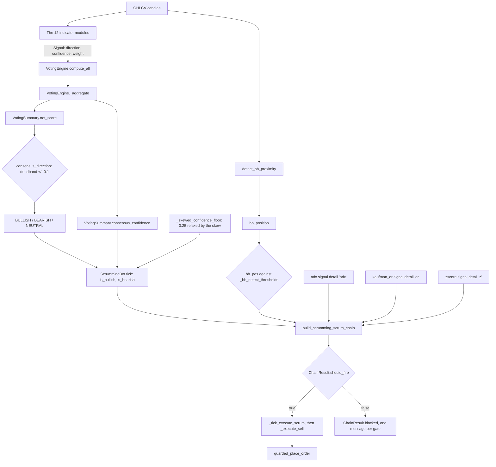

# Indicator Voting Panel

This panel shows the readings for each of the 12 as well the collated indices and confidence score.

TF Lock - To be re-evaluated.

Bot - Drop down menu for selecting which bot’s TA signals are displayed.

TF - Timeframe for the selected bot.

BB - Bollinger Bands - https://en.wikipedia.org/wiki/Bollinger_Bands

In Acervator, Bollinger Bands are used as the thresholds or boundaries at which trades are allowed to fire. Multiple market structure pieces are intertwined with our readings of the bands such as Landing Strip Detection (Heikin-Aishii Candle Consolidation Pattern) and Minimum Opposing Trade Distance. From a tactical standpoint, these represent the area or zone through which an investment position is passing.

VTX - Vortex Indicator - https://en.wikipedia.org/wiki/Vortex_indicator

In my experience (which is entirely subjective), this particular indicator is unusually strong at flagging early trend reversals. For Acervator, we are generally looking for signal saturation or near-saturation in either polarity which, under optimum conditions, will align with Bollinger Band thresholds being hit.

MACD - Moving Average Convergence Divergence - https://en.wikipedia.org/wiki/MACD

This is one of the oscillators used and, with it, we are looking for “top of the hill” formations in either polarity and these, under optimum conditions, will align with Bollinger Band thresholds being hit. Keep in mind that I do not approach any of these indicators from a mathematical standpoint as I am a purely visual trader without a quant or certified technical analysis background.

SRsi - Stochastic RSI - https://en.wikipedia.org/wiki/Stochastic_oscillator

Our second oscillator and, like the vortex indicator, we are looking at initial maximizing or prolonged periods of saturation of the signal at either polarity and this will, under optimum conditions, align with other indicators to trigger a trade.

Ichi - Ichimoku Cloud - https://en.wikipedia.org/wiki/Ichimoku_Kink%C5%8D_Hy%C5%8D

This particular indicator is one of the few ‘predicative’ indicators. In Acervator, we are focused on its additional ability to strengthen market reversal zone detection which is where we prefer to shave off or fold in funds.

Net - Primary TF panel index collated from all 12 indicators.

Comp - Composite TF panel index provided by the highest TF Phantom Bot that is active. Phantom bots are still in active development so any related features are not yet working.

Conf - Confidence reading for the panel.

This is the ‘breadth’ of agreement between all 12 indicators.

Sling - CM (Chris Moody) Slingshot -

https://www.tradingview.com/script/GE7tSQK1-CM-Sling-Shot-System/

Another excellent indicator for reversal detection and here it adds to our laser precision detection of such zones and structures.

ADX - https://en.wikipedia.org/wiki/Average_directional_movement_index

This is a trend strength indicator but, as with the other indicators, we are using it to detect reversal by way of signal decreasing.

STrd - https://www.tradingview.com/support/solutions/43000634738-supertrend/

Supertrend is based upon Average True Range and, unsurprisingly further assists in detecting reversals.

ZSc - Z Score - https://www.tradingview.com/script/KSMvIkvh-Z-Score-Predictive-Zones-AlgoPoint/

Our current indicator is the basic or classic Z Score indicator but this will be upgraded. But, as before, we are after more data to confirm reversals.

KER -

Kaufman Efficiency Ratio. It measures how much of the distance the price
travelled became progress in one direction. A reading near 1.0 is a straight
move and a reading near 0.0 is noise. A low ratio marks the market Acervator
prefers, and the Efficiency Ratio Regime gate refuses a SCRUM at 0.70 and
above.

RSI -

Relative Strength Index. It reports the share of recent movement that ran
upward, on a 0 to 100 scale. Above 70 votes bearish, below 30 votes bullish,
and between the two it casts no vote. It shares Wilder's average-gain maths
with the Stochastic RSI above and carries the panel's lightest weight, 0.8.

## The twelve voters

Reference. `DEFAULT_WEIGHTS` in `src/trading/ta_engine.py` names the twelve
indicators that cast a weighted vote, and `VotingEngine._create_indicators`
builds exactly those twelve. "Candles needed" is the tape length each one
needs before it reads; below it the indicator abstains and casts no vote at
all.

| Panel column | Voter | Weight | Module under `src/trading/indicators/` | Candles needed |
| ------------ | ----- | ------ | -------------------------------------- | --------------- |
| BB | `bollinger_bands` | 1.0 | `bollinger.py` | 20 |
| VTX | `vortex` | 0.9 | `vortex.py` | 15 |
| MACD | `macd` | 1.2 | `macd.py` | 35 |
| SRsi | `stochastic_rsi` | 1.0 | `stochastic_rsi.py` | 36 |
| Ichi | `ichimoku` | 1.1 | `ichimoku.py` | 79 |
| Vol | `volume` | 0.8 | `volume.py` | 25 |
| Sling | `slingshot` | 1.0 | `slingshot.py` | 52 |
| ADX | `adx` | 1.0 | `adx.py` | 30 |
| STrd | `supertrend` | 1.0 | `supertrend.py` | 12 |
| ZSc | `zscore` | 0.9 | `zscore.py` | 51 |
| KER | `kaufman_er` | 1.0 | `kaufman_er.py` | 12 |
| RSI | `rsi` | 0.8 | `rsi.py` | 15 |

`src/trading/indicators/` holds 23 modules, and eleven of them cast no vote.
`helpers.py` and `types.py` carry the shared maths and the signal vocabulary;
`atr.py`, `bb_proximity.py` and `heikin_ashi.py` are measurements other code
reads; `fvg.py`, `landing_strip.py`, `m_top.py`, `w_bottom.py`, `spring.py`
and `macd_taper.py` are structural detectors. A reader who counts modules gets
23. The panel's twelve is the count of voters, and twelve is the right count.

## Indicator formulae

Each block below carries the published formula, the module and function that
computes it, and one plain line saying what the reading measures. Every
indicator computes its own maths from candles alone. No indicator borrows
another's arithmetic, and `tests/test_one_indicator_per_module.py` fails when
one starts to.

Where the code departs from the published formula, the code is the defect.
[Departures](#departures-from-the-published-maths) lists the ones found.

### Shared terms

Every formula below uses these. All five live in
`src/trading/indicators/helpers.py`.

```
SMA(v, n)     mean of the last n values                          _sma_tail
sigma(v, n)   population deviation of the last n values          _stdev_tail
EMA(v, n)     seed = SMA(v, n) at index n-1, then                _ema
              EMA_t = (v_t - EMA_prev) * k + EMA_prev
              k = 2 / (n + 1)
              no value exists before the seed
TR_t          max(H_t - L_t, |H_t - C_prev|, |L_t - C_prev|)     _true_range
              the first bar's TR is H - L
Wilder(v, n)  seed = mean of the first n, then                   (per module)
              W_t = (W_prev * (n - 1) + v_t) / n
```

### Bollinger Bands

`bollinger.py` — `BollingerBands.bands` draws the envelope,
`BollingerBands.compute` casts the vote.

```
Middle    = SMA(close, 20)
Upper     = Middle + 2.0 * sigma(close, 20)
Lower     = Middle - 2.0 * sigma(close, 20)
%B        = (close - Lower) / (Upper - Lower)
BandWidth = (Upper - Lower) / Middle
```

Where the price sits between the two bands. %B is 0 at the lower band and 1 at
the upper. The panel and the trading gates call this number `bb_pos`.

### Vortex Indicator

`vortex.py` — `VortexIndicator.window_sums` totals the three windows,
`VortexIndicator.lines` divides them, `VortexIndicator.compute` votes.

```
VM+_t = |H_t - L_(t-1)|
VM-_t = |L_t - H_(t-1)|
VI+   = sum(VM+, 14) / sum(TR, 14)
VI-   = sum(VM-, 14) / sum(TR, 14)
```

Upward pull against downward pull over the same 14 bars. Both are
dimensionless and 1.0 is parity.

### MACD

`macd.py` — `MACD._lines` builds all three series,
`MACD.compute` votes on the last two bars of them.

```
MACD Line = EMA(close, 12) - EMA(close, 26)
Signal    = EMA(MACD Line, 9)
Histogram = MACD Line - Signal
```

The gap between a fast and a slow average of the price, and how fast that gap
is changing. The Signal line is an EMA of the MACD line, not of the candles,
so its first value sits 33 bars into the tape.

### Stochastic RSI

`stochastic_rsi.py` — `StochasticRSI.rsi_values` builds the RSI series,
`StochasticRSI.stoch_ratios` positions each value, `StochasticRSI.compute`
votes on the crossover.

```
StochRSI = (RSI - min(RSI, 14)) / (max(RSI, 14) - min(RSI, 14))
%K       = SMA(StochRSI * 100, 3)
%D       = SMA(%K, 3)
```

Where today's RSI sits inside its own 14-bar range. It saturates at 0 and 100
far more often than RSI does, which is the saturation the panel watches.

### Ichimoku Cloud

`ichimoku.py` — `IchimokuCloud._mid` computes one midpoint,
`IchimokuCloud.lines` returns all five, `IchimokuCloud.compute` reads the
displaced windows and votes.

```
Tenkan   = (highest high 9  + lowest low 9)  / 2
Kijun    = (highest high 26 + lowest low 26) / 2
Senkou A = (Tenkan + Kijun) / 2        plotted 26 bars forward
Senkou B = (highest high 52 + lowest low 52) / 2   plotted 26 forward
Chikou   = close                       plotted 26 bars back
```

Five midpoint lines. Senkou A and Senkou B draw the cloud 26 bars ahead of the
last candle, which is the one forward-looking reading in the panel.
`IchimokuCloud.lines` returns every line at its own bar; the 26-bar shift
belongs to whatever draws them.

### Volume

`volume.py` — `VolumeAnalysis._obv`, `._mfi` and `._cmf` each compute one
published measure, and `VolumeAnalysis.compute` scores them together.

```
OBV_t  = OBV_prev + V_t   if C_t > C_(t-1)
         OBV_prev - V_t   if C_t < C_(t-1)
         OBV_prev         otherwise
TP_t   = (H_t + L_t + C_t) / 3
MF_t   = TP_t * V_t
MFI    = 100 - 100 / (1 + sum(MF where TP rose, 14)
                          / sum(MF where TP fell, 14))
CLV_t  = ((C_t - L_t) - (H_t - C_t)) / (H_t - L_t)
CMF    = sum(CLV * V, 20) / sum(V, 20)
A/D_t  = A/D_prev + CLV_t * V_t
```

Whether the volume traded agrees with the direction the price moved. A price
low that OBV does not match is the divergence this module scores highest.

### Slingshot

`slingshot.py` — `SlingshotIndicator.compute` runs the squeeze test and the
snapback scan, `SlingshotIndicator._linreg_endpoint` fits the momentum line.

```
UpperBB = SMA(close, 20) + 2.0 * sigma(close, 20)
LowerBB = SMA(close, 20) - 2.0 * sigma(close, 20)
UpperKC = SMA(close, 20) + 1.5 * SMA(TR, 20)
LowerKC = SMA(close, 20) - 1.5 * SMA(TR, 20)
sqzOn   = (LowerBB > LowerKC) and (UpperBB < UpperKC)
delta_t = C_t - (donchian_mid_20 + SMA(close, 20)) / 2
val     = linreg(delta, 20, 0)
```

The Bollinger Bands contract inside the Keltner Channel, then release. `val`
is the sign of the release.

The name belongs to Chris Moody's `CM_SlingShotSystem`, linked above. The
maths in the module is John Carter's TTM Squeeze, whose public reference is
LazyBear's `SQZMOM_LB`, plus Bollinger's own rules 6 and 8 for the snapback.
Moody's system is an EMA trend-and-pullback method with no band, no channel
and no squeeze. `SlingshotIndicator` states this in its own docstring.

### ADX and DMI

`adx.py` — `ADXIndicator._wilder_smooth` carries the recursion,
`ADXIndicator.compute` builds every line and votes.

```
up_t   = H_t - H_(t-1)
down_t = L_(t-1) - L_t
+DM_t  = up_t   if up_t > down_t and up_t > 0     else 0
-DM_t  = down_t if down_t > up_t and down_t > 0   else 0
+DI    = 100 * Wilder(+DM, 14) / Wilder(TR, 14)
-DI    = 100 * Wilder(-DM, 14) / Wilder(TR, 14)
DX     = 100 * |+DI - -DI| / (+DI + -DI)
ADX    = Wilder(DX, 14)
```

How committed a move is, without saying which way it points. Below 20 the
market is ranging, above 35 it trends hard.

### Supertrend

`supertrend.py` — `SupertrendIndicator.compute` builds the ATR, the two raw
bands, the sticky bands and the flip.

```
ATR     = Wilder(TR, 10)
hl2_t   = (H_t + L_t) / 2
rawUp   = hl2 + 3.0 * ATR
rawLow  = hl2 - 3.0 * ATR
Upper_t = rawUp  if rawUp < Upper_prev  or C_(t-1) > Upper_prev  else Upper_prev
Lower_t = rawLow if rawLow > Lower_prev or C_(t-1) < Lower_prev  else Lower_prev
bullish while C_t >= Lower_t; turns bullish again when C_t > Upper_t
```

A line that trails under the price in an uptrend and over it in a downtrend.
The bar where the price crosses that line is the flip.

### Z-Score

`zscore.py` — `ZScoreIndicator.compute`.

```
mean  = SMA(close, 50)
sigma = population deviation of the same 50 closes
Z     = (close - mean) / sigma
```

How many standard deviations the price sits from its own 50-bar mean. The
window is longer than the Bollinger window, so a stretch the 20-bar bands have
already absorbed still reads here.

### Kaufman Efficiency Ratio

`kaufman_er.py` — `KaufmanERIndicator.compute`.

```
ER = |C_t - C_(t-10)| / sum(|C_i - C_(i-1)|, 10)
```

How much of the distance the price travelled became progress in one direction.
1.0 is a straight line and 0.0 is pure noise. Both halves read the same eleven
closes.

### RSI

`rsi.py` — `RSIIndicator._compute_metrics` builds the series and the
divergence flags, `RSIIndicator.compute` votes.

```
gain_t  = max(C_t - C_(t-1), 0)
loss_t  = max(C_(t-1) - C_t, 0)
AvgGain = Wilder(gain, 14)
AvgLoss = Wilder(loss, 14)
RS      = AvgGain / AvgLoss
RSI     = 100 - 100 / (1 + RS)

AvgLoss = 0 and AvgGain > 0   ->  RSI 100
AvgLoss = 0 and AvgGain = 0   ->  no reading, the indicator abstains
```

The share of recent movement that ran upward, on a 0 to 100 scale.

## Departures from the published maths

Every row below is an absolute constant compared against, or added to, a
quantity carried in the asset's own price units. At a four-figure price the
constant vanishes. At a price of a few millionths of a dollar it does not, and
the reading moves.

| Where | The departure | Measured effect at 3.1e-06 |
| ----- | ------------- | -------------------------- |
| `zscore.py` `ZScoreIndicator.compute` | `Z` divides by `sigma` bare; the previous bar's `Z` divides by `sigma + 1e-9`. One formula, two spellings, in one function. | With sigma at 2e-9 the previous `Z` reads 1.33 where the formula gives 2.00, a third low. `z_reverting` compares the two. |
| `kaufman_er.py` `KaufmanERIndicator.compute` | `ER` divides by `price_travel + 1e-9` after the guard above it has already proved `price_travel` above zero. | On 0.1% bars ER reads 3.13% low, on 0.5% bars 0.64% low. At a four-figure price the same expression moves nothing. |
| `adx.py` `ADXIndicator.compute` | Abstains when the smoothed true range falls under `1e-9`. True range is a price, so the test carries a price scale. | A bar range of 0.03% gives a true range of 9.3e-10 and the indicator casts no vote on a market that moved. |
| `macd.py` `MACD.compute` | Confidence divides by `close * 0.001 + 1e-9`. The added constant is a fixed number of dollars; the term beside it scales with the price. | A crossover that scores 0.800 at a four-figure price scores 0.727 here. |
| `volume.py` `VolumeAnalysis._mfi` | Treats a negative money flow under `1e-9` as zero and returns MFI 100, the top of the scale. Money flow is a price times a volume, so the quantity has no fixed scale at all. | A bar trading 0.001 units still gives 3.1e-9, above the threshold. Listed as the same class, not as a live effect. |
| `ichimoku.py` `IchimokuCloud.compute` and `supertrend.py` `SupertrendIndicator.compute` | Both divide by `price + 1e-9`, where `candles_from_raw` has already refused any candle whose price is not above zero. | 0.032% low on both. The guard has already proved the denominator positive, so the constant does no work and its error grows as the price falls. |

Two more, neither of them a scale problem:

- `vortex.py` `VortexIndicator.compute` overwrites its own direction to
  BULLISH whenever VI- reaches 1.30, after the crossover branches have already
  decided. The VI+ and VI- maths in `window_sums` and `lines` matches Botes
  and Siepman exactly; the overwrite is a reading Acervator adds on top.
- `rsi.py` `RSIIndicator._compute_metrics` rounds the RSI to two decimals
  before returning it, and `RSIIndicator.compute` then tests that rounded
  number against 70 and 30. The `overbought` and `oversold` flags in the same
  dictionary test the unrounded value. An RSI of 70.003 sets `overbought` and
  still votes NEUTRAL.

## Trading gate logic chain

The epigraph on the [title page](01-title.md) reads *dissolvendus
reformandusque*, dissolved and reformed. The chain below does exactly that,
once per tick: twelve separate readings dissolve into one signed number, and
the gates re-form that number into an order or a refusal.

### The chain



### Net, Comp and Conf

`VotingEngine._aggregate` in `src/trading/ta_engine.py` produces all three
panel aggregates from the twelve signals.

```
weighted_score = direction * confidence * weight        one per voter
bull_score     = sum of |weighted_score| over the BULLISH voters
bear_score     = sum of |weighted_score| over the BEARISH voters
net_score      = bull_score - bear_score                 the Net column
voted_weight   = sum of weight over the voters that did not abstain
confidence     = min(1.0, |net_score| / voted_weight)    the Conf column
```

Net is a direction bias, not a reversal signal. Positive means bullish
consensus.

Conf is the breadth of agreement, not its force. Six voters agreeing strongly
while six abstain gives a lower reading than twelve agreeing mildly, and
`IndicatorVotingPanel` says the same in the Conf column's own tooltip. An
abstaining indicator leaves `voted_weight` alone, so a short tape cannot
dilute the reading of the indicators that did read.

### The deadband

`VotingSummary.consensus_direction` in `src/trading/indicators/types.py` turns
Net into a direction, and it holds a deadband of plus and minus 0.1.

```
net_score > +0.1   ->  BULLISH
net_score < -0.1   ->  BEARISH
otherwise          ->  NEUTRAL
```

`ScrummingBot.tick` then folds the direction and the Conf reading into one
boolean per side.

```
is_bullish = direction in (BULLISH, NEUTRAL) and confidence >= floor
is_bearish = direction in (BEARISH, NEUTRAL) and confidence >= floor
```

The floor starts at 0.25 and `_skewed_confidence_floor` relaxes it. A landing
strip at the upper band sets `is_bullish` outright, and one at the lower band
sets `is_bearish`.

### The band position

`detect_bb_proximity` in `src/trading/indicators/bb_proximity.py` returns
`bb_position`, which is %B: 0 at the lower band, 1 at the upper.
`_bb_detect_thresholds` in `src/trading/scrumming/circuit_breakers.py` returns
the two thresholds a SCRUM and a FOLD must clear, and it returns them in the
same %B terms.

```
detect_frac  = scrum_detect_pct / 100          75% by default
upper_detect = 0.5 + detect_frac * 0.5         0.875
lower_detect = 0.5 - detect_frac * 0.5         0.125

SCRUM requires bb_pos >= upper_detect
FOLD  requires bb_pos <= lower_detect
```

Both sides of each comparison are positions between the bands. Neither side is
a price.

### The scrum chain gates

`build_scrumming_scrum_chain` in `src/trading/gate_chain.py` builds the list,
and `GateChain.evaluate` runs every gate and collects the refusals.
`ChainResult.should_fire` is true only when the refusal list is empty, so one
blocked gate is enough to hold the trade.

| Gate | Passes when | Reads |
| ---- | ----------- | ----- |
| `delta_positive` | the holdings sit above target | the target delta |
| `interval` | the delta clears the scrumming interval | the delta |
| `ta_bullish` | `is_bullish` | Net, Conf and the floor |
| `trend_hold` | no sustained uptrend | more than 13 of the last 20 candles closing above their open |
| `midline_scrum` | `bb_pos` above 0.50 and no phantom lock | `bb_position` |
| `target_fires` | the detect and fire ramp is in FIRE | the target ramp |
| `bb_proximity_scrum` | `bb_pos >= upper_detect` | `bb_position` |
| `circuit_breaker_scrum` | no soft trip on the scrum side | the breaker state |
| `htf_defer_scrum` | the higher timeframe is not bullish | the coordinator |
| `hysteresis_scrum` | the price cleared the last pivot plus fees | the pivot |
| `adx_trend_suppression` | ADX under 30.0 | the `adx` signal detail |
| `efficiency_ratio_regime` | ER between 0.05 and 0.70 | the `er` signal detail |
| `zscore_extremity` | Z above -2.0 | the `z` signal detail |

Three of those gates read one indicator's own detail directly rather than the
collated Net: ADX, the Efficiency Ratio and the Z-Score. A reading of 0.0
means the field was never filled, and each of the three passes on it.

### The fold chain gates

`build_scrumming_fold_chain` builds the mirror list for the buy side.

| Gate | Passes when |
| ---- | ----------- |
| `tranches_queued` | at least one fold tranche is waiting |
| `ta_bearish` | `is_bearish` |
| `midline_fold` | `bb_pos` below 0.50 |
| `smart_ceiling` | the position sits under the smart ceiling |
| `bb_proximity_fold` | `bb_pos <= lower_detect` |
| `circuit_breaker_fold` | no soft trip on the fold side |
| `htf_defer_fold` | the higher timeframe is not bearish |
| `hysteresis_fold` | the price cleared the last pivot plus fees |
| `zscore_extremity` | Z below +2.0 |

### The two overrides

An override gate runs in a second pass and force-passes named gates that
already refused. `GateChain.evaluate` moves each one out of the refusal list
and records it in `overrides_applied`, so the log states which gate was
overridden and by what.

| Override | Arms on | Force-passes |
| -------- | ------- | ------------ |
| `ripe_harvest_override` | positive delta, interval cleared, `bb_pos >= upper_detect` | `midline_scrum`, `target_fires`, `trend_hold`, `ta_bullish` |
| `deep_fold_override` | negative delta, interval cleared, `bb_pos <= lower_detect` | `midline_fold`, `ta_bearish` |

At the band extreme the band position outranks the vote. Neither override
touches the circuit breaker, the hysteresis or the three indicator gates.

### Reading the chain after the fact

`gate_healer.py` in `src/trading/` rebuilds the same reading for a trade
already on the books. `reconstruct_market_gate` runs `VotingEngine().compute_all`
over the candles that stood before the trade and records `ta_net_score`,
`ta_confidence`, the three vote counts and every indicator's own vote beside
the trade. The record is the panel as it stood at the moment the order left.

## The panel as the legacy manual described it

Source: LEGACY, the fourteen-part manual, Part 3 "System Architecture", pages 23
to 27. The claim audit calls this chapter the strongest writing in the legacy
manual: all twelve voter codes and weights match, the net and confidence
formulae match including the detail that a neutral voter leaves the denominator,
and the colour thresholds match the surface module. It needed three corrections,
and they are applied below.

### The fifteen columns

The panel renders one row per timeframe per bot. Twelve of the fifteen columns
are voters and three are aggregates and labels: the timeframe label, the net
tally and the confidence bar.

Three voter columns show a raw number rather than a percentage — ADX, the
z-score and the Kaufman efficiency ratio — because the raw value carries more
information than a derived confidence. An ADX of 45 means something specific; a
percentage would hide it.

Column headers carry a group tint. Trend covers ADX, Vortex, Ichimoku and
Supertrend. Momentum covers MACD, Stochastic RSI, the z-score, the efficiency
ratio and RSI. Structure covers Bollinger Bands, Volume and Slingshot. Cell
opacity scales with the vote's own confidence, so a dense cell is a confident
one.

Every voter cell shows one of three directions. A neutral voter adds zero to the
net and stays out of the confidence denominator.

### The twelve voters and their gates

| Voter | Weight | Group | What it signals | Gate that reads it directly |
| ----- | -----: | ----- | --------------- | --------------------------- |
| Bollinger Bands | 1.0 | Structure | band position, with a squeeze adjustment | `MidlineGate`, `BBProximityGate` |
| Vortex | 0.9 | Trend | VI+ against VI− and the crossing rate | none |
| MACD | 1.2 | Momentum | histogram, crossover and divergence | none |
| Stochastic RSI | 1.0 | Momentum | K against D inside the extreme zones | none |
| Ichimoku | 1.1 | Trend | five-line alignment and the future twist | none |
| Volume | 0.8 | Structure | a composite of the volume indicators | none |
| Slingshot | 1.0 | Structure | squeeze into snapback | none |
| ADX | 1.0 | Trend | trend strength with the DI pair for direction | `ADXTrendSuppressionGate` |
| Supertrend | 1.0 | Trend | direction flip and distance from the band | none |
| Z-score | 0.9 | Momentum | graduated bands at 1.5, 2.0 and 3.0 | `ZScoreExtremityGate` |
| Kaufman efficiency ratio | 1.0 | Momentum | how directional the move is | `EfficiencyRatioRegimeGate` |
| RSI | 0.8 | Momentum | the classic levels plus divergence | none |

The weights above were read off the twelve built objects, not off
`DEFAULT_WEIGHTS`, and they match the dictionary entry for entry. MACD carries
the highest weight in the panel at 1.2, which the legacy chapter itself flags as
worth testing rather than assuming.

### Two corrections the legacy chapter needs

- **The ADX gate blocks on a strong trend, not a weak one.** The legacy chapter
  writes the gate as suppressing below 30. `ADXTrendSuppressionGate` at
  `src/trading/gate_chain.py:413` passes when `ctx.adx < 30.0` and blocks at or
  above it, and its own blocker message names the comparison. The legacy
  risk-control table on Part 4 page 7 gets it right, so the legacy manual
  disagrees with itself.
- **The efficiency-ratio gate blocks at both ends, and its low end is 0.05.**
  The legacy chapter writes 0.25 and the legacy risk table writes 0.7.
  `EfficiencyRatioRegimeGate` at `src/trading/gate_chain.py:452` takes
  `upper_threshold` of 0.70 and `lower_threshold` of 0.05. A reading at or below
  zero is the not-populated sentinel and passes.

The third correction is the chain length, and it is in the next section.

## The gate-chain framework and its context object

Source: LEGACY Part 3, page 16.

Before the framework, the decision to fire and the list of reasons not to fire
were two separate paths that a person had to keep in step by hand. The framework
makes them one thing. The chain evaluates every gate with no short circuit, so
the list of blockers is the exact inverse of the fire decision by construction,
and the two cannot drift apart.

`GateContext` in `src/trading/gate_chain.py` is the dataclass the chain builds
once per tick and every gate reads. It carries the band position, the delta and
its percentage, the direction and trend flags, the six operator flags that turn
individual gates on and off, the circuit-breaker and hysteresis state, the
ceiling state, the tranche count, the higher-timeframe bias, and the bot's own
interval and fee settings.

Three of its fields are optional indicator readings — `adx`, `efficiency_ratio`
and `z_score` — and each defaults to `0.0`. **That zero is the sentinel.** A gate
whose reading has not been populated sees `0.0` and passes rather than blocking.
`ADXTrendSuppressionGate` tests `ctx.adx <= 0.0` before it tests the threshold,
and `EfficiencyRatioRegimeGate` does the same. A sentinel that passes is the
right default for a safety gate, and it is also how three gates once shipped
inert; the next section is that story.

The legacy chapter counts the framework's gates as seventeen evaluated per tick.
Seventeen is the number of gate **classes**. The chains are 14 on the sell side
and 10 on the buy side, and both are listed in order earlier in this file.

## Gate call-site activation

Source: LEGACY, the fourteen-part manual, Part 8, pages 58 and 59.

Two gates shipped and did nothing. The ADX suppression gate and the
efficiency-ratio gate both read a `GateContext` field that no call site filled,
so both saw the `0.0` sentinel on every tick and passed on every tick. The gates
were present in the chain and absent from the outcome.

The fix was one line of wiring: the tick populates `ctx.adx` and
`ctx.efficiency_ratio` from the voting summary before it invokes the chain. From
that ship the two gates were live.

This is the most load-bearing change in the legacy manual's account of its own
trading-discipline work, and the account is careful about what it claims: the
live discipline ratios moved after the wiring landed, and correlation in time is
not proof of cause. The legacy manual says so on its own page.

The lasting result is the drift detector rather than the fix. A declared gate
that nothing wires is a defect, not a placeholder, and a test that enumerates
every gate class, every chain construction site and every voter turns that
defect class into a failing check. `tests/test_gate_coverage.py` and
`tests/test_gate_coverage_streaming.py` carry that discipline in this
repository.

## Technical-analysis vocabulary

Source: LEGACY, the fourteen-part manual, Part 7c "ADR Index and Glossary", page
10. The claim audit calls the glossaries the prize of that part: the
technical-analysis vocabulary is publisher-canonical and depends on no code in
this repository at all. It carries unchanged.

- **Accumulation phase** — the first phase of the classical market cycle, when a
  position is built before the markup.
- **ATR** — average true range, the canonical volatility measure.
- **Band position** — where price sits inside the Bollinger Bands, scaled from 0
  to 1. The code calls it `bb_pos`.
- **Bollinger Band** — a price envelope of a moving average plus and minus a
  multiple of the standard deviation. The default multiple is 2 over a 20-period
  lookback.
- **Bullseye** — a tight mean-reversion setup low in the band.
- **Fair value gap** — a price gap between non-adjacent candles, marking a level
  the market skipped.
- **Passive holding** — buying and never selling. The null hypothesis every
  accumulation claim measures against.
- **Last point of support** — the structural confirmation that accumulation is
  finished and the markup has begun.
- **Mean reversion** — a strategy class that fades a statistical extreme and
  profits from the return toward the mean.
- **Pyramiding** — adding to a winning position rather than closing it.
- **RSI** — the relative strength index, a momentum oscillator over up and down
  price movement.
- **Selling climax** — the capitulation low that opens the accumulation phase.
- **Spring** — a brief break below support that recovers, testing the level.
- **Triple screen** — a multi-timeframe framework: macro regime, then
  intermediate wave, then tactical entry.

The formulae for the indicators these words describe are earlier in this file,
each with the departure the code takes from the published maths.
