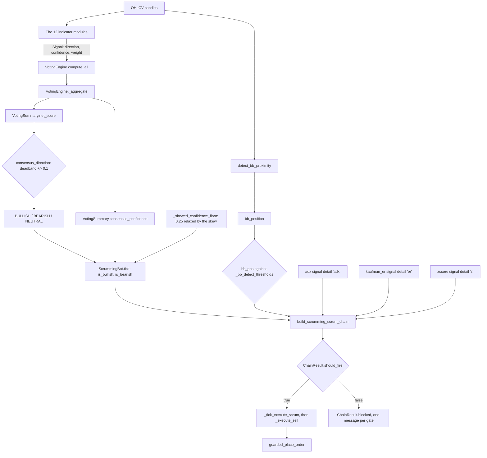

# Indicator Voting Panel

This panel shows the readings for each of the 12 as well the collated indices and confidence score.

TF Lock - To be re-evaluated.

A drop-down of eleven entries: None, then Lock below each of ten timeframes from
5m to 1w. It opens on the fifth entry, Lock below 1h. Choosing one writes a
status line beside the box and puts the timeframe on the event bus.

The main window takes that event and sets `_lock_timeframe` on the coordinator
of every running Scrumming Bot. Nothing declares or reads that name, so the
choice reaches the coordinator and stops there. The tooltip on the box says the
lock feeds directly into active Scrumming Bots. Issue #155 carries this.

`src/gui/main_window.py` — `_on_tf_lock_changed`

```python
for bot in self._bot_manager._bots.values():
    if isinstance(bot, ScrummingBot) and hasattr(bot, "_coordinator"):
        bot._coordinator._lock_timeframe = tf
```

Bot - Drop down menu for selecting which bot’s TA signals are displayed.

The list refills every tick and carries one entry per running bot, opening on a
placeholder until one is chosen. Choosing a bot is what makes the twelve
columns below read anything at all.

`src/gui/indicator_panel.py` — the selector

```python
self._bot_selector = QComboBox()
self._bot_selector.setMinimumWidth(180)
self._bot_selector.addItem("(select a bot)", "")
self._bot_selector.currentIndexChanged.connect(self._on_bot_selected)
```

TF - Timeframe for the selected bot.

One row per timeframe, each row a separate verdict from the same twelve
voters. The rows are the bot's own timeframes and any phantom timeframes it
runs.

In development.

BB - Bollinger Bands - https://en.wikipedia.org/wiki/Bollinger_Bands

In Acervator, Bollinger Bands are used as the thresholds or boundaries at which trades are allowed to fire. Multiple market structure pieces are intertwined with our readings of the bands such as Landing Strip Detection (Heikin-Aishii Candle Consolidation Pattern) and Minimum Opposing Trade Distance. From a tactical standpoint, these represent the area or zone through which an investment position is passing.

The cell prints a direction arrow and a confidence percentage. Direction comes
from the band position alone: under 0.15 or under 0.35 votes bullish, over 0.85
or over 0.65 votes bearish, and anything between the two middle figures votes
neutral. [Bollinger Bands](#bollinger-bands) carries the formula.

`src/trading/indicators/bollinger.py` — the vote

```python
if bb_pos < 0.15:
    direction = SignalDirection.BULLISH
    confidence = max(0.0, min(1.0, (0.15 - bb_pos) / 0.15 * 0.8 + 0.3))
elif bb_pos > 0.85:
    direction = SignalDirection.BEARISH
    confidence = max(0.0, min(1.0, (bb_pos - 0.85) / 0.15 * 0.8 + 0.3))
elif bb_pos < 0.35:
    direction = SignalDirection.BULLISH
    confidence = 0.2
elif bb_pos > 0.65:
    direction = SignalDirection.BEARISH
    confidence = 0.2
```

VTX - Vortex Indicator - https://en.wikipedia.org/wiki/Vortex_indicator

In my experience (which is entirely subjective), this particular indicator is unusually strong at flagging early trend reversals. For Acervator, we are generally looking for signal saturation or near-saturation in either polarity which, under optimum conditions, will align with Bollinger Band thresholds being hit.

The cell prints an arrow and a percentage. The crossover of the two lines
decides the vote, and then Acervator adds one reading of its own: the direction
is overwritten to bullish whenever the downward line reaches 1.30, whatever the
crossover said. [Vortex Indicator](#vortex-indicator) carries the formula.

`src/trading/indicators/vortex.py` — the ceiling that overwrites the vote

```python
VX_CEILING_PCT = 130.0
```

MACD - Moving Average Convergence Divergence - https://en.wikipedia.org/wiki/MACD

This is one of the oscillators used and, with it, we are looking for “top of the hill” formations in either polarity and these, under optimum conditions, will align with Bollinger Band thresholds being hit. Keep in mind that I do not approach any of these indicators from a mathematical standpoint as I am a purely visual trader without a quant or certified technical analysis background.

The cell prints an arrow and a percentage. A signal-line crossover decides the
vote first. Failing that, a histogram growing away from zero votes with its
own sign, and a histogram merely on one side of zero votes the same way with
less conviction. [MACD](#macd) carries the formula.

`src/trading/indicators/macd.py` — the crossover, tested first

```python
if prev_macd <= prev_signal and curr_macd > curr_signal:
    direction = SignalDirection.BULLISH
```

SRsi - Stochastic RSI - https://en.wikipedia.org/wiki/Stochastic_oscillator

Our second oscillator and, like the vortex indicator, we are looking at initial maximizing or prolonged periods of saturation of the signal at either polarity and this will, under optimum conditions, align with other indicators to trigger a trade.

The cell prints an arrow and a percentage. The vote needs a crossover of the
two smoothed lines, and how deep in the range that crossover happens sets the
confidence: a bullish cross under 30 scores 0.8, under 50 scores 0.5, and
higher still scores less. [Stochastic RSI](#stochastic-rsi) carries the
formula.

`src/trading/indicators/stochastic_rsi.py` — the bullish crossover

```python
if prev_k <= prev_d and k > d:
    crossover = "bullish"
    if k < 30:
        direction = SignalDirection.BULLISH
        confidence = 0.8
```

Ichi - Ichimoku Cloud - https://en.wikipedia.org/wiki/Ichimoku_Kink%C5%8D_Hy%C5%8D

This particular indicator is one of the few ‘predicative’ indicators. In Acervator, we are focused on its additional ability to strengthen market reversal zone detection which is where we prefer to shave off or fold in funds.

The cell prints an arrow and a percentage. Several cloud readings add into one
score, and only a score past 0.08 either way casts a vote. The score doubles as
the confidence. [Ichimoku Cloud](#ichimoku-cloud) carries the formula.

`src/trading/indicators/ichimoku.py` — the vote

```python
if score > 0.08:
    direction = SignalDirection.BULLISH
    confidence = max(0.0, min(1.0, score))
elif score < -0.08:
    direction = SignalDirection.BEARISH
    confidence = max(0.0, min(1.0, abs(score)))
else:
    direction = SignalDirection.NEUTRAL
    confidence = 0.0
```

Net - Primary TF panel index collated from all 12 indicators.

The cell prints a signed figure to two decimals, green above zero and red
below. It is the weighted bullish total less the weighted bearish total, and an
abstaining voter adds nothing to either side.
[Net, Comp and Conf](#net-comp-and-conf) carries the arithmetic.

`src/gui/indicator_panel.py` — the Net cell

```python
net = tf_data.get("net_score", 0)
item = QTableWidgetItem(f"{net:+.2f}")
```

Comp - Composite TF panel index provided by the highest TF Phantom Bot that is active. Phantom bots are still in active development so any related features are not yet working.

The cell prints an em dash when no composite figure is present, which is what a
fleet with no active phantom shows.
[Net, Comp and Conf](#net-comp-and-conf) carries the arithmetic.

In development.

Conf - Confidence reading for the panel.

This is the ‘breadth’ of agreement between all 12 indicators.

The cell draws a ten-block bar and the percentage beside it. The bar fills one
block per tenth. Green from 0.6, amber from 0.3, grey below that.

`src/gui/indicator_panel.py` — the Conf cell

```python
conf = tf_data.get("confidence", 0)
conf_bar = "█" * int(conf * 10) + "░" * (10 - int(conf * 10))
item = QTableWidgetItem(f"{conf_bar} {conf:.0%}")
```

Sling - CM (Chris Moody) Slingshot -

https://www.tradingview.com/script/GE7tSQK1-CM-Sling-Shot-System/

Another excellent indicator for reversal detection and here it adds to our laser precision detection of such zones and structures.

The cell prints an arrow and a percentage. A squeeze breaking either way votes
first, and a band snapback votes when no squeeze is breaking.
[Slingshot](#slingshot) carries the formula and the attribution, which is
shared between three authors rather than one.

`src/trading/indicators/slingshot.py` — the squeeze, tested first

```python
if squeeze_bull:
    direction = SignalDirection.BULLISH
    confidence = squeeze_conf
    active_type = "squeeze_bull"
```

ADX - https://en.wikipedia.org/wiki/Average_directional_movement_index

This is a trend strength indicator but, as with the other indicators, we are using it to detect reversal by way of signal decreasing.

The cell prints the raw ADX value, 0 to 100, not a percentage. Below 20 the
cell reads Rng and the figure, with no arrow. The vote itself is decided by
which directional line is on top, at any ADX, so a ranging market still casts a
directional vote even though the cell shows no arrow.
[ADX and DMI](#adx-and-dmi) carries the formula.

`src/trading/indicators/adx.py` — the vote

```python
if bull_dominant and strong_trend:
    direction = SignalDirection.BULLISH
    confidence = max(0.0, min(1.0, (adx - 35) / 30 + 0.5))
elif bear_dominant and strong_trend:
    direction = SignalDirection.BEARISH
    confidence = max(0.0, min(1.0, (adx - 35) / 30 + 0.5))
elif bull_dominant:
    direction = SignalDirection.BULLISH
    confidence = max(0.0, min(0.5, adx / 70))
elif bear_dominant:
    direction = SignalDirection.BEARISH
    confidence = max(0.0, min(0.5, adx / 70))
else:
    direction = SignalDirection.NEUTRAL
    confidence = 0.0
```

STrd - https://www.tradingview.com/support/solutions/43000634738-supertrend/

Supertrend is based upon Average True Range and, unsurprisingly further assists in detecting reversals.

The cell prints an arrow and a percentage. The vote is simply which side of the
sticky band the price closed on, so this voter is never neutral once it reads
at all. A band that has fallen to zero makes it abstain instead.
[Supertrend](#supertrend) carries the formula.

`src/trading/indicators/supertrend.py` — the vote

```python
direction = SignalDirection.BULLISH if curr_bull else SignalDirection.BEARISH
```

ZSc - Z Score - https://www.tradingview.com/script/KSMvIkvh-Z-Score-Predictive-Zones-AlgoPoint/

Our current indicator is the basic or classic Z Score indicator but this will be upgraded. But, as before, we are after more data to confirm reversals.

The cell prints the raw signed z-value to one decimal, not a percentage. Past
two deviations either way the vote is strong and contrarian: high votes
bearish, low votes bullish. Between 1.5 and 2 it votes the same way at a fixed
0.25 confidence, and inside 1.5 it casts no vote.
[Z-Score](#z-score) carries the formula.

`src/trading/indicators/zscore.py` — the thresholds

```python
extreme_high = z > 3.0
strong_high = z > 2.0
mild_high = z > 1.5
extreme_low = z < -3.0
strong_low = z < -2.0
mild_low = z < -1.5
```

The cell now prints a smoothed z, and the vote compares it against levels the
market itself set. The indicator remembers where the z-score last turned
around, averages those turning points, and uses each average as the level that
decides a vote. Until it has remembered a turn, the fixed level of two
deviations decides, exactly as before. Each average is also projected back into
a price, which is the upper and lower zone the hover text carries.

`src/trading/indicators/zscore.py` — the level that decides, and its price

```python
target_z_high = self.reversal_threshold if peak_z is None else peak_z
target_z_low = -self.reversal_threshold if trough_z is None else trough_z

resistance_price = sma + target_z_high * std
support_price = sma + target_z_low * std
```

KER -

Kaufman Efficiency Ratio. It measures how much of the distance the price
travelled became progress in one direction. A reading near 1.0 is a straight
move and a reading near 0.0 is noise. A low ratio marks the market Acervator
prefers. The Efficiency Ratio Regime gate refuses a SCRUM at 0.70 and above,
and refuses one again at 0.05 and below.

RSI -

Relative Strength Index. It reports the share of recent movement that ran
upward, on a 0 to 100 scale. Above 70 votes bearish, below 30 votes bullish,
and between the two it casts no vote. It runs the same published Wilder
recursion as the Stochastic RSI above, computed separately inside its own
module. Its weight is 0.8, the lightest in the panel, which it shares with
Volume.

## The twelve voters

Reference. The operator's own reading of each column opens this part. What
follows is the code behind those columns.

**Functional.** One weight map names the twelve indicators that vote, and one
method builds exactly those twelve from it. The engine builds the list once and
runs it in order on every tick. "Candles needed" in the table below is the tape
length each indicator wants before it will read anything. Give it less and it
abstains outright rather than guessing.

`src/trading/ta_engine.py` — `VotingEngine._create_indicators`

```python
def _create_indicators(self) -> list:
    """Instantiate all indicator instances with configured weights."""
    return [
        BollingerBands(weight=self.weights.get("bollinger_bands", 1.0)),
        VortexIndicator(weight=self.weights.get("vortex", 0.9)),
        MACD(weight=self.weights.get("macd", 1.2)),
        StochasticRSI(weight=self.weights.get("stochastic_rsi", 1.0)),
        IchimokuCloud(weight=self.weights.get("ichimoku", 1.1)),
        VolumeAnalysis(weight=self.weights.get("volume", 0.8)),
        SlingshotIndicator(weight=self.weights.get("slingshot", 1.0)),
        ADXIndicator(weight=self.weights.get("adx", 1.0)),
        KaufmanERIndicator(weight=self.weights.get("kaufman_er", 1.0)),
        SupertrendIndicator(weight=self.weights.get("supertrend", 1.0)),
        ZScoreIndicator(weight=self.weights.get("zscore", 0.9)),
        RSIIndicator(weight=self.weights.get("rsi", 0.8)),
    ]
```

**Design intention.** The weights rank the voters by how much they are trusted.
MACD is heaviest at 1.2 and Ichimoku next at 1.1. RSI and Volume are lightest
at 0.8, RSI because it overlaps the Stochastic RSI and Volume because it is
meant to confirm rather than lead. Hand the engine a different map and the
panel retunes without an indicator being touched.

`src/trading/ta_engine.py` — `VotingEngine.__init__`

```python
self.weights = weights or DEFAULT_WEIGHTS.copy()
self._indicators = self._create_indicators()
```

| Panel column | Voter | Weight | Module under `src/trading/indicators/` | Candles needed |
| ------------ | ----- | ------ | -------------------------------------- | --------------- |
| BB | `bollinger_bands` | 1.0 | `bollinger.py` | 20 |
| VTX | `vortex` | 0.9 | `vortex.py` | 15 |
| MACD | `macd` | 1.2 | `macd.py` | 35 |
| SRsi | `stochastic_rsi` | 1.0 | `stochastic_rsi.py` | 36 |
| Ichi | `ichimoku` | 1.1 | `ichimoku.py` | 79 |
| Vol | `volume` | 0.8 | `volume.py` | 25 |
| Sling | `slingshot` | 1.0 | `slingshot.py` | 52 |
| ADX | `adx` | 1.0 | `adx.py` | 30 |
| STrd | `supertrend` | 1.0 | `supertrend.py` | 12 |
| ZSc | `zscore` | 0.9 | `zscore.py` | 51 |
| KER | `kaufman_er` | 1.0 | `kaufman_er.py` | 12 |
| RSI | `rsi` | 0.8 | `rsi.py` | 15 |

**Functional.** Count the files in the indicator folder and you get 23, not 12.
Eleven of them cast no vote. Two carry the shared maths and the signal
vocabulary. Three are measurements other code reads. Six are structural
detectors that feed the bot's own pattern reads rather than the panel. Twelve
is the count of voters, and twelve is the right count.

```
shared        helpers.py, types.py
measurements  atr.py, bb_proximity.py, heikin_ashi.py
detectors     fvg.py, landing_strip.py, m_top.py, w_bottom.py,
              spring.py, macd_taper.py
```

**Design intention.** One module holds one indicator, and a module that casts
no vote still lives here so the voters can read it. Nothing borrows another
indicator's arithmetic, and a test in `tests/` fails the moment one starts to.

`tests/test_one_indicator_per_module.py` — the rule, held as tests

```python
def test_the_module_holds_exactly_one(self, module):
```

`tests/test_one_indicator_per_module.py` — and the name check beside it

```python
def test_no_two_modules_define_the_same_name(self):
```

## Indicator formulae

Each block below carries the published formula for reference, then the code
that computes it, then what the code does today and what the reading is meant
to give the platform. The operator's own reading of each indicator opens this
part and is not repeated here.

Every indicator computes its own maths from candles alone. No indicator borrows
another's arithmetic, and `tests/test_one_indicator_per_module.py` fails when
one starts to.

Where the code departs from the published formula, the code is the defect.
[Departures](#departures-from-the-published-maths) lists the ones found.

### Shared terms

Every formula below uses these. All five live in
`src/trading/indicators/helpers.py`.

```
SMA(v, n)     mean of the last n values                          _sma_tail
sigma(v, n)   population deviation of the last n values          _stdev_tail
EMA(v, n)     seed = SMA(v, n) at index n-1, then                _ema
              EMA_t = (v_t - EMA_prev) * k + EMA_prev
              k = 2 / (n + 1)
              no value exists before the seed
TR_t          max(H_t - L_t, |H_t - C_prev|, |L_t - C_prev|)     _true_range
              the first bar's TR is H - L
Wilder(v, n)  seed = mean of the first n, then                   (per module)
              W_t = (W_prev * (n - 1) + v_t) / n
```

**Functional.** True Range gives one bar per candle. The first bar is simply
high minus low, because the other two ways of measuring it need a previous
close and the first bar has none. Each indicator then takes the slice its own
formula covers. ATR and Supertrend take the whole series. ADX and Vortex drop
the first bar, because directional movement needs a bar before it. The moving
average helper answers nothing at all below its seed, rather than zero, so
reading it too early fails loudly instead of returning a plausible wrong
number.

`src/trading/indicators/helpers.py` — `_true_range`

```python
tr = [candles[0].high - candles[0].low]
for i in range(1, len(candles)):
    c = candles[i]
    prev_close = candles[i - 1].close
    tr.append(
        max(c.high - c.low, abs(c.high - prev_close), abs(c.low - prev_close))
    )
return tr
```

**Design intention.** One definition per shared term, held in one place, so
five indicators cannot quietly drift apart on the same arithmetic. Slingshot is
the one deliberate exception. It computes its own true range, and its first bar
agrees with this one.

`src/trading/indicators/slingshot.py` — the exception, written out

```python
# Carter's Keltner leg needs True Range; `tr_all` computes it
# without `ATRIndicator`.
tr_all = [candles[0].high - candles[0].low]
```

### Bollinger Bands

Published formula, for reference:

```
Middle    = SMA(close, 20)
Upper     = Middle + 2.0 * sigma(close, 20)
Lower     = Middle - 2.0 * sigma(close, 20)
%B        = (close - Lower) / (Upper - Lower)
BandWidth = (Upper - Lower) / Middle
```

**Functional.** The vote is a reading of where the last close sits between the
two bands. Zero is the lower band, one is the upper, and the panel and the
gates both call that number the band position. A second method returns all
three bands for every candle so a chart can draw them, and answers nothing for
the first nineteen. Give it fewer than twenty closes, or a window with no range
at all, and it abstains.

`src/trading/indicators/bollinger.py` — `BollingerBands.compute`

```python
sma = _sma_tail(closes, self.period, tail=self.period)
std = _stdev_tail(closes, self.period, tail=self.period)

mid = sma[-1]
upper = mid + self.std_dev * std[-1]
lower = mid - self.std_dev * std[-1]
price = closes[-1]
# BandWidth = (Upper - Lower) / Middle. `candles_from_raw` admits
# only positive closes, so `mid` cannot be zero.
band_width = (upper - lower) / mid
```

**Design intention.** The bands are the boundary a trade fires at. That is the
operator's own reading, and the band position is the one number that carries it
into the engine. Four gates read it directly and both overrides arm on it, so
this reading has more reach into a trade decision than any other voter.

`src/trading/gate_chain.py` — two of the four, in the scrum chain

```python
MidlineGate(side="scrum"),
TargetFiresGate(),
BBProximityGate(side="scrum"),
```

`src/trading/gate_chain.py` — and the other two, in the fold chain

```python
MidlineGate(side="fold"),
SmartCeilingGate(),
BBProximityGate(side="fold"),
```

### Vortex Indicator

Published formula, for reference:

```
VM+_t = |H_t - L_(t-1)|
VM-_t = |L_t - H_(t-1)|
VI+   = sum(VM+, 14) / sum(TR, 14)
VI-   = sum(VM-, 14) / sum(TR, 14)
```

**Functional.** Three totals are taken over each fourteen-bar window: upward
movement, downward movement, and true range. A window whose true range totals
zero, which is what a halted market gives, is skipped rather than divided by.
The two movement totals are then divided by the true-range total, so both lines
are dimensionless and 1.0 is dead parity. The vote reads the crossover of the
two lines.

`src/trading/indicators/vortex.py` — `VortexIndicator.window_sums`

```python
for i in range(1, n_c):
    vm_plus.append(abs(candles[i].high - candles[i - 1].low))
    vm_minus.append(abs(candles[i].low - candles[i - 1].high))
```

`src/trading/indicators/vortex.py` — `VortexIndicator.lines`

```python
plus_series[i] = sum_vp / sum_tr_window
minus_series[i] = sum_vm / sum_tr_window
```

**Design intention.** The operator uses the Vortex to catch a reversal early,
and watches for the signal to saturate at one polarity or the other. Acervator
adds one reading of its own on top of the published lines: the vote is
overwritten to bullish whenever the downward line reaches 1.30, after the
crossover has already decided. That overwrite is not part of the indicator, and
[Departures](#departures-from-the-published-maths) records it.

In development. The overwrite belongs to issue #414, which owns every indicator
departure, and no replacement reading has been chosen.

### MACD

Published formula, for reference:

```
MACD Line = EMA(close, 12) - EMA(close, 26)
Signal    = EMA(MACD Line, 9)
Histogram = MACD Line - Signal
```

**Functional.** One method builds all three series and the vote reads the last
two bars of them. What you are looking at is the gap between a fast and a slow
average of the price, and how quickly that gap is changing. The signal line is
an average of the MACD line rather than of the candles, so its first real value
does not arrive until 33 bars into the tape. A series with a hole in the middle
raises rather than being handed on.

`src/trading/indicators/macd.py` — `MACD._lines`

```python
ema_fast = _ema(closes, self.fast)
ema_slow = _ema(closes, self.slow)
macd_line: _Line = [
    None if (f is None or s is None) else f - s
    for f, s in zip(ema_fast, ema_slow)
]
```

`src/trading/indicators/macd.py` — the signal line and the histogram

```python
signal_line: _Line = [None] * first
signal_line.extend(_ema(real, self.signal_period))
histogram: _Line = [
    None if (m is None or g is None) else m - g
    for m, g in zip(macd_line, signal_line)
]
```

**Design intention.** The operator watches for a top-of-the-hill shape in
either polarity, timed against a Bollinger band threshold. The histogram is the
series that shape reads from, and the vote reads the last two of its bars, so a
turn is caught on the bar it happens rather than a bar later.

`src/trading/indicators/macd.py` — the two bars the vote reads

```python
macd_line, signal_line, histogram = self._lines(closes)

curr_hist = histogram[-1]
prev_hist = histogram[-2]
curr_macd = macd_line[-1]
```

The confidence divides the histogram by a share of the last close, so the
same crossover scores the same on a four-figure asset and on one worth a few
millionths of a dollar.

### Stochastic RSI

Published formula, for reference:

```
StochRSI = (RSI - min(RSI, 14)) / (max(RSI, 14) - min(RSI, 14))
%K       = SMA(StochRSI * 100, 3)
%D       = SMA(%K, 3)
```

**Functional.** The module runs Wilder's recursion over the closes to build its
own RSI series, then places each RSI value inside its own fourteen-value range.
The vote reads the crossover of the two smoothed lines. The result saturates at
0 and at 100 far more often than plain RSI does, and that saturation is what
the panel is watching for. A window whose RSI never moved is caught before the
division, and the vote abstains on it rather than dividing by that spread.

`src/trading/indicators/stochastic_rsi.py` — `StochasticRSI.rsi_values`

```python
avg_gain = (avg_gain * (self.rsi_period - 1) + gains[i]) / self.rsi_period
avg_loss = (avg_loss * (self.rsi_period - 1) + losses[i]) / self.rsi_period
```

`src/trading/indicators/stochastic_rsi.py` — `StochasticRSI.stoch_ratios`

```python
window = rsi_values[i - self.stoch_period + 1 : i + 1]
low = min(window)
ratios.append((rsi_values[i] - low) / (max(window) - low))
```

**Design intention.** This is the operator's second oscillator, and he looks
for a long run at one polarity to line up with the other voters. Rescaling RSI
against its own recent range is what makes those runs stand out at all. A
window that never moved is reported as flat rather than hidden, so the caller
can tell a real zero from a market that stood still.

`src/trading/indicators/stochastic_rsi.py` — what the caller is handed

```python
return start, ratios, flat
```

### Ichimoku Cloud

Published formula, for reference:

```
Tenkan   = (highest high 9  + lowest low 9)  / 2
Kijun    = (highest high 26 + lowest low 26) / 2
Senkou A = (Tenkan + Kijun) / 2        plotted 26 bars forward
Senkou B = (highest high 52 + lowest low 52) / 2   plotted 26 forward
Chikou   = close                       plotted 26 bars back
```

**Functional.** Every line here is a midpoint: the highest high and the lowest
low of a window, averaged. A window that has not closed yet answers nothing
rather than zero. Five values come back for each candle. Two of them draw the
cloud twenty-six bars ahead of the last candle, and that is the only
forward-looking reading anywhere in the panel. The lines are returned at their
own bar, so the twenty-six bar shift belongs to whatever draws them.

`src/trading/indicators/ichimoku.py` — `IchimokuCloud.lines`

```python
tenkan = self._span_mid(candles, i, self.tenkan)
kijun = self._span_mid(candles, i, self.kijun)
senkou_b = self._span_mid(candles, i, self.senkou_b)
senkou_a = (
    (tenkan + kijun) / 2.0
    if (tenkan is not None and kijun is not None)
    else None
)
out.append((tenkan, kijun, senkou_a, senkou_b, candles[i].close))
```

**Design intention.** The operator calls this one of the few predictive
indicators and uses it to sharpen reversal-zone detection. The forward cloud is
the half of the indicator that does that work. A window that has not closed
answers nothing rather than zero, so an unfinished cloud can never be mistaken
for a flat one.

`src/trading/indicators/ichimoku.py` — `IchimokuCloud._span_mid`

```python
if end < period - 1:
    return None
return self._mid(candles, end - period + 1, period)
```

The cloud thickness divides by the price bare. Every candle reaching this
point has already been refused unless its price is above zero, so the division
needs no guard of its own.

### Volume

Published formulae, for reference:

```
OBV_t  = OBV_prev + V_t   if C_t > C_(t-1)
         OBV_prev - V_t   if C_t < C_(t-1)
         OBV_prev         otherwise
TP_t   = (H_t + L_t + C_t) / 3
MF_t   = TP_t * V_t
MFI    = 100 - 100 / (1 + sum(MF where TP rose, 14)
                          / sum(MF where TP fell, 14))
CLV_t  = ((C_t - L_t) - (H_t - C_t)) / (H_t - L_t)
CMF    = sum(CLV * V, 20) / sum(V, 20)
A/D_t  = A/D_prev + CLV_t * V_t
```

**Functional.** The Volume column is the one voter the operator does not
describe in his list above, so this is its only description in the manual.
Three published measures are computed separately and scored together. The vote
answers one question: does the volume traded agree with the direction the price
moved. A price low that On-Balance Volume refuses to match is the divergence
this module scores highest. Where neither money-flow bucket was ever credited,
the Money Flow Index answers 50 rather than 100, so a market that never moved
does not read as maximum overbought.

`src/trading/indicators/volume.py` — `VolumeAnalysis._obv`

```python
obv = [0.0]
for i in range(1, len(candles)):
    if candles[i].close > candles[i - 1].close:
        obv.append(obv[-1] + candles[i].volume)
    elif candles[i].close < candles[i - 1].close:
        obv.append(obv[-1] - candles[i].volume)
    else:
        obv.append(obv[-1])
```

`src/trading/indicators/volume.py` — `VolumeAnalysis._mfi`

```python
if pos_mf <= 0.0 and neg_mf <= 0.0:
    return 50.0
if neg_mf <= 0.0:
    return 100.0
return 100.0 - 100.0 / (1.0 + pos_mf / neg_mf)
```

**Design intention.** Volume confirms or contradicts the other eleven. It does
not lead them. Its weight is 0.8, the lightest in the panel alongside RSI, and
that number is the intention written down.

`src/trading/ta_engine.py` — the weight that says so

```python
"volume": 0.8,
```

Both tests in the block above compare a money flow against zero. Money flow is
a price times a volume and carries no fixed scale, so only an exact zero can
stand as the test.

### Slingshot

Published formula, for reference:

```
UpperBB = SMA(close, 20) + 2.0 * sigma(close, 20)
LowerBB = SMA(close, 20) - 2.0 * sigma(close, 20)
UpperKC = SMA(close, 20) + 1.5 * SMA(TR, 20)
LowerKC = SMA(close, 20) - 1.5 * SMA(TR, 20)
sqzOn   = (LowerBB > LowerKC) and (UpperBB < UpperKC)
delta_t = C_t - (donchian_mid_20 + SMA(close, 20)) / 2
val     = linreg(delta, 20, 0)
```

**Functional.** The squeeze is on while the Bollinger band sits entirely inside
the Keltner Channel. When it opens again, a fitted momentum line gives the sign
of the release, and that sign is the vote. The module computes its own true
range rather than calling the shared helper, and its first bar agrees with the
shared one anyway.

`src/trading/indicators/slingshot.py` — `SlingshotIndicator.compute`

```python
rangema = trma_v[i] if trma_v[i] is not None else 0.0
up_kc = mid + rangema * self.kc_mult
lo_kc = mid - rangema * self.kc_mult
sqz_on = (lo > lo_kc) and (up < up_kc)
seg = [
    deltas[k] for k in range(max(delta_lo, i - self.bb_period + 1), i + 1)
]
val = self._linreg_endpoint(seg)
```

**Design intention.** The operator wants a precise reading of a reversal zone,
and he names Chris Moody's Slingshot system as the source. The code does not
implement that system. What is in the module is John Carter's TTM Squeeze, with
Bollinger's own rules 6 and 8 for the snapback. Moody's method is an EMA trend
and pullback with no band, no channel and no squeeze at all. The module says so
itself, in its own docstring. The column keeps the name he gave it, and the
name and the code are two different indicators.

`src/trading/indicators/slingshot.py` — the module stating it

```python
# LazyBear's KC shares the BB basis; rangema is the SMA of
# True Range over the same period.
```

In development. Which of the two indicators the column should hold is the
operator's decision, not a coding one, so nothing is proposed here.

### ADX and DMI

Published formula, for reference:

```
up_t   = H_t - H_(t-1)
down_t = L_(t-1) - L_t
+DM_t  = up_t   if up_t > down_t and up_t > 0     else 0
-DM_t  = down_t if down_t > up_t and down_t > 0   else 0
+DI    = 100 * Wilder(+DM, 14) / Wilder(TR, 14)
-DI    = 100 * Wilder(-DM, 14) / Wilder(TR, 14)
DX     = 100 * |+DI - -DI| / (+DI + -DI)
ADX    = Wilder(DX, 14)
```

**Functional.** One smoothing recursion carries every line in this indicator.
The reading tells you how committed a move is, and says nothing about which way
it points. Below 20 the market is ranging. Above 35 it is trending hard. The
indicator abstains when its smoothed true range is not above zero, so a market
that moved at all still gets a vote however little the asset costs.

`src/trading/indicators/adx.py` — `ADXIndicator._wilder_smooth`

```python
if len(values) < period:
    return [0.0] * len(values)
result = [0.0] * (period - 1)
result.append(sum(values[:period]) / period)
for v in values[period:]:
    result.append((result[-1] * (period - 1) + v) / period)
return result
```

**Design intention.** The operator reads ADX for trend strength, and he watches
it fall rather than rise, because a falling reading marks a trend running out
of road. The engine carries the other half of that: a strong trend holds a
scrum back rather than letting it fire into a move that is still running.

`src/trading/gate_chain.py` — `ADXTrendSuppressionGate.evaluate`

```python
if ctx.adx < self.adx_threshold:
    return GateResult(passed=True)
```

Issue #414 owns the abstain threshold and no correction is proposed here.

### Supertrend

Published formula, for reference:

```
ATR     = Wilder(TR, 10)
hl2_t   = (H_t + L_t) / 2
rawUp   = hl2 + 3.0 * ATR
rawLow  = hl2 - 3.0 * ATR
Upper_t = rawUp  if rawUp < Upper_prev  or C_(t-1) > Upper_prev  else Upper_prev
Lower_t = rawLow if rawLow > Lower_prev or C_(t-1) < Lower_prev  else Lower_prev
bullish while C_t >= Lower_t; turns bullish again when C_t > Upper_t
```

**Functional.** A band here is sticky. It moves toward the price and refuses to
move away from it, unless the price closed past it last bar. What comes out is
a line that trails under the price in an uptrend and over it in a downtrend,
and the bar where price crosses that line is the flip.

`src/trading/indicators/supertrend.py` — `SupertrendIndicator.compute`

```python
final_ub = (
    raw_ub
    if raw_ub < prev_ub or candles[i - 1].close > prev_ub
    else prev_ub
)
final_lb = (
    raw_lb
    if raw_lb > prev_lb or candles[i - 1].close < prev_lb
    else prev_lb
)
```

**Design intention.** Supertrend rests on Average True Range and helps the
operator spot a reversal. The flip is the event that does that work, and the
line either side of it is context. The bullish test and the bearish test differ
on purpose, so a trend has to be broken outright before the line turns.

`src/trading/indicators/supertrend.py` — the asymmetric flip test

```python
prev_bull = st[-1]
if prev_bull:
    curr_bull = candles[i].close >= final_lb
else:
    curr_bull = candles[i].close > final_ub
```

The band this indicator measures distance from is derived rather than read off
the tape, and it can genuinely reach zero once the average true range passes
the midpoint over the multiplier. The indicator abstains outright on that bar
instead of dividing by it.

`src/trading/indicators/supertrend.py` — the abstention

```python
if st_line <= 0.0:
    return Signal(
        "supertrend",
        timeframe,
        SignalDirection.NEUTRAL,
        0.0,
        self.weight,
        abstained=True,
    )
```

### Z-Score

Published formula, for reference:

```
mean  = SMA(close, 50)
sigma = population deviation of the same 50 closes
Z     = (close - mean) / sigma
```

**Functional.** The reading is how many standard deviations the price sits from
its own fifty-bar mean, and the vote reads the extremes of that. Fifty bars is
longer than the twenty the Bollinger Bands use, so a stretch those bands have
already absorbed still shows up here. A window with almost no spread at all
abstains rather than dividing by it.

`src/trading/indicators/zscore.py` — `ZScoreIndicator.compute`

```python
closes = [c.close for c in candles[-self.period :]]
sma = sum(closes) / self.period
variance = sum((c - sma) ** 2 for c in closes) / self.period
std = variance**0.5
```

**Design intention.** The operator calls this the classic Z-Score, says an
upgrade is coming, and uses it to confirm a reversal. The longer window is why
it earns a column of its own beside the Bollinger Bands.

One formula, written once, for both bars. The current bar and the previous bar
each divide by their own deviation bare, and a guard above each refuses a
deviation under the same threshold before the division runs.

`src/trading/indicators/zscore.py` — both divisions

```python
z = (candles[-1].close - sma) / std
```

```python
z_prev = (candles[-2].close - s2) / std2
```

**Published method.** The source the operator named publishes two formulae. The
first is the classic score above. The second turns a score back into a price,
so a level the market has reversed at can be drawn as a zone that widens and
narrows with the deviation.

```
Projected Price = Mean + (Target Z * Standard Deviation)
```

The same page names the noise reduction: the raw score is smoothed by a volume
weighted average before anything reads it. Turning points are then found in
that smoothed series, kept only when they reach a minimum score, and the last
few of each side are averaged into the two levels the vote uses.

Both bars now read one window through one expression, so the two spellings that
disagreed cannot come back. A window whose prices never moved returns nothing
at all, which is how the reading abstains rather than shifting.

`src/trading/indicators/zscore.py` — one window, one expression, every reader

```python
def _window_zscore(closes: list, close: float) -> Optional[tuple]:
    if _window_has_no_range(closes):
        return None
    count = len(closes)
    mean = sum(closes) / count
    deviation = (sum((c - mean) ** 2 for c in closes) / count) ** 0.5
    return mean, deviation, (close - mean) / deviation
```

**What the page does not publish.** It names four settings and gives a default
value for none of them. Three take a number this file already used or the page
itself quotes, and one is chosen here and marked as such.

| Setting | Value | Where the value comes from |
| --- | --- | --- |
| Z-Score Length | 50 | the period this file already used |
| Reversal Threshold | 2.0 | the strong level this file already used, and the level the page quotes as the classic one |
| Pivot bars | 1 | a turn against the bar each side; the page gives noise reduction to the smoothing instead |
| Lookback Depth | 5 | chosen here, because the page publishes no value and this file had none |

### Kaufman Efficiency Ratio

Published formula, for reference:

```
ER = |C_t - C_(t-10)| / sum(|C_i - C_(i-1)|, 10)
```

**Functional.** Net displacement divided by the distance travelled to get
there. 1.0 is a straight line, 0.0 is pure noise, and both halves read the same
eleven closes. A window where the price never moved travels exactly zero
distance, and the indicator abstains on that rather than reporting a regime it
never measured.

`src/trading/indicators/kaufman_er.py` — `KaufmanERIndicator.compute`

```python
closes = [c.close for c in candles[-(self.period + 1) :]]
net_change = abs(closes[-1] - closes[0])
price_travel = sum(
    abs(closes[i] - closes[i - 1]) for i in range(1, len(closes))
)
```

**Design intention.** A low ratio marks the market Acervator prefers, in the
operator's own words above. The engine acts on that at both ends: a scrum is
refused when the market is running too straight to mean-revert, and refused
again when it is too noisy to hold an edge.

The division that produces the ratio is bare. A guard four lines above returns
early when the distance travelled is not above zero, so the denominator is
already proved positive by the time the division runs.

`src/trading/indicators/kaufman_er.py` — the division

```python
er = net_change / price_travel
```

### RSI

Published formula, for reference:

```
gain_t  = max(C_t - C_(t-1), 0)
loss_t  = max(C_(t-1) - C_t, 0)
AvgGain = Wilder(gain, 14)
AvgLoss = Wilder(loss, 14)
RS      = AvgGain / AvgLoss
RSI     = 100 - 100 / (1 + RS)

AvgLoss = 0 and AvgGain > 0   ->  RSI 100
AvgLoss = 0 and AvgGain = 0   ->  no reading, the indicator abstains
```

**Functional.** The reading is the share of recent movement that ran upward, on
a 0 to 100 scale. Above 70 votes bearish, below 30 votes bullish, and anything
between casts no vote. A bar with neither a gain nor a loss abstains outright.

`src/trading/indicators/rsi.py` — `RSIIndicator.compute`

```python
if rsi > 70:
    direction = SignalDirection.BEARISH
elif rsi < 30:
    direction = SignalDirection.BULLISH
else:
    direction = SignalDirection.NEUTRAL
```

**Design intention.** RSI is the plainest voter in the panel, and it overlaps
the Stochastic RSI on purpose. Its weight is 0.8, which stops the same evidence
being counted twice at full strength.

One number is read two ways here. The value is rounded to two decimals before
the vote tests it, while the overbought and oversold flags in the same
dictionary test the unrounded number. An RSI of 70.003 therefore sets
overbought and still votes neutral.

`src/trading/indicators/rsi.py` — the rounding today

```python
return {
    "rsi": round(rsi, 2),
    "rs_indeterminate": rs_indeterminate,
    "overbought": rsi > 70,
    "oversold": rsi < 30,
```

*Proposed, not present:*

```python
return {
    "rsi": rsi,
    "rs_indeterminate": rs_indeterminate,
    "overbought": rsi > 70,
    "oversold": rsi < 30,
```

The rounding belongs to display, not to a comparison. Issue #414 carries this.

## Departures from the published maths

**Functional.** Two departures remain, and neither is a matter of scale. Every
voter now reads the same on an asset worth four figures and on one worth a few
millionths of a dollar, because no division and no threshold in the twelve
carries an absolute constant against a quantity measured in the asset's own
price units. Where a denominator can genuinely reach zero the indicator
abstains on that bar rather than adding a constant to it.

- The Vortex overwrites its own direction to BULLISH whenever the downward line
  reaches 1.30, after the crossover has already decided. The two lines
  themselves match Botes and Siepman exactly. The overwrite is a reading
  Acervator adds on top of them.
- The RSI is rounded to two decimals before the vote tests it against 70 and
  30, while the overbought and oversold flags beside it test the unrounded
  number. An RSI of 70.003 sets overbought and still votes NEUTRAL.

Supertrend is the one place an abstention stands in for a division. Its lower
band is derived from the average true range rather than read off the tape, so
it can reach zero on a real market, and the indicator refuses to vote on that
bar.

**Design intention.** An indicator has to read the same on every asset, because
one threshold serves the whole fleet. Four test files hold that property for
the twelve, one shape at a time, by running the same tape at several price
scales and comparing the readings.

```
tests/test_bollinger_and_slingshot_are_scale_invariant.py
tests/test_vortex_and_landing_strip_are_scale_invariant.py
tests/test_macd_and_kaufman_er_are_scale_invariant.py
tests/test_the_last_eight_indicators_are_scale_invariant.py
```

Issue #414 owns the two readings above. Both are deliberate choices in
Acervator's own reading of a published indicator, not arithmetic errors, and
neither has a replacement chosen yet.

In development.

## Trading gate logic chain

The epigraph on the [title page](01-title.md) reads *dissolvendus
reformandusque*, dissolved and reformed. The chain below does exactly that,
once per tick: twelve separate readings dissolve into one signed number, and
the gates re-form that number into an order or a refusal.

### The chain



### Net, Comp and Conf

`VotingEngine._aggregate` in `src/trading/ta_engine.py` produces all three
panel aggregates from the twelve signals.

```
weighted_score = direction * confidence * weight        one per voter
bull_score     = sum of |weighted_score| over the BULLISH voters
bear_score     = sum of |weighted_score| over the BEARISH voters
net_score      = bull_score - bear_score                 the Net column
voted_weight   = sum of weight over the voters that did not abstain
confidence     = min(1.0, |net_score| / voted_weight)    the Conf column
```

**Functional.** Net is a direction bias, not a reversal signal. Positive means
the bullish voters outweighed the bearish ones. Conf is the breadth of that
agreement, not its force. Six voters agreeing strongly while six abstain reads
lower than twelve agreeing mildly, and the panel says the same thing in the
Conf column's own tooltip. An abstaining indicator is left out of the divisor,
so a short tape cannot water down the reading of the voters that did read. Net
is rounded to four decimals and Conf is capped at 1.0.

`src/trading/ta_engine.py` — `VotingEngine._aggregate`

```python
net = bull_score - bear_score
```

`src/trading/ta_engine.py` — and the divisor beneath it

```python
voted_weight = sum(s.weight for s in signals if not s.abstained)
consensus_conf = abs(net) / voted_weight if voted_weight > 0.0 else 0.0
```

**Design intention.** Conf answers how many of the voters that could read
agree, not how loud they were. Dividing by the weight of the voters that
actually read, rather than by all twelve, is the arithmetic that says so. The
panel repeats the same rule to the reader in its own tooltip, so the screen and
the engine cannot tell two different stories.

`src/trading/ta_engine.py` — the rule, stated where it is applied

```python
# A weighted mean divides by the weight of the points included, and an
# abstention is not one; it is NEUTRAL, so it adds nothing to `net`.
```

### The deadband

`VotingSummary.consensus_direction` in `src/trading/indicators/types.py` turns
Net into a direction, and it holds a deadband of plus and minus 0.1.

```
net_score > +0.1   ->  BULLISH
net_score < -0.1   ->  BEARISH
otherwise          ->  NEUTRAL
```

`ScrummingBot.tick` then folds the direction and the Conf reading into one
boolean per side.

```
is_bullish = direction in (BULLISH, NEUTRAL) and confidence >= floor
is_bearish = direction in (BEARISH, NEUTRAL) and confidence >= floor
```

**Functional.** The confidence floor starts at 0.25 and the bot relaxes it when
the vote is skewed. A landing strip at the upper band sets the bullish flag
outright, and one at the lower band sets the bearish flag. A neutral direction
passes both sides, so a panel with no consensus does not on its own block a
trade. The floor and the gates below decide that.

`src/trading/indicators/types.py` — `VotingSummary.consensus_direction`

```python
def consensus_direction(self) -> SignalDirection:
    if self.net_score > 0.1:
        return SignalDirection.BULLISH
    elif self.net_score < -0.1:
        return SignalDirection.BEARISH
    return SignalDirection.NEUTRAL
```

**Design intention.** The deadband stops a near-zero Net reading as a
direction. Plus or minus 0.1 against a full voted weight of 11.7 is a very
small bias, and the band treats it as none at all. The bot then folds the
direction and the confidence into one boolean per side, and a neutral panel
passes both.

`src/trading/scrumming_bot.py` — the two booleans, in plain terms

```
is_bullish = direction in (BULLISH, NEUTRAL) and confidence >= floor
is_bearish = direction in (BEARISH, NEUTRAL) and confidence >= floor
```

### The band position

**Functional.** The band position is %B: zero at the lower band, one at the
upper. The two thresholds a scrum and a fold must clear come back in the same
terms, so both sides of every comparison are positions and neither side is a
price. The fraction is clamped to the 0 to 1 range, so a stored setting outside
0 to 100 cannot push a threshold outside the band. A missing setting falls back
to 75 through an explicit test for absence, so a stored zero stays zero.

The relationship in plain terms:

```
detect_frac  = scrum_detect_pct / 100          75% by default
upper_detect = 0.5 + detect_frac * 0.5         0.875
lower_detect = 0.5 - detect_frac * 0.5         0.125

SCRUM requires bb_pos >= upper_detect
FOLD  requires bb_pos <= lower_detect
```

`src/trading/scrumming/circuit_breakers.py` — `_bb_detect_thresholds`

```python
detect_frac = max(0.0, min(1.0, detect_pct / 100.0))
half = detect_frac * 0.5
return (0.5 - half, 0.5 + half)
```

**Design intention.** Working in band positions rather than in prices is what
lets one threshold serve the whole fleet. A bot on a four-figure asset and a
bot on an asset priced in millionths both read 0.875 and mean the same thing by
it. This is the pattern the constants listed above break. A missing setting is
tested for absence rather than for truthiness, so a deliberate zero survives
instead of being turned back into 75.

`src/trading/scrumming/circuit_breakers.py` — the absence test

```python
# None-sentinel default so a legitimate 0 isn't coerced to 75 by
# `or` truthiness.
_raw = getattr(self.config, "scrum_detect_pct", None)
```

### The scrum chain gates

`src/trading/gate_chain.py` — `build_scrumming_scrum_chain`

```python
return GateChain(
    gates=[
        DeltaPositiveGate(),
        IntervalGate(),
        TADirectionGate(side="scrum"),
        TrendHoldGate(),
        MidlineGate(side="scrum"),
        TargetFiresGate(),
        BBProximityGate(side="scrum"),
        CircuitBreakerGate(side="scrum"),
        HTFDeferGate(side="scrum"),
        HysteresisGate(side="scrum"),
        ADXTrendSuppressionGate(),
        EfficiencyRatioRegimeGate(),
        ZScoreExtremityGate(side="scrum"),
        RipeHarvestScrumOverride(),  # runs in pass 2 regardless of list position
    ],
    side="scrum",
)
```

**Functional.** Every gate in the list runs, and every refusal is collected.
The trade fires only when the refusal list is empty, so one blocked gate is
enough to hold it. The order of the list fixes the order the refusals appear
in, which is the order the log prints them.

`src/trading/gate_chain.py` — the verdict

```python
return ChainResult(
    should_fire=(not final_blocked),
    passed=passed,
    blocked=final_blocked,
    overrides_applied=overrides_applied,
)
```

**Design intention.** One gate holds one question, and each writes its own
refusal in its own words. Reading back a held trade is then a matter of reading
which name refused, rather than re-deriving the whole decision.

`src/trading/gate_chain.py` — `DeltaPositiveGate.evaluate`, the pattern every
gate follows

```python
def evaluate(self, ctx: GateContext) -> GateResult:
    if ctx.delta > 0:
        return GateResult(passed=True)
    return GateResult(passed=False, blocker_message="delta≤0")
```

| Gate | Passes when | Reads |
| ---- | ----------- | ----- |
| `delta_positive` | the holdings sit above target | the target delta |
| `interval` | the delta clears the scrumming interval | the delta |
| `ta_bullish` | `is_bullish` | Net, Conf and the floor |
| `trend_hold` | no sustained uptrend | more than 13 of the last 20 candles closing above their open |
| `midline_scrum` | `bb_pos` above 0.50 and no phantom lock | `bb_position` |
| `target_fires` | the detect and fire ramp is in FIRE | the target ramp |
| `bb_proximity_scrum` | `bb_pos >= upper_detect` | `bb_position` |
| `circuit_breaker_scrum` | no soft trip on the scrum side | the breaker state |
| `htf_defer_scrum` | the higher timeframe is not bullish | the coordinator |
| `hysteresis_scrum` | the price cleared the last pivot plus fees | the pivot |
| `adx_trend_suppression` | ADX under 30.0 | the `adx` signal detail |
| `efficiency_ratio_regime` | ER between 0.05 and 0.70 | the `er` signal detail |
| `zscore_extremity` | Z above -2.0 | the `z` signal detail |

**Functional.** Three of those gates skip the collated vote and read one
indicator's own number: ADX, the Efficiency Ratio and the Z-Score. The bot
fills each field from that indicator's signal on the tick. A reading of zero or
below is the not-populated marker, and all three pass on it.

`src/trading/gate_chain.py` — `EfficiencyRatioRegimeGate.evaluate`, one of the
three

```python
def evaluate(self, ctx: GateContext) -> GateResult:
    if ctx.efficiency_ratio <= 0.0:
        return GateResult(passed=True)
    if ctx.efficiency_ratio >= self.upper_threshold:
```

**Design intention.** These three describe the market regime rather than its
direction, which is why they reach the chain on their own instead of through
the vote. Passing on the marker keeps a bot that never filled the field from
being frozen by it. The cost is real and worth stating: a genuine zero reads
exactly the same as a missing one, and the gate cannot tell them apart.

In development. Separating the two would need a marker the field cannot
produce, and no shape for that has been chosen.

### The fold chain gates

`src/trading/gate_chain.py` — `build_scrumming_fold_chain`

```python
return GateChain(
    gates=[
        TranchesQueuedGate(),
        TADirectionGate(side="fold"),
        MidlineGate(side="fold"),
        SmartCeilingGate(),
        BBProximityGate(side="fold"),
        CircuitBreakerGate(side="fold"),
        HTFDeferGate(side="fold"),
        HysteresisGate(side="fold"),
        ZScoreExtremityGate(side="fold"),
        DeepFoldOverride(),
    ],
    side="fold",
)
```

**Functional.** The buy side runs nine gates against the sell side's thirteen.
Six of the sell-side gates have no twin here, and the buy side adds two of its
own.

```
absent on the fold side   delta_positive, interval, trend_hold,
                          target_fires, adx_trend_suppression,
                          efficiency_ratio_regime
present only here         tranches_queued, smart_ceiling
```

**Design intention.** The two chains mirror each other, and two of the six
absences carry a written reason. The interval gate says in its own source that
it needs no fold twin, because the bot returns early on the same condition. The
trend-hold gate is declared sell-side only, and the config field that would arm
a buy-side twin is declared and unread.
[06-trading-tab.md](06-trading-tab.md) carries the proposal for that one, at
the Strategy Gate Flags group.

`src/trading/gate_chain.py` — `IntervalGate`, stating its own case

```python
# No FOLD twin; ScrummingBot.tick returns early on below_interval when both
# its fold queue and distribution accumulator are empty.
```

The other four absences carry no stated reason in the code at all. That is
worth knowing before anyone assumes the asymmetry is deliberate.

| Gate | Passes when |
| ---- | ----------- |
| `tranches_queued` | at least one fold tranche is waiting |
| `ta_bearish` | `is_bearish` |
| `midline_fold` | `bb_pos` below 0.50 |
| `smart_ceiling` | the position sits under the smart ceiling |
| `bb_proximity_fold` | `bb_pos <= lower_detect` |
| `circuit_breaker_fold` | no soft trip on the fold side |
| `htf_defer_fold` | the higher timeframe is not bearish |
| `hysteresis_fold` | the price cleared the last pivot plus fees |
| `zscore_extremity` | Z below +2.0 |

### The two overrides

**Functional.** An override runs in a second pass and force-passes gates that
already refused. Its own verdict never appears in the pass list or the block
list. Each refusal it lifts has its message rewritten to name the override, and
the name is recorded separately, so the log tells you which gate was overridden
and by what.

`src/trading/gate_chain.py` — `GateChain.evaluate`, the second pass

```python
overrides_applied: list[str] = []
for gate in self._override_gates:
    result = gate.evaluate(ctx)
    if not result.passed:
        continue
    for target_name in result.override_gates:
        if target_name in blocked_index:
            idx = blocked_index.pop(target_name)
            _name, _msg = blocked[idx]
            blocked[idx] = (_name, f"OVERRIDDEN_BY:{gate.name}({_msg})")
            overrides_applied.append(target_name)
```

| Override | Arms on | Force-passes |
| -------- | ------- | ------------ |
| `ripe_harvest_override` | positive delta, interval cleared, `bb_pos >= upper_detect` | `midline_scrum`, `target_fires`, `trend_hold`, `ta_bullish` |
| `deep_fold_override` | negative delta, interval cleared, `bb_pos <= lower_detect` | `midline_fold`, `ta_bearish` |

**Design intention.** At the band extreme, the band position outranks the vote.
That comes straight from the operator's own reading of the Bollinger Bands:
they are the boundary a trade fires at, and a position sitting on one is the
condition he wants to trade. Neither override touches the circuit breaker, the
hysteresis or the three indicator gates, so the safety gates keep their veto.

`src/trading/gate_chain.py` — `RipeHarvestScrumOverride`, and what it may lift

```python
name = "ripe_harvest_override"
side = "scrum"
overrides = ("midline_scrum", "target_fires", "trend_hold", "ta_bullish")
```

### Reading the chain after the fact

**Functional.** A trade already on the books can have its reading rebuilt. The
whole voting engine runs again over the candles that stood before the trade,
and the direction, the Net, the Conf, the three vote counts and every
indicator's own vote are recorded beside it. The band position is recomputed
too. A note goes with the record saying the market half was rebuilt and the
bot-state fields are empty on purpose.

`src/trading/gate_healer.py` — `reconstruct_market_gate`

```python
parsed = candles_from_raw(window)
summary = VotingEngine().compute_all(parsed, timeframe)
out.ta_direction = _direction_name(summary)
out.ta_net_score = _safe_float(getattr(summary, "net_score", None))
out.ta_confidence = _safe_float(getattr(summary, "consensus_confidence", None))
out.ta_bullish_count = getattr(summary, "bullish_count", None)
out.ta_bearish_count = getattr(summary, "bearish_count", None)
out.ta_neutral_count = getattr(summary, "neutral_count", None)
out.indicator_votes = _indicator_votes(summary)
```

**Design intention.** The record should be the panel exactly as it stood the
moment the order left, so a trade can be read back later without the bot that
placed it. Only the market half can be rebuilt. The bot's own state at that
moment is gone, and the note says so rather than filling the fields with a
guess.

`src/trading/gate_healer.py` — the note it writes

```python
out.reconstruction_note = (
    f"market half rebuilt from {len(window)} candles; "
    "bot-state fields null by design"
)
```
