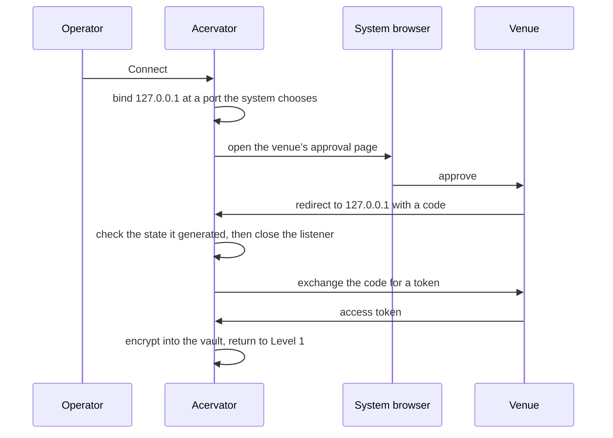
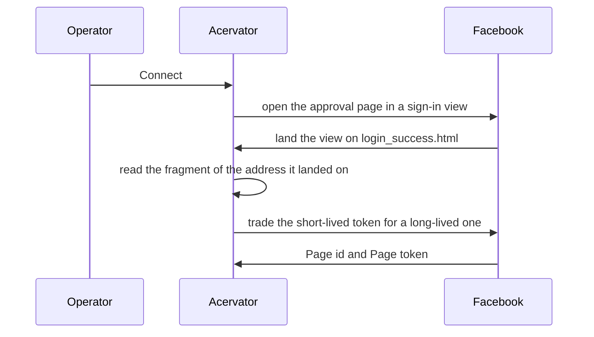
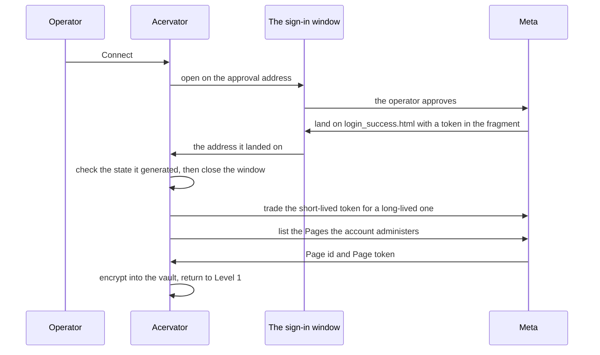

# Market Inspector Tab

Reference. The higher-timeframe scanner and the topology proposal pane.
First step of [the promotion pipeline](promotion-pipeline.md).

## What builds it

`MarketInspectorTabMixin._build_market_inspector_tab` in
`src/gui/main_tabs/market_inspector_tab.py` constructs the tab and wires its
three injection points before adding it to the row.

The tab splits horizontally. The left half holds the scanner, the right half
holds the proposal cards inside the Bot Swarm Topologies zone, which is one of
the three zones that side carries.

## The six zones

The screen draws six zones, three down each side: ATA-SMP, Opposing Trades and
Multi-Exchange Arbitrage on the left, and ATA-SMP Ready to Send, Bot Swarm
Topologies and Phantom Bot HTF Signals on the right. Every zone shows one entry
at a time, with a left arrow, a right arrow and a line saying which entry is on
screen out of how many the zone holds. Clicking the entry opens it, and the
expansion names the test, the window, the result and why that answer let the
entry through. One implementation serves all six, and the proposals pane draws
through the same one. The record is
`tests/debug_reports/2026-09-06_topology_list.md`.

`src/gui/main_tabs/market_inspector_surface.py` — the three right-side zones

```python
def right_zone_rows(run: Any, bucket: Any = None) -> list:
    """The three right-side zones as key, title and status, in screen order."""
```

The Qt build gives every zone a `ProposalStepper`. The two web hosts give every
zone a `ZoneStepper`. Both are written from one description of the zone, so a
zone's lines are decided in one place and a second copy cannot drift from the
first.

`src/gui/market_inspector.py` — the Qt widget every zone uses

```python
class ProposalStepper(QWidget):
    """One zone's entries shown one at a time, with arrows and a expansion.
```

## Left half: the scanner

A filter row carries a Refresh button and an "Include active markets"
checkbox. The default hides the markets already under a bot, which keeps the
table on entry opportunities.

`HTF Signals` lists one row per market: Asset, Signal, Score, Daily, Weekly,
Active.

`Opposing Pairs (cointegration, Engle-Granger + Johansen, p<=0.05)` lists Long
side, Short side, Method, Window, Statistic, Correlation and the combined score.
The 30-day Pearson coefficient raises a candidate and no longer decides one.

## Where the analysis happens

`MarketInspector` in `src/trading/market_inspector.py` owns the maths. One
method drives the whole pipeline and keeps the results on the analyzer.

`src/trading/market_inspector.py` — `MarketInspector.scan_universe`

```python
def scan_universe(
    self,
    candles_by_symbol_by_tf: dict,
    active_symbols: set,
    closes_by_symbol: dict,
) -> None:
```

Two steps run under it.

| Step | Produces |
| ---- | -------- |
| `_analyze_tf` | One `TimeframeAnalysis` per timeframe |
| `_score_market` | One `MarketSignal` per market |

The pairing is a separate step. It enumerates every long against every short
and keeps the cointegrated ones. A thirty-day return correlation sitting in the
configured negative window raises a candidate, and the cointegration test then
decides it.

`src/trading/market_inspector.py` — `MarketInspector._find_opposing_pairs`

```python
def _find_opposing_pairs(self, signals: list, closes_by_symbol: dict) -> list:
    """Enumerate long × short candidates; keep the cointegrated ones.

    The 30-day return correlation raises a candidate and no longer decides
    it: ``cointegration_test`` runs on the full close series and a pair it
    refuses never reaches the table.
    """
    longs = [s for s in signals if s.direction == "long" and s.score >= 0.3]
    shorts = [s for s in signals if s.direction == "short" and s.score >= 0.3]
```

The correlation raises a candidate and no longer decides one. Every pair the
screen shows has also passed a test for a long-run equilibrium, because two
markets can move opposite each other for a year with no relationship holding
between them. The test is cointegration in both of its standard forms, taken
from statsmodels, and a pair passes only when both reject the null of no
cointegration: Engle-Granger at a significance of 0.05, and Johansen above its
ninety-five per cent critical value for rank zero. The window is 365 daily
closes and a pair with fewer than 120 is not tested and not shown. Opposing
Pairs therefore carries seven columns today: Long side, Short side, Method,
Window, Statistic, Correlation and Score. The numbers are recorded in
`tests/debug_reports/2026-09-06_stageC_cointegration.md`.

`src/trading/pair_selection.py` — what a pair has to clear

```python
WINDOW_BARS = 365
MIN_OBSERVATIONS = 120
SIGNIFICANCE = 0.05
```

One analyzer instance serves two readers. `get_shared_inspector` returns it,
the tab owns the fetch cycle and writes into it, and the per-bot Market
Inspector page in the Bot Details dialog reads back out of it through
`build_per_bot_view`. One analyzer, two readers, no second copy of the score.

## Fetching

`set_exchange_source` binds a connectors getter and the application scheduler,
so the tab always sees the current connector dict rather than a snapshot taken
at build time.

The fetch serves its last network result while that result stays young enough,
and the Refresh button passes a flag that goes to the network regardless.

`src/exchange/market_inspector_fetcher.py` — `fetch_htf_universe`

```python
async def fetch_htf_universe(
    exchange_connectors: dict,
    active_symbols: Optional[set] = None,
    top_n: int = DEFAULT_TOP_N,
    progress_cb=None,
    force_network: bool = False,
    min_refresh_s: float = DEFAULT_MIN_REFRESH_S,
) -> FetchResult:
```

Three helpers do the work inside it.

| Helper | What it does |
| ------ | ------------ |
| `_pick_universe` | Ranks each connector's bulk tickers by 24-hour quote volume |
| `_fetch_one_symbol` | Pulls per-symbol OHLCV on the connector's single-worker executor |
| `_resample_daily_to_weekly` | Derives the weekly series on the client when the venue lists no weekly timeframe |

## What a scan reports

An empty table can mean three different things. The note under it says which:

- no scan has run yet
- a scan is running
- a scan finished and found nothing

Before this, all three looked the same. An empty table gave no sign of which one
it was, so a tab that was working looked exactly like a tab that was broken.

`src/gui/market_inspector.py` — `_empty_table_text`

```python
def _empty_table_text(scan_state: str, noun: str) -> str:
    """The sentence an empty table carries for one scan state.

    ``SCAN_NOT_ASKED``, ``SCAN_RUNNING`` and ``SCAN_FINISHED`` each get
    their own wording, so the three never read alike.
    """
    if scan_state == SCAN_RUNNING:
        return f"Scanning for {noun}…"
    if scan_state == SCAN_FINISHED:
        return f"Scan finished. No {noun} found."
    return f"No scan yet. Press Refresh to look for {noun}."
```

`scan_state` reports the same three states to the renderer. The React side draws
the note under the table, the same way the tab does.

The scan also writes to the log. It writes one line when it starts and one line
when it finishes.

The start line names two things: whether Refresh forced the scan, and how many
exchange connectors it reached.

The finish line names four things: how many markets the scan covered, how many
signals and pairs it scored, how long it took, and where the data came from.

The finish line is always written. A scan that scored nothing still writes one.
That is what makes a quiet market different from a scan that never ran.

Each line also goes on the event bus as a record other parts of the platform can
read.

| Topic | Carries |
| ----- | ------- |
| `market_inspector.scan_started` | forced, connector count, active symbols |
| `market_inspector.scan_finished` | market count, duration, signals, pairs, source, error |

Both topics are declared in `src/core/emit_contracts.py`. A topic declared there
is a tracked emitter, and a run that never fires it is reported.

## Right half: topology proposals

`MarketInspectorTopologies` in `src/gui/market_inspector_topologies.py` renders
one card per proposal and opens a preview dialog on Preview.

`current_topology_proposals` answers two different things. It answers `None`
when the right pane never built or refused the read, and a list when the pane
answered, so an empty list means the pane holds no proposals. It answered an
empty list for both before, which is what made a scan that found nothing read
like a pane that was never there. The reader in the Simulator tab passes the
same two answers on rather than flattening them.

`src/gui/market_inspector.py` — the two answers a reader gets

```python
def current_topology_proposals(self) -> "list | None":
    """The proposals on display, for a simulator to read and wire.

    ``None`` says the right pane never built or refused the read,
    and a list says the pane answered. An empty list therefore
    means the pane holds no proposals, which no caller can
    confuse with a pane that is not there.
    """
```

The engine behind the cards takes a plain dictionary, which keeps it free of
any exchange or bot-manager coupling. It unions the detectors, drops
overlapping proposals by asset and caps the result.

`src/trading/topology_proposals.py` — `detect_all_topologies`

```python
def detect_all_topologies(
    context: dict[str, Any],
    cap: int = PROPOSAL_CAP,
) -> list[dict[str, Any]]:
    """Union every detector's proposals, dedupe them and cap at ``cap``.
```

Four detectors feed it.

| Detector | Shape |
| -------- | ----- |
| `detect_momentum_funnel` | Correlated cluster, leader into laggers |
| `detect_mean_reversion_pair` | Anti-correlated pair, wired both ways |
| `detect_sector_cluster` | Same-sector star, hub into spokes |
| `detect_distance_to_band` | One asset, scrum-deep into fold-deep |

Two helpers read from disk under `src/trading/`. `suggested_target_usd` sizes
each proposed bot from the asset target defaults, and the sector map names each
asset's sector.

## Dismissal

Dismissing a card hides it for a day. The write-through never raises, because
losing a dismissal is a nuisance and taking down the pane is not.

`src/gui/market_inspector_topologies.py` — `_persist_dismissed`

```python
def _persist_dismissed(self) -> None:
    """Best-effort write-through. Never raises: losing a
    dismissal is a nuisance, taking down the pane is not."""
    if self._dismiss_store is None:
        return
    try:
        self._dismiss_store.set(DISMISS_SETTINGS_KEY, dict(self._dismissed))
```

That write fails on every call today, because the key it writes is not one the
settings schema declares. The pane logs the failure and carries on, so the
dismissed count reads zero on every launch. Issue #424 carries it.

`set_dismiss_store` hands the pane the settings manager it persists through.
The pane never resolves settings itself.

## Adopt

The pane emits an adopt request and the window handles it. The handler counts
the new bots and their combined budget, asks which of the proposed wires
already exist and would change, and shows all of it before anything is created.

`src/gui/main_window.py` — `_adopt_topology_proposal`

```python
def _adopt_topology_proposal(self, proposal: dict) -> None:
    """Confirm, open the wizard for each new bot, then emit `wire.created`."""
```

An adopt that aborts part way calls `_report_adopt_orphans`, which names the
bot ids it created and left unwired.

The per-bot page is drawn from one description as well. `per_bot_view` reads
the shared analyzer and returns the whole screen as values: the rows, the
groups, the words, the colours and the layout numbers. The Qt side draws them
as widgets and the React side draws them as elements, where the React side drew
a Python error message before. The record is
`tests/debug_reports/2026-09-06_unit12_market_inspector_tab.md`.

`src/gui/main_tabs/market_inspector_tab_surface.py` — `per_bot_view`

```python
def per_bot_view(bot: Any) -> dict:
    """The per-bot Market Inspector screen as values, read off the shared
    analyzer's most recent scan.
```

## ATA-SMP

The eight phases sit outside the screen. Phases one to three and phase eight run
in `src/trading/ata_spm.py`, and phases four to seven run in
`src/trading/ata_spm_push.py`. The screen reads what they produce and draws it;
it computes none of it. Seven push targets ship, and adding one is adding a row,
because no phase names a target.

`src/trading/ata_spm_push.py` — the names every screen reads

```python
TARGET_NAMES = tuple(one.name for one in PUSH_TARGETS)
```

The rules each platform publishes are recorded in
[the push target rules](../../audits/2026-09-06_ata_platform_rules.md). The
narrative for the whole screen is on [the tabs page](../08-tabs.md).

## Exchange comparison arbitrage

`src/trading/arbitrage.py` holds the cross-exchange price monitor and its
spread tracking. No module under `src/` imports it. The tab draws a
Multi-Exchange Arbitrage zone, and that zone draws no arbitrage panel: it names
the venues in reach and stops there. The first two proposal forms are on screen;
the third is not.

In development.

## Bridge

Three methods serve this screen, and the renderer modules carry the matching
names.

| Bridge method | Serves |
| ------------- | ------ |
| `market_inspector.state` | The scanner and its two tables |
| `market_inspector_tab.state` | The per-bot page in the Bot Details dialog |
| `market_inspector_topologies.state` | The proposal cards |

## Updates

What the screen is sits above. How it got there sits below, in order.

Each entry carries the date, the time, the issues it addressed and a short
phrase. Every date and time is read off the commit or the issue comment that
carries the change, never off the day the entry was written. An entry with no
artefact behind it says so and gives no time.

`.claude/rules/documentation.md` bans item numbers in documentation. The
operator's directive of 2026-09-08 amends that rule for this header alone, and
his newest word governs.

## 2026-09-06 18:26 - #407 - six zones, three down each side

The screen stopped being two panes with tables in them. Six zones now sit three
down each side. ATA-SPM, Opposing Trades and Multi-Exchange Arbitrage run down
the left. ATA-SPM Ready to Send, Bot Swarm Topologies and Phantom Bot HTF
Signals run down the right. One function names each side in screen order, so a
zone cannot appear on one host and go missing on the other.

`src/gui/main_tabs/market_inspector_surface.py` — the three left-side zones

```python
def left_module_rows(
    run: Any,
    scan_state: Any,
    pair_count: Any,
    connectors: Any,
    sector_count: Any = 0,
) -> list:
    """The three left-side regions as key, title and status, in screen order."""
```

Every zone works the same way. It shows one entry at a time, with a left arrow,
a right arrow and a line saying which entry is on screen out of how many the
zone holds. An arrow press wraps at both ends, so the last entry steps forward
to the first.

`src/gui/main_tabs/market_inspector_surface.py` — what one arrow press does

```python
def step_to(at: Any, total: Any, by: Any) -> int:
    """The entry index one arrow press moves to, wrapping at both ends."""
```

Clicking the entry opens it. The open entry drops its method line and its hint,
because the four expanded lines already say the same things, so every zone's
open entry takes one height whatever buttons it carries. The four lines are the
test, the window, the result, and why that answer let the entry through.

`src/gui/main_tabs/market_inspector_surface.py` — the four names an open entry
carries

```python
DETAIL_TEST_NAME = "Test"
DETAIL_WINDOW_NAME = "Window"
DETAIL_RESULT_NAME = "Result"
DETAIL_REASON_NAME = "Why it is here"
```

A zone holding nothing keeps its waiting sentence as the headline and still
reports a position of "0 of 0". An empty zone therefore reads as a state rather
than as a zone that failed to draw. Each zone says something different while it
waits.

| Zone | What its line says while it holds nothing |
| ---- | ---------------------------------------- |
| ATA-SPM | "No sector added. Name one and press Scan Now." |
| Opposing Trades | The scan state: not asked, running, or finished and empty |
| Multi-Exchange Arbitrage | The venues in reach, or that no exchange source is wired |
| ATA-SPM Ready to Send | "No run yet. Nothing to approve." |
| Bot Swarm Topologies | The proposal pane, which carries its own status line |
| Phantom Bot HTF Signals | "Phantom Bot source not wired." |

Phantom Bot HTF Signals is the renamed zone, and its line is fixed today.
Nothing feeds it. The zone is named, sized and drawn, and the row that builds it
writes the same sentence on every call, so no Phantom Bot reaches it yet.

`src/gui/main_tabs/market_inspector_surface.py` — the row that never varies

```python
[PHANTOM_HTF_ZONE, PHANTOM_HTF_GROUP_TITLE, PHANTOM_HTF_UNWIRED_TEXT],
```

## 2026-09-06 21:07 - #407 - the sector row, Scan Now, and the phase readbacks

The ATA-SPM zone grew a control row. It carries a sector field, an asset-class
box, four timeframe check boxes and a Scan Now button. The operator names a
sector, ticks the timeframes he wants, and presses Scan Now. Every asset the
sector holds is charted and run through the twelve voters.

`src/gui/main_tabs/market_inspector_surface.py` — the button and what it says

```python
SCAN_NOW_LABEL = "Scan Now"
SCAN_NOW_TOOLTIP = (
    "Scan this sector now on the timeframes ticked beside it, without "
    "waiting for a rotation."
)
```

The asset class sets which four timeframes the check boxes offer. Crypto is the
fast set. Stocks, metals, derivatives and forex share the slower one.

`src/trading/ata_spm.py` — the two sets

```python
CRYPTO_TIMEFRAMES = ("5m", "1h", "1d", "1w")
SLOWER_TIMEFRAMES = ("1h", "1d", "1w", "1M")
```

Only crypto has a sector map in the tree. Every other class answers no assets,
and the zone then names the source it is waiting for rather than showing an
empty scan. The map itself is the hand-typed one the topology detectors read.

`src/gui/main_tabs/market_inspector_surface.py` — the one class with a map

```python
def sector_assets(sector: Any, asset_class: Any) -> list:
    """The assets one named sector holds, read from the shipped sector map.

    Only ``ata_spm.CLASS_CRYPTO`` has a map in the tree, so every other
    class answers none and the zone names the source it waits for.
    """
```

Scan Now adds the typed sector when it is new, then runs the phases that read
price data. The expanded entry names each phase back with what it produced, so
a run can be read without opening a log.

`src/trading/ata_spm.py` — the phases one press runs

```python
def run(
    sectors: Any,
    asset_source: Optional[Callable] = None,
    candle_source: Optional[Callable] = None,
    engine: Optional[VotingEngine] = None,
    message_format: Optional[str] = None,
    clock: Optional[Callable] = None,
) -> AtaSpmRun:
    """Phases one, two, three and eight in order, as one ``AtaSpmRun``."""
```

Eight phases carry a post from a sector name to a published call. Two modules
hold them. The screen computes none of it and draws what they answer.

| Phase | Module | What it produces |
| ----- | ------ | ---------------- |
| 1 Evaluate | `ata_spm.evaluate` | One scan per sector, per ticked timeframe |
| 2 Identify | `ata_spm.identify` | The votes carrying a reversal, strongest first |
| 3 Pull | `ata_spm.pull` | The chart, its bands, and one message per confirming voter |
| 4 Format | `ata_spm_push.format_post` | One post per push target |
| 5 Distribute | `ata_spm_push.distribute` | One delivery record per post |
| 6 Ready to Send | `ata_spm_push.ReadyToSend` | The bucket the operator approves from |
| 7 Follow-Up | `ata_spm_push.FollowUpWatch` | What the market did after a published call |
| 8 Timeframes | `ata_spm.agreement_for` | Every timeframe the asset voted on, and their verdict |

A run answers a phase readback line for each of them. The readback names the
sectors scanned, the reversal calls found, and the charts pulled.

`src/trading/ata_spm.py` — the line a finished run leaves

```python
PHASE_RUN_FORMAT = "{phase}: {sectors} sector(s), {calls} call(s), {pulls} chart(s)"
```

## 2026-09-06 23:08 - #407 - Ready to Send, Post Selected, Post All and Full Auto

Nothing leaves the machine without an act. Phase four formats a post per target
and drops it into the Ready to Send bucket, where it waits. The operator
approves or declines each one, and no button sends a declined post.

`src/gui/main_tabs/market_inspector_surface.py` — the five buttons the bucket
carries

```python
APPROVE_LABEL = "Approve"
DECLINE_LABEL = "Decline"
POST_SELECTED_LABEL = "Post Selected"
POST_ALL_LABEL = "Post All"
FULL_AUTO_LABEL = "Send Bucket Full Auto"
```

Post Selected sends the post on screen. Post All sends every approved post. Send
Bucket Full Auto releases approved posts with no further click. All three obey
one ceiling, counted over the hour ending now.

`src/trading/ata_spm_push.py` — the ceiling every send route obeys

```python
def allows(self, now: float, ceiling: Any) -> bool:
    """Whether one more post fits under ``ceiling`` at ``now``."""
    limit = int(ceiling or NO_CEILING_SET)
    if limit <= NO_CEILING_SET:
        return False
    return self.sent_within_hour(now) < limit
```

The ceiling starts unset, and an unset ceiling releases nothing. That is the
safe default: a fresh install cannot publish until the operator sets a number,
and the refusal says which of the two reasons held the post.

`src/trading/ata_spm_push.py` — the two refusals a held post reports

```python
NO_CEILING_TEXT = "Max posts per hour is unset. Nothing leaves."
RATE_HELD_TEXT = "{sent} post(s) sent this hour, ceiling {ceiling}."
```

The Settings button swaps the zone for a settings page and back. Four settings
sit there, each one read by a phase, and under them one credential row per push
target.

| Setting | Which phase reads it |
| ------- | -------------------- |
| Max posts per hour | The send ceiling above |
| Max supporting indicators | Phase four, capping the evidence lines drawn |
| Confirmation share % | Phase seven, sizing the target a call must reach |
| Standardised message text | Phase three, wording each indicator message |

Save credentials encrypts every typed credential into the same vault the venue
keys use, then clears what was typed. A credential row reports held or not
held. No typed value reaches a view model, a render or a log.

`src/trading/ata_spm_push.py` — what a credential row publishes

```python
CREDENTIAL_HELD_TEXT = "held"
CREDENTIAL_MISSING_TEXT = "not held"
```

## 2026-09-07 00:16 - #407 - Refresh, renamed

The topology pane's button read "Refresh proposals". It reads "Refresh" now, and
the pane is inside the Bot Swarm Topologies zone, whose title already says what
is being refreshed.

`src/gui/main_tabs/market_inspector_topologies_surface.py` — the label and what
it does

```python
REFRESH_TEXT = "Refresh"
REFRESH_TOOLTIP = "Rerun topology detectors on current market state."
```

## 2026-09-07 03:59 - #407 - the follow-up post and the timeframe vote

Phase seven watches a call after it is published and posts what happened. Three
outcomes exist. A call is confirmed, failed, or still open.

`src/trading/ata_spm_push.py` — the three verdicts

```python
OUTCOME_CONFIRMED = "confirmed"
OUTCOME_FAILED = "failed"
OUTCOME_OPEN = "open"
```

The target a call has to reach is a share of the run from the call's close to
the Bollinger midline, and the midline is recomputed on every candle after the
call rather than frozen at it. The share is the confirmation share setting. A
share of zero sets no target, and the follow-up says so instead of claiming a
result.

`src/trading/ata_spm.py` — the moving target phase seven measures against

```python
def midline_after(candles: Any, at: Any) -> list:
    """The Bollinger middle band at every candle after index ``at``.

    ``BollingerBands`` computes its published band on each window, so the
    target phase seven measures against moves with the market.
    """
```

Phase eight answers whether the other timeframes agree with the call. It walks
every vote the same asset produced in the run, names the direction each one
read, and lists the timeframes that read the opposite. A neutral vote is
neither agreement nor contradiction.

`src/trading/ata_spm.py` — the three verdicts phase eight can write

```python
AGREEMENT_AGREED_TEXT = "Every timeframe agrees."
AGREEMENT_SINGLE_TEXT = "Only one timeframe voted."
AGREEMENT_CONTRADICTED_FORMAT = "Contradicted on {labels}."
```

Phase eight also caps a scan. Each sector takes only as many timeframes as the
rounds so far show will fit inside one candle of the shortest timeframe the
class scans. The rest are recorded as deferred and named on the zone, so a
shortened scan is visible rather than silent.

## 2026-09-07 07:29 - #407 - seven push targets and the ceiling each publishes

Seven targets ship. Adding one is adding a row: no phase names a target, and the
Settings credential list is built from the same rows, so a new row appears on
the settings page with no screen edit.

| Target | Body ceiling | Title ceiling | Counted in |
| ------ | ------------ | ------------- | ---------- |
| X | 280 | none | Weighted characters |
| Instagram | 2200 | none | Characters |
| LinkedIn | 3000 | none | Characters |
| TikTok | 4000 | 90 | UTF-16 runes |
| Facebook | none published | none | Characters |
| Threads | 500 | none | UTF-8 with emoji |
| Reddit | 40000 | 300 | Characters |

Every number came off the platform's own documentation, read on 2026-09-06 and
2026-09-07, and each one is cited on its own page. Where a platform publishes no
number, the row records that rather than carrying a guess.

[The push target rules](../../audits/2026-09-06_ata_platform_rules.md) — one
section per target, with the page each number came from

```
Facebook   body ceiling: no number published
           the row carries NO_LIMIT_PUBLISHED, and phase four applies none
```

The fixed header ships on every artefact the run composes. No caller supplies it
and no caller can remove it. It is 144 characters, and on X it takes over half
the budget.

`src/trading/ata_spm_push.py` — the header that cannot be dropped

```python
FIXED_HEADER = (
    "This is not investment advice. It is a demonstration of Ekthelius's "
    "proprietary TA engine housed in the Acervator governance execution "
    "platform."
)
```

Phase four holds each body under its target's ceiling. It drops evidence lines,
longest first, and never the header. A body that still will not fit says by how
much it missed rather than truncating the header to force it in.

`src/trading/ata_spm_push.py` — what the fitter drops, and what it will not

```python
def fit_to_target(ranked: Any, target: Any) -> tuple:
```

Two platforms named in the issue are not rows, and both were removed for the
same reason: a rendered chart has no route in. TradingView publishes an idea
through its website and states that it has no API for it. The YouTube upload
endpoint accepts video only.

**Where the issue and the code disagree, the code is right.** Issue #407's
comment of 2026-09-07 records "The formatter applies no per-target ceiling and
never did. The truncation rule is recorded and not built." That was true when it
was written. Every target row now carries its own `body_limit`, and phase four
applies it through `fit_to_target`. The comment is stale and the ceilings are
built.

## 2026-09-07 10:16 - #407 - the voting panel, the gate chain, and the two distances

ATA-SMP carries its own Indicator Voting Panel. It is a clone of the live one,
drawn inside an open entry, and it reads only the markets ATA-SMP scanned. No
live bot's market reaches it, and it reaches no live bot.

`src/gui/main_tabs/market_inspector_surface.py` — the panel and what feeds it

```python
def voting_panel(pull: Any) -> Optional[dict]:
    """The Indicator Voting Panel one scanned asset carries, as its rows.

    The rows are the timeframes ATA-SMP read for this asset alone, and
    every cell is drawn from ``indicator_panel_surface``.
    """
```

The live trade gates also run over the scanned prices. Both chains the bots
build are evaluated, unchanged, against a context filled from one market's
candles and its voting summary. Nothing on the live path changes: the bots build
the only two contexts inside their own tick, and this is a third caller.

`src/trading/ata_gate_scan.py` — both live chains, over scanned prices

```python
readings = read_chain(build_scrumming_scrum_chain(), context) + read_chain(
    build_scrumming_fold_chain(), context
)
```

Twenty-two gates run across the two chains. Sixteen decide from price and
settings alone. Six need a position the scan does not hold, and the scan never
invents one. Four of the six stand down by name, and two publish a distance
instead of a verdict.

`src/trading/ata_gate_scan.py` — the six, split by what a scan can honestly say

```python
NOT_APPLICABLE_GATES = (
    "delta_positive",
    "interval",
    "tranches_queued",
    "smart_ceiling",
)
HYPOTHETICAL_GATES = ("hysteresis_scrum", "hysteresis_fold")
```

The four stood-down gates appear in the expansion by name, marked as not run,
each with the reason. A reader sees that the gate exists, that it did not run,
and why. That is the point: a post must never imply a gate latched when no gate
ran.

`src/trading/ata_gate_scan.py` — the reason each stood-down gate publishes

```python
NOT_APPLICABLE_REASONS = {
    "delta_positive": "a scan holds nothing, and no surplus exists to test",
    "interval": "the same surplus, and a scan holds none of it",
    "tranches_queued": "a scan has no fold queue",
    "smart_ceiling": "a scan holds nothing, and any ceiling test passes",
}
```

Opposing Trade Distance is the second of the two numbers the expansion carries.
It is one sum: the bot's scrumming interval percentage plus its trading fee
percentage, clamped between 0 and 50. It is a formula over settings, so a scan
computes it exactly as a bot does.

`src/trading/otd_math.py` — the whole formula

```python
total = float(interval_pct) + float(fee_pct)
return max(OTD_MIN_PCT, min(OTD_MAX_PCT, total))
```

The two hysteresis gates feed on it. Each runs against a hypothetical entry at
the scanned price and publishes the price a reversal would have to reach, with
no verdict attached. At the instant of the scan the pivot equals the price, so
both sides would refuse; the number is the reading, and the refusal is not.

`src/trading/ata_gate_scan.py` — what a hypothetical row prints

```python
HYPOTHETICAL_FORMAT = (
    "entry at ${price:.8f} would need ${required:.8f}, "
    "{distance:.2f}% away; no gate ran"
)
```

Landing Strip is the first of the two. The band-proximity detector reads whether
price has sat against a Bollinger band for a run of candles, and it answers a
side. An upper strip is a sell reversal and a lower strip is a buy reversal. The
side and the candle count are both published on the expanded line beside the
distance.

`src/gui/main_tabs/market_inspector_surface.py` — the line carrying both numbers

```python
GATE_DISTANCE_FORMAT = "opposing trade distance {pct:.2f}% · landing strip {strip}"
```

A second strip detector runs inside the gate scan and feeds the confidence floor
rather than the direction. It lowers the floor the TA consensus must clear, in
the same way the live tick lowers it, so the scan and a bot judge a market at
one bar. The one term a scan loses is the band-priority favour, which arms only
on a signed delta, so a scan reads at a stricter floor than a bot holding a
position.

A chart with too few candles produces no gate scan at all. The floor is 30
candles, and the line says so rather than reporting an empty result as a clean
one.

`src/gui/main_tabs/market_inspector_surface.py` — the sentence a short chart
carries

```python
NO_GATE_TEXT = "No gate ran. The chart carried too few candles."
```

The counts sit at the head of the expansion, so a reader sees how much of the
chain actually decided before reading any single row.

`src/gui/main_tabs/market_inspector_surface.py` — the count line

```python
GATE_COUNT_FORMAT = (
    "{ran} of {total} gate(s) ran · {latched} latched · {blocked} blocked "
    "· {stood_down} did not run"
)
```

Which gates transpose, and why each one does, is measured field by field in
[the gate transposition page](../../audits/2026-09-07_gate_transposition.md).

## 2026-09-08 - #407 - Push to Sim, Paper and Live is not built

This entry carries no time. No commit implements it, so there is nothing to read
a time from.

The operator named a push from Opposing Trades and from Topologies to the
Simulator, to the Paper Trader and to Live. No such control exists on either
zone today. Adopt is the only control on this screen that creates anything, and
it creates live bots through the wizard.

A simulator can read the proposals on display, and that is a read with no write
behind it. It wires nothing and it starts nothing.

`src/gui/main_tabs/market_inspector_surface.py` — the read that exists instead

```python
def current_topology_proposals(self) -> Optional[list]:
    """The proposals on display, for a simulator to read.

    ``None`` says the right pane never built or refused the read, and
    a list says the pane answered, so an empty pane and an absent one
    never look alike to a caller.
    """
```

Nothing reports a push to a target that is not built, because nothing pushes.
The Paper Trader and the Simulator are both named on
[the promotion pipeline page](promotion-pipeline.md), which is where a push from
this screen would land.

In development.

## 2026-09-08 13:30 - #407 - the called markets the Charts tab keeps watching

Reaching Ready to Send now does a second thing. Beside waiting for approval, the
market joins a list the Charts tab keeps, so the operator can watch a called
market long after the post about it has gone or been declined.

The board answers one row per market, never one per post. A market called on two
timeframes is still one market being watched, and the row carries the timeframes
it was called on and the vote of the most recent call.

`src/trading/ata_spm_push.py` — the row the Charts tab reads

```python
@dataclass(frozen=True)
class WatchedMarket:
    """One market on the ATA-SMP chart list, and the call that queued it."""

    symbol: str
    vote: str = VOTE_NEITHER
    timeframes: tuple = ()
```

Three places hold a called market and the board reads all three, oldest first:
the calls phase seven has already settled, the calls it is still watching, and
the posts sitting in the bucket now. That is why filling the bucket from a new
scan does not drop an older market from the chart list.

`src/trading/ata_spm_push.py` — one set, read by phase seven and by the Charts tab

```python
    def watched_markets(self) -> list:
        """One ``WatchedMarket`` per market that reached Ready to Send.

        The bucket is the trigger and ``follow_up`` keeps a market listed
        after ``load_run`` replaces the bucket, so the Charts tab and phase
        seven read one set. The newest call's vote wins.
        """
```

Phase seven used to remember only the key of a call it had settled, which was
enough to stop watching it twice and not enough to name it later. It now keeps
the call itself, so a settled market can still be listed with its ticker, its
timeframe and its vote. The settled calls are read in key order, so the list
comes back in the same order every time.

The screen hands that reader to the Charts tab when it is built. Nothing is
copied across, so the two screens cannot disagree about which markets are
called. What the Charts tab does with the list is on
[the Charts tab page](asset-charts.md).

`src/gui/market_inspector.py` — what this screen offers the Charts tab

```python
def watched_markets(self) -> list:
    """The markets ATA-SMP has called, for the Charts tab's second list.

    ``PushBoard.watched_markets`` is the one set phase seven also reads.
    """
    return self._push_board.watched_markets()
```

**Figures.** This page carries no figure. The zones it describes are unchanged
by this entry, and the second reader it adds draws on another screen.

## 2026-09-08 15:20 - #407 - phase three draws the chart the post carries

Phase three used to answer a data record: the ticker, the timeframe, the bar
count, the band values and a list of confirming sentences. There was no
picture, so the post's caption captioned nothing. It now draws that chart and
writes it as a PNG, and the pull carries the file.

`src/trading/ata_spm.py` — the picture the pull now holds

```python
@dataclass
class ChartPull:
    """The chart one reversal call was made on, and its confirming messages.

    ``image`` is that chart rendered to a PNG, which the post's caption
    captions.
    """
```

The picture is drawn by the Charts tab's own renderer. No second drawing
engine was written for posts, because two engines drift apart and only one of
them is the screen the operator watches. What changed in the renderer is that
its drawing state and its paint routine moved out of the window into a plain
object, `ChartPainter`. The Charts tab's chart is that object with a window
around it, and a post image is that object with a picture file around it.

`src/gui/native_chart.py` — one paint routine, two places to send it

```python
        def paint_to(self, p: QPainter, w: int, h: int) -> None:
            """Draw the whole chart onto ``p`` over a ``w`` by ``h`` area.

            The painter's device is the caller's: a widget from ``paintEvent``
            and a ``QImage`` from ``render_chart_png``.
            """
```

The split was forced by where a scan runs. Pressing Scan Now hands the work to
a background worker so the screen keeps drawing, and the drawing toolkit will
not build a window on a background worker. Driven, it does not raise an error
that could be caught; it kills the program. A picture file has no such rule,
so the post image is drawn straight onto the file and no window is made.

`src/gui/market_inspector.py` — the worker the scan runs on

```python
            self._scan_thread = threading.Thread(
                target=self._compute_scan,
                args=(settings.message_format, settings.max_supporting_indicators),
                name=ATA_SCAN_THREAD_NAME,
                daemon=True,
            )
```

The indicators on the picture are the ones that voted for the call, not the
ones the Charts tab happens to have switched on. Each overlay in the chart's
registry now names the voter it draws, so the picture is chosen by the vote.

`src/gui/native_chart.py` — the overlay names its voter

```python
    ChartOverlay(
        key="bb",
        label="BB",
        colour_field="chart_band",
        pane=PRICE_PANE,
        occludes=False,
        draw="_draw_bollinger",
        tooltip="Bollinger Bands (20, 2σ) with cloud fill",
        voter="bollinger_bands",
    ),
```

**Max supporting indicators** on the settings page decides how many of them are
drawn. It was already the cap on how many confirming sentences a post carries,
and it is now the same cap on the chart. No second setting was added. Set to
one, the picture carries the Bollinger bands alone; left unset, it carries
every confirming voter the renderer has an overlay for.

A confirming voter with no overlay cannot be drawn, and the picture says so in
its header line rather than passing over it. Z-Score and RSI are the two that
vote and have no overlay today.

`src/gui/native_chart.py` — what reached the picture and what did not

```python
@dataclass
class ChartImage:
    """One rendered chart on disk, and what the renderer could not draw.

    ``drawn`` and ``undrawn`` name voters: ``undrawn`` holds the ones no
    overlay draws and the ones ``max_overlays`` cut.
    """
```

The files are kept outside the repository, in `~/.acervator_ata_posts`, beside
the other runtime folders and inside none of them. One file is written per
asset, per timeframe, per last bar. Nothing removes them yet.

`src/trading/ata_post_paths.py` — the one place the folder is named

```python
ATA_POST_ROOT: Path = Path.home() / ".acervator_ata_posts"
```

Nothing sends the picture. The sender is handed the whole post, so the file
travels with the text, and no sender reaches a platform. The Ready to Send
zone draws the text and does not show the picture.

**Figures.** This page carries no figure, and this entry adds none: a rendered
chart is produced output and is not kept in the repository. The picture drawn
by the run behind this entry measured 1200 by 372 pixels and carried 7126
distinct colours, against 17 for the same chart drawn with no candles. Its
readings are in
[the debug report](../../../tests/debug_reports/2026-09-08_ata_post_image.md).

## 2026-09-08 15:30 - #407 - the post picture folder has a ceiling

Every scan wrote a picture and nothing ever took one away. One picture measured
121044 bytes. A scan across sectors on four timeframes, repeated as bars close,
reaches gigabytes on the machine the operator trades from, and nobody would
notice until the disk did.

The folder now keeps the newest picture of each market and removes the older
ones. A market is one asset on one timeframe, so gold on the hourly chart and
gold on the daily chart are two markets and each keeps its own newest picture.

The number is not a preference. It is what the posting side can actually reach.
Phase four looks up one chart per market and keeps the last one, and the Ready
to Send list is rebuilt from scratch on every scan. Nothing in the application
can name an older picture, so nothing loses one.

`src/trading/ata_post_paths.py` — how many stay, and why that number

```python
#: ``ata_spm_push.format_run`` keys its pulls by symbol and timeframe, last
#: write winning, so one image per market is every image a post can name.
POST_IMAGES_KEPT_PER_MARKET = 1
```

The follow-up post was the thing to check before setting any ceiling, because a
ceiling that throws away a picture a follow-up still needs is worse than no
ceiling. It does not need one. Phase seven reads the chart again from the market
data, never from the folder, and the post it writes is text: the original
headline, the outcome, and the evidence behind it. Driven over three called
markets, phase seven settled all three and composed twenty-one follow-up posts
across the push targets. None of them carried a picture.

`src/trading/ata_spm_push.py` — phase seven asks the market, not the folder

```python
    def check(self, candle_source: Any, share_pct: Any) -> list:
        """Read each watched call's chart again and answer what happened to it.

        A settled call stops being watched and an open one stays, so no call
        is posted on twice.
        """
```

The clearing happens on the same press that draws a picture. Scan Now runs the
three phases, phase three writes the file, and the folder is trimmed
immediately afterwards, so it is never larger than one scan's worth of pictures
plus the newest of every market scanned before.

`src/trading/ata_spm.py` — the picture is written, then the folder is trimmed

```python
    path = ata_post_paths.post_image_path(vote.symbol, vote.timeframe, stamp)
    image = render_chart_png(
        held,
        vote.symbol,
        timeframe_label(vote.timeframe),
        path,
        voters=[one.indicator for one in confirming_signals(vote)],
        max_overlays=int(max_supporting_indicators or NO_INDICATOR_CAP),
    )
    ata_post_paths.prune_post_images(path)
    return image
```

**It says what it took.** Deleting the operator's files quietly is not
acceptable, so every trim writes one line naming how many pictures went, how
many bytes came back, how many stayed, and how many the machine would not let
go of.

`src/trading/ata_post_paths.py` — the line every trim writes

```python
PRUNE_LOG = (
    "ATA post store: removed %d image(s), reclaimed %d byte(s), kept %d, refused %d"
)
```

**It cannot reach anything else.** It reads one folder, the one its own file
names, and it goes no deeper. A file whose name a post picture could not have
produced is not touched: three such files sat in the folder through a whole
driven run and all three were still there at the end. The state folder, the log
folder, the recorded market data and the paper ledger were counted before the
run and after it and did not move, and the settings file hashed the same both
times.

**A picture being written is never taken.** The protection is the operating
system's own refusal, not a check that could be wrong. Driven with a picture
held open, the deletion was refused, the file survived, and the trim reported it
as refused. The same file went on the next press, once the handle had closed.

Driven over three markets with nine older pictures planted, the folder went from
twelve files to six, and the three pictures the run had just drawn were the
three that stayed. A second press on unchanged bars removed nothing.

```
                        files      bytes
before the first scan      12        174
after the first scan        6     478068
after a later scan          6     441483
after an unchanged scan     6     441483
```

**Figures.** This page carries no figure and this entry adds none. The folder is
outside the repository and a rendered chart is produced output, so neither is
kept here. The readings behind every number above are in
[the debug report](../../../tests/debug_reports/2026-09-08_ata_post_pruning.md).

## 2026-09-08 17:24 - #407 - the organization link, and the chart that says why

Two things changed. Every post now carries a link to the Acervator-LLC page on
GitHub. The chart a post carries now states the call and shows what each voter
read.

**The link is one string in one place.** One routine writes every piece of post
text. It puts the fixed header on top, the evidence under it, and the link at
the bottom. No caller supplies the link and no caller can remove it. The body,
the caption, the thread root and the title all carry it, on every target.

`src/trading/ata_spm_push.py` — the link, written once

```python
def compose(lines: Any) -> str:
    """``FIXED_HEADER`` over ``lines`` over ``ORGANIZATION_URL``.

    ``fit_to_target`` drops ``lines`` to reach a ceiling and reaches neither
    ``FIXED_HEADER`` nor ``ORGANIZATION_URL``.
    """
```

**The link costs characters, and each target has its own ceiling.** X counts a
web address as 23 characters whatever its real length. The other targets count
every character in it. Where a post no longer fits, the evidence gives way and
the link stays. The longest indicator sentence goes first, then the next
longest, and the post says how many sentences were left out.

The numbers below are one run on a recorded Amazon daily chart. Measured is the
post body in the unit that target counts in.

| target | ceiling | counted in | before the link | with the link | sentences dropped |
|---|---|---|---|---|---|
| X | 280 | weighted characters | 272 | 246 | 7 |
| Instagram | 2200 | characters | 727 | 760 | 0 |
| LinkedIn | 3000 | characters | 711 | 744 | 0 |
| TikTok | 4000 | UTF-16 runes | 765 | 798 | 0 |
| Facebook | none published | characters | 765 | 798 | 0 |
| Threads | 500 | UTF-8 emoji units | 470 | 431 | 4 |
| Reddit | 40000 | characters | 765 | 798 | 0 |

No target is over its ceiling. X keeps the ticker, the direction, and the note
that the evidence was cut. That is all 280 characters hold once the fixed
header and the link are on the post.

**The chart now states the call.** The renderer takes the direction the vote
named and one sentence per confirming voter. It is the same renderer the Charts
tab draws with, and a chart given no call takes neither.

`src/gui/native_chart.py` — the direction and the readings the picture takes

```python
        def set_call(self, direction: str, readings=()) -> None:
            """Take one reversal direction and one reading line per voter.

            ``readings`` are ``(voter, text)`` pairs and ``_draw_call`` paints
            them under the time axis.
            """
```

**Three marks, and each one is earned.** A badge in the top right names the
direction. A dashed rule and a triangle mark the last bar, which is the bar the
vote was made on. A strip under the time axis carries one row per confirming
voter: a square in the colour of the line that drew that voter, and the
sentence phase three wrote for it. Nothing is drawn that a voter did not read.

A voter with no line on the chart still gets a row, in the dim colour, and the
header line names it. ADX and Supertrend were the two on this run.

`src/gui/native_chart.py` — where the marks go

```python
        def _draw_call(self, ctx, h: int) -> None:
            """Draw the reversal badge, the call bar mark and the voter strip.

            The bar marked is the last candle, which is the bar the direction
            ``set_call`` took was voted on.
            """
```

**The Charts tab is unchanged.** A chart with no call set draws no badge, no
bar mark and no strip, and keeps the height it had before. The same recorded
tape drawn both ways measured 344 pixels tall with no call and 390 with one.

**Figures.** This page carries no figure and this entry adds none. A rendered
chart is produced output and is not kept in the repository. The picture drawn
by the run behind this entry measured 1200 by 478 pixels and 164,402 bytes,
carried 14,062 distinct colours, and 90.53% of its pixels are not its
commonest colour. Its readings are in
[the debug report](../../../tests/debug_reports/2026-09-08_ata_post_link_and_chart.md).

## 2026-09-08 19:10 - #407 - the scan reaches a market outside crypto

Scan Now now reads a real market that Acervator does not trade. The sector
reader answers a named list of assets for FOREX and for metals, each name paired
with the venue that lists it, and the prices arrive through the historical
fetcher's own adapters.

`src/trading/ata_asset_maps.py` — one asset, and where it is carried

```python
@dataclass(frozen=True)
class AssetListing:
    """One asset a sector holds, with the venue and ticker carrying it.

    ``quote`` is the currency the venue prices ``ticker`` in, which
    ``YahooChartAdapter.fetch_chunk`` checks its answer against.
    """

    symbol: str
    quote: str = USD
    venue: str = NO_VENUE
    ticker: str = ""
```

**FOREX is the class built end to end.** Its tiers are liquidity tiers. The
major tier is the seven pairs that hold the dollar. The minor tier is every
cross of two of those currencies with no dollar in it, twenty-one pairs. The
exotic tier is defined and holds no pair, because no pair is named for it.

`src/trading/ata_asset_maps.py` — the two tiers that carry names

```python
FOREX_MAJOR: tuple[AssetListing, ...] = tuple(
    _yahoo_fx(one)
    for one in (
        "EUR/USD",
        "USD/JPY",
        "GBP/USD",
        "USD/CHF",
        "AUD/USD",
        "NZD/USD",
        "USD/CAD",
    )
)

CROSS_ORDER: tuple[str, ...] = ("EUR", "GBP", "AUD", "NZD", "CAD", "CHF", "JPY")

FOREX_MINOR: tuple[AssetListing, ...] = tuple(
    _yahoo_fx(f"{base}/{quote}")
    for at, base in enumerate(CROSS_ORDER)
    for quote in CROSS_ORDER[at + 1 :]
)
```

**Every ticker was read before the map was written.** All 28 answered, 283 daily
rows each. That is the vintage the map records, and it is what a reader checks
the map against when a name stops answering.

**Metals reports an absence and scans nothing.** The four spot pairs are named
per troy ounce against the dollar. The one configured non-crypto venue answers
HTTP 404 for every spelling of all four, so the zone says which names have no
venue and reads no prices at all.

`src/trading/ata_spm.py` — what the sector says when no venue carries it

```python
UNLISTED_TEXT = "No configured venue lists {symbols}."
UNSERVED_TEXT = "No venue serves {labels}."
```

**A timeframe with no venue is reported the same way, and separately.** The
adapter serves the daily timeframe alone, so a non-crypto sector reports the
hourly, weekly and monthly boxes as unserved instead of showing them as
timeframes that voted nothing. The crypto universe scan keeps daily and weekly
candles, so its two fast boxes report the same way.

**A scan produced a call.** Twenty-one minor pairs voted on the daily
timeframe. One carried a reversal, with the price at the lower band and the
consensus agreeing with the band voter. Phase three pulled that chart, wrote its
four confirming sentences and rendered the picture, and phase four filled the
bucket with one post per push target.

```
NZD/CHF  bullish  net=+0.9582  conf=0.0879  band=0.0454  reversal=True
252 bars, 4 confirming voters, 7 posts in Ready to Send
```

**A venue row that is not a candle is dropped and counted.** The FOREX daily
series carries an open or a close a few basis points outside its own high and
low on about one row in twenty-four: 75 of 1,806 rows across the seven major
pairs. Each of those rows is refused on its own, the rest are kept, and nothing
is clamped or invented.

`src/trading/ata_asset_maps.py` — the conversion, one row at a time

```python
def _candles_of(ticker: str, rows: Any) -> list:
    """Every row ``candles_from_raw`` accepts, one row at a time.

    A venue row whose open or close sits outside its own high and low is not
    a candle, and it is counted into ``VENUE_ROWS_REFUSED_LOG``.
    """
```

**Stocks and derivatives still answer nothing, and the map says why.** GICS
names eleven sectors, and MSCI and S&P license the company membership behind
them; no list of it sits in this tree. Derivatives has no classification named
yet. Both entries sit in the map's own source table beside the two that are
built.

**Two faults on the redraw were repaired in the same change.** A scan that
produced a call raised on the way to the screen, twice, both from a trading-tab
restyle that removed a helper and narrowed a signature the ATA-SMP voting panel
still called. No non-crypto sector could answer an asset before, so no run had
ever reached those two lines.

`src/gui/main_tabs/market_inspector_surface.py` — the tally, restored beside the
panel that draws it

```python
def panel_summary_text(rows: Any) -> str:
    """The vote tally beside a voting panel title, summed over its timeframes."""
    return PANEL_SUMMARY_FORMAT.format(
        bullish=sum(panel_tally(one, "bullish") for one in (rows or {}).values()),
        bearish=sum(panel_tally(one, "bearish") for one in (rows or {}).values()),
        neutral=sum(panel_tally(one, "neutral") for one in (rows or {}).values()),
    )
```

**Figures.** This page carries no figure and this entry adds none. The chart the
run rendered is produced output and is not kept in the repository. It measured
1200 by 420 pixels and 149,167 bytes under a scratch post root, and the
operator's own post folder took nothing from this run. Its readings, the venue
census and the three program errors are in
[the debug report](../../../tests/debug_reports/2026-09-08_ata_market_scan.md).

## 2026-09-09 02:10 - #407 - the four timeframes a non-crypto sector scans

A FOREX or metals sector is now scanned on all four timeframes the item names,
not on the daily one alone. The check boxes are unchanged; what changed is that
ticking three of them used to produce nothing.

`src/trading/ata_spm.py` — the four boxes each class carries

```python
CRYPTO_TIMEFRAMES = ("5m", "1h", "1d", "1w")
SLOWER_TIMEFRAMES = ("1h", "1d", "1w", "1M")
```

**The limit was a constant in this tree, not a limit of the venue.** The chart
adapter sent one interval word on every request because a module constant said
so. The endpoint answers four, and it spells two of them differently from the
way the engine names them.

`src/trading/stone_tablets/ra_fetcher.py` — the engine's word, and the
endpoint's

```python
YAHOO_INTERVALS: dict[str, str] = {
    "1h": "1h",
    RA_TIMEFRAME: "1d",
    "1w": "1wk",
    "1M": "1mo",
}
```

**Each timeframe reaches a different depth of history, and the hourly one is
shortest.** That is normal for hourly data. Every figure below was read from the
venue on 2026-09-09, for one currency pair.

```
1hr     286 rows      2026-08-24 to 2026-09-09        16 days
1d      248 rows      2025-09-10 to 2026-09-09       364 days
1wk     197 rows      2022-11-14 to 2026-09-09     1,395 days
1mnth   197 rows      2010-04-30 to 2026-09-09     5,975 days
```

**The venue refuses an hourly window longer than 729 days.** 729 answers and 730
returns an error. The adapter records that reach and moves the start of a longer
request forward, so an over-long ask returns the candles that exist instead of
nothing.

`src/trading/stone_tablets/ra_fetcher.py` — the days each interval reaches

```python
YAHOO_REACH_DAYS: dict[str, int] = {
    "1h": 729,
    RA_TIMEFRAME: UNCAPPED_REACH_DAYS,
    "1w": UNCAPPED_REACH_DAYS,
    "1M": UNCAPPED_REACH_DAYS,
}
```

The other three answered a twenty-five year request in full. No limit was
measured for them and none is recorded.

**A timeframe holding too few candles is reported, never voted.** The floor is
thirty candles, the same number the gate scan already requires. Below it the
sector line says how many assets were too short, and casts no vote for them.

`src/trading/ata_spm.py` — the floor, and the line it is reported on

```python
MIN_CANDLES_TO_VOTE = ata_gate_scan.MIN_CANDLES_FOR_TA

TIMEFRAME_VOTE_FORMAT = (
    "{votes} vote(s), {unread} without candles, {short} under {floor} candles"
)
```

Driven with a one-day hourly window, which is under the floor, the zone drew
this and produced no call.

```
Phase 1 Evaluate 1hr:   0 vote(s), 0 without candles, 7 under 30 candles
Phase 1 Evaluate 1d:    7 vote(s), 0 without candles, 0 under 30 candles
Phase 1 Evaluate 1wk:   7 vote(s), 0 without candles, 0 under 30 candles
Phase 1 Evaluate 1mnth: 7 vote(s), 0 without candles, 0 under 30 candles
```

The reason the floor exists is measurable. On twenty-five hourly candles, seven
of the twelve voters abstained for want of history, and the remaining five still
produced a direction.

**A run on the full window produced a call on the hourly timeframe.** Phase
eight now has four timeframes to compare, so it can report a disagreement
between them.

```
NZD/USD  1hr  bearish  net -1.0447  confidence 10%  286 bars
Timeframes: 1hr bearish · 1d bearish · 1wk bullish · 1mnth bearish.
Contradicted on 1wk.
```

**The sentence above about the adapter serving the daily timeframe alone
describes the code before this change.** It is kept as written. The four rows in
this section are what a non-crypto sector reports now.

**Crypto is unchanged and still scans two of its four.** The crypto universe
scan keeps daily and weekly candles, so the five-minute and hourly boxes still
report as unserved on a crypto sector. That row of the rotation is separate
work.

`src/trading/ata_asset_maps.py` — the crypto venue row, untouched

```python
VENUE_EXCHANGE: (RA_TIMEFRAME, "1w"),
```

**Figures.** This page carries no figure and this entry adds none. Every figure
the page already carries is kept; there are none, and the four earlier entries
that say so are unchanged. The chart the run rendered is produced output and is
not kept in the repository. The readings, the venue measurements and the six
program errors are in
[the debug report](../../../tests/debug_reports/2026-09-09_non_crypto_timeframes.md).

## 2026-09-09 04:40 - #407 - metals scans a listed instrument, and a voter says when it abstains

A metals sector now returns votes. It used to return one line saying no venue
lists anything, and that line is still there beside the votes.

**The four spot pairs stay in the map, and they stay unlisted.** Gold spot is a
dealer market with no public listing, so no free venue carries it. All four
spellings answered HTTP 404 again on 2026-09-09. What the map lacked was the
instrument a venue does carry for each of those four metals.

`src/trading/ata_asset_maps.py` — the listed instrument for each metal

```python
METALS_PHYSICAL: tuple[AssetListing, ...] = tuple(
    AssetListing(symbol=one, quote=USD, venue=VENUE_YAHOO, ticker=one)
    for one in ("GLD", "SLV", "PPLT", "PALL")
)
```

**The map carries the funds and not the futures.** Both answer a full year of
daily bars. A futures chart longer than a few months joins two or more contracts
together, and every join is a price step nobody traded. This platform sells
against a dollar target, so an invented step moves every level behind it. A fund
holds the metal, prices in dollars, and has no expiry and no roll.

The futures also carry gaps in their own volume. Measured on 2026-09-09, over
275 daily bars each:

```
GC=F      4 bars with no volume        GLD    0 bars with no volume
SI=F      7 bars with no volume        SLV    0 bars with no volume
PL=F    132 bars with no volume        PPLT   0 bars with no volume
PA=F    129 bars with no volume        PALL   0 bars with no volume
```

**The sentence above saying metals scans nothing describes the code before this
change.** It is kept as written. The rows below are what a metals sector reports
now, from a run driven through Scan Now on 2026-09-09.

```
assets scanned : GLD  SLV  PPLT  PALL
unlisted       : XAU/USD  XAG/USD  XPT/USD  XPD/USD

1hr    4 votes    78 bars each    2026-08-24 to 2026-09-08
1d     4 votes   250 bars each    2025-09-10 to 2026-09-08
1wk    4 votes   201 bars each    2022-11-14 to 2026-09-08
1mnth  4 votes   198 bars each    2010-05-01 to 2026-09-08

Phase 3 Pull: 1 sector(s), 2 call(s), 2 chart(s)
```

**Every FX pair the map names sends volume 0, and one voter now says so.** The
venue sent no volume on any of 2,676 daily bars across ten pairs. Two of the
twelve voters read volume. The volume voter already abstains on such a series,
and a run on a market that does send volume proves it still votes.

`src/trading/indicators/zscore.py` — which of the two values the reading holds

```python
smoothed = _vwma(z_series, z_volumes, self.smoothing_period)
z_volume_weighted = smoothed is not None
z = z_raw if smoothed is None else smoothed
```

**No currency-future volume is served as a pair's volume.** The seven CME
contracts do carry real volume on the same endpoint, and a contract's volume is
not the pair's. Spot currency trading has no single published volume anywhere.
An abstention states what is true; a stand-in number would not.

**The daily open is kept in every formula that reads it.** Three read it: the
volume voter, Heikin Ashi and the landing strip. The open on a currency bar sits
well away from the previous close, and a fund's open sits further away still, as
a share of its own day's range.

```
FX spot mean       gap to previous close = 0.587 of the bar range
metal fund mean    gap to previous close = 0.700 of the bar range

rows where the open falls outside its own bar    FX   10 of 1,981
rows where the close falls outside its own bar   FX   79 of 1,981
                                                 fund  0 of 1,096
```

A fund opens at an auction, so its open is a traded price beyond doubt, and it
gaps more than a currency open does. A gap of this size is what any daily bar
does when the market stops trading between bars. Each of the three formulae is
the published one, and none of them changed.

**Nothing the gate chain decides moved.** Both chains ran over eleven markets
before and after, at 21 gate readings each.

```
gate verdicts compared    231
gate verdicts changed       0

metals gate readings before    0, the sector scanned no asset
metals gate readings now      84
```

**Figures.** This page carries no figure and this entry adds none. Every figure
the page already carries is kept; there are none, and the five earlier entries
that say so are unchanged. The charts the run rendered are produced output and
are not kept in the repository. The venue measurements, the two voters and the
control behind the zero above are in
[the debug report](../../../tests/debug_reports/2026-09-09_metals_and_fx_volume.md).


## 2026-09-09 05:10 - #407 - one post per ticker per hour, and the three-candle follow-up

Two rules hold a repost back, and they are separate. The first is the hour cap.
A ticker reaches one push target once an hour, whatever composed the post. The
Ready to Send bucket keeps one guard, so a second call on the same ticker is
refused exactly like a repeat of the first.

`src/trading/ata_spm_push.py` - the hour the guard measures

```python
def allows(self, now: float, symbol: Any, target: Any) -> bool:
    """Whether an hour has passed since ``symbol`` last reached ``target``."""
    gap = self.since(now, symbol, target)
    return gap is NO_SEND_RECORDED or gap >= SECONDS_PER_HOUR
```

Every send route reaches it. Post Selected, Post All and Send Bucket Full Auto
run through phase five, and a post the cap holds records the reason beside the
target it did not reach.

`src/trading/ata_spm_push.py` - what a held post reports

```python
REPOST_HELD_FORMAT = (
    "{symbol} reached {target} {minutes:.0f} minute(s) ago; "
    "one post per ticker per hour."
)
```

The second rule is the follow-up, and only a settled call writes one. Price
moving the favourable way as far as the confirmation target confirms the call.
The trend carrying on for three candles in a row fails it. The two outcomes are
not the same shape, because a continuation is evidence against a reversal call.

`src/trading/ata_spm_push.py` - the candles a failure needs

```python
CONTINUATION_CANDLE_FLOOR = 3
```

The count is in the call's own timeframe. Three candles on a daily call is three
days, and on an hourly call three hours. No wall clock is read, so a daily call
cannot fail on the afternoon it was made. The earlier number was two, and it is
stale.

A call short of three candles is not ready. The follow-up then says how far the
trend has run against the call instead of claiming a result, and no candle is
invented to reach the floor.

`src/trading/ata_spm_push.py` - the wording a call under the floor carries

```python
FOLLOW_UP_NOT_READY_FORMAT = (
    "the trend has held for {run} of the {floor} candles a failure needs, "
    "last close {close:g}, target {target:g} not reached"
)
```

The minimum percent is the confirmation share the settings page already carries,
listed in the settings table above. No second percentage was added, and no
threshold deciding whether something publishes is written into the code.

`src/gui/main_tabs/market_inspector_surface.py` - the setting phase seven reads

```python
SETTING_CONFIRMATION_SHARE = "confirmation_share_pct"
```

**Figures.** This page carries no figure and this entry adds none. Every figure
the page already carries is kept; there are none, and the seven earlier entries
that say so are unchanged. The refusals measured on the send path, the two-candle
and three-candle cases and the debugger stack are in
[the debug report](../../../tests/debug_reports/2026-09-09_repost_protection.md).

## 2026-09-09 06:40 - #407 - the live gate chain decides what is charted

One judgement decides whether a market is charted and posted, and it is the live
trade gate chain. If the chain says Acervator would take the trade, the chart is
drawn and the post joins the Ready to Send bucket. If it does not, no chart is
drawn and nothing reaches the bucket.

The verdict is read off the chains the running bots build, not off a copy of
their rules. A chain fires when every gate of it that could run latched.

`src/trading/ata_gate_scan.py` - the one verdict

```python
    @property
    def would_fire(self) -> bool:
        """True while either chain would fire, which is what a post needs."""
        return self.firing_side != NO_SIDE
```

The confidence is the chain's own. `confidence_floor` is the floor the live tick
reads, and no second threshold is written anywhere on the posting path.

The chart is drawn after the verdict, never beside it. A market the chains
refuse writes no picture at all.

`src/trading/ata_spm.py` - what is drawn and when

```python
    image = (
        render_pull_image(vote, candles, max_supporting_indicators, messages)
        if gates.would_fire
        else ChartImage()
    )
```

A refused market is still on the record. Its gate scan is kept, so a reader sees
the market was judged, which gates blocked it and why.

`src/trading/ata_spm.py` - where a refusal is kept

```python
        else:
            found.refused.append(held.gates)
```

The ATA-SPM zone's line now ends with how many markets the gates refused,
beside the sectors, the calls and the charts.

`src/trading/ata_spm.py` - the line the zone reads

```python
PHASE_RUN_FORMAT = (
    "{phase}: {sectors} sector(s), {calls} call(s), {pulls} chart(s), "
    "{refused} refused by the gates"
)
```

The reversal vote is still read and still shown. It is the sector readback, in
the "reversal call(s)" count each sector carries, and it no longer decides what
publishes.

An open sector entry lists the charts of that sector's own assets. It used to
list only the charts whose market was also a reversal call, which would have
left the line counting charts the expansion never showed.

`src/gui/main_tabs/market_inspector_surface.py` - the charts one entry lists

```python
    assets = set(scan.assets)
    held = [one for one in pulls if one.symbol in assets]
```

**Figures.** This page carries no figure and this entry adds none. Every figure
the page already carries is kept; there are none, and the eight earlier entries
that say so are unchanged. The markets measured, the gates that latched on the
one that fired, the gates that blocked the 127 that did not, and the picture
count before and after the run are in
[the debug report](../../../tests/debug_reports/2026-09-09_bucket_gate_verdict.md).

## 2026-09-14 17:40 - #23 - SM Accounts, and one sign-in page per venue

The Settings button on the ATA-SPM control row opens a page of buttons. The page
takes the whole left column, so nothing is squeezed into a strip and no scroll
bar appears. This page is Level 1.

`src/gui/main_tabs/market_inspector_surface.py` - the two pages the zone shows

```python
LEVEL_ONE = "level-1"
LEVEL_ONE_A = "level-1a"
```

Level 1 carries three groups. SM Accounts holds one button per push target.
Asset Category holds one button per asset class, and the pressed one is the
class a scan uses. Settings holds the four values a phase reads. A Back button
returns to the three scan zones.

`src/gui/main_tabs/market_inspector_surface.py` - the three group names

```python
SM_ACCOUNTS_TITLE = "SM Accounts"
ASSET_CATEGORY_TITLE = "Asset Category"
ATA_SETTINGS_TITLE = "Settings"
```

A press on a venue button opens that venue's own sign-in page. That page is
Level 1A. It shows the venue name, the address it posts to, the permissions it
asks for, and one box per value that venue needs. It shows no other venue's
boxes.

`src/trading/ata_spm_push.py` - what one press opens

```python
    def open_credentials(self, target: Any) -> Optional[str]:
        """Show one push target's Level 1A page, and answer which target it draws."""
        found = push_target(target)
        if found is None:
            return None
        self.settings_open = True
        self.credential_target = found.name
        self.connect_result = None
        return self.credential_target
```

Each venue asks for different values. Every value below comes from that
platform's own published documentation, read on 2026-09-06 and 2026-09-07 and
recorded in [the platform rules audit](../../audits/2026-09-06_ata_platform_rules.md).

| Venue | Boxes on its page | The sign-in issues | Posts to |
| ----- | ----------------- | ------------------ | -------- |
| X | Client ID, Client secret | Access token, Refresh token | `https://api.x.com/2/tweets` |
| Instagram | App ID, App secret | Instagram user id, Access token | `/<IG_ID>/media` then `/<IG_ID>/media_publish` |
| LinkedIn | Client ID, Linkedin-Version | Access token | `https://api.linkedin.com/rest/posts` |
| TikTok | Client key, Client secret, Verified URL prefix | Open id, Access token, Refresh token | `/v2/post/publish/content/init/` |
| Facebook | App ID, App secret | Page id, Page access token | `/<page_id>/feed` and `/<page_id>/photos` |
| Threads | App ID, App secret | Threads user id, Access token | `/<threads-user-id>/threads` then `/threads_publish` |
| Reddit | App ID, App secret, Subreddit, User agent | Access token, Refresh token | `https://www.reddit.com/api/v1/access_token` then `/api/submit` |

The operator types only what a venue hands him when he registers an application,
plus values local to him. Every token in the third column is obtained by the
sign-in and never typed.

Connect signs in to the venue. The page returns to Level 1 by itself only when
the venue accepts. An empty box, a missing sign-in route and a refusal from the
venue each keep the page open and print what failed.

`src/trading/ata_spm_push.py` - the four wordings Connect can print

```python
CONNECT_OK_FORMAT = "{target} accepted the credential."
CONNECT_FAILED_FORMAT = "{target} refused the sign-in: {error}"
MISSING_FIELD_FORMAT = "{label} is empty."
NO_CONNECTOR_FORMAT = "No sign-in route wired for {target}."
```

The credential reaches the vault only after the venue accepts it, and each value
is held under its own entry. A venue reads as held when every one of its entries
is present. Nothing typed on the page reaches a view model, a render or a log.

`src/trading/ata_spm_push.py` - how one venue's values are keyed

```python
VAULT_KEY_FORMAT = "{target}:{field}"
```

Every platform above issues these values only to an application the operator has
registered with that platform. The software cannot obtain a registration, and
each page names what is needed before any of its boxes can be filled. The
sign-in does obtain the access and refresh tokens, once a registration supplies
the client values the page asks for.

| Venue | What the operator registers |
| ----- | --------------------------- |
| X | An X developer app with OAuth 2.0 user authentication and a callback address |
| Instagram | A Meta app with Instagram Login, on a professional account |
| LinkedIn | A LinkedIn developer app carrying the Community Management API |
| TikTok | A TikTok developer app with Content Posting, and a verified address prefix |
| Facebook | A Meta app with the Pages API, and a Page it may post to |
| Threads | A Meta app with the Threads API, on a Threads profile |
| Reddit | A Reddit app at reddit.com/prefs/apps, and a target subreddit |

A sign-in route is wired for every venue, at both construction sites. Connect
opens the system browser at that venue's own approval address, waits on a
loopback listener for the reply, and exchanges the code for the tokens the third
column names. A venue with no registration behind it still refuses, and the page
stays open and prints what failed.

`src/trading/ata_spm_push.py` - the call that wires a venue

```python
    def set_connector(self, connector: Optional[Callable]) -> None:
        """Take what signs one push target in, or None while no route is wired."""
        self.connector = connector
```

**Figures.** This page carries no figure and this entry adds none.


## 2026-09-14 21:00 - #23 - Each venue's own sign-in, behind Connect

All seven venues use three-legged OAuth. Not one of them issues a working token
from an app id and a secret alone. The operator sends himself to the venue in a
browser, approves there, and the venue sends a code back to the program.

The boxes on each Level 1A page therefore hold only what a venue hands him when
he registers an app, plus values that are local to him. The program obtains the
rest and he never types it.

`src/trading/ata_spm_push.py` - the two sets each venue row now declares

```python
    fields: tuple = ()
    issued: tuple = ()
```

| Venue | Boxes he types | What the program obtains |
| ----- | -------------- | ------------------------ |
| X | Client ID, Client secret | Access token, Refresh token |
| Instagram | App ID, App secret | Instagram user id, Access token |
| LinkedIn | Client ID, Linkedin-Version | Access token |
| TikTok | Client key, Client secret, Verified URL prefix | Open id, Access token, Refresh token |
| Facebook | App ID, App secret | Page id, Page access token |
| Threads | App ID, App secret | Threads user id, Access token |
| Reddit | App ID, App secret, Subreddit, User agent | Access token, Refresh token |

A venue reads as held on Level 1 only once both sets are in the vault, so the
button turns on when the sign-in has actually run.

### The connection method

Every route is RFC 8252, the published method for a program on a desktop. The
program opens a listener on the loopback address, opens the venue's own approval
page in the operating system's browser, and waits for one reply.



The listener binds `127.0.0.1` and nothing else. It takes a port the operating
system picks, serves exactly one request, refuses a reply carrying a state it did
not generate, and closes. It never outlives one sign-in.

`src/trading/ata_spm_signin.py` - what the listener binds

```python
LOOPBACK_HOST = "127.0.0.1"
EPHEMERAL_PORT = 0
```

X, LinkedIn and TikTok require PKCE for a desktop program, so those three send a
`code_challenge` on the approval call and a `code_verifier` on the token call.

### Where each venue sends him

| Venue | Approval page | Token exchange |
| ----- | ------------- | -------------- |
| X | `https://x.com/i/oauth2/authorize` | `https://api.x.com/2/oauth2/token` |
| Instagram | `https://www.instagram.com/oauth/authorize` | `https://api.instagram.com/oauth/access_token` |
| LinkedIn | `https://www.linkedin.com/oauth/native-pkce/authorization` | `https://www.linkedin.com/oauth/v2/accessToken` |
| TikTok | `https://www.tiktok.com/v2/auth/authorize/` | `https://open.tiktokapis.com/v2/oauth/token/` |
| Facebook | `https://www.facebook.com/v25.0/dialog/oauth` | `https://graph.facebook.com/v25.0/oauth/access_token` |
| Threads | `https://threads.com/oauth/authorize` | `https://graph.threads.com/oauth/access_token` |
| Reddit | `https://www.reddit.com/api/v1/authorize` | `https://www.reddit.com/api/v1/access_token` |

Three venues take a second call after the exchange. Instagram and Threads trade
the first token for one that lasts sixty days. Facebook trades for a long-lived
user token, then reads the Page token off the account.

Four things differ enough that one shared call would be wrong on all four.
Reddit authenticates with HTTP Basic and refuses a generic `User-Agent`. TikTok
names its client field `client_key`, not `client_id`. Reddit asks for
`duration=permanent`, or it issues no refresh token. LinkedIn's native address
takes no client secret at all.

### What renews a token without him

| Venue | Renews by itself | How |
| ----- | ---------------- | --- |
| X | yes | refresh token grant, which needs `offline.access` |
| Reddit | yes | refresh token grant |
| TikTok | yes | refresh token grant, valid 365 days |
| Instagram | yes | `ig_refresh_token`, token at least 24 hours old |
| Threads | yes | `th_refresh_token`, token at least 24 hours old |
| Facebook | not needed | a long-lived Page token carries no expiry date |
| LinkedIn | no | partner-only; he approves again every 60 days |

### What each venue demands before Connect can work

Each Level 1A page now carries this line under its registration line.

| Venue | Review | Cost | What he must do first |
| ----- | ------ | ---- | --------------------- |
| Instagram | none | free | a professional account on a Page, Page Publishing Authorization, and a role on his own app |
| Facebook | none | free | a Page he administers, and a role on his own app |
| Threads | none | free | a Threads profile, and a role on his own app |
| Reddit | none | free | register an app, pick a subreddit |
| TikTok | audit for a public post | free | until the audit, only he can see what it posts |
| X | none | per post | a paid usage plan; about $0.015 a post, about $0.20 with a link |
| LinkedIn | two tiers | free if granted | a registered company, a verified Page, a screencast, and LinkedIn must switch on its native flow by hand |

Meta grants Standard Access to every permission automatically, and it reaches
any account holding a role on the app. Instagram, Facebook and Threads therefore
need no App Review, because he posts to accounts he owns.

TikTok restricts every post an unaudited client makes to private viewing. The
post lands, and nobody but him sees it. Its page says so.

LinkedIn is the one venue that may refuse him outright. Its page states both
gates rather than offering a Connect that looks like it will work.

### Nothing typed and nothing obtained reaches a page

`credential_page` publishes each box as a name and a wording, and no value.

`src/gui/main_tabs/market_inspector_surface.py` - what one box publishes

```python
        "fields": [[one.key, one.label] for one in found.fields],
```

Both variants draw the same seven pages. Read off the running screens, each
venue draws the same six lines and the same boxes under Qt and under React.

**Figures.** This page carries no figure and this entry adds none.


## 2026-09-14 23:30 - #23 - The redirect address each venue accepts

Every route sent the same address, `http://127.0.0.1:<port>`, at a port the
operating system picked. Each venue's own documentation was then read for what
that venue accepts. Three answers came back, and only one of them is the
address the routes were sending.

### What each venue accepts, in its own words

| Venue | What it accepts | The sentence, from that venue's page |
| ----- | --------------- | ------------------------------------ |
| X | a loopback address at a fixed port | "For local development, use `http://127.0.0.1` (not `localhost`)" and "URLs must match exactly (including trailing slashes)" |
| Instagram | a loopback address at a fixed port | "Make sure this exactly matches one of the base URIs in your list of valid OAuth URIs you set during API setup in the App Dashboard." |
| LinkedIn | a loopback address at any port | "The lookback IP representation supported for IPv4 is `http://127.0.0.1:{port}` while for IPv6 is `http://[::1]:{port}`. We will be supporting both HTTP and HTTPS loopback IPs." |
| TikTok | a loopback address at any port | "URIs must have a port number, and wildcard port number (`*`) is supported. Wildcard config is recommended if your redirect URI uses a random port number." |
| Facebook | its own published desktop address | "If you are using this in a webview within a desktop app, this must be set to `https://www.facebook.com/connect/login_success.html`" |
| Threads | a loopback address at a fixed port | "Make sure this exactly matches one of the base URIs in your list of valid OAuth URIs." |
| Reddit | a loopback address at a fixed port | "Yes, you need it here again, and yes, it must match exactly." |

Sources, each read from the venue that published it:

- X - https://docs.x.com/resources/fundamentals/developer-apps
- Instagram - https://developers.facebook.com/docs/instagram-platform/instagram-api-with-instagram-login/business-login
- LinkedIn - https://learn.microsoft.com/en-us/linkedin/shared/authentication/authorization-code-flow-native
- TikTok - https://developers.tiktok.com/doc/login-kit-desktop
- Facebook - https://developers.facebook.com/docs/facebook-login/guides/advanced/manual-flow/
- Facebook HTTPS - https://developers.facebook.com/docs/facebook-login/security/
- Threads - https://developers.facebook.com/docs/threads/get-started/get-access-tokens-and-permissions
- Reddit - https://github.com/reddit-archive/reddit/wiki/OAuth2

### The port is the part that was wrong

A port the operating system picks is different on every press. Four venues
check the redirect against a registered address character for character and
publish no wildcard, so no registered address can ever match. Those four bind
one declared port instead, and Level 1A prints it.

`src/trading/ata_spm_signin.py` - the two ports a venue can take

```python
EPHEMERAL_PORT = 0
FIXED_CALLBACK_PORT = 8723
```

LinkedIn asks a native client for a random port, and TikTok publishes a
wildcard port for that case. Those two keep the operating system's port.

### Facebook opens no listener

Meta requires HTTPS for an OAuth redirect and publishes one desktop address.
A loopback address is neither published nor excepted, so Facebook's route opens
no listener at all.



Meta answers a desktop app in the fragment of that address, and the fragment
carries a token rather than a code. Facebook's route therefore asks for a
different `response_type` and trades the token up.

`src/trading/ata_spm_signin.py` - what Facebook asks for

```python
DESKTOP_RESPONSE_TYPE = "token"
FACEBOOK_DESKTOP_REDIRECT = "https://www.facebook.com/connect/login_success.html"
```

A fragment never leaves the browser, so only a view the program draws can read
one. No such view is wired, and Facebook's Connect says so on the page rather
than waiting three minutes for a reply that cannot come.

### What Level 1A prints

Each page carries one more line, under the line naming where Connect sends him.

| Venue | Redirect address to register |
| ----- | ---------------------------- |
| X | `http://127.0.0.1:8723/callback` |
| Instagram | `http://127.0.0.1:8723/callback` |
| LinkedIn | nothing; its native page asks for no registered address |
| TikTok | `http://127.0.0.1:*/callback` |
| Facebook | `https://www.facebook.com/connect/login_success.html` |
| Threads | `http://127.0.0.1:8723/callback` |
| Reddit | `http://127.0.0.1:8723/callback` |

Read off the running screens, all seven venues draw that line with the same
value under Qt and under React.

### Two questions the venues do not answer

Meta states no scheme rule on the Instagram page or on the Threads page, and
publishes no localhost exception on either. Both pages state only the
exact-match rule, which the fixed port now satisfies. Whether Meta accepts a
plain-HTTP loopback address for those two is settled by neither page.

Meta's device flow takes no redirect at all, and its own page ties its scope to
Login Review without naming which permissions it accepts. Whether it carries
`pages_manage_posts` is settled by no Meta page, so no route uses it.

**Figures.** This page carries no figure and this entry adds none.


## 2026-09-14 23:55 - #23 - The scan page, three lines of buttons

The ATA-SPM zone drew every control on one line: the sector field, its class,
four check boxes, Scan Now and Settings. That line asked for 666 px where the
zone gives 415 px at a 900 px tab, so the page pushed Scan Now and Settings
past the pane's right edge and grew a horizontal scroll bar. Settings is the
only way in to Level 1, so neither page could be reached.

The zone now draws three lines. The sector field takes the slack on the first,
beside its class. The four timeframes follow, under their own heading, as a
grid that wraps after `BUTTON_COLUMNS` the way the Level 1 groups do. Scan Now
and Settings sit on the third.

`src/gui/main_tabs/market_inspector_surface.py` - the three lines a reader can
name

```python
TIMEFRAME_TITLE = "Timeframe"
SECTOR_ROW_PART = "sector-row"
SCAN_ROW_PART = "scan-row"
```

Read off the running page, the widest line is now the timeframe grid at 274 px,
so every control sits inside the pane from 700 px of tab width upward and no
scroll bar appears.

### The timeframes are buttons, and a press sticks before a scan

Each timeframe is a button that draws on while that timeframe is ticked, which
is what the Asset Category buttons on Level 1 already do. A press before any
sector exists is held on the board and given to the sector the next Scan Now
adds, so the four buttons report what the scan will use rather than a row of
empty boxes.

`src/trading/ata_spm.py` - what a press writes while the board holds no sector

```python
        ticked = tuple(one for one in timeframes_for(asset_class) if one in held)
        if sector is None:
            self.timeframes = ticked
        else:
            sector.timeframes = ticked
```

A fresh board carries the whole set its class lists, so all four draw on until
one is pressed off. Choosing an asset class puts that class's own four back.

### One pressed look, in both builds

A venue whose credential is held, the asset class a scan uses and a ticked
timeframe are the same state, and each now paints `PRIMARY` under `ON_PRIMARY`
text in both builds. The window sets it as a style sheet and the page selects
the attribute its buttons carry.

`src/gui/main_tabs/market_inspector_surface.py` - the pressed look

```python
CHECKED_BUTTON_STYLE = (
    f"QPushButton:checked{{background:{ds.PRIMARY};color:{ds.ON_PRIMARY};"
    f"border:1px solid {ds.PRIMARY};}}"
)
```

`src/gui/web/market_inspector.css` - the same two tokens on the page

```css
[data-scan-state] {
  background: var(--PRIMARY, var(--accent));
  color: var(--ON_PRIMARY, var(--bg));
  border-color: var(--PRIMARY, var(--accent));
}
```

**Figures.** This page carries no figure and this entry adds none. The two
widths quoted above were read from the running page and are not stored.


## 2026-09-15 02:10 - #23 - Level 1 and Level 1A fit the pane at every width

Level 1 broke its buttons after four and its settings rows after two, whatever
the pane's width. The page asked for 638 px where the zone gives 435 px at a
900 px tab, so the TikTok button, the derivatives button and two of the four
settings rows sat past the pane's right edge and the zone grew a horizontal
scroll bar. Level 1A broke the same way on `Client secret`.

Both pages now break each group at the count the pane's own width holds.

`src/gui/main_tabs/market_inspector_surface.py` - the one call both builds ask

```python
def columns_for(
    available: int, cell: int, spacing: int = SETTINGS_ROW_SPACING_PX
) -> int:
```

The window calls it every time the pane's edge moves, and the page reaches the
same count by taking the pane's width less one gap. Read off the running
program, the pane holds 335, 435, 685 and 965 px at tab widths of 700, 900,
1400 and 1960, and every group measures `scrollWidth` equal to `clientWidth` at
all four. No control sits outside the pane and no scroll bar appears.

| Tab width | Venue and category buttons on a line | Settings rows on a line |
| --------- | ------------------------------------ | ----------------------- |
| 700 | 2 | 1 |
| 900 | 3 | 1 |
| 1400 | 6 | 2 |
| 1960 | 8 | 2 |

Every button, label and value the two pages carried is still there. The seven
venues, the five asset classes and the four settings each keep their own
control, and the labels read in full.

### The window now sets the handle the page already drew

`SPLITTER_HANDLE_PX` is the gap between the two panes. The page drew it; the
window left the theme's own 5 px in place, so each Qt pane came out 1 px wider
than the same pane on the page. At a 1960 px tab that one pixel is a whole
column, because 966 px holds three settings rows and 965 px holds two.

`src/gui/market_inspector.py` - the call that makes the two panes one width

```python
            self._outer_splitter.setHandleWidth(SPLITTER_HANDLE_PX)
```

Both panes now read 335, 435, 685 and 965 px at the same four tab widths, so a
group cannot wrap at a different count in one build than the other.

### A value wider than its box starts at its first character

A settings box holding a value wider than itself showed the end of that value
in the window and the start of it on the page. `QLineEdit.setText` leaves the
cursor past the last character, which scrolls the box. The window now puts the
cursor back at the start, so both builds show the same characters.

**Figures.** This page carries no figure and this entry adds none. Every width
quoted above was read from the running program and is not stored.

### One sentence this entry contradicts

The Level 1 entry above says the page "takes the whole left column, so nothing
is squeezed into a strip and no scroll bar appears." That was not true of the
running program when it was written: at a 900 px tab the zone carried a
horizontal scroll bar and six controls sat outside the pane. It is true now.

## 2026-09-15 04:20 - #23 - Facebook signs in inside the program

Facebook was the one venue whose Connect could not finish. Meta answers a
desktop program in the fragment of its own published redirect, and a fragment
never leaves the browser. The program now draws that browser itself, for one
sign-in at a time. All seven venues have a working sign-in path.

### The window Connect opens

`src/gui/sign_in_view.py` - what one sign-in is approved in

```python
class SignInView(QDialog):
```

It is a modal window holding one `QWebEngineView`. It has no address bar, no
context menu, and no second window: `SignInPage.createWindow` answers None. The
product already draws React inside a `QWebEngineView`, and this follows that.

Three things end it, and nothing else.

| What ends the sign-in | What Connect reads next |
| --------------------- | ----------------------- |
| the view reaches `https://www.facebook.com/connect/login_success.html` | the fragment of that address |
| the operator closes the window | "no reply came back from the browser" |
| 180 seconds pass | "no reply came back from the browser" |

The window reaches two addresses and no more: Meta's approval address and
Meta's published redirect. `SignInView.reach` answers False for every other
host and ends the sign-in on the spot.

`src/trading/ata_spm_signin.py` - the hosts one sign-in may reach

```python
def sign_in_hosts(authorize_url: Any, redirect_address: Any) -> tuple:
```

Read off the running window with a prepared address in each case:
`https://www.facebook.com/login.php` loads, `about:blank` is refused without
ending the sign-in, `https://evil.example.com/...` ends it, and Meta's
published redirect ends it with the address held.

### Where it is wired

```python
def sign_in_session() -> Any:
```

`src/gui/market_inspector.py` hands it to `AtaSpmSettings.set_connector` for
the Qt build. `src/gui/react_market_inspector_tab.py` hands it to the same
call, because the React screen model builds its own `PushBoard` and replaces
the one the tab inherits. Both builds sign Facebook in through the same window.

### The three hops



| Hop | Address | Method | Parameter names |
| --- | ------- | ------ | --------------- |
| the approval | `https://www.facebook.com/v25.0/dialog/oauth` | opened in the window | `client_id`, `redirect_uri`, `response_type`, `scope`, `state` |
| the long-lived token | `https://graph.facebook.com/v25.0/oauth/access_token` | GET | `grant_type`, `client_id`, `client_secret`, `fb_exchange_token` |
| the Page token | `https://graph.facebook.com/v25.0/me/accounts` | GET | `access_token` |

`response_type` is `token`, which Meta's manual-flow page names for a desktop
app. The scope is `pages_manage_posts`, `pages_manage_metadata`,
`pages_read_engagement` and `pages_show_list`.

### What Level 1A prints for Facebook

Every other venue keeps the line it already carried. Facebook's line now names
the window rather than the system browser.

| Venue | Where Connect sends him |
| ----- | ----------------------- |
| X | your browser on `https://x.com/i/oauth2/authorize` |
| Instagram | your browser on `https://www.instagram.com/oauth/authorize` |
| LinkedIn | your browser on `https://www.linkedin.com/oauth/native-pkce/authorization` |
| TikTok | your browser on `https://www.tiktok.com/v2/auth/authorize/` |
| Facebook | a sign-in window in Acervator on `https://www.facebook.com/v25.0/dialog/oauth` |
| Threads | your browser on `https://threads.com/oauth/authorize` |
| Reddit | your browser on `https://www.reddit.com/api/v1/authorize` |

Read off the two running screens, Facebook's Level 1A page draws 11 members
under Qt and 11 under React. All 11 read the same.

### What never leaves the sign-in

- No address the window lands on reaches a log line, a render or a file. The
  log line names the host and nothing else.
- `SignInView._release` empties the cookie jar of the off-the-record profile
  the sign-in held. Nothing outlives the window.
- `SignInView._refuse_download` cancels every download the venue's page asks
  for, so nothing it sends reaches a file.
- A fragment with no `access_token` in it stores nothing. Level 1 keeps reading
  `not held` for Facebook and the page prints "the venue answered with no
  access_token".

### Every address on a Level 1A page is a link

An address on a Level 1A page opens in the system browser. The window and the
page draw the same links, in the same colour, from the same list.

`src/gui/main_tabs/market_inspector_surface.py` - what makes one word a link

```python
def link_address(word: Any) -> str:
```

A word is an address only where it names a host and a path. `video.publish`
carries a dot and no path. `/api/submit` and `/<IG_ID>/media` carry a path and
no host. None of the three becomes a link.

Three lines carry links: the "Posts to" line, the "Register first" line and the
"Before it works" line. Each is a fixed text on that venue's own `PushTarget`
row in `src/trading/ata_spm_push.py`. Nothing the operator typed and nothing a
venue answered is ever a link.

| Venue | Clickable | Plain text, and what it is |
| ----- | --------- | -------------------------- |
| X | `https://api.x.com/2/tweets` | the row names no other address |
| Instagram | nothing | `/<IG_ID>/media` and `/<IG_ID>/media_publish` are paths with no host |
| LinkedIn | `https://api.linkedin.com/rest/posts` | the row names no other address |
| TikTok | nothing | `/v2/post/publish/content/init/` is a path with no host; `video.publish` and `video.upload` are scope names |
| Facebook | nothing | `/<page_id>/feed` and `/<page_id>/photos` are paths with no host |
| Threads | nothing | `/<threads-user-id>/threads` is a path with no host |
| Reddit | `https://www.reddit.com/api/v1/access_token` and `reddit.com/prefs/apps` | `/api/submit` is a path with no host; `<platform>:<app ID>:<version>` and `/u/<username>` are a User-Agent format |

A press reaches `webbrowser.open`, the same call the news ticker and the bot
table already use. `page_links` is the whole list a press may name, so a press
naming any other address opens nothing and the window records the refusal.

The React page draws an anchor whose click opens the browser through the host.
It does not navigate the view the page is drawn in. Read off the running page,
a real click on Reddit's endpoint link opened the browser and left the view's
own address unchanged.

Read off the two running screens, all seven Level 1A pages draw 10 members
under Qt and 10 under React. All 70 read the same, and the link of every venue
matches in both.


### Two sentences this entry contradicts

Neither was reworded. Each is quoted here.

`docs/manual/08-tabs/market-inspector.md:2115` - "No such view is wired, and
Facebook's Connect says so on the page rather than waiting three minutes for a
reply that cannot come." One is wired now.

`docs/manual/08-tabs/market-inspector.md:1877` - "Connect opens the system
browser at that venue's own approval address, waits on a loopback listener for
the reply". True for six venues. Facebook opens the window above and waits on
no listener.

**Figures.** This page carries no figure and this entry adds none.

## 2026-09-15 06:30 - #23 - The right pane's zones fit at every width

The right pane holds three zones. Two of them carry a row of their own above
the stepper, and both rows were built to one width and never re-laid. At a
700 px tab the Send Bucket Full Auto button ended 72 px outside its zone, the
Adopt line asked 272 px of a 109 px box, and the proposal status line asked
145 px of the same 109. The page put the same status line 178 px past the
pane's right edge and grew a horizontal scroll bar on the Ready to Send zone.

Both rows now fit the zone they are drawn in, at every width, in both builds.

### Three buttons of one width, broken at the count the zone holds

The three Ready to Send buttons were 128, 92 and 184 px wide. Three unequal
cells cannot break at one count: the window asks `columns_for` for a number
and the page packs by each button's own width, so the two builds wrapped in
different places on the same pane. At a 900 px tab the window fitted all three
on one line and the page did not.

`src/gui/main_tabs/market_inspector_surface.py` - the one width the three share

```python
BUCKET_BUTTON_WIDTH_PX = 184
```

184 px is kept because it is the width that already held `Send Bucket Full
Auto`. Level 1 sizes its buttons the same way: every venue button is 108 px
whether it reads `X` or `Instagram`.

The window puts the three on a `PaneWidthPage`, the same class Level 1 uses,
so `_relay_bucket_row` runs at the zone's new width every time the pane's edge
moves. The page wraps them at `calc(100% - gap)`, which is the width
`columns_for` measures against.

| Tab width | Buttons on a line |
| --------- | ----------------- |
| 700 | 1 |
| 900 | 2 |
| 1400 | 3 |
| 1960 | 3 |

### The Adopt line and the proposal status take an equal share and wrap

Neither line had a width of its own. Each was drawn at whatever its own text
needed, on a row that could not wrap, with a gap between them that pushed the
status line at the pane's right edge.

The Refresh button now keeps a published width and the two lines share what
the row has left, one stretch each, wrapping at a word inside that share.

`src/gui/main_tabs/market_inspector_topologies_surface.py` - what the row declares

```python
REFRESH_WIDTH_PX = 96
HEADER_WORD_WRAP = True
```

Read off the running program, each line gets 102, 152, 277 and 417 px in the
window at tab widths of 700, 900, 1400 and 1960, and 103, 153, 278 and 418 px
on the page. The Adopt line needs 272 px, so it reads on one line at 1400 and
above and wraps at a word below that. The status line needs 145 px and wraps
only at 700.

### Every width, both builds, nothing outside the pane

| Tab width | Window zone | Page zone | Controls outside the pane | Scroll bars |
| --------- | ----------- | --------- | ------------------------- | ----------- |
| 700 | 346 | 347 | 0 | 0 |
| 900 | 446 | 447 | 0 | 0 |
| 1400 | 696 | 697 | 0 | 0 |
| 1960 | 976 | 977 | 0 | 0 |

Every page row measures `scrollWidth` equal to `clientWidth` at all four
widths, and every window control's right edge is inside its zone. The two
builds break at the same count on every row.

Nothing was shortened to make this fit. The three buttons keep their wording,
and both lines read in full.

**Figures.** This page carries no figure and this entry adds none. Every width
quoted above was read from the running program and is not stored.

## 2026-09-15 09:40 - #23 - Every Level 1A page carries its register address

Each venue issues credentials only to an application registered with it. Six
of the seven pages named no place to do that. Every page now carries the
address of the venue's own app-registration page, as a link.

### The address each venue's row names

Each address is the one that venue's own developer documentation publishes.

| Venue | Register address | Read from |
| ----- | ---------------- | --------- |
| X | `https://console.x.com` | X, Developer Console and Getting Access |
| Instagram | `developers.facebook.com/apps` | Meta, App Dashboard |
| LinkedIn | `www.linkedin.com/developers/apps/new` | LinkedIn, Marketing Quick Start, step 1 |
| TikTok | `developers.tiktok.com/apps` | TikTok, Register Your App |
| Facebook | `developers.facebook.com/apps` | Meta, App Dashboard |
| Threads | `developers.facebook.com/apps` | Meta, Threads Get Started |
| Reddit | `reddit.com/prefs/apps` | already on the row, unchanged |

`src/trading/ata_spm_push.py` - where one venue's address is held

```python
        registration="A TikTok developer app with Content Posting and Direct "
        "Post switched on, and a verified address prefix. Register the app at "
        "developers.tiktok.com/apps.",
```

X publishes an address with no path, so its row carries the scheme. The other
six name a host and a path, which is what `link_address` reads as an address.

No new mechanism carries these. `link_segments` makes the word a link and
`page_links` keeps it on the open page's allowlist, exactly as the endpoint
line and Reddit's address already worked.

### What a press does, read off both running builds

Every address the open page publishes reaches the browser. Every address it
does not publish opens nothing and is recorded as refused. A venue's own real
address is still refused on another venue's page.

| Page open | Address pressed | What opened |
| --------- | --------------- | ----------- |
| X | `https://console.x.com` | the browser, at that address |
| Instagram | `https://developers.facebook.com/apps` | the browser, at that address |
| Instagram | `https://console.x.com` | nothing. Not on this page |
| LinkedIn | `https://example.invalid/steal` | nothing. Not on this page |

Read off the two running builds, 20 addresses reached the browser and every
off-page address opened nothing, the same 20 and the same refusals under both.

The authorize address and the redirect address stay plain text. A press on
either outside a sign-in reaches an error page.

### The pages address the operator directly

Four lines spoke about the reader as a third party. Each now addresses him, or
names the account he acts on. No fact changed.

| Venue and line | Now reads |
| -------------- | --------- |
| Facebook, register | a Page you administer |
| TikTok, prerequisite | which means only you see it |
| TikTok, prerequisite | leave the post in your drafts |
| Instagram, Facebook and Threads, prerequisite | so give your account a role on it |

TikTok's "requires the account to be private at the time of posting" is
unchanged. It states TikTok's rule for any posting account, not the reader's.

### An empty Topologies zone reads the same in both builds

The zone's empty sentence comes from `pane_view`, which also turns the entry
hint off while the zone holds nothing. The page drew that from its first
paint. The window built its stepper and waited for the first auto-refresh, so
until then it drew a blank headline and the entry hint under it.

`src/gui/market_inspector_topologies.py` - the pane draws its view when built

```python
            self._render()
```

Read off both running builds, an empty zone now reads "No proposals right
now.  Try Refresh, or wait for market state to shift." and carries no hint.
The hint still draws on a zone that holds an entry and is closed.

### Six rows this entry contradicts

None was reworded. Each is quoted here.

`docs/manual/08-tabs/market-inspector.md:2430` - "| X | `https://api.x.com/2/tweets` | the row names no other address |" The row names `https://console.x.com` too.

`docs/manual/08-tabs/market-inspector.md:2431` - "| Instagram | nothing |" Instagram links `developers.facebook.com/apps`.

`docs/manual/08-tabs/market-inspector.md:2432` - "| LinkedIn | `https://api.linkedin.com/rest/posts` | the row names no other address |" The row names `www.linkedin.com/developers/apps/new` too.

`docs/manual/08-tabs/market-inspector.md:2433` - "| TikTok | nothing |" TikTok links `developers.tiktok.com/apps`.

`docs/manual/08-tabs/market-inspector.md:2434` - "| Facebook | nothing |" Facebook links `developers.facebook.com/apps`.

`docs/manual/08-tabs/market-inspector.md:2435` - "| Threads | nothing |" Threads links `developers.facebook.com/apps`.

**Figures.** This page carries no figure and this entry adds none.

## 2026-09-15 11:20 - #23 - A refused sign-in names the venue's own reason

Level 1A returns to Level 1 by itself when a venue accepts, and holds the page
when a venue refuses. Both builds do this. A refusal now prints the reason the
venue itself gave, and not the status line alone.

### What each half does, read off both running builds

The page is chosen from `PushBoard.credential_target`, which
`connect_credentials` clears only on a sign-in the venue accepted.

| What the venue answers | Page after Connect | Message on the page |
| ---------------------- | ------------------ | ------------------- |
| accepts | Level 1 | none. Level 1 carries no message line |
| refuses | Level 1A, held | the status and the venue's own reason |

Read off both running builds, driven through the real loopback listener, the Qt
window and the React page show the same level and the same message on both
halves.

### What a refusal carries

`urlopen_transport` reads the body a venue answers a refusal with, and raises
`SignInError` carrying `refusal_text`. RFC 6749 section 5.2 puts the reason in
`error` and `error_description`, and only those two fields are read out. No
other value in the body reaches Level 1A.

`src/trading/ata_spm_signin.py` - the wordings a refusal is built from

```python
HTTP_REFUSAL_FORMAT = "HTTP {status} {reason}"
VENUE_SAID_FORMAT = "{http}, and the venue said {said}"
VENUE_REASON_FORMAT = "{error}: {description}"
```

| Body the venue answers | What Level 1A prints |
| ---------------------- | -------------------- |
| both fields | HTTP 401 Unauthorized, and the venue said invalid_client: Client auth failed. |
| `error` alone | HTTP 401 Unauthorized, and the venue said invalid_grant |
| `error_description` alone | HTTP 401 Unauthorized, and the venue said The code has expired. |
| neither field | HTTP 401 Unauthorized |
| not JSON | HTTP 401 Unauthorized |
| empty | HTTP 401 Unauthorized |

A body is read up to `REFUSAL_BODY_LIMIT` bytes and no further.

### A pasted credential is trimmed where it is held

`missing_field` reads a box holding only spaces as empty. `typed_credential`
handed the raw text to the venue, so a value pasted with a trailing space or
newline went into the HTTP Basic header exactly as pasted.
`set_credential_text` now holds the trimmed value, which is the value
`missing_field` already judged.

`src/trading/ata_spm_push.py` - where one typed value is held

```python
        held = str(typed or "").strip()
        self.typed.setdefault(str(target), {})[str(field)] = held
```

Read off the running program, a Client ID pasted as `  abc \n` reaches the
venue as `abc`, and a box holding only spaces is still reported empty.

**Figures.** This page carries no figure and this entry adds none.

## 2026-09-15 12:10 - #23 - A sign-in says what it did, on the page and in the log

Level 1A held the page on a refusal and printed the reason in the page's own
body text. Two X sign-ins ended the same way for the operator: the page did not
move, and nothing on it read as an answer to the press. The message now carries
the outcome's own colour, and every outcome writes one log line.

### What a press writes now

`AtaSpmSettings.connect` had one log call and it sat inside the `except`. Four
other branches answer `ok` False without raising, and the accepted branch raises
nothing either, so a press could end with no line at all.

`src/trading/ata_spm_push.py` - the one line every outcome reaches

```python
    def connect(self, target: Any) -> "ConnectResult":
        answer = self.sign_in_answer(target)
        logger.info(CONNECT_RESULT_LOG, answer.target, answer.ok, answer.detail)
        return answer
```

| What the venue answers | Lines before | Lines now |
| ---------------------- | ------------ | --------- |
| refuses with HTTP 401 | 1 | 2 |
| accepts, and no vault holds it | 0 | 1 |
| accepts, and a vault holds it | 0 | 1 |

Read off both running builds, driven through a real press with the program's own
loopback listener and a stand-in for the venue's socket.

### What the message line is drawn in

`message_colour` picks one colour per outcome. Both builds read that one value,
so the window and the page cannot disagree about it.

`src/gui/main_tabs/market_inspector_surface.py` - where the colour is chosen

```python
def message_colour(answered: Any) -> str:
    if answered is None:
        return NO_COLOR
    return MESSAGE_ACCEPTED_COLOUR if answered.ok else MESSAGE_REFUSED_COLOUR
```

| Outcome | What the line is drawn in |
| ------- | ------------------------- |
| no press yet | nothing. The line holds no text |
| refused | `ds.ERROR` |
| accepted | `ds.SUCCESS`, until Level 1 replaces the page |

### A sign-in a venue accepts is not held anywhere

`AtaSpmSettings.set_vault` has no caller in the tree, and `CredentialVault` is
constructed nowhere. `store_credential` answers False whenever `vault` is None,
so every sign-in a venue accepts ends at `Credential vault not wired.` with `ok`
False, and Level 1A holds the page.

Where the vault holds the tokens, and which passphrase holds them, is not
decided yet. Until it is, that outcome now reads on the page and in the log
instead of reading as nothing.

**Figures.** This page carries no figure and this entry adds none.

## 2026-09-15 14:30 - #23 - The credential vault, and Level 1A leaving by itself

A sign-in the venue accepted had nowhere to put its tokens, so Level 1A held the
page on a sign-in that worked. Both builds now hand the board a vault when they
build it, and a venue that accepts returns to Level 1 by itself.

### Where the vault is built

`src/core/encryption.py` - the file the tokens are kept in

```python
DEFAULT_VAULT_PATH = Path.home() / ".acervator" / "ata_spm_credentials.json"
```

`FileVault` is a `CredentialVault` that reads that file when it is built and
writes it on every `store`. `default_vault` keys it with `vault_phrase` over the
stored username, which is the phrase every other stored credential in the
product is encrypted under.

### Where it is handed over

Two files build a board, and each now hands it a vault beside the sign-in route.

| File | The board it builds |
| ---- | ------------------- |
| `src/gui/market_inspector.py` | the window's own |
| `src/gui/main_tabs/market_inspector_surface.py` | the screen model's, which the React tab reads |

```python
            self._push_board.settings.set_vault(encryption.default_vault())
```

### What Connect does now

| What the venue answers | Page after Connect | Level 1 for that venue |
| ---------------------- | ------------------ | ---------------------- |
| accepts | Level 1 | held, and the button draws on |
| refuses | Level 1A, held | not held |

Read off both running builds, driven by a real press on each page, the window
and the page both leave Level 1A for Level 1 on an accepted sign-in. X reads
`held` on Level 1 and Reddit, which was never signed in, reads `not held`.

### The tokens outlive a run

One run signs in and the next reads it back.

```
run one    Qt    connect ok = True    X row = ['X', True, 'held']
run two    Qt    X row = ['X', True, 'held']
run two    Qt    Reddit row = ['Reddit', False, 'not held']
```

### Nothing on disk and nothing in a log carries a value

The file holds only the Base64 tokens `encrypt` produced. Read off the run, a
search of the whole runtime directory for the value that was signed in with
found one file, and that file was a planted control written for the search to
find. Neither the vault file nor a log line carried it.

### A sentence this entry contradicts

It was not reworded. It is quoted here.

`docs/manual/08-tabs/market-inspector.md:578` - "Save credentials encrypts every
typed credential into the same vault the venue keys use, then clears what was
typed." No control named Save credentials is in the program, and Connect is what
stores. The exchange keys are held in `settings.toml` and the push-target tokens
in `ata_spm_credentials.json`, so they are two files under one passphrase.

**Figures.** This page carries no figure and this entry adds none.


## 2026-09-15 16:20 - #23 - What he types is held too, and every register address

Level 1A held what he typed in memory only. A restart lost it, and X prints a
client secret once, so losing it means generating a new one in X's console. What
he types now reaches the same encrypted vault the venue tokens reach.

### When a box reaches the vault

A keystroke writes memory, as before. A finished box writes the vault. A box is
finished when he leaves it: the window calls that `editingFinished` and the page
calls it a blur.

`src/trading/ata_spm_push.py` - what one finished box does

```python
            if held:
                self.vault.store(vault_key(name, key), held, "")
            else:
                self.vault.delete(vault_key(name, key))
```

A vault write runs PBKDF2 twice at 600,000 iterations. Measured on this machine,
one write takes 0.149 s and one read 0.149 s, so a write on every keystroke would
add about four seconds to a 26-character secret. A write when he leaves the box
costs that 0.149 s once.

`CredentialVault.delete` is new in `src/core/encryption.py`. It is what lets a
box he emptied drop its entry, so `has_exchange` answers whether a value is held
without decrypting one. That read takes 0.000002 s, which is why Level 1A can ask
it on every paint.

### What Connect reads now

| What the box holds | What `missing_field` says | What `typed_credential` hands the venue |
| ------------------ | ------------------------- | --------------------------------------- |
| text typed this run | present | what he typed |
| nothing typed, vault holds a value | present | what the vault holds |
| nothing typed, vault holds nothing | the first such field, by name | nothing |
| emptied this run | the first such field, by name | nothing |

A value the vault holds therefore counts as filled in, and a page he filled
before a restart takes Connect without being typed again.

### A held box says it is held and never says what

`credential_page` still publishes each box as a name and a wording and no value.
It carries one more list, `held_fields`, which names only the keys the vault
holds something for. The wording a held box draws is one fixed string both builds
read from the same place.

```python
CREDENTIAL_HELD_PLACEHOLDER = "Held · type to replace"
```

Typing into a held box replaces what is held when he leaves it.

### The window now empties its boxes when the page opens

The page builds its boxes when Level 1A opens, so they start empty every time.
The window built its boxes once and only hid them, so they kept the characters he
typed for the life of the run. Read off the two running builds before this entry,
X reopened with the typed characters still in the window's box and with the
page's box empty. The window now empties a venue's boxes as it opens that venue,
which is what the page does, and a value the vault holds is drawn back into
neither.

### Read off the two running builds

`HOME` was redirected to a scratch directory and every non-loopback socket was
refused, so nothing reached a venue.

| Reading | Before | After |
| ------- | ------ | ----- |
| vault entries after both X boxes are typed | none | `X:x-client-id`, `X:x-client-secret` |
| vault entries after the venue refuses | none | the same two |
| X reopened, window box | the typed characters | empty, wording `Held · type to replace` |
| X reopened, page box | empty | empty, wording `Held · type to replace` |
| second process, `missing_field` on X | `x-client-id` | none |
| second process, boxes | empty, own labels | empty, wording `Held · type to replace` |

The second process holds nothing in memory and reads the vault file, which is
what makes it a restart.

A venue never typed into reads the other way in the same run. Reddit answers
`held_fields` empty, draws each box under its own label, and Connect refuses with
`App ID is empty.`

### Nothing carries a typed value in clear text

Read off one run that typed both X boxes and pressed Connect on both builds: 575
files under the runtime directory and under `src/` were searched and none carried
the value. The same run wrote 4 log lines from the program's own sign-in logging,
so the log existed while the value passed through it.

The same search was then run with the value planted in a file and in a log line.
It found both. The zero above is a reading, not a silence.

### Every venue's register address

Each address is the one that venue's own developer documentation publishes for
creating an application. Read off both running builds, all seven draw one
register link, the same one under each build, and each is on its own page's
allowlist.

| Venue | Register address | Read from |
| ----- | ---------------- | --------- |
| X | `https://console.x.com` | X, Developer Console. `developer.x.com` redirects here |
| Instagram | `developers.facebook.com/apps/creation/` | Meta, Create an App with Meta |
| LinkedIn | `www.linkedin.com/developers/apps` | LinkedIn, Getting Access, then Create app |
| TikTok | `developers.tiktok.com/apps` | TikTok, Create an app |
| Facebook | `developers.facebook.com/apps/creation/` | Meta, Create an App with Meta |
| Threads | `developers.facebook.com/apps/creation/` | Meta, Threads use case |
| Reddit | `www.reddit.com/prefs/apps` | Reddit, OAuth2 |

Four rows moved. The three Meta rows named `developers.facebook.com/apps`, which
is the list of apps already made, and Meta publishes `/apps/creation/` for making
one. LinkedIn's row named `/developers/apps/new`, which LinkedIn publishes
nowhere; it resolves to the developers sign-in page rather than to a form.

### Instagram, where the values are not where a developer expects

Instagram's page now names the path, because three steps sit away from where an
app's settings normally are.

| What he needs | Where Meta puts it |
| ------------- | ------------------ |
| the app type | pick the Other use case, then the Business app type |
| Instagram app ID and Instagram app secret | the left menu panel API setup with Instagram Login |
| the redirect address | Business login settings, inside that same panel |

Meta publishes no Business use case. Its use-case list holds Other, and the
Business app type is offered after Other is picked. The App ID and App secret on
App settings then Basic are different values and are not the ones this page
takes.

This route needs no Facebook Page. Meta states that a Page is required only for
the other route, Facebook Login for Business.

### Two rows this entry contradicts

Neither was reworded. Each is quoted here.

`docs/manual/08-tabs/market-inspector.md:2562` - "| Instagram |
`developers.facebook.com/apps` | Meta, App Dashboard |" That address opens the
list of apps already made. Meta publishes `developers.facebook.com/apps/creation/`
for making one, and the row now names it. The Facebook and Threads rows beneath
it moved for the same reason.

`docs/manual/08-tabs/market-inspector.md:2563` - "| LinkedIn |
`www.linkedin.com/developers/apps/new` | LinkedIn, Marketing Quick Start, step 1 |"
LinkedIn publishes no such address. Its own pages name `/developers/apps` and a
Create app button.

**Figures.** This page carries no figure and this entry adds none.


## 2026-09-15 18:40 - #23 - Scan Now reads the market, and says so when it cannot

Scan Now read no market of its own for crypto. It served whatever the Refresh
press had left behind, and with no Refresh behind it, it served nothing and drew
nothing. The press now reads candles for the assets it is scanning, and a scan
that comes back empty names the assets it came back empty for.

### Where the two sources are wired

`MarketInspectorScreenModel` published `set_ata_sources` and nothing called it,
so both sources read `None` for the life of the screen. `set_connector` and
`set_vault` were the same shape on the same screen. Both hosts now call it at the
point they are built.

`src/gui/main_tabs/market_inspector_surface.py` - the React screen model

```python
        self.set_ata_sources(sector_assets, self.scanned_candles)
```

`src/gui/market_inspector.py` - the window

```python
            self.set_ata_sources(sector_assets, self._scanned_candles)
```

Driven with the network refused, the model answered `ata_candle_source is None:
True` before and `False` after.

### Where a scan's candles come from now

`sector_candles` asks three questions in order, and stops at the first that
answers.

```python
    if ata_asset_maps.listing_of(symbol) is not None:
        return ata_asset_maps.venue_candles(symbol, timeframe)
    if inspector_scan_age(inspector) < CANDLES_FRESH_SECONDS:
        held = inspector_candles(inspector, symbol, timeframe)
        if held:
            return held
    return connector_candles(connectors, symbol, timeframe)
```

| The symbol | Where its candles come from |
| ---------- | --------------------------- |
| a forex or metals name | the venue its listing names, read now |
| a crypto name, Refresh under 15 minutes old | the candles that Refresh read |
| a crypto name, Refresh older or absent | the exchange, read now, one call per timeframe |
| a crypto name, no exchange connected | nothing, and the zone says so |

The third row is the new one, and it is the reason a first press now draws
something. `connector_candles` runs `fetch_symbol_timeframe`, which sits in
`src/exchange/market_inspector_fetcher.py` beside the Refresh press's own fetch
and uses the connectors already attached. ATA-SPM opens no connection of its own.

### The freshness window, and what happens past it

`CANDLES_FRESH_SECONDS` is `DEFAULT_MIN_REFRESH_S`, the same 900 seconds
`fetch_htf_universe` serves its own cache over. Inside that window a scan costs
no venue traffic, because the answer is the one the fetcher would have given.
Past it, the scan reads again.

Driven with an exchange stand-in counting every call, network refused:

```
scan age 0.0 s, window 900 s   ->  0 calls, 36 votes
scan age 960.0 s, window 900 s ->  72 calls, 36 votes
```

Both arms voted, so the call count is what separates them, and it reports a zero
and a non-zero on the same instrument.

### A scan that read nothing names the assets

The method line under a sector used to read "No chart carried a reversal vote."
whether a chart had been read and refused, or never read at all. Those are
different things to a person holding the button.

```python
NO_CANDLE_TEXT = "No candles came back for {symbols}."
```

A symbol is named only when every ticked timeframe came back empty for it. When
some assets voted and none carried a call, both sentences print, in that order.

### Read off both running builds after a scan

Both builds were driven with the same stand-in and the zone read off each
rendered surface - the window's own labels, and the page's own text.

| | window | page |
| --- | --- | --- |
| scan that found candles | `18 asset(s) · 36 vote(s) · 0 reversal call(s)` / "No chart carried a reversal vote." | identical |
| scan that found none | `18 asset(s) · 0 vote(s) · 0 reversal call(s)` / "No candles came back for ADA, ALGO, APT, ATOM, AVAX, BTC and 12 more." | identical |

Both builds made the same number of calls in each arm, 72 and 108. Network calls
attempted across every run: 0.

### The sentence this entry overtakes

It was not reworded. It is quoted here.

`docs/manual/08-tabs/market-inspector.md:1332` - "The crypto universe scan keeps
daily and weekly candles, so its two fast boxes report the same way." That held
while the universe scan was the only crypto source. The five-minute and hourly
boxes now read through the exchange like the other two, so they report as
unserved only when the exchange itself serves no such timeframe.

**Figures.** This page carries no figure and this entry adds none.

## 2026-09-15 20:15 - #23 - The ticker field, and the way to the chart images

The text field on the ATA-SPM scan page is named for what it does. It names one
market, read on demand. The menu beside it is the sector menu, and it holds
crypto, stocks, metals, derivatives and forex.

`src/gui/main_tabs/market_inspector_surface.py` — what the field says

```python
TICKER_FIELD_PLACEHOLDER = "Ticker"
TICKER_FIELD_TOOLTIP = (
    "Name one market to read on demand. Typing offers the tickers the "
    "sector menu beside it holds."
)
```

### Typing offers the tickers the sector holds

Each letter narrows a list the program already holds. Nothing is fetched and no
venue is asked. Crypto reads the shipped sector map. Every other sector reads
the asset maps.

`src/gui/main_tabs/market_inspector_surface.py` — where the offered names come from

```python
def class_tickers(asset_class: Any) -> list:
    """Every ticker one sector names, read from the lists already in this tree.

    ``ata_spm.CLASS_CRYPTO`` reads the shipped sector map and every other class
    reads ``ata_asset_maps.MAPS``, so no venue is asked for a symbol.
    """
```

Matches beginning with what he typed come first, then matches holding it later
in the name. Eight is the most the field offers at once.

Three sectors carry a list and two do not. Crypto holds 120 names, forex 28 and
metals 8. Stocks and derivatives hold none, because no list of their membership
sits in this tree. The field says so under itself and still takes a typed name.

`src/gui/main_tabs/market_inspector_surface.py` — the line an empty sector carries

```python
TICKER_NO_LIST_FORMAT = "No ticker list for {sector}. A typed name still scans."
```

### The Chart Folder button, and where the pictures are

The Ready to Send zone carries a fourth button. It opens the folder holding the
chart images, in the operating system's own file browser. The folder is a
sibling of the state directory and of the log directory, never inside either,
and it is created before the first chart is drawn.

`src/trading/ata_post_paths.py` — the one root every chart image is written under

```python
ATA_POST_ROOT: Path = Path.home() / ".acervator_ata_posts"
```

This is the route that needs no account. Most venues price a post, or hold it
for approval. A chart in a folder can be posted by hand, with no API, no fee and
no review.

### Each chart image carries the standardised message

The picture is written with its wording on it. The message is the one a post
composes: the fixed header, the call's own headline, then the address. A chart
opened from the folder therefore reads as something that can be posted as it is.

`src/trading/ata_spm.py` — what the picture carries

```python
def post_caption(vote: AssetVote) -> str:
    """The standardised message one call's chart image carries.

    ``ata_spm_push.compose`` writes the same header, headline and address a
    post's own caption carries, and it is imported here because that module
    reads this one.
    """
```

Measured on a rendered picture, the message takes 55 pixels at the foot of the
image: eight of padding above, eight below, and 13 for each of its three lines.
A chart given no message is 55 pixels shorter and carries none.

### The sentence this entry leaves standing

It was not reworded. It is quoted here.

`docs/manual/08-tabs/market-inspector.md:443` - "It carries a sector field, an
asset-class box, four timeframe check boxes and a Scan Now button." That named
the field while it was called Sector. The field is now the ticker field and the
box beside it is the sector menu, so the two names in that sentence have
swapped. The row still carries the same four controls, and now a fifth line
under them for the sector with no list.

### What Scan Now still does with the typed value

Naming the field did not change the press. Scan Now adds what he typed as a
sector, so a ticker typed into the field names a sector holding no assets and
the scan reads nothing. Changing what the press scans is a product decision and
it is recorded here rather than taken.

**Figures.** This page carries no figure and this entry adds none.

## 2026-09-15 23:40 - #23 - A typed ticker scans that one market

The ticker field now names a market to the press behind it. Typing a ticker and
pressing Scan Now reads that one market on the ticked timeframes. The sector
menu still picks the sector, and an empty field still scans the sectors the
board holds.

### What one press does, for each of the three things the field can hold

| the field holds | the press |
| --------------- | --------- |
| a ticker the sector lists | reads that one market, on every ticked timeframe |
| nothing | runs every scan the board already holds, unchanged |
| a name the sector lists as neither ticker nor sector | reads nothing, and the line under the field says so |

### Where the typed value is turned into one market

`src/gui/main_tabs/market_inspector_surface.py` — the ticker to one asset row

```python
def market_listing(ticker: Any, asset_class: Any) -> Any:
    """The one ``ata_asset_maps.AssetListing`` a typed ticker names in one sector.

    ``class_tickers`` decides whether the sector lists the name, and a sector
    listing none takes any name, which is what ``TICKER_NO_LIST_FORMAT`` says
    under the field; a name a listing sector does not hold answers None.
    """
```

The row it answers goes onto the scan itself, so no asset source is asked for a
market the field already named.

`src/trading/ata_spm.py` — the scan that carries its own row

```python
    name: str
    asset_class: str = CLASS_CRYPTO
    timeframes: tuple = ()
    ticker: str = ""
    listings: tuple = ()
```

Candles then come from the wiring `sector_candles` already holds: a forex or
metals name through the venue its listing names, a crypto name through the
Refresh cache while that cache is under 15 minutes old, and through
`fetch_symbol_timeframe` once it is older.

### The zone says which kind of scan it ran

`src/trading/ata_spm.py` — the two wordings one entry is drawn from

```python
SECTOR_LINE_FORMAT = "{sector} ({asset_class})"
SECTOR_META_FORMAT = "{assets} asset(s) · {votes} vote(s) · {calls} reversal call(s)"
MARKET_LINE_FORMAT = "{ticker} in {asset_class}"
MARKET_META_FORMAT = "1 market · {votes} vote(s) · {calls} reversal call(s)"
```

The zone's own status line counts the two kinds apart. A run holding only
sectors keeps the line it always had, a run holding only markets counts
markets, and a run holding both counts both.

### A name the sector does not list

`src/trading/ata_spm.py` — what that press leaves behind

```python
TICKER_UNHELD_FORMAT = (
    "{asset_class} holds no ticker {ticker}. Pick one the field offers."
)
```

That sentence draws on the line under the field, where the sector's own
`TICKER_NO_LIST_FORMAT` note draws. Typing again clears it, and so does picking
another sector. The board gains nothing, so the press invents no sector.

### Read off both running builds after each press

Both builds were driven with one stand-in candle source, the network refused,
and the zone read off each rendered surface — the window's own labels, and the
page's own text.

| the press | window | page |
| --------- | ------ | ---- |
| `BTC`, crypto | `BTC in crypto` / `1 market · 2 vote(s) · 0 reversal call(s)` | identical |
| `defi`, crypto | `defi (crypto)` / `10 asset(s) · 20 vote(s) · 0 reversal call(s)` | identical |
| the field empty | `defi (crypto)` / `10 asset(s) · 20 vote(s) · 0 reversal call(s)` | identical |
| `ZZZZ`, crypto | zone keeps `defi (crypto)`; the line under the field reads `crypto holds no ticker ZZZZ. Pick one the field offers.` | identical |

The symbols each press read, counted at the candle source: 1 for `BTC`, 11 for
`defi` on a board already holding `BTC`, 11 again for the empty field, and 0
for `ZZZZ`. The same counter reported 0, 1, 4, 10 and 11 across one run, so its
zero is a reading and not a blind instrument. Network calls attempted across
every run: 0.

Before this entry the same four presses read 0 symbols for `BTC`, then 10, 10
and 10, the last of those being the board re-running `defi` behind an invented
`ZZZZ (crypto)` entry.

Two sectors carry no ticker of their own kind. `XAU/USD` in metals reads
`XAU/USD in metals` / `No configured venue lists XAU/USD.`, which is what the
metals map already records for all four spot pairs. `GOOG` in stocks, a sector
listing no tickers at all, reads `GOOG in stocks` /
`No configured venue lists GOOG.`, so a typed name still scans and the zone
names what stopped it.

### The sentences this entry overtakes

They were not reworded. They are quoted here.

`docs/manual/08-tabs/market-inspector.md:483` - "Scan Now adds the typed sector
when it is new, then runs the phases that read price data." The press adds the
typed value as a market when the sector lists it as a ticker, and as a sector
only when the sector map holds it under that name.

`docs/manual/08-tabs/market-inspector.md:3221` - "Naming the field did not
change the press. Scan Now adds what he typed as a sector, so a ticker typed
into the field names a sector holding no assets and the scan reads nothing."
That was the state this entry ends. The product decision it left open is the
one taken here.

`docs/manual/08-tabs/market-inspector.md:452` - "Scan this sector now on the
timeframes ticked beside it, without waiting for a rotation." That is the Scan
Now tooltip as it read while the field named a sector. The button now carries a
tooltip naming both cases.

**Figures.** This page carries no figure and this entry adds none. A count of
the markdown image tags on the page answers 0 before this entry and 0 after it.

## 2026-09-16 05:10 - #23 - The built application opens again

Build `1371.ge6b50511-qt` stopped before its window opened. The Market
Inspector tab is built while the window is, and the line under the ticker field
asks for the crypto ticker list as the tab is built. That list is read through
the topology detectors' module, which imported the pair tests' module, which
imported scipy at the top of the file. The bundle is built without scipy, so
the import raised and the window never opened.

```text
File "src\gui\main_tabs\market_inspector_surface.py", line 2428, in ticker_note
    if class_tickers(asset_class):
File "src\gui\main_tabs\market_inspector_surface.py", line 2385, in class_tickers
    from ...trading.topology_proposals import load_sector_map
File "src\trading\topology_proposals.py", line 20, in <module>
    from .pair_selection import (
File "src\trading\pair_selection.py", line 18, in <module>
    from scipy.stats import pearsonr  # type: ignore[import-untyped]
ModuleNotFoundError: No module named 'scipy'
```

### Where the two packages are imported now

`src/trading/pair_selection.py` imports statsmodels and scipy inside the three
functions that call them, and nowhere else. The module loads where scipy is
absent, and a test that needs the package raises when it runs and not before.

`src/trading/pair_selection.py` — each package imported where it is used

```python
def engle_granger_p_value(left: Sequence[float], right: Sequence[float]) -> float:
    """The Engle-Granger two-step p-value from ``statsmodels.tsa.stattools.coint``."""
    from statsmodels.tsa.stattools import coint  # type: ignore[import-untyped]
```

```python
def johansen_trace(left: Sequence[float], right: Sequence[float]) -> tuple:
    """The Johansen trace statistic for rank zero and its 95% critical value."""
    from statsmodels.tsa.vector_ar.vecm import (  # type: ignore[import-untyped]
        coint_johansen,
    )
```

```python
    if is_flat(returns_left) or is_flat(returns_right):
        return _refused(METHOD_CORRELATION, len(left), FLAT_SERIES_DETAIL)
    from scipy.stats import pearsonr  # type: ignore[import-untyped]
```

A missing package is not a refused pair. The cointegration test lets an import
error out of the handler that turns degenerate input into a refusal.

`src/trading/pair_selection.py` — a missing package leaves as an error

```python
    try:
        p_value = engle_granger_p_value(left, right)
        trace, critical = johansen_trace(left, right)
    except ImportError:
        raise
    except Exception as exc:  # noqa: BLE001 - statsmodels refuses degenerate input
```

### What the bundle is built without, and what still needs it

The Windows and macOS builds share one exclusion list. scipy is on it, and the
list is not changed here.

`tools/spec_common.py` — the names the bundle is built without

```python
EXCLUDES: tuple[str, ...] = (
    "tkinter",
    "matplotlib",
    "scipy",
    "PIL",
```

The two tests this page names under "what a pair has to clear" still need the
excluded package: Pearson from scipy directly, and Engle-Granger and Johansen
through statsmodels, which imports scipy at its own top level and is declared
in no dependency list of this tree. In the built bundle, a Bot Swarm
Topologies refresh with market data reports the missing package in the zone's
status line, and an Opposing Trades scan that reaches the cointegration test
reports it as the scan error. The source tree, where scipy 1.18.1 and
statsmodels 0.15.0 are installed, runs both tests.

Of the ten excluded names, scipy is the only one the startup path reaches.
matplotlib is imported by one module nothing imports, and PIL inside four
functions of one module nothing imports.

### Read off the built bundles

Both bundles were built from a worktree with the same spec the operator's build
script runs, and launched inside a Windows AppContainer holding no network
capability, with HOME and USERPROFILE pointed at an empty scratch directory. A
loopback listener used to calibrate the container answered one request from
outside it and none from inside; the bundle's own log carries no connection.
The real runtime directories were not written: their modification times match
before and after every launch.

| build | reading |
| ----- | ------- |
| `Acervator-0.2.0-dev.1371.ge6b50511-qt`, before the fix | `ModuleNotFoundError: No module named 'scipy'` from `pair_selection.py:18`, exit 1 after 42.9 s |
| `Acervator-0.2.0-dev.1371.ge6b50511.dirty-qt`, after the fix | `Application ready — main window displayed`; the Inspector tab drawn, `artifacts/u30/qt_market_inspector_1371.ge6b50511.dirty.png` |
| `Acervator-0.2.0-dev.1371.ge6b50511.dirty-react`, after the fix | built; not launched, see below |

The React bundle builds its first web view while the window is built, and
QtWebEngine refuses to start inside an AppContainer: a bare web view driven
from the installed interpreter inside the same container ends with exception
`0x80000003` at construction, and outside it constructs. No admin-free way to
refuse the network for that bundle exists on this account, so its window was
not observed. PyInstaller's own archive reader shows the two bundles carry
byte-identical code for the four modules on the failing chain, and the same
reader shows the unfixed bundle's pair tests' module differs.

Driven on the source tree with scipy and statsmodels removed from the import
table: the three modules import, the crypto list answers 120 names, a 50-bar
series is refused as too short without reaching either package, and a 400-bar
series raises the missing-package error from each test. With the packages
present the same 400-bar calls answer p-values 0.7626 and 0.9864.

### Two sentences this entry leaves standing

`docs/manual/08-tabs/market-inspector.md:105` - "The test is cointegration in
both of its standard forms, taken from statsmodels". True of the source tree.
In the built bundle the test cannot run, before this entry and after it,
because the package's own scipy import is excluded.

`docs/manual/08-tabs/market-inspector.md:3142` - "Nothing is fetched and no
venue is asked. Crypto reads the shipped sector map." Still true. The map is
read through a function that needs nothing from either package.

This entry makes no earlier sentence wrong.

**Figures.** This entry adds no figure to the page. A count of the markdown
image tags on the page answers 0 before this entry and 0 after it.

Back to [the subsystem index](README.md).
