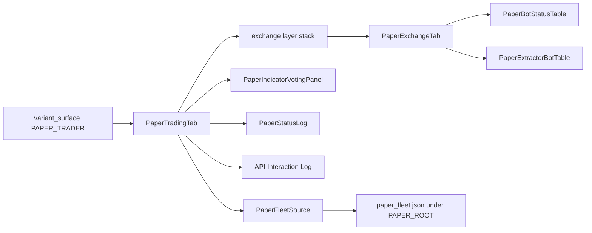
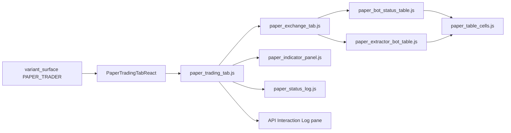
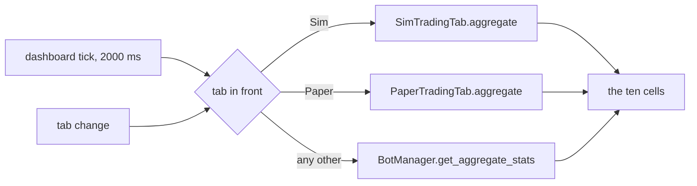

# Paper Trader Tab

Reference. The third step of [the promotion pipeline](promotion-pipeline.md).
Issue #19 built the screen. The tab row carried an empty tab until that build
landed, and [The screen as it stands now](#the-screen-as-it-stands-now)
describes what draws there today.

## The empty tab it replaced

The tab drew three lines: its name, one sentence saying it was not
built, and the issue that owned it. It read no bot, no price and no trade.

`src/gui/main_tabs/paper_trader_tab_surface.py` — the empty state it carried

```python
HEADING = "Paper Trader"
ISSUE = 19
BUILT = False
STATE_TEXT = "This tab is not built."
ISSUE_TEXT = f"Issue #{ISSUE} carries the build-out."
```

Two frontends draw that one view model. `EmptyTabsMixin` in
`src/gui/main_tabs/empty_tabs.py` builds the Qt tab, and
`src/gui/web/paper_trader_tab.js` registers a panel with the Electron shell's
panel host. `src.core.desktop_bridge` serves the model under
`paper_trader_tab.state`.

## What the step is

Real time is its defining property. The Simulator replays stored candles as
fast as the machine allows. Paper takes the live feed at the speed the market
delivers it, and that is the whole difference between them.

Live, Paper and the Simulator differ in one thing only: where the data comes
from. The trading logic stays one body of pure code that all three call. Only
the stateful shells fork, which is what keeps a paper run from holding a live
object.

The paper budget is twice the dollar target, so a bot has room to fold without
the exercise ending on the first dip.

`src/trading/container/config.py` — `BotConfig`, the field it doubles

```python
target_balance: float = 200.0  # Balance the bot trades relative to
```

Paper sat behind the Simulator, which had to reproduce the gate latches first.
Nuclear Mode was to be a second gate; the operator cancelled it, so one gate
remains and issue #19 built the tab after the Simulator rebuild landed.

## Where the platform once offered it

Two live surfaces named the step. The first is the Swarm tab's third
sub-tab, labelled Paper Swarm. Its Start button flips a flag and relabels
itself. No bot is constructed, no feed is attached and no order is recorded.
Its caption is an empty string now, so the sub-tab promises nothing.

`src/gui/bot_visualizer.py` — the Start handler inside `_create_paper_bot_row`

```python
def _toggle():
    if bot_data["running"]:
        bot_data["running"] = False
        start_btn.setText("▶ Start")
```

The second is the wing toggle on the header strip. Pressing it swaps the whole
wing. The Qt window no longer names a Paper Trader in the line it writes, and
the React mirror still does, so the two hosts print different text.

`src/gui/main_tabs/main_window_surface.py` — the line the React mirror writes

```python
"→ STOCK WING: equity exchanges + equity Paper Trader. (Crypto wing paused.)"
```

Issues #422 and #426 both folded into issue #19, which built the tab.

## The screen as it stands now

The tab is built. It sits second on the bar and carries the Trading tab's panes
over the live exchange feed. `src/gui/paper_trader_tab.py` draws them in Qt and
`src/gui/web/paper_trader_tab.js` draws them in React, from one view model.

`src/gui/main_tabs/paper_trader_tab_surface.py` — the fields both hosts read

```python
DECLARED_FIELDS = (
    "accessible_name",
    "balance",
    "built",
    "feed",
    "fleet",
    "heading",
    "indicators",
    "issue",
    "method",
    "panes",
    "privacy_button",
    "reserved_rows",
    "run",
    "skin",
    "symbol",
    "symbols",
)
```

The left pane holds the Privacy Mode button, the market selector, the two button
rows and the bot list. The bot list uses the Trading tab's own columns. The right
pane holds the Indicator Voting Panel, computed from the live window. An empty
selector draws the empty state and invents no reading.

`src/gui/main_tabs/paper_trader_tab_surface.py` — the empty state

```python
def indicator_payload(
    candles: Sequence[Any], timeframe: str, symbol: str, refusal: str
) -> dict:
    model = ivp.IndicatorPanelModel()
    if refusal:
        model.show_no_data(refusal)
        return ivp.build_payload(model)
    summary = multi_tf_summary(candles, timeframe, symbol)
    if not summary:
        model.show_no_data(NO_SYMBOL_TEXT)
        return ivp.build_payload(model)
    model.set_summary(summary, symbol)
    return ivp.build_payload(model)
```

## The two presses

Import Live Fleet reads the stored bot record and lists what it finds. Start
Paper Run opens the run and begins ticking. The same button then reads Stop
Paper Run and ends it, leaving the balances and the trades on screen.

`src/gui/main_tabs/paper_trader_tab_surface.py` — the second row's two faces

```python
{
    "name": DATA_POOL_ROW,
    "height_px": 18,
    "action": STOP_RUN_ACTION if running else START_RUN_ACTION,
    "text": STOP_RUN_TEXT if running else START_RUN_TEXT,
    "button_name": button_name(
        STOP_RUN_ACTION if running else START_RUN_ACTION
    ),
}
```

## Downstream only

The feed reader answers six names and refuses every other one, so a send has no
spelling. It calls the venue's public market endpoints, which carry no key and
no signature.

`src/paper/live_feed_source.py` — the refusal

```python
def __getattr__(self, name: str):
    """Refuse every name outside ``READ_NAMES``."""
    raise SendRefused(
        f"LiveFeedSource answers {READ_NAMES} and cannot {name!r}. "
        "The Paper Trader receives and asks; it sends nothing."
    )
```

## One gate chain

A tick builds the same `GateContext` a live bot builds and evaluates the shipped
scrum and fold chains on it. The paper side adds no gate and changes none.

`src/paper/paper_run.py` — what a tick evaluates

```python
window = list(candles[-WINDOW_CANDLES:])
reading = bb_reading(window, bot)
summary = VotingEngine().compute_all(window, bot.ta_timeframe, symbol=bot.symbol)
context = tape_context(bot, balance, window, reading, summary)
armed = latch(context)
```

## The fake balance

Each bot opens a budget of twice its dollar target: units worth the target, and
the rest in cash to fund a fold. The balances live in memory and are dropped when
the tab goes away.

`src/paper/fake_balance.py` — the opening

```python
def opening_balance(target_usd: float, price: float) -> FakeBalance:
    whole = budget_usd(target_usd)
    held_usd = min(whole / BUDGET_MULTIPLE, whole)
    units = held_usd / float(price) if float(price) > 0.0 else 0.0
    return FakeBalance(
        units=units,
        cash_usd=whole - units * float(price),
        tranches=0,
        budget_usd=whole,
    )
```

## The fleet ledger

The fake balance is one figure for the whole fleet, not one figure per bot. Five
paper bots with a $200 target open Paper Spendable at $1000 and Paper Locked at
$1000. Each variable holds the full fleet sum, which is twice the fleet's dollar
target in total.

`src/paper/fake_balance.py` — the opening

```python
def opening_ledger(bots: Sequence[Any]) -> PaperLedger:
    total = fleet_target_usd(bots)
    return PaperLedger(
        fleet_target_usd=total,
        opening_spendable_usd=total,
        opening_locked_usd=total,
    )
```

The fleet changes when a bot is added or removed. Every press of Start Paper Run
rebuilds the ledger from the fleet it is handed, so both opening figures move on
the next press and never inside a run. Six $200 bots open $1200 in each figure
and four open $800.

Four figures are tracked. Paper Spendable is the cash the fleet holds. Paper
Locked is what its units are worth at the last price the feed answered. Paper
Realized Profits moves when a fold buy closes the tranche a scrum sell opened.
Paper Mature Profits is the profit on positions past 200 percent growth, the
figure the live wing already reads.

`src/trading/smart_wire.py` — the maturity rule both wings call

```python
MATURE_GROWTH_PCT: float = 200.0
"""A position is mature once its value exceeds its cost basis by this percent."""
```

The four figures are held apart from the live ones. They live in memory on the
run, they are never written into the stored bot record, and no paper figure
reaches the header strip's real-money columns.

`src/paper/fake_balance.py` — the four labels the strip prints

```python
FIGURE_LABELS = (
    ("spendable_usd", SPENDABLE_LABEL),
    ("locked_usd", LOCKED_LABEL),
    ("realized_profit_usd", REALIZED_LABEL),
    ("mature_profit_usd", MATURE_LABEL),
)
```

The Qt window and the React page print one line from one view model, so the two
hosts cannot report different money.

`src/gui/main_tabs/paper_trader_tab_surface.py` — the one line

```python
"text": LEDGER_SEPARATOR.join(f"{one['label']} {one['text']}" for one in cells),
```

## The Paper Trader log

Every paper action is written to one file. Each line carries two halves: the
gate decision that produced the action and, when one filled, the pretend trade
in the shape a Coinbase year-to-date row takes. Validation reads both of those
shapes already, so a paper run is checked by the reader that checks the live
wing.

`src/paper/paper_log.py` — the row

```python
return {
    "timestamp": iso_stamp(tick.wall_ms),
    "category": CATEGORY,
    "exchange": str(exchange_id),
    "bot_id": str(tick.bot_id),
    "data": gate_half(tick),
    "trade": trade_half(tick.filled) if tick.filled is not None else None,
    "ledger": dict(figures or {}),
}
```

The log has a home of its own. It is a sibling of the live folders and never
sits inside one, so nothing a paper run writes can land in a live tree.

`src/paper/paper_paths.py` — the root

```python
PAPER_ROOT: Path = Path.home() / ".acervator_paper"
```

Gate names come from one place. The row records the blocker phrases the chain
produced and the labels those phrases map to, and it spells no gate name of its
own.

`src/trading/gate_vocabulary.py` — the mapping the log calls

```python
def gate_for_blocker(blocker: str) -> str:
    """Map one blocker string to its gate label, or "" if unknown."""
```

A trade is never invented. A line carries a trade half only because the gate
chain latched and the fill was applied to a fake balance.

`src/paper/paper_run.py` — the only writer

```python
paper_log.append_row(
    paper_log.paper_row(seen, bot.exchange_id, run.figures())
)
```

## Real time

A run ticks on the wall clock and asks the feed for one bot per fire, so a fleet
of many bots never blocks the window on a single pass. One bar is shared across
the open bots.

`src/gui/paper_trader_tab.py` — the round robin

```python
def advance_once(self) -> list:
    """Tick the next open bot against its newest live window."""
    if self._run is None or not self._run.running or not self._run.bots:
        return []
    chosen = self._run.bots[self._cursor % len(self._run.bots)].bot_id
    self._cursor += 1
    made = surface.advance_run(self._run, self._feed, chosen)
    self.refresh()
    return made
```

## Paper Trade History

The manual's part list names a second History tab reading a paper trade log. No
such module exists. `HistoryTab` in `src/gui/history_tab.py` reads live venue
history alone.

The ledger such a tab would read now exists. Every paper action lands in the
file [the Paper Trader log](#the-paper-trader-log) names, and no screen reads
that file yet.

In development.

## 2026-09-08 08:17 - #19 - what the closed issues landed

Real-time, API-fed trades against a fake budget. This is designed as the second tier of strategy validation within the platform.

The tab is now called Paper. It sits second on the bar, on a white ground
with black text, and it is the only white tab.

The screen was empty until issue #19 built it. The tab row carried a Paper
Trader placeholder, which drew its name, one sentence saying it was not built,
and the issue that owned it. The section under this one holds what the tab is
now.

`src/gui/main_tabs/paper_trader_tab_surface.py` — the empty state it carried

```python
HEADING = "Paper Trader"
ISSUE = 19
BUILT = False
STATE_TEXT = "This tab is not built."
ISSUE_TEXT = f"Issue #{ISSUE} carries the build-out."
```

The Qt tab and the `src/gui/web/paper_trader_tab.js` panel both draw that one
view model, so neither can drift from the other.

Live, Paper and the Simulator differ in one thing only, where the data comes
from. The trading logic stays one body of pure code all three call, and only
the stateful shells fork. Real time is Paper's defining property, and its
budget is twice the dollar target.

`src/trading/container/config.py` — `BotConfig`, the field that budget doubles

```python
target_balance: float = 200.0  # Balance the bot trades relative to
```

Two live surfaces once offered the step. The Swarm tab's Paper Swarm
sub-tab is chrome: its Start button flips a flag and relabels itself, and no
bot is constructed. Its caption is now an empty string, so it promises nothing.
The wing toggle no longer names a Paper Trader in the Qt window, while the
React mirror still does. Issues #422 and #426 folded into issue #19.

### The tab as it stands now

The screen is built. It is the Trading tab's panes over the live exchange feed:
the Privacy Mode row, the market selector, the two button rows, the bot list,
the Indicator Voting Panel, the Live Feed pane, the Fake Balance table and the
Paper Run table. The Qt window and the React page draw one view model.

`src/gui/main_tabs/paper_trader_tab_surface.py` — what the tab answers

```python
METHOD = "paper_trader_tab.state"

HEADING = "Paper"
ISSUE = 19
BUILT = True
```

The data path is the venue's public market feed, and it goes one way. The reader
names the six things it answers, and every other name raises. An order, a
cancellation or a venue write cannot be written through it.

`src/paper/live_feed_source.py` — the read set and the refusal

```python
READ_NAMES = (
    "venue",
    "product_id",
    "granularity",
    "candles",
    "ticker",
    "asked_at",
)


class SendRefused(AttributeError):
    """Raised when a name outside ``READ_NAMES`` is asked of ``LiveFeedSource``."""
```

Live candles enter the same gate chain a live bot runs. Nothing on the paper
side defines a gate of its own.

`src/paper/paper_run.py` — the tick

```python
context = tape_context(bot, balance, window, reading, summary)
armed = latch(context)
```

The money is fake and lives in memory alone. A run writes no file, and no figure
it produces reaches the stored bot record or the header strip.

`src/paper/fake_balance.py` — the budget

```python
BUDGET_MULTIPLE = 2.0
```

The two strips the Trading tab carries are not copied, and neither is their
supporting code. Their rows carry Import Live Fleet and the Start or Stop press.

The fake balance is a fleet figure. Five paper bots with a $200 target open
Paper Spendable at $1000 and Paper Locked at $1000, each holding the full fleet
sum. Adding or removing a bot moves both openings on the next press of Start.

`src/paper/fake_balance.py` — the fleet total both openings take

```python
def fleet_target_usd(bots: Sequence[Any]) -> float:
    """The sum of every bot's ``target_usd``, the figure both openings take."""
```

Two more figures are tracked beside them. Paper Realized Profits moves when a
fold buy closes the tranche a scrum sell opened, and Paper Mature Profits is the
profit on positions past 200 percent growth, which is the figure the live wing
already reads. No paper figure is written into the stored bot record or the
header strip.

`src/paper/fake_balance.py` — the strip's four figures

```python
FIGURE_LABELS = (
    ("spendable_usd", SPENDABLE_LABEL),
    ("locked_usd", LOCKED_LABEL),
    ("realized_profit_usd", REALIZED_LABEL),
    ("mature_profit_usd", MATURE_LABEL),
)
```

Every paper action is recorded in one file of its own. Each line carries the
gate decision and, when one filled, the pretend trade in the shape a Coinbase
year-to-date row takes. The file sits beside the live folders and never inside
one.

`src/paper/paper_paths.py` — where the log lives

```python
PAPER_ROOT: Path = Path.home() / ".acervator_paper"
```

## How the Paper tab reaches the bar

`PaperTraderTabMixin` builds the tab and inserts it into the window's tab book.
The builder catches every error, writes one warning line, and leaves the tab off
the bar. A tab that asks the panel for a value the panel does not publish is
therefore a missing tab, not a crash the operator can see.

`src/gui/main_tabs/paper_trader_tab.py` — the builder

```python
def _build_paper_trader_tab(self) -> None:
    """Insert the Paper tab at ``PAPER_BUILD_INDEX``."""
    try:
        from ..variant_surface import PAPER_TRADER, surface_class

        self._paper_trader_tab = surface_class(PAPER_TRADER)()
        self._main_tabs.insertTab(
            PAPER_BUILD_INDEX, self._paper_trader_tab, HEADING
        )
    except Exception as exc:  # noqa: BLE001 - a missing tab is not a crash
        logger.warning("Paper tab unavailable: %s", exc)
        self._paper_trader_tab = None
```

The window builds nine tabs. Paper takes the second slot, after Sim.

```
Sim  Paper  Live  Charts  Inspector  Swarm  History  Status  Console
```

### The line beside the voting panel title

One label sits beside the Indicator Voting Panel title. It holds the panel's
empty state and nothing else. The shared function `no_data_text` builds that
line, and the [Simulator page](simulator.md) shows it. The label is hidden
whenever the panel has values to draw.

`src/gui/paper_trader_tab.py` — the Qt clone draws the line

```python
def _draw_indicators(self, panel: dict) -> None:
    self._indicator_title.setText(panel["title_text"])
    # no_data text is empty while the panel holds a reading, so the
    # summary label shows only the one reason there is nothing to draw.
    reason = panel["no_data"]["text"]
    self._indicator_summary.setText(reason)
    self._indicator_summary.setVisible(bool(reason))
    for table, spec in zip(self._indicator_tables, panel["tables"], strict=True):
        self._fill_indicator_table(table, spec)
```

With no paper fleet the label names the press that builds one, under both
builds.

```
No TA data — No paper fleet yet. Press Import Live Fleet.
```

## The style sheet the Paper page loads

The page carries one style sheet. `TAB_STYLE_ASSETS` names it, and
`page_html` reads the file and writes it into the page's head.

`src/gui/react_paper_trader_tab.py` — the sheet the page carries

```python
TAB_STYLE_ASSETS: tuple[str, ...] = ("paper_trader_tab.css",)
```

The sheet sets the page ground, the type, the pane grid and the table rules.
The grid repeats the two pane sizes the Qt clone gives its splitters, so the
bot list, the voting panel, the feed pane and the run pane take the same share
of the window in both builds.

`src/gui/web/paper_trader_tab.css` — the pane grid

```css
.paper-top,
.paper-bottom {
  display: grid;
  grid-template-columns: 600fr 500fr;
}
```

Without the sheet the page draws on the browser's own defaults: a white ground,
serif type, one column and no grid.

### The skin tokens the Paper sheet reads

The sheet names no colour of its own. Every colour arrives as a custom property
on the tab element, written from the `SKIN` dictionary the surface builds. A
scrum row and a fold row in the Paper Run table take the two colours
`SIDE_COLOURS` gives them in the Qt clone.

`src/gui/web/paper_trader_tab.css` — the two trade rows

```css
.paper-tab tr[data-side="scrum"] td {
  color: var(--paper-scrum-colour, var(--text));
}

.paper-tab tr[data-side="fold"] td {
  color: var(--paper-fold-colour, var(--text));
}
```

### Start Paper Run redraws the pane

`start_run` draws the pane after it opens the run. With no paper fleet the
first tick returns nothing, so without that draw the Paper Run pane kept the
word it held before the press while the run was open.

`src/gui/paper_trader_tab.py` — the press that opens a run

```python
    def start_run(self) -> str:
        """Open the run and tick one bot per timer fire from now."""
        if not self._bots:
            self._bots = surface.live_fleet()
        self._run = surface.start_run(self._bots)
        self._cursor = 0
        self.advance_once()
        self.refresh()
        self._tick_timer.start(surface.tick_interval_ms(self._run, self._symbol))
        return self._run.state
```

Both builds carry the same draw.


## 2026-09-19 - #19 - Live's tab code cloned under Paper names

Unit Q1 of issue #19. The Paper tab is now Live's tab code, forked under Paper
names in both builds, with Import Live Fleet as the fleet's one way in and the
header strip reading the paper ledger while Paper is in front. The two hosts
the sections above describe, `src/gui/paper_trader_tab.py` and
`src/gui/react_paper_trader_tab.py`, stay on disk and nothing loads them; a
later unit removes them once a paper bot ticks on the clone.

### The budget rule today overtakes four sentences

Four sentences on this page carry a figure the operator's words of 2026-09-19
overtake. Each is quoted here and kept above as it stands.

- "The paper budget is twice the dollar target, so a bot has room to fold
  without the exercise ending on the first dip." (What the step is)
- "Each bot opens a budget of twice its dollar target: units worth the target,
  and the rest in cash to fund a fold." (The fake balance)
- "Each variable holds the full fleet sum, which is twice the fleet's dollar
  target in total." (The fleet ledger)
- "Real time is Paper's defining property, and its budget is twice the dollar
  target." (2026-09-08 08:17)

The rule now: the paper budget is unbounded, and Paper Spendable opens at the
sum of the fleet's Target Balances. His words: *"a fake, unbounded (starts
equal to bots total target balance) budget."* No fold is refused for cash.
`BUDGET_MULTIPLE` in `src/paper/fake_balance.py` still reads `2.0`; the unit
that starts a paper run retires it, and no clone code reads it.

`src/paper/fake_balance.py` — the opening figure the rule keeps

```python
def fleet_target_usd(bots: Sequence[Any]) -> float:
    """The sum of every bot's ``target_usd``, the figure both openings take."""
```

### The Qt tab is Live's tab code, forked

The Qt build of the Paper tab is `PaperTradingTab`, a fork of the Live tab's
own code under the Paper Trader's name. The seam's Qt loader answers it.

`src/gui/variant_surface.py` — the Qt loader

```python
def _qt_paper_trader() -> type:
    """Import and return the Qt Paper tab, ``PaperTradingTab``."""
    from .paper.paper_trading_tab import PaperTradingTab

    return PaperTradingTab
```

Each module under `src/gui/paper/` is one Live module copied and renamed, or
one of the Simulator's forks copied once more where that fork's only change
was the feed. The copy keeps Live's layout, titles, sizes and design tokens.

| Paper module | forked from |
|---|---|
| `paper_trading_tab.py` `PaperTradingTab` | `src/gui/main_tabs/trading_tab.py` `_build_trading_tab`, and the window's `add_exchange_tab` |
| `paper_exchange_tab.py` `PaperExchangeTab` | `src/gui/widgets/exchange_tab.py` `ExchangeTab` |
| `paper_bot_status_table.py` `PaperBotStatusTable` | `src/gui/simulator/sim_bot_status_table.py` `SimBotStatusTable` |
| `paper_extractor_bot_table.py` `PaperExtractorBotTable` | `src/gui/simulator/sim_extractor_bot_table.py` `SimExtractorBotTable` |
| `paper_indicator_panel.py` `PaperIndicatorVotingPanel` | `src/gui/simulator/sim_indicator_panel.py` `SimIndicatorVotingPanel` |
| `paper_status_log.py` `PaperStatusLog` | `src/gui/simulator/sim_status_log.py` `SimStatusLog` |
| `paper_bot_detail.py` `PaperBotDetailDialog` and its seven tab mixins | `src/gui/simulator/sim_bot_detail.py` `SimBotDetailDialog` and its seven |
| `paper_exchange_choice.py` `PaperExchangeChoiceDialog` | `src/gui/simulator/sim_exchange_choice.py` `SimExchangeChoiceDialog` |
| `src/paper/fleet_source.py` `PaperFleetSource`, `PaperBot` | `src/simulator/fleet_source.py` `FleetSource`, `SimBot`, one fleet and no run mode |
| `src/paper/paper_bot_manager.py` `PaperBotManager` | `src/simulator/sim_bot_manager.py` `SimBotManager` |
| `src/paper/paper_bot_view.py` `PaperBotView` | `src/simulator/sim_bot_view.py` `SimBotView` |



### What the fork draws

The tab is Live's four splitters at Live's sizes: the exchange layer stack
beside the panel on top, the Activity Log and the API Interaction Log side by
side below. Every module carries Live's title. The venue page holds Privacy
Mode where Live draws it, `+ New Bot` where Live draws it, the Scrumming Bots
table and the Extractor Bots table, both hidden until a row arrives, and the
command bar of Start, Pause, Stop, Restart and Delete. The panel holds its
title, the Bot selector and its privacy dot, the currency rate strip, both
indicator tables, both confidence bar graphs, the timeframe-lock line and the
staleness banner.

Three positions differ from Live by ruling, the ruling unit 7 of issue #117
made for the Simulator. The corner Live gives `＋ Add Crypto Exchange` holds
Import Live Fleet and Start Paper Run, each at Live's corner-button width. The
Get Started card holds the same two where Live's card holds its add button.
The news line and the data-pool line are not forked; the data-pool row keeps
Live's height and holds nothing.

`src/gui/paper/paper_trading_tab_surface.py` — the corner buttons

```python
CORNER_BUTTONS = (
    (paper.IMPORT_LIVE_FLEET_ACTION, paper.IMPORT_LIVE_FLEET_TEXT),
    (paper.START_RUN_ACTION, paper.START_RUN_TEXT),
)
```

A press on `+ New Bot` writes one Activity Log line naming Import Live Fleet
as the fleet's way in; the paper bot wizard is a later unit's. A press on
Start Paper Run writes one line saying no paper run is built; the run is a
later unit's too.

`src/gui/paper/paper_trading_tab_surface.py` — the two lines

```python
NEW_BOT_FORMAT = (
    "+ New Bot on {exchange}: the Paper fleet is loaded through "
    "{way_in}; the paper bot wizard is not built."
)

START_RUN_TEXT = "Start Paper Run: no paper run is built; nothing started."
```

### What the fork does not carry

The copies hold no live bot manager, no connector and no event bus. Every
send the Live code makes is cut, not stubbed: the signal-contract emits, the
event-bus emit behind the bot selector, the API-log listener on the
process-wide log, the watchdog over the live bot manager, the TA snapshot
store, the data-pool read behind the display price, and the demo readings the
Live panel invents from a random walk. Zero occurrences of `ScrummingBot`,
`BotContainer`, `BotManager`, `EventBus` and `PhantomBalance` under
`src/gui/paper/` and `src/paper/`.

The Simulator's run modes, its way-in row, its replay layer, its Stone Tablet
source, its Portfolio Battery, its retrieval and its nigredo tone are not
carried. A Paper module forked from a Simulator fork has those parts cut.

Asked for a send by name, `PaperFleetSource` raises `SendRefused`. The Fire
button on a row reaches it and the refusal lands in the Activity Log.

`src/paper/fleet_source.py` — the refusal

```python
    def __getattr__(self, name: str):
        """Refuse every name outside ``READ_NAMES``."""
        raise SendRefused(
            f"PaperFleetSource answers {READ_NAMES} and cannot {name!r}. "
            "The Paper Trader receives and asks; it sends nothing."
        )
```

### The React page is Live's page modules, forked

The React build of the Paper tab is `PaperTradingTabReact`, a fork of the
Live tab's React host under the Paper Trader's name, and it loads seven page
modules that are Live's seven copied under Paper names. The seam's React
loader answers it.

`src/gui/variant_surface.py` — the React loader

```python
def _react_paper_trader() -> type:
    """Import and return the React Paper tab, ``PaperTradingTabReact``."""
    from .paper.paper_react_trading_tab import PaperTradingTabReact

    return PaperTradingTabReact
```

| Paper module | forked from |
|---|---|
| `src/gui/web/paper_trading_tab.js` | `trading_tab.js` |
| `src/gui/web/paper_exchange_tab.js` | `exchange_tab.js` |
| `src/gui/web/paper_indicator_panel.js` | `sim_indicator_panel.js`, the flip button cut |
| `src/gui/web/paper_status_log.js` | `sim_status_log.js` |
| `src/gui/web/paper_bot_status_table.js` | `sim_bot_status_table.js` |
| `src/gui/web/paper_extractor_bot_table.js` | `sim_extractor_bot_table.js` |
| `src/gui/web/paper_table_cells.js` | `sim_table_cells.js` |
| `src/gui/paper/paper_react_trading_tab.py` `PaperTradingTabReact` | `src/gui/react_trading_tab.py` `TradingTabReact` |
| `src/gui/paper/paper_trading_tab_surface.py` | `src/gui/main_tabs/trading_tab_surface.py`, the payload builder |
| `src/gui/paper/paper_exchange_tab_surface.py` | `src/gui/main_tabs/exchange_tab_surface.py`, the payload builder |
| `src/gui/paper/paper_react_bot_detail.py` `PaperBotDetailReactDialog` | `src/gui/simulator/sim_react_bot_detail.py`, over Live's nine window bundles |



### What the page draws

The page is Live's four splitters at Live's sizes, read off Live's own
`trading_tab_surface`. Every module carries Live's title and Live's part name,
so the page and the Qt fork enumerate the same modules in the same order. The
corner holds Import Live Fleet and Start Paper Run in Live's corner-button
chrome, and the Get Started card holds the same two at Live's card-button
size. The venue page holds Privacy Mode, plain space where Live draws the news
line, `+ New Bot`, the data-pool row at Live's height holding a blank line,
the two tables and the command bar.

`src/gui/web/paper_trading_tab.js` — the corner

```javascript
  // The corner Live gives its add button: the payload's buttons in one row.
  function CornerButtons(props) {
    var listed = listField(props.layer, CORNER_BUTTONS);
```

The host builds one payload per bridge method from state it owns: the tab
payload from its own `PaperTradingTabState`, the Activity Log from its own
`PaperStatusLogModel`, the panel from its own `IndicatorPanelModel`, and each
seated venue's three payloads from that venue's own `ExchangeTabModel`, its
`PaperBotStatusTableModel` and Live's `ExtractorBotTableModel`. Every ask the
page makes is written to the console line the host reads, and
`run_action` answers it; nothing is sent anywhere else.

`src/gui/paper/paper_react_trading_tab.py` — the console line

```python
ACTION_PREFIX = "acervator-paper:"
```

### The header strip shows on Paper

The window's header strip stays on screen while the Paper tab is in front.
`ISOLATED_TABS` names no tab now, so the strip hides on nothing. While Paper
is in front the ten fields carry the Paper Trader's figures: SPENDABLE,
REALISED, LOCKED and MATURE from the paper ledger, EXCH from the seated
venues, and the five cards from the held records. On every other tab the
strip carries what it carried before; the live fleet's figures do not appear
while Paper is in front, and no paper figure appears on Live.

`src/gui/main_tabs/main_window_surface.py` — the tuples and the reader

```python
ISOLATED_TABS: tuple = ()

#: The tabs the header strip reads the Paper Trader's ledger and records on.
PAPER_FED_TABS = (PAPER_TAB,)


def header_strip_reads_paper(tab_name: Any) -> bool:
    """Whether the stat strip reads the Paper Trader's ledger and records on the tab named."""
    return tab_name in PAPER_FED_TABS
```

`src/gui/main_window.py` — `_refresh_header_strip`, the branch beside the Sim's

```python
            if self._header_strip_reads_paper():
                paper_tab = self._paper_trader_tab
                self._write_header_strip(
                    paper_tab.aggregate(), paper_tab.exchange_count()
                )
                return
```

The tab's `aggregate` is `strip_aggregate`: Live's arithmetic over the held
records, with the ledger's four money figures laid over the four money keys.
Before a run the ledger holds zeros, so the four money columns read an em
dash, as Live's read with no bot.

`src/paper/fleet_source.py` — the ledger's keys over the aggregate's

```python
LEDGER_TO_AGGREGATE = (
    ("spendable_usd", "wallet_cash_usd"),
    ("locked_usd", "crypto_position_value_usd"),
    ("realized_profit_usd", "total_realized_exchange"),
    ("mature_profit_usd", "total_mature_exchange"),
)
```



### Import Live Fleet fills the tables and the strip

Import Live Fleet copies the stored bots of one exchange out of the live fleet
file into the Paper Trader's own fleet file, in both builds. A press at the
corner or on the Get Started card reads which exchanges the live file names.
With more than one it opens the chooser; with exactly one it takes that one
and opens nothing; with none it writes one Activity Log line naming the file
and moves nothing. Each stored bot on the chosen exchange is copied whole,
every key of the record, into the paper fleet under its own bot id, and the
fleet signal fires: the paper fleet file is written, the venue seats, and the
two tables draw one row per imported bot. The Activity Log reads `Imported 38
bot(s) from bot_state.json on coinbase.` on a fleet of thirty-eight. The live
fleet file is only read, never written.

`src/paper/fleet_source.py` — the copy

```python
    def import_live_fleet(self, exchange_id: str) -> list[PaperBot]:
```

`src/paper/paper_paths.py` — where the paper fleet file lives

```python
#: The paper fleet file under ``PAPER_ROOT``, in ``bot_state.json``'s shape.
PAPER_FLEET_NAME = "paper_fleet.json"
```

The tab starts empty. The fleet source answers the records the paper fleet
file holds and nothing else, so with no paper fleet there is no venue, no row
and no figure until Import Live Fleet loads one. On the next launch the tab
reads the paper fleet file once and draws the imported rows from it.

### A loaded bot reads IDLE

Import Live Fleet copies each stored record and writes its state `idle`,
whatever the live file saved, and the paper fleet file's records read `idle`
at construction. That is the live restore's own rule, and the Simulator's.
A row's state is the Bot ID cell's colour and its tooltip's `State:` line;
Live's ten columns hold no State column.

`src/paper/fleet_source.py` — the one write

```python
def loaded_idle(record: dict) -> dict:
    """``record`` with its ``state_when_saved`` written ``BotState.IDLE``, as
    ``restore_bots_from_state`` recreates every persisted bot in IDLE until
    the operator starts it; a loaded bot never reads ``running`` with no run."""
    record["state_when_saved"] = BotState.IDLE.value
    return record
```

The command bar moves a record's state through `PaperBotManager`: Start
writes `running` and Live's `✓ Bot <id> RUNNING.` line, Pause `paused`, Stop
`stopped`, Restart `running`, and Delete opens Live's Delete box. No paper bot
ticks yet; the state is the record's. Detail opens the seven tabs over the
record through `PaperBotDetailDialog`, and Apply is refused: the pending line
reads `Refused 1 change(s) — the Paper Trader sends nothing`.

### How the Paper tab reaches the bar today

The builder in `src/gui/main_tabs/paper_trader_tab.py` is unchanged. It asks
the seam for the Paper class, and the seam now answers the clone in both
builds. The window builds nine tabs and Paper takes the second slot, after
Sim, in both.

`src/gui/variant_surface.py` — the registration

```python
register(PAPER_TRADER, _qt_paper_trader, _react_paper_trader)
register(PAPER_BOT_DETAIL, _qt_paper_bot_detail, _react_paper_bot_detail)
```

The window's floor is 1400 by 900 pixels, set in `src/gui/main_window.py`, so
no tab is reached narrower than 1400 through the window. Constructed alone,
the Qt tab draws at 806 pixels wide and no narrower after a fleet loads, the
sum of Live's own minimum sizes; the React page draws at 700.

### What the clone reading measured

Read off the real window in both builds over a scratch home holding a
stand-in `bot_state.json` of the operator's record shape, thirty-eight
scrumming records on coinbase at 5m, every socket but loopback refused:

```
reading                                      Qt                       React
Paper on the bar                             second of nine           second of nine
Live modules on the tab before the clone     0 of 6                   0 of 10
Paper modules on the tab after the clone     6 of 6                   10 of 10
strip on Paper at open                       — — — — EXCH 0           — — — — EXCH 0
Import Live Fleet: rows                      38, State: IDLE          38, State: IDLE
Import Live Fleet: Bot ID cell colour        #888888                  rgb(136, 136, 136)
venue seated, EXCH                           Coinbase, 1              Coinbase, 1
paper fleet file                             38 records, all idle     38 records, all idle
bot_state.json hash after every press        unchanged                unchanged
a planted byte on a copy                     hash moved               hash moved
a planted live figure on the Paper strip     did not appear           did not appear
a planted paper figure on the Paper strip    appeared                 appeared
the same paper figure on the Live strip      did not appear           did not appear
Detail                                       7 tabs, Apply refused    7 tabs, Apply refused
old hosts in the import closure              neither                  neither
```

## 2026-09-20 - #19 - The paper exchange adapter feeds the tab

Unit Q2 of issue #19. The Paper tab now holds one paper exchange adapter,
`PaperExchange` in `src/paper/paper_exchange.py`, beside the feed reader the
sections above describe. It answers every read a paper bot asks of the venue
from the Coinbase Advanced Trade public market endpoints, and no write. Import
Live Fleet reads the venue's product list once and each record's ticker once,
and every one of those reads is a block on the API Interaction Log in both
builds.

### The feed reader sentences today overtake two passages

Two passages on this page describe the feed reader `LiveFeedSource`. Each is
quoted here and kept above as it stands.

- "The feed reader answers six names and refuses every other one, so a send
  has no spelling." (Downstream only)
- "The data path is the venue's public market feed, and it goes one way. The
  reader names the six things it answers, and every other name raises."
  (The tab as it stands now)

The rule now: the tab's feed reader is `PaperExchange`, which answers the
eleven names in its `READ_NAMES` and refuses every other public name.
`LiveFeedSource` stays on disk for the two old hosts, which nothing loads, and
its `GRANULARITY` and `BAR_SECONDS` tables grew from eight rows to nine, the
`4h` row added, because the venue's candles page lists nine granularity names.
A `1w` ask of `LiveFeedSource` sent `FIVE_MINUTE` to the venue and answered 5m
bars under the weekly name; the adapter rolls `1w` up from daily bars instead.

`src/paper/paper_exchange.py` — the read set

```python
READ_NAMES = (
    "venue",
    "product_id",
    "granularity",
    "timeframes",
    "products",
    "ticker",
    "candles",
    "windows",
    "quote_rate",
    "asked_at",
    "calls",
)
```

### What the adapter answers, and from which endpoint

`products` reads `GET market/products` and keeps the products the venue
trades, by the rule the Market Inspector's `_product_trades` states: `status`
online and `trading_disabled` not set. `ticker` reads
`GET market/products/{id}/ticker?limit=1` and answers the last trade's price
as `last`, with the book's `best_bid` and `best_ask` from the same answer;
`last` is None when the venue answers no trade. `candles` reads
`GET market/products/{id}/candles` at any of the nine granularity names, at
most 350 bars a call, and answers `[ts_ms, open, high, low, close, volume]`
rows oldest first. `windows` answers one `candles` window per higher
timeframe a record's phantoms name. `quote_rate` answers 1.0 for USD with no
call, and otherwise the `{QUOTE}/USD` ticker's `last`, the book's mid when the
venue answers no trade; the thirteen USDC records share one `USDC/USD` read.

`src/paper/paper_exchange.py` — the ticker's answer

```python
    def _ticker_view(self, symbol: str, entry: TickerEntry) -> dict:
        return {
            "symbol": symbol,
            "product_id": entry.symbol,
            "last": entry.last or None,
            "best_bid": entry.bid or None,
            "best_ask": entry.ask or None,
            "timestamp": entry.timestamp,
        }
```

### One rollup, and only what the venue serves

The venue lists no weekly granularity. A `1w` ask reads daily bars in pages of
350, newest page first, until seven days per week asked are held, and rolls
them through the stone tablets' `_rollup`, the one rollup every derived tablet
timeframe reads through. Each timestamp is moved back by `MONDAY_OFFSET_MS`
before the rollup and forward after it, the shift the Market Inspector's
`weekly_from_daily` makes, so every weekly bucket starts on Monday 00:00 UTC.
A 100-bar weekly window needs 700 daily bars, two calls. A granularity outside
the nine is sent as spelled, so the venue's own 400 answers it and lands on
the pane as an error block.

`src/paper/paper_exchange.py` — the rollup

```python
def weekly_rows(daily: Sequence[Sequence[float]]) -> list[list[float]]:
    shifted = [[row[0] - MONDAY_OFFSET_MS, *row[1:6]] for row in daily]
    return [
        [float(int(row[0]) + MONDAY_OFFSET_MS), *row[1:6]]
        for row in _rollup(shifted, DAYS_PER_WEEK, WEEK_MS)
    ]
```

### Cached with Live's two windows, paced at the connector's interval

Every ticker answer is held in a `TickerEntry` and every candle window in a
`CacheEntry`, the two slot types Live's `MarketDataPool` holds in
`src/exchange/data_pool.py`. A ticker asked again within 5 s is served from the
slot with no call and no block. A candle window asked again within one bar of
its timeframe, `TF_SECONDS`, is served the same way while the slot holds enough
rows. Every venue call waits `PUBLIC_MIN_INTERVAL_S` after the call before it,
the figure `src/exchange/market_inspector_fetcher.py` states for the public
route and the exchange connector keeps as `_min_request_interval`, 0.1 s; one
lock holds the calls in order, so two threads asking at once are spaced. A 429
is recorded as a warning block, waited out for the venue's `Retry-After`
seconds when the answer carries one and one interval otherwise, and asked once
more.

`src/paper/paper_exchange.py` — the cache and the pace

```python
from ..exchange.data_pool import CacheEntry, TickerEntry
from ..exchange.market_inspector_fetcher import (
    API_LEVEL_ERROR,
    API_LEVEL_SUCCESS,
    API_LEVEL_WARNING,
    DAYS_PER_WEEK,
    MONDAY_OFFSET_MS,
    PUBLIC_MIN_INTERVAL_S,
    WEEK_MS,
    _product_trades,
)
```

### Every read is a block on the API Interaction Log

The adapter records one entry per venue call on the `APIInteractionLog` its
host hands it, the tab's own log, never the process-wide one Live's connector
records on. The entry carries Live's fields: the exchange, the action
(`FETCH_MARKETS`, `FETCH_TICKER` or `FETCH_OHLCV`, the words Live's connector
records), the reason, the venue path as the endpoint, the params, the result,
the response time, the level and the data usage. Each host now carries one
signal, `apiEntryLogged`, and one receiver beside its `_on_api_event`,
`_cross_api_event`, the crossing the main window carries for Live; the host
registers the receiver as the log's listener, so an entry recorded on a worker
thread lands in `_on_api_event` on the GUI thread through Qt's queued
connection and draws as Live's block. The Live tab's pane is not written: the
adapter never records on `get_api_log`.

`src/gui/paper/paper_trading_tab.py` — the crossing

```python
    def _cross_api_event(self, entry: dict) -> None:
        """The ``api_log()`` listener: emit ``apiEntryLogged``, which Qt queues
        onto the GUI thread for ``_on_api_event`` from any other thread."""
        self.apiEntryLogged.emit(entry)
```

### Import Live Fleet reads the venue once

After Import Live Fleet copies the records and fires `fleet_changed`, each host
starts one worker thread, `paper-feed-import`, which runs `read_fleet` over the
adapter: one `products` read, then one `ticker` read per imported record. Each
read lands on the pane as it completes. When the worker ends, its summary
crosses a second signal, `feedRead`, and one line lands on the Activity Log
naming how many products the venue trades, how many of the fleet's products
are among them, how many tickers answered, and how many calls it took; a fleet
product the venue does not trade is named on the line, and a product list the
venue did not answer is said so, naming no product. The GUI thread never waits
on a read.

`src/gui/paper/paper_trading_tab_surface.py` — the line

```python
FEED_LINE_FORMAT = (
    "Feed: {products} product(s) trade on {exchange}; {traded} of {records} fleet "
    "product(s) among them; {answered} of {records} ticker(s) answered in {calls} call(s)."
)
FEED_NO_PRODUCTS_FORMAT = (
    "Feed: {exchange} answered no product list; {answered} of {records} ticker(s) "
    "answered in {calls} call(s)."
)
FEED_UNTRADED_FORMAT = " Not traded: {symbols}."
FEED_THREAD_NAME = "paper-feed-import"
```

### Every write name is refused

`PaperExchange.__getattribute__` raises `SendRefused` for every public name
outside `READ_NAMES`, before any attribute is read, and `__getattr__` raises it
for a name the class does not define. `place_order`, `cancel_order`,
`create_order` and every other write name have no spelling on the adapter, and
a method planted on the class without its name in `READ_NAMES` is refused too.
No file under `src/paper/` or `src/gui/paper/` imports a credential loader,
`ccxt`, `ScrummingBot`, `BotContainer` or `BotManager`.

`src/paper/paper_exchange.py` — the refusal

```python
    def __getattribute__(self, name: str):
        """Answer a private name or one of ``READ_NAMES``; refuse the rest."""
        if not name.startswith("_") and name not in READ_NAMES:
            raise SendRefused(REFUSED_FORMAT.format(read_names=READ_NAMES, name=name))
        return object.__getattribute__(self, name)
```

### What the feed reading measured

Read off the real window in both builds over a scratch home holding a copy of
the operator's `bot_state.json`, thirty-eight scrumming records on coinbase
at 5m, every socket but loopback refused, and a loopback stand-in shaped from
the venue's pages: the four endpoints with their fields, 400 for a granularity
outside the nine names, empty candles for a listed product with
`trading_disabled` set, 350 candles a call at most, a ticker carrying
`best_bid` and `best_ask`, and a 429 on a plant. On the commit before this
unit, Import Live Fleet put nothing on the pane in either build, the feed
reader's ticker answered one price with no bid and no ask, and a `1w` ask sent
`FIVE_MINUTE` to the stand-in.

```
reading                                      Qt                       React
blocks on the pane after Import Live Fleet   39                       39 entries, 234 lines
actions                                      1 FETCH_MARKETS,         1 FETCH_MARKETS,
                                             38 FETCH_TICKER          38 FETCH_TICKER
thread the reads ran on                      paper-feed-import        paper-feed-import
thread violations written                    0                        0
least gap between two stamps                 0.112 s                  0.112 s
gaps under 0.1 s                             0                        0
the Activity Log line                        38 of 38 tickers,        38 of 38 tickers,
                                             39 calls                 39 calls
a ticker asked twice within 5 s              two asks, one call       two asks, one call
a 1w window against its daily rows           equal, Monday buckets    equal, Monday buckets
a 12h ask                                    HTTP 400 error block     HTTP 400 error block
a listed-not-traded product                  [] and a No data block   [] and a No data block
a planted 429                                one wait of 1000 ms,     one wait of 1000 ms,
                                             then answered            then answered
place_order, cancel_order, create_order      SendRefused              SendRefused
a method planted without its name            SendRefused              SendRefused
a method planted with its name in READ_NAMES answered                 answered
bot_state.json hash across the press         unchanged                unchanged
a planted byte on a copy                     hash moved               hash moved
sockets opened outside loopback              0                        0
```

The stand-in serves the `4h` name and a `USDC-USD` ticker with trades because
the venue's pages list them; whether the real venue answers `FOUR_HOUR` and
whether `USDC-USD` carries trades are read at the real venue, not here.

One real reading followed, on both built bundles against the public host, no
credential file present and the adapter's own pace: Import Live Fleet made 39
calls in each build, the product list answering 917 trading products and 8
not trading, all 38 fleet products among them, 38 of 38 tickers answered with
their bid and ask, no 429, the least gap between two stamps 0.191 s in the Qt
build and 0.168 s in the React build, the 39 calls spanning 11.4 s and 10.7 s.
Launched in a Windows AppContainer with no network, the same press made 39
calls in each build, every one refused by the container and every one a block
on the pane naming its cause, and the Activity Log line read that the venue
answered no product list and 0 of 38 tickers.

One more real reading settled the ninth name against the source. Through the
built bundle's own copy of `PaperExchange`, against the public host, no
credential file present and the adapter's own pace, one candles ask per name
in `GRANULARITY` on `BTC-USD`, nine calls, ten bars each:

```
name             status  rows  bar spacing
ONE_MINUTE       200     10    60 s
FIVE_MINUTE      200     10    300 s
FIFTEEN_MINUTE   200     10    900 s
THIRTY_MINUTE    200     10    1,800 s
ONE_HOUR         200     10    3,600 s
TWO_HOUR         200     10    7,200 s
FOUR_HOUR        200     10    14,400 s
SIX_HOUR         200     10    21,600 s
ONE_DAY          200     10    86,400 s
```

The nine calls were 0.271 s apart at least and spanned 2.3 s; no 400 and no
429. The venue answers `FOUR_HOUR`, so the `4h` row stays.
`src/exchange/timeframes.py` still says the venue ships eight granularities
and no `4h`; that file is Live's and this unit does not touch it.

## 2026-09-20 - #19 - The paper bot ticks and fills on the clone

Unit Q3 of issue #19. Start Paper Run now starts one worker thread that ticks
every running paper bot at Live's cadence over `PaperExchange`, evaluates the
shipped gate chains on each worked tick, sizes every scrum and fold with the
pure functions Live calls, fills a scrum at the book's best bid and a fold at
the best ask with the venue's taker fee, and moves the paper ledger the
header strip reads. The old hosts left the tree.

### The sentences this unit overtakes

Seven passages on this page describe the run as it was before this unit. Each
is quoted here and kept above as it stands.

- "`src/gui/main_tabs/paper_trader_tab_surface.py` — the second row's two
  faces" (The two presses). The file is removed; the two faces are
  `run_buttons` in `src/gui/paper/paper_trading_tab_surface.py`.
- "A run ticks on the wall clock and asks the feed for one bot per fire, so a
  fleet of many bots never blocks the window on a single pass. One bar is
  shared across the open bots." and "`src/gui/paper_trader_tab.py` — the
  round robin" with its `advance_once` block (Real time). The runner ticks
  every running bot each 5 s on its own thread, and the window is never asked
  to wait.
- "The Qt window and the React page print one line from one view model, so
  the two hosts cannot report different money." with its `LEDGER_SEPARATOR`
  block (The fleet ledger). The four figures reach both hosts through
  `strip_aggregate` and the header strip, from one figures dict the runner
  posts.
- "`src/gui/paper_trader_tab.py` — the press that opens a run" with its
  `_tick_timer` block, and "`src/gui/react_paper_trader_tab.py` — the sheet
  the page carries" with `paper_trader_tab.css` (Start Paper Run redraws the
  pane, The style sheet the Paper page loads). Both files, the page module
  and the sheet are removed.
- "The two hosts the sections above describe, `src/gui/paper_trader_tab.py`
  and `src/gui/react_paper_trader_tab.py`, stay on disk and nothing loads
  them; a later unit removes them once a paper bot ticks on the clone."
  (2026-09-19). This is that unit.
- "`BUDGET_MULTIPLE` in `src/paper/fake_balance.py` still reads `2.0`; the
  unit that starts a paper run retires it, and no clone code reads it." (The
  budget rule today overtakes four sentences). Retired: `BUDGET_MULTIPLE`,
  `budget_usd`, `fleet_budget_usd` and the `budget_usd` field are gone.
- "A press on Start Paper Run writes one line saying no paper run is built;
  the run is a later unit's too." with `START_RUN_TEXT` (What the fork
  draws). The press starts the run below.

The `apply_scrum` and `apply_fold` the earlier sections describe sized a fill
with their own arithmetic; the two below are the Simulator's, forked over
`src/trading/scrumming/sizing.py`.

### Who runs a paper bot

`PaperRunner` in `src/paper/paper_run.py` is the forked shape of the
Simulator's `_walk_bot`: one `threading.Thread` named `RUN_THREAD_NAME`
(`paper-run`) per Start Paper Run. Its loop calls `advance` once, waits
`TICK_INTERVAL_S` (5.0 s, the value `ScrummingBot.tick_interval` answers)
through the one clock seam `WallClock.wait`, and reads the stop event before
each pass. The tape the Simulator walks is replaced by the adapter's live
reads.

`src/paper/paper_run.py` — the loop

```python
    def _loop(self) -> None:
        try:
            while not self._stop.is_set():
                self.advance()
                if self._stop.is_set():
                    break
                self._clock.wait(self._stop, self._tick_interval_s)
```

Each pass reads every held record's state through the host's `_states` map,
which the host rebuilds on the GUI thread at every `fleet_changed`. A record
whose state reads `running` counts one tick; a `paused`, `stopped` or `idle`
record is skipped that pass and picked up the pass after the command bar
moves it. A running bot is worked every `tick_skip` ticks, the rule
`ScrummingBot.tick` applies: `scrum_read_rate_min` minutes over the 5 s tick,
a tenth of that in track or fire, and the first tick after a bot starts
running always worked, as Live's init tick is. `PaperBot` in
`src/paper/fleet_source.py` carries `scrum_read_rate_min` from the record's
config, 5 when the config names none.

`src/paper/paper_run.py` — the skip

```python
def tick_skip(scrum_read_rate_min: int, scrum_target_mode: Optional[str]) -> int:
    rate = max(0, int(scrum_read_rate_min or 0))
    if rate <= 0:
        return 1
    base = max(1, int((rate * 60) / max(TICK_INTERVAL_S, 0.1)))
    if str(scrum_target_mode or "") in TRACK_MODES:
        return max(1, base // 10)
    return base
```

A worked tick reads `ticker` and `candles` on the runner's thread, never on
the GUI thread. The ticker is cached 5 s and the candle window one bar, the
two windows `src/exchange/data_pool.py` gives Live, so a 5m bot's gates read
a new window every 300 s while its fill price follows the book every 5 s.

### Who evaluates and who sizes

`tick` builds the `GateContext` through the Simulator's `tape_context` over
the window's newest close, `bb_reading` and `VotingEngine.compute_all`, and
evaluates it with `latch`, unchanged from the sections above. The
higher-timeframe bias is None in this unit, so the two defer flags block
nothing; unit Q5 widens it.

`apply_scrum` and `apply_fold` are the Simulator's two fills forked over a
`FakeBalance`, and every figure comes from `src/trading/scrumming/sizing.py`
by name: `scrum_units`, `priced_usd`, `estimated_fee_usd` and
`sale_proceeds_usd` on a scrum; `fold_rebuy_factor`,
`eligible_fold_tranches`, `cycle_growth_cap_usd`, `fold_cap_remaining_usd`,
`plan_fold_consumption`, `fold_rate_taper`, `fold_spend_usd`, `fold_units`,
`settle_fold_plan`, `plan_source_price` and `fold_surplus_usd` on a fold. A
scrum sells from the highest-priced lot first and queues one fold tranche per
lot sold from, in the dict shape Live's `_tick_execute_scrum` builds. A fold
is planned under the cycle growth cap, as Live's `tick_phases` plans it, and
the target's growth from the surplus is unit Q4's.

`src/paper/paper_run.py` — the scrum's size and proceeds

```python
    units = scrum_units(float(delta), float(price), rule)
    ...
    notional = priced_usd(units, float(price))
    fee = estimated_fee_usd(notional, taker_fee_pct(bot))
    proceeds = sale_proceeds_usd(notional, fee)
```

The unit rule is read once per run through `run_rule`, which is
`unit_rule(CLASS_CRYPTO, venue)`: `fractional` on coinbase. A venue with no
cited rule starts nothing and writes `run_no_rule_line`.

### Who fills, at what price and fee

A scrum fills at the tick's `best_bid` and a fold at the tick's `best_ask`,
both from the one `PaperExchange.ticker` read of that tick; never at `last`.
A fold's tranche eligibility is read at the tick's `last`, where Live's
`fold_tranches.py` reads it. The fee is `estimated_fee_usd` of the notional
at `taker_fee_pct`: the record's `trading_fee_pct` when set, else
`TAKER_FEE_PCT`, the venue's taker fee at the default tier, 0.6 percent, the
rule the Simulator's `DEFAULT_TRADING_FEE_PCT` applies. A scrum's cash gains
the proceeds net of the fee; a fold's cash loses the spend plus the fee. Each
`PaperTrade` carries the `bid`, `ask` and `last` of its read and the inputs
its size came from, `delta_usd` on a scrum, `eligible_usd` and `taper` on a
fold, so the paper log can be replayed through the same functions. The
fill's stamp is the clock's seconds.

`src/paper/paper_run.py` — the two fills at the book

```python
    if armed["scrum_armed"]:
        filled = apply_scrum(bot, balance, bid, now_s, stamp, context.delta, rule)
    elif armed["fold_armed"]:
        filled = apply_fold(bot, balance, ask, last, now_s, stamp, rule)
```

### Who holds the money

`FakeBalance` in `src/paper/fake_balance.py` is the fork of the Simulator's
`SimPosition`: `units`, `cash_usd`, `fold_tranches` as a list of Live's
tranche dicts, `main_lots`, `target_usd`, `anchor_target_usd`, the growth
cycle's figures and the trade counters, with `cost_basis_usd` over the lots
and `mature_usd` through `mature_profit_usd`. It opens on the bot's first
worked tick as the Simulator's `opening_position` opens: `fold_units` of the
target at the read's `last` as one lot, plus `cash_usd` of the target, the
bot's share of the unbounded budget.

`src/paper/paper_run.py` — the opening

```python
def opening_balance(bot: PaperBot, price: float, rule: str) -> FakeBalance:
    target_usd = float(bot.target_usd or 0.0)
    units = fold_units(target_usd, float(price), rule) if price > 0.0 else 0.0
    lots = [{"units": units, "initial_buy_price": float(price)}] if units > 0 else []
    return FakeBalance(
        units=units,
        cash_usd=target_usd,
        opening_price=float(price),
        main_lots=lots,
        target_usd=target_usd,
        anchor_target_usd=target_usd,
    )
```

The ledger opens at the fleet total. `opening_ledger` sets Paper Spendable
and Paper Locked to `fleet_target_usd` over every held record; on the
operator's 38 records that is $3,698.46. `PaperLedger.figures` keeps both
figures whole: each open balance replaces its `anchor_target_usd` share of
the opening with its `cash_usd` for Spendable and its `value_usd` for
Locked, so a record the runner has not opened still counts its target. No
fold is refused for cash; the spend is not capped by the wallet, the
`FUNDED_BY_TARGETS` rule the Simulator's Validation runs under, and
Spendable reads negative rather than refuse. Paper Realized Profits is the
sum of `fold_surplus_usd` over the run's folds, added through `record_close`
at each fold.

`src/paper/fake_balance.py` — the two figures over the open balances

```python
        for bot_id, balance in held.items():
            price = float(at.get(bot_id, 0.0) or 0.0)
            spendable += balance.cash_usd - balance.anchor_target_usd
            locked += balance.value_usd(price) - balance.anchor_target_usd
```

### What crosses to the GUI thread

Both hosts, `PaperTradingTab` in `src/gui/paper/paper_trading_tab.py` and
`PaperTradingTabReact` in `src/gui/paper/paper_react_trading_tab.py`, carry
four queued signals in the Simulator's shape: `run_line` for each runner
line, `run_trade` for each `PaperTrade`, `run_finished` for the run at the
thread's end, and `run_figures` for the ledger's figures, which the runner
computes on its thread after each worked pass and each fill and the host
holds as `_figures`. `aggregate` lays that snapshot over `strip_aggregate`,
so the header strip's four money cells read a dict the GUI thread owns and
never the runner's balances. The strip repaints from it on the window's 2 s
dashboard tick.

`src/gui/paper/paper_trading_tab.py` — the crossing

```python
        self._runner = PaperRunner(
            run,
            self._exchange,
            self._read_states,
            on_trade=self.run_trade.emit,
            on_figures=self.run_figures.emit,
            on_finished=self.run_finished.emit,
            say=lambda line: self.run_line.emit(line, "info"),
        )
```

### Start Paper Run and Stop Paper Run

`_start_paper_run` is the Simulator's `_start_run` forked. A press with no
run up opens `paper_run.start` over the held fleet under the run rule, starts
the runner, writes `run_started_line` and turns the run button's face to
`STOP_RUN_BUTTON`, "Stop Paper Run", on the corner and on the Get Started
card. A fleet holding no record writes `RUN_NO_BOT_TEXT` and starts nothing.
While the run is up the same seat's press reaches `_stop_paper_run`, which
writes `RUN_STOPPING_TEXT` and sets the event the runner reads; the loop ends
at the tick reached, `run_finished` crosses, and `_take_paper_run` writes
`run_ended_line` and turns the button back to "Start Paper Run". The
balances, the ledger and the trades stay readable on `run()` after the end.
The Qt host relabels its four run buttons; the React host redraws the page
through `show_tab` with `run_running` on `PaperTradingTabState`, and the
page draws the seat's text and action from the payload as it did before.

`src/gui/paper/paper_trading_tab_surface.py` — the seat's two faces

```python
def run_buttons(running: bool = False) -> tuple:
    if not running:
        return CORNER_BUTTONS
    return (CORNER_BUTTONS[0], STOP_RUN_BUTTON)
```

The command bar is unchanged: Start, Pause and Stop move one record's state
through `PaperBotManager`, and the runner reads that state each pass. Start
Paper Run starts the runner whatever the records read, so a bot started on
the bar during a run ticks from the next pass.

### The old hosts are gone

`src/gui/paper_trader_tab.py`, `src/gui/react_paper_trader_tab.py`,
`src/gui/web/paper_trader_tab.js`, `src/gui/web/paper_trader_tab.css` and
`src/gui/main_tabs/paper_trader_tab_surface.py` are removed. The six names
the clone read off the old surface, `HEADING`, `IMPORT_LIVE_FLEET_ACTION`,
`IMPORT_LIVE_FLEET_TEXT`, `START_RUN_ACTION`, `START_RUN_TEXT` and
`button_name`, live in `src/gui/paper/paper_trading_tab_surface.py` with
`STOP_RUN_ACTION` and `STOP_RUN_TEXT`. `src/gui/main_tabs/main_window_surface.py`
reads the tab's name and method there, `src/gui/main_tabs/paper_trader_tab.py`
reads the name there, and `src/core/desktop_bridge.py` serves the clone's
`view_model` under `paper_trading.tab` for the Electron shell, one call
holding no host. `tools/sync_renderer_modules.py` rewrote
`desktop/renderer/module_manifest.js`, which now lists the seven paper page
modules and no old page.

`src/gui/main_tabs/main_window_surface.py` — the tab's name

```python
from ..paper import paper_trading_tab_surface
...
PAPER_TAB = paper_trading_tab_surface.HEADING
```

### The paper log row gains the book and the fill

`paper_row` in `src/paper/paper_log.py` carries a `book` block, the `last`,
`bid` and `ask` of the tick's read, and a `fill` block, every field of the
`PaperTrade`, beside the gate half and the trade half. The log stays the only
file a run writes, under `PAPER_ROOT`. Unit Q6 rebuilds the log on the bus.

### What the run reading measured

Read off the real window in both builds, under `pdb`, over a scratch home
holding a copy of the operator's `bot_state.json`, thirty-eight scrumming
records on coinbase at 5m, every socket but loopback refused, and Q2's
loopback stand-in extended with a tape: every product's 5m candles follow one
recorded shape whose newest bar advances one bar per stand-in minute from the
first candles read, the ticker's last is that bar's close with the bid 0.05
percent under it and the ask 0.05 percent over it, and a 15 s delay can be
planted on one ticker answer. The two records started on the bar read
`scrumming_interval_pct` 5.0 and `scrum_read_rate_min` 1, so the tape rose
about eight percent over five bars in a zig-zag and fell about fourteen over
the four after. On the commit before this unit, in both builds, Start Paper
Run wrote *"Start Paper Run: no paper run is built; nothing started."*, no
thread started, `BUDGET_MULTIPLE` read 2.0, the fleet budget read $7,396.91,
twice the target, and `apply_scrum` filled at the price it was handed with
no bid and no ask in its signature.

```
reading                                         Qt                          React
Import Live Fleet, rows                         38                          38
Start on two rows through the command bar       both running                both running
thread after Start Paper Run                    paper-run                   paper-run
the started line                                2 of 38 running,            2 of 38 running,
                                                target $3,698.46            target $3,698.46
ledger at the press, Spendable and Locked       3,698.4572 each             3,698.4572 each
the run button while up                         Stop Paper Run, 4 seats     Stop Paper Run, 3 seats
ticks in the first minute, two bots             24 (one per bot per 5 s)    24
worked ticks in the first minute                4 (one per bot per 60 s)    4
first scrum, ADA/USDC, bar 51                   at 725.294446 = the bid;    the same
                                                last 725.657275
first scrum, AERO/USDC                          at 929.390286 = the bid     the same
scrum units against scrum_units on the          0.00241917, equal;          equal, equal
log row's delta, bid and rule                   0.00188792, equal
scrum fee against 0.6% of the notional          0.01052768, equal, twice    equal, twice
strip after the scrums                          $3,701.95 / $0.00 /         the same
                                                $3,698.46 / $0.00 / 1
first fold, ADA/USDC, bar 57                    at 654.668976 = the ask;    the same
                                                last 654.341805
fold units against fold_units on the row's      0.00038187, equal;          equal, equal
usd, ask and rule                               0.00029801, equal
fold fee against 0.6% of the spend              0.0015, equal, twice        equal, twice
realized per fold, fold_surplus_usd             0.02434372, twice           the same
Realized on the ledger against the sum          0.04868745 = 0.04868745     the same
strip after the folds                           $3,701.44 / $0.05 /         the same
                                                $3,694.04 / $0.00 / 1
fills at last                                   0 of 4                      0 of 4
a 15 s delay on one ticker answer               the answer waited 15.0 s;   15.0 s; 378 paints
                                                803 paints over 40 s        over 40 s
the control, the GUI thread held 3 s            0 paints                    0 paints
thread-violation lines                          0                           0
Stop Paper Run                                  thread ended; 218 ticks,    the same
                                                20 worked, 2 scrums,
                                                2 folds, fees $0.0241,
                                                realized $0.0487
the run button after the stop                   Start Paper Run             Start Paper Run
a planted zero-cash balance, a fold             filled $0.25; cash -0.2515  the same
a fill's price planted to last                  read as not at the book     the same
bot_state.json across the four presses          unchanged                   unchanged
a planted byte on a copy                        hash moved                  hash moved
stand-in calls over the run                     79: 1 products, 58 ticker,  79, 0.139 a second
                                                20 candles; 0.14 a second
sockets opened outside loopback                 0                           0
```

The stand-in's tape holds fewer than one hundred bars, so the adapter's
candle cache never held enough rows and every worked tick read a fresh
window; on the real venue a 5m window holds one hundred bars and is served
from the cache for 300 s. The scratch copy of `bot_state.json` was rewritten
during the run by `main.py`'s `periodic_save`, the live application's own
sixty-second state save under the scratch home; no file under `src/paper/`
or `src/gui/paper/` writes it.

One line for another item: no element on the React page, Live's
`src/gui/web/exchange_tab.js` or the forks, calls the page's own
`selectScrumRow`, so a row press selects nothing for the command bar and only
a Detail or Fire press selects the row on the model; the reading selected the
row through the venue model's `select_scrum_row` and pressed the page's own
Start.

### What the bundle reading measured

Both builds were made from this unit's commit and launched twice each,
`HOME` and the profile variables on a scratch home holding a copy of the
operator's `bot_state.json` and no credential file, each press an
accessibility Invoke or a button message posted to the launched tree's own
window, the window captured by its handle. In a Windows AppContainer with no
network, Import Live Fleet made 39 calls in each build, every one refused by
the container; a Detail press on two rows, the window it opened closed, and
Start on the bar moved the two records to running; Start Paper Run started
the runner and turned the seat to Stop Paper Run; over about 97 s the runner
made 8 refused reads, 4 tickers and 4 candle windows, and wrote 4 paper rows
each carrying *"The live feed answered no candle."*; the strip read $3,698.46
for Spendable and Locked; Stop Paper Run ended the runner and the seat read
Start Paper Run again.

The one real reading, both bundles against the public host alone, no
credential file, the adapter's own pace, the two same records running:

```
reading                                   Qt bundle                 React bundle
Import Live Fleet                         39 calls, 917 products,   the same
                                          38 of 38 tickers
ticks over the run                        52 in 128 s               the same shape
worked ticks                              6                         6
venue calls during the run                8: 6 FETCH_TICKER,        8: 6 FETCH_TICKER,
                                          2 FETCH_OHLCV of 100      2 FETCH_OHLCV of 100
least gap between two calls               0.258 s                   0.257 s
calls a second over 122 s                 0.066                     0.066
the ADA/USDC book on one read             last 0.221450,            last 0.221840,
                                          bid 0.221420,             bid 0.221760,
                                          ask 0.221430              ask 0.221840
paper rows written                        6, 3 per bot              6, 3 per bot
fills                                     0, none expected          0
strip while running                       $3,698.46 / $0.00 /       $3,698.46 / $0.00 /
                                          $3,698.52 / $0.00 / 1     $3,698.46 / $0.00 / 1
Stop Paper Run                            52 ticks, 6 worked,       the seat read Start
                                          the seat read Start       Paper Run again
thread-violation lines                    0                         0
```

The 100-bar window the venue answers is served from the adapter's cache for
300 s, so the second worked tick of each bot read a fresh ticker and no
candles. Locked moved with the venue's last price on the Qt run, from
$3,698.46 to $3,698.52, and read $3,698.46 on the React run, whose two
prices sat within a cent of their openings. The Activity
Log's lines are not readable through UI Automation's text pattern on the
React page, so the bundle's own `system.log` and the paper log carry the
React reading.
## 2026-09-23 - #19 - The paper bot acts like its live equivalent

Unit Q4 of issue #19. A paper run now writes what it does into the held
record: a scrum's tranches reach the record and Detail's Fold Tranches tab,
a fold's surplus compounds into the target under the cycle cap, the Target
Delta reads the ticker's last trade instead of the newest bar's close, and
the row's Trades, Current Position Value and Target move within two seconds
of a fill. A bot reads `RUNNING` while the runner holds it and `STOPPED`
after Stop Paper Run.

### The sentences unit Q4 overtakes

Three passages above describe the run as it was before this unit. Each is
quoted here and kept above as it stands.

- "`tick` builds the `GateContext` through the Simulator's `tape_context`
  over the window's newest close" (Who evaluates and who sizes). `tick` now
  builds it through `paper_tape_context` in `src/paper/paper_run.py`, which
  prices the position at the ticker's last trade and leaves the candle
  window to the indicators, as Live's tick does.
- "A fold is planned under the cycle growth cap, as Live's `tick_phases`
  plans it, and the target's growth from the surplus is unit Q4's." (Who
  evaluates and who sizes). This is that unit: `apply_fold` calls
  `grow_target` after it settles the plan.
- "Q4 draws the tranches; this unit stores them" (What crosses to the GUI
  thread, and the Q3 comment on the issue). The tranches now reach the
  record on every snapshot, so Detail draws them mid-run.

### The Target Delta reads the ticker

The Simulator's `tape_context` in `src/simulator/back_test.py` prices a
position at `window[-1].close`, the only price a stone tablet carries. Live's
`ScrummingBot.tick` prices it at the ticker's last trade every five seconds
and reads the candle window for the indicators alone. Paper has both, so the
Simulator's function is left untouched and `src/paper/paper_run.py` carries
its own `paper_tape_context`.

`paper_tape_context` takes the tick's last trade for three fields only:
`ticker_last`, the `delta` against the balance's grown `target_usd`, and
`mem253_current_pos`. Every other field is unchanged: `bb_pos` comes from
`bb_reading` over the window, the indicators from `VotingEngine.compute_all`,
and `trend_reading` from the window itself. The same shared helpers size the
figures, so only the price source differs.

`src/paper/paper_run.py` — the delta at the ticker

```python
    last = float(ticker_last)
    ...
    position_usd = balance.value_usd(last)
    delta = target_delta_usd(position_usd, target_usd)
```

This matters on the real venue. `PaperExchange` caches a ticker for five
seconds and a 5m candle window for three hundred, so before this unit the
Target Delta could be five minutes old while the book moved. In one stand-in
reading the gate priced a position at a bar close of 100.61803399 while the
same tick's last trade read 101.83.

### A fold compounds its surplus into the target

`apply_fold` settles its plan, books the bought units, and then calls
`grow_target`, the Simulator's own function in `src/simulator/back_test.py`.
It is imported, not forked: the growth step does not differ between a
simulated bot and a paper bot by one figure, and the operator's rule for this
issue is that trading logic is shared as pure code and only stateful shells
are forked.

`grow_target` reads `fold_surplus_usd` over the consumed slices, holds it to
what `cycle_growth_cap_usd` and `fold_cap_remaining_usd` leave of the cycle,
applies `target_growth_applied`, adds the applied figure to `target_usd` and
to `cycle_cap_consumed_usd`, parks the rest as standing surplus, sets the
growth side to `lower`, and records the step on `target_path`. A record with
`profit_folding_active` off grows nothing. The cap is `max_target_growth_pct`
of the target per cycle, one per cent on the operator's records.

`reset_growth_cycle` runs at the top of every worked tick, before the context
is built, so the growth cycle and the gates read the same bar. It is
`growth_cycle_side` over the bar's band position: a cycle opened on the lower
side zeroes its consumed cap when the band position reaches 0.75, and one
opened on the upper side when it reaches 0.25.

`src/paper/paper_run.py` — the growth step inside the fold

```python
    realized = fold_surplus_usd(units, slices, float(price))
    grow_target(bot, balance, units, slices, float(price), int(candle_ts_ms))
```

`FakeBalance` in `src/paper/fake_balance.py` gains the two fields
`grow_target` writes, `growth_applied_usd` and `target_path`. Every
`PaperTrade` now carries `target_usd_after`, the balance's target once the
growth has been taken.

### The run writes the record, and the row follows

`PaperRunner` gains one seam, `on_stats`, beside `on_trade` and `on_figures`.
`post_stats` builds a `BotStatsSnapshot` through `stats_snapshot`, the
Simulator's own builder, so a paper row and a simulated row carry the same
keys. The snapshot goes out at three moments: once with `SNAPSHOT_START` and
the state `running` on the tick a bot's balance opens, once per worked tick
with `SNAPSHOT_TICK` or `SNAPSHOT_FILL`, and once per opened balance with
`SNAPSHOT_END` and the state `stopped` when the loop ends.

Both hosts pass `on_stats=self.bot_stats.emit`, a fifth queued signal, so the
write lands on the GUI thread in `_take_bot_stats`. That method calls
`PaperFleetSource.write_stats`, which merges the snapshot's `stats` into the
record's `stats` and its `scrumming_state` into the record's, then arms
`_stats_redraw_timer`, a single-shot timer at `STATS_REDRAW_MS`, two
thousand milliseconds, Live's own dashboard interval. A snapshot naming a
record no longer held is dropped.

The row reads the record, so one write moves every cell that reads it:
Current Position Value from `stats.position_value` and the lots,
Trades from `stats.total_trades`, and Target from
`scrumming_state.target_balance`, the grown target. The five cards on the
header strip read the same records through `aggregate_stats`, so Trades,
Scrummed and Folded move with the row.

`src/gui/paper/paper_trading_tab.py` — the record write

```python
            self._fleet_source.write_stats(
                bot_id, snapshot.stats, snapshot.scrumming_state
            )
```

### RUNNING while the runner holds the bot

A snapshot carrying the state `running` moves the record through
`PaperBotManager.start` and redraws the rows at once; one carrying `stopped`
moves it through `PaperBotManager.stop` and redraws at once. Each writes two
Activity Log lines: Live's own `✓ Bot <id> RUNNING.` or `Bot <id> stopped.`,
and then `bot_opened_line` or `bot_ended_line` naming the units, the price,
the fills and the target's two figures. The command bar keeps its own Start,
Pause and Stop, and `PaperFleetSource.set_state` stays the only writer of a
record's state underneath.

### Detail draws the run's tranches

Detail's Fold Tranches tab is unchanged code. It draws `PaperBotView`, which
reads `scrumming_state.fold_tranches` off the record, and the record now
carries the tranches the run's scrums queued, so a Detail window opened
during a run draws the open tranche. Live refreshes no open Bot Settings
window on a timer and this adds none: the window draws what the record held
when it opened.

### What the live-equivalent reading measured

Both variants, the real `MainWindow` under `pdb` on a scratch home, every
socket but loopback refused, against a loopback stand-in serving 1m bars and
a ticker that moves inside each bar. Two records, targets $100 and $200, a
0.5 per cent scrumming interval, phantoms off.

```
reading                                   Qt                        React
-----------------------------------------------------------------------------
fills in one 215 s run                    10                        10
row Trades at +1 s after a fill           3                         3
row Trades at +2 s after a fill           4                         4
row Target before the first fold          $100.0000 / $200.0000     the same
row Target after two folds                $100.0454 / $200.0910     $100.0470 /
                                                                    $200.0942
Current Position Value after a fold       $97.7949 / $195.5608      $97.7313 /
                                                                    $195.4367
growth steps recomputed by hand           4 of 4 equal to           4 of 4 equal
                                          10 decimal places
cycle cap on a $100 target                $1.00                     $1.00
Detail Fold Tranches opened mid-run       2 rows                    2 tranches
bar close held across two ticks           100.61803399              100.61803399
gate ticker_last across those two ticks   100.00780971 ->           100.00746202 ->
                                          101.90722988              101.88644039
delta across those two ticks              0.00000000 -> 0.15219235  0.00000000 ->
                                                                    0.10227326
cards: Trades, Scrummed, Folded           10, $5.1931, $5.1620      10, $5.2814,
                                                                    $5.2497
state while the runner held the bot       RUNNING                   RUNNING
state after Stop Paper Run                STOPPED                   STOPPED
venue calls, all loopback                 93                        93
non-loopback connections refused          0                         0
```

The same run before this unit filled ten times and moved nothing: Trades
stayed `0`, Target stayed `$100.0000`, the Target Delta read the bar's close
while the ticker stood 1.8 per cent away, Detail drew no tranche, the cards
read zero, and both rows still read `running` after Stop.

Two plants, each of which made a reading fail. With the redraw interval
planted to sixty seconds the row held its old cells at +1, +2, +3 and +4
seconds after a fill, and a forced `_redraw_stats` then moved Trades from 3
to 5, so the instrument would have seen the move. With
`profit_folding_active` planted off, four folds realised $0.022 to $0.047 of
surplus each and the target stayed exactly $100.00000000 and $200.00000000
with an empty `target_path`.

### What the bundle reading measured, against the venue

The Qt bundle, built from this branch and launched in isolation: a scratch home
with no `bot_state.json` at launch and no credential file at any point, the
window driven through the .NET UIAutomationClient assembly, every press an
`InvokePattern` invoke or a `SelectionItemPattern` select on an element found
under a window matched by its own process id. Two records on pairs the venue
lists, `BTC/USD` at a $100 target and `ETH/USD` at $200, written to the scratch
file after launch so no bot is ever restored.

```
moment                                    reading
------------------------------------------------------------------------
Import Live Fleet                         915 product(s) trade on coinbase;
                                          2 of 2 fleet products among them;
                                          2 of 2 tickers answered in 3 calls
row after Import                          paperlive1 BTC/USD, Trades 0,
                                          Target $100.0000
Start on the first row                    "✓ Bot paperlive1 RUNNING."
Start Paper Run                           the runner thread up, Bots card 1
Current Position Value at 52 s            $99.9882
                       72 s               $99.9868
                       92 s               $99.9628
                      112 s               $99.9428
                      132 s               $99.9645
                      152 s               $99.9623
Ammo across the same marks                $0.0118 to $0.0377
LOCKED on the header strip                $299.99 down to $299.94, back to $299.97
SPENDABLE / REALISED / MATURE             $300.00 / $0.00 / $0.00
cards: Scrummed, Folded, Trades, Errors   $0.00, $0.00, 0, 0
the ETH row's Target BTC cell             0.002371 then 0.002372
after Stop Paper Run                      $99.9694, Trades 0
bot_state.json across every press         575DED46ED9CB7B7, unchanged
the planted-byte control                  B7821D9854A0EB0F, a different digest
```

No fill was expected inside two minutes and none came; the position value is
the live book moving under a fixed holding, which is what a two-minute reading
shows.

The call ledger, read off the API Interaction Log pane, carries 28 calls over
150 seconds:

```
13:03:23  FETCH_MARKETS                     Import Live Fleet
13:03:23  FETCH_TICKER  BTC/USD             the same press
13:03:23  FETCH_TICKER  ETH/USD             the same press
13:03:54  FETCH_TICKER                      the run's first worked tick
13:03:55  FETCH_OHLCV   100 bars at 5m      the same tick, the only one
13:04:00  FETCH_TICKER                      then one every five seconds
   ...                                      to 13:05:53, 24 of them
```

One candle read serves the whole run, because the adapter holds a 5m window for
three hundred seconds; the ticker is read once per five-second tick, the
cadence `ScrummingBot.tick_interval` sets. That is 0.19 calls a second, and the
adapter's own `PUBLIC_MIN_INTERVAL_S` paces them.

**Two controls could not be pressed, and the routes are named.** The command
bar starts the first row and no other: `PaperBotStatusTable.get_selected_bot_id`
reads both `selectedItems()` and `currentRow()`, and only the first row's cell
answers `HasKeyboardFocus=True`. Four attempts on the second row each reported
`IsSelected=True HasKeyboardFocus=False`, and the Activity Log answered
`Select a bot first.` or repeated the first bot's line. On the React bundle the
Paper panel never reaches the accessibility tree at all: the Paper tab item
answers `invoked` to an `InvokePattern` and `selected` to a
`SelectionItemPattern`, and no child window contains the tab's own rect, so
there is nothing to post a button message to. The window's descendant count
stays at 225 through all three routes. Unit T1b of issue 34 read the same wall
on the same bundle, and the React readings on this page stand on the
source-tree React build.


## 2026-09-24 - #858 - the bot list upgrades reach the Paper Trader

His line closes the bot-list list on that item: "Transpose these upgrades to Sim
and Paper once completed." Three upgrades are in it. Columns that sort. Labels
that wrap, with the privacy button centred beneath each one. A row press that
moves the Indicator Voting Panel to that bot. All three now draw on the Paper
Trader's own Scrumming Bots table, in both builds, over the paper fleet's own
figures.

### The paper columns sort over the paper fleet's own price

A press on a column heading orders the rows by that column. A second press on
the same heading reverses the order. The order is recomputed on every rewrite,
so a figure that keeps moving does not unsort the list. The Paper Trader orders
by the row's own reading and never by the live price pool, because the table
and the page model each answer their own lookups.

`src/gui/paper/paper_bot_status_table.py` - the paper fleet's own sort readings

```python
        def _sort_lookups(self) -> SortLookups:
            """``order_statuses``' two readings, over the Paper Trader's figures."""

            def price(status) -> tuple:
                stats = status.get("stats", {}) or {}
                return self._display_price(status, stats)

            def denom_text(
                quote: str, base: str, exchange_id: str, target: float
            ) -> str:
                return self._denom_cell(quote, base, exchange_id, target)[0]

            return SortLookups(price, denom_text)
```

Read off the running program, both builds, at 700, 900 and 1400 pixels wide,
over the 38 rows the paper fleet file holds:

| reading | window | page |
|---|---|---|
| columns that move on a press | 9 of 10 | 9 of 10 |
| a second press reverses | 7 of 9 exactly | yes |
| the order survives a fresh fleet | yes | yes |

The Detail column holds one identical button a row, so it carries no value to
order by and is the one column a press does not sort.

### The paper labels wrap and the privacy dot sits beneath each one

Each of the ten labels sits inside its own column, over as many lines as it
needs, with one blue dot centred under the nine that carry a mask. The label
steps down one size when its longest word will not fit the column. A press on
the dot masks that column; a press on the words sorts it.

| width | Current Position Value, window | the page | dots | largest offset |
|---|---|---|---|---|
| 700 | 3 lines in 67 px, size 10 | 46.2 px over a 15.4 px line | 9 | 0.5 px |
| 900 | 3 lines in 92 px, size 11 | 30.8 px over a 15.4 px line | 9 | 0.5 px |
| 1400 | 3 lines in 154 px, size 11 | 15.4 px over a 15.4 px line | 9 | 0.008 px |

No label is cut at any of the three widths, in either build. The tenth column
draws no dot and keeps the same empty dot row, so every label sits on one line.

### A row press moves the Paper Trader's own Voting Panel

A press on a row draws that bot on the Paper Trader's panel. A second press on
the same row takes the panel to its empty state. A press on another row moves
the panel to that bot. The panel's own dropdown still picks a bot, and the row
it names highlights itself in the list. The panel is the Paper Trader's own,
never Live's.

`src/gui/paper/paper_trading_tab.py` - the one bot both sides read

```python
        self._bot_list_link = BotListPanelLink(
            self._indicator_panel, self._bot_list_hosts
        )
        self._indicator_panel.bot_selected.connect(self._bot_list_link.panel_moved)
```

Read on the running program, both builds, at all three widths: a first press
puts the pressed row's bot on the panel, a second press on that row answers no
bot, and a press on another row answers that row's bot.

### The paper table is Live's table with three readings of its own

The Paper Trader's window table was a copy of Live's, taken before the header
was rebuilt. It is now Live's table with the Paper Trader's three readings over
it: the display price, the Target-denomination cell and the sort lookups. The
page module carries the same relationship to Live's module, and the model
already read the shared surface.

`src/gui/paper/paper_bot_status_table.py` - the row's own price

```python
        def _display_price(self, status: dict, stats: dict) -> tuple:
            """The row's own ``current_price``, at ``PAPER_PRICE_AGE_S``."""
            del status
            return float(stats.get("current_price", 0.0) or 0.0), PAPER_PRICE_AGE_S
```

### An empty paper fleet still draws the header

With no row at all the header still draws its ten labels and its nine dots, a
press on a heading changes nothing and raises nothing, and a press where a row
would be finds no row.

| reading, no rows | window | page |
|---|---|---|
| labels drawn | 10 | 10 |
| dots drawn | 9 | 9 |
| a heading press | no error, still no row | no error, still no row |
| a row press | answers no bot | finds no row |

## 2026-09-24 - #571 - the asset class group and Add Exchange reach the Paper Trader

### The class group is the window's, and the Paper tab draws it

**Functional.** The segmented asset class group is part of the header strip at
the top of the window, not part of any one tab. It is on screen while the Paper
tab is in front, and a press on a class button reaches the Paper tab like every
other.

Read off the running window with the Paper tab in front, in both builds, at 700,
900 and 1400 pixels wide:

```
Crypto   Stock   Commodities   Forex
```

All four buttons sit inside the window at every one of those three widths. The
group holds 142 pixels whatever the window gives it, and each button shortens
its own name to the room it has, so a narrow window elides a label and never
pushes a button off the right edge.

**One class for the whole window.** The Paper tab holds no second class of its
own. The window keeps the active class, the settings file stores it for the next
launch, and the window tells the Paper tab which class that is.

`src/gui/main_tabs/class_filter_tab.py` — the table that reaches Paper

```python
SELF_COUNTING_TABS = {
    "History": "_history_tab",
    "Sim": "_simulator_tab",
    "Paper": "_paper_trader_tab",
}
```

### Paper's Add Exchange button follows the active class

**Functional.** The Paper tab now carries the Add Exchange button in the two
seats Live gives it: the right of the venue sub-tab row, and the Get Started
card. It reads the class the header strip has active, and it sits before Import
Live Fleet and Start Paper Run in both seats.

`src/gui/paper/paper_trading_tab_surface.py` — the seat both builds read

```python
def add_exchange_seat(asset_class: Any = None) -> dict:
    from ..main_tabs import asset_class_surface as acs

    key = acs.normalise(asset_class)
    return {
        "action": ADD_EXCHANGE_ACTION,
        "text": acs.add_exchange_label(key),
        "tooltip": acs.add_exchange_tooltip(key),
        "enabled": acs.add_exchange_enabled(key),
    }
```

Read for each class in turn, on the running program, in both builds:

| class | the button reads | it can act |
|---|---|---|
| Crypto | `＋ Add Crypto Exchange` | yes |
| Stock | `＋ Add Stock Broker` | yes |
| Commodities | `Commodities — no venue yet` | no |
| Forex | `Forex — no venue yet` | no |

**A class with no venue says so here too.** The button states the class, its
tooltip names what is missing, and the press is refused. It never offers another
class's venue list.

**Both builds draw the same button.** The words, the tooltip and whether the
button can act come from one place, so the Qt widget and the page cannot drift.
Read at 700, 900 and 1400, four classes, two seats: 24 readings a build, and
every value the same on both sides.

### What the Add Exchange press does on the Paper tab

**Functional.** Paper never opens the live venue settings. A venue page exists
on Paper once the paper fleet holds a bot on that venue, so the press offers the
venues of the active class that the live fleet file names, and seats the one
chosen.

`src/gui/paper/paper_trading_tab.py` — the handler

```python
key = acs.normalise(self._asset_class)
if not acs.add_exchange_enabled(key):
    self._status_log.log(acs.class_state(key)["note"], "warning")
    return
self._import_live_fleet(key)
```

Driven once per class on the running program, with the live fleet file naming
Coinbase and nothing else. The Activity Log line and the venue count after the
press:

| class pressed | the Activity Log line | venues seated |
|---|---|---|
| Crypto | `Imported 38 bot(s) from bot_state.json on coinbase.` | 1 |
| Stock | `bot_state.json names no Stock venue to add.` | unchanged |
| Commodities | `No configured venue serves Commodities yet.` | unchanged |
| Forex | `No configured venue serves Forex yet.` | unchanged |

Both builds write the same four lines. No venue was contacted: every non-loopback
connection was refused during the run, and the live fleet file hashed the same
before and after.

### The Paper tab keeps its own card while no venue serves the class

**Functional.** The class filter replaces a tab with a note when the tab holds
nothing for the class. The Paper tab is left its own card instead while it holds
no venue of that class, so the Add Exchange button on that card stays on screen
and names the state. That is the rule the Live tab already follows.

`src/gui/main_tabs/class_filter_tab.py` — the gate

```python
tab = getattr(self, attr, None)
ask = getattr(tab, "class_venues", None)
if not callable(ask):
    return False
return not ask(key)
```

Read on the running window, before and after one Coinbase venue is seated:

| class | venues Paper holds, none seated | keeps its card | after Coinbase | keeps its card |
|---|---|---|---|---|
| Crypto | none | yes | Coinbase | no |
| Stock | none | yes | none | yes |
| Commodities | none | yes | none | yes |
| Forex | none | yes | none | yes |

Once the class has a venue on Paper, the note takes over again. A tab that does
not answer which venues it holds is untouched by this: the History tab and the
Simulator tab draw their notes exactly as before, read on the running window at
all three widths under all four classes, 134 values compared and none of them
moved but Paper's own.

### One venue list, read by every consumer

The nine broker ids that route a venue to the stock layer were written out four
times. The Paper tab held the fourth copy; it now reads the one name the venue
map declares, as the Live tab does.

`src/gui/paper/paper_trading_tab.py` — the venue ids

```python
self._equity_exchange_ids = acs.EQUITY_VENUES
```

### Three sentences this entry overtakes

The manual carries these sentences about the Paper Trader's corner. Each is
quoted as it stands, with the sentence that is true today beneath it.

> "The corner Live gives `＋ Add Crypto Exchange` holds Import Live Fleet and
> Start Paper Run, each at Live's corner-button width."

The corner holds three buttons: Add Exchange, Import Live Fleet and Start Paper
Run, each at Live's corner-button width.

> "The Get Started card holds the same two where Live's card holds its add
> button."

The Get Started card holds the same three, and Live's add button is among them.

> "The corner holds Import Live Fleet and Start Paper Run in Live's
> corner-button chrome, and the Get Started card holds the same two at Live's
> card-button size."

Both seats hold Add Exchange first, then those two, in the same chrome and at
the same sizes.

## 2026-09-25 - #19 - a paper bot's settings reach its stored record

### Apply Changes writes the paper record

The Paper Trader's Bot Settings window drew every field a live bot's window
draws, and Apply Changes refused each one. A paper bot could therefore only ever
be a copy of a live bot, which left no way to prove a variant before real money
touched it. Apply Changes now writes each pending field into the bot's own
stored record, and the paper fleet file keeps it.

`src/paper/fleet_source.py` — the write

```python
def set_config_field(self, bot_id: str, field: str, value: Any) -> Any:
    wanted = str(bot_id)
    record = self._records.get(wanted)
    if not isinstance(record, dict):
        raise KeyError(f"no paper record is held under {wanted!r}")
    name = str(field)
    if name in RECORD_FIELDS:
        record[RECORD_FIELDS[name]] = value
        return value
```

### A field the config does not declare is still refused

The write accepts the fifty-four fields the bot config declares, plus the three
the record holds outside it — the phantom switch, its timeframes and the lock
count. Any other name is refused, and the window says so on the same line it
uses for an applied change.

`src/gui/paper/paper_bot_live_settings_surface.py` — the two lines

```python
CHANGE_REFUSED_FORMAT = "Refused {count} change(s) — the Paper Trader sends nothing"
CHANGE_APPLIED_FORMAT = "Applied {count} change(s) to the paper record"
```

### What the driven window reported

Both readings came from the real window, with the venue's market read stood in
for by a recorded answer. The target balance was changed from twenty-five
dollars to seventy-seven dollars fifty, and the row, the record and the file all
followed it.

```
no writer   Refused 1 change(s) — the Paper Trader sends nothing
            record 25.0   row 25.0
writer      Applied 1 change(s) to the paper record
            record 77.5   row 77.5   paper fleet file 77.5
React page  Applied 1 change(s)   bot rebuilt at 77.5
```

### Creating a paper bot is still the one way in

The venue page's new-bot button writes a line naming the way in, because no
paper bot wizard is built. A variant is made by importing the live fleet and
changing the imported bot's settings.

`src/gui/paper/paper_trading_tab_surface.py` — the line that button writes

```python
NEW_BOT_FORMAT = (
    "+ New Bot on {exchange}: the Paper fleet is loaded through "
    "{way_in}; the paper bot wizard is not built."
)
```

### Four sentences this entry overtakes

Each is quoted as it stands, with the sentence that is true today beneath it.

> "`src/gui/paper_trader_tab.py` draws them in Qt and
> `src/gui/web/paper_trader_tab.js` draws them in React, from one view model."

**CITED AS ABSENT.** Neither file is in the tree. The Qt tab is
`src/gui/paper/paper_trading_tab.py` and the React tab is
`src/gui/paper/paper_react_trading_tab.py`.

> "`src/gui/main_tabs/paper_trader_tab_surface.py` — the fields both hosts read"

**CITED AS ABSENT.** That file is not in the tree either. The fields both hosts
read are declared in `src/gui/paper/paper_trading_tab_surface.py`.

> "The paper budget is twice the dollar target, so a bot has room to fold without
> the exercise ending on the first dip."

The opening figures are the fleet's summed targets and the budget is unbounded,
so a run never ends on a balance.

> "`_apply_changes` asks the view for every pending field, and the view raises
> `SendRefused` for each, so the pending line reads `refused_text` and nothing is
> written."

Every pending field is written to the stored record; only a field the config
does not declare still raises, and it is counted on its own.

## 2026-09-26 - #19 - a paper fill draws its own Activity Log line

A paper run held each fill and drew none of them. The pane beside the bot table
carried the run's start and end and each bot's mark, and a reader watching a run
fill ten times read nothing about any of the ten. A fill now draws its own line
on the Paper Activity Log, on both hosts.

### A fill draws the moment it happens

The line takes the same trade shape the Live Activity Log uses, and it carries
the market, the side, the size and the price. The size reads to six decimals and
the price to eight, which is what Live's own trade line reads.

`src/gui/paper/paper_trading_tab_surface.py` — the line one fill writes

```python
FILL_LINE_FORMAT = (
    "{prefix} {role}{split}{symbol}{split}{stage}"
    "{extra_split}{units:.6f} @ ${price:.8f}"
)
```

### The line carries the fill's own time

The stamp is the fill's own moment, never the moment the pane drew it. The runner
stamps each fill on its own thread, and the line reads that stamp back instead of
asking the clock.

`src/gui/paper/paper_trading_tab_surface.py` — the stamp

```python
def fill_stamp(trade: Any) -> str:
    """The stamp a fill's Activity Log line carries: ``TIMESTAMP_FORMAT`` over the
    trade's ``wall_ms``, the fill's own time rather than the clock."""
```

### Each record names the side in its own words

One fill leaves two records, and each names the side in its own vocabulary. The
pane line says SCRUM or FOLD. The stored row says SELL or BUY. Neither is a
drift, and the reason is a different reader at each end. The pane line has to
match Live's trade line, because the glyph table keys on Live's two role words.
The stored row has to match the reader that reads a Coinbase fill back, because
Validation reads a paper row through the reader it reads a live row through.

The paper log module records that reason itself. Its own docstring says the two
sides come from the stored-trade module, and the paper log spells neither of
them.

`src/paper/paper_log.py` — the two sides, in the stored reader's words

```python
#: A scrum sells and a fold buys, in the vocabulary ``YtdTrade.side`` uses.
SIDE_FOR = {SCRUM: SIDE_SELL, FOLD: SIDE_BUY}
```

The pane's two role words come from the table the glyph reads, so a line's role
and its glyph cannot disagree.

`src/gui/paper/paper_trading_tab_surface.py` — the pane's two role words

```python
FILL_ROLES = {SCRUM: SIDE_ROLES[SELL_SIDE], FOLD: SIDE_ROLES[BUY_SIDE]}
```

### What the driven composer answered

One pass drove both functions over two paper trades, a scrum and a fold, with
the two fill times five minutes and thirty-three seconds apart.

```
08:22:03 TRADE NOTIFICATION: SCRUM: BTC: FILLED — 0.000153 @ $65432.10000000
08:27:36 TRADE NOTIFICATION: FOLD: BTC: FILLED — 0.000154 @ $64980.55000000
```

The two stamps hold that gap although one pass drew them both. A stamp read off
the clock would have put both lines on the same second, which is the reading
that tells the two apart.

Back to [the subsystem index](README.md).
