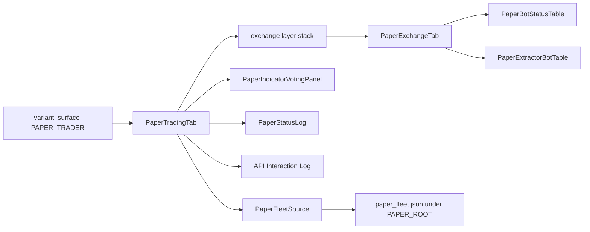
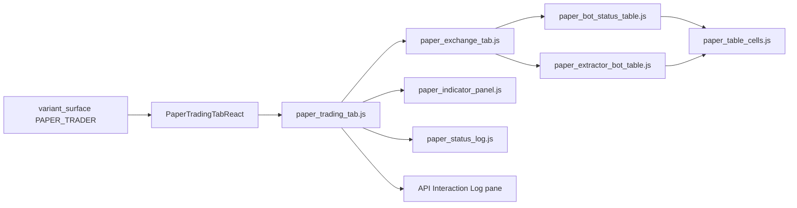
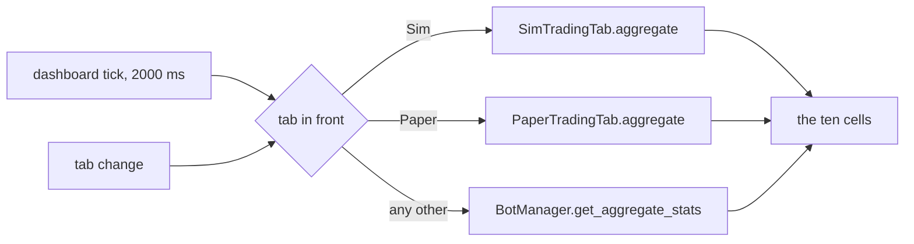

# Paper Trader Tab

Reference. The third step of [the promotion pipeline](promotion-pipeline.md).
Issue #19 built the screen. The tab row carried an empty tab until that build
landed, and [The screen as it stands now](#the-screen-as-it-stands-now)
describes what draws there today.

## The empty tab it replaced

The tab drew three lines: its name, one sentence saying it was not
built, and the issue that owned it. It read no bot, no price and no trade.

`src/gui/main_tabs/paper_trader_tab_surface.py` — the empty state it carried

```python
HEADING = "Paper Trader"
ISSUE = 19
BUILT = False
STATE_TEXT = "This tab is not built."
ISSUE_TEXT = f"Issue #{ISSUE} carries the build-out."
```

Two frontends draw that one view model. `EmptyTabsMixin` in
`src/gui/main_tabs/empty_tabs.py` builds the Qt tab, and
`src/gui/web/paper_trader_tab.js` registers a panel with the Electron shell's
panel host. `src.core.desktop_bridge` serves the model under
`paper_trader_tab.state`.

## What the step is

Real time is its defining property. The Simulator replays stored candles as
fast as the machine allows. Paper takes the live feed at the speed the market
delivers it, and that is the whole difference between them.

Live, Paper and the Simulator differ in one thing only: where the data comes
from. The trading logic stays one body of pure code that all three call. Only
the stateful shells fork, which is what keeps a paper run from holding a live
object.

The paper budget is twice the dollar target, so a bot has room to fold without
the exercise ending on the first dip.

`src/trading/container/config.py` — `BotConfig`, the field it doubles

```python
target_balance: float = 200.0  # Balance the bot trades relative to
```

Paper sat behind the Simulator, which had to reproduce the gate latches first.
Nuclear Mode was to be a second gate; the operator cancelled it, so one gate
remains and issue #19 built the tab after the Simulator rebuild landed.

## Where the platform once offered it

Two live surfaces named the step. The first is the Swarm tab's third
sub-tab, labelled Paper Swarm. Its Start button flips a flag and relabels
itself. No bot is constructed, no feed is attached and no order is recorded.
Its caption is an empty string now, so the sub-tab promises nothing.

`src/gui/bot_visualizer.py` — the Start handler inside `_create_paper_bot_row`

```python
def _toggle():
    if bot_data["running"]:
        bot_data["running"] = False
        start_btn.setText("▶ Start")
```

The second is the wing toggle on the header strip. Pressing it swaps the whole
wing. The Qt window no longer names a Paper Trader in the line it writes, and
the React mirror still does, so the two hosts print different text.

`src/gui/main_tabs/main_window_surface.py` — the line the React mirror writes

```python
"→ STOCK WING: equity exchanges + equity Paper Trader. (Crypto wing paused.)"
```

Issues #422 and #426 both folded into issue #19, which built the tab.

## The screen as it stands now

The tab is built. It sits second on the bar and carries the Trading tab's panes
over the live exchange feed. `src/gui/paper_trader_tab.py` draws them in Qt and
`src/gui/web/paper_trader_tab.js` draws them in React, from one view model.

`src/gui/main_tabs/paper_trader_tab_surface.py` — the fields both hosts read

```python
DECLARED_FIELDS = (
    "accessible_name",
    "balance",
    "built",
    "feed",
    "fleet",
    "heading",
    "indicators",
    "issue",
    "method",
    "panes",
    "privacy_button",
    "reserved_rows",
    "run",
    "skin",
    "symbol",
    "symbols",
)
```

The left pane holds the Privacy Mode button, the market selector, the two button
rows and the bot list. The bot list uses the Trading tab's own columns. The right
pane holds the Indicator Voting Panel, computed from the live window. An empty
selector draws the empty state and invents no reading.

`src/gui/main_tabs/paper_trader_tab_surface.py` — the empty state

```python
def indicator_payload(
    candles: Sequence[Any], timeframe: str, symbol: str, refusal: str
) -> dict:
    model = ivp.IndicatorPanelModel()
    if refusal:
        model.show_no_data(refusal)
        return ivp.build_payload(model)
    summary = multi_tf_summary(candles, timeframe, symbol)
    if not summary:
        model.show_no_data(NO_SYMBOL_TEXT)
        return ivp.build_payload(model)
    model.set_summary(summary, symbol)
    return ivp.build_payload(model)
```

## The two presses

Import Live Fleet reads the stored bot record and lists what it finds. Start
Paper Run opens the run and begins ticking. The same button then reads Stop
Paper Run and ends it, leaving the balances and the trades on screen.

`src/gui/main_tabs/paper_trader_tab_surface.py` — the second row's two faces

```python
{
    "name": DATA_POOL_ROW,
    "height_px": 18,
    "action": STOP_RUN_ACTION if running else START_RUN_ACTION,
    "text": STOP_RUN_TEXT if running else START_RUN_TEXT,
    "button_name": button_name(
        STOP_RUN_ACTION if running else START_RUN_ACTION
    ),
}
```

## Downstream only

The feed reader answers six names and refuses every other one, so a send has no
spelling. It calls the venue's public market endpoints, which carry no key and
no signature.

`src/paper/live_feed_source.py` — the refusal

```python
def __getattr__(self, name: str):
    """Refuse every name outside ``READ_NAMES``."""
    raise SendRefused(
        f"LiveFeedSource answers {READ_NAMES} and cannot {name!r}. "
        "The Paper Trader receives and asks; it sends nothing."
    )
```

## One gate chain

A tick builds the same `GateContext` a live bot builds and evaluates the shipped
scrum and fold chains on it. The paper side adds no gate and changes none.

`src/paper/paper_run.py` — what a tick evaluates

```python
window = list(candles[-WINDOW_CANDLES:])
reading = bb_reading(window, bot)
summary = VotingEngine().compute_all(window, bot.ta_timeframe, symbol=bot.symbol)
context = tape_context(bot, balance, window, reading, summary)
armed = latch(context)
```

## The fake balance

Each bot opens a budget of twice its dollar target: units worth the target, and
the rest in cash to fund a fold. The balances live in memory and are dropped when
the tab goes away.

`src/paper/fake_balance.py` — the opening

```python
def opening_balance(target_usd: float, price: float) -> FakeBalance:
    whole = budget_usd(target_usd)
    held_usd = min(whole / BUDGET_MULTIPLE, whole)
    units = held_usd / float(price) if float(price) > 0.0 else 0.0
    return FakeBalance(
        units=units,
        cash_usd=whole - units * float(price),
        tranches=0,
        budget_usd=whole,
    )
```

## The fleet ledger

The fake balance is one figure for the whole fleet, not one figure per bot. Five
paper bots with a $200 target open Paper Spendable at $1000 and Paper Locked at
$1000. Each variable holds the full fleet sum, which is twice the fleet's dollar
target in total.

`src/paper/fake_balance.py` — the opening

```python
def opening_ledger(bots: Sequence[Any]) -> PaperLedger:
    total = fleet_target_usd(bots)
    return PaperLedger(
        fleet_target_usd=total,
        opening_spendable_usd=total,
        opening_locked_usd=total,
    )
```

The fleet changes when a bot is added or removed. Every press of Start Paper Run
rebuilds the ledger from the fleet it is handed, so both opening figures move on
the next press and never inside a run. Six $200 bots open $1200 in each figure
and four open $800.

Four figures are tracked. Paper Spendable is the cash the fleet holds. Paper
Locked is what its units are worth at the last price the feed answered. Paper
Realized Profits moves when a fold buy closes the tranche a scrum sell opened.
Paper Mature Profits is the profit on positions past 200 percent growth, the
figure the live wing already reads.

`src/trading/smart_wire.py` — the maturity rule both wings call

```python
MATURE_GROWTH_PCT: float = 200.0
"""A position is mature once its value exceeds its cost basis by this percent."""
```

The four figures are held apart from the live ones. They live in memory on the
run, they are never written into the stored bot record, and no paper figure
reaches the header strip's real-money columns.

`src/paper/fake_balance.py` — the four labels the strip prints

```python
FIGURE_LABELS = (
    ("spendable_usd", SPENDABLE_LABEL),
    ("locked_usd", LOCKED_LABEL),
    ("realized_profit_usd", REALIZED_LABEL),
    ("mature_profit_usd", MATURE_LABEL),
)
```

The Qt window and the React page print one line from one view model, so the two
hosts cannot report different money.

`src/gui/main_tabs/paper_trader_tab_surface.py` — the one line

```python
"text": LEDGER_SEPARATOR.join(f"{one['label']} {one['text']}" for one in cells),
```

## The Paper Trader log

Every paper action is written to one file. Each line carries two halves: the
gate decision that produced the action and, when one filled, the pretend trade
in the shape a Coinbase year-to-date row takes. Validation reads both of those
shapes already, so a paper run is checked by the reader that checks the live
wing.

`src/paper/paper_log.py` — the row

```python
return {
    "timestamp": iso_stamp(tick.wall_ms),
    "category": CATEGORY,
    "exchange": str(exchange_id),
    "bot_id": str(tick.bot_id),
    "data": gate_half(tick),
    "trade": trade_half(tick.filled) if tick.filled is not None else None,
    "ledger": dict(figures or {}),
}
```

The log has a home of its own. It is a sibling of the live folders and never
sits inside one, so nothing a paper run writes can land in a live tree.

`src/paper/paper_paths.py` — the root

```python
PAPER_ROOT: Path = Path.home() / ".acervator_paper"
```

Gate names come from one place. The row records the blocker phrases the chain
produced and the labels those phrases map to, and it spells no gate name of its
own.

`src/trading/gate_vocabulary.py` — the mapping the log calls

```python
def gate_for_blocker(blocker: str) -> str:
    """Map one blocker string to its gate label, or "" if unknown."""
```

A trade is never invented. A line carries a trade half only because the gate
chain latched and the fill was applied to a fake balance.

`src/paper/paper_run.py` — the only writer

```python
paper_log.append_row(
    paper_log.paper_row(seen, bot.exchange_id, run.figures())
)
```

## Real time

A run ticks on the wall clock and asks the feed for one bot per fire, so a fleet
of many bots never blocks the window on a single pass. One bar is shared across
the open bots.

`src/gui/paper_trader_tab.py` — the round robin

```python
def advance_once(self) -> list:
    """Tick the next open bot against its newest live window."""
    if self._run is None or not self._run.running or not self._run.bots:
        return []
    chosen = self._run.bots[self._cursor % len(self._run.bots)].bot_id
    self._cursor += 1
    made = surface.advance_run(self._run, self._feed, chosen)
    self.refresh()
    return made
```

## Paper Trade History

The manual's part list names a second History tab reading a paper trade log. No
such module exists. `HistoryTab` in `src/gui/history_tab.py` reads live venue
history alone.

The ledger such a tab would read now exists. Every paper action lands in the
file [the Paper Trader log](#the-paper-trader-log) names, and no screen reads
that file yet.

In development.

## 2026-09-08 08:17 - #19 - what the closed issues landed

Real-time, API-fed trades against a fake budget. This is designed as the second tier of strategy validation within the platform.

The tab is now called Paper. It sits second on the bar, on a white ground
with black text, and it is the only white tab.

The screen was empty until issue #19 built it. The tab row carried a Paper
Trader placeholder, which drew its name, one sentence saying it was not built,
and the issue that owned it. The section under this one holds what the tab is
now.

`src/gui/main_tabs/paper_trader_tab_surface.py` — the empty state it carried

```python
HEADING = "Paper Trader"
ISSUE = 19
BUILT = False
STATE_TEXT = "This tab is not built."
ISSUE_TEXT = f"Issue #{ISSUE} carries the build-out."
```

The Qt tab and the `src/gui/web/paper_trader_tab.js` panel both draw that one
view model, so neither can drift from the other.

Live, Paper and the Simulator differ in one thing only, where the data comes
from. The trading logic stays one body of pure code all three call, and only
the stateful shells fork. Real time is Paper's defining property, and its
budget is twice the dollar target.

`src/trading/container/config.py` — `BotConfig`, the field that budget doubles

```python
target_balance: float = 200.0  # Balance the bot trades relative to
```

Two live surfaces once offered the step. The Swarm tab's Paper Swarm
sub-tab is chrome: its Start button flips a flag and relabels itself, and no
bot is constructed. Its caption is now an empty string, so it promises nothing.
The wing toggle no longer names a Paper Trader in the Qt window, while the
React mirror still does. Issues #422 and #426 folded into issue #19.

### The tab as it stands now

The screen is built. It is the Trading tab's panes over the live exchange feed:
the Privacy Mode row, the market selector, the two button rows, the bot list,
the Indicator Voting Panel, the Live Feed pane, the Fake Balance table and the
Paper Run table. The Qt window and the React page draw one view model.

`src/gui/main_tabs/paper_trader_tab_surface.py` — what the tab answers

```python
METHOD = "paper_trader_tab.state"

HEADING = "Paper"
ISSUE = 19
BUILT = True
```

The data path is the venue's public market feed, and it goes one way. The reader
names the six things it answers, and every other name raises. An order, a
cancellation or a venue write cannot be written through it.

`src/paper/live_feed_source.py` — the read set and the refusal

```python
READ_NAMES = (
    "venue",
    "product_id",
    "granularity",
    "candles",
    "ticker",
    "asked_at",
)


class SendRefused(AttributeError):
    """Raised when a name outside ``READ_NAMES`` is asked of ``LiveFeedSource``."""
```

Live candles enter the same gate chain a live bot runs. Nothing on the paper
side defines a gate of its own.

`src/paper/paper_run.py` — the tick

```python
context = tape_context(bot, balance, window, reading, summary)
armed = latch(context)
```

The money is fake and lives in memory alone. A run writes no file, and no figure
it produces reaches the stored bot record or the header strip.

`src/paper/fake_balance.py` — the budget

```python
BUDGET_MULTIPLE = 2.0
```

The two strips the Trading tab carries are not copied, and neither is their
supporting code. Their rows carry Import Live Fleet and the Start or Stop press.

The fake balance is a fleet figure. Five paper bots with a $200 target open
Paper Spendable at $1000 and Paper Locked at $1000, each holding the full fleet
sum. Adding or removing a bot moves both openings on the next press of Start.

`src/paper/fake_balance.py` — the fleet total both openings take

```python
def fleet_target_usd(bots: Sequence[Any]) -> float:
    """The sum of every bot's ``target_usd``, the figure both openings take."""
```

Two more figures are tracked beside them. Paper Realized Profits moves when a
fold buy closes the tranche a scrum sell opened, and Paper Mature Profits is the
profit on positions past 200 percent growth, which is the figure the live wing
already reads. No paper figure is written into the stored bot record or the
header strip.

`src/paper/fake_balance.py` — the strip's four figures

```python
FIGURE_LABELS = (
    ("spendable_usd", SPENDABLE_LABEL),
    ("locked_usd", LOCKED_LABEL),
    ("realized_profit_usd", REALIZED_LABEL),
    ("mature_profit_usd", MATURE_LABEL),
)
```

Every paper action is recorded in one file of its own. Each line carries the
gate decision and, when one filled, the pretend trade in the shape a Coinbase
year-to-date row takes. The file sits beside the live folders and never inside
one.

`src/paper/paper_paths.py` — where the log lives

```python
PAPER_ROOT: Path = Path.home() / ".acervator_paper"
```

## How the Paper tab reaches the bar

`PaperTraderTabMixin` builds the tab and inserts it into the window's tab book.
The builder catches every error, writes one warning line, and leaves the tab off
the bar. A tab that asks the panel for a value the panel does not publish is
therefore a missing tab, not a crash the operator can see.

`src/gui/main_tabs/paper_trader_tab.py` — the builder

```python
def _build_paper_trader_tab(self) -> None:
    """Insert the Paper tab at ``PAPER_BUILD_INDEX``."""
    try:
        from ..variant_surface import PAPER_TRADER, surface_class

        self._paper_trader_tab = surface_class(PAPER_TRADER)()
        self._main_tabs.insertTab(
            PAPER_BUILD_INDEX, self._paper_trader_tab, HEADING
        )
    except Exception as exc:  # noqa: BLE001 - a missing tab is not a crash
        logger.warning("Paper tab unavailable: %s", exc)
        self._paper_trader_tab = None
```

The window builds nine tabs. Paper takes the second slot, after Sim.

```
Sim  Paper  Live  Charts  Inspector  Swarm  History  Status  Console
```

### The line beside the voting panel title

One label sits beside the Indicator Voting Panel title. It holds the panel's
empty state and nothing else. The shared function `no_data_text` builds that
line, and the [Simulator page](simulator.md) shows it. The label is hidden
whenever the panel has values to draw.

`src/gui/paper_trader_tab.py` — the Qt clone draws the line

```python
def _draw_indicators(self, panel: dict) -> None:
    self._indicator_title.setText(panel["title_text"])
    # no_data text is empty while the panel holds a reading, so the
    # summary label shows only the one reason there is nothing to draw.
    reason = panel["no_data"]["text"]
    self._indicator_summary.setText(reason)
    self._indicator_summary.setVisible(bool(reason))
    for table, spec in zip(self._indicator_tables, panel["tables"], strict=True):
        self._fill_indicator_table(table, spec)
```

With no paper fleet the label names the press that builds one, under both
builds.

```
No TA data — No paper fleet yet. Press Import Live Fleet.
```

## The style sheet the Paper page loads

The page carries one style sheet. `TAB_STYLE_ASSETS` names it, and
`page_html` reads the file and writes it into the page's head.

`src/gui/react_paper_trader_tab.py` — the sheet the page carries

```python
TAB_STYLE_ASSETS: tuple[str, ...] = ("paper_trader_tab.css",)
```

The sheet sets the page ground, the type, the pane grid and the table rules.
The grid repeats the two pane sizes the Qt clone gives its splitters, so the
bot list, the voting panel, the feed pane and the run pane take the same share
of the window in both builds.

`src/gui/web/paper_trader_tab.css` — the pane grid

```css
.paper-top,
.paper-bottom {
  display: grid;
  grid-template-columns: 600fr 500fr;
}
```

Without the sheet the page draws on the browser's own defaults: a white ground,
serif type, one column and no grid.

### The skin tokens the Paper sheet reads

The sheet names no colour of its own. Every colour arrives as a custom property
on the tab element, written from the `SKIN` dictionary the surface builds. A
scrum row and a fold row in the Paper Run table take the two colours
`SIDE_COLOURS` gives them in the Qt clone.

`src/gui/web/paper_trader_tab.css` — the two trade rows

```css
.paper-tab tr[data-side="scrum"] td {
  color: var(--paper-scrum-colour, var(--text));
}

.paper-tab tr[data-side="fold"] td {
  color: var(--paper-fold-colour, var(--text));
}
```

### Start Paper Run redraws the pane

`start_run` draws the pane after it opens the run. With no paper fleet the
first tick returns nothing, so without that draw the Paper Run pane kept the
word it held before the press while the run was open.

`src/gui/paper_trader_tab.py` — the press that opens a run

```python
    def start_run(self) -> str:
        """Open the run and tick one bot per timer fire from now."""
        if not self._bots:
            self._bots = surface.live_fleet()
        self._run = surface.start_run(self._bots)
        self._cursor = 0
        self.advance_once()
        self.refresh()
        self._tick_timer.start(surface.tick_interval_ms(self._run, self._symbol))
        return self._run.state
```

Both builds carry the same draw.


## 2026-09-19 - #19 - Live's tab code cloned under Paper names

Unit Q1 of issue #19. The Paper tab is now Live's tab code, forked under Paper
names in both builds, with Import Live Fleet as the fleet's one way in and the
header strip reading the paper ledger while Paper is in front. The two hosts
the sections above describe, `src/gui/paper_trader_tab.py` and
`src/gui/react_paper_trader_tab.py`, stay on disk and nothing loads them; a
later unit removes them once a paper bot ticks on the clone.

### The budget rule today overtakes four sentences

Four sentences on this page carry a figure the operator's words of 2026-09-19
overtake. Each is quoted here and kept above as it stands.

- "The paper budget is twice the dollar target, so a bot has room to fold
  without the exercise ending on the first dip." (What the step is)
- "Each bot opens a budget of twice its dollar target: units worth the target,
  and the rest in cash to fund a fold." (The fake balance)
- "Each variable holds the full fleet sum, which is twice the fleet's dollar
  target in total." (The fleet ledger)
- "Real time is Paper's defining property, and its budget is twice the dollar
  target." (2026-09-08 08:17)

The rule now: the paper budget is unbounded, and Paper Spendable opens at the
sum of the fleet's Target Balances. His words: *"a fake, unbounded (starts
equal to bots total target balance) budget."* No fold is refused for cash.
`BUDGET_MULTIPLE` in `src/paper/fake_balance.py` still reads `2.0`; the unit
that starts a paper run retires it, and no clone code reads it.

`src/paper/fake_balance.py` — the opening figure the rule keeps

```python
def fleet_target_usd(bots: Sequence[Any]) -> float:
    """The sum of every bot's ``target_usd``, the figure both openings take."""
```

### The Qt tab is Live's tab code, forked

The Qt build of the Paper tab is `PaperTradingTab`, a fork of the Live tab's
own code under the Paper Trader's name. The seam's Qt loader answers it.

`src/gui/variant_surface.py` — the Qt loader

```python
def _qt_paper_trader() -> type:
    """Import and return the Qt Paper tab, ``PaperTradingTab``."""
    from .paper.paper_trading_tab import PaperTradingTab

    return PaperTradingTab
```

Each module under `src/gui/paper/` is one Live module copied and renamed, or
one of the Simulator's forks copied once more where that fork's only change
was the feed. The copy keeps Live's layout, titles, sizes and design tokens.

| Paper module | forked from |
|---|---|
| `paper_trading_tab.py` `PaperTradingTab` | `src/gui/main_tabs/trading_tab.py` `_build_trading_tab`, and the window's `add_exchange_tab` |
| `paper_exchange_tab.py` `PaperExchangeTab` | `src/gui/widgets/exchange_tab.py` `ExchangeTab` |
| `paper_bot_status_table.py` `PaperBotStatusTable` | `src/gui/simulator/sim_bot_status_table.py` `SimBotStatusTable` |
| `paper_extractor_bot_table.py` `PaperExtractorBotTable` | `src/gui/simulator/sim_extractor_bot_table.py` `SimExtractorBotTable` |
| `paper_indicator_panel.py` `PaperIndicatorVotingPanel` | `src/gui/simulator/sim_indicator_panel.py` `SimIndicatorVotingPanel` |
| `paper_status_log.py` `PaperStatusLog` | `src/gui/simulator/sim_status_log.py` `SimStatusLog` |
| `paper_bot_detail.py` `PaperBotDetailDialog` and its seven tab mixins | `src/gui/simulator/sim_bot_detail.py` `SimBotDetailDialog` and its seven |
| `paper_exchange_choice.py` `PaperExchangeChoiceDialog` | `src/gui/simulator/sim_exchange_choice.py` `SimExchangeChoiceDialog` |
| `src/paper/fleet_source.py` `PaperFleetSource`, `PaperBot` | `src/simulator/fleet_source.py` `FleetSource`, `SimBot`, one fleet and no run mode |
| `src/paper/paper_bot_manager.py` `PaperBotManager` | `src/simulator/sim_bot_manager.py` `SimBotManager` |
| `src/paper/paper_bot_view.py` `PaperBotView` | `src/simulator/sim_bot_view.py` `SimBotView` |



### What the fork draws

The tab is Live's four splitters at Live's sizes: the exchange layer stack
beside the panel on top, the Activity Log and the API Interaction Log side by
side below. Every module carries Live's title. The venue page holds Privacy
Mode where Live draws it, `+ New Bot` where Live draws it, the Scrumming Bots
table and the Extractor Bots table, both hidden until a row arrives, and the
command bar of Start, Pause, Stop, Restart and Delete. The panel holds its
title, the Bot selector and its privacy dot, the currency rate strip, both
indicator tables, both confidence bar graphs, the timeframe-lock line and the
staleness banner.

Three positions differ from Live by ruling, the ruling unit 7 of issue #117
made for the Simulator. The corner Live gives `＋ Add Crypto Exchange` holds
Import Live Fleet and Start Paper Run, each at Live's corner-button width. The
Get Started card holds the same two where Live's card holds its add button.
The news line and the data-pool line are not forked; the data-pool row keeps
Live's height and holds nothing.

`src/gui/paper/paper_trading_tab_surface.py` — the corner buttons

```python
CORNER_BUTTONS = (
    (paper.IMPORT_LIVE_FLEET_ACTION, paper.IMPORT_LIVE_FLEET_TEXT),
    (paper.START_RUN_ACTION, paper.START_RUN_TEXT),
)
```

A press on `+ New Bot` writes one Activity Log line naming Import Live Fleet
as the fleet's way in; the paper bot wizard is a later unit's. A press on
Start Paper Run writes one line saying no paper run is built; the run is a
later unit's too.

`src/gui/paper/paper_trading_tab_surface.py` — the two lines

```python
NEW_BOT_FORMAT = (
    "+ New Bot on {exchange}: the Paper fleet is loaded through "
    "{way_in}; the paper bot wizard is not built."
)

START_RUN_TEXT = "Start Paper Run: no paper run is built; nothing started."
```

### What the fork does not carry

The copies hold no live bot manager, no connector and no event bus. Every
send the Live code makes is cut, not stubbed: the signal-contract emits, the
event-bus emit behind the bot selector, the API-log listener on the
process-wide log, the watchdog over the live bot manager, the TA snapshot
store, the data-pool read behind the display price, and the demo readings the
Live panel invents from a random walk. Zero occurrences of `ScrummingBot`,
`BotContainer`, `BotManager`, `EventBus` and `PhantomBalance` under
`src/gui/paper/` and `src/paper/`.

The Simulator's run modes, its way-in row, its replay layer, its Stone Tablet
source, its Portfolio Battery, its retrieval and its nigredo tone are not
carried. A Paper module forked from a Simulator fork has those parts cut.

Asked for a send by name, `PaperFleetSource` raises `SendRefused`. The Fire
button on a row reaches it and the refusal lands in the Activity Log.

`src/paper/fleet_source.py` — the refusal

```python
    def __getattr__(self, name: str):
        """Refuse every name outside ``READ_NAMES``."""
        raise SendRefused(
            f"PaperFleetSource answers {READ_NAMES} and cannot {name!r}. "
            "The Paper Trader receives and asks; it sends nothing."
        )
```

### The React page is Live's page modules, forked

The React build of the Paper tab is `PaperTradingTabReact`, a fork of the
Live tab's React host under the Paper Trader's name, and it loads seven page
modules that are Live's seven copied under Paper names. The seam's React
loader answers it.

`src/gui/variant_surface.py` — the React loader

```python
def _react_paper_trader() -> type:
    """Import and return the React Paper tab, ``PaperTradingTabReact``."""
    from .paper.paper_react_trading_tab import PaperTradingTabReact

    return PaperTradingTabReact
```

| Paper module | forked from |
|---|---|
| `src/gui/web/paper_trading_tab.js` | `trading_tab.js` |
| `src/gui/web/paper_exchange_tab.js` | `exchange_tab.js` |
| `src/gui/web/paper_indicator_panel.js` | `sim_indicator_panel.js`, the flip button cut |
| `src/gui/web/paper_status_log.js` | `sim_status_log.js` |
| `src/gui/web/paper_bot_status_table.js` | `sim_bot_status_table.js` |
| `src/gui/web/paper_extractor_bot_table.js` | `sim_extractor_bot_table.js` |
| `src/gui/web/paper_table_cells.js` | `sim_table_cells.js` |
| `src/gui/paper/paper_react_trading_tab.py` `PaperTradingTabReact` | `src/gui/react_trading_tab.py` `TradingTabReact` |
| `src/gui/paper/paper_trading_tab_surface.py` | `src/gui/main_tabs/trading_tab_surface.py`, the payload builder |
| `src/gui/paper/paper_exchange_tab_surface.py` | `src/gui/main_tabs/exchange_tab_surface.py`, the payload builder |
| `src/gui/paper/paper_react_bot_detail.py` `PaperBotDetailReactDialog` | `src/gui/simulator/sim_react_bot_detail.py`, over Live's nine window bundles |



### What the page draws

The page is Live's four splitters at Live's sizes, read off Live's own
`trading_tab_surface`. Every module carries Live's title and Live's part name,
so the page and the Qt fork enumerate the same modules in the same order. The
corner holds Import Live Fleet and Start Paper Run in Live's corner-button
chrome, and the Get Started card holds the same two at Live's card-button
size. The venue page holds Privacy Mode, plain space where Live draws the news
line, `+ New Bot`, the data-pool row at Live's height holding a blank line,
the two tables and the command bar.

`src/gui/web/paper_trading_tab.js` — the corner

```javascript
  // The corner Live gives its add button: the payload's buttons in one row.
  function CornerButtons(props) {
    var listed = listField(props.layer, CORNER_BUTTONS);
```

The host builds one payload per bridge method from state it owns: the tab
payload from its own `PaperTradingTabState`, the Activity Log from its own
`PaperStatusLogModel`, the panel from its own `IndicatorPanelModel`, and each
seated venue's three payloads from that venue's own `ExchangeTabModel`, its
`PaperBotStatusTableModel` and Live's `ExtractorBotTableModel`. Every ask the
page makes is written to the console line the host reads, and
`run_action` answers it; nothing is sent anywhere else.

`src/gui/paper/paper_react_trading_tab.py` — the console line

```python
ACTION_PREFIX = "acervator-paper:"
```

### The header strip shows on Paper

The window's header strip stays on screen while the Paper tab is in front.
`ISOLATED_TABS` names no tab now, so the strip hides on nothing. While Paper
is in front the ten fields carry the Paper Trader's figures: SPENDABLE,
REALISED, LOCKED and MATURE from the paper ledger, EXCH from the seated
venues, and the five cards from the held records. On every other tab the
strip carries what it carried before; the live fleet's figures do not appear
while Paper is in front, and no paper figure appears on Live.

`src/gui/main_tabs/main_window_surface.py` — the tuples and the reader

```python
ISOLATED_TABS: tuple = ()

#: The tabs the header strip reads the Paper Trader's ledger and records on.
PAPER_FED_TABS = (PAPER_TAB,)


def header_strip_reads_paper(tab_name: Any) -> bool:
    """Whether the stat strip reads the Paper Trader's ledger and records on the tab named."""
    return tab_name in PAPER_FED_TABS
```

`src/gui/main_window.py` — `_refresh_header_strip`, the branch beside the Sim's

```python
            if self._header_strip_reads_paper():
                paper_tab = self._paper_trader_tab
                self._write_header_strip(
                    paper_tab.aggregate(), paper_tab.exchange_count()
                )
                return
```

The tab's `aggregate` is `strip_aggregate`: Live's arithmetic over the held
records, with the ledger's four money figures laid over the four money keys.
Before a run the ledger holds zeros, so the four money columns read an em
dash, as Live's read with no bot.

`src/paper/fleet_source.py` — the ledger's keys over the aggregate's

```python
LEDGER_TO_AGGREGATE = (
    ("spendable_usd", "wallet_cash_usd"),
    ("locked_usd", "crypto_position_value_usd"),
    ("realized_profit_usd", "total_realized_exchange"),
    ("mature_profit_usd", "total_mature_exchange"),
)
```



### Import Live Fleet fills the tables and the strip

Import Live Fleet copies the stored bots of one exchange out of the live fleet
file into the Paper Trader's own fleet file, in both builds. A press at the
corner or on the Get Started card reads which exchanges the live file names.
With more than one it opens the chooser; with exactly one it takes that one
and opens nothing; with none it writes one Activity Log line naming the file
and moves nothing. Each stored bot on the chosen exchange is copied whole,
every key of the record, into the paper fleet under its own bot id, and the
fleet signal fires: the paper fleet file is written, the venue seats, and the
two tables draw one row per imported bot. The Activity Log reads `Imported 38
bot(s) from bot_state.json on coinbase.` on a fleet of thirty-eight. The live
fleet file is only read, never written.

`src/paper/fleet_source.py` — the copy

```python
    def import_live_fleet(self, exchange_id: str) -> list[PaperBot]:
```

`src/paper/paper_paths.py` — where the paper fleet file lives

```python
#: The paper fleet file under ``PAPER_ROOT``, in ``bot_state.json``'s shape.
PAPER_FLEET_NAME = "paper_fleet.json"
```

The tab starts empty. The fleet source answers the records the paper fleet
file holds and nothing else, so with no paper fleet there is no venue, no row
and no figure until Import Live Fleet loads one. On the next launch the tab
reads the paper fleet file once and draws the imported rows from it.

### A loaded bot reads IDLE

Import Live Fleet copies each stored record and writes its state `idle`,
whatever the live file saved, and the paper fleet file's records read `idle`
at construction. That is the live restore's own rule, and the Simulator's.
A row's state is the Bot ID cell's colour and its tooltip's `State:` line;
Live's ten columns hold no State column.

`src/paper/fleet_source.py` — the one write

```python
def loaded_idle(record: dict) -> dict:
    """``record`` with its ``state_when_saved`` written ``BotState.IDLE``, as
    ``restore_bots_from_state`` recreates every persisted bot in IDLE until
    the operator starts it; a loaded bot never reads ``running`` with no run."""
    record["state_when_saved"] = BotState.IDLE.value
    return record
```

The command bar moves a record's state through `PaperBotManager`: Start
writes `running` and Live's `✓ Bot <id> RUNNING.` line, Pause `paused`, Stop
`stopped`, Restart `running`, and Delete opens Live's Delete box. No paper bot
ticks yet; the state is the record's. Detail opens the seven tabs over the
record through `PaperBotDetailDialog`, and Apply is refused: the pending line
reads `Refused 1 change(s) — the Paper Trader sends nothing`.

### How the Paper tab reaches the bar today

The builder in `src/gui/main_tabs/paper_trader_tab.py` is unchanged. It asks
the seam for the Paper class, and the seam now answers the clone in both
builds. The window builds nine tabs and Paper takes the second slot, after
Sim, in both.

`src/gui/variant_surface.py` — the registration

```python
register(PAPER_TRADER, _qt_paper_trader, _react_paper_trader)
register(PAPER_BOT_DETAIL, _qt_paper_bot_detail, _react_paper_bot_detail)
```

The window's floor is 1400 by 900 pixels, set in `src/gui/main_window.py`, so
no tab is reached narrower than 1400 through the window. Constructed alone,
the Qt tab draws at 806 pixels wide and no narrower after a fleet loads, the
sum of Live's own minimum sizes; the React page draws at 700.

### What the clone reading measured

Read off the real window in both builds over a scratch home holding a
stand-in `bot_state.json` of the operator's record shape, thirty-eight
scrumming records on coinbase at 5m, every socket but loopback refused:

```
reading                                      Qt                       React
Paper on the bar                             second of nine           second of nine
Live modules on the tab before the clone     0 of 6                   0 of 10
Paper modules on the tab after the clone     6 of 6                   10 of 10
strip on Paper at open                       — — — — EXCH 0           — — — — EXCH 0
Import Live Fleet: rows                      38, State: IDLE          38, State: IDLE
Import Live Fleet: Bot ID cell colour        #888888                  rgb(136, 136, 136)
venue seated, EXCH                           Coinbase, 1              Coinbase, 1
paper fleet file                             38 records, all idle     38 records, all idle
bot_state.json hash after every press        unchanged                unchanged
a planted byte on a copy                     hash moved               hash moved
a planted live figure on the Paper strip     did not appear           did not appear
a planted paper figure on the Paper strip    appeared                 appeared
the same paper figure on the Live strip      did not appear           did not appear
Detail                                       7 tabs, Apply refused    7 tabs, Apply refused
old hosts in the import closure              neither                  neither
```

## 2026-09-20 - #19 - The paper exchange adapter feeds the tab

Unit Q2 of issue #19. The Paper tab now holds one paper exchange adapter,
`PaperExchange` in `src/paper/paper_exchange.py`, beside the feed reader the
sections above describe. It answers every read a paper bot asks of the venue
from the Coinbase Advanced Trade public market endpoints, and no write. Import
Live Fleet reads the venue's product list once and each record's ticker once,
and every one of those reads is a block on the API Interaction Log in both
builds.

### The feed reader sentences today overtake two passages

Two passages on this page describe the feed reader `LiveFeedSource`. Each is
quoted here and kept above as it stands.

- "The feed reader answers six names and refuses every other one, so a send
  has no spelling." (Downstream only)
- "The data path is the venue's public market feed, and it goes one way. The
  reader names the six things it answers, and every other name raises."
  (The tab as it stands now)

The rule now: the tab's feed reader is `PaperExchange`, which answers the
eleven names in its `READ_NAMES` and refuses every other public name.
`LiveFeedSource` stays on disk for the two old hosts, which nothing loads, and
its `GRANULARITY` and `BAR_SECONDS` tables grew from eight rows to nine, the
`4h` row added, because the venue's candles page lists nine granularity names.
A `1w` ask of `LiveFeedSource` sent `FIVE_MINUTE` to the venue and answered 5m
bars under the weekly name; the adapter rolls `1w` up from daily bars instead.

`src/paper/paper_exchange.py` — the read set

```python
READ_NAMES = (
    "venue",
    "product_id",
    "granularity",
    "timeframes",
    "products",
    "ticker",
    "candles",
    "windows",
    "quote_rate",
    "asked_at",
    "calls",
)
```

### What the adapter answers, and from which endpoint

`products` reads `GET market/products` and keeps the products the venue
trades, by the rule the Market Inspector's `_product_trades` states: `status`
online and `trading_disabled` not set. `ticker` reads
`GET market/products/{id}/ticker?limit=1` and answers the last trade's price
as `last`, with the book's `best_bid` and `best_ask` from the same answer;
`last` is None when the venue answers no trade. `candles` reads
`GET market/products/{id}/candles` at any of the nine granularity names, at
most 350 bars a call, and answers `[ts_ms, open, high, low, close, volume]`
rows oldest first. `windows` answers one `candles` window per higher
timeframe a record's phantoms name. `quote_rate` answers 1.0 for USD with no
call, and otherwise the `{QUOTE}/USD` ticker's `last`, the book's mid when the
venue answers no trade; the thirteen USDC records share one `USDC/USD` read.

`src/paper/paper_exchange.py` — the ticker's answer

```python
    def _ticker_view(self, symbol: str, entry: TickerEntry) -> dict:
        return {
            "symbol": symbol,
            "product_id": entry.symbol,
            "last": entry.last or None,
            "best_bid": entry.bid or None,
            "best_ask": entry.ask or None,
            "timestamp": entry.timestamp,
        }
```

### One rollup, and only what the venue serves

The venue lists no weekly granularity. A `1w` ask reads daily bars in pages of
350, newest page first, until seven days per week asked are held, and rolls
them through the stone tablets' `_rollup`, the one rollup every derived tablet
timeframe reads through. Each timestamp is moved back by `MONDAY_OFFSET_MS`
before the rollup and forward after it, the shift the Market Inspector's
`weekly_from_daily` makes, so every weekly bucket starts on Monday 00:00 UTC.
A 100-bar weekly window needs 700 daily bars, two calls. A granularity outside
the nine is sent as spelled, so the venue's own 400 answers it and lands on
the pane as an error block.

`src/paper/paper_exchange.py` — the rollup

```python
def weekly_rows(daily: Sequence[Sequence[float]]) -> list[list[float]]:
    shifted = [[row[0] - MONDAY_OFFSET_MS, *row[1:6]] for row in daily]
    return [
        [float(int(row[0]) + MONDAY_OFFSET_MS), *row[1:6]]
        for row in _rollup(shifted, DAYS_PER_WEEK, WEEK_MS)
    ]
```

### Cached with Live's two windows, paced at the connector's interval

Every ticker answer is held in a `TickerEntry` and every candle window in a
`CacheEntry`, the two slot types Live's `MarketDataPool` holds in
`src/exchange/data_pool.py`. A ticker asked again within 5 s is served from the
slot with no call and no block. A candle window asked again within one bar of
its timeframe, `TF_SECONDS`, is served the same way while the slot holds enough
rows. Every venue call waits `PUBLIC_MIN_INTERVAL_S` after the call before it,
the figure `src/exchange/market_inspector_fetcher.py` states for the public
route and the exchange connector keeps as `_min_request_interval`, 0.1 s; one
lock holds the calls in order, so two threads asking at once are spaced. A 429
is recorded as a warning block, waited out for the venue's `Retry-After`
seconds when the answer carries one and one interval otherwise, and asked once
more.

`src/paper/paper_exchange.py` — the cache and the pace

```python
from ..exchange.data_pool import CacheEntry, TickerEntry
from ..exchange.market_inspector_fetcher import (
    API_LEVEL_ERROR,
    API_LEVEL_SUCCESS,
    API_LEVEL_WARNING,
    DAYS_PER_WEEK,
    MONDAY_OFFSET_MS,
    PUBLIC_MIN_INTERVAL_S,
    WEEK_MS,
    _product_trades,
)
```

### Every read is a block on the API Interaction Log

The adapter records one entry per venue call on the `APIInteractionLog` its
host hands it, the tab's own log, never the process-wide one Live's connector
records on. The entry carries Live's fields: the exchange, the action
(`FETCH_MARKETS`, `FETCH_TICKER` or `FETCH_OHLCV`, the words Live's connector
records), the reason, the venue path as the endpoint, the params, the result,
the response time, the level and the data usage. Each host now carries one
signal, `apiEntryLogged`, and one receiver beside its `_on_api_event`,
`_cross_api_event`, the crossing the main window carries for Live; the host
registers the receiver as the log's listener, so an entry recorded on a worker
thread lands in `_on_api_event` on the GUI thread through Qt's queued
connection and draws as Live's block. The Live tab's pane is not written: the
adapter never records on `get_api_log`.

`src/gui/paper/paper_trading_tab.py` — the crossing

```python
    def _cross_api_event(self, entry: dict) -> None:
        """The ``api_log()`` listener: emit ``apiEntryLogged``, which Qt queues
        onto the GUI thread for ``_on_api_event`` from any other thread."""
        self.apiEntryLogged.emit(entry)
```

### Import Live Fleet reads the venue once

After Import Live Fleet copies the records and fires `fleet_changed`, each host
starts one worker thread, `paper-feed-import`, which runs `read_fleet` over the
adapter: one `products` read, then one `ticker` read per imported record. Each
read lands on the pane as it completes. When the worker ends, its summary
crosses a second signal, `feedRead`, and one line lands on the Activity Log
naming how many products the venue trades, how many of the fleet's products
are among them, how many tickers answered, and how many calls it took; a fleet
product the venue does not trade is named on the line. The GUI thread never
waits on a read.

`src/gui/paper/paper_trading_tab_surface.py` — the line

```python
FEED_LINE_FORMAT = (
    "Feed: {products} product(s) trade on {exchange}; {traded} of {records} fleet "
    "product(s) among them; {answered} of {records} ticker(s) answered in {calls} call(s)."
)
FEED_UNTRADED_FORMAT = " Not traded: {symbols}."
FEED_THREAD_NAME = "paper-feed-import"
```

### Every write name is refused

`PaperExchange.__getattribute__` raises `SendRefused` for every public name
outside `READ_NAMES`, before any attribute is read, and `__getattr__` raises it
for a name the class does not define. `place_order`, `cancel_order`,
`create_order` and every other write name have no spelling on the adapter, and
a method planted on the class without its name in `READ_NAMES` is refused too.
No file under `src/paper/` or `src/gui/paper/` imports a credential loader,
`ccxt`, `ScrummingBot`, `BotContainer` or `BotManager`.

`src/paper/paper_exchange.py` — the refusal

```python
    def __getattribute__(self, name: str):
        """Answer a private name or one of ``READ_NAMES``; refuse the rest."""
        if not name.startswith("_") and name not in READ_NAMES:
            raise SendRefused(REFUSED_FORMAT.format(read_names=READ_NAMES, name=name))
        return object.__getattribute__(self, name)
```

### What the feed reading measured

Read off the real window in both builds over a scratch home holding a copy of
the operator's `bot_state.json`, thirty-eight scrumming records on coinbase
at 5m, every socket but loopback refused, and a loopback stand-in shaped from
the venue's pages: the four endpoints with their fields, 400 for a granularity
outside the nine names, empty candles for a listed product with
`trading_disabled` set, 350 candles a call at most, a ticker carrying
`best_bid` and `best_ask`, and a 429 on a plant. On the commit before this
unit, Import Live Fleet put nothing on the pane in either build, the feed
reader's ticker answered one price with no bid and no ask, and a `1w` ask sent
`FIVE_MINUTE` to the stand-in.

```
reading                                      Qt                       React
blocks on the pane after Import Live Fleet   39                       39 entries, 234 lines
actions                                      1 FETCH_MARKETS,         1 FETCH_MARKETS,
                                             38 FETCH_TICKER          38 FETCH_TICKER
thread the reads ran on                      paper-feed-import        paper-feed-import
thread violations written                    0                        0
least gap between two stamps                 0.112 s                  0.112 s
gaps under 0.1 s                             0                        0
the Activity Log line                        38 of 38 tickers,        38 of 38 tickers,
                                             39 calls                 39 calls
a ticker asked twice within 5 s              two asks, one call       two asks, one call
a 1w window against its daily rows           equal, Monday buckets    equal, Monday buckets
a 12h ask                                    HTTP 400 error block     HTTP 400 error block
a listed-not-traded product                  [] and a No data block   [] and a No data block
a planted 429                                one wait of 1000 ms,     one wait of 1000 ms,
                                             then answered            then answered
place_order, cancel_order, create_order      SendRefused              SendRefused
a method planted without its name            SendRefused              SendRefused
a method planted with its name in READ_NAMES answered                 answered
bot_state.json hash across the press         unchanged                unchanged
a planted byte on a copy                     hash moved               hash moved
sockets opened outside loopback              0                        0
```

The stand-in serves the `4h` name and a `USDC-USD` ticker with trades because
the venue's pages list them; whether the real venue answers `FOUR_HOUR` and
whether `USDC-USD` carries trades are read at the real venue, not here.

Back to [the subsystem index](README.md).
