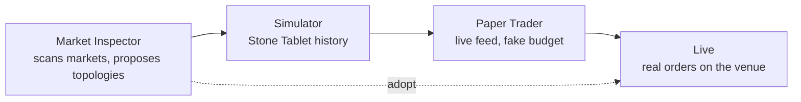

# The Promotion Pipeline

Reference. A strategy earns its way to real money in four steps. Each step
is a gate: it feeds the next one, and the next one refuses what the
previous one could not produce.



## What each step contributes

| Step | Data source | What it must produce |
| ---- | ----------- | -------------------- |
| Market Inspector | Higher-timeframe OHLCV from the connected venues | A signal table, an opposing-pair table and topology proposals |
| Simulator | Stone Tablets, read-only | The same gates latching on the same candles as live |
| Paper Trader | The live feed, in real time, against a budget that is not real | A trade record the History surface can grade |
| Live | The venue | Filled orders, and the exchange values every ledger reconciles to |

## One logic, three data sources

Live, Paper and the Simulator differ in one thing only: where the candles and
the balances come from. The trading logic stays one body of pure code that all
three call. Only the stateful shells fork, which keeps a simulated run from
touching a live object.

The Simulator's fleet is the worked example. It builds real bots against a fake
exchange rather than a second bot class, and that fake exchange is a subclass
of the same interface the live connector implements.

`src/simulator/fleet/sim_exchange.py` — `FleetSimExchange`

```python
class FleetSimExchange(ExchangeInterface):
    """Real-symbol candle-driven fake exchange for Fleet Replay.
```

## The dashed edge

One edge skips the two middle steps. The Market Inspector's adopt path creates
real bots and draws real wires on the live fleet, which is why the handler
opens a confirmation naming the new bot count, the new budget and every wire
the adopt would change.

`src/gui/main_window.py` — `_topology_wire_collisions`

```python
def _topology_wire_collisions(
    self, wires: list, asset_to_bot: dict
) -> list[dict]:
    """Return one dict per proposal wire whose bot pair is already wired."""
```

The read-only edge into the Simulator is a different hook, and it says so in
its own words. It lets the sim replay a proposal's shape across sim bots and
creates nothing.

`src/gui/simulator_tab/simulator_tab.py` — `set_topology_getter`

```python
    READ ONLY. This is not the adopt path — adopting a proposal
    creates real bots and wires on the live fleet, while this only
    lets the simulator replay a proposal's shape across sim bots.
    """
```

## Where the chain breaks today

The Paper Trader step has no module. The Simulator hands nothing forward, and
Live receives from the Market Inspector's adopt path instead. See
[paper-trader.md](paper-trader.md) for the proof and for what the step needs.

Back to [the subsystem index](README.md).
