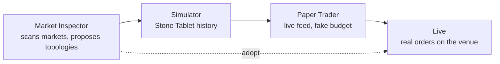

# The Promotion Pipeline

Reference. A strategy earns its way to real money in four steps. Each step
is a gate: it feeds the next one, and the next one refuses what the
previous one could not produce.

## What each step contributes

| Step | Data source | What it must produce |
| ---- | ----------- | -------------------- |
| Market Inspector | Higher-timeframe OHLCV from the connected venues | A signal table, an opposing-pair table and topology proposals |
| Simulator | Stone Tablets, read-only | The same gates latching on the same candles as live |
| Paper Trader | The live feed, in real time, against a budget that is not real | A trade record the History surface can grade |
| Live | The venue | Filled orders, and the exchange values every ledger reconciles to |

## One logic, three data sources

Live, Paper and the Simulator differ in one thing only: where the candles
and the balances come from. The trading logic stays one body of pure code
that all three call. Only the stateful shells fork, which keeps a
simulated run from touching a live object. The Simulator's fleet, for
example, builds real `ScrummingBot` instances against `FleetSimExchange`
in `src/simulator/fleet/sim_exchange.py` rather than a second bot class.

## The dashed edge

`MarketInspectorTopologies` in `src/gui/market_inspector_topologies.py`
emits `adoptRequested`, and `_adopt_topology_proposal` in
`src/gui/main_window.py` creates real bots and draws real wires on the
live fleet. That edge skips the two middle steps, which is why the
handler opens a confirmation naming the new bot count, the new budget and
every wire the adopt would change.

The read-only edge into the Simulator is a different hook:
`set_topology_getter`, wired in
`src/gui/main_tabs/simulator_tab.py`, lets the sim read a proposal's
shape and replay it across sim bots. It creates nothing.

## Where the chain breaks today

The Paper Trader step has no module. The Simulator hands nothing forward,
and Live receives from the Market Inspector's adopt path instead. See
[paper-trader.md](paper-trader.md) for the proof and for what the step
needs.

Back to [the subsystem index](README.md).
