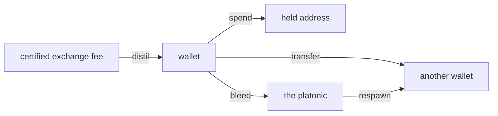
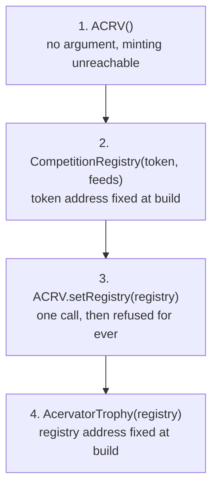
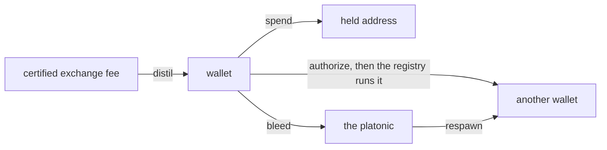

# Proof of Accumulation

Reference. **Not built.** The window builds neither the Competition tab nor the
Local Testnet tab. The tab row carries an empty tab labelled Accumulation in
their place, and issue #147 carries the build-out. `src/competition/` is the
Proof of Accumulation package, and its engine runs today with no screen in
front of it. The rest of this file describes that engine and the contract
design behind it, as a design, not as a shipped feature.

The design is an on-chain competition layer where bots compete publicly and the
winners are awarded ACRV tokens on Base, which is Coinbase's L2. It evolved
from a bot identity and an append-only trade log into Elo ratings, tournament
brackets and an in-platform chain. Every Acervator bot has a cryptographic
identity. During a competition each trade is signed and appended to a Merkle
tree, and at the end the bot submits only the Merkle root — a 32-byte hash that
commits to the whole trade history without revealing one trade of it. The
strategy stays private, the proof is public, and the winner takes ACRV and an
NFT trophy.

## The skeleton

The tab exists and draws three lines: its name, one sentence saying it is not
built, and the issue that owns it. It reads no competition, no token balance
and no trophy.

`src/gui/main_tabs/proof_of_accumulation_tab_surface.py` — the whole empty state

```python
HEADING = "Accumulation"
ISSUE = 147
BUILT = False
STATE_TEXT = "This tab is not built."
ISSUE_TEXT = f"Issue #{ISSUE} carries the build-out."
```

Two frontends draw that one view model. `EmptyTabsMixin` in
`src/gui/main_tabs/empty_tabs.py` builds the Qt tab, and
`src/gui/web/proof_of_accumulation_tab.js` registers a panel with the Electron
shell's panel host. `src.core.desktop_bridge` serves the model under
`proof_of_accumulation_tab.state`.

## Identity

Each instance gets an Ed25519 keypair. The private key signs every trade in the
log. The public key is the identity another party verifies against. Strategy
parameters are never signed and never published, so authorship is provable
while the method stays private.

`src/competition/bot_identity.py` — `BotIdentity`

```python
class BotIdentity:
    """
    Manages a bot's Ed25519 keypair.  The private key never leaves this object
    unencrypted.  The public key is the bot's network-visible identity.
```

## The trade log

Each signed trade appends to a Merkle tree. Leaves are the SHA-256 of a trade's
canonical bytes, the root is the commitment, and a proof lets a third party
confirm one trade sits in the log without receiving the log.

`src/competition/merkle_log.py` — `verify_proof`

```python
def verify_proof(leaf_hash: str, proof: List[dict], root: str) -> bool:
    """Verify a Merkle inclusion proof."""
    current = leaf_hash
    for step in proof:
        if step["position"] == "left":
            current = _node_hash(step["hash"], current)
        else:
            current = _node_hash(current, step["hash"])
    return current == root
```

`merkle_root` returns the commitment and `merkle_proof` builds the inclusion
proof one trade at a time.

## The competition lifecycle

Four phases run in order.

`src/competition/competition_engine.py` — the module's own summary

```python
  1. REGISTRATION  — bots register with capital commitment + config hash
  2. ACTIVE        — bots trade; each trade appended to their Merkle log
  3. SUBMISSION    — trading closes; bots submit Merkle root + performance claim
  4. ADJUDICATION  — arbiter verifies submissions, ranks bots, awards tokens
```

A competition runs either locally across instances on one machine and one price
feed, or between two machines exchanging signed submissions.

## Tournaments

`TournamentEngine` in `src/trading/poa_tournament.py` builds the game shapes.
Each builder returns a tournament from a configuration, and one run method
plays it over a candle provider to an outcome.

| Builder | Shape |
| ------- | ----- |
| `build_duel` | Two participants, head to head |
| `build_melee` | A whole field at once |
| `build_gauntlet` | One challenger against a sequence |

`src/trading/poa_tournament.py` — `TournamentEngine.build_duel`

```python
def build_duel(
    self,
    a: Participant,
    b: Participant,
    season: Season,
    acrv_purse: int = 10,
    seed: Optional[int] = None,
```

`DynamicEventScheduler` places market shocks, puzzle events and regime flips
from the configuration's seed, so the same seed replays the same tournament.
`LocalACRVAdapter` settles the award and each tournament persists as JSON.

## The token

The ledger is append-only, and four methods are its whole surface.

`src/competition/token_ledger.py` — `TokenLedger`

```python
class TokenLedger:
    """
    Append-only ACRV token ledger.

    award()  — mint tokens for a competition result (idempotent)
    balance()  — current balance for a bot
    total_minted()  — total ACRV in existence
    remaining_supply()  — tokens still mintable this season
    """
```

The hard cap is ten million, and the ledger refuses an award that would pass
it. Each season awards less than the one before, so later tokens are harder to
earn.

`src/competition/season_schedule.py` — the supply constants

```python
TOTAL_SUPPLY_CAP = 10_000_000  # Hard cap — immutable
GENESIS_SEASON = 1
INITIAL_REWARD = 500_000  # Season 1 reward pool
DECAY_FACTOR = 0.85  # Each season awards 85% of the prior season
MIN_SEASON_REWARD = 100  # Floor — never less than this per season
```

Awards are idempotent: settling the same result twice writes one record.
Balances are replayed from the log, and no operation edits a balance.

Five tiers are awarded on rank within the field, and the rarest three carry a
lifetime cap on how many can ever exist. Each tier is named for a stage of the
Corpus Hermeticum alchemical path, and pays a fixed number of tokens.

| Tier | Stage | Rank | ACRV paid | Ever minted, at most |
| ---- | ----- | ---- | --------: | -------------------: |
| Harvest | NIGREDO | top 50% | 10 | no cap |
| Gold Fold | ALBEDO | top 10% | 50 | no cap |
| Bear Slayer | CITRINITAS | top 25% in a verified bear market | 100 | 10,000 |
| Grand Accumulator | RUBEDO | top 1% across three consecutive seasons | 500 | 1,000 |
| Ekthelius | UNIO MYSTICA | perfect score across every metric | 10,000 | 21 |

## The token contract

The ledger above is the platform's own record. On the chain the token is an
ERC-20 called Acervator Token. Three of its properties are fixed when the
contract is deployed and cannot be changed afterwards: the supply cap, the one
address allowed to mint, and the absence of any way to burn.

`contracts/ACRV.sol` — the header, and the guard on minting

```solidity
//   • MAX_SUPPLY  = 10,000,000 ACRV (10_000_000 * 10^18 wei)
//   • Tokens can never be burned — supply monotonically increases
//   • The registry address is set once at construction and cannot change

    modifier onlyRegistry() {
        require(msg.sender == registry, "ACRV: caller is not the registry");
```

| Property | Value |
| -------- | ----- |
| Standard | ERC-20, named Acervator Token |
| Chain | Base, chain id 8453 |
| Hard cap | 10,000,000 ACRV, held on the chain |
| Minting | the CompetitionRegistry contract only |
| Burning | never |

The contracts are not deployed. Two npm packages supply the libraries they
build on, and the deploy script takes the network and the signing key. Its own
instructions name the Base test network first.

`contracts/deploy.py` — how it is called

```bash
npm install @openzeppelin/contracts @chainlink/contracts
export ACERVATOR_PRIVATE_KEY=0x...
python deploy.py --network sepolia
```

`src/competition/season_schedule.py` — the last tier

```python
RarityTier(
    name="Ekthelius",
    emoji="∞",
    description="Perfect score across all metrics, any season",
    rank_pct_max=0.001,
    condition="100% win rate + top Sharpe + max capital efficiency",
    max_ever=21,
    base_value=10_000,
),
```

## Quintessence

A certified trade distils the platform's second asset. Entering an event spends
it, and nothing destroys it. It keeps its own ledger, apart from the token
ledger above, because the two obey opposite rules: the token only ever moves
outward into a balance, while Quintessence circulates.

`src/competition/quintessence_ledger.py` — the four operations

```python
def distil(self, address: str, fee_usd: object, trade_grade: object) -> Decimal:
def spend(self, address: str, amount: object, held_address: str) -> Decimal:
def transfer(self, sender, recipient, amount, skill_level) -> QuintessenceTransfer:
def respawn(self, address: str, amount: object) -> Decimal:
```

Quintessence can be in exactly three places, and the three always add up to
everything ever distilled. A wallet holds what a participant can spend. A held
address holds what they have already spent, which rests there and funds later
awards. The platonic holds what bled out of a transfer, and the ledger respawns
that to other participants.



Every operation checks that sum before it writes, and refuses the write when it
does not balance.

`src/competition/quintessence_ledger.py` — the two conditions the check reads

```python
is_balanced=delta == 0 and not negatives,
is_within_cap=self._total_ever_minted <= QUINTESSENCE_SUPPLY_CAP,
```

| Term | Value |
| ---- | ----- |
| Hard cap | 33,000,000 Quintessence, total ever distilled |
| Pre-ownership | none, for anyone |
| Distil rate | one Quintessence for one dollar of certified exchange fee |
| Grade curve | the trade's grade, zero to one, multiplies the award |
| Destruction | never |
| Transfer bleed | 8% at skill level one, falling to 4% at level ten |

The module holds the cap and the rate as constants, and the write path refuses a
mint past the cap rather than reporting it afterwards.

`src/competition/quintessence_ledger.py` — the recorded numbers

```python
QUINTESSENCE_SUPPLY_CAP = Decimal(33_000_000)
QUINTESSENCE_PER_FEE_USD = Decimal(1)
BLEED_FRACTION_AT_LEVEL_1 = Decimal("0.08")
BLEED_FRACTION_AT_LEVEL_10 = Decimal("0.04")
```

Every launch builds the ledger and attaches it to the window beside the local
chain, so a later panel finds it where it finds the chain.

`src/gui/shared_testnet.py` — the line that builds it

```python
main_win._quint_ledger = cls.install_quint_ledger(quint_ledger_path)
```

Nothing spends Quintessence yet. No screen shows a balance and no trade
certifies, so the ledger loads empty on every launch and reports nothing ever
distilled. The transfer duration, the skill that gates a transfer, the guild
check, and the share of a market pool a participant may take are all other
units.

## Head to head

`challenge_protocol.py` carries the Elo ladder. A challenger sends a signed
challenge, the target accepts or declines, both trade the agreed asset for the
agreed duration, and the shared engine adjudicates.

`src/competition/challenge_protocol.py` — the ladder constants

```python
ELO_K_FACTOR = 32
MIN_ELO = 100
```

The stake flows from loser to winner and both ratings move.

## Trophies

One SVG per tier, picked by name. An unknown tier raises rather than returning
an empty drawing, and `generate_preview_html` lays the whole set out on one
page.

`src/competition/trophy_generator.py` — `generate_trophy`

```python
def generate_trophy(tier: str, data: TrophyData) -> str:
    fn = GENERATORS.get(tier)
    if not fn:
        raise ValueError(f"Unknown tier: {tier!r}")
    return fn(data)
```

Inside `harvest_svg`, a text path letters the epigraph's own instruction around
the trophy ring, in its usual form: SOLVE ET COAGULA. Each drawing also letters
its own alchemical stage across the face.

`src/competition/trophy_generator.py` — the stage each tier is lettered with

```python
        "Harvest": "NIGREDO",
        "Gold Fold": "ALBEDO",
        "Bear Slayer": "CITRINITAS",
        "Grand Accumulator": "RUBEDO",
```

### Where a trophy's artwork is kept

The artwork and the metadata are held on the chain itself. The token's own
metadata call returns the JSON inline, and the picture inside that JSON is the
tier's drawing, also inline. Nothing points at IPFS, the file-sharing network
most NFT projects park their pictures on, and nothing points at any other host,
so a trophy lasts as long as the chain does.

`contracts/AcervatorTrophy.sol` — the metadata call

```solidity
            '","image":"data:image/svg+xml;base64,', svgB64,

            "data:application/json;base64,",
```

## The chain

`local_testnet.py` simulates the whole Base environment in memory, with no
wallet, no ETH and no network. Four classes make it up.

| Class | Holds |
| ----- | ----- |
| `LocalChain` | The blocks |
| `LocalACRV` | The ERC-20 balances and the mint history |
| `LocalRegistry` | Competitions, submissions and adjudications |
| `LocalTestnet` | The three above, plus a mock oracle and transaction receipts |

One call runs a whole competition on that chain and returns the result table.
It registers the entrants, trades them, takes their submissions, adjudicates,
awards the tokens and mints the trophy, with nothing written outside a
temporary directory.

`src/competition/local_testnet.py` — a demo run

```python
from src.competition.local_testnet import LocalTestnet

testnet = LocalTestnet()
result = testnet.run_demo_competition(n_bots=3, season=1)
print(result["results_table"])
```

The real targets sit ready for the day it deploys.

`src/competition/base_config.py` — the two chains

```python
  Base Mainnet: chain_id=8453  — production
  Base Sepolia: chain_id=84532 — testnet (deploy here first)
```

The contract addresses and ABIs sit beside them.

## The two shelved tabs

Both tab modules exist and the window builds neither. Their surfaces stay
registered in the bridge, so the view models answer with no Qt tab in front of
them. The Testnet tab is where a competition would be run and its blocks read
in a block explorer; today the demo run above is the only way to reach either.

`src/gui/main_tabs/retired_tabs.py` — `RetiredTabsMixin._install_retired_tab_sentinels`

```python
self._competition_tab = None

self._testnet_tab = None
```

Issue #147 carries the initial build-out.

## 2026-09-08 08:17 - #147 - what the closed issues landed

The manual names this screen Proof of Accumulation (Anonymized Trading
Tournaments Via Blockchain) and issue #147 carries its build-out.

This is currently proposed as a concept but will likely require the building of a supporting blockchain team for proper / full implementation. This system is designed to enable users of Acervator to compete against each anonymously via our own Proof of Accumulation blockchain. The idea is to convert trades executed into videogame metrics such as damage to a coliseum style monster or a fellow trader in a 1v1 face off. This further positions the platform as a surgical tool that can be finely tuned and customized to produce intense competition scenarios between entire groups of traders. This, of course, opens the door for actual tokenized Trading Guilds who may require their members to have a certain number of PoA tokens under their belt to join. There will be much more to follow on this as I do intend to scaffold it out for internal testing.

The tab is now called Accumulation. It sits seventh on the bar, on the
gold ground with red text.

The screen is not built. The window builds neither the Competition tab nor the
Local Testnet tab. The tab row now carries a Proof of Accumulation skeleton,
which draws its name, one sentence saying it is not built, and the issue that
owns it. Issue #147 carries the build-out. The engine behind it runs today, and
the rest of this section is that engine.

`src/gui/main_tabs/proof_of_accumulation_tab_surface.py` — the whole empty state

```python
HEADING = "Accumulation"
ISSUE = 147
BUILT = False
STATE_TEXT = "This tab is not built."
ISSUE_TEXT = f"Issue #{ISSUE} carries the build-out."
```

`src/competition/` is the Proof of Accumulation package. Each bot signs every
trade with an Ed25519 key and signs no strategy parameter, so authorship is
provable while the method stays private.

`src/competition/bot_identity.py` — `BotIdentity`

```python
class BotIdentity:
    """
    Manages a bot's Ed25519 keypair.  The private key never leaves this object
    unencrypted.  The public key is the bot's network-visible identity.
```

The signed trades commit to a Merkle root a third party can verify one trade
against without receiving the log. The competition itself runs four phases.

`src/competition/competition_engine.py` — the module's own summary

```python
  1. REGISTRATION  — bots register with capital commitment + config hash
  2. ACTIVE        — bots trade; each trade appended to their Merkle log
  3. SUBMISSION    — trading closes; bots submit Merkle root + performance claim
  4. ADJUDICATION  — arbiter verifies submissions, ranks bots, awards tokens
```

The token ledger is append-only and idempotent, with five rarity tiers by rank.
Its hard cap is ten million ACRV, and each season awards less than the one
before it.

`src/competition/season_schedule.py` — the supply constants

```python
TOTAL_SUPPLY_CAP = 10_000_000  # Hard cap — immutable
GENESIS_SEASON = 1
INITIAL_REWARD = 500_000  # season 1 pool, in ACRV tokens
DECAY_FACTOR = 0.85
MIN_SEASON_REWARD = 100
```

`TournamentEngine` in `src/trading/poa_tournament.py` builds the duel, the
melee and the gauntlet. A local testnet module beside it simulates the whole
Base environment in memory, with no wallet and no network.

## 2026-09-09 19:39 - #147 - the contract repairs

The three contracts could not be deployed. Each one needed another one's address
at the moment it was built, and the deployment script handed the token the
deployer's own wallet as its only minter. That address could never be corrected
afterwards, so every award would have failed, and the wallet would have held the
right to mint all ten million tokens for the life of the contract.

The token now takes nothing at all when it is built. One call afterwards names
the competition registry as the minter, and a second call to that function is
refused. The call also refuses any target that is not itself a contract, so a
wallet can no longer be named the minter by mistake.

`contracts/ACRV.sol` — the one wiring call

```solidity
    function setRegistry(address registryAddress) external onlyOwner {
        require(registry == address(0),          "ACRV: registry already set");
        require(registryAddress.code.length > 0, "ACRV: registry not a contract");
        registry = registryAddress;
        emit RegistrySet(registryAddress);
    }
```

Nothing now needs an address that does not yet exist. Four steps run in order,
and the two remaining cross-references stay fixed at build time as before.



The other published route was to compute an address before the contract exists,
and it does not solve this. A computed address commits to the values handed to
the constructor, so computing the registry's address still needs the token's
address first, and the circle closes again. The Solidity documentation states
what goes into the computation.

```text
address   = keccak256(0xff ++ deployer ++ salt ++ keccak256(init_code))[12:]
init_code = creation bytecode ++ the encoded constructor arguments
```

A factory contract could break the circle instead, by deploying both in one
transaction and deriving the second address from its own count of deployments.
That adds a fourth contract to the critical path, and that contract would hold
the right to create the token. One locked field is the smaller change.

The award function used to pay the winner and then write its own records. A
token contract that called back during the payment would have found the
competition still marked open. Every record and both log entries now land first,
and the payment is the last statement in the function.

`contracts/CompetitionRegistry.sol` — the end of `adjudicate`

```solidity
        emit Adjudicated(compId, winnerWallet, tierName, tokenAmount, c.season);
        emit TierMinted(tierName, winnerWallet, tokenAmount, compId);

        // Interaction, last
        if (tokenAmount > 0) {
            require(acrv.remainingSupply() >= tokenAmount,
                    "Registry: insufficient ACRV supply remaining");
            acrv.mint(winnerWallet, tokenAmount, compId, tierName);
        }
```

A submitted result carried one unchecked number. A starting value of zero made
the advantage calculation divide by zero, and a negative one reversed the
ranking every award is built on. The function refuses both, and the conversion
that squeezes the result into a small field now fails loudly instead of
silently keeping the wrong digits.

`contracts/CompetitionRegistry.sol` — the guard and the conversion

```solidity
        require(startValueCents > 0,    "Registry: start value <= 0");

        int256 advantage   = finalValueCents - startValueCents;
        int32  advBps      = SafeCast.toInt32((advantage * 10000) / startValueCents);
```

The price feed's answer was read and never checked. Five values come back from
it and only two were kept. Every one is now checked, and a feed reporting no
round, an unfinished round or a price of zero is refused rather than returned.

`contracts/CompetitionRegistry.sol` — `getLatestPrice`

```solidity
        require(roundId != 0,               "Registry: oracle has no round");
        require(answeredInRound >= roundId, "Registry: oracle answer is stale");
        require(startedAt  != 0, "Registry: oracle round unstarted");
        require(answeredAt != 0, "Registry: round incomplete");
        require(answer      > 0, "Registry: price not positive");
```

Handing ownership of any of the three away used to take one call, with nothing
asked of the receiver. All three now require the receiver to accept, so a
mistyped address cannot take ownership and leave nobody able to act.

The deployment script no longer compiles anything. It reads what the build
already produced, so the bytecode that would reach a chain is the bytecode the
analyzers read.

`contracts/deploy.py` — what it loads

```python
DEPLOY_ARTIFACTS = {
    "ACRV": "ACRV.sol/ACRV.json",
    "CompetitionRegistry": "CompetitionRegistry.sol/CompetitionRegistry.json",
    "AcervatorTrophy": "AcervatorTrophy.sol/AcervatorTrophy.json",
}
```

Four analyzers read the contracts before and after. The table is what each one
reported, not a difference between runs.

| Analyzer | Measure | Before | After |
| -------- | ------- | ------ | ----- |
| forge build | compiler warnings | 0 | 0 |
| forge lint | findings, of which warnings | 67, 11 | 57, 2 |
| slither | medium and above | 2 | 0 |
| slither | all bands | 13 | 11 |
| solhint | errors | 37 | 34 |
| semgrep | security findings | 0 | 0 |
| semgrep | ownership transfer without acceptance | 3 | 0 |

Three findings stand, and each has a reason.

The season budget is still not checked on the chain. The registry records what a
season has issued and reads that record nowhere. Checking it there would set a
number deciding how many tokens a season may award, and the operator sets that
number.

The trophy has no ceiling on any tier and no count of what it has minted. Unit
17 of issue #147 builds both.

Seven functions are named for reading the chain clock. No decision in any of
them reads it: every comparison the analyzer lists is on a competition's status
or on how many bots entered. The clock is stored as a record of when each step
happened, and removing that record would remove the on-chain history the design
is built on.

`contracts/CompetitionRegistry.sol` — what the analyzer points at in `adjudicate`

```text
CompetitionRegistry.adjudicate uses timestamp for comparisons
	Dangerous comparisons:
	- require(c.status == CompStatus.SUBMISSION, "Registry: not in submission")
```

The conservation law the design names counts Quintessence and not this token:
wallets plus held addresses plus the platonic equals the total ever distilled,
at most 33,000,000. No Quintessence contract exists, so nothing on the chain can
state that law yet, and the fuzzing the build tool offers has nothing to read.
Unit 6 must carry the three balances and the total as values a caller can read,
or the law stays unprovable on-chain however the token behaves.

In development.

## 2026-09-09 20:43 - #147 - the Quintessence contract

Quintessence now has a contract. It holds the same three places the platform's
own ledger holds, and it reports all three plus the running total as numbers
anyone can read off the chain at any block.

`contracts/Quintessence.sol` — the four numbers a reader gets

```solidity
    uint256 public walletsTotal;
    uint256 public heldTotal;
    uint256 public platonicTotal;
    uint256 public totalEverMinted;
```

The law is that the first three always add up to the fourth, and the fourth can
never pass thirty-three million. The contract also answers both halves in one
call, so a reader does not have to do the sum themselves.

`contracts/Quintessence.sol` — the single call that answers the law

```solidity
        isBalanced = wallets + held + platonic == everMinted;
        isWithinCap = everMinted <= cap;
```

| Term | Value |
| ---- | ----- |
| Smallest unit | one Quintessence divided into 10^18 parts |
| Hard cap | 33,000,000 Quintessence, as 33 followed by 24 zeros of those parts |
| Owner | none |
| Pause | none |
| Upgrade hook | none |
| Burn | none |
| Minting | the Proof-of-Accumulation registry only, named once when built |

The smallest unit matches the prize token, which splits each coin into the same
number of parts. Quintessence needs the split because the award is a dollar of
exchange fee multiplied by a trade grade between zero and one, and because a
transfer loses a single-digit percentage. Whole numbers would round both of
those away.

The contract has no owner and no pause. A wallet cannot move Quintessence on its
own either, because moving it between players is a skill, not a wallet button. A
transfer therefore takes two calls: the holder authorizes it, and the registry
runs it once the waiting time has passed.

`contracts/Quintessence.sol` — the holder's half and the registry's half

```solidity
    function authorizeTransfer(address recipient, uint256 amount) external {
    function executeTransfer(address sender, uint256 skillLevel) external onlyRegistry {
```

Neither side can act alone. The registry cannot move a wallet that authorized
nothing, and a holder cannot move their own units without the registry. One
authorization is held per holder at a time, which is what stops a large transfer
being split into many fast ones.

The contract works out the loss and the waiting time itself, from the published
rates, rather than taking either as a number it is handed. A transfer always
loses at least four per cent and always takes at least one hour.



Nothing in the contract destroys a unit. A spend moves units to a held address
where they rest, and that address is never drained, so a spend can never become
a free transfer. The running total only ever rises.

The build tool's own fuzzing now holds ten properties over the contract, by
throwing random sequences of calls at it. Each property was also broken on
purpose once, to watch the tool report it, and then put back.

`tests/contracts/QuintessenceConservation.t.sol` — what the fuzzing reported

```text
QuintessenceConservationTest invariants (runs: 256, calls: 16384, reverts: 8607)
[PASS] invariant_threeBucketsEqualTotalEverMinted
[PASS] invariant_walletsTotalEqualsSumOfBalances
[PASS] invariant_totalEverMintedWithinCap
[PASS] invariant_totalEverMintedNeverFalls
[PASS] invariant_noUnitIsDestroyed
[PASS] invariant_capRefusesAMintPastIt
[PASS] invariant_onlyRegistryMovesUnits
[PASS] invariant_registryCannotMoveAnUnauthorizedWallet
[PASS] invariant_transferRefusedBeforeItsDurationElapsed
[PASS] invariant_everyTransferBleedsFourPercentOrMore
```

A mint of one unit more than the cap is refused, and the tool printed the
refusal itself while nothing had been minted at all.

`contracts/Quintessence.sol` — the refusal, quoted from the run

```text
    │   └─ ← [Return] 33000000000000000000000000 [3.3e25]
    ├─ Quintessence::distil(QuintessenceActor, 33000000000000000000000001 [3.3e25])
    │   └─ ← [Revert] Quint: supply cap reached
```

Nothing is deployed. No transaction was sent and no network was reached, so the
four deployment steps themselves are unproven. The contract is also not yet
wired to anything: no registry contract exists to name as its minter, and the
platform's own ledger and the contract do not yet read each other.

Three analyzers ran over the new file and none reported a security finding. The
fourth, the one that walks the compiled bytecode, is still missing from this
machine for the reason the earlier audit records.

| Tool | Result on the new contract |
| ---- | -------------------------- |
| the build tool's linter | no errors, one warning about reading the chain clock |
| the static analyzer | one medium finding, on an exact comparison against zero |
| the style linter | 86 warnings, no errors |
| the pattern scanner | 29 findings, none of them about security |

The exact comparison is on the contract's own marker for a waiting transfer,
which holds either zero or a real amount and nothing else, so no third value
exists for it to miss. The contract reads the chain clock to decide whether a
transfer's waiting time has passed, and the shortest waiting time is one hour,
far longer than the few seconds a block producer could shift.

No archetype covers Solidity. Each contract file reports zero analyzers and says
plainly that it was not examined, so the four tools above are the whole coverage
for this file.


Back to [the subsystem index](README.md).
