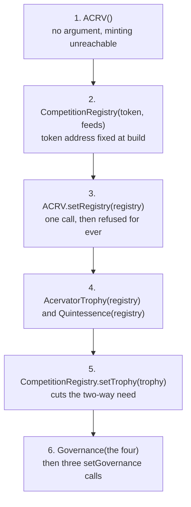
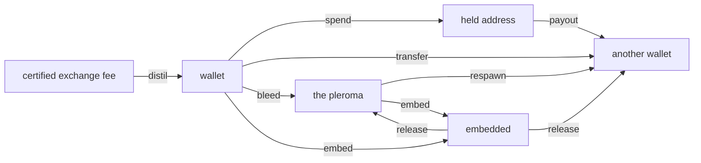
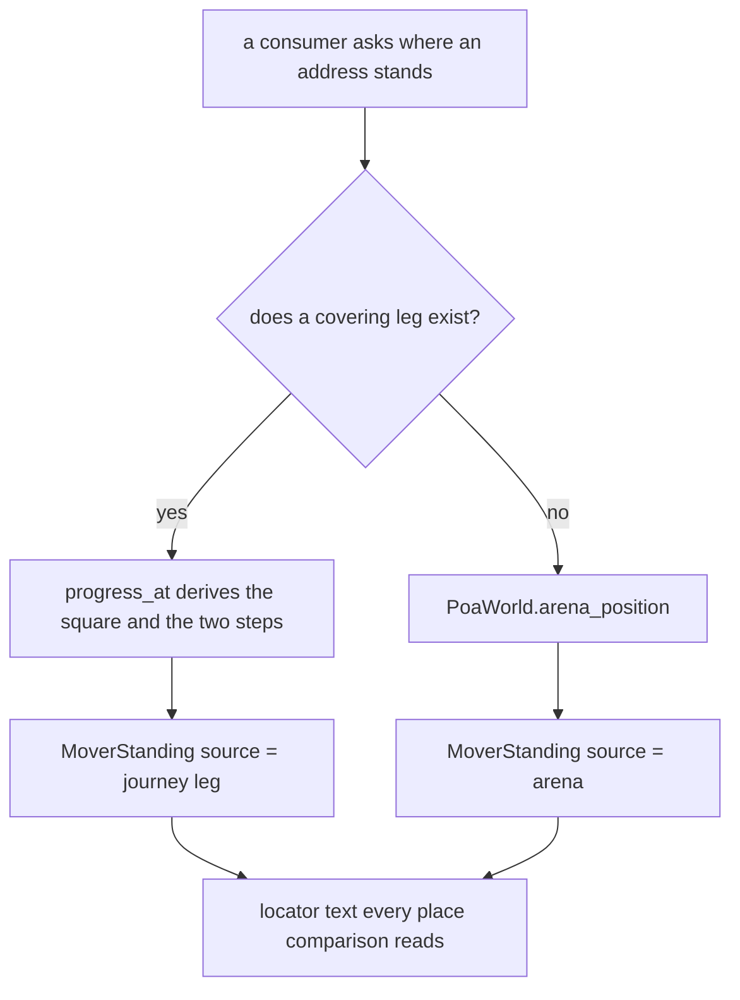
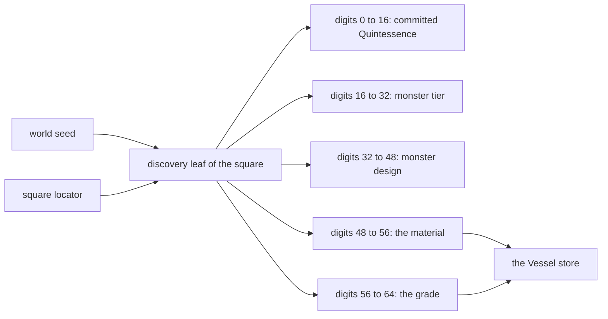
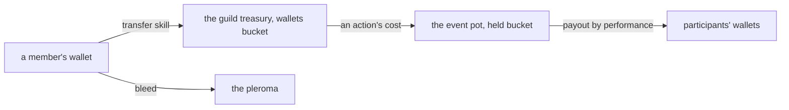

# Proof of Accumulation

Reference. The design is an on-chain competition layer where bots compete
anonymously and the winners take a token on Base, which is Coinbase's layer two.
Every instance holds a cryptographic identity, signs each trade into an
append-only log, and publishes only a commitment to that log. The strategy stays
private and the proof is public.

This is currently proposed as a concept but will likely require the building of a supporting blockchain team for proper / full implementation. This system is designed to enable users of Acervator to compete against each anonymously via our own Proof of Accumulation blockchain. The idea is to convert trades executed into videogame metrics such as damage to a coliseum style monster or a fellow trader in a 1v1 face off. This further positions the platform as a surgical tool that can be finely tuned and customized to produce intense competition scenarios between entire groups of traders. This, of course, opens the door for actual tokenized Trading Guilds who may require their members to have a certain number of PoA tokens under their belt to join. There will be much more to follow on this as I do intend to scaffold it out for internal testing.

## The tab the window does not build

**The main window builds no Accumulation tab.** The tab name sits in the
canonical order and then in the skip list, so the reorder step drops it and the
bar carries nine tabs, not ten. Dropping one name from that list is the one edit
that puts the tab on the bar.

`src/gui/main_tabs/main_window_surface.py` — the skip list and what it leaves

```python
UNBUILT_TABS = (ACCUMULATION_TAB,)

BAR_TAB_ORDER = tuple(name for name in CANONICAL_TAB_ORDER if name not in UNBUILT_TABS)
```

Read at runtime, `BAR_TAB_ORDER` answers Sim, Paper, Live, Charts, Inspector,
Swarm, History, Status and Console. The window's own build step is guarded on the
same list, so the method that would append the panel is never called.

`src/gui/main_window.py` — the guard, and the method it guards

```python
            if ACCUMULATION_TAB not in UNBUILT_TABS:
                self._build_proof_of_accumulation_tab()
```

The Competition tab and the Local Testnet tab are not built either. One mixin
assigns `None` to both attributes on every launch.

`src/gui/main_tabs/retired_tabs.py` — the two sentinels

```python
        self._competition_tab = None

        self._testnet_tab = None
```

Three tab modules therefore exist and no tab draws. `src/competition/` is the
engine behind all three: 47 modules, and the sections below describe what each
one does today.

The package entry imports every module and lists its names, so each form is
reachable by the package name alone. A name one module repeats from a module bound
above it stays unexported, and reaching that one means importing its own module
directly. Each module says in its own text which case it is in.

## What the screen declares

One module declares the whole screen as data. It is registered in the bridge, so
a renderer can ask for the shell by name even with no tab in front of it.

`src/gui/main_tabs/proof_of_accumulation_tab_surface.py` — the shell it declares

```python
METHOD = "proof_of_accumulation_tab.state"

HEADING = "Accumulation"
BUILT = True
STATE_TEXT = (
    "The top row is halved: the current Vessel on the left, the Map or the "
    "Encounter on the right. The party window takes the lower half. No pixel art "
    "is drawn."
)
```

That `BUILT` flag reads true and the window still skips the tab, so the flag
records an intention and the skip list records the behaviour. The skip list is
what runs.

The declared shell halves its top row and takes the lower half for the party.
Three zones, seven subtabs, two chains, eight event types and fifteen mechanism
controls are declared. `src/gui/web/proof_of_accumulation_tab.js` is the renderer
module for those zones.

| Declared | Count | Names |
| -------- | ----: | ----- |
| Zones | 3 | Current Vessel, Enemy Screen, Party Window |
| Subtabs | 7 | Maps, Character Details, Gear, Resources, Quint, Skills, Guild |
| Subtab keys | 7 | Ctrl+1 to Ctrl+7, in that order |
| Chains | 2 | Live, Demo TestNet |
| Event types | 8 | four modes, each with a Standard and an Elite flag |
| Mechanism controls | 15 | identity and its confirm, distil, train, transfer, spend, grade, payout, close, drop, exclusion, reset and its confirm, world and its confirm |
| Wallet sections | 4 | Quintessence, Trophies, Loot, Vessels |
| Party rows | 120 | 40 a page, 3 pages, 8 groups of 5 a page |

A player picks a chain, Live or Demo TestNet, then picks one of the eight event
types, and every mechanism control runs against that pair. The identity control,
the reset control and the world control each ask first and act on a second press. Every control prints what its mechanism did or the refusal
that mechanism raised, and eleven exception types are caught as a refusal rather
than a crash. Until this node writes its identity file, every other control
refuses for want of a participant.

Each subtab draws off one or two engine modules, and the counts below are what
each one puts on the screen.

| Subtab | What it draws | Module behind it |
| ------ | ------------- | ---------------- |
| Maps | 5 grid bounds: 9 squares a side, 81 a layer, 20 layers, 79 participants a layer, 1 square in view | `world_grid` |
| Character Details | 5 stats with their principle and effect, the 10 bands a stat climbs, and the 27 trading metrics | `entity_stats`, `rpg_metrics` |
| Gear | the loot the wallet holds, 4 item classes with their cohesion, 8 mechanisms | `loot_drop`, `items` |
| Resources | 7 materials, each with the Quintessence band one unit embeds and where that band came from | `materials` |
| Quint | the chain, its two files, the smallest unit, the supply cap, the minted total | `quintessence_ledger` |
| Skills | two named pages and the one skill on the ladder, over its 10 levels | `skill_ladder` |
| Guild | 0 guilds, 0 members, the two ranks and the treasury address shape | `guild_roster` |

Clicking the current Vessel opens the Character Details subtab, which is also
what its shortcut does. The Maps subtab opens only in an event whose mode carries
a map. Two of the four modes do — the dungeon crawl and the raid — so four of the
eight event types open it and the other four refuse and say why. A request that
names no subtab, or names one that cannot open, opens Character Details.

`src/gui/main_tabs/proof_of_accumulation_tab_surface.py` — the refusals caught

```python
CONTROL_FAULTS = (
    ActionSpendError,
    LootError,
    OSError,
    OverflowError,
    QuintessenceLedgerError,
    RedistributionError,
    RotationRefusedError,
    SkillLadderError,
    TypeError,
    ValueError,
    WorldGridError,
)
```

## Identity

Each instance gets an Ed25519 keypair. The private key signs every trade in the
log. The public key is the identity another party verifies against. Strategy
parameters are never signed and never published.

`src/competition/bot_identity.py` — `BotIdentity`

```python
class BotIdentity:
    """
    Manages a bot's Ed25519 keypair.  The private key never leaves this object
    unencrypted.  The public key is the bot's network-visible identity.
```

## The trade log

Each signed trade appends to a Merkle tree. Leaves are the SHA-256 of a trade's
canonical bytes, the root is the commitment, and a proof lets a third party
confirm one trade sits in the log without receiving the log.

`src/competition/merkle_log.py` — `verify_proof`

```python
def verify_proof(leaf_hash: str, proof: List[dict], root: str) -> bool:
    """Verify a Merkle inclusion proof."""
    current = leaf_hash
    for step in proof:
        if step["position"] == "left":
            current = _node_hash(step["hash"], current)
        else:
            current = _node_hash(current, step["hash"])
    return current == root
```

`merkle_root` returns the commitment and `merkle_proof` builds the inclusion
proof one trade at a time. No subtab reads that root.

## The competition lifecycle

Four phases run in order. A competition runs either locally across instances on
one machine and one price feed, or between two machines exchanging signed
submissions.

`src/competition/competition_engine.py` — the module's own summary

```python
  1. REGISTRATION  — bots register with capital commitment + config hash
  2. ACTIVE        — bots trade; each trade appended to their Merkle log
  3. SUBMISSION    — trading closes; bots submit Merkle root + performance claim
  4. ADJUDICATION  — arbiter verifies submissions, ranks bots, awards tokens
```

## The token ledger

The ledger is append-only and idempotent: settling the same result twice writes
one record. Balances are replayed from the log and no operation edits one. Ten
public methods answer, and the method reporting what is still mintable is
`remaining_ever`.

`src/competition/token_ledger.py` — the ten methods `TokenLedger` declares

```python
    def award(
    def balance(self, bot_id: str) -> int:
    def awards(self, bot_id: str) -> List[AwardRecord]:
    def total_minted(self) -> int:
    def remaining_ever(self) -> int:
    def season_minted(self, season: int) -> int:
    def leaderboard(self, top_n: int = 20) -> List[dict]:
    def supply_summary(self) -> dict:
    def save(self):
    def load(self) -> "TokenLedger":
```

The hard cap is ten million and the ledger refuses an award that would pass it.
Each season awards seventeen twentieths of the season before, which is 85 per
cent held as an exact ratio rather than a decimal, with a floor of a hundred.

`src/competition/season_schedule.py` — the supply constants

```python
TOTAL_SUPPLY_CAP = 10_000_000  # Hard cap — immutable
GENESIS_SEASON = 1
INITIAL_REWARD = 500_000  # season 1 pool, in ACRV tokens
DECAY_NUMERATOR = 17
DECAY_DENOMINATOR = 20
MIN_SEASON_REWARD = 100
```

Nothing advances the season. The counter lives behind a gated registry function
on the chain and no module under `src` reaches it.

## The five rarity tiers

Five tiers are awarded on rank within the field. Four carry a lifetime ceiling on
how many can ever exist and Harvest carries none, held in the field `max_ever`.
Each tier is named for a stage of the alchemical path and pays a fixed number of
tokens.

| Tier | Stage | Rank | ACRV paid | Ever minted, at most |
| ---- | ----- | ---- | --------: | -------------------: |
| Harvest | NIGREDO | top 50% | 10 | no cap |
| Gold Fold | ALBEDO | top 10% | 50 | 100,000 |
| Bear Slayer | CITRINITAS | top 25% in a verified bear market | 100 | 10,000 |
| Grand Accumulator | RUBEDO | top 1% across three consecutive seasons | 500 | 1,000 |
| Ekthelius | UNIO MYSTICA | perfect score across every metric | 10,000 | 21 |

The first tier and the last show both cases of the ceiling field.

`src/competition/season_schedule.py` — the uncapped tier, then the capped one

```python
    RarityTier(
        name="Harvest",
        emoji="🌾",
        description="Top 50% of competition field",
        rank_pct_max=0.50,
        condition="Win rate > 50% of competing bots",
        max_ever=None,
        base_value=10,
    ),
RarityTier(
    name="Ekthelius",
    emoji="∞",
    description="Perfect score across all metrics, any season",
    rank_pct_max=0.001,
    condition="100% win rate + top Sharpe + max capital efficiency",
    max_ever=21,
    base_value=10_000,
),
```

## The token contract

The ledger above is the platform's own record. On the chain the token is an
ERC-20 called Acervator Token. Three properties are fixed at deployment and
cannot change afterwards: the supply cap, the one address allowed to mint, and
the absence of any way to burn.

| Property | Value |
| -------- | ----- |
| Standard | ERC-20, named Acervator Token |
| Chain | Base, chain id 8453 |
| Hard cap | 10,000,000 ACRV, held on the chain |
| Minting | the CompetitionRegistry contract only |
| Burning | never |

The token takes no address when it is built. One call afterwards names the
registry as the minter, a second call to it is refused, and any target that is
not itself a contract is refused, so a wallet cannot be named the minter by
mistake.

`contracts/ACRV.sol` — the one wiring call

```solidity
    function setRegistry(address registryAddress) external onlyOwner {
        require(registry == address(0),          "ACRV: registry already set");
        require(registryAddress.code.length > 0, "ACRV: registry not a contract");
        registry = registryAddress;
        emit RegistrySet(registryAddress);
    }
```

The contracts are not deployed. Five are deployed together — the token, the
competition registry, the trophy, Quintessence and Governance. The registry and
the trophy each need the other's address, and `setTrophy` is what cuts that
cycle: the registry deploys first and points back at the trophy afterwards.
Two npm packages supply the libraries they build on, and the deploy script takes
the network and the signing key. Its own instructions name the Base test network
first.

`contracts/deploy.py` — how it is called

```bash
npm install @openzeppelin/contracts @chainlink/contracts
export ACERVATOR_PRIVATE_KEY=0x...
python deploy.py --network sepolia
```

Nothing needs an address that does not yet exist. The token takes no constructor
argument, the registry takes the token's address, the trophy and Quintessence take
the registry's, and Governance takes all four. Five wiring calls follow, each
running once.



Computing an address before the contract exists does not solve the cycle. A
computed address commits to the values handed to the constructor, so computing the
registry's address still needs the token's address first, and the circle closes
again.

```text
address   = keccak256(0xff ++ deployer ++ salt ++ keccak256(init_code))[12:]
init_code = creation bytecode ++ the encoded constructor arguments
```

The build settings are fixed in `foundry.toml`, so the deployed bytecode is the
bytecode the analyzers read. The deploy script refuses to run on an artifact
`forge build` has not written.

The registry's award function writes every record and both log entries before it
pays, so a token contract that called back during the payment cannot find the
competition still marked open.

## The Quintessence contract

A second contract holds Quintessence on the chain. It divides one unit into ten
to the eighteenth parts, has no owner, no pause, no upgrade hook and no burn, and
names its minter once when it is built.

| Term | Value |
| ---- | ----- |
| Smallest unit | one Quintessence divided into 10^18 parts |
| Hard cap | 33,000,000 Quintessence, as 33 followed by 24 zeros of those parts |
| Owner | none |
| Pause | none |
| Upgrade hook | none |
| Burn | never |
| Minting | the Proof-of-Accumulation registry only, named once when built |

`contracts/Quintessence.sol` refuses a transfer too small for the recipient to
receive one whole smallest unit, rather than paying it as nothing.
`tests/contracts/QuintessenceConservation.t.sol` drives the conservation rule.

The buckets move on the chain as they do in the platform's ledger, with one
difference: a wallet cannot pay another wallet out of the held bucket. It
authorises the payment and the registry runs it.

## Governance, the franchise and the halt council

A fifth contract governs the other four. A vote sits at one of four levels, and
each level sets its own holding to propose, its own quorum, its own approval share
and its own delay before the change takes effect.

| Level | Holding to propose | Quorum | Approval | Delay |
| ----- | -----------------: | -----: | -------: | ----: |
| Informational | 1 Quintessence | 10% | 50% | none |
| Patch | 25 Quintessence | 20% | 50% | 2 days |
| Interface | 75 Quintessence | 30% | 60% | 7 days |
| Core | 150 Quintessence | 40% | 67% | 30 days |

The franchise is a second number beside the balance, and it moves no Quintessence.
A balance that rises carries the franchise up with it in the same block. A balance
that falls leaves the franchise at its remembered ceiling, and that ceiling stands
for ninety days after the address's last action before it begins to fall back
toward the balance, closing the gap at a ninetieth a day over the next ninety.
The ramp is continuous rather than stepped, so the rate holds between days too.

`contracts/Governance.sol` — the franchise rule, in its own words

```solidity
//   franchiseOf(a) >= Quintessence.balance(a), for every address, always
```

The halt council is five elected addresses, three of which halt one named
mechanism for seven days. No release call exists: the halted state reads a
timestamp, so a halt ends by itself.

`contracts/Governance.sol` — the council and the halt

```solidity
    uint256 public constant COUNCIL_SIZE = 5;
    uint256 public constant HALT_SIGNALS_REQUIRED = 3;
    uint256 public constant HALT_SECONDS = 7 days;
    uint256 public constant HOLD_SECONDS = 90 days;
    uint256 public constant RESYNC_SECONDS = 90 days;
    uint256 public constant BPS_DENOMINATOR = 10_000;
```

Every deployment stays immutable. A change no vote can make is made by deploying a
new contract and pointing migration at it on a Core vote. Holders then spend their
own units into the migration held address, where Quintessence retires them. An
address that never spends keeps its units on this contract and reaches nothing the
new one governs.

## Trophies

One SVG per tier, picked by name. An unknown tier raises rather than returning an
empty drawing, and `generate_preview_html` lays the whole set out on one page.

`src/competition/trophy_generator.py` — `generate_trophy`

```python
def generate_trophy(tier: str, data: TrophyData) -> str:
    fn = GENERATORS.get(tier)
    if not fn:
        raise ValueError(f"Unknown tier: {tier!r}")
    return fn(data)
```

Inside `harvest_svg` a text path letters the epigraph's own instruction around the
trophy ring, in its usual form: SOLVE ET COAGULA. Each drawing also letters its
own alchemical stage across the face, NIGREDO for Harvest through RUBEDO for
Grand Accumulator.

### Where a trophy's artwork is kept

The artwork and the metadata are held on the chain itself. The token's metadata
call returns the JSON inline, and the picture inside that JSON is the tier's
drawing, also inline. Nothing points at IPFS, the file-sharing network most NFT
projects park their pictures on, and nothing points at any other host, so a
trophy lasts as long as the chain does.

`contracts/AcervatorTrophy.sol` — the metadata call

```solidity
            '","image":"data:image/svg+xml;base64,', svgB64,

            "data:application/json;base64,",
```

The trophy contract holds the four ceilings, so a tier cannot be over-minted by a
caller. `tests/contracts/TrophyTierCaps.t.sol` drives them and
`contracts/MetadataLib.sol` builds the inline JSON.

| Tier | Trophies ever | Where the ceiling is held |
| ---- | ------------- | ------------------------- |
| Harvest | no limit | nowhere, by design |
| Gold Fold | 100,000 | the trophy contract |
| Bear Slayer | 10,000 | the trophy contract |
| Grand Accumulator | 1,000 | the trophy contract |
| Ekthelius | 21 | the trophy contract |

## The chain

`local_testnet.py` simulates the whole Base environment in memory, with no wallet
and no network. Seven classes answer: four are the chain and its contracts, three
are the records those four store.

| Class | Holds |
| ----- | ----- |
| `LocalChain` | The blocks |
| `LocalACRV` | The ERC-20 balances and the mint history |
| `LocalRegistry` | Competitions, submissions and adjudications |
| `LocalTestnet` | The three above, plus a mock oracle and transaction receipts |
| `Block` | One block's number, hash, parent hash, timestamp and transactions |
| `TxRecord` | One transaction's hash, block, sender, function, arguments and gas |
| `ChainEvent` | One event a contract emitted, with its block and its arguments |

A block and a transaction are each named by their own contents, so no two records
of different content share a name. The two names read different fields.

| value | names a transaction | names a block |
|---|---|---|
| sender and recipient | yes | no |
| the call and its arguments | yes | no |
| gas | yes | no |
| success flag | yes | no |
| block number | no | yes |
| timestamp | no | yes |
| parent block's name | no | yes |
| the transactions held | no | yes |

One call runs a whole competition and returns the result table, writing nothing
outside a temporary directory.

`src/competition/local_testnet.py` — a demo run

```python
from src.competition.local_testnet import LocalTestnet

testnet = LocalTestnet()
result = testnet.run_demo_competition(n_bots=3, season=1)
print(result["results_table"])
```

The token carries eighteen decimals on that chain, the demo price series is drawn
from a fixed seed so two runs agree, and a load that finds another schema reports
at most five altered records rather than every one.

`src/competition/local_testnet.py` — the chain constants

```python
TOKEN_DECIMALS = 18
TX_SUCCESS = 1
GENESIS_BLOCK_ID = "0x" + "0" * 64
TIMESTAMP_DIGITS = 3
ALTERED_LOG_LIMIT = 5
DEMO_PRICE_SEED = 42
```

A checkpoint file and an append log hold the chain between launches. The chain
adds what changed rather than rewriting itself, and a checkpoint is written every
fifty thousand records so a load does not replay the whole log. The reset control
names both files and the bytes they hold before it deletes either.

The real targets sit ready for the day it deploys. The two ABIs are complete and
the four address fields are empty, so the calls are already described the day an
address arrives.

`src/competition/base_config.py` — the two chains and what they answer

```
Base Mainnet: chain_id=8453  — production
Base Sepolia: chain_id=84532 — testnet (deploy here first)

BASE_MAINNET   acrv_address = ''   registry_address = ''
BASE_SEPOLIA   acrv_address = ''   registry_address = ''
ACRV_ABI       12 entries
REGISTRY_ABI   16 entries
```

## Quintessence

A certified trade distils the platform's second asset. Entering an event spends
it, and nothing destroys it. It keeps its own ledger, apart from the token ledger
above, because the two obey opposite rules: the token only ever moves outward
into a balance, while Quintessence circulates.

`src/competition/quintessence_ledger.py` — the nine operations

```python
def distil(self, address: str, fee_usd: object, trade_grade: object) -> Decimal:
def spend(self, address: str, amount: object, held_address: str) -> Decimal:
def transfer(self, sender, recipient, amount, skill_level) -> QuintessenceTransfer:
def payout(self, held_address: str, credits: dict) -> Decimal:
def respawn(self, address: str, amount: object) -> Decimal:
def embed_from_pleroma(self, amount: object) -> Decimal:
def embed_from_wallet(self, address, amount, embedded_amount) -> QuintessenceEmbed:
def release_from_embedded(self, address, amount, recovered_amount) -> QuintessenceRelease:
def release_all_to_pleroma(self, amount: object) -> Decimal:
```

Quintessence can be in exactly four places, and the four always add up to
everything ever distilled. A wallet holds what a participant can spend. A held
address holds what they have already spent, which rests there and funds later
awards. The payout operation moves an award from the held address into the
winner's wallet. The pleroma holds what bled out of a transfer and the ledger
respawns that to other participants. The embedded bucket holds what a thing in
the world carries in itself, drawn out of the pleroma and returned there when the
thing is broken.



Every operation checks that sum before it writes, and refuses the write when it
does not balance.

`src/competition/quintessence_ledger.py` — the two conditions the check reads

```python
is_balanced=delta == 0 and not negatives,
is_within_cap=self._total_ever_minted <= QUINTESSENCE_SUPPLY_CAP,
```

| Term | Value |
| ---- | ----- |
| Hard cap | 33,000,000 Quintessence, total ever distilled |
| Pre-ownership | none, for anyone |
| Distil rate | one Quintessence for one dollar of certified exchange fee |
| Grade curve | the trade's grade, zero to one, multiplies the award |
| Destruction | never |
| Transfer bleed | 8% at skill level one, falling to 4% at level ten |
| Resolution | one Quintessence divides into 100,000,000 minimum units of 0.00000001 |

The module holds the cap and the rate as constants, and the write path refuses a
mint past the cap rather than reporting it afterwards.

`src/competition/quintessence_ledger.py` — the recorded numbers

```python
QUINTESSENCE_SUPPLY_CAP = Decimal(33_000_000)
QUINTESSENCE_MINIMUM_UNIT = Decimal("0.00000001")
QUINTESSENCE_UNITS_PER_WHOLE = 100_000_000
QUINTESSENCE_PER_FEE_USD = Decimal(1)
BLEED_FRACTION_AT_LEVEL_1 = Decimal("0.08")
BLEED_FRACTION_AT_LEVEL_10 = Decimal("0.04")
MIN_TRANSFER_SKILL_LEVEL = 1
MAX_TRANSFER_SKILL_LEVEL = 10
```

Ten movement kinds are named, one per operation plus the bleed, so every write
carries the name of the movement that made it.

### One whole Quintessence divides into a hundred million minimum units

The minimum unit is the smallest amount that can exist. A divine essence is
potent at a minute amount, so one whole unit carries a hundred million places to
hold power in, at the same resolution as the first cryptocurrency.

Every amount a bucket receives is a whole number of minimum units. The amount is
rounded down onto that figure as it is written, so no wallet, held address,
pleroma or embedded balance can carry a fraction the currency cannot express.

`src/competition/quintessence_ledger.py` — the rounding and the refusal

```python
def quantize_quintessence(amount: Decimal) -> Decimal:
    return amount.quantize(QUINTESSENCE_MINIMUM_UNIT, rounding=ROUND_DOWN)


def is_on_quintessence_grid(amount: Decimal) -> bool:
    return amount == quantize_quintessence(amount)
```

### The rounding leftover returns to the pleroma, because nothing is destroyed

A bleed of eight per cent down to four per cent does not divide evenly at eight of
the ten skill levels. The amount the recipient receives is rounded down and the
bleed takes the rest, so the fraction that cannot be paid joins the pleroma
rather than vanishing. That keeps the four buckets equal to everything ever
distilled, to the unit.

`src/competition/quintessence_ledger.py` — the transfer split

```python
received = quantize_quintessence(sent - sent * fraction)
bled = sent - received
```

| Skill level | Bleed on 100 Quintessence | Received |
| ----------- | ------------------------- | -------- |
| 1 | 8 | 92 |
| 2 | 7.55555556 | 92.44444444 |
| 3 | 7.11111112 | 92.88888888 |
| 4 | 6.66666667 | 93.33333333 |
| 5 | 6.22222223 | 93.77777777 |
| 6 | 5.77777778 | 94.22222222 |
| 7 | 5.33333334 | 94.66666666 |
| 8 | 4.88888889 | 95.11111111 |
| 9 | 4.44444445 | 95.55555555 |
| 10 | 4 | 96 |

The five stat requirements are whole Quintessence already — one stat measures 550
at level 100 and five of them measure 2,750 — so the resolution changes nothing
about the stat scale.

### Where the ledger is built

Every launch builds the ledger and attaches it to the window beside the local
chain, so a later panel finds it where it finds the chain. The same launch hands
that ledger to the certification socket, so the socket and the panels move one
ledger and not two.

`src/gui/shared_testnet.py` — the ledger, and the socket that takes it

```python
        ledger = cls.install_quint_ledger(quint_ledger_path)
        main_win._quint_ledger = ledger
        main_win._market_rotation = bridge.install_market_rotation(rotation_path)
        main_win._capture_bounds = bridge.install_capture_bounds(
            main_win._market_rotation, bounds_path
        )
        main_win._certification_socket = bridge.install_certification_socket(
            ledger, socket_path, main_win._capture_bounds
        )
```

Fluor is the name Quintessence takes when it pays for a movement on the chain.
Every game fee is Quintessence; only the chain movement is called Fluor.

> "Everything is Quint and we can invent our version of gas using an alchemical
> term for 'flow' or 'move' or 'fuel'"

## The certified fill

A trade certifies through one method, which signs one fill, logs it, posts it and
distils the venue's fee. It refuses a fill already certified.

`src/competition/certification_socket.py` — what the method contracts to do

```python
    def certify(self, identity: BotIdentity, fill: CertifiedFill) -> CertificationReceipt:
        """Sign, log, post and distil one fill, and return its receipt.
```

Certification is assembled from parts that already existed and five the socket
added.

| Part of certification | Where it comes from |
| --------------------- | ------------------- |
| Signing one fill | `BotIdentity.sign_trade` |
| Refusing a wrong competition, a wrong bot, a bad signature | `MerkleTradeLog.append` |
| The commitment over every certified fill | `MerkleTradeLog.root` |
| Proof of one fill without the log | `MerkleTradeLog.proof_for` |
| A summary revealing no fill | `MerkleTradeLog.submission_summary` |
| The transaction and the event on chain | `LocalChain.send_tx`, `LocalChain.emit` |
| Minting the award | `QuintessenceLedger.distil` |
| One chain and one ledger per launch | `SharedTestnetBridge.install_on` |
| A fill offered for certification | `CertifiedFill` |
| What one certification produced | `CertificationReceipt` |
| The replay, stranger and cap refusals | `CertificationSocket.certify` |
| The lifetime fee total | `lifetime_certified_fee_usd` |
| The fill subscriber | `attach_to_bus` |

Four refusals guard the mint, and the second column names what each one prevents.

| Refused | Without its guard |
| ------- | ----------------- |
| A fill already certified | the fee total doubles, $4.00 to $8.00 |
| A bot that has certified nothing | it enters an event |
| A forged signature | 500 Quintessence mints for a bot that signed nothing |
| An award past the 33,000,000 cap | the log keeps a fill that never distilled |

The fill event carries the venue's own fee, read back off the settled order
rather than estimated from a configured percentage, so a distil mints on what the
exchange actually charged. `src/trading/scrumming/execution.py` places the order
and `src/exchange/ccxt_connector.py` reads it back;
`src/trading/trade_grader.py` supplies the grade that multiplies the award.

## The capture bounds on one award

An award is bounded four ways: a market must be in the rotating reward set, the
award must name an activation, it must wait out a candle cooldown, and no
participant may take more than a fixed share of a market's allotment.

`src/competition/capture_bounds.py` — the bounds and the cooldown

```python
COOLDOWN_CANDLES = 3
COOLDOWN_FLOOR_S = 900
MIN_SCORED_AXES = 1
EMISSION_PER_ACTIVATION = None
EXECUTION_READABLE_BPS = 100.0
```

The cooldown is three candles of the bot's own timeframe with a floor of nine
hundred seconds, so a fast bot waits the floor and a slow one waits its candles.

| Bot timeframe | Three candles | The wait | What decides it |
| ------------- | ------------- | -------- | --------------- |
| 1m | 180 s | 900 s | the floor |
| 3m | 540 s | 900 s | the floor |
| 5m | 900 s | 900 s | they agree |
| 15m | 2,700 s | 2,700 s | three candles |
| 1h | 10,800 s | 10,800 s | three candles |
| 1d | 259,200 s | 259,200 s | three candles |

**No emission figure exists.** `EMISSION_PER_ACTIVATION` holds nothing, so an
activation refuses for want of a figure nobody has set. Eleven refusal reasons
are named, the missing emission and the missing grade among them.

## The rotating reward set

Which markets may reward Quintessence rotates. The set is drawn from the markets
ranked by the dollar value traded in twenty-four hours, and the draw is committed
before it is revealed, so no participant can learn the set while the window is
open.

`src/competition/market_rotation.py` — the bounds on the draw

```python
TOP_N_BY_VOLUME = 20
MIN_ELIGIBLE_POOL = 12
DRAW_DENOMINATOR = 4
MAX_PARTICIPANT_SHARE_PCT = Decimal("5")
AGE_LOOKUP_INTERVAL_S = 13.0
ROTATION_SALT_BYTES = 16
```

One market in four is drawn, the pool refuses to draw below twelve eligible
markets, and no participant may take above five per cent of a market's allotment.
The ranking reads the dollar value traded, not the coin count.

| What the ranking reads | Where it comes from |
| ---------------------- | ------------------- |
| The dollar value traded in 24 hours | `quoteVolume`, served by the venue |
| The same figure where a venue omits it | coins traded times the last price |
| The coin count, still recorded | `volume_24h`, read by the topology proposals |

While the window is open, neither a participant, another node, nor the exchange
can learn which markets pay; only the node that drew the set holds the answer, on
its own disk. Seven states are named for one market: eligible, in rotation,
outside the top volume, excluded by the exchange, pool below floor, not drawn,
and no open window. An exclusion filed in a season binds at the next season
boundary.

## The six-month project age rule

A market rewards Quintessence only if its project is at least six calendar months
old. The lookup reads the project's start date from the market data service,
caches it outside the repository, and answers one of five verdicts.

`src/competition/project_age.py` — the rule and its verdicts

```python
MIN_PROJECT_AGE_MONTHS = 6
HTTP_TIMEOUT_S = 15.0
GENESIS_CACHE_FILE_VERSION = 1
OLD_ENOUGH = "old_enough"
TOO_YOUNG = "too_young"
NO_COINGECKO_ID = "no_coingecko_id"
NO_GENESIS_DATE = "no_genesis_date"
LOOKUP_FAILED = "lookup_failed"
```

Six months means six calendar months, not a count of days. Four of the five
verdicts are refusals: the project is under six months old, the catalogue has no
identifier for it, the service answers with no date, or the call did not answer.
The lookup is assembled from parts the platform already had.

| Part of the lookup | Where it comes from |
| ------------------ | ------------------- |
| The catalogue identifier for an asset | `crypto_assets.ASSETS` |
| The project's own start date | the market service's coin detail address |
| A request that refuses any address but http and https | `safe_url.SafeRequest` |
| Opening that request | `safe_url.safe_urlopen` |
| Writing the cache file without a torn write | `io_utils.atomic_write_json` |
| Runtime data outside the repository | the same home folder the rest of the runtime uses |
| The six-month test | `months_after` |
| One market's answer | `ProjectAgeVerdict` |
| The four refusals | `ProjectAgeLookup.verdict_for` |

## The event modes and the turn

Four modes pair with one Elite flag, so there are eight event types and no mode is
written twice. The code is what every other module keys on; the label is what the
screen draws beside the Standard or Elite word.

| Mode | Label on screen | Shape |
| ---- | --------------- | ----- |
| `monster_smash` | Fixation | One participant against low to midlevel creatures |
| `team_monster_smash` | Coagulation | A certified guild, up to 120 against 1 |
| `dungeon_crawl` | Descension | One participant, or a group of six, through a dungeon |
| `raid` | Cementation | A group of sixty, the most challenging and the most rewarding |

The four labels are the names of alchemical operations, which he asked for.

> "Please rename events to match Hermetic tests or similar..."

One table indexed by the Elite flag carries every difference between a Standard
and an Elite event, so the two cannot drift apart.

`src/competition/poa_modes.py` — the one table the Elite flag indexes

```python
STANDARD_RULES = VariantRules(
    STANDARD_SUFFIX, STANDARD_LABEL, STANDARD_TIMEFRAME, 0, 0, 0, 0
)
ELITE_RULES = VariantRules(ELITE_SUFFIX, ELITE_LABEL, ELITE_TIMEFRAME, 1, -1, 1, 1)

VARIANT_RULES: dict[bool, VariantRules] = {False: STANDARD_RULES, True: ELITE_RULES}
```

An Elite event runs on the one-minute candle and a Standard event on the
five-minute candle. Elite raises difficulty, loot rarity and drop rate by one step
each and lowers the entry fee by one.

| Event type | Turn | Difficulty | Entry fee | Loot rarity | Loot drop |
| ---------- | ---- | ---------- | --------- | ----------- | --------- |
| `monster_smash` | 5m | 1 | 1 | 1 | 1 |
| `monster_smash_elite` | 1m | 2 | 1 | 2 | 2 |
| `team_monster_smash` | 5m | 2 | 2 | 2 | 2 |
| `team_monster_smash_elite` | 1m | 3 | 1 | 3 | 3 |
| `dungeon_crawl` | 5m | 3 | 3 | 3 | 3 |
| `dungeon_crawl_elite` | 1m | 4 | 2 | 4 | 4 |
| `raid` | 5m | 4 | 4 | 4 | 4 |
| `raid_elite` | 1m | 5 | 3 | 5 | 5 |

A turn is one candle of the market clock, and `turn_at` names the turn that clock
is in. An Impetus pool holds the points one turn grants and loses what that turn
does not spend.

`src/competition/poa_modes.py` — the Impetus curve

```python
WORLD_TURN_TIMEFRAME = "1h"
WORLD_TURN_SECONDS = TF_SECONDS[WORLD_TURN_TIMEFRAME]
IMPETUS_AT_FIRST_LEVEL = 4
IMPETUS_LEVELS_PER_STEP = 20
IMPETUS_SPEED_CAP_FACTOR = 2
IMPETUS_FLOOR = 1
```

One world turn is one hour, read off the shared timeframe table, which is 3,600
seconds. A participant gains one Impetus point a turn every twenty levels.

| Level | Impetus a turn |
| ----- | -------------- |
| 1 | 4 |
| 21 | 5 |
| 40 | 6 |
| 60 | 7 |
| 80 | 8 |
| 100 | 9 |

## The action bands and the record store

Five bands price every action from the cheapest to the dearest, a hundred to one
across the range. A charge may span turns, with a floor of one turn.

`src/competition/action_spend.py` — the bands and what each buys

```python
BANDS: dict[str, Decimal] = {
    BAND_X1: Decimal("0.001"),
    BAND_X3: Decimal("0.003"),
    BAND_X10: Decimal("0.010"),
    BAND_X30: Decimal("0.030"),
    BAND_X100: Decimal("0.100"),
}

BAND_ACTIONS: dict[str, str] = {
    BAND_X1: "move, switch weapon, take an item from a bag",
    BAND_X3: "a basic attack, a basic heal",
    BAND_X10: "a class ability on a cooldown",
    BAND_X30: "a group-wide ability, a threat move across the field",
    BAND_X100: "a multi-turn spell, and the decisive tactics beside it",
}
```

A spend rests its cost at one address, the event pot, and a record store holds
every action a participant paid for. The store's own file carries a version, so a
load that finds another schema says so.

## The pot divides on performance

An Elite event's pot returns three quarters of itself to the participants,
divided on a normalised performance score. The remainder rests on the chain rather
than being rounded away, and a participant with no scored axis takes no share.

`src/competition/event_redistribution.py` — the return share

```python
RETURN_PERCENT = 75
SCORED = "scored"
NO_SCORE = "no_score"
```

The division reads performance and never spend: scaling one participant's spend by
any factor leaves every payout identical, while halving that participant's score
moves them all.

## Head to head

`challenge_protocol.py` carries the Elo ladder. A challenger sends a signed
challenge, the target accepts or declines, both trade the agreed asset for the
agreed duration, and the shared engine adjudicates. The stake flows from loser to
winner and both ratings move.

`src/competition/challenge_protocol.py` — the ladder constants

```python
DEFAULT_ELO = 1200
ELO_K_FACTOR = 32
MIN_ELO = 100
```

## The world grid

A world is a stack of layers, each a square grid. The grid side is not chosen: it
is derived from how many records one layer's turn can hold on the chain, so the
world is exactly as large as the chain can carry.

`src/competition/world_grid.py` — the derivation, and the figures it fixes

```python
WORLD_RECORD_BYTES = 1473
TURN_BYTE_CAPACITY = 1_048_576
TREE_SPHERES = 10
SEPHIROT_LAYERS = TREE_SPHERES * 2
ARENA_LAYER = 0
BASE_VIEWRANGE_SQUARES = 1
SQUARE_STEPS = 100
WORLD_SEED_BYTES = 16
```

Read at runtime, one turn holds 711 records a layer, one participant writes 9 of
them, so 79 participants fit a layer and the grid is 9 squares a side holding 81
squares. Twenty layers are declared, two for each of the ten spheres, and layer
zero is the arena every participant starts on. One square is a hundred steps
across.

| Figure | Value |
| ------ | ----: |
| Bytes one world record writes | 1,473 |
| Bytes one layer's turn may hold | 1,048,576 |
| Records one layer's turn holds | 711 |
| Records one participant writes a turn | 9 |
| Participants a layer | 79 |
| Squares a side | 9 |
| Squares a layer | 81 |
| Layers declared | 20 |
| Squares in view | 1 |
| Steps across one square | 100 |

Eight chain functions and seven events are named for the world: create, breach a
layer, discover a zone, discover an asset, learn an asset, extract Quintessence
and publish the seed. The seed is committed when the world is created and
published later, so no participant can read the world ahead of discovering it.
Discovery runs at three levels: the square, the zone region on it, and the fact
found there.

A terrain grid is separate from the world grid and need not line up with it.

> "Also, terrain grids do not need to overlap perfectly with the world grid. These
> grids are varied in size and shape while be linked together at their own
> borders."

A zone region carries a boundary of at least three vertices and the participant
who discovered it. It carries no terrain kind, so no terrain has a map mark.

## Movement, and the world turn's pool

Movement is derived rather than stored. One record opens a journey leg, and where
a participant stands is computed from that leg and the clock. A participant who
has not moved stands at the arena.

`src/competition/world_movement.py` — what a leg declares

```python
MOVEMENT_PRECISION = 28
BASE_STEPS_PER_TURN = SQUARE_STEPS
STANDING_FROM_LEG = "journey leg"
STANDING_FROM_ARENA = "arena"
JOURNEY_FILE_VERSION = 1
```

Where an address stands is answered one of two ways, and the answer names which
one it came from. Both end in the locator text every place comparison reads.



A turn grants a pool of steps, and the pool is counted in steps rather than in
squares, so a part of a square is expressible.

> "Just need to be able to say that character A traversed x% of a given square in
> a given turn and this will make it relatively easy to simulate varied terrain
> within one or across multiple squares. Should be simple enough to make this
> dynamic and per character or army or group with encumberance playing a role."

Encumbrance is the rule that would spend more of the pool for a heavier load.

> "Its a function of Strength (max weight) and Constitution (turn point penalty
> while carrying)."

> "Just need to be able to say that character A traversed x% of a given square in
> a given turn... Should be simple enough to make this dynamic and per character
> or army or group with encumberance playing a role."

`src/competition/world_turn.py` — the pool's bounds

```python
STEP_UNIT = "step"
MIN_GRANT_STEPS = 0
MIN_SPEND_STEPS = 1
FIRST_TURN_INDEX = 0
```

Nothing computes an encumbrance penalty. The strength and constitution stats
exist and no module reads them for a movement cost.

## Dungeons and the second clock

A participant on the world map is on the one-hour world turn. Entering a dungeon
moves them to the event turn, which is one to five minutes, and leaving returns
them. A dungeon entry refuses a party whose members are not all standing at the
entrance.

> "PoA - Dungeons - World Map - Another example of needed inference. What happens
> after a player enters a dungeon? These are the sorts of design questions I want
> you to ask while proceeding. Who. What Where. When. Why. How."

`src/competition/dungeon_entry.py` — the clock it moves a participant to

```python
EVENT_CLOCK = "event turn"
DUNGEON_STORE_VERSION = 1
```

A dungeon is addressed by a whole locator, not by a square alone, so two dungeons
on different layers of one square are different places.

## The Vessel

A Vessel is the body a participant occupies. Every Vessel a participant holds
reads one wallet balance, so the wallet is the only bound on how many a
participant may have. A Vessel is named by a 32-byte identity, and every record
about a Vessel keys on that identity.

`src/competition/vessels.py` — what a Vessel's standing answers

```python
VESSEL_ID_BYTES = 32
MERGED_WITH_PLEROMA = "fully merged with the pleroma"
HOLDS_A_BALANCE = "holds a Quintessence balance"
NEVER_HELD_A_BALANCE = "has never held a Quintessence balance"
VESSEL_COUNT_UNCAPPED = "the wallet balance is the only bound on Vessel count"
```

A level gained keeps the Vessel it was gained on, so a per-class level record is
held for each. Nothing gives a Vessel an assignment, gear, equipping, destruction
or permadeath.

## Stats, and the metrics they convert from

Five stats are declared in one table, each measured in Quintessence, each climbing
ten bands. A bot's trading profile converts into twenty-seven RPG metrics.

| Declared | Count | Names |
| -------- | ----: | ----- |
| Stats | 5 | strength, dexterity, constitution, intelligence, wisdom |
| Bands a stat climbs | 10 | one a sphere |
| Trading metrics | 27 | read off the bot's own record |
| Metrics nothing holds | 7 | experience, level, character class, gear, enemy, threat, guild |

Those seven read nothing because no field under `src` holds them. The stat table
carries a principle and an effect for each stat.

`src/competition/entity_stats.py` — the potential scale a stat is read on

```python
FIRST_SPHERE = 1
NO_POTENTIAL = Decimal(0)
FULL_POTENTIAL = Decimal(1)
POTENTIAL_PRECISION = 28
```

## The seven character classes

Seven classes are declared. Each takes one of three principles and one of four
roles, and five assignments cover the role combinations a healer or a support can
take.

`src/competition/rpg_classes.py` — the principles, the roles and the arc

```python
PRINCIPLES: tuple[str, ...] = (SALT, SULPHUR, MERCURY)
ROLES: tuple[str, ...] = (TANK, DAMAGE, HEALER, SUPPORT)
ARC_LEVELS = 100
FIRST_LEVEL = 1
```

The seven are Lead Ward, Tin Bulwark, Iron Edge, Solar Lance, Quicksilver Draught,
Copper Conduit and Silver Mirror, each named for the metal of its planet. A class
arc runs a hundred levels from level one.

## The skill ladder and the transfer skill

One ladder of ten levels carries every skill. A level costs two and a half times
the level below it, starting at one, and each level adds a tenth to the skill's
effect. A use is weighted by its quality, and a use of quality zero advances
nothing.

> "All skills have levels that grow through use. Skills should be intelligently
> designed with growth curves similar to Eve Online."

`src/competition/skill_ladder.py` — the cost and effect curves

```python
UNTRAINED_LEVEL = 0
FIRST_LEVEL_COST = Decimal(1)
LEVEL_COST_MULTIPLIER = Decimal("2.5")
UNTRAINED_EFFECT = Decimal(1)
EFFECT_STEP_PER_LEVEL = Decimal("0.1")
TRANSFER_SKILL_NAME = "Quintessence Transfer"
TRANSFER_HOURS_DIVISOR = Decimal(10)
MIN_TRANSFER_HOURS = Decimal(1)
```

Exactly one skill sits on the ladder, the transfer skill, and it is the skill a
Quintessence transfer is gated on.

> "Quint is transferable between players via a specific skill isolated to common
> Guild members, takes significant time to complete based on amount and skill
> level, and has a negative effect of 'bleeding' quint back into the 'platonic'
> where it can be respawned and redistributed to other PoA participants."

Three of the four properties he named are built and the fourth is not.

| Term | State |
| ---- | ----- |
| gated by a skill | built - an untrained skill is refused |
| lossy | built - 8 per cent at level one, 4 per cent at level ten |
| slow | the program answers the hours; no clock holds a transfer open |
| guild members only | nothing exists to check |

A thousand Quintessence takes a hundred hours at level one and ten hours at level
ten. No in-flight record is kept, so nothing holds a transfer in a queue. Two
skill pages are named, one for a Vessel and one for a Reincarnate, and only the
ladder carries a skill.

## Materials, items and crafting

Seven materials are declared, all metal ores, each embedding a band of
Quintessence in one unit. Four item classes are declared, and an item is a list of
materials held together by cohesion.

| Declared | Count | Names |
| -------- | ----: | ----- |
| Materials | 7 | lead, tin, iron, gold, quicksilver, copper and silver ore |
| Quality grades | 5 | Calx, Cauda Pavonis, Flores, Elixir, Magisterium |
| Item classes | 4 | armour, weapons, accessories, consumables |
| Storage classes | 3 | gear in counted slots, consumables and resources in stacks |

`src/competition/conversion_rates.py` — the band one unit of the reference ore embeds

```python
IRON_ORE_QUINTESSENCE_LOW_QUALITY = Decimal("0.00000001")
IRON_ORE_QUINTESSENCE_HIGH_QUALITY = Decimal("0.00000005")
```

An item's cohesion is the Quintessence that holds it together, and equipping is
allowed only while the total Quintessence held covers that cohesion. A craft runs
over several world turns, moves Quintessence out of a wallet and destroys none of
it, and a finished craft puts its item in the crafting Vessel's store. A craft
consumes the material list it names.

`src/competition/items.py` — the two equip answers

```python
EQUIP_ALLOWED = "the total Quintessence covers the item's cohesion"
EQUIP_REFUSED = "the item's cohesion is above the total Quintessence held"
```

**Eight mechanisms an item needs do not exist**: a crafting recipe, salvage,
equipping, inventory, slot count, encumbrance, loot generation and named
instances. `src/competition/items.py` names all eight and says what each waits on.
`src/competition/foraging.py` gathers a material from the square a Vessel stands
on, and `src/competition/inventory.py` holds what one Vessel carries.

## Loot

Five loot tiers share the quality grade names, and their weights sum to exactly a
hundred. A qualifying market makes a drop, and the roll is drawn from a fixed seed
so a run repeats.

| Tier | Weight |
| ---- | -----: |
| Calx | 60 |
| Cauda Pavonis | 25 |
| Flores | 11 |
| Elixir | 3.5 |
| Magisterium | 0.5 |

`src/competition/loot_drop.py` — the weights and the roll

```python
WEIGHT_TOTAL_PCT = Decimal(100)
PERCENT_SCALE = Decimal(100)
LOOT_DROP_SEED = 1155
LOOT_FILE_VERSION = 2
UNITS_PER_DROP = 1
SHORT_FORM_CHARS = 12
```

A trimmed chart, with a tier cut, renormalises as exact fractions rather than
decimals, so the remaining bands still total exactly a hundred and keep the odds
they had. `tests/contracts/AcervatorLoot.t.sol` drives the loot contract and
`contracts/AcervatorLoot.sol` holds it. A drop names the thing that dropped, so a
loot record identifies its item rather than a tier alone.

**No source names the item type a loot tier yields.** A drop therefore takes that
mapping from its caller and refuses a drop without one. A drop also names its
holder by wallet address and names no Vessel, so the store is handed to the
delivery rather than read off the drop.

## Monsters

Twelve tiers run by signed depth, six ranks below the participant's level and six
above. Every tier's own level is unset, so the Quintessence a tier embeds cannot
be computed until a level is named.

`src/competition/monster_table.py` — the ranks and the art brief's counts

```python
RANKS_PER_SIDE = 6
BRIEF_FRAMES_WITH_CAST = 26
BRIEF_FRAMES_WITHOUT_CAST = 21
BRIEF_ROSTER_FRAMES = 531
BRIEF_DESIGN_COUNT = 21
BRIEF_ATTESTED_NAMES = 21
BRIEF_TOTAL_NAMES = 23
```

Twenty-one designs are attested and twenty-three names are held in all. Nothing
ties a tier to a world layer, because twelve does not divide the twenty declared
layers. A monster's identity is derived from the committed world seed, the layer
and the locator, so two nodes on one seed spawn the same monster in the same
place. One sixty-four-digit leaf per square carries five draws, each read out of
its own window of that leaf: three of sixteen digits and two of eight.



A world's tier sets the depth it reaches and the Quintessence a slaying imports
into the world. `src/competition/world_tier.py` declares the first tier as one and
holds no figure for the import.

## Alignment, prayer and consecrated places

Alignment runs on one scale from full destruction through neutral to full
creation, and it rolls up over three levels.

`src/competition/alignment.py` — the scale

```python
CREATION = "creation"
DESTRUCTION = "destruction"
NEUTRAL = Decimal(0)
FULL_CREATION = Decimal(1)
FULL_DESTRUCTION = Decimal(-1)
```

A priest prays, and prayer is the first thing that writes another player's
alignment. No record holds a target's consent and the prayer call asks for none. A
priest also consecrates a place for a guild, and prayer holds that place blessed
or lets it fall cursed. The consecration clock is the world turn.

`src/competition/consecration.py` — the two statuses and the clock

```python
BLESSED = "blessed"
CURSED = "cursed"
FULL_CONSECRATION = Decimal(1)
LOST_CONSECRATION = Decimal(0)
CLOCK = "world turn"
```

## Domination, and the two forms a taking takes

A Vessel must be incapacitated before it can be taken. Incapacitation comes from
health at zero or from a mental effect, and a taking is either temporary control of
another player's Vessel or theft of it.

`src/competition/domination.py` — the condition and the two forms

```python
CONDITION_ABLE = "able"
CONDITION_INCAPACITATED = "incapacitated"
KIND_PHYSICAL = "physical"
KIND_MENTAL = "mental"
TAKING_CONTROL = "control"
TAKING_THEFT = "theft"
ACTION_CONTROL = "temporary control of another player's Vessel"
ACTION_THEFT = "theft of another player's Vessel"
```

Temporary control ends at a named world turn, so a driven Vessel returns to its
owner rather than being held for ever.

## The PvP vote

A world enters PvP mode on a player vote, and only in PvP mode may one player
destroy another's Vessels.

> "There will be PvP Worlds and Events. A world entering PvP mode is determined by an
> active Player Vote and that can put forth once every 24hrs. The voting window
> persists for 15m or three 5m candles. Only while in PvP mode or participating in PvP
> events can one player destroy another's Vessels. This will allow players to have
> specific Vessels they are willing to fight to the death with..."

> "51% or higher. Proper Democracy over here..."

> "Three successive pro-PVP votes over 72hrs will lock the World in PvP mode for an entire
> week starting from the third vote."

`src/competition/pvp_vote.py` — the three figures he set

```python
CASTING_WINDOW_TURNS = 3
VOTE_CADENCE_WORLD_TURNS = 24
RESOLUTION_WORLD_TURNS = 1
CARRY_NUMERATOR = 51
CARRY_DENOMINATOR = 100
CARRIES_TO_LOCK = 3
LOCK_LOOKBACK_WORLD_TURNS = 72
PVP_LOCK_WORLD_TURNS = 7 * 24
```

The casting window is three candles, a vote may be called once every twenty-four
world turns, and a vote carries at fifty-one parts in a hundred. Three carries
inside seventy-two world turns lock the world in PvP mode for seven days.

## Guilds and the treasury

A guild roster holds each guild's members, its officers and the treasury it
spends. Two ranks are declared, officer and member, and the treasury is a
Quintessence address built from a fixed prefix and the guild's own name.

> "only those holding PoA tokens can form a guild... guild membership locks and
> stakes PoA tokens, by guild rank... a guild may hold any number of members"

> "A guild holds a Quintessence treasury, filled two ways and spent one way.
> Filled by the transfer skill, from a member, paying the bleed. Filled by the
> guild's own event awards. Spent on action costs for guild members, inside an
> event. Never paid out to a member's personal wallet."

`src/competition/guild_roster.py` — the ranks and the treasury address

```python
ROSTER_FILE_VERSION = 1
TREASURY_ADDRESS_PREFIX = "poa_guild_treasury_"
TREASURY_LEDGER_BUCKET = "wallets"
RANK_OFFICER = "officer"
RANK_MEMBER = "member"
```

The treasury is filled two ways and spent one way, and never pays into a member's
personal wallet.



The roster saves to a file and the Guild subtab reads it back, so the roster loads
empty until something writes that file. **No control founds a guild.**
`src/competition/army_command.py` links Raid parties into an army and makes a
party leader a General, needing at least two linked Raids.

## Linking two nodes

Two instances link over loopback so both chains hold the same records. The link
refuses a message above eight mebibytes and gives up on a connection after five
seconds.

`src/competition/node_link.py` — the link's bounds

```python
LOOPBACK_HOST = "127.0.0.1"
DEFAULT_NETWORK = "acervator-poa"
MAX_MESSAGE_BYTES = 8 * 1024 * 1024
CONNECT_TIMEOUT_S = 5.0
```

A participant is one node holding a Quintessence wallet the ledger knows, and a
bot is a source that feeds one. `src/competition/participant_node.py` holds that
pairing.

## Map marks

Every kind a map draws carries one glyph and one colour token. Three families
carry marks and three carry none. The glyphs are stand-ins: no pixel art is drawn.

| Family | Marked | Why |
| ------ | ------ | --- |
| Vessel | yes | one planet glyph a class |
| Loot tier | yes | one glyph a tier |
| Event mode | yes | one glyph a mode |
| Monster kind | no | six of the twelve tiers carry no name, and no glyph set covers twelve positions |
| World fact kind | no | the kind is text a caller passes in, and no module under `src` names one |
| Zone terrain | no | a zone region carries no terrain kind |

Each colour is a design style token rather than a literal colour, so the marks
follow the application's own theme.

## Every rate, and its provenance

One table carries every rate that turns one quantity into another, and each rate
says where its figure came from. Thirty-eight rates are declared.

| Provenance | Rates | What it means |
| ---------- | ----: | ------------- |
| measured | 8 | the figure came from running something and reading it |
| decided | 3 | he named the figure |
| working | 27 | a stand-in, and no source sets it |

`src/competition/conversion_rates.py` — the three provenances

```python
MEASURED = "measured"
DECIDED = "decided"
WORKING = "working"
RATE_ABSENT = None
```

Twenty-seven of the thirty-eight are working figures, so most of the conversion
layer awaits a decision or a measurement.

## The party row's mark

A party row carries one mark, ranked so the worst state shows. Six marks are
ranked and four of the six have no source under `src`, so `participant_mark`
answers none of them.

`src/gui/main_tabs/proof_of_accumulation_tab_surface.py` — the six ranked marks

```python
MARK_RANKS: tuple[str, ...] = (
    MARK_DEAD,
    MARK_MISSED_WINDOW,
    MARK_OUT_OF_IMPETUS,
    MARK_AFFLICTED,
    MARK_NO_CLASS,
    MARK_ALIGNMENT_SKEW,
)
```

Dead and no class picked are answerable today. Missed the window, out of Impetus,
afflicted and alignment skew wait on an action record and on the art brief's own
figures.

## The two meters, and the reset

Two meters sit beside each other on the screen: how full the current block is, and
how much of the turn is left. Together they answer a question neither answers
alone.

> "A block fill and real time turn completion meter next to each other."

> "PoA - Demo Mode - ... Must be able to reset the testnet."

The reset control names both chain files and the bytes they hold, asks first, and
acts on a second press. It refuses on the Live chain, as the world control does.

In development.

## What the engine does on the Demo chain today

The controls work against the Demo TestNet chain. Pick that chain, press the
identity control twice, then the distil control and the spend control. Each prints
what its mechanism did, and each writes a file under the runtime directory.

```
the identity control writes   bot_identity.json
the distil control writes     quintessence_ledger_testnet.json
the spend control writes      poa_record_store_testnet.json
```

The wallet over the party window draws what the spend left.

```
distil   Distilled 0.1 Quint.
spend    Band x1 cost 0.001 Quint, resting at poa_elite_event_pot.
wallet   Quint reads -- before the distil and 0.099 after the spend
```

On a chain that has distilled, the Quint subtab names the file as held and reports
the figure minted on it.

```
Ledger file      quintessence_ledger_testnet.json - held
Minted so far    0.1
Smallest unit    0.00000001
Supply cap       33000000
```

The skills subtab states the duration and the bleed, the train control records one
use and reports the level it reached, and the Guild subtab reports the roster.

```
duration      1000 Quint takes 100 hours at level 1 and 10 hours at level 10.
train         Quintessence Transfer stands at level 1 on 1.0 weighted uses.
standing      level 1 - effect 1.1x - bleed 8.00% - transfers sent 0
guild         Guild, Ctrl+7 - 0 guilds, 0 members, ranks officer and member
return pool   Return pool, 75%
```

The Quint subtab also states what no subtab draws.

```
No block height and no merkle root is drawn. merkle_log writes the trade log
and no subtab reads its root.
```

## What is not built

**No tab draws any of it.** The window skips the Accumulation tab, builds neither
the Competition tab nor the Local Testnet tab, and nothing draws a block explorer.

| Absent | Count | What is missing |
| ------ | ----: | --------------- |
| Tabs | 3 | Accumulation, Competition, Local Testnet |
| Pixel art | all | every class, loot tier and event mode shows a stand-in glyph |
| Vessel mechanisms | 8 | assignments, lifeskilling, crafting, notifications, gear, equipping, destruction, permadeath |
| Item mechanisms | 8 | a crafting recipe, salvage, equipping, inventory, slot count, encumbrance, loot generation, named instances |
| Metrics with no field | 7 | experience, level, character class, gear, enemy, threat, guild |
| Party marks with no source | 4 of 6 | missed the window, out of Impetus, afflicted, alignment skew |
| Map mark families | 3 of 6 | monster kind, world fact kind, zone terrain |
| Unset figures | 2 | the emission an activation awards, the level each monster tier sits at |
| Working conversion rates | 27 of 38 | no source sets the figure |

Nothing founds a guild, nothing advances the season, and no contract is deployed
on either network. The emission figure is the sharpest gap: an activation refuses
for want of it, so no Quintessence award can pass the capture bounds until it is
set.
