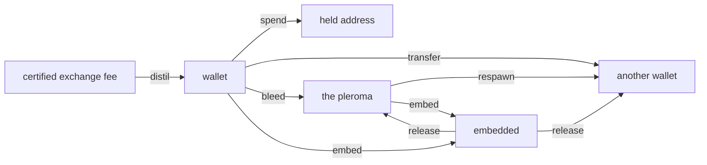
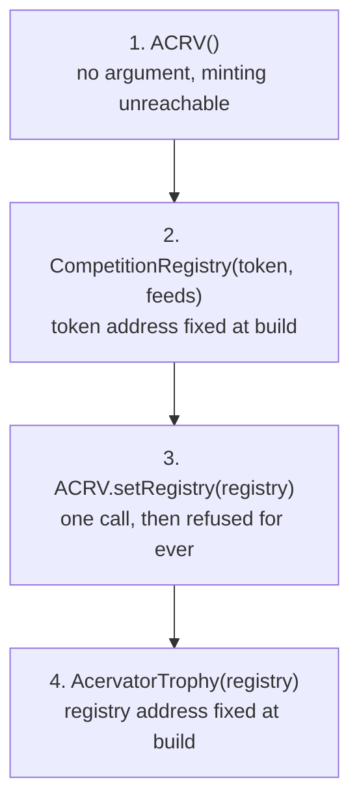
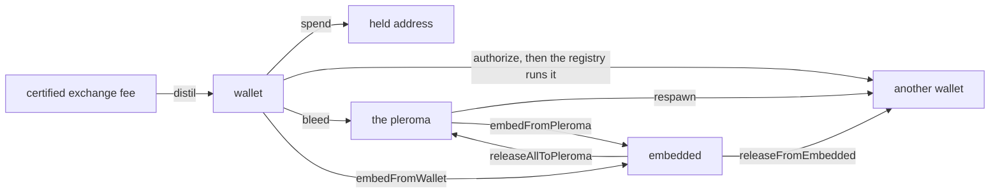
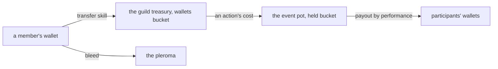

# Proof of Accumulation

Reference. **Not built.** The window builds neither the Competition tab nor the
Local Testnet tab. The tab row carries an empty tab labelled Accumulation in
their place, and issue #147 carries the build-out. `src/competition/` is the
Proof of Accumulation package, and its engine runs today with no screen in
front of it. The rest of this file describes that engine and the contract
design behind it, as a design, not as a shipped feature.

The design is an on-chain competition layer where bots compete publicly and the
winners are awarded ACRV tokens on Base, which is Coinbase's L2. It evolved
from a bot identity and an append-only trade log into Elo ratings, tournament
brackets and an in-platform chain. Every Acervator bot has a cryptographic
identity. During a competition each trade is signed and appended to a Merkle
tree, and at the end the bot submits only the Merkle root — a 32-byte hash that
commits to the whole trade history without revealing one trade of it. The
strategy stays private, the proof is public, and the winner takes ACRV and an
NFT trophy.

## The skeleton

The tab exists and draws three lines: its name, one sentence saying it is not
built, and the issue that owns it. It reads no competition, no token balance
and no trophy.

`src/gui/main_tabs/proof_of_accumulation_tab_surface.py` — the whole empty state

```python
HEADING = "Accumulation"
ISSUE = 147
BUILT = False
STATE_TEXT = "This tab is not built."
ISSUE_TEXT = f"Issue #{ISSUE} carries the build-out."
```

Two frontends draw that one view model. `EmptyTabsMixin` in
`src/gui/main_tabs/empty_tabs.py` builds the Qt tab, and
`src/gui/web/proof_of_accumulation_tab.js` registers a panel with the Electron
shell's panel host. `src.core.desktop_bridge` serves the model under
`proof_of_accumulation_tab.state`.

## Identity

Each instance gets an Ed25519 keypair. The private key signs every trade in the
log. The public key is the identity another party verifies against. Strategy
parameters are never signed and never published, so authorship is provable
while the method stays private.

`src/competition/bot_identity.py` — `BotIdentity`

```python
class BotIdentity:
    """
    Manages a bot's Ed25519 keypair.  The private key never leaves this object
    unencrypted.  The public key is the bot's network-visible identity.
```

## The trade log

Each signed trade appends to a Merkle tree. Leaves are the SHA-256 of a trade's
canonical bytes, the root is the commitment, and a proof lets a third party
confirm one trade sits in the log without receiving the log.

`src/competition/merkle_log.py` — `verify_proof`

```python
def verify_proof(leaf_hash: str, proof: List[dict], root: str) -> bool:
    """Verify a Merkle inclusion proof."""
    current = leaf_hash
    for step in proof:
        if step["position"] == "left":
            current = _node_hash(step["hash"], current)
        else:
            current = _node_hash(current, step["hash"])
    return current == root
```

`merkle_root` returns the commitment and `merkle_proof` builds the inclusion
proof one trade at a time.

## The competition lifecycle

Four phases run in order.

`src/competition/competition_engine.py` — the module's own summary

```python
  1. REGISTRATION  — bots register with capital commitment + config hash
  2. ACTIVE        — bots trade; each trade appended to their Merkle log
  3. SUBMISSION    — trading closes; bots submit Merkle root + performance claim
  4. ADJUDICATION  — arbiter verifies submissions, ranks bots, awards tokens
```

A competition runs either locally across instances on one machine and one price
feed, or between two machines exchanging signed submissions.

## Tournaments

`EventVariant` in `src/competition/poa_modes.py` builds the event shapes. Each
of the four modes pairs with one Elite flag, so there are eight event types and
no mode is written twice.

| Mode | Shape |
| ---- | ----- |
| `monster_smash` | One participant against low to midlevel creatures |
| `team_monster_smash` | A certified guild, up to 120 against 1 |
| `dungeon_crawl` | One participant, or a group of six, through a dungeon |
| `raid` | A group of sixty, the most challenging and the most rewarding |

`src/competition/poa_modes.py` — the one table the Elite flag indexes

```python
STANDARD_RULES = VariantRules(
    STANDARD_SUFFIX, STANDARD_LABEL, STANDARD_TIMEFRAME, 0, 0, 0, 0
)
ELITE_RULES = VariantRules(ELITE_SUFFIX, ELITE_LABEL, ELITE_TIMEFRAME, 1, -1, 1, 1)

VARIANT_RULES: dict[bool, VariantRules] = {False: STANDARD_RULES, True: ELITE_RULES}
```

A turn is one candle of the market clock, and `turn_at` names the turn that
clock is in. `ImpetusPool` holds the points one turn grants and loses what that
turn does not spend.

## The token

The ledger is append-only, and four methods are its whole surface.

`src/competition/token_ledger.py` — `TokenLedger`

```python
class TokenLedger:
    """
    Append-only ACRV token ledger.

    award()  — mint tokens for a competition result (idempotent)
    balance()  — current balance for a bot
    total_minted()  — total ACRV in existence
    remaining_supply()  — tokens still mintable this season
    """
```

The hard cap is ten million, and the ledger refuses an award that would pass
it. Each season awards less than the one before, so later tokens are harder to
earn.

`src/competition/season_schedule.py` — the supply constants

```python
TOTAL_SUPPLY_CAP = 10_000_000  # Hard cap — immutable
GENESIS_SEASON = 1
INITIAL_REWARD = 500_000  # Season 1 reward pool
DECAY_FACTOR = 0.85  # Each season awards 85% of the prior season
MIN_SEASON_REWARD = 100  # Floor — never less than this per season
```

Awards are idempotent: settling the same result twice writes one record.
Balances are replayed from the log, and no operation edits a balance.

Five tiers are awarded on rank within the field, and the rarest three carry a
lifetime cap on how many can ever exist. Each tier is named for a stage of the
Corpus Hermeticum alchemical path, and pays a fixed number of tokens.

| Tier | Stage | Rank | ACRV paid | Ever minted, at most |
| ---- | ----- | ---- | --------: | -------------------: |
| Harvest | NIGREDO | top 50% | 10 | no cap |
| Gold Fold | ALBEDO | top 10% | 50 | no cap |
| Bear Slayer | CITRINITAS | top 25% in a verified bear market | 100 | 10,000 |
| Grand Accumulator | RUBEDO | top 1% across three consecutive seasons | 500 | 1,000 |
| Ekthelius | UNIO MYSTICA | perfect score across every metric | 10,000 | 21 |

## The token contract

The ledger above is the platform's own record. On the chain the token is an
ERC-20 called Acervator Token. Three of its properties are fixed when the
contract is deployed and cannot be changed afterwards: the supply cap, the one
address allowed to mint, and the absence of any way to burn.

`contracts/ACRV.sol` — the header, and the guard on minting

```solidity
//   • MAX_SUPPLY  = 10,000,000 ACRV (10_000_000 * 10^18 wei)
//   • Tokens can never be burned — supply monotonically increases
//   • The registry address is set once at construction and cannot change

    modifier onlyRegistry() {
        require(msg.sender == registry, "ACRV: caller is not the registry");
```

| Property | Value |
| -------- | ----- |
| Standard | ERC-20, named Acervator Token |
| Chain | Base, chain id 8453 |
| Hard cap | 10,000,000 ACRV, held on the chain |
| Minting | the CompetitionRegistry contract only |
| Burning | never |

The contracts are not deployed. Two npm packages supply the libraries they
build on, and the deploy script takes the network and the signing key. Its own
instructions name the Base test network first.

`contracts/deploy.py` — how it is called

```bash
npm install @openzeppelin/contracts @chainlink/contracts
export ACERVATOR_PRIVATE_KEY=0x...
python deploy.py --network sepolia
```

`src/competition/season_schedule.py` — the last tier

```python
RarityTier(
    name="Ekthelius",
    emoji="∞",
    description="Perfect score across all metrics, any season",
    rank_pct_max=0.001,
    condition="100% win rate + top Sharpe + max capital efficiency",
    max_ever=21,
    base_value=10_000,
),
```

## Quintessence

A certified trade distils the platform's second asset. Entering an event spends
it, and nothing destroys it. It keeps its own ledger, apart from the token
ledger above, because the two obey opposite rules: the token only ever moves
outward into a balance, while Quintessence circulates.

`src/competition/quintessence_ledger.py` — the eight operations

```python
def distil(self, address: str, fee_usd: object, trade_grade: object) -> Decimal:
def spend(self, address: str, amount: object, held_address: str) -> Decimal:
def transfer(self, sender, recipient, amount, skill_level) -> QuintessenceTransfer:
def respawn(self, address: str, amount: object) -> Decimal:
def embed_from_pleroma(self, amount: object) -> Decimal:
def embed_from_wallet(self, address, amount, embedded_amount) -> QuintessenceEmbed:
def release_from_embedded(self, address, amount, recovered_amount) -> QuintessenceRelease:
def release_all_to_pleroma(self, amount: object) -> Decimal:
```

Quintessence can be in exactly four places, and the four always add up to
everything ever distilled. A wallet holds what a participant can spend. A held
address holds what they have already spent, which rests there and funds later
awards. The pleroma holds what bled out of a transfer, and the ledger respawns
that to other participants. The embedded bucket holds what a thing in the world
carries in itself, drawn out of the pleroma and returned there when the thing is
broken.



Every operation checks that sum before it writes, and refuses the write when it
does not balance.

`src/competition/quintessence_ledger.py` — the two conditions the check reads

```python
is_balanced=delta == 0 and not negatives,
is_within_cap=self._total_ever_minted <= QUINTESSENCE_SUPPLY_CAP,
```

| Term | Value |
| ---- | ----- |
| Hard cap | 33,000,000 Quintessence, total ever distilled |
| Pre-ownership | none, for anyone |
| Distil rate | one Quintessence for one dollar of certified exchange fee |
| Grade curve | the trade's grade, zero to one, multiplies the award |
| Destruction | never |
| Transfer bleed | 8% at skill level one, falling to 4% at level ten |
| Resolution | one Quintessence divides into 100,000,000 minimum units of 0.00000001 |

The module holds the cap and the rate as constants, and the write path refuses a
mint past the cap rather than reporting it afterwards.

`src/competition/quintessence_ledger.py` — the recorded numbers

```python
QUINTESSENCE_SUPPLY_CAP = Decimal(33_000_000)
QUINTESSENCE_MINIMUM_UNIT = Decimal("0.00000001")
QUINTESSENCE_UNITS_PER_WHOLE = 100_000_000
QUINTESSENCE_PER_FEE_USD = Decimal(1)
BLEED_FRACTION_AT_LEVEL_1 = Decimal("0.08")
BLEED_FRACTION_AT_LEVEL_10 = Decimal("0.04")
```

### One whole Quintessence divides into a hundred million minimum units

The minimum unit is the smallest amount of Quintessence that can exist. A
divine essence is potent at a minute amount, so one whole unit carries a hundred
million places to hold power in, the way one bitcoin carries a hundred million
satoshi.

Every amount a bucket receives is a whole number of minimum units. The amount is
rounded down onto that figure as it is written, so no wallet, held address,
pleroma or embedded balance can carry a fraction the currency cannot express.

`src/competition/quintessence_ledger.py` — the rounding and the refusal

```python
def quantize_quintessence(amount: Decimal) -> Decimal:
    return amount.quantize(QUINTESSENCE_MINIMUM_UNIT, rounding=ROUND_DOWN)


def is_on_quintessence_grid(amount: Decimal) -> bool:
    return amount == quantize_quintessence(amount)
```

### The rounding leftover returns to the pleroma, because nothing is destroyed

A bleed of eight per cent down to four per cent does not divide evenly at eight
of the ten skill levels. The amount the recipient receives is rounded down and
the bleed takes the rest, so the fraction that cannot be paid joins the pleroma
rather than vanishing. That keeps the four buckets equal to everything ever
distilled, to the unit.

`src/competition/quintessence_ledger.py` — the transfer split

```python
received = quantize_quintessence(sent - sent * fraction)
bled = sent - received
```

A transfer too small for the recipient to receive one minimum unit is refused
rather than paid as nothing, which is the refusal `contracts/Quintessence.sol`
already makes.

| Skill level | Bleed on 100 Quintessence | Received |
| ----------- | ------------------------- | -------- |
| 1 | 8 | 92 |
| 2 | 7.55555556 | 92.44444444 |
| 3 | 7.11111112 | 92.88888888 |
| 4 | 6.66666667 | 93.33333333 |
| 5 | 6.22222223 | 93.77777777 |
| 6 | 5.77777778 | 94.22222222 |
| 7 | 5.33333334 | 94.66666666 |
| 8 | 4.88888889 | 95.11111111 |
| 9 | 4.44444445 | 95.55555555 |
| 10 | 4 | 96 |

The five stat requirements are whole Quintessence already — one stat measures 550
at level 100 and five of them measure 2,750 — so the resolution changes nothing
about the stat scale.

Every launch builds the ledger and attaches it to the window beside the local
chain, so a later panel finds it where it finds the chain.

`src/gui/shared_testnet.py` — the line that builds it

```python
main_win._quint_ledger = cls.install_quint_ledger(quint_ledger_path)
```

Nothing spends Quintessence yet. No screen shows a balance and no trade
certifies, so the ledger loads empty on every launch and reports nothing ever
distilled. The transfer duration, the skill that gates a transfer, the guild
check, and the share of a market pool a participant may take are all other
units.

## Head to head

`challenge_protocol.py` carries the Elo ladder. A challenger sends a signed
challenge, the target accepts or declines, both trade the agreed asset for the
agreed duration, and the shared engine adjudicates.

`src/competition/challenge_protocol.py` — the ladder constants

```python
ELO_K_FACTOR = 32
MIN_ELO = 100
```

The stake flows from loser to winner and both ratings move.

## Trophies

One SVG per tier, picked by name. An unknown tier raises rather than returning
an empty drawing, and `generate_preview_html` lays the whole set out on one
page.

`src/competition/trophy_generator.py` — `generate_trophy`

```python
def generate_trophy(tier: str, data: TrophyData) -> str:
    fn = GENERATORS.get(tier)
    if not fn:
        raise ValueError(f"Unknown tier: {tier!r}")
    return fn(data)
```

Inside `harvest_svg`, a text path letters the epigraph's own instruction around
the trophy ring, in its usual form: SOLVE ET COAGULA. Each drawing also letters
its own alchemical stage across the face.

`src/competition/trophy_generator.py` — the stage each tier is lettered with

```python
        "Harvest": "NIGREDO",
        "Gold Fold": "ALBEDO",
        "Bear Slayer": "CITRINITAS",
        "Grand Accumulator": "RUBEDO",
```

### Where a trophy's artwork is kept

The artwork and the metadata are held on the chain itself. The token's own
metadata call returns the JSON inline, and the picture inside that JSON is the
tier's drawing, also inline. Nothing points at IPFS, the file-sharing network
most NFT projects park their pictures on, and nothing points at any other host,
so a trophy lasts as long as the chain does.

`contracts/AcervatorTrophy.sol` — the metadata call

```solidity
            '","image":"data:image/svg+xml;base64,', svgB64,

            "data:application/json;base64,",
```

## The chain

`local_testnet.py` simulates the whole Base environment in memory, with no
wallet, no ETH and no network. Four classes make it up.

| Class | Holds |
| ----- | ----- |
| `LocalChain` | The blocks |
| `LocalACRV` | The ERC-20 balances and the mint history |
| `LocalRegistry` | Competitions, submissions and adjudications |
| `LocalTestnet` | The three above, plus a mock oracle and transaction receipts |

One call runs a whole competition on that chain and returns the result table.
It registers the entrants, trades them, takes their submissions, adjudicates,
awards the tokens and mints the trophy, with nothing written outside a
temporary directory.

`src/competition/local_testnet.py` — a demo run

```python
from src.competition.local_testnet import LocalTestnet

testnet = LocalTestnet()
result = testnet.run_demo_competition(n_bots=3, season=1)
print(result["results_table"])
```

The real targets sit ready for the day it deploys.

`src/competition/base_config.py` — the two chains

```python
  Base Mainnet: chain_id=8453  — production
  Base Sepolia: chain_id=84532 — testnet (deploy here first)
```

The contract addresses and ABIs sit beside them.

## The two shelved tabs

Both tab modules exist and the window builds neither. Their surfaces stay
registered in the bridge, so the view models answer with no Qt tab in front of
them. The Testnet tab is where a competition would be run and its blocks read
in a block explorer; today the demo run above is the only way to reach either.

`src/gui/main_tabs/retired_tabs.py` — `RetiredTabsMixin._install_retired_tab_sentinels`

```python
self._competition_tab = None

self._testnet_tab = None
```

Issue #147 carries the initial build-out.

## 2026-09-08 08:17 - #147 - what the closed issues landed

The manual names this screen Proof of Accumulation (Anonymized Trading
Tournaments Via Blockchain) and issue #147 carries its build-out.

This is currently proposed as a concept but will likely require the building of a supporting blockchain team for proper / full implementation. This system is designed to enable users of Acervator to compete against each anonymously via our own Proof of Accumulation blockchain. The idea is to convert trades executed into videogame metrics such as damage to a coliseum style monster or a fellow trader in a 1v1 face off. This further positions the platform as a surgical tool that can be finely tuned and customized to produce intense competition scenarios between entire groups of traders. This, of course, opens the door for actual tokenized Trading Guilds who may require their members to have a certain number of PoA tokens under their belt to join. There will be much more to follow on this as I do intend to scaffold it out for internal testing.

The tab is now called Accumulation. It sits seventh on the bar, on the
gold ground with red text.

The screen is not built. The window builds neither the Competition tab nor the
Local Testnet tab. The tab row now carries a Proof of Accumulation skeleton,
which draws its name, one sentence saying it is not built, and the issue that
owns it. Issue #147 carries the build-out. The engine behind it runs today, and
the rest of this section is that engine.

`src/gui/main_tabs/proof_of_accumulation_tab_surface.py` — the whole empty state

```python
HEADING = "Accumulation"
ISSUE = 147
BUILT = False
STATE_TEXT = "This tab is not built."
ISSUE_TEXT = f"Issue #{ISSUE} carries the build-out."
```

`src/competition/` is the Proof of Accumulation package. Each bot signs every
trade with an Ed25519 key and signs no strategy parameter, so authorship is
provable while the method stays private.

`src/competition/bot_identity.py` — `BotIdentity`

```python
class BotIdentity:
    """
    Manages a bot's Ed25519 keypair.  The private key never leaves this object
    unencrypted.  The public key is the bot's network-visible identity.
```

The signed trades commit to a Merkle root a third party can verify one trade
against without receiving the log. The competition itself runs four phases.

`src/competition/competition_engine.py` — the module's own summary

```python
  1. REGISTRATION  — bots register with capital commitment + config hash
  2. ACTIVE        — bots trade; each trade appended to their Merkle log
  3. SUBMISSION    — trading closes; bots submit Merkle root + performance claim
  4. ADJUDICATION  — arbiter verifies submissions, ranks bots, awards tokens
```

The token ledger is append-only and idempotent, with five rarity tiers by rank.
Its hard cap is ten million ACRV, and each season awards less than the one
before it.

`src/competition/season_schedule.py` — the supply constants

```python
TOTAL_SUPPLY_CAP = 10_000_000  # Hard cap — immutable
GENESIS_SEASON = 1
INITIAL_REWARD = 500_000  # season 1 pool, in ACRV tokens
DECAY_FACTOR = 0.85
MIN_SEASON_REWARD = 100
```

`EventVariant` in `src/competition/poa_modes.py` builds the four modes and the
Elite variant of each. A local testnet module beside it simulates the whole
Base environment in memory, with no wallet and no network.

## 2026-09-09 19:39 - #147 - the contract repairs

The three contracts could not be deployed. Each one needed another one's address
at the moment it was built, and the deployment script handed the token the
deployer's own wallet as its only minter. That address could never be corrected
afterwards, so every award would have failed, and the wallet would have held the
right to mint all ten million tokens for the life of the contract.

The token now takes nothing at all when it is built. One call afterwards names
the competition registry as the minter, and a second call to that function is
refused. The call also refuses any target that is not itself a contract, so a
wallet can no longer be named the minter by mistake.

`contracts/ACRV.sol` — the one wiring call

```solidity
    function setRegistry(address registryAddress) external onlyOwner {
        require(registry == address(0),          "ACRV: registry already set");
        require(registryAddress.code.length > 0, "ACRV: registry not a contract");
        registry = registryAddress;
        emit RegistrySet(registryAddress);
    }
```

Nothing now needs an address that does not yet exist. Four steps run in order,
and the two remaining cross-references stay fixed at build time as before.



The other published route was to compute an address before the contract exists,
and it does not solve this. A computed address commits to the values handed to
the constructor, so computing the registry's address still needs the token's
address first, and the circle closes again. The Solidity documentation states
what goes into the computation.

```text
address   = keccak256(0xff ++ deployer ++ salt ++ keccak256(init_code))[12:]
init_code = creation bytecode ++ the encoded constructor arguments
```

A factory contract could break the circle instead, by deploying both in one
transaction and deriving the second address from its own count of deployments.
That adds a fourth contract to the critical path, and that contract would hold
the right to create the token. One locked field is the smaller change.

The award function used to pay the winner and then write its own records. A
token contract that called back during the payment would have found the
competition still marked open. Every record and both log entries now land first,
and the payment is the last statement in the function.

`contracts/CompetitionRegistry.sol` — the end of `adjudicate`

```solidity
        emit Adjudicated(compId, winnerWallet, tierName, tokenAmount, c.season);
        emit TierMinted(tierName, winnerWallet, tokenAmount, compId);

        // Interaction, last
        if (tokenAmount > 0) {
            require(acrv.remainingSupply() >= tokenAmount,
                    "Registry: insufficient ACRV supply remaining");
            acrv.mint(winnerWallet, tokenAmount, compId, tierName);
        }
```

A submitted result carried one unchecked number. A starting value of zero made
the advantage calculation divide by zero, and a negative one reversed the
ranking every award is built on. The function refuses both, and the conversion
that squeezes the result into a small field now fails loudly instead of
silently keeping the wrong digits.

`contracts/CompetitionRegistry.sol` — the guard and the conversion

```solidity
        require(startValueCents > 0,    "Registry: start value <= 0");

        int256 advantage   = finalValueCents - startValueCents;
        int32  advBps      = SafeCast.toInt32((advantage * 10000) / startValueCents);
```

The price feed's answer was read and never checked. Five values come back from
it and only two were kept. Every one is now checked, and a feed reporting no
round, an unfinished round or a price of zero is refused rather than returned.

`contracts/CompetitionRegistry.sol` — `getLatestPrice`

```solidity
        require(roundId != 0,               "Registry: oracle has no round");
        require(answeredInRound >= roundId, "Registry: oracle answer is stale");
        require(startedAt  != 0, "Registry: oracle round unstarted");
        require(answeredAt != 0, "Registry: round incomplete");
        require(answer      > 0, "Registry: price not positive");
```

Handing ownership of any of the three away used to take one call, with nothing
asked of the receiver. All three now require the receiver to accept, so a
mistyped address cannot take ownership and leave nobody able to act.

The deployment script no longer compiles anything. It reads what the build
already produced, so the bytecode that would reach a chain is the bytecode the
analyzers read.

`contracts/deploy.py` — what it loads

```python
DEPLOY_ARTIFACTS = {
    "ACRV": "ACRV.sol/ACRV.json",
    "CompetitionRegistry": "CompetitionRegistry.sol/CompetitionRegistry.json",
    "AcervatorTrophy": "AcervatorTrophy.sol/AcervatorTrophy.json",
}
```

Four analyzers read the contracts before and after. The table is what each one
reported, not a difference between runs.

| Analyzer | Measure | Before | After |
| -------- | ------- | ------ | ----- |
| forge build | compiler warnings | 0 | 0 |
| forge lint | findings, of which warnings | 67, 11 | 57, 2 |
| slither | medium and above | 2 | 0 |
| slither | all bands | 13 | 11 |
| solhint | errors | 37 | 34 |
| semgrep | security findings | 0 | 0 |
| semgrep | ownership transfer without acceptance | 3 | 0 |

Three findings stand, and each has a reason.

The season budget is still not checked on the chain. The registry records what a
season has issued and reads that record nowhere. Checking it there would set a
number deciding how many tokens a season may award, and the operator sets that
number.

The trophy has no ceiling on any tier and no count of what it has minted. Unit
17 of issue #147 builds both.

Seven functions are named for reading the chain clock. No decision in any of
them reads it: every comparison the analyzer lists is on a competition's status
or on how many bots entered. The clock is stored as a record of when each step
happened, and removing that record would remove the on-chain history the design
is built on.

`contracts/CompetitionRegistry.sol` — what the analyzer points at in `adjudicate`

```text
CompetitionRegistry.adjudicate uses timestamp for comparisons
	Dangerous comparisons:
	- require(c.status == CompStatus.SUBMISSION, "Registry: not in submission")
```

The conservation law the design names counts Quintessence and not this token:
wallets plus held addresses plus the pleroma plus the embedded bucket equals the
total ever distilled, at most 33,000,000. No Quintessence contract exists, so
nothing on the chain can state that law yet, and the fuzzing the build tool offers
has nothing to read. Unit 6 must carry the balances and the total as values a
caller can read,
or the law stays unprovable on-chain however the token behaves.

In development.


## 2026-09-09 20:10 - #147 - the two pieces a new surface would have made live

Two pieces of code were harmless only while nothing built them. The first added
to a token balance without taking a lock first, so two threads adding at the same
moment could both read the old figure and one award would vanish. The chain file
asked for no thread protection at all.

Sixteen threads made 4,800 awards of one unit each against the chain the window
builds at start-up. The token counted all 4,800 into its supply and gave the
winner 3,709. The other 1,091 were gone, and nothing reported a fault. One lock
now covers the supply cap check, the balance, the running total and the award
record together, and the same run gives the winner all 4,800.

`src/competition/local_testnet.py` — the guarded award

```python
        with self._supply_lock:
            if self._total_supply + amount_wei > MAX_SUPPLY_WEI:
                raise OverflowError("ACRV: mint would exceed MAX_SUPPLY")
            self._balances[recipient] = self._balances.get(recipient, 0) + amount_wei
            self._total_supply += amount_wei
```

Reading a balance or the total takes the same lock, so a reader can no longer
catch the two halfway apart.

The second piece built a private chain of its own whenever nothing handed it the
shared one. A tab built that way sat at block zero while the shared chain stood
at block one, showed numbers, and raised nothing. The shared chain is now a
required argument.

`src/gui/testnet_tab.py` — the required chain

```python
        def __init__(self, parent=None, *, shared_testnet, bridge):
            """Read the chain through ``shared_testnet`` and ``bridge``; neither may be None."""
            super().__init__(parent)
            self.setAccessibleName("Testnet Tab")
            if shared_testnet is None or bridge is None:
                raise ValueError(
```

Asking for the tab with nothing attached now stops on the call itself.

```text
TypeError: TestnetTab.__init__() missing 2 required keyword-only arguments:
'shared_testnet' and 'bridge'
```

Handing it an empty chain on purpose stops as well, and the refusal names where
a real one comes from.

```text
ValueError: TestnetTab needs the process-wide chain: pass the shared_testnet
and bridge that SharedTestnetBridge.install_on attached to the MainWindow.
A private LocalTestnet would diverge from every other reader.
```

## 2026-09-09 20:43 - #147 - the Quintessence contract

Quintessence now has a contract. It holds the same places the platform's own
ledger holds, and it reports every one of them plus the running total as numbers
anyone can read off the chain at any block.

`contracts/Quintessence.sol` — the five numbers a reader gets

```solidity
    uint256 public walletsTotal;
    uint256 public heldTotal;
    uint256 public pleromaTotal;
    uint256 public embeddedTotal;
    uint256 public totalEverMinted;
```

The law is that the first four always add up to the fifth, and the fifth can
never pass thirty-three million. The contract also answers both halves in one
call, so a reader does not have to do the sum themselves.

`contracts/Quintessence.sol` — the single call that answers the law

```solidity
        isBalanced = wallets + held + pleroma + embedded == everMinted;
        isWithinCap = everMinted <= cap;
```

| Term | Value |
| ---- | ----- |
| Smallest unit | one Quintessence divided into 10^18 parts |
| Hard cap | 33,000,000 Quintessence, as 33 followed by 24 zeros of those parts |
| Owner | none |
| Pause | none |
| Upgrade hook | none |
| Burn | none |
| Minting | the Proof-of-Accumulation registry only, named once when built |

The smallest unit matches the prize token, which splits each coin into the same
number of parts. Quintessence needs the split because the award is a dollar of
exchange fee multiplied by a trade grade between zero and one, and because a
transfer loses a single-digit percentage. Whole numbers would round both of
those away.

The contract has no owner and no pause. A wallet cannot move Quintessence on its
own either, because moving it between players is a skill, not a wallet button. A
transfer therefore takes two calls: the holder authorizes it, and the registry
runs it once the waiting time has passed.

`contracts/Quintessence.sol` — the holder's half and the registry's half

```solidity
    function authorizeTransfer(address recipient, uint256 amount) external {
    function executeTransfer(address sender, uint256 skillLevel) external onlyRegistry {
```

Neither side can act alone. The registry cannot move a wallet that authorized
nothing, and a holder cannot move their own units without the registry. One
authorization is held per holder at a time, which is what stops a large transfer
being split into many fast ones.

The contract works out the loss and the waiting time itself, from the published
rates, rather than taking either as a number it is handed. A transfer always
loses at least four per cent and always takes at least one hour.



Nothing in the contract destroys a unit. A spend moves units to a held address
where they rest, and that address is never drained, so a spend can never become
a free transfer. The running total only ever rises.

The build tool's own fuzzing now holds ten properties over the contract, by
throwing random sequences of calls at it. Each property was also broken on
purpose once, to watch the tool report it, and then put back.

`tests/contracts/QuintessenceConservation.t.sol` — what the fuzzing reported

```text
QuintessenceConservationTest invariants (runs: 256, calls: 16384, reverts: 8607)
[PASS] invariant_threeBucketsEqualTotalEverMinted
[PASS] invariant_walletsTotalEqualsSumOfBalances
[PASS] invariant_totalEverMintedWithinCap
[PASS] invariant_totalEverMintedNeverFalls
[PASS] invariant_noUnitIsDestroyed
[PASS] invariant_capRefusesAMintPastIt
[PASS] invariant_onlyRegistryMovesUnits
[PASS] invariant_registryCannotMoveAnUnauthorizedWallet
[PASS] invariant_transferRefusedBeforeItsDurationElapsed
[PASS] invariant_everyTransferBleedsFourPercentOrMore
```

A mint of one unit more than the cap is refused, and the tool printed the
refusal itself while nothing had been minted at all.

`contracts/Quintessence.sol` — the refusal, quoted from the run

```text
    │   └─ ← [Return] 33000000000000000000000000 [3.3e25]
    ├─ Quintessence::distil(QuintessenceActor, 33000000000000000000000001 [3.3e25])
    │   └─ ← [Revert] Quint: supply cap reached
```

Nothing is deployed. No transaction was sent and no network was reached, so the
four deployment steps themselves are unproven. The contract is also not yet
wired to anything: no registry contract exists to name as its minter, and the
platform's own ledger and the contract do not yet read each other.

Three analyzers ran over the new file and none reported a security finding. The
fourth, the one that walks the compiled bytecode, is still missing from this
machine for the reason the earlier audit records.

| Tool | Result on the new contract |
| ---- | -------------------------- |
| the build tool's linter | no errors, one warning about reading the chain clock |
| the static analyzer | one medium finding, on an exact comparison against zero |
| the style linter | 86 warnings, no errors |
| the pattern scanner | 29 findings, none of them about security |

The exact comparison is on the contract's own marker for a waiting transfer,
which holds either zero or a real amount and nothing else, so no third value
exists for it to miss. The contract reads the chain clock to decide whether a
transfer's waiting time has passed, and the shortest waiting time is one hour,
far longer than the few seconds a block producer could shift.

No archetype covers Solidity. Each contract file reports zero analyzers and says
plainly that it was not examined, so the four tools above are the whole coverage
for this file.


## 2026-09-09 21:16 - #147 - the trophy tier supply caps

Four of the five trophy tiers now carry a lifetime ceiling, and the ceiling is
held in the contract that mints the trophy. Harvest is the only tier left open,
which is what the design asks for: a cap on every tier except the lowest.

| Tier | Trophies ever | Where the ceiling is held |
| ---- | ------------- | ------------------------- |
| Harvest | no limit | nowhere, by design |
| Gold Fold | 100,000 | the trophy contract |
| Bear Slayer | 10,000 | the trophy contract |
| Grand Accumulator | 1,000 | the trophy contract |
| Ekthelius | 21 | the trophy contract |

`contracts/AcervatorTrophy.sol` — the four ceilings

```solidity
    uint256 public constant MAX_GOLD_FOLD         = 100_000;
    uint256 public constant MAX_BEAR_SLAYER       = 10_000;
    uint256 public constant MAX_GRAND_ACCUMULATOR = 1_000;
    uint256 public constant MAX_EKTHELIUS         = 21;
```

Only one of those numbers is new. Bear Slayer at 10,000, Grand Accumulator at
1,000 and Ekthelius at 21 were already written into the platform's own tier list.
Gold Fold at 100,000 continues the same ten-fold step the other three make.

Before this, the two top ceilings were held in the competition registry, and the
registry awards the prize token rather than the trophy. The registry could
therefore refuse a twenty-second Ekthelius token award while the trophy contract
minted a twenty-second Ekthelius NFT. Each contract now holds the ceiling for the
thing it actually mints.

The check sits inside the mint call, so every caller meets it. The owner of the
trophy contract is allowed to call mint, and the owner is now refused at a
ceiling exactly as the registry is.

A tier name outside the five is also refused. The counter is kept per tier name,
so a near-miss name such as a trailing space would otherwise start a fresh
counter of its own and mint without limit.

`contracts/AcervatorTrophy.sol` — the refusal a caller reads at each ceiling

```text
Trophy: Gold Fold supply of 100,000 exhausted
Trophy: Bear Slayer supply of 10,000 exhausted
Trophy: Grand Accumulator supply of 1,000 exhausted
Trophy: Ekthelius supply of 21 exhausted
Trophy: unknown tier
```

Each of those four refusals was watched. The build tool minted the last trophy a
tier allows, then asked for one more and printed the refusal.

`tests/contracts/TrophyTierCaps.t.sol` — the last Ekthelius trophy, then the refusal

```text
AcervatorTrophy::tierMinted("Ekthelius")  → 20
AcervatorTrophy::mint(..., "Ekthelius", ...)
  emit TrophyMinted(tokenId: 1, tier: "Ekthelius", ...)
AcervatorTrophy::tierMinted("Ekthelius")  → 21
AcervatorTrophy::mint(..., "Ekthelius", ...)
  ← [Revert] Trophy: Ekthelius supply of 21 exhausted
```

The build tool's own fuzzing holds five properties over the contract, by throwing
random sequences of calls at it. Each property was also broken on purpose once,
to watch the tool report it, and then put back.

`tests/contracts/TrophyTierCaps.t.sol` — what the fuzzing reported

```text
TrophyTierCapsTest invariants (runs: 256, calls: 16384, reverts: 9687)
[PASS] invariant_noCappedTierExceedsItsMaximum
[PASS] invariant_everyCapRefusedAMintAtIt
[PASS] invariant_unknownTierNameIsRefused
[PASS] invariant_harvestIsNeverRefused
[PASS] invariant_everyMintIsCounted
```

The last one is the guard against a counter that is never raised. A ceiling read
off a counter nothing increments would never be reached, and the tier would mint
for ever while every other check stayed green.

Breaking each property on purpose found a sixth thing that needed covering. Every
one of the five reads the ceiling out of the contract, so raising a ceiling to an
absurd number left all five green. A separate check now holds the four numbers as
written figures, and it goes red the moment one of them moves.

`tests/contracts/TrophyTierCaps.t.sol` — the four figures held as written numbers

```solidity
        require(trophy.MAX_GOLD_FOLD() == 100_000, "MAX_GOLD_FOLD is not 100,000");
        require(trophy.MAX_BEAR_SLAYER() == 10_000, "MAX_BEAR_SLAYER is not 10,000");
        require(trophy.MAX_EKTHELIUS() == 21, "MAX_EKTHELIUS is not 21");
```

Each number is still written twice, once in the platform's own tier list and once
in the contract. Nothing fails if those two copies disagree. No check reads both
languages, and no archetype covers a contract file, so the pair is held by reading
and not by a tool. A check that compares them is a rule for the harness, which is
not this unit's to write.

`src/competition/season_schedule.py` — the platform's own copy of the same numbers

```python
  Harvest            max_ever = None
  Gold Fold          max_ever = 100_000
  Bear Slayer        max_ever = 10_000
  Grand Accumulator  max_ever = 1_000
  Ekthelius          max_ever = 21
```

The season budget is unchanged and still decides nothing on the chain. It sets how
many prize tokens a season may award, and that number is the operator's.

| Tool | Result on the trophy contract |
| ---- | ----------------------------- |
| the build tool | compiled from scratch, no errors |
| the build tool's linter | no errors |
| the static analyzer | no finding above informational |
| the style linter | no errors |
| the pattern scanner | no security finding |

No archetype covers Solidity. Each contract file reports zero analyzers and says
plainly that it was not examined, so the four tools above are the whole coverage
for the contract.

Nothing is deployed. No transaction was sent and no network was reached, so the
ceilings are proved on a local chain the build tool runs in memory and not on Base.

Back to [the subsystem index](README.md).

## 2026-09-09 21:37 - #147 - the tab shell and its three zones

The Accumulation tab is no longer three lines of text. It draws the arrangement
the operator set out on 9 September: the player window on the left, the square
enemy screen upper right, and the party window across the lower half. Nothing
inside the zones is built, and each one says so on screen.

The player window and the enemy screen each draw a title and one placeholder
sentence. The party window draws a header, eight groups of five empty slots, and
its own placeholder sentence. Forty slots is one page of the hundred and twenty
the largest event carries.

`src/gui/main_tabs/proof_of_accumulation_tab_surface.py` — the paging the party
window draws

```python
PARTY_CAPACITY = 120
PARTY_PER_PAGE = 40
PARTY_GROUP_SIZE = 5
PARTY_PAGE = 1
```

The Quintessence balance sits in the party window's header and stays on screen
whichever zone is drawing. The full wallet opens as a panel over the party
window and over nothing else, carrying one section each for Quintessence,
trophies and loot. No balance is read: the panel says so rather than showing a
number nothing produced.

```
header, always on screen   Quint  --   Open wallet   Page 1 of 3 - 40 a page
wallet closed              0 panels
wallet open                1 panel over the party window, 3 sections
the balance                "--", because no ledger is read yet
```

The whole screen is one payload from one bridge method. The chain that payload
answers for is a field of it, so a demo run against the TestNet asks the same
method with a different chain and reaches the same page. No second surface and
no second module exist for the demo.

```python
CHAIN_FIELD = "chain"
LIVE_CHAIN = "live"
DEMO_CHAIN = "testnet"
CHAINS: tuple[str, ...] = (LIVE_CHAIN, DEMO_CHAIN)
```

Neither shelved Qt class was restored and neither was built on. Sixteen screens
are registered in the variant seam and none of them draws a competition, testnet
or proof-of-accumulation surface, so this tab had no Qt original to match and no
Qt picture was taken.

```
seam screens                                     16
PoA, competition or testnet entries among them   none
CompetitionTab and TestnetTab constructed        never; both sentinels are None
```

What is still not built is everything inside the zones: the pixel art, the
character classes, the event modes and the turn structure. The wallet holds no
Quintessence, no trophy and no loot, because there is no debit path and no
participant identity to read one for.

## 2026-09-09 22:28 - #147 - the certified transaction socket

A bot now certifies each of its fills against the local chain, and every
certified fill distils Quintessence from the fee the exchange charged. An event
turns away a bot that has certified nothing. No figure a bot trades on changes:
the socket reads a fee the platform already recorded, then writes to the chain
and to the Quintessence ledger.

`src/competition/certification_socket.py` — what one certification writes

```python
            leaf = log.append(record)
            distilled = self._ledger.distil(self._wallet_for(bot_id), fee, grade)
            self._certified_fill_ids.setdefault(bot_id, set()).add(fill_id)
            self._lifetime_fee_usd[bot_id] = (
                self._lifetime_fee_usd.get(bot_id, Decimal(0)) + fee
            )
```

Most of certification was already in the package. Signing belongs to the bot
identity, the append-only log already refuses three kinds of bad record, and the
chain already takes a transaction and an event. The socket is what joins those
parts to the fee and to the ledger.

| Part of certification | Where it comes from |
| --------------------- | ------------------- |
| Signing one fill | `BotIdentity.sign_trade` |
| Refusing a wrong competition, a wrong bot, a bad signature | `MerkleTradeLog.append` |
| The commitment over every certified fill | `MerkleTradeLog.root` |
| Proof of one fill without the log | `MerkleTradeLog.proof_for` |
| A summary revealing no fill | `MerkleTradeLog.submission_summary` |
| The transaction and the event on chain | `LocalChain.send_tx`, `LocalChain.emit` |
| Minting the award | `QuintessenceLedger.distil` |
| One chain and one ledger per launch | `SharedTestnetBridge.install_on` |
| A fill offered for certification | `CertifiedFill`, new |
| What one certification produced | `CertificationReceipt`, new |
| The replay, stranger and cap refusals | `CertificationSocket.certify`, new |
| The lifetime fee total | `lifetime_certified_fee_usd`, new |
| The fill subscriber | `attach_to_bus`, new |

Nothing in the platform holds a lifetime fee total, so the socket holds its own.
The exchange health refresh re-derives its figure from the last five hundred
trades, so that figure falls as older fills age out, and an earned quantity may
never fall. The socket's total takes every certified fee, takes the higher of the
stored and the held figure on a reload, and rises rather than follows a windowed
reading from the exchange.

`src/competition/certification_socket.py` — the windowed reading raises the total
or leaves it alone

```python
        observed = _as_fee_usd(observed_fee_usd)
        with self._state_lock:
            held = self._lifetime_fee_usd.get(bot_id, Decimal(0))
            if observed > held:
                self._lifetime_fee_usd[bot_id] = observed
                self.save()
                return observed
            return held
```

The total rises on both sides of the cycle. A scrum and a fold each carry the
fee the venue reported for that fill, and the socket adds whichever arrives. A
fill whose fee is zero certifies and distils nothing.

```
one scrum, fee $4.65   distilled 4.650   lifetime total $4.65
one fold,  fee $4.58   distilled 4.580   lifetime total $9.23
a window reading $500  distilled 0       lifetime total $500.00
a window reading $12   distilled 0       lifetime total $500.00
```

The socket refuses four things. Taking away a guard makes the socket admit
whatever that guard stops, and a run of each one showed exactly that.

| Refused | Without its guard |
| ------- | ----------------- |
| A fill already certified | the fee total doubles, $4.00 to $8.00 |
| A bot that has certified nothing | it enters an event |
| A forged signature | 500 Quintessence mints for a bot that signed nothing |
| An award past the 33,000,000 cap | the log keeps a fill that never distilled |

After every mint the ledger's four places still add up to everything ever
distilled. The socket reads that report back and carries it in the receipt, so a
caller sees the sum rather than trusting it.

```
after the scrum    wallets 4.650 + held 0 + pleroma 0 = 4.650 ever minted
after the fold     wallets 9.230 + held 0 + pleroma 0 = 9.230 ever minted
after a refusal    wallets 9.230 + held 0 + pleroma 0 = 9.230 ever minted
```

Every launch builds the socket beside the chain and the ledger, in the same call
that builds those two. It shares the bridge's lock, so a certification and a
competition run never write the chain at the same moment.

`src/gui/shared_testnet.py` — the line that builds it

```python
        main_win._certification_socket = bridge.install_certification_socket(
            ledger, socket_path
        )
```

Demo mode is the same socket over a second chain. The chain, the ledger and the
competition name all arrive at construction, so a TestNet run is a second socket
holding different ones, and no flag anywhere decides which path runs. A demo
certification leaves the live ledger at the figure it already held.

```
live socket   chain from SharedTestnetBridge   competition POA-STANDING
demo socket   its own LocalTestnet             competition POA-DEMO
measured      demo minted 3.720; live stayed at 9.230
```

One thing a fill on the bus cannot yet supply is its fee. The fill notification
carries the type, the side, the amount, the price, the dollars and the profit,
and no fee. A fill arriving that way certifies, reaches the chain and distils
nothing until the notification carries the number the venue charged.

```
trade.filled fields today   type, side, amount, price, usd, profit,
                            operator_initiated
the field the socket reads  fee_usd, absent from every emit site
the result                  the fill certifies, the award is zero
```

What is still not built is the grade curve that scales an award, the rotation
that decides which markets pay, and the caps on how much one participant may
take. The socket passes a grade of one and applies no ceiling beyond the supply
cap, so those three remain open.

## 2026-09-09 22:47 - #147 - the Quintessence wallet

The wallet holds real state. The balance in the party window's header is the
figure the Quintessence ledger computed for this node, and it stays on screen
while the wallet is closed. Opening the wallet lays four holdings side by side
across the party window: Quintessence, trophies, loot, Vessels.

Quintessence reads the ledger file belonging to the chain the tab is showing.
Five figures, every one of them the ledger's own, none of them worked out on the
screen. This is a run against a throwaway home holding two distillations.

```
Balance                17.25
Distilled, all time    17.25
Still mintable         32999982.75
Supply cap             33000000
Movements              2
quintessence_ledger.json
```

Trophies are the awards this participant has won, one row each, read from the
ACRV award ledger. A row carries the tier's own emblem and name, the season, and
the competition it was won in. The emblem is the one the tier declares, not a
picture the screen chose.

```
🐻 Bear Slayer   Season 4 - comp-autumn-0002
🪙 Gold Fold     Season 3 - comp-autumn-0001
acrv_ledger.json
```

Loot is read from the loot store, one row an item. A row carries the tier's short
form, the market that dropped it, the season, and the bonus that item gives one
action. Two rows close the section: what the whole holding does to the Impetus an
action costs, and the multiplier it puts on that action's effect.

```
Magisterium      AAVE/USD - Season 1 - Impetus -2, effect +50%
Elixir           AAVE/USD - Season 1 - Impetus -1, effect +20%
Flores           AAVE/USD - Season 1 - Impetus -1, effect +10%
Pavonis          BTC/USD - Season 1 - effect +5%
Calx             LTC/USD - Season 1 - effect +2%
Action Impetus   4 becomes 1
Action effect    1.87x
loot_store.json
```

A chain with no store file, a store holding nobody's loot, and a store that will
not replay each print their own sentence in place of a row.

```
loot_store.json does not exist. No market has dropped loot on this chain.
loot_store.json records no loot for this participant.
loot_store.json could not be replayed: Expecting property name enclosed in
double quotes: line 1 column 2 (char 1)
```

The participant is this node's own competition identity. Its key file is read,
never created, so a machine with no identity yet names none, the balance falls
back to two dashes, and the trophy section says which file it was looking for.

`src/gui/main_tabs/proof_of_accumulation_tab_surface.py` — where each figure
comes from

```python
def participant_identity() -> BotIdentity | None:
    """This node's PoA identity from ``IDENTITY_NAME``, or None when unreadable."""
    try:
        return BotIdentity(str(LEDGER_DIR / IDENTITY_NAME)).load()
    except Exception:
        return None
```

The wallet displays and does nothing else. It carries no button that spends, no
field that sends and no path that moves a balance. Spending belongs to unit 13
and transfer to the skill in unit 21, and until they land a wallet that could
move value would be a defect rather than a feature.

Each holding falls back on its own. Corrupting the Quintessence ledger empties
that section, prints the ledger's own refusal under it, and drops the header
balance to two dashes, while the trophy rows stay on screen. Taking the identity
away does the reverse.

```
ledger corrupted   Quintessence 0 rows, the refusal printed, trophies 2 rows
identity removed   Participant none, balance --, trophies 0 rows with a reason
both intact        Quintessence 5 rows, trophies 2 rows, balance 17.25
```

The demo chain reads its own book through the same bridge method. Asking for the
TestNet chain returns a different balance from a differently named file, on the
same page, with no second surface and no second module.

```
live      Balance 17.25   quintessence_ledger.json
testnet   Balance 50.00   quintessence_ledger_testnet.json
```

## 2026-09-09 22:57 - #147 - the project age rule

A market rewards Quintessence only while its project is at least six months old.
The platform now answers that question for one market at a time. It reads the
project's start date from CoinGecko, keeps that date on disk for good, and
refuses any market whose age it cannot establish. No figure a bot trades on
changes: the lookup reads a published date and writes only its own cache file.

`src/competition/project_age.py` — the whole decision

```python
        meets_age_rule_on = ""
        if genesis is not None:
            admits_on = months_after(genesis, MIN_PROJECT_AGE_MONTHS)
            meets_age_rule_on = admits_on.isoformat()
            if self._today() < admits_on:
                reason = TOO_YOUNG
```

Six months means six calendar months, not a count of days. Bitcoin started on
3 January 2009, so the rule first admitted it on 3 July 2009. Both edges of that
day were run.

```
BTC asked on 2009-07-02   too_young    rewards Quintessence: no
BTC asked on 2009-07-03   old_enough   rewards Quintessence: yes
```

### Where the date comes from

CoinGecko serves a project's start date on its coin detail endpoint, in a field
the API reference documents as nullable. Nothing in the platform had ever called
that endpoint. Two other CoinGecko endpoints were already in use, and the new
call shares no code with either of them.

| What it asks for | The endpoint, and who calls it |
| ---------------- | ------------------------------ |
| The asset list and 24-hour volume | `/coins/markets`, from `market_data.py` |
| The candle series | `/coins/{id}/ohlc`, from `chart_data.py` |
| The project start date | `/coins/{id}`, from `project_age.py`, new |

The Charts tab's one-hour timeframe asks the candle endpoint for two days and
gets an HTTP 400 back. That fault is recorded elsewhere and is unchanged here.
The age call reads no days value and builds its own address, so the two requests
share the host name and nothing else.

Most of this was already in the platform. The parts that are new are the rule
itself, the refusals, and the file that keeps each date.

| Part of the lookup | Where it comes from |
| ------------------ | ------------------- |
| The CoinGecko identifier for an asset | `crypto_assets.ASSETS`, 40 of 40 filled |
| A request that refuses any address but http and https | `safe_url.SafeRequest` |
| Opening that request | `safe_url.safe_urlopen` |
| Writing the cache file without a torn write | `io_utils.atomic_write_json` |
| Runtime data outside the repository | the same home folder the Stone Tablets use |
| The six-month test | `months_after`, new |
| One market's answer | `ProjectAgeVerdict`, new |
| The four refusals | `ProjectAgeLookup.verdict_for`, new |

### The identifier map is what limits this, not the rate limit

The asset catalogue carries a CoinGecko identifier for forty base currencies.
The eligibility rule reaches up to twenty markets on each of fifteen venues, so
three hundred markets can ask and forty bases can answer.

```
bases with an identifier        40 of 40 in the asset catalogue
markets the rule can reach      up to 300
a market outside the forty      refused, reason no_coingecko_id
```

A market with no identifier is refused, and the refusal says which kind it is.
Tron is a real project older than six months, and the lookup still turns it away
because the catalogue carries no identifier for it.

```
TRX/USD   coingecko_id ''   rewards Quintessence: no   reason no_coingecko_id
```

Widening the map is the way to widen the rule. Either the asset catalogue grows,
or a list call fetches every identifier CoinGecko carries. A ticker is not unique
across projects, so the second route needs a tie-break where two projects share
one symbol.

### The four refusals, and what each one looks like

Every answer carries a reason, so a refusal is never confused with a crash. A
bad market string raises instead, and that is the only error path.

| Reason | When | Measured |
| ------ | ---- | -------- |
| `too_young` | the project is under six months old | BTC asked on 2009-03-01 |
| `no_coingecko_id` | the catalogue has no identifier | TRX/USD |
| `no_genesis_date` | CoinGecko answers with no date | SHIB/USD |
| `lookup_failed` | the call did not answer | ETH/USD, host unreachable |

Taking away a guard makes the lookup admit whatever that guard stops, and a run
of each one showed exactly that.

```
without the too_young guard         BTC at 2009-03-01 rewards Quintessence
without the no_coingecko_id guard   TRX/USD rewards Quintessence
without the no_genesis_date guard   SHIB/USD rewards Quintessence
without the lookup_failed guard     an unreachable host rewards Quintessence
```

### A missing date is the common case, not the corner case

Nine projects answered the endpoint. Two carried a date and seven carried none.
Every one of those seven is refused.

```
with a date    bitcoin 2009-01-03, chainlink 2017-09-16
with none      uniswap, shiba-inu, pepe, aave, thorchain, the-sandbox,
               sei-network
```

Refusing an unknown age cannot be gamed by withholding data, which is why it is
the answer recorded for this rule. The cost is now measured rather than guessed:
most tokens in the catalogue carry no published start date, so the age half of
the rule admits few markets today.

### The date is fetched once and never again

A project's start date is fixed on the day its chain starts, so the lookup keeps
each one in a file under the runtime folder, with no expiry and no timer. A date
already in that file is served without any network call at all.

```
~/.acervator/project_genesis_dates.json
{ "genesis_dates": { "bitcoin": "2009-01-03" }, "version": 1 }
```

Proved by taking the network away. A second run with the host unreachable still
answered for Bitcoin from the file, and in the same run a market that was not in
the file could not be answered at all.

```
BTC/USD, host unreachable, in the file       old_enough
ETH/USD, host unreachable, not in the file   lookup_failed
```

An empty answer is not written to the file. A project CoinGecko cannot date today
may be dated tomorrow, and a stored blank would freeze that refusal for good.

### What is not built

Nothing in the running program asks a market for its age yet. The module loads on
every launch, and the object that answers is built by whoever asks.

`src/gui/main_window.py:277` — the launch call that loads the package

```python
                SharedTestnetBridge.install_on(self)
```

The volume ranking, the market rotation and the per-market caps are the other
half of eligibility and are not here. One measurement belongs to whoever builds
the backfill: asked forty times at two seconds apart, the detail endpoint refused
thirty-four of those calls with HTTP 429. The lookup itself makes one call per
project and then never again, so the pacing belongs in the loop that walks a
venue, not in the lookup.

Demo mode needs no second path. A start date is a fact about a project, not about
a chain, so a TestNet run reads the same dates from the same file through the same
call. The lookup holds no chain and no competition name, so there is nothing for a
demo run to switch.

## 2026-09-09 23:41 - #147 - node linking between two instances

Two copies of Acervator on one machine now hold the same records on their two
chains. Each copy is a node. A node says where it is listening, finds the others
that said the same, trades records with them, and keeps every record either side
had. This is the run, two processes, each with its own chain and its own books.

```
node 8f3fd656e34e starts with 1 chain records on node_a
node 8f3fd656e34e listening on 127.0.0.1:57019 (network=acervator-poa, records=1)
node b3b38412206d starts with 1 chain records on node_b
node b3b38412206d listening on 127.0.0.1:57040 (network=acervator-poa, records=1)
node b3b38412206d synced with 8f3fd656e34e: held 1, offered 2, took 1, now holds 2
node 8f3fd656e34e synced with b3b38412206d: held 2, offered 2, took 0, now holds 2
node 8f3fd656e34e ends with 2 chain records
node b3b38412206d ends with 2 chain records
```

Nothing opens a port by itself. Starting the application builds the node, and
building the node binds nothing, announces nothing, and creates no directory.
Linking is a thing somebody asks for afterwards. A node nobody has asked refuses
to give out an address, because it does not have one.

```
PoaNodeLink installed (node=node-694eca0b8dc2, peers=...\poa_nodes,
                       network=acervator-poa, listening=False)
after install: listening=False, announced files=no directory, chain=[]
endpoint before start_listening raised NodeLinkError:
    node node-694eca0b8dc2 is not listening, so it has no endpoint
```

The link speaks to this machine and nowhere else. The address sits in one named
constant, and no method anywhere takes an address to bind, so there is no
setting to get wrong. A caller from any other machine is turned away before its
message is read.

`src/competition/node_link.py` - the only interface, and the refusal

```python
LOOPBACK_HOST = "127.0.0.1"

    def verify_request(self, request: object, client_address: tuple) -> bool:
        if client_address[0] != LOOPBACK_HOST:
            logger.warning("node link refused non-loopback client %s", client_address)
            return False
        return True
```

Nothing from the trading side can travel over it. A record is six declared
fields and nothing else, so a peer that sends a seventh is refused where the
record is built. The node holds the chain and holds nothing else, and the only
two calls it can make on that chain are to add a transaction and to add an
event. A record names a function as text, and no part of this calls it.

`src/competition/node_link.py` - the whole of what crosses

```python
    from_addr: str
    to_addr: str
    function_name: str
    args: dict
    gas_used: int
    events: tuple
```

Agreement is on the records, not on the blocks, and that follows from the chain
already in the tree. It keeps one list of blocks and always builds on the last
one, so it has nowhere to put a second competing history. Each block's
identifier is made from the clock and a random number instead of from the
block's own contents, so two nodes holding the very same record still give their
blocks different identifiers. **The chain cannot express a fork.** Nothing
therefore has a branch to choose between, or a history to discard.

`src/competition/local_testnet.py` - where a block's identifier comes from

```python
def _fake_hash(seed: str = "") -> str:
    raw = f"{seed}{time.time_ns()}{uuid.uuid4()}"
    return "0x" + hashlib.sha256(raw.encode()).hexdigest()
```

The rule is therefore to keep everything. A record is named by the hash of its
own content, a node adds every record it does not already have, and nothing is
ever thrown away. The order the two nodes talk in does not matter. What the rule
refuses matters as much as what it does: it never removes a record, never
reorders one already held, and never claims the two chains are identical block
for block. The second exchange in the run above took nothing, which is the same
record arriving twice and being recognised.

```
node 8f3fd656e34e synced with b3b38412206d: held 2, offered 2, took 0
node b3b38412206d took 0 of 2 records from peer 8f3fd656e34e
```

Breaking the link breaks the agreement, which is how we know the agreement came
over the wire. The same two processes, with the link built but never started,
end one record apart and stay that way.

```
node 0a4dbe51b761 ends with 1 chain records, never having listened
node 4629d5d46e1d ends with 1 chain records, never having listened
```

The TestNet demo runs the same code. A demo node is this same node over a
different chain with a different chain name, not a second code path and not a
switch. Two demo nodes link exactly as two live nodes do. A live node and a demo
node sharing one announcement directory, both listening at the same moment, find
no peer at all.

```
both on the demo chain
  node efad997ddc19 synced with 56d934d38462: held 1, offered 2, took 1, now holds 2
  network=acervator-poa-testnet

one of each, one directory
  node 883079b27380 discovered 0 peers      network=acervator-poa
  node b1435252aa59 discovered 0 peers      network=acervator-poa-testnet
  each ends with 1 chain records
```

Nothing in the running application starts a link yet. The node is built on every
launch and waits. The control that would start it belongs on this tab, and no
unit on the issue carries that control, so it is named here rather than invented.
A node killed outright also leaves its announcement behind, and the next node to
read it logs that it could not be reached and carries on.

```
In development.
```
## 2026-09-09 23:43 - #147 - the classes and the RPG conversion

The party window now lists real characters. Each row names one of the operator's
bots, and the figure beside it shows that bot's health pool. Under the rows sit
the seven classes a participant picks from.

```
04e1cafc | none | $54.19
092428b2 | none | $101.98
168b78e3 | none | $67.30
```

Every row says `none` for its class. A participant picks a class for an event,
and no event exists yet.

### The seven classes and the four roles

The classes come from the seven classical planets and their metals. The roles
come from the three principles of Paracelsus: Salt endures, Sulphur burns,
Mercury flows. The operator's correction splits Mercury's three across healing
and support, which adds Support as the fourth role.

```
Lead Ward              Saturn   lead         Salt     Tank
Tin Bulwark            Jupiter  tin          Salt     Tank
Iron Edge              Mars     iron         Sulphur  Damage
Solar Lance            Sol      gold         Sulphur  Damage
Quicksilver Draught    Mercury  quicksilver  Mercury  pure healer
Copper Conduit         Venus    copper       Mercury  support healer
Silver Mirror          Luna     silver       Mercury  pure support
```

Copper Conduit is the only class holding two roles. A support healer heals and
supports, so it counts in both.

Each class levels on its own. A level record holds the class name, its level and
its experience, and it starts at level one. One ability arc is a hundred levels,
and the chain opens another arc with each alchemical phase.

```python
ARC_LEVELS = 100
FIRST_LEVEL = 1
```

### Health comes from the dollar target

The operator's rule is that players take damage and never lose money. The health
pool comes from the dollar line the engine defends, not from profit and loss. A
bot below its line carries a wound and has lost nothing.

These are the figures the conversion produced for one live bot on KAT/USD, with
the field each one came from.

```
max health           209.20254   scrumming_state.target_balance
base health          200.00000   scrumming_state.anchor_target_balance
health from levels     9.202538  compounding_snapshot.accrued_growth_usd
gain cap per cycle     2.0       compounding_snapshot.cycle_growth_budget_usd
gain cap, percent      1.0       config.max_target_growth_pct
current health       199.28538   max health plus the gate reading's delta
```

The target grows as folds land, and a per-cycle cap bounds that growth. The
engine already computes that curve, so the pool rises through play on its own.

### Damage is the scrum, healing is the fold

The two halves of the cycle are the two award axes. The operator's rule awards
tokens for most damage done or most healed, so one number serves both
scoreboards.

```
damage, year to date      676.88404   stats.ytd_scrummed_usd
healing, year to date     953.68802   stats.ytd_folded_usd
this heal                  10.11134   the fill's usd on a BUY
heals waiting              11         tranche_snapshot.fold_count
heals waiting, usd         29.720012  tranche_snapshot.fold_total_usd
```

Accuracy and efficacy come from the grade the platform gives a trade. The same
bot's last fill graded `A+` at 1.0, with accuracy 1.0 and timing 1.0. The crit
reading is the twelve voters' agreement, 0.0005 on that tick. The three fumble
counts were all zero.

### Twenty-three of twenty-seven metrics read

The conversion answers twenty-seven metrics. Twenty-three carried a value on the
live run. The four that did not are honest gaps, not errors.

```
wound depth          GateContext.delta_pct is computed and never emitted
this strike          the last fill was a BUY, so the SELL half is empty
outcome efficacy     the grader needs a per-unit realised figure
strategic efficacy   the grader needs a rolling sell-to-buy reading
```

### Breaking a source takes its metrics away

A metric with no field answers nothing. Removing one part of a bot's record
removes exactly the metrics that part feeds, and nothing else.

```
whole record and gate reading      16 metrics
scrumming_state removed            13 - max, base and current health gone
stats removed                       9 - damage, healing, fumbles, pool, cash gone
config removed                     15 - the percent gain cap gone
gate reading removed               10 - six gate-fed metrics gone
```

### Seven things the platform holds no field for

Experience, level, character class, gear, an enemy, a threat value and a guild
have no field anywhere in the source. They are state this design must create.
Nothing in the trading profile stands in for them.

```
experience   level   character class   gear   enemy   threat   guild
```

One number is still the operator's to set. A critical hit fires above some
confidence, and no design passage names that figure. The conversion reports the
confidence and makes no judgement on it.

### Demo mode takes the same path

A TestNet run asks the same surface for the same model and names its own chain.
The fleet file for a demo chain carries the chain in its name.

```
chain live      bot_state.json           exists   38 participants, 7 classes
chain testnet   bot_state_testnet.json   absent    0 participants, 7 classes
```

The classes are not chain data, so both runs list all seven. The party window
keeps its empty-state sentence on the demo chain and drops it on the live one.

### What the classes and the conversion do not reach

A participant cannot pick a class from the screen yet. No picker, no event and no
turn exist, so the pick function has no caller.

```python
def pick_class(participant: str, event_id: str, class_name: str) -> ClassPick:
```

A row prints health as a figure, not as a bar, and carries no role colour.
Current health and wound depth need the fire-time gate reading, which arrives on
the bus rather than in the saved file. Nothing here reads an ability, a mode or a
turn.

## 2026-09-10 00:00 - #147 - the rotating reward set and eligibility

A market pays Quintessence only while three things are true at once. It sits in
the top twenty by volume on that exchange, its project is at least six months
old, and the live rotation drew it. Any one of the three missing, and the market
pays nothing.

`src/competition/market_rotation.py` — the draw, and the floor under it

```python
def draw_size(pool_size: int) -> int:
    """``quarter_rounded_up`` of ``pool_size``, and 0 below ``MIN_ELIGIBLE_POOL``."""
    if pool_size < MIN_ELIGIBLE_POOL:
        return 0
    return quarter_rounded_up(pool_size)
```

### The ranking now counts money, not coins

The volume figure the old ranking read was a count of coins traded, and a coin
count cannot be compared between two markets. Five thousand bitcoins and four
billion meme tokens are both big numbers, and only one of them is real money.
The rotation now ranks on the dollar value traded instead.

The two rankings were taken from one live Coinbase snapshot, the same 403 assets,
one sorted each way. They share one market out of twenty.

```
top 20 by dollars traded   BTC ETH ZEC XRP SOL HYPE VVV NEAR LINK DOGE
                           USELESS UNI PUMP SUI ADA TAO XLM AERO LIGHTER LTC

top 20 by coins traded     NEX MOG PEPE BONK SHIB FLOKI TOSHI VTHO PUMP NOICE
                           SPELL BNKR DRB B3 AMP DOGINME NOM BLAST PENGU OXT
```

The second list is nineteen sub-cent tokens. Those are exactly the obscure pumps
the rule exists to turn away, and the old figure would have handed them the whole
reward surface.

Coinbase serves the dollar figure for every market it lists. The platform asked
for all 931 of its pairs and not one of them was missing it.

| What the ranking reads | Where it comes from |
| ---------------------- | ------------------- |
| The dollar value traded in 24 hours | `quoteVolume`, served by the venue |
| The same figure where a venue omits it | coins traded times the last price |
| The coin count, unchanged and still recorded | `volume_24h`, read by the topology proposals |

One market per asset is ranked. An asset quoted against both dollars and USDC was
counted twice before, so a top twenty held only ten assets.

### Five of twenty qualify today, and Coinbase pays nothing

The six-month rule reads a project's start date, and most projects publish none.
Run against Coinbase's real top twenty, fifteen of them are refused.

```
eligible          BTC/USD  ETH/USD  LINK/USD  DOGE/USD  LTC/USD
no identifier     8 markets     the asset catalogue has no CoinGecko id
no start date     7 markets     CoinGecko answers with no date
pool size         5
markets drawn     0
```

Five is under the floor of twelve, so the exchange draws nothing at all. That is
the rule working as designed and it is also the measured cost of refusing an
unknown age. Widening the asset catalogue is what widens the pool.

### The draw is a quarter of the pool, and never reaches a single market

A fixed draw of five from a shrinking pool would let an exchange pick the winner
by removing everything else. The draw scales with the pool instead, so the odds
on any one market stay near one in four however many markets remain.

```
pool  20   drawn 5      pool  13   drawn 4      pool  11   drawn 0
pool  16   drawn 4      pool  12   drawn 3      pool   5   drawn 0
```

Below twelve the exchange draws nothing. Eleven eligible markets were reached by
filing real exclusions, and the window refused to open.

```
open_window refused: pool_below_floor: coinbase holds 11 eligible markets,
under the floor of 12, so it draws nothing
```

### An exclusion waits for the next season

An exchange may remove its own markets from the rotation list. It cannot add one,
choose one, or time one. The removal takes effect at the next season only, so it
can never be filed against a window that is already running.

A season is a counter that a call advances. It carries no date, so the boundary is
an event and nobody can predict when it falls.

```
filed in season 1, binds from season 2   BTC/USD
in effect in season 1                    nothing
in effect in season 2                    BTC/USD
season 1 BTC/USD                         eligible
season 2 BTC/USD                         excluded_by_exchange
```

### What the chain carries while a window is open

The chain carries a fingerprint of the chosen markets and the count, and no
market name. The fingerprint is built from a random value held back until the
window closes, so nobody can test a guess against it.

```
chain tx args: {"exchange": "coinbase", "season": 1,
                "commitment": "2c69e1e853579c19...", "marketCount": 5}
```

At the close the markets and the random value are published together, and anyone
can check that the published set is the one the fingerprint was made from.

```
reveal markets   ADA/USD  HYPE/USD  LIGHTER/USD  UNI/USD  VVV/USD
proof verified   True
```

Asking which markets pay while the window is open is refused.

```
membership_proof refused: coinbase has an open window; a membership proof
would reveal the set it conceals
```

What this hides, and from whom:

| Reader | While the window is open |
| ------ | ------------------------ |
| A participant | cannot learn which markets pay |
| Another node | cannot learn which markets pay |
| The exchange | cannot learn which markets pay |
| The node that drew the set | holds the answer on its own disk |

Two things it does not do. The drawing node chose the set, so it could have
chosen a set that suits it; the fingerprint only stops it changing its mind
afterwards. And no other node can repeat the draw and check it was fair. Both
need a shared random value that several nodes produce together, and the key
type for that does not exist in the platform yet.

The wording in the design is "encrypted on-chain". Encryption needs a recipient
who holds a key, and no field anywhere holds an exchange key. A fingerprint is
what ships instead, and on the property the design actually cares about it is
stronger: encryption to an exchange would let that exchange read its own
rotation early, and a fingerprint lets nobody read it.

### Demo mode needs no second path

The rotation takes its chain when it is built. A TestNet run is one rotation over
a different chain with a different record file, calling the same methods. Nothing
switches on a flag.

```
live      MarketRotation   market_rotation.json          chain A
testnet   MarketRotation   market_rotation_testnet.json  chain B
same class, same open_window path
```

### What the rotation still waits for

Nothing asks for a rotation yet. The object is built on every launch and then
waits for a caller.

`src/gui/main_window.py:277` — the launch call that builds it

```python
                SharedTestnetBridge.install_on(self)
```

Three parts are still missing. No market has a Quintessence pool yet, so the five
per cent share ceiling has a number to apply and nothing to apply it to. Nothing
advances a season. And the walk that reads project ages waits thirteen seconds
between calls, so it must never run on the thread that draws the screens.

The pacing was measured. Asked two seconds apart, CoinGecko refused thirty-four
of forty calls. Asked thirteen seconds apart, it answered every one, twelve of
twelve on a cold cache and seven of seven on a warm one.
## 2026-09-10 00:03 - #147 - the contract audit against a published standard

Four security tools now run over the four contracts, and every finding they give
carries a level from a published standard. Nothing was repaired in this pass, and
no line of Solidity changed. The standard is the EEA EthTrust Security Levels
Specification Version 3, published by the Enterprise Ethereum Alliance in March
2025, and the older SWC numbers sit beside each finding so a reader can match
them to what the tools print.

The tools, and the version of each one as the tool itself reports it:

```
forge     1.8.1     build, lint, and the fuzzing runner
slither   0.11.6    static analysis
solhint   6.2.4     the Solidity linter
semgrep   1.171.0   50 Solidity rules
mythril   absent    see below
```

### Not one tool was trusted until it had been shown failing

A tool that has only ever reported nothing has not been shown able to report at
all. Each of the four was pointed at a small broken file and a matching sound
one, and each told the two apart.

```
forge      broken file   FAIL   buckets do not equal totalEverMinted
           sound file    PASS   16,384 calls, nothing broken
slither    broken file   1 result at its top severity
           sound file    0 results
solhint    broken file   1 error   "Avoid to use tx.origin"
           sound file    0 errors
semgrep    broken file   1 finding at its top severity
           sound file    0 findings
```

The last pair is the one that carries the headline. semgrep found no security
problem in the contracts, and the broken file proves the same security rules were
switched on and working while it found none.

### The books balance, and this is the run that proves it

Quintessence rests in four places and the four always add up to everything ever
minted. That sentence is now a property a machine holds rather than a claim on a
page. The fuzzing runner drove the contract through random sequences of every
movement it has.

```
256 runs   16,384 calls   8,661 of them correctly refused

ten properties checked after every call, all held
no sequence broke the books
```

### mythril could not be installed, and the audit says so

The fifth tool reads the compiled bytecode. One of the pieces it needs cannot be
built on this machine, because a Microsoft C++ compiler is absent and there is no
Docker to fall back on. Nothing was put in its place.

```
mythril needs pyethash, which needs Microsoft C++ Build Tools
docker                                not installed
```

Two things unblock it, and both are a spend decision:

```
install Microsoft C++ Build Tools on this machine
install Docker and use the mythril maintainers' own image
```

### What the tools found, in their own words

Every severity below is the tool's own. None was assigned here.

| Tool | Its top band | Findings in that band |
| ---- | ------------ | --------------------- |
| slither | High | 0 |
| slither | Medium | 1 |
| forge | warning | 9 |
| solhint | error | 34 |
| semgrep | ERROR | 0 |

The thirty-four solhint errors are all one thing, and all in one file: a single
quote where the linter wants a double one. They sit in the trophy's artwork and
metadata assembly, where single quotes build the JSON a marketplace reads.

The one slither Medium sits on the guard that stops a second Quintessence
transfer starting while one is already in flight.

```
contracts/Quintessence.sol   authorizeTransfer
EthTrust level [M]           a human auditor decides whether the exact
                             comparison is necessary
```

### Eighteen findings from the first pass are gone

The repair unit landed before this one ran. Eighteen findings the first pass
reported are absent from every run here, so the audit does not carry them
forward.

```
slither   3   reentrancy in adjudicate, and the unchecked oracle answer
forge     9   five unsafe number casts, and four ordering warnings
solhint   3   the floating compiler version, now fixed at one release
semgrep   3   one-step ownership transfer, now a two-step handover
```

### The four questions the design raised, answered

**Who can pause the token.** The owner, and only the owner, and the owner is
whoever sends the deployment transaction. A pause freezes every transfer and
every award at once, because both run through one gate. The owner can never mint.
Nothing limits how long a pause may last, and nothing requires a second signature
to start one. The entry currency is a different shape: Quintessence has no owner
and no pause at all.

**Where spent Quintessence rests.** At a held address, and it never leaves one.
Spending moves a holder's own units out of the wallet bucket into the held bucket,
and no function takes them back out. The award token is the half still open: it
has no burn and no resting place, so spending one has nowhere to go yet.

**Which trophy tiers have a lifetime ceiling.** Four of the five, enforced inside
the trophy contract. Harvest has none by design. On the token side two tiers are
capped and the rest share the ten million supply cap. The season budget is still a
Python rule and reaches no contract.

**What a wrong address at deployment costs.** A redeployment for three of the four
contracts, and nothing at all for the token, whose minter is now named by a
one-time call that refuses an address with no code behind it. The circular
deployment order is gone.

### Where the findings are written down

The full report is a document. The raw tool output is not, because captured output
never belongs in the documentation tree.

```
docs/audits/2026-09-10_contract_audit_ethtrust_levels.md   the report
artifacts/solidity_audit/                                   the raw output,
                                                            untracked
```

### What running these tools is not

It is not an audit in the sense the industry means. Tools find known weakness
classes. They do not find a flaw in what a contract is for, and the standard says
as much by putting business logic at its highest level. Contracts holding real
value go to an outside firm before they reach a main network. That is a timing and
cost decision, and it is named here so nobody discovers it late.

## 2026-09-10 00:28 - #147 - the four modes, the Elite flag and the turn

The tab now carries the eight event types the design names, a turn tied to the
market's own candle, and the per-turn pool of points a participant spends inside
it. A real bot also picks a character class for the first time.

### Four modes, one Elite flag, eight event types

The design carries four modes and one Elite flag, not eight modes. Difficulty,
entry fee and both loot ranks are properties the variant answers, and one table
is the only place the flag is read.

`src/competition/poa_modes.py` — the whole Elite difference

```python
STANDARD_RULES = VariantRules(
    STANDARD_SUFFIX, STANDARD_LABEL, STANDARD_TIMEFRAME, 0, 0, 0, 0
)
ELITE_RULES = VariantRules(ELITE_SUFFIX, ELITE_LABEL, ELITE_TIMEFRAME, 1, -1, 1, 1)
```

Elite is one step harder, one step cheaper to enter, and one step richer in both
loot ranks. Those three directions are the whole of it.

| Event type | Turn | Difficulty | Entry fee | Loot rarity | Loot drop |
| ---------- | ---- | ---------- | --------- | ----------- | --------- |
| `monster_smash` | 5m | 1 | 1 | 1 | 1 |
| `monster_smash_elite` | 1m | 2 | 1 | 2 | 2 |
| `team_monster_smash` | 5m | 2 | 2 | 2 | 2 |
| `team_monster_smash_elite` | 1m | 3 | 1 | 3 | 3 |
| `dungeon_crawl` | 5m | 3 | 3 | 3 | 3 |
| `dungeon_crawl_elite` | 1m | 4 | 2 | 4 | 4 |
| `raid` | 5m | 4 | 4 | 4 | 4 |
| `raid_elite` | 1m | 5 | 3 | 5 | 5 |

A rank is a place in an order, never a price. No entry fee amount and no loot
table exist yet, so the ranks say which event is dearer and richer, not by how
much. Unit 19 builds the loot.

### The turn length follows the mode, and nothing branches on the flag

An Elite turn is one 1m candle and every other turn is one 5m candle. No rule
asks whether an event is Elite; each one reads a property instead, and that
property reads the table above.

`src/competition/poa_modes.py` — the turn's own length

```python
    @property
    def turn_timeframe(self) -> str:
        """The candle one turn is one of, from ``rules.timeframe``."""
        return self.rules.timeframe

    @property
    def turn_seconds(self) -> int:
        """The seconds in ``turn_timeframe``, read from ``TF_SECONDS``."""
        return TF_SECONDS[self.turn_timeframe]
```

The seconds in a candle come from `TF_SECONDS`, which is the map the platform's
own candle cache already uses. The game keeps no clock of its own.

### The clock is fixed, and three refusals prove it

A turn cannot be paused, extended or negotiated, because its boundary belongs to
the market and every participant shares it. The program refuses each attempt in
its own words.

```
a deadline past the candle close
  turn 16666667 of the 1m candle closes at 1000000080; a deadline of
  1000000100 would extend it by 20s, and the candle clock is fixed for
  every participant

acting after the candle closed
  turn 16666667 of the 1m candle closed at 1000000080 and it is
  1000000080; the 1 Impetus for this action is lost with that turn

spending last turn's leftover
  this pool granted 4 Impetus for turn 16666667 and 3 is unspent; turn
  16666668 is a different turn, and Impetus expires with the candle that
  granted it

paying part of an action
  this action costs 4 Impetus and 3 remains in turn 16666667; no partial
  action exists and nobody borrows against the next turn
```

### A participant who joins midturn takes what is left of the candle

Joining late does not move the deadline. Both participants below sit in the same
turn and both lose it at the same instant.

```
joined at the candle open    deadline 1000000080   60s in hand
joined 40s later             deadline 1000000080   20s in hand
```

### The pool is called Impetus, and level decides how much

A turn grants four Impetus at level one and one more every twenty levels. The
candle never grows, so a higher level acts more inside the same window.

`src/competition/poa_modes.py` — the grant

```python
def base_impetus(level: int) -> int:
    """Four at ``FIRST_LEVEL``, one more every ``IMPETUS_LEVELS_PER_STEP`` levels."""
    if int(level) < FIRST_LEVEL:
        raise PoaModeError(f"level {level} is below {FIRST_LEVEL}")
    return IMPETUS_AT_FIRST_LEVEL + int(level) // IMPETUS_LEVELS_PER_STEP
```

| Level | Impetus a turn |
| ----- | -------------- |
| 1 | 4 |
| 21 | 5 |
| 40 | 6 |
| 60 | 7 |
| 80 | 8 |
| 100 | 9 |

A haste or a slow effect multiplies that grant once. The product stops at twice
the level's own figure and never falls below one, so nobody is frozen out of a
turn and speed cannot become the only statistic worth raising.

```
level 40 grants 6     a 1.5x haste gives 9     the cap holds it at 12
                      a 0.5x slow gives 3      the floor holds it at 1
```

What an action costs is not here. Unit 13 prices the five bands.

### A class is picked, and the pool follows the level

The pick function had no caller until now. The screen passes a participant and a
class name, the event it is for is the variant's own code, and the party row then
carries the class, its level and the Impetus that level grants.

```
04e1cafc  RE/USD    Iron Edge   level 1   Impetus 4   health $54.19
092428b2  BONK/USD  none        --        --          health $101.98
```

A class name outside the seven is refused and the panel prints the refusal.

```
'Iron Sword' is not a PoA class; the seven are Lead Ward, Tin Bulwark,
Iron Edge, Solar Lance, Quicksilver Draught, Copper Conduit, Silver Mirror
```

No field under `src` holds a class level, so a fresh pick stands at level one
and nothing saves it between asks.

### The unreachable tournament module is retired

The tournament module under `src/trading` held 832 lines and nothing imported
it. None of its nine public names appeared anywhere outside its own file, the
coding archetype refused it, and it wrote generated output into the repository.
Its three shapes were a duel, a melee and a gauntlet, which are not the four
modes the design names.

```
832 lines        zero importers        zero uses of its nine public names
passed=False     8 high findings       wrote <repo>/logs/tournaments
```

Two things in it were worth keeping and both carried over. A participant is
named by its bot id rather than by holding a bot object, and one event shape
serves the screen as a plain row. The seeded simulation, the scorer for
computer-run participants, the invented candles and the settlement adapter that
paid nobody are all gone.

### Demo mode answers the same event

A TestNet run asks the same surface and names its own chain. The modes, the turn
and the pool are not chain data, so both runs answer the same event.

```
chain live      38 participants   8 event types   raid_elite, 1m candle
chain testnet    0 participants   8 event types   raid_elite, 1m candle
```

### What the modes and the turn do not reach

No action exists to spend Impetus on from the screen. The pool is granted and
refuses what it cannot pay, but nothing draws a move, an attack or a spell.

A charge that spans more than one turn is not built. Whether it pays its pool at
the start or per turn, and what an interruption does to it, are open.

The event is whichever one the request names. No schedule opens an event, no
entry fee is taken, and no participant is admitted or turned away at the door.

In development.

## 2026-09-10 00:34 - #147 - a block and a transaction named by their own contents

An identifier on this chain used to come from the clock and a random number. Two
copies of Acervator holding the identical record gave that record two different
names, and editing an amount in a stored record left every name in the chain
still valid. Both identifiers are now the SHA-256 of the record's own contents.

`src/competition/local_testnet.py` - what names a transaction

```python
def transaction_id(
    from_addr: str,
    to_addr: str,
    function_name: str,
    args: dict,
    gas_used: int,
    status: int = TX_SUCCESS,
) -> str:
    return content_id(
        {
            "from_addr": from_addr,
            "to_addr": to_addr,
            "function_name": function_name,
            "args": args,
            "gas_used": gas_used,
            "status": status,
        }
    )
```

### What goes into each identifier, and what stays out

A transaction is named by who sent it, who received it, the call, the amounts and
addresses that call carried, the gas and the success flag. The block it landed in
and the moment of recording stay out, because two machines record one
transaction at different moments into differently numbered blocks. A block is
named by its own number, its parent's name, its timestamp and the list of
transactions it holds.

| value | names a transaction | names a block |
|---|---|---|
| sender and recipient | yes | no |
| the call and its arguments | yes | no |
| gas | yes | no |
| success flag | yes | no |
| block number | no | yes |
| timestamp | no | yes |
| parent block's name | no | yes |
| the transactions held | no | yes |

The bytes are fixed so two machines cannot differ: keys in sorted order, no
spaces, and a refusal for any number that is not finite. A block keeps its
timestamp to the millisecond, so the name covers the figure written to disk
rather than a longer one that is not.

The amounts and the addresses reach the name. That was the hole: a transaction
used to be named from its function name alone, so what it moved and who it moved
it to had no bearing on its name.

### Two machines, one name

Two copies, two separate chains, two processes. Each certified one fill of its
own, and each then held the other's record under the identical name.

```
node-952ca991e4da  sending transaction 0xc69ee5a4fa90328a9f730da334451160430c3e3c4279e8a863a83099d86d5cc0
node-ae8a2c70bb84  sending transaction 0xc69ee5a4fa90328a9f730da334451160430c3e3c4279e8a863a83099d86d5cc0
node-ae8a2c70bb84  sending transaction 0xaab8eefd0d4f2e481a6a7a79b3bfb730d8765846f4376c660d9534abc54ccf18
node-952ca991e4da  sending transaction 0xaab8eefd0d4f2e481a6a7a79b3bfb730d8765846f4376c660d9534abc54ccf18
chain verified: 3 blocks and 2 transactions carry the id of their own contents
```

The same pair of processes on the previous build gave the identical transfer two
different names.

```
before   node_a  0x692edd3d07a1b2019b3ce1ed84a262ce9e2a033181ab24805455ee580c84965d
         node_b  0x3d3153c056bb1bc55c4f613bebfc81d3b9ab6a7581e436c7263fb24684ac6b03
after    node_a  0x3472b3435c6b9c843317353b681810c2f416501d6ac2f2c302ff758cdbecdb6a
         node_b  0x3472b3435c6b9c843317353b681810c2f416501d6ac2f2c302ff758cdbecdb6a
```

### A changed record is named, and the other machine refuses it

One stored record had its amount edited from 12.5 to 99.5 and its name left
alone. The chain that loaded that file says so at load. The other machine refuses
the record outright, and the same exchange still accepted the good record sent
beside it.

```
chain NOT verified: 0 of 3 blocks altered [], 0 parent links broken [],
                    1 of 2 transactions altered ['0x3472b3435c6b9c84']

node-a7904d78dd27 refused record 0x3472b3435c6b9c843317353b681810c2f416501d6ac2f2c302ff758cdbecdb6a
    calling transferQuintessence: its contents name
    0x1a4bdf2cbbfd171da96b52a51aab69358b7fdbff4ef8c4809c904fb6b1b0a54f
node-a7904d78dd27 synced with node-6feb24ca8462: held 2, offered 3, took 1, now holds 3
chain verified: 4 blocks and 3 transactions carry the id of their own contents
```

The refusal sits in the code that adds a peer's records to a chain, so an altered
record never reaches the chain at all.

### The chain already on disk

The saved chain on this machine loads exactly as before and nothing is lost. Its
3,135 blocks and 3,135 transactions were named the old way, so the chain reports
that none of them carries the name of its own contents. Every block mined from
now on does.

```
chain restored from disk (block=3135, age=204388 min)
chain NOT verified: 3135 of 3136 blocks altered [1, 2, 3, 4, 5],
                    0 parent links broken [],
                    3135 of 3135 transactions altered ['0x3f79536e53815466', ...]
```

Renaming those 3,135 records was considered and refused. The node rule already in
place never removes a record and never reorders one, and renaming every record on
the chain is the largest possible change of identity. A load that recomputed every
name would also destroy the one property this work adds, because a name recomputed
from whatever is on disk can never disagree with what is on disk.

### Demo mode

A demo run is the same code over a different chain and a different network name.
The run takes no setting and no flag. The transfer carried the same name on the demo
chain as on the live one, because the name comes from the contents and from
nothing else.

```
PoaNodeLink installed (node=node-04b4e394a029, network=acervator-poa-testnet, listening=False)
sending transaction 0x3472b3435c6b9c843317353b681810c2f416501d6ac2f2c302ff758cdbecdb6a calling transferQuintessence
node-04b4e394a029 synced with node-2a283bba3115: held 3, offered 3, took 0, now holds 3
chain verified: 4 blocks and 3 transactions carry the id of their own contents
```

### The demo competition's practice prices

The demo competition trades against 120 made-up prices rather than a market. The
generator behind them changed to the one the rest of the platform already depends
on, so the figures that run reports are different from before. It is still seeded,
so the same 120 prices come back on every run, and the competition still names a
winner and mints the award.

```
participants   3
winner tier    Harvest
winner tokens  10
rank 1 value   371.46   the same figure on a second run
```

### What this does not cover

The first block of a chain keeps a name of all zeros. It has no parent and holds
no transaction, so the only thing in it that a name could cover is its timestamp,
and that timestamp is not covered.

A record sent between two machines now carries seven declared fields rather than
six. The seventh is the name the chain gave it, and the receiving side recomputes
that name from the other six before it accepts anything.

A chain file is not protected from whoever owns the machine. Editing a record and
recomputing its name by hand produces a file that verifies. What the names buy is
that a second machine holding the same record disagrees out loud.

## 2026-09-10 00:38 - #147 - the contract repairs, and the keys that came out

The audit found five things worth a decision. Three are repaired and the tool that
reported each one is now silent on it. Two are left standing on purpose, with the
reason written down, because repairing them would make the contracts worse.

```
repaired   34 quote errors in the trophy contract        solhint 34 -> 0
repaired   an exact comparison on a pending transfer     slither 1 -> 0
repaired   the trophy handed out a token before filling it
                                                        slither 2 -> 0
stands     reading the clock to time a transfer          the design needs it
stands     eight writes a lint calls eventless           the lint is wrong
```

### The three repairs

The trophy builds the text a wallet reads from the artwork and the award details.
That text is full of quote marks, so it was written with the other kind of quote,
and the linter calls that an error thirty-four times over. Thirty-four errors in
one lane hide the thirty-fifth, so the quoting is now the style the linter asks
for. The text a wallet displays is byte for byte what it was.

```
before  343 problems, 34 of them errors   the run fails
after   307 problems, none of them errors the run passes
```

The second repair is one line. A holder may have only one transfer waiting at a
time, and the check asked whether the waiting amount was exactly zero. The
analyser objects to an exact comparison, because the record holding that amount
also holds a clock reading. The check now asks whether an amount above zero is
waiting, which admits exactly the same thing and reads better.

```solidity
    function _hasTransferInFlight(address sender) private view returns (bool) {
        return pendingTransfer[sender].amount > 0;
    }
```

### The two findings that stand

A transfer takes time by design. The shortest window is one hour and it grows with
the amount, so the contract has to read the chain's own clock to know whether a
window has passed. A validator can shift that clock by seconds. Seconds against an
hour is not a risk, and the chain offers no other clock, so the finding is
recorded rather than repaired.

```
MIN_TRANSFER_SECONDS        3,600      one hour, the floor
TRANSFER_SECONDS_PER_WHOLE    360      the window grows with the amount
shortest window             1 hour
a validator can shift       seconds
```

The other standing finding is a lint that says eight writes happen without an
event. Six of the eight do emit an event in the same call, so the message is not
describing what the rule measures. Four small test bodies settle it: the rule fires
on any write to a value a safety check reads, event or no event. Clearing it would
mean deleting the check that a wallet holds enough to spend, which is the wrong
trade, so it stands.

```
write, safety check, no event    the rule fires
write, safety check, then event  the rule fires
event, then write, safety check  the rule fires
write, no safety check           the rule is silent
```

### Fourteen owner keys, and what happened to each

The entry currency has no owner at all. The other three contracts had fourteen
powers only the owner could use. Two are gone from the code. Twelve stay, and each
one is now written down as waiting for the vote, which is a separate piece of work
and exists nowhere yet.

```
gone   the owner could mint any trophy directly
       the trophy now admits the competition registry alone
gone   the owner could abandon the contract
       on the award token that would have made a freeze permanent
```

```
waiting for the vote
  the token      name the minter once, freeze, unfreeze, hand over ownership
  the registry   set a price feed, open, activate, close, adjudicate,
                 advance the season, cancel, hand over ownership
  the trophy     upload a tier's artwork, hand over ownership
```

Removing the owner's route into the trophy mint has one consequence worth stating
plainly. The competition registry still holds no reference to the trophy contract,
so nothing can mint a trophy until that wiring lands. Before this change the owner
was the only caller that ever reached it, which is the bypass the design says must
come out.

### The conservation law still holds

The law is that every wallet, every held address, the pleroma pool and the
embedded bucket add up to everything ever distilled, and that the total never
passes thirty-three million. The fuzzing runner drove it again after the repairs.

```
runs       256
calls   16,384
ten invariants   all pass
```

The count of refused calls inside that campaign moves from run to run, because the
runner is not given a fixed starting seed. Three runs after the repairs gave 8,546,
8,721 and 8,773, and the run before them gave 8,523. The two numbers the
configuration fixes are the same before and after, and no sequence ever broke the
law.

### What the vote still has to take over

No vote, no council and no delay was written here. Twelve owner powers are still
owner powers today, exactly as they were, and the list above is the record of what
the vote has to take over.

Every finding the audit raised is accounted for in one place, each marked closed or
standing, with the count the tool printed on each side.

```
tests/debug_reports/contract_repairs_second_pass.md   the full accounting
```
## 2026-09-10 00:59 - #147 - the volume figure and the eight missing identifiers

Two faults held the rewarding pool down. The price feed reported no trading
volume at all for any Coinbase market, and the asset catalogue could not name
eight of the twenty biggest markets. This unit fixed both. The pool went from
five markets to six.

`src/exchange/ccxt_connector.py` - where the volume figure now comes from

```python
def _quote_volume_for(self, symbol: str, raw: dict) -> float:
    """Return ``symbol``'s 24h quote volume from ``raw``, else the recorded one.

    Coinbase's ``fetch_ticker`` serves neither ``quoteVolume`` nor
    ``baseVolume``, so ``get_ticker`` falls back to what the last
    ``get_all_tickers`` recorded for that symbol, and 0.0 before the first.
    """
    served = row_quote_volume_24h(raw)
    if served > 0:
        return served
    return float(self._quote_volumes.get(symbol, 0.0))
```

### Asking Coinbase about one market returns no volume

The platform asks Coinbase for a price in two ways. A question about one market
comes back with a price, a bid and an ask, and nothing about volume. A question
about every market at once comes back with the dollar volume on almost every
row. The price feed read the one-market answer, so its volume figure always held
zero.

The platform's own trading log says it, before and after:

```
before   FETCH_TICKER  Get current price for BTC/USD ... vol24h=0
after    FETCH_TICKER  Get current price for BTC/USD ... vol24h=411256638
```

The bulk answer carried a dollar figure for 923 of the 931 markets Coinbase
lists. The platform already sends that bulk request on a timer. The connector now
keeps each figure as it arrives and hands it back when a caller asks about one
market, so nothing new goes to the venue. A market the bulk request has not yet
covered still reports zero, which is what it reported before.

### Eight projects the catalogue could not name

The six-month age rule looks a project up by a CoinGecko identifier held in the
asset catalogue. Eight of the twenty biggest Coinbase markets had no entry, so
the rule refused them without asking anything.

Every one of the eight now has an entry, and nobody guessed an identifier. For
each one, CoinGecko named which of its own coins trades that market on Coinbase
Exchange, and the catalogue took that coin.

| Market | Identifier | How the check ran |
| ------ | ---------- | ----------------- |
| ZEC | zcash | CoinGecko lists it trading ZEC/USD on Coinbase Exchange |
| HYPE | hyperliquid | CoinGecko lists it trading HYPE/USD on Coinbase Exchange |
| VVV | venice-token | CoinGecko lists it trading VVV/USD on Coinbase Exchange |
| USELESS | useless-3 | Two coins carry this ticker; only this one trades on Coinbase |
| PUMP | pump-fun | Two coins carry this ticker; only this one trades on Coinbase |
| TAO | bittensor | CoinGecko lists it trading TAO/USD on Coinbase Exchange |
| AERO | aerodrome-finance | CoinGecko lists it trading AERO/USD on Coinbase Exchange |
| LIGHTER | lighter | CoinGecko lists it trading LIGHTER/USD, under the ticker LIT |

### Matching by ticker alone fails its own check

The other way to close the gap reads CoinGecko's published coin list at run time
and matches on the ticker. The twelve markets whose identifier the catalogue
already held, and held correctly, tested that idea.

```
twelve known-correct identifiers
  2  resolve to exactly one coin on the published list
 10  are ambiguous; twelve separate coins carry the ticker BTC
```

A resolver that insists on one match refuses ten markets that work today. A
resolver that picks among the candidates returns a real founding date for the
wrong project, which is worse than a refusal. One of the eight is worse still:
CoinGecko carries Lighter under the ticker LIT, so no ticker match finds it at
all, while its record of the Coinbase market names it exactly.

The catalogue grew instead, and the venue record did the confirming. A market
whose base is still absent from the catalogue refuses with the reason
`no_coingecko_id`, as it did before, and never passes unchecked.

### Six of twenty qualify, and the floor is still twelve

Driven against Coinbase's real twenty, the refusals moved from two reasons to
one. Zcash publishes a founding date and now qualifies. The other seven newly
named projects publish none.

```
before   5 eligible   8 refused with no identifier   7 refused with no start date
after    6 eligible   0 refused with no identifier  14 refused with no start date
```

The program declines to open a window in its own words:

```
before   pool_below_floor: coinbase holds 5 eligible markets, under the floor
         of 12, so it draws nothing
after    pool_below_floor: coinbase holds 6 eligible markets, under the floor
         of 12, so it draws nothing
```

Both runs asked CoinGecko at thirteen seconds apart and CoinGecko refused
nothing. Twelve detail requests on the first run, fifteen on the second.

### What the identifiers did not fix

The earlier estimate put the pool at thirteen once the catalogue closed, which
would clear the floor. It reached six. Seven of the eight newly named projects
publish no founding date, so they moved from one refusal to another rather than
becoming eligible.

Coinbase still awards no Quintessence, and one reason remains: fourteen of the
twenty biggest markets publish no founding date. The age ruling decides whether
the economy starts.
## 2026-09-10 01:12 - #147 - the art brief for the enemies, the party and the rail

The pixel art for this tab now has a commissioning document. An outside artist can
work from it without asking a question. It specifies the register, the palette, every
sprite size, every frame count and the sources each creature comes from.

```
docs/engineering-notes/2026-09-10_poa_art_brief.md    the brief
```

The manual points at the brief and does not carry it. This manual describes what the
product does; the brief tells somebody outside the company what to draw and what it
costs. Those are different documents for different readers.

### Every creature names the old text it comes from

The operator asked for the ancient sources and nothing from the modern occult
revival. Every creature in the brief carries the text that attests it, and a creature
with no text did not go in.

```
the surface floor  Lamashtu, Lilith, Empousa
the executors      the gallu, Ammit, the Keres, the Sebitti, Humbaba, Mot
the decan rank     thirty-six star powers, each owning one part of the body
the floor bosses   Apophis, Anzu, Asag, Typhon, Echidna, the Gigantes, Azi Dahaka
the fall tier      the Watchers and the Nephilim, Asmodeus, Angra Mainyu
the summit         Old One Avatars and their direct servants
```

Twenty-one creatures carry their own name and the text that attests it. Three more
arrive as ranks rather than as single names: the thirty-six decans, their daimones and
their assistants. The two at the summit are the operator's own, built on Lovecraft,
and the brief says that plainly rather than letting a modern invention look ancient.

### Five things the brief could not supply, and it names them instead of inventing them

The operator's rule was to name the gap rather than reach for the excluded source.
Five gaps came up and the brief names all five.

```
a name for each of the ten husks     only the modern revival supplies one
a look for each husk                 no old source draws one
the thirty-six decan images          the roster sits behind editions not in hand
a colour for Salt, Sulphur, Mercury  no design token holds one
the panel's absolute height          nothing in the code declares it
```

The fourth one reaches the screen. The design makes the role colour the one thing a
party row never drops, and no colour token carries a value for it. That is work for
the design system, not for the artist.

### The brief measured the party window and found four disagreements

Four numbers in the design prose do not match the page as built. The built page is the
fact in every case.

```
120 participants        confirmed
40 to a page            confirmed
eight groups of five    confirmed
three pages             confirmed
the name truncates      at eight characters, not twelve
one mark slot           not built; the row carries five text columns
a health bar            not built; health is a text figure
a role colour           not built; no token carries one
```

The twelve-character short form is real and sits somewhere else. It names the
participant identity and the competition identifier, and the party row shows neither.

### The guaranteed art size is fourteen pixels square

Every other size on the tab moves when the window moves. The party row's floor height
does not, because the stylesheet fixes it at sixteen pixels and the row's own border
takes one from each side.

```
the party row cell       14 x 14 pixels, guaranteed
the class sigil          16 nominal, drawn at 1x
the mark slot glyph      16 nominal, drawn at 1x
an acting sprite         48 nominal, drawn at 4x
an enemy                 32 to 160 nominal, by tier
an Old One Avatar        160 nominal, drawn at 2x, alone on the enemy screen
```

Every frame count comes out of the platform's own motion settings rather than out of
taste. An idle loop runs four frames over one second. An attack runs five frames over
half a second. A full creature is twenty-six frames.

### What the whole commission costs

The operator pays for this, so the brief counts it.

```
enemies, five of the six tiers       531 frames
player sprites, seven classes        147 frames
sigils, marks and rail nodes          17 static drawings and 4 frames
                                     -----
                                     682 frames and 17 static drawings

the decan rank, once specified       936 frames
```

The decan rank is thirty-six creatures and costs more than the other five tiers put
together. That same tier is the one the brief cannot specify yet, so it goes last.

### The 120-participant event has no dungeon map

The mode table settles this. Team Based Monster Smash is the only mode that reaches a
hundred and twenty participants, and it carries no map. The Raid reaches sixty and the
Dungeon Crawl reaches six, and those two are the modes with a map rail.

```
Monster Smash               1 participant          no map
Team Based Monster Smash    up to 120              no map
Dungeon Crawl               1 to 6                 map
Raid                        2 to 60                map
```

The Old One Avatar the operator wants in a 120-participant event therefore fights in
an arena, and the dungeon rail sits beside a roster of at most sixty. The Avatar art
gets an arena background first.

### Three names mean two things each

```
tier         five trophy rarities, five loot tiers, and a rank a mode answers
Mercury      a planet, a Paracelsian principle, and the metal quicksilver
silver       the Silver Mirror's metal, and the Albedo trophy stage's colour
```

The brief reports these three and renames none of them. Every instruction in it names
the thing instead of the number, so no artist has to guess which five is meant.

### What the art brief does not do

It draws nothing and it commissions nothing. Nobody contacted an artist, no sprite
exists, and the tab still draws three empty zones with a sentence in each one saying
no pixel art is drawn.

```
tests/debug_reports/2026-09-10_poa_art_brief.md    the unit's own record
```

## 2026-09-10 01:15 - #147 - the skill ladder and the transfer skill

The tab now draws a skill ladder of ten levels under the classes, and the first
skill on it is the one that moves Quintessence between participants. The ladder
is what sets the loss on a transfer.

### Ten levels, each one 2.5 times the one below

> "All skills have levels that grow through use. Skills should be intelligently
> designed with growth curves similar to Eve Online."

The ladder counts uses, never elapsed time. The first level costs one use
and every level above it costs two and a half times the level below, so the last
level alone is most of the climb.

`src/competition/skill_ladder.py` — the whole curve

```python
FIRST_LEVEL_COST = Decimal(1)
LEVEL_COST_MULTIPLIER = Decimal("2.5")


def cost_of_level(level: int) -> Decimal:
    """Return the quality-weighted uses ``level`` itself costs."""
    trained = _as_level(level, FIRST_SKILL_LEVEL)
    return FIRST_LEVEL_COST * LEVEL_COST_MULTIPLIER ** (trained - FIRST_SKILL_LEVEL)
```

The program prints the ladder it builds. Level ten costs 3,814.7 uses on its own,
which is 60 per cent of the whole climb.

```
level   cost of that level   cost to reach it   effect   bleed
 1                1.0                1.0        1.1x    8.00%
 2                2.5                3.5        1.2x    7.56%
 3                6.25               9.75       1.3x    7.11%
 4               15.625             25.375      1.4x    6.67%
 5               39.0625            64.4375     1.5x    6.22%
 6               97.65625          162.09375    1.6x    5.78%
 7              244.140625         406.234375   1.7x    5.33%
 8              610.3515625       1016.5859375  1.8x    4.89%
 9             1525.87890625      2542.46484375 1.9x    4.44%
10             3814.697265625     6357.162109375 2.0x   4.00%
```

An untrained skill is worth 1.0 and a maxed one is worth 2.0. The step is a tenth
a level and nothing else changes it.

### Topping out takes 6,358 uses at full quality

The design says about 6,357 quality-weighted uses. The ladder adds up to
6,357.162109375, and a run that records perfect uses until the level stops rising
reaches level ten on the 6,358th.

```
topped out: weighted_uses 6358.0   level 10   effect 2.0
cost_to_reach(10)                  6357.162109375
at quality 0.5: weighted_uses 6357.5   level 10
```

Half-quality uses cost twice as many of them for the same level. That is the
whole point of weighting a use by its quality.

### A worthless use is not recorded at all

A use carries its own quality between nought and one. A use of nought advances
nothing, and the program says so instead of quietly adding zero.

```
a use of quality 0.0 advances nothing; Quintessence Transfer stands at
level 0 on 0 weighted uses
```

Two more refusals guard the same field. A quality above one and a true-or-false
value are both turned away by name.

```
quality must be 0 to 1, got 1.5
quality must be int, float or Decimal, not bool
```

### Nothing yet tells the ladder how good a use was

The ledger records that a transfer happened. It records no quality for it, so
nothing can weight a use today and every skill stands at level 0. The panel
prints that plainly.

```
No field holds a use's quality, so no use is weighted and the skill stands
at level 0.
```

The only nought-to-one quality the platform computes is the trade grade, and that
grades a trade rather than a transfer. Unit 10 owns the grade.

### The transfer skill sets the bleed, from 8 per cent to 4

> "Quint is transferable between players via a specific skill isolated to common
> Guild members, takes significant time to complete based on amount and skill
> level, and has a negative effect of 'bleeding' quint back into the 'platonic'
> where it can be respawned and redistributed to other PoA participants."

The ledger already charged a bleed that falls with a level. This skill is where
that level now comes from, and a skill below level one runs no transfer at all.

`src/competition/skill_ladder.py` — the gate and the rate

```python
def transfer_bleed(progress: SkillProgress) -> Decimal:
    """Return the bleed ``progress``'s level pays, gated by ``transfer_level``."""
    return bleed_fraction(transfer_level(progress))
```

An untrained skill is refused in the program's own words, and that sentence is
what the panel prints.

```
Quintessence Transfer stands at level 0 on 0 weighted uses; level 1 costs 1
and no transfer runs below it
```

### Two real transfers, and the books balance after both

One hundred Quintessence was sent at level one and again at level ten, on a
throwaway ledger file. The bleed fell by half and the four buckets still add up
to every unit ever distilled.

```
level 1    sent 100   received 92.00   bled 8.00   bled / sent 0.08
           wallets 992.00 + held 0 + pleroma 8.00 == minted 1000
           delta 0.00   balanced true   negative buckets 0

level 10   sent 100   received 96.00   bled 4.00   bled / sent 0.04
           wallets 988.00 + held 0 + pleroma 12.00 == minted 1000
           delta 0.00   balanced true   negative buckets 0
```

The same file replayed from disk balances to the same three figures. Nothing about
the conservation law changed in this unit.

### The hours follow the amount and the level. The guild reads nothing.

Four terms govern a transfer. This unit builds two of them, leaves one as
arithmetic with no caller, and finds nothing for the fourth to read.

| Term | State |
| ---- | ----- |
| gated by a skill | built - an untrained skill is refused |
| lossy | built - 8 per cent at level one, 4 per cent at level ten |
| slow | the program answers the hours; no clock holds a transfer open |
| guild members only | nothing exists to check |

The duration follows the amount and the level, floored at one hour.

```
1000 Quint at level 1     100 hours
1000 Quint at level 10     10 hours
5 Quint at level 10         1 hour, the floor
```

No guild, guild roster or membership record exists anywhere in the platform, so
the guild term of a transfer has nothing to read. Nothing holds one transfer in
flight at a time either, because no queue and no in-flight record is kept.

### Demo mode reads the other chain's ledger file

The chain rides in at construction, as it does for the wallet. Both runs build
the same panel from the same module and read a differently named ledger file, so
the transfer count differs and nothing else does.

```
chain live      transfers sent 1    quintessence_ledger.json
chain testnet   transfers sent 3    quintessence_ledger_testnet.json
```

With the live ledger file removed the same panel prints two dashes rather than a
nought, so an absent file never reads as a participant who has sent nothing.

```
live, file removed   transfers sent --
```

### What the skill system does not reach

A Send Quint button now starts a transfer, and the section dated 17:40 below
records it. The rate and the hours are still read out rather than chosen.

Only one skill exists. The rest of the tree, the alignment each skill carries and
the abilities along the level arc are all later work.

No store holds a participant's weighted uses, so a level cannot survive a restart.

In development.

## 2026-09-10 01:47 - #147 - governance, the franchise, and the halt council

The vote now exists. Four issue levels decide what a change needs, a holding buys
access to a level and never buys weight inside it, and the three owner keys the
last piece of work left behind are answered one by one.

```
level            holding   quorum  approval  delay
INFORMATIONAL        1 Q      10%   simple    none
PATCH               25 Q      20%   simple    2 days
INTERFACE           75 Q      30%      60%    7 days
CORE               150 Q      40%      67%   30 days
```

The delay is the time a proposal stays open before anybody can run it. An
informational vote runs the moment it has the turnout and the agreement. A change
to a rule holders rely on waits a month, whoever proposed it.

### A large holder and a small holder count the same

This is the rule that could have gone wrong quietly, so it is driven rather than
described. One holder carries ten thousand of the currency. Another carries one
hundred and fifty, which is the bare minimum for the top level. Each adds exactly
one to the tally.

```
holder        holds      adds to the tally
large     10,000 Q                      1
small        150 Q                      1
```

The proof that matters is the other direction. On a vote where the large holder is
against and the small holder is for, the count is one against one and the vote does
not pass. A third small holder then votes for, the count is two against one, and it
does pass. Two small holders outvote one holder sixty-six times their size.

```
large against, small for          1 - 1   refused
large against, two small for      2 - 1   passes
```

### Turnout counts people, not coins

Turnout is a fraction of the addresses that may vote at that level. It never looks
at how much currency exists. Three addresses qualify for the top level while ten
thousand three hundred and seventy-five units sit behind them, and the two numbers
have nothing to do with each other.

```
addresses at the top level        3
units distilled          10,375 Q
```

A control proves it. Distilling a million more units to the largest holder raises
the supply ninety-seven fold and leaves the turnout figure at three, because one
address is one address however much it holds.

### Two separate gates, and trading opens only one of them

A holding decides which levels an address may vote on. Playing decides whether that
address has a live vote at all. These are different gates and only the second one
is about activity.

```
holdings       which levels an address may vote on
playing        whether the vote is live at all
```

An address that certifies trades for a year and never enters an event qualifies on
its holdings and holds no vote. Driven both ways: a trade leaves the activity clock
exactly where it was, and one action inside an event moves it.

```
a certified trade credited          the clock does not move
one action inside an event          the clock moves to now
a holding with no event action      reaches no level at all
```

### The franchise is a second number, and it moves nothing

Beside the balance sits a remembered maximum. It is never below the balance, for
every address, always. Three behaviours, each driven:

```
the balance rises     the franchise follows in the same block
the balance falls     the franchise stays where it was
the address goes      the franchise closes the gap slowly, and reaches
quiet                 the balance after ninety days
```

A balance of one hundred and fifty spent down to fifty leaves the franchise at one
hundred and fifty. Ninety quiet days later nothing has changed. Forty-five days
after that, half the gap has closed and the franchise reads one hundred. Ninety
days after that it reads fifty, which is the balance, and it stops there.

```
day   0   balance 150   franchise 150
day   0   spend 100     balance  50   franchise 150
day  90   balance  50   franchise 150
day 135   balance  50   franchise 100
day 180   balance  50   franchise  50
```

Not one unit of currency moves while that happens. The books were read before a
full ninety-day resynchronization and again afterwards, and all four totals are
identical.

```
                before        after
wallets      150.000 Q    150.000 Q
held         100.000 Q    100.000 Q
pleroma        0.000 Q      0.000 Q
ever minted  250.000 Q    250.000 Q
```

One action inside an event stops the slide and keeps what has already closed. An
address that had fallen to one hundred stays at one hundred. Nothing is handed back,
and nothing is taken.

### The halt council can only halt

Five addresses are elected by the same one-vote-each franchise. Three of them stop
one named mechanism, and that is the only thing any of them can do.

```
council size                5
signals that stop something  3
a halt lasts           7 days
```

Driven: one signal does nothing, two signals do nothing, the third stops the award
token and a transfer is refused. The same member then tried four other things and
was refused every time.

```
open a proposal            refused, the member holds no currency
set a price feed           refused, that answers to the vote
rewrite a tier's artwork   refused, that answers to the vote
halt the entry currency    refused, it is not a haltable mechanism
halt the award token       allowed, and that is the whole list
```

Nothing releases a halt, because there is no release. The contract asks what time
it is and stops answering after seven days. One second before the seventh day the
token is still frozen; one second later a transfer goes through, and nobody called
anything in between.

```
seven days less one second   frozen
seven days exactly           moving again
calls made in between        none
```

A council that has stopped something cannot stop the same thing twice. Renewing a
halt therefore needs a vote that elects a different council, which is the point.

### Migration, never a replaceable contract

Nothing deployed here can be edited later. The usual way round that is a contract
whose logic can be swapped, and that is exactly what this design refuses, because
whoever can swap it can rewrite every rule including the cap.

A change no vote can make is made by deploying a new contract and pointing a
top-level vote at it. Holders then move themselves across.

```
what a holder who moves does   spends their balance into the migration address
what a holder who ignores it   keeps every unit on this contract, and reaches
loses                          nothing the new contract governs
```

That cost is real and it is stated rather than discovered. An address that never
acts keeps its currency and is left behind. The books still balance, because the
units a holder moves are retired rather than destroyed.

### The twelve owner keys, answered

The previous piece of work removed two owner powers and left twelve on record as
waiting for the vote. Each is now answered. Three moved behind the vote, five were
removed outright, and the remaining six run the game every season, so a vote with a
delay measured in days would stop the game rather than govern it.

```
moved behind the vote
  set a price feed    a new market at INTERFACE, repointing one at CORE
  upload tier art     at INTERFACE, and the first upload per tier stays a
                      deployment step so a deployment can mint at all

removed
  freeze the token    the halt council does this now, and it expires
  unfreeze the token  nothing releases a halt, so no release exists
  hand over the token key
  hand over the registry key
  hand over the trophy key
                      all three addresses are now fixed at deployment and
                      cannot move to anybody

left privileged, and why
  open a competition        runs every competition
  activate a competition    runs every competition
  close for submission      runs every competition
  adjudicate                ranks submissions, which no vote can do
  advance the season        runs every season
  cancel a competition      the emergency stop on one competition
```

The six that stay sit on one address written at deployment that can never move, and
the halt council can freeze all six for seven days. The plan the contract already
names for adjudication is on-chain proof of the result, which is separate work.

Repointing an existing price feed changes what every award already measured against
that market is compared to, so it runs at the top level. Pointing a market that has
no feed at one is an addition and runs a level lower. The contract decides which of
the two it is rather than trusting the proposer.

```
a market with no feed      INTERFACE, 7 days
repointing a seeded market CORE, 30 days
a holder at INTERFACE proposing the repoint    refused
```

### What the tools reported

Each of the four tools was shown reporting a planted fault in a throwaway file
before its clean verdict was believed, and the throwaway file was deleted
afterwards. mythril is not installed on this machine and nothing was substituted
for it.

```
                    on the plant              on the contracts
forge test          1 failed                  43 passed, 0 failed
slither             1 high, 1 medium          0 high, 0 medium
solhint             2 errors, run fails       0 errors, run passes
semgrep             1 blocking, run fails     0 blocking, run passes
```

The fuzzing runner drove the franchise rule and the currency rule together.

```
runs       256
calls   16,384
the franchise never below the balance        holds
a governance call never moves currency       holds
the four buckets still add up                holds
```

Two findings stand, both on the governance contract and both for the same reason
the award contracts already carry. The delays, the quiet period and the seven-day
halt rest on eleven readings of the chain's clock; the shortest of them spans two
days and a validator can shift the clock by seconds. Six naming complaints are a
disagreement between two tools: the compiler's own linter requires the style the
other tool objects to, and the tree already follows the compiler.

### What governance does not reach

Nothing calls the activity clock yet. The action budget that will charge for an
action inside an event is not on the chain, so the one caller allowed to refresh an
address's clock has no code calling it today. Until it does, a live net would see
holdings qualify and no vote go live.

The turnout figure counts addresses as of their last refresh, and any address may
refresh any other at no cost. A roster nobody has refreshed lately gives a stale
turnout figure rather than a wrong one, and the contract still checks every vote
against the voter's real franchise at the moment they cast it.
## 2026-09-10 01:47 - #147 - the mark slot on the party row

Every party row now carries one mark slot on its right-hand edge. The slot shows
a single mark at a time, and it shows nothing at all when the participant is in
good order. The row also prints its market beside the identifier, which is the
first readable thing a party row has ever carried.

### A bot has no name, so the row shows its market

The design asked for a truncated name. No name exists to truncate. Every bot
record was read through the loader the tab already uses, and not one of the
thirty-eight carries a field holding a name or a label.

```
bots read from the fleet file                      38
bot id length                                      8 characters
config keys containing "name" or "label"           0, across all 38
the only readable field on the record              symbol, for example RE/USD
```

The identifier is therefore shown whole rather than truncated, because eight
characters is the whole of it. The market symbol now sits next to it and carries
the meaning. A row reads as its market, not as a string of hexadecimal.

```
04e1cafc   RE/USD      $54.19
092428b2   BONK/USD    $101.98
168b78e3   IMU/USDC    $67.30
45e9e720   ALLO/USDC   $134.05
```

### Six marks, ranked, and the slot shows only the first that holds

The slot holds one mark and never two. When several conditions are true at once
the most urgent wins and the rest are not drawn.

`src/gui/main_tabs/proof_of_accumulation_tab_surface.py` — the ranking

```python
MARK_RANKS: tuple[str, ...] = (
    MARK_DEAD,
    MARK_MISSED_WINDOW,
    MARK_OUT_OF_IMPETUS,
    MARK_AFFLICTED,
    MARK_NO_CLASS,
    MARK_ALIGNMENT_SKEW,
)
```

Death outranks everything because it ends the participant's turn. A missed window
and an empty Impetus pool come next, as they cost an action. An affliction is a
condition a participant can act through. No class picked is a setup step rather
than a fault. The alignment lean sits last because it names no fault at all.

### Two marks read real state today

A dead participant is one the program can find no health figure for. An unclassed
participant is one with no class chosen for the running event. Both are read off
values the tab already computes.

```
dead              the health figure is absent        paints #ff5577
no class picked   the class reads as none            paints #555555
```

The running page was read back after it drew. Thirty-seven of the thirty-eight
rows carried the unclassed mark and the one with a class carried none.

```
rows drawn          38
mark slots drawn    38
rows marked         37
rows unmarked        1
```

### Two conditions at once still show one mark

A participant with no health and no class satisfies both the first rank and the
fifth. The slot drew the first and dropped the other.

```
aaaa1111  $120.00  Lead Ward   no mark        transparent
bbbb2222  $75.50   none        no class picked  rgb(85, 85, 85)
cccc3333  --       none        dead             rgb(255, 85, 119)
```

The third row is the proof. It is unclassed as well as dead, and only the dead
mark reached the screen.

### Four marks have nothing to read, and the screen says so

The other four conditions have no value behind them anywhere in the program. No
mark is drawn for them, because a mark wired to a value that is always absent
would read as working. The party window prints what each one is waiting for.

```
4 of 6 marks have no state to read, so no slot draws one: missed the window
waits on unit 13's action record, one a participant an event; out of Impetus
waits on unit 13's action record, one a participant an event; afflicted waits
on no unit; the art brief's tier 3 decans; alignment skew waits on no unit;
the art brief's alignment score.
```

Two of the four wait on the action record that unit 13 writes, one per
participant per event. The other two are named only in the art brief and no unit
is assigned to either.

### The marks draw on the demo chain too

The demo chain takes the same code path. Nothing switches on a flag; the panel is
given a chain name when it is built and the surface reads that chain's own fleet
file.

```
panel chain at construction   testnet
the chain the page carries    testnet
the fleet file read           bot_state_testnet.json
dddd4444  DDD/USD  no class picked  rgb(85, 85, 85)
eeee5555  EEE/USD  dead             rgb(255, 85, 119)
```

### What the mark slot does not reach

The slot is a coloured square, not a picture. The six glyphs the art brief
specifies are a commission that has not been made, so each mark is drawn as its
colour and names itself to a screen reader.

No health bar and no role colour exist on the row yet. Both are listed in the art
brief and neither has a token behind it.
## 2026-09-10 01:59 - #147 - the per-action spend and the record store

An action inside an Elite Event now costs Quintessence, and the cost comes off a
real balance. Five prices stand on one curve, the cheapest a hundredth of the
dearest, and every charge reaches the one spend path the ledger already had.

### Five bands, a hundred to one

The cheapest action is a move and the dearest is a multi-turn spell. Each band
costs about three times the one below it, and the program prints the whole curve
when it starts.

```
band   cost     what sits in it
x1     0.001    move, switch weapon, take an item from a bag
x3     0.003    a basic attack, a basic heal
x10    0.010    a class ability on a cooldown
x30    0.030    a group-wide ability, a threat move across the field
x100   0.100    a multi-turn spell, and the decisive tactics beside it

ratio dearest/cheapest = 100
```

A hundred to one is the ratio the design sets. Two hundred moves cost 0.2 and one
decisive cast costs 0.1, so a guild argues about the expensive action without it
ruining anybody.

### The books balance after every one of the five

A spend takes Quintessence out of a wallet and rests it at the event's held
address. The spend creates nothing and destroys nothing, so the four buckets
still add up to the total ever distilled after each of the five.

```
x1    cost 0.001  actor 1.00  -> 0.999  pot 0.001   balanced True  delta 0.000
x3    cost 0.003  actor 0.999 -> 0.996  pot 0.004   balanced True  delta 0.000
x10   cost 0.010  actor 0.996 -> 0.986  pot 0.014   balanced True  delta 0.000
x30   cost 0.030  actor 0.986 -> 0.956  pot 0.044   balanced True  delta 0.000
x100  cost 0.100  actor 0.956 -> 0.856  pot 0.144   balanced True  delta 0.000
```

The run asks the record store and the ledger one question two different ways at
the end, and both give the same answer. One adds up what the records hold as
paid and the other reads the held balance.

```
store event_spent 0.374   ledger pot 0.374   agree True
```

### The money moves when the spell lands, not when it starts

A powerful action can occupy more than one turn. The charge opens, the turns pass,
and the cast happens on the last of them. The wallet keeps every unit until that
moment.

The rule that no partial action exists decides this. A charge that never finishes
produced no action, so charging for it would take money for nothing, and the
ledger can move nothing back out of a held address.

`src/competition/action_spend.py` — opening a charge debits nothing

```python
    def begin_charge(
        self, draft: ActionDraft, turns: int, opened_turn: int
    ) -> ActionCharge:
        """Open ``draft`` over ``turns`` turns, refusing one its payer cannot afford.

        Nothing is debited here; ``complete_charge`` is the only write path.
        """
```

The run interrupted a charge and the balance did not move. The charge opened on
turn 10 over three turns, the program refused an early cast, the charge then went
away, and the wallet held the same amount throughout.

```
begun  x100 turns 3 casts turn 12
actor after begin_charge   0.856 (was 0.856)
REFUSED mid-charge: casts on turn 12 and it is turn 11; no partial action exists
actor after abandon        0.856
record actions before 5    after 5
open charges 0
```

Carried to its own cast turn the same charge paid in full. The wallet either loses
the whole cost or keeps the whole cost, and no half state exists.

```
cast on turn 22: cost 0.100, actor 0.856 -> 0.756   balanced True
```

### The program refuses an action nobody can afford

A participant holding 0.050 cannot take the dearest action. The program names the
balance and the band's cost, and then the same participant takes a cheaper action
that does fit.

```
poor holds 0.050
REFUSED x100: bot-poor-0004 holds 0.050 Quintessence and band x100 costs 0.100;
no partial action exists and nobody borrows against the next turn
PAID    x30: cost 0.030, poor now 0.020
```

### One record a participant an event, written once and read twice

Each participant gets one record per event. It counts the actions, sums the cost
of them, and stamps the second the participant last acted. Two different readers
want it and neither writes it.

```
reader 1, the pot share:      spent 0.244  underwritten 0.100  actions 7
reader 2, the dormancy clock: last_acted_at 1700000300.0
```

The store lives beside the other runtime files, under the home directory the
platform already uses, and never inside the repository.

```
~/.acervator/poa_record_store.json
```

### A level and a record survive a restart

The store holds the skill ladder's weighted uses as well. Four uses at 0.9
quality put the transfer skill on level two, the first process then exited, and a
second process read the level and the record back off disk.

```
PROCESS A EXITING

PROCESS B pid=16428
a level:          level 2   weighted_uses 3.6   bleed 7.5556%
an action record: actions 7  spent 0.244  underwritten 0.100
                  bands x1 1, x3 1, x10 1, x30 1, x100 3
                  last_acted_at 1700000300.0
```

This closes the gap the skill ladder left open. A level now survives a restart,
and the sentence in the earlier entry saying no store holds a participant's
weighted uses describes the state before this store existed.

### A guild officer may pay, and the actor must agree

An officer commits treasury funds and the actor answers. Accepted, the treasury
pays and the actor pays nothing. Refused, neither pays.

```
ACCEPTED   treasury 1.00  -> 0.900    actor 0.756 -> 0.756
           record underwritten 0.100  spent 0.244   balanced True
REFUSED    treasury 0.900 -> 0.900    actor 0.756 -> 0.756
           record actions 7 -> 7                    balanced True
```

Only the actor may answer. The program turns away by name an officer who tries to
accept on the actor's behalf.

```
offer is addressed to bot-actor-0001 and bot-officer-0002 cannot answer it;
only the actor accepts
```

### What the officer check and the treasury still need

No guild exists in the platform. The underwrite takes the officer's name and the
treasury's address as given, and checks neither.

Two things are missing and no unit on this issue builds either. A guild roster
that maps a participant to a guild and a rank would answer whether the officer
holds office. A treasury address that carries a spendable balance would let the
commitment settle.

A treasury with nothing spendable draws the same refusal as any other payer who
is short.

```
REFUSED: guild-held-only-0005 holds 0 Quintessence and band x10 costs 0.010
```

The design calls a treasury a held address, and the ledger can only spend from a
wallet. Whichever unit builds guilds has to settle that, because the two readings
cannot both be true of one address.

### Demo mode is the same code over a different chain

The ledger, the store file and the held address all arrive at construction, so the
demo chain runs the identical method. Nothing switches on a flag.

```
live store poa_record_store.json           pot poa_elite_event_pot
demo store poa_record_store_testnet.json   pot poa_elite_event_pot_testnet
same class True   same method True

demo act x100 cost 0.100   demo pot 0.100   demo balanced True
live pot untouched by the demo act: 0.374
live store record actions 7   demo store record actions 1
```

### What the spend does not reach

A Spend a band button now starts a spend, and the section dated 17:40 below
records it. The band it casts is the cheapest one.

Nothing divides the pot. Every unit a participant spends rests at the event's held
address, and the redistribution by performance is its own unit.

In development.

## 2026-09-10 08:26 - #147 - the capture bounds and the grade curve

A market's Quintessence pool now exists, and four bounds stand between a trade
and an award from it. One participant takes at most a twentieth of any one pool,
once per activation period, and waits out three of their bot's own candles
afterwards. A trade the platform could not grade earns nothing at all.

### A market's pool is sized once, from the volume it carried

The rotating reward set draws the markets. Each drawn market then takes a share
of the activation's Quintessence in proportion to the dollars traded on it, read
once and never refreshed.

`src/competition/capture_bounds.py` — the split

```python
    ordered = sorted(volumes, key=lambda symbol: (-float(volumes[symbol]), symbol))
    shares: dict[str, Decimal] = {}
    for symbol in ordered[1:]:
        volume = _as_decimal(volumes[symbol], f"volume of {symbol}")
        shares[symbol] = total_emission * volume / total_volume
    shares[ordered[0]] = total_emission - sum(shares.values(), Decimal(0))
```

The largest book takes the division remainder, so the five pools add up to the
activation's figure exactly. One real Coinbase draw, 10,000 Quintessence:

```
BTC/USD    volume $404,975,607.15   pool 8849.2539   one participant's 5%  442.4627
UNI/USD    volume $ 16,254,055.62   pool  355.1727   one participant's 5%   17.7586
PUMP/USD   volume $ 16,048,824.74   pool  350.6881   one participant's 5%   17.5344
SUI/USD    volume $ 12,378,533.61   pool  270.4874   one participant's 5%   13.5244
LTC/USD    volume $  7,981,113.83   pool  174.3979   one participant's 5%    8.7199

the five pools sum to 10000.00000000000000000000000, the figure activated
```

### The cooldown counts the awarding bot's own candles

A bot's timeframe is a field on its own configuration, and the platform already
measures how many seconds each candle holds. Three candles of that timeframe is
the wait after an award, and fifteen minutes is the floor under it.

`src/competition/capture_bounds.py` — the two figures

```python
#: Candles of the awarding bot's own timeframe that must close after an award.
COOLDOWN_CANDLES = 3

#: No cooldown runs shorter, so three 1m candles still wait out 15 minutes.
COOLDOWN_FLOOR_S = 900
```

Three candles is not always a length of time, so on the two fastest candles the
floor decides instead.

| Bot timeframe | Three candles | The wait | What decides it |
| ------------- | ------------- | -------- | --------------- |
| 1m | 180 s | 900 s | the floor |
| 3m | 540 s | 900 s | the floor |
| 5m | 900 s | 900 s | they agree |
| 15m | 2,700 s | 2,700 s | three candles |
| 1h | 10,800 s | 10,800 s | three candles |
| 1d | 259,200 s | 259,200 s | three candles |

An Elite event's turn is one 1m candle and every other turn is one 5m candle, so
three turns of either come to the floor or under it. Both land on fifteen
minutes, and nothing in the design shortens the wait below that.

```
  Elite turn candle 1m: 3 candles 180s, cooldown 900s
Standard turn candle 5m: 3 candles 900s, cooldown 900s

the live fleet: 38 bots, every one on a 5m candle, so every one waits 900s
```

A timeframe the platform does not measure is refused rather than given the
shortest wait.

```
'7m' is not a candle the platform measures; the cooldown counts 3 candles of
the awarding bot's own timeframe, one of 1m, 3m, 5m, 15m, 30m, 1h, 2h, 4h, 6h,
8h, 12h, 1d, 1w
```

### A trade the platform could not grade earns nothing

The grader answers a half when no axis had inputs to score, and that half is a
default rather than a reading. The award path now counts the axes that scored,
and pays on none of them.

`src/trading/trade_grader.py` — the count the award path reads

```python
        overall_numeric=round(overall_num, 4),
        scored_axes=len(sub_scores),
```

Driven on a real Coinbase fill with no reference price and no later prices, the
grade reports the default and the award is refused.

```
no reference price, no future prices -> scored_axes 0  overall_numeric 0.5  overall D

the grade on this trade scored 0 of four axes, so its 0.5 is the default and
not a measurement; an award needs at least 1 scored axis
```

The same fill against the venue's own 24-hour opening price scores one axis and
is paid.

```
FLOCK/USD fill 0.061947 against its 24h open 0.06214
  scored_axes 1   overall_numeric 1.0   overall A+   execution_bps -31.06

LTC/USD awarded 1.0 Quintessence, cooldown 900s of 3 5m candles
```

### A grade standing on one clamped axis earns nothing

The accuracy axis runs out at one per cent. A fill a hundred basis points worse
than its reference scores nothing, and so does one fifty per cent worse; a fill a
hundred points better scores full marks, and so does one twelve per cent better.
Past that distance the score is a clamp rather than a reading of the fill.

The distance on its own decides nothing, and the operator's own trading says why.
Across 1,560 of his fills that carry a reference price, 1,368 of them — 87.7% —
sit more than a hundred basis points from it, and the middle fill of the set is
552 basis points away on the favourable side.

```
fills carrying a reference        1560
  favourable, nearer than refused 1246   79.9%
  adverse                          299   19.2%

past a hundred basis points       1368   87.7%
  favourable                      1154   74.0%
  adverse                          214   13.7%

the signed spread, basis points
  lowest  -5030.57    middle  -552.35    highest  3253.80
```

A Scrum sells above its earlier fills and a Fold buys below them, so a large
favourable gap is the strategy working rather than a lucky fill. Refusing on
distance alone would refuse seven awards in eight.

What cannot be trusted is a grade with nothing else in it. When accuracy is the
only axis that scored and it has clamped, the grade is exactly 1.0 or exactly 0.0
and carries no reading at all, because a reference price that far from the fill is
stale. That case is 35 of his 1,560 fills, 2.2%: twenty-eight at a flat 1.0 and
seven at a flat 0.0.

`src/competition/capture_bounds.py` — the distance, and what the measurement says
about it

```python
#: Basis points past which the execution axis clamps and stops reading the fill.
#: Measured on 1,560 live fills: 87.7% sit past it, so distance alone is no bound.
EXECUTION_READABLE_BPS = 100.0
```

One of his own fills, refused, and one paid.

```
REFUSED  2026-09-10 05:23  KAT/USD buy at 0.0052147215059309
         bps -1439.06   accuracy 1.0   axes 1   grade 1.0   A+
         this grade scored execution and nothing else, and its reference price
         sits -1439.1 basis points from the fill, past the 100 the axis reads;
         a reference that far out is stale, so the one axis reports a clamp and
         the grade of 1.0 rests on nothing

PAID     2026-09-10 03:22  KAT/USD buy at 0.005468
         bps -1023.25   accuracy 1.0   axes 2   grade 0.5   D
         0.5 Quintessence
```

The second fill is further from nothing and further from a clamp: a second axis
scored, so the grade is half rather than full marks, and the award is half. The
grade itself is unchanged either way, so every screen that reads a letter still
reads the same letter.

### Each bound refuses, and each one pays when it should

Every line below came out of the program on real Coinbase pools. The permitting
case sits beside each refusal, because a bound only ever seen to refuse proves
nothing.

```
one allotment a participant a market an activation period
  REFUSED  participant-scored already took an allotment of LTC/USD in
           coinbase:1; one allotment a participant a market an activation period
  PAID     participant-second on that same market, 1.0 Quintessence

at most a twentieth of a market's pool
  REFUSED  9.719895940131813527748492105 Quintessence is above the
           8.719895940131813527748492105 ceiling on LTC/USD, which holds a pool
           of 174.3979188026362705549698421; one participant takes at most 5%
           of a market's pool
  PAID     8.719895940131813527748492105 Quintessence, exactly the ceiling

three candles, floored at fifteen minutes
  REFUSED  participant-scored has 1s left of a 900s cooldown of 3 5m candles;
           the gate pays nothing until it clears
  PAID     the same participant on UNI/USD the second the cooldown clears

the pool runs out
  REFUSED  allotment_exhausted, on a request for the full ceiling against
           5E-25 of SUI/USD's 270.4873712360626776914103408 pool
  PAID     twenty earners in turn, each taking the full 13.52436856180313388
           ceiling
```

Twenty distinct earners empty a pool, which is what the share ceiling is set to
produce. The twenty-first is refused, and the five hundred-thousand-billionths
left over are the tail of a twenty-eight digit division rather than a prize.

### Demo mode answers the same bounds

A TestNet run builds the same object over its own chain and takes the same path
through it. Neither the pools nor the bounds are chain data, so the two runs
differ only in which chain carries the record.

```
chain live      5 market allotments   25 CaptureBounds records   QuintessenceAwarded
chain testnet   5 market allotments    1 CaptureBounds record    QuintessenceAwarded

the testnet run's second award on one market
  participant-scored already took an allotment of LIGHTER/USD in coinbase:1
```

### What the bounds do not reach

No certified fill asks them. A fill carries its venue, its fee and its grade, and
it carries no exchange, no season and no market pool, so the socket that mints
Quintessence cannot yet name the activation an award would come out of. The
bounds are built, loaded at every launch and driven, and nothing in the live
award path consults them.

The Quintessence one activation emits is not a figure the design sets. The split
across markets is fixed and the share of it one participant may take is fixed, so
the figure is the caller's to supply until a number is chosen.

How much longer a large award waits than a small one is also open. Three candles
is the floor the design gives, and the gate holds there.

In development.

## 2026-09-10 09:47 - #147 - a certified fill names its activation

A fill offered for certification now says which exchange it traded on and which
season it traded in. Those two facts name the activation period, and the market
symbol names the pool inside it, so the socket that mints Quintessence can find
the pool an award would come out of. Every bound built yesterday is now asked
before a single Quintessence is minted.

### The fill carries the exchange and the season

Five fields were added to the record one fill is offered as. Two of them name
where the award comes from and three are what the bounds read off the trade.

`src/competition/certification_socket.py` - the record

```python
    exchange_id: str = ""
    season: int | None = None
    scored_axes: int = 0
    ta_timeframe: str = ""
    execution_bps: float | None = None
```

A fill that carries neither an exchange nor a season names no activation, and the
program says so rather than guessing one.

```
fill 04e1cafc:2026-09-10T07:21:39 on RE/USD names no activation, so no market
pool pays it

award_reason : no_activation_named
distilled    : 0 Quintessence
```

### Certification asks the bounds before it mints

The bounds arrive when the socket is built, the same way the chain and the ledger
do. A fill the bounds refuse is still signed, logged and counted towards the
bot's lifetime fee, and it mints nothing.

`src/competition/certification_socket.py` - the one place the mint is decided

```python
            distilled = (
                self._ledger.distil(self._wallet_for(bot_id), fee, grade)
                if award_reason == AWARDED
                else Decimal(0)
            )
```

The screen's own install line now says whether awards are bounded at all.

```
CertificationSocket installed (path=..., bots=0, awards bounded=True)
```

### The season comes from the chain, and nothing moves it

A season is a counter on the chain, not a date. The running program reports it,
and it has read one since the day it was written.

```
LocalTestnet.get_competition_stats() current_season = 1
```

`contracts/CompetitionRegistry.sol` holds the only thing that advances it, and
nothing in the Python calls an equivalent, so every activation today is season
one. Governance is the unit that turns that call into a vote.

### A trade that can pay nothing is refused, not paid nothing

A fill with no fee distils nothing. Granting it anyway would spend the
participant's one allotment of that market and start their cooldown for no
Quintessence at all, which is a pure loss to them and hides the missing fee.

`src/competition/capture_bounds.py` - the new bound

```python
        if amount == 0:
            raise CaptureRefusedError(
                NOTHING_TO_AWARD,
                f"a fee of {request.fee_usd} at a grade of {request.grade_numeric} "
                f"distils nothing, and granting it would spend {participant}'s one "
                f"allotment of {symbol} and open a cooldown for no Quintessence",
            )
```

One real fill, driven twice. The venue's fee is the only difference between the
two runs.

```
SUI/USD sell at 0.8223, two axes, grade 1.0

no fee on the payload   nothing_to_award   0 Quintessence
the venue fee supplied  awarded            1.00 Quintessence
                        pool 817.1556  ceiling 40.8577  cooldown 900s
```

### Every bound, driven on his own fills

1,709 entries were read from the live trade log and 1,668 of them graded. Each
refusal below is the program's own sentence.

```
not_activated
  RE/USD holds no Quintessence allotment in coinbase:1, so there is no pool
  for an award to come out of

sole_axis_clamped
  SOL/USD sell at -646.3 basis points, one scored axis: a reference that far
  out is stale, so the one axis reports a clamp and the grade of 1.0 rests
  on nothing

nothing_to_award
  a fee of 0.0 at a grade of 1.0 distils nothing

no_activation_named
  the fill carries no exchange and no season

awarded
  SOL/USD sell at -80.3 basis points, two axes, grade 0.5
  0.50 Quintessence of a 5902.5851 pool, ceiling 295.1292, cooldown 900s
```

The first refusal is the live configuration speaking. Coinbase holds six eligible
markets today against a floor of twelve, so no activation can open, so no pool
exists, so every real fill is refused at the first bound. That is the age rule
working and the economy not starting, which is already on the page above.

### The fee a fill should be measured on is not on the fill

The live fill event carries a side, an amount and a price. It carries no fee, and
the pinned log schema carries none either, so all 1,709 entries read zero. The
venue does report a per-trade fee, and the platform already sums it per bot into
the figure the status screen shows, but nothing puts it on the individual fill.

Until it does, every certified fill distils nothing and the refusal says which
number is missing. Supplying a per-fill venue fee to the fill event is the unit
that finishes this.

### The figure that sets the scale of the economy

How much Quintessence one activation emits is still nobody's number. It is the
caller's argument, and passing the absence now refuses by name rather than
quietly becoming a zero.

`src/competition/capture_bounds.py` - the absence, stated

```python
#: No figure sets how much Quintessence a market's pool holds in a window, so
#: ``activate`` takes it as an argument and refuses this None.
EMISSION_PER_ACTIVATION = None
```

```
emission_not_set: no emission was named for this activation, and no figure here
sets how much Quintessence a market's pool holds in a window; activate takes it
as an argument and no default stands in
```

### Demo mode certifies against a second chain

One class, two chains, one award path, no flag. The socket takes its chain and
its bounds when it is built, so a TestNet run is a second set of the same three
objects over a second chain.

```
the same class        : CertificationSocket and CertificationSocket
the same chain object : False

live chain   4 CaptureBounds records
demo chain   1 CaptureBounds record

on the demo chain
  PUMP/USD sell, two axes, grade 1.0 -> awarded, 1.00 Quintessence
  pool 964.6291  ceiling 48.2314  cooldown 900s
```

### What still does not reach this

Nothing subscribes the socket to the live fill event. The object is built on every
launch and its subscription method has no caller, so no real trade reaches
certification while the platform runs. Wiring it would start minting against the
live Quintessence ledger on every fill, which is a decision about real value
rather than a repair, so it is named here and left for the unit that makes it.
## 2026-09-10 10:07 - #147 - the pot divides on performance, and the remainder rests

An Elite Event ends and the Quintessence its participants spent is divided back to
them. Seventy-five per cent of the pot returns. The share each one takes is their
own performance score over every score in the event, and nothing in that sum reads
what anybody spent.

```python
RETURN_PERCENT = 75

return_pool_units = pot_units * RETURN_PERCENT // 100
amount_units = int(return_pool_units * own / total_score_ratio)
```

The grain is the ledger's own. ``QUINTESSENCE_UNITS_PER_WHOLE`` and
``QUINTESSENCE_MINIMUM_UNIT`` arrive by import, so the division cannot divide a
Quintessence more finely than a wallet can hold one.

```python
from .quintessence_ledger import (
    QUINTESSENCE_MINIMUM_UNIT,
    QUINTESSENCE_UNITS_PER_WHOLE,
    amount_text,
)
```

### The top spender performed worst and took nothing

Three participants distilled four Quintessence each and acted in one event. One
bought the dearest band eight times, one bought the cheapest band once. The real
trade grader graded three real fills, and the grades run the other way from the
spending.

```
                spent    actions   grade   axes   payout
big_spender     0.800          8   F 0.0      4   0
middle          0.030          3   C 0.5748   4   0.22748545
small_spender   0.001          1   A+ 1.0     4   0.39576454
```

The participant who put 0.800 of a 0.831 pot in took nothing back. The one who put
0.001 in took the largest payout. Dividing by spend would have paid the first one
almost everything.

### A grade the platform could not compute takes no share

A fill with no surrounding price data scores no axis, and the grader answers 0.5 as
its default. That 0.5 is not a measurement, so the division refuses it a share, the
same refusal the capture bounds already make on an award.

```
alpha   grade 0.8008   axes 2   share 0.44469124   0.10372423
beta    grade 1        axes 2   share 0.55530875   0.12952576
gamma   grade 0.5      axes 0   no scored axis, so no share
```

### The books balance through the payout, and no bucket goes negative

The four buckets and the supply are read before the payout and again after it.
Quintessence moves from the pot into wallets and none is made or lost.

```
before   wallets 2.689                 held 0.311                 pleroma 0
         minted 3   delta 0   balanced True   negative buckets 0
after    wallets 2.92224999            held 0.07775001            pleroma 0
         minted 3   delta 0   balanced True   negative buckets 0
```

### The pot equals the payouts plus the reserve, exactly

This division does not divide evenly. The return pool is 0.23325 and the two shares
come to one minimum unit less. That unit is not dropped and not rounded away; it
joins the quarter that never left and rests at the pot address as the reserve.

```
pot                   0.311
return pool, 75%      0.23325
paid to participants  0.23324999
division remainder    0.00000001
reserve               0.07775001

0.23324999 + 0.07775001 = 0.311
```

The reserve is also what the pot address still holds, so the figure on the screen and
the figure on the chain are the same figure.

### A settled event is refused a second payout, across a restart

The store is stamped before the ledger moves. One program run paid the event and
exited. A second run read the same files back and refused to pay again.

```
SETTLED AT live 1700000500.0
SECOND SETTLE REFUSED live raid was settled at 1700000500.0; a second payout
  would take Quintessence the pot no longer rests
```

### The page draws it, on both chains

The Accumulation page carries a Redistribution panel under the skill ladder. The
page was drawn and its own text read back.

```
chain live      3180 characters   Pot 0.311   reserve 0.07775001
chain testnet   3188 characters   Pot 0.311   reserve 0.07775001

quintessence_ledger.json           poa_record_store.json
quintessence_ledger_testnet.json   poa_record_store_testnet.json
```

Demo mode is the same code over a different chain. The panel takes its ledger, its
store and its pot address at construction, so the demo run is one more object over
its own files and there is no flag anywhere in the division.

### One sentence on the skills panel was corrected

The panel said no field holds a use's quality. The record store now holds each use's
quality as weighted uses, so the sentence was wrong on screen. It now reads:

```
The record store holds each use's quality as weighted uses, and this panel reads
the participant's own. The Train transfer control records one, and an untrained
skill stands at level 0.
```

The panel also reads the participant's own standing out of the store rather than
building a fresh one, so the level it prints is the level the store holds.

### What the redistribution does not reach

A Settle the pot button now starts a payout, and the section dated 17:40 below
records it. A second press is refused.

Nothing writes a performance score during live play. The score is the trade grade,
read through the RPG conversion, and the writer is reached only from inside the
redistribution itself. A certified fill now carries both its grade and its count of
scored axes, so the figures a share needs exist, and `record_certified_fill`
now puts them on a participant's event record.

No guild exists, so a treasury's spend sizes the pot under the actor's own address
and no officer is checked.

In development.

## 2026-09-10 10:15 - #147 - the loot system

A qualifying market now drops loot, the wallet holds it, and each item augments a
tournament action. Loot has its own ERC-1155 contract, and the JSON helpers the
trophy contract carried now sit in a library both contracts share.

### The five tiers

Each tier is named for what its alchemical operation leaves behind. The weights
are percentages and they add up to a hundred exactly.

`src/competition/loot_drop.py` — the table

```python
LOOT_TIERS: tuple[LootTier, ...] = (
    LootTier(CALX, "Calx", Decimal(60), 0, Decimal(2)),
    LootTier(CAUDA_PAVONIS, "Pavonis", Decimal(25), 0, Decimal(5)),
    LootTier(FLORES, "Flores", Decimal(11), 1, Decimal(10)),
    LootTier(ELIXIR, "Elixir", Decimal("3.5"), 1, Decimal(20)),
    LootTier(MAGISTERIUM, "Magisterium", Decimal("0.5"), 2, Decimal(50)),
)
```

The long name of the second tier runs thirteen characters, over the twelve a row
holds, so the table carries `Pavonis` as its short form and the wallet prints
that. A short form longer than twelve characters is refused.

### A weight never becomes a fraction

Every weight is a decimal, and the draw is a whole number rather than a fraction
of one. The most decimal places any weight carries is one, so the weights scale by
ten and the draw runs over a thousand whole numbers. Each tier owns a block of
them.

```
Calx         rolls   0..599 span 600
Pavonis      rolls 600..849 span 250
Flores       rolls 850..959 span 110
Elixir       rolls 960..994 span  35
Magisterium  rolls 995..999 span   5

weights_total()  Decimal('100.0')   equals Decimal(100)   True
spans add to     1000 of 1000
```

Driving the real function at every roll from nought to 999 puts 600 on Calx, 250
on Pavonis, 110 on Flores, 35 on Elixir and 5 on Magisterium. Those are the
declared percentages to the last place, and the rarest tier is one roll in two
hundred rather than one in two.

### The draw is seeded and reproducible

The roll comes from numpy's own generator under a named seed. Two generators built
from that seed produce the same rolls, so a drop can be replayed.

```
LOOT_DROP_SEED 1155
first eight rolls  [370, 405, 844, 802, 811, 407, 148, 944]
same seed again    [370, 405, 844, 802, 811, 407, 148, 944]
```

Over twenty thousand seeded draws the observed rate sits on the declared weight
for every tier.

```
Calx          11900 of 20000  59.500%  declared 60%
Pavonis        5087 of 20000  25.435%  declared 25%
Flores         2207 of 20000  11.035%  declared 11%
Elixir          701 of 20000   3.505%  declared 3.5%
Magisterium     105 of 20000   0.525%  declared 0.5%
```

### What counts as a qualifying market

The rotating reward set decides, and the loot system writes no second rule. A drop
asks the rotation for the market's reward reason, and anything other than a drawn
market refuses in words.

`src/competition/loot_drop.py` — the one question asked

```python
    reason = rotation.reward_reason(request.exchange_id, request.symbol)
    if reason != IN_ROTATION:
        refusal = (
            f"{request.symbol} on {request.exchange_id} does not qualify: "
            f"{reason}; a drop comes from a market the open rotation window drew"
        )
        raise LootDropRefusedError(refusal)
```

Three refusals, each driven on the running rotation.

```
BTC/USD on coinbase does not qualify: not_drawn; a drop comes from a market the
open rotation window drew

ETH/USD on coinbase does not qualify: no_open_window; a drop comes from a market
the open rotation window drew
```

### An exchange under the floor drops nothing, out loud

The reward set needs twelve eligible markets before it draws anything. Coinbase
carries five, so no window opens there and no loot drops. The refusal names the
count and the floor rather than returning an empty hand.

```
pool  5: kraken holds 5 eligible markets, under the floor of 12, so no window
         opens, no market qualifies and no loot drops
pool  6: kraken holds 6 eligible markets, under the floor of 12, ...
pool 11: kraken holds 11 eligible markets, under the floor of 12, ...
pool 12: BTC/USD on kraken does not qualify: no_open_window
```

A pool of twelve clears the floor and then waits on a window, which is the next
refusal rather than a silent drop.

### A bonus augments an action and never a trading figure

An item gives two things: Impetus off what one action costs, and a multiplier on
that action's effect. Both live inside the tournament. No figure a bot trades on
is read, written or scaled anywhere in the loot system.

`src/competition/loot_drop.py` — the augmentation

```python
    relief = held_relief(held)
    return AugmentedAction(
        base_cost=base,
        cost=max(IMPETUS_FLOOR, base - relief),
        relief=relief,
        effect_multiplier=held_effect_multiplier(held),
    )
```

Both numbers have a floor and a ceiling. An action never costs less than one
Impetus, whatever the holding relieves, and the effect never more than doubles.

```
 0 of each  relief   0  cost 999 -> 999  cost 1 -> 1  effect 1x
 1 of each  relief   4  cost 999 -> 995  cost 1 -> 1  effect 1.87x
 2 of each  relief   8  cost 999 -> 991  cost 1 -> 1  effect 2x
10 of each  relief  40  cost 999 -> 959  cost 1 -> 1  effect 2x

effect floor 1   ceiling 2   cost floor 1
an action costing 0 Impetus is below 1
```

### The store, one file a chain

A drop names itself by the sha256 of its own contents, so the same item cannot be
taken twice. The store sits beside the other ledgers and takes the chain's suffix
the way they do.

```
saved loot_store.json 1910 bytes
replayed 5 drops
rarest first ['Magisterium', 'Elixir', 'Flores', 'Pavonis', 'Calx']
duplicate refused: item 9312b43ba83e6c81 is already held
nobody else holds any: []
demo store loot_store_testnet.json 417 bytes
```

### The contract, and the library the trophy gave up

Loot is ERC-1155 with one token id a tier, so every item of a tier shares one
image and one attribute set while the drop that made it rides in the mint event.
The constructor refuses a tier set whose weights do not total a thousand tenths of
a per cent.

`contracts/AcervatorLoot.sol` — the deployment refuses a half-declared scale

```solidity
        uint256 total = 0;
        for (uint256 id = CALX; id <= TIER_COUNT; ++id) {
            total += tiers[id].weightPerMille;
        }
        require(total == WEIGHT_TOTAL_PER_MILLE, "Loot: weights do not total 1000");
```

Five helpers left the trophy contract for `contracts/MetadataLib.sol`, which both
contracts now call. Every one is internal and pure, so the compiler inlines each
call and no library address is deployed.

The trophy's behaviour did not change, and the compiler says so: with the metadata
tail stripped, its deployed bytecode is identical before and after the move.

```
before the move   sha256 aadf925232c4a98e6ad5cd37ee10e653dea4a9badf783cd8eeb97fb679dce18f
after the move    sha256 aadf925232c4a98e6ad5cd37ee10e653dea4a9badf783cd8eeb97fb679dce18f
one constant changed from 21 to 22   sha256 858bc92892966dafa5777dbc04edd19afe84561a05b06b7473743470d0471670
```

The four tier ceilings still hold and an unknown tier is still refused, driven
rather than read.

```
[PASS] test_the_four_ceilings_hold_the_numbers_the_tier_list_declares
[PASS] test_gold_fold_mints_at_99999_and_is_refused_at_100000
[PASS] test_bear_slayer_mints_at_9999_and_is_refused_at_10000
[PASS] test_grand_accumulator_mints_at_999_and_is_refused_at_1000
[PASS] test_ekthelius_mints_at_twenty_and_is_refused_at_twenty_one
[PASS] test_a_tier_name_outside_the_five_is_refused
43 tests passed, 0 failed across the four contract suites
```

Every tool verdict on the trophy is the same or better after the move.

| tool | before | after |
| --- | --- | --- |
| forge build | exit 0 | exit 0 |
| forge lint | 23 notes | 20 notes |
| forge test, tier caps | 9 passed | 9 passed |
| slither | 1 result, naming-convention | 1 result, naming-convention |
| solhint | 84 warnings, 0 errors | 81 warnings, 0 errors |
| semgrep | 32 findings | 30 findings |

### What the loot system does not reach

A Draw loot button now reaches the drop, and the section dated 17:40 below
records it. It was only ever seen to refuse, because no pool reached twelve.

Nothing mints the ERC-1155 contract. It compiles, its tools report on it, and no
caller deploys it, so the wallet reads the store file rather than a chain.

No armour, weapon, accessory, consumable or crafting recipe exists, and no glyph
art is drawn. Those are their own arc.

No forge test covers the loot contract's own metadata or its weight-total refusal.
The four named tools are its whole instrument.

## 2026-09-10 10:53 - #147 - a certified fill reaches a participant's event record

The division had nothing real to divide on. A certified fill held a grade and a
count of scored axes, and a participant's event record held a spend and a clock.
Nothing carried the first pair onto the second. The join now does.

```python
    def record_certified_fill(
        self, event_id: str, receipt: object, fill: object
    ) -> ActionRecord:
        address = certified_participant(receipt, self._testnet)
        return self._store.add_graded_fill(
            event_id,
            address,
            getattr(fill, "trade_grade", None),
            getattr(fill, "scored_axes", None),
        )
```

### A participant is the address that sent the certification

Certifying a fill sends a transaction to the chain. That transaction's sender is the
participant's wallet, and the platform already mints their Quintessence there. The
join reads the sender back off the chain rather than working the address out a
second way, so one spelling of a wallet exists and a payout lands where the mint
landed.

```
bot c8e5c5db  ->  identity 3ecef1619dd9  ->  0x3ecef1619dd90c8d933993228485eb1973971ce9
bot 5ca99f1f  ->  identity 48cce07b5732  ->  0x48cce07b5732795ff561bd78ade52212f84e1180
bot a8d95fed  ->  identity ca3e3124a322  ->  0xca3e3124a3226b2052a5310166c55bd40c943ddc
```

### Many fills become one score, by their mean

One bot trades many times in one event. Every fill counts the same. The record keeps
the running total of the grades and how many there were, and the score is the first
over the second. A latest-wins rule would let the last trade decide the whole event,
and a weighted rule needs a weight nothing supplies.

```
CHIP/USD  buy   grade F  0.0     total 0.0     fills 1   score 0.0
CHIP/USD  buy   grade A+ 1.0     total 1.0     fills 2   score 0.5
CHIP/USD  buy   grade A+ 1.0     total 2.0     fills 3   score 0.666666666666666666666666666
CHIP/USD  sell  grade F  0.2955  total 2.2955  fills 4   score 0.573875
```

### The best and the worst grade land halfway between them

One record took the highest and the lowest grade the real grader produced, in that
order. The score is the mean of the two and nothing else.

```
KAT/USD    grade A+  1.0   total 1.0   fills 1   score 1.0
CHIP/USD   grade F   0.0   total 1.0   fills 2   score 0.5
```

### A fill with no scored axis changes nothing

A grade resting on no scored axis is the grader's own default, not a reading of a
trade. The join leaves such a fill out of the total and out of the count, so it
cannot pull a score down the way a zero would. A participant whose every fill is
like that keeps a count of nought, and the division gives them no share at all.

```
CHIP/USD  grade F   0.0  axes 0  ->  total 0  fills 0  score 0
KAT/USD   grade A+  1.0  axes 0  ->  total 0  fills 0  score 0

score    {'address': '0xadf9793469cec8ae...', 'score': '0', 'scored_axes': 0,
          'standing': 'no_score'}
shares   []
reserve  1
```

### Real fills off the operator's own log, divided

The platform's own trade-log reader read 1,709 fills. The real grader graded 1,668
of them. Three of the operator's bots took four fills each, certified them, and the
join wrote the score. The three then acted in one event, which formed the pot, and
the pot divided on those scores. This run supplies the exchange fee at one dollar
and names it rather than measuring it, because every fill on disk carries a fee of
nought.

```
                    fills  grade total  score     spent    payout
0x3ecef1619dd90c8d      4       2.2955  0.573875  0.100    0.02348871
0x48cce07b5732795f      4       3.5     0.875     0.010    0.03581376
0xca3e3124a3226b20      4       3.0     0.75      0.010    0.03069751

pot 0.120   return pool 0.090   paid 0.08999998
remainder 0.00000002   reserve 0.03000002   exact True
```

The biggest spender of the three scored worst and took the smallest payout.

### A fill that names no participant earns no record

Three ways a fill names nobody, each driven, with an accepted fill above them.

```
accepted             0xd43c6de9d53e88201d4a4f16dd500dada3a111da
                     fills 1   total 1.0   score 1.0   axes 1

no bot named         bot_id must be a non-empty string, got ''
no such transaction  transaction 0xnotonthischain is not on this chain, so the
                     fill names no participant
no chain             bot d43c6de9d53e certified with no chain to read the sender
                     from, so the fill names no participant
```

### A spend still cannot reach a share

The division takes a pot and a list of scores. A score carries an address, a number
and an axis count, and no record ever reaches it. This run took one participant's
spend up a thousandfold and every payout stayed to the digit. The same division with
that participant's score halved instead moved all three, which proves the reading
was live.

```
spends  0.100    0.010  0.010   shares  0.09786964  0.14922403  0.12790631
spends  100.000  0.010  0.010   shares  0.09786964  0.14922403  0.12790631

scores  0.2869375  0.875  0.75  shares  0.0562788  0.1716191  0.14710208
```

### The books balance and a second settle gets nothing

This run read the four buckets before the payout and again after it. Nothing came
into being and nothing vanished, and no bucket went negative. A second set of
objects then read the event back off disk and asked to pay it again.

```
before  wallets 8.6755                held 0.12                  pleroma 0
        minted 8.7955  delta 0  balanced True  negative buckets 0
after   wallets 8.76549998           held 0.03000002            pleroma 0
        minted 8.7955  delta 0  balanced True  negative buckets 0

restart  settled_at read off disk 1789037532.1853175
         refused: ELITE-U29 was settled at 1789037532.1853175; a second payout
         would take Quintessence the pot no longer rests
```

### Demo mode is the same code over its own chain

The redistribution takes its ledger, its store, its pot address and its chain at
construction. A demo run is one more of the same object over the demo chain's own
files, running the same join and the same division. No flag chooses between them.

```
live     chain 2322666782976   poa_record_store.json           paid 0.08999998
testnet  chain 2322667254944   poa_record_store_testnet.json   paid 0.08999998
```

### What the join does not reach

Nothing subscribes the join to the live fill event. Wiring it would mint and score
against the operator's real ledger on every trade, and that remains his decision.

The live fill payload carries no grade and no axis count, so a fill arriving that way
today carries the record's own defaults and stays out of the score. The grades above
came from the real grader reading the operator's trade log.

The payout now has a button, recorded in the section dated 17:40 below. Nothing
starts a join.

In development.

## 2026-09-10 11:15 - #147 - the fill event carries its venue fee

### The fee the venue charged now rides on the fill

Every fill the platform announces now carries the fee the exchange actually took
for that fill, in dollars. Certification reads that one number and distils
Quintessence from it, so a real trade finally earns.

`src/trading/scrumming/execution.py` - what a fill now says

```
{'bot_id': '650df31a', 'type': 'CARTRIDGE_SCRUM', 'side': 'SELL',
 'amount': 1409.0, 'price': 0.003676, 'usd': 5.117330192, 'profit': 0.0,
 'operator_initiated': False, 'fee_usd': 0.062153808}
```

### The fee is carried from the venue and is never worked out

The exchange reports the fee on the settled order. The platform stores that
figure and nothing else, converts it to dollars at the cached quote rate, and puts
it on the fill. The fee percentage in a bot's settings is never used here.

`src/trading/scrumming/execution.py` - the record, and the five refusals

```python
    def _fill_fee_fields(self, fill_price: float) -> dict:
        """The ``trade.filled`` fee fields for the fill that settled at ``fill_price``.

        Returns ``fee_usd`` when the venue reported a usable fee, otherwise
        ``fee_refusal`` naming why, and never reads ``config.trading_fee_pct``.
        """
```

```
no settled order was held for this fill
the venue reported no fee
the reported fee belongs to a different fill
the venue named no fee currency
the venue charged the fee in <currency>, not the <quote> this fill is priced in
```

### The buy side was left out on purpose, and is carried now

The fee record was built to take the exchange's cut out of a sale's proceeds. A
purchase has no proceeds, so the record was written for sales only and cleared on
a purchase. That was right for its job and wrong for this one, because a Fold is a
purchase and the exchange charges for it.

A second record now holds the fee for either side. It is read only by the fill
announcement, and the sale-proceeds record is untouched.

```
the sale record   written on a sale, cleared on a purchase, spent on proceeds
the fill record   written on both sides, spent on the fill announcement
```

### Both sides earn, driven on his own trades and the exchange's own fees

Two real trades of his, each matched to its row in his own Coinbase transaction
export by asset, size, price and second. Six hundred and fifty-seven of his 1,709
trades have such a row.

```
SELL  PUMP/USD 1409 @ $0.003676    2026-08-20 15:02
      venue row 6a8716ec03b6f3f5c260f0f6   fee $0.062153808
      on the fill   fee_usd 0.062153808
      awarded       0.0310769040 Quintessence   pool coinbase:1|PUMP/USD

BUY   PUMP/USD 1325 @ $0.002286    2026-08-07 20:35
      venue row 6a7641a1facc93c97c34e93b   fee $0.0363474
      on the fill   fee_usd 0.0363474
      awarded       0.03634740 Quintessence
```

### A fill the exchange charged nothing for earns nothing, and says why

Coinbase's reply to a newly placed order carries no fee figure at all. A fill like
that carries no fee and carries the reason instead, and the award is refused by
name rather than granted for nothing.

```
on the fill   fee_refusal 'the venue reported no fee'
refused       nothing_to_award
distilled     0 Quintessence

a fee of 0.0 at a grade of 0.5 distils nothing, and granting it would spend the
participant's one allotment of PUMP/USD and open a cooldown for no Quintessence
```

### No figure a bot trades on moved

The same two fills were driven through the same order path on the tree before this
change and on the tree after it. Twenty-four figures were compared each time,
including the order actually sent to the exchange, every lot, every tranche and
every running total.

```
sell with a fee      24 figures identical
sell with none       24 figures identical
buy with a fee       24 figures identical
buy with none        24 figures identical

the same comparison of the announcement itself
  + fee_usd 0.062153808          the one and only difference
```

### His own records now carry the fee

The trade log takes whichever of the two the fill supplied, so a row either names
the dollars the exchange took or names why it took none.

```
with a fee  {..., 'usd': 5.117330192, 'fee_usd': 0.062153808}
with none   {..., 'usd': 5.179484,    'fee_refusal': 'the venue reported no fee'}
```

### Demo mode reads the same fee over a second chain

One class, two chains, one award path, no flag. The demo chain reads the fee off
the same announcement and mints from its own ledger.

```
the same class        : CertificationSocket and CertificationSocket
the same chain object : False

on the demo chain
  BTC/USD, venue fee $0.1369262274012 -> awarded 0.1369262274012 Quintessence

live ledger   total ever minted 0.067424304     balanced
demo ledger   total ever minted 0.1369262274012  balanced
```

### What the venue fee does not reach

Nothing subscribes the socket to the live fill event, so no trade reaches
certification while the platform runs. That wiring would mint against the live
ledger on every fill and is a decision about real value.

A fill still carries no exchange and no season, so the socket cannot name the
activation from the announcement alone. Those two fields reach the record through
certification's own caller today.

On live Coinbase the reply to a newly placed order carries no fee, so a fill
announces one only where the settled order is re-read. Until the exchange supplies
a fee at placement, a live Coinbase fill will usually carry the refusal rather than
a figure.

## 2026-09-10 12:18 - #147 - the settled order is read back for its fee

### Coinbase answers the fee on a second call, never on the first

The reply to a placed order names the order and nothing else. No fill size, no
average price, and no fee. The fee appears only when the same order is asked for
again by its own identifier, and only once the exchange marks it settled.

`src/exchange/ccxt_connector.py` - what each call returns, from the exchange's own
published replies

```
placing an order      order_id, product_id, side, client_order_id
reading it, open      status OPEN,    settled false, filled 0,        fee "0"
reading it, settled   status FILLED,  settled true,  filled 0.000297, fee "0.0379"
```

The platform's own record agrees. Every order it placed on the exchange was
logged as accepted with nothing filled.

```
ORDER_PLACED | BUY order accepted by exchange | status=open filled=0.0/2672.0
9 of 9 placements read status=open filled=0.0
```

### The sell and the fold read the fee off the placed reply, so they read nothing

The two paths a bot trades on took the fee from the reply to the placement. On
Coinbase that reply has no fee in it, so every live fill announced a refusal and
earned nothing, while the exchange held the figure all along.

`src/trading/scrumming/execution.py` - the read that was missing

```python
    async def _settle_venue_fee(self, order, units: float, price: float) -> None:
        """Re-reads ``order`` by its id and takes the settled venue fee from that body.

        Writes ``_last_fill_venue_fee`` only, and leaves it unchanged when
        ``get_order`` reports no fee.
        """
```

### One extra call, and only for a fill that has no fee yet

The read runs after the trade is placed and filled, never before. A fill whose
reply already carried a fee makes no extra call at all. A fill with no fee makes
exactly one, and the number of units and the price come from the fill rather than
from the second reply, so the second reply can move no trading figure.

```
_VENUE_FEE_REREADS         1
_VENUE_FEE_REREAD_DELAY_S  0.2

a reply that already held a fee   0 reads, fee $0.062153808 on the fill
a reply that held none            1 read,  fee $0.062153808 on the fill
```

### A read that is refused, or never answered, costs the fill its award and nothing else

The exchange refusing the read leaves the fill carrying a refusal. A read that
never answers ends at the connector's own twenty-five second ceiling and leaves
the same refusal. The sale or the purchase is already done in both cases, at the
same size and the same price.

```
the exchange refuses the read   sold 1409 @ $0.003676, fee_refusal, 0 Quintessence
the read never answers          sold 1409 @ $0.003676, fee_refusal, 0 Quintessence
```

### A real trade of his, earning through the second call

His own sale and his own purchase, with the fee arriving from the settled read
rather than from a downloaded statement.

```
SELL  PUMP/USD 1409 @ $0.003676   settled fee $0.062153808 -> 0.0621538080 Q
BUY   PUMP/USD 1325 @ $0.002286   settled fee $0.0363474   -> 0.03634740 Q
```

An order the exchange has not settled reports a fee of zero, and that fill earns
nothing and says so.

```
fee_refusal  the venue reported no fee
distilled    0 Quintessence
```

### Demo mode reads the fee the same way over its own chain

The same class, the same sale and the same settled read, on a second chain with
its own ledger and its own record file. No flag selects the behaviour; the chain
the page was built over decides which books move.

```
the same class        : CertificationSocket and CertificationSocket
the same chain object : False
the same ledger       : False

PUMP/USD, settled fee $0.062153808 -> 0.0621538080 Quintessence
demo ledger total ever minted 0.0621538080   balanced
```

### The second call moved no figure a bot trades on

Eight runs across the previous build and this one, twenty-four figures each, and
every figure the same. The same comparison reports one difference on the three
runs where a fee arrived, which is the fee itself.

```
order size and side sent to the exchange, the fill price, holdings, both target
balances, the fold queue, the standing surplus, the last trade price and side,
both pivot references and both armed flags, the quote rate, the distribution
accumulator, the hedge reserve, every main lot, every fold tranche and seven
running totals

trading differences   0 of 24, on all eight runs
fee field difference  the venue reported no fee -> fee_usd 0.062153808
```

### What the settled read does not reach

The sale's proceeds still book gross. The record a sale settles on is left
untouched on purpose, because taking the exchange's cut out of a sale now would
move figures the operator reads.

A partly filled order reports the fee for the part that filled at the moment of
the read, not for the whole order.

Nothing subscribes certification to the live fill event, so no live trade reaches
an award while the platform runs. That remains a decision about real value.

## 2026-09-10 13:02 - #147 - the registry mints the trophy

### Nothing on the chain could mint a trophy

The trophy contract admits one caller for its mint and names it the registry. The
registry held no address for the trophy at all, so that mint had nobody able to
call it. A competition could hand out tokens and leave no trophy behind.

The two halves, as they stood

```
AcervatorTrophy.mint       admits the registry alone
AcervatorTrophy.registry   fixed at construction, cannot be changed
CompetitionRegistry        no trophy address, no trophy call, no NFT
```

### The registry holds the trophy in an address written once

Each contract needed the other first. The trophy refuses to be built without a
live registry address, so the registry is built first and then pointed back at
the trophy by a single call. That call admits the deployer only, refuses a second
call for ever, and refuses any address that holds no code, so the trophy a
deployment mints through can never be redirected afterwards.

`contracts/CompetitionRegistry.sol` - the call that cuts the cycle

```solidity
    function setTrophy(address trophyAddress) external {
        require(msg.sender == DEPLOYER, "Registry: caller is not the deployer");
        require(address(trophy) == address(0), "Registry: trophy already set");
        require(trophyAddress.code.length > 0, "Registry: trophy not a contract");
        trophy = ITrophy(trophyAddress);
        emit TrophySet(trophyAddress);
    }
```

### One tier ceiling, and it belongs to the contract that mints

Two contracts held tier limits and neither knew about the other. The registry
counted two tiers and the trophy counted four. The registry's two numbers and its
two counters are gone, and awarding now runs through the trophy's mint, so the
trophy refusing a tier at its limit undoes the token award in the same
transaction. One set of numbers, in the contract that creates the thing counted.

The four lifetime limits, all of them in the trophy

```
Gold Fold             100,000
Bear Slayer            10,000
Grand Accumulator       1,000
Ekthelius                  21
Harvest                no limit
```

### Every limit was driven to its edge and the next award refused

Ekthelius was awarded twenty-one times over twenty-one competitions with nothing
faked, and the twenty-second was refused. The other three cannot be reached by
awarding inside a test, so their counters were moved to one below the limit, the
award at the limit was made, and the next one was refused. A tier name outside
the five is refused as well, and Harvest keeps awarding past every other tier's
limit because the lowest tier has no limit at all.

```
Ekthelius           21 awarded, 22nd refused   driven, nothing faked
Grand Accumulator   1,000 awarded, next refused
Bear Slayer         10,000 awarded, next refused
Gold Fold           100,000 awarded, next refused
"Ekthelius " (a name outside the five)         refused
Harvest above every other limit                awarded
```

### The season budget is on the chain and refuses the award past it

The season pool used to exist only in the Python. The chain recorded what a season
had paid out and checked it against nothing, so the limit held only for as long as
the software did. The registry now works the pool out on the chain and refuses any
award that would pass it. An award that exactly fills a season lands; one wei more
is refused; and the next season opens with its own pool untouched.

The pool each season carries, in ACRV

```
season 1     500,000
season 2     425,000
season 3     361,250
season 4     307,062
season 53        106
season 54        100   the floor, and every season after it
```

### No award can be made before the trophy is named

While the trophy address is unset, adjudicating an award is refused outright. That
is deliberate: a token award with no trophy behind it is the defect this work
closes, so the chain now refuses to make one. Deployment names the trophy before
any competition can open.

```
trophy unset    adjudicate refused, "Registry: trophy not set"
trophy named    the same award lands and mints trophy #1 to the winner
```

### What the registry's mint does not reach

Rank is always first, because a competition adjudicates one winner. A field of
runners-up earns nothing and holds no trophy.

A tier whose artwork was never uploaded cannot be awarded at all, because the
trophy refuses to mint a tier with no art. Deployment uploads all five.

The season pool bounds the tokens a season pays out. It does not bound how many
trophies a season mints, because the uncapped tier costs no tokens.

## 2026-09-10 13:04 - #147 - the loot contract has forge coverage

Four contract suites sat in the tree and none of them read the loot contract. Its
rarity scale and its metadata were held by four analyzers that look for known
weakness classes, and by nothing that drives the contract and reads what it
returns. A fifth suite now sits beside the four.

### A fifth suite reads the loot contract

The suite deploys the contract, fills the art for all five tiers, and drives every
mint through a handler that is the only address the contract admits as the dropper.

```
tests/contracts/AcervatorLoot.t.sol   14 checks, 7 of them invariants
forge test                            5 suites, 57 checks, 0 failed
```

### The five weights add up to the draw span

The scale is read back out of the contract rather than out of the source. Each
tier's weight is asked for by name and the five are added together.

```
Calx            600
Cauda Pavonis   250
Flores          110
Elixir           35
Magisterium       5
                ---
total          1000   ==  WEIGHT_TOTAL_PER_MILLE
```

A total that matches is worth nothing unless the total can also miss. One tier's
weight is moved in storage from 600 to 599 and the same reader is asked again.

```
before        total 1000, the draw span
weight 599    total  999, reported short
restored      total 1000, the draw span again
```

### The refusal the draw span governs

The draw span is the weight total, and a mint refuses a roll that falls outside
it. Both sides are driven on the same contract.

```
roll  999                   admitted, the holder ends with one item
roll 1000                   "Loot: roll outside the draw span"
roll at the largest number  "Loot: roll outside the draw span"
the minted total afterwards  1, so a refused roll counts nothing
```

Four more refusals are driven beside it, so the roll refusal is the only reason
the roll case can fail.

```
tier id 0 and tier id 6     "Loot: unknown tier"
a tier holding no art       "Loot: SVG not uploaded for this tier"
any address but the dropper "Loot: caller is not the dropper"
the zero address            "Loot: mint to zero address"
```

### The constructor's own refusal cannot be driven from a test

The deployment refuses a tier set whose weights miss the total. That refusal takes
no input. The five weights are written by a private helper, from fixed numbers,
inside the constructor, and the only thing a caller passes in is the dropper
address. The compiler says so when a test tries to reach the helper.

```
Error (7576): Undeclared identifier.
    _setTier(CALX, "Calx", "Calx", 599, 0, 20, "#C8C0B4");
```

A contract built on top of the loot contract can write a weight, and the
deployment still succeeds, because the refusal has already run by then. The
accepting side is therefore driven, and the refusing side is not reachable without
editing the contract, which this unit does not do.

```solidity
    uint256 total = 0;
    for (uint256 id = CALX; id <= TIER_COUNT; ++id) {
        total += tiers[id].weightPerMille;
    }
    require(total == WEIGHT_TOTAL_PER_MILLE, "Loot: weights do not total 1000");
```

### The uri, and a token id that does not exist

Every tier serves its metadata as base64 text carried inside the answer itself, so
a reader needs no web address. The lowest tier's answer is compared against the
JSON written out by hand below, character for character.

```
{"name":"Acervator Loot — Calx","description":"A Proof-of-Accumulation loot item
dropped by a qualifying market. Tier 1 of 5, weight 600 of 1000. It augments a
tournament action and no trading figure: 0 Impetus off one action's cost and 20 of
1000 added to that action's effect.","image":"data:image/svg+xml;base64,c3Zn",
"attributes":[{"trait_type":"Tier","value":"Calx"},{"trait_type":"Short Form",
"value":"Calx"},{"trait_type":"Weight (per mille)","value":600},{"trait_type":
"Impetus Relief","value":0},{"trait_type":"Effect Bonus (per mille)","value":20},
{"trait_type":"Minted","value":0},{"trait_type":"Tier Color","value":"#C8C0B4"}]}
```

Changing one digit of that hand-written JSON, from weight 600 to 601, makes the
comparison report, which is how the comparison is known to read the contract's
answer rather than itself.

A token id outside the five gets no metadata at all. It is refused rather than
answered with an empty item.

```
id 1 to 5                 each serves its own answer, all five different
id 0                      "Loot: unknown tier"
id 6                      "Loot: unknown tier"
the largest number        "Loot: unknown tier"
the answer after a drop   moves, because it carries the minted count
the answer after new art  moves, because it carries the tier's art
```

### One fuzz target, named, and forty seeds

The random runner is told to drive the handler and nothing else. Without that, it
also drives the loot contract directly and a mint can land that no counter
recorded. Measured with the declaration removed: about 1,350 direct mints per
campaign, and on one earlier revision one of them landed and the count check went
red.

```
with the target named, 40 seeds        40 of 40 green, 57 checks each
each campaign                          256 runs, 16,384 calls
without the target, 140 seeds          all green, but ~1,350 direct mints a run
without the target, earlier revision   1 seed of 40 red, an uncounted mint
```

One seed is not a measurement. The rare red is the reason the target is named.

### What every tool printed

Each tool was shown failing on a broken file and quiet on a sound one before any
verdict here was read.

| tool | broken file | sound file | the new suite |
| --- | --- | --- | --- |
| forge | 1 check failed | 16,384 calls, passed | 57 passed, 0 failed |
| slither | 1 high result | 0 results | 0 results in project code |
| solhint | 1 error | 0 errors | 0 errors, 210 warnings |
| semgrep | 1 finding | 0 findings | 0 findings at error level |

The warnings and the lint notes sit in the same classes and the same counts as the
four suites already in the tree.

```
solhint warnings    153 to 235 across the four, 210 here, 0 errors in all five
forge lint results   23 to  48 across the four,  37 here, 0 errors in all five
semgrep, all levels  67 to  70 across two,       92 here, 0 at error level
```

mythril is still absent from this machine, so symbolic execution over the loot
bytecode has not been run and nothing was put in its place.

### What the forge coverage does not reach

No contract changed. The loot contract is read and driven and not edited, and the
comparison over the contract directory is empty.

The refusal inside the deployment is still unproved, for the reason given above.
Proving it would need the weights to arrive from outside the constructor, which is
a change to the contract and a decision about what the contract is.

Nothing is deployed and no network is reached. Every run here is local.

No control on screen dropped an item on the day this was written, so the operator
saw nothing new. The coverage protects the rarity scale and the item page a
marketplace would read, before either reaches a chain.

## 2026-09-10 13:28 - #147 - what a world costs on the chain

### The question turns round, and then it closes

He asked how large a full world state must be. A chain keeps the transitions and
never a copy of the state in every block, so the answer is what one action costs
and what a budget buys. His own rule sets it that way round: a maximum world state
size dictates the participant count and how large a generative world may be.

Driving records through the chain, letting the chain save itself and reading the
file size gives this.

```
one action on the chain today          1,473 bytes
one action in a chosen encoding          399 bytes
recommended ceiling                      1 MB per layer per one-hour world turn
participants a layer                      79
squares a layer                           79
squares per participant                  1, fixed rather than chosen
a twenty-layer world                     20 MB an hour, 1,580 participants
his 3,136-block chain reloads in         65 ms
a hundred times those records            4.9 s
what binds                               the save, not the size and not the load
the checkpoint a cube forces             about once a day at twenty layers
```

### His own chain, confirmed

The platform reports its own record counts, and the file system reports the bytes.
Both agree with the figures already recorded for this tab.

```
blocks         3,136
transactions   3,135
events         2,565
file bytes 4,059,629
```

Re-saving that chain through the platform's own save path writes 3,946,745 bytes
with every section unchanged. The 112,884-byte difference is one carriage return a
line, left by an older build writing in Windows text mode. The per-record averages
of 291, 369 and 322 bytes therefore run 2.86% high, and correct to 283, 359 and 313.

### One action, measured eight ways

One hundred grid moves were driven through the chain for each row, as a transaction
carrying an event, a turn, the actor, the action, two squares and an Impetus cost.
They exist to be measured and they are not a design. Each figure includes the block
the action rides in.

```
one block per action, named fields, indented   988   what the chain does today
one block per action, packed argument          781
one block per action, named fields, compact    969
one block per action, packed argument, compact 616
one block per turn,   named fields, indented   714
one block per turn,   packed argument          508
one block per turn,   named fields, compact    526
one block per turn,   packed argument, compact 399   the chosen encoding
```

### What the smaller encoding gives up

Dropping the indentation saves 875,348 bytes on his chain, 22 per cent, and costs a
file a person can read. Packing the arguments saves 207 bytes an action and leaves
a record nothing can interpret without the code that wrote it. Sharing one block
across a turn saves 274 bytes an action and gives up the ordering that block number
supplies today.

```
his chain indented   3,946,745 bytes
his chain compact    3,071,397 bytes
```

### Two clocks, and only one of them is bounded

A world turn is one hour. A dungeon or raid turn is one candle. The hour divides
exactly into both.

```
elite event turn       60 s, sixty turns an hour
standard event turn   300 s, twelve turns an hour
world turn           3600 s, one turn an hour
```

The Impetus pool bounds an event turn: four at the first level, one more every
twenty levels, and a speed multiplier may at most double the level's own grant.
The modes module holds no one-hour term at all, so nothing bounds the actions in a
world turn. The ceiling below can be stated and not enforced until a world-turn
allowance exists.

In development.

### A world rebuilds from its own history in well under a second

His real chain, and then ten and a hundred times its records, were loaded through
the platform's own load path. Each figure subtracts a control run that builds the
same objects without loading.

```
records    file bytes       load   per record
  8,836     4,059,629      65 ms     7.4 us
 65,265    26,031,824     516 ms     7.9 us
629,565   247,769,048   4,901 ms     7.8 us
```

The cost per record stays flat across seventy-one times the history. One second of
load buys about 125,000 records, and ten seconds buys 1.28 million.

### The save is what binds

A whole-file write costs its whole size every time, and the timer fires half a second
after the last change.

```
 3,946,745 bytes      67 ms
26,031,824 bytes     336 ms
247,769,048 bytes  3,444 ms
```

At fifteen milliseconds a megabyte such a write finishes inside that half second only
while the chain stays under about 34 megabytes, which is roughly 85,000 actions for
the life of the world. A ten-second load would allow 1.28 million. A save path built
that way therefore stops a world at one fifteenth of what its own load time allows.

The shape that removes it appends each record to the log rather than rewriting the
file, and writes a full snapshot now and then so a load reads one snapshot and a
short tail. Both are built.

In development.

### One megabyte an hour, recommended

The per-action cost rounds up to 1,473 bytes and the budget rounds down from the 1.28
megabytes a ten-second load would allow. Both roundings keep the bound safe.

Maximum world size and maximum participants reach the ceiling together, so nothing
is left over to spend on world and no trade-off exists between the two. One number
moves and both caps land on the same budget point.

```
1,048,576 / 1,473  = 711 action records a world turn

actions each   participants   world squares   squares per participant
      4             177            177                  1
      8              88             88                  1
      9              79             79                  1
     20              35             35                  1
     40              17             17                  1

a 720-turn season = 720 MB, which reloads in 14.7 s
```

The recommended point is the nine-action row: 79 participants on 79 squares, per layer.
Nine is the Impetus grant at the top of the hundred-level arc, so the bound holds at
every level. The four-action row is the same layer on its first day, 177 participants,
and it is not the bound.
One megabyte rests on the ten-second load ceiling and nothing else.

### A world is a cube, so the layer count multiplies the chain

A world carries a third axis, the tree level. The Sephirot number ten and the Tree of
Death inverts each of them, which reads as twenty layers. Twenty is a reading of his
wording rather than a ruling, so ten sits beside it.

```
layers   chain an hour   participants   squares   a 720-turn season
   1         1 MB               79         79        720 MB
  10        10 MB              790        790      7,200 MB
  20        20 MB            1,580      1,580     14,400 MB
```

The cube figure is the real one. The flat figure is a comparison, and quoting it for
a world that has layers would be wrong by the layer count.

### Where the cube collides with constant density

Capping size and participants together fixes area per participant, and a third axis
can honour that two ways.

```
density per world   79 participants over 20 layers, so a layer holds 3 of them
                    on 3 squares, about two by two
density per layer   each layer keeps the cap, so every layer stays a world and the
                    cube holds twenty times the participants and the storage
```

These figures take the second reading. The first holds the density constant only by
shrinking a layer to a two-by-two board, which is not a world and leaves a zone
three participants to take a level from. Keeping every layer a world means the
cap is per layer, and a twenty-layer world then costs twenty megabytes an hour.

### How often a checkpoint has to be written

A checkpoint is a full snapshot beside the log, so a load reads one snapshot and the
records since it. The cadence follows from the two ceilings already measured: 512
megabytes is what a ten-second load allows, and 34 megabytes is where the current
save stops keeping up with its own timer.

```
layers   reaches 512 MB in       reaches 34 MB in
   1     512 turns, 21 days      34 turns, 1.4 days
  10      51 turns, 2.1 days      3.4 turns, 3.4 hours
  20      26 turns, about a day   1.7 turns, under 2 hours
```

A cube saturates a whole-file save path inside two hours. Appending each record and
snapshotting now and then is the condition on the first multi-layer world running at
all, not an improvement for later.

```python
CHECKPOINT_RECORD_INTERVAL = 50_000
```

### Why the two caps arrive together

A square costs nothing until something changes it, and a square changes only where a
participant acts. A square's records are that participant's action records rather
than an addition to them.

```
the seed            one record, once
a square unchanged  nothing
a square changed    the action record of whoever changed it
```

A world larger than its participants can reach holds squares that produce nothing,
and a smaller one crowds every square. One budget, one exhaustion point, both caps.

### One square a participant, and the rule that fixes it

Two rules already set decide the density rather than a choice made here. Base
viewrange is one square, and a zone's level tracks the average character level of
those in it.

```
base viewrange            one square
zone level                follows the participants in that zone
squares per participant   1
```

Above one square a participant the average square stands empty, a one-square
viewrange shows nobody, and a zone has no population to take a level from. A world
at this density is never large and sparse, and never small and crowded. Every later
unit sizes a map against this number.

### Sight is bounded and storage is not

Viewrange bounds what a participant sees. A chain holding only what one participant
can see would not be a chain, so the two figures stay separate.

The layer axis multiplies what the chain holds and divides what a participant gets,
so the two figures pull apart. A participant sees a higher or lower layer only once
able to enter it.

```
the chain holds, twenty layers         14,220 records a world turn
one participant, one layer                  9 records a world turn
one participant, all twenty layers        180 records a world turn
```

At base viewrange on one layer a participant receives one record in one thousand
five hundred. A range boost multiplies that share by the squares it adds and changes
nothing about what the chain stores. Nothing in the competition package carries a
zone, a square, a tile, a layer or a viewrange, so neither figure has a consumer yet.

In development.

### Ordering a world turn needs a position inside the block

World actions resolve in timestamp order when the block closes. The block's own id
covers its timestamp, and a transaction's id covers its own declared time and the
position the block gave it.

```
block id        number, parent, timestamp, transaction list
transaction id  sender, recipient, function, arguments, gas, status,
                declared time, position in the block
placement id    the same fields, position aside
```

The block assigns each transaction its position at close and that position enters the
transaction's id, so two nodes holding one transaction agree on where it ran. A
position costs 27 bytes a record, measured, and it changes every id the chain writes
from now on. The schema version does not move, so no saved file is discarded.

```
sort key   the declared placement time, then the record's placement id
position   0, 1, 2 and so on, in that sorted order
```

### His own history reports as legacy, not as altered

Loading his chain reported every record as altered before this was repaired.

```
chain NOT verified: 3135 of 3136 blocks altered, 0 parent links broken,
3135 of 3135 transactions altered
```

His file was written before records took the hash of their own contents as a name,
and the schema version did not move when that landed. The state rebuilds correctly,
and only the records written before content addressing cannot be verified. Raising
the schema version would make the load delete his file and 3,136 blocks with it, and
re-assigning ids on load is the one thing a tamper check must never do. A saved chain
now records the first block whose names come from contents, and every record below it
is named legacy and kept.

```
chain holds 3135 legacy blocks and 3135 legacy transactions: written before
block 3136, when ids began to derive from contents, so the chain keeps them
and does not vouch for them
```

### What this measurement does not reach

An identity on this chain is text: 66 characters for a hash and 42 for an address.
Bytes would halve both, and that changes the chain's identity model rather than its
encoding, so nothing here measures it.

No grid exists, so the square count the density constant gives has nothing in the
code to apply it to. Nothing bounds the actions in a world turn, so the recommended
ceiling has no enforcement point yet. Twenty layers is a reading of his wording and
not a ruling, and ten sits beside it throughout.

## 2026-09-10 14:18 - #147 - the block orders its records, and a legacy file is named as one

### A block closes its records in one order, on every node

A world turn collects actions for an hour and runs them when the block closes. The
close sorts them, gives each one its position, and writes that position into the
record's name, so the order is part of what the chain can check.

```
sort key       the declared placement time, then the record's own placement id
position       0, 1, 2 and so on, in that sorted order
stored name    the hash of the record's contents at that position
placement id   the hash of the record's contents, position aside
```

A record now carries two names. The stored name says which action this is and where
it ran; the placement id says only which action it is, and that is the one two nodes
use to recognise the same action.

### What a node chooses, and what it cannot

A node declares when it placed its own action, to the millisecond, and that is the
only thing about the order it can steer. Two actions placed in the same millisecond
are separated by the hash of their own contents, which no node can aim at the
position it would prefer.

```
a node can       say when it placed its own action
a node cannot    move where another node's action lands
a node cannot    make arrival order matter, because arrival order is not read
a node cannot    change a time or an amount later, because both sit inside the name
```

### Two nodes, the same actions, two arrival orders

Two processes on separate chain files were handed the same three actions in two
different arrival orders. Both closed one block, and both finished with the same
order and the same three names.

```
node A heard   charlie, alpha, bravo      applied 3
node B heard   bravo, charlie, alpha      applied 3

both closed    0  0x9218cce8...  bravo     placed 1789049829.404
               1  0x46b36816...  alpha     placed 1789049829.404
               2  0xc2de4239...  charlie   placed 1789049829.405
```

Neither arrival order matches the closed order. Alpha and bravo share a millisecond,
so the tie-break put them in order and not the clock.

### The same three actions, before the change

Taken from the repository at the commit before this change, the same exercise left
each node with whatever order it happened to hear, and every chain reported itself
verified.

```
source node   alpha, bravo, charlie      verified
node A        charlie, alpha, bravo      verified
node B        bravo, charlie, alpha      verified
```

Three nodes, three orders, and nothing anywhere reported a disagreement. That is the
silent failure the close replaces.

### What a position costs, measured

His chain was loaded and written out twice, once by the code before this change and
once by the code after it, so only the new field separates the two files.

```
before   3,946,745 bytes
after    4,031,424 bytes

+84,679 bytes over 3,135 transactions   27 bytes a transaction
+34 bytes once                          the file's own marker
```

Twenty-seven bytes takes one action from 988 bytes to 1,015 in this encoding, so a
one-megabyte layer holds 1,033 actions an hour rather than 1,061. The recommended
ceiling of one megabyte does not move, and 79 participants on one square each sits
far under both figures.

### A record written before content names is called legacy

A saved chain now records the first block number whose names come from contents.
Every record below that number was written under the older scheme, so the chain keeps
it, says so, and does not claim to vouch for it.

```
before   chain NOT verified: 3135 of 3136 blocks altered [1, 2, 3, 4, 5],
         0 parent links broken [], 3135 of 3135 transactions altered

after    chain holds 3135 legacy blocks and 3135 legacy transactions: written
         before block 3136, when ids began to derive from contents, so the
         chain keeps them and does not vouch for them
         chain verified: 1 blocks and 0 transactions carry the id of their
         own contents
```

The schema version is untouched, so nothing about the load deletes anything. A file
with no marker in it is read as written entirely under the older scheme, which is
what his file is.

### An edited amount inside his own chain is still caught

One current record was added to a copy of his chain, the file was saved, and then one
amount in that one record was edited by hand. The 3,135 legacy records stay forgiven
and the edited record does not.

```
3,137 blocks   3,136 transactions
legacy         3,135 blocks and 3,135 transactions
altered        1 transaction, 0x86be12a8...
verified       false
```

The same edit offered to a node over the link is refused and the two sound records
beside it are taken, so the refusal picks out the record rather than the batch.

### The marker decides it, and it was shown both ways

A marker that forgave every mismatch would be worthless. The same file was read twice,
once with its marker as saved and once with the marker set to zero by hand.

```
marker 3136   3,135 legacy, 0 altered, verified true
marker 0      0 legacy, 3,135 altered, verified false
```

### His own file was never written

The file on his machine was copied to a scratch directory, and every run above read
the copy. His file is the same size and the same contents it was before this work.

```
4,059,629 bytes, sha256 f84458bc69c8e894794836b8658be7518cb6e108e78861cd9769f12fe25988be
```

### Demo mode runs the same close over its own chain

Nothing here reads a flag. Each node in every run above was a separate chain handed in
when the object was built, and the same close, the same link and the same integrity
report ran over all of them.

```
four chains in this work, four scratch files, one set of methods
no flag, no second code path
```

### What the ordering does not reach

A block's membership is still whatever a node had when it closed. Two nodes that close
different sets put one action at different positions, so its stored name differs on
the two chains while its placement id stays the same. The hour boundary that would
make every node close the same set does not exist yet.

Nothing bounds the actions inside a one-hour turn, so a block can still close over any
number of them. The millisecond is the finest the declared time goes, and below it the
order comes from the contents.

---

## 2026-09-10 15:09 - #147 - four subtabs, and a map that opens on a crawl

### A row of four buttons sits under the state line

The tab draws a subtab bar beneath its heading and state sentence, and one panel under
that bar. Nothing below moved: the player window, the enemy screen and the party window
keep their places, and the Quintessence wallet still opens over the party window. A
subtab lives inside this tab, so the tab row still carries one Accumulation entry and
this adds no window.

```
Character Stats    Gear    Skill Tree    Map
```

### Character stats is the full one

The panel lists every RPG metric the conversion derives, each with the field it reads and
the value the party row holds. Twenty-seven rows draw, and none of them needed a new
source.

```
max_health_usd         scrumming_state.target_balance
base_health_usd        scrumming_state.anchor_target_balance
levelled_health_usd    compounding_snapshot.accrued_growth_usd
...
blocked                bot.gate_decision scrum_blockers and fold_blockers
```

Under the rows the page counts what carried a value, and names what nothing holds.

```
Metrics carrying a value: 0 of 27.
bot_state.json holds no bot under this chain, so every metric reads --.
Nothing holds these, so no metric reads them: experience, level, character class,
gear, enemy, threat, guild.
```

One metric holds a list rather than a number. The blocked row joins the gate labels with
commas, so the value column reads as a sentence and never as program syntax.

```
blocked   bot.gate_decision scrum_blockers and fold_blockers   interval, trend_hold, cash
```

### Gear manages loot and says what it cannot manage

The gear subtab draws the same loot holding the wallet draws: one row an item, then what
one action of the running turn costs and what it does afterwards. Two items in a scratch
store drew four rows.

```
Magisterium   BTC-USD - Season 1 - Impetus -2, effect +50%
Calx          ETH-USD - Season 1 - effect +2%
Action Impetus   4 becomes 2
Action effect    1.52x
```

No armour slot, no weapon slot and no empty frame waits for an item class the design has
not reached. The panel states that in one sentence instead.

```
Nothing builds armour, weapons, accessories, consumables, so this subtab manages
loot alone.
```

### The skill tree is a list, and it admits it

The ladder carries one skill. A tree of one member is a list, so the panel draws ten
level rows and opens with a sentence naming the count.

```
Skills on the ladder: 1. Quintessence Transfer. A tree needs more than one, so
this draws a list.
```

### The mode decides whether the map opens

`EventMode.has_map` already holds on Dungeon Crawl and Raid and fails on both Monster
Smash modes. The subtab reads that one property, the same way the turn length reads one
property of the variant, so no second rule names which modes allow a map.

```python
def map_reachable(variant: EventVariant) -> bool:
    """Whether ``variant``'s mode carries a map, read off ``EventMode.has_map``."""
    return variant.mode.has_map
```

The player window carries its own map button beside the mode list, and it opens the same
subtab the bar opens. In a crawl or a raid the button is live and the click draws the map
panel. In either smash the button is dead, the bar entry is dead, and the sentence under
the button says which modes do carry a map.

```
Monster Smash carries no map, so this subtab does not open. Dungeon Crawl and Raid do.
```

That sentence names its modes off the same property, so a mode that gains a map appears
there with no second edit.

### The map panel says no world exists

Nothing generates a world, so the map subtab opens on one sentence rather than an empty
frame.

```
No world is generated. No grid, no tile and no position is held anywhere, so this
subtab draws no map.
```

### Demo mode navigates all four

No flag selects the chain. The panel takes a chain name at construction and every subtab
reads that chain's own files, so one walk covered the four subtabs on the TestNet and
another covered the same four on the live chain. The gear panel named the TestNet's own
loot file.

```
live      loot_store.json
testnet   loot_store_testnet.json
```

### What the subtabs do not reach

The skill tree stood at level 0 on both chains when the subtabs landed, and the loot a
gear panel showed was whatever the chain's store already held. The controls dated 17:40
below change both. The map has no content of any kind, and the world it would draw waits
on the size answer recorded above it.

The throwaway home held no fleet file, so every metric printed its no-value mark. The
run proved the 27 rows and their field names off the page, and proved no value.

## 2026-09-10 15:38 - #147 - the conservation law takes a fourth bucket

Quintessence now rests in four places, not three. The fourth holds what a thing in
the world carries in itself.

```
before   wallets + held + pleroma             == total ever minted <= 33,000,000
after    wallets + held + pleroma + embedded  == total ever minted <= 33,000,000
```

The fourth bucket does not circulate, because only a wallet circulates. It sits
inside the thirty-three million like every other bucket. Nothing new is minted to
fill it.

### Where a thing's Quintessence comes from

It is drawn out of the pleroma, which is where Quintessence at rest already lives
and which already had a way out. That is what keeps the ceiling honest: if a newly
drawn material's Quintessence appeared from nowhere, the cap would be a number with
nothing behind it.

```
drawn into the world   pleroma -> embedded
put in by a maker      wallet -> embedded, and wallet -> pleroma for the rest
taken back out         embedded -> wallet, and embedded -> pleroma for the rest
taken out with none
  recovered            embedded -> pleroma, all of it
```

Nothing is created and nothing is destroyed at any step. A break that recovers
nothing sends the whole amount back to the pleroma rather than losing any of it,
which is what the rule against destruction requires.

### The movements are named for the buckets, not for what holds the units

A creature, an item and a lump of ore all use the same four paths, so none of the
names says what kind of thing is involved.

`src/competition/quintessence_ledger.py` — the four new movements

```python
def embed_from_pleroma(self, amount: object) -> Decimal:
def embed_from_wallet(self, address, amount, embedded_amount) -> QuintessenceEmbed:
def release_from_embedded(self, address, amount, recovered_amount) -> QuintessenceRelease:
def release_all_to_pleroma(self, amount: object) -> Decimal:
```

The part that is lost when a maker puts Quintessence into a thing is recorded under
the same name the platform already uses for a wallet losing units to the pleroma,
because it is the same movement between the same two buckets.

### The books balance at the smallest figure he gave

His ore values are 0.00000001 and 0.00000005. Both are whole numbers once written
in the smallest unit, so nothing rounds.

```
0.00000001   as the smallest unit   10,000,000,000
0.00000005   as the smallest unit   50,000,000,000
1,000 ore at the richest value      0.00005000, exact
the whole cap, at the richest value 660 trillion ore units
```

All four movements were driven at that size, on a throwaway ledger file and again
on the chain. The difference between the four buckets and the total ever minted was
zero after every one of them.

```
drawn into the world    w 0.0000496      p 0.00000039     e 0.00000001   delta 0
put in by a maker       w 0.00004955     p 0.00000041     e 0.00000004   delta 0
taken back out          w 0.00004956     p 0.00000044     e 0            delta 0
taken out with none
  recovered             w 0.00004955     p 0.00000045     e 0            delta 0
```

On the chain the same five movements left the pleroma exactly 0.000000033 higher
and the wallets exactly 0.000000033 lower. Changing that figure by one part in
a million million million makes the check fail, so it is reading the real numbers.

### The fourth bucket is read, and here is the proof

The old three-bucket sum was run over the same state. It reports the books short by
0.00000004 — exactly what the fourth bucket holds. Setting the fourth bucket to
zero, and then one ore unit too high, both make the ledger refuse to write.

```
four-bucket sum    delta 0                 balanced
three-bucket sum   delta -0.00000004       short by what is embedded
fourth bucket zeroed    refused
fourth bucket inflated  refused
fourth bucket negative  refused, one negative bucket
```

### Sixteen checks, forty runs

The chain checks were rewritten for four buckets and grew from ten to sixteen. They
name their own target, so the runner drives nothing else. Every one of the sixteen
was shown failing on a broken law before it was trusted passing.

```
runs per campaign    256
calls per campaign   16,384
campaigns            40, each with its own starting number
result               40 of 40 pass
checks               16 of 16 shown able to fail
```

Twelve separate breakages were put into the contract one at a time, and each was
taken out again leaving the file identical to the byte.

### Only this contract changed

Every other contract was rebuilt from scratch and came out identical. The
comparison was then shown able to report, by moving a number in a contract this
unit never touched and watching its result change.

```
ACRV, Governance, AcervatorTrophy, AcervatorLoot,
MetadataLib, CompetitionRegistry                  identical
Quintessence                                      changed, by intent
ACRV with one number moved                        changed, then identical again
```

### What an auditor must now check instead

The earlier audit confirmed a three-bucket law. That property no longer describes
the contract, and saying so plainly matters more than the new one passing.

An auditor now has to confirm four things. That the four buckets add to the total
ever minted. That the fourth bucket can only be filled from the pleroma or from a
wallet, and never from a new mint. That every unit taken out of the fourth bucket
lands in a wallet or the pleroma, and that a break recovering nothing sends all of
it to the pleroma. That only the registry can draw into the fourth bucket or take
out of it, while putting units in from a wallet stays the wallet holder's own call.

### The same code, a different chain

The panel already takes its chain when it is built, and the chain only decides
which file the ledger reads. The four movements were driven on the demo chain's own
file and the live chain's file was left at zero, through one shared install path
and no flag of any kind.

```
live      quintessence_ledger.json
testnet   quintessence_ledger_testnet.json
```

### What this does not build

No material list, no quality scale, no recipe and no skill curve for recovery. The
split between what is kept and what is lost is handed in by the caller, so those
later pieces decide it without this law changing again.

## 2026-09-10 17:12 - #147 - the chain adds what changed, and a snapshot shortens the load

### A save costs what changed, not what the chain holds

The chain now keeps two files. The chain file holds a full snapshot, and a log file
beside it takes each new record on the end. Driving 550 saves while the log grew from
75 kilobytes to 41.6 megabytes, the platform reported its own cost every time.

```
log already holds   records added   bytes added   cost
75 KB               202             75,319        3.5 ms
19 MB               200             75,700        3.3 ms
41.6 MB             200             75,638        3.5 ms
over 550 saves      least 3.0 ms, most 14.3 ms
```

A save at a 41.6 megabyte log costs what a save at a 75 kilobyte log costs. The cost
follows the records added and nothing else.

### Where a whole-file write stops, and where this one does not

The whole-file write is now only the snapshot, and it carries the same cost it always
did. The platform reported that cost at two sizes, split into building the payload
and writing it.

```
snapshot bytes   build      write      together   per megabyte
18,075,873       153.8 ms   112.9 ms   266.7 ms   15.5 ms
36,156,441       388.9 ms   241.7 ms   630.6 ms   18.3 ms
```

Fifteen milliseconds a megabyte is confirmed, and at 34.5 megabytes a whole-file
write takes 630 milliseconds. The half-second timer is past at exactly the size the
world budget named. An append at that same chain size takes 3.5 milliseconds.

```
34.5 MB whole-file write   630.6 ms, over the 500 ms timer
same chain, one append     3.5 ms
```

### What makes a snapshot happen

A count of records, not a clock. The load a world has to wait through is the records
since the last snapshot, so bounding that count bounds the wait whatever the hour.

```python
CHECKPOINT_RECORD_INTERVAL = 50_000
```

At twenty layers 14,220 records fill one world turn, so this is about one snapshot
every three and a half hours and a load that never replays more than about a second
of records. The world budget recommended about once a day; a day at twenty layers
leaves 341,280 records to replay, which is longer than the 4.9 seconds that same
measurement called free.

### A load reads the snapshot and the tail, or the whole log

Both were driven on one chain of 25,196 blocks and 25,195 transactions, with a
competition in it. The second run had the snapshot file removed.

```
load                          records replayed   cost
snapshot and the tail         368                429 ms
log alone, snapshot removed   50,401             663 ms
```

Every figure the platform reports about the two was the same: 25,196 blocks, 25,195
transactions, 9 events, 1 competition, 10 ACRV to one holder, verified, nothing
legacy and nothing altered. The saving grows with the history, because the log read
is 3.8 milliseconds for a tail and 485.7 milliseconds for the whole log.

### The log decides, and the snapshot is refused when it disagrees

A snapshot names the last log record it absorbed. Chain A's snapshot was put beside
chain B's log, and the chain that loaded was B's.

```
A snapshot + B log   loads B, competition COMP-1DA0EFC1
A snapshot + A log   loads A, competition COMP-489CF6D4
```

A log shorter than the snapshot is a different case and is not a disagreement. It
holds nothing the snapshot does not, so the snapshot stands and the short log is
emptied.

### A record cut part way through is refused, and every earlier one kept

The log was cut by 150 bytes, which lands inside its last record. The load kept
everything before it and dropped the rest of the file.

```
whole records read   367 of 368
bytes dropped        218
transactions         25,194, one fewer
everything else      25,196 blocks, 9 events, 1 competition, 10 ACRV, verified
```

The same cut was driven twice, once with the snapshot and once without it, and both
read 367 records. Nothing partial was taken for a real record.

### A record that was changed fails its own name

Every record is named by a number taken from its own contents. One digit was changed
inside the last record, leaving a line that still reads as valid, and the load refused
it for the name alone.

```
line length      unchanged, still valid
whole records    367 of 368
transactions     25,194
```

Nothing was invented to mark a record's end. A cut record fails to read, and a changed
record fails the number its own contents give it.

### His own chain loads, and a save no longer rewrites it

His chain file was copied and loaded through the same install path the window uses.
A competition was then run on it and saved.

```
loaded          3,136 blocks, 3,135 transactions, 2,565 events, 285 competitions
                2,850 ACRV, 285 holders, verified, 3,135 legacy
a competition   32 records added, 185,843 bytes, 4.3 ms
his chain file  4,059,629 bytes, not rewritten
reloaded        3,147 blocks, 3,146 transactions, 2,574 events, 286 competitions
```

The old path would have rewritten 4.2 megabytes for those 32 records. His file is not
rewritten at all until 50,000 records have gone by, and it was still byte for byte
what it was when the run finished.

### Demo mode saves the same way

Each panel takes its chain when it is built, and the chain decides which file it
saves to. A live chain and a demo chain ran in one program through one save path, with
no flag of any kind.

```
live      testnet_chain.json            testnet_chain.log
testnet   testnet_chain_testnet.json    testnet_chain_testnet.log
```

Both added records and both wrote a snapshot, and each wrote only its own two files.

### What this does not reach

The snapshot is still a whole-file write, so the half-second stall returns once every
50,000 records and grows with the chain. Writing it away from the drawing thread is
not built. A log damaged below the snapshot loses the records after it, because a
damaged log cannot be asked what it held.
## 2026-09-10 17:40 - #147 - the controls that drive the mechanisms

Five units each reported that their mechanism works and that nothing on screen
starts it. A row of buttons now sits under the state line, and every one of them
calls the mechanism's own entry point.

```
Distil              mints Quintessence against a fee and a grade
Train transfer      records one use on the skill ladder
Send Quint          sends an amount, less the bleed to the pleroma
Spend a band        casts an action and rests its cost in the event pot
Score the action    puts a performance score on the participant's record
Settle the pot      divides the pot and pays every share
Close unpaid        closes an event nobody earned a share in
Draw loot           opens a rotation window and draws an item
File an exclusion   excludes a market from the next season
```

### Every button says what it did, in the mechanism's own words

The verdict line under the buttons carries the sentence the mechanism answered,
whether it acted or refused. Nothing on the page writes a second message for a
condition a mechanism already states.

```
acted     Sent 0.001 Quint at level 1: 0.00092 received, 0.00008 bled to the pleroma.
refused   Quintessence Transfer stands at level 0 on 0 weighted uses; level 1 costs 1
          and no transfer runs below it
```

### Each one was seen to act and to refuse

Every refusal below is one the mechanism already carried. Each was reached by
pressing the same button in a different state, so no second rule decides it.

```
transfer   refuses while the skill is untrained, refuses while the balance is
           short, and then sends
spend      refuses while the wallet holds under the band's cost, and then casts
payout     refuses while nobody has a score, pays the scored, and refuses a
           second press
close      refuses while anybody has a score, and closes an event nobody earned in
drop       refuses while fewer than twelve markets qualify
season     files an exclusion, and the next season is what puts it in effect
```

### A premature payout would have denied whoever scored next, for ever

The payout stamps the records before the Quintessence moves, and that stamp is
permanent by design, so a second payout cannot take Quintessence the pot no longer
rests. There was no check that the division paid anybody. One press on an event
before any participant had a score stamped it settled, paid nobody, and left the
whole pot unreachable by the people who later earned it.

A payout that would pay nobody is now refused, and the refusal says which condition
it is.

```
too early   monster_smash holds 0.001 Quintessence and no participant carries 1
            scored axis, so a payout would pay nobody and stamp the event settled
            for ever; 1 participant(s) stand unscored, and close_unpaid is the
            deliberate close
already     monster_smash was settled at 1789063555.8413775; a second payout would
            take Quintessence the pot no longer rests
```

Closing an event nobody earned in is still possible, through its own button rather
than through a setting on the payout. Two buttons cannot be confused for one
another, and the close refuses the moment anybody holds a score, so an earned share
can never be closed away.

```
close refuses    monster_smash carries 1 scored participant(s) owed 0.00075
                 Quintessence; settle pays them and a close would deny them
close acts       dungeon_crawl closed with nothing paid: 0.001 Quint rests as
                 reserve and 1 participant(s) stood unscored.
```

The proof that the stamp was not burned is the payout that follows. The same event
that refused the premature press paid its share once a participant was scored.

```
monster_smash divided 0.001 Quint: 0.00075 paid over 1 share(s), 0.00025 reserve,
0 unscored.
```

### An event picker, so every event type is reachable

The tab draws one button an event type, eight of them, beside the chain buttons.
Every control button carries the selected event in what it sends, so a spend, a
payout and a close all act on the event on screen.

```
monster_smash, monster_smash_elite, team_monster_smash, team_monster_smash_elite,
dungeon_crawl, dungeon_crawl_elite, raid, raid_elite
```

### The books balance after every press

The four-bucket report sits beside the pot division and is read again after each
control acts. It held through all nineteen presses.

```
Buckets balance the mint   True
Negative buckets           0
Wallets                    0.09867
Held                       0.00125
Pleroma                    0.00008
Embedded                   0
Distilled, all time        0.1
```

### Nothing advances a season, and the page says so

The season counter lives in the competition registry contract behind a call that
only the operations role may make, and no module under the source tree reaches
it. The panel prints that rather than drawing a button that would claim to.

```
Nothing advances the season. currentSeason lives in
contracts/CompetitionRegistry.sol behind advanceSeason, which onlyOperations
gates, and no module under src reaches it. The governance unit that calls a gated
registry function is the one that would.
```

What the season boundary does reach is the exclusion rule. A market excluded in
one season is unaffected in that season and excluded in the next, and the control
reads both answers back off the rotation record.

```
In effect this season   False
In effect next season   True
```

### A chain picker, so the demo run needs no flag

The tab now draws one button a chain. Pressing Demo TestNet redraws the whole tab
against the TestNet's own files, and every control button afterwards carries that
chain in what it sends. No second code path exists, and no flag.

```
live      quintessence_ledger.json
testnet   quintessence_ledger_testnet.json
```

### The demo run cost nothing

Every control above was pressed on the TestNet chain. The live chain was then
selected again and read back. Its wallet, its pot and all four of its buckets
stood at nought, and the only files the run wrote were the TestNet's own.

```
live after the run      Balance 0, Distilled 0, Movements 0, Pot 0
files written           market_rotation_testnet.json
                        poa_record_store_testnet.json
                        quintessence_ledger_testnet.json
```

### The party window lists the fleet on both chains

The participant list was reading a chain-suffixed fleet file, so the demo chain
drew an empty party. A fleet is not chain state: the same bots play on either
chain and only the ledger changes. The list now reads the one fleet file, and the
demo chain draws the same forty slots the live chain draws.

### Nothing is subscribed to the live fill event

Minting from a real trade remains the operator's decision and no code here takes
it. The Distil button is the only thing that mints, and a person has to press it.

### What these controls do not reach

The Draw loot button was never seen to return an item. A draw needs a rotation
window, a window needs twelve qualifying markets, and the qualifying pool is
built from the exchange scout the running program polled. The page's own process
polls nothing, so the pool read nought and the floor refused every press.

The capture-bounds activation is the one place that builds a pool and opens a
window together, and it refuses without a figure saying how much Quintessence a
market's pool holds in a window. No unit has set that figure.

No button scores another participant. The Score the action button scores this node's
own participant, so every payout proved above paid one share.

## 2026-09-10 18:57 - #147 - the world grid, its zones and what a discovery writes

### Three layers, and each one does a different job

A world now has three layers of structure, and they deliberately do not line up
with one another. The grid is regular and carries addressing. A zone is a patch of
terrain with its own shape. The tree levels are the third axis.

```
the world grid    regular. 81 addressable squares, 79 of them budgeted at one
                  square a participant. Addressing, the byte budget and sight.
zone regions      irregular, varied in size and shape, joined at their own
                  borders. A zone IS a terrain region.
Sephirot layers   the third axis. Twenty, read as the ten spheres and their ten
                  inversions.
```

Twenty is a reading of his wording and not a ruling. The code carries twenty as
one derived line, and making it ten is a one-word change.

```python
TREE_SPHERES = 10
SEPHIROT_LAYERS = TREE_SPHERES * 2
```

### The grid holds 81 squares and base sight covers one

79 participants at one square each is the measured figure from the world budget.
79 squares is a grid 8.9 on a side, which is not a whole number of squares, so
the grid takes the smallest whole side that holds them.

```
participants a layer carries        79
squares a layer holds, one each     79
smallest whole side holding 79       9
addressable squares                 81
```

The declared size is free. The byte budget bounds how much a world writes in one
turn, never how large the world is.

```
square (0, 0)                  0
square (8, 8)                  80
index 23 back to x and y       (5, 2)
square (9, 0)                  refused - off a grid 9 across holding 81
index 81                       refused - off a grid holding 81
```

Sight is one square, which is the participant's own.

```
squares base sight covers             1
squares in view from 23 at base        (23,)
squares in view from 23 at radius 1    (13, 14, 15, 22, 23, 24, 31, 32, 33)
squares in view from 0 at radius 1     (0, 1, 9, 10)
```

The last row is a corner. A radius that reaches off the grid yields fewer squares
rather than an error.

### A zone is a terrain region, and it crosses squares

A grid square needs no description, since its index implies its shape. A region
has to carry a boundary, and that boundary is the first thing in this design that
costs bytes for shape. It is stored as a closed ring of points in world
coordinates, each point named once, with the last point joining the first.

```
boundary  ((3.5, 3.5), (5.5, 3.2), (6.2, 5.1), (4.0, 6.0), (2.8, 4.9))
vertices  5
```

That ring form is what his rule asks for. Two neighbouring regions share the
points along the border they meet at, so regions link at their own borders with no
extra record. A ring of fewer than three points is refused, since it encloses
nothing.

```
a 2-point ring   refused - zone ZONE-THIN carries 2 vertices, under the 3 a
                 closed ring needs
```

The five-point zone above spans parts of twenty squares.

```
squares in its extent   (80, 81, 82, 83, 84, 106, 107, 108, 109, 110,
                         132, 133, 134, 135, 136, 158, 159, 160, 161, 162)
as x and y              (2,3) (3,3) (4,3) (5,3) (6,3) (2,4) (3,4) (4,4) (5,4)
                        (6,4) (2,5) (3,5) (4,5) (5,5) (6,5) (2,6) (3,6) (4,6)
                        (5,6) (6,6)
zones over square 107   ('ZONE-1',)
zones over square 0     ()
```

### A zone's level reads the people across its squares

His rule is that a zone's level follows the participants in it. Because a zone
spans several squares, that reading crosses squares rather than staying inside
one. The squares give the candidates and the boundary decides who is actually in.

```
0xA  square 108  (4,4)    point (4.5, 4.5)  inside  level 40
0xB  square 109  (5,4)    point (5.1, 4.2)  inside  level 60
0xC  square 134  (4,5)    point (4.2, 5.1)  inside  level 20
0xD  square 84   (6,3)    point (6.9, 3.1)  outside level 99
0xE  square 540  (20,20)  point (20.0, 20.0) outside level 99
```

0xD is the row that matters. It sits in a square the zone's extent covers and
outside the zone itself, so it is left out.

```
population            ('0xA', '0xB', '0xC')
squares they came in   (108, 109, 134)
level                  40, the mean of 40, 60 and 20
```

A zone with nobody in it reports no level at all, rather than a low one.

```
an empty zone's level   None
```

### A fact, a piece of knowledge, and one extraction

Discovery has three separate levels, and keeping them apart is what protects the
Quintessence cap.

```
the FACT        the asset exists at that place. Written ONCE, by the first
                discoverer, and permanent. Its amount is fixed at that moment.
the KNOWLEDGE   this participant knows about it. Written PER PARTICIPANT, as a
                reference.
the EXTRACTION  the Quintessence is taken. Happens ONCE, since it is one asset.
```

The world is never stored per participant. A second discoverer writes one
identifier, never a second boundary and never a second amount.

### Two people find one creature and it pays once

Two participants discovered the same place on the same layer.

```
0xFirst    wrote the fact  True   amount 0.957
0xSecond   wrote the fact  False  amount 0.957
same place id   WORLD-A:3:108:50:50
same amount     True
same leaf       True
facts the world holds  1
```

Then the extraction.

```
0xFirst extracts    0.957
0xSecond extracts   refused - WORLD-A:3:108:50:50 was already extracted by
                    0xFirst; one asset allows one extraction
two rolls would have paid   1.914
one reality paid            0.957
```

That refusal is the cap holding. If each discovery rolled its own amount, a
world's fixed Quintessence budget would be multiplied by its population.

Knowledge is also required to take anything.

```
0xFirst extracting a place it has not found  refused - 0xFirst holds no knowledge
                                             of WORLD-A:3:108:51:51
```

### The amount is fixed before anyone arrives

If the amount were undecided until found, whichever node resolved the discovery
would choose its own loot. The world therefore commits to a concealed seed when it
is created, and an amount is a plain function of that seed and the place.

```python
def discovery_leaf(seed: str, locator: str) -> str:
    """The leaf ``locator`` takes under ``seed``, which ``seed_commitment`` hides."""
    return hashlib.sha256(f"{seed}|{locator}".encode()).hexdigest()
```

That is the same salted-hash shape the rotating reward markets already use, where
the chain carries a commitment, no field names a market, and the salt is published
afterwards. The world reuses the shape rather than inventing one: the seed plays
the salt's part and the place plays the market's.

```
at creation    the chain carries sha256(seed). No field carries the seed.
at discovery   the amount comes from sha256(seed|place), inside the band set for
               that kind of asset.
afterwards     the seed is published and anyone recomputes every amount.
```

Nothing invents a distribution curve. An asset kind has no amount until a band is
registered for it, and the curve across ore, creatures and the deep layers is
still his to set.

```
creature  0.001 to 1.000 in steps of 0.001    1000 amounts
ore       0.000001 to 0.000010                10
avatar    500 to 1000 in steps of 100         6
```

Driven over 20,000 places under one seed, every draw landed inside its band, both
ends of each band were reachable, and the creature band produced all 1,000 of its
amounts.

### The amount cannot be read early, and checks out later

Before the discovery the chain carries nothing that names the amount.

```
reading the amount    refused - no fact 'WORLD-A:3:108:50:50' is discovered
chain events so far   WorldCreated (arena, commitment, layers, width, world)
                      LayerBreached (by, layer, world)
                      ZoneDiscovered (boundary, by, layer, world, zone)
the chain carries the seed   False
```

After the discovery the same place checks out against the commitment.

```
leaf recomputed from the seed and the place   matches
amount recomputed from that leaf             matches
the seed still hashes to the posted value    matches
verified                                     True
```

The check was watched failing before it was trusted. An amount raised by one step,
which is the smallest the band allows, a replaced leaf, and a swapped seed each
turned it red, and restoring the value turned it green again.

```
amount 0.568 raised to 0.569   amount_matches False, verified False
leaf replaced with zeros       leaf_matches   False, verified False
seed swapped                   all three      False, verified False
restored                       verified       True
```

### What a region costs, in bytes

Measured by letting the chain save itself and reading the file the chain wrote.
Every figure below is the size of that log file.

```
install, no world        545
a world nobody entered   1,844
one layer breached       2,960
a 3-point zone           4,208
a 6-point zone           4,276
a 100-point zone         6,341
a creature found         4,446
a second person knows    5,613
the Quintessence taken   6,834
```

Subtracting gives what one record costs.

```
a world's declaration    1,299
a layer breach           1,116
a 3-point zone           1,248
a 6-point zone           1,316
a 100-point zone         3,381
a creature's fact        1,486
a knowledge reference    1,167
an extraction            1,221
```

A point costs 22 bytes and a zone record carries 1,182 bytes of envelope around
them. Each point is written twice, once in the action and once in the event the
chain log shows, which is how every other record in this package is written.

```
each extra point     22 bytes
fixed envelope       1,182 bytes
the crossover        the envelope outweighs the geometry up to about 54 points
```

His warning holds for the geometry and not for the whole record. A hundred points
cost fifty times two points in geometry, exactly, and the whole record grows only
2.7 times, because the envelope is paid once either way.

The commonest region shape is not set in the design, so here is the capacity each
shape would buy against one layer's turn budget of 1 MB.

```
3-point regions     840 a turn
6-point regions     796
100-point regions   310
```

### An undeclared world costs nothing

This is the claim the whole world budget rests on. A world nobody has entered
stores its declaration and nothing else, and the declared size is almost free.

```
a world 26 squares across, one layer breached    2,960 bytes
a world 1,000 squares across, one layer breached 2,974 bytes
squares the first declares                       676
squares the second declares                      1,000,000
```

A world 1,479 times larger costs 14 more bytes, which is the extra digits in its
width and its arena. Nothing is spent on ground nobody has walked.

```
an undiscovered zone    has no boundary stored
an unvisited layer      does not exist
undiscovered Quint      has no location
```

Work on a layer nobody has breached is refused outright, which is what makes the
second line true rather than aspirational.

```
a zone on an unbreached layer   refused - layer 3 of world WORLD-A does not
                                exist; layers breached: none
a layer past the declared count refused - layer 20 is outside the 20 layers
                                world WORLD-A declares
```

### The arena is the one place known without being found

Monster Smash happens at an arena, it is where everyone starts, and every other
dungeon type is found out in the world. That solves the problem lazy discovery
creates: a brand-new participant in an undiscovered world has exactly one place to
go.

```
arena square      40, the middle of a grid 9 across
as x and y        (4, 4)
reachable with no discovery   True
the square beside it          False
zones discovered at creation  none
layers breached at creation   none
```

Four things separate the arena from a discovered zone.

```
it is a grid square, so its index implies its shape and it stores no boundary
it has no discoverer and no discovery record
every participant reaches it without a knowledge reference
it holds no Quintessence commitment, so nothing is extracted from it
```

A world still holds no zone, no layer and no asset at creation. The Map subtab's
sentence that no world is generated stays true, because installing the mechanism
creates no world.

### Demo mode builds a world on its own chain

Two chains ran in one program, each with its own world store, and the world took
its chain at construction.

```
two chains in one program    True
the demo world writes to the demo chain   True
live chain blocks   10
demo chain blocks   4
both chains verify their own records   True
```

The same three calls ran on both. Different seeds gave different amounts, and each
chain's amount checked out against its own commitment.

```
live amount   0.957
demo amount   0.184
demo verified True
```

No flag chose between them. The chain arrives by construction, the same way the
certification socket and the rotating markets already take theirs.

### What the world grid does not build

No movement. A journey leg, a terrain cost and encumbrance are the next unit, and
they needed zones to exist first.

No drawing. The Map subtab still says no world is generated, and that sentence is
still true.

No link to the Quintessence books. Taking an asset records the extraction and
returns the amount. Crediting a wallet belongs with the conservation law and its
four buckets.

The distribution curve is unset, so no kind of asset has a band until one is
registered. That curve decides how long a world takes to reach Ancient, and it is
his to set.

## 2026-09-10 19:49 - #147 - the third bucket is the pleroma

The bucket that holds Quintessence at rest is called the pleroma. That is the word
everywhere now: every field, every method, every constant, every log line, every
screen row and every sentence on this page. Nothing else changed.

```
wallets + held + pleroma + embedded  == total ever minted <= 33,000,000
```

The law is the same law. The supply cap is the same 33,000,000. The bleed, the
respawn, the two embed paths and the two release paths move the same amounts
between the same places.

### What the panel prints

The Conservation panel's third row now reads Pleroma.

```
Buckets balance the mint   True
Negative buckets           0
Wallets                    0.09867
Held                       0.00125
Pleroma                    0.00008
Embedded                   0
Distilled, all time        0.1
```

### What an auditor must verify

The property has a new name and the old one is stale. An audit record written
before today names a three-bucket law over `platonicTotal`; neither the count nor
the name is current.

```
verify   walletsTotal + heldTotal + pleromaTotal + embeddedTotal
             == totalEverMinted <= SUPPLY_CAP

read     pleromaTotal is credited by bleed, by releaseFromEmbedded and by
         releaseAllToPleroma, and debited by respawn and by embedFromPleroma
stale    the recorded property name invariant_threeBucketsEqualTotalEverMinted,
         and every citation of platonicTotal in an audit dated before today
```

Sixteen invariants hold the sentence. Each was driven on forty different fuzzing
seeds and each was shown able to report before the pass was believed.

```
seeds                        40
invariants per seed          16
passes                       640, no failures
blinded, one inversion each  16 of 16 reported FAIL
pleroma debit halved in
  respawn                    invariant_fourBucketsEqualTotalEverMinted caught it
```

### The contract's code changes and no other contract's does

The bucket is a named identifier inside the Quintessence contract, so its compiled
code moves. Six other contracts were rebuilt from scratch and came out identical to
the byte.

```
ACRV, Governance, AcervatorTrophy, AcervatorLoot, MetadataLib,
CompetitionRegistry                       identical
Quintessence                              changed, same length
```

### Nothing saved on disk carried the old word

A saved ledger records each movement by name, and two of those names carried the
old word. No such file exists on this machine, and no file under the runtime
directories holds the word at all, so the rename loses no state and the file
version is unchanged.

```
movement names now   embed_from_pleroma, release_to_pleroma
files on disk        none carried the old word
file version         unchanged
```

## 2026-09-10 20:38 - #147 - movement is derived, and costs one record a leg

### His words set the shape

> "Just need to be able to say that character A traversed x% of a given square in
> a given turn and this will make it relatively easy to simulate varied terrain
> within one or across multiple squares. Should be simple enough to make this
> dynamic and per character or army or group with encumberance playing a role."

> "Also, terrain grids do not need to overlap perfectly with the world grid. These
> grids are varied in size and shape while be linked together at their own
> borders."

### A leg is one stretch at one rate, and a journey is a sequence of them

A mover crosses the world in legs. One leg runs at one rate across one terrain
region and ends at that region's border. A journey is the legs in order, and a
new leg is written when the rate changes.

```
a leg      one constant-rate stretch, ending at a terrain border
a journey  a sequence of legs
a new leg  a border crossed, a load changed, a group split
```

### Progress is read, never written

A leg records the turn it opened, its two end points and its rate. Everything
else is worked out when somebody asks. No turn writes anything.

```
stored    the opening turn, the two end points, the rate, the zone
derived   the steps covered, the percent of a square covered this turn,
          the square the mover is in and how far across it, whether it arrived
```

A position is counted in steps, and a square is a hundred steps across, so one
step is one percent of a square. His question is answered by reading the step
count.

```python
row = journeys.progress("u40world", "march", 3)
row["travelled_steps"]        # "300"
row["square_pct_this_turn"]   # "100"
```

### The same leg read at two turns, and the chain replaying both

One leg was opened and then read at two different turns. The two readings differ,
because the turn is an input. The same two readings were then worked out again
from the record on the chain alone, and both matched to the digit.

```
turn 1   100 steps covered, 100% of a square this turn
turn 3   300 steps covered, 100% of a square this turn
replay from the chain's own record    equal at turn 1 and at turn 3
the chain verifies its own records    6 blocks, 5 transactions, verified
```

Nothing on the leg depends on the machine reading it. Every figure is worked out
to a fixed number of digits, so the ambient setting of the program cannot move
it.

```
digits set to 5    the same answer
digits set to 60   the same answer
digits set to 28   the same answer
```

### Crossing a terrain border makes a second leg at a different rate

A walk began on open ground and crossed into marsh. The border crossing ended the
first leg and opened a second, and the rate fell because the marsh carries a
smaller multiplier.

```
leg 0   zone plain   100 steps a turn   400 steps to run, arrives on turn 4
leg 1   zone marsh    40 steps a turn   opens on turn 4
```

The turn of the handover belongs to the leg that was moving during it, not to the
one that opens at its end.

```
turn 4   leg 0, plain, 100% of a square covered
turn 5   leg 1, marsh,  40% of a square covered
turn 9   leg 1, marsh,  40% of a square covered
```

### Writing progress every turn against deriving it

Three walks were driven, of three, six and twenty-four turns. Each cost one
record on the chain, and each answered a progress question once per turn.

```
walk of  3 turns    1 record on the chain    3 progress readings
walk of  6 turns    1                        6
walk of 24 turns    1                       24
all three journeys  3 transactions on the chain
```

### What one leg costs, in bytes

Measured by letting the chain save itself and reading the file the chain wrote.
The figure is the change in that file's size across 655 legs, divided by 655.

```
one leg, the path the program runs        1,305 bytes
its event alone                             422
one leg, packed argument, one block a turn  478
```

A leg is written twice, once as the action and once as the event, which is how
every other record in this package is written. The packed figure drops the event
and shares one block across the turn.

Against one layer's turn budget of one megabyte, with 655 movers, the difference
between writing progress and deriving it is the whole question.

```
655 movers, a record each turn              854,581 bytes   81.5% of the budget
655 movers, a record each turn, packed      313,331         29.9%
655 movers, one record a 24-turn journey     35,607 a turn    3.4%
```

Two earlier figures for this were 1,015 bytes and 399 bytes, and neither
reproduces now. The save path changed to a running log that names every record by
its own contents, which adds bytes to each one.

```
quoted earlier   1,015 bytes   63.4% of the budget
measured now     1,305         81.5%
quoted earlier     399         24.9%
measured now        478        29.9%
```

The earlier conclusion is stronger rather than weaker. Walking would take more of
the world's turn budget than the earlier figure said, not less.

### What sets a rate

A rate belongs to the mover and not to the square. Three things make it, and only
the first is settled.

```
the base     one square a world turn. A one-hour turn and an hour's walk a
             square agree with no adjustment.
terrain      a multiplier, registered against the zone the leg crosses
encumbrance  a multiplier, given when the leg opens
```

Neither multiplier has a default and neither has a value chosen here. A zone with
no registered multiplier refuses to carry a leg, and says which zones have one.

```
no terrain multiplier is set for zone desert of world u40world;
zones carrying one: marsh, plain, steppe
```

Nothing in the program holds what a mover carries, so the encumbrance multiplier
is given by whoever opens the leg. An inventory would supply it, and no inventory
exists.

```
In development.
```

### The kilometre label reaches no arithmetic

A square can be called five kilometres, or fifteen, or thirty. No distance in
kilometres appears anywhere in the code, and no rate is worked out from one. The
travel rates behind those labels are unsourced, and a label needs a source before
it reaches a screen.

```
In development.
```

### A leg must stay in the zone it names

Two checks refuse a leg that wanders out of its region, and both use the zone
test the grid already carries.

```
both end points   must sit in a square the zone's own extent covers
the midpoint      must sit inside the zone's boundary
```

A region that bends back on itself, where a straight leg leaves and re-enters
while staying inside the zone's own squares, is not decided by either check.

```
zone plain does not cover square 141 at (1199, 500) steps;
a leg ends at the zone's border
```

### Demo mode walks on its own chain

Two chains ran in one program. Each had its own world and its own journey store,
and the journey store took its chain when it was built.

```
two chains in one program                 True
the demo leg is on the demo chain         True
the demo leg is NOT on the live chain     True
both chains verify their own records      True
live leg rate   100 steps a turn, arrives on turn 3
demo leg rate    25 steps a turn, arrives on turn 12
```

No flag chose between them. The chain arrives when the store is built, the same
way the world and the certification socket already take theirs.

### What movement does not build

No armies and no groups. A rate belongs to a mover, and whether that mover is one
character or forty is the caller's business.

No load. Nothing holds what a mover carries, so the encumbrance multiplier is
given rather than read. Nothing bounds it either, so a caller may hand over a
number that crosses the world in a turn. Whatever reads a mover's load will bound
it, and no such reader exists.

No route planning. A leg's two end points are given, and nothing here decides
where a border crossing falls.

No control. Nothing on the page opens a journey, registers a terrain multiplier or
reads a progress figure, so every walk above was driven by reaching the installed
store directly. The tab's controls own that.

No drawing. The Map subtab still says no world is generated, and that sentence is
still true.

## 2026-09-10 21:26 - #147 - entity stats, measured in Quintessence

Every entity in PoA now carries stats, and a stat holds an amount of
Quintessence outright. Nothing converts a stat into Quintessence. A Vessel, a
monster and one component of an item all hold the same kind of record, and the
Quintessence needed to occupy and control that entity is the sum of the stats on
it.

```
src/competition/entity_stats.py
```

### A stat is an amount of Quintessence, so no exchange rate exists

The directive asked for stats that convert to a measurement or a function of
Quintessence. The strongest reading makes the conversion identity: a stat value
already is a Quintessence amount. Nothing multiplies, so there is no rate for
anyone to pick and no second number to keep in step.

```
a stat value          IS a Quintessence quantity, carried as Decimal
an entity's stats     sum to the Quintessence it requires
a Vessel's occupancy  that sum
an item's cohesion    the same sum over the item's components
```

One function does all three. A Vessel and a monster hand it one record; an item
hands it one record a component.

```python
def quintessence_requirement(blocks: Iterable[StatBlock]) -> Decimal:
    """Add every amount of every block in ``blocks``, exactly.

    ``blocks`` holds one block a Vessel or a monster, and one block a component.
    """
```

### The stat set is provisional and lives in one table

A separate unit researches which stats exist. Until that answer lands the set is
a placeholder, and it sits in one table so the answer has one place to go.
Adding, removing or renaming a stat changes the table and nothing else.

```python
STATS: tuple[StatDef, ...] = (
    StatDef("strength", SALT, "max weight"),
    StatDef("dexterity", SULPHUR, NO_EFFECT_NAMED),
    StatDef("constitution", SALT, "turn point penalty while carrying"),
    StatDef("intelligence", MERCURY, NO_EFFECT_NAMED),
    StatDef("wisdom", MERCURY, NO_EFFECT_NAMED),
)
```

Strength sets max weight and Constitution sets the carrying penalty. Those two
meanings hold. The other three carry no effect, and the table says so in plain
words rather than leaving the field blank.

Nothing in the code counts the stats. One runtime entry into the table moved
every figure on its own:

```
shipped table        5 stats, a level 50 entity requires 750
one entry added      6 stats, a level 50 entity requires 900
rows on the page     5 becomes 6
one stat's curve     unchanged, 550 at level 100
no function edited
```

### Each stat sits in one of the three principles

The seven classes already map the Paracelsian principles onto the four roles, so
the stats follow that table rather than a new one. Salt is the body, Sulphur is
the active and combustive, Mercury is spirit and mind.

```
Salt      strength, constitution     both fix a property of the body
Sulphur   dexterity                  the principle the two Damage classes carry
Mercury   intelligence, wisdom       the principle the Healer and Support classes carry
```

The first row follows from what the two stats already do. The other two rows read
the class table, and they may change with the stat research.

The principle changes no price. Giving one principle a cheaper rate would make
one stat the correct stat for everyone, and it would need a figure nobody has
chosen.

### The curve climbs the ten spheres of the Tree

A stat advances in ten bands of ten levels, and the band is a sphere on the
Tree. The rate inside a band is the band's own position, so a level in the first
sphere adds one Quintessence and a level in the tenth adds ten.

```
TREE_SPHERES        10, imported from the world grid, not declared twice
LEVELS_PER_SPHERE   10, ARC_LEVELS over TREE_SPHERES
```

Driven across every level from one to one hundred:

```
sphere 1   opens at level   1   1 a level   stat reaches  10
sphere 2   opens at level  11   2 a level   stat reaches  30
sphere 3   opens at level  21   3 a level   stat reaches  60
sphere 4   opens at level  31   4 a level   stat reaches 100
sphere 5   opens at level  41   5 a level   stat reaches 150
sphere 6   opens at level  51   6 a level   stat reaches 210
sphere 7   opens at level  61   7 a level   stat reaches 280
sphere 8   opens at level  71   8 a level   stat reaches 360
sphere 9   opens at level  81   9 a level   stat reaches 450
sphere 10  opens at level  91  10 a level   stat reaches 550
```

The requirement never falls and never stands still. Over all one hundred levels
it fell on none and held on none, and the step grows from 5 to 50 as the bands
change. An entity at the top of the arc needs 2,750 Quintessence against a
supply cap of 33,000,000.

### A Vessel under its requirement runs below full, and is never refused

A holder short of the amount still occupies the Vessel. The reading answers what
fraction of full potential the balance reaches, and full is one case of it.

```
a level 12 Vessel      band 2, every stat at 14, needs 70
a balance of 40        reaches 0.5714285714285714285714285714 of full
the shortfall          30
is_full                False
```

The full reading compares the two Quintessence amounts directly and never the
fraction, so a balance one hundredth short cannot round up into full.

The program says the same thing in its own log:

```
acervator.entity_stats INFO a balance of 40 against a requirement of 70
reaches 0.5714285714285714285714285714, shortfall 30
```

### No stat is cheaper than another

If one stat bought more power a Quintessence than another, every player would
raise that one. Under the identity reading a point costs the same everywhere,
and moving points between stats changes nothing.

```
one extra point        costs 1, in every stat in the table
all points in one      a level 50 entity requires 750
spread evenly          a level 50 entity requires 750
```

The price therefore carries no cheap direction. Power per point is a different
question, and it belongs to whatever reads a stat. Two stats have a named
meaning and nothing built reads either, so no stat converts into an advantage
today.

An entity whose stats sum past the supply cap meets no refusal. Nobody could
ever hold that much, so the reading stays under full permanently, which is the
same answer the partial rule gives everywhere else.

### Every figure, and where it came from

```
TREE_SPHERES = 10        already in the world grid, with ten levels a sphere
ARC_LEVELS = 100         already in the classes module
FIRST_LEVEL = 1          already in the classes module
LEVELS_PER_SPHERE = 10   ARC_LEVELS over TREE_SPHERES, computed
rate inside a band       the band's own number, no coefficient
a stat point             one Quintessence, the identity itself
supply cap 33,000,000    already in the Quintessence ledger
FIRST_SPHERE = 1         the first of the ten bands
```

Nobody picked a figure here to make a curve feel right.

### What reads this

Nothing. The occupancy gate that would refuse or degrade a Vessel does not
exist, and neither does the equip check that holds gear to the equipping
player's Quintessence. The character stats subtab does not draw these rows.

```
In development.
```

### What the stats do not build

No turn points. Constitution sets a penalty against a turn budget, and no turn
budget exists to subtract one from.

No weight and no encumbrance. Strength sets max weight, and nothing weighs
anything. The journey store takes an encumbrance multiplier as an argument and
no code derives one.

No per-level record. A stat block comes out of the level on each call, so
nothing holds it and nothing can drift.

No spread rule. A level 100 entity may put every point in one stat for the same
price as spreading them, and no rule gives a stat a floor. Whatever gate reads
this will decide that.


## 2026-09-10 21:30 - #147 - a reset control, two meters and the wallet's fourth holding

> "PoA - Demo Mode - ... Must be able to reset the testnet."

The reset itself was already built and locked, on a screen that was retired. Two
buttons now sit at the end of the control row and reach it.

```
Ask what a reset deletes            names both files, their bytes and the block height
Delete both files and start fresh   calls the reset the shared chain already carried
```

### The first button deletes nothing

Pressing Ask loads the chain and reports what a reset would take. The verdict
reads refused, and every figure under it is the chain's own.

```
testnet_chain_testnet.json and testnet_chain_testnet.log hold 38778 bytes at
block height 32. Confirm the reset deletes both; this control deletes nothing.

Block height             32
Chain events             24
Bytes both files hold    38778
```

Reading the page again after that press showed the same block height and the same
38,778 bytes. Nothing moved.

### The second button acts, and the chain starts again at its genesis block

```
testnet_chain_testnet.json and testnet_chain_testnet.log are deleted and the
Demo TestNet chain stands at block height 0 for the reason the Accumulation
tab's reset control.

Block height             0
Chain events             0
Bytes both files hold    0
```

### A deliberate reset and a schema wipe do not read the same

One signal announces both. Every reset carries a reason, and the panel under the
buttons prints the two reasons together, so a reader can tell which one happened.

```
A deliberate reset reads   the Accumulation tab's reset control
A schema wipe reads        schema version upgrade (another schema → 1)
```

### Reset acts on the demo chain and refuses on the live one

The live chain is the one a running window holds in memory. Deleting its files
would leave that window free to write the chain back, so both buttons refuse
there and say why.

```
Reset clears the Demo TestNet chain. The Live chain is the one a running window
holds in memory, which would write it back, so this refuses there.
```

### Two meters, side by side

> "A block fill and real time turn completion meter next to each other."

They sit in the player window as one pair under one heading, two equal cards on
one baseline.

```
BLOCK FILL         2.7%    28230 of 1048576 bytes
TURN COMPLETION   98.7%    296s of 300s elapsed
```

Together they answer a question neither answers alone. A block near full with the
turn barely begun is a world running hot; a quiet block with the turn nearly
closed is a world with room to spare.

### The byte bound is now a number the program reads

The fill meter needs something to fill against, and the only bound is the one the
world budget recommends: one megabyte a layer a world turn. That figure was a
line in a report until this unit, and it is now a constant beside the chain's
checkpoint cadence.

```python
#: One layer's byte ceiling for one world turn, which buys 2,621 records at 400 bytes.
TURN_BYTE_CAPACITY = 1_048_576
```

### The fill meter costs two reads and parses nothing

A meter that redraws every second must not walk the chain. This one asks the file
system for the length of the checkpoint and the length of the log, which is what
the save path wrote, and adds them.

```
28230 of 1048576 bytes   2.7%
38778 of 1048576 bytes   3.7%   after ten more records were saved
0 of 1048576 bytes       0.0%   after the reset deleted both files
```

Nothing records the bytes one world turn wrote, so the meter reads every byte the
chain holds since its last reset, and its note on the page says so.

### The wallet's fourth holding

The requirement, in his own words:

```
So a Quint wallet must be able to show Quint, NFTs, Loot, and Vessels all
tied to PoA.
```

Vessels joins Quintessence, trophies and loot, drawn the same way as the other
three and reading the same way: a real Vessel, or a plain sentence saying there is
none.

```
Vessels
Iron Edge             level 1 - Impetus 4
Summed requirement    --
```

A Vessel is the class a Reincarnate occupies. Nothing on disk keeps a set of
Vessels against a wallet address, so the section reads the class pick the running
request names and says plainly when that names nobody.

```
poa_record_store.json keeps no Vessel for this participant. A Vessel is the
class a Reincarnate occupies, and only a class pick names one.
```

### The summed requirement has no figure yet

Several Vessels are meant to sum their Quintessence requirement against one
wallet total. No field anywhere holds what a Vessel's level requires, so the row
is there and its value is two dashes.

```
No field holds the Quintessence a Vessel's level requires, so no requirement
sums against the balance above.
```

### What these three do not reach

No control on the page picks a class, so the Vessels section reads a Vessel only
when a request names one. Nothing writes a Vessel to a file, and the record store
that already keeps skill uses against an address is where one would sit.

The reset loads the chain it is about to clear, so a press costs one replay of
that chain. The live chain is refused before any load, and nothing here changes
the saved schema version.


---

## 2026-09-10 22:15 - #147 - the tab is proportioned, and the zones own it

### The two zones take the tab and split it in half

The tab used to divide its height into three equal rows, so the subtab panel was the
same size as the player window and the same size as the party window. His layout gives
the upper band the upper half and the party window the lower half, and that is what the
tab now does. The control bar and the subtab panel are chrome: each takes the height its
own content needs, up to a share of the tab, and scrolls past that share instead of
pushing a zone down the page.

`src/gui/web/proof_of_accumulation_tab.css` - the seven rows of the tab

```css
grid-template-rows: auto auto minmax(0, 15%) auto minmax(0, 13%) 1fr 1fr;
```

### What the player window measures now

Read off the rendered page in the Electron shell at the window size the shell opens,
and off the rendered page in the desktop window at the same page height.

```
                        before   after
Electron shell            116      181
desktop window           1055      182
```

The desktop window's figure moved for a second reason. Its page had no height to
divide, so every row grew to its own content and the whole tab stood 3,506 pixels tall
inside a 696-pixel window. The square enemy screen took its side from that height and
left the player window 260 pixels of width; at a 900-pixel-wide window it left 18. The
page now carries a height and the enemy screen is a 182-pixel square.

### Every band inside a zone keeps its own height

The bands stacked inside the two zones used to share the zone between them, so a short
zone drew several of them at no height at all. The eight mode rows in the player window
and the forty slots of a party page were both drawing at zero. Each band now keeps the
height its content needs and the zone scrolls.

```
                    before   after
mode list              0      150
party page slots       0       88
skill ladder          10       66
pot division          10       49
```

### The player window still scrolls

Its bands come to 410 pixels: the zone title, the event band, the two meters, the map
button, the eight mode rows and the placeholder sentence. The zone is 181 pixels at the
window size the shell opens and 254 at a full-screen one, so the mode rows are still
reached by scrolling that zone. The eight event types are named twice on this screen,
once as the event buttons in the control bar and once as the mode rows here, and
dropping either copy is a change to what the tab says rather than to how it is sized.

## 2026-09-10 23:05 - #147 - the conversion rates, and the figures still owed

Every mechanism in this design turns something into Quintessence. Those rates sat
in separate modules, or in nothing at all. One table now holds all of them, and
every entry says where its figure came from.

```
src/competition/conversion_rates.py
```

### A figure is measured, decided or working

An entry carries exactly one of three words. The third one is the point. A
working figure is one this table chose so the stitching could exist, and it
declares itself rather than sitting in the code as a number nobody chose.

```
measured   read back out of the module that owns it, and the entry names that module
decided    the operator named it, and his figure is reproduced exactly
working    chosen here so the table can exist, and the operator replaces it
```

### Nothing reads a working figure without seeing that it is working

No function in the module hands back a bare number. The lookup answers the whole
entry, so the provenance is in the reader's hand every time.

```python
def rate_named(name: str) -> ConversionRate:
    """The entry in ``CONVERSION_RATES`` whose ``name`` matches, refusing any other.

    The whole entry answers, so a reader always holds its ``provenance``.
    """
```

The question "what figures does he still owe?" is answered by running something
rather than by reading the file. Two readers list them, and both print their
counts to the log.

```
working_rates()   every entry the operator still has to rule on
absent_rates()    every entry that carries no figure at all
```

### Eleven rows are anchored, and eight check against their own module

Three of the eleven are the operator's own figures, and this table is where they
land. The other eight are figures a module already holds, so the table imports
the real symbol and keeps no copy of its own.

```
stat_point_quintessence                      1             entity_stats.quintessence_requirement
stat_quintessence_per_level_at_sphere_1      1             entity_stats.quintessence_per_level
stat_quintessence_per_level_at_sphere_10     10            entity_stats.quintessence_per_level
quintessence_per_certified_fee_usd           1             quintessence_ledger.QUINTESSENCE_PER_FEE_USD
minimum_units_per_quintessence               100000000     quintessence_ledger.QUINTESSENCE_UNITS_PER_WHOLE
impetus_per_turn_at_level_1                  4             poa_modes.base_impetus
impetus_per_turn_at_level_100                9             poa_modes.base_impetus
steps_per_square                             100           world_grid.SQUARE_STEPS
iron_ore_quintessence_low_quality            0.00000001    his figure, held by no module before now
iron_ore_quintessence_high_quality           0.00000005    his figure, held by no module before now
world_budget_per_participant_quintessence    1             his rule, held by no module before now
```

The fee rate is a ceiling rather than a payment. Distillation multiplies it by a
trade grade of zero to one, so one dollar of certified venue fee mints one whole
Quintessence only on a perfect grade.

```python
        amount = fee * QUINTESSENCE_PER_FEE_USD * grade
```

### The stat rate is the identity, and the table drives the real function to say so

A stat amount already is a Quintessence amount. The table does not restate that
as a coefficient. It builds a stat block holding one point and asks the stats
module what that block requires.

```python
ONE_POINT_BLOCK = stat_block(
    {name: (1 if name == STAT_NAMES[0] else 0) for name in STAT_NAMES}
)
```

### His ore figures reach code here for the first time

The operator gave a band rather than one number, because one unit of ore has a
quality. Both ends land as named figures, and both print exactly as he wrote
them.

```
one unit of iron ore, lowest quality    0.00000001 Quintessence
one unit of iron ore, highest quality   0.00000005 Quintessence
```

### The smallest unit comes from the ledger, not from a copy here

The operator set one hundred million minimum units to the whole Quintessence, the
same resolution as Bitcoin. The Quintessence ledger declares that figure, so this
table imports the real symbol and keeps no copy of its own.

```
minimum_units_per_quintessence   100000000   quintessence_ledger.QUINTESSENCE_UNITS_PER_WHOLE
```

A rate is a ratio and needs no grid of its own. Rounding an amount onto the
minimum unit belongs to the ledger, at the moment an amount enters a bucket.

```python
def quantize_quintessence(amount: Decimal) -> Decimal:
    """Return ``amount`` rounded down onto the QUINTESSENCE_MINIMUM_UNIT grid."""
```

### His lowest ore grade sits exactly on the resolution floor

Two of his own figures meet here. The poorest unit of iron ore carries
0.00000001 Quintessence, and that is one minimum unit exactly. Nothing poorer
than his lowest ore grade can be held, so the ore band starts at the floor rather
than above it.

```
QUINTESSENCE_MINIMUM_UNIT            0.00000001
iron_ore_quintessence_low_quality    0.00000001
iron_ore_quintessence_high_quality   0.00000005, five minimum units
```

### Twenty-six rows are working, and they are the list he still owes

Thirteen of those carry no figure at all. Thirteen carry a placeholder that can be
replaced without touching a function.

```
TempResource_0001_low_quality                 0.00000001   a non-ore material, lowest quality
TempResource_0001_high_quality                0.00000005   a non-ore material, highest quality
TempStat_0001                                 1            dexterity, effect unnamed
TempStat_0002                                 1            intelligence, effect unnamed
TempStat_0003                                 1            wisdom, effect unnamed
item_cohesion_per_component_quintessence      1            what holds an item together
TempWeight_0001                               1            the weight one material unit carries
max_weight_per_strength_quintessence          1            what strength may haul
impetus_speed_per_constitution_quintessence   absent       the carrying penalty
loot_released_quintessence_calx               0.00000005   a destroyed Calx item
loot_released_quintessence_cauda_pavonis      0.00000005   a destroyed Cauda Pavonis item
loot_released_quintessence_flores             0.00000005   a destroyed Flores item
loot_released_quintessence_elixir             0.00000005   a destroyed Elixir item
loot_released_quintessence_magisterium        0.00000005   a destroyed Magisterium item
TempMonsterTier_descending_0006               absent       a creature at depth -6
TempMonsterTier_descending_0005               absent       a creature at depth -5
TempMonsterTier_descending_0004               absent       a creature at depth -4
TempMonsterTier_descending_0003               absent       a creature at depth -3
TempMonsterTier_descending_0002               absent       a creature at depth -2
TempMonsterTier_descending_0001               absent       a creature at depth -1
TempMonsterTier_ascending_0001                absent       a creature at depth 1
TempMonsterTier_ascending_0002                absent       a creature at depth 2
TempMonsterTier_ascending_0003                absent       a creature at depth 3
TempMonsterTier_ascending_0004                absent       a creature at depth 4
TempMonsterTier_ascending_0005                absent       a creature at depth 5
TempMonsterTier_ascending_0006                absent       a creature at depth 6
```

Three of the five stats name no effect in the stats table, so three rows stand in
for them. Damage, restoration and support potency are the proposed readings, and
they are the operator's to rule on.

```
dexterity      no effect named in the stats table    TempStat_0001
intelligence   no effect named in the stats table    TempStat_0002
wisdom         no effect named in the stats table    TempStat_0003
```

### A material other than iron ore takes the ore band, and no lore name is invented

Naming materials is content and belongs to the content issue. This table holds
one placeholder slot for a material, and that slot carries the ore band, so the
scale is right while the material itself is unnamed.

```
TempResource_0001   the iron ore band, until the operator names this material's own scale
```

### The loot rows are flat on purpose

Five loot tiers exist, each with a weight and two bonuses. What a destroyed item
of each tier releases does not exist, so every tier carries the same placeholder.
Flat is the honest placeholder: any slope across the five tiers is a design
decision and it is his.

```
all five tiers   0.00000005 Quintessence released, no curve and no salvage loss
```

### A creature's Quintessence falls out of its stats, once a tier has a level

The monster table declares twelve tiers, and each has a row here. Their rows
carry no figure, and the missing figure is not a Quintessence amount at all. It
is the level each tier sits at. The amount then comes from the stats requirement,
the same way a Vessel's does.

```
the descending six   absent; the tier's level is what is owed
the ascending six    absent; the tier's level is what is owed
```

### Constitution's penalty has a door and no figure

The stats table says constitution sets a penalty against a turn budget. The door
it enters through already exists, because the Impetus grant takes a speed
multiplier. No figure sets how much constitution buys back, and any figure here
moves the turn economy, so the row stays absent and his.

```python
def impetus_grant(level: int, speed_multiplier: object = 1) -> int:
```

### One check runs on every real start

The module drives every anchored rate against the module that owns it, at import,
and refuses to load when one disagrees. A failure would mean a figure published
here no longer matches the engine, and the two would drift apart with nothing
reporting it. Zero disagreed on the first run. What the check would have caught
is a wrong module or symbol name beside a figure, or a figure typed by hand
instead of imported.

```
acervator.conversion_rates INFO drove 8 anchored conversion rates against their own modules, 0 disagreed
```

### What calls this table

Nothing. The table is imported and built on a real start of the Accumulation tab
path, and no code calls it yet. Materials, items, crafting, salvage and the
creature roster are the consumers, and none of them exists.

```
In development.
```

### What the conversion rates do not build

No materials and no items. This is the table of rates between things, not the
things.

No minimum-unit grid. The rates are ratios, and the ledger owns the grid an
amount lands on.

No salvage. The loot rows say what a destroyed item releases, and nothing
destroys an item.

No screen. The Accumulation tab draws no row of this table.

## 2026-09-10 23:40 - #586 - the PvP vote, and who may destroy a Vessel

### His words set the rule

> "There will be PvP Worlds and Events. A world entering PvP mode is determined by an
> active Player Vote and that can put forth once every 24hrs. The voting window
> persists for 15m or three 5m candles. Only while in PvP mode or participating in PvP
> events can one player destroy another's Vessels. This will allow players to have
> specific Vessels they are willing to fight to the death with..."

Somebody calls a vote in one world turn, and it settles on the next world-turn boundary.
Actions placed in the peaceful turn resolve peacefully, and PvP begins with the next
turn's placements. A participant has to log in once in an hour rather than be awake at one
particular minute. A vote called while a rival guild sleeps also fails outright, because
every absent player stays in the count the majority has to beat.

```
called on world turn 100     the peaceful turn
settles on world turn 101    the first PvP turn
resolution on turn 100       refused
a sleeping majority          blocks the vote
```

### The window is three standard candles, and the clock already existed

His fifteen minutes is three turns of the standard five-minute candle. The modes module
already measures a turn off the shared candle clock, so the vote declares no clock of its
own and counts three of those turns.

```
standard candle      300 s
three candles        900 s
his window       15 min  =  900 s
```

### A majority of the whole world carries it, and there is no separate quorum

> "51% or higher. Proper Democracy over here..."

The majority counts against every participant in the world, never against the people who
happened to vote. No separate turnout test exists, because 51 per cent of the electorate
cannot vote in favour at under 51 per cent turnout. The threshold is its own quorum. Every
figure is whole numbers multiplied across, so no decimal fraction of a vote exists.

```
participants on one layer         79      votes to carry      41
a full world of twenty layers  1,580      votes to carry     806
```

Driven on a full world. Eight hundred and six votes in favour carried the vote and turned
the mode on at the next boundary, at a turnout of fifty-one per cent exactly. Eight
hundred and five did not, and the mode stayed off. Every roll from one to one thousand
five hundred and eighty then met a count-up search for the same figure, and the two agreed
on every roll. A decimal version of the same sum disagreed on fifteen.

```
806 of 1,580 in favour   carried      turnout 51.0%   mode on from world turn 101
805 of 1,580 in favour   not carried  turnout 50.9%   mode stays off
rolls 1 to 1,580         whole-number disagreements 0     decimal disagreements 15
```

A world where more than half the participants have gone quiet can never enter PvP mode.
Their silence protects their Vessels, and it follows from the threshold rather than from
any separate rule.

```
participants who never vote      more than half
the vote                         cannot carry
```

### The mode lasts twenty-four world turns and then lapses

His cap is one vote every twenty-four hours and a world turn is an hour, so the life of
the mode and the gap between two votes are one number. A world goes back to peace unless
somebody votes it into PvP again. Nothing stops a world staying in PvP indefinitely, and
that costs a fresh majority of the world every twenty-four turns.

```
turn 100   the vote is called
turn 101   PvP begins
turn 124   the last PvP turn, and the earliest a new vote may be called
turn 125   the first mode lapses, and a vote called on 124 settles here
```

### Three carries in seventy-two turns lock the world for a week

> "Three successive pro-PVP votes over 72hrs will lock the World in PvP mode for an entire
> week starting from the third vote."

Seventy-two turns is the window the three carries have to fit inside, not the gap between
them. At the tightest rhythm the cadence allows, three carries span forty-nine turns, so a
world that misses a beat still qualifies. The lock begins at the third vote's resolution
and runs one hundred and sixty-eight turns, which is a week of one-hour turns. Sustained
aggression is now a commitment with a payoff rather than a daily chore: three carries buy
the week outright, where holding it otherwise takes seven more separate votes.

```
vote 1   called 100   resolves 101
vote 2   called 124   resolves 125
vote 3   called 148   resolves 149
span     first call to third resolution    49 turns, inside the window of 72
lock     149 to 317                       168 turns
```

Successive means consecutive carries with nothing failing between them. One failed vote
breaks the chain and the count starts again. The run drove both halves, and the window has
an exact edge.

```
carry, carry, carry          carry run 3   lock from turn 149
carry, carry, FAIL, carry    carry run 1   no lock
three carries spanning 72    lock from turn 172
three carries spanning 73    no lock
three carries spanning 81    no lock
```

The lock outlives the twenty-four-turn mode, so the lock is the outer authority. The third
vote's own mode lapses on turn 173 and the world is still in PvP at turn 180.

```
turn 180, the mode alone          off
turn 180, with the lock           on
turn 316, the last locked turn    on
turn 317, the lock lapsed         off
```

### The program refuses a vote called inside a lock

A vote that cannot change the outcome is a control that lies, so the program refuses it
rather than accepting it and doing nothing. The first turn past the lock accepts a vote
again.

```
a vote called on turn 172, inside the lock     refused
a vote called on turn 317, past the lock       accepted
```

Once a lock begins, nothing ends it early. A world that changes its mind on the second day
stays in PvP for five more, and that holds every participant who voted against. The vote
asked the majority three separate times, and this is the sharpest edge in the mechanism.

```
an unlock   Not built, and not asked for.
```

### What the permission answers

One call answers whether one participant may destroy another's Vessels right now. The
answer is yes inside a live PvP mode, inside a lock, or in a PvP event, and no everywhere
else. Every row below came off the built objects.

```
two participants, inside the mode                 yes
the peaceful turn the vote was called in          no
after the mode has lapsed, with no lock           no
after the mode has lapsed, inside a lock          yes
a participant against its own                     no
a PvP event, with no mode at all                  yes
```

### Nine refusals, each driven, each with its accepted neighbour

A refusal is worth nothing unless the program accepts the case one step away. The run
drove both sides of every boundary below.

```
a call 23 world turns after the last       refused
a call 24 world turns after the last       accepted
a call on a roll of nobody                 refused
a call on a roll of one                    accepted
a vote at second 900 of the window         refused
a vote at second 899 of the window         accepted
a resolution inside the calling turn       refused
a resolution on the next turn              accepted
a call on turn 172, inside a lock          refused
a call on turn 317, past the lock          accepted
the same participant voting twice          refused
a vote past the roll counted at the call   refused
a second resolution of one ballot          refused
a vote after the ballot has settled        refused
```

### Nothing counts a world's participants

The majority counts against a roll the caller hands in, because no module keeps a list of a
world's participants. The world store reports how many of them have discovered something,
which is a different number, and the layer figure gives a capacity rather than a roll. The
ballot freezes that roll at the moment of the call, so a participant who votes and then
leaves cannot shrink the number their vote counted against.

```
PROPOSED
src/competition/world_grid.py
    PoaWorld.participants(world_id) -> tuple[str, ...]
    the addresses enrolled in one world, which the vote would count
```

### No screen calls any of this

No control calls a vote, casts one, or resolves one, and nothing in the running program
reaches this module at all. The unused-function check names the six calls a screen would
make, and the two the module calls on itself do not appear.

```
named unused    call_vote  cast_vote  resolve  mode_from  may_destroy  ballot_row
called inside   carry_run  lock_from
```

### Nothing keeps a Vessel, so there is nothing to destroy

The permission is the gate and the thing it guards is absent. The tab already says so in
its own words, on screen, for any participant.

```
"keeps no Vessel for this participant"
```

### What the PvP vote does not build

Vessel destruction is not built, and neither is a PvP event. Whether any of the eight
existing event types is a PvP one is his ruling, and nothing sets the event flag the
permission reads. Who may call a vote is not settled either: the ballot records its caller
and checks no privilege.

```
Vessel destruction         In development.
a PvP event flag           In development.
the right to call a vote   In development.
a control to cast a vote   In development.
```
## 2026-09-10 23:55 - #585 - a glyph and a colour for each kind

### Dwarf Fortress draws its world in characters, and so does this

The operator asked for a world map in the manner of Dwarf Fortress, sharper, with
hermetic icons. Sixteen kinds in the package now carry a stand-in mark: the seven
classes, the five loot tiers and the four event modes. A mark is one character and
one colour, and the module derives both.

`src/competition/map_glyphs.py` - one mark a kind

```python
@dataclass(frozen=True)
class MapMark:
    kind: str
    family: str
    label: str
    glyph: str
    colour_token: str
```

### A class's glyph comes from its planet, not from a choice

The class table already gives each of the seven classes one classical planet, and
every one of those planets has its own character in Unicode. The module reads the
glyph out of that table instead of picking one, so a class cannot drift from its
mark.

`src/competition/map_glyphs.py` - the seven planets

```
Saturn    U+2644  Lead Ward            Luna      U+263D  Silver Mirror
Jupiter   U+2643  Tin Bulwark          Mercury   U+263F  Quicksilver Draught
Mars      U+2642  Iron Edge            Venus     U+2640  Copper Conduit
Sol       U+2609  Solar Lance
```

Mars and Venus are the codepoints Unicode names MALE SIGN and FEMALE SIGN. Those
are the standard astronomical and alchemical marks for iron and copper, and the
module says so where a later reader would otherwise correct them.

### The other eleven marks

The five loot tiers take the alchemical stage each name denotes, rising from the
barred circle of the calcined residue to the pentagram of the Great Work. The four
event modes take a heraldic mark each.

```
Calx           U+2296      Monster Smash         U+2720
Cauda Pavonis  U+26B9      Team Monster Smash    U+2691
Flores         U+2698      Dungeon Crawl         U+2656
Elixir         U+2625      Raid                  U+26E8
Magisterium    U+26E4
```

### A colour is a style name, never a new colour

Every mark names a colour out of the one style table the whole interface draws
from. A class takes the colour of its role, a loot tier takes its place on a
rarity ramp from grey to gold, and an event mode takes its place on a heat ramp
from the easiest to the hardest. Ten names cover the sixteen kinds.

`src/gui/react_proof_of_accumulation_tab.py` - the page carries what the marks name

```python
MARK_SKIN = {f"--{name}": getattr(ds, name) for name in colour_token_names()}
```

### Where they are on screen

The player window carries a Map marks band under the mode list, listing every mark
with its name and its codepoint. The seven class marks also sit in the class list
in the party window, and the four mode marks sit on the mode rows. At the window
size the shell opens, the player window's own scrollbar reaches the band, the way
it already reached the mode rows.

```
glyph spans drawn        31
  Map marks band         16
  class list              7
  mode rows               8
```

### What nothing supplies

The enemy screen is the zone that would draw an enemy, and no monster kind carries
a mark, so that zone names what is missing instead of drawing an empty frame. Two
more kinds the directive names have no entity behind them either, and the same
panel carries both.

```
Monster           12 tiers and 21 names are declared; six tiers carry no name, and
                  no hermetic glyph set covers twelve positions
World fact kind   WorldFact.kind is text the caller passes in
Zone terrain      ZoneRegion carries a boundary and no terrain kind
```

### Both variants draw every mark

The tab rendered twice, once in the desktop window and once in the Electron
shell, and every figure below comes off those two pictures, not off the code. All
thirty-one drew, each as its own mark, with the same colour on both.

```
                        desktop window   Electron shell
glyph spans                   31               31
distinct codepoints           16               16
drawn as an empty box          0                0
```

Each page also carried a character no font holds, which proves a missing glyph
shows as an empty box. Two permanently unassigned characters drew as empty boxes
on both pages, next to marks that drew as marks.

## 2026-09-11 01:10 - #585 - the twelve monster tiers

### Monsters run six tiers down and six tiers up

The operator set the shape. Demons, Old Ones and Pure Nightmare Entities go below;
Angels, Watchers and Others go above. A tier is not a species list. A tier names a
position on an axis of dominant nature, so a goblin, a dragon and a slime each sit
somewhere on that axis according to what the creature fundamentally is. Toward
either extreme the nature fixes the form. In the middle bands a creature may still
read as an animal or a person.

`src/competition/monster_table.py` - one row a tier

```python
@dataclass(frozen=True)
class MonsterTier:
    depth: int
    name: str
    nature: str
    entities: int | None
    nominal_cell_px: tuple[int, ...]
    level: int | None
```

The number carries the side. A negative depth sits below the participant's own
plane and a positive one above it, and there is no zero, so no tier reads as
neutral and no reader has to learn that seven means up.

```
depth -6 to -1   six tiers down, every figure transcribed from the art brief
depth  1 to  6   six tiers up, declared and undescribed
no depth 0       the participant's own plane is not a monster tier
```

### The six below come out of the art brief, and the six above stay deliberately empty

The art brief commissions the tab's pixel art, and its six tiers make up the
descending half. The table transcribes each one as the brief writes it: the
creatures, the old text attesting each creature, the sprite size, the frame count,
how many appear on screen at once, what the creature does in a fight and how it
reads visually.

```
depth  name                                creatures   source examples
  -1   the surface floor                        3      Mesopotamian incantations
  -2   executors of a mandate or of fate        6      Epic of Gilgamesh, Theogony
  -3   the decan rank                          36      hermetic texts, unnamed
  -4   floor bosses                             7      Lugal-e, Theogony
  -5   the fall tier                            3      1 Enoch 6-16, Tobit
  -6   the summit                               2      invented, built on Lovecraft
```

Nothing in the operator's material names a single entity for the six tiers above.
Those six tiers exist on the axis and carry nothing else. Their nature sentence is
empty, their sprite size is empty, and they hold no creature. Inventing an angelic
roster would break the one rule the art brief states about itself, which demands
that every creature name the old text attesting it.

```
Angels, Watchers, Others   the three words he gave, held as waypoints
what each tier above owes  a nature sentence, a form rule, and its creatures
what is in code today      the six tiers, present and empty
```

### The thirty-six decans are thirty-six drawing jobs

The brief counts twenty-one designs across five tiers, and the decan rank is the
sixth tier it leaves out of that count. Its own frame arithmetic settles what the
decans are: nine hundred and thirty-six frames at twenty-six frames each makes
thirty-six separate animations, not one animation under thirty-six names. The names
themselves sit behind manuscript editions nobody has in hand, so the tier counts
thirty-six and names none of them.

```
named designs                    21       across five tiers
creature names                   23       21 attested in a text, 2 invented
drawing jobs, all twelve tiers   57       21 named, 36 unnamed
frames, all twelve tiers      1,467       531 for the named set, 936 decans
```

### A pixel size is how big the drawing is, and nothing else

Each descending tier says what size an artist draws its sprites at, rising from
thirty-two pixels on the surface floor to one hundred and sixty at the summit. That
figure instructs an artist. It carries no power rating, no character level and no
amount of Quintessence, and the table keeps it in a field named for authoring so
nobody reads it as strength.

```
depth -1   32 pixels        depth -4    96 pixels
depth -2   48 pixels        depth -5    96 pixels
depth -3   64 pixels        depth -6   160 and 96 pixels
```

### All twelve owe a level, and that is the only missing number

Nobody picks a creature's embedded Quintessence. Once a tier has a character level,
the amount falls out of its stats, exactly the way a Vessel's does. No source names
a level for any of the twelve, so every row carries the level as absent and the
program refuses to answer rather than handing back a stand-in.

```
levels owed        12
asked anyway       "the tier at depth -6 has no level, so no Quintessence
                    amount follows"
once a level is named
  level  1   embeds 5 Quintessence
  level 50   embeds 750 Quintessence
```

The rate table records all twelve creature tiers as owing this figure. It reads the
depths off this table, so neither module can hold its own count of the tiers.

```
TempMonsterTier_descending_0001 to _0006   depth -1 down to depth -6
TempMonsterTier_ascending_0001 to _0006    depth 1 up to depth 6
```

### A creature earns its place two ways, and the refusals sit beside them

The operator wants a wide range of encounters without losing the tone. A creature
meets both conditions: it holds a position on the nature axis, and it carries a
source attested in its own pre-modern text. The table also records the excluded
material as data beside those conditions, because a table holding only the
inclusions cannot report that a proposed creature fails.

```
refused   nineteenth and twentieth century occult revival
refused   correspondence tables, tarot-to-sphere charts, planetary seal sets
refused   Golden Dawn godforms, Enochian alphabet plates
refused   reconstructed Egypt, against attested temple and funerary imagery
refused   anything Crowley, or beyond the old verified texts
```

Four proposals went through the refusal, and it named the term excluding each one.
The real sources admitted cleanly.

```
"Crowley, Liber 777"            refused, carries crowley
"a Golden Dawn godform plate"   refused, carries golden dawn
"a tarot-to-sphere chart"       refused, carries tarot
no source at all                refused, needs an attested text
"1 Enoch 6-16", "Tobit"         admitted
```

The structure takes a far larger roster than the brief commissions. A creature is a
row naming its own tier, so a hundred creatures at one tier need no change of
shape, only a larger count on that tier. The brief's published frame totals stay
pinned to the twenty-one designs it commissioned.

### The Watchers stand on both sides of the plane

The art brief puts the Watchers below, at the fall tier, citing the story of their
descent and calling them the corrupt lineage that perverted the craft. The operator
has since named Watchers as a family above. Both readings come out of that same
text, because the Watchers are angels who fell, so that one family occupies both
directions: above as what they were, below as what they became.

```
below, depth -5   the Watchers and the Nephilim, one design, 1 Enoch 6-16
above             Watchers, one of the three families he named
measured          Watchers is the only name appearing on both sides
```

The hinge of the twelve-tier structure sits here, and this page reports it rather
than settling it. The table holds the overlap as a measured fact and refuses to
start if that fact ever changes and nothing declares it.

### Nothing ties a monster tier to a world layer

The world has twenty Sephirot layers, being ten spheres and their inversions, and a
dungeon has ten floors taking the ten sphere names. The monster axis has twelve
positions. Twelve does not divide into twenty, nothing in the operator's material
connects a tier to a layer, and the table says so rather than aligning them.

```
world layers       20   ten spheres and their inversions
dungeon floors     10   each takes its sphere's attested name
monster tiers      12   tied to neither
```

### What the monster table still owes

Two tiers below name a membership where the others name a nature, and the axis has
no rule for placing an arbitrary creature. The table records both gaps instead of
filling them.

```
a nature sentence        depth -3 names the decan rank, depth -6 names the summit
a placement rule         nothing says which tier an arbitrary creature belongs to
the six tiers above      nature, form rule and creatures, all absent
a level, twelve times    the only figure standing between a tier and its
                         embedded Quintessence
```

### Nothing draws it yet

The program reaches the table. Opening the Proof of Accumulation path loads the
package, the package loads the table, and the table checks itself against the art
brief's published counts before the program carries on. The glyph registry and the
rate table read its counts, and the enemy screen prints them in a sentence.

```
reached            src/competition/monster_table.py, through the package import
checks on start    six, all passing
what the log says  "12 monster tiers, 6 below and 6 above, count 57 drawing jobs
                    and 1467 frames. 21 designs are named, 36 entities are not,
                    12 levels are owed, and ['Watchers'] appear on both sides"
on a screen        the enemy screen names the counts; no creature is drawn
```

## 2026-09-11 01:45 - #585 - monster generation

### A monster's identity comes out of the seed, the layer and the place

The operator set the rule. Generation derives a monster the way a world fact's
Quintessence already comes out: a world commits to a concealed seed at creation,
and every place on every layer has a locator. Hash those two together and the
result decides what stands there. The derivation rolls nothing and keeps no
record, so two people who derive the same place always get the same creature.

`src/competition/monster_spawn.py` - the whole of the derivation

```python
def derive_monster(seed, locator, weights):
    layer, _ = require_locator(locator)
    leaf = discovery_leaf(seed, locator)
    tier_roll, depth = tier_for_leaf(leaf, weights)
    design_roll, design_name = design_for_leaf(leaf, depth)
```

### The hash is one value and the two draws read different digits of it

The world grid already reads the first sixteen digits of that hash to set a
place's Quintessence. Generation never touches those sixteen. It reads the next
sixteen to choose the tier and the sixteen after that to choose the creature. The
amount at a place and the monster at a place are separate draws off one hash, and
a reader cannot work either one back from the other.

```
digits  1 to 16    the Quintessence amount, which the world grid sets
digits 17 to 32    which of the twelve tiers
digits 33 to 48    which creature inside that tier
digits 49 to 64    unread
```

### Nothing reads a place nobody has found

Anyone holding the seed derives every place in a world, found or not. Anyone
without it derives nothing at all. The chain carries no field naming a seed until
the world publishes it, so before publication nobody can list a world's creatures
in advance. After publication anyone can, which is the same trade the
Quintessence amounts already make.

```
at creation            the chain posts the hash of the seed. Chain fields
                       naming a seed, measured: none
a discovered place     its own hash is already on the chain, so anyone derives
                       that place's creature and learns nothing about any other
an undiscovered place  a seed holder derives it and nobody else can
after the seed is published   anyone recomputes every place in the world
```

### How often a tier appears is the one figure nobody has set

A hash is even. Drawn evenly, a world would hold as many summit Avatars as
surface afflicters, and the art brief says the opposite: four to eight creatures
on the surface floor, one alone at a floor boss. An even draw is wrong. The brief
publishes how many of a tier stand in one square at once, as a low figure and a
high figure. It names no rule saying which of the two carries a draw share, and
four ways of reading that one pair order the twelve tiers three different ways.

```
reading      the order it gives, most common tier first
low          -2  -1  -3  -6  -5  -4
high         -1  -2  -6  -3  -5  -4
span width   -1  -6  -2  -5  -3  -4
span sum     -1  -2  -6  -3  -5  -4
distinct orders across the four readings   3
```

Three of the four readings put the summit above the decan rank and one drops the
surface floor to second. Nobody has set the figure, and the module holds no curve
of its own. A caller passes the weighting in, and the module refuses a weighting
that leaves any of the twelve tiers unnamed.

```
what is owed    how often each of the twelve tiers is encountered
what is built   the draw, which honours whatever weighting it is given
the refusal     "a tier weighting names every depth in [-6, -5, -4, -3, -2, -1,
                 1, 2, 3, 4, 5, 6] and carries no share for [...]"
```

### The decan rank hands back a tier with no creature name

Seven of the twelve tiers name no creature. The decan rank counts thirty-six and
the art brief leaves every one of the thirty-six unnamed, and the six tiers above
the participant's plane hold no creature at all. A derivation landing on one of
those returns the tier and leaves the creature name empty, with a line saying what
would fill it. It does not refuse, because the tier is real and populated, and it
invents no name.

```
depth -3          36 entities, 0 names, so the creature name is empty
depths 1 to 6     no entity at all, so the creature name is empty
every other tier  one of the 21 designs the brief names
```

### Generation derives identity and refuses power

No tier has a character level. No derived monster therefore has stats, and none
has an amount of embedded Quintessence. The derived record carries no level field
at all, and asking it for its Quintessence raises, with the refusal naming the
level as the thing that is missing.

```
the record holds   the place, the layer, the hash, the tier, the creature name
                   and the two rolls
it does not hold   a level, a stat, or an amount of Quintessence
asking anyway      LevelAbsentError - "the tier at depth -1 has no level, so no
                   Quintessence amount follows"
```

### Ten thousand places on one square

One run drove the derivation over every step pair of one square on one layer, ten
thousand places, under a world seed of thirty-two letter a. Every place landed on
one of the six weighted tiers, and twenty-two outcomes came up. Each tier took the
share the run handed it, to within four tenths of a part in a hundred. Anyone with
that seed gets these same numbers again.

```
places derived      10,000
distinct tiers           6
distinct outcomes       22    the 21 named designs and the unnamed decan rank

depth -1   share 4   expected 30.77%   got 30.67%
depth -2   share 4   expected 30.77%   got 30.83%
depth -3   share 2   expected 15.38%   got 15.41%
depth -4   share 1   expected  7.69%   got  8.07%
depth -5   share 1   expected  7.69%   got  7.54%
depth -6   share 1   expected  7.69%   got  7.48%

3:40:50:50   depth -6, the summit, a direct servant
3:40:50:50   derived again, the same creature
3:40:50:51   depth -1, the surface floor, Lilith
```

### Nothing calls the derivation yet

The enemy screen is the zone a monster would draw in, and it states in words that
it draws no pixel art. Nothing reads a derived monster. The package does not
import the new module either, so opening the Proof of Accumulation path does not
reach it. One entry in the package's own export list would change that.

```
reached by the PoA path   src.competition, and monster_table inside it
not reached               src/competition/monster_spawn.py
owed                      the module's entry in the package export list
on a screen               nothing
```

## 2026-09-11 02:30 - #585 - materials and the Quintessence they embed

### His two sentences about the cap are one rule, and the ledger already holds it

The operator said the Quintessence inside a material does not count against the
circulating hard cap. He also said it stays budgeted against the hard limit.
Those read as opposites and they are not. The ledger keeps four buckets, not one,
and every movement it allows keeps the four adding up to everything ever
distilled. Embedded is one of the four. An embedded amount is inside the
33,000,000 limit and inside nobody's wallet at the same time, which is exactly
budgeted and not circulating.

`src/competition/quintessence_ledger.py` - `conservation`, the sum every
movement has to keep

```python
buckets = wallets_total + held_total + self._pleroma + self._embedded
delta = buckets - self._total_ever_minted
```

### A material states what it holds, and moves nothing

The new module declares a band and reads it back. It mints nothing, spends
nothing and moves nothing between buckets. Four methods on the ledger already do
every movement an embedded amount can make, and the material module calls none of
them. That split is deliberate: one place owns the accounting, and the content
layer only declares figures for it to move.

`src/competition/materials.py` calls none of these, which is the whole of the
movement path

```
quintessence_ledger.embed_from_pleroma       a world's own Quintessence embeds
quintessence_ledger.embed_from_wallet        a player's Quintessence embeds
quintessence_ledger.release_from_embedded    part comes back, the rest bleeds
quintessence_ledger.release_all_to_pleroma   none comes back
```

### The lowest grade of ore is the smallest amount the currency can express

He gave one figure pair: a unit of iron ore holds 0.00000001 to 0.00000005
Quintessence. Measured against the ledger, the low end is the minimum unit
exactly and the high end is five of them. Ore spans the smallest amounts that can
exist at all, and nothing embeds less than one minimum unit. The module refuses a
band that tries to.

Measured, all four read off the running program

```
QUINTESSENCE_MINIMUM_UNIT                 0.00000001
iron ore at its lowest quality            0.00000001    one minimum unit
iron ore at its highest quality           0.00000005    five minimum units
a declared band under one minimum unit    refused, with the refusal naming both
```

### Quality has five grades, and nobody had to invent them

Quality is the axis that turns one material into a spread of amounts, so the
grades had to come from something already settled. Three candidates were checked
against his band. The five loot tiers fit it exactly, one minimum unit a step.
The ten sphere bands cannot: they need a step of four ninths of a minimum unit,
and the second grade then lands on an amount no bucket can hold. A trade grade is
a reading of a real trade fill, runs continuously from zero to one, and is not a
property of a material at all.

Measured, each scale driven across his band

```
scale               step across the band        every amount on the grid
five loot tiers     one minimum unit            yes
ten sphere bands    0.4444... minimum units     no, the second grade is off it
trade grade         continuous, zero to one     not a grade of a material
```

The five tiers were the closest fit for another reason as well. The conversion
table already pairs them with these same ore figures: it carries one
Quintessence-release row a tier, every one of them at his high figure. The grade
ladder and the ore band were already sitting next to each other before this unit
existed.

`src/competition/conversion_rates.py` - the pairing that was already there

```python
def _loot_release_rates() -> tuple[ConversionRate, ...]:
    """One working entry a ``TIER_NAMES`` name, at ``LOOT_RELEASED_QUINTESSENCE``."""
```

### One unit of iron ore, at each of its five grades

Read off the constructed objects, not off the source. Every amount is a whole
number of minimum units, his two ends reproduce exactly, and the three grades
between them are the second, third and fourth minimum unit.

```
Calx            0.00000001
Cauda Pavonis   0.00000002
Flores          0.00000003
Elixir          0.00000004
Magisterium     0.00000005
```

### Seven materials, one an ore of each metal the classes already name

The class table gives every class a classical planet and that planet's metal.
Seven classes, seven distinct metals, and iron is one of them, the metal his own
example names. The material table therefore reads the metals out of the class
table and names no material of its own. Change the classes and the materials
follow.

`src/competition/materials.py` - `MATERIAL_NAMES`, in the order the class table
declares the metals

```
lead ore    tin ore    iron ore    gold ore    quicksilver ore    copper ore
silver ore

iron ore          its band is the operator's, and marked decided
the other six     they take the iron band, and are marked working
```

That marking matters. Only one of the seven carries a figure he gave. The other
six carry a placeholder with his figures in it, and the conversion table already
says what that means: a material other than iron ore takes the iron ore band
until he names its own scale.

### Gear takes a slot, consumables and resources stack

His rule was that the three must not conflict. Only gear takes fixed storage
space, counted in slots. Consumables and resources stack to a large amount and
take no slot. All seven materials are resources, so nothing here declares a piece
of gear or a consumable; items are a later unit's work and they will name their
own class.

`src/competition/materials.py` - `STORAGE_CLASSES`, with what each one is
declared to do

```
gear          takes one fixed slot, does not stack    none declared here
consumable    stacks, takes no slot                   none declared here
resource      stacks, takes no slot                   seven declared here
```

How large a stack runs is absent. He said large, and no figure anywhere says how
large. Whatever sets it will be read from the same place the slot count is read
from, and neither exists yet.

### Weight is declared on every material, and nothing weighs anything

Weight is what the two stacking classes share; a slot count is not, because only
gear takes slots. Every material declares a weight a unit. The figure is one
weight unit, it comes from the conversion table, and the conversion table marks
it working and says plainly that nothing weighs anything today. A real figure is
owed and it is his.

Measured, read back off the conversion table

```
the row            TempWeight_0001, one unit of any material
its figure         1 weight unit
its provenance     working
its own note       "Nothing weighs anything today and no figure sets a
                   material's weight"
```

Weight is read on one occasion only, by his narrowing: encumbrance matters while
a Vessel is moving items itself, such as after a foraging run. It is a function
of strength for the maximum weight and constitution for the turn point penalty
while carrying. Nothing in this unit builds any of that. No Vessel exists to
carry anything, so the declared weight has no reader.

### Salvage is named here and built nowhere

Destroying an item to get its Quintessence back is his rule and a later unit's
work. What this unit can say is the ceiling: the most a salvage could ever return
from one unit of a material is everything that unit embeds, and not one minimum
unit more. What share of that a salvage actually returns is absent.

`src/competition/materials.py` - the rule stated, with no figure attached

```
the ceiling          the embedded amount at that grade, and no more
the share returned   absent
his rule             much is lost without proportionate skill, and salvage of a
                     powerful item without it is destructive
what would set it    a salvaging skill level, and the loss curve he puts on it
the movement         quintessence_ledger.release_from_embedded already takes a
                     recovered amount and sends the remainder to the pleroma
```

### Every amount is checked at import, and the check has been seen refusing

The module drives all seven materials across all five grades every time it is
imported, and refuses to finish loading if any amount breaks one of three rules.
A failure would mean a material declaring Quintessence that no bucket can hold,
which would take that amount outside the four-bucket sum and let the 33,000,000
limit be passed with nothing reporting it.

What the program printed, from the module's own logging

```
acervator.materials INFO drove 7 materials across 5 quality grades,
                         0 amounts broke a rule
```

The three rules were each driven against a band built to break them, and each one
refused in its own words.

```
half a minimum unit        "is under the 0.00000001 minimum unit, and no material
                            embeds less Quintessence than the currency expresses"
one and a half units       "is not a whole number of 0.00000001, and no bucket
                            holds it"
an end that drifts         reported as not reproducing the declared figure
```

### What nothing supplies, and what nothing reads

Nothing in the running program reads a material. The module imports cleanly
through the Proof of Accumulation path and the package does not export it, so a
reader has to name it directly. One entry in the package's own export list would
change that, and no screen shows a material either way.

```
reads this module              nothing
owed                           the module's entry in the package export list
owed to this module            a real weight a unit, and a salvage loss curve
owed by this module to others   a material list for an item, which crafting reads
on a screen                    nothing
```

## 2026-09-11 02:50 - #585 - the guild roster, and where a treasury holds

A guild now exists as a record. It carries its members, its officers and one
treasury address, and four mechanisms that were already built can read it.

### A guild forms, and it holds a treasury

His own terms set both halves.

> "only those holding PoA tokens can form a guild... guild membership locks and
> stakes PoA tokens, by guild rank... a guild may hold any number of members"

> "A guild holds a Quintessence treasury, filled two ways and spent one way.
> Filled by the transfer skill, from a member, paying the bleed. Filled by the
> guild's own event awards. Spent on action costs for guild members, inside an
> event. Never paid out to a member's personal wallet."

The record is a name, a key, a founder, a list of members and a list of officers.
The founder is the first member and the first officer, because an officer is the
only one who can commit the treasury, and a guild opened without one could never
spend.

```python
guild = roster.found("The Gold Fold Collective", "bot-officer-0002")
roster.join(guild.key, "bot-actor-0001")

key        the_gold_fold_collective
treasury   poa_guild_treasury_the_gold_fold_collective
founder    bot-officer-0002, member and officer
```

The treasury address comes from the guild's key, so the same guild always derives
the same address and two guilds can never share one. The name and the key derive
the same address, which one run confirmed.

### The treasury holds in the wallets bucket, and one run measured it

An earlier entry on this page left a question open: the design calls a treasury a
held address, and the ledger can only spend from a wallet. The two built paths
that touch a treasury both answer the wallets side, so that is where a treasury
holds.



The transfer skill credits a wallet, and an action's cost leaves a wallet. One run
drove both ends against one treasury address and read the two balances off the
ledger.

```
transfer    sent 0.50000000   received 0.48000000   bled 0.02000000
treasury    wallet balance 0.48000000    held balance 0
the action  treasury 0.48000000 -> 0.47000000    actor 0 -> 0
the record  underwritten 0.010   spent 0   actions 1
the pot     held balance 0.01000000
```

The run added no bucket and minted nothing beyond the one unit it distilled. The
four totals still balance and still sit under the cap.

```
wallets 0.97000000 + held 0.01000000 + pleroma 0.02000000 + embedded 0
  == 1.00000000 ever minted     delta 0     balanced true     within cap true
```

### Four things an officer's commitment now refuses

Before the roster, the treasury payment took an officer's name and a treasury
address as given and checked neither. A caller could name a stranger as the
officer, and the program accepted it.

```
offer_underwrite accepted a stranger as officer: 'bot-outsider-0004'
REFUSED: guild-held-only-0005 holds 0 Quintessence and band x10 costs 0.010
```

The roster answers four questions the payment could not. Each refusal names the
guild and the addresses involved.

```
no guild        bot-outsider-0004 belongs to no guild and commits no treasury
no office       bot-plain-0003 is a member of the_gold_fold_collective and not
                an officer; 1 officer(s) commit its treasury
not a member    bot-outsider-0004 is no member of the_gold_fold_collective, so
                treasury poa_guild_treasury_... pays nothing for that action
paying oneself  bot-officer-0002 is both the officer and the actor; an underwrite
                takes two addresses and nobody underwrites their own act
```

The last one keeps his rule that the commitment takes two acts by two people. A
guild of one is still allowed, because he wrote that a guild may hold any number
of members. The roster refuses one address playing both parts.

### Every mode's guild flag, read for the first time

Every event mode declares whether it needs a guild. Until now nothing read that
flag. The roster answers it, beside the same mode's own party floor and ceiling.

```
team_monster_smash   guild_required true    party 2 to 120
two members of one guild            admitted
one member only                     admits 2 to 120 and this party holds 1
an outsider in the party            1 of 2 are no members of that guild
one address seated twice            one address takes one seat
monster_smash with two seats        admits 1 to 1 and this party holds 2
```

The PvP vote freezes its roll of participants at the call, so nobody can move the
threshold during the window. The roster does the opposite on purpose. A vote
counts an eligibility total once; a treasury payment moves money, so it reads the
roster at the moment it moves. The roster turns away a member who leaves between
the officer's commitment and their own acceptance.

```
before leaving   require_underwrite answers guild the_gold_fold_collective
the member left  the guild now holds 2 member(s) and 1 officer(s)
after leaving    bot-actor-0001 is no member of the_gold_fold_collective, so
                 treasury poa_guild_treasury_... pays nothing for that action
```

### One address belongs to one guild

Quintessence moves only between members of the same guild. If one participant
could belong to two guilds, that participant becomes a bridge between them and the
rule stops closing anything. Membership is exclusive, and the roster turns away a
second guild.

```
founder bot-officer-0002 already belongs to the_gold_fold_collective;
one address belongs to one guild, so a transfer between guild members
reads one guild
```

The roster writes out and reads back whole, so a transfer and a payout read the
same membership after a restart. The stored file also names the bucket its
treasuries hold in, and the roster turns away a file naming a different one.

```
to_dict / from_dict round trip equal: true
summary  guild_count 1   member_count 2   treasury_bucket wallets
```

### Nothing reads the roster yet, and nothing shows a guild

The roster exists and no other module calls it. Nothing in the running program
builds a guild. One sentence on the transfer subtab still reads "No guild roster
is built, so the guild term of a transfer reads nothing", and that is the only
place a guild appears on any screen.

```
built        src/competition/guild_roster.py
read by      nothing
on a screen  nothing, beyond the sentence saying a roster is not built
```

This entry leaves five things owed and builds none of them.

```
the package export list     one entry, so other modules can import the roster
the transfer skill          its guild term reads the roster
the action payment          its officer check and its treasury call read the roster
the guild metric            the metric named as held by no field reads the roster
a surface                   a control that forms a guild, and a list that shows one
```

Four figures stay owed, and this entry invents none of them.

```
PoA tokens to form a guild   no number exists
the stake each rank locks    no number exists
a cap on officers            no number exists
a cap on members             none, by his own words
```

---

## 2026-09-11 03:10 - #585 - the Vessel, and one wallet behind all of them

A Vessel is now a thing on disk rather than a word in other modules' docstrings.
It carries an owner, a class, a level and an id, and every Vessel a player holds
reads the same single wallet balance.

```
src/competition/vessels.py
```

### The requirement, in his own words

```
Players in PoA are actually Reincarnates and their Class at a given point is a
Vessel. Vessel have levels and require increasing amount of Quint to 'power' or
operate... A Reincarnate cannot be completely destroyed... but they can be
'fully merged with the pleroma' if they do not hold a Quint balance.
```

```
Players can have multiple Vessels that they micromanage to do lifeskilling and
crafting (all multi-turn and sometimes lengthy processes) assuming their total
Quint wallet budget supports this...
```

### A Vessel is a class, a level, an owner and an id

The class is one of the seven already in the package, so nothing new decides what
a Vessel can be. The level is one of the hundred on the arc. The owner is the
wallet address, and a Reincarnate refuses a Vessel whose owner is a different
address, so no player can attribute a Vessel to someone else's balance. The id is
drawn at construction and holds two Vessels of one class apart.

```python
@dataclass(frozen=True)
class Vessel:
    owner: str
    class_name: str
    level: int = FIRST_LEVEL
    vessel_id: str = ""
```

Its requirement comes from the stat table and nowhere else. Asking the Vessel for
its requirement adds the five stats the level gives it.

```
Iron Edge at level 12          needs  70
Silver Mirror at level 25      needs 225
Lead Ward at level 1           needs   5
```

### Many Vessels, one balance, and that is the whole rule

His sentence says a player may run several Vessels *assuming their total Quint
wallet budget supports this*. The budget is the wallet, so the requirements of
every Vessel are added together and read against the one balance. A player with
five Vessels holds no more Quintessence than a player with one.

One run drove a real wallet holding 100 Quintessence and added a Vessel at a
time:

```
1 Vessel     summed requirement  70    each runs at 1 of full
2 Vessels    summed requirement 295    each runs at 0.3389830508474576271186440678
3 Vessels    summed requirement 300    each runs at 0.3333333333333333333333333333
```

The first Vessel never changed and its power fell twice. That is the point of the
shared reading, and the alternative is the reason for it. Had each Vessel carried
its own budget, the same three Vessels on the same balance would read:

```
Iron Edge        1 of full     full power
Silver Mirror    0.4444444444444444444444444444
Lead Ward        1 of full     full power
```

Two of the three at full, and a player could add Vessels for ever at no cost. The
shared reading closes that.

### Powering a Vessel spends nothing

The requirement is a threshold a balance is measured against. It is not a charge,
and nothing is moved or burned. The same Quintessence satisfies the requirement
and stays in the wallet where it can be spent on something else.

```
balance before every reading   100.00000000
balance after                  100.00000000
four-bucket conservation        balanced
```

### Under the requirement a Vessel is not refused

A player short of the amount still occupies the Vessel and runs it below full
potential. No call anywhere in this module refuses a Vessel for want of
Quintessence, and the fraction above is what a player gets instead.

```
acervator.vessels INFO reincarnate-holder runs 3 Vessels needing 300 against a
balance of 100, each at 0.3333333333333333333333333333 of full
```

### The zero-balance rule, and the newcomer it would have deleted

His rule merges a Reincarnate with the pleroma at a zero balance. Read on the
balance alone it also merges every person who has just arrived, because a wallet
nobody has paid into holds nothing. Nobody could ever start.

The ledger already tells the two apart. It keeps every movement that has touched
an address, and a brand-new address has none.

```
a newcomer        balance 0       movements 0
a spent player    balance 0E-8    movements 2
```

The merger therefore needs two things together, and the second one is a balance
the player once held. Driven against three real addresses on one ledger:

```
a holder          balance 100.00000000   merged False   holds a Quintessence balance
a newcomer        balance 0              merged False   has never held a Quintessence balance
a spent player    balance 0E-8           merged True    fully merged with the pleroma
```

Nothing is destroyed by this reading. It answers a question and removes no
record, which keeps his rule that a Reincarnate cannot be completely destroyed.

### No figure caps how many Vessels a player may hold

Nobody has named a limit, and none was invented here. The wallet balance is the
only bound: a player who adds Vessels keeps diluting all of them, so the cost of
a twentieth Vessel is the power of the other nineteen.

```
the only bound on Vessel count   the wallet balance
a figure that caps the count     absent
```

### What a Vessel still cannot do

Eight mechanisms name a Vessel and none of them is built. The module lists all
eight by name and what each one waits on, so none of them is silently missing.

```
assignments     nothing gives a Vessel a task to carry over several turns
lifeskilling    one skill ladder exists and no Vessel runs it
crafting        no module makes an item
notifications   nothing tells a player that a Vessel finished
gear            no module holds an item a Vessel wears
equipping       nothing holds gear to the equipping holder's Quintessence
destruction     the PvP vote answers who may, and nothing destroys
permadeath      no module ends a Vessel
```

His rule that the Quintessence level of gear cannot exceed the total of the
equipping player has nothing to hold, because no gear exists to equip.

```
In development.
```

### What reads this today

Nothing. The wallet's Vessels section on the tab still reads a class pick rather
than a Vessel, and the summed requirement row still prints two dashes. Driving
the tab on both chains shows the section stops earlier than that, because no
participant identity exists on this machine at all.

```
section 'Vessels'
    note   bot_identity.json does not exist, so no participant is named.
```

The wallet section already prints a movement count beside the balance, which is
the second half of the merger rule, so the page is reading the right ledger
already. Two things are owed before any of this shows: the module's entry in the
package export list, and the wallet section reading a Reincarnate instead of a
class pick.

```
owed   the module's entry in the package export list
owed   the wallet's Vessels section reading a Reincarnate
```

## 2026-09-11 03:30 - #586 - the world tier, and the Quintessence a slaying imports

A world now has a tier. The tier runs from one to six, and it names the deepest
dimension the world reaches. Raising it reaches further down, where the
creatures are harder, so a mature world grows harder and pays more.

```
src/competition/world_tier.py
```

### The cataclysm rule, in his own words

```
PoA - Cataclysms - Monsters - Creatures fought during a cataclysm (alignment
skewed world event) actually 'import' additional Quint that is added to the
World if they are slain. This is also the mechanism whereby a World's tier
(lowest dimension on which it resides) is raised thus permanently increasing
difficulty and proportionate rewards. This allows loot and resources to roll off
of charts for mature worlds having predominantly players that do not need their
statistical bandwith being consumed by unneeded items.
```

### A higher tier number reaches a lower dimension

His definition reads straight through. The tier counts from one to six. The count
names the lowest dimension the world sits on. Raising the count reaches deeper,
and deeper runs harder. That reading is the one this unit took, and nothing he
has written asks for the opposite.

The depths are not new. The monster table already declares twelve tiers at
signed depths, six below the player's own plane and six above. A world at tier
one reaches only the first depth below it. A world at tier six reaches all six.
This module declares no second scale.

```
world_tier.lowest_depth_of   reads monster_table.monster_tier_at

tier 1   depth -1   the surface floor
tier 2   depth -2   executors of a mandate or of fate
tier 3   depth -3   the decan rank
tier 4   depth -4   floor bosses
tier 5   depth -5   the fall tier
tier 6   depth -6   the summit
```

Driving the module produced those six names, and nothing copied them from a
table. The module refuses a seventh tier, and refuses a tier below one.

```
world w rises to tier 6, reaching depth -6
WorldTierBoundError: world 'w' sits at tier 6 of 6 and reaches depth -6 already
WorldTierBoundError: a world tier runs 1 to 6, the 6 descending ranks
monster_table declares, got 7
```

### The import moves Quintessence and creates none

Quintessence has a cap of thirty-three million, and that cap holds only while
every amount sits in one of four places. An import can make none. The ledger
already had the door. One call takes an amount out of the pleroma, where
Quintessence rests while nothing holds it, and puts it in the embedded place,
where a world holds it. His own rule sends a slain creature's Quintessence back
to the pleroma. The import uses that same door the other way.

```python
def import_on_slaying(self, ledger, world_id, amount) -> Decimal:
    standing = self.world(world_id)
    imported = ledger.embed_from_pleroma(amount)
```

### One import, driven on a real ledger

The run opened a ledger on a temporary file. It distilled a hundred
Quintessence, then bled four of that into the pleroma with a transfer. It made
one import of 1.25 for a world, and read the four totals off the ledger either
side of the call.

```
quintessence_ledger.embed_from_pleroma, through
world_tier.WorldTierRegistry.import_on_slaying

              wallets   held   pleroma   embedded   ever minted   difference
before          96.00      0      4.00       0.00        100.00         0.00
after           96.00      0      2.75       1.25        100.00         0.00
```

The import created nothing. The amount ever minted did not move, and the four
totals still add to it with no difference. Had that mint figure risen, the
import would have been making Quintessence, and the thirty-three million cap
would no longer bound the supply at all. The module said what it did as it did
it.

```
acervator.world_tier world world-1 opens at tier 1, reaching depth -1
acervator.world_tier world world-1 imports 1.25 Quintessence out of the pleroma
```

### What happens when the pleroma runs dry

Every world draws on one finite pleroma, so an import draws on a shared pool.
The run drove the ledger dry to find out what it does.

```
pleroma 0      import 1      ValueError: the pleroma holds 0, cannot embed
                             1.00000000
pleroma 0.4    import 1      ValueError: the pleroma holds 0.40000000, cannot
                             embed 1.00000000
pleroma 0.4    import 0.4    moved 0.40000000, pleroma left at 0
```

An import never part-fills. The ledger refuses an amount larger than the pleroma
holds, whole, and credits the world nothing. After both refusals the world's own
total still read zero and the four totals still balanced. An amount smaller than
the smallest unit the currency can express moves nothing and answers zero.

### Farming a world to raise its tier

A world can reach tier six by farming, and nothing in the tree stops it. The
raise takes one call, and no figure says how much imported Quintessence earns
one. Six calls to the raise walk a world from tier one to tier six. The module
declares that figure absent and refuses to answer for it, rather than choosing a
number nobody chose.

```
world_tier.tier_raise_threshold

FigureAbsentError: no threshold raises a world tier: the imported Quintessence
that raises a world one tier. No statement names one, so nothing bounds how
often raise_tier may be called and a world can be farmed to MAX_WORLD_TIER by
repeated slaying
```

The pleroma is the only real brake today, and it brakes the import, not the
tier.

### The monster table owes the amount one creature imports

Asking what a slain creature imports hands back a refusal, and the monster table
raises it rather than this module. All twelve of its tiers carry no character
level, so no Quintessence amount follows from any of them. The monster table
already counts twelve levels it owes.

```
world_tier.slaying_import_amount, through
monster_table.tier_embedded_quintessence

LevelAbsentError: the tier at depth -1 has no level, so no Quintessence amount
follows: the character level this tier sits at. No source names one.
```

This module refuses a depth the world does not reach, and that one check is all
it adds to that path.

```
WorldTierBoundError: a world at tier 2 reaches [-1, -2], and no creature of it
sits at depth -5
```

### Loot rolls off the low end, and one figure decides how much

His sentence rolls loot and resources off the chart as a world matures, because
mature players do not want their item lists full of things they cannot use. A
tier picks a band of the chart instead of the whole chart.

The five loot tiers already run commonest first, and the material quality grades
take the same five names in the same order from the same place. One band answers
loot and resources together. Cutting from the low end takes the commonest items
first, which is what his sentence asks for.

```
world_tier.loot_band   cuts loot_drop.TIER_NAMES, which materials.QUALITY_GRADES
                       also reads

cut 0    Calx, Cauda Pavonis, Flores, Elixir, Magisterium
cut 1    Cauda Pavonis, Flores, Elixir, Magisterium
cut 2    Flores, Elixir, Magisterium
cut 3    Elixir, Magisterium
cut 4    Magisterium
```

How many tiers one world tier cuts is the figure nobody has set. Six world tiers
and five loot tiers divide by no whole count, so the module refuses to answer a
band from a tier until someone names that figure.

```
world_tier.loot_band_at_tier

FigureAbsentError: no band follows from a world tier: how many loot tiers leave
the chart for each world tier above FIRST_WORLD_TIER. No statement names one.
```

### A cut band is not yet a drop table

A drop roll needs weights that add to a hundred. A cut band falls short, and
adding the weights at each cut shows by how much.

```
world_tier.band_weight_total, against loot_drop.WEIGHT_TOTAL_PCT of 100

cut 0    weights total 100.0
cut 1    weights total  40.0
cut 2    weights total  15.0
cut 3    weights total   4.0
cut 4    weights total   0.5
```

Only the uncut chart passes the check the loot module already runs on itself. A
band names which items a mature world can drop. Nothing reweights what the cut
leaves, so no roll comes out of a band yet.

### Which clock

The import belongs to the event turn, because a participant slays a creature
inside an event. The tier raise belongs to the world turn, because the tier is a
fact about the world that every participant has to see the same way, and a raise
part way through an event would change the difficulty of a fight already
running. Nothing schedules either one.

```
event turn   300 seconds, 60 for an Elite event, read from
             poa_modes.EventVariant.turn_seconds
world turn   one hour, counted in whole turns and in seconds nowhere under src
```

### The registry holds the tier in memory

The registry keeps every world's tier in memory and writes no file, the same as
the guild roster. His word is permanently, so a world's tier has to outlive a
restart before this work finishes.

```
owed   a world's tier surviving a restart
```

### Nothing calls it

Four things this needs do not exist, and a count found each absence.

```
cataclysm    no module under src names one
alignment    no module under src/competition names one
combat       no module under src names one, so nothing can slay a creature
world tier   world_grid declares layers and declared no tier before this module
```

The module provides the two calls a cataclysm would make, and nothing calls it.
Twelve of the thirteen findings the coding review returned say exactly that: the
registry, its methods and the reading functions have no caller. The thirteenth
names a missing copyright line, which no file in the package carries.

Nothing shows a world tier either. Driving the tab's own handler returns
thirty-one sections, and searching each one finds the words world tier zero
times, and cataclysm zero times. The conservation panel does already print the
pleroma and the embedded totals, so an import would show its effect there the
moment something made one.

```
owed   a cataclysm, which would raise the tier
owed   a combat result, which would make the import
owed   the module's entry in the package export list
owed   a surface showing a world's tier
```

### What the world tier reads, and what it hands back

```
reads, nothing provides   the amount one slain creature imports. The monster
                          table refuses it, because no tier carries a level
reads, nothing provides   the imported Quintessence that earns one tier raise
reads, nothing provides   how many loot tiers one world tier cuts
reads, nothing provides   a reweighting rule for a cut band
provides, nothing reads   a world's tier, and the depths that tier reaches
provides, nothing reads   the import, and the total each world has imported
provides, nothing reads   the loot band a cut leaves on the chart
```
## 2026-09-11 03:50 - #586 - alignment, and the three levels it rolls up

Alignment is now a running total of what a Vessel has done. A player does not pick
a side. Each action carries its own ratio of Creation to Destruction, and a
Vessel's alignment adds every one of those scores together. The same total rolls
up to a guild, and the guilds add up to a world.

```
src/competition/alignment.py
```

### His words, and what they ask for

```
Remember to note how alignment is going to work in PoA. Abilities are ratios of
Creation and Destruction on a gradient that persistently scores every vessels
action so that alignment becomes a function all a Vessel's 'life' choices.
```

```
Individual Vessel alignment informs Guild Alignment which then defines World
Alignment.
```

### An action carries the ratio, and this module holds no ratios

A score arrives with the action that earned it. The module that keeps the totals
holds no table of ratios and picks none, because no ability exists yet to carry
one. The caller hands over the two parts and the module adds them.

```python
ledger.score(vessel, "raised a wall", 3, 1)
```

The one action the package builds is the Quintessence Transfer in
`src/competition/skill_ladder.py`. Whether a transfer scores at all, and which
way, is a ruling nobody has made. This module gives it no ratio.

### The scale runs pole to pole, with a real middle

One action's reading is its Creation less its Destruction, divided by the two
added together. All Creation reads 1. All Destruction reads -1. A ratio of three
to one reads 0.5. Nothing can leave that range, because neither part is ever
negative.

```
all Creation            polarity   1
three Creation to one   polarity   0.5
one to one              polarity   0
one Creation to three   polarity  -0.5
all Destruction         polarity  -1
```

Every amount stays exact. The module refuses a ratio handed to it as a binary
fraction, and rounds nothing.

```
creation must be int, str or Decimal, not float; a ratio between
('creation', 'destruction') decided by binary floating point is refused
```

### An unscored Vessel and a balanced one are not the same thing

A Vessel that has done nothing and a Vessel whose good and bad cancel both show
a net of zero. They are still different, and the difference falls out of the
arithmetic: a reading is a net divided by a total, and a Vessel with no actions
has a total of zero, so it has no reading at all.

```
before any score   actions=0   net=0   total=0   polarity=None   balanced=False
after 3 to 1       actions=1   net=2   total=4   polarity=0.5    balanced=False
after 1 to 3       actions=2   net=0   total=8   polarity=0      balanced=True
```

The balanced Vessel reads zero. The unscored one reads nothing. A world event can
tell them apart on either the reading or the action count.

### The total never decays

Nothing removes a score, and no clock reduces one. His sentence says alignment is
a function of all a Vessel's life choices, and a total that faded would stop being
that. The design has no decay, so no figure sets a decay rate.

```
DECAY_ABSENT   no scored action is ever dropped from a total, and no clock
               reduces one
```

### The Vessel holds it, and its key leaves the level out

A Vessel is a frozen record of an owner, a class, a level and an id, in
`src/competition/vessels.py`. It carries an identity field, and this key does not
read it yet. The module files each score under the owner and the class name, so a
Vessel that gains a level keeps the alignment it earned.

```
the key       owner, class_name
left out      level, so levelling up loses nothing
```

One thing that key cannot do is separate two Vessels of the same class under one
owner. Nothing stops a player holding two, and today they would share one
alignment. Separating them needs the identity field on the Vessel record, which
the Vessel now carries and this key does not read.

### A Vessel informs its guild, and the guilds define the world

His two verbs differ and the difference is worth stating plainly. A guild's
alignment is the sum of its members' Vessels, and other things may inform it
later, such as the guild's own acts. A world's alignment is the sum of its
guilds and nothing else, which is what defines means.

```
a Vessel     every score it has taken
a guild      every Vessel of every member
a world      every guild on the roster
```

The sum is the same operation at both levels today. The verbs differ only in
whether more contributors may arrive, and nothing else contributes yet.

Summing rather than averaging is what makes his single-guild rule come out right.
A world with one guild takes that guild's reading exactly, with nothing to pull
it back toward the middle. A world with guilds on opposite sides cancels toward
the middle in the sum, which is the position a victor has to hold.

### One run, three levels, and a change at the bottom moved the top

One run drove two Vessels in one guild. The second Vessel drained a creature at
nothing to forty, which is as far toward Destruction as a score goes.

```
alpha Iron Edge        net   0   total  8   polarity  0
beta Silver Mirror     net -40   total 40   polarity -1
the guild              net -40   total 48   polarity -0.8333333333333333333333333333
the world              net -40   total 48   polarity -0.8333333333333333333333333333
```

The first Vessel then restored a spring at twenty to nothing. Its own reading
moved, and so did both levels above it.

```
alpha Iron Edge        net  20   total 28   polarity  0.7142857142857142857142857143
the guild              net -20   total 68   polarity -0.2941176470588235294117647059
the world              net -20   total 68   polarity -0.2941176470588235294117647059
```

One action changed all three readings. That is the roll-up working.

### A player in no guild reaches the world nowhere

The chain runs Vessel, then guild, then world. The roster in
`src/competition/guild_roster.py` allows a player to belong to no guild, and
answers nothing when asked which guild such a player is in. An unguilded player's
actions therefore reach no guild and no world.

A third Vessel, owned by a player in no guild, mended a road at five to nothing.
The world did not move.

```
gamma Lead Ward        net   5   total  5   polarity  1
the world              net -20   total 68   unchanged
unguilded addresses    ('gamma',)
```

The module reports those addresses rather than hiding them, and invents no route
for them. **This is a question for the operator:** either an unguilded player's
actions should not count toward a world, or the chain needs a fourth step that
carries them.

### Offsetting is open, and the consequence is his to see

The net is a plain sum, so light good acts cancel heavy bad ones. One run scored
a single profound Destruction of a thousand, then a thousand trivial Creations of
one each. The Vessel came out exactly balanced.

```
actions 1001      net 0      total 2000      polarity 0      balanced True
```

A player can also park a Vessel near the middle by alternating. His own rule
calls necromancy and energy vampirism profoundly evil, which reads as weight
rather than count, and weight is the ratio the action carries. Nothing in the
totals stops many light acts cancelling one heavy act.

The one thing the totals do keep is how much weight went in. A Vessel at zero with
a total of two thousand is not the same as a Vessel at zero with a total of two,
and a reader can tell them apart.

```
a brake on offsetting   nothing sets one, and the operator would set it
```

### The monster tiers are a different axis, and the module says why

The twelve monster tiers run six below the player's plane and six above. One
reading makes them the same Creation-to-Destruction axis, and the table in
`src/competition/monster_table.py` refutes it on five counts, so the two axes stay
separate.

```
a tier is never at depth 0, and this scale needs a middle
the decan rank below the plane is invoked to HEAL, not to destroy
one tier of the twelve is marked morally wicked; the rest are indifferent
the Watchers sit below the plane AND in the families named above it
no rule places an arbitrary creature on the tier axis at all
```

The last line is the decisive one. The tier axis answers what a creature is. This
scale answers what a Vessel has done. Nothing could score an action from a table
that cannot place a creature.

### The neutral band is the one figure nobody has set

Exact balance needs no figure. A net of zero against any total above zero reads
balanced, and the module answers that today. Naming a reading neutral over a range
needs a width around zero, and no source gives one.

```
NEUTRAL_BAND   absent. The operator sets how far from zero still reads neutral
```

A three-way naming of a world's polarity is what the width would buy. His guild
rule says a victor must hold a neutral polarity to survive, so a world event that
asks whether a world is neutral will need it.

### What reads this, and what it reads

Nothing reads a Vessel's alignment, a guild's, or a world's. The module provides a
world alignment that a cascade would read, and nothing reads it. The module names
seven absent readers, each with the thing it waits on.

```
cataclysms          no module names one
world polarity      this module derives one, and nothing stores or shows it
abilities           one skill exists, and no ability carries a ratio
combat              nothing resolves a fight, so no fight scores anything
necromancy          no skill exists to score, and its ratio is the operator's
energy vampirism    no skill exists to score, and its ratio is the operator's
a surface           no tab or panel shows an alignment at any level
```

The module owes two more things. It has no entry in the package's export list, and
nothing ties a roster to one world on the map, so a world alignment comes off
whichever roster the caller hands over.

```
owed   the module's entry in the package export list
owed   a tie between a guild roster and a world on the map
```

The cascade his directive describes has no brake. Creatures pushing a world
further toward its own end would make more of those creatures appear, and nothing
stated sets a ceiling or slows it down. A reader of the world alignment will need
one.

## 2026-09-11 04:10 - #586 - parties, and the armies their Raids link into

A party now exists as a record. A party holds its members, its event mode, and
the one member who leads it. Above the party sits an army. An army links two or
more Raid parties and reads a General off each one.

```
src/competition/army_command.py
```

### His structure, in his own words

```
Armies are comprised from multiple, linked Raids. Raid Leaders become Generals
under such structures. Generals must coordinate their raids while avoiding
devastating multi-square type abilities and AoEs that last multiple turns. These
events should be intense and always a bit chaotic.
```

```
Idea is for cataclysms to be the peak event type for PoA since it effects all
players in a world. My vision is to have entire player armies fighting cosmic /
nightmare type bosses at some point during one of these.
```

### Nothing held a party's members until now

Every event mode has declared a party range from the start, and one check already
read those ranges. The party itself was missing. Nothing anywhere held a list of
members, so the range had nothing to measure.

```
poa_modes.MODES             every mode's party range, declared
guild_roster.require_party  checks a list of addresses against one range
army_command.Party          the record that holds the members
```

### A party forms inside its mode's own range and nowhere outside it

Forming runs through the check that already existed. The range that refuses a
party is the mode's own declared range, and no second copy of it exists. A Raid
admits two to sixty. One run drove both ends and both refusals.

```
form_party, through guild_roster.require_party

a Raid of  2   forms     w0 leads a Raid party of 2
a Raid of 60   forms     w10 leads a Raid party of 60
a Raid of  1   refused   Raid admits 2 to 60 participants and this party holds 1
a Raid of 61   refused   Raid admits 2 to 60 participants and this party holds 61
a leader holding no seat
               refused   'w99' leads this Raid party of 2 and holds no seat in it
```

This work changes no range. It adds no mode, and it raises no ceiling.

```
Monster Smash              1 to 1      no guild
Team Based Monster Smash   2 to 120    one guild
Dungeon Crawl              1 to 6      no guild
Raid                       2 to 60     one guild
```

### An army links Raids and refuses every other kind of party

His sentence names Raids, so Raids are what an army links. A Dungeon Crawl party
forms normally, and the link then refuses it. One raid is not an army either. The
smallest army links two raids.

```
a Dungeon Crawl party   refused   a Dungeon Crawl party links into no army; an
                                  army is built from Raid parties
an army of one raid     refused   army 'The Fourfold Host' links 1 Raid party(s);
                                  an army links at least 2 of them
```

### One address holds one seat in one army

This is the refusal a size check cannot see. Two raids can each be a legal Raid
party and still name the same player. An army admitting both would count that
player twice in every fight, under two Generals.

```
two disjoint raids of four   linked    2 raids, 8 members
a third raid naming w3, who already sits in raid 0
                             refused   w3 already hold seats in army 'The
                                       Fourfold Host' across its 2 linked raid(s)
the same third raid, in a fresh army
                             linked    2 raids, 7 members
```

The third line is the one that matters. The party the first army refused links
into a fresh army without complaint. The refusal came from the shared address and
from nothing else about that party.

### A General is a role a leader takes, not an appointment

His sentence gives one General to each linked raid. Raid Leaders is plural and
Generals is plural, and the sentence maps one onto the other. Nothing he has
written names a single commander standing over a whole army.

The army records no General of its own. Each raid keeps its leader, and the army
reads each linked raid's leader as that raid's General at read time. The same
wallet answers differently to a party and to an army.

```
the party alone calls w4 a leader
the army calls the same wallet a general
a stored raid carries leader, members, mode and guild_key, and no general field
```

That shape answers a General leaving in the middle of an event without a rule of
its own. No separate record exists to go stale. Forming freezes a party, so
nothing in the package removes a member from one, and the departure path is an
open item of its own.

### An army reconstructs through the same refusals that formed it

A stored army rebuilds raid by raid, and each raid goes back through forming and
linking. Every refusal above applies to a stored army and to a new one. The load
refuses a stored party whose members have since left the guild.

```
two raids of four, stored as 280 bytes of JSON
rebuilt   generals ('w0', 'w4')   2 raids   8 members   round trip identical
```

### Which clock a party and an army answer to

No clock times either object. A party forms before an event begins, and an army
forms before a cataclysm, so neither forming sits inside a turn of either clock.
Once an event runs, the seating call that already exists puts a party's members on
the event turn. A cataclysm reaches every player in a world, so an army belongs to
the world turn. Nothing schedules either one.

```
event turn   300 seconds, 60 for an Elite event, from
             poa_modes.EventVariant.turn_seconds
world turn   one hour
owed         a deadline for forming a party, and one for linking an army
```

### The party window holds two raids and no more

The screen that would show an army has a measured ceiling. The window pages forty
participants at a time and holds a hundred and twenty in all.

```
proof_of_accumulation_tab_surface.party(), driven

capacity 120   per page 40   pages 3   group size 5   groups 8
header "Page 1 of 3 - 40 a page - up to 120"
```

Two full Raids of sixty fill it exactly. A third raid does not fit. The window
shows no leader and no General, and carries no army section at all.

```
owed   a party window that pages an army, not one party
owed   a mark on the window for the General of each raid
```

### How many raids one army may link is his to set

No cap sits in the code. A world seats a fixed number of participants, and
dividing that by a Raid's own ceiling gives the raids a world could field at once.
Whether that is the bound he wants is his decision, so nothing declares it.

```
79 participants a layer  x  20 layers     = 1,580 seats a world
1,580 seats  /  60 a Raid                 = 26 raids
declared in army_command                  = no cap
```

### What stays absent

Four things an army exists to fight do not exist. A count found each absence.

```
combat           no module under src resolves a fight
abilities        skill_ladder holds one skill, the Quintessence transfer
an area effect   needs an ability and a turn resolution
a cataclysm      no module under src names one
```

The multi-square reach his sentence describes has a real anchor already. The world
grid addresses squares and gives every position a locator, so an ability covering
more than one square would read those. Nothing builds one here.

### Nothing forms a party in the running program

Driving the tab's own handler returns the party window's paging and nothing else.
No member, no leader, no army. The handler imports twenty-nine modules from the
competition package, and neither the guild roster nor this module is among them.

```
proof_of_accumulation_tab_surface.view_model({}), under python -X dev

party block keys   capacity, group_size, groups, mark_ranks, mark_seam_note,
                   mark_seams, page, page_text, pages, per_page, placeholder
army key           absent
general key        absent
```

The coding review returns seven findings on the new module. Six of them say a
method has no caller, which is the same sentence in another form. The seventh
names a missing copyright line, which no file in the package carries.

```
owed   the module's entry in the package export list
owed   who may form an army, and whether its raids must share one guild
```

### What a party reads, and what an army hands back

```
reads, nothing provides   a party, from a screen or an event entry. Nothing
                          forms one
reads, nothing provides   a combat result, which is what a General coordinates
reads, nothing provides   a cataclysm, which is the event an army is raised for
provides, nothing reads   a party's members, its mode, its leader and its guild
provides, nothing reads   an army's linked raids, and the General of each one
provides, nothing reads   one row a linked raid, as a surface would serve it
```
## 2026-09-11 04:30 - #147 - the top row is halved, and the right half is the map or the encounter

### His words set the top row

The operator settled the top row on 2026-09-10.

```
"So top row of PoA GUI should be Current Vessel and Current Vessel Details on
 the left half and Map or Encounter on the right half."
```

The top row used to be one wide region beside a small square. It is now two
halves of the same width with a divider down the middle. The lower half is
unchanged and still holds the party window.

### Two halves and a divider

The top row is a three-column grid. The first and third columns are equal
fractions and the middle one is a single pixel that draws the divider.

`src/gui/web/proof_of_accumulation_tab.css` - the top row's columns

```css
grid-template-columns: 1fr 1px 1fr;
```

### What each half measures now

Read off the rendered page in the Electron shell and off the rendered page in
the desktop window, at the window size the shell opens and at a narrow one.

```
                         left half        right half
                       before  after    before  after
Electron shell  1386    1165    669       181    669
Electron shell   900     684    426       176    426
desktop window  1386    1164    669       183    669
desktop window   900     683    426       177    426
```

The before figures are the player window and the square enemy screen beside it.
The after figures are the two halves.

### A record on the event decides which state the right half draws

The right half draws the map until an encounter runs, and the encounter after
that. Nothing in the platform held a flag for a running encounter, so the tab
reads one off the pot the payout panel was already reading: a participant record
on the declared event with no payout yet is an encounter in progress.

`src/gui/main_tabs/proof_of_accumulation_tab_surface.py`

```python
def encounter(pot: dict) -> dict:
    """Whether ``pot``'s event holds participant records and no payout, which runs one."""
    joined = len(pot["shares"]) + len(pot["unscored"])
    running = joined > 0 and not bool(pot.get("is_settled"))
```

Both directions were driven from the page itself on the demo chain. The grade
button wrote one record and the right half became the encounter; the payout
button settled the event and the right half went back to the map.

```
control fired   right half
none            Map
grade           Encounter - "Records on this event: 1. No payout yet."
payout          Map
```

### The square keeps its shape, and the row's height sets its side

The enemy screen is square and draws inside the encounter, beside its title and
its notes rather than under them. Its side is the height of the top row, which
is what the side used to be, so halving the width did not shrink it.

```
                         enemy screen
                       before   after
Electron shell  1386     181     164
Electron shell   900     176     158
desktop window  1386     183     165
desktop window   900     177     160
```

The remaining difference is the region's own padding and border. The square
grows with the window the way it did before.

### The left half is the Vessel, and it says what keeps none

The left half prints the class, the planet, the assignment and the level of the
Vessel a class pick names, then its own requirement, the summed requirement of
every Vessel the participant occupies, the wallet balance, the fraction of full
power that balance reaches, and the pleroma standing.

No module keeps a Vessel against an address, so with no class pick the half
prints no rows and says why instead of drawing an empty frame.

```
poa_record_store.json keeps no Vessel for this participant. A Vessel is the
class a Reincarnate occupies, and only a class pick names one.
```

Under that it lists the eight mechanisms a Vessel takes part in that no module
builds, each with the sentence naming what it waits on. Those eight come from
the Vessel module's own list, not from a second copy here.

### The wallet's summed requirement is a figure now

The wallet's Vessels section printed two dashes where the summed requirement
goes, because nothing held the figure. The Vessel module holds it, so that row
prints it and the note beside it says what the sum covers. The section still
takes its Vessel from a class pick rather than from a stored Reincarnate.

### Both variants, matched reading by reading

The same reading script ran against the desktop window's page and the shell's
page.

```
readings compared   145
identical            96
differing            49
```

Every difference is one of three things: the page box, since the shell window
is taller than the harness window; one pixel a text line, which the two engines
round differently; and the participant address, which each run generates fresh
in its own scratch home. No width of either half differs on any reading. The
four box readings whose width does differ are the enemy square, which follows
the row height.

### What the top row does not draw

```
the seven subtabs and their shortcuts   four subtabs exist; the row is unchanged
clicking the Vessel                     no character details subtab carries them
the tactical map                        nothing holds an encounter's enemies
skill trees and skill rings             content inside a subtab
pixel art                               no art is commissioned
```

The map region opens the existing map subtab when it is clicked, which is the
one route of his sentence that a built subtab already answers.

## 2026-09-11 04:50 - #586 - domination, and the two forms a taking takes

A Vessel now carries a condition, and only a condition of incapacity opens it to
a taking. A taking comes in two forms. In the first the owner keeps the Vessel and
another player acts with it. In the second the Vessel changes hands.

```
src/competition/domination.py
```

### His words, in full

```
PoA - Classes - Abilities - Destruction - Another example of an ability or group
of abilities that sits far on the demonic side of things would be domination or
possession which allows one player (during PvP) to temporarily control or
literally steal a Vessel from another. This can only be done to Vessels that are
incapacitated in some way.
```

```
Vessel Incapacitation causes: Health At Zero or Mentally Comprimised by Daze or
similar.
```

```
Do not get too far down the hole on the incapacitation. This will tied to what
certain abilities do and the length of time it lasts depends on what was used to
cause it.
```

### The ability is absent, and these are the two mechanisms it would call

No ability system exists. The skill ladder holds one entry, the Quintessence
Transfer. This work builds no ability, no ability table and no skill tree. It
builds the state his rule gates on, and the taking itself.

```
skill_ladder.SKILL_NAMES   one entry, the Quintessence Transfer
an ability                 absent. The ability that invokes them is absent
a skill slot               absent, and a separate item
```

### Both gates bind, and neither one is optional

His sentence carries two conditions. A taking happens during PvP, and only to a
Vessel carrying an incapacitation. The PvP half already existed, and this work
reads it rather than writing a second one. The permission already honours a
carried mode, a week-long lock and a PvP event flag, and it already refuses a
player acting against their own address.

```
during PvP only        pvp_vote.may_destroy answers it. No second permission
                       exists in this work
incapacitated only     require_incapacitated refuses a Vessel that reads able

driven, both refusals

no PvP mode      refused   0xthief may not take 0xvictim's Vessel on world turn
                           0; may_destroy permits a taking while a PvP mode or a
                           PvP lock holds that turn or a PvP event is set
health above zero,
no effect        refused   0xvictim's Lead Ward reads able and only a Vessel
                           reading incapacitated may be taken
```

### Two causes, and the line he drew between them

His sentence names a body and a mind. The code keeps them apart, as two kinds. A
taking reads either kind and asks for neither in particular, because nothing in
his words prefers one.

```
physical   health at zero
mental     compromised by a daze or similar
```

His phrase, or similar, makes the mental kind a class and not one effect. The
daze is the one member he named. A second joins the list without any other
change, and nothing here invents what the others are.

```
INCAPACITATION_KINDS   physical, mental
MENTAL_EFFECTS         daze
an unnamed effect      refused. 'stun' is no mental effect
```

### How long it lasts belongs to the ability, not to the state

His second sentence settles the length. It depends on what caused it, which makes
it a property of each ability. No ability exists, so nothing here decides a length
and nothing here runs a timer. The state records an end its caller gives, and
reports whether a Vessel is incapacitated now.

```
one run, a daze given an end of world turn 1

on world turn 0   kinds (mental,)   a taking is permitted
on world turn 1   kinds ()          refused, the Vessel reads able
given no end      holds at every world turn
```

That keeps the length out of this work entirely. A caller that applies an
incapacitation says how long it holds. This module compares that end against one
world turn and computes nothing.

### Both causes read a value nothing supplies

This is the honest half. His causes are now named and both are still out of
reach, because nothing can reduce a health value and nothing can apply a daze.

```
a Vessel's health    vessels.Vessel carries an owner, a class, a level and an
                     id. There is no health field, and this work adds none
health as a stat     the five stats are strength, dexterity, constitution,
                     intelligence and wisdom. Health is not among them
a maximum            no figure names full health
a daze               no module applies one, and no module removes one
```

A bot's health in dollars is a different thing and is not reused. The trading
metaphor reads a dollar target and names no Vessel, so no Vessel's health comes
from it.

```
rpg_metrics.health_metrics   max_health_usd from scrumming_state.target_balance
```

The register takes a health reading from whoever calls it, and says as much in its
own output. Health is a decimal, never a binary fraction.

### Two forms, and they are not one call

His sentence draws a line between controlling a Vessel and stealing it. Two
separate calls keep that line. Only one of them moves an owner.

```
take_control   the owner keeps the Vessel, and another player acts with it
steal_vessel   the owner changes, and both players are rebuilt around the move

driven, a dazed Vessel under another player's control

controller 0xthief   owner 0xvictim   ownership moved  False
the victim still holds four Vessels
```

What ends a temporary control is not stated and nothing ends it. The only clock
figure within reach is the turn the PvP permission lapses on, and that lapses the
permission rather than the hold.

```
owed   how long a temporary control lasts, and what ends it
```

### A stolen Vessel makes the thief weaker, and that rule was already there

Every Vessel a player owns draws on one wallet balance. Adding a Vessel raises
what the wallet must cover, and the same balance then stretches further. Taking a
Vessel costs the thief on every Vessel it already had. This work adds no penalty
for theft. The existing rule already charges for it, and a second charge would be
a figure nobody chose.

```
one owner at level 12, against a balance of 100

3 Vessels   requirement 210   each reaches 0.4761904761 of full
4 Vessels   requirement 280   each reaches 0.3571428571
5 Vessels   requirement 350   each reaches 0.2857142857
```

### One theft, driven on real objects

One run drove a theft between two players and read both sides off the objects
themselves, before and after. The victim held four Vessels and the thief held
three. Both readings used one balance, which a theft does not touch.

```
steal_vessel, driven under python -X dev -X faulthandler

the Vessel moved      0xvictim's Lead Ward now reads owner 0xthief
0xvictim  4 -> 3      requirement 280 -> 210    0.3571428571 -> 0.4761904761
0xthief   3 -> 4      requirement 210 -> 280    0.4761904761 -> 0.3571428571
```

The victim's remaining Vessels grew stronger. Every Vessel the thief owns grew
weaker. That is the whole cost of a theft and it needed nothing new to price it.

A first run of this went red. The module's own report of the result carried more
placeholders than values, and it raised a type error instead of printing. A
failure of that run would have meant a taking whose outcome nobody could read. The
correction landed, and the same run now prints both sides.

### The four abuse questions, answered

Four ways a player might misuse a taking. One run drove each of them, and each
answer is what the code did rather than what it intends.

```
take a Vessel they cannot power     YES. The shortfall is simply larger, and the
                                    thief carries it. Driven: the thief ends at
                                    0.3571428571 of full with a shortfall of 180
take an already taken Vessel        YES, by a third player. The condition moves
                                    with the Vessel, and nothing removes it
dump a Vessel on an enemy           NO. A taking has no recipient field. The new
                                    owner is always the taker, so the dilution
                                    lands on whoever takes
take their own Vessel               NO. The PvP permission already refuses a
                                    player acting against their own address
```

The third answer is the one worth stating plainly. Because extra Vessels weaken
their owner, forcing a Vessel onto an enemy would harm them. No call does it. A
taking moves a Vessel to the taker and to nobody else.

### The condition stayed behind on a theft, and now moves with the Vessel

A Vessel's condition files under its owner and its class. A theft changes the
owner, so the entry must move with the Vessel. It did not at first. The taken
Vessel read able under its new owner, and the victim's next Vessel of that same
class read incapacitated with nothing having touched it. Both readings were
wrong and both are now right.

```
the taken Lead Ward, after the theft   incapacitated, under its new owner
a fresh Lead Ward of 0xvictim          able
```

The scored actions a Vessel has taken do not move with it. They stay filed under
the old owner. A Vessel carries an id of its own, which is the field that would
carry them across, and the alignment key does not read it yet.

### Whose alignment moves

A taking can carry a score on the Creation to Destruction scale, and the score
files against the Vessel that performed it. His rule makes alignment a function of
all a Vessel's life choices, so the acting Vessel is the reading this work takes.
Adding a player's Vessels still gives a player-level reading.

This work chooses no ratio. An action carries its own ratio, this module declares
none, and the figure is his.

```
score_taking, driven with a caller-supplied ratio of 0 creation to 1 destruction

scored against   0xthief's Quicksilver Draught, the acting Vessel
polarity         -1
action           theft of another player's Vessel
a wrong Vessel   refused

owed   the ratio a control and a theft each carry
```

### Which clock a taking answers to

The world clock. The permission reads a world turn, and a taking records that same
turn. Neither kind of incapacitation carries a clock of its own.

```
world turn   one hour, and the turn may_destroy reads the permission on
event turn   not read by a taking
a given end  recorded against a world turn, and supplied by the caller
```

### What stays absent around a taking

Seven things read a taking or an incapacitation, and none of them exists.

```
an ability                    nothing invokes either form
combat                        nothing resolves a fight, so nothing empties a
                              health value
a surface                     no tab or panel shows a taking or a condition
a health reading              no module holds a Vessel's health
a mental effect               nothing applies a daze, and nothing removes one
a control duration            no figure names one
a ratio                       the operator sets it
```

### Nothing in the running program yet takes a Vessel

Nothing outside this module's own driven check calls either form. The package
export list carries no name from it, so a taking needs a direct import of the
module.

```
owed   the module's entry in the package export list
owed   a control on a screen that starts a taking
```

### What a taking reads, and what it hands back

```
reads, nothing provides   a health value, and anything that lowers one to zero
reads, nothing provides   a daze, and anything that applies or removes one
reads, nothing provides   a domination ability, which is the caller of both forms
reads, nothing provides   a ratio of Creation to Destruction for either form
reads, nothing provides   an end for an incapacitation, which each ability carries
provides, nothing reads   a Vessel's condition, and the kind behind it
provides, nothing reads   a control hold, naming the controller and the owner
provides, nothing reads   a theft record, reconstructible after the owner moved
provides, nothing reads   both players' potential before and after a taking
```

## 2026-09-11 05:10 - #586 - prayer, the first thing that writes another player's alignment

Every alignment score until now was a Vessel scoring its own action. A prayer is
the first mechanism that reaches across and writes somebody else. A priest prays
in the direction of their own alignment, the target moves that way, and the priest
moves the same way by a smaller amount.

```
src/competition/prayer.py
```

### His words, and the three rules in them

```
PoA - Classes - Abilities - Priests - Can use prayer (of their particular
alignment) to shift that of other players but this also further shifts the
priest's in the same direction but a slower rate and multiple priests can act
together to speed up the process while reducing their own penalties.
```

Three rules sit in that sentence, and all three are built.

```
the target    a prayer moves another player toward the priest's own pole
the priest    moves the same way, at a strictly smaller rate
a group       moves the target faster, and each priest pays less
```

### The prayer writes through the ledger that was already there

Nothing new keeps alignment. A prayer files two scores through the same ledger
every other action files through, one against the target and one against each
priest. The scale is untouched and no second store exists.

```python
roll = PrayerRoll(ledger, may_pray)
filed = roll.pray((priest,), target, rates)
```

### The direction is the priest's own pole, read off their own alignment

His words say the prayer is of the priest's particular alignment, so the
direction is not chosen. The module reads the praying Vessel's running total and
takes the side it sits on.

```
net above the middle    the prayer is Creation
net below the middle    the prayer is Destruction
no scored action        refused; the Vessel carries no alignment to pray
exactly the middle      refused; the middle names neither pole
```

Priests praying together must read one pole. A congregation holding two poles is
refused, because the two halves would pull the target in opposite directions and
the prayer would name no direction at all.

```
MixedPoleError: priests praying together hold one pole;
Copper Conduit reads creation, Silver Mirror reads destruction
```

### The priest's own shift is a penalty, not a reward

A reader seeing a priest pushed toward their own alignment could easily read it as
a bonus. It is the opposite. In his design a strong polarity is dangerous.

```
PoA - Single Guild Worlds - Mechanically will be Quint polarized and, as such,
will have a high amount of cataclysms and world events making it extremely
difficult to survive.
```

```
Unless the victorious Guild manages its alignment smartly and maintains a
neutral Quint polarity
```

Every prayer a priest leads pushes that priest further from the neutral position
his own rule rewards. Praying steers a world, and the priest pays the bill in its
own polarity.

### Four figures are owed, and a prayer without them is refused

None of the four numbers a prayer needs has been set. The module holds the four
as a record the caller fills in, and it defaults none of them.

```
target_shift    how far one prayer moves the target
priest_shift    how far the same prayer moves each priest that led it
group_speedup   what each priest past the first adds to the target's shift
group_relief    what each priest past the first takes off every priest's shift
```

A missing figure is refused by name, and the refusal says who sets it. The
operator sets all four.

```
FigureAbsentError: target_shift is not set; how much Creation or Destruction
one prayer scores against the target. No figure names it and the operator sets it
```

### What holds even with the figures absent, which is the whole point of this unit

His sentence gives no numbers. It gives relations, and relations can be enforced
without a number. The module refuses any set of figures that breaks one of them.

```
at every size    each priest's own shift is strictly under the target's
as size rises    the target's shift never falls
as size rises    each priest's own shift never rises
```

That is his design holding whatever the four figures turn out to be. A figure set
that breaks a relation is refused at the moment it is built, not when it is used.

### One prayer and one group prayer, driven on real alignments

Both were run against real Vessels with real running totals. The figures below
were supplied by the run and are set by nobody. A priest with a Creation total of
four over ten prays over a target sitting at six Destruction over ten.

```
rates                 target 10, priest 6, speedup 3, relief 1

one priest
  target before       net -6 over 10, reading -0.6
  target after        net  4 over 20, reading  0.2
  priest before       net  4 over 10, reading  0.4
  priest after        net 10 over 16, reading  0.625
  shifts filed        target 10, priest 6

three priests, an identical target
  target before       net -6 over 10, reading -0.6
  target after        net 10 over 26, reading  0.3846
  priest before       net  4 over 10, reading  0.4
  priest after        net  8 over 14, reading  0.5714
  shifts filed        target 16, priest 4
```

The target moved toward Creation both times. Three priests moved it sixteen where
one moved it ten, and each of the three paid four where the single priest paid
six. That is all three of his rules, read off the objects the run built.

### The ordering is on the shift, not on how far a reading moves

This distinction matters and it is easy to miss. The rule the module enforces is
on the amount scored. How far a Vessel's reading actually travels depends on how
much that Vessel has already done.

```
the priest above    paid 6 and its reading moved 0.225
the target above    took 10 and its reading moved 0.800
```

A priest with almost no history can see its own reading move further than a
heavily scored target's, while still paying the strictly smaller shift. The
relation is honoured on the shift in every case.

### A large congregation cannot pray the penalty away

This is the dangerous case, and the answer is no. Relief reduces each priest's
own shift as the congregation grows, so a large enough group would drive that
shift to nothing and steer a world at no cost to itself.

```
six priests    each pays 1, and the prayer files
seven priests  each would pay 0, and the prayer is refused
```

The refusal is not a number anybody invented. A score carrying nothing on either
pole is already refused by the module that keeps alignment, so the last workable
size falls out of his own two figures.

```
CongregationError: 7 priests reduce each own shift to 0, which scores nothing;
6 is the last size that files
```

With relief set to nothing there is no last size, and a congregation of any size
still costs each priest the full amount. Either way the penalty never reaches
zero. A smallest own shift, if he sets one, would replace the refusal with a floor
and let a congregation grow without limit.

### Being prayed over is not the target's choice, and that is a question for him

His alignment rule reads one way and this mechanism reads another.

```
alignment becomes a function all a Vessel's 'life' choices
```

A prayer is somebody else's choice. After this unit a Vessel's total is its own
choices plus what other players did to it. Two readings were available and only
one keeps his sentence true.

```
record it as the target's own action   his sentence stops being true
record it apart from the target's own  his sentence survives
```

**The second was built.** A prayer's shift on the target files under its own
action name, so the two can always be told apart afterwards. The running total
still adds both, which is his roll-up unchanged.

```
the target's own run   razed a field
worked on the target   prayer received
reading from choices   -0.6
reading from prayers    1
reading from both       0.2
```

Whether that is the separation he wants is his to say. The alternative is that a
prayer counts as the target's own life choice, which cannot be undone later
without rereading every score ever filed.

### Who counts as a priest is not settled

No class in this design is called a priest. The seven are named for planets and
metals, and the roles across them are Tank, Damage, pure healer, support healer
and pure support.

```
"Should be period consistent with ancient technologies and time aligned to our
core themes while also including all of our magic systems (mage, priest,
necromancer w/ sub specialities)."
```

Mage, priest and necromancer are a third axis over the seven classes, and that
axis has never been recorded in code. The three Mercury classes carry the healing
and support roles and are the obvious guess. **The guess was not made.**

```
the eligible classes are an argument the caller supplies
a class outside the list is refused by name
the operator names which classes may pray
```

### Which clock a prayer answers to

None. A prayer's shift has no duration to measure, because no scored action
decays and the ledger stores neither a turn nor a timestamp. The shift is
permanent the moment it files.

```
the world turn   not read; a prayer's shift does not expire
the event turn   not read; the same
a cadence        the one part that would need a clock, and no figure sets one
```

Nothing limits how often one target takes a prayer, from one priest or from many.
No consent record exists either. A cadence measured in world turns is the shape
the PvP vote already uses for the same kind of limit, and the number is his.

### One received prayer can silence a priest

This came out of the run rather than out of the design, and it is worth stating.
A priest sitting at exactly the middle carries no pole, so it cannot pray. One
prayer of the opposite direction is enough to put a priest there.

```
priest at the start        net  4 over 10, reading 0.4
after leading one prayer   net 10 over 16, reading 0.625
after receiving one        net  0 over 26, reading 0, exactly balanced
praying again              refused; the middle names neither pole
```

Two priests of opposite alignment cannot cancel each other's penalty with one
prayer apiece. The shift a priest takes always exceeds the shift it pays, so one
prayer each overshoots the middle. Over an unequal run of prayers they can land on
exact balance, and whichever lands there loses the ability to pray at all.

### A place is a second kind of target, and it is not built here

A later directive makes a consecrated place something prayer maintains against
decay. That case belongs to another unit and no place exists in this code.

```
Without persistent and repeated prayer by one or more priests, a place will
slowly lose its consecration status.
```

The figures and the relations in this module name no target at all, so a place
reuses them without a change. Only the step that files the two scores needs a
Vessel, and a place would need its own.

```
the four figures and the relations   target-agnostic, reusable as they stand
the filing step                     needs a Vessel, so a place needs its own
the group pair                      one pair of figures, read by both mechanisms
```

### Nothing prays in the running program

The module is reached by no caller. No ability exists to pray with, no screen
shows a prayer or an alignment, and the package entry file does not re-export it
yet.

```
In development.
```

### What a prayer reads, and what it hands back

```
reads, nothing provides   how far one prayer moves the target
reads, nothing provides   how far it moves each priest that led it
reads, nothing provides   what each priest past the first adds to the target
reads, nothing provides   what each priest past the first takes off the penalty
reads, nothing provides   which classes count as priests
reads, nothing provides   a priest ability, which is the caller of all of it
provides, nothing reads   a target's alignment moved by another player
provides, nothing reads   each priest's own shift in the same direction
provides, nothing reads   a prayer record naming who prayed over whom
provides, nothing reads   a Vessel's own choices, separable from what was done to it
```

## 2026-09-11 05:30 - #585 - an item is a material list, and cohesion holds it together

### Four item types, and not one name was invented

His rule for this layer is that content is sourced, not made up. The gear subtab
already prints the four kinds of item that nothing builds. Those four names were
decided before this unit existed, so the item table takes them exactly as the
screen spells them. No artefact is named: every entry is a type, and a named
instance waits on crafting, which does not exist.

Read off the running surface module and off the new table

```
the subtab prints   "Nothing builds armour, weapons, accessories, consumables,
                     so this subtab manages loot alone."
the table declares   armour, weapons, accessories, consumables
named instances      none, and ITEM_TYPES says so in every row it serves
```

### An item is a material list, and the list is what a salvage would read

One entry in a list names a material, how many whole units of it, and at which
quality grade. Every declared type holds one unit of iron ore at the lowest
grade. Iron ore is the one material whose embedded band the operator set himself;
the other six take iron's band as a working figure, so a list naming one of them
would rest on a figure he has not given. One unit is the count because no recipe
sets a larger one.

`src/competition/items.py` - one item read off the constructed object

```json
{
 "name": "armour",
 "storage_class": "gear",
 "occupies_slot": true,
 "stacks": false,
 "components": [
  {"material": "iron ore", "units": 1, "quality": "Calx", "embedded": "0.00000001"}
 ],
 "cohesion": "0.00000001"
}
```

Every field a rebuild needs is in that row. A salvage reads the material, the
units and the grade, and can work out what the item embeds without holding the
item.

### What holds an item together is the sum a Vessel already uses

He asked for the Quintessence needed to hold an item together, read down its
components. That sum was already built. One function adds a stat block for a
Vessel, for a monster, or for an item's components, and it is the same function
behind a Vessel's occupancy requirement. This unit writes no second sum: each
component becomes one block, and the built function adds them.

`src/competition/entity_stats.py` - the one sum, unchanged by this unit

```python
def quintessence_requirement(blocks: Iterable[StatBlock]) -> Decimal:
    """Add every amount of every block in ``blocks``, exactly.

    ``blocks`` holds one block a Vessel or a monster, and one block a component.
    """
```

The conversion table already carried the row that turns a component's stats into
cohesion. Measured, it holds a figure of one and marks it working, so cohesion is
one for one with that sum today. A coefficient other than one is his to set, and
the import check below would report at once if it took a cohesion off the grid.

`src/competition/conversion_rates.py` - the row, read back at import

```
name          item_cohesion_per_component_quintessence
figure        1
provenance    working
its own note  "One for one with entity_stats.quintessence_requirement until a
               component model names a coefficient"
```

### Twenty cohesion amounts, and every one is a whole number of minimum units

Quality is the axis that spreads one material over five amounts, so it spreads an
item over five as well. Four types across five grades is twenty readings. Every
one is a whole number of the smallest amount the currency can express, the lowest
grade is exactly one of them, and nothing lands between two.

Read off the constructed objects, every type identical because no recipe differs

```
grade            cohesion       minimum units
Calx             0.00000001     1
Cauda Pavonis    0.00000002     2
Flores           0.00000003     3
Elixir           0.00000004     4
Magisterium      0.00000005     5
```

### Gear takes a slot, consumables stack, and a resource is a material

His third storage rule is that the three classes must not conflict. Three of the
four types take a counted slot and one stacks. No item type takes the resource
class, and that is deliberate rather than missing: every material in the material
table already declares itself a resource, so a resource item type would restate a
material under a second name.

Read off the item table by storage class

```
gear          armour, weapons, accessories      each takes a counted slot
consumable    consumables                       stacks
resource      none                              a resource is a material
stack ceiling absent                            no figure sets how large a stack runs
slot count    absent                            no figure sets a Vessel's slots
```

### His gear rule is one comparison, and nothing asks it

Gear may not carry more Quintessence than the player who equips it. That refusal
can be asked today, because a total is already a built figure and the reader that
compares a balance to a requirement already exists. One call reads the item's own
blocks against a total and answers full or short. Nothing equips anything, so the
question has no caller.

`src/competition/items.py` - the same reading at three totals

```
total held     cohesion      answer
0              0.00000001    refused, short by 0.00000001
0.00000001     0.00000001    allowed, exactly covered
5              0.00000001    allowed, a level one Vessel's own requirement
```

The comparison reads the blocks that the cohesion sum adds, so the two figures
cannot drift apart. A second subtraction would have been two numbers that can
disagree, and there is only one.

### Three ways to abuse a material list, and the answer to each

A list is data, so the question is what a hostile list can declare. Three were
driven against the real module and each one refused, with the refusal naming the
rule it broke.

What the program raised, quoted from the runs

```
a list with no material
  "a type lists no material, so nothing holds it together and its cohesion
   would be under the 0.00000001 minimum unit"

one material listed twice
  "a type lists ('iron ore', 'iron ore') and names one material twice; raise
   that component's units instead"

a cohesion above everything that can exist
  "a type is held together by 40000000, above the 33000000 Quintessence that
   can exist, so no holder could ever cover it"
```

The third refusal is bounded at the supply cap and no lower. Under the cap, a
list can still ask for more than any real player holds, and the gear comparison
above is what refuses it. That is the design, not a gap.

### Every cohesion is checked at import, and the check reports its own count

The module drives all four types across all five grades every time it loads. A
fault row would mean an item claiming Quintessence that no bucket can hold, which
would put that amount outside the ledger's four-bucket sum and let the 33,000,000
limit be passed with nothing reporting it.

What the program printed, from the module's own logging

```
acervator.items INFO drove 4 item types across 5 quality grades,
                     0 cohesions broke a rule
```

### What an item is owed, and what reads one today

Nothing in the running program reads an item. The module loads cleanly through
the Proof of Accumulation path, and the package export list does not name it, so
a reader has to name the module directly. The material table it is built on sits
in the same state.

```
reads this module               nothing
owed                            the module's entry in the package export list
on a screen                     nothing; the gear subtab still prints that the
                                four classes are built by nothing
what this module owes nothing   crafting, salvage, equipping, an inventory, a
                                Vessel's slot count, encumbrance, loot generation
absent figures                  a stack ceiling, a Vessel's slot count, a salvage
                                recovery share
working figures                 the cohesion coefficient at one, and a weight of
                                one per material unit, which nothing multiplies
```

## 2026-09-11 05:50 - #586 - consecrated places, and the prayer that holds one

A priest can now consecrate a place for a guild. The place adds its own weight to
that guild's alignment, and the guilds add up to the world, so a held place is
the third thing that steers a world. The first is what a Vessel does. The second
is a prayer said over another player. This one is ground, and it is held only
while priests keep attending to it.

```
src/competition/consecration.py
```

### His words on a consecrated place

```
PoA - Classes - Abilities - Priests - Blessed and Cursed Places - Priests can
further effect world alignment by consecrating locations for their Guilds. These
can be single simple buildings or entire Guild Halls. Size defines the required
time and cost.
```

```
Without persistent and repeated prayer by one or more priests, a place will
slowly lose its consecration status.
```

### Blessed and cursed are one act in two directions

The direction a place is consecrated in is not chosen. It is read off the
consecrating priest's own running alignment. A priest on the Creation side
blesses, a priest on the Destruction side curses, and the record is otherwise
identical. A priest who has done nothing, and a priest whose good and bad cancel
exactly, cannot consecrate at all, because neither has a side to read.

```
priest reads  0.5   ->  blessed, the weight goes to Creation
priest reads -1     ->  cursed,  the weight goes to Destruction
priest reads  0     ->  refused, neither side is named
priest unscored     ->  refused, there is no reading at all
```

### A place joins the chain at the guild level

His sentence puts the effect on world alignment and the holding on the guild, so a
place enters the chain one level above a Vessel. The module holding the running
totals was not touched. A guild reading is now its members' Vessels plus the
places it holds, and a world reading is every guild's Vessels plus every guild's
held places.

```python
register.guild_alignment(ledger, guild, world_turn, rates)
register.world_alignment(ledger, roster, world_turn, rates)
```

One run, two blessed places of different size for one guild:

```
world before any place      net   2   total  4   polarity  0.5
world after two places      net  47   total 49   polarity  0.959
```

The same act by a priest on the other side, on a second guild's place:

```
world before the cursed place    net  38   total 58   polarity  0.655
world after the cursed place     net  -2   total 98   polarity -0.020
```

One cursed place carried that whole world across the middle.

### Size sets the required time and cost, and no figure names either

Size is a whole rank, smallest first. Nothing names how many ranks there are, nor
which rank a single simple building holds and which an entire Guild Hall holds.
The required turns and the required cost arrive with the size, and a size that
lacks either is refused outright.

What is enforced with no figure at all is his relation. A larger place must
require at least as much time and at least as much cost as a smaller one, and a
ladder that breaks either is refused.

```
REFUSED  size 4 requires 1 world turns and the smaller size 1 requires 2;
         a larger size requires at least as much time
REFUSED  size 4 costs 1 and the smaller size 1 costs 10;
         a larger size requires at least as much cost
```

The cost is declared and nothing spends it. The Quintessence ledger owns every
movement of Quintessence, and debiting a guild belongs to a later unit.

### A place without prayer loses its status

A consecration opens at full status and falls by a flat amount for every world
turn of silence. A prayer puts the status back up and never down, and more
priests praying together restore at least as much as fewer do, which is the same
group rule the prayer module already applies to a congregation. The fall rate,
the amount a priest restores, and the point at which a place is no longer
consecrated are three figures nobody has named, so every reading asks the caller
for all three and refuses without them.

One run, at a fall of 0.25 a turn and a lapse point of zero:

```
turn 100   status 1.00   consecrated   the guild's places add 45
turn 101   status 0.75   consecrated   the guild's places add 45
turn 102   status 0.50   consecrated   the guild's places add 45
turn 103   status 0.25   consecrated   the guild's places add 45
turn 104   status 0      lapsed        the guild's places add 0
```

At turn 104 the place stops steering the world and the guild falls back to its
Vessels alone. One priest praying on turn 102 took that status from 0.50 to 1.00.
Three priests restored 1.5 where one restored 0.5.

A set of figures that no amount of prayer could hold is refused before it is
used:

```
REFUSED  a status falls 0.25 a world turn and a praying priest restores 0,
         so no amount of prayer holds a place consecrated
```

### One locator holds one consecration

A place is named by a locator, which is its layer, its square, and the whole
percent across that square. One locator carries one consecration. A second
consecration there is refused while the first still holds, whoever asks and in
whichever direction.

```
REFUSED  3:7:68:12 is already consecrated as blessed for guild
         order_of_the_kiln, last prayed over on world turn 102;
         guild sworn_of_ash cannot consecrate it as cursed
```

A rival takes a place only after it has lapsed. Nothing breaks a consecration
that priests are still praying over, and no act exists that would.

### How far stacking reaches, measured

A guild holding enough places could outweigh everything its players have ever
done. Twenty places against one Vessel action were measured:

```
turn 100, twenty places held      net 801   total 801   the places carried 800
turn 104, nobody prayed           net   1   total   1   the places carried 0
```

The arithmetic caps nothing, and his decay rule is the bound. Every held place
lapses four turns after its last prayer at these figures, so holding twenty
places costs twenty prayers every four turns. A guild reaches exactly as far as
its priests keep reaching, and no cap of any kind was added.

### Which clock, and what a consecration does not have

Every turn on a consecration is a whole world turn, counted the way the PvP vote
counts one. A world turn is one hour by his own words, and no constant in the
code names its length, so the hour lives in prose.

A consecration records the guild it is held for and confers no ownership of the
place. The world grid carries no owner on a square, a zone, or a fact. No
building, guild hall or structure is constructed either: his own rule made a
building system conditional on world instance storage on chain being viable, the
world grid is now built with its byte budget measured, so the condition is met
and the building is a later unit.

```
no caller       nothing in the running program yet consecrates a place
no priest       no class is a priest, so any Vessel can consecrate
no membership   nothing checks that the priest belongs to the guild named
no prayer       the prayer module writes a player's alignment and targets no
                place, so nothing yet restores a consecration's status
no surface      no tab, no panel and no map glyph shows a consecrated place
no warning      nothing tells a guild that a place it holds is lapsing
```

## 2026-09-11 06:10 - #147 - the package entry reaches every module, and says so when it does not

### Eleven modules exist and the package could not reach them

The package `src/competition` holds 40 modules. Its entry file imported 29 of
them. The other eleven were unreachable by the package name, so a reader had to
name each module file directly.

Counted by listing the files on the disk and asking the imported package for each
name

```
modules on the disk              40
bound by the entry file before   29
unreachable before               11

  alignment      domination      materials       prayer      world_tier
  army_command   guild_roster    monster_spawn   vessels
  consecration   items
```

One unit built each of the eleven, and the brief for each unit forbade editing
the entry file. Each unit then wrote down that the entry file still owed its
export, and moved on. The manual carries ten such lines, one per module, and the
`consecration` unit is the only one of the eleven that never wrote one. One
module went further and put the note in its own code, where it prints on every
launch.

The constant in `src/competition/domination.py`, read at line 204

```python
PACKAGE_EXPORT_OWED = (
    "src/competition/__init__.py re-exports no name from this module, so every "
    "form is reachable by importing src.competition.domination directly"
)
```

Ten units named the gap. None could close it. A note that tells nobody in
particular is a queue with no owner, and the same eleven names came back.

### What the entry file now binds

The entry file imports all eleven modules and names their public forms. The order
follows what each module reads, because a module placed before the one it reads
would stop the package from loading.

```
guild_roster, vessels, materials, monster_spawn, world_tier   read nothing new
alignment     reads guild_roster and vessels
army_command  reads guild_roster
items         reads materials
consecration  reads alignment, guild_roster and vessels
domination    reads alignment and vessels
prayer        reads alignment
```

The entry file adds 322 names. It keeps every existing import line and every
existing name.

```
names in the export list before   494
names added                       322
names in the export list after    817
```

### The entry file holds back sixteen names, and each would have overwritten a value

A package name carries one value. Sixteen of the new modules' names repeat a name
the entry file already binds, and nine of the ten repeated names carry a
different value in each module. Exporting one would silently replace a value that
already works, so the entry file skips all sixteen and a reader reaches them by
naming their own module.

The two clearest, measured by reading the value from each module

```
DIRECTIONS    monster_table  ('descending', 'ascending')
              consecration   ('blessed', 'cursed')

tier_bounds   loot_drop      the loot tier function
              monster_spawn  a different function of the same name
```

The tenth repeated name is `FIGURE_ABSENT`, and its value is the same string in
all four modules that declare it. The entry file skips it with the other fifteen,
so this unit redefines no module's own surface.

```
held back from   the name kept      the names held back
monster_spawn    loot_drop          tier_bounds
world_tier       monster_table      FIGURE_ABSENT
alignment        monster_table      FIGURE_ABSENT
consecration     monster_table      DIRECTIONS, FIGURE_ABSENT
consecration     monster_spawn      LocatorError
consecration     alignment          ABSENT_READERS, ABSENT_READER_NOTES
items            vessels            ABSENT_MECHANISMS, ABSENT_MECHANISM_NOTES
items            materials          grid_faults
domination       alignment          ABSENT_READERS, ABSENT_READER_NOTES
prayer           alignment          ABSENT_READERS, ABSENT_READER_NOTES
prayer           world_tier         FigureAbsentError
```

### The package now reports the gap itself, every time it loads

Reconciling the list once does not stop it growing again. The entry file now
reads its own folder and compares the module files it holds against the names it
binds. The log line names every module file the package holds and does not bind.

`report_unbound_modules` in `src/competition/__init__.py`

```python
def report_unbound_modules(held: list[str] | None = None) -> list[str]:
    """Log and return each module file in this package that the imports do not bind."""
    if held is None:
        try:
            held = [path.stem for path in Path(__file__).parent.glob("*.py")]
        except OSError as exc:
            logger.debug("competition package directory unreadable: %s", exc)
            return []
    unbound = sorted(
        name for name in held if name != "__init__" and name not in globals()
    )
    if unbound:
        logger.warning(
            "competition package holds %d module(s) it does not bind: %s",
            len(unbound),
            ", ".join(unbound),
        )
    else:
        logger.debug("competition package binds every module it holds")
    return unbound
```

It never stops the program. The package loads on the path that builds the desktop
bridge, and that path runs before the operator sees a window, so a refusal here
would be a failed launch over a missing export. Reading the folder is the only
step that can fail, and a folder it cannot read returns an empty list and a debug
line.

What the program printed on the path from `main.py`, with all 40 modules bound

```
acervator.competition DEBUG competition package binds every module it holds
```

What it prints when the package holds a module it does not bind, read by passing
the function a module list with one extra name

```
acervator.competition WARNING competition package holds 1 module(s) it does not
                             bind: tarot_spread
```

The warning goes to the `acervator` log tree, the same place every other part of
the platform writes. The healthy line is a debug line, so a normal launch stays
quiet and a missing export does not.

### What reads this, and what is still owed

```
reads the export list      src/gui/competition_tab.py, and every module that
                           imports a PoA form by the package name
reads the report           nothing branches on it; it writes to the log only
on a screen                nothing shows it
owed                       a reader that acts on the warning, rather than
                           printing it
absent figures             none; this section measures the module count, the
                           bound count and every name count
```

The earlier entries on this page still say the entry file owes a module's export.
Each of those sentences held on the day its unit wrote it, and this unit changes
none of them. The export list above closes all ten.

## 2026-09-11 06:30 - #585 - a craft takes Quintessence out of a wallet and destroys none

### His two sentences on crafting are one rule

He said Quintessence used in crafting is burned, or back in the platonic space,
and in the same breath that it remains budgeted against the hard limit. Those read
as opposites and they are not. The platonic space is the pleroma, and the pleroma
is one of the four buckets the supply already counts. What a craft spends leaves a
wallet and arrives in a bucket that is still inside the thirty-three million cap,
so nothing is created and nothing is destroyed.

His own words, and where each half lands

```
"Quint used in crafting is effectively 'burned' or 'back in the platonic
 space' but remains budgeted against the hard limit"

what the item holds      the embedded bucket
what the craft lost      the pleroma
what the cap counts      both of those, plus the wallets and the held addresses
```

### The movement a craft needs was already built, and nothing had called it

The ledger already carried one movement that does the whole of a craft. It debits
a wallet once, puts a named part of that debit into the embedded bucket, and puts
the rest into the pleroma. Both halves commit together, and the ledger rolls
the whole thing back if any part of it refuses. Measured before this unit: nothing
in the tree called it. A craft is now its only caller, and no second mover was
written.

`src/competition/quintessence_ledger.py` - the movement, unchanged by this unit

```python
def embed_from_wallet(
    self,
    address: str,
    amount: object,
    embedded_amount: object,
) -> QuintessenceEmbed:
    """Move ``amount`` out of address's wallet, ``embedded_amount`` of it into
    the embedded bucket and the remainder into the pleroma.
    """
```

The paired release movement runs the other way, out of embedded and back toward a
wallet. That is what destroying an item does, not what making one does, so no
craft calls it. Salvage is still absent, and the earlier entry on this page that
names it absent is unchanged.

### The amount leaving the wallet equals what the item holds plus what is lost

That equality is the whole of this unit, and it holds without any figure he has
not given. The item's cohesion is what the item itself holds, and the built
cohesion sum already computes it. The loss is whatever the craft paid above that.
Add the two and you have the wallet debit, exactly, with nothing left over. Two
separate objects answer those three amounts, so they can be compared rather than
assumed.

`src/competition/crafting.py` - the three amounts, each read off its own source

```python
@property
def quintessence_embedded(self) -> Decimal:
    """The produced item's cohesion, which is what the item itself holds."""
    return self.item_type.cohesion_at(self.produced_quality)

@property
def quintessence_lost(self) -> Decimal:
    """``loss_share`` of ``quintessence_embedded``, rounded down onto the grid."""
    return quantize_quintessence(self.quintessence_embedded * self.loss_share)

@property
def quintessence_from_wallet(self) -> Decimal:
    """``quintessence_embedded`` plus ``quintessence_lost``, and nothing else."""
    return self.quintessence_embedded + self.quintessence_lost
```

The finished record keeps its own three amounts beside the three the ledger
reported, and reads whether they agree. A disagreement refuses the craft rather
than recording it. Nothing is compared to itself: one set is arithmetic on an
item, the other is what the ledger moved.

Read off a finished craft, at the highest grade and a loss equal to the item

```
the record says         0.0000001 left the wallet
                        0.00000005 is embedded
                        0.00000005 joined the pleroma
the ledger says         spent 0.0000001
                        embedded 0.00000005
                        pleroma 0.00000005
unaccounted             0
```

### A recipe names a material list, a grade, a loss and a turn count

A recipe is the thing that says what is consumed and what comes out. It reuses the
component entry the item table already declares, so a material, its whole units
and its quality grade are spelled one way across the package. The item it makes
comes from the item table by name, and the grade it carries is one of the five
quality grades already in use.

`src/competition/crafting.py` - the recipe, as its fields declare it

```python
@dataclass(frozen=True)
class Recipe:
    item_type_name: str
    produced_quality: str
    components: tuple[Component, ...]
    loss_share: Decimal
    turns_required: int
```

### Two figures are owed, and a craft without either is refused

He set a salvage loss in words and set no crafting loss at all, and he said
crafting is multi-turn and lengthy without naming a turn count. Neither figure is
invented here. Both arrive with the recipe, and a recipe built without one refuses
at once with a sentence saying what would set it. A loss share of zero is a
different thing from an absent loss share, and only the absent one is refused.

Driven, both refusals read off the real objects

```
loss_share absent      "the operator set a salvage loss and set no crafting
                        loss, so loss_share arrives with the Recipe and this
                        module holds no table of it"
turns absent           "The operator's words say crafting is multi-turn and
                        sometimes lengthy and name no figure, and nothing here
                        derives turns from an item's grade, its material count
                        or its cohesion"
```

The loss share multiplies what the item holds, rather than dividing the wallet
amount. That choice is made so every amount stays a whole number of the smallest
unit the currency can express. Dividing would leave a part no bucket could hold,
and the ledger refuses an amount off that grid.

Measured consequence, at the smallest item there is

```
cohesion        0.00000001     one minimum unit
loss share      0.5
loss            0              rounds down, the same rule distil already uses
wallet debit    0.00000001
```

A share above one is allowed and loses more than the item holds, which is what
his much of it will be lost permits. Only the wallet balance bounds it.

### Which clock a craft counts in

A craft counts world turns, and the module takes that name from the one place that
already declares it rather than spelling it a second time. Nothing in the tree
names how many seconds a world turn lasts. The hour he mentioned lives in a
comment beside the voting cadence and in no constant, so every turn field here is
a whole turn index and no craft converts to wall clock time.

`src/competition/consecration.py` - the clock name and the gap, both imported

```
CLOCK                        "world turn"
WORLD_TURN_SECONDS_ABSENT    "no constant names the seconds in a world turn"
```

A craft opens on a turn and finishes on the turn its required count reaches, using
the same arithmetic the action charge already uses. Completing before that turn is
refused, and the refusal says no part of an item exists.

### Four ways to abuse a craft, and the answer to each

Every one of these was asked before the code was written, and each has an answer
that can be driven.

```
make an item worth more than     refused. A recipe whose item needs more
what was consumed                Quintessence than its material list embeds
                                 cannot be built at all

craft with no loss at all        allowed. A loss share of zero takes only the
                                 cohesion out of the wallet, the pleroma gets
                                 nothing, and conservation still holds

consume the same materials       refused. Completing a craft removes it and
twice                            records its identifier, so a second call
                                 raises and moves nothing

abandon a craft part way         nothing to lose. An open craft holds no
                                 Quintessence at all, so there is nothing in
                                 flight to go missing
```

The last one is the dangerous case, and the shape of the code answers it rather
than a guard. Opening a craft makes no ledger call and abandoning one makes no
ledger call. The only write path is completion, and completion is a single
movement that either commits whole or rolls back whole. No moment exists at which
Quintessence has left a wallet and not yet reached a bucket.

`src/competition/crafting.py` - opening a craft, which moves nothing

```python
def begin_craft(self, recipe, vessel, opened_turn) -> Craft:
    """Open ``recipe`` for ``vessel``, refusing a wallet that cannot cover it.

    Nothing is debited here; ``complete_craft`` is the only write path.
    """
```

### A Vessel crafts, and the wallet it spends is shared with every other Vessel

His words put crafting on secondary Vessels, so a craft names a Vessel and takes
its owner as the wallet. Nothing marks a Vessel primary or secondary: the Vessel
record carries an owner, a class, a level and an id and no such field. A craft
takes any Vessel and refuses none on that ground, so which Vessels may craft is
owed.

The wallet a craft debits is the same one every Vessel of that Reincarnate runs
on, which is his own rule that a player's total wallet budget has to support the
work. Spending on a craft lowers the fraction each of them reaches, with no second
rule needed.

Measured on a real ledger, one craft at the highest grade

```
before        wallets 1.00000000   pleroma 0           embedded 0
after         wallets 0.99999990   pleroma 0.00000005  embedded 0.00000005
minted        1.00000000 both times, unchanged
delta         0 both times
```

### Driven on a real ledger, and the delta never left zero

The whole path ran against a real ledger at a temporary file, under the
interpreter's development checks with warnings promoted to errors. Every reading
below came off the constructed objects, not off a description of them. The
exercise covered an open craft, an early completion, a finished craft, a second
completion, an abandoned craft, a recipe that cannot hold its item together, both
absent figures, and a wallet too small to pay.

What the run reported

```
conservation delta          0 at every reading, nine readings
total ever minted           1.00000000 before and after, unchanged
wallet change               -0.0000001
embedded change             +0.00000005
pleroma change              +0.00000005
unaccounted                 0
ledger movement log         distil, then embed_from_wallet, then bleed
exit code                   0
```

The module also drives itself once at import, across every item type at every
grade at both ends of the loss range, and reports its own count. That check runs
on every launch and raises if a craft would ever move an amount no bucket holds.

The module's own line from the run

```
drove 4 item types across 5 quality grades at 2 loss ends,
0 amounts broke a rule
```

Reading those deltas is itself a check worth naming. Had the reader been blind the
three changes would all have read zero while a movement plainly existed in the
log. They read the amounts above, and two recipes of genuinely different size were
run through the same reader and answered different numbers.

### What reads a craft, and what is still owed

Nothing in the running program yet crafts. The module supplies the recipe, the
craft and the accounting, and no panel and no assignment calls any of it. The gear
subtab still prints that nothing builds armour, weapons, accessories or
consumables, and that sentence is still true from a player's side.

```
reads a craft              nothing. No surface and no Vessel assignment exists
supplies a surface         every finished craft serves a dict the gear subtab
                           could print without any further work
declares a recipe          nothing. A recipe needs the loss share and the turn
                           count, so no recipe table is declared here
package export             bound. The entry file imports 28 of this module's
                           names, and the package report names no module
absent                     assignments, notifications, lifeskilling, salvage,
                           inventory, a crafting skill
absent figures             the loss share, and how many turns a craft takes
```

Nothing counts the materials a Vessel carries, because no inventory exists, so a
recipe names units that nothing has checked against a store. The wallet balance is
the only thing that refuses a craft today. The module names that gap in its own
text rather than hiding it.

## 2026-09-11 06:50 - #147 - seven subtabs, a key each, and the Vessel opens its own page

### What the bar carried before, and what it carries now

The subtab bar held four entries and no keyboard binding. Searching the tab's
three files for a key handler returned nothing.

Counted off `SUBTABS` in `src/gui/main_tabs/proof_of_accumulation_tab_surface.py`

```
                        before   after
subtabs on the bar           4       7
keys bound                   0       7
new subtabs                          3     Resources, Quint, Guild
```

The operator named seven: maps, character details, gear, resources, Quint, skills
and guild. Four already existed under other labels and three are new. `Skill Tree`
became `Skills`, because his own words divide it into a Vessel page and a
Reincarnate page, and a tree is one thing a page could hold.

### The key each subtab opens on

Each button carries its key on its face, so nobody has to hunt for it. A sentence
under the bar names the range, and each button also carries the key as an
`aria-keyshortcuts` attribute for a screen reader.

```
Ctrl+1  Maps               Ctrl+5  Quint
Ctrl+2  Character Details  Ctrl+6  Skills
Ctrl+3  Gear               Ctrl+7  Guild
Ctrl+4  Resources
```

Ctrl and a digit is the published way to reach the Nth tab in the browser engine
both hosts run. Nothing in the application takes those keys. Measured by asking
the running Electron shell for its own menu, and by reading the Qt side

```
Electron default menu accelerators      15
  of those on Ctrl and a digit           0     Ctrl+0 is Actual Size
globally registered Ctrl+1 to Ctrl+7     0
Qt menu bar mnemonics                    Alt+F, Alt+E, Alt+T, Alt+H
Qt key sequences elsewhere               Ctrl+Left, Ctrl+Right, in one dialog
```

### Clicking the Vessel opens its page

The Vessel card in the top-left half is now the click target itself. Clicking it,
or pressing Enter or Space on it, opens Character Details. The card says so on its
face.

The card carries a heading and a list, which HTML does not allow inside a button,
so it takes the published pattern for making any element behave as one.

```javascript
panelProps.role = "button";
panelProps.tabIndex = 0;
panelProps.onClick = open;
panelProps.onKeyDown = function (event) {
  if (event.key === ENTER_KEY || event.key === SPACE_KEY) {
    event.preventDefault();
    open();
  }
};
```

### What each subtab draws, and what it says it cannot

Every figure below is read from a module at draw time. No number is typed into the
screen.

| Subtab | What it draws | Module behind it |
| ------ | ------------- | ---------------- |
| Maps | 5 grid bounds: 9 squares a side, 81 a layer, 20 layers, 79 participants a layer, 1 square in view | `world_grid` |
| Character Details | 5 stats with their principle and effect, the 10 bands a stat climbs, and the 27 trading metrics | `entity_stats`, `rpg_metrics` |
| Gear | the loot the wallet holds, 4 item classes with their cohesion, 8 mechanisms | `loot_drop`, `items` |
| Resources | 7 materials, each with the Quintessence band one unit embeds and where that band came from | `materials` |
| Quint | the chain, its two files, the smallest unit, the supply cap, the minted total | `quintessence_ledger` |
| Skills | two named pages and the one skill on the ladder, over its 10 levels | `skill_ladder` |
| Guild | 0 guilds, 0 members, the two ranks and the treasury address shape | `guild_roster` |

Three things the operator named are not built, and each subtab says so in its own
words rather than showing an empty frame.

```
skill trees    no module declares an ability and no module declares a tree
skill rings    no module declares a ring, a tier or a Sephirot position
tactical map   nothing holds an encounter's enemies or their turn order
```

The Skills subtab names both pages, Vessel and Reincarnate, and says under each
that nothing supplies its tree or its ring. The Guild roster loads empty because
no module writes a roster file, and it says that too.

### Maps opens only where a map exists

The rule that already governed the map subtab still governs its key. Under an
event whose mode carries no map, Ctrl+1 does nothing and the button is disabled
with the reason on it.

```
Monster Smash   Ctrl+1 refused    "Monster Smash carries no map, so this subtab
                                   does not open. Dungeon Crawl and Raid do."
Dungeon Crawl   Ctrl+1 opens Maps
```

### Both builds were driven, and every reading matched

Each of the seven keys was pressed as a real keypress and the subtab showing
afterwards was read off the drawn page, not off the code. The Vessel was clicked
the same way. The Qt window and the Electron shell were driven separately against
the same live backend.

```
readings compared                            157
readings that differed                         0
seven keys, seven different subtabs          Qt yes, Electron yes
Vessel click opens Character Details         Qt yes, Electron yes
Ctrl+9, which nothing binds, changes nothing Qt yes, Electron yes
```

### One sentence on the tab was wrong and is corrected

The Vessel card used to say that no subtab carried its details, so nothing opened.
That subtab now exists, so the card names it instead.

```python
VESSEL_CLICK_NOTE = (
    "Click this Vessel to open the Character Details subtab, or press its shortcut."
)
```

The Gear subtab used to say nothing builds the four item classes. Those classes
are now declared with their material lists, and a craft that makes one landed the
same day, so the sentence now names the limit that is real.

```python
GEAR_ABSENT_TEXT = (
    "{names} are declared as classes. {inventory}, so this subtab lists the loot the "
    "wallet holds and no item a Vessel wears."
)
```

### Still owed

The items module listed crafting among the things nothing supplies, while the
crafting module now completes one. That entry now names the recipe instead. The
Gear subtab prints that module's own sentence, so correcting the module corrected
the screen.

```python
ABSENT_MECHANISM_NOTES = {
    "a crafting recipe": (
        "crafting.CraftRegister.complete_craft turns a component list into an "
        "item, and no Recipe is declared because loss_share and turns_required "
        "are two figures no source sets"
    ),
    ...
}
```

## 2026-09-11 07:10 - #585 - the package binds crafting, and the gear list names the real gap

### The package named the module it could not reach, at every start

The crafting module landed and the package entry file imported nothing from it. The
entry file reads its own folder at every load and compares the module files it holds
against the names it binds, so it named crafting on every start.

What a fresh interpreter printed before this unit

```
acervator.competition WARNING competition package holds 1 module(s) it does not
                             bind: crafting
```

### What the entry file binds from crafting

The entry file imports crafting last, after prayer. The module reads items,
materials, the Quintessence ledger, vessels and one name from consecration, so every
module it reads is already imported above it. A module placed before the one it reads
would stop the package from loading, and the package loads before the operator sees
a window.

```python
# crafting imports items, materials, quintessence_ledger, vessels and consecration.
# 6 repeats of names bound above, grid_faults among them, stay unexported.
from .crafting import (
    MIN_CRAFT_TURNS,
    CRAFT_MOVEMENT,
    RELEASE_IS_SALVAGE,
    LOSS_SHARE_ABSENT,
    ...
    recipe_for,
    recipe_rows,
)
```

Every existing import line and every existing name is kept.

```
names in the export list before   817
names added                        28
names in the export list after    845
module files on the disk           41
module files the package binds     41
```

### Six names stay unexported, and four of them would have overwritten a value

A package name carries one value. Six of crafting's names repeat a name the entry
file already binds. Exporting one would replace a value that already works, so the
entry file skips all six, and a reader reaches them by naming the crafting module.

Measured by reading the value out of each module

```
the name the package keeps        crafting's own value        the two
materials.grid_faults            a different function         differ
vessels.ABSENT_MECHANISMS        nine absences of a craft     differ
vessels.ABSENT_MECHANISM_NOTES   nine notes of a craft        differ
the package logger               acervator.crafting           differ
monster_table.FIGURE_ABSENT      None                         are the same
items.MIN_COMPONENTS             1                            are the same
```

Two of the six carry the same value in both modules, so holding those two back
changes nothing a reader sees. No module's own surface is redefined.

### The items module said nothing builds a craft

The items module listed crafting among the mechanisms no module builds. The crafting
module completes a craft, so that entry named the wrong gap. It now names the recipe.
The recipe is absent because two figures are owed, the loss share and the turn count,
and one decided pair of figures is all a recipe for each item type would need.

The absent-mechanism list and its notes in `src/competition/items.py`

```python
ABSENT_MECHANISMS: tuple[str, ...] = (
    "a crafting recipe",
    ...
)

ABSENT_MECHANISM_NOTES: dict[str, str] = {
    "a crafting recipe": (
        "crafting.CraftRegister.complete_craft turns a component list into an "
        "item, and no Recipe is declared because loss_share and turns_required "
        "are two figures no source sets"
    ),
    ...
}
```

### The Gear subtab prints the module's own sentence

The gear panel builds its mechanism rows straight from the items module's notes, so
correcting the module corrected the screen and no screen file changed.

```python
"mechanisms": [
    row(name, note) for name, note in ITEM_MECHANISM_NOTES.items()
],
```

### Driven on the real tab path

The desktop bridge registry was built and the PoA tab's own handler was called
through it, under the interpreter's development checks with every warning raised as
an error. The eight rows the Gear subtab draws were read off the payload the handler
returned, and the package's own log line came from that same run.

```
acervator.competition DEBUG competition package binds every module it holds

a crafting recipe   crafting.CraftRegister.complete_craft turns a component list
                    into an item, and no Recipe is declared because loss_share and
                    turns_required are two figures no source sets
salvage             nothing destroys an item for the Quintessence it embeds
equipping           nothing holds an item to a Vessel, so equip_check has no caller
inventory           nothing holds the items one Vessel carries
slot count          no figure sets how many gear slots a Vessel has
encumbrance         nothing weighs what a Vessel hauls
loot generation     loot_drop.drop_from_pool draws a tier and names no item
named instances     no artefact is named here; every entry in ITEM_TYPES is a type,
                    and a named instance waits on crafting naming what it made
```

Each crafting name was read off the package and compared against the object the
crafting module holds.

```
crafting names read off the package      28
names that did not match the module       0
names held back                           6
imported by the package name alone       Recipe, CraftRegister, recipe_for
```

### What reads the crafting export, and what is still owed

```
reads the export list      every module that imports a PoA form by the package
                           name, and src/gui/competition_tab.py
reads the gear list        proof_of_accumulation_tab_surface.gear builds the Gear
                           subtab's mechanism rows from it
on a screen                the Gear subtab, eight rows
owed                       a recipe. Nothing declares one, and the operator naming
                           one loss share and one turn count would set both figures
                           every recipe needs
absent figures             the loss share and the turn count, both absent. No
                           module defaults either, and Recipe refuses a craft
                           without them
```

The crafting module's own text still says the package binds no name from it, and the
06:10 entry above still counts 40 modules on the disk. Each held on the day its unit
wrote it, and this unit changes neither.

## 2026-09-11 07:15 - #586 - the world turn's pool, counted in steps

> "Its a function of Strength (max weight) and Constitution (turn point penalty
> while carrying)."

> "Just need to be able to say that character A traversed x% of a given square in
> a given turn... Should be simple enough to make this dynamic and per character
> or army or group with encumberance playing a role."

### One clock was bounded and the other was not

The event turn has an action economy. Impetus grants four actions at the first
level and one more every twenty levels, so a Vessel at level 100 acts nine times
in one candle and the pool refuses a tenth.

Read by asking the modes module for each figure

```
IMPETUS_AT_FIRST_LEVEL      4
IMPETUS_LEVELS_PER_STEP     20
base_impetus(1)             4
base_impetus(100)           9
```

The world turn had none of it. No pool, no budget and no action count existed for
the hour a participant spends out in the world, so a choice made in world time
cost nothing.

### The step was already a world turn's denomination

A square divides into one hundred steps, so a step is one whole percent of a
square. His sentence about traversing a percentage of a square in a turn names a
step count, and movement already spends steps by the turn.

The rate a journey leg runs at, in `world_movement`

```python
#: Steps a mover covers in one world turn before any multiplier, one square.
BASE_STEPS_PER_TURN = SQUARE_STEPS


def leg_rate(terrain: Decimal, encumbrance: Decimal) -> Decimal:
    """``BASE_STEPS_PER_TURN`` under the ``terrain`` and ``encumbrance`` multipliers."""
```

That is a rate, not a pool, and the difference is the whole of this unit. Three
readings separate them, each taken off the movement module itself.

```
it holds no remainder    progress_at derives every figure from the turn a leg
                         opened, its rate and its length, and writes no record.
                         Nothing is subtracted, so no participant has steps left
                         to read

it is bounded per leg    open_leg checks the legs of the one journey it is given,
                         so no rule there compares two journeys of one mover

only movement spends it  a craft counts whole turns to its completion turn and
                         spends no step in any of them
```

The budget did not exist under another name. The step is the right unit for one,
because a penalty measured in steps removes distance, and removed distance is
exactly how carrying a load slows a journey.

### The pool, and what it refuses

One participant holds one pool for one world turn. The pool keys on a wallet
address, because the mover on a journey leg carries an address and a Reincarnate
answers to one. Impetus counts per level, which belongs to a Vessel, and no
directive says which of the two holds a world turn's pool.

The grant, and the only figure that lowers it

```python
    @property
    def granted_steps(self) -> int:
        """``unladen_steps`` less ``penalty_steps``, never below ``MIN_GRANT_STEPS``."""
        return max(MIN_GRANT_STEPS, self.unladen_steps - self.penalty_steps)
```

The spend, which refuses another turn and refuses a cost above what is left

```python
    def spend(self, cost: int, at_turn: int) -> int:
        """Spend ``cost`` steps, refusing another turn or a cost above ``remaining``.

        Returns the steps remaining after the spend.
        """
        asked = _as_turn_index(at_turn, "at_turn")
        if asked != self.turn_index:
            refusal = (
                f"this pool granted {self.granted} {STEP_UNIT}s to "
                f"{self.participant} for {CLOCK} {self.turn_index} and "
                f"{self.remaining} is unspent; {CLOCK} {asked} is a different "
                f"turn, and a {CLOCK}'s steps expire with the turn that "
                f"granted them"
            )
            raise ExpiredTurnError(refusal)
        steps = _as_steps(cost, "cost", COST_SOURCE, MIN_SPEND_STEPS)
        if steps > self.remaining:
            refusal = (
                f"this action costs {steps} {STEP_UNIT}s and {self.remaining} "
                f"remains of {self.granted} in {CLOCK} {self.turn_index}; no "
                f"partial action exists and nobody borrows against the next turn"
            )
            raise ExhaustedPoolError(refusal)
        self.spent += steps
        return self.remaining
```

Seven refusals were driven through the real module, each one quoting what the
module said

```
a pool with no figure   unladen_steps is absent; unladen_steps arrives with the
                        grant and no source names it ... The operator sets the
                        figure

a fractional grant      unladen_steps must be a whole number of steps, not float;
                        a world turn figure decided by binary floating point is
                        refused

a penalty that raises   penalty_steps must be 0 or more steps, got -5

a second pool           0xalice already holds a pool of 40 steps for world turn 0
                        with 40 unspent; one participant holds one pool a world
                        turn

a closed turn reopened  0xalice holds a pool for world turn 5, and world turn 4
                        has closed; a closed turn grants nothing a second time

a spend in another turn 0xalice holds a pool for world turn 0, not world turn 1;
                        a world turn's steps expire with the turn that granted
                        them

a spend of nothing      cost must be 1 or more steps, got 0
```

### What the program printed

One participant's turn was driven from its grant to its refusal, on the path that
loads the PoA package. Every figure below is the module reporting its own pool.

```
acervator.world_turn INFO 0xalice holds 40 steps for world turn 0, 40 unladen less 0 penalty
acervator.world_turn INFO 0xalice spent 25 of 40 steps in world turn 0, 15 remaining
acervator.world_turn INFO 0xalice spent 40 of 40 steps in world turn 0, 0 remaining
acervator.world_turn INFO 0xcarol holds 0 steps for world turn 0, 40 unladen less 55 penalty
acervator.world_turn INFO 0xbob holds 40 steps for world turn 1, 40 unladen less 0 penalty
acervator.world_turn INFO 0xbob spent 10 of 40 steps in world turn 1, 30 remaining
acervator.world_turn INFO 0xbob lost 30 of 40 steps unspent when world turn 1 closed
acervator.world_turn INFO 0xbob holds 40 steps for world turn 2, 40 unladen less 0 penalty
acervator.world_turn INFO 0xalice holds 28 steps for world turn 1, 40 unladen less 12 penalty

src.competition.world_turn.ExhaustedPoolError: this action costs 29 steps and 28
remains of 28 in world turn 1; no partial action exists and nobody borrows
against the next turn
```

Four lines carry the answers a reader needs. A penalty of 55 against a grant of
40 reads zero and never less, so a fully laden turn buys nothing and never owes
anything. Thirty unspent steps are lost when the turn closes, and the next turn
grants a fresh forty. The penalty of twelve takes the grant to twenty-eight, and
a spend of twenty-nine is refused.

### The figure is owed, and it is one number

```
owed      unladen_steps, the steps one participant may spend in one world turn
          at zero encumbrance

why not   leg_rate already multiplies 100 steps by terrain and by encumbrance, so
100       a grant read off that rate would count both multipliers twice

refused   a pool built without it, by name, with that sentence in the refusal
```

Nothing still names a world turn's length. The hour lives in his words and in no
constant, so every turn field here is a whole turn index, the same way the PvP
vote and a consecration both count one.

### What spends this, and what is still owed

```
reads it today     nothing. No module constructs a world-turn pool, and the only
                   lines above came from driving it directly

movement           derives a leg's progress from its own rate and reads no pool

encumbrance        absent. It needs a Vessel's carried weight and a weight per
                   material, and no module holds either, so nothing computes the
                   penalty a grant takes

crafting           counts whole turns to its completion turn and spends no step

a surface          the tab's turn meter reads the event turn's candle and its
                   Impetus line reads that pool. No panel names a world turn, so
                   nothing shows a turn's steps remaining

the package entry  does not yet name this module. The package says so itself on
                   every launch: competition package holds 1 module(s) it does
                   not bind: world_turn
```
---

## 2026-09-11 07:40 - #586 - entering a dungeon moves a participant to the other clock

### His question, and the answer it has

He asked it as a design question rather than a work item.

> "PoA - Dungeons - World Map - Another example of needed inference. What happens
> after a player enters a dungeon? These are the sorts of design questions I want
> you to ask while proceeding. Who. What Where. When. Why. How."

The answer is a clock change. Outside a dungeon a participant counts world turns,
which run continuously and survive an absence. Inside one they count event turns,
which last one market candle and expire when that candle closes. Entering a
dungeon moves a participant from the first clock to the second, and leaving moves
them back.

`src/competition/dungeon_entry.py` - the two clock names, each read from one place

```python
#: The clock outside a dungeon, the name ``consecration`` already declares.
WORLD_CLOCK = CLOCK

#: The clock inside a dungeon, one candle of ``EventVariant.turn_timeframe``.
EVENT_CLOCK = "event turn"

#: The two clocks a participant can be on. There is no third.
CLOCKS: tuple[str, ...] = (WORLD_CLOCK, EVENT_CLOCK)
```

### The two clocks nest exactly, and the program printed the count

The event turn is one candle of the event type's own timeframe. A Standard event
runs on the five-minute candle and an Elite event on the one-minute candle, both
taken from the same table the exchange reads. A world turn is an hour. Every
dungeon variant divides an hour with nothing left over, so a participant inside a
dungeon never holds part of a turn.

`src/exchange/data_pool.py` - the one table both clocks read

```
TF_SECONDS["1h"]  3600    the world turn, an hour
TF_SECONDS["5m"]   300    the Standard event turn
TF_SECONDS["1m"]    60    the Elite event turn
```

What the program printed, driven directly:

```
dungeon_crawl        5m   300s   12 event turns an hour
dungeon_crawl_elite  1m    60s   60 event turns an hour
raid                 5m   300s   12 event turns an hour
raid_elite           1m    60s   60 event turns an hour
```

The module refuses a world turn the candle does not divide, and rounds nothing.
Driven with 3,500 seconds against the five-minute candle the refusal reads:

```
a world turn of 3500s holds 11 whole 5m candles and 200s over; the two clocks
nest as exact multiples or a participant inside holds part of a turn
```

### Two of the four event types hold a dungeon, and the mode table says which

Nothing lists the dungeon modes by name. The event mode table already carries a
map flag, and reading that flag answers the question once for each caller.

`src/competition/dungeon_entry.py` - the dungeon modes, derived

```python
#: The modes held at a map locator, read off ``EventMode.has_map``.
DUNGEON_MODES: tuple[EventMode, ...] = tuple(mode for mode in MODES if mode.has_map)
```

The table the program printed:

```
mode                      dungeon  party      guild
monster_smash             no       1 to 1     no
team_monster_smash        no       2 to 120   yes
dungeon_crawl             yes      1 to 6     no
raid                      yes      2 to 60    yes
```

This matches his own two sentences. Monster Smash is where every player starts,
so the arena is not a dungeon and nobody enters one there. A Dungeon Crawl takes
one to six and a Raid takes two to sixty, and the Raid needs a guild where the
Crawl does not.

### A dungeon is a locator, and no module declares one

No module in the tree declares a dungeon object. A place on the world map is a
fact with a kind, and the kind is whatever text the discovering caller passed.
No list of valid kinds exists, so a dungeon is a locator plus a name.

`src/competition/dungeon_entry.py` - what the module says about this itself

```python
DUNGEON_IS_A_LOCATOR = (
    "no module declares a dungeon. world_grid.WorldFact carries a kind and that "
    "kind is caller text with no declared values, so a dungeon is the locator a "
    "fact sits at plus the kind whoever discovered it named"
)
```

An entry names the square and the position across it that the party stands on,
and the module derives the locator from those. No caller can claim an entry at a
place the party does not stand on.

### One entry, one exit, and both are rebuildable from the record

An entry records who went in, which place, which event type, the world turn they
left, and the event turn they joined. An exit records both turn indexes again.
Nothing edits either record afterwards, so the two rebuild the whole visit.

`src/competition/dungeon_entry.py` - the entry record's own fields

```python
entry_id: str
world_id: str
fact_id: str
locator: str
layer: int
square_index: int
step_x: int
step_y: int
kind: str
mode_code: str
elite: bool
leader: str
members: tuple[str, ...]
entered_world_turn: int
entered_event_turn: int
entered_at: float
```

Driven on a real world with a real party of three, the program printed:

```
0xLeader took 3 into ruined_keep at 3:45:68:12,
off world turn 41 onto event turn 5856666 of the 5m candle

0xLeader brought 3 out of 3:45:68:12,
off event turn 5856696 back onto world turn 44
```

Written to a file and read back, the rebuilt entry and exit compared equal to the
originals and the clock reading after the replay was the world turn.

### The run read the clock three times off the real objects

Before the entry, during it and after it, for each of the three party members and
for one participant who never entered.

```
                 before entry   inside        after exit
0xLeader         world turn     event turn    world turn
0xSecond         world turn     event turn    world turn
0xThird          world turn     event turn    world turn
0xElsewhere      world turn     world turn    world turn
```

The last row is the control. The same reading that moves for each member inside
does not move for someone who is not, so a reading of `event turn` means the
participant is genuinely in a dungeon and not that the reader always says so.

### Five things make an entry impossible

The run drove each one and each refused. Every refusal below comes from that run.

```
an arena mode          Monster Smash is held at no map locator, so nothing is
                       entered in it. Only [dungeon_crawl, raid] hold a dungeon

the wrong party        this party was formed for Dungeon Crawl and admits 1 to 6;
                       entering a Raid needs a party formed in raid

an undiscovered place  0xElsewhere leads this Dungeon Crawl and holds no
                       reference to u76world:3:49:1:2; a dungeon is entered only
                       where it has been discovered

already inside         0xSecond is inside 3:45:68:12 on entry ... and answers to
                       the event turn; entry ... would put one participant on two
                       event clocks at once

leaving twice          entry ... returned to world turn 44 already; nothing is
                       inside it to bring out a second time
```

The third refusal is his own rule in code. He wrote that a party must find a
dungeon out in the world first, so the party's leader must already hold a
reference to the place. The leader is the one who navigates, which is his rule too.

### Four ways to abuse an entry, and what each one does

```
enter twice              refused. One participant holds at most one open entry

enter while inside       refused, the same check. Driven on a member of a party
                         that was already in, not only on the leader

enter with a member       not refused, and this is a gap. One position is taken
who is elsewhere          for the whole party, and no module holds a position per
                          member, so nothing can tell that a member stands away

escape a world-time       no. Measured: a journey leg kept covering ground on
threat by going in        world turns 41 to 44 while the party was inside, and an
                          incapacitation set to end on world turn 44 still held on
                          41 and 43 and lapsed on 44. Neither reads the dungeon
                          register, so world time does not pause for anyone inside
```

The last one was the question worth asking. Because world time keeps running, a
dungeon is not a hiding place, and that is the same answer his own rule gives for
a secondary Vessel whose work survives an absence.

### Two parties can stand in one dungeon at once

Nothing caps how many parties hold an open entry at one locator. Driven, a party
of three and a separate participant both entered the same place on the same event
turn, and the register admitted both.

**In development.** Whether a dungeon admits one party at a time belongs with the
inside of a dungeon, which is the ruling below.

### What a dungeon still does not have

Every one of these is absent rather than partly built, and the module says so
itself through a reader that lists them.

```
the inside          HIS RULING IS OWED, and the two readings cost very different
                    amounts. A dungeon may be a place ON the world grid, in which
                    case a participant keeps the square and the step it already
                    has and nothing new is needed. Or a dungeon may be a separate
                    space with its own coordinates, which is a second grid with
                    its own sight range and its own set of positions, roughly
                    doubling the world state. His seven-level dungeon points at
                    the second. The entry is built so either can follow it

combat              nothing resolves a fight. The monster tiers exist and the
                    stat blocks exist, and no module turns two of them into a
                    result

permadeath          his ten-round window has no code and a round has no declared
                    length, so entering a dungeon currently costs nothing

a member's position  one position is taken for the party. Movement derives a
                    position from each mover's own journey leg, so a member
                    standing somewhere else is not refused

losing a member      one exit closes the whole entry. Whether a single member can
                    leave alone, and what a party of none becomes, is unanswered

the world turn       nothing acts on a world turn closing while a party is
closing mid-dungeon  inside. The entry records the turn they left and the exit
                     records the turn they returned to, and no rule of his covers
                     the turns between

the world turn's     still no constant names the seconds in a world turn. The
length               hour lives in his own words, so the count of event turns an
                     hour holds is worked out from a figure the caller supplies

the screen           this module draws nothing. His map click opens the map
                    subtab, and the screen belongs elsewhere
```

### What reads a dungeon entry, and what is still owed

```
reads it today     nothing. No module enters a dungeon, and every line above
                   came from driving the entry directly

combat             would read the entry to know which event turn a fight is on,
                   and does not exist

a surface          would read the entry to show a party inside a dungeon, and the
                   map subtab reads no entry

the world-turn     grants one pool a world turn. Nothing connects it to an entry,
pool               so a party inside still holds its world-turn steps

the package entry  does not yet name this module. The package says so itself on
                   every launch: competition package holds 2 module(s) it does
                   not bind: dungeon_entry, world_turn
```

## 2026-09-11 08:00 - #147 - the world map draws one layer, and only what one participant found

### The grid is nine squares a side, and the module says so

The Maps subtab now draws squares. Before this it drew the grid's bounds as a
table of five numbers and nothing else. The width is not written on the screen or
in this page. It falls out of the byte budget, and the module computes it.

`src/competition/world_grid.py` - the width, derived from the budget

```python
#: The default grid side, holding ``BUDGETED_SQUARES_PER_LAYER`` squares.
DEFAULT_GRID_WIDTH = smallest_whole_side(BUDGETED_SQUARES_PER_LAYER)
```

What the module answered when asked:

```
squares a side          9
squares a layer        81
layers                 20
participants a layer   79
squares in view         1
```

### A square draws only what that participant has found

His rule is that a zone appears on the map after player discovery, and that one
player discovering something does not discover it for everyone. The map is
therefore drawn per participant. The surface reads the knowledge references that
one participant holds, and nothing else reaches a square.

`src/gui/main_tabs/proof_of_accumulation_tab_surface.py` - the only source of a mark

```python
def known_facts(world: PoaWorld, world_id: str, address: str, layer: int) -> tuple:
    """Every ``WorldFact`` on ``layer`` that ``address`` holds a knowledge reference to."""
    found = []
    for reference in world.knows(world_id, address):
        try:
            fact = world.fact(world_id, reference)
        except WorldGridError:
            continue
        if fact.layer == layer:
            found.append(fact)
    return tuple(found)
```

A square with no fact in that list carries a mark with no glyph, so it draws
nothing at all. That is the whole of the lazy-discovery rule on screen.

### Four states, and each one looks different

A square is the participant's own, or discovered, or undiscovered. Sight is a
fourth reading laid over the first three, and today it covers one square.

```
own          the arena square, a stronger ground
in view      a gold outline, from BASE_VIEWRANGE_SQUARES
discovered   a lighter ground, and the glyph of the thing found there
undiscovered the darkest ground, and nothing drawn inside it
```

### Both variants drew the same layer, read off the pictures

A world was created in a scratch home, one layer breached, and five places
discovered. A second participant discovered a sixth place that the first
participant was never told about. The tab was then drawn twice. Every figure
below comes off the rendered pages, not off the payload behind them.

```
                             desktop window   Electron shell
squares drawn                      81               81
grid columns                        9                9
grid side in pixels             155.6            155.6
the participant's own square       40               40
squares in view                     1                1
squares drawing a glyph             4                4
squares drawing nothing            77               77
```

The sixth place, found by the other participant, read as undiscovered and drew
nothing on both pages. That is his rule holding on screen.

### A missing glyph draws as a box, and the reading can see one

A code point that exists in Unicode is not a glyph that exists on the machine.
Two permanently reserved noncharacters were drawn in the page's own resolved
font, and their pixels were counted. Both produced the same 71 inked pixels,
which is the replacement box. Each mark on the map was then measured the same way
and compared against it.

```
the box, twice          71 inked pixels, identical
Magisterium  U+26E4     68 inked pixels, gold
Elixir       U+2625     59 inked pixels, pink
Calx         U+2296     83 inked pixels, grey
Flores       U+2698     68 inked pixels, blue
```

No mark matched the box on either page.

### Nothing creates a world on a normal start

No module in the tree calls the function that makes a world. The map above was
produced by calling it directly against a local test chain in a scratch home.
On the operator's machine the subtab therefore says there is no world, and draws
no grid rather than an empty one.

`src/gui/main_tabs/proof_of_accumulation_tab_surface.py` - the three reasons nothing draws

```
no world file      No world is generated. No grid, no tile and no position is
                   held anywhere, so this subtab draws no map.
no breached layer  World <name> declares 20 layers and nobody has breached one,
                   so no layer exists to draw.
no identity        bot_identity.json does not exist, so no participant is named.
```

Each sentence names what would set it. The screen with no world was rendered and
read: zero squares drawn, and no grid element on the page at all.

### Where a participant is, and why it does not move

The arena is the one square known with no discovery record, and it is where the
map puts the participant. A journey record can derive a later square, but the
derivation needs the index of the running world turn.

```
world_movement.JourneyLeg.progress_at   derives a square from a turn index
consecration.WORLD_TURN_SECONDS_ABSENT  nothing names the seconds in a world turn
```

No module can say which turn is running now, and the map stays on the arena. The
subtab prints that sentence, so a reader knows the position is a default and not
a choice.

### What this map does not draw

Four things his design names and nothing supplies.

```
the tactical map   his words turn the map into a tactical map during an
                   encounter. Nothing holds an encounter's enemies or their turn
                   order, so no tactical map is drawn
an action menu     his words give a location options when a player moves into
                   the correct square. Movement exists and no module holds an
                   enter, a scout or a camp, so no menu is drawn
pixel art          no sprite exists anywhere. The glyphs are the stand-in, which
                   is the point of the Dwarf Fortress decision
monster marks      map_glyphs gives monsters no mark on purpose, because six of
                   the twelve tiers carry no name and no hermetic set covers
                   twelve positions
```

A fact whose kind carries no mark is drawn as discovered with no glyph. One of
the five places above was given such a kind, and the square read as discovered
and empty on both pages.

## 2026-09-11 08:15 - #147 - the package binds its last two modules

The PoA package held 43 module files and named 41 of them. Two were reachable
only by their own full path. The package reported that gap itself on every
launch, because it reads its own folder and compares the files it holds against
the names it binds.

What a fresh interpreter printed before this unit

```
acervator.competition WARNING competition package holds 2 module(s) it does not
                             bind: dungeon_entry, world_turn
```

The entry file now imports both. It keeps every existing import line and every
existing name, and adds no line of arithmetic.

```
names in the export list before   845
names added                        56
names in the export list after    901

names added from world_turn        17
names added from dungeon_entry     39

module files on the disk           43
module files the package binds     43
```

### Where the two imports sit, and why that order holds

Both imports go after crafting, at the end of the import section. A module
placed before the one it reads would stop the package from loading, and the
package loads before the operator sees a window. Every module these two read is
already bound above them.

The import edges, read out of the two module files

```
world_turn     reads consecration and world_movement

dungeon_entry  reads world_turn, poa_modes, world_grid, consecration and the
               platform's own atomic JSON writer

army_command   named in dungeon_entry only under TYPE_CHECKING, so it is not a
               runtime edge and sets no order
```

The entry file takes the world turn first, because the dungeon entry reads its
first turn index. The reverse order would put a module before the one it reads.

```python
# world_turn imports consecration and world_movement, dungeon_entry imports world_turn,
# poa_modes, world_grid and consecration.
# 4 repeats of names bound above, ABSENT_READERS among them, stay unexported.
from .world_turn import (
    STEP_UNIT,
    ...
    turn_economy_row,
)
from .dungeon_entry import (
    WORLD_CLOCK,
    ...
    nesting_rows,
)
```

### Four names stay unexported, and three would have overwritten a value

A package name carries one value. Four of the two modules' names repeat a name
the entry file already binds. Three of the four carry a different value in each
module, so exporting one would silently replace a value that already works. The
entry file skips all four. A reader reaches them by naming their own module.

Measured by reading the value out of each module

```
held back from   the name the package keeps       the two values
world_turn       alignment.ABSENT_READERS         differ
world_turn       alignment.ABSENT_READER_NOTES    differ
world_turn       monster_table.FIGURE_ABSENT      are the same
dungeon_entry    vessels.ABSENT_MECHANISMS        differ
```

The three that differ, read side by side

```
ABSENT_READERS        alignment      7 names, cataclysms first
                      world_turn     4 names, movement first

ABSENT_READER_NOTES   alignment      one note for each of its 7
                      world_turn     one note for each of its 4

ABSENT_MECHANISMS     vessels        a tuple of 8 absences
                      dungeon_entry  a dictionary of 9 absences and their notes
```

Each module also holds its own logger, and the entry file exports neither. The
package keeps one logger of its own, named for the package.

```
the package     acervator.competition
world_turn      acervator.world_turn
dungeon_entry   acervator.dungeon_entry
```

### Driven through the PoA tab's own handler

The run built the desktop bridge registry and called the PoA tab's own handler
through it, under the interpreter's development checks with every warning raising
an error. That same run read both modules' names off the package, and the
package's own log line came from it.

```
acervator.competition DEBUG competition package binds every module it holds

the PoA handler returned          38 sections
the surface module imported       src.gui.main_tabs.proof_of_accumulation_tab_surface

world_turn off the package        STEP_UNIT 'step', MIN_SPEND_STEPS 1
dungeon_entry off the package     CLOCKS ('world turn', 'event turn')
                                  DUNGEON_MODE_CODES ('dungeon_crawl', 'raid')

report_unbound_modules returned   an empty list
```

A circular import would stop the launch rather than slow it, so the surface
module importing is the proof that the order holds.

### What the two prior entries said, and what is owed

The 07:15 and 07:40 entries above each end with a line saying the package entry
does not yet name that module, and each quotes the warning it drew at the time.
Both held on the day their unit wrote them. This unit changes neither, the same
way the 07:10 entry left the counts before it standing.

```
owed  dungeon_entry.EXPORT_OWED still reads "src/competition/__init__.py binds
      no name from dungeon_entry". The package now binds 39 of its names, so
      that sentence is stale. The module is not this unit's to edit, and the
      export is now on the package, so a reader sees the stale sentence and not
      a warning

owed  domination.PACKAGE_EXPORT_OWED reads "src/competition/__init__.py
      re-exports no name from this module". The package has bound domination for
      two entries, and the module logs that sentence at every load

absent  world_turn carries no owed-export note of its own, so nothing in it went
        stale

absent  no file under src/gui or desktop names either module, so neither note
        reaches a screen and no screen file changed
```

## 2026-09-11 08:30 - #147 - a control creates the world, and the map draws it

### The press declares a world and breaches its first layer

Nothing in the program created a world. The function that makes one had no caller
anywhere under `src`, so the map had nothing to draw and every module that
addresses a world sat idle for that one reason. The Accumulation tab now carries
two more buttons, beside the two that reset the chain. The first asks and writes
nothing. The second declares the world and opens its first layer in one press.

`src/gui/main_tabs/proof_of_accumulation_tab_surface.py` - the press, in full

```python
record = world.create_world(world_id)
layer = world.breach_layer(world_id, address, FIRST_LAYER_INDEX)
```

Two calls, because one is not enough. A world on its own draws nothing: the map
asks for the layers somebody has breached, and a new world has none. The map says
so itself, and the run read both of its refusals straight off the screen.

```
no world          No world is generated. No grid, no tile and no position is
                  held anywhere, so this subtab draws no map.
no breached layer World WORLD-testnet declares 20 layers and nobody has
                  breached one, so no layer exists to draw.
```

The second sentence is the one a world alone would leave on screen. Breaching
layer zero in the same press is what clears it.

### The figures a world declares, each read off the module

A new panel sits under the two buttons and reports the world the chain holds. It
draws nothing of its own: every figure comes from the world store's own summary.
The width, the layer count and the arena are the module's constants and
functions, not numbers written here or on screen.

`src/gui/main_tabs/proof_of_accumulation_tab_surface.py` - what the panel drew

```
World              WORLD-testnet
Squares a side     9
Squares a layer    81
Layers declared    20
Layers breached    1
Arena square       40
Seed commitment    3ccc798a7a12165e056c33eef0c09bb83b7007042219d0286ffe94d1b19d3fb8
Seed published     False
```

Before the press the same panel holds no rows and one sentence instead, naming
the button that would fill it. The world lands in its own file on the demo chain,
and that file is what the Maps subtab reads back.

```
the file           poa_world_testnet.json
what it holds      worlds, seeds, breached, zones, facts, knowledge,
                   extracted, published, bands, version
```

Two buttons and a panel cost the control bar height, and the bar was already
scrolling before them. It shows 169 points of its content and the rest scrolls,
which is how the bar has always worked. The panel sits beside the reset readout
rather than under it, and that placement gives back 89 of the 189 points the
stacked version took.

```
control bar, before this unit     178 points of content in a 169 point window
the two buttons, stacked panel    367 points
the two buttons, panel beside     278 points
what stays visible with no scroll the buttons, and the green result line
                                  carrying the sentence and all eight figures
```

### Three refusals, and the live chain is one of them

The control that deletes a chain already refuses the live chain and already
refuses without a confirmation. A control that writes chain state keeps the same
two, and adds a third of its own: one world a chain. The run drove all three, and
each sentence below is the one the program printed.

```
the live chain     A world is created on the Demo TestNet chain only. The Live
                   chain is the one a running window holds, so this refuses
                   there.
no confirmation    Confirm the world writes poa_world_testnet.json and declares
                   world WORLD-testnet: 9 squares a side, 81 a layer, 20
                   layers, arena at 40. This control writes nothing.
a second world     poa_world_testnet.json already holds world WORLD-testnet.
                   One world a chain, so this refuses a second. Confirm the
                   reset clears the chain and the world with it.
```

After the unconfirmed press the run looked for the file, and the file was still
absent. The second press came after a world existed, and found the first one
unchanged.

### The seed never reaches a screen, and the run searched the output for it

A world's seed decides every creature and every amount in it. Anyone holding it
could work out the whole world in advance, so the module keeps it back and
publishes only its commitment. That makes the seed the one value this work had to
keep off the screen, and a search proves that better than a reading does.

```
the seed              32 hex characters, drawn by the module
its commitment        matches the hash of that seed, confirmed
files searched        9 - both rendered pages, both reports, the payload,
                      the console output of both runs
files holding it      none
files holding the
commitment            7 of the 9
```

The last line is the control. A search that finds the commitment in seven files
is a search able to find a string of that shape, so the empty seed result is a
fact about the output and not about the search. A line carrying the seed was then
written into a tenth file, found, and the file removed.

### Both variants drew the board, read off the pictures

The run drew both the desktop window and the Electron shell with a world on the
demo chain, and every figure below comes off the saved picture. The count comes
from the grid's own gap lines in the image: nine columns and nine rows leave ten
lines across and ten down.

```
                              desktop window   Electron shell
squares in the picture              81               81
columns, from the picture            9                9
rows, from the picture               9                9
gap lines across                    10               10
gap lines down                      10               10
the participant's own square          1                1
squares drawing nothing             80               80
squares drawn as discovered          0                0
```

All eight panel figures matched across the two, and so did the sentence under
them. One reading differed, and that difference belongs to the screen rather than
to the product: the desktop window runs at a device pixel ratio of 1.25 and
reports the grid side as 155.6 points, the shell runs at 1.0 and reports 156. The
same ratio
accounts for the gold ring around the participant's square measuring 144 device
pixels in one and 112 in the other.

### Two earlier sentences are now conditional

Two sentences on this page said the Map subtab still reports no world, and both
were true when written. They stay true of a program nobody has pressed anything
in, and they stop being true after the press.

```
what it said       "No drawing. The Map subtab still says no world is
                   generated, and that sentence is still true."
what replaces it   The subtab says that until the world control is confirmed,
                   and draws 81 squares after it.

what it said       "The Map subtab's sentence that no world is generated stays
                   true, because installing the mechanism creates no world."
what replaces it   Installing the mechanism still creates no world. The
                   control does, on a press, on the demo chain only.
```

The heading that says nothing creates a world on a normal start stands exactly as
written. A start creates no world; an operator pressing a button does.

### What the press does not create

The press stops at a world and its first layer. It reaches none of the five
things below, and this page names each one rather than half-building it.

```
participants       nobody is entered into the world. The control's sender is
                   this node's own identity and no player record is written
discovery          no place is found. All 81 squares read as undiscovered, so
                   the board draws no mark at all
monsters           none are generated. The seed that would decide them is
                   committed and nothing reads it yet
dungeons           none exist. A dungeon is a locator and no module declares
                   one
consecration       no ground is consecrated, and the press reaches no part of
                   that mechanism
```

The participant stands on the arena square, and this press does not change that.
Nothing in the program can say which world turn is running, so nothing can derive
a later square. That figure is still owed.

```
the seconds in a world turn   unset. A number here would let the map move the
                              participant off the arena
```

A second gate already sat in front of every button on this tab, and it now sits in
front of these two as well. The node needs an identity file before any control
will act, and on the operator's machine that file does not exist. The one piece of
the program that writes it belongs to the Competition tab, a shelved screen.

```
the file           bot_identity.json, under the runtime directory
what writes it     src/gui/competition_tab.py, on a shelved screen
what it blocks     every control on this tab, with the sentence the tab
                   already prints
```

## 2026-09-11 08:35 - #585 - what one Vessel carries, in two halves

### The two halves of one Vessel's store

Four modules each recorded the same gap in their own words. The item table said
nothing holds the items one Vessel carries. The craft register said a recipe
names material units nothing has counted. The material table sets no ceiling on
how far a stack runs. A loot drop names the wallet it went to and names no item.
A store now exists, and it has two halves, under the operator's rule that gear,
consumables and resources must not conflict.

`src/competition/inventory.py` — the storage class decides which half

```python
    def put_in(
        self,
        name: str,
        quality: str,
        units: object = MIN_MOVED_UNITS,
    ) -> StoreChange:
        moved = _as_moved_units(units, "units")
        held = _as_holding(name, quality)
        with self._lock:
            if occupies_slot(held):
                self._fill_slots(name, quality, moved)
            else:
                self._raise_stack(name, quality, moved)
            return self._change(name, quality, moved, is_put_in=True)
```

The three class names are the ones the material table already declares. Gear
takes a counted slot. A consumable and a resource go on a stack and take no
slot. Nothing here adds a fourth class and nothing renames one.

### Three gear slots filled, and the fourth item refused

A store was opened for one Vessel with three gear slots. Three pieces of armour
went in, one at a time, and the slot count and the weight were read off the real
object after each one. The fourth piece was refused, and the store was read
again afterwards to show it held what it held before.

```
slot_count=3 slots_used=0 slots_free=3 stack_ceiling=100 weight_carried=0

put_in armour #1: held=1 slots_used=1 weight_carried=1
put_in armour #2: held=2 slots_used=2 weight_carried=2
put_in armour #3: held=3 slots_used=3 weight_carried=3

a fourth armour: refused, SlotsFullError: vessel-a holds 3 of 3 gear slots and
1 armour takes 1 more; no gear is held in a slot this Vessel does not have

after the refusal slots_used=3 weight_carried=3
```

The refusal changed nothing. A store never holds gear in a slot the Vessel was
not given.

### Forty units of ore stacked, and fifteen taken back out

Forty units of lead ore went into the same store at the lowest grade. The slot
count did not move, which is the whole point of the two halves. Fifteen units
came back out, and then three ways of taking out too much were each refused.

```
put_in 40 lead ore: held=40 slots_used=3 weight_carried=43
take_out 15 lead ore: held=25 weight_carried=28

taking more than is held: refused, HoldingUnitsError: vessel-a holds 25 lead ore
at Calx and 26 was asked for; a stack never falls under nothing

taking zero units: refused, HoldingUnitsError: units must be a whole number of
units at or above 1, got 0

taking gear never put in: refused, HoldingUnitsError: vessel-a holds 0 weapons
at Calx and 1 was asked for; a store gives out nothing it does not hold
```

A stack cannot go negative and cannot give out what it does not hold. Forty
units took no slot at all.

### The weight carried adds up to what is held

The store was then read item by item, and each weight was added by hand off the
two lists the store serves. That hand total was compared with the one number the
store reports.

```
  gear  armour at Calx weighs 1
  gear  armour at Calx weighs 1
  stack 25 lead ore at Calx weighs 25 (1 a unit)

added by hand off held_gear and held_stacks = 27
store.weight_carried                        = 27
the two readings agree: True
```

An empty store read zero. The weight carried is the sum of what is held and of
nothing else.

### The derived store key drops the id, so the store is named by the caller

A Vessel holds an owner address, a class name, a level and an id. The derived key
reads the first three and not the id, so a key made from them
alone cannot separate a player's second Iron Edge from the first. The craft
register already keys a Vessel this way, and the same collision sits in it.

```
vessel_key(vessel)  = 0xEkthelius:Iron Edge:1
vessel_key(second)  = 0xEkthelius:Iron Edge:1
```

The store takes its key from whoever opens it, and the book refuses a key it
already holds. That is how two Vessels of one class under one owner get two
stores. The derived key is still served, and its collision is written next to
it. The Vessel id is the clean answer and this module does not read it yet.

### Two figures stop a store opening, and two more wait on a hauling rule

No module sets how many gear slots a Vessel has. No module sets how far a stack
runs. Both arrive from whoever opens the store, and a store refuses to open
without either of them. The weight one material unit carries, and the weight one
Quintessence of strength can lift, both sit in the conversion table as working
figures of one. The operator has not decided either.

```
a Vessel's gear slot count                   no figure, required to open a store
the stack ceiling                            no figure, required to open a store
weight per material unit                     1, working
maximum weight per Quintessence of strength  1, working

slot_count absent: refused, StoreFigureError: slot_count is absent; no figure
sets how many gear slots a Vessel has

stack_ceiling absent: refused, StoreFigureError: stack_ceiling is absent;
materials.STACK_CEILING_ABSENT carries no figure and the operator's word is
'large', so every VesselStore takes its stack_ceiling from its caller
```

The first two are refusals, so no store ever runs on a slot count nobody chose.
The third is read off every material and is used in every weight above. The
fourth is read by nothing here, and an encumbrance rule is what would read it.

### One hand-over, and what a refused one leaves behind

Moving something between two Vessels is one call. It takes out of the first
store before it puts into the second, and it puts the units back when the second
store refuses them.

```
10 lead ore at Calx moved from vessel-a to vessel-b
  the giver holds 15, the taker holds 10
  vessel-a weight_carried=17  vessel-b weight_carried=10  added = 27

a handover past the taker's ceiling: refused, StackCeilingError: vessel-c holds
0 lead ore at Calx and 15 more reaches 15, above the 5 stack ceiling it was
built with
  vessel-a held 15 before and 15 after
  vessel-c holds []

gear into a no-slot store: refused, SlotsFullError: vessel-c holds 0 of 0 gear
slots and 1 armour takes 1 more
  vessel-a gear unchanged, two pieces of armour
```

The weight the first store carried before the move, twenty-seven, is the weight
the two stores carry after it. A move moves; it does not mint and it does not
lose.

### A bad grade landed in the store before the refusal

The first version of this module checked the quality grade too late. A grade the
table does not carry was written onto a stack, and the refusal then came from the
reading that followed the write. The caller saw a refusal and the store was left
holding a thing nothing could read.

```
before the fix
  put_in with grade 'Pristine'   refused, UnknownQualityError
  held_stacks                    raised UnknownQualityError
  weight_carried                 raised UnknownQualityError
  to_dict                        raised UnknownQualityError
  a later good put_in            raised UnknownQualityError

after the fix
  put_in with grade 'Pristine'   refused, UnknownQualityError
  held_stacks                    ()
  weight_carried                 0
  to_dict                        read back clean
  a later good put_in            held 1 lead ore
```

For a player that was every item in the Vessel becoming unreadable from one
mistyped grade. The grade and the name are now checked before anything is
written, on the way in and on the way out.

### Can the same thing be in two stores at once

It cannot be put in two stores by a hand-over. The hand-over removes before it
adds, and its refusal path was driven above and returned the units. The store
keyed under one name exists once, and a repeated key is refused.

```
a repeated store_key: refused, StoreKeyError: vessel-a already names a store

can a stack exceed what exists        no module counts a world supply of a
                                      material, so stack_ceiling is the only
                                      bound there is
can gear sit in a slot that is not
there                                 no, the slot count refuses it
can weight be carried with no store   no, weight_carried is a reading on a
                                      store and no free function weighs a list
```

The open half is honest and is named. An item carries no name of its own yet, so
two stores each holding one piece of armour cannot be told apart from one piece
recorded twice. Nothing outside this module creates units, so today the only
writer is a caller. Named instances come with a craft that names what it made.

### What a store does not do

```
encumbrance        the weight is read and nothing turns it into a refusal or a
                   turn point penalty; both figures it needs are working
a hauling trip     the operator's rule is that encumbrance counts only while a
                   Vessel moves items itself, and nothing carries anything
a foraging run     nothing gathers a material, so every put-in is a caller's
equipping          the item table answers one total against one cohesion, and no
                   slot here holds gear to a Vessel's Quintessence
trading            a hand-over asks no price and nothing prices a holding
a surface          no panel calls this module
a package export   the package entry binds no name from it
```

### What the two subtabs read, and what is still owed

The Gear subtab and the Resources subtab each print a sentence about this gap
today, and the run read both off the real handler.

```
Gear       "Nothing holds the items one Vessel carries, so this subtab lists the
           loot the wallet holds and no item a Vessel wears."
Resources  "Nothing holds how many units a participant carries, so no material
           shows an amount."
Resources  "No stack ceiling is set and no salvage recovery fraction is set."
```

The store answers the first two of those three. The gear list and the slot count
are what the Gear subtab needs, and the units held at a grade are what the
Resources subtab needs. Neither subtab calls the module, and the screen files
belong to another unit, so nothing on screen changes today.

```
owed  src/competition/__init__.py binds no name from inventory. The package says
      so itself at every start: "competition package holds 1 module(s) it does
      not bind: inventory"

owed  a slot count a Vessel actually has, and a stack ceiling for the operator's
      word 'large'

owed  the store reading the Vessel id. Two Vessels of one class at one level
      under one owner are two values, and the store still works round the
      derived key with a caller-supplied one

absent  encumbrance, a hauling trip, a foraging run, equipping, trading, a
        surface. Each is named in the module and none is built here
```

## 2026-09-11 08:50 - #585 - a Vessel has an id, and a level gained keeps it

A Vessel carries a fourth field. Two Vessels of the same class, at the same level,
under the same owner were one value, and three other modules each wrote that
collision down beside a workaround for it. The field closes the collision at the
record. None of the three workarounds changes here.

```
src/competition/vessels.py
```

### Where the id comes from, and the three shapes that could not answer

The package already makes identifiers four ways, and one of them makes a value
that is new on every call. A world draws its seed and then hashes it, so the same
call twice gives two worlds. The Vessel id follows that shape, with the owner
address hashed in beside the drawn value.

```python
VESSEL_ID_BYTES = 32


def new_vessel_id(owner: object) -> str:
    """Draw one id for a Vessel of ``owner``, hashing the address with a drawn value."""
    address = _as_address(owner, "owner")
    drawn = hashlib.sha256(
        f"{address}|{secrets.token_hex(VESSEL_ID_BYTES)}".encode(),
    ).hexdigest()
    logger.info("%s drew vessel id %s", address, drawn)
    return drawn
```

The other three shapes were read and set aside, each for a reason the code states
about itself.

```
the craft register    joins the owner, the class and the level with colons. That
                      is the colliding triple itself, and the module says so
the guild roster      normalises a name its caller gives. No Vessel carries a
                      name, and no register holds Vessels to refuse a repeat
a counter per owner   needs a register that counts. Nothing keeps a Vessel
                      against an address, so there is nothing to count in
```

The owner goes into the hash with the drawn value, so one drawn value under two
addresses gives two ids. The result is sixty-four hex characters, the width every
other identifier in this package already has.

### Two Vessels of one class under one owner are two values

The run built two Vessels with the same owner, the same class and the same level,
then read the id off each object. The same two compared equal before the field
existed.

```
before   a == b: True
         Vessel(owner='0xEkthelius', class_name='Iron Edge', level=1)
         Vessel(owner='0xEkthelius', class_name='Iron Edge', level=1)

after    a == b: False
         a  8ded319904cf1dbbd4765b27795c9937055a6706308126c602bb8ecb39f1717a
         b  eb5d96cf18ace2abd1aacf3b728451f0304d9e4af7a1fbd3287133a1012a085e
```

A failure here would mean a player's second Iron Edge is the first Iron Edge to
every module that holds one. One store, one alignment and one craft history would
cover both.

### A level gained keeps the id, and so does a theft

The level is not in the drawn value, and the field is copied when a Vessel is
rebuilt, so the id survives both changes a Vessel goes through today. An id that
moved on a level-up would orphan the Vessel's store and reset the alignment it
earned.

```
level 1 to level 2   id unchanged: True
owner moved          id unchanged: True
```

The package proves the second half without being asked. Importing it builds seven
Vessels and steals one, and the program's own log shows seven ids drawn for eight
Vessel objects, because the stolen one kept its own.

```
acervator.vessels INFO 0xvictim drew vessel id f19c44141db54d5ed0193c0a2af1d07bca069ae4f8fc446626b9c569df16e306
acervator.vessels INFO 0xthief drew vessel id be929363404f610478e19abe412e694f694b2806a259473182f038d0cdc9bfca
acervator.domination INFO 0xthief stole 0xvictim's Lead Ward on world turn 0
```

### What stops a forged claim

Nothing in the id stops one, and nothing needs to. The owner field stops it, and
it did so before this change. A caller can copy another player's id onto a Vessel
of their own address, and the Reincarnate record refuses that Vessel because its
owner is a different address.

```
same id under another owner   accepted at the Vessel
Reincarnate refuses it        Iron Edge is owned by '0xThief', not by '0xEkthelius'
```

What the id adds is that it cannot be guessed. It is a hash over thirty-two drawn
bytes, so naming one Vessel's id needs that Vessel's record. No store reads the
field yet, so no store can be reached with one either way.

### A Vessel cannot be built without an id

A blank id, a run of spaces and a tab each draw one. A value that is not text is
refused. No call in the module returns a Vessel whose id is empty.

```
given ''      id length 64
given '   '   id length 64
given a tab   id length 64
given None    vessel_id must be a string, got NoneType
given 7       vessel_id must be a string, got int
```

Two Vessels can still share an id, because a caller may pass a copy of one and
nothing refuses it. Nothing keys on the field yet, so nothing is in a position to.
Each of the three modules below already refuses a repeated key of its own, and
each becomes the refuser when it keys on this field.

### What the three consumers may read now

All three can read the field today with no change to the record. None of them
does, and each is its own unit.

```
inventory   vessel_key joins the owner, the class and the level. The module states
            the collision beside it, and a store still takes its key from a caller
crafting    craft_id_for joins the recipe with those same three fields
alignment   vessel_key files a score under the owner and the class, leaving the
            level out so a level gained keeps the alignment
```

Every module that builds a Vessel still builds one. The three construction sites
all pass three values in order, so the field takes its default and draws.

```
src/competition/domination.py      the driven theft, seven Vessels
src/gui/main_tabs/proof_of_accumulation_tab_surface.py   current_vessel, one
```

### What this entry leaves owed

No screen shows the id. The wallet's Vessels section and the Character Details
subtab each draw a Vessel and neither prints it, and the screen files belong to
another unit.

```
owed  inventory keys a store on the Vessel id
owed  crafting keys a craft on the Vessel id
owed  alignment files a score under the Vessel id
owed  the package entry binds new_vessel_id and VesselIdError. Neither name is in
      the export list, and the module itself is bound
owed  three constants say a Vessel carries no id, each in a file this entry does
      not edit: inventory.VESSEL_ID_ABSENT, alignment.VESSEL_ID_OWED and
      domination.HEALTH_SOURCE_ABSENT
owed  something that keeps a Vessel against an address. current_vessel builds one
      on every read, so the id behind the tab is a new id each time
```
