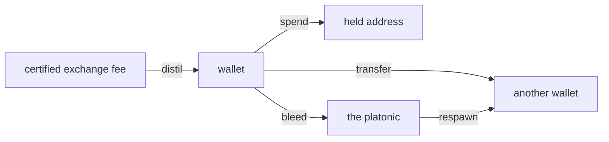
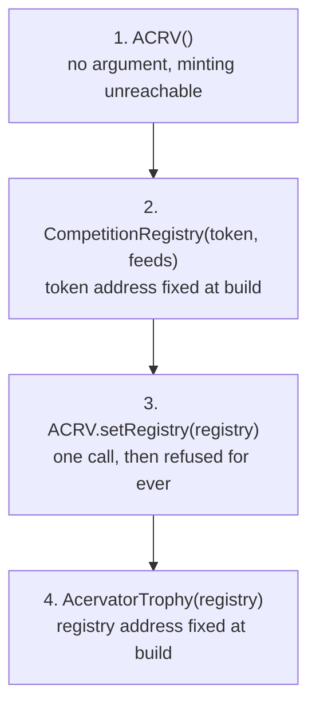
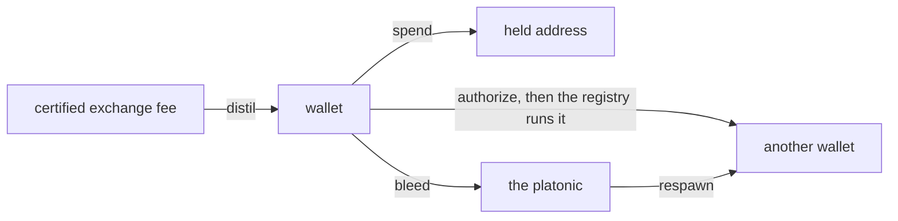

# Proof of Accumulation

Reference. **Not built.** The window builds neither the Competition tab nor the
Local Testnet tab. The tab row carries an empty tab labelled Accumulation in
their place, and issue #147 carries the build-out. `src/competition/` is the
Proof of Accumulation package, and its engine runs today with no screen in
front of it. The rest of this file describes that engine and the contract
design behind it, as a design, not as a shipped feature.

The design is an on-chain competition layer where bots compete publicly and the
winners are awarded ACRV tokens on Base, which is Coinbase's L2. It evolved
from a bot identity and an append-only trade log into Elo ratings, tournament
brackets and an in-platform chain. Every Acervator bot has a cryptographic
identity. During a competition each trade is signed and appended to a Merkle
tree, and at the end the bot submits only the Merkle root — a 32-byte hash that
commits to the whole trade history without revealing one trade of it. The
strategy stays private, the proof is public, and the winner takes ACRV and an
NFT trophy.

## The skeleton

The tab exists and draws three lines: its name, one sentence saying it is not
built, and the issue that owns it. It reads no competition, no token balance
and no trophy.

`src/gui/main_tabs/proof_of_accumulation_tab_surface.py` — the whole empty state

```python
HEADING = "Accumulation"
ISSUE = 147
BUILT = False
STATE_TEXT = "This tab is not built."
ISSUE_TEXT = f"Issue #{ISSUE} carries the build-out."
```

Two frontends draw that one view model. `EmptyTabsMixin` in
`src/gui/main_tabs/empty_tabs.py` builds the Qt tab, and
`src/gui/web/proof_of_accumulation_tab.js` registers a panel with the Electron
shell's panel host. `src.core.desktop_bridge` serves the model under
`proof_of_accumulation_tab.state`.

## Identity

Each instance gets an Ed25519 keypair. The private key signs every trade in the
log. The public key is the identity another party verifies against. Strategy
parameters are never signed and never published, so authorship is provable
while the method stays private.

`src/competition/bot_identity.py` — `BotIdentity`

```python
class BotIdentity:
    """
    Manages a bot's Ed25519 keypair.  The private key never leaves this object
    unencrypted.  The public key is the bot's network-visible identity.
```

## The trade log

Each signed trade appends to a Merkle tree. Leaves are the SHA-256 of a trade's
canonical bytes, the root is the commitment, and a proof lets a third party
confirm one trade sits in the log without receiving the log.

`src/competition/merkle_log.py` — `verify_proof`

```python
def verify_proof(leaf_hash: str, proof: List[dict], root: str) -> bool:
    """Verify a Merkle inclusion proof."""
    current = leaf_hash
    for step in proof:
        if step["position"] == "left":
            current = _node_hash(step["hash"], current)
        else:
            current = _node_hash(current, step["hash"])
    return current == root
```

`merkle_root` returns the commitment and `merkle_proof` builds the inclusion
proof one trade at a time.

## The competition lifecycle

Four phases run in order.

`src/competition/competition_engine.py` — the module's own summary

```python
  1. REGISTRATION  — bots register with capital commitment + config hash
  2. ACTIVE        — bots trade; each trade appended to their Merkle log
  3. SUBMISSION    — trading closes; bots submit Merkle root + performance claim
  4. ADJUDICATION  — arbiter verifies submissions, ranks bots, awards tokens
```

A competition runs either locally across instances on one machine and one price
feed, or between two machines exchanging signed submissions.

## Tournaments

`EventVariant` in `src/competition/poa_modes.py` builds the event shapes. Each
of the four modes pairs with one Elite flag, so there are eight event types and
no mode is written twice.

| Mode | Shape |
| ---- | ----- |
| `monster_smash` | One participant against low to midlevel creatures |
| `team_monster_smash` | A certified guild, up to 120 against 1 |
| `dungeon_crawl` | One participant, or a group of six, through a dungeon |
| `raid` | A group of sixty, the most challenging and the most rewarding |

`src/competition/poa_modes.py` — the one table the Elite flag indexes

```python
STANDARD_RULES = VariantRules(
    STANDARD_SUFFIX, STANDARD_LABEL, STANDARD_TIMEFRAME, 0, 0, 0, 0
)
ELITE_RULES = VariantRules(ELITE_SUFFIX, ELITE_LABEL, ELITE_TIMEFRAME, 1, -1, 1, 1)

VARIANT_RULES: dict[bool, VariantRules] = {False: STANDARD_RULES, True: ELITE_RULES}
```

A turn is one candle of the market clock, and `turn_at` names the turn that
clock is in. `ImpetusPool` holds the points one turn grants and loses what that
turn does not spend.

## The token

The ledger is append-only, and four methods are its whole surface.

`src/competition/token_ledger.py` — `TokenLedger`

```python
class TokenLedger:
    """
    Append-only ACRV token ledger.

    award()  — mint tokens for a competition result (idempotent)
    balance()  — current balance for a bot
    total_minted()  — total ACRV in existence
    remaining_supply()  — tokens still mintable this season
    """
```

The hard cap is ten million, and the ledger refuses an award that would pass
it. Each season awards less than the one before, so later tokens are harder to
earn.

`src/competition/season_schedule.py` — the supply constants

```python
TOTAL_SUPPLY_CAP = 10_000_000  # Hard cap — immutable
GENESIS_SEASON = 1
INITIAL_REWARD = 500_000  # Season 1 reward pool
DECAY_FACTOR = 0.85  # Each season awards 85% of the prior season
MIN_SEASON_REWARD = 100  # Floor — never less than this per season
```

Awards are idempotent: settling the same result twice writes one record.
Balances are replayed from the log, and no operation edits a balance.

Five tiers are awarded on rank within the field, and the rarest three carry a
lifetime cap on how many can ever exist. Each tier is named for a stage of the
Corpus Hermeticum alchemical path, and pays a fixed number of tokens.

| Tier | Stage | Rank | ACRV paid | Ever minted, at most |
| ---- | ----- | ---- | --------: | -------------------: |
| Harvest | NIGREDO | top 50% | 10 | no cap |
| Gold Fold | ALBEDO | top 10% | 50 | no cap |
| Bear Slayer | CITRINITAS | top 25% in a verified bear market | 100 | 10,000 |
| Grand Accumulator | RUBEDO | top 1% across three consecutive seasons | 500 | 1,000 |
| Ekthelius | UNIO MYSTICA | perfect score across every metric | 10,000 | 21 |

## The token contract

The ledger above is the platform's own record. On the chain the token is an
ERC-20 called Acervator Token. Three of its properties are fixed when the
contract is deployed and cannot be changed afterwards: the supply cap, the one
address allowed to mint, and the absence of any way to burn.

`contracts/ACRV.sol` — the header, and the guard on minting

```solidity
//   • MAX_SUPPLY  = 10,000,000 ACRV (10_000_000 * 10^18 wei)
//   • Tokens can never be burned — supply monotonically increases
//   • The registry address is set once at construction and cannot change

    modifier onlyRegistry() {
        require(msg.sender == registry, "ACRV: caller is not the registry");
```

| Property | Value |
| -------- | ----- |
| Standard | ERC-20, named Acervator Token |
| Chain | Base, chain id 8453 |
| Hard cap | 10,000,000 ACRV, held on the chain |
| Minting | the CompetitionRegistry contract only |
| Burning | never |

The contracts are not deployed. Two npm packages supply the libraries they
build on, and the deploy script takes the network and the signing key. Its own
instructions name the Base test network first.

`contracts/deploy.py` — how it is called

```bash
npm install @openzeppelin/contracts @chainlink/contracts
export ACERVATOR_PRIVATE_KEY=0x...
python deploy.py --network sepolia
```

`src/competition/season_schedule.py` — the last tier

```python
RarityTier(
    name="Ekthelius",
    emoji="∞",
    description="Perfect score across all metrics, any season",
    rank_pct_max=0.001,
    condition="100% win rate + top Sharpe + max capital efficiency",
    max_ever=21,
    base_value=10_000,
),
```

## Quintessence

A certified trade distils the platform's second asset. Entering an event spends
it, and nothing destroys it. It keeps its own ledger, apart from the token
ledger above, because the two obey opposite rules: the token only ever moves
outward into a balance, while Quintessence circulates.

`src/competition/quintessence_ledger.py` — the four operations

```python
def distil(self, address: str, fee_usd: object, trade_grade: object) -> Decimal:
def spend(self, address: str, amount: object, held_address: str) -> Decimal:
def transfer(self, sender, recipient, amount, skill_level) -> QuintessenceTransfer:
def respawn(self, address: str, amount: object) -> Decimal:
```

Quintessence can be in exactly three places, and the three always add up to
everything ever distilled. A wallet holds what a participant can spend. A held
address holds what they have already spent, which rests there and funds later
awards. The platonic holds what bled out of a transfer, and the ledger respawns
that to other participants.



Every operation checks that sum before it writes, and refuses the write when it
does not balance.

`src/competition/quintessence_ledger.py` — the two conditions the check reads

```python
is_balanced=delta == 0 and not negatives,
is_within_cap=self._total_ever_minted <= QUINTESSENCE_SUPPLY_CAP,
```

| Term | Value |
| ---- | ----- |
| Hard cap | 33,000,000 Quintessence, total ever distilled |
| Pre-ownership | none, for anyone |
| Distil rate | one Quintessence for one dollar of certified exchange fee |
| Grade curve | the trade's grade, zero to one, multiplies the award |
| Destruction | never |
| Transfer bleed | 8% at skill level one, falling to 4% at level ten |

The module holds the cap and the rate as constants, and the write path refuses a
mint past the cap rather than reporting it afterwards.

`src/competition/quintessence_ledger.py` — the recorded numbers

```python
QUINTESSENCE_SUPPLY_CAP = Decimal(33_000_000)
QUINTESSENCE_PER_FEE_USD = Decimal(1)
BLEED_FRACTION_AT_LEVEL_1 = Decimal("0.08")
BLEED_FRACTION_AT_LEVEL_10 = Decimal("0.04")
```

Every launch builds the ledger and attaches it to the window beside the local
chain, so a later panel finds it where it finds the chain.

`src/gui/shared_testnet.py` — the line that builds it

```python
main_win._quint_ledger = cls.install_quint_ledger(quint_ledger_path)
```

Nothing spends Quintessence yet. No screen shows a balance and no trade
certifies, so the ledger loads empty on every launch and reports nothing ever
distilled. The transfer duration, the skill that gates a transfer, the guild
check, and the share of a market pool a participant may take are all other
units.

## Head to head

`challenge_protocol.py` carries the Elo ladder. A challenger sends a signed
challenge, the target accepts or declines, both trade the agreed asset for the
agreed duration, and the shared engine adjudicates.

`src/competition/challenge_protocol.py` — the ladder constants

```python
ELO_K_FACTOR = 32
MIN_ELO = 100
```

The stake flows from loser to winner and both ratings move.

## Trophies

One SVG per tier, picked by name. An unknown tier raises rather than returning
an empty drawing, and `generate_preview_html` lays the whole set out on one
page.

`src/competition/trophy_generator.py` — `generate_trophy`

```python
def generate_trophy(tier: str, data: TrophyData) -> str:
    fn = GENERATORS.get(tier)
    if not fn:
        raise ValueError(f"Unknown tier: {tier!r}")
    return fn(data)
```

Inside `harvest_svg`, a text path letters the epigraph's own instruction around
the trophy ring, in its usual form: SOLVE ET COAGULA. Each drawing also letters
its own alchemical stage across the face.

`src/competition/trophy_generator.py` — the stage each tier is lettered with

```python
        "Harvest": "NIGREDO",
        "Gold Fold": "ALBEDO",
        "Bear Slayer": "CITRINITAS",
        "Grand Accumulator": "RUBEDO",
```

### Where a trophy's artwork is kept

The artwork and the metadata are held on the chain itself. The token's own
metadata call returns the JSON inline, and the picture inside that JSON is the
tier's drawing, also inline. Nothing points at IPFS, the file-sharing network
most NFT projects park their pictures on, and nothing points at any other host,
so a trophy lasts as long as the chain does.

`contracts/AcervatorTrophy.sol` — the metadata call

```solidity
            '","image":"data:image/svg+xml;base64,', svgB64,

            "data:application/json;base64,",
```

## The chain

`local_testnet.py` simulates the whole Base environment in memory, with no
wallet, no ETH and no network. Four classes make it up.

| Class | Holds |
| ----- | ----- |
| `LocalChain` | The blocks |
| `LocalACRV` | The ERC-20 balances and the mint history |
| `LocalRegistry` | Competitions, submissions and adjudications |
| `LocalTestnet` | The three above, plus a mock oracle and transaction receipts |

One call runs a whole competition on that chain and returns the result table.
It registers the entrants, trades them, takes their submissions, adjudicates,
awards the tokens and mints the trophy, with nothing written outside a
temporary directory.

`src/competition/local_testnet.py` — a demo run

```python
from src.competition.local_testnet import LocalTestnet

testnet = LocalTestnet()
result = testnet.run_demo_competition(n_bots=3, season=1)
print(result["results_table"])
```

The real targets sit ready for the day it deploys.

`src/competition/base_config.py` — the two chains

```python
  Base Mainnet: chain_id=8453  — production
  Base Sepolia: chain_id=84532 — testnet (deploy here first)
```

The contract addresses and ABIs sit beside them.

## The two shelved tabs

Both tab modules exist and the window builds neither. Their surfaces stay
registered in the bridge, so the view models answer with no Qt tab in front of
them. The Testnet tab is where a competition would be run and its blocks read
in a block explorer; today the demo run above is the only way to reach either.

`src/gui/main_tabs/retired_tabs.py` — `RetiredTabsMixin._install_retired_tab_sentinels`

```python
self._competition_tab = None

self._testnet_tab = None
```

Issue #147 carries the initial build-out.

## 2026-09-08 08:17 - #147 - what the closed issues landed

The manual names this screen Proof of Accumulation (Anonymized Trading
Tournaments Via Blockchain) and issue #147 carries its build-out.

This is currently proposed as a concept but will likely require the building of a supporting blockchain team for proper / full implementation. This system is designed to enable users of Acervator to compete against each anonymously via our own Proof of Accumulation blockchain. The idea is to convert trades executed into videogame metrics such as damage to a coliseum style monster or a fellow trader in a 1v1 face off. This further positions the platform as a surgical tool that can be finely tuned and customized to produce intense competition scenarios between entire groups of traders. This, of course, opens the door for actual tokenized Trading Guilds who may require their members to have a certain number of PoA tokens under their belt to join. There will be much more to follow on this as I do intend to scaffold it out for internal testing.

The tab is now called Accumulation. It sits seventh on the bar, on the
gold ground with red text.

The screen is not built. The window builds neither the Competition tab nor the
Local Testnet tab. The tab row now carries a Proof of Accumulation skeleton,
which draws its name, one sentence saying it is not built, and the issue that
owns it. Issue #147 carries the build-out. The engine behind it runs today, and
the rest of this section is that engine.

`src/gui/main_tabs/proof_of_accumulation_tab_surface.py` — the whole empty state

```python
HEADING = "Accumulation"
ISSUE = 147
BUILT = False
STATE_TEXT = "This tab is not built."
ISSUE_TEXT = f"Issue #{ISSUE} carries the build-out."
```

`src/competition/` is the Proof of Accumulation package. Each bot signs every
trade with an Ed25519 key and signs no strategy parameter, so authorship is
provable while the method stays private.

`src/competition/bot_identity.py` — `BotIdentity`

```python
class BotIdentity:
    """
    Manages a bot's Ed25519 keypair.  The private key never leaves this object
    unencrypted.  The public key is the bot's network-visible identity.
```

The signed trades commit to a Merkle root a third party can verify one trade
against without receiving the log. The competition itself runs four phases.

`src/competition/competition_engine.py` — the module's own summary

```python
  1. REGISTRATION  — bots register with capital commitment + config hash
  2. ACTIVE        — bots trade; each trade appended to their Merkle log
  3. SUBMISSION    — trading closes; bots submit Merkle root + performance claim
  4. ADJUDICATION  — arbiter verifies submissions, ranks bots, awards tokens
```

The token ledger is append-only and idempotent, with five rarity tiers by rank.
Its hard cap is ten million ACRV, and each season awards less than the one
before it.

`src/competition/season_schedule.py` — the supply constants

```python
TOTAL_SUPPLY_CAP = 10_000_000  # Hard cap — immutable
GENESIS_SEASON = 1
INITIAL_REWARD = 500_000  # season 1 pool, in ACRV tokens
DECAY_FACTOR = 0.85
MIN_SEASON_REWARD = 100
```

`EventVariant` in `src/competition/poa_modes.py` builds the four modes and the
Elite variant of each. A local testnet module beside it simulates the whole
Base environment in memory, with no wallet and no network.

## 2026-09-09 19:39 - #147 - the contract repairs

The three contracts could not be deployed. Each one needed another one's address
at the moment it was built, and the deployment script handed the token the
deployer's own wallet as its only minter. That address could never be corrected
afterwards, so every award would have failed, and the wallet would have held the
right to mint all ten million tokens for the life of the contract.

The token now takes nothing at all when it is built. One call afterwards names
the competition registry as the minter, and a second call to that function is
refused. The call also refuses any target that is not itself a contract, so a
wallet can no longer be named the minter by mistake.

`contracts/ACRV.sol` — the one wiring call

```solidity
    function setRegistry(address registryAddress) external onlyOwner {
        require(registry == address(0),          "ACRV: registry already set");
        require(registryAddress.code.length > 0, "ACRV: registry not a contract");
        registry = registryAddress;
        emit RegistrySet(registryAddress);
    }
```

Nothing now needs an address that does not yet exist. Four steps run in order,
and the two remaining cross-references stay fixed at build time as before.



The other published route was to compute an address before the contract exists,
and it does not solve this. A computed address commits to the values handed to
the constructor, so computing the registry's address still needs the token's
address first, and the circle closes again. The Solidity documentation states
what goes into the computation.

```text
address   = keccak256(0xff ++ deployer ++ salt ++ keccak256(init_code))[12:]
init_code = creation bytecode ++ the encoded constructor arguments
```

A factory contract could break the circle instead, by deploying both in one
transaction and deriving the second address from its own count of deployments.
That adds a fourth contract to the critical path, and that contract would hold
the right to create the token. One locked field is the smaller change.

The award function used to pay the winner and then write its own records. A
token contract that called back during the payment would have found the
competition still marked open. Every record and both log entries now land first,
and the payment is the last statement in the function.

`contracts/CompetitionRegistry.sol` — the end of `adjudicate`

```solidity
        emit Adjudicated(compId, winnerWallet, tierName, tokenAmount, c.season);
        emit TierMinted(tierName, winnerWallet, tokenAmount, compId);

        // Interaction, last
        if (tokenAmount > 0) {
            require(acrv.remainingSupply() >= tokenAmount,
                    "Registry: insufficient ACRV supply remaining");
            acrv.mint(winnerWallet, tokenAmount, compId, tierName);
        }
```

A submitted result carried one unchecked number. A starting value of zero made
the advantage calculation divide by zero, and a negative one reversed the
ranking every award is built on. The function refuses both, and the conversion
that squeezes the result into a small field now fails loudly instead of
silently keeping the wrong digits.

`contracts/CompetitionRegistry.sol` — the guard and the conversion

```solidity
        require(startValueCents > 0,    "Registry: start value <= 0");

        int256 advantage   = finalValueCents - startValueCents;
        int32  advBps      = SafeCast.toInt32((advantage * 10000) / startValueCents);
```

The price feed's answer was read and never checked. Five values come back from
it and only two were kept. Every one is now checked, and a feed reporting no
round, an unfinished round or a price of zero is refused rather than returned.

`contracts/CompetitionRegistry.sol` — `getLatestPrice`

```solidity
        require(roundId != 0,               "Registry: oracle has no round");
        require(answeredInRound >= roundId, "Registry: oracle answer is stale");
        require(startedAt  != 0, "Registry: oracle round unstarted");
        require(answeredAt != 0, "Registry: round incomplete");
        require(answer      > 0, "Registry: price not positive");
```

Handing ownership of any of the three away used to take one call, with nothing
asked of the receiver. All three now require the receiver to accept, so a
mistyped address cannot take ownership and leave nobody able to act.

The deployment script no longer compiles anything. It reads what the build
already produced, so the bytecode that would reach a chain is the bytecode the
analyzers read.

`contracts/deploy.py` — what it loads

```python
DEPLOY_ARTIFACTS = {
    "ACRV": "ACRV.sol/ACRV.json",
    "CompetitionRegistry": "CompetitionRegistry.sol/CompetitionRegistry.json",
    "AcervatorTrophy": "AcervatorTrophy.sol/AcervatorTrophy.json",
}
```

Four analyzers read the contracts before and after. The table is what each one
reported, not a difference between runs.

| Analyzer | Measure | Before | After |
| -------- | ------- | ------ | ----- |
| forge build | compiler warnings | 0 | 0 |
| forge lint | findings, of which warnings | 67, 11 | 57, 2 |
| slither | medium and above | 2 | 0 |
| slither | all bands | 13 | 11 |
| solhint | errors | 37 | 34 |
| semgrep | security findings | 0 | 0 |
| semgrep | ownership transfer without acceptance | 3 | 0 |

Three findings stand, and each has a reason.

The season budget is still not checked on the chain. The registry records what a
season has issued and reads that record nowhere. Checking it there would set a
number deciding how many tokens a season may award, and the operator sets that
number.

The trophy has no ceiling on any tier and no count of what it has minted. Unit
17 of issue #147 builds both.

Seven functions are named for reading the chain clock. No decision in any of
them reads it: every comparison the analyzer lists is on a competition's status
or on how many bots entered. The clock is stored as a record of when each step
happened, and removing that record would remove the on-chain history the design
is built on.

`contracts/CompetitionRegistry.sol` — what the analyzer points at in `adjudicate`

```text
CompetitionRegistry.adjudicate uses timestamp for comparisons
	Dangerous comparisons:
	- require(c.status == CompStatus.SUBMISSION, "Registry: not in submission")
```

The conservation law the design names counts Quintessence and not this token:
wallets plus held addresses plus the platonic equals the total ever distilled,
at most 33,000,000. No Quintessence contract exists, so nothing on the chain can
state that law yet, and the fuzzing the build tool offers has nothing to read.
Unit 6 must carry the three balances and the total as values a caller can read,
or the law stays unprovable on-chain however the token behaves.

In development.


## 2026-09-09 20:10 - #147 - the two pieces a new surface would have made live

Two pieces of code were harmless only while nothing built them. The first added
to a token balance without taking a lock first, so two threads adding at the same
moment could both read the old figure and one award would vanish. The chain file
asked for no thread protection at all.

Sixteen threads made 4,800 awards of one unit each against the chain the window
builds at start-up. The token counted all 4,800 into its supply and gave the
winner 3,709. The other 1,091 were gone, and nothing reported a fault. One lock
now covers the supply cap check, the balance, the running total and the award
record together, and the same run gives the winner all 4,800.

`src/competition/local_testnet.py` — the guarded award

```python
        with self._supply_lock:
            if self._total_supply + amount_wei > MAX_SUPPLY_WEI:
                raise OverflowError("ACRV: mint would exceed MAX_SUPPLY")
            self._balances[recipient] = self._balances.get(recipient, 0) + amount_wei
            self._total_supply += amount_wei
```

Reading a balance or the total takes the same lock, so a reader can no longer
catch the two halfway apart.

The second piece built a private chain of its own whenever nothing handed it the
shared one. A tab built that way sat at block zero while the shared chain stood
at block one, showed numbers, and raised nothing. The shared chain is now a
required argument.

`src/gui/testnet_tab.py` — the required chain

```python
        def __init__(self, parent=None, *, shared_testnet, bridge):
            """Read the chain through ``shared_testnet`` and ``bridge``; neither may be None."""
            super().__init__(parent)
            self.setAccessibleName("Testnet Tab")
            if shared_testnet is None or bridge is None:
                raise ValueError(
```

Asking for the tab with nothing attached now stops on the call itself.

```text
TypeError: TestnetTab.__init__() missing 2 required keyword-only arguments:
'shared_testnet' and 'bridge'
```

Handing it an empty chain on purpose stops as well, and the refusal names where
a real one comes from.

```text
ValueError: TestnetTab needs the process-wide chain: pass the shared_testnet
and bridge that SharedTestnetBridge.install_on attached to the MainWindow.
A private LocalTestnet would diverge from every other reader.
```

## 2026-09-09 20:43 - #147 - the Quintessence contract

Quintessence now has a contract. It holds the same three places the platform's
own ledger holds, and it reports all three plus the running total as numbers
anyone can read off the chain at any block.

`contracts/Quintessence.sol` — the four numbers a reader gets

```solidity
    uint256 public walletsTotal;
    uint256 public heldTotal;
    uint256 public platonicTotal;
    uint256 public totalEverMinted;
```

The law is that the first three always add up to the fourth, and the fourth can
never pass thirty-three million. The contract also answers both halves in one
call, so a reader does not have to do the sum themselves.

`contracts/Quintessence.sol` — the single call that answers the law

```solidity
        isBalanced = wallets + held + platonic == everMinted;
        isWithinCap = everMinted <= cap;
```

| Term | Value |
| ---- | ----- |
| Smallest unit | one Quintessence divided into 10^18 parts |
| Hard cap | 33,000,000 Quintessence, as 33 followed by 24 zeros of those parts |
| Owner | none |
| Pause | none |
| Upgrade hook | none |
| Burn | none |
| Minting | the Proof-of-Accumulation registry only, named once when built |

The smallest unit matches the prize token, which splits each coin into the same
number of parts. Quintessence needs the split because the award is a dollar of
exchange fee multiplied by a trade grade between zero and one, and because a
transfer loses a single-digit percentage. Whole numbers would round both of
those away.

The contract has no owner and no pause. A wallet cannot move Quintessence on its
own either, because moving it between players is a skill, not a wallet button. A
transfer therefore takes two calls: the holder authorizes it, and the registry
runs it once the waiting time has passed.

`contracts/Quintessence.sol` — the holder's half and the registry's half

```solidity
    function authorizeTransfer(address recipient, uint256 amount) external {
    function executeTransfer(address sender, uint256 skillLevel) external onlyRegistry {
```

Neither side can act alone. The registry cannot move a wallet that authorized
nothing, and a holder cannot move their own units without the registry. One
authorization is held per holder at a time, which is what stops a large transfer
being split into many fast ones.

The contract works out the loss and the waiting time itself, from the published
rates, rather than taking either as a number it is handed. A transfer always
loses at least four per cent and always takes at least one hour.



Nothing in the contract destroys a unit. A spend moves units to a held address
where they rest, and that address is never drained, so a spend can never become
a free transfer. The running total only ever rises.

The build tool's own fuzzing now holds ten properties over the contract, by
throwing random sequences of calls at it. Each property was also broken on
purpose once, to watch the tool report it, and then put back.

`tests/contracts/QuintessenceConservation.t.sol` — what the fuzzing reported

```text
QuintessenceConservationTest invariants (runs: 256, calls: 16384, reverts: 8607)
[PASS] invariant_threeBucketsEqualTotalEverMinted
[PASS] invariant_walletsTotalEqualsSumOfBalances
[PASS] invariant_totalEverMintedWithinCap
[PASS] invariant_totalEverMintedNeverFalls
[PASS] invariant_noUnitIsDestroyed
[PASS] invariant_capRefusesAMintPastIt
[PASS] invariant_onlyRegistryMovesUnits
[PASS] invariant_registryCannotMoveAnUnauthorizedWallet
[PASS] invariant_transferRefusedBeforeItsDurationElapsed
[PASS] invariant_everyTransferBleedsFourPercentOrMore
```

A mint of one unit more than the cap is refused, and the tool printed the
refusal itself while nothing had been minted at all.

`contracts/Quintessence.sol` — the refusal, quoted from the run

```text
    │   └─ ← [Return] 33000000000000000000000000 [3.3e25]
    ├─ Quintessence::distil(QuintessenceActor, 33000000000000000000000001 [3.3e25])
    │   └─ ← [Revert] Quint: supply cap reached
```

Nothing is deployed. No transaction was sent and no network was reached, so the
four deployment steps themselves are unproven. The contract is also not yet
wired to anything: no registry contract exists to name as its minter, and the
platform's own ledger and the contract do not yet read each other.

Three analyzers ran over the new file and none reported a security finding. The
fourth, the one that walks the compiled bytecode, is still missing from this
machine for the reason the earlier audit records.

| Tool | Result on the new contract |
| ---- | -------------------------- |
| the build tool's linter | no errors, one warning about reading the chain clock |
| the static analyzer | one medium finding, on an exact comparison against zero |
| the style linter | 86 warnings, no errors |
| the pattern scanner | 29 findings, none of them about security |

The exact comparison is on the contract's own marker for a waiting transfer,
which holds either zero or a real amount and nothing else, so no third value
exists for it to miss. The contract reads the chain clock to decide whether a
transfer's waiting time has passed, and the shortest waiting time is one hour,
far longer than the few seconds a block producer could shift.

No archetype covers Solidity. Each contract file reports zero analyzers and says
plainly that it was not examined, so the four tools above are the whole coverage
for this file.


## 2026-09-09 21:16 - #147 - the trophy tier supply caps

Four of the five trophy tiers now carry a lifetime ceiling, and the ceiling is
held in the contract that mints the trophy. Harvest is the only tier left open,
which is what the design asks for: a cap on every tier except the lowest.

| Tier | Trophies ever | Where the ceiling is held |
| ---- | ------------- | ------------------------- |
| Harvest | no limit | nowhere, by design |
| Gold Fold | 100,000 | the trophy contract |
| Bear Slayer | 10,000 | the trophy contract |
| Grand Accumulator | 1,000 | the trophy contract |
| Ekthelius | 21 | the trophy contract |

`contracts/AcervatorTrophy.sol` — the four ceilings

```solidity
    uint256 public constant MAX_GOLD_FOLD         = 100_000;
    uint256 public constant MAX_BEAR_SLAYER       = 10_000;
    uint256 public constant MAX_GRAND_ACCUMULATOR = 1_000;
    uint256 public constant MAX_EKTHELIUS         = 21;
```

Only one of those numbers is new. Bear Slayer at 10,000, Grand Accumulator at
1,000 and Ekthelius at 21 were already written into the platform's own tier list.
Gold Fold at 100,000 continues the same ten-fold step the other three make.

Before this, the two top ceilings were held in the competition registry, and the
registry awards the prize token rather than the trophy. The registry could
therefore refuse a twenty-second Ekthelius token award while the trophy contract
minted a twenty-second Ekthelius NFT. Each contract now holds the ceiling for the
thing it actually mints.

The check sits inside the mint call, so every caller meets it. The owner of the
trophy contract is allowed to call mint, and the owner is now refused at a
ceiling exactly as the registry is.

A tier name outside the five is also refused. The counter is kept per tier name,
so a near-miss name such as a trailing space would otherwise start a fresh
counter of its own and mint without limit.

`contracts/AcervatorTrophy.sol` — the refusal a caller reads at each ceiling

```text
Trophy: Gold Fold supply of 100,000 exhausted
Trophy: Bear Slayer supply of 10,000 exhausted
Trophy: Grand Accumulator supply of 1,000 exhausted
Trophy: Ekthelius supply of 21 exhausted
Trophy: unknown tier
```

Each of those four refusals was watched. The build tool minted the last trophy a
tier allows, then asked for one more and printed the refusal.

`tests/contracts/TrophyTierCaps.t.sol` — the last Ekthelius trophy, then the refusal

```text
AcervatorTrophy::tierMinted("Ekthelius")  → 20
AcervatorTrophy::mint(..., "Ekthelius", ...)
  emit TrophyMinted(tokenId: 1, tier: "Ekthelius", ...)
AcervatorTrophy::tierMinted("Ekthelius")  → 21
AcervatorTrophy::mint(..., "Ekthelius", ...)
  ← [Revert] Trophy: Ekthelius supply of 21 exhausted
```

The build tool's own fuzzing holds five properties over the contract, by throwing
random sequences of calls at it. Each property was also broken on purpose once,
to watch the tool report it, and then put back.

`tests/contracts/TrophyTierCaps.t.sol` — what the fuzzing reported

```text
TrophyTierCapsTest invariants (runs: 256, calls: 16384, reverts: 9687)
[PASS] invariant_noCappedTierExceedsItsMaximum
[PASS] invariant_everyCapRefusedAMintAtIt
[PASS] invariant_unknownTierNameIsRefused
[PASS] invariant_harvestIsNeverRefused
[PASS] invariant_everyMintIsCounted
```

The last one is the guard against a counter that is never raised. A ceiling read
off a counter nothing increments would never be reached, and the tier would mint
for ever while every other check stayed green.

Breaking each property on purpose found a sixth thing that needed covering. Every
one of the five reads the ceiling out of the contract, so raising a ceiling to an
absurd number left all five green. A separate check now holds the four numbers as
written figures, and it goes red the moment one of them moves.

`tests/contracts/TrophyTierCaps.t.sol` — the four figures held as written numbers

```solidity
        require(trophy.MAX_GOLD_FOLD() == 100_000, "MAX_GOLD_FOLD is not 100,000");
        require(trophy.MAX_BEAR_SLAYER() == 10_000, "MAX_BEAR_SLAYER is not 10,000");
        require(trophy.MAX_EKTHELIUS() == 21, "MAX_EKTHELIUS is not 21");
```

Each number is still written twice, once in the platform's own tier list and once
in the contract. Nothing fails if those two copies disagree. No check reads both
languages, and no archetype covers a contract file, so the pair is held by reading
and not by a tool. A check that compares them is a rule for the harness, which is
not this unit's to write.

`src/competition/season_schedule.py` — the platform's own copy of the same numbers

```python
  Harvest            max_ever = None
  Gold Fold          max_ever = 100_000
  Bear Slayer        max_ever = 10_000
  Grand Accumulator  max_ever = 1_000
  Ekthelius          max_ever = 21
```

The season budget is unchanged and still decides nothing on the chain. It sets how
many prize tokens a season may award, and that number is the operator's.

| Tool | Result on the trophy contract |
| ---- | ----------------------------- |
| the build tool | compiled from scratch, no errors |
| the build tool's linter | no errors |
| the static analyzer | no finding above informational |
| the style linter | no errors |
| the pattern scanner | no security finding |

No archetype covers Solidity. Each contract file reports zero analyzers and says
plainly that it was not examined, so the four tools above are the whole coverage
for the contract.

Nothing is deployed. No transaction was sent and no network was reached, so the
ceilings are proved on a local chain the build tool runs in memory and not on Base.

Back to [the subsystem index](README.md).

## 2026-09-09 21:37 - #147 - the tab shell and its three zones

The Accumulation tab is no longer three lines of text. It draws the arrangement
the operator set out on 9 September: the player window on the left, the square
enemy screen upper right, and the party window across the lower half. Nothing
inside the zones is built, and each one says so on screen.

The player window and the enemy screen each draw a title and one placeholder
sentence. The party window draws a header, eight groups of five empty slots, and
its own placeholder sentence. Forty slots is one page of the hundred and twenty
the largest event carries.

`src/gui/main_tabs/proof_of_accumulation_tab_surface.py` — the paging the party
window draws

```python
PARTY_CAPACITY = 120
PARTY_PER_PAGE = 40
PARTY_GROUP_SIZE = 5
PARTY_PAGE = 1
```

The Quintessence balance sits in the party window's header and stays on screen
whichever zone is drawing. The full wallet opens as a panel over the party
window and over nothing else, carrying one section each for Quintessence,
trophies and loot. No balance is read: the panel says so rather than showing a
number nothing produced.

```
header, always on screen   Quint  --   Open wallet   Page 1 of 3 - 40 a page
wallet closed              0 panels
wallet open                1 panel over the party window, 3 sections
the balance                "--", because no ledger is read yet
```

The whole screen is one payload from one bridge method. The chain that payload
answers for is a field of it, so a demo run against the TestNet asks the same
method with a different chain and reaches the same page. No second surface and
no second module exist for the demo.

```python
CHAIN_FIELD = "chain"
LIVE_CHAIN = "live"
DEMO_CHAIN = "testnet"
CHAINS: tuple[str, ...] = (LIVE_CHAIN, DEMO_CHAIN)
```

Neither shelved Qt class was restored and neither was built on. Sixteen screens
are registered in the variant seam and none of them draws a competition, testnet
or proof-of-accumulation surface, so this tab had no Qt original to match and no
Qt picture was taken.

```
seam screens                                     16
PoA, competition or testnet entries among them   none
CompetitionTab and TestnetTab constructed        never; both sentinels are None
```

What is still not built is everything inside the zones: the pixel art, the
character classes, the event modes and the turn structure. The wallet holds no
Quintessence, no trophy and no loot, because there is no debit path and no
participant identity to read one for.

## 2026-09-09 22:28 - #147 - the certified transaction socket

A bot now certifies each of its fills against the local chain, and every
certified fill distils Quintessence from the fee the exchange charged. An event
turns away a bot that has certified nothing. No figure a bot trades on changes:
the socket reads a fee the platform already recorded, then writes to the chain
and to the Quintessence ledger.

`src/competition/certification_socket.py` — what one certification writes

```python
            leaf = log.append(record)
            distilled = self._ledger.distil(self._wallet_for(bot_id), fee, grade)
            self._certified_fill_ids.setdefault(bot_id, set()).add(fill_id)
            self._lifetime_fee_usd[bot_id] = (
                self._lifetime_fee_usd.get(bot_id, Decimal(0)) + fee
            )
```

Most of certification was already in the package. Signing belongs to the bot
identity, the append-only log already refuses three kinds of bad record, and the
chain already takes a transaction and an event. The socket is what joins those
parts to the fee and to the ledger.

| Part of certification | Where it comes from |
| --------------------- | ------------------- |
| Signing one fill | `BotIdentity.sign_trade` |
| Refusing a wrong competition, a wrong bot, a bad signature | `MerkleTradeLog.append` |
| The commitment over every certified fill | `MerkleTradeLog.root` |
| Proof of one fill without the log | `MerkleTradeLog.proof_for` |
| A summary revealing no fill | `MerkleTradeLog.submission_summary` |
| The transaction and the event on chain | `LocalChain.send_tx`, `LocalChain.emit` |
| Minting the award | `QuintessenceLedger.distil` |
| One chain and one ledger per launch | `SharedTestnetBridge.install_on` |
| A fill offered for certification | `CertifiedFill`, new |
| What one certification produced | `CertificationReceipt`, new |
| The replay, stranger and cap refusals | `CertificationSocket.certify`, new |
| The lifetime fee total | `lifetime_certified_fee_usd`, new |
| The fill subscriber | `attach_to_bus`, new |

Nothing in the platform holds a lifetime fee total, so the socket holds its own.
The exchange health refresh re-derives its figure from the last five hundred
trades, so that figure falls as older fills age out, and an earned quantity may
never fall. The socket's total takes every certified fee, takes the higher of the
stored and the held figure on a reload, and rises rather than follows a windowed
reading from the exchange.

`src/competition/certification_socket.py` — the windowed reading raises the total
or leaves it alone

```python
        observed = _as_fee_usd(observed_fee_usd)
        with self._state_lock:
            held = self._lifetime_fee_usd.get(bot_id, Decimal(0))
            if observed > held:
                self._lifetime_fee_usd[bot_id] = observed
                self.save()
                return observed
            return held
```

The total rises on both sides of the cycle. A scrum and a fold each carry the
fee the venue reported for that fill, and the socket adds whichever arrives. A
fill whose fee is zero certifies and distils nothing.

```
one scrum, fee $4.65   distilled 4.650   lifetime total $4.65
one fold,  fee $4.58   distilled 4.580   lifetime total $9.23
a window reading $500  distilled 0       lifetime total $500.00
a window reading $12   distilled 0       lifetime total $500.00
```

The socket refuses four things. Taking away a guard makes the socket admit
whatever that guard stops, and a run of each one showed exactly that.

| Refused | Without its guard |
| ------- | ----------------- |
| A fill already certified | the fee total doubles, $4.00 to $8.00 |
| A bot that has certified nothing | it enters an event |
| A forged signature | 500 Quintessence mints for a bot that signed nothing |
| An award past the 33,000,000 cap | the log keeps a fill that never distilled |

After every mint the ledger's three places still add up to everything ever
distilled. The socket reads that report back and carries it in the receipt, so a
caller sees the sum rather than trusting it.

```
after the scrum    wallets 4.650 + held 0 + platonic 0 = 4.650 ever minted
after the fold     wallets 9.230 + held 0 + platonic 0 = 9.230 ever minted
after a refusal    wallets 9.230 + held 0 + platonic 0 = 9.230 ever minted
```

Every launch builds the socket beside the chain and the ledger, in the same call
that builds those two. It shares the bridge's lock, so a certification and a
competition run never write the chain at the same moment.

`src/gui/shared_testnet.py` — the line that builds it

```python
        main_win._certification_socket = bridge.install_certification_socket(
            ledger, socket_path
        )
```

Demo mode is the same socket over a second chain. The chain, the ledger and the
competition name all arrive at construction, so a TestNet run is a second socket
holding different ones, and no flag anywhere decides which path runs. A demo
certification leaves the live ledger at the figure it already held.

```
live socket   chain from SharedTestnetBridge   competition POA-STANDING
demo socket   its own LocalTestnet             competition POA-DEMO
measured      demo minted 3.720; live stayed at 9.230
```

One thing a fill on the bus cannot yet supply is its fee. The fill notification
carries the type, the side, the amount, the price, the dollars and the profit,
and no fee. A fill arriving that way certifies, reaches the chain and distils
nothing until the notification carries the number the venue charged.

```
trade.filled fields today   type, side, amount, price, usd, profit,
                            operator_initiated
the field the socket reads  fee_usd, absent from every emit site
the result                  the fill certifies, the award is zero
```

What is still not built is the grade curve that scales an award, the rotation
that decides which markets pay, and the caps on how much one participant may
take. The socket passes a grade of one and applies no ceiling beyond the supply
cap, so those three remain open.

## 2026-09-09 22:47 - #147 - the Quintessence wallet

The wallet holds real state. The balance in the party window's header is the
figure the Quintessence ledger computed for this node, and it stays on screen
while the wallet is closed. Opening the wallet lays three holdings side by side
across the party window: Quintessence, trophies, loot.

Quintessence reads the ledger file belonging to the chain the tab is showing.
Five figures, every one of them the ledger's own, none of them worked out on the
screen. This is a run against a throwaway home holding two distillations.

```
Balance                17.25
Distilled, all time    17.25
Still mintable         32999982.75
Supply cap             33000000
Movements              2
quintessence_ledger.json
```

Trophies are the awards this participant has won, one row each, read from the
ACRV award ledger. A row carries the tier's own emblem and name, the season, and
the competition it was won in. The emblem is the one the tier declares, not a
picture the screen chose.

```
🐻 Bear Slayer   Season 4 - comp-autumn-0002
🪙 Gold Fold     Season 3 - comp-autumn-0001
acrv_ledger.json
```

Loot shows nothing and says why. No loot contract exists and no loot store
exists, so the panel prints one sentence instead of an invented item. That
sentence is the whole of the loot holding until unit 19 builds the store.

```
No loot contract and no loot store is built. Nothing is read.
```

The participant is this node's own competition identity. Its key file is read,
never created, so a machine with no identity yet names none, the balance falls
back to two dashes, and the trophy section says which file it was looking for.

`src/gui/main_tabs/proof_of_accumulation_tab_surface.py` — where each figure
comes from

```python
def participant_identity() -> BotIdentity | None:
    """This node's PoA identity from ``IDENTITY_NAME``, or None when unreadable."""
    try:
        return BotIdentity(str(LEDGER_DIR / IDENTITY_NAME)).load()
    except Exception:
        return None
```

The wallet displays and does nothing else. It carries no button that spends, no
field that sends and no path that moves a balance. Spending belongs to unit 13
and transfer to the skill in unit 21, and until they land a wallet that could
move value would be a defect rather than a feature.

Each holding falls back on its own. Corrupting the Quintessence ledger empties
that section, prints the ledger's own refusal under it, and drops the header
balance to two dashes, while the trophy rows stay on screen. Taking the identity
away does the reverse.

```
ledger corrupted   Quintessence 0 rows, the refusal printed, trophies 2 rows
identity removed   Participant none, balance --, trophies 0 rows with a reason
both intact        Quintessence 5 rows, trophies 2 rows, balance 17.25
```

The demo chain reads its own book through the same bridge method. Asking for the
TestNet chain returns a different balance from a differently named file, on the
same page, with no second surface and no second module.

```
live      Balance 17.25   quintessence_ledger.json
testnet   Balance 50.00   quintessence_ledger_testnet.json
```

## 2026-09-09 22:57 - #147 - the project age rule

A market rewards Quintessence only while its project is at least six months old.
The platform now answers that question for one market at a time. It reads the
project's start date from CoinGecko, keeps that date on disk for good, and
refuses any market whose age it cannot establish. No figure a bot trades on
changes: the lookup reads a published date and writes only its own cache file.

`src/competition/project_age.py` — the whole decision

```python
        meets_age_rule_on = ""
        if genesis is not None:
            admits_on = months_after(genesis, MIN_PROJECT_AGE_MONTHS)
            meets_age_rule_on = admits_on.isoformat()
            if self._today() < admits_on:
                reason = TOO_YOUNG
```

Six months means six calendar months, not a count of days. Bitcoin started on
3 January 2009, so the rule first admitted it on 3 July 2009. Both edges of that
day were run.

```
BTC asked on 2009-07-02   too_young    rewards Quintessence: no
BTC asked on 2009-07-03   old_enough   rewards Quintessence: yes
```

### Where the date comes from

CoinGecko serves a project's start date on its coin detail endpoint, in a field
the API reference documents as nullable. Nothing in the platform had ever called
that endpoint. Two other CoinGecko endpoints were already in use, and the new
call shares no code with either of them.

| What it asks for | The endpoint, and who calls it |
| ---------------- | ------------------------------ |
| The asset list and 24-hour volume | `/coins/markets`, from `market_data.py` |
| The candle series | `/coins/{id}/ohlc`, from `chart_data.py` |
| The project start date | `/coins/{id}`, from `project_age.py`, new |

The Charts tab's one-hour timeframe asks the candle endpoint for two days and
gets an HTTP 400 back. That fault is recorded elsewhere and is unchanged here.
The age call reads no days value and builds its own address, so the two requests
share the host name and nothing else.

Most of this was already in the platform. The parts that are new are the rule
itself, the refusals, and the file that keeps each date.

| Part of the lookup | Where it comes from |
| ------------------ | ------------------- |
| The CoinGecko identifier for an asset | `crypto_assets.ASSETS`, 40 of 40 filled |
| A request that refuses any address but http and https | `safe_url.SafeRequest` |
| Opening that request | `safe_url.safe_urlopen` |
| Writing the cache file without a torn write | `io_utils.atomic_write_json` |
| Runtime data outside the repository | the same home folder the Stone Tablets use |
| The six-month test | `months_after`, new |
| One market's answer | `ProjectAgeVerdict`, new |
| The four refusals | `ProjectAgeLookup.verdict_for`, new |

### The identifier map is what limits this, not the rate limit

The asset catalogue carries a CoinGecko identifier for forty base currencies.
The eligibility rule reaches up to twenty markets on each of fifteen venues, so
three hundred markets can ask and forty bases can answer.

```
bases with an identifier        40 of 40 in the asset catalogue
markets the rule can reach      up to 300
a market outside the forty      refused, reason no_coingecko_id
```

A market with no identifier is refused, and the refusal says which kind it is.
Tron is a real project older than six months, and the lookup still turns it away
because the catalogue carries no identifier for it.

```
TRX/USD   coingecko_id ''   rewards Quintessence: no   reason no_coingecko_id
```

Widening the map is the way to widen the rule. Either the asset catalogue grows,
or a list call fetches every identifier CoinGecko carries. A ticker is not unique
across projects, so the second route needs a tie-break where two projects share
one symbol.

### The four refusals, and what each one looks like

Every answer carries a reason, so a refusal is never confused with a crash. A
bad market string raises instead, and that is the only error path.

| Reason | When | Measured |
| ------ | ---- | -------- |
| `too_young` | the project is under six months old | BTC asked on 2009-03-01 |
| `no_coingecko_id` | the catalogue has no identifier | TRX/USD |
| `no_genesis_date` | CoinGecko answers with no date | SHIB/USD |
| `lookup_failed` | the call did not answer | ETH/USD, host unreachable |

Taking away a guard makes the lookup admit whatever that guard stops, and a run
of each one showed exactly that.

```
without the too_young guard         BTC at 2009-03-01 rewards Quintessence
without the no_coingecko_id guard   TRX/USD rewards Quintessence
without the no_genesis_date guard   SHIB/USD rewards Quintessence
without the lookup_failed guard     an unreachable host rewards Quintessence
```

### A missing date is the common case, not the corner case

Nine projects answered the endpoint. Two carried a date and seven carried none.
Every one of those seven is refused.

```
with a date    bitcoin 2009-01-03, chainlink 2017-09-16
with none      uniswap, shiba-inu, pepe, aave, thorchain, the-sandbox,
               sei-network
```

Refusing an unknown age cannot be gamed by withholding data, which is why it is
the answer recorded for this rule. The cost is now measured rather than guessed:
most tokens in the catalogue carry no published start date, so the age half of
the rule admits few markets today.

### The date is fetched once and never again

A project's start date is fixed on the day its chain starts, so the lookup keeps
each one in a file under the runtime folder, with no expiry and no timer. A date
already in that file is served without any network call at all.

```
~/.acervator/project_genesis_dates.json
{ "genesis_dates": { "bitcoin": "2009-01-03" }, "version": 1 }
```

Proved by taking the network away. A second run with the host unreachable still
answered for Bitcoin from the file, and in the same run a market that was not in
the file could not be answered at all.

```
BTC/USD, host unreachable, in the file       old_enough
ETH/USD, host unreachable, not in the file   lookup_failed
```

An empty answer is not written to the file. A project CoinGecko cannot date today
may be dated tomorrow, and a stored blank would freeze that refusal for good.

### What is not built

Nothing in the running program asks a market for its age yet. The module loads on
every launch, and the object that answers is built by whoever asks.

`src/gui/main_window.py:277` — the launch call that loads the package

```python
                SharedTestnetBridge.install_on(self)
```

The volume ranking, the market rotation and the per-market caps are the other
half of eligibility and are not here. One measurement belongs to whoever builds
the backfill: asked forty times at two seconds apart, the detail endpoint refused
thirty-four of those calls with HTTP 429. The lookup itself makes one call per
project and then never again, so the pacing belongs in the loop that walks a
venue, not in the lookup.

Demo mode needs no second path. A start date is a fact about a project, not about
a chain, so a TestNet run reads the same dates from the same file through the same
call. The lookup holds no chain and no competition name, so there is nothing for a
demo run to switch.

## 2026-09-09 23:41 - #147 - node linking between two instances

Two copies of Acervator on one machine now hold the same records on their two
chains. Each copy is a node. A node says where it is listening, finds the others
that said the same, trades records with them, and keeps every record either side
had. This is the run, two processes, each with its own chain and its own books.

```
node 8f3fd656e34e starts with 1 chain records on node_a
node 8f3fd656e34e listening on 127.0.0.1:57019 (network=acervator-poa, records=1)
node b3b38412206d starts with 1 chain records on node_b
node b3b38412206d listening on 127.0.0.1:57040 (network=acervator-poa, records=1)
node b3b38412206d synced with 8f3fd656e34e: held 1, offered 2, took 1, now holds 2
node 8f3fd656e34e synced with b3b38412206d: held 2, offered 2, took 0, now holds 2
node 8f3fd656e34e ends with 2 chain records
node b3b38412206d ends with 2 chain records
```

Nothing opens a port by itself. Starting the application builds the node, and
building the node binds nothing, announces nothing, and creates no directory.
Linking is a thing somebody asks for afterwards. A node nobody has asked refuses
to give out an address, because it does not have one.

```
PoaNodeLink installed (node=node-694eca0b8dc2, peers=...\poa_nodes,
                       network=acervator-poa, listening=False)
after install: listening=False, announced files=no directory, chain=[]
endpoint before start_listening raised NodeLinkError:
    node node-694eca0b8dc2 is not listening, so it has no endpoint
```

The link speaks to this machine and nowhere else. The address sits in one named
constant, and no method anywhere takes an address to bind, so there is no
setting to get wrong. A caller from any other machine is turned away before its
message is read.

`src/competition/node_link.py` - the only interface, and the refusal

```python
LOOPBACK_HOST = "127.0.0.1"

    def verify_request(self, request: object, client_address: tuple) -> bool:
        if client_address[0] != LOOPBACK_HOST:
            logger.warning("node link refused non-loopback client %s", client_address)
            return False
        return True
```

Nothing from the trading side can travel over it. A record is six declared
fields and nothing else, so a peer that sends a seventh is refused where the
record is built. The node holds the chain and holds nothing else, and the only
two calls it can make on that chain are to add a transaction and to add an
event. A record names a function as text, and no part of this calls it.

`src/competition/node_link.py` - the whole of what crosses

```python
    from_addr: str
    to_addr: str
    function_name: str
    args: dict
    gas_used: int
    events: tuple
```

Agreement is on the records, not on the blocks, and that follows from the chain
already in the tree. It keeps one list of blocks and always builds on the last
one, so it has nowhere to put a second competing history. Each block's
identifier is made from the clock and a random number instead of from the
block's own contents, so two nodes holding the very same record still give their
blocks different identifiers. **The chain cannot express a fork.** Nothing
therefore has a branch to choose between, or a history to discard.

`src/competition/local_testnet.py` - where a block's identifier comes from

```python
def _fake_hash(seed: str = "") -> str:
    raw = f"{seed}{time.time_ns()}{uuid.uuid4()}"
    return "0x" + hashlib.sha256(raw.encode()).hexdigest()
```

The rule is therefore to keep everything. A record is named by the hash of its
own content, a node adds every record it does not already have, and nothing is
ever thrown away. The order the two nodes talk in does not matter. What the rule
refuses matters as much as what it does: it never removes a record, never
reorders one already held, and never claims the two chains are identical block
for block. The second exchange in the run above took nothing, which is the same
record arriving twice and being recognised.

```
node 8f3fd656e34e synced with b3b38412206d: held 2, offered 2, took 0
node b3b38412206d took 0 of 2 records from peer 8f3fd656e34e
```

Breaking the link breaks the agreement, which is how we know the agreement came
over the wire. The same two processes, with the link built but never started,
end one record apart and stay that way.

```
node 0a4dbe51b761 ends with 1 chain records, never having listened
node 4629d5d46e1d ends with 1 chain records, never having listened
```

The TestNet demo runs the same code. A demo node is this same node over a
different chain with a different chain name, not a second code path and not a
switch. Two demo nodes link exactly as two live nodes do. A live node and a demo
node sharing one announcement directory, both listening at the same moment, find
no peer at all.

```
both on the demo chain
  node efad997ddc19 synced with 56d934d38462: held 1, offered 2, took 1, now holds 2
  network=acervator-poa-testnet

one of each, one directory
  node 883079b27380 discovered 0 peers      network=acervator-poa
  node b1435252aa59 discovered 0 peers      network=acervator-poa-testnet
  each ends with 1 chain records
```

Nothing in the running application starts a link yet. The node is built on every
launch and waits. The control that would start it belongs on this tab, and no
unit on the issue carries that control, so it is named here rather than invented.
A node killed outright also leaves its announcement behind, and the next node to
read it logs that it could not be reached and carries on.

```
In development.
```
## 2026-09-09 23:43 - #147 - the classes and the RPG conversion

The party window now lists real characters. Each row names one of the operator's
bots, and the figure beside it shows that bot's health pool. Under the rows sit
the seven classes a participant picks from.

```
04e1cafc | none | $54.19
092428b2 | none | $101.98
168b78e3 | none | $67.30
```

Every row says `none` for its class. A participant picks a class for an event,
and no event exists yet.

### The seven classes and the four roles

The classes come from the seven classical planets and their metals. The roles
come from the three principles of Paracelsus: Salt endures, Sulphur burns,
Mercury flows. The operator's correction splits Mercury's three across healing
and support, which adds Support as the fourth role.

```
Lead Ward              Saturn   lead         Salt     Tank
Tin Bulwark            Jupiter  tin          Salt     Tank
Iron Edge              Mars     iron         Sulphur  Damage
Solar Lance            Sol      gold         Sulphur  Damage
Quicksilver Draught    Mercury  quicksilver  Mercury  pure healer
Copper Conduit         Venus    copper       Mercury  support healer
Silver Mirror          Luna     silver       Mercury  pure support
```

Copper Conduit is the only class holding two roles. A support healer heals and
supports, so it counts in both.

Each class levels on its own. A level record holds the class name, its level and
its experience, and it starts at level one. One ability arc is a hundred levels,
and the chain opens another arc with each alchemical phase.

```python
ARC_LEVELS = 100
FIRST_LEVEL = 1
```

### Health comes from the dollar target

The operator's rule is that players take damage and never lose money. The health
pool comes from the dollar line the engine defends, not from profit and loss. A
bot below its line carries a wound and has lost nothing.

These are the figures the conversion produced for one live bot on KAT/USD, with
the field each one came from.

```
max health           209.20254   scrumming_state.target_balance
base health          200.00000   scrumming_state.anchor_target_balance
health from levels     9.202538  compounding_snapshot.accrued_growth_usd
gain cap per cycle     2.0       compounding_snapshot.cycle_growth_budget_usd
gain cap, percent      1.0       config.max_target_growth_pct
current health       199.28538   max health plus the gate reading's delta
```

The target grows as folds land, and a per-cycle cap bounds that growth. The
engine already computes that curve, so the pool rises through play on its own.

### Damage is the scrum, healing is the fold

The two halves of the cycle are the two award axes. The operator's rule awards
tokens for most damage done or most healed, so one number serves both
scoreboards.

```
damage, year to date      676.88404   stats.ytd_scrummed_usd
healing, year to date     953.68802   stats.ytd_folded_usd
this heal                  10.11134   the fill's usd on a BUY
heals waiting              11         tranche_snapshot.fold_count
heals waiting, usd         29.720012  tranche_snapshot.fold_total_usd
```

Accuracy and efficacy come from the grade the platform gives a trade. The same
bot's last fill graded `A+` at 1.0, with accuracy 1.0 and timing 1.0. The crit
reading is the twelve voters' agreement, 0.0005 on that tick. The three fumble
counts were all zero.

### Twenty-three of twenty-seven metrics read

The conversion answers twenty-seven metrics. Twenty-three carried a value on the
live run. The four that did not are honest gaps, not errors.

```
wound depth          GateContext.delta_pct is computed and never emitted
this strike          the last fill was a BUY, so the SELL half is empty
outcome efficacy     the grader needs a per-unit realised figure
strategic efficacy   the grader needs a rolling sell-to-buy reading
```

### Breaking a source takes its metrics away

A metric with no field answers nothing. Removing one part of a bot's record
removes exactly the metrics that part feeds, and nothing else.

```
whole record and gate reading      16 metrics
scrumming_state removed            13 - max, base and current health gone
stats removed                       9 - damage, healing, fumbles, pool, cash gone
config removed                     15 - the percent gain cap gone
gate reading removed               10 - six gate-fed metrics gone
```

### Seven things the platform holds no field for

Experience, level, character class, gear, an enemy, a threat value and a guild
have no field anywhere in the source. They are state this design must create.
Nothing in the trading profile stands in for them.

```
experience   level   character class   gear   enemy   threat   guild
```

One number is still the operator's to set. A critical hit fires above some
confidence, and no design passage names that figure. The conversion reports the
confidence and makes no judgement on it.

### Demo mode takes the same path

A TestNet run asks the same surface for the same model and names its own chain.
The fleet file for a demo chain carries the chain in its name.

```
chain live      bot_state.json           exists   38 participants, 7 classes
chain testnet   bot_state_testnet.json   absent    0 participants, 7 classes
```

The classes are not chain data, so both runs list all seven. The party window
keeps its empty-state sentence on the demo chain and drops it on the live one.

### What the classes and the conversion do not reach

A participant cannot pick a class from the screen yet. No picker, no event and no
turn exist, so the pick function has no caller.

```python
def pick_class(participant: str, event_id: str, class_name: str) -> ClassPick:
```

A row prints health as a figure, not as a bar, and carries no role colour.
Current health and wound depth need the fire-time gate reading, which arrives on
the bus rather than in the saved file. Nothing here reads an ability, a mode or a
turn.

## 2026-09-10 00:00 - #147 - the rotating reward set and eligibility

A market pays Quintessence only while three things are true at once. It sits in
the top twenty by volume on that exchange, its project is at least six months
old, and the live rotation drew it. Any one of the three missing, and the market
pays nothing.

`src/competition/market_rotation.py` — the draw, and the floor under it

```python
def draw_size(pool_size: int) -> int:
    """``quarter_rounded_up`` of ``pool_size``, and 0 below ``MIN_ELIGIBLE_POOL``."""
    if pool_size < MIN_ELIGIBLE_POOL:
        return 0
    return quarter_rounded_up(pool_size)
```

### The ranking now counts money, not coins

The volume figure the old ranking read was a count of coins traded, and a coin
count cannot be compared between two markets. Five thousand bitcoins and four
billion meme tokens are both big numbers, and only one of them is real money.
The rotation now ranks on the dollar value traded instead.

The two rankings were taken from one live Coinbase snapshot, the same 403 assets,
one sorted each way. They share one market out of twenty.

```
top 20 by dollars traded   BTC ETH ZEC XRP SOL HYPE VVV NEAR LINK DOGE
                           USELESS UNI PUMP SUI ADA TAO XLM AERO LIGHTER LTC

top 20 by coins traded     NEX MOG PEPE BONK SHIB FLOKI TOSHI VTHO PUMP NOICE
                           SPELL BNKR DRB B3 AMP DOGINME NOM BLAST PENGU OXT
```

The second list is nineteen sub-cent tokens. Those are exactly the obscure pumps
the rule exists to turn away, and the old figure would have handed them the whole
reward surface.

Coinbase serves the dollar figure for every market it lists. The platform asked
for all 931 of its pairs and not one of them was missing it.

| What the ranking reads | Where it comes from |
| ---------------------- | ------------------- |
| The dollar value traded in 24 hours | `quoteVolume`, served by the venue |
| The same figure where a venue omits it | coins traded times the last price |
| The coin count, unchanged and still recorded | `volume_24h`, read by the topology proposals |

One market per asset is ranked. An asset quoted against both dollars and USDC was
counted twice before, so a top twenty held only ten assets.

### Five of twenty qualify today, and Coinbase pays nothing

The six-month rule reads a project's start date, and most projects publish none.
Run against Coinbase's real top twenty, fifteen of them are refused.

```
eligible          BTC/USD  ETH/USD  LINK/USD  DOGE/USD  LTC/USD
no identifier     8 markets     the asset catalogue has no CoinGecko id
no start date     7 markets     CoinGecko answers with no date
pool size         5
markets drawn     0
```

Five is under the floor of twelve, so the exchange draws nothing at all. That is
the rule working as designed and it is also the measured cost of refusing an
unknown age. Widening the asset catalogue is what widens the pool.

### The draw is a quarter of the pool, and never reaches a single market

A fixed draw of five from a shrinking pool would let an exchange pick the winner
by removing everything else. The draw scales with the pool instead, so the odds
on any one market stay near one in four however many markets remain.

```
pool  20   drawn 5      pool  13   drawn 4      pool  11   drawn 0
pool  16   drawn 4      pool  12   drawn 3      pool   5   drawn 0
```

Below twelve the exchange draws nothing. Eleven eligible markets were reached by
filing real exclusions, and the window refused to open.

```
open_window refused: pool_below_floor: coinbase holds 11 eligible markets,
under the floor of 12, so it draws nothing
```

### An exclusion waits for the next season

An exchange may remove its own markets from the rotation list. It cannot add one,
choose one, or time one. The removal takes effect at the next season only, so it
can never be filed against a window that is already running.

A season is a counter that a call advances. It carries no date, so the boundary is
an event and nobody can predict when it falls.

```
filed in season 1, binds from season 2   BTC/USD
in effect in season 1                    nothing
in effect in season 2                    BTC/USD
season 1 BTC/USD                         eligible
season 2 BTC/USD                         excluded_by_exchange
```

### What the chain carries while a window is open

The chain carries a fingerprint of the chosen markets and the count, and no
market name. The fingerprint is built from a random value held back until the
window closes, so nobody can test a guess against it.

```
chain tx args: {"exchange": "coinbase", "season": 1,
                "commitment": "2c69e1e853579c19...", "marketCount": 5}
```

At the close the markets and the random value are published together, and anyone
can check that the published set is the one the fingerprint was made from.

```
reveal markets   ADA/USD  HYPE/USD  LIGHTER/USD  UNI/USD  VVV/USD
proof verified   True
```

Asking which markets pay while the window is open is refused.

```
membership_proof refused: coinbase has an open window; a membership proof
would reveal the set it conceals
```

What this hides, and from whom:

| Reader | While the window is open |
| ------ | ------------------------ |
| A participant | cannot learn which markets pay |
| Another node | cannot learn which markets pay |
| The exchange | cannot learn which markets pay |
| The node that drew the set | holds the answer on its own disk |

Two things it does not do. The drawing node chose the set, so it could have
chosen a set that suits it; the fingerprint only stops it changing its mind
afterwards. And no other node can repeat the draw and check it was fair. Both
need a shared random value that several nodes produce together, and the key
type for that does not exist in the platform yet.

The wording in the design is "encrypted on-chain". Encryption needs a recipient
who holds a key, and no field anywhere holds an exchange key. A fingerprint is
what ships instead, and on the property the design actually cares about it is
stronger: encryption to an exchange would let that exchange read its own
rotation early, and a fingerprint lets nobody read it.

### Demo mode needs no second path

The rotation takes its chain when it is built. A TestNet run is one rotation over
a different chain with a different record file, calling the same methods. Nothing
switches on a flag.

```
live      MarketRotation   market_rotation.json          chain A
testnet   MarketRotation   market_rotation_testnet.json  chain B
same class, same open_window path
```

### What the rotation still waits for

Nothing asks for a rotation yet. The object is built on every launch and then
waits for a caller.

`src/gui/main_window.py:277` — the launch call that builds it

```python
                SharedTestnetBridge.install_on(self)
```

Three parts are still missing. No market has a Quintessence pool yet, so the five
per cent share ceiling has a number to apply and nothing to apply it to. Nothing
advances a season. And the walk that reads project ages waits thirteen seconds
between calls, so it must never run on the thread that draws the screens.

The pacing was measured. Asked two seconds apart, CoinGecko refused thirty-four
of forty calls. Asked thirteen seconds apart, it answered every one, twelve of
twelve on a cold cache and seven of seven on a warm one.
## 2026-09-10 00:03 - #147 - the contract audit against a published standard

Four security tools now run over the four contracts, and every finding they give
carries a level from a published standard. Nothing was repaired in this pass, and
no line of Solidity changed. The standard is the EEA EthTrust Security Levels
Specification Version 3, published by the Enterprise Ethereum Alliance in March
2025, and the older SWC numbers sit beside each finding so a reader can match
them to what the tools print.

The tools, and the version of each one as the tool itself reports it:

```
forge     1.8.1     build, lint, and the fuzzing runner
slither   0.11.6    static analysis
solhint   6.2.4     the Solidity linter
semgrep   1.171.0   50 Solidity rules
mythril   absent    see below
```

### Not one tool was trusted until it had been shown failing

A tool that has only ever reported nothing has not been shown able to report at
all. Each of the four was pointed at a small broken file and a matching sound
one, and each told the two apart.

```
forge      broken file   FAIL   buckets do not equal totalEverMinted
           sound file    PASS   16,384 calls, nothing broken
slither    broken file   1 result at its top severity
           sound file    0 results
solhint    broken file   1 error   "Avoid to use tx.origin"
           sound file    0 errors
semgrep    broken file   1 finding at its top severity
           sound file    0 findings
```

The last pair is the one that carries the headline. semgrep found no security
problem in the contracts, and the broken file proves the same security rules were
switched on and working while it found none.

### The books balance, and this is the run that proves it

Quintessence rests in three places and the three always add up to everything ever
minted. That sentence is now a property a machine holds rather than a claim on a
page. The fuzzing runner drove the contract through random sequences of every
movement it has.

```
256 runs   16,384 calls   8,661 of them correctly refused

ten properties checked after every call, all held
no sequence broke the books
```

### mythril could not be installed, and the audit says so

The fifth tool reads the compiled bytecode. One of the pieces it needs cannot be
built on this machine, because a Microsoft C++ compiler is absent and there is no
Docker to fall back on. Nothing was put in its place.

```
mythril needs pyethash, which needs Microsoft C++ Build Tools
docker                                not installed
```

Two things unblock it, and both are a spend decision:

```
install Microsoft C++ Build Tools on this machine
install Docker and use the mythril maintainers' own image
```

### What the tools found, in their own words

Every severity below is the tool's own. None was assigned here.

| Tool | Its top band | Findings in that band |
| ---- | ------------ | --------------------- |
| slither | High | 0 |
| slither | Medium | 1 |
| forge | warning | 9 |
| solhint | error | 34 |
| semgrep | ERROR | 0 |

The thirty-four solhint errors are all one thing, and all in one file: a single
quote where the linter wants a double one. They sit in the trophy's artwork and
metadata assembly, where single quotes build the JSON a marketplace reads.

The one slither Medium sits on the guard that stops a second Quintessence
transfer starting while one is already in flight.

```
contracts/Quintessence.sol   authorizeTransfer
EthTrust level [M]           a human auditor decides whether the exact
                             comparison is necessary
```

### Eighteen findings from the first pass are gone

The repair unit landed before this one ran. Eighteen findings the first pass
reported are absent from every run here, so the audit does not carry them
forward.

```
slither   3   reentrancy in adjudicate, and the unchecked oracle answer
forge     9   five unsafe number casts, and four ordering warnings
solhint   3   the floating compiler version, now fixed at one release
semgrep   3   one-step ownership transfer, now a two-step handover
```

### The four questions the design raised, answered

**Who can pause the token.** The owner, and only the owner, and the owner is
whoever sends the deployment transaction. A pause freezes every transfer and
every award at once, because both run through one gate. The owner can never mint.
Nothing limits how long a pause may last, and nothing requires a second signature
to start one. The entry currency is a different shape: Quintessence has no owner
and no pause at all.

**Where spent Quintessence rests.** At a held address, and it never leaves one.
Spending moves a holder's own units out of the wallet bucket into the held bucket,
and no function takes them back out. The award token is the half still open: it
has no burn and no resting place, so spending one has nowhere to go yet.

**Which trophy tiers have a lifetime ceiling.** Four of the five, enforced inside
the trophy contract. Harvest has none by design. On the token side two tiers are
capped and the rest share the ten million supply cap. The season budget is still a
Python rule and reaches no contract.

**What a wrong address at deployment costs.** A redeployment for three of the four
contracts, and nothing at all for the token, whose minter is now named by a
one-time call that refuses an address with no code behind it. The circular
deployment order is gone.

### Where the findings are written down

The full report is a document. The raw tool output is not, because captured output
never belongs in the documentation tree.

```
docs/audits/2026-09-10_contract_audit_ethtrust_levels.md   the report
artifacts/solidity_audit/                                   the raw output,
                                                            untracked
```

### What running these tools is not

It is not an audit in the sense the industry means. Tools find known weakness
classes. They do not find a flaw in what a contract is for, and the standard says
as much by putting business logic at its highest level. Contracts holding real
value go to an outside firm before they reach a main network. That is a timing and
cost decision, and it is named here so nobody discovers it late.

## 2026-09-10 00:28 - #147 - the four modes, the Elite flag and the turn

The tab now carries the eight event types the design names, a turn tied to the
market's own candle, and the per-turn pool of points a participant spends inside
it. A real bot also picks a character class for the first time.

### Four modes, one Elite flag, eight event types

The design carries four modes and one Elite flag, not eight modes. Difficulty,
entry fee and both loot ranks are properties the variant answers, and one table
is the only place the flag is read.

`src/competition/poa_modes.py` — the whole Elite difference

```python
STANDARD_RULES = VariantRules(
    STANDARD_SUFFIX, STANDARD_LABEL, STANDARD_TIMEFRAME, 0, 0, 0, 0
)
ELITE_RULES = VariantRules(ELITE_SUFFIX, ELITE_LABEL, ELITE_TIMEFRAME, 1, -1, 1, 1)
```

Elite is one step harder, one step cheaper to enter, and one step richer in both
loot ranks. Those three directions are the whole of it.

| Event type | Turn | Difficulty | Entry fee | Loot rarity | Loot drop |
| ---------- | ---- | ---------- | --------- | ----------- | --------- |
| `monster_smash` | 5m | 1 | 1 | 1 | 1 |
| `monster_smash_elite` | 1m | 2 | 1 | 2 | 2 |
| `team_monster_smash` | 5m | 2 | 2 | 2 | 2 |
| `team_monster_smash_elite` | 1m | 3 | 1 | 3 | 3 |
| `dungeon_crawl` | 5m | 3 | 3 | 3 | 3 |
| `dungeon_crawl_elite` | 1m | 4 | 2 | 4 | 4 |
| `raid` | 5m | 4 | 4 | 4 | 4 |
| `raid_elite` | 1m | 5 | 3 | 5 | 5 |

A rank is a place in an order, never a price. No entry fee amount and no loot
table exist yet, so the ranks say which event is dearer and richer, not by how
much. Unit 19 builds the loot.

### The turn length follows the mode, and nothing branches on the flag

An Elite turn is one 1m candle and every other turn is one 5m candle. No rule
asks whether an event is Elite; each one reads a property instead, and that
property reads the table above.

`src/competition/poa_modes.py` — the turn's own length

```python
    @property
    def turn_timeframe(self) -> str:
        """The candle one turn is one of, from ``rules.timeframe``."""
        return self.rules.timeframe

    @property
    def turn_seconds(self) -> int:
        """The seconds in ``turn_timeframe``, read from ``TF_SECONDS``."""
        return TF_SECONDS[self.turn_timeframe]
```

The seconds in a candle come from `TF_SECONDS`, which is the map the platform's
own candle cache already uses. The game keeps no clock of its own.

### The clock is fixed, and three refusals prove it

A turn cannot be paused, extended or negotiated, because its boundary belongs to
the market and every participant shares it. The program refuses each attempt in
its own words.

```
a deadline past the candle close
  turn 16666667 of the 1m candle closes at 1000000080; a deadline of
  1000000100 would extend it by 20s, and the candle clock is fixed for
  every participant

acting after the candle closed
  turn 16666667 of the 1m candle closed at 1000000080 and it is
  1000000080; the 1 Impetus for this action is lost with that turn

spending last turn's leftover
  this pool granted 4 Impetus for turn 16666667 and 3 is unspent; turn
  16666668 is a different turn, and Impetus expires with the candle that
  granted it

paying part of an action
  this action costs 4 Impetus and 3 remains in turn 16666667; no partial
  action exists and nobody borrows against the next turn
```

### A participant who joins midturn takes what is left of the candle

Joining late does not move the deadline. Both participants below sit in the same
turn and both lose it at the same instant.

```
joined at the candle open    deadline 1000000080   60s in hand
joined 40s later             deadline 1000000080   20s in hand
```

### The pool is called Impetus, and level decides how much

A turn grants four Impetus at level one and one more every twenty levels. The
candle never grows, so a higher level acts more inside the same window.

`src/competition/poa_modes.py` — the grant

```python
def base_impetus(level: int) -> int:
    """Four at ``FIRST_LEVEL``, one more every ``IMPETUS_LEVELS_PER_STEP`` levels."""
    if int(level) < FIRST_LEVEL:
        raise PoaModeError(f"level {level} is below {FIRST_LEVEL}")
    return IMPETUS_AT_FIRST_LEVEL + int(level) // IMPETUS_LEVELS_PER_STEP
```

| Level | Impetus a turn |
| ----- | -------------- |
| 1 | 4 |
| 21 | 5 |
| 40 | 6 |
| 60 | 7 |
| 80 | 8 |
| 100 | 9 |

A haste or a slow effect multiplies that grant once. The product stops at twice
the level's own figure and never falls below one, so nobody is frozen out of a
turn and speed cannot become the only statistic worth raising.

```
level 40 grants 6     a 1.5x haste gives 9     the cap holds it at 12
                      a 0.5x slow gives 3      the floor holds it at 1
```

What an action costs is not here. Unit 13 prices the five bands.

### A class is picked, and the pool follows the level

The pick function had no caller until now. The screen passes a participant and a
class name, the event it is for is the variant's own code, and the party row then
carries the class, its level and the Impetus that level grants.

```
04e1cafc  RE/USD    Iron Edge   level 1   Impetus 4   health $54.19
092428b2  BONK/USD  none        --        --          health $101.98
```

A class name outside the seven is refused and the panel prints the refusal.

```
'Iron Sword' is not a PoA class; the seven are Lead Ward, Tin Bulwark,
Iron Edge, Solar Lance, Quicksilver Draught, Copper Conduit, Silver Mirror
```

No field under `src` holds a class level, so a fresh pick stands at level one
and nothing saves it between asks.

### The unreachable tournament module is retired

The tournament module under `src/trading` held 832 lines and nothing imported
it. None of its nine public names appeared anywhere outside its own file, the
coding archetype refused it, and it wrote generated output into the repository.
Its three shapes were a duel, a melee and a gauntlet, which are not the four
modes the design names.

```
832 lines        zero importers        zero uses of its nine public names
passed=False     8 high findings       wrote <repo>/logs/tournaments
```

Two things in it were worth keeping and both carried over. A participant is
named by its bot id rather than by holding a bot object, and one event shape
serves the screen as a plain row. The seeded simulation, the scorer for
computer-run participants, the invented candles and the settlement adapter that
paid nobody are all gone.

### Demo mode answers the same event

A TestNet run asks the same surface and names its own chain. The modes, the turn
and the pool are not chain data, so both runs answer the same event.

```
chain live      38 participants   8 event types   raid_elite, 1m candle
chain testnet    0 participants   8 event types   raid_elite, 1m candle
```

### What the modes and the turn do not reach

No action exists to spend Impetus on from the screen. The pool is granted and
refuses what it cannot pay, but nothing draws a move, an attack or a spell.

A charge that spans more than one turn is not built. Whether it pays its pool at
the start or per turn, and what an interruption does to it, are open.

The event is whichever one the request names. No schedule opens an event, no
entry fee is taken, and no participant is admitted or turned away at the door.

In development.

## 2026-09-10 00:34 - #147 - a block and a transaction named by their own contents

An identifier on this chain used to come from the clock and a random number. Two
copies of Acervator holding the identical record gave that record two different
names, and editing an amount in a stored record left every name in the chain
still valid. Both identifiers are now the SHA-256 of the record's own contents.

`src/competition/local_testnet.py` - what names a transaction

```python
def transaction_id(
    from_addr: str,
    to_addr: str,
    function_name: str,
    args: dict,
    gas_used: int,
    status: int = TX_SUCCESS,
) -> str:
    return content_id(
        {
            "from_addr": from_addr,
            "to_addr": to_addr,
            "function_name": function_name,
            "args": args,
            "gas_used": gas_used,
            "status": status,
        }
    )
```

### What goes into each identifier, and what stays out

A transaction is named by who sent it, who received it, the call, the amounts and
addresses that call carried, the gas and the success flag. The block it landed in
and the moment of recording stay out, because two machines record one
transaction at different moments into differently numbered blocks. A block is
named by its own number, its parent's name, its timestamp and the list of
transactions it holds.

| value | names a transaction | names a block |
|---|---|---|
| sender and recipient | yes | no |
| the call and its arguments | yes | no |
| gas | yes | no |
| success flag | yes | no |
| block number | no | yes |
| timestamp | no | yes |
| parent block's name | no | yes |
| the transactions held | no | yes |

The bytes are fixed so two machines cannot differ: keys in sorted order, no
spaces, and a refusal for any number that is not finite. A block keeps its
timestamp to the millisecond, so the name covers the figure written to disk
rather than a longer one that is not.

The amounts and the addresses reach the name. That was the hole: a transaction
used to be named from its function name alone, so what it moved and who it moved
it to had no bearing on its name.

### Two machines, one name

Two copies, two separate chains, two processes. Each certified one fill of its
own, and each then held the other's record under the identical name.

```
node-952ca991e4da  sending transaction 0xc69ee5a4fa90328a9f730da334451160430c3e3c4279e8a863a83099d86d5cc0
node-ae8a2c70bb84  sending transaction 0xc69ee5a4fa90328a9f730da334451160430c3e3c4279e8a863a83099d86d5cc0
node-ae8a2c70bb84  sending transaction 0xaab8eefd0d4f2e481a6a7a79b3bfb730d8765846f4376c660d9534abc54ccf18
node-952ca991e4da  sending transaction 0xaab8eefd0d4f2e481a6a7a79b3bfb730d8765846f4376c660d9534abc54ccf18
chain verified: 3 blocks and 2 transactions carry the id of their own contents
```

The same pair of processes on the previous build gave the identical transfer two
different names.

```
before   node_a  0x692edd3d07a1b2019b3ce1ed84a262ce9e2a033181ab24805455ee580c84965d
         node_b  0x3d3153c056bb1bc55c4f613bebfc81d3b9ab6a7581e436c7263fb24684ac6b03
after    node_a  0x3472b3435c6b9c843317353b681810c2f416501d6ac2f2c302ff758cdbecdb6a
         node_b  0x3472b3435c6b9c843317353b681810c2f416501d6ac2f2c302ff758cdbecdb6a
```

### A changed record is named, and the other machine refuses it

One stored record had its amount edited from 12.5 to 99.5 and its name left
alone. The chain that loaded that file says so at load. The other machine refuses
the record outright, and the same exchange still accepted the good record sent
beside it.

```
chain NOT verified: 0 of 3 blocks altered [], 0 parent links broken [],
                    1 of 2 transactions altered ['0x3472b3435c6b9c84']

node-a7904d78dd27 refused record 0x3472b3435c6b9c843317353b681810c2f416501d6ac2f2c302ff758cdbecdb6a
    calling transferQuintessence: its contents name
    0x1a4bdf2cbbfd171da96b52a51aab69358b7fdbff4ef8c4809c904fb6b1b0a54f
node-a7904d78dd27 synced with node-6feb24ca8462: held 2, offered 3, took 1, now holds 3
chain verified: 4 blocks and 3 transactions carry the id of their own contents
```

The refusal sits in the code that adds a peer's records to a chain, so an altered
record never reaches the chain at all.

### The chain already on disk

The saved chain on this machine loads exactly as before and nothing is lost. Its
3,135 blocks and 3,135 transactions were named the old way, so the chain reports
that none of them carries the name of its own contents. Every block mined from
now on does.

```
chain restored from disk (block=3135, age=204388 min)
chain NOT verified: 3135 of 3136 blocks altered [1, 2, 3, 4, 5],
                    0 parent links broken [],
                    3135 of 3135 transactions altered ['0x3f79536e53815466', ...]
```

Renaming those 3,135 records was considered and refused. The node rule already in
place never removes a record and never reorders one, and renaming every record on
the chain is the largest possible change of identity. A load that recomputed every
name would also destroy the one property this work adds, because a name recomputed
from whatever is on disk can never disagree with what is on disk.

### Demo mode

A demo run is the same code over a different chain and a different network name.
The run takes no setting and no flag. The transfer carried the same name on the demo
chain as on the live one, because the name comes from the contents and from
nothing else.

```
PoaNodeLink installed (node=node-04b4e394a029, network=acervator-poa-testnet, listening=False)
sending transaction 0x3472b3435c6b9c843317353b681810c2f416501d6ac2f2c302ff758cdbecdb6a calling transferQuintessence
node-04b4e394a029 synced with node-2a283bba3115: held 3, offered 3, took 0, now holds 3
chain verified: 4 blocks and 3 transactions carry the id of their own contents
```

### The demo competition's practice prices

The demo competition trades against 120 made-up prices rather than a market. The
generator behind them changed to the one the rest of the platform already depends
on, so the figures that run reports are different from before. It is still seeded,
so the same 120 prices come back on every run, and the competition still names a
winner and mints the award.

```
participants   3
winner tier    Harvest
winner tokens  10
rank 1 value   371.46   the same figure on a second run
```

### What this does not cover

The first block of a chain keeps a name of all zeros. It has no parent and holds
no transaction, so the only thing in it that a name could cover is its timestamp,
and that timestamp is not covered.

A record sent between two machines now carries seven declared fields rather than
six. The seventh is the name the chain gave it, and the receiving side recomputes
that name from the other six before it accepts anything.

A chain file is not protected from whoever owns the machine. Editing a record and
recomputing its name by hand produces a file that verifies. What the names buy is
that a second machine holding the same record disagrees out loud.

## 2026-09-10 00:38 - #147 - the contract repairs, and the keys that came out

The audit found five things worth a decision. Three are repaired and the tool that
reported each one is now silent on it. Two are left standing on purpose, with the
reason written down, because repairing them would make the contracts worse.

```
repaired   34 quote errors in the trophy contract        solhint 34 -> 0
repaired   an exact comparison on a pending transfer     slither 1 -> 0
repaired   the trophy handed out a token before filling it
                                                        slither 2 -> 0
stands     reading the clock to time a transfer          the design needs it
stands     eight writes a lint calls eventless           the lint is wrong
```

### The three repairs

The trophy builds the text a wallet reads from the artwork and the award details.
That text is full of quote marks, so it was written with the other kind of quote,
and the linter calls that an error thirty-four times over. Thirty-four errors in
one lane hide the thirty-fifth, so the quoting is now the style the linter asks
for. The text a wallet displays is byte for byte what it was.

```
before  343 problems, 34 of them errors   the run fails
after   307 problems, none of them errors the run passes
```

The second repair is one line. A holder may have only one transfer waiting at a
time, and the check asked whether the waiting amount was exactly zero. The
analyser objects to an exact comparison, because the record holding that amount
also holds a clock reading. The check now asks whether an amount above zero is
waiting, which admits exactly the same thing and reads better.

```solidity
    function _hasTransferInFlight(address sender) private view returns (bool) {
        return pendingTransfer[sender].amount > 0;
    }
```

### The two findings that stand

A transfer takes time by design. The shortest window is one hour and it grows with
the amount, so the contract has to read the chain's own clock to know whether a
window has passed. A validator can shift that clock by seconds. Seconds against an
hour is not a risk, and the chain offers no other clock, so the finding is
recorded rather than repaired.

```
MIN_TRANSFER_SECONDS        3,600      one hour, the floor
TRANSFER_SECONDS_PER_WHOLE    360      the window grows with the amount
shortest window             1 hour
a validator can shift       seconds
```

The other standing finding is a lint that says eight writes happen without an
event. Six of the eight do emit an event in the same call, so the message is not
describing what the rule measures. Four small test bodies settle it: the rule fires
on any write to a value a safety check reads, event or no event. Clearing it would
mean deleting the check that a wallet holds enough to spend, which is the wrong
trade, so it stands.

```
write, safety check, no event    the rule fires
write, safety check, then event  the rule fires
event, then write, safety check  the rule fires
write, no safety check           the rule is silent
```

### Fourteen owner keys, and what happened to each

The entry currency has no owner at all. The other three contracts had fourteen
powers only the owner could use. Two are gone from the code. Twelve stay, and each
one is now written down as waiting for the vote, which is a separate piece of work
and exists nowhere yet.

```
gone   the owner could mint any trophy directly
       the trophy now admits the competition registry alone
gone   the owner could abandon the contract
       on the award token that would have made a freeze permanent
```

```
waiting for the vote
  the token      name the minter once, freeze, unfreeze, hand over ownership
  the registry   set a price feed, open, activate, close, adjudicate,
                 advance the season, cancel, hand over ownership
  the trophy     upload a tier's artwork, hand over ownership
```

Removing the owner's route into the trophy mint has one consequence worth stating
plainly. The competition registry still holds no reference to the trophy contract,
so nothing can mint a trophy until that wiring lands. Before this change the owner
was the only caller that ever reached it, which is the bypass the design says must
come out.

### The conservation law still holds

The law is that every wallet, every held address and the platonic pool add up to
everything ever distilled, and that the total never passes thirty-three million.
The fuzzing runner drove it again after the repairs.

```
runs       256
calls   16,384
ten invariants   all pass
```

The count of refused calls inside that campaign moves from run to run, because the
runner is not given a fixed starting seed. Three runs after the repairs gave 8,546,
8,721 and 8,773, and the run before them gave 8,523. The two numbers the
configuration fixes are the same before and after, and no sequence ever broke the
law.

### What the vote still has to take over

No vote, no council and no delay was written here. Twelve owner powers are still
owner powers today, exactly as they were, and the list above is the record of what
the vote has to take over.

Every finding the audit raised is accounted for in one place, each marked closed or
standing, with the count the tool printed on each side.

```
tests/debug_reports/contract_repairs_second_pass.md   the full accounting
```
## 2026-09-10 00:59 - #147 - the volume figure and the eight missing identifiers

Two faults held the rewarding pool down. The price feed reported no trading
volume at all for any Coinbase market, and the asset catalogue could not name
eight of the twenty biggest markets. This unit fixed both. The pool went from
five markets to six.

`src/exchange/ccxt_connector.py` - where the volume figure now comes from

```python
def _quote_volume_for(self, symbol: str, raw: dict) -> float:
    """Return ``symbol``'s 24h quote volume from ``raw``, else the recorded one.

    Coinbase's ``fetch_ticker`` serves neither ``quoteVolume`` nor
    ``baseVolume``, so ``get_ticker`` falls back to what the last
    ``get_all_tickers`` recorded for that symbol, and 0.0 before the first.
    """
    served = row_quote_volume_24h(raw)
    if served > 0:
        return served
    return float(self._quote_volumes.get(symbol, 0.0))
```

### Asking Coinbase about one market returns no volume

The platform asks Coinbase for a price in two ways. A question about one market
comes back with a price, a bid and an ask, and nothing about volume. A question
about every market at once comes back with the dollar volume on almost every
row. The price feed read the one-market answer, so its volume figure always held
zero.

The platform's own trading log says it, before and after:

```
before   FETCH_TICKER  Get current price for BTC/USD ... vol24h=0
after    FETCH_TICKER  Get current price for BTC/USD ... vol24h=411256638
```

The bulk answer carried a dollar figure for 923 of the 931 markets Coinbase
lists. The platform already sends that bulk request on a timer. The connector now
keeps each figure as it arrives and hands it back when a caller asks about one
market, so nothing new goes to the venue. A market the bulk request has not yet
covered still reports zero, which is what it reported before.

### Eight projects the catalogue could not name

The six-month age rule looks a project up by a CoinGecko identifier held in the
asset catalogue. Eight of the twenty biggest Coinbase markets had no entry, so
the rule refused them without asking anything.

Every one of the eight now has an entry, and nobody guessed an identifier. For
each one, CoinGecko named which of its own coins trades that market on Coinbase
Exchange, and the catalogue took that coin.

| Market | Identifier | How the check ran |
| ------ | ---------- | ----------------- |
| ZEC | zcash | CoinGecko lists it trading ZEC/USD on Coinbase Exchange |
| HYPE | hyperliquid | CoinGecko lists it trading HYPE/USD on Coinbase Exchange |
| VVV | venice-token | CoinGecko lists it trading VVV/USD on Coinbase Exchange |
| USELESS | useless-3 | Two coins carry this ticker; only this one trades on Coinbase |
| PUMP | pump-fun | Two coins carry this ticker; only this one trades on Coinbase |
| TAO | bittensor | CoinGecko lists it trading TAO/USD on Coinbase Exchange |
| AERO | aerodrome-finance | CoinGecko lists it trading AERO/USD on Coinbase Exchange |
| LIGHTER | lighter | CoinGecko lists it trading LIGHTER/USD, under the ticker LIT |

### Matching by ticker alone fails its own check

The other way to close the gap reads CoinGecko's published coin list at run time
and matches on the ticker. The twelve markets whose identifier the catalogue
already held, and held correctly, tested that idea.

```
twelve known-correct identifiers
  2  resolve to exactly one coin on the published list
 10  are ambiguous; twelve separate coins carry the ticker BTC
```

A resolver that insists on one match refuses ten markets that work today. A
resolver that picks among the candidates returns a real founding date for the
wrong project, which is worse than a refusal. One of the eight is worse still:
CoinGecko carries Lighter under the ticker LIT, so no ticker match finds it at
all, while its record of the Coinbase market names it exactly.

The catalogue grew instead, and the venue record did the confirming. A market
whose base is still absent from the catalogue refuses with the reason
`no_coingecko_id`, as it did before, and never passes unchecked.

### Six of twenty qualify, and the floor is still twelve

Driven against Coinbase's real twenty, the refusals moved from two reasons to
one. Zcash publishes a founding date and now qualifies. The other seven newly
named projects publish none.

```
before   5 eligible   8 refused with no identifier   7 refused with no start date
after    6 eligible   0 refused with no identifier  14 refused with no start date
```

The program declines to open a window in its own words:

```
before   pool_below_floor: coinbase holds 5 eligible markets, under the floor
         of 12, so it draws nothing
after    pool_below_floor: coinbase holds 6 eligible markets, under the floor
         of 12, so it draws nothing
```

Both runs asked CoinGecko at thirteen seconds apart and CoinGecko refused
nothing. Twelve detail requests on the first run, fifteen on the second.

### What the identifiers did not fix

The earlier estimate put the pool at thirteen once the catalogue closed, which
would clear the floor. It reached six. Seven of the eight newly named projects
publish no founding date, so they moved from one refusal to another rather than
becoming eligible.

Coinbase still awards no Quintessence, and one reason remains: fourteen of the
twenty biggest markets publish no founding date. The age ruling decides whether
the economy starts.
## 2026-09-10 01:12 - #147 - the art brief for the enemies, the party and the rail

The pixel art for this tab now has a commissioning document. An outside artist can
work from it without asking a question. It specifies the register, the palette, every
sprite size, every frame count and the sources each creature comes from.

```
docs/engineering-notes/2026-09-10_poa_art_brief.md    the brief
```

The manual points at the brief and does not carry it. This manual describes what the
product does; the brief tells somebody outside the company what to draw and what it
costs. Those are different documents for different readers.

### Every creature names the old text it comes from

The operator asked for the ancient sources and nothing from the modern occult
revival. Every creature in the brief carries the text that attests it, and a creature
with no text did not go in.

```
the surface floor  Lamashtu, Lilith, Empousa
the executors      the gallu, Ammit, the Keres, the Sebitti, Humbaba, Mot
the decan rank     thirty-six star powers, each owning one part of the body
the floor bosses   Apophis, Anzu, Asag, Typhon, Echidna, the Gigantes, Azi Dahaka
the fall tier      the Watchers and the Nephilim, Asmodeus, Angra Mainyu
the summit         Old One Avatars and their direct servants
```

Twenty-one creatures carry their own name and the text that attests it. Three more
arrive as ranks rather than as single names: the thirty-six decans, their daimones and
their assistants. The two at the summit are the operator's own, built on Lovecraft,
and the brief says that plainly rather than letting a modern invention look ancient.

### Five things the brief could not supply, and it names them instead of inventing them

The operator's rule was to name the gap rather than reach for the excluded source.
Five gaps came up and the brief names all five.

```
a name for each of the ten husks     only the modern revival supplies one
a look for each husk                 no old source draws one
the thirty-six decan images          the roster sits behind editions not in hand
a colour for Salt, Sulphur, Mercury  no design token holds one
the panel's absolute height          nothing in the code declares it
```

The fourth one reaches the screen. The design makes the role colour the one thing a
party row never drops, and no colour token carries a value for it. That is work for
the design system, not for the artist.

### The brief measured the party window and found four disagreements

Four numbers in the design prose do not match the page as built. The built page is the
fact in every case.

```
120 participants        confirmed
40 to a page            confirmed
eight groups of five    confirmed
three pages             confirmed
the name truncates      at eight characters, not twelve
one mark slot           not built; the row carries five text columns
a health bar            not built; health is a text figure
a role colour           not built; no token carries one
```

The twelve-character short form is real and sits somewhere else. It names the
participant identity and the competition identifier, and the party row shows neither.

### The guaranteed art size is fourteen pixels square

Every other size on the tab moves when the window moves. The party row's floor height
does not, because the stylesheet fixes it at sixteen pixels and the row's own border
takes one from each side.

```
the party row cell       14 x 14 pixels, guaranteed
the class sigil          16 nominal, drawn at 1x
the mark slot glyph      16 nominal, drawn at 1x
an acting sprite         48 nominal, drawn at 4x
an enemy                 32 to 160 nominal, by tier
an Old One Avatar        160 nominal, drawn at 2x, alone on the enemy screen
```

Every frame count comes out of the platform's own motion settings rather than out of
taste. An idle loop runs four frames over one second. An attack runs five frames over
half a second. A full creature is twenty-six frames.

### What the whole commission costs

The operator pays for this, so the brief counts it.

```
enemies, five of the six tiers       531 frames
player sprites, seven classes        147 frames
sigils, marks and rail nodes          17 static drawings and 4 frames
                                     -----
                                     682 frames and 17 static drawings

the decan rank, once specified       936 frames
```

The decan rank is thirty-six creatures and costs more than the other five tiers put
together. That same tier is the one the brief cannot specify yet, so it goes last.

### The 120-participant event has no dungeon map

The mode table settles this. Team Based Monster Smash is the only mode that reaches a
hundred and twenty participants, and it carries no map. The Raid reaches sixty and the
Dungeon Crawl reaches six, and those two are the modes with a map rail.

```
Monster Smash               1 participant          no map
Team Based Monster Smash    up to 120              no map
Dungeon Crawl               1 to 6                 map
Raid                        2 to 60                map
```

The Old One Avatar the operator wants in a 120-participant event therefore fights in
an arena, and the dungeon rail sits beside a roster of at most sixty. The Avatar art
gets an arena background first.

### Three names mean two things each

```
tier         five trophy rarities, five loot tiers, and a rank a mode answers
Mercury      a planet, a Paracelsian principle, and the metal quicksilver
silver       the Silver Mirror's metal, and the Albedo trophy stage's colour
```

The brief reports these three and renames none of them. Every instruction in it names
the thing instead of the number, so no artist has to guess which five is meant.

### What the art brief does not do

It draws nothing and it commissions nothing. Nobody contacted an artist, no sprite
exists, and the tab still draws three empty zones with a sentence in each one saying
no pixel art is drawn.

```
tests/debug_reports/2026-09-10_poa_art_brief.md    the unit's own record
```

## 2026-09-10 01:15 - #147 - the skill ladder and the transfer skill

The tab now draws a skill ladder of ten levels under the classes, and the first
skill on it is the one that moves Quintessence between participants. The ladder
is what sets the loss on a transfer.

### Ten levels, each one 2.5 times the one below

> "All skills have levels that grow through use. Skills should be intelligently
> designed with growth curves similar to Eve Online."

The ladder counts uses, never elapsed time. The first level costs one use
and every level above it costs two and a half times the level below, so the last
level alone is most of the climb.

`src/competition/skill_ladder.py` — the whole curve

```python
FIRST_LEVEL_COST = Decimal(1)
LEVEL_COST_MULTIPLIER = Decimal("2.5")


def cost_of_level(level: int) -> Decimal:
    """Return the quality-weighted uses ``level`` itself costs."""
    trained = _as_level(level, FIRST_SKILL_LEVEL)
    return FIRST_LEVEL_COST * LEVEL_COST_MULTIPLIER ** (trained - FIRST_SKILL_LEVEL)
```

The program prints the ladder it builds. Level ten costs 3,814.7 uses on its own,
which is 60 per cent of the whole climb.

```
level   cost of that level   cost to reach it   effect   bleed
 1                1.0                1.0        1.1x    8.00%
 2                2.5                3.5        1.2x    7.56%
 3                6.25               9.75       1.3x    7.11%
 4               15.625             25.375      1.4x    6.67%
 5               39.0625            64.4375     1.5x    6.22%
 6               97.65625          162.09375    1.6x    5.78%
 7              244.140625         406.234375   1.7x    5.33%
 8              610.3515625       1016.5859375  1.8x    4.89%
 9             1525.87890625      2542.46484375 1.9x    4.44%
10             3814.697265625     6357.162109375 2.0x   4.00%
```

An untrained skill is worth 1.0 and a maxed one is worth 2.0. The step is a tenth
a level and nothing else changes it.

### Topping out takes 6,358 uses at full quality

The design says about 6,357 quality-weighted uses. The ladder adds up to
6,357.162109375, and a run that records perfect uses until the level stops rising
reaches level ten on the 6,358th.

```
topped out: weighted_uses 6358.0   level 10   effect 2.0
cost_to_reach(10)                  6357.162109375
at quality 0.5: weighted_uses 6357.5   level 10
```

Half-quality uses cost twice as many of them for the same level. That is the
whole point of weighting a use by its quality.

### A worthless use is not recorded at all

A use carries its own quality between nought and one. A use of nought advances
nothing, and the program says so instead of quietly adding zero.

```
a use of quality 0.0 advances nothing; Quintessence Transfer stands at
level 0 on 0 weighted uses
```

Two more refusals guard the same field. A quality above one and a true-or-false
value are both turned away by name.

```
quality must be 0 to 1, got 1.5
quality must be int, float or Decimal, not bool
```

### Nothing yet tells the ladder how good a use was

The ledger records that a transfer happened. It records no quality for it, so
nothing can weight a use today and every skill stands at level 0. The panel
prints that plainly.

```
No field holds a use's quality, so no use is weighted and the skill stands
at level 0.
```

The only nought-to-one quality the platform computes is the trade grade, and that
grades a trade rather than a transfer. Unit 10 owns the grade.

### The transfer skill sets the bleed, from 8 per cent to 4

> "Quint is transferable between players via a specific skill isolated to common
> Guild members, takes significant time to complete based on amount and skill
> level, and has a negative effect of 'bleeding' quint back into the 'platonic'
> where it can be respawned and redistributed to other PoA participants."

The ledger already charged a bleed that falls with a level. This skill is where
that level now comes from, and a skill below level one runs no transfer at all.

`src/competition/skill_ladder.py` — the gate and the rate

```python
def transfer_bleed(progress: SkillProgress) -> Decimal:
    """Return the bleed ``progress``'s level pays, gated by ``transfer_level``."""
    return bleed_fraction(transfer_level(progress))
```

An untrained skill is refused in the program's own words, and that sentence is
what the panel prints.

```
Quintessence Transfer stands at level 0 on 0 weighted uses; level 1 costs 1
and no transfer runs below it
```

### Two real transfers, and the books balance after both

One hundred Quintessence was sent at level one and again at level ten, on a
throwaway ledger file. The bleed fell by half and the three buckets still add up
to every unit ever distilled.

```
level 1    sent 100   received 92.00   bled 8.00   bled / sent 0.08
           wallets 992.00 + held 0 + platonic 8.00 == minted 1000
           delta 0.00   balanced true   negative buckets 0

level 10   sent 100   received 96.00   bled 4.00   bled / sent 0.04
           wallets 988.00 + held 0 + platonic 12.00 == minted 1000
           delta 0.00   balanced true   negative buckets 0
```

The same file replayed from disk balances to the same three figures. Nothing about
the conservation law changed in this unit.

### The hours follow the amount and the level. The guild reads nothing.

Four terms govern a transfer. This unit builds two of them, leaves one as
arithmetic with no caller, and finds nothing for the fourth to read.

| Term | State |
| ---- | ----- |
| gated by a skill | built - an untrained skill is refused |
| lossy | built - 8 per cent at level one, 4 per cent at level ten |
| slow | the program answers the hours; no clock holds a transfer open |
| guild members only | nothing exists to check |

The duration follows the amount and the level, floored at one hour.

```
1000 Quint at level 1     100 hours
1000 Quint at level 10     10 hours
5 Quint at level 10         1 hour, the floor
```

No guild, guild roster or membership record exists anywhere in the platform, so
the guild term of a transfer has nothing to read. Nothing holds one transfer in
flight at a time either, because no queue and no in-flight record is kept.

### Demo mode reads the other chain's ledger file

The chain rides in at construction, as it does for the wallet. Both runs build
the same panel from the same module and read a differently named ledger file, so
the transfer count differs and nothing else does.

```
chain live      transfers sent 1    quintessence_ledger.json
chain testnet   transfers sent 3    quintessence_ledger_testnet.json
```

With the live ledger file removed the same panel prints two dashes rather than a
nought, so an absent file never reads as a participant who has sent nothing.

```
live, file removed   transfers sent --
```

### What the skill system does not reach

No control on the panel starts a transfer. The program computes the gate, the
rate and the hours, and nothing on screen can move a balance.

Only one skill exists. The rest of the tree, the alignment each skill carries and
the abilities along the level arc are all later work.

No store holds a participant's weighted uses, so a level cannot survive a restart.

In development.

## 2026-09-10 01:47 - #147 - governance, the franchise, and the halt council

The vote now exists. Four issue levels decide what a change needs, a holding buys
access to a level and never buys weight inside it, and the three owner keys the
last piece of work left behind are answered one by one.

```
level            holding   quorum  approval  delay
INFORMATIONAL        1 Q      10%   simple    none
PATCH               25 Q      20%   simple    2 days
INTERFACE           75 Q      30%      60%    7 days
CORE               150 Q      40%      67%   30 days
```

The delay is the time a proposal stays open before anybody can run it. An
informational vote runs the moment it has the turnout and the agreement. A change
to a rule holders rely on waits a month, whoever proposed it.

### A large holder and a small holder count the same

This is the rule that could have gone wrong quietly, so it is driven rather than
described. One holder carries ten thousand of the currency. Another carries one
hundred and fifty, which is the bare minimum for the top level. Each adds exactly
one to the tally.

```
holder        holds      adds to the tally
large     10,000 Q                      1
small        150 Q                      1
```

The proof that matters is the other direction. On a vote where the large holder is
against and the small holder is for, the count is one against one and the vote does
not pass. A third small holder then votes for, the count is two against one, and it
does pass. Two small holders outvote one holder sixty-six times their size.

```
large against, small for          1 - 1   refused
large against, two small for      2 - 1   passes
```

### Turnout counts people, not coins

Turnout is a fraction of the addresses that may vote at that level. It never looks
at how much currency exists. Three addresses qualify for the top level while ten
thousand three hundred and seventy-five units sit behind them, and the two numbers
have nothing to do with each other.

```
addresses at the top level        3
units distilled          10,375 Q
```

A control proves it. Distilling a million more units to the largest holder raises
the supply ninety-seven fold and leaves the turnout figure at three, because one
address is one address however much it holds.

### Two separate gates, and trading opens only one of them

A holding decides which levels an address may vote on. Playing decides whether that
address has a live vote at all. These are different gates and only the second one
is about activity.

```
holdings       which levels an address may vote on
playing        whether the vote is live at all
```

An address that certifies trades for a year and never enters an event qualifies on
its holdings and holds no vote. Driven both ways: a trade leaves the activity clock
exactly where it was, and one action inside an event moves it.

```
a certified trade credited          the clock does not move
one action inside an event          the clock moves to now
a holding with no event action      reaches no level at all
```

### The franchise is a second number, and it moves nothing

Beside the balance sits a remembered maximum. It is never below the balance, for
every address, always. Three behaviours, each driven:

```
the balance rises     the franchise follows in the same block
the balance falls     the franchise stays where it was
the address goes      the franchise closes the gap slowly, and reaches
quiet                 the balance after ninety days
```

A balance of one hundred and fifty spent down to fifty leaves the franchise at one
hundred and fifty. Ninety quiet days later nothing has changed. Forty-five days
after that, half the gap has closed and the franchise reads one hundred. Ninety
days after that it reads fifty, which is the balance, and it stops there.

```
day   0   balance 150   franchise 150
day   0   spend 100     balance  50   franchise 150
day  90   balance  50   franchise 150
day 135   balance  50   franchise 100
day 180   balance  50   franchise  50
```

Not one unit of currency moves while that happens. The books were read before a
full ninety-day resynchronization and again afterwards, and all four totals are
identical.

```
                before        after
wallets      150.000 Q    150.000 Q
held         100.000 Q    100.000 Q
platonic       0.000 Q      0.000 Q
ever minted  250.000 Q    250.000 Q
```

One action inside an event stops the slide and keeps what has already closed. An
address that had fallen to one hundred stays at one hundred. Nothing is handed back,
and nothing is taken.

### The halt council can only halt

Five addresses are elected by the same one-vote-each franchise. Three of them stop
one named mechanism, and that is the only thing any of them can do.

```
council size                5
signals that stop something  3
a halt lasts           7 days
```

Driven: one signal does nothing, two signals do nothing, the third stops the award
token and a transfer is refused. The same member then tried four other things and
was refused every time.

```
open a proposal            refused, the member holds no currency
set a price feed           refused, that answers to the vote
rewrite a tier's artwork   refused, that answers to the vote
halt the entry currency    refused, it is not a haltable mechanism
halt the award token       allowed, and that is the whole list
```

Nothing releases a halt, because there is no release. The contract asks what time
it is and stops answering after seven days. One second before the seventh day the
token is still frozen; one second later a transfer goes through, and nobody called
anything in between.

```
seven days less one second   frozen
seven days exactly           moving again
calls made in between        none
```

A council that has stopped something cannot stop the same thing twice. Renewing a
halt therefore needs a vote that elects a different council, which is the point.

### Migration, never a replaceable contract

Nothing deployed here can be edited later. The usual way round that is a contract
whose logic can be swapped, and that is exactly what this design refuses, because
whoever can swap it can rewrite every rule including the cap.

A change no vote can make is made by deploying a new contract and pointing a
top-level vote at it. Holders then move themselves across.

```
what a holder who moves does   spends their balance into the migration address
what a holder who ignores it   keeps every unit on this contract, and reaches
loses                          nothing the new contract governs
```

That cost is real and it is stated rather than discovered. An address that never
acts keeps its currency and is left behind. The books still balance, because the
units a holder moves are retired rather than destroyed.

### The twelve owner keys, answered

The previous piece of work removed two owner powers and left twelve on record as
waiting for the vote. Each is now answered. Three moved behind the vote, five were
removed outright, and the remaining six run the game every season, so a vote with a
delay measured in days would stop the game rather than govern it.

```
moved behind the vote
  set a price feed    a new market at INTERFACE, repointing one at CORE
  upload tier art     at INTERFACE, and the first upload per tier stays a
                      deployment step so a deployment can mint at all

removed
  freeze the token    the halt council does this now, and it expires
  unfreeze the token  nothing releases a halt, so no release exists
  hand over the token key
  hand over the registry key
  hand over the trophy key
                      all three addresses are now fixed at deployment and
                      cannot move to anybody

left privileged, and why
  open a competition        runs every competition
  activate a competition    runs every competition
  close for submission      runs every competition
  adjudicate                ranks submissions, which no vote can do
  advance the season        runs every season
  cancel a competition      the emergency stop on one competition
```

The six that stay sit on one address written at deployment that can never move, and
the halt council can freeze all six for seven days. The plan the contract already
names for adjudication is on-chain proof of the result, which is separate work.

Repointing an existing price feed changes what every award already measured against
that market is compared to, so it runs at the top level. Pointing a market that has
no feed at one is an addition and runs a level lower. The contract decides which of
the two it is rather than trusting the proposer.

```
a market with no feed      INTERFACE, 7 days
repointing a seeded market CORE, 30 days
a holder at INTERFACE proposing the repoint    refused
```

### What the tools reported

Each of the four tools was shown reporting a planted fault in a throwaway file
before its clean verdict was believed, and the throwaway file was deleted
afterwards. mythril is not installed on this machine and nothing was substituted
for it.

```
                    on the plant              on the contracts
forge test          1 failed                  43 passed, 0 failed
slither             1 high, 1 medium          0 high, 0 medium
solhint             2 errors, run fails       0 errors, run passes
semgrep             1 blocking, run fails     0 blocking, run passes
```

The fuzzing runner drove the franchise rule and the currency rule together.

```
runs       256
calls   16,384
the franchise never below the balance        holds
a governance call never moves currency       holds
the three buckets still add up               holds
```

Two findings stand, both on the governance contract and both for the same reason
the award contracts already carry. The delays, the quiet period and the seven-day
halt rest on eleven readings of the chain's clock; the shortest of them spans two
days and a validator can shift the clock by seconds. Six naming complaints are a
disagreement between two tools: the compiler's own linter requires the style the
other tool objects to, and the tree already follows the compiler.

### What governance does not reach

Nothing calls the activity clock yet. The action budget that will charge for an
action inside an event is not on the chain, so the one caller allowed to refresh an
address's clock has no code calling it today. Until it does, a live net would see
holdings qualify and no vote go live.

The turnout figure counts addresses as of their last refresh, and any address may
refresh any other at no cost. A roster nobody has refreshed lately gives a stale
turnout figure rather than a wrong one, and the contract still checks every vote
against the voter's real franchise at the moment they cast it.
