# Settings

Reference. `SettingsDialog` in `src/gui/settings_dialog.py`. The two pages
below are the ones Part 3 names.

## The pages

One method adds them, in one order.

`src/gui/settings_dialog.py` — `SettingsDialog._setup_ui`

```python
tabs.addTab(self._create_user_tab(), "User")
tabs.addTab(self._create_exchange_tab(), "Exchanges")
tabs.addTab(self._create_trading_tab(), "Trading")
tabs.addTab(self._create_ta_tab(), "TA Indicators")
tabs.addTab(self._create_phantom_tab(), "Phantom Bots")
tabs.addTab(self._create_theme_tab(), "Theme")
tabs.addTab(self._create_sound_tab(), "Sound")
tabs.addTab(self._create_sms_tab(), "SMS")
tabs.addTab(self._create_ai_monitor_tab(), "AI Monitor")
```

### The count is a declaration, not a number in this manual

That block is a reading, and every removal has moved it. Eleven became ten, ten
became nine, and the next removal will move it again. The rule replaces the
figure. The page count and the control count are two declarations, and the
answer is whatever those two hold on the day you read them.

`src/gui/main_tabs/settings_dialog_surface.py` — the two the count comes from

```python
TAB_TITLES = (
    USER_TAB, EXCHANGE_TAB, TRADING_TAB, TA_TAB, PHANTOM_TAB,
    THEME_TAB, SOUND_TAB, SMS_TAB, AI_TAB,
)

CONTROL_SPECS: tuple[dict, ...] = (
    {"tab": USER_TAB, "group": "", "name": "username", "kind": LINE, ...},
    ...
)
```

Both builds read the same two, so a page or a control that leaves a declaration
leaves the Qt window and the shell together. Count the entries in the first for
the pages and the entries in the second for the controls. Every dated section
further down this page records what one removal took; none of them owns the
count.

Read on 13 September 2026, in one run, off the built Qt window and off the
payload the shell draws:

| | the declaration | the Qt window | the shell payload |
| --- | ---: | ---: | ---: |
| Pages | 9 | 9 tabs | 9 |
| Controls | 66 | not counted whole | 66 specs |
| Tick boxes | 23 | 23 drawn | 23 |
| Drop-downs | 6 | 6 drawn | 6 |
| Radio buttons | 0 | 0 drawn | 0 |

The Qt window was read by walking its own widget tree, so the tick-box and
drop-down rows are drawn counts and the whole-dialog figure of 66 is the
declaration's. The browser page was rendered as well and reported 0 radio
inputs, against 23 checkbox inputs on the same reading.

## What each page persists

`_save` writes and `_load_current` reads back. A control neither method touches
keeps its build-time default for the life of the process and reaches no engine.

| Page | Controls | `_save` writes | `_load_current` restores |
| ---- | -------: | -------------- | ------------------------ |
| User | 1 | the row | the row |
| Exchanges | 6 plus 3 buttons | on Add and Remove | the configured list |
| Trading | 6 | all six | four of six |
| Profit Folding | 11 | the whole group | `active` alone |
| TA Indicators | 12 | nothing | nothing |
| Phantom Bots | 13 | nothing | nothing |
| Theme | 6 | all six | the theme and the accent |
| Logging | 6 | the whole group | nothing |
| Sound | 10 plus 6 buttons | nothing | nothing |
| SMS | 17 | nothing | nothing |
| AI Monitor | 7 | all seven | all seven |

`AppSettings` in `src/core/settings.py` is the whole schema, and a key it does
not declare is refused outright rather than stored somewhere unread.

`src/core/settings.py` — `SettingsManager.set`

```python
def set(self, key: str, value: Any) -> None:
    """Set the ``AppSettings`` attribute *key* and call ``_save``.

    A *key* that ``AppSettings`` does not declare raises ``KeyError``.
    """
    with self._lock:
        if not hasattr(self._settings, key):
            raise KeyError(f"Unknown setting: {key}")
```

Four pages hold controls `_save` never reads, and the schema declares no field
any of them could land in: TA Indicators, Phantom Bots, Sound and SMS. Issue
#423 carries all four and counts the controls.

The Exchanges page is the exception to the whole pattern. `_add_exchange` and
`_remove_exchange` write through the settings manager as the operator uses
them, rather than waiting for Save.

The Sound page reaches its engine by one other route. The slider handler builds
a fresh configuration from every checkbox, pushes it in, and clears the sample
cache, because each sample bakes its volume at synthesis time.

`src/gui/settings_dialog.py` — `_on_sfx_volume_changed`

```python
se = get_sound_engine()
new_cfg = SoundConfig(
    enabled=self._sound_enabled.isChecked(),
    buy_sound=self._sound_buy.isChecked(),
    sell_sound=self._sound_sell.isChecked(),
    error_sound=self._sound_error.isChecked(),
    bot_state_sound=self._sound_state.isChecked(),
    fire_sound=self._sound_fire.isChecked(),
    track_sound=self._sound_track.isChecked(),
    profit_sound=self._sound_profit.isChecked(),
    drip_sound=self._sound_drip.isChecked(),
    volume=v / 100.0,
)
```

That path runs when the slider moves or a test button plays a sample, and at no
other time.

The parent section, [08-tabs.md](../08-tabs.md), carries the figure for each
page and names every control on it.

## Settings, User page

The whole page is one form row. No credential field, no licence field and no
key import.

`src/gui/settings_dialog.py` — `_create_user_tab`

```python
def _create_user_tab(self) -> QWidget:
    w = QWidget()
    form = QFormLayout(w)
    self._username = QLineEdit()
    form.addRow("Username:", self._username)
    return w
```

`_load_current` reads the stored value and `_save` writes it back through the
settings manager, which persists the schema under a home-relative directory as
a TOML file, or as JSON when no TOML writer is available. One lock guards every
read and write, shared across every manager instance.

### What a credential store would rest on

Both halves already exist, and the User page reads neither.

The first is encryption. A passphrase and a random salt derive a 256-bit key,
and each token carries its own salt and nonce.

`src/core/encryption.py` — `derive_key`

```python
def derive_key(passphrase: str, salt: bytes) -> bytes:
    """Derive a 256-bit AES key from *passphrase* + *salt* via PBKDF2."""
```

`KeyringManager` holds the passphrase in the operating system's credential
store. Without the `cryptography` package a fallback keystream with an
HMAC-SHA256 tag takes over.

The second is the hardware-key path. A credential list encrypts against a USB
volume's serial and writes at that mount point, so the file decrypts on that
stick and nowhere else.

`src/core/usb_auth.py` — `write_auth_file`

```python
def write_auth_file(
    usb_path: Path,
    volume_serial: str,
    credentials: list[dict],
) -> Path:
    """Encrypt *credentials* under ``_derive_usb_key`` and write ``AUTH_FILENAME``.

    Each dict carries ``exchange_id``, ``api_key``, ``api_secret`` and
    ``passphrase``, and the written path under *usb_path* is returned.
    """
```

`find_auth_volume` matches the volume serial that `read_auth_file` needs to
derive the same key.

## Settings, Exchanges page

`_create_exchange_tab` lists the configured exchanges and offers a form to add
one: the exchange picker, an API key, an API secret, and a passphrase field
that appears only when the exchange needs one.

The picker lists what the connector layer can actually reach.

`src/exchange/ccxt_connector.py` — `SUPPORTED_EXCHANGES`, the first six

```python
SUPPORTED_EXCHANGES: dict[str, str] = {
    "binance": "binance",
    "coinbase": "coinbase",
    "kraken": "kraken",
    "kucoin": "kucoin",
    "bybit": "bybit",
    "okx": "okx",
```

Three venues need a passphrase, and the field appears for those alone.

`src/exchange/ccxt_connector.py` — `PASSPHRASE_EXCHANGES`

```python
PASSPHRASE_EXCHANGES: set[str] = {
    "kucoin",
    "okx",
    "bitget",
}
```

The key field accepts a Coinbase CDP key string as well as a plain key, and the
secret field accepts a PEM elliptic-curve private key. Escaped newlines inside
a pasted PEM convert on the way in.

Three handlers sit behind the buttons.

| Handler | What it does |
| ------- | ------------ |
| `_test_api_connection` | Authenticates against the venue and reports through `_set_feedback` |
| `_add_exchange` | Runs that test first and stores nothing when it fails |
| `_remove_exchange` | Drops the selected entry |

### The stock wing

The same page in the stock wing shows a banner and disables Add and Test.

`src/gui/settings_dialog.py` — `_create_exchange_tab`

```python
_banner = QLabel(
    "<b>Stock Wing:</b> equity-broker integration is "
    "queued — no live brokers are wired up yet. The "
    "list below shows the planned brokers; Add / Test "
    "are disabled until the broker connectors ship. "
    "Use the Crypto Wing for active trading today."
)
```

`EQUITY_EXCHANGE_IDS` fills the list with the planned brokers, each labelled as
planned. Crypto is the wing that trades today.

### What adding one does

The new exchange routes to the crypto layer or the stock layer, and the method
removes the placeholder tab if one stood there.

`src/gui/main_window.py` — `add_exchange_tab`

```python
def add_exchange_tab(self, exchange_id: str, display_name: str) -> None:
    """Add exchange tab to the correct layer (crypto or stock)."""
    is_equity = self._is_equity_exchange(exchange_id)
```

The method emits a signal naming which layer the tab actually landed in, read
back from both layer widgets rather than from the argument it was given.

## Bridge

Two methods serve this screen.

| Bridge method | Serves | Renderer module |
| ------------- | ------ | --------------- |
| `settings_dialog.state` | The dialog and every page on it | `settings_dialog.js` |
| `exchange_tab.state` | One venue's tab | `exchange_tab.js` |

## 2026-09-06 00:52 - #423 - the Settings dialog draws in React

The File menu opens this dialog, and which one it opens depends on the build.
The React build draws every page below inside one embedded browser. The Qt
build draws the widget tree the pages describe. One line in the running window
picks the side.

`src/gui/main_window.py` — `_open_settings`

```python
from .variant_surface import SETTINGS_DIALOG, surface_class

_cls = surface_class(SETTINGS_DIALOG)
dlg = _cls(self._settings, self._status_log, self, wing=_wing)
```

The React side is a subclass, not a rewrite. It replaces only the method that
builds the widgets, so the loading and the saving below are the same code on
both sides. Each named control gets a small holder that answers the same calls
the widget answered, and the page reads and writes those holders.

`src/gui/react_settings_dialog.py` — `SettingsDialogReact._setup_ui`

```python
self._model = surface.SettingsDialogModel(wing=self._wing)
self._model.build()
self._build_holders()
self._web = QWebEngineView(self)
self._web.setPage(SettingsDialogPage(self))
self._web.setHtml(dialog_html(self._theme_name()))
```

An edit on the page arrives as one line the host reads, and the holder takes it
the way the control takes a stored value. A radio inside a group box clears the
others, which is what `QGroupBox` does for the widget side.

`src/gui/react_settings_dialog.py` — `SettingsDialogReact.apply_edit`

```python
self._holders[name].admit(asked.get("value"))
```

### Settings > User Tab

This needs to be built out to accept and contain individual end user credentials. This will also be where a license is entered or a keyfile is imported depending on how we design the authentication piece.

The dialog holds the pages below, added in one order.

`src/gui/settings_dialog.py` — `SettingsDialog._setup_ui`

```python
tabs.addTab(self._create_user_tab(), "User")
tabs.addTab(self._create_exchange_tab(), "Exchanges")
tabs.addTab(self._create_trading_tab(), "Trading")
tabs.addTab(self._create_ta_tab(), "TA Indicators")
tabs.addTab(self._create_phantom_tab(), "Phantom Bots")
tabs.addTab(self._create_theme_tab(), "Theme")
tabs.addTab(self._create_sound_tab(), "Sound")
tabs.addTab(self._create_sms_tab(), "SMS")
tabs.addTab(self._create_ai_monitor_tab(), "AI Monitor")
```

`_save` and `_load_current` decide which of them persists, and each page says
which under its own heading. Issue #423 carries the four pages whose controls
Save never reads.

The User page itself is one form row, and the settings manager persists it. No
credential field, no licence field and no key import.

`src/gui/settings_dialog.py` — `_create_user_tab`

```python
def _create_user_tab(self) -> QWidget:
    w = QWidget()
    form = QFormLayout(w)
    self._username = QLineEdit()
    form.addRow("Username:", self._username)
    return w
```

Both halves a credential store would rest on already exist, and the page reads
neither. `src/core/encryption.py` encrypts a secret with AES-256-GCM under a
key derived from a passphrase and a random salt.

`src/core/encryption.py` — `derive_key`

```python
def derive_key(passphrase: str, salt: bytes) -> bytes:
    """Derive a 256-bit AES key from *passphrase* + *salt* via PBKDF2."""
```

`src/core/usb_auth.py` writes an encrypted credential file keyed to a USB
volume's serial, which decrypts on that stick and nowhere else.

`src/core/usb_auth.py` — `write_auth_file`

```python
def write_auth_file(
    usb_path: Path,
    volume_serial: str,
    credentials: list[dict],
) -> Path:
```


The title bar names the wing the dialog was opened for. The arrows at each end
of the page row scroll it, because the eleven do not fit the dialog's minimum
width. Cancel and Save close the dialog, and Save always closes it, reporting
any group that failed to persist. The page itself carries one row, Username,
and nothing else.

That one row is not cosmetic. The stored username keys the credential vault.
Adding a venue on the next page builds a master phrase from that name, then
encrypts the API key and the API secret with the phrase.

`src/gui/settings_dialog.py` — `_add_exchange`, the phrase and the encryption

```python
master = f"qat_{self._sm.get('username', 'user')}_vault"
config.api_key_enc = encrypt(key, master)
config.api_secret_enc = encrypt(secret, master)
```

The figure shows a stored value, User. The declared default is an empty string,
and the settings object always declares the field, so the fallback written into
the phrase never fires. An install where the row was never filled encrypts
under a phrase with an empty middle. Change the name on a machine that already
holds credentials and the stored secrets stop opening, because the connect path
rebuilds the same phrase from the new name. Issue #436 carries it.

`src/gui/main_window.py` — the decrypt side, rebuilding the same phrase

```python
master = f"qat_{self._settings.get('username', 'user')}_vault"
api_key = decrypt(exch_config["api_key_enc"], master)
api_secret = decrypt(exch_config["api_secret_enc"], master)
```

Three sites write that phrase out as a literal, one to encrypt and two to
decrypt, and a fourth declares the format none of them reads. The same issue
carries that half.

`src/gui/main_tabs/settings_dialog_surface.py` — the declaration

```python
MASTER_FORMAT = "qat_{username}_vault"
```


### Settings > Exchanges

The page lists the configured exchanges and adds one: the exchange picker, an
API key, an API secret, and a passphrase field that appears only when the venue
needs it. The picker fills from the connector layer, so it lists what that
layer can reach.

`src/exchange/ccxt_connector.py` — `SUPPORTED_EXCHANGES`, the first six

```python
SUPPORTED_EXCHANGES: dict[str, str] = {
    "binance": "binance",
    "coinbase": "coinbase",
    "kraken": "kraken",
    "kucoin": "kucoin",
    "bybit": "bybit",
    "okx": "okx",
```

Three venues need the passphrase field, and it appears for those alone.

`src/exchange/ccxt_connector.py` — `PASSPHRASE_EXCHANGES`

```python
PASSPHRASE_EXCHANGES: set[str] = {
    "kucoin",
    "okx",
    "bitget",
}
```

The key field accepts a Coinbase CDP key string and the secret field a PEM
elliptic-curve private key. The connection test runs before anything is stored,
and adding one routes the new tab to the crypto or the stock layer.

`src/gui/main_window.py` — `add_exchange_tab`

```python
def add_exchange_tab(self, exchange_id: str, display_name: str) -> None:
    """Add exchange tab to the correct layer (crypto or stock)."""
    is_equity = self._is_equity_exchange(exchange_id)
```

The same page in the stock wing shows a banner and disables Add and Test,
because no broker connector ships yet.

`src/gui/settings_dialog.py` — `_create_exchange_tab`

```python
_banner = QLabel(
    "<b>Stock Wing:</b> equity-broker integration is "
    "queued — no live brokers are wired up yet. The "
    "list below shows the planned brokers; Add / Test "
    "are disabled until the broker connectors ship. "
    "Use the Crypto Wing for active trading today."
)
```


Configured Crypto Exchanges lists what the manager returns for this wing, each
entry naming its display name and its exchange id. The stock wing lists the
equity ids instead and disables both buttons.

The Add Crypto Exchange group holds four rows. Exchange fills from the
supported list. API Key takes a plain key or a Coinbase CDP key string, and its
placeholder shows the CDP shape. API Secret takes a plain secret or a PEM
elliptic-curve private key, and escaped newlines inside a pasted PEM convert on
the way in. The passphrase checkbox appears for the three venues above.

The picker in the figure reads Binance, the first supported id in alphabetical
order, and the passphrase box under it stays clear. Changing the picker sets
that box for the three venues that need one and clears it for the rest. It also
wipes the feedback line, so an answer about the last venue cannot stand as an
answer about this one.

`src/gui/settings_dialog.py` — `_on_exchange_changed`

```python
def _on_exchange_changed(self) -> None:
    eid = self._new_exchange.currentData()
    needs_pp = eid in self._passphrase_exchanges
    self._pp_check.setChecked(needs_pp)
    self._api_feedback.setText("")
```

The page hides the passphrase field until you tick the box, which is why the
figure shows the box and no field under it. The box carries the state; the
field only collects the value.

`src/gui/settings_dialog.py` — the field the box reveals

```python
self._new_passphrase = QLineEdit()
self._new_passphrase.setEchoMode(QLineEdit.Password)
self._new_passphrase.setPlaceholderText(
    "Passphrase set when creating API key"
)
self._new_passphrase.setVisible(False)
```

Test Connection runs the check and reports the answer. Test and Add Exchange
runs the same check first and stores nothing when it fails. Remove Selected
drops the highlighted entry.

Both buttons go dead for the length of a call, so a second click cannot start a
second test. Test and Add returns on a failed check, which is what keeps a
venue that did not answer out of the store.

`src/gui/settings_dialog.py` — `_add_exchange`, the guard before the store

```python
if key and secret:
    result = self._test_api_connection()
    if result is None or not result.success:
        return
```


### Settings > Trading


Six rows carry the defaults a new bot starts from, not a running bot's
settings.

Three of those six rows are off the page. The descriptions below, and the code
blocks under them, record what the page held before the removal. Each removal
has its own dated section further down this page.

| the row | the dated section that records its removal |
| --- | --- |
| Position Distance | 2026-09-11 - Position Distance is off the Trading page |
| Increment Style | 2026-09-11 - Increment Style is off the Trading page |
| Default Positions | 2026-09-11 - Default Positions is off the Trading page |

The strip list quoted further down this section now says in its own words that
it is a retirement record and not a set of settings.

`src/trading/container/config.py` — what the strip list says about itself

```python
#: A retirement record, not a setting set. Each name is a setting removed from
#: the product, kept so a config stored before its removal still builds;
#: `_sanitize_deprecated_kwargs` drops each before `BotConfig.__init__`.
#: Add no name. Only `bulk_trading` is read, by `bot_config_kwargs`.
```

Position Distance - Sets the spacing a new bot puts between its positions.
Key `position_distance_pct`, 1.0 % to 50.0 %, at 2.0 %.

The dialog stores the figure and reads it back the next time the page opens.
No bot ever sees it. The bot factory strips the name before it builds a
config, so the value cannot reach a bot by any route.

`src/gui/settings_dialog.py` — the Position Distance row

```python
self._pos_distance = QDoubleSpinBox()
self._pos_distance.setRange(1.0, 50.0)
self._pos_distance.setSuffix("%")
self._pos_distance.setDecimals(1)
form.addRow("Position Distance:", self._pos_distance)
```

The strip list holds eleven names. This page contributes one of them and the
Profit Folding page below contributes four more.

`src/trading/container/config.py` — `_DEPRECATED_KWARGS`

```python
_DEPRECATED_KWARGS: frozenset = frozenset(
    {
        "bulk_trading",  # renamed to stack_mode
        "bulk_partial_on_return",
        "market_check_interval",
        "position_count",
        "position_distance_pct",
        "fold_mode",
        "fold_target",
        "fold_target_count",
        "profit_fold_pct",
        "distribute_target",
        "distribute_target_count",
    }
)
```

Increment Style - Chooses whether that spacing stays even or widens on a
curve. Key `increment_style`, linear or logarithmic, at linear.

The dialog stores the choice and restores it on the next open. A bot takes its
own increment style from the wizard rather than from this page.

`src/gui/settings_dialog.py` — the Increment Style row

```python
self._increment_style = QComboBox()
self._increment_style.addItems(["linear", "logarithmic"])
form.addRow("Increment Style:", self._increment_style)
```

Default Positions - Sets how many positions a new bot opens with. Key
`default_position_count`, 1 to 100, at 10.

The dialog stores the count and restores it. Nothing outside the dialog reads
the name, so no bot opens with it.

`src/gui/settings_dialog.py` — the Default Positions row

```python
self._default_positions = QSpinBox()
self._default_positions.setRange(1, 100)
form.addRow("Default Positions:", self._default_positions)
```

Default Target Balance - Sets the dollar figure the wizard's own Target
Balance field opens at. Key `default_target_balance`, $1.00 to $1,000,000.00,
at $200.00.

This is the one row on the page that reaches a new bot. The wizard's parameter
page opens its Target Balance field at the stored figure.

`src/gui/bot_wizard.py` — the wizard field that reads the stored default

```python
self._target_balance = QDoubleSpinBox()
self._target_balance.setRange(1.0, 1000000.0)
self._target_balance.setDecimals(2)
self._target_balance.setPrefix("$ ")
self._target_balance.setValue(defaults.get("default_target_balance", 200.0))
```

Bot Visibility - Chooses whether a new bot rests its orders on the book or
tracks them inside the platform. Key `bot_visibility`, orderbook or internal,
at orderbook.

Save writes the name and the load path never reads it. The box opens on
orderbook whatever was stored, and a Save with no edit writes that first entry
back over the stored value. A bot takes its visibility from the wizard, under
a different name.

`src/gui/settings_dialog.py` — the Bot Visibility row

```python
self._visibility = QComboBox()
self._visibility.addItems(["orderbook", "internal"])
form.addRow("Bot Visibility:", self._visibility)
```

Enable aggressive trading mode - Starts a new bot pricing for an immediate
fill. Key `aggressive_trading`, a checkbox, off.

The same gap as the row above. Save writes it, the load path skips it, and the
box opens clear. The wizard carries its own aggressive trading checkbox, and
that is the one a new bot reads.

`src/gui/settings_dialog.py` — the aggressive trading row

```python
self._aggressive = QCheckBox("Enable aggressive trading mode")
form.addRow(self._aggressive)
```

Save writes all six keys. The load path restores the first four, which is why
the last two rows on the page open at their built-in defaults.

`src/gui/settings_dialog.py` — `_load_current`, the four it restores

```python
self._pos_distance.setValue(self._sm.get("position_distance_pct", 2.0))
self._default_positions.setValue(self._sm.get("default_position_count", 10))
self._default_balance.setValue(
    self._sm.get("default_target_balance", 200.0)
)
style = self._sm.get("increment_style", "linear")
idx = self._increment_style.findText(style)
if idx >= 0:
    self._increment_style.setCurrentIndex(idx)
```

Three of the four reads in that block belonged to rows now off the page. The
page saves and restores Default Target Balance alone out of the four.

### Settings > Profit Folding

The dialog draws no Profit Folding page. `TAB_TITLES` in
`src/gui/main_tabs/settings_dialog_surface.py` holds no such entry, so neither
build lays one out.

The settings record declares no folding group either. `AppSettings` in
`src/core/settings.py` is the whole schema, and no field on it holds a folding
value.

Folding is switched per bot, on the running bot's own settings row. The field
is `profit_folding_active`, declared on `BotConfig`.

`src/trading/container/config.py` — the switch a fold reads

```python
profit_folding_active: bool = True
```

A fold is bounded in dollars and by nothing else. The planner takes the tranches
the market price reaches and the money left under this cycle's growth cap, and
it stops when the money runs out.
[One dollar cap bounds a fold, and no count does](#one-dollar-cap-bounds-a-fold-and-no-count-does)
carries that measured over five queued tranches.

### Settings > TA Indicators


One slider per weight, twelve in all, each labelled from its key and each
running 0.00 to 2.00. The value beside a slider follows it as it moves, and the
starting values are the weights themselves.

Indicator weight - Sets how far one indicator's vote counts against the other
eleven when the engine totals a direction. The key behind each slider, and the
value it starts at, are the twelve below.

`src/trading/ta_engine.py` — `DEFAULT_WEIGHTS`

```python
DEFAULT_WEIGHTS = {
    "bollinger_bands": 1.0,
    "vortex": 0.9,
    "macd": 1.2,
    "stochastic_rsi": 1.0,
    "ichimoku": 1.1,
    "volume": 0.8,
    "slingshot": 1.0,
    "adx": 1.0,
    "kaufman_er": 1.0,  # Perry Kaufman Efficiency Ratio (regime classifier)
    "supertrend": 1.0,  # Olivier Seban ATR-trailing trend (reactive flip)
    "zscore": 0.9,  # Statistical extremity over a longer window than BB
    # Both are built on Wilder's RSI, so this vote overlaps stochastic_rsi.
    "rsi": 0.8,
}
```

A weight moved here reaches nothing. Save reads no widget on this page, the
load path restores none, and the settings schema declares no field for
indicator weights. The voting engine takes a weights argument and falls back to
the defaults above, and no construction site under `src/` supplies one from the
settings store. The page label promises an adjustment the engine never sees.
Issue #423 carries it.

`src/trading/ta_engine.py` — `VotingEngine.__init__`, the fallback every
construction site takes

```python
self.weights = weights or DEFAULT_WEIGHTS.copy()
```

#### Where an indicator weight lands

Each of the twelve sliders is a named control, saved under one key and restored
from it. Save writes all twelve; reopening the page shows what was saved. The
key is `ta_indicator_weights`, and an empty one means every indicator votes at
its published figure.

`src/core/settings.py` — the stored group

```python
# Indicator name -> voting weight. Empty means every indicator votes at the
# figure ta_engine.DEFAULT_WEIGHTS declares for it.
ta_indicator_weights: dict = field(default_factory=dict)
```

A bot reads the group when it is built, so a weight changed here applies to the
next bot created and to every bot on the next launch. A bot already ticking
keeps the figures it started with until it is rebuilt.

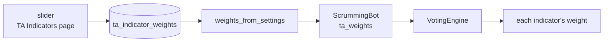

`src/trading/ta_engine.py` — the one reader every path goes through

```python
def weights_from_settings(stored: Optional[dict]) -> dict[str, float]:
    found = dict(DEFAULT_WEIGHTS)
    for name, figure in (stored or {}).items():
        ...
        found[name] = number
    return found
```

An entry naming no indicator, an entry that is not a number, and a negative
figure are each dropped with a line in the log, so a hand-edited settings file
cannot give an indicator a weight the engine refuses to explain.

#### One declaration of the twelve figures

`DEFAULT_WEIGHTS` is the only place the twelve figures are written. The voting
engine builds one indicator per key, in that order, and the page reads the same
mapping for its starting positions. Neither holds a second copy, so the two
cannot drift apart.

`src/trading/ta_engine.py` — `_create_indicators`

```python
return [
    INDICATOR_CLASSES[name](weight=self.weights.get(name, default))
    for name, default in DEFAULT_WEIGHTS.items()
]
```

#### The figures stay as they are

Driven on a record shaped the way the restore path reads `bot_state.json`, a
restored bot arrives with no stored weight of its own and takes the declared
figures. A zero written into the declaration would therefore reach every bot
already on disk and stop all twelve indicators contributing, while the vote
counts stayed the same. The figures are unchanged for that reason.

```
declared defaults   consensus 0.1684   BULLISH   votes 6/4/2
all twelve at zero  consensus 0.0      NEUTRAL   votes 6/4/2
```

A zero for one indicator is a different matter and is available today: setting
a single slider to 0.00 removes that indicator's vote and leaves the other
eleven voting.

#### Save hands the figures to a bot already running

Save is the only route. Pressing it writes the twelve figures and then hands
them to every bot the manager holds. Each bot rebuilds its twelve indicators
and votes on the new figures from its next tick. No timer and no other control
reaches a bot already running.

`src/gui/main_window.py` — the one caller, inside the handler Save emits to

```python
if self._bot_manager:
    self._bot_manager.push_ta_weights(
        weights_from_settings(
            self._settings.get("ta_indicator_weights", {})
        )
    )
```

Launch takes a different route and pushes nothing. `set_ta_weights` holds the
figures for the restore path to build each bot with, and `push_ta_weights` is
the only one that reaches a bot already built.

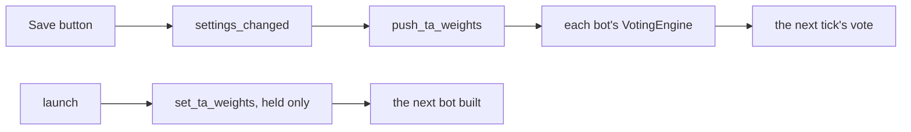

Driven on three stand-in bots: every one read its MACD weight at 1.20 before
the push and 0.30 after it, and a fourth holder that answers no such call was
skipped, 3 of 4. Holding alone moved nothing, and the same reading stayed at
1.20.

#### Two voters build their own engine and take no weight

The detonation check and the initial-entry check each build a fresh voting
engine, so the twelve figures reach neither. Initial entry gates the first buy
on the direction that engine reports. Detonation cannot fire in any case: its
confidence bar starts at 0.50, and one 240-candle tape put the highest
consensus at 0.1242 with the figures declared and 0.1016 with all twelve at
0.30.

#### A phantom keeps the figures its set was created with

A phantom set is built from the parent's weights at the moment it is created.
The push reaches the parent's own voter and not a phantom already running, so a
phantom votes on the older figures until its set is created again.

#### Each drawn row is named by its indicator

On the drawn page every weight row carries the key the engine uses, which is
the same name its slider answers to, and the printed words sit in the row's own
label. Read off the rendered page: twelve rows, sixty-six drawn controls, and
every row named for its indicator rather than for the words beside it.

### Settings > Phantom Bots


The master checkbox, eleven timeframe boxes — 1m, 5m, 15m, 30m, 1h, 2h, 4h, 6h,
12h, 1d and 1w — and one Higher-TF Lock Settings group holding Lock duration in
candles, 1 to 10. The build checks 5m, 15m, 1h, 4h and 1d, which is the state
the figure shows.

Enable Phantom Bots for Scrumming - Turns the phantom overrides on for
a new bot. Per-bot key `enable_phantoms`, a checkbox, checked at build.

This is the only control on the page that starts on. Save never reads it, so
the page stores nothing under the name it shows.

`src/gui/settings_dialog.py` — the phantom master switch

```python
self._phantoms_enabled = QCheckBox(
    "Enable Phantom Bots for Scrumming"
)
self._phantoms_enabled.setChecked(True)
layout.addWidget(self._phantoms_enabled)
```

Default Phantom Timeframes - Chooses which charts a phantom watches. Per-bot
key `phantom_timeframes`, eleven boxes, five of them checked at build.

One box per timeframe in a single row. The build decides which five open
checked, and those five are the ones the figure shows.

`src/gui/settings_dialog.py` — the box built for each timeframe

```python
cb = QCheckBox(tf)
cb.setChecked(tf in ["5m", "15m", "1h", "4h", "1d"])
self._phantom_tf_checks[tf] = cb
tf_grid.addWidget(cb)
```

The row is now one drop-down holding the same eleven names, and the page stores
the one name it shows. The opening choice is the daily chart, which is the only
entry above the wizard's own hourly default that every venue offers.

`src/gui/settings_dialog.py` — the one drop-down that replaced the grid

```python
layout.addWidget(QLabel("Default Phantom Timeframes:"))
self._phantom_timeframe = QComboBox()
for tf in PHANTOM_TIMEFRAMES:
    self._phantom_timeframe.addItem(tf, tf)
self._phantom_timeframe.setCurrentIndex(
    self._phantom_timeframe.findData(PHANTOM_TIMEFRAME_DEFAULT)
)
layout.addWidget(self._phantom_timeframe)
```

Lock duration (candles) - Sets how many candles a higher-timeframe lock holds
an opposing trade back for. Per-bot key `lock_candle_count`, 1 to 10, at 2.

The one spin box on the page, inside its own group. It opens at 2 and Save
reads it no more than it reads the other two.

`src/gui/settings_dialog.py` — the lock duration box

```python
lock_group = QGroupBox("Higher-TF Lock Settings")
lock_form = QFormLayout(lock_group)
self._lock_candles = QSpinBox()
self._lock_candles.setRange(1, 10)
self._lock_candles.setValue(2)
lock_form.addRow("Lock duration (candles):", self._lock_candles)
```

The page now stores that figure. One row carries the store key and the control
it reads, so Save writes it and the load path puts it back.

`src/gui/main_tabs/settings_dialog_surface.py` — the row both surfaces persist

```python
("default_lock_candle_count", "lock_candles", LOCK_CANDLE_DEFAULT),
```

Both wizard surfaces open their own lock box on the stored figure, so a new bot
starts on the number the page shows. A run with no settings file at all opens at
2, the figure the store itself declares.

`src/gui/bot_wizard.py` — the wizard's lock box, opened on the store

```python
self._stored_lock_candles = int(
    (defaults or {}).get("default_lock_candle_count")
    or AppSettings().default_lock_candle_count
)
```

Driven on one store, typed as 7 and saved: the page reopens at 7, the React page
paints 7, and both wizard lock boxes open at 7. A settings file written before
the key existed still loads, and its box opens at 2.

```
store before   KeyError 'Unknown setting: default_lock_candle_count'
store after    7
page reopen    Qt 7   React 7   React payload 7
wizard boxes   Qt 7   React 7   with no store at all 2
old file       loads, theme carried, box opens at 2
```

The figure stops at the bot's phantom coordinator and holds no lock yet. Nothing
in the application calls the method that appends a lock, so the countdown never
starts and the lock test answers False on every tick.

`src/trading/phantom_balance.py` — `create_lock`, which has no caller

```python
count = candle_count or self.lock_candle_count
```

Driven: a fresh coordinator holds no locks and reports none on an hourly chart.
Called by hand at 7 it appends a lock of seven candles and the same test then
answers True, so the figure sizes a real lock the moment something creates one.

```
fresh coordinator      locks 0     is_locked("1h", BULLISH) False
create_lock by hand    candles 7   is_locked("1h", BULLISH) True
```

The wizard's own key still stops before the bot. The bot configuration declares
no field of that name, and the bot class takes no argument for it.

```
BotConfig has a lock_candle_count field        False
bot_config_kwargs carries lock_candle_count    False
ScrummingBot.__init__ has lock_candle_count    False
```

The third reading has moved. `ScrummingBot.__init__` takes a `lock_candle_count`
keyword argument, and `phantom_init_kwargs` in
`src/trading/container/config.py` carries it from the wizard's collected config,
so the figure reaches the new bot's coordinator. The first two readings stand:
the bot configuration still declares no field of that name and `bot_config_kwargs`
still carries none.

```
BotConfig has a lock_candle_count field        False
bot_config_kwargs carries lock_candle_count    False
ScrummingBot.__init__ has lock_candle_count    True
```

Those eleven boxes are the eleven timeframes the voting engine already weights,
from 1m at 0.3 up to 1w at 1.6, so a slower chart counts for more when several
are combined.

These three controls carry the same gap the TA Indicators page carries. Save
reads none of them, the load path restores none, and the schema refuses a key
it does not declare rather than storing it somewhere unread.

`src/core/settings.py` — `SettingsManager.set`

```python
with self._lock:
    if not hasattr(self._settings, key):
        raise KeyError(f"Unknown setting: {key}")
    setattr(self._settings, key, value)
    self._save()
```

Issue #423 carries this page. The per-bot equivalents do persist: the wizard's
phantom page emits the same three names into the bot's own config, and the Live
Bot Settings dialog edits them there.

`src/gui/bot_wizard.py` — `PhantomConfigPage.get_config`, the three keys that
do reach a bot

```python
return {
    "enable_phantoms": self._enable.isChecked(),
    "phantom_timeframes": checked,
    "lock_candle_count": self._lock_candles.value(),
}
```

### Settings > Theme


The theme picker, the accent colour field and a Font Settings group. Six
controls and one preview.

Visual Theme - Chooses the palette the whole window paints in. Key `theme`,
five display names — Cyberpunk Dark, Neon Light, Classic Terminal, Minimal
Modern and Glass & Metal — at Cyberpunk Dark.

This is the one control on the page that reaches the running window. Save
emits a signal, the main window reads the stored theme back, and the window
repaints without a restart.

`src/gui/main_window.py` — `_on_settings_changed`

```python
theme = self._settings.get("theme", "cyberpunk_dark")
self._switch_theme(theme)
```

A stored name the theme table does not hold opens on Cyberpunk Dark. The store
accepts any text under that key, and the theme manager refuses a name it does not
carry, so every store read passes its value through a guard first. Driven on ten
stored values, five of them names the table does not hold: without the guard the
application refused five and painted five, and with it all ten paint, while the
five real names still paint their own five colours.

`src/gui/theme_engine.py` — `stored_theme`

```python
def stored_theme(name: object) -> str:
    """Return ``name`` when ``THEMES`` holds it, else ``DEFAULT_THEME_NAME``."""
    return name if isinstance(name, str) and name in THEMES else DEFAULT_THEME_NAME
```

The guard covers the read the block above shows and the read at startup, which
also says in the log when a stored name was not recognised. It covers the
dialog's own page read as well: that one never refused, because the page palette
falls back on its own table, so the guard there removes a second fallback and one
copy of the default name rather than a refusal. Driven on eight stored values,
four of them names the table does not hold: the page drew 8 of 8 and refused none
both before and after, and all four unknown names paint a picture identical to
Cyberpunk Dark and different from Neon Light.

`src/gui/react_settings_dialog.py` — `_theme_name`

```python
        def _theme_name(self) -> str:
            """The stored theme the page paints in, always a name ``THEMES`` holds."""
            if not self._sm:
                return DEFAULT_THEME_NAME
            return stored_theme(self._sm.get("theme", DEFAULT_THEME_NAME))
```

`main.py` — the startup read

```python
stored_name = settings.get("theme", DEFAULT_THEME_NAME)
theme_name = stored_theme(stored_name)
if theme_name != stored_name:
    log_manager.warning(
        f"Stored theme {stored_name!r} is not a known theme; "
        f"painting {theme_name}"
    )
theme_mgr.apply_theme(theme_name, app)
```

The palette reaches every Qt control and the Settings dialog's own page. It does
not reach the React tab pages: each of those paints from the one design system,
and their panes carry their own ground on every row. Rendered offscreen at 64,680
pixels a page, the Market Inspector, History, Console and Alerts pages come back
identical under a stored Cyberpunk Dark and a stored Neon Light, and the Console
page is identical even when the theme is handed straight to it.

`src/gui/react_history_panel.py` — the six values a page receives

```python
    return {
        "--bg": colors["bg"],
        "--text": colors["text"],
        "--grid": colors["grid"],
        "--border": colors["border"],
        "--accent": colors["accent"],
        "--btn-bg": colors["btn_bg"],
    }
```

The main tab bar is the one React surface that follows a switch, and it follows
it in part. Rendered at 8,232 pixels, one colour of eight moves from `#fcee0a` to
`#f0cf1f` and returns when the theme returns; the bar's ground does not move.

`src/gui/react_main_window.py` — `MainTabBookReact.set_theme`

```python
        def set_theme(self, name: str) -> None:
            """Repaint the bar's tabs from ``name``'s own tab tokens."""
            self._theme = name
            self._push_tabs()
```

Accent Color - Sets the highlight colour. Key `accent_color`, a free-text
field, at `#00ffcc`.

A plain text box. The default is placeholder text, not a value, so the field
opens empty until something is typed or a stored value loads. Save stores what
is there and the load path puts it back, but nothing paints with it.

`src/gui/settings_dialog.py` — the Accent Color field

```python
layout.addWidget(QLabel("Accent Color:"))
self._accent_color = QLineEdit()
self._accent_color.setPlaceholderText("#00ffcc")
layout.addWidget(self._accent_color)
```

An empty box means the theme's own accent. A hex colour in the box paints over
it. Everything else is refused, and the theme's own accent paints.

`src/gui/theme_engine.py` — what the box is read through

```python
def stored_accent(value: object) -> str:
    """Return ``value`` when it is a hex colour, else ``THEME_ACCENT``.

    The store's accent field is free text, and a value ``generate_qss`` cannot
    read either drops its declaration or escapes it, so the reads in ``main``
    and in the main window pass through here.
    """
    if not isinstance(value, str):
        return THEME_ACCENT
    asked = value.strip()
    return asked if _ACCENT_HEX.match(asked) else THEME_ACCENT
```

Three hex digits or six, either case, surrounding spaces trimmed. Each value
below was typed in and the accent button was then read off an offscreen render.

| typed | the accent button paints |
|---|---|
| `#ff0000` | #ff0000 |
| `#0f0` | #00ff00 |
| `#FF00AA` | #ff00aa |
| `  #ff0000  ` | #ff0000 |
| `red` | the theme's accent |
| `rgb(255,0,0)` | the theme's accent |
| `#00ffc` | the theme's accent |
| `#00ffccff` | the theme's accent |
| `notacolour` | the theme's accent |
| `#ff0000;` | the theme's accent |
| `url(x)` | the theme's accent |
| empty, spaces, or no value at all | the theme's accent |

A colour name is refused on purpose: the box takes a hex colour, and the four
forms Qt would also read bring a wider parser with nothing to paint that hex
cannot.

The refusal matters because the box is free text. A value that ends one
declaration and opens another repaints the window, and that was measured: with
`red; } QWidget { background-color: #000000` standing in the accent token, a
plain pane rendered 3,840 pixels of #000000 where its ground is #0a0a0f. The
same string typed into the box now leaves that pane on its ground. A hex colour
carries no semicolon and no brace, so no accepted value can reach that.

Six surfaces carry the accent. The figures are pixel counts off an offscreen
render of each one.

| surface | pixels |
|---|---|
| accent button | 3,289 |
| full progress bar | 2,092 |
| ticked box | 464 |
| slider handle | 164 |
| selected tab underline | 134 |
| focused text box border | 304 |

A typed `#ff0000` moves all six, on all five themes. Text a theme paints from
its own `text_accent` stays where it was: on Classic Terminal 160 pixels of
#00ff00 remain after the override, 96 in the tab label and 64 in the checkbox
label.

`main.py` — the startup read

```python
    stored_hex = settings.get("accent_color", THEME_ACCENT)
    accent = stored_accent(stored_hex)
    if not accent and str(stored_hex).strip():
        log_manager.warning(
            f"Stored accent colour {stored_hex!r} is not a hex colour; "
            f"painting the {theme_name} accent"
        )
    theme_mgr.apply_theme(theme_name, app, accent)
```

A refused value is named on the Activity Log when the dialog saves and when the
Theme menu switches. The box keeps what was typed, so the value and the line
that says it did not paint are both on screen.

`src/gui/main_window.py` — `_switch_theme`, the refusal

```python
            taken = stored_accent(accent)
            if not taken and str(accent or "").strip():
                self._status_log.log(
                    f"Accent colour {accent!r} is not a hex colour; "
                    f"painting the {name} accent.",
                    "warning",
                )
```

Driven with `notacolour` against Neon Light, that line read: Accent colour
'notacolour' is not a hex colour; painting the neon_light accent.

The React tab pages do not follow the typed value. Each page receives an
`--accent` variable built from a theme name alone, so the seven rules in the
Settings page's own stylesheet that read that variable stay on the theme's
accent.

`src/gui/main_tabs/react_history_panel_surface.py` — `palette`, which takes a
theme and no accent

```python
def palette(theme: str) -> dict:
    """The six chrome colours one theme paints the page in.

    A theme the table does not carry falls back to the default theme.
    """
    colors = THEME_CHROME.get(theme) or THEME_CHROME[DEFAULT_THEME]
    return {
        key: colors[source] for key, source in zip(PALETTE_KEYS, PALETTE_SOURCE_KEYS)
    }
```

Contrast is not checked. Every theme's own accent clears WCAG 2.2 AA against
the ground it sits on, and a typed one is painted as given.

Font Family - Sets the typeface for application text. Key `font_family`, an
editable combo over twelve named families, at Segoe UI.

The box is editable, so a family outside the twelve can be typed in. Save
stores this value and the three sizes below it. Nothing reads any of the four,
and the load path does not restore them either, so the whole Font Settings
group reopens at its built-in figures.

`src/gui/settings_dialog.py` — the Font Family row

```python
self._font_family.addItems(fonts)
self._font_family.setCurrentText("Segoe UI")
self._font_family.setToolTip("Font family for all application text")
font_form.addRow("Font Family:", self._font_family)
```

Base Font Size - Sets the size of ordinary interface text. Key `font_size`,
8 pt to 24 pt, at 11 pt.

The preview line below the group follows this box and the family box as either
changes. That preview is the only place either value has an effect.

`src/gui/settings_dialog.py` — the Base Font Size row

```python
self._font_size = QSpinBox()
self._font_size.setRange(8, 24)
self._font_size.setValue(11)
self._font_size.setSuffix(" pt")
self._font_size.setToolTip("Base font size for all UI text")
font_form.addRow("Base Font Size:", self._font_size)
```

Heading Font Size - Sets the size of headings and stat-card values. Key
`heading_font_size`, 10 pt to 32 pt, at 14 pt.

The widest of the three ranges. The preview does not follow this box.

`src/gui/settings_dialog.py` — the Heading Font Size row

```python
self._heading_size = QSpinBox()
self._heading_size.setRange(10, 32)
self._heading_size.setValue(14)
self._heading_size.setSuffix(" pt")
self._heading_size.setToolTip("Font size for headings and stat card values")
font_form.addRow("Heading Font Size:", self._heading_size)
```

Log Font Size - Sets the size of the Activity Log and API Log text. Key
`log_font_size`, 8 pt to 18 pt, at 10 pt.

The narrowest of the three ranges, and the last row before the preview.

`src/gui/settings_dialog.py` — the Log Font Size row

```python
self._log_font_size = QSpinBox()
self._log_font_size.setRange(8, 18)
self._log_font_size.setValue(10)
self._log_font_size.setSuffix(" pt")
```

Preview redraws in the chosen family and base size as either changes. It is a
sample line, not a setting, and nothing stores it.

The five theme names come from one mapping built off the five theme objects.

`src/gui/theme_engine.py` — `THEMES`

```python
THEMES: dict[str, ThemeTokens] = {
    t.name: t
    for t in [CYBERPUNK_DARK, NEON_LIGHT, CLASSIC_TERMINAL, MINIMAL_MODERN, GLASS_METAL]
}
```

Save writes the theme, the Accent Color field and all four font values.

`src/gui/settings_dialog.py` — `_save`, the theme and font keys

```python
"theme": lambda: self._theme_combo.currentData(),
"accent_color": lambda: self._accent_color.text().strip(),
"font_family": lambda: self._font_family.currentText(),
"font_size": lambda: self._font_size.value(),
"heading_font_size": lambda: self._heading_size.value(),
"log_font_size": lambda: self._log_font_size.value(),
```

The load path reads back the theme and the accent field only, so the four font
rows open at Segoe UI, 11, 14 and 10 whatever was stored.

Of the six, the theme alone reaches the window. `main.py` reads it at startup,
and the window reads it again in `_on_settings_changed` when the dialog saves.

The other five are stored and never read again. Each palette carries its own
typeface in the theme object it declares, so the theme decides the font and the
four font rows decide nothing. The accent field has the same shape: declared,
written, read back into its own line edit, and painted nowhere.

`src/core/settings.py` — `AppSettings`, the five that are stored and unread

```python
accent_color: str = "#00ffcc"

# These four mirror the font widgets in settings_dialog._create_theme_tab.
font_family: str = "Segoe UI"
font_size: int = 11
heading_font_size: int = 14
log_font_size: int = 10
```

Of those five, the accent field now reaches the window. The four font rows do
not. The stored default for the accent is empty, so a store that has never been
typed into leaves every theme on its own accent rather than handing Cyberpunk
Dark's to the other four.

`src/core/settings.py` — `AppSettings`, the accent field today

```python
    theme: str = VisualTheme.CYBERPUNK_DARK.value
    # Empty leaves each theme's own accent painting. theme_engine.stored_accent
    # takes a hex colour here and refuses anything else.
    accent_color: str = ""
```

The Font Settings group is gone. Font Family, Base Font Size, Heading Font Size
and Log Font Size are no longer on the Theme page, the preview line went with
them, and the four stored keys are no longer fields of the settings record. The
theme declares the typography instead: every palette carries a typeface, a
monospace face and four sizes.

`src/gui/theme_engine.py` — the typography tokens a theme declares

```python
    # Font
    font_family: str = "'Rajdhani', 'Orbitron', 'Segoe UI', sans-serif"
    font_mono: str = "'JetBrains Mono', 'Fira Code', 'Consolas', monospace"
    font_size: str = "13px"
    font_size_small: str = "11px"
    font_size_large: str = "16px"
    font_size_title: str = "20px"
```

Three of the five palettes name a typeface of their own. Classic Terminal takes a
monospace family, Minimal Modern and Glass & Metal each name their own, and the
other two keep the declared default above.

```python
# CLASSIC_TERMINAL
font_family="'JetBrains Mono', 'Fira Code', 'Consolas', monospace",

# MINIMAL_MODERN
font_family="'SF Pro Display', 'Inter', 'Segoe UI', sans-serif",

# GLASS_METAL
font_family="'Exo 2', 'Rajdhani', 'Segoe UI', sans-serif",
```

The stylesheet generator reads those tokens, so the typeface and the size arrive
with the palette rather than from a control.

`src/gui/theme_engine.py` — `generate_qss`, the global rule

```python
QWidget {{
    background-color: {t.bg_primary};
    color: {t.text_primary};
    font-family: {t.font_family};
    font-size: {t.font_size};
    selection-background-color: {t.accent_primary};
    selection-color: {t.bg_primary};
}}
```

A typeface the operator sets would have split that. The theme engine audits a
palette as one set and says so in its own opening words, and a size set outside
the palette moves the text the audit was taken against while nothing asks for the
audit again.

`src/gui/theme_engine.py` — the module's own rule

```
Every ``ThemeTokens`` pair meets WCAG 2.2 AA contrast, and a changed hex value
needs a fresh audit.
```

The Theme page now carries two controls, the theme picker and the accent field.
The dialog payload carries 68 controls where it carried 72, the rendered page
draws 55 where it drew 59, and Save writes nine top-level keys where it wrote
thirteen. The five generated stylesheets are unchanged byte for byte, because the
removal touched no palette.

A settings file written before the removal still loads. The load copies only the
fields the record declares, so a font key in such a file is read past and every
other setting arrives at its stored value.

`src/core/settings.py` — `SettingsManager._apply_dict`

```python
defaults = asdict(AppSettings())
for key, default_val in defaults.items():
    if key in data:
        setattr(self._settings, key, data[key])
```

Driven on a file holding all four font keys beside nine other settings: nothing
raised, and the username, the target balance, the visibility, the aggressive
flag, the theme, the accent, the three phantom values, the indicator weights and
the logging group all arrived as stored.

#### The Simulator's tone, nigredo

Every theme has a second tone, and one widget tree paints in it: the Simulator
tab. The tone is the theme's own seven ground tokens moved part of the way to
black. The accent, the text, the borders and the chart colours stay the
theme's, so a Simulator screen reads as the same theme, darker.

`src/gui/theme_engine.py` — the derivation

```python
NIGREDO_FRACTION = 0.25

NIGREDO_GROUNDS = (
    "bg_primary",
    "bg_secondary",
    "bg_tertiary",
    "bg_card",
    "bg_input",
    "bg_hover",
    "bg_selected",
)


def nigredo(theme: ThemeTokens, fraction: float = NIGREDO_FRACTION) -> ThemeTokens:
    moved = {
        name: toward_black(getattr(theme, name), fraction) for name in NIGREDO_GROUNDS
    }
    return replace(theme, **moved)
```

One function moves a colour. Each sRGB channel is scaled by one minus the
fraction and rounded, so a fraction of 0 leaves the colour as it is and a
fraction of 1 gives black. The function takes six-digit hex and refuses any
other form.

```python
def toward_black(colour: str, fraction: float) -> str:
    keep = 1.0 - fraction
    return "#" + "".join(
        f"{round(int(channel, 16) * keep):02x}" for channel in found.groups()
    )
```

The fraction is one number. Every theme's ground, its darkened ground, and the
contrast of that theme's body text on each, WCAG 2.2 ratio:

```
theme             ground    nigredo   text      ratio on ground  ratio on nigredo
cyberpunk_dark    #0a0a0f   #08080b   #e0e0f0   15.13            15.33
neon_light        #f5f5fa   #b8b8bc   #1a1a2e   15.70             8.63
classic_terminal  #0a0a0a   #080808   #00ff00   14.43            14.60
minimal_modern    #fafafa   #bcbcbc   #1a1a1a   16.67             9.16
glass_metal       #1c1c24   #15151b   #d0d0e0   11.10            11.93
```

Every row is above 4.5 to 1. On the three dark themes the ratio rises. On the
two light themes it falls, because their text is dark and a darker ground moves
toward it; it stays above 4.5 to 1 up to a fraction near 0.45, and at 0.6
Neon Light reads 2.80 and fails. On a near-black theme the ground moves by two
to seven per channel, which the picture reports and the eye does not; the
raised grounds, the cards and the tables, move by more.

The stylesheet carries the tone. `generate_qss` ends with the theme's rules
restated a second time, from the darkened tokens, each rule under one selector
that names a Qt dynamic property.

`src/gui/theme_engine.py` — the scope and the block

```python
TONE_PROPERTY = "tone"
NIGREDO = "nigredo"

NIGREDO_SELECTOR = f'QWidget[{TONE_PROPERTY}="{NIGREDO}"]'


def generate_qss(theme: ThemeTokens) -> str:
    return f"{_theme_qss(theme)}\n/* --- Simulator: {NIGREDO} --- */{nigredo_qss(theme)}\n"
```

The block's first rule, under Cyberpunk Dark:

```css
QWidget[tone="nigredo"], QWidget[tone="nigredo"] QWidget {
    background-color: #08080b;
    color: #e0e0f0;
    font-family: 'Rajdhani', 'Orbitron', 'Segoe UI', sans-serif;
    font-size: 13px;
    selection-background-color: #00ffcc;
    selection-color: #08080b;
}
```

A widget that sets the property `tone` to `nigredo` paints in the tone, and so
does every widget under it, including a dialog it parents. The Simulator tab
sets it in its constructor, in both builds. A theme switch re-applies the whole
stylesheet, so the tone follows the theme with no second step.

`src/gui/simulator/sim_trading_tab.py` — the tab takes the tone

```python
self.setProperty(TONE_PROPERTY, NIGREDO)
self.setAttribute(Qt.WA_StyledBackground, True)
```

A React page reads the tone the same way. The page's `:root` chrome comes from
`page_html`, which takes a tone and puts the two grounds through the same
function; a theme switch runs `repaint_pages`, which reads the tone off each web
view's property and pushes that view its own chrome.

`src/gui/react_history_panel.py` — the page chrome in a tone

```python
if tone == NIGREDO:
    ground = toward_black(ground, NIGREDO_FRACTION)
    button = toward_black(button, NIGREDO_FRACTION)
```

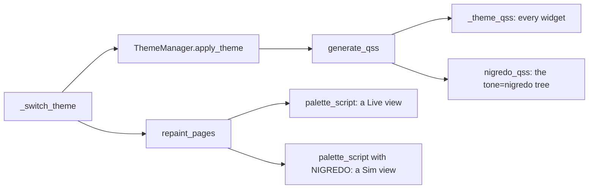

The Simulator page under [the Simulator tab](simulator.md) states what each
build paints in the tone and what was read off the renders.

### Settings > Logging


Two checkboxes and four periodicity boxes. Every key below sits inside one
stored `data_logging` group.

Log TA signal samples with all values and timestamps - Writes each indicator
reading out with its value and its time. Key `ta_signal_logging`, a checkbox,
checked at build.

The first of the two flags on the page, and the one that decides whether the
indicator record is written at all.

`src/gui/settings_dialog.py` — the TA logging checkbox

```python
self._ta_logging = QCheckBox(
    "Log TA signal samples with all values and timestamps"
)
self._ta_logging.setChecked(True)
layout.addWidget(self._ta_logging)
```

Highlight entries near Scrumming Bot trades - Marks the log lines that sit
close to a fire, so a decision can be read in its own context. Key
`highlight_trade_proximity`, a checkbox, checked at build.

The second flag, built the same way and checked at build like the first.

`src/gui/settings_dialog.py` — the highlight checkbox

```python
self._highlight_trades = QCheckBox(
    "Highlight entries near Scrumming Bot trades"
)
self._highlight_trades.setChecked(True)
layout.addWidget(self._highlight_trades)
```

P/L Log Periodicity - Chooses the windows a profit and loss figure is
summarised over: 24 Hours, 1 Week, 1 Month and 1 Year. Key
`active_periodicities`, four boxes written as a list, with the first two
checked at build.

Four separate boxes rather than one control. Save walks them in page order and
writes the checked ones into a list.

`src/gui/settings_dialog.py` — the four periodicity boxes

```python
self._log_24h = QCheckBox("24 Hours")
self._log_24h.setChecked(True)
self._log_1w = QCheckBox("1 Week")
self._log_1w.setChecked(True)
self._log_1m = QCheckBox("1 Month")
self._log_1y = QCheckBox("1 Year")
```

Save collapses all six into one dictionary holding the two flags and the list
of active periodicities. The load path reads none of them back, so every open
shows the build state rather than the stored one. No reader outside the dialog
reads the group either, which leaves the six controls writing to a key nothing
consults. Issue #423 carries this page.

In development. What the load path should restore for this page has not been
settled against the rest of the dialog, so nothing is proposed here.

### Settings > Sound


The master switch, eight event checkboxes, a volume slider and six test
buttons. Every checkbox is checked at build.

Each checkbox names its sound in its own label, and the key behind each control
is a field of the sound configuration the block below builds.

Enable sound notifications - Turns every sound on or off at once. Key
`enabled`, on.

The engine tests this flag before it tests any other, so a clear box silences
the page whatever the eight below are set to.

`src/gui/settings_dialog.py` — the master switch

```python
self._sound_enabled = QCheckBox("Enable sound notifications")
self._sound_enabled.setChecked(True)
self._sound_enabled.setToolTip("Master switch for all audio notifications")
```

Buy order fills - Plays a low rising tone when a buy fills. Key `buy_sound`,
on.

The label carries the sound's own name in brackets, as every box on this page
does. The engine plays this one under the name buy.

`src/gui/settings_dialog.py` — the buy fill box

```python
self._sound_buy = QCheckBox("Buy order fills (blurb + squirt tone)")
self._sound_buy.setChecked(True)
self._sound_buy.setToolTip(
    "Plays a low bubbly rising tone when a buy order is filled"
)
```

Sell order fills - Plays a bright bell when a sell fills. Key `sell_sound`, on.

The counterpart to the box above, played under the name sell.

`src/gui/settings_dialog.py` — the sell fill box

```python
self._sound_sell = QCheckBox("Sell order fills (bell + jingle tone)")
self._sound_sell.setChecked(True)
self._sound_sell.setToolTip(
    "Plays a high bright bell tone when a sell order is filled"
)
```

Errors - Plays an alert tone on an error. Key `error_sound`, on.

One of the two boxes on the page with no tooltip of its own.

`src/gui/settings_dialog.py` — the error box

```python
self._sound_error = QCheckBox("Errors (alert tone)")
self._sound_error.setChecked(True)
layout.addWidget(self._sound_error)
```

Bot state changes - Plays a click when a bot starts, pauses or stops. Key
`bot_state_sound`, on.

The other box with no tooltip. The engine plays it under the name state, not
under the key.

`src/gui/settings_dialog.py` — the bot state box

```python
self._sound_state = QCheckBox("Bot state changes (subtle click)")
self._sound_state.setChecked(True)
layout.addWidget(self._sound_state)
```

Scrum/Fold Fire - Plays a rifle shot when a scrum or a fold executes, and on a
Manual Fire. Key `fire_sound`, on.

This is the first of the four the engine reads with a default rather than
straight off the configuration. A stored configuration written before these
four existed leaves all four on.

`src/gui/settings_dialog.py` — the fire box

```python
self._sound_fire = QCheckBox("Scrum/Fold Fire (sniper rifle shot)")
self._sound_fire.setChecked(True)
self._sound_fire.setToolTip(
    "Synthesized rifle shot plays when a scrum or fold\n"
    "actually executes. Also plays on Manual Fire."
)
```

Tracking beeps - Paces a beep by the scrum phase: silent in SEARCH, slow in
TRACK, fast in FIRE. Key `track_sound`, on.

The tooltip gives the two paces in milliseconds: 800 in TRACK and 200 in FIRE.

`src/gui/settings_dialog.py` — the tracking box

```python
self._sound_track = QCheckBox(
    "Tracking beeps (speeds up as bot closes on fire)"
)
self._sound_track.setChecked(True)
```

P/L increase - Plays coins dropping into a bucket on any trade that realised a
profit. Key `profit_sound`, on.

The tooltip is the only place on the page that names the condition exactly:
realised profit above zero, on grid and scrumming bots alike.

`src/gui/settings_dialog.py` — the profit box

```python
self._sound_profit = QCheckBox("P/L increase (coins dropping into bucket)")
self._sound_profit.setChecked(True)
```

Accumulation - Plays a water drip on a FOLD, and on nothing else. Key
`drip_sound`, on.

The last of the nine. Its tooltip calls a fold the canonical accumulation
moment and states that a scrum or a distribution does not fire it.

`src/gui/settings_dialog.py` — the accumulation box

```python
self._sound_drip = QCheckBox("Accumulation (water drip)")
self._sound_drip.setChecked(True)
```

SFX Volume - Sets how loud every sample plays. Key `volume`, 0 % to 100 %, at
70 %.

Test Buy, Test Sell, Test Fire, Test Track, Test Profit and Test Drip play one
sample each. They are buttons, not settings.

One handler is the only path from this page to the engine. It builds a
configuration from every checkbox and the slider, pushes it in and clears the
sample cache, because each sample bakes its volume at synthesis time.

`src/gui/settings_dialog.py` — `_on_sfx_volume_changed`

```python
se = get_sound_engine()
new_cfg = SoundConfig(
    enabled=self._sound_enabled.isChecked(),
    buy_sound=self._sound_buy.isChecked(),
    sell_sound=self._sound_sell.isChecked(),
    error_sound=self._sound_error.isChecked(),
    bot_state_sound=self._sound_state.isChecked(),
    fire_sound=self._sound_fire.isChecked(),
    track_sound=self._sound_track.isChecked(),
    profit_sound=self._sound_profit.isChecked(),
    drip_sound=self._sound_drip.isChecked(),
    volume=v / 100.0,
)
```

That path runs when the slider moves or a test button is pressed, and at no
other time. Save reads no widget on this page and the schema declares no sound
field, so nothing here survives the dialog closing. A checkbox cleared and the
dialog saved comes back checked. Issue #423 carries it.

`src/core/sound_engine.py` — `SoundConfig`, the ten fields and their defaults

```python
enabled: bool = True
buy_sound: bool = True
sell_sound: bool = True
error_sound: bool = True
bot_state_sound: bool = True
fire_sound: bool = True
track_sound: bool = True
profit_sound: bool = True
drip_sound: bool = True
volume: float = 0.7
```

Every tick box reaches the engine on its own. Each box's toggle runs the same
push the slider runs, so a box cleared with nothing else touched silences that
sound at once.

`src/gui/settings_dialog.py` — each box wired to the push

```python
for _key, name in SOUND_CONFIG_FIELDS:
    getattr(self, f"_{name}").toggled.connect(self._push_sound_config)
```

The push reads the slider itself, so one method serves a box, the slider and a
Test button alike.

`src/gui/settings_dialog.py` — the push

```python
def _push_sound_config(self) -> None:
    self._on_sfx_volume_changed(self._sound_volume.value())
```

The React page draws the same ten controls. Its edit route named one handler, for
the slider, and that handler wanted an argument the page never sends, so the
press raised and reached nothing. Every sound control names the push, which wants
no argument.

`src/gui/react_settings_dialog.py` — the edit route

```python
EDIT_HANDLERS: dict[str, str] = {
    "new_exchange": "_on_exchange_changed",
    surface.VOLUME_NAME: "_push_sound_config",
    **{name: "_push_sound_config" for _key, name in surface.SOUND_CONFIG_FIELDS},
}
```

The settings file holds the page as one group, and the schema declares that group
from the engine's own defaults, so the two cannot disagree over what the page
holds.

`src/core/settings.py` — the group on the schema

```python
sound: dict = field(default_factory=lambda: asdict(SoundConfig()))
```

Save and load walk one row list for the group, the way the Profit Folding and AI
Monitor groups do, so no row reaches the file without also reaching a control.
The slider shows whole percent and the engine holds a fraction, so the volume row
divides out and multiplies back.

`src/gui/settings_dialog.py` — the sound rows

```python
switches = tuple(
    (
        key,
        getattr(self, f"_{name}").isChecked,
        show(getattr(self, f"_{name}")),
        getattr(built, key),
    )
    for key, name in SOUND_CONFIG_FIELDS
)
```

One reader carries a stored group into the engine, and it keeps the default for
anything the generators cannot take. A switch reads as on or off: the play gate
tests it for truth, so a non-empty word would open a sound the operator closed.
A volume reads as a finite number from zero to one: each generator multiplies it
into every sample before packing the samples, and a volume of four leaves the
engine holding no clips and playing nothing.

`src/core/sound_engine.py` — the reader

```python
def sound_config_from_settings(stored: Optional[dict]) -> SoundConfig:
    taken = SoundConfig()
    for name, value in (stored or {}).items():
        if name in SOUND_SWITCHES:
            if isinstance(value, bool):
                setattr(taken, name, value)
```

The engine takes the stored group at startup, before the first fill, so a
silenced sound stays silent whether or not the operator opens this page.

`main.py` — the startup push

```python
get_sound_engine().update_config(
    sound_config_from_settings(settings.get("sound", {}))
)
```

Two of the nine switches gate a clip no trade path plays. Nothing calls the buy
helper or the sell helper, so Test Buy and Test Sell are the only presses that
reach those two samples. Both boxes store and reload, and the sound itself waits
on a caller.

`src/core/sound_engine.py` — the two helpers with no caller

```python
def play_buy(self) -> None:
    self.play("buy")

def play_sell(self) -> None:
    self.play("sell")
```

The six Test buttons carry a part name of their own, and the page's click
listener reports the plain button part alone, so a press on the React page
reports nothing to the dialog. Those six are buttons, not settings, and the
switches beside them do not depend on them.

`src/gui/web/settings_dialog.js` — the two part names

```javascript
var BUTTON_PART = "button";
var SOUND_BUTTON_PART = "sound-button";
```

### Settings > SMS


A scrolling page holding the master switch and three groups.

Seventeen controls, and the key behind each is a field of the message
configuration the engine reads.

Enable SMS notifications - Turns every message on or off at once. Key
`enabled`, clear at build.

The only control on the page outside the three groups, and the only checkbox
here that opens clear rather than checked.

`src/gui/settings_dialog.py` — the SMS master switch

```python
self._sms_enabled = QCheckBox("Enable SMS notifications")
self._sms_enabled.setToolTip(
    "Send text messages to your phone for trading events"
)
layout.addWidget(self._sms_enabled)
```

Provider - Chooses how a message leaves the machine: a carrier's email gateway,
or the Twilio web interface. Key `provider`, at the email gateway. Nothing
loads a stored choice into the picker, so it opens on the first entry whatever
the figure shows.

Two entries, both written as display labels. The engine tests a short code
rather than either label, so neither entry matches what the send path looks
for.

`src/gui/settings_dialog.py` — the Provider row

```python
self._sms_provider = QComboBox()
self._sms_provider.setMinimumHeight(28)
self._sms_provider.addItems(["Email-to-SMS Gateway", "Twilio API"])
pf.addRow("Provider:", self._sms_provider)
```

Phone Number - Sets the number every message goes to. Key `phone_number`, empty,
with a placeholder showing the international shape.

The placeholder is the only guidance on the row. It is grey sample text, not a
value, so the field starts genuinely empty.

`src/gui/settings_dialog.py` — the Phone Number row

```python
self._sms_phone = QLineEdit()
self._sms_phone.setMinimumHeight(28)
self._sms_phone.setPlaceholderText("+15551234567")
pf.addRow("Phone Number:", self._sms_phone)
```

Carrier - Names the carrier whose gateway address a message would be built for.
Ten entries, opening on the first. It has no stored field of its own, and
nothing on the page reads the choice.

The ten names come from one mapping in the engine. The last entry is a manual
option whose address is deliberately empty.

`src/gui/settings_dialog.py` — the Carrier row

```python
self._sms_carrier = QComboBox()
self._sms_carrier.setMinimumHeight(28)
from src.core.sms_engine import CARRIER_GATEWAYS

for carrier in CARRIER_GATEWAYS:
    self._sms_carrier.addItem(carrier)
pf.addRow("Carrier:", self._sms_carrier)
```

Gateway Email - Sets the full gateway address a message is sent to. Key
`gateway_email`, empty.

The row a carrier choice would otherwise fill in. Nothing builds the address
from the picker above, so this field is typed by hand or left blank.

`src/gui/settings_dialog.py` — the Gateway Email row

```python
self._sms_gateway = QLineEdit()
self._sms_gateway.setMinimumHeight(28)
self._sms_gateway.setPlaceholderText("5551234567@vtext.com")
self._sms_gateway.setToolTip("Full email address for carrier SMS gateway")
pf.addRow("Gateway Email:", self._sms_gateway)
```

SMTP Username - Sets the mailbox a message is sent from. Key `smtp_username`,
empty.

The first of the two mailbox rows. Its placeholder shows an ordinary address.

`src/gui/settings_dialog.py` — the SMTP Username row

```python
self._sms_smtp_user = QLineEdit()
self._sms_smtp_user.setMinimumHeight(28)
self._sms_smtp_user.setPlaceholderText("your.email@gmail.com")
pf.addRow("SMTP Username:", self._sms_smtp_user)
```

SMTP Password - Sets that mailbox's application password. Key `smtp_password`,
masked, empty.

The only masked field on the page. Its placeholder says an application
password rather than the account password.

`src/gui/settings_dialog.py` — the SMTP Password row

```python
self._sms_smtp_pass = QLineEdit()
self._sms_smtp_pass.setMinimumHeight(28)
self._sms_smtp_pass.setEchoMode(QLineEdit.Password)
self._sms_smtp_pass.setPlaceholderText(
    "App password (not regular password)"
)
pf.addRow("SMTP Password:", self._sms_smtp_pass)
```

Buy fills - Sends a message when a buy fills. Key `notify_buy_fills`, checked
at build.

The first of the eight event rows, and one of the four that open checked.

`src/gui/settings_dialog.py` — the buy fills row

```python
self._sms_buy = QCheckBox("Buy fills")
self._sms_buy.setChecked(True)
ef.addRow(self._sms_buy)
```

Sell fills - Sends a message when a sell fills. Key `notify_sell_fills`,
checked at build.

The counterpart to the row above, built and checked the same way.

`src/gui/settings_dialog.py` — the sell fills row

```python
self._sms_sell = QCheckBox("Sell fills")
self._sms_sell.setChecked(True)
ef.addRow(self._sms_sell)
```

Bot state changes - Sends a message when a bot starts, stops or errors. Key
`notify_bot_state_changes`, checked at build.

The label names the three states in brackets, which the page's own text does
not repeat anywhere else.

`src/gui/settings_dialog.py` — the bot state row

```python
self._sms_state = QCheckBox("Bot state changes (start/stop/error)")
self._sms_state.setChecked(True)
ef.addRow(self._sms_state)
```

API errors and failures - Sends a message when a venue call fails. Key
`notify_errors`, checked at build.

The last of the four rows that open checked.

`src/gui/settings_dialog.py` — the API errors row

```python
self._sms_errors = QCheckBox("API errors and failures")
self._sms_errors.setChecked(True)
ef.addRow(self._sms_errors)
```

P/L threshold alerts - Sends a message when profit or loss passes a dollar
figure. Key `notify_pl_threshold`, clear at build.

The first row in the group that opens clear. It gates the dollar figure on the
row below it.

`src/gui/settings_dialog.py` — the P/L alert row

```python
self._sms_pl = QCheckBox("P/L threshold alerts")
ef.addRow(self._sms_pl)
```

P/L threshold - Sets that dollar figure. Key `pl_threshold_amount`, $1 to
$100,000, at $100.

The one spin box in the events group, and the only row there that is not a
checkbox.

`src/gui/settings_dialog.py` — the P/L threshold row

```python
self._sms_pl_amount = QDoubleSpinBox()
self._sms_pl_amount.setMinimumHeight(28)
self._sms_pl_amount.setRange(1, 100000)
self._sms_pl_amount.setValue(100)
self._sms_pl_amount.setPrefix("$")
ef.addRow("P/L threshold:", self._sms_pl_amount)
```

Low balance warnings - Sends a message when a balance runs low. Key
`notify_balance_warning`, clear at build.

No figure on the page sets what counts as low, so the row carries the switch
alone.

`src/gui/settings_dialog.py` — the low balance row

```python
self._sms_balance = QCheckBox("Low balance warnings")
ef.addRow(self._sms_balance)
```

Exchange connection status - Sends a message when a venue connects or drops.
Key `notify_connection_status`, clear at build.

The last event row, and the third of the three that open clear.

`src/gui/settings_dialog.py` — the connection status row

```python
self._sms_connection = QCheckBox("Exchange connection status")
ef.addRow(self._sms_connection)
```

Max messages per hour - Caps how many messages one hour may carry. Key
`max_messages_per_hour`, 1 to 100, at 20. Below the area the figure shows.

The first of the two rows in the rate limiting group.

`src/gui/settings_dialog.py` — the hourly cap row

```python
self._sms_max_hour = QSpinBox()
self._sms_max_hour.setMinimumHeight(28)
self._sms_max_hour.setRange(1, 100)
self._sms_max_hour.setValue(20)
rf.addRow("Max messages per hour:", self._sms_max_hour)
```

Min time between messages - Sets the wait between two messages. Key
`cooldown_seconds`, 5 to 300 seconds, at 30. Below the area the figure shows.

The second rate limiting row, and the last control on the page. It is the one
spin box here that carries a unit in its own suffix.

`src/gui/settings_dialog.py` — the cooldown row

```python
self._sms_cooldown = QSpinBox()
self._sms_cooldown.setMinimumHeight(28)
self._sms_cooldown.setRange(5, 300)
self._sms_cooldown.setValue(30)
self._sms_cooldown.setSuffix(" sec")
rf.addRow("Min time between messages:", self._sms_cooldown)
```

The Carrier list fills from one mapping of carrier name to gateway address.

`src/core/sms_engine.py` — `CARRIER_GATEWAYS`, the first four

```python
CARRIER_GATEWAYS = {
    "AT&T": "{number}@txt.att.net",
    "T-Mobile": "{number}@tmomail.net",
    "Verizon": "{number}@vtext.com",
    "Sprint": "{number}@messaging.sprintpcs.com",
```

None of it reaches the SMS engine. Save reads no widget on this page and the
schema declares no SMS field. Neither provider label the combo offers matches
the value the engine tests for, and the page carries no field for the three
Twilio credentials the send path reads.

`src/core/sms_engine.py` — `SMSConfig.provider`, the value the send path tests

```python
    provider: str = "email_gateway"
```

Issue #423 carries the page.

`src/core/sms_engine.py` — `SMSConfig`, the three credentials no row fills

```python
twilio_sid: str = ""
twilio_auth_token: str = ""
twilio_from_number: str = ""
```

The page persists now. Save writes one stored group and the dialog reads that
group back on the way in, so every row reopens on the figure it was left at.

The group is named for the channels this page is to carry rather than for the one
it carries today, so a channel added beside the text messages joins it instead of
renaming it. One constant in the engine holds that name and every reader takes it
from there, so the schema field is the only other place the name is written.

`src/core/settings.py` — the group the schema declares

```python
    # The SMS page's twenty-two values. The name carries the channels the page
    # is to hold; sms_engine.sms_config_from_settings reads this group back.
    message_channels: dict = field(default_factory=lambda: asdict(SMSConfig()))
```

One list pairs each stored field with the control carrying it, and the save and
the load both walk that list, so no row can be written without also being read.

`src/gui/main_tabs/settings_dialog_surface.py` — the first rows of the pairing

```python
SMS_CONFIG_FIELDS = (
    ("enabled", "sms_enabled"),
    ("provider", "sms_provider"),
    ("phone_number", "sms_phone"),
```

The stored group reaches the engine at two moments. The startup path hands it
over before the first fill, and the window hands it over again when the dialog
saves, so a changed figure applies without a restart.

`main.py` — the startup push, before the first fill

```python
    get_sms_engine().update_config(
        sms_config_from_settings(settings.get("message_channels", {}))
    )
```

Each provider entry carries a short code beside its printed label, and the
picker stores the code rather than the label. The send path tests that code, so
the Twilio entry reaches the Twilio route and the gateway entry reaches the mail
route.

`src/gui/main_tabs/settings_dialog_surface.py` — the two provider entries

```python
SMS_PROVIDERS = (
    ("Email-to-SMS Gateway", EMAIL_GATEWAY),
    ("Twilio API", TWILIO),
)
```

Carrier has a stored field of its own, and picking one fills the Gateway Email
row below it from the number already typed. The row is filled only by that
choice, never by a save or by opening the page, so an operator who never touches
the picker is never given an address for a carrier they are not on.

`src/gui/settings_dialog.py` — the fill a carrier choice runs

```python
built = gateway_address(
    self._sms_carrier.currentText(), self._sms_phone.text()
)
if built:
    self._sms_gateway.setText(built)
```

A gateway takes the national digits alone, so a leading country digit is dropped
and a number of any other length builds nothing. The manual choice at the end of
the list builds nothing by design, and a row the carrier cannot fill keeps
whatever is in it.

`src/core/sms_engine.py` — the address a carrier builds

```python
def gateway_address(carrier: str, number: str) -> str:
    template = CARRIER_GATEWAYS.get(carrier, "")
    if not template:
        return ""
```

Five rows are new. Three fill the Twilio credentials the send path reads, with
the auth token masked like the mailbox password above it, and two set the mail
server and the port the email route opens. The page holds twenty-two controls
now, one for every field of the message configuration.

`src/gui/settings_dialog.py` — the mail server and port rows

```python
self._sms_smtp_server = QLineEdit()
self._sms_smtp_server.setMinimumHeight(28)
self._sms_smtp_server.setPlaceholderText(built.smtp_server)
pf.addRow("Mail Server:", self._sms_smtp_server)
```

The figure that set what counts as a low balance is gone. No row set it, nothing
read it, and no sentence above asks for one, so the low balance row carries its
switch alone as it always did. A settings file still holding the old key loads
with every other value intact, and the engine names the key it dropped.

`src/core/sms_engine.py` — the line the engine prints for a name it does not hold

```python
        logger.warning(
            "message_channels %r is not a message setting; ignored", name
        )
```

A value the engine cannot use is refused instead of reaching it. A provider
outside the two entries, a switch that is neither on nor off, a cap or a
cooldown outside its range, and a carrier with no gateway are each dropped with
a line on the log and the build figure kept.

`src/core/sms_engine.py` — the range each numeric row may hold

```python
FIELD_BOUNDS: dict[str, tuple[float, float]] = {
    "smtp_port": (1, 65535),
    "pl_threshold_amount": (1.0, 100000.0),
    "max_messages_per_hour": (1, 100),
    "cooldown_seconds": (5, 300),
}
```

The eight event rows wait on a trigger. Each one names an event type the engine
checks before it sends, and nothing in the application calls the send method
with one of those types, so no fill, no bot state and no venue error reaches a
message yet.

In development.

### Settings > AI Monitor


A scrolling page holding four groups.

Seven settings, and every key below sits inside one stored `ai_monitor` group.

Anthropic API Key - Holds the key the monitor authenticates with. Key
`api_key`, masked, empty.

The first row of the Claude API Connection group. It is masked like the SMS
password, and its placeholder shows the shape of a key rather than a key.

`src/gui/settings_dialog.py` — the API key row

```python
self._ai_api_key = QLineEdit()
self._ai_api_key.setMinimumHeight(28)
self._ai_api_key.setEchoMode(QLineEdit.Password)
self._ai_api_key.setPlaceholderText("sk-ant-api03-...")
af.addRow("Anthropic API Key:", self._ai_api_key)
```

Check interval - Sets how long the monitor waits between two reviews. Key
`interval_hours`, 0.5 to 24.0 hours, at 4.0.

The one figure on the page. It carries a decimal place, so half an hour is the
shortest wait it accepts.

`src/gui/settings_dialog.py` — the check interval row

```python
self._ai_interval = QDoubleSpinBox()
self._ai_interval.setMinimumHeight(28)
self._ai_interval.setRange(0.5, 24.0)
self._ai_interval.setValue(4.0)
self._ai_interval.setSuffix(" hours")
self._ai_interval.setDecimals(1)
af.addRow("Check interval:", self._ai_interval)
```

Connect phrase - Sets the phrase the platform puts into the prompt it sends.
Key `connect_phrase`, empty.

The first of the two handshake rows. A grey note above the pair states the
rule the two follow, and the placeholder shows the shape of a phrase.

`src/gui/settings_dialog.py` — the connect phrase row

```python
self._ai_connect_phrase = QLineEdit()
self._ai_connect_phrase.setMinimumHeight(28)
self._ai_connect_phrase.setPlaceholderText("acervator-heapbuilder-live")
hf.addRow("Connect phrase:", self._ai_connect_phrase)
```

Confirm phrase - Sets the phrase the answer must carry back to prove it came
from the same conversation. Key `confirm_phrase`, empty. Change both phrases
together and keep both secret.

The second handshake row, built like the first. Neither field is masked.

`src/gui/settings_dialog.py` — the confirm phrase row

```python
self._ai_confirm_phrase = QLineEdit()
self._ai_confirm_phrase.setMinimumHeight(28)
self._ai_confirm_phrase.setPlaceholderText("the-heap-grows-by-accumulation")
hf.addRow("Confirm phrase:", self._ai_confirm_phrase)
```

Enable AI Monitor feedback loop - Turns the monitor on. Key `enabled`, clear at
build.

The one control on the page that opens clear. Save emits a signal and the main
window reads the whole group back, so this box and the key beside it decide
whether the header reads READY or OFF.

`src/gui/main_window.py` — `_on_settings_changed`, the monitor branch

```python
ai_cfg = self._settings.get("ai_monitor", {})
if self._bot_manager:
    self._bot_manager.configure_live_monitor(ai_cfg)
    if ai_cfg.get("enabled") and ai_cfg.get("api_key"):
        self._ai_monitor_label.setText("AI: READY")
```

Auto-handshake on first analysis - Runs the phrase exchange on the first review
rather than waiting for one to be asked for. Key `auto_handshake`, checked at
build.

The first of the two Monitor Behavior rows that open checked.

`src/gui/settings_dialog.py` — the auto-handshake row

```python
self._ai_auto_handshake = QCheckBox("Auto-handshake on first analysis")
self._ai_auto_handshake.setChecked(True)
bf.addRow(self._ai_auto_handshake)
```

Log AI feedback to trade journal - Writes each answer into the trade journal.
Key `log_feedback`, checked at build.

The last control before the status group, and the second of the two that open
checked.

`src/gui/settings_dialog.py` — the journal logging row

```python
self._ai_log_feedback = QCheckBox("Log AI feedback to trade journal")
self._ai_log_feedback.setChecked(True)
bf.addRow(self._ai_log_feedback)
```

Connection Status closes the page, below the area the figure shows: a status
line, a journal hash, a completed-check count and a Test Handshake button. The
three readings report and the button acts. None of the four stores anything.

Save writes all seven controls into one dictionary and the load path reads all
seven back, which makes this the one page besides User whose whole state
round-trips.

`src/gui/settings_dialog.py` — `_load_current`, the seven it restores

```python
ai = self._sm.get("ai_monitor", {})
self._ai_api_key.setText(ai.get("api_key", ""))
self._ai_interval.setValue(ai.get("interval_hours", 4.0))
self._ai_connect_phrase.setText(ai.get("connect_phrase", ""))
self._ai_confirm_phrase.setText(ai.get("confirm_phrase", ""))
self._ai_enabled.setChecked(ai.get("enabled", False))
self._ai_auto_handshake.setChecked(ai.get("auto_handshake", True))
self._ai_log_feedback.setChecked(ai.get("log_feedback", True))
```

Test Handshake runs no handshake. It checks that the key and both phrases hold
text, then writes either an error line or the message saying the handshake runs
on the next bot cycle.

`src/gui/settings_dialog.py` — `_test_ai_handshake`

```python
self._ai_status.setText("Settings saved — handshake runs on next bot cycle")
self._ai_status.setStyleSheet("color: #00ddff; font-weight: bold;")
```

The button reports the fields it read, never a venue answer. Issue #327 carries
that.

Six of the seven do reach the engine. `configure_live_monitor` in
`src/trading/bot_container.py` reads five of them and builds or clears the
monitor, and the main window reads the journal switch when an answer arrives.
The auto-handshake box is the seventh: written, read back, and read by nothing
else.

`src/trading/bot_container.py` — `configure_live_monitor`, the five keys it
reads

```python
self._live_monitor = LiveMonitor(
    api_key=settings["api_key"],
    journal=journal,
    interval_hours=settings.get("interval_hours", 4.0),
    connect_phrase=settings.get("connect_phrase", ""),
    confirm_phrase=settings.get("confirm_phrase", ""),
)
```

## 2026-09-11 - Save keeps what the store holds

`_save` and `_load_current` read one declaration. `_stored_rows` names every
setting the store holds at its top level. `_stored_groups` names every group the
store holds as one key, with the rows inside it. One row carries the store key,
the read off its control, the write back into that control, and what stands in
for a store without the key. Both methods walk the same rows. No setting can be
written without also being loaded.

`src/gui/settings_dialog.py` — one row of `_stored_rows`

```python
("bot_visibility",
 self._visibility.currentText,
 lambda value: self._show_text(self._visibility, value),
 "orderbook"),
```

`_show_stored` puts one stored value into one control. A value the control
refuses leaves that control on its build figure and names the key in the log.
One unreadable entry in the settings file cannot stop the dialog opening.

`SettingsDialogReact` replaces `_setup_ui` alone, so the React build and the Qt
build load and save the same way.

### What each page restores now

This table replaces the restores column in
[What each page persists](#what-each-page-persists). Every other column holds.

| Page | Controls | `_save` writes | `_load_current` restores |
| ---- | -------: | -------------- | ------------------------ |
| User | 1 | the row | the row |
| Exchanges | 6 plus 3 buttons | on Add and Remove | the configured list |
| Trading | 6 | all six | all six |
| Profit Folding | 11 | the whole group | the whole group |
| TA Indicators | 12 | nothing | nothing |
| Phantom Bots | 13 | nothing | nothing |
| Theme | 6 | all six | all six |
| Logging | 6 | the whole group | the whole group |
| Sound | 10 plus 6 buttons | nothing | nothing |
| SMS | 17 | nothing | nothing |
| AI Monitor | 7 | all seven | all seven |

### The fourteen rows a Save overwrote

Save wrote these fourteen rows and no load read them back. A Save with no edit
wrote the build figure over the stored value. Each of the fourteen now reopens on
what was stored.

| Page | Rows |
| ---- | ---- |
| Trading | Bot Visibility, Enable aggressive trading mode |
| Profit Folding | Distribution Mode, Profit Folding Target, Fold to X# of buy positions, Upward Distribution Target, Distribute to X# of sell positions |
| Theme | Font Family, Base Font Size, Heading Font Size, Log Font Size |
| Logging | Log TA signal samples with all values and timestamps, Highlight entries near Scrumming Bot trades, P/L Log Periodicity |

What each row means has not changed. No reader outside the dialog reads any of
the fourteen. Whether each one is wired to a reader or taken off the page is a
separate question, and the Settings audit carries it row by row.

### The sentences this section replaces

Each sentence below stands in an earlier dated section and no longer describes
the code. The earlier text stays where it is.

| Earlier sentence | What the code does now |
| ---------------- | ---------------------- |
| "Save writes the name and the load path never reads it." | The load path reads `bot_visibility`. The box opens on the stored name. |
| "The box opens on orderbook whatever was stored, and a Save with no edit writes that first entry back over the stored value." | The box opens on the stored name. A Save with no edit writes that same name back. |
| "Save writes it, the load path skips it, and the box opens clear." | The load path reads `aggressive_trading`. The box opens ticked when the store holds true. |
| "Save writes all six keys. The load path restores the first four, which is why the last two rows on the page open at their built-in defaults." | The load path restores all six keys on the Trading page. |
| "This is the one control on the page the load path restores, so it is the only one of the six that reopens on what was stored." | The load path restores all six keys in the stored `profit_folding` group. |
| "Nothing reads any of the four, and the load path does not restore them either, so the whole Font Settings group reopens at its built-in figures." | Nothing outside the dialog reads the four font keys. The load path restores all four, so the Font Settings group reopens on what was stored. |
| "The load path reads none of them back, so every open shows the build state rather than the stored one." | The load path reads all three `data_logging` keys back. Every open shows the stored state. |
| "In development. What the load path should restore for this page has not been settled against the rest of the dialog, so nothing is proposed here." | The load path restores the whole group: both flags and the list of active periodicities. |

## 2026-09-11 - The Username row and the vault phrase

Driven on the real dialog and the real vault. The home was redirected into a
scratch directory before `src.core.settings` was imported, so `_DEFAULT_DIR`
bound under that directory. No stored credential of the running install was
read.

### Every reader of the stored name

The row reaches four readers. Each one ran with a generated name, and each
printed the phrase it built.

| Site | What it does with the name | Driven result |
| ---- | ------------------------- | ------------- |
| `main.py`, the startup read | Decides whether to write the default | reads the stored name |
| `src/gui/settings_dialog.py`, `_add_exchange` | Builds the phrase, encrypts the key and the secret | encrypts under `qat_<name>_vault` |
| `src/gui/main_window.py`, `_connect_exchange_for_bot` | Rebuilds the phrase, decrypts | opens the stored secret |
| `src/gui/widgets/api_tester_tab.py`, `_do_connect` | Rebuilds the phrase, decrypts | opens the stored secret |

Nothing else reads the stored name. No bot reads it. No log line carries it. No
title bar shows it.

`_stored_rows` carries the row that loads the stored name into the control and
saves the control back. `SettingsDialogReact` replaces `_setup_ui` alone, and
the page declares the row as one line control, so both builds carry the same
row.

`src/gui/init_wizard.py` collects a name into `get_results`. `get_results` has
no caller, and `InitWizard` is never built. The name on the User page comes from
the startup write.

### What a rename does to a stored secret

A secret went in under one name. The row then changed to a second name, and
Save ran.

| Question | Observed |
| -------- | -------- |
| Does a box warn? | No box appears |
| Is the rename refused? | No. The store holds the new name |
| Is the stored token rewrapped? | No. The token stays the one that was written |
| Does the secret open? | No. Both decrypt sites refuse |

Both decrypt sites raise `Decryption failed — wrong passphrase or corrupted
data`. The bot connect reports `Connection failed`, and the API tester label
reads `Failed`. Neither message names the rename.

The earlier name typed back opens the same secret again. Nothing records that
earlier name, and nothing shows it after the change.

No code handles the rename. The unlock the name will belong to is the
Quintessence Wallet, and the Quintessence Wallet is not built.

### The empty middle

`get('username', 'user')` on a store written without the entry returns an empty
string, so the `'user'` fallback in the three phrase literals never fires. Such
a store builds the phrase `qat__vault`. The startup write closes that gap on the
first run.

`MASTER_FORMAT` formats to the same text the three literals carry.

## 2026-09-11 - The exchange picker and the venue list

The Exchange row on the Exchanges page offers fifteen crypto venues. This
section records which list fills it, which build paints it, and every place the
chosen venue id arrives.

### Which build paints the picker

Two builds draw the row. `src/_variant.py` sets `DEFAULT_VARIANT = REACT`, so a
checkout with no baked variant file and no `ACERVATOR_VARIANT` draws the React
page:

```
resolve_variant()                 react
draws_react('Settings dialog')    True
surface_class('Settings dialog')  SettingsDialogReact
```

The React page is `src/gui/react_settings_dialog.py`, and it reads its picker
items from `src/gui/main_tabs/settings_dialog_surface.py` — `exchange_items`.
The Qt build, `src/gui/settings_dialog.py` — `_create_exchange_tab`, reads
`SUPPORTED_EXCHANGES` from the connector directly.

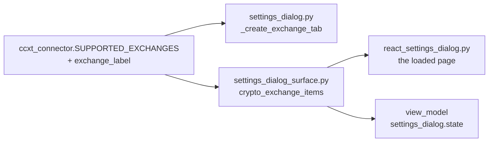

### The two lists, entry by entry

The page once carried its own frozen copy of the fifteen labels. Three readings
were taken and each offered the same fifteen entries, in the same order, label
for label:

| Reading | Where it comes from | Count |
| ------- | ------------------- | ----- |
| The connector registry | `SUPPORTED_EXCHANGES` through `exchange_label` | 15 |
| The surface list | `settings_dialog_surface.exchange_items` | 15 |
| The loaded React page | the `<option>` elements the page drew | 15 |

In order: Binance (blocked from US), Bitfinex, Bitget (passphrase required),
Bitstamp, Bybit (blocked from US), Coinbase, Cryptocom, Gateio, Gemini, Huobi,
Kraken, Kucoin (passphrase required), Mexc, Okx (passphrase required),
Poloniex. Every label except Coinbase carries a note, because `exchange_label`
marks a venue that is blocked from a US address, or untested, or needs a
passphrase.

Binance stands first because the list is in id order and `binance` sorts first.

### Every reader of the chosen venue id

The picker writes its id into an `ExchangeConfig`, and `add_exchange` stores it
keyed by that id. `gemini` was chosen on both builds and each reader printed
what it saw.

| Reader | What it saw |
| ------ | ----------- |
| `SettingsManager.list_exchanges` | `exchange_id: 'gemini'` |
| `SettingsManager.get_exchange` | the same entry, matched on the id |
| `_load_current`, the Qt Configured list | `Gemini (gemini)` |
| The React Configured list | `Gemini (gemini)` |
| `_remove_exchange`, which reads the id back out of that row | the store emptied |
| `trading_tab_surface.exchange_display_name` | `Gemini`, the tab caption |
| `trading_tab_surface.is_equity_exchange` | `False`, so the crypto layer |
| `CCXTConnector.__init__` | the registry accepts the id |

Five further sites read the stored id rather than the picker: the startup loop
in `main.py` that builds one exchange tab per entry, the startup credential
report and the bot-connect credential lookup in `src/gui/main_window.py`, the
wizard's venue choices, and the API panel's stored-credential lookup. Each
matches on the same `exchange_id` field.

Nothing else reads it. No bot reads the picker, and no gate reads it.
`src/core/usb_auth.py` looks like a reader and is not one: it reads
`CredentialVault.list_exchanges`, a separate store the picker never writes to.

### The drift, measured

The connector is the authority over the id. A venue it does not carry is
refused before any object exists:

```
CCXTConnector('notavenue') refused  Unsupported exchange 'notavenue'.
Supported: ['binance', 'coinbase', 'kraken', ... 'cryptocom']
```

With the frozen copy in place, one venue added to the connector alone reached
the Qt picker and not the React page:

| Reading | Before the connector gained a venue | After |
| ------- | ----------------------------------- | ----- |
| The Qt picker | 15 | 16 |
| The surface list | 15 | 15 |
| The bridge list | 15 | 15 |

A venue offered on the page and missing from the registry would be stored and
then refused at the first connect. A venue in the registry and missing from the
page would never appear.

### What changed

`crypto_exchange_items` in `src/gui/main_tabs/settings_dialog_surface.py` now
builds the pairs from `SUPPORTED_EXCHANGES` and `exchange_label`, imported when
first asked so the module still loads no exchange library. The frozen copy is
gone, and the registry is the only list of venues.

The screen offers the same fifteen venues in the same order as before. The Qt
picker, the surface list, the bridge list and the stock-wing list were read from
a tree at the earlier commit and from the changed tree, and the two readings
agree in every entry. The same connector mutation now reaches all three crypto
readings together.

Which venues are supported is still decided in one place only:
`src/exchange/ccxt_connector.py`.

## 2026-09-11 - The API Key row, from the typed string to the stored token

The API Key row on the Exchanges page was typed into on the running React page,
the Add button was pressed, and every place the typed string could come to rest
was then searched. This section records what was found. The string used was a
throwaway that is not a key, and no venue was contacted.

### Where the typed key goes, and where it stops

The row is an entry field and nothing else. The operator fills it, the Add
handler reads it once, and the row is cleared.

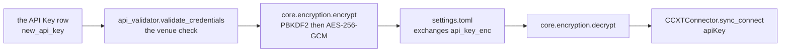

`src/gui/settings_dialog.py` — `_add_exchange`, the two lines the row causes

```python
master = f"qat_{self._sm.get('username', 'user')}_vault"
config.api_key_enc = encrypt(key, master)
```

| Moment | What happens to the row |
| ------ | ----------------------- |
| At dialog load | Nothing. No stored value is ever put back into it |
| On the Save button | Nothing. The row is not in the save path |
| On Test and Add Exchange | The venue check runs, then the key is encrypted and the file is written |
| Straight after that press | The row is cleared |
| On the next cycle | Nothing. No running bot re-reads the row |
| On restart | The stored token is decrypted fresh on each connect |

A thirty-two character key was stored as a token of one hundred and four
characters, and the longer Coinbase string as one of one hundred and fifty-six.
The typed string appears nowhere in the stored entry.

### Every reader of the stored key

| Reader | What it does |
| ------ | ------------ |
| `src/gui/main_window.py` — `_connect_exchange_for_bot` | decrypts it for a bot connect |
| `src/gui/widgets/api_tester_tab.py` — `_do_connect` | decrypts it for the API panel |
| the same two methods, one step earlier | refuse the connect while the field is empty |
| `src/gui/main_window.py`, the startup credential report | reads presence only, never the value |

Both decrypt paths were driven and each recovered the typed string byte for byte,
then handed those same bytes to the connector. Nothing in the frontend reads the
stored field, measured by searching the whole index in three naming conventions.
A separate credential store in `src/core/encryption.py` carries a field of the
same name, and this row never writes there.

### The clear-text hunt, twenty places

Twenty places were searched for the typed string after the press. Three hold it,
and each of the three is a consumer that cannot do its work without it.

| Place | Result |
| ----- | ------ |
| every file under the settings directory | not found |
| every log file the run produced | not found |
| the payload the dialog pushes to the page | not found |
| the page store values, labels, tooltips, calls, prints and boxes | not found |
| the rendered page markup | not found |
| the feedback line and the added-exchange box | not found |
| the message the bot-connect reader returned | not found |
| the API panel result view and status label | not found |
| every log record the run emitted, and the API Log ring buffer | not found |
| the API Key field the page draws | found, because the field shows what is typed |
| the venue check the Add ran first | found, because it authenticates with the key |
| the connector call each reader makes | found, because it authenticates with the key |

Two controls prove the search can report. The typed string was written into the
stored settings file, the search named that file, the file was put back and its
digest matched. The typed string was then written through the application's own
logger, the search named both the log file and the captured record, and that file
was put back to the same digest.

```
hunt with the plant      [('...\.acervator\settings.toml', 1218)]
bytes unchanged by hash  True
log file hunt with it    [('...\.acervator_logs\console\system.log', 10258)]
bytes unchanged by hash  True
```

A wrong Username refuses rather than returning a wrong key, and the refusal names
no part of the key:

```
decrypt refused                  ValueError: Decryption failed - wrong passphrase or corrupted data
the refusal names the typed key  False
```

### What the row echoes

The row is drawn as a text field, so the key is readable on screen while it is
typed. Three credential rows on the same dialog are drawn as password fields:

| Row | Control kind | Echo |
| --- | ------------ | ---- |
| API Key | line | none |
| API Secret | text area | none, and a text area carries no echo mode |
| Passphrase | line | password |
| Anthropic API Key | line | password |
| SMTP Password | line | password |

The Qt build sets no echo mode on this row either, so both builds agree. Masking
the key alone would hide nothing, because the secret beside it authenticates with
it and stays in view. The complete change reaches the API Secret row, which is
held as its own unit, so it is recorded here and not made.

### The Coinbase CDP key string

The page says the row takes a plain key or a Coinbase CDP key string. Both were
typed and both round-trip:

```
the CDP string decrypts byte for byte                 True
the stored entry carries the CDP string in the clear  False
```

The row treats the two alike. It accepts any string, and the venue check in front
of the store is what refuses a key the exchange will not take. The key shape is
read later, at connect, by `src/exchange/ccxt_connector.py` — `sync_connect`,
which reports the format it detected and writes only the last four characters of
the key into the API log.

## 2026-09-11 - The API Secret row converts a pasted PEM

The row takes a plain secret or a PEM elliptic-curve private key. A paste that
carried every newline as the two characters backslash and n is converted before
the secret is encrypted, so the stored token holds the real key and every venue
is handed the same bytes.

`src/core/encryption.py` holds the two functions the conversion rests on.
`looks_like_pem` reports whether the text carries both `PEM_ARMOUR` lines.
`unescape_pem_newlines` replaces every escaped newline, and breaks the armour
lines off the body when a PEM arrives on one line.

### Where the conversion runs

| Site | What it converts |
| ---- | ---------------- |
| `src/gui/settings_dialog.py` — `_typed_secret` | the row, read by the venue check and by the store write |
| `src/gui/main_tabs/settings_dialog_surface.py` — `_typed_credentials` | the same row in the Qt-free model |
| `src/exchange/ccxt_connector.py` — `sync_connect` | a Coinbase secret stored before the dialog converted |

`SettingsDialogReact` inherits `_add_exchange`, so the React build runs
`_typed_secret` through a `PageTextArea` holder.

`_typed_secret` converts only a value `looks_like_pem` accepts. A plain secret
that carries a literal backslash and n reaches the store unchanged.

### What the row stores

A throwaway PEM whose body reads THIS-IS-NOT-A-KEY was pasted into the row and
the Add button was pressed. The stored token was then decrypted.

```
the escaped paste          3 escaped, 0 real newlines
decrypted out of the store 0 escaped, 3 real newlines
```

A PEM pasted with real newlines already is stored byte for byte, and so is a
plain secret carrying a literal backslash and n.

### What each venue is handed

At the point `sync_connect` builds the CCXT config, from the stored value the
escaped paste produced:

| Venue | Escaped | Real newlines | Usable PEM |
| ----- | ------- | ------------- | ---------- |
| coinbase | 0 | 3 | yes |
| kraken | 0 | 3 | yes |

A second connect on the same stored value produces the same bytes, so the
Coinbase branch in `sync_connect` never converts a converted secret twice.

### What the row does not mask

The row is a text area and a text area carries no echo mode, so the secret is
readable on screen while it is typed. The API Key row beside it is a text field
with no echo mode either, and the two authenticate as a pair. Masking one of
them hides nothing, and masking this one would mean replacing the text area with
a single line that cannot take a multi-line PEM. Both rows are recorded and
neither is changed.

## 2026-09-11 - The Passphrase row and the venue that needs one

The box labelled **This exchange uses an API passphrase** decides whether the
field under it is drawn. Picking Kucoin, Okx or Bitget ticks the box, and the
field appears with it on the React build and on the Qt build alike.

### Which trigger draws the field

One method decides the field's visibility, and three triggers call it.

`src/gui/settings_dialog.py` — `_sync_passphrase_row`

```python
def _sync_passphrase_row(self) -> None:
    self._new_passphrase.setVisible(self._pp_check.isChecked())
```

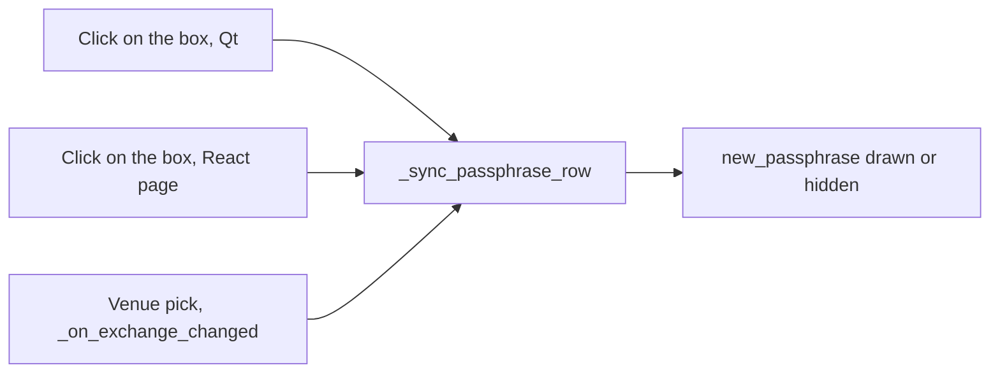

| Trigger | Where it is wired |
| ------- | ----------------- |
| A click on the box | `_pp_check.toggled`, on the Qt build |
| A click on the box | `SettingsDialogReact.apply_edit`, on a `pp_check` edit from the page |
| A venue pick | `_on_exchange_changed`, which the React dialog inherits and runs |

`_on_exchange_changed` sets the box with `setChecked` and then calls the method.
Qt emits `toggled` from `setChecked` and the React page-backed holder emits
nothing, so the direct call is what draws the field on each build.

The Qt-free model carries the same rule for the page the dialog opens on.
`SettingsDialogModel.on_exchange_changed` calls its own `show_passphrase`, so the
Exchanges page draws the field for a venue that needs one from the first paint.

### The row read on each venue

Driven on the real React page and on the Qt dialog, with the Exchanges tab open.

| Venue | Needs one | Box ticked | Field drawn |
| ----- | --------- | ---------- | ----------- |
| kucoin | yes | yes | yes |
| okx | yes | yes | yes |
| bitget | yes | yes | yes |
| binance | no | no | no |
| coinbase | no | no | no |
| kraken | no | no | no |

Both builds report that table. A direct click on the box draws the field for a
venue that needs no passphrase, and a second click hides it again.

### What the typed value reaches

The field takes focus once it is drawn, and the typed string runs the whole
stored path.

| Step | What it carries |
| ---- | --------------- |
| The field | the typed passphrase |
| `validate_credentials` | the same string, as its fourth argument |
| `config.passphrase_enc` | an AES-256-GCM token, 84 characters |
| `decrypt` | the typed passphrase, byte for byte |

Test Connection answers `Kucoin requires an API passphrase.` while the field is
empty, and the venue is never reached. With the field filled, the connector is
handed the key, the secret and the passphrase together.

### Where the venue set is declared

Three declarations hold the same three ids.

| Declaration | Read by |
| ----------- | ------- |
| `src/exchange/ccxt_connector.py` — `PASSPHRASE_EXCHANGES` | the Qt dialog, `src/exchange/api_validator.py`, `sync_connect` |
| `src/gui/main_tabs/settings_dialog_surface.py` — `PASSPHRASE_EXCHANGE_IDS` | the React dialog and the Qt-free model |
| `src/gui/main_tabs/init_wizard_surface.py` — `PASSPHRASE_EXCHANGE_IDS` | the first-run wizard |

`_sync_passphrase_row` reads the box and no set, so the field follows the box
whichever declaration ticked it.

## 2026-09-11 - The saved exchange list

The list under Configured Crypto Exchanges is the stored `exchanges` field.
Each entry is one saved venue: its id, its display name, three encrypted
tokens, an enabled flag and two hardware fields. The list was driven on the
running React page, two venues at a time.

### Where the list is written

Two buttons write it, and Save is not one of them.

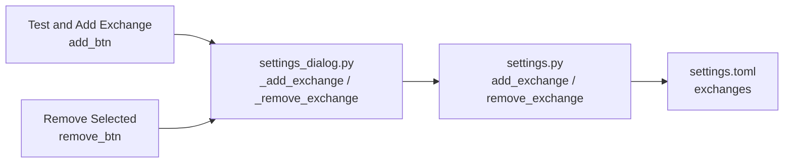

On React a click on a list line reports its index, and `run_action` turns that
into `setCurrentRow`, so Remove Selected has a row to drop. `_save` never
names `exchanges`, so pressing Save changes nothing here.

### Every reader of the saved list

Ten readers, all through `SettingsManager.list_exchanges` or `get_exchange`.

| Site | What it does with the list |
| ---- | -------------------------- |
| `main.py` | One `add_exchange_tab` per entry, in stored order |
| `src/gui/main_window.py` — `_report_stored_credentials_on_startup` | An empty list is a warning and an early return |
| `src/gui/main_window.py` — `_connect_exchange_for_bot` | Walks the list for the bot's id; a missing id and a missing key are two refusals |
| `src/gui/main_window.py` — `_sync_exchange_tabs` | Adds a tab for every listed id that has none |
| `src/gui/main_window.py` — `_create_bot` | Hands the whole list to `BotCreationWizard` |
| `src/gui/widgets/api_tester_tab.py` — `_do_connect` | Walks the list for the picked id and decrypts its tokens |
| `src/gui/settings_dialog.py` — `_load_current` | Fills the on-screen list, filtered by wing |
| `src/gui/main_tabs/settings_dialog_surface.py` — `_load_current` | The same fill in the Qt-free model |
| `src/gui/main_tabs/header_strip_surface.py` — `configured_exchange_count` | The length, and nothing else |
| `src/gui/main_tabs/trading_tab_surface.py` — `live_view_model` | `layer_exchanges` splits it into the crypto and stock layers |

`src/core/usb_auth.py` calls a different `list_exchanges`, the one on
`CredentialVault`. That is a separate store this list never writes to. No
JavaScript file reads the stored list: the page is handed `listed_exchanges`,
words already formatted.

### Two adds, in the order added

Two venues were added through the page, each with its own generated
credentials.

| Reading | Answer |
| ------- | ------ |
| Order added | `binance`, `kucoin` |
| Order stored | `binance`, `kucoin` |
| Binance key decrypts to its own | True |
| Kucoin key decrypts to its own | True |
| Kucoin passphrase decrypts to its own | True |

Each entry carries its own tokens. `list_exchanges` and `get_exchange` both
deep-copy, so no reader can change the stored list by holding what it returned.

### Removing one

The first line was clicked and Remove Selected pressed. The store kept the
other entry, and its three tokens still decrypt.

| Reading | Answer |
| ------- | ------ |
| Lines on screen before | `Binance (binance)`, `Kucoin (kucoin)` |
| Lines on screen after | `Kucoin (kucoin)` |
| The store after | one entry, `kucoin` |
| The survivor's key decrypts | True |
| The survivor's passphrase decrypts | True |
| The feedback line | `Binance removed.` |

### Adding a venue the list already holds

`add_exchange` stores one entry per venue id, so a second add is never a
second entry. It now keeps that entry's place, and a credential token the new
entry leaves empty keeps the token the stored entry carried.

| The press | What the store holds after |
| --------- | -------------------------- |
| The same venue with new credentials typed | One entry, carrying the newly typed tokens |
| The same venue with both rows empty | One entry, byte for byte what it held before |
| The same venue with the key typed and the secret empty | One entry, byte for byte what it held before |

With two venues stored, re-adding the first leaves the order as
`binance`, `kucoin`. The on-screen list is asked whether a line already names
the venue, so one venue is drawn once:

| Reading | Answer |
| ------- | ------ |
| Lines on screen before the re-add | `Binance (binance)`, `Kucoin (kucoin)` |
| Lines on screen after the re-add | `Binance (binance)`, `Kucoin (kucoin)` |
| Entries in the store | 2 |

`listed_exchange_position` in
`src/gui/main_tabs/settings_dialog_surface.py` answers that question, and both
the Qt dialog and the Qt-free model call it.

The feedback line still reads `added without credentials` after a press with
both rows empty, which names what was typed rather than what is stored. With the
key typed and the secret empty it reads `added with credentials (verified)`,
because it tests the key alone while `_add_exchange` needs both rows before it
contacts a venue or encrypts anything.

### What the readers see on an empty list

An empty list is the state on a fresh install. Every reader answers, and none
raises.

| Reader | Empty | One entry | Two entries |
| ------ | ----- | --------- | ----------- |
| `main.py` venue tabs | none | `kucoin` | `binance`, `kucoin` |
| `configured_exchange_count` | 0 | 1 | 2 |
| The crypto layer | placeholder shown | opens on `kucoin` | opens on `binance` |
| The Settings page list | none | `Kucoin (kucoin)` | `Binance (binance)`, `Kucoin (kucoin)` |
| A bot asking for `kucoin` | `Exchange kucoin not found in settings.` | connects | connects |
| The API panel asking for `kucoin` | `No stored credentials for Kucoin.` | decrypts | decrypts |

An entry stored with no tokens reads differently from a missing entry: the bot
path answers `No API credentials for Kucoin.` instead.

### Removing the venue a bot uses

Nothing on this path can see a bot. The dialog is handed the settings manager
and the status log, and nothing else.

| Reading | Answer |
| ------- | ------ |
| Refused | False |
| Warned about the bot | False |
| Silently allowed | True |
| What the bot's next connect reads | `Exchange binance not found in settings. Add it in Settings first.` |

`_sync_exchange_tabs` only adds a tab, so the removed venue's tab stays on
screen until the next launch.

## 2026-09-11 - Position Distance is off the Trading page

The Trading page carries five rows. The Position Distance row is removed. The row
set a percent the dialog stored and read back, and no bot read the value.

Three files declared the row and every declaration is gone.

| File | What it declared |
| ---- | ---------------- |
| `src/core/settings.py` | the `position_distance_pct` field on `AppSettings` |
| `src/gui/settings_dialog.py` | the `QDoubleSpinBox` and its `_stored_rows` entry |
| `src/gui/main_tabs/settings_dialog_surface.py` | the `pos_distance` spec, its Trading layout step and its `PERSISTED_ROWS` entry |

`_DEPRECATED_KWARGS` in `src/trading/container/config.py` keeps the name. A
`bot_state.json` still carrying the key restores without a `TypeError`.

### Why the row had no wizard control to open

The row set a percent from 1.0 to 50.0 at 2.0, spacing a bot's positions. Three
wizard controls carry a spacing and none carries that quantity.

| Control | Key | Range | At | What it spaces |
| ------- | --- | ----- | -- | -------------- |
| Split Distance | `split_distance` | 0.10 % to 20.00 % | 1.00 % | one Stack tranche from the next |
| Spacing | `stack_spacing_mode` | Linear, Quadratic, Exponential | Linear | how that tranche gap grows |
| Opposing Trade Interval | `scrumming_interval_pct` | 0.10 % to 20.00 % | 1.00 % | the price travel a reversal needs |

The key belongs to the retired Grid Bot. The module docstring of
`src/gui/bot_wizard.py` names the mode and its rows: "Grid Bot: Investment
Amount, Position Count/Distance/Increment". `BotMode` declares `SCRUMMING` and
`EXTRACTOR`, and `bot_config_kwargs` names "the retired Grid checkbox" in the
same file as the strip list.

### A store that still carries the key

`SettingsManager._apply_dict` walks the fields `AppSettings` declares and copies
the ones the file carries. A key the file holds and `AppSettings` does not
declare is passed over. A store holding `position_distance_pct = 7.5` opens, its
`username` and `default_target_balance` read back, the dialog draws its controls,
and the next Save writes the file without the key.

### The sentences the removal replaces

Each sentence below stands in an earlier section and no longer describes the
page. The earlier text stays where it is.

| Earlier sentence | What the page does now |
| ---------------- | ---------------------- |
| "Six rows carry the defaults a new bot starts from, not a running bot's settings." | Five rows carry those defaults. |
| "Position Distance - Sets the spacing a new bot puts between its positions." and the three sentences and the code block under it | The page carries no Position Distance row, and no control on it sets position spacing. |
| "The strip list holds eleven names. This page contributes one of them and the Profit Folding page below contributes four more." | The strip list holds the same eleven names. The Profit Folding page contributes four and this page contributes none. |
| "Save writes all six keys." | Save writes five keys. |
| "The load path restores all six keys on the Trading page." | The load path restores all five keys on the Trading page. |
| "`src/gui/settings_dialog.py` — `_load_current`, the four it restores", and the `self._pos_distance.setValue` line inside that block | `_stored_rows` carries no `position_distance_pct` row, so the load path names four keys and the page has five rows. |
| "\| Trading \| 6 \| all six \| four of six \|" in [What each page persists](#what-each-page-persists) | Trading, 5 controls, `_save` writes all five, `_load_current` restores all five. |
| "\| Trading \| 6 \| all six \| all six \|" in [What each page restores now](#what-each-page-restores-now) | The same five. |

## 2026-09-11 - Increment Style is off the Trading page

The Trading page carries four rows. The Increment Style row is removed. The row
stored one of two words and read it back, and nothing in the program read the
word.

Three files declared the row and every declaration is gone.

| File | What it declared |
| ---- | ---------------- |
| `src/core/settings.py` | the `increment_style` field on `AppSettings`, and the `IncrementStyle` enum that supplied its default and its two words |
| `src/gui/settings_dialog.py` | the `QComboBox` and its `_stored_rows` entry |
| `src/gui/main_tabs/settings_dialog_surface.py` | the `increment_style` spec, its Trading layout step, its `PERSISTED_ROWS` entry, and the `INCREMENT_KEY` and `INCREMENT_DEFAULT` names |

`_DEPRECATED_KWARGS` in `src/trading/container/config.py` never held this name,
so the strip list is unchanged.

### The bot config field of the same name stays

`increment_style` names a field on two objects that never meet. `AppSettings`
held the page's word. `BotConfig` declares its own at
`src/trading/container/config.py:59`, `_BOT_CONFIG_SCRUMMING_ONLY_FIELDS` names
it at `:307` so an Extractor is refused it, and
`src/trading/container/restore.py:220` copies it out of a saved bot. All three
stay. The page never wrote any of them, and a bot built through the real
creation path holds the same `linear` it held before.

Nothing reads the bot field either. `git grep "\.increment_style"` finds no
reader, and the same search shape finds thirteen reads of `.target_balance`, so
the absence is a fact about the code rather than about the search.

### Why no wizard control could open at it

A row on this page earns its keep by opening a wizard field at the stored
figure, the way Default Target Balance opens the wizard's Target Balance. No
wizard control sets an increment style. The wizard collects 52 keys and none is
this name. Its nearest control is Spacing, a different quantity under a
different key.

| | Increment Style | Spacing |
| --- | --- | --- |
| key | `increment_style` | `stack_spacing_mode` |
| choices | linear, logarithmic | Linear, Quadratic, Exponential |
| at | linear | Linear |
| what it shapes | how the gap between a bot's positions grows | how the gap between Stack tranches grows |

The word belongs to the retired Grid Bot. The module docstring of
`src/gui/bot_wizard.py` names the mode and its rows: "Grid Bot: Investment
Amount, Position Count/Distance/Increment". The other two of that trio,
`position_count` and `position_distance_pct`, already sit on the strip list as
grid legacy. This one stayed on `BotConfig` instead, unread.

One place still carries the word `logarithmic` for a spacing, and it carries it
only to replace it. `_sanitize_deprecated_kwargs` at
`src/trading/container/config.py:577` promotes
`stack_spacing_mode="logarithmic"` to `"quadratic"`.

### A store carrying the key after the removal

`SettingsManager._apply_dict` walks the fields `AppSettings` declares and copies
the ones the file carries. A key the file holds and `AppSettings` does not
declare is passed over rather than refused. A store holding
`increment_style = "logarithmic"` opens, its `username` and
`default_target_balance` read back, the page draws its controls, and the next
Save writes the file without the key.

| | before the removal | after the removal |
| --- | --- | --- |
| drawn controls on the page | 70 | 69 |
| the Increment Style row is drawn | yes | no |
| the Default Positions row beside it | drawn | drawn |
| `username` read back off the store | `u10_operator` | `u10_operator` |
| `default_target_balance` read back | 777.0 | 777.0 |
| `BotConfig.increment_style` on a new bot | `linear` | `linear` |

### The sentences this removal replaces

Each sentence below stands in an earlier section and no longer describes the
page. The earlier text stays where it is.

| Earlier sentence | What the page does now |
| ---------------- | ---------------------- |
| "Six rows carry the defaults a new bot starts from, not a running bot's settings." | Four rows carry those defaults. |
| "Increment Style - Chooses whether that spacing stays even or widens on a curve." and the two sentences and the code block under it | The page carries no Increment Style row, and no control on it chooses how spacing grows. |
| "A bot takes its own increment style from the wizard rather than from this page." | No wizard control sets an increment style, and nothing reads the `BotConfig` field of that name. |
| "Save writes all six keys." | Save writes four keys. |
| "The load path restores all six keys on the Trading page." | The load path restores all four keys on the Trading page. |
| "`src/gui/settings_dialog.py` — `_load_current`, the four it restores", and the three `self._increment_style` lines inside that block | `_stored_rows` carries no `increment_style` row, so the load path names three keys and the page has four rows. |
| "\| Trading \| 6 \| all six \| four of six \|" in [What each page persists](#what-each-page-persists) | Trading, 4 controls, `_save` writes all four, `_load_current` restores all four. |
| "\| Trading \| 6 \| all six \| all six \|" in [What each page restores now](#what-each-page-restores-now) | The same four. |

The 2026-09-11 Position Distance section above restated the same rows at five.
Four is the count after both rows are gone.

## 2026-09-11 - Default Positions is off the Trading page

The Trading page carries three rows. The Default Positions row is removed. The
row stored a count between 1 and 100 and read it back, and nothing outside the
dialog read the count.

Three files declared the row and every declaration is gone.

| File | What it declared |
| ---- | ---------------- |
| `src/core/settings.py` | the `default_position_count` field on `AppSettings` |
| `src/gui/settings_dialog.py` | the `QSpinBox` with its `setRange(1, 100)` and its form row, and its `_stored_rows` entry |
| `src/gui/main_tabs/settings_dialog_surface.py` | the `default_positions` spec, its Trading layout step, and its `PERSISTED_ROWS` entry |

`AppSettings` no longer declares the name, so `SettingsManager.set` refuses it.
Driven after the removal, `set("default_position_count", 42)` raised
`KeyError: 'Unknown setting: default_position_count'`. That is the schema doing
its stated job rather than a fault.

### The bot-side spelling stays on the strip list

`position_count` is the name a bot-side kwarg would carry, and
`_DEPRECATED_KWARGS` in `src/trading/container/config.py:384` holds it beside
unit 9's `position_distance_pct` at `:385`. Both stay on the list, so a
`bot_state.json` still carrying either key restores without a `TypeError`.
`_sanitize_deprecated_kwargs` drops `position_count` before
`BotConfig.__init__`, and `BotConfig` declares no field of that name and no
field of this row's name.

The word belongs to the retired Grid Bot. The module docstring of
`src/gui/bot_wizard.py:6-7` names the mode and its rows: "Grid Bot: Investment
Amount, Position Count/Distance/Increment". `BotMode` at
`src/trading/container/config.py:39-41` declares `SCRUMMING` and `EXTRACTOR`
alone. With this row gone, all three of that group are off the page.

### No wizard control counts the positions a bot opens with

A row on this page earns its keep by opening a wizard field at the stored
figure, the way Default Target Balance opens the wizard's Target Balance. The
wizard collects 52 keys and none of them is a count of positions a new bot
opens with. The nearest control is Tranche Count, and it counts something else.

| | Default Positions | Tranche Count |
| --- | --- | --- |
| key | `default_position_count` | `stack_tranche_count_target` |
| range | 1 to 100 | 2 to 20 |
| at | 10 | 3 |
| what it counts | positions a new bot opens with | Stack tranches created from one SCRUM |

The meaning, the range and the default all differ, so the row had no wizard
field to open at its figure.

One site in the repository counts positions, and it counts ones already open.
`open_position_count` at `src/gui/main_tabs/stock_main_window_surface.py:545`
reads a live status list and reports how many positions stand now, on the stock
window. That is a runtime count rather than an opening count, and it never
touches this row's name.

### A legacy store after the removal

`SettingsManager._apply_dict` walks the fields `AppSettings` declares and copies
the ones the file carries. A key the file holds and `AppSettings` does not
declare is passed over rather than refused. A store holding
`default_position_count = 55` opens, its `username` and
`default_target_balance` read back, the page draws its controls, and the next
Save writes a file without the key while leaving the stored `username` intact.

| | before the removal | after the removal |
| --- | --- | --- |
| drawn controls on the page | 69 | 68 |
| control specs in the payload | 70 | 69 |
| the Default Positions row is drawn | yes | no |
| the Default Target Balance row beside it | drawn | drawn |
| keys and groups one Save wrote | 14 | 13 |
| `username` read back off the store | `u11_driver` | `u11_driver` |
| a legacy store's `username` | `u11_legacy` | `u11_legacy` |
| a legacy store's `default_target_balance` | 321.0 | 321.0 |
| a legacy store's `default_position_count` | 55 | not answered |
| `stack_tranche_count_target` on a new bot | 3 | 3 |

### The sentences this row's removal replaces

Each sentence below stands in an earlier section and no longer describes the
page. The earlier text stays where it is.

| Earlier sentence | What the page does now |
| ---------------- | ---------------------- |
| "Six rows carry the defaults a new bot starts from, not a running bot's settings." | Three rows carry those defaults. |
| "Default Positions - Sets how many positions a new bot opens with." and the key line, the two sentences and the code block under it | The page carries no Default Positions row, and no bot holds a count of positions it opens with. |
| "The dialog stores the count and restores it." | The dialog stores and restores nothing under this name. |
| "Save writes all six keys." | Save writes three keys. |
| "The load path restores all six keys on the Trading page." | The load path restores all three keys on the Trading page. |
| "`src/gui/settings_dialog.py` — `_load_current`, the four it restores", and the `self._default_positions.setValue` line inside that block | `_stored_rows` carries no `default_position_count` row, so of the four lines in that block one remains and the page has three rows. |
| "\| Trading \| 6 \| all six \| four of six \|" in [What each page persists](#what-each-page-persists) | Trading, 3 controls, `_save` writes all three, `_load_current` restores all three. |
| "\| Trading \| 6 \| all six \| all six \|" in [What each page restores now](#what-each-page-restores-now) | The same three. |

The 2026-09-11 Increment Style section above restated the same rows at four.
Three is the count after all three of the Grid Bot group are gone.

## 2026-09-11 - Default Target Balance opens the wizard's field

The Trading page carries three rows. This row is the one that reaches a new bot.
It stores a dollar figure between $1.00 and $1,000,000.00 under the key
`default_target_balance` and opens at $200.00. The row is verified and unchanged.

### The row, drawn and driven

React draws the row. The build answers `react`, `draws_react('Settings dialog')`
answers `True`, and the class is `SettingsDialogReact`. The Trading tab draws 68
controls and this row is one of them.

| What was driven | What it answered |
| --------------- | ---------------- |
| the drawn node | `INPUT`, `type="number"`, `min="1"`, `max="1000000"` |
| $777.00 typed on the page | the holder answered 777.0 |
| Save pressed on the page | the store answered 777.0 |
| a fresh manager on the same folder | 777.0 |
| the page reopened | the row drew 777.0 |

The round trip holds. A figure typed on the page survives a Save, a new manager
and a new page.

### Every reader of the stored figure

Seven sites name the key. One of them reads it outside the Settings dialog.

| Site | What it does with the figure |
| ---- | ---------------------------- |
| `src/core/settings.py:157` | declares `default_target_balance: float = 200.0` |
| `src/gui/main_tabs/settings_dialog_surface.py:467` | the React model's save and load row |
| `src/gui/settings_dialog.py:1162-1165` | `_stored_rows`, the read on Save and the write on load |
| `src/gui/bot_wizard.py:810` | the wizard's Target Balance field opens here |
| `src/gui/main_window.py:1735` | writes an override for one wizard opening |
| `src/gui/main_tabs/bot_wizard_surface.py:1224` and `:1702-1716` | the React wizard module's own read |
| `src/gui/main_tabs/bot_wizard_surface.py:2768` | names the key in the payload catalogue |

[The tab conversion table](../08-tabs.md) gives the wizard's seam row: both
builds open `BotCreationWizard`. **+ New Bot** reaches
`src/gui/bot_wizard.py:810`, and the React wizard module is a second reader that
the button does not reach.

Nothing under `desktop/` names the row. The control specs travel from Python into
the page payload, and the drawn node carries `data-name="default_balance"` as
data.

### Where the figure stops being this setting

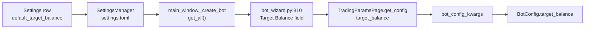

`TradingParamsPage.get_config` at `src/gui/bot_wizard.py:1533` renames the figure
`target_balance`. From that step on the figure is the bot's own setting.

Driven with $4,321.55 stored:

| Step | What it answered |
| ---- | ---------------- |
| the wizard's Target Balance | 4321.55 |
| keys the wizard collected | 52 |
| `default_target_balance` among them | no |
| `target_balance` among them | 4321.55 |
| `bot_config_kwargs` `target_balance` | 4321.55 |
| the built config | `BotConfig` |
| `BotConfig.target_balance` | 4321.55 |
| `BotConfig` holds `default_target_balance` | no |

Two more stored figures opened the wizard at themselves: $777.00 and $12.75.
Market Inspector topology adoption hands `defaults_override` in place of the
stored figure, and $25.00 opened the wizard at $25.00.

### The range, at both ends and past them

The page, the wizard and this manual declare the same range. The page and the
wizard hold a figure to that range in the same way.

| Written to the store | The store holds | The page draws | The wizard opens at |
| -------------------- | --------------- | -------------- | ------------------- |
| 1.00 | 1.0 | 1 | 1.0 |
| 1000000.00 | 1000000.0 | 1000000 | 1000000.0 |
| 0.50 | 0.5 | 1 | 1.0 |
| 1000001.00 | 1000001.0 | 1000000 | 1000000.0 |

The row holds a typed figure to the range before the store sees it, so the page
stores no figure outside the range. A figure written into the file by hand meets
the nearer end on the page and in the wizard alike, so no bot opens at a refused
figure.

### A store with the figure removed

| What was driven | What it answered |
| --------------- | ---------------- |
| `AppSettings` declares | 200.0 |
| a settings file with the key deleted | 200.0 |
| the wizard on that store | 200.0 |
| the wizard on an empty defaults dict | 200.0 |

`get_all()` is `asdict` of a dataclass that declares the field, so the dict the
wizard takes always carries the key. `_apply_dict` keeps the declared default for
a field the file omits. The wizard's own fallback at `src/gui/bot_wizard.py:810`
fires only where `main_window.py:3185` hands `{}`, which is a run with no
settings manager, and the fallback gives the same $200.00.

The page's build figure for this control is $1.00, because the spec carries a
range and no `value`. The store always answers, so the page draws $1.00 only
where it refuses the stored figure.

### What this section adds

Nothing on the page, in the store or in the wizard changed. The row matches every
sentence written about it, and this section records the driven readings.

Two gaps stand outside this row and sit here as measured facts.

| Gap | What was measured |
| --- | ----------------- |
| a text figure in the settings file | `src/gui/settings_dialog.py:1284-1296` catches it, logs "Settings kept the default for default_target_balance", and draws $1.00. `src/gui/bot_wizard.py:810` carries no guard, so `QDoubleSpinBox.setValue(str)` raises `TypeError` and `BotCreationWizard` cannot open. Only an edited file puts a text figure in the store |
| a write to a control the page already drew | The React page draws every control with `defaultValue`, which seeds the DOM once. A write from Python after the page is up moved the store and not the drawn figure: the node held 321 while the holder answered 654.0. This row stands clear of it, because `_load_current` runs before the page mounts and nothing writes the row afterwards |

## 2026-09-12 - Bot Visibility opens the wizard's Order Visibility control

The Trading page row stores `orderbook` or `internal` under the key
`bot_visibility` and opens at `orderbook`. The row is now the default the bot
creation wizard's own control opens on. It was unwired, and removing it was
refused: the behaviour it names runs on the bot, and the wizard carries a control
for it.

### The row and the wizard control, side by side

| | The Settings row | The wizard control |
| --- | --- | --- |
| Where | `src/gui/main_tabs/settings_dialog_surface.py:606-613` | `src/gui/bot_wizard.py:674-686` |
| Label | `Bot Visibility:` | `Order Visibility:` |
| Choices | `orderbook`, `internal` | `orderbook`, `internal` |
| Opens at | `orderbook` | the stored name, `orderbook` when the store holds none |
| What it writes | the store key `bot_visibility` | the config key `visibility` |

The two agree on meaning, on both choices and on the default, so the row is a
legitimate application default for the control.

### Every reader of the stored visibility

Four sites name the key. One of them reads it outside the Settings dialog.

| Site | What it does with the name |
| ---- | ------------------------- |
| `src/core/settings.py:163` | declares `bot_visibility: str = BotVisibility.ORDERBOOK.value` |
| `src/gui/settings_dialog.py:1166-1169` | `_stored_rows`, the read on Save and the write on load |
| `src/gui/main_tabs/settings_dialog_surface.py:468` | the same row on the Qt-free surface |
| `src/gui/bot_wizard.py:677-683` | the wizard's Order Visibility control opens here |

Before this section there was no reader outside the dialog. The bare name was
searched in all 1081 files `git ls-files` reports, and the search was proved
against `default_target_balance`, read out of the settings dict, and against
`ai_monitor`, read through `getattr`. Both controls answered with their known
reading sites, so the zero was a measurement.

### Where the stored name reaches the bot

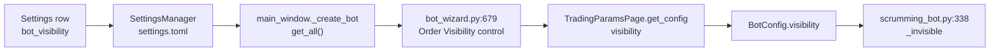

`BotConfig.visibility` at `src/trading/container/config.py:139` is where the name
stops being this setting. From there the bot owns it, and
`src/trading/scrumming_bot.py:974` changes it live on one bot without touching the
store.

### The round trip, with a Save that changed nothing

Driven on the class the running build opens. `resolve_variant` answered `react`
and `surface_class('Settings dialog')` returned `SettingsDialogReact`. The home
was redirected into a scratch directory before the settings module was imported,
so the settings default directory bound under that directory.

| Stored | The box opened at | The store after a Save with no edit | The box on reopening |
| ------ | ----------------- | ----------------------------------- | -------------------- |
| `internal` | `internal` | `internal` | `internal` |
| `orderbook` | `orderbook` | `orderbook` | `orderbook` |

Two different stored names gave two different readings, so the reading
discriminates. The payload the dialog pushes to the page carries 69 control
specs, and the figure is the same before and after.

### What a new bot opens at, and what an existing bot keeps

| Driven | What it answered |
| ------ | ---------------- |
| `internal` stored, the wizard opened | `internal` |
| `orderbook` stored, the wizard opened | `orderbook` |
| a name the two items do not offer | `orderbook`, the build figure |
| app setting `internal`, a saved bot holding `orderbook` | the restored config holds `orderbook` |
| app setting `orderbook`, a saved bot holding `internal` | the restored config holds `internal` |

A restored bot reads `cfg.get("visibility", "orderbook")` from its own saved
config at `src/trading/container/restore.py:203` and reads no application setting.
Every `SettingsManager.get` call of the run was recorded with its calling file:
the wizard and the restore paths read the key no times, and the Settings dialog
read it once. The recorder saw the read it was meant to see, so the two zeros are
measurements.

### The sentence this wiring replaces

| Earlier sentence | What the code does now |
| ---------------- | ---------------------- |
| "A bot takes its visibility from the wizard, under a different name." | A new bot still takes its visibility from the wizard, and the wizard's control now opens at this row's stored name. |

The two revert sentences in the same paragraph were already retired by
[Save keeps what the store holds](#2026-09-11---save-keeps-what-the-store-holds),
and that section's reading was re-driven here and holds.

### What the wiring adds

One lookup on one control, in the file the + New Bot button reaches. Nothing a
running bot does changed, nothing on the Settings page changed and no order
placement path changed.

Two absences stand outside this row and sit here as measured facts.

| Absence | What was measured |
| ------- | ----------------- |
| the shell's wizard request carries no stored defaults | `src/gui/web/bot_wizard.js:1775` calls `bot_wizard.state` with the step values alone. `src/gui/main_tabs/bot_wizard_surface.py:2796` reads `defaults` from the request, so the Qt-free wizard surface receives an empty bag on every call and `_apply_stored_target_balance` falls back to its built-in figure |
| the Qt-free wizard surface has no visibility lookup | `src/gui/main_tabs/bot_wizard_surface.py:1702` applies the stored target balance and nothing applies a stored visibility. Its `visibility` combo at `:472-474` carries the same two entries as the Qt one and opens at index 0 |

## 2026-09-12 - Enable aggressive trading mode opens the wizard's own box

The Trading page row stores a boolean under the key `aggressive_trading` and
opens clear. The row is now the default the bot creation wizard's own Aggressive
Trading checkbox opens on. It was unwired, and removing it was refused: the
behaviour it names runs on the bot, and the wizard carries a checkbox for it.

### The Settings box and the wizard box, side by side

| | The Settings row | The wizard box |
| --- | --- | --- |
| Where | `src/gui/main_tabs/settings_dialog_surface.py:614-622` | `src/gui/bot_wizard.py:688-699` |
| Text | `Enable aggressive trading mode` | `Aggressive Trading (force IOC-limit takers)` |
| Choices | on, off | on, off |
| Opens at | off | the stored flag, off when the store holds none |
| What it writes | the store key `aggressive_trading` | the config key `aggressive_trading` |

The two agree on meaning, on both choices and on the default, and here the two
keys are the same word.

### The two sets that share the word

The bare name `aggressive_trading` stands in 19 python lines of the 1081 files
`git ls-files` reports. They split into two sets, and no line crosses between
them.

| Set | Lines | What they are |
| --- | ----: | ------------- |
| the application setting | 3 | the `AppSettings` field, the dialog's `_stored_rows` row, the same row on the Qt-free surface |
| a bot's own config field | 16 | the `BotConfig` field, the restore read, the bot's own `_aggressive`, the live toggle, the wizard write and the live settings box |

The bot's own field is a separate setting with its own screen row, and this
section changes nothing in that set.

### Every reader of the stored flag

Four sites name the application key. One of them reads it outside the Settings
dialog.

| Site | What it does with the flag |
| ---- | ------------------------- |
| `src/core/settings.py:164` | declares `aggressive_trading: bool = False` |
| `src/gui/settings_dialog.py:1170-1173` | `_stored_rows`, the read on Save and the write on load |
| `src/gui/main_tabs/settings_dialog_surface.py:469` | the same row on the Qt-free surface |
| `src/gui/bot_wizard.py:689-691` | the wizard's Aggressive Trading box opens here |

Before this section there was no reader outside the dialog. The bare name was
searched in every tracked file, and the search was proved against
`default_target_balance`, read out of the settings dict, and against
`ai_monitor`, read through `getattr`. Both controls answered with their known
reading sites, so the zero was a measurement.

### Where the stored flag reaches the bot

```mermaid
flowchart LR
  A["Settings row<br/>aggressive_trading"] --> B["SettingsManager<br/>settings.toml"]
  B --> C["main_window._create_bot<br/>get_all()"]
  C --> D["bot_wizard.py:691<br/>Aggressive Trading box"]
  D --> E["TradingParamsPage.get_config<br/>aggressive_trading"]
  E --> F["BotConfig.aggressive_trading"]
  F --> G["scrumming_bot.py:339<br/>_aggressive"]
  G --> H["scrumming_bot.py:4551<br/>OrderType.IOC_LIMIT"]
```

`BotConfig.aggressive_trading` at `src/trading/container/config.py:142` is where
the flag stops being this setting. From there the bot owns it, and
`src/trading/scrumming_bot.py:1015` changes it live on one bot without touching
the store.

### The round trip on both choices

Driven on the class the running build opens. `resolve_variant` answered `react`
and `surface_class('Settings dialog')` returned `SettingsDialogReact`. The home
was redirected into a scratch directory before the settings module was imported,
so the settings default directory bound under that directory. No venue was
contacted. A name-lookup guard refused eight lookups, every one of them the
wizard's own market scan.

| Stored | The box opened at | The store after a Save with no edit | The box on reopening |
| ------ | ----------------- | ----------------------------------- | -------------------- |
| on | on | on | on |
| off | off | off | off |

Two different stored flags gave two different readings, so the reading
discriminates. The payload the dialog pushes to the page carries 69 control
specs and the page draws 68, the same two figures before and after.

### What a new bot carries, and what an existing bot keeps

| Driven | What it answered |
| ------ | ---------------- |
| on stored, the wizard opened | on |
| off stored, the wizard opened | off |
| on stored, through `bot_config_kwargs` and `make_bot_config` | `BotConfig.aggressive_trading` on |
| off stored, the same path | `BotConfig.aggressive_trading` off |
| the setting on, a saved bot holding off | the restored bot holds off |
| the setting off, a saved bot holding on | the restored bot holds on |

A restored bot reads `cfg.get("aggressive_trading", False)` from its own saved
config at `src/trading/container/restore.py:204` and reads no application
setting. Every `SettingsManager.get` and `get_all` call of the run was recorded
with its calling file. The wizard and the restore paths read the key no times,
and the driver read it once. The recorder saw the read it was meant to see, so
the two zeros are measurements.

### What this wiring retires

| Earlier sentence | What the code does now |
| ---------------- | ---------------------- |
| "The wizard carries its own aggressive trading checkbox, and that is the one a new bot reads." | A new bot still reads the wizard's checkbox, and that checkbox now opens at this row's stored flag. |

The two revert sentences in the same paragraph were already retired by
[Save keeps what the store holds](#2026-09-11---save-keeps-what-the-store-holds),
and that section's reading was re-driven here and holds.

### What the one lookup adds

One lookup on one checkbox, in the file the + New Bot button reaches. Nothing a
running bot does changed, nothing on the Settings page changed and no order
placement path changed.

### The wizard path this wiring does not reach

The Electron shell's wizard request carries no stored defaults, so the Qt-free
wizard surface opens its box at the build figure whatever the store holds.

| Absence | What was measured |
| ------- | ----------------- |
| the shell's wizard request carries no stored defaults | `src/gui/web/bot_wizard.js` never names `defaults`, and `src/gui/main_tabs/bot_wizard_surface.py:2806` reads `defaults` out of the request. A request with no bag left `target_balance` at its built-in 200.0 |
| the Qt-free wizard surface has no aggressive lookup | `bot_wizard_surface.view_model` with a bag holding the flag on still answered off. `CHECK_FIELDS` at `:425` seeds the box at `False` and nothing reads the store |
| a hand-edited word in the store reads as on | The store declares a boolean. A word put there by hand ticks the box on the Settings page and in the wizard alike, because both admit the value as `bool(value)` |

## 2026-09-12 - Profit Folding Active waits on the wizard's folding page

Driven on the React build, which is what the running application draws. The home
was redirected into a scratch directory before `src.core.settings` was imported,
so the settings directory and the log root bound under that directory. No stored
setting of the running install was read and no venue was contacted.

The row stays on the page exactly as it is. It stores and restores correctly, and
the value it stores has no reader. The one place a new bot could read it is a
wizard page no route reaches, so a default pointed at that page would change no
reading. The row therefore waits, and this section records what it waits on.

### The Settings box and the wizard box it would open

| | The Settings row | The wizard control |
| --- | --- | --- |
| Where | `src/gui/main_tabs/settings_dialog_surface.py:627` | `src/gui/bot_wizard.py:1590-1597` |
| Kind | checkbox | checkbox |
| Text | `Profit Folding / Upward Distribution Active` | `Enable Profit Folding` |
| Choices | on, off | on, off |
| Default | on | on |
| What it writes | the store key `profit_folding.active` | the bot config key `profit_folding_active` |

The two agree on meaning, on both choices and on the default.

### Every reader of the stored group

Nothing outside the dialog. The bare name `profit_folding` returns 52 hits across
the 1,081 files the repository tracks, 41 of them Python. Eight name the
application setting, and all eight are the dialog or the declaration behind it.

| Site | What it is |
| ---- | ---------- |
| `src/core/settings.py:79` | the field defaults for the group |
| `src/core/settings.py:159` | the `AppSettings` field that declares the group |
| `src/core/settings.py:187` | the manager docstring naming the group |
| `src/gui/settings_dialog.py:1206` | the row the save and the load path both walk |
| `src/gui/main_tabs/settings_dialog_surface.py:417` | the group in the save list |
| `src/gui/main_tabs/settings_dialog_surface.py:449` | the group key |
| `src/gui/main_tabs/settings_dialog_surface.py:2234` | the same six rows on the Qt-free surface |
| `src/gui/main_tabs/settings_dialog_surface.py:2576` | the group read off the page |

The other 33 name a bot's own field `profit_folding_active`, which is a different
name and a different thing. That field is read seven times inside the trading
engine and gates the fold at `src/trading/scrumming_bot.py:781` and `:927`.

The nested getter and setter on `SettingsManager` still have no callers. The bare
names `get_nested` and `set_nested` return two hits each, and both are the
declaration and the class docstring in `src/core/settings.py`.

### The round trip of the whole stored group

All six keys in the group survive a Save that changed nothing, in both stored
states. The ten top-level rows and the two sibling groups came back unchanged
across the same Save.

| Key | Stored | The control showed | The store after Save |
| --- | --- | --- | --- |
| `active` | `false` | `false` | `false` |
| `mode` | `logarithmic` | `logarithmic` | `logarithmic` |
| `fold_target` | `most_recent_buy` | `most_recent_buy` | `most_recent_buy` |
| `fold_target_count` | `9` | `9` | `9` |
| `distribute_target` | `x_sell` | `x_sell` | `x_sell` |
| `distribute_target_count` | `7` | `7` | `7` |

The same read with the group stored at its defaults reported all six kept as
well, so the reading tells the two states apart.

### Why no route reaches the wizard's folding page

The wizard registers six pages and routes to five. `nextId` was read from each
page in turn, with that page set as the start page.

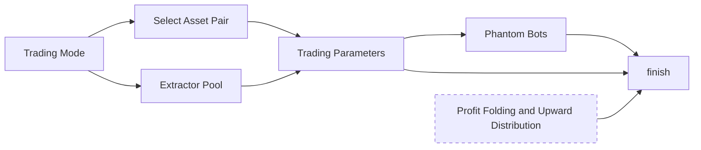

No page answers the folding page. The only branch that would is guarded behind
`is_grid()` at `src/gui/bot_wizard.py:1851`, and `is_grid()` returns `False`
always. The Qt-free wizard surface states the same in a named constant,
`UNREACHABLE_PAGES` at `src/gui/main_tabs/bot_wizard_surface.py:110`, and its
view model reports the folding page unreachable.

A second cut sits behind the first. `BotCreationWizard.get_bot_config` never
calls the folding page's `get_config`. A Scrumming bot collects 52 keys and
`profit_folding_active` is not among them, against the six keys that page's own
`get_config` returns.

### What a new bot opens at whatever is stored

| Driven | Reading |
| ------ | ------- |
| the group stored with `active` off, the wizard's box | on, the build figure |
| `profit_folding_active` among the keys the wizard collects | no |
| `profit_folding_active` on the new bot's config | on |
| the declared default on the bot config field | on |
| `profit_folding_active` carried when anything collects it | yes |

The carriage from the wizard to the bot is already built, so the field arrives
the moment the folding page is reached and collected. An existing bot is
untouched either way: it takes the flag from its own saved config at
`src/trading/container/restore.py:222`, which reads no application setting.

### The sentence this section leaves standing

`Profit Folding / Upward Distribution Active - Turns the whole page on.`

The box does not turn the page on. It carries no toggle connection and no enable
rule on either build, so the three groups below it stay live with the box clear.
The sentence stands as the specification and the page does not yet meet it.

### What waits on what

| The blocker | What it needs |
| ----------- | ------------- |
| the wizard's folding page is unreachable | a route to the page and a call to its `get_config` |
| the box does not turn the page on | an enable rule over the three groups below it, which are the other five rows |
| the Electron shell's wizard request carries no stored defaults | the request carrying the defaults bag the receiving surface reads |

Until the first of the three lands, a stored choice on this row has nowhere to
arrive, and the row is left as it stands.

## 2026-09-12 - Distribution Mode is off the Profit Folding page

The Profit Folding page carried one master checkbox and three groups of radio
buttons. The Distribution Mode group is removed. It offered two choices, `equal`
and `logarithmic`, stored the chosen word under the key `mode` inside the
`profit_folding` group, and read it back. Nothing outside the dialog read the
word.

Three files declared the row and every declaration is gone.

| File | What it declared |
| ---- | ---------------- |
| `src/core/settings.py` | `FoldDistributeMode`, and the `mode` field on `ProfitFoldingSettings` |
| `src/gui/settings_dialog.py` | `FOLD_MODE_BUTTONS`, the `QGroupBox` with its two `QRadioButton`s, and the `_stored_groups` row |
| `src/gui/main_tabs/settings_dialog_surface.py` | `MODE_GROUP_TITLE`, `EQUAL_MODE`, `LOG_MODE`, `FOLD_MODE_BUTTONS`, the `fold_equal` and `fold_log` specs, the `GROUPS` entry, the Profit Folding layout step, and the `_folding_rows` entry |

### The two spellings this row carried

The Settings dialog stored the word under `mode`. The bot wizard's own
Distribution Mode group writes the same word under `fold_mode`. The two names
addressed the same choice, and the dialog said so itself: the tuple holding this
row's two buttons was named `FOLD_MODE_BUTTONS` while the row it fed wrote `mode`.

| What matched | The Settings row | The wizard's group |
| ------------ | ---------------- | ------------------ |
| the group title | Distribution Mode | Distribution Mode |
| the two controls | `fold_equal`, `fold_log` | `fold_equal`, `fold_log` |
| the two stored words | `equal`, `logarithmic` | `equal`, `logarithmic` |
| the default | Equal checked at build | Equal checked at build |
| the key it wrote | `profit_folding.mode` | the bot config key `fold_mode` |

`fold_mode` stays in `_DEPRECATED_KWARGS` at
`src/trading/container/config.py:386`, so a `bot_state.json` still carrying it
restores without a `TypeError`. `_sanitize_deprecated_kwargs` drops it before
`BotConfig.__init__`, and `BotConfig` declares no field of that name. The
wizard's group is the only control left that writes it, and it sits on the
wizard page no route reaches.

Because `mode` never matched a strip-list name, the count at
[Settings > Trading](#settings--trading) stands as written: the Profit Folding
page contributes four of the eleven names, and this row was never one of them.

### Why no fold takes a distribution mode

The row offered a choice between two ways of spreading a fold across positions.
No code in the engine offers that choice. Every fold path was read for a mode
parameter and none takes one.

| Where | What it does |
| ----- | ------------ |
| `src/trading/scrumming_bot.py:767` `_apply_fold_target_growth` | drains fold surplus into one target balance; no positions, no spread |
| `src/trading/smart_wire.py:589` `distribute_fold_profit` | splits realised fold profit across wires to other bots by per-wire percent |
| `src/trading/scrumming/wire_routing.py:487` `_spread_wire_usd_over_fold_queue` | adds wire income evenly to every standing fold tranche; the even split is fixed and has no alternative |
| `src/trading/stack_math.py:304` `fold_ladder_prices` | places fold prices from `stack_spacing_mode` and decides no size |
| `src/trading/profit_fold.py:14` `apply_profit_fold` | grows one target balance; its own docstring records that no module imports it |

The one mode-like selector near folding refuses this row's value.
`SPACING_MODES` in `src/trading/stack_math.py:25` holds `quadratic`,
`fibonacci`, `linear` and `exponential`. `level_multipliers("logarithmic", 3)`
raises `ValueError`, while `level_multipliers("quadratic", 3)` returns
`[1.0, 4.0, 9.0]`.

The two choices belong to the retired Grid Bot. The earliest tracked copy of the
strip list names the block in its own words, as grid-legacy fields kept so a
stored bot does not crash on load, and
`src/trading/container/restore.py:183-184` records that the grid mode was
removed.

### A six-key group opening with five rows

`SettingsManager._apply_dict` copies the whole `profit_folding` dict off the
file, so a store written before the removal still carries its `mode` entry and
still opens. The page reads back the five keys it has rows for, and the next Save
writes the group without the sixth.

| | before the removal | after the removal |
| --- | --- | --- |
| control specs in the payload | 69 | 67 |
| control specs on the Profit Folding tab | 11 | 9 |
| groups declared on the surface | 13 | 12 |
| a Distribution Mode group is drawn | yes | no |
| rows the `profit_folding` group declares | 6 | 5 |
| keys a legacy store's group holds on opening | 6 | 6 |
| keys the group holds after one Save | 6 | 5 |
| keys and groups one Save wrote | 13 | 13 |
| `active` read back off a legacy store | `False` | `False` |
| `fold_target` | `most_recent_buy` | `most_recent_buy` |
| `fold_target_count` | `9` | `9` |
| `distribute_target` | `x_sell` | `x_sell` |
| `distribute_target_count` | `7` | `7` |
| `username` beside the group | `u16_driver` | `u16_driver` |
| `bot_visibility` beside the group | `internal` | `internal` |

Every sibling in the shared group reads back at its stored value, and Save
raised no warning box.

### The sentences the page keeps that no longer describe it

Each sentence below stands in an earlier section and no longer describes the
page. The earlier text stays where it is.

| Earlier sentence | What the page does now |
| ---------------- | ---------------------- |
| "One master checkbox and three groups of radio buttons, eleven controls in all." | One master checkbox and two groups of radio buttons, nine controls in all. |
| "Distribution Mode - Chooses whether a fold spreads evenly across the chosen positions or on a curve." and the key line, the two sentences and the code block under it | The page carries no Distribution Mode group, and no fold in the engine takes a distribution mode. |
| "\| Profit Folding \| 11 \| the whole group \| `active` alone \|" in [What each page persists](#what-each-page-persists) | Profit Folding, 9 controls, `_save` writes the whole group, `_load_current` restores the whole group. |
| "\| Profit Folding \| 11 \| the whole group \| the whole group \|" in [What each page restores now](#what-each-page-restores-now) | The same nine controls and five keys. |
| "\| Profit Folding \| Distribution Mode, Profit Folding Target, Fold to X# of buy positions, Upward Distribution Target, Distribute to X# of sell positions \|" in [The fourteen rows a Save overwrote](#the-fourteen-rows-a-save-overwrote) | Thirteen rows, four of them on this page. Distribution Mode is off the page. |

The master switch above this row gated five rows. It gates four now, and the
four are Profit Folding Target, Fold to X# of buy positions, Upward Distribution
Target and Distribute to X# of sell positions.

## 2026-09-12 - Profit Folding Target waits on its count row

The third row on the Profit Folding page offers three choices: fold to all buy
positions, to a counted number of them, or to the most recent. It stores the
chosen word under the key `fold_target` inside the `profit_folding` group and
reads it back. Nothing outside the dialog reads the word, and no fold in the
engine reaches a chosen set of buy positions. The row is therefore dead, and it
stays on the page until the count row beside it comes off with it.

### What the three buttons choose, and what reads the word

| Build | The controls |
| ----- | ------------ |
| React, the build that runs | `fold_all`, `fold_x` and `fold_recent`, three radio specs under `FOLD_GROUP_TITLE` in `src/gui/main_tabs/settings_dialog_surface.py` |
| Qt, preserved beside it | three `QRadioButton` inside `QGroupBox("Profit Folding Target")` in `src/gui/settings_dialog.py` |

Both write `profit_folding.fold_target` through one `_stored_groups` row, and
`FOLD_TARGET_BUTTONS` fixes the read order that decides the stored word.

The bare name `fold_target` was searched over the 1077 tracked files outside
`dist/` and `docs-archive/`. It returns 16 hits: three declare the row, five
belong to the bot wizard's own group, and eight are the strip list and this
manual quoting it. No site reads the word.

| Read shape | Sites |
| ---------- | ----: |
| `getattr(x, "fold_target", ...)` | 0 |
| `x["fold_target"]` | 0 |
| `sm.get_nested("profit_folding", "fold_target")` | 0 |
| `getattr(bot.config, "fold_target", ...)` | 0 |
| `cfg.fold_target` | 0 |

The same five shapes, spelled for the sibling key `profit_folding_active`, return
16 sites in the same files, so the zeros read the repository rather than a blind
search. `FoldTarget` in `src/core/settings.py` has two sites, both its own
declaration.

`fold_target` stays in `_DEPRECATED_KWARGS` at
`src/trading/container/config.py:387`, so a `bot_state.json` still carrying it
restores without a `TypeError`. `BotConfig` declares no field of that name, and
`_sanitize_deprecated_kwargs` drops the key before `BotConfig.__init__`. This is
where the row differs from [Profit Folding
Active](#2026-09-12---profit-folding-active-waits-on-the-wizards-folding-page):
`profit_folding_active` is a real `BotConfig` field, so that row has a
destination behind one cut route. `fold_target` has no field to land in, so
repairing the wizard's folding page would not give it one.

### Why no fold reaches a chosen set of buy positions

Every fold path was asked for its runtime signature. None takes a target of
positions or a count of them.

| Where | What it does |
| ----- | ------------ |
| `src/trading/profit_fold.py:14` `apply_profit_fold` | grows one dollar target balance; its `target` parameter is annotated `float`, and its own docstring records that no module imports it |
| `src/trading/scrumming_bot.py:767` `_apply_fold_target_growth` | drains fold surplus into one target balance; no positions, no set |
| `src/trading/smart_wire.py:589` `distribute_fold_profit` | splits realised fold profit across wires to other bots by per-wire percent |
| `src/trading/scrumming/wire_routing.py:487` `_spread_wire_usd_over_fold_queue` | adds wire income evenly to every standing fold tranche; the share is fixed at the dollars divided by the tranche count |
| `src/trading/scrumming/fold_tranches.py:51` `_fold_eligible_tranches` | picks the tranches a fold may reach by price alone |
| `src/trading/scrumming/fold_tranches.py:515` `_fold_discharge_order` | orders those tranches by `ref`, highest first |
| `src/trading/stack_math.py:304` `fold_ladder_prices` | places fold prices and decides no size; its `levels` counts prices on a ladder |

The two paths that do decide which tranches a fold reaches were driven over
three tranches at refs 120, 110 and 100. `_fold_discharge_order` returned them in
price order and not in `created_ts` order, so "most recent" is not even the order
the queue discharges in. `_fold_eligible_tranches` at 105 returned the two
tranches above that price and at 50 returned all three, so the set is price and
no count narrows it.

The even spread handed each of three tranches the same share, and the share is
the dollars divided by the tranche count. It is fed by wire income rather than by
a fold, and no second way of spreading exists.

The one selector near folding refuses this row's words. `SPACING_MODES` in
`src/trading/stack_math.py` holds `quadratic`, `fibonacci`, `linear` and
`exponential`. `level_multipliers("x_buy", 3)` raises `ValueError`, while
`level_multipliers("linear", 3)` returns `[1.0, 2.0, 3.0]`.

### The count that has no other referent

The count row beside this one, [Fold to X# of buy
positions](#settings--profit-folding), is not a setting in its own right. It is
the number one of these three choices uses, and four readings tie it to this row.

| What ties them | Measured |
| -------------- | -------- |
| the group | the spin `fold_x_count` carries the group title `Profit Folding Target`, which is this row's title |
| the layout | the Qt-free surface puts `fold_x` and `fold_x_count` in one row tuple, and the Qt tab puts them in one `QHBoxLayout` |
| the words | the spin's spec carries `label` `None` and no `text`. Every word beside it on screen belongs to the radio `fold_x` |
| the sentence | "Fold to X# of buy positions - Sets that counted number" points at this row's sentence for what "that" names |

Driven with this row's three radios taken out, the group titled `Profit Folding
Target` holds one control: a spin box named `fold_x_count`, with no label and no
text. Taking this row off alone would leave a numeric box with no words, under a
title describing a choice the page no longer offers.

The two rows are one decision, so one change takes both off together.

### A five-key group opening with the row gone

`SettingsManager._apply_dict` copies the whole `profit_folding` dict off the
file, so a store written before the row comes off still carries its `fold_target`
entry and still opens. The figures below come from driving
`SettingsDialogReact` on one store holding all five keys, with the row present
and then with the row taken out.

| | the row present | the row gone |
| --- | --- | --- |
| the dialog built | yes | yes |
| control specs in the payload | 67 | 64 |
| control specs on the Profit Folding tab | 9 | 6 |
| control specs in the Profit Folding Target group | 4 | 1 |
| a legacy store's five keys opened | yes | yes |
| keys the group holds after one Save | 5 | 4 |
| keys and groups one Save wrote | 13 | 13 |
| warning boxes raised | 0 | 0 |
| `active` read back off a legacy store | `False` | `False` |
| `fold_target_count` | `9` | `9` |
| `distribute_target` | `x_sell` | `x_sell` |
| `distribute_target_count` | `7` | `7` |

Every one of the four siblings in the shared group reads back at its stored
value, both before and after the Save, and the four read back again when the
store is reopened.

With the row present, all three stored words round-trip. Each opens the page on
its own button, each is read back as itself, and each survives a Save that
changed nothing.

| Stored `fold_target` | The radio ticked | The store after a Save with no edit |
| --- | --- | --- |
| `all_buy` | `fold_all` | `all_buy` |
| `x_buy` | `fold_x` | `x_buy` |
| `most_recent_buy` | `fold_recent` | `most_recent_buy` |

### The claim the page makes that the page does not keep

The sentence "Three radio buttons and the count box the middle one gates" stands
in an earlier section. No gate exists. Driven on `SettingsDialogReact`, the count
box stays able to take an edit with each of the three radios ticked in turn, and
the same reading returns a refusal when the box is deliberately disabled. The Qt
folding tab makes no `toggled` connection and calls no `setEnabled`, and the
Qt-free surface holds no enable rule for either name.

### The two sentences the engine no longer keeps

The sentence below stands in an earlier section and no longer describes the
engine. The earlier text stays where it is.

| Earlier sentence | What the engine does now |
| ---------------- | ------------------------ |
| "Profit Folding Target - Chooses which buy positions a fold reaches: all of them, a counted number of them, or the most recent." | No fold chooses a set of buy positions. A fold reaches the tranches whose reference price is above the market and discharges them in price order. |
| "Three radio buttons and the count box the middle one gates." | The count box is live with any of the three radios ticked. |

## 2026-09-12 - Fold to X# of buy positions takes the whole target group off the page

The Profit Folding page carried one master checkbox and two groups of radio
buttons. The `Profit Folding Target` group is removed, all four controls
together: the three radio buttons and the count box inside them. The group
offered a choice of which buy positions a fold reaches and a number for the
middle choice. No fold in the engine offers that choice, and no fold counts the
positions it reaches.

Three files declared the group and every declaration is gone.

| File | What it declared |
| ---- | ---------------- |
| `src/core/settings.py` | `FoldTarget`, and the `fold_target` and `fold_target_count` fields on `ProfitFoldingSettings` |
| `src/gui/settings_dialog.py` | `FOLD_TARGET_BUTTONS`, the `QGroupBox` with its three `QRadioButton`s and its `QSpinBox`, and the two `_stored_groups` rows |
| `src/gui/main_tabs/settings_dialog_surface.py` | `FOLD_GROUP_TITLE`, `FOLD_ALL`, `FOLD_X`, `FOLD_RECENT`, `FOLD_TARGET_BUTTONS`, the four control specs, the `GROUPS` entry, the Profit Folding layout step, and the two `_folding_rows` entries |

`FOLD_COUNT_DEFAULT` stays, because the sell-side count row reads it.

### The four controls the group held

| The control | What it stored |
| ----------- | -------------- |
| the radio `fold_all`, "Fold to ALL buy positions", checked at build | `profit_folding.fold_target` as `all_buy` |
| the radio `fold_x`, "Fold to X# of buy positions:" | the same key as `x_buy` |
| the radio `fold_recent`, "Fold to most recent buy positions" | the same key as `most_recent_buy` |
| the spin `fold_x_count`, 1 to 100, at 5, with no label and no text | `profit_folding.fold_target_count` |

The spin carried the group title of the three radios and shared one layout row
with `fold_x`. Every word beside it on screen belonged to that radio, so the
count had no words of its own and no meaning apart from the choice it sized.

### What the number was meant to count

The bare name `fold_target_count` appears at 11 sites across the 1077 tracked
files outside `dist/` and `docs-archive/`: three declared this row, two belong to
the bot wizard's own count, and six are the strip list and this manual quoting
it. Six read shapes were spelled for the name and each returned nothing.

| Read shape | Sites |
| ---------- | ----: |
| `getattr(x, "fold_target_count", ...)` | 0 |
| `getattr(bot.config, "fold_target_count", ...)` | 0 |
| `x["fold_target_count"]` | 0 |
| `get_nested(..., "fold_target_count")` | 0 |
| `get(..., "fold_target_count")` | 0 |
| `cfg.fold_target_count` | 0 |

The same six shapes, spelled for the sibling key `profit_folding_active`, return
17 sites over the same files, so the zeros read the repository rather than a
blind search.

`fold_target` and `fold_target_count` both stay in `_DEPRECATED_KWARGS` at
`src/trading/container/config.py:387-388`, so a `bot_state.json` still carrying
either restores without a `TypeError`. `BotConfig` declares neither name as a
field, and `_sanitize_deprecated_kwargs` drops both before `BotConfig.__init__`.

### One dollar cap bounds a fold, and no count does

`src/trading/scrumming/tick_phases.py:1494-1534` is the live fold-back route. It
asks `_fold_eligible_tranches` which queued tranches the market price reaches,
sorts them by `initial_buy_price`, then hands the sorted list and one dollar
figure to `_plan_fold_consumption` at
`src/trading/scrumming/fold_tranches.py:123`. That dollar figure is
`cycle_growth_cap_usd` less what the cycle has already consumed.

Driven over five queued tranches at refs 150 down to 110, on a bot config
carrying `fold_target_count = 2`:

| What was asked | Tranches the fold reached |
| -------------- | ------------------------: |
| a cap of $1000 | 5 of 5 |
| a cap of $25 | 3 of 5, one of them part-consumed |
| a cap of $0 | 0 of 5 |

The stored count of 2 narrowed nothing. The two tighter caps show the reading can
report a narrowed plan, so the unnarrowed plan at $1000 is a reading.

`_fold_eligible_tranches` narrows by price alone: at a market price of 100 it
returned all five, and at 135 it returned the two tranches above that price.
`_fold_discharge_order` returned the five in `ref` order, highest first. The same
five rows in `created_ts` order, newest first, are the reverse of that, so "most
recent" is not the order the queue discharges in.

`_spread_wire_usd_over_fold_queue` handed each of the five the same $10 share out
of $50. The share is the dollars divided by the tranche count, it is fed by wire
income rather than by a fold, and it reaches every standing tranche.

`fold_ladder_prices` at `src/trading/stack_math.py:304` takes `levels`, which
counts prices on a ladder. `fold_ladder_prices(100.0, 4)` returned four prices
and decided no size and no position.

### Nine calls that refused a counted fold

Each live fold path was asked for a count or a target by keyword.

| The call | What it did |
| -------- | ----------- |
| `_plan_fold_consumption(eligible, cap, count=2)` | `TypeError`, unexpected keyword argument |
| `_plan_fold_consumption(eligible, cap, fold_target_count=2)` | `TypeError`, unexpected keyword argument |
| `_fold_eligible_tranches(100.0, 1.0, count=2)` | `TypeError`, unexpected keyword argument |
| `_fold_eligible_tranches(100.0, 1.0, fold_target='x_buy')` | `TypeError`, unexpected keyword argument |
| `_fold_discharge_order(count=2)` | `TypeError`, unexpected keyword argument |
| `_fold_discharge_order(most_recent_first=True)` | `TypeError`, unexpected keyword argument |
| `_spread_wire_usd_over_fold_queue(30.0, [], count=2)` | `TypeError`, unexpected keyword argument |
| `apply_profit_fold(..., fold_target_count=2)` | `TypeError`, unexpected keyword argument |
| `apply_profit_fold(..., target='x_buy')` | `TypeError`, a word compared against a number |

The `target` parameter of `apply_profit_fold` is a dollar balance, not one of
this group's three words, and `src/trading/profit_fold.py` records in its own
module docstring that no module imports it.

### A five-key store opening on three rows

`SettingsManager._apply_dict` copies the whole `profit_folding` dict off the
file, so a store written before the removal still carries its `fold_target` and
`fold_target_count` entries and still opens. The page reads back the three keys
it has rows for, and the next Save writes the group without the other two.

| | before the removal | after the removal |
| --- | --- | --- |
| the dialog built | yes | yes |
| control specs in the payload | 67 | 63 |
| control specs on the Profit Folding tab | 9 | 5 |
| control specs in the `Profit Folding Target` group | 4 | 0 |
| a `Profit Folding Target` group is drawn | yes | no |
| an `Upward Distribution Target` group is drawn | yes | yes |
| groups declared on the surface | 12 | 11 |
| rows the `profit_folding` group declares | 5 | 3 |
| `ProfitFoldingSettings` fields | 5 | 3 |
| keys a legacy store's group holds on opening | 5 | 5 |
| keys the group holds after one Save | 5 | 3 |
| warning boxes raised | 0 | 0 |
| `active` read back off a legacy store | `False` | `False` |
| `distribute_target` | `x_sell` | `x_sell` |
| `distribute_target_count` | `7` | `7` |
| `username` beside the group | `u18_driver` | `u18_driver` |
| `bot_visibility` beside the group | `internal` | `internal` |

Every one of the three remaining siblings reads back at its stored value and
survives a Save that changed nothing. No holder named `_fold_all`, `_fold_x`,
`_fold_x_count` or `_fold_recent` exists on the dialog any more, while
`_dist_x_count` still does.

### The sentences both rows leave behind

Each sentence below stands in an earlier section and no longer describes the
page. The earlier text stays where it is.

| Earlier sentence | What the page does now |
| ---------------- | ---------------------- |
| "One master checkbox and three groups of radio buttons, eleven controls in all." | One master checkbox and one group of radio buttons, five controls in all. |
| "Profit Folding Target - Chooses which buy positions a fold reaches", the two sentences and the code block under it | The page carries no `Profit Folding Target` group. |
| "Three radio buttons and the count box the middle one gates." | Neither the radios nor the count box exists, so nothing is left to gate. |
| "Fold to X# of buy positions - Sets that counted number. Key `fold_target_count`, 1 to 100, at 5." | The page sets no count, and one dollar cap bounds how many tranches a fold reaches. |
| "Save collapses the two target groups into one dictionary." | Save collapses one target group, the sell side. |
| "Four of the six keys then fail a second time further down: the two target names and their two counts are four of the eleven the bot factory strips." | Two of the three keys the page still stores are on the strip list: `distribute_target` and `distribute_target_count`. |
| "\| Profit Folding \| 11 \| the whole group \| the whole group \|" in [What each page restores now](#what-each-page-restores-now) | Five controls, and three keys in the group. |
| "\| Profit Folding \| Distribution Mode, Profit Folding Target, Fold to X# of buy positions, Upward Distribution Target, Distribute to X# of sell positions \|" | Two rows on this page, Upward Distribution Target and Distribute to X# of sell positions. |

The master switch above the removed group gated four rows. It gates two now, and
the two are Upward Distribution Target and Distribute to X# of sell positions.

## 2026-09-12 - Upward Distribution Target takes the sell-side group off the page

The Profit Folding page carried one master checkbox and one group of radio buttons.
The `Upward Distribution Target` group is removed, all four controls together: the
three radio buttons and the count box inside them. The group offered a choice of
which sell positions a distribution reaches and a number for the middle choice. No
distribution in the engine offers that choice, and no distribution counts the
positions it reaches.

Three files declared the group and every declaration is gone.

| File | What it declared |
| ---- | ---------------- |
| `src/core/settings.py` | `DistributeTarget`, and the `distribute_target` and `distribute_target_count` fields on `ProfitFoldingSettings` |
| `src/gui/settings_dialog.py` | `DIST_TARGET_BUTTONS`, the `QGroupBox` with its three `QRadioButton`s and its `QSpinBox`, the `QRadioButton` import, the two `_stored_groups` rows, and `_picked` with `_show_picked` |
| `src/gui/main_tabs/settings_dialog_surface.py` | `DIST_GROUP_TITLE`, `DIST_ALL`, `DIST_X`, `DIST_RECENT`, `DIST_TARGET_BUTTONS`, `FOLD_COUNT_DEFAULT`, the four control specs, the `GROUPS` entry, the Profit Folding layout step, the two `_folding_rows` entries, and `_picked` with `_show_picked` |

`_picked` and `_show_picked` held one caller each in each file, the
`distribute_target` row, so both pairs go with it.

### The group's four controls on the sell side

| The control | What it stored |
| ----------- | -------------- |
| the radio `dist_all`, "Distribute to ALL sell positions", checked at build | `profit_folding.distribute_target` as `all_sell` |
| the radio `dist_x`, "Distribute to X# of sell positions:" | the same key as `x_sell` |
| the radio `dist_recent`, "Distribute to most recent sell positions" | the same key as `most_recent_sell` |
| the spin `dist_x_count`, 1 to 100, at 5, with no label and no text | `profit_folding.distribute_target_count` |

The spin carried the group title of the three radios and shared one layout row with
`dist_x`. Every word beside it on screen belonged to that radio, so the count had no
words of its own and no meaning apart from the choice it sized. The two rows are one
decision, so one change takes both off together.

### What the three sell-side words chose

The bare name `distribute_target` appeared at 16 sites across the 1077 tracked files
outside `dist/` and `docs-archive/`, and `distribute_target_count` at 13. Three of
each declared these rows, five of the first and three of the second belong to the bot
wizard's own copy, one of each is the strip list, and the rest are this manual quoting
the keys. Six read shapes were spelled for each name and every one returned nothing.

| Read shape | Sites |
| ---------- | ----: |
| `getattr(x, "distribute_target", ...)` | 0 |
| `getattr(bot.config, "distribute_target", ...)` | 0 |
| `x["distribute_target"]` | 0 |
| `get_nested(..., "distribute_target")` | 0 |
| `get(..., "distribute_target")` | 0 |
| `cfg.distribute_target` | 0 |

The same six shapes, spelled for the sibling key `profit_folding_active`, return 17
sites over the same files, so the zeros read the repository rather than a blind
search. A planted file spelling all six shapes for `distribute_target` grew every one
of the six counts.

`distribute_target` and `distribute_target_count` both stay in `_DEPRECATED_KWARGS` at
`src/trading/container/config.py:390-391`, so a `bot_state.json` still carrying either
restores without a `TypeError`. `BotConfig` declares neither name as a field, and
`_sanitize_deprecated_kwargs` drops both before `BotConfig.__init__`. A
`make_bot_config` call asking for all four of `distribute_target`,
`distribute_target_count`, `profit_folding_active` and `scrum_fold_pct` kept the last
two and built a config carrying neither removed name.

### One accumulator bounds a distribution, and no count does

`src/trading/scrumming/tick_phases.py:1919` `_tick_distribute` is the live route, and
`src/trading/scrumming_bot.py:4222` calls it. It sells `_dist_accumulator` units of the
asset, takes the lesser of that figure and the venue balance, then walks `_main_lots`
sorted by `initial_buy_price` and opens one fold tranche per lot it consumes.

Driven over five held lots, on a config carrying `distribute_target = 'x_sell'` and
`distribute_target_count = 2`:

| What was asked | Lots the distribution reached |
| -------------- | ----------------------------: |
| an accumulator of 5.0 units | 5 of 5 |
| an accumulator of 2.5 units | 2 of 5 |
| an accumulator of 1.0 units | 1 of 5 |
| an accumulator of 0.0 units | 0 of 5, and no sell placed |

The stored count of 2 narrowed nothing. The three smaller accumulators show the
reading can report a narrowed walk, so the unnarrowed walk at 5.0 units is a reading.
The venue balance is the only other bound: at a balance of 2.0 units against an
accumulator of 5.0 the sell was 2.0 units and the walk reached 2 of 5.

The five lots were built with buy-price order and age order deliberately opposite. The
walk consumed `['p150_oldest', 'p140']`, which is buy price highest first, and the
newest-first order is the exact reverse of it. "Most recent" is not the order a
distribution takes.

One DIST sell leaves one tranche behind. `_bound_new_fold_tranches` merges the slice
the build loop appended back to a single record, so the number of positions a
distribution opens is 1 at an accumulator of 5.0 units and 1 at 3.0.

### Nine sell-side calls that refused a count

Each sell-side path was asked for a count or a target by keyword.

| The call | What it did |
| -------- | ----------- |
| `_tick_distribute(..., count=2)` | `TypeError`, unexpected keyword argument |
| `_tick_distribute(..., distribute_target='x_sell')` | `TypeError`, unexpected keyword argument |
| `_tick_distribute(..., distribute_target_count=2)` | `TypeError`, unexpected keyword argument |
| `_execute_sell(1.0, 200.0, None, count=2)` | `TypeError`, unexpected keyword argument |
| `_settled_sale_proceeds(1.0, 200.0, label='DIST', count=2)` | `TypeError`, unexpected keyword argument |
| `_bound_new_fold_tranches(0, count=2)` | `TypeError`, unexpected keyword argument |
| `_apply_scrum_fold_pct(0, 100.0, 1.0, distribute_target='x_sell')` | `TypeError`, unexpected keyword argument |
| `scrum_ladder_prices(100.0, 'x_sell')` | `ValueError`, levels must be an int |
| `split_scrum_into_tranches(..., spacing_mode='most_recent_sell')` | `ValueError`, unknown spacing_mode |

`scrum_ladder_prices(100.0, 3)` returned `[101.0, 104.0, 109.0]`, three prices on an
upward ladder, and decided no position and no set. `SPACING_MODES` in
`src/trading/stack_math.py` holds `quadratic`, `fibonacci`, `linear` and
`exponential`, and none of this group's three words.

### The count default that kept the constant alive

`FOLD_COUNT_DEFAULT` at `src/gui/main_tabs/settings_dialog_surface.py` had exactly one
reader, the `distribute_target_count` row. That row is gone, so the constant goes with
it. The bare name fell from 3 sites to 1, and the one left is this manual.

| Name | Sites before | Sites after |
| ---- | -----------: | ----------: |
| `distribute_target` | 16 | 13 |
| `distribute_target_count` | 13 | 10 |
| `DistributeTarget` | 2 | 0 |
| `DIST_TARGET_BUTTONS` | 6 | 0 |
| `DIST_GROUP_TITLE` | 7 | 0 |
| `FOLD_COUNT_DEFAULT` | 3 | 1 |
| `dist_x_count` | 8 | 4 |

Every site still standing is either this manual or the bot wizard's own copy of the
same three words, which carries its own controls and its own count of 1 to 50.

### A six-key store opening on one row

`SettingsManager._apply_dict` copies the whole `profit_folding` dict off the file, so a
store written before the removal still carries all six keys the group ever held and
still opens. The page reads back the one key it has a row for, and the next Save writes
the group without the other five.

| | before the removal | after the removal |
| --- | --- | --- |
| the dialog built | yes | yes |
| control specs in the payload | 63 | 59 |
| control specs on the Profit Folding tab | 5 | 1 |
| control specs in the `Upward Distribution Target` group | 4 | 0 |
| an `Upward Distribution Target` group is drawn | yes | no |
| groups declared on the surface | 11 | 10 |
| rows the `profit_folding` group declares | 3 | 1 |
| `ProfitFoldingSettings` fields | 3 | 1 |
| keys a legacy store's group holds on opening | 6 | 6 |
| keys the group holds after one Save | 3 | 1 |
| warning boxes raised | 0 | 0 |
| `active` read back off a legacy store | `False` | `False` |
| `username` beside the group | `u19_driver` | `u19_driver` |
| `bot_visibility` beside the group | `internal` | `internal` |
| the Qt dialog built on a legacy store | yes | yes |
| a `_dist_x_count` holder on the Qt dialog | yes | no |

`active` is the one remaining sibling and it reads back at its stored value on every
run, before and after, and survives a Save that changed nothing. The three rows the
dialog keeps beside the group, `username`, `bot_visibility` and the stored group
itself, all read back unchanged.

With the group present, all three stored words round-tripped. Each opened the page on
its own button, each was read back as itself, and each survived a Save that changed
nothing.

| Stored `distribute_target` | The radio ticked | The store after a Save with no edit |
| --- | --- | --- |
| `all_sell` | `dist_all` | `all_sell` |
| `x_sell` | `dist_x` | `x_sell` |
| `most_recent_sell` | `dist_recent` | `most_recent_sell` |

### What the Profit Folding page holds now

One checkbox, `Profit Folding / Upward Distribution Active`, and nothing else. It is
the page's only control and the only `profit_folding` key the dialog stores. The
Settings dialog draws no radio button on any tab any more: the three removed here were
the last three `RADIO` control specs on the surface.

### The sentences the sell side leaves behind

Each sentence below stands in an earlier section and no longer describes the page. The
earlier text stays where it is.

| Earlier sentence | What the page does now |
| ---------------- | ---------------------- |
| "Upward Distribution Target - The same three choices on the sell side. Key `distribute_target`, at all sell positions." | The page carries no `Upward Distribution Target` group. |
| "The sell-side group is built the same way as the buy-side group above, with its own count box at 5 and its own all-sell button checked at build." | Neither group exists. |
| "Distribute to X# of sell positions - Sets the sell-side count. Key `distribute_target_count`, 1 to 100, at 5." | The page sets no count, and the accumulated asset bounds how many lots a distribution reaches. |
| "Save collapses the two target groups into one dictionary." | Save collapses no target group. It writes one key, `active`. |
| "Save collapses one target group, the sell side." | Save collapses none. |
| "Two of the three keys the page still stores are on the strip list: `distribute_target` and `distribute_target_count`." | The page stores one key and it is not on the strip list. |
| "`FOLD_COUNT_DEFAULT` stays, because the sell-side count row reads it." | The sell-side count row is gone and so is the constant. |
| "The master switch above the removed group gated four rows. It gates two now, and the two are Upward Distribution Target and Distribute to X# of sell positions." | The master switch gates no row. |
| "One master checkbox and three groups of radio buttons, eleven controls in all." | One master checkbox, one control in all. |

The master switch is the last row on the page, and its own verdict was that it waits on
the wizard's folding page. Nothing on this page gates anything now.

## 2026-09-12 - The phantom master box becomes a new bot's phantom default

The Phantom Bots page's master checkbox now stores a boolean and the bot creation
wizard's own phantom box opens on it. Driven on the React build, which is what
the running application draws. The home was redirected into a scratch directory
before the settings module was imported, so the settings directory and the log
root bound under that directory. No stored setting of the running install was
read and no venue was contacted.

### The Settings master box and the wizard's phantom box

| | The Settings row | The wizard box |
| --- | --- | --- |
| Where, Qt | `src/gui/settings_dialog.py:521-525` | `src/gui/bot_wizard.py:1671-1674` |
| Where, React | `src/gui/main_tabs/settings_dialog_surface.py:625-633` | `src/gui/main_tabs/bot_wizard_surface.py:1721-1735` |
| Text | Enable Phantom Bots for Scrumming | Enable Phantom Bots |
| Choices | on, off | on, off |
| Opens at | on | the stored default, off when no bag arrives |
| What it writes | the store key `default_enable_phantoms` | the config key `enable_phantoms` |

The two agree on meaning and on both choices. They disagree on the name, and the
names are kept apart on purpose.

### The two phantom names that share a word

The page's own name and a bot's own name are two settings, not one. The store
accepts the first and refuses the second, driven:

```
store accepts key default_enable_phantoms
store refuses key enable_phantoms   -> KeyError 'Unknown setting: enable_phantoms'
store refuses key phantoms_enabled  -> KeyError 'Unknown setting: phantoms_enabled'
```

| Set | Occurrences in `src` | What they are |
| --- | ----: | ------------- |
| the application setting | 6 | the `AppSettings` field, the Qt dialog's row, the same row on the Qt-free surface, the two wizard lookups |
| a bot's own config field | 27 | the constructor argument, the restore read, the bot's own flag, the live toggle, the wizard write and the live settings box |
| a bot's own saved record | 10 | the key the container writes per bot and the restore path reads back |

Counted with `git grep -ow` over the 1081 files the index reports. Three files
hold a name from both sets and each is a crossing point: the store's declaration
names the bot key in its comment, and the two wizard files write the bot key from
the application default.

### Every reader of the stored phantom default

Five sites name the application key. Two of them read it outside the Settings
dialog.

| Site | What it does with the default |
| ---- | ---------------------------- |
| `src/core/settings.py:163` | declares `default_enable_phantoms: bool = True` |
| `src/gui/settings_dialog.py:1111-1114` | the Qt row, read on Save and written on load |
| `src/gui/main_tabs/settings_dialog_surface.py:476` | the same row on the Qt-free surface |
| `src/gui/bot_wizard.py:1672-1674` | the Qt wizard's phantom box opens here |
| `src/gui/main_tabs/bot_wizard_surface.py:1721-1735` | the Qt-free wizard's box opens here |

Before this section there was no reader at all, and no store key to read. The
dialog saved 14 groups and none of them carried the box; it saves 15 now.

### Where the stored default reaches a phantom bot

```mermaid
flowchart LR
  A["Settings row<br/>default_enable_phantoms"] --> B["SettingsManager<br/>settings.toml"]
  B --> C["main_window._create_bot<br/>get_all()"]
  C --> D["bot_wizard.py:1673<br/>Enable Phantom Bots"]
  D --> E["PhantomConfigPage.get_config<br/>enable_phantoms"]
  E --> F["main_window.py:3369<br/>ScrummingBot(enable_phantoms=)"]
  F --> G["scrumming_bot.py:402<br/>_phantoms_enabled"]
  G --> H["tick_phases.py:390<br/>create_phantom_set"]
  H --> I["main_window.py:1178<br/>the Comp field"]
```

The constructor argument at `src/trading/scrumming_bot.py:402` is where the flag
stops being this setting. From there the bot owns it, and the Comp field on the
TA Indicator Voter Panel is the last reader. That field already refuses a phantom
timeframe at or below the parent's own rank, at `src/gui/main_window.py:1196`, so
the higher-timeframe rule is not new here.

### The round trip on both phantom choices

| Stored | React box on reopen | React wizard box | Qt box on reopen | Qt wizard box | The config a new bot reads |
| ------ | ------------------- | ---------------- | ---------------- | ------------- | -------------------------- |
| off | off | off | off | off | off |
| on | on | on | on | on | on |

Two different stored flags gave two different readings on every column, so the
reading discriminates. Driven before the change with the box ticked, both wizards
answered off, which is the reading this section repairs.

### What a new bot opens with, and what a restored bot keeps

Driven through the real restore path with the application default set on.

| The saved record | What the restored bot holds |
| ---------------- | --------------------------- |
| its own flag off | off |
| its own flag on | on |
| no flag at all | on, which is the constructor's own default |

A restored bot reads its own saved record at
`src/trading/container/restore.py:361` and reads no application setting. A record
holding off stayed off while the store held on, so the application default cannot
reach a bot already on disk.

### The sentences this wiring leaves standing

| Earlier sentence | What the code does now |
| ---------------- | ---------------------- |
| "This is the only control on the page that starts on. Save never reads it, so the page stores nothing under the name it shows." | It still opens on. Save reads it and stores it under `default_enable_phantoms`, so the name on screen and the name in the store differ. |
| "These three controls carry the same gap the TA Indicators page carries. Save reads none of them, the load path restores none, and the schema refuses a key it does not declare rather than storing it somewhere unread." | Save reads the master box and the load path restores it. The other two controls on the page still carry the gap. |
| "Enable Phantom Bots for Scrumming - Turns the phantom overrides on for a new bot." | Unchanged, and true for the first time: the wizard's own box opens on this row. |

### The wizard request this wiring still waits on

The Electron shell's wizard request carries no stored defaults, so the Qt-free
wizard opens its box at the build figure whatever the store holds.

| Absence | What was measured |
| ------- | ----------------- |
| the shell's wizard request carries no stored defaults | `src/gui/web/bot_wizard.js` names `defaults` no times, and `src/gui/main_tabs/bot_wizard_surface.py:2823` reads it out of the request. The lookup added here fires on any call that carries a bag, and the shipped call carries none |
| the bridge hands the request through unchanged | `src/core/desktop_bridge.py:284` maps the wizard method straight to the surface, so nothing on the way in adds the stored settings |

This absence is shared with every other stored default the wizard opens on, so it
belongs to the wizard request rather than to this row.

### Rows 34 and 35 stay for their own units

| Row | Why it did not come with this one |
| --- | -------------------------------- |
| 34, Default Phantom Timeframes | Its eleven boxes are not a declared control on either surface, so the one list that carries Save and load cannot hold them. The rule for this group turns eleven boxes into one selection above the parent's own timeframe, which is a change of control, not a change of wiring |
| 35, Lock duration (candles) | It is a declared control and would persist through the same one line, but its destination is the wizard's own lock box, which is a second lookup this row does not make |

Measured on the page's declared controls: the Phantom tab carries two of them,
the master box and the lock spin box, and the timeframe grid is neither.

## 2026-09-12 - The timeframe grid becomes one phantom selection

The Phantom Bots page's eleven tick boxes are now one drop-down, the page stores
the name it shows, and the bot creation wizard opens its own phantom box on that
name. A name at or below the bot's own TA Timeframe, or one the venue does not
offer, is refused on the wizard page rather than dropped in silence. Driven on
the Qt dialog, the React host dialog and the shared surface. The home was
redirected into a scratch directory before the settings module was imported, so
the settings directory and the log root bound under that directory. No stored
setting of the running install was read and no venue was contacted.

### What the page offered before and what it offers now

| | Before | Now |
| --- | --- | --- |
| Control | eleven tick boxes in one row | one drop-down |
| Choices | eleven, five ticked at build | eleven, one selected at build |
| Opens at | 5m, 15m, 1h, 4h and 1d | 1d |
| Declared as a control | no | yes, `phantom_timeframe` |
| In the list that carries Save and load | no | yes |
| Store key | none, the store refused four candidate names | `default_phantom_timeframe` |

### The selection round-tripping through the store

Driven on the shared surface and on both dialog hosts against one scratch store.

```
he picks               : 12h
save reported          : {'saved': 16, 'failed': [], 'closed': True}
store fields changed   : ['default_phantom_timeframe', 'ta_indicator_weights']
stored value           : '12h'
read back off disk     : '12h'
a fresh dialog shows   : 12h
pressing Save again keeps it: '12h'
```

The same run before the change reported one changed field, the indicator weight
bag, and the store refused every candidate name for this row.

```
refuses phantom_timeframes         -> KeyError 'Unknown setting: phantom_timeframes'
refuses default_phantom_timeframes -> KeyError 'Unknown setting: default_phantom_timeframes'
refuses default_phantom_timeframe  -> KeyError 'Unknown setting: default_phantom_timeframe'
refuses phantom_timeframe          -> KeyError 'Unknown setting: phantom_timeframe'
```

### Why the daily chart is the opening choice

A phantom must sit above the bot's own TA Timeframe, and the wizard's timeframe
drop-down opens on the hourly chart. Of the five entries above it, only one is
offered by every venue the application knows.

| Timeframe | Above the hourly chart | Offered by coinbase | Offered by kraken |
| --- | --- | --- | --- |
| 2h | yes | yes | no |
| 4h | yes | no | yes |
| 6h | yes | yes | no |
| 12h | yes | no | no |
| 1d | yes | yes | yes |
| 1w | yes | no | yes |

Measured against the venue lists the application holds.

```
  coinbase: offers ['1m', '5m', '15m', '30m', '1h', '2h', '6h', '1d']
    kraken: offers ['1m', '5m', '15m', '30m', '1h', '4h', '1d', '1w']
   binance: offers ['1m', '5m', '15m', '30m', '1h', '2h', '4h', '6h', '12h', '1d', '1w']
```

The store declares the opening choice and the page reads it from there, so the
schema and the screen cannot drift apart.

`src/core/settings.py` — the one declaration of the opening choice

```python
# The one phantom timeframe a new bot starts with. 1d is the only entry
# above the wizard's 1h ta_timeframe default that every venue offers;
# coinbase has no 4h, 12h or 1w, and kraken no 2h or 6h.
default_phantom_timeframe: str = "1d"
```

### Where the stored selection reaches a phantom bot

```mermaid
graph LR
  A["Settings row<br/>default_phantom_timeframe"] --> B["SettingsManager<br/>settings.toml"]
  B --> C["main_window.py:3201<br/>settings.get_all"]
  C --> D["bot_wizard.py<br/>set_parent_timeframe"]
  D --> E["PhantomConfigPage.get_config<br/>phantom_timeframes"]
  E --> F["main_window.py:3370<br/>ScrummingBot(phantom_timeframes=)"]
  F --> G["tick_phases.py:390<br/>create_phantom_set"]
  G --> H["main_window.py:1178<br/>the Comp field"]
```

The Comp field rank-weights the parent's Net with every phantom summary above
the parent's own rank, and skips the rest at `src/gui/main_window.py:1198`. One
selection above the parent means one phantom reaches that field and none is
skipped.

### The refusal the wizard page shows

Both refusal reasons were driven on the shared surface and on the Qt page.

```
stored  1d parent  1h -> selection ['1d'] refusal ''
stored  4h parent  1h -> selection []     refusal 'phantom_not_offered'
    the box says: Timeframe 4h: REFUSED, coinbase does not offer it
stored  5m parent  1h -> selection []     refusal 'phantom_not_higher'
    the box says: Timeframe 5m: REFUSED, a phantom must sit above the bot's own TA Timeframe of 1h
stored  1d parent  1d -> selection []     refusal 'phantom_not_higher'
    the box says: Timeframe 1d: REFUSED, a phantom must sit above the bot's own TA Timeframe of 1d
```

A box the operator has already ticked keeps his choice, so the stored name seeds
a page he has not touched and never overwrites a page he has.

### What a bot already on disk does

A running bot's phantom set never came from this page and still does not.

| Read | What it answers |
| --- | --- |
| `src/trading/bot_container.py:601` | writes the enable flag into the bot's record and writes no timeframe list |
| `src/trading/container/restore.py:363-366` | builds the bot without a timeframe argument |
| `src/trading/scrumming_bot.py:377` | the bot therefore takes its class default |

Driven on a bot built the restore way, before and after this change, against a
parent on the hourly chart.

```
built the restore way      : ['5m', '15m', '30m', '1h', '1d']
class default              : ['5m', '15m', '30m', '1h', '4h', '1d']
survives the Comp skip     : ['1d']
silently skipped           : ['5m', '15m', '30m', '1h']
```

Identical on both sides of the change. Four of the five a restored bot runs sit
at or below the hourly parent and never reach the Comp field, and the sixth is
dropped because coinbase has no four-hour chart. That belongs to row 131, which
owns a bot's own phantom selection.

### The sentences this change leaves standing

| Earlier sentence | What the code does now |
| ---------------- | ---------------------- |
| "Default Phantom Timeframes - Chooses which charts a phantom watches." | One chart, not several. The name it shows is the chart the one phantom watches. |
| "Per-bot key `phantom_timeframes`, eleven boxes, five of them checked at build." | Eleven names in one drop-down, one selected at build, and the page's own store key is `default_phantom_timeframe`. |
| "One box per timeframe in a single row. The build decides which five open checked, and those five are the ones the figure shows." | One drop-down in that row. The figure shows the eleven boxes the page no longer draws. |
| "These three controls carry the same gap the TA Indicators page carries. Save reads none of them, the load path restores none." | Save reads two of the three and the load path restores both. The lock spin box still carries the gap. |
| "The one spin box on the page, inside its own group. It opens at 2 and Save reads it no more than it reads the other two." | It still opens at 2 and Save still does not read it. The other two are now read. |

### What this row still waits on

| Absence | What was measured |
| ------- | ----------------- |
| the wizard still draws eleven boxes | `src/gui/bot_wizard.py:1679-1699` builds eleven tick boxes, so the operator can still tick several. One selection is seeded and not enforced there; the wizard's own control belongs to the bot's phantom rows |
| the figure on this page shows the old grid | `p39-i0.png` was captured from the eleven boxes and has not been retaken |
| the rank order is written twice | `src/trading/phantom_balance.py:29-41` and `src/gui/main_tabs/bot_wizard_surface.py:521-533` hold the same eleven names in the same order, and the Qt-free surface takes no import, so nothing reconciles them. Measured identical today |

## 2026-09-12 - Every retired setting name says what it is

Eight settings came off these pages, and their names did not all leave the
tree with them. A name sitting in a comment with no explanation reads as a
setting, so each one that stays now says what it is.

### Where the retired names still sit

Counted over the git index, matches rather than lines, in both the code
spelling and the words the page shows.

| the name | matches | where they are |
| --- | --- | --- |
| `position_distance_pct` | 9 | this page 8, the strip list 1 |
| `increment_style` | 21 | this page 15, the bot config 2, the restore path 1, a debug report 1 |
| `default_position_count` | 9 | this page only |
| `position_count` | 19 | this page 14, the strip list 1, a creation log line 1, a census note 1, a stock helper 2 |
| `fold_mode` | 10 | this page 4, the two wizard files 5, the strip list 1 |
| `fold_target` | 31 | this page 24, the two wizard files 5, the strip list 1 |
| `fold_target_count` | 23 | this page 20, the two wizard files 2, the strip list 1 |
| `distribute_target` | 34 | this page 27, the two wizard files 5, the strip list 1 |
| `distribute_target_count` | 21 | this page 18, the two wizard files 2, the strip list 1 |
| `profit_fold_pct` | 3 | this page 1, a wizard docstring 1, the strip list 1 |
| `upward_distribution` | 1 | a wizard docstring, and nowhere else |

The settings store and both settings dialog modules hold none of them. Thirteen
camelCase spellings were searched beside the snake_case ones and all read zero,
so no shipped JavaScript names a retired setting.

### What emptying the strip list does

A record shaped like `bot_state.json` was built carrying thirty config keys, of
which eleven are the retired names, and driven through all three build routes
with the strip list as shipped and then emptied.

```
the list as shipped, 11 names
  make_bot_config(**stored)             OK  symbol='A15/USD'
  bot_config_kwargs then make_bot_config OK  kwargs=18 retired leaked=0
  restore_bots_from_state               OK  restored=1 skips=0

the list emptied
  make_bot_config(**stored)             TypeError: unexpected keyword
                                        argument 'bulk_trading'
  bot_config_kwargs then make_bot_config OK  kwargs=18 retired leaked=0
  restore_bots_from_state               OK  restored=1 skips=0
```

Dropping the eleven one at a time raises that error naming each key in turn,
eleven times out of eleven, so every entry is load-bearing on that route. The
launch restore names each kwarg it wants one at a time rather than passing the
stored config whole, so the restore arm does not move. A retired key that did
reach the factory is caught at `src/trading/container/restore.py:322`, which
skips the bot and leaves its record on disk.

### What the declaration says now

The eleven entries stay. The comment above them states why.

`src/trading/container/config.py` — the strip list, with its own description

```python
#: A retirement record, not a setting set. Each name is a setting removed from
#: the product, kept so a config stored before its removal still builds;
#: `_sanitize_deprecated_kwargs` drops each before `BotConfig.__init__`.
#: Add no name. Only `bulk_trading` is read, by `bot_config_kwargs`.
```

### The names taken out, and the ones left standing

| occurrence | what happened to it |
| --- | --- |
| the parameter page's `get_config` docstring | removed. It listed four retired keys the method does not emit, and carried two version names. `upward_distribution` had no other occurrence in the tree and now has none |
| the restore path's Grid-legacy comment | it read "nothing here reads them" above three lines that read three of them. It now states what the hand-written kwarg list does |
| the stack-mode fallback comment | it named no key. It now names `bulk_trading` |
| the eleven strip-list entries | kept, for the measured reason above |
| the two wizard files' folding groups | kept. The wizard's folding page is unreachable, and the rows that own those files are still open |
| the creation log line's `position_count` read | kept. It is the row that owns the line that always prints zero |
| the handoff files, the archive chronicle, the census note, the debug report | kept. Each is a dated record of an earlier state, not a description of a control |

## 2026-09-12 - The Logging page comes off the Settings dialog

The Logging page carried two checkboxes and four periodicity boxes. All six are
removed, and the tab goes with them, because every control on the page wrote into
one stored group that nothing outside the dialog ever read.

Each of the three names on the page was judged on its own evidence. Two of them
name logging the platform already writes under a different name. The third names
a summary no code in the tree writes at all.

Three files declared the page and every declaration is gone.

| File | What it declared |
| ---- | ---------------- |
| `src/core/settings.py` | `LogPeriodicity`, the whole `DataLoggingSettings` class, and the `data_logging` field on `AppSettings` |
| `src/gui/settings_dialog.py` | `PERIOD_BUTTONS`, `DEFAULT_PERIODS`, `_create_logging_tab` with its six check boxes, its `addTab` step, `_ticked_periods`, `_show_periods`, and the three `_stored_groups` rows |
| `src/gui/main_tabs/settings_dialog_surface.py` | `LOGGING_TAB`, `LOGGING_HEADING`, `LOGGING_GROUP_KEY`, `LOGGING_FLAG_DEFAULT`, `PERIOD_CONTROLS`, `DEFAULT_PERIODS`, the six control specs, the tab title, the layout page, the heading entry, `_logging_rows`, `_logging_group`, and the save-group entry |

### The six controls the page held

| The control | What it stored |
| ----------- | -------------- |
| the box `ta_logging`, "Log TA signal samples with all values and timestamps", checked at build | `data_logging.ta_signal_logging` |
| the box `highlight_trades`, "Highlight entries near Scrumming Bot trades", checked at build | `data_logging.highlight_trade_proximity` |
| the box `log_24h`, "24 Hours", checked at build | one entry in `data_logging.active_periodicities` |
| the box `log_1w`, "1 Week", checked at build | the same list |
| the box `log_1m`, "1 Month", clear at build | the same list |
| the box `log_1y`, "1 Year", clear at build | the same list |

The four periodicity boxes were one setting spread over four controls. Save
walked them in page order and wrote the ticked ones as a list.

### Nothing outside the dialog read the group

Each of the four stored names occurs in exactly three files, and all three are
the declaration plus the two dialog surfaces. The scan walked every Python and
JavaScript file under the source, tooling and desktop trees, plus the entry
point.

```
data_logging               3 files
ta_signal_logging          3 files
highlight_trade_proximity  3 files
active_periodicities       3 files
    src/core/settings.py
    src/gui/settings_dialog.py
    src/gui/main_tabs/settings_dialog_surface.py
```

Every writer of every log file the platform keeps sits in one module,
`src/core/logging_engine.py`, and that file holds no occurrence of any of the
four names. The same count over the word "timestamp" in the same file returns
three, so the zeros read the file rather than a blind search.

### Each indicator reading is already written with its value and its time

The voting panel snapshot writes one record for every fired trade, carrying the
whole vote that drove it. Each vote is one indicator's own reading, and it
carries its own clock value beside the record's.

`src/trading/indicators/types.py` — one indicator's output

```python
@dataclass
class Signal:
    """One indicator's output at a point in time."""

    indicator: str
    timeframe: str
    direction: SignalDirection
    confidence: float  # 0.0 - 1.0
    weight: float = 1.0
    details: dict = field(default_factory=dict)
    timestamp: float = field(default_factory=time.time)
```

Driven through the real writer into a scratch directory, one record landed with
the reading, the weight, the raw values and two separate times:

```
row timestamp  2026-09-12T17:07:05.855494+00:00
signal in row  {"indicator":"rsi","timeframe":"1h","direction":-1,
                "confidence":0.72,"weight":1.4,
                "details":{"rsi":71.25,"period":14},
                "timestamp":1789232825.8554606,"abstained":false}
```

That is what the removed checkbox described, already written, for every fired
trade, with no setting consulted. The operator's own file carries it: his
`voting.log` measured 8,078,180 bytes on the day of this change.

### Every row in the two decision logs already sits at a fire

The gate log and the voting log are both written once per fired trade, never per
tick. Each file therefore holds fire-adjacent rows and nothing else, and each row
already names the action that fired it.

`src/core/logging_engine.py` — the voting writer's own contract

```python
"""Write one entry with category "voting" to ``voting.log``.

``ScrummingBot._emit_voting_panel_snapshot_at_fire`` reaches this once
per fired trade, not per tick.
"""
```

A flag that marked the lines near a fire would mark every line in both files, so
it distinguishes nothing. The record type does declare a `highlight` field, and
nothing in the tree sets it and nothing reads it.

### No profit and loss figure is summarised over any window

The cascade declares four windows and creates a directory for each one at
construction. Only the daily writer has a caller.

`src/core/logging_engine.py` — the four windows, and the three that nothing fills

```python
PERIODS = {
    "daily": 1,
    "weekly": 7,
    "monthly": 30,
    "yearly": 365,
}
```

The three builders that would fill the other three directories have no call site
anywhere. Parsed from every Python file under the source, tooling and desktop
trees, plus the entry point:

| What was counted | Result |
| ---------------- | -----: |
| call sites of the weekly, monthly and yearly builders | 0 |
| occurrences of those three names, as a control | 9 |
| files under `tests/` naming any of the three | 0 |

The nine occurrences are the three definitions and six mentions inside
docstrings, so the zero is a count of calls and not a fact about the file set.

The runtime tree reads the same way. The daily directory holds 66 files and the
other three have held none since they were created on 2026-06-09. A driven run
reproduced it exactly: one daily file written, and nothing in weekly, monthly or
yearly.

#### The three builders are gone

The cascade now declares one window. `PnLCascade` in
`src/core/logging_engine.py` holds a single `PERIODS` key, `daily`, and one
writer, `record_daily`. The three builders and the helper that wrote their
files are removed.

The cascade makes one directory. A start reaches `daily/` only. It no longer
makes `weekly/`, `monthly/` or `yearly/`.

| What was counted | Before | After |
| ---------------- | -----: | ----: |
| occurrences of the three builder names in the tree | 9 | 0 |
| windows the cascade declares | 4 | 1 |
| directories the cascade makes at a start | 4 | 1 |
| the daily writer | present | present |

The runtime tree keeps every file it holds. The daily directory held 67 files on
2026-09-13, and the other three held none. Nothing was written or deleted under
the runtime tree to prove this.

### A store carrying the retired group still opens

`SettingsManager._apply_dict` walks the declared fields and takes only the keys a
file shares with them, so a stored group with no field behind it is passed over
and every other value loads. A file holding the three retired keys beside
thirteen other settings was driven through the real store:

| | before the removal | after the removal |
| --- | --- | --- |
| the dialog built | yes | yes |
| tabs in the payload | 11 | 10 |
| a Logging tab is drawn | yes | no |
| layout pages in the payload | 11 | 10 |
| control specs in the payload | 68 | 62 |
| control specs on the Logging tab | 6 | 0 |
| check boxes on the built window | 30 | 24 |
| the six retired labels found on that window | 6 | 0 |
| stored groups the dialog persists | 4 | 3 |
| rows the retired group declared | 3 | 0 |
| other settings read back at their stored value | 13 of 13 | 13 of 13 |
| the retired group read off the store | a dict of three keys | `None` |
| anything raised on load | no | no |

The thirteen siblings include the username, the theme, the accent colour, the
folding group, the monitor group and the indicator weights, and each one reads
back at its stored value. The three remaining groups still round-trip through a
Save.

Both columns were driven, on the unchanged tree and on the change, from one
store holding the same fifteen keys. The reader that finds none of the six
labels on the new window found all six on the old one, so the zero is a fact
about the dialog and not about the reader.

### What a live trade still writes

Nothing about a live trade changed. The same three writers were driven on the
branch and each produced what it produced before: the voting record with its
indicator reading and its two times, the gate record with its armed flags and its
blocker list, and one daily profit and loss file.

### The sentences this section leaves behind

Each sentence below stands in an earlier section and no longer describes the
dialog. The earlier text stays where it is.

| Earlier sentence | What the dialog does now |
| ---------------- | ------------------------ |
| "Two checkboxes and four periodicity boxes. Every key below sits inside one stored `data_logging` group." | The dialog has no Logging page, and the store declares no such group. |
| "Log TA signal samples with all values and timestamps - Writes each indicator reading out with its value and its time." | The voting record writes each indicator reading with its value and its time, for every fired trade, with no setting in front of it. |
| "The first of the two flags on the page, and the one that decides whether the indicator record is written at all." | No flag decides it. The record is written on every fired trade. |
| "Highlight entries near Scrumming Bot trades - Marks the log lines that sit close to a fire." | Both decision logs hold one row per fired trade, so every row already sits at a fire. |
| "The second flag, built the same way and checked at build like the first." | Neither flag exists. |
| "P/L Log Periodicity - Chooses the windows a profit and loss figure is summarised over." | No window is summarised. The daily file is the only one anything writes. |
| "Four separate boxes rather than one control. Save walks them in page order and writes the checked ones into a list." | The four boxes are gone and the list is no longer stored. |
| "Save collapses all six into one dictionary holding the two flags and the list of active periodicities." | Save writes three groups and none of them is this one. |
| "No reader outside the dialog reads the group either, which leaves the six controls writing to a key nothing consults." | The six controls are off the page, so nothing writes to the key. |
| "In development. What the load path should restore for this page has not been settled against the rest of the dialog, so nothing is proposed here." | The page is gone, so nothing restores it. |
| "The load path restores the whole group: both flags and the list of active periodicities." | No group, and no rows to restore. |
| "\| Logging \| Log TA signal samples with all values and timestamps, Highlight entries near Scrumming Bot trades, P/L Log Periodicity \|" | No rows on this page, because there is no page. |
| "Eleven tabs -- User, Exchanges, Trading, Profit Folding, TA Indicators, Phantom Bots, Theme, Logging, Sound, SMS and AI Monitor" | Ten tabs, and Logging is not one of them. |

### What is still owed

The roll-up itself is absent, and taking the control off the page does not build
it. A weekly, monthly or yearly profit and loss file needs something that calls
the builder, and no such caller exists. That is a behaviour to build, not a
setting to wire, and it belongs to whatever owns the profit and loss evidence
layer.

In development.

## 2026-09-12 - The AI Monitor page reaches the monitor it names

Seven settings, one store group, one carry. The page was driven end to end on the
React build, which is what the application draws, and again on the Qt build. Six
of the seven arrive at the monitor. The seventh still arrives nowhere.

`src/core/settings.py` - the one declaration behind all seven

```python
@dataclass
class AIMonitorSettings:
    """Field defaults for the ``AppSettings.ai_monitor`` group."""

    api_key: str = ""
    interval_hours: float = 4.0
    connect_phrase: str = ""
    confirm_phrase: str = ""
    enabled: bool = False
    auto_handshake: bool = True
    log_feedback: bool = True
```

### What the page was asked and what it answered

A store holding an obvious fake key and both phrases was opened, the dialog was
built, and every control was read off the running object. All seven opened on the
stored figures on both builds. Typing into them and pressing Save wrote all seven
back. Reopening a fresh manager read all seven.

```
api_key         wrote the fake key          read the fake key
interval_hours  wrote 1.5                   read 1.5
connect_phrase  wrote u75-connect-phrase    read u75-connect-phrase
confirm_phrase  wrote u75-confirm-phrase    read u75-confirm-phrase
enabled         wrote True                  read True
auto_handshake  wrote False                 read False
log_feedback    wrote False                 read False
```

### The key is masked on both builds

One entry on the control list carries the masking, so neither build can lose it
without the other losing it too. On the drawn page the key row is a password
field, read off the browser twice in one process and `password` both times. On the
Qt build the same row reads `EchoMode.Password`.

`src/gui/main_tabs/settings_dialog_surface.py` - the masked row

```python
{
    "tab": AI_TAB,
    "group": AI_API_GROUP_TITLE,
    "label": "Anthropic API Key:",
    "name": "ai_api_key",
    "kind": LINE,
    "min_height": SMS_CONTROL_MIN_HEIGHT,
    "echo": "password",
    "placeholder": "sk-ant-api03-...",
}
```

Neither phrase row is masked, which is what the page already says about them.

### No provider was contacted to prove any of this

The two phrases and the journal hash were read out of the composed prompt, which
is built without a request. The request arm itself was reached with the transport
made unimportable, so the arm ran and no socket opened.

```
connect phrase in the prompt  True
confirm phrase in the prompt  True
journal hash in the prompt    True
the key in the prompt         False
handshake arm reached         no transport, no call
with no key                   {'authenticated': False, 'message': 'No API key'}
analysis with no key          {'status': 'disabled'}
```

The key never enters the prompt. It goes in one header field and nowhere else.

### A check interval the monitor cannot count is refused

The page holds the figure between half an hour and twenty four hours, so nothing
the operator types can leave that range. The store is a file, and a figure that
reaches it another way used to go straight through. Zero, a negative and a true
flag each made the review due on every dashboard pass; a word and an empty
value each raised inside the due test, once per pass, with nothing on screen.

`src/trading/live_monitor.py` - the refusal

```python
@classmethod
def wait_hours(cls, raw) -> float:
    """Return ``raw`` as the wait ``should_check`` counts, else the default.

    A stored ``interval_hours`` of zero, a negative, a string or None would
    make ``should_check`` answer True on every tick or raise inside it, so
    ``configure_live_monitor`` cannot hand either through.
    """
    hours = float(raw) if isinstance(raw, (int, float)) else 0.0
    if not math.isfinite(hours) or hours <= 0:
        logger.warning(
            "LiveMonitor: check interval %r is not a wait; using %.1fh",
            raw,
            cls.DEFAULT_INTERVAL_HOURS,
        )
        return cls.DEFAULT_INTERVAL_HOURS
    return hours
```

Driven through the real manager, each refused figure now holds four hours and the
review waits for it. The log names the figure it refused.

```
interval 'four'  held 4.0  due right after a check  False
interval 0.0     held 4.0  due right after a check  False
interval -3.0    held 4.0  due right after a check  False
interval None    held 4.0  due right after a check  False
interval 1.5     held 1.5  due right after a check  False
interval 1.5     held 1.5  one interval later       True
```

### The journal switch now writes a line

The switch is read when an answer arrives. The note it built was the record type
the monitor's own journal keeps, and the journal the window holds is a different
one that keeps a different entry. Driven with the note the window built, the write
produced no file and no line, and the window logged that the note was not written.

```
record handed over     TradeRecord, from live_monitor
journal files          []
lines on disk          0
what it raised         'TradeRecord' object has no attribute 'symbol'
```

`src/gui/main_window.py` - the note as the held journal takes it

```python
if ai_cfg.get("log_feedback"):
    try:
        # _journal is reconciliation.TradeJournal, so the note
        # goes in through record_from_trade as a JournalEntry.
        self._journal.record_from_trade(
            bot_id="AI_MONITOR",
            symbol="SYSTEM",
            action="AI_FEEDBACK",
            side="neutral",
            price=0.0,
            quantity=0.0,
            reason=feedback[:500],
        )
    except Exception:
        logger.exception(
            "AI feedback note was not written to " "the journal"
        )
```

The same call now lands one row, and the journal counts it.

```
journal files        ['journal_2026-09-12.jsonl']
on disk              AI_MONITOR SYSTEM AI_FEEDBACK | the answer text
lines on disk        1
entries in memory    1
statistics           {'total_entries': 1, 'actions': {'AI_FEEDBACK': 1}}
```

### What the drawn page now does with a figure it refuses

The number box reports whatever the browser read out of it, and an empty box reads
as no figure at all. That reached the control, the control refused it, and the
refusal left the dialog through the channel the page's console lines arrive on.
The figure was kept and nothing said so.

`src/gui/react_settings_dialog.py` - the refused edit

```python
try:
    self._holders[name].admit(asked.get("value"))
except Exception as exc:  # noqa: BLE001
    # A cleared number box reports null, which admit refuses; redraw
    # puts the held figure back instead of leaving the box empty.
    logger.warning(
        "Settings page sent %s a value its control refuses: %s",
        name,
        exc,
    )
    self.redraw()
    return
```

Driven on the drawn page, a cleared box is now named in the log and the held
figure is kept. A typed phrase and a typed figure both still arrive, which is what
proves the channel itself is alive.

```
typed 2.5 into the box        the dialog holds 2.5
typed a phrase into the row   the dialog holds the phrase
cleared the box               the dialog still holds 2.5, the refusal is logged
```

The box itself still draws empty until the next figure is typed, because the drawn
controls take their figure once, when the page first builds them. Every control on
every page of this dialog takes its figure that way, so a figure the dialog pushes
after the page is up reaches the store and not the box. That is one change to how
the page builds a control, and it is owed.

In development.

### The drawdown share says what it is

The monitor's own journal keeps the deepest fall from peak as a share of peak, and
the name said nothing about that. The figure the review line prints and the figure
the report file publishes are both unchanged.

`src/trading/live_monitor.py` - the running deepest fall

```python
if s["peak"] > 0:
    dd_pct = (s["peak"] - trade.portfolio_value) / s["peak"] * 100
    s["max_dd_pct"] = max(s["max_dd_pct"], dd_pct)
```

Driven across a peak of two hundred and a fall to one hundred, the share reads
twenty five at one hundred and fifty, holds at one hundred and eighty, and reads
fifty at one hundred. The report's own field keeps the name it published.

```
value 200.0  peak 200.0  share  0.0
value 150.0  peak 200.0  share 25.0
value 180.0  peak 200.0  share 25.0
value 100.0  peak 200.0  share 50.0
report       {'advantage_pct': -50.0, 'max_dd': 50.0}
```

### Auto-handshake still reaches nothing, and why it is not wired

The box stores and restores. Nothing reads it. The phrase exchange it describes is
what the review already does on its own, every time the connection is not yet
proved, and it asks no switch.

`src/trading/live_monitor.py` - the review's own exchange

```python
async def analyze(self, portfolio=0.0, passive=0.0, bots=0) -> dict:
    """Send performance snapshot. Auto-handshakes if needed."""
    if not self._enabled:
        return {"status": "disabled"}
    if not self._authenticated:
        hs = await self.handshake()
        if not hs.get("authenticated"):
            return {"status": "auth_failed", **hs}
```

The exchange has one caller in the whole application, and that is the line above.
The box's ticked position is therefore the only behaviour there is, and its cleared
position asks for an exchange the operator requests, which nothing can request:
Test Handshake requests none. Wiring the box today would make its cleared position
a second way of turning the monitor off, which the box above it already does. The
box waits on a Test Handshake that performs one.

In development.

## 2026-09-13 - The credential pair is masked and Username is not

The API Key row and the API Secret row are both hidden while they are typed. Two
sections above record the pair as readable and say the change was left to a unit.
This is that change. One declaration carries it, and the page reads that
declaration for both rows.

`src/gui/main_tabs/settings_dialog_surface.py` - the two specs

```python
{
    "label": "API Key:",
    "name": "new_api_key",
    "kind": LINE,
    "echo": "password",
},
{
    "label": "API Secret:",
    "name": "new_api_secret",
    "kind": TEXT_AREA,
    "echo": "password",
},
```

### How a multi-line secret is hidden

A single-line box hides its characters by taking a password type. A text area has
no type attribute at all, so it cannot. The running build draws the page inside a
web view, and that engine offers a style property that hides the characters of any
element. The style sheet applies it to a text area carrying the masking mark.

`src/gui/web/settings_dialog.css` - the one rule a text area needs

```css
textarea.acervator-settings-dialog[data-part="control"][data-echo="password"] {
  -webkit-text-security: disc;
}
```

### The three options and the reading that refused two

Three things were driven on the loaded page. The engine supports the property. A
text area reports no type. A single-line box handed a two-line value gives one
line back, so drawing the secret as a single line would flatten a pasted PEM and
the venue would refuse the key.

```
CSS.supports("-webkit-text-security", "disc")   True
the text area's type attribute                  null
two lines into a single-line box, read back      "...secretsecond-line"
two lines into the text area, read back          "...secret\nsecond-line"
```

### Both halves now end in the same state

Read off the rendered page, with the pair beside the passphrase row that was
already hidden. All three report the same hiding style.

```
API Key      INPUT     type password   data-echo password   text-security disc
API Secret   TEXTAREA  type null       data-echo password   text-security disc
Passphrase   INPUT     type password   data-echo password   text-security disc
```

### The hidden characters measured in the page's own layout

A hidden row draws one repeated mark for every character, so two values of the
same length draw to the same size while two of different lengths still differ.
The key row was measured across its rendered width and the secret row down its
rendered height.

```
                       before     after
key, 200 wide chars    2254 px    986 px
key, 200 thin chars     593 px    986 px
key, 600 thin chars               2937 px
secret, 400 wide        206 px     98 px
secret, 400 thin         62 px     98 px
secret, 8 thin                      58 px
```

### What a hidden row still saves

Both rows were typed through the page and both getters the add path reads
returned what was typed. The newline inside the secret survived, so the PEM
conversion still receives the bytes it converts.

```
the add path reads the key      "u159-not-a-real-key-0000"
the add path reads the secret   "u159-not-a-real-secret\nsecond-line"
a newline survived the row      True
```

### The hints above the rows stay readable

Hiding the characters of a value does not hide the placeholder, so the Coinbase
key shape and the PEM note still show on an empty row.

```
API Key      placeholder text-security none, colour rgb(117, 117, 117)
API Secret   placeholder text-security none, colour rgb(117, 117, 117)
Passphrase   placeholder text-security none, colour rgb(117, 117, 117)
```

### Username is not a credential row and stays readable

The Username row keeps a plain text field. It was typed on the loaded page, read
back off the object the save path reads, saved, then read again from a second
dialog built over the same store.

```
username row as drawn    INPUT  type text  text-security none
typed on the page        u159-fake-operator
read off the object      u159-fake-operator
store after Save         u159-fake-operator
a second dialog reads    u159-fake-operator
the reloaded page shows  u159-fake-operator
```

### What the Qt build still shows

The Qt dialog builds its own widgets and reads neither spec, so both rows there
are unchanged and both stay readable. A Qt text edit has no echo mode. The only
precedent for hiding one is the init wizard, which paints the text transparent.
That also hides the placeholder and leaves the characters selectable, so applying
it would trade one visible fault for two. The Qt pair is left as it is.

`src/gui/init_wizard.py` - the Qt precedent, and what it costs

```python
self._api_secret.setStyleSheet(
    "color: transparent; background-selection-color: transparent;"
)
```

## 2026-09-13 - The first-run path keys no vault to a placeholder

A launch on a machine that has never run Acervator no longer writes a name into
the store. The startup block reads the stored name, reports a first run in the
log, and leaves the entry alone, so nothing claims the operator is called User.

`main.py` - the first-run block, after the change

```python
stored_version = settings.get("app_version", "")
current_version = _acervator_version

if not settings.get("username", ""):
    log_manager.info("First run — no stored name, no wizard")
```

The version write that sat beside the name write is not lost. The next block
compares the stored version against the running one, and on a fresh store those
differ, so the version is written there as it always was.

### One declaration builds the phrase

The phrase the credential vault encrypts under is now written once, in the
module that holds the encryption. Every site that seals or opens a stored
credential calls it, so the four sites cannot disagree about the text.

`src/core/encryption.py` - the declaration and the fallback

```python
MASTER_FORMAT = "qat_{username}_vault"
UNNAMED_OPERATOR = "user"


def vault_phrase(username: str) -> str:
    return MASTER_FORMAT.format(username=str(username) or UNNAMED_OPERATOR)
```

The four callers are the encrypt site on the Exchanges page, the two decrypt
sites that open a stored secret, and the drawn page's own phrase builder.

```
src/gui/settings_dialog.py        _add_exchange                seals
src/gui/main_window.py            _connect_exchange_for_bot    opens
src/gui/widgets/api_tester_tab.py _do_connect                  opens
src/gui/main_tabs/settings_dialog_surface.py  _master_phrase   the drawn page
```

### The fallback fires on a store with no name

Driven on an empty directory, with the home redirected before the first import.
The store declares the field, so a read returns the declared empty string and
the fallback in each literal never had a chance to fire. The one declaration
reads that empty string and substitutes the unnamed operator.

```
stored username            ''
phrase, before the change  'qat__vault'     fallback fired  False
phrase, after the change   'qat_user_vault' fallback fired  True
the drawn page and the declaration agree    True
sealed under the new phrase, opens again    True
```

### An existing install opens the same secrets

A store that already carries a name is untouched. The phrase built from a name
is the same text before and after, and a secret sealed under the earlier phrase
opens under the phrase the changed tree builds.

```
phrase on a named store, before   'qat_FAKEOPERATOR_vault'
phrase on a named store, after    'qat_FAKEOPERATOR_vault'
same phrase                        True
a secret sealed before opens now    True
```

Only a store with no name at all reads a different phrase than it did, and no
such store can hold a credential, because the startup write filled the entry
before any venue could be added.

### The wizard's secret row starts hidden

The install wizard builds its own widgets and reads neither the page spec nor
the style sheet the drawn page uses. Its key row masked its value at build while
its secret row did not, because the hiding lived only inside the Show
credentials handler, which nothing called until the box was ticked. The handler
now runs once as the wizard is built, and it carries the sheet as one
declaration.

`src/gui/init_wizard.py` - the hidden state and the build seed

```python
SECRET_HIDDEN_STYLE = (
    "color: transparent; selection-color: transparent; "
    f"placeholder-text-color: {ds.TEXT_PLACEHOLDER};"
)
...
self._toggle_visibility(self._show_key.isChecked())
```

Read off the rendered rows, with a monospace font loaded so two values of one
length differ only in ink. A selection is read by comparing two such values
rather than by counting the highlight, which moves with the text width.

| Row and state | which characters paint | the hint paints | a selection shows which |
| --- | --- | --- | --- |
| Secret, at build, before | 896 | 1122 | 896 |
| Secret, at build, after | 0 | 1122 | 0 |
| Secret, Show ticked, after | 896 | 1122 | 896 |
| Secret, hidden again, after | 0 | 1122 | 0 |

The Show ticked row is the control: it reports on every reading, so each zero
is a fact about the state and not about the instrument. The hint now survives
the hide, which the earlier sheet removed along with the characters. The key
and passphrase rows report a masked display and a refused copy at build, both
before and after, so the pair ends in the same state.

### What the install path still leaves open

A Qt text area hands its value to the clipboard whatever colour it paints in,
while a single-line row in password mode refuses the copy. Measured on every
state of the secret row, the copy returned the typed value; on the key row it
returned nothing. No style sheet closes that, and the wizard draws on no path
today.

```
API Secret     copy hands over the value   True   in all four states
API Key        copy hands over the value   False  at build and hidden
```

The wizard's name box still fills itself with User and still refuses an empty
name. That collection reaches no caller, and the unlock it would feed is the
Quintessence Wallet, so it waits on the wallet rather than being removed.

## 2026-09-13 - One venue list, one passphrase set

Four copies of two facts were measured, and the copies are gone. The connector
decides which venues exist and which of them ask for a passphrase. Every screen
now reads those two answers instead of keeping its own.

```python
def exchange_ids() -> tuple:
    from ...exchange.ccxt_connector import SUPPORTED_EXCHANGES

    return tuple(sorted(SUPPORTED_EXCHANGES.keys()))
```

The screen offers the same fifteen venues in the same order as before, and the
same three still ask for a passphrase. Nothing about what is offered changed.

### Where the two lists were declared

Six declarations were found, and three of them were copies of the other three.

| Fact | Declaration | Where |
| ---- | ----------- | ----- |
| the venues | `SUPPORTED_EXCHANGES` | the connector, the authority |
| the venues | a frozen tuple | the install wizard page |
| the venues | a frozen tuple | the one-window bot runner |
| the passphrase venues | `PASSPHRASE_EXCHANGES` | the connector, the authority |
| the passphrase venues | a frozen set | the Settings page |
| the passphrase venues | a frozen tuple | the install wizard page |

Each copy is now a small function that asks the connector when it is called. The
import sits inside the function, so loading a screen module still loads no
exchange library and reads no settings file.

### The falsifier, one entry at a time

One venue was taken out of the connector inside a driving process, and every
consumer was then asked what it offers. The tree itself still holds fifteen.

| Reading | Consumers asked | Still holding the removed venue |
| ------- | --------------- | ------------------------------- |
| Before the change | 9 | 4 |
| After the change | 9 | 0 |

The same was done with one passphrase venue, against every place that decides
whether the field is drawn.

| Reading | Consumers asked | That did not follow the connector |
| ------- | --------------- | --------------------------------- |
| Before the change | 14 | 9 |
| After the change | 14 | 0 |

The four that carried the venue were the install wizard's ids, its labels, its
bridge list and the bot runner's model. The nine that ignored the passphrase
change included the ticked box and the drawn field on the Settings page, which
is what the operator sees.

Why that matters, and it is not tidiness. A venue offered on a screen and absent
from the connector is stored and then refused, before any object exists.

```
CCXTConnector('gemini') refused: Unsupported exchange 'gemini'. Supported:
['binance', 'coinbase', 'kraken', 'kucoin', 'bybit', 'okx', 'gateio', 'bitget',
'huobi', 'mexc', 'bitfinex', 'poloniex', 'bitstamp', 'cryptocom']
```

### Every reader of the chosen venue, driven

Five readers were named earlier as out of reach without a live window. All five
were driven in one run, with real tab widgets and a real wizard, against a store
holding two venues: one with an obvious fake credential and one with none.

| Reader | What it answered |
| ------ | ---------------- |
| the startup tab loop | two crypto tabs, Gemini and Kraken, no stock tab |
| the startup credential report | Gemini stored and unverified, Kraken with none |
| the bot connect lookup | both refusals, before anything was contacted |
| the bot wizard's venue picker | Gemini and Kraken, Gemini selected |
| the API panel's stored lookup | the no-credentials refusal |

One step is still out of reach. The Qt wizard is opened behind a modal call that
waits for a person, so the handler that opens it cannot be run to the end without
one. The wizard itself was built with the stored entries and its picker read.

### The diagnostic tool converts for every venue

The operator tool asked for a key at the keyboard and then converted a pasted
private key's escaped newlines for Coinbase alone. Every other venue received an
unusable key. The conversion now runs on the way in, for every venue, gated on
the key's own armour lines.

```python
secret = input("  API Secret: ").strip()
if looks_like_pem(secret):
    secret = unescape_pem_newlines(secret)
```

The tool also opened its fifteen public endpoints through the plain library call,
which allows a file scheme, under a suppression marker that sat on the line above
the real one. It now opens them through the project's own scheme-restricted
request and opener.

### What the docstrings claimed

Two screen modules said in their own opening text that a value changed on one
side alone is reported. Nothing reads prose, and the tree holds no test that
compares them.

```
git ls-files tests/     conftest.py, 6 Solidity files, 1 data file, 150 reports
pytest --collect-only   no tests collected
```

The claim is removed rather than reworded. Each module now says plainly that
nothing compares its written-out values, and names the values that are not
written out and therefore cannot drift: the twelve indicator weights, the venue
list and the passphrase set.

Two things this section does not change. Which venues are offered is still
decided in one place only, the connector, and no venue was added or removed. The
install wizard still writes its own shorter passphrase note beside a venue name
while the Settings page writes the connector's longer one, because changing
either would change words on a screen.

## 2026-09-13 - The exchange screen follows the store

Three things this page said were not things the program had done. A removed
venue kept its tab until the next launch. An add reported a venue verified when
nothing had been contacted. An add named the rows that were typed rather than
the entry that was stored. Each one now reads off what happened.

### The tab bar takes a venue off

The sync added and never dropped. It now asks each layer for the ids the store
no longer lists, takes those tabs off the bar, and returns how many went.

`src/gui/main_window.py` — `_drop_unlisted_exchange_tabs`, called by the sync

```python
_gone = self._drop_unlisted_exchange_tabs(_wanted)
```

Driven on the running window, crypto layer, reading the tab captions and the
rendered bar after each press.

| The press | Captions before | Captions after |
| --------- | --------------- | -------------- |
| Remove Selected on Kraken | `Kraken`, `Kucoin` | `Kucoin` |
| Test and Add Exchange for Gemini | `Kucoin` | `Kucoin`, `Gemini` |
| Remove Selected on the last two | `Kucoin`, `Gemini` | `Get Started` |

Before the change all three presses left the same three captions and the same
rendered bar, so the picture agreed with the list and both were wrong. The sync
still adds, which is the second row above.

The Get Started page comes back because each layer now keeps its placeholder
object instead of dropping the reference on its first add. A tab taken off is
asked to stop its news ticker and its data-pull countdown first; both keep
running otherwise, because a tab removed from a bar is still a child of the
layer's stack.

Nothing here changes what a removal permits. The store drops the entry exactly
as it did, no bot is consulted and none is stood down.

### The add message reads the stored entry

The phrase came from the API Key row. It now comes from the entry the store
holds after the write, through one function both builds call.

`src/gui/main_tabs/settings_dialog_surface.py` — `stored_credential_phrase`

```python
def stored_credential_phrase(entry: Any) -> str:
    holder = entry if isinstance(entry, dict) else {}
    if any(holder.get(name) for name in CREDENTIAL_FIELDS):
        return ADDED_WITH_CREDENTIALS
    return ADDED_WITHOUT_CREDENTIALS
```

| The press | The line before | The line after |
| --------- | --------------- | -------------- |
| Key typed, secret empty, nothing stored | `Kucoin added with credentials (verified).` | `Kucoin added without credentials.` |
| Both rows empty over stored credentials | `Kucoin added without credentials.` | `Kucoin added with stored credentials.` |
| Both rows empty, nothing stored | `Kucoin added without credentials.` | `Kucoin added without credentials.` |

The Activity Log line and the confirmation box take the same phrase, so the
three surfaces cannot disagree. The third row is the control and it did not
move.

The first row is the press row 8 measured. A key with no secret never reaches
the connection check and never reaches the store, so nothing was contacted and
nothing was stored, and the word verified had no grounds behind it. The word is
gone rather than reworded: no add can earn it without a connection, and the
venue's own answer is already reported on that same line by the check that got
it.

A blank re-add still keeps the stored tokens, which is row 8's repair. The
second row above is that press, and the entry it names carries the same two
tokens it carried before.

### What could not be driven

`QMessageBox.information` waits for a person, so the add cannot be driven past
it on either build. The two lines written before it were read off the running
dialog, and the box text was read off the Qt-free model, which records the box
instead of showing it. All three take their phrase from the one function above.

## 2026-09-13 - The bot's increment style comes off BotConfig

The Increment Style row left the Trading page on 11 September and the bot field
of the same name stayed. Nothing wrote that field and nothing read it. Both of
its declarations are now gone.

```python
# src/trading/container/config.py, both lines removed
increment_style: str = "linear"          # the BotConfig field
"increment_style",                       # the Scrumming-only name
```

The sweep was run twice on the same name, once matching case and once ignoring
it, because a case-sensitive search has already missed a site twice in this
audit.

| probe | before | after |
| ----- | ------ | ----- |
| occurrences in code | 2 | 0 |
| occurrences repo-wide, matching case | 22 | 20 |
| occurrences repo-wide, ignoring case | 22 | 20 |
| writers anywhere | 0 | 0 |
| readers anywhere | 0 | 0 |

The twenty that remain are this page, the Trading tab page and one captured
report. None of them is code.

### A record carrying the retired name still restores

The restore path builds its arguments through one helper, and that helper keeps
only the names the dataclass declares. A record holding a name the product has
retired loses it at that filter instead of raising.

```
record            43 stored keys, four of them retired names
restored          1 bot, ScrummingBot, on the read-only restore placeholder
fields compared   65
fields different  1, the removed name
raised            nothing
```

The creation path reads that same declaration, so one removal reaches both
paths at once. A wizard-shaped dictionary driven through the same two calls gave
the same 65 compared against 1 different, and a record holding only a venue,
a pair and a mode still restored with nothing raised.

### The bot's own behaviour does not move

One restore and one tick were driven before the change and after it, against the
read-only placeholder the restore path already uses. That placeholder answers
False to every order method, so no order can be placed from the run.

| reading | before | after |
| ------- | ------ | ----- |
| tick readings compared | 10 | 10 |
| tick readings different | - | 0 |
| what the tick raised | the placeholder has no ticker reader | the same |

The comparison can report a difference. A control run moved the stored target
balance and the stored read rate, and the same comparison then named three
fields instead of one and two tick readings instead of none.

### The bot's spacing style was already gone

The bot-side spacing style was removed with the Settings-side one. Nothing was
left to take out.

```
spacing_style   0 occurrences in src, tests, tools, desktop and dev_harness
                4 occurrences repo-wide, both files dated history
```

### The wizard stops advertising the retired Grid Bot

The wizard's opening description named a mode the product does not build, listed
three rows already off the Settings dialog, and carried a version string. A
second description inside the parameter page named the same mode again, with two
more version strings.

```python
# src/gui/bot_wizard.py, the opening description now reads
#   Accumulation Bot: Target Balance, Scrumming Interval, TA Engine, Phantoms
#   Extractor Bot: base-currency chunk, artillery sizing, compounding tier
#   Both: Visibility, Aggressive Trading
```

The page subtitle that named the retired mode is now one sentence with no
version in it. No caller can draw it: the mode page answers False to the grid
question on every call, so that branch has never been reached.

### The retired names this unit left in place

Each of these carries a reason, and none of them is in the wizard's own text.

| where | what it says | why it stays |
| ----- | ------------ | ------------ |
| the launcher | two screen strings naming the retired mode | that file does not pass its own coding verdict, so nothing ships from it |
| the mode page | a comment beside a constant return | it states why the method returns a constant |
| the restore path | one comment naming the retired mode | it explains why a stored mode is skipped |
| a captured report | one occurrence of the removed name | captured output, already owned by another row |

### The second wizard module keeps its stored-default read

The second wizard module reads a stored target balance that never arrives,
because the shell's request carries the step values alone. The read itself is
live: the model calls it on every build, and three sibling reads of the same bag
sit beside it, two of them built deliberately by the phantom rows above.

```
_apply_stored_target_balance   called on every model build
sibling reads of the same bag  3
```

Removing it would delete one of four reads of one bag and settle three rows that
are still open. It stays, and the empty bag is what those rows address.

## 2026-09-13 - The shell's wizard request carries the store

The desktop shell asks for the Create Auto Trader pages and sends the step
values alone. The running program now puts its own stored settings into that
request before the pages are laid out, so the wizard the shell draws opens on
the same figures as the wizard the Qt window opens.

```python
# src/gui/main_tabs/bot_wizard_surface.py, the handler the bridge registers
def live_view_model(params: dict, live: Any) -> dict:
    asked = dict(params or {})
    manager = getattr(live, "settings_manager", None)
    if asked.get("defaults") is None and hasattr(manager, "get_all"):
        asked["defaults"] = manager.get_all()
    return view_model(asked)
```

The bag the request carries went from no keys to seventeen. That was read on
the request the shell sends when the New Bot space mounts, and again on the
request every control press sends, so a press does not put the wizard back on
its built-in figures.

### What the request now carries

Five Settings rows reach a control on the shell build. Two of them are lookups
this section adds to the wizard surface; the other three were already written
and had nothing to read.

| Settings row | store key | wizard control | opened at | opens at |
| ------------ | --------- | -------------- | --------- | -------- |
| Default Target Balance | `default_target_balance` | Target Balance | 200.00 | the stored figure |
| Bot Visibility | `bot_visibility` | Order Visibility | Order Book | the stored name |
| Enable aggressive trading mode | `aggressive_trading` | Aggressive Trading | clear | the stored flag |
| Enable Phantom Balance Bots for Scrumming | `default_enable_phantoms` | Enable Phantom Bots | clear | the stored flag |
| Lock duration (candles) | `default_lock_candle_count` | Candles to lock | 2 | the stored figure |

The two new lookups sit beside the three already there, and all five run inside
the model build, before the page is drawn.

```python
# src/gui/main_tabs/bot_wizard_surface.py, inside _build
self._apply_stored_target_balance()
self._apply_stored_visibility()
self._apply_stored_aggressive()
self._apply_stored_phantom_enable()
self._apply_stored_lock_candles()
```

### The five figures on both builds

One store, written with five values that differ from every built-in figure, was
read by both wizards. Both opened on the same five.

| control | the store | the Qt wizard | the shell wizard |
| ------- | --------- | ------------- | ---------------- |
| Target Balance | 777.00 | 777.00 | 777.00 |
| Order Visibility | internal | internal | internal |
| Aggressive Trading | on | on | on |
| Enable Phantom Bots | on | on | on |
| Candles to lock | 7 | 7 | 7 |

Before the change the shell wizard opened at 200.00, Order Book, clear, clear
and 2, on the same store. A bot created from those pages carried those five
figures, so the shell built a different bot from the Qt window on identical
settings. It no longer does.

### An older store still opens the wizard

A store written before these rows existed carries none of the five keys. The
request then hands over the twelve keys it does hold, every lookup falls to its
own built-in figure, and the wizard lays out its six pages as usual.

```
bag keys 12    target balance 200.00    visibility Order Book
               aggressive clear         phantoms clear
               lock candles 2           pages 6
```

The shell reaches the store only while the trading program serves the bridge.
Started as the surfaces alone, with no running system behind it, the bridge has
no settings manager to read and the wizard opens on its built-in figures.

## 2026-09-13 - The store refuses a value of the wrong type

Two rows turned out to be one fault. `AppSettings` names a type for each of its
seventeen fields, and nothing anywhere held a stored value to that type. Driven
across all seventeen, the setter took a word where a number was declared and a
word where a switch was declared, on seventeen of seventeen.

The store now answers for its own declaration. One function reads the type each
field's own default carries, and both write paths ask it.

```python
# src/core/settings.py
DECLARED_TYPES: dict[str, type] = {
    name: type(value) for name, value in asdict(AppSettings()).items()
}


def declared_type_holds(key: str, value: Any) -> bool:
    ...
```

A switch is refused where a number is declared, and a whole number is admitted
where a dollar figure is declared, because a settings file writes 350 and reads
350 back.

### What the two write paths do now

`SettingsManager.set` raises and names the field, the type it takes and the type
it was handed. The load path never raises, because a settings file that stops
the program starting is worse than one field on its default.

| path | a value of the wrong type | what the operator sees |
| ---- | ------------------------- | ---------------------- |
| `set` | `TypeError: Setting 'aggressive_trading' takes bool, not str` | the Settings page's own save loop names the field and keeps going |
| the load path | the field's declared default, and one warning line | `Settings kept the default for default_target_balance: the file holds str, the field takes float.` |

Neither path changes a value into something else. A word is never turned into a
number, because a changed value is a second way to be wrong.

### A settings file that stops the bot wizard opening

A hand-edited file holding a word where the target balance belongs stopped the
wizard being built at all. The Settings page caught the same value and drew one
dollar; the wizard had no guard beside its two siblings, which already refuse an
unknown visibility name and admit only a switch.

| surface | before | after |
| ------- | ------ | ----- |
| the Qt wizard | `TypeError` at construction, no window | opens, Target Balance $200.00 |
| the shell wizard | `TypeError` at model build, no pages | opens, Target Balance 200.00 |
| the Settings page | opened, drew `$1.00` | opens, draws $200.00 |

Both wizards now keep their own figure when the value handed to them is not a
number, and both still open on a figure the operator did set.

```
stored 777.00     Qt wizard 777.00      shell wizard 777.00
stored a word     Qt wizard 200.00      shell wizard 200.00
stored 350        Qt wizard 350.00      shell wizard 350.00
```

### A switch that read on whatever the file held

The aggressive trading flag is declared as a switch, and a word in the file read
as on across every surface at once. Both surfaces agreed with each other, which
is why nothing reported it.

| surface | before, file holds the word no | after |
| ------- | ----------------------------- | ----- |
| the Qt wizard box | on | clear |
| the shell wizard box | on | clear |
| the Settings page box | on | clear |
| the config a new bot is built from | on | clear |

A switch the operator really did set still reaches the wizard on: stored on
opens the box on, which is the control that proves the reading is the store's
and not the guard's.

### A store at plausible values loads unchanged

Every one of the seventeen fields was written at a value the operator could hold
— a venue entry with both tokens, a target balance of 350.00, a chosen theme, an
accent colour, twelve indicator weights, the sound group and the message
channels group. It was written through both writers the store uses.

```
fields compared 17   different 0    written as settings.toml
fields compared 17   different 0    written as settings.json
control: the same 17 with two words planted -> different 2
         default_target_balance and aggressive_trading, both on their defaults
```

The control is the second half of that block. The comparison reports a
difference when there is one, so the two zeroes above are a reading and not an
empty instrument.

### The creation record names figures the wizard carries

Every bot ever created logged `Positions=0`. The record read a name off the
wizard's dictionary that no branch of the wizard writes — it is a retired name,
listed among the settings the bot config drops. An Extractor recorded a balance
of zero for the same reason, because that mode's dictionary carries no target
balance either.

```python
# src/gui/main_window.py
if config.get("mode") == "extractor":
    _created = (
        f"Chunk size=${config.get('extractor_chunk_size_usd', 0):.2f}, "
        f"Scan top={config.get('extractor_scan_top_n', 0)}"
    )
else:
    _created = (
        f"Balance=${config.get('target_balance', 0):.2f}, "
        f"Tranche count={config.get('stack_tranche_count_target', 0)}"
    )
```

Both names are the wizard's own labels: Tranche Count on the parameters page and
Chunk size (USD) on the Extractor page.

| mode | before | after |
| ---- | ------ | ----- |
| Scrumming | `Balance=$200.00, Positions=0` | Balance=$200.00, Tranche count=3 |
| Extractor | `Balance=$0.00, Positions=0` | Chunk size=$100.00, Scan top=8 |

Moving the two controls moves the line: a tranche count of 9 and a target
balance of 512.00 recorded Balance=$512.00, Tranche count=9.

### The increment style sentence

The Trading page description above says a bot takes its own increment style from
the wizard rather than from this page. That was true of neither half by the time
it was written, and it is true of nothing now.

| what the sentence says | what is there |
| ---------------------- | ------------- |
| a wizard control sets an increment style | no wizard control does, on either build |
| a bot carries an increment style of its own | the bot config field was removed on 13 September |

Nothing sets an increment style and nothing reads one. The concept the sentence
reaches for is Tranche Spacing, which the wizard does carry, and the derived
placement the engine works out from Opposing Trade Distance is what decides
where a tranche lands.

## 2026-09-13 - The wizard's Profit Folding page is removed

The bot creation wizard registered six pages and routed to five. The sixth was
Profit Folding & Upward Distribution, and it is gone from both builds. Nothing a
person can press changed, because nothing could reach it.

Driven with the home redirected into a scratch directory before the first
product import, so the settings directory and the log root bound under that
directory. No stored setting of the running install was read, no credentials
file was opened and no venue was contacted.

### Which switch is which

Three controls wear almost the same words. Only one of them does anything, and
this section removed neither that one nor the Settings row.

| The words on screen | Where it lives | What happened to it |
| ------------------- | -------------- | ------------------- |
| Profit Folding Active | a running bot's own settings | untouched. It gates the fold and it works |
| Profit Folding / Upward Distribution Active | the Settings dialog's Profit Folding page | untouched. It is the last row on that page |
| Enable Profit Folding | the wizard's folding page | removed with the page it sat on |

The removed one is the wizard's. A bot already running reads its own flag from
its saved record, and that reading is unchanged.

```python
if not self.config.profit_folding_active:
```

### The page that no route reached

`nextId` was read from each page in turn with that page set as the start page,
on both modes. No page answered the folding page in either.

```
before, accumulation      before, extractor
  asset  -> params          asset  -> params
  mode   -> asset           mode   -> pool
  params -> phantom         params -> finish
  pool   -> params          pool   -> params
  folding -> finish         folding -> finish     no page answers folding
  phantom -> finish         phantom -> finish
```

The Qt-free surface said the same in a named constant rather than by omission,
and published it as a payload key. Both builds now register five pages, every
one of the five is on a route, and the constant and its key are gone with the
page that was the only entry either ever held.

### The bot the wizard builds, before and after

The collection was driven on both builds and both modes, and every key and every
value was compared.

| Arm | keys before | keys after | key set identical | values different |
| --- | --- | --- | --- | --- |
| Qt, accumulation | 49 | 49 | yes | 0 |
| shell, accumulation | 49 | 49 | yes | 0 |
| Qt, extractor | 49 | 49 | yes | 0 |
| shell, extractor | 49 | 49 | yes | 0 |
| Qt, on stored figures | 49 | 49 | yes | 0 |
| shell, on stored figures | 49 | 49 | yes | 0 |

The last two arms opened the wizard on a stored bag rather than on the build
figures, and that bag moved five values on both builds either side of the
change: target balance 200.00 to 512.00, the visibility from order book to
internal, aggressive trading on, phantoms on, and the lock from 2 candles to 5.
A bag that moved nothing would have made those two arms prove nothing.

The same comparison reported ten differences in the routing and payload
readings taken in the same run, so a zero on the six config arms is a fact
about the bot and not a blind comparator.

An Extractor still carries `profit_folding_active`, because both builds write it
from a literal on the extractor branch and never from the folding page.

```python
config["enable_phantoms"] = False
config["profit_folding_active"] = False
```

### The stored record that still loads

A record shaped like `bot_state.json` was written carrying all six of the page's
names, and restored through the two calls the restore path makes.

| Stored name | On the built config, before | after |
| ----------- | --------------------------- | ----- |
| `fold_mode` | absent | absent |
| `fold_target` | absent | absent |
| `fold_target_count` | absent | absent |
| `distribute_target` | absent | absent |
| `distribute_target_count` | absent | absent |
| `profit_folding_active` | False | False |

Sixteen fields were compared and none differed. Nothing raised on either side.
The five names stay on the retirement record in the container config, which is
what drops them, so a record written before the page came off still builds.

### The fold ladder half nobody called

`stack_math` declared a matched pair of ladder-price helpers. The scrum half is
called when a stack is split into tranches; the fold half had one definition and
no call, no import and no aliased binding anywhere in the tree.

```python
prices = scrum_ladder_prices(
```

The fold half is removed. The shared helper keeps its direction argument,
because the Extractor passes the fold sign to the placement floor on a live path
of its own.

### The sentences the wizard page leaves behind

Each sentence below stands in an earlier section and no longer describes the
tree. The earlier text stays where it is.

| Earlier sentence | What is there now |
| ---------------- | ----------------- |
| "the wizard's folding page is unreachable - a route to the page and a call to its `get_config`" | The page is removed, so there is nothing to route to |
| "the box does not turn the page on - an enable rule over the three groups below it" | The wizard's box and its three groups are gone together |
| "No page answers the folding page. The only branch that would is guarded behind `is_grid()`" | That branch is removed and `is_grid` keeps its one live caller on the parameter page |
| "The field arrives the moment the folding page is reached and collected." | No page collects it. A new accumulation bot takes the declared default on its config |
| "Until the first of the three lands, a stored choice on this row has nowhere to arrive" | The first will not land. The Settings row's own answer is now free of the wizard |
| "The wizard registers six pages and routes to five." | It registers five and routes to all five |
| "the wizard lays out its six pages as usual" | It lays out five |
| "its view model reports the folding page unreachable" | The view model no longer carries an unreachable list, because no page is |

The Settings dialog's own Profit Folding row is untouched by this section and
still holds the page alone.

## 2026-09-13 - The Settings dialog's Profit Folding page is removed

The page held one checkbox and nothing else. That checkbox reached no bot, no
engine and no fold, so the page is gone from both builds and the dialog opens on
nine tabs. Folding is still switched on and off per bot, on the running bot's
own settings row, and that row is untouched.

The orphaned target-growth module goes with the page. `apply_profit_fold` had no
caller anywhere in the tree, and the glossary named it as the fold's entry point
while the live path is the fold tranches.

Driven with the home redirected into a scratch directory before the first
product import, so the settings directory and the log root bound under that
directory. No stored setting of the running install was read, no credentials
file was opened and no venue was contacted. One connection to a venue host was
attempted on purpose and refused.

### The three switches, and the one this section removed

Three controls wear almost the same words. Only one of them changes what a bot
does, and this section left that one alone.

| The words on screen | Where it lives | What happened to it |
| ------------------- | -------------- | ------------------- |
| Profit Folding Active | a running bot's own settings | untouched. It gates the fold and it works |
| Profit Folding / Upward Distribution Active | the Settings dialog's Profit Folding page | removed with the page |
| Enable Profit Folding | the wizard's folding page | removed earlier, with that page |

The stored names behind them are three different words, which is what keeps them
apart.

```
per-bot switch    profit_folding_active     a BotConfig field, 10 read sites
Settings switch   profit_folding.active     an AppSettings group, 0 readers
wizard switch     -                         no longer in the tree
```

### The nine tabs the dialog draws now

Both builds take the tab list from one declaration, so removing the page removed
the tab from the Qt window and from the shell together.

| | before | after |
| --- | --- | --- |
| Tabs | 10 | 9 |
| Controls on the dialog | 67 | 66 |
| Controls on the Profit Folding tab | 1 | 0 |
| Layout entries | 10 | 9 |
| Groups the dialog persists | 5 | 4 |
| Keys a Save writes | 14 | 13 |

The tab list after the removal, read off the payload the shell draws:

```
User, Exchanges, Trading, TA Indicators, Phantom Bots,
Theme, Sound, SMS, AI Monitor
```

A tab holding no control is worse than no tab. What a reader of this page
expects to find there is one master checkbox and three groups of radio buttons,
eleven controls in all, and none of the eleven remains. Where folding is
switched now is the running bot's own settings row, which the dated sections
above already describe.

### The stored group a settings file still carries

A settings file written before the removal still carries its `profit_folding`
entry. The loader copies only the fields the settings record declares, so an
entry it no longer declares is passed over and every other value arrives.

Driven on a file carrying ten keys, one of them the folding group:

| | before | after |
| --- | --- | --- |
| Fields on the settings record | 17 | 16 |
| The folding group is one of them | yes | no |
| Every other stored key arrived | yes | yes |
| Anything raised | no | no |

The next Save writes the file without the group.

### The per-bot switch, driven either side

A record shaped like `bot_state.json` was written, restored through the two
calls the restore path makes, and the bot it built was driven with the switch on
and then off. The readings are the same on both sides of the removal.

| The switch | applier returned | target after | preview returned | the gate read |
| ---------- | ---------------- | ------------ | ---------------- | ------------- |
| on | $6.00 | $200.00 to $206.00 | $6.00 | on |
| off | $0.00 | held at $200.00 | $0.00 | off |

Two controls prove the comparison can report a difference rather than agreeing
by being blind. Moving the units the preview is asked about took its answer from
$6.00 to $4.00, and lowering the growth cap from three percent to one took the
applier from $6.00 to $2.00 and the target to $202.00.

```
[switch] ON   apply 6.0  target 206.0  preview 6.0  gate true
[switch] OFF  apply 0.0  target 200.0  preview 0.0  gate false
[control] units 0.2        preview 4.0     moved
[control] growth cap 1.0%  apply   2.0     moved
```

The record and the wizard collection go through one declaration, so creation and
restore cannot drift. Both carried twelve values into the config, sixty-four
config fields were compared between the two, and none differed, on both sides of
the removal.

### The orphaned target-growth module

`src/trading/profit_fold.py` held one function and forty-six lines. Its own
module docstring recorded that no module imported it, and that was still true:
four occurrences in the product, all four inside that file, three of them in the
docstring and one on the definition line.

The live fold path is the tranche book, and the glossary now says so.

```python
_fold_eligible_tranches      picks the tranches a fold may reach
_apply_fold_target_growth    grows the target from the fold surplus
```

### The sentences the Settings folding page leaves behind

Each sentence below stands in an earlier section and no longer describes the
tree. The earlier text stays where it is.

| Earlier sentence | What is there now |
| ---------------- | ----------------- |
| "One master checkbox and three groups of radio buttons, eleven controls in all." | The page is removed and the dialog draws nine tabs |
| "Every key below sits inside one stored `profit_folding` group." | No page writes that group and the settings record no longer declares it |
| "The stored group holds one field after those removals." | The group is gone. A stored file still carrying it loads and the field is passed over |
| "Profit Folding / Upward Distribution Active - Turns the whole page on." | No page remains for it to turn on |
| "This is the one control on the page the load path restores." | The load path restores no control on that page |
| "What the Profit Folding page holds now - One checkbox and nothing else." | It holds no checkbox, because the page is removed |
| "The master switch is the last row on the page, and its own verdict was that it waits on the wizard's folding page." | Both pages are removed. The verdict is settled by removal, not by waiting |
| "`SettingsManager._apply_dict` copies the whole `profit_folding` dict off the file, so a store written before the removal still carries its `mode` entry and still opens." | It copies the fields the record declares, and the folding group is no longer one. The store still opens |

Three earlier citations name a ladder helper removed with the wizard's folding
page, and nobody had answered them. They are answered here.

| Earlier citation | What is there now |
| ---------------- | ----------------- |
| "`src/trading/stack_math.py:304` `fold_ladder_prices` - places fold prices from `stack_spacing_mode` and decides no size" | The fold half is removed. Its twin still places scrum prices |
| "`src/trading/stack_math.py:304` `fold_ladder_prices` - places fold prices and decides no size; its `levels` counts prices on a ladder" | The same helper, named a second time in the count table. It is gone |
| "`fold_ladder_prices(100.0, 4)` returned four prices and decided no size and no position." | That reading was taken before the helper was removed, and no call can be made now |

Five earlier citations name the target-growth module this section removes.

| Earlier citation | What is there now |
| ---------------- | ----------------- |
| "`src/trading/profit_fold.py:14` `apply_profit_fold` - grows one target balance" | The module is removed. The target grows through the tranche applier |
| "`src/trading/profit_fold.py:14` `apply_profit_fold` - grows one dollar target balance; its `target` parameter is annotated `float`" | The same module, named a second time in the count table |
| "`apply_profit_fold(..., fold_target_count=2)` - `TypeError`, unexpected keyword argument" | No call can be made. The refusal it recorded stands for the applier that replaced it |
| "`apply_profit_fold(..., target='x_buy')` - `TypeError`, a word compared against a number" | The same, and the point it made is unchanged: a fold is bounded in dollars |
| "`src/trading/profit_fold.py` records in its own module docstring that no module imports it." | The docstring went with the file. Nothing imported it, which is why it went |

The glossary entry that named the removed module as the fold's entry point is
answered in place, in
[the ADR index and glossary](../12-adr-index-and-glossary.md).

## 2026-09-13 - A value pushed after the page is drawn

The dialog keeps its figures in Python and draws them in a web page. Until this
section, a figure written after the page was up moved the store and left the
screen alone. The page now takes every push.

```python
# src/gui/react_settings_dialog.py, the write and the push it starts
def set_value(self, name: str, value: Any) -> None:
    self._model.admit(name, value)
    self.redraw()
```

### Where a push used to stop

React draws each control with a seeded value, which the browser reads once when
the node is made. Every ordinary property is redrawn on a later push — whether a
row is hidden, whether a button is greyed, the choices in a drop-down — but the
figure inside a box is not one of those. The node kept whatever it was born with.

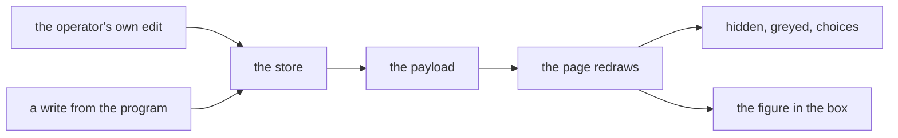

### What each drawn control takes now

Each draw ends by writing the store's figure into every drawn control whose
figure differs. A tick box takes a tick, a drop-down takes a row number, and
every other control takes its text. Nothing is written where the two already
agree, so a redraw that changes nothing touches nothing.

```javascript
// src/gui/web/settings_dialog.js
function draw(target, node) {
  var root = rootFor(target);
  global.ReactDOM.flushSync(function () {
    root.render(node);
  });
  syncDrawn(target);
  return target;
}
```

The dialog draws 66 controls across nine tabs. Sixty-five of them take a seeded
figure and are reached by this. The sixty-sixth is the configured exchange list,
which is drawn as a list of lines and was always rebuilt.

| Tab | Controls | Tab | Controls |
| --- | -------- | --- | -------- |
| User | 1 | Theme | 2 |
| Exchanges | 6 | Sound | 10 |
| Trading | 3 | SMS | 22 |
| TA Indicators | 12 | AI Monitor | 7 |
| Phantom Bots | 3 | | |

### The credential rows, cleared and read off the page

Adding a venue empties the API Key, API Secret and Passphrase rows. Both figures
below were read off the drawn nodes, never off the store.

| Driven on the rendered page | Before | Now |
| --------------------------- | ------ | --- |
| the key row after the clear | still showed the typed key | empty |
| the secret row after the clear | still showed the typed secret | empty |
| the key row after a tab switch | still showed the typed key | empty |
| Lock duration after a write of 3 | showed 7 | shows 3 |
| the phantom box after a tick | showed clear | shows ticked |
| Default Phantom Timeframes after a write of `1d` | showed `4h` | shows the row for 1d |

### A push cannot land on a half-typed value

The one control the page leaves alone is the one under the operator's cursor. A
figure being typed has not been reported yet, so the store is behind the screen
for that box and only for that box. Skipping it is what keeps a push from wiping
out half a typed key.

```javascript
// src/gui/web/settings_dialog.js, inside syncDrawn
var typing = owner ? owner.activeElement : null;
if (node === typing || kind === LIST_KIND) {
  return;
}
```

Driven both ways on the same push: with the key row focused and holding a
half-typed value, the page kept it; with the same row left, the same push wrote
the store's empty figure in. The skip is what saves it.

### An emptied number box is no longer reported

A number box with nothing in it is not a figure. The page used to hand the empty
box back as nothing at all, the store refused it, and a warning line was written
for a value nobody had entered. The page now puts the held number back in the box
and reports nothing.

```javascript
// src/gui/react_settings_dialog.py, the page's own reader
var value = readValue(node, kind);
if (typeof value === "number" && !isFinite(value)) {
  node.value = api.valueOf(name);
  return false;
}
```

### The TA row width the page checked against

The page checks the shape of everything it is handed. Its check on the indicator
weight rows wanted three fields and every row carries four, the fourth being the
slider's own name. The check reported twelve faults on every load, one for each
indicator, and reports none now.

```javascript
// src/gui/web/settings_dialog.js
var TA_ROW_WIDTH = THIRD + STEP;
```

### The six earlier rows this section drove

Every one of these was built on the older behaviour and every one was driven
again afterwards.

| Earlier work | Driven after the change |
| ------------ | ----------------------- |
| the API Key and API Secret masked together | all three credential rows still masked, read off the drawn page |
| the wizard's stored defaults, filled before the draw | the five stored figures still reach the wizard, against the built-in figures with no store |
| Enable Phantom Balance Bots for Scrumming | opens on the stored setting |
| Default Phantom Timeframes | opens on the stored name |
| Lock duration (candles) | opens on the stored figure |
| the wizard's Enable Phantom Bots and Active Timeframes | both open on the stored setting, driven either way |

## 2026-09-13 - The radio drawing code comes off the Settings dialog

The dialog draws no radio button on any tab. The last three went off the page
with the sell-side target group, and the machinery that drew them stayed behind:
a kind constant, two lookup tables, a holder class, the grouping that cleared a
button's siblings, a browser branch and a style rule. None of it had anything
left to draw, and all of it is gone.

Driven with the home redirected into a scratch directory before the first
product import, so the settings directory and the log root bound under that
directory. No stored setting of the running install was read, no credentials
file was opened, no bot was built and no venue was contacted. One connection to
a venue host was attempted on purpose and refused.

### What drew a radio, and what asked for one

Four files carried the machinery. Zero control specs asked for it.

| What it was | Where it lived |
| ----------- | -------------- |
| the kind constant, and its rows in the signal and painted tables | `src/gui/main_tabs/settings_dialog_surface.py` |
| the holder class and the sibling grouping | `src/gui/react_settings_dialog.py` |
| the input-type branch and the shared group name | `src/gui/web/settings_dialog.js` |
| the style rule the tick box shared with it | `src/gui/web/settings_dialog.css` |

The count either side, over the five files that make the dialog:

| | before | after |
| --- | ---: | ---: |
| Lines naming a radio | 26 | 0 |
| Occurrences, case-insensitive | 31 | 0 |
| Control specs of that kind | 0 | 0 |

### The dialog either side of the removal

Three surfaces were read in one run, before on a clean copy of the default
branch and after on the branch:

| | before | after |
| --- | ---: | ---: |
| Tabs, in the Qt window and in the shell payload | 9 and 9 | 9 and 9 |
| Control specs the payload carries | 66 | 66 |
| Tick boxes the Qt window draws | 23 | 23 |
| Drop-downs the Qt window draws | 6 | 6 |
| Radio buttons the Qt window draws | 0 | 0 |
| Radio inputs the browser page draws | 0 | 0 |
| Checkbox inputs the browser page draws | 207 | 207 |

The whole payload, the whole Qt reading and the whole rendered-page reading
compare identical either side. The 207 is the positive control: the counter that
reported zero radio inputs saw 23 tick boxes on each of the nine tab readings,
so the zero is a fact about the page rather than about the counter.

### A settings file written while the radio buttons were there

The sell-side group stored one of three words, and the buy-side group stored one
of another three. A settings file written before the groups came off still
carries all of them.

```
buy side     all_buy    x_buy    most_recent_buy
sell side    all_sell   x_sell   most_recent_sell
```

Driven on a file carrying four top-level keys, one of them a folding group of
six:

| | after |
| --- | --- |
| Anything raised | no |
| Username arrived | yes |
| Default Target Balance arrived | yes, 310.0 |
| The folding group | not declared, passed over |

### The sentence this removal leaves standing

None. The Profit Folding description above names no control and no radio
button. Nothing on the dialog draws a radio button, and after this change
nothing in the code can.

## 2026-09-13 - The distribution statistic comes off the bot record

One field on a bot's statistics record counted dollars toward a distribution the
platform no longer performs. It was declared once and written by nothing, and it
is gone.

Driven the same way as the section above, with the home redirected before the
first product import. No stored record of the running install was read, no
credentials file was opened, no bot was built and no venue was contacted.

### One declaration, no writer, no reader

`src/trading/container/config.py` — the line that went

```python
accumulated_distribute: float = 0.0  # Tracks toward extended position
```

The name appeared once in the whole tree, the same count case-sensitive and
case-insensitive, and that one appearance was its own declaration. No line set
it, no line read it, and no page of this manual named it.

### A saved bot record carrying the retired figure

A save copies the statistics out with `asdict`, so the retired figure was
written into every saved record. A restore copies back only the names the
record still declares, and passes over the rest.

`src/trading/container/restore.py` — the gate a stored figure meets

```python
saved_stats = bot_data.get("stats", {})
for key, val in saved_stats.items():
    if hasattr(bot.stats, key):
        setattr(bot.stats, key, val)
```

Driven on a record shaped like a saved bot, carrying every declared field, the
retired figure at 12.5, and one planted name that has never been declared:

| | before | after |
| --- | ---: | ---: |
| Fields the record declares | 36 | 35 |
| Keys in the stored record | 37 | 37 |
| Stored figures the gate admitted | 36 | 35 |
| Stored figures the gate passed over | 1 | 2 |
| Anything raised | no | no |

The planted name is the positive control. It was passed over on both sides, so
the gate can report a skip, and the retired figure moving from admitted to
passed over is the whole of the change.

### The directive this removal breaks

Nothing. The name appears in zero lines under `docs/`, so no sentence anywhere
describes it. Its own comment named bookkeeping for the distribution mechanics
the Profit Folding sections above already record as removed.

## 2026-10-04 - Exchange Status, the sector's venues in three colours

The list at the top of the Exchanges page is headed Exchange Status. It carries
every venue the active sector can trade through, not only the venues already
configured. Each line is a button, and pressing one points the Add form below at
that venue.

### Which venues the panel lists

The sector decides the list. `venues_for_class` answers it, and a venue serving
more than one sector is answered for each of them.

`src/gui/main_tabs/settings_dialog_surface.py` — `exchange_status_rows`

```python
for venue in sorted(acs.venues_for_class(wing)):
    state = venue_state(venue, held)
    name = venue.capitalize()
```

Driven on the real dialog for all six sectors, with every outbound socket
refused:

| Sector | Venues the registry answers | Rows drawn |
| ------ | ---: | ---: |
| Crypto | 15 | 15 |
| Stock | 10 | 10 |
| Commodities | 1 | 1 |
| Forex | 0 | 1 note |
| Indices | 0 | 1 note |
| Futures / Perps | 0 | 1 note |

A sector no venue serves draws one line saying so, rather than an empty box.
Coinbase is listed under Crypto, Stock and Commodities, because it serves all
three.

### What the three colours mean

Grey is the resting colour. It says nobody has checked, not that something
failed. Green says a credential check succeeded. Red says a check reached the
venue and the venue refused it.

| State | Colour token | Colour |
| ----- | ------------ | ------ |
| Credentials validated | `SUCCESS` | `#00ff88` |
| API connection lost | `ERROR` | `#ff3366` |
| No valid credentials | `STATUS_NEUTRAL` | `#8899aa` |

### Where the colour comes from

`src/exchange/credential_state.py` keeps one record per venue, under
`~/.acervator/exchange_credential_state.json`. The credential checker is the
only writer, and it writes only after a venue has answered.

`src/exchange/api_validator.py` — `validate_credentials`

```python
from .credential_state import record_validated

record_validated(exchange_id)
```

A missing key or a missing passphrase is refused before any call is placed, and
those refusals record nothing, so the venue stays grey.

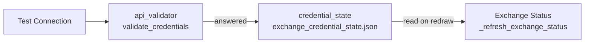

### A redraw reaches no venue

Drawing the panel reads the stored record and nothing else. Measured with every
outbound socket refused and a refusal counter watching: ten redraws of the
crypto panel, fifteen rows each time, and the counter never moved off the one
refusal its own control produced.

A recorded green does not fade with time. The colour reports the last recorded
answer, and a timer turning it grey would say nobody had checked when somebody
had. A venue that stops answering turns red through its next check.

### Pressing a line

A press selects the line and points the Exchange row of the Add form at that
venue, then writes the venue's name into the feedback line.

`src/gui/settings_dialog.py` — `_open_credentials_for_row`

```python
self._new_exchange.setCurrentIndex(found)
self._on_exchange_changed()
self._set_feedback(
    sds.VENUE_FORM_BOUND.format(name=venue.capitalize()), "info"
)
```

Driven on both builds, pressing the Kraken, Gemini and Coinbase lines bound the
form to `kraken`, `gemini` and `coinbase` in that order, in Qt and in the React
page alike.

### Both builds draw one panel

The Qt build and the React page read the same rows from the same surface, so the
heading and the line text cannot drift apart. Read back off the drawn React
page beside the Qt widgets: the heading is Exchange Status on both, and all
fifteen crypto lines match character for character.

### How current a colour is

Each colour is set by one event, and the panel reads the record those events
leave. A colour is therefore exactly as current as the last event that wrote it.

| Event | What it records | What writes it |
| ----- | --------------- | -------------- |
| A venue answered an authenticated call | green | Test Connection, and a running bot's first balance fetch after it connects |
| A venue did not answer a call | red | the connector, on the call that failed |
| A venue rejected the credential | grey | the connector, on the call it refused |
| A venue asked for a slower rate | no change | nothing is written |

`src/exchange/ccxt_connector.py` - `note_venue_refusal`

```python
kind = classify_venue_refusal(exc)
if kind == VENUE_LOST:
    if recorded_state(exchange_id) != CONNECTION_LOST:
        record_connection_lost(exchange_id)
elif kind == VENUE_CREDENTIAL_REJECTED:
    forget(exchange_id)
```

A slower rate writes nothing on purpose. ccxt files every rate limit under its
own `NetworkError` class, so a check reading that class alone would draw a venue
red every time the venue asked it to wait. One launch produced 785 such
refusals.

`src/exchange/ccxt_connector.py` - `_refusal_order`

```python
(VENUE_CREDENTIAL_REJECTED, _ccxt_error_types(("AuthenticationError",))),
(VENUE_RATE_LIMITED, _ccxt_error_types(("RateLimitExceeded", "DDoSProtection"))),
(VENUE_ANSWERED, _ccxt_error_types(("ExchangeNotAvailable", "InvalidNonce")) + (HTTPError,)),
(VENUE_LOST, _ccxt_error_types(("NetworkError",)) + (TimeoutError, URLError)),
```

Driven on one venue holding a green record, with every outbound socket and every
name lookup refused:

| Exception raised into the connector | State the store then held |
| ----------------------------------- | ------------------------- |
| a dropped connection | red |
| a rate limit | green, unchanged |
| a rejected credential | grey |

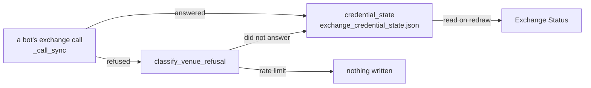

### When a colour is stale

Every event above fires on a call to the venue. A venue nobody calls keeps the
colour its last call left, so the age of a colour is the age of that call.

| What the line shows | How old the colour is |
| ------------------- | --------------------- |
| green, with bots running on this venue | set when the connection opened, and set again on the first call that succeeds after one fails |
| green, with no bots on this venue | as old as the last Test Connection |
| red | the moment a call failed, and it stays until a call succeeds |
| grey | nothing has been recorded for this venue |

A green line means no call has failed to reach this venue since the colour
was recorded. It is not a promise that the venue is answering now.

The store already stamps the time of each record, and the panel does not draw
it. The field is there to read.

`src/exchange/credential_state.py` - `recorded_at`

```python
def recorded_at(exchange_id: Any, path: Any = None) -> Optional[float]:
    """When one venue was last checked, as epoch seconds, or None."""
    entry = _read(path).get(normalise_id(exchange_id))
```

### The sentences the Exchange Status panel replaces

Each sentence below stands in an earlier section and no longer describes the
code. The earlier text stays where it is.

| Earlier sentence | What the code does now |
| ---------------- | ---------------------- |
| "`_create_exchange_tab` lists the configured exchanges and offers a form to add one: the exchange picker, an API key, an API secret, and a passphrase field that appears only when the exchange needs one." | The page lists every venue the sector can trade through, coloured by its last credential check, above the same add form. |
| "Configured Crypto Exchanges lists what the manager returns for this wing, each entry naming its display name and its exchange id." | Exchange Status lists every venue the sector serves, each line naming the venue and its exchange id. |
| "The stock wing lists the equity ids instead and disables both buttons." | Every sector lists its own venues. The stock wing still disables both buttons. |
| "\| `_remove_exchange` \| Drops the selected entry \|" | `_remove_exchange` drops the stored entry and its recorded check, and the line returns to grey. |
| "A venue that stops answering turns red through its next check." | A venue that stops answering turns red on the call that failed, with no check pressed. |

## 2026-10-06 - Six sectors on the Exchanges page

### The sector table, overtaken

OVERTAKEN, and the table above is kept as written. Coinbase is registered under
all six sectors, so the three sectors recorded there as serving no venue each
draw one venue row. Driven again on the real dialog, one sector at a time, with
the home trees redirected and every outbound socket refused:

| Sector | The table above records | Measured now |
| ------ | ---: | ---: |
| Crypto | 15 rows | 15 rows |
| Stock | 10 rows | 10 rows |
| Commodities | 1 row | 1 row |
| Forex | 1 note | 1 row, `Coinbase (coinbase)` |
| Indices | 1 note | 1 row, `Coinbase (coinbase)` |
| Futures / Perps | 1 note | 1 row, `Coinbase (coinbase)` |

[The sector and product tree](../16-sector-exchange-product-tree.md) records the
same six registrations.

### The Add box is named after the sector

The box under the list takes its title from the sector the page was opened on.
The sector's display name and its venue noun fill the title, so a sector outside
the crypto and stock wings is named rather than drawn as crypto.

`src/gui/main_tabs/settings_dialog_surface.py` — `add_group_title`

```python
return ADD_GROUP_FORMAT.format(
    name=acs.display_name(sector), noun=acs.venue_noun(sector)
)
```

Read off the drawn Qt box beside the title the view model publishes to the React
page, for all six sectors:

| Sector | The box's title | Both builds agree |
| ------ | --------------- | ----------------- |
| Crypto | Add Crypto Exchange | yes |
| Stock | Add Stock Broker | yes |
| Commodities | Add Commodities Exchange | yes |
| Forex | Add Forex Exchange | yes |
| Indices | Add Indices Exchange | yes |
| Futures / Perps | Add Futures / Perps Exchange | yes |

Both builds call the one function, so the two titles cannot drift apart.

### Which tab each route opens

Three routes reach this dialog. Driven on a live window, with the credential
store empty and every outbound socket refused:

| Route | Tab it opens on |
| ----- | --------------- |
| Exchange ▸ Add Exchange | Exchanges |
| An asset class's Add Exchange button | Exchanges |
| File ▸ Settings | User |

The asset class button was pressed under each of the six sectors in turn. Every
press opened the Exchanges tab, and the panel listed that sector's venues. The
refusal counter stayed at zero across all eight routes, against a control that
moved it to one on a single deliberate reach for a socket.

Back to [the subsystem index](README.md).
