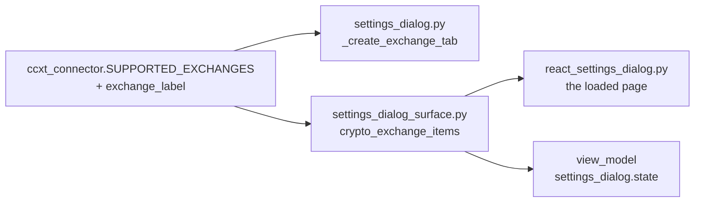
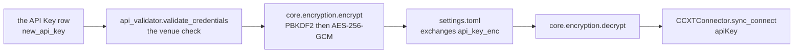

# Settings

Reference. `SettingsDialog` in `src/gui/settings_dialog.py`. The two pages
below are the ones Part 3 names.

## The eleven pages

One method adds them, in one order.

`src/gui/settings_dialog.py` — `SettingsDialog._setup_ui`

```python
tabs.addTab(self._create_user_tab(), "User")
tabs.addTab(self._create_exchange_tab(), "Exchanges")
tabs.addTab(self._create_trading_tab(), "Trading")
tabs.addTab(self._create_folding_tab(), "Profit Folding")
tabs.addTab(self._create_ta_tab(), "TA Indicators")
tabs.addTab(self._create_phantom_tab(), "Phantom Bots")
tabs.addTab(self._create_theme_tab(), "Theme")
tabs.addTab(self._create_logging_tab(), "Logging")
tabs.addTab(self._create_sound_tab(), "Sound")
tabs.addTab(self._create_sms_tab(), "SMS")
tabs.addTab(self._create_ai_monitor_tab(), "AI Monitor")
```

## What each page persists

`_save` writes and `_load_current` reads back. A control neither method touches
keeps its build-time default for the life of the process and reaches no engine.

| Page | Controls | `_save` writes | `_load_current` restores |
| ---- | -------: | -------------- | ------------------------ |
| User | 1 | the row | the row |
| Exchanges | 6 plus 3 buttons | on Add and Remove | the configured list |
| Trading | 6 | all six | four of six |
| Profit Folding | 11 | the whole group | `active` alone |
| TA Indicators | 12 | nothing | nothing |
| Phantom Bots | 13 | nothing | nothing |
| Theme | 6 | all six | the theme and the accent |
| Logging | 6 | the whole group | nothing |
| Sound | 10 plus 6 buttons | nothing | nothing |
| SMS | 17 | nothing | nothing |
| AI Monitor | 7 | all seven | all seven |

`AppSettings` in `src/core/settings.py` is the whole schema, and a key it does
not declare is refused outright rather than stored somewhere unread.

`src/core/settings.py` — `SettingsManager.set`

```python
def set(self, key: str, value: Any) -> None:
    """Set the ``AppSettings`` attribute *key* and call ``_save``.

    A *key* that ``AppSettings`` does not declare raises ``KeyError``.
    """
    with self._lock:
        if not hasattr(self._settings, key):
            raise KeyError(f"Unknown setting: {key}")
```

Four pages hold controls `_save` never reads, and the schema declares no field
any of them could land in: TA Indicators, Phantom Bots, Sound and SMS. Issue
#423 carries all four and counts the controls.

The Exchanges page is the exception to the whole pattern. `_add_exchange` and
`_remove_exchange` write through the settings manager as the operator uses
them, rather than waiting for Save.

The Sound page reaches its engine by one other route. The slider handler builds
a fresh configuration from every checkbox, pushes it in, and clears the sample
cache, because each sample bakes its volume at synthesis time.

`src/gui/settings_dialog.py` — `_on_sfx_volume_changed`

```python
se = get_sound_engine()
new_cfg = SoundConfig(
    enabled=self._sound_enabled.isChecked(),
    buy_sound=self._sound_buy.isChecked(),
    sell_sound=self._sound_sell.isChecked(),
    error_sound=self._sound_error.isChecked(),
    bot_state_sound=self._sound_state.isChecked(),
    fire_sound=self._sound_fire.isChecked(),
    track_sound=self._sound_track.isChecked(),
    profit_sound=self._sound_profit.isChecked(),
    drip_sound=self._sound_drip.isChecked(),
    volume=v / 100.0,
)
```

That path runs when the slider moves or a test button plays a sample, and at no
other time.

The parent section, [08-tabs.md](../08-tabs.md), carries the figure for each of
the eleven pages and names every control on it.

## Settings, User page

The whole page is one form row. No credential field, no licence field and no
key import.

`src/gui/settings_dialog.py` — `_create_user_tab`

```python
def _create_user_tab(self) -> QWidget:
    w = QWidget()
    form = QFormLayout(w)
    self._username = QLineEdit()
    form.addRow("Username:", self._username)
    return w
```

`_load_current` reads the stored value and `_save` writes it back through the
settings manager, which persists the schema under a home-relative directory as
a TOML file, or as JSON when no TOML writer is available. One lock guards every
read and write, shared across every manager instance.

### What a credential store would rest on

Both halves already exist, and the User page reads neither.

The first is encryption. A passphrase and a random salt derive a 256-bit key,
and each token carries its own salt and nonce.

`src/core/encryption.py` — `derive_key`

```python
def derive_key(passphrase: str, salt: bytes) -> bytes:
    """Derive a 256-bit AES key from *passphrase* + *salt* via PBKDF2."""
```

`KeyringManager` holds the passphrase in the operating system's credential
store. Without the `cryptography` package a fallback keystream with an
HMAC-SHA256 tag takes over.

The second is the hardware-key path. A credential list encrypts against a USB
volume's serial and writes at that mount point, so the file decrypts on that
stick and nowhere else.

`src/core/usb_auth.py` — `write_auth_file`

```python
def write_auth_file(
    usb_path: Path,
    volume_serial: str,
    credentials: list[dict],
) -> Path:
    """Encrypt *credentials* under ``_derive_usb_key`` and write ``AUTH_FILENAME``.

    Each dict carries ``exchange_id``, ``api_key``, ``api_secret`` and
    ``passphrase``, and the written path under *usb_path* is returned.
    """
```

`find_auth_volume` matches the volume serial that `read_auth_file` needs to
derive the same key.

## Settings, Exchanges page

`_create_exchange_tab` lists the configured exchanges and offers a form to add
one: the exchange picker, an API key, an API secret, and a passphrase field
that appears only when the exchange needs one.

The picker lists what the connector layer can actually reach.

`src/exchange/ccxt_connector.py` — `SUPPORTED_EXCHANGES`, the first six

```python
SUPPORTED_EXCHANGES: dict[str, str] = {
    "binance": "binance",
    "coinbase": "coinbase",
    "kraken": "kraken",
    "kucoin": "kucoin",
    "bybit": "bybit",
    "okx": "okx",
```

Three venues need a passphrase, and the field appears for those alone.

`src/exchange/ccxt_connector.py` — `PASSPHRASE_EXCHANGES`

```python
PASSPHRASE_EXCHANGES: set[str] = {
    "kucoin",
    "okx",
    "bitget",
}
```

The key field accepts a Coinbase CDP key string as well as a plain key, and the
secret field accepts a PEM elliptic-curve private key. Escaped newlines inside
a pasted PEM convert on the way in.

Three handlers sit behind the buttons.

| Handler | What it does |
| ------- | ------------ |
| `_test_api_connection` | Authenticates against the venue and reports through `_set_feedback` |
| `_add_exchange` | Runs that test first and stores nothing when it fails |
| `_remove_exchange` | Drops the selected entry |

### The stock wing

The same page in the stock wing shows a banner and disables Add and Test.

`src/gui/settings_dialog.py` — `_create_exchange_tab`

```python
_banner = QLabel(
    "<b>Stock Wing:</b> equity-broker integration is "
    "queued — no live brokers are wired up yet. The "
    "list below shows the planned brokers; Add / Test "
    "are disabled until the broker connectors ship. "
    "Use the Crypto Wing for active trading today."
)
```

`EQUITY_EXCHANGE_IDS` fills the list with the planned brokers, each labelled as
planned. Crypto is the wing that trades today.

### What adding one does

The new exchange routes to the crypto layer or the stock layer, and the method
removes the placeholder tab if one stood there.

`src/gui/main_window.py` — `add_exchange_tab`

```python
def add_exchange_tab(self, exchange_id: str, display_name: str) -> None:
    """Add exchange tab to the correct layer (crypto or stock)."""
    is_equity = self._is_equity_exchange(exchange_id)
```

The method emits a signal naming which layer the tab actually landed in, read
back from both layer widgets rather than from the argument it was given.

## Bridge

Two methods serve this screen.

| Bridge method | Serves | Renderer module |
| ------------- | ------ | --------------- |
| `settings_dialog.state` | The dialog and its eleven pages | `settings_dialog.js` |
| `exchange_tab.state` | One venue's tab | `exchange_tab.js` |

## 2026-09-06 00:52 - #423 - the Settings dialog draws in React

The File menu opens this dialog, and which one it opens depends on the build.
The React build draws every page below inside one embedded browser. The Qt
build draws the widget tree the pages describe. One line in the running window
picks the side.

`src/gui/main_window.py` — `_open_settings`

```python
from .variant_surface import SETTINGS_DIALOG, surface_class

_cls = surface_class(SETTINGS_DIALOG)
dlg = _cls(self._settings, self._status_log, self, wing=_wing)
```

The React side is a subclass, not a rewrite. It replaces only the method that
builds the widgets, so the loading and the saving below are the same code on
both sides. Each named control gets a small holder that answers the same calls
the widget answered, and the page reads and writes those holders.

`src/gui/react_settings_dialog.py` — `SettingsDialogReact._setup_ui`

```python
self._model = surface.SettingsDialogModel(wing=self._wing)
self._model.build()
self._build_holders()
self._web = QWebEngineView(self)
self._web.setPage(SettingsDialogPage(self))
self._web.setHtml(dialog_html(self._theme_name()))
```

An edit on the page arrives as one line the host reads, and the holder takes it
the way the control takes a stored value. A radio inside a group box clears the
others, which is what `QGroupBox` does for the widget side.

`src/gui/react_settings_dialog.py` — `SettingsDialogReact.apply_edit`

```python
self._holders[name].admit(asked.get("value"))
```

### Settings > User Tab

This needs to be built out to accept and contain individual end user credentials. This will also be where a license is entered or a keyfile is imported depending on how we design the authentication piece.

The dialog holds the eleven pages below, added in one order.

`src/gui/settings_dialog.py` — `SettingsDialog._setup_ui`

```python
tabs.addTab(self._create_user_tab(), "User")
tabs.addTab(self._create_exchange_tab(), "Exchanges")
tabs.addTab(self._create_trading_tab(), "Trading")
tabs.addTab(self._create_folding_tab(), "Profit Folding")
tabs.addTab(self._create_ta_tab(), "TA Indicators")
tabs.addTab(self._create_phantom_tab(), "Phantom Bots")
tabs.addTab(self._create_theme_tab(), "Theme")
tabs.addTab(self._create_logging_tab(), "Logging")
tabs.addTab(self._create_sound_tab(), "Sound")
tabs.addTab(self._create_sms_tab(), "SMS")
tabs.addTab(self._create_ai_monitor_tab(), "AI Monitor")
```

`_save` and `_load_current` decide which of them persists, and each page says
which under its own heading. Issue #423 carries the four pages whose controls
Save never reads.

The User page itself is one form row, and the settings manager persists it. No
credential field, no licence field and no key import.

`src/gui/settings_dialog.py` — `_create_user_tab`

```python
def _create_user_tab(self) -> QWidget:
    w = QWidget()
    form = QFormLayout(w)
    self._username = QLineEdit()
    form.addRow("Username:", self._username)
    return w
```

Both halves a credential store would rest on already exist, and the page reads
neither. `src/core/encryption.py` encrypts a secret with AES-256-GCM under a
key derived from a passphrase and a random salt.

`src/core/encryption.py` — `derive_key`

```python
def derive_key(passphrase: str, salt: bytes) -> bytes:
    """Derive a 256-bit AES key from *passphrase* + *salt* via PBKDF2."""
```

`src/core/usb_auth.py` writes an encrypted credential file keyed to a USB
volume's serial, which decrypts on that stick and nowhere else.

`src/core/usb_auth.py` — `write_auth_file`

```python
def write_auth_file(
    usb_path: Path,
    volume_serial: str,
    credentials: list[dict],
) -> Path:
```


The title bar names the wing the dialog was opened for. The arrows at each end
of the page row scroll it, because the eleven do not fit the dialog's minimum
width. Cancel and Save close the dialog, and Save always closes it, reporting
any group that failed to persist. The page itself carries one row, Username,
and nothing else.

That one row is not cosmetic. The stored username keys the credential vault.
Adding a venue on the next page builds a master phrase from that name, then
encrypts the API key and the API secret with the phrase.

`src/gui/settings_dialog.py` — `_add_exchange`, the phrase and the encryption

```python
master = f"qat_{self._sm.get('username', 'user')}_vault"
config.api_key_enc = encrypt(key, master)
config.api_secret_enc = encrypt(secret, master)
```

The figure shows a stored value, User. The declared default is an empty string,
and the settings object always declares the field, so the fallback written into
the phrase never fires. An install where the row was never filled encrypts
under a phrase with an empty middle. Change the name on a machine that already
holds credentials and the stored secrets stop opening, because the connect path
rebuilds the same phrase from the new name. Issue #436 carries it.

`src/gui/main_window.py` — the decrypt side, rebuilding the same phrase

```python
master = f"qat_{self._settings.get('username', 'user')}_vault"
api_key = decrypt(exch_config["api_key_enc"], master)
api_secret = decrypt(exch_config["api_secret_enc"], master)
```

Three sites write that phrase out as a literal, one to encrypt and two to
decrypt, and a fourth declares the format none of them reads. The same issue
carries that half.

`src/gui/main_tabs/settings_dialog_surface.py` — the declaration

```python
MASTER_FORMAT = "qat_{username}_vault"
```


### Settings > Exchanges

The page lists the configured exchanges and adds one: the exchange picker, an
API key, an API secret, and a passphrase field that appears only when the venue
needs it. The picker fills from the connector layer, so it lists what that
layer can reach.

`src/exchange/ccxt_connector.py` — `SUPPORTED_EXCHANGES`, the first six

```python
SUPPORTED_EXCHANGES: dict[str, str] = {
    "binance": "binance",
    "coinbase": "coinbase",
    "kraken": "kraken",
    "kucoin": "kucoin",
    "bybit": "bybit",
    "okx": "okx",
```

Three venues need the passphrase field, and it appears for those alone.

`src/exchange/ccxt_connector.py` — `PASSPHRASE_EXCHANGES`

```python
PASSPHRASE_EXCHANGES: set[str] = {
    "kucoin",
    "okx",
    "bitget",
}
```

The key field accepts a Coinbase CDP key string and the secret field a PEM
elliptic-curve private key. The connection test runs before anything is stored,
and adding one routes the new tab to the crypto or the stock layer.

`src/gui/main_window.py` — `add_exchange_tab`

```python
def add_exchange_tab(self, exchange_id: str, display_name: str) -> None:
    """Add exchange tab to the correct layer (crypto or stock)."""
    is_equity = self._is_equity_exchange(exchange_id)
```

The same page in the stock wing shows a banner and disables Add and Test,
because no broker connector ships yet.

`src/gui/settings_dialog.py` — `_create_exchange_tab`

```python
_banner = QLabel(
    "<b>Stock Wing:</b> equity-broker integration is "
    "queued — no live brokers are wired up yet. The "
    "list below shows the planned brokers; Add / Test "
    "are disabled until the broker connectors ship. "
    "Use the Crypto Wing for active trading today."
)
```


Configured Crypto Exchanges lists what the manager returns for this wing, each
entry naming its display name and its exchange id. The stock wing lists the
equity ids instead and disables both buttons.

The Add Crypto Exchange group holds four rows. Exchange fills from the
supported list. API Key takes a plain key or a Coinbase CDP key string, and its
placeholder shows the CDP shape. API Secret takes a plain secret or a PEM
elliptic-curve private key, and escaped newlines inside a pasted PEM convert on
the way in. The passphrase checkbox appears for the three venues above.

The picker in the figure reads Binance, the first supported id in alphabetical
order, and the passphrase box under it stays clear. Changing the picker sets
that box for the three venues that need one and clears it for the rest. It also
wipes the feedback line, so an answer about the last venue cannot stand as an
answer about this one.

`src/gui/settings_dialog.py` — `_on_exchange_changed`

```python
def _on_exchange_changed(self) -> None:
    eid = self._new_exchange.currentData()
    needs_pp = eid in self._passphrase_exchanges
    self._pp_check.setChecked(needs_pp)
    self._api_feedback.setText("")
```

The page hides the passphrase field until you tick the box, which is why the
figure shows the box and no field under it. The box carries the state; the
field only collects the value.

`src/gui/settings_dialog.py` — the field the box reveals

```python
self._new_passphrase = QLineEdit()
self._new_passphrase.setEchoMode(QLineEdit.Password)
self._new_passphrase.setPlaceholderText(
    "Passphrase set when creating API key"
)
self._new_passphrase.setVisible(False)
```

Test Connection runs the check and reports the answer. Test and Add Exchange
runs the same check first and stores nothing when it fails. Remove Selected
drops the highlighted entry.

Both buttons go dead for the length of a call, so a second click cannot start a
second test. Test and Add returns on a failed check, which is what keeps a
venue that did not answer out of the store.

`src/gui/settings_dialog.py` — `_add_exchange`, the guard before the store

```python
if key and secret:
    result = self._test_api_connection()
    if result is None or not result.success:
        return
```


### Settings > Trading


Six rows carry the defaults a new bot starts from, not a running bot's
settings.

Position Distance - Sets the spacing a new bot puts between its positions.
Key `position_distance_pct`, 1.0 % to 50.0 %, at 2.0 %.

The dialog stores the figure and reads it back the next time the page opens.
No bot ever sees it. The bot factory strips the name before it builds a
config, so the value cannot reach a bot by any route.

`src/gui/settings_dialog.py` — the Position Distance row

```python
self._pos_distance = QDoubleSpinBox()
self._pos_distance.setRange(1.0, 50.0)
self._pos_distance.setSuffix("%")
self._pos_distance.setDecimals(1)
form.addRow("Position Distance:", self._pos_distance)
```

The strip list holds eleven names. This page contributes one of them and the
Profit Folding page below contributes four more.

`src/trading/container/config.py` — `_DEPRECATED_KWARGS`

```python
_DEPRECATED_KWARGS: frozenset = frozenset(
    {
        "bulk_trading",  # renamed to stack_mode
        "bulk_partial_on_return",
        "market_check_interval",
        "position_count",
        "position_distance_pct",
        "fold_mode",
        "fold_target",
        "fold_target_count",
        "profit_fold_pct",
        "distribute_target",
        "distribute_target_count",
    }
)
```

Increment Style - Chooses whether that spacing stays even or widens on a
curve. Key `increment_style`, linear or logarithmic, at linear.

The dialog stores the choice and restores it on the next open. A bot takes its
own increment style from the wizard rather than from this page.

`src/gui/settings_dialog.py` — the Increment Style row

```python
self._increment_style = QComboBox()
self._increment_style.addItems(["linear", "logarithmic"])
form.addRow("Increment Style:", self._increment_style)
```

Default Positions - Sets how many positions a new bot opens with. Key
`default_position_count`, 1 to 100, at 10.

The dialog stores the count and restores it. Nothing outside the dialog reads
the name, so no bot opens with it.

`src/gui/settings_dialog.py` — the Default Positions row

```python
self._default_positions = QSpinBox()
self._default_positions.setRange(1, 100)
form.addRow("Default Positions:", self._default_positions)
```

Default Target Balance - Sets the dollar figure the wizard's own Target
Balance field opens at. Key `default_target_balance`, $1.00 to $1,000,000.00,
at $200.00.

This is the one row on the page that reaches a new bot. The wizard's parameter
page opens its Target Balance field at the stored figure.

`src/gui/bot_wizard.py` — the wizard field that reads the stored default

```python
self._target_balance = QDoubleSpinBox()
self._target_balance.setRange(1.0, 1000000.0)
self._target_balance.setDecimals(2)
self._target_balance.setPrefix("$ ")
self._target_balance.setValue(defaults.get("default_target_balance", 200.0))
```

Bot Visibility - Chooses whether a new bot rests its orders on the book or
tracks them inside the platform. Key `bot_visibility`, orderbook or internal,
at orderbook.

Save writes the name and the load path never reads it. The box opens on
orderbook whatever was stored, and a Save with no edit writes that first entry
back over the stored value. A bot takes its visibility from the wizard, under
a different name.

`src/gui/settings_dialog.py` — the Bot Visibility row

```python
self._visibility = QComboBox()
self._visibility.addItems(["orderbook", "internal"])
form.addRow("Bot Visibility:", self._visibility)
```

Enable aggressive trading mode - Starts a new bot pricing for an immediate
fill. Key `aggressive_trading`, a checkbox, off.

The same gap as the row above. Save writes it, the load path skips it, and the
box opens clear. The wizard carries its own aggressive trading checkbox, and
that is the one a new bot reads.

`src/gui/settings_dialog.py` — the aggressive trading row

```python
self._aggressive = QCheckBox("Enable aggressive trading mode")
form.addRow(self._aggressive)
```

Save writes all six keys. The load path restores the first four, which is why
the last two rows on the page open at their built-in defaults.

`src/gui/settings_dialog.py` — `_load_current`, the four it restores

```python
self._pos_distance.setValue(self._sm.get("position_distance_pct", 2.0))
self._default_positions.setValue(self._sm.get("default_position_count", 10))
self._default_balance.setValue(
    self._sm.get("default_target_balance", 200.0)
)
style = self._sm.get("increment_style", "linear")
idx = self._increment_style.findText(style)
if idx >= 0:
    self._increment_style.setCurrentIndex(idx)
```

### Settings > Profit Folding


One master checkbox and three groups of radio buttons, eleven controls in all.
Every key below sits inside one stored `profit_folding` group.

Profit Folding / Upward Distribution Active - Turns the whole page on. Key
`active`, a checkbox, clear at build and set to on when the stored group
loads.

This is the one control on the page the load path restores, so it is the only
one of the six that reopens on what was stored.

`src/gui/settings_dialog.py` — the master switch

```python
self._folding_active = QCheckBox(
    "Profit Folding / Upward Distribution Active"
)
layout.addWidget(self._folding_active)
```

Distribution Mode - Chooses whether a fold spreads evenly across the chosen
positions or on a curve. Key `mode`, equal or logarithmic, at equal.

Two radio buttons in one group. Equal is checked at build, and Save reads the
logarithmic button to decide which of the two words it stores.

`src/gui/settings_dialog.py` — the Distribution Mode group

```python
mode_group = QGroupBox("Distribution Mode")
mode_layout = QVBoxLayout(mode_group)
self._fold_equal = QRadioButton("Equal distribution")
self._fold_log = QRadioButton("Logarithmic distribution")
self._fold_equal.setChecked(True)
```

Profit Folding Target - Chooses which buy positions a fold reaches: all of
them, a counted number of them, or the most recent. Key `fold_target`, at all
buy positions.

Three radio buttons and the count box the middle one gates. The all-buy button
is checked at build.

`src/gui/settings_dialog.py` — the Profit Folding Target group

```python
self._fold_all = QRadioButton("Fold to ALL buy positions")
self._fold_x = QRadioButton("Fold to X# of buy positions:")
self._fold_recent = QRadioButton("Fold to most recent buy positions")
self._fold_x_count = QSpinBox()
self._fold_x_count.setRange(1, 100)
self._fold_x_count.setValue(5)
self._fold_all.setChecked(True)
```

Fold to X# of buy positions - Sets that counted number. Key
`fold_target_count`, 1 to 100, at 5.

Upward Distribution Target - The same three choices on the sell side. Key
`distribute_target`, at all sell positions.

The sell-side group is built the same way as the buy-side group above, with
its own count box at 5 and its own all-sell button checked at build.

`src/gui/settings_dialog.py` — the Upward Distribution Target group

```python
self._dist_all = QRadioButton("Distribute to ALL sell positions")
self._dist_x = QRadioButton("Distribute to X# of sell positions:")
self._dist_recent = QRadioButton("Distribute to most recent sell positions")
self._dist_x_count = QSpinBox()
self._dist_x_count.setRange(1, 100)
self._dist_x_count.setValue(5)
self._dist_all.setChecked(True)
```

Distribute to X# of sell positions - Sets the sell-side count. Key
`distribute_target_count`, 1 to 100, at 5.

Save collapses the two target groups into one dictionary. Each group reduces
to a single word, taken from whichever of its three buttons is checked.

`src/gui/settings_dialog.py` — `_save`

```python
fold_target = "all_buy"
if self._fold_x.isChecked():
    fold_target = "x_buy"
elif self._fold_recent.isChecked():
    fold_target = "most_recent_buy"
dist_target = "all_sell"
if self._dist_x.isChecked():
    dist_target = "x_sell"
elif self._dist_recent.isChecked():
    dist_target = "most_recent_sell"
```

The load path restores the master switch alone, so the mode and both targets
open at the checked defaults the figure shows.

`src/gui/settings_dialog.py` — `_load_current`

```python
pf = self._sm.get("profit_folding", {})
self._folding_active.setChecked(pf.get("active", True))
```

Issue #423 carries that half of it. Four of the six keys then fail a second
time further down: the two target names and their two counts are four of the
eleven the bot factory strips, listed under Settings > Trading above. A group
that did round-trip still could not carry those four to a bot.

In development. Which of the six the load path should restore has not been
settled against the rest of the dialog, so nothing is proposed here.

### Settings > TA Indicators


One slider per weight, twelve in all, each labelled from its key and each
running 0.00 to 2.00. The value beside a slider follows it as it moves, and the
starting values are the weights themselves.

Indicator weight - Sets how far one indicator's vote counts against the other
eleven when the engine totals a direction. The key behind each slider, and the
value it starts at, are the twelve below.

`src/trading/ta_engine.py` — `DEFAULT_WEIGHTS`

```python
DEFAULT_WEIGHTS = {
    "bollinger_bands": 1.0,
    "vortex": 0.9,
    "macd": 1.2,
    "stochastic_rsi": 1.0,
    "ichimoku": 1.1,
    "volume": 0.8,
    "slingshot": 1.0,
    "adx": 1.0,
    "kaufman_er": 1.0,  # Perry Kaufman Efficiency Ratio (regime classifier)
    "supertrend": 1.0,  # Olivier Seban ATR-trailing trend (reactive flip)
    "zscore": 0.9,  # Statistical extremity over a longer window than BB
    # Both are built on Wilder's RSI, so this vote overlaps stochastic_rsi.
    "rsi": 0.8,
}
```

A weight moved here reaches nothing. Save reads no widget on this page, the
load path restores none, and the settings schema declares no field for
indicator weights. The voting engine takes a weights argument and falls back to
the defaults above, and no construction site under `src/` supplies one from the
settings store. The page label promises an adjustment the engine never sees.
Issue #423 carries it.

`src/trading/ta_engine.py` — `VotingEngine.__init__`, the fallback every
construction site takes

```python
self.weights = weights or DEFAULT_WEIGHTS.copy()
```

### Settings > Phantom Bots


The master checkbox, eleven timeframe boxes — 1m, 5m, 15m, 30m, 1h, 2h, 4h, 6h,
12h, 1d and 1w — and one Higher-TF Lock Settings group holding Lock duration in
candles, 1 to 10. The build checks 5m, 15m, 1h, 4h and 1d, which is the state
the figure shows.

Enable Phantom Balance Bots for Scrumming - Turns the phantom overrides on for
a new bot. Per-bot key `enable_phantoms`, a checkbox, checked at build.

This is the only control on the page that starts on. Save never reads it, so
the page stores nothing under the name it shows.

`src/gui/settings_dialog.py` — the phantom master switch

```python
self._phantoms_enabled = QCheckBox(
    "Enable Phantom Balance Bots for Scrumming"
)
self._phantoms_enabled.setChecked(True)
layout.addWidget(self._phantoms_enabled)
```

Default Phantom Timeframes - Chooses which charts a phantom watches. Per-bot
key `phantom_timeframes`, eleven boxes, five of them checked at build.

One box per timeframe in a single row. The build decides which five open
checked, and those five are the ones the figure shows.

`src/gui/settings_dialog.py` — the box built for each timeframe

```python
cb = QCheckBox(tf)
cb.setChecked(tf in ["5m", "15m", "1h", "4h", "1d"])
self._phantom_tf_checks[tf] = cb
tf_grid.addWidget(cb)
```

Lock duration (candles) - Sets how many candles a higher-timeframe lock holds
an opposing trade back for. Per-bot key `lock_candle_count`, 1 to 10, at 2.

The one spin box on the page, inside its own group. It opens at 2 and Save
reads it no more than it reads the other two.

`src/gui/settings_dialog.py` — the lock duration box

```python
lock_group = QGroupBox("Higher-TF Lock Settings")
lock_form = QFormLayout(lock_group)
self._lock_candles = QSpinBox()
self._lock_candles.setRange(1, 10)
self._lock_candles.setValue(2)
lock_form.addRow("Lock duration (candles):", self._lock_candles)
```

Those eleven boxes are the eleven timeframes the voting engine already weights,
from 1m at 0.3 up to 1w at 1.6, so a slower chart counts for more when several
are combined.

These three controls carry the same gap the TA Indicators page carries. Save
reads none of them, the load path restores none, and the schema refuses a key
it does not declare rather than storing it somewhere unread.

`src/core/settings.py` — `SettingsManager.set`

```python
with self._lock:
    if not hasattr(self._settings, key):
        raise KeyError(f"Unknown setting: {key}")
    setattr(self._settings, key, value)
    self._save()
```

Issue #423 carries this page. The per-bot equivalents do persist: the wizard's
phantom page emits the same three names into the bot's own config, and the Live
Bot Settings dialog edits them there.

`src/gui/bot_wizard.py` — `PhantomConfigPage.get_config`, the three keys that
do reach a bot

```python
return {
    "enable_phantoms": self._enable.isChecked(),
    "phantom_timeframes": checked,
    "lock_candle_count": self._lock_candles.value(),
}
```

### Settings > Theme


The theme picker, the accent colour field and a Font Settings group. Six
controls and one preview.

Visual Theme - Chooses the palette the whole window paints in. Key `theme`,
five display names — Cyberpunk Dark, Neon Light, Classic Terminal, Minimal
Modern and Glass & Metal — at Cyberpunk Dark.

This is the one control on the page that reaches the running window. Save
emits a signal, the main window reads the stored theme back, and the window
repaints without a restart.

`src/gui/main_window.py` — `_on_settings_changed`

```python
theme = self._settings.get("theme", "cyberpunk_dark")
self._switch_theme(theme)
```

Accent Color - Sets the highlight colour. Key `accent_color`, a free-text
field, at `#00ffcc`.

A plain text box. The default is placeholder text, not a value, so the field
opens empty until something is typed or a stored value loads. Save stores what
is there and the load path puts it back, but nothing paints with it.

`src/gui/settings_dialog.py` — the Accent Color field

```python
layout.addWidget(QLabel("Accent Color:"))
self._accent_color = QLineEdit()
self._accent_color.setPlaceholderText("#00ffcc")
layout.addWidget(self._accent_color)
```

Font Family - Sets the typeface for application text. Key `font_family`, an
editable combo over twelve named families, at Segoe UI.

The box is editable, so a family outside the twelve can be typed in. Save
stores this value and the three sizes below it. Nothing reads any of the four,
and the load path does not restore them either, so the whole Font Settings
group reopens at its built-in figures.

`src/gui/settings_dialog.py` — the Font Family row

```python
self._font_family.addItems(fonts)
self._font_family.setCurrentText("Segoe UI")
self._font_family.setToolTip("Font family for all application text")
font_form.addRow("Font Family:", self._font_family)
```

Base Font Size - Sets the size of ordinary interface text. Key `font_size`,
8 pt to 24 pt, at 11 pt.

The preview line below the group follows this box and the family box as either
changes. That preview is the only place either value has an effect.

`src/gui/settings_dialog.py` — the Base Font Size row

```python
self._font_size = QSpinBox()
self._font_size.setRange(8, 24)
self._font_size.setValue(11)
self._font_size.setSuffix(" pt")
self._font_size.setToolTip("Base font size for all UI text")
font_form.addRow("Base Font Size:", self._font_size)
```

Heading Font Size - Sets the size of headings and stat-card values. Key
`heading_font_size`, 10 pt to 32 pt, at 14 pt.

The widest of the three ranges. The preview does not follow this box.

`src/gui/settings_dialog.py` — the Heading Font Size row

```python
self._heading_size = QSpinBox()
self._heading_size.setRange(10, 32)
self._heading_size.setValue(14)
self._heading_size.setSuffix(" pt")
self._heading_size.setToolTip("Font size for headings and stat card values")
font_form.addRow("Heading Font Size:", self._heading_size)
```

Log Font Size - Sets the size of the Activity Log and API Log text. Key
`log_font_size`, 8 pt to 18 pt, at 10 pt.

The narrowest of the three ranges, and the last row before the preview.

`src/gui/settings_dialog.py` — the Log Font Size row

```python
self._log_font_size = QSpinBox()
self._log_font_size.setRange(8, 18)
self._log_font_size.setValue(10)
self._log_font_size.setSuffix(" pt")
```

Preview redraws in the chosen family and base size as either changes. It is a
sample line, not a setting, and nothing stores it.

The five theme names come from one mapping built off the five theme objects.

`src/gui/theme_engine.py` — `THEMES`

```python
THEMES: dict[str, ThemeTokens] = {
    t.name: t
    for t in [CYBERPUNK_DARK, NEON_LIGHT, CLASSIC_TERMINAL, MINIMAL_MODERN, GLASS_METAL]
}
```

Save writes the theme, the Accent Color field and all four font values.

`src/gui/settings_dialog.py` — `_save`, the theme and font keys

```python
"theme": lambda: self._theme_combo.currentData(),
"accent_color": lambda: self._accent_color.text().strip(),
"font_family": lambda: self._font_family.currentText(),
"font_size": lambda: self._font_size.value(),
"heading_font_size": lambda: self._heading_size.value(),
"log_font_size": lambda: self._log_font_size.value(),
```

The load path reads back the theme and the accent field only, so the four font
rows open at Segoe UI, 11, 14 and 10 whatever was stored.

Of the six, the theme alone reaches the window. `main.py` reads it at startup,
and the window reads it again in `_on_settings_changed` when the dialog saves.

The other five are stored and never read again. Each palette carries its own
typeface in the theme object it declares, so the theme decides the font and the
four font rows decide nothing. The accent field has the same shape: declared,
written, read back into its own line edit, and painted nowhere.

`src/core/settings.py` — `AppSettings`, the five that are stored and unread

```python
accent_color: str = "#00ffcc"

# These four mirror the font widgets in settings_dialog._create_theme_tab.
font_family: str = "Segoe UI"
font_size: int = 11
heading_font_size: int = 14
log_font_size: int = 10
```

### Settings > Logging


Two checkboxes and four periodicity boxes. Every key below sits inside one
stored `data_logging` group.

Log TA signal samples with all values and timestamps - Writes each indicator
reading out with its value and its time. Key `ta_signal_logging`, a checkbox,
checked at build.

The first of the two flags on the page, and the one that decides whether the
indicator record is written at all.

`src/gui/settings_dialog.py` — the TA logging checkbox

```python
self._ta_logging = QCheckBox(
    "Log TA signal samples with all values and timestamps"
)
self._ta_logging.setChecked(True)
layout.addWidget(self._ta_logging)
```

Highlight entries near Scrumming Bot trades - Marks the log lines that sit
close to a fire, so a decision can be read in its own context. Key
`highlight_trade_proximity`, a checkbox, checked at build.

The second flag, built the same way and checked at build like the first.

`src/gui/settings_dialog.py` — the highlight checkbox

```python
self._highlight_trades = QCheckBox(
    "Highlight entries near Scrumming Bot trades"
)
self._highlight_trades.setChecked(True)
layout.addWidget(self._highlight_trades)
```

P/L Log Periodicity - Chooses the windows a profit and loss figure is
summarised over: 24 Hours, 1 Week, 1 Month and 1 Year. Key
`active_periodicities`, four boxes written as a list, with the first two
checked at build.

Four separate boxes rather than one control. Save walks them in page order and
writes the checked ones into a list.

`src/gui/settings_dialog.py` — the four periodicity boxes

```python
self._log_24h = QCheckBox("24 Hours")
self._log_24h.setChecked(True)
self._log_1w = QCheckBox("1 Week")
self._log_1w.setChecked(True)
self._log_1m = QCheckBox("1 Month")
self._log_1y = QCheckBox("1 Year")
```

Save collapses all six into one dictionary holding the two flags and the list
of active periodicities. The load path reads none of them back, so every open
shows the build state rather than the stored one. No reader outside the dialog
reads the group either, which leaves the six controls writing to a key nothing
consults. Issue #423 carries this page.

In development. What the load path should restore for this page has not been
settled against the rest of the dialog, so nothing is proposed here.

### Settings > Sound


The master switch, eight event checkboxes, a volume slider and six test
buttons. Every checkbox is checked at build.

Each checkbox names its sound in its own label, and the key behind each control
is a field of the sound configuration the block below builds.

Enable sound notifications - Turns every sound on or off at once. Key
`enabled`, on.

The engine tests this flag before it tests any other, so a clear box silences
the page whatever the eight below are set to.

`src/gui/settings_dialog.py` — the master switch

```python
self._sound_enabled = QCheckBox("Enable sound notifications")
self._sound_enabled.setChecked(True)
self._sound_enabled.setToolTip("Master switch for all audio notifications")
```

Buy order fills - Plays a low rising tone when a buy fills. Key `buy_sound`,
on.

The label carries the sound's own name in brackets, as every box on this page
does. The engine plays this one under the name buy.

`src/gui/settings_dialog.py` — the buy fill box

```python
self._sound_buy = QCheckBox("Buy order fills (blurb + squirt tone)")
self._sound_buy.setChecked(True)
self._sound_buy.setToolTip(
    "Plays a low bubbly rising tone when a buy order is filled"
)
```

Sell order fills - Plays a bright bell when a sell fills. Key `sell_sound`, on.

The counterpart to the box above, played under the name sell.

`src/gui/settings_dialog.py` — the sell fill box

```python
self._sound_sell = QCheckBox("Sell order fills (bell + jingle tone)")
self._sound_sell.setChecked(True)
self._sound_sell.setToolTip(
    "Plays a high bright bell tone when a sell order is filled"
)
```

Errors - Plays an alert tone on an error. Key `error_sound`, on.

One of the two boxes on the page with no tooltip of its own.

`src/gui/settings_dialog.py` — the error box

```python
self._sound_error = QCheckBox("Errors (alert tone)")
self._sound_error.setChecked(True)
layout.addWidget(self._sound_error)
```

Bot state changes - Plays a click when a bot starts, pauses or stops. Key
`bot_state_sound`, on.

The other box with no tooltip. The engine plays it under the name state, not
under the key.

`src/gui/settings_dialog.py` — the bot state box

```python
self._sound_state = QCheckBox("Bot state changes (subtle click)")
self._sound_state.setChecked(True)
layout.addWidget(self._sound_state)
```

Scrum/Fold Fire - Plays a rifle shot when a scrum or a fold executes, and on a
Manual Fire. Key `fire_sound`, on.

This is the first of the four the engine reads with a default rather than
straight off the configuration. A stored configuration written before these
four existed leaves all four on.

`src/gui/settings_dialog.py` — the fire box

```python
self._sound_fire = QCheckBox("Scrum/Fold Fire (sniper rifle shot)")
self._sound_fire.setChecked(True)
self._sound_fire.setToolTip(
    "Synthesized rifle shot plays when a scrum or fold\n"
    "actually executes. Also plays on Manual Fire."
)
```

Tracking beeps - Paces a beep by the scrum phase: silent in SEARCH, slow in
TRACK, fast in FIRE. Key `track_sound`, on.

The tooltip gives the two paces in milliseconds: 800 in TRACK and 200 in FIRE.

`src/gui/settings_dialog.py` — the tracking box

```python
self._sound_track = QCheckBox(
    "Tracking beeps (speeds up as bot closes on fire)"
)
self._sound_track.setChecked(True)
```

P/L increase - Plays coins dropping into a bucket on any trade that realised a
profit. Key `profit_sound`, on.

The tooltip is the only place on the page that names the condition exactly:
realised profit above zero, on grid and scrumming bots alike.

`src/gui/settings_dialog.py` — the profit box

```python
self._sound_profit = QCheckBox("P/L increase (coins dropping into bucket)")
self._sound_profit.setChecked(True)
```

Accumulation - Plays a water drip on a FOLD, and on nothing else. Key
`drip_sound`, on.

The last of the nine. Its tooltip calls a fold the canonical accumulation
moment and states that a scrum or a distribution does not fire it.

`src/gui/settings_dialog.py` — the accumulation box

```python
self._sound_drip = QCheckBox("Accumulation (water drip)")
self._sound_drip.setChecked(True)
```

SFX Volume - Sets how loud every sample plays. Key `volume`, 0 % to 100 %, at
70 %.

Test Buy, Test Sell, Test Fire, Test Track, Test Profit and Test Drip play one
sample each. They are buttons, not settings.

One handler is the only path from this page to the engine. It builds a
configuration from every checkbox and the slider, pushes it in and clears the
sample cache, because each sample bakes its volume at synthesis time.

`src/gui/settings_dialog.py` — `_on_sfx_volume_changed`

```python
se = get_sound_engine()
new_cfg = SoundConfig(
    enabled=self._sound_enabled.isChecked(),
    buy_sound=self._sound_buy.isChecked(),
    sell_sound=self._sound_sell.isChecked(),
    error_sound=self._sound_error.isChecked(),
    bot_state_sound=self._sound_state.isChecked(),
    fire_sound=self._sound_fire.isChecked(),
    track_sound=self._sound_track.isChecked(),
    profit_sound=self._sound_profit.isChecked(),
    drip_sound=self._sound_drip.isChecked(),
    volume=v / 100.0,
)
```

That path runs when the slider moves or a test button is pressed, and at no
other time. Save reads no widget on this page and the schema declares no sound
field, so nothing here survives the dialog closing. A checkbox cleared and the
dialog saved comes back checked. Issue #423 carries it.

`src/core/sound_engine.py` — `SoundConfig`, the ten fields and their defaults

```python
enabled: bool = True
buy_sound: bool = True
sell_sound: bool = True
error_sound: bool = True
bot_state_sound: bool = True
fire_sound: bool = True
track_sound: bool = True
profit_sound: bool = True
drip_sound: bool = True
volume: float = 0.7
```

### Settings > SMS


A scrolling page holding the master switch and three groups.

Seventeen controls, and the key behind each is a field of the message
configuration the engine reads.

Enable SMS notifications - Turns every message on or off at once. Key
`enabled`, clear at build.

The only control on the page outside the three groups, and the only checkbox
here that opens clear rather than checked.

`src/gui/settings_dialog.py` — the SMS master switch

```python
self._sms_enabled = QCheckBox("Enable SMS notifications")
self._sms_enabled.setToolTip(
    "Send text messages to your phone for trading events"
)
layout.addWidget(self._sms_enabled)
```

Provider - Chooses how a message leaves the machine: a carrier's email gateway,
or the Twilio web interface. Key `provider`, at the email gateway. Nothing
loads a stored choice into the picker, so it opens on the first entry whatever
the figure shows.

Two entries, both written as display labels. The engine tests a short code
rather than either label, so neither entry matches what the send path looks
for.

`src/gui/settings_dialog.py` — the Provider row

```python
self._sms_provider = QComboBox()
self._sms_provider.setMinimumHeight(28)
self._sms_provider.addItems(["Email-to-SMS Gateway", "Twilio API"])
pf.addRow("Provider:", self._sms_provider)
```

Phone Number - Sets the number every message goes to. Key `phone_number`, empty,
with a placeholder showing the international shape.

The placeholder is the only guidance on the row. It is grey sample text, not a
value, so the field starts genuinely empty.

`src/gui/settings_dialog.py` — the Phone Number row

```python
self._sms_phone = QLineEdit()
self._sms_phone.setMinimumHeight(28)
self._sms_phone.setPlaceholderText("+15551234567")
pf.addRow("Phone Number:", self._sms_phone)
```

Carrier - Names the carrier whose gateway address a message would be built for.
Ten entries, opening on the first. It has no stored field of its own, and
nothing on the page reads the choice.

The ten names come from one mapping in the engine. The last entry is a manual
option whose address is deliberately empty.

`src/gui/settings_dialog.py` — the Carrier row

```python
self._sms_carrier = QComboBox()
self._sms_carrier.setMinimumHeight(28)
from src.core.sms_engine import CARRIER_GATEWAYS

for carrier in CARRIER_GATEWAYS:
    self._sms_carrier.addItem(carrier)
pf.addRow("Carrier:", self._sms_carrier)
```

Gateway Email - Sets the full gateway address a message is sent to. Key
`gateway_email`, empty.

The row a carrier choice would otherwise fill in. Nothing builds the address
from the picker above, so this field is typed by hand or left blank.

`src/gui/settings_dialog.py` — the Gateway Email row

```python
self._sms_gateway = QLineEdit()
self._sms_gateway.setMinimumHeight(28)
self._sms_gateway.setPlaceholderText("5551234567@vtext.com")
self._sms_gateway.setToolTip("Full email address for carrier SMS gateway")
pf.addRow("Gateway Email:", self._sms_gateway)
```

SMTP Username - Sets the mailbox a message is sent from. Key `smtp_username`,
empty.

The first of the two mailbox rows. Its placeholder shows an ordinary address.

`src/gui/settings_dialog.py` — the SMTP Username row

```python
self._sms_smtp_user = QLineEdit()
self._sms_smtp_user.setMinimumHeight(28)
self._sms_smtp_user.setPlaceholderText("your.email@gmail.com")
pf.addRow("SMTP Username:", self._sms_smtp_user)
```

SMTP Password - Sets that mailbox's application password. Key `smtp_password`,
masked, empty.

The only masked field on the page. Its placeholder says an application
password rather than the account password.

`src/gui/settings_dialog.py` — the SMTP Password row

```python
self._sms_smtp_pass = QLineEdit()
self._sms_smtp_pass.setMinimumHeight(28)
self._sms_smtp_pass.setEchoMode(QLineEdit.Password)
self._sms_smtp_pass.setPlaceholderText(
    "App password (not regular password)"
)
pf.addRow("SMTP Password:", self._sms_smtp_pass)
```

Buy fills - Sends a message when a buy fills. Key `notify_buy_fills`, checked
at build.

The first of the eight event rows, and one of the four that open checked.

`src/gui/settings_dialog.py` — the buy fills row

```python
self._sms_buy = QCheckBox("Buy fills")
self._sms_buy.setChecked(True)
ef.addRow(self._sms_buy)
```

Sell fills - Sends a message when a sell fills. Key `notify_sell_fills`,
checked at build.

The counterpart to the row above, built and checked the same way.

`src/gui/settings_dialog.py` — the sell fills row

```python
self._sms_sell = QCheckBox("Sell fills")
self._sms_sell.setChecked(True)
ef.addRow(self._sms_sell)
```

Bot state changes - Sends a message when a bot starts, stops or errors. Key
`notify_bot_state_changes`, checked at build.

The label names the three states in brackets, which the page's own text does
not repeat anywhere else.

`src/gui/settings_dialog.py` — the bot state row

```python
self._sms_state = QCheckBox("Bot state changes (start/stop/error)")
self._sms_state.setChecked(True)
ef.addRow(self._sms_state)
```

API errors and failures - Sends a message when a venue call fails. Key
`notify_errors`, checked at build.

The last of the four rows that open checked.

`src/gui/settings_dialog.py` — the API errors row

```python
self._sms_errors = QCheckBox("API errors and failures")
self._sms_errors.setChecked(True)
ef.addRow(self._sms_errors)
```

P/L threshold alerts - Sends a message when profit or loss passes a dollar
figure. Key `notify_pl_threshold`, clear at build.

The first row in the group that opens clear. It gates the dollar figure on the
row below it.

`src/gui/settings_dialog.py` — the P/L alert row

```python
self._sms_pl = QCheckBox("P/L threshold alerts")
ef.addRow(self._sms_pl)
```

P/L threshold - Sets that dollar figure. Key `pl_threshold_amount`, $1 to
$100,000, at $100.

The one spin box in the events group, and the only row there that is not a
checkbox.

`src/gui/settings_dialog.py` — the P/L threshold row

```python
self._sms_pl_amount = QDoubleSpinBox()
self._sms_pl_amount.setMinimumHeight(28)
self._sms_pl_amount.setRange(1, 100000)
self._sms_pl_amount.setValue(100)
self._sms_pl_amount.setPrefix("$")
ef.addRow("P/L threshold:", self._sms_pl_amount)
```

Low balance warnings - Sends a message when a balance runs low. Key
`notify_balance_warning`, clear at build.

No figure on the page sets what counts as low, so the row carries the switch
alone.

`src/gui/settings_dialog.py` — the low balance row

```python
self._sms_balance = QCheckBox("Low balance warnings")
ef.addRow(self._sms_balance)
```

Exchange connection status - Sends a message when a venue connects or drops.
Key `notify_connection_status`, clear at build.

The last event row, and the third of the three that open clear.

`src/gui/settings_dialog.py` — the connection status row

```python
self._sms_connection = QCheckBox("Exchange connection status")
ef.addRow(self._sms_connection)
```

Max messages per hour - Caps how many messages one hour may carry. Key
`max_messages_per_hour`, 1 to 100, at 20. Below the area the figure shows.

The first of the two rows in the rate limiting group.

`src/gui/settings_dialog.py` — the hourly cap row

```python
self._sms_max_hour = QSpinBox()
self._sms_max_hour.setMinimumHeight(28)
self._sms_max_hour.setRange(1, 100)
self._sms_max_hour.setValue(20)
rf.addRow("Max messages per hour:", self._sms_max_hour)
```

Min time between messages - Sets the wait between two messages. Key
`cooldown_seconds`, 5 to 300 seconds, at 30. Below the area the figure shows.

The second rate limiting row, and the last control on the page. It is the one
spin box here that carries a unit in its own suffix.

`src/gui/settings_dialog.py` — the cooldown row

```python
self._sms_cooldown = QSpinBox()
self._sms_cooldown.setMinimumHeight(28)
self._sms_cooldown.setRange(5, 300)
self._sms_cooldown.setValue(30)
self._sms_cooldown.setSuffix(" sec")
rf.addRow("Min time between messages:", self._sms_cooldown)
```

The Carrier list fills from one mapping of carrier name to gateway address.

`src/core/sms_engine.py` — `CARRIER_GATEWAYS`, the first four

```python
CARRIER_GATEWAYS = {
    "AT&T": "{number}@txt.att.net",
    "T-Mobile": "{number}@tmomail.net",
    "Verizon": "{number}@vtext.com",
    "Sprint": "{number}@messaging.sprintpcs.com",
```

None of it reaches the SMS engine. Save reads no widget on this page and the
schema declares no SMS field. Neither provider label the combo offers matches
the value the engine tests for, and the page carries no field for the three
Twilio credentials the send path reads.

`src/core/sms_engine.py` — `SMSConfig.provider`, the value the send path tests

```python
    provider: str = "email_gateway"
```

Issue #423 carries the page.

`src/core/sms_engine.py` — `SMSConfig`, the three credentials no row fills

```python
twilio_sid: str = ""
twilio_auth_token: str = ""
twilio_from_number: str = ""
```

### Settings > AI Monitor


A scrolling page holding four groups.

Seven settings, and every key below sits inside one stored `ai_monitor` group.

Anthropic API Key - Holds the key the monitor authenticates with. Key
`api_key`, masked, empty.

The first row of the Claude API Connection group. It is masked like the SMS
password, and its placeholder shows the shape of a key rather than a key.

`src/gui/settings_dialog.py` — the API key row

```python
self._ai_api_key = QLineEdit()
self._ai_api_key.setMinimumHeight(28)
self._ai_api_key.setEchoMode(QLineEdit.Password)
self._ai_api_key.setPlaceholderText("sk-ant-api03-...")
af.addRow("Anthropic API Key:", self._ai_api_key)
```

Check interval - Sets how long the monitor waits between two reviews. Key
`interval_hours`, 0.5 to 24.0 hours, at 4.0.

The one figure on the page. It carries a decimal place, so half an hour is the
shortest wait it accepts.

`src/gui/settings_dialog.py` — the check interval row

```python
self._ai_interval = QDoubleSpinBox()
self._ai_interval.setMinimumHeight(28)
self._ai_interval.setRange(0.5, 24.0)
self._ai_interval.setValue(4.0)
self._ai_interval.setSuffix(" hours")
self._ai_interval.setDecimals(1)
af.addRow("Check interval:", self._ai_interval)
```

Connect phrase - Sets the phrase the platform puts into the prompt it sends.
Key `connect_phrase`, empty.

The first of the two handshake rows. A grey note above the pair states the
rule the two follow, and the placeholder shows the shape of a phrase.

`src/gui/settings_dialog.py` — the connect phrase row

```python
self._ai_connect_phrase = QLineEdit()
self._ai_connect_phrase.setMinimumHeight(28)
self._ai_connect_phrase.setPlaceholderText("acervator-heapbuilder-live")
hf.addRow("Connect phrase:", self._ai_connect_phrase)
```

Confirm phrase - Sets the phrase the answer must carry back to prove it came
from the same conversation. Key `confirm_phrase`, empty. Change both phrases
together and keep both secret.

The second handshake row, built like the first. Neither field is masked.

`src/gui/settings_dialog.py` — the confirm phrase row

```python
self._ai_confirm_phrase = QLineEdit()
self._ai_confirm_phrase.setMinimumHeight(28)
self._ai_confirm_phrase.setPlaceholderText("the-heap-grows-by-accumulation")
hf.addRow("Confirm phrase:", self._ai_confirm_phrase)
```

Enable AI Monitor feedback loop - Turns the monitor on. Key `enabled`, clear at
build.

The one control on the page that opens clear. Save emits a signal and the main
window reads the whole group back, so this box and the key beside it decide
whether the header reads READY or OFF.

`src/gui/main_window.py` — `_on_settings_changed`, the monitor branch

```python
ai_cfg = self._settings.get("ai_monitor", {})
if self._bot_manager:
    self._bot_manager.configure_live_monitor(ai_cfg)
    if ai_cfg.get("enabled") and ai_cfg.get("api_key"):
        self._ai_monitor_label.setText("AI: READY")
```

Auto-handshake on first analysis - Runs the phrase exchange on the first review
rather than waiting for one to be asked for. Key `auto_handshake`, checked at
build.

The first of the two Monitor Behavior rows that open checked.

`src/gui/settings_dialog.py` — the auto-handshake row

```python
self._ai_auto_handshake = QCheckBox("Auto-handshake on first analysis")
self._ai_auto_handshake.setChecked(True)
bf.addRow(self._ai_auto_handshake)
```

Log AI feedback to trade journal - Writes each answer into the trade journal.
Key `log_feedback`, checked at build.

The last control before the status group, and the second of the two that open
checked.

`src/gui/settings_dialog.py` — the journal logging row

```python
self._ai_log_feedback = QCheckBox("Log AI feedback to trade journal")
self._ai_log_feedback.setChecked(True)
bf.addRow(self._ai_log_feedback)
```

Connection Status closes the page, below the area the figure shows: a status
line, a journal hash, a completed-check count and a Test Handshake button. The
three readings report and the button acts. None of the four stores anything.

Save writes all seven controls into one dictionary and the load path reads all
seven back, which makes this the one page besides User whose whole state
round-trips.

`src/gui/settings_dialog.py` — `_load_current`, the seven it restores

```python
ai = self._sm.get("ai_monitor", {})
self._ai_api_key.setText(ai.get("api_key", ""))
self._ai_interval.setValue(ai.get("interval_hours", 4.0))
self._ai_connect_phrase.setText(ai.get("connect_phrase", ""))
self._ai_confirm_phrase.setText(ai.get("confirm_phrase", ""))
self._ai_enabled.setChecked(ai.get("enabled", False))
self._ai_auto_handshake.setChecked(ai.get("auto_handshake", True))
self._ai_log_feedback.setChecked(ai.get("log_feedback", True))
```

Test Handshake runs no handshake. It checks that the key and both phrases hold
text, then writes either an error line or the message saying the handshake runs
on the next bot cycle.

`src/gui/settings_dialog.py` — `_test_ai_handshake`

```python
self._ai_status.setText("Settings saved — handshake runs on next bot cycle")
self._ai_status.setStyleSheet("color: #00ddff; font-weight: bold;")
```

The button reports the fields it read, never a venue answer. Issue #327 carries
that.

Six of the seven do reach the engine. `configure_live_monitor` in
`src/trading/bot_container.py` reads five of them and builds or clears the
monitor, and the main window reads the journal switch when an answer arrives.
The auto-handshake box is the seventh: written, read back, and read by nothing
else.

`src/trading/bot_container.py` — `configure_live_monitor`, the five keys it
reads

```python
self._live_monitor = LiveMonitor(
    api_key=settings["api_key"],
    journal=journal,
    interval_hours=settings.get("interval_hours", 4.0),
    connect_phrase=settings.get("connect_phrase", ""),
    confirm_phrase=settings.get("confirm_phrase", ""),
)
```

## 2026-09-11 - Save keeps what the store holds

`_save` and `_load_current` read one declaration. `_stored_rows` names every
setting the store holds at its top level. `_stored_groups` names every group the
store holds as one key, with the rows inside it. One row carries the store key,
the read off its control, the write back into that control, and what stands in
for a store without the key. Both methods walk the same rows. No setting can be
written without also being loaded.

`src/gui/settings_dialog.py` — one row of `_stored_rows`

```python
("bot_visibility",
 self._visibility.currentText,
 lambda value: self._show_text(self._visibility, value),
 "orderbook"),
```

`_show_stored` puts one stored value into one control. A value the control
refuses leaves that control on its build figure and names the key in the log.
One unreadable entry in the settings file cannot stop the dialog opening.

`SettingsDialogReact` replaces `_setup_ui` alone, so the React build and the Qt
build load and save the same way.

### What each page restores now

This table replaces the restores column in
[What each page persists](#what-each-page-persists). Every other column holds.

| Page | Controls | `_save` writes | `_load_current` restores |
| ---- | -------: | -------------- | ------------------------ |
| User | 1 | the row | the row |
| Exchanges | 6 plus 3 buttons | on Add and Remove | the configured list |
| Trading | 6 | all six | all six |
| Profit Folding | 11 | the whole group | the whole group |
| TA Indicators | 12 | nothing | nothing |
| Phantom Bots | 13 | nothing | nothing |
| Theme | 6 | all six | all six |
| Logging | 6 | the whole group | the whole group |
| Sound | 10 plus 6 buttons | nothing | nothing |
| SMS | 17 | nothing | nothing |
| AI Monitor | 7 | all seven | all seven |

### The fourteen rows a Save overwrote

Save wrote these fourteen rows and no load read them back. A Save with no edit
wrote the build figure over the stored value. Each of the fourteen now reopens on
what was stored.

| Page | Rows |
| ---- | ---- |
| Trading | Bot Visibility, Enable aggressive trading mode |
| Profit Folding | Distribution Mode, Profit Folding Target, Fold to X# of buy positions, Upward Distribution Target, Distribute to X# of sell positions |
| Theme | Font Family, Base Font Size, Heading Font Size, Log Font Size |
| Logging | Log TA signal samples with all values and timestamps, Highlight entries near Scrumming Bot trades, P/L Log Periodicity |

What each row means has not changed. No reader outside the dialog reads any of
the fourteen. Whether each one is wired to a reader or taken off the page is a
separate question, and the Settings audit carries it row by row.

### The sentences this section replaces

Each sentence below stands in an earlier dated section and no longer describes
the code. The earlier text stays where it is.

| Earlier sentence | What the code does now |
| ---------------- | ---------------------- |
| "Save writes the name and the load path never reads it." | The load path reads `bot_visibility`. The box opens on the stored name. |
| "The box opens on orderbook whatever was stored, and a Save with no edit writes that first entry back over the stored value." | The box opens on the stored name. A Save with no edit writes that same name back. |
| "Save writes it, the load path skips it, and the box opens clear." | The load path reads `aggressive_trading`. The box opens ticked when the store holds true. |
| "Save writes all six keys. The load path restores the first four, which is why the last two rows on the page open at their built-in defaults." | The load path restores all six keys on the Trading page. |
| "This is the one control on the page the load path restores, so it is the only one of the six that reopens on what was stored." | The load path restores all six keys in the stored `profit_folding` group. |
| "Nothing reads any of the four, and the load path does not restore them either, so the whole Font Settings group reopens at its built-in figures." | Nothing outside the dialog reads the four font keys. The load path restores all four, so the Font Settings group reopens on what was stored. |
| "The load path reads none of them back, so every open shows the build state rather than the stored one." | The load path reads all three `data_logging` keys back. Every open shows the stored state. |
| "In development. What the load path should restore for this page has not been settled against the rest of the dialog, so nothing is proposed here." | The load path restores the whole group: both flags and the list of active periodicities. |

## 2026-09-11 - The Username row and the vault phrase

Driven on the real dialog and the real vault. The home was redirected into a
scratch directory before `src.core.settings` was imported, so `_DEFAULT_DIR`
bound under that directory. No stored credential of the running install was
read.

### Every reader of the stored name

The row reaches four readers. Each one ran with a generated name, and each
printed the phrase it built.

| Site | What it does with the name | Driven result |
| ---- | ------------------------- | ------------- |
| `main.py`, the startup read | Decides whether to write the default | reads the stored name |
| `src/gui/settings_dialog.py`, `_add_exchange` | Builds the phrase, encrypts the key and the secret | encrypts under `qat_<name>_vault` |
| `src/gui/main_window.py`, `_connect_exchange_for_bot` | Rebuilds the phrase, decrypts | opens the stored secret |
| `src/gui/widgets/api_tester_tab.py`, `_do_connect` | Rebuilds the phrase, decrypts | opens the stored secret |

Nothing else reads the stored name. No bot reads it. No log line carries it. No
title bar shows it.

`_stored_rows` carries the row that loads the stored name into the control and
saves the control back. `SettingsDialogReact` replaces `_setup_ui` alone, and
the page declares the row as one line control, so both builds carry the same
row.

`src/gui/init_wizard.py` collects a name into `get_results`. `get_results` has
no caller, and `InitWizard` is never built. The name on the User page comes from
the startup write.

### What a rename does to a stored secret

A secret went in under one name. The row then changed to a second name, and
Save ran.

| Question | Observed |
| -------- | -------- |
| Does a box warn? | No box appears |
| Is the rename refused? | No. The store holds the new name |
| Is the stored token rewrapped? | No. The token stays the one that was written |
| Does the secret open? | No. Both decrypt sites refuse |

Both decrypt sites raise `Decryption failed — wrong passphrase or corrupted
data`. The bot connect reports `Connection failed`, and the API tester label
reads `Failed`. Neither message names the rename.

The earlier name typed back opens the same secret again. Nothing records that
earlier name, and nothing shows it after the change.

No code handles the rename. The unlock the name will belong to is the
Quintessence Wallet, and the Quintessence Wallet is not built.

### The empty middle

`get('username', 'user')` on a store written without the entry returns an empty
string, so the `'user'` fallback in the three phrase literals never fires. Such
a store builds the phrase `qat__vault`. The startup write closes that gap on the
first run.

`MASTER_FORMAT` formats to the same text the three literals carry.

## 2026-09-11 - The exchange picker and the venue list

The Exchange row on the Exchanges page offers fifteen crypto venues. This
section records which list fills it, which build paints it, and every place the
chosen venue id arrives.

### Which build paints the picker

Two builds draw the row. `src/_variant.py` sets `DEFAULT_VARIANT = REACT`, so a
checkout with no baked variant file and no `ACERVATOR_VARIANT` draws the React
page:

```
resolve_variant()                 react
draws_react('Settings dialog')    True
surface_class('Settings dialog')  SettingsDialogReact
```

The React page is `src/gui/react_settings_dialog.py`, and it reads its picker
items from `src/gui/main_tabs/settings_dialog_surface.py` — `exchange_items`.
The Qt build, `src/gui/settings_dialog.py` — `_create_exchange_tab`, reads
`SUPPORTED_EXCHANGES` from the connector directly.



### The two lists, entry by entry

The page once carried its own frozen copy of the fifteen labels. Three readings
were taken and each offered the same fifteen entries, in the same order, label
for label:

| Reading | Where it comes from | Count |
| ------- | ------------------- | ----- |
| The connector registry | `SUPPORTED_EXCHANGES` through `exchange_label` | 15 |
| The surface list | `settings_dialog_surface.exchange_items` | 15 |
| The loaded React page | the `<option>` elements the page drew | 15 |

In order: Binance (blocked from US), Bitfinex, Bitget (passphrase required),
Bitstamp, Bybit (blocked from US), Coinbase, Cryptocom, Gateio, Gemini, Huobi,
Kraken, Kucoin (passphrase required), Mexc, Okx (passphrase required),
Poloniex. Every label except Coinbase carries a note, because `exchange_label`
marks a venue that is blocked from a US address, or untested, or needs a
passphrase.

Binance stands first because the list is in id order and `binance` sorts first.

### Every reader of the chosen venue id

The picker writes its id into an `ExchangeConfig`, and `add_exchange` stores it
keyed by that id. `gemini` was chosen on both builds and each reader printed
what it saw.

| Reader | What it saw |
| ------ | ----------- |
| `SettingsManager.list_exchanges` | `exchange_id: 'gemini'` |
| `SettingsManager.get_exchange` | the same entry, matched on the id |
| `_load_current`, the Qt Configured list | `Gemini (gemini)` |
| The React Configured list | `Gemini (gemini)` |
| `_remove_exchange`, which reads the id back out of that row | the store emptied |
| `trading_tab_surface.exchange_display_name` | `Gemini`, the tab caption |
| `trading_tab_surface.is_equity_exchange` | `False`, so the crypto layer |
| `CCXTConnector.__init__` | the registry accepts the id |

Five further sites read the stored id rather than the picker: the startup loop
in `main.py` that builds one exchange tab per entry, the startup credential
report and the bot-connect credential lookup in `src/gui/main_window.py`, the
wizard's venue choices, and the API panel's stored-credential lookup. Each
matches on the same `exchange_id` field.

Nothing else reads it. No bot reads the picker, and no gate reads it.
`src/core/usb_auth.py` looks like a reader and is not one: it reads
`CredentialVault.list_exchanges`, a separate store the picker never writes to.

### The drift, measured

The connector is the authority over the id. A venue it does not carry is
refused before any object exists:

```
CCXTConnector('notavenue') refused  Unsupported exchange 'notavenue'.
Supported: ['binance', 'coinbase', 'kraken', ... 'cryptocom']
```

With the frozen copy in place, one venue added to the connector alone reached
the Qt picker and not the React page:

| Reading | Before the connector gained a venue | After |
| ------- | ----------------------------------- | ----- |
| The Qt picker | 15 | 16 |
| The surface list | 15 | 15 |
| The bridge list | 15 | 15 |

A venue offered on the page and missing from the registry would be stored and
then refused at the first connect. A venue in the registry and missing from the
page would never appear.

### What changed

`crypto_exchange_items` in `src/gui/main_tabs/settings_dialog_surface.py` now
builds the pairs from `SUPPORTED_EXCHANGES` and `exchange_label`, imported when
first asked so the module still loads no exchange library. The frozen copy is
gone, and the registry is the only list of venues.

The screen offers the same fifteen venues in the same order as before. The Qt
picker, the surface list, the bridge list and the stock-wing list were read from
a tree at the earlier commit and from the changed tree, and the two readings
agree in every entry. The same connector mutation now reaches all three crypto
readings together.

Which venues are supported is still decided in one place only:
`src/exchange/ccxt_connector.py`.

## 2026-09-11 - The API Key row, from the typed string to the stored token

The API Key row on the Exchanges page was typed into on the running React page,
the Add button was pressed, and every place the typed string could come to rest
was then searched. This section records what was found. The string used was a
throwaway that is not a key, and no venue was contacted.

### Where the typed key goes, and where it stops

The row is an entry field and nothing else. The operator fills it, the Add
handler reads it once, and the row is cleared.



`src/gui/settings_dialog.py` — `_add_exchange`, the two lines the row causes

```python
master = f"qat_{self._sm.get('username', 'user')}_vault"
config.api_key_enc = encrypt(key, master)
```

| Moment | What happens to the row |
| ------ | ----------------------- |
| At dialog load | Nothing. No stored value is ever put back into it |
| On the Save button | Nothing. The row is not in the save path |
| On Test and Add Exchange | The venue check runs, then the key is encrypted and the file is written |
| Straight after that press | The row is cleared |
| On the next cycle | Nothing. No running bot re-reads the row |
| On restart | The stored token is decrypted fresh on each connect |

A thirty-two character key was stored as a token of one hundred and four
characters, and the longer Coinbase string as one of one hundred and fifty-six.
The typed string appears nowhere in the stored entry.

### Every reader of the stored key

| Reader | What it does |
| ------ | ------------ |
| `src/gui/main_window.py` — `_connect_exchange_for_bot` | decrypts it for a bot connect |
| `src/gui/widgets/api_tester_tab.py` — `_do_connect` | decrypts it for the API panel |
| the same two methods, one step earlier | refuse the connect while the field is empty |
| `src/gui/main_window.py`, the startup credential report | reads presence only, never the value |

Both decrypt paths were driven and each recovered the typed string byte for byte,
then handed those same bytes to the connector. Nothing in the frontend reads the
stored field, measured by searching the whole index in three naming conventions.
A separate credential store in `src/core/encryption.py` carries a field of the
same name, and this row never writes there.

### The clear-text hunt, twenty places

Twenty places were searched for the typed string after the press. Three hold it,
and each of the three is a consumer that cannot do its work without it.

| Place | Result |
| ----- | ------ |
| every file under the settings directory | not found |
| every log file the run produced | not found |
| the payload the dialog pushes to the page | not found |
| the page store values, labels, tooltips, calls, prints and boxes | not found |
| the rendered page markup | not found |
| the feedback line and the added-exchange box | not found |
| the message the bot-connect reader returned | not found |
| the API panel result view and status label | not found |
| every log record the run emitted, and the API Log ring buffer | not found |
| the API Key field the page draws | found, because the field shows what is typed |
| the venue check the Add ran first | found, because it authenticates with the key |
| the connector call each reader makes | found, because it authenticates with the key |

Two controls prove the search can report. The typed string was written into the
stored settings file, the search named that file, the file was put back and its
digest matched. The typed string was then written through the application's own
logger, the search named both the log file and the captured record, and that file
was put back to the same digest.

```
hunt with the plant      [('...\.acervator\settings.toml', 1218)]
bytes unchanged by hash  True
log file hunt with it    [('...\.acervator_logs\console\system.log', 10258)]
bytes unchanged by hash  True
```

A wrong Username refuses rather than returning a wrong key, and the refusal names
no part of the key:

```
decrypt refused                  ValueError: Decryption failed - wrong passphrase or corrupted data
the refusal names the typed key  False
```

### What the row echoes

The row is drawn as a text field, so the key is readable on screen while it is
typed. Three credential rows on the same dialog are drawn as password fields:

| Row | Control kind | Echo |
| --- | ------------ | ---- |
| API Key | line | none |
| API Secret | text area | none, and a text area carries no echo mode |
| Passphrase | line | password |
| Anthropic API Key | line | password |
| SMTP Password | line | password |

The Qt build sets no echo mode on this row either, so both builds agree. Masking
the key alone would hide nothing, because the secret beside it authenticates with
it and stays in view. The complete change reaches the API Secret row, which is
held as its own unit, so it is recorded here and not made.

### The Coinbase CDP key string

The page says the row takes a plain key or a Coinbase CDP key string. Both were
typed and both round-trip:

```
the CDP string decrypts byte for byte                 True
the stored entry carries the CDP string in the clear  False
```

The row treats the two alike. It accepts any string, and the venue check in front
of the store is what refuses a key the exchange will not take. The key shape is
read later, at connect, by `src/exchange/ccxt_connector.py` — `sync_connect`,
which reports the format it detected and writes only the last four characters of
the key into the API log.

Back to [the subsystem index](README.md).
