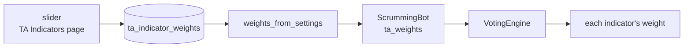
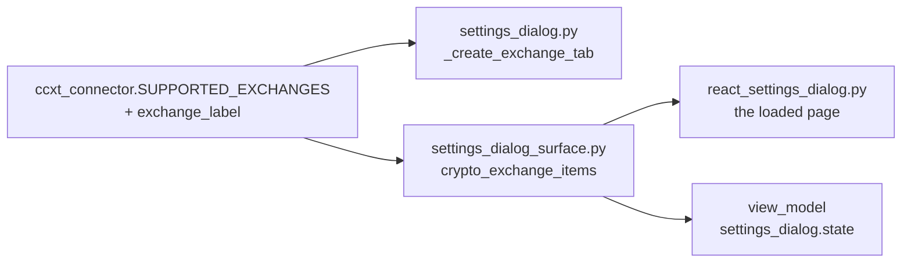
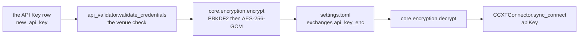
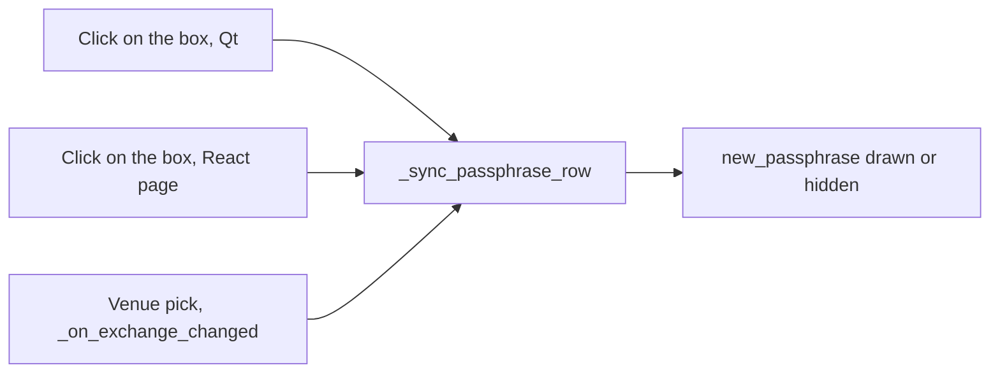
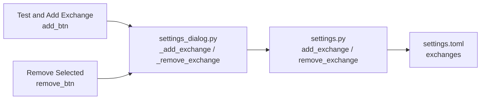
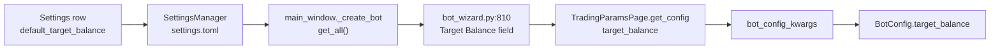
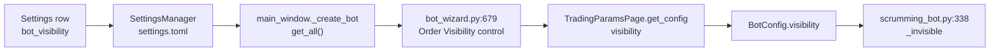
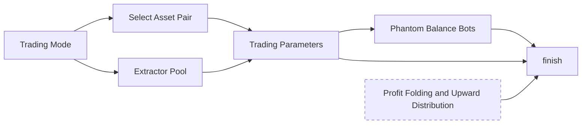

# Settings

Reference. `SettingsDialog` in `src/gui/settings_dialog.py`. The two pages
below are the ones Part 3 names.

## The eleven pages

One method adds them, in one order.

`src/gui/settings_dialog.py` — `SettingsDialog._setup_ui`

```python
tabs.addTab(self._create_user_tab(), "User")
tabs.addTab(self._create_exchange_tab(), "Exchanges")
tabs.addTab(self._create_trading_tab(), "Trading")
tabs.addTab(self._create_folding_tab(), "Profit Folding")
tabs.addTab(self._create_ta_tab(), "TA Indicators")
tabs.addTab(self._create_phantom_tab(), "Phantom Bots")
tabs.addTab(self._create_theme_tab(), "Theme")
tabs.addTab(self._create_logging_tab(), "Logging")
tabs.addTab(self._create_sound_tab(), "Sound")
tabs.addTab(self._create_sms_tab(), "SMS")
tabs.addTab(self._create_ai_monitor_tab(), "AI Monitor")
```

## What each page persists

`_save` writes and `_load_current` reads back. A control neither method touches
keeps its build-time default for the life of the process and reaches no engine.

| Page | Controls | `_save` writes | `_load_current` restores |
| ---- | -------: | -------------- | ------------------------ |
| User | 1 | the row | the row |
| Exchanges | 6 plus 3 buttons | on Add and Remove | the configured list |
| Trading | 6 | all six | four of six |
| Profit Folding | 11 | the whole group | `active` alone |
| TA Indicators | 12 | nothing | nothing |
| Phantom Bots | 13 | nothing | nothing |
| Theme | 6 | all six | the theme and the accent |
| Logging | 6 | the whole group | nothing |
| Sound | 10 plus 6 buttons | nothing | nothing |
| SMS | 17 | nothing | nothing |
| AI Monitor | 7 | all seven | all seven |

`AppSettings` in `src/core/settings.py` is the whole schema, and a key it does
not declare is refused outright rather than stored somewhere unread.

`src/core/settings.py` — `SettingsManager.set`

```python
def set(self, key: str, value: Any) -> None:
    """Set the ``AppSettings`` attribute *key* and call ``_save``.

    A *key* that ``AppSettings`` does not declare raises ``KeyError``.
    """
    with self._lock:
        if not hasattr(self._settings, key):
            raise KeyError(f"Unknown setting: {key}")
```

Four pages hold controls `_save` never reads, and the schema declares no field
any of them could land in: TA Indicators, Phantom Bots, Sound and SMS. Issue
#423 carries all four and counts the controls.

The Exchanges page is the exception to the whole pattern. `_add_exchange` and
`_remove_exchange` write through the settings manager as the operator uses
them, rather than waiting for Save.

The Sound page reaches its engine by one other route. The slider handler builds
a fresh configuration from every checkbox, pushes it in, and clears the sample
cache, because each sample bakes its volume at synthesis time.

`src/gui/settings_dialog.py` — `_on_sfx_volume_changed`

```python
se = get_sound_engine()
new_cfg = SoundConfig(
    enabled=self._sound_enabled.isChecked(),
    buy_sound=self._sound_buy.isChecked(),
    sell_sound=self._sound_sell.isChecked(),
    error_sound=self._sound_error.isChecked(),
    bot_state_sound=self._sound_state.isChecked(),
    fire_sound=self._sound_fire.isChecked(),
    track_sound=self._sound_track.isChecked(),
    profit_sound=self._sound_profit.isChecked(),
    drip_sound=self._sound_drip.isChecked(),
    volume=v / 100.0,
)
```

That path runs when the slider moves or a test button plays a sample, and at no
other time.

The parent section, [08-tabs.md](../08-tabs.md), carries the figure for each of
the eleven pages and names every control on it.

## Settings, User page

The whole page is one form row. No credential field, no licence field and no
key import.

`src/gui/settings_dialog.py` — `_create_user_tab`

```python
def _create_user_tab(self) -> QWidget:
    w = QWidget()
    form = QFormLayout(w)
    self._username = QLineEdit()
    form.addRow("Username:", self._username)
    return w
```

`_load_current` reads the stored value and `_save` writes it back through the
settings manager, which persists the schema under a home-relative directory as
a TOML file, or as JSON when no TOML writer is available. One lock guards every
read and write, shared across every manager instance.

### What a credential store would rest on

Both halves already exist, and the User page reads neither.

The first is encryption. A passphrase and a random salt derive a 256-bit key,
and each token carries its own salt and nonce.

`src/core/encryption.py` — `derive_key`

```python
def derive_key(passphrase: str, salt: bytes) -> bytes:
    """Derive a 256-bit AES key from *passphrase* + *salt* via PBKDF2."""
```

`KeyringManager` holds the passphrase in the operating system's credential
store. Without the `cryptography` package a fallback keystream with an
HMAC-SHA256 tag takes over.

The second is the hardware-key path. A credential list encrypts against a USB
volume's serial and writes at that mount point, so the file decrypts on that
stick and nowhere else.

`src/core/usb_auth.py` — `write_auth_file`

```python
def write_auth_file(
    usb_path: Path,
    volume_serial: str,
    credentials: list[dict],
) -> Path:
    """Encrypt *credentials* under ``_derive_usb_key`` and write ``AUTH_FILENAME``.

    Each dict carries ``exchange_id``, ``api_key``, ``api_secret`` and
    ``passphrase``, and the written path under *usb_path* is returned.
    """
```

`find_auth_volume` matches the volume serial that `read_auth_file` needs to
derive the same key.

## Settings, Exchanges page

`_create_exchange_tab` lists the configured exchanges and offers a form to add
one: the exchange picker, an API key, an API secret, and a passphrase field
that appears only when the exchange needs one.

The picker lists what the connector layer can actually reach.

`src/exchange/ccxt_connector.py` — `SUPPORTED_EXCHANGES`, the first six

```python
SUPPORTED_EXCHANGES: dict[str, str] = {
    "binance": "binance",
    "coinbase": "coinbase",
    "kraken": "kraken",
    "kucoin": "kucoin",
    "bybit": "bybit",
    "okx": "okx",
```

Three venues need a passphrase, and the field appears for those alone.

`src/exchange/ccxt_connector.py` — `PASSPHRASE_EXCHANGES`

```python
PASSPHRASE_EXCHANGES: set[str] = {
    "kucoin",
    "okx",
    "bitget",
}
```

The key field accepts a Coinbase CDP key string as well as a plain key, and the
secret field accepts a PEM elliptic-curve private key. Escaped newlines inside
a pasted PEM convert on the way in.

Three handlers sit behind the buttons.

| Handler | What it does |
| ------- | ------------ |
| `_test_api_connection` | Authenticates against the venue and reports through `_set_feedback` |
| `_add_exchange` | Runs that test first and stores nothing when it fails |
| `_remove_exchange` | Drops the selected entry |

### The stock wing

The same page in the stock wing shows a banner and disables Add and Test.

`src/gui/settings_dialog.py` — `_create_exchange_tab`

```python
_banner = QLabel(
    "<b>Stock Wing:</b> equity-broker integration is "
    "queued — no live brokers are wired up yet. The "
    "list below shows the planned brokers; Add / Test "
    "are disabled until the broker connectors ship. "
    "Use the Crypto Wing for active trading today."
)
```

`EQUITY_EXCHANGE_IDS` fills the list with the planned brokers, each labelled as
planned. Crypto is the wing that trades today.

### What adding one does

The new exchange routes to the crypto layer or the stock layer, and the method
removes the placeholder tab if one stood there.

`src/gui/main_window.py` — `add_exchange_tab`

```python
def add_exchange_tab(self, exchange_id: str, display_name: str) -> None:
    """Add exchange tab to the correct layer (crypto or stock)."""
    is_equity = self._is_equity_exchange(exchange_id)
```

The method emits a signal naming which layer the tab actually landed in, read
back from both layer widgets rather than from the argument it was given.

## Bridge

Two methods serve this screen.

| Bridge method | Serves | Renderer module |
| ------------- | ------ | --------------- |
| `settings_dialog.state` | The dialog and its eleven pages | `settings_dialog.js` |
| `exchange_tab.state` | One venue's tab | `exchange_tab.js` |

## 2026-09-06 00:52 - #423 - the Settings dialog draws in React

The File menu opens this dialog, and which one it opens depends on the build.
The React build draws every page below inside one embedded browser. The Qt
build draws the widget tree the pages describe. One line in the running window
picks the side.

`src/gui/main_window.py` — `_open_settings`

```python
from .variant_surface import SETTINGS_DIALOG, surface_class

_cls = surface_class(SETTINGS_DIALOG)
dlg = _cls(self._settings, self._status_log, self, wing=_wing)
```

The React side is a subclass, not a rewrite. It replaces only the method that
builds the widgets, so the loading and the saving below are the same code on
both sides. Each named control gets a small holder that answers the same calls
the widget answered, and the page reads and writes those holders.

`src/gui/react_settings_dialog.py` — `SettingsDialogReact._setup_ui`

```python
self._model = surface.SettingsDialogModel(wing=self._wing)
self._model.build()
self._build_holders()
self._web = QWebEngineView(self)
self._web.setPage(SettingsDialogPage(self))
self._web.setHtml(dialog_html(self._theme_name()))
```

An edit on the page arrives as one line the host reads, and the holder takes it
the way the control takes a stored value. A radio inside a group box clears the
others, which is what `QGroupBox` does for the widget side.

`src/gui/react_settings_dialog.py` — `SettingsDialogReact.apply_edit`

```python
self._holders[name].admit(asked.get("value"))
```

### Settings > User Tab

This needs to be built out to accept and contain individual end user credentials. This will also be where a license is entered or a keyfile is imported depending on how we design the authentication piece.

The dialog holds the eleven pages below, added in one order.

`src/gui/settings_dialog.py` — `SettingsDialog._setup_ui`

```python
tabs.addTab(self._create_user_tab(), "User")
tabs.addTab(self._create_exchange_tab(), "Exchanges")
tabs.addTab(self._create_trading_tab(), "Trading")
tabs.addTab(self._create_folding_tab(), "Profit Folding")
tabs.addTab(self._create_ta_tab(), "TA Indicators")
tabs.addTab(self._create_phantom_tab(), "Phantom Bots")
tabs.addTab(self._create_theme_tab(), "Theme")
tabs.addTab(self._create_logging_tab(), "Logging")
tabs.addTab(self._create_sound_tab(), "Sound")
tabs.addTab(self._create_sms_tab(), "SMS")
tabs.addTab(self._create_ai_monitor_tab(), "AI Monitor")
```

`_save` and `_load_current` decide which of them persists, and each page says
which under its own heading. Issue #423 carries the four pages whose controls
Save never reads.

The User page itself is one form row, and the settings manager persists it. No
credential field, no licence field and no key import.

`src/gui/settings_dialog.py` — `_create_user_tab`

```python
def _create_user_tab(self) -> QWidget:
    w = QWidget()
    form = QFormLayout(w)
    self._username = QLineEdit()
    form.addRow("Username:", self._username)
    return w
```

Both halves a credential store would rest on already exist, and the page reads
neither. `src/core/encryption.py` encrypts a secret with AES-256-GCM under a
key derived from a passphrase and a random salt.

`src/core/encryption.py` — `derive_key`

```python
def derive_key(passphrase: str, salt: bytes) -> bytes:
    """Derive a 256-bit AES key from *passphrase* + *salt* via PBKDF2."""
```

`src/core/usb_auth.py` writes an encrypted credential file keyed to a USB
volume's serial, which decrypts on that stick and nowhere else.

`src/core/usb_auth.py` — `write_auth_file`

```python
def write_auth_file(
    usb_path: Path,
    volume_serial: str,
    credentials: list[dict],
) -> Path:
```


The title bar names the wing the dialog was opened for. The arrows at each end
of the page row scroll it, because the eleven do not fit the dialog's minimum
width. Cancel and Save close the dialog, and Save always closes it, reporting
any group that failed to persist. The page itself carries one row, Username,
and nothing else.

That one row is not cosmetic. The stored username keys the credential vault.
Adding a venue on the next page builds a master phrase from that name, then
encrypts the API key and the API secret with the phrase.

`src/gui/settings_dialog.py` — `_add_exchange`, the phrase and the encryption

```python
master = f"qat_{self._sm.get('username', 'user')}_vault"
config.api_key_enc = encrypt(key, master)
config.api_secret_enc = encrypt(secret, master)
```

The figure shows a stored value, User. The declared default is an empty string,
and the settings object always declares the field, so the fallback written into
the phrase never fires. An install where the row was never filled encrypts
under a phrase with an empty middle. Change the name on a machine that already
holds credentials and the stored secrets stop opening, because the connect path
rebuilds the same phrase from the new name. Issue #436 carries it.

`src/gui/main_window.py` — the decrypt side, rebuilding the same phrase

```python
master = f"qat_{self._settings.get('username', 'user')}_vault"
api_key = decrypt(exch_config["api_key_enc"], master)
api_secret = decrypt(exch_config["api_secret_enc"], master)
```

Three sites write that phrase out as a literal, one to encrypt and two to
decrypt, and a fourth declares the format none of them reads. The same issue
carries that half.

`src/gui/main_tabs/settings_dialog_surface.py` — the declaration

```python
MASTER_FORMAT = "qat_{username}_vault"
```


### Settings > Exchanges

The page lists the configured exchanges and adds one: the exchange picker, an
API key, an API secret, and a passphrase field that appears only when the venue
needs it. The picker fills from the connector layer, so it lists what that
layer can reach.

`src/exchange/ccxt_connector.py` — `SUPPORTED_EXCHANGES`, the first six

```python
SUPPORTED_EXCHANGES: dict[str, str] = {
    "binance": "binance",
    "coinbase": "coinbase",
    "kraken": "kraken",
    "kucoin": "kucoin",
    "bybit": "bybit",
    "okx": "okx",
```

Three venues need the passphrase field, and it appears for those alone.

`src/exchange/ccxt_connector.py` — `PASSPHRASE_EXCHANGES`

```python
PASSPHRASE_EXCHANGES: set[str] = {
    "kucoin",
    "okx",
    "bitget",
}
```

The key field accepts a Coinbase CDP key string and the secret field a PEM
elliptic-curve private key. The connection test runs before anything is stored,
and adding one routes the new tab to the crypto or the stock layer.

`src/gui/main_window.py` — `add_exchange_tab`

```python
def add_exchange_tab(self, exchange_id: str, display_name: str) -> None:
    """Add exchange tab to the correct layer (crypto or stock)."""
    is_equity = self._is_equity_exchange(exchange_id)
```

The same page in the stock wing shows a banner and disables Add and Test,
because no broker connector ships yet.

`src/gui/settings_dialog.py` — `_create_exchange_tab`

```python
_banner = QLabel(
    "<b>Stock Wing:</b> equity-broker integration is "
    "queued — no live brokers are wired up yet. The "
    "list below shows the planned brokers; Add / Test "
    "are disabled until the broker connectors ship. "
    "Use the Crypto Wing for active trading today."
)
```


Configured Crypto Exchanges lists what the manager returns for this wing, each
entry naming its display name and its exchange id. The stock wing lists the
equity ids instead and disables both buttons.

The Add Crypto Exchange group holds four rows. Exchange fills from the
supported list. API Key takes a plain key or a Coinbase CDP key string, and its
placeholder shows the CDP shape. API Secret takes a plain secret or a PEM
elliptic-curve private key, and escaped newlines inside a pasted PEM convert on
the way in. The passphrase checkbox appears for the three venues above.

The picker in the figure reads Binance, the first supported id in alphabetical
order, and the passphrase box under it stays clear. Changing the picker sets
that box for the three venues that need one and clears it for the rest. It also
wipes the feedback line, so an answer about the last venue cannot stand as an
answer about this one.

`src/gui/settings_dialog.py` — `_on_exchange_changed`

```python
def _on_exchange_changed(self) -> None:
    eid = self._new_exchange.currentData()
    needs_pp = eid in self._passphrase_exchanges
    self._pp_check.setChecked(needs_pp)
    self._api_feedback.setText("")
```

The page hides the passphrase field until you tick the box, which is why the
figure shows the box and no field under it. The box carries the state; the
field only collects the value.

`src/gui/settings_dialog.py` — the field the box reveals

```python
self._new_passphrase = QLineEdit()
self._new_passphrase.setEchoMode(QLineEdit.Password)
self._new_passphrase.setPlaceholderText(
    "Passphrase set when creating API key"
)
self._new_passphrase.setVisible(False)
```

Test Connection runs the check and reports the answer. Test and Add Exchange
runs the same check first and stores nothing when it fails. Remove Selected
drops the highlighted entry.

Both buttons go dead for the length of a call, so a second click cannot start a
second test. Test and Add returns on a failed check, which is what keeps a
venue that did not answer out of the store.

`src/gui/settings_dialog.py` — `_add_exchange`, the guard before the store

```python
if key and secret:
    result = self._test_api_connection()
    if result is None or not result.success:
        return
```


### Settings > Trading


Six rows carry the defaults a new bot starts from, not a running bot's
settings.

Position Distance - Sets the spacing a new bot puts between its positions.
Key `position_distance_pct`, 1.0 % to 50.0 %, at 2.0 %.

The dialog stores the figure and reads it back the next time the page opens.
No bot ever sees it. The bot factory strips the name before it builds a
config, so the value cannot reach a bot by any route.

`src/gui/settings_dialog.py` — the Position Distance row

```python
self._pos_distance = QDoubleSpinBox()
self._pos_distance.setRange(1.0, 50.0)
self._pos_distance.setSuffix("%")
self._pos_distance.setDecimals(1)
form.addRow("Position Distance:", self._pos_distance)
```

The strip list holds eleven names. This page contributes one of them and the
Profit Folding page below contributes four more.

`src/trading/container/config.py` — `_DEPRECATED_KWARGS`

```python
_DEPRECATED_KWARGS: frozenset = frozenset(
    {
        "bulk_trading",  # renamed to stack_mode
        "bulk_partial_on_return",
        "market_check_interval",
        "position_count",
        "position_distance_pct",
        "fold_mode",
        "fold_target",
        "fold_target_count",
        "profit_fold_pct",
        "distribute_target",
        "distribute_target_count",
    }
)
```

Increment Style - Chooses whether that spacing stays even or widens on a
curve. Key `increment_style`, linear or logarithmic, at linear.

The dialog stores the choice and restores it on the next open. A bot takes its
own increment style from the wizard rather than from this page.

`src/gui/settings_dialog.py` — the Increment Style row

```python
self._increment_style = QComboBox()
self._increment_style.addItems(["linear", "logarithmic"])
form.addRow("Increment Style:", self._increment_style)
```

Default Positions - Sets how many positions a new bot opens with. Key
`default_position_count`, 1 to 100, at 10.

The dialog stores the count and restores it. Nothing outside the dialog reads
the name, so no bot opens with it.

`src/gui/settings_dialog.py` — the Default Positions row

```python
self._default_positions = QSpinBox()
self._default_positions.setRange(1, 100)
form.addRow("Default Positions:", self._default_positions)
```

Default Target Balance - Sets the dollar figure the wizard's own Target
Balance field opens at. Key `default_target_balance`, $1.00 to $1,000,000.00,
at $200.00.

This is the one row on the page that reaches a new bot. The wizard's parameter
page opens its Target Balance field at the stored figure.

`src/gui/bot_wizard.py` — the wizard field that reads the stored default

```python
self._target_balance = QDoubleSpinBox()
self._target_balance.setRange(1.0, 1000000.0)
self._target_balance.setDecimals(2)
self._target_balance.setPrefix("$ ")
self._target_balance.setValue(defaults.get("default_target_balance", 200.0))
```

Bot Visibility - Chooses whether a new bot rests its orders on the book or
tracks them inside the platform. Key `bot_visibility`, orderbook or internal,
at orderbook.

Save writes the name and the load path never reads it. The box opens on
orderbook whatever was stored, and a Save with no edit writes that first entry
back over the stored value. A bot takes its visibility from the wizard, under
a different name.

`src/gui/settings_dialog.py` — the Bot Visibility row

```python
self._visibility = QComboBox()
self._visibility.addItems(["orderbook", "internal"])
form.addRow("Bot Visibility:", self._visibility)
```

Enable aggressive trading mode - Starts a new bot pricing for an immediate
fill. Key `aggressive_trading`, a checkbox, off.

The same gap as the row above. Save writes it, the load path skips it, and the
box opens clear. The wizard carries its own aggressive trading checkbox, and
that is the one a new bot reads.

`src/gui/settings_dialog.py` — the aggressive trading row

```python
self._aggressive = QCheckBox("Enable aggressive trading mode")
form.addRow(self._aggressive)
```

Save writes all six keys. The load path restores the first four, which is why
the last two rows on the page open at their built-in defaults.

`src/gui/settings_dialog.py` — `_load_current`, the four it restores

```python
self._pos_distance.setValue(self._sm.get("position_distance_pct", 2.0))
self._default_positions.setValue(self._sm.get("default_position_count", 10))
self._default_balance.setValue(
    self._sm.get("default_target_balance", 200.0)
)
style = self._sm.get("increment_style", "linear")
idx = self._increment_style.findText(style)
if idx >= 0:
    self._increment_style.setCurrentIndex(idx)
```

### Settings > Profit Folding


One master checkbox and three groups of radio buttons, eleven controls in all.
Every key below sits inside one stored `profit_folding` group.

Profit Folding / Upward Distribution Active - Turns the whole page on. Key
`active`, a checkbox, clear at build and set to on when the stored group
loads.

This is the one control on the page the load path restores, so it is the only
one of the six that reopens on what was stored.

`src/gui/settings_dialog.py` — the master switch

```python
self._folding_active = QCheckBox(
    "Profit Folding / Upward Distribution Active"
)
layout.addWidget(self._folding_active)
```

Distribution Mode - Chooses whether a fold spreads evenly across the chosen
positions or on a curve. Key `mode`, equal or logarithmic, at equal.

Two radio buttons in one group. Equal is checked at build, and Save reads the
logarithmic button to decide which of the two words it stores.

`src/gui/settings_dialog.py` — the Distribution Mode group

```python
mode_group = QGroupBox("Distribution Mode")
mode_layout = QVBoxLayout(mode_group)
self._fold_equal = QRadioButton("Equal distribution")
self._fold_log = QRadioButton("Logarithmic distribution")
self._fold_equal.setChecked(True)
```

Profit Folding Target - Chooses which buy positions a fold reaches: all of
them, a counted number of them, or the most recent. Key `fold_target`, at all
buy positions.

Three radio buttons and the count box the middle one gates. The all-buy button
is checked at build.

`src/gui/settings_dialog.py` — the Profit Folding Target group

```python
self._fold_all = QRadioButton("Fold to ALL buy positions")
self._fold_x = QRadioButton("Fold to X# of buy positions:")
self._fold_recent = QRadioButton("Fold to most recent buy positions")
self._fold_x_count = QSpinBox()
self._fold_x_count.setRange(1, 100)
self._fold_x_count.setValue(5)
self._fold_all.setChecked(True)
```

Fold to X# of buy positions - Sets that counted number. Key
`fold_target_count`, 1 to 100, at 5.

Upward Distribution Target - The same three choices on the sell side. Key
`distribute_target`, at all sell positions.

The sell-side group is built the same way as the buy-side group above, with
its own count box at 5 and its own all-sell button checked at build.

`src/gui/settings_dialog.py` — the Upward Distribution Target group

```python
self._dist_all = QRadioButton("Distribute to ALL sell positions")
self._dist_x = QRadioButton("Distribute to X# of sell positions:")
self._dist_recent = QRadioButton("Distribute to most recent sell positions")
self._dist_x_count = QSpinBox()
self._dist_x_count.setRange(1, 100)
self._dist_x_count.setValue(5)
self._dist_all.setChecked(True)
```

Distribute to X# of sell positions - Sets the sell-side count. Key
`distribute_target_count`, 1 to 100, at 5.

Save collapses the two target groups into one dictionary. Each group reduces
to a single word, taken from whichever of its three buttons is checked.

`src/gui/settings_dialog.py` — `_save`

```python
fold_target = "all_buy"
if self._fold_x.isChecked():
    fold_target = "x_buy"
elif self._fold_recent.isChecked():
    fold_target = "most_recent_buy"
dist_target = "all_sell"
if self._dist_x.isChecked():
    dist_target = "x_sell"
elif self._dist_recent.isChecked():
    dist_target = "most_recent_sell"
```

The load path restores the master switch alone, so the mode and both targets
open at the checked defaults the figure shows.

`src/gui/settings_dialog.py` — `_load_current`

```python
pf = self._sm.get("profit_folding", {})
self._folding_active.setChecked(pf.get("active", True))
```

Issue #423 carries that half of it. Four of the six keys then fail a second
time further down: the two target names and their two counts are four of the
eleven the bot factory strips, listed under Settings > Trading above. A group
that did round-trip still could not carry those four to a bot.

In development. Which of the six the load path should restore has not been
settled against the rest of the dialog, so nothing is proposed here.

### Settings > TA Indicators


One slider per weight, twelve in all, each labelled from its key and each
running 0.00 to 2.00. The value beside a slider follows it as it moves, and the
starting values are the weights themselves.

Indicator weight - Sets how far one indicator's vote counts against the other
eleven when the engine totals a direction. The key behind each slider, and the
value it starts at, are the twelve below.

`src/trading/ta_engine.py` — `DEFAULT_WEIGHTS`

```python
DEFAULT_WEIGHTS = {
    "bollinger_bands": 1.0,
    "vortex": 0.9,
    "macd": 1.2,
    "stochastic_rsi": 1.0,
    "ichimoku": 1.1,
    "volume": 0.8,
    "slingshot": 1.0,
    "adx": 1.0,
    "kaufman_er": 1.0,  # Perry Kaufman Efficiency Ratio (regime classifier)
    "supertrend": 1.0,  # Olivier Seban ATR-trailing trend (reactive flip)
    "zscore": 0.9,  # Statistical extremity over a longer window than BB
    # Both are built on Wilder's RSI, so this vote overlaps stochastic_rsi.
    "rsi": 0.8,
}
```

A weight moved here reaches nothing. Save reads no widget on this page, the
load path restores none, and the settings schema declares no field for
indicator weights. The voting engine takes a weights argument and falls back to
the defaults above, and no construction site under `src/` supplies one from the
settings store. The page label promises an adjustment the engine never sees.
Issue #423 carries it.

`src/trading/ta_engine.py` — `VotingEngine.__init__`, the fallback every
construction site takes

```python
self.weights = weights or DEFAULT_WEIGHTS.copy()
```

#### Where an indicator weight lands

Each of the twelve sliders is a named control, saved under one key and restored
from it. Save writes all twelve; reopening the page shows what was saved. The
key is `ta_indicator_weights`, and an empty one means every indicator votes at
its published figure.

`src/core/settings.py` — the stored group

```python
# Indicator name -> voting weight. Empty means every indicator votes at the
# figure ta_engine.DEFAULT_WEIGHTS declares for it.
ta_indicator_weights: dict = field(default_factory=dict)
```

A bot reads the group when it is built, so a weight changed here applies to the
next bot created and to every bot on the next launch. A bot already ticking
keeps the figures it started with until it is rebuilt.



`src/trading/ta_engine.py` — the one reader every path goes through

```python
def weights_from_settings(stored: Optional[dict]) -> dict[str, float]:
    found = dict(DEFAULT_WEIGHTS)
    for name, figure in (stored or {}).items():
        ...
        found[name] = number
    return found
```

An entry naming no indicator, an entry that is not a number, and a negative
figure are each dropped with a line in the log, so a hand-edited settings file
cannot give an indicator a weight the engine refuses to explain.

#### One declaration of the twelve figures

`DEFAULT_WEIGHTS` is the only place the twelve figures are written. The voting
engine builds one indicator per key, in that order, and the page reads the same
mapping for its starting positions. Neither holds a second copy, so the two
cannot drift apart.

`src/trading/ta_engine.py` — `_create_indicators`

```python
return [
    INDICATOR_CLASSES[name](weight=self.weights.get(name, default))
    for name, default in DEFAULT_WEIGHTS.items()
]
```

#### The figures stay as they are

Driven on a record shaped the way the restore path reads `bot_state.json`, a
restored bot arrives with no stored weight of its own and takes the declared
figures. A zero written into the declaration would therefore reach every bot
already on disk and stop all twelve indicators contributing, while the vote
counts stayed the same. The figures are unchanged for that reason.

```
declared defaults   consensus 0.1684   BULLISH   votes 6/4/2
all twelve at zero  consensus 0.0      NEUTRAL   votes 6/4/2
```

A zero for one indicator is a different matter and is available today: setting
a single slider to 0.00 removes that indicator's vote and leaves the other
eleven voting.

### Settings > Phantom Bots


The master checkbox, eleven timeframe boxes — 1m, 5m, 15m, 30m, 1h, 2h, 4h, 6h,
12h, 1d and 1w — and one Higher-TF Lock Settings group holding Lock duration in
candles, 1 to 10. The build checks 5m, 15m, 1h, 4h and 1d, which is the state
the figure shows.

Enable Phantom Balance Bots for Scrumming - Turns the phantom overrides on for
a new bot. Per-bot key `enable_phantoms`, a checkbox, checked at build.

This is the only control on the page that starts on. Save never reads it, so
the page stores nothing under the name it shows.

`src/gui/settings_dialog.py` — the phantom master switch

```python
self._phantoms_enabled = QCheckBox(
    "Enable Phantom Balance Bots for Scrumming"
)
self._phantoms_enabled.setChecked(True)
layout.addWidget(self._phantoms_enabled)
```

Default Phantom Timeframes - Chooses which charts a phantom watches. Per-bot
key `phantom_timeframes`, eleven boxes, five of them checked at build.

One box per timeframe in a single row. The build decides which five open
checked, and those five are the ones the figure shows.

`src/gui/settings_dialog.py` — the box built for each timeframe

```python
cb = QCheckBox(tf)
cb.setChecked(tf in ["5m", "15m", "1h", "4h", "1d"])
self._phantom_tf_checks[tf] = cb
tf_grid.addWidget(cb)
```

Lock duration (candles) - Sets how many candles a higher-timeframe lock holds
an opposing trade back for. Per-bot key `lock_candle_count`, 1 to 10, at 2.

The one spin box on the page, inside its own group. It opens at 2 and Save
reads it no more than it reads the other two.

`src/gui/settings_dialog.py` — the lock duration box

```python
lock_group = QGroupBox("Higher-TF Lock Settings")
lock_form = QFormLayout(lock_group)
self._lock_candles = QSpinBox()
self._lock_candles.setRange(1, 10)
self._lock_candles.setValue(2)
lock_form.addRow("Lock duration (candles):", self._lock_candles)
```

Those eleven boxes are the eleven timeframes the voting engine already weights,
from 1m at 0.3 up to 1w at 1.6, so a slower chart counts for more when several
are combined.

These three controls carry the same gap the TA Indicators page carries. Save
reads none of them, the load path restores none, and the schema refuses a key
it does not declare rather than storing it somewhere unread.

`src/core/settings.py` — `SettingsManager.set`

```python
with self._lock:
    if not hasattr(self._settings, key):
        raise KeyError(f"Unknown setting: {key}")
    setattr(self._settings, key, value)
    self._save()
```

Issue #423 carries this page. The per-bot equivalents do persist: the wizard's
phantom page emits the same three names into the bot's own config, and the Live
Bot Settings dialog edits them there.

`src/gui/bot_wizard.py` — `PhantomConfigPage.get_config`, the three keys that
do reach a bot

```python
return {
    "enable_phantoms": self._enable.isChecked(),
    "phantom_timeframes": checked,
    "lock_candle_count": self._lock_candles.value(),
}
```

### Settings > Theme


The theme picker, the accent colour field and a Font Settings group. Six
controls and one preview.

Visual Theme - Chooses the palette the whole window paints in. Key `theme`,
five display names — Cyberpunk Dark, Neon Light, Classic Terminal, Minimal
Modern and Glass & Metal — at Cyberpunk Dark.

This is the one control on the page that reaches the running window. Save
emits a signal, the main window reads the stored theme back, and the window
repaints without a restart.

`src/gui/main_window.py` — `_on_settings_changed`

```python
theme = self._settings.get("theme", "cyberpunk_dark")
self._switch_theme(theme)
```

Accent Color - Sets the highlight colour. Key `accent_color`, a free-text
field, at `#00ffcc`.

A plain text box. The default is placeholder text, not a value, so the field
opens empty until something is typed or a stored value loads. Save stores what
is there and the load path puts it back, but nothing paints with it.

`src/gui/settings_dialog.py` — the Accent Color field

```python
layout.addWidget(QLabel("Accent Color:"))
self._accent_color = QLineEdit()
self._accent_color.setPlaceholderText("#00ffcc")
layout.addWidget(self._accent_color)
```

Font Family - Sets the typeface for application text. Key `font_family`, an
editable combo over twelve named families, at Segoe UI.

The box is editable, so a family outside the twelve can be typed in. Save
stores this value and the three sizes below it. Nothing reads any of the four,
and the load path does not restore them either, so the whole Font Settings
group reopens at its built-in figures.

`src/gui/settings_dialog.py` — the Font Family row

```python
self._font_family.addItems(fonts)
self._font_family.setCurrentText("Segoe UI")
self._font_family.setToolTip("Font family for all application text")
font_form.addRow("Font Family:", self._font_family)
```

Base Font Size - Sets the size of ordinary interface text. Key `font_size`,
8 pt to 24 pt, at 11 pt.

The preview line below the group follows this box and the family box as either
changes. That preview is the only place either value has an effect.

`src/gui/settings_dialog.py` — the Base Font Size row

```python
self._font_size = QSpinBox()
self._font_size.setRange(8, 24)
self._font_size.setValue(11)
self._font_size.setSuffix(" pt")
self._font_size.setToolTip("Base font size for all UI text")
font_form.addRow("Base Font Size:", self._font_size)
```

Heading Font Size - Sets the size of headings and stat-card values. Key
`heading_font_size`, 10 pt to 32 pt, at 14 pt.

The widest of the three ranges. The preview does not follow this box.

`src/gui/settings_dialog.py` — the Heading Font Size row

```python
self._heading_size = QSpinBox()
self._heading_size.setRange(10, 32)
self._heading_size.setValue(14)
self._heading_size.setSuffix(" pt")
self._heading_size.setToolTip("Font size for headings and stat card values")
font_form.addRow("Heading Font Size:", self._heading_size)
```

Log Font Size - Sets the size of the Activity Log and API Log text. Key
`log_font_size`, 8 pt to 18 pt, at 10 pt.

The narrowest of the three ranges, and the last row before the preview.

`src/gui/settings_dialog.py` — the Log Font Size row

```python
self._log_font_size = QSpinBox()
self._log_font_size.setRange(8, 18)
self._log_font_size.setValue(10)
self._log_font_size.setSuffix(" pt")
```

Preview redraws in the chosen family and base size as either changes. It is a
sample line, not a setting, and nothing stores it.

The five theme names come from one mapping built off the five theme objects.

`src/gui/theme_engine.py` — `THEMES`

```python
THEMES: dict[str, ThemeTokens] = {
    t.name: t
    for t in [CYBERPUNK_DARK, NEON_LIGHT, CLASSIC_TERMINAL, MINIMAL_MODERN, GLASS_METAL]
}
```

Save writes the theme, the Accent Color field and all four font values.

`src/gui/settings_dialog.py` — `_save`, the theme and font keys

```python
"theme": lambda: self._theme_combo.currentData(),
"accent_color": lambda: self._accent_color.text().strip(),
"font_family": lambda: self._font_family.currentText(),
"font_size": lambda: self._font_size.value(),
"heading_font_size": lambda: self._heading_size.value(),
"log_font_size": lambda: self._log_font_size.value(),
```

The load path reads back the theme and the accent field only, so the four font
rows open at Segoe UI, 11, 14 and 10 whatever was stored.

Of the six, the theme alone reaches the window. `main.py` reads it at startup,
and the window reads it again in `_on_settings_changed` when the dialog saves.

The other five are stored and never read again. Each palette carries its own
typeface in the theme object it declares, so the theme decides the font and the
four font rows decide nothing. The accent field has the same shape: declared,
written, read back into its own line edit, and painted nowhere.

`src/core/settings.py` — `AppSettings`, the five that are stored and unread

```python
accent_color: str = "#00ffcc"

# These four mirror the font widgets in settings_dialog._create_theme_tab.
font_family: str = "Segoe UI"
font_size: int = 11
heading_font_size: int = 14
log_font_size: int = 10
```

### Settings > Logging


Two checkboxes and four periodicity boxes. Every key below sits inside one
stored `data_logging` group.

Log TA signal samples with all values and timestamps - Writes each indicator
reading out with its value and its time. Key `ta_signal_logging`, a checkbox,
checked at build.

The first of the two flags on the page, and the one that decides whether the
indicator record is written at all.

`src/gui/settings_dialog.py` — the TA logging checkbox

```python
self._ta_logging = QCheckBox(
    "Log TA signal samples with all values and timestamps"
)
self._ta_logging.setChecked(True)
layout.addWidget(self._ta_logging)
```

Highlight entries near Scrumming Bot trades - Marks the log lines that sit
close to a fire, so a decision can be read in its own context. Key
`highlight_trade_proximity`, a checkbox, checked at build.

The second flag, built the same way and checked at build like the first.

`src/gui/settings_dialog.py` — the highlight checkbox

```python
self._highlight_trades = QCheckBox(
    "Highlight entries near Scrumming Bot trades"
)
self._highlight_trades.setChecked(True)
layout.addWidget(self._highlight_trades)
```

P/L Log Periodicity - Chooses the windows a profit and loss figure is
summarised over: 24 Hours, 1 Week, 1 Month and 1 Year. Key
`active_periodicities`, four boxes written as a list, with the first two
checked at build.

Four separate boxes rather than one control. Save walks them in page order and
writes the checked ones into a list.

`src/gui/settings_dialog.py` — the four periodicity boxes

```python
self._log_24h = QCheckBox("24 Hours")
self._log_24h.setChecked(True)
self._log_1w = QCheckBox("1 Week")
self._log_1w.setChecked(True)
self._log_1m = QCheckBox("1 Month")
self._log_1y = QCheckBox("1 Year")
```

Save collapses all six into one dictionary holding the two flags and the list
of active periodicities. The load path reads none of them back, so every open
shows the build state rather than the stored one. No reader outside the dialog
reads the group either, which leaves the six controls writing to a key nothing
consults. Issue #423 carries this page.

In development. What the load path should restore for this page has not been
settled against the rest of the dialog, so nothing is proposed here.

### Settings > Sound


The master switch, eight event checkboxes, a volume slider and six test
buttons. Every checkbox is checked at build.

Each checkbox names its sound in its own label, and the key behind each control
is a field of the sound configuration the block below builds.

Enable sound notifications - Turns every sound on or off at once. Key
`enabled`, on.

The engine tests this flag before it tests any other, so a clear box silences
the page whatever the eight below are set to.

`src/gui/settings_dialog.py` — the master switch

```python
self._sound_enabled = QCheckBox("Enable sound notifications")
self._sound_enabled.setChecked(True)
self._sound_enabled.setToolTip("Master switch for all audio notifications")
```

Buy order fills - Plays a low rising tone when a buy fills. Key `buy_sound`,
on.

The label carries the sound's own name in brackets, as every box on this page
does. The engine plays this one under the name buy.

`src/gui/settings_dialog.py` — the buy fill box

```python
self._sound_buy = QCheckBox("Buy order fills (blurb + squirt tone)")
self._sound_buy.setChecked(True)
self._sound_buy.setToolTip(
    "Plays a low bubbly rising tone when a buy order is filled"
)
```

Sell order fills - Plays a bright bell when a sell fills. Key `sell_sound`, on.

The counterpart to the box above, played under the name sell.

`src/gui/settings_dialog.py` — the sell fill box

```python
self._sound_sell = QCheckBox("Sell order fills (bell + jingle tone)")
self._sound_sell.setChecked(True)
self._sound_sell.setToolTip(
    "Plays a high bright bell tone when a sell order is filled"
)
```

Errors - Plays an alert tone on an error. Key `error_sound`, on.

One of the two boxes on the page with no tooltip of its own.

`src/gui/settings_dialog.py` — the error box

```python
self._sound_error = QCheckBox("Errors (alert tone)")
self._sound_error.setChecked(True)
layout.addWidget(self._sound_error)
```

Bot state changes - Plays a click when a bot starts, pauses or stops. Key
`bot_state_sound`, on.

The other box with no tooltip. The engine plays it under the name state, not
under the key.

`src/gui/settings_dialog.py` — the bot state box

```python
self._sound_state = QCheckBox("Bot state changes (subtle click)")
self._sound_state.setChecked(True)
layout.addWidget(self._sound_state)
```

Scrum/Fold Fire - Plays a rifle shot when a scrum or a fold executes, and on a
Manual Fire. Key `fire_sound`, on.

This is the first of the four the engine reads with a default rather than
straight off the configuration. A stored configuration written before these
four existed leaves all four on.

`src/gui/settings_dialog.py` — the fire box

```python
self._sound_fire = QCheckBox("Scrum/Fold Fire (sniper rifle shot)")
self._sound_fire.setChecked(True)
self._sound_fire.setToolTip(
    "Synthesized rifle shot plays when a scrum or fold\n"
    "actually executes. Also plays on Manual Fire."
)
```

Tracking beeps - Paces a beep by the scrum phase: silent in SEARCH, slow in
TRACK, fast in FIRE. Key `track_sound`, on.

The tooltip gives the two paces in milliseconds: 800 in TRACK and 200 in FIRE.

`src/gui/settings_dialog.py` — the tracking box

```python
self._sound_track = QCheckBox(
    "Tracking beeps (speeds up as bot closes on fire)"
)
self._sound_track.setChecked(True)
```

P/L increase - Plays coins dropping into a bucket on any trade that realised a
profit. Key `profit_sound`, on.

The tooltip is the only place on the page that names the condition exactly:
realised profit above zero, on grid and scrumming bots alike.

`src/gui/settings_dialog.py` — the profit box

```python
self._sound_profit = QCheckBox("P/L increase (coins dropping into bucket)")
self._sound_profit.setChecked(True)
```

Accumulation - Plays a water drip on a FOLD, and on nothing else. Key
`drip_sound`, on.

The last of the nine. Its tooltip calls a fold the canonical accumulation
moment and states that a scrum or a distribution does not fire it.

`src/gui/settings_dialog.py` — the accumulation box

```python
self._sound_drip = QCheckBox("Accumulation (water drip)")
self._sound_drip.setChecked(True)
```

SFX Volume - Sets how loud every sample plays. Key `volume`, 0 % to 100 %, at
70 %.

Test Buy, Test Sell, Test Fire, Test Track, Test Profit and Test Drip play one
sample each. They are buttons, not settings.

One handler is the only path from this page to the engine. It builds a
configuration from every checkbox and the slider, pushes it in and clears the
sample cache, because each sample bakes its volume at synthesis time.

`src/gui/settings_dialog.py` — `_on_sfx_volume_changed`

```python
se = get_sound_engine()
new_cfg = SoundConfig(
    enabled=self._sound_enabled.isChecked(),
    buy_sound=self._sound_buy.isChecked(),
    sell_sound=self._sound_sell.isChecked(),
    error_sound=self._sound_error.isChecked(),
    bot_state_sound=self._sound_state.isChecked(),
    fire_sound=self._sound_fire.isChecked(),
    track_sound=self._sound_track.isChecked(),
    profit_sound=self._sound_profit.isChecked(),
    drip_sound=self._sound_drip.isChecked(),
    volume=v / 100.0,
)
```

That path runs when the slider moves or a test button is pressed, and at no
other time. Save reads no widget on this page and the schema declares no sound
field, so nothing here survives the dialog closing. A checkbox cleared and the
dialog saved comes back checked. Issue #423 carries it.

`src/core/sound_engine.py` — `SoundConfig`, the ten fields and their defaults

```python
enabled: bool = True
buy_sound: bool = True
sell_sound: bool = True
error_sound: bool = True
bot_state_sound: bool = True
fire_sound: bool = True
track_sound: bool = True
profit_sound: bool = True
drip_sound: bool = True
volume: float = 0.7
```

### Settings > SMS


A scrolling page holding the master switch and three groups.

Seventeen controls, and the key behind each is a field of the message
configuration the engine reads.

Enable SMS notifications - Turns every message on or off at once. Key
`enabled`, clear at build.

The only control on the page outside the three groups, and the only checkbox
here that opens clear rather than checked.

`src/gui/settings_dialog.py` — the SMS master switch

```python
self._sms_enabled = QCheckBox("Enable SMS notifications")
self._sms_enabled.setToolTip(
    "Send text messages to your phone for trading events"
)
layout.addWidget(self._sms_enabled)
```

Provider - Chooses how a message leaves the machine: a carrier's email gateway,
or the Twilio web interface. Key `provider`, at the email gateway. Nothing
loads a stored choice into the picker, so it opens on the first entry whatever
the figure shows.

Two entries, both written as display labels. The engine tests a short code
rather than either label, so neither entry matches what the send path looks
for.

`src/gui/settings_dialog.py` — the Provider row

```python
self._sms_provider = QComboBox()
self._sms_provider.setMinimumHeight(28)
self._sms_provider.addItems(["Email-to-SMS Gateway", "Twilio API"])
pf.addRow("Provider:", self._sms_provider)
```

Phone Number - Sets the number every message goes to. Key `phone_number`, empty,
with a placeholder showing the international shape.

The placeholder is the only guidance on the row. It is grey sample text, not a
value, so the field starts genuinely empty.

`src/gui/settings_dialog.py` — the Phone Number row

```python
self._sms_phone = QLineEdit()
self._sms_phone.setMinimumHeight(28)
self._sms_phone.setPlaceholderText("+15551234567")
pf.addRow("Phone Number:", self._sms_phone)
```

Carrier - Names the carrier whose gateway address a message would be built for.
Ten entries, opening on the first. It has no stored field of its own, and
nothing on the page reads the choice.

The ten names come from one mapping in the engine. The last entry is a manual
option whose address is deliberately empty.

`src/gui/settings_dialog.py` — the Carrier row

```python
self._sms_carrier = QComboBox()
self._sms_carrier.setMinimumHeight(28)
from src.core.sms_engine import CARRIER_GATEWAYS

for carrier in CARRIER_GATEWAYS:
    self._sms_carrier.addItem(carrier)
pf.addRow("Carrier:", self._sms_carrier)
```

Gateway Email - Sets the full gateway address a message is sent to. Key
`gateway_email`, empty.

The row a carrier choice would otherwise fill in. Nothing builds the address
from the picker above, so this field is typed by hand or left blank.

`src/gui/settings_dialog.py` — the Gateway Email row

```python
self._sms_gateway = QLineEdit()
self._sms_gateway.setMinimumHeight(28)
self._sms_gateway.setPlaceholderText("5551234567@vtext.com")
self._sms_gateway.setToolTip("Full email address for carrier SMS gateway")
pf.addRow("Gateway Email:", self._sms_gateway)
```

SMTP Username - Sets the mailbox a message is sent from. Key `smtp_username`,
empty.

The first of the two mailbox rows. Its placeholder shows an ordinary address.

`src/gui/settings_dialog.py` — the SMTP Username row

```python
self._sms_smtp_user = QLineEdit()
self._sms_smtp_user.setMinimumHeight(28)
self._sms_smtp_user.setPlaceholderText("your.email@gmail.com")
pf.addRow("SMTP Username:", self._sms_smtp_user)
```

SMTP Password - Sets that mailbox's application password. Key `smtp_password`,
masked, empty.

The only masked field on the page. Its placeholder says an application
password rather than the account password.

`src/gui/settings_dialog.py` — the SMTP Password row

```python
self._sms_smtp_pass = QLineEdit()
self._sms_smtp_pass.setMinimumHeight(28)
self._sms_smtp_pass.setEchoMode(QLineEdit.Password)
self._sms_smtp_pass.setPlaceholderText(
    "App password (not regular password)"
)
pf.addRow("SMTP Password:", self._sms_smtp_pass)
```

Buy fills - Sends a message when a buy fills. Key `notify_buy_fills`, checked
at build.

The first of the eight event rows, and one of the four that open checked.

`src/gui/settings_dialog.py` — the buy fills row

```python
self._sms_buy = QCheckBox("Buy fills")
self._sms_buy.setChecked(True)
ef.addRow(self._sms_buy)
```

Sell fills - Sends a message when a sell fills. Key `notify_sell_fills`,
checked at build.

The counterpart to the row above, built and checked the same way.

`src/gui/settings_dialog.py` — the sell fills row

```python
self._sms_sell = QCheckBox("Sell fills")
self._sms_sell.setChecked(True)
ef.addRow(self._sms_sell)
```

Bot state changes - Sends a message when a bot starts, stops or errors. Key
`notify_bot_state_changes`, checked at build.

The label names the three states in brackets, which the page's own text does
not repeat anywhere else.

`src/gui/settings_dialog.py` — the bot state row

```python
self._sms_state = QCheckBox("Bot state changes (start/stop/error)")
self._sms_state.setChecked(True)
ef.addRow(self._sms_state)
```

API errors and failures - Sends a message when a venue call fails. Key
`notify_errors`, checked at build.

The last of the four rows that open checked.

`src/gui/settings_dialog.py` — the API errors row

```python
self._sms_errors = QCheckBox("API errors and failures")
self._sms_errors.setChecked(True)
ef.addRow(self._sms_errors)
```

P/L threshold alerts - Sends a message when profit or loss passes a dollar
figure. Key `notify_pl_threshold`, clear at build.

The first row in the group that opens clear. It gates the dollar figure on the
row below it.

`src/gui/settings_dialog.py` — the P/L alert row

```python
self._sms_pl = QCheckBox("P/L threshold alerts")
ef.addRow(self._sms_pl)
```

P/L threshold - Sets that dollar figure. Key `pl_threshold_amount`, $1 to
$100,000, at $100.

The one spin box in the events group, and the only row there that is not a
checkbox.

`src/gui/settings_dialog.py` — the P/L threshold row

```python
self._sms_pl_amount = QDoubleSpinBox()
self._sms_pl_amount.setMinimumHeight(28)
self._sms_pl_amount.setRange(1, 100000)
self._sms_pl_amount.setValue(100)
self._sms_pl_amount.setPrefix("$")
ef.addRow("P/L threshold:", self._sms_pl_amount)
```

Low balance warnings - Sends a message when a balance runs low. Key
`notify_balance_warning`, clear at build.

No figure on the page sets what counts as low, so the row carries the switch
alone.

`src/gui/settings_dialog.py` — the low balance row

```python
self._sms_balance = QCheckBox("Low balance warnings")
ef.addRow(self._sms_balance)
```

Exchange connection status - Sends a message when a venue connects or drops.
Key `notify_connection_status`, clear at build.

The last event row, and the third of the three that open clear.

`src/gui/settings_dialog.py` — the connection status row

```python
self._sms_connection = QCheckBox("Exchange connection status")
ef.addRow(self._sms_connection)
```

Max messages per hour - Caps how many messages one hour may carry. Key
`max_messages_per_hour`, 1 to 100, at 20. Below the area the figure shows.

The first of the two rows in the rate limiting group.

`src/gui/settings_dialog.py` — the hourly cap row

```python
self._sms_max_hour = QSpinBox()
self._sms_max_hour.setMinimumHeight(28)
self._sms_max_hour.setRange(1, 100)
self._sms_max_hour.setValue(20)
rf.addRow("Max messages per hour:", self._sms_max_hour)
```

Min time between messages - Sets the wait between two messages. Key
`cooldown_seconds`, 5 to 300 seconds, at 30. Below the area the figure shows.

The second rate limiting row, and the last control on the page. It is the one
spin box here that carries a unit in its own suffix.

`src/gui/settings_dialog.py` — the cooldown row

```python
self._sms_cooldown = QSpinBox()
self._sms_cooldown.setMinimumHeight(28)
self._sms_cooldown.setRange(5, 300)
self._sms_cooldown.setValue(30)
self._sms_cooldown.setSuffix(" sec")
rf.addRow("Min time between messages:", self._sms_cooldown)
```

The Carrier list fills from one mapping of carrier name to gateway address.

`src/core/sms_engine.py` — `CARRIER_GATEWAYS`, the first four

```python
CARRIER_GATEWAYS = {
    "AT&T": "{number}@txt.att.net",
    "T-Mobile": "{number}@tmomail.net",
    "Verizon": "{number}@vtext.com",
    "Sprint": "{number}@messaging.sprintpcs.com",
```

None of it reaches the SMS engine. Save reads no widget on this page and the
schema declares no SMS field. Neither provider label the combo offers matches
the value the engine tests for, and the page carries no field for the three
Twilio credentials the send path reads.

`src/core/sms_engine.py` — `SMSConfig.provider`, the value the send path tests

```python
    provider: str = "email_gateway"
```

Issue #423 carries the page.

`src/core/sms_engine.py` — `SMSConfig`, the three credentials no row fills

```python
twilio_sid: str = ""
twilio_auth_token: str = ""
twilio_from_number: str = ""
```

### Settings > AI Monitor


A scrolling page holding four groups.

Seven settings, and every key below sits inside one stored `ai_monitor` group.

Anthropic API Key - Holds the key the monitor authenticates with. Key
`api_key`, masked, empty.

The first row of the Claude API Connection group. It is masked like the SMS
password, and its placeholder shows the shape of a key rather than a key.

`src/gui/settings_dialog.py` — the API key row

```python
self._ai_api_key = QLineEdit()
self._ai_api_key.setMinimumHeight(28)
self._ai_api_key.setEchoMode(QLineEdit.Password)
self._ai_api_key.setPlaceholderText("sk-ant-api03-...")
af.addRow("Anthropic API Key:", self._ai_api_key)
```

Check interval - Sets how long the monitor waits between two reviews. Key
`interval_hours`, 0.5 to 24.0 hours, at 4.0.

The one figure on the page. It carries a decimal place, so half an hour is the
shortest wait it accepts.

`src/gui/settings_dialog.py` — the check interval row

```python
self._ai_interval = QDoubleSpinBox()
self._ai_interval.setMinimumHeight(28)
self._ai_interval.setRange(0.5, 24.0)
self._ai_interval.setValue(4.0)
self._ai_interval.setSuffix(" hours")
self._ai_interval.setDecimals(1)
af.addRow("Check interval:", self._ai_interval)
```

Connect phrase - Sets the phrase the platform puts into the prompt it sends.
Key `connect_phrase`, empty.

The first of the two handshake rows. A grey note above the pair states the
rule the two follow, and the placeholder shows the shape of a phrase.

`src/gui/settings_dialog.py` — the connect phrase row

```python
self._ai_connect_phrase = QLineEdit()
self._ai_connect_phrase.setMinimumHeight(28)
self._ai_connect_phrase.setPlaceholderText("acervator-heapbuilder-live")
hf.addRow("Connect phrase:", self._ai_connect_phrase)
```

Confirm phrase - Sets the phrase the answer must carry back to prove it came
from the same conversation. Key `confirm_phrase`, empty. Change both phrases
together and keep both secret.

The second handshake row, built like the first. Neither field is masked.

`src/gui/settings_dialog.py` — the confirm phrase row

```python
self._ai_confirm_phrase = QLineEdit()
self._ai_confirm_phrase.setMinimumHeight(28)
self._ai_confirm_phrase.setPlaceholderText("the-heap-grows-by-accumulation")
hf.addRow("Confirm phrase:", self._ai_confirm_phrase)
```

Enable AI Monitor feedback loop - Turns the monitor on. Key `enabled`, clear at
build.

The one control on the page that opens clear. Save emits a signal and the main
window reads the whole group back, so this box and the key beside it decide
whether the header reads READY or OFF.

`src/gui/main_window.py` — `_on_settings_changed`, the monitor branch

```python
ai_cfg = self._settings.get("ai_monitor", {})
if self._bot_manager:
    self._bot_manager.configure_live_monitor(ai_cfg)
    if ai_cfg.get("enabled") and ai_cfg.get("api_key"):
        self._ai_monitor_label.setText("AI: READY")
```

Auto-handshake on first analysis - Runs the phrase exchange on the first review
rather than waiting for one to be asked for. Key `auto_handshake`, checked at
build.

The first of the two Monitor Behavior rows that open checked.

`src/gui/settings_dialog.py` — the auto-handshake row

```python
self._ai_auto_handshake = QCheckBox("Auto-handshake on first analysis")
self._ai_auto_handshake.setChecked(True)
bf.addRow(self._ai_auto_handshake)
```

Log AI feedback to trade journal - Writes each answer into the trade journal.
Key `log_feedback`, checked at build.

The last control before the status group, and the second of the two that open
checked.

`src/gui/settings_dialog.py` — the journal logging row

```python
self._ai_log_feedback = QCheckBox("Log AI feedback to trade journal")
self._ai_log_feedback.setChecked(True)
bf.addRow(self._ai_log_feedback)
```

Connection Status closes the page, below the area the figure shows: a status
line, a journal hash, a completed-check count and a Test Handshake button. The
three readings report and the button acts. None of the four stores anything.

Save writes all seven controls into one dictionary and the load path reads all
seven back, which makes this the one page besides User whose whole state
round-trips.

`src/gui/settings_dialog.py` — `_load_current`, the seven it restores

```python
ai = self._sm.get("ai_monitor", {})
self._ai_api_key.setText(ai.get("api_key", ""))
self._ai_interval.setValue(ai.get("interval_hours", 4.0))
self._ai_connect_phrase.setText(ai.get("connect_phrase", ""))
self._ai_confirm_phrase.setText(ai.get("confirm_phrase", ""))
self._ai_enabled.setChecked(ai.get("enabled", False))
self._ai_auto_handshake.setChecked(ai.get("auto_handshake", True))
self._ai_log_feedback.setChecked(ai.get("log_feedback", True))
```

Test Handshake runs no handshake. It checks that the key and both phrases hold
text, then writes either an error line or the message saying the handshake runs
on the next bot cycle.

`src/gui/settings_dialog.py` — `_test_ai_handshake`

```python
self._ai_status.setText("Settings saved — handshake runs on next bot cycle")
self._ai_status.setStyleSheet("color: #00ddff; font-weight: bold;")
```

The button reports the fields it read, never a venue answer. Issue #327 carries
that.

Six of the seven do reach the engine. `configure_live_monitor` in
`src/trading/bot_container.py` reads five of them and builds or clears the
monitor, and the main window reads the journal switch when an answer arrives.
The auto-handshake box is the seventh: written, read back, and read by nothing
else.

`src/trading/bot_container.py` — `configure_live_monitor`, the five keys it
reads

```python
self._live_monitor = LiveMonitor(
    api_key=settings["api_key"],
    journal=journal,
    interval_hours=settings.get("interval_hours", 4.0),
    connect_phrase=settings.get("connect_phrase", ""),
    confirm_phrase=settings.get("confirm_phrase", ""),
)
```

## 2026-09-11 - Save keeps what the store holds

`_save` and `_load_current` read one declaration. `_stored_rows` names every
setting the store holds at its top level. `_stored_groups` names every group the
store holds as one key, with the rows inside it. One row carries the store key,
the read off its control, the write back into that control, and what stands in
for a store without the key. Both methods walk the same rows. No setting can be
written without also being loaded.

`src/gui/settings_dialog.py` — one row of `_stored_rows`

```python
("bot_visibility",
 self._visibility.currentText,
 lambda value: self._show_text(self._visibility, value),
 "orderbook"),
```

`_show_stored` puts one stored value into one control. A value the control
refuses leaves that control on its build figure and names the key in the log.
One unreadable entry in the settings file cannot stop the dialog opening.

`SettingsDialogReact` replaces `_setup_ui` alone, so the React build and the Qt
build load and save the same way.

### What each page restores now

This table replaces the restores column in
[What each page persists](#what-each-page-persists). Every other column holds.

| Page | Controls | `_save` writes | `_load_current` restores |
| ---- | -------: | -------------- | ------------------------ |
| User | 1 | the row | the row |
| Exchanges | 6 plus 3 buttons | on Add and Remove | the configured list |
| Trading | 6 | all six | all six |
| Profit Folding | 11 | the whole group | the whole group |
| TA Indicators | 12 | nothing | nothing |
| Phantom Bots | 13 | nothing | nothing |
| Theme | 6 | all six | all six |
| Logging | 6 | the whole group | the whole group |
| Sound | 10 plus 6 buttons | nothing | nothing |
| SMS | 17 | nothing | nothing |
| AI Monitor | 7 | all seven | all seven |

### The fourteen rows a Save overwrote

Save wrote these fourteen rows and no load read them back. A Save with no edit
wrote the build figure over the stored value. Each of the fourteen now reopens on
what was stored.

| Page | Rows |
| ---- | ---- |
| Trading | Bot Visibility, Enable aggressive trading mode |
| Profit Folding | Distribution Mode, Profit Folding Target, Fold to X# of buy positions, Upward Distribution Target, Distribute to X# of sell positions |
| Theme | Font Family, Base Font Size, Heading Font Size, Log Font Size |
| Logging | Log TA signal samples with all values and timestamps, Highlight entries near Scrumming Bot trades, P/L Log Periodicity |

What each row means has not changed. No reader outside the dialog reads any of
the fourteen. Whether each one is wired to a reader or taken off the page is a
separate question, and the Settings audit carries it row by row.

### The sentences this section replaces

Each sentence below stands in an earlier dated section and no longer describes
the code. The earlier text stays where it is.

| Earlier sentence | What the code does now |
| ---------------- | ---------------------- |
| "Save writes the name and the load path never reads it." | The load path reads `bot_visibility`. The box opens on the stored name. |
| "The box opens on orderbook whatever was stored, and a Save with no edit writes that first entry back over the stored value." | The box opens on the stored name. A Save with no edit writes that same name back. |
| "Save writes it, the load path skips it, and the box opens clear." | The load path reads `aggressive_trading`. The box opens ticked when the store holds true. |
| "Save writes all six keys. The load path restores the first four, which is why the last two rows on the page open at their built-in defaults." | The load path restores all six keys on the Trading page. |
| "This is the one control on the page the load path restores, so it is the only one of the six that reopens on what was stored." | The load path restores all six keys in the stored `profit_folding` group. |
| "Nothing reads any of the four, and the load path does not restore them either, so the whole Font Settings group reopens at its built-in figures." | Nothing outside the dialog reads the four font keys. The load path restores all four, so the Font Settings group reopens on what was stored. |
| "The load path reads none of them back, so every open shows the build state rather than the stored one." | The load path reads all three `data_logging` keys back. Every open shows the stored state. |
| "In development. What the load path should restore for this page has not been settled against the rest of the dialog, so nothing is proposed here." | The load path restores the whole group: both flags and the list of active periodicities. |

## 2026-09-11 - The Username row and the vault phrase

Driven on the real dialog and the real vault. The home was redirected into a
scratch directory before `src.core.settings` was imported, so `_DEFAULT_DIR`
bound under that directory. No stored credential of the running install was
read.

### Every reader of the stored name

The row reaches four readers. Each one ran with a generated name, and each
printed the phrase it built.

| Site | What it does with the name | Driven result |
| ---- | ------------------------- | ------------- |
| `main.py`, the startup read | Decides whether to write the default | reads the stored name |
| `src/gui/settings_dialog.py`, `_add_exchange` | Builds the phrase, encrypts the key and the secret | encrypts under `qat_<name>_vault` |
| `src/gui/main_window.py`, `_connect_exchange_for_bot` | Rebuilds the phrase, decrypts | opens the stored secret |
| `src/gui/widgets/api_tester_tab.py`, `_do_connect` | Rebuilds the phrase, decrypts | opens the stored secret |

Nothing else reads the stored name. No bot reads it. No log line carries it. No
title bar shows it.

`_stored_rows` carries the row that loads the stored name into the control and
saves the control back. `SettingsDialogReact` replaces `_setup_ui` alone, and
the page declares the row as one line control, so both builds carry the same
row.

`src/gui/init_wizard.py` collects a name into `get_results`. `get_results` has
no caller, and `InitWizard` is never built. The name on the User page comes from
the startup write.

### What a rename does to a stored secret

A secret went in under one name. The row then changed to a second name, and
Save ran.

| Question | Observed |
| -------- | -------- |
| Does a box warn? | No box appears |
| Is the rename refused? | No. The store holds the new name |
| Is the stored token rewrapped? | No. The token stays the one that was written |
| Does the secret open? | No. Both decrypt sites refuse |

Both decrypt sites raise `Decryption failed — wrong passphrase or corrupted
data`. The bot connect reports `Connection failed`, and the API tester label
reads `Failed`. Neither message names the rename.

The earlier name typed back opens the same secret again. Nothing records that
earlier name, and nothing shows it after the change.

No code handles the rename. The unlock the name will belong to is the
Quintessence Wallet, and the Quintessence Wallet is not built.

### The empty middle

`get('username', 'user')` on a store written without the entry returns an empty
string, so the `'user'` fallback in the three phrase literals never fires. Such
a store builds the phrase `qat__vault`. The startup write closes that gap on the
first run.

`MASTER_FORMAT` formats to the same text the three literals carry.

## 2026-09-11 - The exchange picker and the venue list

The Exchange row on the Exchanges page offers fifteen crypto venues. This
section records which list fills it, which build paints it, and every place the
chosen venue id arrives.

### Which build paints the picker

Two builds draw the row. `src/_variant.py` sets `DEFAULT_VARIANT = REACT`, so a
checkout with no baked variant file and no `ACERVATOR_VARIANT` draws the React
page:

```
resolve_variant()                 react
draws_react('Settings dialog')    True
surface_class('Settings dialog')  SettingsDialogReact
```

The React page is `src/gui/react_settings_dialog.py`, and it reads its picker
items from `src/gui/main_tabs/settings_dialog_surface.py` — `exchange_items`.
The Qt build, `src/gui/settings_dialog.py` — `_create_exchange_tab`, reads
`SUPPORTED_EXCHANGES` from the connector directly.



### The two lists, entry by entry

The page once carried its own frozen copy of the fifteen labels. Three readings
were taken and each offered the same fifteen entries, in the same order, label
for label:

| Reading | Where it comes from | Count |
| ------- | ------------------- | ----- |
| The connector registry | `SUPPORTED_EXCHANGES` through `exchange_label` | 15 |
| The surface list | `settings_dialog_surface.exchange_items` | 15 |
| The loaded React page | the `<option>` elements the page drew | 15 |

In order: Binance (blocked from US), Bitfinex, Bitget (passphrase required),
Bitstamp, Bybit (blocked from US), Coinbase, Cryptocom, Gateio, Gemini, Huobi,
Kraken, Kucoin (passphrase required), Mexc, Okx (passphrase required),
Poloniex. Every label except Coinbase carries a note, because `exchange_label`
marks a venue that is blocked from a US address, or untested, or needs a
passphrase.

Binance stands first because the list is in id order and `binance` sorts first.

### Every reader of the chosen venue id

The picker writes its id into an `ExchangeConfig`, and `add_exchange` stores it
keyed by that id. `gemini` was chosen on both builds and each reader printed
what it saw.

| Reader | What it saw |
| ------ | ----------- |
| `SettingsManager.list_exchanges` | `exchange_id: 'gemini'` |
| `SettingsManager.get_exchange` | the same entry, matched on the id |
| `_load_current`, the Qt Configured list | `Gemini (gemini)` |
| The React Configured list | `Gemini (gemini)` |
| `_remove_exchange`, which reads the id back out of that row | the store emptied |
| `trading_tab_surface.exchange_display_name` | `Gemini`, the tab caption |
| `trading_tab_surface.is_equity_exchange` | `False`, so the crypto layer |
| `CCXTConnector.__init__` | the registry accepts the id |

Five further sites read the stored id rather than the picker: the startup loop
in `main.py` that builds one exchange tab per entry, the startup credential
report and the bot-connect credential lookup in `src/gui/main_window.py`, the
wizard's venue choices, and the API panel's stored-credential lookup. Each
matches on the same `exchange_id` field.

Nothing else reads it. No bot reads the picker, and no gate reads it.
`src/core/usb_auth.py` looks like a reader and is not one: it reads
`CredentialVault.list_exchanges`, a separate store the picker never writes to.

### The drift, measured

The connector is the authority over the id. A venue it does not carry is
refused before any object exists:

```
CCXTConnector('notavenue') refused  Unsupported exchange 'notavenue'.
Supported: ['binance', 'coinbase', 'kraken', ... 'cryptocom']
```

With the frozen copy in place, one venue added to the connector alone reached
the Qt picker and not the React page:

| Reading | Before the connector gained a venue | After |
| ------- | ----------------------------------- | ----- |
| The Qt picker | 15 | 16 |
| The surface list | 15 | 15 |
| The bridge list | 15 | 15 |

A venue offered on the page and missing from the registry would be stored and
then refused at the first connect. A venue in the registry and missing from the
page would never appear.

### What changed

`crypto_exchange_items` in `src/gui/main_tabs/settings_dialog_surface.py` now
builds the pairs from `SUPPORTED_EXCHANGES` and `exchange_label`, imported when
first asked so the module still loads no exchange library. The frozen copy is
gone, and the registry is the only list of venues.

The screen offers the same fifteen venues in the same order as before. The Qt
picker, the surface list, the bridge list and the stock-wing list were read from
a tree at the earlier commit and from the changed tree, and the two readings
agree in every entry. The same connector mutation now reaches all three crypto
readings together.

Which venues are supported is still decided in one place only:
`src/exchange/ccxt_connector.py`.

## 2026-09-11 - The API Key row, from the typed string to the stored token

The API Key row on the Exchanges page was typed into on the running React page,
the Add button was pressed, and every place the typed string could come to rest
was then searched. This section records what was found. The string used was a
throwaway that is not a key, and no venue was contacted.

### Where the typed key goes, and where it stops

The row is an entry field and nothing else. The operator fills it, the Add
handler reads it once, and the row is cleared.



`src/gui/settings_dialog.py` — `_add_exchange`, the two lines the row causes

```python
master = f"qat_{self._sm.get('username', 'user')}_vault"
config.api_key_enc = encrypt(key, master)
```

| Moment | What happens to the row |
| ------ | ----------------------- |
| At dialog load | Nothing. No stored value is ever put back into it |
| On the Save button | Nothing. The row is not in the save path |
| On Test and Add Exchange | The venue check runs, then the key is encrypted and the file is written |
| Straight after that press | The row is cleared |
| On the next cycle | Nothing. No running bot re-reads the row |
| On restart | The stored token is decrypted fresh on each connect |

A thirty-two character key was stored as a token of one hundred and four
characters, and the longer Coinbase string as one of one hundred and fifty-six.
The typed string appears nowhere in the stored entry.

### Every reader of the stored key

| Reader | What it does |
| ------ | ------------ |
| `src/gui/main_window.py` — `_connect_exchange_for_bot` | decrypts it for a bot connect |
| `src/gui/widgets/api_tester_tab.py` — `_do_connect` | decrypts it for the API panel |
| the same two methods, one step earlier | refuse the connect while the field is empty |
| `src/gui/main_window.py`, the startup credential report | reads presence only, never the value |

Both decrypt paths were driven and each recovered the typed string byte for byte,
then handed those same bytes to the connector. Nothing in the frontend reads the
stored field, measured by searching the whole index in three naming conventions.
A separate credential store in `src/core/encryption.py` carries a field of the
same name, and this row never writes there.

### The clear-text hunt, twenty places

Twenty places were searched for the typed string after the press. Three hold it,
and each of the three is a consumer that cannot do its work without it.

| Place | Result |
| ----- | ------ |
| every file under the settings directory | not found |
| every log file the run produced | not found |
| the payload the dialog pushes to the page | not found |
| the page store values, labels, tooltips, calls, prints and boxes | not found |
| the rendered page markup | not found |
| the feedback line and the added-exchange box | not found |
| the message the bot-connect reader returned | not found |
| the API panel result view and status label | not found |
| every log record the run emitted, and the API Log ring buffer | not found |
| the API Key field the page draws | found, because the field shows what is typed |
| the venue check the Add ran first | found, because it authenticates with the key |
| the connector call each reader makes | found, because it authenticates with the key |

Two controls prove the search can report. The typed string was written into the
stored settings file, the search named that file, the file was put back and its
digest matched. The typed string was then written through the application's own
logger, the search named both the log file and the captured record, and that file
was put back to the same digest.

```
hunt with the plant      [('...\.acervator\settings.toml', 1218)]
bytes unchanged by hash  True
log file hunt with it    [('...\.acervator_logs\console\system.log', 10258)]
bytes unchanged by hash  True
```

A wrong Username refuses rather than returning a wrong key, and the refusal names
no part of the key:

```
decrypt refused                  ValueError: Decryption failed - wrong passphrase or corrupted data
the refusal names the typed key  False
```

### What the row echoes

The row is drawn as a text field, so the key is readable on screen while it is
typed. Three credential rows on the same dialog are drawn as password fields:

| Row | Control kind | Echo |
| --- | ------------ | ---- |
| API Key | line | none |
| API Secret | text area | none, and a text area carries no echo mode |
| Passphrase | line | password |
| Anthropic API Key | line | password |
| SMTP Password | line | password |

The Qt build sets no echo mode on this row either, so both builds agree. Masking
the key alone would hide nothing, because the secret beside it authenticates with
it and stays in view. The complete change reaches the API Secret row, which is
held as its own unit, so it is recorded here and not made.

### The Coinbase CDP key string

The page says the row takes a plain key or a Coinbase CDP key string. Both were
typed and both round-trip:

```
the CDP string decrypts byte for byte                 True
the stored entry carries the CDP string in the clear  False
```

The row treats the two alike. It accepts any string, and the venue check in front
of the store is what refuses a key the exchange will not take. The key shape is
read later, at connect, by `src/exchange/ccxt_connector.py` — `sync_connect`,
which reports the format it detected and writes only the last four characters of
the key into the API log.

## 2026-09-11 - The API Secret row converts a pasted PEM

The row takes a plain secret or a PEM elliptic-curve private key. A paste that
carried every newline as the two characters backslash and n is converted before
the secret is encrypted, so the stored token holds the real key and every venue
is handed the same bytes.

`src/core/encryption.py` holds the two functions the conversion rests on.
`looks_like_pem` reports whether the text carries both `PEM_ARMOUR` lines.
`unescape_pem_newlines` replaces every escaped newline, and breaks the armour
lines off the body when a PEM arrives on one line.

### Where the conversion runs

| Site | What it converts |
| ---- | ---------------- |
| `src/gui/settings_dialog.py` — `_typed_secret` | the row, read by the venue check and by the store write |
| `src/gui/main_tabs/settings_dialog_surface.py` — `_typed_credentials` | the same row in the Qt-free model |
| `src/exchange/ccxt_connector.py` — `sync_connect` | a Coinbase secret stored before the dialog converted |

`SettingsDialogReact` inherits `_add_exchange`, so the React build runs
`_typed_secret` through a `PageTextArea` holder.

`_typed_secret` converts only a value `looks_like_pem` accepts. A plain secret
that carries a literal backslash and n reaches the store unchanged.

### What the row stores

A throwaway PEM whose body reads THIS-IS-NOT-A-KEY was pasted into the row and
the Add button was pressed. The stored token was then decrypted.

```
the escaped paste          3 escaped, 0 real newlines
decrypted out of the store 0 escaped, 3 real newlines
```

A PEM pasted with real newlines already is stored byte for byte, and so is a
plain secret carrying a literal backslash and n.

### What each venue is handed

At the point `sync_connect` builds the CCXT config, from the stored value the
escaped paste produced:

| Venue | Escaped | Real newlines | Usable PEM |
| ----- | ------- | ------------- | ---------- |
| coinbase | 0 | 3 | yes |
| kraken | 0 | 3 | yes |

A second connect on the same stored value produces the same bytes, so the
Coinbase branch in `sync_connect` never converts a converted secret twice.

### What the row does not mask

The row is a text area and a text area carries no echo mode, so the secret is
readable on screen while it is typed. The API Key row beside it is a text field
with no echo mode either, and the two authenticate as a pair. Masking one of
them hides nothing, and masking this one would mean replacing the text area with
a single line that cannot take a multi-line PEM. Both rows are recorded and
neither is changed.

## 2026-09-11 - The Passphrase row and the venue that needs one

The box labelled **This exchange uses an API passphrase** decides whether the
field under it is drawn. Picking Kucoin, Okx or Bitget ticks the box, and the
field appears with it on the React build and on the Qt build alike.

### Which trigger draws the field

One method decides the field's visibility, and three triggers call it.

`src/gui/settings_dialog.py` — `_sync_passphrase_row`

```python
def _sync_passphrase_row(self) -> None:
    self._new_passphrase.setVisible(self._pp_check.isChecked())
```



| Trigger | Where it is wired |
| ------- | ----------------- |
| A click on the box | `_pp_check.toggled`, on the Qt build |
| A click on the box | `SettingsDialogReact.apply_edit`, on a `pp_check` edit from the page |
| A venue pick | `_on_exchange_changed`, which the React dialog inherits and runs |

`_on_exchange_changed` sets the box with `setChecked` and then calls the method.
Qt emits `toggled` from `setChecked` and the React page-backed holder emits
nothing, so the direct call is what draws the field on each build.

The Qt-free model carries the same rule for the page the dialog opens on.
`SettingsDialogModel.on_exchange_changed` calls its own `show_passphrase`, so the
Exchanges page draws the field for a venue that needs one from the first paint.

### The row read on each venue

Driven on the real React page and on the Qt dialog, with the Exchanges tab open.

| Venue | Needs one | Box ticked | Field drawn |
| ----- | --------- | ---------- | ----------- |
| kucoin | yes | yes | yes |
| okx | yes | yes | yes |
| bitget | yes | yes | yes |
| binance | no | no | no |
| coinbase | no | no | no |
| kraken | no | no | no |

Both builds report that table. A direct click on the box draws the field for a
venue that needs no passphrase, and a second click hides it again.

### What the typed value reaches

The field takes focus once it is drawn, and the typed string runs the whole
stored path.

| Step | What it carries |
| ---- | --------------- |
| The field | the typed passphrase |
| `validate_credentials` | the same string, as its fourth argument |
| `config.passphrase_enc` | an AES-256-GCM token, 84 characters |
| `decrypt` | the typed passphrase, byte for byte |

Test Connection answers `Kucoin requires an API passphrase.` while the field is
empty, and the venue is never reached. With the field filled, the connector is
handed the key, the secret and the passphrase together.

### Where the venue set is declared

Three declarations hold the same three ids.

| Declaration | Read by |
| ----------- | ------- |
| `src/exchange/ccxt_connector.py` — `PASSPHRASE_EXCHANGES` | the Qt dialog, `src/exchange/api_validator.py`, `sync_connect` |
| `src/gui/main_tabs/settings_dialog_surface.py` — `PASSPHRASE_EXCHANGE_IDS` | the React dialog and the Qt-free model |
| `src/gui/main_tabs/init_wizard_surface.py` — `PASSPHRASE_EXCHANGE_IDS` | the first-run wizard |

`_sync_passphrase_row` reads the box and no set, so the field follows the box
whichever declaration ticked it.

## 2026-09-11 - The saved exchange list

The list under Configured Crypto Exchanges is the stored `exchanges` field.
Each entry is one saved venue: its id, its display name, three encrypted
tokens, an enabled flag and two hardware fields. The list was driven on the
running React page, two venues at a time.

### Where the list is written

Two buttons write it, and Save is not one of them.



On React a click on a list line reports its index, and `run_action` turns that
into `setCurrentRow`, so Remove Selected has a row to drop. `_save` never
names `exchanges`, so pressing Save changes nothing here.

### Every reader of the saved list

Ten readers, all through `SettingsManager.list_exchanges` or `get_exchange`.

| Site | What it does with the list |
| ---- | -------------------------- |
| `main.py` | One `add_exchange_tab` per entry, in stored order |
| `src/gui/main_window.py` — `_report_stored_credentials_on_startup` | An empty list is a warning and an early return |
| `src/gui/main_window.py` — `_connect_exchange_for_bot` | Walks the list for the bot's id; a missing id and a missing key are two refusals |
| `src/gui/main_window.py` — `_sync_exchange_tabs` | Adds a tab for every listed id that has none |
| `src/gui/main_window.py` — `_create_bot` | Hands the whole list to `BotCreationWizard` |
| `src/gui/widgets/api_tester_tab.py` — `_do_connect` | Walks the list for the picked id and decrypts its tokens |
| `src/gui/settings_dialog.py` — `_load_current` | Fills the on-screen list, filtered by wing |
| `src/gui/main_tabs/settings_dialog_surface.py` — `_load_current` | The same fill in the Qt-free model |
| `src/gui/main_tabs/header_strip_surface.py` — `configured_exchange_count` | The length, and nothing else |
| `src/gui/main_tabs/trading_tab_surface.py` — `live_view_model` | `layer_exchanges` splits it into the crypto and stock layers |

`src/core/usb_auth.py` calls a different `list_exchanges`, the one on
`CredentialVault`. That is a separate store this list never writes to. No
JavaScript file reads the stored list: the page is handed `listed_exchanges`,
words already formatted.

### Two adds, in the order added

Two venues were added through the page, each with its own generated
credentials.

| Reading | Answer |
| ------- | ------ |
| Order added | `binance`, `kucoin` |
| Order stored | `binance`, `kucoin` |
| Binance key decrypts to its own | True |
| Kucoin key decrypts to its own | True |
| Kucoin passphrase decrypts to its own | True |

Each entry carries its own tokens. `list_exchanges` and `get_exchange` both
deep-copy, so no reader can change the stored list by holding what it returned.

### Removing one

The first line was clicked and Remove Selected pressed. The store kept the
other entry, and its three tokens still decrypt.

| Reading | Answer |
| ------- | ------ |
| Lines on screen before | `Binance (binance)`, `Kucoin (kucoin)` |
| Lines on screen after | `Kucoin (kucoin)` |
| The store after | one entry, `kucoin` |
| The survivor's key decrypts | True |
| The survivor's passphrase decrypts | True |
| The feedback line | `Binance removed.` |

### Adding a venue the list already holds

`add_exchange` stores one entry per venue id, so a second add is never a
second entry. It now keeps that entry's place, and a credential token the new
entry leaves empty keeps the token the stored entry carried.

| The press | What the store holds after |
| --------- | -------------------------- |
| The same venue with new credentials typed | One entry, carrying the newly typed tokens |
| The same venue with both rows empty | One entry, byte for byte what it held before |
| The same venue with the key typed and the secret empty | One entry, byte for byte what it held before |

With two venues stored, re-adding the first leaves the order as
`binance`, `kucoin`. The on-screen list is asked whether a line already names
the venue, so one venue is drawn once:

| Reading | Answer |
| ------- | ------ |
| Lines on screen before the re-add | `Binance (binance)`, `Kucoin (kucoin)` |
| Lines on screen after the re-add | `Binance (binance)`, `Kucoin (kucoin)` |
| Entries in the store | 2 |

`listed_exchange_position` in
`src/gui/main_tabs/settings_dialog_surface.py` answers that question, and both
the Qt dialog and the Qt-free model call it.

The feedback line still reads `added without credentials` after a press with
both rows empty, which names what was typed rather than what is stored. With the
key typed and the secret empty it reads `added with credentials (verified)`,
because it tests the key alone while `_add_exchange` needs both rows before it
contacts a venue or encrypts anything.

### What the readers see on an empty list

An empty list is the state on a fresh install. Every reader answers, and none
raises.

| Reader | Empty | One entry | Two entries |
| ------ | ----- | --------- | ----------- |
| `main.py` venue tabs | none | `kucoin` | `binance`, `kucoin` |
| `configured_exchange_count` | 0 | 1 | 2 |
| The crypto layer | placeholder shown | opens on `kucoin` | opens on `binance` |
| The Settings page list | none | `Kucoin (kucoin)` | `Binance (binance)`, `Kucoin (kucoin)` |
| A bot asking for `kucoin` | `Exchange kucoin not found in settings.` | connects | connects |
| The API panel asking for `kucoin` | `No stored credentials for Kucoin.` | decrypts | decrypts |

An entry stored with no tokens reads differently from a missing entry: the bot
path answers `No API credentials for Kucoin.` instead.

### Removing the venue a bot uses

Nothing on this path can see a bot. The dialog is handed the settings manager
and the status log, and nothing else.

| Reading | Answer |
| ------- | ------ |
| Refused | False |
| Warned about the bot | False |
| Silently allowed | True |
| What the bot's next connect reads | `Exchange binance not found in settings. Add it in Settings first.` |

`_sync_exchange_tabs` only adds a tab, so the removed venue's tab stays on
screen until the next launch.

## 2026-09-11 - Position Distance is off the Trading page

The Trading page carries five rows. The Position Distance row is removed. The row
set a percent the dialog stored and read back, and no bot read the value.

Three files declared the row and every declaration is gone.

| File | What it declared |
| ---- | ---------------- |
| `src/core/settings.py` | the `position_distance_pct` field on `AppSettings` |
| `src/gui/settings_dialog.py` | the `QDoubleSpinBox` and its `_stored_rows` entry |
| `src/gui/main_tabs/settings_dialog_surface.py` | the `pos_distance` spec, its Trading layout step and its `PERSISTED_ROWS` entry |

`_DEPRECATED_KWARGS` in `src/trading/container/config.py` keeps the name. A
`bot_state.json` still carrying the key restores without a `TypeError`.

### Why the row had no wizard control to open

The row set a percent from 1.0 to 50.0 at 2.0, spacing a bot's positions. Three
wizard controls carry a spacing and none carries that quantity.

| Control | Key | Range | At | What it spaces |
| ------- | --- | ----- | -- | -------------- |
| Split Distance | `split_distance` | 0.10 % to 20.00 % | 1.00 % | one Stack tranche from the next |
| Spacing | `stack_spacing_mode` | Linear, Quadratic, Exponential | Linear | how that tranche gap grows |
| Opposing Trade Interval | `scrumming_interval_pct` | 0.10 % to 20.00 % | 1.00 % | the price travel a reversal needs |

The key belongs to the retired Grid Bot. The module docstring of
`src/gui/bot_wizard.py` names the mode and its rows: "Grid Bot: Investment
Amount, Position Count/Distance/Increment". `BotMode` declares `SCRUMMING` and
`EXTRACTOR`, and `bot_config_kwargs` names "the retired Grid checkbox" in the
same file as the strip list.

### A store that still carries the key

`SettingsManager._apply_dict` walks the fields `AppSettings` declares and copies
the ones the file carries. A key the file holds and `AppSettings` does not
declare is passed over. A store holding `position_distance_pct = 7.5` opens, its
`username` and `default_target_balance` read back, the dialog draws its controls,
and the next Save writes the file without the key.

### The sentences the removal replaces

Each sentence below stands in an earlier section and no longer describes the
page. The earlier text stays where it is.

| Earlier sentence | What the page does now |
| ---------------- | ---------------------- |
| "Six rows carry the defaults a new bot starts from, not a running bot's settings." | Five rows carry those defaults. |
| "Position Distance - Sets the spacing a new bot puts between its positions." and the three sentences and the code block under it | The page carries no Position Distance row, and no control on it sets position spacing. |
| "The strip list holds eleven names. This page contributes one of them and the Profit Folding page below contributes four more." | The strip list holds the same eleven names. The Profit Folding page contributes four and this page contributes none. |
| "Save writes all six keys." | Save writes five keys. |
| "The load path restores all six keys on the Trading page." | The load path restores all five keys on the Trading page. |
| "`src/gui/settings_dialog.py` — `_load_current`, the four it restores", and the `self._pos_distance.setValue` line inside that block | `_stored_rows` carries no `position_distance_pct` row, so the load path names four keys and the page has five rows. |
| "\| Trading \| 6 \| all six \| four of six \|" in [What each page persists](#what-each-page-persists) | Trading, 5 controls, `_save` writes all five, `_load_current` restores all five. |
| "\| Trading \| 6 \| all six \| all six \|" in [What each page restores now](#what-each-page-restores-now) | The same five. |

## 2026-09-11 - Increment Style is off the Trading page

The Trading page carries four rows. The Increment Style row is removed. The row
stored one of two words and read it back, and nothing in the program read the
word.

Three files declared the row and every declaration is gone.

| File | What it declared |
| ---- | ---------------- |
| `src/core/settings.py` | the `increment_style` field on `AppSettings`, and the `IncrementStyle` enum that supplied its default and its two words |
| `src/gui/settings_dialog.py` | the `QComboBox` and its `_stored_rows` entry |
| `src/gui/main_tabs/settings_dialog_surface.py` | the `increment_style` spec, its Trading layout step, its `PERSISTED_ROWS` entry, and the `INCREMENT_KEY` and `INCREMENT_DEFAULT` names |

`_DEPRECATED_KWARGS` in `src/trading/container/config.py` never held this name,
so the strip list is unchanged.

### The bot config field of the same name stays

`increment_style` names a field on two objects that never meet. `AppSettings`
held the page's word. `BotConfig` declares its own at
`src/trading/container/config.py:59`, `_BOT_CONFIG_SCRUMMING_ONLY_FIELDS` names
it at `:307` so an Extractor is refused it, and
`src/trading/container/restore.py:220` copies it out of a saved bot. All three
stay. The page never wrote any of them, and a bot built through the real
creation path holds the same `linear` it held before.

Nothing reads the bot field either. `git grep "\.increment_style"` finds no
reader, and the same search shape finds thirteen reads of `.target_balance`, so
the absence is a fact about the code rather than about the search.

### Why no wizard control could open at it

A row on this page earns its keep by opening a wizard field at the stored
figure, the way Default Target Balance opens the wizard's Target Balance. No
wizard control sets an increment style. The wizard collects 52 keys and none is
this name. Its nearest control is Spacing, a different quantity under a
different key.

| | Increment Style | Spacing |
| --- | --- | --- |
| key | `increment_style` | `stack_spacing_mode` |
| choices | linear, logarithmic | Linear, Quadratic, Exponential |
| at | linear | Linear |
| what it shapes | how the gap between a bot's positions grows | how the gap between Stack tranches grows |

The word belongs to the retired Grid Bot. The module docstring of
`src/gui/bot_wizard.py` names the mode and its rows: "Grid Bot: Investment
Amount, Position Count/Distance/Increment". The other two of that trio,
`position_count` and `position_distance_pct`, already sit on the strip list as
grid legacy. This one stayed on `BotConfig` instead, unread.

One place still carries the word `logarithmic` for a spacing, and it carries it
only to replace it. `_sanitize_deprecated_kwargs` at
`src/trading/container/config.py:577` promotes
`stack_spacing_mode="logarithmic"` to `"quadratic"`.

### A store carrying the key after the removal

`SettingsManager._apply_dict` walks the fields `AppSettings` declares and copies
the ones the file carries. A key the file holds and `AppSettings` does not
declare is passed over rather than refused. A store holding
`increment_style = "logarithmic"` opens, its `username` and
`default_target_balance` read back, the page draws its controls, and the next
Save writes the file without the key.

| | before the removal | after the removal |
| --- | --- | --- |
| drawn controls on the page | 70 | 69 |
| the Increment Style row is drawn | yes | no |
| the Default Positions row beside it | drawn | drawn |
| `username` read back off the store | `u10_operator` | `u10_operator` |
| `default_target_balance` read back | 777.0 | 777.0 |
| `BotConfig.increment_style` on a new bot | `linear` | `linear` |

### The sentences this removal replaces

Each sentence below stands in an earlier section and no longer describes the
page. The earlier text stays where it is.

| Earlier sentence | What the page does now |
| ---------------- | ---------------------- |
| "Six rows carry the defaults a new bot starts from, not a running bot's settings." | Four rows carry those defaults. |
| "Increment Style - Chooses whether that spacing stays even or widens on a curve." and the two sentences and the code block under it | The page carries no Increment Style row, and no control on it chooses how spacing grows. |
| "A bot takes its own increment style from the wizard rather than from this page." | No wizard control sets an increment style, and nothing reads the `BotConfig` field of that name. |
| "Save writes all six keys." | Save writes four keys. |
| "The load path restores all six keys on the Trading page." | The load path restores all four keys on the Trading page. |
| "`src/gui/settings_dialog.py` — `_load_current`, the four it restores", and the three `self._increment_style` lines inside that block | `_stored_rows` carries no `increment_style` row, so the load path names three keys and the page has four rows. |
| "\| Trading \| 6 \| all six \| four of six \|" in [What each page persists](#what-each-page-persists) | Trading, 4 controls, `_save` writes all four, `_load_current` restores all four. |
| "\| Trading \| 6 \| all six \| all six \|" in [What each page restores now](#what-each-page-restores-now) | The same four. |

The 2026-09-11 Position Distance section above restated the same rows at five.
Four is the count after both rows are gone.

## 2026-09-11 - Default Positions is off the Trading page

The Trading page carries three rows. The Default Positions row is removed. The
row stored a count between 1 and 100 and read it back, and nothing outside the
dialog read the count.

Three files declared the row and every declaration is gone.

| File | What it declared |
| ---- | ---------------- |
| `src/core/settings.py` | the `default_position_count` field on `AppSettings` |
| `src/gui/settings_dialog.py` | the `QSpinBox` with its `setRange(1, 100)` and its form row, and its `_stored_rows` entry |
| `src/gui/main_tabs/settings_dialog_surface.py` | the `default_positions` spec, its Trading layout step, and its `PERSISTED_ROWS` entry |

`AppSettings` no longer declares the name, so `SettingsManager.set` refuses it.
Driven after the removal, `set("default_position_count", 42)` raised
`KeyError: 'Unknown setting: default_position_count'`. That is the schema doing
its stated job rather than a fault.

### The bot-side spelling stays on the strip list

`position_count` is the name a bot-side kwarg would carry, and
`_DEPRECATED_KWARGS` in `src/trading/container/config.py:384` holds it beside
unit 9's `position_distance_pct` at `:385`. Both stay on the list, so a
`bot_state.json` still carrying either key restores without a `TypeError`.
`_sanitize_deprecated_kwargs` drops `position_count` before
`BotConfig.__init__`, and `BotConfig` declares no field of that name and no
field of this row's name.

The word belongs to the retired Grid Bot. The module docstring of
`src/gui/bot_wizard.py:6-7` names the mode and its rows: "Grid Bot: Investment
Amount, Position Count/Distance/Increment". `BotMode` at
`src/trading/container/config.py:39-41` declares `SCRUMMING` and `EXTRACTOR`
alone. With this row gone, all three of that group are off the page.

### No wizard control counts the positions a bot opens with

A row on this page earns its keep by opening a wizard field at the stored
figure, the way Default Target Balance opens the wizard's Target Balance. The
wizard collects 52 keys and none of them is a count of positions a new bot
opens with. The nearest control is Tranche Count, and it counts something else.

| | Default Positions | Tranche Count |
| --- | --- | --- |
| key | `default_position_count` | `stack_tranche_count_target` |
| range | 1 to 100 | 2 to 20 |
| at | 10 | 3 |
| what it counts | positions a new bot opens with | Stack tranches created from one SCRUM |

The meaning, the range and the default all differ, so the row had no wizard
field to open at its figure.

One site in the repository counts positions, and it counts ones already open.
`open_position_count` at `src/gui/main_tabs/stock_main_window_surface.py:545`
reads a live status list and reports how many positions stand now, on the stock
window. That is a runtime count rather than an opening count, and it never
touches this row's name.

### A legacy store after the removal

`SettingsManager._apply_dict` walks the fields `AppSettings` declares and copies
the ones the file carries. A key the file holds and `AppSettings` does not
declare is passed over rather than refused. A store holding
`default_position_count = 55` opens, its `username` and
`default_target_balance` read back, the page draws its controls, and the next
Save writes a file without the key while leaving the stored `username` intact.

| | before the removal | after the removal |
| --- | --- | --- |
| drawn controls on the page | 69 | 68 |
| control specs in the payload | 70 | 69 |
| the Default Positions row is drawn | yes | no |
| the Default Target Balance row beside it | drawn | drawn |
| keys and groups one Save wrote | 14 | 13 |
| `username` read back off the store | `u11_driver` | `u11_driver` |
| a legacy store's `username` | `u11_legacy` | `u11_legacy` |
| a legacy store's `default_target_balance` | 321.0 | 321.0 |
| a legacy store's `default_position_count` | 55 | not answered |
| `stack_tranche_count_target` on a new bot | 3 | 3 |

### The sentences this row's removal replaces

Each sentence below stands in an earlier section and no longer describes the
page. The earlier text stays where it is.

| Earlier sentence | What the page does now |
| ---------------- | ---------------------- |
| "Six rows carry the defaults a new bot starts from, not a running bot's settings." | Three rows carry those defaults. |
| "Default Positions - Sets how many positions a new bot opens with." and the key line, the two sentences and the code block under it | The page carries no Default Positions row, and no bot holds a count of positions it opens with. |
| "The dialog stores the count and restores it." | The dialog stores and restores nothing under this name. |
| "Save writes all six keys." | Save writes three keys. |
| "The load path restores all six keys on the Trading page." | The load path restores all three keys on the Trading page. |
| "`src/gui/settings_dialog.py` — `_load_current`, the four it restores", and the `self._default_positions.setValue` line inside that block | `_stored_rows` carries no `default_position_count` row, so of the four lines in that block one remains and the page has three rows. |
| "\| Trading \| 6 \| all six \| four of six \|" in [What each page persists](#what-each-page-persists) | Trading, 3 controls, `_save` writes all three, `_load_current` restores all three. |
| "\| Trading \| 6 \| all six \| all six \|" in [What each page restores now](#what-each-page-restores-now) | The same three. |

The 2026-09-11 Increment Style section above restated the same rows at four.
Three is the count after all three of the Grid Bot group are gone.

## 2026-09-11 - Default Target Balance opens the wizard's field

The Trading page carries three rows. This row is the one that reaches a new bot.
It stores a dollar figure between $1.00 and $1,000,000.00 under the key
`default_target_balance` and opens at $200.00. The row is verified and unchanged.

### The row, drawn and driven

React draws the row. The build answers `react`, `draws_react('Settings dialog')`
answers `True`, and the class is `SettingsDialogReact`. The Trading tab draws 68
controls and this row is one of them.

| What was driven | What it answered |
| --------------- | ---------------- |
| the drawn node | `INPUT`, `type="number"`, `min="1"`, `max="1000000"` |
| $777.00 typed on the page | the holder answered 777.0 |
| Save pressed on the page | the store answered 777.0 |
| a fresh manager on the same folder | 777.0 |
| the page reopened | the row drew 777.0 |

The round trip holds. A figure typed on the page survives a Save, a new manager
and a new page.

### Every reader of the stored figure

Seven sites name the key. One of them reads it outside the Settings dialog.

| Site | What it does with the figure |
| ---- | ---------------------------- |
| `src/core/settings.py:157` | declares `default_target_balance: float = 200.0` |
| `src/gui/main_tabs/settings_dialog_surface.py:467` | the React model's save and load row |
| `src/gui/settings_dialog.py:1162-1165` | `_stored_rows`, the read on Save and the write on load |
| `src/gui/bot_wizard.py:810` | the wizard's Target Balance field opens here |
| `src/gui/main_window.py:1735` | writes an override for one wizard opening |
| `src/gui/main_tabs/bot_wizard_surface.py:1224` and `:1702-1716` | the React wizard module's own read |
| `src/gui/main_tabs/bot_wizard_surface.py:2768` | names the key in the payload catalogue |

[The tab conversion table](../08-tabs.md) gives the wizard's seam row: both
builds open `BotCreationWizard`. **+ New Bot** reaches
`src/gui/bot_wizard.py:810`, and the React wizard module is a second reader that
the button does not reach.

Nothing under `desktop/` names the row. The control specs travel from Python into
the page payload, and the drawn node carries `data-name="default_balance"` as
data.

### Where the figure stops being this setting



`TradingParamsPage.get_config` at `src/gui/bot_wizard.py:1533` renames the figure
`target_balance`. From that step on the figure is the bot's own setting.

Driven with $4,321.55 stored:

| Step | What it answered |
| ---- | ---------------- |
| the wizard's Target Balance | 4321.55 |
| keys the wizard collected | 52 |
| `default_target_balance` among them | no |
| `target_balance` among them | 4321.55 |
| `bot_config_kwargs` `target_balance` | 4321.55 |
| the built config | `BotConfig` |
| `BotConfig.target_balance` | 4321.55 |
| `BotConfig` holds `default_target_balance` | no |

Two more stored figures opened the wizard at themselves: $777.00 and $12.75.
Market Inspector topology adoption hands `defaults_override` in place of the
stored figure, and $25.00 opened the wizard at $25.00.

### The range, at both ends and past them

The page, the wizard and this manual declare the same range. The page and the
wizard hold a figure to that range in the same way.

| Written to the store | The store holds | The page draws | The wizard opens at |
| -------------------- | --------------- | -------------- | ------------------- |
| 1.00 | 1.0 | 1 | 1.0 |
| 1000000.00 | 1000000.0 | 1000000 | 1000000.0 |
| 0.50 | 0.5 | 1 | 1.0 |
| 1000001.00 | 1000001.0 | 1000000 | 1000000.0 |

The row holds a typed figure to the range before the store sees it, so the page
stores no figure outside the range. A figure written into the file by hand meets
the nearer end on the page and in the wizard alike, so no bot opens at a refused
figure.

### A store with the figure removed

| What was driven | What it answered |
| --------------- | ---------------- |
| `AppSettings` declares | 200.0 |
| a settings file with the key deleted | 200.0 |
| the wizard on that store | 200.0 |
| the wizard on an empty defaults dict | 200.0 |

`get_all()` is `asdict` of a dataclass that declares the field, so the dict the
wizard takes always carries the key. `_apply_dict` keeps the declared default for
a field the file omits. The wizard's own fallback at `src/gui/bot_wizard.py:810`
fires only where `main_window.py:3185` hands `{}`, which is a run with no
settings manager, and the fallback gives the same $200.00.

The page's build figure for this control is $1.00, because the spec carries a
range and no `value`. The store always answers, so the page draws $1.00 only
where it refuses the stored figure.

### What this section adds

Nothing on the page, in the store or in the wizard changed. The row matches every
sentence written about it, and this section records the driven readings.

Two gaps stand outside this row and sit here as measured facts.

| Gap | What was measured |
| --- | ----------------- |
| a text figure in the settings file | `src/gui/settings_dialog.py:1284-1296` catches it, logs "Settings kept the default for default_target_balance", and draws $1.00. `src/gui/bot_wizard.py:810` carries no guard, so `QDoubleSpinBox.setValue(str)` raises `TypeError` and `BotCreationWizard` cannot open. Only an edited file puts a text figure in the store |
| a write to a control the page already drew | The React page draws every control with `defaultValue`, which seeds the DOM once. A write from Python after the page is up moved the store and not the drawn figure: the node held 321 while the holder answered 654.0. This row stands clear of it, because `_load_current` runs before the page mounts and nothing writes the row afterwards |

## 2026-09-12 - Bot Visibility opens the wizard's Order Visibility control

The Trading page row stores `orderbook` or `internal` under the key
`bot_visibility` and opens at `orderbook`. The row is now the default the bot
creation wizard's own control opens on. It was unwired, and removing it was
refused: the behaviour it names runs on the bot, and the wizard carries a control
for it.

### The row and the wizard control, side by side

| | The Settings row | The wizard control |
| --- | --- | --- |
| Where | `src/gui/main_tabs/settings_dialog_surface.py:606-613` | `src/gui/bot_wizard.py:674-686` |
| Label | `Bot Visibility:` | `Order Visibility:` |
| Choices | `orderbook`, `internal` | `orderbook`, `internal` |
| Opens at | `orderbook` | the stored name, `orderbook` when the store holds none |
| What it writes | the store key `bot_visibility` | the config key `visibility` |

The two agree on meaning, on both choices and on the default, so the row is a
legitimate application default for the control.

### Every reader of the stored visibility

Four sites name the key. One of them reads it outside the Settings dialog.

| Site | What it does with the name |
| ---- | ------------------------- |
| `src/core/settings.py:163` | declares `bot_visibility: str = BotVisibility.ORDERBOOK.value` |
| `src/gui/settings_dialog.py:1166-1169` | `_stored_rows`, the read on Save and the write on load |
| `src/gui/main_tabs/settings_dialog_surface.py:468` | the same row on the Qt-free surface |
| `src/gui/bot_wizard.py:677-683` | the wizard's Order Visibility control opens here |

Before this section there was no reader outside the dialog. The bare name was
searched in all 1081 files `git ls-files` reports, and the search was proved
against `default_target_balance`, read out of the settings dict, and against
`ai_monitor`, read through `getattr`. Both controls answered with their known
reading sites, so the zero was a measurement.

### Where the stored name reaches the bot



`BotConfig.visibility` at `src/trading/container/config.py:139` is where the name
stops being this setting. From there the bot owns it, and
`src/trading/scrumming_bot.py:974` changes it live on one bot without touching the
store.

### The round trip, with a Save that changed nothing

Driven on the class the running build opens. `resolve_variant` answered `react`
and `surface_class('Settings dialog')` returned `SettingsDialogReact`. The home
was redirected into a scratch directory before the settings module was imported,
so the settings default directory bound under that directory.

| Stored | The box opened at | The store after a Save with no edit | The box on reopening |
| ------ | ----------------- | ----------------------------------- | -------------------- |
| `internal` | `internal` | `internal` | `internal` |
| `orderbook` | `orderbook` | `orderbook` | `orderbook` |

Two different stored names gave two different readings, so the reading
discriminates. The payload the dialog pushes to the page carries 69 control
specs, and the figure is the same before and after.

### What a new bot opens at, and what an existing bot keeps

| Driven | What it answered |
| ------ | ---------------- |
| `internal` stored, the wizard opened | `internal` |
| `orderbook` stored, the wizard opened | `orderbook` |
| a name the two items do not offer | `orderbook`, the build figure |
| app setting `internal`, a saved bot holding `orderbook` | the restored config holds `orderbook` |
| app setting `orderbook`, a saved bot holding `internal` | the restored config holds `internal` |

A restored bot reads `cfg.get("visibility", "orderbook")` from its own saved
config at `src/trading/container/restore.py:203` and reads no application setting.
Every `SettingsManager.get` call of the run was recorded with its calling file:
the wizard and the restore paths read the key no times, and the Settings dialog
read it once. The recorder saw the read it was meant to see, so the two zeros are
measurements.

### The sentence this wiring replaces

| Earlier sentence | What the code does now |
| ---------------- | ---------------------- |
| "A bot takes its visibility from the wizard, under a different name." | A new bot still takes its visibility from the wizard, and the wizard's control now opens at this row's stored name. |

The two revert sentences in the same paragraph were already retired by
[Save keeps what the store holds](#2026-09-11---save-keeps-what-the-store-holds),
and that section's reading was re-driven here and holds.

### What the wiring adds

One lookup on one control, in the file the + New Bot button reaches. Nothing a
running bot does changed, nothing on the Settings page changed and no order
placement path changed.

Two absences stand outside this row and sit here as measured facts.

| Absence | What was measured |
| ------- | ----------------- |
| the shell's wizard request carries no stored defaults | `src/gui/web/bot_wizard.js:1775` calls `bot_wizard.state` with the step values alone. `src/gui/main_tabs/bot_wizard_surface.py:2796` reads `defaults` from the request, so the Qt-free wizard surface receives an empty bag on every call and `_apply_stored_target_balance` falls back to its built-in figure |
| the Qt-free wizard surface has no visibility lookup | `src/gui/main_tabs/bot_wizard_surface.py:1702` applies the stored target balance and nothing applies a stored visibility. Its `visibility` combo at `:472-474` carries the same two entries as the Qt one and opens at index 0 |

## 2026-09-12 - Enable aggressive trading mode opens the wizard's own box

The Trading page row stores a boolean under the key `aggressive_trading` and
opens clear. The row is now the default the bot creation wizard's own Aggressive
Trading checkbox opens on. It was unwired, and removing it was refused: the
behaviour it names runs on the bot, and the wizard carries a checkbox for it.

### The Settings box and the wizard box, side by side

| | The Settings row | The wizard box |
| --- | --- | --- |
| Where | `src/gui/main_tabs/settings_dialog_surface.py:614-622` | `src/gui/bot_wizard.py:688-699` |
| Text | `Enable aggressive trading mode` | `Aggressive Trading (force IOC-limit takers)` |
| Choices | on, off | on, off |
| Opens at | off | the stored flag, off when the store holds none |
| What it writes | the store key `aggressive_trading` | the config key `aggressive_trading` |

The two agree on meaning, on both choices and on the default, and here the two
keys are the same word.

### The two sets that share the word

The bare name `aggressive_trading` stands in 19 python lines of the 1081 files
`git ls-files` reports. They split into two sets, and no line crosses between
them.

| Set | Lines | What they are |
| --- | ----: | ------------- |
| the application setting | 3 | the `AppSettings` field, the dialog's `_stored_rows` row, the same row on the Qt-free surface |
| a bot's own config field | 16 | the `BotConfig` field, the restore read, the bot's own `_aggressive`, the live toggle, the wizard write and the live settings box |

The bot's own field is a separate setting with its own screen row, and this
section changes nothing in that set.

### Every reader of the stored flag

Four sites name the application key. One of them reads it outside the Settings
dialog.

| Site | What it does with the flag |
| ---- | ------------------------- |
| `src/core/settings.py:164` | declares `aggressive_trading: bool = False` |
| `src/gui/settings_dialog.py:1170-1173` | `_stored_rows`, the read on Save and the write on load |
| `src/gui/main_tabs/settings_dialog_surface.py:469` | the same row on the Qt-free surface |
| `src/gui/bot_wizard.py:689-691` | the wizard's Aggressive Trading box opens here |

Before this section there was no reader outside the dialog. The bare name was
searched in every tracked file, and the search was proved against
`default_target_balance`, read out of the settings dict, and against
`ai_monitor`, read through `getattr`. Both controls answered with their known
reading sites, so the zero was a measurement.

### Where the stored flag reaches the bot

```mermaid
flowchart LR
  A["Settings row<br/>aggressive_trading"] --> B["SettingsManager<br/>settings.toml"]
  B --> C["main_window._create_bot<br/>get_all()"]
  C --> D["bot_wizard.py:691<br/>Aggressive Trading box"]
  D --> E["TradingParamsPage.get_config<br/>aggressive_trading"]
  E --> F["BotConfig.aggressive_trading"]
  F --> G["scrumming_bot.py:339<br/>_aggressive"]
  G --> H["scrumming_bot.py:4551<br/>OrderType.IOC_LIMIT"]
```



`BotConfig.aggressive_trading` at `src/trading/container/config.py:142` is where
the flag stops being this setting. From there the bot owns it, and
`src/trading/scrumming_bot.py:1015` changes it live on one bot without touching
the store.

### The round trip on both choices

Driven on the class the running build opens. `resolve_variant` answered `react`
and `surface_class('Settings dialog')` returned `SettingsDialogReact`. The home
was redirected into a scratch directory before the settings module was imported,
so the settings default directory bound under that directory. No venue was
contacted. A name-lookup guard refused eight lookups, every one of them the
wizard's own market scan.

| Stored | The box opened at | The store after a Save with no edit | The box on reopening |
| ------ | ----------------- | ----------------------------------- | -------------------- |
| on | on | on | on |
| off | off | off | off |

Two different stored flags gave two different readings, so the reading
discriminates. The payload the dialog pushes to the page carries 69 control
specs and the page draws 68, the same two figures before and after.

### What a new bot carries, and what an existing bot keeps

| Driven | What it answered |
| ------ | ---------------- |
| on stored, the wizard opened | on |
| off stored, the wizard opened | off |
| on stored, through `bot_config_kwargs` and `make_bot_config` | `BotConfig.aggressive_trading` on |
| off stored, the same path | `BotConfig.aggressive_trading` off |
| the setting on, a saved bot holding off | the restored bot holds off |
| the setting off, a saved bot holding on | the restored bot holds on |

A restored bot reads `cfg.get("aggressive_trading", False)` from its own saved
config at `src/trading/container/restore.py:204` and reads no application
setting. Every `SettingsManager.get` and `get_all` call of the run was recorded
with its calling file. The wizard and the restore paths read the key no times,
and the driver read it once. The recorder saw the read it was meant to see, so
the two zeros are measurements.

### What this wiring retires

| Earlier sentence | What the code does now |
| ---------------- | ---------------------- |
| "The wizard carries its own aggressive trading checkbox, and that is the one a new bot reads." | A new bot still reads the wizard's checkbox, and that checkbox now opens at this row's stored flag. |

The two revert sentences in the same paragraph were already retired by
[Save keeps what the store holds](#2026-09-11---save-keeps-what-the-store-holds),
and that section's reading was re-driven here and holds.

### What the one lookup adds

One lookup on one checkbox, in the file the + New Bot button reaches. Nothing a
running bot does changed, nothing on the Settings page changed and no order
placement path changed.

### The wizard path this wiring does not reach

The Electron shell's wizard request carries no stored defaults, so the Qt-free
wizard surface opens its box at the build figure whatever the store holds.

| Absence | What was measured |
| ------- | ----------------- |
| the shell's wizard request carries no stored defaults | `src/gui/web/bot_wizard.js` never names `defaults`, and `src/gui/main_tabs/bot_wizard_surface.py:2806` reads `defaults` out of the request. A request with no bag left `target_balance` at its built-in 200.0 |
| the Qt-free wizard surface has no aggressive lookup | `bot_wizard_surface.view_model` with a bag holding the flag on still answered off. `CHECK_FIELDS` at `:425` seeds the box at `False` and nothing reads the store |
| a hand-edited word in the store reads as on | The store declares a boolean. A word put there by hand ticks the box on the Settings page and in the wizard alike, because both admit the value as `bool(value)` |

## 2026-09-12 - Profit Folding Active waits on the wizard's folding page

Driven on the React build, which is what the running application draws. The home
was redirected into a scratch directory before `src.core.settings` was imported,
so the settings directory and the log root bound under that directory. No stored
setting of the running install was read and no venue was contacted.

The row stays on the page exactly as it is. It stores and restores correctly, and
the value it stores has no reader. The one place a new bot could read it is a
wizard page no route reaches, so a default pointed at that page would change no
reading. The row therefore waits, and this section records what it waits on.

### The Settings box and the wizard box it would open

| | The Settings row | The wizard control |
| --- | --- | --- |
| Where | `src/gui/main_tabs/settings_dialog_surface.py:627` | `src/gui/bot_wizard.py:1590-1597` |
| Kind | checkbox | checkbox |
| Text | `Profit Folding / Upward Distribution Active` | `Enable Profit Folding` |
| Choices | on, off | on, off |
| Default | on | on |
| What it writes | the store key `profit_folding.active` | the bot config key `profit_folding_active` |

The two agree on meaning, on both choices and on the default.

### Every reader of the stored group

Nothing outside the dialog. The bare name `profit_folding` returns 52 hits across
the 1,081 files the repository tracks, 41 of them Python. Eight name the
application setting, and all eight are the dialog or the declaration behind it.

| Site | What it is |
| ---- | ---------- |
| `src/core/settings.py:79` | the field defaults for the group |
| `src/core/settings.py:159` | the `AppSettings` field that declares the group |
| `src/core/settings.py:187` | the manager docstring naming the group |
| `src/gui/settings_dialog.py:1206` | the row the save and the load path both walk |
| `src/gui/main_tabs/settings_dialog_surface.py:417` | the group in the save list |
| `src/gui/main_tabs/settings_dialog_surface.py:449` | the group key |
| `src/gui/main_tabs/settings_dialog_surface.py:2234` | the same six rows on the Qt-free surface |
| `src/gui/main_tabs/settings_dialog_surface.py:2576` | the group read off the page |

The other 33 name a bot's own field `profit_folding_active`, which is a different
name and a different thing. That field is read seven times inside the trading
engine and gates the fold at `src/trading/scrumming_bot.py:781` and `:927`.

The nested getter and setter on `SettingsManager` still have no callers. The bare
names `get_nested` and `set_nested` return two hits each, and both are the
declaration and the class docstring in `src/core/settings.py`.

### The round trip of the whole stored group

All six keys in the group survive a Save that changed nothing, in both stored
states. The ten top-level rows and the two sibling groups came back unchanged
across the same Save.

| Key | Stored | The control showed | The store after Save |
| --- | --- | --- | --- |
| `active` | `false` | `false` | `false` |
| `mode` | `logarithmic` | `logarithmic` | `logarithmic` |
| `fold_target` | `most_recent_buy` | `most_recent_buy` | `most_recent_buy` |
| `fold_target_count` | `9` | `9` | `9` |
| `distribute_target` | `x_sell` | `x_sell` | `x_sell` |
| `distribute_target_count` | `7` | `7` | `7` |

The same read with the group stored at its defaults reported all six kept as
well, so the reading tells the two states apart.

### Why no route reaches the wizard's folding page

The wizard registers six pages and routes to five. `nextId` was read from each
page in turn, with that page set as the start page.



No page answers the folding page. The only branch that would is guarded behind
`is_grid()` at `src/gui/bot_wizard.py:1851`, and `is_grid()` returns `False`
always. The Qt-free wizard surface states the same in a named constant,
`UNREACHABLE_PAGES` at `src/gui/main_tabs/bot_wizard_surface.py:110`, and its
view model reports the folding page unreachable.

A second cut sits behind the first. `BotCreationWizard.get_bot_config` never
calls the folding page's `get_config`. A Scrumming bot collects 52 keys and
`profit_folding_active` is not among them, against the six keys that page's own
`get_config` returns.

### What a new bot opens at whatever is stored

| Driven | Reading |
| ------ | ------- |
| the group stored with `active` off, the wizard's box | on, the build figure |
| `profit_folding_active` among the keys the wizard collects | no |
| `profit_folding_active` on the new bot's config | on |
| the declared default on the bot config field | on |
| `profit_folding_active` carried when anything collects it | yes |

The carriage from the wizard to the bot is already built, so the field arrives
the moment the folding page is reached and collected. An existing bot is
untouched either way: it takes the flag from its own saved config at
`src/trading/container/restore.py:222`, which reads no application setting.

### The sentence this section leaves standing

`Profit Folding / Upward Distribution Active - Turns the whole page on.`

The box does not turn the page on. It carries no toggle connection and no enable
rule on either build, so the three groups below it stay live with the box clear.
The sentence stands as the specification and the page does not yet meet it.

### What waits on what

| The blocker | What it needs |
| ----------- | ------------- |
| the wizard's folding page is unreachable | a route to the page and a call to its `get_config` |
| the box does not turn the page on | an enable rule over the three groups below it, which are the other five rows |
| the Electron shell's wizard request carries no stored defaults | the request carrying the defaults bag the receiving surface reads |

Until the first of the three lands, a stored choice on this row has nowhere to
arrive, and the row is left as it stands.

## 2026-09-12 - Distribution Mode is off the Profit Folding page

The Profit Folding page carried one master checkbox and three groups of radio
buttons. The Distribution Mode group is removed. It offered two choices, `equal`
and `logarithmic`, stored the chosen word under the key `mode` inside the
`profit_folding` group, and read it back. Nothing outside the dialog read the
word.

Three files declared the row and every declaration is gone.

| File | What it declared |
| ---- | ---------------- |
| `src/core/settings.py` | `FoldDistributeMode`, and the `mode` field on `ProfitFoldingSettings` |
| `src/gui/settings_dialog.py` | `FOLD_MODE_BUTTONS`, the `QGroupBox` with its two `QRadioButton`s, and the `_stored_groups` row |
| `src/gui/main_tabs/settings_dialog_surface.py` | `MODE_GROUP_TITLE`, `EQUAL_MODE`, `LOG_MODE`, `FOLD_MODE_BUTTONS`, the `fold_equal` and `fold_log` specs, the `GROUPS` entry, the Profit Folding layout step, and the `_folding_rows` entry |

### The two spellings this row carried

The Settings dialog stored the word under `mode`. The bot wizard's own
Distribution Mode group writes the same word under `fold_mode`. The two names
addressed the same choice, and the dialog said so itself: the tuple holding this
row's two buttons was named `FOLD_MODE_BUTTONS` while the row it fed wrote `mode`.

| What matched | The Settings row | The wizard's group |
| ------------ | ---------------- | ------------------ |
| the group title | Distribution Mode | Distribution Mode |
| the two controls | `fold_equal`, `fold_log` | `fold_equal`, `fold_log` |
| the two stored words | `equal`, `logarithmic` | `equal`, `logarithmic` |
| the default | Equal checked at build | Equal checked at build |
| the key it wrote | `profit_folding.mode` | the bot config key `fold_mode` |

`fold_mode` stays in `_DEPRECATED_KWARGS` at
`src/trading/container/config.py:386`, so a `bot_state.json` still carrying it
restores without a `TypeError`. `_sanitize_deprecated_kwargs` drops it before
`BotConfig.__init__`, and `BotConfig` declares no field of that name. The
wizard's group is the only control left that writes it, and it sits on the
wizard page no route reaches.

Because `mode` never matched a strip-list name, the count at
[Settings > Trading](#settings--trading) stands as written: the Profit Folding
page contributes four of the eleven names, and this row was never one of them.

### Why no fold takes a distribution mode

The row offered a choice between two ways of spreading a fold across positions.
No code in the engine offers that choice. Every fold path was read for a mode
parameter and none takes one.

| Where | What it does |
| ----- | ------------ |
| `src/trading/scrumming_bot.py:767` `_apply_fold_target_growth` | drains fold surplus into one target balance; no positions, no spread |
| `src/trading/smart_wire.py:589` `distribute_fold_profit` | splits realised fold profit across wires to other bots by per-wire percent |
| `src/trading/scrumming/wire_routing.py:487` `_spread_wire_usd_over_fold_queue` | adds wire income evenly to every standing fold tranche; the even split is fixed and has no alternative |
| `src/trading/stack_math.py:304` `fold_ladder_prices` | places fold prices from `stack_spacing_mode` and decides no size |
| `src/trading/profit_fold.py:14` `apply_profit_fold` | grows one target balance; its own docstring records that no module imports it |

The one mode-like selector near folding refuses this row's value.
`SPACING_MODES` in `src/trading/stack_math.py:25` holds `quadratic`,
`fibonacci`, `linear` and `exponential`. `level_multipliers("logarithmic", 3)`
raises `ValueError`, while `level_multipliers("quadratic", 3)` returns
`[1.0, 4.0, 9.0]`.

The two choices belong to the retired Grid Bot. The earliest tracked copy of the
strip list names the block in its own words, as grid-legacy fields kept so a
stored bot does not crash on load, and
`src/trading/container/restore.py:183-184` records that the grid mode was
removed.

### A six-key group opening with five rows

`SettingsManager._apply_dict` copies the whole `profit_folding` dict off the
file, so a store written before the removal still carries its `mode` entry and
still opens. The page reads back the five keys it has rows for, and the next Save
writes the group without the sixth.

| | before the removal | after the removal |
| --- | --- | --- |
| control specs in the payload | 69 | 67 |
| control specs on the Profit Folding tab | 11 | 9 |
| groups declared on the surface | 13 | 12 |
| a Distribution Mode group is drawn | yes | no |
| rows the `profit_folding` group declares | 6 | 5 |
| keys a legacy store's group holds on opening | 6 | 6 |
| keys the group holds after one Save | 6 | 5 |
| keys and groups one Save wrote | 13 | 13 |
| `active` read back off a legacy store | `False` | `False` |
| `fold_target` | `most_recent_buy` | `most_recent_buy` |
| `fold_target_count` | `9` | `9` |
| `distribute_target` | `x_sell` | `x_sell` |
| `distribute_target_count` | `7` | `7` |
| `username` beside the group | `u16_driver` | `u16_driver` |
| `bot_visibility` beside the group | `internal` | `internal` |

Every sibling in the shared group reads back at its stored value, and Save
raised no warning box.

### The sentences the page keeps that no longer describe it

Each sentence below stands in an earlier section and no longer describes the
page. The earlier text stays where it is.

| Earlier sentence | What the page does now |
| ---------------- | ---------------------- |
| "One master checkbox and three groups of radio buttons, eleven controls in all." | One master checkbox and two groups of radio buttons, nine controls in all. |
| "Distribution Mode - Chooses whether a fold spreads evenly across the chosen positions or on a curve." and the key line, the two sentences and the code block under it | The page carries no Distribution Mode group, and no fold in the engine takes a distribution mode. |
| "\| Profit Folding \| 11 \| the whole group \| `active` alone \|" in [What each page persists](#what-each-page-persists) | Profit Folding, 9 controls, `_save` writes the whole group, `_load_current` restores the whole group. |
| "\| Profit Folding \| 11 \| the whole group \| the whole group \|" in [What each page restores now](#what-each-page-restores-now) | The same nine controls and five keys. |
| "\| Profit Folding \| Distribution Mode, Profit Folding Target, Fold to X# of buy positions, Upward Distribution Target, Distribute to X# of sell positions \|" in [The fourteen rows a Save overwrote](#the-fourteen-rows-a-save-overwrote) | Thirteen rows, four of them on this page. Distribution Mode is off the page. |

The master switch above this row gated five rows. It gates four now, and the
four are Profit Folding Target, Fold to X# of buy positions, Upward Distribution
Target and Distribute to X# of sell positions.

## 2026-09-12 - Profit Folding Target waits on its count row

The third row on the Profit Folding page offers three choices: fold to all buy
positions, to a counted number of them, or to the most recent. It stores the
chosen word under the key `fold_target` inside the `profit_folding` group and
reads it back. Nothing outside the dialog reads the word, and no fold in the
engine reaches a chosen set of buy positions. The row is therefore dead, and it
stays on the page until the count row beside it comes off with it.

### What the three buttons choose, and what reads the word

| Build | The controls |
| ----- | ------------ |
| React, the build that runs | `fold_all`, `fold_x` and `fold_recent`, three radio specs under `FOLD_GROUP_TITLE` in `src/gui/main_tabs/settings_dialog_surface.py` |
| Qt, preserved beside it | three `QRadioButton` inside `QGroupBox("Profit Folding Target")` in `src/gui/settings_dialog.py` |

Both write `profit_folding.fold_target` through one `_stored_groups` row, and
`FOLD_TARGET_BUTTONS` fixes the read order that decides the stored word.

The bare name `fold_target` was searched over the 1077 tracked files outside
`dist/` and `docs-archive/`. It returns 16 hits: three declare the row, five
belong to the bot wizard's own group, and eight are the strip list and this
manual quoting it. No site reads the word.

| Read shape | Sites |
| ---------- | ----: |
| `getattr(x, "fold_target", ...)` | 0 |
| `x["fold_target"]` | 0 |
| `sm.get_nested("profit_folding", "fold_target")` | 0 |
| `getattr(bot.config, "fold_target", ...)` | 0 |
| `cfg.fold_target` | 0 |

The same five shapes, spelled for the sibling key `profit_folding_active`, return
16 sites in the same files, so the zeros read the repository rather than a blind
search. `FoldTarget` in `src/core/settings.py` has two sites, both its own
declaration.

`fold_target` stays in `_DEPRECATED_KWARGS` at
`src/trading/container/config.py:387`, so a `bot_state.json` still carrying it
restores without a `TypeError`. `BotConfig` declares no field of that name, and
`_sanitize_deprecated_kwargs` drops the key before `BotConfig.__init__`. This is
where the row differs from [Profit Folding
Active](#2026-09-12---profit-folding-active-waits-on-the-wizards-folding-page):
`profit_folding_active` is a real `BotConfig` field, so that row has a
destination behind one cut route. `fold_target` has no field to land in, so
repairing the wizard's folding page would not give it one.

### Why no fold reaches a chosen set of buy positions

Every fold path was asked for its runtime signature. None takes a target of
positions or a count of them.

| Where | What it does |
| ----- | ------------ |
| `src/trading/profit_fold.py:14` `apply_profit_fold` | grows one dollar target balance; its `target` parameter is annotated `float`, and its own docstring records that no module imports it |
| `src/trading/scrumming_bot.py:767` `_apply_fold_target_growth` | drains fold surplus into one target balance; no positions, no set |
| `src/trading/smart_wire.py:589` `distribute_fold_profit` | splits realised fold profit across wires to other bots by per-wire percent |
| `src/trading/scrumming/wire_routing.py:487` `_spread_wire_usd_over_fold_queue` | adds wire income evenly to every standing fold tranche; the share is fixed at the dollars divided by the tranche count |
| `src/trading/scrumming/fold_tranches.py:51` `_fold_eligible_tranches` | picks the tranches a fold may reach by price alone |
| `src/trading/scrumming/fold_tranches.py:515` `_fold_discharge_order` | orders those tranches by `ref`, highest first |
| `src/trading/stack_math.py:304` `fold_ladder_prices` | places fold prices and decides no size; its `levels` counts prices on a ladder |

The two paths that do decide which tranches a fold reaches were driven over
three tranches at refs 120, 110 and 100. `_fold_discharge_order` returned them in
price order and not in `created_ts` order, so "most recent" is not even the order
the queue discharges in. `_fold_eligible_tranches` at 105 returned the two
tranches above that price and at 50 returned all three, so the set is price and
no count narrows it.

The even spread handed each of three tranches the same share, and the share is
the dollars divided by the tranche count. It is fed by wire income rather than by
a fold, and no second way of spreading exists.

The one selector near folding refuses this row's words. `SPACING_MODES` in
`src/trading/stack_math.py` holds `quadratic`, `fibonacci`, `linear` and
`exponential`. `level_multipliers("x_buy", 3)` raises `ValueError`, while
`level_multipliers("linear", 3)` returns `[1.0, 2.0, 3.0]`.

### The count that has no other referent

The count row beside this one, [Fold to X# of buy
positions](#settings--profit-folding), is not a setting in its own right. It is
the number one of these three choices uses, and four readings tie it to this row.

| What ties them | Measured |
| -------------- | -------- |
| the group | the spin `fold_x_count` carries the group title `Profit Folding Target`, which is this row's title |
| the layout | the Qt-free surface puts `fold_x` and `fold_x_count` in one row tuple, and the Qt tab puts them in one `QHBoxLayout` |
| the words | the spin's spec carries `label` `None` and no `text`. Every word beside it on screen belongs to the radio `fold_x` |
| the sentence | "Fold to X# of buy positions - Sets that counted number" points at this row's sentence for what "that" names |

Driven with this row's three radios taken out, the group titled `Profit Folding
Target` holds one control: a spin box named `fold_x_count`, with no label and no
text. Taking this row off alone would leave a numeric box with no words, under a
title describing a choice the page no longer offers.

The two rows are one decision, so one change takes both off together.

### A five-key group opening with the row gone

`SettingsManager._apply_dict` copies the whole `profit_folding` dict off the
file, so a store written before the row comes off still carries its `fold_target`
entry and still opens. The figures below come from driving
`SettingsDialogReact` on one store holding all five keys, with the row present
and then with the row taken out.

| | the row present | the row gone |
| --- | --- | --- |
| the dialog built | yes | yes |
| control specs in the payload | 67 | 64 |
| control specs on the Profit Folding tab | 9 | 6 |
| control specs in the Profit Folding Target group | 4 | 1 |
| a legacy store's five keys opened | yes | yes |
| keys the group holds after one Save | 5 | 4 |
| keys and groups one Save wrote | 13 | 13 |
| warning boxes raised | 0 | 0 |
| `active` read back off a legacy store | `False` | `False` |
| `fold_target_count` | `9` | `9` |
| `distribute_target` | `x_sell` | `x_sell` |
| `distribute_target_count` | `7` | `7` |

Every one of the four siblings in the shared group reads back at its stored
value, both before and after the Save, and the four read back again when the
store is reopened.

With the row present, all three stored words round-trip. Each opens the page on
its own button, each is read back as itself, and each survives a Save that
changed nothing.

| Stored `fold_target` | The radio ticked | The store after a Save with no edit |
| --- | --- | --- |
| `all_buy` | `fold_all` | `all_buy` |
| `x_buy` | `fold_x` | `x_buy` |
| `most_recent_buy` | `fold_recent` | `most_recent_buy` |

### The claim the page makes that the page does not keep

The sentence "Three radio buttons and the count box the middle one gates" stands
in an earlier section. No gate exists. Driven on `SettingsDialogReact`, the count
box stays able to take an edit with each of the three radios ticked in turn, and
the same reading returns a refusal when the box is deliberately disabled. The Qt
folding tab makes no `toggled` connection and calls no `setEnabled`, and the
Qt-free surface holds no enable rule for either name.

### The two sentences the engine no longer keeps

The sentence below stands in an earlier section and no longer describes the
engine. The earlier text stays where it is.

| Earlier sentence | What the engine does now |
| ---------------- | ------------------------ |
| "Profit Folding Target - Chooses which buy positions a fold reaches: all of them, a counted number of them, or the most recent." | No fold chooses a set of buy positions. A fold reaches the tranches whose reference price is above the market and discharges them in price order. |
| "Three radio buttons and the count box the middle one gates." | The count box is live with any of the three radios ticked. |

## 2026-09-12 - Fold to X# of buy positions takes the whole target group off the page

The Profit Folding page carried one master checkbox and two groups of radio
buttons. The `Profit Folding Target` group is removed, all four controls
together: the three radio buttons and the count box inside them. The group
offered a choice of which buy positions a fold reaches and a number for the
middle choice. No fold in the engine offers that choice, and no fold counts the
positions it reaches.

Three files declared the group and every declaration is gone.

| File | What it declared |
| ---- | ---------------- |
| `src/core/settings.py` | `FoldTarget`, and the `fold_target` and `fold_target_count` fields on `ProfitFoldingSettings` |
| `src/gui/settings_dialog.py` | `FOLD_TARGET_BUTTONS`, the `QGroupBox` with its three `QRadioButton`s and its `QSpinBox`, and the two `_stored_groups` rows |
| `src/gui/main_tabs/settings_dialog_surface.py` | `FOLD_GROUP_TITLE`, `FOLD_ALL`, `FOLD_X`, `FOLD_RECENT`, `FOLD_TARGET_BUTTONS`, the four control specs, the `GROUPS` entry, the Profit Folding layout step, and the two `_folding_rows` entries |

`FOLD_COUNT_DEFAULT` stays, because the sell-side count row reads it.

### The four controls the group held

| The control | What it stored |
| ----------- | -------------- |
| the radio `fold_all`, "Fold to ALL buy positions", checked at build | `profit_folding.fold_target` as `all_buy` |
| the radio `fold_x`, "Fold to X# of buy positions:" | the same key as `x_buy` |
| the radio `fold_recent`, "Fold to most recent buy positions" | the same key as `most_recent_buy` |
| the spin `fold_x_count`, 1 to 100, at 5, with no label and no text | `profit_folding.fold_target_count` |

The spin carried the group title of the three radios and shared one layout row
with `fold_x`. Every word beside it on screen belonged to that radio, so the
count had no words of its own and no meaning apart from the choice it sized.

### What the number was meant to count

The bare name `fold_target_count` appears at 11 sites across the 1077 tracked
files outside `dist/` and `docs-archive/`: three declared this row, two belong to
the bot wizard's own count, and six are the strip list and this manual quoting
it. Six read shapes were spelled for the name and each returned nothing.

| Read shape | Sites |
| ---------- | ----: |
| `getattr(x, "fold_target_count", ...)` | 0 |
| `getattr(bot.config, "fold_target_count", ...)` | 0 |
| `x["fold_target_count"]` | 0 |
| `get_nested(..., "fold_target_count")` | 0 |
| `get(..., "fold_target_count")` | 0 |
| `cfg.fold_target_count` | 0 |

The same six shapes, spelled for the sibling key `profit_folding_active`, return
17 sites over the same files, so the zeros read the repository rather than a
blind search.

`fold_target` and `fold_target_count` both stay in `_DEPRECATED_KWARGS` at
`src/trading/container/config.py:387-388`, so a `bot_state.json` still carrying
either restores without a `TypeError`. `BotConfig` declares neither name as a
field, and `_sanitize_deprecated_kwargs` drops both before `BotConfig.__init__`.

### One dollar cap bounds a fold, and no count does

`src/trading/scrumming/tick_phases.py:1494-1534` is the live fold-back route. It
asks `_fold_eligible_tranches` which queued tranches the market price reaches,
sorts them by `initial_buy_price`, then hands the sorted list and one dollar
figure to `_plan_fold_consumption` at
`src/trading/scrumming/fold_tranches.py:123`. That dollar figure is
`cycle_growth_cap_usd` less what the cycle has already consumed.

Driven over five queued tranches at refs 150 down to 110, on a bot config
carrying `fold_target_count = 2`:

| What was asked | Tranches the fold reached |
| -------------- | ------------------------: |
| a cap of $1000 | 5 of 5 |
| a cap of $25 | 3 of 5, one of them part-consumed |
| a cap of $0 | 0 of 5 |

The stored count of 2 narrowed nothing. The two tighter caps show the reading can
report a narrowed plan, so the unnarrowed plan at $1000 is a reading.

`_fold_eligible_tranches` narrows by price alone: at a market price of 100 it
returned all five, and at 135 it returned the two tranches above that price.
`_fold_discharge_order` returned the five in `ref` order, highest first. The same
five rows in `created_ts` order, newest first, are the reverse of that, so "most
recent" is not the order the queue discharges in.

`_spread_wire_usd_over_fold_queue` handed each of the five the same $10 share out
of $50. The share is the dollars divided by the tranche count, it is fed by wire
income rather than by a fold, and it reaches every standing tranche.

`fold_ladder_prices` at `src/trading/stack_math.py:304` takes `levels`, which
counts prices on a ladder. `fold_ladder_prices(100.0, 4)` returned four prices
and decided no size and no position.

### Nine calls that refused a counted fold

Each live fold path was asked for a count or a target by keyword.

| The call | What it did |
| -------- | ----------- |
| `_plan_fold_consumption(eligible, cap, count=2)` | `TypeError`, unexpected keyword argument |
| `_plan_fold_consumption(eligible, cap, fold_target_count=2)` | `TypeError`, unexpected keyword argument |
| `_fold_eligible_tranches(100.0, 1.0, count=2)` | `TypeError`, unexpected keyword argument |
| `_fold_eligible_tranches(100.0, 1.0, fold_target='x_buy')` | `TypeError`, unexpected keyword argument |
| `_fold_discharge_order(count=2)` | `TypeError`, unexpected keyword argument |
| `_fold_discharge_order(most_recent_first=True)` | `TypeError`, unexpected keyword argument |
| `_spread_wire_usd_over_fold_queue(30.0, [], count=2)` | `TypeError`, unexpected keyword argument |
| `apply_profit_fold(..., fold_target_count=2)` | `TypeError`, unexpected keyword argument |
| `apply_profit_fold(..., target='x_buy')` | `TypeError`, a word compared against a number |

The `target` parameter of `apply_profit_fold` is a dollar balance, not one of
this group's three words, and `src/trading/profit_fold.py` records in its own
module docstring that no module imports it.

### A five-key store opening on three rows

`SettingsManager._apply_dict` copies the whole `profit_folding` dict off the
file, so a store written before the removal still carries its `fold_target` and
`fold_target_count` entries and still opens. The page reads back the three keys
it has rows for, and the next Save writes the group without the other two.

| | before the removal | after the removal |
| --- | --- | --- |
| the dialog built | yes | yes |
| control specs in the payload | 67 | 63 |
| control specs on the Profit Folding tab | 9 | 5 |
| control specs in the `Profit Folding Target` group | 4 | 0 |
| a `Profit Folding Target` group is drawn | yes | no |
| an `Upward Distribution Target` group is drawn | yes | yes |
| groups declared on the surface | 12 | 11 |
| rows the `profit_folding` group declares | 5 | 3 |
| `ProfitFoldingSettings` fields | 5 | 3 |
| keys a legacy store's group holds on opening | 5 | 5 |
| keys the group holds after one Save | 5 | 3 |
| warning boxes raised | 0 | 0 |
| `active` read back off a legacy store | `False` | `False` |
| `distribute_target` | `x_sell` | `x_sell` |
| `distribute_target_count` | `7` | `7` |
| `username` beside the group | `u18_driver` | `u18_driver` |
| `bot_visibility` beside the group | `internal` | `internal` |

Every one of the three remaining siblings reads back at its stored value and
survives a Save that changed nothing. No holder named `_fold_all`, `_fold_x`,
`_fold_x_count` or `_fold_recent` exists on the dialog any more, while
`_dist_x_count` still does.

### The sentences both rows leave behind

Each sentence below stands in an earlier section and no longer describes the
page. The earlier text stays where it is.

| Earlier sentence | What the page does now |
| ---------------- | ---------------------- |
| "One master checkbox and three groups of radio buttons, eleven controls in all." | One master checkbox and one group of radio buttons, five controls in all. |
| "Profit Folding Target - Chooses which buy positions a fold reaches", the two sentences and the code block under it | The page carries no `Profit Folding Target` group. |
| "Three radio buttons and the count box the middle one gates." | Neither the radios nor the count box exists, so nothing is left to gate. |
| "Fold to X# of buy positions - Sets that counted number. Key `fold_target_count`, 1 to 100, at 5." | The page sets no count, and one dollar cap bounds how many tranches a fold reaches. |
| "Save collapses the two target groups into one dictionary." | Save collapses one target group, the sell side. |
| "Four of the six keys then fail a second time further down: the two target names and their two counts are four of the eleven the bot factory strips." | Two of the three keys the page still stores are on the strip list: `distribute_target` and `distribute_target_count`. |
| "\| Profit Folding \| 11 \| the whole group \| the whole group \|" in [What each page restores now](#what-each-page-restores-now) | Five controls, and three keys in the group. |
| "\| Profit Folding \| Distribution Mode, Profit Folding Target, Fold to X# of buy positions, Upward Distribution Target, Distribute to X# of sell positions \|" | Two rows on this page, Upward Distribution Target and Distribute to X# of sell positions. |

The master switch above the removed group gated four rows. It gates two now, and
the two are Upward Distribution Target and Distribute to X# of sell positions.

## 2026-09-12 - Upward Distribution Target takes the sell-side group off the page

The Profit Folding page carried one master checkbox and one group of radio buttons.
The `Upward Distribution Target` group is removed, all four controls together: the
three radio buttons and the count box inside them. The group offered a choice of
which sell positions a distribution reaches and a number for the middle choice. No
distribution in the engine offers that choice, and no distribution counts the
positions it reaches.

Three files declared the group and every declaration is gone.

| File | What it declared |
| ---- | ---------------- |
| `src/core/settings.py` | `DistributeTarget`, and the `distribute_target` and `distribute_target_count` fields on `ProfitFoldingSettings` |
| `src/gui/settings_dialog.py` | `DIST_TARGET_BUTTONS`, the `QGroupBox` with its three `QRadioButton`s and its `QSpinBox`, the `QRadioButton` import, the two `_stored_groups` rows, and `_picked` with `_show_picked` |
| `src/gui/main_tabs/settings_dialog_surface.py` | `DIST_GROUP_TITLE`, `DIST_ALL`, `DIST_X`, `DIST_RECENT`, `DIST_TARGET_BUTTONS`, `FOLD_COUNT_DEFAULT`, the four control specs, the `GROUPS` entry, the Profit Folding layout step, the two `_folding_rows` entries, and `_picked` with `_show_picked` |

`_picked` and `_show_picked` held one caller each in each file, the
`distribute_target` row, so both pairs go with it.

### The group's four controls on the sell side

| The control | What it stored |
| ----------- | -------------- |
| the radio `dist_all`, "Distribute to ALL sell positions", checked at build | `profit_folding.distribute_target` as `all_sell` |
| the radio `dist_x`, "Distribute to X# of sell positions:" | the same key as `x_sell` |
| the radio `dist_recent`, "Distribute to most recent sell positions" | the same key as `most_recent_sell` |
| the spin `dist_x_count`, 1 to 100, at 5, with no label and no text | `profit_folding.distribute_target_count` |

The spin carried the group title of the three radios and shared one layout row with
`dist_x`. Every word beside it on screen belonged to that radio, so the count had no
words of its own and no meaning apart from the choice it sized. The two rows are one
decision, so one change takes both off together.

### What the three sell-side words chose

The bare name `distribute_target` appeared at 16 sites across the 1077 tracked files
outside `dist/` and `docs-archive/`, and `distribute_target_count` at 13. Three of
each declared these rows, five of the first and three of the second belong to the bot
wizard's own copy, one of each is the strip list, and the rest are this manual quoting
the keys. Six read shapes were spelled for each name and every one returned nothing.

| Read shape | Sites |
| ---------- | ----: |
| `getattr(x, "distribute_target", ...)` | 0 |
| `getattr(bot.config, "distribute_target", ...)` | 0 |
| `x["distribute_target"]` | 0 |
| `get_nested(..., "distribute_target")` | 0 |
| `get(..., "distribute_target")` | 0 |
| `cfg.distribute_target` | 0 |

The same six shapes, spelled for the sibling key `profit_folding_active`, return 17
sites over the same files, so the zeros read the repository rather than a blind
search. A planted file spelling all six shapes for `distribute_target` grew every one
of the six counts.

`distribute_target` and `distribute_target_count` both stay in `_DEPRECATED_KWARGS` at
`src/trading/container/config.py:390-391`, so a `bot_state.json` still carrying either
restores without a `TypeError`. `BotConfig` declares neither name as a field, and
`_sanitize_deprecated_kwargs` drops both before `BotConfig.__init__`. A
`make_bot_config` call asking for all four of `distribute_target`,
`distribute_target_count`, `profit_folding_active` and `scrum_fold_pct` kept the last
two and built a config carrying neither removed name.

### One accumulator bounds a distribution, and no count does

`src/trading/scrumming/tick_phases.py:1919` `_tick_distribute` is the live route, and
`src/trading/scrumming_bot.py:4222` calls it. It sells `_dist_accumulator` units of the
asset, takes the lesser of that figure and the venue balance, then walks `_main_lots`
sorted by `initial_buy_price` and opens one fold tranche per lot it consumes.

Driven over five held lots, on a config carrying `distribute_target = 'x_sell'` and
`distribute_target_count = 2`:

| What was asked | Lots the distribution reached |
| -------------- | ----------------------------: |
| an accumulator of 5.0 units | 5 of 5 |
| an accumulator of 2.5 units | 2 of 5 |
| an accumulator of 1.0 units | 1 of 5 |
| an accumulator of 0.0 units | 0 of 5, and no sell placed |

The stored count of 2 narrowed nothing. The three smaller accumulators show the
reading can report a narrowed walk, so the unnarrowed walk at 5.0 units is a reading.
The venue balance is the only other bound: at a balance of 2.0 units against an
accumulator of 5.0 the sell was 2.0 units and the walk reached 2 of 5.

The five lots were built with buy-price order and age order deliberately opposite. The
walk consumed `['p150_oldest', 'p140']`, which is buy price highest first, and the
newest-first order is the exact reverse of it. "Most recent" is not the order a
distribution takes.

One DIST sell leaves one tranche behind. `_bound_new_fold_tranches` merges the slice
the build loop appended back to a single record, so the number of positions a
distribution opens is 1 at an accumulator of 5.0 units and 1 at 3.0.

### Nine sell-side calls that refused a count

Each sell-side path was asked for a count or a target by keyword.

| The call | What it did |
| -------- | ----------- |
| `_tick_distribute(..., count=2)` | `TypeError`, unexpected keyword argument |
| `_tick_distribute(..., distribute_target='x_sell')` | `TypeError`, unexpected keyword argument |
| `_tick_distribute(..., distribute_target_count=2)` | `TypeError`, unexpected keyword argument |
| `_execute_sell(1.0, 200.0, None, count=2)` | `TypeError`, unexpected keyword argument |
| `_settled_sale_proceeds(1.0, 200.0, label='DIST', count=2)` | `TypeError`, unexpected keyword argument |
| `_bound_new_fold_tranches(0, count=2)` | `TypeError`, unexpected keyword argument |
| `_apply_scrum_fold_pct(0, 100.0, 1.0, distribute_target='x_sell')` | `TypeError`, unexpected keyword argument |
| `scrum_ladder_prices(100.0, 'x_sell')` | `ValueError`, levels must be an int |
| `split_scrum_into_tranches(..., spacing_mode='most_recent_sell')` | `ValueError`, unknown spacing_mode |

`scrum_ladder_prices(100.0, 3)` returned `[101.0, 104.0, 109.0]`, three prices on an
upward ladder, and decided no position and no set. `SPACING_MODES` in
`src/trading/stack_math.py` holds `quadratic`, `fibonacci`, `linear` and
`exponential`, and none of this group's three words.

### The count default that kept the constant alive

`FOLD_COUNT_DEFAULT` at `src/gui/main_tabs/settings_dialog_surface.py` had exactly one
reader, the `distribute_target_count` row. That row is gone, so the constant goes with
it. The bare name fell from 3 sites to 1, and the one left is this manual.

| Name | Sites before | Sites after |
| ---- | -----------: | ----------: |
| `distribute_target` | 16 | 13 |
| `distribute_target_count` | 13 | 10 |
| `DistributeTarget` | 2 | 0 |
| `DIST_TARGET_BUTTONS` | 6 | 0 |
| `DIST_GROUP_TITLE` | 7 | 0 |
| `FOLD_COUNT_DEFAULT` | 3 | 1 |
| `dist_x_count` | 8 | 4 |

Every site still standing is either this manual or the bot wizard's own copy of the
same three words, which carries its own controls and its own count of 1 to 50.

### A six-key store opening on one row

`SettingsManager._apply_dict` copies the whole `profit_folding` dict off the file, so a
store written before the removal still carries all six keys the group ever held and
still opens. The page reads back the one key it has a row for, and the next Save writes
the group without the other five.

| | before the removal | after the removal |
| --- | --- | --- |
| the dialog built | yes | yes |
| control specs in the payload | 63 | 59 |
| control specs on the Profit Folding tab | 5 | 1 |
| control specs in the `Upward Distribution Target` group | 4 | 0 |
| an `Upward Distribution Target` group is drawn | yes | no |
| groups declared on the surface | 11 | 10 |
| rows the `profit_folding` group declares | 3 | 1 |
| `ProfitFoldingSettings` fields | 3 | 1 |
| keys a legacy store's group holds on opening | 6 | 6 |
| keys the group holds after one Save | 3 | 1 |
| warning boxes raised | 0 | 0 |
| `active` read back off a legacy store | `False` | `False` |
| `username` beside the group | `u19_driver` | `u19_driver` |
| `bot_visibility` beside the group | `internal` | `internal` |
| the Qt dialog built on a legacy store | yes | yes |
| a `_dist_x_count` holder on the Qt dialog | yes | no |

`active` is the one remaining sibling and it reads back at its stored value on every
run, before and after, and survives a Save that changed nothing. The three rows the
dialog keeps beside the group, `username`, `bot_visibility` and the stored group
itself, all read back unchanged.

With the group present, all three stored words round-tripped. Each opened the page on
its own button, each was read back as itself, and each survived a Save that changed
nothing.

| Stored `distribute_target` | The radio ticked | The store after a Save with no edit |
| --- | --- | --- |
| `all_sell` | `dist_all` | `all_sell` |
| `x_sell` | `dist_x` | `x_sell` |
| `most_recent_sell` | `dist_recent` | `most_recent_sell` |

### What the Profit Folding page holds now

One checkbox, `Profit Folding / Upward Distribution Active`, and nothing else. It is
the page's only control and the only `profit_folding` key the dialog stores. The
Settings dialog draws no radio button on any tab any more: the three removed here were
the last three `RADIO` control specs on the surface.

### The sentences the sell side leaves behind

Each sentence below stands in an earlier section and no longer describes the page. The
earlier text stays where it is.

| Earlier sentence | What the page does now |
| ---------------- | ---------------------- |
| "Upward Distribution Target - The same three choices on the sell side. Key `distribute_target`, at all sell positions." | The page carries no `Upward Distribution Target` group. |
| "The sell-side group is built the same way as the buy-side group above, with its own count box at 5 and its own all-sell button checked at build." | Neither group exists. |
| "Distribute to X# of sell positions - Sets the sell-side count. Key `distribute_target_count`, 1 to 100, at 5." | The page sets no count, and the accumulated asset bounds how many lots a distribution reaches. |
| "Save collapses the two target groups into one dictionary." | Save collapses no target group. It writes one key, `active`. |
| "Save collapses one target group, the sell side." | Save collapses none. |
| "Two of the three keys the page still stores are on the strip list: `distribute_target` and `distribute_target_count`." | The page stores one key and it is not on the strip list. |
| "`FOLD_COUNT_DEFAULT` stays, because the sell-side count row reads it." | The sell-side count row is gone and so is the constant. |
| "The master switch above the removed group gated four rows. It gates two now, and the two are Upward Distribution Target and Distribute to X# of sell positions." | The master switch gates no row. |
| "One master checkbox and three groups of radio buttons, eleven controls in all." | One master checkbox, one control in all. |

The master switch is the last row on the page, and its own verdict was that it waits on
the wizard's folding page. Nothing on this page gates anything now.

Back to [the subsystem index](README.md).
