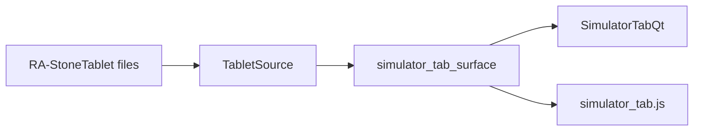

# Simulator Tab

Reference. The second step of [the promotion pipeline](promotion-pipeline.md):
the live fleet, replayed against stored history. The screen is under rebuild as
issue #117.

## The clone the tab draws now

The Sim tab is a clone of the Trading tab, and its data source is the Stone
Tablets on disk. It carries the bot list, the Indicator Voting Panel, and a
second layer holding the VWAP window over the tablet playback window. One
button flips the panel area between those two layers.

`src/gui/main_tabs/simulator_tab_surface.py` — the two layers and the button

```python
LAYER_INDICATORS = "indicators"
LAYER_PLAYBACK = "playback"
LAYERS = (LAYER_INDICATORS, LAYER_PLAYBACK)

FLIP_BUTTON_TEXT = {
    LAYER_INDICATORS: "Show Playback",
    LAYER_PLAYBACK: "Show Indicators",
}
```

One model is built from the tablet, and both builds draw it.



### It receives and asks. It never sends.

The Simulator's whole data path is one class that reads tablet files. It holds
no venue and defines no write. It answers five names and refuses every other
name itself, so a send cannot be expressed through it.

`src/simulator/tablet_source.py` — the refusal

```python
    def __getattr__(self, name: str):
        """Refuse every name outside ``READ_NAMES``."""
        raise SendRefused(
            f"TabletSource answers {READ_NAMES} and cannot {name!r}. "
            "The Simulator receives and asks; it sends nothing."
        )
```

Asked for nine venue calls — an order, a market buy, a cancellation, an edit, a
withdrawal, a leverage change, a transfer, a tablet write and a save — it
refused all nine and answered every read.

### The columns are the Trading tab's own

The bot list draws the ten columns the live table draws, and the same two fixed
widths, because the surface imports them rather than restating them. A column
added to the live table appears here with no second edit.

```python
from .bot_status_table_surface import COLUMN_LABELS, FIXED_WIDTHS
```

No simulated fleet exists yet, so the list holds no rows and says why. Import
Live Fleet and Generate From YTD are what fill it, and both are later units.

### One candle window, on both sides

The live engine asks the venue for one hundred candles. The Simulator reads the
last hundred rows off the tablet, so the indicator window is one number on both
sides rather than two.

```python
#: The candle window live reads. ``ScrummingBot`` asks ``get_ohlcv`` for 100,
#: and the Simulator reads the same count off the tablet.
WINDOW_CANDLES = 100
```

The live engine now receives that hundred, and the newest row in it is the bar
that just closed. The connector sends the count in the exchange library's count
slot. Until this change it sent the count in the start-time slot and left the
count slot empty, so the venue answered with a page of its own and the library
kept the oldest 300 rows of it. Every indicator then read a window ending 50
five-minute bars behind the price the gate compared it against. That is four
hours and ten minutes.

`src/exchange/ccxt_connector.py` — four arguments, each in its own slot

```python
data = await self._call_sync(
    self._ex.fetch_ohlcv,
    symbol,
    timeframe,
    None if since is None else int(since),
    int(limit),
)
```

The library's own slice was driven over 1,215 recorded five-minute pages. The
window ended 50 bars early on every page before the change and on none after it.
On 162 rows of the recorded gate log, the band latch differs between the stale
window and the current one on 88.

### The VWAP window

VWAP is the published cumulative figure: typical price times volume, running,
divided by running volume, where typical price is the average of the high, the
low and the close. A point with no volume behind it yet carries nothing rather
than a number.

```python
def vwap_series(candles: Sequence[Sequence[float]]) -> list[Optional[float]]:
    """Cumulative ``sum(typical_price * volume) / sum(volume)`` per row.

    A row whose cumulative volume is still zero carries None.
    """
```

### The two strips that are not copied

The crypto news ticker and the data pool line are not on this tab, and their
code is not carried into it. A live news feed and a live cache-health line
describe nothing a tablet reader does. The rows they held keep their height and
hold nothing, and that space is where Import Live Fleet and Generate From YTD
go.

```python
#: The rows the two strips held on the Trading tab, and the height each keeps.
RESERVED_ROWS: tuple[dict[str, Any], ...] = (
    {"name": "news_ticker_row", "height_px": 24},
    {"name": "data_pool_row", "height_px": 18},
)
```

### With no tablet on disk

The tab draws an empty state and names what is missing. The panel reads
`No TA data — No Stone Tablet on disk.`, the selector holds nothing, and both
windows hold zero points. Nothing is invented in place of the missing tape.

### The YTD trade files

The Simulator's second data source is the operator's own trade record, kept on
disk under the exchange history bucket. One file holds one exchange, one symbol
and one year. Each file names its exchange inside itself, not only in its
filename, so a file that is moved or renamed still says where its trades came
from.

`src/exchange/ytd_trade_store.py` — what one row holds

```python
@dataclass
class YtdTrade:
    """One fill: ``id``, ``ts_ms``, ``side``, ``amount``, ``price``, ``cost``
    and ``fee``."""

    id: str
    ts_ms: int
    side: str
    amount: float
    price: float
    cost: float
    fee: float
    fee_currency: str
```

Beside the rows, each file carries a schema version, the time of the import, and
one entry per export that contributed rows. That entry names the export file and
its digest, so a file that grew over two imports records both. A MANIFEST beside
the files indexes every one of them with its row count and its date span.

`src/exchange/ytd_trade_store.py` — the provenance on each file

```python
@dataclass
class ImportSource:
    """One import that contributed rows: ``file``, ``sha256`` and ``rows_added``."""

    file: str
    sha256: str
    imported_at: str
    rows_added: int
```

### The columns the import requires

The record arrives as a transactions CSV exported from the exchange. The import
reads nine columns and refuses a file missing any one of them, naming which.
Notes, sender address and recipient address are never carried in.

`src/exchange/ytd_csv_import.py` — the required columns

```python
REQUIRED_COLUMNS: tuple[str, ...] = (
    COL_ID,
    COL_TIMESTAMP,
    COL_TYPE,
    COL_ASSET,
    COL_QUANTITY,
    COL_PRICE_CURRENCY,
    COL_PRICE,
    COL_SUBTOTAL,
    COL_FEES,
)
```

The transaction type decides the side. Buys and sells are kept; reward income,
deposits and withdrawals are counted and dropped, because they are not trades
and must never reach a validation run as though they were. The asset and the
price currency together give the pair. The quantity is negative on a sell in the
export, so its sign is checked against the type and then the magnitude is
stored.

A second import of an overlapping export adds only the rows whose id is new. A
file that gains nothing is not rewritten at all.

### A period with no rows is a gap

Where the export carries no trade for a symbol in a period the export covers,
that period is written to a gap record. Nothing is invented to fill it.

`src/exchange/ytd_trade_store.py` — the gap record

```python
@dataclass
class TradeGap:
    """One period between ``since_ms`` and ``until_ms`` that no row covers."""

    exchange_id: str
    symbol: str
    year: int
    since_ms: int
    until_ms: int
    reason: str
    checked_at: str
```

### Reading the trade files

The Simulator reads these files through one class, on the same rule as the
tablet reader. It answers six names and refuses every other name itself.

`src/simulator/ytd_trade_source.py` — the refusal

```python
    def __getattr__(self, name: str):
        """Refuse every name outside ``READ_NAMES``."""
        raise SendRefused(
            f"YtdTradeSource answers {READ_NAMES} and cannot {name!r}. "
            "The Simulator receives and asks; it sends nothing."
        )
```

### What the import run measured

The operator's own export was read into a throwaway directory. The figures below
come from that run.

```
export read     5,798 rows, 13 columns
kept            5,766 trades - 3,229 buys, 2,537 sells
dropped         32 - reward income 16, deposits 15, withdrawals 1
written         39 files, one per symbol, all of them 2026
range           2026-04-12 to 2026-09-07
gaps recorded   76
second import   0 rows added, 39 files byte-identical
```

### What one run measured

Both builds were opened and read off the drawn window and the drawn page. The
figures below come from that run.

```
tablet          XRP_1d_2026_coinbase, 250 candles, 2026-01-01 to 2026-09-07
window          100 candles
tablets listed  411
votes           5 bullish, 2 bearish, 5 neutral
Qt to React     32 of 32 values matched, with a tablet and again with none
```

## What the tab holds today

The Simulator is removed. The tab is named Sim, it opens first on the bar, and
it draws an empty panel with a heading and two sentences. Nothing behind it
runs: no fleet, no replay, no practice venue and no Nuclear Mode. Every section
below this one describes the screen that was removed, and is kept as the record
of what the rebuild replaces.

The panel is the one the Paper, Status and Accumulation tabs already draw. Its
words come from a view model, so the Qt build and the React build say the same
thing.

```python
METHOD = "simulator_tab.state"

HEADING = "Sim"
ISSUE = 117
BUILT = False
STATE_TEXT = "This tab is not built."
ISSUE_TEXT = f"Issue #{ISSUE} carries the build-out."
```

## What builds it

The window constructs the tab and inserts it beside Trading. Three of the four
wiring calls take a lambda, so the exchange connectors, the swarm and the Market
Inspector proposals resolve when they are asked for rather than when the tab is
built. The bot manager is handed over directly.

`src/gui/main_tabs/simulator_tab.py` — `SimulatorTabMixin._build_simulator_tab`
The Simulator rebuild removed this file; it is not in the tree.

```python
        self._simulator = SimulatorTab()
        # _reorder_main_tabs runs after every builder, so index 1 is not the final slot.
        self._main_tabs.insertTab(1, self._simulator, "Simulator")
        if hasattr(self._simulator, "set_connectors_getter"):
            self._simulator.set_connectors_getter(
                lambda: getattr(self, "_exchange_connectors", {})
            )
        if hasattr(self._simulator, "set_bot_manager"):
            self._simulator.set_bot_manager(self._bot_manager)
```

The tab is isolated. The window's header strip hides while the Simulator is in
front, and the tab draws its own strip of the same ten fields against sim
balances.

`src/gui/simulator_tab/sim_stat_strip.py` — `SimStatStrip.FIELDS`
The Simulator rebuild removed this file; it is not in the tree.

```python
    FIELDS = (
        "Spendable",
        "Realised",
        "Locked",
        "Mature",
        "Exch",
        "Scrummed",
        "Folded",
        "Trades",
        "Bots",
        "Errors",
    )
```

The Mode picker names three modes and drives two panels. Nuclear raises its own
page. Validation and Looping Back Test both raise Fleet Replay.

`src/gui/simulator_tab/simulator_tab.py` — `SimulatorTab._on_sim_mode_changed`
The Simulator rebuild removed this file; it is not in the tree.

```python
        key = self.sim_mode()
        stack = getattr(self, "_stack", None)
        if stack is not None:
            # Validation and Looping both drive the fleet page.
            stack.setCurrentIndex(1 if key == "nuclear" else 0)
```

The mode goes no further than the picker. The handler passes the key on only to
a panel that carries a matching setter, and Fleet Replay carries none, so the
two fleet modes run the same replay and the choice changes the hint line alone.

`src/gui/simulator_tab/simulator_tab.py` — the mode hand-off
The Simulator rebuild removed this file; it is not in the tree.

```python
        panel = getattr(self, "fleet_replay", None)
        if panel is not None and hasattr(panel, "set_sim_mode"):
            try:
                panel.set_sim_mode(key)
```

## Fleet Replay

`FleetReplayPanel` in `src/gui/simulator_tab/fleet/fleet_replay_panel.py` is the
panel. Four steps run it.
The Simulator rebuild removed this file; it is not in the tree.

**Load.** The panel builds one real bot for every saved config whose symbol has
a Stone Tablet, and names the symbols it had to skip. The class body is live's
own, so the sim runs live code against a stored tape rather than a second
implementation; the single sim-only branch gives each bot a private event bus,
which is why a sim fill never reaches the live sound engine or the live logs.

`src/gui/simulator_tab/fleet/fleet_replay_panel.py` — `_spawn_sim_fleet`
The Simulator rebuild removed this file; it is not in the tree.

```python
        def _spawn_sim_fleet(self) -> int:
            """Construct a real sim bot for every loaded config.

            Returns the number spawned. Reads the Stone Tablet registry
            through the same call Start Replay uses, rather than adding a
            second candle path.

            The controller is built but NOT started: the bots exist, hold
            their imported state and can be inspected, and the tape only
            advances when the operator presses Start Replay.
            """
```

**Configs.** The loader reads the operator's state file read-only and returns
each bot's saved config. `load_smart_wires_from_state` does the same for the
topology, and `summarize_loaded_configs` reports what loaded. The fleet is never
fabricated; it is whatever that file holds.

`src/simulator/fleet/bot_state_loader.py` — `load_bot_configs_from_state`
The Simulator rebuild removed this file; it is not in the tree.

```python
def load_bot_configs_from_state(
    path: Optional[Path] = None,
    mode_filter: Optional[str] = "scrumming",
) -> list[dict[str, Any]]:
```

**Fetch.** Fetch YTD calls the same history function the History tab's Refresh
calls, so the two return the same trades. A replay still runs without it, and
the panel then says on screen that the run is synthetic.

`src/gui/simulator_tab/fleet/fleet_replay_panel.py` — `_on_fetch_ytd_clicked`
The Simulator rebuild removed this file; it is not in the tree.

```python
        def _on_fetch_ytd_clicked(self) -> None:
            """Call the same function the History tab calls.

            The History tab's Refresh dispatches
            ``fetch_all_history_chunked(bot_manager, since_ts)``. No custom
            enumeration, no exchange matching, no connector picking: if the
            History tab returns N trades, Fleet Replay returns the same N.
            """
```

**Run.** `FleetReplayController` in
`src/simulator/fleet/fleet_replay_controller.py` drives it.
The Simulator rebuild removed this file; it is not in the tree.

| Piece | What it does |
| ----- | ------------ |
| `_build_sim` | Assembles the bots and the tape |
| `sim_bot_id`, `live_bot_id` | Keep the two id spaces apart |
| `_on_sim_trade` | Records each fill |

One assertion runs once, at the point where the bot set is final and before any
of them can trade.

`src/simulator/fleet/fleet_replay_controller.py` — `_assert_capital_isolation`
The Simulator rebuild removed this file; it is not in the tree.

```python
    def _assert_capital_isolation(self) -> None:
        """Every constructed sim bot must be off the live registry.

        The guards upstream -- the factory raising, `_instantiate_bot`
        refusing, `_crr()` returning None in sim mode -- each protect
        one path. This checks the outcome they exist to produce, once,
        at the point where the bot set is final and before any of them
        can trade. Aborts the run rather than let a replay write sim
        reservations into the operator's live capital state.
        """
```

The bots trade against a tape, not against a venue. `TabletBackend` implements
the ccxt surface beneath a real connector, holds the seeded balances, sweeps
resting orders, and owns the one clock every symbol advances on.

`src/simulator/fleet/fleet_replay_controller.py` — the tape the bots are handed
The Simulator rebuild removed this file; it is not in the tree.

```python
        # TabletBackend implements the ccxt surface beneath a real CCXTConnector.
        self._tape = TabletBackend(
            {
                sym: [list(r) for r in rows]
                for sym, rows in self._candles_by_symbol.items()
            },
            balances=dict(seed_by_quote),
            fee_rate_by_symbol=_fees,
        )
        _conn = CCXTConnector("coinbase")
        _conn.attach_backend(self._tape)
        self._exchange = _conn
```

Three more modules sit beside the controller and none of them runs a replay. The
older fake exchange is built only by tests, the union clock is constructed only
inside that exchange, and the candle series a replay builds is thrown away once
its symbol names have been read.

`src/simulator/fleet/sim_exchange.py` — `FleetSimExchange`
The Simulator rebuild removed this file; it is not in the tree.

```python
"""Candle-driven fake exchange for Fleet Replay, over real symbols.

Serves per-symbol ``CandleSeries`` through the ``ExchangeInterface`` API,
so a bot trades BTC/USD or ETH/USD against stored candles instead of a
venue. ``NuclearSimExchange`` (``src/simulator/nuclear_sim_exchange.py``)
is the other simulated venue and serves synthetic TAPEA/TAPEB symbols.
The Simulator rebuild removed this file; it is not in the tree.

Reachability: nothing under ``src/`` constructs ``FleetSimExchange``.
``FleetReplayController`` imports only ``make_symbol_series_map`` from
this module and runs against ``TabletBackend``
(``src/exchange/tablet_backend.py``). The class itself is built by tests.
```

`ReplayProgress` carries candles played, trades fired and tick failures back to
the panel's progress timer, and a finished run is written under the log root in
the live schema.

`src/trading/sim_run_log.py` — `SimRunLog`
The Simulator rebuild removed this file; it is not in the tree.

```python
"""Persist a Fleet Replay run under ~/.acervator_logs/sim/ in the live schema."""
```

Two bot tables draw at once. The Trading tab's own table is mounted into the
Simulator, and the fleet panel's three-column table is still built and still
filled. Collapsing the two is the first of the seven pieces of issue #117.

`src/gui/simulator_tab/fleet/fleet_replay_panel.py` — `FleetReplayPanel.COLUMNS`
The Simulator rebuild removed this file; it is not in the tree.

```python
        # Three columns. The gate row lives in GateStatusPanel, not here.
        COLUMNS = ("Symbol", "Target USD", "Sim Trades")
```

## The candles

Stone Tablets are the history and a replay only reads them. The registry stores
one timeframe and derives every other from it.

`src/trading/stone_tablets/registry.py` — `NATIVE_TIMEFRAME`

```python
NATIVE_TIMEFRAME: str = "5m"
"""Timeframe every tablet stores; ``_rollup`` derives all the others."""
```

Three functions in `src/trading/stone_tablets/storage.py` move tablets between
disk and memory.

| Function | What it does |
| -------- | ------------ |
| `read_tablet` | Loads one tablet from disk |
| `write_tablet` | Writes one back |
| `read_manifest` | Carries the index of what exists |

The tape a replay hands the bots does not roll up. Fleet Replay asks the
registry for the native timeframe only, and the tape refuses any other unless
the caller supplied that series when the tape was built, which Fleet Replay does
not do.

`src/exchange/tablet_backend.py` — `TabletBackend.fetch_ohlcv`

```python
        key = (str(symbol), tf)
        rows = self._tf_rows.get(key)
        if rows is None:
            raise ValueError(
                f"no {tf} series for {symbol!r}. Serving the native "
                f"{NATIVE_TIMEFRAME} series instead would make every "
                f"timeframe agree with itself; supply tf_rows[{key!r}]."
            )
```

## Portfolio Battery history

The thirty-five portfolios from the historical archive are now named in code,
and their sixty-three symbols are what the new mode runs over. Each one carries
its symbols, an equal weight for every symbol, and the archive it was read out
of.

`src/simulator/portfolios.py` — one portfolio

```python
    "CRYPTO_BLUE": Portfolio(
        name="CRYPTO_BLUE",
        symbols=("BTC", "ETH", "BNB"),
        description="Large-cap crypto — institutional grade",
    ),
```

Their price history is real, and it is kept apart from the live fleet's. The
tablets a replay reads sit under one root; the battery's sit under a second one,
and a battery build never opens the first.

`src/trading/stone_tablets/ra_paths.py` — the second root

```python
_RA_ROOT: Path = Path.home() / ".acervator_ra_tablets"
```

Two sources fill it and neither needs a key. Crypto arrives through the adapter
the fleet already uses, driven by the venue's own public candle endpoint.
Everything else arrives through a second adapter beside it.

`src/trading/stone_tablets/ra_fetcher.py` — the non-crypto adapter

```python
class YahooChartAdapter(ExchangeAdapter):
    exchange_id = "yahoo"
    chunk_limit = RA_CHUNK_DAYS
    BASE_URL: str = "https://query1.finance.yahoo.com/v8/finance/chart"
    SOURCE: str = "yahoo_chart_v8_ONE_DAY_SPLIT_ADJUSTED"
```

Every tablet records where its numbers came from and when they were fetched, and
the builder refuses to write one without both. A price with no source is what
made the archive's own figures worthless.

`src/trading/stone_tablets/ra_fetcher.py` — the refusal

```python
        resolved = source or str(getattr(adapter, "SOURCE", ""))
        if not resolved:
            raise ValueError(
                f"{type(adapter).__name__} carries no SOURCE; pass source= naming "
                f"the endpoint the candles come from. {adapter.exchange_id!r} is "
                f"an exchange id, not provenance."
            )
```

Where a source has nothing, nothing is written in its place. The missing days
are recorded as missing, in their own file beside the tablets.

`src/trading/stone_tablets/ra_fetcher.py` — what a missing period records

```python
@dataclass
class TabletGap:
    """One requested period a source returned no rows for."""

    asset: str
    exchange_id: str
    timeframe: str
    year: int
    since_ms: int
    until_ms: int
    reason: str
    checked_at: str
```

Nothing runs the bot logic over these tablets yet, and no screen shows them.
That is the next unit.

In development.

## Portfolio Battery coverage

Every symbol in every portfolio has real daily prices on disk. No portfolio
names a period of its own, so all six archive periods apply to all thirty-five
of them, and the span asked for is 2020 to 2026.

`src/trading/stone_tablets/ra_import.py` — the years asked for

```python
def _archive_years() -> tuple[int, ...]:
    """Return every calendar year ``PERIODS`` touches, ascending."""
    years: set[int] = set()
    for start, end in PERIODS.values():
        years.update(range(int(start[:4]), int(end[:4]) + 1))
    return tuple(sorted(years))
```

A symbol reaches one source or the other by what it is. A coin the crypto venue
never listed falls to the second source instead of being left empty, and every
tablet records which one served it.

`src/trading/stone_tablets/ra_import.py` — the routing

```python
def route_for(symbol: str) -> SymbolRoute:
    """Return ``symbol``'s route, crypto to Coinbase and everything else to Yahoo."""
    upper = symbol.upper()
    if is_crypto(upper):
        return SymbolRoute(upper, COINBASE_SOURCE, YAHOO_CRYPTO_SOURCE)
    return SymbolRoute(upper, YAHOO_SOURCE)
```

The import reads its own result back off disk and says what it holds. A count
on its own would not be an answer, so the statement carries every source with
its fetch times and every period no source served.

`python -m src.trading.stone_tablets.ra_import coverage` — the headline

```
SYMBOLS
  asked for ......... 63
  returned data ..... 60
  tablets ........... 411
  candles ........... 105336

SOURCES
  coinbase_exchange_candles_ONE_DAY: 71 tablets
  yahoo_chart_v8_ONE_DAY_SPLIT_ADJUSTED: 340 tablets
```

A share year is not a calendar year. The market shuts at weekends and on public
holidays, and those days are recorded as missing rather than filled, so a share
year holds about 250 days where a coin year holds every one.

`python -m src.trading.stone_tablets.ra_import coverage` — a share and a coin

```
  SPY
    2022    251 rows  2022-01-03..2022-12-30
    2023    250 rows  2023-01-03..2023-12-29
  BTC
    2022    365 rows  2022-01-01..2022-12-31
    2023    365 rows  2023-01-01..2023-12-31
```

A ticker that no longer reaches the company the archive meant is recorded as a
finding, not as a failure. Three of the sixty-three return nothing at all, and
what the endpoint answered is written down in place of a price.

`~/.acervator_ra_tablets/GAPS.json` — a ticker that no longer trades

```
  CCIV   2021 yahoo  [2021-01-01..2021-12-31] HTTPError: HTTP Error 404: Not Found
  EXPR   2021 yahoo  [2021-01-01..2021-12-31] HTTPError: HTTP Error 404: Not Found
  IPOF   2021 yahoo  [2021-01-01..2021-12-31] HTTPError: HTTP Error 404: Not Found
```

Three more symbols are short at one end. `BBBY` reaches a company first traded
in July 2026 rather than the one the archive ran, and `MATIC` stops on
14 October 2025 because the coin was renamed.

`python -m src.trading.stone_tablets.ra_import coverage` — a symbol cut short

```
  MATIC  missing: 2026
    2024    366 rows  2024-01-01..2024-12-31
    2025    287 rows  2025-01-01..2025-10-14
```

Nothing runs the bot logic over these prices yet, and no screen shows them.

In development.

## The validation criterion

The Simulator is validated when the gates latch identically on the same data.
Not profit and loss, and not the trade count.

No module measures that. Nothing in the tree reads a sim gate latch and a live
gate latch and compares the two.

In development.
Validation Mode measures it now; the section at the end of this page states how.

What the screen does show is each bot's arm state while the tape runs. On every
refresh tick the panel reads each bot's last gate state and paints a
double-stacked row of lights, ten scrum then nine fold.

`src/gui/simulator_tab/fleet/sim_visuals.py` — `GateLightsCell`
The Simulator rebuild removed this file; it is not in the tree.

```python
    class GateLightsCell(QWidget):
        """One linear labelled row of trading gates.

        ``_draw_bank`` paints the ten ``_GATE_ORDER_SCRUM`` lights then the
        nine ``_GATE_ORDER_FOLD`` lights, each below its own label.
        ``gate_light_color`` picks every colour, and ``update_gates`` sets the
        arm and blocker state ``paintEvent`` reads.
        """
```

That cell and the History table's gate cell read one vocabulary, so the two
surfaces cannot drift apart on what a gate is called or on what blocked it.

`src/trading/gate_vocabulary.py` — the shared labels

```python
"""gate_vocabulary.py -- the bot's gate labels, blocker map and light states.

Qt-free. Two renderers read it: the Simulator's ``GateLightsCell``
(``src/gui/simulator_tab/fleet/sim_visuals.py``) and the History table's
gate cell (``src/exchange/history_read_contract.py``). One vocabulary,
so a gate added on one surface cannot be missing from the other.
```
The Simulator rebuild removed this file; it is not in the tree.

After a run the panel matches each live trade to the nearest sim fill on the
same symbol and side, and prints the result into the Performance log. That is a
report on trade counts and timing. It is not the criterion above.

`src/trading/stone_tablets/parity_harness.py` — `compare_trades`

```python
def compare_trades(
    live_trades: list[dict],
    sim_trades: list[Any],
    tolerance_s: float = DEFAULT_TOLERANCE_S,
    window_since_ts: float = 0.0,
    window_until_ts: float = 0.0,
) -> ParityReport:
```

The panel puts the honest label on screen. A run with no live trades loaded is
comparable to nothing, and the panel says so rather than looking like a parity
run.

`src/gui/simulator_tab/fleet/fleet_replay_panel.py` — `_note_parity_state`
The Simulator rebuild removed this file; it is not in the tree.

```python
        def _note_parity_state(self) -> None:
            """Say so when the run cannot be compared to live.

            ``_ytd_trades`` being empty is the NORMAL condition, and the panel
            said nothing about it, so a synthetic run looked exactly like a
            parity run on screen.
            """
```

`SimValidationGuard` names five conditions under which a run cannot be trusted.
The last two halt immediately whatever their count. The guard is defined and
covered by tests, and no module under `src/` calls it.

`src/trading/sim_validation_guard.py` — `ValidationIssueType`
The Simulator rebuild removed this file; it is not in the tree.

```python
class ValidationIssueType:
    NO_TABLET = "no_tablet"
    PRE_LISTING = "pre_listing"
    UNRESOLVABLE_TS = "unresolvable_timestamp"
    SCHEMA_DRIFT = "schema_drift"
    ADDRESS_MISMATCH = "address_mismatch"
```

The voting readout beside the fleet can fill itself with invented numbers. Three
seconds after the tab is built, with no bot yet in its selector, it runs the real
voting engine over a seeded random walk and draws the vote. On the Simulator that
is the normal state until a fleet loads, so the panel can read as a result when
it is a placeholder.

`src/gui/indicator_panel.py` — `IndicatorVotingPanel._generate_demo_ta`

```python
        def _generate_demo_ta(self):
            """Generate demo TA from synthetic candles.

            Gated by ``_may_fabricate()``. Produces a deterministic
            random walk (``seed = md5(bot_id)``) and runs the real
            VotingEngine over it, labelled with the real bot's symbol
            so the panel stays stable across refreshes.
            """
```

## Validation Mode

Validation takes each YTD trade, finds the historical candle its timestamp falls
in, and reruns the gates on that candle. It then puts the gate row it latched
beside the gate row the log recorded, one light at a time, over the nineteen
lights the shared vocabulary names. A run passes when every light reads the
same. It is never judged on profit and never on a trade count.

`src/simulator/validation.py` — the criterion

```python
    @property
    def latches_identically(self) -> bool:
        """True while every light and both armed flags read the same."""
        return (
            not self.disagreed
            and self.recorded_scrum_armed == self.rerun_scrum_armed
            and self.recorded_fold_armed == self.rerun_fold_armed
        )
```

### The two ways in

Import Live Fleet clones the live running fleet from the bot_state load and
keeps each bot's own id, so a recorded gate row belongs to a bot by that id.
Generate From YTD scans the trade files and creates one new bot per pair that
was traded. Those bots are new, they carry new ids, and they never wrote a gate
row, so a recorded row belongs to one of them by exchange, symbol and the time
window instead.

```
Import Live Fleet    38 bots, matched on bot id and time window
Generate From YTD    39 bots, matched on exchange, symbol and time window
```

The two counts differ, and that is a fact about the two sources rather than a
fault. A pair traded earlier in the year can have no live bot now, and a live
bot can have traded nothing yet. Neither path invents a bot to close the gap.

When more than one exchange is active the tab asks which one to use before it
runs anything. One chooser serves both buttons.

`src/simulator/fleet_source.py` — the chooser

```python
def exchange_choice(exchanges: list[str], chosen: str = "") -> dict:
    """Whether the operator must pick an exchange, and which one is in force.

    ``prompt`` is True while more than one exchange is active and ``chosen``
    names none of them.
    """
```

### It reports what it could not verify

The tablets end on 1 August 2026 and the trade export runs to 7 September, so
about five weeks of trades have no candle to snap to. Validation names that
period and counts the entries on both sides of it. A count of verified trades
with no denominator is exactly what this replaces.

```
3942 of 4904 YTD entries snapped to a candle; 962 could not be.
after_last_candle: 905
inside_gap: 57
uncovered span 2026-08-01T18:52:58Z to 2026-09-07T21:46:48Z; the newest
candle is 2026-08-01T18:35:00Z
```

### Which half of the rerun moves

A candle supplies the price and the Bollinger reading. It cannot supply the
bot's own state, so the delta, the tranche counts, the circuit breaker and every
flag come from the row the log recorded. Each light says which half drove it, so
a disagreement can be read back to its cause.

```
S/BB   F/BB   F/MID     the tablet candle
S/LS   F/LS             the landing-strip override
every other light       the recorded row
```

### What the first full run measured

Every recorded reading the run checked was reproduced from the tablet exactly,
but from a window sitting four hours behind the trade's own candle. The tablet
prices are right: measured over one asset, 9,869 of 10,038 recorded prices sit
inside the tablet candle covering their own moment. The tape is therefore sound,
and the live reading it is compared against was taken from older candles than
the ones that moment held.

```
38 bots, matched to a recorded gate row on bot id and time window.
62 of 227 reruns latched every gate identically.
3572 of 4313 gate lights agreed.
60 of 60 recorded readings were reproduced exactly from the tablet.
45 of them came from a window 50 candles (250 minutes) behind the trade's
own candle.
```

## Back Test Mode

Back Test runs the bot logic over a recorded tape. It walks each bot along its
own Stone Tablet, feeds every window into the gates that run live, and records
where a scrum and a fold latch. A latch that clears every gate then trades: the
scrum sells the excess above the dollar target and the fold buys it back with
the cash that scrum put aside.

`src/simulator/back_test.py` — the one gate chain, shared with Validation

```python
from .validation import (
    BB_MIDLINE,
    MIN_RERUN_CANDLES,
    RERUN_WINDOW_CANDLES,
    bb_reading,
    candle_interval_ms,
    iso_stamp,
    latch,
    tablet_for,
)
```

The mode selector sits above the two button rows, and the result pane below the
Replay Log changes with it.

```
Mode: Validation    Import Live Fleet   Generate From YTD
Mode: Back Test     Import Live Fleet   Create New Bots
```

### The two ways into a back test

Import Live Fleet clones the live running fleet from the bot_state load, the
same reader Validation uses. Create New Bots makes one simulated bot on the
Stone Tablet the selector is showing, taking its target balance and its
scrumming interval from the Bot Wizard's own defaults.

`src/gui/main_tabs/simulator_tab_surface.py` — the new bot the selector defines

```python
def new_bot_specs(entry) -> list[dict]:
    """One new-bot spec for ``entry``'s asset, on the Bot Wizard's own
    defaults."""
```

### One clock

Every bot ticks on one cadence. The step is sized once from the longest tape in
the run, so a short tablet and a long one are read on the same clock rather than
each on its own.

```python
def shared_step(entries: Sequence[Any], ticks_per_bot: int, max_candles: int) -> int:
    """One step in candles, sized off the longest tape so every bot ticks
    together.

    A ``ticks_per_bot`` of zero, or no entry, answers one.
    """
```

### What one back test measured

The imported fleet, read on 8 September 2026 from the live Stone Tablets.

```
38 of 38 bots ran over 1610472 tablet candles.
2026-01-01T00:00:00Z to 2026-08-01T18:35:00Z, 5272 gate-chain evaluations.
58 scrum latches and 55 fold latches.
58 scrum sells and 55 fold buys filled, $38.02 in fees.
```

Each row names the bot, its tablet, how much tape it read, how often the gates
latched, how many trades filled, the coin it gained or gave up and the cash it
now holds. Units alone do not answer whether a cycle accumulated, because a bot
that sold into a rise holds fewer coins and more cash.

```
Bot ID | Symbol | Tablet | Candles | Ticks | Scrum / Fold latched |
Scrum / Fold filled | Units gained | Cash held
```

### A missing tablet is named, not fetched silently

A bot whose asset has no tablet is listed with no tape and counted in the run's
own lines. Filling one is a call for information and goes through the same gap
filler the tablet build uses, into whichever tablet root the caller names.

`src/simulator/back_test.py` — the fetch, and the answer with no connector

```python
async def download_missing(
    pairs: Sequence[tuple[str, str]],
    connector: Any,
    since_ms: int,
    until_ms: Optional[int] = None,
    quote_currency: str = "USD",
    registry: Any = None,
) -> list[Any]:
```

Driven into a throwaway root with a recorded tape, it wrote one tablet of 701
candles and a manifest, and the live tablet root kept its 407 files.

```
connector calls: 3
report: ZZZTEST coinbase chunks_ok 3 errors 0 candles 701
entry: ZZZTEST coinbase 5m 701 candles read back: 701
live root unchanged: True 407
```

## Portfolio Battery Mode

The third mode runs the thirty-five archive portfolios over their own price
history. Every symbol streams its daily bars through the same gate chain a live
bot ticks, at three timeframes, and each result is set against what holding that
symbol untraded would have paid over the same span.

`src/simulator/portfolio_battery.py` — the three timeframes

```python
#: The timeframes a daily tablet builds, spelled as ``HTF_TIMEFRAMES`` spells
#: them.
TIMEFRAMES = ("1d", "1w", "1M")
```

### The baseline comes off the same walk

Buy and hold is not a figure carried over from the archive. It is the capital
the symbol opened with, carried from the opening price to the closing price of
the same walk, so the two sides cannot read different prices.

`src/simulator/portfolio_battery.py` — the baseline

```python
    @property
    def baseline_usd(self) -> float:
        """``capital_usd`` carried from ``start_price`` to ``end_price``,
        untraded."""
        if self.start_price <= 0.0:
            return 0.0
        return self.capital_usd * self.end_price / self.start_price
```

### One gate chain, fed a different source

The battery defines no gate of its own. It hands its bars to the Back Test
walker, which builds the shipped scrum and fold chains and reads their answer.

`src/simulator/portfolio_battery.py` — the walk

```python
    bot = battery_bot(asset, exchange_id, timeframe, capital_usd)
    result = walk(bot, candles_from_raw(bars), walk_step(len(bars), ticks))
```

### A weekly and a monthly bar are folded, never invented

The tablets hold one bar a day. A coarser bar is the calendar bucket its days
fall in: the first open, the highest high, the lowest low, the last close and
the summed volume. A trailing bucket is kept as it stands rather than padded out.

`src/simulator/portfolio_battery.py` — one folded bar

```python
def fold_bucket(rows: Sequence[Sequence[float]]) -> list[float]:
    """One bar from ``rows``: first open, highest high, lowest low, last close,
    summed volume."""
    return [
        float(rows[0][0]),
        float(rows[0][1]),
        max(float(one[2]) for one in rows),
        min(float(one[3]) for one in rows),
        float(rows[-1][4]),
        sum(float(one[5]) for one in rows),
    ]
```

### Three symbols hold no tablet

CCIV, IPOF and EXPR stopped trading and no source served them. A portfolio
holding one runs on the symbols that exist and reports the share of its capital
that reached no tape. That share is a column on every row, beside the count of
symbols that ran.

`src/simulator/portfolio_battery.py` — the missing share

```python
    @property
    def missing_weight(self) -> float:
        """``missing_usd`` as a share of every symbol's ``capital_usd``."""
        whole = sum(one.capital_usd for one in self.runs)
        return self.missing_usd / whole if whole > 0.0 else 0.0
```

### The two ways into a battery

The two rows the removed strips left carry one portfolio and all of them. A
portfolio selector and a span selector sit under the mode selector, and the span
list is the archive's six periods followed by the whole tape.

`src/gui/main_tabs/simulator_tab_surface.py` — the two ways in

```python
BATTERY_ROWS: tuple[dict[str, Any], ...] = (
    {
        "name": NEWS_TICKER_ROW,
        "height_px": 24,
        "action": RUN_PORTFOLIO_ACTION,
        "text": RUN_PORTFOLIO_TEXT,
        "button_name": button_name(RUN_PORTFOLIO_ACTION),
    },
    {
        "name": DATA_POOL_ROW,
        "height_px": 18,
        "action": RUN_EVERY_PORTFOLIO_ACTION,
        "text": RUN_EVERY_PORTFOLIO_TEXT,
        "button_name": button_name(RUN_EVERY_PORTFOLIO_ACTION),
    },
)
```

### What one battery measured

SPAC_BUST over the archive's Apr24-Apr25 period, driven through the Qt tab.
Three of its five symbols have a tablet. The accumulation logic ended ahead of
buy and hold at the daily bar and at the weekly bar. The monthly bar holds
twelve bars, under the thirty the Bollinger window and the voting engine need,
so it reports no run rather than a result.

```
SPAC_BUST  1d  3 of 5  756 bars  669 ticks  35 trades
           buy and hold $390.75   accumulation $415.60   +24.85 (+6.36%)
SPAC_BUST  1w  3 of 5  159 bars   72 ticks   6 trades
           buy and hold $458.26   accumulation $478.74   +20.48 (+4.47%)
SPAC_BUST  1M  0 of 5    0 bars    0 ticks   0 trades   missing weight 100%

missing: IPOF (no_tablet), CCIV (no_tablet)
7 recorded gaps fall inside the span
```

Every portfolio over the whole tape reads 189 symbol runs in 26 seconds. Twelve
of the thirty-five ended ahead of their own buy and hold at one timeframe or
more.

### It is not a Monte Carlo

A Monte Carlo samples many paths and reports the spread of what they pay. This
mode reads one recorded path per symbol, so it reports one outcome per timeframe
and no distribution. Nothing on the screen carries a percentile.

`src/simulator/portfolio_battery.py` — the spans, one recorded path each

```python
#: Every span a run may be asked for: the archive's six, and the whole tape.
SPANS = (FULL_SPAN,) + tuple(PERIODS)
```

## Nuclear Mode

`NuclearModePanel` in `src/gui/simulator_tab/nuclear_mode_panel.py` drives the
controller. The controller loops the same state-file fleet over the tablet
window until stopped, recording each cycle so a late failure traces back to the
cycle that produced it. Start needs the window's async loop; without it the
panel says so and no soak begins.
The Simulator rebuild removed this file; it is not in the tree.

`src/simulator/nuclear_fleet_controller.py` — `NuclearFleetController`
The Simulator rebuild removed this file; it is not in the tree.

```python
class NuclearFleetController:
    """Loops the bot_state fleet over Stone Tablet history until stopped.

    GUI-agnostic: all operator-visible output goes through the callbacks,
    so this is testable without Qt.
    """
```

The market structure varies per loop, and nothing on disk is touched.

`src/simulator/nuclear_candle_source.py` — `noised_series`
The Simulator rebuild removed this file; it is not in the tree.

```python
def noised_series(
    rows: list,
    seed: int,
) -> tuple[list, float]:
    """Return ``(noised_rows, noise_pct)`` for one pass over *rows*.

    A ``_Tape`` seeded from *seed* perturbs a copy through ``_at``; *rows* is
    left as it was and nothing here touches disk.
    """
```

A second oscillator supplies the load pulse, and it is capped while its cooling
regime holds, because the pulse shares a machine with the live trading engine.

`src/core/system_load_oscillator.py` — `SystemLoadOscillator`

```python
class SystemLoadOscillator:
    """Dual oscillator for Nuclear Mode tick rate and per-tick workload.

    ``start`` takes the monotonic reference and spawns the COOLING
    daemon; ``stop`` joins it and is idempotent. ``current_multiplier``
    returns ``BASE_MULTIPLIER`` before ``start``.
    """
```

`set_swarm_hooks` connects the controller to three methods on the Bot Swarm tab,
which is how a nuclear run draws its rows in the sim layer of that swarm.
`set_topologies` replays a Market Inspector proposal shape across the sim bots.

| Hook | Fires when |
| ---- | ---------- |
| `register_sim_run` | A run starts |
| `update_sim_run` | A cycle reports |
| `stop_sim_run` | The run ends |

The panel's own visuals stay empty for a whole run. It feeds the shared price
chart and the shared voting readout from four fields — the symbol, the last
price, the last volume and the voting summary — and the controller's snapshot
carries none of them.

`src/simulator/nuclear_fleet_controller.py` — `NuclearFleetController.snapshot`
The Simulator rebuild removed this file; it is not in the tree.

```python
    def snapshot(self) -> dict:
        """Return the GUI panel's polled view of this soak."""
        s = self.state
        return {
            "running": s.running,
            "uptime_seconds": s.uptime_s,
            "fleet_size": s.fleet_size,
            "symbols": s.symbols,
            "cycles_completed": s.cycles_completed,
            "current_cycle": s.current_cycle,
            "noise_pct": s.noise_pct,
            "wires_loaded": len(self._smart_wires),
            "total_candles": s.total_candles,
            "total_trades": s.total_trades,
            "total_exceptions": s.total_exceptions,
            "load_multiplier": s.load_multiplier,
            "cooling": s.cooling,
            "load_sensed": self._sensed,
            "last_error": s.last_error,
            "failed_cycles": sum(1 for c in s.cycles if not c.ok),
        }
```

Nuclear is not a validator. It runs after trade-logic alignment is earned, its
noised tape is deliberately not history, and its criteria are coverage and
survival.

`src/gui/simulator_tab/nuclear_mode_panel.py` — what the panel is for
The Simulator rebuild removed this file; it is not in the tree.

```python
NOT A VALIDATOR. Nuclear runs AFTER trade-logic alignment is proven on
the real tablets, and its noised tape is deliberately not history, so
nothing here compares its output to YTD or live. Its criteria are
coverage and survival.
```

`NuclearController` in `src/simulator/nuclear_controller.py` is the earlier
single-tape prototype: one scout bot walking one tape. Nothing under the source
tree constructs it, and it stays because both controllers share the noise
source.
The Simulator rebuild removed this file; it is not in the tree.

`src/gui/simulator_tab/nuclear_mode_panel.py` — why the prototype stays
The Simulator rebuild removed this file; it is not in the tree.

```python
`nuclear_controller.py` and `nuclear_candle_source.py` are deliberately
NOT deleted: the latter owns `noised_series`, which v2 depends on for
exactly the market-structure noise above.
```
The Simulator rebuild removed the files above; they are not in the tree.

## Bridge

Five methods are registered for this screen, and the renderer modules carry the
matching names. They serve the Electron frontend; the tab the operator runs
today is drawn in Qt.

| Bridge method | Serves |
| ------------- | ------ |
| `simulator_tab.state` | The tab, its mode switcher and its table |
| `fleet_replay_panel.state` | Fleet Replay |
| `nuclear_mode_panel.state` | Nuclear Mode |
| `sim_stat_strip.state` | The tab's own ten-field strip |
| `sim_visuals.state` | The gate lights and the sim charts |

`src/core/desktop_bridge.py` — `build_registry`

```python
def build_registry() -> Dict[str, Handler]:
    """Return the methods the frontend may call, keyed by method name.

    This is the wiring point for the whole frontend: a surface is
    reachable exactly when it appears here. Surfaces are imported inside
    the function so that the transport above carries no dependency on any
    one domain package.
    """
```

Back to [the subsystem index](README.md).
