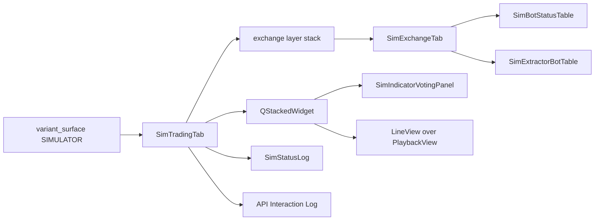
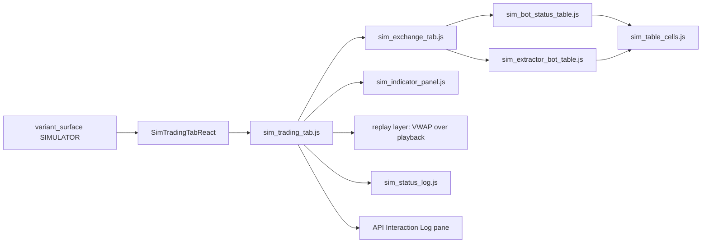
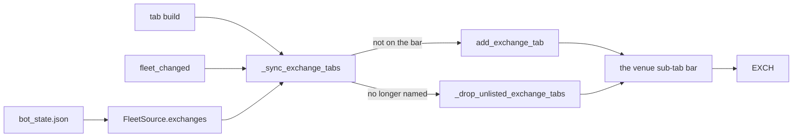
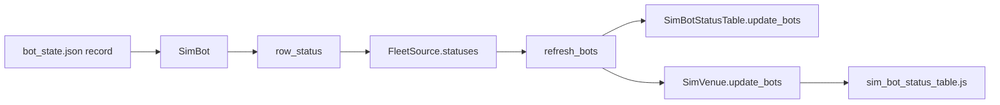
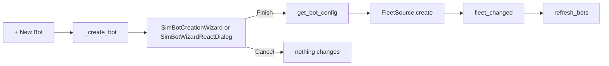
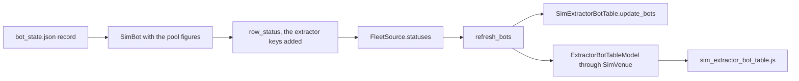
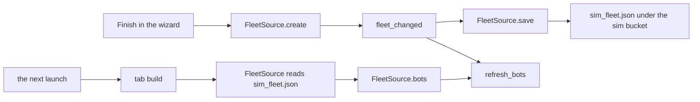
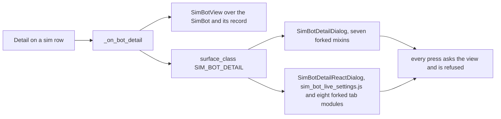
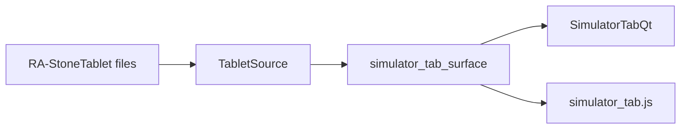

# Simulator Tab

Reference. The second step of [the promotion pipeline](promotion-pipeline.md):
the live fleet, replayed against stored history. Issue #117 rebuilt the screen,
and it carries three modes: Validation, Back Test and Portfolio Battery.

## The Qt tab is Live's tab code, forked

The Qt build of the Sim tab is `SimTradingTab`, a fork of the Live tab's own
code under the Simulator's names. The seam's Qt loader answers it; the widget
written from scratch, `SimulatorTabQt`, stays in `src/gui/simulator_tab.py`
and nothing loads it.

`src/gui/variant_surface.py` — the Qt loader

```python
def _qt_simulator() -> type:
    """Import and return the Qt Sim tab, ``SimTradingTab``."""
    from .simulator.sim_trading_tab import SimTradingTab

    return SimTradingTab
```

Each module under `src/gui/simulator/` is one Live module copied and renamed.
The copy keeps Live's layout, titles, sizes and design tokens; it changes the
name, the feed and the send side, and nothing else.

| Simulator module | forked from |
|---|---|
| `sim_trading_tab.py` `SimTradingTab` | `src/gui/main_tabs/trading_tab.py` `_build_trading_tab`, and the window's `add_exchange_tab` |
| `sim_exchange_tab.py` `SimExchangeTab` | `src/gui/widgets/exchange_tab.py` `ExchangeTab` |
| `sim_bot_status_table.py` `SimBotStatusTable` | `src/gui/widgets/bot_status_table.py` `BotStatusTable` |
| `sim_extractor_bot_table.py` `SimExtractorBotTable` | `src/gui/widgets/extractor_bot_table.py` `ExtractorBotTable` |
| `sim_indicator_panel.py` `SimIndicatorVotingPanel` | `src/gui/indicator_panel.py` `IndicatorVotingPanel` |
| `sim_status_log.py` `SimStatusLog` | `src/gui/widgets/status_log.py` `StatusLog` |



### What the fork draws

The tab is Live's four splitters at Live's sizes: the exchange layer stack
beside the panel on top, the Activity Log and the API Interaction Log side by
side below. Every module carries Live's title. The venue page holds the
Scrumming Bots table and the Extractor Bots table, both hidden until a row
arrives, and the command bar of Start, Pause, Stop, Restart and Delete. The
panel holds its title, the Bot selector and its privacy dot, the currency rate
strip, both indicator tables, both confidence bar graphs, the timeframe-lock
line and the staleness banner, hidden until raised.

Three positions differ from Live by ruling. The corner Live gives
`＋ Add Crypto Exchange` holds Import Live Fleet, Generate From YTD and Create
New Bots, each at Live's corner-button width and height. The row above the bot
list, where Live draws Privacy Mode and the news line, holds Validation, Back
Test and Portfolio Battery, then `+ New Bot` where Live draws it. The data-pool
row keeps Live's height and holds nothing. Privacy Mode, the news line and the
data-pool line are not forked.

`src/gui/simulator/sim_trading_tab.py` — the corner buttons

```python
WAY_IN_BUTTONS = (
    (surface.IMPORT_LIVE_FLEET_ACTION, surface.IMPORT_LIVE_FLEET_TEXT),
    (surface.GENERATE_FROM_YTD_ACTION, surface.GENERATE_FROM_YTD_TEXT),
    (surface.CREATE_NEW_BOTS_ACTION, surface.CREATE_NEW_BOTS_TEXT),
)
```

The replay layer sits behind the panel in one stack. The flip button seats
itself on whichever layer is showing: after the panel title, or at the head of
the replay layer, so the way back is never hidden with the panel.

`src/gui/simulator/sim_trading_tab.py` — the flip

```python
        if self._layer == surface.LAYER_PLAYBACK:
            self._indicator_panel.header_row().removeWidget(self._flip_button)
            self._chart_header.insertWidget(0, self._flip_button)
        else:
            self._chart_header.removeWidget(self._flip_button)
            self._indicator_panel.header_row().insertWidget(1, self._flip_button)
```

### What the fork does not carry

The copies hold no bot manager, no connector and no event bus. Every send the
Live code makes is cut, not stubbed: the signal-contract emits that write under
`~/.acervator_logs/signals/`, the event-bus emit behind the bot selector, the
API-log listener, the activity-log watchdog that read the live bot manager,
the TA snapshot store that read and wrote `~/.acervator/ta_snapshots/`, the
data-pool read behind the display price, and the demo readings the Live panel
invents from a random walk when no bot is loaded. Zero occurrences of
`ScrummingBot`, `BotContainer`, `ExchangeInterface`, `EventBus` and
`PhantomBalance` under `src/gui/simulator/`.

The way-in buttons, the mode buttons, `+ New Bot`, the Fire buttons and the
command bar's handler are wired to nothing. The tab holds two sources and
nothing reads them yet, so every module draws as Live's does with no data.

`src/gui/simulator/sim_trading_tab.py` — the two sources

```python
        self._tablet_source = (
            tablet_source
            if tablet_source is not None
            else TabletSource(surface.TABLET_ROOT)
        )
        self._fleet_source = fleet_source if fleet_source is not None else FleetSource()
```

Asked for a send by name, each raises `SendRefused`.

The window's header strip hides while Sim is in front, as `ISOLATED_TABS`
names it, so the three strip rows above the tab are absent on Sim today.

## The React page is Live's page modules, forked

The React build of the Sim tab is `SimTradingTabReact`, a fork of the Live
tab's React host under the Simulator's name, and it loads seven page modules
that are Live's seven copied under Simulator names. The seam's React loader
answers it; the page written from scratch, `SimulatorTabReact` in
`src/gui/react_simulator_tab.py` with `simulator_tab.js`, stays in the tree and
nothing loads it.

`src/gui/variant_surface.py` — the React loader

```python
def _react_simulator() -> type:
    """Import and return the React Sim tab, ``SimTradingTabReact``."""
    from .simulator.sim_react_trading_tab import SimTradingTabReact

    return SimTradingTabReact
```

Each forked module sits beside its source under `src/gui/web/`. The copy keeps
Live's layout, part names, sizes and design tokens; it changes the bridge
method it asks, the globals it defines, the feed and the send side, and
nothing else.

| Simulator module | forked from |
|---|---|
| `sim_trading_tab.js` | `trading_tab.js` |
| `sim_exchange_tab.js` | `exchange_tab.js` |
| `sim_indicator_panel.js` | `indicator_panel.js` |
| `sim_status_log.js` | `status_log.js` |
| `sim_bot_status_table.js` | `bot_status_table.js` |
| `sim_extractor_bot_table.js` | `extractor_bot_table.js` |
| `sim_table_cells.js` | `table_cells.js` |
| `src/gui/simulator/sim_react_trading_tab.py` `SimTradingTabReact` | `src/gui/react_trading_tab.py` `TradingTabReact` |
| `src/gui/simulator/sim_trading_tab_surface.py` | `src/gui/main_tabs/trading_tab_surface.py`, the payload builder |
| `src/gui/simulator/sim_exchange_tab_surface.py` | `src/gui/main_tabs/exchange_tab_surface.py`, the payload builder |



### What the page draws

The page is Live's four splitters at Live's sizes, read off Live's own
`trading_tab_surface`: the exchange layer stack beside the panel on top, the
Activity Log and the API Interaction Log side by side below. Every module
carries Live's title and Live's part name, so the page and the Qt fork
enumerate the same modules in the same order. The venue page holds the
Scrumming Bots table and the Extractor Bots table, both hidden until a row
arrives, and the command bar. The panel holds its title, the Bot selector and
its privacy dot, the currency rate strip, both indicator tables, both
confidence bar graphs, the timeframe-lock line and the staleness banner.

The three ruled positions are the Qt fork's. The corner Live gives
`＋ Add Crypto Exchange` holds Import Live Fleet, Generate From YTD and Create
New Bots, at Live's corner-button width and height, in Live's corner-button
chrome. The venue header holds Validation, Back Test and Portfolio Battery in
Live's Privacy-Mode sheet, then `+ New Bot` where Live draws it. The data-pool
row keeps Live's style and height and holds a blank line.

`src/gui/simulator/sim_trading_tab_surface.py` — the corner buttons

```python
WAY_IN_BUTTONS = (
    (sim.IMPORT_LIVE_FLEET_ACTION, sim.IMPORT_LIVE_FLEET_TEXT),
    (sim.GENERATE_FROM_YTD_ACTION, sim.GENERATE_FROM_YTD_TEXT),
    (sim.CREATE_NEW_BOTS_ACTION, sim.CREATE_NEW_BOTS_TEXT),
)
```

The replay layer sits behind the panel in one stack the page draws: the panel
slot over a layer holding the VWAP window above the Stone Tablet playback
window in one vertical splitter. The flip button sits after the panel title,
seated by `sim_indicator_panel.js`, and at the head of the replay layer,
seated by `sim_trading_tab.js`, so the way back is never hidden with the
panel. A press writes the page's ask on the console line the host reads, and
the host redraws the tab with the other layer showing.

`src/gui/simulator/sim_react_trading_tab.py` — the flip

```python
        def flip_layer(self) -> str:
            """Swap the page between the panel layer and the replay layer."""
            other = (
                sim.LAYER_PLAYBACK
                if self._state.replay_layer == sim.LAYER_INDICATORS
                else sim.LAYER_INDICATORS
            )
            return self.show_layer(other)
```

### What feeds the page

The host builds one payload per bridge method from state it owns: the tab
payload from its own `SimTradingTabState`, the Activity Log from its own
`StatusLogModel`, the panel from its own `IndicatorPanelModel`, and each
seated venue's three payloads from that venue's own `ExchangeTabModel`,
`BotStatusTableModel` and `ExtractorBotTableModel`. Live's module-level
models are never read. The page asks each method once on mount and the host
answers from those payloads; every push, `show_tab`, `show_votes`,
`show_log_call` and `add_exchange_tab`, hands the page a fresh payload and
redraws it.

`src/gui/simulator/sim_react_trading_tab.py` — the payloads

```python
def models(
    state: tab_surface.SimTradingTabState,
    log: status_log_surface.StatusLogModel,
    panel: indicator_panel_surface.IndicatorPanelModel,
) -> dict:
    """The view model of every bridge method the page's modules ask for."""
    return {
        token_surface.METHOD: token_surface.view_model({}),
        tab_surface.METHOD: state.view_model({}),
        LOG_METHOD: log_payload(log, {"whole": True}),
        PANEL_METHOD: panel_payload(panel),
    }
```

### What the page does not carry

The host holds the same two sources the Qt fork holds, `TabletSource` and
`FleetSource`, and no bot manager, no connector and no bus. The news ticker
module, which reaches its feeds over the network, is not in the page's roster.
The Activity-Log watchdog that read the live bot manager, the API-log listener,
the data-pool line's text and its one-second timer, and Privacy Mode are not
forked. Every ask the page makes is answered from the payloads the host holds
and written to the console for the host to read; the host answers the flip and
holds every other press, so the way-in buttons, the mode buttons, `+ New Bot`,
the Fire buttons and the command bar change nothing.

## The header strip shows on Sim

The window's header strip, the five columns and the five counter cards above
the tab row, stays on screen while the Sim tab is in front. `ISOLATED_TABS`
names the Paper tab alone, so the strip hides on Paper and on nothing else.

`src/gui/main_tabs/main_window_surface.py` — the two tuples

```python
ISOLATED_TABS = (PAPER_TAB,)

#: The tabs the header strip reads the Simulator's fleet on, not the live one.
SIM_FED_TABS = (SIM_TAB,)
```

While Sim is in front the ten fields carry the Simulator's figures, read from
the Sim tab's fleet source; on every other tab they carry the live fleet's,
as before. The window decides on every dashboard tick and again the moment
the operator changes tab, so a switch never leaves the other fleet's figures
on the strip. The live fleet's numbers do not appear while Sim is in front.

`src/gui/main_window.py` — `_refresh_header_strip`

```python
if self._header_strip_reads_sim():
    sim_tab = self._simulator_tab
    self._write_header_strip(
        sim_tab.fleet_source().aggregate(), sim_tab.exchange_count()
    )
    return
if live_stats is None:
    if not self._bot_manager:
        return
    live_stats = self._bot_manager.get_aggregate_stats()
self._write_header_strip(live_stats, len(self._exchange_tabs))
```

Each field keeps the definition the Trading tab page gives it, applied to the
sim fleet. SPENDABLE is the sim fleet's wallet cash and LOCKED the value its
positions hold. REALISED is the sim fleet's fills matched first-in first-out,
one figure per bot, summed. MATURE is the profit on sim positions past two
hundred per cent of their cost. EXCH counts the Sim tab's own venue sub-tabs.
The five cards are the sim fleet's sold and bought dollars, its trades, its
running bots and its errors. The fleet source answers them through one call,
in the keys the live aggregate uses.

`src/simulator/fleet_source.py` — `FleetSource.aggregate`

```python
def aggregate(self) -> dict:
    """The header strip's figures for the fleet the Simulator holds.

    No bot is loaded into the Simulator, so the answer is
    ``EMPTY_AGGREGATE``.
    """
    return dict(EMPTY_AGGREGATE)
```

No bot is loaded into the Simulator, so the strip reads on Sim as it reads on
Live with no bots: the four money columns an em dash, EXCH the count of seated
venues, the five cards zero. The figures arrive with the way-ins that load a
fleet and the runs that trade it.

```mermaid
flowchart LR
    tick[dashboard tick, 2000 ms] --> pick{tab in front}
    change[tab change] --> pick
    pick -- Sim --> sim[SimTradingTab.fleet_source().aggregate()]
    pick -- any other --> live[BotManager.get_aggregate_stats()]
    sim --> strip[the ten cells]
    live --> strip
```

## The venue stack seats the fleet's exchanges

The Sim tab seats one venue sub-tab per exchange the sim fleet names, in both
builds. The fleet is the saved bot record the tab's fleet source reads, and
the exchange set is the distinct exchange ids of the stored bots. Each host
seats its venues when it is built and again whenever its `fleet_changed`
signal fires. Nothing fires it yet; the way-ins that load a fleet fire it when
they land. A sub-tab is captioned as Live captions an exchange saved with no
name, the capitalised id. Live's venue set is the live configuration; the
Simulator never reads it.

`src/gui/simulator/sim_trading_tab.py` — the seating

```python
    def _sync_exchange_tabs(self) -> None:
        """Seat a sub-tab for each exchange the fleet names and drop the rest.

        The caption is ``exchange_display_name`` over the id, as Live captions
        an exchange saved with no name.
        """
        wanted = [str(eid) for eid in self._fleet_source.exchanges() if eid]
        for eid in wanted:
            self.add_exchange_tab(eid, exchange_display_name({"exchange_id": eid}))
        self._drop_unlisted_exchange_tabs(wanted)
```

When the fleet names an exchange the bar does not hold, that venue page is
seated beside the others. When the bar holds an exchange the fleet no longer
names, its sub-tab is taken off, and the Get Started card comes back once a
layer's bar is empty. EXCH on the header strip counts the sub-tabs on the
crypto layer, as it counts Live's. A seated venue with no bots draws the
forked venue page: the mode buttons, `+ New Bot`, the empty data-pool row, the
command bar, and both tables hidden until a row arrives.



### The Get Started card asks for a first fleet

With no exchange seated the layer shows the Get Started card. Its frame, its
geometry and the order of its parts are Live's; its contents are the
Simulator's. The heading reads `No Crypto Fleet Loaded`, the hint reads
`Load a Crypto fleet to begin a run`, and the button position holds Import
Live Fleet, Generate From YTD and Create New Bots, one under the other, each
at Live's card-button size and in the layer's accent. They are wired to
nothing until the way-ins land, and each way-in then wires the corner button
and the card button of one action together.

`src/gui/simulator/sim_trading_tab_surface.py` — the card's texts

```python
def placeholder_title_text(label: Any) -> str:
    """The Get Started card's heading for one layer: the first step is a fleet."""
    return f"No {label} Fleet Loaded"


def placeholder_hint_text(label: Any) -> str:
    """The line under the Get Started card's buttons for one layer."""
    return f"Load a {label} fleet to begin a run"
```

The Qt card and the React card read those two functions, so the two builds
cannot title the card differently. The venue stack is the first module of the
tab to read one of its two sources; the tables, the panel and the two spools
still draw empty.


## The Scrumming Bots table draws the sim fleet

The Scrumming Bots table on each seated venue draws one row per sim bot on
that exchange, in both builds. The rows come from the tab's fleet source: each
stored bot record becomes one read-only record, and the record answers the
same status keys a live bot answers, so the forked table draws it with Live's
own cell code. The table stays hidden until a row arrives and hides again when
the last row leaves, as Live's does.

`src/gui/simulator/sim_trading_tab.py` — the feed

```python
    def refresh_bots(self) -> int:
        """Hand every seated venue its rows from ``FleetSource.statuses``.

        Answers how many rows were handed out. A venue whose list is empty
        hides its tables, as Live's does.
        """
        handed = 0
        for store in (self._crypto_exchange_tabs, self._stock_exchange_tabs):
            for eid, tab in list(store.items()):
                statuses = self._fleet_source.statuses(eid)
                tab.update_bots(statuses)
                handed += len(statuses)
        return handed
```

Both hosts call it after the venues are seated, at build and on every
`fleet_changed`. The Simulator runs no refresh timer: a sim figure moves only
when a load or a run moves it, and the signal that fires then is what redraws
the rows. Live's rows follow the bot manager every two seconds; the
Simulator's follow the fleet it holds.



### What one record carries

The stored record is read in four parts. The config gives the ids, the
symbol, the mode and the gate fields. The stats give the price, the position
value, the trade count, the scrummed and folded dollars, the realised profit
and the error count. The saved scrumming state gives the grown target the
engine re-zeroes to, the quote rate, the phase and the lots. The saved state
gives the state the Bot ID cell is coloured by. Holdings are the units summed
across the lots, which is how the live bot sets its own holdings.

| the cell | reads |
|---|---|
| Bot ID, its colour | the record's id and its saved state |
| Symbol | the config symbol and exchange |
| Current Position Value | holdings, the record's price, the quote rate |
| Trades | the stats trade count |
| Target | the grown target, or the config target |
| Target BTC, Target ETH | the target over the fleet's own BTC and ETH rows |
| Ammo | the position value and the target |
| Fire | the saved phase; the armed action and the gate state read as a live bot's do before its first tick |

The runtime values a record does not hold, the armed action, the ceiling ratio
and the gate state, read as they do on a live bot before its first tick.

### The row's own price, and the fleet's own rates

A sim row is priced from its own record and never from the live data pool.
The price age is zero, the sim's own reading for this tick, so the Position
Value cell and the Ammo cell price from the same figure, as the Trading tab
page requires of them. The Target BTC and Target ETH cells denominate through
the fleet's own BTC and ETH rows on that exchange, not through the live
currency monitor, and carry no drift suffix because the Simulator has no
24-hour figure to draw one from; with no such row the cell reads `pending`.

`src/gui/simulator/sim_bot_status_table_surface.py` — the price

```python
    def _price_reading(self, status, stats) -> tuple:
        """The row's own ``current_price`` at ``SIM_PRICE_AGE_S``, and its ``quote_to_usd``."""
        price = float(stats.get("current_price", live.NO_PRICE))
        quote_rate = float(
            status.get("quote_to_usd", live.DEFAULT_QUOTE_TO_USD)
            or live.DEFAULT_QUOTE_TO_USD
        )
        return price, SIM_PRICE_AGE_S, quote_rate
```

The Qt fork reads the same constant and the same denomination helper, so the
two builds price a row identically.

### Fire and Detail

Fire is present on every row with Live's styling and tooltips. A press asks
the fleet source to fire, and the fleet source refuses every send by name, so
the Activity Log carries Live's own failure line, `Fire on <id> failed`, with
the refusal's words. No venue and no live bot is reached. The sim's own scrum
and fold arithmetic is a later unit; until it lands every Fire on the
Simulator is refused this way.

Detail is present on every row. A press opens the Simulator's bot detail
window: the frame of Live's Bot Settings window, with the title, the pair and
mode header, the state badge, Prev and Next over the venue's sim fleet, the
Status tab over the row's figures, and Close. It edits nothing. The six tabs
that read a live bot's runtime state, and the React-drawn window, are not
forked yet.

`src/gui/simulator/sim_trading_tab.py` — the two presses

```python
    def _on_bot_fire(self, bot_id: str) -> None:
        """Manual Fire on a sim bot: ask ``FleetSource`` to ``fire`` and log the
        refusal to the Activity Log, as the window logs a failed Fire."""
        try:
            self._fleet_source.fire(bot_id)
        except SendRefused as exc:
            self._status_log.log(f"Fire on {bot_id[:8]} failed: {exc}", "error")
```

Under React the page's Fire and Detail asks reach the host through the
console line, the host applies the ask to that venue's own table model, and
the same two handlers run.

### Until the way-ins land

The fleet source reads the saved bot record as it lies on disk, so a build
with a saved fleet draws that fleet's rows at start. Import Live Fleet gates
both the venues and the rows behind a press when it lands.


## New Bot opens the Simulator's wizard

`+ New Bot` on a seated Sim venue opens the Simulator's Create Auto Trader
wizard, a fork of Live's under the Simulator's names, in both builds. It
carries Live's five pages in Live's order, Trading Mode, then Select Asset
Pair or Extractor Pool, then Trading Parameters, then Phantom Bots, with the
same fields, the same ranges, the same walk buttons and the same look, and it
opens on the operator's stored defaults as Live's does. Finish creates one sim
bot and its row appears in the Scrumming Bots table. Cancel creates nothing.

`src/gui/simulator/sim_trading_tab.py` — the press reaches the fork

```python
        tab = SimExchangeTab(
            exchange_id,
            display_name,
            on_new_bot=self._create_bot,
            on_bot_clicked=self._on_bot_detail,
            on_bot_fire=self._on_bot_fire,
            status_log=self._status_log,
        )
```



### What the Simulator's wizard reads

The venue list is the seated sub-tabs. The stored defaults come through the
same settings reader Live's window holds, so the target balance, the
visibility, the aggressive box, the phantom enable and the lock candles open
on the operator's own figures; nothing is written. The Target Asset list is
the assets the Simulator holds a tablet for on the picked exchange. A tablet
is filed by asset and exchange and names no quote, so its asset is offered
under every base currency, with no volume figure and no volume sort. Live's
wizard asks the venue for its markets; the Simulator's asks the tablets.

`src/gui/simulator/sim_bot_wizard_surface.py` — the market table

```python
    for entry in tablet_source.entries():
        exchange_id = str(entry.exchange_id)
        asset = str(entry.asset).upper()
        key = (exchange_id, asset)
        if key in seen or not asset:
            continue
        seen.add(key)
        rows = out.setdefault(exchange_id, [])
        for base in live.BASE_CURRENCIES:
```

### What Finish creates

The wizard's config is shaped by the same call Live shapes it with, so a
mode-foreign key or a bad shape is refused with Live's own Activity Log line.
The shaped config takes the stored-record shape the live process writes and is
read through the same record reader the imported fleet uses, so a created bot
holds exactly the fields a stored bot's record gives: the ids, the symbol, the
target, the timeframe, the interval, the fee and the gate fields. Its id is
eight characters, drawn as a live bot draws its own. Its state is idle, so its
Bot ID cell is grey. Its price, holdings and trades are zero, as on a live bot
before its first tick. An Extractor is refused when no single Scrumming Bot on
the venue holds its pool base, with Live's own message.

`src/simulator/fleet_source.py` — the add path

```python
    def create(self, config: dict) -> SimBot:
        record = wizard_record(config)
        bot_id = str(uuid.uuid4())[:BOT_ID_LENGTH]
        bot = _sim_bot_from_record(bot_id, record, origin=NEW_ORIGIN)
        if bot is None:
            raise ValueError("the wizard config names no symbol")
        self._created.append(bot)
        return bot
```

The fleet source then fires `fleet_changed`, the venues re-seat, the tables
redraw, and the Activity Log carries `Bot <id> created: <symbol> (scrumming) -
IDLE`.

### What is not forked

Live's pre-flight symbol check contacts the venue; the Simulator offers only
the assets it holds a tablet for. The phantom page's API-load warning reads
Live's venue call rate; the Simulator makes no venue call, so the page answers
True, as Live's React wizard does with no load reading.

### A created bot is not persisted

The Simulator keeps no fleet file of its own. A created bot lives in the fleet
source until the tab closes. Nothing writes `bot_state.json`.

### The React host opens the wizard one turn later

Under React the venue page's press reaches the host through the console line.
A web page opened inside another page's console callback never finishes
loading, so the host opens the wizard on the next event-loop turn, and its page
loads.

`src/gui/simulator/sim_react_trading_tab.py` — the deferred open

```python
            QTimer.singleShot(
                0, lambda: self._open_bot_wizard(exchange_id, defaults_override)
            )
```


## The Extractor Bots table draws the sim extractors

The Extractor Bots table on a seated Sim venue is the forked
`SimExtractorBotTable` under Qt and `sim_extractor_bot_table.js` under
React, fed from the same `FleetSource.statuses` list the Scrumming Bots
table reads, kept to the records whose mode is extractor. It carries Live's
eight columns, Bot ID, Symbol, Mode, Trades, Pool, Liquid, Fire and the
blank Detail column, with Live's tooltips and Live's two buttons. It is
hidden with its label until the venue's fleet holds an extractor, shown when
one arrives, and hidden again when the last leaves, while the Scrumming Bots
table keeps its own rows.

`src/simulator/fleet_source.py` — the keys an extractor row reads

```python
def _extractor_status(bot: SimBot) -> dict:
    """The keys ``ExtractorBot.get_status`` adds over the base status, which
    the Extractor Bots table reads: the base currency, the three pool figures,
    the two position counts and ``extractor_pool_color`` over them."""
    return {
        "base_currency": bot.base_currency,
        "chunk_size_usd": bot.chunk_size_usd,
        "chunk_size_base": bot.chunk_size_base,
        "chunk_free_base": bot.chunk_free_base,
        "n_positions_open": bot.n_positions_open,
        "n_positions_drawdown": bot.n_positions_drawdown,
        "pool_color": extractor_pool_color(
            bot.n_positions_open, bot.n_positions_drawdown
        ),
    }
```



### What an extractor record carries

A stored extractor record is read in the same four parts as a scrumming one,
plus the extractor block the live bot saves: the dollar size of its pool, the
pool in base units, the base units not deployed to any position, and the
list of open positions with each one's state. A record the wizard just
created holds no such block, so it reads as a live extractor reads before its
first rate arrives: the base size and the free base both equal to the dollar
size, and no position.

| the cell | reads |
|---|---|
| Bot ID | the record's id |
| Symbol, its coin icon | the base currency the extractor accumulates |
| Mode, its colour and tooltip | the saved state |
| Trades | the stats trade count |
| Pool | the pool's dollar size |
| Liquid, its tooltip | the free base priced at the pool's own dollars per base unit, with the position counts and the base name |
| Liquid's colour | green with no position open, red with one in drawdown, yellow otherwise |
| Fire | present and disabled, as on Live |
| Detail | present |

The Pool and Liquid figures are composed by Live's own row code in both
builds; the Simulator adds no arithmetic of its own. The pool colour is the
live extractor's rule, written once as pure code over the two position
counts.

`src/simulator/fleet_source.py` — the pool colour

```python
def extractor_pool_color(n_positions_open: int, n_positions_drawdown: int) -> str:
    """The Liquid cell's colour name for one extractor, the rule of
    ``ExtractorBot.pool_color``: ``POOL_GREEN`` with no position open,
    ``POOL_RED`` with one in drawdown, ``POOL_YELLOW`` otherwise."""
    if n_positions_open <= 0:
        return POOL_GREEN
    if n_positions_drawdown > 0:
        return POOL_RED
    return POOL_YELLOW
```

### The parent

An Extractor works against a parent base-currency Scrumming Bot. Live's row
draws no parent id; what it shows of the parent is the base currency the
extractor accumulates, in the Symbol cell and in the Liquid tooltip. The sim
row shows the same, from the record's base currency, which is the base the
parent scrumming bot on that venue holds.

### Detail and Fire on an extractor row

Detail is present on every extractor row in both builds. A press opens the
Simulator's bot detail window over that extractor, with its symbol, its
mode, its state and its trade count, and selects the row, as a press on the
Scrumming Bots table does. Under React the page's ask reaches the host
through the console line, the host applies it to that venue's own extractor
table model, and the same handler runs.

Fire is present and disabled on every extractor row, as it is on Live's,
because Manual Fire is per position for an Extractor. A press reaches
nothing: no name is asked of the fleet source and no line is written.

`src/gui/simulator/sim_react_trading_tab.py` — the extractor table's asks

```python
        if method == EXTRACTOR_METHOD:
            if (
                params.get(extractor_surface.ACTION_PARAM)
                not in EXTRACTOR_PRESS_ACTIONS
            ):
                return False
            extractor_surface.drive(self.extractor, params)
            return True
```


## The Simulator keeps its own fleet file

A bot created through the Simulator's wizard survives a restart, in both
builds. The tab's fleet source writes one file of its own, `sim_fleet.json`,
under the `sim` bucket of the log root, the directory every Simulator write
lands in. Every `fleet_changed` writes it first, before the venues re-seat
and the tables redraw, and the tab build reads it once. The write goes
through the same helper the live process writes `bot_state.json` with, so a
crash mid-write leaves the previous file whole. The section "A created bot
is not persisted" above describes the tab before this file existed; its last
sentence, that nothing writes `bot_state.json`, stays true.

`src/core/log_paths.py` — the bucket

```python
def get_sim_dir() -> Path:
    """``sim/`` bucket — every file the Simulator writes.

    ``src.simulator.fleet_source.FleetSource`` keeps the sim fleet file
    here; ``~/.acervator/bot_state.json`` is never written from the
    Simulator.
    """
    p = _LOG_ROOT / "sim"
    p.mkdir(parents=True, exist_ok=True)
    return p
```

`src/gui/simulator/sim_trading_tab.py` — the write hangs on the signal

```python
        self.fleet_changed.connect(self._fleet_source.save)
        self.fleet_changed.connect(self._sync_exchange_tabs)
        self._sync_exchange_tabs()
```



### What the file holds

The file carries `saved_at`, `saved_at_human`, `bot_count` and `bots`, the
keys the live state file carries less the smart-wire lists the Simulator has
none of. Each entry under `bots` is the per-bot record the live process
writes, `config`, `stats`, `scrumming_state`, `state_when_saved` and
`bot_id`, so the one record reader that maps a stored live bot to a row maps
a stored sim bot the same way. The file holds the wizard's bots and nothing
of the live fleet; the live read stays beside it until Import Live Fleet
gates it.

`src/simulator/fleet_source.py` — the write

```python
    def save(self) -> Optional[Path]:
        payload = {
            "saved_at": time.time(),
            "saved_at_human": datetime.now().strftime(SAVED_AT_HUMAN_FORMAT),
            "bot_count": len(self._records),
            "bots": dict(self._records),
        }
        path = self.sim_path()
        try:
            atomic_write_json(path, payload, indent=2, default=str)
        except (OSError, TypeError, ValueError) as exc:
            logger.error("sim fleet save failed: %s: %s", path, exc)
            return None
```

### Absent, empty, malformed

An absent file, or one holding no bytes, gives no sim bots and no log line.
A file that is not a JSON object holding a `bots` object gives no sim bots
and one warning line naming the file, and the tab builds. A record that
names no symbol is kept in the file, is not drawn, and is named in one
warning line at build, as the live state file carries forward a record it
did not load.

`src/simulator/fleet_source.py` — the read

```python
    try:
        loaded = json.loads(text)
    except json.JSONDecodeError as exc:
        logger.warning("sim fleet file %s malformed: %s", path, exc)
        return {}
    stored = loaded.get("bots") if isinstance(loaded, dict) else None
    if not isinstance(stored, dict):
        logger.warning("sim fleet file %s malformed: no bots object", path)
        return {}
```

Driven in the real window in both builds with a scratch home: a bot created
through the wizard was read off the file with the typed symbol, target,
timeframe and interval, and the second process drew its row with those
values; `bot_state.json` hashed the same before and after every step, and a
write planted into its path from the sim side moved the hash, so the
comparison can report. The file removed drew the live row alone with no
warning; the file overwritten with text that is not JSON drew the live row
alone with one warning naming it; a file holding one readable record and one
that names no symbol drew the readable one and named the other.


## Detail opens the Simulator's Bot Settings window with all seven tabs

Detail on a Simulator row now opens Live's Bot Settings window, forked, with
every tab Live gives the bot's mode, in both builds. A scrumming bot gets
Status, Settings, Fold Tranches, Stack Tranches, Bot Swarm, Market Inspector
and Phantom Bots; an extractor gets Status, Settings and Positions Held. The
window carries Live's title, Live's header, Prev and Next over the venue's
sim fleet, Apply Changes and Close. The section "Fire and Detail" above
describes the window before the six tabs were forked; the sentence that they
were not forked yet no longer holds, and the sentence that the window edits
nothing stays true.

Each tab is fed from the stored record, read as the bot the window reads.
`SimBotView` holds one `SimBot` and its raw record and answers the attribute
names Live's tabs read off a live bot: the config rebuilt as a restart
rebuilds it, the stats, the tranches, the counters and the parked credits from
`scrumming_state`, the phantom flag, the phantom timeframes and the lock count
from the record's own keys, and the positions and the pool figures from
`extractor_state`. Every name Live writes a bot through is refused.

`src/simulator/sim_bot_view.py` — the refusal

```python
    def __getattr__(self, name: str) -> Any:
        """Refuse every send in ``SEND_NAMES`` and every runtime name not held."""
        if name.startswith("__"):
            raise AttributeError(name)
        if name in SEND_NAMES:
            return _refusal(name)
        reason = (
            f"SimBotView holds no {name!r}: the stored record carries no such "
            "reading. The Simulator receives and asks; it sends nothing."
        )
        raise SendRefused(reason)
```



### What each tab reads

| tab | read from the record | drawn when the record holds nothing |
|---|---|---|
| Status | `stats` | the row's figures, as the table draws them |
| Settings | `config`, the live target, the anchor, the surplus, the consumed budget | Target BTC and Target ETH from the fleet's own BTC and ETH rows; the budget row reads an unreadable dash |
| Fold Tranches | `fold_tranches`, the parked credits, the ledger, the four counters | no Extractor Tranche row, Live's own answer with no bot manager |
| Stack Tranches | `stack_tranches`, the two counters | — |
| Bot Swarm | nothing named a wire manager | Live's own line, Bot Swarm not active for this bot |
| Market Inspector | nothing; a scan is not a record | Live's own no-scan screen; the shared analyzer is never asked |
| Phantom Bots | `phantoms_enabled`, `phantom_timeframes`, `lock_candle_count` | the runtime rows as a bot before its first tick |
| Positions Held | `extractor_state.positions`, the four chunk figures | — |

The budget row is the one figure the window does not draw. Its arithmetic is
a live bot's own, and the unit that shares the trading arithmetic as pure
code carries it; until then both builds read `— (unreadable)`, the reading
Live gives a cap it cannot read.

### Every press is refused

Apply Changes, Reset All Breakers, SELF-DESTRUCT, the three Clear buttons on
Fold Tranches, Fire on a fold row, the two Clear buttons on Stack Tranches and
Fire on a position are all present, drawn as Live draws them. In the Qt build
a press runs Live's own confirmation, then asks the view, and the view's
refusal lands in Live's own failure box: `Nothing was cleared — the call
failed`, `Manual Fire refused`, `Schedule failed`. In the React build the
press reaches the window through the page's console line and the refusal is
drawn on the pending-change line. Apply Changes records each edited field as
Live does, asks the view for every one on the press, and the line reads
`Refused N change(s) — the Simulator sends nothing`. No file is written:
`bot_state.json` and the sim fleet file hash the same before and after every
press.

`src/gui/simulator/sim_bot_detail.py` — Apply Changes

```python
    def _apply_changes(self) -> None:
        """Ask the view for every pending field; each is refused and logged."""
        if not self._changes:
            return
        refused = []
        for field, value in list(self._changes.items()):
            try:
                self._route_change(field, value)
            except SendRefused as exc:
                logger.warning(
                    surface.ROUTE_REFUSED_LOG, self._bot.bot_id[:8], field, exc
                )
                refused.append(
                    surface.APPLIED_REFUSED_FORMAT.format(
                        field=field, value=value, reason=exc
                    )
                )
```

### Both builds, resolved as Live resolves

The hosts open the window through the variant seam, beside Live's own pair,
so the Qt host opens the Qt fork and the React host opens the React fork. The
React fork is Live's React window forked under the Simulator's names: its own
page module, `sim_bot_live_settings.js`, eight forked tab modules and one sim
surface per tab, each answering its own method name. The React host opens the
window one event-loop turn after the page's console line that carried the
press, as the wizard is opened, because a web view opened inside another
page's console callback never finishes loading.

`src/gui/variant_surface.py` — the pair

```python
register(BOT_LIVE_SETTINGS, _qt_bot_live_settings, _react_bot_live_settings)
register(SIM_BOT_DETAIL, _qt_sim_bot_detail, _react_sim_bot_detail)
```

Driven in the real window in both builds with a scratch home and every socket
but loopback refused: Detail on the scrumming row read seven tabs off the
widget tree and off the page, titled and ordered as Live's window over the
same record shape; Detail on the extractor row read three. The Fold Tranches
tab drew three rows from a record holding three tranches and two from a
record holding two. Next opened the next bot's window on the same tab. Every
press above reached the refusal, and `bot_state.json` hashed the same after
each one.


## The Sim venue pane is Live's width

The Sim tab's top splitter now settles at the same pair as Live's at every
width the window can take. Before, the Qt Sim's venue pane was 48 px narrower
than Live's at the window's floor and 66 px narrower at 1920 px, in the built
program with its theme. The cause was the flip button seated after the panel
title: under the theme it asks 134 px, so the forked panel asked 575 px where
Live's panel asks 439, and a splitter given a size below a pane's minimum
raises that size and keeps the raised figure as the pane's share on every later
resize. The Sim divided 600:575 where Live divides 600:500. The replay layer
behind the panel asks 8 px and never decided the pair.

The flip button now reports a minimum width of 0 to the header row, and its
size policy lets the row shrink it. The panel asks 441 px, under the 500 the
splitter is given, so the Sim keeps 600:500 as Live does. At the floor the
header has 185 px of room and the button draws at its full width; dragged
narrower than its content, the button gives up width before the pane does, as
the React page's flex header already does.

`src/gui/simulator/sim_trading_tab.py` — the flip button

```python
class FlipButton(QPushButton):
    """A ``QPushButton`` named ``FLIP_BUTTON_NAME`` whose layout may shrink it to width 0."""

    def __init__(self, text: str, parent: Optional[QWidget] = None) -> None:
        super().__init__(text, parent)
        self.setObjectName(FLIP_BUTTON_NAME)
        self.setAccessibleName(FLIP_BUTTON_NAME)
        self.setSizePolicy(QSizePolicy.Preferred, self.sizePolicy().verticalPolicy())

    def minimumSizeHint(self) -> QSize:  # noqa: N802
        """The base hint's height over a width of 0."""
        return QSize(0, super().minimumSizeHint().height())
```

Read off one window holding both tabs, with the Windows fonts loaded and the
theme applied, before and after:

```
window        Live          Sim before    Sim after
1400 x 900    [751, 626]    [703, 674]    [751, 626]
1550 x 974    [833, 694]    [780, 747]    [833, 694]
1856 x 1076   [1000, 833]   [936, 897]    [1000, 833]
1920 x 1080   [1035, 862]   [969, 928]    [1035, 862]
```

The window's floor is its own minimum size, 1400 by 900; a smaller size asked
of it settles there. The React page divides its top splitter by the same two
figures as flex weights with no floor of its own, so its pair read equal to
Live's before this change and after: `[750, 625]` at 1400 and `[999, 832]` at
1856. After the flip, at the settled width, the VWAP window and the Stone
Tablet playback window each draw 626 px wide and 248 px high in the Qt build
and 625 by 264 in the React build, both inside the pane; a 900 px minimum
planted on the replay layer at runtime moves the pair in both builds, and
removing it restores the pair.

## The command bar acts on the sim fleet

Start, Pause, Stop, Restart and Delete on the Simulator's venue page each
change one sim bot's state, and the table reads it back. The bar itself is
Live's: it takes its bot from the table you clicked last, tries the other
table with no selection there, and with none anywhere says `Select a bot
first.` and does nothing, in both builds. The press then reaches the Sim
host's `_on_bot_command`, the window's handler forked, which asks the
Simulator's bot manager instead of the live one.

`SimBotManager` in `src/simulator/sim_bot_manager.py` is the fork of the parts
of `BotManager` that hold and move bots. It holds one `FleetSource` and no
venue, no connector, no event bus and no coroutine. Its registry is the sim
fleet file's records: `get_bot` answers a held record's `SimBot` and None for
a row read from `bot_state.json`, so a command on such a row logs Live's `Bot
<id> not found.` line and moves nothing. Each verb moves the record's
`state_when_saved` under the live bot's own rule for that verb.

`src/simulator/sim_bot_manager.py` — the verbs

```python
def start(self, bot_id: str) -> str:
    bot = self._require(bot_id)
    if bot.state in ALREADY_RUNNING_STATES:
        logger.warning("Bot %s already running", bot_id)
        return bot.state
    return self._fleet.set_state(bot_id, BotState.RUNNING.value, clear_error=True)

def pause(self, bot_id: str) -> str:
    self._require(bot_id)
    return self._fleet.set_state(bot_id, BotState.PAUSED.value)

def stop(self, bot_id: str) -> str:
    self._require(bot_id)
    return self._fleet.set_state(bot_id, BotState.STOPPED.value)

def restart(self, bot_id: str) -> str:
    self.stop(bot_id)
    return self.start(bot_id)

def unregister(self, bot_id: str) -> bool:
    return self._fleet.remove(bot_id)
```

The rule per command, read off `BotContainer`, and the Activity Log lines,
which are Live's with the venue step absent:

```
Start     running or starting: unchanged, one logger warning; any other
          state: last_error cleared, running          ✓ Bot <id> RUNNING.
Pause     any state: paused                            Pausing bot <id>... / Bot <id> paused.
Stop      any state: stopped                           Stopping bot <id>... / Bot <id> stopped.
Restart   stopped, then running                        ✓ Bot <id> restarted.
Delete    Live's box, "Delete bot <id>? This cannot be undone."; Yes removes the
          record; No changes nothing                   Bot <id> deleted.
```

Start lands on `running` and not `starting`: Live's `starting` lasts until
the bot's loop task takes its first step, and the Simulator has no task.
Pause has no state guard, as the live bot's `pause` has none. Each success
writes the window notification's line, `[notification] Bot <id> RUNNING |
success`, through `notification_line` in `sim_trading_tab_surface.py`, and
plays Live's state-change sound; a failed verb logs Live's `Failed to <verb>
bot <id>` line and plays Live's error sound. The lines Live prints for
connecting to the venue, the REAL MONEY warning among them, are absent, because
they read a connect result and the Simulator makes no connect.

`FleetSource` gains three names for the held records: `sim_bot_for`,
`set_state` and `remove`. They read and move the records the sim fleet file
holds and nothing else; `save` stays the one writer, and every other name
still raises `SendRefused`.

After every state move, and after a confirmed Delete, the host fires
`fleet_changed`: `FleetSource.save` writes the sim fleet file with the moved
state, or without the deleted record, and `refresh_bots` hands each venue its
rows again, so the Bot ID cell's colour and tooltip in the Scrumming Bots
table, and the Mode cell's in the Extractor Bots table, read the new state.
`bot_state.json` is not written.

In the React build the venue page's command press is the `command` ask, which
the host now answers beside `+ New Bot`; the ask reaches Live's own
`ExchangeTabModel.cmd`, whose `Select a bot first.` line reaches the page
through the host. The row highlight on the React page comes from the Detail
press, as on Live's React page, which has no row click.

Read off the real window in both builds over a scratch sim fleet file holding
one scrumming record and one extractor record, both `idle`, Start, Pause,
Start, Stop, Restart, Delete on each row:

```
press      Bot ID cell tooltip      colour      sim fleet file
Start      State: RUNNING           #00ff88     running
Pause      State: PAUSED            #ffaa00     paused
Start      State: RUNNING           #00ff88     running
Stop       State: STOPPED           #666666     stopped
Restart    State: RUNNING           #00ff88     running
Delete No  State: RUNNING           #00ff88     running
Delete Yes row gone                             record gone, bot_count one lower
```

A record planted with `state_when_saved` `error` and a `last_error` reads
`State: ERROR` in `#ff3366`; Start moves it to `running` and empties
`last_error`. Start on a record already `running` leaves the file's bytes
unchanged. The live-origin row logs `Bot <id> not found.`. The scratch
`bot_state.json` hashes identical after every press, and a write planted into
it from outside the program moves the hash. `ScrummingBot`, `ExtractorBot`,
`BotManager.register`, `BotManager.unregister`, `BotContainer.start`,
`BotContainer.stop`, `BotContainer.pause` and `MainWindow._on_bot_command`
were watched for the whole run and saw zero calls; no socket left loopback.
`SimBotManager` read for every attribute naming an exchange, a connector, a
session, a socket, a client or a network holds zero, beside `BotManager`'s
four.

## The voting panel reads the Stone Tablet

The Indicator Voting Panel on the Sim tab is fed, in both builds, from the
tablets on disk. The Bot selector lists the sim fleet, one entry per
accumulation bot in Live's own `symbol [id] (state)` form, and opens on the
first. Choosing a bot draws the twelve voters, the Net, Comp and Conf columns,
both bar graphs and the lock line for that bot's market on that bot's
timeframe, computed by the real voting engine over the last hundred rows of
the tablet filed under the bot's asset, exchange and timeframe. The rate strip
prices BTC and ETH from the fleet's own rows. Nothing is invented; a bot with
no tablet says so.

The reading is one function both hosts call, the window's dashboard feed
forked over the tablet reader. It finds the tablet, reads the window, runs the
engine, merges each phantom timeframe that has a tablet of its own, and weighs
the Comp column over those rows with the same function the live feed weighs
by.

`src/gui/simulator/sim_trading_tab_surface.py` — the feed

```python
def ivp_feed(source: Any, bot: Any, now: Optional[float] = None) -> dict:
    """The voting panel's reading for ``bot`` over the tablet ``tablet_for``
    finds, with each phantom timeframe merged and ``composite_net`` over the
    phantom rows, or the one empty-state cause; a reading carries ``summary``,
    ``stored``, ``when``, ``age`` and ``message`` for ``show_stored``."""
```

### What feeds each part

The Simulator has no venue tick. The panel is fed at tab build, on every
`fleet_changed`, and on every change of the Bot selector. A fleet change
re-lists the selector, re-prices the rate strip and redraws the chosen bot; a
selector change redraws the chosen bot alone. On the Qt build the selector's
change is a signal the tab connects; on the React build the page asks the
host for the chosen bot, the way the flip button asks for the replay layer.

| part | fed from |
| ---- | -------- |
| Bot selector | the fleet's statuses, accumulation bots only |
| rate strip | the fleet's BTC and ETH rows, priced by the currency monitor's own derivation |
| both indicator tables | the engine over the tablet window, one row per timeframe |
| both bar graphs | the same reading; the Qt bars move on their frame timer, the React bars arrive settled as Live's do |
| Net, Comp and Conf | the engine's net score, the composite over the phantom rows, the consensus confidence |
| lock line | `No active timeframe locks`; a sim bot holds no coordinator and no lock |
| staleness banner | the newest candle's time and age, and the day the tablet ends |

`src/gui/simulator/sim_trading_tab.py` — the Qt host's feed

```python
    def refresh_votes(self) -> dict:
        statuses = self._fleet_source.statuses()
        panel = self._indicator_panel
        held = panel.blockSignals(True)
        try:
            panel.update_bot_list(statuses)
        finally:
            panel.blockSignals(held)
        panel.update_currency_rates(tab_surface.rate_snapshot(statuses))
        return self._feed_votes(panel.selected_bot_id)
```

### The banner over a tablet reading

A tablet ends where it ends, and a reading computed on candles that closed
weeks ago is not a current one. The panel says so in Live's own words: the
amber banner Live raises over a stored reading is raised over every tablet
reading, naming the newest candle's time, how long ago that was, and the day
the tablet ends. The banner is hidden on every empty state.

```
⏱ LAST TA READ, NOT CURRENT — taken 11:35:00, 46d 20h ago. Stone Tablet ends 2026-08-01.
```

### A bot with nothing to read

An idle or stopped sim bot draws Live's empty state for a bot that is not
running, and the reading appears the moment Start moves it, because Start
fires `fleet_changed`. A bot in error draws Live's error line. A bot whose
asset, exchange and timeframe name no tablet on disk draws the sentence this
page already names, and a bot whose tablet holds fewer rows than the engine
needs is named with its count.

```
No TA data — bot is idle — a bot that is not running evaluates no TA.
No TA data — No Stone Tablet on disk.
```

A phantom timeframe with no tablet of its own is skipped, and one line names
it in the program's log. On the operator's machine every tablet is 5m, so
every phantom is skipped today and the Comp column reads the Net column.

### What the reading measured

The real window, both builds, a scratch tablet root holding copies of the BTC
and ETH 5m tablets, and a scratch sim fleet of five bots. Selecting the BTC bot
drew every cell of both tables and every bar equal to the engine's own answer
over the same hundred rows, in both builds, and Live's own panel handed the
same summary drew the same cells, banner, rate line and lock line. A copy of
the BTC tablet with its last twenty closes raised five per cent, filed under
another asset, moved the reading: BB from 99 to 69 per cent, Net from −0.79 to
+2.11, the consensus from bearish to bullish. The Qt bars read at two frames
sixty milliseconds apart differed and settled on their targets; the React bars
read equal at two moments, as Live's React bars do. The SOL bot, with no
tablet, read the no-tablet sentence; the idle bot read the idle sentence and,
after Start on the command bar, the BTC reading. The scratch fleet file and
every tablet hashed identical after every reading, and a byte planted into two
of them moved the hash. No socket left loopback.

### The selector's entry follows the state

Every command on the bar that moves a bot fires `fleet_changed`, and the panel
re-reads the fleet on it. On the Qt build the selector is rebuilt whenever any
entry's id or text changed, so the entry names the state the bot is in now, in
Live's own form; the React page rebuilds its entries on the same signal. After
Start, Pause, Stop and Restart the two builds read the same entry, and a bot
whose record carries `cooldown` reads `(cooldown)` in both.

`src/gui/simulator/sim_indicator_panel.py` — the entry, one function

```python
def _selector_entry_text(status: dict) -> str:
    bot_id = str(status.get("bot_id", ""))
    return ivp.SELECTOR_ITEM_FORMAT.format(
        symbol=status.get("symbol", ivp.DEFAULT_SYMBOL_TEXT),
        short_id=bot_id[: ivp.SELECTOR_ID_PREFIX_LEN],
        state=status.get("state", ivp.DEFAULT_STATE_TEXT),
    )
```

### What a fed panel with nothing to draw looks like

A panel fed a bot with no reading draws two empty tables and the words
`Awaiting TA signals...` in both bar graphs, on Live and on the Sim tab, in
both builds. That picture is the same whether the panel has been fed or not;
the cause is held in the panel's own reading and the page's payload, not on
the screen. An idle bot at open, or a running bot with no tablet on disk,
draws the same pixels as a panel nobody has fed, with the cause under them.

```
No TA data — bot is idle — a bot that is not running evaluates no TA.
No TA data — No Stone Tablet on disk.
```

With a tablet on disk and a bot that is paused, running or in cooldown, the
tablet reading draws at open with no press on the selector, in both builds.

## The Activity Log spool holds and resumes

The Activity Log at the foot left of the Sim tab is `SimStatusLog`, Live's
`StatusLog` under the Simulator's name, seated under Live's title with Live's
`⏸  Pause Console` toggle in both builds. Every member of Live's pane is on the
fork with Live's value: read-only, the placeholder `Activity log...`, 5,000
lines with the oldest dropped past that, a pause buffer of 2,000 that drops the
newest when full, a resume that replays the held lines with their original
stamps under one line counting them, and `notice` and `force_log`, which draw
through a pause. Each line is `[hh:mm:ss] message`, the stamp in the muted
colour and the message in its level's colour, with the trade, wire-flow and
wire-stack shapes Live raises. The React page draws the same lines from the
host's own `StatusLogModel` through `sim_status_log.js`, the fork of
`status_log.js`.

`src/gui/simulator/sim_trading_tab.py` — the toggle's handler

```python
        def _on_activity_pause_toggled(checked: bool):
            if checked:
                self._status_log.pause()
                self._activity_pause_btn.setText("▶  Resume Console")
            else:
                self._status_log.resume()
                self._activity_pause_btn.setText("⏸  Pause Console")
```

### The page's own press

On the React page the Pause Console press makes two asks, `paused` on the log
method and `activity_paused` on the tab method, and the host answers both
through one call. It pauses or resumes its log, pushes the batch, and sets
the caption, the way the Qt toggle's handler does; a second ask for the state
already held changes nothing. The page's own bridge answers a log ask from the
document the page holds, so the press keeps every line drawn since the page
was built.

`src/gui/simulator/sim_react_trading_tab.py` — the press

```python
        def set_activity_paused(self, paused: bool) -> bool:
            wanted = bool(paused)
            if wanted != self._log.paused:
                self.show_log_call("pause" if wanted else "resume")
            if wanted != self._state.activity_paused:
                self.show_tab({tab_surface.ACTIVITY_PAUSED_PARAM: wanted})
            return self._log.paused
```

### The watchdog, forked over the sim fleet

Both hosts run Live's Activity-Log watchdog every sixty seconds over the
spool's own health and the sim bots the sim bot manager holds. It writes
Live's line when the render-error count rises, and Live's silence line when
nothing has rendered for ten minutes while a sim bot is running, once per ten
minutes, with the critical line at thirty. Each line is force-logged, so a
pause cannot hide it. The tick is Live's `watchdog_tick`, one definition, over
`SimBotManager.bots`; a row read from `bot_state.json` is not held and is not
counted.

`src/gui/simulator/sim_trading_tab_surface.py` — the tick

```python
def watchdog_lines(
    state: live.WatchdogState, stats: Any, bots: Any, now: float
) -> list:
    running = live.running_bots(bot.state for bot in bots)
    return live.watchdog_tick(state, stats, now, running, running > 0)
```

### What the spool reading measured

The real window, both builds, a scratch sim fleet of one idle bot. The label,
the toggle and the pane read the same three rectangles as Live's at 1400 and
at the window's floor. Start on the bar drew `✓ Bot <id> RUNNING.` and its
notification; Pause Console then held the four lines Pause and Stop write and
drew their two notifications, and Resume Console flushed the four in order
under `(resumed — 4 buffered message(s) above)`, in both builds. Ten lines
held under a pause flushed in order; 2,011 lines under a pause held 2,000 and
dropped the eleven newest; 5,001 lines left 5,000 with the second first. The
nine sample lines read the same colour, weight and size on the Sim's pane as
on Live's in the same process, both builds. The watchdog's quiet tick wrote
nothing; aged past ten minutes with one sim bot running it wrote Live's silence
line through a pause. On the base commit the React page's press left the log
running and dropped the page to the lines it was built with; on the branch it
holds, flips the caption and keeps every line. `bot_state.json` hashed
identical after every press, and a byte planted into it moved the hash. No
socket left loopback.

## The API Interaction Log spool holds and resumes

The API Interaction Log at the foot right of the Sim tab is Live's pane under
Live's title with Live's `⏸  Pause API Log` toggle in both builds: read-only,
the placeholder `API calls, responses, timing, data usage...`, no wrap, 2,000
lines with the oldest dropped past that, and a pause buffer of 2,000. Each
host holds an API log of its own, an `APIInteractionLog` built beside the two
sources and read back through `api_log()`, and never the process-wide log the
venue connectors write. The writer is Live's `_on_api_event`, forked over that
log: one entry becomes Live's block, a stamped head line naming the exchange
and the action, a Reason line, then Endpoint, Result, Response and Data usage
where the entry holds them. A block arriving while Pause API Log is down is
held, and Resume API Log draws the held blocks in the order they arrived under
one line counting them. An entry recorded on any thread but the GUI thread is
refused and written to the day's thread-violation file under the runtime log
directory, as Live's writer does.

`src/gui/simulator/sim_trading_tab.py` — the writer

```python
    def _on_api_event(self, entry: dict) -> None:
        current = threading.current_thread().name
        if tab_surface.api_event_off_thread(
            entry, "SimTradingTab._on_api_event", current
        ):
            return
        block_text = tab_surface.api_block(entry)
        if self._api_log_paused:
            buf = self._api_log_pause_buffer
            buf.append(block_text)
            cap = self._api_log_pause_buffer_cap
            if len(buf) > cap:
                del buf[: len(buf) - cap]
            return
        self._api_log_view.appendPlainText(block_text)
```

### The two logs

The Sim's log and the venue log are two objects. A venue call the Live bots
make is recorded on the process-wide log, whose one listener is the Live
tab's writer, so it draws on Live's pane and cannot reach the Sim's. An entry
recorded on `api_log()` reaches the Sim's writer alone. Nothing records into
the Sim's log yet: a Stone Tablet retrieval or update and the YTD trade-file
read are the two recorders the directive names, and each lands with its own
unit.

`src/gui/simulator/sim_trading_tab.py` — the log

```python
        self._api_log = api_log if api_log is not None else APIInteractionLog()
        self._bot_manager = SimBotManager(self._fleet_source)
        self._layer = surface.LAYER_INDICATORS
        self._build()
        self._api_log.add_listener(self._on_api_event)
```

### The block on the React page

The React host's writer pushes each block to the page as one of `api_lines`
on the tab method, and the host's own state appends it to its capped pane or
holds it in its pause buffer, the way Live's page model does. The page draws
the pane's blocks one line each and follows the newest while scrolled to the
bottom. A block recorded before the page is built is drawn when the page
opens, because the page's tab payload is built from the same state.

`src/gui/simulator/sim_react_trading_tab.py` — the writer

```python
        def _on_api_event(self, entry: dict) -> None:
            current = threading.current_thread().name
            if tab_surface.api_event_off_thread(
                entry, "SimTradingTabReact._on_api_event", current
            ):
                return
            self.show_tab({tab_surface.API_LINES_PARAM: [tab_surface.api_block(entry)]})
```

### The page's own Pause API Log press

On the React page the Pause API Log press asks `api_paused` on the tab method,
and the host answers through one call that pauses or resumes its buffer and
sets the caption, the way the Qt toggle's handler does; a resume flushes the
held blocks in order under the marker in the same push, and a second ask for
the state already held changes nothing.

`src/gui/simulator/sim_react_trading_tab.py` — the press

```python
        def set_api_paused(self, paused: bool) -> bool:
            wanted = bool(paused)
            if wanted != self._state.api_buffer.paused:
                self.show_tab({tab_surface.API_PAUSED_PARAM: wanted})
            return self._state.api_buffer.paused
```

### Past the pause buffer's cap

Past 2,000 held blocks the two builds part, and each follows its own side of
Live. The Qt pane drops the oldest held block, so the flush ends on the newest
entry; the React page keeps the first 2,000 and drops the newest, because the
page model's buffer is Live's own `ApiPauseBuffer`, imported. The two rules
are Live's two rules, and the Sim inherits whichever Live settles on.

`src/gui/main_tabs/trading_tab_surface.py` — the page model's hold

```python
    def hold(self, line: Any) -> None:
        """Keep one line for the flush, up to the cap."""
        if len(self.lines) < self.cap:
            self.lines.append("" if line is None else str(line))
```

### What the API spool reading measured

The real window, both builds, a scratch sim fleet of one idle bot. The label,
the toggle and the pane read the same three rectangles as Live's at 1400 and
at the window's floor. One tablet-retrieval entry recorded on the Sim's log
drew Live's six-line block on the Sim pane and nothing on Live's; Pause API
Log then held two entries and drew nothing, and Resume API Log drew both in
order under `--- (resumed; 2 buffered line(s) above) ---`, in both builds. One
entry recorded on the process-wide log drew five lines on Live's pane and
nothing on the Sim's; the same entry on the Sim's log drew on the Sim's. An
entry recorded from a worker thread drew nothing and wrote one line naming the
Sim's writer to the thread-violation file under the scratch home. Ten entries
held under a pause flushed in order; 2,001 held under a pause kept 2,000, the
Qt pane dropping the first and the React page dropping the last; 1,001 more
two-line entries left the view at 2,000 blocks with the newest last. On the
base commit no log existed for the Sim, nothing drew on its pane from any log,
and the React page's press left the buffer running; on the branch it holds,
flips the caption and flushes. `bot_state.json` hashed identical after every
reading, and a byte planted into it moved the hash. No socket left loopback.

## The clone the tab draws now

The Sim tab is a clone of the Trading tab, and its data source is the Stone
Tablets on disk. It carries the bot list, the Indicator Voting Panel, and a
second layer holding the VWAP window over the tablet playback window. One
button flips the panel area between those two layers.

`src/gui/main_tabs/simulator_tab_surface.py` — the two layers and the button

```python
LAYER_INDICATORS = "indicators"
LAYER_PLAYBACK = "playback"
LAYERS = (LAYER_INDICATORS, LAYER_PLAYBACK)

FLIP_BUTTON_TEXT = {
    LAYER_INDICATORS: "Show Playback",
    LAYER_PLAYBACK: "Show Indicators",
}
```

One model is built from the tablet, and both builds draw it.



### It receives and asks. It never sends.

The Simulator's whole data path is one class that reads tablet files. It holds
no venue and defines no write. It answers five names and refuses every other
name itself, so a send cannot be expressed through it.

`src/simulator/tablet_source.py` — the refusal

```python
    def __getattr__(self, name: str):
        """Refuse every name outside ``READ_NAMES``."""
        raise SendRefused(
            f"TabletSource answers {READ_NAMES} and cannot {name!r}. "
            "The Simulator receives and asks; it sends nothing."
        )
```

Asked for nine venue calls — an order, a market buy, a cancellation, an edit, a
withdrawal, a leverage change, a transfer, a tablet write and a save — it
refused all nine and answered every read.

### The columns are the Trading tab's own

The bot list draws the ten columns the live table draws, and the same two fixed
widths, because the surface imports them rather than restating them. A column
added to the live table appears here with no second edit.

```python
from .bot_status_table_surface import COLUMN_LABELS, FIXED_WIDTHS
```

No simulated fleet exists yet, so the list holds no rows and says why. Import
Live Fleet and Generate From YTD are what fill it, and both are later units.

### One candle window, on both sides

The live engine asks the venue for one hundred candles. The Simulator reads the
last hundred rows off the tablet, so the indicator window is one number on both
sides rather than two.

```python
#: The candle window live reads. ``ScrummingBot`` asks ``get_ohlcv`` for 100,
#: and the Simulator reads the same count off the tablet.
WINDOW_CANDLES = 100
```

The live engine now receives that hundred, and the newest row in it is the bar
that just closed. The connector sends the count in the exchange library's count
slot. Until this change it sent the count in the start-time slot and left the
count slot empty, so the venue answered with a page of its own and the library
kept the oldest 300 rows of it. Every indicator then read a window ending 50
five-minute bars behind the price the gate compared it against. That is four
hours and ten minutes.

`src/exchange/ccxt_connector.py` — four arguments, each in its own slot

```python
data = await self._call_sync(
    self._ex.fetch_ohlcv,
    symbol,
    timeframe,
    None if since is None else int(since),
    int(limit),
)
```

The library's own slice was driven over 1,215 recorded five-minute pages. The
window ended 50 bars early on every page before the change and on none after it.
On 162 rows of the recorded gate log, the band latch differs between the stale
window and the current one on 88.

### The VWAP window

VWAP is the published cumulative figure: typical price times volume, running,
divided by running volume, where typical price is the average of the high, the
low and the close. A point with no volume behind it yet carries nothing rather
than a number.

```python
def vwap_series(candles: Sequence[Sequence[float]]) -> list[Optional[float]]:
    """Cumulative ``sum(typical_price * volume) / sum(volume)`` per row.

    A row whose cumulative volume is still zero carries None.
    """
```

### The two strips that are not copied

The crypto news ticker and the data pool line are not on this tab, and their
code is not carried into it. A live news feed and a live cache-health line
describe nothing a tablet reader does. The rows they held keep their height and
hold nothing, and that space is where Import Live Fleet and Generate From YTD
go.

```python
#: The rows the two strips held on the Trading tab, and the height each keeps.
RESERVED_ROWS: tuple[dict[str, Any], ...] = (
    {"name": "news_ticker_row", "height_px": 24},
    {"name": "data_pool_row", "height_px": 18},
)
```

### With no tablet on disk

The tab draws an empty state and names what is missing. The panel reads
`No TA data — No Stone Tablet on disk.`, the selector holds nothing, and both
windows hold zero points. Nothing is invented in place of the missing tape.

### The YTD trade files

The Simulator's second data source is the operator's own trade record, kept on
disk under the exchange history bucket. One file holds one exchange, one symbol
and one year. Each file names its exchange inside itself, not only in its
filename, so a file that is moved or renamed still says where its trades came
from.

`src/exchange/ytd_trade_store.py` — what one row holds

```python
@dataclass
class YtdTrade:
    """One fill: ``id``, ``ts_ms``, ``side``, ``amount``, ``price``, ``cost``
    and ``fee``."""

    id: str
    ts_ms: int
    side: str
    amount: float
    price: float
    cost: float
    fee: float
    fee_currency: str
```

Beside the rows, each file carries a schema version, the time of the import, and
one entry per export that contributed rows. That entry names the export file and
its digest, so a file that grew over two imports records both. A MANIFEST beside
the files indexes every one of them with its row count and its date span.

`src/exchange/ytd_trade_store.py` — the provenance on each file

```python
@dataclass
class ImportSource:
    """One import that contributed rows: ``file``, ``sha256`` and ``rows_added``."""

    file: str
    sha256: str
    imported_at: str
    rows_added: int
```

### The columns the import requires

The record arrives as a transactions CSV exported from the exchange. The import
reads nine columns and refuses a file missing any one of them, naming which.
Notes, sender address and recipient address are never carried in.

`src/exchange/ytd_csv_import.py` — the required columns

```python
REQUIRED_COLUMNS: tuple[str, ...] = (
    COL_ID,
    COL_TIMESTAMP,
    COL_TYPE,
    COL_ASSET,
    COL_QUANTITY,
    COL_PRICE_CURRENCY,
    COL_PRICE,
    COL_SUBTOTAL,
    COL_FEES,
)
```

The transaction type decides the side. Buys and sells are kept; reward income,
deposits and withdrawals are counted and dropped, because they are not trades
and must never reach a validation run as though they were. The asset and the
price currency together give the pair. The quantity is negative on a sell in the
export, so its sign is checked against the type and then the magnitude is
stored.

A second import of an overlapping export adds only the rows whose id is new. A
file that gains nothing is not rewritten at all.

### A period with no rows is a gap

Where the export carries no trade for a symbol in a period the export covers,
that period is written to a gap record. Nothing is invented to fill it.

`src/exchange/ytd_trade_store.py` — the gap record

```python
@dataclass
class TradeGap:
    """One period between ``since_ms`` and ``until_ms`` that no row covers."""

    exchange_id: str
    symbol: str
    year: int
    since_ms: int
    until_ms: int
    reason: str
    checked_at: str
```

### Reading the trade files

The Simulator reads these files through one class, on the same rule as the
tablet reader. It answers six names and refuses every other name itself.

`src/simulator/ytd_trade_source.py` — the refusal

```python
    def __getattr__(self, name: str):
        """Refuse every name outside ``READ_NAMES``."""
        raise SendRefused(
            f"YtdTradeSource answers {READ_NAMES} and cannot {name!r}. "
            "The Simulator receives and asks; it sends nothing."
        )
```

### What the import run measured

The operator's own export was read into a throwaway directory. The figures below
come from that run.

```
export read     5,798 rows, 13 columns
kept            5,766 trades - 3,229 buys, 2,537 sells
dropped         32 - reward income 16, deposits 15, withdrawals 1
written         39 files, one per symbol, all of them 2026
range           2026-04-12 to 2026-09-07
gaps recorded   76
second import   0 rows added, 39 files byte-identical
```

### What one run measured

Both builds were opened and read off the drawn window and the drawn page. The
figures below come from that run.

```
tablet          XRP_1d_2026_coinbase, 250 candles, 2026-01-01 to 2026-09-07
window          100 candles
tablets listed  411
votes           5 bullish, 2 bearish, 5 neutral
Qt to React     32 of 32 values matched, with a tablet and again with none
```

## What the tab holds today

The Simulator is removed. The tab is named Sim, it opens first on the bar, and
it draws an empty panel with a heading and two sentences. Nothing behind it
runs: no fleet, no replay, no practice venue and no Nuclear Mode. Every section
below this one describes the screen that was removed, and is kept as the record
of what the rebuild replaces.

The panel is the one the Paper, Status and Accumulation tabs already draw. Its
words come from a view model, so the Qt build and the React build say the same
thing.

```python
METHOD = "simulator_tab.state"

HEADING = "Sim"
ISSUE = 117
BUILT = False
STATE_TEXT = "This tab is not built."
ISSUE_TEXT = f"Issue #{ISSUE} carries the build-out."
```

## What builds it

The window constructs the tab and inserts it beside Trading. Three of the four
wiring calls take a lambda, so the exchange connectors, the swarm and the Market
Inspector proposals resolve when they are asked for rather than when the tab is
built. The bot manager is handed over directly.

`src/gui/main_tabs/simulator_tab.py` — `SimulatorTabMixin._build_simulator_tab`
The Simulator rebuild removed this file; it is not in the tree.

```python
        self._simulator = SimulatorTab()
        # _reorder_main_tabs runs after every builder, so index 1 is not the final slot.
        self._main_tabs.insertTab(1, self._simulator, "Simulator")
        if hasattr(self._simulator, "set_connectors_getter"):
            self._simulator.set_connectors_getter(
                lambda: getattr(self, "_exchange_connectors", {})
            )
        if hasattr(self._simulator, "set_bot_manager"):
            self._simulator.set_bot_manager(self._bot_manager)
```

The tab is isolated. The window's header strip hides while the Simulator is in
front, and the tab draws its own strip of the same ten fields against sim
balances.

`src/gui/simulator_tab/sim_stat_strip.py` — `SimStatStrip.FIELDS`
The Simulator rebuild removed this file; it is not in the tree.

```python
    FIELDS = (
        "Spendable",
        "Realised",
        "Locked",
        "Mature",
        "Exch",
        "Scrummed",
        "Folded",
        "Trades",
        "Bots",
        "Errors",
    )
```

The Mode picker names three modes and drives two panels. Nuclear raises its own
page. Validation and Looping Back Test both raise Fleet Replay.

`src/gui/simulator_tab/simulator_tab.py` — `SimulatorTab._on_sim_mode_changed`
The Simulator rebuild removed this file; it is not in the tree.

```python
        key = self.sim_mode()
        stack = getattr(self, "_stack", None)
        if stack is not None:
            # Validation and Looping both drive the fleet page.
            stack.setCurrentIndex(1 if key == "nuclear" else 0)
```

The mode goes no further than the picker. The handler passes the key on only to
a panel that carries a matching setter, and Fleet Replay carries none, so the
two fleet modes run the same replay and the choice changes the hint line alone.

`src/gui/simulator_tab/simulator_tab.py` — the mode hand-off
The Simulator rebuild removed this file; it is not in the tree.

```python
        panel = getattr(self, "fleet_replay", None)
        if panel is not None and hasattr(panel, "set_sim_mode"):
            try:
                panel.set_sim_mode(key)
```

## Fleet Replay

`FleetReplayPanel` in `src/gui/simulator_tab/fleet/fleet_replay_panel.py` is the
panel. Four steps run it.
The Simulator rebuild removed this file; it is not in the tree.

**Load.** The panel builds one real bot for every saved config whose symbol has
a Stone Tablet, and names the symbols it had to skip. The class body is live's
own, so the sim runs live code against a stored tape rather than a second
implementation; the single sim-only branch gives each bot a private event bus,
which is why a sim fill never reaches the live sound engine or the live logs.

`src/gui/simulator_tab/fleet/fleet_replay_panel.py` — `_spawn_sim_fleet`
The Simulator rebuild removed this file; it is not in the tree.

```python
        def _spawn_sim_fleet(self) -> int:
            """Construct a real sim bot for every loaded config.

            Returns the number spawned. Reads the Stone Tablet registry
            through the same call Start Replay uses, rather than adding a
            second candle path.

            The controller is built but NOT started: the bots exist, hold
            their imported state and can be inspected, and the tape only
            advances when the operator presses Start Replay.
            """
```

**Configs.** The loader reads the operator's state file read-only and returns
each bot's saved config. `load_smart_wires_from_state` does the same for the
topology, and `summarize_loaded_configs` reports what loaded. The fleet is never
fabricated; it is whatever that file holds.

`src/simulator/fleet/bot_state_loader.py` — `load_bot_configs_from_state`
The Simulator rebuild removed this file; it is not in the tree.

```python
def load_bot_configs_from_state(
    path: Optional[Path] = None,
    mode_filter: Optional[str] = "scrumming",
) -> list[dict[str, Any]]:
```

**Fetch.** Fetch YTD calls the same history function the History tab's Refresh
calls, so the two return the same trades. A replay still runs without it, and
the panel then says on screen that the run is synthetic.

`src/gui/simulator_tab/fleet/fleet_replay_panel.py` — `_on_fetch_ytd_clicked`
The Simulator rebuild removed this file; it is not in the tree.

```python
        def _on_fetch_ytd_clicked(self) -> None:
            """Call the same function the History tab calls.

            The History tab's Refresh dispatches
            ``fetch_all_history_chunked(bot_manager, since_ts)``. No custom
            enumeration, no exchange matching, no connector picking: if the
            History tab returns N trades, Fleet Replay returns the same N.
            """
```

**Run.** `FleetReplayController` in
`src/simulator/fleet/fleet_replay_controller.py` drives it.
The Simulator rebuild removed this file; it is not in the tree.

| Piece | What it does |
| ----- | ------------ |
| `_build_sim` | Assembles the bots and the tape |
| `sim_bot_id`, `live_bot_id` | Keep the two id spaces apart |
| `_on_sim_trade` | Records each fill |

One assertion runs once, at the point where the bot set is final and before any
of them can trade.

`src/simulator/fleet/fleet_replay_controller.py` — `_assert_capital_isolation`
The Simulator rebuild removed this file; it is not in the tree.

```python
    def _assert_capital_isolation(self) -> None:
        """Every constructed sim bot must be off the live registry.

        The guards upstream -- the factory raising, `_instantiate_bot`
        refusing, `_crr()` returning None in sim mode -- each protect
        one path. This checks the outcome they exist to produce, once,
        at the point where the bot set is final and before any of them
        can trade. Aborts the run rather than let a replay write sim
        reservations into the operator's live capital state.
        """
```

The bots trade against a tape, not against a venue. `TabletBackend` implements
the ccxt surface beneath a real connector, holds the seeded balances, sweeps
resting orders, and owns the one clock every symbol advances on.

`src/simulator/fleet/fleet_replay_controller.py` — the tape the bots are handed
The Simulator rebuild removed this file; it is not in the tree.

```python
        # TabletBackend implements the ccxt surface beneath a real CCXTConnector.
        self._tape = TabletBackend(
            {
                sym: [list(r) for r in rows]
                for sym, rows in self._candles_by_symbol.items()
            },
            balances=dict(seed_by_quote),
            fee_rate_by_symbol=_fees,
        )
        _conn = CCXTConnector("coinbase")
        _conn.attach_backend(self._tape)
        self._exchange = _conn
```

Three more modules sit beside the controller and none of them runs a replay. The
older fake exchange is built only by tests, the union clock is constructed only
inside that exchange, and the candle series a replay builds is thrown away once
its symbol names have been read.

`src/simulator/fleet/sim_exchange.py` — `FleetSimExchange`
The Simulator rebuild removed this file; it is not in the tree.

```python
"""Candle-driven fake exchange for Fleet Replay, over real symbols.

Serves per-symbol ``CandleSeries`` through the ``ExchangeInterface`` API,
so a bot trades BTC/USD or ETH/USD against stored candles instead of a
venue. ``NuclearSimExchange`` (``src/simulator/nuclear_sim_exchange.py``)
is the other simulated venue and serves synthetic TAPEA/TAPEB symbols.
The Simulator rebuild removed this file; it is not in the tree.

Reachability: nothing under ``src/`` constructs ``FleetSimExchange``.
``FleetReplayController`` imports only ``make_symbol_series_map`` from
this module and runs against ``TabletBackend``
(``src/exchange/tablet_backend.py``). The class itself is built by tests.
```

`ReplayProgress` carries candles played, trades fired and tick failures back to
the panel's progress timer, and a finished run is written under the log root in
the live schema.

`src/trading/sim_run_log.py` — `SimRunLog`
The Simulator rebuild removed this file; it is not in the tree.

```python
"""Persist a Fleet Replay run under ~/.acervator_logs/sim/ in the live schema."""
```

Two bot tables draw at once. The Trading tab's own table is mounted into the
Simulator, and the fleet panel's three-column table is still built and still
filled. Collapsing the two is the first of the seven pieces of issue #117.

`src/gui/simulator_tab/fleet/fleet_replay_panel.py` — `FleetReplayPanel.COLUMNS`
The Simulator rebuild removed this file; it is not in the tree.

```python
        # Three columns. The gate row lives in GateStatusPanel, not here.
        COLUMNS = ("Symbol", "Target USD", "Sim Trades")
```

## The candles

Stone Tablets are the history and a replay only reads them. The registry stores
one timeframe and derives every other from it.

`src/trading/stone_tablets/registry.py` — `NATIVE_TIMEFRAME`

```python
NATIVE_TIMEFRAME: str = "5m"
"""Timeframe every tablet stores; ``_rollup`` derives all the others."""
```

Three functions in `src/trading/stone_tablets/storage.py` move tablets between
disk and memory.

| Function | What it does |
| -------- | ------------ |
| `read_tablet` | Loads one tablet from disk |
| `write_tablet` | Writes one back |
| `read_manifest` | Carries the index of what exists |

The tape a replay hands the bots does not roll up. Fleet Replay asks the
registry for the native timeframe only, and the tape refuses any other unless
the caller supplied that series when the tape was built, which Fleet Replay does
not do.

`src/exchange/tablet_backend.py` — `TabletBackend.fetch_ohlcv`

```python
        key = (str(symbol), tf)
        rows = self._tf_rows.get(key)
        if rows is None:
            raise ValueError(
                f"no {tf} series for {symbol!r}. Serving the native "
                f"{NATIVE_TIMEFRAME} series instead would make every "
                f"timeframe agree with itself; supply tf_rows[{key!r}]."
            )
```

## Portfolio Battery history

The thirty-five portfolios from the historical archive are now named in code,
and their sixty-three symbols are what the new mode runs over. Each one carries
its symbols, an equal weight for every symbol, and the archive it was read out
of.

`src/simulator/portfolios.py` — one portfolio

```python
    "CRYPTO_BLUE": Portfolio(
        name="CRYPTO_BLUE",
        symbols=("BTC", "ETH", "BNB"),
        description="Large-cap crypto — institutional grade",
    ),
```

Their price history is real, and it is kept apart from the live fleet's. The
tablets a replay reads sit under one root; the battery's sit under a second one,
and a battery build never opens the first.

`src/trading/stone_tablets/ra_paths.py` — the second root

```python
_RA_ROOT: Path = Path.home() / ".acervator_ra_tablets"
```

Two sources fill it and neither needs a key. Crypto arrives through the adapter
the fleet already uses, driven by the venue's own public candle endpoint.
Everything else arrives through a second adapter beside it.

`src/trading/stone_tablets/ra_fetcher.py` — the non-crypto adapter

```python
class YahooChartAdapter(ExchangeAdapter):
    exchange_id = "yahoo"
    chunk_limit = RA_CHUNK_DAYS
    BASE_URL: str = "https://query1.finance.yahoo.com/v8/finance/chart"
    SOURCE: str = "yahoo_chart_v8_ONE_DAY_SPLIT_ADJUSTED"
```

Every tablet records where its numbers came from and when they were fetched, and
the builder refuses to write one without both. A price with no source is what
made the archive's own figures worthless.

`src/trading/stone_tablets/ra_fetcher.py` — the refusal

```python
        resolved = source or str(getattr(adapter, "SOURCE", ""))
        if not resolved:
            raise ValueError(
                f"{type(adapter).__name__} carries no SOURCE; pass source= naming "
                f"the endpoint the candles come from. {adapter.exchange_id!r} is "
                f"an exchange id, not provenance."
            )
```

Where a source has nothing, nothing is written in its place. The missing days
are recorded as missing, in their own file beside the tablets.

`src/trading/stone_tablets/ra_fetcher.py` — what a missing period records

```python
@dataclass
class TabletGap:
    """One requested period a source returned no rows for."""

    asset: str
    exchange_id: str
    timeframe: str
    year: int
    since_ms: int
    until_ms: int
    reason: str
    checked_at: str
```

Nothing runs the bot logic over these tablets yet, and no screen shows them.
That is the next unit.

In development.

## Portfolio Battery coverage

Every symbol in every portfolio has real daily prices on disk. No portfolio
names a period of its own, so all six archive periods apply to all thirty-five
of them, and the span asked for is 2020 to 2026.

`src/trading/stone_tablets/ra_import.py` — the years asked for

```python
def _archive_years() -> tuple[int, ...]:
    """Return every calendar year ``PERIODS`` touches, ascending."""
    years: set[int] = set()
    for start, end in PERIODS.values():
        years.update(range(int(start[:4]), int(end[:4]) + 1))
    return tuple(sorted(years))
```

A symbol reaches one source or the other by what it is. A coin the crypto venue
never listed falls to the second source instead of being left empty, and every
tablet records which one served it.

`src/trading/stone_tablets/ra_import.py` — the routing

```python
def route_for(symbol: str) -> SymbolRoute:
    """Return ``symbol``'s route, crypto to Coinbase and everything else to Yahoo."""
    upper = symbol.upper()
    if is_crypto(upper):
        return SymbolRoute(upper, COINBASE_SOURCE, YAHOO_CRYPTO_SOURCE)
    return SymbolRoute(upper, YAHOO_SOURCE)
```

The import reads its own result back off disk and says what it holds. A count
on its own would not be an answer, so the statement carries every source with
its fetch times and every period no source served.

`python -m src.trading.stone_tablets.ra_import coverage` — the headline

```
SYMBOLS
  asked for ......... 63
  returned data ..... 60
  tablets ........... 411
  candles ........... 105336

SOURCES
  coinbase_exchange_candles_ONE_DAY: 71 tablets
  yahoo_chart_v8_ONE_DAY_SPLIT_ADJUSTED: 340 tablets
```

A share year is not a calendar year. The market shuts at weekends and on public
holidays, and those days are recorded as missing rather than filled, so a share
year holds about 250 days where a coin year holds every one.

`python -m src.trading.stone_tablets.ra_import coverage` — a share and a coin

```
  SPY
    2022    251 rows  2022-01-03..2022-12-30
    2023    250 rows  2023-01-03..2023-12-29
  BTC
    2022    365 rows  2022-01-01..2022-12-31
    2023    365 rows  2023-01-01..2023-12-31
```

A ticker that no longer reaches the company the archive meant is recorded as a
finding, not as a failure. Three of the sixty-three return nothing at all, and
what the endpoint answered is written down in place of a price.

`~/.acervator_ra_tablets/GAPS.json` — a ticker that no longer trades

```
  CCIV   2021 yahoo  [2021-01-01..2021-12-31] HTTPError: HTTP Error 404: Not Found
  EXPR   2021 yahoo  [2021-01-01..2021-12-31] HTTPError: HTTP Error 404: Not Found
  IPOF   2021 yahoo  [2021-01-01..2021-12-31] HTTPError: HTTP Error 404: Not Found
```

Three more symbols are short at one end. `BBBY` reaches a company first traded
in July 2026 rather than the one the archive ran, and `MATIC` stops on
14 October 2025 because the coin was renamed.

`python -m src.trading.stone_tablets.ra_import coverage` — a symbol cut short

```
  MATIC  missing: 2026
    2024    366 rows  2024-01-01..2024-12-31
    2025    287 rows  2025-01-01..2025-10-14
```

Nothing runs the bot logic over these prices yet, and no screen shows them.

In development.

## The validation criterion

The Simulator is validated when the gates latch identically on the same data.
Not profit and loss, and not the trade count.

No module measures that. Nothing in the tree reads a sim gate latch and a live
gate latch and compares the two.

In development.
Validation Mode measures it now; the section at the end of this page states how.

What the screen does show is each bot's arm state while the tape runs. On every
refresh tick the panel reads each bot's last gate state and paints a
double-stacked row of lights, ten scrum then nine fold.

`src/gui/simulator_tab/fleet/sim_visuals.py` — `GateLightsCell`
The Simulator rebuild removed this file; it is not in the tree.

```python
    class GateLightsCell(QWidget):
        """One linear labelled row of trading gates.

        ``_draw_bank`` paints the ten ``_GATE_ORDER_SCRUM`` lights then the
        nine ``_GATE_ORDER_FOLD`` lights, each below its own label.
        ``gate_light_color`` picks every colour, and ``update_gates`` sets the
        arm and blocker state ``paintEvent`` reads.
        """
```

That cell and the History table's gate cell read one vocabulary, so the two
surfaces cannot drift apart on what a gate is called or on what blocked it.

`src/trading/gate_vocabulary.py` — the shared labels

```python
"""gate_vocabulary.py -- the bot's gate labels, blocker map and light states.

Qt-free. Two renderers read it: the Simulator's ``GateLightsCell``
(``src/gui/simulator_tab/fleet/sim_visuals.py``) and the History table's
gate cell (``src/exchange/history_read_contract.py``). One vocabulary,
so a gate added on one surface cannot be missing from the other.
```
The Simulator rebuild removed this file; it is not in the tree.

After a run the panel matches each live trade to the nearest sim fill on the
same symbol and side, and prints the result into the Performance log. That is a
report on trade counts and timing. It is not the criterion above.

`src/trading/stone_tablets/parity_harness.py` — `compare_trades`

```python
def compare_trades(
    live_trades: list[dict],
    sim_trades: list[Any],
    tolerance_s: float = DEFAULT_TOLERANCE_S,
    window_since_ts: float = 0.0,
    window_until_ts: float = 0.0,
) -> ParityReport:
```

The panel puts the honest label on screen. A run with no live trades loaded is
comparable to nothing, and the panel says so rather than looking like a parity
run.

`src/gui/simulator_tab/fleet/fleet_replay_panel.py` — `_note_parity_state`
The Simulator rebuild removed this file; it is not in the tree.

```python
        def _note_parity_state(self) -> None:
            """Say so when the run cannot be compared to live.

            ``_ytd_trades`` being empty is the NORMAL condition, and the panel
            said nothing about it, so a synthetic run looked exactly like a
            parity run on screen.
            """
```

`SimValidationGuard` names five conditions under which a run cannot be trusted.
The last two halt immediately whatever their count. The guard is defined and
covered by tests, and no module under `src/` calls it.

`src/trading/sim_validation_guard.py` — `ValidationIssueType`
The Simulator rebuild removed this file; it is not in the tree.

```python
class ValidationIssueType:
    NO_TABLET = "no_tablet"
    PRE_LISTING = "pre_listing"
    UNRESOLVABLE_TS = "unresolvable_timestamp"
    SCHEMA_DRIFT = "schema_drift"
    ADDRESS_MISMATCH = "address_mismatch"
```

The voting readout beside the fleet can fill itself with invented numbers. Three
seconds after the tab is built, with no bot yet in its selector, it runs the real
voting engine over a seeded random walk and draws the vote. On the Simulator that
is the normal state until a fleet loads, so the panel can read as a result when
it is a placeholder.

`src/gui/indicator_panel.py` — `IndicatorVotingPanel._generate_demo_ta`

```python
        def _generate_demo_ta(self):
            """Generate demo TA from synthetic candles.

            Gated by ``_may_fabricate()``. Produces a deterministic
            random walk (``seed = md5(bot_id)``) and runs the real
            VotingEngine over it, labelled with the real bot's symbol
            so the panel stays stable across refreshes.
            """
```

## Validation Mode

Validation takes each YTD trade, finds the historical candle its timestamp falls
in, and reruns the gates on that candle. It then puts the gate row it latched
beside the gate row the log recorded, one light at a time, over the nineteen
lights the shared vocabulary names. A run passes when every light reads the
same. It is never judged on profit and never on a trade count.

`src/simulator/validation.py` — the criterion

```python
    @property
    def latches_identically(self) -> bool:
        """True while every light and both armed flags read the same."""
        return (
            not self.disagreed
            and self.recorded_scrum_armed == self.rerun_scrum_armed
            and self.recorded_fold_armed == self.rerun_fold_armed
        )
```

### The two ways in

Import Live Fleet clones the live running fleet from the bot_state load and
keeps each bot's own id, so a recorded gate row belongs to a bot by that id.
Generate From YTD scans the trade files and creates one new bot per pair that
was traded. Those bots are new, they carry new ids, and they never wrote a gate
row, so a recorded row belongs to one of them by exchange, symbol and the time
window instead.

```
Import Live Fleet    38 bots, matched on bot id and time window
Generate From YTD    39 bots, matched on exchange, symbol and time window
```

The two counts differ, and that is a fact about the two sources rather than a
fault. A pair traded earlier in the year can have no live bot now, and a live
bot can have traded nothing yet. Neither path invents a bot to close the gap.

When more than one exchange is active the tab asks which one to use before it
runs anything. One chooser serves both buttons.

`src/simulator/fleet_source.py` — the chooser

```python
def exchange_choice(exchanges: list[str], chosen: str = "") -> dict:
    """Whether the operator must pick an exchange, and which one is in force.

    ``prompt`` is True while more than one exchange is active and ``chosen``
    names none of them.
    """
```

### It reports what it could not verify

The tablets end on 1 August 2026 and the trade export runs to 7 September, so
about five weeks of trades have no candle to snap to. Validation names that
period and counts the entries on both sides of it. A count of verified trades
with no denominator is exactly what this replaces.

```
3942 of 4904 YTD entries snapped to a candle; 962 could not be.
after_last_candle: 905
inside_gap: 57
uncovered span 2026-08-01T18:52:58Z to 2026-09-07T21:46:48Z; the newest
candle is 2026-08-01T18:35:00Z
```

### Which half of the rerun moves

A candle supplies the price and the Bollinger reading. It cannot supply the
bot's own state, so the delta, the tranche counts, the circuit breaker and every
flag come from the row the log recorded. Each light says which half drove it, so
a disagreement can be read back to its cause.

```
S/BB   F/BB   F/MID     the tablet candle
S/LS   F/LS             the landing-strip override
every other light       the recorded row
```

### What the first full run measured

Every recorded reading the run checked was reproduced from the tablet exactly,
but from a window sitting four hours behind the trade's own candle. The tablet
prices are right: measured over one asset, 9,869 of 10,038 recorded prices sit
inside the tablet candle covering their own moment. The tape is therefore sound,
and the live reading it is compared against was taken from older candles than
the ones that moment held.

```
38 bots, matched to a recorded gate row on bot id and time window.
62 of 227 reruns latched every gate identically.
3572 of 4313 gate lights agreed.
60 of 60 recorded readings were reproduced exactly from the tablet.
45 of them came from a window 50 candles (250 minutes) behind the trade's
own candle.
```

## Back Test Mode

Back Test runs the bot logic over a recorded tape. It walks each bot along its
own Stone Tablet, feeds every window into the gates that run live, and records
where a scrum and a fold latch. A latch that clears every gate then trades: the
scrum sells the excess above the dollar target and the fold buys it back with
the cash that scrum put aside.

`src/simulator/back_test.py` — the one gate chain, shared with Validation

```python
from .validation import (
    BB_MIDLINE,
    MIN_RERUN_CANDLES,
    RERUN_WINDOW_CANDLES,
    bb_reading,
    candle_interval_ms,
    iso_stamp,
    latch,
    tablet_for,
)
```

The mode selector sits above the two button rows, and the result pane below the
Replay Log changes with it.

```
Mode: Validation    Import Live Fleet   Generate From YTD
Mode: Back Test     Import Live Fleet   Create New Bots
```

### The two ways into a back test

Import Live Fleet clones the live running fleet from the bot_state load, the
same reader Validation uses. Create New Bots makes one simulated bot on the
Stone Tablet the selector is showing, taking its target balance and its
scrumming interval from the Bot Wizard's own defaults.

`src/gui/main_tabs/simulator_tab_surface.py` — the new bot the selector defines

```python
def new_bot_specs(entry) -> list[dict]:
    """One new-bot spec for ``entry``'s asset, on the Bot Wizard's own
    defaults."""
```

### One clock

Every bot ticks on one cadence. The step is sized once from the longest tape in
the run, so a short tablet and a long one are read on the same clock rather than
each on its own.

```python
def shared_step(entries: Sequence[Any], ticks_per_bot: int, max_candles: int) -> int:
    """One step in candles, sized off the longest tape so every bot ticks
    together.

    A ``ticks_per_bot`` of zero, or no entry, answers one.
    """
```

### What one back test measured

The imported fleet, read on 8 September 2026 from the live Stone Tablets.

```
38 of 38 bots ran over 1610472 tablet candles.
2026-01-01T00:00:00Z to 2026-08-01T18:35:00Z, 5272 gate-chain evaluations.
58 scrum latches and 55 fold latches.
58 scrum sells and 55 fold buys filled, $38.02 in fees.
```

Each row names the bot, its tablet, how much tape it read, how often the gates
latched, how many trades filled, the coin it gained or gave up and the cash it
now holds. Units alone do not answer whether a cycle accumulated, because a bot
that sold into a rise holds fewer coins and more cash.

```
Bot ID | Symbol | Tablet | Candles | Ticks | Scrum / Fold latched |
Scrum / Fold filled | Units gained | Cash held
```

### A missing tablet is named, not fetched silently

A bot whose asset has no tablet is listed with no tape and counted in the run's
own lines. Filling one is a call for information and goes through the same gap
filler the tablet build uses, into whichever tablet root the caller names.

`src/simulator/back_test.py` — the fetch, and the answer with no connector

```python
async def download_missing(
    pairs: Sequence[tuple[str, str]],
    connector: Any,
    since_ms: int,
    until_ms: Optional[int] = None,
    quote_currency: str = "USD",
    registry: Any = None,
) -> list[Any]:
```

Driven into a throwaway root with a recorded tape, it wrote one tablet of 701
candles and a manifest, and the live tablet root kept its 407 files.

```
connector calls: 3
report: ZZZTEST coinbase chunks_ok 3 errors 0 candles 701
entry: ZZZTEST coinbase 5m 701 candles read back: 701
live root unchanged: True 407
```

## Portfolio Battery Mode

The third mode runs the thirty-five archive portfolios over their own price
history. Every symbol streams its daily bars through the same gate chain a live
bot ticks, at three timeframes, and each result is set against what holding that
symbol untraded would have paid over the same span.

`src/simulator/portfolio_battery.py` — the three timeframes

```python
#: The timeframes a daily tablet builds, spelled as ``HTF_TIMEFRAMES`` spells
#: them.
TIMEFRAMES = ("1d", "1w", "1M")
```

### The baseline comes off the same walk

Buy and hold is not a figure carried over from the archive. It is the capital
the symbol opened with, carried from the opening price to the closing price of
the same walk, so the two sides cannot read different prices.

`src/simulator/portfolio_battery.py` — the baseline

```python
    @property
    def baseline_usd(self) -> float:
        """``capital_usd`` carried from ``start_price`` to ``end_price``,
        untraded."""
        if self.start_price <= 0.0:
            return 0.0
        return self.capital_usd * self.end_price / self.start_price
```

### One gate chain, fed a different source

The battery defines no gate of its own. It hands its bars to the Back Test
walker, which builds the shipped scrum and fold chains and reads their answer.

`src/simulator/portfolio_battery.py` — the walk

```python
    bot = battery_bot(asset, exchange_id, timeframe, capital_usd)
    result = walk(bot, candles_from_raw(bars), walk_step(len(bars), ticks))
```

### A weekly and a monthly bar are folded, never invented

The tablets hold one bar a day. A coarser bar is the calendar bucket its days
fall in: the first open, the highest high, the lowest low, the last close and
the summed volume. A trailing bucket is kept as it stands rather than padded out.

`src/simulator/portfolio_battery.py` — one folded bar

```python
def fold_bucket(rows: Sequence[Sequence[float]]) -> list[float]:
    """One bar from ``rows``: first open, highest high, lowest low, last close,
    summed volume."""
    return [
        float(rows[0][0]),
        float(rows[0][1]),
        max(float(one[2]) for one in rows),
        min(float(one[3]) for one in rows),
        float(rows[-1][4]),
        sum(float(one[5]) for one in rows),
    ]
```

### Three symbols hold no tablet

CCIV, IPOF and EXPR stopped trading and no source served them. A portfolio
holding one runs on the symbols that exist and reports the share of its capital
that reached no tape. That share is a column on every row, beside the count of
symbols that ran.

`src/simulator/portfolio_battery.py` — the missing share

```python
    @property
    def missing_weight(self) -> float:
        """``missing_usd`` as a share of every symbol's ``capital_usd``."""
        whole = sum(one.capital_usd for one in self.runs)
        return self.missing_usd / whole if whole > 0.0 else 0.0
```

### The two ways into a battery

The two rows the removed strips left carry one portfolio and all of them. A
portfolio selector and a span selector sit under the mode selector, and the span
list is the archive's six periods followed by the whole tape.

`src/gui/main_tabs/simulator_tab_surface.py` — the two ways in

```python
BATTERY_ROWS: tuple[dict[str, Any], ...] = (
    {
        "name": NEWS_TICKER_ROW,
        "height_px": 24,
        "action": RUN_PORTFOLIO_ACTION,
        "text": RUN_PORTFOLIO_TEXT,
        "button_name": button_name(RUN_PORTFOLIO_ACTION),
    },
    {
        "name": DATA_POOL_ROW,
        "height_px": 18,
        "action": RUN_EVERY_PORTFOLIO_ACTION,
        "text": RUN_EVERY_PORTFOLIO_TEXT,
        "button_name": button_name(RUN_EVERY_PORTFOLIO_ACTION),
    },
)
```

### What one battery measured

SPAC_BUST over the archive's Apr24-Apr25 period, driven through the Qt tab.
Three of its five symbols have a tablet. The accumulation logic ended ahead of
buy and hold at the daily bar and at the weekly bar. The monthly bar holds
twelve bars, under the thirty the Bollinger window and the voting engine need,
so it reports no run rather than a result.

```
SPAC_BUST  1d  3 of 5  756 bars  669 ticks  35 trades
           buy and hold $390.75   accumulation $415.60   +24.85 (+6.36%)
SPAC_BUST  1w  3 of 5  159 bars   72 ticks   6 trades
           buy and hold $458.26   accumulation $478.74   +20.48 (+4.47%)
SPAC_BUST  1M  0 of 5    0 bars    0 ticks   0 trades   missing weight 100%

missing: IPOF (no_tablet), CCIV (no_tablet)
7 recorded gaps fall inside the span
```

Every portfolio over the whole tape reads 189 symbol runs in 26 seconds. Twelve
of the thirty-five ended ahead of their own buy and hold at one timeframe or
more.

### It is not a Monte Carlo

A Monte Carlo samples many paths and reports the spread of what they pay. This
mode reads one recorded path per symbol, so it reports one outcome per timeframe
and no distribution. Nothing on the screen carries a percentile.

`src/simulator/portfolio_battery.py` — the spans, one recorded path each

```python
#: Every span a run may be asked for: the archive's six, and the whole tape.
SPANS = (FULL_SPAN,) + tuple(PERIODS)
```

## Nuclear Mode

`NuclearModePanel` drove the controller. The controller looped the same
state-file fleet over the tablet window until stopped, recording each cycle so a
late failure traced back to the cycle that produced it. Start needed the
window's async loop; without it the panel said so and no soak began.
The operator cancelled Nuclear Mode and the rebuild deleted its code, so none of
the files this section names is in the tree.

`NuclearFleetController`, in the Simulator package the rebuild deleted

```python
class NuclearFleetController:
    """Loops the bot_state fleet over Stone Tablet history until stopped.

    GUI-agnostic: all operator-visible output goes through the callbacks,
    so this is testable without Qt.
    """
```

The market structure varied per loop, and nothing on disk was touched.

`noised_series`, in the candle source the rebuild deleted

```python
def noised_series(
    rows: list,
    seed: int,
) -> tuple[list, float]:
    """Return ``(noised_rows, noise_pct)`` for one pass over *rows*.

    A ``_Tape`` seeded from *seed* perturbs a copy through ``_at``; *rows* is
    left as it was and nothing here touches disk.
    """
```

A second oscillator supplied the load pulse, and it was capped while its cooling
regime held, because the pulse shared a machine with the live trading engine.
That module is still in the tree and nothing constructs it.

`src/core/system_load_oscillator.py` — `SystemLoadOscillator`

```python
class SystemLoadOscillator:
    """Dual oscillator for Nuclear Mode tick rate and per-tick workload.

    ``start`` takes the monotonic reference and spawns the COOLING
    daemon; ``stop`` joins it and is idempotent. ``current_multiplier``
    returns ``BASE_MULTIPLIER`` before ``start``.
    """
```

`set_swarm_hooks` connected the controller to three methods on the Swarm tab,
which is how a nuclear run drew its rows in the sim layer of that swarm.
`set_topologies` replayed a Market Inspector proposal shape across the sim bots.
Neither name is in the tree now.

| Hook | Fires when |
| ---- | ---------- |
| `register_sim_run` | A run starts |
| `update_sim_run` | A cycle reports |
| `stop_sim_run` | The run ends |

The panel's own visuals stayed empty for a whole run. It fed the shared price
chart and the shared voting readout from four fields — the symbol, the last
price, the last volume and the voting summary — and the controller's snapshot
carried none of them.

`NuclearFleetController.snapshot`, in the controller the rebuild deleted

```python
    def snapshot(self) -> dict:
        """Return the GUI panel's polled view of this soak."""
        s = self.state
        return {
            "running": s.running,
            "uptime_seconds": s.uptime_s,
            "fleet_size": s.fleet_size,
            "symbols": s.symbols,
            "cycles_completed": s.cycles_completed,
            "current_cycle": s.current_cycle,
            "noise_pct": s.noise_pct,
            "wires_loaded": len(self._smart_wires),
            "total_candles": s.total_candles,
            "total_trades": s.total_trades,
            "total_exceptions": s.total_exceptions,
            "load_multiplier": s.load_multiplier,
            "cooling": s.cooling,
            "load_sensed": self._sensed,
            "last_error": s.last_error,
            "failed_cycles": sum(1 for c in s.cycles if not c.ok),
        }
```

Nuclear was not a validator. It was to run after trade-logic alignment was
earned, its noised tape was deliberately not history, and its criteria were
coverage and survival. The operator cancelled it before that point was reached.

`NuclearModePanel`, in the panel the rebuild deleted — what it was for

```python
NOT A VALIDATOR. Nuclear runs AFTER trade-logic alignment is proven on
the real tablets, and its noised tape is deliberately not history, so
nothing here compares its output to YTD or live. Its criteria are
coverage and survival.
```

`NuclearController` was the earlier
single-tape prototype: one scout bot walking one tape. Nothing under the source
tree constructed it, and it stayed because both controllers shared the noise
source.

`NuclearModePanel`, in the panel the rebuild deleted — why the prototype stayed

```python
`nuclear_controller.py` and `nuclear_candle_source.py` are deliberately
NOT deleted: the latter owns `noised_series`, which v2 depends on for
exactly the market-structure noise above.
```

That comment recorded the state before the cancellation. Every file named in
this section was deleted with the rest of the old Simulator, and no Nuclear Mode
runs.

## Bridge

Five methods are registered for this screen, and the renderer modules carry the
matching names. They serve the Electron frontend; the tab the operator runs
today is drawn in Qt.

| Bridge method | Serves |
| ------------- | ------ |
| `simulator_tab.state` | The tab, its mode switcher and its table |
| `fleet_replay_panel.state` | Fleet Replay |
| `nuclear_mode_panel.state` | Nuclear Mode |
| `sim_stat_strip.state` | The tab's own ten-field strip |
| `sim_visuals.state` | The gate lights and the sim charts |

`src/core/desktop_bridge.py` — `build_registry`

```python
def build_registry() -> Dict[str, Handler]:
    """Return the methods the frontend may call, keyed by method name.

    This is the wiring point for the whole frontend: a surface is
    reachable exactly when it appears here. Surfaces are imported inside
    the function so that the transport above carries no dependency on any
    one domain package.
    """
```

## 2026-09-08 08:17 - #117 - what the closed issues landed

The old Simulator was removed and the rebuild replaced it. The tab is named Sim,
it opens first on the bar on a black ground, and it draws a clone of the Live
tab reading Stone Tablets. It carries three modes — Validation, Back Test and
Portfolio Battery — and Nuclear Mode is cancelled. The rest of this section
describes the screen that was removed and is kept as the record of what the
rebuild replaces.

```python
def _build_simulator_tab(self) -> None:
    """Insert the Sim tab at ``SIMULATOR_BUILD_INDEX``."""
    self._add_empty_tab(simulator, index=SIMULATOR_BUILD_INDEX)
```

The tab stacks two panels. Fleet Replay loads every bot from the operator's own
state file, builds one real bot per config, and plays Stone Tablet candles
through them against a fake exchange. The sim uses the bot class body
unchanged, which is the parity guarantee: it runs live's code against a fake
exchange rather than a second implementation.

The tab is now called Sim. It sits first on the bar, on a black ground
with red text.

`src/gui/simulator_tab/fleet/fleet_replay_panel.py` — `_spawn_sim_fleet`
The Simulator rebuild removed this file; it is not in the tree.

```python
def _spawn_sim_fleet(self) -> int:
    """Construct a real sim bot for every loaded config.

    Returns the number spawned. Reads the Stone Tablet registry
    through the same call Start Replay uses, rather than adding a
    second candle path.
```

The criterion is the gates latching identically on the same data. Not profit
and loss, and not the trade count. The sim's gate cell reads the same
vocabulary the History table reads, which stops the two surfaces drifting
apart.

`src/gui/simulator_tab/fleet/sim_visuals.py` — `GateLightsCell`
The Simulator rebuild removed this file; it is not in the tree.

```python
class GateLightsCell(QWidget):
    """One linear labelled row of trading gates.
```

Nuclear Mode looped the same fleet over the tablet window with per-cycle market
noise and a load pulse, writing over no tablet. It stood as a soak test,
judged on coverage and survival, and it compared nothing to live. The operator
cancelled it, its code is deleted, and the Sim tab has three modes, not four.


The strip along the top replaces the window's own while this tab is active. It
names the same ten readings against sim balances, and every one draws an em
dash in the figure, because no fleet is loaded.

React draws that strip. The tab asks `variant_surface` which of the two strips
to build, and both answer the same `set` and `clear` calls, so the fleet panel
and Nuclear Mode write to either without knowing which they hold.

`src/gui/simulator_tab/simulator_tab.py` — `SimulatorTab._build_stat_strip`
The Simulator rebuild removed this file; it is not in the tree.

```python
from ..variant_surface import SIM_STAT_STRIP, surface_class

return surface_class(SIM_STAT_STRIP)(self)
```

`SimStatStripWebStrip` holds `SimStatStripModel` where the Qt strip held ten
label pairs, and draws it with `sim_stat_strip.js` in one `QWebEngineView`. A
field name the strip does not carry is still ignored, and an empty value still
falls back to the em dash. Setting `ACERVATOR_VARIANT` to `qt` builds the Qt
strip instead, unchanged.

React drew the Nuclear Mode page too, before the rebuild deleted both. The tab
asked the same seam for the panel class that it asked for the strip.

`src/gui/simulator_tab/simulator_tab.py` — `SimulatorTab._nuclear_panel_class`
The Simulator rebuild removed this file; it is not in the tree.

```python
from ..variant_surface import NUCLEAR_MODE, surface_class

return surface_class(NUCLEAR_MODE)
```

`NuclearModeReactPanel` inherits the Qt panel, so the fleet preview, Start,
Stop and the half-second status tick are one piece of Python on both sides.
Every widget write moved behind a named accessor. The Qt panel answers those
with labels, spin boxes and tick boxes; the React panel answers them by
writing into its view model and redrawing the page.

`src/gui/react_nuclear_mode_panel.py` — `NuclearModeReactPanel._set_status_text`
The Simulator rebuild removed this file; it is not in the tree.

```python
def _set_status_text(self, key: str, text: str) -> None:
    """Show ``text`` on the live-status row ``key`` names."""
    if key in self._panel.status_text:
        self._panel.status_text[key] = text
        self.push()
```

The page draws the header card, the fleet readout, the four run settings, the
Start and Stop buttons and the seventeen live-status rows. A press on the page
runs the inherited Python and comes back as a redraw. Setting the variant to
`qt` builds the Qt panel instead, unchanged.

The two drawn panels follow the same route. `SimPriceVwapChartReact` inherits
the price and VWAP chart, so the ticks, the thinning and the trade markers stay
one piece of Python, and `GateStatusPanelReact` inherits the gate pane.

`src/gui/simulator_tab/simulator_tab.py` — `SimulatorTab._price_chart_class`
The Simulator rebuild removed this file; it is not in the tree.

```python
from ..variant_surface import SIM_PRICE_CHART, surface_class

return surface_class(SIM_PRICE_CHART)
```

Neither panel is redrawn in JavaScript. Python builds the whole draw program —
every line, box, dot and label, with its colour and its position — and
`sim_visuals.js` runs that program on one canvas. The picture is decided on the
Python side, so the two builds cannot draw different charts from the same ticks.

`src/gui/main_tabs/sim_visuals_surface.py` — `chart_program`
The Simulator rebuild removed this file; it is not in the tree.

```python
if not model.symbols:
    return []
if model.focus:
    return focused_program(model, width_px, height_px)
return band_program(model, width_px)
```

The gate pane draws one labelled row per bot and nineteen lights on each, and a
gate reading written from Python changes what those lights show. An empty pane
still says "No fleet loaded."

The Fleet Replay page is the last of the four. `FleetReplayReactPanel` inherits
the Qt panel, so Load live fleet, Fetch YTD, Reset, Start Replay, Stop and both
timers are the same Python. Every widget write the panel used to make moved
behind a named accessor, and the React panel answers those by writing into its
view model.

`src/gui/simulator_tab/simulator_tab.py` — `SimulatorTab._fleet_replay_class`
The Simulator rebuild removed this file; it is not in the tree.

```python
from ..variant_surface import FLEET_REPLAY, surface_class

return surface_class(FLEET_REPLAY)
```

A press on the page names its own action. The panel maps that name to the
method the Qt button was wired to, looked up on the panel itself, so the two
sides run one piece of code.

`src/gui/react_fleet_replay_panel.py` — `FleetReplayReactPanel.run_action`
The Simulator rebuild removed this file; it is not in the tree.

```python
step = surface.ACTIONS.get(str(request.get(ACTION_KEY) or ""))
named = self.STEP_RUNNERS.get(step)
if named is not None:
    getattr(self, named)()
```

Everything else on this tab is still drawn by Qt.

Mode is the picker beside it. Three modes, each with its own line saying what
it collects.

`src/gui/simulator_tab/simulator_tab.py` — `SimulatorTab.SIM_MODES`
The Simulator rebuild removed this file; it is not in the tree.

```python
SIM_MODES = (
    (
        "Validation",
        "validation",
        "Stone Tablets paired with YTD data. Verifies trade-gate "
        "parity at documented events.",
    ),
    (
        "Looping Back Test",
        "looping",
        "Loops the tablets with market-restructuring noise at a fixed "
        "rate. Strategy development and calibration.",
    ),
    (
        "Nuclear",
        "nuclear",
        "Load oscillation, swarm injection and high-traffic smart "
        "wire. Measures performance, stability and reliability — not "
        "trade validity.",
    ),
)
```

The table under it is the same class the Trading tab uses, with the same ten
columns and a privacy dot on each header.

Column 2 is now Current Position Value, priced from the exchange, and the state
colour it used to carry sits on the Bot ID cell. The Trading tab page describes
both — see [The bot tables](06-trading-tab.md).

`src/gui/widgets/bot_status_table.py` — `BotStatusTable.SCRUMMING_COLUMNS`

```python
SCRUMMING_COLUMNS = ColumnSpec(
    labels=(
        "Bot ID",
        "Symbol",
        "Mode",
        "Trades",
        "Target",
        "Target BTC",
        "Target ETH",
        "Ammo",
        "Fire",
        "",
    ),
```

Fleet Replay fills the left column. Load live fleet builds the bots, Fetch YTD
pulls the year of live trades the run is compared against, and Reset clears
both. Full evaluation widens the run. The line beside the buttons counts the
trades and symbols the History tab front-loaded. Loaded fleet carries three
columns: Symbol, Target USD and Sim Trades, and the last of those increments
during a run. The progress label reads `Replay idle` until Start Replay runs,
and Stop drains the current tick and exits.

The panel says so out loud when a run cannot be compared to live, rather than
letting a synthetic run look like a parity run.

`src/gui/simulator_tab/fleet/fleet_replay_panel.py` — `_note_parity_state`
The Simulator rebuild removed this file; it is not in the tree.

```python
def _note_parity_state(self) -> None:
    """Say so when the run cannot be compared to live.
```

The right column stacks two panels, each with its own Expand button. The first
charts historical price against position VWAP for the bot its picker names,
drawn from that bot's Stone Tablet candles. The second is the same Indicator
Voting Panel the Trading tab carries: a bot picker, the vote count badge, the
TF Lock, the currency rate line, then the first six voters — BB, VTX, MACD,
SRsi, Ichi and Vol — with Net, Comp and Conf, and the confidence bars under
them. The remaining six, Sling, ADX, STrd, ZSc, KER and RSI, sit below the area
the figure shows.

Simulator Log and Gate Status close the tab. Gate Status draws the same
nineteen lights the History table draws, and `No fleet loaded.` stands in its
place until a fleet loads.

### What is on the tab now

The rebuild's first tab is on the bar. It is a clone of the Trading tab reading
Stone Tablets: the bot list with the live table's own ten columns, the Indicator
Voting Panel, and a second layer holding the VWAP window over the tablet
playback window, with one button between them. The crypto news ticker and the
data pool line are not copied, and the rows they held stay empty for Import Live
Fleet and Generate From YTD.

`src/gui/main_tabs/simulator_tab_surface.py` — the candle window

```python
#: The candle window live reads. ``ScrummingBot`` asks ``get_ohlcv`` for 100,
#: and the Simulator reads the same count off the tablet.
WINDOW_CANDLES = 100
```

The Simulator receives and asks; it never sends. Its one data path reads tablet
files, holds no venue, and refuses by name anything that is not a read.

### The buttons that start a Validation run

Those two rows now carry the buttons that start a run. Validation snaps each YTD
trade to the historical candle its timestamp falls in, reruns the gates on that
candle, and puts the gate row it latched beside the gate row the log recorded.
It passes when the gates latch identically, and it is never judged on profit or
on a trade count.

```
Import Live Fleet    38 bots from the bot_state load, matched by bot id
Generate From YTD    39 new bots, one per traded pair, matched by pair
```

A run always reports what it could not verify. The tablets end on 1 August 2026
and the trade export runs to 7 September, so about five weeks of trades have no
candle to snap to. The pane names that period and counts the entries on both
sides of it.

```
3942 of 4904 YTD entries snapped to a candle; 962 could not be.
uncovered span 2026-08-01T18:52:58Z to 2026-09-07T21:46:48Z
```

## How the Sim tab reaches the bar

`SimulatorTabMixin` builds the tab and inserts it into the window's tab book.
The builder catches every error, writes one warning line, and leaves the tab
off the bar. A tab that asks the panel for a value the panel does not publish
is therefore a missing tab, not a crash the operator can see.

`src/gui/main_tabs/simulator_tab.py` — the builder

```python
def _build_simulator_tab(self) -> None:
    """Insert the Sim tab at ``SIMULATOR_BUILD_INDEX``."""
    try:
        from ..variant_surface import SIMULATOR, surface_class

        self._simulator_tab = surface_class(SIMULATOR)()
        self._main_tabs.insertTab(
            SIMULATOR_BUILD_INDEX, self._simulator_tab, HEADING
        )
    except Exception as exc:  # noqa: BLE001 - a missing tab is not a crash
        logger.warning("Sim tab unavailable: %s", exc)
        self._simulator_tab = None
```

The window builds nine tabs. Sim takes the first slot and Paper the second.
The Accumulation tab stays off the bar until the operator asks for it.

```
Sim  Paper  Live  Charts  Inspector  Swarm  History  Status  Console
```

### The line beside the voting panel title

One label sits beside the Indicator Voting Panel title. It holds the panel's
empty state and nothing else. `no_data_text` builds that line from the panel
model and answers an empty string while the model holds a reading, so the label
is hidden whenever the panel has values to draw.

`src/gui/main_tabs/indicator_panel_surface.py` — the line the label draws

```python
def no_data_text(multi_tf_summary: dict, message: str) -> str:
    """``message`` through ``NO_DATA_FORMAT``, or empty while a summary exists."""
    summary = multi_tf_summary if isinstance(multi_tf_summary, dict) else {}
    if summary or not message:
        return EMPTY_TEXT
    return NO_DATA_FORMAT.format(message=message)
```

Both builds draw the same line. The Qt clone sets the label and hides it when
the line is empty. The page module writes the same value into the element that
carries the same name.

`src/gui/simulator_tab.py` — the Qt clone draws the line

```python
def _draw_indicators(self, panel: dict) -> None:
    self._indicator_title.setText(panel["title_text"])
    # no_data text is empty while the panel holds a reading, so the
    # summary label shows only the one reason there is nothing to draw.
    reason = panel["no_data"]["text"]
    self._indicator_summary.setText(reason)
    self._indicator_summary.setVisible(bool(reason))
    for table, spec in zip(self._indicator_tables, panel["tables"], strict=True):
        self._fill_indicator_table(table, spec)
```

With no tablet on disk the label reads the sentence this page already names,
under both builds.

```
No TA data — No Stone Tablet on disk.
```

## The style sheet the Sim page loads

The page carries one style sheet. `TAB_STYLE_ASSETS` names it, and
`page_html` reads the file and writes it into the page's head.

`src/gui/react_simulator_tab.py` — the sheet the page carries

```python
TAB_STYLE_ASSETS: tuple[str, ...] = ("simulator_tab.css",)
```

The sheet sets the page ground, the type, the pane grid and the table rules.
The grid repeats the three pane sizes the Qt clone gives its splitters, so the
bot list, the layer pane and the bottom pane take the same share of the window
in both builds.

`src/gui/web/simulator_tab.css` — the pane grid

```css
.acervator-simulator-tab {
  display: grid;
  grid-template-columns: 600fr 500fr;
  grid-template-rows: 500fr 350fr;
  grid-template-areas:
    "fleet layer"
    "bottom bottom";
}
```

Without the sheet the page draws on the browser's own defaults: a white ground,
serif type, one column and no grid.

### The skin tokens the sheet reads

The sheet names no colour of its own. Every colour arrives as a custom property
on the tab element, written from the `SKIN` dictionary the surface builds.

`src/gui/main_tabs/simulator_tab_surface.py` — three of the skin entries

```python
SKIN = {
    "--sim-ground": ds.SURFACE_0,
    "--sim-better-colour": ds.SUCCESS,
    "--sim-agrees-colour": ds.SUCCESS,
}
```

A better portfolio row and an agreeing light take the same colours the Qt clone
paints them, because both builds read one dictionary.

### The two battery selectors reach the page

The portfolio and the span the operator chooses now reach the page before a
battery has run. `build_view_model` takes both and hands them to
`empty_battery`, which carries them into the payload the selectors draw from.

`src/gui/main_tabs/simulator_tab_surface.py` — the idle battery payload

```python
charged = battery_payload_held or empty_battery(portfolio, span)
```

Both builds pass the two values. Before this the idle payload named the
defaults, so a chosen portfolio was lost until a run wrote it back.


Back to [the subsystem index](README.md).
