# Simulator Tab

Reference. The second step of [the promotion pipeline](promotion-pipeline.md):
the live fleet, replayed against stored history. Issue #117 rebuilt the screen,
and it carries three modes: Validation, Back Test and Portfolio Battery.

## What the tab holds today

The Sim tab is the Live tab's code, forked and modified, reading Stone Tablets
and the YTD trade files instead of a venue. It sits first on the bar. The Qt
build draws `SimTradingTab` and the React build draws `SimTradingTabReact`,
which hosts one page module and six child modules forked from Live's. This
section describes the tab in the order it draws, read off the running program
in both builds on the current commit. The sections under "How each part was
built" are each unit's own record, and the sections under "The widget the
rebuild replaced" describe the screens that are gone.

`src/gui/variant_surface.py` — the two loaders

```python
def _qt_simulator() -> type:
    """Import and return the Qt Sim tab, ``SimTradingTab``."""
    from .simulator.sim_trading_tab import SimTradingTab

def _react_simulator() -> type:
    """Import and return the React Sim tab, ``SimTradingTabReact``."""
    from .simulator.sim_react_trading_tab import SimTradingTabReact
```

### The header strip over the tab

The window's header strip stays in view with Sim in front, and it reads the
Simulator's fleet rather than the live one. Only Paper is isolated. The five
columns and the six cards are Live's: with nothing held the columns read an em
dash and the cards read zero; with a fleet held, the cards read Live's
arithmetic over the held records, and EXCH counts the seated venues.

`src/gui/main_tabs/main_window_surface.py` — the tabs the strip reads from

```python
ISOLATED_TABS = (PAPER_TAB,)

#: The tabs the header strip reads the Simulator's fleet on, not the live one.
SIM_FED_TABS = (SIM_TAB,)
```

Spendable follows the run mode. In Validation and Portfolio Battery it is the
run's budget, the sum of the held Target Balances, because no buy is refused
for cash in those two modes. In Back Test it is Live's wallet arithmetic over
the held bots' own cash.

`src/gui/main_tabs/simulator_tab_surface.py` — the wallet by mode

```python
MODE_FUNDING = {
    MODE_VALIDATION: back_test.FUNDED_BY_TARGETS,
    MODE_BACK_TEST: back_test.FUNDED_BY_PROCEEDS,
    MODE_PORTFOLIO_BATTERY: back_test.FUNDED_BY_TARGETS,
}
```

### The venue stack and the Get Started card

The Simulator starts empty. At open no venue is seated and the Get Started card
shows in the venue pane. The card asks for a first fleet, says a fleet is what
begins a run, and offers the two ways in of the active mode, which is
Validation at open. Import Live Fleet copies the stored fleet's records for one
exchange, and the venue stack then seats one sub-tab per exchange the held
fleet names. Every fleet change seats the stack again.

`src/gui/simulator/sim_trading_tab.py` — the seating

```python
    def _sync_exchange_tabs(self) -> None:
        wanted = [str(eid) for eid in self._fleet_source.exchanges() if eid]
        for eid in wanted:
            self.add_exchange_tab(eid, exchange_display_name({"exchange_id": eid}))
        self._drop_unlisted_exchange_tabs(wanted)
        self.refresh_bots()
        self.refresh_votes()
        self._refresh_replay()
```


Since one fleet per mode landed, the fleet the stack seats is the active
mode's. The tab's fleet source holds three fleets, one for Validation, one
for Back Test and one for Portfolio Battery, and every reader and every act
works on the fleet of the mode in force. A mode press moves the source's
mode and fires the same fleet change, so the venues, the rows, the strip and
the way-in row redraw from that mode's fleet; a venue that only one mode's
fleet names unseats when another mode is shown and seats again on return.
A mode whose fleet is empty shows the Get Started card, and the card holds
the three mode buttons above its two ways in, so the operator can leave an
empty mode from the card. The section "One fleet per mode" under "How each
part was built" describes the change.

`src/simulator/fleet_source.py` — the fleet in force

```python
    @property
    def _records(self) -> dict[str, dict]:
        """The records map of the fleet in force, ``_fleets`` under ``_mode``."""
        return self._fleets[self._mode]

    def set_mode(self, mode: str) -> str:
        """Make ``mode`` the fleet every reader and act works on; a name
        outside ``MODES`` changes nothing. Answers the mode in force."""
        if mode in MODES:
            self._mode = str(mode)
        return self._mode
```

### The mode row and the corner

The row above the bot list holds the three mode buttons, Validation, Back Test
and Portfolio Battery, then `+ New Bot`. The active mode's button wears Live's
Privacy Mode ON sheet and the other two the OFF sheet. The data-pool row under
it holds nothing. The venue tab bar's corner holds the active mode's two ways
in, and the Get Started card holds the same two. Validation offers Import Live
Fleet and Generate From YTD. Back Test offers Import Live Fleet and Create New
Bots. Portfolio Battery offers Run Portfolio and Run Every Portfolio. The mode
row lives on the venue page, so before a fleet is held the card offers
Validation's two.

`src/gui/main_tabs/simulator_tab_surface.py` — the modes and their ways in

```python
MODES = (MODE_VALIDATION, MODE_BACK_TEST, MODE_PORTFOLIO_BATTERY)

ROWS_FOR_MODE = {
    MODE_VALIDATION: RESERVED_ROWS,
    MODE_BACK_TEST: BACK_TEST_ROWS,
    MODE_PORTFOLIO_BATTERY: BATTERY_ROWS,
}
```


The three mode names and their tuple now live in the fleet source, because
the sim fleet file is keyed by them; the surface imports the same four names,
so the block above reads the same values from `src/simulator/fleet_source.py`.
A mode press does more than restyle the row: the host hands the mode to the
source, then fires the fleet change, and the tab draws that mode's fleet. A
press while a run or a Battery is in flight writes the in-flight line and
changes nothing. The card under the mode row holds the same three buttons.

`src/gui/simulator/sim_trading_tab.py` — the press

```python
        self._fleet_source.set_mode(mode)
        for venue in list(self._crypto_exchange_tabs.values()) + list(
            self._stock_exchange_tabs.values()
        ):
            venue.show_mode(mode)
        self.fleet_changed.emit()
```

The corner's first button, in every mode, is Clear Fleet. It sits to the left
of the mode's two ways in, at their size. A press empties the held fleet: every
record on every venue leaves, the venues unseat, the Get Started card returns,
and the sim fleet file is written with no record. The card holds Clear Fleet
above its two ways in only while a fleet is held; with nothing held the card
offers the two ways in alone. The section "Clear Fleet empties the held fleet"
under "How each part was built" describes the press.

Since the way-in row landed, Clear Fleet and the two ways in draw on a row
above the exchange tab row, not in the corner, and only while a fleet is
held; the paragraph after the next block describes that row.

`src/gui/simulator/sim_trading_tab_surface.py` — the corner's list

```python
def way_in_buttons(mode: str = sim.MODES[0]) -> list:
    """The corner's buttons as the page draws them: ``clear_fleet_button``
    first, then the two ways in ``mode`` offers from ``sim.reserved_rows``."""
    return [clear_fleet_button()] + [
        {
            "action": row["action"],
            "text": row["text"],
            "accessible_name": row["button_name"],
            "minimum_width_px": live.ADD_BUTTON_MIN_WIDTH_PX,
            "minimum_height_px": WAY_IN_BUTTON_HEIGHT_PX,
        }
        for row in sim.reserved_rows(mode)
    ]
```

The buttons the corner held draw on their own row above the exchange tab
row: Clear Fleet, the mode's two ways in, then Start Run, in that order from
the left, each at the corner button's size. The corner itself holds nothing,
so the exchange tabs take the full row and a third venue's tab has room. The
row draws only while a fleet is held. With no fleet held the row is absent
and the Get Started card offers the mode's two ways in. A press on Start Run
starts the active mode's run over the fleet on the venue shown: the
Validation rerun, the Back Test walk, or the Portfolio Battery chooser and its
run. The card never holds Start Run. The section "Start Run starts the active
mode's run from the way-in row" under "How each part was built" describes the
row and the press.

`src/gui/simulator/sim_trading_tab.py` — the row above the tab bar

```python
            way_in_row_widget = QWidget()
            way_in_row = QHBoxLayout(way_in_row_widget)
            way_in_row.setContentsMargins(*tab_surface.WAY_IN_ROW_LAYOUT["margins_px"])
            way_in_row.setSpacing(tab_surface.WAY_IN_ROW_LAYOUT["spacing_px"])
            way_in_row.addStretch(1)
            way_in_row_widget.setVisible(False)
            page_layout.addWidget(way_in_row_widget)
```

`src/gui/simulator/sim_trading_tab_surface.py` — the row's last button

```python
def start_run_button() -> dict:
    """The corner's Start Run button, at the way-in buttons' size."""
    return {
        "action": sim.START_RUN_ACTION,
        "text": sim.START_RUN_TEXT,
        "accessible_name": sim.button_name(sim.START_RUN_ACTION),
        "minimum_width_px": live.ADD_BUTTON_MIN_WIDTH_PX,
        "minimum_height_px": WAY_IN_BUTTON_HEIGHT_PX,
    }
```

The row's list takes the held count and is empty at zero, so the row is not
drawn; above zero it is Clear Fleet, the mode's two and Start Run.

```python
    if int(held or 0) <= 0:
        return []
    return (
        [clear_fleet_button()]
        + [
            {
                "action": row["action"],
                "text": row["text"],
                "accessible_name": row["button_name"],
                "minimum_width_px": live.ADD_BUTTON_MIN_WIDTH_PX,
                "minimum_height_px": WAY_IN_BUTTON_HEIGHT_PX,
            }
            for row in sim.reserved_rows(mode)
        ]
        + [start_run_button()]
    )
```

### The two tables and the command bar

The Scrumming Bots table is the forked `SimBotStatusTable`. It hides until a
row arrives, then draws one row per held scrumming bot with Live's ten columns,
the Bot ID cell coloured by the bot's state. The Extractor Bots table sits under
it, forked the same way, and hides until an extractor record is held. Under the
tables the command bar holds Start, Pause, Stop, Restart and Delete. Pause,
Restart and Stop move the selected bot's state through the Simulator's bot
manager, and the row reads it back. Delete asks Live's confirmation and removes
the record. Start is the run's button in Validation and Back Test.

Since Start Run landed on the way-in row, Start on the command bar moves the
selected bot's state in every mode, as Pause, Stop and Restart do, and starts
no run. The run's button is Start Run on the way-in row. While a run is in flight,
Stop on one of its rows ends it and every other bar press writes the in-flight
line.

`src/gui/simulator/sim_trading_tab.py` — the bar's Start, every mode

```python
        if command == "start":
            try:
                moved = self._bot_manager.start(bot_id) != bot.state
                self._status_log.log(f"✓ Bot {bot_id} RUNNING.", "success")
```

`src/simulator/sim_bot_manager.py` — the states the bar moves

```python
    def pause(self, bot_id: str) -> str:
        """``BotContainer.pause``'s rule: any state lands on ``paused``."""
        self._require(bot_id)
        return self._fleet.set_state(bot_id, BotState.PAUSED.value)

    def stop(self, bot_id: str) -> str:
        """``BotContainer.stop``'s rule: any state lands on ``stopped``."""
        self._require(bot_id)
        return self._fleet.set_state(bot_id, BotState.STOPPED.value)
```

Each row's Fire and Detail buttons are Live's. Detail opens the Simulator's
Bot Settings window over the bot's record with Live's seven tabs for a
scrumming bot: Status, Settings, Fold Tranches, Stack Tranches, Bot Swarm,
Market Inspector and Phantom Bots. The window reads the record; opening and
closing it writes nothing to the fleet file. `+ New Bot` opens the Simulator's
Bot Wizard, titled Create Auto Trader, whose Finish holds one new record.

`src/gui/simulator/sim_bot_detail.py` — the tabs a scrumming bot's window carries

```python
        tabs.addTab(
            self._wrap_scrollable(self._create_status_tab()), surface.TAB_STATUS
        )
        tabs.addTab(
            self._wrap_scrollable(self._create_settings_tab()), surface.TAB_SETTINGS
        )
        if mode == surface.MODE_SCRUMMING:
            self._install_fold_tranches_tab(tabs)
            self._install_stack_tranches_tab(tabs)
```

The held fleet is the Simulator's own. Every fleet change writes it to
`sim_fleet.json` under the sim bucket of the log root, and the tab reads it
back at the next build, so a created or imported bot survives a restart. The
live `bot_state.json` is never written. The Simulator receives and asks; it
never sends.

`src/core/log_paths.py` — the bucket

```python
def get_sim_dir() -> Path:
    """``sim/`` bucket — every file the Simulator writes.

    ``src.simulator.fleet_source.FleetSource`` keeps the sim fleet file
    here; ``~/.acervator/bot_state.json`` is never written from the
    Simulator.
    """
    p = _LOG_ROOT / "sim"
```

### The Indicator Voting Panel and the replay layer behind it

The panel beside the venue pane is the forked `SimIndicatorVotingPanel`. It
carries Live's title, Bot selector, currency rate strip, two pillar tables, two
confidence bar graphs, timeframe-lock line and staleness banner. Its selector
holds the held fleet and follows each bot's state. While the selected bot runs,
the pillar tables draw its reading from its Stone Tablet and the banner names
the tablet's last candle. A bot that is not running draws Live's cause
instead.

`src/gui/simulator/sim_trading_tab.py` — the feed

```python
        feed = tab_surface.ivp_feed(
            self._tablet_source, self._fleet_source.bot_for(chosen)
        )
        if feed.get("summary"):
            panel.show_stored(
                feed["stored"], feed["when"], feed["age"], feed["message"]
            )
        else:
            panel.show_no_data(
```

One flip button sits after the panel title and reads Replay. A press shows the
layer behind the panel: the VWAP window over the Stone Tablet playback window,
each drawn from the chosen tablet's last hundred candles. The layer's header
holds the flip, now reading Indicators, a Tablet chooser 240 px wide that lists
every tablet on disk, and one button reading Retrieve Tablet or Update Tablet.
A press runs the retrieval or update through the Simulator's read-only
connector on a worker thread, records each venue call on the API Interaction
Log, and writes the started line and the finished or refused line on the
Activity Log. The connector answers `get_ohlcv` over the public candle endpoint
and raises `SendRefused` for every other name. This layer is the first of the
three permitted differences from Live.

`src/simulator/read_only_connector.py` — the refusal

```python
    def __getattr__(self, name: str) -> Any:
        """Refuse every name outside ``READ_NAMES``."""
        raise SendRefused(
            f"ReadOnlyConnector answers {READ_NAMES} and cannot {name!r}. "
            "The Simulator receives and asks; it sends nothing."
        )
```

The flip button now sits first in the header, at the panel's top-left
corner, before the title, and the replay layer's header seats it first at
the same corner. It draws one width on both layers, the width of the wider
word, so Replay and Indicators occupy one rect and the way back is where the
way in was. Each press emits `sim.layer.flipped` through `signal_contract`
with the pressed rect against the previous press's rect.

`src/gui/simulator/sim_trading_tab.py` — the seat

```python
        if self._layer == surface.LAYER_PLAYBACK:
            self._indicator_panel.header_row().removeWidget(self._flip_button)
            self._chart_header.insertWidget(FLIP_SEAT_INDEX, self._flip_button)
        else:
            self._chart_header.removeWidget(self._flip_button)
            self._indicator_panel.header_row().insertWidget(
                FLIP_SEAT_INDEX, self._flip_button
            )
```

### The two spools

The Activity Log sits at the foot left with Pause Console, and the API
Interaction Log at the foot right with Pause API Log, Live's titles at Live's
positions. Pause holds new lines and Resume releases them in order.

`src/gui/simulator/sim_trading_tab.py` — the pause

```python
        def _on_activity_pause_toggled(checked: bool):
            if checked:
                self._status_log.pause()
                self._activity_pause_btn.setText("▶  Resume Console")
            else:
                self._status_log.resume()
                self._activity_pause_btn.setText("⏸  Pause Console")
```

The Activity Log shows the trades of Validation, Back Test and Portfolio
Battery runs, one line per simulated trade in Live's fill line shape, stamped
with the candle's time rather than the clock. That is the second permitted
difference. The API Interaction Log records Stone Tablet and YTD retrieval
activity only: its log is a `SimApiLog` that accepts two action words and
refuses every other by name, so a venue order line cannot reach it. That is the
third. Generate From YTD writes one block per press.

`src/simulator/sim_api_log.py` — the allowed actions

```python
TABLET_ACTION = "FETCH_TABLET"

#: The word the Generate From YTD read's action opens with.
YTD_ACTION = "FETCH_YTD"

#: Every action word ``SimApiLog.record`` accepts. Any other raises ``SendRefused``.
ALLOWED_ACTIONS = (TABLET_ACTION, YTD_ACTION)
```

### The three run modes and what each writes

Every mode's run starts from Start Run on the way-in row. Under Validation and
Back Test the press starts the run the two paragraphs below describe, which
Start on the command bar started before the row's button landed. Under
Portfolio Battery the press opens Run Portfolio's chooser, one portfolio and
one span, and runs it. One handler on each host, `_start_run_pressed`, reads
the mode and the venue shown.

`src/gui/simulator/sim_trading_tab.py` — the press by mode

```python
        elif mode in tab_surface.RUN_MODES:
            outcome = self._start_run(venue, mode)
        else:
            outcome = self._run_battery(surface.RUN_PORTFOLIO_ACTION)
```

Validation. With Validation active, Start on the command bar moves every
scrumming bot on the page to running, reruns the gate chain on the candle each
recorded fill fell in, and puts the rerun lights beside the recorded ones. The
run passes when they latch identically, never on profit and never on a trade
count. Each rerun fill reaches the Activity Log as a trade line, and the bots
land on stopped when the run ends.

`src/simulator/validation.py` — the criterion

```python
    @property
    def latches_identically(self) -> bool:
        """True while every light and both armed flags read the same."""
        return (
            not self.disagreed
            and self.recorded_scrum_armed == self.rerun_scrum_armed
            and self.recorded_fold_armed == self.rerun_fold_armed
        )
```

Back Test. With Back Test active, Start walks each bot along its Stone Tablet
with the Live bot's own sizing arithmetic, shared as pure code, and each scrum
and fold reaches the Activity Log as it fills.

`src/simulator/back_test.py` — the shared arithmetic

```python
from ..trading.scrumming.sizing import (
```

Portfolio Battery. With Portfolio Battery active, Run Portfolio opens a chooser
of one portfolio over the archive's thirty-five and one span over seven, and
Run Every Portfolio opens it with the span alone. The run holds one bot per
symbol at $500 times the portfolio's mix share, walks the RA-StoneTablets on a
worker thread, and writes one reading per timeframe.

`src/simulator/portfolio_battery.py` — the default Target Balance

```python
DEFAULT_TARGET_USD = 500.0
```

Stop on a row of the run in flight ends the run where it is.

`src/gui/simulator/sim_trading_tab.py` — the stop

```python
    def _stop_run(self, bot_id: str) -> None:
        self._status_log.log(f"Stopping bot {bot_id}...", "info")
        self._run["stopper"] = bot_id
        self._status_log.log(
            tab_surface.run_stopping_line(self._run.get("mode", ""), bot_id), "warning"
        )
        self._run_stop.set()
```

Every run writes one trade parity report, a Markdown file and a JSON sidecar,
under the simulator directory of the reports directory, named for the mode,
the subject, the span and the time. A stopped run's report reads stopped and
partial.

`src/simulator/parity_report.py` — the file stem

```python
def report_name(mode: str, subject: str, span: str, stamp: str) -> str:
    """The file stem: mode, subject, span and stamp joined by ``__``."""
    return "__".join(
        (safe_name(mode), safe_name(subject)[:SUBJECT_LIMIT], safe_name(span), stamp)
    )
```

Every run also emits Live's topics on the Simulator's private event bus, and
Live's log manager writes them under the sim bucket as four files: one row per
gate evaluation, per fill and per voting summary, each gate and voting row
carrying the run id the report carries. The live bucket's files are untouched.

`src/simulator/sim_bus.py` — the files

```python
#: The files ``LogManager.attach_to_bus`` writes the four topics into.
SIM_LOG_FILES = ("trade.log", "gate.log", "voting.log", "diagnostics.log")
```

### The colour

Every Sim ground is the theme's nigredo tone. The widget tree carries the tone
property, and the theme restates each ground token a quarter of the way to
black under that selector, so the Sim's grounds sample darker than Live's under
the same theme while the text and accent colours stay the theme's.

`src/gui/theme_engine.py` — the tone

```python
TONE_PROPERTY = "tone"
NIGREDO = "nigredo"

#: The share of the distance to black every ``NIGREDO_GROUNDS`` token moves.
NIGREDO_FRACTION = 0.25
```

### What is not built

Privacy Mode, the news line and the data-pool line are not on the tab; their
row holds the mode buttons, by ruling. A column map exists for the Coinbase
export alone, so an export from another exchange is refused at import by name
until a sample of it exists. Portfolio Battery walks an asset class only under
a unit rule cited from its venue, and a class with no cited rule is not
simulated.

In development.

## How each part was built

Every section from here to "The widget the rebuild replaced" is one build's own
record, kept as it was written when that build merged, in build order: the
Stone Tablet and RA-StoneTablet sections, the three mode sections, the YTD
trade files and the tab's builder from before the fork, then units 7 through
31a. Where a later
unit changed what a sentence describes, the sentence now says so and names
that unit's report on issue #117. The section above describes the tab on the
current commit.

## The candles

Stone Tablets are the history and a replay only reads them. The registry stores
one timeframe and derives every other from it.

`src/trading/stone_tablets/registry.py` — `NATIVE_TIMEFRAME`

```python
NATIVE_TIMEFRAME: str = "5m"
"""Timeframe every tablet stores; ``_rollup`` derives all the others."""
```

Three functions in `src/trading/stone_tablets/storage.py` move tablets between
disk and memory.

| Function | What it does |
| -------- | ------------ |
| `read_tablet` | Loads one tablet from disk |
| `write_tablet` | Writes one back |
| `read_manifest` | Carries the index of what exists |

The tape the removed Fleet Replay handed its bots did not roll up: it asked
the registry for the native timeframe only, and the tape refused any other
unless the caller supplied that series when the tape was built. The rebuild
removed Fleet Replay (pull request 454); the forked tab reads tablets through
its tablet source, and the section "What the tab holds today" describes it.

`src/exchange/tablet_backend.py` — `TabletBackend.fetch_ohlcv`

```python
        key = (str(symbol), tf)
        rows = self._tf_rows.get(key)
        if rows is None:
            raise ValueError(
                f"no {tf} series for {symbol!r}. Serving the native "
                f"{NATIVE_TIMEFRAME} series instead would make every "
                f"timeframe agree with itself; supply tf_rows[{key!r}]."
            )
```

## Portfolio Battery history

The thirty-five portfolios from the historical archive are now named in code,
and their sixty-three symbols are what the new mode runs over. Each one carries
its symbols, an equal weight for every symbol, and the archive it was read out
of.

`src/simulator/portfolios.py` — one portfolio

```python
    "CRYPTO_BLUE": Portfolio(
        name="CRYPTO_BLUE",
        symbols=("BTC", "ETH", "BNB"),
        description="Large-cap crypto — institutional grade",
    ),
```

Their price history is real, and it is kept apart from the live fleet's. The
tablets a replay reads sit under one root; the battery's sit under a second one,
and a battery build never opens the first.

`src/trading/stone_tablets/ra_paths.py` — the second root

```python
_RA_ROOT: Path = Path.home() / ".acervator_ra_tablets"
```

Two sources fill it and neither needs a key. Crypto arrives through the adapter
the fleet already uses, driven by the venue's own public candle endpoint.
Everything else arrives through a second adapter beside it.

`src/trading/stone_tablets/ra_fetcher.py` — the non-crypto adapter

```python
class YahooChartAdapter(ExchangeAdapter):
    exchange_id = "yahoo"
    chunk_limit = RA_CHUNK_DAYS
    BASE_URL: str = "https://query1.finance.yahoo.com/v8/finance/chart"
    SOURCE: str = "yahoo_chart_v8_ONE_DAY_SPLIT_ADJUSTED"
```

Every tablet records where its numbers came from and when they were fetched, and
the builder refuses to write one without both. A price with no source is what
made the archive's own figures worthless.

`src/trading/stone_tablets/ra_fetcher.py` — the refusal

```python
        resolved = source or str(getattr(adapter, "SOURCE", ""))
        if not resolved:
            raise ValueError(
                f"{type(adapter).__name__} carries no SOURCE; pass source= naming "
                f"the endpoint the candles come from. {adapter.exchange_id!r} is "
                f"an exchange id, not provenance."
            )
```

Where a source has nothing, nothing is written in its place. The missing days
are recorded as missing, in their own file beside the tablets.

`src/trading/stone_tablets/ra_fetcher.py` — what a missing period records

```python
@dataclass
class TabletGap:
    """One requested period a source returned no rows for."""

    asset: str
    exchange_id: str
    timeframe: str
    year: int
    since_ms: int
    until_ms: int
    reason: str
    checked_at: str
```

At the RA coverage build nothing ran the bot logic over these tablets and no
screen showed them; unit 24's Portfolio Battery walks them from the corner
(comment 5725991788).

`src/simulator/portfolio_battery.py` — the run over these tablets

```python
def plan_run(
    names: Sequence[str],
    tablets: Any,
    held: Sequence[SimBot] = (),
```

## Portfolio Battery coverage

Every symbol in every portfolio has real daily prices on disk. No portfolio
names a period of its own, so all six archive periods apply to all thirty-five
of them, and the span asked for is 2020 to 2026.

`src/trading/stone_tablets/ra_import.py` — the years asked for

```python
def _archive_years() -> tuple[int, ...]:
    """Return every calendar year ``PERIODS`` touches, ascending."""
    years: set[int] = set()
    for start, end in PERIODS.values():
        years.update(range(int(start[:4]), int(end[:4]) + 1))
    return tuple(sorted(years))
```

A symbol reaches one source or the other by what it is. A coin the crypto venue
never listed falls to the second source instead of being left empty, and every
tablet records which one served it.

`src/trading/stone_tablets/ra_import.py` — the routing

```python
def route_for(symbol: str) -> SymbolRoute:
    """Return ``symbol``'s route, crypto to Coinbase and everything else to Yahoo."""
    upper = symbol.upper()
    if is_crypto(upper):
        return SymbolRoute(upper, COINBASE_SOURCE, YAHOO_CRYPTO_SOURCE)
    return SymbolRoute(upper, YAHOO_SOURCE)
```

The import reads its own result back off disk and says what it holds. A count
on its own would not be an answer, so the statement carries every source with
its fetch times and every period no source served.

`python -m src.trading.stone_tablets.ra_import coverage` — the headline

```
SYMBOLS
  asked for ......... 63
  returned data ..... 60
  tablets ........... 411
  candles ........... 105336

SOURCES
  coinbase_exchange_candles_ONE_DAY: 71 tablets
  yahoo_chart_v8_ONE_DAY_SPLIT_ADJUSTED: 340 tablets
```

A share year is not a calendar year. The market shuts at weekends and on public
holidays, and those days are recorded as missing rather than filled, so a share
year holds about 250 days where a coin year holds every one.

`python -m src.trading.stone_tablets.ra_import coverage` — a share and a coin

```
  SPY
    2022    251 rows  2022-01-03..2022-12-30
    2023    250 rows  2023-01-03..2023-12-29
  BTC
    2022    365 rows  2022-01-01..2022-12-31
    2023    365 rows  2023-01-01..2023-12-31
```

A ticker that no longer reaches the company the archive meant is recorded as a
finding, not as a failure. Three of the sixty-three return nothing at all, and
what the endpoint answered is written down in place of a price.

`~/.acervator_ra_tablets/GAPS.json` — a ticker that no longer trades

```
  CCIV   2021 yahoo  [2021-01-01..2021-12-31] HTTPError: HTTP Error 404: Not Found
  EXPR   2021 yahoo  [2021-01-01..2021-12-31] HTTPError: HTTP Error 404: Not Found
  IPOF   2021 yahoo  [2021-01-01..2021-12-31] HTTPError: HTTP Error 404: Not Found
```

Three more symbols are short at one end. `BBBY` reaches a company first traded
in July 2026 rather than the one the archive ran, and `MATIC` stops on
14 October 2025 because the coin was renamed.

`python -m src.trading.stone_tablets.ra_import coverage` — a symbol cut short

```
  MATIC  missing: 2026
    2024    366 rows  2024-01-01..2024-12-31
    2025    287 rows  2025-01-01..2025-10-14
```

At the RA coverage build nothing ran the bot logic over these prices and no
screen showed them; unit 24's Portfolio Battery walks them from the corner
(comment 5725991788).

`src/simulator/portfolio_battery.py` — the default Target Balance each symbol runs at

```python
DEFAULT_TARGET_USD = 500.0
```

## Validation Mode

Validation takes each YTD trade, finds the historical candle its timestamp falls
in, and reruns the gates on that candle. It then puts the gate row it latched
beside the gate row the log recorded, one light at a time, over the nineteen
lights the shared vocabulary names. A run passes when every light reads the
same. It is never judged on profit and never on a trade count.

`src/simulator/validation.py` — the criterion

```python
    @property
    def latches_identically(self) -> bool:
        """True while every light and both armed flags read the same."""
        return (
            not self.disagreed
            and self.recorded_scrum_armed == self.rerun_scrum_armed
            and self.recorded_fold_armed == self.rerun_fold_armed
        )
```

### The two ways in

Import Live Fleet clones the live running fleet from the bot_state load and
keeps each bot's own id, so a recorded gate row belongs to a bot by that id.
Generate From YTD scans the trade files and creates one new bot per pair that
was traded. Those bots are new, they carry new ids, and they never wrote a gate
row, so a recorded row belongs to one of them by exchange, symbol and the time
window instead.

```
Import Live Fleet    38 bots, matched on bot id and time window
Generate From YTD    39 bots, matched on exchange, symbol and time window
```

The two counts differ, and that is a fact about the two sources rather than a
fault. A pair traded earlier in the year can have no live bot now, and a live
bot can have traded nothing yet. Neither path invents a bot to close the gap.

When more than one exchange is active the tab asks which one to use before it
runs anything. One chooser serves both buttons.

`src/simulator/fleet_source.py` — the chooser

```python
def exchange_choice(exchanges: list[str], chosen: str = "") -> dict:
    """Whether the operator must pick an exchange, and which one is in force.

    ``prompt`` is True while more than one exchange is active and ``chosen``
    names none of them.
    """
```

### It reports what it could not verify

The tablets end on 1 August 2026 and the trade export runs to 7 September, so
about five weeks of trades have no candle to snap to. Validation names that
period and counts the entries on both sides of it. A count of verified trades
with no denominator is exactly what this replaces.

```
3942 of 4904 YTD entries snapped to a candle; 962 could not be.
after_last_candle: 905
inside_gap: 57
uncovered span 2026-08-01T18:52:58Z to 2026-09-07T21:46:48Z; the newest
candle is 2026-08-01T18:35:00Z
```

### Which half of the rerun moves

A candle supplies the price and the Bollinger reading. It cannot supply the
bot's own state, so the delta, the tranche counts, the circuit breaker and every
flag come from the row the log recorded. Each light says which half drove it, so
a disagreement can be read back to its cause.

```
S/BB   F/BB   F/MID     the tablet candle
S/LS   F/LS             the landing-strip override
every other light       the recorded row
```

### What the first full run measured

Every recorded reading the run checked was reproduced from the tablet exactly,
but from a window sitting four hours behind the trade's own candle. The tablet
prices are right: measured over one asset, 9,869 of 10,038 recorded prices sit
inside the tablet candle covering their own moment. The tape is therefore sound,
and the live reading it is compared against was taken from older candles than
the ones that moment held.

```
38 bots, matched to a recorded gate row on bot id and time window.
62 of 227 reruns latched every gate identically.
3572 of 4313 gate lights agreed.
60 of 60 recorded readings were reproduced exactly from the tablet.
45 of them came from a window 50 candles (250 minutes) behind the trade's
own candle.
```

## Back Test Mode

Back Test runs the bot logic over a recorded tape. It walks each bot along its
own Stone Tablet, feeds every window into the gates that run live, and records
where a scrum and a fold latch. A latch that clears every gate then trades: the
scrum sells the excess above the dollar target and the fold buys it back with
the cash that scrum put aside.

`src/simulator/back_test.py` — the one gate chain, shared with Validation

```python
from .validation import (
    BB_MIDLINE,
    MIN_RERUN_CANDLES,
    RERUN_WINDOW_CANDLES,
    bb_reading,
    candle_interval_ms,
    iso_stamp,
    latch,
    tablet_for,
)
```

At the first clone a mode selector sat above the two button rows and a result
pane below the Replay Log changed with it; unit 20 put the mode buttons on the
venue page's header row, and the corner holds the active mode's two ways in
(comment 5720691825).

```
Mode: Validation    Import Live Fleet   Generate From YTD
Mode: Back Test     Import Live Fleet   Create New Bots
```

### The two ways into a back test

Import Live Fleet clones the live running fleet from the bot_state load, the
same reader Validation uses. At the first clone Create New Bots made one
simulated bot on the Stone Tablet the selector showed, at the Bot Wizard's
defaults; since unit 23 it opens the forked wizard and holds one record from
the wizard's values (comment 5723334396).

`src/gui/main_tabs/simulator_tab_surface.py` — the new bot the selector defines

```python
def new_bot_specs(entry) -> list[dict]:
    """One new-bot spec for ``entry``'s asset, on the Bot Wizard's own
    defaults."""
```

### One clock

Every bot ticks on one cadence. The step is sized once from the longest tape in
the run, so a short tablet and a long one are read on the same clock rather than
each on its own.

```python
def shared_step(entries: Sequence[Any], ticks_per_bot: int, max_candles: int) -> int:
    """One step in candles, sized off the longest tape so every bot ticks
    together.

    A ``ticks_per_bot`` of zero, or no entry, answers one.
    """
```

### What one back test measured

The imported fleet, read on 8 September 2026 from the live Stone Tablets.

```
38 of 38 bots ran over 1610472 tablet candles.
2026-01-01T00:00:00Z to 2026-08-01T18:35:00Z, 5272 gate-chain evaluations.
58 scrum latches and 55 fold latches.
58 scrum sells and 55 fold buys filled, $38.02 in fees.
```

Each row names the bot, its tablet, how much tape it read, how often the gates
latched, how many trades filled, the coin it gained or gave up and the cash it
now holds. Units alone do not answer whether a cycle accumulated, because a bot
that sold into a rise holds fewer coins and more cash.

```
Bot ID | Symbol | Tablet | Candles | Ticks | Scrum / Fold latched |
Scrum / Fold filled | Units gained | Cash held
```

### A missing tablet is named, not fetched silently

A bot whose asset has no tablet is listed with no tape and counted in the run's
own lines. Filling one is a call for information and goes through the same gap
filler the tablet build uses, into whichever tablet root the caller names.

`src/simulator/back_test.py` — the fetch, and the answer with no connector

```python
async def download_missing(
    pairs: Sequence[tuple[str, str]],
    connector: Any,
    since_ms: int,
    until_ms: Optional[int] = None,
    quote_currency: str = "USD",
    registry: Any = None,
) -> list[Any]:
```

Driven into a throwaway root with a recorded tape, it wrote one tablet of 701
candles and a manifest, and the live tablet root kept its 407 files.

```
connector calls: 3
report: ZZZTEST coinbase chunks_ok 3 errors 0 candles 701
entry: ZZZTEST coinbase 5m 701 candles read back: 701
live root unchanged: True 407
```

## Portfolio Battery Mode

The third mode runs the thirty-five archive portfolios over their own price
history. Every symbol streams its daily bars through the same gate chain a live
bot ticks, at three timeframes, and each result is set against what holding that
symbol untraded would have paid over the same span.

`src/simulator/portfolio_battery.py` — the three timeframes

```python
#: The timeframes a daily tablet builds, spelled as ``HTF_TIMEFRAMES`` spells
#: them.
TIMEFRAMES = ("1d", "1w", "1M")
```

### The baseline comes off the same walk

Buy and hold is not a figure carried over from the archive. It is the capital
the symbol opened with, carried from the opening price to the closing price of
the same walk, so the two sides cannot read different prices.

`src/simulator/portfolio_battery.py` — the baseline

```python
    @property
    def baseline_usd(self) -> float:
        """``capital_usd`` carried from ``start_price`` to ``end_price``,
        untraded."""
        if self.start_price <= 0.0:
            return 0.0
        return self.capital_usd * self.end_price / self.start_price
```

### One gate chain, fed a different source

The battery defines no gate of its own. It hands its bars to the Back Test
walker, which builds the shipped scrum and fold chains and reads their answer.

`src/simulator/portfolio_battery.py` — the walk

```python
    bot = battery_bot(asset, exchange_id, timeframe, capital_usd)
    result = walk(bot, candles_from_raw(bars), walk_step(len(bars), ticks))
```

### A weekly and a monthly bar are folded, never invented

The tablets hold one bar a day. A coarser bar is the calendar bucket its days
fall in: the first open, the highest high, the lowest low, the last close and
the summed volume. A trailing bucket is kept as it stands rather than padded out.

`src/simulator/portfolio_battery.py` — one folded bar

```python
def fold_bucket(rows: Sequence[Sequence[float]]) -> list[float]:
    """One bar from ``rows``: first open, highest high, lowest low, last close,
    summed volume."""
    return [
        float(rows[0][0]),
        float(rows[0][1]),
        max(float(one[2]) for one in rows),
        min(float(one[3]) for one in rows),
        float(rows[-1][4]),
        sum(float(one[5]) for one in rows),
    ]
```

### Three symbols hold no tablet

CCIV, IPOF and EXPR stopped trading and no source served them. A portfolio
holding one runs on the symbols that exist and reports the share of its capital
that reached no tape. That share is a column on every row, beside the count of
symbols that ran.

`src/simulator/portfolio_battery.py` — the missing share

```python
    @property
    def missing_weight(self) -> float:
        """``missing_usd`` as a share of every symbol's ``capital_usd``."""
        whole = sum(one.capital_usd for one in self.runs)
        return self.missing_usd / whole if whole > 0.0 else 0.0
```

### The two ways into a battery

At the first clone the two rows the removed strips left carried one portfolio
and all of them, with a portfolio selector and a span selector under the mode
selector; since unit 24 Run Portfolio opens a chooser of the portfolio and the
span, and Run Every Portfolio of the span alone (comment 5725991788). The span
list is the archive's six periods followed by the whole tape.

`src/gui/main_tabs/simulator_tab_surface.py` — the two ways in

```python
BATTERY_ROWS: tuple[dict[str, Any], ...] = (
    {
        "name": NEWS_TICKER_ROW,
        "height_px": 24,
        "action": RUN_PORTFOLIO_ACTION,
        "text": RUN_PORTFOLIO_TEXT,
        "button_name": button_name(RUN_PORTFOLIO_ACTION),
    },
    {
        "name": DATA_POOL_ROW,
        "height_px": 18,
        "action": RUN_EVERY_PORTFOLIO_ACTION,
        "text": RUN_EVERY_PORTFOLIO_TEXT,
        "button_name": button_name(RUN_EVERY_PORTFOLIO_ACTION),
    },
)
```

### What one battery measured

SPAC_BUST over the archive's Apr24-Apr25 period, driven through the Qt tab.
Three of its five symbols have a tablet. The accumulation logic ended ahead of
buy and hold at the daily bar and at the weekly bar. The monthly bar holds
twelve bars, under the thirty the Bollinger window and the voting engine need,
so it reports no run rather than a result.

```
SPAC_BUST  1d  3 of 5  756 bars  669 ticks  35 trades
           buy and hold $390.75   accumulation $415.60   +24.85 (+6.36%)
SPAC_BUST  1w  3 of 5  159 bars   72 ticks   6 trades
           buy and hold $458.26   accumulation $478.74   +20.48 (+4.47%)
SPAC_BUST  1M  0 of 5    0 bars    0 ticks   0 trades   missing weight 100%

missing: IPOF (no_tablet), CCIV (no_tablet)
7 recorded gaps fall inside the span
```

Every portfolio over the whole tape reads 189 symbol runs in 26 seconds. Twelve
of the thirty-five ended ahead of their own buy and hold at one timeframe or
more.

### The run from the corner

Run Portfolio opens a chooser of the same shape as the exchange chooser, with a
portfolio row listing the thirty-five names and a span row listing the seven
spans; Run Every Portfolio opens it with the span row alone. On Ok the tab gives
each portfolio its bots. Where the held fleet carries one scrumming bot per
symbol of the portfolio, on the venue the run reads that symbol from, with a
Target Balance above zero, those bots run at their own Target Balances and gate
settings. Otherwise one bot is generated per symbol at the default Target
Balance of $500 times the portfolio's mix share; every archive portfolio's mix
is equal, so each bot reads $500. A portfolio that records the size of each
position would run at those sizes; no archive entry records one.

`src/simulator/portfolio_battery.py` — each bot's Target Balance

```python
def symbol_targets(
    portfolio: Portfolio, default_usd: float = DEFAULT_TARGET_USD
) -> dict[str, float]:
    """Each symbol's Target Balance: its ``positions_usd`` size when
    ``sizes_known``, else its ``weights`` share of ``default_usd`` per symbol,
    to the cent."""
    if portfolio.sizes_known:
        sizes = portfolio.positions_usd or {}
        return {symbol: round(float(sizes[symbol]), 2) for symbol in portfolio.symbols}
    if portfolio.mix is None:
        return {symbol: float(default_usd) for symbol in portfolio.symbols}
    whole = float(default_usd) * len(portfolio.symbols)
    weights = portfolio.weights
    return {symbol: round(whole * weights[symbol], 2) for symbol in portfolio.symbols}
```

The run's bots become the held fleet: a bot already held under its id at the
same symbol, venue and Target Balance keeps its record, a generated bot is held
under the origin `battery`, and every other held record is dropped. The
Scrumming Bots table then draws the run's bots and the strip's Spendable reads
the run's budget, the sum of their Target Balances, before the run starts.

`src/simulator/fleet_source.py` — the run's bots become the held fleet

```python
    def hold_battery_fleet(self, bots: Sequence[SimBot]) -> list[SimBot]:
```

The run itself walks on a worker thread, as the Market Inspector's Scan Now
does, so the window keeps answering; each portfolio's reading reaches the
Activity Log as it lands, then the run's own lines and the report line. A
second press while a run is in flight writes one line and starts nothing. A
symbol with no tablet or no cited unit rule is missing weight and named in the
report, and the run proceeds over the rest.

`src/gui/simulator/sim_trading_tab.py` — the worker thread

```python
        self._battery_thread = threading.Thread(
            target=self._compute_battery,
            args=(plan, span),
            name="sim-portfolio-battery",
            daemon=True,
        )
        self._battery_thread.start()
```

### What the Battery flow measured

Before, in both builds over a scratch home holding a stored fleet of two coinbase
bots and five 2022 tablets, a corner press on Run Portfolio opened no chooser and
wrote one refusal line, and the runner driven directly walked every symbol at
$200 with the outcome line reading `not computed`. After, Run Portfolio on
CRYPTO_BLUE over 2022 opened the chooser, held three bots at $500 each with
Spendable reading $1,500.00, ran on the worker thread, wrote one report whose
Battery section read `1d improved, 1w defended, 1M not run` with BNB named as
`no_tablet` and its $500 as missing weight, and wrote the report line; BOGLEHEAD
over the same span read the same words with all three symbols run; Run Every
Portfolio held sixty-three bots at $31,500.00 and wrote one report. A planted
portfolio with a 60/30/10 mix read Targets of $900, $450 and $150; a stored fleet
of BTC, ETH and BNB on coinbase at $1,000, $750 and $250 ran at those Targets
with the report naming the bots loaded from the held fleet. Over a copy of the
whole tape, Run Every Portfolio took 24.3 seconds in Qt and 24.9 in React while
a 30 ms timer kept ticking with a longest gap of 0.342 and 0.125 seconds; the
same run on the GUI thread read a gap of 1.035 seconds over a 1.32 second run.
Every scratch file hashed equal before and after every press, no bot was
constructed and no socket left loopback.

### It is not a Monte Carlo

A Monte Carlo samples many paths and reports the spread of what they pay. This
mode reads one recorded path per symbol, so it reports one outcome per timeframe
and no distribution. Nothing on the screen carries a percentile.

`src/simulator/portfolio_battery.py` — the spans, one recorded path each

```python
#: Every span a run may be asked for: the archive's six, and the whole tape.
SPANS = (FULL_SPAN,) + tuple(PERIODS)
```

## The YTD trade files and the import

The Simulator's second data source, kept as the first clone's record wrote it;
unit 22 reads these files through Generate From YTD and unit 22a gave the
importer one column map per exchange export.

### The YTD trade files

The Simulator's second data source is the operator's own trade record, kept on
disk under the exchange history bucket. One file holds one exchange, one symbol
and one year. Each file names its exchange inside itself, not only in its
filename, so a file that is moved or renamed still says where its trades came
from.

`src/exchange/ytd_trade_store.py` — what one row holds

```python
@dataclass
class YtdTrade:
    """One fill: ``id``, ``ts_ms``, ``side``, ``amount``, ``price``, ``cost``
    and ``fee``."""

    id: str
    ts_ms: int
    side: str
    amount: float
    price: float
    cost: float
    fee: float
    fee_currency: str
```

Beside the rows, each file carries a schema version, the time of the import, and
one entry per export that contributed rows. That entry names the export file and
its digest, so a file that grew over two imports records both. A MANIFEST beside
the files indexes every one of them with its row count and its date span.

`src/exchange/ytd_trade_store.py` — the provenance on each file

```python
@dataclass
class ImportSource:
    """One import that contributed rows: ``file``, ``sha256`` and ``rows_added``."""

    file: str
    sha256: str
    imported_at: str
    rows_added: int
```

### The columns the import requires

The record arrives as a transactions CSV exported from the exchange. The import
reads nine columns and refuses a file missing any one of them, naming which.
Notes, sender address and recipient address are never carried in.

`src/exchange/ytd_csv_import.py` — the required columns

```python
REQUIRED_COLUMNS: tuple[str, ...] = (
    COL_ID,
    COL_TIMESTAMP,
    COL_TYPE,
    COL_ASSET,
    COL_QUANTITY,
    COL_PRICE_CURRENCY,
    COL_PRICE,
    COL_SUBTOTAL,
    COL_FEES,
)
```

The transaction type decides the side. Buys and sells are kept; reward income,
deposits and withdrawals are counted and dropped, because they are not trades
and must never reach a validation run as though they were. The asset and the
price currency together give the pair. The quantity is negative on a sell in the
export, so its sign is checked against the type and then the magnitude is
stored.

A second import of an overlapping export adds only the rows whose id is new. A
file that gains nothing is not rewritten at all.

### One column map per exchange export

The nine columns above are Coinbase's. Each exchange writes its own export, so
the import carries one column map per exchange, chosen by the exchange id the
import is given. A map names the export's column for each field of a trade,
its buy and sell type strings, the number of rows above its header, the form
of its timestamps and the currency marks on its money cells. Every map lands
on the same trade fields and the same file, so Generate From YTD reads one
format whichever exchange wrote the export.

`src/exchange/ytd_csv_import.py` — the map

```python
@dataclass(frozen=True)
class ExportColumnMap:
    """The columns, type strings and text forms of one exchange's CSV export,
    each column named for the ``YtdTrade`` field it fills."""

    exchange_id: str
    export_name: str
    id_column: str
    timestamp_column: str
    type_column: str
    asset_column: str
    quote_column: str
    quantity_column: str
    price_column: str
    cost_column: str
    fee_column: str
    buy_types: frozenset[str]
    sell_types: frozenset[str]
    header_scan_lines: int
    timestamp_suffix_utc: str
    timestamp_format: str
    money_prefixes: str
    dropped_columns: tuple[str, ...] = ()
```

Coinbase's map holds the nine columns, the two type sets, the twenty header
rows, the timestamp suffix and the currency marks the import read before the
maps existed, so a Coinbase export writes the same files it always did. A map
is written from a sample export on disk and never from documentation. An
exchange with no map is refused at import by name, with a line saying a
sample export is needed, and nothing is written.

`src/exchange/ytd_csv_import.py` — the registry and the refusal

```python
EXPORT_MAPS: dict[str, ExportColumnMap] = {COINBASE_MAP.exchange_id: COINBASE_MAP}

def export_map_for(exchange_id: str) -> ExportColumnMap:
    """Return ``EXPORT_MAPS[exchange_id]``, refusing an ``exchange_id`` with no
    map by name."""
```

```
no column map for exchange 'kraken': a sample kraken export is needed before its map is written. Maps exist for: ['coinbase'].
```

### The exchanges and their sample exports

One row per exchange Acervator connects to. A map exists for Coinbase alone,
written from the operator's own transactions export. No other sample export is
on hand, and the export each of the others would map is not named until its
sample arrives, because a name taken from documentation is a guess.

```
exchange     map       sample export on hand                        export it maps
coinbase     present   yes, the operator's own transactions export   Coinbase transactions export
binance      none      no                                           not named until a sample arrives
kraken       none      no                                           not named until a sample arrives
kucoin       none      no                                           not named until a sample arrives
bybit        none      no                                           not named until a sample arrives
okx          none      no                                           not named until a sample arrives
gateio       none      no                                           not named until a sample arrives
bitget       none      no                                           not named until a sample arrives
huobi        none      no                                           not named until a sample arrives
mexc         none      no                                           not named until a sample arrives
bitfinex     none      no                                           not named until a sample arrives
gemini       none      no                                           not named until a sample arrives
poloniex     none      no                                           not named until a sample arrives
bitstamp     none      no                                           not named until a sample arrives
cryptocom    none      no                                           not named until a sample arrives
```

### A period with no rows is a gap

Where the export carries no trade for a symbol in a period the export covers,
that period is written to a gap record. Nothing is invented to fill it.

`src/exchange/ytd_trade_store.py` — the gap record

```python
@dataclass
class TradeGap:
    """One period between ``since_ms`` and ``until_ms`` that no row covers."""

    exchange_id: str
    symbol: str
    year: int
    since_ms: int
    until_ms: int
    reason: str
    checked_at: str
```

### Reading the trade files

The Simulator reads these files through one class, on the same rule as the
tablet reader. It answered six names at the first clone and answers eight
since unit 22 (comment 5722467005), refusing every other name itself.

`src/simulator/ytd_trade_source.py` — the refusal

```python
    def __getattr__(self, name: str):
        """Refuse every name outside ``READ_NAMES``."""
        raise SendRefused(
            f"YtdTradeSource answers {READ_NAMES} and cannot {name!r}. "
            "The Simulator receives and asks; it sends nothing."
        )
```

### What the import run measured

The operator's own export was read into a throwaway directory. The figures below
come from that run.

```
export read     5,798 rows, 13 columns
kept            5,766 trades - 3,229 buys, 2,537 sells
dropped         32 - reward income 16, deposits 15, withdrawals 1
written         39 files, one per symbol, all of them 2026
range           2026-04-12 to 2026-09-07
gaps recorded   76
second import   0 rows added, 39 files byte-identical
```

## How the Sim tab reaches the bar

`SimulatorTabMixin` builds the tab and inserts it into the window's tab book.
The builder catches every error, writes one warning line, and leaves the tab
off the bar. A tab that asks the panel for a value the panel does not publish
is therefore a missing tab, not a crash the operator can see.

`src/gui/main_tabs/simulator_tab.py` — the builder

```python
def _build_simulator_tab(self) -> None:
    """Insert the Sim tab at ``SIMULATOR_BUILD_INDEX``."""
    try:
        from ..variant_surface import SIMULATOR, surface_class

        self._simulator_tab = surface_class(SIMULATOR)()
        self._main_tabs.insertTab(
            SIMULATOR_BUILD_INDEX, self._simulator_tab, HEADING
        )
    except Exception as exc:  # noqa: BLE001 - a missing tab is not a crash
        logger.warning("Sim tab unavailable: %s", exc)
        self._simulator_tab = None
```

The window builds nine tabs. Sim takes the first slot and Paper the second.
The Accumulation tab stays off the bar until the operator asks for it.

```
Sim  Paper  Live  Charts  Inspector  Swarm  History  Status  Console
```

## The Qt tab is Live's tab code, forked

The Qt build of the Sim tab is `SimTradingTab`, a fork of the Live tab's own
code under the Simulator's names. The seam's Qt loader answers it; the widget
written from scratch, `SimulatorTabQt`, stays in `src/gui/simulator_tab.py`
and nothing loads it.

`src/gui/variant_surface.py` — the Qt loader

```python
def _qt_simulator() -> type:
    """Import and return the Qt Sim tab, ``SimTradingTab``."""
    from .simulator.sim_trading_tab import SimTradingTab

    return SimTradingTab
```

Each module under `src/gui/simulator/` is one Live module copied and renamed.
The copy keeps Live's layout, titles, sizes and design tokens; it changes the
name, the feed and the send side, and nothing else.

| Simulator module | forked from |
|---|---|
| `sim_trading_tab.py` `SimTradingTab` | `src/gui/main_tabs/trading_tab.py` `_build_trading_tab`, and the window's `add_exchange_tab` |
| `sim_exchange_tab.py` `SimExchangeTab` | `src/gui/widgets/exchange_tab.py` `ExchangeTab` |
| `sim_bot_status_table.py` `SimBotStatusTable` | `src/gui/widgets/bot_status_table.py` `BotStatusTable` |
| `sim_extractor_bot_table.py` `SimExtractorBotTable` | `src/gui/widgets/extractor_bot_table.py` `ExtractorBotTable` |
| `sim_indicator_panel.py` `SimIndicatorVotingPanel` | `src/gui/indicator_panel.py` `IndicatorVotingPanel` |
| `sim_status_log.py` `SimStatusLog` | `src/gui/widgets/status_log.py` `StatusLog` |

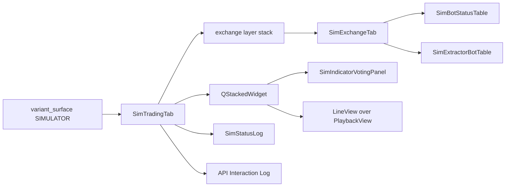

### What the fork draws

The tab is Live's four splitters at Live's sizes: the exchange layer stack
beside the panel on top, the Activity Log and the API Interaction Log side by
side below. Every module carries Live's title. The venue page holds the
Scrumming Bots table and the Extractor Bots table, both hidden until a row
arrives, and the command bar of Start, Pause, Stop, Restart and Delete. The
panel holds its title, the Bot selector and its privacy dot, the currency rate
strip, both indicator tables, both confidence bar graphs, the timeframe-lock
line and the staleness banner, hidden until raised.

Three positions differ from Live by ruling. The corner Live gives
`＋ Add Crypto Exchange` holds Import Live Fleet, Generate From YTD and Create
New Bots, each at Live's corner-button width and height. The row above the bot
list, where Live draws Privacy Mode and the news line, holds Validation, Back
Test and Portfolio Battery, then `+ New Bot` where Live draws it. The data-pool
row keeps Live's height and holds nothing. Privacy Mode, the news line and the
data-pool line are not forked.

`src/gui/simulator/sim_trading_tab.py` — the corner buttons

```python
WAY_IN_BUTTONS = (
    (surface.IMPORT_LIVE_FLEET_ACTION, surface.IMPORT_LIVE_FLEET_TEXT),
    (surface.GENERATE_FROM_YTD_ACTION, surface.GENERATE_FROM_YTD_TEXT),
    (surface.CREATE_NEW_BOTS_ACTION, surface.CREATE_NEW_BOTS_TEXT),
)
```

The replay layer sits behind the panel in one stack. The flip button seats
itself on whichever layer is showing: after the panel title, or at the head of
the replay layer, so the way back is never hidden with the panel.

`src/gui/simulator/sim_trading_tab.py` — the flip

```python
        if self._layer == surface.LAYER_PLAYBACK:
            self._indicator_panel.header_row().removeWidget(self._flip_button)
            self._chart_header.insertWidget(0, self._flip_button)
        else:
            self._chart_header.removeWidget(self._flip_button)
            self._indicator_panel.header_row().insertWidget(1, self._flip_button)
```

The seat later moved to the head of both rows, `FLIP_SEAT_INDEX`, and the
chart header reads its margins and spacing off the panel's header row, so
the button lands at one corner under both layers.

`src/gui/simulator/sim_trading_tab.py` — the chart header's margins

```python
        panel_header = self._indicator_panel.header_row()
        self._chart_header = QHBoxLayout()
        self._chart_header.setContentsMargins(panel_header.contentsMargins())
        self._chart_header.setSpacing(panel_header.spacing())
```

### What the fork does not carry

The copies hold no bot manager, no connector and no event bus. Every send the
Live code makes is cut, not stubbed: the signal-contract emits that write under
`~/.acervator_logs/signals/`, the event-bus emit behind the bot selector, the
API-log listener, the activity-log watchdog that read the live bot manager,
the TA snapshot store that read and wrote `~/.acervator/ta_snapshots/`, the
data-pool read behind the display price, and the demo readings the Live panel
invents from a random walk when no bot is loaded. Zero occurrences of
`ScrummingBot`, `BotContainer`, `ExchangeInterface`, `EventBus` and
`PhantomBalance` under `src/gui/simulator/`.

At unit 7 the way-in buttons, the mode buttons, `+ New Bot`, the Fire buttons
and the command bar's handler were wired to nothing, and the tab held two
sources that nothing read. Units 10 to 31 wired each of them (comments
5706487452, 5707202420, 5708384371, 5714936418, 5716410892, 5718837037,
5721499839, 5728708856, 5733262015); the section "What the tab holds today"
describes what each does now.

`src/gui/simulator/sim_trading_tab.py` — the two sources

```python
        self._tablet_source = (
            tablet_source
            if tablet_source is not None
            else TabletSource(surface.TABLET_ROOT)
        )
        self._fleet_source = fleet_source if fleet_source is not None else FleetSource()
```

Asked for a send by name, each raises `SendRefused`.

At unit 7 the window's header strip hid while Sim was in front, as
`ISOLATED_TABS` then named it. Unit 9 took Sim out of that tuple and fed the
strip from the sim fleet (comment 5705741677); the section "The header strip
shows on Sim" describes the strip as it draws.

## The React page is Live's page modules, forked

The React build of the Sim tab is `SimTradingTabReact`, a fork of the Live
tab's React host under the Simulator's name, and it loads seven page modules
that are Live's seven copied under Simulator names. The seam's React loader
answers it; the page written from scratch, `SimulatorTabReact` in
`src/gui/react_simulator_tab.py` with `simulator_tab.js`, stays in the tree and
nothing loads it.

`src/gui/variant_surface.py` — the React loader

```python
def _react_simulator() -> type:
    """Import and return the React Sim tab, ``SimTradingTabReact``."""
    from .simulator.sim_react_trading_tab import SimTradingTabReact

    return SimTradingTabReact
```

Each forked module sits beside its source under `src/gui/web/`. The copy keeps
Live's layout, part names, sizes and design tokens; it changes the bridge
method it asks, the globals it defines, the feed and the send side, and
nothing else.

| Simulator module | forked from |
|---|---|
| `sim_trading_tab.js` | `trading_tab.js` |
| `sim_exchange_tab.js` | `exchange_tab.js` |
| `sim_indicator_panel.js` | `indicator_panel.js` |
| `sim_status_log.js` | `status_log.js` |
| `sim_bot_status_table.js` | `bot_status_table.js` |
| `sim_extractor_bot_table.js` | `extractor_bot_table.js` |
| `sim_table_cells.js` | `table_cells.js` |
| `src/gui/simulator/sim_react_trading_tab.py` `SimTradingTabReact` | `src/gui/react_trading_tab.py` `TradingTabReact` |
| `src/gui/simulator/sim_trading_tab_surface.py` | `src/gui/main_tabs/trading_tab_surface.py`, the payload builder |
| `src/gui/simulator/sim_exchange_tab_surface.py` | `src/gui/main_tabs/exchange_tab_surface.py`, the payload builder |

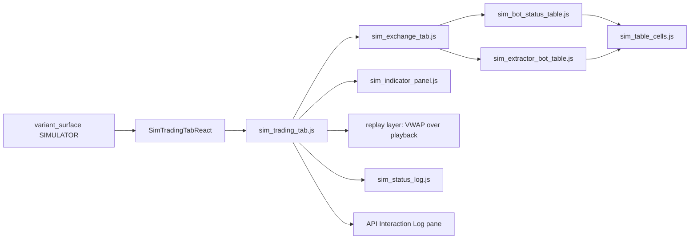

### What the page draws

The page is Live's four splitters at Live's sizes, read off Live's own
`trading_tab_surface`: the exchange layer stack beside the panel on top, the
Activity Log and the API Interaction Log side by side below. Every module
carries Live's title and Live's part name, so the page and the Qt fork
enumerate the same modules in the same order. The venue page holds the
Scrumming Bots table and the Extractor Bots table, both hidden until a row
arrives, and the command bar. The panel holds its title, the Bot selector and
its privacy dot, the currency rate strip, both indicator tables, both
confidence bar graphs, the timeframe-lock line and the staleness banner.

The three ruled positions are the Qt fork's. The corner Live gives
`＋ Add Crypto Exchange` holds Import Live Fleet, Generate From YTD and Create
New Bots, at Live's corner-button width and height, in Live's corner-button
chrome. The venue header holds Validation, Back Test and Portfolio Battery in
Live's Privacy-Mode sheet, then `+ New Bot` where Live draws it. The data-pool
row keeps Live's style and height and holds a blank line.

`src/gui/simulator/sim_trading_tab_surface.py` — the corner buttons

```python
WAY_IN_BUTTONS = (
    (sim.IMPORT_LIVE_FLEET_ACTION, sim.IMPORT_LIVE_FLEET_TEXT),
    (sim.GENERATE_FROM_YTD_ACTION, sim.GENERATE_FROM_YTD_TEXT),
    (sim.CREATE_NEW_BOTS_ACTION, sim.CREATE_NEW_BOTS_TEXT),
)
```

The replay layer sits behind the panel in one stack the page draws: the panel
slot over a layer holding the VWAP window above the Stone Tablet playback
window in one vertical splitter. The flip button sits after the panel title,
seated by `sim_indicator_panel.js`, and at the head of the replay layer,
seated by `sim_trading_tab.js`, so the way back is never hidden with the
panel. A press writes the page's ask on the console line the host reads, and
the host redraws the tab with the other layer showing.

`src/gui/simulator/sim_react_trading_tab.py` — the flip

```python
        def flip_layer(self) -> str:
            """Swap the page between the panel layer and the replay layer."""
            other = (
                sim.LAYER_PLAYBACK
                if self._state.replay_layer == sim.LAYER_INDICATORS
                else sim.LAYER_INDICATORS
            )
            return self.show_layer(other)
```

The panel module later moved the flip before its title, so both modules
draw it first in their header at the panel's top-left corner. Each module's
ask carries the pressed button's rect under `flip_rect`, read by the tab
module's `flipRect` in the layer stack's coordinates, and `show_layer` emits
`sim.layer.flipped` with it on every change of layer.

`src/gui/web/sim_indicator_panel.js` — the header's order

```javascript
    return element(DIV_TAG, headProps, [
      flip,
      element(Title, { key: TITLE_PART, model: model }),
      spacer,
```

### What feeds the page

The host builds one payload per bridge method from state it owns: the tab
payload from its own `SimTradingTabState`, the Activity Log from its own
`StatusLogModel`, the panel from its own `IndicatorPanelModel`, and each
seated venue's three payloads from that venue's own `ExchangeTabModel`, its
`SimBotStatusTableModel`, the fork unit 13 made of Live's scrum model (comment
5707202420), and Live's `ExtractorBotTableModel`. Live's module-level
models are never read. The page asks each method once on mount and the host
answers from those payloads; every push, `show_tab`, `show_votes`,
`show_log_call` and `add_exchange_tab`, hands the page a fresh payload and
redraws it.

`src/gui/simulator/sim_react_trading_tab.py` — the payloads

```python
def models(
    state: tab_surface.SimTradingTabState,
    log: status_log_surface.StatusLogModel,
    panel: indicator_panel_surface.IndicatorPanelModel,
) -> dict:
    """The view model of every bridge method the page's modules ask for."""
    return {
        token_surface.METHOD: token_surface.view_model({}),
        tab_surface.METHOD: state.view_model({}),
        LOG_METHOD: log_payload(log, {"whole": True}),
        PANEL_METHOD: panel_payload(panel),
    }
```

### What the page does not carry

The host holds the same two sources the Qt fork holds, `TabletSource` and
`FleetSource`, and no bot manager, no connector and no bus. The news ticker
module, which reaches its feeds over the network, is not in the page's roster.
The data-pool line's text and its one-second timer, and Privacy Mode, are not
forked. The Activity-Log watchdog and the API-log listener were not forked at
unit 8; unit 17 forked the watchdog over the sim bot manager and unit 18 the
listener over the sim log (comments 5717588355, 5718837037). Every ask the
page makes is answered from the payloads the host holds and written to the
console for the host to read. At unit 8 the host answered the flip and held
every other press, so the way-in buttons, the mode buttons, `+ New Bot`, the
Fire buttons and the command bar changed nothing; units 12 to 31 wired each
press (comments 5708384371, 5707202420, 5714936418, 5716410892, 5717588355,
5728708856, 5733262015), and the section "What the tab holds today" describes
them.

## The header strip shows on Sim

The window's header strip, the five columns and the five counter cards above
the tab row, stays on screen while the Sim tab is in front. `ISOLATED_TABS`
names the Paper tab alone, so the strip hides on Paper and on nothing else.

`src/gui/main_tabs/main_window_surface.py` — the two tuples

```python
ISOLATED_TABS = (PAPER_TAB,)

#: The tabs the header strip reads the Simulator's fleet on, not the live one.
SIM_FED_TABS = (SIM_TAB,)
```

While Sim is in front the ten fields carry the Simulator's figures, read from
the Sim tab's fleet source; on every other tab they carry the live fleet's,
as before. The window decides on every dashboard tick and again the moment
the operator changes tab, so a switch never leaves the other fleet's figures
on the strip. The live fleet's numbers do not appear while Sim is in front.

`src/gui/main_window.py` — `_refresh_header_strip`

```python
if self._header_strip_reads_sim():
    sim_tab = self._simulator_tab
    self._write_header_strip(
        sim_tab.fleet_source().aggregate(), sim_tab.exchange_count()
    )
    return
if live_stats is None:
    if not self._bot_manager:
        return
    live_stats = self._bot_manager.get_aggregate_stats()
self._write_header_strip(live_stats, len(self._exchange_tabs))
```

Each field keeps the definition the Trading tab page gives it, applied to the
sim fleet. SPENDABLE is the sim fleet's wallet cash and LOCKED the value its
positions hold. REALISED is the sim fleet's fills matched first-in first-out,
one figure per bot, summed. MATURE is the profit on sim positions past two
hundred per cent of their cost. EXCH counts the Sim tab's own venue sub-tabs.
The five cards are the sim fleet's sold and bought dollars, its trades, its
running bots and its errors. The fleet source answers them through one call,
in the keys the live aggregate uses.

`src/simulator/fleet_source.py` — `FleetSource.aggregate`

```python
def aggregate(self) -> dict:
    """The header strip's figures for the fleet the Simulator holds.

    No bot is loaded into the Simulator, so the answer is
    ``EMPTY_AGGREGATE``.
    """
    return dict(EMPTY_AGGREGATE)
```

At unit 9 no bot was loaded into the Simulator, so the strip read on Sim as it
reads on Live with no bots: the four money columns an em dash, EXCH the count
of seated venues, the five cards zero. Unit 21 made `aggregate` answer Live's
arithmetic over the held records (comment 5721499839), so the figures arrive
with the way-ins that load a fleet and the runs that trade it.

```mermaid
flowchart LR
    tick[dashboard tick, 2000 ms] --> pick{tab in front}
    change[tab change] --> pick
    pick -- Sim --> sim[SimTradingTab.fleet_source().aggregate()]
    pick -- any other --> live[BotManager.get_aggregate_stats()]
    sim --> strip[the ten cells]
    live --> strip
```

## The venue stack seats the fleet's exchanges

The Sim tab seats one venue sub-tab per exchange the sim fleet names, in both
builds. At unit 10 the fleet was the saved bot record the tab's fleet source
read, and the exchange set the distinct exchange ids of the stored bots; since
unit 21 the fleet is the held records and the Simulator starts empty (comment
5721499839). Each host seats its venues when it is built and again whenever
its `fleet_changed` signal fires, which every way-in does. A sub-tab is
captioned as Live captions an exchange saved with no
name, the capitalised id. Live's venue set is the live configuration; the
Simulator never reads it.

`src/gui/simulator/sim_trading_tab.py` — the seating

```python
    def _sync_exchange_tabs(self) -> None:
        """Seat a sub-tab for each exchange the fleet names and drop the rest.

        The caption is ``exchange_display_name`` over the id, as Live captions
        an exchange saved with no name.
        """
        wanted = [str(eid) for eid in self._fleet_source.exchanges() if eid]
        for eid in wanted:
            self.add_exchange_tab(eid, exchange_display_name({"exchange_id": eid}))
        self._drop_unlisted_exchange_tabs(wanted)
```

When the fleet names an exchange the bar does not hold, that venue page is
seated beside the others. When the bar holds an exchange the fleet no longer
names, its sub-tab is taken off, and the Get Started card comes back once a
layer's bar is empty. EXCH on the header strip counts the sub-tabs on the
crypto layer, as it counts Live's. A seated venue with no bots draws the
forked venue page: the mode buttons, `+ New Bot`, the empty data-pool row, the
command bar, and both tables hidden until a row arrives.

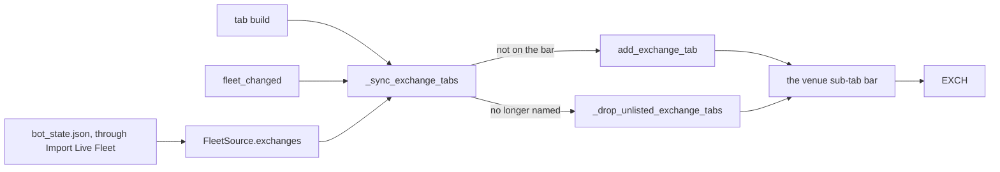

### The Get Started card asks for a first fleet

With no exchange seated the layer shows the Get Started card. Its frame, its
geometry and the order of its parts are Live's; its contents are the
Simulator's. The heading reads `No Crypto Fleet Loaded`, the hint reads
`Load a Crypto fleet to begin a run`, and the button position holds Import
Live Fleet, Generate From YTD and Create New Bots, one under the other, each
at Live's card-button size and in the layer's accent. At unit 10 they were
wired to nothing; units 21, 22 and 23 then wired the corner button and the
card button of each action together (comments 5721499839, 5722113817,
5723035277).

`src/gui/simulator/sim_trading_tab_surface.py` — the card's texts

```python
def placeholder_title_text(label: Any) -> str:
    """The Get Started card's heading for one layer: the first step is a fleet."""
    return f"No {label} Fleet Loaded"

def placeholder_hint_text(label: Any) -> str:
    """The line under the Get Started card's buttons for one layer."""
    return f"Load a {label} fleet to begin a run"
```

The Qt card and the React card read those two functions, so the two builds
cannot title the card differently. The venue stack is the first module of the
tab to read one of its two sources; the tables, the panel and the two spools
still draw empty.

## The Scrumming Bots table draws the sim fleet

The Scrumming Bots table on each seated venue draws one row per sim bot on
that exchange, in both builds. The rows come from the tab's fleet source: each
held record, imported, generated or created (unit 21, comment 5721499839), is
one read-only record, and the record answers the
same status keys a live bot answers, so the forked table draws it with Live's
own cell code. The table stays hidden until a row arrives and hides again when
the last row leaves, as Live's does.

`src/gui/simulator/sim_trading_tab.py` — the feed

```python
    def refresh_bots(self) -> int:
        """Hand every seated venue its rows from ``FleetSource.statuses``.

        Answers how many rows were handed out. A venue whose list is empty
        hides its tables, as Live's does.
        """
        handed = 0
        for store in (self._crypto_exchange_tabs, self._stock_exchange_tabs):
            for eid, tab in list(store.items()):
                statuses = self._fleet_source.statuses(eid)
                tab.update_bots(statuses)
                handed += len(statuses)
        return handed
```

Both hosts call it after the venues are seated, at build and on every
`fleet_changed`. The Simulator runs no refresh timer: a sim figure moves only
when a load or a run moves it, and the signal that fires then is what redraws
the rows. Live's rows follow the bot manager every two seconds; the
Simulator's follow the fleet it holds.

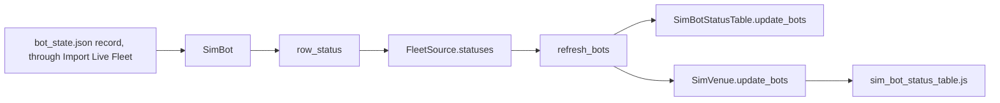

### What one record carries

The stored record is read in four parts. The config gives the ids, the
symbol, the mode and the gate fields. The stats give the price, the position
value, the trade count, the scrummed and folded dollars, the realised profit
and the error count. The saved scrumming state gives the grown target the
engine re-zeroes to, the quote rate, the phase and the lots. The saved state
gives the state the Bot ID cell is coloured by. Holdings are the units summed
across the lots, which is how the live bot sets its own holdings.

| the cell | reads |
|---|---|
| Bot ID, its colour | the record's id and its saved state |
| Symbol | the config symbol and exchange |
| Current Position Value | holdings, the record's price, the quote rate |
| Trades | the stats trade count |
| Target | the grown target, or the config target |
| Target BTC, Target ETH | the target over the fleet's own BTC and ETH rows |
| Ammo | the position value and the target |
| Fire | the saved phase; the armed action and the gate state read as a live bot's do before its first tick |

The runtime values a record does not hold, the armed action, the ceiling ratio
and the gate state, read as they do on a live bot before its first tick.

### The row's own price, and the fleet's own rates

A sim row is priced from its own record and never from the live data pool.
The price age is zero, the sim's own reading for this tick, so the Position
Value cell and the Ammo cell price from the same figure, as the Trading tab
page requires of them. The Target BTC and Target ETH cells denominate through
the fleet's own BTC and ETH rows on that exchange, not through the live
currency monitor, and carry no drift suffix because the Simulator has no
24-hour figure to draw one from; with no such row the cell reads `pending`.

`src/gui/simulator/sim_bot_status_table_surface.py` — the price

```python
    def _price_reading(self, status, stats) -> tuple:
        """The row's own ``current_price`` at ``SIM_PRICE_AGE_S``, and its ``quote_to_usd``."""
        price = float(stats.get("current_price", live.NO_PRICE))
        quote_rate = float(
            status.get("quote_to_usd", live.DEFAULT_QUOTE_TO_USD)
            or live.DEFAULT_QUOTE_TO_USD
        )
        return price, SIM_PRICE_AGE_S, quote_rate
```

The Qt fork reads the same constant and the same denomination helper, so the
two builds price a row identically.

### Fire and Detail

Fire is present on every row with Live's styling and tooltips. A press asks
the fleet source to fire, and the fleet source refuses every send by name, so
the Activity Log carries Live's own failure line, `Fire on <id> failed`, with
the refusal's words. No venue and no live bot is reached. The sim's own scrum
and fold arithmetic is a later unit; until it lands every Fire on the
Simulator is refused this way.

Detail is present on every row. A press opens the Simulator's bot detail
window: the frame of Live's Bot Settings window, with the title, the pair and
mode header, the state badge, Prev and Next over the venue's sim fleet, the
Status tab over the row's figures, and Close. It edits nothing. At unit 13 the
six tabs that read a live bot's runtime state, and the React-drawn window,
were not forked; unit 13a forked them (comment 5712057220).

`src/gui/simulator/sim_trading_tab.py` — the two presses

```python
    def _on_bot_fire(self, bot_id: str) -> None:
        """Manual Fire on a sim bot: ask ``FleetSource`` to ``fire`` and log the
        refusal to the Activity Log, as the window logs a failed Fire."""
        try:
            self._fleet_source.fire(bot_id)
        except SendRefused as exc:
            self._status_log.log(f"Fire on {bot_id[:8]} failed: {exc}", "error")
```

Under React the page's Fire and Detail asks reach the host through the
console line, the host applies the ask to that venue's own table model, and
the same two handlers run.

### Until the way-ins landed

At unit 13 the fleet source read the saved bot record as it lay on disk, so a
build with a saved fleet drew that fleet's rows at start. Unit 21 gated both
the venues and the rows behind Import Live Fleet, so the tab starts empty
(comment 5721499839).

## New Bot opens the Simulator's wizard

`+ New Bot` on a seated Sim venue opens the Simulator's Create Auto Trader
wizard, a fork of Live's under the Simulator's names, in both builds. It
carries Live's five pages in Live's order, Trading Mode, then Select Asset
Pair or Extractor Pool, then Trading Parameters, then Phantom Bots, with the
same fields, the same ranges, the same walk buttons and the same look, and it
opens on the operator's stored defaults as Live's does. Finish creates one sim
bot and its row appears in the Scrumming Bots table. Cancel creates nothing.

`src/gui/simulator/sim_trading_tab.py` — the press reaches the fork

```python
        tab = SimExchangeTab(
            exchange_id,
            display_name,
            on_new_bot=self._create_bot,
            on_bot_clicked=self._on_bot_detail,
            on_bot_fire=self._on_bot_fire,
            status_log=self._status_log,
        )
```

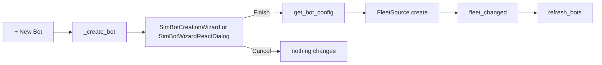

### What the Simulator's wizard reads

The venue list is the seated sub-tabs. The stored defaults come through the
same settings reader Live's window holds, so the target balance, the
visibility, the aggressive box, the phantom enable and the lock candles open
on the operator's own figures; nothing is written. The Target Asset list is
the assets the Simulator holds a tablet for on the picked exchange. A tablet
is filed by asset and exchange and names no quote, so its asset is offered
under every base currency, with no volume figure and no volume sort. Live's
wizard asks the venue for its markets; the Simulator's asks the tablets.

`src/gui/simulator/sim_bot_wizard_surface.py` — the market table

```python
    for entry in tablet_source.entries():
        exchange_id = str(entry.exchange_id)
        asset = str(entry.asset).upper()
        key = (exchange_id, asset)
        if key in seen or not asset:
            continue
        seen.add(key)
        rows = out.setdefault(exchange_id, [])
        for base in live.BASE_CURRENCIES:
```

### What Finish creates

The wizard's config is shaped by the same call Live shapes it with, so a
mode-foreign key or a bad shape is refused with Live's own Activity Log line.
The shaped config takes the stored-record shape the live process writes and is
read through the same record reader the imported fleet uses, so a created bot
holds exactly the fields a stored bot's record gives: the ids, the symbol, the
target, the timeframe, the interval, the fee and the gate fields. Its id is
eight characters, drawn as a live bot draws its own. Its state is idle, so its
Bot ID cell is grey. Its price, holdings and trades are zero, as on a live bot
before its first tick. An Extractor is refused when no single Scrumming Bot on
the venue holds its pool base, with Live's own message.

`src/simulator/fleet_source.py` — the add path

```python
    def create(self, config: dict) -> SimBot:
        record = wizard_record(config)
        bot_id = str(uuid.uuid4())[:BOT_ID_LENGTH]
        bot = _sim_bot_from_record(bot_id, record, origin=NEW_ORIGIN)
        if bot is None:
            raise ValueError("the wizard config names no symbol")
        self._created.append(bot)
        return bot
```

The fleet source then fires `fleet_changed`, the venues re-seat, the tables
redraw, and the Activity Log carries `Bot <id> created: <symbol> (scrumming) -
IDLE`.

### What is not forked

Live's pre-flight symbol check contacts the venue; the Simulator offers only
the assets it holds a tablet for. The phantom page's API-load warning reads
Live's venue call rate; the Simulator makes no venue call, so the page answers
True, as Live's React wizard does with no load reading.

### A created bot was not persisted at unit 12

At unit 12 the Simulator kept no fleet file of its own, and a created bot lived
in the fleet source until the tab closed; unit 12a gave it the sim fleet file
(comment 5710961369). Nothing writes `bot_state.json`.

### The React host opens the wizard one turn later

Under React the venue page's press reaches the host through the console line.
A web page opened inside another page's console callback never finishes
loading, so the host opens the wizard on the next event-loop turn, and its page
loads.

`src/gui/simulator/sim_react_trading_tab.py` — the deferred open

```python
            QTimer.singleShot(
                0, lambda: self._open_bot_wizard(exchange_id, defaults_override)
            )
```

## The Extractor Bots table draws the sim extractors

The Extractor Bots table on a seated Sim venue is the forked
`SimExtractorBotTable` under Qt and `sim_extractor_bot_table.js` under
React, fed from the same `FleetSource.statuses` list the Scrumming Bots
table reads, kept to the records whose mode is extractor. It carries Live's
eight columns, Bot ID, Symbol, Mode, Trades, Pool, Liquid, Fire and the
blank Detail column, with Live's tooltips and Live's two buttons. It is
hidden with its label until the venue's fleet holds an extractor, shown when
one arrives, and hidden again when the last leaves, while the Scrumming Bots
table keeps its own rows.

`src/simulator/fleet_source.py` — the keys an extractor row reads

```python
def _extractor_status(bot: SimBot) -> dict:
    """The keys ``ExtractorBot.get_status`` adds over the base status, which
    the Extractor Bots table reads: the base currency, the three pool figures,
    the two position counts and ``extractor_pool_color`` over them."""
    return {
        "base_currency": bot.base_currency,
        "chunk_size_usd": bot.chunk_size_usd,
        "chunk_size_base": bot.chunk_size_base,
        "chunk_free_base": bot.chunk_free_base,
        "n_positions_open": bot.n_positions_open,
        "n_positions_drawdown": bot.n_positions_drawdown,
        "pool_color": extractor_pool_color(
            bot.n_positions_open, bot.n_positions_drawdown
        ),
    }
```

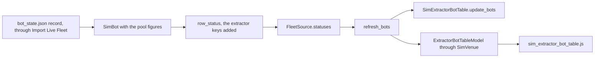

### What an extractor record carries

A stored extractor record is read in the same four parts as a scrumming one,
plus the extractor block the live bot saves: the dollar size of its pool, the
pool in base units, the base units not deployed to any position, and the
list of open positions with each one's state. A record the wizard just
created holds no such block, so it reads as a live extractor reads before its
first rate arrives: the base size and the free base both equal to the dollar
size, and no position.

| the cell | reads |
|---|---|
| Bot ID | the record's id |
| Symbol, its coin icon | the base currency the extractor accumulates |
| Mode, its colour and tooltip | the saved state |
| Trades | the stats trade count |
| Pool | the pool's dollar size |
| Liquid, its tooltip | the free base priced at the pool's own dollars per base unit, with the position counts and the base name |
| Liquid's colour | green with no position open, red with one in drawdown, yellow otherwise |
| Fire | present and disabled, as on Live |
| Detail | present |

The Pool and Liquid figures are composed by Live's own row code in both
builds; the Simulator adds no arithmetic of its own. The pool colour is the
live extractor's rule, written once as pure code over the two position
counts.

`src/simulator/fleet_source.py` — the pool colour

```python
def extractor_pool_color(n_positions_open: int, n_positions_drawdown: int) -> str:
    """The Liquid cell's colour name for one extractor, the rule of
    ``ExtractorBot.pool_color``: ``POOL_GREEN`` with no position open,
    ``POOL_RED`` with one in drawdown, ``POOL_YELLOW`` otherwise."""
    if n_positions_open <= 0:
        return POOL_GREEN
    if n_positions_drawdown > 0:
        return POOL_RED
    return POOL_YELLOW
```

### The parent

An Extractor works against a parent base-currency Scrumming Bot. Live's row
draws no parent id; what it shows of the parent is the base currency the
extractor accumulates, in the Symbol cell and in the Liquid tooltip. The sim
row shows the same, from the record's base currency, which is the base the
parent scrumming bot on that venue holds.

### Detail and Fire on an extractor row

Detail is present on every extractor row in both builds. A press opens the
Simulator's bot detail window over that extractor, with its symbol, its mode,
its state and its trade count on the Status tab and, since unit 13a, the
Settings and Positions Held tabs beside it (comment 5712057220), and selects
the row, as a press on the
Scrumming Bots table does. Under React the page's ask reaches the host
through the console line, the host applies it to that venue's own extractor
table model, and the same handler runs.

Fire is present and disabled on every extractor row, as it is on Live's,
because Manual Fire is per position for an Extractor. A press reaches
nothing: no name is asked of the fleet source and no line is written.

`src/gui/simulator/sim_react_trading_tab.py` — the extractor table's asks

```python
        if method == EXTRACTOR_METHOD:
            if (
                params.get(extractor_surface.ACTION_PARAM)
                not in EXTRACTOR_PRESS_ACTIONS
            ):
                return False
            extractor_surface.drive(self.extractor, params)
            return True
```

## The Simulator keeps its own fleet file

A bot created through the Simulator's wizard survives a restart, in both
builds. The tab's fleet source writes one file of its own, `sim_fleet.json`,
under the `sim` bucket of the log root; the parity reports of unit 25 land
under the reports bucket instead, and the four log files of unit 31a beside
the fleet file (comments 5725784001, 5734233752). Every `fleet_changed` writes
it first, before the venues re-seat
and the tables redraw, and the tab build reads it once. The write goes
through the same helper the live process writes `bot_state.json` with, so a
crash mid-write leaves the previous file whole. The section "A created bot
is not persisted" above describes the tab before this file existed; its last
sentence, that nothing writes `bot_state.json`, stays true.

`src/core/log_paths.py` — the bucket

```python
def get_sim_dir() -> Path:
    """``sim/`` bucket — every file the Simulator writes.

    ``src.simulator.fleet_source.FleetSource`` keeps the sim fleet file
    here; ``~/.acervator/bot_state.json`` is never written from the
    Simulator.
    """
    p = _LOG_ROOT / "sim"
    p.mkdir(parents=True, exist_ok=True)
    return p
```

`src/gui/simulator/sim_trading_tab.py` — the write hangs on the signal

```python
        self.fleet_changed.connect(self._fleet_source.save)
        self.fleet_changed.connect(self._sync_exchange_tabs)
        self._sync_exchange_tabs()
```

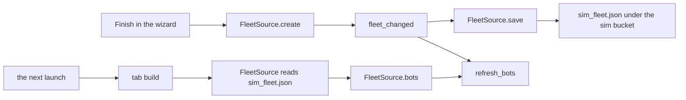

### What the file holds

The file carries `saved_at`, `saved_at_human`, `bot_count` and `bots`, the
keys the live state file carries less the smart-wire lists the Simulator has
none of. Each entry under `bots` is the per-bot record the live process
writes, `config`, `stats`, `scrumming_state`, `state_when_saved` and
`bot_id`, so the one record reader that maps a stored live bot to a row maps
a stored sim bot the same way. At unit 12a the file held the wizard's bots and
nothing of the live fleet, with the live read beside it; since unit 21 it
holds every held record, imported ones included, and the live read runs only
through Import Live Fleet (comment 5721499839).

`src/simulator/fleet_source.py` — the write

```python
    def save(self) -> Optional[Path]:
        payload = {
            "saved_at": time.time(),
            "saved_at_human": datetime.now().strftime(SAVED_AT_HUMAN_FORMAT),
            "bot_count": len(self._records),
            "bots": dict(self._records),
        }
        path = self.sim_path()
        try:
            atomic_write_json(path, payload, indent=2, default=str)
        except (OSError, TypeError, ValueError) as exc:
            logger.error("sim fleet save failed: %s: %s", path, exc)
            return None
```


Since one fleet per mode landed, the file holds all three fleets. The top
carries `saved_at`, `saved_at_human`, `bot_count` summed over the three,
and `fleets`, one entry per mode; each entry carries the four keys the block
above wrote for the one fleet, so a mode's entry is a file of the old shape.
Every fleet change writes all three, so an import under Validation, a bot
created under Back Test and a Battery run's generated fleet land in one file
and survive a restart under their own modes.

`src/simulator/fleet_source.py` — the write, one entry per mode

```python
        payload = {
            "saved_at": saved_at,
            "saved_at_human": saved_at_human,
            "bot_count": sum(len(records) for records in self._fleets.values()),
            FLEETS_KEY: {
                mode: {
                    "saved_at": saved_at,
                    "saved_at_human": saved_at_human,
                    "bot_count": len(records),
                    "bots": dict(records),
                }
                for mode, records in self._fleets.items()
            },
        }
```

### Absent, empty, malformed

An absent file, or one holding no bytes, gives no sim bots and no log line.
A file that is not a JSON object holding a `bots` object gives no sim bots
and one warning line naming the file, and the tab builds. A record that
names no symbol is kept in the file, is not drawn, and is named in one
warning line at build, as the live state file carries forward a record it
did not load.

`src/simulator/fleet_source.py` — the read

```python
    try:
        loaded = json.loads(text)
    except json.JSONDecodeError as exc:
        logger.warning("sim fleet file %s malformed: %s", path, exc)
        return {}
    stored = loaded.get("bots") if isinstance(loaded, dict) else None
    if not isinstance(stored, dict):
        logger.warning("sim fleet file %s malformed: no bots object", path)
        return {}
```


Since one fleet per mode landed, the read answers three maps. A file holding
`fleets` reads each mode's entry through the reading above, one warning per
mode for a record that names no symbol; a mode name under `fleets` that is
not one of the three is not read and is named in one warning line. A file in
the old shape, one `bots` map at the top and no `fleets`, is read as the
Validation fleet with the other two empty, and one line says so, so the
fleet the operator held before the change is drawn at the next launch under
Validation, the mode the tab opens in. The first fleet change after that
launch writes the file in the new shape.

`src/simulator/fleet_source.py` — the old shape and the unknown mode

```python
    stored_fleets = loaded.get(FLEETS_KEY)
    if isinstance(stored_fleets, dict):
        unknown = [str(name) for name in stored_fleets if name not in MODES]
        if unknown:
            logger.warning(
                "sim fleet file %s names %d mode(s) outside %s and does not "
                "read them: %s",
                path,
                len(unknown),
                MODES,
                ", ".join(unknown),
            )
```

```python
    fleets[MODE_VALIDATION] = _records_of(stored, path, MODE_VALIDATION)
    logger.info(
        "sim fleet file %s holds one fleet; read as the %s fleet",
        path,
        MODE_VALIDATION,
    )
```

Driven in the real window in both builds with a scratch home: a bot created
through the wizard was read off the file with the typed symbol, target,
timeframe and interval, and the second process drew its row with those
values; `bot_state.json` hashed the same before and after every step, and a
write planted into its path from the sim side moved the hash, so the
comparison can report. The file removed drew the live row alone with no
warning; the file overwritten with text that is not JSON drew the live row
alone with one warning naming it; a file holding one readable record and one
that names no symbol drew the readable one and named the other.

## Detail opens the Simulator's Bot Settings window with all seven tabs

Detail on a Simulator row now opens Live's Bot Settings window, forked, with
every tab Live gives the bot's mode, in both builds. A scrumming bot gets
Status, Settings, Fold Tranches, Stack Tranches, Bot Swarm, Market Inspector
and Phantom Bots; an extractor gets Status, Settings and Positions Held. The
window carries Live's title, Live's header, Prev and Next over the venue's
sim fleet, Apply Changes and Close. The section "Fire and Detail" above
describes the window before the six tabs were forked; the sentence that they
were not forked yet no longer holds, and the sentence that the window edits
nothing stays true.

Each tab is fed from the stored record, read as the bot the window reads.
`SimBotView` holds one `SimBot` and its raw record and answers the attribute
names Live's tabs read off a live bot: the config rebuilt as a restart
rebuilds it, the stats, the tranches, the counters and the parked credits from
`scrumming_state`, the phantom flag, the phantom timeframes and the lock count
from the record's own keys, and the positions and the pool figures from
`extractor_state`. Every name Live writes a bot through is refused.

`src/simulator/sim_bot_view.py` — the refusal

```python
    def __getattr__(self, name: str) -> Any:
        """Refuse every send in ``SEND_NAMES`` and every runtime name not held."""
        if name.startswith("__"):
            raise AttributeError(name)
        if name in SEND_NAMES:
            return _refusal(name)
        reason = (
            f"SimBotView holds no {name!r}: the stored record carries no such "
            "reading. The Simulator receives and asks; it sends nothing."
        )
        raise SendRefused(reason)
```

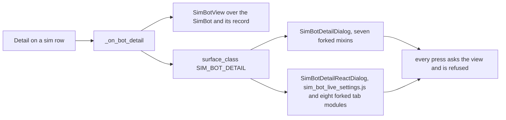

### What each tab reads

| tab | read from the record | drawn when the record holds nothing |
|---|---|---|
| Status | `stats` | the row's figures, as the table draws them |
| Settings | `config`, the live target, the anchor, the surplus, the consumed budget | Target BTC and Target ETH from the fleet's own BTC and ETH rows; the budget row reads an unreadable dash |
| Fold Tranches | `fold_tranches`, the parked credits, the ledger, the four counters | no Extractor Tranche row, Live's own answer with no bot manager |
| Stack Tranches | `stack_tranches`, the two counters | — |
| Bot Swarm | nothing named a wire manager | Live's own line, Bot Swarm not active for this bot |
| Market Inspector | nothing; a scan is not a record | Live's own no-scan screen; the shared analyzer is never asked |
| Phantom Bots | `phantoms_enabled`, `phantom_timeframes`, `lock_candle_count` | the runtime rows as a bot before its first tick |
| Positions Held | `extractor_state.positions`, the four chunk figures | — |

The budget row is the one figure the window does not draw. Its arithmetic is
a live bot's own, and the unit that shares the trading arithmetic as pure
code carries it; until then both builds read `— (unreadable)`, the reading
Live gives a cap it cannot read.

### Every press is refused

Apply Changes, Reset All Breakers, SELF-DESTRUCT, the three Clear buttons on
Fold Tranches, Fire on a fold row, the two Clear buttons on Stack Tranches and
Fire on a position are all present, drawn as Live draws them. In the Qt build
a press runs Live's own confirmation, then asks the view, and the view's
refusal lands in Live's own failure box: `Nothing was cleared — the call
failed`, `Manual Fire refused`, `Schedule failed`. In the React build the
press reaches the window through the page's console line and the refusal is
drawn on the pending-change line. Apply Changes records each edited field as
Live does, asks the view for every one on the press, and the line reads
`Refused N change(s) — the Simulator sends nothing`. No file is written:
`bot_state.json` and the sim fleet file hash the same before and after every
press.

`src/gui/simulator/sim_bot_detail.py` — Apply Changes

```python
    def _apply_changes(self) -> None:
        """Ask the view for every pending field; each is refused and logged."""
        if not self._changes:
            return
        refused = []
        for field, value in list(self._changes.items()):
            try:
                self._route_change(field, value)
            except SendRefused as exc:
                logger.warning(
                    surface.ROUTE_REFUSED_LOG, self._bot.bot_id[:8], field, exc
                )
                refused.append(
                    surface.APPLIED_REFUSED_FORMAT.format(
                        field=field, value=value, reason=exc
                    )
                )
```

### Both builds, resolved as Live resolves

The hosts open the window through the variant seam, beside Live's own pair,
so the Qt host opens the Qt fork and the React host opens the React fork. The
React fork is Live's React window forked under the Simulator's names: its own
page module, `sim_bot_live_settings.js`, eight forked tab modules and one sim
surface per tab, each answering its own method name. The React host opens the
window one event-loop turn after the page's console line that carried the
press, as the wizard is opened, because a web view opened inside another
page's console callback never finishes loading.

`src/gui/variant_surface.py` — the pair

```python
register(BOT_LIVE_SETTINGS, _qt_bot_live_settings, _react_bot_live_settings)
register(SIM_BOT_DETAIL, _qt_sim_bot_detail, _react_sim_bot_detail)
```

Driven in the real window in both builds with a scratch home and every socket
but loopback refused: Detail on the scrumming row read seven tabs off the
widget tree and off the page, titled and ordered as Live's window over the
same record shape; Detail on the extractor row read three. The Fold Tranches
tab drew three rows from a record holding three tranches and two from a
record holding two. Next opened the next bot's window on the same tab. Every
press above reached the refusal, and `bot_state.json` hashed the same after
each one.

## The Sim venue pane is Live's width

The Sim tab's top splitter now settles at the same pair as Live's at every
width the window can take. Before, the Qt Sim's venue pane was 48 px narrower
than Live's at the window's floor and 66 px narrower at 1920 px, in the built
program with its theme. The cause was the flip button seated after the panel
title: under the theme it asks 134 px, so the forked panel asked 575 px where
Live's panel asks 439, and a splitter given a size below a pane's minimum
raises that size and keeps the raised figure as the pane's share on every later
resize. The Sim divided 600:575 where Live divides 600:500. The replay layer
behind the panel asks 8 px and never decided the pair.

The flip button now reports a minimum width of 0 to the header row, and its
size policy lets the row shrink it. The panel asks 441 px, under the 500 the
splitter is given, so the Sim keeps 600:500 as Live does. At the floor the
header has 185 px of room and the button draws at its full width; dragged
narrower than its content, the button gives up width before the pane does, as
the React page's flex header already does.

`src/gui/simulator/sim_trading_tab.py` — the flip button

```python
class FlipButton(QPushButton):
    """A ``QPushButton`` named ``FLIP_BUTTON_NAME`` whose layout may shrink it to width 0."""

    def __init__(self, text: str, parent: Optional[QWidget] = None) -> None:
        super().__init__(text, parent)
        self.setObjectName(FLIP_BUTTON_NAME)
        self.setAccessibleName(FLIP_BUTTON_NAME)
        self.setSizePolicy(QSizePolicy.Preferred, self.sizePolicy().verticalPolicy())

    def minimumSizeHint(self) -> QSize:  # noqa: N802
        """The base hint's height over a width of 0."""
        return QSize(0, super().minimumSizeHint().height())
```

Read off one window holding both tabs, with the Windows fonts loaded and the
theme applied, before and after:

```
window        Live          Sim before    Sim after
1400 x 900    [751, 626]    [703, 674]    [751, 626]
1550 x 974    [833, 694]    [780, 747]    [833, 694]
1856 x 1076   [1000, 833]   [936, 897]    [1000, 833]
1920 x 1080   [1035, 862]   [969, 928]    [1035, 862]
```

The window's floor is its own minimum size, 1400 by 900; a smaller size asked
of it settles there. The React page divides its top splitter by the same two
figures as flex weights with no floor of its own, so its pair read equal to
Live's before this change and after: `[750, 625]` at 1400 and `[999, 832]` at
1856. After the flip, at the settled width, the VWAP window and the Stone
Tablet playback window each draw 626 px wide and 248 px high in the Qt build
and 625 by 264 in the React build, both inside the pane; a 900 px minimum
planted on the replay layer at runtime moves the pair in both builds, and
removing it restores the pair.

## The command bar acts on the sim fleet

Pause, Stop, Restart and Delete on the Simulator's venue page each change one
sim bot's state, and the table reads it back. Start did the same at unit 15;
since unit 31 it starts the run in Validation and Back Test mode and moves
every scrumming row on the page (comment 5733262015). The bar itself is
Live's: it takes its bot from the table you clicked last, tries the other
table with no selection there, and with none anywhere says `Select a bot
first.` and does nothing, in both builds. The press then reaches the Sim
host's `_on_bot_command`, the window's handler forked, which asks the
Simulator's bot manager instead of the live one.

`SimBotManager` in `src/simulator/sim_bot_manager.py` is the fork of the parts
of `BotManager` that hold and move bots. It holds one `FleetSource` and no
venue, no connector, no event bus and no coroutine. Its registry is the sim
fleet file's records: `get_bot` answers a held record's `SimBot` and None for
an unknown id, so a command on such an id logs Live's `Bot <id> not found.`
line and moves nothing; since unit 21 an imported row is a held record and no
row is read from `bot_state.json` directly (comment 5721499839). Each verb
moves the record's
`state_when_saved` under the live bot's own rule for that verb.

`src/simulator/sim_bot_manager.py` — the verbs

```python
def start(self, bot_id: str) -> str:
    bot = self._require(bot_id)
    if bot.state in ALREADY_RUNNING_STATES:
        logger.warning("Bot %s already running", bot_id)
        return bot.state
    return self._fleet.set_state(bot_id, BotState.RUNNING.value, clear_error=True)

def pause(self, bot_id: str) -> str:
    self._require(bot_id)
    return self._fleet.set_state(bot_id, BotState.PAUSED.value)

def stop(self, bot_id: str) -> str:
    self._require(bot_id)
    return self._fleet.set_state(bot_id, BotState.STOPPED.value)

def restart(self, bot_id: str) -> str:
    self.stop(bot_id)
    return self.start(bot_id)

def unregister(self, bot_id: str) -> bool:
    return self._fleet.remove(bot_id)
```

The rule per command, read off `BotContainer`, and the Activity Log lines,
which are Live's with the venue step absent:

```
Start     running or starting: unchanged, one logger warning; any other
          state: last_error cleared, running          ✓ Bot <id> RUNNING.
Pause     any state: paused                            Pausing bot <id>... / Bot <id> paused.
Stop      any state: stopped                           Stopping bot <id>... / Bot <id> stopped.
Restart   stopped, then running                        ✓ Bot <id> restarted.
Delete    Live's box, "Delete bot <id>? This cannot be undone."; Yes removes the
          record; No changes nothing                   Bot <id> deleted.
```

Start lands on `running` and not `starting`: Live's `starting` lasts until
the bot's loop task takes its first step, and the Simulator has no task.
Pause has no state guard, as the live bot's `pause` has none. Each success
writes the window notification's line, `[notification] Bot <id> RUNNING |
success`, through `notification_line` in `sim_trading_tab_surface.py`, and
plays Live's state-change sound; a failed verb logs Live's `Failed to <verb>
bot <id>` line and plays Live's error sound. The lines Live prints for
connecting to the venue, the REAL MONEY warning among them, are absent, because
they read a connect result and the Simulator makes no connect.

`FleetSource` gains three names for the held records: `sim_bot_for`,
`set_state` and `remove`. They read and move the records the sim fleet file
holds and nothing else; `save` stays the one writer, and every other name
still raises `SendRefused`.

After every state move, and after a confirmed Delete, the host fires
`fleet_changed`: `FleetSource.save` writes the sim fleet file with the moved
state, or without the deleted record, and `refresh_bots` hands each venue its
rows again, so the Bot ID cell's colour and tooltip in the Scrumming Bots
table, and the Mode cell's in the Extractor Bots table, read the new state.
`bot_state.json` is not written.

In the React build the venue page's command press is the `command` ask, which
the host now answers beside `+ New Bot`; the ask reaches Live's own
`ExchangeTabModel.cmd`, whose `Select a bot first.` line reaches the page
through the host. The row highlight on the React page comes from the Detail
press, as on Live's React page, which has no row click.

Read off the real window in both builds over a scratch sim fleet file holding
one scrumming record and one extractor record, both `idle`, Start, Pause,
Start, Stop, Restart, Delete on each row:

```
press      Bot ID cell tooltip      colour      sim fleet file
Start      State: RUNNING           #00ff88     running
Pause      State: PAUSED            #ffaa00     paused
Start      State: RUNNING           #00ff88     running
Stop       State: STOPPED           #666666     stopped
Restart    State: RUNNING           #00ff88     running
Delete No  State: RUNNING           #00ff88     running
Delete Yes row gone                             record gone, bot_count one lower
```

A record planted with `state_when_saved` `error` and a `last_error` reads
`State: ERROR` in `#ff3366`; Start moves it to `running` and empties
`last_error`. Start on a record already `running` leaves the file's bytes
unchanged. The live-origin row logs `Bot <id> not found.`. The scratch
`bot_state.json` hashes identical after every press, and a write planted into
it from outside the program moves the hash. `ScrummingBot`, `ExtractorBot`,
`BotManager.register`, `BotManager.unregister`, `BotContainer.start`,
`BotContainer.stop`, `BotContainer.pause` and `MainWindow._on_bot_command`
were watched for the whole run and saw zero calls; no socket left loopback.
`SimBotManager` read for every attribute naming an exchange, a connector, a
session, a socket, a client or a network holds zero, beside `BotManager`'s
four.

## The voting panel reads the Stone Tablet

The Indicator Voting Panel on the Sim tab is fed, in both builds, from the
tablets on disk. The Bot selector lists the sim fleet, one entry per
accumulation bot in Live's own `symbol [id] (state)` form, and opens on the
first. Choosing a bot draws the twelve voters, the Net, Comp and Conf columns,
both bar graphs and the lock line for that bot's market on that bot's
timeframe, computed by the real voting engine over the last hundred rows of
the tablet filed under the bot's asset, exchange and timeframe. The rate strip
prices BTC and ETH from the fleet's own rows. Nothing is invented; a bot with
no tablet says so.

The reading is one function both hosts call, the window's dashboard feed
forked over the tablet reader. It finds the tablet, reads the window, runs the
engine, merges each phantom timeframe that has a tablet of its own, and weighs
the Comp column over those rows with the same function the live feed weighs
by.

`src/gui/simulator/sim_trading_tab_surface.py` — the feed

```python
def ivp_feed(source: Any, bot: Any, now: Optional[float] = None) -> dict:
    """The voting panel's reading for ``bot`` over the tablet ``tablet_for``
    finds, with each phantom timeframe merged and ``composite_net`` over the
    phantom rows, or the one empty-state cause; a reading carries ``summary``,
    ``stored``, ``when``, ``age`` and ``message`` for ``show_stored``."""
```

### What feeds each part

The Simulator has no venue tick. The panel is fed at tab build, on every
`fleet_changed`, and on every change of the Bot selector. A fleet change
re-lists the selector, re-prices the rate strip and redraws the chosen bot; a
selector change redraws the chosen bot alone. On the Qt build the selector's
change is a signal the tab connects; on the React build the page asks the
host for the chosen bot, the way the flip button asks for the replay layer.

| part | fed from |
| ---- | -------- |
| Bot selector | the fleet's statuses, accumulation bots only |
| rate strip | the fleet's BTC and ETH rows, priced by the currency monitor's own derivation |
| both indicator tables | the engine over the tablet window, one row per timeframe |
| both bar graphs | the same reading; the Qt bars move on their frame timer, the React bars arrive settled as Live's do |
| Net, Comp and Conf | the engine's net score, the composite over the phantom rows, the consensus confidence |
| lock line | `No active timeframe locks`; a sim bot holds no coordinator and no lock |
| staleness banner | the newest candle's time and age, and the day the tablet ends |

`src/gui/simulator/sim_trading_tab.py` — the Qt host's feed

```python
    def refresh_votes(self) -> dict:
        statuses = self._fleet_source.statuses()
        panel = self._indicator_panel
        held = panel.blockSignals(True)
        try:
            panel.update_bot_list(statuses)
        finally:
            panel.blockSignals(held)
        panel.update_currency_rates(tab_surface.rate_snapshot(statuses))
        return self._feed_votes(panel.selected_bot_id)
```

### The banner over a tablet reading

A tablet ends where it ends, and a reading computed on candles that closed
weeks ago is not a current one. The panel says so in Live's own words: the
amber banner Live raises over a stored reading is raised over every tablet
reading, naming the newest candle's time, how long ago that was, and the day
the tablet ends. The banner is hidden on every empty state.

```
⏱ LAST TA READ, NOT CURRENT — taken 11:35:00, 46d 20h ago. Stone Tablet ends 2026-08-01.
```

### A bot with nothing to read

An idle or stopped sim bot draws Live's empty state for a bot that is not
running, and the reading appears the moment Start moves it, because Start
fires `fleet_changed`. A bot in error draws Live's error line. A bot whose
asset, exchange and timeframe name no tablet on disk draws the sentence this
page already names, and a bot whose tablet holds fewer rows than the engine
needs is named with its count.

```
No TA data — bot is idle — a bot that is not running evaluates no TA.
No TA data — No Stone Tablet on disk.
```

A phantom timeframe with no tablet of its own is skipped, and one line names
it in the program's log. On the operator's machine every tablet is 5m, so
every phantom is skipped today and the Comp column reads the Net column.

### What the reading measured

The real window, both builds, a scratch tablet root holding copies of the BTC
and ETH 5m tablets, and a scratch sim fleet of five bots. Selecting the BTC bot
drew every cell of both tables and every bar equal to the engine's own answer
over the same hundred rows, in both builds, and Live's own panel handed the
same summary drew the same cells, banner, rate line and lock line. A copy of
the BTC tablet with its last twenty closes raised five per cent, filed under
another asset, moved the reading: BB from 99 to 69 per cent, Net from −0.79 to
+2.11, the consensus from bearish to bullish. The Qt bars read at two frames
sixty milliseconds apart differed and settled on their targets; the React bars
read equal at two moments, as Live's React bars do. The SOL bot, with no
tablet, read the no-tablet sentence; the idle bot read the idle sentence and,
after Start on the command bar, the BTC reading. The scratch fleet file and
every tablet hashed identical after every reading, and a byte planted into two
of them moved the hash. No socket left loopback.

### The selector's entry follows the state

Every command on the bar that moves a bot fires `fleet_changed`, and the panel
re-reads the fleet on it. On the Qt build the selector is rebuilt whenever any
entry's id or text changed, so the entry names the state the bot is in now, in
Live's own form; the React page rebuilds its entries on the same signal. After
Start, Pause, Stop and Restart the two builds read the same entry, and a bot
whose record carries `cooldown` reads `(cooldown)` in both.

`src/gui/simulator/sim_indicator_panel.py` — the entry, one function

```python
def _selector_entry_text(status: dict) -> str:
    bot_id = str(status.get("bot_id", ""))
    return ivp.SELECTOR_ITEM_FORMAT.format(
        symbol=status.get("symbol", ivp.DEFAULT_SYMBOL_TEXT),
        short_id=bot_id[: ivp.SELECTOR_ID_PREFIX_LEN],
        state=status.get("state", ivp.DEFAULT_STATE_TEXT),
    )
```

### What a fed panel with nothing to draw looks like

A panel fed a bot with no reading draws two empty tables and the words
`Awaiting TA signals...` in both bar graphs, on Live and on the Sim tab, in
both builds. That picture is the same whether the panel has been fed or not;
the cause is held in the panel's own reading and the page's payload, not on
the screen. An idle bot at open, or a running bot with no tablet on disk,
draws the same pixels as a panel nobody has fed, with the cause under them.

```
No TA data — bot is idle — a bot that is not running evaluates no TA.
No TA data — No Stone Tablet on disk.
```

With a tablet on disk and a bot that is paused, running or in cooldown, the
tablet reading draws at open with no press on the selector, in both builds.

## The Activity Log spool holds and resumes

The Activity Log at the foot left of the Sim tab is `SimStatusLog`, Live's
`StatusLog` under the Simulator's name, seated under Live's title with Live's
`⏸  Pause Console` toggle in both builds. Every member of Live's pane is on the
fork with Live's value: read-only, the placeholder `Activity log...`, 5,000
lines with the oldest dropped past that, a pause buffer of 2,000 that drops the
newest when full, a resume that replays the held lines with their original
stamps under one line counting them, and `notice` and `force_log`, which draw
through a pause. Each line is `[hh:mm:ss] message`, the stamp in the muted
colour and the message in its level's colour, with the trade, wire-flow and
wire-stack shapes Live raises; since unit 30 a simulated trade's line carries
the tape's stamp instead (comment 5731181590). The React page draws the same
lines from the
host's own `StatusLogModel` through `sim_status_log.js`, the fork of
`status_log.js`.

`src/gui/simulator/sim_trading_tab.py` — the toggle's handler

```python
        def _on_activity_pause_toggled(checked: bool):
            if checked:
                self._status_log.pause()
                self._activity_pause_btn.setText("▶  Resume Console")
            else:
                self._status_log.resume()
                self._activity_pause_btn.setText("⏸  Pause Console")
```

### The page's own press

On the React page the Pause Console press makes two asks, `paused` on the log
method and `activity_paused` on the tab method, and the host answers both
through one call. It pauses or resumes its log, pushes the batch, and sets
the caption, the way the Qt toggle's handler does; a second ask for the state
already held changes nothing. The page's own bridge answers a log ask from the
document the page holds, so the press keeps every line drawn since the page
was built.

`src/gui/simulator/sim_react_trading_tab.py` — the press

```python
        def set_activity_paused(self, paused: bool) -> bool:
            wanted = bool(paused)
            if wanted != self._log.paused:
                self.show_log_call("pause" if wanted else "resume")
            if wanted != self._state.activity_paused:
                self.show_tab({tab_surface.ACTIVITY_PAUSED_PARAM: wanted})
            return self._log.paused
```

### The watchdog, forked over the sim fleet

Both hosts run Live's Activity-Log watchdog every sixty seconds over the
spool's own health and the sim bots the sim bot manager holds. It writes
Live's line when the render-error count rises, and Live's silence line when
nothing has rendered for ten minutes while a sim bot is running, once per ten
minutes, with the critical line at thirty. Each line is force-logged, so a
pause cannot hide it. The tick is Live's `watchdog_tick`, one definition, over
`SimBotManager.bots`; a row read from `bot_state.json` is not held and is not
counted.

`src/gui/simulator/sim_trading_tab_surface.py` — the tick

```python
def watchdog_lines(
    state: live.WatchdogState, stats: Any, bots: Any, now: float
) -> list:
    running = live.running_bots(bot.state for bot in bots)
    return live.watchdog_tick(state, stats, now, running, running > 0)
```

### What the spool reading measured

The real window, both builds, a scratch sim fleet of one idle bot. The label,
the toggle and the pane read the same three rectangles as Live's at 1400 and
at the window's floor. Start on the bar drew `✓ Bot <id> RUNNING.` and its
notification; Pause Console then held the four lines Pause and Stop write and
drew their two notifications, and Resume Console flushed the four in order
under `(resumed — 4 buffered message(s) above)`, in both builds. Ten lines
held under a pause flushed in order; 2,011 lines under a pause held 2,000 and
dropped the eleven newest; 5,001 lines left 5,000 with the second first. The
nine sample lines read the same colour, weight and size on the Sim's pane as
on Live's in the same process, both builds. The watchdog's quiet tick wrote
nothing; aged past ten minutes with one sim bot running it wrote Live's silence
line through a pause. On the base commit the React page's press left the log
running and dropped the page to the lines it was built with; on the branch it
holds, flips the caption and keeps every line. `bot_state.json` hashed
identical after every press, and a byte planted into it moved the hash. No
socket left loopback.

## The API Interaction Log spool holds and resumes

The API Interaction Log at the foot right of the Sim tab is Live's pane under
Live's title with Live's `⏸  Pause API Log` toggle in both builds: read-only,
the placeholder `API calls, responses, timing, data usage...`, no wrap, 2,000
lines with the oldest dropped past that, and a pause buffer of 2,000. Each
host holds an API log of its own, a `SimApiLog` since unit 29 (comment
5730130103) and an `APIInteractionLog` at unit 18, built beside the two
sources and read back through `api_log()`, and never the process-wide log the
venue connectors write. The writer is Live's `_on_api_event`, forked over that
log: one entry becomes Live's block, a stamped head line naming the exchange
and the action, a Reason line, then Endpoint, Result, Response and Data usage
where the entry holds them. A block arriving while Pause API Log is down is
held, and Resume API Log draws the held blocks in the order they arrived under
one line counting them. An entry recorded on any thread but the GUI thread is
refused and written to the day's thread-violation file under the runtime log
directory, as Live's writer does.

`src/gui/simulator/sim_trading_tab.py` — the writer

```python
    def _on_api_event(self, entry: dict) -> None:
        current = threading.current_thread().name
        if tab_surface.api_event_off_thread(
            entry, "SimTradingTab._on_api_event", current
        ):
            return
        block_text = tab_surface.api_block(entry)
        if self._api_log_paused:
            buf = self._api_log_pause_buffer
            buf.append(block_text)
            cap = self._api_log_pause_buffer_cap
            if len(buf) > cap:
                del buf[: len(buf) - cap]
            return
        self._api_log_view.appendPlainText(block_text)
```

### The two logs

The Sim's log and the venue log are two objects. A venue call the Live bots
make is recorded on the process-wide log, whose one listener is the Live
tab's writer, so it draws on Live's pane and cannot reach the Sim's. An entry
recorded on `api_log()` reaches the Sim's writer alone. At unit 18 nothing
recorded into the Sim's log; a Stone Tablet retrieval or update and the YTD
trade-file read are the two recorders the directive names, and unit 28 landed
the first and unit 29 the second (comments 5728708856, 5730130103).

`src/gui/simulator/sim_trading_tab.py` — the log

```python
        self._api_log = api_log if api_log is not None else APIInteractionLog()
        self._bot_manager = SimBotManager(self._fleet_source)
        self._layer = surface.LAYER_INDICATORS
        self._build()
        self._api_log.add_listener(self._on_api_event)
```

Unit 29 changed that constructor to `SimApiLog()` (comment 5730130103).

### The block on the React page

The React host's writer pushes each block to the page as one of `api_lines`
on the tab method, and the host's own state appends it to its capped pane or
holds it in its pause buffer, the way Live's page model does. The page draws
the pane's blocks one line each and follows the newest while scrolled to the
bottom. A block recorded before the page is built is drawn when the page
opens, because the page's tab payload is built from the same state.

`src/gui/simulator/sim_react_trading_tab.py` — the writer

```python
        def _on_api_event(self, entry: dict) -> None:
            current = threading.current_thread().name
            if tab_surface.api_event_off_thread(
                entry, "SimTradingTabReact._on_api_event", current
            ):
                return
            self.show_tab({tab_surface.API_LINES_PARAM: [tab_surface.api_block(entry)]})
```

### The page's own Pause API Log press

On the React page the Pause API Log press asks `api_paused` on the tab method,
and the host answers through one call that pauses or resumes its buffer and
sets the caption, the way the Qt toggle's handler does; a resume flushes the
held blocks in order under the marker in the same push, and a second ask for
the state already held changes nothing.

`src/gui/simulator/sim_react_trading_tab.py` — the press

```python
        def set_api_paused(self, paused: bool) -> bool:
            wanted = bool(paused)
            if wanted != self._state.api_buffer.paused:
                self.show_tab({tab_surface.API_PAUSED_PARAM: wanted})
            return self._state.api_buffer.paused
```

### Past the pause buffer's cap

Past 2,000 held blocks the two builds part, and each follows its own side of
Live. The Qt pane drops the oldest held block, so the flush ends on the newest
entry; the React page keeps the first 2,000 and drops the newest, because the
page model's buffer is Live's own `ApiPauseBuffer`, imported. The two rules
are Live's two rules, and the Sim inherits whichever Live settles on.

`src/gui/main_tabs/trading_tab_surface.py` — the page model's hold

```python
    def hold(self, line: Any) -> None:
        """Keep one line for the flush, up to the cap."""
        if len(self.lines) < self.cap:
            self.lines.append("" if line is None else str(line))
```

### What the API spool reading measured

The real window, both builds, a scratch sim fleet of one idle bot. The label,
the toggle and the pane read the same three rectangles as Live's at 1400 and
at the window's floor. One tablet-retrieval entry recorded on the Sim's log
drew Live's six-line block on the Sim pane and nothing on Live's; Pause API
Log then held two entries and drew nothing, and Resume API Log drew both in
order under `--- (resumed; 2 buffered line(s) above) ---`, in both builds. One
entry recorded on the process-wide log drew five lines on Live's pane and
nothing on the Sim's; the same entry on the Sim's log drew on the Sim's. An
entry recorded from a worker thread drew nothing and wrote one line naming the
Sim's writer to the thread-violation file under the scratch home. Ten entries
held under a pause flushed in order; 2,001 held under a pause kept 2,000, the
Qt pane dropping the first and the React page dropping the last; 1,001 more
two-line entries left the view at 2,000 blocks with the newest last. On the
base commit no log existed for the Sim, nothing drew on its pane from any log,
and the React page's press left the buffer running; on the branch it holds,
flips the caption and flushes. `bot_state.json` hashed identical after every
reading, and a byte planted into it moved the hash. No socket left loopback.

## The two strip rows keep Live's heights

The two rows above the bot list on a Sim venue page are Live's rows at Live's
heights in both builds. The first is the row Live gives Privacy Mode and the
news line: on the Sim it holds Validation, Back Test and Portfolio Battery in
Live's Privacy-Mode sheet, then a stretch, then `+ New Bot` where Live draws
it, and nothing else. The second is the row Live gives the data-pool line: on
the Sim it is Live's label at Live's style holding no text in the Qt build and
one no-break space in the React build, so the line keeps its height. No timer
runs on a Sim venue page, so nothing rewrites either row after it is built;
Live's venue page runs three, the ticker's 15 s step, its hourly refresh and
the data-pool line's one-second rewrite. A press on a mode button sends
`mode_clicked` with the mode's key and reaches no handler yet.

Neither row takes its height from a constant. Under the theme the header row
is as tall as `+ New Bot`, which carries the theme's accent button padding, and
the data-pool row is as tall as one line of its 11 px text plus its 2 px
padding. The `height_px` figures in `RESERVED_ROWS`, 24 and 18, were read with
no fonts and no theme; nothing that runs reads them.

`src/gui/simulator/sim_exchange_tab.py` — the two rows

```python
            header = QHBoxLayout()
            self._mode_buttons: dict[str, QPushButton] = {}
            for mode in MODES:
                mode_btn = QPushButton(MODE_TEXT[mode])
                mode_btn.setAccessibleName(MODE_TEXT[mode])
                mode_btn.setFocusPolicy(Qt.NoFocus)
                mode_btn.setStyleSheet(MODE_BUTTON_STYLE)
                header.addWidget(mode_btn)
                self._mode_buttons[mode] = mode_btn
            header.addStretch()
            self._add_bot_btn = QPushButton("+ New Bot")
            self._add_bot_btn.setProperty("accent", True)
            if on_new_bot:
                self._add_bot_btn.clicked.connect(lambda: on_new_bot(exchange_id))
            header.addWidget(self._add_bot_btn)
            layout.addLayout(header)

            self._data_pool_row = QLabel("")
            self._data_pool_row.setAccessibleName(DATA_POOL_ROW_NAME)
            self._data_pool_row.setStyleSheet(
                f"color:{ds.MAIN_BADGE_TEXT}; font-size:11px; padding:2px 6px;"
            )
            layout.addWidget(self._data_pool_row)
```

Read off one window holding both tabs, with the Windows fonts loaded and the
theme applied, one venue on Live and the same venue on the Sim, both venue
pages handed the same one-bot status list through `update_bots`:

```
row                          Qt Live   Qt Sim   React Live   React Sim
header row                   33        33       33.2         33.2
data-pool row, one bot row   19        19       20.2         20.2
data-pool row, no bot row    407       407      20.2         20.2
```

The Qt data-pool label takes the leftover height on both pages when the bot
tables hide, because both `QVBoxLayout`s are Live's; the React line is
`flex: none` and keeps its height. The window's floor is 1400 by 900, its own
minimum size, so the floor reading is the 1400 reading. The React figures are
taken with both web views at device-pixel ratio 1.25; opened Live-first the
two views hold 1.25 and 1.0 and each 1 px border snaps to 0.8 px on one side
only, which reads as 33.2 against 33.8 and is a fact about the reading, not
the page. The header's child list on the Sim reads Validation, Back Test,
Portfolio Battery, a stretch and `+ New Bot` in both builds; Live's reads
Privacy Mode, the news line and `+ New Bot`. A fourth button planted into the
Sim header at runtime reads as a sixth child in both builds and the list
returns to five when it is removed. `reserved_rows` is called by nothing
in either build, no button carrying a way-in text sits inside a venue page,
and `bot_state.json` hashed identical after every reading, while a byte
planted into it moved the hash.

## The mode choice is wired and the way-ins follow it

The tab holds one run mode, in both builds. Validation is the run mode when
the tab opens, the first of `MODES`. A press on Validation, Back Test or
Portfolio Battery in a venue page's header makes that mode the run mode; its
button carries Live's Privacy-Mode ON sheet and the two others carry the OFF
sheet, on every seated venue page at once. The corner Live gives
`＋ Add Crypto Exchange` and the Get Started card's button position each hold
the two ways in the run mode offers, and the third is not drawn:

```
run mode            corner and card offer
Validation          Import Live Fleet, Generate From YTD
Back Test           Import Live Fleet, Create New Bots
Portfolio Battery   Run Portfolio, Run Every Portfolio
```

The pairs are `ROWS_FOR_MODE`, read through `reserved_rows`, and both builds
draw the corner and the card from the same function. Each corner button keeps
Live's corner-button minimum width and the 24 px height the fork names, and
each card button Live's 180 by 36; the accessible names stay `sim-<action>`
at the corner and `sim-<action>-card` on the card.

`src/gui/simulator/sim_trading_tab_surface.py` — the corner buttons per mode

```python
def way_in_buttons(mode: str = sim.MODES[0]) -> list:
    """The two corner buttons ``mode`` offers, from ``sim.reserved_rows``, as
    the page draws them."""
    return [
        {
            "action": row["action"],
            "text": row["text"],
            "accessible_name": row["button_name"],
            "minimum_width_px": live.ADD_BUTTON_MIN_WIDTH_PX,
            "minimum_height_px": WAY_IN_BUTTON_HEIGHT_PX,
        }
        for row in sim.reserved_rows(mode)
    ]
```

The sheet each mode button carries comes from one function too, so the Qt
header and the React header cannot disagree: `mode_style` answers Live's
`PRIVACY_STYLE_ON` for the run mode and `PRIVACY_STYLE_OFF` for the rest. The
React mode button also carries `aria-pressed`, as Live's Privacy Mode button
does.

`src/gui/simulator/sim_exchange_tab_surface.py` — the sheet per button

```python
def mode_style(mode: str, active: str) -> str:
    """The sheet the button for ``mode`` carries while ``active`` is the run
    mode: Live's Privacy-Mode ON sheet on the active mode, OFF on the rest."""
    return MODE_BUTTON_STYLE_ACTIVE if mode == active else MODE_BUTTON_STYLE
```

### Held by the tab, not by a venue page

Live's Privacy Mode is a per-page button because each page's button mirrors
the process-wide mask registry. The run mode is the tab's: the corner and the
card belong to the tab's layer, not to a venue page, the card draws when no
venue page exists, and one run runs over the whole sim fleet. Two seated
venues show the same active button. In the Qt build the tab holds it as
`SimTradingTab.mode` and a venue page's press reaches `set_mode`; in the React
build the tab state holds it as `SimTradingTabState.mode`, a press sends
`mode_clicked` with the mode's key on the venue page's method, and the host's
`run_action` hands it to `set_mode`.

`src/gui/simulator/sim_trading_tab.py` — the Qt press

```python
    def set_mode(self, mode: str) -> str:
        """Make ``mode`` the run mode: the active sheet on every seated venue
        page's header and the mode's two ways in at each corner and card.
        A name outside ``MODES`` changes nothing; answers the mode in force."""
        if mode not in surface.MODES:
            return self._mode
        self._mode = mode
        for venue in list(self._crypto_exchange_tabs.values()) + list(
            self._stock_exchange_tabs.values()
        ):
            venue.show_mode(mode)
        self._draw_way_ins()
        return self._mode
```

`src/gui/simulator/sim_react_trading_tab.py` — the React press

```python
        def set_mode(self, mode: str) -> str:
            """Make ``mode`` the run mode: redraw the tab so each corner and
            card offers that mode's two ways in, and re-publish every venue so
            its header carries the active sheet; answers the mode in force."""
            if self._state.set_mode(mode) == mode:
                self.show_tab({})
                self._venue_published()
            return self._state.mode
```

With no venue seated there is no header row, so nothing on the screen changes
the run mode; the Get Started card offers the open mode's two ways in, Import
Live Fleet and Generate From YTD, until a fleet is loaded and a venue page
draws.

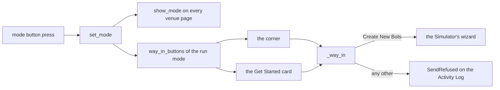

### Where a way-in press lands

Create New Bots, at the corner or on the card, opens the Simulator's Create
Auto Trader wizard through `_create_bot`, the same path `+ New Bot` takes, in
both builds. At unit 20 Import Live Fleet, Generate From YTD, Run Portfolio and
Run Every Portfolio asked the fleet source for the run by name; the fleet
source answered its read set and nothing else, so the ask raised
`SendRefused`, and the tab wrote one line to the Activity Log naming the
button. Units 21, 22 and 24 built the four runs (comments 5721499839,
5722113817, 5725991788).

`src/gui/simulator/sim_trading_tab.py` — the way-in handler

```python
    def _way_in(self, action: str) -> None:
        """One way-in pressed at the corner or on the card: Create New Bots
        opens the wizard through ``_create_bot``; every other action asks
        ``FleetSource`` for it by name, which raises ``SendRefused`` until that
        run lands, and the refusal is logged to the Activity Log."""
        if action == surface.CREATE_NEW_BOTS_ACTION:
            self._create_bot(self._current_venue_id())
            return
        try:
            getattr(self._fleet_source, action)
        except SendRefused as exc:
            self._status_log.log(tab_surface.way_in_refused_line(action, exc), "error")
```

The line reads `Import Live Fleet refused: FleetSource answers (...) and
cannot 'import_live_fleet'. The Simulator receives and asks; it sends
nothing.`, at the error level, with the button's own text in front.

### What the mode reading measured

Read off the real window over a scratch home with every socket but loopback
refused, the theme applied and the Windows fonts loaded, once with an empty
sim fleet and once with one idle scrumming bot, in both builds:

```
reading                                       Qt          React
run mode at open                              validation  validation
sheets at open                                ON OFF OFF  ON OFF OFF
after Back Test                               OFF ON OFF  OFF ON OFF
after Portfolio Battery                       OFF OFF ON  OFF OFF ON
after Validation                              ON OFF OFF  ON OFF OFF
corner in Validation                          Import Live Fleet, Generate From YTD
corner in Back Test                           Import Live Fleet, Create New Bots
corner in Portfolio Battery                   Run Portfolio, Run Every Portfolio
widgets or nodes carrying a mode or way-in
  text, one bot seated                        11          9
  the same, empty fleet                       8           8
```

The Qt count with one bot is the header's three, the two layers' corners at
two each, and the two layers' cards at two each; the crypto card is held but
not listed once a venue is seated. The React count is the header's three, the
two corners at two each and the hidden stock layer's card at two; the React
page draws no card on a layer that holds a venue. With an empty fleet neither
build has a header, and the count is the two corners and the two cards. A
button planted under the tab with a mode text moved each count by one and
the count returned when it was removed. Every corner and card press landed
where this section says: four refusal lines on the Activity Log, each naming
its button, and the wizard for Create New Bots. `reserved_rows` is called on
every draw of the corner and the card, in both builds, and `bot_state.json`
hashed identical after every press while a byte planted into it moved the
hash.

## Import Live Fleet fills the tables and the strip

Import Live Fleet copies the stored bots of one exchange out of the live
fleet file into the Simulator's own fleet file, in both builds. A press at
the corner or on the Get Started card reads which exchanges the live file
names. With more than one it opens the chooser; with exactly one it takes
that one and opens nothing; with none it writes one Activity Log line naming
the file and moves nothing. Each stored bot on the chosen exchange is copied
into the sim fleet under its own bot id, marked as imported, and the fleet
signal fires: the sim fleet file is written, the venue seats, and the
Scrumming Bots table and the Extractor Bots table draw one row per imported
bot, matched by bot id. The Activity Log reads `Imported 3 bot(s) from
bot_state.json on coinbase.` The live fleet file is only read, never written.

`src/simulator/fleet_source.py` — the copy

```python
    def import_live_fleet(self, exchange_id: str) -> list[SimBot]:
        wanted = str(exchange_id or "")
        if not wanted:
            return []
        imported: list[SimBot] = []
        for bot_id, record in self.stored_records().items():
            bot = _sim_bot_from_record(bot_id, record, origin=LIVE_ORIGIN)
            if bot is None or bot.exchange_id != wanted:
                continue
            record["bot_id"] = bot_id
            record["origin"] = LIVE_ORIGIN
            self._records[bot_id] = record
            imported.append(bot)
        return sorted(imported, key=lambda one: (one.symbol, one.bot_id))
```

A second import of the same exchange replaces each held copy with the file's
current record, under the same bot id; a held record the file no longer names
stays until Delete removes it. A bot created through the wizard is kept
beside the imported ones, so one sim fleet can hold both kinds. The command
bar acts on an imported row as it acts on a wizard's: Start on an imported
idle bot writes Live's `✓ Bot <id> RUNNING.` line and colours its Bot ID cell.

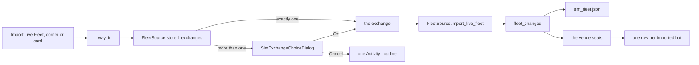

### The Simulator starts empty

The tab opens on the Get Started card with no venue seated, in both builds,
whatever the live fleet file holds. The fleet source answers the records the
sim fleet file holds and nothing else: its bots, its exchanges, its row
statuses and its strip figures all come from those records, so with an empty
sim fleet there is no venue, no row and no figure until a way in loads one.
The live fleet file is opened only when Import Live Fleet is pressed, and
then only to read it.

`src/simulator/fleet_source.py` — the held records alone

```python
    def exchanges(self) -> list[str]:
        """Every distinct ``exchange_id`` the held bots name, sorted; empty
        until a way in has loaded a fleet."""
        return sorted({bot.exchange_id for bot in self.bots() if bot.exchange_id})
```

On the next launch the tab reads the sim fleet file once and draws the
imported rows from it; the live fleet file is not opened. The Bot Swarm tab
keeps its own read of the live file, which is Live's and unchanged.

### The exchange chooser

The chooser is Live's one-question dialog, the Bot Swarm tab's Configure
Profit Wire, holding the bot wizard's `Exchange:` row: the title reads Import
Live Fleet, one line names the exchanges, the combo lists each exchange under
the caption its venue sub-tab carries, and Ok and Cancel close it. Both builds
open the same dialog, as both open Live's Delete box. Cancel writes `Import
Live Fleet cancelled.` to the Activity Log and moves nothing.

`src/gui/simulator/sim_exchange_choice.py` — the row

```python
            row = QFormLayout()
            self._exchange = QComboBox()
            self._exchange.setAccessibleName(EXCHANGE_CHOICE_ROW_LABEL)
            for entry in exchange_choice_options(ids):
                self._exchange.addItem(entry["display_name"], entry["exchange_id"])
            row.addRow(EXCHANGE_CHOICE_ROW_LABEL, self._exchange)
```

### The ten fields on Sim

While Sim is in front the header strip reads Live's ten fields over every
record the Simulator holds, imported or wizard-created, with Live's own
arithmetic: the wallet is the largest cash balance any held bot carries, a
position is holdings times price times the quote rate when both are known,
maturity is read only where the venue has answered for that bot, and each
year-to-date sum falls back to the lifetime sum at zero. A record that carries
no figure for a field reads zero there, as a live bot's fresh statistics do,
so a wizard-created bot adds nothing to the money columns until a run trades
it, and SPENDABLE and LOCKED keep the em dash until a held record carries cash
or a position.

`src/simulator/fleet_source.py` — the strip over the held records

```python
    def aggregate(self) -> dict:
        """The header strip's figures over every held record,
        ``aggregate_stats`` of ``bots``."""
        return aggregate_stats(self.bots())
```

The arithmetic is a fork of the live fleet's, not a shared call, because the
live version is a method of the bot manager reading live bot objects and the
trading package does not change for the Simulator; the maturity threshold is
imported from the live module, so the two cannot disagree on it. The strip
re-reads on the window's dashboard tick and on the next tab change, as it
does on Live after a bot is created.

### What the import reading measured

Read off the real window in both builds over a scratch home holding a live
fleet file with three scrumming bots and one extractor across `coinbase` and
`kraken`, and no sim fleet file:

```
reading                                     Qt                       React
at open: venues seated                      none                     none
at open: Get Started card                   listed, visible          drawn, visible
Import Live Fleet: chooser                  Import Live Fleet, coinbase and kraken listed, both builds
coinbase chosen: venue seated               coinbase                 coinbase
rows by bot id, Scrumming Bots              u21scr01, u21scr02       u21scr01, u21scr02
rows by bot id, Extractor Bots              u21ext01                 u21ext01
strip after one tick                        $165.50 $155.25 11 1 2 | $1,500.75 $4.20 $367.49 $92.47 1
kraken chosen: venues seated                coinbase, kraken         coinbase, kraken
strip after one tick                        $235.50 $185.25 16 1 3 | $1,500.75 $5.30 $658.49 $92.47 2
aggregate against Live's over the four      21 of 21 keys equal      21 of 21 keys equal
Start on u21scr02                           RUNNING, Bots 2          RUNNING, Bots 2
second process, rows from the sim file      four rows, live file not opened by the Simulator
one exchange in the live file               no chooser, three imported, both builds
no bot in the live file                     one line, nothing moves, both builds
Cancel on the chooser                       one line, nothing moves, both builds
```

The scratch live fleet file hashed the same after every step in every run,
and a byte planted into it from outside the program moved the hash. No live
bot, bot manager or bot container was constructed, and no socket left
loopback.

## Generate From YTD fills the tables from the YTD trade files

Generate From YTD builds one simulated bot per pair the operator's own trade
record names on one exchange, in both builds. A press at the corner or on the
Get Started card first reads the exchange history directory itself: a
directory that is missing, empty or without its manifest writes one Activity
Log line naming the path and holds nothing. With a manifest, the press reads
which exchanges it names; with more than one it opens the chooser under the
title Generate From YTD, with exactly one it takes that one, and with none it
writes one line naming the manifest. Each traded pair on the chosen exchange
becomes one record in the sim fleet under the pair's own id, the symbol at
the exchange, marked as generated, and the fleet signal fires: the sim fleet
file is written, the venue seats, and the Scrumming Bots table draws one row
per pair. The Activity Log reads `Generated 3 bot(s) from 4 YTD trade file(s)
on coinbase.` The trade files are only read, never written.

`src/simulator/fleet_source.py` — the generation

```python
    def generate_from_ytd(self, source: Any, exchange_id: str) -> YtdGeneration:
        wanted = str(exchange_id or "")
        if not wanted:
            return YtdGeneration()
        entries = [one for one in source.entries() if one.exchange_id == wanted]
        held: list[SimBot] = []
        missing: list[YtdFileEntry] = []
        files_read = 0
        for bot in ytd_fleet(source, wanted):
            own = [one for one in entries if one.symbol == bot.symbol]
            absent = [one for one in own if source.trade_path(one) is None]
            if absent:
                missing.extend(absent)
                continue
            trades: list[YtdTrade] = []
            for entry in own:
                trades.extend(source.trades(entry))
            files_read += len(own)
            target_usd = ytd_target_usd(trades)
            record = ytd_record(bot, target_usd)
            self._records[bot.bot_id] = record
```

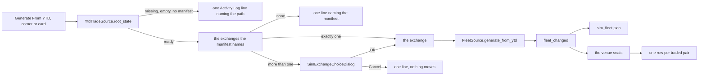

### The Target Balance a pair's fills establish

A YTD file names no bot and no target. On Live the target is the dollar value
the bot keeps its position at, and the bot reads its position as holdings times
price. The pair's own fills establish the position they built, so the
generated record's Target Balance is read off them: over every fill of the
pair across its year files, oldest first, the units the buys bought less the
units the sells sold, valued at the last fill's price, rounded to the cent.

```
units_bought = the amount of every BUY fill, summed
units_sold   = the amount of every SELL fill, summed
units_held   = units_bought - units_sold
last_price   = the price of the last fill
Target       = units_held x last_price, to the cent      when units_held is positive
Target       = none                                      when it is not
```

The fill's cost is its quote leg, the amount times the price before the fee;
its net over the fills is the quote spent, not the position's value, so the
derivation reads the amount and the price and does not read the cost. When the
fills sold more than they bought, the position was opened before the file's
first row and the file gives no basis: the record holds no target, the Target
cell draws `---`, and the Activity Log says how many records read so. On the
scratch files the reading was taken over, BTC/USD bought 0.007 and sold 0.002
across two year files, holding 0.005 at a last price of 61,000, so its Target
is $305.00; SOL/USD bought 1.0 and sold 3.0, so it holds no target.

`src/simulator/fleet_source.py` — the derivation

```python
def ytd_target_usd(trades: Sequence[YtdTrade]) -> Optional[float]:
    ordered = sorted(trades, key=lambda one: one.sort_key())
    if not ordered:
        return None
    bought = sum(float(one.amount) for one in ordered if one.side == SIDE_BUY)
    sold = sum(float(one.amount) for one in ordered if one.side == SIDE_SELL)
    held = bought - sold
    if held <= 0:
        return None
    return round(held * float(ordered[-1].price), 2)
```

Under the funding directive, the spendable budget of a Validation or Portfolio
Battery run is unbounded and always equals the total of the Target Balances of
every simulated bot in the run. A generated bot with no target therefore adds
nothing to that budget; the run funds the pairs whose fills established a
position and the others stand in the fleet with no target until one is set.

### What a generated record carries

The record is the wizard's record shape with the pair's ids and the derived
target: the exchange, the quote currency as the base currency, the base asset
as the target asset, the symbol, and the Target Balance, or `null` where the
fills gave no basis. Every other config field is the bot config's own default,
the same a wizard-created bot carries when nothing on the wizard is changed,
so a generated bot reads the one-hour timeframe and the default gates. The
record carries no statistics, no lots and no phantom set, because the fills
are the pair's year of history and not the bot's own figures: the strip's
money fields read zero over generated records, Bots counts one when it is
started, and a run is what trades it.

`src/simulator/fleet_source.py` — the record

```python
def ytd_record(bot: SimBot, target_usd: Optional[float]) -> dict:
    record = wizard_record(
        {
            "exchange_id": bot.exchange_id,
            "base_currency": bot.base_currency,
            "target_asset": bot.asset,
            "symbol": bot.symbol,
            "target_balance": 0.0 if target_usd is None else float(target_usd),
        }
    )
    record["config"]["target_balance"] = target_usd
    record["bot_id"] = bot.bot_id
    record["origin"] = YTD_ORIGIN
    return record
```

A second generation of the same exchange replaces each held copy under the
same id with a record re-derived from the files as they lie, so a pair whose
files grew reads its new target and a started bot returns to idle; a bot
created through the wizard or imported from the live fleet is kept beside the
generated ones. The command bar acts on a generated row as it acts on any
other: Start on a generated idle bot writes Live's `✓ Bot <id> RUNNING.` line
and colours its Bot ID cell.

### The empty cases say which

Each case writes one Activity Log line naming the path or the file, in the
shape the import's lines take, and holds nothing. The directory is read before
any trade file, so a missing directory is named and is not created by the
press. A manifest row whose file is gone names that file and leaves that pair
out; the other pairs on the exchange are generated.

`src/gui/simulator/sim_trading_tab_surface.py` — the lines

```python
GENERATED_FORMAT = (
    "Generated {count} bot(s) from {files} YTD trade file(s) on {exchange}."
)
NO_TARGET_FORMAT = (
    "{count} of them hold no Target Balance: the fills sold more than they bought."
)
GENERATE_CANCELLED_TEXT = "Generate From YTD cancelled."
YTD_ROOT_MISSING_FORMAT = "No YTD trade directory at {path}."
YTD_ROOT_EMPTY_FORMAT = "{path} holds no YTD trade file."
YTD_ROOT_NO_MANIFEST_FORMAT = "{path} holds no {manifest}."
YTD_NO_PAIR_FORMAT = "{manifest} under {path} names no traded pair."
YTD_FILE_MISSING_FORMAT = (
    "{file} named by {manifest} is missing; {symbol} on {exchange} not generated."
)
```

The reader answers eight names now: the state of its directory and the
presence of one entry's file joined the six, and the directory it reads is
resolved without being created.

`src/simulator/ytd_trade_source.py` — the directory's state

```python
    def root_state(self) -> str:
        if not self._root.is_dir():
            return ROOT_MISSING
        if not any(self._root.iterdir()):
            return ROOT_EMPTY
        if not (self._root / MANIFEST_NAME).is_file():
            return ROOT_NO_MANIFEST
        return ROOT_READY
```

### What the generation reading measured

Read off the real window in both builds over a scratch home holding three
pairs on `coinbase` (BTC/USD over two year files, ETH/USD, SOL/USD) and one on
`kraken` (XRP/USD), 15 fills in all, a scratch live fleet file that is only
hashed, and no sim fleet file:

```
reading                                     Qt                       React
at open: venues seated                      none                     none
Generate From YTD: chooser                  Generate From YTD, coinbase and kraken listed, both builds
coinbase chosen: venue seated               coinbase                 coinbase
rows by id, Scrumming Bots                  BTC/USD@coinbase, ETH/USD@coinbase, SOL/USD@coinbase, both builds
Target cells                                $305.0000, $345.0000, ---, both builds
Activity Log                                Generated 3 bot(s) from 4 YTD trade file(s) on coinbase., both builds
                                            1 of them hold no Target Balance: the fills sold more than they bought.
strip after one tick                        $0.00 $0.00 0 0 0 | — — — — 1, both builds
kraken chosen at the corner                 one row, XRP/USD@kraken, $36.0000; two venues, both builds
Start on BTC/USD@coinbase                   ✓ Bot BTC/USD@coinbase RUNNING., Bots 1, both builds
a fourth pair planted, coinbase again       four rows, DOGE/USD@coinbase at $200.0000, both builds
second process, rows from the sim file      five rows; no trade file opened, both builds
no exchange_history directory               No YTD trade directory at <path>., not created, both builds
an empty directory                          <path> holds no YTD trade file., both builds
files without MANIFEST.json                 <path> holds no MANIFEST.json., both builds
a manifest naming no pair                   MANIFEST.json under <path> names no traded pair., both builds
one named file removed                      <file> named by MANIFEST.json is missing; ETH/USD on coinbase not generated.; two rows, both builds
Cancel on the chooser                       Generate From YTD cancelled.; nothing moves, both builds
```

Every trade file, the manifest and the scratch live fleet file hashed the same
after every step in every run, and a byte planted into the live fleet file and
into the manifest from outside the program moved the hash. No live bot, bot
manager or bot container was constructed, and no socket left loopback.

## Create New Bots fills one row through the forked wizard

Create New Bots is Back Test's second way in, in both builds. It opens the
Simulator's Create Auto Trader wizard from the Back Test corner, from the Get
Started card when the mode is Back Test, and `+ New Bot` on a seated venue
opens the same wizard. The wizard carries Live's five pages in Live's order
with Live's fields, and Finish creates one sim bot: its record is held, the
sim fleet file is written, the venue the bot names seats if it is new, and the
row draws in that venue's Scrumming Bots table or Extractor Bots table. The
row carries the wizard's target in the Target cell and the wizard's interval
in the status the row is drawn from, and the Bot Settings window opened from
the row's Detail shows every value the wizard took.

`src/gui/simulator/sim_trading_tab.py` — the corner and the card reach the wizard

```python
        if action == surface.CREATE_NEW_BOTS_ACTION:
            self._create_bot(self._current_venue_id())
            return
```

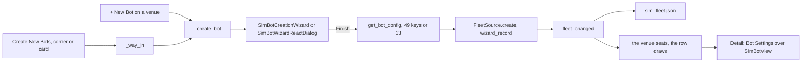

### Every field the wizard sets, and where it lands

A scrumming walk hands 49 keys and an extractor walk 13, the counts Live's
wizard hands from the same window. The record's config holds every field a
bot's configuration declares, so a typed value on the Trading Parameters page
reaches the Settings tab's control for that field, one control per field.

| page | what it sets | the record | the row | the Settings window |
|---|---|---|---|---|
| Trading Mode | the mode | `config.mode` | which table the row lands in; the Mode cell of an extractor row | seven tabs for a scrumming bot, three for an extractor |
| Select Asset Pair | exchange, base currency, target asset | the three ids and the symbol | the venue sub-tab; the Symbol cell | the title and the pair |
| Extractor Pool | exchange, pool base | the same, the target asset `*` | the Symbol cell reads the pool base | the same |
| Trading Parameters | 44 settings for a scrumming bot, 7 for an extractor | every one on the config | Target from the target balance; Pool from the chunk size; the Fire tip from the timeframe, the ceiling and the detonation | the Settings tab, one control per field |
| Phantom Bots | enable, one timeframe, the lock count | the enable flag and the timeframes beside the config | — | the Phantom Bots tab's enable box and timeframe |

The three Phantom Bots keys are stored beside the config, as the live process
stores them for a running bot: the enable flag as typed, and the timeframes as
the bot would hold them, the ticked one, or the one timeframe above the bot's
own when none is ticked, kept to the timeframes the venue offers. An
extractor stores the flag off and no timeframe. The lock count is the one
field the wizard collects that reaches no new bot on Live: the phantom
coordinator holds it and a new bot's coordinator holds 2, so the Simulator
writes none and its Phantom Bots tab reads 2, as Live's does for a new bot.

`src/simulator/fleet_source.py` — the phantom keys

```python
    scrumming = mode == BotMode.SCRUMMING
    record = {
        "config": stored,
        "stats": {},
        "scrumming_state": {},
        "state_when_saved": BotState.IDLE.value,
        "phantoms_enabled": scrumming and bool(collected.get("enable_phantoms", False)),
    }
    timeframes = (
        wizard_phantom_timeframes(
            collected.get("phantom_timeframes"), built.ta_timeframe, built.exchange_id
        )
        if scrumming
        else []
    )
    if timeframes:
        record["phantom_timeframes"] = timeframes
```

### The venues the wizard offers

Live's wizard lists the venues connected in settings. The Simulator's markets
are its Stone Tablets, so its wizard lists the seated venues first and then
every exchange the tablet manifest names, and the Get Started card can create
a bot before any fleet is loaded. The section "What the Simulator's wizard
reads" above describes the list before the tablets' exchanges were added.

`src/gui/simulator/sim_bot_wizard_surface.py` — the venue list

```python
def wizard_exchanges(exchange_ids: Iterable[str], tablet_source: Any) -> list[dict]:
    seated = [str(eid) for eid in exchange_ids if str(eid)]
    filed = sorted(
        {str(entry.exchange_id) for entry in tablet_source.entries()} - set(seated)
    )
    return seated_exchanges([*seated, *filed])
```

### The React page narrows its timeframes as the Qt screen does

The Qt wizard lists the picked venue's own timeframes in the TA Timeframe
combo and greys the phantom timeframes the venue does not offer. The React
wizard takes one list per venue and narrows both pages from it; the React
host hands it that list, so both builds show the same timeframes for the
same venue. Live's window hands its own React wizard no list, so Live's React
page lists the wizard's fixed seven and greys nothing; that is Live's and is
not changed here.

`src/gui/simulator/sim_react_trading_tab.py` — the list handed over

```python
            wizard = wizard_class(
                exchanges,
                defaults,
                self,
                theme=self._theme,
                markets=markets,
                timeframes=wizard_surface.venue_timeframes(exchanges),
            )
```

### The old runner's bot builder is not on the path

`new_bots` in `src/simulator/back_test.py` builds bots from six-key specs for
the old tab's Back Test runner, which the window no longer builds. Create New
Bots reaches it nowhere: watched across every reading below it counted 0
calls, and a direct call counted 1. It is left as it is.

### The route on a fresh Simulator

With no fleet loaded the mode is Validation, the card and the corner offer
Import Live Fleet and Generate From YTD, and no header row exists to press
Back Test on. The route to Create New Bots is: load a fleet, press Back Test
on the header, press Create New Bots at the corner, or `+ New Bot` on the
venue. With the mode on Back Test and every bot deleted, the card returns
offering Create New Bots.

### What the creation reading measured

Driven in the real window in both builds with a scratch home, every socket
but loopback refused, a scratch live state file holding one bot on each of
two exchanges and a scratch tablet manifest naming four assets on both.
Before the change, the three Phantom Bots keys stopped at the wizard: the
record carried none, the Phantom Bots tab read the enable box ticked with the
wizard's box unticked and the timeframe 1d with 4h ticked, and the card's
wizard opened with no venue and Finish was refused for an empty target asset.

```
reading                                              Qt                       React
Back Test pressed: the corner                        Import Live Fleet, Create New Bots     the same
the wizard, every page walked, every field typed     49 keys                  49 keys
record config values against the typed values        47 of 47                 47 of 47
Settings tab controls against the typed values       42 of 42                 42 of 42
Phantom Bots tab: enable, timeframe, lock            off, 4h, 2               off, 4h, 2
the row: Bot ID, Symbol, Trades, Target              id, BTC/USD, 0, $1,234.5600 (both)
the row against a target of 200                      the Target cell differs (both)
an extractor, pool base BTC on the same venue        13 keys; 12 of 12; Pool $250.50 (both)
an extractor with no holder                          refused with Live's own box (both)
+ New Bot on the other venue                         one row, $333.3300 (both)
Start on the created row: the strip's Bots           0 to 1                   0 to 1
Spendable                                            a dash before and after (both)
a second process over the same home                  every created row again, every value (both)
every bot deleted under Back Test: the card          Import Live Fleet, Create New Bots (both)
Create New Bots on the card: the venues offered      coinbase, kraken from the tablets (both)
bot_state.json                                       unchanged after every step (both)
ScrummingBot, ExtractorBot, BotManager               0 calls (both)
```

The strip's Spendable reads the fleet's cash balance, which a created bot has
none of; the funding rule that makes it the sum of the held Target Balances
belongs to the unit that shares the trading arithmetic, for Validation and
Portfolio Battery. The venue page's rows in the React build carry no click
that selects a row for the command bar, on Live's page and on the Simulator's;
Detail selects the row as it opens.

## One trading logic: the Simulator sizes its trades with the Live bot's own arithmetic

The Live bot and the Simulator now share one definition of every sizing
figure. The position value, the Target Delta, the delta percent, the scrumming
interval in USD, the scrum's units, a sale's proceeds net of its fee, the
fold's eligible tranches, the per-cycle growth cap, what a fold takes from each
tranche, the fold's spend and its units, the position ceiling, the fold taper
and the cartridge threshold each live as one function in a module beside the
bot's mixins. The bot calls them at the lines that computed them inline, and
the Simulator's walk calls the same functions over a simulated position. The
module holds no state and imports no bot, no venue and no bus.

`src/trading/scrumming/sizing.py` — three of the figures

```python
def scrum_units(delta_usd: float, price: float) -> float:
    return abs(delta_usd) / price

def fold_spend_usd(eligible_usd: float, taper: float) -> float:
    return eligible_usd * taper

def fold_units(spend_usd: float, price: float) -> float:
    return spend_usd / price
```

Unit 26a gave `scrum_units` and `fold_units` a third argument, the unit rule;
the section "The unit rule" quotes the three-argument forms (comment
5725310316).

### What the tick calls

`ScrummingBot.tick` values the position through `priced_usd`, takes the delta
through `target_delta_usd` and its percent through `target_delta_pct`, sizes
the interval through `scrumming_interval_usd` and asks `delta_below_interval`
whether to hold. The scrum sells `scrum_units` of the delta at the ticker and
books the proceeds through `sale_proceeds_usd` less the fee the venue reports.
The fold reads `eligible_fold_tranches` under the opposing-trade rebuy factor,
plans what it takes from each tranche under `cycle_growth_cap_usd` and
`fold_cap_remaining_usd` through `plan_fold_consumption`, spends
`fold_spend_usd` of that under the taper, books `fold_units` at the fill and
settles the tranches through `settle_fold_plan`.

`src/trading/scrumming_bot.py` — the tick's four figures as they read now

```python
delta = target_delta_usd(current_value, self._target_balance)
delta_pct = target_delta_pct(delta, self._target_balance)
_interval_usd = scrumming_interval_usd(
    self._target_balance, self.config.scrumming_interval_pct
)
```

The bot's behaviour was read unchanged off the operator's own logs without
building a bot: over 270 scrum fills paired with the gate row the bot wrote at
each fire, `scrum_units` over the row's delta and ticker answered the row's
filled amount on 270 of 270; over 61 fold fills, `fold_units` over the row's
spend and fill answered the filled amount on 61 of 61. One row with its amount
moved by one unit in the eighth place was read as a disagreement.

### What the Simulator's walk calls

`apply_scrum` sells `scrum_units` of the delta, values them through
`priced_usd`, estimates the fee through `estimated_fee_usd` from the bot's
Trading Fee, since a walk has no venue to report one, and queues the net
proceeds as one fold tranche in the shape the tick builds. `apply_fold` is the
tick's fold over the position's tranches: eligibility, the cap plan, the taper
when the bot's ceiling is on, the spend and the units, then the settlement.
The Target Delta no longer sizes a fold, as it never sized one in the tick.

`src/simulator/back_test.py` — the fold's spend

```python
spend = fold_spend_usd(sum(one["usd"] for one in slices), taper)
if funding == FUNDED_BY_PROCEEDS:
    spend = wallet_capped_spend_usd(spend, position.cash_usd)
```

Before this the Simulator sized a fold on the Target Delta and capped it at
the cash its scrums had left. Walked over one scratch tape, that sized 46 folds
where the Live arithmetic sizes 187, each at most the per-cycle growth cap of
its target; the 47 scrums latched on the same candles both ways, and 12 of
them sold the same units, the two before the first fold and those where the
folds between had brought both positions back to the same holding. A count of
arithmetic on a price, units, a target, an interval, a delta, a spend or a fee
across `src/simulator` reads zero sizing expressions; the twenty-one that
remain value a held position for the strip, a portfolio's baseline and its
improvement, an Extractor position's profit, and a candle interval in time.

### The funding rule

A Validation or Portfolio Battery run has no venue wallet. Its spendable budget
is unbounded and always equals the sum of the held bots' Target Balances; a bot
with no Target Balance adds nothing. The run reads that sum once as it starts
and carries it as `budget_usd`, and no fold in these two modes is held to the
cash the scrums left. Back Test keeps its own rule: each bot's fold spends its
own scrum proceeds and no more, through `wallet_capped_spend_usd`, the cap
Manual Fire applies at the wallet. A fold sized by the Live arithmetic spends
at most the tranche dollars its own scrums queued, so on the same tape the two
fundings walked the same 234 trades, one of them apart by two femto-dollars of
rounding.

`src/simulator/back_test.py` — the budget

```python
def run_budget_usd(bots: Sequence[SimBot]) -> float:
    return sum(float(bot.target_usd) for bot in bots if bot.target_usd is not None)
```

The header strip reads the rule. With the Sim tab in front in Validation or
Portfolio Battery, Spendable reads the sum of the held Target Balances; in Back
Test it reads what it read before, the largest cash balance the held records
carry. Driven with four held bots whose targets summed to twelve hundred
dollars, one of them with no target, the cell drew `$1,200.00` in both modes
and `$0.00` in Back Test, in both builds, and the walk over the tab's own fleet
and tablets called eighteen of the twenty shared functions, every call from
`walk`; the two never reached are the cartridge threshold, which only the tick
fires, and the wallet cap, which only Back Test applies.

`src/gui/main_tabs/simulator_tab_surface.py` — the mode's funding

```python
MODE_FUNDING = {
    MODE_VALIDATION: back_test.FUNDED_BY_TARGETS,
    MODE_BACK_TEST: back_test.FUNDED_BY_PROCEEDS,
    MODE_PORTFOLIO_BATTERY: back_test.FUNDED_BY_TARGETS,
}
```

### One drawdown

The state an Extractor writes on a position below its entry value was spelled
twice, once in the Extractor and once in the Simulator's fleet reader. Both
names now read `DRAWDOWN_STATE` from the sizing module; a planted change to
that one definition moved both.

`src/trading/scrumming/sizing.py` — the state

```python
DRAWDOWN_STATE = "drawdown"
```

## The unit rule: fractional or whole, per asset class, cited from the venue

A Portfolio Battery run walks shares and funds as well as coins, and a share
can only be bought the way its venue sells it. Before any non-crypto symbol is
simulated, one question is answered per asset class from the venue's own
published page: does the class trade in fractions of a unit, or in whole units
only. The answer is a row in a table the sizing module carries, and a class
with no row is not simulated.

The portfolios name sixty-three symbols and the RA-StoneTablet import asks for
the same sixty-three. Thirteen are crypto: ADA, ATOM, AVAX, BNB, BTC, DOGE,
DOT, ETH, LINK, MATIC, SOL, TRX and XRP. The other fifty are US exchange-listed
shares and funds, every one read off the Yahoo route as a share: AAPL, AGG,
AMC, AMD, AMZN, ARKF, ARKG, ARKK, ARKW, BABA, BBBY, BIDU, BND, CCIV, COIN, CVNA,
DKNG, EXPR, GLD, GME, GOOGL, IEF, IPOF, IWM, JD, KOSS, MCHI, META, MSFT, NIO,
NVDA, OPEN, PLTR, PRNT, PTON, QQQ, ROKU, SLV, SNDL, SOFI, SPY, TDOC, TIP, TLT,
TSLA, USO, UWMC, VNQ, XLU and ZM. The classes are named with the words the
ATA-SPM scanner spells: crypto and stocks. GLD, SLV and USO are the funds the
scanner charts for the metals and energy classes; on the venue they are
exchange-listed fund shares, so the stocks row binds them. No portfolio names a
spot, forward or contract instrument of the metals, energy, forex or
derivatives classes, and no connected venue lists one.

### The determination

Each page below was opened as a document on 2026-09-17 and its sentences
quoted. No endpoint was called, no credential was sent, and no account page was
opened. A rule a page does not state is not cited.

| class | venue Acervator connects to | fractional | conditions |
| --- | --- | --- | --- |
| crypto | Coinbase, the one verified exchange and the venue every held live bot names | yes | the size is a multiple of the product's `base_increment` and at least its `base_min_size`; the connector reads both off the market as the amount precision and the minimum amount |
| stocks | Alpaca, the one broker connector in the tree, which sends an order's `qty`; no screen constructs it today | yes | exchange-listed common stocks and ETFs, generally over one dollar with a daily volume over ten thousand shares; a per-asset `fractionable` flag read only through the authenticated assets endpoint, so it stays a condition and is not read; market, limit, stop or stop-limit orders; time in force Day; no short sales |
| metals, energy, forex, derivatives | none | not cited | no connected venue lists the class; not simulated |

The crypto row, quoted from the venue's pages

```
https://docs.cdp.coinbase.com/api-reference/exchange-api/rest-api/orders/create-new-order
  titled "Create a new order", no date shown, read 2026-09-17
  "The size can be in any increment of the base currency (e.g. BTC for the
   BTC-USD product)."
  "The size can be in incremented in units of base_increment."
  "The size must be no less than the base_min_size and no larger than the
   base_max_size for the product."
https://docs.cdp.coinbase.com/api-reference/advanced-trade-api/rest-api/products/get-product
  titled "Get Product", no date shown, read 2026-09-17
  base_increment: "Minimum amount base value can be increased or decreased
   at once."
```

The stocks row, quoted from the venue's pages

```
https://alpaca.markets/support/fractional-shares
  titled "Does Alpaca support fractional shares?", dated February 2024,
  read 2026-09-17
  "Yes! Alpaca supports fractional trading via API and the dashboard."
  "Fractional Securities include: US Exchange listed Securities (Common
   Stocks and Exchange Traded Funds) Selected Over the Counter American
   Depository Receipts"
  "We generally will allow securities to be fractionable under the below
   scenarios: Exchange Listed Over $1 Average Daily Trading Volume over
   10,000 shares"
  "To see if an asset is fractional, check the field fractionable = true
   from the GET/v2/assets endpoint."
https://docs.alpaca.markets/docs/fractional-trading
  titled "Fractional Trading", updated 2025-09-24, read 2026-09-17
  "Alpaca currently supports fractional trading for market, limit, stop &
   stop limit orders with a time in force=Day, accommodating both fractional
   quantities and notional values."
  "Both notional and qty fields can take up to 9 decimal point values."
  "Not all assets are fractionable yet so please make sure you query assets
   details to check for the parameter fractionable = true."
  "We do not support short sales in fractional orders. All fractional sell
   orders are marked long."
```

Both classes the portfolios name trade fractionally on the venue Acervator
connects to for them. No class a Battery run walks today reads whole-unit, so
today every walk sizes as it did before; the whole-unit variant below is the
switch the table throws the day a row reads whole.

`src/trading/scrumming/sizing.py` — the table and the function that reads it

```python
FRACTIONAL_UNITS = "fractional"
WHOLE_UNITS = "whole"

CITED_UNIT_RULES: dict[tuple[str, str], str] = {
    (CLASS_CRYPTO, "coinbase"): FRACTIONAL_UNITS,
    (CLASS_STOCKS, "alpaca"): FRACTIONAL_UNITS,
}

def unit_rule(asset_class: str, venue: str) -> Optional[str]:
    return CITED_UNIT_RULES.get((str(asset_class), str(venue)))
```

A bot's class comes from its symbol and its venue: a name in the crypto list is
crypto, every other archive name is stocks, and a name outside the archive on a
crypto exchange is crypto. The venue a class trades on is the bot's own
exchange for crypto and Alpaca for stocks. TRX has RA tablets from the Yahoo
source alone, because Coinbase served it no candle, so its pair is crypto on
`yahoo`, which no row cites, and TRX is not simulated.

`src/simulator/portfolios.py` — the class and the venue

```python
def asset_class(symbol: str, exchange_id: str = "") -> Optional[str]:
    name = str(symbol or "").upper()
    if name in CRYPTO_SYMBOLS:
        return CLASS_CRYPTO
    if name in SYMBOLS:
        return CLASS_STOCKS
    if str(exchange_id or "") in crypto_venues():
        return CLASS_CRYPTO
    return None

def trading_venue(class_name: Optional[str], exchange_id: str = "") -> str:
    if class_name == CLASS_CRYPTO:
        return str(exchange_id or "")
    if class_name == CLASS_STOCKS:
        return STOCKS_VENUE
    return ""
```

### The whole-unit variant

The two sizing functions now take the rule. Under the fractional rule they
answer the expression they answered before, unchanged. Under the whole rule
they floor to a whole number of units, and a count within one billionth of a
whole number reads as that number: a bare floor read one unit under on 11,593
of 200,000 exact multiples of a price in the pre-mortem sweep, and none with
the grain, which is the ninth decimal an Alpaca quantity carries at most. A rule
that is neither word raises, so no walk sizes under an unnamed rule.

`src/trading/scrumming/sizing.py` — sizing under the rule

```python
WHOLE_UNIT_GRAIN = 1e-9

def sized_units(units: float, rule: str) -> float:
    if rule == FRACTIONAL_UNITS:
        return units
    if rule == WHOLE_UNITS:
        return float(math.floor(units + WHOLE_UNIT_GRAIN))
    raise ValueError(f"unit rule {rule!r} is not one of {UNIT_RULES}")

def scrum_units(delta_usd: float, price: float, rule: str) -> float:
    return sized_units(abs(delta_usd) / price, rule)

def fold_units(spend_usd: float, price: float, rule: str) -> float:
    return sized_units(spend_usd / price, rule)
```

The Live bot passes the fractional rule at each of its nine call sites and
changes nothing else. The Simulator resolves the rule once per bot as a run
reaches it and carries it through the walk: the opening position, every scrum
and every fold size under it. A whole-unit scrum whose Target Delta buys fewer
than one unit fills nothing and logs why. A whole-unit fold spends the whole
units' price; what it could not spend is taken back off the last entries of the
fold plan, so that remainder stays in the tranche, and a fold whose spend buys
fewer than one unit fills nothing, settles nothing, and logs why.

`src/simulator/back_test.py` — the whole-unit fold

```python
    units = fold_units(spend, float(price), rule)
    if units <= 0.0:
        if rule == WHOLE_UNITS:
            logger.info(
                "%s: a fold of $%.2f at %.8f is %s; nothing fills",
                bot.bot_id,
                spend,
                float(price),
                BELOW_ONE_UNIT,
            )
        return None
    if rule == WHOLE_UNITS:
        bought_usd = priced_usd(units, float(price))
        plan = trim_fold_plan(plan, spend - bought_usd)
        spend = bought_usd
```

A whole-unit fold needs tranche dollars of at least one unit's price. At the
one percent default growth cap on a five hundred dollar target the cap is five
dollars, so a share priced above five dollars would never fold in whole units.
This binds the Battery's default Target Balance only if a row ever reads
whole; today none does.

### Not cited, not simulated

A run resolves each bot's class and venue before it opens a position. A pair
with no row in the table is refused: the bot's outcome reads `uncited_rule`,
nothing is walked for it, and the run's lines carry one line naming the bot,
its class, its venue and that the rule is not cited. The Battery does the same
per symbol and counts the symbol's capital as missing weight, and its lines
name every refused symbol.

`src/simulator/back_test.py` — the refusal in the runner

```python
    for bot in bots:
        class_name, venue, rule = cited_rule_for(bot.asset, bot.exchange_id)
        if rule is None:
            outcomes[UNCITED_RULE] += 1
            results.append(
                BotResult(
                    bot_id=bot.bot_id,
                    symbol=bot.symbol,
                    tablet_key="",
                    outcome=UNCITED_RULE,
                    asset_class=class_name,
                    venue=venue,
                )
            )
            continue
```

`src/simulator/back_test.py` — the line the Activity Log draws

```python
def uncited_rule_line(result: BotResult) -> str:
    return (
        f"{result.bot_id}: {result.symbol} is class {result.asset_class or 'none'} "
        f"on venue {result.venue or 'none'}, which has no cited unit rule; "
        "not simulated."
    )
```

### What the unit-rule reading measured

Before this, over the unit 26 scratch tape with four scratch bots, an AAPL bot
filled 47 scrums and 187 folds in fractional units, and a bot of no class and a
BTC bot on an uncited venue each walked the same 234 trades with nothing
refused. After, on the same tape: the AAPL bot walks as stocks on Alpaca under
the fractional rule, 234 trades, and the BTC bot on Coinbase walks 234 trades
identical to unit 26's reading over the same tape, trade for trade; the bot of
no class, the BTC bot on Gemini and a TRX bot on the Yahoo route are each
refused with their line. With the stocks row planted whole for one run, the
AAPL bot walked 233 trades, every one a whole number of units between one and
ten, every dollar figure equal to the units times the price, two scrum latches
and two fold latches unfilled below one unit, and the BTC bot unchanged; with
the crypto row planted whole instead, the BTC bot at a one thousand dollar
target in a hundred dollar asset opened ten units and filled nothing, because
its one percent interval never reached one unit, and the AAPL bot was
unchanged. Each plant was removed and the table read as before.

On the running Sim tab in both builds, one BTC bot and one AAPL bot imported
through Import Live Fleet in Validation over scratch tablets, `back_test.run`
under the debugger with a breakpoint on every pure sizing function: the rule
was read twice, once per bot, from the runner; 470 sizing calls, 94 scrum
sizes and 376 fold sizes, every one with `walk` on the stack; the BTC trades
equal to unit 26's reading; under the planted stocks row the AAPL trades all
whole and the plan trimmed on all 185 folds. Two bots imported on Gemini were
refused and their two lines, drawn through the tab's own log method, read back
off the Qt widget and off the React page. No bot was constructed and no socket
left loopback. The Live replay over unit 26's copied logs with the fractional
rule answered 270 of 270 scrum fills and 61 of 61 fold fills, and the same over
a fresh copy taken today; one row with its amount moved by one unit in the
eighth place read as a disagreement.

## The trade parity report every run writes

Every Simulator run writes one report file when it ends: a Validation run, a
Back Test run, a Portfolio Battery run. The gate-light comparison lives in that
file and nowhere on the tab. The report names what the run verified and what it
could not, and it carries the run's budget under the funding rule and every
symbol the run refused. Nothing on the Sim tab draws a light, a table or a
verdict for a run; when a run ends the Activity Log carries one line naming the
report's path, and the operator opens the file from that path.

`src/simulator/parity_report.py` — the writer

```python
def write_report(
    mode: str, run: object, tablets: Optional[TabletSource]
) -> ParityReport:
    """Write the report of a finished ``run`` in ``mode`` and answer where it
    landed."""
    stamp = utc_stamp()
    return write_figures(FIGURES[mode](run, tablets, stamp), stamp)
```

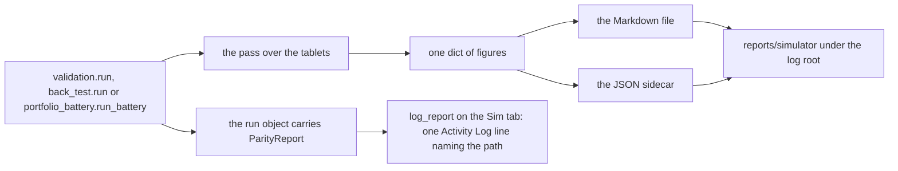

### Where the report lands

The file lands under the `reports` bucket of the log root, in a `simulator`
directory of its own, beside the version-sweep reports the bucket already
holds. One run writes one Markdown file and one JSON sidecar with the same
name. The name is the mode, the subject, the span and a UTC stamp to the
microsecond, joined by two underscores, so two runs never share a name and no
report is ever overwritten: the Markdown is created exclusively, and a name
already taken moves to the next suffix.

```
validation__coinbase-live__2023-11-14_2023-11-17__20260918T052817474607Z.md
validation__coinbase-live__2023-11-14_2023-11-17__20260918T052817474607Z.json
back_test__coinbase-live__2023-11-14_2023-11-17__20260918T052820763009Z.md
portfolio_battery__DEGEN__2022__20260918T052822879951Z.md
```

The subject is the exchange and the fleet's origin for Validation and Back
Test, and the portfolio's name for a Battery, or `every-portfolio` when every
portfolio ran. The span is the first and last day of the tape the run read, or
the Battery's own span label.

`src/simulator/parity_report.py` — no report is overwritten

```python
def create_pair(directory: Path, stem: str) -> tuple[Path, Path]:
    """The first ``stem`` under ``directory`` whose Markdown and JSON paths both
    do not exist, the Markdown created exclusively so no report is overwritten."""
```

### What the report holds

Both files carry the same figures. The Markdown is for a person; the JSON is
for a program, and a later unit reads the four comparison counts from it. The
two cannot disagree on a number, because the Markdown is rendered from the same
dictionary the JSON stores.

Every mode carries these sections:

- **Run.** The mode, the UTC stamp, the build, the fleet's origin, the
  exchange, the span, the bot count, and the funding with the budget under it.
  Validation and Portfolio Battery fund from the held Target Balances: the
  budget is their sum and no fold is capped for cash. Back Test funds each
  bot's fold from its own scrum proceeds and carries no run budget. A
  Validation run states that it reruns gates and sizes no trade, so no buy was
  refused for cash.
- **Tablets.** Every Stone Tablet the run read: its key, asset, exchange,
  timeframe, year, candle count, first and last candle, and the checksum the
  MANIFEST row carries.
- **Bots.** One row per bot: symbol, Target Balance, origin, class, venue, the
  unit rule the pair trades under and whether the pair has a cited row, the
  outcome, and what the run produced for it. Validation carries the snapped and
  unsnapped trade counts and the rows compared and latching; Back Test carries
  the trades, scrums, folds, units gained, cash and fees; the Battery carries
  each symbol's capital and its weight of the portfolio, the trades, the units
  gained, and the buy-and-hold baseline beside the accumulation.
- **Not verified.** One line per thing the run could not verify. The section
  is never empty: a run that verified everything says so in one line.
- **Lines.** The run's own Activity Log lines, verbatim.

### The gate-light comparison

A Validation report carries every rerun row: the trade, the bot, the trade's
stamp, the candle's and the gate row's, whether the row latches identically,
how many of the nineteen lights agreed, the armed flags on both sides, every
disagreeing light with its recorded state, its rerun state and which side drove
it, and any blocker phrase that maps to no light. Above the rows sit the
agreement counts and four counts under the words the module comparison uses,
applied to the two sides of one gate row: the record the live bot wrote, and
the rerun the Simulator latched.

| count | what it reads |
| --- | --- |
| missing | a blocker the recorded row names that maps to no gate light |
| extra | a blocker the rerun raised that maps to no gate light |
| differs | a light in both whose recorded and rerun states differ |
| variant differs | a row whose nineteen lights all agree and whose armed flags differ |

Each count is written beside its definition, in both files.

`src/simulator/parity_report.py` — the four counts

```python
def comparison_counts(rows: Sequence[RowComparison]) -> dict:
    """``summarise`` over ``rows`` and the four ``COUNT_NAMES``."""
    counts = dict(summarise(rows))
    counts[MISSING] = sum(len(one.unknown_recorded_blockers) for one in rows)
    counts[EXTRA] = sum(len(one.unknown_rerun_blockers) for one in rows)
    counts[DIFFERS] = sum(len(one.disagreed) for one in rows)
    counts[VARIANT_DIFFERS] = sum(
        1 for one in rows if not one.disagreed and not one.latches_identically
    )
    return counts
```

### The Portfolio Battery section

A Battery report carries, per portfolio and timeframe, how many symbols ran,
the capital committed, the capital missing and its share of the weight with
the symbols that carry it, the arithmetic of accumulation less baseline with
the verdict word, the units gained, the trades and the fees; then every refused
symbol with the line the run wrote for it. At unit 25 the defend, improve or
reverse outcome against the portfolio's historical path read `not computed`,
with why: the design intent's default Target Balance, mix share and reading
were the next Battery unit's, and the run walked every symbol at the same
capital with equal weights. Unit 24 wrote the reading (comment 5725991788);
the section "Portfolio Battery Mode" describes it.

Since the Battery flow landed, that outcome is computed. The historical path is
buy and hold over the span: its start is the Target Balances committed, its
trough is the sum of each symbol's lowest untraded value on a walked bar, and
its end is the baseline. The scrummed path ends at the accumulation. The reading
is the highest of the three marks the scrummed end clears, and the report
carries it per portfolio and timeframe with the four figures written out, then
counts the readings per timeframe.

`src/simulator/portfolio_battery.py` — the reading

```python
def reading_for(
    ran: bool, start_usd: float, trough_usd: float, end_usd: float, scrummed_usd: float
) -> str:
    """The highest historical mark ``scrummed_usd`` clears: ``REVERSED`` at or
    above ``start_usd`` when ``end_usd`` fell below it, ``IMPROVED`` above
    ``end_usd``, ``DEFENDED`` above ``trough_usd``, else ``UNDEFENDED``;
    ``NOT_RUN`` while ``ran`` is False."""
    if not ran:
        return NOT_RUN
    if end_usd < start_usd and scrummed_usd >= start_usd:
        return REVERSED
    if scrummed_usd > end_usd:
        return IMPROVED
    if scrummed_usd > trough_usd:
        return DEFENDED
    return UNDEFENDED
```

The report's header names the run's budget as the sum of the run's bots' Target
Balances, the origins those bots carry, and, per portfolio, whether the bots
were generated or loaded from the held fleet.

### A run that raises

A run that raises part-way still writes a file. It carries the header the run
had, every bot it was handed, the tablets if the source still answers, the
exception's type and message, and a Not verified section saying nothing was
verified. Then the exception propagates as it did before. A report that cannot
be written raises to the caller, so a run whose report is missing is never
reported as done.

`src/simulator/validation.py` — the wrap every runner carries

```python
    try:
        outcome = _validate(bots, tablets, ytd, gates, exchange_id, limit, lag_sample)
    except Exception as exc:
        write_partial(
            VALIDATION, exc, bots=bots, exchange_id=exchange_id, tablets=tablets
        )
        raise
    return replace(outcome, report=write_report(VALIDATION, outcome, tablets))
```

### The line on the tab

Each Sim host answers `log_report`, which writes one line through the tab's
own Activity Log at the level Import Live Fleet uses. At unit 25 no button
started a run on the tab; unit 24's Run Portfolio and unit 31's Start call it
with the run's report (comments 5725991788, 5733262015).

Since the Battery flow landed, Run Portfolio and Run Every Portfolio start a run
from the corner and the card and call it with the run's report when the run
ends.

```
Portfolio Battery report written: <log root>/reports/simulator/portfolio_battery__CRYPTO_BLUE__2022__20260918T063630643184Z.md
```

```
Validation report written: <log root>/reports/simulator/validation__coinbase-live__2023-11-14_2023-11-17__20260918T052817474607Z.md
```

### What the report reading measured

Before this, over a scratch home holding four stored bots, three Stone
Tablets, three RA-StoneTablets, three YTD trade files and a gate.log of six
rows, the three runners answered their lines and the reports bucket held no
file after all three. After, each run wrote one Markdown file and one JSON
sidecar under the simulator directory of the bucket, and running each mode
twice wrote twelve files with none overwritten. The Validation sidecar's four
counts read equal to the Markdown's. With a raise planted inside the tablet
read, each mode wrote a partial file naming the planted exception and the
exception still propagated. With one rerun row rewritten to disagree on one
light, another rewritten to agree on every light with its scrum flag flipped,
and a third given one recorded and two rerun blocker phrases that map to no
light, the counts moved from missing 0, extra 0, differs 40, variant differs 0
to 1, 2, 18 and 1, in both files. Every scratch file hashed equal before and
after every run, and a second copy with one byte flipped read as changed.

On the running Sim tab in both builds, the four bots imported through Import
Live Fleet, each runner driven over the tab's own fleet source and tablet
source under the debugger with a breakpoint on the writer: the writer was
reached once per run with the runner's own `run` on the stack, the file
appeared under the scratch reports directory, the sidecar's counts read equal
to the Markdown's, and the Activity Log line naming the path was drawn through
the tab's own log and read back off the Qt widget and off the React page. No
bot was constructed and no socket left loopback.

## The Simulator colour distinction is the theme's nigredo tone

The Sim tab paints every ground darker than Live's, under the same theme. The
tone is the theme's own ground tokens moved a quarter of the way to black;
the accent, the text and the borders are the theme's. The derivation, its one
fraction and the contrast arithmetic per theme are on the Settings page under
[the Simulator's tone, nigredo](settings.md#the-simulators-tone-nigredo).

Nothing on the tab names a colour for this. The Qt build marks the tab with one
property, and the theme's stylesheet paints the tree it marks; the windows the
tab opens are its children, so the chooser and the Bot Settings window paint in
the tone too.

`src/gui/simulator/sim_trading_tab.py` — the mark

```python
# The theme's nigredo_qss paints this tree, and the windows it parents.
# A QWidget subclass paints its stylesheet ground only with this attribute.
self.setProperty(TONE_PROPERTY, NIGREDO)
self.setAttribute(Qt.WA_StyledBackground, True)
```

The React build marks its host the same way for the Qt windows it parents,
and its page takes the tone twice: once at build, when `panel_html` hands the
tone to the page chrome, and once per theme switch, when the window's repaint
reads the tone off the web view. The design tokens the page embeds go through
the same function: every token whose name, or whose alias target, starts with
`SURFACE_` is a ground the page paints, and the host darkens it before the
page reads it.

`src/gui/simulator/sim_react_trading_tab.py` — the page side

```python
GROUND_NAME_PREFIX = "SURFACE_"

def nigredo_design(model: dict) -> dict:
    aliases = model.get("alias_targets", {})

    def is_ground(name: str) -> bool:
        return name.startswith(GROUND_NAME_PREFIX) or str(
            aliases.get(name, "")
        ).startswith(GROUND_NAME_PREFIX)
```

```python
return page_html(
    STYLE_ASSETS, (), page_body(), theme, (host_script(built, venues),), NIGREDO
)
```

The two Sim windows drawn by React, the Bot Settings window and the wizard,
hand the same tone to their page chrome and carry it on their web views.

### What the tone reading measured

The real window was built in each build over a scratch home with every socket
but loopback refused, the theme switched five times through the Theme menu's
own path, and the picture of the whole window grabbed with Live in front and
again with Sim in front. The ground is the tab's own pixel at its top-left
corner; the heading is the most common colour inside the Activity Log label,
and the label's second colour is its text. At 1400 by 900, the window's floor:

```
theme             point            Live      Sim       Qt         Live      Sim       React
cyberpunk_dark    ground           #0a0a0f   #08080b   differs    #0a0a0f   #08080b   differs
cyberpunk_dark    heading ground   #0a0a0f   #08080b   differs    #0a0a0f   #08080b   differs
cyberpunk_dark    heading text     #00ffcc   #00ffcc   same       #00ffcc   #00ffcc   same
neon_light        ground           #f5f5fa   #b8b8bc   differs    #0a0a0f   #08080b   differs
neon_light        heading ground   #f5f5fa   #b8b8bc   differs    #f5f5fa   #b8b8bc   differs
classic_terminal  ground           #0a0a0a   #080808   differs    #0a0a0f   #08080b   differs
classic_terminal  heading ground   #0a0a0a   #080808   differs    #0a0a0a   #080808   differs
minimal_modern    ground           #fafafa   #bcbcbc   differs    #0a0a0f   #08080b   differs
minimal_modern    heading ground   #fafafa   #bcbcbc   differs    #fafafa   #bcbcbc   differs
glass_metal       ground           #1c1c24   #15151b   differs    #0a0a0f   #08080b   differs
glass_metal       heading ground   #1c1c24   #15151b   differs    #1c1c24   #15151b   differs
```

Every Sim value is the Live value beside it through `toward_black` at 0.25.
The same twenty rows read the same at 1920 by 1080. The heading text reads
`#00ffcc` on every row in both builds, so the tone moved no text.

The React ground column is the venue page's own ground, which is the design
token `SURFACE_0` under every theme on Live and its darkened value on Sim; the
page's outer ground, read at the web view's corner, follows the theme as the
Qt ground does and darkens the same way. That split between the page's two
grounds is Live's own, stated on the tabs page under the theme menu, and the
tone keeps it.

The header strip sits above every tab and takes no tone. Its ground read the
theme's own value with Live in front and with Sim in front, on every theme, in
both builds:

```
cyberpunk_dark  #0a0a0f   neon_light  #f5f5fa   classic_terminal  #0a0a0a
minimal_modern  #fafafa   glass_metal #1c1c24
```

The windows the Sim opens read the tone at their own corner, both builds, every
theme; the React Bot Settings window's page and the React wizard's page each
read the same value as their frame:

```
theme             chooser   Bot Settings   wizard
cyberpunk_dark    #08080b   #08080b        #08080b
neon_light        #b8b8bc   #b8b8bc        #b8b8bc
classic_terminal  #080808   #080808        #080808
minimal_modern    #bcbcbc   #bcbcbc        #bcbcbc
glass_metal       #15151b   #15151b        #15151b
```

The built bundles read the same way. Each variant was built, launched over an
empty scratch home with every HTTP route pointed at a refused loopback port
and Chromium's resolver mapped away, its window found by process id and sized
to the floor, and Live then Sim brought to the front by a posted click on the
tab bar. Off a capture of that window, under the stored default theme:

```
bundle   Live ground   Sim ground   Live heading text   Sim heading text   strip card, Live and Sim in front
qt       #0a0a0f       #08080b      #00ffcc             #00ffcc            #16162a  #16162a
react    #0a0a0f       #08080b      #00ffcc             #00ffcc            #12121a  #12121a
```

Two plants proved the reading can fail. With the fraction set to 0, every Sim
value read equal to Live's, twenty rows per build. With the fraction set to 1,
every Sim ground and every window read `#000000`. The plant was removed and
the module compared byte for byte with its pre-plant digest. The scratch copy
of the fleet file read the same digest before and after every one of the ten
readings; a copy with one byte appended read a different digest, so the
comparison reports a change.

Before this change the same reading gave every Sim value equal to Live's, under
every theme, in both builds: no distinction reached a pixel.

### The skin dictionary carries the tone too

The `SKIN` dictionary the surface serves puts its two ground entries through
the same function, so a reader of the served payload gets the tone the tab
paints. The block under [the skin tokens the sheet reads](#the-skin-tokens-the-sheet-reads)
shows the ground entry as `ds.SURFACE_0`; it reads the darkened value now.

`src/gui/main_tabs/simulator_tab_surface.py` — the two ground entries

```python
SKIN = {
    "--sim-ground": toward_black(ds.SURFACE_0, NIGREDO_FRACTION),
    "--sim-chart-ground": toward_black(ds.SURFACE_CHART, NIGREDO_FRACTION),
```

### The renders

One pair per theme, Live beside Sim, in each build, at 1400 by 900, under
`artifacts/u117/u27/` in the repository's ignored artifacts directory. The
fraction each was taken at is 0.25, and it is one number in the theme engine.

Back to [the subsystem index](README.md).
## The replay layer draws the chosen tablet and retrieves through a read-only connector

The second layer behind the Indicator Voting Panel holds the VWAP window over
the Stone Tablet Playback window, and both draw the tablet the chooser names.
The layer's header row, where the flip button sits, carries `Tablet:`, a
chooser and one retrieval button, in both builds. The flip reads `Replay` on
the panel's header and `Indicators` on the layer's: under the Classic
Terminal theme the panel title leaves the flip 90 px at the window's floor,
and `Replay` draws whole there under every theme. The chooser lists every
tablet on disk by its file key and every held market that has no tablet, and
starts on the selected bot's tablet by the rule the panel follows. The two
windows draw the last hundred candles of the chosen tablet: the close line and
the VWAP line above, one wick and one body per candle below. With no tablet
chosen, or a tablet under thirty candles, both windows draw empty.

`src/gui/main_tabs/simulator_tab_surface.py` — the chooser's items

```python
def tablet_choices(source: TabletSource, bots: Sequence[Any] = ()) -> list[dict]:
    """The tablet chooser's items: one per MANIFEST row, keyed by
    ``tablet_key`` and shown as it, then one per held market in ``bots`` with
    no tablet at ``NATIVE_TIMEFRAME``, keyed by ``market_key`` and shown with
    ``NO_TABLET_TEXT``."""
```

`src/gui/main_tabs/simulator_tab_surface.py` — the two windows' payloads

```python
def replay_feed(source: TabletSource, key: str) -> dict:
    """The two windows' payloads for the item ``key`` names: ``vwap_payload``
    and ``playback_payload`` over ``window_of`` the tablet, empty with no
    entry or under ``MIN_CANDLES``, with ``entry`` and ``refusal`` beside them."""
```

The Qt tab draws the feed on `LineView` and `PlaybackView` through
`set_payload`; the React host pushes it as the tab's `replay` and the page
draws two SVG windows from the same points and shapes. Both paint the same
five colours, read off `SKIN` through `replay_colours`.

### When the windows draw

The feed runs at build, on every `fleet_changed`, on the flip to the layer, on
the chooser's change, when the panel's bot changes, and when a retrieval ends.
No timer feeds it: a tablet on disk does not move.

`src/gui/simulator/sim_trading_tab.py` — the feed

```python
    def _feed_replay(self) -> dict:
        feed = surface.replay_feed(self._tablet_source, self._tablet_key)
        self._replay = feed
        self._vwap_view.set_payload(feed["vwap"])
        self._playback_view.set_payload(feed["playback"])
        self._retrieve_button.setText(feed["button_text"])
```

### The retrieval button

The button reads `Retrieve Tablet` while the chosen item has no tablet on
disk and `Update Tablet` while it has one. A press retrieves the chosen market
at the native five-minute timeframe: from the fetcher's own start,
`YTD_START_MS`, when no tablet exists, or from the tablet's last candle when
one does, up to the newest closed candle. The candle now forming is left out,
because the registry never replaces a timestamp it already holds.

`src/simulator/tablet_retrieval.py` — the span

```python
def retrieval_span(entry: Any, now_ms: Optional[int] = None) -> tuple[int, int]:
    """``(since_ms, until_ms)`` for one press: ``YTD_START_MS`` with no
    ``entry``, else one step past ``entry.last_ts_ms``; up to
    ``closed_until_ms``."""
```

The walk runs on a daemon thread, as the Portfolio Battery's does, and never
on the GUI thread. It goes one adapter chunk at a time, each chunk one
`download_missing` call over a registry built on the tab's tablet root, and
stops at the first chunk the venue refuses. Every write lands under that root
and nowhere else.

`src/simulator/tablet_retrieval.py` — the walk

```python
    registry = StoneTabletsRegistry(root)
    span = int(adapter.chunk_span_ms)
    cursor = int(since_ms)
    while cursor <= int(until_ms):
        chunk_end = min(cursor + span - STEP_5M_MS, int(until_ms))
        reports = await download_missing(
            [(outcome.asset, outcome.exchange_id)],
            connector,
            cursor,
            chunk_end,
            registry=registry,
        )
```

### The read-only connector

The connector the walk reads through is the Simulator's one venue path. It
holds `CoinbasePublicCandles`, the shipped reader of the venue's public candle
endpoint, which carries no key and reaches no account or order endpoint. It
answers `get_ohlcv` and nothing else; every other name raises `SendRefused`,
the shape `TabletSource` and `FleetSource` have. The Live connector is not
used: it requires a key to connect, carries `place_order`, and records on the
process-wide API log.

`src/simulator/read_only_connector.py` — the refusal

```python
    def __getattr__(self, name: str) -> Any:
        """Refuse every name outside ``READ_NAMES``."""
        raise SendRefused(
            f"ReadOnlyConnector answers {READ_NAMES} and cannot {name!r}. "
            "The Simulator receives and asks; it sends nothing."
        )
```

`get_ohlcv` pages the reader by the venue's three-hundred-row page so a chunk
of three hundred and fifty candles comes back whole.

### What the two spools show

The Activity Log carries the started line naming the tablet and the span, one
progress line per venue call naming the rows received and their span, and the
finished line naming the candles appended, the chunks walked and the file. A
refused venue writes one line naming the error and that nothing more was
written. A second press while a walk is in flight writes one line and starts
nothing.

The API Interaction Log carries one block per venue call, in Live's block:
the exchange and `FETCH_TABLET` with the tablet's key, a Reason line naming
the candles asked and their start, the public endpoint path, the rows received
and the latest close, the response time, and the file the rows were appended
to. A refused call carries the error as its result. Each call crosses from the
worker thread on a Qt signal and is recorded on the GUI thread, which is what
the API log writer's thread rule requires.

`src/gui/simulator/sim_trading_tab_surface.py` — the block's fields

```python
RETRIEVAL_ACTION_FORMAT = "FETCH_TABLET {key}"
RETRIEVAL_REASON_FORMAT = (
    "Get {limit} candles ({timeframe}) for {symbol} since {since} - "
    "Stone Tablet {verb}"
)
RETRIEVAL_RESULT_FORMAT = "{rows} candles received, latest close={close}"
```

### What the replay reading measured

Both builds, the real window with a scratch home, every socket but loopback
refused, a scratch tablet root holding the BTC and ETH 5m 2026 coinbase
tablets and a held fleet of the BTC, ETH and SOL coinbase bots. With the BTC
bot selected and `Replay` pressed, the chooser listed the two tablets and
`SOL_5m_coinbase — No Stone Tablet on disk.`, started on the BTC tablet, and
both windows' payloads hashed equal to `vwap_payload` and `playback_payload`
over the same hundred candles; moved to ETH, both redrew. A retrieval of SOL
against a loopback candle server, the reader's endpoint pointed at it, wrote
`SOL_5m_2026_coinbase.json` and its MANIFEST row under the scratch root, drew
the windows from it, and recorded one API block per call; a second press
updated from the last candle; the endpoint restored to the venue and the
socket refused, the press wrote the refusal line and the root's files hashed
identical. `bot_state.json` and the two copied tablets read byte-identical
after every step. No bot was constructed and no socket left loopback.

## The API spool shows Stone Tablet and YTD retrieval activity only

The Sim tab's API Interaction Log carries two kinds of block and refuses every
other, in both builds. The log each host builds beside its two sources is the
Simulator's own kind, `SimApiLog`, Live's log with one rule added: an entry is
accepted when its action opens with one of two words, and any other action is
refused before the entry exists, before the file line is written and before
the pane is told. The two words are the two recorders the directive names. A
Stone Tablet retrieval or update records one block per venue call, and
Generate From YTD records one block per read of the trade files. Nothing else
records on the Sim's log, and a venue order cannot reach the pane.

`src/simulator/sim_api_log.py` — the allowed set

```python
#: The word a Stone Tablet retrieval's action opens with; the tablet key follows.
TABLET_ACTION = "FETCH_TABLET"

#: The word the Generate From YTD read's action opens with.
YTD_ACTION = "FETCH_YTD"

#: Every action word ``SimApiLog.record`` accepts. Any other raises ``SendRefused``.
ALLOWED_ACTIONS = (TABLET_ACTION, YTD_ACTION)
```

`src/simulator/sim_api_log.py` — the refusal

```python
class SimApiLog(APIInteractionLog):
    """``APIInteractionLog`` whose ``record`` accepts ``ALLOWED_ACTIONS`` only."""

    def record(
        self,
        exchange: str,
        action: str,
        reason: str,
        endpoint: str = "",
        params: dict = None,
        result: str = "",
        elapsed_ms: float = 0.0,
        level: str = "info",
        data_usage: str = "",
    ) -> dict:
        if not action_allowed(action):
            message = REFUSED_FORMAT.format(action=action, allowed=ALLOWED_ACTIONS)
            logger.warning(message)
            raise SendRefused(message)
        return super().record(
```

### Three ways a venue order cannot reach the pane

The object refuses. A record whose action is not a tablet retrieval or a YTD
read raises the same refusal the tab's sources raise, appends nothing, writes
no file line and calls no listener, so nothing is drawn on either build; one
warning line names the action refused. The process-wide log is a different
object. The venue connectors record on the log the Live tab listens to, and
the Sim's writer listens to the Sim's log alone, so an entry recorded on the
venue log draws on Live's pane and not the Sim's. The callers are the allowed
set. Four places under the Simulator's tab code record on the Sim's log, two
per build, and they carry the two allowed words and nothing else.

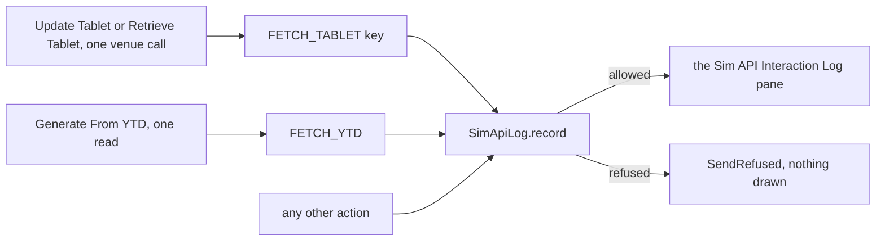

### The Generate From YTD block

A Generate From YTD press that reads the trade files records one block on the
Sim's API Interaction Log, in Live's block, after the read and before the
Activity Log's generation line. The head line carries the exchange chosen and
the action. The Reason line names the read. The Endpoint line is the exchange
history directory the files were read from. The Result line counts the fills
and the files and names every file read. The Response line is the time the
read took. The Data usage line counts the bots the read generated, and adds
the manifest rows skipped when a row's file is missing. A press that stops
before a read, because the directory is missing, empty or without its
manifest, because the manifest names no pair, or because the chooser was
cancelled, records no block and writes its Activity Log line alone.

```
[05:51:06] COINBASE FETCH_YTD
  Reason: Read the YTD trade files for coinbase - Generate From YTD
  Endpoint: <the exchange history directory>
  Result: 10 fills read from 4 file(s): BTC-USD_2025_coinbase.json, BTC-USD_2026_coinbase.json, ETH-USD_2026_coinbase.json, SOL-USD_2026_coinbase.json
  Response: 2.8ms
  Data usage: Generated 3 bot(s) on the Scrumming Bots table
```

`src/gui/simulator/sim_trading_tab_surface.py` — the block's fields

```python
YTD_REASON_FORMAT = "Read the YTD trade files for {exchange} - Generate From YTD"
YTD_RESULT_FORMAT = "{fills} fills read from {files} file(s): {names}"
YTD_DATA_USAGE_FORMAT = "Generated {bots} bot(s) on the Scrumming Bots table"
YTD_NOTHING_GENERATED_TEXT = "Nothing generated"
YTD_MISSING_USAGE_FORMAT = "; {missing} manifest row(s) skipped, file missing"
```

`src/gui/simulator/sim_trading_tab.py` — the record

```python
        started = time.perf_counter()
        made = self._fleet_source.generate_from_ytd(source, chosen)
        elapsed_ms = (time.perf_counter() - started) * 1000.0
        self._api_log.record(
            **tab_surface.ytd_api_entry(made, chosen, source.root(), elapsed_ms)
        )
```

The file names and the fill count come off the generation itself, which now
answers the names of the files it read and the fills it read beside the bots
it held and the rows it skipped.

`src/simulator/fleet_source.py` — what one generation answers

```python
@dataclass(frozen=True)
class YtdGeneration:
    bots: tuple[SimBot, ...] = ()
    files_read: int = 0
    missing: tuple[YtdFileEntry, ...] = ()
    files: tuple[str, ...] = ()
    trades_read: int = 0
```

### The Stone Tablet block keeps its text

A retrieval's block is the block the replay layer's section above describes,
unchanged in every field; its action now opens with the shared word rather
than a copy of it, so the word has one definition.

`src/gui/simulator/sim_trading_tab_surface.py` — the action

```python
RETRIEVAL_ACTION_FORMAT = TABLET_ACTION + " {key}"
```

### What the API spool refusal reading measured

Both builds, the real window with a scratch home, every socket but loopback
refused, scratch YTD trade files in the shape the generation reading above
drove, copies of the BTC, ETH and DOGE tablets, copies of the SPY and GLD RA
tablets, and a copy of
`bot_state.json`. One session: Generate From YTD with coinbase chosen drew one
block whose Result line named the four files and the ten fills, whose Response
line carried the read's time, and whose lines read the same on both pages
apart from the stamp and the path; Update Tablet on DOGE against a loopback
candle server drew forty tablet blocks; Import Live Fleet drew none; Portfolio
Battery over EQUITY_MACRO drew none. After the session the pane held 41
blocks, and 41 of them opened with an allowed word. A venue order recorded on
the Sim's log raised the refusal and drew nothing, on either build; the same
entry on the process-wide log drew on Live's pane and not the Sim's. Live's 37
action names recorded on the Sim's log were refused 37 of 37; with the order
word planted into the allowed set the count read 36, and with the plant
removed it read 37 again. One tablet entry recorded directly drew. On the base
commit the same session drew no block for Generate From YTD, the order record
drew, and the 37 names drew 37 of 37. Every copied file and every trade file
read byte-identical after every step, and a byte planted into a copy of
`bot_state.json` moved its hash. No socket left loopback.

## The Activity spool shows the trades of Validation, Back Test and Portfolio Battery runs

Every simulated fill writes one line on the Sim tab's Activity Log, in both
builds, as the walk produces it. The line is Live's fill line as Live's pane
receives it: the bot prefix Live's window puts on every bot line, then
`SELL FILLED` for a scrum or `BUY FILLED` for a fold, the units to six places,
the asset, the price to eight places. The Simulator has no venue, so it has no
intended price and no slippage to report; in their place the line carries what
the walk knows about the fill, the dollars and the fee to five places, in the
shape Live's proceeds line writes them. A scrum's dollars read `gross`, the
notional sold; a fold's read `spent`. The line is written at Live's `info`
level and paints at the pane's plain size, because that is what Live's fill
line paints at.

`src/gui/simulator/sim_trading_tab_surface.py` — the line one `SimTrade` writes

```python
TRADE_LINE_LEVEL = "info"
BOT_PREFIX_FORMAT = "[{asset}/{tail}] "
BOT_ID_TAIL_CHARS = 4
TRADE_LINE_FORMAT = (
    "{prefix}{word}: {units:.6f} {asset} @ ${price:.8f} "
    "({usd_word} ${usd:.5f}, fee ${fee:.5f})"
)
SCRUM_FILL_WORD = "SELL FILLED"
FOLD_FILL_WORD = "BUY FILLED"
SCRUM_USD_WORD = "gross"
FOLD_USD_WORD = "spent"
```

Unit 31a moved the fill words to `src/simulator/sim_bus.py` (comment
5734916119).

```
[2021-02-05T00:00:00Z] [SPY/ahoo] SELL FILLED: 0.193792 SPY @ $387.70999146 (gross $75.13498, fee $0.45081)
[2026-07-29T15:35:00Z] [BILL/0bda] BUY FILLED: 155.417407 BILL @ $0.02252000 (spent $3.50000, fee $0.05600)
```

### The stamp is the tape's time

Every other line on the pane is stamped with the clock at the moment it is
written, as Live's pane stamps it. A simulated fill happened at the tape's
candle, and a daily tablet's candles all fall at midnight, so a clock stamp
would read the same on every line of a daily walk and say nothing about when
the fill fell. A trade line is stamped with the candle's time instead, the
same UTC stamp the report writes for a run's first and last candle. Both
forks of the pane gain one call for it, a write under a stamp the caller gives,
which holds the line under a pause exactly as an ordinary write does and
renders it otherwise.

`src/gui/simulator/sim_status_log.py` — the write under a given stamp

```python
        def log_at(self, stamp: str, message: str, level: str = "info") -> None:
            """``log`` under ``stamp`` instead of the clock: held under a pause, else rendered."""
            self._tell("log", message, level)
            if self._paused:
                if len(self._pause_buffer) < self._pause_buffer_cap:
                    self._pause_buffer.append((stamp, message, level))
                return
            self._render(stamp, message, level)
```

### The seam the walk hands each fill to

The walk that sizes every simulated trade gains one callback, handed each
`SimTrade` the moment it fills, the way the Battery hands its progress
callback each portfolio's line. Every runner threads it through to the walk:
Back Test's run, the Battery's symbol, portfolio and battery runs, and
Validation's run. A symbol two portfolios share on one bot is walked once, so
its fills reach the callback once.

`src/simulator/back_test.py` — the seam

```python
#: The seam ``walk`` hands each ``SimTrade`` to as it fills, as ``run_battery``
#: hands ``progress`` each portfolio's line.
TradeSink = Callable[[SimTrade], None]
```

```python
        if filled is not None:
            trades.append(filled)
            fees += filled.fee_usd
            if on_trade is not None:
                on_trade(filled)
```

### A Validation run's trades are the recorded fills it reruns

Validation sizes no trade of its own; it reruns the recorded fills against the
gate rows the live bot wrote. Its trade line is that recorded fill, one per
rerun: the bot, its symbol, a scrum for a sell and a fold for a buy, the
fill's time, price, amount, cost and fee. A fill the run does not rerun writes
no line; the report names it under what could not be verified.

`src/simulator/validation.py` — the recorded fill as a trade

```python
def rerun_trade(bot: SimBot, fill: Any) -> "SimTrade":
    """The ``SimTrade`` one rerun YTD fill reads as: ``SCRUM`` for ``SIDE_SELL``
    and ``FOLD`` otherwise, ``amount`` as the units, ``cost`` as the USD."""
```

### Off the worker thread, as the portfolio lines travel

A Battery run walks on its worker thread. Each fill crosses to the GUI thread
through a signal beside the one that carries each portfolio's line, and the
host writes it there. On the Qt tab the line is appended to the pane as it
arrives. On the React page the host paints it into its own log at once and
pushes every line painted since the last push once per strip tick, two
seconds, so a walk of thousands of fills does not push thousands of scripts;
a push carries the pending lines ahead of anything else it carries.

`src/gui/simulator/sim_trading_tab.py` — the signal and the writer

```python
    #: One ``SimTrade`` the Battery's walk filled on the worker thread.
    battery_trade = Signal(object)
```

```python
    def log_trade(self, trade: SimTrade) -> None:
        """One Activity Log line per ``SimTrade``: ``trade_line`` under
        ``trade_stamp`` through ``SimStatusLog.log_at`` at ``TRADE_LINE_LEVEL``."""
        self._status_log.log_at(
            tab_surface.trade_stamp(trade),
            tab_surface.trade_line(trade),
            tab_surface.TRADE_LINE_LEVEL,
        )
```

`src/gui/simulator/sim_react_trading_tab.py` — the push cadence

```python
#: One push per strip tick carries every trade line ``log_trade`` painted since the
#: last push, so a walk of thousands of fills does not push thousands of scripts.
TRADE_PUSH_INTERVAL_MS = DASHBOARD_TICK_MS
```

### Nothing else reaches the spool during a run

During a run the Activity Log's writers are the run's own: the started line
when the press is taken, one line per portfolio as it lands, one line per fill
as it fills, and when the run ends its summary lines and the report line. The
watchdog writes only when the render-error count rises or when nothing has
rendered for ten minutes while a sim bot runs, and a run renders continuously;
the command bar's notices are reached only by its own presses; the window's
notifications reach Live's pane. The pane holds 5,000 lines and drops the
oldest past that; a pause holds 2,000 and drops the newest, and Resume replays
the held lines in order under one line counting them.

### Back Test and Validation, through the run
At unit 30 no button started a Back Test or a Validation run on the tab; unit
31 made Start on the command bar that button (comment 5733262015). Both runs
take the same callback, and
Validation run's button is the close's. Both runs take the same callback, and
driven through their run function with the host's writer they write one line
per fill on the Activity Log exactly as the Battery does from the corner.

### What the trade-line reading measured

Both builds, the real window with a scratch home holding a copy of
`bot_state.json` with 38 coinbase bots, the BILL, CAP and VVV tablets, a copy
of the whole RA-StoneTablet root, a copy of the gate log and YTD trade files
built from the SCRUM and FOLD rows three of those bots wrote; every socket but
loopback refused. Import Live Fleet held 38 bots. Back Test through its run
walked 3 bots, produced 1,670 fills and wrote 1,670 trade lines and the report
line; every line's stamp, prefix, word, units, asset, price, dollars and fee
read equal to its fill. One bot at 1,300 candles, a walk of exactly three
fills, wrote three lines, each with its fee. Validation through its run rerun
36 recorded fills and wrote 36 lines and the report line. Run Portfolio on
BOGLEHEAD over every span, pressed at the corner, wrote 204 trade lines for the
204 fills its nine walks produced, beside the started line, one portfolio line,
eight summary lines and the report line, and nothing else; the report's rows
counted the same 204. Run Portfolio on FULL wrote its first fills within three
seconds of the press with the run still in flight; Pause Console pressed then
held every later line, 819 on the Qt tab and 719 on the React page, and Resume
flushed them in their held order under the line counting them. Run Every
Portfolio over the whole root produced 2,066 fills in 189 walks and wrote 2,066
trade lines beside 47 of the run's own; on the Qt tab the pane read 681 lines
at 9.2 seconds of a 27-second run and 2,054 at 27.3, and on the React page
1,573 at 21.5 seconds against 1,587 fills produced. After that run both panes
held 4,936 lines under the cap of 5,000. On the base commit the same sessions
wrote no trade line in either build. Every copied file read byte-identical
after every step, a byte planted into a copy of `bot_state.json` moved its
hash, no bot was constructed and no socket left loopback.

## Start runs Validation and Back Test from the command bar

The command bar's Start is the press that starts a run. Live starts a bot with
Start on the selected row, and no other press on the Trading tab starts
anything, so the Simulator's run control is that same Start. What it starts
follows the run mode: in Validation mode it starts the Validation run, in Back
Test mode the Back Test walk, and in Portfolio Battery mode it stays the state
move the command bar section above describes, because the Battery's run is the
corner's. Stop on a row of the run ends it. No new button is drawn.

`src/gui/simulator/sim_trading_tab.py` — the dispatch in `_on_bot_command`

```python
        if self.run_running():
            if command == "stop" and bot_id in self._run.get("bot_ids", []):
                self._stop_run(bot_id)
                return
            self._status_log.log(
                tab_surface.run_in_flight_line(
                    self._run.get("mode", ""),
                    len(self._run.get("bot_ids", [])),
                    command,
                ),
                "warning",
            )
            return
        if command == "start" and self._mode in tab_surface.RUN_MODES:
            self._start_run(bot, self._mode)
            return
```

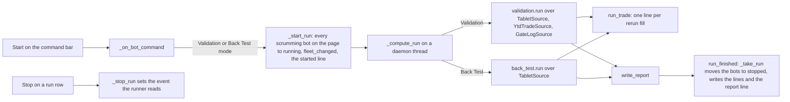

### The run is the page's scrumming fleet

A Validation pass is one pass over a fleet: `validation.run` takes the bots,
measures one coverage, one tape lag and one match key over them, and writes one
report. Start therefore runs the mode over every held scrumming bot on the
pressed page's exchange, `_run_bots` in both hosts, and every one of those rows
reads `running` while the run is in flight and `stopped` when it ends. The
selected row is the bar's own precondition, `Select a bot first.`, and is not
changed. Extractor rows are not run: the gate chains the rerun evaluates are
the scrumming bot's, and the walk sizes a scrum and a fold.

`src/gui/simulator/sim_trading_tab.py` — the fleet a run covers

```python
    def _run_bots(self, exchange_id: str) -> list[SimBot]:
        """Every held scrumming bot on ``exchange_id``, the fleet a run covers."""
        return [
            one
            for one in self._fleet_source.bots()
            if one.exchange_id == exchange_id and one.mode == SCRUMMING_MODE
        ]
```

`_start_run` moves each of those bots to `running` through
`SimBotManager.start`, the same rule Start applies to one bot, and fires
`fleet_changed`, so the sim fleet file is saved and every venue page draws its
rows again before the walk begins: the Bot ID cell reads `State: RUNNING` in
its running colour. Then the started line is written and `_compute_run` starts
on a daemon thread named `sim-mode-run`, the shape the Battery and the Market
Inspector's Scan Now use, so the window keeps answering. When the worker ends,
`_take_run` on the GUI thread moves every run bot to `stopped` through
`SimBotManager.stop`, fires `fleet_changed` again, and writes the run's own
lines and the report line through `log_report`.

```
Validation started on coinbase over 24 bot(s); budget $16,860.00, the sum of the held Target Balances; no rerun fill is refused for cash.
Back Test started on coinbase over 24 bot(s); each fold spends its own scrum proceeds.
```

The Validation line names the run's budget under the funding rule: the sum of
the held Target Balances, `run_budget_usd`, which is also what the strip's
Spendable reads in that mode. Validation reruns gates and sizes no trade, so no
fill is refused for cash, and the report's header says so. Back Test keeps the
proceeds funding, unchanged.

### What the worker reads

The Validation worker reads the tab's `TabletSource` over the Stone Tablets,
a `YtdTradeSource` over the YTD trade files, and a `GateLogSource` over
`gate.log` and its rotations under the trade directory of the log root. Each
answers reads alone and refuses every other name. The Back Test worker reads
the `TabletSource` alone. Neither touches a widget, the fleet source or a
venue; the worker's only write is the report.

`src/gui/simulator/sim_trading_tab.py` — the two runners, called as unit 30's
seam left them, with the stop event added

```python
                outcome = validation.run(
                    bots,
                    self._tablet_source,
                    YtdTradeSource(),
                    GateLogSource(),
                    exchange_id=exchange_id,
                    limit=surface.VALIDATION_RERUN_LIMIT,
                    on_trade=self.run_trade.emit,
                    stop=self._run_stop.is_set,
                )
```

Each rerun fill crosses to the GUI thread on `run_trade` and is written by
`log_trade` in the trade-line shape the Activity spool section describes; the
run's lines and the failed line cross on `run_line`; the outcome crosses on
`run_finished`. The React host carries the same three signals, the same
`_start_run`, `_compute_run`, `_stop_run` and `_take_run`, and reaches them
from the page's command bar through Live's own `ExchangeTabModel.cmd`.

### Stop ends the run with a partial report

Stop on a row of the run writes Live's `Stopping bot <id>...`, the run's
stopping line, and sets a `threading.Event`. Both runners take `stop`, a
callable read before each bot and before each row or tick: `_validate` reads it
before each bot's snap and before each row's rerun, `_walk_fleet` before each
bot and `walk` before each tick. When it answers True the pass ends where it
is, with `stopped` set on the run, and the same `write_report` writes the
report: `partial` reads yes with the stop named, the header carries `stopped`
and the bots reached, every unreached bot's row reads `not reached`, and the
Not verified section leads with the stop line. A stopped walk answers the
candles it read, the last close it ticked and the trades it filled. When the
worker ends, `_take_run` writes Live's `Bot <id> stopped.` for the row Stop was
pressed on, moves every run bot to `stopped`, and writes the lines and the
report line as for a whole run.

```
Stopped by the operator: 19 of 24 bots walked, 1 cut short at its last bar ticked; 5 bot(s) not reached: <ids>.
Stopped by the operator: 1 of 24 bots reached, 0 rows rerun; 23 bot(s) not reached: <ids>.
```

While a run is in flight, Start, Pause, Restart and Delete on any row, and
Stop on a row outside the run, write one line and move nothing:

```
A Validation run is in flight over 24 bot(s); Stop on one of its rows ends it, and start waits for it.
```

A run that raises writes the failed line, moves its bots to `stopped`, and its
partial file is on disk from `write_partial`, as the report section describes.

### Each differing light carries its cause

A non-zero count is a finding, and the report says what drove it. Every
disagreeing light already carries which side of the rerun moves it; it now
carries a cause as well, one of three words read off the row's own fields.

| cause | what it reads |
| --- | --- |
| tape | the tablet candle the rerun read differs from the reading the bot recorded: the recorded `bb_pos` sits more than the lag match gap from the rerun's, or the bank's recorded band flag differs from the rerun's |
| fixture | a recorded field the light reads is absent from the row's fixture, or the phantom lock could not be recovered from the recorded row |
| chain | the same inputs on both sides and a different light: the gate chain |

`src/simulator/validation.py` — the cause of one light that is blocked on one
side

```python
def light_cause(
    light: LabelComparison,
    row: Any,
    context: GateContext,
    locked_known: bool,
    absent: Sequence[str],
) -> str:
    key = (light.bank, light.label)
    if light.driven_by == TAPE:
        if recorded_bb_pos(row) is None:
            return FIXTURE_CAUSE
        if tape_moved(row, context, light.bank):
            return TAPE_CAUSE
        if key == ("S", "BB") and not locked_known:
            return FIXTURE_CAUSE
        return CHAIN_CAUSE
    if light.driven_by == RECORD:
        for fixture, field_name in LABEL_FIELDS.get(key, ()):
            if f"{fixture}.{field_name}" in absent:
                return FIXTURE_CAUSE
        if tape_moved(row, context, light.bank):
            return TAPE_CAUSE
        return CHAIN_CAUSE
    return CHAIN_CAUSE
```

`LABEL_FIELDS` names, per light, the recorded fixture fields `rerun_context`
reads for it. A light that is blocked on exactly one side is classified by the
rules above. A light blocked on neither side, `passed` against
`not_the_blocker`, moved only because its bank's armed flag moved, so it takes
the cause of its bank's blocked lights: `tape` before `fixture` before `chain`
where they mix, because the tape is the data the criterion is about, and
`chain` where no light in the bank is blocked. The report writes the cause
beside each disagreeing light, a per-row count of causes, and under the four
counts a line `differs by cause: tape N, fixture N, chain N` with the three
definitions, in both files. No tolerance is widened and no gate is changed to
make a light agree; the chain is Live's.

### The empty cases name the missing source

The run still runs when a source is empty, and the report's Not verified
section names what could not be rerun. With no YTD trade directory, the Start
press writes the YTD root line before the started line, every bot reads `no
YTD trade file; nothing snapped.` and the comparison table holds no row. With
no `gate.log`, every bot's snapped fills match nothing, and the bot's own line
says so. With no Stone Tablet for a pair, that bot reads `no Stone Tablet;
nothing snapped.` and the rest of the fleet is rerun.

```
<id> (AAA/USD): no YTD trade file; nothing snapped.
<id> (AAA/USD): no gate row recorded for this bot; 4 snapped trades matched nothing.
<id> (BBB/USD): no Stone Tablet; nothing snapped.
```

`src/simulator/parity_report.py` — the per-bot line for a bot with no
recorded gate row, read off the `gate_rows` count `_validate` fills

```python
        elif row["outcome"] == VALIDATED and not row["gate_rows"]:
            out.append(
                f"{row['bot_id']} ({row['symbol']}): no gate row recorded for this "
                f"bot; {row['snapped']} snapped trades matched nothing."
            )
```

### What the run from the bar measured

Before, in both builds over a scratch home holding 24 scrumming bots on
coinbase, one 5m Stone Tablet of 2,000 candles per pair, one YTD trade file per
pair with four fills, and a `gate.log` of one fired row per fill in the
operator's row shape, each row latched by the shipped chain over the tablet
candle that holds its fill: Import Live Fleet held 24 rows, and Start in
Validation mode wrote `✓ Bot <id> RUNNING.`, moved the one selected row,
wrote no trade line and no report; Back Test the same; the two runners had no
caller under the tab.

After, in both builds over the same home: Start in Validation mode moved all
24 rows to `RUNNING` within 40 ms on the Qt tab and within 0.6 seconds on the
React page, wrote the started line with the budget of $16,860.00, wrote 96
trade lines as the 96 recorded fills were rerun, wrote the run's six lines and
the report line, and moved the rows to `STOPPED`; the report's comparison table
read missing 0, extra 0, differs 0, variant differs 0 over 96 rows compared,
the sidecar's four counts equal to the Markdown's. Start in Back Test mode
moved the 24 rows the same way, walked 48,000 candles in about seven seconds,
wrote 17 trade lines for the 17 fills, and wrote its report. Stop pressed on
the last row one second into a Back Test wrote the stopping lines and a
partial report reading 19 of 24 bots walked, one cut short and five not
reached on the Qt tab, 11 of 24 and 13 not reached on the React page; a Start
pressed while that run was in flight wrote the in-flight line and started
nothing; Stop pressed the moment a Validation run started wrote a partial
report reading 1 of 24 bots reached and 0 rows rerun on the Qt tab, 23 of 24
and 0 rows rerun on the React page, and every run bot read `STOPPED` after
each.

Over a scratch home whose first bot's rows carried one recorded S/TA light
flipped to blocked with its scrum disarmed, one recorded `target_fires`
removed, and one recorded reading moved to the opposite band with its lights
latched there, plus one fill a day past the tablet's last candle, the table
read differs 21 by cause tape 11, fixture 1 and chain 9: the removed field's
row read S/FIRE `fixture`; the flipped row read S/TA `chain` with its eight
armed-flag lights `chain`; the moved row read S/BB `tape` with its ten
dependent lights `tape`; and the fill past the tablet read
`after_last_candle` under Not verified with the uncovered span. Both builds
read the same 21.

Over three more scratch homes, one with no YTD directory, one with no
`gate.log` and one with no tablet for the second pair, the report named each
case per bot as the lines above show, the YTD root line preceded the started
line in the first, and the third rerun the first pair's four rows to four
zeros.

Over scratch copies of the operator's own `bot_state.json`, his `gate.log`
and its five rotations, and the 38 Stone Tablets his 38 scrumming bots' assets
and timeframes name, with no YTD trade file on this machine: Import Live
Fleet held 38 rows and Start in Validation mode wrote the YTD root line, ran,
and wrote a report whose 38 bot rows each read `no YTD trade file; nothing
snapped.`, whose comparison table read four zeros over 0 rows compared, and
whose header named the budget as the sum of the 38 Target Balances. Without
the exchange's YTD export nothing can be snapped, so nothing can be rerun,
and the report says so rather than reading a pass. With YTD trade files built
from the fired rows his own gate log holds, one fill per SCRUM or FOLD row
inside its tablet's span, the run rerun 55 recorded fills and the
table read missing 0, extra 0, differs 275, variant differs 0, with 23 of the 55 rows latching identically and 770 of 1,045 lights agreeing; every one of the 275 differing lights read `tape`, none `fixture` and none `chain`, because 50 of the 55 recorded readings were reproduced from a window 50 candles, 250 minutes, behind the fill's own candle, the lag the first full run measured, so the bot read a different candle from the one the tablet holds at the fill's moment and the chain, fed the tablet's candle, lit the lights differently; fourteen bots carried a fired row inside their tablet's span and the other 24 read `no YTD trade file`. Every copied file read
byte-identical after every press, a byte planted into a copy of
`bot_state.json` moved its hash, no bot was constructed and no socket left
loopback.

## The Simulator writes Live's log rows under the sim bucket

Every run writes the rows a live bot writes, into the Simulator's own files,
so a run can be troubleshot and tuned from its files as a live bot can from
its logs. The operator, 2026-09-18: *"Simulator Logs and Emitter Network must
be able to provide sufficient data for troubleshooting and optimization."*
Each Sim host builds one private bus at tab build and one second copy of
Live's log writer over the sim bucket, attached to that bus. The bus is never
the process-wide one, and nothing under the Simulator subscribes to the live
bus. The runners emit Live's topics on the private bus, the writer's own
listeners write them, and the four files land beside the sim fleet file.

`src/simulator/sim_bus.py` — the bus and the writer one host builds

```python
def new_sim_bus() -> EventBus:
    """A private ``EventBus`` for one Sim host, never ``get_event_bus``."""
    return EventBus()

def sim_log_manager(
    bus: Any, symbol_of: Optional[Callable[[str], str]] = None
) -> LogManager:
    """A ``LogManager`` over ``get_sim_dir`` attached to ``bus``, with
    ``symbol_of`` as its symbol resolver when given."""
    manager = LogManager(log_dir=get_sim_dir())
    if symbol_of is not None:
        manager.set_symbol_resolver(symbol_of)
    manager.attach_to_bus(bus)
    return manager
```

`src/gui/simulator/sim_trading_tab.py` — built once, in the tab's `__init__`

```python
        self._bus = new_sim_bus()
        self._log_manager = sim_log_manager(self._bus, self._symbol_of)
```

The writer's own attach subscribes the five topics it subscribes on Live, so
the sim files carry Live's names and Live's row shapes. One writer, one
definition, two buckets.

| topic on the private bus | file under the sim bucket | who emits it |
| --- | --- | --- |
| `trade.filled` | `sim/trade.log` | the walk on every fill, the rerun on every rerun fill |
| `bot.gate_decision` | `sim/gate.log` | the walk on every evaluated candle, the rerun on every rerun row |
| `bot.voting_panel_snapshot` | `sim/voting.log` | the walk on every evaluated candle |
| `bot.log` | `sim/diagnostics.log` | the walk on every fill and for every bot it refuses, the rerun for every bot it cannot rerun |
| `pnl.event` | `sim/pnl/daily/` | nothing; the directory is made at build and stays empty |

The writer's console handler is not attached a second time: `main.py` builds
Live's writer before the window, so the application logger already holds
Live's handler when the tab builds, and the sim writer attaches none. No
`sim/system.log` exists, and the live `system.log` is not doubled.

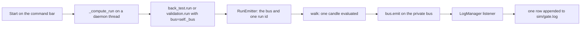

### Every row carries its run id and its candle

Each run takes one id before its first row, `<mode>-<stamp>`, and every gate
row, voting row and diagnostics row of the run carries it. The candle's time is
on every row as well. A row's top-level `timestamp` is the wall clock at the
write, as it is on Live, because the writer sets it and no call takes one; the
candle's time sits under `data` as `candle_at` and `candle_ts_ms`, the stamp
the Activity Log's trade line carries. A reader finds a candle by
`data.candle_at`, never by the top-level stamp.

`src/simulator/sim_bus.py` — the four keys every gate and voting row adds

```python
    def stamp(self, candle_ts_ms: int) -> dict:
        """The four keys every row adds: ``run_id``, ``mode``,
        ``candle_ts_ms`` and ``candle_at``."""
        return {
            "run_id": self.run_id,
            "mode": self.mode,
            "candle_ts_ms": int(candle_ts_ms),
            "candle_at": iso_stamp(candle_ts_ms),
        }
```

A trade row carries no run id and no candle: Live's trade listener writes a
closed set of fields and drops every other key, and that listener is not
changed. A trade row is found through the gate row written in the same moment
for the same bot with the same action, the pairing the sizing replay already
makes. A diagnostics row carries the run id and the candle inside its message,
because Live's diagnostics listener writes `symbol` and `message` only.

`src/simulator/sim_bus.py` — the diagnostics message

```python
BOT_LINE_FORMAT = "{message} (run {run_id}, candle {candle_at})"
```

### What a walk's gate row holds

A walk's gate row is Live's gate row: the two armed flags and the two blocker
lists the chain latched, the scrum and fold fixtures with the keys the live
bot writes at fire time, the tranche snapshot and the compounding snapshot in
the live shapes, `evaluated_at_tick` as the walk's tick count, and the trade
action and side on a row where a fill happened. Live's fixture shape has no
function of its own, two dict literals inside the live bot's tick; the
Simulator spells the same keys from the walk's gate context.

`src/simulator/sim_bus.py` — the scrum fixture's first keys

```python
def scrum_fixture(context: GateContext, reading: Any = None) -> dict:
    """The ``scrum_fixture`` keys ``ScrummingBot.tick`` writes, read off
    ``context`` and ``reading``."""
    return {
        "delta": float(context.delta),
        "below_interval": bool(context.below_interval),
        "ticker_last": float(context.ticker_last),
        "bb_pos": float(context.bb_pos),
        **_landing(reading),
```

One row per evaluated candle, not one per fill as Live writes, because a
blocked candle is the one a person troubleshoots: the blocker list on that
row names the light that held, and the fixture names the reading behind it.
The voting row beside it carries the whole vote of that candle, every
indicator's direction, confidence and details, so a pillar that voted wrong is
found by candle.

`src/simulator/back_test.py` — the walk's emit order, Live's fire order

```python
        if emitter is not None:
            action = fill_action(filled)
            if filled is not None:
                emitter.trade_filled(filled, bot.exchange_id)
                emitter.bot_line(bot.bot_id, fill_line(filled), stamp)
            emitter.voting_snapshot(bot, summary, stamp, action, fill_side(filled))
            emitter.gate_decision(
                bot,
                context,
                armed,
                stamp,
                reading=reading,
                position=position,
                tick=ticks,
                trade_action=action,
                side=fill_side(filled),
            )
```

A scrum row's `usd` is the settled proceeds net of the estimated fee, as
Live's scrum row carries it; a fold row's `usd` is the spend. The Activity
Log's trade line keeps printing the gross beside the fee. The fill words that
line uses moved into the bus module, so the surface's format now holds the
prefix and the line the diagnostics row carries.

`src/simulator/sim_bus.py` — Live's fill line, without the window's prefix

```python
FILL_LINE_FORMAT = (
    "{word}: {units:.6f} {asset} @ ${price:.8f} ({usd_word} ${usd:.5f}, fee ${fee:.5f})"
)
SCRUM_FILL_WORD = "SELL FILLED"
FOLD_FILL_WORD = "BUY FILLED"
SCRUM_USD_WORD = "gross"
FOLD_USD_WORD = "spent"
```

### A Validation rerun row carries the recorded row and every light

A Validation run emits one gate row per rerun, with the rerun's armed flags,
blockers and fixtures where Live's fields sit, and two more fields under
`data`: the recorded row as the gate-log reader read it, and the comparison
with all nineteen lights. Each light names its bank and label, the recorded
state, the rerun state, whether they agree, which side drives it and, where
they differ, the cause. A differing light is found from the file alone, by
candle, with no report open: read the rows whose comparison holds a light that
does not agree, and each such row names its candle.

`src/simulator/validation.py` — the fields a rerun row adds

```python
def rerun_row_fields(row: Any, seen: RowComparison) -> dict:
    """The fields a rerun's gate row adds beside Live's: ``recorded`` from
    ``recorded_row_fields`` and ``comparison`` from ``comparison_row`` with
    all nineteen ``lights`` and their ``agrees``."""
    from .parity_report import comparison_row

    comparison = comparison_row(seen)
    comparison["lights"] = [
        {
            "bank": one.bank,
            "label": one.label,
            "recorded": one.recorded,
            "rerun": one.rerun,
            "agrees": bool(one.agrees),
            "driven_by": one.driven_by,
            "cause": one.cause,
        }
        for one in seen.labels
    ]
    return {"recorded": recorded_row_fields(row), "comparison": comparison}
```

Validation computes no voting summary, because the rerun reads the vote the
bot recorded, so a Validation run writes no voting row. A bot with no YTD file
or no tablet, and a bot whose snapped trades matched no recorded gate row, is
named in the diagnostics file with the same line the report's Not verified
section carries.

### The observer reads every run and the report names its rows

For the length of one run, Live's emit observer is subscribed to the private
bus over the two Live contracts the Simulator emits, the fill and the gate
decision. The run's emitter counts what it emits per topic; the observer
counts what arrived and reports a required field that is absent, a value
outside its vocabulary, and a declared topic that never fired. At the run's
end the observer is finished, its subscriptions are removed, and its reading
goes into the run object and the report beside the run id and the four file
paths. A run that emits no fill reports the fill topic as never emitted, so an
empty run reads as empty rather than as clean.

`src/simulator/sim_bus.py` — the observer's reading at the run's end

```python
    def close(self) -> dict:
        """Finish the ``EmitObserver``, remove its subscriptions and answer
        ``to_dict`` with ``emitted`` beside it; a second call answers the same."""
        if self._read is not None:
            return self._read
        for remove in self._unsubscribe:
            remove()
        self._unsubscribe = []
        self._observer.finish()
        self._read = {"emitted": dict(self.emitted), "observer": self._observer.to_dict()}
        return self._read
```

The report's Run section gains the run id, the four file paths, the rows
emitted per topic and the observer's line; the sidecar carries the same under
`header.rows`, with each violation listed.

```
- run id: back_test-20260918T183818245464Z
- row files: trade.log <sim bucket>/trade.log, gate.log <sim bucket>/gate.log, voting.log <sim bucket>/voting.log, diagnostics.log <sim bucket>/diagnostics.log
- rows emitted: bot.voting_panel_snapshot 4752, bot.gate_decision 4752, trade.filled 17, bot.log 17
- observer: 2 of 2 declared topic(s) seen; bot.gate_decision 4752, trade.filled 17; 0 violation(s)
```

Live's contract module declares a voting topic nothing emits and no contract
for the voting snapshot topic the live bot does emit, so the voting row is
written under no contract and the observer does not read it. Live's trade
rows carry an empty exchange, because the live fire sites pass none; the
Simulator's carry the bot's exchange in that field.

### What the bucket holds and how large it grows

After a run the sim bucket holds the four files beside the sim fleet file and
the empty daily directory. Each file rotates at 50 MiB with five backups, the
writer's own bound. Measured over the scratch fleet of 24 bots at 200 ticks
each, a Back Test wrote 4,752 gate rows in 11.9 MB, about 2.5 KB a row, and
4,752 voting rows in 27.1 MB, about 5.7 KB a row, the vote's twelve signals
and their details making the difference. A whole-root Portfolio Battery of
189 walks at 120 ticks each writes about 22,700 rows a file, so its voting
rows cross the rotation bound within one run and the older ones survive in
the numbered backups.

### What the emitter reading measured

Before, in both builds over a scratch home holding 24 scrumming bots, one
2,000-candle 5m tablet per pair, four fills per pair, one fired gate row per
fill, the live bucket's five files each holding one line, and a copy of the
411 RA-StoneTablets: after a Validation run, a Back Test run and a Run
Portfolio, the sim bucket held the sim fleet file and nothing else, no host
held a bus, and no report named a run id.

After, in both builds over the same home: the Validation run wrote 96 gate
rows and 96 trade rows under its run id, the Back Test 4,752 gate rows, 4,752
voting rows, 17 trade rows and 17 diagnostics rows, and the Battery 1,017 gate
rows, 1,017 voting rows, 204 trade rows and 204 diagnostics rows; every gate
and voting row carried the run id and the candle, every row of each file
carried its contract's required fields, and the observer read 2 of 2 declared
topics seen and 0 violations on each run, its counts equal to the rows on
disk. The host's bus was not the process-wide bus, read by identity; the
process-wide bus's subscriptions read the same after every run as after the
window was built; the live trade bucket's four files, the 24 tablets, the YTD
files and the 411 RA tablets hashed identical after every run, and a byte
appended to a copy of the fleet file moved its hash. The live `system.log`
changes during a run on the base tree already, from the window's own panel
timer and the Simulator's own loggers, and is the process log rather than a
trade-bucket file.

Off the tab, one Back Test walk over the same fleet with the bus and the
writer, under the debugger with `amount` removed from one fill payload at the
emit line, read one observer violation naming the absent field, carried into
the report; the same walk untouched read zero. The sizing replay of the one
trading logic, run over that walk's `sim/trade.log` and `sim/gate.log`, paired
17 of 17 fills with their gate rows and reproduced 4 of 4 scrum unit counts,
13 of 13 fold unit counts, 4 of 4 interval readings and 4 of 4 scrum proceeds;
its own planted row read one disagreement. Over the scratch home whose
recorded rows carry one flipped S/TA light, one removed `target_fires` and one
reading moved to the opposite band, `sim/gate.log` alone, with no report
open, named three rows with a differing light by candle: the removed field's
candle with S/FIRE `fixture`, the flipped candle with S/TA `chain` and its
eight armed-flag lights, and the moved candle with S/BB `tape` and its ten
dependents, in both builds.

## Clear Fleet empties the held fleet

Clear Fleet is the corner's first button in every mode and, while a fleet is
held, the Get Started card's first button. A press empties the whole held
fleet, every record on every venue, after one confirmation in Live's Delete
Bot box shape. The venues unseat, the card returns, the header strip reads
zeros and the sim fleet file is written with no record. `bot_state.json` is
not touched. Both builds draw the button from one surface list and both
hosts run one handler, `_clear_fleet`.

### The button at the corner and on the card

The corner's list is `way_in_buttons` in
`src/gui/simulator/sim_trading_tab_surface.py`: `clear_fleet_button` first,
then the run mode's two ways in, each at Live's corner-button size, 140 px
wide and 24 px tall. The card's list is `placeholder_way_in_buttons`, which
puts Clear Fleet above the two ways in only while `held`, the count of held
records, is above zero. The Qt host draws both lists in
`SimTradingTab._draw_way_ins` and draws them again at the end of every
`_sync_exchange_tabs`; the React host writes `held` into
`SimTradingTabState` on every `show_tab` and calls `show_tab` at the end of
every `_sync_exchange_tabs`, so the page's `WayInButtons` and
`PlaceholderWayIns` components draw the same two lists with no change to
`src/gui/web/sim_trading_tab.js`. The button's accessible name is
`sim-clear-fleet` at the corner and `sim-clear-fleet-card` on the card.

Since the way-in row landed, that list draws on a row above the exchange tab
bar in both builds, not in the tab bar's corner, and it is empty with no
fleet held, so the row is absent and the card alone offers the ways in. The
Qt host builds the row in `SimTradingTab._make_layer` and the React page draws
it in `WayInButtons` above the tab bar. The corner holds nothing. The section
"Start Run starts the active mode's run from the way-in row" describes the
row.

`src/gui/simulator/sim_trading_tab_surface.py` — the card's list

```python
def placeholder_way_in_buttons(
    accent: Any, mode: str = sim.MODES[0], held: int = 0
) -> list:
    """The card's buttons at Live's card-button size and sheet: Clear Fleet
    first while ``held`` records are held, then the two ways in ``mode`` offers."""
    rows = list(sim.reserved_rows(mode))
    if int(held or 0) > 0:
        rows.insert(0, {"action": sim.CLEAR_FLEET_ACTION, "text": sim.CLEAR_FLEET_TEXT})
```

The card draws only on a layer that seats no venue. Every venue the Simulator
seats today, `coinbase`, `kraken` and the Battery's `yahoo`, sits on the
crypto layer, so the crypto card and a held crypto fleet are never on screen
together. The card's Clear Fleet is the way to empty a fleet held on the
other layer, such as an imported `bot_state.json` fleet on an equity venue,
which the stack does not show.

### The confirmation and the clear

A press reaches `_way_in` on either host and then `_clear_fleet`. The box is
`QMessageBox.question` under the title `Clear Fleet`, with Yes and No, as the
command bar's Delete opens its `Delete Bot` box. The question names the
count and the venues. Yes runs `FleetSource.clear`, which drops every held
record and answers how many were held, then writes the cleared line, the
notification `Fleet cleared`, plays Live's state-change sound and fires
`fleet_changed` once. `FleetSource.save` writes the sim fleet file with
`bot_count` 0. `_sync_exchange_tabs` reads no exchange, takes every venue
off, adds the Get Started page back, and re-reads the tables, the panel and
the replay layer. The header strip reads `aggregate_stats` over no bot on
its next tick, every field zero, and EXCH 0. No is the cancelled line and
nothing moves.

`src/simulator/fleet_source.py` — the clear

```python
    def clear(self) -> int:
        """Drop every held record, on every exchange; answers how many were
        held. The sim fleet file loses them on the next ``save``."""
        count = len(self._records)
        self._records = {}
        return count
```

Clear Fleet empties every venue, not the shown venue alone. Live's Delete
acts on one bot id. The fleet is one map: `FleetSource` holds every venue's
records together, `save` writes them as one file, and the strip reads them
together. A per-venue clear would be a different control with a different
name.

`src/gui/simulator/sim_trading_tab_surface.py` — the box and the lines

```python
CLEAR_FLEET_BOX_TITLE = sim.CLEAR_FLEET_TEXT
CLEAR_FLEET_QUESTION_FORMAT = (
    "Clear the Simulator fleet of {count} bot(s) on {venues}? This cannot be undone."
)
CLEARED_FORMAT = "Cleared {count} bot(s) on {venues}; the Simulator fleet is empty."
CLEAR_CANCELLED_TEXT = "Clear Fleet cancelled."
NOTHING_HELD_TEXT = "No fleet is held; nothing to clear."
FLEET_CLEARED_NOTICE = "Fleet cleared"
```

### A run in flight, nothing held, cancelled

While a Validation or Back Test run is in flight, the press writes the same
in-flight line the command bar writes, naming Clear Fleet as the command
that waits, and opens no box. While a Portfolio Battery run is in flight, the
press writes the Battery's in-progress line. With no record held, the press
writes `No fleet is held; nothing to clear.` and opens no box. No on the box
writes `Clear Fleet cancelled.` and removes nothing. In each of these cases
`fleet_changed` does not fire and the sim fleet file is not written.

### The two signals a press emits

Every press emits `sim.fleet.clear_pressed` through `signal_contract.emit`,
bound in each host as `_pin_emit`, and a confirmed clear emits
`sim.fleet.cleared` after it. The press signal carries the outcome and the
held count after the press, against the count the outcome allows: unchanged
for a cancel, a refusal or nothing held, zero for a clear. The cleared
signal carries the held count and the seated venue count after the clear,
both expected zero, with the count removed and the venues unseated in its
context. Each host flushes the process sink after the emit, so the handler's
file under the runtime log directory's `signals` folder holds the rows right
after the press.

`src/gui/simulator/sim_trading_tab.py` — the cleared signal

```python
        _pin_emit(
            tab_surface.CLEARED_SIGNAL,
            actual={
                "held_after": len(self._fleet_source.bots()),
                "venues_after": self.exchange_count(),
            },
            expected={"held_after": 0, "venues_after": 0},
            context={"removed": removed, "venues_unseated": list(venues)},
        )
```

### What the clear reading measured

Before, in both builds over a scratch home holding a `bot_state.json` with
four records on `coinbase` and one on `kraken`, a tablet manifest naming four
assets per venue and no sim fleet file: Import Live Fleet on both venues
seated both and held five records; no button named `sim-clear-fleet` existed
at the corner or on any card in any mode, the five records stayed held
through every press, and the only route to an empty fleet was Delete, one
row and one box at a time.

After, in both builds over the same home: the corner read
`sim-clear-fleet`, `sim-import-live-fleet` and `sim-generate-from-ytd` in
that order from the left, each 140 by 24, Clear Fleet's left edge 142 px
before Import Live Fleet's. With five records held, the stock layer's card
held `sim-clear-fleet-card` first and the crypto card was not drawn. The
corner press opened the box `Clear Fleet` reading `Clear the Simulator fleet
of 5 bot(s) on coinbase, kraken? This cannot be undone.` with Yes and No; No
wrote the cancelled line and left five held. Yes wrote
`Cleared 5 bot(s) on coinbase, kraken; the Simulator fleet is empty.` and the
notification, unseated both venues, drew the crypto card with two buttons
and no Clear Fleet, zeroed the five cards and read EXCH 0 on the strip's
next tick, wrote the sim fleet file with `bot_count` 0 and an empty `bots`
map, and left two signal rows in `session.jsonl`, both `ok` true. Back Test
then Create New Bots on the card walked the wizard to one bot on `coinbase`,
which seated the venue and put Clear Fleet on the stock card; that card's
press opened the box naming one bot and Yes emptied the fleet again. The
corner press with nothing held wrote `No fleet is held; nothing to clear.`
and opened no box. A Back Test started with its worker held open read
`run_running` true; the corner press wrote the in-flight line naming Clear
Fleet, opened no box and left five held. `bot_state.json` hashed identical
after every step in every run, and a byte appended to a copy of it moved the
hash. The Watchdog Archetype read every emit in both hosts wired to
`signal_contract`.

## Start Run starts the active mode's run from the way-in row

Start Run is one button on the way-in row above the exchange tab bar, drawn
under every mode while a fleet is held, to the right of the mode's two ways
in. A press starts the active
mode's run over the fleet on the venue shown. Start on the command bar no
longer starts a run in any mode; it moves the selected bot's state, as Pause,
Stop and Restart do. Both builds draw the button from one surface list and
both hosts run one handler, `_start_run_pressed`.

### The button on the way-in row

The row's list is `way_in_buttons` in
`src/gui/simulator/sim_trading_tab_surface.py`, which takes the held count:
empty at zero, otherwise Clear Fleet first, then the run mode's two ways in,
then Start Run, each at Live's corner-button size, 140 px wide and 24 px
tall. The Qt host hands the count in `SimTradingTab._draw_way_ins`, which
runs again at the end of every `_sync_exchange_tabs`; the React host hands
it through `layer_card`, which the tab payload carries on every `show_tab`.
The button's accessible name is `sim-start-run`. The Get Started card never
holds it: the card draws on a layer with no venue, and a held fleet seats its
venue.

`src/gui/simulator/sim_trading_tab_surface.py` — the row's list

```python
def way_in_buttons(mode: str = sim.MODES[0], held: int = 0) -> list:
    """The way-in row's buttons as the page draws them, while ``held``
    records are held: ``clear_fleet_button`` first, then the two ways in
    ``mode`` offers from ``sim.reserved_rows``, then ``start_run_button``;
    an empty list with nothing held, so the row is absent and the card shows."""
```

### The way-in row above the exchange tabs

The row is a widget of its own above each layer's exchange tab bar, so the
tabs and the buttons never share a line and a third or fourth venue's tab
has room. The Qt host builds it in `SimTradingTab._make_layer` as a
`QWidget` with a horizontal layout at margins 0 and spacing 2, added to the
page's column before the tab widget, hidden while the list is empty; the tab
widget gets no corner widget. The React page draws it in `WayInButtons` as
the first child of the tab widget's column, above the tab bar, wrapping to a
second line where the pane is narrower than the buttons, and draws nothing
while the list is empty; the tab bar keeps its tabs and the stretch after
them. Both hosts read the row's margins and spacing from one place.

`src/gui/simulator/sim_trading_tab_surface.py` — the row's layout

```python
WAY_IN_ROW_LAYOUT = {"margins_px": [0, 0, 0, 0], "spacing_px": 2}
```

`src/gui/web/sim_trading_tab.js` — the row above the bar

```javascript
      element(
        DIV_TAG,
        widgetProps,
        element(WayInButtons, { layer: layer, actions: props.actions }),
        element(DIV_TAG, barProps, barTabs, element(DIV_TAG, spacerProps, null)),
        element(DIV_TAG, bodyProps, body)
      )
```

Read with three venues seated, `coinbase`, `yahoo` and `kraken`, in both
builds: at a 1400 px window every tab and every button had its own rect, no
two overlapping, the row's bottom edge above the bar's top edge, and the
tab bar's corner empty, under all three modes. The Qt window's floor is its
layout minimum, 1145 px wide in the reading, and the row fits on one line
there. The React window shrinks to 900 px, where the pane is 476 px wide and
Start Run wraps to a second line; every tab and button stayed inside the
pane with no overlap.

### The press by mode

A press reaches `_way_in` on either host and then `_start_run_pressed`. The
handler reads the tab's run mode and the venue on show. Under Validation and
Back Test it runs `_start_run` over every held scrumming bot on that venue,
the run the section "Start runs Validation and Back Test from the command
bar" describes: each bot to running, the started line, the worker thread, the
trade lines, the report and the report line, every bot to stopped. Under
Portfolio Battery it runs `_run_battery` under Run Portfolio's action, so the
chooser opens with the portfolio and span rows, and the run follows as the
section "The run from the corner" describes. Run Portfolio and Run Every
Portfolio keep their own buttons; Start Run under the Battery is a third way
to the same chooser, because one button means one thing in every mode.

`src/gui/simulator/sim_trading_tab.py` — the handler

```python
    def _start_run_pressed(self) -> None:
        venue = self._current_venue_id()
        mode = self._mode
        run_bots = self._run_bots(venue)
        running_before = tab_surface.rows_running(run_bots)
```

`_start_run` takes the venue id where it took a selected bot, because the
corner has no selected row; the run it starts is unchanged.

```python
    def _start_run(self, exchange_id: str, mode: str) -> str:
```

### Start on the bar moves one bot

The dispatch unit 31 put at the top of `_on_bot_command`, which read the
mode and started the run on Start, is removed from both hosts. Start on the
bar now reaches the state move in every mode: `SimBotManager.start` on the
selected bot, the running line, the notification and `fleet_changed`. The
in-flight guard above it stays: while a run is in flight, Stop on one of its
rows ends the run and every other bar press writes the in-flight line.

### A second press in flight

Start Run is never disabled, because Live's command bar never disables Start.
A press while a Validation or Back Test run is in flight writes the in-flight
line naming Start Run as the command that waits, and starts nothing. A press
while a Portfolio Battery run is in flight writes the Battery's in-progress
line. A press on a venue holding no scrumming bot writes the no-bot line.

```
A Back Test run is in flight over 24 bot(s); Stop on one of its rows ends it, and Start Run waits for it.
```

### The signal a Start Run press emits

Every press emits `sim.run.start_pressed` through `signal_contract.emit`,
bound in each host as `_pin_emit`, and flushes the process sink after it. The
signal carries the outcome, one of started, refused in flight, no bot or
cancelled, and the count of the venue's scrumming rows reading running after
the press, against the count the outcome implies: every run bot after a
started Validation or Back Test, the count before the press otherwise. The
mode, the venue, the held count and the run's bot count travel in its
context.

`src/gui/simulator/sim_trading_tab.py` — the signal

```python
        _pin_emit(
            tab_surface.START_PRESSED_SIGNAL,
            actual={"outcome": outcome, "rows_running": running_after},
            expected={"outcome": outcome, "rows_running": expected_running},
            context=context,
        )
```

### What the Start Run reading measured

Before, in both builds over a scratch home holding a `bot_state.json` of 24
scrumming bots on `coinbase`, one 2,000-candle 5m tablet per pair, four
fills per pair in YTD files, one fired gate row per fill, and a scratch RA
root holding five 2022 tablets: Import Live Fleet held 24 rows; the corner
read Clear Fleet then the mode's two under every mode; no button named
`sim-start-run` existed under any mode, and a press asked for it read no
button in Qt and no element in React.

After, in both builds over the same home: the way-in row read Clear Fleet,
the mode's two, then `sim-start-run` under every mode, each 140 by 24, and
was absent with no fleet held at open and after Clear Fleet. Start on the
bar with the first row selected, under each of the three modes, wrote the
running line, moved that one row to RUNNING and no other, started no thread
and wrote no report; Stop moved it to STOPPED. Start Run under Validation
moved all 24 rows to RUNNING, wrote 96 trade lines and six run lines, wrote
the Validation report and named it on the Activity Log, and the report read
missing 0, extra 0, differs 0, variant differs 0 over 96 rows. Start Run
under Back Test pressed twice fast wrote the started line and then the
in-flight line naming Start Run, moved all 24 rows to RUNNING, wrote 17 trade
lines and the Back Test report. Start Run under Portfolio Battery opened the
chooser titled Run Portfolio with 35 portfolios and seven spans; CRYPTO_BLUE
over 2022 wrote 45 trade lines, the Battery's eleven lines and the Battery
report. Four signal rows landed in `session.jsonl`, every one `ok` true:
started under Validation with 24 rows running, started and refused in flight
under Back Test, started under Portfolio Battery with 0 rows running. Every
watched file, 59 of 59, hashed identical after every step in every run, and
a byte appended to a copy of `bot_state.json` moved the hash. No socket left
loopback. The Watchdog Archetype read every emit in both hosts wired to
`signal_contract`.

## The flip sits at the panel's top-left corner under both layers

The operator's item: *"'Replay' button in the IVP panel needs to move to the
IVP's upper left corner where the 'Indicators' button appears after 'Replay'
is click. Both of these buttons should appear in the same location."* One
button flips the layer stack. It now sits first in whichever header row is
showing, at the row's left edge, and draws one width on both layers, so the
rect that reads Replay on the panel is the rect that reads Indicators on the
replay layer.

### One seat under both layers

The Qt host seats its one `FlipButton` at `FLIP_SEAT_INDEX`, the first item,
in the panel's header row at build and on every flip, and at the same index
in the replay layer's header. The replay layer's header takes its margins
and spacing off the panel's header row instead of restating them. The page
does the same from one declaration: `REPLAY_HEADER_LAYOUT` reads the panel
header's margins and the panel column's spacing from
`indicator_panel_surface`, `sim_indicator_panel.js` draws the flip before
the title, and `sim_trading_tab.js` draws it first on the replay header.

`src/gui/simulator/sim_trading_tab_surface.py` — the replay header's layout

```python
REPLAY_HEADER_LAYOUT = {
    "margins_px": list(cast(list, panel.HEADER["margins_px"])),
    "spacing_px": int(cast(int, panel.CONTAINER["spacing_px"])),
}
```

### One width for both words

Replay and Indicators differ in width, so one seat alone gives two rects.
The Qt `FlipButton` answers `sizeHint` with the wider of the two words'
hints, each asked of the style the way `QPushButton.sizeHint` asks it; its
`minimumSizeHint` keeps a width of 0, so the pane pair the section "The Sim
venue pane is Live's width" records does not move. The page's `flip_button`
payload carries `other_text`, the word the button reads on the other layer,
and the sheet reserves that word's width as a hidden zero-height line after
the text. The sheet also pins the button to the top of its row, and the
replay header wraps its chooser and retrieval button to a second line when
the pane is narrower than its controls, so the button keeps its width and
its corner at every pane width.

`src/gui/simulator/sim_trading_tab.py` — the width

```python
    def sizeHint(self) -> QSize:  # noqa: N802
        """The base hint, widened to the widest word in ``texts``."""
        base = super().sizeHint()
        widest = max(self.hint_for(text).width() for text in self._texts)
        return QSize(max(base.width(), widest), base.height())
```

`src/gui/web/sim_trading_tab.css` — the reservation

```css
[data-part="sim-flip-button"]::after {
  content: attr(data-other-text);
  display: block;
  height: 0;
  overflow: hidden;
  visibility: hidden;
}
```

### The flip's signal

Each press emits `sim.layer.flipped` through `signal_contract`: `actual` is
the pressed button's rect in the layer stack's coordinates, `expected` the
rect of the previous press, `ok` their equality or None on the first press,
and `context` names the layer left and the layer shown. The Qt host reads
the rect in `flip_layer` before it moves the button; the page reads it at
the press through the tab module's `flipRect` and sends it under
`flip_rect` with either flip ask, and the React host's `show_layer` emits
on every change of layer. One function builds the row for both hosts.

`src/gui/simulator/sim_trading_tab_surface.py` — the row

```python
def flipped_pin(leaving: str, shown: str, pressed: Any, previous: Any) -> dict:
    """The ``LAYER_FLIPPED_SIGNAL`` row for one press: ``actual`` the pressed
    rect, ``expected`` the previous press's rect, ``ok`` their equality or
    None on the first press, ``context`` the layer left and the layer shown."""
    return {
        "actual": pressed,
        "expected": previous,
        "ok": None if previous is None or pressed is None else pressed == previous,
        "context": {"from": leaving, "to": shown},
    }
```

### What the flip reading measured

Read off the widget tree and the page in the layer stack's coordinates,
over a scratch home holding a `bot_state.json` of two scrumming bots on
`coinbase` and two 5m tablets, the live fleet imported. Before, at a 1400 by
900 window, the Qt button read x 123, y 5, 47 by 20 on the panel and x 4, y
5, 64 by 20 on the replay layer; the React button read x 122, y 2, 57 by 22
and x 4, y 2, 74 by 22. At the Qt floor, 1145 by 1124, the same two rects;
at the React reading of 900 by 700 the panel's title wrapped and the button
read x 116, y 8, 57 by 22 against x 4, y 8, 54 by 22 on the layer, where the
row squeezed it. No `sim.layer.` row existed.

After, in both builds at 1400 and at the floor, the button read one rect on
the panel, on the layer after a press, and on the panel after a second
press: Qt x 4, y 5, 64 by 20; React x 4, y 2, 74 by 22. The title sat to
the button's right at every reading. Seating the panel's button back after
the title moved it to x 123 in Qt and x 122 in React, and seating it first
again restored the rect, so the reading can fail. At the React floor the
replay header wrapped its retrieval button to a second line at x 4, y 26,
inside the pane. Four `sim.layer.flipped` rows landed per variant, the
second and every later one `ok` true with `expected` equal to `actual`. The Qt
top splitter read the same pair before and after. Every watched file, 8 of
8, hashed identical after every step, and a byte appended to a copy of
`bot_state.json` moved the hash. No socket left loopback.

## One fleet per mode

The Simulator holds one fleet for each run mode: a Validation fleet, a Back
Test fleet and a Portfolio Battery fleet. The tab shows the fleet of the mode
in force. Pressing a mode swaps the tables, the header strip, the venue stack
and the way-in row to that mode's fleet. Import Live Fleet, Generate From
YTD, Create New Bots, Clear Fleet and the Battery's generated fleet act on
the fleet of the mode in force alone, so the Battery's generated fleet and
its Yahoo venue live under Portfolio Battery and do not appear under
Validation. One file holds all three fleets. Both builds draw the same
screens and both hosts run the same source.

### The source holds three fleets

The fleet source keeps one records map per mode and one mode in force. Every
reader and every act it answers works on the map of that mode, so no caller
changed: the tables, the strip, the venue stack, the way-in row, the bot
manager and the three runners all read the fleet in force through the calls
they made before. The mode is set on the source by the hosts and read back
by them; the Qt host's mode is that read, and the React host writes it into
its tab state before each draw.

`src/simulator/fleet_source.py` — the three modes and the fleet in force

```python
MODE_VALIDATION = "validation"
MODE_BACK_TEST = "back_test"
MODE_PORTFOLIO_BATTERY = "portfolio_battery"
MODES = (MODE_VALIDATION, MODE_BACK_TEST, MODE_PORTFOLIO_BATTERY)

#: The sim fleet file's key holding one entry per mode of ``MODES``.
FLEETS_KEY = "fleets"
```

```python
    def held_by_mode(self) -> dict[str, dict]:
        """Per mode of ``MODES``, ``held`` (how many records draw as a
        ``SimBot``) and ``venues`` (their distinct ``exchange_id`` values,
        sorted)."""
```

### The press swaps the fleet

A mode press on the venue header or on the card reaches the host's
`set_mode`. The host hands the mode to the source, restyles every seated
venue header, then fires the fleet change: the file is written, the venues
the new fleet names seat and the rest unseat, the rows, the panel and the
replay re-read, and the way-in row and the card redraw. The strip reads the
new fleet on the window's next tick. A press while a run or a Battery is in
flight writes the in-flight line and changes nothing, because the run's end
stops its bots by id on the fleet in force.

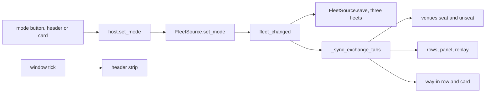

### The card holds the mode row

A mode whose fleet is empty shows the Get Started card and no venue, and the
venue header is the only place the mode buttons were drawn. The card now
holds the three mode buttons under its title, from the same list the venue
header draws, with the same sheets: the active mode wears Live's Privacy
Mode ON sheet and the other two the OFF sheet. The Qt host builds them once
per layer and restyles them on every fleet change; the React page draws them
from the card payload's `mode_buttons`, and a press sends `mode` on the tab's
own ask, which the host hands to `set_mode` as it hands the venue header's
press. The card's buttons are named `sim-mode-<mode>-card`.

`src/gui/simulator/sim_trading_tab_surface.py` — the card's mode buttons

```python
def placeholder_mode_buttons(active: str = sim.MODES[0]) -> list:
    """The card's three mode buttons, ``venue.mode_buttons`` over ``active``
    under ``card_mode_name``, so the card offers the mode choice the venue
    header offers."""
    return [
        {**button, "accessible_name": card_mode_name(button["key"])}
        for button in venue.mode_buttons(active)
    ]
```

### Clear Fleet names the mode

Clear Fleet empties the fleet of the mode in force and keeps the other two.
Its box and its cleared line name the mode.

`src/gui/simulator/sim_trading_tab_surface.py` — the box and the line

```python
CLEAR_FLEET_QUESTION_FORMAT = (
    "Clear the {mode} fleet of {count} bot(s) on {venues}? This cannot be undone."
)
CLEARED_FORMAT = "Cleared {count} bot(s) on {venues}; the {mode} fleet is empty."
```

### The signal a mode press emits

Every mode press emits one row through the emitter network. The row's
`actual` is the mode in force with its held count and venues after the
press; its `expected` is the pressed mode with the count and venues the
source held for it before the press; its context names the outcome, the
mode left and every mode's count. The outcomes are `shown`,
`refused_in_flight` and `unknown_mode`. The two Clear Fleet rows carry the
mode in their context.

`src/gui/simulator/sim_trading_tab_surface.py` — the signal

```python
MODE_SHOWN_SIGNAL = "sim.fleet.mode_shown"
MODE_OUTCOME_SHOWN = "shown"
MODE_OUTCOME_IN_FLIGHT = "refused_in_flight"
MODE_OUTCOME_UNKNOWN = "unknown_mode"
MODE_SHOWN_FORMAT = "{mode} fleet shown: {count} bot(s) on {venues}."
```

### The React wizard is deleted on the GUI thread

Driving the flow on the React build found a crash: a bot created through
the React wizard, then a Battery run, ended the process with a Chromium
thread check, because the wizard's web view was left to Python's garbage
collector, which ran on the Battery's worker thread. The React host now
deletes the wizard through the event loop as soon as it closes, on the GUI
thread, in both the accepted and the cancelled path. The same flow then ran
to its end.

`src/gui/simulator/sim_react_trading_tab.py` — the disposal

```python
            try:
                accepted = wizard.exec() == wizard.DialogCode.Accepted
                config = wizard.get_bot_config() if accepted else {}
            finally:
                # The dialog's QWebEngineView is deleted on this thread by the
                # event loop; a worker thread's garbage collection would abort.
                wizard.deleteLater()
```

### What the fleet-per-mode reading measured

Read off the running program in both builds, over a scratch home holding a
`bot_state.json` of 24 scrumming bots on `coinbase`, one 5m tablet per pair,
four fills per pair in YTD files, one fired gate row per fill, and a scratch
RA root holding the 2022 tablets of BTC, ETH, SPY, QQQ, IWM, GLD and SLV.

Before, one fleet: Import Live Fleet under Validation drew 24 rows, and the
same 24 rows drew under Back Test and Portfolio Battery; Create New Bots
under Back Test made 25 under every mode; Run Portfolio over DIGITAL_GOLD
2022 replaced them with 4 rows on `coinbase` and `yahoo` under every mode;
Clear Fleet under Back Test left every mode empty. The file held one `bots`
map. No card held a mode button, and no `sim.fleet.mode_shown` row existed.

After, three fleets, the same readings in both builds: at open the card with
three mode buttons, Validation active. Import under Validation, 24 rows on
`coinbase`, the way-in row Clear Fleet, Import Live Fleet, Generate From YTD,
Start Run, Spendable $15,470.00, EXCH 1. Back Test pressed on the header: no
venue, no row, the card with Back Test active and Import Live Fleet and
Create New Bots, Spendable an em dash, EXCH 0, one signal row `ok` true, the
line `Back Test fleet shown: 0 bot(s) on no venue.` Create New Bots on the
card through the wizard: one row on `coinbase`. Portfolio Battery pressed:
the card again; Run Portfolio on the card over DIGITAL_GOLD 2022: 4 rows, 2
on `coinbase` and 2 on `yahoo`, both tabs seated, Spendable $2,000.00, EXCH
2. Each mode pressed in turn read its own fleet: 24 rows, 1 row, 4 rows,
each with its way-in row, its strip and its venue tabs, and each press one
signal row with `expected` equal to `actual`. The file held `fleets` with
`bot_count` 24, 1 and 4. Clear Fleet under Back Test: the box read `Clear
the Back Test fleet of 1 bot(s) on coinbase? This cannot be undone.`, the
line `Cleared 1 bot(s) on coinbase; the Back Test fleet is empty.`, the file
24, 0 and 4, the card back with Back Test active; the card's Validation
button pressed drew the 24 rows again, and Portfolio Battery the 4.

A file planted in the old shape, one `bots` map holding one record, drew
that record under Validation and nothing under the other two, with the
line `holds one fleet; read as the validation fleet`, and the first mode
press rewrote it under `fleets`. A file planted with `fleets` naming
`validation`, `back_test` and `paper` drew one row under Validation, one
under Back Test and none under Portfolio Battery, with one warning naming
`paper`, and the first press wrote the three modes without it. Every
watched file, 61 of 61, hashed identical after every step, and a byte
appended to a copy of `bot_state.json` moved the hash. No socket left
loopback.

Six-step counts for the React page: contract members 4 of 4 (the card's
mode buttons, the card's mode row layout, the placeholder order, the tab
ask's `mode`), feeds 2 of 2 (the card payload on every tab draw, the venue
payload on every fleet change), driven and read back 3 of 3 (each of the
three card buttons pressed, and the active sheet, the rows and the file
read after).

Both bundles were built and launched in isolation, with no network and a
scratch home holding two live bots, and driven through Windows UI
Automation. In each: the card at open with its three mode buttons; Import
Live Fleet, two rows, the way-in row; Back Test on the venue header, the
card with Back Test active and its two ways in, the line `Back Test fleet
shown: 0 bot(s) on no venue.`; Validation on the card's own button, the
two rows and Validation's row again; Back Test on the header again, the
card. The file held `fleets` with 2, 0 and 0, and three signal rows landed
per build. The Qt bundle also walked Create New Bots through the wizard's
Next and Finish buttons under Back Test, and the file then held 2, 1 and
0 with the new bot under Back Test; the React wizard's asset pair is a
page control UI Automation does not drive, so Create under Back Test on
the React build is the source-tree reading above. On the bundles, the live
application's own periodic save rewrote `bot_state.json` sixty seconds
after launch with the same two live bots and no sim bot, as it does on
every launch; in the source-tree readings the file hashed identical after
every step.

## The widget the rebuild replaced

Every section from here to the end of the page describes a screen that is
gone: the empty Sim tab, the original Simulator widget with Fleet Replay,
Nuclear Mode and the Bridge, and the first clone units 7 and 8 replaced. Each
is kept whole as the record of what the rebuild replaced, and nothing in them
describes the tab that draws.

## The empty Sim tab before the fork

The Simulator is removed. The tab is named Sim, it opens first on the bar, and
it draws an empty panel with a heading and two sentences. Nothing behind it
runs: no fleet, no replay, no practice venue and no Nuclear Mode. Every section
below this one describes the screen that was removed, and is kept as the record
of what the rebuild replaces.

The panel is the one the Paper, Status and Accumulation tabs already draw. Its
words come from a view model, so the Qt build and the React build say the same
thing.

```python
METHOD = "simulator_tab.state"

HEADING = "Sim"
ISSUE = 117
BUILT = False
STATE_TEXT = "This tab is not built."
ISSUE_TEXT = f"Issue #{ISSUE} carries the build-out."
```

## What builds it

The window constructs the tab and inserts it beside Trading. Three of the four
wiring calls take a lambda, so the exchange connectors, the swarm and the Market
Inspector proposals resolve when they are asked for rather than when the tab is
built. The bot manager is handed over directly.

`src/gui/main_tabs/simulator_tab.py` — `SimulatorTabMixin._build_simulator_tab`
The Simulator rebuild removed this file; it is not in the tree.

```python
        self._simulator = SimulatorTab()
        # _reorder_main_tabs runs after every builder, so index 1 is not the final slot.
        self._main_tabs.insertTab(1, self._simulator, "Simulator")
        if hasattr(self._simulator, "set_connectors_getter"):
            self._simulator.set_connectors_getter(
                lambda: getattr(self, "_exchange_connectors", {})
            )
        if hasattr(self._simulator, "set_bot_manager"):
            self._simulator.set_bot_manager(self._bot_manager)
```

The tab is isolated. The window's header strip hides while the Simulator is in
front, and the tab draws its own strip of the same ten fields against sim
balances.

`src/gui/simulator_tab/sim_stat_strip.py` — `SimStatStrip.FIELDS`
The Simulator rebuild removed this file; it is not in the tree.

```python
    FIELDS = (
        "Spendable",
        "Realised",
        "Locked",
        "Mature",
        "Exch",
        "Scrummed",
        "Folded",
        "Trades",
        "Bots",
        "Errors",
    )
```

The Mode picker names three modes and drives two panels. Nuclear raises its own
page. Validation and Looping Back Test both raise Fleet Replay.

`src/gui/simulator_tab/simulator_tab.py` — `SimulatorTab._on_sim_mode_changed`
The Simulator rebuild removed this file; it is not in the tree.

```python
        key = self.sim_mode()
        stack = getattr(self, "_stack", None)
        if stack is not None:
            # Validation and Looping both drive the fleet page.
            stack.setCurrentIndex(1 if key == "nuclear" else 0)
```

The mode goes no further than the picker. The handler passes the key on only to
a panel that carries a matching setter, and Fleet Replay carries none, so the
two fleet modes run the same replay and the choice changes the hint line alone.

`src/gui/simulator_tab/simulator_tab.py` — the mode hand-off
The Simulator rebuild removed this file; it is not in the tree.

```python
        panel = getattr(self, "fleet_replay", None)
        if panel is not None and hasattr(panel, "set_sim_mode"):
            try:
                panel.set_sim_mode(key)
```

## Fleet Replay

`FleetReplayPanel` in `src/gui/simulator_tab/fleet/fleet_replay_panel.py` is the
panel. Four steps run it.
The Simulator rebuild removed this file; it is not in the tree.

**Load.** The panel builds one real bot for every saved config whose symbol has
a Stone Tablet, and names the symbols it had to skip. The class body is live's
own, so the sim runs live code against a stored tape rather than a second
implementation; the single sim-only branch gives each bot a private event bus,
which is why a sim fill never reaches the live sound engine or the live logs.

`src/gui/simulator_tab/fleet/fleet_replay_panel.py` — `_spawn_sim_fleet`
The Simulator rebuild removed this file; it is not in the tree.

```python
        def _spawn_sim_fleet(self) -> int:
            """Construct a real sim bot for every loaded config.

            Returns the number spawned. Reads the Stone Tablet registry
            through the same call Start Replay uses, rather than adding a
            second candle path.

            The controller is built but NOT started: the bots exist, hold
            their imported state and can be inspected, and the tape only
            advances when the operator presses Start Replay.
            """
```

**Configs.** The loader reads the operator's state file read-only and returns
each bot's saved config. `load_smart_wires_from_state` does the same for the
topology, and `summarize_loaded_configs` reports what loaded. The fleet is never
fabricated; it is whatever that file holds.

`src/simulator/fleet/bot_state_loader.py` — `load_bot_configs_from_state`
The Simulator rebuild removed this file; it is not in the tree.

```python
def load_bot_configs_from_state(
    path: Optional[Path] = None,
    mode_filter: Optional[str] = "scrumming",
) -> list[dict[str, Any]]:
```

**Fetch.** Fetch YTD calls the same history function the History tab's Refresh
calls, so the two return the same trades. A replay still runs without it, and
the panel then says on screen that the run is synthetic.

`src/gui/simulator_tab/fleet/fleet_replay_panel.py` — `_on_fetch_ytd_clicked`
The Simulator rebuild removed this file; it is not in the tree.

```python
        def _on_fetch_ytd_clicked(self) -> None:
            """Call the same function the History tab calls.

            The History tab's Refresh dispatches
            ``fetch_all_history_chunked(bot_manager, since_ts)``. No custom
            enumeration, no exchange matching, no connector picking: if the
            History tab returns N trades, Fleet Replay returns the same N.
            """
```

**Run.** `FleetReplayController` in
`src/simulator/fleet/fleet_replay_controller.py` drives it.
The Simulator rebuild removed this file; it is not in the tree.

| Piece | What it does |
| ----- | ------------ |
| `_build_sim` | Assembles the bots and the tape |
| `sim_bot_id`, `live_bot_id` | Keep the two id spaces apart |
| `_on_sim_trade` | Records each fill |

One assertion runs once, at the point where the bot set is final and before any
of them can trade.

`src/simulator/fleet/fleet_replay_controller.py` — `_assert_capital_isolation`
The Simulator rebuild removed this file; it is not in the tree.

```python
    def _assert_capital_isolation(self) -> None:
        """Every constructed sim bot must be off the live registry.

        The guards upstream -- the factory raising, `_instantiate_bot`
        refusing, `_crr()` returning None in sim mode -- each protect
        one path. This checks the outcome they exist to produce, once,
        at the point where the bot set is final and before any of them
        can trade. Aborts the run rather than let a replay write sim
        reservations into the operator's live capital state.
        """
```

The bots trade against a tape, not against a venue. `TabletBackend` implements
the ccxt surface beneath a real connector, holds the seeded balances, sweeps
resting orders, and owns the one clock every symbol advances on.

`src/simulator/fleet/fleet_replay_controller.py` — the tape the bots are handed
The Simulator rebuild removed this file; it is not in the tree.

```python
        # TabletBackend implements the ccxt surface beneath a real CCXTConnector.
        self._tape = TabletBackend(
            {
                sym: [list(r) for r in rows]
                for sym, rows in self._candles_by_symbol.items()
            },
            balances=dict(seed_by_quote),
            fee_rate_by_symbol=_fees,
        )
        _conn = CCXTConnector("coinbase")
        _conn.attach_backend(self._tape)
        self._exchange = _conn
```

Three more modules sit beside the controller and none of them runs a replay. The
older fake exchange is built only by tests, the union clock is constructed only
inside that exchange, and the candle series a replay builds is thrown away once
its symbol names have been read.

`src/simulator/fleet/sim_exchange.py` — `FleetSimExchange`
The Simulator rebuild removed this file; it is not in the tree.

```python
"""Candle-driven fake exchange for Fleet Replay, over real symbols.

Serves per-symbol ``CandleSeries`` through the ``ExchangeInterface`` API,
so a bot trades BTC/USD or ETH/USD against stored candles instead of a
venue. ``NuclearSimExchange`` (``src/simulator/nuclear_sim_exchange.py``)
is the other simulated venue and serves synthetic TAPEA/TAPEB symbols.
The Simulator rebuild removed this file; it is not in the tree.

Reachability: nothing under ``src/`` constructs ``FleetSimExchange``.
``FleetReplayController`` imports only ``make_symbol_series_map`` from
this module and runs against ``TabletBackend``
(``src/exchange/tablet_backend.py``). The class itself is built by tests.
```

`ReplayProgress` carries candles played, trades fired and tick failures back to
the panel's progress timer, and a finished run is written under the log root in
the live schema.

`src/trading/sim_run_log.py` — `SimRunLog`
The Simulator rebuild removed this file; it is not in the tree.

```python
"""Persist a Fleet Replay run under ~/.acervator_logs/sim/ in the live schema."""
```

Two bot tables draw at once. The Trading tab's own table is mounted into the
Simulator, and the fleet panel's three-column table is still built and still
filled. Collapsing the two is the first of the seven pieces of issue #117.

`src/gui/simulator_tab/fleet/fleet_replay_panel.py` — `FleetReplayPanel.COLUMNS`
The Simulator rebuild removed this file; it is not in the tree.

```python
        # Three columns. The gate row lives in GateStatusPanel, not here.
        COLUMNS = ("Symbol", "Target USD", "Sim Trades")
```

## The validation criterion

The Simulator is validated when the gates latch identically on the same data.
Not profit and loss, and not the trade count.

No module measures that. Nothing in the tree reads a sim gate latch and a live
gate latch and compares the two.

In development.
Validation Mode measures it now; the section at the end of this page states how.

What the screen does show is each bot's arm state while the tape runs. On every
refresh tick the panel reads each bot's last gate state and paints a
double-stacked row of lights, ten scrum then nine fold.

`src/gui/simulator_tab/fleet/sim_visuals.py` — `GateLightsCell`
The Simulator rebuild removed this file; it is not in the tree.

```python
    class GateLightsCell(QWidget):
        """One linear labelled row of trading gates.

        ``_draw_bank`` paints the ten ``_GATE_ORDER_SCRUM`` lights then the
        nine ``_GATE_ORDER_FOLD`` lights, each below its own label.
        ``gate_light_color`` picks every colour, and ``update_gates`` sets the
        arm and blocker state ``paintEvent`` reads.
        """
```

That cell and the History table's gate cell read one vocabulary, so the two
surfaces cannot drift apart on what a gate is called or on what blocked it.

`src/trading/gate_vocabulary.py` — the shared labels

```python
"""gate_vocabulary.py -- the bot's gate labels, blocker map and light states.

Qt-free. Two renderers read it: the Simulator's ``GateLightsCell``
(``src/gui/simulator_tab/fleet/sim_visuals.py``) and the History table's
gate cell (``src/exchange/history_read_contract.py``). One vocabulary,
so a gate added on one surface cannot be missing from the other.
```
The Simulator rebuild removed this file; it is not in the tree.

After a run the panel matches each live trade to the nearest sim fill on the
same symbol and side, and prints the result into the Performance log. That is a
report on trade counts and timing. It is not the criterion above.

`src/trading/stone_tablets/parity_harness.py` — `compare_trades`

```python
def compare_trades(
    live_trades: list[dict],
    sim_trades: list[Any],
    tolerance_s: float = DEFAULT_TOLERANCE_S,
    window_since_ts: float = 0.0,
    window_until_ts: float = 0.0,
) -> ParityReport:
```

The panel puts the honest label on screen. A run with no live trades loaded is
comparable to nothing, and the panel says so rather than looking like a parity
run.

`src/gui/simulator_tab/fleet/fleet_replay_panel.py` — `_note_parity_state`
The Simulator rebuild removed this file; it is not in the tree.

```python
        def _note_parity_state(self) -> None:
            """Say so when the run cannot be compared to live.

            ``_ytd_trades`` being empty is the NORMAL condition, and the panel
            said nothing about it, so a synthetic run looked exactly like a
            parity run on screen.
            """
```

`SimValidationGuard` names five conditions under which a run cannot be trusted.
The last two halt immediately whatever their count. The guard is defined and
covered by tests, and no module under `src/` calls it.

`src/trading/sim_validation_guard.py` — `ValidationIssueType`
The Simulator rebuild removed this file; it is not in the tree.

```python
class ValidationIssueType:
    NO_TABLET = "no_tablet"
    PRE_LISTING = "pre_listing"
    UNRESOLVABLE_TS = "unresolvable_timestamp"
    SCHEMA_DRIFT = "schema_drift"
    ADDRESS_MISMATCH = "address_mismatch"
```

The voting readout beside the fleet can fill itself with invented numbers. Three
seconds after the tab is built, with no bot yet in its selector, it runs the real
voting engine over a seeded random walk and draws the vote. On the Simulator that
is the normal state until a fleet loads, so the panel can read as a result when
it is a placeholder.

`src/gui/indicator_panel.py` — `IndicatorVotingPanel._generate_demo_ta`

```python
        def _generate_demo_ta(self):
            """Generate demo TA from synthetic candles.

            Gated by ``_may_fabricate()``. Produces a deterministic
            random walk (``seed = md5(bot_id)``) and runs the real
            VotingEngine over it, labelled with the real bot's symbol
            so the panel stays stable across refreshes.
            """
```

## Nuclear Mode

`NuclearModePanel` drove the controller. The controller looped the same
state-file fleet over the tablet window until stopped, recording each cycle so a
late failure traced back to the cycle that produced it. Start needed the
window's async loop; without it the panel said so and no soak began.
The operator cancelled Nuclear Mode and the rebuild deleted its code, so none of
the files this section names is in the tree.

`NuclearFleetController`, in the Simulator package the rebuild deleted

```python
class NuclearFleetController:
    """Loops the bot_state fleet over Stone Tablet history until stopped.

    GUI-agnostic: all operator-visible output goes through the callbacks,
    so this is testable without Qt.
    """
```

The market structure varied per loop, and nothing on disk was touched.

`noised_series`, in the candle source the rebuild deleted

```python
def noised_series(
    rows: list,
    seed: int,
) -> tuple[list, float]:
    """Return ``(noised_rows, noise_pct)`` for one pass over *rows*.

    A ``_Tape`` seeded from *seed* perturbs a copy through ``_at``; *rows* is
    left as it was and nothing here touches disk.
    """
```

A second oscillator supplied the load pulse, and it was capped while its cooling
regime held, because the pulse shared a machine with the live trading engine.
That module is still in the tree and nothing constructs it.

`src/core/system_load_oscillator.py` — `SystemLoadOscillator`

```python
class SystemLoadOscillator:
    """Dual oscillator for Nuclear Mode tick rate and per-tick workload.

    ``start`` takes the monotonic reference and spawns the COOLING
    daemon; ``stop`` joins it and is idempotent. ``current_multiplier``
    returns ``BASE_MULTIPLIER`` before ``start``.
    """
```

`set_swarm_hooks` connected the controller to three methods on the Swarm tab,
which is how a nuclear run drew its rows in the sim layer of that swarm.
`set_topologies` replayed a Market Inspector proposal shape across the sim bots.
Neither name is in the tree now.

| Hook | Fires when |
| ---- | ---------- |
| `register_sim_run` | A run starts |
| `update_sim_run` | A cycle reports |
| `stop_sim_run` | The run ends |

The panel's own visuals stayed empty for a whole run. It fed the shared price
chart and the shared voting readout from four fields — the symbol, the last
price, the last volume and the voting summary — and the controller's snapshot
carried none of them.

`NuclearFleetController.snapshot`, in the controller the rebuild deleted

```python
    def snapshot(self) -> dict:
        """Return the GUI panel's polled view of this soak."""
        s = self.state
        return {
            "running": s.running,
            "uptime_seconds": s.uptime_s,
            "fleet_size": s.fleet_size,
            "symbols": s.symbols,
            "cycles_completed": s.cycles_completed,
            "current_cycle": s.current_cycle,
            "noise_pct": s.noise_pct,
            "wires_loaded": len(self._smart_wires),
            "total_candles": s.total_candles,
            "total_trades": s.total_trades,
            "total_exceptions": s.total_exceptions,
            "load_multiplier": s.load_multiplier,
            "cooling": s.cooling,
            "load_sensed": self._sensed,
            "last_error": s.last_error,
            "failed_cycles": sum(1 for c in s.cycles if not c.ok),
        }
```

Nuclear was not a validator. It was to run after trade-logic alignment was
earned, its noised tape was deliberately not history, and its criteria were
coverage and survival. The operator cancelled it before that point was reached.

`NuclearModePanel`, in the panel the rebuild deleted — what it was for

```python
NOT A VALIDATOR. Nuclear runs AFTER trade-logic alignment is proven on
the real tablets, and its noised tape is deliberately not history, so
nothing here compares its output to YTD or live. Its criteria are
coverage and survival.
```

`NuclearController` was the earlier
single-tape prototype: one scout bot walking one tape. Nothing under the source
tree constructed it, and it stayed because both controllers shared the noise
source.

`NuclearModePanel`, in the panel the rebuild deleted — why the prototype stayed

```python
`nuclear_controller.py` and `nuclear_candle_source.py` are deliberately
NOT deleted: the latter owns `noised_series`, which v2 depends on for
exactly the market-structure noise above.
```

That comment recorded the state before the cancellation. Every file named in
this section was deleted with the rest of the old Simulator, and no Nuclear Mode
runs.

## Bridge

Five methods are registered for this screen, and the renderer modules carry the
matching names. They serve the Electron frontend; the tab the operator runs
today is drawn in Qt.

| Bridge method | Serves |
| ------------- | ------ |
| `simulator_tab.state` | The tab, its mode switcher and its table |
| `fleet_replay_panel.state` | Fleet Replay |
| `nuclear_mode_panel.state` | Nuclear Mode |
| `sim_stat_strip.state` | The tab's own ten-field strip |
| `sim_visuals.state` | The gate lights and the sim charts |

`src/core/desktop_bridge.py` — `build_registry`

```python
def build_registry() -> Dict[str, Handler]:
    """Return the methods the frontend may call, keyed by method name.

    This is the wiring point for the whole frontend: a surface is
    reachable exactly when it appears here. Surfaces are imported inside
    the function so that the transport above carries no dependency on any
    one domain package.
    """
```

## 2026-09-08 08:17 - #117 - what the closed issues landed

The old Simulator was removed and the rebuild replaced it. The tab is named Sim,
it opens first on the bar on a black ground, and it draws a clone of the Live
tab reading Stone Tablets. It carries three modes — Validation, Back Test and
Portfolio Battery — and Nuclear Mode is cancelled. The rest of this section
describes the screen that was removed and is kept as the record of what the
rebuild replaces.

```python
def _build_simulator_tab(self) -> None:
    """Insert the Sim tab at ``SIMULATOR_BUILD_INDEX``."""
    self._add_empty_tab(simulator, index=SIMULATOR_BUILD_INDEX)
```

The tab stacks two panels. Fleet Replay loads every bot from the operator's own
state file, builds one real bot per config, and plays Stone Tablet candles
through them against a fake exchange. The sim uses the bot class body
unchanged, which is the parity guarantee: it runs live's code against a fake
exchange rather than a second implementation.

The tab is now called Sim. It sits first on the bar, on a black ground
with red text.

`src/gui/simulator_tab/fleet/fleet_replay_panel.py` — `_spawn_sim_fleet`
The Simulator rebuild removed this file; it is not in the tree.

```python
def _spawn_sim_fleet(self) -> int:
    """Construct a real sim bot for every loaded config.

    Returns the number spawned. Reads the Stone Tablet registry
    through the same call Start Replay uses, rather than adding a
    second candle path.
```

The criterion is the gates latching identically on the same data. Not profit
and loss, and not the trade count. The sim's gate cell reads the same
vocabulary the History table reads, which stops the two surfaces drifting
apart.

`src/gui/simulator_tab/fleet/sim_visuals.py` — `GateLightsCell`
The Simulator rebuild removed this file; it is not in the tree.

```python
class GateLightsCell(QWidget):
    """One linear labelled row of trading gates.
```

Nuclear Mode looped the same fleet over the tablet window with per-cycle market
noise and a load pulse, writing over no tablet. It stood as a soak test,
judged on coverage and survival, and it compared nothing to live. The operator
cancelled it, its code is deleted, and the Sim tab has three modes, not four.


The strip along the top replaces the window's own while this tab is active. It
names the same ten readings against sim balances, and every one draws an em
dash in the figure, because no fleet is loaded.

React draws that strip. The tab asks `variant_surface` which of the two strips
to build, and both answer the same `set` and `clear` calls, so the fleet panel
and Nuclear Mode write to either without knowing which they hold.

`src/gui/simulator_tab/simulator_tab.py` — `SimulatorTab._build_stat_strip`
The Simulator rebuild removed this file; it is not in the tree.

```python
from ..variant_surface import SIM_STAT_STRIP, surface_class

return surface_class(SIM_STAT_STRIP)(self)
```

`SimStatStripWebStrip` holds `SimStatStripModel` where the Qt strip held ten
label pairs, and draws it with `sim_stat_strip.js` in one `QWebEngineView`. A
field name the strip does not carry is still ignored, and an empty value still
falls back to the em dash. Setting `ACERVATOR_VARIANT` to `qt` builds the Qt
strip instead, unchanged.

React drew the Nuclear Mode page too, before the rebuild deleted both. The tab
asked the same seam for the panel class that it asked for the strip.

`src/gui/simulator_tab/simulator_tab.py` — `SimulatorTab._nuclear_panel_class`
The Simulator rebuild removed this file; it is not in the tree.

```python
from ..variant_surface import NUCLEAR_MODE, surface_class

return surface_class(NUCLEAR_MODE)
```

`NuclearModeReactPanel` inherits the Qt panel, so the fleet preview, Start,
Stop and the half-second status tick are one piece of Python on both sides.
Every widget write moved behind a named accessor. The Qt panel answers those
with labels, spin boxes and tick boxes; the React panel answers them by
writing into its view model and redrawing the page.

`src/gui/react_nuclear_mode_panel.py` — `NuclearModeReactPanel._set_status_text`
The Simulator rebuild removed this file; it is not in the tree.

```python
def _set_status_text(self, key: str, text: str) -> None:
    """Show ``text`` on the live-status row ``key`` names."""
    if key in self._panel.status_text:
        self._panel.status_text[key] = text
        self.push()
```

The page draws the header card, the fleet readout, the four run settings, the
Start and Stop buttons and the seventeen live-status rows. A press on the page
runs the inherited Python and comes back as a redraw. Setting the variant to
`qt` builds the Qt panel instead, unchanged.

The two drawn panels follow the same route. `SimPriceVwapChartReact` inherits
the price and VWAP chart, so the ticks, the thinning and the trade markers stay
one piece of Python, and `GateStatusPanelReact` inherits the gate pane.

`src/gui/simulator_tab/simulator_tab.py` — `SimulatorTab._price_chart_class`
The Simulator rebuild removed this file; it is not in the tree.

```python
from ..variant_surface import SIM_PRICE_CHART, surface_class

return surface_class(SIM_PRICE_CHART)
```

Neither panel is redrawn in JavaScript. Python builds the whole draw program —
every line, box, dot and label, with its colour and its position — and
`sim_visuals.js` runs that program on one canvas. The picture is decided on the
Python side, so the two builds cannot draw different charts from the same ticks.

`src/gui/main_tabs/sim_visuals_surface.py` — `chart_program`
The Simulator rebuild removed this file; it is not in the tree.

```python
if not model.symbols:
    return []
if model.focus:
    return focused_program(model, width_px, height_px)
return band_program(model, width_px)
```

The gate pane draws one labelled row per bot and nineteen lights on each, and a
gate reading written from Python changes what those lights show. An empty pane
still says "No fleet loaded."

The Fleet Replay page is the last of the four. `FleetReplayReactPanel` inherits
the Qt panel, so Load live fleet, Fetch YTD, Reset, Start Replay, Stop and both
timers are the same Python. Every widget write the panel used to make moved
behind a named accessor, and the React panel answers those by writing into its
view model.

`src/gui/simulator_tab/simulator_tab.py` — `SimulatorTab._fleet_replay_class`
The Simulator rebuild removed this file; it is not in the tree.

```python
from ..variant_surface import FLEET_REPLAY, surface_class

return surface_class(FLEET_REPLAY)
```

A press on the page names its own action. The panel maps that name to the
method the Qt button was wired to, looked up on the panel itself, so the two
sides run one piece of code.

`src/gui/react_fleet_replay_panel.py` — `FleetReplayReactPanel.run_action`
The Simulator rebuild removed this file; it is not in the tree.

```python
step = surface.ACTIONS.get(str(request.get(ACTION_KEY) or ""))
named = self.STEP_RUNNERS.get(step)
if named is not None:
    getattr(self, named)()
```

Everything else on this tab is still drawn by Qt.

Mode is the picker beside it. Three modes, each with its own line saying what
it collects.

`src/gui/simulator_tab/simulator_tab.py` — `SimulatorTab.SIM_MODES`
The Simulator rebuild removed this file; it is not in the tree.

```python
SIM_MODES = (
    (
        "Validation",
        "validation",
        "Stone Tablets paired with YTD data. Verifies trade-gate "
        "parity at documented events.",
    ),
    (
        "Looping Back Test",
        "looping",
        "Loops the tablets with market-restructuring noise at a fixed "
        "rate. Strategy development and calibration.",
    ),
    (
        "Nuclear",
        "nuclear",
        "Load oscillation, swarm injection and high-traffic smart "
        "wire. Measures performance, stability and reliability — not "
        "trade validity.",
    ),
)
```

The table under it is the same class the Trading tab uses, with the same ten
columns and a privacy dot on each header.

Column 2 is now Current Position Value, priced from the exchange, and the state
colour it used to carry sits on the Bot ID cell. The Trading tab page describes
both — see [The bot tables](06-trading-tab.md).

`src/gui/widgets/bot_status_table.py` — `BotStatusTable.SCRUMMING_COLUMNS`

```python
SCRUMMING_COLUMNS = ColumnSpec(
    labels=(
        "Bot ID",
        "Symbol",
        "Mode",
        "Trades",
        "Target",
        "Target BTC",
        "Target ETH",
        "Ammo",
        "Fire",
        "",
    ),
```

Fleet Replay fills the left column. Load live fleet builds the bots, Fetch YTD
pulls the year of live trades the run is compared against, and Reset clears
both. Full evaluation widens the run. The line beside the buttons counts the
trades and symbols the History tab front-loaded. Loaded fleet carries three
columns: Symbol, Target USD and Sim Trades, and the last of those increments
during a run. The progress label reads `Replay idle` until Start Replay runs,
and Stop drains the current tick and exits.

The panel says so out loud when a run cannot be compared to live, rather than
letting a synthetic run look like a parity run.

`src/gui/simulator_tab/fleet/fleet_replay_panel.py` — `_note_parity_state`
The Simulator rebuild removed this file; it is not in the tree.

```python
def _note_parity_state(self) -> None:
    """Say so when the run cannot be compared to live.
```

The right column stacks two panels, each with its own Expand button. The first
charts historical price against position VWAP for the bot its picker names,
drawn from that bot's Stone Tablet candles. The second is the same Indicator
Voting Panel the Trading tab carries: a bot picker, the vote count badge, the
TF Lock, the currency rate line, then the first six voters — BB, VTX, MACD,
SRsi, Ichi and Vol — with Net, Comp and Conf, and the confidence bars under
them. The remaining six, Sling, ADX, STrd, ZSc, KER and RSI, sit below the area
the figure shows.

Simulator Log and Gate Status close the tab. Gate Status draws the same
nineteen lights the History table draws, and `No fleet loaded.` stands in its
place until a fleet loads.

### What is on the tab now

The rebuild's first tab is on the bar. It is a clone of the Trading tab reading
Stone Tablets: the bot list with the live table's own ten columns, the Indicator
Voting Panel, and a second layer holding the VWAP window over the tablet
playback window, with one button between them. The crypto news ticker and the
data pool line are not copied, and the rows they held stay empty for Import Live
Fleet and Generate From YTD.

`src/gui/main_tabs/simulator_tab_surface.py` — the candle window

```python
#: The candle window live reads. ``ScrummingBot`` asks ``get_ohlcv`` for 100,
#: and the Simulator reads the same count off the tablet.
WINDOW_CANDLES = 100
```

The Simulator receives and asks; it never sends. Its one data path reads tablet
files, holds no venue, and refuses by name anything that is not a read.

### The buttons that start a Validation run

Those two rows now carry the buttons that start a run. Validation snaps each YTD
trade to the historical candle its timestamp falls in, reruns the gates on that
candle, and puts the gate row it latched beside the gate row the log recorded.
It passes when the gates latch identically, and it is never judged on profit or
on a trade count.

```
Import Live Fleet    38 bots from the bot_state load, matched by bot id
Generate From YTD    39 new bots, one per traded pair, matched by pair
```

A run always reports what it could not verify. The tablets end on 1 August 2026
and the trade export runs to 7 September, so about five weeks of trades have no
candle to snap to. The pane names that period and counts the entries on both
sides of it.

```
3942 of 4904 YTD entries snapped to a candle; 962 could not be.
uncovered span 2026-08-01T18:52:58Z to 2026-09-07T21:46:48Z
```

## The first clone, before the fork

The Sim tab is a clone of the Trading tab, and its data source is the Stone
Tablets on disk. It carries the bot list, the Indicator Voting Panel, and a
second layer holding the VWAP window over the tablet playback window. One
button flips the panel area between those two layers.

`src/gui/main_tabs/simulator_tab_surface.py` — the two layers and the button

```python
LAYER_INDICATORS = "indicators"
LAYER_PLAYBACK = "playback"
LAYERS = (LAYER_INDICATORS, LAYER_PLAYBACK)

FLIP_BUTTON_TEXT = {
    LAYER_INDICATORS: "Show Playback",
    LAYER_PLAYBACK: "Show Indicators",
}
```

One model is built from the tablet, and both builds draw it.

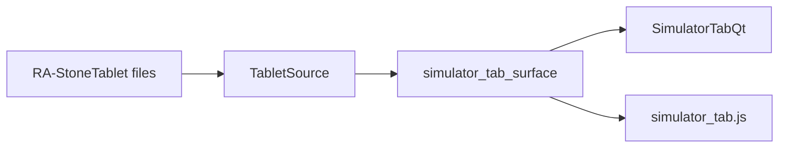

### It receives and asks. It never sends.

The Simulator's whole data path is one class that reads tablet files. It holds
no venue and defines no write. It answers five names and refuses every other
name itself, so a send cannot be expressed through it.

`src/simulator/tablet_source.py` — the refusal

```python
    def __getattr__(self, name: str):
        """Refuse every name outside ``READ_NAMES``."""
        raise SendRefused(
            f"TabletSource answers {READ_NAMES} and cannot {name!r}. "
            "The Simulator receives and asks; it sends nothing."
        )
```

Asked for nine venue calls — an order, a market buy, a cancellation, an edit, a
withdrawal, a leverage change, a transfer, a tablet write and a save — it
refused all nine and answered every read.

### The columns are the Trading tab's own

The bot list draws the ten columns the live table draws, and the same two fixed
widths, because the surface imports them rather than restating them. A column
added to the live table appears here with no second edit.

```python
from .bot_status_table_surface import COLUMN_LABELS, FIXED_WIDTHS
```

No simulated fleet exists yet, so the list holds no rows and says why. Import
Live Fleet and Generate From YTD are what fill it, and both are later units.

### One candle window, on both sides

The live engine asks the venue for one hundred candles. The Simulator reads the
last hundred rows off the tablet, so the indicator window is one number on both
sides rather than two.

```python
#: The candle window live reads. ``ScrummingBot`` asks ``get_ohlcv`` for 100,
#: and the Simulator reads the same count off the tablet.
WINDOW_CANDLES = 100
```

The live engine now receives that hundred, and the newest row in it is the bar
that just closed. The connector sends the count in the exchange library's count
slot. Until this change it sent the count in the start-time slot and left the
count slot empty, so the venue answered with a page of its own and the library
kept the oldest 300 rows of it. Every indicator then read a window ending 50
five-minute bars behind the price the gate compared it against. That is four
hours and ten minutes.

`src/exchange/ccxt_connector.py` — four arguments, each in its own slot

```python
data = await self._call_sync(
    self._ex.fetch_ohlcv,
    symbol,
    timeframe,
    None if since is None else int(since),
    int(limit),
)
```

The library's own slice was driven over 1,215 recorded five-minute pages. The
window ended 50 bars early on every page before the change and on none after it.
On 162 rows of the recorded gate log, the band latch differs between the stale
window and the current one on 88.

### The VWAP window

VWAP is the published cumulative figure: typical price times volume, running,
divided by running volume, where typical price is the average of the high, the
low and the close. A point with no volume behind it yet carries nothing rather
than a number.

```python
def vwap_series(candles: Sequence[Sequence[float]]) -> list[Optional[float]]:
    """Cumulative ``sum(typical_price * volume) / sum(volume)`` per row.

    A row whose cumulative volume is still zero carries None.
    """
```

### The two strips that are not copied

The crypto news ticker and the data pool line are not on this tab, and their
code is not carried into it. A live news feed and a live cache-health line
describe nothing a tablet reader does. The rows they held keep their height and
hold nothing, and that space is where Import Live Fleet and Generate From YTD
go.

```python
#: The rows the two strips held on the Trading tab, and the height each keeps.
RESERVED_ROWS: tuple[dict[str, Any], ...] = (
    {"name": "news_ticker_row", "height_px": 24},
    {"name": "data_pool_row", "height_px": 18},
)
```

### With no tablet on disk

The tab draws an empty state and names what is missing. The panel reads
`No TA data — No Stone Tablet on disk.`, the selector holds nothing, and both
windows hold zero points. Nothing is invented in place of the missing tape.

### What one run measured

Both builds were opened and read off the drawn window and the drawn page. The
figures below come from that run.

```
tablet          XRP_1d_2026_coinbase, 250 candles, 2026-01-01 to 2026-09-07
window          100 candles
tablets listed  411
votes           5 bullish, 2 bearish, 5 neutral
Qt to React     32 of 32 values matched, with a tablet and again with none
```

### The line beside the voting panel title

One label sits beside the Indicator Voting Panel title. It holds the panel's
empty state and nothing else. `no_data_text` builds that line from the panel
model and answers an empty string while the model holds a reading, so the label
is hidden whenever the panel has values to draw.

`src/gui/main_tabs/indicator_panel_surface.py` — the line the label draws

```python
def no_data_text(multi_tf_summary: dict, message: str) -> str:
    """``message`` through ``NO_DATA_FORMAT``, or empty while a summary exists."""
    summary = multi_tf_summary if isinstance(multi_tf_summary, dict) else {}
    if summary or not message:
        return EMPTY_TEXT
    return NO_DATA_FORMAT.format(message=message)
```

Both builds draw the same line. The Qt clone sets the label and hides it when
the line is empty. The page module writes the same value into the element that
carries the same name.

`src/gui/simulator_tab.py` — the Qt clone draws the line

```python
def _draw_indicators(self, panel: dict) -> None:
    self._indicator_title.setText(panel["title_text"])
    # no_data text is empty while the panel holds a reading, so the
    # summary label shows only the one reason there is nothing to draw.
    reason = panel["no_data"]["text"]
    self._indicator_summary.setText(reason)
    self._indicator_summary.setVisible(bool(reason))
    for table, spec in zip(self._indicator_tables, panel["tables"], strict=True):
        self._fill_indicator_table(table, spec)
```

With no tablet on disk the label reads the sentence this page already names,
under both builds.

```
No TA data — No Stone Tablet on disk.
```

## The style sheet the Sim page loads

The page carries one style sheet. `TAB_STYLE_ASSETS` names it, and
`page_html` reads the file and writes it into the page's head.

`src/gui/react_simulator_tab.py` — the sheet the page carries

```python
TAB_STYLE_ASSETS: tuple[str, ...] = ("simulator_tab.css",)
```

The sheet sets the page ground, the type, the pane grid and the table rules.
The grid repeats the three pane sizes the Qt clone gives its splitters, so the
bot list, the layer pane and the bottom pane take the same share of the window
in both builds.

`src/gui/web/simulator_tab.css` — the pane grid

```css
.acervator-simulator-tab {
  display: grid;
  grid-template-columns: 600fr 500fr;
  grid-template-rows: 500fr 350fr;
  grid-template-areas:
    "fleet layer"
    "bottom bottom";
}
```

Without the sheet the page draws on the browser's own defaults: a white ground,
serif type, one column and no grid.

### The skin tokens the sheet reads

The sheet names no colour of its own. Every colour arrives as a custom property
on the tab element, written from the `SKIN` dictionary the surface builds.

`src/gui/main_tabs/simulator_tab_surface.py` — three of the skin entries

```python
SKIN = {
    "--sim-ground": ds.SURFACE_0,
    "--sim-better-colour": ds.SUCCESS,
    "--sim-agrees-colour": ds.SUCCESS,
}
```

A better portfolio row and an agreeing light take the same colours the Qt clone
paints them, because both builds read one dictionary.

### The two battery selectors reach the page

The portfolio and the span the operator chooses now reach the page before a
battery has run. `build_view_model` takes both and hands them to
`empty_battery`, which carries them into the payload the selectors draw from.

`src/gui/main_tabs/simulator_tab_surface.py` — the idle battery payload

```python
charged = battery_payload_held or empty_battery(portfolio, span)
```

Both builds pass the two values. Before this the idle payload named the
defaults, so a chosen portfolio was lost until a run wrote it back.

## Crypto tablets are 5m and each bot walks the timeframe its tablet carries

The RA store holds two kinds of tablet beside each other under one MANIFEST.
A non-crypto asset keeps its daily file, `GLD_1d_2025_yahoo.json`, written by
the daily builder as before. A crypto asset gains a native five-minute file,
`BTC_5m_2026_coinbase.json`, the same shape the live fleet's store keeps, keyed
on asset, timeframe, year and exchange by the same `tablet_filename`. The
Battery reads a crypto bot off the 5m file and a non-crypto bot off the daily
file, and the report names which one each bot read, with its timeframe, candle
count and checksum. The operator's words, 2026-09-18: *"Crypto Tablets being
daily is a failure. Must be 5m resolution. Cannot match trading logic for 5m
against 1d charts."*

`src/simulator/portfolio_battery.py` — the timeframe each asset's tablet carries

```python
def tablet_timeframe_for(asset: str) -> str:
    """The timeframe ``asset``'s RA tablet carries: ``CRYPTO_TABLET_TIMEFRAME``
    for a crypto asset, else ``TABLET_TIMEFRAME``."""
    return CRYPTO_TABLET_TIMEFRAME if is_crypto(asset) else TABLET_TIMEFRAME
```

### One registry shape, one rollup

The RA store reuses the live registry. `StoneTabletsRegistry` opened on the RA
root reads the RA MANIFEST as it stands, indexes every daily row and every 5m
row, writes a 5m tablet through the same `ingest_candles` the live store uses,
and rolls 5m candles up to any higher timeframe it supports through its one
`_rollup`. Nothing in the registry changed; the Battery calls it on a second
root. The daily side keeps its own fold: `resample` still builds a weekly and a
monthly bar from daily rows, because the registry does not roll up to a week
or a month.

`src/simulator/portfolio_battery.py` — the per-bot read

```python
    def bars(self, bot: SimBot, timeframe: str) -> list[list[float]]:
        """``bot``'s bars at ``timeframe`` inside the span: a refused asset
        answers none, a crypto bot reads ``registry().get_candles`` on
        ``CRYPTO_EXCHANGE``, and a non-crypto bot ``resample`` over ``rows``."""
        asset = bot.asset
        if self.refusal(asset):
            return []
        if not is_crypto(asset):
            return resample(self.rows(asset), timeframe)
        if str(timeframe) not in SUPPORTED_TIMEFRAMES:
            return []
        if self._end_ms <= self._start_ms:
            return []
        return self.registry().get_candles(
            asset,
            self._start_ms,
            self._end_ms - 1,
            timeframe=str(timeframe),
            exchange_id=CRYPTO_EXCHANGE,
        )
```

### The timeframes a bot walks

A crypto bot walks its own timeframe first, on the native 5m candles, then
each of the Battery's three timeframes the registry can roll 5m up to. That is
`1d`; `1w` and `1M` are outside the registry's supported set, so a crypto bot's
walk is `5m` then `1d`. A non-crypto bot walks `1d`, `1w` and `1M` folded from
its daily file, as before. A mixed portfolio reports four timeframes and each
row names which bots reached it. Read against Live: the live bot's gate chain
ticks its own timeframe, 5m on every one of the operator's thirty-eight bots,
and its phantoms read higher timeframes from the venue; the Simulator's rollup
is the registry's, so the Simulator and Live read the same hour from two
sources, and the Back Test's phantom timeframes are unit 37's.

`src/simulator/portfolio_battery.py` — the set

```python
def bot_timeframes(bot: SimBot, timeframes: Sequence[str] = TIMEFRAMES) -> tuple:
    """The timeframes the walk evaluates ``bot`` at: a crypto bot its own
    ``ta_timeframe`` on the native ``5m`` tablet and then each of
    ``timeframes`` in ``SUPPORTED_TIMEFRAMES``, the ones the registry rolls
    ``5m`` up to; a non-crypto bot ``timeframes`` as given, folded from its
    daily tablet."""
```

### The chooser states the cost before the press

Run Portfolio's chooser carries one more line under the portfolio and span
combos. It reads the preflight for the choice in force: for each crypto asset
of the portfolio, the 5m candles the RA root does not hold over the span, the
chunks and venue calls the fetch will make, and the bytes at the measured 63
bytes a stored candle. The line changes with every combo change. OK is the
consent and nothing else asks. Over three crypto assets on the `2026 test
run` span the line reads about 49,000 candles an asset, 846 calls and 9.3 MB;
over `All` it reads 703,296 candles an asset, and the operator decides.

`src/simulator/tablet_retrieval.py` — the cost of one asset

```python
def retrieval_cost(
    registry: StoneTabletsRegistry,
    asset: str,
    exchange_id: str,
    since_ms: int,
    until_ms: int,
) -> RetrievalCost:
    """The ``RetrievalCost`` of ``asset`` on ``exchange_id`` over
    ``[since_ms, until_ms]``: every ``TIMEFRAME`` step ``registry.missing_ranges``
    reports, through ``adapter_for``'s ``chunk_limit`` and ``PAGE_ROWS``; an
    exchange with no adapter costs nothing and is refused at the press."""
```

`src/gui/simulator/sim_exchange_choice.py` — the line on the chooser

```python
def battery_cost_text(parent: Any, names: Any, span: str) -> str:
    """``portfolio_battery.cost_line`` over ``plan_costs`` on the parent's
    ``battery_tablet_source`` for ``names`` and ``span``; ``COST_UNREAD_TEXT``
    when the parent has no such source or the read raises."""
```

### The Battery's own thread retrieves, then walks

After OK the Battery's daemon thread runs the retrieval before the first walk,
through the same path the replay layer's Retrieve Tablet press uses: the
read-only connector over the public candle endpoint, one chunk at a time
through the gap filler, each chunk written into the year file and the MANIFEST
as it lands, so a second press over the same span finds no gap and fetches
nothing. One Activity Log line opens each asset's fetch and one closes it,
naming the candles appended, the chunks, the calls and the file. A venue
refusal closes the asset by name, and that bot reads `no_tablet` at 5m; the
daily file never stands in for it. Each landed asset emits `sim.tablet.retrieved`
and each refusal `sim.tablet.refused` through the signal contract, the
prediction from the chooser's preflight beside the observed count.

`src/simulator/portfolio_battery.py` — the retrieval before the walk

```python
    chosen = plan if plan is not None else plan_run(names, tablets)
    start_ms, end_ms = span_bounds(span, tablets.entries())
    costs = battery_costs(tablets, chosen.bots, start_ms, end_ms)
    retrievals = retrieve_tablets(tablets, costs, str(span), connector, progress)
    tape = TapeCache(tablets, start_ms, end_ms)
    for row in retrievals:
        if row["refused"]:
            tape.refuse(
```

The Sim API pane records a `FETCH_TABLET` block per connector call, the
same block the replay layer's Retrieve Tablet press writes, because both
hosts hand `run_battery` the tab's own connector and that connector crosses
each call to the GUI thread, where the pane's writer accepts it. The
recorder names the tablet off the call itself, through `call_tablet`: the
symbol's base, the timeframe and the year of the first candle asked, so a
Battery call reads `FETCH_TABLET BTC_5m_2026_coinbase` and a replay-layer
call keeps its own key. One block is one connector call of 350 candles; the
public endpoint answers it in two pages of 300 and 50, which is why the
chooser's call count is twice the block count. The Battery's per-asset lines
stay on the Activity Log and the per-call progress line is the replay
layer's alone.

`src/simulator/tablet_retrieval.py` — the tablet one call names

```python
def call_tablet(call: Any, exchange_id: str = EXCHANGE_ID) -> tuple[str, str]:
    """``(key, file)`` of the tablet one ``VenueCall`` fills: ``tablet_filename``
    over the call's ``symbol`` base, its ``timeframe`` and the UTC year of its
    ``since_ms``, on ``exchange_id``; ``key`` is ``file`` without its suffix."""
```

`src/gui/simulator/sim_trading_tab.py` — the Battery on the tab's connector

```python
                progress=lambda line: self.battery_line.emit(line, "info"),
                on_trade=self.battery_trade.emit,
                bus=self._bus,
                connector=self._connector,
```

### The 2026 test run span

The live fleet's test run began 2026-04-01 with every bot on 5m. The chooser
offers that span beside the archive's six, `2026 test run`, from 2026-04-01 to
the current UTC day, read at call time so a window left open over midnight
still ends today.

`src/simulator/portfolios.py` — the span

```python
def period_window(span: str) -> Optional[tuple[str, str]]:
    """``PERIODS[span]`` with ``TEST_RUN_SPAN``'s end read as ``today_utc``
    now, or None for a label ``PERIODS`` does not hold."""
```

### The report's Tablets section names each bot's file

Under the MANIFEST table the Battery report carries a per-bot table: the bot,
its own timeframe, the timeframe its tablet carries, the file or files it read,
the candle count, the checksum, the timeframes it walked with each outcome,
and the refusal where it read no bar. A retrieval table follows it, one row
per crypto asset the press checked: the candles asked, the candles appended,
the chunks, the calls and the refusal.

`src/simulator/parity_report.py` — the per-bot rows

```python
def battery_tablets_by_bot(run: BatteryRun) -> list[dict]:
    """One row per bot of ``run``: the bot's own ``ta_timeframe``, the
    ``tablet_timeframe`` its walk read, every ``TabletRead`` file with its
    candle count and checksum, the timeframes it walked with each outcome,
    and the ``refusal`` where it read no bar."""
```

### What the 5m reading measured

Both builds, the real window over a scratch home, every socket but loopback
refused, a scratch RA root holding the operator's daily files for BTC, ETH,
BNB, GLD and SLV, and a loopback stand-in for the public candle endpoint
serving 5m from 2026-04-01 and refusing BNB. Under Portfolio Battery, Run
Portfolio opened the chooser with the cost line under the combos; the line
changed on a control span; CRYPTO_BLUE on `2026 test run` read three assets,
49,313 candles each, 846 calls, 9.3 MB. OK: the Activity Log carried the
retrieving line and the retrieved line for BTC and for ETH, and the refusal by
name for BNB; `BTC_5m_2026_coinbase.json` and `ETH_5m_2026_coinbase.json`
landed under the scratch root with their MANIFEST rows and candle counts near
288 a day; two `sim.tablet.retrieved` rows and one `sim.tablet.refused` row
reached the signal sink; the Sim API pane held 290 `FETCH_TABLET` blocks
after two presses, 141 for BTC, 141 for ETH and 8 for BNB, read off the Qt
pane's text and the React page's API log element, while the stand-in counted
two pages for each; the walk read BTC and ETH at `5m` and at `1d`, and
BNB `no_tablet` at 5m; the report's Tablets section named each bot's file,
timeframe, candle count and checksum. A second press over the same span
stated nothing to retrieve and fetched nothing, and the two 5m files hashed
identical before and after it. On a daily-only root with the stand-in absent,
DIGITAL_GOLD refused BTC and ETH by name and walked GLD and SLV on their daily
files at `1d`, `1w` and `1M`. Every copied daily file and `bot_state.json`
hashed identical after every press, with a planted byte moving the hash; the
operator's RA root listed 414 entries before and after. No bot was constructed
and no socket left loopback.
