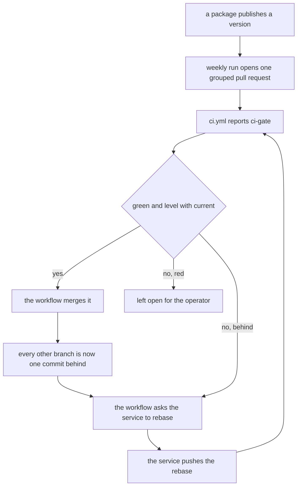

# Version Tracking

Reference. Where the running version number comes from, what each part of it
says, and the gate a release passes before any surface carries a new one.

## Recent updates

`CHANGELOG.md` at the repository root is the update record. It follows Keep a
Changelog and groups entries under six headings. It currently carries an
unreleased heading with no entry beneath it, so outside that file the commit
history is the only record of what changed.

The instruction that file gives its own writers, and the one heading it carries:

```
Group entries under `Added`, `Changed`, `Deprecated`, `Removed`, `Fixed` or
`Security`.

## [Unreleased]
```

## Where the number comes from

One resolver answers the version, and no file in the tree writes it down. It runs
`git describe` against a tag pattern that admits only a tag beginning with a v
and a digit, then turns that output into the reported string. The package
initialiser calls the resolver once at import and binds the answer.

```python
TAG_GLOB = "v[0-9]*"                        # src/_version.py
def describe(root: str | Path) -> str: ...
def format_describe(text: str) -> str: ...
def resolve_version(root: str | Path | None = None) -> str: ...

__version__ = resolve_version()             # src/__init__.py
```

Three checks hold that shape in place. The first fails the moment the package
initialiser gains a written-in number. The second drives a tree whose nearest tag
is a local backup name and asserts the resolver skips it. The third drives the
same tree without the tag pattern and asserts the backup tag does come back. That
last one is the control on the second: without it, a green could mean nothing
more than a tree carrying no backup tag.

```python
def test_src_init_holds_no_version_literal() -> None: ...       # tests/test_version_resolution.py
def test_a_backup_tag_never_becomes_the_version(tmp_path) -> None: ...
def test_the_unguarded_form_would_adopt_a_backup_tag(tmp_path) -> None: ...
```

**Overtaken.** These two sentences stay whole here:

> One resolver answers the version, and no file in the tree writes it down. It runs
> `git describe` against a tag pattern that admits only a tag beginning with a v
> and a digit, then turns that output into the reported string.

The resolver declares the release number. The git call no longer decides it. That
call matches the one tag the declared release names, and it adds the build count
and the commit after a `+`.

```python
RELEASE                                     # src/_version.py, the declared release
RELEASE_TAG = f"v{RELEASE}"
UNRESOLVED_LOCAL = "unknown"
UNKNOWN_VERSION = f"{RELEASE}+{UNRESOLVED_LOCAL}"
```

One commit reports one release number in every state. When the git call cannot
derive a build count, the version says so and never takes one from an older tag.

| what the machine holds | what the version carries |
| --- | --- |
| the release tag | the release, the build count and the commit |
| an older version tag only | the release, the absent word and the commit |
| no tags | the release, the absent word and the commit |
| no git history | the release and the absent word |

## What the string says

The formatter returns a bare release number for one state only: a clean tree
sitting exactly on a version tag. Distance past the tag, a modified working tree,
and an unreachable version tag each append a PEP 440 local segment after a `+`.
One check asserts every other shape carries that `+`.

```python
def format_describe(text: str) -> str: ...      # src/_version.py

def test_only_an_exact_clean_tag_reports_a_release_number(described: str) -> None: ...  # tests/test_version_resolution.py
```

Two things follow. The number on a working checkout is rarely a release
number, and the distance term inside it counts commits, not features. And the
version tag the operator's own tree describes from is local to that machine:
`git ls-remote --tags` lists an older version tag alone, so a fresh clone
resolves a lower release number from the same commit.

**Overtaken.** That last sentence stays whole here:

> And the version tag the operator's own tree describes from is local to that
> machine: `git ls-remote --tags` lists an older version tag alone, so a fresh
> clone resolves a lower release number from the same commit.

The server carries both version tags. The newer one is an annotated tag, so the
listing prints it twice, once for the tag object and once for the commit it
points at. A fresh clone reports the release number the tree declares, and the
release number no longer moves when a tag is absent.

```
git ls-remote --tags origin

refs/tags/build-<version>
refs/tags/<older version tag>
refs/tags/<newer version tag>
refs/tags/<newer version tag>^{}
```

## The six readers

Six modules read the resolved version, and none of them restates it.

- `src/__init__.py` — calls the resolver once at import and binds the answer.
- `main.py` reads the cached `src.__version__` for its startup log line, the
  application version and the splash paint, and falls back to the resolver and
  the baked reader when it checks a bundle against the source tree beside it.
- `tools/spec_common.py` bakes it into a build.
- `tools/build_release_zip.py` reads it for the release archive.
- `tools/capture_live_baseline.py` stamps a captured baseline with it.
- `src/core/version_sweep.py` takes it as the canonical value and reports any
  literal that shadows it.

**Overtaken.** That first sentence stays whole here:

> Six modules read the resolved version, and none of them restates it.

Twelve modules read it. Eleven already did, and the stocks About box is the
twelfth.

```
main.py                                         src/__init__.py
src/core/version_sweep.py                       src/gui/main_window.py
src/gui/main_tabs/main_window_surface.py        src/simulator/parity_report.py
src/gui/main_tabs/splash_screen_surface.py      src/trading/live_monitor.py
src/gui/main_tabs/stock_main_window_surface.py  tools/build_release_zip.py
tools/capture_live_baseline.py                  tools/spec_common.py
```

### What the About box tells the operator

Help holds About on the crypto window and on the stock window. The box names
the build the operator is running. It reads the same answer the title bar
carries, so the two cannot name different builds on one screen.

`src/gui/main_tabs/main_window_surface.py` — the crypto box

```python
ABOUT_TEXT_FORMAT = (
    "Acervator v{version}\n\n"
    "A multi-exchange crypto auto-trading platform.\n"
    ...
)


def about_text() -> str:
    return ABOUT_TEXT_FORMAT.format(
        version=running_version(), indicator_count=len(DEFAULT_WEIGHTS)
    )
```

The stock window and its surface read one declaration. The surface fills the
text, and the window draws what it is handed, so the heading moves in one edit.

`src/gui/main_tabs/stock_main_window_surface.py` — the stocks box

```python
def about_box() -> dict:
    """The box the Help menu shows."""
    return {"title": ABOUT_TITLE, "text": about_text()}
```

`src/gui/stock_main_window.py` — the window draws what the surface hands it

```python
def _show_about(self):
    box = about_box()
    QMessageBox.about(self, box["title"], box["text"])
```

Neither box carries a typed number. A release that moves carries both boxes
with it, and no source edit follows a release.

## What a frozen bundle carries

A bundle ships no repository, so the git call finds nothing, returns an empty
string, and the resolver falls through to the baked file. Two spec helpers
resolve the version at build time and write it into a build subdirectory under a
fixed file name. The second returns the pair that places that file inside the
bundle, where the baked reader reads it back.

```python
BAKED_FILENAME = "_baked_version.txt"                   # src/_version.py
def read_baked_version(root: str | Path) -> str: ...

BAKE_SUBDIR = os.path.join("build", "version")          # tools/spec_common.py
def read_acervator_version(project_root: str) -> str: ...
def bake_version_datas(project_root: str) -> list[tuple[str, str]]: ...
```

The frozen check makes a bundle prefer the baked value even when a repository
sits around it, so a bundle unpacked inside a checkout reports its own build
number rather than the enclosing tree's. Two tests drive it: one with a
repository around the bundle, one with git taken away.

```python
def is_frozen() -> bool: ...        # src/_version.py

def test_a_frozen_bundle_prefers_the_baked_value_over_a_repository() -> None: ...   # tests/test_version_resolution.py
def test_a_baked_tree_keeps_its_version_after_git_is_removed() -> None: ...
```

### What each variant ships

`datas_candidates` names every source folder a build copies into the bundle.
Four folders go into every variant. The Electron shell files go into a React
build alone.

| source folder | place in the bundle | qt | react |
| --- | --- | --- | --- |
| `src` | `src` | yes | yes |
| `resources` | `resources` | yes | yes |
| `data/historical` | `data/historical` | yes | yes |
| `desktop/renderer` | `desktop/renderer` | yes | yes |
| `desktop/main.js`, `desktop/preload.js`, `desktop/package.json` | `desktop` | no | yes |
| `desktop/node_modules/electron/dist` | `desktop/node_modules/electron/dist` | no | yes |

The renderer folder holds the page host that every React panel reads. The
Status tab is a React panel under both builds, so both bundles carry that
folder.

```python
SHELL_RENDERER = "renderer"                     # tools/spec_common.py
def renderer_candidate(project_root: str) -> tuple[str, str]: ...
def shell_candidates(project_root: str) -> list[tuple[str, str]]: ...
def datas_candidates(project_root: str, variant: str) -> list[tuple[str, str]]: ...
```

`build_graceful_datas` prints and skips a source folder that is not on disk. A
clone that never installed the shell therefore builds with no Electron runtime.

### Which outside packages a bundle carries

The application uses 21 packages that are not part of Python itself. Eighteen of
them are declared as requirements. Three are named by code that guards its own
absence, and the dependency list records why none of the three is owed.

A build does not install every declared package. It installs the core set plus
two named groups, so a package declared in any other group never reaches the
bundle. Two further names are installed and then deliberately left out.

```python
CONSUMER_EXTRAS["build"] = ("build", "report")   # tools/deps.py
EXCLUDES = ("tkinter", "matplotlib", "PIL", ...)  # tools/spec_common.py
```

Counts below were read from the published Windows bundle. A package written in
pure Python ships inside one archive rather than as its own folder, so a folder
listing alone cannot answer whether a package shipped. The ccxt row is the proof:
the application imports it in nine places, and it has no folder.

| package | declared | the build installs it | in the bundle |
| --- | --- | --- | --- |
| PySide6 | core | yes | yes |
| ccxt | core | yes | yes, 430 modules, no folder |
| scipy | core | yes | yes, 500 modules |
| statsmodels | core | yes | yes, 163 modules |
| pandas | core | yes | yes, 280 modules |
| numpy | core | yes | yes, 140 modules |
| cryptography | core | yes | yes |
| aiohttp | core | yes | yes |
| keyring | core | yes | yes |
| certifi | core | yes | yes |
| defusedxml | core | yes | yes |
| psutil | core | yes | yes |
| ta | core | yes | yes |
| tomli_w | core | yes | yes |
| reportlab | report group | yes | yes |
| PIL | build group | yes | no, the exclusion list names it |
| matplotlib | charts group | no | no |
| httpx | monitor group | no | no |
| luma, RPLCD, smbus2 | display group | no | no, Raspberry Pi only |
| ST7789, waveshare_epd, tomli | recorded, not required | no | no |

Two rows read as a package the application wants and the bundle does not hold.

The matplotlib row costs the running application nothing. One module imports
matplotlib, and the only module that imports that one is a manual-building tool
that no bundle carries. The bundle holds the chart module and nothing inside the
bundle ever asks for it.

```
src/design_system.py        imports matplotlib when it loads
  its one importer           tools/build_product_manual.py, not in any bundle
  in the bundle              the module is there, matplotlib is not
```

The httpx row is different, and it is live. The AI feedback loop calls out over
the network, and the call imports httpx with nothing to catch a failure. The
monitor group holds that package and a build installs the build and report groups
only, so the shipped application reaches that line with nothing to import.

```python
async def _call(self, msg):          # src/trading/live_monitor.py:338
    import httpx
```

`src/gui/design_system.py` is a separate module with 110 importers and no
matplotlib import. Every screen reads that one. The two files have the same name
and are not the same thing.

## A version that moves while the suite runs

Three test modules compare a freshly resolved version against the cached
`src.__version__`. That cached value is computed once, when the package is first
imported. The value it is measured against is computed when the assertion runs.

```
tests/test_specs_parity.py
tests/test_version_resolution.py
tests/test_build_variants_and_version_reach.py
```

A commit landing between those two moments changes the distance term, and the
two strings disagree. That failure is a property of a git-derived version
rather than a defect in the resolver: the derived number moves with every
commit and the cached copy does not. Committing to the repository while the
suite is running reproduces it.

## The release gate

One command is the gate a release passes before any surface carries a new number.
It runs the suite, runs each archetype against its good fixture and requires
`passed` true from every one, and reads the claim ledger for open claims. On
success it prints a ready line and writes a sidecar record at the repository
root. On failure it names the step that failed and exits non-zero.

```
python -m dev_harness.harness.check_release_readiness

[OK] Release-ready (vX.Y.Z, N tests)    printed on success
.release_ready.json                     the sidecar, holding version, tests, timestamp
```

The gate declines to declare a release ready when a check was skipped or when a
green pytest run collected nothing. Two tests pin both: one drives the gate with
each skip flag and asserts it declines to print the ready line, the other drives
a pytest run that collected nothing and asserts the gate calls it a failure.

```python
def test_any_skip_flag_refuses_to_declare_ready(...) -> None: ...   # tests/test_check_release_readiness.py
def test_green_pytest_with_zero_tests_is_a_failure(...) -> None: ...
```

The gate module is `dev_harness/harness/check_release_readiness.py`, which is
the path that test imports. No copy of it lives under `tools/`.

## What the workflow runs on a pull request

Four lanes run on every pull request, and each one judges something the tree
actually holds. One workflow file declares all of them.

```
.github/workflows/ci.yml

changes      diffs the branch and publishes the list of changed files
lint         black and flake8 over src, tests, tools and the root scripts
contracts    the six Solidity tests under tests/contracts, run by forge
archetypes   the owning archetype for each changed file
ci-gate      one status saying whether any required lane failed
```

### Which archetype owns which file

The archetype lane reads each changed file's type and runs the archetype that
owns it. A file of any other type is named in the log and counted as unowned,
because no archetype reads that type.

```
.py                         coding archetype
.js .mjs .cjs .css .html    GUI archetype
.md                         docs archetype
anything else               unowned, and the log names the file
```

### Shell scripts and workflow files reach the coding archetype

The sentence above is overtaken. Quoted whole:

> A file of any other type is named in the log and counted as unowned,
> because no archetype reads that type.

The coding archetype now reads two further types, and both routers send them to
it. Shell scripts go through shellcheck and workflow files go through yamllint.

```
.sh .bash .zsh              coding archetype
.yml .yaml                  coding archetype
```

A type that still has no analyzer keeps the third outcome. The lane names the
file and counts it as unowned, and the hook that runs on every save now says the
same thing rather than staying silent: this file type was not examined, which is
not the same as clean.

### What a green result means

Green means every changed file passed the archetype that owns it, the Solidity
tests passed, and the formatting and lint lanes passed. It does not mean a Python
test suite ran. The tree holds no Python test.

```
git ls-files tests/                   7 files
git ls-files tests/contracts/*.sol    6 files
git ls-files tests/test_*.py          0 files
```

### The two pytest lanes, overtaken

The release gate section above says this about the two tests that hold it down:

> Two tests pin both: one drives the gate with
> each skip flag and asserts it declines to print the ready line, the other drives
> a pytest run that collected nothing and asserts the gate calls it a failure.

**Overtaken.** Neither of those two files is in the tree. The workflow used to
carry two pytest lanes that read the same empty suite, so both reported a failure
on every run, for a reason that was never the change underneath them. Both lanes
are gone.

```
pytest -m "not slow and not archetype"    exit 5, nothing collected
pytest -m "slow or archetype"             exit 5, nothing collected
```

### What the branch rules refuse

Two rulesets guard the branches. The first refuses a rewrite or a deletion of
either branch. The second refuses a merge into the working branch until a pull
request exists and the one status reports green.

```
current   a pull request is required before a merge
current   ci-gate must report success, and the branch must be up to date
current   a red ci-gate leaves the merge blocked, and no one may bypass it
current   a force-push is refused, and a deletion is refused
main      a force-push is refused, and a deletion is refused
main      a direct push is allowed, which is how the branch is synced
```

## How dependency updates reach the branch

The dependency service opens a pull request when a package it watches publishes
a new version. The file declares five ecosystems, and every one checks weekly.

```
.github/dependabot.yml

pip             /              pyproject.toml
pip             /requirements  requirements/build-win32-py3.14.txt
npm             /              package.json and package-lock.json
npm             /desktop       desktop/package.json and its lock file
github-actions  /              the action versions in .github/workflows/
```

Each ecosystem declares two groups. The `routine-versions` group carries version
updates and the `security-fixes` group carries security updates. A group
collapses a week's bumps into one pull request, so an ecosystem opens one
routine pull request rather than one for every package.

Each ecosystem also sets `open-pull-requests-limit` to 1, which makes five the
hard ceiling for routine pull requests across the repository. Security updates
are exempt from that limit, so a security fix is never held back by it.

### What clears the queue

One scheduled workflow clears the queue. It runs at 13 and 43 minutes past every
hour, and it accepts a manual run that only reports.

```
.github/workflows/dependency-queue.yml

select   lists the open service pull requests on current
report   writes every candidate and its verdict to the run summary
merge    merges one pull request that is green and level with current
rebase   asks the service to rebase the branches the merge left behind
```

The workflow has no checkout step. Every step reads and writes through the `gh`
command, so no file from a pull request reaches the runner and no script from a
pull request runs.

### Which pull requests it touches

The step named select in `.github/workflows/dependency-queue.yml` keeps a pull
request only when all four of these hold.

```
the author is a bot, and its login is the dependency service
the head branch names the routine-versions group
ci-gate reports SUCCESS
no other check is failed, cancelled or still running
```

A security pull request is never selected, because its branch names the
`security-fixes` group instead. A human pull request is never selected, because
its author is not the service. A pull request that cannot merge stays open for
the operator, and the workflow never closes one.

### Why the clearing is serial

The `current` ruleset sets `strict_required_status_checks_policy` to true, so a
branch must be level with the branch it targets before it merges. Every merge
pushes every other open branch one commit behind, which means one branch is
level at a time and the queue drains in order.

GitHub's own auto-merge does not update a branch that has fallen behind, so
arming it leaves the queue stalled. The workflow instead reads how many commits
behind each branch is and comments `@dependabot rebase` on the ones that need
it. The service performs the rebase and pushes it, and that push starts
`ci.yml` on the new head commit.

A push made with the workflow's own token would not start `ci.yml`. GitHub
documents that an event triggered by `GITHUB_TOKEN` does not create a new
workflow run. The workflow asks the service to push, rather than pushing the
update itself.



### What the workflow may do

```
contents: write        writes the merge commit to current
pull-requests: write   reads the queue and calls the merge endpoint
issues: write          posts the rebase comment, which the API files as an
                       issue comment
```

It requests nothing else, and the workflow's top level grants nothing at all.
Turning off the strict rule on the `current` ruleset would remove the
behind problem and the rebase step with it. That switch belongs to the operator.

## How a build is produced

Two files at the repository root are the ones to open, one per variant. A third
builds both. None of them holds any build logic: each hands its variant names to
one shared launcher.

```python
VARIANT = QT                                # Qt_BUILD.py
VARIANT = REACT                             # React_BUILD.py
def parse_variants(argv) -> tuple[str, ...]  # BUILD.py, every variant
def launch(variants: tuple[str, ...]) -> bool    # tools/build_launcher.py
```

The launcher reads the platform it is running on and picks that platform's build
script. Windows gets the PowerShell script, macOS gets the shell script, and any
other platform is refused by name rather than silently doing nothing.

```python
WINDOWS_BUILDER = "build_windows.ps1"       # tools/build_launcher.py
MACOS_BUILDER = "build_mac.sh"
def builder_name() -> str: ...
def build_argv(script: str, variants: tuple[str, ...]) -> list[str]: ...
```

Each build claims a folder name that is not already taken, so nothing in `dist`
is replaced and every earlier build stays runnable beside the new one.

```
dist/Acervator-<version>-<variant>/Acervator-<version>-<variant>.exe   Windows
dist/Acervator-<version>-<variant>.app                                 macOS
dist/Acervator-<version>-<variant>.dmg                                 macOS
```

A build that finishes sets the modification date on both single-variant entry
points, and a build that fails sets nothing. That date is how a file listing
shows whether a build happened.

```python
def stamp_builder_dates(finished_at: float) -> list[str]: ...
```

**Overtaken.** These two sentences stay whole here:

> Two files at the repository root are the ones to open, one per variant. A third
> builds both.

> A build that finishes sets the modification date on both single-variant entry
> points, and a build that fails sets nothing.

Four files at the root are the ones to open, two per platform, and a fifth builds
every variant for the platform it runs on. A finished build sets the date on its
own platform's pair and never on the other, so a Windows date and a macOS date
report different builds.

```python
BUILDER_NAMES = ("Qt_BUILD.py", "React_BUILD.py")   # tools/build_launcher.py
MAC_BUILDER_NAMES = ("Qt_MAC_BUILD.py", "React_MAC_BUILD.py")
def stamp_builder_dates(finished_at, names=BUILDER_NAMES) -> list[str]: ...
```

### The macOS build runs on a runner, not on the operator's machine

The operator's machine runs Windows, so no macOS build can be produced there. A
workflow builds both macOS variants on a GitHub macOS runner instead.

```yaml
# .github/workflows/macos-build.yml
name: macOS build
runs-on: macos-latest
run: ./build_mac.sh --dmg
```

Two things start it: a push that changes one of the files the macOS build reads,
and the Run workflow button on the repository's Actions tab.

```yaml
on:
  workflow_dispatch:
  push:
    paths:
      - build_mac.sh
      - Acervator_mac.spec
      - tools/build_launcher.py
      - tools/build_variants.py
      - tools/spec_common.py
      - .github/workflows/macos-build.yml
```

**Overtaken.** That sentence stays whole here:

> Two things start it: a push that changes one of the files the macOS build reads,
> and the Run workflow button on the repository's Actions tab.

A third thing starts it, and it is the one the operator uses: a Mac builder at
the repository root, double-clicked. Each one asks for a run on the branch his
copy is on, or joins a run already going on that branch rather than starting a
second one, because the workflow cancels an earlier run of the same group.

```python
VARIANT = QT                                    # Qt_MAC_BUILD.py
VARIANT = REACT                                 # React_MAC_BUILD.py
def launch_macos(variants: tuple[str, ...]) -> bool   # tools/build_launcher.py
```

The run does not stop at a finished build. It reads the size of every bundle and
every disk image, mounts each disk image and compares the application inside
against the one that was built, then launches each application and reads the
line the program writes to its own log once the main window is on screen.

```python
log_manager.info("Application ready — main window displayed")   # main.py
```

### What happens when the disk image step fails

The disk image step can fail on a resource that is busy rather than on anything
wrong with the build. The script writes the same image again instead of ending
the run. Each image is also released as soon as it is written, so the next image
in the run never starts against a volume the previous one left attached.

```
DMG_CREATE_ATTEMPTS   3     # build_mac.sh, attempts per disk image
DMG_RETRY_WAIT_S      10    # the wait between attempts, in seconds
hdiutil detach              # before every attempt, and again after each image
```

Three attempts is the whole allowance. A step that fails all three writes no disk
image, names the image it could not write, and ends the run with a failure. It
never reports success without an image.

```
hdiutil create failed on attempt 3 of 3 for dist/<name>.dmg
ERROR: hdiutil create failed 3 times; dist/<name>.dmg was not written.
```

A release needs both platforms, so a macOS packaging failure holds the whole
release back. The Windows build of the same run is discarded with it, and the
Releases panel keeps the version it already carried.

```yaml
publish: {needs: [windows, macos]}   # .github/workflows/release.yml
```

### Where the macOS build is downloaded

The finished run page carries an Artifacts section. One entry holds both
applications and both disk images as a single zip file; a second entry holds
what the two launches produced, which is the evidence that each application
started.

```
acervator-macos                  both .app bundles and both .dmg files
acervator-macos-launch-evidence  each launch's own log and screen capture
```

The download is a zip file. Unzipping it gives the two applications and the two
disk images; dragging an application to the Applications folder installs it.

**Overtaken.** That last sentence stays whole here:

> The download is a zip file. Unzipping it gives the two applications and the two
> disk images; dragging an application to the Applications folder installs it.

The run page artefact remains a zip holding both bundles, and it no longer tells
a person where to go. A release carries each disk image as a file of its own, so
a visitor downloads one disk image and never a zip.

```
a run page artefact   one zip holding both bundles and both disk images
a release asset       one disk image, downloaded on its own
```

The operator downloads neither by hand. A Mac builder waits for its run, prints
the elapsed time while it waits, then puts that variant's application and disk
image straight into `dist` at the same level as the Windows folders, with no
folder around them.

```
dist/Acervator-<version>-<variant>.app    what a Mac builder brings back
dist/Acervator-<version>-<variant>.dmg    its disk image, in the same folder
```

On a Mac the disk image is the one to open. A bundle's internal links become
copies inside the zip the run page serves, so the folder arrives without the
permissions a Mac needs while the disk image keeps them. A builder that cannot
reach GitHub prints which of the two reasons stopped it, and starts nothing.

```python
NOT_SIGNED_IN_NOTICE   # tools/build_launcher.py, gh answered exit 4
NO_ANSWER_NOTICE       # every other non-zero answer from gh api
```

### What the first launch looks like

The bundle carries no Apple Developer signature, so macOS refuses the first
double-click. The way past it is to right-click the application and choose Open,
which is needed once per build and not again.

```
------------------------------------------------------------
  IF macOS REFUSES TO OPEN THE APP:
  1. Right-click (or Control-click) the .app
  2. Choose Open
  3. Choose Open again in the dialog
------------------------------------------------------------
```

Signing removes that step and is not set up. It needs a paid Apple Developer
account, a Developer ID Application certificate, and that certificate held as a
repository secret. The build script already accepts the identity.

```
./build_mac.sh --sign "Developer ID Application: <name> (<team id>)"
```

## Where a person downloads the application

A release carries the built applications outside the repository. A visitor
installs no Python, no dependencies and no builder, and the Releases panel on the
repository front page links it. Git cannot hold the builds: `dist` measured
12,856 MB.

```yaml
name: Release                        # .github/workflows/release.yml
on:
  workflow_dispatch:
jobs:
  windows: {runs-on: windows-latest}
  macos: {uses: ./.github/workflows/macos-build.yml}
  publish: {needs: [windows, macos]}
```

The Run workflow button on the Actions tab starts it. One run builds both
platforms, launches every application it built, reads the line each one writes
once its main window is on screen, and attaches four files to one release.

### The release a visitor downloads

Four files, one per platform and per variant, each named after the version and
the commit the build resolved.

```
Acervator-<version>-qt-windows.zip      Windows, the Qt interface
Acervator-<version>-react-windows.zip   Windows, the React interface
Acervator-<version>-qt.dmg              macOS, the Qt interface
Acervator-<version>-react.dmg           macOS, the React interface
```

The tag carries that same version behind a prefix the version reader's own tag
glob rejects, so publishing a release cannot move the version the next build
resolves.

```python
TAG_GLOB = "v[0-9]*"                 # src/_version.py
build-<version>                      # a release tag, which that glob rejects
```

A runner resolves that version from the tags the remote carries, and the newer
version tag is not one of them, so a runner build and a local build of one commit
report different numbers. The commit is the same in both, and every file name
carries it.

```
git ls-remote --tags origin    the older version tag, and the build- tags
a local clone                  the older and the newer version tag
```

Pushing the newer tag would change the number every runner build reports, which
the release cascade above governs.

**Overtaken.** These two passages stay whole here:

> A runner resolves that version from the tags the remote carries, and the newer
> version tag is not one of them, so a runner build and a local build of one commit
> report different numbers.

> Pushing the newer tag would change the number every runner build reports, which
> the release cascade above governs.

The remote carries the newer version tag. A runner build and a local build of one
commit report the same release number, because the resolver reads the release the
tree declares and not a tag name. A tag that a runner cannot see now changes the
build count alone, and the version names that count absent rather than counting
from an older tag.

The publish step refuses a set whose file names do not all carry one version, and
the Windows step refuses a build folder holding any logo file. Neither guard has
a way to pass a mixed or a logo-carrying release.

```
files to attach: 4          two per platform, or the step fails
qt  logos    0              any other number fails the step
```

### The first launch on a Windows computer

Windows refuses the first run of an unsigned program. Two clicks pass it, once
per download and not again.

```
------------------------------------------------------------
  IF WINDOWS BLOCKS THE EXE:
  1. Click "More info" then "Run anyway"
------------------------------------------------------------
```

That notice is the one the builder prints after a local build, so a downloaded
build and a locally built one show the same step.

```python
SMARTSCREEN_NOTICE                   # tools/build_launcher.py
```

A macOS download carries the same unsigned bundle a run page artefact carries, so
its own first launch is the Gatekeeper step recorded above.
