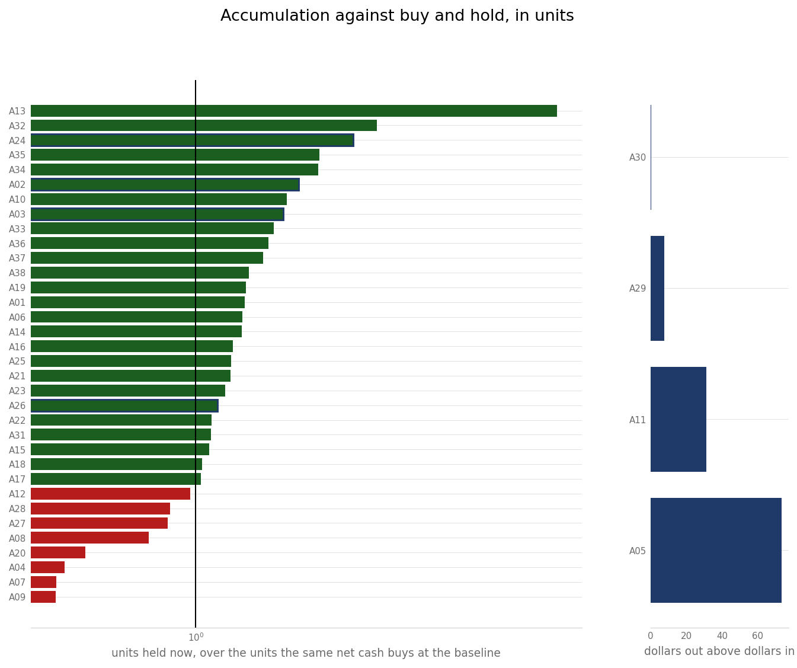
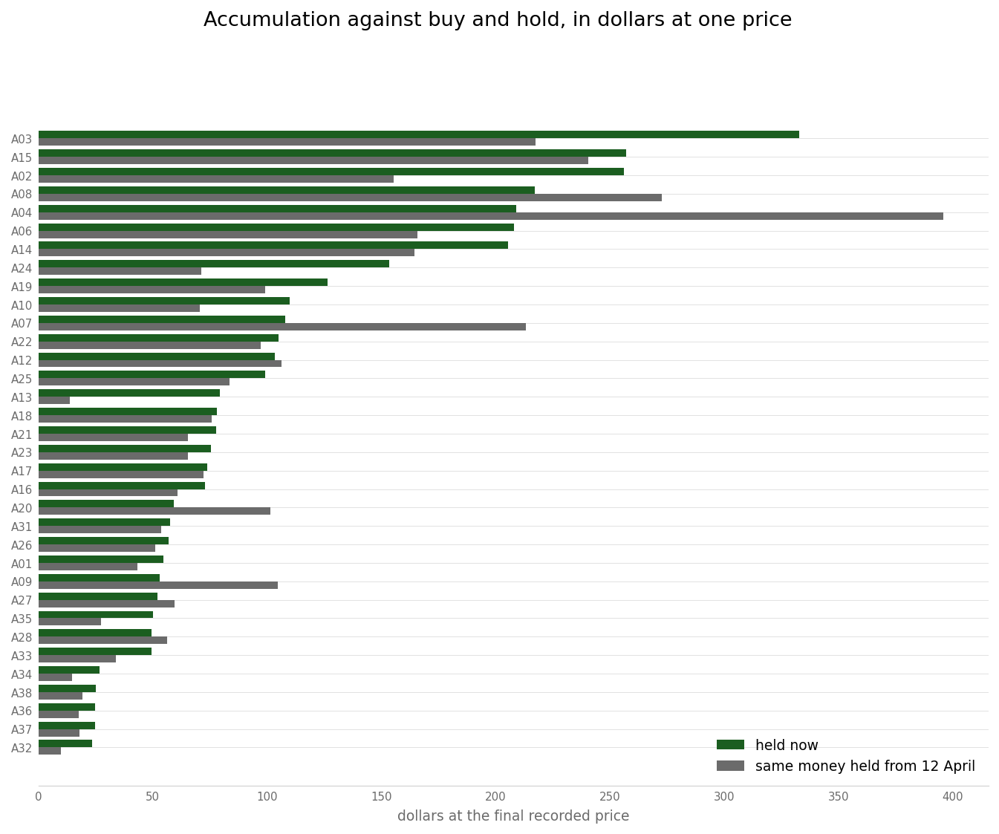
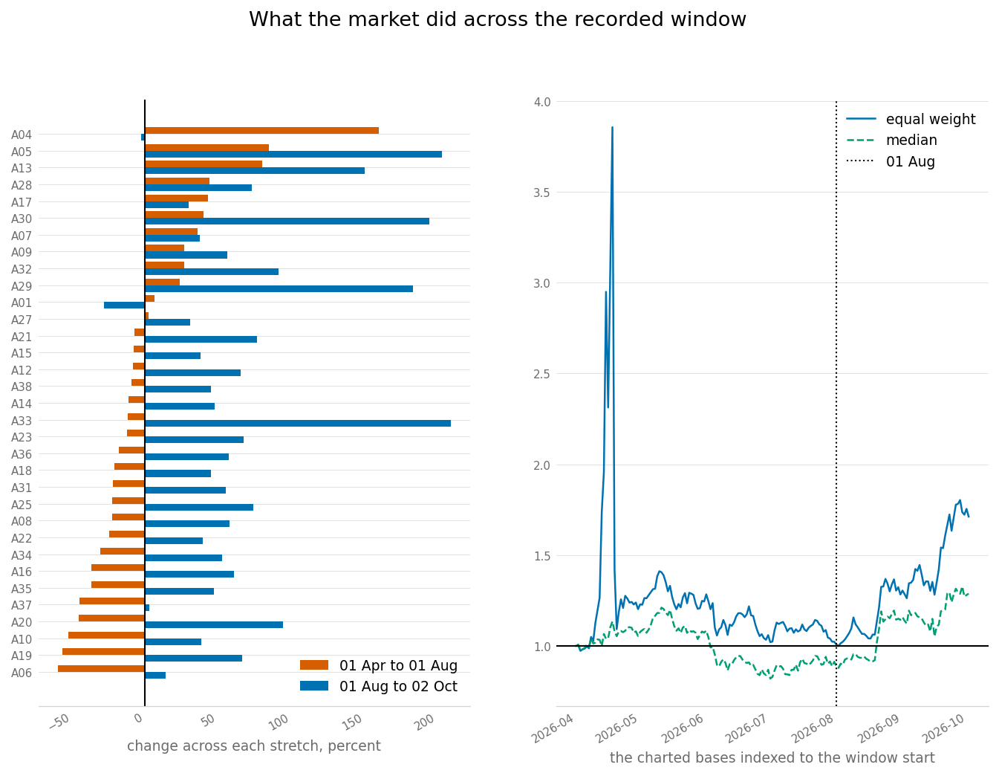

# The Year-to-Date Record and Exchange Test Coverage

Reference. What reads the venue's own trade record, and how far the tests
around the exchange integration reach, measured rather than asserted.

[Part 9](10-live-trade-history.md) holds the fill record itself: its row counts,
its fills per asset, the VWAP charts, the trade grading and the gate logs. This
part covers the readers of that record and the exchange code beneath them.

The record is the operator's own venue export, and this repository holds no copy
of it. The tree tracks no spreadsheet file at all, and of every path any commit
has ever added, deleted or renamed, two carry a spreadsheet suffix and both are
function-complexity inventories.

```
git ls-files "*.csv" "*.xlsx"                   nothing tracked

git log --all --diff-filter=ADR --name-only     every path the history touched
    docs/audits/2026-08-04_function_complexity_inventory.csv
    docs/engineering-notes/2026-08-04_function_complexity_inventory.csv
```

## The venue holds the authority

The reconciliation walk refills a bot's counters from the venue rather than from
the bot's own ledger. It walks the venue's own trade call for the bot's symbol in
30-day windows from a fixed anchor, pages a fixed number of rows at a time, and
de-duplicates by trade id across the windows. Each unique sell adds quantity
times price to a year-to-date scrummed sum; each unique buy adds to a folded sum.

```python
YTD_TRADE_ANCHOR_UTC = 1_775_001_600.0      # src/trading/scrumming/reconciliation.py
YTD_TRADE_PAGE_LIMIT = 500
YTD_TRADE_WINDOW_SEC = 30 * 24 * 3600.0

async def sync_ytd_trade_count(self) -> Optional[int]:
    """Walk ``get_my_trades`` from the YTD anchor to the present in 30-day windows."""
```

The anchor is 2026-04-01T00:00:00Z. [Part 9](10-live-trade-history.md) records
the fleet's first fill as 12 April, so the anchor is a floor eleven days before
the earliest fill the venue holds. It is fixed because the start of a record does
not move; a rolling date would drop the oldest fills out of the count.

| Field the walk writes | Value written |
| --- | --- |
| `stats.total_trades` | `max` of the persisted count, the previous exchange count, and the count just walked |
| `stats.exchange_trade_count` | the same value |
| `stats.ytd_scrummed_usd` | `max` of the persisted sum and the walked sell sum |
| `stats.ytd_folded_usd` | `max` of the persisted sum and the walked buy sum |
| `stats.exchange_data_fresh_ts` | the clock reading at the end of the walk |

Every counter write takes a `max`, so a walk raises a counter toward the venue
and never lowers one. Three paths leave the persisted counters alone and answer
nothing: a raise inside the walk, an absent exchange, and an exchange that does
not serve the trade call. The tree tracks no check over the walk:
`git ls-files tests` returns 7 files and none of them names the walk.

### The counter sentences this overtakes

OVERTAKEN, quoted whole, from the table and the paragraph above:

```
| `stats.total_trades` | `max` of the persisted count, the previous exchange count, and the count just walked |
| `stats.ytd_scrummed_usd` | `max` of the persisted sum and the walked sell sum |
| `stats.ytd_folded_usd` | `max` of the persisted sum and the walked buy sum |
```

> "Every counter write takes a `max`, so a walk raises a counter toward the
> venue and never lowers one."

True today: a walk can lower a counter, and it does. No write in the walk takes
a `max`. The walk assigns each figure the number it counted, so a venue reading
below the stored figure replaces it.

```python
# src/trading/scrumming/reconciliation.py, in sync_ytd_trade_count
self.stats.exchange_trade_count = _order_count
self.stats.exchange_fill_count = _fill_count
self.stats.total_trades = _order_count
self.stats.ytd_scrummed_usd = _ytd_scrum_usd
self.stats.ytd_folded_usd = _ytd_fold_usd
```

A fourth path joins the three named above, and it does not leave the stored
numbers alone. A walk that skipped a window's remainder holds no complete
reading, so it drops all five figures to their no-reading markers and answers
nothing.

```python
# src/trading/scrumming/reconciliation.py
TRADE_COUNT_NO_READING = 0
YTD_USD_NO_READING = 0.0
```

Driven against a stubbed venue, with no order placed, on a bot holding 4242
trades against $999.00 scrummed and $888.00 folded. A whole walk that counted
two venue orders wrote 2 trades, $20.00 and $10.00, so all five figures fell. A
walk whose window returned a full page at one timestamp wrote 0 trades and
$0.00 against both sums. The same instrument read 0 up to 2 on a bot that held
nothing, so it moves in both directions.

The walk writes six fields: five figures and the freshness stamp.

| Field the walk writes | Value written |
| --- | --- |
| `stats.total_trades` | the distinct venue order count this walk read |
| `stats.exchange_trade_count` | the same value |
| `stats.exchange_fill_count` | the distinct fill count this walk read |
| `stats.ytd_scrummed_usd` | the walked sell sum, in dollars |
| `stats.ytd_folded_usd` | the walked buy sum, in dollars |
| `stats.exchange_data_fresh_ts` | the clock reading at the end of the walk |

The fill count is the field the earlier table leaves out. One trade is one
order the venue filled, so the trade count counts distinct order identifiers
and the fill count counts distinct fills beside it.

The loop runs until the cursor reaches the present, so the request count follows
the distance from the anchor instead of a fixed number. Driven against a stubbed
venue: 7 requests at today's 186-day span, 13 at a year, 61 at five years, one
per 30 days of span.

### The request-count sentences this overtakes

OVERTAKEN, quoted whole:

> "The loop runs until the cursor reaches the present, so the request count
> follows the distance from the anchor instead of a fixed number."

> "Driven against a stubbed venue: 7 requests at today's 186-day span, 13 at a
> year, 61 at five years, one per 30 days of span."

True today: the accounted span still starts at the anchor, and the walk asks
the venue only for the windows it has not already settled. A window settles
once its own request counted it whole and its end is older than the settle lag,
so the request count follows the unsettled tail rather than the distance from
the anchor.

```python
# src/trading/scrumming/reconciliation.py, in ReconciliationEngineMixin
YTD_SETTLE_LAG_SEC = 7 * 24 * 3600.0
YTD_FULL_REWALK_SEC = 3600.0
```

The walk replays the settled windows from the fills the last walk read, in
window order, so the five figures come out the same whichever windows this walk
asked for. It drops the held windows once the re-walk interval has passed since
the last walk that started at the anchor. That bounds how long a fill arriving
later than the lag can go uncounted. The lag is positive, so every walk still
makes at least one request.

Driven against a stubbed venue at three anchors, with no order placed. A first
walk holds nothing and reads the whole span, returning the counts the overtaken
sentence recorded. Every later walk inside the hour reads the tail alone.

| Span from the anchor | First walk | A later walk, inside the hour |
| --- | --- | --- |
| 192 days, today's span | 7 requests | 1 request |
| one year | 13 requests | 2 requests |
| five years | 61 requests | 1 request |

The tail is one request or two. The windows step thirty days from the anchor
and the lag is seven days, so the unread span runs between seven and
thirty-seven days. One year reads two requests because its last settled
boundary falls thirty-five days back, and five years reads one because its
boundary falls twenty-five days back. Past the re-walk interval the same bot
read 7 requests again, so the short reading is the holding and not the
instrument.

A window whose page comes back at the 500-row limit resumes at its newest fill
rather than stepping past the remainder. One shape still returns short: a full
page whose rows all carry the same timestamp cannot be resumed. That case writes
a warning naming the window and the row count, so a short answer never passes
in silence.

The fleet aggregator sums those per-bot fields across every bot. Its two headline
fields carry the year-to-date sum whenever that sum exceeds zero, and fall back
to the platform-run accumulator otherwise. Two further fields carry the two
figures apart, so a reader who wants one of them can have it unmixed.

```python
def get_aggregate_stats(self) -> dict:      # src/trading/container/aggregation.py
    return {
        "total_scrummed_usd": ...,          # year-to-date, else the run accumulator
        "total_folded_usd": ...,            # the same rule
        "total_scrummed_usd_ytd": round(total_scrummed_ytd, 4),
        "total_scrummed_usd_lifetime": round(total_scrummed, 4),
    }
```

## Readers of the record

| Reader | Input | Output |
| --- | --- | --- |
| `sync_ytd_trade_count` (`src/trading/scrumming/reconciliation.py`) | `get_my_trades` pages from the venue | the five `stats` fields above |
| `fetch_all_history_chunked` (`src/exchange/history_helpers.py`) | venue trades for every exchange and symbol a bot manager exposes | one row dict per fill, for the History tab |
| `compare_trades` (`src/trading/stone_tablets/parity_harness.py`) | live fills and Simulator fills | a `ParityReport` of matched, live-only and sim-only trades, paired inside `DEFAULT_TOLERANCE_S` of 300 seconds |
| `ytd_compounding_replay` (`dev_harness/harness/`) | the operator's export, read offline | an upper bound on what the surplus-drain formula would have added to each bot's target |

The Fleet Replay panel imports the parity comparison and records every call under
a feature name. The telemetry behind that name counts calls, skips and exceptions
per feature, and flags by name any feature that was never called.

```python
TELEMETRY_PARITY = "sim.parity.compare_trades"      # src/gui/main_tabs/fleet_replay_panel_surface.py
The Simulator rebuild removed this file; it is not in the tree.

class FeatureCounter: ...       # src/core/feature_telemetry.py
class FeatureTelemetry: ...
def get_telemetry() -> FeatureTelemetry: ...
```

### The reader row this overtakes

OVERTAKEN, quoted whole:

```
| `sync_ytd_trade_count` (`src/trading/scrumming/reconciliation.py`) | `get_my_trades` pages from the venue | the five `stats` fields above |
```

True today: the walk writes six fields. The row counts four figures and the
freshness stamp as five, and the fill count is the field it leaves out. The
overtaking table earlier on this page carries all six.

## The connectors

Three classes subclass `ExchangeInterface`. The interface declares seventeen
members, sixteen of them abstract. The seventeenth is the venue trade call, and
it carries a body that raises until a subclass overrides it.

```python
class ExchangeInterface(ABC):       # src/exchange/base.py
    async def get_my_trades(...):   # the one non-abstract member, raises NotImplementedError
```

| Implementation | Module | Reaches |
| --- | --- | --- |
| `CCXTConnector` | `src/exchange/ccxt_connector.py` | any venue id in `SUPPORTED_EXCHANGES`, through ccxt; or a backend passed to `attach_backend` |
| `FleetSimExchange` | `src/simulator/fleet/sim_exchange.py` | stored `CandleSeries` rows over real symbols; no venue |
| `NuclearSimExchange` | `src/simulator/nuclear_sim_exchange.py` | synthetic `TAPEA`/`TAPEB` tapes; no venue |
The Simulator rebuild removed the files above; they are not in the tree.

One connector method names the fifteen ccxt members a backend must serve, marks
the connector connected and drops the rate-limit interval to zero. The Stone
Tablet backend is such a backend: it answers those members from tablet rows
instead of the network, and the replay controller attaches it to a real
connector, so a replay runs the connector's own normalisation and fee code.

```python
def attach_backend(self, backend: Any) -> None:     # src/exchange/ccxt_connector.py
    """Serve every ccxt call from *backend* and mark the connector connected.

    *backend* must provide the fifteen ccxt members reached through ``_ex``:
    fetch_ohlcv, fetch_ticker, fetch_tickers, fetch_balance, create_order,
    cancel_order, fetch_order, fetch_open_orders, fetch_my_trades,
    fetch_order_book, markets, market, precisionMode, amount_to_precision
    """

class TabletBackend: ...        # src/exchange/tablet_backend.py
```

The venue registry carries its own status sets, all in `ccxt_connector.py`.

| Set | Count |
| --- | --- |
| `SUPPORTED_EXCHANGES` | 15 |
| `PREFLIGHT_URLS` | 15 |
| `PASSPHRASE_EXCHANGES` | 3 |
| `US_IP_BLOCKED_EXCHANGES` | 2 |
| `US_ACCOUNT_RESTRICTED_EXCHANGES` | 2 |
| `VERIFIED_EXCHANGES` | 1 |

Two functions turn those sets into the picker text a user sees. `restriction_note`
names the refusal a venue carries and `exchange_label` joins it to the passphrase
note. A venue whose address is refused is labelled as address refused, a venue
whose terms refuse the account is labelled as account restricted, any other
unverified venue is labelled untested, and a venue needing a passphrase says so.
Driven over the whole registry, fourteen of the fifteen labels carry a caveat and
one does not.

```python
def restriction_note(exchange_id: str) -> str:      # src/exchange/ccxt_connector.py
    """Name the refusal *exchange_id* carries, which exchange_label and sync_connect read."""
    if exchange_id in US_IP_BLOCKED_EXCHANGES:
        return US_IP_BLOCKED_NOTE
    if exchange_id in US_ACCOUNT_RESTRICTED_EXCHANGES:
        return US_ACCOUNT_RESTRICTED_NOTE
    return ""


def exchange_label(exchange_id: str) -> str:        # src/exchange/ccxt_connector.py
    """Return the picker label for *exchange_id*, carrying its status notes."""
    label = exchange_id.capitalize()
    notes: list[str] = []
    refusal = restriction_note(exchange_id)
    if refusal:
        notes.append(refusal)
    elif exchange_id not in VERIFIED_EXCHANGES:
        notes.append("untested")
    if exchange_id in PASSPHRASE_EXCHANGES:
        notes.append("passphrase required")
    if notes:
        label += f" ({', '.join(notes)})"
    return label
```

The two refusals read in different words, so the picker tells one from the other.
The connect path names the same refusal in the same words, because
`CCXTConnector.sync_connect` reads `restriction_note` for the line it logs, then
proceeds. No path refuses a connection on the restriction, and the line says the
reading was taken on the date `VENUE_MEASUREMENT_DATE` carries and quotes no page
the venue publishes.

| Venue | Set | Label | Connect |
| ----- | --- | ----- | ------- |
| binance, bybit | `US_IP_BLOCKED_EXCHANGES` | US address refused | warns, then proceeds |
| poloniex, huobi | `US_ACCOUNT_RESTRICTED_EXCHANGES` | US account restricted | warns, then proceeds |
| kraken and nine more | neither | untested | proceeds, no line |
| coinbase | neither, and verified | no note | proceeds, no line |

Fifteen checks cover those sets. One resolves every registry id to an importable
ccxt class through the connector's own resolver. One requires an https pre-flight
URL for every supported id. One pins the verified set to a single member. One
reads the label of every registry id against the rule above.

```python
def resolve_ccxt_class(...): ...        # src/exchange/ccxt_connector.py
                                        # tests/test_exchange_registry.py, fifteen checks
```

The exchange package holds 23 modules beside its package initialiser. Twenty sit
inside the static import closure of the entry point, which reaches 213
first-party modules and leaves 130 source modules outside it.

```
src/exchange/       23 modules, 20 inside the entry point's import closure
    api_docs            outside
    history_surface     outside
    market_data         outside
```

## What the exchange tests exercise

| Measurement | Count |
| --- | --- |
| test files under `tests/` | 535 |
| of those, naming `src.exchange` | 70 |
| `test_*` callables in those 70 files | 2,080 |

Sixteen of the seventeen interface members appear in at least one of those 70
files. The seventeenth, the asset logo lookup, appears in none.

```
member                  files naming it
    exchange_id             28
    connect                 22
    place_order              9
    get_ticker               7
    get_asset_logo_url       0
```

The same 70 files reach some modules far more than others, and leave five of the
23 with no test importing them at all.

```
module                  files importing it
    ccxt_connector          20
    base                    14
    currency_rate_monitor    7
    history_helpers          7
    history_read_contract    7
    tablet_backend           7

    api_docs                 0
    chart_data               0
    crypto_assets            0
    idempotency              0
    position_health          0
```

## How a test stands in for a venue

No test opens a socket to an exchange and none carries a credential. Each check
measures the shape of a call and the code around it, never a venue's answer.
Five stand-ins do that work.

| Stand-in | Where | Replaces |
| --- | --- | --- |
| a fake `ccxt` module put into `sys.modules` | 2 of the 70 files | the venue library, sync and async support both |
| an emptied `PREFLIGHT_URLS` | `tests/test_connect_does_not_block_calling_thread.py` | the pre-flight HTTP call inside `sync_connect` |
| a `socket.socket.connect` that raises | 19 test files | the wire itself, for the whole file |
| `tests/fixtures/venue_precision_metadata.json` | `tests/test_venue_precision_is_decimal_places.py` | published market metadata for 13 venues, captured from a public `load_markets` with no credential |
| `TabletBackend` | `src/exchange/tablet_backend.py` | the ccxt surface beneath a real connector |

The fixture covers 13 of the 15 registry ids. The two ids missing from it are
the pair in `US_IP_BLOCKED_EXCHANGES`, which refused the address the capture ran
from.

The credential file name appears in the test tree three times, across two
modules. Each of the three is a check that a tool raises rather than opening such
a file, and each builds its target under a temporary path. One of them, the
parametrised refusal over the runtime directories, sits beside a positive control
that lets a path outside them through.

```
coinbase_credentials    3 occurrences under tests/
    tests/test_capture_live_baseline.py
    tests/test_migration_verifier.py
```

## The four refusals around an exchange call

| Refusal | Where | What it turns away |
| --- | --- | --- |
| live-tree guard | `tests/conftest.py` | a suite run that created a path under `~/.acervator` or `~/.acervator_logs`, or changed anything under the Stone Tablet archive |
| `safe_urlopen` and `SafeRequest` | `src/core/safe_url.py` | a URL whose scheme is outside http and https, by policy at construction and at open, and by an opener carrying no file, ftp or data handler |
| `_redact` | `src/exchange/api_logger.py` | a param whose key holds any of nine credential substrings, swapping a mask in before `record` stores the entry |
| `guarded_place_order` | `src/trading/bot_container.py` | an order whose amount is not a finite positive number, at the single point every engine order passes through |

Each of the four carries checks that drive it to the refusal itself, so a green
run says the refusal still fires.

- `_live_roots` is injectable, so `tests/test_live_tree_guard.py` drives the
  guard against temporary roots across 22 checks. Two of them replay the two
  isolation breaches this project has shipped: a telemetry file created in the
  live tree, and a reservation-state autosave.
- `tests/test_safe_url_scheme_policy.py` holds 40 checks, splitting the policy
  half from the transport half because either can fail alone.
- The redaction checks name 13 credential field spellings that must come back
  masked, five benign fields that must come back unchanged as the positive
  control, and read the emitted log line for any param value — with a control
  proving the same handler sees a value placed in a benign field. One substring
  covers two credential spellings at once.
- One module calls the venue's order method directly: the bot container, inside
  the guard itself. Nine sites across three trading modules call the guard, and no
  other route out exists. Five checks cover it: one drives unusable amount shapes
  into a recorder standing where the exchange stands, one drives a real amount
  through as the positive control, and three more pin the text of the refusal and
  which check turns an undersized order back.

The modules on each side of the last two, and the one substring that covers two
spellings:

```
tests/test_api_logger_redaction.py      "sign" masks signature and CB-ACCESS-SIGN
                                        the control places a value in reason

exchange.place_order called by      src/trading/bot_container.py
guarded_place_order called by       src/trading/scrumming/execution.py
                                    src/trading/scrumming_bot.py
                                    src/trading/extractor_bot.py
                                    nine sites, no other route out
tests/test_u6_venue_amount_gate.py      five checks
```

## When the order guard could not read the market's limits

A venue decides the smallest order it will take. The bot reads that figure off
the market before it sends anything, and turns an order away that falls under
it. The reading can fail — the venue can be down, or the market can be missing
from the list it returns — and what the guard did with a failed reading was the
defect.

A failed reading used to answer with a minimum of zero. Nothing is ever under
zero, so the check that turns small orders away could not turn anything away,
and the order went out unchecked. Nothing was said on any screen. The failed
reading was also remembered, so one moment of trouble at the venue left that
market unchecked until the bot was restarted.

`src/exchange/base.py` — what a market reports now

```python
@dataclass(frozen=True)
class MarketRules:
    min_amount: Optional[float] = None       # base units
    min_cost: Optional[float] = None         # quote units
    amount_increment: Optional[float] = None # base units a size steps by
    read: bool = True
```

Nothing in that record stands in for a figure the venue did not give. A minimum
that was never read is held as nothing at all, and nothing is not a number the
check can be satisfied by. The `read` field separates the two cases that used to
look the same: a venue that published no minimum, and a reading that never
happened.

Three things now follow a failed reading. The check makes no comparison, because
it has nothing to compare against and says so rather than pretending. A line
goes to the Console under the bot's own name. The failure is not remembered, so
the next order reads the market again and the check comes back as soon as the
venue does.

```
LIMITS NOT READ: TONE/USD market record could not be obtained, so no minimum
size or cost is known for this SELL of 20.0000000000. The venue enforces its
own; Acervator checks nothing here.
```

### What a bot does differently

Nothing changes while the reading succeeds, which is every ordinary moment. The
same sizes go to the venue and the same undersized orders are turned away. Read
over four order sizes on two real Coinbase markets, every size and every refusal
is identical before and after.

What changes is the bad moment. Where a reading failed, an order under the
market's minimum used to go out silently and the bot stayed blind for the rest
of its run. Now it still goes out — the venue applies its own minimum and
refuses it there — but the Console says the check did not run, and the very next
order after the venue recovers is checked again.

### The sentence this overtakes

The refusal table above carries this row, and it is kept as written:

```
| `guarded_place_order` | `src/trading/bot_container.py` | an order whose amount is not a finite positive number, at the single point every engine order passes through |
```

That row is narrower than what the method does. The true sentence is: an order
whose amount is not a finite positive number, an order under the market's
published minimum size, or an order under its published minimum cost — at the
single point every engine order passes through, with each refusal put on the
Console, and with an order the guard could not check named there too.

### The broker side has no such step

The crypto side reads a market's limits and checks an order against them. The
equities side does not. Measured across both broker files, no minimum size, no
minimum value, no step size and no fractional flag is read anywhere.

```
src/stocks/broker_base.py         0 occurrences
src/stocks/alpaca_connector.py    0 occurrences
  searched for: min_amount, min_qty, min_notional, increment,
                precision, fractionable
```

Nothing on any screen builds a bot on that path today, so this is recorded and
not repaired here.

## The simulation battery

The venue record above is live money. Beside it sits a second body of evidence
that is not live at all: a battery of simulated runs, measured on an earlier
release, which is where the platform's headline win rate comes from. It is set
down here as the record of that run, with what this repository can and cannot
show about it stated beside it.

The battery covered 738 simulations, spanning 27 portfolio configurations,
capital from $400 up to $100K, six two-year historical periods — including the
2020 COVID crash, the 2021 ATH bubble and the 2022 brutal bear — and the
venue's fee tiers from VIP-0 through VIP-3. Parameters were identical
throughout, with no optimization per asset.

| Measurement | Result |
| ----------- | ------ |
| Win rate | 715 of 738, 96.9% |
| Total advantage against buying and holding | +$78.0B |
| Canonical 39-sim battery | 39 of 39, 100% |
| Historical 2020 to 2022, 39 sims | 39 of 39, 100%, +$3.16M total advantage |
| Capital scaling, 156 sims | 156 of 156, 100%, superlinear at $100K |
| Bear regime stability, 9 sims | $4,262 to $4,427 total, 4% CV |
| Profitable fee ceiling | up to 0.50% roundtrip |

The 23 runs that are not wins are concentrated in extreme single-asset bear
conditions, with 2022-class drawdowns of 64% to 94%, at the smallest capital
levels. Losses in those cases are marginal: $10 to $157 on $400 deployments.
The record makes no claim to win in a catastrophic single-asset collapse.

Six competing strategies were run over the same canonical 39 cases.

| Strategy compared against | Battery wins |
| ------------------------- | -----------: |
| Passive hold | 39 of 39, 100% |
| DCA weekly | 39 of 39, 100% |
| DCA daily | 39 of 39, 100% |
| Grid trading | 39 of 39, 100% |
| SMA 50/200 cross | 37 of 39, 94.9% |
| RSI mean-reversion | 35 of 39, 89.7% |

**This repository holds nothing behind those numbers.** No file in the tree
carries the per-run rows, and no commit on any branch ever added one. The
figures above are a record, not a measurement anything here reproduces.

**The Simulator tab did not produce them and could not.** It was not built when
the table was recorded, and issue #117 has since rebuilt it. Its Portfolio
Battery walks the RA-StoneTablets rather than the runs above, so nothing a
reader can run in this product re-derives the table.

The queries, and the control that proves they can find a file:

```
git ls-files                                            no battery file in the tree
git log --all --diff-filter=ADR --name-only             no commit ever added one

git log --all --diff-filter=ADR --name-only -- generate_essay_ja.py
                                                        one commit, so the walk works
```

The third query is the control. The same walk over every branch does find a file
that once existed and is gone, so the empty answer above is a fact about the
battery and not about the query.

## Where a run carries less than it reads

One current-state finding bears on how a reader should take the numbers above.

**A Simulator run exercises an injected capital registry, not the live one.** The
bot constructor takes a capital registry parameter. The two Simulator
construction sites pass one; the three live sites pass none, and the reservation
mixin then falls back to the process-wide registry. The sell path refuses an
amount above the effective available quantity, but that pre-check sits inside a
`try` whose handler logs at debug level and continues, so a raise there lets the
sell proceed. A Simulator run says nothing about which registry a live bot
resolves, and nothing about what follows when that resolution raises.

```
ScrummingBot.__init__(..., capital_registry=None)   src/trading/scrumming_bot.py

passes one      src/simulator/fleet/fleet_replay_controller.py
                src/simulator/nuclear_controller.py
The Simulator rebuild removed the files above; they are not in the tree.

passes none     src/gui/main_window.py
                src/gui/live_bot_window.py
                src/trading/container/restore.py

falls back      _crr in src/trading/scrumming/capital_reservation_mixin.py
the pre-check   effective_available, inside a try in
                src/trading/scrumming/execution.py
```

## Accumulation against buy and hold

The claim under test is that a completed Scrum and Fold cycle ends holding more
of the asset. Units carry that claim and dollars do not. A position worth more
dollars can hold fewer units, and a rising market lifts both sides at once, so
units are reported first here.

The account was funded on 2026-04-12. The newest export carries one fill on that
day, for $200 on one base, so a baseline read as the position held that day is
one base rather than a portfolio. The baseline is the money instead. For each
charted base it is the net cash the platform committed to that base, placed at
that base's own price on 2026-04-12 and left untouched from that day.
`hodl_rows` in `tools/build_product_manual.py` builds it. Net cash is every
buy's price times quantity less every sell's, taken from the Price at
Transaction and Quantity Transacted columns that the charts of
[Part 9](10-live-trade-history.md) read, so both metrics run on the same rows.

Four of the 38 bases took no net cash at all. On each of them the sales returned
more dollars than the purchases spent, and units are still held. A05 is $73.54
ahead of its own cost, A11 $31.27, A29 $7.56 and A30 $0.34. A buy-and-hold
investor has no position to compare against a negative cost, so those four carry
no ratio and sit in the right-hand panel of the first figure.

Five bases have no 2026-04-12 price, because the venue listed them later. A02,
A03, A11, A24 and A26 are baselined at their own first recorded candle instead,
and their bars carry an outline.

In units, across the 34 bases that took net cash:

```
ahead of buy and hold     26 of 34
behind buy and hold        8 of 34
median ratio           1.1930
widest ahead           5.7905
widest behind          0.5060
```

In dollars, both sides valued at the same final recorded price:

```
held now                      $3,555.04
the same money held from the baseline   $3,316.34
difference                      $238.70
ratio                             1.0720
```

Across all 38 bases the platform holds $3,894.86 at the final recorded price
against $3,694.42 of net cash committed.

Read the two together. The dollar figure is one number and it rides whatever the
market did; the unit figure is 34 separate answers to the question the engine is
built to answer. Eight of those answers go the other way, and they are in the
figure with the rest.





## What the market did across the window

A unit result means little without the market it was taken in, and one average
across the whole window would hide what that market did. `market_window` in
`tools/build_product_manual.py` clamps every base to one window, and
`regime_turn` splits that window at the month start whose equal-weight index is
lowest. The window runs from the latest first candle among the bases whose
record reaches the baseline day, to the earliest last candle among those same
bases. A base the venue listed after the baseline day is dropped rather than
measured over a shorter window.

```
window        2026-04-01 00:10 UTC to 2026-10-02 12:35 UTC
bases          33 of 38; A02, A03, A11, A24 and A26 dropped as later listings
turn          2026-08-01, the month start carrying the lowest index
```

The two stretches either side of that turn:

```
                        fell         median      index
1 Apr to 1 Aug        21 of 33       -11.3%      1.0069
1 Aug to 2 Oct         2 of 33       +56.3%      1.6912
```

Measured from the baseline day instead of the window start, the first stretch is
weaker again: 22 of 33 bases below where they began, a median of -16.0% and an
index of 0.9185.

Month by month:

```
Apr    8 of 33 fell    median  +7.7%
May   22 of 33 fell    median  -4.2%
Jun   32 of 33 fell    median -21.8%
Jul   21 of 33 fell    median  -3.4%
Aug    3 of 33 fell    median +18.9%
Sep    4 of 33 fell    median +25.1%
```

Three months fell in a row, and June took 32 of the 33 bases down with it.
Measured from the day the account was funded, the median base reached 22.4%
below its starting price on 1 July and the equal-weight index reached 0.9115 on
2 August. The median base sat below its 12 April level on 96 of the window's 185
days, the last of them 20 August.

Four of the six months were soft and three of those four fell. The rise came
late and it came fast.

The turn is measured rather than chosen. The month start carrying the lowest
index is 1 August, the monthly medians turn positive in August, and the median
base regains its 12 April level on 20 August. September is a month later than
the data places the turn.

Over the whole window the same 33 bases read 27 up, 6 down, a median of +32.5%
and an index of 1.7644. That single figure averages a falling stretch and a
rising one, and it describes neither. It is recorded here so a reader who
computes it finds the same value, not because it characterises the period.

Dropping the two best and the two worst leaves that whole-window index at
1.6224, so the late rise is not two outliers.

The index panel of the figure below draws the equal-weight mean and the median
of the same 33 bases, with a rule at the turn. The mean spikes to 3.86 on
2026-04-18 and the median does not. One base, A01, prints a close 90.9 times its
window-start close that day and falls back within the week. The spike is in the
venue's own recorded candles, it moves the mean and not the median, and it is
gone long before the window ends.

The clamp is the difference between a reading and a mistake. The same 38 tablets
measured each over its own whole length, with no common window, return a median
of +1.4% against the clamped +32.5%, because a base with a shorter record is
compared against a base with a longer one.

The accumulation result above does not rest on any of this. It is an arithmetic
comparison of units against units at one price, and it reads the same whichever
way the market went.


