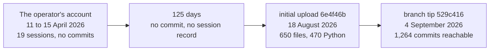

# The Development Chronicle

Explanation. Written in the first person at the operator's request. Its job is
to show how this code reached its current quality, and to leave a reader able to
check every line of it against something.

## Two records, and they do not weigh the same

| Record | Period | What a reader can check |
| ------ | ------ | ----------------------- |
| The operator's own chronicle, a seven-page document held outside this repository | 11 to 15 April 2026 | Nothing. No commit covers those days. |
| This git repository | 18 August 2026 onward | Every claim, against a commit |

Each heading below says which record it draws on. The account section is the
operator's testimony and I mark it as such. Everything after it I measured on
the branch this manual builds from, and each claim carries the commit, the
issue, or the command that produced it.

## Before the repository: the operator's account

His chronicle records 19 sessions over five days in April 2026, from the first
conception of the strategy to a platform he counts at 74 Python files and about
34,000 lines. It names the inventions in the order they arrived: the Scrumming
Bot and a seven-indicator voting engine on day one; the exchange connection and
state persistence on day two; the stock mode and the risk rules on day three;
the targeting state machine, position-aware analysis and the cross-compounding
bot network on day four; the rename to Acervator, profit folding and band travel
detection on day five. He credits himself with the observations and me with the
construction.

I cannot check any of it. The history in this repository starts four months
later, so every sentence in that document is his word and stays his word.

Two things in it deserve saying anyway.

The first is that he wrote down what failed. His own page of negative results
lists a portfolio strategy that lost money, an adaptive-parameter experiment he
tabled as inconclusive, a splash screen that took five attempts, and two defects
that had silently invalidated every simulation run before them — profit folding
that never grew its target, and a module that failed to import through a wrong
path. That page is the earliest thing in the whole record that matches the
standard this manual now holds itself to. He was doing it before there was a
harness to make him.

The second is that its headline result rests on something I cannot find. The
chronicle credits a 38-of-39 simulation win rate to a batch runner it calls
RAIntSimBat. No file of that name has ever been committed here. `git log --all
--diff-filter=ADR --name-only` over every reference returns 1,604 distinct
paths, and returns one path for `src/trading/scrumming_bot.py`, so the query
finds files that exist; for that name it returns nothing. The result may well
have happened on his machine. This repository simply cannot speak to it, and I
will not write it up as though it could.

## The gap, and what arrived at the end of it

The chronicle's last entry is 15 April 2026. The first commit here is
`6e4f46b`, 18 August 2026, subject `initial upload`. That is 125 days in which
the platform kept being built and nothing recorded how. A second root commit,
`be6aa04`, carries the same subject and the same date and merges into the same
history.

`6e4f46b` holds 650 files, 470 of them Python. The operator's account ends at
74. Roughly 400 Python files arrived with no commit, no diff and no review of
any kind. My honest opinion is that this one fact explains most of what the
audits later found. Code that grows where nothing can disagree with it
accumulates claims about itself that were never true.

By the branch tip, `529c416` of 4 September 2026, the repository holds 1,264
reachable commits, 662 of them non-merge, and the issue tracker holds 193
issues, the first filed on 19 August 2026. The test suite went from 237 test
files in the first commit to 535.

## The instruments

Everything in this section is a method, not a feature. Each is described by what
it does and by a defect it caught that carries an anchor.

### The archetype gate

Five archetypes live under `dev_harness/harness/`: coding, GUI, docs, technical
analysis, and watchdog. Each takes a file and returns a report with a `passed`
field. A unit reports that field and never a difference against a previous run,
because a report that got better is still a report that failed.

The gate first reaches a commit subject on 22 August 2026, four days into the
history. One of that day's commits, `3cfd35d`, reads `repair: four files pass
the Coding Archetype (44 high -> 0, zero suppressions)`. The second half of that
subject is the part that matters, and the next method explains why.

### The fixture controls that run before it

Before any archetype result is believed, the archetype scores its own pair of
known-good and known-bad fixtures under `harness_fixtures/`. Run on this branch:
`harness_fixtures/docs_archetype/known_good.md` exits 0 with `passed=true`, and
`harness_fixtures/docs_archetype/known_bad.md` exits 1 with `passed=false`. A
green result from an instrument that cannot produce a red one is a green about
nothing.

That rule turned on the gate itself and found the worst defect in this section.
Three constants in `dev_harness/harness/check_release_readiness.py` name
known-good fixture directories under `docs/audits/` that the tree does not hold;
the fixtures live under `harness_fixtures/`. The release gate could not report
ready. Issue 416 records that, and it remains open. The one check every other
check deferred to had a hole in it, and only turning the fixture rule back on
the gate found it.

### A positive control on every zero

A count of zero is a claim about the instrument before it is a claim about the
world. Every absence in this part carries the control that proves the query
returns something when something is there: the 1,604-path result quoted above,
and 18 commits for the term `alpaca` against 0 for a coined term, on the same
pickaxe query used to test for a name in any Python file in any commit.

### Two sides to every check

A test that asserts nothing happened needs a companion showing it would have
seen the thing happen. The same rule applies to a fix: the check that proves it
must fail when the fix is removed. A control that cannot fail and a check that
cannot fail are the same defect wearing different clothes.

### Program identity for a prose-only change

Deleting comments across a large tree is safe only if the program is provably
the same afterwards. The method: parse before and after, strip every bare string
statement at every depth, then compare the syntax tree dump, the multiset of
non-string constants and the set of definition names — with a control that
mutates a token confirmed to be a name or a number, never text inside a string.

`e694dac`, 4 September 2026, `chore(tests): drop the bare rule comment lines`,
is what that permits: 120 files changed, 2,256 deletions, zero insertions, in
one commit.

### A suppression is proved only by removing it

An existing `noqa` or `nosec` is not evidence that the finding under it was
false. The linter's own unused-directive rule lies in two directions, because
selecting it alone switches every other rule off, and because the archetype's
linter and the repository's linter enable different rules. The only proof is
deletion followed by a re-run and a comparison of rule identifiers against the
baseline.

`791c4dc`, 3 September 2026, `chore(319): drop a noqa that suppressed nothing`,
is one directive removed after that test. Others survived it and were restored,
which is the outcome the method exists to distinguish.

### The grounding standard

Three tiers, and only the first may carry a result. RUNS: an implementation
exists, something reachable from the entry point calls it, and where it emits,
the emitter fires with data. DECLARED: a name, a config field or a screen
exists, and nothing implements the behaviour. NAMED: the subject appears only in
prose.

Applied across the tabs while this manual was written, that single distinction
produced issue 419, a fold gate declared in configuration that no module reads;
issue 422, a screen whose Start button changes a label; and issue 426, a control
telling the operator that each wing has a paper trader when neither does. Each
of those had a surface, and each surface had been described in the original
manual as a working feature.

### Hooks that refuse, and the skills layer

Seven hooks sit outside the repository in the operator's tool home. Five of them
deny outright rather than warn: the archetype gate on every file write, the
release-gate verifier, a block on shell heredocs, a block on unanchored
docstrings, and a block on whole-suite test runs while the trading application
holds this machine. Nineteen skills sit beside them, each loading one rule set
into the session that needs it.

I want to be plain about why the blocking ones matter and the advisory ones do
not. Advice arrives as text in a context window and competes with everything
else there. A denial returns before the write happens. The difference is not one
of degree.

## The audits

Four audits, four different questions, four different results.

### The comment audit

Issue 319 asks whether every comment in the tree states something true, and it
remains open. Twenty-six commits carry its number in their subject; they
touch 136 files and write 5,834 lines to remove 10,447. `tools/comment_audit.py`
counts the remaining surface across `src`, `tests`, `dev_harness` and `tools`:
927 files, 14,748 comments on their own line, 2,424 trailing comments, 1,322
multi-line blocks totalling 7,331 lines.

Its yield was not tidier prose. Reading a comment against the code beneath it
kept turning up code that did not do what the comment said. `aa74c8f`,
`fix(319): TradeJournal.verify recomputes the hash chain, it did not` — a
verifier that could not refuse. `2f99732`, `fix(ta): Wilder RS divides by
avg_loss, not avg_loss plus an epsilon` — a constant small enough to be
invisible at a four-figure price and large enough to invert the indicator at the
prices some of these bots actually trade. `ba50496`, `fix(319): remove every
committed machine path, and correct the guide`.

This is the audit I would keep if I could keep only one. Prose is where a wrong
belief about the code is written down, and reading it forces the comparison
nothing else forces.

### The audit of the original manual

Committed as `be9c409`, 4 September 2026, at
[manual-original-parts-audit.md](../audits/manual-original-parts-audit.md).
Fourteen source documents, 479 pages, read end to end. Every claim naming a
file, class, function, field, flag or number was extracted and scored against
the tree.

1,676 claims classified. 564 anchored, 200 drifted, 630 phantom, 282
uncheckable narrative. Against the 1,394 claims with a code referent, 830 are
wrong or unfounded: 60 percent. Counting each Python filename once, 162 are
named, 88 exist, 1 existed and was deleted, and 73 have no commit here ever.

The part that this part replaces scored worst of all. Its 160 claims came out 64
anchored and 45 phantom, and the reason is structural rather than careless: a
narrative rewards a good sentence, and a good sentence about software costs
nothing to write and nothing to check. I am writing inside that trap right now,
which is why every paragraph above carries a commit or a command.

### The figure audit

The manual carries 38 embedded images. Each was opened and described against the
code behind the screen it shows, and the inventory with page, index, byte size
and pixel size is at [FIGURES.md](FIGURES.md). Captions are where a manual makes
its most confident false claims, because a picture of a working screen implies a
working engine behind it. Issue 417 came out of this: an on-screen log telling
the operator the candles feed a seven-indicator engine, where the engine builds
twelve.

### The indicator audit

Indicator formulae are published. Where the code departs from one, the code is
the defect, and no other indicator's maths may be borrowed to patch it. Checking
all twelve implementations against their published definitions produced issue
414: eight departures, each measured at a live micro-price with the same
expression at a four-figure price as the control. Where the control moves
nothing, the departure is a function of price scale and affects exactly the
markets this platform trades most.

## What the instruments cost

They are slow, and I would rather say so than pretend the discipline is free.
The coding archetype takes about thirteen seconds on
`src/trading/scrumming_bot.py`, and it runs on every write of every Python file.
The comment audit has consumed 26 tagged commits and remains open. Program
identity proofs, fixture controls and suppression removals each add a full
re-run before a single line can be trusted.

The one that costs most is serialisation. Every extra control inside one unit is
another whole run, one after another, in one agent. The remedy is to split the
work, never to drop a control, and I learned that by doing the wrong one first.

## What the instruments missed

Issue 416 is the plainest miss in the set. The release gate could not report
ready, and nothing noticed until the fixture-control rule was turned around and
pointed at the gate. Every check that deferred to it inherited the problem.

Issue 411 is the largest. 222 of 525 test files assert on the text of the source
rather than on behaviour. Those tests pass while the behaviour is broken and
fail on any refactor that moves a line, which makes them worse than absent,
because they are counted as coverage.

And the whole of the previous paragraph about the original manual is a miss. 60
percent of its scoreable claims were wrong under methods that had no gate at
all. That number is unflattering and it carries more weight than anything else
in this part, because a methods section that reports only its wins commits the
exact error it claims to have fixed.

## What the record cannot show

Every name below appeared in the original manual as a working component. Each
row is `git log --all --diff-filter=ADR --name-only` over all references, with
the 1,604-path result as the control that the query returns paths at all.

| Named in the original manual | Paths ever committed |
| ---------------------------- | -------------------- |
| RAIntSimBat, the batch simulation runner | 0 |
| A protocol tree named `sadp` | 0 |
| Spectre, in any Python file in any commit | 0, against 18 for the control term |
| `generate_essay.py` | 0, while `generate_essay_ja.py` returns commits |
| The battery engine | 0 |

The protocol part of the original described 77 rules. `RULE_META` in
`src/core/rule_registry.py` defines 35, and of the identifiers that collide, not
one describes the same rule.

One more absence, and this one is not a phantom. Fourteen builder scripts,
`build_manual_v4_part1.py` through `part10.py` including the lettered splits,
sit on the operator's disk and produced the fourteen original documents. The
same query returns no commit that ever added any of them. They were real, they
ran, and the repository has no idea they existed. That is the whole argument of
this part in one example: a thing can be entirely real and still leave nothing a
reader can check.

## Where the work stands

The Qt-to-React conversion, issue 128, is measurable rather than assertable.
`tools/conversion_state.py` reports 75 renderer modules loaded by the page, 67
bridge methods, and 69 files under the GUI package importing the Qt binding: 63
of them paired with a React module, 5 that are shell or plumbing and never
convertible, and 1 unpaired, `src/gui/history_qt_table.py`. The tool carries its
own control — a converted name must report `paired`, and three do.

Versioning moved from a number typed by hand into two files that had to be kept
in agreement, to `resolve_version` in `src/_version.py`, which asks git and
falls back to a value baked into a frozen bundle. That landed as `ef105f5`, 27
August 2026.

The epigraph on this manual's title page asks that the disturber of the balance
be dissolved and reformed, and `src/competition/trophy_generator.py` letters the
same instruction around the trophy ring. A development record is the one place
in the product where that reads as a description rather than an ornament: almost
everything above is something taken apart after it was found to be lying about
itself, and put back in a form that can be checked.
