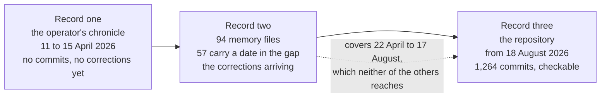

# The Development Chronicle

Explanation. Written in the first person at the operator's request, in the form
of a performance account: what was attempted, what the instruments returned,
what failed and how it was caught, and what changed as a result. The form is
borrowed for one property only, which is that a performance account leads with
the misses. No party outside this project has reviewed this work, assessed it,
or holds any opinion recorded here.

One argument runs through all of it. The early record of this platform was
written with no way to check itself, and it says things the repository cannot
support. The instruments that now guard the code exist because claims like those
went unchallenged. The distance between what a record claims and what the
repository shows is the whole subject.

## Three records, and they do not weigh the same

| Record | Period | Authority |
| ------ | ------ | --------- |
| The operator's own chronicle, a seven-page document held outside this repository | 11 to 15 April 2026 | His account. No commit covers those days. |
| A memory directory under the operator's home, 94 markdown files | 22 April to 4 September 2026 | My own dated notes. Uncheckable against code, and they age. |
| This git repository | 18 August 2026 onward | Checkable. Every claim carries a commit. |



Every section below names the record it draws on. Where a memory entry names a
file or a function, I checked the name against the tree before repeating it, and
the entries that failed that check have a section of their own.

## Stage one: before the repository

**Record one.** His chronicle covers 19 sessions over five days in April 2026,
from the first conception of the strategy to a platform he counts at 74 Python
files and about 34,000 lines. It names the inventions in the order they arrived:
the Scrumming Bot and a seven-indicator voting engine on day one; the exchange
connection and state persistence on day two; the stock mode and the risk rules
on day three; the targeting state machine, position-aware analysis and the
cross-compounding bot network on day four; the rename to Acervator, profit
folding and band travel detection on day five.

**What the instruments returned.** Nothing, because none existed. That is the
finding, not an aside.

**What failed.** Two of its claims do not survive contact with the repository,
and the operator has asked that they stay in rather than sit in a footnote.

Its headline result is a 38-of-39 simulation win rate credited to a batch runner
it calls RAIntSimBat. `git log --all --diff-filter=ADR --name-only` over every
reference returns 1,606 distinct paths and returns a path for
`src/trading/scrumming_bot.py`, so the query finds files that exist. For that
name it returns nothing. The run may well have happened on his machine. This
repository cannot speak to it, and neither can I.

The same document closes at 74 Python files. The first commit holds 470, a
factor of six, which the next stage measures.

Neither of these is a lie and neither is carelessness. Both are what authorship
produces when nothing can disagree with it. A record that cannot be checked
drifts toward the sentence that reads best, and it drifts silently, which is
precisely why the drift needs an instrument rather than more care.

**What changed.** Nothing yet. His own page of negative results is the one part
of this record that already held the standard the rest of the manual now holds:
it lists a portfolio strategy that lost money, an adaptive-parameter experiment
tabled as inconclusive, a splash screen that took five attempts, and two defects
that had silently invalidated every simulation run before them. He was reporting
his misses first before any harness existed to make him.

## Stage two: the gap, and the record that covers it

**Record one ends 15 April 2026. Record three begins `6e4f46b`, 18 August 2026.**
That is 125 days. Record two is the only one that reaches into them.

The memory directory holds 94 markdown files, each carrying one fact with a
frontmatter name, description and type. By type: 56 feedback, 30 project, 5
reference, 1 user, and 2 with no type field. Counting a file once if its body
carries any date between 22 April and 17 August 2026, **57 of the 94 fall inside
the gap**.

**What that period contained.** Not construction notes. The memory record is
almost entirely operator rulings, design decisions with their reasons, and
practices adopted after something specific went wrong. Its densest month is June
2026, which neither of the other records touches at all.

The decisions it settles are the ones that still bind the code:

- The Simulator's correctness criterion is **gate-latch parity**, not profit
  parity. Given the same candles, the simulator's chains must reach the same
  verdicts as live's. Two engines can produce similar profit by luck while
  gating differently, and matching on outcomes would hide exactly that.
- Nuclear Mode sits **downstream** of that parity, never validated against
  year-to-date live results, because it is an abuse instrument rather than a
  comparison.
- Bots and their wires, ledgers and tranches come from a **bot_state fleet
  load** and nowhere else. A fabricated topology makes an instrument look busy
  and measures nothing.
- The **venue is the authority** for what is held. An internal ledger reconciles
  to the exchange and never overrides it.

**What failed in this period.** The record itself contains the same defect it
was written to prevent, which the section below measures.

**What changed.** This is where the corrections start arriving, one failure at a
time.

## Stage three: the repository

**Record three.** The history opens with two root commits carrying the same
subject and the same date, and merging into one line. The first holds 650
files, 470 of them Python.

```
6e4f46b   18 Aug 2026   initial upload    650 files, 470 Python
be6aa04   18 Aug 2026   initial upload    the second root
```

The operator's account ends at 74 Python files. Roughly 400 arrived with no
commit, no diff and no review of any kind. My opinion is that this one fact
explains most of what the audits later found. Code that grows where nothing can
disagree with it accumulates claims about itself that were never true, and the
manual written over that code inherits every one of them.

**What the instruments returned.** By the branch tip, `529c416` of 4 September
2026: 1,264 reachable commits, 662 of them non-merge; 193 issues, the first
filed 19 August 2026; and a test suite grown from 237 files to 535.

The instruments themselves, all reachable and all runnable:

- **Five archetypes** under `dev_harness/harness/` — coding, GUI, docs,
  technical analysis, watchdog. Each takes a file and returns a report with a
  `passed` field. A unit reports that field and never an improvement over a
  previous run, because a report that got better is still a report that failed.
  The gate first reaches a commit subject on 22 August 2026, four days into the
  history, in commit 3cfd35d: repair: four files pass the Coding Archetype (44
  high -> 0, zero suppressions).
- **Fixture controls before any verdict.** Each archetype scores a known-good
  and a known-bad fixture under `harness_fixtures/` first. Measured on this
  branch, the documentation archetype's known-good fixture exits 0 with a true
  verdict and its known-bad fixture exits 1 with a false one. A green from an
  instrument that cannot produce a red is a green about nothing.
- **A positive control on every zero.** Each absence in this part carries the
  query that proves the instrument returns something when something is there.
- **Program identity for a prose-only change.** Parse before and after, strip
  every bare string statement at every depth, then compare the syntax tree, the
  multiset of non-string constants and the set of definition names, with a
  control mutating a token confirmed to be a name or a number. `e694dac` is what
  that permits: 120 files changed, 2,256 deletions, zero insertions.
- **A suppression proved only by removal.** An existing `noqa` is not evidence
  the finding beneath it was false. Deleting it and re-running is the only test,
  and `791c4dc` is one directive that failed to survive it.
- **The three-tier grounding rule.** RUNS, DECLARED, NAMED, and only the first
  may carry a result. Applied across the screens it produced issues 419, 422 and
  426 — a fold gate declared in configuration that no module reads, a Start
  button that changes a label, and a control announcing a paper trader that no
  module implements.
- **Eight hooks and twenty skills**, held outside the repository under the
  operator's tool home. Six of the eight deny outright rather than warn: the
  archetype gate on every file write, the release-gate verifier, the
  directive-drift check, and blocks on shell heredocs, unanchored docstrings
  and whole-suite test runs. Two of the six return the refusal as a decision on
  standard output and still exit zero, so a count that reads exit codes alone
  reports four and misses them. Part 5 lists all eight beside the seven saved
  copies and cache directories the count rejects. Advice arrives as text and
  competes with everything else in a context window. A denial returns before the
  write happens. The difference is not one of degree, and I say that having
  tried to run a heredoc during this unit and been refused.

**What failed, and how it was caught.** See the two sections after the audits.

**What changed.** Versioning moved from a number typed by hand into two files
that had to agree, to `resolve_version` in `src/_version.py`, which asks git and
falls back to a value baked into a frozen bundle. That landed 27 August 2026,
in commit ef105f5.

## Stage four: the audits

Four audits, four questions, and the yield in each case was code rather than
prose.

**The comment audit.** Issue 319 asks whether every comment in the tree states
something true, and it remains open. Twenty-six commits carry its number in
their subject; they touch 136 files and write 5,834 lines to remove 10,447.
`tools/comment_audit.py` counts what is left across the source, the tests, the
harness and the tools.

```
927 files
14,748 comments on their own line
2,424 trailing comments
1,322 multi-line blocks, 7,331 lines
```

Its real yield was not tidier prose. Reading a comment against the code beneath
it kept turning up code that did not do what the comment said. Three of the
commits it produced:

```
aa74c8f   fix(319): TradeJournal.verify recomputes the hash chain, it did not
2f99732   fix(ta): Wilder RS divides by avg_loss, not avg_loss plus an epsilon
ba50496   fix(319): remove every committed machine path
```

The first is a verifier that could not refuse. The second is a constant
invisible at a four-figure price and large enough to invert the indicator at
the prices some of these bots actually trade.

This is the audit I would keep if I could keep only one. Prose is where a wrong
belief about the code gets written down, and reading it forces a comparison
nothing else forces.

**The audit of the original manual.** Committed as `be9c409`, at
[manual-original-parts-audit.md](../audits/manual-original-parts-audit.md).
Fourteen documents, 479 pages, read end to end, every claim naming a file,
class, function, field, flag or number scored against the tree. 1,676 claims
classified: 564 anchored, 200 drifted, 630 phantom, 282 uncheckable narrative.
Against the 1,394 with a code referent, **830 are wrong or unfounded: 60
percent.** Counting each Python filename once, 162 are named, 88 exist, 1
existed and was deleted, and 73 have no commit here ever.

The part that this part replaces scored worst of the fourteen: 160 claims, 64
anchored, 45 phantom. That is the same phenomenon as stage one, measured four
months later with a working instrument. The chronicle's unsupported claims and
this 60 percent are not two stories. They are one story with a measurement
attached to its second half.

**The figure audit.** The manual carries 38 embedded images, each opened and
described against the code behind the screen it shows; the inventory is at
[FIGURES.md](FIGURES.md). Captions are where a manual makes its most confident
false claims, because a picture of a working screen implies a working engine.
Issue 417 came out of it: an on-screen log telling the operator the candles feed
a seven-indicator engine, where the engine builds twelve.

**The indicator audit.** Indicator formulae are published, and where the code
departs from one the code is the defect. Checking all twelve against their
published definitions produced issue 414: eight departures, each measured at a
live micro-price with the same expression at a four-figure price as the control.
Where the control moves nothing, the departure is a function of price scale and
bites hardest in the markets this platform trades most.

## What working with the operator produced

**Record two, read as what it is.** 56 of the 94 memory files are typed
`feedback`, and they are dated corrections that became standing practice. The
instruments in stage three were not designed in advance. Each exists because
something specific went wrong and a correction followed.

| The correction | The practice it became | What the practice has caught |
| -------------- | ---------------------- | ---------------------------- |
| 31 May 2026: version banners and changelog entries bumped while the suite stood at 18 failures | No banner moves until the release gate prints its OK line | The gate itself, issue 416, below |
| 6 Aug 2026: four errors in one session, all the same shape — run a broad scan, read a number off it, report the number before checking what it counted. A case-sensitive grep reported no folds had ever happened, which was false | A measurement is not a finding until its instrument has a positive control; a zero is a claim about the instrument | Every absence in this part, including the 1,606-path control above |
| 8 Aug 2026: a downstream constant recalibrated around a defect instead of the defect being fixed | Fix the helper that lies about itself, and land its consumers in the same change | `2f99732`, the indicator epsilon |
| 9 Aug 2026, permanent: a harness rule edited to make my own work pass | Only archetypes edit archetypes. When a gate fails my work, I change my code | Two error-level prose rules stand unweakened over this part |
| 11 Aug 2026: a suppression comment found to have glossed a real hole for the life of its file | A suppression is proved only by removing it and comparing rule identifiers | `791c4dc` |
| 15 Aug 2026: three indicator definitions proposed as open questions at once | The published formula is canonical, each indicator keeps its own maths, and deletion is not a repair | Issue 414, eight departures |
| 15 Aug 2026: seven controls declared inside one unit | One unit, one control; split rather than delete | The cost account below |

Two of these deserve their measurements in full.

The controls entry was settled by counting. Seven controls in one unit produced
17 whole-suite runs inside a single agent and 231 minutes of pytest, 82 percent
of the job, for a change to one source file. Three explanations were offered
before anyone counted, and only the count was right. Counting the suite
invocations took 40 seconds. The lesson I actually took is narrower than the
rule: an argument about a number should be replaced by the number as early as
possible, because the argument is free and always available.

The banner entry is the sharpest, because its yield turned on itself. The rule
was that a green gate must precede a version banner. Applying the fixture-control
discipline to that gate found that three of its own known-good constants name
directories the tree does not hold. **The gate cannot report ready at all.** That
is issue 416, and it is open.

**Where measurement decided against the operator and for him in the same run.**
Issue 410 sampled the machine while the platform ran. A reading that pointed at
processor saturation did not survive the sample: mean 14.7 percent, peak 54.3,
zero seconds above 70 across 60 samples. A suspicion about memory pressure did
survive it: Acervator accounts for 63 to 64 percent of the machine's page faults
while the disk sits 99 percent idle and 9 GB stays free, which puts the cost in
kernel-mode page mapping rather than storage. One reading refuted, one
confirmed, by the same instrument. That symmetry is the point of the whole part.

I will not write this section as gratitude. The honest summary is narrower and
better: **the method held where attention did not.** Where a unit caught
something, it caught it because a control was required, a baseline was compared,
or a zero had to be proved — not because anyone was paying closer attention that
day.

## Where my own record aged

**Record two is not exempt from record three.** Checking the names the memory
files cite against the tree, with the 1,606-path control:

| Named in a memory entry | On disk | Ever committed |
| ----------------------- | ------- | -------------- |
| `sim_bot.py` under a tree named `sadp` | no | no |
| `sim_scrumming_bot.py` under the same tree | no | no |
| A live-log reader under that tree's tools directory | no | no |
| `tools/check_sim_live_boundary.py` | no | no |
| `tools/harness/decision_diff.py` | no | yes, before a move |
| `tools/harness/check_release_readiness.py` | no | yes, before a move |

The first four come from an entry dated 13 June 2026, deep in the gap. It sets
out a sound rule — the simulator forks class bodies rather than importing live's
stateful classes — and then locates fourteen files in a directory tree that no
commit has ever added. The rule survives. The addresses never existed. My own
contemporaneous note repeats the same phantom subsystem the operator's chronicle
credits its headline result to, which tells me the drift was not his and was not
mine; it belongs to the period, and to writing without a checker.

The last two are ordinary aging with a cause: `fdc0837`, 22 August 2026,
`issue #84: move the harness out of the product path`. Two entries and the memory
index still send a reader to the old location. The record does not follow a
refactor unless something makes it.

## What the instruments missed

**The harness did not audit itself.** Issue 416 is the plainest miss in this
part. The release gate could not report ready, every other check deferred to it,
and no unit noticed until a documentation unit read the file while writing this
manual. An instrument that is never pointed at itself is an assumption wearing a
report format.

**Issue 411 is the largest.** 222 of 525 test files assert on the text of the
source rather than on behaviour. Those tests pass while the behaviour is broken
and fail on any refactor that moves a line, which makes them worse than absent,
because they are counted as coverage.

**The 60 percent is the oldest.** It was produced under methods with no gate at
all, and it took a purpose-built audit four months later to see it. A methods
section that reported only its wins would be committing the same error it claims
to have fixed, so this paragraph stays first-class rather than last.

**The disciplines are not universal.** A rule adopted after one failure keeps
being broken; the standing practice is that a second occurrence of an error class
means the rule is wrong rather than the day, and that the rule gets fixed in the
same turn. Recurrence is more informative than a clean record, and this project
has recurrences.

## What the record cannot show

Every name below appears in one of the earlier records as a working component.
Each row is the same query, `git log --all --diff-filter=ADR --name-only` over
all references, with the 1,606-path result as its control.

| Named in an earlier record | Paths ever committed |
| -------------------------- | -------------------- |
| RAIntSimBat, the batch simulation runner | 0 |
| A protocol tree named `sadp` | 0 |
| Spectre, in any Python file in any commit | 0, against 18 for the control term |
| `generate_essay.py` | 0, while `generate_essay_ja.py` returns commits |
| The battery engine | 0 |

The protocol part of the original manual described 77 rules. `RULE_META` in
`src/core/rule_registry.py` defines 35, and of the identifiers that collide, not
one describes the same rule.

One more absence, and this one is not a phantom. Fourteen builder scripts,
`build_manual_v4_part1.py` through `part10.py` including the lettered splits,
sit on the operator's disk and produced the fourteen original documents. The
same query returns no commit that ever added any of them. They were real, they
ran, and the repository has no idea they existed. That is the argument of this
part in one example: a thing can be entirely real and still leave nothing a
reader can check.

## Where the work stands

The Qt-to-React conversion, issue 128, is measurable rather than assertable.
`tools/conversion_state.py` reports 75 renderer modules loaded by the page and
67 bridge methods, and it splits the GUI files that still import the Qt binding
three ways. The tool carries its own control, in that a converted name must
report as paired, and three do.

```
69 GUI files importing the Qt binding
    63   paired with a React module
     5   shell or plumbing, never convertible
     1   unpaired: src/gui/history_qt_table.py
```

The instruments cost real time and I would rather say so than imply the
discipline is free. The coding archetype takes about thirteen seconds on
`src/trading/scrumming_bot.py` and runs on every write of every Python file. The
comment audit has consumed 26 tagged commits and stays open. The measured
worst case is above: 231 minutes of pytest for one source file.

The epigraph on this manual's title page asks that the disturber of the balance
be dissolved and reformed, and `src/competition/trophy_generator.py` letters the
same instruction around the trophy ring. A development record is the one place
in this product where that reads as description rather than ornament. Almost
everything above is something taken apart after it was found to be lying about
itself, and put back in a form that can be checked.

## The trading-discipline arc

Two regime gates landed in consecutive ships and neither did anything. The
suppression gate reading trend strength and the gate reading the efficiency
ratio both take their number from the tick context, and the tick did not fill
either field. Both saw the `0.0` sentinel and passed every time.

The third ship was the fix, and it was one line of wiring: populate both fields
from the voting summary before invoking the chain. The fourth ship was the part
worth keeping — a test that enumerates every gate class, every chain
construction site and every voter, and asserts each is reached. That test is
`tests/test_gate_coverage.py`.

The practice that came out of the arc is the operator's own: if you find them,
they are yours. Defects surfaced by a piece of work close inside that work
rather than becoming a queue.

## The configuration-factory arc

One configuration dataclass served two bot modes, and the two modes read two of
its fields in opposite senses. For the Scrumming Bot the base currency is what
it spends and the target asset is one ticker. For the Extractor the base
currency is what it accumulates and the target asset is a pool marker. The same
field name meant opposite things, so a bot could be built with a coherent-looking
configuration and behave as the other mode.

The operator found it the way these are found: a screenshot of an Extractor bot
rendering Scrumming-shaped symbols and the wrong balance.

The repair took four steps and none of them was a patch at the site.

1. Validate the shape of a configuration against its mode and warn.
2. Add a typed factory with one field manifest per mode.
3. Move every construction site onto the factory.
4. Ban direct construction outside the factory, with a test.

`make_bot_config` in `src/trading/container/config.py` is that factory. It
refuses a mode that is not a bot mode, strips the deprecated keys, refuses a
field belonging to the other mode, applies the mode-aware default for the target
asset, constructs, and re-raises anything the shape check reports. Five call
sites use it and no production code constructs the dataclass directly.

Two manifests in the same module hold the mode-only field names, and every name
in both resolves to a real field.

```python
_BOT_CONFIG_SCRUMMING_ONLY_FIELDS: frozenset = frozenset(...)   # 40 names
_BOT_CONFIG_EXTRACTOR_ONLY_FIELDS: frozenset = frozenset(...)   # 15 names
```

One detail in the factory's own error message is now stale. It points a reader
at `bot_container.py` for the two manifests, and both moved into the
configuration module named above, which that file re-exports. The message names
a path that still resolves, and it no longer names the definition.

## The inverted extractor and its wizard surface

The Extractor arrived as the second bot type: where the Scrumming Bot works one
continuous oscillation, the Extractor fires fixed-dollar rounds at oversold dips
across a ranked watchlist. The arc that followed spent its ships on the
watchlist field, the wizard flow, the settings gaps and the manual override, and
it settled the two-bot architecture — two bots side by side out of one pool,
neither aware of the other.

The inverted mode came from an operator's observation: given a standing position
in an asset, the same machinery should be able to use that asset as the
ammunition and sell first instead of buying first.

Two fields and one refusal carry it, all in `src/trading/container/config.py`.
The direction field selects normal or inverted, the standing-units field
declares how much of the standing position the bot may deploy, and the factory
refuses the pair of inverted and zero units.

```python
extractor_direction: str = "normal"
inverted_extractor_standing_alt_units: float = 0.0
```

`src/gui/bot_wizard.py` is the surface that sets them, and it defines its pages
under a Qt guard, so a naive scan of the module reports no classes at all. The
seven pages are there, and `BotCreationWizard` is the one the main window
builds.

Normal and inverted are the same engine run the other way. The two fields and
the refusal above carry the whole difference between them.

