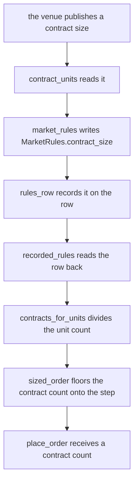
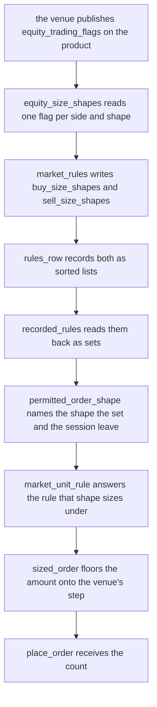
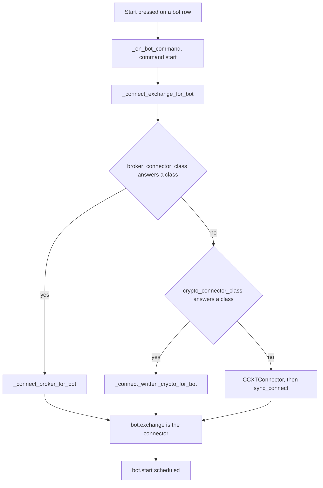
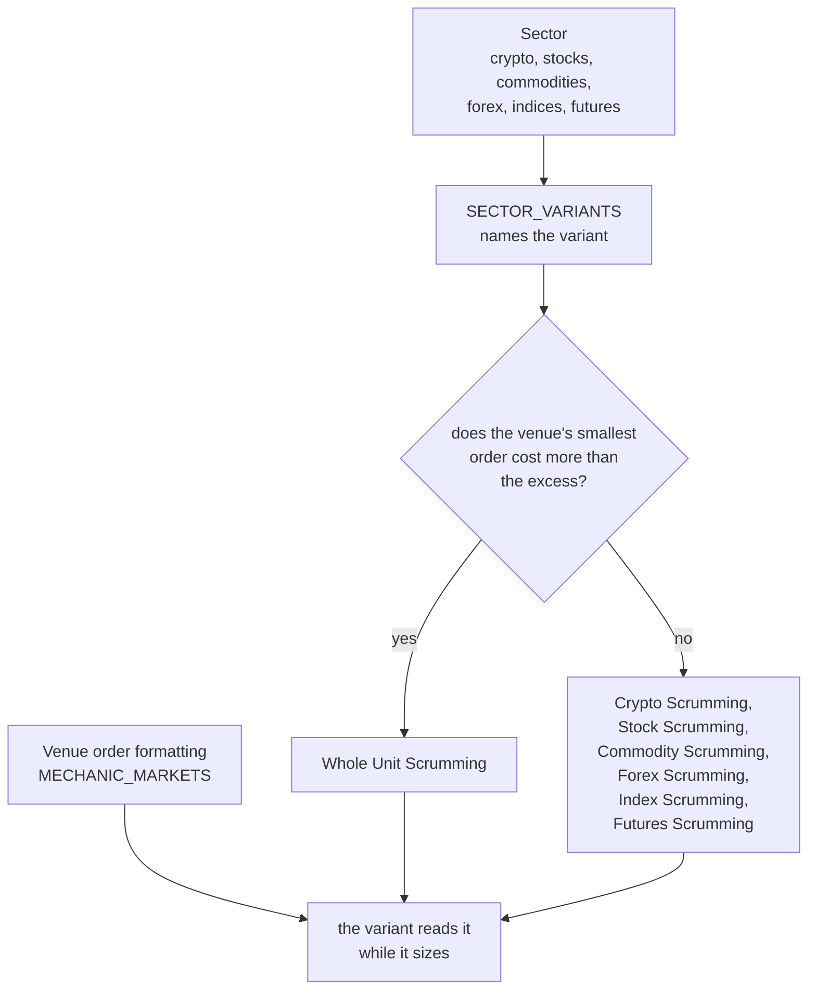

# Venue Compatibility

Reference. Every venue this platform can reach through an API, set beside the
asset classes it serves, the shape its orders take, and whether an accumulation
bot can trade on it unchanged.

A scrum sells the excess above a dollar target. That excess is an arbitrary
fraction of the held asset, so one question decides each venue: does the
fraction survive the venue's own size rule.

The index is [README.md](README.md). The connectors behind the crypto path are
described in [13-live-evidence.md](13-live-evidence.md), the screen that adds a
venue is in [08-tabs/settings.md](08-tabs/settings.md), and the per-class
fractional reading the simulator works from is in
[08-tabs/simulator.md](08-tabs/simulator.md).

No venue was contacted to write this page. Every venue fact below was read from
the publisher's own page outside this repository and handed to the page on
2026-09-24. Every tree fact carries its file and line.

This page is the venue level on its own. The three nested levels an operator
walks — the sector he presses, the venues that sector reaches, and the products
each venue serves under it — are in
[16-sector-exchange-product-tree.md](16-sector-exchange-product-tree.md). That
page also marks which of the venues listed here this platform has actually
reached, and which are research rather than connections.

## What a scrum asks of a venue

A scrum computes a size and submits it. Two steps stand between that size and
the venue: one truncates it to the venue's decimal places and refuses a size
under the venue's minimum, and one rounds it again inside the crypto connector.

OVERTAKEN, and the sentence above is kept as written. Three steps stand between
that size and the venue. The order gate floors the size onto the venue's own
published `amount_increment`, it refuses a size that steps under the venue's
`min_amount` or that floors to nothing, and the crypto connector rounds the
result again. The flooring runs through `sized_order`, the one function the
Simulator and the Paper Trader size with.

```python
# src/trading/bot_container.py:260
        _sized = sized_order(
            _amt, unit_rule(CLASS_CRYPTO, self.config.exchange_id), _rules
        )

# src/trading/bot_container.py:283
        if 0.0 < _sized.units < _amt:

# src/exchange/ccxt_connector.py:1128
        amount = self._ex.amount_to_precision(symbol, amount)
```

Two citations in the block below quote lines
`src/trading/bot_container.py` no longer holds at any line:
`if _min_amount > 0 and _below_min:` and the docstring naming
`(min_amount, min_cost, amount_precision)`. The block above carries the lines the
file holds today.

```python
# src/trading/scrumming/execution.py:1581
                amount=amount,

# src/trading/bot_container.py:226
        if _min_amount > 0 and _below_min:

# src/exchange/ccxt_connector.py:1061
        amount = self._ex.amount_to_precision(symbol, amount)
```

The minimum and the decimal places come off the market record the connector
reads, held per symbol. A lookup that fails gives no minimum and eight decimal
places, so the refusal stands down.

```python
# src/trading/bot_container.py:116
        """Return ``(min_amount, min_cost, amount_precision)`` for
        ``symbol``, cached; ``(0.0, 0.0, 8)`` on any lookup failure."""
```

The broker path carries neither step. It names the size `quantity` and sends it
unchanged.

```python
# src/stocks/broker_base.py:145
    async def place_order(
        self,
        symbol: str,
        side: OrderSide,
        quantity: float,

# src/stocks/alpaca_connector.py:176
            "qty": str(quantity),
```

Nothing in the running program builds that path. Outside its own module and the
stock window's own files, the broker connector is named once, in a docstring.

```python
# src/simulator/portfolios.py:26
"""The ``SUPPORTED_BROKERS`` key of the one broker connector, ``AlpacaConnector``."""
```

## The venues and the classes they serve

Sixteen crypto venues are offered. One has ever traded. The equity venue list
holds nine ids for eight firms, and two of those firms have no API to reach.

| Venue | Classes served | Reachable from the United States | Credential shape | Source |
| ----- | -------------- | -------------------------------- | ---------------- | ------ |
| coinbase | crypto spot; US futures products over the same API | no refusal recorded, 2026-08-28 | key and secret | `src/exchange/ccxt_connector.py, in SUPPORTED_EXCHANGES`; Coinbase developer documentation, Advanced Trade US derivatives |
| kraken | crypto spot | no refusal recorded, 2026-08-28 | key and secret | `src/exchange/ccxt_connector.py, in SUPPORTED_EXCHANGES` |
| gateio | crypto spot | no refusal recorded, 2026-08-28 | key and secret | `src/exchange/ccxt_connector.py, in SUPPORTED_EXCHANGES` |
| mexc | crypto spot | no refusal recorded, 2026-08-28 | key and secret | `src/exchange/ccxt_connector.py, in SUPPORTED_EXCHANGES` |
| bitfinex | crypto spot | no refusal recorded, 2026-08-28 | key and secret | `src/exchange/ccxt_connector.py, in SUPPORTED_EXCHANGES` |
| gemini | crypto spot | no refusal recorded, 2026-08-28 | key and secret | `src/exchange/ccxt_connector.py, in SUPPORTED_EXCHANGES` |
| bitstamp | crypto spot | no refusal recorded, 2026-08-28 | key and secret | `src/exchange/ccxt_connector.py, in SUPPORTED_EXCHANGES` |
| cryptocom | crypto spot | no refusal recorded, 2026-08-28 | key and secret | `src/exchange/ccxt_connector.py, in SUPPORTED_EXCHANGES` |
| kucoin | crypto spot | no refusal recorded, 2026-08-28 | key, secret and passphrase | `src/exchange/ccxt_connector.py, in PASSPHRASE_EXCHANGES` |
| okx | crypto spot | no refusal recorded, 2026-08-28 | key, secret and passphrase | `src/exchange/ccxt_connector.py, in PASSPHRASE_EXCHANGES` |
| bitget | crypto spot | no refusal recorded, 2026-08-28 | key, secret and passphrase | `src/exchange/ccxt_connector.py, in PASSPHRASE_EXCHANGES` |
| binance | crypto spot | no, public endpoints refused a US address, 2026-08-28 | key and secret | `src/exchange/ccxt_connector.py, in US_IP_BLOCKED_EXCHANGES` |
| bybit | crypto spot | no, public endpoints refused a US address, 2026-08-28 | key and secret | `src/exchange/ccxt_connector.py, in US_IP_BLOCKED_EXCHANGES` |
| poloniex | crypto spot | no, the terms refuse a US account, 2026-08-28 | key and secret | `src/exchange/ccxt_connector.py, in US_ACCOUNT_RESTRICTED_EXCHANGES` |
| huobi | crypto spot | no, the terms refuse a US account, 2026-08-28 | key and secret | `src/exchange/ccxt_connector.py, in US_ACCOUNT_RESTRICTED_EXCHANGES` |
| Alpaca | equities and exchange-traded funds, which is every commodity row this tree carries | yes, US broker | key and secret | `src/gui/main_tabs/asset_class_surface.py:33`; Alpaca fractional trading documentation, read 2026-09-24 |
| Interactive Brokers | equities, funds, futures and 100 or more currency pairs | yes, US broker | a TWS session, shape not stated by the pages read | `src/gui/main_tabs/asset_class_surface.py:33`; Interactive Brokers TWS API documentation, read 2026-09-24 |
| Schwab | equities and options, individual accounts | yes, US broker | issued on the Schwab developer portal, shape not stated by the pages read | `src/gui/main_tabs/asset_class_surface.py:33`; Schwab Trader API developer portal, read 2026-09-24 |
| tastytrade | equities, options, futures and crypto, through one API | yes, US broker | not stated by the pages read | `src/gui/main_tabs/asset_class_surface.py:33`; tastytrade API documentation, read 2026-09-24 |
| E\*TRADE | equities | yes, US broker | not stated by the pages read | `src/gui/main_tabs/asset_class_surface.py:33`; E\*TRADE developer documentation, read 2026-09-24 |
| Webull | equities | yes, US broker | not stated by the pages read | `src/gui/main_tabs/asset_class_surface.py:33`; the fractional-support table TradersPost publishes for the brokers it connects, read 2026-09-24 |
| TD Ameritrade | none reachable | no, the API was discontinued on 10 May 2024 and registrations did not carry over | none | `src/gui/main_tabs/asset_class_surface.py:33`; Charles Schwab notice of the discontinuation, read 2026-09-24 |
| Fidelity | none reachable | no retail trading API is published | none | `src/gui/main_tabs/asset_class_surface.py:33`; Fidelity, read 2026-09-24 |
| OANDA | forex | yes, CFTC-registered and NFA-regulated | a v20 REST token, shape not stated by the pages read | OANDA v20 REST API documentation, read 2026-09-24 |
| FOREX.com | forex | yes, CFTC-registered and NFA-regulated | not stated by the pages read | FOREX.com, a StoneX brand, read 2026-09-24 |
| tastyfx | forex | yes, CFTC-registered and NFA-regulated | not stated by the pages read | tastyfx, the US brand of IG, read 2026-09-24 |
| Tradovate | commodity and index futures | yes, US broker | not stated by the pages read | Tradovate, read 2026-09-24 |
| NinjaTrader | commodity and index futures, with direct access to CME Group, Eurex, ICE and Coinbase Derivatives | yes, US broker | not stated by the pages read | NinjaTrader Clearing, read 2026-09-24 |

Two things in the table come from the tree rather than from a venue. The nine
equity ids name eight firms, because one firm carries two.

```python
# src/gui/main_tabs/asset_class_surface.py:33
EQUITY_VENUES = frozenset(
    {
        "alpaca",
        "ibkr",
        "schwab",
        "tdameritrade",
        "webull",
        "tastytrade",
        "fidelity",
        "etrade",
        "interactivebrokers",
    }
)
```

Every commodity row this tree carries is a US-listed fund share, so an equity
broker serves that class. The four spot metal rows name no venue at all, and
the fund rows name a price source rather than a place to send an order.

```python
# src/trading/ata_asset_maps.py:437
METALS_SPOT: tuple[AssetListing, ...] = tuple(
    AssetListing(symbol=one, quote=USD, form=FORM_SPOT)
    for one in ("XAU/USD", "XAG/USD", "XPT/USD", "XPD/USD")
)

# src/trading/ata_asset_maps.py:444
METALS_PHYSICAL: tuple[AssetListing, ...] = tuple(
    AssetListing(symbol=one, quote=USD, venue=VENUE_YAHOO, ticker=one, form=FORM_ETF)
    for one in ("GLD", "SLV", "PPLT", "PALL")
)
```

OVERTAKEN, and the table and the sentences above are kept as written. The
Classes served column reads "crypto spot" for fourteen of the fifteen crypto
venues. Thirteen of those fourteen also offer a product in a second sector, and
`asset_class_surface.venue_classes` now answers it. The readings are the
venue-and-sector readiness matrix in
[../audits/2026-10-07_venue_sector_readiness_matrix/REPORT.md](../audits/2026-10-07_venue_sector_readiness_matrix/REPORT.md).

| Venue | Sectors `venue_classes` answers |
| ----- | ------------------------------- |
| coinbase | crypto, stocks, commodities, forex, indices, futures_perps |
| kraken | crypto, stocks, commodities, forex, indices, futures_perps |
| okx | crypto, stocks, commodities, indices, futures_perps |
| bitget | crypto, stocks, commodities, indices, futures_perps |
| bitfinex | crypto, commodities, indices, futures_perps |
| binance | crypto, stocks, commodities, forex, indices, futures_perps |
| kucoin | crypto, stocks, commodities, futures_perps |
| gemini | crypto, commodities, forex, futures_perps |
| gateio | crypto, stocks, commodities, forex, indices, futures_perps |
| bitstamp | crypto, commodities, forex |
| cryptocom | crypto, stocks, futures_perps |
| mexc | crypto, stocks, futures_perps |
| bybit | crypto, futures_perps |
| huobi | crypto, stocks |
| poloniex | crypto |

Poloniex is the one venue that stays in crypto alone. Its own offering outside
crypto was not fetched, so it waits on the confirmation step.

Every broker but three gains a sector as well. A broker reaches a commodity and
an index as a fund share, which sizes like a share.

| Broker | Sectors `venue_classes` answers |
| ------ | ------------------------------- |
| ibkr | crypto, stocks, commodities, forex, indices, futures_perps |
| schwab | crypto, stocks, commodities, indices, futures_perps |
| tastytrade | crypto, stocks, commodities, indices, futures_perps |
| webull | crypto, stocks, commodities, indices, futures_perps |
| alpaca | crypto, stocks, commodities, indices |
| etrade | stocks, commodities, indices |
| fidelity | stocks |
| interactivebrokers | stocks |
| tdameritrade | stocks |

Fidelity holds stocks alone because its host refused every request, the control
included. The other two ids are the rows the issue names as wrong: one is a
second id for a firm already named, and the other names a firm whose developer
host has no DNS record.

### Coinbase serves three of the four classes

OVERTAKEN, and the Coinbase row above is kept as written. Its classes read
"crypto spot; US futures products over the same API". The same Advanced Trade
products endpoint also answers stocks, and it labels part of its futures list
with a commodity underlying, so Coinbase is listed under Crypto, Stock and
Commodities.

The endpoint takes a product type. Asked on 4 October 2026 with no credential
and no private route, it answered these counts.

```
product_type asked                       products answered
  (omitted)                              921, every one SPOT
  SPOT                                   921
  FUTURE                                 100, the dated contracts
  FUTURE, expiry type PERPETUAL          131
  EQUITY                                 1000
  OPTION_GROUP                           0
  FUTURE_GROUP                           0
  FOREX                                  refused, not a valid value
  COMMODITY                              refused, not a valid value
```

**There is no forex on this endpoint.** The venue refuses the word, and none of
the types it accepts answers a currency pair. Forex stays a sector with no
connected venue, and the three forex firms in the table above remain
unconnected.

**The equity list is capped and it is not stable.** One call answers at most
1,000 rows, a second page repeats the first, and two calls an instant apart
share only about a fifth of their rows. One market load records the 1,000 the
venue served that call.

**The commodity contracts are named by the venue, not by a table here.** Each
futures product carries its own asset-type label, and three of those labels name
a commodity family: metals, energy and commodities. Twenty-one products carried
one on 4 October 2026 — gold, silver, copper, platinum, natural gas and oil.

```python
# src/exchange/ccxt_connector.py
COMMODITY_FUTURES_ASSET_TYPES: frozenset = frozenset(
    {
        "FUTURES_ASSET_TYPE_COMMODITIES",
        "FUTURES_ASSET_TYPE_ENERGY",
        "FUTURES_ASSET_TYPE_METALS",
    }
)
```

**A stock whose ticker is already a crypto pair is not recorded.** Fifteen of
one equity call's thousand rows named a symbol the crypto list already held,
`BTC/USDC` among them. The crypto market keeps the symbol and the equity is
left out, so no crypto market can be replaced by a stock.

| what the recording holds for Coinbase | before | after |
| ------------------------------------- | ------ | ----- |
| rows in all | 1,144 | about 2,135 |
| crypto | 1,144 | 1,123 |
| commodities | 0 | 21 |
| stocks | 0 | about 990 |
| forex | 0 | 0 |

The crypto and commodity counts are fixed. The stock count moves with the slice
the venue serves and with how many of its tickers a crypto pair already holds:
two loads minutes apart recorded 987 and 993.

The 1,144 crypto and commodity rows are the same symbols as before, carrying
the same increments, minimums and ticks. An equity row carries the four figures
an order needs, read from the venue's own product record.

```
ZBH/USDC    stock   amount increment 1e-05   minimum 1e-05   tick 0.01
BTC/USD     crypto  amount increment 1e-08   minimum 1e-08   tick 0.01
```

## How an order names its size

A venue names an order's size in one of three ways: units of the base asset, a
share count, or a whole contract. The smallest step and the minimum are the two
figures that decide whether a scrum can run.

| Venue | How the size is named | Smallest step | Minimum | Source |
| ----- | --------------------- | ------------- | ------- | ------ |
| coinbase, spot | units of the base currency | the product's own increment field | the product's own minimum size field | Coinbase Create a new order and Get Product, quoted with their read date in [08-tabs/simulator.md](08-tabs/simulator.md) |
| coinbase, US futures | not stated by the pages read | not stated by the pages read | not stated by the pages read | Coinbase developer documentation, Advanced Trade US derivatives, read 2026-09-24 |
| the other fourteen crypto venues | units of the base currency | published per product by each venue, not stated by the pages read | published per product by each venue, not stated by the pages read | each venue's own product record |
| Alpaca | either a share quantity or a dollar amount, never both in one order | nine decimal places of a share | 1.00 USD on a buy | Alpaca fractional trading documentation, read 2026-09-24 |
| Interactive Brokers | a share or contract quantity | not stated by the pages read; a minimum price increment is published per contract | not stated by the pages read; an oversized order is refused with error 201 | Interactive Brokers TWS API order limitations and minimum increment pages, read 2026-09-24 |
| Schwab | not stated by the pages read | not stated by the pages read | not stated by the pages read | Schwab Trader API developer portal, read 2026-09-24 |
| tastytrade | not stated by the pages read | not stated by the pages read | not stated by the pages read | tastytrade API documentation, read 2026-09-24 |
| E\*TRADE | not stated by the pages read | not stated by the pages read | not stated by the pages read | E\*TRADE developer documentation, read 2026-09-24 |
| Webull | a share quantity | two decimal places of a share | not stated by the pages read | the fractional-support table TradersPost publishes for the brokers it connects, read 2026-09-24 |
| OANDA | units of the base currency | one unit, in place of a thousand-unit micro lot | one unit | OANDA v20 REST API documentation, read 2026-09-24 |
| FOREX.com, tastyfx | not stated by the pages read | not stated by the pages read | not stated by the pages read | each firm's own documentation, read 2026-09-24 |
| Tradovate, NinjaTrader | whole contracts | the contract specification of the product, not stated by the pages read | the contract specification of the product, not stated by the pages read | each product's contract specification |

A cell reading "not stated by the pages read" is a gap, not a zero. What closes
each one is named beside it: the venue's product record for a crypto step, the
firm's order specification page for a broker, and the exchange's contract
specification for a futures product.

## Whether a scrum's excess survives the size rule

A scrum's excess is an arbitrary fraction. A venue whose smallest step is
coarser than that fraction cannot carry the strategy unchanged.

Two questions decide a venue, and every row answers both with a yes or a no.
The first is whether an order can be placed over an API at all. The second is
whether the excess survives the venue's size rule. Readings taken 2026-09-24
from each venue's own published documentation, and from the fractional-support
table TradersPost publishes for the brokers it connects.

| Venue | Orders over an API | Does the excess survive | Why, and where the reading came from |
| ----- | ----------------- | ----------------------- | ------------------------------------ |
| coinbase, spot | yes | yes | nine decimal places, and the size is truncated to the product's decimal places and refused under the product's minimum before the API is called, at `src/trading/bot_container.py:264`. Coinbase developer documentation, read 2026-09-24 |
| coinbase, US futures | yes | no | a futures contract is whole, so an excess under one contract cannot be sold. Coinbase developer documentation, Advanced Trade US derivatives, read 2026-09-24 |
| kraken, kucoin, okx, gateio, bitget, mexc, bitfinex, gemini, bitstamp, cryptocom | yes | yes | nine decimal places. Each venue's own documentation, read 2026-09-24 |
| binance, bybit | yes, and the address is refused from the United States | yes | nine decimal places. Each venue's own documentation, read 2026-09-24. The refusal is a tree reading dated 2026-08-28, at `src/exchange/ccxt_connector.py, in US_IP_BLOCKED_EXCHANGES` |
| poloniex, huobi | yes, and a United States account is restricted | yes | nine decimal places. Each venue's own documentation, read 2026-09-24. The restriction is a tree reading dated 2026-08-28, at `src/exchange/ccxt_connector.py, in US_ACCOUNT_RESTRICTED_EXCHANGES` |
| Alpaca | yes | yes | nine decimal places on a share quantity. The 1.00 USD floor is published for a buy, and the tree sends a share quantity and never a dollar amount, at `src/stocks/alpaca_connector.py:176`. Alpaca fractional trading documentation, read 2026-09-24 |
| Webull | yes | yes | two decimal places on a share quantity, which is finer than one dollar on any share this fleet holds. The fractional-support table TradersPost publishes, read 2026-09-24 |
| Interactive Brokers | yes | no | a quantity order rounds down to whole shares, and a fraction is reached only by naming a cash amount. Interactive Brokers TWS API documentation, read 2026-09-24 |
| Schwab | yes | no | the Trader API places no fractional order at all. Schwab Trader API developer portal, read 2026-09-24 |
| tastytrade | yes | no | a fractional quantity is not carried for automated trading. tastytrade API documentation, read 2026-09-24 |
| E\*TRADE | yes | no | it sells no fractional share of an individual stock. E\*TRADE developer documentation, read 2026-09-24 |
| TD Ameritrade | no | no | the API closed on 10 May 2024. Charles Schwab notice of the discontinuation, read 2026-09-24 |
| Fidelity | no | no | it publishes no trading API. Fidelity, read 2026-09-24 |
| OANDA, FOREX.com, tastyfx | yes | no | they size in whole currency units, so an excess under one unit cannot be sold and an excess above it is cut to whole units. Each firm's own documentation, read 2026-09-24 |
| Tradovate, NinjaTrader | yes | no | a futures contract is whole. Each product's contract specification, read 2026-09-24 |

Two limits apply to every row of that column. The truncation and the minimum
refusal run only on the crypto path, so a broker order reaches the venue
unsized. And a market lookup that fails leaves the bot with no minimum and
eight assumed decimal places, which stands the refusal down for that symbol.

```python
# src/trading/bot_container.py:130
            fallback = (0.0, 0.0, 8)
            self._market_limits_cache[symbol] = fallback
```

### 2026-09-24 - the failed-lookup half of that paragraph is repaired

The sentence above is kept as written:

> And a market lookup that fails leaves the bot with no minimum and
> eight assumed decimal places, which stands the refusal down for that symbol.

That is what the code did. The true sentence is: a market lookup that fails
leaves the bot with no minimum, which it now holds as unknown rather than as
zero, so the refusal makes no comparison instead of silently passing every
size; the bot says so on the Console, and the failure is no longer remembered,
so the next order reads the market again.

The block quoted above is replaced by the block below. The coinbase, spot row
in the table still holds: while the lookup succeeds, the truncation and the
refusal are unchanged.

`src/trading/bot_container.py` — what a failed lookup answers now

```python
        unread = MarketRules(read=False)
        ...
            # A failure is not cached: caching it left the guard blind for the
            # container's life after one transient error.
            return unread
```

The record that replaced the tuple, and the comparison the guard now calls, are
described under
[13-live-evidence.md](13-live-evidence.md).

## Two variants cover every venue

The verdict column above falls into two groups and no more. A venue that reads
yes needs nothing new. Every venue that reads no is served by one second shape,
not by a shape of its own.

The first variant is the bot that runs today. It names a unit count, which is
the share quantity the broker connector already sends, quoted higher up this
page. It trades crypto and Alpaca unchanged.

The second variant names a cash amount instead of a unit count. Interactive
Brokers reaches a fraction that way. Alpaca carries the same field beside its
quantity. Schwab, tastytrade and E\*TRADE take the whole-share order that shape
produces. One variant covers all five.

```python
# PROPOSED, not present. The broker contract names a quantity alone.
    async def place_order(
        self,
        symbol: str,
        side: OrderSide,
        quantity: float | None = None,
        notional_usd: float | None = None,
        order_type: OrderType = OrderType.MARKET,
    ) -> StockOrder:
```

Futures sit under the second variant and carry one further condition. A position
small enough that its excess is under one contract cannot be scrummed at all,
which is a reading each market answers for itself.

## Cells on this page that the 2026-09-24 readings overtake

The size table above was written from what each venue's own size pages state.
The fractional readings taken on 2026-09-24 close several of its gaps. Each
earlier cell is quoted whole, and the reading that overtakes it sits beneath.

The four broker rows of the size table:

```
| Interactive Brokers | a share or contract quantity | not stated by the pages read; a minimum price increment is published per contract | not stated by the pages read; an oversized order is refused with error 201 | Interactive Brokers TWS API order limitations and minimum increment pages, read 2026-09-24 |
| Schwab | not stated by the pages read | not stated by the pages read | not stated by the pages read | Schwab Trader API developer portal, read 2026-09-24 |
| tastytrade | not stated by the pages read | not stated by the pages read | not stated by the pages read | tastytrade API documentation, read 2026-09-24 |
| E\*TRADE, Tradier, TradeStation | not stated by the pages read | not stated by the pages read | not stated by the pages read | each firm's developer documentation, read 2026-09-24 |
```

Overtaken on 2026-09-24. Each of those brokers steps in whole shares.
Interactive Brokers rounds a quantity order down and reaches a fraction only
through a cash amount. Schwab places no fractional order over the Trader API.
tastytrade does not carry a fractional quantity for automated trading. E\*TRADE
sells no fractional share of an individual stock.

The futures and currency rows of the size table:

```
| coinbase, US futures | not stated by the pages read | not stated by the pages read | not stated by the pages read | Coinbase developer documentation, Advanced Trade US derivatives, read 2026-09-24 |
| FOREX.com, tastyfx | not stated by the pages read | not stated by the pages read | not stated by the pages read | each firm's own documentation, read 2026-09-24 |
| Tradovate, NinjaTrader | whole contracts | the contract specification of the product, not stated by the pages read | the contract specification of the product, not stated by the pages read | each product's contract specification |
```

Overtaken on 2026-09-24. FOREX.com and tastyfx size in whole currency units, as
OANDA does. A futures contract is whole, at Tradovate, at NinjaTrader and on
Coinbase's US derivatives products, so one contract is the step.

The paragraph that follows the size table:

```
A cell reading "not stated by the pages read" is a gap, not a zero. What closes
each one is named beside it: the venue's product record for a crypto step, the
firm's order specification page for a broker, and the exchange's contract
specification for a futures product.
```

Overtaken on 2026-09-24 for the broker, the currency and the futures rows. The
crypto steps are the gaps that remain, and each venue's own product record still
closes one.

The row that recorded the last venue this page could not describe:

```
One id in the equity venue list has no reading behind it.

| webull | the id sits in `EQUITY_VENUES` and no page about it was read | Webull's own developer documentation: whether it publishes a trading API, its order fields, its smallest share step and its minimum |
```

Overtaken on 2026-09-24. Webull publishes a trading API, and its share quantity
carries two decimal places, so it sits in the tables above. Every id in the
equity venue list is now described.

Tradier and TradeStation are not on this page. No reading of 2026-09-24 states
whether either carries a fractional share.

The refusal quoted at the top of this page, cited there to line 226 of
`src/trading/bot_container.py`:

```
        if _min_amount > 0 and _below_min:
```

Overtaken on 2026-09-24. The guard now reads a market record rather than three
loose numbers, and the refusal it makes sits at line 236 of the same file. The
verdict table above cites the new line.

## A market answers the same question for itself

The verdict column above is per venue and was read from published pages. A
market answers the same question from the figures its own record carries, and
the Market Inspector's ticker rows draw that answer.

```python
def tradeable_answer(
    rules: Any,
    price: Optional[float] = None,
    excess_usd: float = REFERENCE_SCRUM_EXCESS_USD,
) -> str:
```

### One rule, three answers

A market can be traded by the built variant when the smallest order the venue
accepts costs no more than the excess a scrum submits. The smallest order is
the venue's published minimum size, ceiled onto its own size increment, valued
at the venue's own last price, and never under its minimum order cost.

| answer | drawn on the row | when |
| --- | --- | --- |
| yes | `can size a scrum` | the smallest order costs no more than the excess |
| no | `cannot size a scrum` | it costs more |
| unknown | `size rules not read` | no market record was obtained |

Unknown is a third answer and never folds into either other. `MarketRules`
carries an unpublished rule as `None` and sets `read` to False when no record
was obtained at all, so a venue that publishes nothing and a venue nobody
reached are told apart.

```python
# src/exchange/base.py:122
    ``None`` is a rule the venue did not publish, never a rule of zero, and
    ``read`` is False when no market record was obtained at all.
```

### The excess the rule measures against

The excess figure is the largest one the saved fleet produces. Every bot in it
carries the same 5 per cent scrumming interval and the highest Target Balance
is 350 dollars.

```python
# src/trading/scrumming/sizing.py
LARGEST_FLEET_TARGET_USD = 350.0
FLEET_SCRUMMING_INTERVAL_PCT = 5.0

REFERENCE_SCRUM_EXCESS_USD = scrumming_interval_usd(
    LARGEST_FLEET_TARGET_USD, FLEET_SCRUMMING_INTERVAL_PCT
)
```

The largest is the right end of the fleet, not the smallest. `cannot size a
scrum` has to mean no bot at any target this fleet carries could size one
there. Read off a copy of the saved fleet: 38 bots, one interval value, targets
from 25 to 350 dollars, and an excess from 1 dollar 25 to 17 dollars 50. A
caller that knows one bot's own interval passes it instead.

### Which venues this reaches today

Only the crypto connector loads a market table, so only its markets answer yes
or no. Every other row answers unknown until a broker connector is wired. That
matches the verdict column: no Coinbase spot product reads `cannot size a
scrum`, because its minimum order cost is one dollar on most products and ten
on ether, and both sit under the excess.

The whole-share brokers, the whole-unit currency dealers and the futures venues
that read no in the verdict column are the markets the `no` answer is for. None
of them is wired, so none is drawn today.

### What this entry overtakes on this page

Nothing. Every sentence above it stands as written, and this entry only adds
the per-market answer beside the per-venue verdict.

The answer is for the one variant that exists, the bot that names a unit count.
The second variant names a cash amount and nothing in the tree constructs it,
so the ticker rows answer for the built variant alone and the offered list is
narrowed by that answer. It widens when the second variant lands.

## 2026-09-25 - the price step and the fraction declaration

A venue publishes three order rules, not two. Beside the smallest size it will
accept and the step that size moves by, it publishes the step a price moves by.
Coinbase names that third one `quote_increment` on its own product record, and
the record a bot reads now carries it.

```python
# src/exchange/base.py:131
    min_amount: Optional[float] = None  # base units
    min_cost: Optional[float] = None  # quote units
    amount_increment: Optional[float] = None  # base units a size steps by
    price_increment: Optional[float] = None  # quote units a price steps by
    read: bool = True
```

Read off four recorded Coinbase products: bitcoin and ether step by one cent,
TE-FOOD steps by a hundredth of a cent, and a product that publishes no step at
all carries the step as absent rather than as zero.

### The price a venue books

A venue does not book the price a bot names. It moves that price to its own
nearest step and books the result, so the money an order is worth is the size
times the stepped price. The minimum order cost is now compared against that
number.

```python
# src/trading/bot_container.py:294
                # The venue books a price on its own tick, so min_cost is
                # compared against the notional at that price.
                _booked_px = _rules.price_on_tick(_px)
```

The refusal the operator reads on the Console names both figures, so a price
that moved and a price that did not are told apart.

```
PRE-FLIGHT REJECTED: SELL A14/USD notional $0.3631 (0.0001000000 x
$3630.98000000) is below min_cost $10.0000. Priced at $3630.98000000 on a
price tick of 0.01. API not called.
```

A sub-cent market keeps its digits. A product priced at 0.0000037 dollars with a
step of a ten-millionth of a dollar reads `$0.00000370` on that line, because
every step is taken in exact decimal arithmetic and never by cutting a price to
a fixed number of places.

### Whether a market can be held in fractions

The size step already answers it, and no separate field says it again. A market
whose step is under one unit accepts a fraction of a unit; a market whose step is
a whole unit or larger takes whole units only; a market whose step the venue
never published answers neither.

```python
# src/exchange/base.py:133
    amount_increment: Optional[float] = None  # base units a size steps by
```

Read off the recorded products: bitcoin steps by a hundred-millionth and ether by
a ten-thousandth, so both take fractions. TE-FOOD and the expiring contract both
step by 1, so both take whole units only.

A field carrying the same answer a second time was written and then taken out,
because nothing in the running program read it. The reader arrives with the layer
that sizes an amount onto the step, and with the layer that picks the bot variant
a market needs. Until then the step is the answer.

### A floor of zero the venue never published

The unknown row of the three-answer table above is kept as written. It says the
unknown answer is drawn when no market record was obtained.

The true row is: the unknown answer is drawn when no market record was obtained,
and also when the venue published no size rule and no minimum order cost, because
the smallest order then costs an unknown amount rather than nothing.

A market that published nothing used to be offered as tradeable with a smallest
order of zero dollars. Zero is not a floor the venue gave; it is the figure left
over when no floor was read.

```python
# src/trading/scrumming/sizing.py:149
    if amount is None:
        return floor_usd if cost_published else None
```

A minimum cost the venue published **as** zero is a different thing, and it stays
a known floor of zero. Both were driven, and they answer differently.

| What the venue published | Smallest order | Answer |
| --- | --- | --- |
| nothing at all | not known | size rules not read |
| a minimum size alone | that size at the last price | yes or no |
| a size step alone | one step at the last price | yes or no |
| a minimum cost of zero, no size rule | zero dollars | yes |
| every rule | the larger of the two floors | yes or no |

Only the first row moves. Every market that published enough to answer still
answers, including a market whose venue published a minimum size and no step.
That matters for one venue Acervator offers: of 104 exchange classes in the
trading library, 102 publish a step-shaped size rule and 2 do not, and one of
those 2 is on the offered list.

Nothing else on this page is overtaken. The per-venue verdict column, the excess
figure and the two-variant reading all stand as written.

### The tuple this record replaced

The block under *What a scrum asks of a venue* is kept as written. It quotes a
docstring saying the lookup returns a minimum amount, a minimum cost and an
amount precision, cached, and zero, zero and eight on any lookup failure.

That tuple is gone. The bot reads a record instead, and the record holds an
unpublished rule as absent.

```python
# src/trading/bot_container.py
    async def _get_market_rules(self, symbol: str) -> "MarketRules":
        """Return the venue's published ``MarketRules`` for ``symbol``, cached,
        and an all-``None`` record when the lookup fails or the venue lists no
        such market."""
```

### Which step actually changes the size

The first sentence of *What a scrum asks of a venue* is kept as written. It says
two steps stand between the computed size and the venue, one of which truncates
the size.

Driven on the seven order readings above, the size the bot computes reaches the
connector unchanged in every one of them: 1234.56789 in and 1234.56789 out,
0.012345678912345 in and 0.012345678912345 out. The guard reads the market's
rules to refuse a size under the minimum and a notional under the minimum cost,
and it changes no size. The one place a size is stepped is the connector, at the
line quoted in that section. The docstring that said otherwise now carries the
true sentence beneath it.

### What the broker path still carries

Nothing. `src/stocks/broker_base.py` names no size rule, no price step and no
market record, and no code in the tree constructs a broker connector, so there
is nothing on that path for a rule to reach. The crypto record carries the
rules; the two order contracts stay separate.

OVERTAKEN, and the sentences above are kept as written. The broker path records
a market rule row for every asset record its own session reads. A session that
does not open reads no market list and leaves the rows already recorded alone.

```
src/gui/main_window.py       _connect_broker_for_bot opens the broker's session
src/gui/main_window.py       _read_broker_markets reads the asset list once a session
src/stocks/broker_base.py    open_session answers whether the session opened
src/stocks/broker_base.py    record_markets writes one row per asset record
```

## Where each venue fact was read

Each publisher's page was opened as a document outside this repository and
handed to this page on 2026-09-24. No endpoint was called, no credential was
sent, and no account page was opened. A rule a page does not state is written as
not stated rather than filled in.

```
Coinbase          Create a new order; Get Product; Advanced Trade US derivatives
Alpaca            fractional trading documentation
Interactive Brokers  TWS API order limitations; TWS API minimum increment
Schwab            Trader API developer portal; the TD Ameritrade discontinuation notice
tastytrade        API documentation
E*TRADE           developer documentation
Webull            the fractional-support table TradersPost publishes
Fidelity          the retail product pages, which publish no trading API
OANDA             v20 REST API documentation
FOREX.com         StoneX brand pages
tastyfx           IG US brand pages
Tradovate         product and API pages
NinjaTrader       NinjaTrader Clearing exchange access pages
```

The crypto venue set, the passphrase set and the two refusal sets are readings
this repository holds, dated in the file that carries them.

```python
# src/exchange/ccxt_connector.py:109
# Date the venue facts below were last measured.
VENUE_MEASUREMENT_DATE: str = "2026-08-28"
```

## 2026-09-25 - a back-tested order obeys the venue that would execute it

The Simulator and the Paper Trader reach no venue, so they could not read a
venue's order rules. They sized every order from a two-row table of cited unit
rules instead, and that table carries one fact: whether fractions are allowed.
An order sized that way says nothing about whether the venue would take it.

The live connector already reads each market's record. It now writes what it
read, once per read, into a recording under the runtime home, and the Simulator
and the Paper Trader read the recording.

```python
# src/exchange/market_rules_store.py:28
def store_path() -> Path:
    return Path.home() / ".acervator" / STORE_NAME
```

### What the recording changes about a back test

An order's amount is floored onto the venue's own size step, and an amount under
the venue's own minimum fills nothing. Where no recording exists for the market,
the cited table still answers, and the run says which of the two sized each
order.

```python
# src/trading/scrumming/sizing.py:272
def sized_order(units: float, rule: Optional[str], rules: Any = None) -> SizedOrder:
```

### The two figures a run reports

Every fill row on a Back Test report carries a **sized by** cell reading either
`recorded venue rules` or `cited unit rule`. Every bot row carries an **orders
refused** count, and the Activity Log names the reason behind each count.

Measured on `A34_5m_2026_coinbase`, 5,102 bars rolled to one hour, one bot at a
$350 target, sockets refused and the home redirected:

| Recorded size step | Orders filled | Orders refused | Fills on the step | Whole-unit fills |
| ------------------ | ------------- | -------------- | ----------------- | ---------------- |
| a hundredth of a unit | 21 | 710 | 21 of 21 | 0 of 21 |
| one whole unit | 20 | 709 | 20 of 20 | 20 of 20 |
| a hundredth, minimum 200 units | 0 | 25 | none to read | none to read |
| nothing recorded | 21 | 0 | not measurable | 0 of 21 |

The last row is the reading the Simulator gave before this change: amounts such
as `92.62189809510927` units, which sit on no step Coinbase publishes. The same
tape with a recorded step reads `92.61`, and with a whole-unit step reads `92`.

### Why the refusal count runs high

A fold spends what its queued tranches hold. Many of those spends buy under a
tenth of a unit, and Coinbase refuses an order that small. Those 710 orders were
previously booked as fills. A refused fold consumes no tranche, so the tranches
accumulate and a later fold fills at a legal size.

### What the recording does not yet reach

The minimum order cost is recorded and is not yet measured against a
back-tested order's notional. The live order guard already compares it, at
`src/trading/bot_container.py:305`. The live path also still sizes on the cited
fractional rule and does not floor onto the step.

OVERTAKEN, and the sentence above is kept as written. The live path floors onto
the venue's published step. `src/trading/bot_container.py:260` calls
`sized_order` at the one site every live order passes, so a recorded
`amount_increment` floors the amount, a recorded `min_amount` refuses it at
`:264`, and an amount that floors to nothing refuses at `:273`. The sized amount
reaches `exchange.place_order`, and `min_cost` is measured on it.

Driven on a bare host with the home redirected, every socket but loopback
refused, and an exchange stand-in that raises on every order call, an amount of
`92.62189809510927` units reaches the venue as `92.62` on a recorded hundredth
step and as `92.0` on a whole-unit step. The same amount reaches the venue
unchanged where the venue published no step. Of 10 amount-and-rule pairs driven,
**0** reach the venue larger than they were handed and **0** submit where they
previously refused.

A market whose venue published no step is not sized and is not refused on that
ground. `0.0 < _sized.units < _amt` guards the assignment, which refuses a larger
amount whatever answers it.

## 2026-09-25 - every venue set beside every other, and the verdict per venue

This page already answers one question per venue: does a scrum's excess survive
the venue's own size rule. That is one of five things the bot needs. This entry
adds the other four, sets all five side by side, and closes with a single yes or
no per venue.

Nothing above this heading is deleted or reworded. Two cells are overtaken and
both are quoted whole under *What this entry overtakes and what it corrects*.

### What the bot as written requires of a venue

Five requirements, each read off the tree. A venue meeting all five is traded by
the bot that exists today, with no variant.

```
1  a connector the running program constructs
   src/exchange/ccxt_connector.py:284   CCXTConnector, 30 importing sites
   src/stocks/broker_base.py:108        BrokerBase, no caller

2  an order whose size is a count of base units
   src/exchange/base.py:299   place_order(symbol, side, order_type, amount, price, ...)

3  a market order, a limit order, and a limit order carried immediate-or-cancel
   src/exchange/base.py:30    OrderType MARKET, LIMIT, IOC_LIMIT

4  a size rule the record can hold, and a smallest order under the excess
   src/trading/scrumming/sizing.py:272   sized_order

5  a market record the connector can read
   src/exchange/ccxt_connector.py:245    market_rules
```

OVERTAKEN for requirement 1, and the block above is kept as written. The broker
connector has a caller, and that caller opens the broker's session.

```
src/gui/main_window.py             _connect_exchange_for_bot sends a broker venue
                                   down the broker path
src/gui/main_window.py             _connect_broker_for_bot builds the connector
src/stocks/alpaca_connector.py     broker_connector_class names the class per venue
```

### Whether Acervator itself can reach a venue today

The reachability column higher up this page answers whether the venue accepts a
United States account. This one answers a different question: does the running
program hold code that submits an order there.

| Venue | Class | A connector the program constructs | What was measured |
| ----- | ----- | ---------------------------------- | ----------------- |
| the fifteen crypto ids | crypto | yes, one connector serves all fifteen | `git grep` finds 30 sites importing the crypto connector |
| Alpaca | stocks | no | the one broker connector is imported by nothing |
| Interactive Brokers, Schwab, tastytrade, E\*TRADE, Webull, TD Ameritrade, Fidelity | stocks | no | no module names any of the seven |
| OANDA, FOREX.com, tastyfx | forex | no | no venue list holds a forex id |
| Tradovate, NinjaTrader | futures | no | no venue list holds a futures id |

Two searches over the git index give that column, and the second is the control
for the first.

```
git grep -n alpaca_connector -- src/ main.py tools/
  -> src/stocks/alpaca_connector.py:2, its own docstring, and nothing else

git grep -n broker_base -- src/ main.py tools/
  -> src/stocks/alpaca_connector.py:14, and the module's own docstring

control, the same command on the crypto connector
git grep -n ccxt_connector -- src/ main.py tools/
  -> 30 sites, one of them importing it under an alias
```

The equities order path is a contract with no caller. A venue served only by
that path cannot be traded today whatever its own rules allow, and that is the
reason every stocks row above reads no.

OVERTAKEN for the Alpaca row and for the sentences above, and all of them are
kept as written. A Start press on a stock bot now builds the Alpaca connector,
opens its session on the broker's paper host with the stored key and secret, and
records one market rule row for every asset record the session answers. A key
stored for one host reaches that host alone. The order call is still not
reached, because a bot holds one crypto exchange and the two order contracts
name their size differently.

```
src/gui/main_window.py        _connect_exchange_for_bot, on a Start press
src/gui/main_window.py        BROKER_SESSION_PAPER, the host the session opens on
src/trading/bot_container.py  guarded_place_order, the one order call
```

### Every venue's order shape, set side by side

One order, two contracts, and the differences are visible in one table. The
crypto contract names an amount and hands it to the trading library, which
translates to each venue's own endpoint. The broker contract names a quantity
and posts it as JSON.

| | Crypto, the fifteen ids | Alpaca, the one broker | Interactive Brokers, Schwab, tastytrade, E\*TRADE | OANDA, FOREX.com, tastyfx | Tradovate, NinjaTrader |
| --- | --- | --- | --- | --- | --- |
| What an order must carry | symbol, side, type, amount, optional price, optional client order id | symbol, side, quantity, type, time in force, optional limit and stop prices | not stated by the pages read | not stated by the pages read | not stated by the pages read |
| Size named as | a count of base units | a share count, sent as a string | a share count | a count of currency units | a whole contract count |
| Price named as | a float moved to the venue's own tick | a string, only on a limit or stop order | a per-contract minimum increment | not stated by the pages read | the product's own tick |
| Order types the tree sends | market, limit, limit with immediate-or-cancel | market, limit, stop, stop limit, trailing stop are declared; nothing sends one | none, no connector exists | none, no connector exists | none, no connector exists |
| How it is submitted | the library's own create-order call | a POST to the broker's orders endpoint | not reached | not reached | not reached |
| Where it is read | `src/exchange/base.py:299` | `src/stocks/alpaca_connector.py:180` | this page's venue table | this page's venue table | this page's venue table |

Three differences the crypto path already absorbs per venue, and each is a line
in one connector rather than a variant.

```
src/exchange/ccxt_connector.py, in place_order
    the client-order-id field name per venue
        coinbase     client_order_id
        binance      newClientOrderId
        every other  clientOrderId

    no venue carries an immediate-or-cancel type, so it is sent as a limit
    order carrying timeInForce IOC

    a spot market buy on Coinbase needs a price, so a ticker is fetched first
```

OVERTAKEN, and the block above is kept as written. Kraken carried a fourth row
reading `userref`, which Kraken's own AddOrder page describes as a numeric
identifier, and the program's own client order id reads `acrv-` followed by a
hexadecimal digest. Kraken now takes the `clientOrderId` row, which the library
maps onto Kraken's own alphanumeric `cl_ord_id` field. Driven with the transport
replaced and no order sent, the body posted to `AddOrder` moved and the other
fourteen venues' bodies are unchanged. The readings are in
[../audits/2026-10-09_kraken_sector_order_formats/REPORT.md](../audits/2026-10-09_kraken_sector_order_formats/REPORT.md).

### The order types each crypto venue declares

The trading library publishes a capability map per exchange class. Read as
installed, with every socket refused and no venue contacted, it answers which
order shapes each of the fifteen offered venues declares.

| Venue | market order | limit order | market buy by cash amount | market sell by cash amount |
| ----- | ------------ | ----------- | ------------------------- | -------------------------- |
| binance | yes | yes | yes | yes |
| bitfinex | yes | yes | not declared | not declared |
| bitget | yes | yes | yes | no |
| bitstamp | yes | yes | not declared | not declared |
| bybit | yes | yes | yes | yes |
| coinbase | yes | yes | yes | no |
| cryptocom | yes | yes | no | no |
| gateio | yes | yes | yes | no |
| gemini | **no** | yes | not declared | not declared |
| huobi | yes | yes | yes | no |
| kraken | yes | yes | yes | no |
| kucoin | yes | yes | yes | yes |
| mexc | yes | yes | yes | yes |
| okx | yes | yes | yes | yes |
| poloniex | yes | yes | yes | no |

Three counts fall out of that table and each one bears on a variant. Every one
of the fifteen declares a limit order. Fourteen declare a market order, and the
exception is gemini. Eleven declare a market buy by cash amount, and only five
declare the sell side of it.

```
createOrder                     15 of 15
createLimitOrder                15 of 15
createMarketOrder               14 of 15   gemini declares it False
createMarketBuyOrderWithCost    11 of 15
createMarketSellOrderWithCost    5 of 15
createStopLimitOrder            11 of 15
createStopMarketOrder            8 of 15

control, the same reader on a capability the library does not carry
  has["createOrder"]          -> True
  has["zzNoSuchCapability"]   -> None
  keys in coinbase.has        -> 246
```

The fifth line matters more than its size suggests. A scrum sells, and a cash
amount reaches the sell side at a third of the offered venues.

### The size rule shape, and the two venues that publish none

The record a bot reads holds a size step. Of the 104 exchange classes the
installed trading library carries, 102 publish a step-shaped size rule and 2
publish significant-digit precision instead. One of those two is on the offered
list.

| Reading | Figure |
| ------- | ------ |
| exchange classes in the installed library | 104 |
| classes publishing a step-shaped size rule | 102 |
| classes publishing significant digits instead | 2, bitfinex and bithumb |
| of those two, on Acervator's offered list | 1, bitfinex |

Two controls sit beside that count. The reader answers a step under the
step-shaped mode and nothing under the significant-digit one, which makes the
figure 2 a fact about the venues rather than about the reader. Every class was
read with the socket constructor replaced by one that raises.

```
precision_to_increment("0.01", TICK_SIZE)           -> 0.01
precision_to_increment("2",    DECIMAL_PLACES)      -> 0.01
precision_to_increment("5",    SIGNIFICANT_DIGITS)  -> None

104 classes instantiated, 0 failed, sockets refused for the whole census
```

Driven on the five rule shapes a record can carry, the order gate floors an
amount only where a step was published. A venue publishing a minimum and no
step keeps its minimum refusal and takes no flooring.

| What the record carries | An amount of 92.62189809510927 becomes | Sized by |
| ----------------------- | -------------------------------------- | -------- |
| step 0.01, minimum 0.1 | 92.62 | recorded venue rules |
| minimum 0.1, no step | 92.62189809510927 | recorded venue rules |
| no minimum, no step | 92.62189809510927 | cited unit rule |
| step 1.0, minimum 1.0 | 92.0 | recorded venue rules |
| no record read | 92.62189809510927 | cited unit rule |

The control on that table is an amount under the minimum, which refuses rather
than sizing, so an empty refusal above is a reading and not a silence.

```
sized_order(0.05, fractional, MarketRules(min_amount=0.1))
  -> units 0.0, refusal "below the venue's minimum size"
```

The trading library still rounds the amount inside the connector for every
venue, so a significant-digit venue is not handed raw float digits. bitfinex
carries its own override of that rounding. Read with a planted market record and
no network, an amount of 92.62189809510927 came back as 92.62189 for a published
5 and as 92.62189809 for a published 8.

```
coinbase, published step 0.01   -> "92.62"
coinbase, published step 1.0    -> "92"
bitfinex, published 5           -> "92.62189"
bitfinex, published 8           -> "92.62189809"
bithumb,  published 4           -> "92.6218"
```

### Can the bot as written trade here

The deliverable. One row per venue, two yes-or-no columns, and every no naming
what would have to change. The first column asks whether the bot's own order
shape fits the venue's rules. The second asks whether an order can reach the
venue at all from this program and a United States account.

| Venue | The bot's shape fits | An order can reach it today | What the no is |
| ----- | -------------------- | --------------------------- | -------------- |
| coinbase, spot | yes | yes | — |
| kraken | yes | yes | — |
| kucoin | yes | yes | — |
| okx | yes | yes | — |
| gateio | yes | yes | — |
| bitget | yes | yes | — |
| mexc | yes | yes | — |
| bitstamp | yes | yes | — |
| cryptocom | yes | yes | — |
| bitfinex | yes | yes | — |
| gemini | **no** | yes | the venue declares no market order, and the bot names a market order at nine of the thirteen places it names an order type |
| binance | yes | **no** | the venue refuses a United States address; the bot's shape is not the obstacle |
| bybit | yes | **no** | the venue refuses a United States address; the bot's shape is not the obstacle |
| poloniex | yes | **no** | the venue restricts a United States account; the bot's shape is not the obstacle |
| huobi | yes | **no** | the venue restricts a United States account; the bot's shape is not the obstacle |
| coinbase, US futures | **no** | **no** | a contract is whole, and an excess under one contract cannot be sold |
| Alpaca | yes | **no** | nothing constructs the broker connector, so the order path has no caller |
| Webull | yes | **no** | nothing constructs a connector for it, and none exists |
| Interactive Brokers | **no** | **no** | a quantity order rounds down to whole shares, and no connector exists |
| Schwab | **no** | **no** | the Trader API places no fractional order, and no connector exists |
| tastytrade | **no** | **no** | no fractional quantity for automated trading, and no connector exists |
| E\*TRADE | **no** | **no** | no fractional share of an individual stock, and no connector exists |
| TD Ameritrade | **no** | **no** | the API closed on 10 May 2024 |
| Fidelity | **no** | **no** | no retail trading API is published |
| OANDA | **no** | **no** | whole currency units, and no connector exists |
| FOREX.com | **no** | **no** | whole currency units, and no connector exists |
| tastyfx | **no** | **no** | whole currency units, and no connector exists |
| Tradovate | **no** | **no** | a contract is whole, and no connector exists |
| NinjaTrader | **no** | **no** | a contract is whole, and no connector exists |

Ten venues answer yes to both. Every one of the ten is crypto spot, and every
one is reached by the single connector the program already constructs.

Four rows say no to the second column for a reason no variant can absorb: the
venue itself refuses the account. Nine rows say no because no connector exists.
Those nine are a construction that is missing, not a rule the bot cannot satisfy.

Two verdicts on this page are not answered and are written as such rather than
guessed. Whether each whole-share broker accepts a sell named as a cash amount
is not stated by any page read for this manual, and each firm's own
order-submission page answers it. The order types Schwab, tastytrade, E\*TRADE,
Interactive Brokers and the three currency dealers accept are likewise not
stated, and each firm's own order specification answers that.

### The variants this comparison implies

Three, and no more. Each is named by what it absorbs. None is built here, and
one of the three cannot be designed until a decision on the issue is answered.

The first names a cash amount where the bot names a unit count. It is already
proposed higher up this page and it absorbs a whole-share size rule. It reaches
Interactive Brokers, Schwab, tastytrade and E\*TRADE, and Alpaca carries the
same field beside its quantity.

```
# PROPOSED, not present. Quoted from this page's own proposal above.
    async def place_order(
        self,
        symbol: str,
        side: OrderSide,
        quantity: float | None = None,
        notional_usd: float | None = None,
        order_type: OrderType = OrderType.MARKET,
    ) -> StockOrder:
```

The second sends a limit order where the bot sends a market order. It absorbs
one venue, gemini, which is the only one of the fifteen that declares no market
order. It is the smallest of the three and it changes one field.

```
# PROPOSED, not present. The order type a venue declines is replaced.
#   gemini declares createMarketOrder False; createLimitOrder True.
#   A market order becomes a limit order priced to cross.
```

The third holds an excess until it reaches one whole unit, then sells one. It
absorbs every market whose smallest order costs more than a scrum's excess:
each futures venue, the three currency dealers, and any market whose own row
already reads that it cannot size a scrum. **It cannot be designed yet.** The
issue's first open decision is whether such a market is refused or whether the
scrum trigger changes for it, and the two answers build different variants.

```
In development. Decision 1 on the issue owns it.
```

Nineteen of the twenty-nine rows above need no variant at all. Ten trade today,
four are refused by their own venue, and nine wait on a connector rather than on
a shape. Saying so is the useful answer, and inventing a fourth variant to round
the list out would not be.

### What this entry overtakes and what it corrects

One sentence of this page is overtaken. It is kept as written:

> The verdict column above falls into two groups and no more. A venue that reads
> yes needs nothing new. Every venue that reads no is served by one second shape,
> not by a shape of its own.

The true sentence is: the verdict column falls into two groups on the size rule
alone, and the whole requirement set splits the no group into three. A
whole-share venue is served by the cash-amount shape. A venue declining a market
order is served by a limit-only shape, which the size rule cannot see. A market
whose smallest order costs more than the excess is served by neither, and waits
on the issue's first open decision.

One citation on this page has moved and the cells that carry it are kept as
written. The venue table names the equity venue list at line 33 of its module,
in nine of its source cells. That constant now sits at line 46, and line 33
holds a comment about button spacing.

```
src/gui/main_tabs/asset_class_surface.py:46   EQUITY_VENUES, nine ids
src/gui/main_tabs/asset_class_surface.py:65   LAYERED_CLASSES, crypto and stocks
```

OVERTAKEN, and the block above is kept as written. The layered class set now holds
all four asset classes, so Commodities and Forex each stand behind their own trading
layer on the Live tab.

```python
LAYERED_CLASSES = frozenset({"crypto", "stocks", "commodities", "forex"})
```

Two further citations elsewhere in this arc have moved the same way, and both
name a constant that exists. The cited unit rule table sits at line 57 of its
module rather than line 46, and the per-venue candle lengths sit at line 47 of
theirs rather than line 50.

Every other sentence above stands as written. The per-venue size table, the
excess figure, the three-answer rule and the per-market answer are unchanged by
this entry.

OVERTAKEN, and the block and sentences above are kept as written. The layered
sector set now holds six, so Indices and Futures / Perps each stand behind their
own trading layer on the Live tab beside the other four.

```python
LAYERED_CLASSES = frozenset(
    {"crypto", "stocks", "commodities", "forex", "indices", "futures_perps"}
)
```

No venue serves either added sector. The venue-to-sector map is unchanged, so
Coinbase still answers crypto, stocks and commodities and nothing else, and each
added sector draws its empty state with an Add Exchange button that cannot act.

## 2026-09-25 - a venue's own rules select the bot variant

A venue's own published rules pick the bot's shape. No setting offers the choice
and no screen exposes it. One function reads one market's record and answers with
a variant name, and the order path acts on that name at the single site every
live order passes. A record nothing has read selects the bot as written.

```python
# src/trading/scrumming/sizing.py:280
def venue_variant(
    rules: Any,
    price: Optional[float] = None,
    excess_usd: float = REFERENCE_SCRUM_EXCESS_USD,
) -> str:
    if rules is None or not getattr(rules, "read", False):
        return VARIANT_NONE
    if tradeable_answer(rules, price, excess_usd) == TRADEABLE_NO:
        return VARIANT_WHOLE_UNIT
    if getattr(rules, "order_types", None) == ORDER_TYPES_LIMIT_ONLY:
        return VARIANT_LIMIT_ONLY
    return VARIANT_NONE
```

### Which markets each variant states it can trade

Four names exist, counting the bot as written, and each one is named by the
market shape it absorbs. The program holds two of the four, and one function
answers per market whether the variant that market selects is one of the two.

```python
# src/trading/scrumming/sizing.py:264
VARIANT_MARKETS: dict[str, str] = {
    VARIANT_NONE: "a market naming a unit count on a venue taking a market order",
    VARIANT_LIMIT_ONLY: "a market on a venue declaring no market order",
    VARIANT_CASH_AMOUNT: "a market whose size is a whole share",
    VARIANT_WHOLE_UNIT: "a market whose smallest order costs more than the excess",
}

#: The variants the running program holds. ``VARIANT_CASH_AMOUNT`` has no caller.
VARIANTS_BUILT = frozenset(
    {
        VARIANT_NONE,
        VARIANT_LIMIT_ONLY,
        VARIANT_WHOLE_UNIT,
        VARIANT_ROLLING_POSITION,
    }
)
```

### The limit-only variant, and the one venue it reaches

The limit-only variant is built. It sends a limit order where the bot sends a
market order, and it changes one field. Gemini is its one venue. The order-type
table cites two pairs, Gemini is the only one of the two declaring no market
order, and a pair absent from that table declares nothing and is never read as
declining a type.

```python
# src/trading/scrumming/sizing.py:147
CITED_VENUE_ORDER_TYPES: dict[tuple[str, str], str] = {
    (CLASS_CRYPTO, "coinbase"): ORDER_TYPES_WITH_MARKET,
    (CLASS_CRYPTO, "gemini"): ORDER_TYPES_LIMIT_ONLY,
}
```

### The two variants named and not built

The cash-amount variant is named and nothing reaches it, because the equities
order path has no caller. The broker base declares the order method and no module
calls it, and no file outside its own imports the one broker connector that
exists.

```
src/stocks/broker_base.py:145      place_order, declared, called by nothing
src/stocks/alpaca_connector.py     imported by no file in src/, main.py or tools/
```

The whole-unit variant is built. It holds an excess until that excess reaches one
whole unit, then sells whole units. `VARIANTS_BUILT` holds its name, and
`variant_holds_market` reads the market's own step as well, so the variant
governs a market `market_unit_rule` reads as whole and no other.

```python
VARIANTS_BUILT = frozenset(
    {
        VARIANT_NONE,
        VARIANT_LIMIT_ONLY,
        VARIANT_WHOLE_UNIT,
        VARIANT_ROLLING_POSITION,
    }
)
```

### A market no variant trades is scanned, charted and reported

Exclusion is from trading, not from sight. A scan keeps such a symbol in its own
asset list and names it in a field of its own, so the market still draws its
chart and still reports. Every order path refuses that market carrying the
reason, and the reason names the variant the market needs beside the shape that
variant absorbs.

```python
# src/trading/ata_spm.py:965
    #: The symbols this scan read that no built bot variant trades, kept in
    #: ``assets`` so each one still charts and still reports.
    untradeable: tuple = ()
```

### The variant sentences this entry overtakes

Two passages above are overtaken. Both are kept as written. The first is the
count under the variants this comparison implies:

> Three, and no more. Each is named by what it absorbs. None is built here, and
> one of the three cannot be designed until a decision on the issue is answered.

The true sentence is: six variant names exist, counting the bot as written, and
the program holds five of them. The limit-only variant is built and Gemini is its
one venue. The whole-unit variant is built. The rolling position is built, and
`_tick_expiry_close` starts its close. The cash-amount variant is named and has
no caller.

The second is the heading over the earlier proposal:

> Two variants cover every venue

The true count is four names, two of them built. That heading counts the two
shapes the size rule can see, a unit count and a cash amount. It counts neither
the order-type shape, which the size rule cannot see, nor the whole-unit shape,
which waits on a ruling.

## 2026-09-25 - what each count over the verdict table measures

The verdict table above holds twenty-nine rows, and the prose around it carries
four counts of them. Three of the four are right about three different questions,
and the fourth matches no set the table holds. The figures below name the
question each count answers.

### The recount, and the control it was taken with

Read from the table's own two verdict columns, and from its reason column counted
by phrase:

```
rows in the table                                   29
the bot's shape fits reads yes                      16
both columns read yes                               10
the reason names the venue refusing the account      4
the reason ends "and no connector exists"            9
the reason names a connector at all                 11
rows a named variant absorbs                        11
rows no named variant absorbs                       18
```

The counter was calibrated on those same twenty-nine rows before any figure above
was taken. Three reason phrases the table carries returned 5, 3 and 1, and a
phrase planted for the purpose returned nothing and exited non-zero.

Three different questions therefore produce three different counts over one set
of rows, and none of the three is wrong about its own question. Sixteen rows need
no variant, because the bot's shape already fits the venue. Eighteen rows are
absorbed by no named variant, because no shape helps a venue that refuses the
account or a connector that is missing. Eleven rows are absorbed by a named
variant: four by the cash-amount shape, one by the limit-only shape, and six by
the whole-unit shape.

### The counting sentences this entry overtakes

Two passages are overtaken. Both are kept as written. The first is the closing
count:

> Nineteen of the twenty-nine rows above need no variant at all. Ten trade today,
> four are refused by their own venue, and nine wait on a connector rather than on
> a shape.

The true sentence is: sixteen of the twenty-nine rows read yes in the
bot's-shape-fits column, which is the column that says a variant is not needed.
The three figures beside that count answer three different questions and sum to
twenty-three, leaving six rows outside all three — gemini, coinbase US futures,
Alpaca, Webull, TD Ameritrade and Fidelity.

The second is the connector count above the variant list:

> Nine rows say no because no connector exists. Those nine are a construction
> that is missing, not a rule the bot cannot satisfy.

The true sentence is: nine rows carry a reason cell ending in that phrase, and
ten rows name a connector that does not exist, because the Webull cell words the
same absence differently. The Alpaca cell names a connector that does exist and
has no caller, which is why the figure for a missing connector is ten rather than
eleven.

## 2026-09-26 - a venue's expiry stops a buy and not a sale, and cash the venue has not settled is not spent twice

A venue can close a market on a date of its own, and it can take days to hand
over the cash from a sale. The record a bot reads carries both of those facts
now, beside the size and price rules already on this page. A venue that
publishes neither leaves both absent, and absent changes nothing.

```python
# src/exchange/base.py:141
    expiry_ms: Optional[float] = None  # epoch ms the venue closes the contract on
    settlement_days: Optional[float] = None  # days the venue takes to settle a sale
```

### The two rules the record carries beside the other four

Two members read the expiry. The first answers whether the venue published one
at all. The second answers how many days remain, and it turns negative once the
date has passed. A record holding no expiry answers False and nothing.

```python
    @property
    def expires(self) -> bool:
        """True while ``expiry_ms`` is a finite positive epoch, and False for the
        None a venue publishing no expiry carries."""

    def days_to_expiry(self, moment_s: float) -> Optional[float]:
        """Days from ``moment_s`` to ``expiry_ms``, negative once it has passed.

        None while ``expires`` is False or ``moment_s`` is not a finite number.
        """
```

### A buy refuses on every order path, and a sale passes

A market that publishes an expiry selects a fifth variant name, and the program
does not hold it. The function asks the expiry question first, before the size
question and before the order-type question, so a market with a date on it never
reaches either of them.

```python
# src/trading/scrumming/sizing.py:331
VARIANT_ROLLING_POSITION = "rolling position"

VARIANT_MARKETS[VARIANT_ROLLING_POSITION] = "a market the venue expires on a date"

# src/trading/scrumming/sizing.py:375
    if getattr(rules, "expires", False):
        return VARIANT_ROLLING_POSITION
```

Three order paths read that answer, one per data source, and each of the three
refuses a buy into such a market by name. The scan keeps the symbol in its own
asset list and names it in a field of its own, exactly as it does for any other
market no built variant trades.

```
src/trading/bot_container.py:370     the live order path
src/paper/paper_run.py:507           the Paper Trader's fold
src/simulator/back_test.py:1297      the back test's fold
src/trading/ata_spm.py:1323          the scan naming the market
```

### Why the two sides differ

The asymmetry looks inconsistent until a reader has the reason. Buying into a
market the venue removes on its own date takes on a thing that ends; the bot
would accumulate into a market that stops existing, and no rule in the tree yet
says which contract a position rolls into. Selling out of a position already
held takes on nothing. A bot holding such a position keeps scrumming it down by
its own cycles, and nothing rebuys it.

```python
# src/trading/bot_container.py, in guarded_place_order
        _closing = variant_permits_close(_variant) and side == OrderSide.SELL

        if not variant_built(_variant) and not _closing:
            self._refuse_order(...)
```

The sell that passes says so where the operator watches. The Console line names
the days left and whether a buy back into the contract still passes.

```
CLOSING AN EXPIRING MARKET: SELL <symbol> <units> is submitted, and the venue
expires this contract in <n> days (rolling position). A BUY is refused and
nothing rebuys it. The bot's expiry close is <action> at <n> days of lead.
```

Outside the lead time the same line reads *A BUY into it still passes until the
lead time is reached*, because the buy refusal fires only while the close acts.

### The action at expiry

The program starts the close itself.
`src/trading/scrumming/tick_phases.py, in TickPhaseMixin._tick_expiry_close`
reads the decision every tick and sells the held count in one order under
`EXPIRY_CLOSE_SELL_ALL`. `src/trading/scrumming_bot.py, in ScrummingBot.tick`
calls it ahead of every early return, so a position resting at its target still
closes. Under `EXPIRY_CLOSE_FINISH_LADDER` the program starts nothing and the
sell ladder finishes the position, which is what that setting means. No code
rolls a position into another contract.

```python
# src/trading/scrumming_bot.py, in ScrummingBot.tick
        if await self._tick_expiry_close(ticker):
            return
```

### A fold waits while the venue holds the cash

A sale whose cash the venue has not handed over has not returned its money, and
spending it would spend the same dollars twice. One figure answers how much of a
fold's own cash sits inside the delay, and a second holds the rebuy to the
wallet less that figure. With nothing to spend, the fold fills nothing, names the
reason, and leaves its tranches queued for the next round.

```python
# src/trading/scrumming/sizing.py:169
CITED_VENUE_SETTLEMENT: dict[tuple[str, str], float] = {
    (CLASS_CRYPTO, "coinbase"): 0.0,
}

HELD_UNSETTLED_CASH = "the venue has not settled the sale"

def unsettled_usd(tranches, moment_s, settlement_days) -> float:
def spend_less_unsettled_usd(spend, cash_usd, held_usd) -> float:
```

A cited delay of zero is a venue returning the cash at once, and it holds
nothing. A pair absent from that table publishes no delay, which also holds
nothing. Only a positive figure can hold a fold back.

### Where the settlement hold reaches

Two of the three folds read the delay at the point they size a rebuy. The third,
the live autonomous fold, does not read it. Live's manual rebalance does read it
and names the held amount on the Console.

```
src/paper/paper_run.py:542           the Paper Trader's fold reads the delay
src/simulator/back_test.py:1333      the back test's fold reads the delay
src/trading/scrumming/execution.py:953   live's manual rebalance reads the delay
the live autonomous fold             does not read the delay
```

The one venue this program records cites zero days, so no fold on any path holds
cash today. A venue citing a positive figure would reach the two folds above and
leave the live autonomous one spending cash it does not yet have.

### Which markets carry an expiry today

One hundred of them. The recording every back test and every paper run reads
holds one venue and 1,146 markets, and 100 rows carry an expiry. The recording
holds seven field names and the expiry is among them, so each dated row answers
a date and every other row answers absent, which is what a venue publishing no
expiry answers.

The figures below were read before the venue was recorded again, when the
recording held four field names and no expiry.

```
recorded coinbase markets                                1146
rows with a non-null expiry                                 0
CONTROL rows with a non-null minimum size                1146
CONTROL rows with a non-null minimum cost                1146
CONTROL rows with a planted absent key                      0
rows carrying a dated contract suffix                     100
dated rows with a non-null expiry                           0
CONTROL dated rows with a non-null minimum cost           100
distinct symbols the saved fleet names                     38
of those, symbols carrying a dated contract suffix          0
CONTROL of those, symbols carrying a quote separator       38
```

The controls sit in the same run as the figures they support, so a zero above is
a reading of the file and not of the reader. Two of the rows matter together: one
hundred recorded symbols carry a dated contract suffix and none of them carries
an expiry, because the recording predates the field. A fresh recording of that
venue would fill those hundred rows, and those hundred markets would then select
the fifth variant. The venue has since been recorded again and those hundred
rows carry a date, so all one hundred select the fifth variant today.

This reaches no live market. No symbol the saved fleet trades carries a dated
contract suffix, and the settlement table cites this venue at zero days.

### The sentences on this page that this entry overtakes

Nine passages are overtaken. Each one stays exactly as written, with the sentence
that is true today beneath it.

The first is the count of a venue's order rules:

> A venue publishes three order rules, not two.

The true sentence is: a venue's own product record publishes five rules, not
three. The four already named on this page sit beside the date the venue closes
the contract on. Two further fields on the record come from cited tables
rather than from the product record, and they are the order types and the
settlement delay. The trading session comes from the product record, and the
cited table answers only where the record carries no session.
`src/trading/scrumming/sizing.py, in session_for` reads the two in that order.

The second is the field block under that sentence. It lists four rules and the
read flag, and it stays as written. The true block carries eight fields before
that flag: the four it already lists, then the trading session, the order types,
the expiry and the settlement delay.

```python
# src/exchange/base.py:135
    min_amount: Optional[float] = None  # base units
    min_cost: Optional[float] = None  # quote units
    amount_increment: Optional[float] = None  # base units a size steps by
    price_increment: Optional[float] = None  # quote units a price steps by
    session: Optional[str] = None  # the session name the venue publishes
    order_types: Optional[str] = None  # the order types the venue declares
    expiry_ms: Optional[float] = None  # epoch ms the venue closes the contract on
    settlement_days: Optional[float] = None  # days the venue takes to settle a sale
    read: bool = True
```

The third is the variant function quoted under *a venue's own rules select the
bot variant*. The block stands as written, and the function answers the
rolling-position name first, before the size question and the order-type
question it already showed.

The fourth is the count of variant names:

> Four names exist, counting the bot as written, and each one is named by the
> market shape it absorbs. The program holds two of the four, and one function
> answers per market whether the variant that market selects is one of the two.

The true sentence is: five names exist, counting the bot as written, and the
program holds four of them. The fifth name is the cash-amount variant, which the
program names and does not build.

The fifth is the market table quoted under that count. It stands as written, and
it carries a fifth row now, naming a market the venue expires on a date.

The sixth is the heading over the unbuilt variants:

> The two variants named and not built

The true count is one named and not built: the cash-amount variant, which has no
caller. The rolling position is built, and `_tick_expiry_close` is the order the
expiry close starts by itself.

The seventh is the sentence about what an order path does with such a market:

> Every order path refuses that market carrying the reason, and the reason names
> the variant the market needs beside the shape that variant absorbs.

The true sentence is: every order path refuses a buy into that market carrying
the reason, and one unbuilt variant lets a sale out of it through. The rolling
position is that one, and only a sell passes.

The eighth and ninth are the two corrected counts written when the variants were
first set out:

> The true sentence is: four variant names exist, counting the bot as written,
> and the program holds two of them.

> The true count is four names, two of them built.

The same figure overtakes both. Six variant names exist and the program holds
five of them.

## 2026-09-26 - a market buy with no price is refused by the connector and names why

A market buy carries no price of its own. The venue prices it by multiplying the
amount by a price, so it needs one. The connector fetches a ticker to supply it,
for every venue, with no venue test in front of the fetch. That fetch fails in
two ways: the call raises, or the ticker carries neither a last price nor an ask
price.

Until now both failures dropped the price and sent the order anyway. The trading
library then refused it, from inside its own order builder, with a sentence about
its own argument list. The order reached no venue either way. What a reader could
not tell was which of the two failures had happened.

The connector refuses first now. It names the venue, the market and which of the
two failures occurred, writes one record at error level, counts one failure
against that market's breaker, and sends nothing.

```python
# src/exchange/ccxt_connector.py:1180
            if exec_price is None:
                from ccxt.base.errors import InvalidOrder

                refusal = (
                    f"{self._exchange_id} refuses a MARKET BUY on {symbol} with "
                    f"no price: {no_price_cause}"
                )
```

### What a reader sees when the ticker serves no price

Two sentences, one per failure, read off a run with every socket refused and the
home redirected.

```
coinbase refuses a MARKET BUY on A15/USD with no price:
  fetch_ticker raised RuntimeError: ticker endpoint down

coinbase refuses a MARKET BUY on A15/USD with no price:
  fetch_ticker served no last and no ask price
```

A market buy that does get a price is unchanged, and so are a limit order and a
market sell. Driven on the same run, the market buy reached the order call
carrying the figure the ticker served, the limit order reached it carrying its
own price with no ticker fetched, and the market sell reached it with no price
and no ticker fetched.

### The sentence this entry adds beneath

The page already carries the fetch, and that sentence stands as written.

> src/exchange/ccxt_connector.py:1132   a spot market buy on Coinbase needs a
> price, so a ticker is fetched first

The sentence beneath it: when that ticker serves no price the connector refuses
the order itself, names which step failed, and sends nothing to the venue.

The fetch stays unconditional, and the reason is a reading of the trading
library. The requirement is not declared in the library's capability map for the
venue the fleet trades. It sits in that class's own option map instead, where it
defaults to on. A reader that asked the capability map whether a price is needed
would answer no, and removing the price would break every live market buy on
that venue.

## 2026-10-04 - every sector has a unit rule, and a whole-unit position opens at two units

Nothing above this heading is deleted or reworded. Two sentences are overtaken
and both are quoted whole below.

The platform's owner set the rule for a market that cannot be held in fractions.

> Whole Unit Scrumming can be achieved as long as Target Delta drifts and the
> market structure satisfies the gates. Being forced to buy entire units only
> increases the risk due to having to put in or take out more than desired. As
> such, we can require the minimum units for initiating such a variant to be 2
> stock units. This will cut people out of the big markets but that is how it is
> regardless. We must have 2 units because we always have to have one or more
> units to move. We only move more than one unit when target delta exceeds value
> of one whole unit.

One unit cannot scrum. Selling the excess would hand back the whole position, so
two is the smallest a position can be and still give a unit away.

### The determination table answers all six sectors

Before this entry the table held two rows, so five of the six sectors Coinbase
serves had no rule at all. Each one now has a Coinbase row.

```python
# src/trading/scrumming/sizing.py:80
CITED_UNIT_RULES: dict[tuple[str, str], str] = {
    (CLASS_CRYPTO, "coinbase"): FRACTIONAL_UNITS,
    (CLASS_STOCKS, "alpaca"): FRACTIONAL_UNITS,
    (CLASS_FOREX, "coinbase"): FRACTIONAL_UNITS,
    (CLASS_STOCKS, "coinbase"): WHOLE_UNITS,
    (CLASS_COMMODITIES, "coinbase"): WHOLE_UNITS,
    (CLASS_INDICES, "coinbase"): WHOLE_UNITS,
    (CLASS_FUTURES_PERPS, "coinbase"): WHOLE_UNITS,
}
```

| sector | the rule | what the venue publishes |
| --- | --- | --- |
| Crypto | fractional | a spot pair sizes to eight decimal places |
| FX | fractional | a tokenised fiat pair is a spot pair |
| Stocks | whole | a share size must be a positive whole number outside the normal session |
| Commodities | whole | the dated contracts are indivisible; the tokenised metals are not, and their own step says so |
| Indices | whole | an index contract is indivisible |
| Futures and Perps | whole | a contract is indivisible |

### The venue's own record answers before the sector

A sector is not enough on its own. Coinbase puts a tokenised metal and a dated
contract in the same Commodities tab, and one of them divides while the other
does not. The market's own trading session decides it ahead of both, where the
caller names the moment the order is sized. The size step the venue publishes
for the market decides it, and the sector row answers only where the venue
published no step.

```python
# src/trading/scrumming/sizing.py, in market_unit_rule
def market_unit_rule(
    recorded: Any, asset_class: str = "", venue: str = "", moment_s: Any = None
) -> Optional[str]:
```

Driven on a made-up recording, with the home redirected and every outbound
socket refused:

| market | recorded step | sector row | the rule read |
| --- | --- | --- | --- |
| a dated metal contract | one whole unit | whole | whole |
| a tokenised metal | a hundred-millionth | whole | fractional |
| an equity the venue published no step for | none | whole | whole |
| a crypto pair | a hundred-millionth | fractional | fractional |

### The market's own session answers before its step

A US equity market takes a fraction of a share inside its normal hours and a
whole share outside them. The same market is therefore two size rules at two
hours of one day, and the step the venue publishes is the one its fractional
order carries. `session_for` names the session off the market's own record, and
the cited table answers only where the record carries none.

```python
# src/trading/scrumming/sizing.py, in session_for and session_unit_rule
def session_for(recorded: Any, asset_class: str, venue: str) -> Optional[str]:
def session_unit_rule(session: Optional[str], moment_s: Any) -> Optional[str]:
```

A US equity session wins wherever either source names it, so neither source
widens the hours the other restricts. A record carrying no session holds nothing
and demands nothing.

One market was driven through the order path twice, with the home redirected,
the transport raising on every call and no order sent. Its step is a hundredth
of a share, its minimum size a hundredth and its minimum cost ten dollars. The
order asked for 1.57 shares at six in the evening, New York time:

```
recorded session us_equity    rule whole        1.00 share, then held
recorded session continuous   rule fractional   1.57 shares, submitted
```

At eleven in the morning both answer 1.57 shares. A crypto market read 1.57
shares at both hours and in both runs, because its session gates no size.

### A bot reads its own sector rather than one fixed name

The order gate named one asset class for every bot. It now reads the class the
market recording holds for the symbol, and reads crypto where the recording
holds none, which is every market the recording was written for before the
sectors existed.

```python
# src/trading/bot_container.py, in _asset_class
    def _asset_class(self, symbol: str) -> str:

# src/trading/bot_container.py, in guarded_place_order, at _rule
        _class = self._asset_class(symbol)
        _now = time.time()
        _rule = market_unit_rule(_rules, _class, self.config.exchange_id, _now)
        _sized = sized_order(_amt, _rule, _rules)
```

OVERTAKEN, and the sentence above the first code block on this page is kept as
written: "The flooring runs through `sized_order`, the one function the
Simulator and the Paper Trader size with." The flooring still runs there. What
changed is the rule handed to it: the symbol's own class on the bot's venue,
rather than crypto for every bot.

### An opening order carries two whole units or it is refused

A whole-unit market is traded only by a position large enough to give one unit
back. The gate refuses a buy that would open such a position below two units,
and the refusal names the market, the units the order carries, one unit's price
and what two units cost.

```
PRE-FLIGHT REJECTED: BUY AAPL/USD: a whole-unit position opens at 2 units and
this order carries 1. One unit prices at $100.00000000, so 2 units cost
$200.0000. API not called.
```

The refusal only reaches an order that would open the position. A bot already
holding units buys one at a time, which is what a cycle moves by default.

```python
# src/trading/scrumming/sizing.py:673
WHOLE_UNIT_POSITION_MINIMUM = 2

# src/trading/scrumming/sizing.py:727
def position_minimum_refusal(
    symbol: Any, units: Any, price: Any, rule: Any, position_usd: Any
) -> str:
```

### A cycle moves the units the target delta justifies

The unit count a scrum sells is the target delta divided by one unit's price,
floored. Swept at a unit price of 100 dollars, from a target delta of nothing to
500 dollars in steps of 10, the count is 0 below 100, 1 from 100, 2 from 200, 3
from 300, 4 from 400 and 5 at 500. Every one of the 51 readings is a whole
number with no remainder above the module's grain, and the same sweep under the
fractional rule carries a fraction in 45 of the 51.

```python
# src/trading/scrumming/sizing.py:560
def sized_units(units: float, rule: str) -> float:
```

### What the whole-unit variant now trades

The variant was declared and nothing held it. It is held for a market whose own
rule reads whole, and a market that can be held in fractions keeps the refusal
it had.

```python
# src/trading/scrumming/sizing.py:508
def variant_holds_market(
    rules: Any,
    asset_class: str = "",
    venue: str = "",
    price: Optional[float] = None,
    excess_usd: float = REFERENCE_SCRUM_EXCESS_USD,
) -> bool:
```

OVERTAKEN, and the comment it quotes is kept as written: the module recorded
that the whole-unit variant "waits on the scrum trigger's ruling". The ruling is
the specification quoted at the head of this entry. `VARIANTS_BUILT` now holds
the name as well, and `variant_holds_market` answers for every market exactly
what it answered before.

### Where the sizing mode lives

Nowhere. No bot field holds it. It is worked out at each use from the symbol's
recorded class, the bot's venue and the market's own recorded step, the same way
the session, the order types and the settlement delay are already worked out. A
stored copy would be a third answer that can disagree with both the venue and
the table after a venue changes a rule.

### What this entry does not reach

The screen that builds a bot does not yet offer whole-unit sizing or hide a
market whose unit price puts two units out of reach. A market read as whole on
the Market Inspector still shows the refusal it showed before in its tradeable
column, which reads `tradeable_answer` and not the built set. Both are the
wizard's row of the build order.

An equity order still carries no session metadata, and a futures position is
still read from a spot balance rather than from the futures endpoints. Those are
the sector-specific order paths, a later row again.

## 2026-10-08 - the whole-unit variant is built, and its opening size is the operator's

Nothing above this heading is deleted. Ten passages are corrected in place
because the running program contradicts them, and each correction stands where
the old sentence stood.

The variant was held for a whole-unit market and the set of built names did not
hold it. The set holds it now, so every reader of that set answers for a
whole-unit market the way the order path already acted on one. The set holds the
rolling position as well, which the section *The contract variant is built*
below records.

```python
VARIANTS_BUILT = frozenset(
    {
        VARIANT_NONE,
        VARIANT_LIMIT_ONLY,
        VARIANT_WHOLE_UNIT,
        VARIANT_ROLLING_POSITION,
    }
)
```

### No market changes hands differently

`variant_holds_market` reads the set first and the market's own step second, so a
market whose smallest order costs more than a scrum's excess is held only where
`market_unit_rule` reads whole. Driven over all 1,146 recorded Coinbase markets
with no venue asked and no order placed, the variant, the hold answer and the
sized amount are the same figures before the change and after it.

| market form | rows | variant | held | 3.5 units size to |
| --- | --- | --- | --- | --- |
| fractional step | 821 | `none` | yes | 3.5 |
| whole step, no date | 225 | `whole-unit position` | yes | 3.0 |
| dated contract | 100 | `rolling position` | no | 3.0 |

### The scan note stops naming a market it trades

`ata_spm.untradeable_markets` and `ata_spm.untradeable_note` read
`untradeable_reason` as their own test, so the Market Inspector's scan note named
every whole-unit market as read and not traded while the order path traded it.
Driven over the recording, the note names the 100 dated contracts and no others.

| the scan note | before | after |
| --- | --- | --- |
| markets named read and not traded | 325 | 100 |
| characters of note | 4,923 | 2,204 |

The Simulator's Activity Log is unchanged. `back_test.variant_line` reads
`variant_holds_market` and its 1,146 lines hash the same before and after, 1,046
trading and 100 not traded.

### The refusal reason a built variant needs

A market selecting the whole-unit name whose own step is a fraction is still
refused, and the old reason said the variant was not built. `untradeable_reason`
reads `variant_holds_market` now and carries
`WHOLE_UNIT_STEP_IS_A_FRACTION` for that market instead.

```python
WHOLE_UNIT_STEP_IS_A_FRACTION = (
    "the whole-unit position variant sizes whole units and this market steps in "
    "fractions, so no built variant sizes an order costing this much"
)
```

### Open Position At reaches the refusal

The wizard's Open Position At box writes `whole_unit_opening_units` and the
refusal read a constant, so the figure the operator set changed nothing.
`opening_position_minimum` reads that figure now, and
`BotContainer.guarded_place_order` hands it to `position_minimum_refusal`.

The constant is a floor the setting cannot lower. The platform's owner set two
units as the smallest a whole-unit position may be, quoted under *2026-10-04 -
every sector has a unit rule, and a whole-unit position opens at two units*, so
a figure of one unit still opens at two.

Driven on a recorded whole-step market at one hundred dollars a unit, with no
venue asked and no order placed:

| Open Position At | the engine's minimum | a buy of 2 units |
| --- | --- | --- |
| 0, the engine's own | 2 | reaches the venue |
| 5 | 5 | refused, and the message names five units at $500 |

### The contract variant is built

A dated contract trades, and the bot gets itself out before the date.
`expiry_close_decision` reads the bot's own close action, lead mode, lead figure
and horizon. `_tick_expiry_close` reads that answer on every tick and places the
order the close starts by itself, so a contract whose price never fires a scrum
no longer expires held. Only the buy is refused, and only inside the lead time.

```python
# src/trading/scrumming/tick_phases.py, in TickPhaseMixin._tick_expiry_close
        if not decision["acts"]:
            return False
        if decision["action"] != EXPIRY_CLOSE_SELL_ALL:
            return False

        held = self._current_holdings
```

Driven on a recorded dated row at one hundred dollars a unit, with the home
redirected, no venue contacted and no order leaving the process. The same bot,
the same market, and the lead time set to eleven days:

| days to expiry | units held | what the tick does |
| --- | --- | --- |
| 3 | 5 | sells 5 units in one order |
| 40 | 5 | nothing; the ladder decides |
| 800 | 5 | nothing; beyond the horizon |
| 3 | 0 | nothing; no position to close |

A send the venue reports no fill for is not sent twice.
`_expiry_close_sent_units` holds the count that went out, and the close stands
down while the held count still equals it.

### The Simulator and the Paper Trader do not start the close

Both read `variant_holds_market` and `variant_refuses_sale`, and neither reads
`expiry_close_decision`. A dated contract now passes their buy, and no close
fires in either, so a dated position runs to its date in both. The platform's
owner deferred both surfaces until every variant is built.

## 2026-10-08 - a recorded market carries its session, its contract size and its quote step

A venue publishes three more facts per market, and the recording held none of
them. A recorded row now carries all three. The row's seven earlier keys are
unchanged.

```python
# src/exchange/base.py, in MarketRules
    quote_increment: Optional[float] = None  # quote units a cash amount steps by
    contract_size: Optional[float] = None  # base units one contract stands for
    session: Optional[str] = None  # the session name the venue publishes
```

Each value is read off the venue's own product record. The reader for each one
is named below, with the field the venue publishes it under.

| what the row carries | the venue's own field | the reader |
| --- | --- | --- |
| the step a cash amount moves by | `quote_increment` | `quote_step` |
| the units one contract stands for | `contract_size` | `contract_units` |
| the session the market trades in | `fcm_trading_session_details` | `market_session` |

### Why a quote step is a separate rule

A spot market buy reaches Coinbase as a cash amount, not as a count of units.
The venue rounds that amount by its own quote step. The recording held the price
step alone, because the connector library reads a product's price step first and
falls back to its quote step, so one recorded number could mean either. The
quote step is now read on its own and recorded beside the price step.

### Why a contract size is a separate rule

One contract can stand for a fraction of a unit. A count of contracts is then
not a count of units. The connector library reads this off a futures product and
reads nothing off a spot product, so the reader falls back to the venue's own
contract record.

```python
# src/exchange/ccxt_connector.py, in contract_units
    parsed = limit_to_float(held.get(CONTRACT_SIZE_FIELD))
    if parsed is not None:
        return parsed
    raw = held.get("info") or {}
```

### Which session a market trades in

An equity product trades the United States equity session. Coinbase takes a
market order for one only in regular hours, and takes whole shares alone in
every other session. A product carrying no session window takes an order at any
hour, which every spot pair and every perpetual does. A dated contract carries a
daily window, which is a moment and not a market rule, so no session name is
recorded for it.

```
equity product                             us_equity
no session window on the record            continuous
a daily window on the record               no name recorded
no session field on the record             no name recorded
```

### An absent rule and a rule of zero are different facts

A rule the venue did not publish is recorded as absent. A rule it published as
zero is recorded as zero. A reader of the recording tells the two apart.

| the venue published | on the row | read back |
| --- | --- | --- |
| no quote step | absent | absent |
| a quote step of zero | 0 | zero |
| no session | absent | absent |

### What was driven

Driven in one process with the home redirected to a scratch directory, every
socket to a venue refused, and no order placed. The three fields were written to
a scratch recording and read back out of it.

| the drive | the reading |
| --- | --- |
| the three fields written and read back | 6 markets, every value returned |
| every field of every live row read back | 1,146 rows, 6,876 values, 0 lost |
| a row written before the three fields | every earlier value kept, the three absent |
| a market read answering nothing | 0 rows written, 1,146 recorded rows stand |
| every order decision, the fields set against unset | 1,146 markets, 37,818 answers, 0 moved |

### What this changes on screen

Nothing yet. The three values are recorded and no screen draws them. The live
order path reads a recorded session through `session_for` and a recorded
contract size through `contracts_for_units`, so both reach an order today.
`BotContainer._get_market_rules` reads the recorded session first, the
precedence it already takes for a recorded order type.

### The price-step sentence this entry overtakes

The 2026-09-25 entry on the price step quotes a five-line copy of the carrier
and says a venue publishes three order rules. The carrier now holds ten rules
and a read flag. Every sentence of that entry stands as written.

## 2026-10-08 - a contract's size sizes the order

One contract can stand for a fraction of a unit. The venue's size field names a
count of contracts, and a count of units is then not the number to send. The
order path divides the unit count by the contract's own size before it sends
anything.

`src/trading/scrumming/sizing.py` - the two counts

```python
def contracts_for_units(units: float, contract_size: Optional[float]) -> float:
def units_for_contracts(contracts: float, contract_size: Optional[float]) -> float:
```

### Which count the venue's size field carries

Coinbase describes the order body's size as the amount of the first asset in the
pair. Its position endpoint and its close endpoint both call a futures size a
count of contracts. The two readings meet at one market shape: the venue's step
for a contract market is one contract, so the size field carries contracts and
the step floors contracts.

The venue's own sentences are quoted in
`docs/audits/2026-10-08_coinbase_sector_order_formats/REPORT.md`.

The connector library maps the venue the same way. Its order writer puts the
amount into the venue's size field with nothing in between, and its position
reader reports a count of contracts beside the contract size.

```
coinbase.create_order      base_size written straight from amount
coinbase.parse_order       filled read from filled_size
coinbase.parse_position    contracts from net_size, contractSize beside it
```

### Where the division sits

`BotContainer.guarded_place_order` divides the unit count into contracts, then
hands the contract count to `sized_order`. The step and the minimum the venue
publishes for a contract market are both counts of contracts, so they are
measured against the contract count. The dollar checks stay in units. The
smallest order value and the whole-unit position floor read the same figures
they always read.



### An absent contract size divides nothing

A contract size the venue did not publish is absent, and absent is not one. For
sizing, absent means the size field already carries units. Nothing divides and
the amount is unchanged.

`contract_size_divides` reads False for an absent contract size and False for a
published zero, which no division can use. A published zero stays
distinguishable from absent on the recorded row.

| the venue published | the order path divides by |
| --- | --- |
| no contract size | nothing; the unit count is sent |
| a contract size of one | nothing; one contract is one unit |
| a contract size of a hundredth | a hundredth; 5 units send 500 contracts |
| a contract size of zero | nothing; no division can use it |

### What the operator reads

A market with a contract size writes one more line before the order goes out. It
names the contract count, the unit count and the units one contract stands for.
The two size refusals and the step notice carry the same sentence, so a refused
order says which count fell short.

```
SIZED IN CONTRACTS: BUY <market> names 500.0000000000 contracts on a size step
of 1.0. One contract stands for 0.01 units, so 5.0000000000 units name
500.0000000000 contracts.
```

A market with no contract size writes no such line. Its order lines read exactly
as they read before.

### What the contract size was driven against

Driven in one process with the home redirected to a scratch directory, the
transport replaced by one that raises, and no order sent. The recording was read
and never written; its modification time is the same before and after every run.

| the drive | the reading |
| --- | --- |
| one contract market, 5 units, a contract size of one | 5 contracts |
| the same market, 5 units, a contract size of a hundredth | 500 contracts |
| the same market, 0.0137 units, a contract size of a hundredth | 1 contract, floored from 1.37 |
| a spot market with no contract size, 5 units | 5 units before, 5 units after |
| the expiry close selling a 5 unit position, a contract size of a hundredth | 500 contracts |
| the same close with no contract size and with a contract size of one | sends 5 in both |
| every order decision over the whole recording | 1,146 markets, 27,504 answers, 0 moved |
| the same decisions with a hundredth set on three sectors | 4,382 answers moved, 199 markets |
| the arithmetic over 15 contract sizes and 11 unit counts | 165 pairs, 0 faults either way |

The two whole-recording rows are a pair. The recording carries no contract size
on any of its 1,146 rows, so nothing moves. The same reading, run against a
contract size set on the futures, commodities and indices rows, moves 4,382 of
27,504 answers across 199 markets, and every mover sits in those three sectors.
Crypto, stocks and forex moved nothing in either run.

The arithmetic row swept every pair of 15 contract sizes against 11 unit counts.
A contract under one unit raised the count in all 55 of its pairs, a contract
over one unit lowered it in all 33, and `units_for_contracts` returned every one
of them to the unit count it started from.

### What a contract size changes on screen

Nothing yet. No row of the live recording carries a contract size, because the
running build predates the field. The futures and commodities markets move once
a build carrying the field records the venue again.
## 2026-10-08 - an equity order names the one size shape its product permits

One equity market takes three different size shapes at three hours of one day.
Coinbase publishes a permission per side and per shape on every equity product,
and the recording held none of them. A recorded row now carries both sides, and
the order path names the shape that is left.

`src/exchange/base.py`, in `MarketRules` - the two sides

```python
    buy_size_shapes: Optional[frozenset] = None  # size shapes a buy may name
    sell_size_shapes: Optional[frozenset] = None  # size shapes a sell may name
```

### The three shapes a size field takes

A size is a count of whole units, a count carrying a fraction, or a cash amount
in the quote currency. `SIZE_SHAPES` in `src/trading/scrumming/sizing.py` holds
the three names and nothing else. A name outside the three is no shape, so a
corrupt recorded value widens nothing.

```
whole units          a positive whole count of the asset
fractional units     a count carrying a fraction, floored onto the venue's step
cash amount          an amount of the quote currency, not a count
```

### Where the permission is read

The venue names the permission on the product itself. Its own reply carries one
flag per side and per shape, and the connector library keeps the whole reply
beside the parsed record. `equity_size_shapes` reads the flags off that reply.

| the venue's own flag | the side | the shape it permits |
| --- | --- | --- |
| `buy_whole_shares` | buy | whole units |
| `buy_fractional_shares` | buy | fractional units |
| `buy_notional` | buy | cash amount |
| `sell_whole_shares` | sell | whole units |
| `sell_fractional_shares` | sell | fractional units |
| `sell_notional` | sell | cash amount |

A flag carries only a true or a false. Any other value is a reply this reader
does not recognise, and it names no shape.

### Which shape one order names

Two things narrow the choice. The product's permission set names what the
product allows, and the market's own session narrows that to whole units outside
normal hours. `permitted_order_shape` answers the one shape both leave, reading
the finest count first.

```
the product permits          the hour            the order names
all three shapes             normal hours        fractional units
all three shapes             outside them        whole units
whole shares only            normal hours        whole units
fractions only               outside them        nothing; refused
```

The finest count comes first so a product that allows a fraction keeps the step
the venue published for it. A whole-unit order on this venue rides on a limit
order, because a market buy here names a cash amount and not a count.

### An absent permission is not a refusal

A product that publishes no permission set is a different fact from one that
publishes a set allowing nothing. The first is recorded as absent and sizes
exactly as it sized before. The second is recorded as an empty list and every
order into it is refused.

| the venue published | on the row | what sizing does |
| --- | --- | --- |
| no permission set | absent | the session and the step size the order |
| a set allowing nothing | an empty list | every order of that side is refused |
| a set allowing a shape | the shape names | that shape sizes the order |

### What a refused order says

A refusal names the permission, never the step. `size_shape_refusal` writes one
of three sentences, and each one names the cause the operator can act on.

```
PRE-FLIGHT REJECTED: BUY <market> 1.5700000000: the venue's own permission set
for this product names no buy size shape, so no whole unit, no fraction and no
cash amount may be named. The market is still read and still charted. API not
called.

PRE-FLIGHT REJECTED: BUY <market> 1.5700000000: the venue permits fractional
units on a buy of this product, and its us_equity session takes a whole unit
alone at this hour, so no shape is left to name. The market is still read and
still charted. API not called.

PRE-FLIGHT REJECTED: BUY <market> 1.5700000000: the venue permits a cash amount
alone on a buy of this product, and cash-amount order is not built: a market
sized by a cash amount in the quote currency. The market is still read and still
charted. API not called.
```

The third sentence names a product that allows a cash amount and nothing else.
The bot names a count of units, so no built variant sizes such an order. That is
the cash-amount variant, which has no caller.

### The variant this market selects

`venue_variant` answers a sixth name for a market whose record publishes a
permission set, and `VARIANTS_BUILT` holds it. The name says what it absorbs, as
the other five do.

```python
VARIANT_PERMITTED_SHAPE = "permitted-shape order"

VARIANTS_BUILT = frozenset(
    {
        VARIANT_NONE,
        VARIANT_LIMIT_ONLY,
        VARIANT_WHOLE_UNIT,
        VARIANT_ROLLING_POSITION,
        VARIANT_PERMITTED_SHAPE,
    }
)
```

### The path from the venue's reply to the size



### What the size shape was driven against

Driven in one process with the home redirected to a scratch directory, the
transport replaced by one that raises, and no order sent. The recording was read
and never written; its modification time is the same before and after every run.

| the drive | the reading |
| --- | --- |
| one equity market, normal hours, all shapes permitted | 1.57 units, a market order |
| the same market outside normal hours | 1 whole unit, then held |
| the same market, normal hours, whole shares only on a buy | 1 whole unit, a limit order |
| a buy of 1.57 opening a position under whole shares only | refused at two units |
| a buy of 2.4 opening a position under whole shares only | 2 whole units |
| a sell of 1.57, all shapes permitted | 1.57 units |
| a sell of 1.57, whole shares only on a sell | 1 whole unit |
| a permission set allowing nothing | refused, naming the permission |
| a product the venue marks not tradable | refused, naming the permission |
| a permission set allowing a cash amount alone | refused, naming the cash shape |
| fractions only, outside normal hours | refused, naming both causes |
| the venue's own reply through the recording to the order | 1 whole unit on a buy, 1.57 units on a sell |
| every order decision over the whole recording | 1,146 markets, 27,504 answers, 0 moved |
| the same decisions with a whole-unit permission on the equity rows | 528 answers moved, 33 markets |

The last two rows are a pair. No row of the live recording carries a permission
set, so nothing moves. The same reading, run against a whole-unit permission set
written onto the 33 recorded equity rows, moves 528 of 27,504 answers, and every
mover sits in those 33 markets.

### What a permitted shape changes on screen

Nothing yet. No row of the live recording carries a permission set, because the
running build predates the field. The 33 recorded equity markets size by their
own permission once a build carrying the field reads Coinbase again.

### Which of Coinbase's six sectors are complete

Five of the six now have every order form their market shape needs. Forex has no
published order route on this venue, so its recorded markets are crypto spot
markets and the first row covers them.

| sector | the shape it needs | complete |
| --- | --- | --- |
| crypto | a count of units, a fraction or a whole one | yes |
| stocks | the shape its session and its permission leave | yes |
| futures and perpetuals | a count of contracts on a dated market | yes |
| commodities | a count of contracts, or a count of units | yes |
| indices | a count of contracts | yes |
| forex | no published order route on this venue | no route to build |

### The two counts this entry corrects

Two sentences above carry the number of variant names. Both are corrected where
they stand, because the program now holds a sixth name.

## 2026-10-08 - Robinhood's crypto sector reaches an order, and its other sectors do not

Robinhood is the sixteenth crypto venue and the first that `ccxt` does not
carry. `'robinhood' in ccxt.exchanges` answers False on `ccxt` 4.5.85, so no
`CCXTConnector` can reach it and the connector is hand-written.

```python
# src/exchange/robinhood_connector.py, in RobinhoodCryptoConnector
class RobinhoodCryptoConnector(ExchangeInterface):
```

### Which of Robinhood's sectors the program reaches

One of six. Robinhood sells a product in all six sectors and publishes a
programmatic order route for four of them. Three of those four are reachable
only through the Robinhood Trading MCP, and the program holds no client for it.

| sector | Robinhood's own route | reached today |
| --- | --- | --- |
| crypto | the signed Crypto Trading API | yes |
| stocks | `place_equity_order` on the Trading MCP | no client for the protocol |
| indices | `place_option_order` on the Trading MCP | no client for the protocol |
| commodities | a fund share through `place_equity_order` | no client for the protocol |
| forex | no published order route | no route to build |
| futures and perpetuals | no published order route | no route to build |

Every verdict is read from Robinhood's own pages, quoted with its URL, in
[../audits/2026-10-08_robinhood_order_interface/REPORT.md](../audits/2026-10-08_robinhood_order_interface/REPORT.md).

### The equities route is a program gap, not a venue limit

Robinhood publishes an equities order route and names its address. The route is
the Trading MCP at `https://agent.robinhood.com/mcp/trading`, it speaks
JSON-RPC over HTTP, and it publishes `place_equity_order`,
`get_equity_positions`, `get_equity_quotes`, `get_equity_orders`,
`get_equity_tradability`, `review_equity_order` and `cancel_equity_order`. The
reason the program does not place an equity order on Robinhood is that no
module here speaks that protocol and no account token exists to speak it with.

The same route carries the price history a bot sizes against, so the sector
needs no second data source. `get_equity_historicals` answers OHLCV bars over a
time range, and the route publishes fourteen equity tools in all, the rest of
them research reads.

| what the route takes | where it stands |
| --- | --- |
| a Robinhood MCP account | the operator opens it; nothing in software substitutes |
| an OAuth bearer token for that account | granted in a browser, once per connection |
| a JSON-RPC client over HTTP | no module in this tree provides one |
| a `BrokerBase` subclass and a `BROKER_CONNECTORS` row | neither exists for this venue |

The sign-in shape the token needs is already in the product and already
approved. `src/trading/ata_spm_signin.py`, in `LoopbackReceiver`, binds
`127.0.0.1` only and serves the one RFC 8252 redirect its venue's own
documentation accepts, and `new_verifier` and `code_challenge` in the same
module build the PKCE pair. Market Inspector reaches it through
`src/gui/sign_in_view.py`, in `sign_in_session`. An equities sign-in is a new
route on that mechanism, not a new mechanism.

No waitlist and no programme gates the route. Robinhood's own onboarding page
states the one condition: *"To trade with an external agent, you must open a
Robinhood MCP account specifically for your external agent."* That account is a
self-directed individual investing account, it holds only the funds moved into
it, and an agent connected to it reaches no other Robinhood account.

One venue default matters before any order is sized. Robinhood turns trade
approvals **off** by default for an external agent, so an order this program
sent would reach the market with no second pair of eyes. Its page states it:
*"Trade approvals are turned on by default for Robinhood Agents (built-in
agents), and are turned off by default for MCP accounts (external agents)."*
A unit that builds the order path reads that setting back before it sizes
anything.

The sector rows this extends, each read from Robinhood's own pages, are in
[../audits/2026-10-09_robinhood_reachable_sectors/REPORT.md](../audits/2026-10-09_robinhood_reachable_sectors/REPORT.md).

### Why it is a crypto connector and not a broker one

`BrokerBase` in `src/stocks/broker_base.py` declares an order with no client
order id and answers a `StockOrder`. Robinhood's crypto order body requires a
client order id as a valid UUID, and the order path asks for one on every
submission, so the equities contract cannot carry a Robinhood crypto order.

```python
# src/trading/bot_container.py, in guarded_place_order, at the submitting call
            order = await self.exchange.place_order(
                symbol, side, order_type, amount, price, client_order_id=_coid
            )
```

### Where the venue id is read

The crypto sector reads two registries now. `SUPPORTED_EXCHANGES` still holds
fifteen `ccxt` ids and gains nothing, and `CRYPTO_CONNECTORS` holds each venue
whose connector is written by hand.

```python
# src/gui/main_tabs/asset_class_surface.py, in crypto_venues
    return ccxt_crypto_venues() | written_crypto_venues()
```

`venue_classes` answers `crypto` alone for this venue, because
`EXTRA_VENUE_CLASSES` holds no row for it and `EQUITY_VENUES` does not name it.
A sector with no order route is not listed.

### The order body the venue receives

Four fields and the configuration object the order type requires. A market
order and a limit order both name a count of the asset through
`asset_quantity`, so the units the venue credits are the units the scrum asked
for.

```python
# src/exchange/robinhood_connector.py, in order_body
    return {
        "symbol": named,
        "client_order_id": client_order_uuid(client_order_id),
        "side": OrderSide(side).value,
        "type": kind,
        ORDER_CONFIG_KEYS[kind]: config,
    }
```

### The cash amount this venue publishes and the bot does not name

Robinhood permits `quote_amount` in place of `asset_quantity` on all four of its
order configurations. `pair_rules` records both shapes, so
`permitted_order_shape` answers `SHAPE_FRACTIONAL_UNITS` and the order names a
count. `VARIANT_CASH_AMOUNT` stays outside `VARIANTS_BUILT`, because no
Robinhood market permits a cash amount alone and nothing selects the variant.

```python
# src/trading/scrumming/sizing.py, at VARIANTS_BUILT
#: The variants the running program holds. ``VARIANT_CASH_AMOUNT`` has no caller.
```

### How a request is signed

`signed_headers` answers the three headers Robinhood requires, over the API
key, the timestamp, the path, the method and the body, with the body omitted on
a request that carries none. The signature is Ed25519 and `signature` reads the
stored key as a base64 seed.

```python
# src/exchange/robinhood_connector.py, in signed_message
    return f"{api_key}{timestamp}{path}{str(method).upper()}{body or ''}"
```

A locally generated key signs the message and its public half verifies the
result, and the same signature fails against a message of one extra character.
Whether Robinhood's own host accepts the message is unproved: that needs a
request, a key and an account, and none exists.

### What reads and what refuses

`place_order` is the only method that builds a request. Every read method raises
`RobinhoodPathUnpublished`, because Robinhood publishes the two order paths and
no read path, so a price, a book, a candle, a balance, an order status and a
cancel all answer the same refusal. `get_markets` raises the same refusal until
`record_pairs` holds a trading-pair record.

| the condition | what happens |
| --- | --- |
| no key and no private key stored | `RobinhoodOrderRefused`, nothing signed |
| a symbol holding no pair record | `RobinhoodOrderRefused`, nothing signed |
| a pair reading `is_api_tradable` False | `RobinhoodOrderRefused`, still charted |
| an immediate-or-cancel order | `RobinhoodOrderRefused`, no such time in force |
| a market order on a held pair | a signed POST to the order path |

### What the Robinhood order was driven against

No request reached Robinhood. The runtime home was redirected to a scratch
directory, `_send` was replaced by a recorder that raises, and the real
recording's modification time was the same before and after.

A scrum of $25 of excess on a market at $0.21436 reached the transport as
`asset_quantity` of `116.63` against a size step of `0.000001`. Raising the
excess to $50 and to $100 doubled and quadrupled that count. An order with no
key stored and an order on an unlisted market each handed the transport nothing.

Every recorded market was read through the order path before and after this
change: 1,146 markets, 28 readings each, 32,088 answers, and 0 moved. The same
reading taken against one deliberately changed comparison in `recorded_unit_rule`
moved 4,184 answers across 726 markets, so a zero from it is a reading and not a
silence.

### What is not built

A Robinhood bot is created and charted and starts holding no market.
`MainWindow._connect_exchange_for_bot` reads `broker_connector_class` and then
`crypto_connector_class`, so the Robinhood connector is constructed from the
window on a Start press. The venue's own trading-pair path is also unpublished, so
nothing fetches a market list.

### The three paths a Start press can take

One press, three connector paths, and the venue id picks one.
`src/gui/main_window.py`, in `_connect_exchange_for_bot` reads the two class
registries in order and falls through to the trading library.

| the venue id answers | the path | what is constructed |
| --- | --- | --- |
| `broker_connector_class` | `_connect_broker_for_bot` | the `BrokerBase` subclass named for the venue |
| `crypto_connector_class` | `_connect_written_crypto_for_bot` | the hand-written `ExchangeInterface` subclass named for the venue |
| neither | the rest of `_connect_exchange_for_bot` | `CCXTConnector`, which asks the trading library for the venue |

```python
# src/gui/main_window.py, in _connect_exchange_for_bot
            if broker_connector_class(eid) is not None:
                return self._connect_broker_for_bot(bot)

            if crypto_connector_class(eid) is not None:
                return self._connect_written_crypto_for_bot(bot)
```

Each path reuses the one connector held for the venue, so a second bot on a
venue holds the object the first bot built. `_live_connector` answers the held
connector while it reports connected and releases it otherwise, and `_held_broker`
answers the held broker whether or not its session is open.



### What the hand-written crypto path does and does not read

`_written_crypto_credential` reads the venue's stored row and decrypts three
values: the API key, the signing key, and the account number the order path
takes. `connect` holds all three and sends nothing, so `is_connected` reports
whether a credential is held and not whether the venue answered.

The path calls no read method. Robinhood publishes no market list path and no
balance path, so a Robinhood bot starts with no market rules recorded and no
balance checked, and `src/trading/bot_container.py`, in `guarded_place_order`
sizes against the rules `record_pairs` records.

Three refusals, each naming its own case, and none of them constructs a
connector.

| the condition | what the status line says |
| --- | --- |
| no API key or no signing key stored | `No API credentials for Robinhood. Add them in Settings. No connector was built.` |
| the connector holds no credential after `connect` | `The Robinhood connector holds no credential, so no request can be signed.` |
| no registry names a class for the venue id | `Exchange <id> not found in settings. Add it in Settings first.` |

### What the Start press was driven against

No venue was contacted. The runtime home was redirected to a scratch directory,
every off-machine socket connect raised, `CCXTConnector.sync_connect`,
`AlpacaConnector.open_session` and `RobinhoodCryptoConnector._send` were each
replaced by a call that raises, and each replacement was shown to raise before
the first press. The real recording's modification time was the same before and
after.

A Start press on a Robinhood bot built a `RobinhoodCryptoConnector`, set it as
the bot's `exchange`, handed it to `BotManager.set_connector`, and scheduled
`bot.start`. Two bots on the venue held one connector carrying both their
symbols; with the reuse removed, the same reading gave two connectors carrying
one symbol each. The ccxt press and the broker press each read the same seven
lines before and after, and the Robinhood press was the one reading that moved.

## 2026-10-10 - Robinhood's five reachable sectors, and the one that is not

Robinhood reaches five of the six sectors, and four of those five share one
route. The crypto sector has its own signed interface. The futures and
perpetuals sector has no route at all.

| sector | the instrument | the route | what is missing |
| --- | --- | --- | --- |
| crypto | the pair itself | the signed Crypto Trading API | the candles, and five reads the connector refuses |
| stocks | the share | `place_equity_order` on the Trading MCP | a client for the protocol, and the operator's account |
| commodities | a fund share | `place_equity_order` on the Trading MCP | the same two |
| indices | an index fund share | `place_equity_order` on the Trading MCP | the same two |
| forex | a currency fund share | `place_equity_order` on the Trading MCP | the same two |
| futures and perpetuals | a contract | none published | the venue's own route |

Every verdict is read from Robinhood's own pages, quoted with its URL, in
[../audits/2026-10-10_robinhood_sector_translation/REPORT.md](../audits/2026-10-10_robinhood_sector_translation/REPORT.md).

### Robinhood publishes a specification, and it carries six read paths

The crypto documentation page serves a shell and hands the real document to
`JSON.parse` inside its own script. That document is an OpenAPI description of
fourteen paths, and six of them are reads the engine needs.

```
the market list        the trading-pairs path, both API versions
the quote              the best-price path, both versions
the execution estimate the estimated-price path, both versions
the position           the holdings path, both versions
the buying power       the accounts path, both versions
the fill and status    the orders read, both versions, filtered by id or state
the candles            no path, on either of this venue's two routes
```

OVERTAKEN, quoted whole:

> "`place_order` is the only method that builds a request. Every read method
> raises `RobinhoodPathUnpublished`, because Robinhood publishes the two order
> paths and no read path, so a price, a book, a candle, a balance, an order
> status and a cancel all answer the same refusal."

True today: every read method still raises that refusal, and the reason given
for it is wrong. Robinhood publishes a path for seven of the eight endpoints
those methods name. The candle is the one exception, and that refusal is
correct. The refusal text itself is the owed repair, named in the report above
beside the five reads the connector should make instead.

### The candles are the venue's limit, and the detour is already in this tree

Robinhood publishes no crypto candle endpoint. The agent route publishes a
history tool for equities, for options and for indexes, and none for crypto, so
the absence is a reading rather than a gap in the search.

A candle source separate from the order venue already runs here. The Simulator
reads one, and the default indicator timeframe sits inside the table it serves.

```python
# src/trading/stone_tablets/ra_fetcher.py, in CoinbasePublicCandles
    GRANULARITY_S: dict[str, int] = {"1d": 86_400, "1h": 3_600, "5m": 300}
```

The price history would come from one venue and the fill from another. The
sizing price still comes from Robinhood, through its published best-price read,
so the venue that executes keeps authority over the money.

### A market order takes a unit count and nothing else

Robinhood's market configuration publishes one size field. Its three other
configurations publish two.

```
market_order_config, both versions   asset_quantity
limit_order_config                   asset_quantity or quote_amount
stop_loss_order_config               asset_quantity or quote_amount
stop_limit_order_config              asset_quantity or quote_amount
```

OVERTAKEN, quoted whole:

> "Robinhood permits `quote_amount` in place of `asset_quantity` on all four of
> its order configurations."

True today: three of the four. The market configuration names a unit count
alone. No order changes, because `permitted_order_shape` answers the unit count
and the cash-amount variant has no caller. It would matter the moment that
variant is built.

### The route the four equity-side sectors share

One endpoint, and Robinhood's own metadata names the whole sign-in shape. The
challenge method it requires is the one this tree already produces.

```
the endpoint                     https://agent.robinhood.com/mcp/trading
authorization_endpoint           https://robinhood.com/oauth
token_endpoint                   https://api.robinhood.com/oauth2/token/
registration_endpoint            the agent host's own register path
code_challenge_methods_supported S256
token_endpoint_auth_methods      none, so the program holds no secret
```

```python
# src/trading/ata_spm_signin.py, in code_challenge
    digest = hashlib.sha256(str(verifier).encode("ascii")).digest()
    return base64.urlsafe_b64encode(digest).decode("ascii").rstrip("=")
```

Two costs the operator does not pay on this route, in the venue's own words.
Its token charges apply "only to agents hosted on Robinhood, not external
agents". Its application subscriptions are "only accessible by agents hosted by
Robinhood".

### An index option places an order and accumulates nothing

Every completed cycle ends holding more of the asset. A cash-settled contract
holds no units, so at expiry it becomes cash and the position is gone.
Robinhood's own page states both facts: index options "don't have underlying
shares", and they are "settled in cash".

OVERTAKEN, quoted whole:

```
| indices | `place_option_order` on the Trading MCP | no client for the protocol |
```

True today: that tool is published and it reaches an order. It reaches no
accumulation. The accumulating route for this sector is an index fund share
through `place_equity_order`, which is the commodities row's route.

### Forex has no spot product, and a currency fund share is the door

Robinhood sells currency exposure only as a futures contract and publishes no
forex order route. A currency fund share is a fund share, and the venue's own
page puts funds beside stocks on the equity route, so the sector reaches an
order the same way commodities does.

OVERTAKEN, quoted whole:

```
| forex | no published order route | no route to build |
```

True today: no spot forex route exists, and the fund-share route does. Robinhood
publishes no list of its funds by category, so this sector's symbols are
confirmed one at a time by `get_equity_tradability` rather than enumerated.

One tool name is a trap. `get_currency_pairs` sits under the page's own Crypto
heading and its published description reads "List Robinhood-supported crypto
assets". A reading keyed to the name would offer this venue under forex, where
it can place nothing.

### Futures and perpetuals: no, today, and the venue says so

The agent route names the three asset classes an agent may order, and futures is
not among them. Robinhood's own launch announcement names futures among what is
"coming soon", so the venue states both that the route is absent and that it
intends to open it. No perpetual product is published anywhere that was read.

The program already holds the variant an expiring market needs, in
`VARIANT_ROLLING_POSITION`, and 74 of Coinbase's own futures rows select it.
Nothing is missing here except the venue's route.

### Three sectors of the mirror select a built variant

A sector's variant is read off one market's own recorded rules, never off the
sector. Over Coinbase's 2,148 recorded rows, 1,100 select a variant written for
them.

```
crypto         none 896
stocks         permitted-shape order 1000   none 25   rolling position 8
futures_perps  none 94                      rolling position 74
commodities    none 7                       rolling position 18
forex          none 20
indices        none 6
```

So no Robinhood sector needs a new variant. A fractional market selects the
permitted-shape variant, a whole-share market selects the whole-unit variant,
and an expiring market selects the rolling-position variant. All three sit
inside `VARIANTS_BUILT`.
## 2026-10-10 - Robinhood answers a market list from its published trading-pair path

Robinhood publishes a trading-pair path on two API versions.
`src/exchange/robinhood_connector.py`, at `TRADING_PAIRS_PATH` holds the first
and `TRADING_PAIRS_PATH_FEE_TIERS` holds the second. `get_markets` reads one of
them, follows every page, and answers one `AssetInfo` per market. A Robinhood
bot now starts holding the markets the venue serves.

### Where the paths were read

The pages at `https://docs.robinhood.com/crypto/trading/` serve a 23,678-byte
shell with no endpoint text in it. The real content is the OpenAPI document
inside `https://docs.robinhood.com/_next/static/chunks/pages/crypto/trading-b3a861110e68c0f85423.js`,
an 84,271-byte script. A reader that stops at the served markup records a false
absence. The script names both paths, their parameters and their response
schemas.

### The market list sentences, overtaken

OVERTAKEN, quoted whole:

> "`get_markets` raises the same refusal until `record_pairs` holds a
> trading-pair record."

> "The venue's own trading-pair path is also unpublished, so
> nothing fetches a market list."

> "Robinhood publishes no market list path and no
> balance path, so a Robinhood bot starts with no market rules recorded and no
> balance checked, and `src/trading/bot_container.py`, in `guarded_place_order`
> sizes against the rules `record_pairs` records."

True today: Robinhood publishes the trading-pair path and `get_markets` reads
it. It publishes a holdings path too, and `get_balances` reads that.
`record_pairs` has a caller, and that caller is `get_markets`.

OVERTAKEN, quoted whole:

> "Every read method raises
> `RobinhoodPathUnpublished`, because Robinhood publishes the two order paths and
> no read path, so a price, a book, a candle, a balance, an order status and a
> cancel all answer the same refusal."

True today: Robinhood publishes a read path for a price, a book, a balance, an
order status and a cancel, on both API versions. Each of those five now reads
one. A candle is the single exception, and `get_ohlcv` reads
`CoinbasePublicCandles` for it.

### Which path one read takes

`trading_pairs_path` picks the path, and it picks it the way `orders_path`
picks the order path. An account number held makes both read the fee-tier
version. No account number held makes both read the first version. The two
stay on one version, so the record that sizes an order comes from the same
version that takes it.

```python
# src/exchange/robinhood_connector.py, in trading_pairs_path
    if not str(account_number or "").strip():
        return TRADING_PAIRS_PATH
    return TRADING_PAIRS_PATH_FEE_TIERS
```

### What the venue publishes for one read

Robinhood's own document carries each figure below. The method is `get` on both
paths, the server is `https://trading.robinhood.com/`, and the security is the
three signed headers `signed_headers` already builds.

| what | the published figure |
| --- | --- |
| summary | `Get Crypto Trading Pairs` on the first path, `Get Trading Pairs` on the second |
| parameter `symbol` | optional, repeated, upper case; `?symbol=BTC-USD&symbol=ETH-USD` |
| no `symbol` sent | "this endpoint will return all tradable currency pairs" |
| parameter `limit` | optional page size; "Maximum value is determined by system configuration" |
| parameter `cursor` | optional; the value taken from `next` or `previous` |
| response `results` | "The list of response items for the current cursor" |
| response `next` | "URI for the next page of results. Null if there are no more pages." |
| rate limit | 100 requests a minute per account, 300 in bursts |

`PAGE_RESULTS_KEY` and `PAGE_NEXT_KEY` hold the two response keys.
`RATE_LIMIT_PER_MINUTE` and `RATE_LIMIT_BURST_PER_MINUTE` already held the two
rate figures, and the published page confirms both.

### What one record names

The first path's schema is `TradingPair` and the second's is `V2TradingPair`.
Every field of both is published as a string. Seven fields appear on both, and
`PAIR_REQUIRED_KEYS` holds those seven.

| the published key | what the venue calls it | where it lands |
| --- | --- | --- |
| `symbol` | "Symbol for this currency pair", example `BTC-USD` | `AssetInfo.symbol`, through `unified_symbol` |
| `asset_code` | "Asset currency code", example `BTC` | `AssetInfo.base` |
| `quote_code` | "Quote currency code", example `USD` | `AssetInfo.quote` |
| `asset_increment` | "The precision of the order of the currency quantity increment" | `MarketRules.amount_increment` |
| `quote_increment` | "The precision of the currency price increment" | `MarketRules.price_increment` and `MarketRules.quote_increment` |
| `max_order_size` | "The largest quantity a user can place for the coin per order" | read and held, and `MarketRules` carries no maximum field |
| `status` | "The status of the currency pair", enum `tradable`, `untradable`, `sellonly` | the order gate, through `status_order_refusal` |

Two keys appear on one version only.

| the published key | the version | what the venue calls it | where it lands |
| --- | --- | --- | --- |
| `min_order_size` | the first path | "The smallest quantity a user has to place for the coin per order" | `MarketRules.min_amount` |
| `min_order_amount` | the fee-tier path | "The minimum order amount in quote currency (e.g., USD) required for fee tier orders" | `MarketRules.min_cost` |
| `is_api_tradable` | the fee-tier path | "Indicates whether the trading pair is supported on API trading v2 endpoints" | `MarketRules.read`, and the pair is still charted |

No record carries both minimums. A bot on the first path sizes against a
base-currency minimum, and a bot on the fee-tier path sizes against a
quote-currency minimum.

### What the published status does to a market

`record_pairs` lists a pair at `STATUS_TRADABLE` and at `STATUS_SELL_ONLY`. It
skips any other status and names the symbol and the status in a warning. A
skipped symbol holds no record, so `place_order` refuses it under
`UNLISTED_MARKET_FORMAT`.

| the published status | listed | an order |
| --- | --- | --- |
| `tradable` | yes | both sides pass the status gate |
| `sellonly` | yes | a sell passes, a buy raises `RobinhoodOrderRefused` |
| `untradable` | no | the symbol is unlisted, so `place_order` refuses it |
| anything else | no | the symbol is unlisted, and nothing published says what it permits |

`record_venue` records a row only for a market whose `MarketRules` `read` is
True. `recorded_rules` answers `read=True` for every row it finds, so a row of
empty rules would read back as a venue that published nothing. A pair reading
`is_api_tradable` False is still answered and still charted, and it records no
row.

### Every refusal a market read can raise

Each message names what the venue publishes and what the reply held.

| the reply | the refusal |
| --- | --- |
| no credential stored | `RobinhoodReadRefused`, under `NO_CREDENTIAL_FOR_READ` |
| not an object | `RobinhoodResponseUnexpected`, naming the type |
| no `results` array | `RobinhoodResponseUnexpected`, naming the keys the page held |
| a `results` member that is not an object | `RobinhoodResponseUnexpected`, naming the index |
| a required key that is not a string | `RobinhoodResponseUnexpected`, under `MISSING_PAIR_KEY_FORMAT` |
| an increment that is not a positive decimal | `RobinhoodResponseUnexpected`, under `UNPARSED_PAIR_NUMBER_FORMAT` |
| a `next` naming a further page beside no record | `RobinhoodResponseUnexpected`, under `EMPTY_PROMISED_PAGE_FORMAT` |
| a `next` on another host | `RobinhoodResponseUnexpected`, under `FOREIGN_NEXT_HOST_FORMAT` |
| an unfiltered read serving no record | `RobinhoodResponseUnexpected`, under `NO_PAIR_SERVED_FORMAT` |
| more pages than `MAX_PAIR_PAGES` | `RobinhoodResponseUnexpected`, under `PAGES_EXHAUSTED_FORMAT` |

`MAX_PAIR_PAGES` is this reader's own loop guard. Robinhood publishes no
maximum page size, so no venue figure stands behind it.

### What the market read was driven against

No request reached Robinhood. The runtime home was redirected to a scratch
directory and `Path.home()` was read back from it. `_send` was replaced by a
recorder that answers one published page per call and raises on any method
other than `GET`.

A two-page reply carrying three records answered two markets. The reader sent
two `GET` requests, both to the trading-pair path, both with an empty body and
all three signed headers, and the second carried the `cursor` the first page's
`next` named. The third record read `untradable` and was skipped with its
symbol and status named. One market read back `amount_increment` 1e-06,
`price_increment` 0.01, `quote_increment` 0.01 and `min_amount` 1e-06, and the
store recorded two rows under the crypto sector. A second call answered the
same two markets and sent no further request.

A one-page reply on the fee-tier path, read with an account number held,
answered one market with `min_cost` 1.0 and `min_amount` None.

Every refusal in the table above was driven and every one raised. The same two
pages read through the version of the module at the previous commit raised
`RobinhoodPathUnpublished` and sent nothing, so the reading separates the two
versions.

The positive control is an order. A sell on the `sellonly` market reached the
recorder as a `POST`, which refused it, so the status gate is not refusing
every order. A buy on that same market raised `RobinhoodOrderRefused` before
the recorder saw anything.

### What awaits the first real connect

Every field above is read from Robinhood's own published document. No reply
from Robinhood has been seen, because no account and no key exists here. Three
things are therefore unproven: that the venue accepts the signed `GET`, that
the fee-tier path answers on an account this platform holds, and the number of
markets the venue serves. A reply that departs from the published shape raises
one of the refusals above and names what it expected, so the first connect
reports a wrong reading rather than sizing a bot against nothing.

## 2026-10-10 - Robinhood's published document names 14 paths, and six reads now reach them

Robinhood publishes an OpenAPI 3.0.1 document titled Robinhood Crypto Trading
API. It names 14 paths, 16 operations and 25 schemas, over the one server
`https://trading.robinhood.com/`. `src/exchange/robinhood_connector.py` refused
a price, a book, a balance, an order status and a cancel on the claim that no
read path exists. All five are published, on both API versions, and each one
now reads its path.

### Where the document was read

The page at `https://docs.robinhood.com/crypto/trading/` serves a 23,678-byte
shell. It hands the document to `JSON.parse` inside
`https://docs.robinhood.com/_next/static/chunks/pages/crypto/trading-b3a861110e68c0f85423.js`,
an 84,271-byte script. The literal is a JavaScript string whose value is the
JSON, so its JavaScript escapes decode first and the JSON parses after.

### The 14 published paths

| method and path | published summary | what reads it |
| --- | --- | --- |
| `GET /api/v1/crypto/trading/accounts/` | Get Crypto Trading Account Details | nothing here |
| `GET /api/v1/crypto/trading/trading_pairs/` | Get Crypto Trading Pairs | `get_markets` |
| `GET /api/v1/crypto/trading/holdings/` | Get Crypto Holdings | `get_balances` and `get_balance` |
| `GET /api/v1/crypto/trading/orders/` | Get Crypto Orders | `get_order` and `get_open_orders` |
| `POST /api/v1/crypto/trading/orders/` | Place New Crypto Order | `place_order` |
| `POST /api/v1/crypto/trading/orders/{id}/cancel/` | Cancel Open Crypto Order | `cancel_order` |
| `GET /api/v1/crypto/marketdata/best_bid_ask/` | Get Best Price | `get_ticker` and `get_orderbook` |
| `GET /api/v1/crypto/marketdata/estimated_price/` | Get Estimated Price | nothing here |
| `GET /api/v2/crypto/trading/accounts/` | Get Accounts | nothing here |
| `GET /api/v2/crypto/trading/trading_pairs/` | Get Trading Pairs | `get_markets` |
| `GET /api/v2/crypto/trading/holdings/` | Get Holdings | `get_balances` and `get_balance` |
| `GET /api/v2/crypto/trading/orders/` | Get Orders | `get_order` and `get_open_orders` |
| `POST /api/v2/crypto/trading/orders/` | Place New Crypto Order | `place_order` |
| `POST /api/v2/crypto/trading/orders/{id}/cancel/` | Cancel Open Crypto Order | `cancel_order` |
| `GET /api/v2/crypto/marketdata/best_bid_ask/` | Get Best Price | `get_ticker` and `get_orderbook` |
| `GET /api/v2/crypto/trading/estimated_price/` | Get Estimated Price | nothing here |

Each read picks its version the way `orders_path` picks the order path: the
fee-tier version where an account number is held, and the first version where
none is. `best_price_path`, `holdings_path`, `order_list_path` and
`cancel_path` each do that.

### What the five reads answer

| the method | the path it reads | what the venue publishes |
| --- | --- | --- |
| `get_ticker` | `best_price_path` | the first version answers `price` with `bid_inclusive_of_sell_spread` and `ask_inclusive_of_buy_spread`; the fee-tier version answers `bid` and `ask` |
| `get_orderbook` | `best_price_path` | one level per side, and no depth |
| `get_balances` | `holdings_path` | `asset_code`, `total_quantity`, `quantity_available_for_trading` |
| `get_balance` | `holdings_path` with `asset_code` | the same record, filtered |
| `get_order` | `order_list_path` with `id` | one `OrderResponse` record |
| `get_open_orders` | `order_list_path` with `state=open` | every open record, paginated |
| `cancel_order` | `cancel_path` | a string naming the order, so the `Order` comes from `get_order` after it |

`price_bid_ask` reads whichever pair of price keys the version served.
`holding_balance` reads the available quantity as `free` and the total less the
available as `used`. `order_from_record` reads the amount out of the
configuration object the record's own type names.

### The query filters each order list publishes

The two order-list paths publish different filter sets. `ORDERS_PATH` names
`id` and `limit`; `ORDERS_PATH_FEE_TIERS` names neither, and requires
`account_number`.

| the filter | `ORDERS_PATH` | `ORDERS_PATH_FEE_TIERS` |
| --- | --- | --- |
| `account_number` | no | required |
| `id` | yes | no |
| `limit` | yes | no |
| `cursor`, `symbol`, `side`, `state`, `type` | yes | yes |
| the four created and updated time bounds | yes | yes |

`ORDER_LIST_FILTERS` and `ORDER_LIST_FILTERS_FEE_TIERS` hold the two sets and
`published_order_list_filters` answers the one a path publishes.
`order_list_path` leaves a filter outside that set off the query. `get_order`
matches the id on the records either path answers, so an order is found on the
fee-tier path with no id filter sent.

`Ticker.volume_24h` is zero. Neither published best-price schema names a
volume, so the field carries zero and no figure is invented for it.

### The order book Robinhood defines and does not serve

The document defines a `QuoteBook` schema with `bids` and `asks` arrays of
`QuoteBookItem`, each a price and a quantity. No path in the document answers
it. `get_orderbook` therefore answers one level per side from the best-price
record, and each level carries `BOOK_LEVEL_QUANTITY`, which is zero.

The count that makes this a reading rather than a silence: the same scan over
the document's paths counts `Holdings` four times, `OrderResponse` twice and
`BidAskPrice` once, and `QuoteBook` zero times.

### The one read with no published path

No path in the document answers a candle, on either version.
`src/trading/stone_tablets/ra_fetcher.py`, in `CoinbasePublicCandles` already
serves public candles with no key, from
`https://api.exchange.coinbase.com/products`, at `1d`, `1h` and `5m`.
`get_ohlcv` reads that. A timeframe it does not serve raises
`RobinhoodPathUnpublished` naming the three it does.

`RA_TIMEFRAME` in that module is `1d`. The `get_ohlcv` contract's own default
is `1h`, and `CoinbasePublicCandles` serves that too.

### The time in force the first version does not publish

`order_body` writes `time_in_force` into the limit configuration for every
version. The published request schemas disagree by version.

| the request schema | the path that takes it | its limit configuration |
| --- | --- | --- |
| `AddOrder` | `ORDERS_PATH` | `quote_amount`, `asset_quantity`, `limit_price` |
| `AddOrderV2` | `ORDERS_PATH_FEE_TIERS` | the same three, and `time_in_force` |

`orders_path` takes `ORDERS_PATH` where no account number is stored, so a limit
order built there names a field `AddOrder` does not carry.
`ADD_ORDER_CONFIG_FIELDS` and `ADD_ORDER_V2_CONFIG_FIELDS` hold the two field
sets, `published_order_config_fields` answers the set for a path, and
`order_body_refusal` names any field the set omits. `place_order` refuses on
that message before anything is signed.

The body `order_body` builds is unchanged. The repair that removes the field
belongs to `order_body` and is not made here.

### The cash amount the market configuration does not publish

Both request schemas name `asset_quantity` alone in `market_order_config`, with
no `quote_amount`. `pair_declared_order_types` answers market and limit for
this venue, so units is the one shape every type it places publishes.
`pair_size_shapes` answers that one shape.

`SHAPE_PREFERENCE` puts fractional units first, so `permitted_order_shape`
answered units before this change and answers units after it.

### What the reads were driven against

No request reached Robinhood. The runtime home was redirected to a scratch
directory and `Path.home()` was read back from it. `_send` was replaced by a
recorder answering one published page per call.

`get_ticker` read `/api/v1/crypto/marketdata/best_bid_ask/?symbol=` and
answered a bid of 100.0, an ask of 101.0 and a last of 100.5 off the first
version's record; the same call with an account number read the fee-tier path
and answered the same three off `bid` and `ask`. `get_orderbook` answered one
bid level and one ask level, each at quantity zero. `get_balances` answered a
holding of free 2.0, used 1.5 and total 3.5 out of a published total of 3.5 and
an available 2.0. `get_balance` on a currency the reply omits answered `absent`
True. `get_order` read `?id=` and answered an amount of 1.25 and a price of
101.0 out of the limit configuration. `get_open_orders` read
`?state=open&symbol=` and answered one order. `cancel_order` sent one `POST` to
the cancel path and then one `GET` to the order list.

Each of the six reads refused with no credential stored, under
`RobinhoodReadRefused`. A price record naming neither pair of price keys and a
reply naming another symbol each raised `RobinhoodResponseUnexpected` naming
what was expected.

The control is the module at the commit this change branched from. On it,
`get_markets`, `get_ticker`, `get_orderbook`, `get_balances`, `get_order`,
`get_open_orders`, `cancel_order` and `get_ohlcv` all raise
`RobinhoodPathUnpublished`, and the recorder is never called.

## 2026-10-10 - an operator connects their own Robinhood MCP account, and four sectors become tradable

Nothing of this venue is hardwired. The operator opens his own Robinhood MCP
account, presses the venue on the credentials page, and signs in at his own
browser. The program earns its own client id at the venue on that first press
and holds the bearer the venue issues, encrypted, in the operator's own runtime
directory. Four sectors then offer this venue: stocks, commodities, indices and
forex.

### What the operator does, in order

Five steps, and only the first happens away from this program.

```
1  open a Robinhood MCP account at the venue
2  Settings, Exchanges tab, Stock Wing
3  press the Robinhoodmcp button in the venue array
4  press Connect with a Browser
5  approve in the browser that opens, then read the trade-approval line
```

The press binds the form, and `src/gui/settings_dialog.py`, in
`_open_credentials_for_row`, writes the prompt that names what this venue takes.

```python
# src/gui/settings_dialog.py, in _open_credentials_for_row
            self._set_feedback(sds.venue_form_bound(venue), "info")
```

The page says it is waiting while step five is open, and it names the wait
rather than leaving the operator guessing. `browser_waiting_words` in the
settings surface reads the receiver's own timeout, so the figure has one source.

```
Robinhoodmcp: approve in the browser that just opened. This page waits up to
180 seconds for the venue to answer.
```

A stored client id that will not decrypt stops the press before the browser
opens, and the feedback row names that instead of the sign-in.

### The credentials page asks for what the venue takes

The Add form has two shapes and the pressed venue chooses one.
`src/gui/main_tabs/settings_dialog_surface.py`, in `credential_kind`, answers
which, and `credential_form` answers every row and button word that follows.
A venue taking a browser authorization hides the API Key row, the API Secret row
and the passphrase tick, renames the Add press, and disables Test Connection,
because no key exists to test.

```
pressed venue   rows drawn                    Add press
robinhoodmcp    none; no key is typed         Connect with a Browser
coinbase        API Key, API Secret, phrase   Test and Add Exchange
alpaca          API Key, API Secret, phrase   Test and Add Exchange
```

```python
# src/gui/settings_dialog.py, in _sync_credential_kind
            form = sds.credential_form(eid)
            typed = bool(form["key_rows"])
```

Both readings were taken in one run. The venue id answers `key_rows` false, and
the other two answer it true with their own button words unchanged.

OVERTAKEN, quoted whole:

```
pressed venue   rows drawn                    Add press
robinhoodmcp    none; no key is typed         Connect with a Browser
```

True today: the sector the page was opened from chooses the shape, and
`robinhoodmcp` is no longer a venue the operator can press.
`credential_kind` takes a sector beside the venue id, and
`src/trading/ata_spm_signin.py`, at `BROWSER_AUTHORIZATION_SECTORS`, is the
table it reads. One firm reaches a browser on the sectors named beside it and a
typed key on every other sector it serves.

```
pressed venue   sector        rows drawn                    Add press
robinhood       crypto        API Key, API Secret, phrase   Test and Add Exchange
robinhood       stocks        none; no key is typed         Connect with a Browser
robinhood       commodities   none; no key is typed         Connect with a Browser
robinhood       forex         none; no key is typed         Connect with a Browser
robinhood       indices       none; no key is typed         Connect with a Browser
coinbase        crypto        API Key, API Secret, phrase   Test and Add Exchange
coinbase        stocks        API Key, API Secret, phrase   Test and Add Exchange
```

Every row was read in one run. The control venue answers `key_rows` true on both
sectors, so the sector narrows one firm and not the page.

No file on the credentials page names this firm. `credential_kind`,
`browser_credential_fields`, `approval_level` and `browser_connected_words` each
read a table or an accessor in `src/trading/ata_spm_signin.py`, and a venue added
to that table later reads the same way with no screen edit.

### The configured list asks what a venue serves

The Exchanges tab narrows the venues already configured to the wing it is on.
It used to narrow them by membership of the equity venue set, which told the two
wings apart only while no id sat in both. One id in both sets made that test
answer equity for a crypto venue, and a configured Robinhood went missing from
the crypto wing.

`src/gui/main_tabs/settings_dialog_surface.py`, in `serves_wing`, is the test
now. It reads `asset_class_surface.serves`, the same function the Add list reads
through `venues_for_class`, so the venues offered and the venues listed cannot
disagree.

```
wing          listed before the repair            listed after
crypto        coinbase, kraken                    alpaca, coinbase, kraken, robinhood
stocks        alpaca, robinhood                   alpaca, coinbase, kraken, robinhood
```

Both readings were taken in one run, over the same four configured venues.
A venue now appears on every wing whose sector it serves, which widens the list
and hides nothing. `src/gui/settings_dialog.py`, in `_remove_exchange`, reads the
venue id out of the pressed row's own text, so a longer list cannot mis-target a
removal.

### Where the two credentials sit

One venue row holds both legs, because one firm reaches two transports.
`src/core/settings.py`, at `ExchangeConfig`, carries the typed pair under
`api_key_enc` and `api_secret_enc` and the protocol leg under
`mcp_client_id_enc` and `mcp_bearer_enc`. Both new names end in `_enc`, so
`CREDENTIAL_FIELDS` carries them and `add_exchange` keeps whichever leg an add
leaves blank.

`src/trading/ata_spm_signin.py`, in `credential_store_fields`, names which pair a
route reads, and `src/gui/main_window.py`, in `_broker_credential`, reads that
pair.

```
venue       sector        fields read
robinhood   crypto        api_key_enc, api_secret_enc
robinhood   stocks        mcp_client_id_enc, mcp_bearer_enc
robinhood   commodities   mcp_client_id_enc, mcp_bearer_enc
robinhood   forex         mcp_client_id_enc, mcp_bearer_enc
robinhood   indices       mcp_client_id_enc, mcp_bearer_enc
coinbase    crypto        api_key_enc, api_secret_enc
```

A connection the operator has not made is asked for at the moment a bot's route
wants it. `src/gui/main_window.py`, in `_ask_for_venue_connection`, opens the
same configuration window `_open_settings` draws, on the bot's own sector, and
`_connect_broker_for_bot` and `_connect_written_crypto_for_bot` each call it once
and then read the stored credential again.

### The sign-in is a row on the mechanism, not a second mechanism

The sign-in already in this product gains one row in each of its three tables.
`src/trading/ata_spm_signin.py`, in `sign_in_robinhood_mcp`, is the route;
`REDIRECT_POLICIES` holds the loopback address this venue registers; and
`AUTHORIZE_ADDRESSES` holds the page the system browser opens. No listener,
receiver or redirect behaviour changed, and every push target already using the
mechanism answers exactly what it answered before.

```python
# src/trading/ata_spm_signin.py, at SIGN_IN_ROUTES
    ROBINHOOD_MCP_VENUE: sign_in_robinhood_mcp,
```

The venue publishes an empty client authentication method, so the route is a
public client. It sends the PKCE verifier and holds no secret.
`register_robinhood_client` earns the client id on a first connect, and it runs
only where the operator holds none, because it writes a record at the venue.

### Nothing of any one operator is in the repository

The credential lives where every other venue credential already lives: one
encrypted entry per venue inside the operator's own settings file, under his home
directory and outside this repository. `src/core/settings.py`, in
`ExchangeConfig`, is that entry, and `add_exchange` stores it.

```python
# src/gui/settings_dialog.py, in _connect_browser_venue
            config.api_key_enc = encrypt(answered["client_id"], master)
            config.api_secret_enc = encrypt(answered["bearer"], master)
```

The client id the venue issued goes in the first field and the bearer in the
second. Both are encrypted with the operator's own vault phrase, so no account
id, client id, bearer or key is in any tracked file.

### The trade-approval setting is read before any order is sized

Robinhood turns trade approvals off by default for an external agent, so an order
this program sends can reach the market unseen. The program now reads that
setting back from the venue and refuses an order while it cannot.
`src/stocks/robinhood_broker.py`, in `read_trade_approval`, asks the route for
its own tool listing, finds the tool whose name carries the venue's own two
words, calls it, and answers on, off or unread.

```python
# src/stocks/robinhood_broker.py, in RobinhoodMcpBroker.place_order
        if self._approval not in (APPROVAL_ON, APPROVAL_OFF):
            raise RouteRefused(APPROVAL_NOT_READ)
```

A venue that cannot answer it does not get an order, at three separate points.
The session refuses to open, the order refuses to be built, and the credentials
page draws the reading in its own feedback row.

```
reading   what the operator's screen says                        level
on        an order waits for the operator to approve it          success
off       an order reaches the market with no second pair of eyes warning
unread    the venue did not answer, so no order is sized         error
```

`approval_words` in the broker module is the only place those sentences exist,
and `approval_level` in the settings surface is the only place their colours do,
so the page and the broker cannot disagree.

OVERTAKEN, quoted whole:

```
A unit that builds the order path reads that setting back before it sizes
anything.
```

True today: that unit landed. `RobinhoodMcpBroker.connect` reads the setting and
refuses the session where the reading is unread.

### The order body is built from the route's own published schema

Robinhood publishes a tool name and a one-line description for each equity tool
and publishes no field list for any of them. So this connector holds no field
names of its own. It reads the tool's input schema off the route and builds the
body against that, and it refuses by name where the schema asks for something
the order cannot fill.

```python
# src/stocks/robinhood_broker.py, in order_body
    missing = [one for one in required if one not in built]
    if missing:
        raise RouteRefused(
            NO_FIELD_FORMAT.format(tool=tool, field=", ".join(sorted(missing)))
        )
```

Both refusals were driven and each names what it expected.

```
a required property no order fills   place_equity_order requires account_number
                                     and this order carries no value for it
a value of the wrong declared type   place_equity_order declares quantity as
                                     string and this order carries float
```

### Where the venue sits, and which id is which

Two Robinhood venues now exist and they are separate venues with separate ids.
The crypto connector keeps the id `robinhood` and stays an `ExchangeInterface`;
the equity broker takes the id `robinhoodmcp` and is a `BrokerBase`. No id sits
in both registries, so a Start press on a crypto bot cannot reach the broker.

```python
# src/stocks/alpaca_connector.py, at BROKER_CONNECTORS
    ROBINHOOD_MCP_VENUE_ID: RobinhoodMcpBroker,
```

```
registry                              holds
CRYPTO_CONNECTORS                     robinhood
BROKER_CONNECTORS                     alpaca, robinhoodmcp
the two sets intersected              empty
```

OVERTAKEN, quoted whole:

```
Two Robinhood venues now exist and they are separate venues with separate ids.
The crypto connector keeps the id `robinhood` and stays an `ExchangeInterface`;
the equity broker takes the id `robinhoodmcp` and is a `BrokerBase`. No id sits
in both registries, so a Start press on a crypto bot cannot reach the broker.
```

OVERTAKEN, quoted whole:

```
registry                              holds
BROKER_CONNECTORS                     alpaca, robinhoodmcp
the two sets intersected              empty
```

OVERTAKEN, quoted whole: `ROBINHOOD_MCP_VENUE_ID`, the import alias the sample
above names.

True today: the alias is `ROBINHOOD_VENUE_ID`, and it reads
`src/stocks/robinhood_broker.py`, at `VENUE_ID`, as it did before.
`src/trading/ata_spm_signin.py`, at `ROBINHOOD_VENUE`, is the one definition of
the string behind it. One firm, one venue id, and the id sits in both registries
on purpose.

```
registry                              holds
CRYPTO_CONNECTORS                     robinhood
BROKER_CONNECTORS                     alpaca, robinhood
the two sets intersected              robinhood
```

The transport is chosen below the venue, by the sector the bot trades.
`src/stocks/broker_base.py`, at `BrokerBase.SECTORS_SERVED`, is where a broker
declares which sectors it brokers, and an empty tuple narrows nothing.
`src/stocks/alpaca_connector.py`, in `broker_serves_sector`, reads that
declaration, and `src/gui/main_window.py`, in `_connect_exchange_for_bot`, asks
it before it asks `crypto_connector_class`.

`src/trading/bot_container.py`, at the `sector` property, is the sector a bot
carries. It answers through `_asset_class`, so the venue's own recording decides
first and the sector the bot declares decides where the recording is silent.

```
venue       bot.sector    route reached
robinhood   crypto        signed REST -> RobinhoodCryptoConnector
robinhood   stocks        broker -> RobinhoodMcpBroker
robinhood   commodities   broker -> RobinhoodMcpBroker
robinhood   forex         broker -> RobinhoodMcpBroker
robinhood   indices       broker -> RobinhoodMcpBroker
alpaca      crypto        broker -> AlpacaConnector
alpaca      stocks        broker -> AlpacaConnector
coinbase    crypto        ccxt
```

Every row was read in one run. A Start press on a crypto bot still cannot reach
the broker, and what stops it is now the bot's own sector rather than a second
venue id.

### The flow mirrors Coinbase, step for step

The operator walks one path for every venue, and Robinhood walks the same one.

```
step            Coinbase                        Robinhood
Sector          asset_class_surface.venues_for_class
                                                the same function
Live tab        trading_tab.add_exchange_label  the same function
Add Exchange    settings_dialog_surface         the same function, which now
                .credential_form                reads the sector beside the id
Add Bot         bot_container.BotContainer      the same class
the route       main_window                     the same method, which reads
                ._connect_exchange_for_bot      BotContainer.sector
the credential  main_window._broker_credential  the same method, reading the
                                                pair credential_store_fields
                                                names
```

No step is Robinhood's own. The one function that reads differently is
`credential_form`, and it reads differently for every venue whose sectors reach
two transports.

OVERTAKEN, quoted whole:

```
| a JSON-RPC client over HTTP | no module in this tree provides one |
| a `BrokerBase` subclass and a `BROKER_CONNECTORS` row | neither exists for this venue |
```

True today: both exist. `src/stocks/robinhood_broker.py`, in
`RobinhoodMcpBroker`, is the subclass, `mcp_request` is the envelope the route
takes, and `read_result` reads the reply or refuses.

OVERTAKEN, quoted whole:

```
The
reason the program does not place an equity order on Robinhood is that no
module here speaks that protocol and no account token exists to speak it with.
```

True today: a module speaks the protocol. What is still missing is one
operator's own account and the bearer it grants, which no software supplies.

### The four sectors this one route serves

One route, four sectors, and every one of them trades as a fund share.
`src/gui/main_tabs/asset_class_surface.py`, at `EQUITY_VENUES`, answers the first;
`EXTRA_VENUE_CLASSES` answers the other three; and
`src/stocks/robinhood_broker.py`, at `SECTORS_SERVED`, names the same four.

```
sector        offered   gate log bucket
stocks        yes       trade/gate/robinhoodmcp/stocks/gate.log
commodities   yes       trade/gate/robinhoodmcp/commodities/gate.log
indices       yes       trade/gate/robinhoodmcp/indices/gate.log
forex         yes       trade/gate/robinhoodmcp/forex/gate.log
```

OVERTAKEN, quoted whole:

```
sector        offered   gate log bucket
stocks        yes       trade/gate/robinhoodmcp/stocks/gate.log
commodities   yes       trade/gate/robinhoodmcp/commodities/gate.log
indices       yes       trade/gate/robinhoodmcp/indices/gate.log
forex         yes       trade/gate/robinhoodmcp/forex/gate.log
```

True today: the bucket carries the venue id, and the venue id is `robinhood`.
A fifth sector joins the list, which the signed REST route serves instead.

```
sector        offered   route         gate log bucket
crypto        yes       signed REST   trade/gate/robinhood/crypto/gate.log
stocks        yes       protocol      trade/gate/robinhood/stocks/gate.log
commodities   yes       protocol      trade/gate/robinhood/commodities/gate.log
indices       yes       protocol      trade/gate/robinhood/indices/gate.log
forex         yes       protocol      trade/gate/robinhood/forex/gate.log
```

`src/trading/ata_spm_signin.py`, at `ROBINHOOD_MCP_SECTORS`, is the one
definition of the four the protocol route serves.
`src/stocks/robinhood_broker.py`, at `SECTORS_SERVED`, reads it, and
`BROWSER_AUTHORIZATION_SECTORS` reads it as well, so the sectors that sign in at
a browser and the sectors the broker trades cannot drift apart.

No new sizing variant is needed. A fund share sizes like a share, so a
fractional market selects the permitted-shape variant and a whole-share market
selects the whole-unit variant, both already inside `VARIANTS_BUILT`.

OVERTAKEN, quoted whole:

```
| stocks | `place_equity_order` on the Trading MCP | no client for the protocol |
| commodities | a fund share through `place_equity_order` | no client for the protocol |
```

True today: a client for the protocol exists in both rows. Each sector is
offered on the credentials page and each has its own gate log bucket.

OVERTAKEN, quoted whole:

```
Three of those four are reachable
only through the Robinhood Trading MCP, and the program holds no client for it.
```

True today: the program holds a client for it.

### What is not reachable yet

A bot still does not trade this venue, for two reasons the operator can see.
The Start press opens a broker session with paper true, and this venue publishes
no paper route, so the session is refused with that reason in its own words.
A bot container also still takes a crypto exchange and not a broker, which is the
same ceiling the Alpaca broker sits under.

```python
# src/stocks/robinhood_broker.py, at NO_PAPER_ROUTE
NO_PAPER_ROUTE = (
    "Robinhood MCP publishes no paper route, so this venue opens no paper session"
)
```

The market list is the one point where this venue differs from Coinbase. The
route publishes no whole-catalogue tool, so `list_assets` confirms one symbol at
a time through `get_equity_tradability` over the scan set it holds, and an empty
scan set records no market.

### What this unit drove, and what no reading here can prove

Every reading ran with the home directory redirected to a scratch tree and with
both send paths replaced by a refusal, so no socket could open. The run reported
forty checks and no failures, nineteen envelopes seen by the stand-in, and an
empty scratch home afterwards.

```
a market list, a quote, a position read, a candle   read back
an order body                                        built, never sent
the trade-approval setting                           read on, off and unread
the failure side                                     missing field, wrong type,
                                                     no bearer, expired bearer,
                                                     401 at the HTTP layer
the existing sign-in                                 nine push targets unchanged
```

Two limits, stated plainly. No reading here used a token, so nothing proves the
venue accepts this program; that is the first operator's own connect. And
Robinhood publishes no field list for any tool on this route, so every property
name in the stand-in's schema stands in for whatever the route publishes rather
than naming it; the body is built from the schema the route answers, which is why
a wrong name refuses instead of sending.

The whole translation, point by point, is in
[../audits/2026-10-10_robinhood_sector_translation/REPORT.md](../audits/2026-10-10_robinhood_sector_translation/REPORT.md).

## 2026-10-10 - A broker opens the session route it has, and the order body matches its path

Two things stopped a Robinhood bot and both are closed. A broker declares which
session route it publishes, and the crypto order body carries a field only where
the submitting path's own schema names it.

### A broker declares its own session route

`src/stocks/broker_base.py`, at `HAS_PAPER_ROUTE`, is the declaration. Alpaca
leaves it True and opens on the paper host. `src/stocks/robinhood_broker.py`, at
`HAS_PAPER_ROUTE`, is False, because this route publishes no paper host.

`src/gui/main_window.py`, in `_open_broker_session`, reads the declaration
through `src/stocks/broker_base.py`, in `broker_paper_route`, and takes it with
`BROKER_SESSION_PAPER`. A broker publishing a paper route still opens on paper.
A broker publishing none opens live, so its session opens instead of being
refused.

OVERTAKEN, quoted whole:

```
A bot still does not trade this venue, for two reasons the operator can see.
The Start press opens a broker session with paper true, and this venue publishes
no paper route, so the session is refused with that reason in its own words.
A bot container also still takes a crypto exchange and not a broker, which is the
same ceiling the Alpaca broker sits under.
```

True today: the Start press opens the route the broker publishes, so the session
opens and the market rules record. One of those two reasons remains, the second
one. `src/trading/bot_container.py`, in `BotContainer`, takes a crypto exchange
and not a broker, so a bot on one of the four protocol sectors still does not
start.

`src/stocks/robinhood_broker.py`, in `RobinhoodMcpBroker.connect`, still refuses
a paper session in its own words. Nothing weakened that refusal. The window
stopped asking for a route this venue does not serve.

### The screen names the route before anything trades

`src/stocks/broker_base.py`, at `SESSION_MODE_WORDS`, holds one sentence per
route and `session_mode_words` answers it. `BrokerBase.session_mode` answers
`paper` or `live` while a session is open and nothing while none is.
`src/gui/main_window.py`, in `_connect_broker_for_bot`, puts that sentence in
the status line the operator reads, on every open and on a market-rule failure.

```
Robinhood   Robinhood session is open on the venue's LIVE route, where a filled
            order moves real money and 1 market rule row(s) recorded.
Alpaca      Alpaca session is open on the venue's PAPER route, where no order
            reaches a real market and 1 market rule row(s) recorded.
```

A broker that opens a session and names no route is closed again.
`src/stocks/broker_base.py`, in `open_session`, holds `NO_SESSION_MODE` as the
refusal and leaves the broker disconnected, so no order is sized over a route
nobody can read.

### The order body carries the field its path publishes

Robinhood publishes two crypto order paths and one request schema for each.
`src/exchange/robinhood_connector.py`, in `orders_path`, takes the first version
where no account number is stored and the fee-tier version where one is.

```
no account number   /api/v1/crypto/trading/orders/   AddOrder
an account number   /api/v2/crypto/trading/orders/   AddOrderV2
```

`AddOrder`'s limit configuration publishes no time in force and `AddOrderV2`'s
publishes one. `src/exchange/robinhood_connector.py`, in `order_body`, takes the
path and writes the field only where `published_order_config_fields` names it
for that order type.

```
kind     path   field in the body   the schema publishes it
market   v1     no                  no
limit    v1     no                  no
market   v2     no                  no
limit    v2     yes                 yes
```

`place_order` names the path before it builds the body, so the two cannot
disagree. `order_body_refusal` stays and reads empty on every row above. The
same body submitted on the other version's path still refuses by name and sends
nothing.

`TIME_IN_FORCE_FIELD` is the one name for that field. Both schema maps and
`order_body` read it, so the body and the schema cannot drift apart.

### What a bot can do on each of Robinhood's five sectors

```
sector        route         a bot starts   what is still missing
crypto        signed REST   yes            the operator's own Ed25519 API key
stocks        protocol      no             a broker as a bot's exchange
commodities   protocol      no             a broker as a bot's exchange
indices       protocol      no             a broker as a bot's exchange
forex         protocol      no             a broker as a bot's exchange
```

The four protocol sectors stop at one place, and it is the same place Alpaca
stops at. `src/trading/bot_container.py`, in `BotContainer`, takes a crypto
exchange, so `src/gui/main_window.py`, in `_connect_broker_for_bot`, opens the
session, records the markets and then answers that the bot does not start.

### What the session and order-field unit drove

Seventy checks and no failures, with the home directory redirected to a scratch
tree and every network method replaced, so no socket could open and no order was
sent. Each reading carried a control reporting both a yes and a no in the same
run.

```
the route each broker declares      Alpaca a paper route, Robinhood none
the session and the screen line     both brokers, and the paper refusal that
                                    the window no longer asks for
a broker naming no route            refused, beside two brokers that name one
the approval setting                on, off, and unread refusing the session
the order body                      four rows, both versions, with and without
                                    an account number stored
place_order's own path and body     both versions, captured and never sent
```

Two limits, stated plainly. No reading used a real token, so nothing here proves
the venue accepts this program; that is the first operator's own connect. And a
bot on the four protocol sectors was not started, because nothing starts one
until a bot container takes a broker.
## 2026-10-10 - the sector names the variant, and the venue's order formatting is a property inside it

A variant is a bot the operator adds. The sector he picks names it. What one
venue does to an order is a second thing the variant reads while it sizes, not a
variant of its own.

Six names used to sit in `src/trading/scrumming/sizing.py`. Five of them named
what a venue does to an order: `none`, `limit-only order`, `cash-amount order`,
`rolling position` and `permitted-shape order`. None of them named a sector, so
none of them told the operator which bot he was looking at.

### What each of the six became, and why

| old name | markets that chose it | what it became | the reading behind it |
| --- | --- | --- | --- |
| `whole-unit position` | 511 at $250.00 | **Whole Unit Scrumming** | the one name the operator approved, carried as he wrote it |
| `rolling position` | 100 | a property, `MECHANIC_EXPIRY` | three sectors chose it, so it belongs to no sector |
| `permitted-shape order` | 1000 | a property, `MECHANIC_PERMITTED_SHAPE` | one sector chose it, and 33 markets of that same sector did not |
| `limit-only order` | 0 | a property, `MECHANIC_LIMIT_ONLY` | it names a venue's missing market order, which is order formatting |
| `none` | 1048 | a property, `MECHANIC_NONE` | every sector chose it; it is the absence of a difference, not a bot |
| `cash-amount order` | 0 | removed | nothing selected it and nothing built it |

The counts are every market in the recorded copy of one venue's own rules, read
through `src/exchange/market_rules_store.py, in recorded_rules`. The whole-unit
count is read at a reference price of $250.00, where a market's smallest order
can cost more than the excess; read with no price, no market chooses it.

### The two axes, in the order he states them



`src/trading/scrumming/sizing.py, in sector_variant` answers the first axis. It
reads the sector and answers the variant. `Whole Unit Scrumming` answers ahead
of the sector, because a market whose smallest order costs more than the excess
is sized that way whatever sector it sits in.

`src/trading/scrumming/sizing.py, in venue_variant` answers the second axis. It
reads one market's own recorded rules and answers one `MECHANIC_MARKETS` name,
the first of five tests that answers. Its five tests, and their order, are the
five it always had, so no market's answer moved.

Two readers sit on the mechanic and nothing else:
`src/trading/scrumming/sizing.py, in market_permits_close` lets a sell out of an
expiring market through where a buy into it is refused, and
`src/trading/scrumming/sizing.py, in market_replaces_market_order` turns a
market order into a limit order on a venue that declares no market order. Both
read the market, not the variant name.

### What the program is allowed to trade

`VARIANTS_BUILT` is the set of variants the program holds. A market whose
variant is outside it is read, charted, and refused an order.

```
before   none, limit-only order, permitted-shape order,
         rolling position, whole-unit position

after    Crypto Scrumming, Stock Scrumming, Commodity Scrumming,
         Forex Scrumming, Index Scrumming, Futures Scrumming,
         Whole Unit Scrumming, Scrumming
```

`Scrumming` is the variant a market read with no sector named trades under. The
Market Inspector's ticker rows ask that way, through
`src/trading/scrumming/sizing.py, in variant_trades_market`, so the name keeps
those rows answering as they did.

The set now refuses one thing it did not refuse before. A bot whose configured
sector is not one of the six names a variant `VARIANTS_BUILT` lacks, through
`src/trading/scrumming/sizing.py, in sector_variant`, and
`src/trading/bot_container.py, in guarded_place_order` refuses its order. Before
this change such a bot traded under whichever order-formatting name its market
happened to carry. No market in the recording has such a sector, so no market
moved; the old answer was wrong and this is the correction.

### Every market's order came out the same

Each of the 2,148 recorded markets was sized twice, once on the current code and
once on the code before it, at a reference price of $250.00 with a reference
scrum of $60.00 and a reference fold of $45.00.

| reading | markets that moved |
| --- | --- |
| the unit rule that governs the order | 0 |
| the scrum's amount, its rule source and its refusal | 0 |
| the fold's amount, its rule source and its refusal | 0 |
| whether the program holds the market | 0 |
| whether a sale out of the market is refused | 0 |
| whether the expiry close is permitted | 0 |
| whether a market order becomes a limit order | 0 |
| the refusal text the operator reads | 0 |

The comparison was shown to work before that zero was trusted. One sector was
pointed at a variant name `VARIANTS_BUILT` does not hold, in memory only, and
the same comparison then reported 2,058 moved readings across all 1,033 markets
of that sector. The planted fault was removed and the clean run reproduced
byte for byte.

One figure in that control is worth reading. Of the 1,033 stock markets,
1,025 changed their answer on whether a sale is refused, and 8 did not. Those 8
are the expiring ones, and `market_permits_close` let their sale through on the
market's own expiry without consulting the variant at all. That is the expiry
close proving it no longer depends on a variant name.

### What the operator now reads on an order

The two notices `src/trading/bot_container.py, in guarded_place_order` emits
name both axes. The expiry notice and the limit-substitution notice each carry
the variant first and the venue's order formatting second, in that order.

### Sentences this section overtakes

OVERTAKEN, quoted whole: "The true sentence is: six variant names exist,
counting the bot as written, and the program holds five of them. The limit-only
variant is built and Gemini is its one venue. The whole-unit variant is built.
The rolling position is built, and `_tick_expiry_close` starts its close. The
cash-amount variant is named and has no caller."

True today: eight variant names exist, one per sector plus Whole Unit Scrumming
plus the unnamed-sector name, and the program holds all eight. The limit-only,
rolling-position and cash-amount names are not variants. `_tick_expiry_close`
starts its close on the market's own expiry, through `market_permits_close`.

OVERTAKEN, quoted whole: "| whole step, no date | 225 | `whole-unit position` |
yes | 3.0 |"

True today: that row's variant is `Whole Unit Scrumming`.

OVERTAKEN, quoted whole: "| dated contract | 100 | `rolling position` | no |
3.0 |"

True today: that row's variant is the one its sector names, and its expiry is
`MECHANIC_EXPIRY` beside it.

OVERTAKEN, quoted whole: "PRE-FLIGHT REJECTED: BUY <market> 1.5700000000: the
venue permits a cash amount alone on a buy of this product, and cash-amount
order is not built: a market sized by a cash amount in the quote currency. The
market is still read and still charted. API not called."

True today: `CASH_SHAPE_ONLY_FORMAT` names no variant. It reads "the venue
permits a cash amount alone on a buy of this product, and every built variant
sizes a unit count rather than a cash amount in the quote currency".

OVERTAKEN, quoted whole: "So no Robinhood sector needs a new variant. A
fractional market selects the permitted-shape variant, a whole-share market
selects the whole-unit variant, and an expiring market selects the
rolling-position variant. All three sit inside `VARIANTS_BUILT`."

True today: every Robinhood sector is one of the six `SECTOR_VARIANTS` names, so
no Robinhood sector needs a new variant. A fractional market reads
`MECHANIC_PERMITTED_SHAPE`, a whole-share market selects `Whole Unit Scrumming`,
and an expiring market reads `MECHANIC_EXPIRY`.

OVERTAKEN, quoted whole: "No new sizing variant is needed. A fund share sizes
like a share, so a fractional market selects the permitted-shape variant and a
whole-share market selects the whole-unit variant, both already inside
`VARIANTS_BUILT`."

True today: a fund share sizes like a share, so it trades under
`Stock Scrumming`, and a whole-share market trades under `Whole Unit Scrumming`.
`MECHANIC_PERMITTED_SHAPE` is the property the first reads.

### What no reading here can prove

No venue was contacted and no order was placed, priced, previewed or cancelled.
Every reading ran with the home directory redirected to a scratch tree, and the
recorded rules were read through the `path` argument
`src/exchange/market_rules_store.py, in load_document` takes.

Two readings here would read the same whether this works or not. The count of
markets choosing `limit-only order` was zero before and the count reading
`MECHANIC_LIMIT_ONLY` is zero after, because no recorded market declares a
limit-only venue; that zero says nothing about the substitution working. The
same holds for the removed `cash-amount order`, which nothing selected either
way. Both are proved only by the planted-fault control above, which moved the
readings that do fire.
