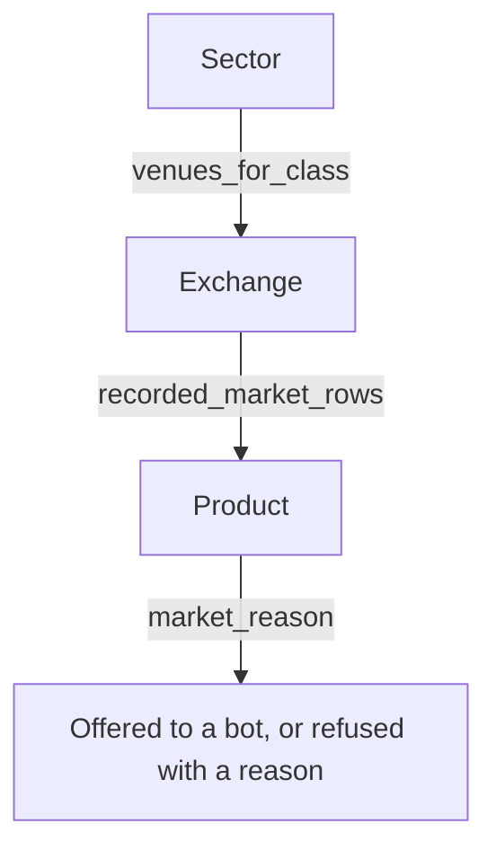

# Sector, Exchange, Product

Reference. The three nested levels an operator walks to reach a tradable market:
the sector he presses, the venues that sector reaches, and the products each
venue serves under it.

Sector is the operator's word for an investment product category. The six are
Crypto, Stocks, Commodities, Forex, Indices and Futures / Perps.

The index is [README.md](README.md). The sector segments and the layer each one
draws are described in [06-trading-tab.md](06-trading-tab.md). Every venue set
beside the classes it serves and the shape its orders take is in
[15-venue-compatibility.md](15-venue-compatibility.md).

Every figure on this page carries where it was read. A figure read from this
repository carries its file and line. A figure read from the venue carries the
call that produced it. A figure this page could not confirm says so in the row
that holds it. The venue readings were taken on 2026-10-04 against the public
products endpoint, with no credential and no order of any kind.

## The three levels

A sector is declared. A venue is registered against one or more sectors. A
product is recorded when a venue read answers.



What declares each level:

```
src/trading/ata_spm.py:59                        ASSET_CLASSES, the six sectors
src/gui/main_tabs/asset_class_surface.py:83      LAYERED_CLASSES, the same six
src/exchange/ccxt_connector.py:82                SUPPORTED_EXCHANGES, 15 ids
src/gui/main_tabs/asset_class_surface.py:64      EQUITY_VENUES, 9 ids
src/gui/main_tabs/asset_class_surface.py:121     EXTRA_VENUE_CLASSES
src/exchange/market_rules_store.py:94            record_venue, the product writer
src/exchange/market_rules_store.py:46            CLASS_FIELD, a row's sector
src/gui/main_tabs/bot_wizard_surface.py:1394     recorded_market_rows, the reader
```

Each level is populated at a different moment. The sector list is a module
constant, so it exists at import. The venue list is read on every call, so a
venue added to either registry is answered at once. A product row is written
only when a venue read answers.

`src/exchange/ccxt_connector.py:1643` — where a product row is written

```python
record_venue(self._exchange_id, markets, classes=classes)
```

The broker path writes its own rows at `src/stocks/broker_base.py:238`.

## Sector

The six categories are the operator's, and his words name the two most recently
added.

> "We will need to add the two additional Sectors (really mean that as investment
> product categories...its my invention or renaming) which are Indices and
> Futures / Perps."

`src/trading/ata_spm.py:59` — the declaration

```python
ASSET_CLASSES = (
    "crypto",
    "stocks",
    "commodities",
    "forex",
    "indices",
    "futures_perps",
)
```

Every one of the six stands behind its own trading layer, so the stack holds six
layers. Three retired names resolve onto a live sector rather than standing as
sectors of their own.

`src/trading/ata_spm.py:83` — the retired names

```python
RETIRED_CLASSES = {
    "metals": "commodities",
    "energy": "commodities",
    "derivatives": "crypto",
}
```

## Exchange

`venues_for_class` answers one sector's venue ids. The counts below were read in
one running process on `origin/current` at `c2459238`.

| Sector | Venues the registry answers | Reached by this platform |
| ------ | --------------------------- | ------------------------ |
| Crypto | 15 | 1, Coinbase |
| Stocks | 10 | none, count 0 |
| Commodities | 1 | none, count 0 |
| Forex | none, count 0 | none, count 0 |
| Indices | none, count 0 | none, count 0 |
| Futures / Perps | none, count 0 | none, count 0 |

The three empty sectors answer an empty set, not a short one. Their layer pages
read `No <sector> Exchanges Configured` and their Add Exchange button cannot
act.

**A venue in a registry is not a venue proved to work.** One venue has ever
traded. [15-venue-compatibility.md](15-venue-compatibility.md) states it at
line 99:

> Fifteen crypto venues are offered. One has ever traded. The equity venue list
> holds nine ids for eight firms, and two of those firms have no API to reach.

### Crypto, 15 venues

```
binance   bitfinex   bitget    bitstamp   bybit
coinbase  cryptocom  gateio    gemini     huobi
kraken    kucoin     mexc      okx        poloniex
```

Coinbase is the one that has traded. Five of the fifteen refuse a United States
address or account, and [15-venue-compatibility.md](15-venue-compatibility.md)
carries the refusal per venue with the date it was read.

### Stocks, 10 venues

```
alpaca    etrade        fidelity   ibkr      interactivebrokers
schwab    tastytrade    tdameritrade          webull
coinbase  through EXTRA_VENUE_CLASSES
```

Nine ids name eight firms, because one firm carries two. None of the nine has
been reached. Two of them publish no reachable API at all: the TD Ameritrade API
was discontinued, and Fidelity publishes no retail trading API.

Coinbase is the tenth, and it is the only one of the ten whose products this
repository has read.

### Commodities, 1 venue

Coinbase alone, through the same extra-sector entry. Its commodity rows are
classed off the venue's own label for what a contract is written on.

`src/exchange/ccxt_connector.py:214` — the labels that answer Commodities

```python
COMMODITY_FUTURES_ASSET_TYPES: frozenset = frozenset(
    {
        "FUTURES_ASSET_TYPE_COMMODITIES",
        "FUTURES_ASSET_TYPE_ENERGY",
        "FUTURES_ASSET_TYPE_METALS",
    }
)
```

### Forex, Indices and Futures / Perps, no venue each

`venues_for_class` answers an empty set for all three. The count is zero.

[15-venue-compatibility.md](15-venue-compatibility.md) names three forex brokers
at lines 127 to 129 — OANDA, FOREX.com and tastyfx. Those rows are venue
research. **None of the three is in either registry, and none is connected.** A
reader comparing the two pages should take the registry as what the platform
knows and that table as what was investigated.

Coinbase serves products in all three of these sectors. It is registered under
Crypto, Stocks and Commodities only, so none of its index or contract rows
reaches an Indices or a Futures / Perps venue list today.

## Product

### What the venue accepts as a product type

Asked on the public products endpoint, one call per value, no credential.

| `product_type` asked | Answered |
| -------------------- | -------- |
| `SPOT` | 921 |
| `FUTURE` | 100 |
| `FUTURE` with a perpetual expiry | 131 |
| `EQUITY` | 1,000, and the cap is 1,000 |
| `OPTION_GROUP` | 0 |
| `FUTURE_GROUP` | 0 |
| `UNKNOWN_PRODUCT_TYPE` | 921 |
| omitted | 921 |

Omitting the type answers the same 921 rows as asking for `SPOT`, so the default
is spot alone. Three values are refused, and one of the three is a nonsense
value sent as the control:

```
FOREX              parsing field "product_type": "FOREX" is not a valid value
COMMODITY          parsing field "product_type": "COMMODITY" is not a valid value
NONSENSE_TYPE_XYZ  parsing field "product_type": "NONSENSE_TYPE_XYZ" is not a valid value
```

The control is refused in the same words, so an accepted value is a real one
rather than the endpoint answering anything it is handed.

### Forex, Commodities and Indices are not product types

They are groupings the venue's own market list draws over products that already
exist.

```
Forex          SPOT, tokenised fiat quoted in USDC
Commodities    SPOT for tokenised metal, FUTURE for dated contracts
Indices        FUTURE, index contracts
```

### What the recording holds

`record_venue` writes one row per market under the venue's id, and the recorded
copy is what the Simulator and the Paper Trader size an order by. The store on
this machine holds 1,144 Coinbase rows and no row for any other venue.

| Reading | Rows |
| ------- | ---- |
| Coinbase rows in the recording | 1,144 |
| Rows with no settlement suffix | 913 |
| Dated contracts, every one settling USD | 100 |
| Perpetual contracts, every one settling USDC | 131 |
| Rows carrying an `expiry_ms` figure | 100 |
| Rows carrying a sector label | 0 |

The tradable currency rows are present and were measured by name.

```
EURC/USDC   TGBP/USDC   XSGD/USDC   AUDD/USDC    present
base currency USDC, 7 markets                    present
base currency USDT, 4 markets                    present
PAXG/USD and its family, 4 markets               present
a base currency that must not exist              absent
```

The last row is the control. A base nobody trades is absent, so the four
present readings are readings of the recording rather than of a lookup that
answers anything.

**No recorded row carries a sector label, so the product level answers nothing
per sector today.** The field is declared and nothing has written it:

`src/exchange/market_rules_store.py:46` — the field a row records its sector under

```python
CLASS_FIELD = "asset_class"
```

Measured at the reader, in one running process over the real recording:

```
recorded_market_rows("coinbase")                   1,144 rows
recorded_market_rows("coinbase", "crypto")             0 rows
recorded_market_rows("coinbase", "stocks")             0 rows
recorded_market_rows("coinbase", "commodities")        0 rows
recorded_market_rows("coinbase", "forex")              0 rows
recorded_market_rows("coinbase", "indices")            0 rows
recorded_market_rows("coinbase", "futures_perps")      0 rows
```

The label reaches a row only on the next venue read, because `record_venue`
writes it from the `classes` map `get_markets` builds. The recording read for
this page was written on 2026-10-04 and holds no label on any of its 1,144 rows.

The 1,000 equity products are not in it either. `AAPL/USDC:USDC`,
`TSLA/USDC:USDC` and `SPY/USDC:USDC` are each one perpetual contract row, and no
row carries an equity product id.

### The clearing venue decides tradability, not the sector

Every futures product id carries its clearing label as a suffix. Counted on the
public endpoint:

```
FUTURE with an expiring contract     100 rows, every id ending -CDE
FUTURE with a perpetual contract     131 rows, every id ending -INTX
any id ending -DRB                     0 rows
```

`CDE` is Coinbase's own derivatives exchange. `INTX` is its international
exchange. Both are served by the Advanced Trade API, which is the API this
platform speaks.

`DRB` is Deribit. The venue's market list marks those rows **View only**, and
the public products endpoint serves none of them. Global derivatives moved to a
separate service on 2026-10-01, reached by JSON-RPC at a host of its own, and
nothing on it is reachable from the Advanced Trade API. A bot cannot trade a
`DRB` row until that service is connected.

**Carried over, not confirmed by this page:** that a United States account may
trade the `INTX` perpetual rows, and the endpoint names of the separate Deribit
service. Confirming either needs a credential, and no credential was used.

**Carried over, and this page disagrees with it:** the issue groups the
perpetual rows under `CDE`. Measured, they carry `INTX`. The conclusion is
unaffected — the Advanced Trade API serves no `DRB` row — but the perps it does
serve are not on Coinbase's own derivatives exchange.

The recording cannot tell the two apart. A recorded row carries six rule fields
and no clearing label, so a row read back from the store does not say which
exchange would clear it.

### How an order is sized, per product

The size rule is published on the product, not on the sector. Read on the
venue's own product records, and matching the recording:

| Product | `base_increment` | Smallest size |
| ------- | ---------------- | ------------- |
| `BTC-USD` | 0.00000001 | a fraction |
| `PAXG-USD` | 0.00001 | a fraction |
| `EURC-USDC` | 1 | one whole unit |
| `TGBP-USDC` | 1 | one whole unit |
| `XSGD-USDC` | 1 | one whole unit |
| `AUDD-USDC` | 1 | one whole unit |

All six are `SPOT`. **Spot is not uniformly fractional.** Tokenised gold steps
in fractions and tokenised fiat does not, and both are spot products on the same
endpoint. A scrum's excess is an arbitrary fraction, so it does not survive the
size rule on a row stepping in whole units.

The constraint is already live on a quarter of the recording: 325 of the 1,144
rows publish a step of exactly 1. Of those, 184 are spot rows, 100 are dated
contracts and 41 are perpetual contracts.

An equity product publishes a fractional step of its own. Three read off the
equity list:

```
base currency KOF    base_increment 0.00001    product id 64 hex characters
base currency NINE   base_increment 0.00001    product id 64 hex characters
base currency ATR    base_increment 0.00001    product id 64 hex characters
```

So the whole-share rule is not the product's step. It is a session rule that
overrides the step, and it binds only outside the normal trading session.

Equities take a further set of rules. Read from the venue's create-order
reference and **not confirmed by any call this page made**, because confirming
an order shape means placing an order:

```
outside the normal session
    base_size must be a positive WHOLE number of shares
    quote_size is not supported
    fractional sizing is not supported
    a market order is available only as market_market_ioc
    an equity metadata field is required, naming session and time in force
    bracket orders are not supported
```

A futures contract is indivisible by nature, so its size is a whole number of
contracts. Its position and margin live behind the venue's futures endpoints
rather than in a spot balance, so a bot reading only a balance cannot see what
it holds in a contract.

### Two venue limits that shape any product list

Measured on the equity list, which is the one large enough to show them.

```
limit asked at 5000                     1,000 rows answered, so the cap is 1,000
offset=1000 against no offset           1,000 of 1,000 rows shared
two calls back to back                  1,000 of 1,000 rows shared
two calls about 30 seconds apart          830 of 1,000 rows shared
```

So `offset` is ignored and a second page repeats the first, while the list
itself moves: 170 of 1,000 rows changed inside half a minute. No single call
sees all of it, and no two calls minutes apart see the same thousand. A stable
list of tradable equities needs a different route or a store that accumulates.

An equity's product id is a 64-character hash, every character a hexadecimal
digit. Its ticker is the product's base currency, not its id.

**Carried over, and this page disagrees with it:** the issue records two calls an
instant apart sharing only 209 of 1,000 rows. Two calls back to back shared all
1,000, and the 830 reading above is the closest this page measured to it. The
claim that the list moves is confirmed; the figure 209 is not.

## Where each figure came from

| Figure | Source |
| ------ | ------ |
| the six sectors | `src/trading/ata_spm.py:59` |
| the three retired names | `src/trading/ata_spm.py:83` |
| 15 crypto venues | `src/exchange/ccxt_connector.py:82`, read through `crypto_venues` |
| 9 equity venues | `src/gui/main_tabs/asset_class_surface.py:64` |
| the per-sector venue counts | `venues_for_class`, one running process |
| the commodity labels | `src/exchange/ccxt_connector.py:214` |
| 1,144 rows and every census over them | the recording, read and never written |
| the per-sector row counts | `recorded_market_rows`, one running process |
| every `product_type` count | the public products endpoint, one call each |
| the three refusals | the same endpoint, one call each |
| the `CDE` and `INTX` suffix counts | the same endpoint, two calls |
| every `base_increment` | the venue's own product record, one call each |
| the equity id shape and its ticker | the equity list, one call |
| the paging and drift readings | the same endpoint, five calls |
| the equity order rules | the venue's create-order reference, not called |
| the Deribit service details | the issue, carried over unconfirmed |
