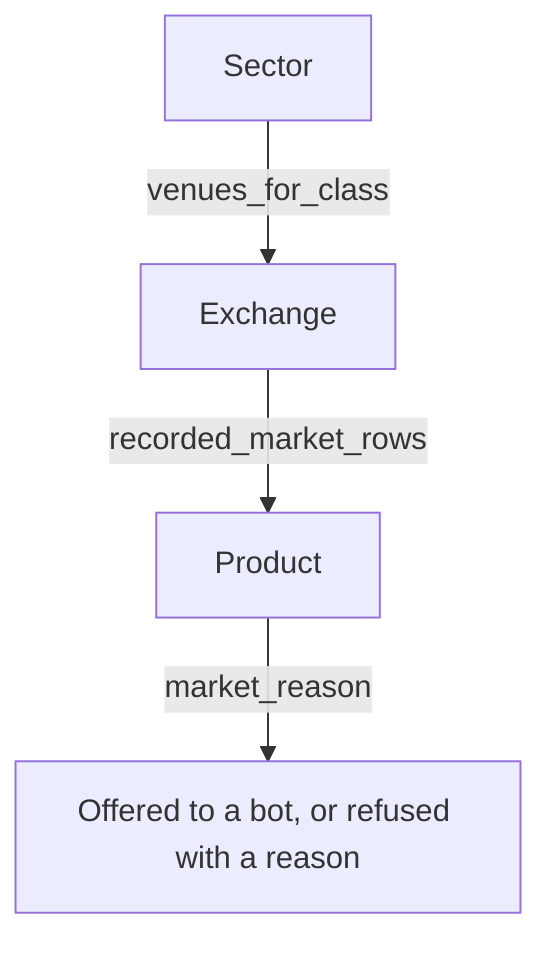

# Sector, Exchange, Product

Reference. The three nested levels an operator walks to reach a tradable market:
the sector he presses, the venues that sector reaches, and the products each
venue serves under it.

Sector is the operator's word for an investment product category. The six are
Crypto, Stocks, Commodities, Forex, Indices and Futures / Perps.

The index is [README.md](README.md). The sector segments and the layer each one
draws are described in [06-trading-tab.md](06-trading-tab.md). Every venue set
beside the classes it serves and the shape its orders take is in
[15-venue-compatibility.md](15-venue-compatibility.md).

Every figure on this page carries where it was read. A figure read from this
repository carries its file and line. A figure read from the venue carries the
call that produced it. A figure this page could not confirm says so in the row
that holds it. The venue readings were taken on 2026-10-04 against the public
products endpoint, with no credential and no order of any kind.

## The three levels

A sector is declared. A venue is registered against one or more sectors. A
product is recorded when a venue read answers.



What declares each level:

```
src/trading/ata_spm.py:59                        ASSET_CLASSES, the six sectors
src/gui/main_tabs/asset_class_surface.py:83      LAYERED_CLASSES, the same six
src/exchange/ccxt_connector.py:82                SUPPORTED_EXCHANGES, 15 ids
src/gui/main_tabs/asset_class_surface.py:64      EQUITY_VENUES, 9 ids
src/gui/main_tabs/asset_class_surface.py:121     EXTRA_VENUE_CLASSES
src/exchange/market_rules_store.py:94            record_venue, the product writer
src/exchange/market_rules_store.py:46            CLASS_FIELD, a row's sector
src/gui/main_tabs/bot_wizard_surface.py:1394     recorded_market_rows, the reader
```

Each level is populated at a different moment. The sector list is a module
constant, so it exists at import. The venue list is read on every call, so a
venue added to either registry is answered at once. A product row is written
only when a venue read answers.

`src/exchange/ccxt_connector.py:1643` — where a product row is written

```python
record_venue(self._exchange_id, markets, classes=classes)
```

OVERTAKEN, and the citation above is kept as written. That call now stands at
`src/exchange/ccxt_connector.py:1756`, moved by the sector rules added above it.
The line it writes is unchanged.

The broker path writes its own rows at `src/stocks/broker_base.py:238`.

OVERTAKEN, and the citation above is kept as written. That write stands at
`src/stocks/broker_base.py`, in `record_markets`, and it runs once the broker's
session is open. An empty asset list writes nothing and keeps the rows already
recorded.

## Sector

The six categories are the operator's, and his words name the two most recently
added.

> "We will need to add the two additional Sectors (really mean that as investment
> product categories...its my invention or renaming) which are Indices and
> Futures / Perps."

`src/trading/ata_spm.py:59` — the declaration

```python
ASSET_CLASSES = (
    "crypto",
    "stocks",
    "commodities",
    "forex",
    "indices",
    "futures_perps",
)
```

Every one of the six stands behind its own trading layer, so the stack holds six
layers. Three retired names resolve onto a live sector rather than standing as
sectors of their own.

`src/trading/ata_spm.py:83` — the retired names

```python
RETIRED_CLASSES = {
    "metals": "commodities",
    "energy": "commodities",
    "derivatives": "crypto",
}
```

## Exchange

`venues_for_class` answers one sector's venue ids. The counts below were read in
one running process on `origin/current` at `c2459238`.

| Sector | Venues the registry answers | Reached by this platform |
| ------ | --------------------------- | ------------------------ |
| Crypto | 15 | 1, Coinbase |
| Stocks | 10 | none, count 0 |
| Commodities | 1 | none, count 0 |
| Forex | none, count 0 | none, count 0 |
| Indices | none, count 0 | none, count 0 |
| Futures / Perps | none, count 0 | none, count 0 |

The three empty sectors answer an empty set, not a short one. Their layer pages
read `No <sector> Exchanges Configured` and their Add Exchange button cannot
act.

OVERTAKEN, and the table and the sentences above are kept as written. No sector
answers an empty set any more. Read in one running process on this branch, with
nothing recorded at all:

| Sector | Venues the registry answers | Was |
| ------ | --------------------------- | --- |
| Crypto | 15 | 15 |
| Stocks | 10 | 10 |
| Commodities | 1, Coinbase | 1 |
| Forex | 1, Coinbase | none, count 0 |
| Indices | 1, Coinbase | none, count 0 |
| Futures / Perps | 1, Coinbase | none, count 0 |

Crypto's fifteen names and Stocks' ten names are the same names, and the two
drawn panels differ by 0 pixels against the same panels on `origin/current`.

OVERTAKEN, and the table and the sentences above are kept as written. Every
sector now lists every venue confirmed to offer a product in it. Read in one
running process on this branch, with nothing recorded at all:

| Sector | Venues the registry answers | Was |
| ------ | --------------------------- | --- |
| Crypto | 21 | 15 |
| Stocks | 19 | 10 |
| Commodities | 16 | 1, Coinbase |
| Forex | 4 | 1, Coinbase |
| Indices | 11 | 1, Coinbase |
| Futures / Perps | 15 | 1, Coinbase |

Eighty-five of the one hundred forty-four venue-and-sector cells answer yes,
and twenty-nine did before. The source is the venue-and-sector readiness
matrix in
[../audits/2026-10-07_venue_sector_readiness_matrix/REPORT.md](../audits/2026-10-07_venue_sector_readiness_matrix/REPORT.md).
A venue is listed under a sector when that matrix states the venue lists a
product there. A cell the matrix marks unfetched is left out, so Gate.io under
Indices, Fidelity outside Stocks and Poloniex outside Stocks are absent.

OVERTAKEN, and the table and the sentences above are kept as written. Every one
of the matrix's unfetched cells now carries a verdict read from the venue's own
page, so Gate.io is no longer left out of a sector it serves. Gate.io lists a
product under Forex, Indices and Futures / Perps, and `venue_classes` answers
all three. Read in one running process with nothing recorded, over the
twenty-five venue ids the surface answers for and the one hundred fifty cells
they make:

| Sector | Venues the registry answers | Was |
| ------ | --------------------------- | --- |
| Forex | 6 | 5 |
| Indices | 13 | 12 |
| Futures / Perps | 16 | 15 |

Ninety-one of those one hundred fifty cells answer yes, and eighty-eight did
before. The three that moved are Gate.io's. The order format Gate.io requires in
each of its six sectors, and the bot variant each format demands, are in
[../audits/2026-10-09_gateio_sector_order_formats/REPORT.md](../audits/2026-10-09_gateio_sector_order_formats/REPORT.md).
Forex and Indices reach Gate.io only through its contracts-for-difference
product line, which the installed trading library carries no endpoint for, so
both sectors are listed and charted and neither takes an order.

Forex is the one sector read strictly. A venue is listed under Forex only when
it offers a market whose two legs are both national currencies. Gemini and
Bitstamp each offer a euro-dollar market, and Interactive Brokers documents a
currency security type. A currency token quoted against a dollar stablecoin is
not counted.

**A venue in a registry is not a venue proved to work.** One venue has ever
traded. [15-venue-compatibility.md](15-venue-compatibility.md) states it at
line 99:

> Sixteen crypto venues are offered. One has ever traded. The equity venue list
> holds nine ids for eight firms, and two of those firms have no API to reach.

### Crypto, 16 venues

```
binance   bitfinex   bitget    bitstamp   bybit
coinbase  cryptocom  gateio    gemini     huobi
kraken    kucoin     mexc      okx        poloniex
robinhood
```

Coinbase is the one that has traded. Five of the sixteen refuse a United States
address or account, and [15-venue-compatibility.md](15-venue-compatibility.md)
carries the refusal per venue with the date it was read. Robinhood is the one
that is not a `ccxt` venue, and `crypto_venues` reads it off
`hand_written_crypto_venues` instead.

### Stocks, 10 venues

```
alpaca    etrade        fidelity   ibkr      interactivebrokers
schwab    tastytrade    tdameritrade          webull
coinbase  through EXTRA_VENUE_CLASSES
```

Nine ids name eight firms, because one firm carries two. None of the nine has
been reached. Two of them publish no reachable API at all: the TD Ameritrade API
was discontinued, and Fidelity publishes no retail trading API.

Coinbase is the tenth, and it is the only one of the ten whose products this
repository has read.

### Commodities, 1 venue

Coinbase alone, through the same extra-sector entry. Its commodity rows are
classed off the venue's own label for what a contract is written on.

`src/exchange/ccxt_connector.py:214` — the labels that answer Commodities

```python
COMMODITY_FUTURES_ASSET_TYPES: frozenset = frozenset(
    {
        "FUTURES_ASSET_TYPE_COMMODITIES",
        "FUTURES_ASSET_TYPE_ENERGY",
        "FUTURES_ASSET_TYPE_METALS",
    }
)
```

OVERTAKEN, and the citation above is kept as written, here and in the source
table at the foot of this page. That set now stands at
`src/exchange/ccxt_connector.py:218`, moved by the index and equity label sets
declared beside it. Its three members are unchanged.

### Forex, Indices and Futures / Perps, no venue each

`venues_for_class` answers an empty set for all three. The count is zero.

[15-venue-compatibility.md](15-venue-compatibility.md) names three forex brokers
at lines 127 to 129 — OANDA, FOREX.com and tastyfx. Those rows are venue
research. **None of the three is in either registry, and none is connected.** A
reader comparing the two pages should take the registry as what the platform
knows and that table as what was investigated.

Coinbase serves products in all three of these sectors. It is registered under
Crypto, Stocks and Commodities only, so none of its index or contract rows
reaches an Indices or a Futures / Perps venue list today.

OVERTAKEN, and the heading and the sentences above are kept as written.
Coinbase is now registered under all six sectors, so each of the three lists one
venue. The Exchange Status panel for Forex draws `Coinbase (coinbase)` and the
Add Forex Exchange box offers Coinbase with its key and secret fields, read off
the drawn panel.

OVERTAKEN, and the two notes above are kept as written. Forex lists five
venues, Indices twelve and Futures / Perps fifteen. The Exchange Status panel
for Forex draws Binance, Bitstamp, Coinbase, Gemini and Ibkr, read through
`settings_dialog_surface.exchange_status_lines` in one running process.

### A venue's sectors come from two places, and they answer two questions

The registry answers what a venue **could** serve. The recording answers what it
**does** serve. Both are read, and a venue is listed under a sector when either
says so.

| Question | What answers it | Who asks |
| -------- | --------------- | -------- |
| what could this venue serve | `venue_classes` | the Exchange Status panel, the Add Exchange picker, the Live tab filter, the Live tab bot rows, a bot's sector badge |
| what does this venue serve | `venue_served_classes` | nothing today, count 0 |

Every screen that lists venues asks the first question, because the page exists
so he can add credentials for a venue nothing has reached. **Nothing asks the
second question yet.** A reader that must know a product exists before it offers
a market is the reader that will.

`src/gui/main_tabs/asset_class_surface.py:128` — the registry half

```python
EXTRA_VENUE_CLASSES = {
    "coinbase": (
        "derivatives",
        "stocks",
        "commodities",
        "forex",
        "indices",
        "futures_perps",
    )
}
```

OVERTAKEN, and the citation and the code block above are kept as written.
`EXTRA_VENUE_CLASSES` now holds twenty venue ids and not one. Each id lists the
sectors beyond the one its own registry implies, so a crypto venue that offers
a tokenised share names Stocks and a broker that offers a fund share names
Commodities and Indices. The entry for Coinbase is unchanged.

```python
# src/gui/main_tabs/asset_class_surface.py, in EXTRA_VENUE_CLASSES
    "bitstamp": ("commodities", "forex"),
    "kraken": ("stocks", "commodities", "forex", "indices", "futures_perps"),
    "ibkr": ("crypto", "commodities", "forex", "indices", "futures_perps"),
```

Poloniex holds no entry, because the matrix confirms no offering for it beyond
crypto. Fidelity, Interactive Brokers' second id and TD Ameritrade hold none
either.

The recording half reads `recorded_classes` and names no venue at all, so a
venue whose products carry a sector is listed under it with no edit here.
Measured in one running process, over a recording holding two rows for a venue
in no hand-written list:

```
venue id in EQUITY_VENUES          False
venue id in EXTRA_VENUE_CLASSES    False
venue id in crypto_venues          False
venue_classes answers              forex, futures_perps
venues_for_class("forex") lists it yes
```

**The registry is the floor and it cannot be dropped.** Read on this branch with
nothing recorded, `venue_served_classes` answers nothing for Kraken and nothing
for Alpaca, while `venue_classes` answers Crypto and Stocks. A fresh install has
recorded nothing, and a venue the operator has never configured is recorded
nowhere, so a derived-only answer would empty every sector on both.

## Product

### What the venue accepts as a product type

Asked on the public products endpoint, one call per value, no credential.

| `product_type` asked | Answered |
| -------------------- | -------- |
| `SPOT` | 921 |
| `FUTURE` | 100 |
| `FUTURE` with a perpetual expiry | 131 |
| `EQUITY` | 1,000, and the cap is 1,000 |
| `OPTION_GROUP` | 0 |
| `FUTURE_GROUP` | 0 |
| `UNKNOWN_PRODUCT_TYPE` | 921 |
| omitted | 921 |

Omitting the type answers the same 921 rows as asking for `SPOT`, so the default
is spot alone. Three values are refused, and one of the three is a nonsense
value sent as the control:

```
FOREX              parsing field "product_type": "FOREX" is not a valid value
COMMODITY          parsing field "product_type": "COMMODITY" is not a valid value
NONSENSE_TYPE_XYZ  parsing field "product_type": "NONSENSE_TYPE_XYZ" is not a valid value
```

The control is refused in the same words, so an accepted value is a real one
rather than the endpoint answering anything it is handed.

### Forex, Commodities and Indices are not product types

They are groupings the venue's own market list draws over products that already
exist.

```
Forex          SPOT, tokenised fiat quoted in USDC
Commodities    SPOT for tokenised metal, FUTURE for dated contracts
Indices        FUTURE, index contracts
```

OVERTAKEN, and the block above is kept as written. The classifier now answers
all six sectors instead of three, and Futures / Perps is the sixth: a contract,
dated or perpetual, written on a crypto underlying.

### The underlying decides the sector, and the contract form does not

A dated gold contract is both a commodity and a future. It answers Commodities,
because the sector follows what the product is written on. The same holds the
other way: a perpetual on a crypto asset answers Futures / Perps however it is
quoted.

The order the classifier reads, the first match winning:

```
1  the venue's futures label names a commodity family   Commodities
2  the venue's futures label names an index             Indices
3  the venue's futures label names equities             Stocks
4  the product type is an equity product                Stocks
5  the base asset is a precious metal                   Commodities
6  both legs are currencies                             Forex
7  the record is a dated contract or a perpetual        Futures / Perps
8  everything else                                      Crypto
```

Two rules sit in that order for a reason a product demonstrates.

An index label beats an equity label, and five perpetuals need it. SPY, QQQ,
EWY, SOXL and DRAM each carry both labels, and each is a basket rather than one
company's share, so each answers Indices.

The venue's label beats any asset code, and one perpetual needs it.
`AMD-PERP-INTX` is written on Advanced Micro Devices and its root unit is AMD,
which is also the currency code for the Armenian dram. Its label names equities,
so it answers Stocks and never Forex.

`src/exchange/ccxt_connector.py:456` — the order above

```python
    labels = futures_asset_types(market)
    if labels & COMMODITY_FUTURES_ASSET_TYPES:
        return CLASS_COMMODITIES
    if labels & INDEX_FUTURES_ASSET_TYPES:
        return CLASS_INDICES
    if labels & EQUITY_FUTURES_ASSET_TYPES:
        return CLASS_STOCKS
    if str((market or {}).get("type") or "").lower() == EQUITY_MARKET_TYPE:
        return CLASS_STOCKS
    base = underlying_code((market or {}).get("base"))
    if base in PRECIOUS_METAL_CODES:
        return CLASS_COMMODITIES
    if base and underlying_code((market or {}).get("quote")):
        return CLASS_FOREX
    if is_contract_market(market):
        return CLASS_FUTURES_PERPS
    return CLASS_CRYPTO
```

### Where each sector's answer is read from

The venue labels a contract and labels nothing else. Measured over all 2,152
rows the public endpoint answered: every one of the 231 contract rows carries a
label naming what it is written on, and all 921 spot rows and all 1,000 equity
rows carry none. Each spot row's three resource-name fields are empty strings.

So the three contract sectors read a venue label, and the two spot sectors read
the asset codes on the pair's two legs.

```
Commodities, Indices, Stocks, Futures / Perps   the venue's own contract label
Forex                                           both legs are currency codes
Commodities, spot                               the base is a metal code
```

The richer label is the plural one. Five perpetuals read an unknown value under
the single label and name two families under the list, so the list is read first.

`src/exchange/ccxt_connector.py:214` — the two keys, the list read first

```python
FUTURES_ASSET_TYPES_KEY = "futures_asset_types"
```

The currency codes are Coinbase's own published currency list, 174 codes read
from its public currency endpoint and held in the repository so the classifier
reaches no venue. Four of the 174 name a precious metal by the troy ounce rather
than a currency, and those four answer Commodities.

`src/exchange/ccxt_connector.py:262` — the four metal codes

```python
PRECIOUS_METAL_CODES: frozenset = frozenset({"XAG", "XAU", "XPD", "XPT"})
```

**A tokenised asset has no published label on this venue, and this is the one
list of names the classifier carries.** A product record says nothing about
whether a token redeems for a currency or a metal, so nine entries name the
redemption each token's issuer publishes. A token outside those nine answers
Crypto, which is what every token answered before.

`src/exchange/ccxt_connector.py:266` — the nine

```python
TOKEN_UNDERLYING_CODES: dict[str, str] = {
    "AUDD": "AUD",
    "EURC": "EUR",
    "PAXG": "XAU",
    "TGBP": "GBP",
    "USD1": "USD",
    "USDC": "USD",
    "USDS": "USD",
    "USDT": "USD",
    "XSGD": "SGD",
}
```

### What the classifier answers per sector

Driven in one process over 2,142 market records, each parsed from the venue's
own product rows by the connector's own parsers, then recorded and read back.

| Sector | On `origin/current` | With this classifier |
| ------ | ------------------- | -------------------- |
| Crypto | 1,121 | 890 |
| Stocks | 1,000 | 1,033 |
| Commodities | 21 | 25 |
| Forex | none, count 0 | 20 |
| Indices | none, count 0 | 6 |
| Futures / Perps | none, count 0 | 168 |

231 products changed sector and every one of them left Crypto: 168 to Futures /
Perps, 33 to Stocks, 20 to Forex, 6 to Indices and 4 to Commodities. Nothing
already answering Stocks or Commodities moved, counts 0 and 0.

The 20 Forex rows are the four tokenised-fiat pairs quoted in USDC, the seven
USDC markets quoted in a fiat currency, the four USDT markets, four markets on
two further tokenised dollars, and one perpetual written on the euro.

The four new Commodities rows are tokenised gold against dollars and against
USDC, one dated gold contract and one perpetual on gold. The venue labels all
three contracts crypto; the underlying is gold, so the sector is Commodities.

### What the recording holds

`record_venue` writes one row per market under the venue's id, and the recorded
copy is what the Simulator and the Paper Trader size an order by. The store on
this machine holds 1,144 Coinbase rows and no row for any other venue.

| Reading | Rows |
| ------- | ---- |
| Coinbase rows in the recording | 1,144 |
| Rows with no settlement suffix | 913 |
| Dated contracts, every one settling USD | 100 |
| Perpetual contracts, every one settling USDC | 131 |
| Rows carrying an `expiry_ms` figure | 100 |
| Rows carrying a sector label | 0 |

The tradable currency rows are present and were measured by name.

```
EURC/USDC   TGBP/USDC   XSGD/USDC   AUDD/USDC    present
base currency USDC, 7 markets                    present
base currency USDT, 4 markets                    present
PAXG/USD and its family, 4 markets               present
a base currency that must not exist              absent
```

The last row is the control. A base nobody trades is absent, so the four
present readings are readings of the recording rather than of a lookup that
answers anything.

**No recorded row carries a sector label, so the product level answers nothing
per sector today.** The field is declared and nothing has written it:

`src/exchange/market_rules_store.py:46` — the field a row records its sector under

```python
CLASS_FIELD = "asset_class"
```

Measured at the reader, in one running process over the real recording:

```
recorded_market_rows("coinbase")                   1,144 rows
recorded_market_rows("coinbase", "crypto")             0 rows
recorded_market_rows("coinbase", "stocks")             0 rows
recorded_market_rows("coinbase", "commodities")        0 rows
recorded_market_rows("coinbase", "forex")              0 rows
recorded_market_rows("coinbase", "indices")            0 rows
recorded_market_rows("coinbase", "futures_perps")      0 rows
```

The label reaches a row only on the next venue read, because `record_venue`
writes it from the `classes` map `get_markets` builds. The recording read for
this page was written on 2026-10-04 and holds no label on any of its 1,144 rows.

OVERTAKEN, and the sentences and the block above are kept as written. A
recording written by the classifier does carry a label on every row, and the
reader answers each of the six sectors off it. Measured by recording 2,142
market records into a scratch home and reading them straight back:

```
recorded_market_rows("coinbase")                   2,142 rows
recorded_market_rows("coinbase", "crypto")           890 rows
recorded_market_rows("coinbase", "stocks")         1,033 rows
recorded_market_rows("coinbase", "commodities")       25 rows
recorded_market_rows("coinbase", "forex")             20 rows
recorded_market_rows("coinbase", "indices")            6 rows
recorded_market_rows("coinbase", "futures_perps")    168 rows
```

Those seven readings match what the classifier answered before anything was
written, so the label survives the write and the read. His own recording still
holds no label, because it was written before the write path merged, and his
next venue read rewrites it.

OVERTAKEN, and the sentence above reading "His own recording still holds no
label" is kept as written. His recording now holds a label on every one of its
1,146 rows, read on 2026-10-08 with the home redirected and the file not
written. The venue read that rewrote it has happened.

| Sector the row carries | Rows |
| --- | --- |
| crypto | 894 |
| futures_perps | 168 |
| stocks | 33 |
| commodities | 25 |
| forex | 20 |
| indices | 6 |
| no label | 0 |

OVERTAKEN, and the two blocks and the sentences above are kept as written. No
function named `recorded_market_rows` is in the tree, count 0. The reader that
answers a venue's recorded sectors is `recorded_classes` at
`src/exchange/market_rules_store.py:152`, which answers symbol to sector for one
venue, and `recorded_venue_classes` at
`src/gui/main_tabs/asset_class_surface.py:373` folds that into the set of
sectors one venue's rows carry. The seven row counts above stand; the name they
were read through does not.

The 1,000 equity products are not in it either. `AAPL/USDC:USDC`,
`TSLA/USDC:USDC` and `SPY/USDC:USDC` are each one perpetual contract row, and no
row carries an equity product id.

### The clearing venue decides tradability, not the sector

Every futures product id carries its clearing label as a suffix. Counted on the
public endpoint:

```
FUTURE with an expiring contract     100 rows, every id ending -CDE
FUTURE with a perpetual contract     131 rows, every id ending -INTX
any id ending -DRB                     0 rows
```

`CDE` is Coinbase's own derivatives exchange. `INTX` is its international
exchange. Both are served by the Advanced Trade API, which is the API this
platform speaks.

`DRB` is Deribit. The venue's market list marks those rows **View only**, and
the public products endpoint serves none of them. Global derivatives moved to a
separate service on 2026-10-01, reached by JSON-RPC at a host of its own, and
nothing on it is reachable from the Advanced Trade API. A bot cannot trade a
`DRB` row until that service is connected.

**Carried over, not confirmed by this page:** that a United States account may
trade the `INTX` perpetual rows, and the endpoint names of the separate Deribit
service. Confirming either needs a credential, and no credential was used.

**Carried over, and this page disagrees with it:** the issue groups the
perpetual rows under `CDE`. Measured, they carry `INTX`. The conclusion is
unaffected — the Advanced Trade API serves no `DRB` row — but the perps it does
serve are not on Coinbase's own derivatives exchange.

The recording cannot tell the two apart. A recorded row carries six rule fields
and no clearing label, so a row read back from the store does not say which
exchange would clear it.

### How an order is sized, per product

**The venue's recorded size step decides, and the sector answers only where the
venue published no step.** The sector alone cannot decide it, because Coinbase
puts a divisible product and an indivisible one in the same tab. A tokenised
metal is spot and divides; a dated metal contract is a future and does not; both
are Commodities.

Each sector does carry a rule, and that rule is the fallback. Driven in one
running process, venue `coinbase`:

```
src/trading/scrumming/sizing.py, in unit_rule          the sector's own answer
src/trading/scrumming/sizing.py, in market_unit_rule   the session, then the step

crypto          fractional        forex            fractional
stocks          whole             indices          whole
commodities     whole             futures_perps    whole
```

The seven rows behind those answers are declared at
`src/trading/scrumming/sizing.py:80`, and the dated entry in
[15-venue-compatibility.md](15-venue-compatibility.md) describes the order of
resolution and what the whole-unit variant does with it.

Driven over the real recording, the step overrides the sector in every row the
recording holds:

| Market | Recorded step | Its sector's rule | The rule read |
| ------ | ------------- | ----------------- | ------------- |
| `EURC/USDC` | 1.0 | Forex, fractional | whole |
| `TGBP/USDC` | 1.0 | Forex, fractional | whole |
| `PAXG/USD` | 0.00001 | Commodities, whole | fractional |
| `AAVE/USD:USD-891230` | 1.0 | Futures, whole | whole |
| `AAPL/USDC:USDC` | 0.01 | Stocks, whole | fractional |
| `BTC/USD` | 0.00000001 | Crypto, fractional | fractional |

Two rows are the sharp ones. Tokenised euro sits in a fractional sector and takes
whole units. Tokenised gold sits in a whole-unit sector and takes fractions.
Reading either from its sector would give the wrong answer.

The control is a market the recording holds no row for. Asked for one, the
recording answers unread with no step, and the sector's rule is what comes back:
Commodities answers whole. So the sector row is reached, and it is reached only
when no step exists.

Read on the venue's own product records, and matching the recording:

| Product | `base_increment` | Smallest size |
| ------- | ---------------- | ------------- |
| `BTC-USD` | 0.00000001 | a fraction |
| `PAXG-USD` | 0.00001 | a fraction |
| `EURC-USDC` | 1 | one whole unit |
| `TGBP-USDC` | 1 | one whole unit |
| `XSGD-USDC` | 1 | one whole unit |
| `AUDD-USDC` | 1 | one whole unit |

All six are `SPOT`. **Spot is not uniformly fractional.** Tokenised gold steps
in fractions and tokenised fiat does not, and both are spot products on the same
endpoint. A scrum's excess is an arbitrary fraction, so it does not survive the
size rule on a row stepping in whole units. That is what the step-before-sector
order above exists for.

The constraint is already live on a quarter of the recording: 325 of the 1,144
rows publish a step of exactly 1. Of those, 184 are spot rows, 100 are dated
contracts and 41 are perpetual contracts.

An equity product publishes a fractional step of its own. Three read off the
equity list:

```
base currency KOF    base_increment 0.00001    product id 64 hex characters
base currency NINE   base_increment 0.00001    product id 64 hex characters
base currency ATR    base_increment 0.00001    product id 64 hex characters
```

So the whole-share rule is not the product's step. It is a session rule that
overrides the step, and it binds only outside the normal trading session.

Equities take a further set of rules. Read from the venue's create-order
reference and **not confirmed by any call this page made**, because confirming
an order shape means placing an order:

```
outside the normal session
    base_size must be a positive WHOLE number of shares
    quote_size is not supported
    fractional sizing is not supported
    a market order is available only as market_market_ioc
    an equity metadata field is required, naming session and time in force
    bracket orders are not supported
```

A futures contract is indivisible by nature, so its size is a whole number of
contracts. Its position and margin live behind the venue's futures endpoints
rather than in a spot balance, so a bot reading only a balance cannot see what
it holds in a contract.

### Two venue limits that shape any product list

Measured on the equity list, which is the one large enough to show them.

```
limit asked at 5000                     1,000 rows answered, so the cap is 1,000
offset=1000 against no offset           1,000 of 1,000 rows shared
two calls back to back                  1,000 of 1,000 rows shared
two calls about 30 seconds apart          830 of 1,000 rows shared
```

So `offset` is ignored and a second page repeats the first, while the list
itself moves: 170 of 1,000 rows changed inside half a minute. No single call
sees all of it, and no two calls minutes apart see the same thousand. A stable
list of tradable equities needs a different route or a store that accumulates.

An equity's product id is a 64-character hash, every character a hexadecimal
digit. Its ticker is the product's base currency, not its id.

**Carried over, and this page disagrees with it:** the issue records two calls an
instant apart sharing only 209 of 1,000 rows. Two calls back to back shared all
1,000, and the 830 reading above is the closest this page measured to it. The
claim that the list moves is confirmed; the figure 209 is not.

## Where each figure came from

| Figure | Source |
| ------ | ------ |
| the six sectors | `src/trading/ata_spm.py:59` |
| the three retired names | `src/trading/ata_spm.py:83` |
| 15 crypto venues | `src/exchange/ccxt_connector.py:82`, read through `crypto_venues` |
| 9 equity venues | `src/gui/main_tabs/asset_class_surface.py:64` |
| the per-sector venue counts | `venues_for_class`, one running process |
| the commodity labels | `src/exchange/ccxt_connector.py:214` |
| 1,144 rows and every census over them | the recording, read and never written |
| the per-sector row counts | `recorded_market_rows`, one running process |
| every `product_type` count | the public products endpoint, one call each |
| the three refusals | the same endpoint, one call each |
| the `CDE` and `INTX` suffix counts | the same endpoint, two calls |
| every `base_increment` | the venue's own product record, one call each |
| the equity id shape and its ticker | the equity list, one call |
| each sector's unit rule | `unit_rule`, one running process |
| the step-before-sector readings | `market_unit_rule` over the recording |
| the paging and drift readings | the same endpoint, five calls |
| the equity order rules | the venue's create-order reference, not called |
| the Deribit service details | the issue, carried over unconfirmed |
| the six venue counts on this branch | `venues_for_class`, one running process |
| Coinbase's six registered sectors | `src/gui/main_tabs/asset_class_surface.py:128` |
| the recorded half of a venue's sectors | `src/gui/main_tabs/asset_class_surface.py:373` |
| what a venue does serve | `src/gui/main_tabs/asset_class_surface.py:421` |
| the drawn Forex panel and its 0-pixel pairs | the Settings dialog, one running process |
