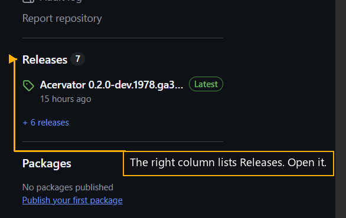

# Step 1 — Open Releases

One step of the [New User Procedure](README.md) how-to.

**Open Releases in the right column of the repository page.**

The Releases page opens. Every build is there, and nothing needs installing.
