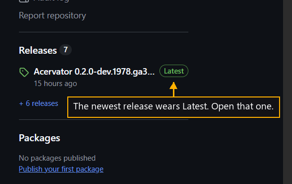

# Step 2 — Take the newest release

One step of the [New User Procedure](README.md) how-to.

**Open the release marked Latest.**

Each release carries its own files. The newest one sits at the top of the list.
